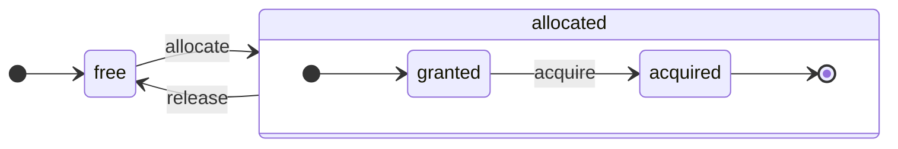
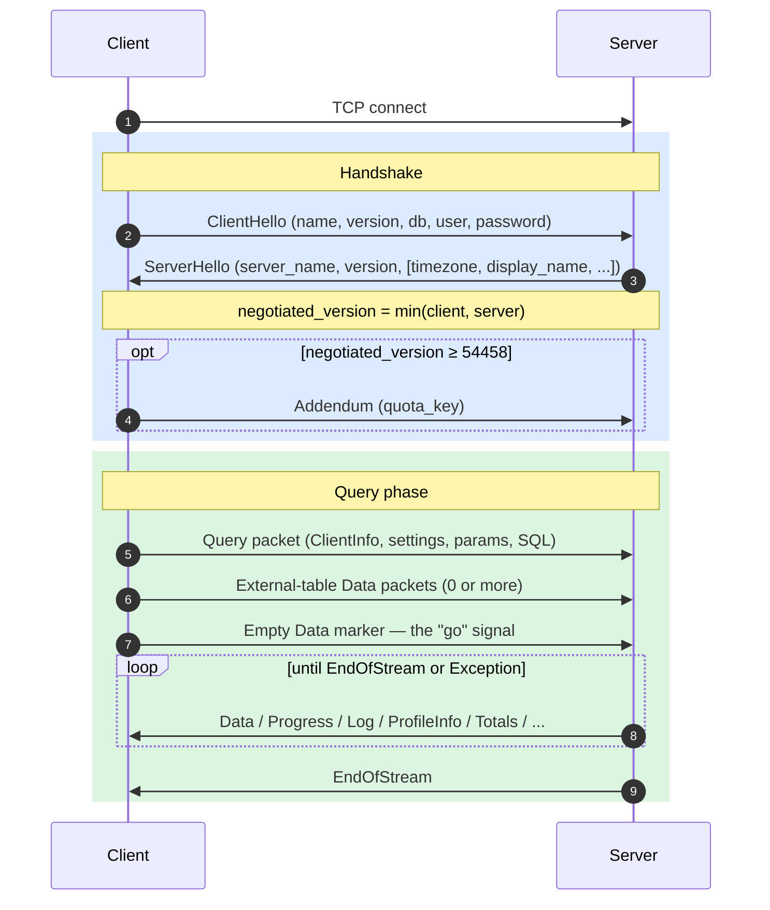
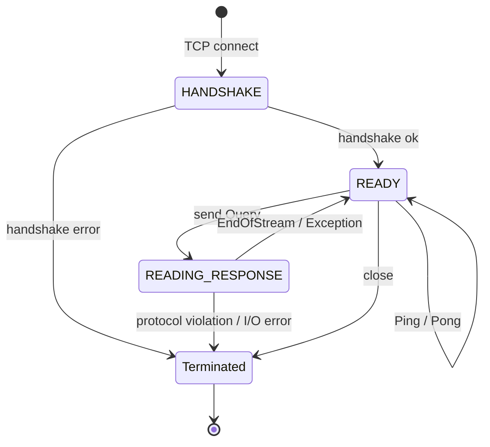
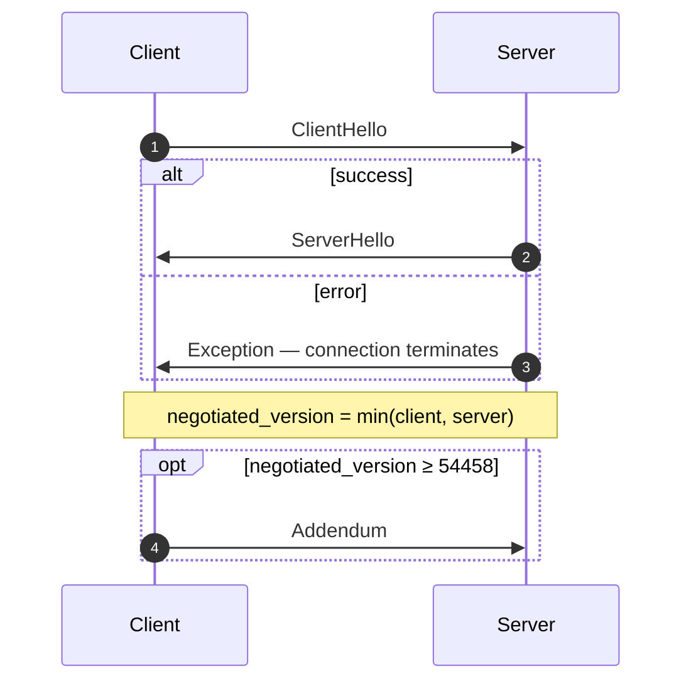
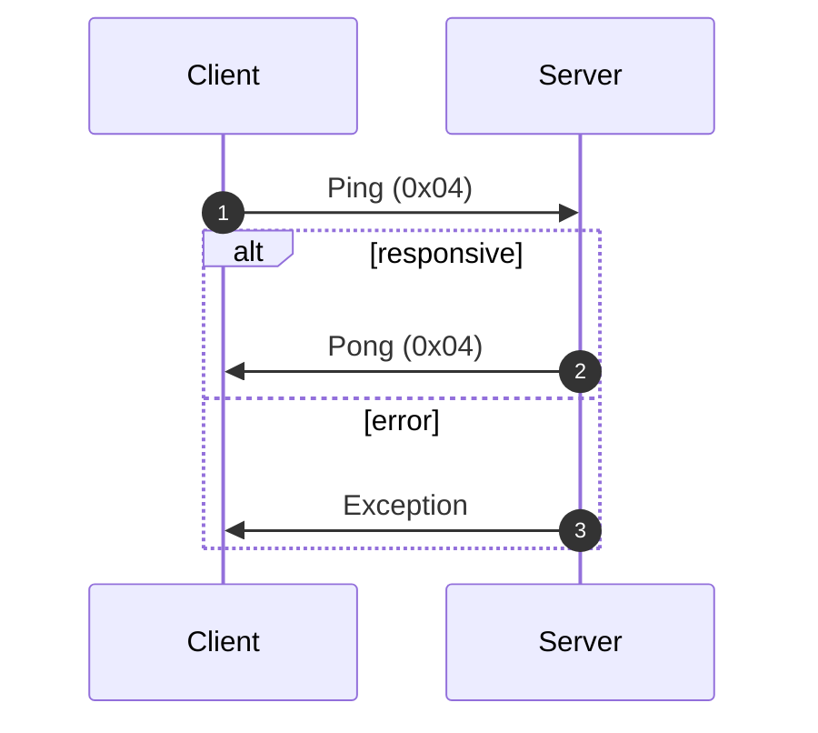
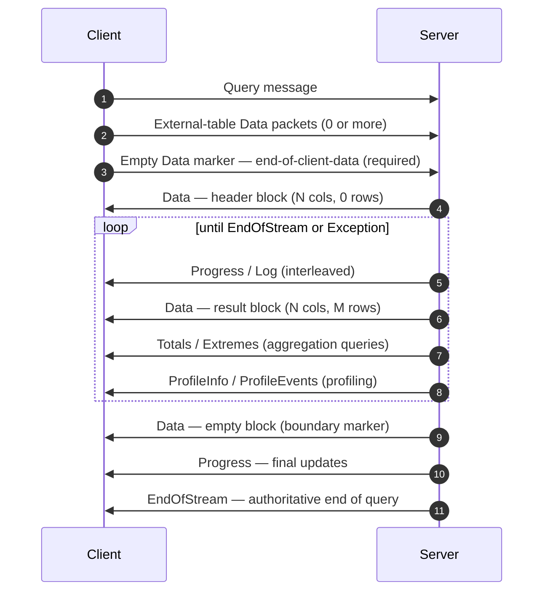
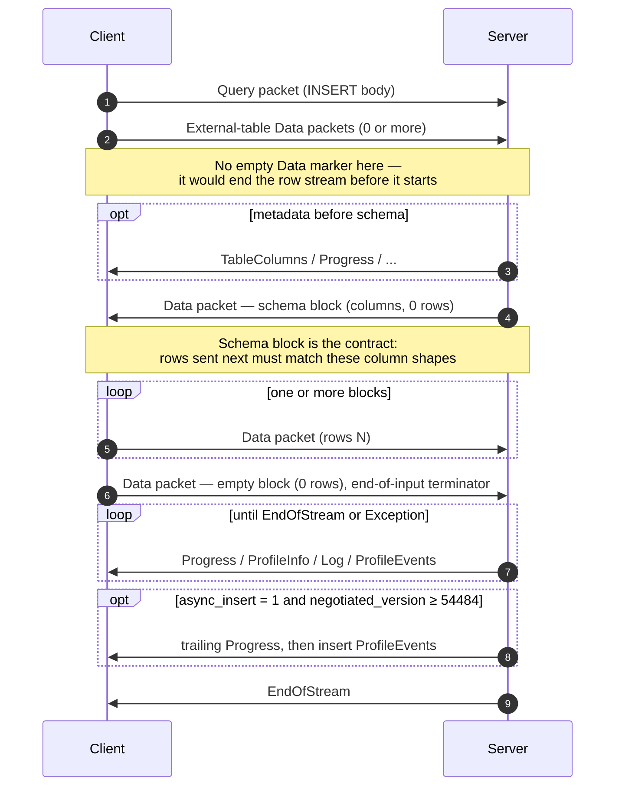
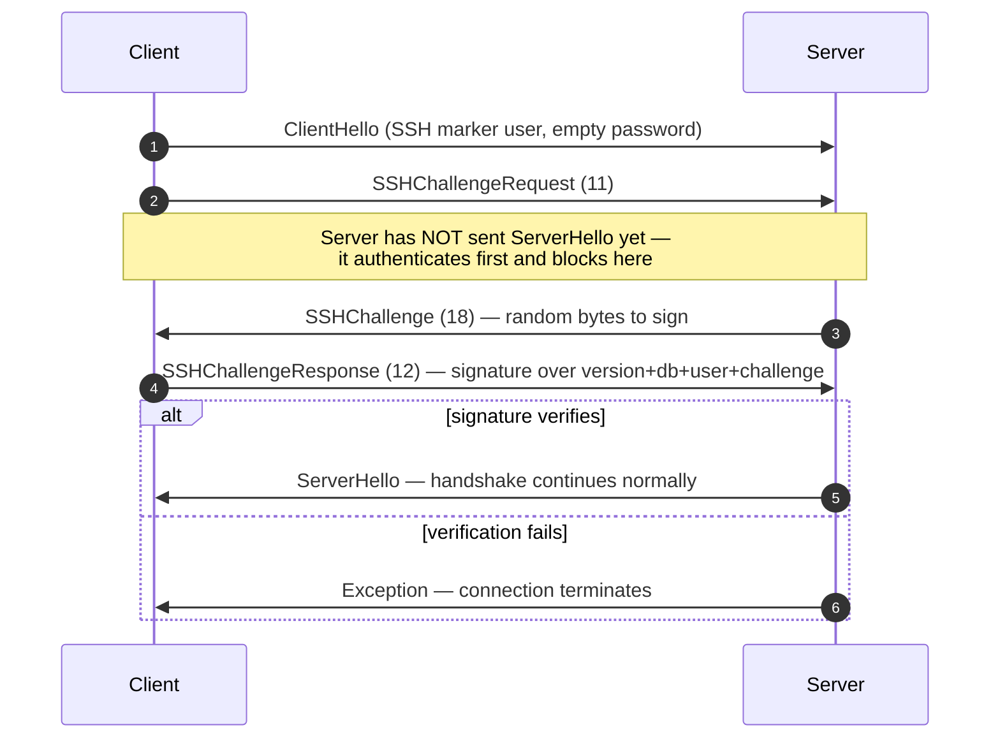

<a id="doc-8dd5fae24b1e6012c6db2891"></a>

# ClickHouse/ClickHouse / docs/zh/resources/changelogs/oss/2025.mdx

Upstream: https://github.com/ClickHouse/ClickHouse/blob/28dc98b1fc057c08396c95e495b9327754a10b04/docs/zh/resources/changelogs/oss/2025.mdx

Commit: `28dc98b1fc057c08396c95e495b9327754a10b04`

Retrieved: 2026-10-01T15:20:10.316397+00:00

Kind: official-document

Raw SHA256: `60ae84b7be004840a6786b83ea23a93ea491548c9fe2d18ba3f0faadcc0e0736`

Source text below is untrusted reference content. Acquisition does not verify technical claims.

License status: UPSTREAM_NOTICES_CAPTURED_PER_FILE_REVIEW_REQUIRED. See this repository's captured license files.

---

---
slug: /whats-new/changelog/2025
sidebarTitle: '2025'
title: '2025 更新日志'
description: '2025 年更新日志'
keywords: ['ClickHouse 2025', '2025 更新日志', '发布说明', '版本历史', '新功能']
doc_type: 'changelog'
---

<div id="table-of-contents">
  ### 目录
</div>

**[ClickHouse 发行版 v25.12，2025-12-18](#2512)**<br />
**[ClickHouse 发行版 v25.11，2025-11-27](#2511)**<br />
**[ClickHouse 发行版 v25.10，2025-10-30](#2510)**<br />
**[ClickHouse 发行版 v25.9，2025-09-25](#259)**<br />
**[ClickHouse 发行版 v25.8 LTS，2025-08-28](#258)**<br />
**[ClickHouse 发行版 v25.7，2025-07-24](#257)**<br />
**[ClickHouse 发行版 v25.6，2025-06-26](#256)**<br />
**[ClickHouse 发行版 v25.5，2025-05-22](#255)**<br />
**[ClickHouse 发行版 v25.4，2025-04-22](#254)**<br />
**[ClickHouse 发行版 v25.3 LTS，2025-03-20](#253)**<br />
**[ClickHouse 发行版 v25.2，2025-02-27](#252)**<br />
**[ClickHouse 发行版 v25.1，2025-01-28](#251)**<br />
**[2024 年更新日志](/zh/resources/changelogs/oss/2024)**<br />
**[2023 年更新日志](/zh/resources/changelogs/oss/2023)**<br />
**[2022 年更新日志](/zh/resources/changelogs/oss/2022)**<br />
**[2021 年更新日志](/zh/resources/changelogs/oss/2021)**<br />
**[2020 年更新日志](/zh/resources/changelogs/oss/2020)**<br />
**[2019 年更新日志](/zh/resources/changelogs/oss/2019)**<br />
**[2018 年更新日志](/zh/resources/changelogs/oss/2018)**<br />
**[2017 年更新日志](/zh/resources/changelogs/oss/2017)**<br />

<div id="2512">
  ### ClickHouse 发行版 25.12，2025-12-18
</div>

<div id="backward-incompatible-change">
  #### 向后不兼容的变更
</div>

* 现在，将可空列转换为非可空类型时，ALTER MODIFY COLUMN 需要显式指定 DEFAULT。此前，这类 ALTER 可能会卡住，并报出 cannot convert null to not null 错误；现在，NULL 会被替换为该列的默认表达式。修复了 [#5985](https://github.com/ClickHouse/ClickHouse/issues/5985)。[#84770](https://github.com/ClickHouse/ClickHouse/pull/84770) ([Vladimir Cherkasov](https://github.com/vdimir)).
* ngram 分词器将不再返回长度小于所设 N 值的 ngram。搜索标记为空时，文本搜索将不返回任何行。[#89757](https://github.com/ClickHouse/ClickHouse/pull/89757) ([George Larionov](https://github.com/george-larionov)) 。
* 当把列从 `String` 更改为 `Nullable(String)` 时，我们不会对数据执行变更。但对于 `uniq` 聚合函数，它使用的是不同的数据结构：对于可空列，会使用带有嵌套 uniq 聚合器的 `AggregateFunctionNull`。`AggregateFunctionNull` 会额外序列化一个 bool 标志，这会导致统计信息文件不兼容。修复方法是在序列化时添加一个标志，用于记录该列是否为可空列。统计信息的格式已经发生变化，因此如果存在旧格式的统计信息，服务器可能会失败。这个 PR [#90904](https://github.com/ClickHouse/ClickHouse/pull/90904) 将修复崩溃问题，并在现有统计信息使用旧版格式时抛出异常。为避免出现异常，我们应运行 `ALTER TABLE table MATERIALIZE STATISTICS ALL` 来重新生成统计信息以修复该问题。[#90311](https://github.com/ClickHouse/ClickHouse/pull/90311) ([Han Fei](https://github.com/hanfei1991)).
* 移除设置 `allow_not_comparable_types_in_order_by`/`allow_not_comparable_types_in_comparison_functions`。在 ORDER BY 或比较函数中允许使用不可比较的类型，可能会导致逻辑错误和意外结果。解决了 [#90028](https://github.com/ClickHouse/ClickHouse/issues/90028)。[#90527](https://github.com/ClickHouse/ClickHouse/pull/90527) ([Pavel Kruglov](https://github.com/Avogar)) 。
* 将设置 `check_query_single_value_result` 的默认值从 `true` 改为 `false`。这会导致 `CHECK TABLE` 返回每个分片的详细结果，而不是聚合结果 (1 = 正常，0 = 发现错误) 。与之前的行为相比，这样的结果可能更符合用户预期。[#91009](https://github.com/ClickHouse/ClickHouse/pull/91009) ([Robert Schulze](https://github.com/rschu1ze)).
* 针对隐式索引进行了多项修复。显示或存储的 schema (Keeper 元数据) 不会包含隐式索引，例如由设置 `add_minmax_index_for_numeric_columns` 或 `add_minmax_index_for_string_columns` 创建的隐式索引。当在较新版本中创建或更新 ReplicatedMergeTree 表，而某个副本仍运行旧版本时，这可能会导致元数据错误。对于这类情况，在集群完全升级之前，请将 DDLs 发送到旧副本。[#91429](https://github.com/ClickHouse/ClickHouse/pull/91429) ([Raúl Marín](https://github.com/Algunenano)) 。
* 更新 clickhouse-client：当查询因 `receive_timeout` 超时时，返回非零退出代码 (159 - TIMEOUT&#95;EXCEEDED) 。此前，超时会返回退出代码 0 (成功) ，导致脚本和自动化难以识别超时故障。[#91432](https://github.com/ClickHouse/ClickHouse/pull/91432) ([Sav](https://github.com/sberss)).
* 现在已禁止创建 `ORDER BY` 键为空的特殊 `MergeTree` 表 (如 `ReplacingMergeTree`、`CollapsingMergeTree` 等) ，因为这类表的合并行为未定义。如果你仍需创建此类表，请启用 `allow_suspicious_primary_key` 设置。[#91569](https://github.com/ClickHouse/ClickHouse/pull/91569) ([Anton Popov](https://github.com/CurtizJ)).
* 修复函数 `bitShiftLeft` 和 `bitShiftRight`：当移位位数恰好等于该类型的大小时，返回 0 或空值。[#91943](https://github.com/ClickHouse/ClickHouse/pull/91943) ([Pablo Marcos](https://github.com/pamarcos)) 。
* 这是 [#88380](https://github.com/ClickHouse/ClickHouse/pull/88380) 的后续更新。此 PR 将 projections 中禁用 positional arguments 视为一项向后不兼容的变更。此外，它还引入了 `enable_positional_arguments_for_projections` 设置，以便在 projections 中存在 positional arguments 时，能够安全地升级 ClickHouse cluster。[#92007](https://github.com/ClickHouse/ClickHouse/pull/92007) ([Dmitry Novik](https://github.com/novikd)) 。
* 默认启用 JSON 的高级共享数据。做出此更改后，将无法再降级到 25.8 之前的版本，因为这些版本无法读取包含 JSON 列的新数据分区片段。为确保安全升级，建议将 `compatibility` 设置为上一版本，或将 MergeTree 设置 `dynamic_serialization_version='v2', object_serialization_version='v2'`。[#92511](https://github.com/ClickHouse/ClickHouse/pull/92511) ([Pavel Kruglov](https://github.com/Avogar)) 。

<div id="new-feature">
  #### 新功能
</div>

* 现在，用户可以配置 S3/Azure Queue 表，将已处理的文件移动或添加标签，除了此前的保留或删除文件选项之外。解决了 [#72944](https://github.com/ClickHouse/ClickHouse/issues/72944)。[#86907](https://github.com/ClickHouse/ClickHouse/pull/86907) ([Murat Khairulin](https://github.com/mxwell)) 。
* 在 S3/Azure Queue 存储中新增设置 `commit_on_select` (用于指定是否需要提交已处理的数据，以及是否执行 `after_processing` 操作) 。默认值为 `false`；修复了在 select 期间对已附加 mv 的检查。[#91450](https://github.com/ClickHouse/ClickHouse/pull/91450) ([Kseniia Sumarokova](https://github.com/kssenii)) 。
* 使用 XRay 在运行时添加插桩，以便在生产环境中排查问题并进行确定性性能分析。已解决 [#74249](https://github.com/ClickHouse/ClickHouse/issues/74249)。[#89173](https://github.com/ClickHouse/ClickHouse/pull/89173) ([Pablo Marcos](https://github.com/pamarcos)).
* 允许 `IN` 的第二个参数为非常量，也支持将 Tuple 用作第二个参数。[#77906](https://github.com/ClickHouse/ClickHouse/pull/77906) ([Yarik Briukhovetskyi](https://github.com/yariks5s)).
* 用于计算几何类型的面积和周长的函数。[#89047](https://github.com/ClickHouse/ClickHouse/pull/89047) ([Konstantin Vedernikov](https://github.com/scanhex12)) 。
* 实现 `dictGetKeys` 函数，返回属性值等于指定值的字典键。该函数使用查询级别的反向查找缓存，并可通过 `max_reverse_dictionary_lookup_cache_size_bytes` 设置进行调优，以加快重复查找。[#89197](https://github.com/ClickHouse/ClickHouse/pull/89197) ([Nihal Z. Miaji](https://github.com/nihalzp)) 。
* 添加设置 `type_json_skip_invalid_typed_paths`，用于在输入 JSON 无法转换为 JSON type 中显式声明类型的路径时，禁用插入/类型转换到 JSON type 时抛出的异常。此时会回退为该类型路径的 NULL/零值。[#89886](https://github.com/ClickHouse/ClickHouse/pull/89886) ([Max Justus Spransy](https://github.com/maxjustus)).
* 支持 MergeTree 表使用 `direct` (嵌套循环) join。如需使用，请在该设置中将其指定为唯一选项：`join_algorithm = 'direct'`。 [#89920](https://github.com/ClickHouse/ClickHouse/pull/89920) ([Vladimir Cherkasov](https://github.com/vdimir)) 。
* 支持在 `CREATE` 操作中为 Iceberg 指定 `ORDER BY`，并支持在 `INSERT` 中进行排序。解决了 [#89916](https://github.com/ClickHouse/ClickHouse/issues/89916)。[#90141](https://github.com/ClickHouse/ClickHouse/pull/90141) ([Konstantin Vedernikov](https://github.com/scanhex12)) 。
* 引入投影级设置，可通过 `ALTER TABLE ... ADD PROJECTION` 中新增的 `WITH SETTINGS` 子句使用。这些设置允许投影按投影粒度覆盖某些 MergeTree 存储参数 (例如 `index_granularity`、`index_granularity_bytes`) 。[#90158](https://github.com/ClickHouse/ClickHouse/pull/90158) ([Amos Bird](https://github.com/amosbird)) 。
* 新增 `HMAC(algorithm, message, key)` SQL 函数，见 [#73900](https://github.com/ClickHouse/ClickHouse/issues/73900) 和 [#38775](https://github.com/ClickHouse/ClickHouse/issues/38775)。[#90837](https://github.com/ClickHouse/ClickHouse/pull/90837) ([Mikhail f. Shiryaev](https://github.com/Felixoid)) 。
* 新增支持：当第一个参数为常量数组时，`has` 函数可利用主键和数据跳过索引。关闭 [#90980](https://github.com/ClickHouse/ClickHouse/issues/90980)。[#91023](https://github.com/ClickHouse/ClickHouse/pull/91023) ([Nihal Z. Miaji](https://github.com/nihalzp)) 。
* 新增输入/输出 format `Buffers`。该 format 与 `Native` 类似；但不同于 `Native`，它不存储列名、列类型或任何额外的元数据。关闭 [#84017](https://github.com/ClickHouse/ClickHouse/issues/84017)。[#91156](https://github.com/ClickHouse/ClickHouse/pull/91156) ([Nihal Z. Miaji](https://github.com/nihalzp)) 。
* 新增设置 `max_streams_for_files_processing_in_cluster_functions`，用于控制 Cluster 表函数并行读取文件时的流数量。关闭 [#90223](https://github.com/ClickHouse/ClickHouse/issues/90223)。[#91323](https://github.com/ClickHouse/ClickHouse/pull/91323) ([Pavel Kruglov](https://github.com/Avogar)) 。
* 支持行级安全的数据脱敏 (仅在 ClickHouse Cloud 中可用) 。添加数据脱敏策略解析器，以便在 clickhouse-client 中支持该功能。[#90552](https://github.com/ClickHouse/ClickHouse/pull/90552) ([pufit](https://github.com/pufit)).
* 为 `windowFunnel` aggregate function 添加 `allow_reentry` 选项。在 strict&#95;order 启用时，它会忽略违反顺序的事件，而不是停止漏斗分析。这样就能处理包含刷新 (A-&gt;A-&gt;B) 或返回导航 (A-&gt;B-&gt;A-&gt;C) 的用户路径，避免低报转化率。[#86916](https://github.com/ClickHouse/ClickHouse/pull/86916) ([Lee ChaeRok](https://github.com/LeeChaeRok)).
* Keeper 与 zookeeper 的兼容性：支持 CREATE WITH STATISTICS。 [#88797](https://github.com/ClickHouse/ClickHouse/pull/88797) ([Konstantin Vedernikov](https://github.com/scanhex12)).
* ClickHouse Keeper 支持 ZooKeeper 持久化 watches。续篇第 2 部分：https://github.com/ClickHouse/ClickHouse/pull/78207。[#88813](https://github.com/ClickHouse/ClickHouse/pull/88813) ([Konstantin Vedernikov](https://github.com/scanhex12)) 。
* 添加 MergeTree 设置 `alter_column_secondary_index_mode`，用于控制在变更期间如何处理索引。可选值：throw、drop、rebuild 和 compatibility。关闭 [#77797](https://github.com/ClickHouse/ClickHouse/issues/77797)。[#89335](https://github.com/ClickHouse/ClickHouse/pull/89335) ([Raúl Marín](https://github.com/Algunenano)) 。
* 由于 `Time` 和 `Time64` 数据类型已达到生产可用状态，设置 `enable_time_time64_type` 现已默认启用。[#89345](https://github.com/ClickHouse/ClickHouse/pull/89345) ([Yarik Briukhovetskyi](https://github.com/yariks5s)) 。
* 支持通过 `deltaLake` table function 配合设置 `delta_lake_snapshot_start_version` 和 `delta_lake_snapshot_end_version` 读取 DeltaLake CDF。CDF (Change Data Feed，一项可自动捕获并查询 Delta 表不同版本之间行级数据变更的功能，例如插入、更新和删除) 可在 DeltaLake 中通过 `delta.enableChangeDataFeed` 启用。随数据一起提供的列包括 `_change_type`、`_commit_version`、`_commit_timestamp`。[#90431](https://github.com/ClickHouse/ClickHouse/pull/90431) ([Kseniia Sumarokova](https://github.com/kssenii)) 。
* 支持使用负索引访问 tuple 元素 (例如 `tuple.-1`) 。[#91665](https://github.com/ClickHouse/ClickHouse/pull/91665) ([Amos Bird](https://github.com/amosbird)) 。

<div id="experimental-feature">
  #### Experimental 功能
</div>

* 引入 Text index format v3，并将其提升至 Beta 状态。
* 引入了新逻辑，可在设置 `automatic_parallel_replicas_mode` 的控制下，自动使用并行副本执行查询。在正常的单节点执行期间，ClickHouse 会收集统计信息，这些信息随后会在规划阶段纳入考量。如果统计信息表明并行副本很可能带来收益，ClickHouse 将自动使用并行副本执行该查询。目前支持的查询类型仍然比较有限。[#87541](https://github.com/ClickHouse/ClickHouse/pull/87541) ([Nikita Taranov](https://github.com/nickitat)).
* 使用 --login 通过 Cloud 凭据访问 ClickHouse Cloud 实例。[#89261](https://github.com/ClickHouse/ClickHouse/pull/89261) ([Krishna Mannem](https://github.com/kcmannem)).
* 新增会话级设置 `aggregate_function_input_format`，以改进向包含 `AggregateFunction` 列的表执行 `INSERT` 查询时的体验，支持以序列化状态、原始值或数组的形式插入数据。[#88088](https://github.com/ClickHouse/ClickHouse/pull/88088) ([Punith Nandyappa Subashchandra](https://github.com/punithns97)).

<div id="performance-improvement">
  #### 性能改进
</div>

* 利用跳过索引和动态阈值过滤器优化 `ORDER BY...LIMIT N` 查询，可显著减少处理的行数。[#89835](https://github.com/ClickHouse/ClickHouse/pull/89835) ([Shankar Iyer](https://github.com/shankar-iyer)) 。
* ClickHouse 现在可使用跳过索引，对由 `AND` 和 `OR` 混合连接的过滤条件组成的 WHERE 子句执行索引分析。此前，WHERE 子句必须是由过滤条件以合取 (AND) 方式连接而成，才能利用跳过索引。新增设置 `use_skip_indexes_for_disjunctions` (默认：开启) 用于控制此功能。 (问题 [#75228](https://github.com/ClickHouse/ClickHouse/issues/75228)) 。[#87781](https://github.com/ClickHouse/ClickHouse/pull/87781) ([Shankar Iyer](https://github.com/shankar-iyer)) 。
* 支持在 LEFT/INNER JOIN 操作中按顺序保留从左表读取的数据顺序，后续步骤可加以利用。可通过设置 `query_plan_read_in_order_through_join` 禁用。支持 LEFT/INNER JOIN 在读取优化中使用虚拟行 (参见设置 `read_in_order_use_virtual_row`) 。[#89815](https://github.com/ClickHouse/ClickHouse/pull/89815) ([Vladimir Cherkasov](https://github.com/vdimir)).
* 通过增大限制，提升惰性物化列的性能。[#90309](https://github.com/ClickHouse/ClickHouse/pull/90309) ([Nikolai Kochetov](https://github.com/KochetovNicolai)) 。
* 在存在大型 `minmax` 索引 (数百万个粒度) 时，用户会发现索引分析延迟更低。[#90428](https://github.com/ClickHouse/ClickHouse/pull/90428) ([Shankar Iyer](https://github.com/shankar-iyer)) 。
* 为 INNER JOIN 实现了简单的 DPsize join 重排序算法。一个新的 Experimental 设置用于控制各算法的使用顺序，例如 `query_plan_optimize_join_order_algorithm='dpsize,greedy'` 表示会先尝试 DPsize，若不可用则回退到 greedy。[#91002](https://github.com/ClickHouse/ClickHouse/pull/91002) ([Alexander Gololobov](https://github.com/davenger)) 。
* 当查询达到行数限制时立即终止。解决了 [#61872](https://github.com/ClickHouse/ClickHouse/issues/61872)。[#62804](https://github.com/ClickHouse/ClickHouse/pull/62804) ([Sean Haynes](https://github.com/seandhaynes)) 。
* [#84477](https://github.com/clickhouse/clickhouse/pull/84477) 新增了对 `insert select from s3Cluster(...)` 查询中用于并行分布式执行的 `select` 查询的限制条件。此次变更允许使用 `where`，而这在此前也是支持的。[#84611](https://github.com/ClickHouse/ClickHouse/pull/84611) ([Igor Nikonov](https://github.com/devcrafter)) 。
* 在遍历哈希表时预取键，以尽量减少缓存未命中。[#84708](https://github.com/ClickHouse/ClickHouse/pull/84708) ([lgbo](https://github.com/lgbo-ustc)).
* 通过仅对点数组的末尾部分排序，并在输入单调时跳过排序，优化了 `histogram` 聚合函数，实现了约 10% 的性能提升。[#85760](https://github.com/ClickHouse/ClickHouse/pull/85760) ([MakarDev](https://github.com/MakarDev)).
* 通过利用基于文本索引构建的额外预过滤器，改进了对包含 `like`、`equals`、`has` 等函数的谓词进行过滤时的性能。此优化可通过 `query_plan_text_index_add_hint` 设置启用。改进了文本索引在 `Map` 数据类型列上的使用效果。[#88550](https://github.com/ClickHouse/ClickHouse/pull/88550) ([Anton Popov](https://github.com/CurtizJ)).
* 通过在预先计算出的一组可能键值中进行更快的查找，优化重复的反向字典查找。关闭 [#7968](https://github.com/ClickHouse/ClickHouse/issues/7968)。[#88971](https://github.com/ClickHouse/ClickHouse/pull/88971) ([Nihal Z. Miaji](https://github.com/nihalzp)) 。
* 优化 `topK` 聚合函数的性能和行为。[#90091](https://github.com/ClickHouse/ClickHouse/pull/90091) ([Raúl Marín](https://github.com/Algunenano)) 。
* 优化了 `Decimal` 比较操作的性能。修复了 [#28192](https://github.com/ClickHouse/ClickHouse/issues/28192)。[#90153](https://github.com/ClickHouse/ClickHouse/pull/90153) ([Konstantin Bogdanov](https://github.com/thevar1able)) 。
* 为 Apache Paimon 函数提供分区裁剪支持，延续了 https://github.com/ClickHouse/ClickHouse/pull/84423。 [#90253](https://github.com/ClickHouse/ClickHouse/pull/90253) ([JIaQi](https://github.com/JiaQiTang98)) 。
* 通过动态分派为逻辑函数启用高级 SIMD 操作。[#90432](https://github.com/ClickHouse/ClickHouse/pull/90432) ([Raúl Marín](https://github.com/Algunenano))。
* 通过避免不必要地将结果列初始化为零，提高 JIT 函数的执行性能。[#90449](https://github.com/ClickHouse/ClickHouse/pull/90449) ([Raúl Marín](https://github.com/Algunenano)).
* 通过动态分派提升 `T64` 解压速度。 [#90610](https://github.com/ClickHouse/ClickHouse/pull/90610) ([Raúl Marín](https://github.com/Algunenano)).
* 优化 MergeTree 读取器的就地过滤。解决了 [#87119](https://github.com/ClickHouse/ClickHouse/issues/87119)。[#90630](https://github.com/ClickHouse/ClickHouse/pull/90630) ([Xiaozhe Yu](https://github.com/wudidapaopao)) 。
* 引入了一种额外的启发式策略，以减小所选 merge 方案的宽度。执行更多较窄的 merge 会增加写放大，但同时也有助于避免出现 `TOO_MANY_PARTS` 错误。[#91163](https://github.com/ClickHouse/ClickHouse/pull/91163) ([Mikhail Artemenko](https://github.com/Michicosun)) 。
* 通过下推 `_path` 过滤器值，提升使用 glob 模式创建的 S3 表的查询性能，从而避免执行 S3 的列举操作。由 `s3_path_filter_limit` 设置控制。[#91165](https://github.com/ClickHouse/ClickHouse/pull/91165) ([Eduard Karacharov](https://github.com/korowa)).
* 通过动态分派，加快在 WHERE 子句中将列转换为 bool 的速度。[#91203](https://github.com/ClickHouse/ClickHouse/pull/91203) ([Raúl Marín](https://github.com/Algunenano)) 。
* 通过动态分派加速单个数值块的排序。[#91213](https://github.com/ClickHouse/ClickHouse/pull/91213) ([Raúl Marín](https://github.com/Algunenano)) 。
* 新增优化，可在查询计划中移除未使用的列。解决了 [#75152](https://github.com/ClickHouse/ClickHouse/issues/75152)。[#76487](https://github.com/ClickHouse/ClickHouse/pull/76487) ([János Benjamin Antal](https://github.com/antaljanosbenjamin)).
* `query_plan_optimize_join_order_limit` 的默认值改为 `10`。[#89312](https://github.com/ClickHouse/ClickHouse/pull/89312) ([Alexey Milovidov](https://github.com/alexey-milovidov)) 。
* 默认启用 `allow_statistics_optimize` 设置，因此 JOIN 优化器将使用列统计信息。[#89332](https://github.com/ClickHouse/ClickHouse/pull/89332) ([Alexey Milovidov](https://github.com/alexey-milovidov)) 。
* 支持 `ANTI` JOIN 的 JOIN 运行时过滤器。同时，重构了运行时过滤器的实现，以减少锁争用。[#89710](https://github.com/ClickHouse/ClickHouse/pull/89710) ([Dmitry Novik](https://github.com/novikd)).
* 通过将 `min_bytes_for_wide_part` 和 `vertical_merge_algorithm_min_bytes_to_activate` 设置为 128MB，降低了 `system.metric_log` 表在合并过程中的内存占用 (默认启用) 。[#89811](https://github.com/ClickHouse/ClickHouse/pull/89811) ([filimonov](https://github.com/filimonov)) 。
* 允许在 PREWHERE 中使用倒排索引。修复了 [#89975](https://github.com/ClickHouse/ClickHouse/issues/89975)。[#89977](https://github.com/ClickHouse/ClickHouse/pull/89977) ([Peng Jian](https://github.com/fastio)) 。
* 如果使用 GCP OAuth (可提升 GCS 上的性能) ，则不要添加 S3 提供商。[#91706](https://github.com/ClickHouse/ClickHouse/pull/91706) ([Antonio Andelic](https://github.com/antonio2368)) 。

<div id="improvement">
  #### 改进
</div>

* 新增了一个设置 `apply_row_policy_after_final`，允许查询仅在 final 之后应用行策略，从而使 ReplacingMergeTree 配合行策略时的行为更加正确。修复了 [#90986](https://github.com/ClickHouse/ClickHouse/issues/90986)。[#91065](https://github.com/ClickHouse/ClickHouse/pull/91065) ([Yarik Briukhovetskyi](https://github.com/yariks5s)) 。
* 在 `Pretty` 格式中，命名元组现在会以 Pretty JSON 的形式显示。此更改解决了 [#65022](https://github.com/ClickHouse/ClickHouse/issues/65022)。[#91779](https://github.com/ClickHouse/ClickHouse/pull/91779) ([Mostafa Mohamed Salah](https://github.com/Sasao4o)) 。
* 在 `system.error_log` 表中新增了字段 `last_error_time`、`last_error_message`、`last_error_query_id` 和 `last_error_trace`。[#89879](https://github.com/ClickHouse/ClickHouse/pull/89879) ([Narasimha Pakeer](https://github.com/npakeer)) 。
* CLI 客户端现在可通过指定 `--no-server-client-version-message` 或 `false` 来抑制“ClickHouse server 版本低于 ClickHouse client。这可能表明服务器已过时，可以升级”的提示信息。[#87784](https://github.com/ClickHouse/ClickHouse/pull/87784) ([Larry Snizek](https://github.com/larry-cdn77)) 。
* 新增一条错误消息，提示该分片已被去重。[#80264](https://github.com/ClickHouse/ClickHouse/pull/80264) ([Aleksandr Musorin](https://github.com/AVMusorin)) 。
* 向 `system.kafka_consumers` 中添加了 `dependencies` 和 `missing_dependencies` 列，用于显示 Kafka 表的 materialized view 目标表。新增了 `KafkaMVNotReady` 计数器。[#85346](https://github.com/ClickHouse/ClickHouse/pull/85346) ([Ilya Golshtein](https://github.com/ilejn)).
* 现在，使用 remote 和 native protocol 进行插入时，表的默认表达式已能正确工作。关闭 [#87972](https://github.com/ClickHouse/ClickHouse/issues/87972)。[#88540](https://github.com/ClickHouse/ClickHouse/pull/88540) ([Pervakov Grigorii](https://github.com/GrigoryPervakov)) 。
* 支持禁用 `PSI_*_*` 异步指标的收集。[#88557](https://github.com/ClickHouse/ClickHouse/pull/88557) ([MikhailBurdukov](https://github.com/MikhailBurdukov)) 。
* 新增了对 `Nullable` 类型列稀疏序列化的支持。这是 [#44539](https://github.com/ClickHouse/ClickHouse/issues/44539) 的后续工作。[#88999](https://github.com/ClickHouse/ClickHouse/pull/88999) ([Amos Bird](https://github.com/amosbird)) 。
* `plain-rewritable` 磁盘有其独立的实现和布局。不再基于常规 `plain` 磁盘之上构建。[#89807](https://github.com/ClickHouse/ClickHouse/pull/89807) ([Mikhail Artemenko](https://github.com/Michicosun)) 。
* HTTP 中的任何异常都不应包含表示结束的零长度块。[#89998](https://github.com/ClickHouse/ClickHouse/pull/89998) ([Kaviraj Kanagaraj](https://github.com/kavirajk)) 。
* 在握手期间增加一项 Keeper 服务端检查，当 `last_zxid_seen（由客户端提供） > last_processed_zxid` 时拒绝客户端。这样可防止客户端重新连接到落后副本时读取到过时数据。[#90016](https://github.com/ClickHouse/ClickHouse/pull/90016) ([Miсhael Stetsyuk](https://github.com/mstetsyuk)).
* 新增可调的 `Kafka` 表引擎设置 `kafka_consumer_reschedule_ms`，用于调整消费者在等待新数据时的休眠时长。解决了 [#89204](https://github.com/ClickHouse/ClickHouse/issues/89204)。[#90112](https://github.com/ClickHouse/ClickHouse/pull/90112) ([Jeremy Aguilon](https://github.com/JerAguilon)).
* 在 `system.mutations` 中新增列 `parts_in_progress_names`，以改进诊断能力。[#90155](https://github.com/ClickHouse/ClickHouse/pull/90155) ([Shaohua Wang](https://github.com/tiandiwonder)).
* 当 S3 库解析 XML 响应时，遇到网络错误会进行重试。[#90216](https://github.com/ClickHouse/ClickHouse/pull/90216) ([Sema Checherinda](https://github.com/CheSema)).
* 我们希望让 Keeper 在独立的服务器进程中运行；同时，为避免在大型区域中给 Prometheus 带来过重负担，我们应继续只暴露与 Keeper 相关的指标。[#90244](https://github.com/ClickHouse/ClickHouse/pull/90244) ([Miсhael Stetsyuk](https://github.com/mstetsyuk)) 。
* 新增支持 ClickHouse Client 配置除传统的 `~/.clickhouse-client/` 位置外，还可从 XDG Base Directory 路径 (如 `~/.config/clickhouse/config.xml`) 加载。修复了 [#89882](https://github.com/ClickHouse/ClickHouse/issues/89882)。[#90306](https://github.com/ClickHouse/ClickHouse/pull/90306) ([Wujun Jiang](https://github.com/rainac1)) 。
* 为 Keeper 中的追加请求批次增加字节大小限制。该限制由 `keeper_server.coordination_settings.max_requests_append_bytes_size` 控制。[#90342](https://github.com/ClickHouse/ClickHouse/pull/90342) ([Antonio Andelic](https://github.com/antonio2368)) 。
* 为 Iceberg 新增一项设置，以避免分区数量过多。[#90365](https://github.com/ClickHouse/ClickHouse/pull/90365) ([Konstantin Vedernikov](https://github.com/scanhex12)) 。
* 接近 guardrails 限制时更新警告信息：显示当前值和 throw 值。[#90438](https://github.com/ClickHouse/ClickHouse/pull/90438) ([Nikita Fomichev](https://github.com/fm4v)).
* 在 `system.filesystem_cache` 表中以流式方式输出各个分块，而不是创建一个包含全部缓存状态的单个分块。对于大型缓存，读取文件系统缓存状态可能耗时很长并占用大量内存，因此这种流式处理方式对大型部署至关重要。[#90508](https://github.com/ClickHouse/ClickHouse/pull/90508) ([Kseniia Sumarokova](https://github.com/kssenii)).
* 修复了 Hive 分区中的异常消息错误：此前少了一个空格。[#90685](https://github.com/ClickHouse/ClickHouse/pull/90685) ([Alexey Milovidov](https://github.com/alexey-milovidov)) 。
* 向量相似度索引缓存中的条目现在会在表 parts 被删除或被较新的 parts 替换时一并移除。在此之前，这些条目只会在缓存逐出时被延迟清除。[#90750](https://github.com/ClickHouse/ClickHouse/pull/90750) ([Shankar Iyer](https://github.com/shankar-iyer)).
* 将 chdig (ClickHouse 命令行诊断工具) 升级到 [v25.12.1](https://github.com/azat/chdig/releases/tag/v25.12.1)。[#91394](https://github.com/ClickHouse/ClickHouse/pull/91394) ([Azat Khuzhin](https://github.com/azat)) 。
* 现在，预签名 URL 已支持 S3。关闭了 [#65032](https://github.com/ClickHouse/ClickHouse/issues/65032)。[#90827](https://github.com/ClickHouse/ClickHouse/pull/90827) ([Yarik Briukhovetskyi](https://github.com/yariks5s)).
* 现在，文本索引已支持 `ReplacingMergeTree` 表。[#90908](https://github.com/ClickHouse/ClickHouse/pull/90908) ([Elmi Ahmadov](https://github.com/ahmadov)) 。
* 避免在身份验证前返回的 HTTP 错误响应中暴露 ClickHouse server 的版本信息。[#91003](https://github.com/ClickHouse/ClickHouse/pull/91003) ([filimonov](https://github.com/filimonov)).
* 现在，当 HTTP 客户端连接达到 `hard_limit` 时，将抛出 `HTTP_CONNECTION_LIMIT_REACHED` 异常。对于磁盘连接，该限制设置为 `20000`。[#91016](https://github.com/ClickHouse/ClickHouse/pull/91016) ([Sema Checherinda](https://github.com/CheSema)) 。
* 引入 `system.background_schedule_pool{,_log}`，以提升对后台作业的内部信息可观测性。 [#91157](https://github.com/ClickHouse/ClickHouse/pull/91157) ([Azat Khuzhin](https://github.com/azat)).
* 现在，您可以在 Web UI 查询编辑器中使用 `Ctrl+/` (Mac 上为 `Cmd+/`) 快速为当前选中的行添加注释或取消注释，这样在测试时就能更方便地临时禁用查询的部分内容。[#91160](https://github.com/ClickHouse/ClickHouse/pull/91160) ([Samuel K.](https://github.com/OpenGLShaders)) 。
* 将 `system.completions` 添加到始终可访问的表列表。[#91166](https://github.com/ClickHouse/ClickHouse/pull/91166) ([Yakov Olkhovskiy](https://github.com/yakov-olkhovskiy)) 。
* 新增 profile events `FailedInitialQuery` 和 `FailedInitialSelectQuery`。[#91172](https://github.com/ClickHouse/ClickHouse/pull/91172) ([RinChanNOW](https://github.com/RinChanNOWWW)) 。
* 修复了一个潜在的线程池饥饿问题：在读取包含大量子列的 JSON 列的列样本时，现会遵循 `merge_tree_use_prefixes_deserialization_thread_pool` 设置，而不再无条件使用线程池。[#91208](https://github.com/ClickHouse/ClickHouse/pull/91208) ([Raufs Dunamalijevs](https://github.com/rienath)).
* 在 `tupleElement` 中支持 `JSON` 类型。解决了 [#81630](https://github.com/ClickHouse/ClickHouse/issues/81630)。[#91327](https://github.com/ClickHouse/ClickHouse/pull/91327) ([Pavel Kruglov](https://github.com/Avogar)) 。
* 修复了启用用户态页缓存时误报内存限制错误的问题。[#91361](https://github.com/ClickHouse/ClickHouse/pull/91361) ([Michael Kolupaev](https://github.com/al13n321)) 。
* 现在支持使用 ngram&#95;length = 1 构建 ngrams 分词器。[#91529](https://github.com/ClickHouse/ClickHouse/pull/91529) ([George Larionov](https://github.com/george-larionov)) 。
* 支持在 `INSERT INTO FUNCTION` 中指定函数内部的存储设置，类似于 `SELECT` 中已有的支持。关闭 [#89386](https://github.com/ClickHouse/ClickHouse/issues/89386)。[#91707](https://github.com/ClickHouse/ClickHouse/pull/91707) ([Kseniia Sumarokova](https://github.com/kssenii)) 。
* 对于数据湖的 TRUNCATE 查询，不再静默地什么都不做，而是在未实现时抛出“not implemented”错误。关闭 [#86604](https://github.com/ClickHouse/ClickHouse/issues/86604)。[#91713](https://github.com/ClickHouse/ClickHouse/pull/91713) ([Kseniia Sumarokova](https://github.com/kssenii)) 。
* 为 parquet v3 读取器设置最大消息大小，以避免出现 `DB::Exception: apache::thrift::transport::TTransportException: MaxMessageSize reached`。[#91737](https://github.com/ClickHouse/ClickHouse/pull/91737) ([Arthur Passos](https://github.com/arthurpassos)) 。
* 新增设置 `insert_select_deduplicate`。这样可以更清楚地说明在执行 INSERT SELECT 时如何处理插入去重。一般来说，这类查询无法进行去重；但如果表未发生变化，且结果已排序，则可以在重试时进行去重。我们无法跟踪 source 是否相同，但可以检查 select 查询的结果是否已排序。实际上，事实证明在一般情况下这确实很难检查，不过 `ORDER BY ALL` 这种简单场景则很容易。当前这里的逻辑实际上是有缺陷的。我们尝试进行去重，但在大多数情况下，它其实无法识别这些块中的重复项，因为 select 返回的数据会不同。[#91830](https://github.com/ClickHouse/ClickHouse/pull/91830) ([Sema Checherinda](https://github.com/CheSema)).
* 允许在将 `Array` 转换为 `QBit` 时进行隐式类型转换。现在，整数数组和浮点数组无需显式类型转换，即可直接插入 `QBit` 列中。[#91846](https://github.com/ClickHouse/ClickHouse/pull/91846) ([Raufs Dunamalijevs](https://github.com/rienath)) 。
* 新增了 `CapnProto` 消息大小限制，可通过 `format_capn_proto_max_message_size` 修改。[#91888](https://github.com/ClickHouse/ClickHouse/pull/91888) ([Antonio Andelic](https://github.com/antonio2368)) 。
* 将标记缓存指标调整为仅跟踪查询 (在 [#83415](https://github.com/ClickHouse/ClickHouse/issues/83415) 之后，`MarkCacheHits`/`MarkCacheMisses` 也会在合并操作时更新，此 PR 将把这一行为改回去) 。[#91910](https://github.com/ClickHouse/ClickHouse/pull/91910) ([Azat Khuzhin](https://github.com/azat)).
* 修复了本地连接中 `client_info.interface` 被设为 `TCP` 的问题。[#91933](https://github.com/ClickHouse/ClickHouse/pull/91933) ([Konstantin Bogdanov](https://github.com/thevar1able)) 。
* ACME 客户端配置中的 `refresh_certificates_task_interval` 参数现在要求其值以秒为单位。[#92211](https://github.com/ClickHouse/ClickHouse/pull/92211) ([Konstantin Bogdanov](https://github.com/thevar1able)) 。
* 将 `system.*_log` 的 parts 事件记录到 `system.part_log` 中。[#92217](https://github.com/ClickHouse/ClickHouse/pull/92217) ([Azat Khuzhin](https://github.com/azat)) 。

#### 缺陷修复 (官方稳定版本中用户可见的异常行为)

* 修复了 PREWHERE 在处理 `Time` 和 `Time64` 数据类型的超类型时的一些错误。解决了 [#84544](https://github.com/ClickHouse/ClickHouse/issues/84544)。[#84715](https://github.com/ClickHouse/ClickHouse/pull/84715) ([Yarik Briukhovetskyi](https://github.com/yariks5s)) 。
* 在使用 `DNSResolver` 之前先进行初始化，以使自定义设置生效。修复了 [#76296](https://github.com/ClickHouse/ClickHouse/issues/76296)。[#81302](https://github.com/ClickHouse/ClickHouse/pull/81302) ([Zhigao Hong](https://github.com/zghong)) 。
* 修复了某些情况下无法从名称中带点的列读取子列的问题。解决了 [#81261](https://github.com/ClickHouse/ClickHouse/issues/81261)、[#82058](https://github.com/ClickHouse/ClickHouse/issues/82058)、[#88169](https://github.com/ClickHouse/ClickHouse/issues/88169)。[#87205](https://github.com/ClickHouse/ClickHouse/pull/87205) ([Pavel Kruglov](https://github.com/Avogar)) 。
* 修复 GenerateRandom 引擎在非字面量参数下崩溃的问题：现在会返回带有明确错误消息的 BAD&#95;ARGUMENTS，而不是 LOGICAL&#95;ERROR。[#88157](https://github.com/ClickHouse/ClickHouse/pull/88157) ([Shafi Ahmed](https://github.com/ita004)).
* 修复了在存在 `UNION` 时移除未使用投影列的问题。修复了 [#88180](https://github.com/ClickHouse/ClickHouse/issues/88180)。[#88350](https://github.com/ClickHouse/ClickHouse/pull/88350) ([Sema Checherinda](https://github.com/CheSema)) 。
* 修复了在主键按降序排序时，`JOIN` 优化中的错误分片问题。已解决 [#88512](https://github.com/ClickHouse/ClickHouse/issues/88512)。[#88794](https://github.com/ClickHouse/ClickHouse/pull/88794) ([Amos Bird](https://github.com/amosbird)) 。
* 重新启用 s3queue&#95;keeper&#95;fault&#95;injection&#95;probablility，并修复相关问题。 [#88800](https://github.com/ClickHouse/ClickHouse/pull/88800) ([Kseniia Sumarokova](https://github.com/kssenii)).
* 修复了生存时间 (TTL) 中因过早移除列而引发的多个问题。解决了 [#88002](https://github.com/ClickHouse/ClickHouse/issues/88002)。[#88860](https://github.com/ClickHouse/ClickHouse/pull/88860) ([Amos Bird](https://github.com/amosbird)) 。
* 当 temporary&#95;files&#95;buffer&#95;size 设为 0 时会抛出异常。已修复 [#88900](https://github.com/ClickHouse/ClickHouse/issues/88900)。[#88917](https://github.com/ClickHouse/ClickHouse/pull/88917) ([Vladimir Cherkasov](https://github.com/vdimir)) 。
* 修复了在谓词包含 `NULL` 常量时，`Set` 索引分析过程中发生的 `Bad get` 错误。修复了 [#84856](https://github.com/ClickHouse/ClickHouse/issues/84856) 和 [#82974](https://github.com/ClickHouse/ClickHouse/issues/82974)。[#89429](https://github.com/ClickHouse/ClickHouse/pull/89429) ([Nikolai Kochetov](https://github.com/KochetovNicolai)) 。
* 修复了 `Cannot add subcolumn X.Y: column with this name already exists`。解决了 [#89599](https://github.com/ClickHouse/ClickHouse/issues/89599)。[#89602](https://github.com/ClickHouse/ClickHouse/pull/89602) ([Azat Khuzhin](https://github.com/azat)) 。
* 修复了 `theilsU` 和 `contingency` 函数中的错误，这些错误会导致结果不正确。[#89760](https://github.com/ClickHouse/ClickHouse/pull/89760) ([Nihal Z. Miaji](https://github.com/nihalzp)) 。
* 修复别名稳定性问题：修复 SharedDatabaseCatalog 中的 StrictnessLevel，禁止 target 也为别名，并实现更多接口 (getSerializationHints、supportsReplication、getStoragePolicy、totalBytesUncompressed、lifetimeRows、lifetimeBytes、storesDataOnDisk、tryLockForShare、lockForShare) 。解决了 [#89106](https://github.com/ClickHouse/ClickHouse/issues/89106)。[#89812](https://github.com/ClickHouse/ClickHouse/pull/89812) ([Kai Zhu](https://github.com/nauu)) 。
* 修复了在远程查询中，当 `IN` 内包含 `ARRAY JOIN` 且启用了 `enable_lazy_columns_replication` 设置时可能发生的崩溃。解决了 [#90361](https://github.com/ClickHouse/ClickHouse/issues/90361)。[#89997](https://github.com/ClickHouse/ClickHouse/pull/89997) ([Pavel Kruglov](https://github.com/Avogar)) 。
* 修复在 `analyzer_compatibility_join_using_top_level_identifier` 与多个 JOIN 配合使用时可能出现的逻辑错误。[#90010](https://github.com/ClickHouse/ClickHouse/pull/90010) ([Vladimir Cherkasov](https://github.com/vdimir)) 。
* 修复了在某些情况下，从文本格式中的 String 推断出错误 DateTime64 值的问题。解决了 [#89368](https://github.com/ClickHouse/ClickHouse/issues/89368)。[#90013](https://github.com/ClickHouse/ClickHouse/pull/90013) ([Pavel Kruglov](https://github.com/Avogar)) 。
* 在反序列化来自聚合状态及其他来源的数据时进行大小检查。[#90031](https://github.com/ClickHouse/ClickHouse/pull/90031) ([Raúl Marín](https://github.com/Algunenano)) 。
* 按存储卷特征拆分 parts 范围，以便为冷卷启用 TTL 删除合并。应用此补丁后，max TTL &lt; now 的 parts 将从冷存储中移除。该算法只会调度 **单个 part 的删除**。 [#90059](https://github.com/ClickHouse/ClickHouse/pull/90059) ([Mikhail Artemenko](https://github.com/Michicosun)).
* 如果 Kafka 表是在设置了 `kafka_handle_error_mode = 'dead_letter_queue'` 的情况下创建的，而 `system.dead_letter_queue` 表未配置，服务器可能会崩溃。此问题已修复。解决了 [#87573](https://github.com/ClickHouse/ClickHouse/issues/87573)。[#90064](https://github.com/ClickHouse/ClickHouse/pull/90064) ([Nikita Mikhaylov](https://github.com/nikitamikhaylov)) 。
* 修复了在使用 `ARRAY JOIN` 且启用 `enable_lazy_columns_replication` 设置进行 insert 时，可能出现的错误：`Column with Array type is not represented by ColumnArray column: Replicated`。[#90066](https://github.com/ClickHouse/ClickHouse/pull/90066) ([Pavel Kruglov](https://github.com/Avogar)) 。
* 修复了因销毁顺序错误导致 server 在正常关闭时崩溃的问题。解决了 [#82420](https://github.com/ClickHouse/ClickHouse/issues/82420)。[#90076](https://github.com/ClickHouse/ClickHouse/pull/90076) ([Nikita Mikhaylov](https://github.com/nikitamikhaylov)) 。
* 修复了在使用较大步长时，`numbers` 系统表中的逻辑错误和取模 bug。关闭 [#83398](https://github.com/ClickHouse/ClickHouse/issues/83398)。[#90123](https://github.com/ClickHouse/ClickHouse/pull/90123) ([Nihal Z. Miaji](https://github.com/nihalzp)) 。
* 修复使用 native 写入器进行单线程写入时，Parquet 写入无法保留原始顺序的问题。部分回退 https://github.com/ClickHouse/ClickHouse/pull/64424/files。[#90126](https://github.com/ClickHouse/ClickHouse/pull/90126) ([Arthur Passos](https://github.com/arthurpassos)) 。
* 不要对 LIMIT/OFFSET 表达式进行常量节点优化。修复了 [#89607](https://github.com/ClickHouse/ClickHouse/issues/89607)。[#90156](https://github.com/ClickHouse/ClickHouse/pull/90156) ([Yakov Olkhovskiy](https://github.com/yakov-olkhovskiy)) 。
* 修复了 25.8 中导致无法平滑升级的 Hive 分区兼容性问题 (修复了升级期间出现的错误 `All hive partitioning columns must be present in the schema`) 。[#90202](https://github.com/ClickHouse/ClickHouse/pull/90202) ([Kseniia Sumarokova](https://github.com/kssenii)) 。
* 修复了在使用 Glue catalog 时，Iceberg 表中 timestamp 列引发的 JSON 异常。解决了 [#90210](https://github.com/ClickHouse/ClickHouse/issues/90210)。[#90209](https://github.com/ClickHouse/ClickHouse/pull/90209) ([Alsu Giliazova](https://github.com/alsugiliazova)).
* 修复了当分片中的行数少于 index&#95;granularity 时，MergeTreeReaderIndex 中的行数不匹配问题。解决了 [#89691](https://github.com/ClickHouse/ClickHouse/issues/89691)。[#90254](https://github.com/ClickHouse/ClickHouse/pull/90254) ([Peng Jian](https://github.com/fastio)) 。
* 修复 `nan`/`inf` 无限值的 `WITH FILL` 查询问题。解决了 [#69261](https://github.com/ClickHouse/ClickHouse/issues/69261)。[#90255](https://github.com/ClickHouse/ClickHouse/pull/90255) ([Konstantin Bogdanov](https://github.com/thevar1able)) 。
* 修复在 `query&#95;plan&#95;use&#95;logical&#95;join&#95;step=0` 且 JOIN ON 中存在残余条件时出现的“列未找到”错误。解决了 [#88635](https://github.com/ClickHouse/ClickHouse/issues/88635)。[#90279](https://github.com/ClickHouse/ClickHouse/pull/90279) ([Vladimir Cherkasov](https://github.com/vdimir)).
* 修复了聚合投影优化中的某些查询问题。[#90288](https://github.com/ClickHouse/ClickHouse/pull/90288) ([János Benjamin Antal](https://github.com/antaljanosbenjamin)) 。
* 修复了从 JSON 的子列读取 compact parts 时的一个 bug，该问题可能导致 `CANNOT_READ_ALL_DATA` 错误。已解决 [#90264](https://github.com/ClickHouse/ClickHouse/issues/90264)。[#90302](https://github.com/ClickHouse/ClickHouse/pull/90302) ([Pavel Kruglov](https://github.com/Avogar)) 。
* 现在，如果 manifest 文件中未指定排序顺序 (或其排序顺序与表中的 default&#95;sort&#95;order 不一致) ，ClickHouse 将不会对 Iceberg 使用按顺序读取优化。修复了 [#89178](https://github.com/ClickHouse/ClickHouse/issues/89178)。[#90304](https://github.com/ClickHouse/ClickHouse/pull/90304) ([alesapin](https://github.com/alesapin)).
* 现在，Time 和 Time64 在从 DateTime 和 DateTime64 转换时应能正确处理时区 (即应以与向用户显示为 DateTime[64] 时相同的时区来显示时间) 。关闭 [#89896](https://github.com/ClickHouse/ClickHouse/issues/89896)。[#90310](https://github.com/ClickHouse/ClickHouse/pull/90310) ([Yarik Briukhovetskyi](https://github.com/yariks5s)) 。
* 修复了一个 bug：`SELECT CAST(CAST(now(), 'Time'), 'Time64')` 会产生错误结果。关闭 [#88349](https://github.com/ClickHouse/ClickHouse/issues/88349)。[#90324](https://github.com/ClickHouse/ClickHouse/pull/90324) ([Yarik Briukhovetskyi](https://github.com/yariks5s)).
* 修复了 randomStringUTF8 中因整数溢出导致的崩溃。[#90326](https://github.com/ClickHouse/ClickHouse/pull/90326) ([Michael Kolupaev](https://github.com/al13n321)).
* 修复了在使用 `multicluster_root_path` 的多集群环境中，集群发现更新异常的问题，以避免 ZooKeeper 更新延迟或丢失。[#90341](https://github.com/ClickHouse/ClickHouse/pull/90341) ([RinChanNOW](https://github.com/RinChanNOWWW)) 。
* 修复了在不存在的 JSON 路径上使用 `prewhere` 且 `index&#95;granularity&#95;bytes=0` 时可能发生的逻辑错误。已解决 [#86924](https://github.com/ClickHouse/ClickHouse/issues/86924)。[#90375](https://github.com/ClickHouse/ClickHouse/pull/90375) ([Pavel Kruglov](https://github.com/Avogar)) 。
* 修复了 `L2DistanceTransposed` 中的一个问题：当精度参数超出有效范围时，会导致崩溃。关闭了 [#90401](https://github.com/ClickHouse/ClickHouse/issues/90401)。[#90405](https://github.com/ClickHouse/ClickHouse/pull/90405) ([Raufs Dunamalijevs](https://github.com/rienath)) 。
* 修复 `arrayUnion` 使用 `Array(Dynamic)` 参数时可能出现的逻辑错误。解决了 [#90270](https://github.com/ClickHouse/ClickHouse/issues/90270)。[#90409](https://github.com/ClickHouse/ClickHouse/pull/90409) ([Pavel Kruglov](https://github.com/Avogar)) 。
* 修复了在一次 ALTER 中对同一个 Nested 列同时进行重命名和修改时可能出现的逻辑错误。解决了 [#90406](https://github.com/ClickHouse/ClickHouse/issues/90406)。[#90412](https://github.com/ClickHouse/ClickHouse/pull/90412) ([Pavel Kruglov](https://github.com/Avogar)).
* 修复了通过 HTTP 参数解析 JSON/Dynamic/Variant 值时的问题。解决了 [#88925](https://github.com/ClickHouse/ClickHouse/issues/88925)。[#90430](https://github.com/ClickHouse/ClickHouse/pull/90430) ([Pavel Kruglov](https://github.com/Avogar)) 。
* 修复了 Hive 分区中的一个竞态条件：由于静态 `KeyValuePairExtractor`，在并发读取文件时会导致数据损坏或崩溃。 [#90474](https://github.com/ClickHouse/ClickHouse/pull/90474) ([Paresh Joshi](https://github.com/pareshjoshij)).
* 修复了 `L2DistanceTransposed` 在使用数组引用向量 (默认类型为 `Array(Float64))`) 以及元素类型不是 `Float64` (`Float32`、`BFloat16`) 的 `QBit` 列时距离计算错误的问题。该函数现在会自动将引用向量转换为与 `QBit` 元素类型一致的类型。已解决 [#89976](https://github.com/ClickHouse/ClickHouse/issues/89976)。[#90485](https://github.com/ClickHouse/ClickHouse/pull/90485) ([Raufs Dunamalijevs](https://github.com/rienath)).
* 修复了一个 bug：当参数为负值时，`toDateTimeOrNull` 会返回 NULL。[#90490](https://github.com/ClickHouse/ClickHouse/pull/90490) ([Yarik Briukhovetskyi](https://github.com/yariks5s)) 。
* 修复了以 `Arrow` 格式输出 `LowCardinality(Bool/Date32)` 时可能出现的逻辑错误。解决了 [#83883](https://github.com/ClickHouse/ClickHouse/issues/83883)。[#90505](https://github.com/ClickHouse/ClickHouse/pull/90505) ([Pavel Kruglov](https://github.com/Avogar)) 。
* 修复了 IPv4 解析函数 (例如 `IPv4StringToNumOrDefault`) 在某些无效输入情况下返回垃圾值的问题。解决了 [#90544](https://github.com/ClickHouse/ClickHouse/issues/90544)。解决了 [#87583](https://github.com/ClickHouse/ClickHouse/issues/87583)。[#90545](https://github.com/ClickHouse/ClickHouse/pull/90545) ([Michael Kolupaev](https://github.com/al13n321))。
* 在本地主机检查时，如果因地址解析失败，则重试 `markReplicasActive`：如果在 DDLTask 中执行本机检查时发生异常，则打印一条警告日志。在 DDLWorker::markReplicasActive 中，如果未找到本地主机且 clusters 中存在主机 ID，则抛出异常以触发重试。[#90556](https://github.com/ClickHouse/ClickHouse/pull/90556) ([Tuan Pham Anh](https://github.com/tuanpach)).
* 修复了 `equals` 函数在极少数情况下会导致的逻辑错误。关闭 [#88142](https://github.com/ClickHouse/ClickHouse/issues/88142)。[#90557](https://github.com/ClickHouse/ClickHouse/pull/90557) ([Nihal Z. Miaji](https://github.com/nihalzp)).
* 应可修复 `test_ssh/test.py::test_paramiko_password` 中的 ThreadSanitizer 崩溃问题。[#90612](https://github.com/ClickHouse/ClickHouse/pull/90612) ([Govind R Nair](https://github.com/Revertionist)) 。
* 修复了在使用 const 非字符串列时 `concatWithSeparator` 函数中的逻辑错误。已关闭 [#90596](https://github.com/ClickHouse/ClickHouse/issues/90596)。[#90655](https://github.com/ClickHouse/ClickHouse/pull/90655) ([Nihal Z. Miaji](https://github.com/nihalzp)) 。
* 修复 `INTO OUTFILE` 的格式问题。解决了 [#90207](https://github.com/ClickHouse/ClickHouse/issues/90207)。[#90656](https://github.com/ClickHouse/ClickHouse/pull/90656) ([Azat Khuzhin](https://github.com/azat)) 。
* 修复在执行包含子查询的变更且 `allow_statistics_optimize=1` 时可能发生的崩溃。解决了 [#90626](https://github.com/ClickHouse/ClickHouse/issues/90626)。[#90664](https://github.com/ClickHouse/ClickHouse/pull/90664) ([Azat Khuzhin](https://github.com/azat)) 。
* 修复了 analyzer 对同时使用 `LIMIT BY` 和 `GROUP BY` 的校验：当 `LIMIT BY` 使用了不在 `GROUP BY` 中的列时，现在会返回正确的 `NOT_AN_AGGREGATE` 错误，而不是 `NOT_FOUND_COLUMN_IN_BLOCK`。关闭 [#89713](https://github.com/ClickHouse/ClickHouse/issues/89713)。[#90665](https://github.com/ClickHouse/ClickHouse/pull/90665) ([xiaohuanlin](https://github.com/xiaohuanlin)).
* 修复了在分区键中使用 `LowCardinality` 列时出现的类型转换错误。关闭 [#89412](https://github.com/ClickHouse/ClickHouse/issues/89412)。[#90666](https://github.com/ClickHouse/ClickHouse/pull/90666) ([xiaohuanlin](https://github.com/xiaohuanlin)).
* 修复了一个问题：当查询的过滤谓词中包含由非确定性函数 (例如 `shardNum()`) 折叠出的常量时，可能会错误地使用查询条件缓存。[#90692](https://github.com/ClickHouse/ClickHouse/pull/90692) ([Eduard Karacharov](https://github.com/korowa)).
* 修复了在 `JOIN ON` 子句中，包含 EXISTS 函数的查询导致段错误的问题。现在，此类查询会直接返回 `INVALID_JOIN_ON_EXPRESSION` 错误。关闭 [#90698](https://github.com/ClickHouse/ClickHouse/issues/90698)。[#90719](https://github.com/ClickHouse/ClickHouse/pull/90719) ([Vladimir Cherkasov](https://github.com/vdimir)) 。
* 修复逻辑错误：在未指定任何表的情况下使用默认数据库时，AccessRightsElement 会出现 &#39;AST 格式不一致&#39;。[#90742](https://github.com/ClickHouse/ClickHouse/pull/90742) ([Pablo Marcos](https://github.com/pamarcos)).
* 修复在将 `localhost` 用作目标主机且使用 `remote` 表函数时，`ALTER UPDATE` 查询的访问校验问题。[#90761](https://github.com/ClickHouse/ClickHouse/pull/90761) ([pufit](https://github.com/pufit)).
* 修复命名集合中隐藏敏感信息依赖于 `display_secrets_in_show_and_select` 和 `format_display_secrets_in_show_and_select` 的问题。[#90765](https://github.com/ClickHouse/ClickHouse/pull/90765) ([Pablo Marcos](https://github.com/pamarcos)) 。
* 禁用 `enable_shared_storage_snapshot_in_query` (会造成内存泄漏) 。[#90770](https://github.com/ClickHouse/ClickHouse/pull/90770) ([Azat Khuzhin](https://github.com/azat)) 。
* 修复在启用并行副本时，分布式表上的 RIGHT JOIN 导致数据重复的问题。[#90806](https://github.com/ClickHouse/ClickHouse/pull/90806) ([zoomxi](https://github.com/zoomxi)).
* 修复了 JSON 中共享数据与动态路径可能出现的状态不一致问题，避免其导致逻辑错误和意外结果。[#90816](https://github.com/ClickHouse/ClickHouse/pull/90816) ([Pavel Kruglov](https://github.com/Avogar)) 。
* 修复了 SharedCatalog (仅限云端功能) 中 ALTER MODIFY QUERY 在 CSE 中使用 dictGet() 和字典名称时的问题。[#90860](https://github.com/ClickHouse/ClickHouse/pull/90860) ([Azat Khuzhin](https://github.com/azat)) 。
* 修复了 String 聚合状态内存序列化的兼容性问题。如果聚合查询在不同版本的实例上执行，不同的序列化方式可能会导致结果重复。可通过 `serialize_string_in_memory_with_zero_byte` 启用新的序列化方式。[#90880](https://github.com/ClickHouse/ClickHouse/pull/90880) ([Antonio Andelic](https://github.com/antonio2368)) 。
* 修复了在频繁 INSERT 时 Buffer 后台 flush 的问题。[#90892](https://github.com/ClickHouse/ClickHouse/pull/90892) ([Azat Khuzhin](https://github.com/azat)).
* 不要在 system.licenses 中列出 contrib/ 父目录。[#90901](https://github.com/ClickHouse/ClickHouse/pull/90901) ([Raúl Marín](https://github.com/Algunenano)) 。
* 修复读取 JSON/Dynamic/Variant 列时内存占用过高的问题。[#90907](https://github.com/ClickHouse/ClickHouse/pull/90907) ([Pavel Kruglov](https://github.com/Avogar)).
* 修复了 `base58Decode` 函数中的缓冲区分配问题。[#90909](https://github.com/ClickHouse/ClickHouse/pull/90909) ([Antonio Andelic](https://github.com/antonio2368)) 。
* 修复了这样一种潜在的逻辑错误：在已发送带有 `finish=true` 标志的响应后，又收到了来自副本的另一条读取请求。其原因是 `MergeTreeReadPoolParallelReplicas` 中存在逻辑竞态条件，不过这种情况极少发生。[#90921](https://github.com/ClickHouse/ClickHouse/pull/90921) ([Nikita Taranov](https://github.com/nickitat)).
* 修复部分撤销时对通配符授权的检查问题。添加了更多测试。[#90922](https://github.com/ClickHouse/ClickHouse/pull/90922) ([pufit](https://github.com/pufit)).
* 修复了 `SummingMergeTree` 在 `Nested` `LowCardinality` 列上的聚合问题。[#90927](https://github.com/ClickHouse/ClickHouse/pull/90927) ([Ivan Babrou](https://github.com/bobrik)) 。
* 修复通配符撤销对全局授权的处理 修复了一个问题：撤销通配符授权时，可能会误撤销某些全局级授权，例如 `CREATE USER`。[#90928](https://github.com/ClickHouse/ClickHouse/pull/90928) ([pufit](https://github.com/pufit)).
* 修复 Azure 列出 blob 时可能陷入无限循环的问题。[#90947](https://github.com/ClickHouse/ClickHouse/pull/90947) ([Julia Kartseva](https://github.com/jkartseva)) 。
* 修复 Buffer 过度 flush 的问题 (会消耗 CPU 并产生大量日志) 。[#91000](https://github.com/ClickHouse/ClickHouse/pull/91000) ([Azat Khuzhin](https://github.com/azat)) 。
* ... 不再允许将 adaptive&#95;write&#95;buffer&#95;initial&#95;size 设置为 0。 [#91001](https://github.com/ClickHouse/ClickHouse/pull/91001) ([Pedro Ferreira](https://github.com/PedroTadim)).
* 修复了 JSON 中的一个问题：在禁用 `write_marks_for_substreams_in_compact_parts` 的情况下，于 Compact parts 中读取子对象时，某一路径可能同时存在于 shared data 和动态路径中。[#91014](https://github.com/ClickHouse/ClickHouse/pull/91014) ([Pavel Kruglov](https://github.com/Avogar)) 。
* 修复了在不带参数的 `dictGet` 的 CTE 中触发的 std::out&#95;of&#95;range 错误。关闭 [#91027](https://github.com/ClickHouse/ClickHouse/issues/91027)。[#91022](https://github.com/ClickHouse/ClickHouse/pull/91022) ([Pavel Kruglov](https://github.com/Avogar))。
* 修复了在变更操作中从物化列读取动态子列的问题。关闭 [#90653](https://github.com/ClickHouse/ClickHouse/issues/90653)。[#91040](https://github.com/ClickHouse/ClickHouse/pull/91040) ([Pavel Kruglov](https://github.com/Avogar)) 。
* 修复了在使用空数组和 `isNull` 函数时，`arrayFilter` 函数无法正常工作的问题。关闭 [#73849](https://github.com/ClickHouse/ClickHouse/issues/73849)。[#91105](https://github.com/ClickHouse/ClickHouse/pull/91105) ([Nihal Z. Miaji](https://github.com/nihalzp)).
* 修复了在某个表列为空 Tuple 列时，`ARRAY JOIN` 中的逻辑错误。关闭 [#90801](https://github.com/ClickHouse/ClickHouse/issues/90801)。[#91123](https://github.com/ClickHouse/ClickHouse/pull/91123) ([Nihal Z. Miaji](https://github.com/nihalzp)) 。
* 修复了旧 parts 中通过 alter add column 添加的列的惰性物化问题。[#91142](https://github.com/ClickHouse/ClickHouse/pull/91142) ([Pavel Kruglov](https://github.com/Avogar)) 。
* 修复了 Summing/Aggregating/Coalescing MergeTree 中 JSON 列的合并问题。此前，这可能会在写入数据分区片段时导致意外的动态路径。[#91151](https://github.com/ClickHouse/ClickHouse/pull/91151) ([Pavel Kruglov](https://github.com/Avogar)) 。
* 修复了在 compact parts 写入过程中可能出现的动态结构不一致问题，此问题可能导致段错误。[#91152](https://github.com/ClickHouse/ClickHouse/pull/91152) ([Pavel Kruglov](https://github.com/Avogar)) 。
* 修复了科学计数法中次正规浮点值的解析问题。关闭 [#78903](https://github.com/ClickHouse/ClickHouse/issues/78903)。[#91162](https://github.com/ClickHouse/ClickHouse/pull/91162) ([Nihal Z. Miaji](https://github.com/nihalzp)) 。
* 修复了在从具有隐式 schema 的数据源子查询执行 INSERT SELECT 时的 schema 推断错误。[#91204](https://github.com/ClickHouse/ClickHouse/pull/91204) ([Pervakov Grigorii](https://github.com/GrigoryPervakov)).
* 修复 https://github.com/clickhouse/clickhouse/issues/91206：创建带有统计信息的表、写入一些数据并删除其中一项统计信息后，再次读取时会崩溃。原因是我们此前假设序列化和反序列化时的统计信息类型是相同的。在此次修复中，我们会检查当前元数据是否包含已序列化的统计信息；如果不包含，则构造一个模拟统计信息，仅执行反序列化以将其跳过。 [#91227](https://github.com/ClickHouse/ClickHouse/pull/91227) ([Han Fei](https://github.com/hanfei1991)).
* 修复向包含 JSON/Dynamic 的 Tuple 和 LowCardinality 的 CoalescingMergeTree 列中插入数据时的问题。关闭 [#91215](https://github.com/ClickHouse/ClickHouse/issues/91215)。[#91270](https://github.com/ClickHouse/ClickHouse/pull/91270) ([Pavel Kruglov](https://github.com/Avogar)).
* 修复 SYSTEM DROP FILESYSTEM CACHE ON CLUSTER 的问题。 [#91304](https://github.com/ClickHouse/ClickHouse/pull/91304) ([Anton Ivashkin](https://github.com/ianton-ru)).
* 修复可能的逻辑错误 &quot;从类型 DB::ColumnSparse 到 DB::ColumnNullable 的错误类型转换&quot;。关闭 [#91284](https://github.com/ClickHouse/ClickHouse/issues/91284)。[#91309](https://github.com/ClickHouse/ClickHouse/pull/91309) ([Pavel Kruglov](https://github.com/Avogar)) 。
* 修复了一个崩溃问题：恶意构造的字节流在反序列化为嵌套的 QBit 类型时可能导致崩溃；这种情况理论上不应发生，但可能被利用来使服务器崩溃。[#91313](https://github.com/ClickHouse/ClickHouse/pull/91313) ([Raufs Dunamalijevs](https://github.com/rienath)) 。
* 修复了 Replicated 数据库中参数为空的别名表问题。已解决 [#91378](https://github.com/ClickHouse/ClickHouse/issues/91378)。[#91382](https://github.com/ClickHouse/ClickHouse/pull/91382) ([Kai Zhu](https://github.com/nauu))。
* 当前，该设置为 false，因此当 async insert 队列 flush 到远程服务器时，insert 操作始终为同步方式。即使某个用户将该设置设为 True，也是如此。[#91386](https://github.com/ClickHouse/ClickHouse/pull/91386) ([Mikhail f. Shiryaev](https://github.com/Felixoid)).
* 从合并算法的头信息中移除稀疏列。关闭 [#91377](https://github.com/ClickHouse/ClickHouse/issues/91377)。[#91396](https://github.com/ClickHouse/ClickHouse/pull/91396) ([Pavel Kruglov](https://github.com/Avogar)) 。
* 修复了 25.8 中的 Hive 分区问题，该问题可能会导致误抛异常 `A hive partitioned file can't contain only partition columns`。[#91403](https://github.com/ClickHouse/ClickHouse/pull/91403) ([Kseniia Sumarokova](https://github.com/kssenii)) 。
* 修复了 `dictGetDescendants` 中由 `NULL` 引发的崩溃：当字典类型支持 Hierarchy，但没有任何列为 `HIERARCHICAL` 时，会出现该问题。关闭 [#92026](https://github.com/ClickHouse/ClickHouse/issues/92026)。关闭 [#92121](https://github.com/ClickHouse/ClickHouse/issues/92121)。[#91420](https://github.com/ClickHouse/ClickHouse/pull/91420) ([Nihal Z. Miaji](https://github.com/nihalzp)) 。
* 修复了在使用 lambda 和非常量 tuple 参数时，`IN` 函数崩溃的问题。关闭 [#91379](https://github.com/ClickHouse/ClickHouse/issues/91379)。[#91446](https://github.com/ClickHouse/ClickHouse/pull/91446) ([Nihal Z. Miaji](https://github.com/nihalzp)) 。
* 修复了 MaterializedView 插入到不支持并行写入的存储时会触发并行写入的问题。[#91449](https://github.com/ClickHouse/ClickHouse/pull/91449) ([Pervakov Grigorii](https://github.com/GrigoryPervakov)) 。
* 处理 Ytsaurus XML 字典中的 NULL 值。[#91465](https://github.com/ClickHouse/ClickHouse/pull/91465) ([MikhailBurdukov](https://github.com/MikhailBurdukov)) 。
* 修复了 `QBit` 类型在使用诸如 `SET param_q=[1,2,3,4]; SELECT {q:QBit(Float32,4)}` 这类查询参数时会失败的问题。[#91488](https://github.com/ClickHouse/ClickHouse/pull/91488) ([Raufs Dunamalijevs](https://github.com/rienath)) 。
* 修复了在常量表达式中使用 untuple 时触发的 LOGICAL&#95;ERROR。[#91507](https://github.com/ClickHouse/ClickHouse/pull/91507) ([Pervakov Grigorii](https://github.com/GrigoryPervakov)) 。
* 修复 `librdkafka` 中可能出现的数据竞争问题。[#91521](https://github.com/ClickHouse/ClickHouse/pull/91521) ([János Benjamin Antal](https://github.com/antaljanosbenjamin)) 。
* 修复了 `remote` 函数中 asterisks 参数导致的逻辑错误。关闭 [#90568](https://github.com/ClickHouse/ClickHouse/issues/90568)。[#91524](https://github.com/ClickHouse/ClickHouse/pull/91524) ([Nihal Z. Miaji](https://github.com/nihalzp)).
* 修复了从 ORC 格式读取 Date 和 DateTime64 类型时的溢出问题。关闭了 [#70976](https://github.com/ClickHouse/ClickHouse/issues/70976)。[#91572](https://github.com/ClickHouse/ClickHouse/pull/91572) ([Yarik Briukhovetskyi](https://github.com/yariks5s)) 。
* 禁止对对象存储表引擎执行 ALTER 操作。例如，`ALTER ADD PROJECTION` 可能会导致服务器无法重新启动，因为对象存储引擎不支持 projections。[#91573](https://github.com/ClickHouse/ClickHouse/pull/91573) ([Nikolay Degterinsky](https://github.com/evillique)) 。
* 修复了在使用非常量参考向量 (例如来自表的向量) 时，[`L2DistanceTransposed`](/zh/reference/functions/regular-functions/distance-functions#L2DistanceTransposed) 返回错误结果的问题。[#91517](https://github.com/ClickHouse/ClickHouse/issues/91517)。[#91593](https://github.com/ClickHouse/ClickHouse/pull/91593) ([Raufs Dunamalijevs](https://github.com/rienath)) 。
* 修复了一个 bug：在分发阶段，针对 FALSE 条件的 JOIN 会返回 `LOGICAL_ERROR`。关闭 [#91173](https://github.com/ClickHouse/ClickHouse/issues/91173)。[#91598](https://github.com/ClickHouse/ClickHouse/pull/91598) ([Yarik Briukhovetskyi](https://github.com/yariks5s)) 。
* 修复 join 中使用“附加过滤器”时内存占用增加的问题，关闭 [#91011](https://github.com/ClickHouse/ClickHouse/issues/91011)。[#91664](https://github.com/ClickHouse/ClickHouse/pull/91664) ([Vladimir Cherkasov](https://github.com/vdimir)).
* 修复了在使用视图并启用并行副本时的 JOIN 查询问题。 [#91813](https://github.com/ClickHouse/ClickHouse/pull/91813) ([Igor Nikonov](https://github.com/devcrafter)).
* 修复了 delta lake 设置 `delta_lake_snapshot_version` 的问题：如果此前使用过快照版本，那么之后在表引擎 (而非表函数) 中将其设为值 -1 (禁用) 时，可能返回错误结果。关闭 [#87676](https://github.com/ClickHouse/ClickHouse/issues/87676)。[#91818](https://github.com/ClickHouse/ClickHouse/pull/91818) ([Kseniia Sumarokova](https://github.com/kssenii)) 。
* 修复 RecursiveCTEChunkGenerator 中的 LOGICAL&#95;ERROR。[#91827](https://github.com/ClickHouse/ClickHouse/pull/91827) ([Pablo Marcos](https://github.com/pamarcos)) 。
* 修复了使用 FINAL 和 PREWHERE 的查询中块结构不匹配的问题。[#91847](https://github.com/ClickHouse/ClickHouse/pull/91847) ([Antonio Andelic](https://github.com/antonio2368)) 。
* 修复了同时使用 `join_use_nulls`、多个 join 以及 cross join 时的逻辑错误。[#91853](https://github.com/ClickHouse/ClickHouse/pull/91853) ([Vladimir Cherkasov](https://github.com/vdimir)).
* 为共享数据中存在重复 path 以及动态 path 的 JSON 添加了修复机制；这种情况可能由 https://github.com/ClickHouse/ClickHouse/pull/90816 中已修复的 bug 导致。[#91886](https://github.com/ClickHouse/ClickHouse/pull/91886) ([Pavel Kruglov](https://github.com/Avogar)) 。
* 修复了 ORC 读取器在读取使用 DICTIONARY&#95;V2 编码且仅包含 NULL 值的字符串列时的缺陷。[#91889](https://github.com/ClickHouse/ClickHouse/pull/91889) ([Peng Jian](https://github.com/fastio)) 。
* 修复 Tuple 列中稀疏与 Nullable 子流之间的序列化不一致问题，该问题可能导致 parts 损坏或在读取时崩溃。此修复对应 https://github.com/ClickHouse/ClickHouse/pull/91851 。@Algunenano 能否帮忙检查一下，这是否能修复私有仓库中的压力测试？@CurtizJ 也麻烦你帮忙看一下，可以吗？谢谢！[#91932](https://github.com/ClickHouse/ClickHouse/pull/91932) ([Amos Bird](https://github.com/amosbird)).
* 修复了在普通可重写磁盘上创建备份时出现 `Directory '{}' does not exist (LOGICAL_ERROR)` 错误的问题。[#91935](https://github.com/ClickHouse/ClickHouse/pull/91935) ([Julia Kartseva](https://github.com/jkartseva)) 。
* 修复了使用 named collections 连接到 MongoDB 时发生崩溃的问题。[#91959](https://github.com/ClickHouse/ClickHouse/pull/91959) ([Antonio Andelic](https://github.com/antonio2368)) 。
* 修复了在执行某些针对 compact parts 的 `ALTER` 查询后可能出现的 &quot;TOO&#95;MANY&#95;MARKS&quot; 错误。 [#91980](https://github.com/ClickHouse/ClickHouse/pull/91980) ([alesapin](https://github.com/alesapin)).
* 关闭 https://github.com/clickhouse/clickhouse/issues/87417：v1 格式的写入 schema 存在错误：&quot;added&#95;snapshot&#95;id&quot; 的类型应为 &quot;long&quot;，而不是 &quot;null, long&quot;，因为它是必填项。这是一个 bug，因为它与 Spark 等其他系统不兼容。在混用这些 manifest 文件时，就会触发该 bug。[#92078](https://github.com/ClickHouse/ClickHouse/pull/92078) ([Han Fei](https://github.com/hanfei1991)) 。
* 修复了 `readWKT`、`readWKB` 的名称错误：它们在先前版本中的命名风格不正确。[#92094](https://github.com/ClickHouse/ClickHouse/pull/92094) ([Alexey Milovidov](https://github.com/alexey-milovidov)) 。
* 修复 `midpoint` 函数中的大量逻辑错误、溢出问题和功能缺陷。关闭 [#91816](https://github.com/ClickHouse/ClickHouse/issues/91816)。[#92102](https://github.com/ClickHouse/ClickHouse/pull/92102) ([Nihal Z. Miaji](https://github.com/nihalzp)) 。
* 修复了在使用稀疏编码读取某些子列 (例如字符串大小) 时可能出现的错误结果。 [#92156](https://github.com/ClickHouse/ClickHouse/pull/92156) ([Pavel Kruglov](https://github.com/Avogar)).
* 修复 `system.view_refreshes` 因报错 `No macro 'replica' in config` 而无法运行的问题。[#92203](https://github.com/ClickHouse/ClickHouse/pull/92203) ([Michael Kolupaev](https://github.com/al13n321)) 。
* 修复 format 中 UDF 替换的问题。[#92210](https://github.com/ClickHouse/ClickHouse/pull/92210) ([Raúl Marín](https://github.com/Algunenano)) 。
* 在 `ddlworker::markreplicasactive` 中，如果未找到活动主机，且 `remote_servers` 中包含一些 host&#95;ids，则会记录一条警告日志，而不是抛出异常。[#92223](https://github.com/ClickHouse/ClickHouse/pull/92223) ([Tuan Pham Anh](https://github.com/tuanpach)) 。
* 为运算符 `IN` 和 `NOT IN` 加上括号。修复了 [#85075](https://github.com/ClickHouse/ClickHouse/issues/85075)。[#92225](https://github.com/ClickHouse/ClickHouse/pull/92225) ([Mikhail f. Shiryaev](https://github.com/Felixoid)) 。
* 修复了 KeeperMap 和 Memory 表的备份问题。对于使用这两种引擎之一且将 `max_compress_block_size` 设置为 `0` 的表，创建备份时可能会导致崩溃。[#92237](https://github.com/ClickHouse/ClickHouse/pull/92237) ([Antonio Andelic](https://github.com/antonio2368)) 。
* 修复了从 Log 引擎同时读取 String 数据和 `.size` 子列时发生的崩溃问题。此修复解决了 [#89909](https://github.com/ClickHouse/ClickHouse/issues/89909) 中的问题。此项还包含 [#92290](https://github.com/ClickHouse/ClickHouse/issues/92290) 中的部分提交。[#92341](https://github.com/ClickHouse/ClickHouse/pull/92341) ([Amos Bird](https://github.com/amosbird)) 。
* 修复了在 `caseWithExpression` 函数参数中使用 `Nothing` 类型所导致的逻辑错误。关闭 [#85354](https://github.com/ClickHouse/ClickHouse/issues/85354)。[#92351](https://github.com/ClickHouse/ClickHouse/pull/92351) ([Nihal Z. Miaji](https://github.com/nihalzp)) 。
* 修复聚合函数在 MEMORY&#95;LIMIT&#95;EXCEEDED 后可能崩溃的问题。[#92390](https://github.com/ClickHouse/ClickHouse/pull/92390) ([Azat Khuzhin](https://github.com/azat)) 。

<div id="buildtestingpackaging-improvement">
  #### 构建/测试/打包改进
</div>

* 在 CI 中使用 `clang-21`。[#87074](https://github.com/ClickHouse/ClickHouse/pull/87074) ([Konstantin Bogdanov](https://github.com/thevar1able)).
* 避免在交叉编译时通过 cmake 下载内容。[#90506](https://github.com/ClickHouse/ClickHouse/pull/90506) ([Raúl Marín](https://github.com/Algunenano)).

<div id="2511">
  ### ClickHouse 发行版 25.11，2025-11-27
</div>

<div id="backward-incompatible-change">
  #### 向后不兼容的变更
</div>

* 移除已弃用的 `Object` 类型。[#85718](https://github.com/ClickHouse/ClickHouse/pull/85718) ([Pavel Kruglov](https://github.com/Avogar)) 。
* 移除已废弃的 `LIVE VIEW` 功能。如果你在使用 `LIVE VIEW`，将无法升级到新版本。[#88706](https://github.com/ClickHouse/ClickHouse/pull/88706) ([Alexey Milovidov](https://github.com/alexey-milovidov)) 。
* 在之前的版本中，`Geometry` 类型是 `String` 的别名，但现在它已成为功能完备的类型。[#83344](https://github.com/ClickHouse/ClickHouse/pull/83344) ([scanhex12](https://github.com/scanhex12)) 。
* 对 MergeTree 表的 Wide 数据分区片段中为 `Variant` 类型子列生成的文件名进行转义。此变更会破坏与旧表 (使用 Variant/Dynamic/JSON 数据类型) 的兼容性。它修复了在 Variant 中存储包含特殊符号的类型时的问题 (例如包含 `\` 的特定 timezone 的 DateTime) 。可通过修改 MergeTree setting `escape_variant_subcolumn_filenames` 来禁用转义 (若要保持兼容性，请在 MergeTree 配置中禁用该 setting，或在升级前将 `compatibility` setting 设为之前的版本) 。解决了 [#69590](https://github.com/ClickHouse/ClickHouse/issues/69590)。[#87300](https://github.com/ClickHouse/ClickHouse/pull/87300) ([Pavel Kruglov](https://github.com/Avogar)) 。
* 默认对 `String` 数据类型启用 `with_size_stream` serialization format。此变更本身向后兼容，但新的 serialization format 仅从 25.10 版本开始受支持，这意味着无法降级到 25.10 之前的版本。如果你希望保留降级到 25.9 及更早版本的能力，请在 server configuration 的 `merge_tree` 部分中将 `serialization_info_version` 配置为 `basic`，并将 `string_serialization_version` 配置为 `single_stream`。[#89329](https://github.com/ClickHouse/ClickHouse/pull/89329) ([Alexey Milovidov](https://github.com/alexey-milovidov)) 。
* 为 HTTP 结果响应增加异常标签支持，以便客户端能更可靠地解析异常。解决了 [#75175](https://github.com/ClickHouse/ClickHouse/issues/75175)。为保持不同 format 之间的一致性，setting `http_write_exception_in_output_format` 默认处于禁用状态。[#88818](https://github.com/ClickHouse/ClickHouse/pull/88818) ([Kaviraj Kanagaraj](https://github.com/kavirajk)) 。虽然按理说这不应破坏任何现有行为 (最坏情况下，只会在异常消息中多出一个奇怪的字符串) ，但出于提醒目的，仍有必要将其归类为“向后不兼容的变更” (因为谁也不知道某些垃圾脚本会如何解析异常消息) 。
* 禁止在共享 object storage path 上创建多个 `plain-rewritable` 磁盘，因为这可能会在不同元数据存储事务发生冲突时导致未定义行为。[#89038](https://github.com/ClickHouse/ClickHouse/pull/89038) ([Mikhail Artemenko](https://github.com/Michicosun)) 。
* 修复 Kafka 存储 SASL setting 的优先级问题。现在，在 CREATE TABLE queries 中指定的表级 SASL setting 会正确覆盖 configuration files 中针对消费者/生产者的 setting。[#89401](https://github.com/ClickHouse/ClickHouse/pull/89401) ([János Benjamin Antal](https://github.com/antaljanosbenjamin)) 。
* Parquet 无 timezone 的 timestamp (isAdjustedToUTC=false) 现在会被读取为 DateTime64(..., &#39;UTC&#39;)，而不是 DateTime64(...)。这样虽然不能算完全正确，但相对没那么错，因为将这类 UTC timestamp 转换为字符串时，会生成正确的本地时间表示。使用 `input_format_parquet_local_time_as_utc = 0` 可恢复旧行为。解决了 [#87469](https://github.com/ClickHouse/ClickHouse/issues/87469)。[#87872](https://github.com/ClickHouse/ClickHouse/pull/87872) ([Michael Kolupaev](https://github.com/al13n321)) 。
* 对 `T64` codec 的一项小改进：它不再接受与压缩元素大小不对齐的数据类型，否则会触发一个 bug。解决了 [#89282](https://github.com/ClickHouse/ClickHouse/issues/89282)。[#89432](https://github.com/ClickHouse/ClickHouse/pull/89432) ([yanglongwei](https://github.com/ylw510)) 。

<div id="new-feature">
  #### 新功能
</div>

* 引入 `Geometry` 类型，并支持读取其 `WKB` 和 `WKT` 格式。在之前的版本中，`Geometry` 类型是 `String` 的别名，但现在已成为功能完整的类型。[#83344](https://github.com/ClickHouse/ClickHouse/pull/83344) ([scanhex12](https://github.com/scanhex12)) 。
* 新增了 SQL 语句 `EXECUTE AS`，支持用户身份模拟。修复了 [#39048](https://github.com/ClickHouse/ClickHouse/issues/39048)。[#70775](https://github.com/ClickHouse/ClickHouse/pull/70775) ([Shankar](https://github.com/shiyer7474)) 。
* 新增 `naiveBayesClassifier` 函数，使用基于 ngrams 的朴素贝叶斯对文本进行分类。[#88677](https://github.com/ClickHouse/ClickHouse/pull/88677) ([Nihal Z. Miaji](https://github.com/nihalzp)) 。
* 新增对分数形式 `LIMIT` 和 `OFFSET` 的支持，可用于选择表中的一部分数据。关闭 [#81892](https://github.com/ClickHouse/ClickHouse/issues/81892)。[#88755](https://github.com/ClickHouse/ClickHouse/pull/88755) ([Ahmed Gouda](https://github.com/0xgouda)).
* 新增用于 Microsoft OneLake catalog 的 ClickHouse 子系统。[#89366](https://github.com/ClickHouse/ClickHouse/pull/89366) ([scanhex12](https://github.com/scanhex12)) 。
* 新增 `flipCoordinates` 函数，用于展开数组中指定数量的维度，并交换 Tuple 列内部的指针。解决了 [#79469](https://github.com/ClickHouse/ClickHouse/issues/79469)。[#79634](https://github.com/ClickHouse/ClickHouse/pull/79634) ([Sachin Kumar Singh](https://github.com/sachinkumarsingh092)) 。
* 新增 `system.unicode` 表，包含 Unicode 字符及其属性列表。关闭 [#80055](https://github.com/ClickHouse/ClickHouse/issues/80055)。[#80857](https://github.com/ClickHouse/ClickHouse/pull/80857) ([wxybear](https://github.com/wxybear)) 。
* 新增 MergeTree 设置 `merge_max_dynamic_subcolumns_in_wide_part`，可在合并后限制 Wide part 中动态子列的数量，而不受数据类型中指定参数的影响。[#87646](https://github.com/ClickHouse/ClickHouse/pull/87646) ([Pavel Kruglov](https://github.com/Avogar)) 。
* 新增对 `cume_dist` 窗口函数的支持。修复了 [#86920](https://github.com/ClickHouse/ClickHouse/issues/86920)。[#88102](https://github.com/ClickHouse/ClickHouse/pull/88102) ([Manuel](https://github.com/raimannma)) 。
* 用户现在可以在构建文本索引时添加一个新的参数 `preprocessor`。该参数是一个任意表达式，用于在标记化之前转换每个文档。[#88272](https://github.com/ClickHouse/ClickHouse/pull/88272) ([Jimmy Aguilar Mena](https://github.com/Ergus)) 。
* 为 `X-ClickHouse-Progress` 和 `X-ClickHouse-Summary` 新增了 `memory_usage` 字段。可用于在客户端实时采集查询的内存使用情况。[#88393](https://github.com/ClickHouse/ClickHouse/pull/88393) ([Christoph Wurm](https://github.com/cwurm)).
* 添加设置 `into_outfile_create_parent_directories`，可为 `INTO OUTFILE` 自动创建父目录，避免输出路径不存在时报错。这简化了 queries 将结果写入嵌套目录的工作流。解决了 [#88610](https://github.com/ClickHouse/ClickHouse/issues/88610)。[#88795](https://github.com/ClickHouse/ClickHouse/pull/88795) ([Saksham](https://github.com/Saksham10-11)) 。
* 支持对临时表使用 `CREATE OR REPLACE` 语法。修复 [#35888](https://github.com/ClickHouse/ClickHouse/issues/35888)。[#89450](https://github.com/ClickHouse/ClickHouse/pull/89450) ([Aleksandr Musorin](https://github.com/AVMusorin)) 。
* 支持 `arrayRemove`，可从数组 `arr` 中移除所有等于 `elem` 的元素。它仅用于兼容 Postgres，因为 ClickHouse 已经提供了功能强大得多的 `arrayFilter` 函数。解决了 [#52099](https://github.com/ClickHouse/ClickHouse/issues/52099)。[#89585](https://github.com/ClickHouse/ClickHouse/pull/89585) ([tiwarysaurav](https://github.com/tiwarysaurav)).
* 新增了用于计算平均值的 `midpoint` 标量函数。修复了 [#89029](https://github.com/ClickHouse/ClickHouse/issues/89029)。[#89679](https://github.com/ClickHouse/ClickHouse/pull/89679) ([simonmichal](https://github.com/simonmichal)) 。
* Web UI 现已提供下载按钮。即使 UI 只显示部分结果，也可以下载完整结果。[#89768](https://github.com/ClickHouse/ClickHouse/pull/89768) ([Alexey Milovidov](https://github.com/alexey-milovidov)) 。
* 新增 `arrow_flight_request_descriptor_type` 设置，以支持 Dremio 和其他需要命令式描述符的 Arrow Flight 服务器。实现了 [#89523](https://github.com/ClickHouse/ClickHouse/issues/89523)。[#89826](https://github.com/ClickHouse/ClickHouse/pull/89826) ([Shreyas Ganesh](https://github.com/shreyasganesh0)).
* 新增聚合函数 `argAndMin` 和 `argAndMax`，可返回参数及其对应的极值。在之前的版本中，也可以通过将 Tuple 用作参数来实现这一点。[#89884](https://github.com/ClickHouse/ClickHouse/pull/89884) ([AbdAlRahman Gad](https://github.com/AbdAlRahmanGad)).
* 用于写入和校验 Parquet 校验和的设置。[#79012](https://github.com/ClickHouse/ClickHouse/pull/79012) ([Michael Kolupaev](https://github.com/al13n321)) 。
* 在 Kafka 表引擎中新增了 `kafka_schema_registry_skip_bytes` 设置，用于在解析消息载荷之前跳过封套头部字节 (例如 AWS Glue Schema Registry 的 19 字节前缀) 。这样，ClickHouse 就能够消费来自会添加元数据头的 Schema Registry 的消息。[#89621](https://github.com/ClickHouse/ClickHouse/pull/89621) ([Taras Polishchuk](https://github.com/wake-up-neo)).
* 新增 `h3PolygonToCells` 函数，可用 H3 六边形网格填充几何图形。解决了 [#33991](https://github.com/ClickHouse/ClickHouse/issues/33991)。[#66262](https://github.com/ClickHouse/ClickHouse/pull/66262) ([Zacharias Knudsen](https://github.com/zachasme)) 。
* 新增虚拟列 `_tags` (`Map(String, String)`) ，包含与 S3 中 blob 关联的所有标签 (注意：如果 blob 没有任何标签，则不会发起额外请求) 。解决了 [#72945](https://github.com/ClickHouse/ClickHouse/issues/72945)。[#77773](https://github.com/ClickHouse/ClickHouse/pull/77773) ([Zicong Qu](https://github.com/zicongleoqu)) 。

<div id="experimental-feature">
  #### Experimental 功能
</div>

* 支持从 ACME 提供商获取 TLS 证书，参见 [RFC 8555](https://datatracker.ietf.org/doc/html/rfc8555)，例如 Let&#39;s Encrypt。这使得在分布式集群上自动配置 TLS 成为可能。[#66315](https://github.com/ClickHouse/ClickHouse/pull/66315) ([Konstantin Bogdanov](https://github.com/thevar1able)) 。
* 支持部分 Prometheus HTTP Query API。要启用该功能，请在配置文件的 `<prometheus>` 部分中添加一条类型为 `query_api` 的规则。支持的处理程序包括 `/api/v1/query_range` 和 `/api/v1/query`。[#86132](https://github.com/ClickHouse/ClickHouse/pull/86132) ([Nikita Mikhaylov](https://github.com/nikitamikhaylov)) 。
* 全文搜索现已进入 Beta 阶段 (此前处于 Experimental 阶段) 。[#88928](https://github.com/ClickHouse/ClickHouse/pull/88928) ([Robert Schulze](https://github.com/rschu1ze)) 。
* `Alias` 现已归入 Experimental，可通过 `allow_experimental_alias_table_engine = 1` 启用。[#89712](https://github.com/ClickHouse/ClickHouse/pull/89712) ([Kai Zhu](https://github.com/nauu)) 。

<div id="performance-improvement">
  #### 性能改进
</div>

* Parquet reader v3 默认启用。[#88827](https://github.com/ClickHouse/ClickHouse/pull/88827) ([Michael Kolupaev](https://github.com/al13n321)) 。
* 分布式执行：按行组 ID 而不是按文件拆分任务，效果更好。[#87508](https://github.com/ClickHouse/ClickHouse/pull/87508) ([scanhex12](https://github.com/scanhex12)) 。
* `RIGHT` 和 `FULL` JOIN 现已使用 ConcurrentHashJoin；这意味着这两类 JOIN 现在可以以更高的并行度运行。在多种 RIGHT 和 FULL JOIN 场景下，性能最高可提升至两倍。解决了 [#78027](https://github.com/ClickHouse/ClickHouse/issues/78027)。[#78462](https://github.com/ClickHouse/ClickHouse/pull/78462) ([Yarik Briukhovetskyi](https://github.com/yariks5s)).
* 针对查询中常量表达式取值较大时进行了优化。已关闭 [#72880](https://github.com/ClickHouse/ClickHouse/issues/72880)。[#81104](https://github.com/ClickHouse/ClickHouse/pull/81104) ([Yakov Olkhovskiy](https://github.com/yakov-olkhovskiy)).
* 在具有 10K+ 个 parts 的表上，对于大量分区裁剪的 `SELECT` 查询，速度最高可提升至 8 倍。[#85535](https://github.com/ClickHouse/ClickHouse/pull/85535) ([James Morrison](https://github.com/jawm)).
* 当查询在聚合状态中使用固定哈希映射时 (即按小整数进行 group by) ，ClickHouse 会并行合并聚合状态，以加快查询速度。[#87366](https://github.com/ClickHouse/ClickHouse/pull/87366) ([Jianfei Hu](https://github.com/incfly)) 。
* 允许将投影 (使用针对 `_part_offset` 的 SELECT 且具有不同的 ORDER BY) 作为次级索引使用。启用后，某些查询谓词可用于从 projection parts 读取并生成 bitmap，从而在 PREWHERE 阶段高效过滤行。这是继 [#80343](https://github.com/ClickHouse/ClickHouse/issues/80343) 之后，实现投影索引的第三步。[#81021](https://github.com/ClickHouse/ClickHouse/pull/81021) ([Amos Bird](https://github.com/amosbird)) 。
* 修复了少数 Aarch64 系统以及可能的其他架构/内核组合中的 VDSO 问题。[#86096](https://github.com/ClickHouse/ClickHouse/pull/86096) ([Tomas Hulata](https://github.com/tombokombo)) 。
* 通过简化代码并调整[选择算法](https://clickhouse.com/blog/lz4-compression-in-clickhouse#how-to-choose-the-best-algorithm)，优化了 LZ4 解压速度。[#88360](https://github.com/ClickHouse/ClickHouse/pull/88360) ([Raúl Marín](https://github.com/Algunenano)) 。
* S3 会根据键名前缀在内部对对象进行分区，并可自动扩展以支持每个分区的高请求速率。此次更改引入了两个新的 BACKUP 设置：data&#95;file&#95;name&#95;generator 和 data&#95;file&#95;name&#95;prefix&#95;length。当 data&#95;file&#95;name&#95;generator=checksum 时，备份数据文件会根据其内容的哈希值命名。示例：对于 checksum = `abcd1234ef567890abcd1234ef567890` 且 `data_file_name_prefix_length = 3`，生成的路径将为：`abc/d1234ef567890abcd1234ef567890`。这种生成的键分布有助于提升 S3 分区间的负载均衡，并降低发生限流的风险。[#88418](https://github.com/ClickHouse/ClickHouse/pull/88418) ([Julia Kartseva](https://github.com/jkartseva)).
* 通过缓存字典块，并使用哈希表而非二分查找进行标记查找，提升了文本索引性能。[#88786](https://github.com/ClickHouse/ClickHouse/pull/88786) ([Elmi Ahmadov](https://github.com/ahmadov)).
* 现在，查询可以同时利用 `optimize_read_in_order` 和 `query_plan_optimize_lazy_materialization`。已解决 [#88767](https://github.com/ClickHouse/ClickHouse/issues/88767)。[#88866](https://github.com/ClickHouse/ClickHouse/pull/88866) ([Manuel](https://github.com/raimannma)) 。
* 为带有 `DISTINCT` 的查询使用聚合投影。关闭 [#86925](https://github.com/ClickHouse/ClickHouse/issues/86925)。[#88894](https://github.com/ClickHouse/ClickHouse/pull/88894) ([Nihal Z. Miaji](https://github.com/nihalzp)) 。
* 通过缓存倒排列表来提升连续运行时的性能。[#88912](https://github.com/ClickHouse/ClickHouse/pull/88912) ([Elmi Ahmadov](https://github.com/ahmadov)) 。
* 当输入的排序顺序与 LIMIT BY 的键一致时，执行流式 LIMIT BY 转换。[#88969](https://github.com/ClickHouse/ClickHouse/pull/88969) ([Eduard Karacharov](https://github.com/korowa)) 。
* 在某些情况下，允许将 `ANY LEFT JOIN` 或 `ANY RIGHT JOIN` 改写为 `ALL INNER JOIN`。[#89403](https://github.com/ClickHouse/ClickHouse/pull/89403) ([Dmitry Novik](https://github.com/novikd)) 。
* 降低日志开销：减少每条记录所需的原子操作。[#89651](https://github.com/ClickHouse/ClickHouse/pull/89651) ([Sergei Trifonov](https://github.com/serxa)).
* 当在包含多个 JOIN 的查询中启用运行时过滤器并添加了多个运行时过滤器时，优先下推新添加的过滤步骤。[#89725](https://github.com/ClickHouse/ClickHouse/pull/89725) ([Alexander Gololobov](https://github.com/davenger)) 。
* 通过降低哈希表合并的开销，小幅加快了一些 `uniqExact` 操作。[#89727](https://github.com/ClickHouse/ClickHouse/pull/89727) ([Raúl Marín](https://github.com/Algunenano)) 。
* 将 lazy materialization 的行数上限从 10 提高到 100。[#89772](https://github.com/ClickHouse/ClickHouse/pull/89772) ([Alexey Milovidov](https://github.com/alexey-milovidov)) 。
* 默认启用设置 `allow_special_serialization_kinds_in_output_formats`。这将降低内存占用，并提升在某些行输出格式下输出 Sparse/Replicated 列时的查询速度。[#89402](https://github.com/ClickHouse/ClickHouse/pull/89402) ([Pavel Kruglov](https://github.com/Avogar)) 。
* 为 `ALTER TABLE ... FREEZE` 查询添加了并行执行支持。[#71743](https://github.com/ClickHouse/ClickHouse/pull/71743) ([Kirill](https://github.com/kirillgarbar)) 。
* 为 bcrypt 身份验证增加缓存机制。[#87115](https://github.com/ClickHouse/ClickHouse/pull/87115) ([Nikolay Degterinsky](https://github.com/evillique)) 。
* 如果在带有 `FINAL` 的查询中使用的跳过索引位于主键中的某一列上，则无需额外检查其他 parts 中的主键交集，现已不再执行该步骤。解决了 [#85897](https://github.com/ClickHouse/ClickHouse/issues/85897)。[#88368](https://github.com/ClickHouse/ClickHouse/pull/88368) ([Shankar Iyer](https://github.com/shankar-iyer)) 。
* 优化项 `enable_lazy_columns_replication` 现已默认启用，这将减少 join 中的内存占用。[#89316](https://github.com/ClickHouse/ClickHouse/pull/89316) ([Alexey Milovidov](https://github.com/alexey-milovidov)) 。
* 为 parts 引入按表划分的 `ColumnsDescription` 缓存，在表包含大量 parts 和列时可降低内存使用量。 [#89352](https://github.com/ClickHouse/ClickHouse/pull/89352) ([Azat Khuzhin](https://github.com/azat)).
* 为文本索引反序列化后的请求头新增了缓存，以减少 I/O 并提升查询性能。该缓存可通过以下新增的服务端设置进行配置：- `text_index_header_cache_policy` - `text_index_header_cache_size` - `text_index_header_cache_max_entries` - `text_index_header_cache_size_ratio`。[#89513](https://github.com/ClickHouse/ClickHouse/pull/89513) ([Elmi Ahmadov](https://github.com/ahmadov)) 。

<div id="improvement">
  #### 改进
</div>

* 设置 `use_variant_as_common_type` 时，如有需要，UNION 应使用 `Variant` 来统一类型。解决了 [#82772](https://github.com/ClickHouse/ClickHouse/issues/82772)。[#83246](https://github.com/ClickHouse/ClickHouse/pull/83246) ([Mithun p](https://github.com/mithunputhusseri)).
* 现已支持将 SQL 中定义的角色授予 `users.xml` 中定义的用户。[#88139](https://github.com/ClickHouse/ClickHouse/pull/88139) ([c-end](https://github.com/c-end)).
* 记录内部查询 (即由字典、可刷新materialized view 等内部执行的查询) ，并在 `system.query_log` 中新增 `is_internal` 列。[#83277](https://github.com/ClickHouse/ClickHouse/pull/83277) ([Miсhael Stetsyuk](https://github.com/mstetsyuk)).
* 增强了 `IS NOT DISTINCT FROM` (`<=>`) 运算符：新增对其逆运算 `IS DISTINCT FROM` 的支持，并支持不同类型但彼此兼容的数值操作数 (例如 `Nullable(UInt32)` 和 `Nullable(Int64)`) 。修复了 [#86763](https://github.com/ClickHouse/ClickHouse/issues/86763)。[#87581](https://github.com/ClickHouse/ClickHouse/pull/87581) ([yanglongwei](https://github.com/ylw510)).
* `clickhouse-client` 和 `clickhouse-local` 在交互模式下，会在命令行中高亮显示与当前光标所在标识符同名的其他标识符。[#89689](https://github.com/ClickHouse/ClickHouse/pull/89689) ([Alexey Milovidov](https://github.com/alexey-milovidov)) 。
* 与输出格式相关的设置现在不会再影响查询缓存。此外，查询缓存会忽略 `http_response_headers` 设置。这是为了支持实现一些功能，例如在 Web UI 中从缓存下载结果。[#89756](https://github.com/ClickHouse/ClickHouse/pull/89756) ([Alexey Milovidov](https://github.com/alexey-milovidov)) 。
* 使用查询结果缓存时，HTTP 接口会提供 `Age` 和 `Expires` 请求头。是否存在 `Age` 请求头表明结果是否来自缓存，而 `Expires` 也会在首次写入时设置。新增 profile events：`QueryCacheAgeSeconds`、`QueryCacheReadRows`、`QueryCacheReadBytes`、`QueryCacheWrittenRows`、`QueryCacheWrittenBytes`。[#89759](https://github.com/ClickHouse/ClickHouse/pull/89759) ([Alexey Milovidov](https://github.com/alexey-milovidov)) 。
* 允许在启用 `disable_insertion_and_mutation` 时向远程表和数据湖表插入数据 (即 ClickHouse Cloud 中的只读仓库) 。[#88549](https://github.com/ClickHouse/ClickHouse/pull/88549) ([Alexander Tokmakov](https://github.com/tavplubix)) 。
* 新增 `SYSTEM DROP TEXT INDEX CACHES` 查询。[#90287](https://github.com/ClickHouse/ClickHouse/pull/90287) ([Anton Popov](https://github.com/CurtizJ)) 。
* 默认启用 `enable_shared_storage_snapshot_in_query`，以获得更好的一致性保障。应该没有任何负面影响。[#82634](https://github.com/ClickHouse/ClickHouse/pull/82634) ([Alexey Milovidov](https://github.com/alexey-milovidov)) 。
* 新增 `send_profile_events` 设置，当不使用 profile events 时，客户端可借此减少网络流量。[#89588](https://github.com/ClickHouse/ClickHouse/pull/89588) ([Kaviraj Kanagaraj](https://github.com/kavirajk)).
* 允许按查询禁用对邻近分段的后台下载。修复了 [#89524](https://github.com/ClickHouse/ClickHouse/issues/89524)。[#89668](https://github.com/ClickHouse/ClickHouse/pull/89668) ([tanner-bruce](https://github.com/tanner-bruce)) 。
* 当 Replicated MergeTree 表中存在损坏的磁盘时，允许执行 `FETCH PARTITION`。[#58663](https://github.com/ClickHouse/ClickHouse/pull/58663) ([Duc Canh Le](https://github.com/canhld94)) 。
* 修复了在 MySQL database engine 中获取 MySQL 表 schema 时出现的未捕获异常。[#69358](https://github.com/ClickHouse/ClickHouse/pull/69358) ([Duc Canh Le](https://github.com/canhld94)) 。
* 所有 DDL `ON CLUSTER` 查询现在都会在原始查询用户的上下文中执行，以便更准确地进行访问验证。[#71334](https://github.com/ClickHouse/ClickHouse/pull/71334) ([pufit](https://github.com/pufit)).
* 新增了对 `Parquet` 中以逻辑类型 `UUID` 的 `FixedString(16)` 表示的 `UUID` 的支持。[#74484](https://github.com/ClickHouse/ClickHouse/pull/74484) ([alekseev-maksim](https://github.com/alekseev-maksim)).
* 默认在非服务端二进制文件中禁用 ThreadFuzzer。[#89115](https://github.com/ClickHouse/ClickHouse/pull/89115) ([Raúl Marín](https://github.com/Algunenano)) 。
* 通过推迟其物化，使查询计划优化对相关子查询的输入子计划可见。属于 [#79890](https://github.com/ClickHouse/ClickHouse/issues/79890) 的一部分。[#85455](https://github.com/ClickHouse/ClickHouse/pull/85455) ([Dmitry Novik](https://github.com/novikd)).
* 你可以在 clickhouse-client 中查看包含 `SELECT` 的 `CREATE OR REPLACE TABLE` 查询的进度条、日志和性能统计信息。即使 `SELECT` 非常耗时，此类查询也不再会导致超时。修复了 [#38416](https://github.com/ClickHouse/ClickHouse/issues/38416)。[#87247](https://github.com/ClickHouse/ClickHouse/pull/87247) ([Diskein](https://github.com/Diskein)) 。
* 支持在哈希函数中使用 `JSON` 和 `Dynamic` 类型。解决了 [#87734](https://github.com/ClickHouse/ClickHouse/issues/87734)。[#87791](https://github.com/ClickHouse/ClickHouse/pull/87791) ([Pavel Kruglov](https://github.com/Avogar)) 。
* 完善 ArrowFlight server 中缺失的部分。[#88013](https://github.com/ClickHouse/ClickHouse/pull/88013) ([Vitaly Baranov](https://github.com/vitlibar)) 。
* 为服务器和 Keeper 新增多个直方图指标，用于记录 Keeper 请求执行各阶段的耗时。将为服务器新增以下指标：`keeper_client_queue_duration_milliseconds`、`keeper_client_send_duration_milliseconds`、`keeper_client_roundtrip_duration_milliseconds`。将为 Keeper 新增以下指标：`keeper_server_preprocess_request_duration_milliseconds`、`keeper_server_process_request_duration_milliseconds`、`keeper_server_queue_duration_milliseconds`、`keeper_server_send_duration_milliseconds`。[#88158](https://github.com/ClickHouse/ClickHouse/pull/88158) ([Miсhael Stetsyuk](https://github.com/mstetsyuk)) 。
* 为 `EXPLAIN` 查询新增 `input_headers` 选项，用于在各个步骤中显示输入头信息。[#88311](https://github.com/ClickHouse/ClickHouse/pull/88311) ([János Benjamin Antal](https://github.com/antaljanosbenjamin)) 。
* 新增了 profile events，用于统计因限流器而延迟的 S3 和 AzureBlobStorage 请求数量。修复了与磁盘相关和非磁盘相关的 ThrottlerCount profile events 不一致的问题。现在，AzureBlobStorage 的 HTTP DELETE 请求不再受限流。[#88535](https://github.com/ClickHouse/ClickHouse/pull/88535) ([Sergei Trifonov](https://github.com/serxa)).
* 缓存表级统计信息，并新增两个设置：MergeTree 设置 `refresh_statistics_interval` 表示统计信息缓存的刷新时间间隔，0 表示不创建缓存。会话设置 `use_statistics_cache` 表示查询时是否使用表级统计信息。有时为了获得更准确的统计信息，我们会选择忽略缓存。[#88670](https://github.com/ClickHouse/ClickHouse/pull/88670) ([Han Fei](https://github.com/hanfei1991)).
* 已修复 `Array` 和 `Map` 的二进制反序列化：在校验大小限制时，现改为使用 `max_binary_array_size` 设置，而非 `max_binary_string_size`。这可确保在读取 `RowBinary` 格式时应用的是正确的限制。[#88744](https://github.com/ClickHouse/ClickHouse/pull/88744) ([Raufs Dunamalijevs](https://github.com/rienath)).
* 引入了 `LockGuardWithStopWatch` 类，并将其用于 background pool 中执行 merge 的场景。如果某个 mutex 被持有超过一秒，或某个线程在一秒内仍难以获取该 mutex，就会打印一条警告信息。将 `MergeMutateSelectedEntry` 析构函数中的重量级代码移至 `finalize` 方法，以避免在 `MergeTreeBackground` 执行器中持锁过久。[#88898](https://github.com/ClickHouse/ClickHouse/pull/88898) ([Nikita Mikhaylov](https://github.com/nikitamikhaylov)) 。
* 当端点中未指定区域时，允许自动为 S3 使用需选择加入的 AWS 区域。参考：[需选择加入的 AWS 区域](https://docs.aws.amazon.com/global-infrastructure/latest/regions/aws-regions.html)。[#88930](https://github.com/ClickHouse/ClickHouse/pull/88930) ([Andrey Zvonov](https://github.com/zvonand)) 。
* 用户现在可以在分页器运行期间按 Ctrl-C 取消 clickhouse-client 中的查询。已解决 [#80778](https://github.com/ClickHouse/ClickHouse/issues/80778)。[#88935](https://github.com/ClickHouse/ClickHouse/pull/88935) ([Grigorii](https://github.com/GSokol)) 。
* Web UI 即使在值为负数时，也会在表中显示条形。因此，它可以显示双向条形图，并为负值和正值两侧的条形使用不同的颜色。[#89016](https://github.com/ClickHouse/ClickHouse/pull/89016) ([Alexey Milovidov](https://github.com/alexey-milovidov)) 。
* 禁用 `shared_merge_tree_create_per_replica_metadata_nodes`，以减少 `SharedMergeTree` 在 Keeper 中存储的元数据量。[#89036](https://github.com/ClickHouse/ClickHouse/pull/89036) ([Alexander Tokmakov](https://github.com/tavplubix)).
* 使 `S3Queue` 遵循 `disable_insertion_and_mutation` 服务器级设置。[#89048](https://github.com/ClickHouse/ClickHouse/pull/89048) ([Raúl Marín](https://github.com/Algunenano)) 。
* 将 25.6 中默认的 `s3_retry_attempts` 设置为 500，以确保在 S3 重新分区、且 S3 返回 slow-down 错误持续超过 10 分钟时，备份仍能成功完成。[#89051](https://github.com/ClickHouse/ClickHouse/pull/89051) ([Nikita Mikhaylov](https://github.com/nikitamikhaylov)) 。
* 现在，`kafka_compression_codec` 和 `kafka_compression_level` 设置可用于在两种 Kafka 引擎中为 Kafka 生产者指定压缩方式。[#89073](https://github.com/ClickHouse/ClickHouse/pull/89073) ([János Benjamin Antal](https://github.com/antaljanosbenjamin)) 。
* 在 `system.columns` 中新增 `statistics` 列，用于标示该表上已构建的统计信息类型。如果某类统计信息是自动创建的，则会在后缀中显示为 (auto)。[#89086](https://github.com/ClickHouse/ClickHouse/pull/89086) ([Han Fei](https://github.com/hanfei1991)) 。
* 当向 `*Cluster` 表函数传入通用展开而非集群名称时，改进了错误信息。[#89093](https://github.com/ClickHouse/ClickHouse/pull/89093) ([Konstantin Bogdanov](https://github.com/thevar1able)) 。
* YTsaurus：允许将 replicated&#95;table 作为数据源使用。[#89107](https://github.com/ClickHouse/ClickHouse/pull/89107) ([MikhailBurdukov](https://github.com/MikhailBurdukov)) 。
* 在 CLI 中，以空白字符开头的查询不再保存到历史记录中。[#89116](https://github.com/ClickHouse/ClickHouse/pull/89116) ([Konstantin Bogdanov](https://github.com/thevar1able)) 。
* 支持将 Array(String) 用作 `hasAnyTokens` 或 `hasAllTokens` 函数的输入。[#89124](https://github.com/ClickHouse/ClickHouse/pull/89124) ([Elmi Ahmadov](https://github.com/ahmadov)).
* 调整纯可重写磁盘在内存中存储元数据的方式，修复了大量与目录嵌套等相关的 bug。[#89125](https://github.com/ClickHouse/ClickHouse/pull/89125) ([Mikhail Artemenko](https://github.com/Michicosun)) 。
* 查询 Iceberg 表时，IN 表达式中的子查询会在分区裁剪分析之前被正确地预先计算。[#89177](https://github.com/ClickHouse/ClickHouse/pull/89177) ([Daniil Ivanik](https://github.com/divanik)) 。
* 默认启用 `create_table_empty_primary_key_by_default`。这样可用性更好。[#89333](https://github.com/ClickHouse/ClickHouse/pull/89333) ([Alexey Milovidov](https://github.com/alexey-milovidov)).
* 修复了 `Backup` 数据库引擎中的错误：在使用 `SHOW CREATE DATABASE` 或查询 `system.databases` 中的 `engine_full` 时，可能会生成无效的查询。关闭 [#89477](https://github.com/ClickHouse/ClickHouse/issues/89477)。[#89341](https://github.com/ClickHouse/ClickHouse/pull/89341) ([Alexey Milovidov](https://github.com/alexey-milovidov)) 。
* 在早期版本中，如果你在 CREATE TABLE 查询中未指定表引擎，设置 `create_table_empty_primary_key_by_default` 将不会生效。[#89342](https://github.com/ClickHouse/ClickHouse/pull/89342) ([Alexey Milovidov](https://github.com/alexey-milovidov)) 。
* 将 `chdig` 更新至 v25.11.1——包含对日志功能的重大改进以及其他多项增强 ([25.11 发布说明](https://github.com/azat/chdig/releases/tag/v25.11.1)) 。[#89957](https://github.com/ClickHouse/ClickHouse/pull/89957) ([Azat Khuzhin](https://github.com/azat)) 。 ([25.10 发布说明](https://github.com/azat/chdig/releases/tag/v25.10.1)) 。[#89452](https://github.com/ClickHouse/ClickHouse/pull/89452) ([Azat Khuzhin](https://github.com/azat)) 。
* 将 Web UI 中查询文本区域的大小调节控件改为全宽，使用起来会稍微方便一些。此外，浏览器原生的大小调节控件在 iPad 上的 Safari 中不可用；此次更改后，至少只要你知道这一点，就可以拖动文本区域底部来调整大小。[#89457](https://github.com/ClickHouse/ClickHouse/pull/89457) ([Alexey Milovidov](https://github.com/alexey-milovidov)).
* 改进了哈希 JOIN 结果生成中的内存跟踪。此前，生成 JOIN 结果期间的临时分配未被正确跟踪，可能会导致超出内存限制。[#89560](https://github.com/ClickHouse/ClickHouse/pull/89560) ([Azat Khuzhin](https://github.com/azat)).
* 异步服务器日志：提前刷新并增大默认队列大小。[#89597](https://github.com/ClickHouse/ClickHouse/pull/89597) ([Raúl Marín](https://github.com/Algunenano)) 。
* 修复 `system.asynchronous_metrics` 中错误的 `FilesystemCacheBytes` (以及其他项) 。对文件系统缓存仅运行一次 `SYSTEM` 查询。为 `system.filesystem_caches` 中指向同一路径的缓存创建原子视图。[#89640](https://github.com/ClickHouse/ClickHouse/pull/89640) ([Azat Khuzhin](https://github.com/azat)) 。
* 进一步明确了 `system.view_refreshes` 中部分列的说明。[#89701](https://github.com/ClickHouse/ClickHouse/pull/89701) ([Tuan Pham Anh](https://github.com/tuanpach)) 。
* 与 STS 端点交互时，会缓存 S3 凭证，以便在不同的函数调用中复用。缓存凭证的数量可通过 `s3_credentials_provider_max_cache_size` 控制。[#89734](https://github.com/ClickHouse/ClickHouse/pull/89734) ([Antonio Andelic](https://github.com/antonio2368)) 。
* 修复了运行时过滤器下推在其下方存在多个表达式步骤时的问题。[#89741](https://github.com/ClickHouse/ClickHouse/pull/89741) ([Alexander Gololobov](https://github.com/davenger)) 。
* 如果系统内存低于 5GB，默认不对可执行文件执行 mlock。[#89751](https://github.com/ClickHouse/ClickHouse/pull/89751) ([Alexey Milovidov](https://github.com/alexey-milovidov)) 。
* Web UI 中的类型提示不再溢出到表头。还修复了工具提示的显示问题——它们不再被表头遮挡。[#89753](https://github.com/ClickHouse/ClickHouse/pull/89753) ([Alexey Milovidov](https://github.com/alexey-milovidov)).
* 在 Web UI 中显示表的属性。点击行数或字节数会显示来自 `system.tables` 的查询。点击表引擎会显示 `SHOW TABLES`。[#89771](https://github.com/ClickHouse/ClickHouse/pull/89771) ([Alexey Milovidov](https://github.com/alexey-milovidov)) 。
* 支持为使用未实现追加写入的磁盘的表启用 `non_replicated_deduplication_window`。解决了 [#87281](https://github.com/ClickHouse/ClickHouse/issues/87281)。[#89796](https://github.com/ClickHouse/ClickHouse/pull/89796) ([Tuan Pham Anh](https://github.com/tuanpach)) 。
* 在命令 `SYSTEM FLUSH ASYNC INSERT QUEUE` 中新增了指定要刷新的表列表的功能。[#89915](https://github.com/ClickHouse/ClickHouse/pull/89915) ([Sema Checherinda](https://github.com/CheSema)) 。
* 在 `system.part_log` 中存储去重块 ID。[#89928](https://github.com/ClickHouse/ClickHouse/pull/89928) ([Sema Checherinda](https://github.com/CheSema)) 。
* 将文件系统缓存设置 `keep_free_space_remove_batch` 的默认值从 10 调整为 100，因为这样更合理。 [#90030](https://github.com/ClickHouse/ClickHouse/pull/90030) ([Kseniia Sumarokova](https://github.com/kssenii)).
* 引入生存时间 (TTL) DROP 合并类型，并且在此类合并后，不再更新下一次删除 TTL 合并的计划。[#90077](https://github.com/ClickHouse/ClickHouse/pull/90077) ([Mikhail Artemenko](https://github.com/Michicosun)) 。
* 在清理 S3Queue 时，为 RemoveRecursive Keeper 请求使用更低的节点限制。[#90201](https://github.com/ClickHouse/ClickHouse/pull/90201) ([Antonio Andelic](https://github.com/antonio2368)) 。
* 让 `SYSTEM FLUSH LOGS` 查询即使在日志为空时也会等待表创建完成。[#89408](https://github.com/ClickHouse/ClickHouse/pull/89408) ([János Benjamin Antal](https://github.com/antaljanosbenjamin)) 。
* 修复了以下情况下 `rows_before_limit_at_least` 不正确的问题：分布式合并聚合涉及多个远程分片，或者存在 IN 子查询。此修复解决了 [#63280](https://github.com/ClickHouse/ClickHouse/issues/63280)。[#63511](https://github.com/ClickHouse/ClickHouse/pull/63511) ([Amos Bird](https://github.com/amosbird)) 。
* 修复了在 `INSERT INTO ... SELECT` 查询后显示 `0 rows in set` 的问题。关闭 [#47800](https://github.com/ClickHouse/ClickHouse/issues/47800)。[#79462](https://github.com/ClickHouse/ClickHouse/pull/79462) ([Engel Danila](https://github.com/aaaengel)).

#### 缺陷修复 (官方稳定版本中用户可见的异常行为)

* 修复了 `multiIf` 在常量参数和短路求值场景下的问题。关闭 [#72714](https://github.com/ClickHouse/ClickHouse/issues/72714)。[#84546](https://github.com/ClickHouse/ClickHouse/pull/84546) ([Yakov Olkhovskiy](https://github.com/yakov-olkhovskiy)) 。
* 修复了查询带有子查询约束的表时出现的逻辑错误。解决了 [#84190](https://github.com/ClickHouse/ClickHouse/issues/84190)。[#85575](https://github.com/ClickHouse/ClickHouse/pull/85575) ([Pervakov Grigorii](https://github.com/GrigoryPervakov)) 。
* 修复了一个与使用包含问号的 URI 的特殊查询有关的 bug。[#85663](https://github.com/ClickHouse/ClickHouse/pull/85663) ([Yarik Briukhovetskyi](https://github.com/yariks5s)).
* 修复了 `EXPLAIN indexes = 1` 输出中有时会缺少列的问题。解决了 [#86696](https://github.com/ClickHouse/ClickHouse/issues/86696)。[#87083](https://github.com/ClickHouse/ClickHouse/pull/87083) ([Michael Kolupaev](https://github.com/al13n321)) 。
* 修复了可能出现的错误“Cannot add subcolumn with parallel replicas”。已关闭 [#84888](https://github.com/ClickHouse/ClickHouse/issues/84888)。[#87514](https://github.com/ClickHouse/ClickHouse/pull/87514) ([Pavel Kruglov](https://github.com/Avogar)) 。
* 在 parquet writer 中，以正确的格式输出 `created_by` 字符串，例如 `ClickHouse version 25.10.1 (build 5b1dfb14925db8901a4e9202cd5d63c11ecfbb9f)`，而不是 `ClickHouse v25.9.1.1-testing`。修复了 Parquet reader 与旧版 parquet-mr 写出的有问题文件之间的兼容性问题。[#87735](https://github.com/ClickHouse/ClickHouse/pull/87735) ([Michael Kolupaev](https://github.com/al13n321)) 。
* 修复 phi-squared 计算问题，避免 `cramersV`、`cramersVBiasCorrected`、`theilsU` 和 `contingency` 返回错误结果。[#87831](https://github.com/ClickHouse/ClickHouse/pull/87831) ([Nihal Z. Miaji](https://github.com/nihalzp)) 。
* 修复了在 JSON 中读取由 Float 和 Bool 混合组成的数组时的问题。此前插入这类数据会导致异常。[#88008](https://github.com/ClickHouse/ClickHouse/pull/88008) ([Pavel Kruglov](https://github.com/Avogar)) 。
* 在 TCPHandler 中为 QueryState 使用 shared&#95;ptr，以便在 setProgressCallback、setFileProgressCallback 和 setBlockMarshallingCallback 中检测状态是否已失效。[#88201](https://github.com/ClickHouse/ClickHouse/pull/88201) ([Tuan Pham Anh](https://github.com/tuanpach)) 。
* 修复在 query&#95;plan&#95;optimize&#95;join&#95;order&#95;limit &gt; 1 时 cross join 重排中的逻辑错误，关闭 [#89409](https://github.com/ClickHouse/ClickHouse/issues/89409)。[#88286](https://github.com/ClickHouse/ClickHouse/pull/88286) ([Vladimir Cherkasov](https://github.com/vdimir)) 。
* 修复 [#88426](https://github.com/ClickHouse/ClickHouse/issues/88426)：1. 不再允许在 Alias 中显式定义列，列会自动从目标表加载。这样可确保别名始终与目标表的 schema 一致。2. 代理 IStorage 的更多方法。[#88552](https://github.com/ClickHouse/ClickHouse/pull/88552) ([Kai Zhu](https://github.com/nauu)) 。
* 恢复后，Replicated 数据库的副本可能会长时间卡住，并持续打印类似 `Failed to marked query-0004647339 as finished (finished=No node, synced=No node)` 的消息；该问题已修复。[#88671](https://github.com/ClickHouse/ClickHouse/pull/88671) ([Alexander Tokmakov](https://github.com/tavplubix)) 。
* 修复新的 analyzer 处理子查询时可能出现的 &quot;Context has expired&quot; 问题。[#88694](https://github.com/ClickHouse/ClickHouse/pull/88694) ([Azat Khuzhin](https://github.com/azat)) 。
* 修复了在 input&#95;format&#95;parquet&#95;local&#95;file&#95;min&#95;bytes&#95;for&#95;seek 设置为 0 时，Parquet 读取器发生段错误的问题。解决了 [#78456](https://github.com/ClickHouse/ClickHouse/issues/78456)。[#88784](https://github.com/ClickHouse/ClickHouse/pull/88784) ([Animesh](https://github.com/anibilthare)) 。
* 修复了当 PK 为逆序时 `min(PK)`/`max(PK)` 结果错误的问题。此修复解决了 [#83619](https://github.com/ClickHouse/ClickHouse/issues/83619)。[#88796](https://github.com/ClickHouse/ClickHouse/pull/88796) ([Amos Bird](https://github.com/amosbird)) 。
* 修复了对内部表执行 DROP 时，设置 max&#95;table&#95;size&#95;to&#95;drop 和 max&#95;partition&#95;size&#95;to&#95;drop 的大小限制未能正确生效的问题。[#88812](https://github.com/ClickHouse/ClickHouse/pull/88812) ([Nikolay Degterinsky](https://github.com/evillique)) 。
* 修复 `top_k` 在仅传入单个参数调用时未遵循阈值参数的问题。关闭 [#88757](https://github.com/ClickHouse/ClickHouse/issues/88757)。[#88867](https://github.com/ClickHouse/ClickHouse/pull/88867) ([Manuel](https://github.com/raimannma)).
* 需要通过 SSL 连接的 ArrowFlight 端点源 (例如位于 AWS ALB 后方的端点源) 现在已能正确请求特定数据集。[#88868](https://github.com/ClickHouse/ClickHouse/pull/88868) ([alex-shchetkov](https://github.com/alex-shchetkov)) 。
* 修复了对非物化 Nested(Tuple(...)) (通过 ALTER 添加) 的处理问题。修复 [#83133](https://github.com/ClickHouse/ClickHouse/issues/83133)。[#88879](https://github.com/ClickHouse/ClickHouse/pull/88879) ([Azat Khuzhin](https://github.com/azat)) 。
* 修复了函数 `reverseUTF8` 中的一个错误。在之前的版本中，它会错误地反转长度为 4 的 UTF-8 码点的字节序。这解决了 [#88913](https://github.com/ClickHouse/ClickHouse/issues/88913)。[#88914](https://github.com/ClickHouse/ClickHouse/pull/88914) ([Alexey Milovidov](https://github.com/alexey-milovidov)) 。
* 修复 `icebergS3Cluster` 协议。现在，iceberg cluster function 已开始支持 schema 演进、位置删除和相等删除。解决了 [#88287](https://github.com/ClickHouse/ClickHouse/issues/88287)。[#88919](https://github.com/ClickHouse/ClickHouse/pull/88919) ([Yang Jiang](https://github.com/Ted-Jiang)) 。
* 对于在分布式表上使用并行副本的查询，禁用 parallel&#95;replicas&#95;support&#95;projection。关闭了 [#88899](https://github.com/ClickHouse/ClickHouse/issues/88899)。[#88922](https://github.com/ClickHouse/ClickHouse/pull/88922) ([zoomxi](https://github.com/zoomxi)).
* 在内部类型转换中传递上下文。修复了多个类型转换设置未能传递的问题。关闭 [#88873](https://github.com/ClickHouse/ClickHouse/issues/88873)。关闭 [#78025](https://github.com/ClickHouse/ClickHouse/issues/78025)。[#88929](https://github.com/ClickHouse/ClickHouse/pull/88929) ([Manuel](https://github.com/raimannma)).
* 修复了 `file()` 函数中根据通配符判断文件格式的问题。解决了 [#88920](https://github.com/ClickHouse/ClickHouse/issues/88920)。[#88947](https://github.com/ClickHouse/ClickHouse/pull/88947) ([Vitaly Baranov](https://github.com/vitlibar)) 。
* 在使用 SQL SECURITY DEFINER 创建视图时，不检查 `SET DEFINER <current_user>:definer` 的访问权限。[#88968](https://github.com/ClickHouse/ClickHouse/pull/88968) ([pufit](https://github.com/pufit)).
* 修复了 `L2DistanceTransposed(vec1, vec2, p)` 中的 `LOGICAL_ERROR`：当 `p` 为 `Nullable` 时，用于部分 `QBit` 读取的优化错误地将返回类型中的 `Nullable` 移除了。[#88974](https://github.com/ClickHouse/ClickHouse/pull/88974) ([Raufs Dunamalijevs](https://github.com/rienath)) 。
* 修复了由未知 catalog 类型导致的崩溃。解决了 [#88819](https://github.com/ClickHouse/ClickHouse/issues/88819)。[#88987](https://github.com/ClickHouse/ClickHouse/pull/88987) ([scanhex12](https://github.com/scanhex12)) 。
* 此项修复已关闭 [#88081](https://github.com/ClickHouse/ClickHouse/issues/88081)。[#88988](https://github.com/ClickHouse/ClickHouse/pull/88988) ([scanhex12](https://github.com/scanhex12)) 。
* 修复了分析跳过索引时的性能下降问题。[#89004](https://github.com/ClickHouse/ClickHouse/pull/89004) ([Anton Popov](https://github.com/CurtizJ)) 。
* 修复具有不存在角色的用户尝试执行 clusterAllReplicas 时出现的 ACCESS&#95;ENTITY&#95;NOT&#95;FOUND 错误。解决了 [#87670](https://github.com/ClickHouse/ClickHouse/issues/87670)。[#89068](https://github.com/ClickHouse/ClickHouse/pull/89068) ([pufit](https://github.com/pufit))。
* 修复 CHECK 约束处理稀疏列时的问题。关闭 [#88637](https://github.com/ClickHouse/ClickHouse/issues/88637)。[#89076](https://github.com/ClickHouse/ClickHouse/pull/89076) ([Eduard Karacharov](https://github.com/korowa)) 。
* 修复了 MergeTreeReaderTextIndex 在填充虚拟列时行数统计错误的问题，该问题会导致因 LOGICAL&#95;ERROR 发生崩溃。[#89095](https://github.com/ClickHouse/ClickHouse/pull/89095) ([Peng Jian](https://github.com/fastio)) 。
* 防止在合并准备过程中发生异常时出现生存时间 (TTL) 合并计数器泄漏。修复了 [#89019](https://github.com/ClickHouse/ClickHouse/issues/89019)。[#89127](https://github.com/ClickHouse/ClickHouse/pull/89127) ([save-my-heart](https://github.com/save-my-heart))。
* 修复了 base32/base58 编码和解码操作所需缓冲区大小的计算错误。[#89133](https://github.com/ClickHouse/ClickHouse/pull/89133) ([Antonio Andelic](https://github.com/antonio2368)) 。
* 修复了 Distributed 中因关闭与后台 INSERT 之间的竞争条件而导致的释放后使用问题。解决了 [#88640](https://github.com/ClickHouse/ClickHouse/issues/88640)。[#89136](https://github.com/ClickHouse/ClickHouse/pull/89136) ([Azat Khuzhin](https://github.com/azat)) 。
* 避免在解析 Parquet 时因异常对象可变而产生潜在的数据竞争。修复了 [#88385](https://github.com/ClickHouse/ClickHouse/issues/88385)。[#89174](https://github.com/ClickHouse/ClickHouse/pull/89174) ([Azat Khuzhin](https://github.com/azat)).
* 可刷新materialized view：修复了一个罕见的服务器崩溃问题，该问题会在刷新期间源表被完全删除时触发。[#89203](https://github.com/ClickHouse/ClickHouse/pull/89203) ([Michael Kolupaev](https://github.com/al13n321)) 。
* 在 HTTP 接口中，如果在压缩 stream 中途发送 error，会刷新缓冲区。[#89256](https://github.com/ClickHouse/ClickHouse/pull/89256) ([Alexander Tokmakov](https://github.com/tavplubix)) 。
* 避免将查询脱敏规则误用于 DDL 语句。[#89272](https://github.com/ClickHouse/ClickHouse/pull/89272) ([MikhailBurdukov](https://github.com/MikhailBurdukov)) 。
* 修复了 MergeTreeReaderTextIndex 在填充虚拟列时行数计数错误的问题，该问题会导致因 LOGICAL&#95;ERROR 发生崩溃。重新打开 [#89095](https://github.com/ClickHouse/ClickHouse/issues/89095)。[#89303](https://github.com/ClickHouse/ClickHouse/pull/89303) ([Jimmy Aguilar Mena](https://github.com/Ergus)) 。
* 修复了 Statistics countmin 不支持估算 LowCardinality(Nullable(String)) 数据类型并触发 LOGICAL&#95;ERROR 的问题。[#89343](https://github.com/ClickHouse/ClickHouse/pull/89343) ([Han Fei](https://github.com/hanfei1991)).
* 在 IN 函数中，如果主键列类型与 IN 函数右侧的列类型不同，可能会导致崩溃或未定义行为。示例：SELECT string&#95;column, int&#95;column FROM test&#95;table WHERE (string&#95;column, int&#95;column) IN (SELECT &#39;5&#39;, &#39;not a number&#39;)。当选中的行数较多，且其中包含类型不兼容的行时，就可能出现此问题。 [#89367](https://github.com/ClickHouse/ClickHouse/pull/89367) ([Ilya Golshtein](https://github.com/ilejn)).
* 修复 `countIf(*)` 参数被截断的问题。关闭 [#89372](https://github.com/ClickHouse/ClickHouse/issues/89372)。[#89373](https://github.com/ClickHouse/ClickHouse/pull/89373) ([Manuel](https://github.com/raimannma)) 。
* 避免丢失变更统计信息中的未压缩校验和。[#89381](https://github.com/ClickHouse/ClickHouse/pull/89381) ([Azat Khuzhin](https://github.com/azat)) 。
* 修复 `L2DistanceTransposed(vec1, vec2, p)` 中的 LOGICAL&#95;ERROR：当 p 为 `LowCardinality(Nullable(T))` 时，针对部分 QBit 读取的优化错误地从返回类型中移除了 Nullable。解决了 [#88362](https://github.com/ClickHouse/ClickHouse/issues/88362)。[#89397](https://github.com/ClickHouse/ClickHouse/pull/89397) ([Raufs Dunamalijevs](https://github.com/rienath)) 。
* 修复了加载采用错误稀疏序列化的表时出现的问题，具体是针对 Tuple 本身的情况 (由较旧版本的 ClickHouse 写入) 。[#89405](https://github.com/ClickHouse/ClickHouse/pull/89405) ([Azat Khuzhin](https://github.com/azat)) 。
* 修复了在使用 `deduplicate_merge_projection_mode='ignore'` 时，对因生存时间 (TTL) 被清空但投影仍非空的 parts 的错误 merge 处理。解决了 [#89430](https://github.com/ClickHouse/ClickHouse/issues/89430)。[#89458](https://github.com/ClickHouse/ClickHouse/pull/89458) ([Amos Bird](https://github.com/amosbird)) 。
* 修复了 `full&#95;sorting&#95;merge` join 在存在重复列时的逻辑错误。解决了 [#86957](https://github.com/ClickHouse/ClickHouse/issues/86957)。[#89495](https://github.com/ClickHouse/ClickHouse/pull/89495) ([Vladimir Cherkasov](https://github.com/vdimir)).
* 修复了 Keeper 启动时在轮转过程中因更新日志未正确重命名而导致无法读取更新日志的问题。[#89496](https://github.com/ClickHouse/ClickHouse/pull/89496) ([Antonio Andelic](https://github.com/antonio2368)) 。
* 修复了在使用 OR 条件且右侧表键唯一时，JOIN 结果不正确的问题。解决了 [#89391](https://github.com/ClickHouse/ClickHouse/issues/89391)。[#89512](https://github.com/ClickHouse/ClickHouse/pull/89512) ([Vladimir Cherkasov](https://github.com/vdimir)) 。
* 修复 analyzer 与 PK IN (子查询) 一起使用时可能出现的 &quot;Context has expired&quot; 问题 (v2) 。修复了 [#89433](https://github.com/ClickHouse/ClickHouse/issues/89433)。[#89527](https://github.com/ClickHouse/ClickHouse/pull/89527) ([Azat Khuzhin](https://github.com/azat)) 。
* 修复了 MaterializedPostgreSQL 在处理配置了大写列名的表复制时的问题。解决了 [#72363](https://github.com/ClickHouse/ClickHouse/issues/72363)。[#89530](https://github.com/ClickHouse/ClickHouse/pull/89530) ([Danylo Osipchuk](https://github.com/Lenivaya)) 。
* 修复了以下情况下的崩溃问题：聚合函数的状态中包含 `LowCardinality(String)` 列的序列化值。[#89550](https://github.com/ClickHouse/ClickHouse/pull/89550) ([Pavel Kruglov](https://github.com/Avogar)).
* 修复了在启用 `enable_lazy_columns_replication` 设置的情况下，在 JOIN 右侧使用 `ARRAY JOIN` 时发生崩溃的问题。[#89551](https://github.com/ClickHouse/ClickHouse/pull/89551) ([Pavel Kruglov](https://github.com/Avogar)) 。
* 修复了 query&#95;plan&#95;convert&#95;join&#95;to&#95;in 中的逻辑错误。解决了 [#89066](https://github.com/ClickHouse/ClickHouse/issues/89066)。[#89554](https://github.com/ClickHouse/ClickHouse/pull/89554) ([Vladimir Cherkasov](https://github.com/vdimir)).
* 修复了统计信息估算器中的一个异常：当尝试估算列类型与常量类型不匹配且无法转换的条件时，会触发该异常。[#89596](https://github.com/ClickHouse/ClickHouse/pull/89596) ([Han Fei](https://github.com/hanfei1991)) 。
* 仅对受支持的 JOIN 算法 (即哈希 JOIN) 添加运行时过滤器。只有在 JOIN 算法先完整读取右侧、再读取左侧时，才能构建过滤器；例如，FullSortingMergeJoin 会同时读取两侧。修复了 [#89220](https://github.com/ClickHouse/ClickHouse/issues/89220)。[#89652](https://github.com/ClickHouse/ClickHouse/pull/89652) ([Alexander Gololobov](https://github.com/davenger)) 。
* 修复了 `hasAnyTokens`、`hasAllTokens` 和 `tokens` 函数在使用 `sparseGrams` 分词器时并发执行的问题。解决了 [#89605](https://github.com/ClickHouse/ClickHouse/issues/89605)。[#89665](https://github.com/ClickHouse/ClickHouse/pull/89665) ([Elmi Ahmadov](https://github.com/ahmadov)).
* 修复了在某些情况下由 join 运行时过滤器导致的逻辑错误/崩溃。修复 [#89062](https://github.com/ClickHouse/ClickHouse/issues/89062)。[#89666](https://github.com/ClickHouse/ClickHouse/pull/89666) ([Alexander Gololobov](https://github.com/davenger)) 。
* 修复了在启用 `enable_lazy_columns_replication` 时，对 Map 列执行 ARRAY JOIN 可能导致的逻辑错误。关闭 [#89705](https://github.com/ClickHouse/ClickHouse/issues/89705)。[#89717](https://github.com/ClickHouse/ClickHouse/pull/89717) ([Pavel Kruglov](https://github.com/Avogar)) 。
* 避免在取消期间执行远程查询时，因断开连接后仍从远程服务器读取而导致崩溃。解决了 [#89468](https://github.com/ClickHouse/ClickHouse/issues/89468)。[#89740](https://github.com/ClickHouse/ClickHouse/pull/89740) ([Azat Khuzhin](https://github.com/azat)) 。
* 修复了投影索引读取路径中的竞态条件。解决了 [#89497](https://github.com/ClickHouse/ClickHouse/issues/89497)。[#89762](https://github.com/ClickHouse/ClickHouse/pull/89762) ([Peng Jian](https://github.com/fastio)) 。
* 修复了投影索引读取中的一个 bug，该问题可能导致竞态条件。解决了 [#89497](https://github.com/ClickHouse/ClickHouse/issues/89497)。[#89775](https://github.com/ClickHouse/ClickHouse/pull/89775) ([Amos Bird](https://github.com/amosbird)) 。
* 修复了 Paimon 表函数对无分区表的处理问题。解决了 [#89690](https://github.com/ClickHouse/ClickHouse/issues/89690)。[#89793](https://github.com/ClickHouse/ClickHouse/pull/89793) ([JIaQi](https://github.com/JiaQiTang98)) 。
* 修复了在高级 JSON 共享数据序列化中读取路径及其子列时可能出现的逻辑错误。关闭 [#89805](https://github.com/ClickHouse/ClickHouse/issues/89805)。[#89819](https://github.com/ClickHouse/ClickHouse/pull/89819) ([Pavel Kruglov](https://github.com/Avogar)) 。
* 修复数据类型二进制反序列化过程中可能发生的栈溢出问题。关闭 [#88710](https://github.com/ClickHouse/ClickHouse/issues/88710)。[#89822](https://github.com/ClickHouse/ClickHouse/pull/89822) ([Pavel Kruglov](https://github.com/Avogar)) 。
* 修复 `IN` 函数中空元组导致的逻辑错误。关闭 [#88343](https://github.com/ClickHouse/ClickHouse/issues/88343)。[#89850](https://github.com/ClickHouse/ClickHouse/pull/89850) ([Nihal Z. Miaji](https://github.com/nihalzp)) 。
* 为保持兼容性，在旧版 analyzer 中，无论 `optimize_injective_functions_in_group_by` 如何设置，都会从 `GROUP BY` 中移除单射函数。已解决 [#89854](https://github.com/ClickHouse/ClickHouse/issues/89854)。[#89870](https://github.com/ClickHouse/ClickHouse/pull/89870) ([Raufs Dunamalijevs](https://github.com/rienath)) 。
* 如果合并因内存限制等原因中断，merge mutate 后台执行器会在不加锁的情况下对合并任务调用 `cancel`；但在这种情况下，已部分创建的结果分片不会被移除 (因为它尚未完成，并且在此阶段还不可见) 。随后，合并任务会被销毁，从而触发结果分片的销毁。这样会回滚磁盘事务，并导致数据从 S3 中被删除。最后，这一垃圾清理操作是在持有 merge mutate 后台执行器锁的情况下执行的。[#89875](https://github.com/ClickHouse/ClickHouse/pull/89875) ([Mikhail Artemenko](https://github.com/Michicosun)) 。
* 修复了 `reverse` 和 `CAST` 函数中空元组引发的逻辑错误。关闭 [#89137](https://github.com/ClickHouse/ClickHouse/issues/89137)。[#89908](https://github.com/ClickHouse/ClickHouse/pull/89908) ([Nihal Z. Miaji](https://github.com/nihalzp)) 。
* 现在，ClickHouse 默认会在 `SHOW DATABASES` 查询结果中显示数据湖 catalog 数据库。[#89914](https://github.com/ClickHouse/ClickHouse/pull/89914) ([alesapin](https://github.com/alesapin)) 。
* 修复了在 GCS 上使用原生复制进行备份的问题。由于客户端克隆不正确，GCS 原生复制始终会失败，转而采用效率较低的手动读写数据方式。[#89923](https://github.com/ClickHouse/ClickHouse/pull/89923) ([Antonio Andelic](https://github.com/antonio2368)) 。
* 修复了 `base32Encode` 的缓冲区大小计算问题。对长度小于 5 的字符串列执行 `base32Encode` 计算时，可能会导致崩溃。解决了 [#89911](https://github.com/ClickHouse/ClickHouse/issues/89911)。[#89929](https://github.com/ClickHouse/ClickHouse/pull/89929) ([Antonio Andelic](https://github.com/antonio2368)) 。
* 修复 `SHOW COLUMNS` 和 `SHOW FUNCTIONS` 查询中的错误转义。[#89942](https://github.com/ClickHouse/ClickHouse/pull/89942) ([alesapin](https://github.com/alesapin)).
* 修复了 MongoDB 引擎中用户名包含 &#39;@&#39; 字符时的 URL 验证问题。此前，由于编码不当，带有 &#39;@&#39; 的用户名会引发错误。[#89970](https://github.com/ClickHouse/ClickHouse/pull/89970) ([Kai Zhu](https://github.com/nauu)).
* 已在 [#90592](https://github.com/ClickHouse/ClickHouse/issues/90592) 中回移：修复了远程查询中在 `IN` 内使用 `ARRAY JOIN` 且启用 `enable_lazy_columns_replication` 设置时可能发生的崩溃问题。解决了 [#90361](https://github.com/ClickHouse/ClickHouse/issues/90361)。[#89997](https://github.com/ClickHouse/ClickHouse/pull/89997) ([Pavel Kruglov](https://github.com/Avogar)) 。
* 已在 [#90448](https://github.com/ClickHouse/ClickHouse/issues/90448) 中回移：修复了在某些情况下，从文本格式中的 String 推断出错误 DateTime64 值的问题。解决了 [#89368](https://github.com/ClickHouse/ClickHouse/issues/89368)。[#90013](https://github.com/ClickHouse/ClickHouse/pull/90013) ([Pavel Kruglov](https://github.com/Avogar)) 。
* 修复了 `BSONEachRow` 和 `MsgPack` 中由空 Tuple 列导致的逻辑错误。关闭 [#89814](https://github.com/ClickHouse/ClickHouse/issues/89814)。关闭 [#71536](https://github.com/ClickHouse/ClickHouse/issues/71536)。[#90018](https://github.com/ClickHouse/ClickHouse/pull/90018) ([Nihal Z. Miaji](https://github.com/nihalzp)) 。
* 已在 [#90457](https://github.com/ClickHouse/ClickHouse/issues/90457) 中回移：从聚合状态和其他来源反序列化数据时进行大小检查。[#90031](https://github.com/ClickHouse/ClickHouse/pull/90031) ([Raúl Marín](https://github.com/Algunenano)) 。
* 修复在包含重复列的 JOIN 中可能出现的 &#39;Invalid number of rows in Chunk&#39; 错误。解决了 [#89411](https://github.com/ClickHouse/ClickHouse/issues/89411)。[#90053](https://github.com/ClickHouse/ClickHouse/pull/90053) ([Vladimir Cherkasov](https://github.com/vdimir)) 。
* 已在 [#90588](https://github.com/ClickHouse/ClickHouse/issues/90588) 中回移：修复了在启用 `enable_lazy_columns_replication` 设置并使用 `ARRAY JOIN` 进行插入时，可能出现的错误 `Column with Array type is not represented by ColumnArray column: Replicated`。[#90066](https://github.com/ClickHouse/ClickHouse/pull/90066) ([Pavel Kruglov](https://github.com/Avogar)) 。
* 允许 user&#95;files 中包含以点开头的文件。修复了 [#89662](https://github.com/ClickHouse/ClickHouse/issues/89662)。[#90079](https://github.com/ClickHouse/ClickHouse/pull/90079) ([Raúl Marín](https://github.com/Algunenano)) 。
* 已在 [#90647](https://github.com/ClickHouse/ClickHouse/issues/90647) 中回移：修复了在使用较大步长时，`numbers` 系统表中的逻辑错误和取模 bug。关闭 [#83398](https://github.com/ClickHouse/ClickHouse/issues/83398)。[#90123](https://github.com/ClickHouse/ClickHouse/pull/90123) ([Nihal Z. Miaji](https://github.com/nihalzp)) 。
* 修复字典参数解析中的整数溢出问题。关闭 [#78506](https://github.com/ClickHouse/ClickHouse/issues/78506)。[#90171](https://github.com/ClickHouse/ClickHouse/pull/90171) ([Raúl Marín](https://github.com/Algunenano)) 。
* 已在 [#90468](https://github.com/ClickHouse/ClickHouse/issues/90468) 中回移：修复了 hive 分区在 25.8 中的兼容性问题，该问题会导致无法平滑升级 (修复了升级期间出现的错误 `All hive partitioning columns must be present in the schema`) 。[#90202](https://github.com/ClickHouse/ClickHouse/pull/90202) ([Kseniia Sumarokova](https://github.com/kssenii)) 。
* 修复了在启用查询条件缓存的情况下，`SELECT` 查询在轻量级更新后可能返回错误结果的问题。修复了 [#90176](https://github.com/ClickHouse/ClickHouse/issues/90176)。修复了 [#90054](https://github.com/ClickHouse/ClickHouse/issues/90054)。[#90204](https://github.com/ClickHouse/ClickHouse/pull/90204) ([Anton Popov](https://github.com/CurtizJ)) 。
* 修复了 StorageDistributed 在解析格式错误的分片目录名时发生崩溃的问题。 [#90243](https://github.com/ClickHouse/ClickHouse/pull/90243) ([Aleksandr Musorin](https://github.com/AVMusorin)).
* 在 `LogicalExpressionOptimizerPass` 中处理从字符串到整数或布尔值的隐式转换问题。解决了 [#89803](https://github.com/ClickHouse/ClickHouse/issues/89803)。[#90245](https://github.com/ClickHouse/ClickHouse/pull/90245) ([Elmi Ahmadov](https://github.com/ahmadov)) 。
* 修复了表定义中某些跳过索引格式错误的问题，该问题会导致 `METADATA_MISMATCH`，并使 Replicated 数据库中无法创建新副本。[#90251](https://github.com/ClickHouse/ClickHouse/pull/90251) ([Nikolay Degterinsky](https://github.com/evillique)) 。
* 已在 [#90381](https://github.com/ClickHouse/ClickHouse/issues/90381) 中回移：修复了 MergeTreeReaderIndex 中的行数不匹配问题，该问题会在该分片仅有的行数少于 index&#95;granularity 时出现。解决了 [#89691](https://github.com/ClickHouse/ClickHouse/issues/89691)。[#90254](https://github.com/ClickHouse/ClickHouse/pull/90254) ([Peng Jian](https://github.com/fastio)).
* 已在 [#90608](https://github.com/ClickHouse/ClickHouse/issues/90608) 中回移：修复了在 compact parts 中从 JSON 读取子列时的一个 bug，该问题可能导致 `CANNOT_READ_ALL_DATA` 错误。解决了 [#90264](https://github.com/ClickHouse/ClickHouse/issues/90264)。[#90302](https://github.com/ClickHouse/ClickHouse/pull/90302) ([Pavel Kruglov](https://github.com/Avogar)).
* 修复 `trim`、`ltrim`、`rtrim` 函数在使用两个参数时无法正常工作的问题。关闭 [#90170](https://github.com/ClickHouse/ClickHouse/issues/90170)。[#90305](https://github.com/ClickHouse/ClickHouse/pull/90305) ([Nihal Z. Miaji](https://github.com/nihalzp)).
* 已在 [#90625](https://github.com/ClickHouse/ClickHouse/issues/90625) 中回移：修复在 `index&#95;granularity&#95;bytes=0` 时，对不存在的 JSON 路径使用 prewhere 可能导致的逻辑错误。解决了 [#86924](https://github.com/ClickHouse/ClickHouse/issues/86924)。[#90375](https://github.com/ClickHouse/ClickHouse/pull/90375) ([Pavel Kruglov](https://github.com/Avogar)) 。
* 已在 [#90484](https://github.com/ClickHouse/ClickHouse/issues/90484) 中回移：修复了 `L2DistanceTransposed` 中的一个 bug，该 bug 会在 `precision` 参数超出有效范围时引发崩溃。关闭 [#90401](https://github.com/ClickHouse/ClickHouse/issues/90401)。[#90405](https://github.com/ClickHouse/ClickHouse/pull/90405) ([Raufs Dunamalijevs](https://github.com/rienath)) 。
* 已在 [#90577](https://github.com/ClickHouse/ClickHouse/issues/90577) 中回移：修复了在使用数组引用向量 (默认为 `Array(Float64))`) 时，若配合元素类型非 `Float64` (`Float32`、`BFloat16`) 的 `QBit` 列，`L2DistanceTransposed` 会出现距离计算错误的问题。该函数现在会自动将引用向量转换为与 `QBit` 元素类型相匹配的类型。解决了 [#89976](https://github.com/ClickHouse/ClickHouse/issues/89976)。[#90485](https://github.com/ClickHouse/ClickHouse/pull/90485) ([Raufs Dunamalijevs](https://github.com/rienath)) 。
* 已在 [#90601](https://github.com/ClickHouse/ClickHouse/issues/90601) 中回移：修复了 `equals` 函数中一种罕见情况下导致的逻辑错误。关闭 [#88142](https://github.com/ClickHouse/ClickHouse/issues/88142)。[#90557](https://github.com/ClickHouse/ClickHouse/pull/90557) ([Nihal Z. Miaji](https://github.com/nihalzp)) 。
* 修复 `CoalescingMergeTree` 在 `Tuple` 类型上的问题。[#88828](https://github.com/ClickHouse/ClickHouse/pull/88828) ([scanhex12](https://github.com/scanhex12)) 。

<div id="buildtestingpackaging-improvement">
  #### 构建/测试/打包改进
</div>

* 修复在 Docker 中运行 ClickHouse，使用 initdb SQL 脚本并重写 TCP 端口配置时出现的 `Connection refused` 错误。[#88042](https://github.com/ClickHouse/ClickHouse/pull/88042) ([Grigorii](https://github.com/GSokol)).
* 实验性支持 e2k 作为 ClickHouse 的新平台。[#90159](https://github.com/ClickHouse/ClickHouse/pull/90159) ([Ramil Sattarov](https://github.com/r-a-sattarov)).
* 移除 CMake 中剩余的 `FindPackage` 用法。构建不应依赖系统软件包。[#89380](https://github.com/ClickHouse/ClickHouse/pull/89380) ([Alexey Milovidov](https://github.com/alexey-milovidov)).
* 在 CMake 配置过程中在构建中使用编译器缓存 (例如 `protoc`) 。[#89613](https://github.com/ClickHouse/ClickHouse/pull/89613) ([Konstantin Bogdanov](https://github.com/thevar1able)).
* 使用 FreeBSD 13.4 的 sysroot。[#89617](https://github.com/ClickHouse/ClickHouse/pull/89617) ([Konstantin Bogdanov](https://github.com/thevar1able)).

<div id="2510">
  ### ClickHouse 发行版 25.10，2025-10-31
</div>

<div id="backward-incompatible-change">
  #### 向后不兼容的变更
</div>

* 将默认的 `schema_inference_make_columns_nullable` 设置改为遵循 Parquet/ORC/Arrow 元数据中的列 `Nullable` 信息，而不是将所有列都设为 Nullable。文本格式无变化。[#71499](https://github.com/ClickHouse/ClickHouse/pull/71499) ([Michael Kolupaev](https://github.com/al13n321)) 。
* 查询结果缓存将忽略 `log_comment` 设置，因此仅修改查询的 `log_comment` 将不再导致缓存未命中。虽然用户有较小的可能性会通过变更 `log_comment` 来有意划分缓存，但此次变更会改变这种行为，因此属于向后不兼容。请改用设置 `query_cache_tag` 来实现此目的。[#79878](https://github.com/ClickHouse/ClickHouse/pull/79878) ([filimonov](https://github.com/filimonov)).
* 在之前的版本中，对于与运算符实现函数同名的表函数，相关查询的格式化结果并不一致。关闭 [#81601](https://github.com/ClickHouse/ClickHouse/issues/81601)。关闭 [#81977](https://github.com/ClickHouse/ClickHouse/issues/81977)。关闭 [#82834](https://github.com/ClickHouse/ClickHouse/issues/82834)。关闭 [#82835](https://github.com/ClickHouse/ClickHouse/issues/82835)。`EXPLAIN SYNTAX` 查询将不再始终格式化运算符——新行为更符合解释语法这一用途。对于 `clickhouse-format`、`formatQuery` 及类似工具，如果查询中以函数形式使用了这些内容，则不会将函数格式化为运算符。[#82825](https://github.com/ClickHouse/ClickHouse/pull/82825) ([Alexey Milovidov](https://github.com/alexey-milovidov)) 。
* 禁止在 `JOIN` 键中使用 `Dynamic` 类型。在将 `Dynamic` 类型的值与非 `Dynamic` 类型比较时，可能会产生意外结果。更好的做法是将 `Dynamic` 列 CAST 为所需类型。[#86358](https://github.com/ClickHouse/ClickHouse/pull/86358) ([Pavel Kruglov](https://github.com/Avogar)).
* `storage_metadata_write_full_object_key` server 选项现已默认启用，且目前无法关闭。这是一项向后兼容的变更，仅供您知悉。此变更仅与 25.x 版本前向兼容。这意味着，如果您需要回滚新版本，则只能降级到某个 25.x 版本。[#87335](https://github.com/ClickHouse/ClickHouse/pull/87335) ([Sema Checherinda](https://github.com/CheSema)).
* 将 `replicated_deduplication_window_seconds` 从一周缩短至一小时，以便在插入速率较低时减少 zookeeper 中存储的 znode 数量。[#87414](https://github.com/ClickHouse/ClickHouse/pull/87414) ([Sema Checherinda](https://github.com/CheSema)) 。
* 将设置 `query_plan_use_new_logical_join_step` 更名为 `query_plan_use_logical_join_step`。[#87679](https://github.com/ClickHouse/ClickHouse/pull/87679) ([Vladimir Cherkasov](https://github.com/vdimir)) 。
* 新语法使文本索引的分词器参数能够以更灵活的方式表达。[#87997](https://github.com/ClickHouse/ClickHouse/pull/87997) ([Elmi Ahmadov](https://github.com/ahmadov)) 。
* 将函数 `searchAny` 和 `searchAll` 重命名为 `hasAnyTokens` 和 `hasAllTokens`，以更好地与现有函数 `hasToken` 保持一致。[#88109](https://github.com/ClickHouse/ClickHouse/pull/88109) ([Robert Schulze](https://github.com/rschu1ze)) 。
* 从文件系统缓存中移除 `cache_hits_threshold`。该功能是在我们有 SLRU 缓存策略之前由外部贡献者添加的，如今既然已经有了 SLRU，就没必要再同时支持两者。[#88344](https://github.com/ClickHouse/ClickHouse/pull/88344) ([Kseniia Sumarokova](https://github.com/kssenii)).
* `min_free_disk_ratio_to_perform_insert` 和 `min_free_disk_bytes_to_perform_insert` 这两个设置的工作方式有两处小改动：- 使用未预留字节数而不是可用字节数来判断是否应拒绝 insert。如果为后台 merges 和 mutations 预留的空间相对于已配置阈值较小，这一点可能并不关键，但这样似乎更合理。- 不要将这些设置应用于系统表。原因是我们仍然希望像 `query_log` 这样的表能够继续更新。这对调试很有帮助。写入系统表的数据量通常远小于实际数据，因此在设置了合理的 `min_free_disk_ratio_to_perform_insert` 阈值时，它们通常可以继续运行更长时间。[#88468](https://github.com/ClickHouse/ClickHouse/pull/88468) ([c-end](https://github.com/c-end)).
* 为 Keeper 内部复制启用异步模式。Keeper 将保持与之前相同的行为，同时可能提升性能。如果你要从早于 23.9 的版本升级，需要先升级到 23.9+，再升级到 25.10+。你也可以在升级前将 `keeper_server.coordination_settings.async_replication` 设为 0，并在升级完成后再启用它。 [#88515](https://github.com/ClickHouse/ClickHouse/pull/88515) ([Antonio Andelic](https://github.com/antonio2368)).

<div id="new-feature">
  #### 新功能
</div>

* 新增了对负 `LIMIT` 和负 `OFFSET` 的支持。修复了 [#28913](https://github.com/ClickHouse/ClickHouse/issues/28913)。[#88411](https://github.com/ClickHouse/ClickHouse/pull/88411) ([Nihal Z. Miaji](https://github.com/nihalzp)) 。
* `Alias` 引擎会创建一个指向另一张表的代理。所有读写操作都会转发到目标表，而别名本身不存储任何数据，只保留对目标表的引用。[#87965](https://github.com/ClickHouse/ClickHouse/pull/87965) ([Kai Zhu](https://github.com/nauu)).
* 现已全面支持运算符 `IS NOT DISTINCT FROM` (`<=>`)。[#88155](https://github.com/ClickHouse/ClickHouse/pull/88155) ([simonmichal](https://github.com/simonmichal)) 。
* 新增了在 `MergeTree` 表中为所有适用列自动创建统计信息的功能。新增了表级设置 `auto_statistics_types`，用于存储要创建的统计信息类型，以逗号分隔 (例如 `auto_statistics_types = 'minmax, uniq, countmin'`) 。[#87241](https://github.com/ClickHouse/ClickHouse/pull/87241) ([Anton Popov](https://github.com/CurtizJ)) 。
* 新增了一个用于文本的 bloom filter 索引 `sparse_gram`。 [#79985](https://github.com/ClickHouse/ClickHouse/pull/79985) ([scanhex12](https://github.com/scanhex12)) 。
* 新增了一个 `conv` 函数，用于在不同进制之间转换数字，目前支持 `2-36` 进制。[#83058](https://github.com/ClickHouse/ClickHouse/pull/83058) ([hp](https://github.com/hp77-creator)).
* 新增了对 `LIMIT BY ALL` 语法的支持。与 `GROUP BY ALL` 和 `ORDER BY ALL` 类似，`LIMIT BY ALL` 会自动展开，将 SELECT 子句中的所有非聚合表达式用作 LIMIT BY 键。例如，`SELECT id, name, count(*) FROM table GROUP BY id LIMIT 1 BY ALL` 等同于 `SELECT id, name, count(*) FROM table GROUP BY id LIMIT 1 BY id, name`。当你希望按所有已选择的非聚合列进行限制，而不必显式列出它们时，这项功能可以简化查询。关闭 [#59152](https://github.com/ClickHouse/ClickHouse/issues/59152)。[#84079](https://github.com/ClickHouse/ClickHouse/pull/84079) ([Surya Kant Ranjan](https://github.com/iit2009046)) 。
* 新增了在 ClickHouse 中查询 Apache Paimon 的支持。该集成将使 ClickHouse 用户能够直接访问 Paimon 的数据湖存储。[#84423](https://github.com/ClickHouse/ClickHouse/pull/84423) ([JIaQi](https://github.com/JiaQiTang98)).
* 新增了 `studentTTestOneSample` 聚合函数。[#85436](https://github.com/ClickHouse/ClickHouse/pull/85436) ([Dylan](https://github.com/DylanBlakemore)) 。
* 聚合函数 `quantilePrometheusHistogram` 将直方图桶的上界和累积值作为参数，并在分位数位置所在桶的上下界之间进行线性插值。其行为与经典直方图上的 PromQL `histogram_quantile` 函数类似。[#86294](https://github.com/ClickHouse/ClickHouse/pull/86294) ([Stephen Chi](https://github.com/stephchi0)) 。
* 新增一个用于 Delta Lake 元数据文件的系统表。[#87263](https://github.com/ClickHouse/ClickHouse/pull/87263) ([scanhex12](https://github.com/scanhex12)) 。
* 新增 `ALTER TABLE REWRITE PARTS` —— 使用所有新设置从头重写表的 parts (因为某些设置 (如 `use_const_adaptive_granularity`) 只会应用于新的 parts) 。[#87774](https://github.com/ClickHouse/ClickHouse/pull/87774) ([Azat Khuzhin](https://github.com/azat)).
* 添加了 `SYSTEM RECONNECT ZOOKEEPER` 命令，用于强制 ZooKeeper 断开后重新连接 (https://github.com/ClickHouse/ClickHouse/issues/87317) 。[#87318](https://github.com/ClickHouse/ClickHouse/pull/87318) ([Pradeep Chhetri](https://github.com/chhetripradeep)) 。
* 可通过设置 `max_named_collection_num_to_warn` 和 `max_named_collection_num_to_throw` 来限制命名集合的数量。新增指标 `NamedCollection` 和错误 `TOO_MANY_NAMED_COLLECTIONS`。[#87343](https://github.com/ClickHouse/ClickHouse/pull/87343) ([Pablo Marcos](https://github.com/pamarcos)) 。
* 新增了优化后的 `startsWith` 和 `endsWith` 函数的不区分大小写变体：`startsWithCaseInsensitive`、`endsWithCaseInsensitive`、`startsWithCaseInsensitiveUTF8` 和 `endsWithCaseInsensitiveUTF8`。[#87374](https://github.com/ClickHouse/ClickHouse/pull/87374) ([Guang Zhao](https://github.com/zheguang)) 。
* 新增了一种方式，可通过服务器配置 &quot;resources&#95;and&#95;workloads&quot; 部分在 SQL 中提供 `WORKLOAD` 和 `RESOURCE` 定义。 [#87430](https://github.com/ClickHouse/ClickHouse/pull/87430) ([Sergei Trifonov](https://github.com/serxa)) 。
* 新增表设置 `min_level_for_wide_part`，可指定将分片创建为 wide part 所需的最低级别。[#88179](https://github.com/ClickHouse/ClickHouse/pull/88179) ([Christoph Wurm](https://github.com/cwurm)) 。
* 在 Keeper 客户端中为 `cp`-`cpr` 和 `mv`-`mvr` 命令新增递归版本。[#88570](https://github.com/ClickHouse/ClickHouse/pull/88570) ([Mikhail Artemenko](https://github.com/Michicosun)) 。
* 新增会话设置，可在插入时将指定的跳过索引排除在物化范围之外 (`exclude_materialize_skip_indexes_on_insert`) 。新增 MergeTree 表设置，可在合并期间将指定的跳过索引排除在物化范围之外 (`exclude_materialize_skip_indexes_on_merge`) 。[#87252](https://github.com/ClickHouse/ClickHouse/pull/87252) ([George Larionov](https://github.com/george-larionov)).

<div id="experimental-feature">
  #### Experimental 功能
</div>

* 实现了 `QBit` 数据类型，用于以位切片格式存储向量；同时实现了 `L2DistanceTransposed` 函数，可执行近似向量搜索，且可通过参数控制精度与速度之间的权衡。[#87922](https://github.com/ClickHouse/ClickHouse/pull/87922) ([Raufs Dunamalijevs](https://github.com/rienath)) 。
* `searchAll` 和 `searchAny` 函数现在也可用于不包含文本列的列；在这种情况下，它们会使用默认分词器。[#87722](https://github.com/ClickHouse/ClickHouse/pull/87722) ([Jimmy Aguilar Mena](https://github.com/Ergus)) 。

<div id="performance-improvement">
  #### 性能改进
</div>

* 在 JOIN 和 ARRAY JOIN 中实现列的惰性复制。避免在某些输出格式中将 Sparse 和 Replicated 等特殊列表示形式转换为普通列，从而避免内存中不必要的数据复制。[#88752](https://github.com/ClickHouse/ClickHouse/pull/88752) ([Pavel Kruglov](https://github.com/Avogar)) 。
* 为 MergeTree 表中的顶层 String 列添加可选的 `.size` 子列序列化，以提升压缩率并实现高效的子列访问。引入新的 MergeTree 设置，用于控制序列化版本，并优化空字符串表达式。 [#82850](https://github.com/ClickHouse/ClickHouse/pull/82850) ([Amos Bird](https://github.com/amosbird)).
* 支持 Iceberg 按顺序读取。[#88454](https://github.com/ClickHouse/ClickHouse/pull/88454) ([scanhex12](https://github.com/scanhex12)) 。
* 通过在运行时基于右子树构建布隆过滤器，并将其传递给左子树的扫描阶段，可以加速某些 JOIN 查询。这对诸如 `SELECT avg(o_totalprice) FROM orders, customer, nation WHERE c_custkey = o_custkey AND c_nationkey=n_nationkey AND n_name = 'FRANCE'` 这样的查询尤其有益。[#84772](https://github.com/ClickHouse/ClickHouse/pull/84772) ([Alexander Gololobov](https://github.com/davenger)) 。
* 通过重构 Query Condition Cache (QCC) 与索引分析的执行顺序及集成方式，查询性能得到了提升。现在会先应用 QCC 过滤，再进行主键和跳过索引分析，从而减少不必要的索引计算。索引分析现已扩展为支持多个范围过滤器，其过滤结果也会回写到 QCC 中。这显著加快了那些执行时间主要耗费在索引分析上的查询——尤其是依赖跳过索引 (例如向量索引或倒排索引) 的查询。[#82380](https://github.com/ClickHouse/ClickHouse/pull/82380) ([Amos Bird](https://github.com/amosbird)).
* 一系列微优化，提升小型查询的速度。[#83096](https://github.com/ClickHouse/ClickHouse/pull/83096) ([Raúl Marín](https://github.com/Algunenano)).
* 在原生协议中压缩日志和 profile events。在拥有 100+ 个副本的集群中，未压缩的 profile events 会占用 1..10 MB/sec 的带宽，而且在较慢的互联网连接下，进度条会很卡顿。此更改关闭了 [#82533](https://github.com/ClickHouse/ClickHouse/issues/82533)。[#83586](https://github.com/ClickHouse/ClickHouse/pull/83586) ([Alexey Milovidov](https://github.com/alexey-milovidov)) 。
* 使用 [StringZilla](https://github.com/ashvardanian/StringZilla) 库，并在可用时利用 SIMD CPU 指令，以提升区分大小写的字符串搜索性能 (如过滤器等操作，例如 `WHERE URL LIKE '%google%'`) 。[#84161](https://github.com/ClickHouse/ClickHouse/pull/84161) ([Raúl Marín](https://github.com/Algunenano)) 。
* 当表包含 `SimpleAggregateFunction(anyLast)` 类型的列时，优化了从带有 FINAL 的 AggregatingMergeTree 表查询时的内存分配和内存拷贝。[#84428](https://github.com/ClickHouse/ClickHouse/pull/84428) ([Duc Canh Le](https://github.com/canhld94)).
* 提供了析取型 JOIN 谓词下推的处理逻辑。示例：在 TPC-H Q7 中，对于两个表 n1 和 n2 上的条件 `(n1.n_name = 'FRANCE' AND n2.n_name = 'GERMANY') OR (n1.n_name = 'GERMANY' AND n2.n_name = 'FRANCE')`，我们会为每个表分别提取部分过滤器：对 n1 提取 `n1.n_name = 'FRANCE' OR n1.n_name = 'GERMANY'`，对 n2 提取 `n2.n_name = 'GERMANY' OR n2.n_name = 'FRANCE'`。[#84735](https://github.com/ClickHouse/ClickHouse/pull/84735) ([Yarik Briukhovetskyi](https://github.com/yariks5s)).
* 通过新的默认设置 `optimize_rewrite_like_perfect_affix`，提升了带有前缀或后缀的 `LIKE` 的性能。[#85920](https://github.com/ClickHouse/ClickHouse/pull/85920) ([Guang Zhao](https://github.com/zheguang)) 。
* 修复了在按多个字符串/数值列分组时，因序列化键过大而导致的性能下降问题。这是对 [#83884](https://github.com/ClickHouse/ClickHouse/pull/83884) 的后续修复。[#85924](https://github.com/ClickHouse/ClickHouse/pull/85924) ([李扬](https://github.com/taiyang-li)).
* 新增 `joined_block_split_single_row` 设置，用于降低哈希 JOIN 在每个键对应大量匹配时的内存占用。这样一来，哈希 JOIN 的结果即使对于左表中的单行匹配结果，也可以在匹配过程中进一步分块；当左表中的一行会匹配右表中的成千上万甚至数百万行时，这一点尤其有用。此前，所有匹配结果都必须一次性在内存中物化。这样可以降低峰值内存占用，但可能会增加 CPU 使用量。[#87913](https://github.com/ClickHouse/ClickHouse/pull/87913) ([Vladimir Cherkasov](https://github.com/vdimir)).
* 对 SharedMutex 的改进 (提升大量并发查询时的性能) 。[#87491](https://github.com/ClickHouse/ClickHouse/pull/87491) ([Raúl Marín](https://github.com/Algunenano)) 。
* 提升了为主要包含低频标记的文档构建文本索引的性能。 [#87546](https://github.com/ClickHouse/ClickHouse/pull/87546) ([Anton Popov](https://github.com/CurtizJ)) 。
* 加快 `Field` 析构函数在常见情况下的执行速度 (提升大量小查询场景下的性能) 。[#87631](https://github.com/ClickHouse/ClickHouse/pull/87631) ([Raúl Marín](https://github.com/Algunenano)) 。
* 在 JOIN 优化期间跳过对运行时哈希表统计信息的重新计算 (可提升所有含 JOIN 查询的性能) 。新增了 profile events `JoinOptimizeMicroseconds` 和 `QueryPlanOptimizeMicroseconds`。[#87683](https://github.com/ClickHouse/ClickHouse/pull/87683) ([Vladimir Cherkasov](https://github.com/vdimir)) 。
* 启用将标记保存到缓存中，并避免 MergeTreeLazy 读取器使用直接 IO。这提升了带有 ORDER BY 且 LIMIT 较小的查询性能。[#87989](https://github.com/ClickHouse/ClickHouse/pull/87989) ([Nikita Taranov](https://github.com/nickitat)) 。
* 对包含 `is_deleted` 列的 `ReplacingMergeTree` 表执行带有 `FINAL` 子句的 SELECT 查询现在更快了，这得益于现有两项优化对并行化的改进：1. 对仅包含单个 `part` 分片的表分区应用 `do_not_merge_across_partitions_select_final` 优化；2. 将表中其他选定范围拆分为 `intersecting / non-intersecting`，只有相交范围才需要经过 FINAL 合并转换。 [#88090](https://github.com/ClickHouse/ClickHouse/pull/88090) ([Shankar Iyer](https://github.com/shankar-iyer)).
* 降低未使用故障注入点时的影响 (即未启用调试时走的默认代码路径) 。[#88196](https://github.com/ClickHouse/ClickHouse/pull/88196) ([Raúl Marín](https://github.com/Algunenano)) 。
* 避免在按 `uuid` 过滤 `system.tables` 时进行全表扫描 (如果你手头只有来自日志或 ZooKeeper 路径的 UUID，这会很有用) 。[#88379](https://github.com/ClickHouse/ClickHouse/pull/88379) ([Azat Khuzhin](https://github.com/azat)) 。
* 优化了函数 `tokens`、`hasAllTokens`、`hasAnyTokens` 的性能。[#88416](https://github.com/ClickHouse/ClickHouse/pull/88416) ([Anton Popov](https://github.com/CurtizJ)) 。
* 将 `AddedColumns::appendFromBlock` 内联，在某些情况下可略微提升 JOIN 性能。[#88455](https://github.com/ClickHouse/ClickHouse/pull/88455) ([Nikita Taranov](https://github.com/nickitat)).
* 使用 `system.completions` 而不是执行多个系统表查询后，客户端自动补全速度更快，且一致性更好。[#84694](https://github.com/ClickHouse/ClickHouse/pull/84694) ([|2ustam](https://github.com/RuS2m)).
* 新增 `dictionary_block_frontcoding_compression` 文本索引参数，用于控制字典压缩。默认情况下，该参数已启用，并使用 `front-coding` 压缩。[#87175](https://github.com/ClickHouse/ClickHouse/pull/87175) ([Elmi Ahmadov](https://github.com/ahmadov)) 。
* 在插入到 materialized views 之前，会根据设置 `min_insert_block_size_rows_for_materialized_views` 和 `min_insert_block_size_bytes_for_materialized_views`，先将来自所有线程的数据压缩合并。此前，如果启用了 `parallel_view_processing`，每个向特定 materialized view 插入数据的线程都会独立进行压缩合并，这可能导致生成更多的 parts。[#87280](https://github.com/ClickHouse/ClickHouse/pull/87280) ([Antonio Andelic](https://github.com/antonio2368)).
* 添加设置 `temporary_files_buffer_size`，用于控制临时 File 写入器缓冲区的大小。 * 优化 `scatter` 操作在 `LowCardinality` 列上的内存占用 (例如在 grace hash join 中会用到该操作) 。[#88237](https://github.com/ClickHouse/ClickHouse/pull/88237) ([Vladimir Cherkasov](https://github.com/vdimir)) 。
* 新增了在并行副本下从文本索引直接读取的支持。提升了从对象存储中读取文本索引的性能。[#88262](https://github.com/ClickHouse/ClickHouse/pull/88262) ([Anton Popov](https://github.com/CurtizJ)).
* 涉及数据湖目录中表的查询将使用并行副本进行分布式处理。[#88273](https://github.com/ClickHouse/ClickHouse/pull/88273) ([scanhex12](https://github.com/scanhex12)) 。
* 名为 &quot;to&#95;remove&#95;small&#95;parts&#95;at&#95;right&quot; 的、用于调优后台合并算法的内部启发式规则，将在计算合并范围评分之前执行。在此之前，合并选择器会选择 wide merge；之后，它会过滤其后缀。修复了：[#85374](https://github.com/ClickHouse/ClickHouse/issues/85374)。[#88736](https://github.com/ClickHouse/ClickHouse/pull/88736) ([Mikhail Artemenko](https://github.com/Michicosun)) 。

<div id="improvement">
  #### 改进
</div>

* 现在，函数 `generateSerialID` 支持将 series 名称作为非常量参数传入。关闭了 [#83750](https://github.com/ClickHouse/ClickHouse/issues/83750)。[#88270](https://github.com/ClickHouse/ClickHouse/pull/88270) ([Alexey Milovidov](https://github.com/alexey-milovidov)) 。
* 为 `generateSerialID` 函数新增了可选参数 `start_value`，用于为新序列指定自定义的起始值。[#88085](https://github.com/ClickHouse/ClickHouse/pull/88085) ([Manuel](https://github.com/raimannma)) 。
* 在 `clickhouse-format` 中新增 `--semicolons_inline` 选项，用于格式化查询，使分号位于末行而不是另起一行。[#88018](https://github.com/ClickHouse/ClickHouse/pull/88018) ([Jan Rada](https://github.com/ZelvaMan)) 。
* 支持在 Keeper 中覆盖配置时设置服务器级别的限流。关闭 [#73964](https://github.com/ClickHouse/ClickHouse/issues/73964)。[#74066](https://github.com/ClickHouse/ClickHouse/pull/74066) ([JIaQi](https://github.com/JiaQiTang98)) 。
* 当两个样本都只包含相同的值时，`mannWhitneyUTest` 不再抛出异常。现在会返回有效结果，并与 SciPy 保持一致。此修复关闭了：[#79814](https://github.com/ClickHouse/ClickHouse/issues/79814)。[#80009](https://github.com/ClickHouse/ClickHouse/pull/80009) ([DeanNeaht](https://github.com/DeanNeaht)).
* Rewrite 磁盘对象存储事务会在元数据事务提交后删除先前的远程 blob。[#81787](https://github.com/ClickHouse/ClickHouse/pull/81787) ([Sema Checherinda](https://github.com/CheSema)) 。
* 修复了冗余相等表达式的优化过程中的一个问题：当结果类型的 `LowCardinality` 在优化前后不一致时，会触发该问题。[#82651](https://github.com/ClickHouse/ClickHouse/pull/82651) ([Yakov Olkhovskiy](https://github.com/yakov-olkhovskiy)) 。
* 当 HTTP 客户端除了设置 `Expect: 100-continue` 外，还在请求头中设置 `X-ClickHouse-100-Continue: defer` 时，ClickHouse 会在配额校验通过后才向客户端发送 `100 Continue` 响应，从而避免传输那些最终反正会被丢弃的请求体，浪费网络带宽。这与 INSERT 查询有关：查询本身可以通过 URL 查询字符串发送，而数据则通过请求体发送。在 HTTP/1.1 中，如果在未发送完整请求体的情况下中止请求，将无法复用连接；但对于大数据量的 INSERT 来说，建立新连接带来的额外延迟，与总耗时相比通常微不足道。[#84304](https://github.com/ClickHouse/ClickHouse/pull/84304) ([c-end](https://github.com/c-end)).
* 在使用 DATABASE ENGINE = Backup 和 S3 存储时，对日志中的 S3 凭据进行脱敏。[#85336](https://github.com/ClickHouse/ClickHouse/pull/85336) ([Kenny Sun](https://github.com/hwabis)) 。
* 通过推迟其物化，使查询计划优化对关联子查询的输入子计划可见。[#79890](https://github.com/ClickHouse/ClickHouse/issues/79890) 的一部分。 [#85455](https://github.com/ClickHouse/ClickHouse/pull/85455) ([Dmitry Novik](https://github.com/novikd)).
* 对 SYSTEM DROP DATABASE REPLICA 的一项变更：- 删除某个数据库或整个副本时：还会删除该数据库中每个表的副本 - 如果提供了 &#39;WITH TABLES&#39;，则会删除每个存储的副本 - 否则，逻辑不变，仅删除数据库上的副本 - 当通过 keeper path 删除数据库副本时：- 如果提供了 &#39;WITH TABLES&#39;：- 将数据库恢复为 Atomic - 根据 Keeper 中的 statement 恢复 RMT 表 - 删除该数据库 (恢复出的表也会一并删除)  - 否则，仅删除所提供 keeper path 上的副本。[#85637](https://github.com/ClickHouse/ClickHouse/pull/85637) ([Tuan Pham Anh](https://github.com/tuanpach)).
* 修复了当生存时间 (TTL) 包含 `materialize` 函数时格式不一致的问题。关闭 [#82828](https://github.com/ClickHouse/ClickHouse/issues/82828)。[#85749](https://github.com/ClickHouse/ClickHouse/pull/85749) ([Alexey Milovidov](https://github.com/alexey-milovidov)).
* Iceberg 表的状态不再存储在存储对象中。这将使 ClickHouse 中的 Iceberg 支持并发查询。[#86062](https://github.com/ClickHouse/ClickHouse/pull/86062) ([Daniil Ivanik](https://github.com/divanik)) 。
* 将 S3Queue 有序模式中的 bucket 锁改为持久模式，类似于 `use_persistent_processing_nodes = 1` 时的 processing 节点。并在测试中加入 Keeper 故障注入。[#86628](https://github.com/ClickHouse/ClickHouse/pull/86628) ([Kseniia Sumarokova](https://github.com/kssenii)) 。
* 当用户拼错 format 名称时，提供提示。关闭 [#86761](https://github.com/ClickHouse/ClickHouse/issues/86761)。[#87092](https://github.com/ClickHouse/ClickHouse/pull/87092) ([flynn](https://github.com/ucasfl)) 。
* 当不存在投影时，远程副本将跳过索引分析。[#87096](https://github.com/ClickHouse/ClickHouse/pull/87096) ([zoomxi](https://github.com/zoomxi)) 。
* 允许对 ytsaurus 表禁用 UTF-8 编码。[#87150](https://github.com/ClickHouse/ClickHouse/pull/87150) ([MikhailBurdukov](https://github.com/MikhailBurdukov)) 。
* 默认情况下禁用 `s3_slow_all_threads_after_retryable_error`。[#87198](https://github.com/ClickHouse/ClickHouse/pull/87198) ([Nikita Mikhaylov](https://github.com/nikitamikhaylov)) 。
* 将表函数 `arrowflight` 重命名为 `arrowFlight`。[#87249](https://github.com/ClickHouse/ClickHouse/pull/87249) ([Vitaly Baranov](https://github.com/vitlibar)) 。
* 已更新 `clickhouse-benchmark`，使其在 CLI 标志中支持使用 `-` 替代 `_`。 [#87251](https://github.com/ClickHouse/ClickHouse/pull/87251) ([Ahmed Gouda](https://github.com/0xgouda)).
* 将信号处理期间向 `system.crash_log` 刷新的操作改为同步执行。[#87253](https://github.com/ClickHouse/ClickHouse/pull/87253) ([Miсhael Stetsyuk](https://github.com/mstetsyuk)).
* 新增了设置 `inject_random_order_for_select_without_order_by`，会为不带 `ORDER BY` 子句的顶层 `SELECT` 查询自动注入 `ORDER BY rand()`。[#87261](https://github.com/ClickHouse/ClickHouse/pull/87261) ([Rui Zhang](https://github.com/zhangruiddn)) 。
* 改进 `joinGet` 的错误消息，使其能够准确说明 `join_keys` 的数量与 `right_table_keys` 的数量不一致。[#87279](https://github.com/ClickHouse/ClickHouse/pull/87279) ([Isak Ellmer](https://github.com/spinojara)) 。
* 新增了在写入事务期间检查任意 Keeper 节点 stat 的能力。这有助于检测 ABA 问题。[#87282](https://github.com/ClickHouse/ClickHouse/pull/87282) ([Mikhail Artemenko](https://github.com/Michicosun)) 。
* 将高负载的 ytsaurus 请求重定向到 heavy 代理。[#87342](https://github.com/ClickHouse/ClickHouse/pull/87342) ([MikhailBurdukov](https://github.com/MikhailBurdukov)) 。
* 修复了针对磁盘事务元数据，在各种可能的工作负载下 `unlink`/`rename`/`removeRecursive`/`removeDirectory` 等操作以及硬链接计数的回滚问题，并简化了接口，使其更通用，从而可在其他元数据存储中复用。[#87358](https://github.com/ClickHouse/ClickHouse/pull/87358) ([Mikhail Artemenko](https://github.com/Michicosun)) 。
* 新增 `keeper_server.tcp_nodelay` 配置参数，允许为 Keeper 禁用 `TCP_NODELAY`。[#87363](https://github.com/ClickHouse/ClickHouse/pull/87363) (Copilot) 。
* 在 `clickhouse-benchmarks` 中支持 `--connection`。其用法与 `clickhouse-client` 支持的方式相同，你可以在客户端 `config.xml`/`config.yaml` 的 `connections_credentials` 路径下配置预定义 connection，以避免通过命令行参数显式指定用户/密码。为 `clickhouse-benchmark` 添加了对 `--accept-invalid-certificate` 的支持。[#87370](https://github.com/ClickHouse/ClickHouse/pull/87370) ([Azat Khuzhin](https://github.com/azat)) 。
* 现在，`max_insert_threads` 设置会在 Iceberg 表上生效。[#87407](https://github.com/ClickHouse/ClickHouse/pull/87407) ([alesapin](https://github.com/alesapin)).
* 向 `PrometheusMetricsWriter` 添加直方图和带维度的指标。这样一来，`PrometheusRequestHandler` 处理程序就具备了所有关键指标，可用于在云环境中以可靠且低开销的方式采集指标。[#87521](https://github.com/ClickHouse/ClickHouse/pull/87521) ([Miсhael Stetsyuk](https://github.com/mstetsyuk)).
* 函数 `hasToken` 现在对于空标记将返回零个匹配结果 (此前则会抛出异常) 。[#87564](https://github.com/ClickHouse/ClickHouse/pull/87564) ([Jimmy Aguilar Mena](https://github.com/Ergus)) 。
* 为 `Array` 和 `Map` (`mapKeys` 和 `mapValues`) 类型的值新增了文本索引支持。支持的函数包括 `mapContainsKey` 和 `has`。[#87602](https://github.com/ClickHouse/ClickHouse/pull/87602) ([Elmi Ahmadov](https://github.com/ahmadov)) 。
* 新增一个 `ZooKeeperSessionExpired` 指标，用于指示已过期的全局 ZooKeeper 会话数量。[#87613](https://github.com/ClickHouse/ClickHouse/pull/87613) ([Miсhael Stetsyuk](https://github.com/mstetsyuk)) 。
* 使用带有备份专用设置 (例如 backup&#95;slow&#95;all&#95;threads&#95;after&#95;retryable&#95;s3&#95;error) 的 S3 存储客户端，将服务器端 (原生) 复制到备份目标位置。将 s3&#95;slow&#95;all&#95;threads&#95;after&#95;retryable&#95;error 标记为废弃。[#87660](https://github.com/ClickHouse/ClickHouse/pull/87660) ([Julia Kartseva](https://github.com/jkartseva)).
* 修复了在使用 Experimental `make_distributed_plan` 进行查询计划序列化时，对设置 `max_joined_block_size_rows` 和 `max_joined_block_size_bytes` 处理不正确的问题。[#87675](https://github.com/ClickHouse/ClickHouse/pull/87675) ([Vladimir Cherkasov](https://github.com/vdimir)) 。
* 现在，`enable_http_compression` 设置已默认启用。这意味着，如果客户端接受 HTTP 压缩，服务器就会使用它。不过，这一变更也有一些弊端。客户端可以请求开销较大的压缩方法，例如 `bzip2`，这并不合理，而且会增加服务器的资源消耗 (不过这只有在传输大型结果时才会明显) 。客户端也可以请求 `gzip`，虽然不算太差，但相比 `zstd` 仍不是最优选择。已关闭 [#71591](https://github.com/ClickHouse/ClickHouse/issues/71591)。[#87703](https://github.com/ClickHouse/ClickHouse/pull/87703) ([Alexey Milovidov](https://github.com/alexey-milovidov)) 。
* 在 `system.server_settings` 中新增了一个条目 `keeper_hosts`，可显示 ClickHouse 可连接的 [Zoo]Keeper 主机列表。[#87718](https://github.com/ClickHouse/ClickHouse/pull/87718) ([Nikita Mikhaylov](https://github.com/nikitamikhaylov)) 。
* 在系统仪表盘中添加 `from` 和 `to` 值，以便进行历史问题排查。[#87823](https://github.com/ClickHouse/ClickHouse/pull/87823) ([Mikhail f. Shiryaev](https://github.com/Felixoid)) 。
* 为 Iceberg SELECT 查询补充了更多性能跟踪信息。[#87903](https://github.com/ClickHouse/ClickHouse/pull/87903) ([Daniil Ivanik](https://github.com/divanik)) 。
* 文件系统缓存改进：在线程并发预留缓存空间时，复用缓存优先级迭代器。[#87914](https://github.com/ClickHouse/ClickHouse/pull/87914) ([Kseniia Sumarokova](https://github.com/kssenii)).
* 新增了对 `Keeper` 请求进行限制的功能 (`max_request_size` 设置，与 `ZooKeeper` 的 `jute.maxbuffer` 相同；为保持向后兼容性，默认关闭，后续版本将启用) 。[#87952](https://github.com/ClickHouse/ClickHouse/pull/87952) ([Azat Khuzhin](https://github.com/azat)).
* 让 `clickhouse-benchmark` 默认不再在错误信息中包含栈跟踪。[#87954](https://github.com/ClickHouse/ClickHouse/pull/87954) ([Ahmed Gouda](https://github.com/0xgouda)) 。
* 当标记已在缓存中时，应避免使用线程池异步加载标记 (`load_marks_asynchronously=1`)  (因为线程池可能负载较高，即使标记已经在缓存中，查询仍会因此受到额外影响) 。[#87967](https://github.com/ClickHouse/ClickHouse/pull/87967) ([Azat Khuzhin](https://github.com/azat)).
* Ytsaurus：允许仅使用部分列创建表/表函数/字典。[#87982](https://github.com/ClickHouse/ClickHouse/pull/87982) ([MikhailBurdukov](https://github.com/MikhailBurdukov)) 。
* 现在，`system.zookeeper_connection_log` 已默认启用，可用于获取 Keeper 会话的信息。[#88011](https://github.com/ClickHouse/ClickHouse/pull/88011) ([János Benjamin Antal](https://github.com/antaljanosbenjamin)) 。
* 在传入重复的外部表时，使 TCP 和 HTTP 的行为保持一致。HTTP 允许多次传入同一个临时表。[#88032](https://github.com/ClickHouse/ClickHouse/pull/88032) ([Sema Checherinda](https://github.com/CheSema)) 。
* 移除用于读取 Arrow/ORC/Parquet 的自定义 MemoryPools。在 [#84082](https://github.com/ClickHouse/ClickHouse/pull/84082) 之后，这个组件似乎已无必要，因为现在无论如何都会跟踪所有分配。[#88035](https://github.com/ClickHouse/ClickHouse/pull/88035) ([Nikita Mikhaylov](https://github.com/nikitamikhaylov)) 。
* 允许创建不带参数的 `Replicated` 数据库。[#88044](https://github.com/ClickHouse/ClickHouse/pull/88044) ([Pervakov Grigorii](https://github.com/GrigoryPervakov)) 。
* `clickhouse-keeper-client`：新增了对连接 clickhouse-keeper 的 TLS 端口的支持，并将标志名称保持为与 clickhouse-client 相同。[#88065](https://github.com/ClickHouse/ClickHouse/pull/88065) ([Pradeep Chhetri](https://github.com/chhetripradeep)) 。
* 新增了一个新的 profile 事件，用于跟踪后台 merge 因超出内存限制而被拒绝的次数。[#88084](https://github.com/ClickHouse/ClickHouse/pull/88084) ([Grant Holly](https://github.com/grantholly-clickhouse)).
* 启用 analyzer 来验证 CREATE/ALTER TABLE 中表列的默认表达式。[#88087](https://github.com/ClickHouse/ClickHouse/pull/88087) ([Max Justus Spransy](https://github.com/maxjustus)) 。
* 内部查询计划改进：`CROSS JOIN` 现使用 JoinStepLogical。[#88151](https://github.com/ClickHouse/ClickHouse/pull/88151) ([Vladimir Cherkasov](https://github.com/vdimir)) 。
* 为 `hasAnyTokens` (`hasAnyToken`) 和 `hasAllTokens` (`hasAllToken`) 函数新增了别名。[#88162](https://github.com/ClickHouse/ClickHouse/pull/88162) ([George Larionov](https://github.com/george-larionov)) 。
* 默认启用全局采样分析器 (即使是与查询无关的服务器线程也会启用) ：每累计 10 秒 CPU 时间和实际时间，就采集所有线程的调用栈。[#88209](https://github.com/ClickHouse/ClickHouse/pull/88209) ([Alexander Tokmakov](https://github.com/tavplubix)) 。
* 更新 Azure SDK，纳入了对复制和创建容器功能中出现的 &#39;Content-Length&#39; 问题的修复。[#88278](https://github.com/ClickHouse/ClickHouse/pull/88278) ([Smita Kulkarni](https://github.com/SmitaRKulkarni)) 。
* 为兼容 MySQL，让函数 `lag` 支持大小写不敏感。[#88322](https://github.com/ClickHouse/ClickHouse/pull/88322) ([Lonny Kapelushnik](https://github.com/lonnylot)) 。
* 允许 `clickhouse-local` 从 `clickhouse-server` 目录启动。在之前的版本中，这会报错 `Cannot parse UUID: .`。现在，无需启动服务器，也可以启动 clickhouse-local 并操作服务器中的数据库。[#88383](https://github.com/ClickHouse/ClickHouse/pull/88383) ([Alexey Milovidov](https://github.com/alexey-milovidov)) 。
* 新增配置 `keeper_server.coordination_settings.check_node_acl_on_remove`。启用后，每次删除节点前都会校验该节点本身及其父节点的 ACL；否则，只会校验父节点的 ACL。[#88513](https://github.com/ClickHouse/ClickHouse/pull/88513) ([Antonio Andelic](https://github.com/antonio2368)) 。
* 使用 `Vertical` 格式时，`JSON` 列现已支持美化输出。关闭 [#81794](https://github.com/ClickHouse/ClickHouse/issues/81794)。[#88524](https://github.com/ClickHouse/ClickHouse/pull/88524) ([Frank Rosner](https://github.com/FRosner)) 。
* 将 `clickhouse-client` 文件 (如查询历史) 存储到 [XDG Base Directories](https://specifications.freedesktop.org/basedir-spec/latest/index.html) 规范定义的位置，而不是主目录根目录下。如果 `~/.clickhouse-client-history` 已存在，仍会继续使用它。[#88538](https://github.com/ClickHouse/ClickHouse/pull/88538) ([Konstantin Bogdanov](https://github.com/thevar1able)) 。
* 修复了 `GLOBAL IN` 导致的内存泄漏问题 (https://github.com/ClickHouse/ClickHouse/issues/88615)。[#88617](https://github.com/ClickHouse/ClickHouse/pull/88617) ([pranavmehta94](https://github.com/pranavmehta94)).
* 为 hasAny/hasAllTokens 添加了可接受字符串输入的重载。[#88679](https://github.com/ClickHouse/ClickHouse/pull/88679) ([George Larionov](https://github.com/george-larionov)) 。
* 在 `clickhouse-keeper` 的 postinstall 脚本中添加一个步骤，以支持开机自启。[#88746](https://github.com/ClickHouse/ClickHouse/pull/88746) ([YenchangChan](https://github.com/YenchangChan)) 。
* 仅在粘贴时才在 Web UI 中检查凭据，而不是在每次按键时都检查。这样可避免由 LDAP server 配置错误导致的问题。此更改关闭了 [#85777](https://github.com/ClickHouse/ClickHouse/issues/85777)。[#88769](https://github.com/ClickHouse/ClickHouse/pull/88769) ([Alexey Milovidov](https://github.com/alexey-milovidov)) 。
* 在违反约束时限制异常消息的长度。在之前的版本中，如果插入了很长的字符串，可能会产生一条很长的异常消息，并最终被写入 query&#95;log。关闭 [#87032](https://github.com/ClickHouse/ClickHouse/issues/87032)。[#88801](https://github.com/ClickHouse/ClickHouse/pull/88801) ([Alexey Milovidov](https://github.com/alexey-milovidov)).
* 修复了创建表时向 ArrowFlight 服务器请求数据集结构的问题。[#87542](https://github.com/ClickHouse/ClickHouse/pull/87542) ([Vitaly Baranov](https://github.com/vitlibar)).

#### 缺陷修复 (官方稳定版本中用户可见的异常行为)

* 修复了 GeoParquet 引发的客户端协议错误。[#84020](https://github.com/ClickHouse/ClickHouse/pull/84020) ([Michael Kolupaev](https://github.com/al13n321)) 。
* 修复了在发起节点上解析子查询中依赖主机的函数 (如 shardNum()) 的问题。 [#84409](https://github.com/ClickHouse/ClickHouse/pull/84409) ([Eduard Karacharov](https://github.com/korowa)).
* 修复了多个日期时间相关函数在处理带小数秒的纪元前日期时的错误，例如 `parseDateTime64BestEffort`、`change{Year,Month,Day}` 和 `makeDateTime64`。此前，亚秒部分会从秒数中扣除，而不是加到秒数上。例如，`parseDateTime64BestEffort('1969-01-01 00:00:00.468')` 之前返回的是 `1968-12-31 23:59:59.532`，而不是 `1969-01-01 00:00:00.468`。[#85396](https://github.com/ClickHouse/ClickHouse/pull/85396) ([xiaohuanlin](https://github.com/xiaohuanlin)).
* 修复了在同一条 ALTER 语句中列状态发生变化时，ALTER COLUMN IF EXISTS 命令执行失败的问题。DROP COLUMN IF EXISTS、MODIFY COLUMN IF EXISTS、COMMENT COLUMN IF EXISTS 和 RENAME COLUMN IF EXISTS 等命令现在能够正确处理以下情况：列已被同一语句中的前一条命令删除。[#86046](https://github.com/ClickHouse/ClickHouse/pull/86046) ([xiaohuanlin](https://github.com/xiaohuanlin)).
* 修复日期超出支持范围时对 Date/DateTime/DateTime64 的推断问题。[#86184](https://github.com/ClickHouse/ClickHouse/pull/86184) ([Pavel Kruglov](https://github.com/Avogar)) 。
* 修复了一个崩溃问题：某些用户提交到 `AggregateFunction(quantileDD)` 列的有效数据可能导致合并陷入无限递归。[#86560](https://github.com/ClickHouse/ClickHouse/pull/86560) ([Raphaël Thériault](https://github.com/raphael-theriault-swi)).
* 支持在通过 `cluster` 表函数创建的表中使用 JSON/Dynamic 类型。[#86821](https://github.com/ClickHouse/ClickHouse/pull/86821) ([Pavel Kruglov](https://github.com/Avogar)).
* 修复了查询中 CTE 里计算出的函数结果具有非确定性的问题。[#86967](https://github.com/ClickHouse/ClickHouse/pull/86967) ([Yakov Olkhovskiy](https://github.com/yakov-olkhovskiy)) 。
* 修复了在主键列上对 pointInPolygon 使用 EXPLAIN 时出现的 LOGICAL&#95;ERROR。[#86971](https://github.com/ClickHouse/ClickHouse/pull/86971) ([Michael Kolupaev](https://github.com/al13n321)) 。
* 修复名称中包含百分号编码序列的数据湖表的问题。关闭 [#86626](https://github.com/ClickHouse/ClickHouse/issues/86626)。[#87020](https://github.com/ClickHouse/ClickHouse/pull/87020) ([Anton Ivashkin](https://github.com/ianton-ru)) 。
* 修复启用 `optimize_functions_to_subcolumns` 时，`OUTER JOIN` 中 Nullable 列上的错误 `IS NULL` 行为，关闭 [#78625](https://github.com/ClickHouse/ClickHouse/issues/78625)。[#87058](https://github.com/ClickHouse/ClickHouse/pull/87058) ([Vladimir Cherkasov](https://github.com/vdimir)).
* 修复了在跟踪 `max_temporary_data_on_disk_size` 限制时，临时数据释放量统计错误的问题，关闭 [#87118](https://github.com/ClickHouse/ClickHouse/issues/87118)。[#87140](https://github.com/ClickHouse/ClickHouse/pull/87140) ([JIaQi](https://github.com/JiaQiTang98)).
* 函数 checkHeaders 现已能正确验证提供的请求头，并拒绝不允许的请求头。原作者：Michael Anastasakis (@michael-anastasakis)。[#87172](https://github.com/ClickHouse/ClickHouse/pull/87172) ([Raúl Marín](https://github.com/Algunenano)) 。
* 使 `toDate` 和 `toDate32` 在所有数值类型上的行为一致。修复了从 int16 转换时对 Date32 下溢的检查。[#87176](https://github.com/ClickHouse/ClickHouse/pull/87176) ([Pervakov Grigorii](https://github.com/GrigoryPervakov)).
* 修复了在带有多个 JOIN 的查询中使用并行副本时出现的逻辑错误，尤其是在 LEFT/INNER JOIN 之后使用 RIGHT JOIN 的情况下。[#87178](https://github.com/ClickHouse/ClickHouse/pull/87178) ([Igor Nikonov](https://github.com/devcrafter)) 。
* 使 schema 推断缓存遵循 `input_format_try_infer_variants` 设置。[#87180](https://github.com/ClickHouse/ClickHouse/pull/87180) ([Pavel Kruglov](https://github.com/Avogar)) 。
* 确保 pathStartsWith 仅匹配该前缀下的路径。[#87181](https://github.com/ClickHouse/ClickHouse/pull/87181) ([Raúl Marín](https://github.com/Algunenano)) 。
* 修复了 `_row_number` 虚拟列以及 Iceberg 位置删除中的逻辑错误。[#87220](https://github.com/ClickHouse/ClickHouse/pull/87220) ([Michael Kolupaev](https://github.com/al13n321)) 。
* 修复了因 const 和非 const 块混用，导致 `JOIN` 中出现 &quot;Too large size passed to allocator&quot; `LOGICAL_ERROR` 的问题。[#87231](https://github.com/ClickHouse/ClickHouse/pull/87231) ([Azat Khuzhin](https://github.com/azat)) 。
* 修复了轻量级更新在使用从另一个 `MergeTree` 表读取数据的子查询时的问题。[#87285](https://github.com/ClickHouse/ClickHouse/pull/87285) ([Anton Popov](https://github.com/CurtizJ)) 。
* 修复了在存在行策略时 move-to-prewhere 优化不起作用的问题。这是 [#85118](https://github.com/ClickHouse/ClickHouse/issues/85118) 的后续。关闭 [#69777](https://github.com/ClickHouse/ClickHouse/issues/69777)。关闭 [#83748](https://github.com/ClickHouse/ClickHouse/issues/83748)。[#87303](https://github.com/ClickHouse/ClickHouse/pull/87303) ([Nikolai Kochetov](https://github.com/KochetovNicolai)) 。
* 修复了将补丁应用到带有默认表达式、但在数据分区片段中缺失的列时出现的问题。[#87347](https://github.com/ClickHouse/ClickHouse/pull/87347) ([Anton Popov](https://github.com/CurtizJ)).
* 修复了在 MergeTree 表中使用重复分区字段名时出现的段错误。[#87365](https://github.com/ClickHouse/ClickHouse/pull/87365) ([xiaohuanlin](https://github.com/xiaohuanlin)).
* 修复 EmbeddedRocksDB 升级相关问题。 [#87392](https://github.com/ClickHouse/ClickHouse/pull/87392) ([Raúl Marín](https://github.com/Algunenano)).
* 修复了对象存储中从文本索引直接读取的问题。[#87399](https://github.com/ClickHouse/ClickHouse/pull/87399) ([Anton Popov](https://github.com/CurtizJ)) 。
* 防止创建引用不存在引擎的权限。[#87419](https://github.com/ClickHouse/ClickHouse/pull/87419) ([Jitendra](https://github.com/jitendra1411)) 。
* 对于 `s3_plain_rewritable`，仅忽略“未找到”错误 (否则可能会引发各种问题) 。[#87426](https://github.com/ClickHouse/ClickHouse/pull/87426) ([Azat Khuzhin](https://github.com/azat)).
* 修复了使用 YTSaurus 数据源和 *range&#95;hashed 布局的字典的问题。[#87490](https://github.com/ClickHouse/ClickHouse/pull/87490) ([MikhailBurdukov](https://github.com/MikhailBurdukov)).
* 修复创建空元组数组时的问题。[#87520](https://github.com/ClickHouse/ClickHouse/pull/87520) ([Pavel Kruglov](https://github.com/Avogar)) 。
* 在创建临时表时检查非法列。[#87524](https://github.com/ClickHouse/ClickHouse/pull/87524) ([Pavel Kruglov](https://github.com/Avogar)) 。
* 绝不要将 Hive 分区列放入格式头中。修复了 [#87515](https://github.com/ClickHouse/ClickHouse/issues/87515)。[#87528](https://github.com/ClickHouse/ClickHouse/pull/87528) ([Arthur Passos](https://github.com/arthurpassos)) 。
* 修复 DeltaLake 在使用文本 format 时准备从 format 读取数据的问题。[#87529](https://github.com/ClickHouse/ClickHouse/pull/87529) ([Pavel Kruglov](https://github.com/Avogar)) 。
* 修复了对 Buffer 表执行 select 和 insert 时访问验证的问题。[#87545](https://github.com/ClickHouse/ClickHouse/pull/87545) ([pufit](https://github.com/pufit)).
* 不允许为 S3 表创建数据跳过索引。[#87554](https://github.com/ClickHouse/ClickHouse/pull/87554) ([Bharat Nallan](https://github.com/bharatnc)) 。
* 避免异步日志中的已跟踪内存发生泄漏 (可能造成明显漂移，10 小时内约 ~100GiB) 以及 text&#95;log 中出现同类问题 (也可能产生几乎相同的漂移) 。[#87584](https://github.com/ClickHouse/ClickHouse/pull/87584) ([Azat Khuzhin](https://github.com/azat)) 。
* 修复了一个 bug：如果某个 View 或 Materialized View 被异步删除，且在后台清理完成前服务器重启，则其 SELECT 设置可能会覆盖全局服务器设置。[#87603](https://github.com/ClickHouse/ClickHouse/pull/87603) ([Alexander Tokmakov](https://github.com/tavplubix)) 。
* 在计算内存过载警告时，尽可能排除用户态页缓存字节数。 [#87610](https://github.com/ClickHouse/ClickHouse/pull/87610) ([Bharat Nallan](https://github.com/bharatnc)).
* 修复了一个问题：CSV 反序列化过程中，如果类型顺序不正确，会导致 `LOGICAL_ERROR`。 [#87622](https://github.com/ClickHouse/ClickHouse/pull/87622) ([Yarik Briukhovetskyi](https://github.com/yariks5s)).
* 修复了 executable 字典中 `command_read_timeout` 处理不当的问题。[#87627](https://github.com/ClickHouse/ClickHouse/pull/87627) ([Azat Khuzhin](https://github.com/azat)) 。
* 修复了在使用新的 analyzer 并对替换后的列进行过滤时，WHERE 子句中 `SELECT * REPLACE` 的错误行为。[#87630](https://github.com/ClickHouse/ClickHouse/pull/87630) ([xiaohuanlin](https://github.com/xiaohuanlin)).
* 修复了在 `Distributed` 上使用 `Merge` 时的两级聚合问题。[#87687](https://github.com/ClickHouse/ClickHouse/pull/87687) ([c-end](https://github.com/c-end)) 。
* 修复了 HashJoin 算法在未使用右侧行列表时输出块生成的问题。修复 [#87401](https://github.com/ClickHouse/ClickHouse/issues/87401)。[#87699](https://github.com/ClickHouse/ClickHouse/pull/87699) ([Dmitry Novik](https://github.com/novikd)) 。
* 如果在进行索引分析后没有数据可读，可能会错误地选择并行副本读取模式。关闭 [#87653](https://github.com/ClickHouse/ClickHouse/issues/87653)。[#87700](https://github.com/ClickHouse/ClickHouse/pull/87700) ([zoomxi](https://github.com/zoomxi)).
* 修复 Glue 中对 `timestamp` / `timestamptz` 列的处理问题。[#87733](https://github.com/ClickHouse/ClickHouse/pull/87733) ([Andrey Zvonov](https://github.com/zvonand)).
* 已修复 [#86587](https://github.com/ClickHouse/ClickHouse/issues/86587)。[#87761](https://github.com/ClickHouse/ClickHouse/pull/87761) ([scanhex12](https://github.com/scanhex12)) 。
* 修复 PostgreSQL 接口中布尔值写入的问题。[#87762](https://github.com/ClickHouse/ClickHouse/pull/87762) ([Artem Yurov](https://github.com/ArtemYurov)) 。
* 修复在带有 CTE 的 INSERT SELECT 查询中出现的未知表错误，[#85368](https://github.com/ClickHouse/ClickHouse/issues/85368)。[#87789](https://github.com/ClickHouse/ClickHouse/pull/87789) ([Guang Zhao](https://github.com/zheguang)) 。
* 修复了从不能置于 Nullable 内部的 Variant 中读取 null map 子列的问题。[#87798](https://github.com/ClickHouse/ClickHouse/pull/87798) ([Pavel Kruglov](https://github.com/Avogar)) 。
* 修复了这样一个问题：在辅助节点上未能在集群中完全删除 database 时，会导致错误处理异常。[#87802](https://github.com/ClickHouse/ClickHouse/pull/87802) ([Tuan Pham Anh](https://github.com/tuanpach)) 。
* 修复了多个跳过索引相关问题。[#87817](https://github.com/ClickHouse/ClickHouse/pull/87817) ([Raúl Marín](https://github.com/Algunenano)).
* 在 AzureBlobStorage 中，现已更新为优先尝试原生复制，并在出现 &#39;Unauthroized&#39; 错误时切换为读写方式 (在 AzureBlobStorage 中，如果源端和目标端的存储账户不同，则会出现 &#39;Unauthorized&#39; 错误) 。同时修复了在配置中定义端点时，&quot;use&#95;native&#95;copy&quot; 未正确生效的问题。[#87826](https://github.com/ClickHouse/ClickHouse/pull/87826) ([Smita Kulkarni](https://github.com/SmitaRKulkarni)).
* 如果 ArrowStream 文件包含不唯一的字典，ClickHouse 会发生崩溃。[#87863](https://github.com/ClickHouse/ClickHouse/pull/87863) ([Ilya Golshtein](https://github.com/ilejn)).
* 修复了使用 approx&#95;top&#95;k 和 finalizeAggregation 时出现的致命错误。[#87892](https://github.com/ClickHouse/ClickHouse/pull/87892) ([Jitendra](https://github.com/jitendra1411)) 。
* 修复在最后一个块为空时带有投影的合并问题。[#87928](https://github.com/ClickHouse/ClickHouse/pull/87928) ([Raúl Marín](https://github.com/Algunenano)) 。
* 如果参数类型不允许在 GROUP BY 中使用，则不要从 GROUP BY 中移除单射函数。[#87958](https://github.com/ClickHouse/ClickHouse/pull/87958) ([Pavel Kruglov](https://github.com/Avogar)) 。
* 修复了在查询中使用 `session_timezone` 设置时，基于 DateTime 的键在粒度/分区裁剪方面不正确的问题。[#87987](https://github.com/ClickHouse/ClickHouse/pull/87987) ([Eduard Karacharov](https://github.com/korowa)) 。
* PostgreSQL 接口现可在查询后返回受影响的行数。[#87990](https://github.com/ClickHouse/ClickHouse/pull/87990) ([Artem Yurov](https://github.com/ArtemYurov)) 。
* 限制在 PASTE JOIN 中使用过滤器下推功能，因为这可能导致结果错误。[#88078](https://github.com/ClickHouse/ClickHouse/pull/88078) ([Yarik Briukhovetskyi](https://github.com/yariks5s)) 。
* 在评估此前由 https://github.com/ClickHouse/ClickHouse/pull/84503 引入的授权检查之前，先进行 URI 规范化。[#88089](https://github.com/ClickHouse/ClickHouse/pull/88089) ([pufit](https://github.com/pufit)) 。
* 修复了新 analyzer 中 ARRAY JOIN COLUMNS() 未匹配到任何列时的逻辑错误。[#88091](https://github.com/ClickHouse/ClickHouse/pull/88091) ([xiaohuanlin](https://github.com/xiaohuanlin)).
* 修复 &quot;ClickHouse 内存占用过高&quot; 警告 (不包括页缓存) 。[#88092](https://github.com/ClickHouse/ClickHouse/pull/88092) ([Azat Khuzhin](https://github.com/azat)).
* 修复了在为列设置了 `TTL` 的 `MergeTree` 表中可能发生的数据损坏问题。[#88095](https://github.com/ClickHouse/ClickHouse/pull/88095) ([Anton Popov](https://github.com/CurtizJ)) 。
* 修复在读取 `system.tables` 时，若已附加的外部数据库 (`PostgreSQL`/`SQLite`/...) 中存在无效表，可能出现未捕获异常的问题。[#88105](https://github.com/ClickHouse/ClickHouse/pull/88105) ([Azat Khuzhin](https://github.com/azat)) 。
* 修复了 `mortonEncode` 和 `hilbertEncode` 函数在以空元组参数调用时发生崩溃的问题。[#88110](https://github.com/ClickHouse/ClickHouse/pull/88110) ([xiaohuanlin](https://github.com/xiaohuanlin)) 。
* 现在，如果集群中存在非活跃副本，`ON CLUSTER` 查询所需时间会更少。[#88153](https://github.com/ClickHouse/ClickHouse/pull/88153) ([alesapin](https://github.com/alesapin)).
* 现在，DDL 工作线程会清理副本集合中的过期主机。这将减少 ZooKeeper 中存储的元数据量。[#88154](https://github.com/ClickHouse/ClickHouse/pull/88154) ([alesapin](https://github.com/alesapin)).
* 修复了 ClickHouse 在无 cgroups 环境下运行的问题 (此前异步指标意外要求必须使用 cgroups) 。[#88164](https://github.com/ClickHouse/ClickHouse/pull/88164) ([Azat Khuzhin](https://github.com/azat)).
* 发生错误时，应正确撤销移动目录操作。我们需要重写执行过程中所有被修改的 `prefix.path` 对象，而不只是根对象。 [#88198](https://github.com/ClickHouse/ClickHouse/pull/88198) ([Mikhail Artemenko](https://github.com/Michicosun)).
* 修复了 `ColumnLowCardinality` 中 `is_shared` 标志传递不正确的问题。如果 `ReverseIndex` 中的哈希值已经预先计算并缓存后，又向某列插入了新值，则可能导致 group-by 结果错误。[#88213](https://github.com/ClickHouse/ClickHouse/pull/88213) ([Nikita Taranov](https://github.com/nickitat)).
* 修复了 workload 设置 `max_cpu_share` 的问题。现在即使未设置 `max_cpus` workload 设置，也可以使用它。[#88217](https://github.com/ClickHouse/ClickHouse/pull/88217) ([Neerav](https://github.com/neeravsalaria)).
* 修复了一个问题：包含子查询的超大型变更可能会卡在准备阶段。现在可以使用 `SYSTEM STOP MERGES` 停止这些变更。[#88241](https://github.com/ClickHouse/ClickHouse/pull/88241) ([alesapin](https://github.com/alesapin)) 。
* 现在，关联子查询已支持对象存储。[#88290](https://github.com/ClickHouse/ClickHouse/pull/88290) ([alesapin](https://github.com/alesapin)) 。
* 避免在访问 `system.projections` 和 `system.data_skipping_indices` 时尝试初始化 DataLake 数据库。[#88330](https://github.com/ClickHouse/ClickHouse/pull/88330) ([Azat Khuzhin](https://github.com/azat)) 。
* 现在，只有在显式启用 `show_data_lake_catalogs_in_system_tables` 后，数据湖目录才会显示在 system 内部信息表中。[#88341](https://github.com/ClickHouse/ClickHouse/pull/88341) ([alesapin](https://github.com/alesapin)) 。
* 修复了 DatabaseReplicated 未遵循 `interserver_http_host` 配置的问题。[#88378](https://github.com/ClickHouse/ClickHouse/pull/88378) ([xiaohuanlin](https://github.com/xiaohuanlin)) 。
* 现在，在定义投影时已明确禁用位置参数，因为在这一内部查询阶段使用它们没有意义。这修复了 [#48604](https://github.com/ClickHouse/ClickHouse/issues/48604)。[#88380](https://github.com/ClickHouse/ClickHouse/pull/88380) ([Amos Bird](https://github.com/amosbird)) 。
* 修复了 `countMatches` 函数中的二次复杂度问题。已关闭 [#88400](https://github.com/ClickHouse/ClickHouse/issues/88400)。[#88401](https://github.com/ClickHouse/ClickHouse/pull/88401) ([Alexey Milovidov](https://github.com/alexey-milovidov)) 。
* 使 KeeperMap 表的 `ALTER COLUMN ... COMMENT` 命令可进行复制，从而将其提交到 Replicated database 元数据中，并传播到所有副本。关闭了 [#88077](https://github.com/ClickHouse/ClickHouse/issues/88077)。[#88408](https://github.com/ClickHouse/ClickHouse/pull/88408) ([Eduard Karacharov](https://github.com/korowa)) 。
* 修复了 Database Replicated 中 materialized views 误报循环依赖的问题，该问题会导致无法向数据库添加新副本。[#88423](https://github.com/ClickHouse/ClickHouse/pull/88423) ([Nikolay Degterinsky](https://github.com/evillique)) 。
* 修复在 `group_by_overflow_mode` 设置为 `any` 时，稀疏列聚合异常的问题。[#88440](https://github.com/ClickHouse/ClickHouse/pull/88440) ([Eduard Karacharov](https://github.com/korowa)) 。
* 修复在使用多个 FULL JOIN USING 子句且 `query_plan_use_logical_join_step=0` 时出现的“找不到列”错误。关闭 [#88103](https://github.com/ClickHouse/ClickHouse/issues/88103)。[#88473](https://github.com/ClickHouse/ClickHouse/pull/88473) ([Vladimir Cherkasov](https://github.com/vdimir)) 。
* 对于节点数 &gt; 10 的大型集群，在 restore 时很可能因错误 `[941] 67c45db4-4df4-4879-87c5-25b8d1e0d414 <Trace>: RestoreCoordinationOnCluster The version of node /clickhouse/backups/restore-7c551a77-bd76-404c-bad0-3213618ac58e/stage/num_hosts changed (attempt #9), will try again` 而失败。`num_hosts` 节点会被多台主机同时覆盖。该修复将用于控制重试次数的设置改为动态。关闭 [#87721](https://github.com/ClickHouse/ClickHouse/issues/87721)。[#88484](https://github.com/ClickHouse/ClickHouse/pull/88484) ([Mikhail f. Shiryaev](https://github.com/Felixoid)).
* 这个 PR 只是为了兼容 23.8 及更早版本。该兼容性问题是由这个 PR 引入的：https://github.com/ClickHouse/ClickHouse/pull/54240 这条 SQL 在 `enable_analyzer=0` 时会执行失败 (23.8 之前是正常的) 。[#88491](https://github.com/ClickHouse/ClickHouse/pull/88491) ([JIaQi](https://github.com/JiaQiTang98)).
* 修复在将大数值转换为 DateTime 时，`accurateCast` 错误信息中的 UBSAN 整数溢出问题。[#88520](https://github.com/ClickHouse/ClickHouse/pull/88520) ([xiaohuanlin](https://github.com/xiaohuanlin)) 。
* 修复了 coalescing merge tree 对 Tuple 类型的处理问题。这关闭了 [#88469](https://github.com/ClickHouse/ClickHouse/issues/88469)。[#88526](https://github.com/ClickHouse/ClickHouse/pull/88526) ([scanhex12](https://github.com/scanhex12)).
* 禁止对 `iceberg_format_version=1` 执行删除。这解决了 [#88444](https://github.com/ClickHouse/ClickHouse/issues/88444)。[#88532](https://github.com/ClickHouse/ClickHouse/pull/88532) ([scanhex12](https://github.com/scanhex12)) 。
* 此补丁修复了 `plain-rewritable` 磁盘在任意深度文件夹上的移动操作问题。[#88586](https://github.com/ClickHouse/ClickHouse/pull/88586) ([Mikhail Artemenko](https://github.com/Michicosun)) 。
* 修复 *cluster 函数中的 SQL SECURITY DEFINER 问题。[#88588](https://github.com/ClickHouse/ClickHouse/pull/88588) ([Julian Maicher](https://github.com/jmaicher)) 。
* 修复了因底层 const PREWHERE 列被并发变更而导致的潜在崩溃。[#88605](https://github.com/ClickHouse/ClickHouse/pull/88605) ([Azat Khuzhin](https://github.com/azat)).
* 修复了从文本索引读取数据的问题，并启用了查询条件缓存 (在启用 `use_skip_indexes_on_data_read` 和 `use_query_condition_cache` 设置时) 。[#88660](https://github.com/ClickHouse/ClickHouse/pull/88660) ([Anton Popov](https://github.com/CurtizJ)).
* `Poco::Net::HTTPChunkedStreamBuf::readFromDevice` 抛出的 `Poco::TimeoutException` 异常会触发 SIGABRT 崩溃。[#88668](https://github.com/ClickHouse/ClickHouse/pull/88668) ([Miсhael Stetsyuk](https://github.com/mstetsyuk)).
* 已在 [#88910](https://github.com/ClickHouse/ClickHouse/issues/88910) 中回移：恢复后，Replicated 数据库的某个副本可能会长时间卡住，并持续打印类似 `Failed to marked query-0004647339 as finished (finished=No node, synced=No node)` 的消息；此问题已修复。[#88671](https://github.com/ClickHouse/ClickHouse/pull/88671) ([Alexander Tokmakov](https://github.com/tavplubix)) 。
* 修复了在配置重新加载后，ClickHouse 首次建立连接时无法向 `system.zookeeper_connection_log` 追加记录的问题。[#88728](https://github.com/ClickHouse/ClickHouse/pull/88728) ([Antonio Andelic](https://github.com/antonio2368)).
* 修复了一个 bug：在处理时区时，如果将 DateTime64 转换为 Date 并设置 `date_time_overflow_behavior = 'saturate'`，对于超出范围的值可能会产生错误结果。[#88737](https://github.com/ClickHouse/ClickHouse/pull/88737) ([Manuel](https://github.com/raimannma)).
* 第 N 次尝试修复启用缓存的 S3 表引擎中的“zero bytes error”问题。[#88740](https://github.com/ClickHouse/ClickHouse/pull/88740) ([Kseniia Sumarokova](https://github.com/kssenii)) 。
* 修复了对 `loop` 表函数执行 select 时的权限校验问题。[#88802](https://github.com/ClickHouse/ClickHouse/pull/88802) ([pufit](https://github.com/pufit)) 。
* 在异步日志记录失败时捕获异常，以防止程序中止。[#88814](https://github.com/ClickHouse/ClickHouse/pull/88814) ([Raúl Marín](https://github.com/Algunenano)) 。
* 已在 [#89060](https://github.com/ClickHouse/ClickHouse/issues/89060) 中回移：修复 `top_k`，使其在仅传入单个参数调用时也会遵循阈值参数。关闭 [#88757](https://github.com/ClickHouse/ClickHouse/issues/88757)。[#88867](https://github.com/ClickHouse/ClickHouse/pull/88867) ([Manuel](https://github.com/raimannma)) 。
* 已在 [#88944](https://github.com/ClickHouse/ClickHouse/issues/88944) 中回移：修复了函数 `reverseUTF8` 中的一个错误。在之前的版本中，它会错误地反转长度为 4 的 UTF-8 码点的字节顺序。此修复解决了 [#88913](https://github.com/ClickHouse/ClickHouse/issues/88913)。[#88914](https://github.com/ClickHouse/ClickHouse/pull/88914) ([Alexey Milovidov](https://github.com/alexey-milovidov)) 。
* 已在 [#88980](https://github.com/ClickHouse/ClickHouse/issues/88980) 中回移：使用 SQL SECURITY DEFINER 创建视图时，不再检查访问权限 `SET DEFINER <current_user>:definer`。[#88968](https://github.com/ClickHouse/ClickHouse/pull/88968) ([pufit](https://github.com/pufit)) 。
* 已在 [#89058](https://github.com/ClickHouse/ClickHouse/issues/89058) 中回移：修复了 `L2DistanceTransposed(vec1, vec2, p)` 中的 `LOGICAL_ERROR`。此前，针对部分 `QBit` 读取的优化在 `p` 为 `Nullable` 时，会错误地从返回类型中移除 `Nullable`。[#88974](https://github.com/ClickHouse/ClickHouse/pull/88974) ([Raufs Dunamalijevs](https://github.com/rienath)) 。
* 已在 [#89167](https://github.com/ClickHouse/ClickHouse/issues/89167) 中回移：修复未知 catalog 类型导致的崩溃问题。解决了 [#88819](https://github.com/ClickHouse/ClickHouse/issues/88819)。[#88987](https://github.com/ClickHouse/ClickHouse/pull/88987) ([scanhex12](https://github.com/scanhex12)).
* 已在 [#89028](https://github.com/ClickHouse/ClickHouse/issues/89028) 中回移：修复了分析跳过索引时的性能下降问题。[#89004](https://github.com/ClickHouse/ClickHouse/pull/89004) ([Anton Popov](https://github.com/CurtizJ)) 。

<div id="buildtestingpackaging-improvement">
  #### 构建/测试/打包改进
</div>

* 使用 `postgres` 库 18.0 版本。[#87647](https://github.com/ClickHouse/ClickHouse/pull/87647) ([Konstantin Bogdanov](https://github.com/thevar1able)) 。
* 为 FreeBSD 启用 ICU。[#87891](https://github.com/ClickHouse/ClickHouse/pull/87891) ([Raúl Marín](https://github.com/Algunenano)) 。
* 在动态分派到 SSE 4.2 而非 SSE 4 时，使用 SSE 4.2。[#88029](https://github.com/ClickHouse/ClickHouse/pull/88029) ([Raúl Marín](https://github.com/Algunenano)) 。
* 如果 `Speculative Store Bypass Safe` 不可用，则无需 `NO_ARMV81_OR_HIGHER` 标志。[#88051](https://github.com/ClickHouse/ClickHouse/pull/88051) ([Konstantin Bogdanov](https://github.com/thevar1able)) 。
* 当 ClickHouse 以 `ENABLE_LIBFIU=OFF` 构建时，与 failpoint 相关的函数会变为空操作，不再影响性能。在这种情况下，`SYSTEM ENABLE/DISABLE FAILPOINT` queries 会返回 `SUPPORT_IS_DISABLED` error。[#88184](https://github.com/ClickHouse/ClickHouse/pull/88184) ([c-end](https://github.com/c-end)) 。

<div id="259">
  ### ClickHouse 发行版 25.9，2025-09-25
</div>

<div id="backward-incompatible-change">
  #### 向后不兼容的变更
</div>

* 禁用了对 IPv4/IPv6 的无意义二元运算：现已禁止将 IPv4/IPv6 与非整数类型做加/减运算。此前允许与浮点类型运算，并会对某些其他类型 (如 DateTime) 抛出逻辑错误。[#86336](https://github.com/ClickHouse/ClickHouse/pull/86336) ([Raúl Marín](https://github.com/Algunenano)).
* 弃用设置 `allow_dynamic_metadata_for_data_lakes`。现在，所有 Iceberg 表都会在执行每次查询前尝试从存储中拉取最新的表 schema。[#86366](https://github.com/ClickHouse/ClickHouse/pull/86366) ([Daniil Ivanik](https://github.com/divanik)).
* 调整了 `OUTER JOIN ... USING` 子句中合并列的解析方式，使其更加一致：此前，在 OUTER JOIN 中同时选择 USING 列和限定列 (`a, t1.a, t2.a`) 时，USING 列会被错误解析为 `t1.a`，导致右表中那些在左表没有匹配的行显示为 0/NULL。现在，USING 子句中的标识符始终解析为合并列，而限定标识符则解析为未合并的列，无论查询中是否还存在其他标识符。例如：&#96;&#96;&#96;sql SELECT a, t1.a, t2.a FROM (SELECT 1 as a WHERE 0) t1 FULL JOIN (SELECT 2 as a) t2 USING (a) -- Before: a=0, t1.a=0, t2.a=2 (incorrect - &#39;a&#39; resolved to t1.a) -- After: a=2, t1.a=0, t2.a=2 (correct - &#39;a&#39; is coalesced). [#80848](https://github.com/ClickHouse/ClickHouse/pull/80848) ([Vladimir Cherkasov](https://github.com/vdimir)).
* 将 replicated 去重窗口增大到 10000。这一变更本身是完全兼容的，但可以预见的是，在表数量很多的情况下，它可能会导致较高的资源消耗。[#86820](https://github.com/ClickHouse/ClickHouse/pull/86820) ([Sema Checherinda](https://github.com/CheSema)).

<div id="new-feature">
  #### 新功能
</div>

* 现在，您可以为 NATS 引擎指定新增设置项 `nats_stream` 和 `nats_consumer`，以使用 NATS JetStream 消费消息。[#84799](https://github.com/ClickHouse/ClickHouse/pull/84799) ([Dmitry Novikov](https://github.com/dmitry-sles-novikov)) 。
* 为 `arrowFlight` 表函数新增了身份验证和 SSL 支持。[#87120](https://github.com/ClickHouse/ClickHouse/pull/87120) ([Vitaly Baranov](https://github.com/vitlibar)) 。
* 为 `S3` 表引擎和 `s3` 表函数新增了名为 `storage_class_name` 的参数，可用于指定 AWS 支持的智能分层。该参数同时支持键值格式和位置格式 (已弃用) 。[#87122](https://github.com/ClickHouse/ClickHouse/pull/87122) ([alesapin](https://github.com/alesapin)).
* Iceberg 表引擎支持 `ALTER UPDATE`。[#86059](https://github.com/ClickHouse/ClickHouse/pull/86059) ([scanhex12](https://github.com/scanhex12)) 。
* 新增系统表 `iceberg_metadata_log`，可在执行 SELECT 语句时获取 Iceberg 元数据文件。[#86152](https://github.com/ClickHouse/ClickHouse/pull/86152) ([scanhex12](https://github.com/scanhex12)).
* `Iceberg` 和 `DeltaLake` 表现已支持通过存储级设置 `disk` 进行自定义磁盘配置。[#86778](https://github.com/ClickHouse/ClickHouse/pull/86778) ([scanhex12](https://github.com/scanhex12)) 。
* 支持 Azure 数据湖磁盘。[#87173](https://github.com/ClickHouse/ClickHouse/pull/87173) ([scanhex12](https://github.com/scanhex12)) 。
* 支持在 Azure Blob 存储之上使用 `Unity` catalog。[#80013](https://github.com/ClickHouse/ClickHouse/pull/80013) ([Smita Kulkarni](https://github.com/SmitaRKulkarni)) 。
* 支持 `Iceberg` 写入使用更多格式 (`ORC`、`Avro`) 。这修复了 [#86179](https://github.com/ClickHouse/ClickHouse/issues/86179)。[#87277](https://github.com/ClickHouse/ClickHouse/pull/87277) ([scanhex12](https://github.com/scanhex12)) 。
* 新增系统表 `database_replicas`，用于提供数据库副本相关信息。[#83408](https://github.com/ClickHouse/ClickHouse/pull/83408) ([Konstantin Morozov](https://github.com/k-morozov)) 。
* 新增函数 `arrayExcept`，用于从一个数组中减去另一个作为集合处理的数组。[#82368](https://github.com/ClickHouse/ClickHouse/pull/82368) ([Joanna Hulboj](https://github.com/jh0x)) 。
* 新增了一个 `system.aggregated_zookeeper_log` 表。该表包含按会话 ID、父路径和操作类型分组的 ZooKeeper 操作统计信息 (例如操作次数、平均延迟、错误数) ，并会定期写入磁盘。[#85102](https://github.com/ClickHouse/ClickHouse/pull/85102) [#87208](https://github.com/ClickHouse/ClickHouse/pull/87208) ([Miсhael Stetsyuk](https://github.com/mstetsyuk)).
* 新增函数 `isValidASCII`。如果输入字符串或 FixedString 仅包含 ASCII 字节 (0x00–0x7F) ，则返回 1，否则返回 0。修复了 [#85377](https://github.com/ClickHouse/ClickHouse/issues/85377)。... [#85786](https://github.com/ClickHouse/ClickHouse/pull/85786) ([rajat mohan](https://github.com/rajatmohan22)) 。
* 布尔设置可以在不提供参数的情况下指定，例如 `SET use_query_cache;`，这相当于将其设置为 true。[#85800](https://github.com/ClickHouse/ClickHouse/pull/85800) ([thraeka](https://github.com/thraeka)) 。
* 新增配置选项：`logger.startupLevel` 和 `logger.shutdownLevel` 允许分别在 ClickHouse 启动和关闭期间覆盖日志级别。[#85967](https://github.com/ClickHouse/ClickHouse/pull/85967) ([Lennard Eijsackers](https://github.com/Blokje5)) 。
* 聚合函数 `timeSeriesChangesToGrid` 和 `timeSeriesResetsToGrid`。其行为与 `timeSeriesRateToGrid` 类似，接受开始时间戳、结束时间戳、步长和回看窗口等参数，以及时间戳和值这两个参数，但要求每个窗口至少有 1 个样本，而不是 2 个。它会计算 PromQL `changes`/`resets`，对于由这些参数定义的时间网格中的每个时间戳，统计指定窗口内样本值发生变化或减少的次数。返回类型为 `Array(Nullable(Float64))`。[#86010](https://github.com/ClickHouse/ClickHouse/pull/86010) ([Stephen Chi](https://github.com/stephchi0)).
* 允许用户使用与临时表类似的语法 (`CREATE TEMPORARY VIEW`) 创建临时视图。 [#86432](https://github.com/ClickHouse/ClickHouse/pull/86432) ([Aly Kafoury](https://github.com/AlyHKafoury)) 。
* 在 `system.warnings` 表中新增 CPU 和内存使用量警告。[#86838](https://github.com/ClickHouse/ClickHouse/pull/86838) ([Bharat Nallan](https://github.com/bharatnc)) 。
* 支持在 `Protobuf` 输入中使用 `oneof` 标识符。可使用一个特殊列来指示 oneof 中某一部分是否存在。如果消息包含 [oneof](https://protobuf.dev/programming-guides/proto3/#oneof)，且设置了 `input_format_protobuf_oneof_presence`，ClickHouse 会填充该列，以指示检测到了 oneof 的哪个字段。[#82885](https://github.com/ClickHouse/ClickHouse/pull/82885) ([Ilya Golshtein](https://github.com/ilejn)) 。
* 基于 jemalloc 的内部工具改进了内存分配性能分析。现在可通过配置 `jemalloc_enable_global_profiler` 启用全局 jemalloc Profiler。启用配置 `jemalloc_collect_global_profile_samples_in_trace_log` 后，采样得到的全局分配和释放信息可作为 `JemallocSample` 类型存储在 `system.trace_log` 中。现在也可通过设置 `jemalloc_enable_profiler` 为每个查询单独启用 jemalloc 性能分析。是否将样本存储到 `system.trace_log` 中，还可通过设置 `jemalloc_collect_profile_samples_in_trace_log` 按查询控制。将 jemalloc 更新到更新的版本。[#85438](https://github.com/ClickHouse/ClickHouse/pull/85438) ([Antonio Andelic](https://github.com/antonio2368)).
* 新增一项设置，可在删除 Iceberg 表时一并删除文件。这解决了 [#86211](https://github.com/ClickHouse/ClickHouse/issues/86211)。[#86501](https://github.com/ClickHouse/ClickHouse/pull/86501) ([scanhex12](https://github.com/scanhex12)) 。

<div id="experimental-feature">
  #### Experimental 功能
</div>

* 倒排文本索引已完全重构，可扩展到适用于无法装入 RAM 的数据集。 [#86485](https://github.com/ClickHouse/ClickHouse/pull/86485) ([Anton Popov](https://github.com/CurtizJ)).
* Join 重排序现在会使用统计信息。可通过设置 `allow_statistics_optimize = 1` 和 `query_plan_optimize_join_order_limit = 10` 启用此功能。 [#86822](https://github.com/ClickHouse/ClickHouse/pull/86822) ([Han Fei](https://github.com/hanfei1991)).
* 支持 `alter table ... materialize statistics all`，可将表的所有统计信息物化。 [#87197](https://github.com/ClickHouse/ClickHouse/pull/87197) ([Han Fei](https://github.com/hanfei1991)).

<div id="performance-improvement">
  #### 性能改进
</div>

* 支持在读取期间使用跳过索引来过滤数据分区片段，从而减少不必要的索引读取。此功能由新设置 `use_skip_indexes_on_data_read` 控制 (默认禁用) 。此更改解决了 [#75774](https://github.com/ClickHouse/ClickHouse/issues/75774)。其中还包含一些与 [#81021](https://github.com/ClickHouse/ClickHouse/issues/81021) 共享的通用基础工作。[#81526](https://github.com/ClickHouse/ClickHouse/pull/81526) ([Amos Bird](https://github.com/amosbird)) 。
* 新增了 JOIN 顺序优化，可自动重排 JOIN 以提升性能 (由 `query_plan_optimize_join_order_limit` 设置控制) 。请注意，当前 JOIN 顺序优化对统计信息的支持仍较有限，主要依赖存储引擎提供的行数估计；更完善的统计信息收集和基数估计将在后续版本中加入。**如果你在升级后遇到 JOIN 查询问题**，可以通过设置 `SET query_plan_use_new_logical_join_step = 0` 暂时禁用这一新实现，并报告该问题以便调查。**关于 `USING` 子句中标识符解析的说明**：`OUTER JOIN ... USING` 子句中合并后列的解析方式已调整为更一致的行为：此前，在 OUTER JOIN 中同时选择 USING 列和带限定符的列 (`a, t1.a, t2.a`) 时，USING 列会被错误地解析为 `t1.a`，导致右表中未与左表匹配的行显示为 0/NULL。现在，来自 USING 子句的标识符始终解析为合并后的列，而带限定符的标识符则解析为未合并的列，与查询中是否存在其他标识符无关。例如： &#96;&#96;&#96;sql SELECT a, t1.a, t2.a FROM (SELECT 1 as a WHERE 0) t1 FULL JOIN (SELECT 2 as a) t2 USING (a) -- 之前：a=0, t1.a=0, t2.a=2 (错误 - &#39;a&#39; 被解析为 t1.a)  -- 之后：a=2, t1.a=0, t2.a=2 (正确 - &#39;a&#39; 是合并后的值) 。 [#80848](https://github.com/ClickHouse/ClickHouse/pull/80848) ([Vladimir Cherkasov](https://github.com/vdimir)).
* 面向数据湖的分布式 `INSERT SELECT`。[#86783](https://github.com/ClickHouse/ClickHouse/pull/86783) ([scanhex12](https://github.com/scanhex12)) 。
* 改进了对 `func(primary_column) = 'xx'` 和 `column in (xxx)` 等这类条件的 PREWHERE 优化。[#85529](https://github.com/ClickHouse/ClickHouse/pull/85529) ([李扬](https://github.com/taiyang-li)) 。
* 实现了对 JOIN 的重写：1. 如果对于已匹配或未匹配的行，过滤条件始终为 false，则将 `LEFT ANY JOIN` 和 `RIGHT ANY JOIN` 转换为 `SEMI`/`ANTI` JOIN。此优化由新设置 `query_plan_convert_any_join_to_semi_or_anti_join` 控制。2. 如果某一侧未匹配行的过滤条件始终为 false，则将 `FULL ALL JOIN` 转换为 `LEFT ALL` 或 `RIGHT ALL` JOIN。[#86028](https://github.com/ClickHouse/ClickHouse/pull/86028) ([Dmitry Novik](https://github.com/novikd)).
* 执行轻量级删除后，垂直合并性能有所提升。[#86169](https://github.com/ClickHouse/ClickHouse/pull/86169) ([Anton Popov](https://github.com/CurtizJ)) 。
* 在 `LEFT/RIGHT` join 中存在大量未匹配行时，`HashJoin` 的性能略有提升。[#86312](https://github.com/ClickHouse/ClickHouse/pull/86312) ([Nikita Taranov](https://github.com/nickitat)) 。
* 基数排序：帮助编译器利用 SIMD，并实现更好的预取。使用动态分发，仅在 Intel CPU 上启用软件预取。延续了 @taiyang-li 在 https://github.com/ClickHouse/ClickHouse/pull/77029 中的工作。[#86378](https://github.com/ClickHouse/ClickHouse/pull/86378) ([Raúl Marín](https://github.com/Algunenano)) 。
* 提升了包含大量 parts 的表上的短查询性能 (通过使用 `devector` 而非 `deque` 来优化 `MarkRanges`) 。[#86933](https://github.com/ClickHouse/ClickHouse/pull/86933) ([Azat Khuzhin](https://github.com/azat)) 。
* 优化了在 join 模式下应用补丁分区片段时的性能。[#87094](https://github.com/ClickHouse/ClickHouse/pull/87094) ([Anton Popov](https://github.com/CurtizJ)).
* 新增设置 `query_condition_cache_selectivity_threshold` (默认值：1.0) ，用于将低选择性谓词的扫描结果排除在写入查询条件缓存之外。这样可以降低查询条件缓存的内存占用，但代价是缓存命中率会下降。[#86076](https://github.com/ClickHouse/ClickHouse/pull/86076) ([zhongyuankai](https://github.com/zhongyuankai)).
* 降低 Iceberg 写入时的内存占用。 [#86544](https://github.com/ClickHouse/ClickHouse/pull/86544) ([scanhex12](https://github.com/scanhex12)).

<div id="improvement">
  #### 改进
</div>

* 支持在 Iceberg 中单次插入时写入多个数据文件。新增设置 `iceberg_insert_max_rows_in_data_file` 和 `iceberg_insert_max_bytes_in_data_file`，用于控制相关上限。[#86275](https://github.com/ClickHouse/ClickHouse/pull/86275) ([scanhex12](https://github.com/scanhex12)).
* 为 delta lake 中插入的 数据文件新增行数/字节限制。由设置 `delta_lake_insert_max_rows_in_data_file` 和 `delta_lake_insert_max_bytes_in_data_file` 控制。[#86357](https://github.com/ClickHouse/ClickHouse/pull/86357) ([Kseniia Sumarokova](https://github.com/kssenii)) 。
* 支持 Iceberg 写入中的更多分区类型。此项更改修复了 [#86206](https://github.com/ClickHouse/ClickHouse/issues/86206)。[#86298](https://github.com/ClickHouse/ClickHouse/pull/86298) ([scanhex12](https://github.com/scanhex12)) 。
* 使 S3 重试策略可配置，并让 S3 磁盘的设置在更改配置 XML 文件后可热重载。[#82642](https://github.com/ClickHouse/ClickHouse/pull/82642) ([RinChanNOW](https://github.com/RinChanNOWWW)).
* 改进了 S3(Azure)Queue 表引擎，使其在 zookeeper 连接中断时仍可正常运行，并避免出现潜在的重复数据。需要启用 S3Queue 设置 `use_persistent_processing_nodes` (可通过 `ALTER TABLE MODIFY SETTING` 更改) 。[#85995](https://github.com/ClickHouse/ClickHouse/pull/85995) ([Kseniia Sumarokova](https://github.com/kssenii)) 。
* 创建 materialized view 时，可在 `TO` 后使用查询参数，例如：`CREATE MATERIALIZED VIEW mv TO {to_table:Identifier} AS SELECT * FROM src_table`。[#84899](https://github.com/ClickHouse/ClickHouse/pull/84899) ([Diskein](https://github.com/Diskein)) 。
* 当为 `Kafka2` 表引擎指定了错误的设置时，向用户提供更明确的提示。 [#83701](https://github.com/ClickHouse/ClickHouse/pull/83701) ([János Benjamin Antal](https://github.com/antaljanosbenjamin)).
* 现在已不再支持为 `Time` 类型指定时区 (因为这本来就没有意义) 。[#84689](https://github.com/ClickHouse/ClickHouse/pull/84689) ([Yarik Briukhovetskyi](https://github.com/yariks5s)) 。
* 简化了 `best_effort` 模式下 Time/Time64 解析相关的逻辑，并修复了一些 bug。[#84730](https://github.com/ClickHouse/ClickHouse/pull/84730) ([Yarik Briukhovetskyi](https://github.com/yariks5s)) 。
* 新增了 `deltaLakeAzureCluster` 函数 (类似于用于集群模式的 `deltaLakeAzure`) 以及 `deltaLakeS3Cluster` 函数 (`deltaLakeCluster` 的别名) 。解决了 [#85358](https://github.com/ClickHouse/ClickHouse/issues/85358)。[#85547](https://github.com/ClickHouse/ClickHouse/pull/85547) ([Smita Kulkarni](https://github.com/SmitaRKulkarni)) 。
* 将 `azure_max_single_part_copy_size` 设置像用于备份一样应用于普通复制操作。[#85767](https://github.com/ClickHouse/ClickHouse/pull/85767) ([Ilya Golshtein](https://github.com/ilejn)) 。
* 在 S3 对象存储中发生可重试错误时，会降低 S3 客户端线程的速度。此更改将先前的设置 `backup_slow_all_threads_after_retryable_s3_error` 扩展到 S3 磁盘，并将其重命名为更通用的 `s3_slow_all_threads_after_retryable_error`。[#85918](https://github.com/ClickHouse/ClickHouse/pull/85918) ([Julia Kartseva](https://github.com/jkartseva)) 。
* 将设置 allow&#95;experimental&#95;variant/dynamic/json 和 enable&#95;variant/dynamic/json 标记为废弃。现在这三种类型均会无条件启用。[#85934](https://github.com/ClickHouse/ClickHouse/pull/85934) ([Pavel Kruglov](https://github.com/Avogar)) 。
* 支持在 `http_handlers` 中按完整 URL 字符串 (`full_url` 指令) 进行过滤，包括 schema 和 host:port。[#86155](https://github.com/ClickHouse/ClickHouse/pull/86155) ([Azat Khuzhin](https://github.com/azat)) 。
* 新增设置项 `allow_experimental_delta_lake_writes`。[#86180](https://github.com/ClickHouse/ClickHouse/pull/86180) ([Kseniia Sumarokova](https://github.com/kssenii)) 。
* 修复 init.d 脚本中 systemd 的检测问题 (修复 &quot;Install packages&quot; 检查) 。[#86187](https://github.com/ClickHouse/ClickHouse/pull/86187) ([Azat Khuzhin](https://github.com/azat)) 。
* 新增了一个带维度的指标 `startup_scripts_failure_reason`。该指标用于区分导致启动脚本失败的不同错误类型。尤其是出于告警目的，我们需要区分瞬时错误 (例如 `MEMORY_LIMIT_EXCEEDED` 或 `KEEPER_EXCEPTION`) 和非瞬时错误。[#86202](https://github.com/ClickHouse/ClickHouse/pull/86202) ([Miсhael Stetsyuk](https://github.com/mstetsyuk)) 。
* 允许在 Iceberg 表分区中省略 `identity` 函数。[#86314](https://github.com/ClickHouse/ClickHouse/pull/86314) ([scanhex12](https://github.com/scanhex12)) 。
* 新增了仅对特定通道启用 JSON 日志的功能；为此，请将 `logger.formatting.channel` 设置为 `syslog`/`console`/`errorlog`/`log` 之一。[#86331](https://github.com/ClickHouse/ClickHouse/pull/86331) ([Azat Khuzhin](https://github.com/azat)) 。
* 允许在 `WHERE` 中直接使用原生数值。它们已经可以用作逻辑函数的参数。这简化了过滤器下推和 move-to-prewhere 优化。[#86390](https://github.com/ClickHouse/ClickHouse/pull/86390) ([Nikolai Kochetov](https://github.com/KochetovNicolai)) 。
* 修复了在对元数据已损坏的 Catalog 执行 `SYSTEM DROP REPLICA` 时出现的错误。[#86391](https://github.com/ClickHouse/ClickHouse/pull/86391) ([Nikita Mikhaylov](https://github.com/nikitamikhaylov)).
* 在 Azure 中为磁盘访问检查 (`skip_access_check = 0`) 增加额外重试，因为 Azure 可能需要相当长的时间来完成访问权限预配。[#86419](https://github.com/ClickHouse/ClickHouse/pull/86419) ([Alexander Tokmakov](https://github.com/tavplubix)) 。
* 将 `timeSeries*()` 函数中的过期判定窗口调整为左开右闭。[#86588](https://github.com/ClickHouse/ClickHouse/pull/86588) ([Vitaly Baranov](https://github.com/vitlibar)) 。
* 新增 `FailedInternal*Query` profile events。[#86627](https://github.com/ClickHouse/ClickHouse/pull/86627) ([Shane Andrade](https://github.com/mauidude)) 。
* 修复了通过配置文件添加名称中带点的用户时的处理问题。[#86633](https://github.com/ClickHouse/ClickHouse/pull/86633) ([Mikhail Koviazin](https://github.com/mkmkme)).
* 为查询的内存使用情况添加异步指标 (`QueriesMemoryUsage` 和 `QueriesPeakMemoryUsage`) 。[#86669](https://github.com/ClickHouse/ClickHouse/pull/86669) ([Azat Khuzhin](https://github.com/azat)) 。
* 你可以使用 `clickhouse-benchmark --precise` 标志，更精确地报告 QPS 和其他按时间间隔统计的指标。当查询耗时与报告间隔 `--delay D` 接近时，它有助于获得更稳定的 QPS。[#86684](https://github.com/ClickHouse/ClickHouse/pull/86684) ([Sergei Trifonov](https://github.com/serxa)).
* 支持配置 Linux 线程的 nice 值，以便为某些线程 (merge/mutate、查询、materialized view、ZooKeeper 客户端) 设置更高或更低的优先级。[#86703](https://github.com/ClickHouse/ClickHouse/pull/86703) ([Miсhael Stetsyuk](https://github.com/mstetsyuk)) 。
* 修复了具有误导性的“指定的上传不存在”错误：在分段上传过程中，如果因竞态条件导致原始异常丢失，就会出现此错误。[#86725](https://github.com/ClickHouse/ClickHouse/pull/86725) ([Julia Kartseva](https://github.com/jkartseva)).
* 限制 `EXPLAIN` 查询中的查询计划描述长度。对于 `EXPLAIN` 之外的查询，不再计算该描述。新增设置 `query_plan_max_step_description_length`。[#86741](https://github.com/ClickHouse/ClickHouse/pull/86741) ([Nikolai Kochetov](https://github.com/KochetovNicolai)) 。
* 新增了调整待处理信号的能力，以尝试规避 `CANNOT&#95;CREATE&#95;TIMER` (针对查询分析器，`query_profiler_real_time_period_ns`/`query_profiler_cpu_time_period_ns`) 。此外，还会从 `/proc/self/status` 采集 `SigQ` 作为内部信息 (如果 `ProcessSignalQueueSize` 接近 `ProcessSignalQueueLimit`，则很可能会出现 `CANNOT_CREATE_TIMER` 错误) 。 [#86760](https://github.com/ClickHouse/ClickHouse/pull/86760) ([Azat Khuzhin](https://github.com/azat)).
* 优化 Keeper 中 `RemoveRecursive` 请求的性能。[#86789](https://github.com/ClickHouse/ClickHouse/pull/86789) ([Antonio Andelic](https://github.com/antonio2368)) 。
* 移除了 `PrettyJSONEachRow` 在输出 JSON type 时多余的空白字符。[#86819](https://github.com/ClickHouse/ClickHouse/pull/86819) ([Pavel Kruglov](https://github.com/Avogar)).
* 现在，在普通可重写磁盘上删除目录时，我们会为 `prefix.path` 记录 blob 的大小。[#86908](https://github.com/ClickHouse/ClickHouse/pull/86908) ([alesapin](https://github.com/alesapin)).
* 支持对远程 ClickHouse 实例 (包括 ClickHouse Cloud) 进行性能测试。使用示例：`tests/performance/scripts/perf.py tests/performance/math.xml --runs 10 --user <username> --password <password> --host <hostname> --port <port> --secure`。[#86995](https://github.com/ClickHouse/ClickHouse/pull/86995) ([Raufs Dunamalijevs](https://github.com/rienath)) 。
* 在一些已知会分配大量 (&gt;16MiB) 内存的场景中 (排序、异步插入、文件日志) ，现会遵守内存限制。[#87035](https://github.com/ClickHouse/ClickHouse/pull/87035) ([Azat Khuzhin](https://github.com/azat)) 。
* 如果设置 `network_compression_method` 时指定的并非受支持的通用编解码器，则会抛出异常。[#87097](https://github.com/ClickHouse/ClickHouse/pull/87097) ([Robert Schulze](https://github.com/rschu1ze)).
* 系统表 `system.query_cache` 现在会返回*所有*查询结果缓存条目；而此前，它只会返回共享条目，或同一用户和角色的非共享条目。这是可以接受的，因为非共享条目按设计不应泄露*查询结果*，而 `system.query_cache` 返回的是*查询字符串*。这使该系统表的行为与 `system.query_log` 更为相似。[#87104](https://github.com/ClickHouse/ClickHouse/pull/87104) ([Robert Schulze](https://github.com/rschu1ze)).
* 为 `parseDateTime` 函数启用短路求值。[#87184](https://github.com/ClickHouse/ClickHouse/pull/87184) ([Pavel Kruglov](https://github.com/Avogar)) 。
* 在 `system.parts_columns` 中新增了 `statistics` 列。[#87259](https://github.com/ClickHouse/ClickHouse/pull/87259) ([Han Fei](https://github.com/hanfei1991)) 。

#### 缺陷修复 (官方稳定版本中用户可见的异常行为)

* 对于 Replicated 数据库和内部复制表，alter 查询的结果此前仅在发起节点上验证。这将修复一种情况：已提交的 alter 查询可能会卡在其他节点上。[#83849](https://github.com/ClickHouse/ClickHouse/pull/83849) ([János Benjamin Antal](https://github.com/antaljanosbenjamin)) 。
* 限制 `BackgroundSchedulePool` 中每种类型的任务数量。避免所有槽位都被某一种类型的任务占用，而其他任务长期得不到执行的情况。也可避免任务彼此等待时发生死锁。这由 `background_schedule_pool_max_parallel_tasks_per_type_ratio` 服务端设置控制。[#84008](https://github.com/ClickHouse/ClickHouse/pull/84008) ([Alexander Tokmakov](https://github.com/tavplubix)) 。
* 在恢复数据库副本时正确关闭表。否则，在数据库副本恢复过程中，某些表引擎会触发 LOGICAL&#95;ERROR。[#84744](https://github.com/ClickHouse/ClickHouse/pull/84744) ([Antonio Andelic](https://github.com/antonio2368)) 。
* 在为 database 名称生成拼写纠错提示时检查访问权限。[#85371](https://github.com/ClickHouse/ClickHouse/pull/85371) ([Dmitry Novik](https://github.com/novikd)) 。
* 1. 对 Hive 列使用 LowCardinality 2. 在虚拟列之前填充 Hive 列 (https://github.com/ClickHouse/ClickHouse/pull/81040 所必需)  3. 修复 Hive 在空 format 上触发的 LOGICAL&#95;ERROR [#85528](https://github.com/ClickHouse/ClickHouse/issues/85528) 4. 修复对 Hive 分区列为唯一列情况的检查 5. 断言 schema 中已指定所有 Hive 列 6. 对 Hive 的 parallel&#95;replicas&#95;cluster 的部分修复 7. 在 Hive 工具的 extractkeyValuePairs 中使用有序容器 (https://github.com/ClickHouse/ClickHouse/pull/81040 所必需) 。[#85538](https://github.com/ClickHouse/ClickHouse/pull/85538) ([Arthur Passos](https://github.com/arthurpassos)).
* 避免对 `IN` 函数的第一个参数进行不必要的优化，因为在使用数组映射时，这种优化有时会导致错误。[#85546](https://github.com/ClickHouse/ClickHouse/pull/85546) ([Yakov Olkhovskiy](https://github.com/yakov-olkhovskiy)).
* 写入 Parquet 文件时，Iceberg source ID 与 Parquet 名称之间的映射未按 schema 进行调整。此 PR 会针对每个 Iceberg 数据文件处理其对应的 schema，而不是当前的 schema。[#85829](https://github.com/ClickHouse/ClickHouse/pull/85829) ([Daniil Ivanik](https://github.com/divanik)) 。
* 修复了将读取文件大小与打开文件分开处理的问题。这与 https://github.com/ClickHouse/ClickHouse/pull/33372 有关，后者是为修复 Linux 内核 `5.10` 之前版本中的一个缺陷而引入的。[#85837](https://github.com/ClickHouse/ClickHouse/pull/85837) ([Konstantin Bogdanov](https://github.com/thevar1able)) 。
* 在内核级别禁用 IPv6 的系统上 (例如设置了 `ipv6.disable=1` 的 RHEL) ，ClickHouse Keeper 启动时不再失败。如果初始的 IPv6 监听器启动失败，现在会尝试回退到 IPv4 监听器。[#85901](https://github.com/ClickHouse/ClickHouse/pull/85901) ([jskong1124](https://github.com/jskong1124)) 。
* 此 PR 解决了 [#77990](https://github.com/ClickHouse/ClickHouse/issues/77990)。为 globalJoin 中的并行副本添加了 TableFunctionRemote 支持。[#85929](https://github.com/ClickHouse/ClickHouse/pull/85929) ([zoomxi](https://github.com/zoomxi)).
* 修复 orcschemareader::initializeifneeded() 中的空指针问题。此 PR 解决了以下问题：[#85292](https://github.com/ClickHouse/ClickHouse/issues/85292) ### 面向用户可见变更的文档条目。 [#85951](https://github.com/ClickHouse/ClickHouse/pull/85951) ([yanglongwei](https://github.com/ylw510)).
* 新增了一项检查：只有当关联子查询使用了外层查询中的列时，才允许其出现在 FROM 子句中。修复了 [#85469](https://github.com/ClickHouse/ClickHouse/issues/85469)。修复了 [#85402](https://github.com/ClickHouse/ClickHouse/issues/85402)。[#85966](https://github.com/ClickHouse/ClickHouse/pull/85966) ([Dmitry Novik](https://github.com/novikd)) 。
* 修复了这样一个问题：对某列执行 ALTER UPDATE 时，如果其他列的物化表达式中使用了该列的子列，则更新不正确。此前，表达式中包含子列的物化列无法正确更新。[#85985](https://github.com/ClickHouse/ClickHouse/pull/85985) ([Pavel Kruglov](https://github.com/Avogar)) 。
* 禁止修改其子列已用于 PK 或分区表达式的列。[#86005](https://github.com/ClickHouse/ClickHouse/pull/86005) ([Pavel Kruglov](https://github.com/Avogar)) 。
* 修复了在 DeltaLake 存储中使用非默认列映射模式时无法读取子列的问题。[#86064](https://github.com/ClickHouse/ClickHouse/pull/86064) ([Kseniia Sumarokova](https://github.com/kssenii)) 。
* 修复了 JSON 中带有枚举提示的路径使用错误默认值的问题。[#86065](https://github.com/ClickHouse/ClickHouse/pull/86065) ([Pavel Kruglov](https://github.com/Avogar)) 。
* 为 DataLake hive catalog URL 解析增加输入清理。关闭了 [#86018](https://github.com/ClickHouse/ClickHouse/issues/86018)。[#86092](https://github.com/ClickHouse/ClickHouse/pull/86092) ([rajat mohan](https://github.com/rajatmohan22)).
* 修复文件系统缓存在动态调整大小过程中的逻辑错误。关闭 [#86122](https://github.com/ClickHouse/ClickHouse/issues/86122)。关闭 https://github.com/ClickHouse/clickhouse-core-incidents/issues/473。 [#86130](https://github.com/ClickHouse/ClickHouse/pull/86130) ([Kseniia Sumarokova](https://github.com/kssenii))。
* 在 DatabaseReplicatedSettings 中，`logs_to_keep` 使用 `NonZeroUInt64`。[#86142](https://github.com/ClickHouse/ClickHouse/pull/86142) ([Tuan Pham Anh](https://github.com/tuanpach)) 。
* 如果表 (例如 `ReplacingMergeTree`) 是在设置 `index_granularity_bytes = 0` 的情况下创建的，那么带有跳过索引的 `FINAL` 查询会抛出异常。该问题现已修复。[#86147](https://github.com/ClickHouse/ClickHouse/pull/86147) ([Shankar Iyer](https://github.com/shankar-iyer)) 。
* 消除了 UB，并修复了 Iceberg 分区表达式解析中的问题。[#86166](https://github.com/ClickHouse/ClickHouse/pull/86166) ([Daniil Ivanik](https://github.com/divanik)) 。
* 修复了一次 INSERT 中同时包含 const 和 non-const 块时的崩溃问题。[#86230](https://github.com/ClickHouse/ClickHouse/pull/86230) ([Azat Khuzhin](https://github.com/azat)) 。
* 从 SQL 创建磁盘时，默认会处理 `/etc/metrika.xml` 中的 include 配置。[#86232](https://github.com/ClickHouse/ClickHouse/pull/86232) ([alekar](https://github.com/alekar)) 。
* 修复了 accurateCastOrNull/accurateCastOrDefault 从 String 转换为 JSON 时的问题。 [#86240](https://github.com/ClickHouse/ClickHouse/pull/86240) ([Pavel Kruglov](https://github.com/Avogar)).
* 支持在 Iceberg 引擎中使用不含 &#39;/&#39; 的目录。[#86249](https://github.com/ClickHouse/ClickHouse/pull/86249) ([scanhex12](https://github.com/scanhex12)) 。
* 修复了 `replaceRegex` 在与 `FixedString` 类型的 haystack 和空 needle 一起使用时发生的崩溃。[#86270](https://github.com/ClickHouse/ClickHouse/pull/86270) ([Raúl Marín](https://github.com/Algunenano)) 。
* 修复 ALTER UPDATE Nullable(JSON) 过程中发生的崩溃。[#86281](https://github.com/ClickHouse/ClickHouse/pull/86281) ([Pavel Kruglov](https://github.com/Avogar)) 。
* 修复了 system.tables 中缺失 definer 列的问题。[#86295](https://github.com/ClickHouse/ClickHouse/pull/86295) ([Raúl Marín](https://github.com/Algunenano)) 。
* 修复将 LowCardinality(Nullable(T)) 转换为 Dynamic 的类型转换问题。[#86365](https://github.com/ClickHouse/ClickHouse/pull/86365) ([Pavel Kruglov](https://github.com/Avogar)) 。
* 修复向 DeltaLake 写入时的逻辑错误。关闭 [#86175](https://github.com/ClickHouse/ClickHouse/issues/86175)。[#86367](https://github.com/ClickHouse/ClickHouse/pull/86367) ([Kseniia Sumarokova](https://github.com/kssenii)) 。
* 修复 plain&#95;rewritable 磁盘从 Azure Blob 存储读取空 blob 时出现的 `416 The range specified is invalid for the current size of the resource. The range specified is invalid for the current size of the resource` 问题。[#86400](https://github.com/ClickHouse/ClickHouse/pull/86400) ([Julia Kartseva](https://github.com/jkartseva)).
* 修复 `GROUP BY Nullable(JSON)` 的问题。[#86410](https://github.com/ClickHouse/ClickHouse/pull/86410) ([Pavel Kruglov](https://github.com/Avogar)) 。
* 修复了 Materialized Views 中的一个问题：如果某个 MV 先被创建、删除，然后再以相同名称重新创建，可能无法正常工作。[#86413](https://github.com/ClickHouse/ClickHouse/pull/86413) ([Alexander Tokmakov](https://github.com/tavplubix)) 。
* 从 *cluster functions 读取时，如果所有副本都不可用，则会失败。[#86414](https://github.com/ClickHouse/ClickHouse/pull/86414) ([Julian Maicher](https://github.com/jmaicher)).
* 修复因 `Buffer` 表导致的 `MergesMutationsMemoryTracking` 内存泄漏，并修复从 `Kafka` (及其他来源) 进行流式处理时的 `query_views_log` 问题。[#86422](https://github.com/ClickHouse/ClickHouse/pull/86422) ([Azat Khuzhin](https://github.com/azat)).
* 修复删除别名存储的引用表后 `show tables` 显示异常的问题。[#86433](https://github.com/ClickHouse/ClickHouse/pull/86433) ([RinChanNOW](https://github.com/RinChanNOWWW)).
* 修复在启用 send&#95;chunk&#95;header 且通过 HTTP 协议调用 UDF 时缺少 chunk 请求头的问题。[#86469](https://github.com/ClickHouse/ClickHouse/pull/86469) ([Vladimir Cherkasov](https://github.com/vdimir)).
* 修复了在启用 jemalloc profile flush 的情况下可能发生的死锁。[#86473](https://github.com/ClickHouse/ClickHouse/pull/86473) ([Azat Khuzhin](https://github.com/azat)) 。
* 修复 DeltaLake 表引擎读取子列的问题。关闭 [#86204](https://github.com/ClickHouse/ClickHouse/issues/86204)。[#86477](https://github.com/ClickHouse/ClickHouse/pull/86477) ([Kseniia Sumarokova](https://github.com/kssenii)) 。
* 妥善处理回环主机 ID，避免在处理 DDL 任务时发生冲突:. [#86479](https://github.com/ClickHouse/ClickHouse/pull/86479) ([Tuan Pham Anh](https://github.com/tuanpach)).
* 修复了 postgres 数据库引擎表在包含 numeric/decimal 列时的 detach/attach 问题。[#86480](https://github.com/ClickHouse/ClickHouse/pull/86480) ([Julian Maicher](https://github.com/jmaicher)) 。
* 修复了 getSubcolumnType 中使用未初始化内存的问题。[#86498](https://github.com/ClickHouse/ClickHouse/pull/86498) ([Raúl Marín](https://github.com/Algunenano)) 。
* 函数 `searchAny` 和 `searchAll` 在传入空 needles 调用时，现在会返回 `true` (即 &quot;匹配任意内容&quot;) 。此前，它们返回的是 `false`。 (问题 [#86300](https://github.com/ClickHouse/ClickHouse/issues/86300)) 。[#86500](https://github.com/ClickHouse/ClickHouse/pull/86500) ([Elmi Ahmadov](https://github.com/ahmadov)) 。
* 修复了函数 `timeSeriesResampleToGridWithStaleness()` 在第一个桶没有值时的问题。[#86507](https://github.com/ClickHouse/ClickHouse/pull/86507) ([Vitaly Baranov](https://github.com/vitlibar)) 。
* 修复了将 `merge_tree_min_read_task_size` 设为 0 时导致的崩溃。[#86527](https://github.com/ClickHouse/ClickHouse/pull/86527) ([yanglongwei](https://github.com/ylw510)) 。
* 读取时，每个数据文件的 format 会从 Iceberg 元数据中获取 (此前取自表参数) 。[#86529](https://github.com/ClickHouse/ClickHouse/pull/86529) ([Daniil Ivanik](https://github.com/divanik)).
* 在关闭时，忽略刷新日志时发生的异常，并使关闭过程更安全 (以避免 SIGSEGV) 。[#86546](https://github.com/ClickHouse/ClickHouse/pull/86546) ([Azat Khuzhin](https://github.com/azat)) 。
* 修复 Backup 数据库引擎在查询大小为零的分片文件时抛出异常的问题。[#86563](https://github.com/ClickHouse/ClickHouse/pull/86563) ([Max Justus Spransy](https://github.com/maxjustus)) 。
* 修复了在启用 send&#95;chunk&#95;header 且通过 HTTP 协议调用 UDF 时，缺少 chunk 请求头的问题。[#86606](https://github.com/ClickHouse/ClickHouse/pull/86606) ([Vladimir Cherkasov](https://github.com/vdimir)) 。
* 修复了因 Keeper 会话过期而导致的 S3Queue 逻辑错误 &quot;Expected current processor {} to be equal to {}&quot;。[#86615](https://github.com/ClickHouse/ClickHouse/pull/86615) ([Kseniia Sumarokova](https://github.com/kssenii)) 。
* 插入和剪枝中的可空性缺陷。此项修复关闭了 [#86407](https://github.com/ClickHouse/ClickHouse/issues/86407)。[#86630](https://github.com/ClickHouse/ClickHouse/pull/86630) ([scanhex12](https://github.com/scanhex12)).
* 禁用 Iceberg 元数据缓存时，不要禁用文件系统缓存。[#86635](https://github.com/ClickHouse/ClickHouse/pull/86635) ([Daniil Ivanik](https://github.com/divanik)) 。
* 修复了 parquet reader v3 中的“Parquet::ReadManager (单线程) 死锁”错误。[#86644](https://github.com/ClickHouse/ClickHouse/pull/86644) ([Michael Kolupaev](https://github.com/al13n321)) 。
* 修复 ArrowFlight 中 `listen_host` 对 IPv6 的支持。[#86664](https://github.com/ClickHouse/ClickHouse/pull/86664) ([Vitaly Baranov](https://github.com/vitlibar)) 。
* 修复 `ArrowFlight` 处理程序关闭时的问题。此 PR 修复了 [#86596](https://github.com/ClickHouse/ClickHouse/issues/86596)。[#86665](https://github.com/ClickHouse/ClickHouse/pull/86665) ([Vitaly Baranov](https://github.com/vitlibar)) 。
* 修复启用 `describe_compact_output=1` 时分布式查询的问题。[#86676](https://github.com/ClickHouse/ClickHouse/pull/86676) ([Azat Khuzhin](https://github.com/azat)) 。
* 修复了窗口定义的解析以及查询参数的应用问题。[#86720](https://github.com/ClickHouse/ClickHouse/pull/86720) ([Azat Khuzhin](https://github.com/azat)).
* 修复了以下异常：在使用 `PARTITION BY` 创建表但未使用分区通配符时，会出现 `Partition strategy wildcard can not be used without a '_partition_id' wildcard.`；而这种用法在 25.8 之前的版本中原本是可行的。关闭 https://github.com/ClickHouse/clickhouse-private/issues/37567。 [#86748](https://github.com/ClickHouse/ClickHouse/pull/86748) ([Kseniia Sumarokova](https://github.com/kssenii)).
* 修复并行查询尝试获取同一把锁时出现的 LogicalError。[#86751](https://github.com/ClickHouse/ClickHouse/pull/86751) ([Pervakov Grigorii](https://github.com/GrigoryPervakov)) 。
* 修复了在 RowBinary 输入格式中向 JSON 共享数据写入 NULL 的问题，并在 ColumnObject 中增加了一些额外校验。[#86812](https://github.com/ClickHouse/ClickHouse/pull/86812) ([Pavel Kruglov](https://github.com/Avogar)) 。
* 修复在使用 limit 时空 Tuple 排列的问题。[#86828](https://github.com/ClickHouse/ClickHouse/pull/86828) ([Pavel Kruglov](https://github.com/Avogar)) 。
* 不要为持久化处理节点使用单独的 Keeper 节点。修复见 https://github.com/ClickHouse/ClickHouse/pull/85995。关闭 [#86406](https://github.com/ClickHouse/ClickHouse/issues/86406)。[#86841](https://github.com/ClickHouse/ClickHouse/pull/86841) ([Kseniia Sumarokova](https://github.com/kssenii)) 。
* 修复了 TimeSeries 引擎表导致在 Replicated Database 中无法创建新副本的问题。 [#86845](https://github.com/ClickHouse/ClickHouse/pull/86845) ([Nikolay Degterinsky](https://github.com/evillique)).
* 修复了在任务缺失某些 Keeper 节点时，查询 `system.distributed_ddl_queue` 的问题。[#86848](https://github.com/ClickHouse/ClickHouse/pull/86848) ([Antonio Andelic](https://github.com/antonio2368)).
* 修复了解压后块末尾寻道的问题。[#86906](https://github.com/ClickHouse/ClickHouse/pull/86906) ([Pavel Kruglov](https://github.com/Avogar)) 。
* 处理了在 Iceberg Iterator 异步执行期间抛出的异常。[#86932](https://github.com/ClickHouse/ClickHouse/pull/86932) ([Daniil Ivanik](https://github.com/divanik)).
* 修复大型预处理 XML 配置无法保存的问题。[#86934](https://github.com/ClickHouse/ClickHouse/pull/86934) ([c-end](https://github.com/c-end)).
* 修复 system.iceberg&#95;metadata&#95;log 表中 date 字段的填充问题。[#86961](https://github.com/ClickHouse/ClickHouse/pull/86961) ([Daniil Ivanik](https://github.com/divanik)) 。
* 修复了带有 `WHERE` 条件的 `TTL` 无限重新计算问题。[#86965](https://github.com/ClickHouse/ClickHouse/pull/86965) ([Anton Popov](https://github.com/CurtizJ)) 。
* 修复了 `uniqExact` 函数在使用 `ROLLUP` 和 `CUBE` 修饰符时可能导致结果不正确的问题。[#87014](https://github.com/ClickHouse/ClickHouse/pull/87014) ([Nikita Taranov](https://github.com/nickitat)) 。
* 修复了当 `parallel_replicas_for_cluster_functions` 设置为 1 时，使用 `url()` 表函数解析表 schema 时的问题。[#87029](https://github.com/ClickHouse/ClickHouse/pull/87029) ([Konstantin Bogdanov](https://github.com/thevar1able)) 。
* 将 PREWHERE 的输出拆分为多个步骤后，正确进行类型转换。[#87040](https://github.com/ClickHouse/ClickHouse/pull/87040) ([Antonio Andelic](https://github.com/antonio2368)).
* 修复了轻量级更新中 `ON CLUSTER` 子句的相关问题。[#87043](https://github.com/ClickHouse/ClickHouse/pull/87043) ([Anton Popov](https://github.com/CurtizJ)).
* 修复某些聚合函数状态在使用 String 参数时的兼容性问题。[#87049](https://github.com/ClickHouse/ClickHouse/pull/87049) ([Pavel Kruglov](https://github.com/Avogar)).
* 修复了 OpenAI 模型名称未被传递的问题。[#87100](https://github.com/ClickHouse/ClickHouse/pull/87100) ([Kaushik Iska](https://github.com/iskakaushik)) 。
* EmbeddedRocksDB：路径必须位于 user&#95;files 目录内。[#87109](https://github.com/ClickHouse/ClickHouse/pull/87109) ([Raúl Marín](https://github.com/Algunenano)) 。
* 修复了 25.1 之前创建的 KeeperMap 表在执行 DROP 查询后数据仍残留在 ZooKeeper 中的问题。[#87112](https://github.com/ClickHouse/ClickHouse/pull/87112) ([Nikolay Degterinsky](https://github.com/evillique)).
* 修复读取 Parquet 时 Map 和 Array 字段 ID 的问题。[#87136](https://github.com/ClickHouse/ClickHouse/pull/87136) ([scanhex12](https://github.com/scanhex12)) 。
* 修复了惰性物化中读取带有数组大小子列的数组时的问题。[#87139](https://github.com/ClickHouse/ClickHouse/pull/87139) ([Pavel Kruglov](https://github.com/Avogar)) 。
* 修复 CASE 函数处理 Dynamic 参数时的问题。[#87177](https://github.com/ClickHouse/ClickHouse/pull/87177) ([Pavel Kruglov](https://github.com/Avogar)) 。
* 修复了在 CSV 中从空字符串读取空数组的问题。 [#87182](https://github.com/ClickHouse/ClickHouse/pull/87182) ([Pavel Kruglov](https://github.com/Avogar)).
* 修复了非关联 `EXISTS` 可能产生错误结果的问题。在 `execute_exists_as_scalar_subquery=1` 时会触发该问题；此设置是在 https://github.com/ClickHouse/ClickHouse/pull/85481 中引入的，并影响 `25.8`。修复 [#86415](https://github.com/ClickHouse/ClickHouse/issues/86415)。[#87207](https://github.com/ClickHouse/ClickHouse/pull/87207) ([Nikolai Kochetov](https://github.com/KochetovNicolai)) 。
* 如果未配置 iceberg&#95;metadata&#95;log，但用户尝试获取用于调试的 iceberg 元数据信息，则会报错。修复了 nullptr 访问问题。[#87250](https://github.com/ClickHouse/ClickHouse/pull/87250) ([Daniil Ivanik](https://github.com/divanik)) 。

<div id="buildtestingpackaging-improvement">
  #### 构建/测试/打包改进
</div>

* 修复与 abseil-cpp 20250814.0 的兼容性问题，https://github.com/abseil/abseil-cpp/issues/1923。 [#85970](https://github.com/ClickHouse/ClickHouse/pull/85970) ([Yuriy Chernyshov](https://github.com/georgthegreat)).
* 将独立 WASM 词法分析器的构建放到一个开关后面。 [#86505](https://github.com/ClickHouse/ClickHouse/pull/86505) ([Konstantin Bogdanov](https://github.com/thevar1able)).
* 修复在不支持 `vmull_p64` 指令的旧 ARM CPU 上构建 crc32c 的问题。 [#86521](https://github.com/ClickHouse/ClickHouse/pull/86521) ([Pablo Marcos](https://github.com/pamarcos)).
* 使用 `openldap` 2.6.10。 [#86623](https://github.com/ClickHouse/ClickHouse/pull/86623) ([Konstantin Bogdanov](https://github.com/thevar1able)).
* 不再尝试在 Darwin 上拦截 `memalign`。 [#86769](https://github.com/ClickHouse/ClickHouse/pull/86769) ([Konstantin Bogdanov](https://github.com/thevar1able)).
* 使用 `krb5` 1.22.1-final。 [#86836](https://github.com/ClickHouse/ClickHouse/pull/86836) ([Konstantin Bogdanov](https://github.com/thevar1able)).
* 修复 `list-licenses.sh` 中解包 Rust crate 名称时的问题。 [#87305](https://github.com/ClickHouse/ClickHouse/pull/87305) ([Konstantin Bogdanov](https://github.com/thevar1able)).

<div id="258">
  ### ClickHouse 发行版 25.8 LTS，2025-08-28
</div>

#### 向后不兼容变更

* 对于 JSON 中包含不同类型值的数组，现在会推断为 `Array(Dynamic)`，而不是未命名的 `Tuple`。如需使用此前的行为，请禁用设置 `input_format_json_infer_array_of_dynamic_from_array_of_different_types`。[#80859](https://github.com/ClickHouse/ClickHouse/pull/80859) ([Pavel Kruglov](https://github.com/Avogar)) 。
* 为保持一致性并简化处理，S3 延迟指标现已改为使用直方图。[#82305](https://github.com/ClickHouse/ClickHouse/pull/82305) ([Miсhael Stetsyuk](https://github.com/mstetsyuk)) 。
* 在默认表达式中，带点号的标识符现在必须用反引号括起来，以防被解析为复合标识符。[#83162](https://github.com/ClickHouse/ClickHouse/pull/83162) ([Pervakov Grigorii](https://github.com/GrigoryPervakov)) 。
* Lazy materialization 仅在启用 analyzer 时才会启用 (默认即为如此) ，以避免继续维护不使用 analyzer 的场景——根据我们的经验，这种场景存在一些问题 (例如在条件中使用 `indexHint()` 时) 。[#83791](https://github.com/ClickHouse/ClickHouse/pull/83791) ([Igor Nikonov](https://github.com/devcrafter)) 。
* 默认情况下，在 Parquet 输出格式中，`Enum` 类型的值会写为带有 `ENUM` 逻辑类型的 `BYTE_ARRAY`。[#84169](https://github.com/ClickHouse/ClickHouse/pull/84169) ([Pavel Kruglov](https://github.com/Avogar)) 。
* 默认启用 MergeTree setting `write_marks_for_substreams_in_compact_parts`。这会显著提升从新创建的 Compact parts 读取 subcolumns 的性能。低于 25.5 版本的 server 将无法读取新的 Compact parts。[#84171](https://github.com/ClickHouse/ClickHouse/pull/84171) ([Pavel Kruglov](https://github.com/Avogar)) 。
* 之前，`concurrent_threads_scheduler` 的默认值为 `round_robin`，但在存在大量单线程 queries (例如 INSERT) 时，这种调度方式被证明并不公平。此次变更将更稳妥的替代调度器 `fair_round_robin` 设为默认值。[#84747](https://github.com/ClickHouse/ClickHouse/pull/84747) ([Sergei Trifonov](https://github.com/serxa)) 。
* ClickHouse 支持 PostgreSQL 风格的 heredoc 语法：`$tag$ string contents... $tag$`，也称为 dollar-quoted 字符串字面量。在之前的版本中，对标签的限制较少：它们可以包含任意字符，包括标点符号和空白字符。这会与同样可以以美元符号开头的标识符产生解析歧义。同时，PostgreSQL 只允许标签包含单词字符。为解决该问题，我们现在将 heredoc 标签限制为只能包含单词字符。修复 [#84731](https://github.com/ClickHouse/ClickHouse/issues/84731)。[#84846](https://github.com/ClickHouse/ClickHouse/pull/84846) ([Alexey Milovidov](https://github.com/alexey-milovidov)) 。
* 函数 `azureBlobStorage`、`deltaLakeAzure` 和 `icebergAzure` 已更新，现在会正确校验 `AZURE` 权限。所有 cluster 变体函数 (`-Cluster` 函数) 现在都会针对其对应的非 cluster 版本校验权限。此外，`icebergLocal` 和 `deltaLakeLocal` 函数现在也会强制执行 `FILE` 权限检查。[#84938](https://github.com/ClickHouse/ClickHouse/pull/84938) ([Nikita Mikhaylov](https://github.com/nikitamikhaylov)) 。
* 默认启用设置 `allow_dynamic_metadata_for_data_lakes` (table engine 级设置) 。[#85044](https://github.com/ClickHouse/ClickHouse/pull/85044) ([Daniil Ivanik](https://github.com/divanik)) 。
* 默认情况下，在 JSON formats 中不再为 64 位整数加引号。[#74079](https://github.com/ClickHouse/ClickHouse/pull/74079) ([Pavel Kruglov](https://github.com/Avogar))

<div id="new-feature">
  #### 新功能
</div>

* 已增加对 PromQL 方言的基础支持。要使用该功能，请在 clickhouse-client 中设置 `dialect='promql'`，通过设置 `promql_table_name='X'` 将其指向 TimeSeries 表，然后执行类似 `rate(ClickHouseProfileEvents_ReadCompressedBytes[1m])[5m:1m]` 的查询。此外，还可以用 SQL 封装 PromQL 查询：`SELECT * FROM prometheusQuery('up', ...);`。目前仅支持 `rate`、`delta` 和 `increase` 函数。不支持一元/二元运算符。不支持 HTTP API。 [#75036](https://github.com/ClickHouse/ClickHouse/pull/75036) ([Vitaly Baranov](https://github.com/vitlibar)) 。
* 现在，AI 驱动的 SQL 生成功能在可用时可自动从环境变量 ANTHROPIC&#95;API&#95;KEY 和 OPENAI&#95;API&#95;KEY 中读取，这样我们就能提供开箱即用的零配置选项来使用此功能。[#83787](https://github.com/ClickHouse/ClickHouse/pull/83787) ([Kaushik Iska](https://github.com/iskakaushik)) 。
* 通过添加以下内容，实现对 [ArrowFlight RPC](https://arrow.apache.org/docs/format/Flight.html) 协议的支持：- 新增表函数 `arrowflight`。[#74184](https://github.com/ClickHouse/ClickHouse/pull/74184) ([zakr600](https://github.com/zakr600)) 。
* 现在所有表都支持 `_table` 虚拟列了 (不再仅限于使用 `Merge` 引擎的表) ，这对包含 UNION ALL 的查询尤其有用。[#63665](https://github.com/ClickHouse/ClickHouse/pull/63665) ([Xiaozhe Yu](https://github.com/wudidapaopao)) 。
* 允许对外部聚合/排序使用任何存储策略 (即对象存储，如 S3) 。[#84734](https://github.com/ClickHouse/ClickHouse/pull/84734) ([Azat Khuzhin](https://github.com/azat)) 。
* 支持通过显式提供的 IAM 角色进行 AWS S3 身份验证。为 GCS 支持了 OAuth。这些功能此前仅在 ClickHouse Cloud 中可用，现已开源。统一了部分接口，例如对象存储连接参数的序列化。[#84011](https://github.com/ClickHouse/ClickHouse/pull/84011) ([Alexey Milovidov](https://github.com/alexey-milovidov)).
* Iceberg TableEngine 现已支持位置删除。[#83094](https://github.com/ClickHouse/ClickHouse/pull/83094) ([Daniil Ivanik](https://github.com/divanik)) 。
* 支持 Iceberg 等值删除。[#85843](https://github.com/ClickHouse/ClickHouse/pull/85843) ([Han Fei](https://github.com/hanfei1991)) 。
* 支持 CREATE 的 Iceberg 写入。关闭 [#83927](https://github.com/ClickHouse/ClickHouse/issues/83927)。[#83983](https://github.com/ClickHouse/ClickHouse/pull/83983) ([Konstantin Vedernikov](https://github.com/scanhex12)) 。
* 支持向 Glue 目录写入。[#84136](https://github.com/ClickHouse/ClickHouse/pull/84136) ([Konstantin Vedernikov](https://github.com/scanhex12)) 。
* 支持通过 Iceberg REST 目录写入。[#84684](https://github.com/ClickHouse/ClickHouse/pull/84684) ([Konstantin Vedernikov](https://github.com/scanhex12)) 。
* 将所有 Iceberg 位置删除文件合并到数据文件中。这将减少 Iceberg 存储中 Parquet 文件的数量并缩小其大小。语法：`OPTIMIZE TABLE table_name`。 [#85250](https://github.com/ClickHouse/ClickHouse/pull/85250) ([Konstantin Vedernikov](https://github.com/scanhex12)) 。
* 支持 Iceberg 的 `drop table` (从 REST/Glue 目录中删除表，并移除该表的元数据) 。[#85395](https://github.com/ClickHouse/ClickHouse/pull/85395) ([Konstantin Vedernikov](https://github.com/scanhex12)) 。
* 支持对 merge-on-read 格式的 Iceberg 执行 ALTER DELETE 删除变更。[#85549](https://github.com/ClickHouse/ClickHouse/pull/85549) ([Konstantin Vedernikov](https://github.com/scanhex12)) 。
* 支持向 DeltaLake 写入。关闭 [#79603](https://github.com/ClickHouse/ClickHouse/issues/79603)。[#85564](https://github.com/ClickHouse/ClickHouse/pull/85564) ([Kseniia Sumarokova](https://github.com/kssenii)) 。
* 新增设置 `delta_lake_snapshot_version`，支持在表引擎 `DeltaLake` 中读取特定的快照版本。[#85295](https://github.com/ClickHouse/ClickHouse/pull/85295) ([Kseniia Sumarokova](https://github.com/kssenii)).
* 为支持 min-max 剪枝，在元数据 (清单条目) 中写入更多 Iceberg 统计信息 (列大小、下界和上界) 。[#85746](https://github.com/ClickHouse/ClickHouse/pull/85746) ([Konstantin Vedernikov](https://github.com/scanhex12)) 。
* 支持在 Iceberg 中对简单类型列进行添加/删除/修改。[#85769](https://github.com/ClickHouse/ClickHouse/pull/85769) ([Konstantin Vedernikov](https://github.com/scanhex12)) 。
* Iceberg：支持写入 version-hint 文件。此更改解决了 [#85097](https://github.com/ClickHouse/ClickHouse/issues/85097)。[#85130](https://github.com/ClickHouse/ClickHouse/pull/85130) ([Konstantin Vedernikov](https://github.com/scanhex12)) 。
* 由临时用户创建的视图现在会保存实际用户的一个副本，因此在临时用户被删除后也不会失效。[#84763](https://github.com/ClickHouse/ClickHouse/pull/84763) ([pufit](https://github.com/pufit)) 。
* 向量相似度索引现已支持二进制量化。二进制量化可显著降低内存占用，并加快向量索引的构建过程 (因为距离计算速度更快) 。此外，现有设置 `vector_search_postfilter_multiplier `现已废弃，并由更通用的设置 `vector_search_index_fetch_multiplier` 取代。[#85024](https://github.com/ClickHouse/ClickHouse/pull/85024) ([Shankar Iyer](https://github.com/shankar-iyer)) 。
* 支持在 `s3` 或 `s3Cluster` 表引擎/函数中使用键值参数，例如 `s3('url', CSV, structure = 'a Int32', compression_method = 'gzip')`。[#85134](https://github.com/ClickHouse/ClickHouse/pull/85134) ([Kseniia Sumarokova](https://github.com/kssenii)) 。
* 一个新的系统表，用于保存来自 Kafka 等引擎的异常传入消息 (&quot;死信队列&quot;) 。 [#68873](https://github.com/ClickHouse/ClickHouse/pull/68873) ([Ilya Golshtein](https://github.com/ilejn)).
* 面向 Replicated 数据库的全新 SYSTEM RESTORE DATABASE REPLICA，类似于 ReplicatedMergeTree 中现有的恢复功能。[#73100](https://github.com/ClickHouse/ClickHouse/pull/73100) ([Konstantin Morozov](https://github.com/k-morozov)).
* PostgreSQL 协议现已支持 `COPY` 命令。[#74344](https://github.com/ClickHouse/ClickHouse/pull/74344) ([Konstantin Vedernikov](https://github.com/scanhex12)) 。
* 支持 mysql 协议的 C# 客户端。此更改关闭了 [#83992](https://github.com/ClickHouse/ClickHouse/issues/83992)。[#84397](https://github.com/ClickHouse/ClickHouse/pull/84397) ([Konstantin Vedernikov](https://github.com/scanhex12))。
* 新增对 Hive 分区风格读写的支持。[#76802](https://github.com/ClickHouse/ClickHouse/pull/76802) ([Arthur Passos](https://github.com/arthurpassos)) 。
* 新增 `zookeeper_connection_log` 系统表，用于存储 ZooKeeper 连接的历史信息。[#79494](https://github.com/ClickHouse/ClickHouse/pull/79494) ([János Benjamin Antal](https://github.com/antaljanosbenjamin)) 。
* 服务器级设置 `cpu_slot_preemption` 为工作负载启用抢占式 CPU 调度，并确保各工作负载之间的 CPU 时间按 max-min 公平原则分配。新增了用于 CPU 限流的工作负载设置：`max_cpus`、`max_cpu_share` 和 `max_burst_cpu_seconds`。更多详情：https://clickhouse.com/docs/operations/workload-scheduling#cpu&#95;scheduling。[#80879](https://github.com/ClickHouse/ClickHouse/pull/80879) ([Sergei Trifonov](https://github.com/serxa)) 。
* 在达到配置的查询次数或时间阈值后，断开 TCP 连接。这样有助于让负载均衡器后方各集群节点之间的连接分布更均匀。解决了 [#68000](https://github.com/ClickHouse/ClickHouse/issues/68000)。[#81472](https://github.com/ClickHouse/ClickHouse/pull/81472) ([Kenny Sun](https://github.com/hwabis)) 。
* 并行副本现已支持查询使用投影。[#82659](https://github.com/ClickHouse/ClickHouse/issues/82659)。[#82807](https://github.com/ClickHouse/ClickHouse/pull/82807) ([zoomxi](https://github.com/zoomxi)) 。
* 除 DESCRIBE (SELECT ...) 外，现已支持 DESCRIBE SELECT。[#82947](https://github.com/ClickHouse/ClickHouse/pull/82947) ([Yarik Briukhovetskyi](https://github.com/yariks5s)) 。
* 强制为 mysql&#95;port 和 postgresql&#95;port 启用安全连接。[#82962](https://github.com/ClickHouse/ClickHouse/pull/82962) ([tiandiwonder](https://github.com/tiandiwonder)) 。
* 现在，你可以使用 `JSONExtractCaseInsensitive` (以及 `JSONExtract` 的其他 Variant) 进行不区分大小写的 JSON 键查找。[#83770](https://github.com/ClickHouse/ClickHouse/pull/83770) ([Alistair Evans](https://github.com/alistairjevans)) 。
* 新增 `system.completions` 表。关闭 [#81889](https://github.com/ClickHouse/ClickHouse/issues/81889)。[#83833](https://github.com/ClickHouse/ClickHouse/pull/83833) ([|2ustam](https://github.com/RuS2m)).
* 新增函数 `nowInBlock64`。示例用法：`SELECT nowInBlock64(6)` 将返回 `2025-07-29 17:09:37.775725`。[#84178](https://github.com/ClickHouse/ClickHouse/pull/84178) ([Halersson Paris](https://github.com/halersson)) 。
* 为 AzureBlobStorage 添加 extra&#95;credentials，以支持使用 client&#95;id 和 tenant&#95;id 进行身份验证。[#84235](https://github.com/ClickHouse/ClickHouse/pull/84235) ([Pablo Marcos](https://github.com/pamarcos)) 。
* 新增函数 `dateTimeToUUIDv7`，用于将 DateTime 值转换为 UUIDv7。示例用法：`SELECT dateTimeToUUIDv7(toDateTime('2025-08-15 18:57:56'))` 返回 `0198af18-8320-7a7d-abd3-358db23b9d5c`。[#84319](https://github.com/ClickHouse/ClickHouse/pull/84319) ([samradovich](https://github.com/samradovich)).
* `timeSeriesDerivToGrid` 和 `timeSeriesPredictLinearToGrid` 聚合函数可将数据重新采样为由指定起始时间戳、结束时间戳和步长定义的时间网格；并分别计算类似 PromQL 的 `deriv` 和 `predict_linear`。[#84328](https://github.com/ClickHouse/ClickHouse/pull/84328) ([Stephen Chi](https://github.com/stephchi0)) 。
* 新增了两个 TimeSeries 函数：- `timeSeriesRange(start_timestamp, end_timestamp, step)`，- `timeSeriesFromGrid(start_timestamp, end_timestamp, step, values)`。 [#85435](https://github.com/ClickHouse/ClickHouse/pull/85435) ([Vitaly Baranov](https://github.com/vitlibar)) 。
* 新增语法支持 `GRANT READ ON S3('s3://foo/.*') TO user`。[#84503](https://github.com/ClickHouse/ClickHouse/pull/84503) ([pufit](https://github.com/pufit)) 。
* 新增 `Hash` 作为一种新的输出格式。它会对结果中的所有列和行计算一个哈希值。这对于计算结果的“指纹”很有用，例如在数据传输成为瓶颈的场景中。示例：`SELECT arrayJoin(['abc', 'def']), 42 FORMAT Hash` 返回 `e5f9e676db098fdb9530d2059d8c23ef`。[#84607](https://github.com/ClickHouse/ClickHouse/pull/84607) ([Robert Schulze](https://github.com/rschu1ze)) 。
* 新增了在 Keeper Multi 查询中设置任意 watch 的功能。[#84964](https://github.com/ClickHouse/ClickHouse/pull/84964) ([Mikhail Artemenko](https://github.com/Michicosun)) 。
* 为 `clickhouse-benchmark` 工具新增了 `--max-concurrency` 选项，支持一种并行查询数逐步增加的模式。[#85623](https://github.com/ClickHouse/ClickHouse/pull/85623) ([Sergei Trifonov](https://github.com/serxa)) 。
* 支持部分聚合指标。[#85328](https://github.com/ClickHouse/ClickHouse/pull/85328) ([Mikhail Artemenko](https://github.com/Michicosun)) 。

<div id="experimental-feature">
  #### Experimental 功能
</div>

* 默认启用关联子查询支持，该功能已不再属于 Experimental。 [#85107](https://github.com/ClickHouse/ClickHouse/pull/85107) ([Dmitry Novik](https://github.com/novikd)).
* Unity、Glue、Rest 和 Hive Metastore 数据湖目录已从 Experimental 提升为 Beta。 [#85848](https://github.com/ClickHouse/ClickHouse/pull/85848) ([Melvyn Peignon](https://github.com/melvynator)).
* 轻量级更新和删除已从 Experimental 提升为 Beta。
* 近似向量搜索及向量相似度索引现已 GA。 [#85888](https://github.com/ClickHouse/ClickHouse/pull/85888) ([Robert Schulze](https://github.com/rschu1ze)).
* Ytsaurus 表引擎和表函数。 [#77606](https://github.com/ClickHouse/ClickHouse/pull/77606) ([MikhailBurdukov](https://github.com/MikhailBurdukov)).
* 此前，文本索引数据会被拆分为多个分段 (每个分段默认大小为 256 MiB) 。这可能会降低构建文本索引时的内存消耗，但会增加磁盘空间需求，并延长查询响应时间。 [#84590](https://github.com/ClickHouse/ClickHouse/pull/84590) ([Elmi Ahmadov](https://github.com/ahmadov)).

<div id="performance-improvement">
  #### 性能改进
</div>

* 新的 Parquet 读取器实现。它通常更快，并支持页级过滤器下推和 PREWHERE。目前处于 Experimental 阶段。可使用设置 `input_format_parquet_use_native_reader_v3` 启用。[#82789](https://github.com/ClickHouse/ClickHouse/pull/82789) ([Michael Kolupaev](https://github.com/al13n321)).
* 将 Azure 库中的官方 HTTP 传输层替换为我们为 Azure Blob 存储自行实现的 HTTP 客户端。为该客户端新增了多项设置，与 S3 的设置保持对应。还为 Azure 和 S3 引入了更激进的连接超时设置。增强了对 Azure profile events 和指标的内部信息。新客户端默认启用，可显著降低 Azure Blob 存储上冷查询的延迟。如需切回旧的 `Curl` 客户端，可设置 `azure_sdk_use_native_client=false`。[#83294](https://github.com/ClickHouse/ClickHouse/pull/83294) ([alesapin](https://github.com/alesapin))。此前 Azure 客户端的官方实现由于延迟尖峰严重 (从 5 秒到数分钟不等) ，并不适合用于生产环境。我们已经彻底弃用了那套糟糕的实现，并对此深感自豪。
* 按文件大小从小到大处理索引。总体索引排序会优先考虑 minmax 和向量索引 (分别因为其实现简单和选择性高) ，之后再处理较小的索引。在 minmax/向量索引内部，也同样优先选择较小的索引。[#84094](https://github.com/ClickHouse/ClickHouse/pull/84094) ([Maruth Goyal](https://github.com/maruthgoyal)) 。
* 默认启用 MergeTree 设置 `write_marks_for_substreams_in_compact_parts`。这将显著提升从新创建的 Compact parts 中读取子列的性能。低于 25.5 版本的服务器将无法读取新的 Compact parts。[#84171](https://github.com/ClickHouse/ClickHouse/pull/84171) ([Pavel Kruglov](https://github.com/Avogar)) 。
* `azureBlobStorage` 表引擎：尽可能缓存并复用托管身份的身份验证令牌，以避免限流。[#79860](https://github.com/ClickHouse/ClickHouse/pull/79860) ([Nick Blakely](https://github.com/niblak)) 。
* `ALL` `LEFT/INNER` JOIN 会在右侧可由连接键列唯一确定时自动转换为 `RightAny` (即所有行的连接键值都唯一) 。[#84010](https://github.com/ClickHouse/ClickHouse/pull/84010) ([Nikita Taranov](https://github.com/nickitat)) 。
* 新增 `max_joined_block_size_bytes`，作为 `max_joined_block_size_rows` 的补充，用于限制包含高内存占用列的 JOIN 的内存使用量。[#83869](https://github.com/ClickHouse/ClickHouse/pull/83869) ([Nikolai Kochetov](https://github.com/KochetovNicolai)) 。
* 新增了一项新逻辑 (由设置 `enable_producing_buckets_out_of_order_in_aggregation` 控制，默认启用) ，允许在内存高效聚合期间乱序发送部分桶。当某些聚合桶的合并耗时明显长于其他桶时，这项改动可提升性能，因为它允许 initiator 在此期间合并 bucket id 更高的桶。缺点是内存占用可能会略有增加 (但应该不明显) 。[#80179](https://github.com/ClickHouse/ClickHouse/pull/80179) ([Nikita Taranov](https://github.com/nickitat)) 。
* 引入了 `optimize_rewrite_regexp_functions` 设置 (默认启用) 。当检测到特定的正则表达式模式时，该设置允许优化器将某些 `replaceRegexpAll`、`replaceRegexpOne` 和 `extract` 调用改写为更简单、更高效的形式。 (问题 [#81981](https://github.com/ClickHouse/ClickHouse/issues/81981)) 。[#81992](https://github.com/ClickHouse/ClickHouse/pull/81992) ([Amos Bird](https://github.com/amosbird)) 。
* 将 `max_joined_block_rows` 的处理移到 hash JOIN 主循环之外。ALL JOIN 性能略有提升。[#83216](https://github.com/ClickHouse/ClickHouse/pull/83216) ([Nikolai Kochetov](https://github.com/KochetovNicolai)).
* 优先处理粒度更细的最小-最大索引。解决了 [#75381](https://github.com/ClickHouse/ClickHouse/issues/75381)。[#83798](https://github.com/ClickHouse/ClickHouse/pull/83798) ([Maruth Goyal](https://github.com/maruthgoyal)) 。
* 使 `DISTINCT` 窗口聚合可在线性时间内运行，并修复了 `sumDistinct` 中的一个缺陷。关闭 [#79792](https://github.com/ClickHouse/ClickHouse/issues/79792)。关闭 [#52253](https://github.com/ClickHouse/ClickHouse/issues/52253)。[#79859](https://github.com/ClickHouse/ClickHouse/pull/79859) ([Nihal Z. Miaji](https://github.com/nihalzp)) 。
* 使用向量相似度索引的向量搜索查询可因减少磁盘读取和 CPU 占用而以更低延迟完成。[#83803](https://github.com/ClickHouse/ClickHouse/pull/83803) ([Shankar Iyer](https://github.com/shankar-iyer)) 。
* 使用 Rendezvous 哈希提升并行副本间工作负载分布的缓存局部性。 [#82511](https://github.com/ClickHouse/ClickHouse/pull/82511) ([Anton Ivashkin](https://github.com/ianton-ru)).
* 为 If 组合器实现了 `addManyDefaults`，因此带有 If 组合器的聚合函数现在执行速度更快。[#83870](https://github.com/ClickHouse/ClickHouse/pull/83870) ([Raúl Marín](https://github.com/Algunenano)).
* 对多个字符串列或数值列进行 group by 时，按列式方式计算序列化键。 [#83884](https://github.com/ClickHouse/ClickHouse/pull/83884) ([李扬](https://github.com/taiyang-li)).
* 避免了在索引分析为并行副本读取得出空范围时出现全扫描。[#84971](https://github.com/ClickHouse/ClickHouse/pull/84971) ([Eduard Karacharov](https://github.com/korowa)) 。
* 尝试使用 `-falign-functions=64`，以便让性能测试结果更稳定。[#83920](https://github.com/ClickHouse/ClickHouse/pull/83920) ([Azat Khuzhin](https://github.com/azat)) 。
* 布隆过滤器索引现已可用于 `has([c1, c2, ...], column)` 这类条件，其中 `column` 不是 `Array` 类型。这提升了此类查询的性能，使其效率可与 `IN` 运算符媲美。[#83945](https://github.com/ClickHouse/ClickHouse/pull/83945) ([Doron David](https://github.com/dorki)).
* 减少 CompressedReadBufferBase::readCompressedData 中不必要的 memcpy 调用。[#83986](https://github.com/ClickHouse/ClickHouse/pull/83986) ([Raúl Marín](https://github.com/Algunenano)) 。
* 通过移除临时数据优化 `largestTriangleThreeBuckets`。[#84479](https://github.com/ClickHouse/ClickHouse/pull/84479) ([Alexey Milovidov](https://github.com/alexey-milovidov)) 。
* 通过简化代码优化字符串反序列化。关闭 [#38564](https://github.com/ClickHouse/ClickHouse/issues/38564)。[#84561](https://github.com/ClickHouse/ClickHouse/pull/84561) ([Alexey Milovidov](https://github.com/alexey-milovidov)).
* 修正了并行副本最小任务大小的计算。[#84752](https://github.com/ClickHouse/ClickHouse/pull/84752) ([Nikita Taranov](https://github.com/nickitat)) 。
* 优化了在 `Join` 模式下应用补丁分区片段的性能。[#85040](https://github.com/ClickHouse/ClickHouse/pull/85040) ([Anton Popov](https://github.com/CurtizJ)) 。
* 移除了零字节。关闭了 [#85062](https://github.com/ClickHouse/ClickHouse/issues/85062)。还修复了一些小问题。函数 `structureToProtobufSchema` 和 `structureToCapnProtoSchema` 未能正确写入以零结尾的字节，而是错误地写入了换行符。这会导致输出中缺少换行，并且在使用其他依赖零字节的函数时 (例如 `logTrace`、`demangle`、`extractURLParameter`、`toStringCutToZero` 以及 `encrypt`/`decrypt`) ，可能引发缓冲区溢出。`regexp_tree` 字典布局不支持处理包含零字节的字符串。使用 `Values` format 调用，或使用任何其他行尾不带换行符的 format 调用时，`formatRowNoNewline` 函数会错误地截掉输出的最后一个字符。函数 `stem` 中存在一个异常安全错误，在极少数情况下可能导致内存泄漏。`initcap` 函数对 `FixedString` 参数的处理方式不正确：如果一个块中的前一个字符串以单词字符结尾，它就无法识别当前字符串开头的单词起始位置。修复了 Apache `ORC` format 中的一个安全漏洞，该漏洞可能导致未初始化内存被暴露。更改了函数 `replaceRegexpAll` 及其对应别名 `REGEXP_REPLACE` 的行为：现在即使前一个匹配已经处理了整个字符串，它也可以在字符串末尾进行空匹配，例如 `^a*|a*$` 或 `^|.*` 这类情况——这与 JavaScript、Perl、Python、PHP、Ruby 的语义一致，但与 PostgreSQL 的语义不同。许多函数的实现已经简化并优化。若干函数的文档原先有误，现已修正。请注意，`byteSize` 对 `String` 列以及由 `String` 列组成的复杂 types 的输出已经发生变化 (从每个空字符串 9 字节变为每个空字符串 8 字节) ，这是正常的。[#85063](https://github.com/ClickHouse/ClickHouse/pull/85063) ([Alexey Milovidov](https://github.com/alexey-milovidov)) 。
* 优化仅为返回单行而进行常量物化时的处理。[#85071](https://github.com/ClickHouse/ClickHouse/pull/85071) ([Alexey Milovidov](https://github.com/alexey-milovidov)) 。
* 通过 delta-kernel-rs 后端改进并行文件处理。[#85642](https://github.com/ClickHouse/ClickHouse/pull/85642) ([Azat Khuzhin](https://github.com/azat)) 。
* 已引入一项新设置 enable&#95;add&#95;distinct&#95;to&#95;in&#95;subqueries。启用后，ClickHouse 会自动为分布式查询的 IN 子句中的子查询添加 DISTINCT。这可以显著减小分片间传输的临时表大小，并提高网络效率。注意：这是一种权衡——虽然网络传输减少了，但每个节点都需要执行额外的合并 (去重) 工作。当网络传输成为瓶颈且合并成本可以接受时，建议启用此设置。[#81908](https://github.com/ClickHouse/ClickHouse/pull/81908) ([fhw12345](https://github.com/fhw12345)).
* 减少可执行用户自定义函数的查询内存跟踪开销。 [#83929](https://github.com/ClickHouse/ClickHouse/pull/83929) ([Eduard Karacharov](https://github.com/korowa)).
* 在 `DeltaLake` 存储中实现内部 `delta-kernel-rs` 过滤 (统计信息和分区剪枝) 。[#84006](https://github.com/ClickHouse/ClickHouse/pull/84006) ([Kseniia Sumarokova](https://github.com/kssenii)) 。
* 更细粒度地禁用依赖于被即时变更或补丁分区片段更新的列的跳过索引。现在，跳过索引只会在受即时变更或补丁分区片段影响的 parts 中不使用；此前，这些索引会在所有 parts 中被禁用。[#84241](https://github.com/ClickHouse/ClickHouse/pull/84241) ([Anton Popov](https://github.com/CurtizJ)) 。
* 仅为加密命名集合中的 encrypted&#95;buffer 分配所需的最小内存。[#84432](https://github.com/ClickHouse/ClickHouse/pull/84432) ([Pablo Marcos](https://github.com/pamarcos)) 。
* 改进了对 bloom filter 索引 (常规、ngram 和标记) 的支持：当第一个参数为常量数组 (集合) ，第二个参数为已建立索引的列 (子集) 时，也可以利用这些索引，从而提升查询执行效率。[#84700](https://github.com/ClickHouse/ClickHouse/pull/84700) ([Doron David](https://github.com/dorki)).
* 减少 Keeper 中存储锁争用。[#84732](https://github.com/ClickHouse/ClickHouse/pull/84732) ([Antonio Andelic](https://github.com/antonio2368)).
* 为 `WHERE` 补上缺失的 `read_in_order_use_virtual_row` 支持。这样一来，对于过滤器未能完全下推到 `PREWHERE` 的查询，可以跳过继续读取更多 parts。[#84835](https://github.com/ClickHouse/ClickHouse/pull/84835) ([Nikolai Kochetov](https://github.com/KochetovNicolai)) 。
* 支持从 Iceberg 表中异步迭代对象，无需为每个数据文件显式存储对象。[#85369](https://github.com/ClickHouse/ClickHouse/pull/85369) ([Daniil Ivanik](https://github.com/divanik)) 。
* 将非相关的 `EXISTS` 作为标量子查询执行。这样可以使用标量子查询缓存，并对结果进行常量折叠，有助于索引优化。为兼容起见，新增了设置 `execute_exists_as_scalar_subquery=1`。[#85481](https://github.com/ClickHouse/ClickHouse/pull/85481) ([Nikolai Kochetov](https://github.com/KochetovNicolai)) 。

<div id="improvement">
  #### 改进
</div>

* 新增了 `database_replicated` 设置，用于定义 DatabaseReplicatedSettings 的默认值。如果在 Replicated DB 的 CREATE 查询中未指定该设置，则会使用此设置中的值。[#85127](https://github.com/ClickHouse/ClickHouse/pull/85127) ([Tuan Pham Anh](https://github.com/tuanpach)) 。
* 现在可调整 Web UI (play) 中表列的宽度。[#84012](https://github.com/ClickHouse/ClickHouse/pull/84012) ([Doron David](https://github.com/dorki)) 。
* 支持通过 `iceberg_metadata_compression_method` 设置处理压缩的 `.metadata.json` 文件。它支持所有 ClickHouse 压缩方法。此改动关闭了 [#84895](https://github.com/ClickHouse/ClickHouse/issues/84895)。[#85196](https://github.com/ClickHouse/ClickHouse/pull/85196) ([Konstantin Vedernikov](https://github.com/scanhex12)) 。
* 在 `EXPLAIN indexes = 1` 的输出中显示待读取的范围数量。[#79938](https://github.com/ClickHouse/ClickHouse/pull/79938) ([Christoph Wurm](https://github.com/cwurm)) 。
* 新增了用于设置 ORC 压缩块大小的设置项，并将其默认值从 64KB 调整为 256KB，以与 Spark 和 Hive 保持一致。 [#80602](https://github.com/ClickHouse/ClickHouse/pull/80602) ([李扬](https://github.com/taiyang-li)).
* 在 Wide part 中新增 `columns_substreams.txt` 文件，用于跟踪存储在该 part 中的所有子流。这样可以跟踪 JSON 和 Dynamic 类型中的动态流，从而无需为了获取动态流列表而读取这些列的样本 (例如在计算列大小时) 。此外，现在所有动态流都会显示在 `system.parts_columns` 中。[#81091](https://github.com/ClickHouse/ClickHouse/pull/81091) ([Pavel Kruglov](https://github.com/Avogar)).
* 为 `clickhouse format` 新增 CLI 标志 --show&#95;secrets，以默认隐藏敏感数据。[#81524](https://github.com/ClickHouse/ClickHouse/pull/81524) ([Nikolai Ryzhov](https://github.com/Dolaxom)) 。
* 为避免 `max_remote_read_network_bandwidth_for_server` 和 `max_remote_write_network_bandwidth_for_server` 限流带来的问题，S3 读写请求现在会在 HTTP 套接字层级进行限流 (而不是针对整个 S3 请求) 。[#81837](https://github.com/ClickHouse/ClickHouse/pull/81837) ([Sergei Trifonov](https://github.com/serxa)).
* 允许在不同窗口 (用于窗口函数) 中对同一列混用不同的排序规则。[#82877](https://github.com/ClickHouse/ClickHouse/pull/82877) ([Yakov Olkhovskiy](https://github.com/yakov-olkhovskiy)).
* 新增了一个用于模拟、可视化和比较合并选择器的工具。[#71496](https://github.com/ClickHouse/ClickHouse/pull/71496) ([Sergei Trifonov](https://github.com/serxa)) 。
* 增加了对 `remote*` 表函数与并行副本配合使用的支持，前提是 `address_expression` 参数中提供了集群。同时还修复了 [#73295](https://github.com/ClickHouse/ClickHouse/issues/73295)。[#82904](https://github.com/ClickHouse/ClickHouse/pull/82904) ([Igor Nikonov](https://github.com/devcrafter)) 。
* 将所有与写入备份文件相关的日志消息级别都设为 TRACE。[#82907](https://github.com/ClickHouse/ClickHouse/pull/82907) ([Hans Krutzer](https://github.com/hkrutzer)) 。
* 名称不常见的用户自定义函数和编解码器，可能会被 SQL 格式化器格式化得不一致。此更改关闭了 [#83092](https://github.com/ClickHouse/ClickHouse/issues/83092)。[#83644](https://github.com/ClickHouse/ClickHouse/pull/83644) ([Alexey Milovidov](https://github.com/alexey-milovidov)).
* 现在，您可以在 JSON 类型中使用 Time 和 Time64 类型了。[#83784](https://github.com/ClickHouse/ClickHouse/pull/83784) ([Yarik Briukhovetskyi](https://github.com/yariks5s)) 。
* 使用并行副本的 JOIN 现已采用 join 逻辑步骤。如果使用并行副本的 join 查询出现任何问题，请尝试 `SET query_plan_use_new_logical_join_step=0`，并提交问题报告。[#83801](https://github.com/ClickHouse/ClickHouse/pull/83801) ([Vladimir Cherkasov](https://github.com/vdimir)) 。
* 修复了 cluster&#95;function&#95;process&#95;archive&#95;on&#95;multiple&#95;nodes 的兼容性问题。[#83968](https://github.com/ClickHouse/ClickHouse/pull/83968) ([Kseniia Sumarokova](https://github.com/kssenii)) 。
* 支持在 `S3Queue` 表级别更改 mv 的 insert 设置。新增 `S3Queue` 级别设置：`min_insert_block_size_rows_for_materialized_views` 和 `min_insert_block_size_bytes_for_materialized_views`。默认情况下将使用 profile 级别设置，`S3Queue` 级别设置会覆盖这些设置。[#83971](https://github.com/ClickHouse/ClickHouse/pull/83971) ([Kseniia Sumarokova](https://github.com/kssenii)) 。
* 新增了 profile 事件 `MutationAffectedRowsUpperBound`，用于显示变更中受影响的行数 (例如，在 `ALTER UPDATE` 或 `ALTER DELETE` 查询中满足条件的总行数) 。[#83978](https://github.com/ClickHouse/ClickHouse/pull/83978) ([Anton Popov](https://github.com/CurtizJ)) 。
* 使用 cgroup 提供的信息 (如适用，即启用了 `memory_worker_use_cgroup` 且 cgroups 可用时) 来校正内存跟踪器 (`memory_worker_correct_memory_tracker`) 。[#83981](https://github.com/ClickHouse/ClickHouse/pull/83981) ([Azat Khuzhin](https://github.com/azat)).
* MongoDB：字符串到数值类型的隐式解析。此前，如果从 MongoDB source 接收到的某个字符串值对应 ClickHouse 表中的数值列，则会抛出异常。现在，引擎会自动尝试从该字符串中解析出数值。关闭 [#81167](https://github.com/ClickHouse/ClickHouse/issues/81167)。[#84069](https://github.com/ClickHouse/ClickHouse/pull/84069) ([Kirill Nikiforov](https://github.com/allmazz)) 。
* 在 `Pretty` 格式中高亮显示 `Nullable` 数值的数字分组。[#84070](https://github.com/ClickHouse/ClickHouse/pull/84070) ([Alexey Milovidov](https://github.com/alexey-milovidov)) 。
* 仪表板：悬浮提示框在顶部显示时不会超出容器范围。[#84072](https://github.com/ClickHouse/ClickHouse/pull/84072) ([Alexey Milovidov](https://github.com/alexey-milovidov)) 。
* 仪表板上的圆点看起来稍微更美观了一些。[#84074](https://github.com/ClickHouse/ClickHouse/pull/84074) ([Alexey Milovidov](https://github.com/alexey-milovidov)) 。
* Dashboard 的 favicon 现在稍微好看了一些。[#84076](https://github.com/ClickHouse/ClickHouse/pull/84076) ([Alexey Milovidov](https://github.com/alexey-milovidov)) 。
* Web UI：让浏览器能够保存密码。此外，还会记住 URL 值。[#84087](https://github.com/ClickHouse/ClickHouse/pull/84087) ([Alexey Milovidov](https://github.com/alexey-milovidov)) 。
* 新增支持通过 `apply_to_children` 配置，在特定 Keeper 节点上应用额外的 ACL。[#84137](https://github.com/ClickHouse/ClickHouse/pull/84137) ([Antonio Andelic](https://github.com/antonio2368)) 。
* 修复了 MergeTree 中 &quot;compact&quot; Variant 判别符序列化的使用问题。此前在某些本可使用该序列化的情况下并未使用它。[#84141](https://github.com/ClickHouse/ClickHouse/pull/84141) ([Pavel Kruglov](https://github.com/Avogar)).
* 在数据库的 replicated 设置中新增了一个服务器设置 `logs_to_keep`，可用于更改 Replicated 数据库默认的 `logs_to_keep` 参数。较小的值会减少 ZNode 的数量 (尤其是在数据库较多时) ，而较大的值则允许缺失的副本在更长时间后补齐进度。[#84183](https://github.com/ClickHouse/ClickHouse/pull/84183) ([Alexey Khatskevich](https://github.com/Khatskevich)).
* 添加设置 `json_type_escape_dots_in_keys`，用于在解析 JSON 类型时转义 JSON 键中的点号。该设置默认处于禁用状态。[#84207](https://github.com/ClickHouse/ClickHouse/pull/84207) ([Pavel Kruglov](https://github.com/Avogar)) 。
* 在检查 EOF 之前，先检查连接是否已取消，以避免从已关闭的连接中读取数据。修复了 [#83893](https://github.com/ClickHouse/ClickHouse/issues/83893)。[#84227](https://github.com/ClickHouse/ClickHouse/pull/84227) ([Raufs Dunamalijevs](https://github.com/rienath)) 。
* Web UI 中的文本选中颜色略有改进。只有在深色模式下，被选中的表格单元格里，这一差异才比较明显。在之前的版本中，文本与选中背景之间的对比度不足。[#84258](https://github.com/ClickHouse/ClickHouse/pull/84258) ([Alexey Milovidov](https://github.com/alexey-milovidov)) 。
* 通过简化内部检查，改进了服务器关闭时对客户端连接的处理方式。[#84312](https://github.com/ClickHouse/ClickHouse/pull/84312) ([Raufs Dunamalijevs](https://github.com/rienath)).
* 新增了一个设置 `delta_lake_enable_expression_visitor_logging`，可用于关闭 expression visitor 日志，因为在调试时，这些日志即使在测试日志级别下也可能过于冗长。[#84315](https://github.com/ClickHouse/ClickHouse/pull/84315) ([Kseniia Sumarokova](https://github.com/kssenii)).
* 现在，cgroup 级指标和系统级指标统一上报。cgroup 级指标命名为 `CGroup<Metric>`，操作系统级指标 (从 procfs 采集) 命名为 `OS<Metric>`。[#84317](https://github.com/ClickHouse/ClickHouse/pull/84317) ([Nikita Taranov](https://github.com/nickitat)) 。
* Web UI 中的图表略有改进。虽然改动不大，但确实更好了。[#84326](https://github.com/ClickHouse/ClickHouse/pull/84326) ([Alexey Milovidov](https://github.com/alexey-milovidov)) 。
* 将 Replicated database 设置 `max_retries_before_automatic_recovery` 的默认值改为 10，以便在某些情况下能更快恢复。[#84369](https://github.com/ClickHouse/ClickHouse/pull/84369) ([Alexander Tokmakov](https://github.com/tavplubix)) 。
* 修复了 `CREATE USER` 搭配查询参数时的格式化问题 (即 `CREATE USER {username:Identifier} IDENTIFIED WITH no_password`) 。[#84376](https://github.com/ClickHouse/ClickHouse/pull/84376) ([Azat Khuzhin](https://github.com/azat)) 。
* 引入 `backup_restore_s3_retry_initial_backoff_ms`、`backup_restore_s3_retry_max_backoff_ms` 和 `backup_restore_s3_retry_jitter_factor`，用于配置备份和恢复操作期间使用的 S3 重试退避策略。[#84421](https://github.com/ClickHouse/ClickHouse/pull/84421) ([Julia Kartseva](https://github.com/jkartseva)) 。
* S3Queue 有序模式修复：如果已调用 shutdown，则提前退出。[#84463](https://github.com/ClickHouse/ClickHouse/pull/84463) ([Kseniia Sumarokova](https://github.com/kssenii)) 。
* 支持 Iceberg 写入时从 pyiceberg 读取。[#84466](https://github.com/ClickHouse/ClickHouse/pull/84466) ([Konstantin Vedernikov](https://github.com/scanhex12)) 。
* 允许在将 `IN` / `GLOBAL IN` 过滤器下推到 KeyValue 存储的主键 (如 EmbeddedRocksDB、KeeperMap) 时，对 Set 值进行类型转换。[#84515](https://github.com/ClickHouse/ClickHouse/pull/84515) ([Eduard Karacharov](https://github.com/korowa)) 。
* 将 chdig 更新至 [25.7.1](https://github.com/azat/chdig/releases/tag/v25.7.1)。[#84521](https://github.com/ClickHouse/ClickHouse/pull/84521) ([Azat Khuzhin](https://github.com/azat)) 。
* UDF 执行期间发生的底层错误现在会统一返回错误代码 `UDF_EXECUTION_FAILED`，而此前可能返回不同的错误代码。[#84547](https://github.com/ClickHouse/ClickHouse/pull/84547) ([Xu Jia](https://github.com/XuJia0210)) 。
* 为 KeeperClient 添加 `get_acl` 命令。[#84641](https://github.com/ClickHouse/ClickHouse/pull/84641) ([Antonio Andelic](https://github.com/antonio2368)) 。
* 为数据湖表引擎新增快照版本。[#84659](https://github.com/ClickHouse/ClickHouse/pull/84659) ([Pete Hampton](https://github.com/pjhampton)) 。
* 新增了一个用于度量 `ConcurrentBoundedQueue` 大小的指标，并按队列类型 (即该队列的用途) 和队列 id (即该队列当前实例随机生成的 id) 加以标记。[#84675](https://github.com/ClickHouse/ClickHouse/pull/84675) ([Miсhael Stetsyuk](https://github.com/mstetsyuk)).
* `system.columns` 表现已提供 `column` 作为现有 `name` 列的别名。[#84695](https://github.com/ClickHouse/ClickHouse/pull/84695) ([Yunchi Pang](https://github.com/yunchipang)) 。
* 新的 MergeTree 设置 `search_orphaned_parts_drives`，用于限制查找 parts 的范围，例如可按带有本地元数据的磁盘来查找。[#84710](https://github.com/ClickHouse/ClickHouse/pull/84710) ([Ilya Golshtein](https://github.com/ilejn)).
* 在 Keeper 中新增了 4LW `lgrq`，用于切换对已接收请求的日志记录。[#84719](https://github.com/ClickHouse/ClickHouse/pull/84719) ([Antonio Andelic](https://github.com/antonio2368)) 。
* 以不区分大小写的方式匹配外部身份验证的 forward&#95;headers。[#84737](https://github.com/ClickHouse/ClickHouse/pull/84737) ([ingodwerust](https://github.com/ingodwerust)) 。
* `encrypt_decrypt` 工具现已支持加密 ZooKeeper 连接。[#84764](https://github.com/ClickHouse/ClickHouse/pull/84764) ([Roman Vasin](https://github.com/rvasin)).
* 向 `system.errors` 新增格式字符串列。该列用于在告警规则中按相同错误类型分组。[#84776](https://github.com/ClickHouse/ClickHouse/pull/84776) ([Miсhael Stetsyuk](https://github.com/mstetsyuk)).
* 已更新 `clickhouse-format`，现支持将 `--highlight` 用作 `--hilite` 的别名。- 已更新 `clickhouse-client`，现支持将 `--hilite` 用作 `--highlight` 的别名。- 已更新 `clickhouse-format` 文档，以反映此更改。 [#84806](https://github.com/ClickHouse/ClickHouse/pull/84806) ([Rishabh Bhardwaj](https://github.com/rishabh1815769)).
* 修复 Iceberg 在复杂类型中按字段 ID 读取时的问题。[#84821](https://github.com/ClickHouse/ClickHouse/pull/84821) ([Konstantin Vedernikov](https://github.com/scanhex12)) 。
* 引入新的 `backup_slow_all_threads_after_retryable_s3_error` 设置，在由 `SlowDown` 等错误引发的重试风暴期间，一旦检测到单个可重试错误，就会减慢所有线程，从而降低 S3 的压力。[#84854](https://github.com/ClickHouse/ClickHouse/pull/84854) ([Julia Kartseva](https://github.com/jkartseva)) 。
* 在 Replicated DB 中，跳过为非追加式 RMV DDL 创建和重命名旧临时表。[#84858](https://github.com/ClickHouse/ClickHouse/pull/84858) ([Tuan Pham Anh](https://github.com/tuanpach)) 。
* 使用 `keeper_server.coordination_settings.latest_logs_cache_entry_count_threshold` 和 `keeper_server.coordination_settings.commit_logs_cache_entry_count_threshold`，按条目数限制 Keeper 日志条目缓存的大小。[#84877](https://github.com/ClickHouse/ClickHouse/pull/84877) ([Antonio Andelic](https://github.com/antonio2368)) 。
* 允许在不受支持的架构上使用 `simdjson` (此前会导致 `CANNOT_ALLOCATE_MEMORY` 错误) 。[#84966](https://github.com/ClickHouse/ClickHouse/pull/84966) ([Azat Khuzhin](https://github.com/azat)) 。
* 异步日志：让各项限制可调，并添加内部信息。[#85105](https://github.com/ClickHouse/ClickHouse/pull/85105) ([Raúl Marín](https://github.com/Algunenano)).
* 汇总所有已删除对象，以执行一次对象存储删除操作。[#85316](https://github.com/ClickHouse/ClickHouse/pull/85316) ([Mikhail Artemenko](https://github.com/Michicosun)) 。
* Iceberg 当前对位置删除文件的实现会将所有数据保存在 RAM 中。如果位置删除文件很大 (通常确实如此) ，开销会非常高。我的实现只将 Parquet 删除文件的最后一个行组保存在 RAM 中，成本显著更低。[#85329](https://github.com/ClickHouse/ClickHouse/pull/85329) ([Konstantin Vedernikov](https://github.com/scanhex12)).
* chdig：修复屏幕残留显示问题，修复在编辑器中编辑查询后发生崩溃的问题，在 `path` 中搜索 `editor`，更新至 [25.8.1](https://github.com/azat/chdig/releases/tag/v25.8.1)。[#85341](https://github.com/ClickHouse/ClickHouse/pull/85341) ([Azat Khuzhin](https://github.com/azat)) 。
* 在 Azure 配置中补充缺失的 `partition_columns_in_data_file`。[#85373](https://github.com/ClickHouse/ClickHouse/pull/85373) ([Arthur Passos](https://github.com/arthurpassos)) 。
* 允许在函数 `timeSeries*ToGrid` 中将 step 设为 0。这是 [#75036](https://github.com/ClickHouse/ClickHouse/pull/75036) 的一部分。[#85390](https://github.com/ClickHouse/ClickHouse/pull/85390) ([Vitaly Baranov](https://github.com/vitlibar)) 。
* 新增了 show&#95;data&#95;lake&#95;catalogs&#95;in&#95;system&#95;tables 标志，用于控制是否在 system.tables 中添加数据湖表。解决了 [#85384](https://github.com/ClickHouse/ClickHouse/issues/85384)。[#85411](https://github.com/ClickHouse/ClickHouse/pull/85411) ([Smita Kulkarni](https://github.com/SmitaRKulkarni)) 。
* 新增了对 `remote_fs_zero_copy_zookeeper_path` 中宏展开的支持。[#85437](https://github.com/ClickHouse/ClickHouse/pull/85437) ([Mikhail Koviazin](https://github.com/mkmkme)) 。
* clickhouse-client 中的 AI 显示效果会略有改善。[#85447](https://github.com/ClickHouse/ClickHouse/pull/85447) ([Alexey Milovidov](https://github.com/alexey-milovidov)) 。
* 默认对旧版部署启用 trace&#95;log.symbolize。 [#85456](https://github.com/ClickHouse/ClickHouse/pull/85456) ([Azat Khuzhin](https://github.com/azat)).
* 支持解析更多复合标识符的情况。尤其改进了 `ARRAY JOIN` 与旧版 analyzer 的兼容性。引入了一个新设置 `analyzer_compatibility_allow_compound_identifiers_in_unflatten_nested`，以保留旧有行为。[#85492](https://github.com/ClickHouse/ClickHouse/pull/85492) ([Nikolai Kochetov](https://github.com/KochetovNicolai)) 。
* 获取 system.columns 中表列大小时会忽略 UNKNOWN&#95;DATABASE。[#85632](https://github.com/ClickHouse/ClickHouse/pull/85632) ([Azat Khuzhin](https://github.com/azat)) 。
* 新增了一个限制 (表设置 `max_uncompressed_bytes_in_patches`) ，用于限制补丁分区片段中未压缩字节的总量。这可以防止轻量级更新后 SELECT 查询明显变慢，也能防止轻量级更新可能被滥用。[#85641](https://github.com/ClickHouse/ClickHouse/pull/85641) ([Anton Popov](https://github.com/CurtizJ)).
* 向 `system.grants` 添加 `parameter` 列，用于确定 `GRANT READ/WRITE` 的源类型，以及 `GRANT TABLE ENGINE` 的表引擎。[#85643](https://github.com/ClickHouse/ClickHouse/pull/85643) ([MikhailBurdukov](https://github.com/MikhailBurdukov)) 。
* 修复了 CREATE DICTIONARY 查询中带参数的列 (例如 Decimal(8)) 之后尾随逗号的解析问题。关闭 [#85586](https://github.com/ClickHouse/ClickHouse/issues/85586)。[#85653](https://github.com/ClickHouse/ClickHouse/pull/85653) ([Nikolay Degterinsky](https://github.com/evillique)) 。
* 函数 `nested` 现已支持内层数组。[#85719](https://github.com/ClickHouse/ClickHouse/pull/85719) ([Nikolai Kochetov](https://github.com/KochetovNicolai)) 。
* 现在，外部库进行的所有内存分配都已对 ClickHouse 的内存跟踪器可见，并会被正确计入。这可能会导致某些查询报告的内存使用量“增加”，或出现 `MEMORY_LIMIT_EXCEEDED` 错误。[#84082](https://github.com/ClickHouse/ClickHouse/pull/84082) ([Nikita Mikhaylov](https://github.com/nikitamikhaylov)) 。

#### 缺陷修复 (官方稳定版本中用户可见的异常行为)

* 此 PR 修复了通过 REST catalog 查询 Iceberg 表时的元数据解析问题。 ... [#80562](https://github.com/ClickHouse/ClickHouse/pull/80562) ([Saurabh Kumar Ojha](https://github.com/saurabhojha)).
* 修复了 DDLWorker 和 DatabaseReplicatedDDLWorker 中的 markReplicasActive 问题。 [#81395](https://github.com/ClickHouse/ClickHouse/pull/81395) ([Tuan Pham Anh](https://github.com/tuanpach)).
* 修复了解析失败时 Dynamic 列回滚的问题。[#82169](https://github.com/ClickHouse/ClickHouse/pull/82169) ([Pavel Kruglov](https://github.com/Avogar)).
* 如果函数 `trim` 以全常量输入调用，现在会产生常量输出字符串。 (问题 [#78796](https://github.com/ClickHouse/ClickHouse/issues/78796)) 。[#82900](https://github.com/ClickHouse/ClickHouse/pull/82900) ([Robert Schulze](https://github.com/rschu1ze)) 。
* 修复了在启用 `optimize_syntax_fuse_functions` 时重复子查询导致的逻辑错误，关闭 [#75511](https://github.com/ClickHouse/ClickHouse/issues/75511)。[#83300](https://github.com/ClickHouse/ClickHouse/pull/83300) ([Vladimir Cherkasov](https://github.com/vdimir)) 。
* 修复了在启用查询条件缓存 (设置 `use_query_condition_cache`) 时，带有 `WHERE ... IN (<subquery>)` 子句的查询返回错误结果的问题。[#83445](https://github.com/ClickHouse/ClickHouse/pull/83445) ([LB7666](https://github.com/acking-you)).
* 此前，`gcs` 函数无需任何访问权限即可使用。现在，使用时会检查是否具有 `GRANT READ ON S3` 权限。关闭 [#70567](https://github.com/ClickHouse/ClickHouse/issues/70567)。[#83503](https://github.com/ClickHouse/ClickHouse/pull/83503) ([pufit](https://github.com/pufit)) 。
* 在从 s3Cluster() 执行 INSERT SELECT 并写入 replicated MergeTree 时，跳过不可用节点。[#83676](https://github.com/ClickHouse/ClickHouse/pull/83676) ([Igor Nikonov](https://github.com/devcrafter)).
* 修复了在使用 `plain_rewritable`/`plain` 元数据类型时，以 append 方式写入的问题 (在用于实验性事务的 MergeTree 中) ；此前这些类型会被直接忽略。[#83695](https://github.com/ClickHouse/ClickHouse/pull/83695) ([Tuan Pham Anh](https://github.com/tuanpach)) 。
* 对 Avro Schema Registry 的身份验证详细信息进行掩码处理，使用户或日志中都无法看到。[#83713](https://github.com/ClickHouse/ClickHouse/pull/83713) ([János Benjamin Antal](https://github.com/antaljanosbenjamin)) 。
* 修复了以下问题：如果在创建 MergeTree 表时使用了 `add_minmax_index_for_numeric_columns=1` 或 `add_minmax_index_for_string_columns=1`，随后又在 ALTER 操作期间将该索引物化，就会导致 Replicated 数据库无法在新副本上正确完成初始化。[#83751](https://github.com/ClickHouse/ClickHouse/pull/83751) ([Nikolay Degterinsky](https://github.com/evillique)) 。
* 修复了 Parquet 写入器针对 Decimal 类型输出错误统计信息 (最小值/最大值) 的问题。[#83754](https://github.com/ClickHouse/ClickHouse/pull/83754) ([Michael Kolupaev](https://github.com/al13n321)) 。
* 修复 `LowCardinality(Float32|Float64|BFloat16)` 类型中 NaN 值的排序异常。[#83786](https://github.com/ClickHouse/ClickHouse/pull/83786) ([Pervakov Grigorii](https://github.com/GrigoryPervakov)) 。
* 从备份恢复时，定义者用户可能未被备份，进而导致整个备份无法使用。为解决此问题，我们将 restore 期间创建目标表时的权限检查推迟到运行时才执行。[#83818](https://github.com/ClickHouse/ClickHouse/pull/83818) ([pufit](https://github.com/pufit)) 。
* 修复了客户端在错误的 INSERT 后因连接仍处于断开状态而崩溃的问题。[#83842](https://github.com/ClickHouse/ClickHouse/pull/83842) ([Azat Khuzhin](https://github.com/azat)).
* 在启用 analyzer 的情况下，允许在 `remote` 表函数的 `view(...)` 参数中引用任意表。修复了 [#78717](https://github.com/ClickHouse/ClickHouse/issues/78717)。修复了 [#79377](https://github.com/ClickHouse/ClickHouse/issues/79377)。[#83844](https://github.com/ClickHouse/ClickHouse/pull/83844) ([Dmitry Novik](https://github.com/novikd)) 。
* jsoneachrowwithprogress 中的 Onprogress 调用现已改为与最终化过程同步。[#83879](https://github.com/ClickHouse/ClickHouse/pull/83879) ([Sema Checherinda](https://github.com/CheSema)) 。
* 这已修复 [#81303](https://github.com/ClickHouse/ClickHouse/issues/81303)。[#83892](https://github.com/ClickHouse/ClickHouse/pull/83892) ([Konstantin Vedernikov](https://github.com/scanhex12)) 。
* 修复 `colorSRGBToOKLCH`/`colorOKLCHToSRGB` 在 const 与非 const 参数混用时的问题。[#83906](https://github.com/ClickHouse/ClickHouse/pull/83906) ([Azat Khuzhin](https://github.com/azat)) 。
* 修复了在 RowBinary 格式中写入包含 NULL 值的 JSON 路径时出现的问题。[#83923](https://github.com/ClickHouse/ClickHouse/pull/83923) ([Pavel Kruglov](https://github.com/Avogar)) 。
* 已修复从 Date 转换为 DateTime64 时大值 (&gt;2106-02-07) 发生溢出的问题。[#83982](https://github.com/ClickHouse/ClickHouse/pull/83982) ([Yarik Briukhovetskyi](https://github.com/yariks5s)) 。
* 始终应用 `filesystem_prefetches_limit` (而不仅限于 `MergeTreePrefetchedReadPool`) 。[#83999](https://github.com/ClickHouse/ClickHouse/pull/83999) ([Azat Khuzhin](https://github.com/azat)) 。
* 修复了一个罕见问题：`MATERIALIZE COLUMN` 查询可能会导致 `checksums.txt` 中出现意外的文件，并最终使数据分区片段进入 detached 状态。[#84007](https://github.com/ClickHouse/ClickHouse/pull/84007) ([alesapin](https://github.com/alesapin)).
* 修复了在不等式条件上执行 JOIN 时的逻辑错误 `Expected single dictionary argument for function`：当其中一列为 `LowCardinality`、另一列为常量时，会出现该错误。关闭 [#81779](https://github.com/ClickHouse/ClickHouse/issues/81779)。[#84019](https://github.com/ClickHouse/ClickHouse/pull/84019) ([Alexey Milovidov](https://github.com/alexey-milovidov)).
* 修复了 `clickhouse client` 在交互模式下启用语法高亮时发生崩溃的问题。[#84025](https://github.com/ClickHouse/ClickHouse/pull/84025) ([Bharat Nallan](https://github.com/bharatnc)) 。
* 修复了在查询条件缓存与递归 CTE 一起使用时返回错误结果的问题 (问题 [#81506](https://github.com/ClickHouse/ClickHouse/issues/81506)) 。[#84026](https://github.com/ClickHouse/ClickHouse/pull/84026) ([zhongyuankai](https://github.com/zhongyuankai)) 。
* 在定期进行 parts 刷新时妥善处理异常。[#84083](https://github.com/ClickHouse/ClickHouse/pull/84083) ([Azat Khuzhin](https://github.com/azat)) 。
* 修复了在相等操作数类型不同或引用常量时，将过滤器合并到 JOIN 条件中的问题。修复了 [#83432](https://github.com/ClickHouse/ClickHouse/issues/83432)。[#84145](https://github.com/ClickHouse/ClickHouse/pull/84145) ([Dmitry Novik](https://github.com/novikd)).
* 修复一种罕见的 ClickHouse 崩溃问题：当表包含 projection、`lightweight_mutation_projection_mode = 'rebuild'`，且用户执行会删除表中任意块全部行的 lighweight delete 时，可能会触发该问题。[#84158](https://github.com/ClickHouse/ClickHouse/pull/84158) ([alesapin](https://github.com/alesapin)) 。
* 修复由后台取消检查线程导致的死锁。[#84203](https://github.com/ClickHouse/ClickHouse/pull/84203) ([Antonio Andelic](https://github.com/antonio2368)) 。
* 修复了对无效 `WINDOW` 定义进行分析时出现无限递归的问题。修复了 [#83131](https://github.com/ClickHouse/ClickHouse/issues/83131)。[#84242](https://github.com/ClickHouse/ClickHouse/pull/84242) ([Dmitry Novik](https://github.com/novikd)).
* 修复了一个导致 Bech32 编码和解码不正确的缺陷。该问题最初未被发现，是因为用于测试的算法在线实现也存在同样的问题。[#84257](https://github.com/ClickHouse/ClickHouse/pull/84257) ([George Larionov](https://github.com/george-larionov)).
* 修复了 `array()` 函数中空元组构造错误的问题。此修复解决了 [#84202](https://github.com/ClickHouse/ClickHouse/issues/84202)。[#84297](https://github.com/ClickHouse/ClickHouse/pull/84297) ([Amos Bird](https://github.com/amosbird)) 。
* 修复了在启用并行副本且查询包含多个 INNER join、后接 RIGHT join 时出现的 `LOGICAL_ERROR`。对于此类查询，请勿使用并行副本。[#84299](https://github.com/ClickHouse/ClickHouse/pull/84299) ([Vladimir Cherkasov](https://github.com/vdimir)) 。
* 此前，`set` 索引在检查粒度是否满足过滤器条件时，不会考虑 `Nullable` 列 (问题 [#75485](https://github.com/ClickHouse/ClickHouse/issues/75485)) 。[#84305](https://github.com/ClickHouse/ClickHouse/pull/84305) ([Elmi Ahmadov](https://github.com/ahmadov)) 。
* 现在 ClickHouse 可以从 Glue Catalog 读取表类型以小写形式指定的表。[#84316](https://github.com/ClickHouse/ClickHouse/pull/84316) ([alesapin](https://github.com/alesapin)).
* 在存在 JOIN 或子查询时，不要尝试将表函数替换为其集群版本。[#84335](https://github.com/ClickHouse/ClickHouse/pull/84335) ([Konstantin Bogdanov](https://github.com/thevar1able)) 。
* 修复 `IAccessStorage` 中 `logger` 的使用问题。[#84365](https://github.com/ClickHouse/ClickHouse/pull/84365) ([Konstantin Bogdanov](https://github.com/thevar1able)) 。
* 修复了轻量级更新中的一个逻辑错误：该错误会更新表中的所有列。[#84380](https://github.com/ClickHouse/ClickHouse/pull/84380) ([Anton Popov](https://github.com/CurtizJ)).
* `DoubleDelta` codec 现在只能用于数值类型的列。尤其是，`FixedString` 列已不能再使用 `DoubleDelta` 进行压缩。 (修复了 [#80220](https://github.com/ClickHouse/ClickHouse/issues/80220)) 。[#84383](https://github.com/ClickHouse/ClickHouse/pull/84383) ([Jimmy Aguilar Mena](https://github.com/Ergus)) 。
* 在评估 `MinMax` 索引时，与 nan 值的比较未使用正确的范围。[#84386](https://github.com/ClickHouse/ClickHouse/pull/84386) ([Elmi Ahmadov](https://github.com/ahmadov)) 。
* 修复了在惰性物化场景下读取 Variant 列的问题。[#84400](https://github.com/ClickHouse/ClickHouse/pull/84400) ([Pavel Kruglov](https://github.com/Avogar)) 。
* 将 `zoutofmemory` 归类为硬件错误，否则会抛出逻辑错误。参见 https://github.com/clickhouse/clickhouse-core-incidents/issues/877。[#84420](https://github.com/ClickHouse/ClickHouse/pull/84420) ([Han Fei](https://github.com/hanfei1991)) 。
* 修复了以下问题：当使用 `no_password` 创建的用户在服务器级设置 `allow_no_password` 被改为 0 后尝试登录时，会导致服务器崩溃。[#84426](https://github.com/ClickHouse/ClickHouse/pull/84426) ([Shankar Iyer](https://github.com/shankar-iyer)) 。
* 修复 Keeper 更新日志中的乱序写入问题。此前，更新日志可能存在进行中的写入操作，但回滚可能会并发修改目标文件。这会导致日志不一致，并可能造成数据丢失。[#84434](https://github.com/ClickHouse/ClickHouse/pull/84434) ([Antonio Andelic](https://github.com/antonio2368)).
* 现在，如果从表中移除了所有生存时间 (TTL)，MergeTree 将不再执行任何与 TTL 相关的操作。[#84441](https://github.com/ClickHouse/ClickHouse/pull/84441) ([alesapin](https://github.com/alesapin)).
* 此前允许并行分布式 INSERT SELECT 搭配 LIMIT 使用，但这是不正确的，会导致目标表中的数据重复。[#84477](https://github.com/ClickHouse/ClickHouse/pull/84477) ([Igor Nikonov](https://github.com/devcrafter)) 。
* 修复了数据湖中基于虚拟列进行文件剪枝的问题。[#84520](https://github.com/ClickHouse/ClickHouse/pull/84520) ([Kseniia Sumarokova](https://github.com/kssenii)).
* 修复 Keeper 使用 rocksdb 存储时的泄漏问题 (迭代器未销毁) 。[#84523](https://github.com/ClickHouse/ClickHouse/pull/84523) ([Azat Khuzhin](https://github.com/azat)) 。
* 修复了 ALTER MODIFY ORDER BY 未校验排序键中生存时间 (TTL)列的问题。现在，在 ALTER 操作期间，如果在 ORDER BY 子句中使用生存时间 (TTL)列，将会被正确拒绝，从而防止潜在的表损坏。[#84536](https://github.com/ClickHouse/ClickHouse/pull/84536) ([xiaohuanlin](https://github.com/xiaohuanlin)).
* 为确保兼容性，将 `allow_experimental_delta_kernel_rs` 的值调整为 25.5 之前的 `false`。[#84587](https://github.com/ClickHouse/ClickHouse/pull/84587) ([Kseniia Sumarokova](https://github.com/kssenii)) 。
* 不再从 manifest 文件中获取 schema，而是为每个 snapshot 单独存储相关 schema。根据每个 data file 对应的 snapshot 推断其相关 schema。此前的行为违反了 Iceberg 对于具有 existing 状态的 manifest 文件条目的规范。[#84588](https://github.com/ClickHouse/ClickHouse/pull/84588) ([Daniil Ivanik](https://github.com/divanik)).
* 修复了一个问题：当 Keeper 设置 `rotate_log_storage_interval = 0` 时，会导致 ClickHouse 崩溃。 (问题 [#83975](https://github.com/ClickHouse/ClickHouse/issues/83975)) 。[#84637](https://github.com/ClickHouse/ClickHouse/pull/84637) ([George Larionov](https://github.com/george-larionov)) 。
* 修复 S3Queue 中 “Table is already registered” 的逻辑错误。关闭 [#84433](https://github.com/ClickHouse/ClickHouse/issues/84433)。在 https://github.com/ClickHouse/ClickHouse/pull/83530 合入后失效。[#84677](https://github.com/ClickHouse/ClickHouse/pull/84677) ([Kseniia Sumarokova](https://github.com/kssenii)).
* 在 RefreshTask 中从 &#39;view&#39; 获取 zookeeper 时对 &#39;mutex&#39; 加锁。[#84699](https://github.com/ClickHouse/ClickHouse/pull/84699) ([Tuan Pham Anh](https://github.com/tuanpach)).
* 修复惰性列与外部排序配合使用时出现的 `CORRUPTED_DATA` 错误。[#84738](https://github.com/ClickHouse/ClickHouse/pull/84738) ([János Benjamin Antal](https://github.com/antaljanosbenjamin)) 。
* 修复存储 `DeltaLake` 中 delta-kernel 的列裁剪问题。关闭 [#84543](https://github.com/ClickHouse/ClickHouse/issues/84543)。[#84745](https://github.com/ClickHouse/ClickHouse/pull/84745) ([Kseniia Sumarokova](https://github.com/kssenii)) 。
* 在 DeltaLake 存储的 delta-kernel 中刷新凭证。[#84751](https://github.com/ClickHouse/ClickHouse/pull/84751) ([Kseniia Sumarokova](https://github.com/kssenii)) 。
* 修复了连接异常后会启动多余内部备份的问题。[#84755](https://github.com/ClickHouse/ClickHouse/pull/84755) ([Vitaly Baranov](https://github.com/vitlibar)).
* 修复了一个问题：查询响应延迟的远程源时，可能导致 vector 越界访问。[#84820](https://github.com/ClickHouse/ClickHouse/pull/84820) ([George Larionov](https://github.com/george-larionov)) 。
* 对于空输入标记，`ngram` 和 `no_op` 分词器不再会导致 (Experimental) 文本索引崩溃。[#84849](https://github.com/ClickHouse/ClickHouse/pull/84849) ([Robert Schulze](https://github.com/rschu1ze)) 。
* 修复了 `ReplacingMergeTree` 和 `CollapsingMergeTree` 引擎表的轻量级更新问题。[#84851](https://github.com/ClickHouse/ClickHouse/pull/84851) ([Anton Popov](https://github.com/CurtizJ)) 。
* 将使用对象队列引擎的表的所有设置正确存储到表元数据中。[#84860](https://github.com/ClickHouse/ClickHouse/pull/84860) ([Antonio Andelic](https://github.com/antonio2368)).
* 修复 Keeper 返回的 watches 总数统计。[#84890](https://github.com/ClickHouse/ClickHouse/pull/84890) ([Antonio Andelic](https://github.com/antonio2368)) 。
* 修复了在版本低于 25.7 的服务器上创建的 `ReplicatedMergeTree` 引擎表的轻量级更新问题。[#84933](https://github.com/ClickHouse/ClickHouse/pull/84933) ([Anton Popov](https://github.com/CurtizJ)).
* 修复了在运行 `ALTER TABLE ... REPLACE PARTITION` 查询后，使用非复制 `MergeTree` 引擎的表中轻量级更新的问题。[#84941](https://github.com/ClickHouse/ClickHouse/pull/84941) ([Anton Popov](https://github.com/CurtizJ)) 。
* 修复了布尔字面量的列名生成逻辑，改为使用 &quot;true&quot;/&quot;false&quot; 而非 &quot;1&quot;/&quot;0&quot;，从而避免查询中布尔字面量与整数字面量之间的列名冲突。[#84945](https://github.com/ClickHouse/ClickHouse/pull/84945) ([xiaohuanlin](https://github.com/xiaohuanlin)).
* 修复后台调度池和执行器中的内存跟踪偏移问题。[#84946](https://github.com/ClickHouse/ClickHouse/pull/84946) ([Azat Khuzhin](https://github.com/azat)).
* 修复 Merge 表引擎中潜在的排序不准确问题。[#85025](https://github.com/ClickHouse/ClickHouse/pull/85025) ([Xiaozhe Yu](https://github.com/wudidapaopao)) 。
* 为 DiskEncrypted 补全缺失的 API。[#85028](https://github.com/ClickHouse/ClickHouse/pull/85028) ([Azat Khuzhin](https://github.com/azat)) 。
* 新增一项检查，避免在分布式场景下使用相关子查询时发生崩溃。修复了 [#82205](https://github.com/ClickHouse/ClickHouse/issues/82205)。[#85030](https://github.com/ClickHouse/ClickHouse/pull/85030) ([Dmitry Novik](https://github.com/novikd)) 。
* 现在 Iceberg 不再尝试在 `select` 查询之间缓存相关的快照版本，而是始终如实解析快照。此前对 Iceberg 快照的缓存尝试，导致 Iceberg 表在配合时间旅行使用时出现问题。[#85038](https://github.com/ClickHouse/ClickHouse/pull/85038) ([Daniil Ivanik](https://github.com/divanik)).
* 修复了 `AzureIteratorAsync` 中的重复释放问题。[#85064](https://github.com/ClickHouse/ClickHouse/pull/85064) ([Nikita Taranov](https://github.com/nickitat)) 。
* 改进了尝试创建以 JWT 身份验证的用户时的错误消息。[#85072](https://github.com/ClickHouse/ClickHouse/pull/85072) ([Konstantin Bogdanov](https://github.com/thevar1able)) 。
* 修复了 `ReplicatedMergeTree` 中补丁分区片段的清理问题。此前，轻量级更新的结果在副本上可能会暂时不可见，直到从另一个副本下载包含这些补丁分区片段物化结果的合并后或变异后的 part 为止。[#85121](https://github.com/ClickHouse/ClickHouse/pull/85121) ([Anton Popov](https://github.com/CurtizJ)) 。
* 修复了在类型不同时 mv 中出现的 illegal&#95;type&#95;of&#95;argument 问题。[#85135](https://github.com/ClickHouse/ClickHouse/pull/85135) ([Sema Checherinda](https://github.com/CheSema)) 。
* 修复 delta-kernel 实现中的段错误问题。[#85160](https://github.com/ClickHouse/ClickHouse/pull/85160) ([Kseniia Sumarokova](https://github.com/kssenii)) 。
* 修复了在移动元数据文件耗时过长时，恢复 Replicated 数据库的问题。[#85177](https://github.com/ClickHouse/ClickHouse/pull/85177) ([Tuan Pham Anh](https://github.com/tuanpach)) 。
* 修复 `additional_table_filters expression` 设置中 `IN (subquery)` 里的 `Not-ready Set` 问题。[#85210](https://github.com/ClickHouse/ClickHouse/pull/85210) ([Nikolai Kochetov](https://github.com/KochetovNicolai)) 。
* 去掉 `SYSTEM DROP REPLICA` 查询期间不必要的 `getStatus()` 调用。修复了这样一种情况：当某个表在后台被 drop 时，会抛出 `Shutdown for storage is called` 异常。[#85220](https://github.com/ClickHouse/ClickHouse/pull/85220) ([Nikolay Degterinsky](https://github.com/evillique)).
* 修复 `DeltaLake` 引擎 delta-kernel 实现中的竞态问题。[#85221](https://github.com/ClickHouse/ClickHouse/pull/85221) ([Kseniia Sumarokova](https://github.com/kssenii)) 。
* 修复了 `DeltaLake` engine 在禁用 delta-kernel 时无法读取分区数据的问题。该功能在 25.7 中出现故障 (https://github.com/ClickHouse/ClickHouse/pull/81136) 。[#85223](https://github.com/ClickHouse/ClickHouse/pull/85223) ([Kseniia Sumarokova](https://github.com/kssenii)) 。
* 在 CREATE OR REPLACE 和 RENAME 查询中补上了此前缺失的表名长度检查。[#85326](https://github.com/ClickHouse/ClickHouse/pull/85326) ([Michael Kolupaev](https://github.com/al13n321)) 。
* 修复了这样一个问题：如果 DEFINER 被删除，将无法在 Replicated 数据库的新副本上创建 RMV。[#85327](https://github.com/ClickHouse/ClickHouse/pull/85327) ([Nikolay Degterinsky](https://github.com/evillique)) 。
* 修复 Iceberg 写入复杂类型时的问题。[#85330](https://github.com/ClickHouse/ClickHouse/pull/85330) ([Konstantin Vedernikov](https://github.com/scanhex12)) 。
* 不支持为复杂类型写入上下界。[#85332](https://github.com/ClickHouse/ClickHouse/pull/85332) ([Konstantin Vedernikov](https://github.com/scanhex12)) 。
* 修复了通过 Distributed 表或 remote 表函数读取对象存储函数时出现的逻辑错误。修复了：[#84658](https://github.com/ClickHouse/ClickHouse/issues/84658)、[#85173](https://github.com/ClickHouse/ClickHouse/issues/85173)、[#52022](https://github.com/ClickHouse/ClickHouse/issues/52022)。[#85359](https://github.com/ClickHouse/ClickHouse/pull/85359) ([alesapin](https://github.com/alesapin)) 。
* 修复了包含损坏投影的 parts 的备份问题。[#85362](https://github.com/ClickHouse/ClickHouse/pull/85362) ([Antonio Andelic](https://github.com/antonio2368)) 。
* 在其稳定之前的各版本中，禁止在 projection 中使用 `_part_offset` 列。[#85372](https://github.com/ClickHouse/ClickHouse/pull/85372) ([Sema Checherinda](https://github.com/CheSema)) 。
* 修复了 JSON 在执行 ALTER UPDATE 时发生的崩溃和数据损坏问题。[#85383](https://github.com/ClickHouse/ClickHouse/pull/85383) ([Pavel Kruglov](https://github.com/Avogar)) 。
* 使用“按相反顺序读取”优化的并行副本查询可能会产生错误结果。[#85406](https://github.com/ClickHouse/ClickHouse/pull/85406) ([Igor Nikonov](https://github.com/devcrafter)).
* 修复了在 String 反序列化过程中发生 MEMORY&#95;LIMIT&#95;EXCEEDED 时可能导致的 UB (崩溃) 。 [#85440](https://github.com/ClickHouse/ClickHouse/pull/85440) ([Azat Khuzhin](https://github.com/azat)).
* 修复了不正确的指标 KafkaAssignedPartitions 和 KafkaConsumersWithAssignment。[#85494](https://github.com/ClickHouse/ClickHouse/pull/85494) ([Ilya Golshtein](https://github.com/ilejn)) 。
* 修复了在使用 PREWHERE (显式或自动) 时，已处理字节数统计值被低估的问题。[#85495](https://github.com/ClickHouse/ClickHouse/pull/85495) ([Michael Kolupaev](https://github.com/al13n321)) 。
* 修复 S3 请求速率放缓的提前返回条件：当所有线程因可重试错误而暂停时，启用放缓行为只需 s3&#95;slow&#95;all&#95;threads&#95;after&#95;network&#95;error 或 backup&#95;slow&#95;all&#95;threads&#95;after&#95;retryable&#95;s3&#95;error 其中之一为 true，而不再要求两者同时为 true。[#85505](https://github.com/ClickHouse/ClickHouse/pull/85505) ([Julia Kartseva](https://github.com/jkartseva)) 。
* 此 PR 修复了通过 REST catalog 查询 Iceberg 表时的元数据解析问题。... [#85531](https://github.com/ClickHouse/ClickHouse/pull/85531) ([Saurabh Kumar Ojha](https://github.com/saurabhojha)).
* 修复了异步插入在修改设置 `log_comment` 或 `insert_deduplication_token` 时偶发崩溃的问题。[#85540](https://github.com/ClickHouse/ClickHouse/pull/85540) ([Anton Popov](https://github.com/CurtizJ)) 。
* 使用 HTTP 和 multipart/form-data 时，date&#95;time&#95;input&#95;format 之类的参数会被忽略。[#85570](https://github.com/ClickHouse/ClickHouse/pull/85570) ([Sema Checherinda](https://github.com/CheSema)) 。
* 修复 `icebergS3Cluster` 和 `icebergAzureCluster` 表函数中的 secrets 脱敏问题。[#85658](https://github.com/ClickHouse/ClickHouse/pull/85658) ([MikhailBurdukov](https://github.com/MikhailBurdukov)) 。
* 修复了在将 JSON 数字转换为 Decimal 类型时，`JSONExtract` 的精度丢失问题。现在，JSON 中的数值可保留其精确的小数表示，从而避免浮点舍入误差。[#85665](https://github.com/ClickHouse/ClickHouse/pull/85665) ([ssive7b](https://github.com/ssive7b)).
* 修复了在同一条 `ALTER` 语句中于 `DROP COLUMN` 之后使用 `COMMENT COLUMN IF EXISTS` 时出现的 `LOGICAL_ERROR`。现在，当列已在同一条语句中被删除时，`IF EXISTS` 子句会正确跳过注释操作。[#85688](https://github.com/ClickHouse/ClickHouse/pull/85688) ([xiaohuanlin](https://github.com/xiaohuanlin)).
* 修复从 Delta Lake 缓存读取计数时的问题。[#85704](https://github.com/ClickHouse/ClickHouse/pull/85704) ([Kseniia Sumarokova](https://github.com/kssenii)) 。
* 修复 coalescing merge tree 在处理大字符串时发生段错误的问题。此修复关闭了 [#84582](https://github.com/ClickHouse/ClickHouse/issues/84582)。[#85709](https://github.com/ClickHouse/ClickHouse/pull/85709) ([Konstantin Vedernikov](https://github.com/scanhex12)) 。
* 更新 Iceberg 写入中的元数据时间戳。[#85711](https://github.com/ClickHouse/ClickHouse/pull/85711) ([Konstantin Vedernikov](https://github.com/scanhex12)) 。
* 将 `distributed_depth` 作为 *Cluster 函数的判断依据是错误的，可能会导致数据重复；请改用 `client_info.collaborate_with_initiator`。 [#85734](https://github.com/ClickHouse/ClickHouse/pull/85734) ([Konstantin Bogdanov](https://github.com/thevar1able)).
* Spark 无法读取位置删除文件。[#85762](https://github.com/ClickHouse/ClickHouse/pull/85762) ([Konstantin Vedernikov](https://github.com/scanhex12)) 。
* 修复 send&#95;logs&#95;source&#95;regexp (在 [#85105](https://github.com/ClickHouse/ClickHouse/issues/85105) 中完成异步日志重构后) 。[#85797](https://github.com/ClickHouse/ClickHouse/pull/85797) ([Azat Khuzhin](https://github.com/azat)) 。
* 修复了在出现 MEMORY&#95;LIMIT&#95;EXCEEDED 错误时，带有 update&#95;field 的字典可能出现的不一致问题。[#85807](https://github.com/ClickHouse/ClickHouse/pull/85807) ([Azat Khuzhin](https://github.com/azat)) 。
* 支持在针对 `Distributed` 目标表的并行分布式 `INSERT SELECT` 中使用 `WITH` 语句中的全局常量。此前，查询可能会抛出 `Unknown expression identifier` 错误。[#85811](https://github.com/ClickHouse/ClickHouse/pull/85811) ([Nikolai Kochetov](https://github.com/KochetovNicolai)) 。
* 对 `deltaLakeAzure`、`deltaLakeCluster`、`icebergS3Cluster` 和 `icebergAzureCluster` 中的凭据进行脱敏。[#85889](https://github.com/ClickHouse/ClickHouse/pull/85889) ([Julian Maicher](https://github.com/jmaicher)) 。
* 修复在 `DatabaseReplicated` 中尝试执行 `CREATE ... AS (SELECT * FROM s3Cluster(...))` 时出现的逻辑错误。[#85904](https://github.com/ClickHouse/ClickHouse/pull/85904) ([Konstantin Bogdanov](https://github.com/thevar1able)).
* 修复了由 `url()` 表函数发出的 HTTP 请求，使其在访问非标准端口时，能够在 Host 请求头中正确包含端口号。这解决了使用预签名 URL 访问运行在自定义端口上的 MinIO 等兼容 S3 服务时出现的身份验证失败问题，而这在开发环境中很常见。 (修复 [#85898](https://github.com/ClickHouse/ClickHouse/issues/85898)) 。[#85921](https://github.com/ClickHouse/ClickHouse/pull/85921) ([Tom Quist](https://github.com/tomquist)) 。
* 现在，对于非 Delta 表，Unity Catalog 会忽略包含异常数据类型的 schema。修复了 [#85699](https://github.com/ClickHouse/ClickHouse/issues/85699)。[#85950](https://github.com/ClickHouse/ClickHouse/pull/85950) ([alesapin](https://github.com/alesapin)) 。
* 修正 Iceberg 中字段的可空性。[#85977](https://github.com/ClickHouse/ClickHouse/pull/85977) ([Konstantin Vedernikov](https://github.com/scanhex12)) 。
* 修复了 `Replicated` 数据库恢复中的一个问题：如果表名包含 `%` 符号，恢复过程中可能会以不同的名称重新创建该表。[#85987](https://github.com/ClickHouse/ClickHouse/pull/85987) ([Alexander Tokmakov](https://github.com/tavplubix)).
* 修复了恢复空 `Memory` 表时因 `BACKUP_ENTRY_NOT_FOUND` 错误而导致备份恢复失败的问题。[#86012](https://github.com/ClickHouse/ClickHouse/pull/86012) ([Julia Kartseva](https://github.com/jkartseva)).
* 在对 Distributed 表执行 ALTER 时，新增了对 sharding&#95;key 的检查。此前，不正确的 ALTER 会破坏表定义，并导致服务器无法重启。[#86015](https://github.com/ClickHouse/ClickHouse/pull/86015) ([Nikolay Degterinsky](https://github.com/evillique)) 。
* 不再创建空的 Iceberg 删除文件。[#86061](https://github.com/ClickHouse/ClickHouse/pull/86061) ([Konstantin Vedernikov](https://github.com/scanhex12)).
* 修复因设置值过大而导致 S3Queue 表和副本重启异常的问题。[#86074](https://github.com/ClickHouse/ClickHouse/pull/86074) ([Nikolay Degterinsky](https://github.com/evillique)).

<div id="buildtestingpackaging-improvement">
  #### 构建/测试/打包改进
</div>

* 默认对使用 S3 的测试启用加密磁盘。[#59898](https://github.com/ClickHouse/ClickHouse/pull/59898) ([Nikita Mikhaylov](https://github.com/nikitamikhaylov)).
* 在集成测试中使用 `clickhouse` 二进制文件，以获取未剥离的调试符号。[#83779](https://github.com/ClickHouse/ClickHouse/pull/83779) ([Mikhail f. Shiryaev](https://github.com/Felixoid)).
* 将内部 libxml2 从 2.14.4 升级到 2.14.5。[#84230](https://github.com/ClickHouse/ClickHouse/pull/84230) ([Robert Schulze](https://github.com/rschu1ze)).
* 将内部 curl 从 8.14.0 升级到 8.15.0。[#84231](https://github.com/ClickHouse/ClickHouse/pull/84231) ([Robert Schulze](https://github.com/rschu1ze)).
* 现在我们在 CI 中让缓存占用更少的内存，并改进了淘汰测试。[#84676](https://github.com/ClickHouse/ClickHouse/pull/84676) ([alesapin](https://github.com/alesapin)).

<div id="257">
  ### ClickHouse 发行版 25.7，2025-07-24
</div>

<div id="backward-incompatible-change">
  #### 向后不兼容的变更
</div>

* `extractKeyValuePairs` 函数变更：新增参数 `unexpected_quoting_character_strategy`，用于控制在读取未加引号的键或值时，意外遇到 `quoting_character` 后的处理方式。该参数可取以下值之一：`invalid`、`accept` 或 `promote`。`invalid` 会丢弃该键并回到等待键的状态；`accept` 会将其视为键的一部分；`promote` 会丢弃前一个字符，并开始按带引号的键解析。此外，在解析完带引号的值后，只有在找到键值对分隔符时，才会继续解析下一个键。[#80657](https://github.com/ClickHouse/ClickHouse/pull/80657) ([Arthur Passos](https://github.com/arthurpassos)).
* `countMatches` 函数现已支持零字节匹配。希望保留旧行为的用户可以启用设置 `count_matches_stop_at_empty_match`。[#81676](https://github.com/ClickHouse/ClickHouse/pull/81676) ([Elmi Ahmadov](https://github.com/ahmadov)).
* 生成 BACKUP 时，除其专用的服务器设置 (`max_backup_bandwidth_for_server`、`max_mutations_bandwidth_for_server` 和 `max_merges_bandwidth_for_server`) 外，还会使用适用于本地 (`max_local_read_bandwidth_for_server` 和 `max_local_write_bandwidth_for_server`) 及远程 (`max_remote_read_network_bandwidth_for_server` 和 `max_remote_write_network_bandwidth_for_server`) 的全服务器限流器。[#81753](https://github.com/ClickHouse/ClickHouse/pull/81753) ([Sergei Trifonov](https://github.com/serxa)).
* 禁止创建没有可插入列的表。[#81835](https://github.com/ClickHouse/ClickHouse/pull/81835) ([Pervakov Grigorii](https://github.com/GrigoryPervakov)).
* cluster 函数现在可按归档内的文件并行处理。此前版本中，整个归档 (如 zip、tar 或 7z) 会作为一个工作单元处理。新增设置 `cluster_function_process_archive_on_multiple_nodes`，默认值为 `true`。设为 `true` 时，可提升 cluster 函数处理归档的性能。若需保持兼容性，或在从更早版本升级到 25.7+ 时避免使用带归档的 cluster 函数出现错误，则应将其设为 `false`。[#82355](https://github.com/ClickHouse/ClickHouse/pull/82355) ([Kseniia Sumarokova](https://github.com/kssenii)).
* `SYSTEM RESTART REPLICAS` 查询过去会唤醒 Lazy database 中的表，即使用户无权访问该数据库；并且这可能发生在这些表正被并发 drop 时。注意：现在 `SYSTEM RESTART REPLICAS` 只会重启你对其所在数据库拥有 `SHOW TABLES` 权限的副本，这样更符合预期。[#83321](https://github.com/ClickHouse/ClickHouse/pull/83321) ([Alexey Milovidov](https://github.com/alexey-milovidov)).

<div id="new-feature">
  #### 新功能
</div>

* 为 `MergeTree` 家族的表新增了轻量级更新支持。轻量级更新可通过以下新语法使用：`UPDATE <table> SET col1 = val1, col2 = val2, ... WHERE <condition>`。还新增了通过轻量级更新实现轻量级删除的功能。可通过设置 `lightweight_delete_mode = 'lightweight_update'` 启用该功能。[#82004](https://github.com/ClickHouse/ClickHouse/pull/82004) ([Anton Popov](https://github.com/CurtizJ)).
* 支持在 Iceberg schema 演进中使用复杂类型。[#73714](https://github.com/ClickHouse/ClickHouse/pull/73714) ([Konstantin Vedernikov](https://github.com/scanhex12)) 。
* 新增对向 Iceberg 表执行 INSERT 的支持。[#82692](https://github.com/ClickHouse/ClickHouse/pull/82692) ([Konstantin Vedernikov](https://github.com/scanhex12)) 。
* 按字段 ID 读取 Iceberg 数据文件。这提高了与 Iceberg 的兼容性：字段可以在元数据中重命名，同时仍映射到底层 Parquet 文件中的不同名称。此项改动修复了 [#83065](https://github.com/ClickHouse/ClickHouse/issues/83065)。[#83653](https://github.com/ClickHouse/ClickHouse/pull/83653) ([Konstantin Vedernikov](https://github.com/scanhex12)) 。
* 现在，ClickHouse 已支持 Iceberg 的压缩 `metadata.json` 文件。修复了 [#70874](https://github.com/ClickHouse/ClickHouse/issues/70874)。[#81451](https://github.com/ClickHouse/ClickHouse/pull/81451) ([alesapin](https://github.com/alesapin)) 。
* 支持 Glue catalog 中的 `TimestampTZ`。此更改修复了 [#81654](https://github.com/ClickHouse/ClickHouse/issues/81654)。[#83132](https://github.com/ClickHouse/ClickHouse/pull/83132) ([Konstantin Vedernikov](https://github.com/scanhex12)) 。
* 为 ClickHouse 客户端新增 AI 驱动的 SQL 生成功能。现在，你可以在查询前加上 `??`，根据自然语言描述生成 SQL 查询。支持 OpenAI 和 Anthropic 提供商，并可自动发现 schema。[#83314](https://github.com/ClickHouse/ClickHouse/pull/83314) ([Kaushik Iska](https://github.com/iskakaushik)) 。
* 新增了一个可将 Geo 类型写入 WKB 格式的函数。[#82935](https://github.com/ClickHouse/ClickHouse/pull/82935) ([Konstantin Vedernikov](https://github.com/scanhex12)).
* 引入了两种新的源访问类型：`READ` 和 `WRITE`，并弃用了此前所有与源相关的访问类型。此前使用的是 `GRANT S3 ON *.* TO user`，现在改为：`GRANT READ, WRITE ON S3 TO user`。这也允许将源的 `READ` 和 `WRITE` 权限分开授予，例如：`GRANT READ ON * TO user`、`GRANT WRITE ON S3 TO user`。该功能由设置 `access_control_improvements.enable_read_write_grants` 控制，默认处于禁用状态。[#73659](https://github.com/ClickHouse/ClickHouse/pull/73659) ([pufit](https://github.com/pufit)) 。
* NumericIndexedVector：一种新的向量数据结构，底层采用位切片和 Roaring-bitmap 压缩，并提供 20 多个用于构建、分析和逐点算术运算的函数。可减少存储占用，并加速稀疏数据上的连接、过滤和聚合。实现了 [#70582](https://github.com/ClickHouse/ClickHouse/issues/70582) 以及 VLDB 2024 上 T. Xiong 和 Y. Wang 的论文 [“Large-Scale Metric Computation in Online Controlled Experiment Platform” paper](https://arxiv.org/abs/2405.08411) 中的方法。[#74193](https://github.com/ClickHouse/ClickHouse/pull/74193) ([FriendLey](https://github.com/FriendLey)) 。
* 现已支持 workload 设置 `max_waiting_queries`。可用于限制查询队列的大小。如果达到该限制，后续所有查询都将因 `SERVER_OVERLOADED` 错误而被终止。[#81250](https://github.com/ClickHouse/ClickHouse/pull/81250) ([Oleg Doronin](https://github.com/dorooleg)).
* 新增金融函数：`financialInternalRateOfReturnExtended` (`XIRR`) 、`financialInternalRateOfReturn` (`IRR`) 、`financialNetPresentValueExtended` (`XNPV`) 、`financialNetPresentValue` (`NPV`) 。[#81599](https://github.com/ClickHouse/ClickHouse/pull/81599) ([Joanna Hulboj](https://github.com/jh0x)) 。
* 新增地理空间函数 `polygonsIntersectCartesian` 和 `polygonsIntersectSpherical`，用于判断两个 Polygon 是否相交。[#81882](https://github.com/ClickHouse/ClickHouse/pull/81882) ([Paul Lamb](https://github.com/plamb)).
* 在 MergeTree 家族表中支持 `_part_granule_offset` 虚拟列。该列表示每一行在其所属数据分区片段内对应粒度/标记的从零开始索引。此项改进解决了 [#79572](https://github.com/ClickHouse/ClickHouse/issues/79572)。[#82341](https://github.com/ClickHouse/ClickHouse/pull/82341) ([Amos Bird](https://github.com/amosbird)) 。[#82341](https://github.com/ClickHouse/ClickHouse/pull/82341) ([Amos Bird](https://github.com/amosbird))
* 新增 SQL 函数 `colorSRGBToOkLCH` 和 `colorOkLCHToSRGB`，用于在 sRGB 和 OkLCH 色彩空间之间转换颜色。[#83679](https://github.com/ClickHouse/ClickHouse/pull/83679) ([Fgrtue](https://github.com/Fgrtue)) 。
* 允许在 `CREATE USER` 查询中使用参数作为用户名。[#81387](https://github.com/ClickHouse/ClickHouse/pull/81387) ([Diskein](https://github.com/Diskein)) 。
* `system.formats` 表现在包含了更多与格式相关的扩展信息，例如 HTTP 内容类型、schema 推断能力等。[#81505](https://github.com/ClickHouse/ClickHouse/pull/81505) ([Alexey Milovidov](https://github.com/alexey-milovidov)) 。

<div id="experimental-feature">
  #### Experimental 功能
</div>

* 新增函数 `searchAny` 和 `searchAll`，作为搜索文本索引的通用工具。[#80641](https://github.com/ClickHouse/ClickHouse/pull/80641) ([Elmi Ahmadov](https://github.com/ahmadov)).
* 文本索引现已支持新的 `split` 分词器。[#81752](https://github.com/ClickHouse/ClickHouse/pull/81752) ([Elmi Ahmadov](https://github.com/ahmadov)).
* 将 `text` 索引的默认索引粒度值调整为 64。这提升了内部基准测试中平均测试查询的预期性能。[#82162](https://github.com/ClickHouse/ClickHouse/pull/82162) ([Jimmy Aguilar Mena](https://github.com/Ergus)).
* 256 位 bitmap 会按顺序存储某个状态的出边标记，但出边状态保存到磁盘时采用的是它们在哈希表中出现的顺序。因此，从磁盘读取时，标记会指向错误的下一个状态。[#82783](https://github.com/ClickHouse/ClickHouse/pull/82783) ([Elmi Ahmadov](https://github.com/ahmadov)).
* 为文本索引中的 FST 树 blob 启用 zstd 压缩。[#83093](https://github.com/ClickHouse/ClickHouse/pull/83093) ([Elmi Ahmadov](https://github.com/ahmadov)).
* 将向量相似度索引提升为 Beta。引入了别名设置 `enable_vector_similarity_index`，必须启用该设置才能使用向量相似度索引。[#83459](https://github.com/ClickHouse/ClickHouse/pull/83459) ([Robert Schulze](https://github.com/rschu1ze)).
* 移除了与 Experimental 零拷贝复制相关的实验性 `send_metadata` 逻辑。该逻辑从未被使用，也无人维护这段代码。由于甚至没有相关测试，它很可能早就失效了。[#82508](https://github.com/ClickHouse/ClickHouse/pull/82508) ([alesapin](https://github.com/alesapin)).
* 将 `StorageKafka2` 集成到 `system.kafka_consumers` 中。[#82652](https://github.com/ClickHouse/ClickHouse/pull/82652) ([János Benjamin Antal](https://github.com/antaljanosbenjamin)).
* 可通过统计信息估算复杂的 CNF/DNF，例如 `(a < 1 and a > 0) or b = 3`。[#82663](https://github.com/ClickHouse/ClickHouse/pull/82663) ([Han Fei](https://github.com/hanfei1991)).

<div id="performance-improvement">
  #### 性能改进
</div>

* 引入异步日志。在将日志输出到较慢的设备时，不再拖慢查询。[#82516](https://github.com/ClickHouse/ClickHouse/pull/82516) ([Raúl Marín](https://github.com/Algunenano))。限制队列中保留的最大条目数。[#83214](https://github.com/ClickHouse/ClickHouse/pull/83214) ([Raúl Marín](https://github.com/Algunenano))。
* 默认启用并行分布式 INSERT SELECT；在此模式下，INSERT SELECT 会在每个分片上独立执行，参见 `parallel_distributed_insert_select` 设置。[#83040](https://github.com/ClickHouse/ClickHouse/pull/83040) ([Igor Nikonov](https://github.com/devcrafter)) 。
* 当聚合查询仅包含一个对非 `Nullable` 列执行的 `count()` 函数时，聚合逻辑会在哈希表探测过程中完全内联。这样就无需分配和维护任何聚合状态，从而显著降低内存使用和 CPU 开销。这部分解决了 [#81982](https://github.com/ClickHouse/ClickHouse/issues/81982)。[#82104](https://github.com/ClickHouse/ClickHouse/pull/82104) ([Amos Bird](https://github.com/amosbird)) 。
* 通过移除仅有一个键列这一典型情况下对哈希映射的额外循环，`HashJoin` 的性能得到了优化；同时，当 `null_map` 和 `join_mask` 始终为 `true`/`false` 时，也省去了对它们的检查。[#82308](https://github.com/ClickHouse/ClickHouse/pull/82308) ([Nikita Taranov](https://github.com/nickitat)) 。
* 对 `-If` 组合器进行了轻量优化。[#78454](https://github.com/ClickHouse/ClickHouse/pull/78454) ([李扬](https://github.com/taiyang-li)).
* 使用向量相似度索引的向量搜索查询，由于减少了存储读取和 CPU 使用，因此能以更低的延迟完成。[#79103](https://github.com/ClickHouse/ClickHouse/pull/79103) ([Shankar Iyer](https://github.com/shankar-iyer)).
* 在 `filterPartsByQueryConditionCache` 中遵循 `merge_tree_min_{rows,bytes}_for_seek`，以与其他按索引过滤的方法保持一致。[#80312](https://github.com/ClickHouse/ClickHouse/pull/80312) ([李扬](https://github.com/taiyang-li)).
* 使 `TOTALS` 步骤后的管道支持多线程。[#80331](https://github.com/ClickHouse/ClickHouse/pull/80331) ([UnamedRus](https://github.com/UnamedRus)).
* 修复 `Redis` 和 `KeeperMap` 存储中按键过滤的问题。[#81833](https://github.com/ClickHouse/ClickHouse/pull/81833) ([Pervakov Grigorii](https://github.com/GrigoryPervakov)) 。
* 新增设置 `min_joined_block_size_rows` (类似于 `min_joined_block_size_bytes`；默认值为 65409) ，用于控制 JOIN 输入块和输出块的最小大小 (按行数计算，前提是 JOIN 算法支持) 。较小的块会被合并。[#81886](https://github.com/ClickHouse/ClickHouse/pull/81886) ([Nikita Taranov](https://github.com/nickitat)) 。
* `ATTACH PARTITION` 不再导致所有缓存被清空。[#82377](https://github.com/ClickHouse/ClickHouse/pull/82377) ([Alexey Milovidov](https://github.com/alexey-milovidov)) 。
* 通过使用等价类消除冗余的 JOIN 操作，优化为相关子查询生成的执行计划。如果所有相关列都有等价表达式，并且启用了 `query_plan_correlated_subqueries_use_substitution` 设置，就不会生成 `CROSS JOIN`。[#82435](https://github.com/ClickHouse/ClickHouse/pull/82435) ([Dmitry Novik](https://github.com/novikd)) 。
* 当关联子查询看起来是函数 `EXISTS` 的参数时，只读取所需的列。[#82443](https://github.com/ClickHouse/ClickHouse/pull/82443) ([Dmitry Novik](https://github.com/novikd)) 。
* 略微提升了查询分析期间查询树比较的速度。[#82617](https://github.com/ClickHouse/ClickHouse/pull/82617) ([Nikolai Kochetov](https://github.com/KochetovNicolai)) 。
* 在 ProfileEvents 的 Counter 中添加对齐，以减少伪共享。[#82697](https://github.com/ClickHouse/ClickHouse/pull/82697) ([Jiebin Sun](https://github.com/jiebinn)) 。
* [#82308](https://github.com/ClickHouse/ClickHouse/issues/82308) 中针对 `null_map` 和 `JoinMask` 的优化已应用于包含多个析取条件的 JOIN 场景。此外，`KnownRowsHolder` 数据结构也经过了优化。[#83041](https://github.com/ClickHouse/ClickHouse/pull/83041) ([Nikita Taranov](https://github.com/nickitat)) 。
* 为避免每次访问标志位时都计算哈希，join 标志位改用了普通的 `std::vector<std::atomic_bool>`。[#83043](https://github.com/ClickHouse/ClickHouse/pull/83043) ([Nikita Taranov](https://github.com/nickitat)) 。
* 当 `HashJoin` 使用 `lazy` 输出模式时，不要提前为结果列预分配内存。这样做并不理想，尤其是在匹配数量较少时。此外，连接完成后我们就能准确知道匹配数量，因此可以更精确地进行预分配。[#83304](https://github.com/ClickHouse/ClickHouse/pull/83304) ([Nikita Taranov](https://github.com/nickitat)).
* 在构建管道时，尽量减少端口头部中的内存拷贝。原始 [PR](https://github.com/ClickHouse/ClickHouse/pull/70105) 由 [heymind](https://github.com/heymind) 提交。[#83381](https://github.com/ClickHouse/ClickHouse/pull/83381) ([Raúl Marín](https://github.com/Algunenano)) 。
* 改进了 ClickHouse Keeper 在使用 rocksdb 存储时的启动过程。[#83390](https://github.com/ClickHouse/ClickHouse/pull/83390) ([Antonio Andelic](https://github.com/antonio2368)) 。
* 创建存储快照数据时避免持有锁，以减少高并发负载下的锁争用。[#83510](https://github.com/ClickHouse/ClickHouse/pull/83510) ([Duc Canh Le](https://github.com/canhld94)) 。
* 在未出现解析错误的情况下，通过复用序列化器提升了 `ProtobufSingle` 输入格式的性能。[#83613](https://github.com/ClickHouse/ClickHouse/pull/83613) ([Eduard Karacharov](https://github.com/korowa)) 。
* 改进管道构建性能，加快短查询的执行速度。[#83631](https://github.com/ClickHouse/ClickHouse/pull/83631) ([Raúl Marín](https://github.com/Algunenano)) 。
* 优化 `MergeTreeReadersChain::getSampleBlock`，可加快短查询的执行速度。[#83875](https://github.com/ClickHouse/ClickHouse/pull/83875) ([Raúl Marín](https://github.com/Algunenano)) 。
* 通过异步请求加快列出数据目录中表的速度。[#81084](https://github.com/ClickHouse/ClickHouse/pull/81084) ([alesapin](https://github.com/alesapin)).
* 当启用 `s3_slow_all_threads_after_network_error` 配置时，为 S3 重试机制引入随机抖动。[#81849](https://github.com/ClickHouse/ClickHouse/pull/81849) ([zoomxi](https://github.com/zoomxi)).

<div id="improvement">
  #### 改进
</div>

* 用多种颜色区分括号，以提升可读性。[#82538](https://github.com/ClickHouse/ClickHouse/pull/82538) ([Konstantin Bogdanov](https://github.com/thevar1able)) 。
* 输入时高亮显示 LIKE/REGEXP 模式中的元字符。我们已经在 `clickhouse-format` 和 `clickhouse-client` 的回显中提供了这项功能，现在命令提示符中也支持了。[#82871](https://github.com/ClickHouse/ClickHouse/pull/82871) ([Alexey Milovidov](https://github.com/alexey-milovidov)) 。
* `clickhouse-format` 和客户端回显中的高亮效果将与命令行提示符中的高亮效果一致。[#82874](https://github.com/ClickHouse/ClickHouse/pull/82874) ([Alexey Milovidov](https://github.com/alexey-milovidov)) 。
* 现在允许将 `plain_rewritable` 磁盘用作数据库元数据存储磁盘。在 `plain_rewritable` 中实现了 `moveFile` 和 `replaceFile` 方法，以支持其作为数据库磁盘使用。[#79424](https://github.com/ClickHouse/ClickHouse/pull/79424) ([Tuan Pham Anh](https://github.com/tuanpach)) 。
* 允许为 `PostgreSQL`、`MySQL` 和 `DataLake` 数据库进行备份。此类数据库的备份仅保存其定义，不会保存其中的数据。[#79982](https://github.com/ClickHouse/ClickHouse/pull/79982) ([Nikolay Degterinsky](https://github.com/evillique)) 。
* 设置 `allow_experimental_join_condition` 已标记为过时，因为现在始终允许使用它。[#80566](https://github.com/ClickHouse/ClickHouse/pull/80566) ([Vladimir Cherkasov](https://github.com/vdimir)).
* 在 ClickHouse 异步指标中加入压力指标。[#80779](https://github.com/ClickHouse/ClickHouse/pull/80779) ([Xander Garbett](https://github.com/Garbett1)) 。
* 新增了指标 `MarkCacheEvictedBytes`、`MarkCacheEvictedMarks`、`MarkCacheEvictedFiles`，用于跟踪标记缓存中的淘汰情况。 (问题 [#60989](https://github.com/ClickHouse/ClickHouse/issues/60989)) 。[#80799](https://github.com/ClickHouse/ClickHouse/pull/80799) ([Shivji Kumar Jha](https://github.com/shiv4289)) 。
* 支持按[规范](https://github.com/apache/parquet-format/blob/master/LogicalTypes.md#enum)要求，将 Parquet 枚举写入为字节数组。[#81090](https://github.com/ClickHouse/ClickHouse/pull/81090) ([Arthur Passos](https://github.com/arthurpassos)) 。
* 对 `DeltaLake` 表引擎的一项改进：delta-kernel-rs 提供了 `ExpressionVisitor` API，本次 PR 已实现该 API，并将其应用于分区列表达式转换 (它将替换 delta-kernel-rs 中旧的已弃用实现方式，此前我们的代码一直使用这种方式) 。未来，这个 `ExpressionVisitor` 还将支持实现基于统计信息的剪枝，以及一些 Delta Lake 专有功能。此外，此变更的目的还在于为 `DeltaLakeCluster` 表引擎支持分区剪枝 (解析后的表达式结果——ActionsDAG——将与数据路径一起，由 initiator 序列化并发送出去，因为剪枝所需的这类信息仅以元信息形式存在于数据文件列表中，而该列表只由 initiator 获取，但这些信息必须应用到每个执行读取的 server 上) 。[#81136](https://github.com/ClickHouse/ClickHouse/pull/81136) ([Kseniia Sumarokova](https://github.com/kssenii)).
* 在为命名元组推导超类型时，保留元素名称。[#81345](https://github.com/ClickHouse/ClickHouse/pull/81345) ([lgbo](https://github.com/lgbo-ustc)).
* 手动统计已消费的消息数量，避免依赖 StorageKafka2 中先前已提交的偏移量。[#81662](https://github.com/ClickHouse/ClickHouse/pull/81662) ([János Benjamin Antal](https://github.com/antaljanosbenjamin)) 。
* 新增了 `clickhouse-keeper-utils`，这是一款用于管理和分析 ClickHouse Keeper 数据的新命令行工具。该工具支持从快照和更新日志中转储状态、分析更新日志文件，以及提取特定的日志范围。[#81677](https://github.com/ClickHouse/ClickHouse/pull/81677) ([Antonio Andelic](https://github.com/antonio2368)).
* 总网络限流器和每用户网络限流器都不会重置，从而确保永远不会超出 `max_network_bandwidth_for_all_users` 和 `max_network_bandwidth_for_all_users` 的限制。[#81729](https://github.com/ClickHouse/ClickHouse/pull/81729) ([Sergei Trifonov](https://github.com/serxa)).
* 支持以 GeoParquet 作为输出格式写出。[#81784](https://github.com/ClickHouse/ClickHouse/pull/81784) ([Konstantin Vedernikov](https://github.com/scanhex12)) 。
* 如果某列当前正受尚未完成的数据变更影响，则禁止启动会重命名该列的 `RENAME COLUMN` alter 变更。[#81823](https://github.com/ClickHouse/ClickHouse/pull/81823) ([Mikhail Artemenko](https://github.com/Michicosun)) 。
* 当已知需要保持该连接时，Connection 请求头会在所有请求头的末尾发送。 [#81951](https://github.com/ClickHouse/ClickHouse/pull/81951) ([Sema Checherinda](https://github.com/CheSema)).
* 根据 listen&#95;backlog (默认值为 4096) 调整 TCP 服务器队列大小 (默认值为 64) 。[#82045](https://github.com/ClickHouse/ClickHouse/pull/82045) ([Azat Khuzhin](https://github.com/azat)) 。
* 新增了在不重启服务器的情况下动态重新加载 `max_local_read_bandwidth_for_server` 和 `max_local_write_bandwidth_for_server` 的能力。[#82083](https://github.com/ClickHouse/ClickHouse/pull/82083) ([Kai Zhu](https://github.com/nauu)) 。
* 新增了对使用 `TRUNCATE TABLE system.warnings` 清空 `system.warnings` 表中所有警告的支持。[#82087](https://github.com/ClickHouse/ClickHouse/pull/82087) ([Vladimir Cherkasov](https://github.com/vdimir)).
* 修复数据湖集群函数中的分区剪枝问题。 [#82131](https://github.com/ClickHouse/ClickHouse/pull/82131) ([Kseniia Sumarokova](https://github.com/kssenii)).
* 修复了在 DeltaLakeCluster 表函数中读取分区数据的问题。在此 PR 中，cluster 函数的协议版本已提升，因此可以将额外信息从发起节点发送到副本。这些额外信息包含 delta-kernel 转换表达式，而解析分区列 (以及未来的其他内容，例如生成列等) 需要用到该表达式。[#82132](https://github.com/ClickHouse/ClickHouse/pull/82132) ([Kseniia Sumarokova](https://github.com/kssenii)) 。
* 函数 `reinterpret` 现已支持转换为 `Array(T)`，其中 `T` 为定长数据类型 (问题 [#82621](https://github.com/ClickHouse/ClickHouse/issues/82621)) 。[#83399](https://github.com/ClickHouse/ClickHouse/pull/83399) ([Shankar Iyer](https://github.com/shankar-iyer)) 。
* 现在，Datalake 数据库会抛出更易理解的异常。修复 [#81211](https://github.com/ClickHouse/ClickHouse/issues/81211)。[#82304](https://github.com/ClickHouse/ClickHouse/pull/82304) ([alesapin](https://github.com/alesapin)) 。
* 通过让 `HashJoin::needUsedFlagsForPerRightTableRow` 返回 false，改进了 CROSS JOIN。[#82379](https://github.com/ClickHouse/ClickHouse/pull/82379) ([lgbo](https://github.com/lgbo-ustc)) 。
* 支持以 Array of Tuples 形式读写 map 列。[#82408](https://github.com/ClickHouse/ClickHouse/pull/82408) ([MikhailBurdukov](https://github.com/MikhailBurdukov)) 。
* 在 `system.licenses` 中列出 [Rust](https://clickhouse.com/blog/rust) crate 的许可证信息。[#82440](https://github.com/ClickHouse/ClickHouse/pull/82440) ([Raúl Marín](https://github.com/Algunenano)) 。
* 现在可在 S3Queue 表引擎的 `keeper_path` 设置中使用 `{uuid}` 之类的宏。[#82463](https://github.com/ClickHouse/ClickHouse/pull/82463) ([Nikolay Degterinsky](https://github.com/evillique)) 。
* Keeper 改进：在后台线程中跨磁盘移动更新日志文件。此前，将更新日志移动到其他磁盘时，会全局阻塞 Keeper，直到移动完成。如果移动操作耗时较长 (例如移动到 S3 磁盘) ，会导致性能下降。[#82485](https://github.com/ClickHouse/ClickHouse/pull/82485) ([Antonio Andelic](https://github.com/antonio2368)).
* Keeper 改进：新增配置 `keeper_server.cleanup_old_and_ignore_new_acl`。启用后，所有节点的 ACL 都将被清除，同时会忽略新请求的 ACL。若要将节点上的 ACL 彻底移除，必须保持该配置处于启用状态，直到创建新的快照为止。[#82496](https://github.com/ClickHouse/ClickHouse/pull/82496) ([Antonio Andelic](https://github.com/antonio2368)) 。
* 新增了一个新的 server setting `s3queue_disable_streaming`，用于禁用使用 S3Queue 表引擎的表中的流式功能。该设置可在无需重启 server 的情况下更改。[#82515](https://github.com/ClickHouse/ClickHouse/pull/82515) ([Kseniia Sumarokova](https://github.com/kssenii)).
* 重构了文件系统缓存的动态调整大小功能。增加了更多用于内部信息的日志。[#82556](https://github.com/ClickHouse/ClickHouse/pull/82556) ([Kseniia Sumarokova](https://github.com/kssenii)) 。
* 未提供配置文件的 `clickhouse-server` 也会像默认配置一样监听 PostgreSQL 的 9005 端口。[#82633](https://github.com/ClickHouse/ClickHouse/pull/82633) ([Alexey Milovidov](https://github.com/alexey-milovidov)) 。
* 在 `ReplicatedMergeTree::executeMetadataAlter` 中，我们会获取 StorageID，并在未持有 DDLGuard 的情况下尝试调用 `IDatabase::alterTable`。在这期间，相关表在技术上可能已经与另一张表发生交换，因此获取定义时，拿到的可能是错误的定义。为避免这种情况，我们在尝试调用 `IDatabase::alterTable` 时新增了一项单独的检查，用于确认 UUID 是否匹配。[#82666](https://github.com/ClickHouse/ClickHouse/pull/82666) ([Nikolay Degterinsky](https://github.com/evillique)) 。
* 在使用只读远程磁盘附加数据库时，需手动将表 UUID 添加到 DatabaseCatalog 中。[#82670](https://github.com/ClickHouse/ClickHouse/pull/82670) ([Tuan Pham Anh](https://github.com/tuanpach)) 。
* 防止用户在 `NumericIndexedVector` 中使用 `nan` 和 `inf`。修复了 [#82239](https://github.com/ClickHouse/ClickHouse/issues/82239) 等问题，并顺带做了更多改进。[#82681](https://github.com/ClickHouse/ClickHouse/pull/82681) ([Raufs Dunamalijevs](https://github.com/rienath)) 。
* 不要在 `X-ClickHouse-Progress` 和 `X-ClickHouse-Summary` 请求头格式中省略零值。[#82727](https://github.com/ClickHouse/ClickHouse/pull/82727) ([Nikita Mikhaylov](https://github.com/nikitamikhaylov)) 。
* Keeper 改进：支持为 world:anyone ACL 单独指定权限。[#82755](https://github.com/ClickHouse/ClickHouse/pull/82755) ([Antonio Andelic](https://github.com/antonio2368)) 。
* 不允许对 SummingMergeTree 中显式指定为求和列的列执行 `RENAME COLUMN` 或 `DROP COLUMN`。关闭 [#81836](https://github.com/ClickHouse/ClickHouse/issues/81836)。[#82821](https://github.com/ClickHouse/ClickHouse/pull/82821) ([Alexey Milovidov](https://github.com/alexey-milovidov)) 。
* 提高从 `Decimal` 到 `Float32` 的转换精度。实现从 `Decimal` 到 `BFloat16` 的转换。关闭 [#82660](https://github.com/ClickHouse/ClickHouse/issues/82660)。[#82823](https://github.com/ClickHouse/ClickHouse/pull/82823) ([Alexey Milovidov](https://github.com/alexey-milovidov)) 。
* Web UI 中的滚动条看起来会稍微更好一些。[#82869](https://github.com/ClickHouse/ClickHouse/pull/82869) ([Alexey Milovidov](https://github.com/alexey-milovidov)) 。
* 带有内嵌配置的 `clickhouse-server` 将通过提供 HTTP OPTIONS 响应来支持使用 Web UI。[#82870](https://github.com/ClickHouse/ClickHouse/pull/82870) ([Alexey Milovidov](https://github.com/alexey-milovidov)) 。
* 新增了在配置中为路径指定额外 Keeper ACL 的支持。如果要为特定路径添加额外 ACL，可在配置中的 `zookeeper.path_acls` 下定义。[#82898](https://github.com/ClickHouse/ClickHouse/pull/82898) ([Antonio Andelic](https://github.com/antonio2368)).
* 现在，变更快照将根据可见 parts 的快照构建。此外，快照中使用的变更计数器也会根据其中包含的变更重新计算。[#82945](https://github.com/ClickHouse/ClickHouse/pull/82945) ([Mikhail Artemenko](https://github.com/Michicosun)) 。
* 当 Keeper 因软内存限制拒绝写入时，会新增一个 ProfileEvent。[#82963](https://github.com/ClickHouse/ClickHouse/pull/82963) ([Xander Garbett](https://github.com/Garbett1)) 。
* 向 `system.s3queue_log` 中添加列 `commit_time`、`commit_id`。[#83016](https://github.com/ClickHouse/ClickHouse/pull/83016) ([Kseniia Sumarokova](https://github.com/kssenii)) 。
* 在某些情况下，我们的指标需要具备多个维度。例如，按错误代码统计失败的合并或变更，而不是只有单一计数器。为此引入了 `system.dimensional_metrics`，它正是用于实现这一点的，并添加了第一个维度指标 `failed_merges`。[#83030](https://github.com/ClickHouse/ClickHouse/pull/83030) ([Miсhael Stetsyuk](https://github.com/mstetsyuk)).
* 将 clickhouse client 中有关未知设置的警告合并，并以摘要形式记入日志。[#83042](https://github.com/ClickHouse/ClickHouse/pull/83042) ([Bharat Nallan](https://github.com/bharatnc)).
* Clickhouse client 现在会在连接出错时报告本地端口。[#83050](https://github.com/ClickHouse/ClickHouse/pull/83050) ([Jianfei Hu](https://github.com/incfly)) 。
* `AsynchronousMetrics` 中的错误处理略有改善。如果 `/sys/block` 目录存在但无法访问，server 将在不监控块设备的情况下启动。关闭了 [#79229](https://github.com/ClickHouse/ClickHouse/issues/79229)。[#83115](https://github.com/ClickHouse/ClickHouse/pull/83115) ([Alexey Milovidov](https://github.com/alexey-milovidov)) 。
* 将 SystemLogs 的关闭顺序调整为位于普通表之后 (并且位于系统表之前，而不是普通表之前) 。[#83134](https://github.com/ClickHouse/ClickHouse/pull/83134) ([Kseniia Sumarokova](https://github.com/kssenii)) 。
* 为 `S3Queue` 的关闭过程添加日志。[#83163](https://github.com/ClickHouse/ClickHouse/pull/83163) ([Kseniia Sumarokova](https://github.com/kssenii)) 。
* 支持将 `Time` 和 `Time64` 按 `MM:SS`、`M:SS`、`SS` 或 `S` 格式解析。[#83299](https://github.com/ClickHouse/ClickHouse/pull/83299) ([Yarik Briukhovetskyi](https://github.com/yariks5s)) 。
* 当 `distributed_ddl_output_mode='*_only_active'` 时，不再等待复制延迟大于 `max_replication_lag_to_enqueue` 的新副本或恢复后的副本。这有助于避免出现 `DDL task is not finished on some hosts`：某个新副本在完成初始化或恢复后变为活动状态，但它在初始化期间积压了大量复制日志。同时，还实现了 `SYSTEM SYNC DATABASE REPLICA STRICT` 查询，该查询会等待复制日志低于 `max_replication_lag_to_enqueue`。[#83302](https://github.com/ClickHouse/ClickHouse/pull/83302) ([Alexander Tokmakov](https://github.com/tavplubix)) 。
* 不要在异常消息中输出过长的表达式操作说明。已关闭 [#83164](https://github.com/ClickHouse/ClickHouse/issues/83164)。[#83350](https://github.com/ClickHouse/ClickHouse/pull/83350) ([Alexey Milovidov](https://github.com/alexey-milovidov)).
* 新增了对分片前缀和后缀的解析能力，并可检查非常量列的覆盖情况。[#83377](https://github.com/ClickHouse/ClickHouse/pull/83377) ([Mikhail Artemenko](https://github.com/Michicosun)).
* 使用命名集合时，统一 ODBC 和 JDBC 的参数名称。[#83410](https://github.com/ClickHouse/ClickHouse/pull/83410) ([Andrey Zvonov](https://github.com/zvonand)) 。
* 当存储正在关闭时，`getStatus` 会抛出 `ErrorCodes::ABORTED` 异常。此前，这会导致 select 查询失败。现在我们会捕获 `ErrorCodes::ABORTED` 异常，并刻意忽略它。[#83435](https://github.com/ClickHouse/ClickHouse/pull/83435) ([Miсhael Stetsyuk](https://github.com/mstetsyuk)).
* 为 `MergeParts` 条目的 part&#95;log profile events 新增进程资源指标 (例如 `UserTimeMicroseconds`、`SystemTimeMicroseconds`、`RealTimeMicroseconds`) 。[#83460](https://github.com/ClickHouse/ClickHouse/pull/83460) ([Vladimir Cherkasov](https://github.com/vdimir)) 。
* 默认在 Keeper 中启用 `create_if_not_exists`、`check_not_exists`、`remove_recursive` 功能开关，以支持新类型的请求。[#83488](https://github.com/ClickHouse/ClickHouse/pull/83488) ([Antonio Andelic](https://github.com/antonio2368)) 。
* 在服务器关闭时，先停止 S3(Azure/etc)Queue 流式处理，再关闭任何表。[#83530](https://github.com/ClickHouse/ClickHouse/pull/83530) ([Kseniia Sumarokova](https://github.com/kssenii)) 。
* 在 `JSON` 输入格式中，支持将 `Date`/`Date32` 作为整数处理。[#83597](https://github.com/ClickHouse/ClickHouse/pull/83597) ([MikhailBurdukov](https://github.com/MikhailBurdukov)).
* 优化了某些情况下加载和添加投影时的异常消息，使其更易于阅读。[#83728](https://github.com/ClickHouse/ClickHouse/pull/83728) ([Robert Schulze](https://github.com/rschu1ze)) 。
* 新增一个配置选项，可跳过对 `clickhouse-server` 二进制文件校验和完整性的检查。解决了 [#83637](https://github.com/ClickHouse/ClickHouse/issues/83637)。[#83749](https://github.com/ClickHouse/ClickHouse/pull/83749) ([Rafael Roquetto](https://github.com/rafaelroquetto)) 。

#### 缺陷修复 (官方稳定版本中用户可见的异常行为)

* 修复了 `clickhouse-benchmark` 中 `--reconnect` 选项不正确的默认值。该值在 [#79465](https://github.com/ClickHouse/ClickHouse/issues/79465) 中被误改。[#82677](https://github.com/ClickHouse/ClickHouse/pull/82677) ([Alexey Milovidov](https://github.com/alexey-milovidov)) 。
* 修复 `CREATE DICTIONARY` 格式不统一的问题。关闭 [#82105](https://github.com/ClickHouse/ClickHouse/issues/82105)。[#82829](https://github.com/ClickHouse/ClickHouse/pull/82829) ([Alexey Milovidov](https://github.com/alexey-milovidov)).
* 修复生存时间 (TTL) 包含 `materialize` 函数时格式表现不一致的问题。关闭 [#82828](https://github.com/ClickHouse/ClickHouse/issues/82828)。[#82831](https://github.com/ClickHouse/ClickHouse/pull/82831) ([Alexey Milovidov](https://github.com/alexey-milovidov)).
* 修复了当子查询包含 INTO OUTFILE 等输出选项时，EXPLAIN AST 格式不一致的问题。关闭 [#82826](https://github.com/ClickHouse/ClickHouse/issues/82826)。[#82840](https://github.com/ClickHouse/ClickHouse/pull/82840) ([Alexey Milovidov](https://github.com/alexey-milovidov)).
* 修复在不允许使用别名的情况下，上下文中带括号且包含别名的表达式格式不一致的问题。关闭 [#82836](https://github.com/ClickHouse/ClickHouse/issues/82836)。关闭 [#82837](https://github.com/ClickHouse/ClickHouse/issues/82837)。[#82867](https://github.com/ClickHouse/ClickHouse/pull/82867) ([Alexey Milovidov](https://github.com/alexey-milovidov)) 。
* 在聚合函数状态与 IPv4 相乘时，使用正确的错误代码。关闭 [#82817](https://github.com/ClickHouse/ClickHouse/issues/82817)。[#82818](https://github.com/ClickHouse/ClickHouse/pull/82818) ([Alexey Milovidov](https://github.com/alexey-milovidov)).
* 修复文件系统缓存中的逻辑错误：&quot;字节数为 0，但范围尚未结束&quot;。[#81868](https://github.com/ClickHouse/ClickHouse/pull/81868) ([Kseniia Sumarokova](https://github.com/kssenii)) 。
* 当生存时间 (TTL) 导致行数减少时，重新计算 min-max 索引，以确保依赖该索引的算法 (如 `minmax_count_projection`) 的正确性。此修复解决了 [#77091](https://github.com/ClickHouse/ClickHouse/issues/77091)。[#77166](https://github.com/ClickHouse/ClickHouse/pull/77166) ([Amos Bird](https://github.com/amosbird)) 。
* 对于包含 `ORDER BY ... LIMIT BY ... LIMIT N` 组合的查询，当 ORDER BY 以 PartialSorting 方式执行时，计数器 `rows_before_limit_at_least` 现在反映的是 LIMIT 子句消费的行数，而不是排序转换消费的行数。[#78999](https://github.com/ClickHouse/ClickHouse/pull/78999) ([Eduard Karacharov](https://github.com/korowa)) 。
* 修复了在使用包含交替分支且首个分支不是字面量的 regexp 对 token/ngram 索引进行过滤时，粒度跳过过多的问题。[#79373](https://github.com/ClickHouse/ClickHouse/pull/79373) ([Eduard Karacharov](https://github.com/korowa)).
* 修复了 `<=>` 运算符与 Join 存储相关的逻辑错误，查询现可返回正确的错误代码。[#80165](https://github.com/ClickHouse/ClickHouse/pull/80165) ([Vladimir Cherkasov](https://github.com/vdimir)) 。
* 修复 `loop` 函数与 `remote` 函数家族配合使用时发生崩溃的问题。确保在 `loop(remote(...))` 中会遵循 LIMIT 子句。[#80299](https://github.com/ClickHouse/ClickHouse/pull/80299) ([Julia Kartseva](https://github.com/jkartseva)).
* 修复了 `to_utc_timestamp` 和 `from_utc_timestamp` 函数在处理 Unix 纪元 (1970-01-01) 之前以及最大日期 (2106-02-07 06:28:15) 之后的日期时的错误行为。现在，这些函数会分别将值正确限制在纪元起点和最大日期。[#80498](https://github.com/ClickHouse/ClickHouse/pull/80498) ([Surya Kant Ranjan](https://github.com/iit2009046)).
* 对于某些使用并行副本执行的查询，按顺序读取优化可能会在发起节点上生效，但无法在远程节点上生效。这会导致并行副本协调器 (位于发起节点上) 与远程节点采用不同的读取模式，属于逻辑错误。[#80652](https://github.com/ClickHouse/ClickHouse/pull/80652) ([Igor Nikonov](https://github.com/devcrafter)).
* 修复了将列类型更改为 Nullable 时，在物化投影过程中出现的逻辑错误。 [#80741](https://github.com/ClickHouse/ClickHouse/pull/80741) ([Pavel Kruglov](https://github.com/Avogar)).
* 修复更新 TTL 时，TTL GROUP BY 中 TTL 错误重新计算的问题。[#81222](https://github.com/ClickHouse/ClickHouse/pull/81222) ([Evgeniy Ulasik](https://github.com/H0uston)) 。
* 修复了 Parquet bloom filter 的一个问题：它会将 `WHERE function(key) IN (...)` 这样的条件误按 `WHERE key IN (...)` 处理。[#81255](https://github.com/ClickHouse/ClickHouse/pull/81255) ([Michael Kolupaev](https://github.com/al13n321)).
* 修复了 `Aggregator` 在合并过程中发生异常时可能崩溃的问题。[#81450](https://github.com/ClickHouse/ClickHouse/pull/81450) ([Nikita Taranov](https://github.com/nickitat)) 。
* 已修复 `InterpreterInsertQuery::extendQueryLogElemImpl`，在需要时会为数据库名和表名补上反引号 (例如名称中包含 `-` 等特殊字符时) 。[#81528](https://github.com/ClickHouse/ClickHouse/pull/81528) ([Ilia Shvyrialkin](https://github.com/Harzu)) 。
* 修复了在 `transform_null_in=1`、左侧参数为 NULL 且子查询结果为非 Nullable 时，`IN` 执行异常的问题。[#81584](https://github.com/ClickHouse/ClickHouse/pull/81584) ([Pavel Kruglov](https://github.com/Avogar)).
* 从现有表读取时，在执行 default/materialize 表达式的过程中，不要校验实验性/可疑类型。[#81618](https://github.com/ClickHouse/ClickHouse/pull/81618) ([Pavel Kruglov](https://github.com/Avogar)) 。
* 修复了在生存时间 (TTL) 表达式中使用字典时，合并过程中出现的 &quot;Context has expired&quot; 问题。 [#81690](https://github.com/ClickHouse/ClickHouse/pull/81690) ([Azat Khuzhin](https://github.com/azat)).
* 修复 CAST 函数的单调性问题。[#81722](https://github.com/ClickHouse/ClickHouse/pull/81722) ([zoomxi](https://github.com/zoomxi)) 。
* 修复了在标量关联子查询处理过程中未读取必需列的问题。修复 [#81716](https://github.com/ClickHouse/ClickHouse/issues/81716)。[#81805](https://github.com/ClickHouse/ClickHouse/pull/81805) ([Dmitry Novik](https://github.com/novikd)) 。
* 在早期版本中，服务器对 `/js` 请求返回了过多内容。此修复解决了 [#61890](https://github.com/ClickHouse/ClickHouse/issues/61890)。[#81895](https://github.com/ClickHouse/ClickHouse/pull/81895) ([Alexey Milovidov](https://github.com/alexey-milovidov)).
* 此前，`MongoDB` 表引擎定义中的 `host:port` 参数可以包含路径部分，但该部分会被静默忽略。`MongoDB` 集成会拒绝加载这类表。通过这项修复，*如果 `MongoDB` 引擎有五个参数，我们现在允许加载这类表，并忽略路径部分*，同时使用参数中的数据库名称。*注意：* 此修复不适用于新创建的表，也不适用于使用 `mongo` 表函数的查询，以及字典源和命名集合。[#81942](https://github.com/ClickHouse/ClickHouse/pull/81942) ([Vladimir Cherkasov](https://github.com/vdimir)).
* 修复了 `Aggregator` 在 merge 期间发生异常时可能崩溃的问题。[#82022](https://github.com/ClickHouse/ClickHouse/pull/82022) ([Nikita Taranov](https://github.com/nickitat)) 。
* 修复了在查询中仅使用常量别名列时，过滤器分析出错的问题。修复 [#79448](https://github.com/ClickHouse/ClickHouse/issues/79448)。[#82037](https://github.com/ClickHouse/ClickHouse/pull/82037) ([Dmitry Novik](https://github.com/novikd)) 。
* 修复在 GROUP BY 和 SET 的生存时间 (TTL) 中使用同一列时出现的 LOGICAL&#95;ERROR 及其后续崩溃。[#82054](https://github.com/ClickHouse/ClickHouse/pull/82054) ([Pablo Marcos](https://github.com/pamarcos)) 。
* 修复敏感信息屏蔽中对 S3 表函数参数的校验问题，防止可能出现 `LOGICAL_ERROR`，关闭 [#80620](https://github.com/ClickHouse/ClickHouse/issues/80620)。[#82056](https://github.com/ClickHouse/ClickHouse/pull/82056) ([Vladimir Cherkasov](https://github.com/vdimir)) 。
* 修复 Iceberg 中的数据竞争问题。[#82088](https://github.com/ClickHouse/ClickHouse/pull/82088) ([Azat Khuzhin](https://github.com/azat)) 。
* 修复 `DatabaseReplicated::getClusterImpl`。如果 `hosts` 的第一个元素 (或前几个元素) 的 `id == DROPPED_MARK`，并且同一分片中没有其他元素，那么 `shards` 的第一个元素将为空向量，从而导致 `std::out_of_range`。[#82093](https://github.com/ClickHouse/ClickHouse/pull/82093) ([Miсhael Stetsyuk](https://github.com/mstetsyuk)) 。
* 修复 arraySimilarity 中的复制粘贴错误，并禁止使用 UInt32 和 Int32 权重。更新测试和文档。[#82103](https://github.com/ClickHouse/ClickHouse/pull/82103) ([Mikhail f. Shiryaev](https://github.com/Felixoid)).
* 修复了在 `WHERE` 条件中使用 `IndexSet` 时，带有 `arrayJoin` 的查询出现 `Not found column` 错误的问题。[#82113](https://github.com/ClickHouse/ClickHouse/pull/82113) ([Nikolai Kochetov](https://github.com/KochetovNicolai)).
* 修复 Glue catalog 集成中的一个错误。现在，ClickHouse 可以读取带有嵌套数据类型的表，即使其中某些子列包含 decimal，例如：`map<string, decimal(9, 2)>`。修复了 [#81301](https://github.com/ClickHouse/ClickHouse/issues/81301)。[#82114](https://github.com/ClickHouse/ClickHouse/pull/82114) ([alesapin](https://github.com/alesapin)) 。
* 修复了在 https://github.com/ClickHouse/ClickHouse/pull/79051 中于 25.5 版本引入的 SummingMergeTree 性能退化问题。[#82130](https://github.com/ClickHouse/ClickHouse/pull/82130) ([Pavel Kruglov](https://github.com/Avogar)) 。
* 通过 URI 传递 settings 时，以最后一个值为准。[#82137](https://github.com/ClickHouse/ClickHouse/pull/82137) ([Sema Checherinda](https://github.com/CheSema)) 。
* 修复 Iceberg 中的 &quot;Context has expired&quot; 问题。[#82146](https://github.com/ClickHouse/ClickHouse/pull/82146) ([Azat Khuzhin](https://github.com/azat)) 。
* 修复了服务器在内存压力下运行时远程查询可能发生死锁的问题。[#82160](https://github.com/ClickHouse/ClickHouse/pull/82160) ([Kirill](https://github.com/kirillgarbar)) 。
* 修复了 `numericIndexedVectorPointwiseAdd`、`numericIndexedVectorPointwiseSubtract`、`numericIndexedVectorPointwiseMultiply`、`numericIndexedVectorPointwiseDivide` 函数在用于大数时出现的溢出问题。[#82165](https://github.com/ClickHouse/ClickHouse/pull/82165) ([Raufs Dunamalijevs](https://github.com/rienath)).
* 修复了表依赖关系中的一个缺陷，该缺陷会导致 Materialized Views 遗漏 INSERT 查询。[#82222](https://github.com/ClickHouse/ClickHouse/pull/82222) ([Nikolay Degterinsky](https://github.com/evillique)) 。
* 修复建议线程与主客户端线程之间可能存在的数据竞争问题。[#82233](https://github.com/ClickHouse/ClickHouse/pull/82233) ([Azat Khuzhin](https://github.com/azat)).
* 现在，ClickHouse 在 schema 演进后也能从 Glue catalog 读取 Iceberg 表了。修复了 [#81272](https://github.com/ClickHouse/ClickHouse/issues/81272)。[#82301](https://github.com/ClickHouse/ClickHouse/pull/82301) ([alesapin](https://github.com/alesapin)) 。
* 修复对异步指标设置 `asynchronous_metrics_update_period_s` 和 `asynchronous_heavy_metrics_update_period_s` 的校验问题。[#82310](https://github.com/ClickHouse/ClickHouse/pull/82310) ([Bharat Nallan](https://github.com/bharatnc)) 。
* 修复了在包含多个 JOIN 的查询中解析 matcher 时出现的逻辑错误，关闭了 [#81969](https://github.com/ClickHouse/ClickHouse/issues/81969)。[#82421](https://github.com/ClickHouse/ClickHouse/pull/82421) ([Vladimir Cherkasov](https://github.com/vdimir)) 。
* 为 AWS ECS 令牌添加过期时间，使其能够重新加载。[#82422](https://github.com/ClickHouse/ClickHouse/pull/82422) ([Konstantin Bogdanov](https://github.com/thevar1able)) 。
* 修复了 `CASE` 函数中 `NULL` 参数导致的一个错误。[#82436](https://github.com/ClickHouse/ClickHouse/pull/82436) ([Yarik Briukhovetskyi](https://github.com/yariks5s)) 。
* 修复客户端中的数据竞争问题 (通过不使用全局上下文) 以及 `session_timezone` 覆盖问题 (此前如果 `session_timezone` 例如在 `users.xml`/客户端选项中被设置为非空，而在查询上下文中被设为空，则会使用 `users.xml` 中的值，这是错误的；现在查询上下文将始终优先于全局上下文) 。[#82444](https://github.com/ClickHouse/ClickHouse/pull/82444) ([Azat Khuzhin](https://github.com/azat)).
* 修复了在外部表引擎中为 cached buffer 禁用边界对齐时出现的问题。该问题由 https://github.com/ClickHouse/ClickHouse/pull/81868 引入。[#82493](https://github.com/ClickHouse/ClickHouse/pull/82493) ([Kseniia Sumarokova](https://github.com/kssenii)) 。
* 修复了键值存储与经过类型转换的键进行 JOIN 时发生的崩溃问题。[#82497](https://github.com/ClickHouse/ClickHouse/pull/82497) ([Pervakov Grigorii](https://github.com/GrigoryPervakov)) 。
* 修复在日志/query&#95;log 中隐藏 named collection 值的问题。关闭 [#82405](https://github.com/ClickHouse/ClickHouse/issues/82405)。[#82510](https://github.com/ClickHouse/ClickHouse/pull/82510) ([Kseniia Sumarokova](https://github.com/kssenii)) 。
* 修复了在终止会话时记录日志过程中可能发生的崩溃问题，因为 user&#95;id 有时可能为空。[#82513](https://github.com/ClickHouse/ClickHouse/pull/82513) ([Bharat Nallan](https://github.com/bharatnc)).
* 修复了 Time 解析可能导致 msan 问题的情况。此修复对应：[#82477](https://github.com/ClickHouse/ClickHouse/issues/82477)。[#82514](https://github.com/ClickHouse/ClickHouse/pull/82514) ([Yarik Briukhovetskyi](https://github.com/yariks5s)) 。
* 禁止将 `threadpool_writer_pool_size` 设为零，以确保服务端操作不会卡死。[#82532](https://github.com/ClickHouse/ClickHouse/pull/82532) ([Bharat Nallan](https://github.com/bharatnc)) 。
* 修复在分析关联列的行策略表达式时出现的 `LOGICAL_ERROR`。 [#82618](https://github.com/ClickHouse/ClickHouse/pull/82618) ([Dmitry Novik](https://github.com/novikd)).
* 修复在 `enable_shared_storage_snapshot_in_query = 1` 时，`mergeTreeProjection` 表函数中对父元数据的错误使用问题。此修复针对 [#82634](https://github.com/ClickHouse/ClickHouse/issues/82634)。[#82638](https://github.com/ClickHouse/ClickHouse/pull/82638) ([Amos Bird](https://github.com/amosbird)) 。
* 函数 `trim{Left,Right,Both}` 现已支持 `FixedString(N)` 类型的输入字符串。例如，`SELECT trimBoth(toFixedString('abc', 3), 'ac')` 现在已可正常运行。[#82691](https://github.com/ClickHouse/ClickHouse/pull/82691) ([Robert Schulze](https://github.com/rschu1ze)).
* 在 AzureBlobStorage 中，对于原生复制，我们会比较身份验证方法；如果在此过程中发生异常，代码已更新为回退到读取并复制 (即非原生复制) 。[#82693](https://github.com/ClickHouse/ClickHouse/pull/82693) ([Smita Kulkarni](https://github.com/SmitaRKulkarni)) 。
* 修复了 `groupArraySample`/`groupArrayLast` 在元素为空时的反序列化问题 (如果输入为空，反序列化可能会跳过部分二进制数据，从而导致读取数据时数据损坏，并在 TCP 协议中出现 UNKNOWN&#95;PACKET&#95;FROM&#95;SERVER) 。这不影响数值和日期时间类型。[#82763](https://github.com/ClickHouse/ClickHouse/pull/82763) ([Pedro Ferreira](https://github.com/PedroTadim)).
* 修复了空 `Memory` 表的备份问题，该问题会导致备份恢复因 `BACKUP_ENTRY_NOT_FOUND` 错误而失败。[#82791](https://github.com/ClickHouse/ClickHouse/pull/82791) ([Julia Kartseva](https://github.com/jkartseva)) 。
* 修复 union/intersect/except&#95;default&#95;mode 重写中的异常安全性问题。关闭 [#82664](https://github.com/ClickHouse/ClickHouse/issues/82664)。[#82820](https://github.com/ClickHouse/ClickHouse/pull/82820) ([Alexey Milovidov](https://github.com/alexey-milovidov)) 。
* 记录异步表加载作业的数量。如果有作业正在运行，则不要在 `TransactionLog::removeOldEntries` 中更新 `tail_ptr`。[#82824](https://github.com/ClickHouse/ClickHouse/pull/82824) ([Tuan Pham Anh](https://github.com/tuanpach)) 。
* 修复 Iceberg 中的数据竞争问题。[#82841](https://github.com/ClickHouse/ClickHouse/pull/82841) ([Azat Khuzhin](https://github.com/azat)) 。
* 设置项 `use_skip_indexes_if_final_exact_mode` 的优化 (于 25.6 引入) 可能会因 `MergeTree` 引擎设置/数据分布而无法选出合适的候选范围。该问题现已解决。[#82879](https://github.com/ClickHouse/ClickHouse/pull/82879) ([Shankar Iyer](https://github.com/shankar-iyer)) 。
* 在从 AST 解析类型为 SCRAM&#95;SHA256&#95;PASSWORD 的认证数据时设置 salt 值。[#82888](https://github.com/ClickHouse/ClickHouse/pull/82888) ([Tuan Pham Anh](https://github.com/tuanpach)) 。
* 使用非缓存的 Database 实现时，在返回列之后，相应表的元数据会被删除，且该引用会失效。[#82939](https://github.com/ClickHouse/ClickHouse/pull/82939) ([buyval01](https://github.com/buyval01)).
* 修复了对包含与使用 `Merge` 存储的表进行 JOIN 的查询修改过滤器时的问题。修复了 [#82092](https://github.com/ClickHouse/ClickHouse/issues/82092)。[#82950](https://github.com/ClickHouse/ClickHouse/pull/82950) ([Dmitry Novik](https://github.com/novikd)) 。
* 修复 QueryMetricLog 中的 LOGICAL&#95;ERROR：Mutex 不能为空。 [#82979](https://github.com/ClickHouse/ClickHouse/pull/82979) ([Pablo Marcos](https://github.com/pamarcos)).
* 修复了函数 `formatDateTime` 在将格式说明符 `%f` 与可变长度格式说明符 (例如 `%M`) 一起使用时输出错误的问题。[#83020](https://github.com/ClickHouse/ClickHouse/pull/83020) ([Robert Schulze](https://github.com/rschu1ze)) 。
* 修复了这样一个性能下降问题：在启用 analyzer 时，次级查询总是从 VIEW 中读取所有列。修复了 [#81718](https://github.com/ClickHouse/ClickHouse/issues/81718)。[#83036](https://github.com/ClickHouse/ClickHouse/pull/83036) ([Dmitry Novik](https://github.com/novikd)) 。
* 修复了在只读磁盘上恢复备份时容易引起误解的错误信息。[#83051](https://github.com/ClickHouse/ClickHouse/pull/83051) ([Julia Kartseva](https://github.com/jkartseva)) 。
* 创建无依赖关系的表时，不再检查循环依赖。这修复了在 https://github.com/ClickHouse/ClickHouse/pull/65405 中引入的性能下降问题，该问题会出现在一次创建数千张表的场景中。[#83077](https://github.com/ClickHouse/ClickHouse/pull/83077) ([Pavel Kruglov](https://github.com/Avogar)) 。
* 修复了将负 Time 值隐式读取到表中的问题，并澄清了相关文档，避免造成困惑。[#83091](https://github.com/ClickHouse/ClickHouse/pull/83091) ([Yarik Briukhovetskyi](https://github.com/yariks5s)).
* 不要在 `lowCardinalityKeys` 函数中使用共享字典中的无关部分。[#83118](https://github.com/ClickHouse/ClickHouse/pull/83118) ([Alexey Milovidov](https://github.com/alexey-milovidov)) 。
* 修复了子列与 materialized view 一起使用时出现的回归问题。此项修复对应：[#82784](https://github.com/ClickHouse/ClickHouse/issues/82784)。[#83221](https://github.com/ClickHouse/ClickHouse/pull/83221) ([Nikita Mikhaylov](https://github.com/nikitamikhaylov)) 。
* 修复了客户端崩溃问题：在错误的 INSERT 后，连接仍处于断开状态而导致崩溃。[#83253](https://github.com/ClickHouse/ClickHouse/pull/83253) ([Azat Khuzhin](https://github.com/azat)).
* 修复了计算包含空列的块大小时发生的崩溃。[#83271](https://github.com/ClickHouse/ClickHouse/pull/83271) ([Raúl Marín](https://github.com/Algunenano)) 。
* 修复 UNION 中 Variant 类型可能导致的崩溃。[#83295](https://github.com/ClickHouse/ClickHouse/pull/83295) ([Pavel Kruglov](https://github.com/Avogar)) 。
* 修复 clickhouse-local 在处理不受支持的 SYSTEM 查询时出现的 LOGICAL&#95;ERROR。[#83333](https://github.com/ClickHouse/ClickHouse/pull/83333) ([Surya Kant Ranjan](https://github.com/iit2009046)).
* 修复了 S3 客户端中的 `no_sign_request`。可用它来显式禁止对 S3 请求签名。也可以通过基于端点的设置，为特定端点单独定义它。[#83379](https://github.com/ClickHouse/ClickHouse/pull/83379) ([Antonio Andelic](https://github.com/antonio2368)).
* 修复了一个可能导致崩溃的问题：在启用 CPU 调度的情况下，带有设置 &#39;max&#95;threads=1&#39; 的查询在高负载下执行时，可能会发生崩溃。[#83387](https://github.com/ClickHouse/ClickHouse/pull/83387) ([Fan Ziqi](https://github.com/f2quantum)) 。
* 修复了当 CTE 定义引用另一个同名表表达式时触发的 `TOO_DEEP_SUBQUERIES` 异常。[#83413](https://github.com/ClickHouse/ClickHouse/pull/83413) ([Dmitry Novik](https://github.com/novikd)) 。
* 修复了执行 `REVOKE S3 ON system.*` 时会错误撤销 `*.*` 上 S3 权限的问题。此修复解决了 [#83417](https://github.com/ClickHouse/ClickHouse/issues/83417)。[#83420](https://github.com/ClickHouse/ClickHouse/pull/83420) ([pufit](https://github.com/pufit)) 。
* 不要在不同查询之间共享 async&#95;read&#95;counters。[#83423](https://github.com/ClickHouse/ClickHouse/pull/83423) ([Azat Khuzhin](https://github.com/azat)) 。
* 当子查询包含 FINAL 时，禁用并行副本。[#83455](https://github.com/ClickHouse/ClickHouse/pull/83455) ([zoomxi](https://github.com/zoomxi)).
* 修复设置 `role_cache_expiration_time_seconds` 配置中的轻微整数溢出问题 (问题 [#83374](https://github.com/ClickHouse/ClickHouse/issues/83374)) 。[#83461](https://github.com/ClickHouse/ClickHouse/pull/83461) ([wushap](https://github.com/wushap)) 。
* 修复了在 https://github.com/ClickHouse/ClickHouse/pull/79963 中引入的一个问题。向带有 definer 的 MV 插入数据时，权限检查应使用 definer 的授权。此修复解决了 [#79951](https://github.com/ClickHouse/ClickHouse/issues/79951)。[#83502](https://github.com/ClickHouse/ClickHouse/pull/83502) ([pufit](https://github.com/pufit)) 。
* 禁用对 Iceberg 数组元素和 Iceberg Map 值 (包括其所有嵌套子字段) 执行基于边界的文件剪枝。[#83520](https://github.com/ClickHouse/ClickHouse/pull/83520) ([Daniil Ivanik](https://github.com/divanik)) 。
* 修复将文件缓存用作临时数据存储时可能出现的缓存未初始化错误。 [#83539](https://github.com/ClickHouse/ClickHouse/pull/83539) ([Bharat Nallan](https://github.com/bharatnc)).
* Keeper 修复：在会话关闭删除 ephemeral 节点时，正确更新 watch 总数。[#83583](https://github.com/ClickHouse/ClickHouse/pull/83583) ([Antonio Andelic](https://github.com/antonio2368)).
* 修复了 max&#95;untracked&#95;memory 相关的错误内存处理。[#83607](https://github.com/ClickHouse/ClickHouse/pull/83607) ([Azat Khuzhin](https://github.com/azat)) 。
* 带有 UNION ALL 的 INSERT SELECT 在某些边缘场景下可能导致空指针解引用。此修复已关闭 [#83618](https://github.com/ClickHouse/ClickHouse/issues/83618)。[#83643](https://github.com/ClickHouse/ClickHouse/pull/83643) ([Alexey Milovidov](https://github.com/alexey-milovidov)) 。
* 禁止将 max&#95;insert&#95;block&#95;size 设置为 0，因为这可能导致逻辑错误。[#83688](https://github.com/ClickHouse/ClickHouse/pull/83688) ([Bharat Nallan](https://github.com/bharatnc)) 。
* 修复 `estimateCompressionRatio()` 中 `block&#95;size&#95;bytes=0` 导致的无限循环。[#83704](https://github.com/ClickHouse/ClickHouse/pull/83704) ([Azat Khuzhin](https://github.com/azat)) 。
* 修复 `IndexUncompressedCacheBytes`/`IndexUncompressedCacheCells`/`IndexMarkCacheBytes`/`IndexMarkCacheFiles` 指标 (此前它们被归入不带 `Cache` 前缀的指标中) 。[#83730](https://github.com/ClickHouse/ClickHouse/pull/83730) ([Azat Khuzhin](https://github.com/azat)) 。
* 修复在 `BackgroundSchedulePool` 关闭期间可能发生的 abort (由任务中 join 线程导致) ，以及单元测试中可能出现的挂起问题。 [#83769](https://github.com/ClickHouse/ClickHouse/pull/83769) ([Azat Khuzhin](https://github.com/azat)).
* 引入一项向后兼容设置，使新的 analyzer 在发生名称冲突时，可以在 WITH 子句中引用外层别名。修复了 [#82700](https://github.com/ClickHouse/ClickHouse/issues/82700)。[#83797](https://github.com/ClickHouse/ClickHouse/pull/83797) ([Dmitry Novik](https://github.com/novikd)) 。
* 修复了在清理库桥期间，因递归锁定上下文而导致关闭时发生死锁的问题。[#83824](https://github.com/ClickHouse/ClickHouse/pull/83824) ([Azat Khuzhin](https://github.com/azat)) 。

<div id="buildtestingpackaging-improvement">
  #### 构建/测试/打包改进
</div>

* 为 ClickHouse 词法分析器构建一个最小的 C 库 (10 KB) 。这是 [#80977](https://github.com/ClickHouse/ClickHouse/issues/80977) 所必需的。[#81347](https://github.com/ClickHouse/ClickHouse/pull/81347) ([Alexey Milovidov](https://github.com/alexey-milovidov)) 。为 standalone 词法分析器添加测试，并新增测试标签 `fasttest-only`。[#82472](https://github.com/ClickHouse/ClickHouse/pull/82472) ([Yakov Olkhovskiy](https://github.com/yakov-olkhovskiy)) 。
* 为 Nix 子模块输入新增检查。[#81691](https://github.com/ClickHouse/ClickHouse/pull/81691) ([Konstantin Bogdanov](https://github.com/thevar1able)) 。
* 修复了在 localhost 上运行集成测试时可能出现的一系列问题。[#82135](https://github.com/ClickHouse/ClickHouse/pull/82135) ([Oleg Doronin](https://github.com/dorooleg)) 。
* 在 Mac 和 FreeBSD 上编译 SymbolIndex。 (但它仅能在 ELF 系统上工作，即 Linux 和 FreeBSD) 。[#82347](https://github.com/ClickHouse/ClickHouse/pull/82347) ([Alexey Milovidov](https://github.com/alexey-milovidov)) 。
* 将 Azure SDK 升级至 v1.15.0。[#82747](https://github.com/ClickHouse/ClickHouse/pull/82747) ([Smita Kulkarni](https://github.com/SmitaRKulkarni)) 。
* 将 google-cloud-cpp 的存储模块添加到构建系统中。[#82881](https://github.com/ClickHouse/ClickHouse/pull/82881) ([Pablo Marcos](https://github.com/pamarcos)) 。
* 修改 clickhouse-server 的 `Dockerfile.ubuntu`，使其符合 Docker Official Library 的要求。[#83039](https://github.com/ClickHouse/ClickHouse/pull/83039) ([Mikhail f. Shiryaev](https://github.com/Felixoid)) 。
* 对 [#83158](https://github.com/ClickHouse/ClickHouse/issues/83158) 的后续修复，以解决将构建上传到 `curl clickhouse.com` 的问题。[#83463](https://github.com/ClickHouse/ClickHouse/pull/83463) ([Mikhail f. Shiryaev](https://github.com/Felixoid)) 。
* 在 `clickhouse/clickhouse-server` 和官方 `clickhouse` 镜像中添加 `busybox` 可执行文件及安装工具。[#83735](https://github.com/ClickHouse/ClickHouse/pull/83735) ([Mikhail f. Shiryaev](https://github.com/Felixoid)) 。
* 新增对 `CLICKHOUSE_HOST` 环境变量的支持，可用于指定 ClickHouse server 主机，并与现有的 `CLICKHOUSE_USER` 和 `CLICKHOUSE_PASSWORD` 环境变量保持一致。这样一来，无需直接修改客户端或配置文件，即可更轻松地完成配置。[#83659](https://github.com/ClickHouse/ClickHouse/pull/83659) ([Doron David](https://github.com/dorki)) 。

<div id="256">
  ### ClickHouse 发行版 25.6，2025-06-26
</div>

<div id="backward-incompatible-change">
  #### 向后不兼容的变更
</div>

* 此前，即使 `pattern` 接受空匹配，函数 `countMatches` 也会在首次出现空匹配时停止计数。为解决此问题，`countMatches` 现在会在发生空匹配时向前推进一个字符，并继续执行。希望保留旧行为的用户可以启用设置 `count_matches_stop_at_empty_match`。[#81676](https://github.com/ClickHouse/ClickHouse/pull/81676) ([Elmi Ahmadov](https://github.com/ahmadov)).
* 次要：强制将 `backup_threads` 和 `restore_threads` 服务器设置为非零。[#80224](https://github.com/ClickHouse/ClickHouse/pull/80224) ([Raúl Marín](https://github.com/Algunenano)).
* 次要：修复 `bitNot` 作用于 `String` 时，会在内部内存表示中返回以零结尾的字符串的问题。这不会影响任何用户可见的行为，但作者希望特别说明这一变更。[#80791](https://github.com/ClickHouse/ClickHouse/pull/80791) ([Azat Khuzhin](https://github.com/azat)).

#### 新特性

* 新增数据类型：`Time` ([H]HH:MM:SS) 和 `Time64` ([H]HH:MM:SS[.fractional]) ，以及一些基础类型转换函数和与其他数据类型交互的函数。新增了用于兼容现有函数 `toTime` 的设置。目前，设置 `use_legacy_to_time` 以保留旧行为。[#81217](https://github.com/ClickHouse/ClickHouse/pull/81217) ([Yarik Briukhovetskyi](https://github.com/yariks5s)) 。支持对 Time/Time64 进行比较。[#80327](https://github.com/ClickHouse/ClickHouse/pull/80327) ([Yarik Briukhovetskyi](https://github.com/yariks5s)) 。
* 一个新的 CLI 工具 [`chdig`](https://github.com/azat/chdig/)——用于 ClickHouse 的 TUI 界面 (类似 `top`) ，现已并入 ClickHouse。[#79666](https://github.com/ClickHouse/ClickHouse/pull/79666) ([Azat Khuzhin](https://github.com/azat)) 。
* 支持为 `Atomic` 和 `Ordinary` 数据库引擎设置 `disk` 参数，用于指定存放表元数据文件的磁盘。[#80546](https://github.com/ClickHouse/ClickHouse/pull/80546) ([Tuan Pham Anh](https://github.com/tuanpach)) 。这样就可以附加来自外部来源的数据库。
* 一种新的 MergeTree 类型：`CoalescingMergeTree`——该引擎会在后台合并期间采用第一个非 NULL 值。此项修复了 [#78869](https://github.com/ClickHouse/ClickHouse/issues/78869)。[#79344](https://github.com/ClickHouse/ClickHouse/pull/79344) ([scanhex12](https://github.com/scanhex12)) 。
* 新增对读取 WKB 的函数支持 (“Well-Known Binary”是一种用于对各种几何类型进行二进制编码的格式，常用于 GIS 应用) 。参见 [#43941](https://github.com/ClickHouse/ClickHouse/issues/43941)。[#80139](https://github.com/ClickHouse/ClickHouse/pull/80139) ([scanhex12](https://github.com/scanhex12)) 。
* 新增了面向工作负载的查询槽位调度功能，详情请参见[工作负载调度](/zh/concepts/features/configuration/server-config/workload-scheduling#query_scheduling)。[#78415](https://github.com/ClickHouse/ClickHouse/pull/78415) ([Sergei Trifonov](https://github.com/serxa)).
* `timeSeries*` 辅助函数可在处理时间序列数据的某些场景中加快速度：- 将数据按指定的起始时间戳、结束时间戳和 step 重采样到时间网格 - 计算类似 PromQL 的 `delta`、`rate`、`idelta` 和 `irate`。[#80590](https://github.com/ClickHouse/ClickHouse/pull/80590) ([Alexander Gololobov](https://github.com/davenger)) 。
* 新增 `mapContainsValuesLike`/`mapContainsValues`/`mapExtractValuesLike` 函数，用于按 map 值进行过滤，并支持在基于 bloom filter 的索引中使用这些函数。[#78171](https://github.com/ClickHouse/ClickHouse/pull/78171) ([UnamedRus](https://github.com/UnamedRus)) 。
* 现在，设置约束可以指定一组禁止的值。[#78499](https://github.com/ClickHouse/ClickHouse/pull/78499) ([Bharat Nallan](https://github.com/bharatnc)) 。
* 新增了一个设置 `enable_shared_storage_snapshot_in_query`，用于在单个查询的所有子查询中共享同一个存储快照。这样即使同一张表在一个查询中被多次引用，也能确保读取结果一致。[#79471](https://github.com/ClickHouse/ClickHouse/pull/79471) ([Amos Bird](https://github.com/amosbird)).
* 支持直接将 `JSON` 列写入 `Parquet`，并直接从 `Parquet` 中读取 `JSON` 列。[#79649](https://github.com/ClickHouse/ClickHouse/pull/79649) ([Nihal Z. Miaji](https://github.com/nihalzp)).
* 为 `pointInPolygon` 增加对 `MultiPolygon` 的支持。[#79773](https://github.com/ClickHouse/ClickHouse/pull/79773) ([Nihal Z. Miaji](https://github.com/nihalzp)) 。
* 新增支持通过 `deltaLakeLocal` 表函数查询本地文件系统挂载的 Delta 表。[#79781](https://github.com/ClickHouse/ClickHouse/pull/79781) ([roykim98](https://github.com/roykim98)).
* 新增设置 `cast_string_to_date_time_mode`，可在从 String 转换时选择 DateTime 的解析模式。[#80210](https://github.com/ClickHouse/ClickHouse/pull/80210) ([Pavel Kruglov](https://github.com/Avogar)) 。例如，可将其设置为 best effort 模式。
* 新增了 `bech32Encode` 和 `bech32Decode` 函数，用于支持比特币的 Bech 算法 (问题 [#40381](https://github.com/ClickHouse/ClickHouse/issues/40381)) 。[#80239](https://github.com/ClickHouse/ClickHouse/pull/80239) ([George Larionov](https://github.com/glarik)) 。
* 新增了用于分析 MergeTree parts 名称的 SQL 函数。[#80573](https://github.com/ClickHouse/ClickHouse/pull/80573) ([Mikhail Artemenko](https://github.com/Michicosun)) 。
* 通过引入新的虚拟列 `_disk_name`，现在可以按 parts 所在的磁盘对查询选中的 parts 进行过滤。 [#80650](https://github.com/ClickHouse/ClickHouse/pull/80650) ([tanner-bruce](https://github.com/tanner-bruce)).
* 新增一个着陆页，用于列出嵌入的 Web 工具。当收到来自浏览器类 User-Agent 的请求时，将打开该页面。[#81129](https://github.com/ClickHouse/ClickHouse/pull/81129) ([Alexey Milovidov](https://github.com/alexey-milovidov)) 。
* 函数 `arrayFirst`、`arrayFirstIndex`、`arrayLast` 和 `arrayLastIndex` 会过滤掉过滤表达式返回的 NULL 值。此前版本不支持 Nullable 类型的过滤结果。修复了 [#81113](https://github.com/ClickHouse/ClickHouse/issues/81113)。[#81197](https://github.com/ClickHouse/ClickHouse/pull/81197) ([Lennard Eijsackers](https://github.com/Blokje5)) 。
* 现在支持使用 `USE DATABASE name`，替代 `USE name`。[#81307](https://github.com/ClickHouse/ClickHouse/pull/81307) ([Yarik Briukhovetskyi](https://github.com/yariks5s)) 。
* 新增了一个系统表 `system.codecs`，用于查看可用编解码器的信息。 (问题 [#81525](https://github.com/ClickHouse/ClickHouse/issues/81525)) 。[#81600](https://github.com/ClickHouse/ClickHouse/pull/81600) ([Jimmy Aguilar Mena](https://github.com/Ergus)) 。
* 支持 `lag` 和 `lead` window functions。解决了 [#9887](https://github.com/ClickHouse/ClickHouse/issues/9887)。[#82108](https://github.com/ClickHouse/ClickHouse/pull/82108) ([Dmitry Novik](https://github.com/novikd)).
* 函数 `tokens` 现支持一种名为 `split` 的新分词器，非常适用于日志。[#80195](https://github.com/ClickHouse/ClickHouse/pull/80195) ([Robert Schulze](https://github.com/rschu1ze)) 。
* 在 `clickhouse-local` 中新增了对 `--database` 参数的支持。你可以切换到先前创建的数据库。此项修复关闭了 [#44115](https://github.com/ClickHouse/ClickHouse/issues/44115)。[#81465](https://github.com/ClickHouse/ClickHouse/pull/81465) ([Alexey Milovidov](https://github.com/alexey-milovidov)) 。

<div id="experimental-feature">
  #### Experimental 功能
</div>

* 为 `Kafka2` 使用 ClickHouse Keeper 实现了类似 Kafka 重平衡的逻辑。对于每个副本，我们支持两种分区锁：永久锁和临时锁。副本会尽可能长时间持有永久锁；在任意时刻，每个副本上的永久锁数量都不超过 `all_topic_partitions / active_replicas_count` (其中 `all_topic_partitions` 是所有分区的总数，`active_replicas_count` 是活跃副本数) 。如果超过这个数量，副本就会释放部分分区。某些分区会由副本临时持有。每个副本上的临时锁最大数量会动态变化，以便给其他副本机会将一些分区纳入永久锁。更新临时锁时，副本会先全部释放，再尝试重新获取其中一部分。[#78726](https://github.com/ClickHouse/ClickHouse/pull/78726) ([Daria Fomina](https://github.com/sinfillo)).
* 对 Experimental 文本索引的一项改进：现在支持通过键值对显式指定参数。目前支持的参数包括必需的 `tokenizer`，以及两个可选参数 `max_rows_per_postings_list` 和 `ngram_size`。[#80262](https://github.com/ClickHouse/ClickHouse/pull/80262) ([Elmi Ahmadov](https://github.com/ahmadov)).
* 此前，全文索引不支持 `packed` 存储，因为段 id 会通过读取和写入磁盘上的 (`.gin_sid`) 文件进行即时更新。在 `packed` 存储场景下，不支持从未提交的文件中读取值，因此会导致问题。现在这个问题已经解决。[#80852](https://github.com/ClickHouse/ClickHouse/pull/80852) ([Elmi Ahmadov](https://github.com/ahmadov)).
* `gin` 类型的 Experimental 索引 (我并不喜欢这个名字，因为这是 PostgreSQL 黑客圈里的一个内部笑话) 已重命名为 `text`。现有的 `gin` 类型索引仍可加载，但如果尝试在搜索中使用它们，就会抛出异常 (并提示改用 `text` 索引) 。[#80855](https://github.com/ClickHouse/ClickHouse/pull/80855) ([Robert Schulze](https://github.com/rschu1ze)).

<div id="performance-improvement">
  #### 性能改进
</div>

* 启用多 projection 过滤支持，允许在 part 级过滤中使用多个 projection。这解决了 [#55525](https://github.com/ClickHouse/ClickHouse/issues/55525)。这是继 [#78429](https://github.com/ClickHouse/ClickHouse/issues/78429) 之后，实现 projection 索引的第二步。[#80343](https://github.com/ClickHouse/ClickHouse/pull/80343) ([Amos Bird](https://github.com/amosbird)) 。
* 默认使用 `SLRU` 作为文件系统缓存策略。[#75072](https://github.com/ClickHouse/ClickHouse/pull/75072) ([Kseniia Sumarokova](https://github.com/kssenii)) 。
* 消除查询管道中 Resize 步骤里的竞争。[#77562](https://github.com/ClickHouse/ClickHouse/pull/77562) ([Zhiguo Zhou](https://github.com/ZhiguoZh)) 。
* 引入了一个选项，可将块的 (解) 压缩和 (反) 序列化卸载到管道线程中，而不再由与网络连接关联的单个线程处理。该选项由设置 `enable_parallel_blocks_marshalling` 控制。这应能加快在发起节点与远程节点之间传输大量数据的分布式查询。[#78694](https://github.com/ClickHouse/ClickHouse/pull/78694) ([Nikita Taranov](https://github.com/nickitat)) 。
* 所有 bloom filter 类型的性能都有所提升。[OpenHouse 大会视频](https://www.youtube.com/watch?v=yIVz0NKwQvA\&pp=ygUQb3BlbmhvdXNlIG9wZW5haQ%3D%3D) [#79800](https://github.com/ClickHouse/ClickHouse/pull/79800) ([Delyan Kratunov](https://github.com/dkratunov)).
* 在 `UniqExactSet::merge` 中，当其中一个集合为空时，新增了快速路径。此外，现在如果左侧 (LHS) 集合是两级而右侧 (RHS) 是单级，则不会再将 RHS 转换为两级。[#79971](https://github.com/ClickHouse/ClickHouse/pull/79971) ([Nikita Taranov](https://github.com/nickitat)).
* 在使用两级哈希表时，提高内存复用效率并减少缺页错误，从而加快 GROUP BY。[#80245](https://github.com/ClickHouse/ClickHouse/pull/80245) ([Jiebin Sun](https://github.com/jiebinn)) 。
* 避免不必要的更新，减少查询条件缓存中的锁竞争。[#80247](https://github.com/ClickHouse/ClickHouse/pull/80247) ([Jiebin Sun](https://github.com/jiebinn)) 。
* 对 `concatenateBlocks` 进行了小幅优化。预计会对并行哈希连接有所帮助。[#80328](https://github.com/ClickHouse/ClickHouse/pull/80328) ([李扬](https://github.com/taiyang-li)).
* 在根据主键范围选择标记范围时，如果主键被函数包裹，就无法使用二分查找。此 PR 改进了这一限制：当主键被始终保持单调性的函数链包裹时，或者当 RPN 中包含一个始终为真的元素时，仍然可以使用二分查找。关闭 [#45536](https://github.com/ClickHouse/ClickHouse/issues/45536)。[#80597](https://github.com/ClickHouse/ClickHouse/pull/80597) ([zoomxi](https://github.com/zoomxi)).
* 提升 `Kafka` 引擎的关闭速度 (在存在多个 `Kafka` 表的情况下，移除额外的 3 秒延迟) 。[#80796](https://github.com/ClickHouse/ClickHouse/pull/80796) ([Azat Khuzhin](https://github.com/azat)) 。
* 异步插入：降低内存占用并提升插入查询性能。[#80972](https://github.com/ClickHouse/ClickHouse/pull/80972) ([Raúl Marín](https://github.com/Algunenano)) 。
* 如果禁用了日志表，则不要分析处理器的性能。[#81256](https://github.com/ClickHouse/ClickHouse/pull/81256) ([Raúl Marín](https://github.com/Algunenano))。这会提升极短查询的速度。
* 当源值恰好与请求的内容一致时，提升 `toFixedString` 的速度。[#81257](https://github.com/ClickHouse/ClickHouse/pull/81257) ([Raúl Marín](https://github.com/Algunenano)).
* 如果用户未受配额限制，则不处理配额值。[#81549](https://github.com/ClickHouse/ClickHouse/pull/81549) ([Raúl Marín](https://github.com/Algunenano)) 。这可以加快极短查询的执行速度。
* 修复了内存跟踪中的性能回归问题。[#81694](https://github.com/ClickHouse/ClickHouse/pull/81694) ([Michael Kolupaev](https://github.com/al13n321)) 。
* 改进了分布式查询对分片键的优化。[#78452](https://github.com/ClickHouse/ClickHouse/pull/78452) ([fhw12345](https://github.com/fhw12345)).
* 并行副本：如果所有读取任务都已分配给其他副本，则避免等待未使用的慢副本。[#80199](https://github.com/ClickHouse/ClickHouse/pull/80199) ([Igor Nikonov](https://github.com/devcrafter)).
* 并行副本现使用单独的连接超时设置，参见 `parallel_replicas_connect_timeout_ms`。此前，`connect_timeout_with_failover_ms`/`connect_timeout_with_failover_secure_ms` 设置用作并行副本查询的连接超时值 (默认 1 秒) 。[#80421](https://github.com/ClickHouse/ClickHouse/pull/80421) ([Igor Nikonov](https://github.com/devcrafter)) 。
* 在启用日志的 filesystem 中，`mkdir` 会写入 filesystem 的日志，并持久化到磁盘。在磁盘较慢的情况下，这可能会耗费较长时间。将其移出 reserve lock 的作用域。[#81371](https://github.com/ClickHouse/ClickHouse/pull/81371) ([Kseniia Sumarokova](https://github.com/kssenii)) 。
* 将 Iceberg manifest 文件的读取延后到首次读取查询执行时。[#81619](https://github.com/ClickHouse/ClickHouse/pull/81619) ([Daniil Ivanik](https://github.com/divanik)).
* 在适用情况下，允许将 `GLOBAL [NOT] IN` 谓词移至 `PREWHERE` 子句。[#79996](https://github.com/ClickHouse/ClickHouse/pull/79996) ([Eduard Karacharov](https://github.com/korowa)) 。

<div id="improvement">
  #### 改进
</div>

* `EXPLAIN SYNTAX` 现在使用新的 analyzer。它会返回基于查询树构建的 AST。新增了选项 `query_tree_passes`，用于控制在将查询树转换为 AST 之前要执行的遍历次数。[#74536](https://github.com/ClickHouse/ClickHouse/pull/74536) ([Vladimir Cherkasov](https://github.com/vdimir)) 。
* 在 Native 格式中为 Dynamic 和 JSON 实现了扁平化序列化，使得无需依赖 Dynamic 的 shared variant 和 JSON 的 shared data 等特殊结构，即可对 Dynamic 和 JSON 数据进行序列化/反序列化。可通过设置 `output_format_native_use_flattened_dynamic_and_json_serialization` 启用此序列化方式。这样一来，不同语言的客户端将更容易在 TCP 协议中支持 Dynamic 和 JSON。[#80499](https://github.com/ClickHouse/ClickHouse/pull/80499) ([Pavel Kruglov](https://github.com/Avogar)) 。
* 在出现 `AuthenticationRequired` 错误后刷新 `S3` 凭证。[#77353](https://github.com/ClickHouse/ClickHouse/pull/77353) ([Vitaly Baranov](https://github.com/vitlibar)) 。
* 在 `system.asynchronous_metrics` 中新增了字典指标：- `DictionaryMaxUpdateDelay` - 字典更新的最大延迟 (以秒为单位) 。- `DictionaryTotalFailedUpdates` - 自上次成功加载以来，所有字典发生的错误总数。[#78175](https://github.com/ClickHouse/ClickHouse/pull/78175) ([Vlad](https://github.com/codeworse)).
* 新增一则关于可能为保存损坏表而创建的数据库的警告。[#78841](https://github.com/ClickHouse/ClickHouse/pull/78841) ([János Benjamin Antal](https://github.com/antaljanosbenjamin)) 。
* 在 `S3Queue` 和 `AzureQueue` 引擎中新增 `_time` 虚拟列。[#78926](https://github.com/ClickHouse/ClickHouse/pull/78926) ([Anton Ivashkin](https://github.com/ianton-ru)) 。
* 使控制在 CPU 过载时断开连接的设置支持热重载。[#79052](https://github.com/ClickHouse/ClickHouse/pull/79052) ([Alexey Katsman](https://github.com/alexkats)) 。
* 为 Azure Blob 存储中普通磁盘在 system.tables 里报告的数据路径添加容器前缀，使其与 S3 和 GCP 的报告保持一致。[#79241](https://github.com/ClickHouse/ClickHouse/pull/79241) ([Julia Kartseva](https://github.com/jkartseva)).
* 现在，`clickhouse-client` 和 `local` 除了支持 `param_<name>` (下划线) 外，也支持使用 `param-<name>` (短横线) 形式的 query parameters。这解决了 [#63093](https://github.com/ClickHouse/ClickHouse/issues/63093)。[#79429](https://github.com/ClickHouse/ClickHouse/pull/79429) ([Engel Danila](https://github.com/aaaengel)) 。
* 启用校验和后，在将数据从本地复制到远程 S3 时，会显示有关带宽折减的详细警告信息。[#79464](https://github.com/ClickHouse/ClickHouse/pull/79464) ([VicoWu](https://github.com/VicoWu)).
* 此前，当 `input_format_parquet_max_block_size = 0` (无效值) 时，ClickHouse 会卡死。现在这一问题已修复。此更改解决了 [#79394](https://github.com/ClickHouse/ClickHouse/issues/79394)。[#79601](https://github.com/ClickHouse/ClickHouse/pull/79601) ([abashkeev](https://github.com/abashkeev)) 。
* 为 `startup_scripts` 新增 `throw_on_error` 设置：当 `throw_on_error` 为 true 时，只有所有查询都成功完成，服务器才会启动。默认情况下，`throw_on_error` 为 false，保持此前的行为不变。[#79732](https://github.com/ClickHouse/ClickHouse/pull/79732) ([Aleksandr Musorin](https://github.com/AVMusorin)).
* 允许在任意类型的 `http_handlers` 中添加 `http_response_headers`。[#79975](https://github.com/ClickHouse/ClickHouse/pull/79975) ([Andrey Zvonov](https://github.com/zvonand)) 。
* 函数 `reverse` 现已支持 `Tuple` 数据类型。解决了 [#80053](https://github.com/ClickHouse/ClickHouse/issues/80053)。[#80083](https://github.com/ClickHouse/ClickHouse/pull/80083) ([flynn](https://github.com/ucasfl)) 。
* 解决 [#75817](https://github.com/ClickHouse/ClickHouse/issues/75817)：允许通过 `system.zookeeper` 表获取 `auxiliary_zookeepers` 数据。[#80146](https://github.com/ClickHouse/ClickHouse/pull/80146) ([Nikolay Govorov](https://github.com/mrdimidium)) 。
* 新增有关服务器 TCP 套接字的异步指标，提升了可观测性。关闭 [#80187](https://github.com/ClickHouse/ClickHouse/issues/80187)。[#80188](https://github.com/ClickHouse/ClickHouse/pull/80188) ([Alexey Milovidov](https://github.com/alexey-milovidov)) 。
* 支持将 `anyLast_respect_nulls` 和 `any_respect_nulls` 作为 `SimpleAggregateFunction` 使用。[#80219](https://github.com/ClickHouse/ClickHouse/pull/80219) ([Diskein](https://github.com/Diskein)) 。
* 移除对 Replicated 数据库不必要的 `adjustCreateQueryForBackup` 调用。[#80282](https://github.com/ClickHouse/ClickHouse/pull/80282) ([Vitaly Baranov](https://github.com/vitlibar)) 。
* 允许 `clickhouse-local` 使用不带等号的额外选项 (位于 `--` 之后，例如 `-- --config.value='abc'`) 。修复 [#80292](https://github.com/ClickHouse/ClickHouse/issues/80292)。[#80293](https://github.com/ClickHouse/ClickHouse/pull/80293) ([Alexey Milovidov](https://github.com/alexey-milovidov)).
* 在 `SHOW ... LIKE` 查询中高亮元字符。此更改关闭了 [#80275](https://github.com/ClickHouse/ClickHouse/issues/80275)。[#80297](https://github.com/ClickHouse/ClickHouse/pull/80297) ([Alexey Milovidov](https://github.com/alexey-milovidov)) 。
* 使 `clickhouse-local` 中的 SQL UDF 支持持久化。此前创建的函数会在启动时加载。此更改关闭了 [#80085](https://github.com/ClickHouse/ClickHouse/issues/80085)。[#80300](https://github.com/ClickHouse/ClickHouse/pull/80300) ([Alexey Milovidov](https://github.com/alexey-milovidov)).
* 修复 explain plan 中 preliminary DISTINCT 步骤的说明。[#80330](https://github.com/ClickHouse/ClickHouse/pull/80330) ([UnamedRus](https://github.com/UnamedRus)) 。
* 支持在 ODBC/JDBC 中使用命名集合。[#80334](https://github.com/ClickHouse/ClickHouse/pull/80334) ([Andrey Zvonov](https://github.com/zvonand)) 。
* 只读和损坏磁盘数量的指标。DiskLocalCheckThread 启动时会记录一条指示日志。[#80391](https://github.com/ClickHouse/ClickHouse/pull/80391) ([VicoWu](https://github.com/VicoWu)) 。
* 实现了 `s3_plain_rewritable` 存储对 projections 的支持。在之前的版本中，S3 中引用 projections 的元数据对象在移动后不会更新。关闭 [#70258](https://github.com/ClickHouse/ClickHouse/issues/70258)。[#80393](https://github.com/ClickHouse/ClickHouse/pull/80393) ([Sav](https://github.com/sberss)).
* `SYSTEM UNFREEZE` 命令不会尝试在只读磁盘和一次写入磁盘上查找 parts。此更改关闭了 [#80430](https://github.com/ClickHouse/ClickHouse/issues/80430)。[#80432](https://github.com/ClickHouse/ClickHouse/pull/80432) ([Alexey Milovidov](https://github.com/alexey-milovidov)) 。
* 下调了与合并后 parts 相关消息的日志级别。[#80476](https://github.com/ClickHouse/ClickHouse/pull/80476) ([Hans Krutzer](https://github.com/hkrutzer)) 。
* 调整 Iceberg 表分区裁剪的默认行为。[#80583](https://github.com/ClickHouse/ClickHouse/pull/80583) ([Melvyn Peignon](https://github.com/melvynator)) 。
* 为提升索引搜索算法的可观测性，新增了两个 ProfileEvents：`IndexBinarySearchAlgorithm` 和 `IndexGenericExclusionSearchAlgorithm`。[#80679](https://github.com/ClickHouse/ClickHouse/pull/80679) ([Pablo Marcos](https://github.com/pamarcos)) 。
* 对于旧版内核不支持 `MADV_POPULATE_WRITE` 的情况，不要在日志中报错 (以免污染日志) 。[#80704](https://github.com/ClickHouse/ClickHouse/pull/80704) ([Robert Schulze](https://github.com/rschu1ze)) 。
* 新增了 `TTL` 表达式对 `Date32` 和 `DateTime64` 的支持。[#80710](https://github.com/ClickHouse/ClickHouse/pull/80710) ([Andrey Zvonov](https://github.com/zvonand)) 。
* 调整 `max_merge_delayed_streams_for_parallel_write` 的兼容性取值。[#80760](https://github.com/ClickHouse/ClickHouse/pull/80760) ([Azat Khuzhin](https://github.com/azat)) 。
* 修复了一处崩溃问题：如果在析构函数中尝试删除临时文件时抛出异常 (这些文件用于将临时数据落盘到磁盘) ，程序可能会终止。[#80776](https://github.com/ClickHouse/ClickHouse/pull/80776) ([Alexey Milovidov](https://github.com/alexey-milovidov)).
* 为 `SYSTEM SYNC REPLICA` 新增 `IF EXISTS` 修饰符。[#80810](https://github.com/ClickHouse/ClickHouse/pull/80810) ([Raúl Marín](https://github.com/Algunenano)) 。
* 扩展了关于 &quot;Having zero bytes, but read range is not finished...&quot; 的异常消息，并为 `system.filesystem_cache` 添加了 `finished_download_time` 列。[#80849](https://github.com/ClickHouse/ClickHouse/pull/80849) ([Kseniia Sumarokova](https://github.com/kssenii)).
* 在配合 `EXPLAIN` 使用 indexes = 1 时，其输出中会新增搜索算法部分，显示 &quot;binary search&quot; 或 &quot;generic exclusion search&quot; 之一。[#80881](https://github.com/ClickHouse/ClickHouse/pull/80881) ([Pablo Marcos](https://github.com/pamarcos)).
* 在 2024 年初，由于新的 analyzer 默认未启用，MySQL handler 的 `prefer_column_name_to_alias` 被硬编码为 true。现在，这个硬编码可以去掉了。[#80916](https://github.com/ClickHouse/ClickHouse/pull/80916) ([Yarik Briukhovetskyi](https://github.com/yariks5s)).
* 现在，`system.iceberg_history` 也会显示诸如 glue 或 iceberg rest 这类目录数据库的历史记录。此外，为保持一致性，`system.iceberg_history` 中的 `table_name` 和 `database_name` 列已分别重命名为 `table` 和 `database`。[#80975](https://github.com/ClickHouse/ClickHouse/pull/80975) ([alesapin](https://github.com/alesapin)).
* 允许 `merge` 表函数在只读模式下使用，因此使用它时不再需要 `CREATE TEMPORARY TABLE` 权限。[#80981](https://github.com/ClickHouse/ClickHouse/pull/80981) ([Miсhael Stetsyuk](https://github.com/mstetsyuk)) 。
* 改进了内存缓存的内部信息展示 (通过 `system.metrics` 而非不完整的 `system.asynchronouse_metrics` 暴露缓存相关信息) 。在 `dashboard.html` 中添加了内存缓存大小 (以字节为单位) 。`VectorSimilarityIndexCacheSize`/`IcebergMetadataFilesCacheSize` 已重命名为 `VectorSimilarityIndexCacheBytes`/`IcebergMetadataFilesCacheBytes`。[#81023](https://github.com/ClickHouse/ClickHouse/pull/81023) ([Azat Khuzhin](https://github.com/azat)) 。
* 从 `system.rocksdb` 读取时，忽略那些使用了无法包含 `RocksDB` 表的引擎的数据库。[#81083](https://github.com/ClickHouse/ClickHouse/pull/81083) ([Pervakov Grigorii](https://github.com/GrigoryPervakov)) 。
* 允许在 `clickhouse-local` 的配置文件中使用 `filesystem_caches` 和 `named_collections`。[#81105](https://github.com/ClickHouse/ClickHouse/pull/81105) ([Alexey Milovidov](https://github.com/alexey-milovidov)) 。
* 修复了 `INSERT` 查询中 `PARTITION BY` 的语法高亮问题。在之前的版本中，`PARTITION BY` 不会被高亮为关键字。[#81106](https://github.com/ClickHouse/ClickHouse/pull/81106) ([Alexey Milovidov](https://github.com/alexey-milovidov)).
* Web UI 的两项小改进：- 正确处理没有输出的查询，例如 `CREATE`、`INSERT` (此前，这些查询会导致加载指示器一直转个不停) ；- 双击表时，滚动到顶部。[#81131](https://github.com/ClickHouse/ClickHouse/pull/81131) ([Alexey Milovidov](https://github.com/alexey-milovidov)).
* `MemoryResidentWithoutPageCache` 指标表示 server 进程使用的物理内存量 (以字节为单位) ，不包括用户态页缓存。在使用用户态页缓存时，它能更准确地反映实际内存使用情况。禁用用户态页缓存时，该值等于 `MemoryResident`。 [#81233](https://github.com/ClickHouse/ClickHouse/pull/81233) ([Jayme Bird](https://github.com/jaymebrd)) 。
* 将客户端、本地服务器、Keeper 客户端和磁盘应用中已手动记录的异常标记为“已记录”，以避免重复记录。[#81271](https://github.com/ClickHouse/ClickHouse/pull/81271) ([Miсhael Stetsyuk](https://github.com/mstetsyuk)) 。
* 设置 `use_skip_indexes_if_final` 和 `use_skip_indexes_if_final_exact_mode` 的默认值现已改为 `True`。带有 `FINAL` 子句的查询现在会使用跳过索引 (如适用) 来筛选粒度，同时还会读取与匹配主键范围对应的其他粒度。对于需要此前近似/不精确结果行为的用户，在经过谨慎评估后，可以将 `use_skip_indexes_if_final_exact_mode` 设置为 FALSE。 [#81331](https://github.com/ClickHouse/ClickHouse/pull/81331) ([Shankar Iyer](https://github.com/shankar-iyer)) 。
* 当你在 Web UI 中有多个查询时，它会运行光标所在位置对应的那条查询。延续 [#80977](https://github.com/ClickHouse/ClickHouse/issues/80977)。[#81354](https://github.com/ClickHouse/ClickHouse/pull/81354) ([Alexey Milovidov](https://github.com/alexey-milovidov)).
* 此 PR 解决了转换函数在单调性检查中实现 `is_strict` 时存在的问题。目前，某些转换函数 (如 `toFloat64(UInt32)` 和 `toDate(UInt8)`) 会错误地将 `is_strict` 返回为 false，而实际上应返回 true。[#81359](https://github.com/ClickHouse/ClickHouse/pull/81359) ([zoomxi](https://github.com/zoomxi)).
* 在检查 `KeyCondition` 是否匹配连续区间时，如果键经过非严格函数链封装，可能需要将 `Constraint::POINT` 转换为 `Constraint::RANGE`。例如：`toDate(event_time) = '2025-06-03'` 意味着 `event_time` 对应一个区间：[&#39;2025-06-03 00:00:00&#39;, &#39;2025-06-04 00:00:00&#39;)。此 PR 修复了这一问题。[#81400](https://github.com/ClickHouse/ClickHouse/pull/81400) ([zoomxi](https://github.com/zoomxi)).
* `clickhouse`/`ch` 别名在指定 `--host` 或 `--port` 时，会调用 `clickhouse-client` 而非 `clickhouse-local`。延续 [#79422](https://github.com/ClickHouse/ClickHouse/issues/79422)。关闭了 [#65252](https://github.com/ClickHouse/ClickHouse/issues/65252)。[#81509](https://github.com/ClickHouse/ClickHouse/pull/81509) ([Alexey Milovidov](https://github.com/alexey-milovidov))。
* 既然我们已经有了 Keeper 响应时间分布的数据，就可以为指标优化直方图分桶。[#81516](https://github.com/ClickHouse/ClickHouse/pull/81516) ([Miсhael Stetsyuk](https://github.com/mstetsyuk)) 。
* 新增 profile 事件 `PageCacheReadBytes`。[#81742](https://github.com/ClickHouse/ClickHouse/pull/81742) ([Kseniia Sumarokova](https://github.com/kssenii)) 。
* 修复文件系统缓存中的逻辑错误：&quot;字节数为零，但范围尚未结束&quot;。[#81868](https://github.com/ClickHouse/ClickHouse/pull/81868) ([Kseniia Sumarokova](https://github.com/kssenii)) 。

#### 缺陷修复 (官方稳定版本中用户可见的问题行为)

* 修复参数化视图中使用 SELECT EXCEPT 查询时的问题。关闭了 [#49447](https://github.com/ClickHouse/ClickHouse/issues/49447)。[#57380](https://github.com/ClickHouse/ClickHouse/pull/57380) ([Nikolay Degterinsky](https://github.com/evillique)) 。
* analyzer：修复了 join 中列类型提升后列投影名称错误的问题。解决了 [#63345](https://github.com/ClickHouse/ClickHouse/issues/63345)。[#63519](https://github.com/ClickHouse/ClickHouse/pull/63519) ([Dmitry Novik](https://github.com/novikd)) 。
* 修复了在启用 analyzer&#95;compatibility&#95;join&#95;using&#95;top&#95;level&#95;identifier 时，列名冲突场景下的一个逻辑错误。[#75676](https://github.com/ClickHouse/ClickHouse/pull/75676) ([Vladimir Cherkasov](https://github.com/vdimir)) 。
* 修复在启用 `allow_push_predicate_ast_for_distributed_subqueries` 时下推谓词中 CTE 的使用问题。修复了 [#75647](https://github.com/ClickHouse/ClickHouse/issues/75647)。修复了 [#79672](https://github.com/ClickHouse/ClickHouse/issues/79672)。[#77316](https://github.com/ClickHouse/ClickHouse/pull/77316) ([Dmitry Novik](https://github.com/novikd)).
* 修复了一个问题：即使指定的副本并不存在，SYSTEM SYNC REPLICA LIGHTWEIGHT &#39;foo&#39; 也会显示成功。该命令现在会在尝试同步前，先正确验证该副本是否存在于 Keeper 中。[#78405](https://github.com/ClickHouse/ClickHouse/pull/78405) ([Jayme Bird](https://github.com/jaymebrd)) 。
* 修复了一个非常特定情况下的崩溃问题：当在 `ON CLUSTER` 查询的 `CONSTRAINT` 部分中使用 `currentDatabase` 函数时，会触发该问题。关闭 [#78100](https://github.com/ClickHouse/ClickHouse/issues/78100)。[#79070](https://github.com/ClickHouse/ClickHouse/pull/79070) ([pufit](https://github.com/pufit)).
* 修复了在服务器间查询中传递外部角色的问题。[#79099](https://github.com/ClickHouse/ClickHouse/pull/79099) ([Andrey Zvonov](https://github.com/zvonand)) 。
* 在 SingleValueDataGeneric 中改用 IColumn 而不是 Field。这修复了某些聚合函数 (如 `argMax`) 在 `Dynamic/Variant/JSON` 类型下返回值错误的问题。[#79166](https://github.com/ClickHouse/ClickHouse/pull/79166) ([Pavel Kruglov](https://github.com/Avogar)) 。
* 修复了在 Azure Blob 存储中应用 use&#95;native&#95;copy 和 allow&#95;azure&#95;native&#95;copy 设置的问题，并调整为仅在凭证一致时才使用原生复制，解决了 [#78964](https://github.com/ClickHouse/ClickHouse/issues/78964)。[#79561](https://github.com/ClickHouse/ClickHouse/pull/79561) ([Smita Kulkarni](https://github.com/SmitaRKulkarni)) 。
* 修复了在检查某列是否为关联列时出现的、有关该列来源作用域未知的逻辑错误。修复了 [#78183](https://github.com/ClickHouse/ClickHouse/issues/78183)。修复了 [#79451](https://github.com/ClickHouse/ClickHouse/issues/79451)。[#79727](https://github.com/ClickHouse/ClickHouse/pull/79727) ([Dmitry Novik](https://github.com/novikd)) 。
* 修复 grouping sets 与 ColumnConst 及 analyzer 一起使用时结果错误的问题。[#79743](https://github.com/ClickHouse/ClickHouse/pull/79743) ([Andrey Zvonov](https://github.com/zvonand)) 。
* 修复从分布式表读取数据时，在本地副本已过期的情况下本地分片结果重复的问题。[#79761](https://github.com/ClickHouse/ClickHouse/pull/79761) ([Eduard Karacharov](https://github.com/korowa)).
* 修复带负号符号位的 NaN 的排序顺序。[#79847](https://github.com/ClickHouse/ClickHouse/pull/79847) ([Pervakov Grigorii](https://github.com/GrigoryPervakov)) 。
* 现在，GROUP BY ALL 不再将 GROUPING 部分纳入考虑。[#79915](https://github.com/ClickHouse/ClickHouse/pull/79915) ([Yarik Briukhovetskyi](https://github.com/yariks5s)) 。
* 修复了 `TopK` / `TopKWeighted` 函数中错误的状态合并问题；此前即使容量未耗尽，也会导致错误值过多。[#79939](https://github.com/ClickHouse/ClickHouse/pull/79939) ([Joel Höner](https://github.com/athre0z)).
* 在 `azure_blob_storage` 对象存储中支持遵循 `readonly` 设置。[#79954](https://github.com/ClickHouse/ClickHouse/pull/79954) ([Julia Kartseva](https://github.com/jkartseva)) 。
* 修复了在使用带有反斜杠转义字符的 `match(column, '^…')` 时出现的查询结果错误和内存不足崩溃问题。[#79969](https://github.com/ClickHouse/ClickHouse/pull/79969) ([filimonov](https://github.com/filimonov)).
* 为数据湖禁用 Hive 分区功能。部分修复了 https://github.com/issues/assigned?issue=ClickHouse%7CClickHouse%7C79937。 [#80005](https://github.com/ClickHouse/ClickHouse/pull/80005) ([Daniil Ivanik](https://github.com/divanik)).
* 包含 lambda 表达式的跳过索引无法生效。修复了这样一种情况：当索引定义中的高层函数与查询中的函数完全一致时，跳过索引仍无法生效。[#80025](https://github.com/ClickHouse/ClickHouse/pull/80025) ([Nikolai Kochetov](https://github.com/KochetovNicolai)).
* 修复副本根据复制日志执行 ATTACH&#95;PART 命令附加 part 时的元数据版本问题。[#80038](https://github.com/ClickHouse/ClickHouse/pull/80038) ([Aleksei Filatov](https://github.com/aalexfvk)) 。
* 可执行用户自定义函数 (eUDF) 的名称不会像其他函数那样被添加到 `system.query_log` 表的 `used_functions` 列中。此 PR 实现了在请求中使用 eUDF 时，将其名称也添加进去。[#80073](https://github.com/ClickHouse/ClickHouse/pull/80073) ([Kyamran](https://github.com/nibblerenush)).
* 修复了 Arrow 格式中 `LowCardinality(FixedString)` 的逻辑错误。[#80156](https://github.com/ClickHouse/ClickHouse/pull/80156) ([Pavel Kruglov](https://github.com/Avogar)) 。
* 修复从 Merge 引擎读取子列时的问题。[#80158](https://github.com/ClickHouse/ClickHouse/pull/80158) ([Pavel Kruglov](https://github.com/Avogar)) 。
* 修复了 `KeyCondition` 中数值类型之间比较时的一个错误。[#80207](https://github.com/ClickHouse/ClickHouse/pull/80207) ([Yarik Briukhovetskyi](https://github.com/yariks5s)) 。
* 修复了对带有投影的表应用惰性物化时出现的 AMBIGUOUS&#95;COLUMN&#95;NAME 问题。[#80251](https://github.com/ClickHouse/ClickHouse/pull/80251) ([Igor Nikonov](https://github.com/devcrafter)).
* 修复了在使用隐式投影时，对类似 LIKE &#39;ab&#95;c%&#39; 这类字符串前缀过滤器进行错误 count 优化的问题。此修复解决了 [#80250](https://github.com/ClickHouse/ClickHouse/issues/80250)。[#80261](https://github.com/ClickHouse/ClickHouse/pull/80261) ([Amos Bird](https://github.com/amosbird)) 。
* 修复了在 MongoDB 文档中将嵌套数值字段错误序列化为字符串的问题。移除了 MongoDB 文档的最大嵌套深度限制。[#80289](https://github.com/ClickHouse/ClickHouse/pull/80289) ([Kirill Nikiforov](https://github.com/allmazz)) 。
* 在 Replicated database 中，对 RMT 执行更宽松的元数据检查。关闭 [#80296](https://github.com/ClickHouse/ClickHouse/issues/80296)。[#80298](https://github.com/ClickHouse/ClickHouse/pull/80298) ([Nikolay Degterinsky](https://github.com/evillique)) 。
* 修复 PostgreSQL 存储中 DateTime 和 DateTime64 的文本表示问题。 [#80301](https://github.com/ClickHouse/ClickHouse/pull/80301) ([Yakov Olkhovskiy](https://github.com/yakov-olkhovskiy)).
* 允许在 `StripeLog` 表中使用带时区的 `DateTime`。此更改修复了 [#44120](https://github.com/ClickHouse/ClickHouse/issues/44120)。[#80304](https://github.com/ClickHouse/ClickHouse/pull/80304) ([Alexey Milovidov](https://github.com/alexey-milovidov)) 。
* 如果查询计划步骤会改变行数，则禁用对包含非确定性函数的谓词进行过滤器下推。修复了 [#40273](https://github.com/ClickHouse/ClickHouse/issues/40273)。[#80329](https://github.com/ClickHouse/ClickHouse/pull/80329) ([Nikolai Kochetov](https://github.com/KochetovNicolai)) 。
* 修复包含子列的投影中可能出现的逻辑错误及崩溃问题。[#80333](https://github.com/ClickHouse/ClickHouse/pull/80333) ([Pavel Kruglov](https://github.com/Avogar)) 。
* 修复了在 `ON` 表达式不是简单等值条件时，由逻辑 JOIN 分离中的过滤器下推优化导致的 `NOT_FOUND_COLUMN_IN_BLOCK` 错误。修复 [#79647](https://github.com/ClickHouse/ClickHouse/issues/79647) 和 [#77848](https://github.com/ClickHouse/ClickHouse/issues/77848)。[#80360](https://github.com/ClickHouse/ClickHouse/pull/80360) ([Nikolai Kochetov](https://github.com/KochetovNicolai)) 。
* 修复了在读取分区表中按逆序排列的键时结果错误的问题。此修复对应 [#79987](https://github.com/ClickHouse/ClickHouse/issues/79987)。[#80448](https://github.com/ClickHouse/ClickHouse/pull/80448) ([Amos Bird](https://github.com/amosbird)) 。
* 修复了在启用 optimize&#95;read&#95;in&#95;order 且键为 Nullable 的表中排序错误的问题。[#80515](https://github.com/ClickHouse/ClickHouse/pull/80515) ([Pervakov Grigorii](https://github.com/GrigoryPervakov)).
* 修复了一个问题：如果使用 SYSTEM STOP REPLICATED VIEW 暂停视图，可刷新materialized view 的 DROP 操作会卡住。[#80543](https://github.com/ClickHouse/ClickHouse/pull/80543) ([Michael Kolupaev](https://github.com/al13n321)) 。
* 修复在分布式查询中使用常量元组时出现“Cannot find column”错误的问题。[#80596](https://github.com/ClickHouse/ClickHouse/pull/80596) ([Yakov Olkhovskiy](https://github.com/yakov-olkhovskiy)) 。
* 修复了启用 `join_use_nulls` 时分布式表中的 `shardNum` 函数问题。[#80612](https://github.com/ClickHouse/ClickHouse/pull/80612) ([János Benjamin Antal](https://github.com/antaljanosbenjamin)) 。
* 修复了在 Merge 引擎中读取仅存在于部分表中的列时结果错误的问题。[#80643](https://github.com/ClickHouse/ClickHouse/pull/80643) ([Pavel Kruglov](https://github.com/Avogar)).
* 修复可能的 SSH 协议问题 (由 replxx 中的卡住所致) 。[#80688](https://github.com/ClickHouse/ClickHouse/pull/80688) ([Azat Khuzhin](https://github.com/azat)) 。
* iceberg&#95;history 表中的时间戳现在应该已经正确了。[#80711](https://github.com/ClickHouse/ClickHouse/pull/80711) ([Melvyn Peignon](https://github.com/melvynator)) 。
* 修复了字典注册失败时可能引发的崩溃问题 (当 `CREATE DICTIONARY` 因 `CANNOT_SCHEDULE_TASK` 失败时，字典 registry 中可能会留下悬空指针，进而导致后续崩溃) 。[#80714](https://github.com/ClickHouse/ClickHouse/pull/80714) ([Azat Khuzhin](https://github.com/azat)) 。
* 修复了对象存储表函数中仅包含单个元素的枚举通配符处理问题。[#80716](https://github.com/ClickHouse/ClickHouse/pull/80716) ([Konstantin Bogdanov](https://github.com/thevar1able)) 。
* 修复了比较函数在处理 Tuple(Dynamic) 和 String 时返回结果类型错误、从而导致逻辑错误的问题。[#80728](https://github.com/ClickHouse/ClickHouse/pull/80728) ([Pavel Kruglov](https://github.com/Avogar)).
* 为 Unity Catalog 补充缺失的 `timestamp_ntz` 数据类型支持。修复了 [#79535](https://github.com/ClickHouse/ClickHouse/issues/79535) 和 [#79875](https://github.com/ClickHouse/ClickHouse/issues/79875)。[#80740](https://github.com/ClickHouse/ClickHouse/pull/80740) ([alesapin](https://github.com/alesapin)) 。
* 修复了分布式查询中使用 `IN cte` 时出现的 `THERE_IS_NO_COLUMN` 错误。修复 [#75032](https://github.com/ClickHouse/ClickHouse/issues/75032)。[#80757](https://github.com/ClickHouse/ClickHouse/pull/80757) ([Nikolai Kochetov](https://github.com/KochetovNicolai)) 。
* 修复外部 ORDER BY 中文件数量过多的问题 (会导致内存占用过高) 。[#80777](https://github.com/ClickHouse/ClickHouse/pull/80777) ([Azat Khuzhin](https://github.com/azat)) 。
* 此 PR 可能会关闭 [#80742](https://github.com/ClickHouse/ClickHouse/issues/80742)。[#80783](https://github.com/ClickHouse/ClickHouse/pull/80783) ([zoomxi](https://github.com/zoomxi)) 。
* 修复了 Kafka 中因 get&#95;member&#95;id() 从 NULL 构造 std::string 而导致的崩溃问题 (该问题很可能只会在与 broker 的连接失败时出现) 。[#80793](https://github.com/ClickHouse/ClickHouse/pull/80793) ([Azat Khuzhin](https://github.com/azat)).
* 在关闭 Kafka 引擎前妥善等待消费者退出 (关闭后仍处于活动状态的消费者可能触发各种调试断言，也可能在表已删除/分离后继续在后台从 broker 读取数据) 。[#80795](https://github.com/ClickHouse/ClickHouse/pull/80795) ([Azat Khuzhin](https://github.com/azat)) 。
* 修复了由 `predicate-push-down` 优化引起的 `NOT_FOUND_COLUMN_IN_BLOCK`。修复 [#80443](https://github.com/ClickHouse/ClickHouse/issues/80443)。[#80834](https://github.com/ClickHouse/ClickHouse/pull/80834) ([Nikolai Kochetov](https://github.com/KochetovNicolai)) 。
* 修复了在带有 USING 的 JOIN 中解析表 function 里的星号 (*) 匹配器时出现的逻辑错误。[#80894](https://github.com/ClickHouse/ClickHouse/pull/80894) ([Vladimir Cherkasov](https://github.com/vdimir)) 。
* 修复 Iceberg 元数据文件缓存的内存统计问题。[#80904](https://github.com/ClickHouse/ClickHouse/pull/80904) ([Azat Khuzhin](https://github.com/azat)).
* 修复了在使用 Nullable 分区键时分区错误的问题。 [#80913](https://github.com/ClickHouse/ClickHouse/pull/80913) ([Pervakov Grigorii](https://github.com/GrigoryPervakov)).
* 修复了以下问题：当源表在初始发起端不存在时，带有下推谓词 (`allow_push_predicate_ast_for_distributed_subqueries=1`) 的分布式查询会报 `Table does not exist` 错误。修复了 [#77281](https://github.com/ClickHouse/ClickHouse/issues/77281)。[#80915](https://github.com/ClickHouse/ClickHouse/pull/80915) ([Nikolai Kochetov](https://github.com/KochetovNicolai)).
* 修复带命名窗口的嵌套函数中的逻辑错误。[#80926](https://github.com/ClickHouse/ClickHouse/pull/80926) ([Pervakov Grigorii](https://github.com/GrigoryPervakov)) 。
* 修复 Nullable 和浮点列的极值问题。 [#80970](https://github.com/ClickHouse/ClickHouse/pull/80970) ([Pervakov Grigorii](https://github.com/GrigoryPervakov)).
* 修复查询 system.tables 时可能发生的崩溃 (很可能发生在内存压力较大时) 。[#80976](https://github.com/ClickHouse/ClickHouse/pull/80976) ([Azat Khuzhin](https://github.com/azat)).
* 修复了对压缩方式根据文件扩展名推断的文件执行 TRUNCATE 时的原子重命名问题。[#80979](https://github.com/ClickHouse/ClickHouse/pull/80979) ([Pablo Marcos](https://github.com/pamarcos)) 。
* 修复 ErrorCodes::getName。[#81032](https://github.com/ClickHouse/ClickHouse/pull/81032) ([RinChanNOW](https://github.com/RinChanNOWWW)) 。
* 修复了一个 bug：当用户并不拥有 Unity Catalog 中所有表的权限时，无法列出表。现在，所有表都能正确列出，但如果尝试读取受限表，则会抛出异常。[#81044](https://github.com/ClickHouse/ClickHouse/pull/81044) ([alesapin](https://github.com/alesapin)).
* 现在，ClickHouse 会在 `SHOW TABLES` 查询中忽略来自数据湖目录的错误和异常响应。修复了 [#79725](https://github.com/ClickHouse/ClickHouse/issues/79725)。[#81046](https://github.com/ClickHouse/ClickHouse/pull/81046) ([alesapin](https://github.com/alesapin)) 。
* 修复 `JSONExtract` 和 JSON type 解析中从整数值解析 DateTime64 的问题。[#81050](https://github.com/ClickHouse/ClickHouse/pull/81050) ([Pavel Kruglov](https://github.com/Avogar)) 。
* 在 schema inference 缓存中体现 date&#95;time&#95;input&#95;format 设置。[#81052](https://github.com/ClickHouse/ClickHouse/pull/81052) ([Pavel Kruglov](https://github.com/Avogar)) 。
* 修复了以下崩溃问题：如果表在查询开始后、列发送之前被 DROP，则在 INSERT 时会发生崩溃。[#81053](https://github.com/ClickHouse/ClickHouse/pull/81053) ([Azat Khuzhin](https://github.com/azat)) 。
* 修复 quantileDeterministic 中使用未初始化值的问题。[#81062](https://github.com/ClickHouse/ClickHouse/pull/81062) ([Azat Khuzhin](https://github.com/azat)).
* 修复 metadatastoragefromdisk 磁盘事务中的硬链接计数管理问题。添加测试。[#81066](https://github.com/ClickHouse/ClickHouse/pull/81066) ([Sema Checherinda](https://github.com/CheSema)) 。
* 用户自定义函数 (UDF) 的名称不会像其他函数那样记录到 `system.query_log` 表中。此 PR 实现了以下功能：如果请求中使用了 UDF，则会将其名称添加到 `used_executable_user_defined_functions` 或 `used_sql_user_defined_functions` 这两列中的一列。[#81101](https://github.com/ClickHouse/ClickHouse/pull/81101) ([Kyamran](https://github.com/nibblerenush)).
* 修复了以下问题：通过 HTTP 协议使用文本格式 (`JSON`、`Values` 等) 进行插入且省略 `Enum` 字段时，会出现 `Too large size ... passed to allocator` 错误或可能导致崩溃。[#81145](https://github.com/ClickHouse/ClickHouse/pull/81145) ([Anton Popov](https://github.com/CurtizJ)) 。
* 修复了将包含稀疏列的 INSERT 块发送到非 MT MV 时出现的 LOGICAL&#95;ERROR。 [#81161](https://github.com/ClickHouse/ClickHouse/pull/81161) ([Azat Khuzhin](https://github.com/azat)).
* 修复了在跨副本复制场景下，`distributed_product_mode_local=local` 出现 `Unknown table expression identifier` 的问题。[#81162](https://github.com/ClickHouse/ClickHouse/pull/81162) ([Nikolai Kochetov](https://github.com/KochetovNicolai)) 。
* 修复了过滤后错误缓存 Parquet 文件行数的问题。[#81184](https://github.com/ClickHouse/ClickHouse/pull/81184) ([Michael Kolupaev](https://github.com/al13n321)).
* 修复在使用相对缓存路径时，fs cache max&#95;size&#95;to&#95;total&#95;space 设置的问题。[#81237](https://github.com/ClickHouse/ClickHouse/pull/81237) ([Kseniia Sumarokova](https://github.com/kssenii)) 。
* 修复了 clickhouse-local 在以 Parquet 格式输出 const Tuple 或 Map 时崩溃的问题。[#81249](https://github.com/ClickHouse/ClickHouse/pull/81249) ([Michael Kolupaev](https://github.com/al13n321)) 。
* 校验通过网络接收的数组偏移量。 [#81269](https://github.com/ClickHouse/ClickHouse/pull/81269) ([Azat Khuzhin](https://github.com/azat)).
* 修复了一个边界情况：当查询 join 空表并使用窗口函数时，会触发该问题。该缺陷会导致并行流数量暴增，进而引发 OOM。[#81299](https://github.com/ClickHouse/ClickHouse/pull/81299) ([Alexander Gololobov](https://github.com/davenger)) 。
* 数据湖 Cluster 函数 (`deltaLakeCluster`、`icebergCluster` 等) 修复： (1) 修复了在使用旧版 analyzer 时，`DataLakeConfiguration` 与 `Cluster` 函数配合使用可能导致的段错误； (2) 移除了重复的数据湖元数据更新 (会产生额外的对象存储请求) ； (3) 修复了在未显式指定格式时对对象存储的冗余列举问题 (此前已对非 Cluster 数据湖引擎完成此修复) 。[#81300](https://github.com/ClickHouse/ClickHouse/pull/81300) ([Kseniia Sumarokova](https://github.com/kssenii)).
* 使 force&#95;restore&#95;data 标志可用于恢复丢失的 Keeper 元数据。[#81324](https://github.com/ClickHouse/ClickHouse/pull/81324) ([Raúl Marín](https://github.com/Algunenano)) 。
* 修复 delta-kernel 中的区域错误。修复 [#79914](https://github.com/ClickHouse/ClickHouse/issues/79914)。[#81353](https://github.com/ClickHouse/ClickHouse/pull/81353) ([Kseniia Sumarokova](https://github.com/kssenii)) 。
* 禁用 divideOrNull 中不正确的 JIT。[#81370](https://github.com/ClickHouse/ClickHouse/pull/81370) ([Raúl Marín](https://github.com/Algunenano)) 。
* 修复了 MergeTree 表的分区列名过长时导致的插入错误。[#81390](https://github.com/ClickHouse/ClickHouse/pull/81390) ([hy123q](https://github.com/haoyangqian)) 。
* 已在 [#81957](https://github.com/ClickHouse/ClickHouse/issues/81957) 中回移：修复了 `Aggregator` 在合并过程中发生异常时可能崩溃的问题。[#81450](https://github.com/ClickHouse/ClickHouse/pull/81450) ([Nikita Taranov](https://github.com/nickitat)) 。
* 不要把多个 manifest 文件的内容存放在内存中。[#81470](https://github.com/ClickHouse/ClickHouse/pull/81470) ([Daniil Ivanik](https://github.com/divanik)) 。
* 修复关闭后台池 (`background_.*pool_size`) 时可能发生的崩溃。[#81473](https://github.com/ClickHouse/ClickHouse/pull/81473) ([Azat Khuzhin](https://github.com/azat)) 。
* 修复了在使用 `URL` 引擎向表写入时，`Npy` 格式发生的越界读取问题。此修复关闭了 [#81356](https://github.com/ClickHouse/ClickHouse/issues/81356)。[#81502](https://github.com/ClickHouse/ClickHouse/pull/81502) ([Alexey Milovidov](https://github.com/alexey-milovidov)) 。
* Web UI 有时会显示 `NaN%` (典型的 JavaScript 问题) 。[#81507](https://github.com/ClickHouse/ClickHouse/pull/81507) ([Alexey Milovidov](https://github.com/alexey-milovidov)) 。
* 修复 `database_replicated_enforce_synchronous_settings=1` 时 `DatabaseReplicated` 的问题。[#81564](https://github.com/ClickHouse/ClickHouse/pull/81564) ([Azat Khuzhin](https://github.com/azat)) 。
* 修复 LowCardinality(Nullable(...)) 类型的排序顺序问题。[#81583](https://github.com/ClickHouse/ClickHouse/pull/81583) ([Pervakov Grigorii](https://github.com/GrigoryPervakov)) 。
* 如果请求尚未从套接字中完整读取，服务器不应保持 HTTP 连接。[#81595](https://github.com/ClickHouse/ClickHouse/pull/81595) ([Sema Checherinda](https://github.com/CheSema)).
* 使标量关联子查询返回投影表达式的 Nullable 类型结果。修复了关联子查询产生空结果集时的问题。 [#81632](https://github.com/ClickHouse/ClickHouse/pull/81632) ([Dmitry Novik](https://github.com/novikd)).
* 修复对 `ReplicatedMergeTree` 执行 `ATTACH` 时出现的 `Unexpected relative path for a deduplicated part` 问题。[#81647](https://github.com/ClickHouse/ClickHouse/pull/81647) ([Azat Khuzhin](https://github.com/azat)) 。
* 查询设置 `use_iceberg_partition_pruning` 对 Iceberg 存储不起作用，因为它使用的是全局上下文，而不是查询上下文。不过这并不关键，因为其默认值为 true。此 PR 可修复该问题。[#81673](https://github.com/ClickHouse/ClickHouse/pull/81673) ([Han Fei](https://github.com/hanfei1991)) 。
* 已在 [#82128](https://github.com/ClickHouse/ClickHouse/issues/82128) 中回移：修复了在生存时间 (TTL) 表达式中使用 `dict` 时，合并过程中出现 &quot;Context has expired&quot; 的问题。[#81690](https://github.com/ClickHouse/ClickHouse/pull/81690) ([Azat Khuzhin](https://github.com/azat)).
* 为 MergeTree 设置 `merge_max_block_size` 添加校验，确保其不为零。[#81693](https://github.com/ClickHouse/ClickHouse/pull/81693) ([Bharat Nallan](https://github.com/bharatnc)) 。
* 修复了 `clickhouse-local` 中导致 `DROP VIEW ` 查询卡住的问题。[#81705](https://github.com/ClickHouse/ClickHouse/pull/81705) ([Bharat Nallan](https://github.com/bharatnc)) 。
* 修复了某些情况下 StorageRedis join 的问题。[#81736](https://github.com/ClickHouse/ClickHouse/pull/81736) ([Pervakov Grigorii](https://github.com/GrigoryPervakov)) 。
* 修复了在启用旧版 analyzer 且 `USING ()` 为空时，`ConcurrentHashJoin` 的崩溃问题。[#81754](https://github.com/ClickHouse/ClickHouse/pull/81754) ([Nikita Taranov](https://github.com/nickitat)) 。
* Keeper 修复：如果日志中存在无效条目，则阻止提交新的日志。此前，如果 leader 错误地应用了某些日志，即使 follower 会检测到摘要不匹配并中止，它仍会继续提交新的日志。[#81780](https://github.com/ClickHouse/ClickHouse/pull/81780) ([Antonio Andelic](https://github.com/antonio2368)).
* 修复了在标量关联子查询处理期间未读取必需列的问题。修复了 [#81716](https://github.com/ClickHouse/ClickHouse/issues/81716)。[#81805](https://github.com/ClickHouse/ClickHouse/pull/81805) ([Dmitry Novik](https://github.com/novikd)) 。
* 有人把 Kusto 搞得到处都是。现已清理干净。此项关闭了 [#81643](https://github.com/ClickHouse/ClickHouse/issues/81643)。[#81885](https://github.com/ClickHouse/ClickHouse/pull/81885) ([Alexey Milovidov](https://github.com/alexey-milovidov)).
* 在先前版本中，server 对 `/js` 请求返回了过多内容。此项修复关闭了 [#61890](https://github.com/ClickHouse/ClickHouse/issues/61890)。[#81895](https://github.com/ClickHouse/ClickHouse/pull/81895) ([Alexey Milovidov](https://github.com/alexey-milovidov)) 。
* 此前，`MongoDB` 表引擎定义中的 `host:port` 参数可以包含路径部分，但这部分会被静默忽略。MongoDB 集成会拒绝加载此类表。通过此修复，*如果* `MongoDB` 引擎有五个参数，*我们允许加载此类表并忽略路径部分*，同时使用参数中的数据库名称。*注意：* 此修复不适用于新创建的表或使用 `mongo` 表函数的查询，也不适用于字典源和命名集合。[#81942](https://github.com/ClickHouse/ClickHouse/pull/81942) ([Vladimir Cherkasov](https://github.com/vdimir)).
* 修复了在 merge 期间发生异常时，`Aggregator` 可能崩溃的问题。[#82022](https://github.com/ClickHouse/ClickHouse/pull/82022) ([Nikita Taranov](https://github.com/nickitat)) 。
* 修复了 `arraySimilarity` 中的复制粘贴错误，并禁止使用 `UInt32` 和 `Int32` 权重。更新了测试和文档。[#82103](https://github.com/ClickHouse/ClickHouse/pull/82103) ([Mikhail f. Shiryaev](https://github.com/Felixoid)).
* 修复建议线程与主客户端线程之间可能出现的数据竞争问题。[#82233](https://github.com/ClickHouse/ClickHouse/pull/82233) ([Azat Khuzhin](https://github.com/azat)) 。

<div id="buildtestingpackaging-improvement">
  #### 构建/测试/打包改进
</div>

* 使用 `postgres` 16.9。[#81437](https://github.com/ClickHouse/ClickHouse/pull/81437) ([Konstantin Bogdanov](https://github.com/thevar1able)) 。
* 改用 `openssl` 3.2.4。[#81438](https://github.com/ClickHouse/ClickHouse/pull/81438) ([Konstantin Bogdanov](https://github.com/thevar1able)) 。
* 使用了 `abseil-cpp` 2025-01-27。[#81440](https://github.com/ClickHouse/ClickHouse/pull/81440) ([Konstantin Bogdanov](https://github.com/thevar1able)) 。
* 使用 `mongo-c-driver` 1.30.4。 [#81449](https://github.com/ClickHouse/ClickHouse/pull/81449) ([Konstantin Bogdanov](https://github.com/thevar1able)) 。
* 使用 `krb5` 1.21.3-final。[#81453](https://github.com/ClickHouse/ClickHouse/pull/81453) ([Konstantin Bogdanov](https://github.com/thevar1able)) 。
* 使用 `orc` 2.1.2。 [#81455](https://github.com/ClickHouse/ClickHouse/pull/81455) ([Konstantin Bogdanov](https://github.com/thevar1able)) 。
* 使用 `grpc` 1.73.0。[#81629](https://github.com/ClickHouse/ClickHouse/pull/81629) ([Konstantin Bogdanov](https://github.com/thevar1able)) 。
* 使用 `delta-kernel-rs` v0.12.1。 [#81707](https://github.com/ClickHouse/ClickHouse/pull/81707) ([Konstantin Bogdanov](https://github.com/thevar1able)).
* 将 `c-ares` 升级到 `v1.34.5`。[#81159](https://github.com/ClickHouse/ClickHouse/pull/81159) ([Konstantin Bogdanov](https://github.com/thevar1able)) 。
* 将 `curl` 升级至 8.14，以解决 CVE-2025-5025 和 CVE-2025-4947。 [#81171](https://github.com/ClickHouse/ClickHouse/pull/81171) ([larryluogit](https://github.com/larryluogit)).
* 将 `libarchive` 升级到 3.7.9，以修复以下问题：CVE-2024-20696 CVE-2025-25724 CVE-2024-48958 CVE-2024-57970 CVE-2025-1632 CVE-2024-48957 CVE-2024-48615。[#81174](https://github.com/ClickHouse/ClickHouse/pull/81174) ([larryluogit](https://github.com/larryluogit)) 。
* 将 `libxml2` 升级至 2.14.3。[#81187](https://github.com/ClickHouse/ClickHouse/pull/81187) ([larryluogit](https://github.com/larryluogit)) 。
* 避免将 vendored Rust 源码复制到 `CARGO_HOME`。[#79560](https://github.com/ClickHouse/ClickHouse/pull/79560) ([Konstantin Bogdanov](https://github.com/thevar1able)) 。
* 通过将 Sentry 库替换为我们自己的端点，消除对该库的依赖。[#80236](https://github.com/ClickHouse/ClickHouse/pull/80236) ([Alexey Milovidov](https://github.com/alexey-milovidov)) 。
* 更新 CI 镜像中的 Python 依赖项，以修复 Dependabot 告警。[#80658](https://github.com/ClickHouse/ClickHouse/pull/80658) ([Raúl Marín](https://github.com/Algunenano)) 。
* 在启动时，重试从 Keeper 读取 replicated DDL 停止标志，以便在为 Keeper 启用故障注入时提高测试的稳健性。[#80964](https://github.com/ClickHouse/ClickHouse/pull/80964) ([Alexander Gololobov](https://github.com/davenger)) 。
* 对 Ubuntu 软件仓库 URL 使用 https。[#81016](https://github.com/ClickHouse/ClickHouse/pull/81016) ([Raúl Marín](https://github.com/Algunenano)) 。
* 更新测试镜像中的 Python 依赖。[#81042](https://github.com/ClickHouse/ClickHouse/pull/81042) ([dependabot[bot]](https://github.com/apps/dependabot)) 。
* 为 Nix 构建添加 `flake.nix`。[#81463](https://github.com/ClickHouse/ClickHouse/pull/81463) ([Konstantin Bogdanov](https://github.com/thevar1able)) 。
* 修复 `delta-kernel-rs` 在构建期间需要网络访问的问题。关闭 [#80609](https://github.com/ClickHouse/ClickHouse/issues/80609)。[#81602](https://github.com/ClickHouse/ClickHouse/pull/81602) ([Konstantin Bogdanov](https://github.com/thevar1able)) 。请阅读文章 [A Year of Rust in ClickHouse](https://clickhouse.com/blog/rust)。

<div id="255">
  ### ClickHouse 发行版 25.5，2025-05-22
</div>

<div id="backward-incompatible-change">
  #### 向后不兼容的变更
</div>

* 函数 `geoToH3` 现在按 (lat, lon, res) 的顺序接受输入 (这也是其他几何函数的常见顺序) 。希望保留此前结果顺序 (lon, lat, res) 的用户，可以设置 `geotoh3_argument_order = 'lon_lat'`。 [#78852](https://github.com/ClickHouse/ClickHouse/pull/78852) ([Pratima Patel](https://github.com/pratimapatel2008)).
* 新增文件系统缓存设置 `allow_dynamic_cache_resize`，默认值为 `false`，用于允许文件系统缓存动态调整大小。原因：在某些环境中 (ClickHouse Cloud) ，所有扩缩容事件都通过进程重启完成，我们希望显式禁用此功能，以便更好地控制其行为，并作为一项安全措施。此 PR 被标记为向后不兼容，因为在旧版本中，动态缓存调整大小默认启用，无需额外设置。 [#79148](https://github.com/ClickHouse/ClickHouse/pull/79148) ([Kseniia Sumarokova](https://github.com/kssenii)).
* 已移除对旧版索引类型 `annoy` 和 `usearch` 的支持。两者长期以来都只是占位实现，也就是说，任何尝试使用这些旧版索引的操作实际上都会返回错误。如果你仍然有 `annoy` 和 `usearch` 索引，请将其删除。 [#79802](https://github.com/ClickHouse/ClickHouse/pull/79802) ([Robert Schulze](https://github.com/rschu1ze)).
* 移除 `format_alter_commands_with_parentheses` 服务器设置。该设置在 24.2 中引入，且默认禁用；在 25.2 中改为默认启用。由于已不存在不支持新格式的 LTS 版本，因此可以移除此设置。 [#79970](https://github.com/ClickHouse/ClickHouse/pull/79970) ([János Benjamin Antal](https://github.com/antaljanosbenjamin)).
* 默认启用 `DeltaLake` 存储的 `delta-kernel-rs` 实现。 [#79541](https://github.com/ClickHouse/ClickHouse/pull/79541) ([Kseniia Sumarokova](https://github.com/kssenii)).
* 如果从 `URL` 读取时涉及多次重定向，设置 `enable_url_encoding` 会在整个重定向链中被正确应用。 [#79563](https://github.com/ClickHouse/ClickHouse/pull/79563) ([Shankar Iyer](https://github.com/shankar-iyer)). 现在，设置 `enble_url_encoding` 的默认值已设为 `false`。 [#80088](https://github.com/ClickHouse/ClickHouse/pull/80088) ([Shankar Iyer](https://github.com/shankar-iyer)).

<div id="new-feature">
  #### 新功能
</div>

* 支持在 WHERE 子句中使用标量关联子查询。关闭 [#6697](https://github.com/ClickHouse/ClickHouse/issues/6697)。[#79600](https://github.com/ClickHouse/ClickHouse/pull/79600) ([Dmitry Novik](https://github.com/novikd)) 。在简单场景下，支持在投影列表中使用关联子查询。[#79925](https://github.com/ClickHouse/ClickHouse/pull/79925) ([Dmitry Novik](https://github.com/novikd)) 。[#76078](https://github.com/ClickHouse/ClickHouse/pull/76078) ([Dmitry Novik](https://github.com/novikd)) 。现在已覆盖 TPC-H 测试套件的 100%。
* 采用向量相似度索引的向量搜索现已进入 Beta 阶段 (此前为 Experimental) 。[#80164](https://github.com/ClickHouse/ClickHouse/pull/80164) ([Robert Schulze](https://github.com/rschu1ze)) 。
* 支持在 `Parquet` 格式中使用 Geo 类型。这解决了 [#75317](https://github.com/ClickHouse/ClickHouse/issues/75317)。[#79777](https://github.com/ClickHouse/ClickHouse/pull/79777) ([scanhex12](https://github.com/scanhex12)) 。
* 新增函数 `sparseGrams`、`sparseGramsHashes`、`sparseGramsHashesUTF8`、`sparseGramsUTF8`，用于计算“稀疏 n-gram”——一种用于提取子字符串以进行索引和搜索的稳健算法。[#79517](https://github.com/ClickHouse/ClickHouse/pull/79517) ([scanhex12](https://github.com/scanhex12)) 。
* `clickhouse-local` (及其简写别名 `ch`) 现在会在有输入数据需要处理时隐式使用 `FROM table`。这解决了 [#65023](https://github.com/ClickHouse/ClickHouse/issues/65023)。此外，如果未指定 `--input-format` 且处理的是普通文件，`clickhouse-local` 现在还会启用格式推断。[#79085](https://github.com/ClickHouse/ClickHouse/pull/79085) ([Alexey Milovidov](https://github.com/alexey-milovidov)) 。
* 添加 `stringBytesUniq` 和 `stringBytesEntropy` 函数，用于搜索可能为随机或加密的数据。[#79350](https://github.com/ClickHouse/ClickHouse/pull/79350) ([Sachin Kumar Singh](https://github.com/sachinkumarsingh092)) 。
* 新增了 base32 编码和解码函数。[#79809](https://github.com/ClickHouse/ClickHouse/pull/79809) ([Joanna Hulboj](https://github.com/jh0x)) 。
* 新增 `getServerSetting` 和 `getMergeTreeSetting` 函数。修复 #78318。[#78439](https://github.com/ClickHouse/ClickHouse/pull/78439) ([NamNguyenHoai](https://github.com/NamHoaiNguyen)) 。
* 新增 `iceberg_enable_version_hint` 设置，用于利用 `version-hint.text` 文件。[#78594](https://github.com/ClickHouse/ClickHouse/pull/78594) ([Arnaud Briche](https://github.com/arnaudbriche)) 。
* 支持使用 `LIKE` 关键字进行过滤，并截断数据库中的特定表。[#78597](https://github.com/ClickHouse/ClickHouse/pull/78597) ([Yarik Briukhovetskyi](https://github.com/yariks5s)) 。
* 在 `MergeTree` 家族表中支持 `_part_starting_offset` 虚拟列。该列表示所有先前 parts 的累计行数，并在查询时根据当前的 part 列表计算得出。累计值会在整个查询执行期间保留，即使经过 part pruning 后仍然有效。相关内部逻辑已重构，以支持这一行为。[#79417](https://github.com/ClickHouse/ClickHouse/pull/79417) ([Amos Bird](https://github.com/amosbird)) 。
* 添加函数 `divideOrNull`、`moduloOrNull`、`intDivOrNull`、`positiveModuloOrNull`，使其在右侧参数为零时返回 NULL。[#78276](https://github.com/ClickHouse/ClickHouse/pull/78276) ([kevinyhzou](https://github.com/KevinyhZou)) 。
* ClickHouse 向量搜索现已同时支持前过滤和后过滤，并提供了相关设置，可进行更细粒度的控制。 (问题 [#78161](https://github.com/ClickHouse/ClickHouse/issues/78161)) 。[#79854](https://github.com/ClickHouse/ClickHouse/pull/79854) ([Shankar Iyer](https://github.com/shankar-iyer)) 。
* 新增 [`icebergHash`](https://iceberg.apache.org/spec/#appendix-b-32-bit-hash-requirements) 和 [`icebergBucket`](https://iceberg.apache.org/spec/#bucket-transform-details) 函数。支持对采用 [`bucket 转换`](https://iceberg.apache.org/spec/#partitioning) 进行分区的 `Iceberg` 表执行数据文件裁剪。[#79262](https://github.com/ClickHouse/ClickHouse/pull/79262) ([Daniil Ivanik](https://github.com/divanik)) 。

<div id="experimental-feature">
  #### Experimental 功能
</div>

* 新增 `Time`/`Time64` 数据类型：`Time` (HHH:MM:SS) 和 `Time64` (HHH:MM:SS.`<fractional>`) ，以及一些基础转换函数和用于与其他数据类型交互的函数。此外，现有函数 `toTime` 已更名为 `toTimeWithFixedDate`，因为转换函数需要使用 `toTime`。 [#75735](https://github.com/ClickHouse/ClickHouse/pull/75735) ([Yarik Briukhovetskyi](https://github.com/yariks5s)) 。
  72459) 。
* 用于 Iceberg 数据湖的 Hive metastore 目录。 [#77677](https://github.com/ClickHouse/ClickHouse/pull/77677) ([scanhex12](https://github.com/scanhex12)) 。
* `full_text` 类型的索引已重命名为 `gin`。这采用了 PostgreSQL 和其他数据库中更常见的术语。现有的 `full_text` 类型索引仍可加载，但如果尝试在搜索中使用它们，则会抛出异常 (并提示改用 `gin` 索引) 。 [#79024](https://github.com/ClickHouse/ClickHouse/pull/79024) ([Robert Schulze](https://github.com/rschu1ze)) 。

<div id="performance-improvement">
  #### 性能改进
</div>

* 将 Compact part 格式更改为为每个子流保存标记，从而能够读取单独的子列。旧的 Compact 格式仍支持读操作，并且可通过 MergeTree setting `write_marks_for_substreams_in_compact_parts` 启用写入。由于这会更改 compact parts 的存储方式，为了让升级更稳妥，该功能默认处于禁用状态。它将在后续某个版本中默认启用。 [#77940](https://github.com/ClickHouse/ClickHouse/pull/77940) ([Pavel Kruglov](https://github.com/Avogar)).
* 允许将带有子列的条件移至 prewhere。[#79489](https://github.com/ClickHouse/ClickHouse/pull/79489) ([Pavel Kruglov](https://github.com/Avogar)) 。
* 通过一次性在多个粒度上计算二级索引表达式来提升其性能。[#64109](https://github.com/ClickHouse/ClickHouse/pull/64109) ([Alexey Milovidov](https://github.com/alexey-milovidov)) 。
* 默认启用 `compile_expressions` (普通表达式片段的 JIT 编译器) 。此更改修复了 [#51264](https://github.com/ClickHouse/ClickHouse/issues/51264)、[#56386](https://github.com/ClickHouse/ClickHouse/issues/56386) 和 [#66486](https://github.com/ClickHouse/ClickHouse/issues/66486)。[#79907](https://github.com/ClickHouse/ClickHouse/pull/79907) ([Alexey Milovidov](https://github.com/alexey-milovidov)) 。
* 新增设置：`use_skip_indexes_in_final_exact_mode`。如果对 `ReplacingMergeTree` 表的查询带有 FINAL 子句，仅根据跳过索引读取表范围可能会产生不正确的结果。此设置可通过扫描与跳过索引返回的主键范围重叠的较新 parts，确保返回正确结果。设为 0 表示禁用，设为 1 表示启用。[#78350](https://github.com/ClickHouse/ClickHouse/pull/78350) ([Shankar Iyer](https://github.com/shankar-iyer)) 。
* 对象存储 cluster 表函数 (例如 `s3Cluster`) 现在会根据一致性哈希将文件分配给各副本读取，以提高缓存局部性。[#77326](https://github.com/ClickHouse/ClickHouse/pull/77326) ([Andrej Hoos](https://github.com/adikus)).
* 通过允许 `S3Queue`/`AzureQueue` 并行执行 `INSERT`，可提升其性能 (可通过队列设置 `parallel_inserts=true` 启用) 。此前，S3Queue/AzureQueue 只能并行执行管道的第一部分 (下载、解析) ，而 `INSERT` 是单线程执行的。而且 `INSERT` 几乎总是瓶颈。现在，其性能将随着 `processing_threads_num` 的增加而近乎线性扩展。[#77671](https://github.com/ClickHouse/ClickHouse/pull/77671) ([Azat Khuzhin](https://github.com/azat))。进一步提升了 S3Queue/AzureQueue 中 max&#95;processed&#95;files&#95;before&#95;commit 的公平性。[#79363](https://github.com/ClickHouse/ClickHouse/pull/79363) ([Azat Khuzhin](https://github.com/azat))。
* 引入了一个阈值 (由设置 `parallel_hash_join_threshold` 控定) ：当右侧表的大小低于该阈值时，将回退到 `hash` 算法。[#76185](https://github.com/ClickHouse/ClickHouse/pull/76185) ([Nikita Taranov](https://github.com/nickitat)) 。
* 现在，我们使用副本数量来确定启用并行副本时读取任务的大小。当待读取的数据量不大时，这样可以在各副本之间实现更好的工作分配。[#78695](https://github.com/ClickHouse/ClickHouse/pull/78695) ([Nikita Taranov](https://github.com/nickitat)).
* 支持在分布式聚合的最终阶段并行合并 `uniqExact` 状态。[#78703](https://github.com/ClickHouse/ClickHouse/pull/78703) ([Nikita Taranov](https://github.com/nickitat)) 。
* 修复了按键聚合时并行合并 `uniqExact` 状态可能导致的性能下降问题。 [#78724](https://github.com/ClickHouse/ClickHouse/pull/78724) ([Nikita Taranov](https://github.com/nickitat)).
* 降低对 Azure 存储的 List Blobs API 调用次数。[#78860](https://github.com/ClickHouse/ClickHouse/pull/78860) ([Julia Kartseva](https://github.com/jkartseva)) 。
* 修复了使用并行副本的分布式 INSERT SELECT 的性能问题。[#79441](https://github.com/ClickHouse/ClickHouse/pull/79441) ([Azat Khuzhin](https://github.com/azat)) 。
* 避免 `LogSeriesLimiter` 在每次构造时都执行清理，从而防止高并发场景下的锁竞争和性能回退。[#79864](https://github.com/ClickHouse/ClickHouse/pull/79864) ([filimonov](https://github.com/filimonov)).
* 通过简单的 `count` 优化提升查询速度。[#79945](https://github.com/ClickHouse/ClickHouse/pull/79945) ([Raúl Marín](https://github.com/Algunenano)).
* 改进了部分涉及 `Decimal` 的操作的内联优化。 [#79999](https://github.com/ClickHouse/ClickHouse/pull/79999) ([Konstantin Bogdanov](https://github.com/thevar1able)).
* 默认将 `input_format_parquet_bloom_filter_push_down` 设置为 true。同时，修复了设置变更历史记录中的一处错误。[#80058](https://github.com/ClickHouse/ClickHouse/pull/80058) ([Alexey Milovidov](https://github.com/alexey-milovidov))。
* 优化了对所有行都应删除的 parts 执行 `ALTER ... DELETE` 变更的场景。现在，在这种情况下会创建一个空的 part，而不是保留原始 part 且不执行变更。[#79307](https://github.com/ClickHouse/ClickHouse/pull/79307) ([Anton Popov](https://github.com/CurtizJ)).
* 在向 Compact part 插入数据时，尽可能避免对块进行额外复制。[#79536](https://github.com/ClickHouse/ClickHouse/pull/79536) ([Pavel Kruglov](https://github.com/Avogar)).
* 新增设置 `input_format_max_block_size_bytes`，用于按字节限制输入格式中创建的块大小。这有助于在行包含较大值时，避免数据导入过程中内存占用过高。[#79495](https://github.com/ClickHouse/ClickHouse/pull/79495) ([Pavel Kruglov](https://github.com/Avogar)).
* 移除线程以及 async&#95;socket&#95;for&#95;remote/use&#95;hedge&#95;requests 的保护页。将 `FiberStack` 中的分配方式从 `mmap` 改为 `aligned_alloc`。这是因为该做法会拆分 VMA，在高负载下可能触及 vm.max&#95;map&#95;count 限制。[#79147](https://github.com/ClickHouse/ClickHouse/pull/79147) ([Sema Checherinda](https://github.com/CheSema)) 。
* 并行副本中的惰性物化。[#79401](https://github.com/ClickHouse/ClickHouse/pull/79401) ([Igor Nikonov](https://github.com/devcrafter)) 。

<div id="improvement">
  #### 改进
</div>

* 新增了可即时应用轻量级删除的功能 (在设置 `lightweight_deletes_sync = 0`, `apply_mutations_on_fly = 1` 时) 。[#79281](https://github.com/ClickHouse/ClickHouse/pull/79281) ([Anton Popov](https://github.com/CurtizJ)).
* 如果终端中显示的是 Pretty 格式的数据，并且后续块的列宽与前一个块相同，就可以通过向上移动光标，将其接续并拼接到前一个块后面。这修复了 [#79333](https://github.com/ClickHouse/ClickHouse/issues/79333)。该功能由新设置 `output_format_pretty_glue_chunks` 控制。[#79339](https://github.com/ClickHouse/ClickHouse/pull/79339) ([Alexey Milovidov](https://github.com/alexey-milovidov)) 。
* 将 `isIPAddressInRange` 函数扩展为支持 `String`、`IPv4`、`IPv6`、`Nullable(String)`、`Nullable(IPv4)` 和 `Nullable(IPv6)` 数据类型。[#78364](https://github.com/ClickHouse/ClickHouse/pull/78364) ([YjyJeff](https://github.com/YjyJeff)).
* 允许动态修改 `PostgreSQL` 引擎的连接池相关设置。[#78414](https://github.com/ClickHouse/ClickHouse/pull/78414) ([Samay Sharma](https://github.com/samay-sharma)) 。
* 允许在普通投影中指定 `_part_offset`。这是构建投影索引的第一步。可与 [#58224](https://github.com/ClickHouse/ClickHouse/issues/58224) 结合使用，并有助于改进 #63207。[#78429](https://github.com/ClickHouse/ClickHouse/pull/78429) ([Amos Bird](https://github.com/amosbird)) 。
* 为 `system.named_collections` 新增列 (`create_query` 和 `source`) 。已关闭 [#78179](https://github.com/ClickHouse/ClickHouse/issues/78179)。[#78582](https://github.com/ClickHouse/ClickHouse/pull/78582) ([MikhailBurdukov](https://github.com/MikhailBurdukov)) 。
* 向系统表 `system.query_condition_cache` 新增了一个字段 `condition`。该字段存储明文条件，其哈希值会被用作查询条件缓存中的键。[#78671](https://github.com/ClickHouse/ClickHouse/pull/78671) ([Robert Schulze](https://github.com/rschu1ze)).
* 现在可以在 `BFloat16` 列上创建向量相似度索引。[#78850](https://github.com/ClickHouse/ClickHouse/pull/78850) ([Robert Schulze](https://github.com/rschu1ze)) 。
* 支持在对 `DateTime64` 进行 best effort 解析时处理带小数部分的 Unix 时间戳。[#78908](https://github.com/ClickHouse/ClickHouse/pull/78908) ([Pavel Kruglov](https://github.com/Avogar)) 。
* 在存储 `DeltaLake` 的 delta-kernel 实现中，修复了列映射模式相关问题，并新增了 schema 演进测试。 [#78921](https://github.com/ClickHouse/ClickHouse/pull/78921) ([Kseniia Sumarokova](https://github.com/kssenii)) 。
* 通过更优地转换值，改进了在 Values format 中向 `Variant` 列插入数据的处理。[#78923](https://github.com/ClickHouse/ClickHouse/pull/78923) ([Pavel Kruglov](https://github.com/Avogar)).
* `tokens` 函数已扩展，现可接受额外的 &quot;tokenizer&quot; 参数，以及更多特定于分词器的参数。[#79001](https://github.com/ClickHouse/ClickHouse/pull/79001) ([Elmi Ahmadov](https://github.com/ahmadov)).
* `SHOW CLUSTER` 语句现在会展开其参数中的宏 (如果有) 。[#79006](https://github.com/ClickHouse/ClickHouse/pull/79006) ([arf42](https://github.com/arf42)).
* 哈希函数现已支持在数组、元组和 Map 中使用 `NULL`。 (问题 [#48365](https://github.com/ClickHouse/ClickHouse/issues/48365) 和 [#48623](https://github.com/ClickHouse/ClickHouse/issues/48623)) 。[#79008](https://github.com/ClickHouse/ClickHouse/pull/79008) ([Michael Kolupaev](https://github.com/al13n321)) 。
* 将 cctz 更新至 2025a。[#79043](https://github.com/ClickHouse/ClickHouse/pull/79043) ([Raúl Marín](https://github.com/Algunenano)) 。
* 将 UDFs 的默认 stderr 处理方式改为 &quot;log&#95;last&quot;，这样可用性更好。[#79066](https://github.com/ClickHouse/ClickHouse/pull/79066) ([Alexey Milovidov](https://github.com/alexey-milovidov)).
* 使 Web UI 中的标签页可撤销关闭。这解决了 [#71284](https://github.com/ClickHouse/ClickHouse/issues/71284)。[#79084](https://github.com/ClickHouse/ClickHouse/pull/79084) ([Alexey Milovidov](https://github.com/alexey-milovidov)) 。
* 在 `recoverLostReplica` 期间移除配置项，处理方式与此处相同：https://github.com/ClickHouse/ClickHouse/pull/78637。[#79113](https://github.com/ClickHouse/ClickHouse/pull/79113) ([Nikita Mikhaylov](https://github.com/nikitamikhaylov)) 。
* 新增 profile events：`ParquetReadRowGroups` 和 `ParquetPrunedRowGroups`，用于分析 Parquet 索引裁剪情况。[#79180](https://github.com/ClickHouse/ClickHouse/pull/79180) ([flynn](https://github.com/ucasfl)) 。
* 支持在集群中对数据库执行 `ALTER`。 [#79242](https://github.com/ClickHouse/ClickHouse/pull/79242) ([Tuan Pham Anh](https://github.com/tuanpach)).
* 显式跳过 QueryMetricLog 统计信息收集过程中错过的运行，否则该日志需要很长时间才能追上当前时间。[#79257](https://github.com/ClickHouse/ClickHouse/pull/79257) ([Mikhail Artemenko](https://github.com/Michicosun)) 。
* 对基于 `Arrow` 的格式的读取做了一些小优化。[#79308](https://github.com/ClickHouse/ClickHouse/pull/79308) ([Bharat Nallan](https://github.com/bharatnc)) 。
* 设置 `allow_archive_path_syntax` 被误标记为 Experimental。添加测试，防止 Experimental 设置默认启用。[#79320](https://github.com/ClickHouse/ClickHouse/pull/79320) ([Alexey Milovidov](https://github.com/alexey-milovidov)).
* 支持按单个查询粒度调整 page cache 设置。这有助于更快地进行试验，并可针对高吞吐、低延迟查询进行细粒度调优。[#79337](https://github.com/ClickHouse/ClickHouse/pull/79337) ([Alexey Milovidov](https://github.com/alexey-milovidov)).
* 不要在 Pretty formats 中为看起来像大多数 64 位哈希值的数字显示数值提示。这解决了 [#79334](https://github.com/ClickHouse/ClickHouse/issues/79334)。[#79338](https://github.com/ClickHouse/ClickHouse/pull/79338) ([Alexey Milovidov](https://github.com/alexey-milovidov)) 。
* 高级仪表板中图表的颜色将根据相应查询的哈希值计算。这使你在滚动浏览仪表板时更容易记住并定位图表。[#79341](https://github.com/ClickHouse/ClickHouse/pull/79341) ([Alexey Milovidov](https://github.com/alexey-milovidov)).
* 新增异步指标 `FilesystemCacheCapacity`——表示 `cache` 虚拟文件系统的总容量。这对于全局基础设施监控很有帮助。[#79348](https://github.com/ClickHouse/ClickHouse/pull/79348) ([Alexey Milovidov](https://github.com/alexey-milovidov)) 。
* 优化对 system.parts 的访问 (仅在需要时读取列/索引的大小) 。[#79352](https://github.com/ClickHouse/ClickHouse/pull/79352) ([Azat Khuzhin](https://github.com/azat)) 。
* 对于查询 `'SHOW CLUSTER <name>'`，仅计算相关字段，而不是所有字段。[#79368](https://github.com/ClickHouse/ClickHouse/pull/79368) ([Tuan Pham Anh](https://github.com/tuanpach)) 。
* 支持为 `DatabaseCatalog` 指定存储设置。[#79407](https://github.com/ClickHouse/ClickHouse/pull/79407) ([Kseniia Sumarokova](https://github.com/kssenii)) 。
* 支持 `DeltaLake` 本地存储。[#79416](https://github.com/ClickHouse/ClickHouse/pull/79416) ([Kseniia Sumarokova](https://github.com/kssenii)) 。
* 新增一个查询级别设置，用于启用 delta-kernel-rs：`allow_experimental_delta_kernel_rs`。[#79418](https://github.com/ClickHouse/ClickHouse/pull/79418) ([Kseniia Sumarokova](https://github.com/kssenii)) 。
* 修复列出 Azure/S3 blob 存储中的 blob 时可能出现的无限循环问题。[#79425](https://github.com/ClickHouse/ClickHouse/pull/79425) ([Alexander Gololobov](https://github.com/davenger)) 。
* 添加了文件系统缓存设置 `max_size_ratio_to_total_space`。[#79460](https://github.com/ClickHouse/ClickHouse/pull/79460) ([Kseniia Sumarokova](https://github.com/kssenii)) 。
* 对于 `clickhouse-benchmark`，重新配置 `reconnect` 选项，使其可接受 0、1 或 N 作为重连值。[#79465](https://github.com/ClickHouse/ClickHouse/pull/79465) ([Sachin Kumar Singh](https://github.com/sachinkumarsingh092)).
* 允许对位于不同 `plain_rewritable` 磁盘上的表使用 `ALTER TABLE ... MOVE|REPLACE PARTITION`。[#79566](https://github.com/ClickHouse/ClickHouse/pull/79566) ([Julia Kartseva](https://github.com/jkartseva)) 。
* 当参考向量的类型为 `Array(BFloat16)` 时，现在也会使用向量相似度索引。[#79745](https://github.com/ClickHouse/ClickHouse/pull/79745) ([Shankar Iyer](https://github.com/shankar-iyer)) 。
* 在 system.error&#95;log 表中新增 last&#95;error&#95;message、last&#95;error&#95;trace 和 query&#95;id。相关问题见 [#75816](https://github.com/ClickHouse/ClickHouse/issues/75816)。[#79836](https://github.com/ClickHouse/ClickHouse/pull/79836) ([Andrei Tinikov](https://github.com/Dolso)) 。
* 默认启用发送崩溃报告。可在服务器的配置文件中将其关闭。[#79838](https://github.com/ClickHouse/ClickHouse/pull/79838) ([Alexey Milovidov](https://github.com/alexey-milovidov)) 。
* 系统表 `system.functions` 现在会显示各函数最早是在哪个 ClickHouse 版本中引入的。[#79839](https://github.com/ClickHouse/ClickHouse/pull/79839) ([Robert Schulze](https://github.com/rschu1ze)) 。
* 新增了 `access_control_improvements.enable_user_name_access_type` 设置。该设置支持为用户/角色启用或禁用精细化授权，该功能在 https://github.com/ClickHouse/ClickHouse/pull/72246 中引入。如果你的集群中包含版本早于 25.1 的副本，可能需要关闭此设置。[#79842](https://github.com/ClickHouse/ClickHouse/pull/79842) ([pufit](https://github.com/pufit)).
* `ASTSelectWithUnionQuery::clone()` 方法现已正确将 `is_normalized` 字段也考虑在内。这可能有助于解决 [#77569](https://github.com/ClickHouse/ClickHouse/issues/77569)。[#79909](https://github.com/ClickHouse/ClickHouse/pull/79909) ([Nikita Mikhaylov](https://github.com/nikitamikhaylov)) 。
* 修复了某些带有 EXCEPT 运算符的查询在格式化时不一致的问题。如果 EXCEPT 运算符左侧以 `*` 结尾，格式化后的查询会丢失括号，随后被解析为带有 `EXCEPT` 修饰符的 `*`。这些查询是由 fuzzer 发现的，实际使用中几乎不可能遇到。此更改关闭了 [#79950](https://github.com/ClickHouse/ClickHouse/issues/79950)。[#79952](https://github.com/ClickHouse/ClickHouse/pull/79952) ([Alexey Milovidov](https://github.com/alexey-milovidov)).
* 通过缓存 Variant 反序列化顺序，小幅改进了 `JSON` 类型的解析。[#79984](https://github.com/ClickHouse/ClickHouse/pull/79984) ([Pavel Kruglov](https://github.com/Avogar)) 。
* 新增设置 `s3_slow_all_threads_after_network_error`。[#80035](https://github.com/ClickHouse/ClickHouse/pull/80035) ([Vitaly Baranov](https://github.com/vitlibar)) 。
* 关于所选待合并 parts 的日志级别设置有误 (Information) 。关闭 [#80061](https://github.com/ClickHouse/ClickHouse/issues/80061)。[#80062](https://github.com/ClickHouse/ClickHouse/pull/80062) ([Alexey Milovidov](https://github.com/alexey-milovidov)) 。
* trace-visualizer：在工具提示和状态消息中添加 runtime/共享。[#79040](https://github.com/ClickHouse/ClickHouse/pull/79040) ([Sergei Trifonov](https://github.com/serxa)).
* trace-visualizer：从 ClickHouse server 读取数据。[#79042](https://github.com/ClickHouse/ClickHouse/pull/79042) ([Sergei Trifonov](https://github.com/serxa)) 。
* 新增合并失败指标。[#79228](https://github.com/ClickHouse/ClickHouse/pull/79228) ([Miсhael Stetsyuk](https://github.com/mstetsyuk)) 。
* `clickhouse-benchmark` 现在会在指定最大迭代次数时按其显示百分比。[#79346](https://github.com/ClickHouse/ClickHouse/pull/79346) ([Alexey Milovidov](https://github.com/alexey-milovidov)) 。
* 新增 system.parts 表可视化工具。[#79437](https://github.com/ClickHouse/ClickHouse/pull/79437) ([Sergei Trifonov](https://github.com/serxa)) 。
* 新增查询延迟分析工具。[#79978](https://github.com/ClickHouse/ClickHouse/pull/79978) ([Sergei Trifonov](https://github.com/serxa)) 。

#### 缺陷修复 (官方稳定版本中用户可见的异常行为)

* 修复了重命名分片中缺失列时的问题。[#76346](https://github.com/ClickHouse/ClickHouse/pull/76346) ([Anton Popov](https://github.com/CurtizJ)) 。
* materialized view 可能启动得过晚，例如晚于向其传输流数据的 Kafka 表。 [#72123](https://github.com/ClickHouse/ClickHouse/pull/72123) ([Ilya Golshtein](https://github.com/ilejn)).
* 修复了在启用 analyzer 时创建 `VIEW` 过程中 `SELECT` 查询重写的问题。关闭 [#75956](https://github.com/ClickHouse/ClickHouse/issues/75956)。[#76356](https://github.com/ClickHouse/ClickHouse/pull/76356) ([Dmitry Novik](https://github.com/novikd)) 。
* 修复了通过 `apply_settings_from_server` 从服务器应用 `async_insert` 的问题 (此前会导致客户端报 `Unknown packet 11 from server` 错误) 。[#77578](https://github.com/ClickHouse/ClickHouse/pull/77578) ([Azat Khuzhin](https://github.com/azat)).
* 修复了 Replicated database 中可刷新materialized view 在新添加的副本上无法正常工作的问题。[#77774](https://github.com/ClickHouse/ClickHouse/pull/77774) ([Michael Kolupaev](https://github.com/al13n321)).
* 修复了可刷新的 materialized views 导致备份失效的问题。[#77893](https://github.com/ClickHouse/ClickHouse/pull/77893) ([Michael Kolupaev](https://github.com/al13n321)) 。
* 修复了 `transform` 中一个早已有之的逻辑错误。[#78247](https://github.com/ClickHouse/ClickHouse/pull/78247) ([Yarik Briukhovetskyi](https://github.com/yariks5s)) 。
* 修复了使用 analyzer 时某些情况下未应用二级索引的问题。修复了 [#65607](https://github.com/ClickHouse/ClickHouse/issues/65607)，修复了 [#69373](https://github.com/ClickHouse/ClickHouse/issues/69373)。[#78485](https://github.com/ClickHouse/ClickHouse/pull/78485) ([Nikolai Kochetov](https://github.com/KochetovNicolai)) 。
* 修复在通过 HTTP 协议且启用压缩时转储 profile events (`NetworkSendElapsedMicroseconds`/`NetworkSendBytes`) 的问题 (误差不应超过缓冲区大小，通常约为 1MiB) 。[#78516](https://github.com/ClickHouse/ClickHouse/pull/78516) ([Azat Khuzhin](https://github.com/azat)).
* 修复 analyzer 在 JOIN ... USING 涉及 ALIAS 列时产生 LOGICAL&#95;ERROR 的问题——此时应返回恰当的错误。[#78618](https://github.com/ClickHouse/ClickHouse/pull/78618) ([Yakov Olkhovskiy](https://github.com/yakov-olkhovskiy)) 。
* 修复 analyzer：如果 `SELECT` 包含位置参数，`CREATE VIEW ... ON CLUSTER` 会失败。[#78663](https://github.com/ClickHouse/ClickHouse/pull/78663) ([Yakov Olkhovskiy](https://github.com/yakov-olkhovskiy)) 。
* 修复了以下问题：当对启用 schema inference 的表函数执行 `INSERT SELECT`，且 `SELECT` 包含标量子查询时，会出现 `Block structure mismatch` 错误。[#78677](https://github.com/ClickHouse/ClickHouse/pull/78677) ([Pervakov Grigorii](https://github.com/GrigoryPervakov)).
* 修复 analyzer：对于 SELECT 查询中的分布式表，在设置 `prefer&#95;global&#95;in&#95;and&#95;join=1` 时，应将 `in` 函数替换为 `globalIn`。[#78749](https://github.com/ClickHouse/ClickHouse/pull/78749) ([Yakov Olkhovskiy](https://github.com/yakov-olkhovskiy)) 。
* 修复了多种从使用 `MongoDB` engine 或 `mongodb` table function 的表中读取数据的 `SELECT` queries：包括在 `WHERE` clause 中对常量值进行隐式转换的 queries (例如 `WHERE datetime = '2025-03-10 00:00:00'`) ；以及带有 `LIMIT` 和 `GROUP BY` 的 queries。此前，这些 queries 可能返回错误结果。[#78777](https://github.com/ClickHouse/ClickHouse/pull/78777) ([Anton Popov](https://github.com/CurtizJ)) 。
* 修复不同 JSON 类型之间的转换问题。现在通过先转换为/从 String 再进行简单强制类型转换来实现。这样效率较低，但可确保 100% 准确。 [#78807](https://github.com/ClickHouse/ClickHouse/pull/78807) ([Pavel Kruglov](https://github.com/Avogar)).
* 修复将 Dynamic 类型转换为 Interval 时出现的逻辑错误。[#78813](https://github.com/ClickHouse/ClickHouse/pull/78813) ([Pavel Kruglov](https://github.com/Avogar)) 。
* 修复发生 JSON 解析错误时的列回滚问题。[#78836](https://github.com/ClickHouse/ClickHouse/pull/78836) ([Pavel Kruglov](https://github.com/Avogar)) 。
* 修复了在使用常量别名列进行 JOIN 时出现的 &#39;bad cast&#39; 错误。[#78848](https://github.com/ClickHouse/ClickHouse/pull/78848) ([Vladimir Cherkasov](https://github.com/vdimir)).
* 禁止在 materialized view 中对视图和目标表中类型不同的列使用 prewhere。[#78889](https://github.com/ClickHouse/ClickHouse/pull/78889) ([Pavel Kruglov](https://github.com/Avogar)) 。
* 修复了解析 Variant 列中的错误二进制数据时出现的逻辑错误。[#78982](https://github.com/ClickHouse/ClickHouse/pull/78982) ([Pavel Kruglov](https://github.com/Avogar)) 。
* 当 Parquet 批次大小设置为 0 时，会抛出异常。此前，当 output&#95;format&#95;parquet&#95;batch&#95;size = 0 时，ClickHouse 会挂起。现在此问题已修复。[#78991](https://github.com/ClickHouse/ClickHouse/pull/78991) ([daryawessely](https://github.com/daryawessely)) 。
* 修复 compact parts 中 basic format 下 Variant 判别符的反序列化问题。该问题是在 https://github.com/ClickHouse/ClickHouse/pull/55518 中引入的。[#79000](https://github.com/ClickHouse/ClickHouse/pull/79000) ([Pavel Kruglov](https://github.com/Avogar)) 。
* `complex_key_ssd_cache` 类型的字典现在会拒绝 `block_size` 和 `write_buffer_size` 参数为零或负数的情况 (问题 [#78314](https://github.com/ClickHouse/ClickHouse/issues/78314)) 。[#79028](https://github.com/ClickHouse/ClickHouse/pull/79028) ([Elmi Ahmadov](https://github.com/ahmadov)) 。
* 避免在 SummingMergeTree 中将 Field 用于非聚合列。这可能会导致在 SummingMergeTree 中使用 Dynamic/Variant 类型时出现意料之外的错误。[#79051](https://github.com/ClickHouse/ClickHouse/pull/79051) ([Pavel Kruglov](https://github.com/Avogar)) 。
* 修复了 analyzer 中从目标端表为 Distributed 且请求头不同的 Materialized View 读取数据时出现的问题。[#79059](https://github.com/ClickHouse/ClickHouse/pull/79059) ([Pavel Kruglov](https://github.com/Avogar)) 。
* 修复了一个问题：对于进行过批次插入的表，`arrayUnion()` 会返回额外的 (错误的) 值。修复了 [#75057](https://github.com/ClickHouse/ClickHouse/issues/75057)。[#79079](https://github.com/ClickHouse/ClickHouse/pull/79079) ([Peter Nguyen](https://github.com/petern48)) 。
* 修复 `OpenSSLInitializer` 中的段错误。已关闭 [#79092](https://github.com/ClickHouse/ClickHouse/issues/79092)。[#79097](https://github.com/ClickHouse/ClickHouse/pull/79097) ([Konstantin Bogdanov](https://github.com/thevar1able)) 。
* 始终为 S3 ListObject 设置前缀。[#79114](https://github.com/ClickHouse/ClickHouse/pull/79114) ([Azat Khuzhin](https://github.com/azat)) 。
* 修复了一个 bug：对于进行过批次插入的表，arrayUnion() 会返回额外的错误值。修复了 [#79157](https://github.com/ClickHouse/ClickHouse/issues/79157)。[#79158](https://github.com/ClickHouse/ClickHouse/pull/79158) ([Peter Nguyen](https://github.com/petern48)) 。
* 修复过滤器下推后的逻辑错误。[#79164](https://github.com/ClickHouse/ClickHouse/pull/79164) ([Pervakov Grigorii](https://github.com/GrigoryPervakov)) 。
* 修复 DeltaLake 表引擎在通过基于 `http` 的端点使用 delta-kernel 实现时出现的问题，并修复 NOSIGN。关闭 [#78124](https://github.com/ClickHouse/ClickHouse/issues/78124)。[#79203](https://github.com/ClickHouse/ClickHouse/pull/79203) ([Kseniia Sumarokova](https://github.com/kssenii)) 。
* Keeper 修复：避免在 multi 请求失败时触发 watches。[#79247](https://github.com/ClickHouse/ClickHouse/pull/79247) ([Antonio Andelic](https://github.com/antonio2368)) 。
* 禁止在 `IN` 中使用 Dynamic 和 JSON 类型。按照当前 `IN` 的实现，这可能导致不正确的结果。在 `IN` 中妥善支持这些类型较为复杂，后续可能会实现。[#79282](https://github.com/ClickHouse/ClickHouse/pull/79282) ([Pavel Kruglov](https://github.com/Avogar)).
* 修复 JSON 类型解析中重复路径检查的问题。[#79317](https://github.com/ClickHouse/ClickHouse/pull/79317) ([Pavel Kruglov](https://github.com/Avogar)) 。
* 修复 SecureStreamSocket 连接方面的问题。[#79383](https://github.com/ClickHouse/ClickHouse/pull/79383) ([Konstantin Bogdanov](https://github.com/thevar1able)).
* 修复含有数据的 plain&#95;rewritable 磁盘的加载问题。[#79439](https://github.com/ClickHouse/ClickHouse/pull/79439) ([Julia Kartseva](https://github.com/jkartseva)) 。
* 修复 MergeTree 中 Wide parts 动态子列发现过程中的崩溃。[#79466](https://github.com/ClickHouse/ClickHouse/pull/79466) ([Pavel Kruglov](https://github.com/Avogar)) 。
* 仅在初始 create 查询时校验表名长度。为避免向后兼容性问题，不要对后续 create 操作进行此项校验。[#79488](https://github.com/ClickHouse/ClickHouse/pull/79488) ([Miсhael Stetsyuk](https://github.com/mstetsyuk)).
* 修复了在带有稀疏列的表中若干情况下出现的 `Block structure mismatch` 错误。[#79491](https://github.com/ClickHouse/ClickHouse/pull/79491) ([Anton Popov](https://github.com/CurtizJ)).
* 修复了两种会出现 &quot;Logical Error: Can&#39;t set alias of * of Asterisk on alias&quot; 的情况。[#79505](https://github.com/ClickHouse/ClickHouse/pull/79505) ([Raúl Marín](https://github.com/Algunenano)).
* 修复了重命名 Atomic 数据库时使用了错误路径的问题。[#79569](https://github.com/ClickHouse/ClickHouse/pull/79569) ([Tuan Pham Anh](https://github.com/tuanpach)).
* 修复对 JSON 列与其他列一起进行 ORDER BY 时的问题。[#79591](https://github.com/ClickHouse/ClickHouse/pull/79591) ([Pavel Kruglov](https://github.com/Avogar)) 。
* 修复了在从远程读取数据且同时禁用 `use_hedged_requests` 和 `allow_experimental_parallel_reading_from_replicas` 时结果重复的问题。[#79599](https://github.com/ClickHouse/ClickHouse/pull/79599) ([Eduard Karacharov](https://github.com/korowa)) 。
* 修复使用 Unity Catalog 时 delta-kernel 实现发生崩溃的问题。[#79677](https://github.com/ClickHouse/ClickHouse/pull/79677) ([Kseniia Sumarokova](https://github.com/kssenii)) 。
* 为自动发现集群解析宏。 [#79696](https://github.com/ClickHouse/ClickHouse/pull/79696) ([Anton Ivashkin](https://github.com/ianton-ru)).
* 妥善处理错误配置的 page&#95;cache&#95;limits。 [#79805](https://github.com/ClickHouse/ClickHouse/pull/79805) ([Bharat Nallan](https://github.com/bharatnc)).
* 修复了 SQL 函数 `formatDateTime` 在以下情况下的结果错误：当可变长度的格式说明符 (例如 `%W`，即星期几 `Monday` `Tuesday` 等) 后面跟着复合格式说明符 (即一次输出多个组成部分的格式说明符，例如 `%D`，也就是美式日期 `05/04/25`) 时。[#79835](https://github.com/ClickHouse/ClickHouse/pull/79835) ([Robert Schulze](https://github.com/rschu1ze)) 。
* IcebergS3 支持 count 优化，但 IcebergS3Cluster 不支持。因此，在集群模式下返回的 count() 结果可能会是副本数量的倍数。[#79844](https://github.com/ClickHouse/ClickHouse/pull/79844) ([wxybear](https://github.com/wxybear)) 。
* 修复了这样一种情况下由惰性物化导致的 AMBIGUOUS&#95;COLUMN&#95;NAME 错误：在投影之前，没有任何列用于查询执行。例如，SELECT * FROM t ORDER BY rand() LIMIT 5。 [#79926](https://github.com/ClickHouse/ClickHouse/pull/79926) ([Igor Nikonov](https://github.com/devcrafter)).
* 在查询 `CREATE DATABASE datalake ENGINE = DataLakeCatalog(\'http://catalog:8181\', \'admin\', \'password\')` 中隐藏密码。[#79941](https://github.com/ClickHouse/ClickHouse/pull/79941) ([Han Fei](https://github.com/hanfei1991)) 。
* 允许在 JOIN USING 中指定别名。若列已被重命名 (例如由于 ARRAY JOIN) ，请指定该别名。修复了 [#73707](https://github.com/ClickHouse/ClickHouse/issues/73707)。[#79942](https://github.com/ClickHouse/ClickHouse/pull/79942) ([Nikolai Kochetov](https://github.com/KochetovNicolai)) 。
* 使包含 UNION 的 materialized views 能在新副本上正常工作。[#80037](https://github.com/ClickHouse/ClickHouse/pull/80037) ([Samay Sharma](https://github.com/samay-sharma)).
* SQL 函数 `parseDateTime` 中的格式说明符 `%e` 现在可识别个位数日期 (例如 `3`) ，而此前要求使用空格填充 (例如 ` 3`) 。这使其行为与 MySQL 保持兼容。若要保留之前的行为，请设置 `parsedatetime_e_requires_space_padding = 1`。 (问题 [#78243](https://github.com/ClickHouse/ClickHouse/issues/78243)) 。[#80057](https://github.com/ClickHouse/ClickHouse/pull/80057) ([Robert Schulze](https://github.com/rschu1ze)) 。
* 修复 ClickHouse 日志中 `Cannot find 'kernel' in '[...]/memory.stat'` 警告 (问题 [#77410](https://github.com/ClickHouse/ClickHouse/issues/77410)) 。[#80129](https://github.com/ClickHouse/ClickHouse/pull/80129) ([Robert Schulze](https://github.com/rschu1ze)) 。
* 在 FunctionComparison 中检查栈大小，以避免栈溢出导致崩溃。[#78208](https://github.com/ClickHouse/ClickHouse/pull/78208) ([Julia Kartseva](https://github.com/jkartseva)).
* 修复从 `system.workloads` 执行 SELECT 时的竞态问题。[#78743](https://github.com/ClickHouse/ClickHouse/pull/78743) ([Sergei Trifonov](https://github.com/serxa)) 。
* 修复：分布式查询中的延迟物化。[#78815](https://github.com/ClickHouse/ClickHouse/pull/78815) ([Igor Nikonov](https://github.com/devcrafter)) 。
* 修复 `Array(Bool)` 到 `Array(FixedString)` 的转换问题。[#78863](https://github.com/ClickHouse/ClickHouse/pull/78863) ([Nikita Taranov](https://github.com/nickitat)) 。
* 降低 Parquet 版本选择的混淆性。[#78818](https://github.com/ClickHouse/ClickHouse/pull/78818) ([Michael Kolupaev](https://github.com/al13n321)) 。
* 修复 `ReservoirSampler` 自身合并问题。[#79031](https://github.com/ClickHouse/ClickHouse/pull/79031) ([Nikita Taranov](https://github.com/nickitat)) 。
* 修复在客户端上下文中存储插入目标表的问题。[#79046](https://github.com/ClickHouse/ClickHouse/pull/79046) ([Pervakov Grigorii](https://github.com/GrigoryPervakov)) 。
* 修复 `AggregatingSortedAlgorithm` 和 `SummingSortedAlgorithm` 中数据成员的销毁顺序。[#79056](https://github.com/ClickHouse/ClickHouse/pull/79056) ([Nikita Taranov](https://github.com/nickitat)) 。
* `enable_user_name_access_type` 不应影响 `DEFINER` 访问类型。[#80026](https://github.com/ClickHouse/ClickHouse/pull/80026) ([pufit](https://github.com/pufit)) 。
* 如果 system 数据库的元数据位于 Keeper 中，对 system 数据库的查询可能会挂起。[#79304](https://github.com/ClickHouse/ClickHouse/pull/79304) ([Mikhail Artemenko](https://github.com/Michicosun)).

<div id="buildtestingpackaging-improvement">
  #### 构建/测试/打包改进
</div>

* 支持复用已构建的 `chcache` 可执行文件，而不必每次都重新构建。[#78851](https://github.com/ClickHouse/ClickHouse/pull/78851) ([János Benjamin Antal](https://github.com/antaljanosbenjamin)) 。
* 添加 NATS 暂停等待机制。[#78987](https://github.com/ClickHouse/ClickHouse/pull/78987) ([Dmitry Novikov](https://github.com/dmitry-sles-novikov)) 。
* 修复将 ARM 构建产物错误发布为 amd64compat 的问题。[#79122](https://github.com/ClickHouse/ClickHouse/pull/79122) ([Alexander Gololobov](https://github.com/davenger)) 。
* 对 OpenSSL 使用预先生成的汇编代码。[#79386](https://github.com/ClickHouse/ClickHouse/pull/79386) ([Konstantin Bogdanov](https://github.com/thevar1able)) 。
* 修复了使用 `clang20` 构建时的问题。[#79588](https://github.com/ClickHouse/ClickHouse/pull/79588) ([Konstantin Bogdanov](https://github.com/thevar1able)) 。
* `chcache`：支持 Rust 缓存。[#78691](https://github.com/ClickHouse/ClickHouse/pull/78691) ([Konstantin Bogdanov](https://github.com/thevar1able)) 。
* 为 `zstd` 汇编文件添加栈回溯信息。[#79288](https://github.com/ClickHouse/ClickHouse/pull/79288) ([Michael Kolupaev](https://github.com/al13n321)) 。

<div id="254">
  ### ClickHouse 发行版 25.4，2025-04-22
</div>

<div id="backward-incompatible-change">
  #### 向后不兼容的变更
</div>

* 当 `allow_materialized_view_with_bad_select` 为 `false` 时，检查 materialized view 中的所有列是否与目标表一致。[#74481](https://github.com/ClickHouse/ClickHouse/pull/74481) ([Christoph Wurm](https://github.com/cwurm)).
* 修复了 `dateTrunc` 与负数 Date/DateTime 参数一起使用时的问题。[#77622](https://github.com/ClickHouse/ClickHouse/pull/77622) ([Yarik Briukhovetskyi](https://github.com/yariks5s)).
* 旧版 `MongoDB` 集成已被移除。服务器设置 `use_legacy_mongodb_integration` 已废弃，现已不再生效。[#77895](https://github.com/ClickHouse/ClickHouse/pull/77895) ([Robert Schulze](https://github.com/rschu1ze)).
* 增强了对 `SummingMergeTree` 的校验，对于用作分区键或排序键的列会跳过聚合。[#78022](https://github.com/ClickHouse/ClickHouse/pull/78022) ([Pervakov Grigorii](https://github.com/GrigoryPervakov)).

<div id="new-feature">
  #### 新功能
</div>

* 新增了面向工作负载的 CPU slot 调度，详情请参阅[文档](/zh/concepts/features/configuration/server-config/workload-scheduling#cpu_scheduling)。[#77595](https://github.com/ClickHouse/ClickHouse/pull/77595) ([Sergei Trifonov](https://github.com/serxa)) 。
* 如果指定 `--path` 命令行参数，`clickhouse-local` 在重启后仍会保留其数据库。此更改修复了 [#50647](https://github.com/ClickHouse/ClickHouse/issues/50647)。此更改修复了 [#49947](https://github.com/ClickHouse/ClickHouse/issues/49947)。[#71722](https://github.com/ClickHouse/ClickHouse/pull/71722) ([Alexey Milovidov](https://github.com/alexey-milovidov)) 。
* 当 server 过载时拒绝查询。该决策基于等待时间 (`OSCPUWaitMicroseconds`) 与忙碌时间 (`OSCPUVirtualTimeMicroseconds`) 的比值。当该比值介于 `min_os_cpu_wait_time_ratio_to_throw` 和 `max_os_cpu_wait_time_ratio_to_throw` 之间时，查询会以一定概率被拒绝 (这些都是查询级设置) 。[#63206](https://github.com/ClickHouse/ClickHouse/pull/63206) ([Alexey Katsman](https://github.com/alexkats)).
* `Iceberg` 中的时间旅行：新增设置，支持按特定时间戳查询 `Iceberg` 表。[#71072](https://github.com/ClickHouse/ClickHouse/pull/71072) ([Brett Hoerner](https://github.com/bretthoerner)) 。[#77439](https://github.com/ClickHouse/ClickHouse/pull/77439) ([Daniil Ivanik](https://github.com/divanik)) 。
* 用于缓存 `Iceberg` 元数据的内存缓存，存储 manifest 文件/列表和 `metadata.json`，以加快查询速度。[#77156](https://github.com/ClickHouse/ClickHouse/pull/77156) ([Han Fei](https://github.com/hanfei1991)) 。
* 支持 Azure Blob 存储上的 `DeltaLake` 表引擎。修复了 [#68043](https://github.com/ClickHouse/ClickHouse/issues/68043)。[#74541](https://github.com/ClickHouse/ClickHouse/pull/74541) ([Smita Kulkarni](https://github.com/SmitaRKulkarni)) 。
* 为已反序列化的向量相似度索引新增了内存缓存。这应能加快重复执行的近似最近邻 (ANN) 搜索查询。新缓存的大小由服务器设置 `vector_similarity_index_cache_size` 和 `vector_similarity_index_cache_max_entries` 控制。此功能取代了早期版本中的跳过索引缓存功能。[#77905](https://github.com/ClickHouse/ClickHouse/pull/77905) ([Shankar Iyer](https://github.com/shankar-iyer)) 。
* 支持 DeltaLake 的分区裁剪。[#78486](https://github.com/ClickHouse/ClickHouse/pull/78486) ([Kseniia Sumarokova](https://github.com/kssenii)) 。
* 支持只读 `MergeTree` 表的后台刷新，从而可使用无限数量的分布式读取器查询可更新表 (ClickHouse 原生数据湖) 。[#76467](https://github.com/ClickHouse/ClickHouse/pull/76467) ([Alexey Milovidov](https://github.com/alexey-milovidov)) 。
* 支持使用自定义磁盘存储数据库元数据文件。目前仅支持在全局服务器级别进行配置。[#77365](https://github.com/ClickHouse/ClickHouse/pull/77365) ([Tuan Pham Anh](https://github.com/tuanpach)).
* plain&#95;rewritable 磁盘现已支持 ALTER TABLE ... ATTACH|DETACH|MOVE|REPLACE PARTITION。[#77406](https://github.com/ClickHouse/ClickHouse/pull/77406) ([Julia Kartseva](https://github.com/jkartseva)) 。
* 为 `Kafka` 表引擎新增了用于 `SASL` 配置和凭据的表设置。这样便可直接在 CREATE TABLE 语句中为 Kafka 及兼容 Kafka 的系统配置基于 SASL 的身份验证，而无需使用配置文件或命名集合。[#78810](https://github.com/ClickHouse/ClickHouse/pull/78810) ([Christoph Wurm](https://github.com/cwurm)) 。
* 允许为 MergeTree 表设置 `default_compression_codec`：当 CREATE 查询未为指定列显式定义压缩编解码器时，将使用该设置。这修复了 [#42005](https://github.com/ClickHouse/ClickHouse/issues/42005)。[#66394](https://github.com/ClickHouse/ClickHouse/pull/66394) ([gvoelfin](https://github.com/gvoelfin)) 。
* 在集群配置中添加 `bind_host` 设置，以便 ClickHouse 在分布式连接中使用特定网络。[#74741](https://github.com/ClickHouse/ClickHouse/pull/74741) ([Todd Yocum](https://github.com/toddyocum)) 。
* 在 `system.tables` 中新增列 `parametrized_view_parameters`。修复了 https://github.com/clickhouse/clickhouse/issues/66756。[#75112](https://github.com/ClickHouse/ClickHouse/pull/75112) ([NamNguyenHoai](https://github.com/NamHoaiNguyen)) 。
* 允许修改数据库注释。关闭 [#73351](https://github.com/ClickHouse/ClickHouse/issues/73351) ### 面向用户变更的文档条目。[#75622](https://github.com/ClickHouse/ClickHouse/pull/75622) ([NamNguyenHoai](https://github.com/NamHoaiNguyen)).
* 支持 PostgreSQL 兼容协议中的 `SCRAM-SHA-256` 身份验证。[#76839](https://github.com/ClickHouse/ClickHouse/pull/76839) ([scanhex12](https://github.com/scanhex12)) 。
* 新增函数 `arrayLevenshteinDistance`、`arrayLevenshteinDistanceWeighted` 和 `arraySimilarity`。[#77187](https://github.com/ClickHouse/ClickHouse/pull/77187) ([Mikhail f. Shiryaev](https://github.com/Felixoid)) 。
* 设置 `parallel_distributed_insert_select` 现已适用于向 `ReplicatedMergeTree` 执行的 `INSERT SELECT` (此前需要 `Distribued` 表) 。[#78041](https://github.com/ClickHouse/ClickHouse/pull/78041) ([Igor Nikonov](https://github.com/devcrafter)) 。
* 引入 `toInterval` 函数。该函数接受 2 个参数 (value 和 unit) ，并将值转换为特定的 `Interval` 类型。[#78723](https://github.com/ClickHouse/ClickHouse/pull/78723) ([Andrew Davis](https://github.com/pulpdrew)) 。
* 为 Iceberg 表函数和引擎新增了几种便捷方式，以解析根 `metadata.json` 文件。关闭了 [#78455](https://github.com/ClickHouse/ClickHouse/issues/78455)。[#78475](https://github.com/ClickHouse/ClickHouse/pull/78475) ([Daniil Ivanik](https://github.com/divanik)) 。
* 在 ClickHouse 中支持 SSH 协议的密码认证。[#78586](https://github.com/ClickHouse/ClickHouse/pull/78586) ([Nikita Mikhaylov](https://github.com/nikitamikhaylov)) 。

<div id="experimental-feature">
  #### Experimental 功能
</div>

* 支持将关联子查询用作 `WHERE` 子句中 `EXISTS` 表达式的参数。解决了 [#72459](https://github.com/ClickHouse/ClickHouse/issues/72459)。[#76078](https://github.com/ClickHouse/ClickHouse/pull/76078) ([Dmitry Novik](https://github.com/novikd)) 。
* 新增函数 `sparseGrams` 和 `sparseGramsHashes`，提供 ASCII 和 UTF8 版本。作者：[scanhex12](https://github.com/scanhex12)。[#78176](https://github.com/ClickHouse/ClickHouse/pull/78176) ([Pervakov Grigorii](https://github.com/GrigoryPervakov)) 。请勿使用：该实现将在后续版本中发生变更。

<div id="performance-improvement">
  #### 性能改进
</div>

* 通过惰性列提升性能，这类列会在 ORDER BY 和 LIMIT 之后再读取数据。[#55518](https://github.com/ClickHouse/ClickHouse/pull/55518) ([Xiaozhe Yu](https://github.com/wudidapaopao)) 。
* 默认启用查询条件缓存。[#79080](https://github.com/ClickHouse/ClickHouse/pull/79080) ([Alexey Milovidov](https://github.com/alexey-milovidov)) 。
* 通过对 `col->insertFrom()` 调用进行去虚拟化，加快 JOIN 结果的构建。[#77350](https://github.com/ClickHouse/ClickHouse/pull/77350) ([Alexander Gololobov](https://github.com/davenger)).
* 如果可能，将过滤器查询计划步骤中的等值条件并入 JOIN 条件中，以便将其用作哈希表的键。[#78877](https://github.com/ClickHouse/ClickHouse/pull/78877) ([Dmitry Novik](https://github.com/novikd)).
* 如果 JOIN 键同时是两个 parts 的 PK 前缀，则可对 JOIN 使用动态分片。可通过 `query_plan_join_shard_by_pk_ranges` 设置启用此优化 (默认禁用) 。[#74733](https://github.com/ClickHouse/ClickHouse/pull/74733) ([Nikolai Kochetov](https://github.com/KochetovNicolai)) 。
* 支持根据列的上下界值对 `Iceberg` 数据进行剪枝。修复了 [#77638](https://github.com/ClickHouse/ClickHouse/issues/77638)。[#78242](https://github.com/ClickHouse/ClickHouse/pull/78242) ([alesapin](https://github.com/alesapin)) 。
* 为 `Iceberg` 实现了简单的计数优化。现在，不带任何过滤器的 `count()` 查询应该会更快。关闭 [#77639](https://github.com/ClickHouse/ClickHouse/issues/77639)。[#78090](https://github.com/ClickHouse/ClickHouse/pull/78090) ([alesapin](https://github.com/alesapin)).
* 新增支持使用 `max_merge_delayed_streams_for_parallel_write` 配置合并时可并行写出的列数 (这应可将写入 S3 的纵向合并的内存使用量降低约 25 倍) 。[#77922](https://github.com/ClickHouse/ClickHouse/pull/77922) ([Azat Khuzhin](https://github.com/azat)) 。
* 当缓存以被动方式使用时 (例如用于 merges) ，请禁用 `filesystem_cache_prefer_bigger_buffer_size`。这会降低 merges 期间的内存消耗。[#77898](https://github.com/ClickHouse/ClickHouse/pull/77898) ([Kseniia Sumarokova](https://github.com/kssenii)).
* 现在，在启用并行副本时，我们会根据副本数量来确定读取任务大小。当待读取的数据量不大时，这样可以在各个副本之间更好地分配工作。[#78695](https://github.com/ClickHouse/ClickHouse/pull/78695) ([Nikita Taranov](https://github.com/nickitat)).
* 为 `ORC` 格式支持异步 IO 预取，可通过隐藏远程 IO 延迟来提升整体性能。[#70534](https://github.com/ClickHouse/ClickHouse/pull/70534) ([李扬](https://github.com/taiyang-li)).
* 预先为异步插入分配内存，以提升性能。[#74945](https://github.com/ClickHouse/ClickHouse/pull/74945) ([Ilya Golshtein](https://github.com/ilejn)) 。
* 在可使用 `multiRead` 的地方，不再使用单独的 `get` 请求，以减少 Keeper 请求数量；随着副本数量增加，这类请求原本可能会给 Keeper 带来显著负载。[#56862](https://github.com/ClickHouse/ClickHouse/pull/56862) ([Nikolay Degterinsky](https://github.com/evillique)) 。
* 对接受 Nullable 参数的函数进行了小幅优化。[#76489](https://github.com/ClickHouse/ClickHouse/pull/76489) ([李扬](https://github.com/taiyang-li)) 。
* 优化了 `arraySort`。[#76850](https://github.com/ClickHouse/ClickHouse/pull/76850) ([李扬](https://github.com/taiyang-li)) 。
* 将同一 part 的多个标记合并后一次性写入查询条件缓存，以减少锁开销。[#77377](https://github.com/ClickHouse/ClickHouse/pull/77377) ([zhongyuankai](https://github.com/zhongyuankai)) 。
* 针对带有一次括号展开的查询，优化 `s3Cluster` 的性能。[#77686](https://github.com/ClickHouse/ClickHouse/pull/77686) ([Tomáš Hromada](https://github.com/gyfis)).
* 优化按单个 Nullable 或 LowCardinality 列排序的性能。[#77789](https://github.com/ClickHouse/ClickHouse/pull/77789) ([李扬](https://github.com/taiyang-li)).
* 优化 `Native` 格式的内存占用。[#78442](https://github.com/ClickHouse/ClickHouse/pull/78442) ([Azat Khuzhin](https://github.com/azat)) 。
* 小优化：如果需要进行类型转换，则不要将 `count(if(...))` 重写为 `countIf`。关闭 [#78564](https://github.com/ClickHouse/ClickHouse/issues/78564)。[#78565](https://github.com/ClickHouse/ClickHouse/pull/78565) ([李扬](https://github.com/taiyang-li)) 。
* `hasAll` 函数现在可以利用 `tokenbf_v1`、`ngrambf_v1` 全文跳过索引。[#77662](https://github.com/ClickHouse/ClickHouse/pull/77662) ([UnamedRus](https://github.com/UnamedRus)).
* 向量相似度索引最多可能会超额分配 2 倍主内存。此修复重构了内存分配策略，减少了内存占用，并提高了向量相似度索引缓存的利用效率。 (问题 [#78056](https://github.com/ClickHouse/ClickHouse/issues/78056)) 。[#78394](https://github.com/ClickHouse/ClickHouse/pull/78394) ([Shankar Iyer](https://github.com/shankar-iyer)) 。
* 为 `system.metric_log` 表新增了设置 `schema_type`，用于指定 schema 类型。允许三种 schema：`wide` —— 当前 schema，每个 metric/event 单独存储在一列中 (最适合读取单独的列) ；`transposed` —— 类似于 `system.asynchronous_metric_log`，metrics/events 以行的形式存储；以及最值得关注的 `transposed_with_wide_view` —— 使用 `transposed` schema 创建底层表，同时再提供一个采用 `wide` schema 的视图，将查询转换到底层表上执行。在 `transposed_with_wide_view` 中，视图不支持亚秒级分辨率，`event_time_microseconds` 只是出于向后兼容而保留的别名。[#78412](https://github.com/ClickHouse/ClickHouse/pull/78412) ([alesapin](https://github.com/alesapin)).

<div id="improvement">
  #### 改进
</div>

* 支持为 `Distributed` 查询序列化查询计划。新增设置 `serialize_query_plan`。启用后，来自 `Distributed` 表的查询在远程执行时将使用序列化后的查询计划。这会在 TCP 协议中引入一种新的数据包类型，需要在服务器配置中添加 `<process_query_plan_packet>true</process_query_plan_packet>`，以允许处理此类数据包。[#69652](https://github.com/ClickHouse/ClickHouse/pull/69652) ([Nikolai Kochetov](https://github.com/KochetovNicolai)).
* 支持从视图读取 `JSON` 类型及其子列。[#76903](https://github.com/ClickHouse/ClickHouse/pull/76903) ([Pavel Kruglov](https://github.com/Avogar)) 。
* 新增对 ALTER DATABASE ... ON CLUSTER 的支持。[#79242](https://github.com/ClickHouse/ClickHouse/pull/79242) ([Tuan Pham Anh](https://github.com/tuanpach)) 。
* 可刷新materialized view 的刷新操作现已显示在 `system.query_log` 中。[#71333](https://github.com/ClickHouse/ClickHouse/pull/71333) ([Michael Kolupaev](https://github.com/al13n321)) 。
* 现在可以通过其配置中的一项新设置将用户自定义函数 (UDFs) 标记为确定性函数。此外，查询缓存现在也会检查查询中调用的 UDFs 是否具有确定性；如果是，则会缓存查询结果。 (Issue [#59988](https://github.com/ClickHouse/ClickHouse/issues/59988)) 。[#77769](https://github.com/ClickHouse/ClickHouse/pull/77769) ([Jimmy Aguilar Mena](https://github.com/Ergus)) 。
* 为所有类型的复制任务启用了退避机制。这将有助于降低 CPU 使用率、内存使用量以及日志文件大小。新增了设置 `max_postpone_time_for_failed_replicated_fetches_ms`、`max_postpone_time_for_failed_replicated_merges_ms` 和 `max_postpone_time_for_failed_replicated_tasks_ms`，它们与 `max_postpone_time_for_failed_mutations_ms` 类似。[#74576](https://github.com/ClickHouse/ClickHouse/pull/74576) ([MikhailBurdukov](https://github.com/MikhailBurdukov)).
* 向 `system.errors` 添加 `query_id`。解决了 [#75815](https://github.com/ClickHouse/ClickHouse/issues/75815)。[#76581](https://github.com/ClickHouse/ClickHouse/pull/76581) ([Vladimir Baikov](https://github.com/bkvvldmr)) 。
* 新增对将 `UInt128` 转换为 `IPv6` 的支持。这样就可以对 `IPv6` 执行 `bitAnd` 操作和算术运算，并再将结果转换回 `IPv6`。关闭 [#76752](https://github.com/ClickHouse/ClickHouse/issues/76752)。此外，这也使得对 `IPv6` 执行 `bitAnd` 操作所得的结果可以再转换回 `IPv6`。另请参见 [#57707](https://github.com/ClickHouse/ClickHouse/pull/57707)。[#76928](https://github.com/ClickHouse/ClickHouse/pull/76928) ([Muzammil Abdul Rehman](https://github.com/muzammilar)) 。
* 默认情况下，不会在 `Variant` 类型内的文本格式中解析特殊的 `Bool` 值。可通过设置 `allow_special_bool_values_inside_variant` 启用此功能。[#76974](https://github.com/ClickHouse/ClickHouse/pull/76974) ([Pavel Kruglov](https://github.com/Avogar)) 。
* 支持在会话级和服务器级配置低 `priority` 查询的单任务等待时间。[#77013](https://github.com/ClickHouse/ClickHouse/pull/77013) ([VicoWu](https://github.com/VicoWu)) 。
* 为 `JSON` 数据类型的值支持比较。现在，JSON 对象可以像 Map 一样进行比较。[#77397](https://github.com/ClickHouse/ClickHouse/pull/77397) ([Pavel Kruglov](https://github.com/Avogar)) 。
* 改进了 `system.kafka_consumers` 的权限支持。转发内部 `librdkafka` 错误 (顺便一提，这个库很烂) 。[#77700](https://github.com/ClickHouse/ClickHouse/pull/77700) ([Ilya Golshtein](https://github.com/ilejn)).
* 为 Buffer 表引擎的设置新增了校验。[#77840](https://github.com/ClickHouse/ClickHouse/pull/77840) ([Pervakov Grigorii](https://github.com/GrigoryPervakov)) 。
* 添加配置项 `enable_hdfs_pread`，用于在 `HDFS` 中启用或禁用 pread。[#77885](https://github.com/ClickHouse/ClickHouse/pull/77885) ([kevinyhzou](https://github.com/KevinyhZou)).
* 新增用于统计 ZooKeeper `multi` 读写请求次数的 profile events。[#77888](https://github.com/ClickHouse/ClickHouse/pull/77888) ([JackyWoo](https://github.com/JackyWoo)) 。
* 允许在启用 `disable_insertion_and_mutation` 时创建临时表并向其中插入数据。[#77901](https://github.com/ClickHouse/ClickHouse/pull/77901) ([Xu Jia](https://github.com/XuJia0210)) 。
* 将 `max_insert_delayed_streams_for_parallel_write` 调低至 100。[#77919](https://github.com/ClickHouse/ClickHouse/pull/77919) ([Azat Khuzhin](https://github.com/azat)) 。
* 修复了 Joda 语法中的年份解析问题 (如果你想知道的话，这是 Java 世界里的写法) ，例如 `yyy`。[#77973](https://github.com/ClickHouse/ClickHouse/pull/77973) ([李扬](https://github.com/taiyang-li)) 。
* 附加 `MergeTree` 表的 parts 时，将按照其块顺序执行，这对于 `ReplacingMergeTree` 等特殊合并算法很重要。此更改解决了 [#71009](https://github.com/ClickHouse/ClickHouse/issues/71009)。[#77976](https://github.com/ClickHouse/ClickHouse/pull/77976) ([Alexey Milovidov](https://github.com/alexey-milovidov)) 。
* 查询脱敏规则现在可以在发生匹配时抛出 `LOGICAL_ERROR`。这有助于检查预设密码是否在任何日志中泄露。[#78094](https://github.com/ClickHouse/ClickHouse/pull/78094) ([Nikita Mikhaylov](https://github.com/nikitamikhaylov)).
* 为更好地兼容 MySQL，向 `information_schema.tables` 新增了列 `index_length_column`。[#78119](https://github.com/ClickHouse/ClickHouse/pull/78119) ([Paweł Zakrzewski](https://github.com/KrzaQ)) 。
* 引入两个新指标：`TotalMergeFailures` 和 `NonAbortedMergeFailures`。这些指标用于检测短时间内发生过多 merge 失败的情况。[#78150](https://github.com/ClickHouse/ClickHouse/pull/78150) ([Miсhael Stetsyuk](https://github.com/mstetsyuk)) 。
* 修复在路径样式下未指定 key 时 S3 URL 解析错误的问题。[#78185](https://github.com/ClickHouse/ClickHouse/pull/78185) ([Arthur Passos](https://github.com/arthurpassos)).
* 修复了异步指标 `BlockActiveTime`、`BlockDiscardTime`、`BlockWriteTime`、`BlockQueueTime` 和 `BlockReadTime` 的错误值 (在此更改之前，1 秒会被错误地报告为 0.001) 。[#78211](https://github.com/ClickHouse/ClickHouse/pull/78211) ([filimonov](https://github.com/filimonov)).
* 对于 StorageS3(Azure)Queue 在向 materialized view 推送期间发生的错误，现已遵循 `loading_retries` 限制；此前，此类错误会无限重试。[#78313](https://github.com/ClickHouse/ClickHouse/pull/78313) ([Kseniia Sumarokova](https://github.com/kssenii)).
* 在采用 `delta-kernel-rs` 实现的 DeltaLake 中，修复了性能问题和进度条问题。[#78368](https://github.com/ClickHouse/ClickHouse/pull/78368) ([Kseniia Sumarokova](https://github.com/kssenii)) 。
* 运行时磁盘现已支持 `include`、`from_env` 和 `from_zk`。解决了 [#78177](https://github.com/ClickHouse/ClickHouse/issues/78177)。[#78470](https://github.com/ClickHouse/ClickHouse/pull/78470) ([Kseniia Sumarokova](https://github.com/kssenii)) 。
* 在 `system.warnings` 表中为长时间运行的变更添加动态警告。[#78658](https://github.com/ClickHouse/ClickHouse/pull/78658) ([Bharat Nallan](https://github.com/bharatnc)) 。
* 向系统表 `system.query_condition_cache` 添加了字段 `condition`。该字段存储明文条件，其哈希值被用作查询条件缓存中的键。[#78671](https://github.com/ClickHouse/ClickHouse/pull/78671) ([Robert Schulze](https://github.com/rschu1ze)) 。
* 允许 Hive 分区的值为空。[#78816](https://github.com/ClickHouse/ClickHouse/pull/78816) ([Arthur Passos](https://github.com/arthurpassos)).
* 修复 `BFloat16` 在 `IN` 子句中的类型强制转换问题 (即 `SELECT toBFloat16(1) IN [1, 2, 3];` 现在会返回 `1`) 。关闭 [#78754](https://github.com/ClickHouse/ClickHouse/issues/78754)。[#78839](https://github.com/ClickHouse/ClickHouse/pull/78839) ([Raufs Dunamalijevs](https://github.com/rienath)) 。
* 如果已设置 `disk = ...`，则不要检查位于其他磁盘上的 `MergeTree` parts。[#78855](https://github.com/ClickHouse/ClickHouse/pull/78855) ([Azat Khuzhin](https://github.com/azat)) 。
* 将 `system.query_log` 中 `used_data_type_families` 的数据类型记录为规范名称。[#78972](https://github.com/ClickHouse/ClickHouse/pull/78972) ([Kseniia Sumarokova](https://github.com/kssenii)) 。
* 在 `recoverLostReplica` 期间进行设置清理，与 [#78637](https://github.com/ClickHouse/ClickHouse/pull/78637) 中的处理方式相同。[#79113](https://github.com/ClickHouse/ClickHouse/pull/79113) ([Nikita Mikhaylov](https://github.com/nikitamikhaylov)) 。
* 在 INFILE schema 推断中使用插入列。[#78490](https://github.com/ClickHouse/ClickHouse/pull/78490) ([Pervakov Grigorii](https://github.com/GrigoryPervakov)) 。

#### 缺陷修复 (官方稳定版本中用户可见的异常)

* 修复了在聚合投影中使用 `count(Nullable)` 时的错误投影分析。此修复解决了 [#74495](https://github.com/ClickHouse/ClickHouse/issues/74495)。此 PR 还在投影分析过程中添加了一些日志，以便更清楚地说明为什么会使用某个投影，或为什么不会使用。[#74498](https://github.com/ClickHouse/ClickHouse/pull/74498) ([Amos Bird](https://github.com/amosbird)).
* 修复了在执行 `DETACH PART` 期间出现 `Part <...> does not contain in snapshot of previous virtual parts. (PART_IS_TEMPORARILY_LOCKED)` 错误的问题。[#76039](https://github.com/ClickHouse/ClickHouse/pull/76039) ([Aleksei Filatov](https://github.com/aalexfvk)).
* 修复 analyzer 中包含字面量的表达式导致跳过索引失效的问题，并在索引分析期间移除无意义的类型转换。[#77229](https://github.com/ClickHouse/ClickHouse/pull/77229) ([Pavel Kruglov](https://github.com/Avogar)) 。
* 修复了一个 bug：此前 `close_session` 查询参数不生效，导致命名会话只能在 `session_timeout` 到期后才会关闭。[#77336](https://github.com/ClickHouse/ClickHouse/pull/77336) ([Alexey Katsman](https://github.com/alexkats)).
* 修复了在没有附加 materialized view 的情况下接收来自 NATS 服务器的消息时出现的问题。[#77392](https://github.com/ClickHouse/ClickHouse/pull/77392) ([Dmitry Novikov](https://github.com/dmitry-sles-novikov)) 。
* 修复了通过 `merge` 表函数从空 `FileLog` 中读取时出现的逻辑错误，关闭 [#75575](https://github.com/ClickHouse/ClickHouse/issues/75575)。[#77441](https://github.com/ClickHouse/ClickHouse/pull/77441) ([Vladimir Cherkasov](https://github.com/vdimir)) 。
* 共享 Variant 的 `Dynamic` 序列化现使用默认格式设置。[#77572](https://github.com/ClickHouse/ClickHouse/pull/77572) ([Pavel Kruglov](https://github.com/Avogar)) 。
* 修复了检查本地磁盘上表数据路径是否存在时的问题。[#77608](https://github.com/ClickHouse/ClickHouse/pull/77608) ([Tuan Pham Anh](https://github.com/tuanpach)).
* 修复了某些类型将常量值发送到远程端时的问题。[#77634](https://github.com/ClickHouse/ClickHouse/pull/77634) ([Pavel Kruglov](https://github.com/Avogar)).
* 修复了 S3/AzureQueue 中因 Context 过期导致的崩溃。[#77720](https://github.com/ClickHouse/ClickHouse/pull/77720) ([Kseniia Sumarokova](https://github.com/kssenii)) 。
* 隐藏 RabbitMQ、Nats、Redis 和 AzureQueue 表引擎中的凭证。[#77755](https://github.com/ClickHouse/ClickHouse/pull/77755) ([Kseniia Sumarokova](https://github.com/kssenii)) 。
* 修复了 `argMin`/`argMax` 中比较 `NaN` 时的未定义行为。[#77756](https://github.com/ClickHouse/ClickHouse/pull/77756) ([Raúl Marín](https://github.com/Algunenano)) 。
* 定期检查合并和变更是否已被取消，即使该操作不会产生任何可写入的块。[#77766](https://github.com/ClickHouse/ClickHouse/pull/77766) ([János Benjamin Antal](https://github.com/antaljanosbenjamin)) 。
* 修复了 Replicated database 中可刷新materialized view在新添加的副本上无法正常工作的问题。[#77774](https://github.com/ClickHouse/ClickHouse/pull/77774) ([Michael Kolupaev](https://github.com/al13n321)) 。
* 修复了发生 `NOT_FOUND_COLUMN_IN_BLOCK` 错误时可能导致的崩溃。[#77854](https://github.com/ClickHouse/ClickHouse/pull/77854) ([Vladimir Cherkasov](https://github.com/vdimir)).
* 修复在填充数据时 S3/AzureQueue 崩溃的问题。[#77878](https://github.com/ClickHouse/ClickHouse/pull/77878) ([Bharat Nallan](https://github.com/bharatnc)) 。
* 在 SSH 服务器中禁用历史记录的模糊搜索 (因为它需要 skim 库) 。[#78002](https://github.com/ClickHouse/ClickHouse/pull/78002) ([Azat Khuzhin](https://github.com/azat)) 。
* 修复了一个错误：如果表中的另一个向量列定义了向量相似度索引，那么对未建立索引的列执行向量搜索查询时会返回错误结果。 (Issue [#77978](https://github.com/ClickHouse/ClickHouse/issues/77978)) 。[#78069](https://github.com/ClickHouse/ClickHouse/pull/78069) ([Shankar Iyer](https://github.com/shankar-iyer)) 。
* 修复了提示“&quot;所请求的输出格式 {} 是二进制的……仍要输出吗？[y/N]&quot;”中的一个细微错误。[#78095](https://github.com/ClickHouse/ClickHouse/pull/78095) ([Azat Khuzhin](https://github.com/azat)) 。
* 修复了 `toStartOfInterval` 的 origin 参数为 0 时的一个问题。[#78096](https://github.com/ClickHouse/ClickHouse/pull/78096) ([Yarik Briukhovetskyi](https://github.com/yariks5s)) 。
* 禁止为 HTTP 接口指定空的 `session_id` 查询参数。[#78098](https://github.com/ClickHouse/ClickHouse/pull/78098) ([Alexey Katsman](https://github.com/alexkats)) 。
* 修复了 `Replicated` 数据库中可能出现的元数据覆盖问题，该问题可能由在 `ALTER` 查询后立即执行 `RENAME` 查询引发。[#78107](https://github.com/ClickHouse/ClickHouse/pull/78107) ([Nikolay Degterinsky](https://github.com/evillique)) 。
* 修复 `NATS` 引擎崩溃问题。[#78108](https://github.com/ClickHouse/ClickHouse/pull/78108) ([Dmitry Novikov](https://github.com/dmitry-sles-novikov)) 。
* 不要在用于 SSH 的嵌入式客户端中尝试创建 history&#95;file (在之前的版本中，虽然创建始终失败，但仍会尝试创建) 。[#78112](https://github.com/ClickHouse/ClickHouse/pull/78112) ([Azat Khuzhin](https://github.com/azat)).
* 修复了在执行 `RENAME DATABASE` 或 `DROP TABLE` 语句后，`system.detached_tables` 显示错误信息的问题。[#78126](https://github.com/ClickHouse/ClickHouse/pull/78126) ([Nikolay Degterinsky](https://github.com/evillique)) 。
* 修复了 [#77274](https://github.com/ClickHouse/ClickHouse/pull/77274) 之后 `Replicated` 数据库中表数量过多检查的问题。此外，为避免在 `ReplicatedMergeTree` 或 `KeeperMap` 场景下在 Keeper 中创建未计入的节点，现已改为在创建存储之前执行该检查。[#78127](https://github.com/ClickHouse/ClickHouse/pull/78127) ([Nikolay Degterinsky](https://github.com/evillique)) 。
* 修复了因并发初始化 `S3Queue` 元数据可能导致的崩溃问题。[#78131](https://github.com/ClickHouse/ClickHouse/pull/78131) ([Azat Khuzhin](https://github.com/azat)).
* `groupArray*` 函数现在会对 `max_size` 参数中 `Int` 类型的 0 值报出 `BAD_ARGUMENTS` 错误，这与 `UInt` 类型的处理方式一致，而不是尝试使用该值执行。[#78140](https://github.com/ClickHouse/ClickHouse/pull/78140) ([Eduard Karacharov](https://github.com/korowa))。
* 修复了这样一种崩溃问题：如果本地表在被 detached 之前就已被移除，在恢复丢失的副本时会发生崩溃。[#78173](https://github.com/ClickHouse/ClickHouse/pull/78173) ([Raúl Marín](https://github.com/Algunenano)) 。
* 修复了 `system.s3_queue_settings` 中 “alterable” 列始终返回 `false` 的问题。[#78187](https://github.com/ClickHouse/ClickHouse/pull/78187) ([Kseniia Sumarokova](https://github.com/kssenii)) 。
* 对 Azure 访问签名进行掩码处理，使用户和日志中都无法看到。[#78189](https://github.com/ClickHouse/ClickHouse/pull/78189) ([Kseniia Sumarokova](https://github.com/kssenii)).
* 修复了 Wide parts 中带前缀的子流预取问题。[#78205](https://github.com/ClickHouse/ClickHouse/pull/78205) ([Pavel Kruglov](https://github.com/Avogar)) 。
* 修复了在键数组类型为 `LowCardinality(Nullable)` 的情况下，`mapFromArrays` 发生崩溃或返回错误结果的问题。[#78240](https://github.com/ClickHouse/ClickHouse/pull/78240) ([Eduard Karacharov](https://github.com/korowa)).
* 修复 delta-kernel-rs 的身份验证选项。[#78255](https://github.com/ClickHouse/ClickHouse/pull/78255) ([Kseniia Sumarokova](https://github.com/kssenii)) 。
* 如果副本的 `disable_insertion_and_mutation` 为 true，则不会调度可刷新materialized view任务。该任务本质上属于插入操作，因此如果 `disable_insertion_and_mutation` 为 true，就会失败。[#78277](https://github.com/ClickHouse/ClickHouse/pull/78277) ([Xu Jia](https://github.com/XuJia0210)).
* 验证 `Merge` 引擎对底层表的访问权限。[#78339](https://github.com/ClickHouse/ClickHouse/pull/78339) ([Pervakov Grigorii](https://github.com/GrigoryPervakov)) 。
* 查询 `Distributed` 表时，`FINAL` 修饰符可能被忽略。[#78428](https://github.com/ClickHouse/ClickHouse/pull/78428) ([Yakov Olkhovskiy](https://github.com/yakov-olkhovskiy)).
* `bitmapMin` 在 bitmap 为空时会返回 uint32&#95;max (当输入类型更大时则返回 uint64&#95;max) ，这与空 roaring&#95;bitmap 的最小值返回行为一致。[#78444](https://github.com/ClickHouse/ClickHouse/pull/78444) ([wxybear](https://github.com/wxybear)) 。
* 当启用 `distributed_aggregation_memory_efficient` 时，禁用在读取 FROM 后立即进行查询处理并行化，因为这可能导致逻辑错误。关闭了 [#76934](https://github.com/ClickHouse/ClickHouse/issues/76934)。[#78500](https://github.com/ClickHouse/ClickHouse/pull/78500) ([flynn](https://github.com/ucasfl)).
* 在应用 `max_streams_to_max_threads_ratio` 设置后，如果规划的流数量为零，则至少设置一个读取流。[#78505](https://github.com/ClickHouse/ClickHouse/pull/78505) ([Eduard Karacharov](https://github.com/korowa)) 。
* 在存储 `S3Queue` 中修复了逻辑错误 &quot;无法取消注册：表 uuid 尚未注册&quot;。关闭了 [#78285](https://github.com/ClickHouse/ClickHouse/issues/78285)。[#78541](https://github.com/ClickHouse/ClickHouse/pull/78541) ([Kseniia Sumarokova](https://github.com/kssenii)).
* ClickHouse 现在可以在同时启用 cgroups v1 和 v2 的系统上识别自身的 cgroup v2。[#78566](https://github.com/ClickHouse/ClickHouse/pull/78566) ([Grigory Korolev](https://github.com/gkorolev)) 。
* `-Cluster` 表函数在与表级设置一同使用时会报错。[#78587](https://github.com/ClickHouse/ClickHouse/pull/78587) ([Daniil Ivanik](https://github.com/divanik)) 。
* 在 ReplicatedMergeTree 不支持 INSERT 事务时，改进了相关检查。[#78633](https://github.com/ClickHouse/ClickHouse/pull/78633) ([Azat Khuzhin](https://github.com/azat)) 。
* 在 attach 过程中清理查询设置。[#78637](https://github.com/ClickHouse/ClickHouse/pull/78637) ([Raúl Marín](https://github.com/Algunenano)) 。
* 修复了在 `iceberg_metadata_file_path` 中指定无效 path 时导致的崩溃。[#78688](https://github.com/ClickHouse/ClickHouse/pull/78688) ([alesapin](https://github.com/alesapin)).
* 在采用 delta-kernel-s 实现的 `DeltaLake` 表引擎中，修复了以下问题：当读取 schema 与表 schema 不一致，且同时存在分区列时，会导致出现 &quot;not found column&quot; 错误。 [#78690](https://github.com/ClickHouse/ClickHouse/pull/78690) ([Kseniia Sumarokova](https://github.com/kssenii)).
* 修复了一个问题：在计划关闭某个命名 session 后 (但在 timeout 到期前) ，如果又创建了一个同名的新命名 session，它会在第一个 session 原定关闭的时间点被关闭。 [#78698](https://github.com/ClickHouse/ClickHouse/pull/78698) ([Alexey Katsman](https://github.com/alexkats)).
* 修复了几类从使用 `MongoDB` engine 或 `mongodb` 表函数的表中读取数据的 `SELECT` 查询：包括在 `WHERE` 子句中对常量值进行隐式转换的查询 (例如 `WHERE datetime = '2025-03-10 00:00:00'`) ，以及带有 `LIMIT` 和 `GROUP BY` 的查询。此前，这些查询可能会返回错误结果。[#78777](https://github.com/ClickHouse/ClickHouse/pull/78777) ([Anton Popov](https://github.com/CurtizJ)) 。
* 运行 `CHECK TABLE` 时，不要阻塞表的关闭。[#78782](https://github.com/ClickHouse/ClickHouse/pull/78782) ([Raúl Marín](https://github.com/Algunenano)).
* Keeper 修复：修正在所有情况下 ephemeral 计数的问题。[#78799](https://github.com/ClickHouse/ClickHouse/pull/78799) ([Antonio Andelic](https://github.com/antonio2368)) 。
* 修复了在 `StorageDistributed` 中使用 `view` 以外的表函数时的错误类型转换。关闭 [#78464](https://github.com/ClickHouse/ClickHouse/issues/78464)。[#78828](https://github.com/ClickHouse/ClickHouse/pull/78828) ([Konstantin Bogdanov](https://github.com/thevar1able)) 。
* 修复 `tupleElement(*, 1)` 格式化不一致的问题。关闭 [#78639](https://github.com/ClickHouse/ClickHouse/issues/78639)。[#78832](https://github.com/ClickHouse/ClickHouse/pull/78832) ([Konstantin Bogdanov](https://github.com/thevar1able)) 。
* `ssd_cache` 类型的字典现在会拒绝 `block_size` 和 `write_buffer_size` 参数为零或负数的值 (问题 [#78314](https://github.com/ClickHouse/ClickHouse/issues/78314)) 。[#78854](https://github.com/ClickHouse/ClickHouse/pull/78854) ([Elmi Ahmadov](https://github.com/ahmadov)).
* 修复了错误关机后执行 ALTER 时可刷新 MATERIALIZED VIEW 崩溃的问题。 [#78858](https://github.com/ClickHouse/ClickHouse/pull/78858) ([Azat Khuzhin](https://github.com/azat)).
* 修复了 `CSV` 格式中无效 `DateTime` 值的解析问题。[#78919](https://github.com/ClickHouse/ClickHouse/pull/78919) ([Pavel Kruglov](https://github.com/Avogar)) 。
* Keeper 修复：避免在 multi 请求失败时触发 watches。[#79247](https://github.com/ClickHouse/ClickHouse/pull/79247) ([Antonio Andelic](https://github.com/antonio2368)) 。
* 修复了读取 Iceberg 表时的失败问题：当显式指定 min-max 值且其为 `NULL` 时，会触发该问题。已注意到 Go Iceberg 库会生成这类极其糟糕的文件。关闭 [#78740](https://github.com/ClickHouse/ClickHouse/issues/78740)。[#78764](https://github.com/ClickHouse/ClickHouse/pull/78764) ([flynn](https://github.com/ucasfl)).

<div id="buildtestingpackaging-improvement">
  #### 构建/测试/打包改进
</div>

* 在 Rust 中遵循 CPU 目标特性设置，并在所有 crate 中启用 LTO。[#78590](https://github.com/ClickHouse/ClickHouse/pull/78590) ([Raúl Marín](https://github.com/Algunenano)).

<div id="253">
  ### ClickHouse 发行版 25.3 LTS，2025-03-20
</div>

<div id="backward-incompatible-change">
  #### 向后不兼容的变更
</div>

* 禁止截断 Replicated 数据库。[#76651](https://github.com/ClickHouse/ClickHouse/pull/76651) ([Bharat Nallan](https://github.com/bharatnc)).
* 已撤回跳过索引缓存。[#77447](https://github.com/ClickHouse/ClickHouse/pull/77447) ([Nikita Mikhaylov](https://github.com/nikitamikhaylov)).

#### 新特性

* `JSON` 数据类型现已可用于生产环境。请参见 https://jsonbench.com/。`Dynamic` 和 `Variant` 数据类型现已可用于生产环境。[#77785](https://github.com/ClickHouse/ClickHouse/pull/77785) ([Alexey Milovidov](https://github.com/alexey-milovidov)) 。
* 为 clickhouse-server 引入了 SSH 协议。现在，可以使用任何 SSH 客户端连接到 ClickHouse。此项已关闭：[#74340](https://github.com/ClickHouse/ClickHouse/issues/74340)。[#74989](https://github.com/ClickHouse/ClickHouse/pull/74989) ([George Gamezardashvili](https://github.com/Infjoker)) 。
* 如果启用了并行副本，则将表函数替换为其对应的 `-Cluster` 版本。修复了 [#65024](https://github.com/ClickHouse/ClickHouse/issues/65024)。[#70659](https://github.com/ClickHouse/ClickHouse/pull/70659) ([Konstantin Bogdanov](https://github.com/thevar1able)) 。
* 用户态页缓存的一种新实现，可将数据缓存在进程内内存中，而非依赖操作系统页缓存；当数据存储在远程虚拟文件系统上，且没有本地文件系统缓存支持时，这一实现非常有用。[#70509](https://github.com/ClickHouse/ClickHouse/pull/70509) ([Michael Kolupaev](https://github.com/al13n321)).
* 新增了 `concurrent_threads_scheduler` 服务器设置，用于控制 CPU 插槽如何在并发查询之间分配。可将其设置为 `round_robin` (此前的行为) 或 `fair_round_robin`，以解决 INSERT 和 SELECT 之间 CPU 分配不公平的问题。[#75949](https://github.com/ClickHouse/ClickHouse/pull/75949) ([Sergei Trifonov](https://github.com/serxa)) 。
* 新增 `estimateCompressionRatio` 聚合函数 [#70801](https://github.com/ClickHouse/ClickHouse/issues/70801)。[#76661](https://github.com/ClickHouse/ClickHouse/pull/76661) ([Tariq Almawash](https://github.com/talmawash)) 。
* 新增函数 `arraySymmetricDifference`。它返回多个数组参数中未在所有参数中同时出现的所有元素。示例：`SELECT arraySymmetricDifference([1, 2], [2, 3])` 返回 `[1, 3]`。 (问题 [#61673](https://github.com/ClickHouse/ClickHouse/issues/61673)) 。[#76231](https://github.com/ClickHouse/ClickHouse/pull/76231) ([Filipp Abapolov](https://github.com/pheepa)) 。
* 允许通过存储/表函数设置 `iceberg_metadata_file_path `，为 Iceberg 显式指定要读取的元数据文件。修复了 [#47412](https://github.com/ClickHouse/ClickHouse/issues/47412)。[#77318](https://github.com/ClickHouse/ClickHouse/pull/77318) ([alesapin](https://github.com/alesapin)).
* 新增了 `keccak256` 哈希函数，该函数常见于区块链实现中，尤其是基于 EVM 的系统。[#76669](https://github.com/ClickHouse/ClickHouse/pull/76669) ([Arnaud Briche](https://github.com/arnaudbriche)) 。
* 新增三个函数：`icebergTruncate` (按规范实现，参见 https://iceberg.apache.org/spec/#truncate-transform-details) 、`toYearNumSinceEpoch` 和 `toMonthNumSinceEpoch`。在 `Iceberg` 引擎的分区剪枝中支持 `truncate` 转换。[#77403](https://github.com/ClickHouse/ClickHouse/pull/77403) ([alesapin](https://github.com/alesapin)) 。
* 新增对 `LowCardinality(Decimal)` 数据类型的支持 [#72256](https://github.com/ClickHouse/ClickHouse/issues/72256)。[#72833](https://github.com/ClickHouse/ClickHouse/pull/72833) ([zhanglistar](https://github.com/zhanglistar)) 。
* `FilterTransformPassedRows` 和 `FilterTransformPassedBytes` profile events 将显示查询执行期间被过滤掉的行数和字节数。[#76662](https://github.com/ClickHouse/ClickHouse/pull/76662) ([Onkar Deshpande](https://github.com/onkar)) 。
* 支持 histogram metric 类型。该接口与 Prometheus 客户端非常相似，您只需调用 `observe(value)`，即可增加与该值对应 bucket 中的计数。histogram metrics 通过 `system.histogram_metrics` 暴露。 [#75736](https://github.com/ClickHouse/ClickHouse/pull/75736) ([Miсhael Stetsyuk](https://github.com/mstetsyuk)).
* 新增对基于显式值进行切换的非常量 CASE 的支持。[#77399](https://github.com/ClickHouse/ClickHouse/pull/77399) ([Yarik Briukhovetskyi](https://github.com/yariks5s)) 。

<div id="experimental-feature">
  #### Experimental 功能
</div>

* 为基于 AWS S3 和本地文件系统的 DeltaLake 表新增了对 [Unity Catalog](https://www.databricks.com/product/unity-catalog) 的支持。[#76988](https://github.com/ClickHouse/ClickHouse/pull/76988) ([alesapin](https://github.com/alesapin))。
* 为 Iceberg 表引入了与 AWS Glue 服务目录的实验性集成。[#77257](https://github.com/ClickHouse/ClickHouse/pull/77257) ([alesapin](https://github.com/alesapin))。
* 新增了对动态集群自动发现的支持。这扩展了现有的 *node* 自动发现功能。ClickHouse 现在可使用 `<multicluster_root_path>` 在同一 ZooKeeper 路径下自动发现并注册新的 *clusters*。[#76001](https://github.com/ClickHouse/ClickHouse/pull/76001) ([Anton Ivashkin](https://github.com/ianton-ru))。
* 允许在达到可配置的超时时间后，通过新设置 `enable_replacing_merge_with_cleanup_for_min_age_to_force_merge` 自动对整个分区执行清理合并。[#76440](https://github.com/ClickHouse/ClickHouse/pull/76440) ([Christoph Wurm](https://github.com/cwurm))。

<div id="performance-improvement">
  #### 性能改进
</div>

* 实现查询条件缓存，通过复用重复条件来提升查询性能。不满足条件的数据范围会作为内存中的临时索引被记录下来，后续查询将使用该索引。关闭 [#67768](https://github.com/ClickHouse/ClickHouse/issues/67768) [#69236](https://github.com/ClickHouse/ClickHouse/pull/69236) ([zhongyuankai](https://github.com/zhongyuankai)).
* 在移除 parts 时主动从缓存中清除数据。如果数据量较少，则不要让缓存增长到最大容量。[#76641](https://github.com/ClickHouse/ClickHouse/pull/76641) ([Alexey Milovidov](https://github.com/alexey-milovidov)).
* 在算术计算中使用 clang 内建的 i256 替换 Int256 和 UInt256，从而提升性能 [#70502](https://github.com/ClickHouse/ClickHouse/issues/70502)。[#73658](https://github.com/ClickHouse/ClickHouse/pull/73658) ([李扬](https://github.com/taiyang-li)).
* 在某些情况下 (例如空数组列) ，parts 可能包含空文件。当表位于元数据存储与对象存储分离的磁盘上时，可以跳过向 ObjectStorage 写入空 blob，仅为此类文件存储元数据。[#75860](https://github.com/ClickHouse/ClickHouse/pull/75860) ([Alexander Gololobov](https://github.com/davenger)).
* 提升 Decimal32/Decimal64/DateTime64 的 min/max 性能。[#76570](https://github.com/ClickHouse/ClickHouse/pull/76570) ([李扬](https://github.com/taiyang-li)).
* 查询编译 (设置 `compile_expressions`) 现在会考虑机器类型，这会显著加快此类查询的执行速度。[#76753](https://github.com/ClickHouse/ClickHouse/pull/76753) ([ZhangLiStar](https://github.com/zhanglistar)).
* 优化 `arraySort`。[#76850](https://github.com/ClickHouse/ClickHouse/pull/76850) ([李扬](https://github.com/taiyang-li)).
* 当缓存仅被动使用时 (例如用于 merges) ，禁用 `filesystem_cache_prefer_bigger_buffer_size`。[#77898](https://github.com/ClickHouse/ClickHouse/pull/77898) ([Kseniia Sumarokova](https://github.com/kssenii)).
* 在代码中的一些位置应用 `preserve_most` 属性，以实现略好的代码生成效果。[#67778](https://github.com/ClickHouse/ClickHouse/pull/67778) ([Nikita Taranov](https://github.com/nickitat)).
* 加快 ClickHouse server 关闭速度 (去掉 2.5 秒延迟) 。[#76550](https://github.com/ClickHouse/ClickHouse/pull/76550) ([Azat Khuzhin](https://github.com/azat)).
* 避免在 ReadBufferFromS3 和其他远程读取缓冲区中发生额外分配，将其内存占用降低一半。[#76692](https://github.com/ClickHouse/ClickHouse/pull/76692) ([Sema Checherinda](https://github.com/CheSema)).
* 将 zstd 从 1.5.5 升级到 1.5.7，可能会带来一些[性能提升](https://github.com/facebook/zstd/releases/tag/v1.5.7)。[#77137](https://github.com/ClickHouse/ClickHouse/pull/77137) ([Pradeep Chhetri](https://github.com/chhetripradeep)).
* 减少在 Wide parts 中预取 JSON 列时的内存占用。这在 ClickHouse 运行于共享存储之上时尤其适用，例如在 ClickHouse Cloud 中。[#77640](https://github.com/ClickHouse/ClickHouse/pull/77640) ([Pavel Kruglov](https://github.com/Avogar)).

<div id="improvement">
  #### 改进
</div>

* 支持在 `TRUNCATE` 与 `INTO OUTFILE` 配合使用时进行原子重命名。修复了 [#70323](https://github.com/ClickHouse/ClickHouse/issues/70323)。[#77181](https://github.com/ClickHouse/ClickHouse/pull/77181) ([Onkar Deshpande](https://github.com/onkar)) 。
* 现在已不能再将 `NaN` 或 `inf` 用作设置中的浮点值了。反正这在以前也没什么意义。[#77546](https://github.com/ClickHouse/ClickHouse/pull/77546) ([Yarik Briukhovetskyi](https://github.com/yariks5s)).
* 当 analyzer 被禁用时，无论 `compatibility` 设置为何，默认都会禁用并行副本。仍可通过显式将 `parallel_replicas_only_with_analyzer` 设置为 `false` 来更改这一行为。 [#77115](https://github.com/ClickHouse/ClickHouse/pull/77115) ([Igor Nikonov](https://github.com/devcrafter)).
* 新增了可定义请求头列表的功能，这些请求头会从客户端请求中转发到外部 HTTP 身份验证器。[#77054](https://github.com/ClickHouse/ClickHouse/pull/77054) ([inv2004](https://github.com/inv2004)).
* 对元组列中的字段，列匹配支持忽略列名大小写。关闭 https://github.com/apache/incubator-gluten/issues/8324。[#73780](https://github.com/ClickHouse/ClickHouse/pull/73780) ([李扬](https://github.com/taiyang-li)) 。
* Gorilla 编解码器的参数现在将始终保存在 .sql 文件的表元数据中。此项修复关闭了：[ #70072](https://github.com/ClickHouse/ClickHouse/issues/70072)。[#74814](https://github.com/ClickHouse/ClickHouse/pull/74814) ([Nikita Mikhaylov](https://github.com/nikitamikhaylov)).
* 改进了对某些数据湖的解析能力 (Sequence ID 解析：新增了对 manifest 文件中序列标识符的解析功能；以及 Avro 元数据解析：重新设计了 Avro 元数据解析器，以便于后续扩展) 。[#75010](https://github.com/ClickHouse/ClickHouse/pull/75010) ([Daniil Ivanik](https://github.com/divanik)) 。
* 从 `system.opentelemetry_span_log` 的默认 ORDER BY 中删除 trace&#95;id。[#75907](https://github.com/ClickHouse/ClickHouse/pull/75907) ([Azat Khuzhin](https://github.com/azat)) 。
* 现在可将加密 (属性 `encrypted_by`) 应用于任何 configuration file (config.xml、users.xml、嵌套配置文件) 。此前，它仅适用于顶层 config.xml 文件。[#75911](https://github.com/ClickHouse/ClickHouse/pull/75911) ([Mikhail Gorshkov](https://github.com/mgorshkov)) 。
* 改进 `system.warnings` 表，并添加一些可动态添加、更新或删除的警告信息。[#76029](https://github.com/ClickHouse/ClickHouse/pull/76029) ([Bharat Nallan](https://github.com/bharatnc)) 。
* 此 PR 导致无法运行查询 `ALTER USER user1 ADD PROFILES a, DROP ALL PROFILES`，因为所有 `DROP` 操作都必须按顺序排在最前面。[#76242](https://github.com/ClickHouse/ClickHouse/pull/76242) ([pufit](https://github.com/pufit)).
* 对 SYNC REPLICA 进行了多项改进 (更清晰的错误信息、更完善的测试、健全性检查) 。[#76307](https://github.com/ClickHouse/ClickHouse/pull/76307) ([Azat Khuzhin](https://github.com/azat)) 。
* 在备份期间向 S3 执行多部分复制因 Access Denied 失败时，会使用正确的回退机制。在使用不同凭证的存储桶之间执行备份时，多部分复制可能会产生 Access Denied 错误。 [#76515](https://github.com/ClickHouse/ClickHouse/pull/76515) ([Antonio Andelic](https://github.com/antonio2368)).
* 将 librdkafka (这东西就是一坨垃圾) 升级到 2.8.0 版本 (结果还是一样烂) ，并改进了 Kafka 表的关闭流程，从而减少了删除表和服务器重启期间的延迟。`engine=Kafka` 在删除表时不再显式退出消费者组。相反，消费者会继续留在组中，直到在 `session_timeout_ms` (默认值：45 秒) 无活动后被自动移除。[#76621](https://github.com/ClickHouse/ClickHouse/pull/76621) ([filimonov](https://github.com/filimonov)).
* 修复了对 S3 请求设置的校验。[#76658](https://github.com/ClickHouse/ClickHouse/pull/76658) ([Vitaly Baranov](https://github.com/vitlibar)) 。
* 像 `server_settings` 或 `settings` 这样的系统表带有 `default` 值列，用起来很方便。现在，`merge_tree_settings` 和 `replicated_merge_tree_settings` 中也加入了该列。[#76942](https://github.com/ClickHouse/ClickHouse/pull/76942) ([Diego Nieto](https://github.com/lesandie)) 。
* 新增了 `ProfileEvents::QueryPreempted`，其实现逻辑与 `CurrentMetrics::QueryPreempted` 类似。[#77015](https://github.com/ClickHouse/ClickHouse/pull/77015) ([VicoWu](https://github.com/VicoWu)) 。
* 此前，Replicated database 可能会将查询中指定的凭据输出到日志中。该问题已修复。关闭了：[ #77123](https://github.com/ClickHouse/ClickHouse/issues/77123)。[#77133](https://github.com/ClickHouse/ClickHouse/pull/77133) ([Nikita Mikhaylov](https://github.com/nikitamikhaylov)) 。
* 允许在 `plain_rewritable disk` 上执行 ALTER TABLE DROP PARTITION。[#77138](https://github.com/ClickHouse/ClickHouse/pull/77138) ([Julia Kartseva](https://github.com/jkartseva)) 。
* 备份/恢复设置 `allow_s3_native_copy` 现在支持三种取值：- `False` - 不使用 S3 原生复制；- `True` (旧默认值) - ClickHouse 会先尝试 S3 原生复制，如果失败则回退到读取+写入方式；- `'auto'` (新默认值) - ClickHouse 会先比较源端和目标端的凭据。如果两者相同，ClickHouse 会尝试 S3 原生复制，之后在必要时可回退到读取+写入方式。如果两者不同，ClickHouse 将直接采用读取+写入方式。[#77401](https://github.com/ClickHouse/ClickHouse/pull/77401) ([Vitaly Baranov](https://github.com/vitlibar)) 。
* 在 DeltaLake 表引擎的 delta kernel 中，支持使用 AWS 会话令牌和环境凭据。[#77661](https://github.com/ClickHouse/ClickHouse/pull/77661) ([Kseniia Sumarokova](https://github.com/kssenii)) 。

#### 缺陷修复 (官方稳定版本中用户可见的异常行为)

* 修复异步分布式 `INSERT` 在处理待处理批次时可能卡住的问题 (例如因 `No such file or directory`) 。[#72939](https://github.com/ClickHouse/ClickHouse/pull/72939) ([Azat Khuzhin](https://github.com/azat)).
* 通过对隐式 `Date` 到 `DateTime` 转换强制采用饱和行为，改进了索引分析期间的日期时间转换。这解决了因日期时间取值范围限制而导致的潜在索引分析偏差问题。此修复对应 [#73307](https://github.com/ClickHouse/ClickHouse/issues/73307)。此外，还修复了在 `date_time_overflow_behavior = 'ignore'` (默认值) 时显式 `toDateTime` 转换的问题。[#73326](https://github.com/ClickHouse/ClickHouse/pull/73326) ([Amos Bird](https://github.com/amosbird)).
* 修复了因 UUID 与表名之间的竞争条件而导致的各种 bug (例如，这将修复 `RENAME` 与 `RESTART REPLICA` 之间的竞争；在并发执行 `RENAME` 与 `SYSTEM RESTART REPLICA` 时，你最终可能会重启错误的副本，和/或让其中一个表停留在 `Table X is being restarted` 状态) 。[#76308](https://github.com/ClickHouse/ClickHouse/pull/76308) ([Azat Khuzhin](https://github.com/azat)) 。
* 修复以下场景下的数据丢失问题：启用 async insert 并执行 insert into ... from file ... 时，如果各块大小不一致，且第一个块的大小 &lt; async&#95;max&#95;size，而第二个块 &gt; async&#95;max&#95;size，则第二个块不会被插入，这些数据会滞留在 `squashing` 中。[#76343](https://github.com/ClickHouse/ClickHouse/pull/76343) ([Han Fei](https://github.com/hanfei1991)) 。
* 将 `system.data_skipping_indices` 中的字段 &#39;marks&#39; 更名为 &#39;marks&#95;bytes&#39;。[#76374](https://github.com/ClickHouse/ClickHouse/pull/76374) ([Robert Schulze](https://github.com/rschu1ze)) 。
* 修复动态调整文件系统缓存大小时，在淘汰过程中处理意外错误的问题。[#76466](https://github.com/ClickHouse/ClickHouse/pull/76466) ([Kseniia Sumarokova](https://github.com/kssenii)).
* 修复了并行哈希中 `used_flag` 的初始化问题，该问题可能导致服务器崩溃。[#76580](https://github.com/ClickHouse/ClickHouse/pull/76580) ([Nikita Taranov](https://github.com/nickitat)).
* 修复了在 projection 中调用 `defaultProfiles` 函数时的逻辑错误。[#76627](https://github.com/ClickHouse/ClickHouse/pull/76627) ([pufit](https://github.com/pufit)).
* Web UI 不再在浏览器中请求交互式基本身份验证。关闭了 [#76319](https://github.com/ClickHouse/ClickHouse/issues/76319)。[#76637](https://github.com/ClickHouse/ClickHouse/pull/76637) ([Alexey Milovidov](https://github.com/alexey-milovidov)) 。
* 修复从分布式表中查询布尔字面量时触发的 THERE&#95;IS&#95;NO&#95;COLUMN 异常。[#76656](https://github.com/ClickHouse/ClickHouse/pull/76656) ([Yakov Olkhovskiy](https://github.com/yakov-olkhovskiy)).
* 表目录内的子路径现在会以更合理的方式进行选择。[#76681](https://github.com/ClickHouse/ClickHouse/pull/76681) ([Daniil Ivanik](https://github.com/divanik)) 。
* 修复了在对主键 (PK) 中包含子列的表执行 ALTER 后出现的 `Not found column in block` 错误。在 https://github.com/ClickHouse/ClickHouse/pull/72644 之后，还需要 https://github.com/ClickHouse/ClickHouse/pull/74403。 [#76686](https://github.com/ClickHouse/ClickHouse/pull/76686) ([Nikolai Kochetov](https://github.com/KochetovNicolai)).
* 为 NULL 短路求值添加性能测试并修复缺陷。[#76708](https://github.com/ClickHouse/ClickHouse/pull/76708) ([李扬](https://github.com/taiyang-li)) 。
* 在最终化之前先刷新输出写缓冲区。修复了在某些输出格式最终化过程中触发的 `LOGICAL_ERROR`，例如 `JSONEachRowWithProgressRowOutputFormat`。[#76726](https://github.com/ClickHouse/ClickHouse/pull/76726) ([Antonio Andelic](https://github.com/antonio2368)) 。
* 新增了对 MongoDB 二进制 UUID 的支持 ([#74452](https://github.com/ClickHouse/ClickHouse/issues/74452)) - 修复了使用表函数时针对 MongoDB 的 WHERE 下推问题 ([#72210](https://github.com/ClickHouse/ClickHouse/issues/72210)) - 调整了 MongoDB - ClickHouse 类型映射，使 MongoDB 的二进制 UUID 只能解析为 ClickHouse 的 UUID。这应能避免今后出现歧义和意外情况。- 修复了 OID 映射，同时保持向后兼容性。[#76762](https://github.com/ClickHouse/ClickHouse/pull/76762) ([Kirill Nikiforov](https://github.com/allmazz)) 。
* 修复并行反序列化 JSON 子列前缀时的异常处理问题。[#76809](https://github.com/ClickHouse/ClickHouse/pull/76809) ([Pavel Kruglov](https://github.com/Avogar)) 。
* 修复 `lgamma` 函数在负整数上的行为问题。[#76840](https://github.com/ClickHouse/ClickHouse/pull/76840) ([Ilya Kataev](https://github.com/IlyaKataev)) 。
* 修复了对显式定义的主键进行反向键分析时的问题。类似于 [#76654](https://github.com/ClickHouse/ClickHouse/issues/76654)。[#76846](https://github.com/ClickHouse/ClickHouse/pull/76846) ([Amos Bird](https://github.com/amosbird)) 。
* 修复 JSON 格式中 Bool 值的格式化输出问题。 [#76905](https://github.com/ClickHouse/ClickHouse/pull/76905) ([Pavel Kruglov](https://github.com/Avogar)).
* 修复了在异步插入期间发生错误时，因 JSON 列回滚异常而可能导致的崩溃。[#76908](https://github.com/ClickHouse/ClickHouse/pull/76908) ([Pavel Kruglov](https://github.com/Avogar)) 。
* 此前，`multiIf` 在规划阶段和主执行阶段可能会返回不同类型的列，导致代码从 C++ 的角度来看出现未定义行为。[#76914](https://github.com/ClickHouse/ClickHouse/pull/76914) ([Nikita Taranov](https://github.com/nickitat)) 。
* 修复了 MergeTree 中常量 Nullable 键的错误序列化问题。此修复解决了 [#76939](https://github.com/ClickHouse/ClickHouse/issues/76939)。[#76985](https://github.com/ClickHouse/ClickHouse/pull/76985) ([Amos Bird](https://github.com/amosbird)) 。
* 修复 `BFloat16` 值的排序。此修复关闭了 [#75487](https://github.com/ClickHouse/ClickHouse/issues/75487)。此修复关闭了 [#75669](https://github.com/ClickHouse/ClickHouse/issues/75669)。[#77000](https://github.com/ClickHouse/ClickHouse/pull/77000) ([Alexey Milovidov](https://github.com/alexey-milovidov)) 。
* 修复带有 Variant 子列的 JSON 相关问题：在 part 一致性检查中新增跳过临时子列的检查。[#72187](https://github.com/ClickHouse/ClickHouse/issues/72187)。[#77034](https://github.com/ClickHouse/ClickHouse/pull/77034) ([Smita Kulkarni](https://github.com/SmitaRKulkarni)) 。
* 修复了在类型不匹配时 Values 格式中模板解析崩溃的问题。[#77071](https://github.com/ClickHouse/ClickHouse/pull/77071) ([Pavel Kruglov](https://github.com/Avogar)) 。
* 不允许创建主键包含子列的 EmbeddedRocksDB 表。此前虽然可以创建这类表，但 SELECT 查询会失败。[#77074](https://github.com/ClickHouse/ClickHouse/pull/77074) ([Pavel Kruglov](https://github.com/Avogar)) 。
* 修复了 distributed queries 中的非法比较问题，因为将谓词下推到远程端时没有考虑字面量类型。 [#77093](https://github.com/ClickHouse/ClickHouse/pull/77093) ([Duc Canh Le](https://github.com/canhld94)).
* 修复了在创建 Kafka 表时发生异常导致崩溃的问题。[#77121](https://github.com/ClickHouse/ClickHouse/pull/77121) ([Pavel Kruglov](https://github.com/Avogar)).
* Kafka 和 RabbitMQ 引擎现已支持 JSON 和子列。[#77122](https://github.com/ClickHouse/ClickHouse/pull/77122) ([Pavel Kruglov](https://github.com/Avogar)) 。
* 修复 MacOS 上异常堆栈展开的问题。[#77126](https://github.com/ClickHouse/ClickHouse/pull/77126) ([Eduard Karacharov](https://github.com/korowa)) 。
* 修复 getSubcolumn 函数中读取 &#39;null&#39; 子列时的问题。[#77163](https://github.com/ClickHouse/ClickHouse/pull/77163) ([Pavel Kruglov](https://github.com/Avogar)) 。
* 修复了 bloom filter 索引在处理 Array 和不受支持的函数时的问题。[#77271](https://github.com/ClickHouse/ClickHouse/pull/77271) ([Pavel Kruglov](https://github.com/Avogar)) 。
* 我们应当只在首次执行 CREATE 查询时检查表数量限制。[#77274](https://github.com/ClickHouse/ClickHouse/pull/77274) ([Nikolay Degterinsky](https://github.com/evillique)) 。
* 不是 bug：`SELECT toBFloat16(-0.0) == toBFloat16(0.0)` 现在会正确返回 `true` (此前返回 `false`) 。这使其行为与 `Float32` 和 `Float64` 一致。[#77290](https://github.com/ClickHouse/ClickHouse/pull/77290) ([Shankar Iyer](https://github.com/shankar-iyer)).
* 修复了可能错误引用未初始化的 key&#95;index 变量的问题，这可能导致在调试构建中崩溃 (此未初始化引用不会在发布构建中引发问题，因为后续代码很可能会抛出错误) 。 ### 面向用户可见变更的文档条目。 [#77305](https://github.com/ClickHouse/ClickHouse/pull/77305) ([wxybear](https://github.com/wxybear)).
* 修复了 Bool 值分区名称的问题。该问题由 https://github.com/ClickHouse/ClickHouse/pull/74533 引入。[#77319](https://github.com/ClickHouse/ClickHouse/pull/77319) ([Pavel Kruglov](https://github.com/Avogar)) 。
* 修复了包含 Nullable 元素的 Tuple 与 String 之间的比较问题。例如，在此更改之前，比较 Tuple `(1, null)` 与 String `'(1,null)'` 会报错。另一个例子是比较 Tuple `(1, a)` 与 String `'(1, 2)'`，其中 `a` 是 Nullable 列。此更改解决了这些问题。[#77323](https://github.com/ClickHouse/ClickHouse/pull/77323) ([Alexey Katsman](https://github.com/alexkats)).
* 修复了 ObjectStorageQueueSource 中的崩溃问题。该问题由 https://github.com/ClickHouse/ClickHouse/pull/76358 引入。[#77325](https://github.com/ClickHouse/ClickHouse/pull/77325) ([Pavel Kruglov](https://github.com/Avogar)).
* 修复 `async_insert` 与 `input` 一起使用时的问题。[#77340](https://github.com/ClickHouse/ClickHouse/pull/77340) ([Azat Khuzhin](https://github.com/azat)).
* 修复：当排序列被规划器移除时，`WITH FILL` 可能因 NOT&#95;FOUND&#95;COLUMN&#95;IN&#95;BLOCK 而失败。类似问题也与为 INTERPOLATE 表达式计算出的 DAG 不一致有关。[#77343](https://github.com/ClickHouse/ClickHouse/pull/77343) ([Yakov Olkhovskiy](https://github.com/yakov-olkhovskiy)) 。
* 修复了多个与为无效 AST 节点设置别名相关的 LOGICAL&#95;ERROR。 [#77445](https://github.com/ClickHouse/ClickHouse/pull/77445) ([Raúl Marín](https://github.com/Algunenano)).
* 修复了文件系统缓存实现中 File 段写入期间的错误处理问题。[#77471](https://github.com/ClickHouse/ClickHouse/pull/77471) ([Kseniia Sumarokova](https://github.com/kssenii)) 。
* 使 DatabaseIceberg 使用由 catalog 提供的正确元数据文件。关闭 [#75187](https://github.com/ClickHouse/ClickHouse/issues/75187)。[#77486](https://github.com/ClickHouse/ClickHouse/pull/77486) ([Kseniia Sumarokova](https://github.com/kssenii)) 。
* 查询缓存现将 UDFs 视为非确定性函数。因此，包含 UDFs 的查询结果不再缓存。此前，用户可以定义非确定性的 UDFs，其结果会被错误地缓存 (问题 [#77553](https://github.com/ClickHouse/ClickHouse/issues/77553)) 。[#77633](https://github.com/ClickHouse/ClickHouse/pull/77633) ([Jimmy Aguilar Mena](https://github.com/Ergus)) 。
* 修复 system.filesystem&#95;cache&#95;log 仅在启用 `enable_filesystem_cache_log` 设置时才生效的问题。[#77650](https://github.com/ClickHouse/ClickHouse/pull/77650) ([Kseniia Sumarokova](https://github.com/kssenii)) 。
* 修复了在投影中调用 `defaultRoles` 函数时的逻辑错误。这是对 [#76627](https://github.com/ClickHouse/ClickHouse/issues/76627) 的后续修复。[#77667](https://github.com/ClickHouse/ClickHouse/pull/77667) ([pufit](https://github.com/pufit)) 。
* 现在已禁止在函数 `arrayResize` 中使用类型为 `Nullable` 的第二个参数。此前，若将 `Nullable` 用作第二个参数，可能会导致从 error 到结果错误在内的各种问题。 (问题 [#48398](https://github.com/ClickHouse/ClickHouse/issues/48398)) 。[#77724](https://github.com/ClickHouse/ClickHouse/pull/77724) ([Manish Gill](https://github.com/mgill25)) 。
* 即使操作没有生成任何待写入的块，也会定期检查合并和变更是否已被取消。[#77766](https://github.com/ClickHouse/ClickHouse/pull/77766) ([János Benjamin Antal](https://github.com/antaljanosbenjamin)).

<div id="buildtestingpackaging-improvement">
  #### 构建/测试/打包改进
</div>

* `clickhouse-odbc-bridge` 和 `clickhouse-library-bridge` 已移至单独的代码仓库：https://github.com/ClickHouse/odbc-bridge/。[#76225](https://github.com/ClickHouse/ClickHouse/pull/76225) ([Alexey Milovidov](https://github.com/alexey-milovidov)) 。
* 修复 Rust 交叉编译问题，并支持完全禁用 Rust。[#76921](https://github.com/ClickHouse/ClickHouse/pull/76921) ([Raúl Marín](https://github.com/Algunenano)) 。

<div id="252">
  ### ClickHouse 发行版 25.2，2025-02-27
</div>

<div id="backward-incompatible-change">
  #### 向后不兼容的变更
</div>

* 默认完全启用 `async_load_databases` (即使对于那些未升级 `config.xml` 的安装也是如此) 。[#74772](https://github.com/ClickHouse/ClickHouse/pull/74772) ([Azat Khuzhin](https://github.com/azat)).
* 新增 `JSONCompactEachRowWithProgress` 和 `JSONCompactStringsEachRowWithProgress` 格式。这是 [#69989](https://github.com/ClickHouse/ClickHouse/issues/69989) 的延续。`JSONCompactWithNames` 和 `JSONCompactWithNamesAndTypes` 不再输出 &quot;totals&quot;——显然这是实现中的一个错误。[#75037](https://github.com/ClickHouse/ClickHouse/pull/75037) ([Alexey Milovidov](https://github.com/alexey-milovidov)).
* 将 `format_alter_operations_with_parentheses` 的默认值改为 true，以消除 ALTER 命令列表的歧义 (参见 https://github.com/ClickHouse/ClickHouse/pull/59532) 。这会破坏与 24.3 之前集群的复制兼容性。如果你要升级使用旧版本的集群，请在服务器配置中关闭该设置，或先升级到 24.3。[#75302](https://github.com/ClickHouse/ClickHouse/pull/75302) ([Raúl Marín](https://github.com/Algunenano)).
* 移除了使用正则表达式过滤日志消息的功能。该实现引入了数据竞争，因此必须移除。[#75577](https://github.com/ClickHouse/ClickHouse/pull/75577) ([János Benjamin Antal](https://github.com/antaljanosbenjamin)).
* 设置 `min_chunk_bytes_for_parallel_parsing` 现在不能再为零。这修复了：[ #71110](https://github.com/ClickHouse/ClickHouse/issues/71110)。[#75239](https://github.com/ClickHouse/ClickHouse/pull/75239) ([Nikita Mikhaylov](https://github.com/nikitamikhaylov)).
* 在缓存配置中校验设置。此前，不存在的设置会被忽略；现在会抛出错误，因此应将其移除。[#75452](https://github.com/ClickHouse/ClickHouse/pull/75452) ([Kseniia Sumarokova](https://github.com/kssenii)).

<div id="new-feature">
  #### 新功能
</div>

* 支持 `Nullable(JSON)` 类型。[#73556](https://github.com/ClickHouse/ClickHouse/pull/73556) ([Pavel Kruglov](https://github.com/Avogar)).
* 支持在 DEFAULT 和 MATERIALIZED 表达式中使用子列。[#74403](https://github.com/ClickHouse/ClickHouse/pull/74403) ([Pavel Kruglov](https://github.com/Avogar)).
* 支持使用 `output_format_parquet_write_bloom_filter` 设置写入 Parquet 布隆过滤器 (默认启用) 。[#71681](https://github.com/ClickHouse/ClickHouse/pull/71681) ([Michael Kolupaev](https://github.com/al13n321)).
* Web UI 现已支持交互式数据库导航。[#75777](https://github.com/ClickHouse/ClickHouse/pull/75777) ([Alexey Milovidov](https://github.com/alexey-milovidov)).
* 允许在存储策略中混用只读和读写磁盘 (可作为多个卷或多个磁盘) 。这样可以从整个卷读取数据，同时插入操作会优先选择可写磁盘 (即 Copy-on-Write 存储策略) 。[#75862](https://github.com/ClickHouse/ClickHouse/pull/75862) ([Azat Khuzhin](https://github.com/azat)).
* 新增数据库引擎 `DatabaseBackup,`，支持从备份中即时附加表/数据库。[#75725](https://github.com/ClickHouse/ClickHouse/pull/75725) ([Maksim Kita](https://github.com/kitaisreal)).
* 在 Postgres 线协议中支持预处理语句。[#75035](https://github.com/ClickHouse/ClickHouse/pull/75035) ([scanhex12](https://github.com/scanhex12)).
* 新增无需数据库层即可 ATTACH 表的能力，这对于位于 Web、S3 及类似外部虚拟文件系统上的 MergeTree 表很有用。[#75788](https://github.com/ClickHouse/ClickHouse/pull/75788) ([Azat Khuzhin](https://github.com/azat)).
* 新增字符串比较函数 `compareSubstrings`，用于比较两个字符串的部分内容。示例：`SELECT compareSubstrings('Saxony', 'Anglo-Saxon', 0, 6, 5) AS result` 表示“从第一个字符串的偏移 0 和第二个字符串的偏移 5 开始，按字典序比较字符串 &#39;Saxon&#39; 和 &#39;Anglo-Saxon&#39; 的 6 个字节”。[#74070](https://github.com/ClickHouse/ClickHouse/pull/74070) ([lgbo](https://github.com/lgbo-ustc)).
* 新增函数 `initialQueryStartTime`。它返回当前查询的开始时间。在分布式查询期间，该值在所有分片上都相同。[#75087](https://github.com/ClickHouse/ClickHouse/pull/75087) ([Roman Lomonosov](https://github.com/lomik)).
* 为 MySQL 新增了结合命名集合使用 SSL 身份验证的支持。关闭 [#59111](https://github.com/ClickHouse/ClickHouse/issues/59111)。[#59452](https://github.com/ClickHouse/ClickHouse/pull/59452) ([Nikolay Degterinsky](https://github.com/evillique)).

<div id="experimental-feature">
  #### Experimental 功能
</div>

* 新增设置 `enable_adaptive_memory_spill_scheduler`，允许同一查询中的多个 Grace JOIN 监控其合计内存占用，并自适应地将数据落盘到外部存储，以防止出现 MEMORY&#95;LIMIT&#95;EXCEEDED。 [#72728](https://github.com/ClickHouse/ClickHouse/pull/72728) ([lgbo](https://github.com/lgbo-ustc)).
* 使新的 Experimental `Kafka` 表引擎完全遵循 Keeper 的功能开关。 [#76004](https://github.com/ClickHouse/ClickHouse/pull/76004) ([János Benjamin Antal](https://github.com/antaljanosbenjamin)).
* 恢复了 (Intel) QPL 编解码器；该编解码器因许可问题已在 v24.10 中移除。 [#76021](https://github.com/ClickHouse/ClickHouse/pull/76021) ([Konstantin Bogdanov](https://github.com/thevar1able)).
* 为 HDFS 集成新增了对 `dfs.client.use.datanode.hostname` 配置选项的支持。 [#74635](https://github.com/ClickHouse/ClickHouse/pull/74635) ([Mikhail Tiukavkin](https://github.com/freshertm)).

<div id="performance-improvement">
  #### 性能改进
</div>

* 提升了从 S3 上的 Wide parts 读取整个 JSON 列的性能。具体做法包括：为子列前缀反序列化添加预取、缓存已反序列化的前缀，以及并行反序列化子列前缀。这使得在 `SELECT data FROM table` 这类查询中，从 S3 读取 JSON 列的速度提升约 4 倍；在 `SELECT data FROM table LIMIT 10` 这类查询中，提升约 10 倍。[#74827](https://github.com/ClickHouse/ClickHouse/pull/74827) ([Pavel Kruglov](https://github.com/Avogar)).
* 修复了当 `max_rows_in_join = max_bytes_in_join = 0` 时，`parallel_hash` 中不必要的竞争问题。[#75155](https://github.com/ClickHouse/ClickHouse/pull/75155) ([Nikita Taranov](https://github.com/nickitat)).
* 修复了在优化器交换 join 两侧时，`ConcurrentHashJoin` 中重复预分配的问题。[#75149](https://github.com/ClickHouse/ClickHouse/pull/75149) ([Nikita Taranov](https://github.com/nickitat)).
* 在某些 join 场景下略微提升了性能：预先计算输出行数并为其预留内存。[#75376](https://github.com/ClickHouse/ClickHouse/pull/75376) ([Alexander Gololobov](https://github.com/davenger)).
* 对于 `WHERE a < b AND b < c AND c < 5` 这类查询，现在可以推导出新的比较条件 (`a < 5 AND b < 5`) ，从而提升过滤效果。[#73164](https://github.com/ClickHouse/ClickHouse/pull/73164) ([Shichao Jin](https://github.com/jsc0218)).
* Keeper 改进：为提升性能，在提交到内存存储时禁用 digest 计算。可通过 `keeper_server.digest_enabled_on_commit` 配置启用。预处理请求时仍会计算 digest。[#75490](https://github.com/ClickHouse/ClickHouse/pull/75490) ([Antonio Andelic](https://github.com/antonio2368)).
* 在可能的情况下，将过滤表达式从 JOIN ON 下推。[#75536](https://github.com/ClickHouse/ClickHouse/pull/75536) ([Vladimir Cherkasov](https://github.com/vdimir)).
* 在 MergeTree 中延迟计算列和索引大小。[#75938](https://github.com/ClickHouse/ClickHouse/pull/75938) ([Pavel Kruglov](https://github.com/Avogar)).
* 在 `MATERIALIZE TTL` 中重新恢复对 `ttl_only_drop_parts` 的遵循；仅读取重新计算 TTL 所需的列，并通过将 parts 替换为空 parts 来删除它们。[#72751](https://github.com/ClickHouse/ClickHouse/pull/72751) ([Andrey Zvonov](https://github.com/zvonand)).
* 减小 plain&#95;rewritable 元数据文件的写入缓冲区大小。[#75758](https://github.com/ClickHouse/ClickHouse/pull/75758) ([Julia Kartseva](https://github.com/jkartseva)).
* 降低某些窗口函数的内存使用量。[#65647](https://github.com/ClickHouse/ClickHouse/pull/65647) ([lgbo](https://github.com/lgbo-ustc)).
* 同时评估 Parquet 布隆过滤器和最小/最大索引。这对于正确支持 `x = 3 or x > 5` (其中 data = [1, 2, 4, 5]) 是必要的。[#71383](https://github.com/ClickHouse/ClickHouse/pull/71383) ([Arthur Passos](https://github.com/arthurpassos)).
* 传递给 `Executable` storage 的查询不再局限于单线程执行。[#70084](https://github.com/ClickHouse/ClickHouse/pull/70084) ([yawnt](https://github.com/yawnt)).
* 在 ALTER TABLE FETCH PARTITION 中并行拉取 parts (线程池大小由 `max_fetch_partition_thread_pool_size` 控制) 。[#74978](https://github.com/ClickHouse/ClickHouse/pull/74978) ([Azat Khuzhin](https://github.com/azat)).
* 允许将带有 `indexHint` 函数的谓词下推到 `PREWHERE`。[#74987](https://github.com/ClickHouse/ClickHouse/pull/74987) ([Anton Popov](https://github.com/CurtizJ)).

<div id="improvement">
  #### 改进
</div>

* 修复了 `LowCardinality` 列内存占用大小的计算问题。[#74688](https://github.com/ClickHouse/ClickHouse/pull/74688) ([Nikita Taranov](https://github.com/nickitat)) 。
* `processors_profile_log` 表现已采用默认配置，生存时间 (TTL) 为 30 天。[#66139](https://github.com/ClickHouse/ClickHouse/pull/66139) ([Ilya Yatsishin](https://github.com/qoega)).
* 支持在集群配置中为分片命名。[#72276](https://github.com/ClickHouse/ClickHouse/pull/72276) ([MikhailBurdukov](https://github.com/MikhailBurdukov)) 。
* 将 Prometheus remote write 响应的成功状态码从 200/OK 改为 204/NoContent。[#74170](https://github.com/ClickHouse/ClickHouse/pull/74170) ([Michael Dempsey](https://github.com/bluestealth)) 。
* 新增支持无需重启 server 即可动态重新加载 `max_remote_read_network_bandwidth_for_serve` 和 `max_remote_write_network_bandwidth_for_server`。[#74206](https://github.com/ClickHouse/ClickHouse/pull/74206) ([Kai Zhu](https://github.com/nauu)) 。
* 允许在创建备份时使用 blob 路径计算校验和。[#74729](https://github.com/ClickHouse/ClickHouse/pull/74729) ([Vitaly Baranov](https://github.com/vitlibar)) 。
* 为 `system.query_cache` 新增了一个查询 ID 列 (关闭 [#68205](https://github.com/ClickHouse/ClickHouse/issues/68205)) 。[#74982](https://github.com/ClickHouse/ClickHouse/pull/74982) ([NamHoaiNguyen](https://github.com/NamHoaiNguyen)) 。
* 现在支持使用 `KILL QUERY` 取消 `ALTER TABLE ... FREEZE ...` 查询，也支持在超时 (`max_execution_time`) 后自动取消。 [#75016](https://github.com/ClickHouse/ClickHouse/pull/75016) ([Kirill](https://github.com/kirillgarbar)).
* 新增了对将 `groupUniqArrayArrayMap` 用作 `SimpleAggregateFunction` 的支持。[#75034](https://github.com/ClickHouse/ClickHouse/pull/75034) ([Miel Donkers](https://github.com/mdonkers)) 。
* 在数据库引擎 `Iceberg` 中隐藏 catalog 凭据相关设置。已关闭 [#74559](https://github.com/ClickHouse/ClickHouse/issues/74559)。[#75080](https://github.com/ClickHouse/ClickHouse/pull/75080) ([Kseniia Sumarokova](https://github.com/kssenii)) 。
* `intExp2` / `intExp10`：明确了未定义行为：参数过小时返回 0，参数过大时返回 `18446744073709551615`，若为 `nan` 则抛出异常。[#75312](https://github.com/ClickHouse/ClickHouse/pull/75312) ([Vitaly Baranov](https://github.com/vitlibar)) 。
* 在 `DatabaseIceberg` 中原生支持从 catalog 配置获取 `s3.endpoint`。解决了 [#74558](https://github.com/ClickHouse/ClickHouse/issues/74558)。[#75375](https://github.com/ClickHouse/ClickHouse/pull/75375) ([Kseniia Sumarokova](https://github.com/kssenii)).
* 如果执行 `SYSTEM DROP REPLICA` 的用户权限不足，不要静默失败。[#75377](https://github.com/ClickHouse/ClickHouse/pull/75377) ([Bharat Nallan](https://github.com/bharatnc)) 。
* 新增一个用于统计任一系统日志刷盘失败次数的 ProfileEvent。[#75466](https://github.com/ClickHouse/ClickHouse/pull/75466) ([Alexey Milovidov](https://github.com/alexey-milovidov)) 。
* 增加了解密和解压时的检查及额外日志。[#75471](https://github.com/ClickHouse/ClickHouse/pull/75471) ([Vitaly Baranov](https://github.com/vitlibar)) 。
* 在 `parseTimeDelta` 函数中新增了对微符号 (U+00B5) 的支持。现在，微符号 (U+00B5) 和希腊字母 μ (U+03BC) 都可被识别为微秒的有效表示，从而使 ClickHouse 的行为与 Go 的实现保持一致 ([参见 time.go](https://github.com/golang/go/blob/ad7b46ee4ac1cee5095d64b01e8cf7fcda8bee5e/src/time/time.go#L983C19-L983C20) 和 [time/format.go](https://github.com/golang/go/blob/ad7b46ee4ac1cee5095d64b01e8cf7fcda8bee5e/src/time/format.go#L1608-L1609)) 。[#75472](https://github.com/ClickHouse/ClickHouse/pull/75472) ([Vitaly Orlov](https://github.com/orloffv)) 。
* 将服务端设置 (`send_settings_to_client`) 替换为客户端设置 (`apply_settings_from_server`) 。该设置用于控制客户端代码 (例如解析 INSERT 数据和格式化查询输出) 是否使用 server 的 `users.xml` 和用户 profile 中的设置。否则，只会使用来自客户端命令行、session 和查询的设置。请注意，这仅适用于原生客户端 (不适用于 HTTP 等接口) ，且不影响查询处理的大部分环节 (这些发生在 server 端) 。[#75478](https://github.com/ClickHouse/ClickHouse/pull/75478) ([Michael Kolupaev](https://github.com/al13n321)) 。
* 改进了语法错误的报错信息。此前，如果查询过大，而长度超出限制的标记恰好是一个很长的字符串字面量，那么用于说明原因的消息就会淹没在这个超长标记的两个示例之间。修复了包含 UTF-8 的查询在报错信息中被错误截断的问题。修复了查询片段被过度加引号的问题。此更改关闭了 [#75473](https://github.com/ClickHouse/ClickHouse/issues/75473)。[#75561](https://github.com/ClickHouse/ClickHouse/pull/75561) ([Alexey Milovidov](https://github.com/alexey-milovidov)) 。
* 为存储 `S3(Azure)Queue` 添加 profile events。[#75618](https://github.com/ClickHouse/ClickHouse/pull/75618) ([Kseniia Sumarokova](https://github.com/kssenii)) 。
* 为确保兼容性，禁用从服务器向客户端发送设置 (`send_settings_to_client=false`)  (此功能稍后将以客户端设置的形式重新实现，以提升易用性) 。[#75648](https://github.com/ClickHouse/ClickHouse/pull/75648) ([Michael Kolupaev](https://github.com/al13n321)) 。
* 新增配置 `memory_worker_correct_memory_tracker`，用于根据后台线程定期读取的来自不同来源的信息，对内部 memory tracker 进行校正。[#75714](https://github.com/ClickHouse/ClickHouse/pull/75714) ([Antonio Andelic](https://github.com/antonio2368)).
* 在 `system.processes` 中新增列 `normalized_query_hash`。注意：虽然可通过 `normalizedQueryHash` 函数轻松实时计算，但此项改动是为后续变更做准备所必需的。[#75756](https://github.com/ClickHouse/ClickHouse/pull/75756) ([Alexey Milovidov](https://github.com/alexey-milovidov)) 。
* 查询 `system.tables` 时，即使存在一个基于已不存在数据库创建的 `Merge` 表，也不会抛出异常。由于我们不允许 `Hive` 表中的 `getTotalRows` 方法执行复杂操作，因此将其移除。[#75772](https://github.com/ClickHouse/ClickHouse/pull/75772) ([Alexey Milovidov](https://github.com/alexey-milovidov)).
* 以微秒精度存储备份的 start&#95;time/end&#95;time。[#75929](https://github.com/ClickHouse/ClickHouse/pull/75929) ([Aleksandr Musorin](https://github.com/AVMusorin)) 。
* 新增 `MemoryTrackingUncorrected` 指标，用于显示内部全局内存跟踪器的值，且该值未经过 RSS 修正。[#75935](https://github.com/ClickHouse/ClickHouse/pull/75935) ([Antonio Andelic](https://github.com/antonio2368)) 。
* 允许在 `PostgreSQL` 或 `MySQL` 表函数中解析类似 `localhost:1234/handle` 的端点地址。这修复了在 https://github.com/ClickHouse/ClickHouse/pull/52503 中引入的一个回归问题。[#75944](https://github.com/ClickHouse/ClickHouse/pull/75944) ([Nikita Mikhaylov](https://github.com/nikitamikhaylov)).
* 新增了一个服务器设置 `throw_on_unknown_workload`，用于选择当查询中的 `workload` 设置为未知值时的处理方式：可以允许无限制访问 (默认) ，也可以抛出 `RESOURCE_ACCESS_DENIED` 错误。这有助于强制所有查询都使用工作负载调度。[#75999](https://github.com/ClickHouse/ClickHouse/pull/75999) ([Sergei Trifonov](https://github.com/serxa)).
* 如果没有必要，不要在 `ARRAY JOIN` 中把子列重写为 `getSubcolumn`。[#76018](https://github.com/ClickHouse/ClickHouse/pull/76018) ([Pavel Kruglov](https://github.com/Avogar)) 。
* 加载表时遇到协调错误会进行重试。[#76020](https://github.com/ClickHouse/ClickHouse/pull/76020) ([Alexander Tokmakov](https://github.com/tavplubix)).
* 支持在 `SYSTEM FLUSH LOGS` 中单独刷新某个日志。[#76132](https://github.com/ClickHouse/ClickHouse/pull/76132) ([Raúl Marín](https://github.com/Algunenano)).
* 改进了 `/binary` server 的页面。使用 Hilbert 曲线代替 Morton 曲线。在方块中显示 512 MB 的地址空间，这样能把方块填得更满 (在之前的版本中，地址只能填满方块的一半) 。地址着色更接近库名而不是函数名。允许在该区域外再多滚动一些。[#76192](https://github.com/ClickHouse/ClickHouse/pull/76192) ([Alexey Milovidov](https://github.com/alexey-milovidov)).
* 当出现 TOO&#95;MANY&#95;SIMULTANEOUS&#95;QUERIES 时，重试 ON CLUSTER 查询。[#76352](https://github.com/ClickHouse/ClickHouse/pull/76352) ([Patrick Galbraith](https://github.com/CaptTofu)) 。
* 新增 `CPUOverload` 异步指标，用于计算服务器的相对 CPU 不足程度。[#76404](https://github.com/ClickHouse/ClickHouse/pull/76404) ([Alexey Milovidov](https://github.com/alexey-milovidov)).
* 将 `output_format_pretty_max_rows` 的默认值从 10000 调整为 1000。我认为这样在易用性方面更好。[#76407](https://github.com/ClickHouse/ClickHouse/pull/76407) ([Alexey Milovidov](https://github.com/alexey-milovidov)).

#### 缺陷修复 (官方稳定版本中用户可见的问题)

* 修复了一个问题：如果在查询解析期间出现异常，会改用自定义格式进行格式化。在之前的版本中，异常会使用默认格式进行格式化，而不是查询中指定的格式。此修复关闭了 [#55422](https://github.com/ClickHouse/ClickHouse/issues/55422)。[#74994](https://github.com/ClickHouse/ClickHouse/pull/74994) ([Alexey Milovidov](https://github.com/alexey-milovidov)) 。
* 修复 SQLite 的类型映射：整数类型映射为 `int64`，浮点类型映射为 `float64`。[#73853](https://github.com/ClickHouse/ClickHouse/pull/73853) ([Joanna Hulboj](https://github.com/jh0x)).
* 修复父作用域中的标识符解析。允许在 WITH 子句中使用表达式别名。修复了 [#58994](https://github.com/ClickHouse/ClickHouse/issues/58994)。修复了 [#62946](https://github.com/ClickHouse/ClickHouse/issues/62946)。修复了 [#63239](https://github.com/ClickHouse/ClickHouse/issues/63239)。修复了 [#65233](https://github.com/ClickHouse/ClickHouse/issues/65233)。修复了 [#71659](https://github.com/ClickHouse/ClickHouse/issues/71659)。修复了 [#71828](https://github.com/ClickHouse/ClickHouse/issues/71828)。修复了 [#68749](https://github.com/ClickHouse/ClickHouse/issues/68749)。[#66143](https://github.com/ClickHouse/ClickHouse/pull/66143) ([Dmitry Novik](https://github.com/novikd)) 。
* 修复 `negate` 函数的单调性。在之前的版本中，对于查询 `select * from a where -x = -42;`，当 `x` 为主键时，可能会返回错误结果。[#71440](https://github.com/ClickHouse/ClickHouse/pull/71440) ([Michael Kolupaev](https://github.com/al13n321)).
* 修复了 arrayIntersect 对空元组的处理问题。此修复解决了 [#72578](https://github.com/ClickHouse/ClickHouse/issues/72578)。[#72581](https://github.com/ClickHouse/ClickHouse/pull/72581) ([Amos Bird](https://github.com/amosbird)) 。
* 修复了在前缀错误时读取 JSON 子对象的子列的问题。[#73182](https://github.com/ClickHouse/ClickHouse/pull/73182) ([Pavel Kruglov](https://github.com/Avogar)) 。
* 为客户端与服务器之间的通信正确传递 Native format 设置。[#73924](https://github.com/ClickHouse/ClickHouse/pull/73924) ([Pavel Kruglov](https://github.com/Avogar)) 。
* 增加了对某些存储中不受支持类型的检查。 [#74218](https://github.com/ClickHouse/ClickHouse/pull/74218) ([Pavel Kruglov](https://github.com/Avogar)) 。
* 修复了在 macOS 上通过 PostgreSQL 接口执行 `INSERT INTO SELECT` 查询时发生的崩溃 (问题 [#72938](https://github.com/ClickHouse/ClickHouse/issues/72938)) 。[#74231](https://github.com/ClickHouse/ClickHouse/pull/74231) ([Artem Yurov](https://github.com/ArtemYurov)) 。
* 修复了 Replicated 数据库中未初始化的 max&#95;log&#95;ptr。[#74336](https://github.com/ClickHouse/ClickHouse/pull/74336) ([Konstantin Morozov](https://github.com/k-morozov)) 。
* 修复插入时间间隔时崩溃的问题 (问题 [#74299](https://github.com/ClickHouse/ClickHouse/issues/74299)) 。[#74478](https://github.com/ClickHouse/ClickHouse/pull/74478) ([NamHoaiNguyen](https://github.com/NamHoaiNguyen)) 。
* 修复常量 JSON 字面量的格式化问题。此前，这可能会在将查询发送到另一台服务器时导致语法错误。[#74533](https://github.com/ClickHouse/ClickHouse/pull/74533) ([Pavel Kruglov](https://github.com/Avogar)).
* 修复了在启用隐式 projections 时，使用常量分区表达式导致 Create Query 损坏的问题。此修复解决了 [#74596](https://github.com/ClickHouse/ClickHouse/issues/74596)。[#74634](https://github.com/ClickHouse/ClickHouse/pull/74634) ([Amos Bird](https://github.com/amosbird)).
* 避免在 INSERT 因异常结束后让连接处于异常状态。[#74740](https://github.com/ClickHouse/ClickHouse/pull/74740) ([Azat Khuzhin](https://github.com/azat)) 。
* 避免复用曾处于中间状态的连接。[#74749](https://github.com/ClickHouse/ClickHouse/pull/74749) ([Azat Khuzhin](https://github.com/azat)) 。
* 修复了在 type name 不是大写时解析 JSON type 声明会崩溃的问题。[#74784](https://github.com/ClickHouse/ClickHouse/pull/74784) ([Pavel Kruglov](https://github.com/Avogar)) 。
* Keeper：修复了连接在建立前就已终止时出现 logical&#95;error 的问题。[#74844](https://github.com/ClickHouse/ClickHouse/pull/74844) ([Michael Kolupaev](https://github.com/al13n321)) 。
* 修复了这样一种问题：当存在使用 `AzureBlobStorage` 的表时，服务器无法启动。现在加载表时无需向 Azure 发起任何请求。[#74880](https://github.com/ClickHouse/ClickHouse/pull/74880) ([Alexey Katsman](https://github.com/alexkats)) 。
* 修复了 BACKUP 和 RESTORE 操作的 `query_log` 中缺失 `used_privileges` 和 `missing_privileges` 字段的问题。[#74887](https://github.com/ClickHouse/ClickHouse/pull/74887) ([Alexey Katsman](https://github.com/alexkats)) 。
* 如果在执行 HDFS SELECT 请求时发生 SASL 错误，则刷新 HDFS 的 krb 票据。[#74930](https://github.com/ClickHouse/ClickHouse/pull/74930) ([inv2004](https://github.com/inv2004)).
* 修复 startup&#95;scripts 中针对 Replicated database 的查询问题。[#74942](https://github.com/ClickHouse/ClickHouse/pull/74942) ([Azat Khuzhin](https://github.com/azat)) 。
* 修复在使用 NULL 安全比较时，JOIN ON 子句中表达式类型被设为别名时出现的问题。[#74970](https://github.com/ClickHouse/ClickHouse/pull/74970) ([Vladimir Cherkasov](https://github.com/vdimir)) 。
* 当 remove 操作失败时，将分片的状态从 deleting 改回过期。[#74985](https://github.com/ClickHouse/ClickHouse/pull/74985) ([Sema Checherinda](https://github.com/CheSema)) 。
* 在早期版本中，当存在标量子查询时，我们会在数据格式初始化期间开始写入进度信息 (这是在处理子查询时累积的) ，而此时 HTTP 请求头尚未写出。这会导致 HTTP 请求头丢失，例如 X-ClickHouse-QueryId、X-ClickHouse-Format 以及 Content-Type。 [#74991](https://github.com/ClickHouse/ClickHouse/pull/74991) ([Alexey Milovidov](https://github.com/alexey-milovidov)).
* 修复在 `database_replicated_allow_replicated_engine_arguments=0` 时 `CREATE TABLE AS...` 查询的问题。[#75000](https://github.com/ClickHouse/ClickHouse/pull/75000) ([Bharat Nallan](https://github.com/bharatnc)) 。
* 修复了客户端在发生 INSERT 异常后连接状态异常的问题。[#75030](https://github.com/ClickHouse/ClickHouse/pull/75030) ([Azat Khuzhin](https://github.com/azat)) 。
* 修复了 PSQL 复制过程中因未捕获异常导致的崩溃。[#75062](https://github.com/ClickHouse/ClickHouse/pull/75062) ([Azat Khuzhin](https://github.com/azat)) 。
* Sasl 可能导致任何 RPC 调用失败；此修复可在 krb5 ticket 过期时重试该调用。 [#75063](https://github.com/ClickHouse/ClickHouse/pull/75063) ([inv2004](https://github.com/inv2004)).
* 修复了在启用设置 `optimize_function_to_subcolumns` 时，`Array`、`Map` 和 `Nullable(..)` 列对索引 (主索引和二级索引) 的使用问题。此前，这些列上的索引可能会被忽略。[#75081](https://github.com/ClickHouse/ClickHouse/pull/75081) ([Anton Popov](https://github.com/CurtizJ)).
* 使用内部表创建 materialized views 时，请禁用 `flatten_nested`，否则将无法使用这类扁平化列。[#75085](https://github.com/ClickHouse/ClickHouse/pull/75085) ([Christoph Wurm](https://github.com/cwurm)) 。
* 修复了 forwarded&#95;for 字段中的某些 IPv6 地址 (如 ::ffff:1.1.1.1) 被错误解释，进而因异常导致客户端断开连接的问题。[#75133](https://github.com/ClickHouse/ClickHouse/pull/75133) ([Yakov Olkhovskiy](https://github.com/yakov-olkhovskiy)) 。
* 修复了 LowCardinality Nullable 数据类型的 nullsafe JOIN 处理问题。此前，在使用 nullsafe 比较的 JOIN ON 中，例如 `IS NOT DISTINCT FROM`、`<=>`、`a IS NULL AND b IS NULL OR a == b`，LowCardinality 列无法被正确处理。[#75143](https://github.com/ClickHouse/ClickHouse/pull/75143) ([Vladimir Cherkasov](https://github.com/vdimir)) 。
* 检查在为 NumRowsCache 统计 total&#95;number&#95;of&#95;rows 时不会指定 key&#95;condition。[#75164](https://github.com/ClickHouse/ClickHouse/pull/75164) ([Daniil Ivanik](https://github.com/divanik)) 。
* 修复了新 analyzer 中查询包含未使用插值时的问题。[#75173](https://github.com/ClickHouse/ClickHouse/pull/75173) ([János Benjamin Antal](https://github.com/antaljanosbenjamin)) 。
* 修复 CTE 与 Insert 配合使用时的崩溃问题。[#75188](https://github.com/ClickHouse/ClickHouse/pull/75188) ([Shichao Jin](https://github.com/jsc0218)) 。
* Keeper 修复：在回滚日志时，避免向已损坏的更新日志中写入内容。[#75197](https://github.com/ClickHouse/ClickHouse/pull/75197) ([Antonio Andelic](https://github.com/antonio2368)) 。
* 在适当情况下将 `BFloat16` 用作超类型。已关闭：[#74404](https://github.com/ClickHouse/ClickHouse/issues/74404)。[#75236](https://github.com/ClickHouse/ClickHouse/pull/75236) ([Nikita Mikhaylov](https://github.com/nikitamikhaylov)) 。
* 修复了在 JOIN ON 中使用 any&#95;join&#95;distinct&#95;right&#95;table&#95;keys 和 OR 时，JOIN 结果中出现意外的默认值的问题。[#75262](https://github.com/ClickHouse/ClickHouse/pull/75262) ([Vladimir Cherkasov](https://github.com/vdimir)) 。
* 对 azureblobstorage 表引擎的凭据进行脱敏处理。[#75319](https://github.com/ClickHouse/ClickHouse/pull/75319) ([Garrett Thomas](https://github.com/garrettthomaskth)).
* 修复了 ClickHouse 可能会将过滤器错误地下推到 PostgreSQL、MySQL 或 SQLite 等外部数据库的问题。此修复关闭了：[#71423](https://github.com/ClickHouse/ClickHouse/issues/71423)。[#75320](https://github.com/ClickHouse/ClickHouse/pull/75320) ([Nikita Mikhaylov](https://github.com/nikitamikhaylov)) 。
* 修复了 protobuf schema 缓存在以 Protobuf format 输出并并行执行查询 `SYSTEM DROP FORMAT SCHEMA CACHE` 时可能发生的崩溃。[#75357](https://github.com/ClickHouse/ClickHouse/pull/75357) ([Pavel Kruglov](https://github.com/Avogar)) 。
* 修复了在并行副本场景下将 `HAVING` 中的过滤器下推时，可能出现的逻辑错误或未初始化内存问题。[#75363](https://github.com/ClickHouse/ClickHouse/pull/75363) ([Vladimir Cherkasov](https://github.com/vdimir)).
* 对 `icebergS3`、`icebergAzure` 表函数和表引擎中的敏感信息进行隐藏。[#75378](https://github.com/ClickHouse/ClickHouse/pull/75378) ([Kseniia Sumarokova](https://github.com/kssenii)) 。
* 函数 `TRIM` 现在可以正确处理计算得到的空白修剪字符。例如：`SELECT TRIM(LEADING concat('') FROM 'foo')` (问题 [#69922](https://github.com/ClickHouse/ClickHouse/issues/69922)) 。[#75399](https://github.com/ClickHouse/ClickHouse/pull/75399) ([Manish Gill](https://github.com/mgill25)) 。
* 修复 IOutputFormat 中的数据竞争问题。[#75448](https://github.com/ClickHouse/ClickHouse/pull/75448) ([Pavel Kruglov](https://github.com/Avogar)) 。
* 修复了在分布式表上执行 JOIN 时使用 Array 类型的 JSON 子列可能触发的错误 `Elements ... and ... of Nested data structure ... (Array columns) have different array sizes`。[#75512](https://github.com/ClickHouse/ClickHouse/pull/75512) ([Pavel Kruglov](https://github.com/Avogar)) 。
* 修复了 `CODEC(ZSTD, DoubleDelta)` 引起的数据损坏问题。关闭 [#70031](https://github.com/ClickHouse/ClickHouse/issues/70031)。[#75548](https://github.com/ClickHouse/ClickHouse/pull/75548) ([Konstantin Bogdanov](https://github.com/thevar1able)) 。
* 修复 allow&#95;feature&#95;tier 与兼容性 MergeTree 设置之间的交互问题。 [#75635](https://github.com/ClickHouse/ClickHouse/pull/75635) ([Raúl Marín](https://github.com/Algunenano)) 。
* 修复了在文件重试情况下 system.s3queue&#95;log 中 processed&#95;rows 值不正确的问题。[#75666](https://github.com/ClickHouse/ClickHouse/pull/75666) ([Kseniia Sumarokova](https://github.com/kssenii)) 。
* 当 materialized view 向 URL engine 写入数据且发生连接问题时，会遵循 `materialized_views_ignore_errors` 设置。[#75679](https://github.com/ClickHouse/ClickHouse/pull/75679) ([Christoph Wurm](https://github.com/cwurm)) 。
* 修复了一个罕见的崩溃问题：在不同类型的列之间多次执行异步 `RENAME` 查询 (使用 `alter_sync = 0`) 后，从 `MergeTree` 表读取数据时可能会崩溃。[#75693](https://github.com/ClickHouse/ClickHouse/pull/75693) ([Anton Popov](https://github.com/CurtizJ)).
* 修复某些使用 `UNION ALL` 的查询中的 `Block structure mismatch in QueryPipeline stream` 错误。[#75715](https://github.com/ClickHouse/ClickHouse/pull/75715) ([Nikolai Kochetov](https://github.com/KochetovNicolai)) 。
* 在对其 PK 列执行 alter modify 时，会重建 PROJECTION。此前，对用作 PROJECTION PK 的列执行 alter modify 后，查询时可能会出现 `CANNOT_READ_ALL_DATA` 错误。[#75720](https://github.com/ClickHouse/ClickHouse/pull/75720) ([Pavel Kruglov](https://github.com/Avogar)).
* 修复了 `ARRAY JOIN` 在标量子查询 (使用 analyzer) 上的错误结果问题。[#75732](https://github.com/ClickHouse/ClickHouse/pull/75732) ([Nikolai Kochetov](https://github.com/KochetovNicolai)) 。
* 修复了 `DistinctSortedStreamTransform` 中空指针解引用的问题。[#75734](https://github.com/ClickHouse/ClickHouse/pull/75734) ([Nikita Taranov](https://github.com/nickitat)) 。
* 修复 `allow_suspicious_ttl_expressions` 行为异常。[#75771](https://github.com/ClickHouse/ClickHouse/pull/75771) ([Aleksei Filatov](https://github.com/aalexfvk)) 。
* 修复了函数 `translate` 中读取未初始化内存的问题。此修复关闭了 [#75592](https://github.com/ClickHouse/ClickHouse/issues/75592)。[#75794](https://github.com/ClickHouse/ClickHouse/pull/75794) ([Alexey Milovidov](https://github.com/alexey-milovidov)) 。
* 将格式设置传递到 Native format 中的 JSON 字符串格式化。[#75832](https://github.com/ClickHouse/ClickHouse/pull/75832) ([Pavel Kruglov](https://github.com/Avogar)) 。
* 在设置变更历史中补充记录：自 v24.12 起，默认启用 parallel hash 作为 JOIN 算法。这意味着，如果配置的兼容性级别早于 v24.12，ClickHouse 将继续使用非并行哈希进行 JOIN。 [#75870](https://github.com/ClickHouse/ClickHouse/pull/75870) ([Robert Schulze](https://github.com/rschu1ze)).
* 修复了一个错误：带有隐式添加的 min-max 索引的表无法复制到新表 (问题 [#75677](https://github.com/ClickHouse/ClickHouse/issues/75677)) 。[#75877](https://github.com/ClickHouse/ClickHouse/pull/75877) ([Smita Kulkarni](https://github.com/SmitaRKulkarni)) 。
* `clickhouse-library-bridge` 允许从文件系统中打开任意库，因此只有在隔离环境中运行才是安全的。为防止它在 clickhouse-server 附近运行时产生漏洞，我们会将库的路径限制在配置中指定的位置。此漏洞由 **Arseniy Dugin** 通过 [ClickHouse Bug Bounty Program](https://github.com/ClickHouse/ClickHouse/issues/38986) 发现。[#75954](https://github.com/ClickHouse/ClickHouse/pull/75954) ([Alexey Milovidov](https://github.com/alexey-milovidov)).
* 我们曾对部分元数据使用 JSON 序列化，这是个错误，因为 JSON 不支持字符串字面量中的二进制数据，包括零字节。SQL 查询可能包含二进制数据和无效的 UTF-8，因此元数据文件也必须支持这一点。与此同时，ClickHouse 的 `JSONEachRow` 及类似格式通过偏离 JSON 标准来绕过这个问题，以确保二进制数据能够无损往返。其背后的原因见：https://github.com/ClickHouse/ClickHouse/pull/73668#issuecomment-2560501790。解决方案是让 `Poco::JSON` 库与 ClickHouse 中 JSON 格式的序列化保持一致。此更改修复了 [#73668](https://github.com/ClickHouse/ClickHouse/issues/73668)。[#75963](https://github.com/ClickHouse/ClickHouse/pull/75963) ([Alexey Milovidov](https://github.com/alexey-milovidov)).
* 修复了存储 `S3Queue` 中提交限制检查的问题。[#76104](https://github.com/ClickHouse/ClickHouse/pull/76104) ([Kseniia Sumarokova](https://github.com/kssenii)) 。
* 修复附加带自动索引 (`add_minmax_index_for_numeric_columns`/`add_minmax_index_for_string_columns`) 的 MergeTree 表时出现的问题。[#76139](https://github.com/ClickHouse/ClickHouse/pull/76139) ([Azat Khuzhin](https://github.com/azat)) 。
* 修复了未打印作业父线程的堆栈跟踪 (`enable_job_stack_trace` 设置) 的问题。修复了 `enable_job_stack_trace` 设置未正确传递到线程，导致堆栈跟踪内容并不总是遵循该设置的问题。[#76191](https://github.com/ClickHouse/ClickHouse/pull/76191) ([Yakov Olkhovskiy](https://github.com/yakov-olkhovskiy)).
* 修复了错误的权限检查：`ALTER RENAME` 之前被错误要求具备 `CREATE USER` 权限。关闭 [#74372](https://github.com/ClickHouse/ClickHouse/issues/74372)。[#76241](https://github.com/ClickHouse/ClickHouse/pull/76241) ([pufit](https://github.com/pufit)).
* 修复了在大端架构上对 FixedString 使用 reinterpretAs 时出现的问题。[#76253](https://github.com/ClickHouse/ClickHouse/pull/76253) ([Azat Khuzhin](https://github.com/azat)) 。
* 修复 S3Queue 中的逻辑错误：&quot;预期当前处理器 {} 应与 {} 相等 (存储桶 {}) &quot;。[#76358](https://github.com/ClickHouse/ClickHouse/pull/76358) ([Kseniia Sumarokova](https://github.com/kssenii)) 。
* 修复了对 Memory 数据库执行 ALTER 时出现的死锁问题。[#76359](https://github.com/ClickHouse/ClickHouse/pull/76359) ([Azat Khuzhin](https://github.com/azat)) 。
* 如果 `WHERE` 条件中包含 `pointInPolygon` 函数，修复索引分析中的逻辑错误。[#76360](https://github.com/ClickHouse/ClickHouse/pull/76360) ([Anton Popov](https://github.com/CurtizJ)) 。
* 修复信号处理函数中可能存在的不安全调用。[#76549](https://github.com/ClickHouse/ClickHouse/pull/76549) ([Yakov Olkhovskiy](https://github.com/yakov-olkhovskiy)) 。
* 修复 PartsSplitter 对反向键的支持问题。此修复解决了 [#73400](https://github.com/ClickHouse/ClickHouse/issues/73400)。[#73418](https://github.com/ClickHouse/ClickHouse/pull/73418) ([Amos Bird](https://github.com/amosbird)) 。

<div id="buildtestingpackaging-improvement">
  #### 构建/测试/打包改进
</div>

* 支持在 ARM 和 Intel Mac 上构建 HDFS。 [#74244](https://github.com/ClickHouse/ClickHouse/pull/74244) ([Yan Xin](https://github.com/yxheartipp)).
* 在为 Darwin 进行交叉编译时启用 ICU 和 GRPC。 [#75922](https://github.com/ClickHouse/ClickHouse/pull/75922) ([Raúl Marín](https://github.com/Algunenano)).
* 更新内嵌 LLVM 至 19 版。 [#75148](https://github.com/ClickHouse/ClickHouse/pull/75148) ([Konstantin Bogdanov](https://github.com/thevar1able)).
* 在 Docker 镜像中禁用 default 用户的网络访问。 [#75259](https://github.com/ClickHouse/ClickHouse/pull/75259) ([Mikhail f. Shiryaev](https://github.com/Felixoid)). 将所有与 clickhouse-server 相关的操作改为函数，并且仅在 `entrypoint.sh` 中启动默认二进制文件时执行。这个拖延已久的改进最早在 [#50724](https://github.com/ClickHouse/ClickHouse/issues/50724) 中提出。为 `clickhouse-extract-from-config` 新增了 `--users` 开关，用于从 `users.xml` 中获取值。 [#75643](https://github.com/ClickHouse/ClickHouse/pull/75643) ([Mikhail f. Shiryaev](https://github.com/Felixoid)).
* 从二进制文件中移除了约 20MB 的无用代码。 [#76226](https://github.com/ClickHouse/ClickHouse/pull/76226) ([Alexey Milovidov](https://github.com/alexey-milovidov)).

<div id="251">
  ### ClickHouse 发行版 25.1，2025-01-28
</div>

<div id="backward-incompatible-change">
  #### 向后不兼容的变更
</div>

* `JSONEachRowWithProgress` 现在会在每次进度更新时写出进度信息。在之前的版本中，只有在结果的每个块之后才会显示进度，因此几乎没有实际作用。进度显示方式也已变更：不再显示零值。这关闭了 [#70800](https://github.com/ClickHouse/ClickHouse/issues/70800)。[#73834](https://github.com/ClickHouse/ClickHouse/pull/73834) ([Alexey Milovidov](https://github.com/alexey-milovidov)).
* `Merge` 表现在会通过对其列取并集并推导公共类型来统一底层表的结构。这关闭了 [#64864](https://github.com/ClickHouse/ClickHouse/issues/64864)。在某些情况下，此更改可能会导致向后不兼容。例如，表之间没有公共类型，但仍可转换为第一张表的类型时，就会出现这种情况，例如 UInt64 和 Int64，或任意数值类型与 String 的组合。如果你想恢复旧行为，可将 `merge_table_max_tables_to_look_for_schema_inference` 设置为 `1`，或将 `compatibility` 设置为 `24.12` 或更早版本。[#73956](https://github.com/ClickHouse/ClickHouse/pull/73956) ([Alexey Milovidov](https://github.com/alexey-milovidov)).
* Parquet output format 会将 Date 和 DateTime 列转换为 Parquet 支持的日期/时间类型，而不是将它们写成原始数值。`DateTime` 会变为 `DateTime64(3)` (之前为：`UInt32`) ；设置 `output_format_parquet_datetime_as_uint32` 可恢复旧行为。`Date` 会变为 `Date32` (之前为：`UInt16`) 。[#70950](https://github.com/ClickHouse/ClickHouse/pull/70950) ([Michael Kolupaev](https://github.com/al13n321)).
* 默认情况下，不再允许在 `ORDER BY` 和比较函数 `less/greater/equal/etc` 中使用不可比较的类型 (如 `JSON`/`Object`/`AggregateFunction`) 。[#73276](https://github.com/ClickHouse/ClickHouse/pull/73276) ([Pavel Kruglov](https://github.com/Avogar)).
* 已废弃的 `MaterializedMySQL` 数据库引擎已被移除，不再可用。[#73879](https://github.com/ClickHouse/ClickHouse/pull/73879) ([Alexey Milovidov](https://github.com/alexey-milovidov)).
* `mysql` 字典源不再执行 `SHOW TABLE STATUS` 查询，因为对于 InnoDB 表以及任何较新的 MySQL 版本，这个查询都不提供任何有价值的信息。这关闭了 [#72636](https://github.com/ClickHouse/ClickHouse/issues/72636)。这一更改本身向后兼容，但仍放在此类别中，以便你能注意到它。[#73914](https://github.com/ClickHouse/ClickHouse/pull/73914) ([Alexey Milovidov](https://github.com/alexey-milovidov)).
* `CHECK TABLE` 查询现在需要单独的 `CHECK` 权限。在之前的版本中，只要拥有 `SHOW TABLES` 权限就足以运行这些查询。但 `CHECK TABLE` 查询可能开销很大，而且通常适用于 `SELECT` 查询的查询复杂度限制并不适用于它。这会带来潜在的 DoS 风险。[#74471](https://github.com/ClickHouse/ClickHouse/pull/74471) ([Alexey Milovidov](https://github.com/alexey-milovidov)).
* 函数 `h3ToGeo()` 现在按 `(lat, lon)` 的顺序返回结果 (这是几何函数的标准顺序) 。希望保留旧结果顺序 `(lon, lat)` 的用户，可以将设置 `h3togeo_lon_lat_result_order = true`。[#74719](https://github.com/ClickHouse/ClickHouse/pull/74719) ([Manish Gill](https://github.com/mgill25)).
* 新的 MongoDB driver 现已成为默认选项。希望继续使用旧版 driver 的用户，可以将服务器设置 `use_legacy_mongodb_integration` 设置为 true。[#73359](https://github.com/ClickHouse/ClickHouse/pull/73359) ([Robert Schulze](https://github.com/rschu1ze)).

#### 新特性

* 新增了一项功能：提交后即可在执行 `SELECT` 查询时立即应用尚未完成 (即尚未由后台进程物化) 的变更。可通过设置 `apply_mutations_on_fly` 启用该功能。[#74877](https://github.com/ClickHouse/ClickHouse/pull/74877) ([Anton Popov](https://github.com/CurtizJ)) 。
* 在 Iceberg 中为与时间相关的 transform 分区操作实现 `Iceberg` 表分区裁剪。[#72044](https://github.com/ClickHouse/ClickHouse/pull/72044) ([Daniil Ivanik](https://github.com/divanik)) 。
* 支持在 MergeTree 排序键和跳过索引中使用子列。[#72644](https://github.com/ClickHouse/ClickHouse/pull/72644) ([Pavel Kruglov](https://github.com/Avogar)) 。
* 支持从 `Apache Arrow`/`Parquet`/`ORC` 读取 `HALF_FLOAT` 值 (会读入为 `Float32`) 。这修复了 [#72960](https://github.com/ClickHouse/ClickHouse/issues/72960)。请注意，IEEE-754 半精度浮点数与 `BFloat16` 并不相同。修复了 [#73835](https://github.com/ClickHouse/ClickHouse/issues/73835)。[#73836](https://github.com/ClickHouse/ClickHouse/pull/73836) ([Alexey Milovidov](https://github.com/alexey-milovidov)).
* `system.trace_log` 表将新增两个列：`symbols` 和 `lines`，用于存储符号化后的堆栈跟踪。这使收集和导出性能分析信息更加方便。该功能由 `trace_log` 中的服务器配置项 `symbolize` 控制，且默认启用。[#73896](https://github.com/ClickHouse/ClickHouse/pull/73896) ([Alexey Milovidov](https://github.com/alexey-milovidov)) 。
* 新增函数 `generateSerialID`，可用于在表中生成自增编号。这是 [kazalika](https://github.com/kazalika) 对 [#64310](https://github.com/ClickHouse/ClickHouse/issues/64310) 的后续工作。此项变更关闭了 [#62485](https://github.com/ClickHouse/ClickHouse/issues/62485)。[#73950](https://github.com/ClickHouse/ClickHouse/pull/73950) ([Alexey Milovidov](https://github.com/alexey-milovidov)) 。
* 为 DDL 查询新增语法 `query1 PARALLEL WITH query2 PARALLEL WITH query3 ... PARALLEL WITH queryN`。这意味着子查询 `{query1, query2, ... queryN}` 可以彼此并行运行 (而且更推荐这样做) 。[#73983](https://github.com/ClickHouse/ClickHouse/pull/73983) ([Vitaly Baranov](https://github.com/vitlibar)) 。
* 为已反序列化的跳过索引粒度新增了一个内存缓存。这应当能让重复执行使用跳过索引的查询更快。新缓存的大小由服务器设置 `skipping_index_cache_size` 和 `skipping_index_cache_max_entries` 控制。该缓存最初是为了向量相似度索引而引入的，而现在它们的速度也快了很多。[#70102](https://github.com/ClickHouse/ClickHouse/pull/70102) ([Robert Schulze](https://github.com/rschu1ze)).
* 现在，内嵌 Web UI 会在查询执行期间显示进度条，并支持取消查询。它会显示记录总数以及更详细的速度信息。表格可在数据到达后立即逐步渲染。启用了 HTTP 压缩。表格渲染速度更快了。表头现已固定。现在可以选中单元格，并使用方向键在单元格之间移动。修复了所选单元格的轮廓线会使其看起来变小的问题。单元格不再在鼠标悬停时展开，而只会在选中时展开。何时停止渲染传入数据现在由客户端而非服务端决定。为数值添加了数字分组高亮。整体设计已更新，风格也更加醒目。它会检查服务器是否可达、credentials 是否正确，并显示服务器版本和运行时间。云图标在所有字体下都会显示轮廓，包括 Safari。嵌套数据类型中的大整数将获得更好的渲染效果。它将正确显示 inf/nan。将鼠标悬停在列标题上时，会显示数据类型。[#74204](https://github.com/ClickHouse/ClickHouse/pull/74204) ([Alexey Milovidov](https://github.com/alexey-milovidov)).
* 新增了为由 MergeTree 管理的列默认创建 min-max (skipping) 索引的能力，可通过设置 `add_minmax_index_for_numeric_columns` (用于数值列) 和 `add_minmax_index_for_string_columns` (用于字符串列) 来控制。目前，这两个设置均处于禁用状态，因此暂时还不会带来行为变化。[#74266](https://github.com/ClickHouse/ClickHouse/pull/74266) ([Smita Kulkarni](https://github.com/SmitaRKulkarni)) 。
* 将 `script_query_number` 和 `script_line_number` 字段添加到 `system.query_log`、原生协议中的 ClientInfo 以及服务器日志中。此更改解决了 [#67542](https://github.com/ClickHouse/ClickHouse/issues/67542)。感谢 [pinsvin00](https://github.com/pinsvin00) 在更早的 [#68133](https://github.com/ClickHouse/ClickHouse/issues/68133) 中率先推动了这一功能。[#74477](https://github.com/ClickHouse/ClickHouse/pull/74477) ([Alexey Milovidov](https://github.com/alexey-milovidov)) 。
* 新增了聚合函数 `sequenceMatchEvents`，用于返回模式中最长事件链内匹配事件的时间戳。[#72349](https://github.com/ClickHouse/ClickHouse/pull/72349) ([UnamedRus](https://github.com/UnamedRus)) 。
* 新增函数 `arrayNormalizedGini`。[#72823](https://github.com/ClickHouse/ClickHouse/pull/72823) ([flynn](https://github.com/ucasfl)).
* 为 `DateTime64` 增加减号运算符支持，以便可在 `DateTime64` 值之间以及 `DateTime64` 与 `DateTime` 之间进行减法运算。[#74482](https://github.com/ClickHouse/ClickHouse/pull/74482) ([Li Yin](https://github.com/liyinsg)).

<div id="experimental-feature">
  #### Experimental 功能
</div>

* `BFloat16` 数据类型现已达到生产可用状态。[#73840](https://github.com/ClickHouse/ClickHouse/pull/73840) ([Alexey Milovidov](https://github.com/alexey-milovidov)).

<div id="performance-improvement">
  #### 性能改进
</div>

* 已优化函数 `indexHint`。现在，仅用作函数 `indexHint` 参数的列将不会从表中读取。[#74314](https://github.com/ClickHouse/ClickHouse/pull/74314) ([Anton Popov](https://github.com/CurtizJ))。如果 `indexHint` 函数是企业级数据架构中的关键一环，这项优化简直就是救命稻草。
* 对 `parallel_hash` JOIN 算法中的 `max_joined_block_size_rows` 设置进行了更精确的控制，有助于避免相比 `hash` 算法出现更高的内存消耗。[#74630](https://github.com/ClickHouse/ClickHouse/pull/74630) ([Nikita Taranov](https://github.com/nickitat)) 。
* 支持在查询计划层面对 `MergingAggregated` 步骤进行谓词下推优化。可提升 analyzer 处理某些查询时的性能。[#74073](https://github.com/ClickHouse/ClickHouse/pull/74073) ([Nikolai Kochetov](https://github.com/KochetovNicolai)).
* 在 `parallel_hash` JOIN 算法的探测阶段中，已不再按哈希拆分左表块。[#73089](https://github.com/ClickHouse/ClickHouse/pull/73089) ([Nikita Taranov](https://github.com/nickitat)) 。
* 优化 RowBinary 输入格式。修复 [#63805](https://github.com/ClickHouse/ClickHouse/issues/63805)。[#65059](https://github.com/ClickHouse/ClickHouse/pull/65059) ([Pavel Kruglov](https://github.com/Avogar)) 。
* 如果启用了 `optimize_on_insert`，则将 parts 以 level 1 写入。这样一来，就可以对新写入的 parts 使用若干带 `FINAL` 的查询优化。[#73132](https://github.com/ClickHouse/ClickHouse/pull/73132) ([Anton Popov](https://github.com/CurtizJ)).
* 通过一些底层优化提升字符串反序列化速度。[#65948](https://github.com/ClickHouse/ClickHouse/pull/65948) ([Nikita Taranov](https://github.com/nickitat)) 。
* 在对记录进行相等比较时 (例如在合并过程中) ，应先从最有可能不相等的列开始比较行。[#63780](https://github.com/ClickHouse/ClickHouse/pull/63780) ([UnamedRus](https://github.com/UnamedRus)).
* 通过按键对右侧 JOIN 表重新排序，以提升 grace hash join 的性能。[#72237](https://github.com/ClickHouse/ClickHouse/pull/72237) ([kevinyhzou](https://github.com/KevinyhZou)).
* 允许 `arrayROCAUC` 和 `arrayAUCPR` 计算整条曲线的局部面积，从而能够在超大数据集上并行计算。[#72904](https://github.com/ClickHouse/ClickHouse/pull/72904) ([Emmanuel](https://github.com/emmanuelsdias)) 。
* 避免创建过多空闲线程。[#72920](https://github.com/ClickHouse/ClickHouse/pull/72920) ([Guo Wangyang](https://github.com/guowangy)) 。
* 如果表函数中仅使用花括号展开，则不要列出 blob 存储中的键。已关闭 [#73333](https://github.com/ClickHouse/ClickHouse/issues/73333)。[#73518](https://github.com/ClickHouse/ClickHouse/pull/73518) ([Konstantin Bogdanov](https://github.com/thevar1able)) 。
* 针对在 Nullable 参数上执行的函数进行了短路优化。[#73820](https://github.com/ClickHouse/ClickHouse/pull/73820) ([李扬](https://github.com/taiyang-li)).
* 不要对非函数列应用 `maskedExecute`，以提升短路执行的性能。[#73965](https://github.com/ClickHouse/ClickHouse/pull/73965) ([lgbo](https://github.com/lgbo-ustc)).
* 禁用 `Kafka`/`NATS`/`RabbitMQ`/`FileLog` 输入格式中请求头的自动检测，以提升性能。[#74006](https://github.com/ClickHouse/ClickHouse/pull/74006) ([Azat Khuzhin](https://github.com/azat)) 。
* 在使用 grouping sets 进行聚合后，以更高的并行度执行管道。[#74082](https://github.com/ClickHouse/ClickHouse/pull/74082) ([Nikita Taranov](https://github.com/nickitat)) 。
* 减少 `MergeTreeReadPool` 中的临界区。[#74202](https://github.com/ClickHouse/ClickHouse/pull/74202) ([Guo Wangyang](https://github.com/guowangy)) 。
* 并行副本性能改进。对于与并行副本协议无关的数据包，其在查询发起节点上的反序列化现在始终在管道线程中进行。此前，这一过程可能会在负责管道调度的线程中进行，从而导致发起节点响应变慢，并延迟管道执行。[#74398](https://github.com/ClickHouse/ClickHouse/pull/74398) ([Igor Nikonov](https://github.com/devcrafter)) 。
* 提升 Keeper 中大型批量请求的性能。[#74849](https://github.com/ClickHouse/ClickHouse/pull/74849) ([Antonio Andelic](https://github.com/antonio2368)) 。
* 日志包装器应按值使用，不要在堆上分配。[#74034](https://github.com/ClickHouse/ClickHouse/pull/74034) ([Mikhail Artemenko](https://github.com/Michicosun)) 。
* 在后台重新建立与 MySQL 和 Postgres 字典副本的连接，从而不会拖慢对相应字典的请求。[#71101](https://github.com/ClickHouse/ClickHouse/pull/71101) ([Yakov Olkhovskiy](https://github.com/yakov-olkhovskiy)) 。
* 并行副本此前会利用有关副本可用性的历史信息来优化副本选择，但在连接不可用时不会更新副本的错误计数。此 PR 会在副本不可用时更新其错误计数。[#72666](https://github.com/ClickHouse/ClickHouse/pull/72666) ([zoomxi](https://github.com/zoomxi)).
* 新增了一个 MergeTree 设置 `materialize_skip_indexes_on_merge`，用于在 merge 过程中禁止创建跳过索引。这样，你就可以显式控制跳过索引的创建时机 (通过 `ALTER TABLE [..] MATERIALIZE INDEX [...]`) 。如果跳过索引的构建开销较高 (例如向量相似度索引) ，这会很有用。[#74401](https://github.com/ClickHouse/ClickHouse/pull/74401) ([Robert Schulze](https://github.com/rschu1ze)).
* 优化了 Storage(S3/Azure)Queue 中的 Keeper 请求。[#74410](https://github.com/ClickHouse/ClickHouse/pull/74410) ([Kseniia Sumarokova](https://github.com/kssenii)) 。[#74538](https://github.com/ClickHouse/ClickHouse/pull/74538) ([Kseniia Sumarokova](https://github.com/kssenii)) 。
* 默认最多可使用 `1000` 个并行副本。[#74504](https://github.com/ClickHouse/ClickHouse/pull/74504) ([Konstantin Bogdanov](https://github.com/thevar1able)) 。
* 改进从 S3 磁盘读取时的 HTTP 会话复用 ([#72401](https://github.com/ClickHouse/ClickHouse/issues/72401))。[#74548](https://github.com/ClickHouse/ClickHouse/pull/74548) ([Julian Maicher](https://github.com/jmaicher))。

<div id="improvement">
  #### 改进
</div>

* 支持在隐式 ENGINE 的 CREATE TABLE 查询中使用 SETTINGS，并支持混合使用引擎设置与查询设置。[#73120](https://github.com/ClickHouse/ClickHouse/pull/73120) ([Raúl Marín](https://github.com/Algunenano)).
* 默认启用 `use_hive_partitioning`。 [#71636](https://github.com/ClickHouse/ClickHouse/pull/71636) ([Yarik Briukhovetskyi](https://github.com/yariks5s)) 。
* 支持在不同参数的 JSON 类型之间进行 CAST 和 ALTER。[#72303](https://github.com/ClickHouse/ClickHouse/pull/72303) ([Pavel Kruglov](https://github.com/Avogar)) 。
* 支持对 JSON 列值进行相等比较。[#72991](https://github.com/ClickHouse/ClickHouse/pull/72991) ([Pavel Kruglov](https://github.com/Avogar)) 。
* 优化带有 JSON 子列的标识符格式，避免使用不必要的反引号。[#73085](https://github.com/ClickHouse/ClickHouse/pull/73085) ([Pavel Kruglov](https://github.com/Avogar)) 。
* 交互式指标改进。修复了并行副本的指标无法完整显示的问题。指标先按最近更新时间排序，再按名称的字典序排序。不显示过时的指标。[#71631](https://github.com/ClickHouse/ClickHouse/pull/71631) ([Julia Kartseva](https://github.com/jkartseva)) 。
* 默认以美化方式显示 JSON 输出格式。新增设置 `output_format_json_pretty_print` 用于控制此行为，并默认启用。[#72148](https://github.com/ClickHouse/ClickHouse/pull/72148) ([Pavel Kruglov](https://github.com/Avogar)) 。
* 默认允许使用 `LowCardinality(UUID)`。这已被证明在 ClickHouse Cloud 客户中很实用。[#73826](https://github.com/ClickHouse/ClickHouse/pull/73826) ([Alexey Milovidov](https://github.com/alexey-milovidov)).
* 安装期间的提示信息更完善。[#73827](https://github.com/ClickHouse/ClickHouse/pull/73827) ([Alexey Milovidov](https://github.com/alexey-milovidov)).
* 改进 ClickHouse Cloud 密码重置提示信息。[#73831](https://github.com/ClickHouse/ClickHouse/pull/73831) ([Alexey Milovidov](https://github.com/alexey-milovidov)).
* 改进了使用 File 表引擎且无法向文件追加写入时的错误消息。[#73832](https://github.com/ClickHouse/ClickHouse/pull/73832) ([Alexey Milovidov](https://github.com/alexey-milovidov)).
* 当用户误在终端请求输出二进制格式 (如 Native、Parquet、Avro) 时，会先询问确认。此更改关闭了 [#59524](https://github.com/ClickHouse/ClickHouse/issues/59524)。[#73833](https://github.com/ClickHouse/ClickHouse/pull/73833) ([Alexey Milovidov](https://github.com/alexey-milovidov)) 。
* 在终端中高亮 Pretty 和 Vertical 格式中的尾随空格，以便显示得更清楚。这由 `output_format_pretty_highlight_trailing_spaces` 设置控制。初始实现由 [Braden Burns](https://github.com/bradenburns) 提供，参见 [#72996](https://github.com/ClickHouse/ClickHouse/issues/72996)。关闭 [#71590](https://github.com/ClickHouse/ClickHouse/issues/71590)。[#73847](https://github.com/ClickHouse/ClickHouse/pull/73847) ([Alexey Milovidov](https://github.com/alexey-milovidov)) 。
* `clickhouse-client` 和 `clickhouse-local` 现在会在 stdin 重定向自文件时自动检测压缩格式。此更改解决了 [#70865](https://github.com/ClickHouse/ClickHouse/issues/70865)。[#73848](https://github.com/ClickHouse/ClickHouse/pull/73848) ([Alexey Milovidov](https://github.com/alexey-milovidov)) 。
* 默认在 Pretty 格式中截断过长的列名。此行为由 `output_format_pretty_max_column_name_width_cut_to` 和 `output_format_pretty_max_column_name_width_min_chars_to_cut` 设置控制。这延续了 [tanmaydatta](https://github.com/tanmaydatta) 在 [#66502](https://github.com/ClickHouse/ClickHouse/issues/66502) 中开展的工作。此项还关闭了 [#65968](https://github.com/ClickHouse/ClickHouse/issues/65968)。[#73851](https://github.com/ClickHouse/ClickHouse/pull/73851) ([Alexey Milovidov](https://github.com/alexey-milovidov)) 。
* 让 `Pretty` 格式更美观：如果距离前一个块输出的时间较短，则会合并块。这由新设置 `output_format_pretty_squash_consecutive_ms` (默认值为 50 ms) 和 `output_format_pretty_squash_max_wait_ms` (默认值为 1000 ms) 控制。延续 [#49537](https://github.com/ClickHouse/ClickHouse/issues/49537)。这解决了 [#49153](https://github.com/ClickHouse/ClickHouse/issues/49153)。[#73852](https://github.com/ClickHouse/ClickHouse/pull/73852) ([Alexey Milovidov](https://github.com/alexey-milovidov)) 。
* 新增一项指标，用于统计当前正在合并的源 parts 数量。此更改关闭了 [#70809](https://github.com/ClickHouse/ClickHouse/issues/70809)。[#73868](https://github.com/ClickHouse/ClickHouse/pull/73868) ([Alexey Milovidov](https://github.com/alexey-milovidov)) 。
* 如果输出到终端，则会在 `Vertical` 格式中高亮显示各列。可通过 `output_format_pretty_color` 设置禁用此功能。[#73898](https://github.com/ClickHouse/ClickHouse/pull/73898) ([Alexey Milovidov](https://github.com/alexey-milovidov)) 。
* 进一步增强了 MySQL 兼容性，现在 `mysqlsh` (Oracle 提供的功能丰富的 MySQL CLI) 已经可以连接到 ClickHouse。这有助于简化测试。[#73912](https://github.com/ClickHouse/ClickHouse/pull/73912) ([Alexey Milovidov](https://github.com/alexey-milovidov)) 。
* Pretty 格式现在可以在表单元内渲染多行字段，从而提升可读性。此功能默认启用，可通过设置 `output_format_pretty_multiline_fields` 进行控制。这延续了 [Volodyachan](https://github.com/Volodyachan) 在 [#64094](https://github.com/ClickHouse/ClickHouse/issues/64094) 中的工作。此变更关闭了 [#56912](https://github.com/ClickHouse/ClickHouse/issues/56912)。[#74032](https://github.com/ClickHouse/ClickHouse/pull/74032) ([Alexey Milovidov](https://github.com/alexey-milovidov)) 。
* 向浏览器中的 JavaScript 暴露 X-ClickHouse HTTP 请求头，让编写应用程序更加方便。[#74180](https://github.com/ClickHouse/ClickHouse/pull/74180) ([Alexey Milovidov](https://github.com/alexey-milovidov)) 。
* `JSONEachRowWithProgress` 格式将包含带有元数据的事件，以及总计和极值。它还包括 `rows_before_limit_at_least` 和 `rows_before_aggregation`。如果在返回部分结果后才收到异常，该格式也能正确输出异常。现在，进度信息中还包含已耗时的纳秒数。结束时还会额外发出一条最终的进度事件。查询运行期间，进度信息的输出间隔不会小于 `interactive_delay` 设置的值。[#74181](https://github.com/ClickHouse/ClickHouse/pull/74181) ([Alexey Milovidov](https://github.com/alexey-milovidov)) 。
* Play UI 中的沙漏将会平滑地旋转。[#74182](https://github.com/ClickHouse/ClickHouse/pull/74182) ([Alexey Milovidov](https://github.com/alexey-milovidov)) 。
* 即使 HTTP 响应已压缩，也会在数据包到达后立即发送。这使浏览器能够接收 Progress 数据包和压缩数据。[#74201](https://github.com/ClickHouse/ClickHouse/pull/74201) ([Alexey Milovidov](https://github.com/alexey-milovidov)) 。
* 如果输出记录数大于 N = `output_format_pretty_max_rows`，将不再只显示前 N 行，而是从中间截断输出表，显示前 N/2 行和后 N/2 行。[#64200](https://github.com/ClickHouse/ClickHouse/issues/64200) 的后续。这解决了 [#59502](https://github.com/ClickHouse/ClickHouse/issues/59502)。[#73929](https://github.com/ClickHouse/ClickHouse/pull/73929) ([Alexey Milovidov](https://github.com/alexey-milovidov)) 。
* 启用哈希 JOIN 算法时，允许采用更通用的 JOIN 规划算法。[#71926](https://github.com/ClickHouse/ClickHouse/pull/71926) ([János Benjamin Antal](https://github.com/antaljanosbenjamin)) 。
* 支持在数据类型为 `DateTime64` 的列上创建 bloom&#95;filter 索引。[#66416](https://github.com/ClickHouse/ClickHouse/pull/66416) ([Yutong Xiao](https://github.com/YutSean)) 。
* 当同时启用 `min_age_to_force_merge_seconds` 和 `min_age_to_force_merge_on_partition_only` 时，分片合并将忽略最大字节限制。[#73656](https://github.com/ClickHouse/ClickHouse/pull/73656) ([Kai Zhu](https://github.com/nauu)) 。
* 向 OpenTelemetry span 日志表中添加了 HTTP 请求头，以增强追踪能力。[#70516](https://github.com/ClickHouse/ClickHouse/pull/70516) ([jonymohajanGmail](https://github.com/jonymohajanGmail)).
* 支持按自定义时区写入 `orc` 文件，而不再总是使用 `GMT` 时区。[#70615](https://github.com/ClickHouse/ClickHouse/pull/70615) ([kevinyhzou](https://github.com/KevinyhZou)) 。
* 跨云写入备份时会遵循 IO 调度设置。[#71093](https://github.com/ClickHouse/ClickHouse/pull/71093) ([János Benjamin Antal](https://github.com/antaljanosbenjamin)) 。
* 为 `system.asynchronous_metrics` 新增 `metric` 列的别名 `name`。[#71164](https://github.com/ClickHouse/ClickHouse/pull/71164) ([megao](https://github.com/jetgm)) 。
* 由于历史原因，查询 `ALTER TABLE MOVE PARTITION TO TABLE` 之前检查的是 `SELECT` 和 `ALTER DELETE` 权限，而不是专门的 `ALTER_MOVE_PARTITION`。此 PR 改为使用这种访问类型。为保持兼容性，如果已授予 `SELECT` 和 `ALTER DELETE`，也会隐式授予此权限，但这一行为将在未来版本中移除。关闭 [#16403](https://github.com/ClickHouse/ClickHouse/issues/16403)。[#71632](https://github.com/ClickHouse/ClickHouse/pull/71632) ([pufit](https://github.com/pufit)) 。
* 尝试将排序键中的列物化时，会抛出异常，而不是允许其破坏排序顺序。[#71891](https://github.com/ClickHouse/ClickHouse/pull/71891) ([Peter Nguyen](https://github.com/petern48)).
* 在 `EXPLAIN QUERY TREE` 中隐藏敏感信息。[#72025](https://github.com/ClickHouse/ClickHouse/pull/72025) ([Yakov Olkhovskiy](https://github.com/yakov-olkhovskiy)) 。
* “原生”读取器现已支持 Parquet 整数逻辑类型。[#72105](https://github.com/ClickHouse/ClickHouse/pull/72105) ([Arthur Passos](https://github.com/arthurpassos)) 。
* 如果默认用户需要密码，则会在浏览器中以交互方式请求输入凭据。在之前的版本中，server 返回 HTTP 403；现在返回 HTTP 401。[#72198](https://github.com/ClickHouse/ClickHouse/pull/72198) ([Alexey Milovidov](https://github.com/alexey-milovidov)) 。
* 将访问类型 `CREATE_USER`、`ALTER_USER`、`DROP_USER`、`CREATE_ROLE`、`ALTER_ROLE`、`DROP_ROLE` 从全局改为参数化。这意味着你现在可以更精细地授予访问管理相关的授权。[#72246](https://github.com/ClickHouse/ClickHouse/pull/72246) ([pufit](https://github.com/pufit)) 。
* 将 `latest_fail_error_code_name` 列添加到 `system.mutations` 中。我们需要这一列来为卡住的变更引入一项新指标，并用它构建 Cloud 中遇到的错误图表，以及可选地新增一个噪声更低的警报。[#72398](https://github.com/ClickHouse/ClickHouse/pull/72398) ([Miсhael Stetsyuk](https://github.com/mstetsyuk)).
* 减少 `ATTACH PARTITION` 查询中的内存分配。[#72583](https://github.com/ClickHouse/ClickHouse/pull/72583) ([Konstantin Morozov](https://github.com/k-morozov)) 。
* 使 `max_bytes_before_external_sort` 限制取决于查询的总内存消耗 (此前它表示单个排序线程中排序块的字节数；现在它与 `max_bytes_before_external_group_by` 的含义相同——即整个查询中所有线程的总内存限制) 。此外，还新增了一个用于控制磁盘上块大小的设置：`min_external_sort_block_bytes`。[#72598](https://github.com/ClickHouse/ClickHouse/pull/72598) ([Azat Khuzhin](https://github.com/azat)).
* 忽略 trace collector 的内存限制。[#72606](https://github.com/ClickHouse/ClickHouse/pull/72606) ([Azat Khuzhin](https://github.com/azat)) 。
* 在 `system.server_settings` 中新增服务器设置 `dictionaries_lazy_load` 和 `wait_dictionaries_load_at_startup`。[#72664](https://github.com/ClickHouse/ClickHouse/pull/72664) ([Christoph Wurm](https://github.com/cwurm)) 。
* 将设置 `max_backup_bandwidth` 添加到可在 `BACKUP`/`RESTORE` 查询中指定的设置列表中。[#72665](https://github.com/ClickHouse/ClickHouse/pull/72665) ([Christoph Wurm](https://github.com/cwurm)) 。
* 降低 ReplicatedMergeTree 引擎中出现 replicated parts 时的日志级别，以帮助尽量减少复制集群中生成的日志量。[#72876](https://github.com/ClickHouse/ClickHouse/pull/72876) ([mor-akamai](https://github.com/morkalfon)).
* 改进了对析取中公共表达式的提取。即使并非所有析取项都有公共子表达式，也可以简化最终生成的过滤表达式。[#71537](https://github.com/ClickHouse/ClickHouse/issues/71537) 的后续工作。[#73271](https://github.com/ClickHouse/ClickHouse/pull/73271) ([Dmitry Novik](https://github.com/novikd)) 。
* 在 `S3Queue`/`AzureQueue` 存储中，现支持为创建时未指定设置的表补充设置。[#73283](https://github.com/ClickHouse/ClickHouse/pull/73283) ([Kseniia Sumarokova](https://github.com/kssenii)).
* 引入设置 `least_greatest_legacy_null_behavior` (默认值：`false`) ，用于控制函数 `least` 和 `greatest` 处理 `NULL` 参数时，是无条件返回 `NULL` (当为 `true` 时) ，还是忽略这些参数 (当为 `false` 时) 。[#73344](https://github.com/ClickHouse/ClickHouse/pull/73344) ([Robert Schulze](https://github.com/rschu1ze)) 。
* 在 ObjectStorageQueueMetadata 的清理线程中使用 Keeper 的批量请求。[#73357](https://github.com/ClickHouse/ClickHouse/pull/73357) ([Antonio Andelic](https://github.com/antonio2368)) 。
* 当 ClickHouse 在 cgroup 中运行时，我们仍会收集与系统负载、进程调度、内存等相关的全系统异步指标。当 ClickHouse 是主机上唯一运行且资源消耗较高的进程时，这些指标可能会提供有价值的信号。[#73369](https://github.com/ClickHouse/ClickHouse/pull/73369) ([Nikita Taranov](https://github.com/nickitat)).
* 在 `S3Queue` 存储中，支持将 24.6 之前创建的旧版有序表迁移到带桶的新结构。[#73467](https://github.com/ClickHouse/ClickHouse/pull/73467) ([Kseniia Sumarokova](https://github.com/kssenii)).
* 新增 `system.azure_queue`，与现有的 `system.s3queue` 类似。[#73477](https://github.com/ClickHouse/ClickHouse/pull/73477) ([Kseniia Sumarokova](https://github.com/kssenii)) 。
* 函数 `parseDateTime64` (及其变体) 现在对早于 1970 年 / 晚于 2106 年的输入日期也能返回正确结果。示例：`SELECT parseDateTime64InJodaSyntax('2200-01-01 00:00:00.000', 'yyyy-MM-dd HH:mm:ss.SSS')`。[#73594](https://github.com/ClickHouse/ClickHouse/pull/73594) ([zhanglistar](https://github.com/zhanglistar)) 。
* 解决了用户反馈的一些 `clickhouse-disks` 易用性问题。关闭 [#67136](https://github.com/ClickHouse/ClickHouse/issues/67136)。[#73616](https://github.com/ClickHouse/ClickHouse/pull/73616) ([Daniil Ivanik](https://github.com/divanik)) 。
* 允许在 S3(Azure)Queue 存储中调整提交设置。 (提交设置包括：`max_processed_files_before_commit`、`max_processed_rows_before_commit`、`max_processed_bytes_before_commit`、`max_processing_time_sec_before_commit`) 。[#73635](https://github.com/ClickHouse/ClickHouse/pull/73635) ([Kseniia Sumarokova](https://github.com/kssenii)) 。
* 在 S3(Azure)Queue 存储中，聚合各个源的进度，以便与提交限制设置进行比较。[#73641](https://github.com/ClickHouse/ClickHouse/pull/73641) ([Kseniia Sumarokova](https://github.com/kssenii)) 。
* 支持在 `BACKUP`/`RESTORE` 查询中使用核心设置。[#73650](https://github.com/ClickHouse/ClickHouse/pull/73650) ([Vitaly Baranov](https://github.com/vitlibar)) 。
* 在 Parquet 输出时考虑 `output_format_compression_level`。[#73651](https://github.com/ClickHouse/ClickHouse/pull/73651) ([Arthur Passos](https://github.com/arthurpassos)).
* 新增支持将 Apache Arrow 的 `fixed_size_list` 读取为 `Array`，而不再将其视为不受支持的类型。[#73654](https://github.com/ClickHouse/ClickHouse/pull/73654) ([Julian Meyers](https://github.com/J-Meyers)) 。
* 新增两个备份引擎：`Memory` (将备份保留在当前用户会话内) 和 `Null` (不在任何位置保留备份) ，用于测试。[#73690](https://github.com/ClickHouse/ClickHouse/pull/73690) ([Vitaly Baranov](https://github.com/vitlibar)) 。
* `concurrent_threads_soft_limit_num` 和 `concurrent_threads_soft_limit_num_ratio_to_cores` 可在不重启服务器的情况下更改。[#73713](https://github.com/ClickHouse/ClickHouse/pull/73713) ([Sergei Trifonov](https://github.com/serxa)) 。
* 为 `formatReadable` 函数增加了对扩展数值类型 (`Decimal`、大整数) 的支持。[#73765](https://github.com/ClickHouse/ClickHouse/pull/73765) ([Raúl Marín](https://github.com/Algunenano)) 。
* 支持 Postgres wire protocol 兼容性的 TLS。[#73812](https://github.com/ClickHouse/ClickHouse/pull/73812) ([scanhex12](https://github.com/scanhex12)) 。
* 函数 `isIPv4String` 在正确的 IPv4 地址后跟有一个零字节时会返回 true，而这种情况下本应返回 false。[#65387](https://github.com/ClickHouse/ClickHouse/issues/65387) 的后续修复。[#73946](https://github.com/ClickHouse/ClickHouse/pull/73946) ([Alexey Milovidov](https://github.com/alexey-milovidov)) 。
* 使 MySQL wire 协议中的错误代码与 MySQL 保持兼容。延续 [#56831](https://github.com/ClickHouse/ClickHouse/issues/56831)。关闭 [#50957](https://github.com/ClickHouse/ClickHouse/issues/50957)。[#73948](https://github.com/ClickHouse/ClickHouse/pull/73948) ([Alexey Milovidov](https://github.com/alexey-milovidov)) 。
* 新增设置 `validate_enum_literals_in_opearators`，用于根据枚举类型校验 `IN`、`NOT IN` 等运算符中的枚举字面量；如果字面量不是有效的枚举值，则抛出异常。[#73985](https://github.com/ClickHouse/ClickHouse/pull/73985) ([Vladimir Cherkasov](https://github.com/vdimir)) 。
* 在存储 `S3(Azure)Queue` 中，将所有文件 (按提交设置定义的单个批次) 在单个 Keeper 事务中提交。[#73991](https://github.com/ClickHouse/ClickHouse/pull/73991) ([Kseniia Sumarokova](https://github.com/kssenii)) 。
* 为可执行 UDF 和字典禁用请求头检测 (可能导致 Function &#39;X&#39;: wrong result, expected Y row(s), actual Y-1) 。[#73992](https://github.com/ClickHouse/ClickHouse/pull/73992) ([Azat Khuzhin](https://github.com/azat)) 。
* 为 `EXPLAIN PLAN.` 新增 `distributed` 选项。现在，`EXPLAIN distributed=1 ... ` 会将远程计划附加到 `ReadFromParallelRemote*` 步骤。[#73994](https://github.com/ClickHouse/ClickHouse/pull/73994) ([Nikolai Kochetov](https://github.com/KochetovNicolai)) 。
* 修正 not/xor 在使用 Dynamic 参数时的返回类型。[#74013](https://github.com/ClickHouse/ClickHouse/pull/74013) ([Pavel Kruglov](https://github.com/Avogar)) 。
* 允许在表创建后修改 `add_implicit_sign_column_constraint_for_collapsing_engine`。[#74014](https://github.com/ClickHouse/ClickHouse/pull/74014) ([Christoph Wurm](https://github.com/cwurm)).
* 支持在 materialized view 的 SELECT 查询中使用子列。[#74030](https://github.com/ClickHouse/ClickHouse/pull/74030) ([Pavel Kruglov](https://github.com/Avogar)) 。
* 现在，在 `clickhouse-client` 中设置自定义提示符有三种简单方法：1. 通过命令行参数 `--prompt`；2. 在配置文件中，通过设置 `<prompt>[...]</prompt>`；3. 同样在配置文件中，通过每个连接的设置 `<connections_credentials><prompt>[...]</prompt></connection_credentials>`。 [#74168](https://github.com/ClickHouse/ClickHouse/pull/74168) ([Christoph Wurm](https://github.com/cwurm)) 。
* ClickHouse Client 现可在连接到 9440 端口时自动检测安全连接。[#74212](https://github.com/ClickHouse/ClickHouse/pull/74212) ([Christoph Wurm](https://github.com/cwurm)) 。
* 对于 http&#95;handlers，用户现可仅凭用户名进行身份验证 (此前还要求同时提供密码) 。[#74221](https://github.com/ClickHouse/ClickHouse/pull/74221) ([Azat Khuzhin](https://github.com/azat)) 。
* 对替代查询语言 PRQL 和 KQL 的支持已标记为 Experimental。要使用它们，请指定设置 `allow_experimental_prql_dialect = 1` 和 `allow_experimental_kusto_dialect = 1`。 [#74224](https://github.com/ClickHouse/ClickHouse/pull/74224) ([Robert Schulze](https://github.com/rschu1ze)) 。
* 支持在更多聚合函数中返回默认的枚举类型。[#74272](https://github.com/ClickHouse/ClickHouse/pull/74272) ([Raúl Marín](https://github.com/Algunenano)) 。
* 在 `OPTIMIZE TABLE` 中，现在可以使用关键字 `FORCE` 作为现有关键字 `FINAL` 的替代。[#74342](https://github.com/ClickHouse/ClickHouse/pull/74342) ([Robert Schulze](https://github.com/rschu1ze)) 。
* 新增 `IsServerShuttingDown` 指标，用于在服务器关闭耗时过长时触发警报。[#74429](https://github.com/ClickHouse/ClickHouse/pull/74429) ([Miсhael Stetsyuk](https://github.com/mstetsyuk)) 。
* 在 EXPLAIN 中加入了 Iceberg 表名。[#74485](https://github.com/ClickHouse/ClickHouse/pull/74485) ([alekseev-maksim](https://github.com/alekseev-maksim)) 。
* 在旧版 analyzer 中使用 RECURSIVE CTE 时，提供了更清晰的错误信息。[#74523](https://github.com/ClickHouse/ClickHouse/pull/74523) ([Raúl Marín](https://github.com/Algunenano)).
* 在 `system.errors` 中显示更详细的错误消息。[#74574](https://github.com/ClickHouse/ClickHouse/pull/74574) ([Vitaly Baranov](https://github.com/vitlibar)) 。
* 允许在客户端与 clickhouse-keeper 通信时使用密码。如果已为服务端和客户端正确配置 SSL，这项功能的用处并不大，但在某些场景下仍然有用。密码长度不能超过 16 个字符。它与 Keeper Auth 模型无关。[#74673](https://github.com/ClickHouse/ClickHouse/pull/74673) ([alesapin](https://github.com/alesapin)).
* 为配置重载器添加错误代码。[#74746](https://github.com/ClickHouse/ClickHouse/pull/74746) ([Garrett Thomas](https://github.com/garrettthomaskth)) 。
* 为 MySQL 和 PostgreSQL 表函数及引擎新增了对 IPv6 地址的支持。[#74796](https://github.com/ClickHouse/ClickHouse/pull/74796) ([Mikhail Koviazin](https://github.com/mkmkme)) 。
* 为 `divideDecimal` 添加短路优化。修复了 [#74280](https://github.com/ClickHouse/ClickHouse/issues/74280)。[#74843](https://github.com/ClickHouse/ClickHouse/pull/74843) ([Kevin Mingtarja](https://github.com/kevinmingtarja)) 。
* 现在可在启动脚本中指定用户。[#74894](https://github.com/ClickHouse/ClickHouse/pull/74894) ([pufit](https://github.com/pufit)) 。
* 新增对 Azure SAS 令牌的支持。[#72959](https://github.com/ClickHouse/ClickHouse/pull/72959) ([Azat Khuzhin](https://github.com/azat)) 。

<div id="bug-fix-user-visible-misbehavior-in-an-official-stable-release">
  #### 缺陷修复 (在官方稳定版本中用户可见的异常行为)
</div>

* 仅在压缩编解码器支持该功能时，才设置 Parquet 压缩级别。[#74659](https://github.com/ClickHouse/ClickHouse/pull/74659) ([Arthur Passos](https://github.com/arthurpassos)).
* 修复了一个回归问题：在修饰符中使用排序规则区域设置时会报错。例如，`SELECT arrayJoin(['kk 50', 'KK 01', ' KK 2', ' KK 3', 'kk 1', 'x9y99', 'x9y100']) item ORDER BY item ASC COLLATE 'tr-u-kn-true-ka-shifted` 现在可以正常工作了。[#73544](https://github.com/ClickHouse/ClickHouse/pull/73544) ([Robert Schulze](https://github.com/rschu1ze)).
* 修复了 keeper-client 无法创建 SEQUENTIAL 节点的问题。[#64177](https://github.com/ClickHouse/ClickHouse/pull/64177) ([Duc Canh Le](https://github.com/canhld94)) 。
* 修复 position 函数中字符计数错误的问题。[#71003](https://github.com/ClickHouse/ClickHouse/pull/71003) ([思维](https://github.com/heymind)) 。
* 由于未处理部分 `REVOKE` 的情况，访问实体的 `RESTORE` 操作会要求比实际所需更多的权限。此 PR 修复了该问题。关闭 [#71853](https://github.com/ClickHouse/ClickHouse/issues/71853)。[#71958](https://github.com/ClickHouse/ClickHouse/pull/71958) ([pufit](https://github.com/pufit)) 。
* 避免在 `ALTER TABLE REPLACE/MOVE PARTITION FROM/TO TABLE` 后发生暂停。为后台任务调度获取正确的设置。[#72024](https://github.com/ClickHouse/ClickHouse/pull/72024) ([Aleksei Filatov](https://github.com/aalexfvk)).
* 修复某些输入和输出格式 (例如 Parquet、Arrow) 中空元组的处理问题。[#72616](https://github.com/ClickHouse/ClickHouse/pull/72616) ([Michael Kolupaev](https://github.com/al13n321)) 。
* 对通配符数据库/表的列级 GRANT SELECT/INSERT 语句现在会报错。[#72646](https://github.com/ClickHouse/ClickHouse/pull/72646) ([Johann Gan](https://github.com/johanngan)) 。
* 修复了一种情况：由于目标访问实体中存在隐式授权，用户无法执行 `REVOKE ALL ON *.*`。[#72872](https://github.com/ClickHouse/ClickHouse/pull/72872) ([pufit](https://github.com/pufit)).
* 修复 `formatDateTime` 标量函数对正时区的格式化错误。[#73091](https://github.com/ClickHouse/ClickHouse/pull/73091) ([ollidraese](https://github.com/ollidraese)) 。
* 修复了在通过 PROXYv1 建立 connection 且设置了 `auth_use_forwarded_address` 时，无法正确反映源端口的问题——此前错误地使用了 proxy 端口。新增 `currentQueryID()` 函数。[#73095](https://github.com/ClickHouse/ClickHouse/pull/73095) ([Yakov Olkhovskiy](https://github.com/yakov-olkhovskiy)).
* 将格式设置传递到 TCPHandler 中的 NativeWriter，确保 `output_format_native_write_json_as_string` 等设置能够正确生效。[#73179](https://github.com/ClickHouse/ClickHouse/pull/73179) ([Pavel Kruglov](https://github.com/Avogar)) 。
* 修复了 StorageObjectStorageQueue 中的崩溃。[#73274](https://github.com/ClickHouse/ClickHouse/pull/73274) ([Kseniia Sumarokova](https://github.com/kssenii)) 。
* 修复了服务器关闭期间可刷新materialized view 发生的罕见崩溃问题。[#73323](https://github.com/ClickHouse/ClickHouse/pull/73323) ([Michael Kolupaev](https://github.com/al13n321)).
* 函数 `formatDateTime` 的 `%f` 占位符现在始终会生成六位秒以下数字。这使其行为与 MySQL 的 `DATE_FORMAT` 函数保持兼容。此前的行为可通过设置 `formatdatetime_f_prints_scale_number_of_digits = 1` 恢复。[#73324](https://github.com/ClickHouse/ClickHouse/pull/73324) ([ollidraese](https://github.com/ollidraese)) 。
* 修复了从 `s3` 存储和表函数读取时，基于 `_etag` 列进行过滤的问题。[#73353](https://github.com/ClickHouse/ClickHouse/pull/73353) ([Anton Popov](https://github.com/CurtizJ)).
* 修复了在使用旧 analyzer 时，`JOIN ON` 表达式中使用 `IN (subquery)` 会触发的 `Not-ready Set is passed as the second argument for function 'in'` 错误。[#73382](https://github.com/ClickHouse/ClickHouse/pull/73382) ([Nikolai Kochetov](https://github.com/KochetovNicolai)) 。
* 修复了 Dynamic 和 JSON 列在准备 squash 时的问题。此前在某些情况下，即使尚未达到类型/路径限制，新的类型也可能被插入到 shared variant/shared data 中。[#73388](https://github.com/ClickHouse/ClickHouse/pull/73388) ([Pavel Kruglov](https://github.com/Avogar)) 。
* 在 types 二进制解码过程中检查损坏的大小值，以避免分配过多内存。[#73390](https://github.com/ClickHouse/ClickHouse/pull/73390) ([Pavel Kruglov](https://github.com/Avogar)) 。
* 修复了在启用并行副本的情况下从单副本集群读取数据时的逻辑错误。[#73403](https://github.com/ClickHouse/ClickHouse/pull/73403) ([Michael Kolupaev](https://github.com/al13n321)) 。
* 修复了 ObjectStorageQueue 在 ZooKeeper 和旧版 Keeper 上的问题。[#73420](https://github.com/ClickHouse/ClickHouse/pull/73420) ([Antonio Andelic](https://github.com/antonio2368)) 。
* 实现了一项修复，以便默认启用 Hive 分区。[#73479](https://github.com/ClickHouse/ClickHouse/pull/73479) ([Yarik Briukhovetskyi](https://github.com/yariks5s)) 。
* 修复创建向量相似度索引时出现的数据竞争问题。[#73517](https://github.com/ClickHouse/ClickHouse/pull/73517) ([Antonio Andelic](https://github.com/antonio2368)) 。
* 修复了当字典的数据源包含返回错误数据的函数时发生的段错误。[#73535](https://github.com/ClickHouse/ClickHouse/pull/73535) ([Yarik Briukhovetskyi](https://github.com/yariks5s)) 。
* 修复存储 S3(Azure)Queue 中插入失败后的重试问题。关闭了 [#70951](https://github.com/ClickHouse/ClickHouse/issues/70951)。[#73546](https://github.com/ClickHouse/ClickHouse/pull/73546) ([Kseniia Sumarokova](https://github.com/kssenii)) 。
* 修复了函数 `tupleElement` 中的一个错误：在某些情况下，对于元素为 `LowCardinality` 且启用了设置 `optimize_functions_to_subcolumns` 的元组，可能会出现该错误。[#73548](https://github.com/ClickHouse/ClickHouse/pull/73548) ([Anton Popov](https://github.com/CurtizJ)).
* 修复了解析后接 range 的枚举 glob 时的错误。修复了 [#73473](https://github.com/ClickHouse/ClickHouse/issues/73473)。[#73569](https://github.com/ClickHouse/ClickHouse/pull/73569) ([Konstantin Bogdanov](https://github.com/thevar1able)).
* 修复了在非复制表的子查询中，parallel&#95;replicas&#95;for&#95;non&#95;replicated&#95;merge&#95;tree 被忽略的问题。[#73584](https://github.com/ClickHouse/ClickHouse/pull/73584) ([Igor Nikonov](https://github.com/devcrafter)).
* 修复了任务无法调度时抛出 `std::logical&#95;error` 的问题。该问题是在压力测试中发现的。 [#73629](https://github.com/ClickHouse/ClickHouse/pull/73629) ([Alexander Gololobov](https://github.com/davenger)).
* 不要在 `EXPLAIN SYNTAX` 中解析查询，以避免因分布式查询处理阶段不正确而导致逻辑错误。修复了 [#65205](https://github.com/ClickHouse/ClickHouse/issues/65205)。[#73634](https://github.com/ClickHouse/ClickHouse/pull/73634) ([Dmitry Novik](https://github.com/novikd)) 。
* 修复 Dynamic 列中可能存在的数据不一致问题。修复了可能引发逻辑错误 `Nested columns sizes are inconsistent with local_discriminators column size` 的问题。[#73644](https://github.com/ClickHouse/ClickHouse/pull/73644) ([Pavel Kruglov](https://github.com/Avogar)).
* 修复了包含 `FINAL` 和 `SAMPLE` 的查询中的 `NOT_FOUND_COLUMN_IN_BLOCK` 问题。修复了从 `CollapsingMergeTree` 中使用 `FINAL` 进行查询时结果不正确的问题，并启用了 `FINAL` 优化。[#73682](https://github.com/ClickHouse/ClickHouse/pull/73682) ([Anton Popov](https://github.com/CurtizJ)).
* 修复 LIMIT BY COLUMNS 中的崩溃问题。[#73686](https://github.com/ClickHouse/ClickHouse/pull/73686) ([Raúl Marín](https://github.com/Algunenano)) 。
* 修复了一个问题：在强制使用普通 projection 时，如果查询与 projection 的定义完全一致，projection 仍不会被选中，从而导致报错。 [#73700](https://github.com/ClickHouse/ClickHouse/pull/73700) ([Shichao Jin](https://github.com/jsc0218)).
* 修复 Dynamic/Object 结构的反序列化错误。该错误可能导致出现 CANNOT&#95;READ&#95;ALL&#95;DATA 异常。[#73767](https://github.com/ClickHouse/ClickHouse/pull/73767) ([Pavel Kruglov](https://github.com/Avogar)) 。
* 从备份恢复 parts 时，跳过 `metadata_version.txt`。[#73768](https://github.com/ClickHouse/ClickHouse/pull/73768) ([Vitaly Baranov](https://github.com/vitlibar)) 。
* 修复了在使用 LIKE 时将值转换为枚举类型会导致段错误的问题。[#73775](https://github.com/ClickHouse/ClickHouse/pull/73775) ([zhanglistar](https://github.com/zhanglistar)) 。
* 修复了 S3 Express 存储桶无法作为磁盘使用的问题。[#73777](https://github.com/ClickHouse/ClickHouse/pull/73777) ([Sameer Tamsekar](https://github.com/stamsekar)).
* 允许在 CollapsingMergeTree 表中合并 sign 列值无效的行。[#73864](https://github.com/ClickHouse/ClickHouse/pull/73864) ([Christoph Wurm](https://github.com/cwurm)).
* 修复在存在离线副本时查询 DDL 出错的问题。[#73876](https://github.com/ClickHouse/ClickHouse/pull/73876) ([Tuan Pham Anh](https://github.com/tuanpach)).
* 修复了比较 `map()` 类型时偶发失败的问题，原因是可能会创建其嵌套元组未显式命名 (&#39;keys&#39;、&#39;values&#39;) 的 `Map`。[#73878](https://github.com/ClickHouse/ClickHouse/pull/73878) ([Yakov Olkhovskiy](https://github.com/yakov-olkhovskiy)) 。
* 在解析 GROUP BY ALL 子句时忽略窗口函数。修复了 [#73501](https://github.com/ClickHouse/ClickHouse/issues/73501)。[#73916](https://github.com/ClickHouse/ClickHouse/pull/73916) ([Dmitry Novik](https://github.com/novikd)) 。
* 修复隐式权限问题 (此前会被当作通配符处理) 。[#73932](https://github.com/ClickHouse/ClickHouse/pull/73932) ([Azat Khuzhin](https://github.com/azat)) 。
* 修复了创建嵌套 Map 时内存占用过高的问题。[#73982](https://github.com/ClickHouse/ClickHouse/pull/73982) ([Pavel Kruglov](https://github.com/Avogar)) 。
* 修复了解析包含空键的嵌套 JSON 时的问题。[#73993](https://github.com/ClickHouse/ClickHouse/pull/73993) ([Pavel Kruglov](https://github.com/Avogar)) 。
* 修复：如果某个别名被另一个别名引用，且按相反顺序选择，该别名可能不会被添加到投影中。 [#74033](https://github.com/ClickHouse/ClickHouse/pull/74033) ([Yakov Olkhovskiy](https://github.com/yakov-olkhovskiy)).
* 在初始化 plain&#95;rewritable 磁盘期间，忽略 Azure 上的“对象不存在”错误。[#74059](https://github.com/ClickHouse/ClickHouse/pull/74059) ([Julia Kartseva](https://github.com/jkartseva)).
* 修复了 `any` 和 `anyLast` 在枚举类型及空表上的行为问题。[#74061](https://github.com/ClickHouse/ClickHouse/pull/74061) ([Joanna Hulboj](https://github.com/jh0x)).
* 修复了用户在 Kafka 表引擎中指定关键字参数时出现的问题。[#74064](https://github.com/ClickHouse/ClickHouse/pull/74064) ([Yarik Briukhovetskyi](https://github.com/yariks5s)).
* 修复了修改 Storage `S3Queue` 设置时，将带有 &quot;s3queue&#95;&quot; 前缀改为不带此前缀，或反向修改时的问题。[#74075](https://github.com/ClickHouse/ClickHouse/pull/74075) ([Kseniia Sumarokova](https://github.com/kssenii)) 。
* 添加设置 `allow_push_predicate_ast_for_distributed_subqueries`。这为启用 analyzer 的 distributed queries 增加了基于 AST 的谓词下推能力。这是一个临时解决方案，我们会一直使用它，直到支持带有查询计划序列化的 distributed queries。关闭了 [#66878](https://github.com/ClickHouse/ClickHouse/issues/66878) [#69472](https://github.com/ClickHouse/ClickHouse/issues/69472) [#65638](https://github.com/ClickHouse/ClickHouse/issues/65638) [#68030](https://github.com/ClickHouse/ClickHouse/issues/68030) [#73718](https://github.com/ClickHouse/ClickHouse/issues/73718)。[#74085](https://github.com/ClickHouse/ClickHouse/pull/74085) ([Nikolai Kochetov](https://github.com/KochetovNicolai)) 。
* 修复了一个问题：在 [#73095](https://github.com/ClickHouse/ClickHouse/issues/73095) 之后，`forwarded&#95;for` 字段中可能会带有端口，导致包含端口的主机名无法被解析。[#74116](https://github.com/ClickHouse/ClickHouse/pull/74116) ([Yakov Olkhovskiy](https://github.com/yakov-olkhovskiy)) 。
* 修复了 `ALTER TABLE (DROP STATISTICS ...) (DROP STATISTICS ...)` 的格式化错误。[#74126](https://github.com/ClickHouse/ClickHouse/pull/74126) ([Han Fei](https://github.com/hanfei1991)) 。
* 问题 [#66112](https://github.com/ClickHouse/ClickHouse/issues/66112) 的修复。[#74128](https://github.com/ClickHouse/ClickHouse/pull/74128) ([Anton Ivashkin](https://github.com/ianton-ru)) 。
* 现在已无法在 `CREATE TABLE` 中将 `Loop` 用作表引擎。此前，这种组合会导致段错误。[#74137](https://github.com/ClickHouse/ClickHouse/pull/74137) ([Yarik Briukhovetskyi](https://github.com/yariks5s)).
* 修复安全漏洞，防止 postgresql 和 sqlite 表函数中出现 SQL 注入。[#74144](https://github.com/ClickHouse/ClickHouse/pull/74144) ([Pablo Marcos](https://github.com/pamarcos)) 。
* 修复了从启用压缩的 Memory 引擎表中读取子列时发生崩溃的问题。修复 [#74009](https://github.com/ClickHouse/ClickHouse/issues/74009)。[#74161](https://github.com/ClickHouse/ClickHouse/pull/74161) ([Nikita Taranov](https://github.com/nickitat)) 。
* 修复了查询 system.detached&#95;tables 时出现的无限循环问题。[#74190](https://github.com/ClickHouse/ClickHouse/pull/74190) ([Konstantin Morozov](https://github.com/k-morozov)) 。
* 修复了 s3queue 在将文件设为失败状态时的逻辑错误。[#74216](https://github.com/ClickHouse/ClickHouse/pull/74216) ([Kseniia Sumarokova](https://github.com/kssenii)) 。
* 修复从基础备份执行 `RESTORE` 时原生复制设置 (`allow_s3_native_copy`/`allow_azure_native_copy`) 的问题。[#74286](https://github.com/ClickHouse/ClickHouse/pull/74286) ([Azat Khuzhin](https://github.com/azat)) 。
* 修复了当数据库中处于 detached 状态的表数量恰好是 max&#95;block&#95;size 的倍数时出现的问题。[#74289](https://github.com/ClickHouse/ClickHouse/pull/74289) ([Konstantin Morozov](https://github.com/k-morozov)) 。
* 修复了在源端和目标端凭据不一致时，通过 ObjectStorage (即 S3) 进行复制的问题。[#74331](https://github.com/ClickHouse/ClickHouse/pull/74331) ([Azat Khuzhin](https://github.com/azat)) 。
* 修复在 GCS 上进行原生复制时，对“在 JSON API 中使用 Rewrite 方法”这一情况的检测问题。[#74338](https://github.com/ClickHouse/ClickHouse/pull/74338) ([Azat Khuzhin](https://github.com/azat)).
* 修复 `BackgroundMergesAndMutationsPoolSize` 计算不正确的问题 (其值此前是实际值的 2 倍) 。[#74509](https://github.com/ClickHouse/ClickHouse/pull/74509) ([alesapin](https://github.com/alesapin)).
* 修复了启用 Cluster Discovery 时 Keeper watches 泄漏的问题。[#74521](https://github.com/ClickHouse/ClickHouse/pull/74521) ([RinChanNOW](https://github.com/RinChanNOWWW)) 。
* 修复了 UBSan 报告的内存对齐问题 [#74512](https://github.com/ClickHouse/ClickHouse/issues/74512)。[#74534](https://github.com/ClickHouse/ClickHouse/pull/74534) ([Arthur Passos](https://github.com/arthurpassos)) 。
* 修复了创建表时 KeeperMap 并发清理的问题。[#74568](https://github.com/ClickHouse/ClickHouse/pull/74568) ([Antonio Andelic](https://github.com/antonio2368)) 。
* 在存在 `EXCEPT` 或 `INTERSECT` 的情况下，为了保证查询结果正确，不要在子查询中移除未使用的投影列。修复了 [#73930](https://github.com/ClickHouse/ClickHouse/issues/73930)。修复了 [#66465](https://github.com/ClickHouse/ClickHouse/issues/66465)。[#74577](https://github.com/ClickHouse/ClickHouse/pull/74577) ([Dmitry Novik](https://github.com/novikd)) 。
* 修复了在具有 `Tuple` 列且启用了稀疏序列化的表之间执行 `INSERT SELECT` 查询时出现的问题。[#74698](https://github.com/ClickHouse/ClickHouse/pull/74698) ([Anton Popov](https://github.com/CurtizJ)).
* 函数 `right` 在 const 负偏移量情况下无法正确工作。[#74701](https://github.com/ClickHouse/ClickHouse/pull/74701) ([Daniil Ivanik](https://github.com/divanik)) 。
* 修复了 gzip 压缩数据的插入有时会因客户端侧解压缩缺陷而失败的问题。[#74707](https://github.com/ClickHouse/ClickHouse/pull/74707) ([siyuan](https://github.com/linkwk7)).
* 对带有通配符的授权执行部分撤销时，可能会移除超出预期的更多权限。关闭 [#74263](https://github.com/ClickHouse/ClickHouse/issues/74263)。[#74751](https://github.com/ClickHouse/ClickHouse/pull/74751) ([pufit](https://github.com/pufit)) 。
* Keeper 修复：修复从磁盘读取日志条目的问题。[#74785](https://github.com/ClickHouse/ClickHouse/pull/74785) ([Antonio Andelic](https://github.com/antonio2368)) 。
* 修复了对 SYSTEM REFRESH/START/STOP VIEW 的授权检查；现在，对特定视图执行查询时，不再要求在 `*.*` 上拥有此授权，只需拥有该视图的授权即可。[#74789](https://github.com/ClickHouse/ClickHouse/pull/74789) ([Alexander Tokmakov](https://github.com/tavplubix)).
* `hasColumnInTable` 函数未考虑别名列。现已修复，使其也能适用于别名列。[#74841](https://github.com/ClickHouse/ClickHouse/pull/74841) ([Bharat Nallan](https://github.com/bharatnc)) 。
* 修复了在 Azure Blob 存储中，对包含空列的表合并数据分区片段时出现的 FILE&#95;DOESNT&#95;EXIST 错误。[#74892](https://github.com/ClickHouse/ClickHouse/pull/74892) ([Julia Kartseva](https://github.com/jkartseva)) 。
* 修复连接临时表时投影列名错误，关闭 [#68872](https://github.com/ClickHouse/ClickHouse/issues/68872)。[#74897](https://github.com/ClickHouse/ClickHouse/pull/74897) ([Vladimir Cherkasov](https://github.com/vdimir)) 。

<div id="buildtestingpackaging-improvement">
  #### 构建/测试/打包改进
</div>

* 通用安装脚本现在即使在 macOS 上也会提示安装。[#74339](https://github.com/ClickHouse/ClickHouse/pull/74339) ([Alexey Milovidov](https://github.com/alexey-milovidov)) 。

<a id="doc-aec0601cafc3a558af736e63"></a>

# ClickHouse/ClickHouse / docs/zh/resources/changelogs/oss/2026.mdx

Upstream: https://github.com/ClickHouse/ClickHouse/blob/28dc98b1fc057c08396c95e495b9327754a10b04/docs/zh/resources/changelogs/oss/2026.mdx

Commit: `28dc98b1fc057c08396c95e495b9327754a10b04`

Retrieved: 2026-10-01T15:20:10.316397+00:00

Kind: official-document

Raw SHA256: `f4327cc63cf2876564cd1e94117032c68e7c0c12f6aa9453ef8478b668342dde`

Source text below is untrusted reference content. Acquisition does not verify technical claims.

License status: UPSTREAM_NOTICES_CAPTURED_PER_FILE_REVIEW_REQUIRED. See this repository's captured license files.

---

---
description: '2026 年更新日志'
note: '此文件由 python3 _site/scripts/update_changelogs.py 生成'
slug: /whats-new/changelog/
sidebarTitle: '2026'
title: '2026 年更新日志'
doc_type: 'changelog'
---

{/* 由仓库级别的 CHANGELOG.md 通过
    _site/scripts/update_changelogs.py 生成。 */}

{/* AUTOGENERATED_START */}

### ClickHouse 26.8 长期支持版，2026-08-27，FIXME (进行中)

#### 向后不兼容的变更

* `X-ClickHouse-Format` HTTP 请求标头现在会明确指定响应格式：它是 `output_format` 设置的别名，因此会覆盖查询的 `FORMAT` 子句和路径扩展名。在之前的版本中，它仅会在未指定输出格式时设置默认值，与 `default_format` 参数类似。这提供了一个“带外”选项，可用于请求所需格式的数据。它绝不会改变 `INSERT` 请求正文的解析方式——请使用 `input_format` 或 `format` 进行设置。[#105249](https://github.com/ClickHouse/ClickHouse/pull/105249) ([Alexey Milovidov](https://github.com/alexey-milovidov)).
* `JSONEachRow` 及类似格式中，`DateTime` 和 `DateTime64` 列未加引号的 JSON 数字现在会被解析为可带子秒级精度的 Unix 时间戳，与 `Values`、`CAST` 和 `toDateTime64` 的行为一致。此前，`1703363853.035` 这类小数会被拒绝，而 `1703363853` 这类纯整数会被读取为 `DateTime64` 的原始缩放值，从而生成 `1970-...` 时间戳。带引号的字符串和 ClickHouse&#39;s 自身的 JSON 输出不受影响。[#108091](https://github.com/ClickHouse/ClickHouse/pull/108091) ([Alexey Milovidov](https://github.com/alexey-milovidov)).
* `max_insert_threads` 的默认值从 `1` 改为 `auto`，后者会解析为服务器可用的 CPU 核心数。这会默认并行执行 `INSERT SELECT`；当目标端的写入路径可以安全地分发写入时，`max_insert_threads` 现在也能并行化普通 `INSERT` 的写入端。这可能会改变此类查询创建的分区数量和插入行的顺序。若要恢复之前的行为，请将 `max_insert_threads` 设为 `1`，或将 `compatibility` 设为低于 `26.8` 的版本。[#109000](https://github.com/ClickHouse/ClickHouse/pull/109000) ([Alexey Milovidov](https://github.com/alexey-milovidov)). [#109006](https://github.com/ClickHouse/ClickHouse/pull/109006) ([Alexey Milovidov](https://github.com/alexey-milovidov)).
* `PostgreSQL` 和 `MaterializedPostgreSQL` 数据库引擎现在会遵循 `remote_url_allow_hosts`，与 `PostgreSQL` 表引擎、`postgresql` 表函数及通过 DDL 创建的字典的现有行为一致。配置 `remote_url_allow_hosts` 后，`CREATE DATABASE` 和用户执行的 `ATTACH DATABASE` 现在会以 `UNACCEPTABLE_URL` 拒绝指向不允许主机的 `PostgreSQL` 和 `MaterializedPostgreSQL` 数据库。现有数据库仍会在服务器启动时加载。[#111135](https://github.com/ClickHouse/ClickHouse/pull/111135) ([Alexey Milovidov](https://github.com/alexey-milovidov)).
* Experimental `ALP(STD)` 编解码器现在使用 `Float64` 执行 `Float32` 缩放运算。这提高了压缩率，并避免了压缩十进制数据时频繁抛出异常；但早期版本写入的 `Float32` 值现在解码后可能相差 1 ULP。[#111627](https://github.com/ClickHouse/ClickHouse/pull/111627) ([Raufs Dunamalijevs](https://github.com/rienath)).
* 移除了 `library` 字典源。`SOURCE(LIBRARY(...))` 现在会因 `UNKNOWN_ELEMENT_IN_CONFIG` 而失败，`dictionaries_lib_path` 服务器设置已废弃且不再生效。[#111980](https://github.com/ClickHouse/ClickHouse/pull/111980) ([Alexey Milovidov](https://github.com/alexey-milovidov)).
* 移除了用于 `Arrow` 和 `ArrowStream` 格式的基于 Apache Arrow 库的 reader 和 writer。自 26.7 起一直作为默认实现的 ClickHouse 原生实现现已成为唯一实现。设置 `input_format_arrow_use_native_reader` 和 `output_format_arrow_use_native_writer` 已废弃：仍可接受，但不再生效。因此，原本将其设为 `0` 以强制使用 Apache Arrow 实现的查询现在会使用原生实现。[#111996](https://github.com/ClickHouse/ClickHouse/pull/111996) ([Alexey Milovidov](https://github.com/alexey-milovidov)).
* 拒绝会导致 Int64 微秒值溢出的时间跨度设置值 (毫秒/秒) 。[#112757](https://github.com/ClickHouse/ClickHouse/pull/112757) ([Azat Khuzhin](https://github.com/azat)). 这可能仅在使用了会溢出的异常大值时才构成不兼容性。
* `MySQL` 源的 TLS 凭据 (`ssl_ca`、`ssl_cert`、`ssl_key`) 不再支持通过 SQL 指定为文件路径，例如在 `CREATE NAMED COLLECTION`、查询参数或 `CREATE DICTIONARY` 中，因为服务器会以自身权限打开这些文件。服务器配置文件中仍可使用路径。其他情况下，请通过新增的 `ssl_ca_pem`、`ssl_cert_pem` 和 `ssl_key_pem` 参数传入证书或密钥内容；这些参数会像密码一样在日志和 `SHOW` 查询中被掩码。 [#112070](https://github.com/ClickHouse/ClickHouse/pull/112070) ([Alexey Milovidov](https://github.com/alexey-milovidov)).
* `SYSTEM ... CACHE ON CLUSTER` 命令的权限检查现在使用各命令自身的权限，而不再使用 `SYSTEM DROP CACHE` 权限组。这使持有单项细粒度缓存权限的用户能够运行对应命令，同时防止仅持有该权限组的用户在没有 `SYSTEM SYNC FILESYSTEM CACHE` 权限的情况下运行 `SYSTEM SYNC FILESYSTEM CACHE ON CLUSTER`。 [#114042](https://github.com/ClickHouse/ClickHouse/pull/114042) ([Groene AI](https://github.com/groeneai)).
* 对于主体为在单个 `Distributed` 表上执行普通 `SELECT` 的视图，现在会将整个外层查询下推到各分片 (新增设置 `optimize_trivial_view_pushdown_to_distributed`，默认启用) 。这改变了此类视图的可观察行为：在引用视图时指定的 `FINAL` 和 `SAMPLE` 现在会传递给分片本地表，而不再被忽略；单分片集群也不再报告 `extremes`。设置 `optimize_trivial_view_pushdown_to_distributed = 0` 可恢复此前的行为。 [#101791](https://github.com/ClickHouse/ClickHouse/pull/101791) ([simonmichal](https://github.com/simonmichal)).
* 轻量级 `UPDATE` 补丁分区片段现采用新的 v2 磁盘格式，按 (`sorting_key..., _block_number, _block_offset`) 排序，并使用新的合并算法应用。峰值内存占用受最大同排序键连续段限制，而不再受整个补丁限制；跨越合并边界的更新也不再回退到内存中的 Join 应用。旧格式的补丁分区片段仍可读取。从 26.8 之前的版本进行滚动升级时，请保持 `patch_parts_version = 'v1'`，或使用 `compatibility` 设置，直至所有副本均已升级。 [#103182](https://github.com/ClickHouse/ClickHouse/pull/103182) ([Anton Popov](https://github.com/CurtizJ)).
* 在 `CREATE USER` 和 `ALTER USER` 中新增 `VALID FOR <interval>` 子句，作为 `VALID UNTIL` 的简写。过期截止时间会在查询执行时按当前时间加给定时间间隔计算，并以 `VALID UNTIL` 形式存储。`system.users` 表的 `valid_until` 列现在使用 `Array(DateTime64(0))` 类型，而非 `Array(DateTime)`，从而可精确表示 2106 年以后的截止时间；读取该列的工具应处理这一新类型。 [#110171](https://github.com/ClickHouse/ClickHouse/pull/110171) ([Alexey Milovidov](https://github.com/alexey-milovidov)).
* `EXPLAIN SYNTAX` 现在将格式化后的查询作为单条 `String` 记录 (包含嵌入的换行符) 返回，而不再每行返回一条记录，因此其输出为可还原、可直接使用的单行结果 (例如，`SELECT count() FROM (EXPLAIN SYNTAX ...)` 返回 `1`) 。这一行为由新增的 `single_record` 选项控制，默认值为 `1`；设置 `single_record = 0` 可恢复原先每行一条记录的输出。其他 `EXPLAIN` 类型 (`PLAN`/`PIPELINE`/`AST`) 仍保留逐行的树状输出。 [#110479](https://github.com/ClickHouse/ClickHouse/pull/110479) ([Alexey Milovidov](https://github.com/alexey-milovidov)).
* `Date32` 的支持范围从 `[1900-01-01, 2299-12-31]` 扩展至 `[0000-01-01, 9999-12-31]`，与 `DateTime64` 保持一致。解析和转换现在接受扩展后的范围，不再静默截断至旧边界。向后兼容性说明：在数值转换 `toDate32(N)` 中，`[120530, 2932896]` 范围内的值现在会被解释为日数 (即从 `2300-01-01` 到 `9999-12-31` 的日期) ，而非 1970 年初的 Unix 时间戳，这符合“落在日数范围内的数值即为日数”的规则；小于 `0000-01-01` 对应日数的数值，以及晚于 `9999-12-31` 的时间戳，将饱和至新边界。 [#111534](https://github.com/ClickHouse/ClickHouse/pull/111534) ([Alexey Milovidov](https://github.com/alexey-milovidov)).
* `arrayIntersect` 和 `arraySymmetricDifference` 不再将单个参数内重复出现的值视为出现在多个参数中。依赖此前行为的查询现在可能返回不同结果：`arrayIntersect([1], [2], [1, 1])` 返回 `[]` 而非 `[1]`，`arrayIntersect([1, 2], [2], [1, 1, 2])` 返回 `[2]` 而非 `[1, 2]`，`arraySymmetricDifference([1], [2], [1, 1])` 返回 `[2, 1]` 而非 `[2]`。对于 `arraySymmetricDifference`，仅需两个参数即可：`arraySymmetricDifference([1], [2, 2])` 返回 `[2, 1]` 而非 `[1]`。现在，只有某个值此前已出现在每个参数中时，才会将其计入当前参数，因此结果恰好包含所有参数中均存在的值。作为同一项变更的一部分，`arrayIntersect` 现在仅使用最小的参数构建哈希表，而非使用所有参数；当参数大小差异较大时，速度最高可提升 1.85 倍，内存使用量可减少三分之一。`arrayUnion` 不受影响。 [#113021](https://github.com/ClickHouse/ClickHouse/pull/113021) ([Alexey Milovidov](https://github.com/alexey-milovidov)).
* `disable_insertion_and_mutation` 现在会阻止 `Kafka`、`RabbitMQ` 和 `NATS` 表进行后台消费，同时仍允许直接写入外部存储。受此设置限制的 `Kafka2`、`NATS` 和 `RabbitMQ` 表在直接执行 `SELECT` 时不会初始化消费者。最近引入的 `message_queue_disable_insertion` 设置现在需要重启服务器才能生效。 [#113660](https://github.com/ClickHouse/ClickHouse/pull/113660) ([Christoph Wurm](https://github.com/cwurm)).
* 对 `AggregateFunction` 列使用窗口 `PARTITION BY` 或 `ORDER BY` 现在会被拒绝并报错 `ILLEGAL_COLUMN`，与此前顶层 `ORDER BY` 对此类列的处理一致。此前，至少有一个 analyzer 会接受此类查询，并且窗口 `PARTITION BY` 的分区结果会因 `max_threads` 而异。该限制也适用于嵌套在 `Array`、`Tuple`、`Map`、`Variant` 或 `SimpleAggregateFunction` 中的状态。普通类型上的 `SimpleAggregateFunction`、`QBit`，以及对状态使用 `GROUP BY` 和 `DISTINCT` 均不受影响。 [#113878](https://github.com/ClickHouse/ClickHouse/pull/113878) ([Groene AI](https://github.com/groeneai)).
* `include_from` 设置不再默认使用 `/etc/metrika.xml`。此前，只要该文件存在，就会将其用于配置替换，即使 ClickHouse 配置中没有任何内容引用它。如果依赖此隐式替换文件，请在每个受影响的配置文件中显式添加 `<include_from>/etc/metrika.xml</include_from>`；单独加载的 `users.xml` 和 XML 字典配置均需各自添加 `include_from` 元素。 [#114161](https://github.com/ClickHouse/ClickHouse/pull/114161) ([Alexey Milovidov](https://github.com/alexey-milovidov)).
* `NATS` 表引擎现在支持在新的 `nats_credentials` 设置中内联提供凭据 (载荷与 `.creds` 文件相同) ，并且不再允许通过 SQL 指定 `nats_credential_file`：该路径引用服务器文件系统中的文件，服务器会以自身特权打开该文件，因此只能在服务器配置文件中定义的命名集合内指定，或在服务器配置中指定为 `nats.credential_file`。查询可以用内联 `nats_credentials` 覆盖此类已配置的路径，除非操作员通过 `<nats_credential_file overridable="false">` 将其设为不可覆盖。在此限制实施前创建的表升级后仍可正常工作。[#114644](https://github.com/ClickHouse/ClickHouse/pull/114644) ([Alexey Milovidov](https://github.com/alexey-milovidov)).
* 异步指标现在可以使用 `Map` 数据类型，按 CPU 核心和设备划分的指标也已转换为单个键值指标：`OSUserTimeCPU0`、`OSUserTimeCPU1`、... 现已合并为单个 `OSUserTimeCPU` 指标，其中 map 将 CPU 核心编号映射为对应的值 (其他 `OS*TimeCPU*` 指标、`CPUFrequencyMHz_*`、`Temperature*`、`EDAC*`、`Block*_*`、`Network(Receive|Send)*_*`、`Disk*_*`、`*BlobsQueueEstimate` 和 `AsyncLogging*QueueSize` 也同样如此) 。`system.asynchronous_metrics` 新增了 `key_values Map(LowCardinality(String), Float64)` 列 (对于此类指标，`value` 列为 `NaN`) ；`system.asynchronous_metric_log` 通过新增的 `key` 列按键逐行记录这些指标；Prometheus 端点通过标签导出这些指标 (例如 `ClickHouseAsyncMetrics_BlockReadBytes{device="sda"}`) ；Graphite `MetricsTransmitter` 则将其发送为 `<prefix>.<Metric>.<key>`。如果您的监控系统读取旧指标名称，请将新的 `asynchronous_metrics_key_values_mode` 服务器设置设为 `legacy_names`，以便再次按原名称将每个键发布为单独的标量指标；或设为 `both`，以便在迁移监控系统期间同时发布两种形式。该设置通过 `SYSTEM RELOAD CONFIG` 应用，无需重启。 [#115333](https://github.com/ClickHouse/ClickHouse/pull/115333) ([Alexey Milovidov](https://github.com/alexey-milovidov)). [#116791](https://github.com/ClickHouse/ClickHouse/pull/116791) ([Alexey Milovidov](https://github.com/alexey-milovidov)).

#### 新特性

* 新增 `CREATE HANDLER`、`ALTER HANDLER` 和 `DROP HANDLER` 语句，可通过 SQL 定义自定义 HTTP handler，并将其持久化存储在本地或 Keeper 中。新增 `currentHandler` 和 `currentRequestURL` 函数、`system.handlers` 表，以及 `system.query_log` 中的 `http_handler_name` / `http_request_url` 列。[#106231](https://github.com/ClickHouse/ClickHouse/pull/106231) ([Alexey Milovidov](https://github.com/alexey-milovidov)).
* 新增通过 HTTP 接口中的 URL 路径访问表和数据库的方式 (例如 &#96;/database/table.format.gz?filter=a&gt;0&#96;) ，以及可相互组合并与现有 &#96;query&#96; URL 参数配合使用的新设置 (&#96;http&#95;allow&#95;database&#95;as&#95;path&#96;、&#96;http&#95;allow&#95;table&#95;as&#95;file&#96;、&#96;http&#95;allow&#95;filters&#95;as&#95;path&#96;、&#96;http&#95;allow&#95;filters&#95;as&#95;unrecognized&#95;url&#95;parameters&#96;、&#96;select&#96;、&#96;order&#96;、&#96;sort&#96;、&#96;filter&#96;、&#96;page&#96;、&#96;compression&#96;、&#96;format&#96;、&#96;input&#95;format&#96;、&#96;output&#95;format&#96;、&#96;default&#95;format&#96;、&#96;database&#96;) 。[#105249](https://github.com/ClickHouse/ClickHouse/pull/105249) ([Alexey Milovidov](https://github.com/alexey-milovidov)).
* 新增由 `framing_output_format` 设置选择的 framing 格式：可在单个 HTTP 响应流中复用查询响应的不同部分，包括数据块、totals 和 extremes、进度数据包、profile events、服务器日志和异常。已实现的 framing 格式包括：`None` (默认，行为与此前一致) 、`EventStream` (HTTP 服务器发送事件) 、`JSONEachPacketBase64` 和 `JSONEachPacketString` (每个数据包对应一个 JSON 对象，其中数据采用 Base64 编码或字符串形式) 。[#110127](https://github.com/ClickHouse/ClickHouse/pull/110127) ([Alexey Milovidov](https://github.com/alexey-milovidov)).
* 新增 `default_session_user` 服务器设置：客户端连接时若未指定用户名，将以该用户进行身份验证 (此前硬编码为 `default`；原生、MySQL 和 PostgreSQL 协议现在会接受空用户名而非拒绝，Arrow Flight 也会遵循此设置，而不再使用其自身硬编码的 `default`) 。`protocols` 部分中的可组合协议端点可通过 `default_session_user` 键为各端点覆盖此设置，因此不同的监听端口可服务于不同的匿名用户。将其设为空字符串会禁止未指定用户名的连接。服务器间连接永不使用默认会话用户。[#110179](https://github.com/ClickHouse/ClickHouse/pull/110179) ([Alexey Milovidov](https://github.com/alexey-milovidov)).
* 支持在 SQL 查询中使用管道运算符：`FROM t |> WHERE x > 1 |> AGGREGATE count() AS c GROUP BY y |> ORDER BY c DESC |> LIMIT 10`，类似于 GoogleSQL 的管道语法。任何 `SELECT` 查询后都可跟随一串 `|>` 运算符，每个运算符都会将其前面的查询包装为子查询，因此生成的 AST 与使用嵌套子查询的等效查询相同。对于以 `FROM` 子句开头的查询，`SELECT` 子句现为可选，默认使用 `SELECT *`。[#111151](https://github.com/ClickHouse/ClickHouse/pull/111151) ([Alexey Milovidov](https://github.com/alexey-milovidov)).
* 新增 `parseQueryToJSON` 和 `formatQueryFromJSON` 函数，用于将 AST 序列化为 JSON 和从 JSON 反序列化；并新增可通过 `enable_json_ast_dialect` 启用的 Experimental `clickhouse_json` 方言。[#100412](https://github.com/ClickHouse/ClickHouse/pull/100412) ([Alexey Milovidov](https://github.com/alexey-milovidov)). [#113480](https://github.com/ClickHouse/ClickHouse/pull/113480) ([Nikita Fomichev](https://github.com/fm4v)).
* 新增设置 `run_query_in_background`。服务器接受查询后会立即返回空结果，并继续执行查询直至完成，不受连接状态影响。查询结果会被丢弃。可通过 `system.processes` 和 `system.query_log` 中的 `query_id` 跟踪该查询。适用于 `INSERT ... SELECT`、`CREATE TABLE … AS SELECT` 或 `CREATE MATERIALIZED VIEW … POPULATE` 等长时间运行且不能因连接断开而终止的查询。[#112816](https://github.com/ClickHouse/ClickHouse/pull/112816) ([Miсhael Stetsyuk](https://github.com/mstetsyuk)).
* 新增系统表 `system.user_query_log`，用户无需访问查询日志表，即可查看自己的查询日志记录。最初的实现和构想来自 Yue Ni (@niyue)，[#104462](https://github.com/ClickHouse/ClickHouse/issues/104462)。[#110156](https://github.com/ClickHouse/ClickHouse/pull/110156) ([Alexey Milovidov](https://github.com/alexey-milovidov)).
* 实现了 URL 统一化的其余部分 (问题 [#59617](https://github.com/ClickHouse/ClickHouse/issues/59617)) 。新设置 `s3_base` 可在 `s3` 表函数和 `S3` 表引擎 (以及共享其配置的函数：`s3Cluster`、`gcs`、`oss`) 中解析相对 URL，类似于 `url_base`。新的 `URL` 数据库引擎将表名视为 URL，根据可选的 base URL 解析，并按 URL 协议分派，从而统一处理文件、Web 和对象存储。它在 `clickhouse-local` 的默认 (`Overlay`) 数据库中使用 `file://` base URL 替代 `Filesystem`，因此普通文件名仍可正常使用，也可以编写 `SELECT * FROM 'https://example.com/data.csv'`。[#111512](https://github.com/ClickHouse/ClickHouse/pull/111512) ([Alexey Milovidov](https://github.com/alexey-milovidov)).
* 新增 `bigquery` 表函数和 `BigQuery` 表引擎，用于读取和写入 Google BigQuery 表，包括公开数据集。表结构将根据 BigQuery 表 schema 自动推断。身份验证支持 OAuth 访问令牌、`JSON` 格式的服务账号密钥，以及带刷新令牌的 OAuth 客户端。[#110166](https://github.com/ClickHouse/ClickHouse/pull/110166) ([Alexey Milovidov](https://github.com/alexey-milovidov)).
* 普通的 `CREATE MATERIALIZED VIEW ... POPULATE` 现已实现本地原子性：在对源表施加短暂独占锁期间，视图会订阅源表的新 inserts，并对现有数据创建 snapshot，因此在填充期间通过同一服务器并发插入的行不再会遗漏或重复 (新增设置 `materialized_views_populate_atomically`，默认启用) 。该保证仅涵盖本地 insert 路径；经由其他副本或分布式写入路径到达的 inserts 不在此范围内，并且要求源能够提供固定的 snapshot (`MergeTree` family 和 `Memory`) 。其他源，以及 `CREATE OR REPLACE` / `REPLACE` 和在 `Replicated` 数据库中创建的视图，仍采用原有的非原子填充方式。现在还可以将 `POPULATE` 与 `TO` 一同使用，以回填目标表。[#108715](https://github.com/ClickHouse/ClickHouse/pull/108715) ([Alexey Milovidov](https://github.com/alexey-milovidov)).
* Keeper 现在可通过自定义 LSM 树将数据存储在磁盘上，其性能与之前的存储方式相近。使用 coordination 设置 `use_lsmt_storage = true` 启用此功能，使用 `storage_memory_only = false` 将文件存储到磁盘，并在 config 中添加 `data_storage_path` 或 `data_storage_disk` 以指定文件存放位置。要写入 S3，请将 `data_storage_disk` 指向类型为 `s3_plain` 的磁盘。[#113903](https://github.com/ClickHouse/ClickHouse/pull/113903) ([Michael Kolupaev](https://github.com/al13n321)).
* 面向数据湖的 &quot;S3 表&quot;引擎目录，与 [#103220](https://github.com/ClickHouse/ClickHouse/pull/103220) 相同，但 `INSERT` 现已可正常工作。[#113505](https://github.com/ClickHouse/ClickHouse/pull/113505) ([Konstantin Vedernikov](https://github.com/scanhex12)).
* 新增对 Snowflake Horizon 的支持。现在可以查询 Horizon catalog 背后 Iceberg 中的 Iceberg 表，也可以通过该 catalog 向 Iceberg 表写入数据。[#114547](https://github.com/ClickHouse/ClickHouse/pull/114547) ([Melvyn Peignon](https://github.com/melvynator)).
* 新增对 `Puffin` 文件格式的支持。可将其与 `file`、`url`、`s3` 等表函数配合使用。[#103936](https://github.com/ClickHouse/ClickHouse/pull/103936) ([Konstantin Vedernikov](https://github.com/scanhex12)).
* 窗口函数现支持 `GROUPS` 窗口帧模式 (SQL:2011) ，例如 `any(price) OVER (PARTITION BY symbol ORDER BY ts GROUPS BETWEEN CURRENT ROW AND 1 FOLLOWING)`。在 `GROUPS` 窗口帧中，边界按完整的对等组计算——即 `ORDER BY` 键值相同的行集合——因此，`N PRECEDING`/`N FOLLOWING` 表示当前行所在对等组之前/之后的 `N` 个对等组，而不是物理行 (`ROWS`) 或 `ORDER BY` 值的距离 (`RANGE`) 。[#108653](https://github.com/ClickHouse/ClickHouse/pull/108653) ([Nihal Z. Miaji](https://github.com/nihalzp)).
* 新增 `mergeTreeCodecBlockCounts` 表函数，用于报告 `MergeTree` 表中每个分片、列和子流分别有多少压缩块使用各个 codec。[#109623](https://github.com/ClickHouse/ClickHouse/pull/109623) ([Raufs Dunamalijevs](https://github.com/rienath)).
* 新增 `MultiPoint` Geo 数据类型，以 `Array(Point)` 存储，并纳入 `Geometry` 类型。[#109951](https://github.com/ClickHouse/ClickHouse/pull/109951) ([David Meng](https://github.com/davidmenggx)).
* 为 `HDFS` 存储新增 `_etag` 虚拟列。[#108255](https://github.com/ClickHouse/ClickHouse/pull/108255) ([Zhang Yifan](https://github.com/zhangyifan27)).
* 原生 `ORC` 读取器和输出格式现支持 `uniontype`，并将其映射为 ClickHouse `Variant` 类型。此前，读取此类列会因 `Unsupported ORC type` 而失败，写入则会因 `ILLEGAL_COLUMN` 而失败。[#110078](https://github.com/ClickHouse/ClickHouse/pull/110078) ([Alexey Milovidov](https://github.com/alexey-milovidov)). [#110085](https://github.com/ClickHouse/ClickHouse/pull/110085) ([Alexey Milovidov](https://github.com/alexey-milovidov)).
* 为文本索引以及 `tokens`、`hasAnyTokens` 和 `hasAllTokens` 函数新增 `japanese` 分词器，使用 MeCab 形态分析器。字典会在运行时从服务器配置指定的位置加载，并在使用前根据 SHA-256 校验和进行验证。[#111420](https://github.com/ClickHouse/ClickHouse/pull/111420) ([Jimmy Aguilar Mena](https://github.com/Ergus)).
* 为 `tokens` 函数和 `MergeTree` 文本索引新增 `chinese` 分词器。它使用字典和隐马尔可夫模型将中文文本切分为词语 (算法参考 [jieba](https://github.com/fxsjy/jieba)) ，并提供 `coarse_grained` (默认) 和 `fine_grained` 两种粒度。延续 [#80174](https://github.com/ClickHouse/ClickHouse/issues/80174)。[#89945](https://github.com/ClickHouse/ClickHouse/pull/89945) ([Amos Bird](https://github.com/amosbird)).
* 为文本索引以及 `tokens`、`hasAnyTokens` 和 `hasAllTokens` 函数新增 `icu` 分词器，提供与区域设置相关的 Unicode 词语分割 (包括中文、日文和泰文等语言的基于字典的词语分割) 。[#109940](https://github.com/ClickHouse/ClickHouse/pull/109940) ([Jimmy Aguilar Mena](https://github.com/Ergus)).
* 为文本索引和 `tokens` 函数新增 `splitByRegexp` 分词器。它使用正则表达式作为分隔符将输入拆分为标记，例如 `tokenizer = splitByRegexp('[^\p{L}\p{N}#+]+')`，从而可保留 `C++` 或 `C#` 等包含特殊字符的标记，而其他分词器会将这些标记拆开。 [#110002](https://github.com/ClickHouse/ClickHouse/pull/110002) ([Jimmy Aguilar Mena](https://github.com/Ergus)).
* Keeper HTTP 仪表板现包含一个 Cluster 选项卡，以拓扑图展示 Raft 成员关系，并通过颜色标示健康状况、延迟和优先级。您可以查看哪些节点健康、滞后或不可达，并直接打开领导者的仪表板。 [#111655](https://github.com/ClickHouse/ClickHouse/pull/111655) ([yanglongwei](https://github.com/ylw510)).
* 新增服务器配置节 `create_union_system_log_tables`，用于创建并自动维护 `all_...` 表 (例如 `system.all_query_log`) 。这些表可查询某个系统日志表、其轮转版本和/或集群中所有副本上同名表的并集。`remote`、`remoteSecure`、`cluster` 和 `clusterAllReplicas` 表函数现支持在末尾添加 `SETTINGS` 子句，以指定其创建的 `Distributed` 存储设置，例如 `clusterAllReplicas('default', system.query_log, SETTINGS skip_unavailable_shards = 1)`。 [#112670](https://github.com/ClickHouse/ClickHouse/pull/112670) ([Alexey Milovidov](https://github.com/alexey-milovidov)).
* 为 NATS 表引擎新增 `nats_credentials` 设置，允许用户以内联字符串形式指定 NATS 凭据 (与 `.creds` 文件的内容格式一致) 。 [#110733](https://github.com/ClickHouse/ClickHouse/pull/110733) ([addshore](https://github.com/addshore)).
* 新增基于排序的 `IEJoin` JOIN 算法，适用于其 `ON` 子句包含两个连接表之间不等式比较 (`<`、`<=`、`>`、`>=`) 的 JOIN；可通过在 `join_algorithm` 设置中添加 `ie_join` 启用。支持的类型包括 `ALL INNER/LEFT/RIGHT/FULL JOIN` 和 `SEMI`/`ANTI LEFT/RIGHT JOIN`。此前，此类查询会作为带筛选条件的 `CROSS JOIN` (仅限 `INNER`) 执行，在大型表上的速度会慢得多。 [#109920](https://github.com/ClickHouse/ClickHouse/pull/109920) ([Vladimir Cherkasov](https://github.com/vdimir)).
* 新增聚合函数 `gini`，用于计算有限非负数值的基尼系数，支持分组聚合和分布式聚合。 [#112280](https://github.com/ClickHouse/ClickHouse/pull/112280) ([Amirreza Akhondi](https://github.com/amirreza1307)). [#114643](https://github.com/ClickHouse/ClickHouse/pull/114643) ([Groene AI](https://github.com/groeneai)).
* 新增 `HiveText` 输出格式，用于写入 Apache Hive `LazySimpleSerDe` 文本。字段以 `\x01` 分隔；行以 `format_hive_text_rows_delimiter` 设置分隔 (默认值为 `\n`) ；嵌套的 `Array`、`Map` 和 `Tuple` 值使用 Hive 的分隔符列表。该输出面向 Hive 默认的 `LazySimpleSerDe`，对于嵌套值或自定义行分隔符，与 ClickHouse 的 `HiveText` 输入并不对称。 [#107582](https://github.com/ClickHouse/ClickHouse/pull/107582) ([Alexey Milovidov](https://github.com/alexey-milovidov)).
* 新增对 Prometheus 指标端点中常量标记的支持：在 `<prometheus>` 内新增 `<labels>` 节，可将配置的标记添加到每个暴露的指标中，有助于区分由同一 Prometheus 抓取的多个集群。标记值支持 `from_env` 等标准配置替换。关闭 [#85969](https://github.com/ClickHouse/ClickHouse/issues/85969)。 [#111672](https://github.com/ClickHouse/ClickHouse/pull/111672) ([Valery Petrov](https://github.com/valerypetrov)).
* 新增 `always_fetch_mutated_part` 设置。启用后，副本可从其他副本下载已完成变更的分片，而无需在本地执行变更操作。[#113020](https://github.com/ClickHouse/ClickHouse/pull/113020) ([Rory Shanks](https://github.com/rorylshanks)).
* 新增聚合函数 `mergedJSONPatch`，用于对 `JSON` 值执行 RFC 7396 风格的合并补丁聚合，支持状态合并及用于 `AggregatingMergeTree`。用户可使用时间戳或其他排序列作为排序键，对 `JSON` 列进行聚合以计算最新状态。[#108349](https://github.com/ClickHouse/ClickHouse/pull/108349) ([larryluogit](https://github.com/larryluogit)).
* 新增 `aiSimilarity` 函数，使用嵌入模型计算两段文本的语义相似度。该函数返回 `[-1, 1]` 范围内的 `Nullable(Float32)`：`1` 表示文本完全相同；如果任一操作数为 `NULL` 或为空，或者其嵌入失败，则返回 `NULL`。[#110777](https://github.com/ClickHouse/ClickHouse/pull/110777) ([David Meng](https://github.com/davidmenggx)).
* 新增 `restore_table_data`、`restore_access_entities` 和 `restore_functions` 恢复设置，以精细控制恢复内容。这些设置可针对单个类别覆盖 `structure_only`——例如，`structure_only=true, restore_access_entities=true` 会恢复表定义和访问实体，但不恢复表数据。[#102402](https://github.com/ClickHouse/ClickHouse/pull/102402) ([Nikita Fomichev](https://github.com/fm4v)).
* 数组下标运算符现支持使用整数数组作为索引：`arr[indexes]` 返回所有指定位置的元素，等价于 `arrayMap(i -> arr[i], indexes)`。[#108371](https://github.com/ClickHouse/ClickHouse/pull/108371) ([folly](https://github.com/ucasfl)).
* 新增函数 `notHas`，即用于数组、映射和 JSON 的 `has` 的否定形式。当 haystack 为常量数组时，`optimize_rewrite_has_to_in` (默认启用) 会将 `notHas(constant_array, x)` 重写为 `x NOT IN constant_array`，因此会通过集合查找执行，并且可像 `NOT IN` 一样利用主键索引进行裁剪。[#109926](https://github.com/ClickHouse/ClickHouse/pull/109926) ([Nihal Z. Miaji](https://github.com/nihalzp)).
* 函数 `arrayElement` (`vec[n]` 运算符) 和 `arraySlice` 现已支持 `QBit` 数据类型：`qbit[n]` 返回第 n 个全精度向量元素，`arraySlice(qbit, offset, length)` 返回维度子集的投影。两者仅读取所需 stride group 的比特平面；与 stride group 边界对齐的切片会复用已存储的 stream，无需复制。这解决了 [#109942](https://github.com/ClickHouse/ClickHouse/issues/109942)。[#109953](https://github.com/ClickHouse/ClickHouse/pull/109953) ([Utkal Singh](https://github.com/Utkal059)).
* `PNG` 输出格式现支持动画 PNG。`t` 列会将查询结果转换为动画，其中 `t` 的时间尺度由 `output_format_image_time_multiplier_seconds` 和 `output_format_image_time_divisor_seconds` 设置；启用 `output_format_image_streaming_animation` 后，查询生成帧时会直接写出，而非在内存中缓冲。[#112846](https://github.com/ClickHouse/ClickHouse/pull/112846) ([Alexey Milovidov](https://github.com/alexey-milovidov)).
* 新增函数 `aiRedact`，使用 LLM provider 检测并脱敏文本中的个人身份信息 (PII) 。可指定要脱敏的类别 (例如 `['email', 'name']`) ，或传入空数组以使用默认的 PII 类别集合。匹配的值将替换为令牌 (默认为 `[REDACTED]`) 。[#110464](https://github.com/ClickHouse/ClickHouse/pull/110464) ([David Meng](https://github.com/davidmenggx)).
* 新增 `aiFilter` 函数，使用 LLM 根据自然语言条件评估文本，并返回可用于 `WHERE`、`PREWHERE` 和 `JOIN ... ON` 的 `UInt8`。 [#110594](https://github.com/ClickHouse/ClickHouse/pull/110594) ([yanglongwei](https://github.com/ylw510)).
* `PostgreSQL` 表引擎、`postgresql` 表函数、`PostgreSQL` 和 `MaterializedPostgreSQL` 数据库引擎以及 `PostgreSQL` 字典现支持 TLS/SSL 连接：可指定 `sslmode`、证书和私钥，既可直接提供内容 (`sslrootcert_pem`、`sslcert_pem`、`sslkey_pem`；会像密码一样脱敏) ，也可提供路径 (`sslrootcert`、`sslcert`、`sslkey`；仅接受服务器配置文件中定义的命名集合提供的路径) 。 [#110615](https://github.com/ClickHouse/ClickHouse/pull/110615) ([Alexey Milovidov](https://github.com/alexey-milovidov)).
* ClickHouse server 现提供内部信息端口。这是一个原生协议 TCP 监听器，会在服务器开始附加表之前启动，并仅在表&#39;的分离操作完成后停止。在此期间，操作人员可以通过 `clickhouse client` 连接到该端口并运行查询，例如 `SHOW PROCESSLIST`、`SELECT * FROM system.stack_trace` 或 `SYSTEM INSTRUMENT ADD 'QueryMetricLog::startQuery' SLEEP ENTRY 0.5`。此外，服务器设置 `shutdown_wait_unfinished` 的默认值从 5 秒提高到 120 秒。此前的默认值小于连接轮询间隔，因此服务器可能会在关闭过程中强制退出，而非等待尚未结束的连接完成。 [#110838](https://github.com/ClickHouse/ClickHouse/pull/110838) ([Miсhael Stetsyuk](https://github.com/mstetsyuk)).
* 在 Keeper `mntr` 命令中引入模拟的 ZooKeeper 指标：`zk_leader_uptime`、`zk_sum_election_time`、`zk_cnt_election_time`、`zk_sum_leader_unavailable_time`、`zk_cnt_leader_unavailable_time`；还引入仅适用于 Keeper 的相关 leader 指标：`KeeperLastLeaderElectionTime`、`KeeperLastLeaderUnavailableTime`。 [#113334](https://github.com/ClickHouse/ClickHouse/pull/113334) ([Maxim Orlovsky](https://github.com/UberDever)).
* 支持 ALTER TABLE ... MODIFY PROJECTION，在不重建现有投影的情况下修改其投影级设置 (例如 index&#95;granularity) 。新设置会在合并过程中延迟生效。 [#113343](https://github.com/ClickHouse/ClickHouse/pull/113343) ([Diego Gomes Tomé](https://github.com/diegomestre2)).
* 在 `system.mutations` 中新增 `finish_time` 列，用于记录变更完成的时间。未完成的变更以及完成时间未知的变更均报告为零值。 [#113474](https://github.com/ClickHouse/ClickHouse/pull/113474) ([Nikita Mikhaylov](https://github.com/nikitamikhaylov)).
* 在 `experimental` 和 `beta` 之间新增 `private preview` 功能层级，因此功能层级的顺序现为 `experimental < private preview < beta < production`。服务器设置 `allow_feature_tier` 新增一个级别：`0` 允许所有层级，`1` 排除 experimental，`2` 还会排除 private preview，`3` 则仅允许 production 设置。此前将 `allow_feature_tier = 2` 固定为仅允许 production 设置的配置现在必须改用 `3`。关闭 [#113481](https://github.com/ClickHouse/ClickHouse/issues/113481)。 [#113581](https://github.com/ClickHouse/ClickHouse/pull/113581) ([Groene AI](https://github.com/groeneai)).
* 内置 Web SQL UI (`/play`) 现已支持无需编辑查询即可按列排序结果、按列值过滤，并分页浏览。每个列标题中都会显示排序箭头和过滤输入框；选中单元格后，会提供适用于其值的比较方式；对于无法在一个屏幕内显示的结果，下方会显示可调整每页大小的分页器。所有操作均由服务器使用 `order`、`filter`、`limit` 和 `page` 查询构建设置执行，因此处理的是整个结果集，而非仅处理当前显示的行；所选的排序、过滤器和页面会包含在页面 URL 中，因此共享链接可复现该结果。[#115540](https://github.com/ClickHouse/ClickHouse/pull/115540) ([Alexey Milovidov](https://github.com/alexey-milovidov)) 。
* `chdig` [v26.8.1](https://github.com/azat/chdig/releases/tag/v26.8.1)：ratatui、tmux 窗格、tmuxinator 会话、彩色日志共享、[功能导览](https://github.com/azat/chdig/blob/v26.8.1/Documentation/Features.md)。[#115216](https://github.com/ClickHouse/ClickHouse/pull/115216) ([Azat Khuzhin](https://github.com/azat)) 。

#### Experimental 功能

* 新增 Experimental Cascades 成本型优化器，用于分布式查询计划；同时设置 `enable_cascades_optimizer = 1` 和 `make_distributed_plan = 1` 即可启用。它会根据估算成本，在 shuffle、广播、副本和本地 join 策略，两阶段、shuffle 和本地聚合，两阶段分布式 top-N，以及并行和副本读取之间进行选择，并按需插入 exchange 运算符。 [#86353](https://github.com/ClickHouse/ClickHouse/pull/86353) ([Alexander Gololobov](https://github.com/davenger)).
* 新增 Experimental `MergeTree` 设置 `enable_adaptive_codec_selection`。启用后，合并和变更会针对使用默认 codec 的列，为每个块选择输出最小的 codec。 [#111834](https://github.com/ClickHouse/ClickHouse/pull/111834) ([Raufs Dunamalijevs](https://github.com/rienath)). * 自适应 codec 选择现在对每个块中的每种候选 codec 最多压缩一次，而不再测量所有候选 codec 后重新压缩胜出的 codec。 [#113511](https://github.com/ClickHouse/ClickHouse/pull/113511) ([Raufs Dunamalijevs](https://github.com/rienath)).
* `clickhouse` 二进制文件现可构建为 WebAssembly (`wasm64`，通过 Emscripten) ，`clickhouse local` 可在 Node.js ≥ 24 和浏览器中运行查询，包括查询 `MergeTree` 表。新增的 `Build (wasm64)` CI 作业固定了构建及 Node.js 执行路径 (浏览器路径尚未纳入 CI 覆盖范围) ，并将 WebAssembly 模块作为制品提供。 [#113404](https://github.com/ClickHouse/ClickHouse/pull/113404) ([Alexey Milovidov](https://github.com/alexey-milovidov)).
* `parallel_replicas_plan_based` 现在会通过优化查询计划来确定本地/远程边界；无需 `parallel_replicas_allow_view_over_mergetree`，即可并行执行针对包含 `UNION` 的视图的查询；对于 `IN (subquery)` 查询，会回退到本地执行计划而非失败；现在还会分发符合条件的 `JOIN` (`INNER`、`LEFT`、`RIGHT`，包括 `SEMI`/`ANTI`) 。 [#111063](https://github.com/ClickHouse/ClickHouse/pull/111063) ([Igor Nikonov](https://github.com/devcrafter)). [#112268](https://github.com/ClickHouse/ClickHouse/pull/112268) ([Igor Nikonov](https://github.com/devcrafter)). [#112443](https://github.com/ClickHouse/ClickHouse/pull/112443) ([Igor Nikonov](https://github.com/devcrafter)).
* 分布式查询计划 (`make_distributed_plan`) 现还支持在规划阶段已知数据源不会产生任何行的查询，例如读取空 `MergeTree` 表。 [#111941](https://github.com/ClickHouse/ClickHouse/pull/111941) ([Groene AI](https://github.com/groeneai)).
* 新增默认禁用的 `use_projection_index_in_read_pools` 设置。启用后，完全被 projection 或跳过索引过滤的范围会在 `MergeTree` 读取池中、为其创建读取任务之前被丢弃，而不是在读取期间逐粒度跳过。这样可避免为不会读取的数据创建读取任务并设置读取器。 [#110291](https://github.com/ClickHouse/ClickHouse/pull/110291) ([Nikolai Kochetov](https://github.com/KochetovNicolai)). [#112296](https://github.com/ClickHouse/ClickHouse/pull/112296) ([Anton Popov](https://github.com/CurtizJ)).
* PromQL：修复了对不带标签的瞬时向量执行操作时的问题，例如 `vector(1) + vector(2)`、`topk(1, vector(1))`、`label_replace(vector(1), ...)` 以及带有 `on()` 的二元运算符，这些操作此前会因类型错误而失败。 [#111872](https://github.com/ClickHouse/ClickHouse/pull/111872) ([Valery Petrov](https://github.com/valerypetrov)).
* PromQL：实现了 `changes` 和 `resets` 函数。 [#112352](https://github.com/ClickHouse/ClickHouse/pull/112352) ([Valery Petrov](https://github.com/valerypetrov)).
* 报告导致分布式查询 (`make_distributed_plan = 1`) 被取消的错误，而非仅报告 `QUERY_WAS_CANCELLED`。此前，失败工作任务的实际错误仅会显示在服务器日志中。[#112590](https://github.com/ClickHouse/ClickHouse/pull/112590) ([Alexander Gololobov](https://github.com/davenger)).
* 当 `make_distributed_plan = 1` 时，ClickHouse 现在会禁用分布式查询计划暂不支持的功能，而不是让其在后续执行中失败。关闭 [#109476](https://github.com/ClickHouse/ClickHouse/issues/109476)。[#112463](https://github.com/ClickHouse/ClickHouse/pull/112463) ([alesapin](https://github.com/alesapin)).
* 分布式查询计划 (`make_distributed_plan`) 现对 `ORDER BY ... LIMIT k` 查询使用延迟物化。[#113111](https://github.com/ClickHouse/ClickHouse/pull/113111) ([Shankar Iyer](https://github.com/shankar-iyer)).
* 分布式查询计划 (`make_distributed_plan`) 现支持不含分区的窗口函数 (`OVER (ORDER BY ...)`) 。此前，任何包含窗口函数的查询都会失败，因为无法将 `WindowStep` 序列化以供远程执行；目前仍会拒绝使用 `PARTITION BY` 的窗口函数。[#109802](https://github.com/ClickHouse/ClickHouse/pull/109802) ([Vighnesh Pathrikar](https://github.com/VighneshPath)).
* 新增设置 `use_query_condition_cache_for_top_k`，用于控制查询条件缓存是否应用于 `ORDER BY ... LIMIT n` (TopK) 查询。[#111492](https://github.com/ClickHouse/ClickHouse/pull/111492) ([Alexey Milovidov](https://github.com/alexey-milovidov))。对于使用 `ORDER BY <column> LIMIT n` (TopK) 优化的查询，[查询条件缓存](/zh/operations/query-condition-cache) 现默认启用。可通过设置 `use_query_condition_cache_for_top_k` 将其关闭。[#114539](https://github.com/ClickHouse/ClickHouse/pull/114539) ([Alexey Milovidov](https://github.com/alexey-milovidov)).
* 通过设置 `kafka_partition_shard_num` 和 `kafka_shard_count`，为 `StorageKafka2` 新增静态分区到分片的亲和性，使多个 ClickHouse 分片能够以确定性方式消费互不重叠的 Kafka 分区子集。[#108886](https://github.com/ClickHouse/ClickHouse/pull/108886) ([johnjing](https://github.com/JingYanchao)).
* 强化 Experimental AI 函数：默认拒绝指向远程主机的不安全 (`http`) 端点 (新增设置 `ai_function_allow_insecure_endpoint`) ；默认限制每个查询的出站 API 调用次数 (`ai_function_max_api_calls_per_query` 的默认值现为 `1000`) ；并对写入日志的提供商错误响应进行清理。[#111286](https://github.com/ClickHouse/ClickHouse/pull/111286) ([George Larionov](https://github.com/george-larionov)).
* PromQL：分位数级别超出 [0, 1] 范围时，`quantile` 现会像 Prometheus 一样返回 -Inf/+Inf/NaN，而不是抛出错误；`histogram_quantile` 现会像 Prometheus 一样忽略缺少 `le` 标签或该标签无法解析的输入序列。[#111871](https://github.com/ClickHouse/ClickHouse/pull/111871) ([Valery Petrov](https://github.com/valerypetrov)).
* 允许在 TimeSeries 表中使用多组件标识符。[#112799](https://github.com/ClickHouse/ClickHouse/pull/112799) ([Vitaly Baranov](https://github.com/vitlibar)).
* 新增 `TimeSeries` 设置 `samples_index_granularity` 和 `tags_inner_granularity`，用于控制内部表的索引粒度。[#113075](https://github.com/ClickHouse/ClickHouse/pull/113075) ([Vitaly Baranov](https://github.com/vitlibar)).
* PromQL：新增 `deriv` 函数，并修复了其底层聚合函数在毫秒分辨率时间戳下返回值小 1000 倍的问题。[#112360](https://github.com/ClickHouse/ClickHouse/pull/112360) ([Valery Petrov](https://github.com/valerypetrov)).
* PromQL：拒绝字符串中无效的跨分隔符转义和无效的 Unicode 代理码点。[#113587](https://github.com/ClickHouse/ClickHouse/pull/113587) ([Minh Vu](https://github.com/fallintoplace)). [#113203](https://github.com/ClickHouse/ClickHouse/pull/113203) ([Minh Vu](https://github.com/fallintoplace)).
* PromQL：使用无穷大除数进行取模运算时保留有限值。[#113746](https://github.com/ClickHouse/ClickHouse/pull/113746) ([Minh Vu](https://github.com/fallintoplace)).
* PromQL：日期/时间函数 `hour`、`minute`、`month`、`year`、`day_of_week`、`day_of_month`、`day_of_year` 和 `days_in_month` 现可不带参数调用，默认使用与 Prometheus 相同的 `vector(time())`。[#111869](https://github.com/ClickHouse/ClickHouse/pull/111869) ([Valery Petrov](https://github.com/valerypetrov)).
* PromQL 现已支持 Prometheus HTTP API 的 `lookback_delta` 参数，可用于即时查询和范围查询。[#113971](https://github.com/ClickHouse/ClickHouse/pull/113971) ([Minh Vu](https://github.com/fallintoplace)).
* 分布式查询计划 (`make_distributed_plan`) 现支持 `IN (subquery)`，无需将其改写为 `JOIN`：集合仅在发起节点构建一次，其值会随工作节点任务一同传输。已移除强制性的 `rewrite_in_to_join` 覆盖；仍可通过显式设置启用改写。[#113826](https://github.com/ClickHouse/ClickHouse/pull/113826) ([Alexander Gololobov](https://github.com/davenger)).
* 流式查询支持水印。[#106169](https://github.com/ClickHouse/ClickHouse/pull/106169) ([Mikhail Artemenko](https://github.com/Michicosun)).
* 为 Experimental `ReaderExecutor` 读取路径添加了读取穿透式文件系统缓存 (`use_reader_executor`，默认禁用) 。[#110029](https://github.com/ClickHouse/ClickHouse/pull/110029) ([Sema Checherinda](https://github.com/CheSema)).
* PromQL：实现了 `clamp`、`clamp_min`、`clamp_max` 和 `round` 函数。[#111870](https://github.com/ClickHouse/ClickHouse/pull/111870) ([Valery Petrov](https://github.com/valerypetrov)).
* 通过 Prometheus 远程写入端点正确收集插入统计信息和查询。[#112825](https://github.com/ClickHouse/ClickHouse/pull/112825) ([James Cunningham](https://github.com/JTCunning)).
* PromQL 聚合运算符现可接受混合大小写，与 Prometheus 保持一致。[#114076](https://github.com/ClickHouse/ClickHouse/pull/114076) ([Minh Vu](https://github.com/fallintoplace)).
* TimeSeries：将所有标签存储在 `tags` 列中。[#114300](https://github.com/ClickHouse/ClickHouse/pull/114300) ([Vitaly Baranov](https://github.com/vitlibar)).
* 启用 `parallel_replicas_plan_based` 时，将按序读取优化应用于 `ORDER BY` 查询：排序操作现会下发至副本，并在发起节点合并，因此每个副本都会按排序键顺序读取。还修复了启用此设置时，对非主键列执行 `ORDER BY` 出现的 `Unknown function __topKFilter` 问题。[#114315](https://github.com/ClickHouse/ClickHouse/pull/114315) ([Igor Nikonov](https://github.com/devcrafter)).
* 拒绝普通带引号 PromQL 字符串中的字面换行符。[#114381](https://github.com/ClickHouse/ClickHouse/pull/114381) ([Minh Vu](https://github.com/fallintoplace)).
* 修复 `make_distributed_plan` 部分聚合策略中的重复 `GROUP BY` 键，并允许该策略用于分布式读取上的聚合。[#114523](https://github.com/ClickHouse/ClickHouse/pull/114523) ([Alexander Gololobov](https://github.com/davenger)).
* 当 WHATIF 违反假设索引类型的允许列表时抛出异常。[#114646](https://github.com/ClickHouse/ClickHouse/pull/114646) ([Yarik Briukhovetskyi](https://github.com/yariks5s)).
* 恢复向量搜索中量化子列的读取功能 (于 26.7 引入) 。[#114763](https://github.com/ClickHouse/ClickHouse/pull/114763) ([Shankar Iyer](https://github.com/shankar-iyer)).
* Experimental `TimeSeries` 表引擎不再为样本内部表中自动创建的 `value` 列应用 `Gorilla` 编解码器；这些列现默认使用 `CODEC(ZSTD(1))`。显式声明的列会保留用户指定的编解码器。`timestamp` 列的默认设置保持不变 (`CODEC(DoubleDelta, ZSTD(1))`) 。[#114790](https://github.com/ClickHouse/ClickHouse/pull/114790) ([Nikita Mikhaylov](https://github.com/nikitamikhaylov)).
* 分布式查询计划查询 (`make_distributed_plan`) 现会在达到 `LIMIT` 时停止上游阶段，而不再计算完整结果后丢弃多余部分。[#114806](https://github.com/ClickHouse/ClickHouse/pull/114806) ([Alexander Gololobov](https://github.com/davenger)).
* 在 Experimental `ReaderExecutor` 读取路径中新增用户态页缓存层 (`use_reader_executor`，默认关闭) 。发生缓存未命中时，执行器会填充用户态页缓存，并以零拷贝方式为后续读取提供数据。[#114890](https://github.com/ClickHouse/ClickHouse/pull/114890) ([Sema Checherinda](https://github.com/CheSema)).
* 支持在通过 `make_distributed_plan = 1` 执行的查询中使用 `ROLLUP`、`CUBE`、`GROUPING SETS` 和 `grouping` 函数。[#114950](https://github.com/ClickHouse/ClickHouse/pull/114950) ([Alexander Gololobov](https://github.com/davenger)).
* 修复 PromQL 查询在范围选择器中使用 `offset` 时出现的错误 `Illegal type Decimal(18, 0) of argument of function toIntervalNanosecond`，例如 `rate(m[2m] offset 5m)`。[#114997](https://github.com/ClickHouse/ClickHouse/pull/114997) ([Nikita Mikhaylov](https://github.com/nikitamikhaylov)).
* 启用 Experimental `make_distributed_plan` 和 `enable_cascades_optimizer` 时，过大的 `distributed_plan_workers_num` 不再导致服务器因 `std::length_error` 而中止。现在会以 `INVALID_SETTING_VALUE` 拒绝此类节点数量。[#115398](https://github.com/ClickHouse/ClickHouse/pull/115398) ([Groene AI](https://github.com/groeneai)).
* 支持 Cascades 优化器构建的分布式查询计划中的 `GROUPING SETS` 聚合 (`make_distributed_plan = 1, enable_cascades_optimizer = 1`) 。[#115426](https://github.com/ClickHouse/ClickHouse/pull/115426) ([Alexander Gololobov](https://github.com/davenger)).
* `TimeSeries` 表现可维护一个&quot;最近样本&quot;表：当新引擎设置 `recent_samples_ttl_seconds` 为非零值时，引擎会创建样本表的带生存时间 (TTL) 副本 (按 `recent_samples_partition_by` 分区，默认按天) ，并在每次插入时写入数据；时间范围落在 TTL 窗口内的 PromQL 查询会自动从该表读取，使大型表上的告警/记录规则和短时间范围仪表盘快数倍。可通过新的查询级别设置 `time_series_prefer_recent_samples_table` 禁用此优先选项。[#115441](https://github.com/ClickHouse/ClickHouse/pull/115441) ([Nikita Mikhaylov](https://github.com/nikitamikhaylov)).
* 实现从 TimeSeries 执行 SELECT 查询。[#115622](https://github.com/ClickHouse/ClickHouse/pull/115622) ([Vitaly Baranov](https://github.com/vitlibar)).
* 为 `TimeSeries` 表实现 Prometheus HTTP API 的 `/api/v1/series` 端点：`match[]` 系列选择器 (重复值取并集) 、可选的 `start`/`end` 时间范围，以及可选的 `limit` 参数。[#115676](https://github.com/ClickHouse/ClickHouse/pull/115676) ([Nikita Mikhaylov](https://github.com/nikitamikhaylov)).
* 分布式查询计划 (`make_distributed_plan`) 现在会在满足 `LIMIT` 后及时停止空闲的上游阶段：空闲的 exchange sink 会在收到 `NoMoreDataNeeded` 后立即读取该信号，而空闲的 exchange source 会检测到其输出已关闭，并将停止信号转发至上游。此前，这类阶段会持续读取和计算无人消费的数据。[#115690](https://github.com/ClickHouse/ClickHouse/pull/115690) ([Alexander Gololobov](https://github.com/davenger)).
* 启用 `parallel_replicas_plan_based` 时，自动并行副本现在可以收集运行时统计信息，并为受支持的查询启用并行副本。[#115788](https://github.com/ClickHouse/ClickHouse/pull/115788) ([Igor Nikonov](https://github.com/devcrafter)).
* 将 TimeSeries 表的外部近期样本表注册为引用依赖项。[#115944](https://github.com/ClickHouse/ClickHouse/pull/115944) ([Groene AI](https://github.com/groeneai)).

#### 性能提升

* 面向并行 `GROUP BY` 的新自适应算法 (由设置 `enable_adaptive_aggregator` 控制，默认启用) ：每个线程先在各自的哈希表中聚合，直至该表包含 `adaptive_aggregator_freeze_threshold` 个键后将其冻结。这样，频繁出现的键可持续更新驻留在缓存中的小型表，无需协调；而罕见键则按哈希值路由至各 bucket 的积压队列，并在 bucket 并行合并过程中恰好聚合一次。[#111459](https://github.com/ClickHouse/ClickHouse/pull/111459) ([Nihal Z. Miaji](https://github.com/nihalzp)).
* 通过在同一表的各个数据分区片段之间共享从架构派生的每个分区片段元数据 (列列表、列描述、序列化方式和列子流) ，而非将其复制到每个分区片段中，降低包含大量数据分区片段的 `MergeTree` 表的内存使用量。对于包含许多小型数据分区片段的宽表，效果最为显著。[#109816](https://github.com/ClickHouse/ClickHouse/pull/109816) ([Raúl Marín](https://github.com/Algunenano)).
* 通过在聚合期间维护有界堆，剪除不可能出现在结果中的分组，从而优化 `GROUP BY ... ORDER BY ... LIMIT` 和 `GROUP BY ... LIMIT` 查询，显著降低高基数分组的内存使用量和执行时间。由 `enable_group_by_top_k_optimization` 设置控制。基于 [Dmitriy Terenichev](https://github.com/Dmitry909) 的初始实现 ([#78553](https://github.com/ClickHouse/ClickHouse/pull/78553)) 。[#96630](https://github.com/ClickHouse/ClickHouse/pull/96630) ([Konstantin Bogdanov](https://github.com/thevar1able)).
* 减小单个 `String` 聚合键的哈希表单元大小，提升以字符串为主的 `GROUP BY` 工作负载性能。新的 `enable_packed_string_keys_in_aggregation` 设置默认启用；禁用该设置或将 `compatibility` 设为低于 `26.8`，会恢复旧版 `StringHashTable` 方法；对于键长度超过 11 字节的极低基数聚合，该方法可能仍然更快。[#110573](https://github.com/ClickHouse/ClickHouse/pull/110573) ([Harikrishnan Prabakaran](https://github.com/harikrishnan94)). [#112089](https://github.com/ClickHouse/ClickHouse/pull/112089) ([Harikrishnan Prabakaran](https://github.com/harikrishnan94)).
* 使用默认启用的新设置 `enable_parallel_single_level_merge`，并行执行单层聚合哈希表的最终合并。这可加速每线程哈希表仍低于双层阈值、但合并操作占据主要运行时间的 `GROUP BY` 查询。[#110395](https://github.com/ClickHouse/ClickHouse/pull/110395) ([Nihal Z. Miaji](https://github.com/nihalzp)).
* 当输入 stream 按 `DISTINCT` 列的前缀排序时，提升 `DISTINCT` 的性能，例如 `SELECT DISTINCT a, b FROM table ORDER BY a`。此类查询的运行速度最高可提升 2.4 倍。[#110170](https://github.com/ClickHouse/ClickHouse/pull/110170) ([Nihal Z. Miaji](https://github.com/nihalzp)).
* 通过将每个分区的行保留在单个 stream 中，加速并降低分区 `MergeTree` 表上 `DISTINCT` 查询的内存使用量，使每个 stream 的初步 `DISTINCT` 操作处理互不重叠的一组键，而非让同一组键出现在多个初步 `DISTINCT` 操作中。当分区表达式是 `DISTINCT` 列的确定性函数时，此优化适用，并受基于分区数量和倾斜度的成本启发式算法控制 (可通过设置 `force_distinct_partitions_independently` 切换，默认禁用) 。同样的分区间互不重叠特性会经由 `Expression`、`Filter` 和 `ARRAY JOIN` 步骤传播至最终的 `DISTINCT`、`LIMIT BY` 和 `GROUP BY` 消费者，使其也能跳过合并。由新设置 `allow_distinct_partitions_independently` (默认启用) 和 `max_number_of_partitions_for_independent_distinct` 控制，用于调整启发式算法。[#108326](https://github.com/ClickHouse/ClickHouse/pull/108326) ([Nihal Z. Miaji](https://github.com/nihalzp)).
* 优化了无键聚合场景下的 `uniq`、`uniqExact` 和 `uniqHLL12` 函数。[#110150](https://github.com/ClickHouse/ClickHouse/pull/110150) ([Anton Popov](https://github.com/CurtizJ)).
* 当列块完全采用字典编码时，`Parquet` V3 读取器现在可针对等值和 `IN` 条件，除利用 min/max 统计信息和布隆过滤器外，还可利用字典页跳过整个行组。由新设置 `input_format_parquet_dictionary_filter_push_down` 控制。[#106952](https://github.com/ClickHouse/ClickHouse/pull/106952) ([Alexey Milovidov](https://github.com/alexey-milovidov)). [#110567](https://github.com/ClickHouse/ClickHouse/pull/110567) ([Alexey Milovidov](https://github.com/alexey-milovidov)).
* 从对象存储读取 `Parquet` 文件 (包括 `Iceberg` 表) 时支持延迟物化：对于 `ORDER BY ... LIMIT n` 查询，仅会为通过 `LIMIT` 保留的 `n` 行读取排序和过滤所不需要的列。在 `S3` 上的一个 200 MB `Parquet` 文件中，`SELECT k, s ... ORDER BY k DESC LIMIT 10` 仅读取 3.3 MB，而非 171 MB (I/O 减少 51 倍，速度提升 8 倍) 。由新设置 `query_plan_optimize_lazy_materialization_for_object_storage` 控制 (默认启用，且还需启用 `query_plan_optimize_lazy_materialization`) 。[#110970](https://github.com/ClickHouse/ClickHouse/pull/110970) ([Alexey Milovidov](https://github.com/alexey-milovidov)). * `ORDER BY ... LIMIT n` 查询的延迟物化 ([#110970](https://github.com/ClickHouse/ClickHouse/issues/110970)) 现在也适用于通过 `file` 表函数和 `File` 表引擎读取的本地 Parquet 文件：仅会为通过 `LIMIT` 保留的 `n` 行读取排序和过滤所不需要的列。如果文件在两次读取之间被修改，则在第二次读取保留的文件时会以新的 `FILE_CHANGED_DURING_READ` 错误安全地失败。由新设置 `query_plan_optimize_lazy_materialization_for_file` 控制 (默认启用) 。此外，还修复了在请求的子列 (例如 `JSON` 列的子列) 被延迟读取时，对象存储的延迟物化因 `Not found column or subcolumn ... in block` 而失败的问题。[#114262](https://github.com/ClickHouse/ClickHouse/pull/114262) ([Alexey Milovidov](https://github.com/alexey-milovidov)).
* 当表当前的活动数据大小与写入块大小之和不超过新设置 `materialize_statistics_on_insert_max_table_size` (默认值为 25 GiB) 时，现在默认会在 `INSERT` 时物化列统计信息；该检查针对每个写入块执行，因此首次向空表批量加载数据时，仍可能为每个写入块物化统计信息。这可为基于成本的 join 优化器提供新加载维度表的准确估算，并避免异常的 join 顺序 (例如，TPC-H Q5 和 Q8 在缩放因子为 40 时不再超时) ；而规模较大的既有事实表仍会在合并期间物化统计信息。[#109454](https://github.com/ClickHouse/ClickHouse/pull/109454) ([Alexey Milovidov](https://github.com/alexey-milovidov)).
* 通过让每个分区使用独立 stream 读取，并按分区计算窗口函数，提升分区 `MergeTree` 表上窗口函数的性能，避免在窗口排序前通常需要通过哈希重分布将每一行重新分配到各线程。仅当表分区表达式是窗口 `PARTITION BY` 列的确定性函数时适用，并受与按分区 `GROUP BY` / `DISTINCT` 相同的成本启发式规则控制 (相对于 `max_threads` 而言分区数量足够多，且不存在占主导地位的分区) 。由新设置 `allow_window_partitions_independently` (默认启用) 、`force_window_partitions_independently` 和 `max_number_of_partitions_for_independent_window` 控制。[#114783](https://github.com/ClickHouse/ClickHouse/pull/114783) ([Nihal Z. Miaji](https://github.com/nihalzp)).
* 通过将最终归档直接流式写入目标文件，而非在数据分片提交期间在内存中保留第二个完整副本，降低写入打包分片时的内存使用量。[#111995](https://github.com/ClickHouse/ClickHouse/pull/111995) ([Alexey Milovidov](https://github.com/alexey-milovidov)).
* 新增 `join_algorithm` 值 `parallel_full_sorting_merge`：对于哈希兼容的等值 JOIN，它会根据连接键的哈希值，将全排序归并 JOIN 划分为相互独立、可在所有线程上运行的分片归并 JOIN。在实现并行化的同时，保留归并 JOIN 较低的流式内存占用 (基准测试中，比 `parallel_hash` 快约 2.4 倍，内存占用少约 3.3 倍) 。`ASOF` JOIN 会回退为单个 `full_sorting_merge`；哈希不兼容的键类型 (浮点型、`JSON`、`Object`、`Dynamic`) 仅跳过哈希分散重写，并且在启用 `query_plan_join_shard_by_pk_ranges` 时，仍可在源端按主键范围分片。结果不保证有序。[#109005](https://github.com/ClickHouse/ClickHouse/pull/109005) ([Alexey Milovidov](https://github.com/alexey-milovidov)).
* 为 `Parquet` 读取器新增行组和页面级别的 GeoParquet 空间剪枝。行组剪枝会跳过边界框与查询几何对象不重叠的整个行组。页面级剪枝使用 `covering.bbox` 列索引跳过行组中的无关页面，空间谓词下推现在也会在读取 `Parquet` 行时生效。[#104435](https://github.com/ClickHouse/ClickHouse/pull/104435) ([Vasily Chekalkin](https://github.com/bacek)).
* Parquet 过滤器下推 (行组剪枝和列索引) 现支持更多类型转换：`DateTime64(x) <-> DateTime64(y)`、`Decimal(x) <-> Decimal(y)`、`Float32 <-> Float64`。[#110457](https://github.com/ClickHouse/ClickHouse/pull/110457) ([Michael Kolupaev](https://github.com/al13n321)).
* 当标记范围因主键索引或跳过索引等原因而碎片化时，减少远程磁盘上的重复读取请求。[#113584](https://github.com/ClickHouse/ClickHouse/pull/113584) ([Anton Popov](https://github.com/CurtizJ)).
* 对于聚簇列 (例如按主键排序的列) 上的 `IN` 操作，通过复用前一行相同值的结果来加快执行速度。[#114853](https://github.com/ClickHouse/ClickHouse/pull/114853) ([Nikita Mikhaylov](https://github.com/nikitamikhaylov)).
* 不带 `GROUP BY` 键的聚合不再将单行输出扇出到 `max_threads` 个流，因此，对于在此类聚合后仍有后续执行步骤的查询，可使用规模更小的管道 (需要创建、调度和分析的处理器更少) ，且不会损失并行度。[#115170](https://github.com/ClickHouse/ClickHouse/pull/115170) ([Nikita Mikhaylov](https://github.com/nikitamikhaylov)).
* Keeper 现在读取更新日志条目时的锁竞争更少：追赶读取会在共享锁下进行规划，并在无锁状态下执行磁盘 I/O；此外，跟随者追赶和提交路径均可在后台线程池中预解码条目，从而减少主节点上冗余的磁盘读取和 CPU 解码。[#108473](https://github.com/ClickHouse/ClickHouse/pull/108473) ([Antonio Andelic](https://github.com/antonio2368)).
* 通过并发读取多个更新日志文件而非串行读取，加快 Keeper 启动速度；可通过新设置 `log_startup_read_max_streams` 和 `log_startup_read_buffer_size` 控制。[#109881](https://github.com/ClickHouse/ClickHouse/pull/109881) ([Antonio Andelic](https://github.com/antonio2368)).
* 为 `system.metric_log` 新增 `bucketed` 架构类型，使用包含 128 个桶的分桶 `Map` 序列化方式，将所有指标存储在单个 `Map(Enum16(...), Int64)` 列中，并为每个指标提供一个 `ALIAS` 列以保持兼容性：该表仅包含少数几列，而非数千列；不存储零值；读取单个指标时仅需读取 128 个桶中的一个。此外，具有 `Enum` 键的 `Map` 现在可通过枚举值的字符串名称进行索引，例如 `map['name']`。[#115380](https://github.com/ClickHouse/ClickHouse/pull/115380) ([Alexey Milovidov](https://github.com/alexey-milovidov)).
* 新增查询计划优化：将可减少数据量的函数 (`length`、`lengthUTF8`、`empty`、`notEmpty`) 下推至 `Sorting` 和 `Filter` 步骤之前，以固定大小的结果替代较宽的 `String` / `FixedString` 参数，从而避免排序时缓冲或过滤时复制这些参数。由默认启用的新设置 `query_plan_push_down_volume_reducing_functions` 控制。[#106199](https://github.com/ClickHouse/ClickHouse/pull/106199) ([Peng](https://github.com/fastio))。
* 默认启用 `read_in_order_use_virtual_row`。对于拥有许多 parts 的表，按主键顺序读取时 (例如 `ORDER BY primary_key LIMIT n`) ，仅会读取实际可能对结果有贡献的 parts，以及最多包含 `max_threads` 个 parts 的预读窗口以保持并行读取，从而显著降低峰值内存占用。[#106215](https://github.com/ClickHouse/ClickHouse/pull/106215) ([Alexey Milovidov](https://github.com/alexey-milovidov))。
* 不含聚合函数的聚合查询现在会对受支持的键类型使用基于 `HashSet` 的方法，而非 `HashMap`。实测最高可加速 1.8 倍。[#108862](https://github.com/ClickHouse/ClickHouse/pull/108862) ([Nikita Taranov](https://github.com/nickitat))。
* 当估计探测端较小时，避免 `JOIN` 运行时过滤器的开销。阈值由新设置 `join_runtime_filter_min_probe_rows` 控制，默认值为 `1000`。[#104860](https://github.com/ClickHouse/ClickHouse/pull/104860) ([Vladimir Cherkasov](https://github.com/vdimir))。
* 使用 `nullIf(key, sentinel) = const` 等谓词的查询现在可以利用主键、分区和跳数索引进行裁剪。[#107308](https://github.com/ClickHouse/ClickHouse/pull/107308) ([Aditya Kumar](https://github.com/adityaksolves))。
* 新增 `jemalloc_merge_tree_arenas` 服务器设置，用于控制 `MergeTree` part 和表元数据的专用 jemalloc Arena。在多核服务器上，每 CPU 一个的池可减少并发合并之间的 allocator 锁争用；专用 Arena 现在也仅保存长期存活的元数据。[#109490](https://github.com/ClickHouse/ClickHouse/pull/109490) ([Raúl Marín](https://github.com/Algunenano))。
* 通过使用 SSSE3 `pshufb` 对短偏移量的重叠复制进行向量化，加快了 `x86_64` 上匹配偏移量较小的列 (如固定宽度整数列) 的 ZSTD 解压缩。例如，在 AMD Zen 5 上，`UInt64` 列的解压缩速度最高可提升约 1.2 倍。[#110909](https://github.com/ClickHouse/ClickHouse/pull/110909) ([Konstantin Bogdanov](https://github.com/thevar1able))。
* 通过像 `uniqExact` 一样使用 CRC32 哈希，并内联逐行插入操作，将数值类型的 `groupUniqArray` 速度最高提升 3 倍。[#110917](https://github.com/ClickHouse/ClickHouse/pull/110917) ([Manuel](https://github.com/raimannma))。
* 使用 `NONE` 编解码器时，`estimateCompressionRatio` 的速度更快。[#111107](https://github.com/ClickHouse/ClickHouse/pull/111107) ([Raufs Dunamalijevs](https://github.com/rienath))。
* 将默认的 `max_snapshot_commit_thread_pool_size` 降至 `16`，以匹配 `backup_threads`，从而减少为拥有许多 parts 的表提交快照时的 CFS 限流。[#111417](https://github.com/ClickHouse/ClickHouse/pull/111417) ([Han Fei](https://github.com/hanfei1991))。
* 减少为拥有大量文件的表提交快照时的 CPU 使用量。[#112297](https://github.com/ClickHouse/ClickHouse/pull/112297) ([Han Fei](https://github.com/hanfei1991))。
* 去重被禁用时，跳过 async-insert 去重哈希预热。[#111549](https://github.com/ClickHouse/ClickHouse/pull/111549) ([Sema Checherinda](https://github.com/CheSema))。
* `ON` 条件始终为 false 的 `JOIN` (例如 `ON 1 = 2`、`ON NULL` 或 `a.t = 'A' AND a.t = 'B'`) 不再读取不参与结果的一侧。由 `query_plan_short_circuit_constant_false_join` 设置控制 (默认启用) 。[#110234](https://github.com/ClickHouse/ClickHouse/pull/110234) ([Groene AI](https://github.com/groeneai)).
* 解析当前 manifest 文件时预取下一个 manifest 文件，使 I/O 与 CPU 工作重叠，从而加快 `Iceberg` 表的读取速度。[#108543](https://github.com/ClickHouse/ClickHouse/pull/108543) ([Asya Shneerson](https://github.com/asya-ch)).
* 使用 `FINAL`、按主键顺序读取且 `LIMIT` 较小的查询不再使用 `split_intersecting_parts_ranges_into_layers_final`。[#110431](https://github.com/ClickHouse/ClickHouse/pull/110431) ([Nikolai Kochetov](https://github.com/KochetovNicolai)).
* 当右侧包含 `NULL` 连接键或被 `ON` 表达式过滤掉的行时，通过避免重建 null-map，提升使用 `parallel_hash` 算法的 `RIGHT` 和 `FULL JOIN` 性能。[#111258](https://github.com/ClickHouse/ClickHouse/pull/111258) ([Hechem Selmi](https://github.com/m-selmi)).
* 修复二次复杂度问题，提升 `countSubstringsCaseInsensitiveUTF8` 的速度；此前，在具有大量匹配项的数 MB haystack 上，该函数可能需要执行数分钟。[#112003](https://github.com/ClickHouse/ClickHouse/pull/112003) ([Groene AI](https://github.com/groeneai)).
* 实验性 `TimeSeries` 引擎的 Prometheus 查询 API (`/api/v1/query`、`/api/v1/query_range`) 现以并行方式执行查询，而非使用单线程。[#112108](https://github.com/ClickHouse/ClickHouse/pull/112108) ([Nikita Mikhaylov](https://github.com/nikitamikhaylov)).
* `TimeSeries` 样本内部表中自动创建的 `timestamp` 和 `value` 列，现在默认分别使用 `CODEC(DoubleDelta, ZSTD(1))` 和 `CODEC(Gorilla, ZSTD(1))`。[#112110](https://github.com/ClickHouse/ClickHouse/pull/112110) ([Nikita Mikhaylov](https://github.com/nikitamikhaylov)).
* 修复 `system.query_log` 摄取的性能回归。构建 `Settings` 和 `asynchronous_read_counters` map 列的速度约比之前慢六倍，可能导致在记录大量查询且变更了许多设置的服务器上，`SYSTEM FLUSH LOGS query_log` 超过 180 秒超时时间。关闭 [#112191](https://github.com/ClickHouse/ClickHouse/issues/112191)。[#112210](https://github.com/ClickHouse/ClickHouse/pull/112210) ([Groene AI](https://github.com/groeneai)).
* 提升 `ON` 部分包含多个 `OR` 析取条件的 RIGHT 和 FULL 哈希 JOIN，以及带有残余 (不等式) 条件的 RIGHT/FULL JOIN 的性能。[#111590](https://github.com/ClickHouse/ClickHouse/pull/111590) ([Hechem Selmi](https://github.com/m-selmi)).
* 不加载解锁路径不会使用的各数据分片元数据，从而降低 `UNLOCK SNAPSHOT` 的内存使用，避免 parts 数量极大的快照发生内存不足。[#111849](https://github.com/ClickHouse/ClickHouse/pull/111849) ([Julia Kartseva](https://github.com/jkartseva)).
* 在异步 `INSERT` 刷新期间恢复对 `JSON` 列动态路径的内存预分配，避免追加批量行时反复重新分配内存。[#112222](https://github.com/ClickHouse/ClickHouse/pull/112222) ([Groene AI](https://github.com/groeneai)).
* 在合并期间重新启用 `TTL ... GROUP BY` 聚合的连续键优化。该路径此前被意外禁用，结果虽仍然正确，但合并执行了不必要的额外工作。[#112314](https://github.com/ClickHouse/ClickHouse/pull/112314) ([Groene AI](https://github.com/groeneai)).
* 启用 `input_format_binary_decode_types_in_binary_format` 时，加快从 `Native` 和 `RowBinary` 等二进制编码格式读取 `Nested` 列的速度；对于格式错误的嵌套 `Tuple` 类型名称，报告语法错误而非花费指数级时间解析。 [#112560](https://github.com/ClickHouse/ClickHouse/pull/112560) ([Alexey Milovidov](https://github.com/alexey-milovidov)).
* 提升对包含大量动态变体或 JSON 路径的 `Dynamic` 和 `Object` 列进行块压缩和合并时的性能。 [#110583](https://github.com/ClickHouse/ClickHouse/pull/110583) ([Christoph Viebig](https://github.com/cv4g)).
* 加快 128 位和 256 位类型 (`Int128`、`UInt128`、`Int256`、`UInt256`、`Decimal128`、`Decimal256`) 的 `min` 和 `max` 计算。宽整数最高快 1.8 倍，宽小数最高快 3.4 倍。 [#111965](https://github.com/ClickHouse/ClickHouse/pull/111965) ([Manuel](https://github.com/raimannma)).
* 默认启用 (并提升至 beta) 两项磁盘功能：1) `packed_skip_index_max_bytes = '1M'`：现在每个 part 中大小不超过 1 MiB 的跳过索引子流会写入单个 `skp_idx.packed` 归档文件，从而减少对象存储中的对象数量和写请求。兼容性：仅影响新写入的 parts，且它们在旧版本中仍完全可读；26.6 之前的版本不会使用压缩索引进行剪枝 (将其视为未 materialized) 。将 `packed_skip_index_max_bytes = 0` 设为可保留每文件独立布局。2) `compute_exact_num_defaults_for_sparse_columns` 加上 `optimize_trivial_count_with_sparsity_filter`：精确的逐列 `num_defaults` 计数器会被持久化，并在谓词将行区分为默认值和非默认值时，用于无需扫描数据即可计算 `SELECT count() FROM t WHERE <pred>`。兼容性：旧版本会忽略 `serialization.json` 中的 `exact_num_defaults` 标志，因此降级后 parts 仍完全可读；计数重写仅适用于带有精确计数器的 parts，因此在包含混合 parts 的表中结果仍然正确。 [#111816](https://github.com/ClickHouse/ClickHouse/pull/111816) ([Raúl Marín](https://github.com/Algunenano)).
* 为文本索引中不存在的词元添加可选缓存。 [#112742](https://github.com/ClickHouse/ClickHouse/pull/112742) ([Rory Shanks](https://github.com/rorylshanks)).
* 修复复制元素在共享数据中包含 `JSON` 值的 `Array` 时的二次内存重分配问题，例如传递给聚合函数的常量 `Array(JSON)`。这类查询复制的字节数会随行数呈二次增长。 [#112897](https://github.com/ClickHouse/ClickHouse/pull/112897) ([Groene AI](https://github.com/groeneai)).
* 当点参数为类型为 `Point` 的完整键列 (或包含两个数值元素的其他 `Tuple`) 时，`pointInPolygon` 可使用主键索引，例如对于按 `coord` 排序的表，可使用 `pointInPolygon(coord, [...])`。此前仅会分析使用两个标量键列的 `pointInPolygon((x, y), [...])` 形式。关闭 [#54805](https://github.com/ClickHouse/ClickHouse/issues/54805)。 [#112956](https://github.com/ClickHouse/ClickHouse/pull/112956) ([Alexey Milovidov](https://github.com/alexey-milovidov)).
* 对于 `TTLDrop` 合并，完全跳过数据读取步骤以减少内存使用，尤其是读取和预取缓冲区的内存占用。关闭 [#105639](https://github.com/ClickHouse/ClickHouse/issues/105639)。 [#105859](https://github.com/ClickHouse/ClickHouse/pull/105859) ([Pavel Kruglov](https://github.com/Avogar)).
* 读取备份元数据时，将文件条目移入内存映射表而非复制，以减少内存分配。 [#111718](https://github.com/ClickHouse/ClickHouse/pull/111718) ([Julia Kartseva](https://github.com/jkartseva)).
* 当文本索引表达式中包含空字符串比较 (如 `arrayFilter(s -> s != '', ...)`) 时使用该索引，即使 `optimize_empty_string_comparisons = 1` 将其改写为 `notEmpty` 也不例外。关闭 [#111788](https://github.com/ClickHouse/ClickHouse/issues/111788)。[#112115](https://github.com/ClickHouse/ClickHouse/pull/112115) ([Jimmy Aguilar Mena](https://github.com/Ergus)).
* 恢复 `lightweight DELETE` 后的查询条件缓存剪枝：对于曾执行过 `lightweight DELETE` 的表，重复执行选择性查询时不再回退到读取所有标记。[#112947](https://github.com/ClickHouse/ClickHouse/pull/112947) ([Nikita Fomichev](https://github.com/fm4v)).
* 启用 `enable_lazy_columns_replication` 后，高阶函数不再为每个数组元素物理复制捕获的列，从而减少捕获大型列的 lambda 表达式的内存占用和复制时间。[#111581](https://github.com/ClickHouse/ClickHouse/pull/111581) ([Diego Gomes Tomé](https://github.com/diegomestre2)).
* 修复了 26.5 引入的性能回归：对 `Dynamic` 键和 `JSON` 路径子列执行 `GROUP BY` 时性能降低约 1.5 倍。[#112316](https://github.com/ClickHouse/ClickHouse/pull/112316) ([Utkal Singh](https://github.com/Utkal059)).
* `text_index_posting_list_apply_mode` 现默认设为 `lazy`。对于设置了 `posting_list_codec` 的文本索引，文本索引查询会使用游标按需以压缩块粒度解码倒排列表，而不再急切地将其物化为位图。[#113521](https://github.com/ClickHouse/ClickHouse/pull/113521) ([Anton Popov](https://github.com/CurtizJ)).
* 加速 `TimeSeries` 表上的 PromQL 查询：连续行具有相同序列 ID 时，`timeSeriesIdToGroup` 现会复用前一行的组，从而跳过逐行 ID 序列化和哈希查找。[#113580](https://github.com/ClickHouse/ClickHouse/pull/113580) ([Nikita Mikhaylov](https://github.com/nikitamikhaylov)).
* PromQL 聚合运算符 `topk`、`bottomk` 和 `limitk` 现采用内存有界的流式并行执行计划，而非将所有序列收集到单行中。此前因 `MEMORY_LIMIT_EXCEEDED` 失败的高基数指标查询，现在可在有限内存内运行。[#113656](https://github.com/ClickHouse/ClickHouse/pull/113656) ([Nikita Mikhaylov](https://github.com/nikitamikhaylov)). [#114409](https://github.com/ClickHouse/ClickHouse/pull/114409) ([Alexey Milovidov](https://github.com/alexey-milovidov)).
* 加速 256 位整数 (`Int256`、`UInt256` 和 `Decimal256`) 的除法运算，影响 `intDiv`、`modulo`、`Decimal256` 算术运算及这些类型到文本的转换。[#112477](https://github.com/ClickHouse/ClickHouse/pull/112477) ([Konstantin Bogdanov](https://github.com/thevar1able)).
* 通过在必要的转换过程中复用已解析的子列元数据，提升 `MergeTree` 读取 `JSON` 子列的性能。[#113008](https://github.com/ClickHouse/ClickHouse/pull/113008) ([Rory Shanks](https://github.com/rorylshanks)).
* 加速使用 `sparseGrams` 分词器构建文本跳过索引和基于布隆过滤器的跳过索引。[#110541](https://github.com/ClickHouse/ClickHouse/pull/110541) ([UnamedRus](https://github.com/UnamedRus)).
* 创建快照现使用专用线程池，因此不再会因高并发 `BACKUP` 而资源不足。[#113509](https://github.com/ClickHouse/ClickHouse/pull/113509) ([Han Fei](https://github.com/hanfei1991)).
* 对多个计划步骤共享的 PromQL 子表达式 (`topk`/`bottomk`/`limitk` 的操作数以及 `or` 的左侧) 只计算一次，而非两次：现在由 PromQL 生成的 SQL 会物化共享子查询。这消除了对样本表的重复扫描；`topk` 配合 `rate` 时，冷查询速度提升约 2 倍，kubernetes-mixin 规则查询性能提升 10%–29%。[#113772](https://github.com/ClickHouse/ClickHouse/pull/113772) ([Nikita Mikhaylov](https://github.com/nikitamikhaylov)).
* 现在可以通过 `enable_function_early_short_circuit` 设置，在分析阶段为内置 `and` 和 `or` 启用提前短路折叠。在保留常规类型推断和语义验证的同时，可跳过执行不会被使用的单行 `count()` 标量子查询。解决 [#83017](https://github.com/ClickHouse/ClickHouse/issues/83017)。[#83505](https://github.com/ClickHouse/ClickHouse/pull/83505) ([fhw12345](https://github.com/fhw12345)).
* 在 `PREWHERE` 条件排序中同时考虑 I/O 成本和选择性。修复了 [#101275](https://github.com/ClickHouse/ClickHouse/pull/101275) 之后引入的某些场景下 `PREWHERE` 执行性能回退的问题。属于 [#110462](https://github.com/ClickHouse/ClickHouse/issues/110462) 的一部分。[#110695](https://github.com/ClickHouse/ClickHouse/pull/110695) ([Pavel Kruglov](https://github.com/Avogar)).
* 通过避免在 blocked Myers 代码路径中逐行进行堆内存分配，提升 ARM 平台上中等长度字符串的 `levenshteinDistance` (及 `editDistance`) 性能。[#108185](https://github.com/ClickHouse/ClickHouse/pull/108185) ([Groene AI](https://github.com/groeneai)).
* 新增 `merge_use_batch_sorting_queue` `MergeTree` 设置，可选择在普通 `MergeTree` 合并中使用批量排序队列，从而降低排序归并成本较高的合并工作负载的 CPU 用量和挂钟时间。[#108468](https://github.com/ClickHouse/ClickHouse/pull/108468) ([Rory Shanks](https://github.com/rorylshanks)).
* 新增 `merge_tree_min_bytes_per_read_stream` 设置，以减少高核心数服务器上普通本地无序窄列 `MergeTree` 扫描中过多的读取流和管道开销。[#109035](https://github.com/ClickHouse/ClickHouse/pull/109035) ([Jiebin Sun](https://github.com/jiebinn)).
* 将函数 `toStartOfInterval` (别名 `time_bucket`、`date_bin`) 在 `SECOND`、`MINUTE` 和 `HOUR` 时间间隔上的性能最高提升 5 倍。[#109729](https://github.com/ClickHouse/ClickHouse/pull/109729) ([Manuel](https://github.com/raimannma)).
* 当通信双方的协议修订版本均为 54489 或更高时，原生协议现在会将 `String` 列作为独立的累计字节偏移量流发送 (其偏移量布局与 `Array` 相同) ，随后发送拼接后的数据，而不再使用逐值 varint 长度前缀。客户端因此可通过精确预分配缓冲区并执行一次批量复制来读取 `String` 列，速度约为逐值布局的 4 倍。旧版客户端和服务器不受影响：该布局通过协议修订版本协商。通过新设置 `output_format_native_write_string_with_size_stream` / `input_format_native_read_string_with_size_stream`，`Native` 和 `Buffers` 格式也可使用相同布局 (默认关闭，因此格式仍保持可移植性) 。[#110320](https://github.com/ClickHouse/ClickHouse/pull/110320) ([vahid-sohrabloo](https://github.com/vahid-sohrabloo)).
* 当 iceberg&#95;metadata&#95;log&#95;level 低于调用点阈值时，避免对 Iceberg manifest 条目进行不必要的 JSON 序列化。[#110437](https://github.com/ClickHouse/ClickHouse/pull/110437) ([Andy Bradshaw](https://github.com/andybradshaw)).
* 在稀疏场景下，将全排序归并连接的性能最高提升 1.5 至 3 倍。[#111200](https://github.com/ClickHouse/ClickHouse/pull/111200) ([Vladimir Cherkasov](https://github.com/vdimir)).
* 提升浮点列 minmax 和基本列统计信息的效率。[#111221](https://github.com/ClickHouse/ClickHouse/pull/111221) ([Christoph Viebig](https://github.com/cv4g)).
* 当探测端和构建端的 join 键类型不一致时 (例如，探测键为 Nullable 而构建键为非 Nullable) ，启用 `join_runtime_filter_from_fixed_hash_table`。[#111244](https://github.com/ClickHouse/ClickHouse/pull/111244) ([Hechem Selmi](https://github.com/m-selmi)).
* `COUNT()` 查询可直接从文本索引的基数元数据返回结果。[#111494](https://github.com/ClickHouse/ClickHouse/pull/111494) ([Elmi Ahmadov](https://github.com/ahmadov)).
* 避免为每个值重建 `ColumnDynamic`，从而加快存储在共享数据中的 JSON/`Object` 列值的逐行哈希计算 (例如，对 JSON 列执行 `uniq`/`uniqExact`，以及使用基于哈希的 `GROUP BY`/`DISTINCT` 键时) 。哈希值保持不变。[#111501](https://github.com/ClickHouse/ClickHouse/pull/111501) ([Valery Petrov](https://github.com/valerypetrov)).
* 启用 enable&#95;lazy&#95;columns&#95;replication 时，使用非常量模式的 `mapContainsKeyLike`、`mapContainsValueLike`、`mapExtractKeyLike` 和 `mapExtractValueLike` 函数可减少内存和时间开销。模式不再在捕获时为每个 map 条目立即复制，而是推迟到内部 lambda 执行时再复制，并可更早释放，因此峰值时会少一份展开后的模式副本。[#111749](https://github.com/ClickHouse/ClickHouse/pull/111749) ([Diego Gomes Tomé](https://github.com/diegomestre2)).
* 加快路径存储在共享数据中的 `JSON` 列的排序及其他基于比较的操作。此前，每次值比较都会物化一个临时 `Dynamic` 列，并对两侧执行完整的二进制反序列化，导致对此类列执行 `ORDER BY` 的速度异常缓慢。[#111894](https://github.com/ClickHouse/ClickHouse/pull/111894) ([Groene AI](https://github.com/groeneai)).
* `clickhouse-client` 不再在每次查询前 Ping 服务器，从而省去每次查询的一次网络往返。也不再仅因服务器响应 Ping 过慢而重新建立连接——这会悄然开启新会话，并丢失临时表、当前数据库和会话设置。[#111990](https://github.com/ClickHouse/ClickHouse/pull/111990) ([Alexey Milovidov](https://github.com/alexey-milovidov)).
* 更合理地使用传递条件优化：现在，传递性生成的附加过滤器仅用于无法应用完整过滤器的索引分析。请参阅 `optimize_and_compare_chain` 设置。[#112076](https://github.com/ClickHouse/ClickHouse/pull/112076) ([Yarik Briukhovetskyi](https://github.com/yariks5s)).
* 新增两个设置 `shrink_over_allocated_columns_min_waste_ratio` 和 `shrink_over_allocated_columns_min_waste_bytes`，使 INSERT 操作可在物化和写入分片前缩减过度分配的列 (可变长度列按 2 的幂扩容，导致其预留内存超过已用内存) ，从而降低峰值内存占用。默认禁用。.[#112161](https://github.com/ClickHouse/ClickHouse/pull/112161) ([Pavel Kruglov](https://github.com/Avogar)).
* 查询计划序列化后，不再丢失 `ARRAY JOIN` 的延迟列复制。使用 `serialize_query_plan = 1` 时，执行远程计划片段的节点过去会忽略 `enable_lazy_columns_replication`，始终实体化每个复制副本，尽管该设置默认已启用。 [#112330](https://github.com/ClickHouse/ClickHouse/pull/112330) ([Groene AI](https://github.com/groeneai)).
* 将 `Decimal` 值格式化为文本的速度大幅提升——对于标度较大的 `Decimal256`，最高可提升 190 倍；对于 `Decimal64`，约提升 1.6 倍。在配备 AVX-512 IFMA 的处理器上，将 64 位整数转换为文本的速度约提升 1.4 倍。还修复了 `toDecimalString` 的舍入问题，此前会丢失从小数部分产生的进位：`toDecimalString(toDecimal64('9.995', 3), 2)` 过去返回 `9.00`，现在返回 `10.00`。 [#112457](https://github.com/ClickHouse/ClickHouse/pull/112457) ([Konstantin Bogdanov](https://github.com/thevar1able)).
* 当 `WHERE` 等值条件的操作数类型不同但具有共同超类型 (例如 `Int32` 和 `Nullable(Int32)`) 时，现在会将该条件合并到 `JOIN` 条件中。这使得 CROSS JOIN 可以转换为 INNER JOIN。 [#112630](https://github.com/ClickHouse/ClickHouse/pull/112630) ([Hechem Selmi](https://github.com/m-selmi)).
* 对包含大量删除文件的 Iceberg 表的查询现在启动更快。ClickHouse 会并发读取和解码删除 manifest 文件，而非逐个处理，因此存储读取可以重叠进行。新设置 `iceberg_delete_manifest_decode_concurrency` (默认值为 `4`) 控制同时解码的文件数。 [#112679](https://github.com/ClickHouse/ClickHouse/pull/112679) ([Asya Shneerson](https://github.com/asya-ch)).
* 异步日志现在使用有界无锁队列：写入日志消息的线程不会因互斥锁而阻塞，也不会唤醒日志线程。 [#112803](https://github.com/ClickHouse/ClickHouse/pull/112803) ([Alexey Milovidov](https://github.com/alexey-milovidov)).
* 常量向量的 `randomHadamardTransform` 现在只计算一次，而非每行计算一次。这可加速向量搜索查询：此类查询会先使用 `randomHadamardTransform` 旋转查询向量，再将其与 `QBit` 列进行比较。 [#112921](https://github.com/ClickHouse/ClickHouse/pull/112921) ([Alexey Milovidov](https://github.com/alexey-milovidov)).
* 恢复了在对主键列使用 `IN (subquery)` 过滤的单个变更中，各数据分片任务之间的集合共享。`enable_sharing_sets_for_mutations` 默认开启，但为主键分析构建的集合此前不再参与共享缓存，因此具有 N 个分片的表会将同一集合实体化 N 次。 [#112941](https://github.com/ClickHouse/ClickHouse/pull/112941) ([Groene AI](https://github.com/groeneai)).
* 修复了对结构不同的多个表上的 `Merge` 表执行 JOIN 时，查询计划具有三次复杂度的问题。此类查询此前可能在查询计划阶段耗时数分钟，且不响应 `max_execution_time` 或 `KILL QUERY`。 [#113140](https://github.com/ClickHouse/ClickHouse/pull/113140) ([Alexey Milovidov](https://github.com/alexey-milovidov)).
* `S3` 客户端的存储桶区域缓存现在也适用于数据湖目录；此前，对数据湖目录的每个请求都会重新解析区域。 [#113330](https://github.com/ClickHouse/ClickHouse/pull/113330) ([Konstantin Vedernikov](https://github.com/scanhex12)).
* 修复了一项性能回退：不带 `GROUP BY` 键的聚合会在每次执行时序列化其完整输入计划子树 (包括常量折叠后字面量的全部内容) ，以计算一个永远不会使用的哈希表大小缓存键。诸如 `SELECT quantileMerge(arrayJoin(arrayMap(x -> state, range(5000000))))` 的查询过去每次执行约有 63 ms 花费在查询计划优化上，现在仅需 0.15 ms。 [#113333](https://github.com/ClickHouse/ClickHouse/pull/113333) ([Groene AI](https://github.com/groeneai)).
* 新增可选功能：将 UInt128/UInt256/Int128/Int256 以 DECIMAL 形式序列化为 Parquet，以支持行组和页裁剪。 [#113347](https://github.com/ClickHouse/ClickHouse/pull/113347) ([Ivan Babrou](https://github.com/bobrik)).
* 使用 `uniq_v2` 列统计信息时加快查询计划生成。现在会缓存估算的不同值数量，而不再在每次请求时重新计算；查询计划会针对每个查询多次发起此类请求。 (issue [#113038](https://github.com/ClickHouse/ClickHouse/issues/113038)). [#113357](https://github.com/ClickHouse/ClickHouse/pull/113357) ([Groene AI](https://github.com/groeneai)).
* 从高级共享数据中读取完整 JSON 路径时，不再预取不需要的子流。 [#113380](https://github.com/ClickHouse/ClickHouse/pull/113380) ([Pavel Kruglov](https://github.com/Avogar)).
* 过滤器下推现已适用于 Parquet 和 ORC 文件中的 `Tuple` 子列。对 `file`、`s3` 或 `url` 使用 `WHERE tup.1 = 555555` 等谓词时，现在会利用元组元素&#39;自身的统计信息裁剪行组和行索引步长，而非读取整个文件。 [#113383](https://github.com/ClickHouse/ClickHouse/pull/113383) ([Groene AI](https://github.com/groeneai)).
* 将 `timeSeries*ToGrid` 聚合函数中每个桶内的哈希映射替换为扁平的有序样本数组：对于按顺序输入的数据 (绝大多数情况下如此) ，样本摄取变为 O(1) 的追加操作，最终化时也不再需要对每个桶进行复制和排序。 [#113681](https://github.com/ClickHouse/ClickHouse/pull/113681) ([Nikita Mikhaylov](https://github.com/nikitamikhaylov)).
* 提升 TimeSeries 引擎上的 PromQL 查询性能：内部选择器 SQL 现在直接读取样本表的主键列 (无需无意义的类型转换) ，并且先检查时间戳范围，再检查序列 ID 集合，使冷态选择器密集型查询速度提升 30–44%。 [#113768](https://github.com/ClickHouse/ClickHouse/pull/113768) ([Nikita Mikhaylov](https://github.com/nikitamikhaylov)).
* 在时间序列标签 collector 中使用带类型的 ID 映射。 [#113839](https://github.com/ClickHouse/ClickHouse/pull/113839) ([Vitaly Baranov](https://github.com/vitlibar)).
* 写入排序键均为常量的 MergeTree 数据部件时，跳过冗余的有序性扫描。 [#113899](https://github.com/ClickHouse/ClickHouse/pull/113899) ([Perfloop Agent](https://github.com/perfloop-agent)).
* 当 ID 布局为采用规范 ID 生成器的双组件元组时，匹配某一指标所有序列的 PromQL 选择器现在会在索引分析期间，使用 `id` 上的连续主键范围过滤 `TimeSeries` 表的样本表，而非使用大型 `id IN <set>` 条件。这消除了选择器密集型 PromQL 查询中占主导地位的单线程索引分析开销：对于仪表板和规则查询模式，冷态延迟最高降低 45%；在包含 620 亿个样本的表上，完整套件的冷态几何平均值降低 11%。 [#114131](https://github.com/ClickHouse/ClickHouse/pull/114131) ([Nikita Mikhaylov](https://github.com/nikitamikhaylov)).
* 当标签组 ID 位于紧凑范围内时，以直接索引替代基于哈希的重映射，加快向量化 TimeSeries 标签转换。 [#114244](https://github.com/ClickHouse/ClickHouse/pull/114244) ([Minh Vu](https://github.com/fallintoplace)).
* Prometheus HTTP API 端点 `/api/v1/query` 和 `/api/v1/query_range` 现在会仅计算一次由多个查询计划步骤共享的 PromQL 子查询，与 `prometheusQuery` 和 `prometheusQueryRange` 表函数此前的行为一致。此前，以 `enable_analyzer = 0` 发起的请求，或由配置文件设置了该选项的用户发起的请求，都会针对每个引用步骤重新扫描一次共享子查询。 [#114261](https://github.com/ClickHouse/ClickHouse/pull/114261) ([Groene AI](https://github.com/groeneai)).
* 限制了基于列统计信息估算 `col IN (...)` 选择性的开销，此前该操作可能会使单个查询的规划时间增加数百毫秒。估算器不再执行 `col IN (subquery)` 中的子查询来填充集合，因为它只需要该集合的一个选择性数值；现在会直接跳过尚未构建的集合。对于超过新设置 `statistics_max_set_size_for_exact_selectivity_estimation` (默认值为 10000) 的集合，选择性现在根据集合大小及其取值范围推导得出。[#114389](https://github.com/ClickHouse/ClickHouse/pull/114389) ([Nikita Taranov](https://github.com/nickitat)).
* 解析包含大量同名查询参数或请求头的 HTTP 请求 (例如数千个重复的 `role=` 参数) 不再耗费二次时间复杂度。[#114410](https://github.com/ClickHouse/ClickHouse/pull/114410) ([James](https://github.com/sanjams2)).
* 修复了 26.7 中的一个性能回归：对于按 `DateTime64` 列的 `toUnixTimestamp` (或其他整数转换) 排序的 `MergeTree` 表，该列上的普通范围过滤器此前无法使用主键，导致读取匹配数据分片中的所有粒度。另针对按原始 `DateTime64` 列排序的表，类似 `toInt64(ts) >= c` 的过滤器现在也会使用主键。[#114413](https://github.com/ClickHouse/ClickHouse/pull/114413) ([Alexey Milovidov](https://github.com/alexey-milovidov)).
* `ColumnArray` 中开销较大的一致性检查现在仅在调试构建中执行。[#114469](https://github.com/ClickHouse/ClickHouse/pull/114469) ([Anton Popov](https://github.com/CurtizJ)).
* 当排序描述全部为常量时，不再对分布式聚集结果执行归并排序。[#114626](https://github.com/ClickHouse/ClickHouse/pull/114626) ([Groene AI](https://github.com/groeneai)).
* 通过将每个分区的行保留在单个 stream 中，并分别对各 stream 去重，加快分区 `MergeTree` 表上 `IN (subquery)` 的集合构建速度。这样，单个集合填充转换——此前会串行计算每一行的哈希——现在只会处理唯一行。当分区表达式是子查询输出列的确定性函数时，此优化适用。当最大分区的行数超过平均分区行数的两倍时，不会应用此优化；新设置 `force_creating_set_partitions_independently` (默认禁用) 可绕过此检查。此优化由新设置 `allow_creating_set_partitions_independently` (默认启用) 控制。[#114645](https://github.com/ClickHouse/ClickHouse/pull/114645) ([Nihal Z. Miaji](https://github.com/nihalzp)).
* 在合并前，并行执行每线程聚合状态从单级到双级的转换。这修复了短 `GROUP BY` 查询在拥有大量核心的机器上处理高开销聚合状态 (例如 `COUNT(DISTINCT ...)`、ClickBench Q10/Q11) 时出现的 2-3 倍性能回归；该回归是在 26.7 开发构建中引入的，当时聚合内存统计变得准确。[#114691](https://github.com/ClickHouse/ClickHouse/pull/114691) ([Alexey Milovidov](https://github.com/alexey-milovidov)).
* 加快 `timeSeries*ToGrid` 聚合函数：每个样本的桶计算现在避免使用 Int128 除法，且落入同一桶的连续样本会跳过哈希映射查找。[#114889](https://github.com/ClickHouse/ClickHouse/pull/114889) ([Nikita Mikhaylov](https://github.com/nikitamikhaylov)).
* 向系统日志队列追加内容时，队列扩容不再深度复制整个队列。[#115030](https://github.com/ClickHouse/ClickHouse/pull/115030) ([Groene AI](https://github.com/groeneai)).
* 将 `timeSeries*ToGrid` 聚合函数的样本按连续落入同一网格桶的样本段处理，在已排序的时间序列数据上将 `timeSeriesRateToGrid` 及相关函数的样本摄取阶段加快 1.2-2 倍。[#115041](https://github.com/ClickHouse/ClickHouse/pull/115041) ([Nikita Mikhaylov](https://github.com/nikitamikhaylov)).
* 对 PromQL 集合运算符使用紧凑的存在掩码。[#115224](https://github.com/ClickHouse/ClickHouse/pull/115224) ([Minh Vu](https://github.com/fallintoplace)).
* 加速 PromQL 即时查询的求值：`timeSeries*ToGrid` 聚合函数针对单点网格采用向量化样本分类路径，`timeSeriesIdToGroup` 则直接填充结果列。[#115267](https://github.com/ClickHouse/ClickHouse/pull/115267) ([Nikita Mikhaylov](https://github.com/nikitamikhaylov)).
* 对于 `ON` 子句中包含多个由 `OR` 连接的等式条件的 `JOIN`，不再物化查询未选取的右侧键列。[#115465](https://github.com/ClickHouse/ClickHouse/pull/115465) ([Nikita Taranov](https://github.com/nickitat)).
* 指定 `DateTime` 或 `DateTime64` 类型时，不再构建从未被读取的 UTC 时区查找表，从而加快这些类型的构造速度，也提升了 `clickhouse local` 和 `clickhouse client` 的启动速度。[#115488](https://github.com/ClickHouse/ClickHouse/pull/115488) ([Konstantin Bogdanov](https://github.com/thevar1able)).
* 附加系统表时，不再仅为设置表注释而将每个表的元数据 (包括完整列描述) 复制两次。[#115490](https://github.com/ClickHouse/ClickHouse/pull/115490) ([Konstantin Bogdanov](https://github.com/thevar1able)).
* 现在仅在首次上报客户端主机名时解析它，而不再在每次调用 `clickhouse client` 和 `clickhouse local` 时解析。[#115491](https://github.com/ClickHouse/ClickHouse/pull/115491) ([Konstantin Bogdanov](https://github.com/thevar1able)).
* 修复函数 `h3kRing`、`h3ToChildren`、`h3PolygonToCells` 和 `h3PolygonToCellsWithContainment` 在处理多行数据构建结果时的二次时间复杂度问题。一项针对 196 000 行的查询在 CI 压力测试中花费 838 秒进行内存复制；现在仅需约 5 秒。[#115773](https://github.com/ClickHouse/ClickHouse/pull/115773) ([Groene AI](https://github.com/groeneai)).
* 加速全零 PromQL 条件向量的重复序列检查。[#115822](https://github.com/ClickHouse/ClickHouse/pull/115822) ([Minh Vu](https://github.com/fallintoplace)).
* 加速以 `String`、`FixedString` 和 `LowCardinality` 键执行不含聚合函数的 `GROUP BY`：查询不再针对每一行将未使用的占位符写入哈希表，而仅针对新增键的行执行此操作。[#115834](https://github.com/ClickHouse/ClickHouse/pull/115834) ([Nikita Taranov](https://github.com/nickitat)).
* 加速在 `DateTime64` 参数上执行 `toUTCTimestamp`/`to_utc_timestamp` 和 `fromUTCTimestamp`/`from_utc_timestamp`，恢复其在 [#109738](https://github.com/ClickHouse/ClickHouse/issues/109738) 的溢出修复前的吞吐量。结果不变。关闭 [#115802](https://github.com/ClickHouse/ClickHouse/issues/115802)。[#115838](https://github.com/ClickHouse/ClickHouse/pull/115838) ([Groene AI](https://github.com/groeneai)).
* 降低对大型常量折叠字面量执行带键聚合时的内存占用和查询计划优化时间。聚合哈希表统计信息缓存键现在会在序列化时计算哈希，而非先在内存中累积，因此携带大型字面量的计划在优化期间不再保留其副本。对于 80 MB 的字面量，峰值内存占用降低约 250 MB，优化时间缩短约 2.5 倍。计算得到的键保持不变。[#115847](https://github.com/ClickHouse/ClickHouse/pull/115847) ([Groene AI](https://github.com/groeneai)).

#### 改进

* 现会使用调用 AI 函数的 SQL 名称标记传出的 OpenAI 格式 HTTP 请求，以便识别上游端点。 [#110449](https://github.com/ClickHouse/ClickHouse/pull/110449) ([George Larionov](https://github.com/george-larionov)).
* 缩短正向 `LIMIT BY` 形式的取消延迟：`KILL QUERY` 和 Ctrl+C 现在可在单个数据块内中断，而无需等待整个步骤完成。 [#106070](https://github.com/ClickHouse/ClickHouse/pull/106070) ([Roman Vasin](https://github.com/rvasin)).
* 当 `INSERT` 因 materialized view 的 `TO` 目标表在构建插入管道时拒绝写入而失败时，错误消息现在会显示该 materialized view 及其目标表，而不再仅报告底层存储错误。 [#107234](https://github.com/ClickHouse/ClickHouse/pull/107234) ([Groene AI](https://github.com/groeneai)).
* 使用 `input_format_protobuf_oneof_presence` 时，ClickHouse 不再要求 `oneof` 存在性枚举必须恰好列出 Protobuf schema 中声明的标签：现允许额外的、在目标表中没有匹配列的标签，从而简化 schema 变更。 [#109174](https://github.com/ClickHouse/ClickHouse/pull/109174) ([Ilya Golshtein](https://github.com/ilejn)).
* `QBit` 上的转置距离函数 (`L2DistanceTransposed`、`cosineDistanceTransposed`、`dotProductTransposed` 及其量化变体) 现在接受长度超过搜索维度数的参考向量，并忽略额外的尾随元素。这样无需先切片，即可在降维 Matryoshka 搜索中复用完整大小的查询向量。 [#109388](https://github.com/ClickHouse/ClickHouse/pull/109388) ([Alexey Milovidov](https://github.com/alexey-milovidov)).
* `basic` 统计信息中的 `NullCount` 子统计信息已重命名为 `DefaultCount`，现在统计等于列类型默认值的行，而不再仅统计 `Nullable` 列中的 `NULL` 行。 [#109977](https://github.com/ClickHouse/ClickHouse/pull/109977) ([Han Fei](https://github.com/hanfei1991)).
* 支持对本地磁盘上的 `Iceberg` 表进行并发写入：`LocalObjectStorage` 现已实现条件写入，因此可在此通过 `version-hint.text` 的比较并交换操作发布新快照，并发写入者也不会丢失彼此的更新。 [#112556](https://github.com/ClickHouse/ClickHouse/pull/112556) ([Alexey Milovidov](https://github.com/alexey-milovidov)).
* 两个粒度不兼容的 `MergeTree` 表之间执行 `ALTER TABLE ... MOVE/REPLACE PARTITION` 时，现在会抛出 `BAD_ARGUMENTS`，而非 `LOGICAL_ERROR`。 [#110535](https://github.com/ClickHouse/ClickHouse/pull/110535) ([Groene AI](https://github.com/groeneai)).
* 当流式解析成功回退到 SQL 表达式解析时，`Values` 格式不再在 `system.errors` 和 `system.error_log` 中记录误报的解析错误。 [#111141](https://github.com/ClickHouse/ClickHouse/pull/111141) ([Pablo Marcos](https://github.com/pamarcos)).
* 新增 `DuplicationDataHashComputations` `ProfileEvent`，用于统计将 `INSERT` 数据块去重写入 `*MergeTree` 表时执行的按列数据哈希计算次数。 [#111173](https://github.com/ClickHouse/ClickHouse/pull/111173) ([Valery Petrov](https://github.com/valerypetrov)).
* 在通用安装脚本的输出中突出显示 `./clickhouse` 和 `sudo ./clickhouse install` 命令。 [#111514](https://github.com/ClickHouse/ClickHouse/pull/111514) ([Alexey Milovidov](https://github.com/alexey-milovidov)).
* 使用 analyzer 时，笛卡尔 join 和由 analyzer 规划的常量谓词 join 不再因不兼容的 `join_algorithm` 设置而失败。 [#108289](https://github.com/ClickHouse/ClickHouse/pull/108289) ([János Benjamin Antal](https://github.com/antaljanosbenjamin)).
* `bitmaskToArray` 和 `bitmaskToList` 现已支持 `Int128`、`UInt128`、`Int256` 和 `UInt256` 参数。对于大整数参数，`bitPositionsToArray` 的速度也更快，因为其性能现在随置位数量而非最高置位位置扩展。 [#110743](https://github.com/ClickHouse/ClickHouse/pull/110743) ([Manuel](https://github.com/raimannma)).
* 通过为主机操作系统使用正确的 LLVM 主机三元组，修复了原生从源码构建的 macOS/aarch64 版本中 JIT 编译表达式崩溃的问题。 [#111591](https://github.com/ClickHouse/ClickHouse/pull/111591) ([Raúl Marín](https://github.com/Algunenano)).
* 修复了在元组路径参数包含 `LowCardinality` 元素时，`Dynamic` 输入的 `JSON_EXISTS`、`JSON_VALUE` 和 `JSON_QUERY` 问题，避免引发 `LOGICAL_ERROR` 异常。关闭 [#110345](https://github.com/ClickHouse/ClickHouse/issues/110345)。 [#109944](https://github.com/ClickHouse/ClickHouse/pull/109944) ([Groene AI](https://github.com/groeneai)).
* 对于类型树声明的列数多于条带页脚的损坏 `ORC` 文件，schema 推断现在会报出 `CANNOT_EXTRACT_TABLE_STRUCTURE`，而不再在调试或 sanitizer 构建中中止。 [#110967](https://github.com/ClickHouse/ClickHouse/pull/110967) ([Groene AI](https://github.com/groeneai)).
* 轮转后的系统日志表 (如 `system.metric_log`) 现在即使其 metadata 超过 `max_query_size`，也可标记为 `table_readonly`。因此，轮转过程不再记录 `QUERY_IS_TOO_LARGE`，并可正常继续。 [#111703](https://github.com/ClickHouse/ClickHouse/pull/111703) ([Alexey Milovidov](https://github.com/alexey-milovidov)).
* 在 Play 中，新增了一个按钮，可关闭除当前选项卡外的所有选项卡。 [#111835](https://github.com/ClickHouse/ClickHouse/pull/111835) ([Mikhail Artemenko](https://github.com/Michicosun)). 修复了通过 Enter 或 Space 激活该按钮后，按钮自行隐藏时键盘焦点的问题。 [#111899](https://github.com/ClickHouse/ClickHouse/pull/111899) ([Alexey Milovidov](https://github.com/alexey-milovidov)).
* 在 Play 中，按住 `Ctrl` (Mac 上为 `Cmd`) 并将鼠标悬停在值为图像 URL 的表格单元格上时，现在会显示图像预览。 [#109347](https://github.com/ClickHouse/ClickHouse/pull/109347) ([Alexey Milovidov](https://github.com/alexey-milovidov)).
* 在 Linux 上，当 `rseq` 不可用时，ClickHouse 现在会在启动时添加一条 `system.warnings` 记录，因为每 CPU profile 计数器会回退到较慢的 `sched_getcpu` 路径。 [#109283](https://github.com/ClickHouse/ClickHouse/pull/109283) ([Azat Khuzhin](https://github.com/azat)).
* 当 schema 推断将列包装为 `Nullable` 时，对 `file` 表函数执行 `COUNT(*)` 不再抛出异常。关闭 [#102044](https://github.com/ClickHouse/ClickHouse/issues/102044)。 [#102509](https://github.com/ClickHouse/ClickHouse/pull/102509) ([Rory Shanks](https://github.com/rorylshanks)).
* 函数 `L1Normalize`、`L2Normalize`、`LinfNormalize` 和 `LpNormalize` (及其别名) 现在支持 `Array` 参数，而不仅限于 `Tuple` 参数，与 `L2Norm` 和距离函数保持一致。 [#110052](https://github.com/ClickHouse/ClickHouse/pull/110052) ([Alexey Milovidov](https://github.com/alexey-milovidov)).
* 移除了旧版基于 Apache Arrow 的 `ORC` 读取器。`ORC` 输入格式现在始终使用原生 ClickHouse 解码器，后者原本已是默认选项。`input_format_orc_use_fast_decoder` 设置已过时且不再生效。 [#110074](https://github.com/ClickHouse/ClickHouse/pull/110074) ([Alexey Milovidov](https://github.com/alexey-milovidov)).
* 现可通过 XML 配置常用的 `clickhouse-client` 参数 (`<hints/>`、`<highlight/>`、`<echo/>`、`<echo_query_id/>`、`<echo_formatted/>`、`<print-profile-events/>`) 。对于 `history_max_entries`、`suggestion_limit`、`progress`、`progress-table`、`enable_progress_table_toggle`、`print-memory-to-stderr`、`chime-threshold-seconds` 和 `profile-events-delay-ms` 等设置，若省略相应的带默认值 CLI 标志，将保留客户端配置中的值。[#110607](https://github.com/ClickHouse/ClickHouse/pull/110607) ([Larry Snizek](https://github.com/larry-cdn77)).
* 新增 `analyzer_compatibility_apply_final_to_all_joined_tables` 设置，用于恢复旧行为：最左侧表上的 `FINAL` 也会应用于 `JOIN` 中的其他表。该设置已记录在设置变更历史中，因此将 `compatibility` 设为早于 26.6 的版本时，会自动恢复旧语义。[#111589](https://github.com/ClickHouse/ClickHouse/pull/111589) ([Nikita Fomichev](https://github.com/fm4v)).
* 在 Play 中，Firefox 现在会以正确的高度渲染 `+` (新选项卡) 按钮。[#109524](https://github.com/ClickHouse/ClickHouse/pull/109524) ([Alexey Milovidov](https://github.com/alexey-milovidov)).
* 嵌套的关联 `EXISTS` 子查询若引用了直接外层查询之外作用域中的列，现在会报出 `NOT_IMPLEMENTED`，而非内部 `NOT_FOUND_COLUMN_IN_BLOCK` 异常。[#110310](https://github.com/ClickHouse/ClickHouse/pull/110310) ([Groene AI](https://github.com/groeneai)).
* AST 重写后格式化 `EXECUTE AS` 查询时不再抛出客户端异常，例如 AST fuzzer 中的情况。[#111725](https://github.com/ClickHouse/ClickHouse/pull/111725) ([Groene AI](https://github.com/groeneai)).
* 改进对参数化视图的 `DESCRIBE` 查询支持，并在新 analyzer 中支持在标量表达式中使用参数化视图。关闭 [#66307](https://github.com/ClickHouse/ClickHouse/issues/66307)。关闭 [#69598](https://github.com/ClickHouse/ClickHouse/issues/69598)。[#68978](https://github.com/ClickHouse/ClickHouse/pull/68978) ([Dmitry Novik](https://github.com/novikd)).
* 对于无法通过“格式化—解析—格式化”往返处理的畸形 `CREATE INDEX` 和 `CREATE HYPOTHETICAL INDEX` 表达式，现在会报告异常，而不再在调试和 sanitizer 构建中触发 `Inconsistent AST formatting` 逻辑错误。[#109175](https://github.com/ClickHouse/ClickHouse/pull/109175) ([Groene AI](https://github.com/groeneai)).
* Web UI：修复了即使凭据正确且服务器可访问，用户名/密码字段仍显示为红色的问题；编辑连接后会重新检查凭据，使正确的值显示为绿色。[#109414](https://github.com/ClickHouse/ClickHouse/pull/109414) ([Alexey Milovidov](https://github.com/alexey-milovidov)).
* 新增 `text_index_max_processed_tokens_before_flush` 和 `text_index_max_memory_usage_before_flush` 设置，用于控制文本索引构建器何时将临时段刷写到存储中。[#111573](https://github.com/ClickHouse/ClickHouse/pull/111573) ([Rory Shanks](https://github.com/rorylshanks)).
* 新增 `system_cache_extensions` 设置，用于在启用 `use_split_cache` 时控制系统缓存中存储哪些文件扩展名。[#111575](https://github.com/ClickHouse/ClickHouse/pull/111575) ([Kirill](https://github.com/kirillgarbar)).
* 基于 musl 的构建中，错误消息现在会显示人类可读的 `strerror` 文本，而非 `strerror: 0` 之类的空值或数值。[#111620](https://github.com/ClickHouse/ClickHouse/pull/111620) ([Konstantin Bogdanov](https://github.com/thevar1able)).
* 现在可在 `system.server_settings` 中通过 `named_collections_storage.type`，以及通过 `getServerSetting('named_collections_storage_type')` 获取实际生效的命名集合存储类型。[#111806](https://github.com/ClickHouse/ClickHouse/pull/111806) ([Pablo Marcos](https://github.com/pamarcos)).
* 放宽 `ColumnReplicated::permute` 中过于严格的置换大小检查，使其遵循通用 `IColumn::permute` 约定：设置 limit 时，置换长度可以短于列长度。 [#109897](https://github.com/ClickHouse/ClickHouse/pull/109897) ([Groene AI](https://github.com/groeneai)).
* 统一内部流式读取计划，改进流式查询的规划，避免对直接文本索引读取进行重复优化。 [#111821](https://github.com/ClickHouse/ClickHouse/pull/111821) ([Mikhail Artemenko](https://github.com/Michicosun)).
* Web UI：`Run one` 和 `Run all` 按钮之间的间距现与第一个按钮左侧的边距一致。 [#111988](https://github.com/ClickHouse/ClickHouse/pull/111988) ([Alexey Milovidov](https://github.com/alexey-milovidov)).
* 内存预留调度 (experimental) 在待释放的内存足以为超限预留扩容腾出所需空间时，不再驱逐分配。驱逐决策现在会等待在途减少操作生效，从而避免在内存压力下不必要地终止查询。 [#112299](https://github.com/ClickHouse/ClickHouse/pull/112299) ([Sergei Trifonov](https://github.com/serxa)).
* Iceberg v2 要求 manifest 文件中包含 `sequence_number`，但 BigQuery 等其他引擎可以写入不含该字段的 manifest 文件。ClickHouse 现在可以读取此类表。 [#112431](https://github.com/ClickHouse/ClickHouse/pull/112431) ([Konstantin Vedernikov](https://github.com/scanhex12)).
* 当缺少用于 join 重排序的统计信息时显示警告。 [#107666](https://github.com/ClickHouse/ClickHouse/pull/107666) ([Vladimir Cherkasov](https://github.com/vdimir)).
* 为 `INFORMATION_SCHEMA` 视图添加 MySQL 兼容列：`SCHEMATA.DEFAULT_COLLATION_NAME` 和 `DEFAULT_ENCRYPTION`；`TABLES.ENGINE` 及其他相关 MySQL 列；以及 `COLUMNS.COLUMN_KEY`、`PRIVILEGES`、`GENERATION_EXPRESSION`、`SRS_ID`。这样，兼容 MySQL 的客户端可运行其 catalog 内部信息查询，而不会遇到 `UNKNOWN_IDENTIFIER`。 [#109351](https://github.com/ClickHouse/ClickHouse/pull/109351) ([Alexey Milovidov](https://github.com/alexey-milovidov)).
* 对在 `ON` 条件中相等的 `INNER JOIN` 键进行未限定引用时 (例如 `SELECT id FROM a INNER JOIN b ON a.id = b.id`) ，不再将其报告为歧义标识符，因为两侧的值必然相同。 [#109366](https://github.com/ClickHouse/ClickHouse/pull/109366) ([Alexey Milovidov](https://github.com/alexey-milovidov)).
* 通过 HTTP interface 返回 `ACCESS_DENIED` 异常时，返回 HTTP 状态码 `403 Forbidden` (而非 `500 Internal Server Error`) 。 [#111043](https://github.com/ClickHouse/ClickHouse/pull/111043) ([Schum](https://github.com/Schum-io)).
* 将 UNIQUE KEY 索引 SST 直接写入分片存储，而非暂存到本地临时文件，从而消除对本地临时卷的依赖并避免额外复制。 [#111189](https://github.com/ClickHouse/ClickHouse/pull/111189) ([johnjing](https://github.com/JingYanchao)).
* `UTMToGeo` 现接受 `geoToUTM` 返回的 MGRS 纬度带字母作为第四个参数 (除整数半球标志外) ，因此可将 `geoToUTM` 的结果直接传入 `UTMToGeo` 实现往返转换。 [#111521](https://github.com/ClickHouse/ClickHouse/pull/111521) ([Alexey Milovidov](https://github.com/alexey-milovidov)).
* 修复 `LOGICAL_ERROR` (&quot;Part 级别 Min-Max 索引是从异常列集合构建的&quot;) ：降低 `part_minmax_index_columns` 后 (例如从 `with_block_number_offset` 降回 `partition_key_only`) ，该错误可能会在 debug/sanitizer 构建中中止后台合并。 [#111511](https://github.com/ClickHouse/ClickHouse/pull/111511) ([Groene AI](https://github.com/groeneai)).
* 修复 `ProfileEvents['JoinResultRowCount']` 对结果溢写到磁盘的 `JOIN` 的结果大小少报的问题。从延迟桶输出的行仅计入 `JoinDelayedJoinedTransformRowCount`，未计入总数。查询结果始终正确，只有 profile event 不正确。[#112673](https://github.com/ClickHouse/ClickHouse/pull/112673) ([Groene AI](https://github.com/groeneai)).
* `SYSTEM DISABLE FAILPOINT` 现在会拒绝不存在的故障注入点名称，并像 `SYSTEM ENABLE FAILPOINT` 一样抛出 `BAD_ARGUMENTS`。此前，拼写错误的名称会显示成功，但目标故障注入点仍保持启用状态，且不会提示实际上未禁用任何内容。[#112680](https://github.com/ClickHouse/ClickHouse/pull/112680) ([Groene AI](https://github.com/groeneai)).
* 在 `system.tables` 表中新增 `skipping_indices_types` 列。该列包含为每个表定义的数据跳过索引的去重类型。[#106388](https://github.com/ClickHouse/ClickHouse/pull/106388) ([Anton Popov](https://github.com/CurtizJ)).
* 新增健全性检查，确保分布式查询始终携带已知的客户端版本；否则将抛出逻辑错误，而非将版本号零静默转发给远程分片。由服务器发起的查询 (后台刷写、流式消费者、字典重新加载、异步插入刷写) 现在会将服务器自身版本作为发起方版本报告。[#109408](https://github.com/ClickHouse/ClickHouse/pull/109408) ([Alexey Milovidov](https://github.com/alexey-milovidov)).
* 将每个分片中主键二分查找的诊断日志级别从 trace 降至 test，降低了 `MergeTree` 中此类日志的详细程度。[#110324](https://github.com/ClickHouse/ClickHouse/pull/110324) ([Alexey Milovidov](https://github.com/alexey-milovidov)).
* 对象存储表 (例如 `S3`) 的 Hive 分区示例路径现在会在首次使用该表时解析，而非在 `CREATE`/`ATTACH` 时解析，因此不可达的端点不再阻塞表创建和服务器启动。[#111842](https://github.com/ClickHouse/ClickHouse/pull/111842) ([Nikolay Degterinsky](https://github.com/evillique)).
* 修复 `ReadBufferFromPocoSocketBase::setReceiveTimeout` 将其参数按秒而非微秒处理的问题，并修复以 `-DENABLE_LIBFIU=OFF` 配置的构建无法编译的问题。在不含 libfiu 的构建中，`SYSTEM ENABLE FAILPOINT` 及相关命令现在会抛出异常，而非静默不执行任何操作。[#112767](https://github.com/ClickHouse/ClickHouse/pull/112767) ([Alexey Milovidov](https://github.com/alexey-milovidov)).
* 修复 `clickhouse-local` 在 `JSON`/`XML` 输出的 `statistics` 和进度条中对 `rows_read` 及其他进度计数器少报的问题：在组装进度数据包期间到达的进度增量会被丢弃。[#112958](https://github.com/ClickHouse/ClickHouse/pull/112958) ([Alexey Milovidov](https://github.com/alexey-milovidov)).
* 修复向 `Distributed` 表异步执行 `INSERT` 时，若所需队列目录名称超过文件系统 255 字节限制所报告的错误 (可通过 `use_compact_format_in_distributed_parts_names = 0` 触发) 。对于启用了 `internal_replication` 的分片，此前会报告 `LOGICAL_ERROR`；其他情况则报告未归属的 `Code: 1001. std::exception`；现在两种情况都会报告 `ARGUMENT_OUT_OF_BOUND`，并指明表、集群和限制。[#113083](https://github.com/ClickHouse/ClickHouse/pull/113083) ([Groene AI](https://github.com/groeneai)).
* 对超出范围的 `execution_time` 配额限制报告 `BAD_ARGUMENTS`，而不是在将其换算为内部纳秒时依赖未定义行为。[#113178](https://github.com/ClickHouse/ClickHouse/pull/113178) ([Alexey Milovidov](https://github.com/alexey-milovidov)).
* 自动并行副本现已支持 `JOIN` 查询。[#106073](https://github.com/ClickHouse/ClickHouse/pull/106073) ([Nikita Taranov](https://github.com/nickitat)).
* 支持 `OneLake` catalog 的刷新令牌身份验证。[#110413](https://github.com/ClickHouse/ClickHouse/pull/110413) ([alesapin](https://github.com/alesapin)).
* `write_snapshot_version` `Keeper` 设置现已支持热重载。[#112150](https://github.com/ClickHouse/ClickHouse/pull/112150) ([alesapin](https://github.com/alesapin)).
* `SYSTEM DROP FILESYSTEM CACHE` 现可并行执行。[#112532](https://github.com/ClickHouse/ClickHouse/pull/112532) ([Kseniia Sumarokova](https://github.com/kssenii)).
* 对基于 `s3Cluster`、`urlCluster` 或 `fileCluster` 的 `SQL SECURITY DEFINER` 或 `SQL SECURITY NONE` 视图进行不受支持的嵌套时，现在会报告常规查询错误，而不再在调试和 sanitizer 构建中触发 `LOGICAL_ERROR`。[#113371](https://github.com/ClickHouse/ClickHouse/pull/113371) ([Groene AI](https://github.com/groeneai)).
* 新增设置 `analyzer_compatibility_multiple_joins_qualify_column_names` (默认值为 `false`) 。启用后，当查询的 `FROM` 子句包含两个或更多 `JOIN` 时，analyzer 生成的结果列名会模拟旧版 analyzer 对多 `JOIN` 的重写行为：从 `*` 展开的列命名为 `<alias-or-table>.<column>`，而 `SELECT` 列表中未使用别名的列引用会完全保留其原样名称。这使引用此类限定名称的外层查询 (如 `SELECT ll.Date FROM (SELECT * FROM t AS ll JOIN t1 ON ... JOIN t2 ON ...)`) 能够像使用旧版 analyzer 时一样正常工作。它还修复了当 `group_by_use_nulls` 与 `ROLLUP`、`CUBE` 或 `GROUPING SETS` 结合使用时，analyzer 会丢失从 `*` 展开的列的限定结果列名的问题；该问题会导致结果列名重复，并使外层查询无法引用这些列。[#110746](https://github.com/ClickHouse/ClickHouse/pull/110746) ([Dmitry Novik](https://github.com/novikd)).
* 将 `allow_experimental_delta_kernel_rs` 重命名为 `allow_delta_kernel_rs`。旧名称保留为别名。[#113476](https://github.com/ClickHouse/ClickHouse/pull/113476) ([Kseniia Sumarokova](https://github.com/kssenii)).
* 当向 `remote`/`remoteSecure` 表函数或 `Remote`/`RemoteSecure` 表引擎传入不存在的命名集合及 `key = value` 覆盖项时，ClickHouse 现在会报告缺失的命名集合，而不是按位置重新解析调用并报告无关错误。[#113510](https://github.com/ClickHouse/ClickHouse/pull/113510) ([Groene AI](https://github.com/groeneai)).
* 从用户补全钩子加载补全时，Shell 使用 `clickhouse-bootstrap` 补全启动不再输出环境变量。[#113694](https://github.com/ClickHouse/ClickHouse/pull/113694) ([Azat Khuzhin](https://github.com/azat)).
* 为 `shared_merge_tree_merge_coordinator_distribution_algorithm` 新增 `sainte_lague` 值，并将其设为默认值以替代 `water_filling`。[#113442](https://github.com/ClickHouse/ClickHouse/pull/113442) ([Mikhail Artemenko](https://github.com/Michicosun)).
* 新增 `filesystem_cache_wait_for_concurrent_download_timeout_milliseconds` 设置，用于限制读取操作等待另一查询将单个数据块 (约 1 MiB) 下载到文件系统缓存的时长，而非等待整个 File 段。[#113322](https://github.com/ClickHouse/ClickHouse/pull/113322) ([Kseniia Sumarokova](https://github.com/kssenii)).
* 新增 Keeper 设置 `min_time_between_fsyncs_ms` (默认值为 `5` ms) ，用于将紧随上一次刷新后到达的更新日志追加操作批量处理，而不是立即启动另一次刷新。[#113749](https://github.com/ClickHouse/ClickHouse/pull/113749) ([Michael Kolupaev](https://github.com/al13n321)).
* 使用 Keeper 存储偏移量 (`kafka_keeper_path`) 的 Kafka 表在因 Keeper 会话丢失而变为非活动状态时 (例如在直接读取或 materialized-view 流式处理中) ，现在会抛出 `ABORTED` 而非 `LOGICAL_ERROR`。[#113913](https://github.com/ClickHouse/ClickHouse/pull/113913) ([Alexey Milovidov](https://github.com/alexey-milovidov)).
* 修复 `viewIfPermitted` 的 AST 格式不一致问题：表函数形式不再在其 `ELSE` 分支中错误格式化 `not` 等运算符，表达式形式 `viewIfPermitted(...)` 也不再出现多余的 `ELSE`。 [#113652](https://github.com/ClickHouse/ClickHouse/pull/113652) ([Alexey Milovidov](https://github.com/alexey-milovidov)).
* 修复在启用 `database_atomic_wait_for_drop_and_detach_synchronously` 时，取消可刷新materialized view 刷新操作 (例如因服务器关闭) 后记录的多余错误 `Failed to drop temporary table after refresh. Table ... is left behind and requires manual cleanup.`。实际上，临时表已被删除，无需手动清理。 [#113957](https://github.com/ClickHouse/ClickHouse/pull/113957) ([Groene AI](https://github.com/groeneai)).
* 服务器现在会在服务器配置中存在未知配置选项时抛出 `UNKNOWN_ELEMENT_IN_CONFIG`，以便及早发现拼写错误和配置不当的选项。可通过 `<skip_check_for_incorrect_settings>` 禁用此检查。 [#100332](https://github.com/ClickHouse/ClickHouse/pull/100332) ([Alexey Milovidov](https://github.com/alexey-milovidov)).
* 在 Web UI 中，浏览器历史记录和 URL 不再随每次按键更新，而会在查询成功运行或切换选项卡时记录。 [#113596](https://github.com/ClickHouse/ClickHouse/pull/113596) ([Alexey Milovidov](https://github.com/alexey-milovidov)).
* ClickHouse 现在会报告堆栈溢出，而非静默退出：致命信号处理程序将在备用信号栈上运行，因此即使发生故障的线程已耗尽栈空间，`SIGSEGV`、`SIGABRT`、`SIGILL`、`SIGBUS`、`SIGSYS`、`SIGFPE` 和 `SIGTRAP` 也会生成堆栈跟踪。 [#113927](https://github.com/ClickHouse/ClickHouse/pull/113927) ([Groene AI](https://github.com/groeneai)).
* 现在，仅添加子字段时，对具名 `Tuple` 执行 `ALTER TABLE ... MODIFY COLUMN <col> Tuple(...)` 属于 metadata-only 操作，速度与顶层 `ADD COLUMN` 一致。此功能受 `SET `allow&#95;metadata&#95;only&#95;named&#95;tuple&#95;alter` = 1` 控制。 [#107305](https://github.com/ClickHouse/ClickHouse/pull/107305) ([Amos Bird](https://github.com/amosbird)).
* 新增 `input_format_json_max_object_size` 设置，用于限制解析时 JSON object 的大小。关闭 [#106704](https://github.com/ClickHouse/ClickHouse/issues/106704)。 [#107669](https://github.com/ClickHouse/ClickHouse/pull/107669) ([Pavel Kruglov](https://github.com/Avogar)).
* 对于不使用 Kerberos keytab 身份验证的 `Kafka` 引擎配置，不再记录 `sasl.kerberos.kinit.cmd configuration parameter is ignored.` 日志。 [#108235](https://github.com/ClickHouse/ClickHouse/pull/108235) ([Ivan Shelestov](https://github.com/Shelestov7)).
* 新增 system.s3(azure)&#95;queue&#95;metadata。 [#108522](https://github.com/ClickHouse/ClickHouse/pull/108522) ([Kseniia Sumarokova](https://github.com/kssenii)).
* 将可容忍的远程 MySQL/PostgreSQL 数据库连接失败记录为 Warning，而非错误。 [#109472](https://github.com/ClickHouse/ClickHouse/pull/109472) ([Shaohua Wang](https://github.com/tiandiwonder)).
* 当未指定 `port` 和 `secure` 时，`clickhouse-client` 会并发尝试默认端口 9000 和安全端口 9440，并使用最先响应的端口。因此，`clickhouse-client --host play.clickhouse.com --user play` 无需 `--secure` 即可通过 TLS 连接，即使该服务器的非加密端口会被静默丢弃而非拒绝连接。如果最先响应的端口随后发现不可用——例如安全端口的证书不受信任——客户端会回退到另一个端口，因为未显式指定协议。 [#110130](https://github.com/ClickHouse/ClickHouse/pull/110130) ([Alexey Milovidov](https://github.com/alexey-milovidov)).
* 现在，在 Playground 中点击云端徽标会在新标签页中打开 ClickHouse 网站，因此查询运行期间不会丢失进度。[#110422](https://github.com/ClickHouse/ClickHouse/pull/110422) ([William Hatcher](https://github.com/williamhatcher)).
* 添加 STREAM BOUNDED 修饰符：仅读取流式查询的第一个快照，随后结束，而非订阅后续更新。[#110653](https://github.com/ClickHouse/ClickHouse/pull/110653) ([Smita Kulkarni](https://github.com/SmitaRKulkarni)).
* 为 `EXPLAIN ANALYZE` 添加 join 内部状态信息。[#110892](https://github.com/ClickHouse/ClickHouse/pull/110892) ([Kirill Kopnev](https://github.com/Fgrtue)).
* 当 `RWLockImpl::getLock()` 的重入断言触发时 (`RWLock is already locked in exclusive mode` / `Cannot acquire exclusive lock while RWLock is already locked`) ，错误消息现在会显示当前持有该锁的其他 `query_id`，以及请求锁的 `query_id` 已持有的锁数量，使此类锁顺序错误能够被诊断。[#110971](https://github.com/ClickHouse/ClickHouse/pull/110971) ([Groene AI](https://github.com/groeneai)).
* ClickHouse Keeper 现在将 &quot;Client has not sent any data&quot; 事件记录为 `Information` 级别而非 `Warning`，与服务器的 TCP handler 保持一致。这避免了 TCP 健康检查 probe (例如 Kubernetes `tcpSocket` 存活性 probe) 打开并立即关闭与 Keeper 客户端端口的连接时产生误报警告。[#111217](https://github.com/ClickHouse/ClickHouse/pull/111217) ([Zeynel](https://github.com/ZeynelKoca)).
* `MaterializedPostgreSQL` 现在会在更新期间保留未更改的 PostgreSQL `TOAST` 值，而不是将其替换为默认值。[#111552](https://github.com/ClickHouse/ClickHouse/pull/111552) ([OrpheusAgent](https://github.com/OrpheusAgent)).
* keeper：将默认 `write_snapshot_version` 提升至 8，并支持热重载。[#111715](https://github.com/ClickHouse/ClickHouse/pull/111715) ([Michael Kolupaev](https://github.com/al13n321)).
* 添加 STREAM UNORDERED 修饰符：跳过每个快照内按提交顺序进行的排序。[#111794](https://github.com/ClickHouse/ClickHouse/pull/111794) ([Smita Kulkarni](https://github.com/SmitaRKulkarni)).
* 新增 MergeTree 设置 `text_index_version`，用于控制文本索引的磁盘格式版本：`v0_initial`、`v1_with_codec` 或 `v2_with_positions`。在滚动升级期间或降级之前，将其设为较旧版本，以便较新服务器继续以较旧服务器仍可读取的格式写入文本索引分片；兼容性设置会自动调整该值。[#111803](https://github.com/ClickHouse/ClickHouse/pull/111803) ([Anton Popov](https://github.com/CurtizJ)).
* AI 文本函数 (`aiGenerate`、`aiClassify`、`aiExtract`、`aiTranslate`) 现在会拒绝被截断或其他不完整的提供商响应 (例如模型达到 `max_tokens` 限制时) ，而不是静默返回部分输出。具体行为遵循 `ai_function_throw_on_error` 设置。[#111830](https://github.com/ClickHouse/ClickHouse/pull/111830) ([George Larionov](https://github.com/george-larionov)).
* 通过使用高斯条件均值前缀质心重建 `p < 8` 的 `QBit(Int8)` 编码，改进低精度 `L2DistanceTransposedQuantized`、`cosineDistanceTransposedQuantized` 和 `dotProductTransposedQuantized`。全精度 (`p = 8`) 仍保持比特级精确；低精度近似距离可能发生变化，召回率和延迟方面的收益取决于工作负载。[#111867](https://github.com/ClickHouse/ClickHouse/pull/111867) ([Sergey Kuznetsov](https://github.com/skuznetsov)).
* 修复了在具有多个 `AND` 条件的 `WHERE` 子句中，除最后一个合取条件外的任一条件排除的 granule 未填充*查询条件缓存*的问题。[#112083](https://github.com/ClickHouse/ClickHouse/pull/112083) ([Shankar Iyer](https://github.com/shankar-iyer)).
* 新增设置 `input_format_json_max_string_column_growth_step`，限制构建 JSON 列时内部 String 缓冲区按 2 的幂扩容，从而降低插入大型 JSON 文档时的峰值内存占用。默认禁用。 [#112159](https://github.com/ClickHouse/ClickHouse/pull/112159) ([Pavel Kruglov](https://github.com/Avogar)).
* 写入采用分桶共享数据序列化 (`map_with_buckets` 及高级模式) 的 JSON 列时，改为每次仅将共享数据拆分至一个桶，而非同时物化所有桶，从而降低峰值内存占用。这项改进主要有利于 Array(JSON) 列：对于标量 JSON，共享数据按粒度拆分 (受 index&#95;granularity&#95;bytes 限制) ，节省的内存较少；而单个 Array(JSON) 粒度可包含许多嵌套行及大量共享数据，因此逐桶拆分可显著降低峰值内存占用。 [#112172](https://github.com/ClickHouse/ClickHouse/pull/112172) ([Pavel Kruglov](https://github.com/Avogar)).
* `system.documentation` 中设置的文档 (通过内置 `/docs` 页面和 `help` 命令显示) 现已包含其默认值的变更历史：设置引入的版本，以及此后默认值的每次变更，包括原值、新值和变更原因。 [#112177](https://github.com/ClickHouse/ClickHouse/pull/112177) ([Alexey Milovidov](https://github.com/alexey-milovidov)).
* `EXPLAIN ANALYZE` 现已支持流式查询。 [#112445](https://github.com/ClickHouse/ClickHouse/pull/112445) ([Kirill Kopnev](https://github.com/Fgrtue)).
* 现在，在 `CREATE TABLE` 中，列声明修饰符——`COMMENT`、`CODEC`、`STATISTICS`、`TTL`、`COLLATE`、`PRIMARY KEY` 和按列设置的 `SETTINGS`——可以按任意顺序书写，且每种最多出现一次。此前仅接受一种固定顺序，例如 `x UInt64 CODEC(ZSTD) COMMENT 'text'` 会导致语法错误。在 `ALTER TABLE ... ADD COLUMN` / `MODIFY COLUMN` 中，受支持的修饰符——`COMMENT`、`CODEC`、`STATISTICS`、`TTL` 和按列设置的 `SETTINGS`——也可按任意顺序书写；`ADD COLUMN` 中按列设置的 `SETTINGS` 以及 `ADD COLUMN` / `MODIFY COLUMN` 中声明的 `STATISTICS` 现在会生效，不再被静默丢弃；这些 `ALTER` 命令中的 `COLLATE` 和 `PRIMARY KEY` 现在会抛出异常，而不再被静默忽略。 [#112788](https://github.com/ClickHouse/ClickHouse/pull/112788) ([Alexey Milovidov](https://github.com/alexey-milovidov)).
* `pread_threadpool` 读取方法需要使用带 `RWF_NOWAIT` 标志的 `preadv2` 系统调用，才能读取已在页缓存中的数据而无需将读取操作交给线程池。现在会在启动时检查该系统调用是否可用；如果不可用——例如 Linux 内核版本早于 5.11，或容器运行时的 `seccomp` profile 拒绝该系统调用——则会将 `local_filesystem_read_method` 的默认值切换为 `pread`，并在服务器日志中报告原因。此前，在这类系统上每次读取都需承担转交给线程池的开销，而返回 `EPERM` 的 `seccomp` profile 会导致查询因 `CANNOT_READ_FROM_FILE_DESCRIPTOR` 而失败。 [#112945](https://github.com/ClickHouse/ClickHouse/pull/112945) ([Alexey Milovidov](https://github.com/alexey-milovidov)).
* 将格式错误的 Parquet thrift 元数据报告为 INCORRECT&#95;DATA。 [#113311](https://github.com/ClickHouse/ClickHouse/pull/113311) ([Groene AI](https://github.com/groeneai)).
* 修复 GCD codec 对含负数的有符号固定宽度值的处理。此前它直接根据有符号值计算除数，可能遗漏公约数，并显著降低有符号整数和十进制列的压缩效率。现在，对于有符号类型，它会根据绝对值计算除数，同时保持无符号类型和解压缩的现有行为不变。 [#113798](https://github.com/ClickHouse/ClickHouse/pull/113798) ([Kirill Shcherbatov](https://github.com/kshcherbatov)).
* 新增 `enable_alp_codec`、`enable_sz3_codec`、`enable_zxc_codec` 和 `enable_quantized_codec` 设置，可分别启用各个 Experimental 压缩编解码器。[#113824](https://github.com/ClickHouse/ClickHouse/pull/113824) ([Raufs Dunamalijevs](https://github.com/rienath)).
* 现在允许对其子列被用作主键或分区键的列执行 `ALTER TABLE ... MODIFY COLUMN`，前提是键中所用子列的类型与磁盘上的数据兼容。此前，所有此类 ALTER 操作均被禁止。[#113862](https://github.com/ClickHouse/ClickHouse/pull/113862) ([Pavel Kruglov](https://github.com/Avogar)).
* 将 `Filesystem cache` 仪表盘添加至 `system.dashboards`。[#113884](https://github.com/ClickHouse/ClickHouse/pull/113884) ([Kseniia Sumarokova](https://github.com/kssenii)).
* 通过 `filesystem_cache_verbose_logging` 控制每次缓冲区填充时的缓存日志输出。[#113885](https://github.com/ClickHouse/ClickHouse/pull/113885) ([Groene AI](https://github.com/groeneai)).
* 在读取 `MergeTree` 时，如果某列的声明类型与其数据不一致 (类型来源混杂，例如 `ALTER TABLE ... MODIFY COLUMN` 的变更尚未完成) ，服务器现在会报告清晰的异常，指出列名及两种结构，而非执行未经检查的类型转换：此前，调试和 sanitizer 构建会因未指明列名的 `Bad cast from type A to B` 而中止；发布构建则会静默地访问不匹配的内存。[#114087](https://github.com/ClickHouse/ClickHouse/pull/114087) ([Alexey Milovidov](https://github.com/alexey-milovidov)).
* 带有 `PARTITION BY` 的窗口函数现可在 `make_distributed_plan` 下运行。当查询计划的形态允许时，窗口函数会在多个 bucket 中并行执行，每个 bucket 都会接收完整的分区。[#114111](https://github.com/ClickHouse/ClickHouse/pull/114111) ([Vighnesh Pathrikar](https://github.com/VighneshPath)).
* Web UI：数据库面板中的沙漏加载指示器重新恢复动画效果。[#114187](https://github.com/ClickHouse/ClickHouse/pull/114187) ([Alexey Milovidov](https://github.com/alexey-milovidov)).
* 外部 Nullable 定宽聚合方法现使用 64 位哈希函数 (避免在极高基数聚合中出现严重的哈希冲突) 。[#114210](https://github.com/ClickHouse/ClickHouse/pull/114210) ([Nikita Taranov](https://github.com/nickitat)).
* 未指定列列表的 `Distributed` 和 `Buffer` 表现在始终会根据创建用户的访问权限推断结构。[#114211](https://github.com/ClickHouse/ClickHouse/pull/114211) ([Pedro Ferreira](https://github.com/PedroTadim)).
* 对 `LowCardinality` 列执行 `x IN (subquery)` 现在返回 `LowCardinality(UInt8)`，与 `x IN (literal list)` 的类型相同。此前，这两种形式返回的类型不同，且包含此类 `IN` 的分布式查询计划需要在计划类型检查中进行特殊处理。[#114229](https://github.com/ClickHouse/ClickHouse/pull/114229) ([Alexander Gololobov](https://github.com/davenger)).
* 默认启用 `ie_join`：`join_algorithm` 的默认值现为 `direct,parallel_hash,hash,ie_join`。如果某个 `JOIN` 的 `ON` 子句仅包含不等式条件 (连接表表达式之间的两个比较：`<`、`<=`、`>`、`>=`) ，现在会使用基于排序的 IEJoin 算法执行，而非使用带过滤器的 `CROSS JOIN`；同时也支持带有此类条件的 `LEFT`/`RIGHT`/`FULL`/`SEMI`/`ANTI` 连接。由于 `ie_join` 位于列表末尾，因此仅在其他算法不适用时才会使用。[#114327](https://github.com/ClickHouse/ClickHouse/pull/114327) ([Vladimir Cherkasov](https://github.com/vdimir)).
* 修复了 Web UI 图表的问题：对于按 `x` 降序排列的结果，悬停提示框会显示镜像点的数据。现在可以绘制 `Date`、`Date32`、`DateTime` 和 `DateTime64` 列；此前仅支持整数 Unix 时间戳。坐标轴和提示框中的日期以 ISO 8601 格式显示，数值则使用 `K`/`M`/`G`/... 后缀，与高级仪表板一致。 [#114349](https://github.com/ClickHouse/ClickHouse/pull/114349) ([Alexey Milovidov](https://github.com/alexey-milovidov)).
* 支持在 `JSON` 数据类型、`JSONExtract` 和 `isValidJSON` 中解析超出 64 位范围的整数。此类值将被读取为 `Int128`/`UInt256` 等宽整数类型，而不会导致整个文档被拒绝。 [#114379](https://github.com/ClickHouse/ClickHouse/pull/114379) ([Pavel Kruglov](https://github.com/Avogar)).
* QueryRunner 表现在会按需启动工作线程，并在空闲时释放，而不再在表的整个生命周期内占用线程。 [#114522](https://github.com/ClickHouse/ClickHouse/pull/114522) ([Miсhael Stetsyuk](https://github.com/mstetsyuk)).
* 为用于与远程副本进行异步通信的 fiber 栈增加了可观测性：profile events `FiberStackAllocs`、`FiberStackAllocBytes`、`FiberStackAllocNanoseconds`、`FiberStackFreeNanoseconds`，以及指标 `FiberStacks`、`FiberStackBytes`。 [#114541](https://github.com/ClickHouse/ClickHouse/pull/114541) ([Alexey Milovidov](https://github.com/alexey-milovidov)).
* PromQL：支持 `@ start()` 和 `@ end()` 时间戳修饰符。 [#114558](https://github.com/ClickHouse/ClickHouse/pull/114558) ([Minh Vu](https://github.com/fallintoplace)).
* 将 OpenTelemetry trace context 传播到用于异步建立连接和执行远程查询的 fiber 中 (对冲请求、`async_socket_for_remote`、`async_query_sending_for_remote`) 。分布式查询中的远程查询 span 现在会正确地归属为发起节点 `Connection::sendQuery` span 的子 span，而不再直接附加到客户端提供的 trace context；每次异步任务执行都会生成各自的 span。 [#114813](https://github.com/ClickHouse/ClickHouse/pull/114813) ([Diego Gomes Tomé](https://github.com/diegomestre2)).
* 此项更改后，使用 WHATIF 索引时，由投影提供结果的基准方案会针对每个候选项报告 `not_applicable`，而不会导致 statement 失败。 [#114846](https://github.com/ClickHouse/ClickHouse/pull/114846) ([Yarik Briukhovetskyi](https://github.com/yariks5s)).
* `DROP DATABASE` 现在会按照加载依赖项和引用依赖项的逆拓扑顺序删除表 (此前仅考虑加载依赖项) ，因此即使在 `DROP DATABASE` 过程中发生崩溃，也不会遗留其依赖项已被删除的表。 [#114952](https://github.com/ClickHouse/ClickHouse/pull/114952) ([Alexey Milovidov](https://github.com/alexey-milovidov)).
* 在 Web UI 仪表盘中，全局错误页面已替换为仪表盘上方的提示，因此单个图表失败不再导致整个页面被隐藏。 [#115019](https://github.com/ClickHouse/ClickHouse/pull/115019) ([Mikhail Artemenko](https://github.com/Michicosun)).
* 在内存压力下，将 adaptive aggregator 学习阶段的表溢写到磁盘。 [#115038](https://github.com/ClickHouse/ClickHouse/pull/115038) ([Groene AI](https://github.com/groeneai)).
* `clickhouse-local` 现在会使用与 `clickhouse-server` 相同的宽松响应标头处理 CORS 预检请求，因此可直接在浏览器中使用通过 `SYSTEM START LISTEN HTTP` 开放的 HTTP interface，包括从 `file://` URL 打开的 Web UI。 [#115045](https://github.com/ClickHouse/ClickHouse/pull/115045) ([Alexey Milovidov](https://github.com/alexey-milovidov)).
* 支持 PostgreSQL 风格的正则表达式匹配运算符：`~` (`match` 函数的别名) 、`~*` (不区分大小写匹配) 、`!~` 和 `!~*` (否定匹配) 。通过 PostgreSQL 兼容协议连接到 ClickHouse 时，`psql` 的 `\d`、`\dt`、`\dv` 命令现已可用，且查询失败不再终止连接。[#115066](https://github.com/ClickHouse/ClickHouse/pull/115066) ([Alexey Milovidov](https://github.com/alexey-milovidov)).
* `clickhouse-client` 以交互方式请求密码时，不再重复打印两次 `Connecting to ...` 消息。[#115081](https://github.com/ClickHouse/ClickHouse/pull/115081) ([Alexey Milovidov](https://github.com/alexey-milovidov)).
* 当 `empirical_status` 为 `unsupported` 时，`EXPLAIN WHATIF` 现在会显示新增的 `empirical_reason` 行，说明跳过经验估算的原因。[#115140](https://github.com/ClickHouse/ClickHouse/pull/115140) ([Yarik Briukhovetskyi](https://github.com/yariks5s)).
* 当 `join_algorithm` 设置启用的所有 JOIN 算法均无法执行 `JOIN` 时，错误消息现在会列出已尝试的算法，以及失败 JOIN 的严格性和类型，而不再仅报告这些算法均未生效。[#115226](https://github.com/ClickHouse/ClickHouse/pull/115226) ([Alexey Elkin](https://github.com/elkinal)).
* 当参考向量为整数数组字面量时，向量搜索查询现在可以使用向量相似度索引，例如 `ORDER BY L2Distance(vec, [1, 2])`。此前，这类查询会静默回退到穷举扫描。[#115255](https://github.com/ClickHouse/ClickHouse/pull/115255) ([Robert Schulze](https://github.com/rschu1ze)).
* Azure 客户端侧网络故障 (连接重置或被拒绝、DNS 和 TLS 错误) 现在会作为传输错误进行重试，而不再显示为合成的 `500` 错误，与 S3 客户端保持一致。[#115269](https://github.com/ClickHouse/ClickHouse/pull/115269) ([Arsen Muk](https://github.com/arsenmuk)).
* 现在可以从系统表 `system.statements` 获取所有 SQL 语句的文档 (如名称、语法、描述和示例) 。[#115341](https://github.com/ClickHouse/ClickHouse/pull/115341) ([Robert Schulze](https://github.com/rschu1ze)).
* 如果创建锁文件的 `BACKUP` 操作在写入任何内容前失败，将不再在目标端遗留锁文件——无论是在占用目标端时失败，还是在打开归档时失败。后续备份无法匹配此类锁，因此对同一目标端的每次重试都会失败，直至手动删除该文件。向 `S3` 和 `Azure` 目标端执行备份时也会以独占方式创建锁；若锁属于其他备份，将报告为并发备份，而非返回存储服务报告的错误。[#115387](https://github.com/ClickHouse/ClickHouse/pull/115387) ([Julia Kartseva](https://github.com/jkartseva)).
* 支持 BuilderRWBufferFromHTTP 中的 Bearer 令牌身份验证 (第二次尝试) 。[#115400](https://github.com/ClickHouse/ClickHouse/pull/115400) ([Sergei Trifonov](https://github.com/serxa)).
* 为 S3Queue 添加了一些维度指标。[#115422](https://github.com/ClickHouse/ClickHouse/pull/115422) ([Bharat Nallan](https://github.com/bharatnc)).
* 添加 `keyword` 作为文本索引分词器 `array` 的别名，以提升与 OpenSearch、Elasticsearch、SolR 和 Lucene 的兼容性。[#115507](https://github.com/ClickHouse/ClickHouse/pull/115507) ([Robert Schulze](https://github.com/rschu1ze)).
* 支持自行创建 S3 表。[#115652](https://github.com/ClickHouse/ClickHouse/pull/115652) ([Konstantin Vedernikov](https://github.com/scanhex12)).
* 对于非全服务器范围的 MEMORY&#95;LIMIT&#95;EXCEEDED 错误，不再记录每个线程的未跟踪内存。[#115658](https://github.com/ClickHouse/ClickHouse/pull/115658) ([Azat Khuzhin](https://github.com/azat)).
* Prometheus 远程写入协议现已支持异步插入：根据 `async_insert` 设置，会先将多个并发远程写入请求的数据合并为批次，再生成 parts (默认启用；如需保持同步行为，请在 handler URL 中添加 `async_insert=0`) 。只有当数据已刷新到目标 `TimeSeries` 表的所有内部表后，请求才会得到确认。[#115688](https://github.com/ClickHouse/ClickHouse/pull/115688) ([Nikita Mikhaylov](https://github.com/nikitamikhaylov))。
* 所有 `timeSeries*` 聚合函数现均按统一规则处理重复时间戳 (取最大值，NaN 会输给任何其他值) ，修复了共享时间戳的部分值为 NaN 时，`timeSeriesInstantRateToGrid`、`timeSeriesInstantDeltaToGrid`、`timeSeriesLastTwoSamples` 和 `timeSeriesResampleToGridWithStaleness` 的结果依赖处理顺序的问题。该规则现已记录在文档中并经过测试。[#115920](https://github.com/ClickHouse/ClickHouse/pull/115920) ([Vitaly Baranov](https://github.com/vitlibar))。

#### 缺陷修复 (官方稳定版本中用户可见的异常行为)

* 修复 `inject_random_order_for_select_without_order_by` 导致的列名损坏和 `BAD_ARGUMENTS` 异常：多列 `SELECT` 查询不再失败，`CREATE TABLE AS SELECT`、`CREATE VIEW AS SELECT` 以及 `JSONEachRow` 等命名格式的输出列名将得到保留，不再被替换为内部 `__subquery_column_<UUID>` 别名。关闭 [#102812](https://github.com/ClickHouse/ClickHouse/issues/102812)。关闭 [#101107](https://github.com/ClickHouse/ClickHouse/issues/101107)。[#105896](https://github.com/ClickHouse/ClickHouse/pull/105896) ([Groene AI](https://github.com/groeneai)) 。
* 修复原生 `Parquet` V3 读取器中，`PREWHERE` 包含共享相同中间表达式的合取条件时出现的 `NOT_FOUND_COLUMN_IN_BLOCK` 错误。[#107059](https://github.com/ClickHouse/ClickHouse/pull/107059) ([Groene AI](https://github.com/groeneai)) 。
* 修复在 `WHERE` 中结合延迟物化使用 `_part_starting_offset` 或 `_part_offset` 虚拟列的查询出现的 `NOT_FOUND_COLUMN_IN_BLOCK` 错误。[#108287](https://github.com/ClickHouse/ClickHouse/pull/108287) ([Vladimir Cherkasov](https://github.com/vdimir)) 。
* 修复对于在较旧数据文件写入后新增、经 schema 演进的 `Iceberg` 列，在 `optimize_functions_to_subcolumns = 1` (默认值) 下执行 `WHERE col IS NULL` 或 `IS NOT NULL` 时出现的 `Not found column or subcolumn c.null in block` 错误。[#109515](https://github.com/ClickHouse/ClickHouse/pull/109515) ([Groene AI](https://github.com/groeneai)) 。
* 修复读取 `Iceberg` 表时出现的误报 `ICEBERG_SPECIFICATION_VIOLATION` 错误：当 decimal 或其他参数化基本类型在元数据文件中以不同的空白格式序列化时，例如表元数据中为 `decimal(20,0)`，而 manifest 中为 `decimal(20, 0)`。[#109676](https://github.com/ClickHouse/ClickHouse/pull/109676) ([Groene AI](https://github.com/groeneai)) 。
* 修复在 `FINAL` 之后应用 `PREWHERE` 时，使用 `optimize_move_to_prewhere = 1` 的延迟 `PREWHERE` 问题：`WHERE` 条件不再被移至延迟行策略之前，避免改变查询结果。[#109703](https://github.com/ClickHouse/ClickHouse/pull/109703) ([Yarik Briukhovetskyi](https://github.com/yariks5s)) 。
* 修复比较 `Array(String)` 列与数组字面量 (例如 `arr = ['x']`) 时出现的 `BAD_GET` 错误，适用于具有 `text`、`tokenbf_v1` 或 `ngrambf_v1` 跳过索引的列。此类比较现在会回退到全表扫描，而不会导致查询失败。[#110057](https://github.com/ClickHouse/ClickHouse/pull/110057) ([Groene AI](https://github.com/groeneai)) 。
* 修复存在文本索引时，使用空查找值的 `has`、`mapContainsKey` 和 `mapContainsValue` 返回错误结果的问题。[#110246](https://github.com/ClickHouse/ClickHouse/pull/110246) ([Robert Schulze](https://github.com/rschu1ze)) 。
* 修复在 `CREATE TABLE ... AS SELECT` 查询中，将标量子查询用作 `s3` 表函数的 URL 参数，或任何其他表函数的参数时出现的 `Host is empty in S3 URI` 错误。[#110254](https://github.com/ClickHouse/ClickHouse/pull/110254) ([Sema Checherinda](https://github.com/CheSema)) 。
* 修复 `SYSTEM STOP/START CLEANUP` 和 `SYSTEM STOP/START VIRTUAL PARTS UPDATE` 的 `ON CLUSTER` 权限检查：不再要求 `SYSTEM PULLING REPLICATION LOG` 权限，现改用 `SYSTEM CLEANUP` 或 `SYSTEM VIRTUAL PARTS UPDATE` 权限。[#110289](https://github.com/ClickHouse/ClickHouse/pull/110289) ([Groene AI](https://github.com/groeneai)) 。
* 修复只读对象存储副本在 `read_only = true` 时无法通过 `refresh_parts_interval` 发现新 parts，以及 `table_disk = true` 在此类磁盘上失败并报错 `table_disk is not supported for non-ObjectStorage disks` 的问题。[#110460](https://github.com/ClickHouse/ClickHouse/pull/110460) ([Julia Kartseva](https://github.com/jkartseva)).
* 修复通过数据湖表函数 (如 `INSERT INTO FUNCTION icebergS3(...)`) 写入时，生成的 `Parquet` 文件中字符串列丢失 `String` 类型注释，导致 Spark 等外部读取器无法读取写入数据的问题。[#110465](https://github.com/ClickHouse/ClickHouse/pull/110465) ([Shaohua Wang](https://github.com/tiandiwonder)).
* 修复读取映射键采用字典编码的 `ORC` 文件时，架构推断因 `Map cannot have a key of type LowCardinality(Nullable(String))` 而失败的问题，包括由 Spark 写入的文件，以及 ClickHouse 自身在启用 `output_format_orc_dictionary_key_size_threshold` 时写入的文件。[#110492](https://github.com/ClickHouse/ClickHouse/pull/110492) ([Shaohua Wang](https://github.com/tiandiwonder)).
* 修复通过仅修改元数据的 `ALTER MODIFY COLUMN T` 将列改为 `Nullable(T)` 后，对该 `Nullable` 列启用 `optimize_functions_to_subcolumns` 时 `IS NULL` / `IS NOT NULL` / `count()` 结果错误的问题。对于转换前写入的 parts，`.null` 子列现在由物理存在的父列推导得出，而不再使用存储类型的默认值。[#110584](https://github.com/ClickHouse/ClickHouse/pull/110584) ([Groene AI](https://github.com/groeneai)).
* 修复当传递条件混用比较语义不同的类型 (如 `Enum` 和 `String`、`Decimal` 和 `Float64`，或不同宽度的 `FixedString` 值) 时，`optimize_and_compare_chain` 优化导致查询结果错误的问题。[#110621](https://github.com/ClickHouse/ClickHouse/pull/110621) ([Yarik Briukhovetskyi](https://github.com/yariks5s)).
* 修复优化器扩展排序键前缀时，某些按序读取查询返回错误结果的问题。[#110725](https://github.com/ClickHouse/ClickHouse/pull/110725) ([Groene AI](https://github.com/groeneai)).
* 修复带有 `COMMENT` 子句的 `CREATE` 语句在缺少注释字符串字面量时，会静默接受错误解析的查询而不报语法错误的问题。例如，`CREATE VIEW v COMMENT AS SELECT 1` 不再创建不含注释的视图。[#111159](https://github.com/ClickHouse/ClickHouse/pull/111159) ([Shaohua Wang](https://github.com/tiandiwonder)).
* 修复当 `optimize_move_to_prewhere_if_final = 1` 且 `WHERE` 子句为排序键列上的隐式布尔条件 (如 `WHERE k`) 时，`SummingMergeTree` 和 `CoalescingMergeTree` 使用 `FINAL` 返回错误结果的问题。[#111342](https://github.com/ClickHouse/ClickHouse/pull/111342) ([Groene AI](https://github.com/groeneai)).
* 修复在基于对象存储的数据库和表上执行仅修改元数据的操作 (如 `DROP DATABASE`) 时，误报 `Directory '...' was created concurrently with remote path '...'` 异常的问题。[#111353](https://github.com/ClickHouse/ClickHouse/pull/111353) ([Mikhail Artemenko](https://github.com/Michicosun)).
* 数据湖 REST Catalog 现在会针对过期凭据报告正确的异常，而不再静默将其视为缺失的表或返回 `UNKNOWN_TABLE`。[#111379](https://github.com/ClickHouse/ClickHouse/pull/111379) ([alesapin](https://github.com/alesapin)).
* 修复 analyzer 被禁用 (`enable_analyzer = 0`) 时，参数化视图未遵循 `SQL SECURITY DEFINER` 和 `SQL SECURITY NONE` 的问题。此前，没有底层表特权的用户查询此类视图时会因 `ACCESS_DENIED` 而失败，尽管同一视图在启用 analyzer 时可正常工作。[#111458](https://github.com/ClickHouse/ClickHouse/pull/111458) ([Groene AI](https://github.com/groeneai)).
* 当从存储中推断 schema 时，在 `CREATE TABLE` 时拒绝 `Nullable(Nothing)` 列或其他不允许用于表的类型。例如，在对执行 `SELECT NULL` 的视图创建无列的 `remote`、`Remote` 或 `Distributed` 表时，避免持久化会在下次服务器重启时加载失败并阻塞无关表加载的元数据。 [#111487](https://github.com/ClickHouse/ClickHouse/pull/111487) ([Groene AI](https://github.com/groeneai)).
* 修复内部 `Struct` 被修改的嵌套 `Array(Map(...))` 列导致的 `std::bad_variant_access` 和不正确的 `Iceberg` schema 演进问题。 [#111489](https://github.com/ClickHouse/ClickHouse/pull/111489) ([Konstantin Vedernikov](https://github.com/scanhex12)).
* 修复将带有 `DEFAULT` 的 `Nullable` 列转换为其他类型时 `ALTER MODIFY COLUMN` 失败的问题，例如从 `Nullable(UInt8)` 转换为 `String`、`LowCardinality(String)` 或 `Array(UInt8)`。 [#102156](https://github.com/ClickHouse/ClickHouse/pull/102156) ([DQ](https://github.com/il9ue)).
* 修复 `DETACH DICTIONARY ... PERMANENTLY` 因 `HAVE_DEPENDENT_OBJECTS` 被拒绝后，`dictGet` 返回 `BAD_ARGUMENTS` (`Dictionary not found`) 的问题；现在，若 detach 被拒绝，字典仍可使用。 [#105259](https://github.com/ClickHouse/ClickHouse/pull/105259) ([Groene AI](https://github.com/groeneai)).
* ClickHouse 写入 `Iceberg` 表的数据文件现在会在 `Avro` 和 `ORC` 中嵌入 `Iceberg` 字段 ID；`ORC` 的 `String` 列将写为 `string` 而非二进制；可选的复杂 `ORC` 字段 (`Array`、`Map`、`Tuple`) 现在会保留正确的 `iceberg.required` 元数据。这修复了列重命名后静默返回 `NULL` 的问题，并恢复了与 Spark、`iceberg-java` 等符合规范的读取器的兼容性。 [#109994](https://github.com/ClickHouse/ClickHouse/pull/109994) ([Groene AI](https://github.com/groeneai)). [#111775](https://github.com/ClickHouse/ClickHouse/pull/111775) ([Groene AI](https://github.com/groeneai)).
* 修复现有路径被改写为大小不同的内容后，读取 `plain_rewritable` 磁盘上文件时出现的问题：过期的内存中元数据可能会导致触发 `UNEXPECTED_END_OF_FILE`。 [#110304](https://github.com/ClickHouse/ClickHouse/pull/110304) ([Konstantin Bogdanov](https://github.com/thevar1able)).
* 修复由 `query_log` 和 `query_views_log` 等系统日志记录造成的每用户内存跟踪器偏差问题；否则，可能会对持续运行工作负载的用户错误触发 `max_memory_usage_for_user` 限制。 [#110708](https://github.com/ClickHouse/ClickHouse/pull/110708) ([Raúl Marín](https://github.com/Algunenano)).
* 修复一种罕见的竞争情况：在 `ReplicatedMergeTree` 表上仅修改注释或设置的 `ALTER` 可能会静默丢弃由并发 `ALTER ... ADD COLUMN` 添加的列，导致某个副本的表元数据过期。 [#111029](https://github.com/ClickHouse/ClickHouse/pull/111029) ([Shaohua Wang](https://github.com/tiandiwonder)).
* 修复带有降序排序键后缀的表 (如 `ORDER BY (g, r DESC)`) 中不正确的主键修剪问题，该问题可能会丢弃匹配的行。 [#111059](https://github.com/ClickHouse/ClickHouse/pull/111059) ([Nihal Z. Miaji](https://github.com/nihalzp)).
* 修复启用证书验证时每次 TLS 握手发生的对端证书内存泄漏问题。 [#111425](https://github.com/ClickHouse/ClickHouse/pull/111425) ([Konstantin Bogdanov](https://github.com/thevar1able)).
* 修复在 `ALTER TABLE ... UPDATE/DELETE ... IN PARTITION {param:Type}` 中使用查询参数作为分区的变更：现在可以正确解析序列化后的分区值，因此 `ALTER` 不再写入会导致表加载失败的变更条目。 [#111518](https://github.com/ClickHouse/ClickHouse/pull/111518) ([Michael Kolupaev](https://github.com/al13n321)).
* 修复在协程或 fiber 栈上捕获堆栈跟踪时 (例如由内存 Profiler 捕获) 导致的 macOS/aarch64 崩溃问题。[#111656](https://github.com/ClickHouse/ClickHouse/pull/111656) ([Raúl Marín](https://github.com/Algunenano)).
* 修复使用 `input_format_allow_errors_num > 0` 读取 `Protobuf` 数据时的服务器崩溃问题：当同一块中一条有效消息后紧跟一条错误但可跳过的消息时，会触发此问题。[#107739](https://github.com/ClickHouse/ClickHouse/pull/107739) ([Andrey Tsarevskiy | Андрей Царевский ](https://github.com/atsarevskiy)).
* 修复查询 `Distributed` 表时，若使用变为 `Nullable` 的 `_shard_num` 或 `shardNum` (例如在 `join_use_nulls = 1` 的 `FULL JOIN` 中) ，并同时使用 `ORDER BY` 和 analyzer，会出现 `NOT_FOUND_COLUMN_IN_BLOCK` 的问题。[#109798](https://github.com/ClickHouse/ClickHouse/pull/109798) ([Groene AI](https://github.com/groeneai)).
* 修复在使用 `join_algorithm = 'full_sorting_merge'` 的 `LEFT`/`RIGHT`/`FULL`/`ASOF JOIN` 中出现错误结果和 `UNKNOWN_ELEMENT_OF_ENUM` 异常的问题；此前未关联的行可能会被填充为 `0`，而非列类型的默认值。[#111197](https://github.com/ClickHouse/ClickHouse/pull/111197) ([Groene AI](https://github.com/groeneai)).
* 修复当高阶函数的 lambda 主体为条件恒定的 `if` 或 `multiIf`，且混用 `Bool` 字面量分支和 `UInt8` 比较分支时发生的 `LOGICAL_ERROR` 异常，例如 `arrayFilter(p -> multiIf(false, true, p = 'ALL'), ['ALL'])`。[#111245](https://github.com/ClickHouse/ClickHouse/pull/111245) ([Groene AI](https://github.com/groeneai)).
* 对于未显式指定 `partition_strategy` 的 `S3`、`AzureBlobStorage`、`URL` 及类似文件型引擎，路径中的 `{_partition_id}` 占位符现在再次隐含使用 `wildcard` 策略，恢复了对 26.6 之前 DDL 的兼容性；此前这些 DDL 会因 `BAD_ARGUMENTS` 而失败。[#111279](https://github.com/ClickHouse/ClickHouse/pull/111279) ([Nikita Fomichev](https://github.com/fm4v)).
* 修复针对包装 `Distributed` 表的 `Merge` 表执行 `GROUP BY` 查询时出现的 `NUMBER_OF_COLUMNS_DOESNT_MATCH` 问题：当分组键是某列的函数，且聚合操作读取同一列时会触发该问题。[#111334](https://github.com/ClickHouse/ClickHouse/pull/111334) ([Groene AI](https://github.com/groeneai)).
* 现在会以 `BAD_ARGUMENTS` 拒绝对同一角色执行 `GRANT role TO role`，不再静默地在 `system.role_grants` 中创建自引用条目。[#103315](https://github.com/ClickHouse/ClickHouse/pull/103315) ([zxuhan7](https://github.com/zxuhan)).
* 修复当元数据文件不含 `refs` 部分时无法写入 `Iceberg` 表的问题。[#106896](https://github.com/ClickHouse/ClickHouse/pull/106896) ([Aleksandr Musorin](https://github.com/AVMusorin)).
* 修复 Arrow Flight 登录后 `system.session_log` 无法读取的问题：`interface` 列为 `Enum8`，但其枚举中缺少 `ArrowFlight` 值，因此通过 Arrow Flight 协议登录会写入原始值 `10`，任何读取此类行的 `SELECT` 都会抛出 `Unexpected value 10 in enum` 异常。[#110758](https://github.com/ClickHouse/ClickHouse/pull/110758) ([Alexey Milovidov](https://github.com/alexey-milovidov)).
* 修复 `toStartOfInterval` 在处理亚秒时间间隔时的有符号整数溢出问题：对于距 `Int64` 下界不足一个时间间隔的 `DateTime64` 值，舍入结果此前会静默回绕为正的无效值；现在该函数会抛出 `DECIMAL_OVERFLOW` 异常。[#111370](https://github.com/ClickHouse/ClickHouse/pull/111370) ([Alexey Milovidov](https://github.com/alexey-milovidov)).
* 修复 `readWKTPoint` 和 `readWKT` 对带维度标签的空点 (如 `POINT M EMPTY`) 返回未初始化的坐标 (标量模式) 或上一行的坐标 (向量化模式) 的问题。此类输入现在会像 `POINT EMPTY` 一样被拒绝，并报出 `CANNOT_PARSE_TEXT`。 [#111517](https://github.com/ClickHouse/ClickHouse/pull/111517) ([Groene AI](https://github.com/groeneai)).
* 修复当左侧存在经 `UNION ALL` 保留的重复同名列 (例如 `1 AS b, 1 AS b`) 时，`RIGHT` 和 `FULL JOIN` 出现 `Unexpected number of columns in result sample block` 异常的问题。 [#111554](https://github.com/ClickHouse/ClickHouse/pull/111554) ([Groene AI](https://github.com/groeneai)).
* 修复分布式查询中，在嵌套组合器下配合 `RESPECT NULLS` 或 `IGNORE NULLS` 修饰符使用 `-Tuple` 组合器时出现的 `CANNOT_CONVERT_TYPE` 和 `LOGICAL_ERROR` 异常，例如 `anyRespectNullsStateTuple(...) IGNORE NULLS`。 [#111570](https://github.com/ClickHouse/ClickHouse/pull/111570) ([Alexey Milovidov](https://github.com/alexey-milovidov)).
* 修复 iPhone 上 Play 的 SQL 语法高亮问题：iOS Safari&#39;s 自动文本膨胀可能导致高亮覆盖层错位。 [#111683](https://github.com/ClickHouse/ClickHouse/pull/111683) ([Alexey Milovidov](https://github.com/alexey-milovidov)).
* 修复调用参数化视图时，若参数为类型为 `Array`、`Tuple` 或 `LowCardinality` 的子查询值，会出现 `UNKNOWN_QUERY_PARAMETER` 的问题，例如 `SELECT * FROM v(param = (SELECT groupArray(x) FROM t))`。 [#111790](https://github.com/ClickHouse/ClickHouse/pull/111790) ([Groene AI](https://github.com/groeneai)).
* 修复对字典执行 `JOIN` 时，若使用 `Nullable`、`LowCardinality` 或 `LowCardinality(Nullable)` 连接键而字典键未包装，会出现 `TYPE_MISMATCH` (`Key type for complex key ... does not match`) 的问题。直接 JOIN 的字典查找现在会将键规范化为字典声明的键类型，与 `dictGet` 和 `dictHas` 的行为一致；`NULL` 键永远不会匹配。 [#111857](https://github.com/ClickHouse/ClickHouse/pull/111857) ([Groene AI](https://github.com/groeneai)).
* 使用 `fsync_part_directory = 1` 时，将分片目录从临时名称重命名为最终名称的操作现在也会通过 fsync 父目录来确保持久化；对于跨父目录移动，也会 fsync 源父目录。此前仅对移动后的目录执行 fsync，因此如果在分片提交后立即断电，即使启用了该设置，分片仍可能从磁盘上丢失，并导致行数据丢失。 [#111861](https://github.com/ClickHouse/ClickHouse/pull/111861) ([Groene AI](https://github.com/groeneai)).
* 修复 `randChiSquared`、`randStudentT`、`randFisherF` 和 `randBinomial` 在极端参数下挂起的问题。此类查询无法通过 `max_execution_time` 或 `KILL QUERY` 中断。现在，即使 `max_rand_distribution_parameter` 或 `max_rand_distribution_trials` 设为 `0`，这些参数也会被拒绝；此外，`randBinomial` 的 `max_rand_distribution_trials` 不再允许提高到超过默认值 `10^9`。 [#111909](https://github.com/ClickHouse/ClickHouse/pull/111909) ([Alexey Milovidov](https://github.com/alexey-milovidov)).
* 修复 analyzer 将比较链 (如 `x = c1 OR x = c2 OR ...`、`x != c1 AND x != c2 AND ...` 或 `has(const_array, x)`) 重写为 `IN` 和 `NOT IN` 时产生错误结果的问题。还修复了对具有 `Dynamic`、`Array(Dynamic)` 或 `JSON` 结构的表达式出现 `Illegal type ... of argument of function in` 异常的问题。 [#111924](https://github.com/ClickHouse/ClickHouse/pull/111924) ([Groene AI](https://github.com/groeneai)).
* 修复从 `MergeTree` 表中同时选择 `Nullable(Tuple(...))` 列及其某个携带 null 的元素子列 (`Variant`、`Dynamic` 或 `LowCardinality`) 时出现结果错误和 `LOGICAL_ERROR` 的问题。[#111949](https://github.com/ClickHouse/ClickHouse/pull/111949) ([Groene AI](https://github.com/groeneai)).
* 拒绝对未知集群或未配置 `<secret>` 元素的集群使用 `USER_INTERSERVER_MARKER` 的原生协议握手。此前，此类握手可能会在身份验证前进入服务器间模式，并读取本地表的信息。[#99675](https://github.com/ClickHouse/ClickHouse/pull/99675) ([Dan Anderson](https://github.com/MillaFleurs)).
* 修复针对 `EmbeddedRocksDB`、`Redis` 和 `KeeperMap` 表的 `JOIN`：使用 `String` 或 `Nullable(String)` 键的 `DirectKeyValueJoin` 时，可能会静默返回零行。[#105253](https://github.com/ClickHouse/ClickHouse/pull/105253) ([Vladimir Cherkasov](https://github.com/vdimir)).
* 修复 `Replicated` 数据库中的协调式可刷新materialized view 在不具备 `MULTI_READ` 功能标志的 Keeper 上重新附加后卡住的问题；现在该视图会以 `Disabled` 状态正常停止，而不会永久记录 `Unexpected exception in refresh scheduling`。[#108890](https://github.com/ClickHouse/ClickHouse/pull/108890) ([Groene AI](https://github.com/groeneai)).
* 修复 ZooKeeper 客户端针对超过 `INT32_MAX` 字节的请求发送溢出的 `int32` 长度前缀的问题。现在会在客户端拒绝过大的请求。可通过 `<zookeeper>` 下的 `max_request_size` 配置此限制；未配置时则从 Keeper 获取。关闭 [#109165](https://github.com/ClickHouse/ClickHouse/issues/109165)。[#109190](https://github.com/ClickHouse/ClickHouse/pull/109190) ([Arsen Muk](https://github.com/arsenmuk)).
* 修复具有持久化处理节点的 `S3Queue`/`AzureQueue` 有序模式：现在会在流式处理期间刷新存储桶锁，因此由 `persistent_processing_node_ttl_seconds` 控制的 TTL 清理不会移除仍在运行的处理器所持有的锁。即使锁所有权仍然丢失，也会检测并报告该情况，流式处理将使用新的文件迭代器恢复。[#110292](https://github.com/ClickHouse/ClickHouse/pull/110292) ([Kseniia Sumarokova](https://github.com/kssenii)).
* 修复在跳过前导行后读取 `string_serialization_version = 'with_size_stream'` 的 `String` 列，以及读取使用 `object_shared_data_serialization_version = 'map'` 存储的 `JSON` 列子对象时，出现数据错误及可能发生越界读取的问题。[#110471](https://github.com/ClickHouse/ClickHouse/pull/110471) ([Alexey Milovidov](https://github.com/alexey-milovidov)).
* 修复分析器在 `CREATE TABLE` 和 `ALTER TABLE` 中接受引用 `_table` 或 `_database` 等虚拟列的 `DEFAULT` 或 `MATERIALIZED` 表达式的问题。现在会在定义时拒绝这些表达式，而不是稍后在插入时因 `NOT_FOUND_COLUMN_IN_BLOCK` 失败。[#111776](https://github.com/ClickHouse/ClickHouse/pull/111776) ([Groene AI](https://github.com/groeneai)).
* 修复可执行 UDF、`executable` 表引擎和可执行字典中的竞争问题：对已关闭的文件描述符执行 `fcntl` 可能会损坏并发查询中无关的描述符，并使查询无限期挂起。[#111779](https://github.com/ClickHouse/ClickHouse/pull/111779) ([Raúl Marín](https://github.com/Algunenano)).
* 创建已弃用的 `minmax` 统计信息现在会发出警告，而不是抛出异常。[#111785](https://github.com/ClickHouse/ClickHouse/pull/111785) ([Han Fei](https://github.com/hanfei1991)).
* 修复由 ClickHouse 写入的 `Iceberg` 表无法被 PyIceberg 和 Spark 等外部读取器读取的问题。清单列表和清单 `Avro` 模式现在包含必需的 `Iceberg` `field-id` 属性。[#111786](https://github.com/ClickHouse/ClickHouse/pull/111786) ([Groene AI](https://github.com/groeneai)).
* 在分片 attach/detach/move/clone 操作期间重新生成 materialized-into-part `block_number` 和 `block_offset` 列，避免它们在分片操作后过期。[#111801](https://github.com/ClickHouse/ClickHouse/pull/111801) ([Mikhail Artemenko](https://github.com/Michicosun)).
* 修复 `query_plan_split_filter` 优化在 `INTERSECT` 或 `UNION` 的某个分支中遗留内部 `__split_filter` 列的问题，该问题可能导致 `Block structure mismatch in IntersectOrExceptStep stream: different number of columns` 异常。[#111930](https://github.com/ClickHouse/ClickHouse/pull/111930) ([Groene AI](https://github.com/groeneai)).
* 修复当 `join_use_nulls = 1` 时，在 `WHERE` 中重复 `JOIN ON` 条件的查询触发 `AMBIGUOUS_COLUMN_NAME` 的问题；此类查询现在会返回结果，而非失败。[#112007](https://github.com/ClickHouse/ClickHouse/pull/112007) ([Groene AI](https://github.com/groeneai)).
* 修复 `Paimon` REST catalog 中的 DLF 身份验证问题：首次请求后的所有请求不再因 HTTP 401 而失败，表存在性检查现在也能正确识别 HTTP 404。[#112015](https://github.com/ClickHouse/ClickHouse/pull/112015) ([JIaQi Tang](https://github.com/JiaQiTang98)).
* 修复 Keeper 中并发清理 `Kafka` 表时出现的 `LOGICAL_ERROR`；如果表的 Keeper path 在会话过期后消失，创建或删除操作不再失败。[#112078](https://github.com/ClickHouse/ClickHouse/pull/112078) ([Groene AI](https://github.com/groeneai)).
* 修复为 `_block_number` 和 `_block_offset` 列启用分片级 min-max 索引时的合并与变更问题。[#109281](https://github.com/ClickHouse/ClickHouse/pull/109281) ([Mikhail Artemenko](https://github.com/Michicosun)).
* 修复向 `DeltaLakeLocal` 或 `deltaLake` 表执行失败的 `INSERT` 后，在写入已开始的情况下遗留未 finalized 数据文件的问题。[#109328](https://github.com/ClickHouse/ClickHouse/pull/109328) ([Groene AI](https://github.com/groeneai)).
* 修复通过 expressions 或 SQL UDF 构建的 `encrypt`、`decrypt` 和 HMAC 函数的 secret 参数，以及 `s3`/`s3Cluster`、由 `S3` 支持的引擎和 `BACKUP ... TO S3` 在 `SHOW CREATE`、`system.query_log`、服务器日志和 `EXPLAIN` 输出中泄露 credential 的问题。[#109768](https://github.com/ClickHouse/ClickHouse/pull/109768) ([Raúl Marín](https://github.com/Algunenano)).
* 修复通过 `s3` 和 `file` 从未压缩的 `STORED` zip 条目读取大型 `Parquet` 文件的问题。[#110495](https://github.com/ClickHouse/ClickHouse/pull/110495) ([Eva Wuuu](https://github.com/Gudauu)).
* 修复包含隐藏在子查询、CTE 或视图中的流式 `FROM ... STREAM` 读取时，`EXPLAIN ANALYZE` 挂起的问题。此类查询现在会像顶层流式读取一样因 `NOT_IMPLEMENTED` 被拒绝。[#110935](https://github.com/ClickHouse/ClickHouse/pull/110935) ([Groene AI](https://github.com/groeneai)).
* 使用带 `i8` quantization 的 `vector_similarity` 索引时，拒绝平方模溢出为无穷大的向量。此前，此类向量会悄然产生无效结果。[#111085](https://github.com/ClickHouse/ClickHouse/pull/111085) ([Groene AI](https://github.com/groeneai)).
* 设置 `min_rows_to_fsync_after_merge`、`min_compressed_bytes_to_fsync_after_merge` 或 `fsync_part_directory` 时，对已合并或 materialized 分片的 text index 文件执行 fsync。此前，这些文件是分片中唯一未同步的文件，因此合并后立即断电可能留下已 committed 但损坏的分片，进而导致数据丢失。[#111335](https://github.com/ClickHouse/ClickHouse/pull/111335) ([Groene AI](https://github.com/groeneai)).
* 修复针对 `user_files` 的 path validation 问题。[#111442](https://github.com/ClickHouse/ClickHouse/pull/111442) ([Alexander Tokmakov](https://github.com/tavplubix)).
* 修复对已停止的 `RabbitMQ` 表执行 `SYSTEM REFRESH` 时有时无法消费队列积压消息的问题。刷新操作现在会等待 AMQP 投递循环启动后，再消耗其唯一一次乱序流式处理周期。 [#111480](https://github.com/ClickHouse/ClickHouse/pull/111480) ([Groene AI](https://github.com/groeneai)).
* 将本地对象访问限制在 `user_files` 路径下。 [#111483](https://github.com/ClickHouse/ClickHouse/pull/111483) ([Konstantin Vedernikov](https://github.com/scanhex12)).
* 修复反序列化包含 `String` 值的格式错误聚合函数状态时，因内存越界访问导致的段错误。现在会验证并拒绝此类状态。 [#111606](https://github.com/ClickHouse/ClickHouse/pull/111606) ([Miсhael Stetsyuk](https://github.com/mstetsyuk)).
* 修复解析 `system.zookeeper_info` 时的整数溢出问题。 [#111629](https://github.com/ClickHouse/ClickHouse/pull/111629) ([Kseniia Sumarokova](https://github.com/kssenii)).
* 修复当 `FINAL` 查询按未包含在 `SELECT` 列表中的排序键列过滤，且过滤条件被移至 `PREWHERE` 时出现的 `NOT_FOUND_COLUMN_IN_BLOCK` 问题，例如在 `optimize_move_to_prewhere_if_final = 1` 时执行 `SELECT s FROM t FINAL WHERE k GROUP BY s`。 [#111721](https://github.com/ClickHouse/ClickHouse/pull/111721) ([Groene AI](https://github.com/groeneai)).
* 修复在 `allow_experimental_delta_lake_writes = 1` 时向 `DeltaLake` 执行分区 `INSERT` 会损坏包含路径字符的分区值，并拒绝 `NULL` 分区值的问题。现在会将分区值进行百分号编码并存入单个路径段；`NULL` 或空字符串值会以 `__HIVE_DEFAULT_PARTITION__` 写入，并在 `partitionValues` 中记录为 null。 [#111793](https://github.com/ClickHouse/ClickHouse/pull/111793) ([Groene AI](https://github.com/groeneai)).
* 修复通过 `Buffer` 表读取动态子列时发生异常并静默跳过数据的问题。 [#111948](https://github.com/ClickHouse/ClickHouse/pull/111948) ([Alexey Milovidov](https://github.com/alexey-milovidov)).
* 修复 `clickhouse-client` 在执行 `USE {db:Identifier}` 后丢失当前数据库的问题。如果客户端之后需要重新连接，会静默地将会话切换到 `default` 数据库。 [#111982](https://github.com/ClickHouse/ClickHouse/pull/111982) ([Alexey Milovidov](https://github.com/alexey-milovidov)).
* 修复带有统计信息的列通过仅修改元数据的 `ALTER MODIFY COLUMN` 更改列类型后，在执行 `MergeTree` 变更时出现 `LOGICAL_ERROR` 异常 (`Type mismatch when building statistics for column`) 的问题。现在，实际由变更重写的列会重新计算统计信息，未修改的列则保留现有统计信息。 [#112009](https://github.com/ClickHouse/ClickHouse/pull/112009) ([Groene AI](https://github.com/groeneai)).
* 修复在可变的 `snapshot/LATEST` 提示被并发替换时可能失败的 `Paimon` 表读取。现在会忽略无效或过时的提示，改为从目录加载快照。 [#112010](https://github.com/ClickHouse/ClickHouse/pull/112010) ([JIaQi Tang](https://github.com/JiaQiTang98)).
* 修复读取 WKT 编码几何列使用非大写类型关键字 (如 `point(1 2)`) 或空容器 (如 `LINESTRING EMPTY` 或 `POLYGON()`) 的 `GeoParquet`、`Arrow` 和 `ArrowStream` 文件时的问题。这也修复了读取存储空几何体 `wkt` 输出的文件。 [#112020](https://github.com/ClickHouse/ClickHouse/pull/112020) ([Groene AI](https://github.com/groeneai)).
* 修复查询级别的配置覆盖未应用于 Azure 原生复制的问题。 [#112037](https://github.com/ClickHouse/ClickHouse/pull/112037) ([Smita Kulkarni](https://github.com/SmitaRKulkarni)).
* 修复 `query_masking_rules` 重写 `EPHEMERAL` 列类型的问题，该问题可能导致 `CREATE TABLE` 存储错误类型或执行失败。[#112048](https://github.com/ClickHouse/ClickHouse/pull/112048) ([Alexey Milovidov](https://github.com/alexey-milovidov)).
* 表函数参数不再接受聚合状态；此前此类不受支持的参数会触发逻辑错误。关闭 [#112085](https://github.com/ClickHouse/ClickHouse/issues/112085)。[#112087](https://github.com/ClickHouse/ClickHouse/pull/112087) ([Pedro Ferreira](https://github.com/PedroTadim)).
* 修复 `JOIN` 的 `ON` 表达式包含常量合取条件时返回错误结果的问题，例如 `ON l.id = r.id AND CAST(NULL AS Nullable(UInt8))`。[#112155](https://github.com/ClickHouse/ClickHouse/pull/112155) ([Vladimir Cherkasov](https://github.com/vdimir)).
* 修复未使用 `simdcomp` 的构建 (如 `aarch64`) 在 `text_index_posting_list_apply_mode = 'lazy'` 时，`hasAllTokens` 及其他多标记文本索引搜索返回错误结果的问题。[#112178](https://github.com/ClickHouse/ClickHouse/pull/112178) ([Groene AI](https://github.com/groeneai)).
* 修复使用非 `parameter = value` 赋值形式的参数调用参数化视图时返回错误结果的问题。现在，这类调用会在两条执行路径中均以 `UNKNOWN_QUERY_PARAMETER` 被拒绝。[#112194](https://github.com/ClickHouse/ClickHouse/pull/112194) ([Groene AI](https://github.com/groeneai)).
* 修复 `SELECT` 主体使用 `INTERSECT`、`EXCEPT`，或混合 `UNION DISTINCT` 和 `UNION ALL` 的 `UNION` 链的参数化视图被错误归类为普通视图的问题，后者导致其元数据无法加载。[#112211](https://github.com/ClickHouse/ClickHouse/pull/112211) ([Groene AI](https://github.com/groeneai)).
* 修复 `TSV` 系列格式的模式推断问题：对于以前导零表示的小数值 (如 `0.0` 或 `0.5`) ，会错误推断为 `String`，并将该第一行作为标头读取。还修复 `TSKV` 将如 `x=1\x2E5` 的转义编码值推断为数值类型的问题。关闭 [#112105](https://github.com/ClickHouse/ClickHouse/issues/112105)。[#112226](https://github.com/ClickHouse/ClickHouse/pull/112226) ([Groene AI](https://github.com/groeneai)).
* 修复 `system.s3_queue_settings` 为 `bucketing_mode`、`partitioning_mode`、`partition_regex` 和 `partition_component` 报告错误值的问题。[#112300](https://github.com/ClickHouse/ClickHouse/pull/112300) ([Bharat Nallan](https://github.com/bharatnc)).
* 修复当主键为 `Array` 或 `Tuple`，且查询对其应用 `plus`、`minus`、`multiply`、`divide` 或 `intDiv` 时出现的错误结果、`ORDER BY` 输出排序错误以及 `BAD_TYPE_OF_FIELD` 异常。[#112339](https://github.com/ClickHouse/ClickHouse/pull/112339) ([Groene AI](https://github.com/groeneai)).
* 修复包含 `PASTE JOIN` 的查询的远程执行问题，例如通过 `Distributed` 表或 `*Cluster` 表函数执行的查询。ClickHouse 不再将查询格式化为无效语法 `ALL PASTE JOIN`。[#112404](https://github.com/ClickHouse/ClickHouse/pull/112404) ([Groene AI](https://github.com/groeneai)).
* 修复 `JoiningTransform` 中的 `LOGICAL_ERROR` (`Invalid number of rows in Chunk`) 问题，该问题发生在右侧键唯一、`ON` 条件混合且 `max_joined_block_size_rows` 较小时的 `LEFT JOIN` 中。[#106928](https://github.com/ClickHouse/ClickHouse/pull/106928) ([Groene AI](https://github.com/groeneai)).
* 修复 `S3Queue` 表引擎的 `_tags` 虚拟列：该列虽已声明，却从未填充，因此 `SELECT _tags` 始终返回空映射。现在它会像 `S3` 引擎和 `s3` 表函数一样返回对象标签。[#108676](https://github.com/ClickHouse/ClickHouse/pull/108676) ([Groene AI](https://github.com/groeneai)).
* 修复合并与 `ALTER TABLE... RENAME COLUMN` 并发执行时，或列的唯一值来自轻量级 `UPDATE` 时，无默认表达式的列发生数据丢失的问题。该列可能会从合并后的数据分区片段中丢失，导致读回的所有值均为 NULL。[#109356](https://github.com/ClickHouse/ClickHouse/pull/109356) ([Groene AI](https://github.com/groeneai)).
* 修复在 `Wide` 分片上执行全分片重写变更 (例如对 `MATERIALIZED` 列执行 `ALTER TABLE... DROP COLUMN`) 后，数据分区片段中的跳数索引被移除 (或 `CHECK TABLE` 因 `UNEXPECTED_FILE_IN_DATA_PART` 而失败) 的问题。[#109616](https://github.com/ClickHouse/ClickHouse/pull/109616) ([Groene AI](https://github.com/groeneai)).
* 修复 `toUTCTimestamp`/`fromUTCTimestamp` (及其 `to_utc_timestamp`/`from_utc_timestamp` 别名) 和 `toTime64` 的 `DateTime64` 路径中的两个错误。其一，`Int64` 边界附近的有符号整数溢出 (现改为使用 `Int128` 计算，并将结果限制在可表示范围内) 。其二，时区偏移边界附近负小数值的结果错误：秒数拆分会向零截断，导致 `timezoneOffset()` 检查下一秒，并可能选取 DST/偏移变更的错误一侧。[#109738](https://github.com/ClickHouse/ClickHouse/pull/109738) ([Groene AI](https://github.com/groeneai)).
* 修复从 `Merge` 表读取时出现的逻辑错误 (&quot;Cannot determine row level filter; 0 columns deleted, 0 columns added&quot;) ：当其子表的行策略过滤条件仅为一个现有列时 (例如 `CREATE ROW POLICY... USING flag`) 。[#109843](https://github.com/ClickHouse/ClickHouse/pull/109843) ([Groene AI](https://github.com/groeneai)).
* 修复带有 `GROUP BY GROUPING SETS` 的查询 (或包含它的标量子查询或变更子查询) 在 `force_aggregation_in_order = 1` 下运行时引发的两个错误：在旧 analyzer (`enable_analyzer = 0`) 下出现 `Trying to get name of not a column: ExpressionList`，以及在 analyzer 下，启用 `enable_memory_bound_merging_of_aggregation_results = 1` 的分布式查询出现 `Memory bound merging of aggregated results is not supported for grouping sets.`。[#109862](https://github.com/ClickHouse/ClickHouse/pull/109862) ([Groene AI](https://github.com/groeneai)).
* 修复容器类型中将数值 `1`/`0` 解析为 `Bool` 值的问题 (例如 `Array(Bool)`、`Tuple(Bool,...)`) 。此前，`[1,0]` 会因 `CANNOT_READ_ARRAY_FROM_TEXT` 失败，而 `[true,false]` 可正常工作。[#109976](https://github.com/ClickHouse/ClickHouse/pull/109976) ([Groene AI](https://github.com/groeneai)).
* 修复在应用阶段列已存在时，`ALTER TABLE... ADD COLUMN IF NOT EXISTS` 错误触发 `ILLEGAL_COLUMN` 的问题。当同一语句中使用 `IF NOT EXISTS` 两次添加同一列，或并发 `ALTER` 在准备与应用阶段之间添加该列时，便会发生此问题。[#110080](https://github.com/ClickHouse/ClickHouse/pull/110080) ([Groene AI](https://github.com/groeneai)).
* 修复查询包含选择性过滤器时，在并行副本下 `FixedString` 列的 `length` (以及 QBit 维度) 返回 `0` 而非固定大小 `N` 的错误结果。[#110427](https://github.com/ClickHouse/ClickHouse/pull/110427) ([Groene AI](https://github.com/groeneai)).
* 修复 `flipCoordinates` 丢失 `Geometry` 类型的问题：对于 `Geometry` 参数，结果现在会重新标记为 `Geometry`，而非底层的 `Variant(...)`，因此可直接传递给 `areaCartesian` 等函数。 [#110694](https://github.com/ClickHouse/ClickHouse/pull/110694) ([Groene AI](https://github.com/groeneai)).
* 修复 `optimize_injective_functions_in_group_by` 更改 `GROUP BY GROUPING SETS` 和 `GROUP BY... WITH TOTALS` 查询结果的问题。文档说明该设置不会改变结果，但消除聚合键的单射函数时，对于该键不属于聚合集的行 (即 `GROUPING SETS` 中不包含该键的集合) ，或对于 `WITH TOTALS` 行，会生成错误值 (或丢失一行) 。错误值可能恰好与真实键值相同，导致超级聚合行无法与同一结果集中的实际分组区分。 [#110721](https://github.com/ClickHouse/ClickHouse/pull/110721) ([Groene AI](https://github.com/groeneai)).
* JSON `Bool` 解析中的数值 `1`/`0` 现在会遵循 `allow_special_bool_values` 设置。此前，对于 `Variant(Bool, UInt32)` 的 JSON 输入 (如 `{"v":1}`) ，即使 `allow_special_bool_values_inside_variant = 0`，也会被读取为 `Bool`，因为 JSON `Bool` 解析器会忽略该设置，且 `Bool` 在 `Variant` 反序列化中的优先级高于整数类型。 [#110835](https://github.com/ClickHouse/ClickHouse/pull/110835) ([Groene AI](https://github.com/groeneai)).
* 修复当 `INSERT` 流经依赖的 materialized view 时出现的 logical error `block.rows() == getRows()`：该视图的目标为 `Alias`，内部查询会改变行数，且别名链后存在可访问的去重表。在发布构建中，此问题会导致越界读取和 insert deduplication 失效。 [#111103](https://github.com/ClickHouse/ClickHouse/pull/111103) ([Alexey Milovidov](https://github.com/alexey-milovidov)).
* 修复对嵌套在 `Tuple`、`Array`、`Map`、`Nullable` 或 `Variant` 等容器列中的兼容聚合状态列 (例如 `quantileState` 和 `quantilesState(0.9)`) 执行集合操作时出现的 logical error `Block structure mismatch` (在调试和 sanitizer 构建中) 以及 `Illegal types of arguments` 错误。 [#111191](https://github.com/ClickHouse/ClickHouse/pull/111191) ([Alexey Milovidov](https://github.com/alexey-milovidov)).
* 修复带有排序 `LIMIT`/`OFFSET` 的 `DISTINCT` 在 DISTINCT 提前停止限制提示无法限制结果头部时返回错误行的问题，包括：负数 `LIMIT` (返回头部而非尾部) 、小数 `LIMIT`/`OFFSET` (小数部分只能在完整读取后确定) ，以及不带 `LIMIT` 的单独 `OFFSET` (偏移量之后的尾部被丢弃) 。例如，在多 part 表上执行 `SELECT DISTINCT intDiv(x, 100) FROM t ORDER BY intDiv(x, 100) LIMIT -1` 时，会返回最小的不同值而非最大的。 [#111326](https://github.com/ClickHouse/ClickHouse/pull/111326) ([Groene AI](https://github.com/groeneai)).
* 修复查询使用 `set` 跳过索引且谓词形如 `(x AND <null-value>) OR y` 时返回错误结果的问题，其中 NULL 由函数生成 (例如 `toInt64OrNull('x')`、`nullIf(1, 1)`、`CAST(NULL AS Nullable(Int64))`) 。此类值会被 `__bitWrapperFunc` 包装，并传播 `NULL` 而非 &quot;unknown&quot; 掩码，因此 set 索引可能会跳过实际匹配的数据粒度，导致查询返回的行数少于应有数量。 [#111604](https://github.com/ClickHouse/ClickHouse/pull/111604) ([Groene AI](https://github.com/groeneai)).
* 修复当 Iceberg 表包含在 `ALTER TABLE... ADD COLUMN` 前后写入的数据文件且启用了 `optimize_move_to_prewhere` 时，`DELETE`/`UPDATE` 会静默删除错误行 (或抛出 `NOT_FOUND_COLUMN_IN_BLOCK`) 的问题。 [#111693](https://github.com/ClickHouse/ClickHouse/pull/111693) ([Groene AI](https://github.com/groeneai)).
* 修复了在包含两个或更多分片的 `Distributed` 表上、通过 `clusterAllReplicas` 或使用自定义键的并行副本执行 `ORDER BY ... WITH FILL ... INTERPOLATE` 时出现的 `LOGICAL_ERROR` (&quot;Invalid number of rows in Chunk&quot;) ；在强化构建中，还会导致相关的越界中止，即使结果为空也会出现。现在仅在生成最终结果的节点上应用 `WITH FILL`，同时修复了生成的填充行在分片/副本间重复的问题。 [#111919](https://github.com/ClickHouse/ClickHouse/pull/111919) ([Yakov Olkhovskiy](https://github.com/yakov-olkhovskiy)).
* 确保 `randBinomial` 在任意试验次数下均可使用退化概率 `0` 和 `1`。 [#112021](https://github.com/ClickHouse/ClickHouse/pull/112021) ([Alexey Milovidov](https://github.com/alexey-milovidov)).
* 修复了向量搜索查询污染查询条件缓存而导致结果错误的问题。在具有 `vector_similarity` 索引的表上，`SELECT... WHERE <condition> ORDER BY <distance function> LIMIT n` 查询可能将数据粒度标记为不匹配 `<condition>`，从而使随后在同一表上执行的普通 `SELECT... WHERE <condition>` 静默返回较少的行。向量搜索读取不再写入查询条件缓存。 [#112086](https://github.com/ClickHouse/ClickHouse/pull/112086) ([Groene AI](https://github.com/groeneai)).
* 修复了以下问题：定义中以 `substring` 语法无法重新解析的形式调用 `substr`、`mid` 或 `byteSlice` 的 `CREATE VIEW` 或 `CREATE FUNCTION` 虽可被接受，但 ClickHouse 为其写入的元数据不是有效的 SQL。之后读取该定义会因 `SYNTAX_ERROR` 失败；服务器启动时还会中止元数据加载，导致服务器完全无法启动。现在此类定义可以正常往返处理，形如 `substring(x, a, b, c)` 的现有元数据文件也可再次读取，因此受影响的服务器无需手动干预即可启动。 [#112195](https://github.com/ClickHouse/ClickHouse/pull/112195) ([Groene AI](https://github.com/groeneai)).
* 修复了 `TimeSeries` 表的本地元数据与 Keeper 不一致，导致 `Replicated` 数据库中的副本恢复永久挂起的问题，使该副本此后无法再为该数据库提供服务，且重启后仍处于损坏状态。现在会在恢复元数据事务仍可用时删除此类表的内部表，而不再将其延后至根本无法执行 `DROP` 的后台任务。 [#112218](https://github.com/ClickHouse/ClickHouse/pull/112218) ([Groene AI](https://github.com/groeneai)).
* 修复了读取 `Nullable(Tuple(...))` 列的子列时的问题：当其元素为不可空的 `LowCardinality(T)`，且同一查询还读取父子列时，会出现错误。在 Compact part 上，父子列会返回错误值，或者查询会因 `Unexpected return type from assumeNotNull` 失败，或者服务器会因 `string_view` 强化断言而被终止；这是因为提取出的子列被反序列化到 `LowCardinality(Nullable(T))` 缓冲区中，其子流随后与父子列的读取共享。 [#112232](https://github.com/ClickHouse/ClickHouse/pull/112232) ([Groene AI](https://github.com/groeneai)).
* 修复了 macOS 上启用 Sampling query profiler 时，因 `pthread_rwlock` 丢失唤醒而导致的服务器永久挂起问题 (Apple bug FB24027930) ：现在在 Darwin 上以对信号更稳健的实现替换 `pthread_rwlock`。 [#112267](https://github.com/ClickHouse/ClickHouse/pull/112267) ([Raúl Marín](https://github.com/Algunenano)).
* 修复了查询在求值 `geohashesInBox`、`arrayFold`、`sleep`、`base58Decode`、`h3PolygonToCells` 或 `h3PolygonToCellsWithContainment` 时忽略 `max_execution_time` 和 `KILL QUERY` 的问题。此类查询在取消后可能仍会继续运行数分钟。现在这也涵盖存储在表元数据中的表达式求值，例如排序键、跳过索引和 `PARTITION BY` 键。 [#112273](https://github.com/ClickHouse/ClickHouse/pull/112273) ([Groene AI](https://github.com/groeneai)). [#113456](https://github.com/ClickHouse/ClickHouse/pull/113456) ([Groene AI](https://github.com/groeneai)).
* 修复了当查询包含 `FINAL`、`PREWHERE` 过滤器、较小的 `LIMIT` 和 `make_distributed_plan = 1`，且所选列顺序与表中列顺序不同时出现的逻辑错误 `Cannot add step Expression to QueryPlan because it has incompatible header with root step JoinLazyColumnsStep`。惰性 materialization 替换计划节点时未保留该节点的输出请求头，导致查询计划不一致。[#112303](https://github.com/ClickHouse/ClickHouse/pull/112303) ([Groene AI](https://github.com/groeneai)).
* 修复了写入架构中包含嵌套元组的 Iceberg 表时的问题。发布的表元数据将内部元组的字段名替换为位置名称 `1`、`2`...，导致使用默认 `Parquet` 格式时 `INSERT` 因 `INCORRECT_DATA` 失败，而使用 `Avro` 时无法读回该列。[#112480](https://github.com/ClickHouse/ClickHouse/pull/112480) ([Groene AI](https://github.com/groeneai)).
* 修复了合并带有文本索引的 parts 时，若其中一个待合并的 part 为空 (例如变更删除了该 part 的所有行后) 出现的 `ATTEMPT_TO_READ_AFTER_EOF` 错误。[#112490](https://github.com/ClickHouse/ClickHouse/pull/112490) ([Anton Popov](https://github.com/CurtizJ)).
* 修复了在使用旧分析器时，必须为常量的 argument (例如 `toDecimal32` 的 scale 或 `toDateTime` 的 timezone) 来自标量子查询而导致的错误结果和逻辑错误。此类 argument 会被当作值为零或空值进行分析，导致声明的结果类型与计算出的值不一致，并使 `CREATE VIEW` 和 `CREATE MATERIALIZED VIEW` 持久化错误的列类型。[#112492](https://github.com/ClickHouse/ClickHouse/pull/112492) ([Groene AI](https://github.com/groeneai)).
* 修复了 `ReplicatedMergeTree` 副本在应用自身待处理的 `ALTER... ADD COLUMN` 前，对从另一副本获取的 part 执行变更时出现的 `LOGICAL_ERROR` (&quot;Part... contains column... that is absent in table...&quot;)。现在会将此类变更推迟到应用元数据更改后再执行。[#112510](https://github.com/ClickHouse/ClickHouse/pull/112510) ([Groene AI](https://github.com/groeneai)).
* 修复了在 projection 中结合使用 GROUP BY、ORDER BY 和 `arrayJoin` 时查询结果不正确的问题。[#101775](https://github.com/ClickHouse/ClickHouse/pull/101775) ([Yash ](https://github.com/Onyx2406)).
* 修复了在 `enable_hash_ring_filtering = 1` 的 `S3Queue`/`AzureQueue` 中，当一个批次包含无法处理的文件，且将该批次标记为处理中状态的 Keeper request 同时失败时发生的服务器崩溃 (越界访问) 。[#108977](https://github.com/ClickHouse/ClickHouse/pull/108977) ([Groene AI](https://github.com/groeneai)).
* 修复了在具有 Wide parts 的表中，`ALTER TABLE... MODIFY COLUMN` 将列更改为带有动态子列的类型 (例如从 `Variant` 更改为 `Dynamic`) 后，读取或合并该 part 时出现的逻辑错误 `Stream <col>.variant_discr... is not found` (在调试和 sanitizer 构建中会导致服务器中止) 。[#110204](https://github.com/ClickHouse/ClickHouse/pull/110204) ([Groene AI](https://github.com/groeneai)).
* 修复了在具有负偏移量的 timezone 中，将极端 `DateTime64` 值 (例如 `INT64_MIN`) 转换为 `Time`/`Time64` 时发生的有符号整数溢出 (UBSan) 。[#110451](https://github.com/ClickHouse/ClickHouse/pull/110451) ([Groene AI](https://github.com/groeneai)).
* 修复了具有 `_part_offset` 或 commit-order projection 的 MergeTree 表在禁用 `allow_part_offset_column_in_projections` 或 `allow_commit_order_projection` 后，分离该表或重启服务器会导致其永久无法 Attach 的问题。这两项设置仅在 CREATE 时作为门控条件，因此不再在 ATTACH 时重新检查。[#110570](https://github.com/ClickHouse/ClickHouse/pull/110570) ([Groene AI](https://github.com/groeneai)).
* 使用 `analyzer_compatibility_join_using_top_level_identifier = 1` 时，`JOIN... USING` 中的标识符现在可解析为 SELECT 列表中子表达式内定义的别名 (例如 `SELECT uniqExact(lower(x) AS id) FROM t1 JOIN t2 USING (id)`) ，与旧版 analyzer 的行为一致。此前仅会考虑顶层投影别名，即使启用该设置，此类查询仍会因 `UNKNOWN_IDENTIFIER` 异常而失败。现在，当匹配别名位于嵌套表达式中时，也会显示建议启用该设置的错误提示。 [#110739](https://github.com/ClickHouse/ClickHouse/pull/110739) ([Dmitry Novik](https://github.com/novikd)).
* 修复未经身份验证的请求可能导致 ClickHouse 解析转发客户端地址请求头中提供的主机名的问题。ClickHouse 现在仅接受这些请求头中的数字 IP 地址。对于转发地址的配额归属，无效值会被忽略，且不会进行 DNS 解析。启用 `auth_use_forwarded_address` 后，会在身份验证期间拒绝无效的转发地址。拒绝信息会以 debug 级别记录。 [#111060](https://github.com/ClickHouse/ClickHouse/pull/111060) ([Dmitriy Borisenko](https://github.com/otselnik)).
* 修复行策略和 `additional_table_filters` 引用了查询未以其他方式选择的同一列时出现的 `NOT_FOUND_COLUMN_IN_BLOCK`。 [#111099](https://github.com/ClickHouse/ClickHouse/pull/111099) ([Groene AI](https://github.com/groeneai)).
* 修复启用 analyzer 时，存储在视图中的查询中由 CTE 名称限定的列 (`cte_name.column`) 触发的 `UNKNOWN_IDENTIFIER` 错误。 [#111386](https://github.com/ClickHouse/ClickHouse/pull/111386) ([Dmitry Novik](https://github.com/novikd)).
* 修复使用并行副本读取时，如果查询在发起节点上通过投影优化 (精确计数、minmax 计数，或不选择任何范围的已存储聚合/普通投影) 获得完整结果，可能导致服务器中止的 `LOGICAL_ERROR` (`Got read request from replica N for unknown stream...`) 。 [#111689](https://github.com/ClickHouse/ClickHouse/pull/111689) ([Groene AI](https://github.com/groeneai)).
* 修复 `toStartOfInterval` 三参数重载中的有符号整数溢出问题：当 `origin` 参数接近 `Int64` 下界时，该函数会返回回绕后的值，而不是报告错误。 [#112045](https://github.com/ClickHouse/ClickHouse/pull/112045) ([Alexey Milovidov](https://github.com/alexey-milovidov)).
* 修复多表 join 中的 `LOGICAL_ERROR` 异常 (`Block structure mismatch in joined block stream`) 。当两个子 join 均不生成输出列时会出现该问题，例如将 `query_plan_optimize_join_order_limit` 设为 `0` 或 `1` 时执行 `SELECT count() FROM t1, t2, t3, t4 WHERE (t1.b = t2.b) AND (t3.a = t4.a)`。 [#112205](https://github.com/ClickHouse/ClickHouse/pull/112205) ([Groene AI](https://github.com/groeneai)).
* 修复 `values` 表函数将插入 `String`/文本列的非字面量 `Bool` 常量 (例如 `CAST(true, 'Nullable(Bool)')`) 渲染为 `1`/`0` 而非 `true`/`false` 的问题。 [#112308](https://github.com/ClickHouse/ClickHouse/pull/112308) ([Yakov Olkhovskiy](https://github.com/yakov-olkhovskiy)).
* 修复对被位置删除操作清空的 `Iceberg` 数据块进行分区时出现的 `LOGICAL_ERROR` (`partitions_count > 0`) ，例如在对数据文件已被完全删除的分区 `Iceberg` 表进行合并整理时。 [#112432](https://github.com/ClickHouse/ClickHouse/pull/112432) ([Pedro Ferreira](https://github.com/PedroTadim)).
* 修复 schema 推断会为值解析器无法重新读取的文本值推断数值类型的问题。此前，推断会接受悬空指数 (`1e+`) 、缺少尾数 (`.`) 或重复符号 (`++inf`) ，但 `readFloatTextPrecise` 在读取推断出的 schema 时会以 `CANNOT_PARSE_NUMBER` 拒绝这些值；对于 `Dynamic` 列，这会在 INSERT 时导致错误。现在，推断会使用读取器实际使用的解析器验证数值。这还消除了推断类型依赖 `max_read_buffer_size` 的情况，并使 `0e5` 等有效的前导零指数形式能够在 TSV 中推断为 `Float64`，与其在 CSV 中的现有行为一致。遵循 [#112226](https://github.com/ClickHouse/ClickHouse/issues/112226)，并解决 [#112105](https://github.com/ClickHouse/ClickHouse/issues/112105) 中与指数相关的部分。 [#112453](https://github.com/ClickHouse/ClickHouse/pull/112453) ([Groene AI](https://github.com/groeneai)).
* 正确报告 PromQL 查询中错误的位置。 [#112494](https://github.com/ClickHouse/ClickHouse/pull/112494) ([Minh Vu](https://github.com/fallintoplace)).
* 修复在集群上执行聚合的查询启用 `serialize_query_plan = 1` 和基于计划的并行副本时出现的 `LOGICAL_ERROR` (`Cannot add transform Resize to Pipes because it has no outputs`) 。该问题由合并步骤将管道调整为零个流引起。 [#112506](https://github.com/ClickHouse/ClickHouse/pull/112506) ([Groene AI](https://github.com/groeneai)).
* 修复表名长度检查中的无符号下溢问题，该问题允许创建永远无法删除的表。当转义后的数据库名称达到 214 字节时，为 `metadata_dropped` 文件名计算的限制发生回绕，因此 `CREATE TABLE` 会被接受，而后续的 `DROP TABLE` 或 `DROP DATABASE` 会因 `File name too long` 失败。现在，此类名称会被以 `ARGUMENT_OUT_OF_BOUND` 拒绝，与刚好低于该边界时已返回的错误相同。 [#112527](https://github.com/ClickHouse/ClickHouse/pull/112527) ([Groene AI](https://github.com/groeneai)).
* 修复在子查询中使用 `getClientHTTPHeader` 时出现的 `Context has expired` 异常。 [#112533](https://github.com/ClickHouse/ClickHouse/pull/112533) ([Alexey Milovidov](https://github.com/alexey-milovidov)).
* 修复 `s3_allow_server_credentials_in_user_queries` 错误拒绝查询提供的 `extra_credentials(role_arn = '...')` 的问题。现在，始终允许使用显式角色进行 STS assume-role：这不会向查询暴露服务器自身的凭据，并且这是为私有 S3 bucket 授予访问权限的文档化方式。 [#112603](https://github.com/ClickHouse/ClickHouse/pull/112603) ([Raúl Marín](https://github.com/Algunenano)).
* 修复 `ORDER BY` 落盘的查询中读取计数器 (`read_rows`、`read_bytes`、`ProfileEvents['SelectedRows']`、`ProfileEvents['SelectedBytes']`) 以及 `READ_ROWS` 和 `READ_BYTES` QUOTA 被重复计费的问题。从外部排序临时 File 中重新读取的行被再次计为源端读取，因此落盘查询会高报读取量，即使未超出配额也可能因 `QUOTA_EXCEEDED` 被拒绝。 [#112645](https://github.com/ClickHouse/ClickHouse/pull/112645) ([Groene AI](https://github.com/groeneai)).
* 修复写入格式为 `Avro` 的 Iceberg 表将声明为 `"required": false`、类型为 `list`、`map` 或 `struct` 的字段序列化为必填字段且不使用 `["null", T]` union 的问题，导致数据文件自身的 schema 与表 metadata 不一致，其他 Iceberg 读取器会将其视为必填字段。现在，此类字段会按 Iceberg 规范写入为用于可选字段的 `["null", T]` union。 [#112648](https://github.com/ClickHouse/ClickHouse/pull/112648) ([Groene AI](https://github.com/groeneai)).
* 修复了当 `WHERE` 谓词包含位于 `NOT` 下、delta-kernel 谓词转换器无法处理的子表达式时，`DeltaLake` 表返回行数过少的问题。现在会将此类子表达式作为显式的未知谓词报告给 delta-kernel，而不再将其视为子迭代器结束；后者过去会静默截断外层合取条件。 [#112652](https://github.com/ClickHouse/ClickHouse/pull/112652) ([Groene AI](https://github.com/groeneai)).
* 修复了堆损坏问题：`const` 方法 `AccessRights::getFilters` 修改了由并发查询共享的访问权限树，可能导致服务器在关闭时崩溃。 [#112692](https://github.com/ClickHouse/ClickHouse/pull/112692) ([Groene AI](https://github.com/groeneai)).
* 修复了当 `ARRAY JOIN` 子句不包含表达式时出现的查询格式化逻辑错误。现在会在解析时以 `SYNTAX_ERROR` 拒绝此类子句，与空 `USING` 的处理一致，而不再接受并将其格式化为无法重新解析的文本。 [#112699](https://github.com/ClickHouse/ClickHouse/pull/112699) ([Groene AI](https://github.com/groeneai)).
* 修复了本地执行分布式查询计划 (`distributed_plan_execute_locally = 1`) 时查询挂起的问题：内存交换读取器可能会在产生其数据的源启动前阻塞唯一的管道线程。 [#111762](https://github.com/ClickHouse/ClickHouse/pull/111762) ([Alexander Gololobov](https://github.com/davenger)).
* 修复了类型为 `list`、`map` 或 `struct` 且声明为 `"required": false` 的 `Iceberg` 字段在 `Parquet` 页脚中被写为 `REQUIRED` 的问题。现在此类字段会被写为 `OPTIONAL`，与已发布的 `Iceberg` 架构及其他读取器一致。 [#112669](https://github.com/ClickHouse/ClickHouse/pull/112669) ([Groene AI](https://github.com/groeneai)).
* 修复了管道执行器中的堆释放后使用问题；当查询在运行时移除处理器 (例如使用延迟读取或外部排序的 `FINAL`) 时，该问题可能导致服务器崩溃。该问题由 AST fuzzer 发现。 [#111017](https://github.com/ClickHouse/ClickHouse/pull/111017) ([Groene AI](https://github.com/groeneai)).
* 修复了启用共享存储快照 (设置 `enable_shared_storage_snapshot_in_query`) 的查询从快照中剥离数据分区片段时发生的释放后使用问题 (段错误) ——例如，流式子查询读取的 `MergeTree` 表也由查询的另一部分并发读取。 [#111192](https://github.com/ClickHouse/ClickHouse/pull/111192) ([Alexey Milovidov](https://github.com/alexey-milovidov)).
* 在 `CREATE TABLE` 时拒绝在生存时间 (TTL) 表达式中以不受支持的方式使用 `AggregateFunction` 列 (例如 `TTL toDateTime(state)`) ，而不是在稍后执行 TTL 时因 `ILLEGAL_TYPE_OF_ARGUMENT` 失败。这也涵盖包含在 `Variant` 备选项和 `Dynamic` 值中的状态。`finalizeAggregation` 等能够处理状态的有效使用方式仍会被接受。 [#107366](https://github.com/ClickHouse/ClickHouse/pull/107366) ([Ria Khatoniar](https://github.com/Ria-K912)).
* 修复了针对 `Distributed` 表的查询中，从多个连接树位置引用 `MATERIALIZED` CTE 时出现的 `LOGICAL_ERROR` (`CTE '...' does not have query tree, but was not planned yet`) ——例如两个已连接的子查询，或一个已连接的子查询加上 `WHERE` 中的标量子查询。现在查询会正常执行，不再引发异常 (该异常会使服务器在 debug/sanitizer 构建中中止) 。 [#108924](https://github.com/ClickHouse/ClickHouse/pull/108924) ([Groene AI](https://github.com/groeneai)).
* 在分桶 Map 序列化中保留原始键顺序，以修复依赖该顺序的比较操作。 [#109178](https://github.com/ClickHouse/ClickHouse/pull/109178) ([Pavel Kruglov](https://github.com/Avogar)).
* 修复了在 Iceberg 表上执行 `ALTER TABLE... EXECUTE expire_snapshots` 后，`system.iceberg_history` 中保留快照的 `made_current_at` 变为 `1970-01-01` 的问题。还修复了元数据中没有 `snapshot-log` 的表在 `system.iceberg_history` 中不返回任何行的问题。[#111781](https://github.com/ClickHouse/ClickHouse/pull/111781) ([Groene AI](https://github.com/groeneai)).
* 修复了 `FixedString` 文本尝试解析失败时在列中留下部分已追加字节的问题，这可能导致序列化 `Variant`/`Array`/`Nullable` 列时出现 `Sizes of nested column and null map of Nullable column are not equal` 逻辑错误，或使结果字节发生静默错位。[#111908](https://github.com/ClickHouse/ClickHouse/pull/111908) ([Groene AI](https://github.com/groeneai)).
* 修复了 `replaceOne`、`replaceAll`、`replaceRegexpOne` 和 `replaceRegexpAll` 忽略 `max_execution_time` 和 `KILL QUERY` 的问题。单次调用现在会在执行期间检查是否已取消，因此对大值或大量行进行的长时间替换会停止，而不会持续占用服务器线程直至完成。此类调用无法返回部分结果，因此在 `timeout_overflow_mode = 'break'` 下，会将超时作为错误报告：常量折叠时始终如此；在执行管道中，只要在执行器的块间检查之前到达此检查点也会如此，而该检查仍会静默停止查询。[#112483](https://github.com/ClickHouse/ClickHouse/pull/112483) ([Groene AI](https://github.com/groeneai)).
* 修复了普通 `VIEW` 主体通过查询参数引用表或字典时出现的逻辑错误和错误的依赖关系记录，例如 `CREATE VIEW v AS SELECT x FROM {db:Identifier}.t`。此类视图不再记录对当前数据库中同名表的引用依赖关系，因此无关的表现在可以再次删除。[#112704](https://github.com/ClickHouse/ClickHouse/pull/112704) ([Groene AI](https://github.com/groeneai)).
* 修复了列被删除后重新添加时，对其 `Nested` 元素子列进行错误类型读取的问题。将此类子列与其父列一同选择时，会在子列的位置返回整个元素，而块中仍声明为元素类型，这会在发布版构建中产生任意值，并在调试和 sanitizer 构建中导致逻辑错误。[#112769](https://github.com/ClickHouse/ClickHouse/pull/112769) ([Groene AI](https://github.com/groeneai)).
* 修复了读取使用 `Quantized('product',...)` 编解码器的列的 `product_quantization_codebook` 子列时出现的 `Cannot read all data of type FixedString` 问题。每个分片的码本写在所有数据粒度的数据之后，因此不由标记分隔；如果读取的标记范围在该分片的最终标记之前结束，码本可能无法被完整读取。[#112818](https://github.com/ClickHouse/ClickHouse/pull/112818) ([Alexey Milovidov](https://github.com/alexey-milovidov)).
* 修复了向 `File` 表引擎或 `file` 表函数执行 `INSERT`，并追加写入采用不支持追加格式 (如 `Avro`) 的非空文件时发生的段错误和静默数据损坏问题。通过文件描述符或分区路径写入会绕过现有检查，导致格式前缀被抑制，并在已有字节后写入第二个头部，使文件无法读取。现在此类 `INSERT` 会被 `CANNOT_APPEND_TO_FILE` 拒绝，与普通路径的处理方式一致。[#112839](https://github.com/ClickHouse/ClickHouse/pull/112839) ([Groene AI](https://github.com/groeneai)).
* 通过在构建函数时捕获客户端连接 ID，修复了在子查询中使用 `connectionId` 时引发 `Context has expired` 的问题。关闭 [#112533](https://github.com/ClickHouse/ClickHouse/issues/112533)。[#112870](https://github.com/ClickHouse/ClickHouse/pull/112870) ([ClickGap AI Bot](https://github.com/clickgapai)).
* 修复 `Poco::NumberParser` 解析无法容纳在目标类型中的整数时的问题。该解析器用于读取 JSON 数字；此前，此类数字会被静默解析为错误的值 (例如，`18446744073709551617` 会变为 `1`) ，而不是被拒绝；超过 `Int64` 最大值的 `UInt64` 数字在 AST JSON 往返转换后也无法保留。 [#112904](https://github.com/ClickHouse/ClickHouse/pull/112904) ([Alexey Milovidov](https://github.com/alexey-milovidov)).
* 修复将 `Array` 和 `Map` 值与 `NULL` 比较时的 `IS DISTINCT FROM` 问题。关闭 [#103042](https://github.com/ClickHouse/ClickHouse/issues/103042)。 [#103162](https://github.com/ClickHouse/ClickHouse/pull/103162) ([yanglongwei](https://github.com/ylw510)).
* 防止由领导者执行的复制式分布式 DDL 在重试耗尽后永久阻塞后续的 `ON CLUSTER` DDL 查询。 [#108505](https://github.com/ClickHouse/ClickHouse/pull/108505) ([Ahaan Limaye](https://github.com/ahaanlimaye)).
* 修复集合操作 (`INTERSECT` / `UNION ALL` / `EXCEPT`) 合并使用关联子查询且设置了 `correlated_subqueries_default_join_kind = 'left'` 的分支时出现的 `LOGICAL_ERROR` (&quot;在所有输入完成前尝试从 ChunkBuffer 提取 chunk&quot;) 。 [#108554](https://github.com/ClickHouse/ClickHouse/pull/108554) ([Groene AI](https://github.com/groeneai)).
* 现在，在所有架构上，将超出范围的浮点值 (`BFloat16`、`Float32`、`Float64`) 以及超过 `Int64::max()` 的 `UInt64` 值转换为 `DateTime` 和 `Time` 时，都会可靠地饱和至范围边界 (此前，超出范围的转换结果取决于架构，并且在 x86-64 上可能发生回绕) ；非有限值 (`NaN`、`inf`) 现在会抛出异常，而非产生任意结果。同样的修复也应用于 `toDate` 中从浮点数转换为 `Date` 的路径，以及将 `UInt64` 和宽整数 (`(U)Int128`、`(U)Int256`) 转换为 `Date` 和 `Date32` 的路径；这些转换此前可能返回 epoch 前的日期，而非饱和至边界。现在，对于每种数值源类型，将数字转换为 `Time` 都会饱和至该类型的范围 (此前，来自窄无符号整数或宽整数源的值会以未钳制状态存储，仅在打印时才会被钳制) ；将数字精确转换为 `Time` 时，也不再拒绝 `Time` 支持的负值，或静默饱和无法容纳的值。将数字精确转换为 `Date32` (`accurateCast`、`accurateCastOrNull`) 时，不再静默饱和超出范围或非有限值，而是会像对 `Date` 和 `DateTime` 一样抛出异常或返回 `NULL`；`OrDefault` 变体则会针对这类输入返回 `Date32` 的默认值。现在，将非整数浮点数精确转换为 `Date`、`Date32`、`DateTime` 或 `Time` 会被拒绝，而非被静默截断。还修复了 `toDateTime32` 函数文档，该文档此前错误地展示了 `toDateTime64` 示例并描述了 `DateTime64` 的值范围。 [#110459](https://github.com/ClickHouse/ClickHouse/pull/110459) ([Alexey Milovidov](https://github.com/alexey-milovidov)).
* 当表启用了 `fsync_part_directory` 设置时，`ALTER TABLE... DETACH PARTITION/PART` 现在会对其在 `detached/` 下创建的克隆执行 fsync (包括分片子树以及直至磁盘根目录的目录链) ，适用于 Full (目录) 和 Packed 分片存储。此前，克隆从未执行 fsync，而用于从活动集合中移除行的空覆盖分片却执行了 fsync；因此，确认操作后立即断电可能导致 btrfs 上已分离的数据被销毁 (未同步的克隆目录条目会回滚，导致 `detached/` 为空，没有任何内容可供 `ATTACH`) 。该行为由现有的 `fsync_part_directory` 设置控制；默认行为不变。 [#111426](https://github.com/ClickHouse/ClickHouse/pull/111426) ([Groene AI](https://github.com/groeneai)).
* 修复当调用方不具备被替换对象的删除权限时，`CREATE OR REPLACE` 会以内部名称遗留该对象的问题。[#111466](https://github.com/ClickHouse/ClickHouse/pull/111466) ([Nikolay Degterinsky](https://github.com/evillique)).
* 修复对具有多个分区且定义了行策略的表执行 `STREAM` 读取 (`enable_streaming_queries = 1`) 时发生的崩溃问题。在调试和 sanitizer 构建中，会出现 `Filter column... not found in DAG outputs` logical error；在发布构建中，则可能发生段错误。[#111572](https://github.com/ClickHouse/ClickHouse/pull/111572) ([Groene AI](https://github.com/groeneai)).
* 修复快照摘要不准确或损坏的 Iceberg 表上 `count()` 的问题：简单计数优化现在会从 manifest 文件中获取精确的行数，并在行级删除导致元数据计数不准确时回退为实际扫描。同时修复 Iceberg `OPTIMIZE TABLE` 写入错误的 manifest 列表计数和谱系信息的问题，并让 `totalBytes` 元数据能够稳健处理损坏的摘要。[#111617](https://github.com/ClickHouse/ClickHouse/pull/111617) ([Melvyn Peignon](https://github.com/melvynator)).
* 修复当 PREWHERE 条件被拆分为多个读取步骤时，分片中缺失的 DEFAULT 列会填充类型默认值而非 DEFAULT 表达式的问题。关闭 [#111757](https://github.com/ClickHouse/ClickHouse/issues/111757)。[#111795](https://github.com/ClickHouse/ClickHouse/pull/111795) ([Yarik Briukhovetskyi](https://github.com/yariks5s)).
* 修复在分片上执行启用了 `enable_parallel_blocks_marshalling` (默认启用) 的分布式查询时出现的 `Expected UInt64 column for __grouping_set, got BLOB` 和 `ColumnBLOB should be converted to a regular column before usage` logical error。例如，在具有本地副本的集群上使用 `GROUP BY GROUPING SETS`，或读取跨越本地表和分布式表的 `Merge` 表时，可能会发生此问题。对于块在同一进程中被消费的计划，不再添加 `BlocksMarshallingStep`。[#111997](https://github.com/ClickHouse/ClickHouse/pull/111997) ([Groene AI](https://github.com/groeneai)).
* 现在加载到损坏的 MergeTree 统计信息时，操作会失败，而不再忽略错误。[#112201](https://github.com/ClickHouse/ClickHouse/pull/112201) ([Sergey Kuznetsov](https://github.com/skuznetsov-clickhouse)).
* 修复在另一个 Merge 表或列类型不同的 materialized view 上使用 PREWHERE 时发生的 logical error。同时修复从远程 server 读取的表上行策略被静默忽略的问题 (Distributed 表或封装该表的表) ，该问题可能会暴露策略原本要隐藏的行；此类查询现在会被拒绝并报出 ILLEGAL&#95;PREWHERE 错误。请改为在每个远程 server 上的底层本地表中定义这些策略；请注意，使用 `serialize_query_plan = 1` 发送的读取仍不会应用此类策略，这是另一个此前已存在的 bug。[#112326](https://github.com/ClickHouse/ClickHouse/pull/112326) ([Pedro Ferreira](https://github.com/PedroTadim)).
* 修复 `connection_pool_max_wait_ms`，使其文档所述的默认值 `0` 表示无限超时。此前，发现连接池已满的查询会在紧密循环中重试，消耗 CPU，并在每次迭代时记录 `No free connections in pool. Waiting 0 ms.`。现在会等待，直到连接归还到连接池。关闭 [#112053](https://github.com/ClickHouse/ClickHouse/issues/112053)。[#112380](https://github.com/ClickHouse/ClickHouse/pull/112380) ([Groene AI](https://github.com/groeneai)).
* 修复 HDFS 上已确认的 Iceberg 写入被静默丢失的问题：Iceberg 提交会通过条件写入发布每个新的元数据文件，但 `HDFSObjectStorage` 丢弃了该条件并执行普通覆盖，因此所有并发写入方都会收到确认，而其中一个写入方的快照会变得不可访问。HDFS 现在会拒绝条件写入，因此 HDFS 上由存储管理的 Iceberg 写入 (包括具有显式列列表的 `CREATE TABLE... ENGINE = IcebergHDFS(...)`) 现在会失败。读取不受影响。[#112437](https://github.com/ClickHouse/ClickHouse/pull/112437) ([Groene AI](https://github.com/groeneai)).
* 修复 insert deduplication 中的越界读取问题 (会导致发布构建崩溃) ：当 `INSERT` 经由内部查询会改变行数的 materialized view 写入已分区的去重目标表时，会触发此问题。`DeduplicationInfo::filterToPartition` 会遍历大小为 (较小的) 视图输出块的分区选择器中标记对应的源行范围，将每个去重标记归入相应分区，从而发生越界读取。现在，对于任何 materialized view 目标表——行数变化后已无法建立源行到分区的映射——会在每个分区中保留所有标记，不再进行越界遍历 (也不再触发后续保护机制针对同一 INSERT 抛出的 `NOT_IMPLEMENTED`) 。[#112649](https://github.com/ClickHouse/ClickHouse/pull/112649) ([Sema Checherinda](https://github.com/CheSema)).
* 修复将 `finalizeAggregation` 应用于某列时发生的逻辑错误 (会在调试和 sanitizer 构建中中止) ：该列的 aggregate state 来自共享同一状态表示、但最终类型不同的函数——例如由 `UNION` 合并或通过 `arrayReduce` 生成的 `quantileState` 和 `quantilesState(0.9)`。此类查询现在会报出常规错误，而非崩溃。[#112662](https://github.com/ClickHouse/ClickHouse/pull/112662) ([Zain Ul Abidin](https://github.com/zainulabidin302)).
* 修复 `KeeperMap` 表上的 `DELETE` 仅删除前 `max_block_size` 个匹配行，却将变更报告为已成功完成的问题。同时修复在 `keeper_map_strict_mode = 1` 时，`DELETE` 不具备原子性的问题：它可能回退为无版本删除，进而删除被并发更新的行；且会逐块处理匹配行，因此发生冲突时可能只部分完成删除。[#112777](https://github.com/ClickHouse/ClickHouse/pull/112777) ([Alexey Milovidov](https://github.com/alexey-milovidov)).
* 修复在未完成的 `RENAME COLUMN` alter-mutation 仍在执行时，对 `MergeTree` 表执行 `ALTER` 的问题。这可能以不兼容的方式更新存储元数据，并彻底阻塞后续变更。[#112783](https://github.com/ClickHouse/ClickHouse/pull/112783) ([Mikhail Artemenko](https://github.com/Michicosun)).
* 修复当 `enable_analyzer = 0` 是服务器默认值时，包含递归 CTE 的视图会导致服务器启动和 `ATTACH` 因 `WITH RECURSIVE is not supported with the old analyzer` 而失败的问题。[#112784](https://github.com/ClickHouse/ClickHouse/pull/112784) ([Nikolay Degterinsky](https://github.com/evillique)).
* 修复当 `Join` 表引擎位于 JOIN 右侧，且其 `ON` 部分包含引用两个表列的条件时发生的逻辑错误，例如 `ON (t.key = j.key) AND (t.a < j.a)`。此类查询现在会被清晰的异常拒绝，而不再引发 `required columns:... but not found any in left table` 或 `std::bad_variant_access`。[#112815](https://github.com/ClickHouse/ClickHouse/pull/112815) ([Groene AI](https://github.com/groeneai)).
* 修复带有混合条件的 `JOIN` 返回错误结果的问题，即包含跨表非等值残余条件的情况，例如 `ON (t1.key = t2.key) AND (t1.a * 10 < t2.a)`。只有哈希系列算法能够评估此类条件，但 `full_sorting_merge`、`partial_merge` 和直接 key-value join 曾声称可以执行这些 JOIN，随后却静默忽略残余条件，返回额外行。现在它们会拒绝此类 JOIN，因此将改用哈希算法。[#112831](https://github.com/ClickHouse/ClickHouse/pull/112831) ([Groene AI](https://github.com/groeneai)).
* 修复使用直接 I/O 从 `encrypted` 磁盘读取 `Compact` 分片时出现的 `ReadBufferFromEncryptedFile: Wrong file position` 逻辑错误，该问题会导致合并操作卡在 `system.replication_queue` 中。[#112943](https://github.com/ClickHouse/ClickHouse/pull/112943) ([Alexey Milovidov](https://github.com/alexey-milovidov)).
* 修复了解析末尾包含大量无法识别字符的 PromQL 查询时出现的二次方级性能退化问题 (例如，使用 NUL 字节填充的 `FixedString` 值) ：此前，解析兆字节级的无效输入会让一个线程忙碌数十分钟且无法取消，因为此过程发生在查询分析阶段。现在，解析器会在遇到第一个错误时停止。 [#112944](https://github.com/ClickHouse/ClickHouse/pull/112944) ([Alexey Milovidov](https://github.com/alexey-milovidov)).
* 拒绝单位重复或未按从长到短顺序排列的 PromQL 耗时。 [#112954](https://github.com/ClickHouse/ClickHouse/pull/112954) ([Minh Vu](https://github.com/fallintoplace)).
* 修复了启用 `output_format_parquet_parallel_encoding` (默认启用) 且 `max_threads` 大于 1 时写入 `Parquet` 发生的挂起问题。如果编码器无法调度额外线程，其活动线程计数器会发生下溢，导致写入可能永久停滞，而非完成或报告错误。 [#112959](https://github.com/ClickHouse/ClickHouse/pull/112959) ([Groene AI](https://github.com/groeneai)). [#113170](https://github.com/ClickHouse/ClickHouse/pull/113170) ([Alexey Milovidov](https://github.com/alexey-milovidov)).
* 修复了 `geohashesInBox` 在零面积边界框上耗费无界时间的问题，例如 `geohashesInBox(0., 0., 180., 0., 12)`。此类查询会返回正确的单个 geohash，但每行会执行约 5e8 次空循环迭代，并忽略 `max_execution_time` 和 `KILL QUERY`。 [#112976](https://github.com/ClickHouse/ClickHouse/pull/112976) ([Groene AI](https://github.com/groeneai)).
* 修复了当替换字符串引用未参与匹配的捕获组时，`replaceRegexpOne`/`replaceRegexpAll` 中的未定义行为 (向 `memcpy` 传递空指针) ，例如 `replaceRegexpAll('abc', '(a)|(b)', '\\2')`。 [#113012](https://github.com/ClickHouse/ClickHouse/pull/113012) ([Alexey Milovidov](https://github.com/alexey-milovidov)).
* 拒绝标记为已写入但不带值、却携带非 `true` 值的 `SETTINGS` 变更，并且在格式化查询时不再省略此类变更的值。此前，精心构造的 AST JSON 载荷可通过 `false` 执行 `Bool` 设置，而 `system.query_log` 和 `formatQueryFromJSON` 显示的却是不带值的形式。 [#113025](https://github.com/ClickHouse/ClickHouse/pull/113025) ([Alexey Milovidov](https://github.com/alexey-milovidov)).
* 修复了以极大延迟调度后台任务时的未定义行为和静默调度错误，例如具有极长 `REFRESH AFTER` 周期的可刷新materialized view。现在，延迟会被限制为可表示的最大值，而不会溢出。 [#113041](https://github.com/ClickHouse/ClickHouse/pull/113041) ([Groene AI](https://github.com/groeneai)).
* 修复了读取物理类型宽于其声明精度所映射类型的 `Parquet` `DECIMAL` 列时发生的越界写入问题，例如以物理类型 `INT64` 存储的 `DECIMAL(9, 2)`。此类文件是有效的 `Parquet` 文件，其他写入器也会生成它们，但读取器根据声明精度确定目标列大小，而解码器则按物理宽度写入，从而造成内存损坏。现在，读取此类文件时，如果值无法容纳在声明精度内，也会引发 `DECIMAL_OVERFLOW`，而不再返回损坏的数据；当 type hint 至少与物理类型一样宽时，可无损读取。 [#113046](https://github.com/ClickHouse/ClickHouse/pull/113046) ([Groene AI](https://github.com/groeneai)).
* 修复了对非常量列使用常量除数 -1 时，`intDiv` 在计算最小有符号数的除法 (例如 `intDiv(-9223372036854775808, -1)`) 时会静默回绕，而非像其他执行路径一样抛出 `ILLEGAL_DIVISION` 异常的问题。静默回绕还可能导致 `ORDER BY`/`DISTINCT` 结果错误，因为按序读取优化会正确地将除数为负常量的 `intDiv` 视为单调函数，而回绕后的值会破坏相应的排序顺序。 [#113048](https://github.com/ClickHouse/ClickHouse/pull/113048) ([Alexey Milovidov](https://github.com/alexey-milovidov)).
* 修复了在 ClickHouse 26.3 中使用 `unicode_word` 分词器创建的文本索引无法在后续版本中加载的兼容性问题。 [#113061](https://github.com/ClickHouse/ClickHouse/pull/113061) ([Robert Schulze](https://github.com/rschu1ze)).
* 修复了按分区分发数据的查询中出现的 `Pipeline stuck` 逻辑错误，例如带有 `PARTITION BY` 的窗口函数或使用 `join_algorithm = 'parallel_full_sorting_merge'` 的 join。当某个分片的下游处理已完成，但某个块仅完成部分分发时，会触发此问题。 [#113190](https://github.com/ClickHouse/ClickHouse/pull/113190) ([Groene AI](https://github.com/groeneai)).
* 修复了 hash join 仅有一个宽度超过 8 字节的 `LowCardinality` 键 (`UInt128`、`Int128`、`UInt256`、`Int256` 及其 `Nullable` 变体) 时会产生错误结果的问题。此类 join 会静默返回键值不相等的行。 [#113230](https://github.com/ClickHouse/ClickHouse/pull/113230) ([Groene AI](https://github.com/groeneai)).
* 修复了在表级 `ALIAS` 列上执行 `ALTER TABLE ... ADD PROJECTION` 后导致表无法使用的问题：当会话设置 `optimize_respect_aliases = 0` 时，后续 `INSERT` 会因 `UNKNOWN_IDENTIFIER` (`Missing columns`) 失败。 [#109091](https://github.com/ClickHouse/ClickHouse/pull/109091) ([Groene AI](https://github.com/groeneai)).
* 修复了在 `MergeTree` 右表上执行 `direct` `JOIN` 时出现的 `NOT_FOUND_COLUMN_IN_BLOCK` 和 `LOGICAL_ERROR` 异常，以及调试和 sanitizer 构建中的相关中止问题。 [#109932](https://github.com/ClickHouse/ClickHouse/pull/109932) ([Groene AI](https://github.com/groeneai)).
* 修复了操作数没有最小共同超类型时此前会抛出 `ILLEGAL_TYPE_OF_ARGUMENT` 的比较问题。现在可以使用 `=`、`!=`、`<`、`<=`、`>`、`>=`、`IS DISTINCT FROM` 和 `IS NOT DISTINCT FROM` 对 `Array(Int64)` 与 `Array(UInt64)`、`Array(Int256)` 与 `Array(UInt256)` 等 Array 进行字典序比较。`isDistinctFrom` 和 `isNotDistinctFrom` 现在还会按值比较受支持的非 Array 数值和十进制类型组合，而非抛出异常；同时也修复了嵌套在 `Tuple(Nullable(...))` 中的 Array 的相等比较。关闭 [#33897](https://github.com/ClickHouse/ClickHouse/issues/33897)。 [#110245](https://github.com/ClickHouse/ClickHouse/pull/110245) ([Diego Gomes Tomé](https://github.com/diegomestre2)).
* 修复了在主键索引分析期间，当 `LowCardinality` 键列被嵌套 `CAST` 链包装且该链重新引入 `LowCardinality` 时出现的 `LOGICAL_ERROR` (`Bad cast from ColumnString to ColumnLowCardinality`) ，例如 `WHERE CAST(CAST(s, 'LowCardinality(String)'), 'String') < '5'`。在调试和 sanitizer 构建中，此问题会导致服务器中止；在发布构建中则会导致查询失败。 [#111050](https://github.com/ClickHouse/ClickHouse/pull/111050) ([Groene AI](https://github.com/groeneai)).
* 修复了对 `Join` 引擎表使用 `USING` 执行 `FULL JOIN` 时的错误结果：当左键为 `Nullable` 而存储键不是时，键为 `NULL` 的未匹配左侧行会返回 `0` 而非 `NULL`。 [#111371](https://github.com/ClickHouse/ClickHouse/pull/111371) ([Groene AI](https://github.com/groeneai)).
* 修复通过 `Merge` 表读取 `MaterializedPostgreSQL` 数据库时，仍会看到过期或已删除行版本的问题。此类读取现在会经由 `MaterializedPostgreSQL` 包装器，并采用与直接读取相同的 `FINAL` 和 `_sign = 1` 过滤。 [#112382](https://github.com/ClickHouse/ClickHouse/pull/112382) ([Alexey Milovidov](https://github.com/alexey-milovidov)).
* 修复在列类型比表元数据中记录的类型旧的分片上执行重写整个分片的变更时出现 `Bad cast from ColumnNullable to ColumnString` 的问题，例如先执行 `ALTER TABLE ... MODIFY COLUMN`，再执行 `ALTER TABLE ... MATERIALIZE PROJECTION` 后。 [#112501](https://github.com/ClickHouse/ClickHouse/pull/112501) ([Alexey Milovidov](https://github.com/alexey-milovidov)).
* 修复基于行的输入格式在解析一个块时，可能数分钟不响应 `KILL QUERY` 和 `max_execution_time` 的问题。现在每处理 8192 行会检查一次是否已取消，因此被终止的 `INSERT` (包括后台异步插入刷新) 会及时停止，而不会一直运行到块末尾。 [#112646](https://github.com/ClickHouse/ClickHouse/pull/112646) ([Groene AI](https://github.com/groeneai)).
* 修复 `RENAME TABLE` 错误地根据源数据库而非目标数据库检查最大表名长度的问题。将表重命名到名称较长的数据库中，可能生成无法通过 `DROP TABLE` 删除的表；而将表从这类数据库中重命名出去则会被错误拒绝。 [#113019](https://github.com/ClickHouse/ClickHouse/pull/113019) ([Groene AI](https://github.com/groeneai)).
* 修复从声明的列类型与其内部查询产生的类型不一致的 `VIEW` 中查询时出现的 `UNKNOWN_IDENTIFIER`，例如 `SELECT sum(length(arr)) FROM v`，其中 `v` 基于一个 `String` 列将 `arr` 声明为 `Array(UInt8)`。在默认设置 `optimize_functions_to_subcolumns = 1` 下，优化器会将 `length(arr)` 重写为读取 `arr.size0` 子列，并将该名称传递给不存在此子列的内部查询。 [#113057](https://github.com/ClickHouse/ClickHouse/pull/113057) ([Groene AI](https://github.com/groeneai)).
* 修复变更谓词使用未显式指定数据库名称的 `merge` 表函数时发生的异常 (在发布构建中会导致服务器无法启动) 。现在会使用发生变更的表所在的数据库，与表名的处理方式一致。 [#113185](https://github.com/ClickHouse/ClickHouse/pull/113185) ([Alexey Milovidov](https://github.com/alexey-milovidov)).
* 修复在 `share_nested_offsets = 1` 的 `MergeTree` 表上，同时读取删除后重新添加的 `Nested` 成员的子列及同组现有成员时出现错误结果和 `LOGICAL_ERROR` 的问题。当读取跨越多个块时，现有成员会返回后续块中的值。 [#113225](https://github.com/ClickHouse/ClickHouse/pull/113225) ([Groene AI](https://github.com/groeneai)).
* 修复在 `ReplicatedMergeTree` 表上使用 `alter_sync = 2` 执行 `ALTER`、`OPTIMIZE`、`TRUNCATE` 和分区操作语句时的挂起问题：如果语句正在等待另一个副本，表同时开始关闭 (例如由于并发执行 `DROP DATABASE ... SYNC`) ，就会发生此问题。此类语句现在会以 `UNFINISHED` 失败，并会遵循 `max_execution_time` 和 `KILL QUERY`。 [#113228](https://github.com/ClickHouse/ClickHouse/pull/113228) ([Groene AI](https://github.com/groeneai)).
* 当 `stdout` 为 TTY 时，不再向 `INTO OUTFILE` 写入 ANSI 转义序列。 [#113252](https://github.com/ClickHouse/ClickHouse/pull/113252) ([Azat Khuzhin](https://github.com/azat)).
* 修复异步插入队列中不同条目具有相同截止时间时罕见的释放后使用问题。 [#113363](https://github.com/ClickHouse/ClickHouse/pull/113363) ([Miсhael Stetsyuk](https://github.com/mstetsyuk)).
* 修复从同一备份创建多个 `ENGINE = Backup` 数据库，或以不同名称重新创建此类数据库时表会悄然变为空的问题。现在，支撑 `Backup` 数据库的存储策略名称中会包含本地数据库名称，因此每个数据库都会获得为其自身数据路径创建的磁盘。[#113378](https://github.com/ClickHouse/ClickHouse/pull/113378) ([Groene AI](https://github.com/groeneai)).
* 修复当 `MergeTree` 表具有两条或更多 `TTL ... DELETE WHERE` 规则，且时间表达式相同、仅 `WHERE` 条件不同时，行永远不会被删除的问题。TTL 删除合并后，数据分片的 `rows_where_ttl_info` 会被重置为零，因此不会再为其调度 TTL 合并，过期行会无限期保留，且不会产生错误或日志消息。关闭 [#113116](https://github.com/ClickHouse/ClickHouse/issues/113116)。[#113384](https://github.com/ClickHouse/ClickHouse/pull/113384) ([Groene AI](https://github.com/groeneai)).
* 对匹配多个表的 `Merge` 表 (或 `merge` 表函数) 的查询，现在会在构建各表查询计划时响应 `KILL QUERY` 和 `max_execution_time`，而非仅在所有子表规划完成后才响应。使用 `timeout_overflow_mode = 'break'` 时，还会停止为其余匹配表构建查询计划，并按该模式文档所述返回部分结果而不报错。[#113415](https://github.com/ClickHouse/ClickHouse/pull/113415) ([Alexey Milovidov](https://github.com/alexey-milovidov)). [#113642](https://github.com/ClickHouse/ClickHouse/pull/113642) ([Groene AI](https://github.com/groeneai)).
* 修复 `clickhouse-client` 在使用 Ctrl+C 取消查询后，或执行从 stdin 读取数据的 `INSERT` 后，以代码 `139` 而非 `0` 退出的问题。[#113431](https://github.com/ClickHouse/ClickHouse/pull/113431) ([Groene AI](https://github.com/groeneai)).
* 允许文本索引的 `preprocessor` 和 `postprocessor` 表达式引用 `ALIAS` 列。[#110014](https://github.com/ClickHouse/ClickHouse/pull/110014) ([Jimmy Aguilar Mena](https://github.com/Ergus)).
* 修复并行副本返回重复行的多种情况：基于查询计划的并行副本忽略了 `distributed_aggregation_memory_efficient`，导致内存高效合并的桶乱序到达并被合并两次；此外，当并行副本不适用于该查询，或者 `parallel_replicas_mode` 请求按自定义键筛选但未设置 `parallel_replicas_custom_key` 时，尽管数据未在各副本之间拆分，仍会从分片的所有副本读取数据。[#112942](https://github.com/ClickHouse/ClickHouse/pull/112942) ([Nikita Taranov](https://github.com/nickitat)).
* 修复启用 `database_atomic_wait_for_drop_and_detach_synchronously` 时，`CREATE TABLE ... AS SELECT` 的填充 `SELECT` 失败后无法终止的问题：临时表的内部清理 `DROP` 会等待后台删除队列，并忽略 `KILL QUERY` 和 `max_execution_time`。[#113504](https://github.com/ClickHouse/ClickHouse/pull/113504) ([Groene AI](https://github.com/groeneai)).
* 修复 `ALTER TABLE ... EXECUTE remove_orphan_files` 删除 `Iceberg` 表仍在使用的 `metadata/version-hint.text` 文件的问题。其可达集合条目通过字符串拼接构建时，错误地假设一个永远不会带尾随斜杠的值带有尾随斜杠，因此实际的提示文件从未被识别为可达，并会在早于 `older_than` 阈值时被删除。使用 `iceberg_use_version_hint = 1` 时，该表随后将完全无法读取。[#113548](https://github.com/ClickHouse/ClickHouse/pull/113548) ([Groene AI](https://github.com/groeneai)).
* 修复了未限定名称的参数化视图查询被发送到分片时丢失所在数据库的问题，导致分片在自身默认数据库中解析该名称。根据该数据库中的内容，查询可能因 `UNKNOWN_FUNCTION` 失败，或静默返回另一视图中的行。通过 `Distributed` 表使用 `IN`、`JOIN` 和 `remote` 时会受影响。 [#113550](https://github.com/ClickHouse/ClickHouse/pull/113550) ([Groene AI](https://github.com/groeneai)).
* 修复了查询在 `indexHint` 中使用子查询按 `name` 列筛选 `system.databases` 时出现 `LOGICAL_ERROR` 的问题，例如 `SELECT count() FROM system.databases WHERE indexHint(name IN (SELECT 'foo'))`。 [#113556](https://github.com/ClickHouse/ClickHouse/pull/113556) ([Groene AI](https://github.com/groeneai)).
* 修复了当 `merge_max_block_size_bytes` 设置得低于空列的 `byteSize()` 时，后台合并和 `OPTIMIZE` 会陷入无限循环的问题。空的 `LowCardinality` 列仍会携带其字典，因此可能在合并任何一行之前就达到字节限制；之后合并会不断生成空块，占满一个 CPU 核心，且永不释放后台池槽位。 [#113585](https://github.com/ClickHouse/ClickHouse/pull/113585) ([Groene AI](https://github.com/groeneai)).
* 修复了对 `Variant` 列的查询忽略 `max_execution_time` 和 `KILL QUERY` 的问题。使用多个 `Variant` 参数调用函数时，会针对每个参数的每种备选类型解析一次函数，而执行此操作的两个循环都未检查是否已取消，因此此类查询在完成前无法停止。 [#113612](https://github.com/ClickHouse/ClickHouse/pull/113612) ([Groene AI](https://github.com/groeneai)).
* 修复了以非全小写的任意字母大小写形式写入 `auto` 和 `none` 压缩提示时出现 `Unknown compression method` 的问题，例如 `file('data.csv.gz', 'CSV', 'x String', 'AUTO')`。`GZIP` 等编解码器名称本已支持不区分大小写；现在这两个特殊提示的行为也与之相同。 [#113631](https://github.com/ClickHouse/ClickHouse/pull/113631) ([Groene AI](https://github.com/groeneai)).
* 修复了新 analyzer 下常量折叠会更改常量 `Geometry` 值类型的问题。`Geometry` 是具名 `Variant`，其备选类型可能共享相同的存储布局 (`LineString`/`Ring`、`MultiLineString`/`Polygon` 以及空值) ，因此仅备选类型不同的两个折叠后常量可能会合并为一个，例如 `MULTIPOLYGON EMPTY` 会变为 `LINESTRING()`。 [#110709](https://github.com/ClickHouse/ClickHouse/pull/110709) ([Groene AI](https://github.com/groeneai)).
* 修复了仅含一列的 `MergeTree` 表在合并时出现异常 (`Cannot calculate columns sizes when columns or checksums are not initialized`) 的问题：该表的唯一列具有完全过期的列 `TTL`，且 `min_bytes_for_wide_part = 1`。 [#111169](https://github.com/ClickHouse/ClickHouse/pull/111169) ([Groene AI](https://github.com/groeneai)).
* 无法启动后台调度池 (例如全局线程池耗尽时的 `iceberg` 池) 不再会导致服务器中止：该错误现在会作为可恢复异常处理。读取 `system.background_schedule_pool` 也不再会附带创建这些池。 [#111209](https://github.com/ClickHouse/ClickHouse/pull/111209) ([Groene AI](https://github.com/groeneai)).
* 修复了原生协议在处理损坏的索引数据时发生越界读取的问题。 [#112331](https://github.com/ClickHouse/ClickHouse/pull/112331) ([Pavel Kruglov](https://github.com/Avogar)).
* 修复了当两个查询同时解析同一个表名时，导致 `Filesystem` 或 `HDFS` 数据库永久挂起的死锁问题。之后针对该数据库的所有查询都会永久阻塞且无法中断，因此需要重启服务器才能恢复。 [#112495](https://github.com/ClickHouse/ClickHouse/pull/112495) ([Groene AI](https://github.com/groeneai)).
* 修复了正在与副本建立连接的分布式查询中，`max_execution_time` 和 `KILL QUERY` 会静默失效的问题。此类查询现在会在下一次尝试连接时停止，而不再依次尝试所有剩余副本并重试。[#112689](https://github.com/ClickHouse/ClickHouse/pull/112689) ([Groene AI](https://github.com/groeneai)).
* 修复了可刷新materialized view 在规划刷新查询时被阻塞，导致 `DROP TABLE` 和 `SYSTEM STOP VIEW` 挂起的问题。[#113188](https://github.com/ClickHouse/ClickHouse/pull/113188) ([Nikolay Degterinsky](https://github.com/evillique)).
* 修复了未指定列列表且使用 `ENGINE = Distributed(...)` 或 `ENGINE = Buffer(...)` 的 `CREATE TABLE` 会泄露创建用户无权查看的引用表结构的问题。对于本地 `CREATE`，现在会在该用户自身的上下文中推断结构，因此需要拥有引用表的 `SHOW COLUMNS` 权限。从 DDL 队列重放的 `CREATE` (`ON CLUSTER` 或位于 `Replicated` database 中) 不受此修复影响。[#113220](https://github.com/ClickHouse/ClickHouse/pull/113220) ([Groene AI](https://github.com/groeneai)). [#113372](https://github.com/ClickHouse/ClickHouse/pull/113372) ([Groene AI](https://github.com/groeneai)).
* 修复了可通过 `merge` table function 和 `Merge` table engine 读取内部 `_temporary_and_external_tables` database 的问题；此前，一个 session 可以读取其他 session 和其他用户的 temporary tables。现在，database regexp 会跳过该 database，且显式指定该 database 也会被拒绝，与直接访问该 database 的处理方式一致。[#113224](https://github.com/ClickHouse/ClickHouse/pull/113224) ([Alexey Milovidov](https://github.com/alexey-milovidov)).
* 修复了 `countSubstrings`、`countSubstringsCaseInsensitive`、`countSubstringsCaseInsensitiveUTF8`、`countMatches` 和 `countMatchesCaseInsensitive` 忽略 `KILL QUERY` 和 `max_execution_time` 的问题：在处理大量行、匹配项较多或单个值较大时，函数调用可能在查询取消后仍继续运行数分钟。[#113369](https://github.com/ClickHouse/ClickHouse/pull/113369) ([Groene AI](https://github.com/groeneai)). [#113886](https://github.com/ClickHouse/ClickHouse/pull/113886) ([Groene AI](https://github.com/groeneai)).
* 修复了当表使用 `serialization_info_version = 'basic'` 时，Compact 分片的变更结果会因该分片的 serialization info 仍在内存中，还是已从 `serialization.json` 重新加载而不同的问题。在 `ReplicatedMergeTree` 中，这会导致持有字节完全相同源分片的两个副本写入不同的变更后分片，并使变更因 `CHECKSUM_DOESNT_MATCH` 而失败。关闭 [#113500](https://github.com/ClickHouse/ClickHouse/issues/113500)。[#113588](https://github.com/ClickHouse/ClickHouse/pull/113588) ([Groene AI](https://github.com/groeneai)).
* 修复了当同一 `snapshot-id` 在 `Iceberg` `snapshot-log` 中出现多次 (例如回滚后可能出现这种情况) 时，`system.iceberg_history` 中的 `made_current_at` 会报告 snapshot 最早而非最近一次成为 current 的时间的问题。[#113598](https://github.com/ClickHouse/ClickHouse/pull/113598) ([Groene AI](https://github.com/groeneai)).
* 修复了从针对 `EmbeddedRocksDB`、`KeeperMap`、`Redis` 或字典等 key-value source 的 `JOIN` 右侧选择 `_table` 或 `_database` 等 virtual columns 时返回错误值的问题。查询可能错误地返回数据列的值，或因 `LOGICAL_ERROR` exception 而失败。[#113698](https://github.com/ClickHouse/ClickHouse/pull/113698) ([Groene AI](https://github.com/groeneai)).
* 修复了对具有多个子节点、使用裸列 `PREWHERE` 且另有 `WHERE` 的 `Merge` 表执行 `EXPLAIN ANALYZE` 时，会因 `Required output position N is out of range for pass-through inputs` 而失败的问题。关闭 [#113621](https://github.com/ClickHouse/ClickHouse/issues/113621)。[#113725](https://github.com/ClickHouse/ClickHouse/pull/113725) ([Groene AI](https://github.com/groeneai)).
* 修复了在 `metadata_type = plain_rewritable` 的磁盘 (例如 `s3_plain_rewritable`) 上使用 `clickhouse-disks move` 移动目录时因 `DIRECTORY_ALREADY_EXISTS` 而失败的问题；该问题还会遗留空的目标目录。[#113727](https://github.com/ClickHouse/ClickHouse/pull/113727) ([Groene AI](https://github.com/groeneai)).
* 修复了当子表声明包含 `IN` 的 `ALIAS` 列，且各子表中该列的默认值不一致时，读取 `Merge` 表会因 `No set is registered for key ...` 而失败的问题。[#113757](https://github.com/ClickHouse/ClickHouse/pull/113757) ([Groene AI](https://github.com/groeneai)).
* 修复了在 `enable_analyzer = 0` 时，若 `WHERE` 引用了子查询中由 `untuple` 生成的列而导致的 `UNKNOWN_IDENTIFIER`，例如 `SELECT t.keys FROM (SELECT untuple(arrayJoin(m)) AS t FROM ...) WHERE t.values > 0`。`enable_optimize_predicate_expression` 重写会将此类谓词作为 `HAVING` 下推至子查询，但该名称在此处尚不存在。[#113760](https://github.com/ClickHouse/ClickHouse/pull/113760) ([Groene AI](https://github.com/groeneai)).
* 修复了单个 `ALTER TABLE ... MODIFY COLUMN` 语句同时将 `ALIAS` 列转换为实体列 (`DEFAULT` 或 `MATERIALIZED`) 并指定 `CODEC` 时，因 `Cannot specify codec for column type ALIAS` 而失败的问题。关闭 [#113693](https://github.com/ClickHouse/ClickHouse/issues/113693)。[#113853](https://github.com/ClickHouse/ClickHouse/pull/113853) ([Groene AI](https://github.com/groeneai)).
* 修复了在旧 analyzer (`allow_experimental_analyzer = 0`) 下，对连接后的 `Merge` 表执行 `ORDER BY ALL` 和 `GROUP BY ALL` 时的问题。查询不再因内部异常而失败，调试和 sanitizer 构建也不再中止。[#109139](https://github.com/ClickHouse/ClickHouse/pull/109139) ([Groene AI](https://github.com/groeneai)).
* 修复了插入表达式中包含数值类型转换的值时可能偶发的 `Cannot parse string ... as UInt64 ... While executing ValuesBlockInputFormat` 异常，例如 `initializeAggregation('sumState', 0::UInt64)`。[#110637](https://github.com/ClickHouse/ClickHouse/pull/110637) ([Groene AI](https://github.com/groeneai)).
* 修复了健康磁盘的定期本地磁盘检查误报失败的问题。当 server 与 `local` 磁盘一同运行嵌入式 Keeper 时，两个检查线程可能会探测同一文件，短暂记录 `FILE_DOESNT_EXIST`、`CANNOT_READ_ALL_DATA` 或 `CANNOT_UNLINK`，并暂时在 `BrokenDisks` 指标中将该磁盘计为损坏。[#110773](https://github.com/ClickHouse/ClickHouse/pull/110773) ([Groene AI](https://github.com/groeneai)).
* 修复了启用基于查询计划的并行副本时，对 `Merge` 表和 `merge` 表函数执行查询会产生错误结果及逻辑错误 `Cannot serialize FutureSetFromSubquery with no query plan` 的问题。[#112849](https://github.com/ClickHouse/ClickHouse/pull/112849) ([Alexey Milovidov](https://github.com/alexey-milovidov)).
* `URL` 数据库引擎中的表不再向缺少读取源授权的用户泄露本地文件是否存在。仅需 `SHOW TABLES` privilege 的 `EXISTS TABLE` 以及表名解析，现在都会在探测文件系统前先进行授权检查。[#113029](https://github.com/ClickHouse/ClickHouse/pull/113029) ([Alexey Milovidov](https://github.com/alexey-milovidov)).
* 修复了常量折叠裁剪掉 TTL expression 所引用的列后，导致该表达式无法使用的问题。例如，对于非 `Nullable` 的 `x`，`TTL d + INTERVAL 1 DAY DELETE WHERE isNull(x)` 会导致对该表的每次 `INSERT` 都因 `Missing columns` 而失败。还修复了当表包含 TTL expression，且该表达式作用于使用 `variant_throw_on_type_mismatch = 0` 创建的 `Variant` 列时 server 无法启动的问题。[#113042](https://github.com/ClickHouse/ClickHouse/pull/113042) ([Alexey Milovidov](https://github.com/alexey-milovidov)).
* 修复了取消 `postgresql` 表函数和 `PostgreSQL` 表引擎读取操作的问题：在读取尚处于启动阶段时取消，可能会与事务指针产生竞态并导致取消丢失，使查询持续运行直至 PostgreSQL 完成。 [#113150](https://github.com/ClickHouse/ClickHouse/pull/113150) ([Groene AI](https://github.com/groeneai)).
* `UNDROP TABLE` 在等待正在运行的查询释放已删除表期间，现在可以由 `KILL QUERY` 中断。 [#113263](https://github.com/ClickHouse/ClickHouse/pull/113263) ([Alexey Milovidov](https://github.com/alexey-milovidov)).
* 修复了 `Poco` XML 处理程序在解析过程中抛出异常时整个 XML 解析器发生内存泄漏的问题，例如解析包含大量唯一元素名称的文档时 `Poco::XML::NamePool` 溢出。 [#113348](https://github.com/ClickHouse/ClickHouse/pull/113348) ([Alexey Milovidov](https://github.com/alexey-milovidov)).
* 修复了对 `HDFS` 磁盘的写入：当生成的对象键包含嵌套目录前缀时，不再因 `Parent directory doesn't exist` 而失败，因为现在会创建缺失的父目录。 [#113396](https://github.com/ClickHouse/ClickHouse/pull/113396) ([Alexey Milovidov](https://github.com/alexey-milovidov)).
* 修复了启用 `join_use_nulls` 时，对字典执行 `JOIN` 的 `ON` 子句包含同时涉及两个表的非等值条件 (如 `ON (t.key = d.key) AND (t.a * 10 < d.a)`) 导致结果错误的问题，以及在启用断言的构建中触发断言中止的问题。 [#113534](https://github.com/ClickHouse/ClickHouse/pull/113534) ([Alexey Milovidov](https://github.com/alexey-milovidov)).
* 修复了查询在发起节点上极快完成时，可能挂起长达 `receive_timeout` 秒的问题。 [#113551](https://github.com/ClickHouse/ClickHouse/pull/113551) ([Nikita Taranov](https://github.com/nickitat)).
* 修复了当被更新表所在数据库与会话数据库不同时，`UPDATE` 和轻量级 `DELETE` 读取错误表的问题。现在，未限定的表名和 `merge` 表函数会基于被更新表所在的数据库进行解析，因此语句不再静默更新或删除从其他表中选出的行。 [#113748](https://github.com/ClickHouse/ClickHouse/pull/113748) ([Groene AI](https://github.com/groeneai)).
* 修复了并行 `INSERT` 被错误地以 `TOO_MANY_PARTS` 拒绝的问题：当 `max_insert_threads` 将普通 `INSERT` 并行化时，查询不再将自身同级 sink 已提交的 parts 计入其中。关闭 [#114015](https://github.com/ClickHouse/ClickHouse/issues/114015)。 [#114016](https://github.com/ClickHouse/ClickHouse/pull/114016) ([Alexey Milovidov](https://github.com/alexey-milovidov)).
* 修复了以下问题：具有并行副本的查询选择以 `GLOBAL JOIN` 临时表形式传输的表中的 `ALIAS` 列时出现 `NO_SUCH_COLUMN_IN_TABLE`；分布式 `JOIN` 两侧声明同名 `ALIAS` 列时出现 `MULTIPLE_EXPRESSIONS_FOR_ALIAS`；以及 `Distributed` 表基于另一个 `ALIAS` 列声明 `ALIAS` 列时 (包括将其用作 `JOIN USING` 键) 出现 `UNKNOWN_IDENTIFIER`。 [#107700](https://github.com/ClickHouse/ClickHouse/pull/107700) ([Yakov Olkhovskiy](https://github.com/yakov-olkhovskiy)).
* 修复了读取首个元素为 `NULL` 的 CSV `Tuple` 时的问题。启用 `input_format_csv_deserialize_separate_columns_into_tuple` 和 `input_format_null_as_default` 后，诸如 `\N,1` 的行中开头的 `\N` 会被视为整个列均为 `NULL`，导致该行被替换为默认值，而剩余元素单元格则会引发解析错误。现在，开头的 `NULL` 会被视为第一个元素的值，且 `input_format_null_as_default` 将应用于该元素。对于整个裸 `Tuple`，若某行仅提供一个 `\N` 字段，现在会因缺少其余元素而被拒绝；请设置 `input_format_csv_deserialize_separate_columns_into_tuple = 0`，以再次将此类字段作为整列读取。 [#109744](https://github.com/ClickHouse/ClickHouse/pull/109744) ([Groene AI](https://github.com/groeneai)).
* 修复了带有 `LIMIT` 的有效分布式查询中罕见的 `Logical error: 'No more packets are available.'`。在调试版和 sanitizer 构建中，该问题还会导致服务器中止。 [#110334](https://github.com/ClickHouse/ClickHouse/pull/110334) ([Groene AI](https://github.com/groeneai)).
* 修复了当远程数据库名称为空的 `Distributed` 表以 `distributed_product_mode = 'local'` 模式用于 `JOIN` 时出现的逻辑错误 (`!part.empty()`) 。 [#110677](https://github.com/ClickHouse/ClickHouse/pull/110677) ([Groene AI](https://github.com/groeneai)).
* 修复了分析器中数据库名称与表名相同的表对诸如 `db.table.column` 的完全限定列名的解析问题。关闭 [#82084](https://github.com/ClickHouse/ClickHouse/issues/82084)。 [#110976](https://github.com/ClickHouse/ClickHouse/pull/110976) ([Alexey Milovidov](https://github.com/alexey-milovidov)).
* 修复了只要配置了自动溢写到磁盘的阈值，哈希连接就会丢失其构建后优化 (转换为固定哈希表、共享运行时过滤器、右表重新排序) 的问题；自 26.5 起，该配置一直是默认设置。 [#111972](https://github.com/ClickHouse/ClickHouse/pull/111972) ([Alexey Milovidov](https://github.com/alexey-milovidov)).
* 修复了一个 bug：当列的子列用于主键/排序键、分区键或显式跳过索引时，`ALTER TABLE ... MODIFY COLUMN` 更改该列的 `JSON` 类型提示 (启用 `allow_experimental_json_lazy_type_hints` 时) 可能会损坏磁盘上的键或索引。常规读取会通过缓存的结构掩盖此问题，但在重新加载后 (例如服务器重启时) ，查询会因 `CANNOT_READ_ALL_DATA` 失败或返回错误结果。现在，只要此类 `ALTER` 更改了被引用 `JSON` 子列的磁盘上类型，就会被拒绝。对这些结构之外列的类型提示更改，或不会改变被引用子列磁盘上类型的更改 (例如添加无关的类型化路径) ，仍然只修改元数据。 [#112302](https://github.com/ClickHouse/ClickHouse/pull/112302) ([Pavel Kruglov](https://github.com/Avogar)).
* 修复了当 `query_plan_join_swap_table` 交换 `ANY JOIN` 且 `join_any_take_last_row = 1` 时返回错误结果的问题：ClickHouse 现在会保留原始的连接侧顺序，因此 `ANY JOIN` 仍会返回最后一个匹配行。关闭 [#111645](https://github.com/ClickHouse/ClickHouse/issues/111645)。 [#112458](https://github.com/ClickHouse/ClickHouse/pull/112458) ([Vladimir Cherkasov](https://github.com/vdimir)).
* 修复了带前缀端点的 `AzureBlobStorage` 磁盘上，`listObjects` 在第一页之后的每一页都返回错误 blob 名称的问题，原因是分页绕过了用于去除端点前缀的客户端 wrapper。现在，分页会通过续页令牌重新进入 wrapper，因此每一页的 blob 名称都正确。 [#112872](https://github.com/ClickHouse/ClickHouse/pull/112872) ([Arsen Muk](https://github.com/arsenmuk)).
* 修复了读取 `Parquet` 文件时的无界内存分配问题：当其 Thrift 元数据声明的容器或字符串长度大于元数据本身时，系统此前会为该长度分配内存。现在会拒绝此类长度，而非为其分配内存。 [#113212](https://github.com/ClickHouse/ClickHouse/pull/113212) ([Groene AI](https://github.com/groeneai)).
* 修复启用 `read_in_order_use_virtual_row` 时，`MergeTree` 按序读取查询结合使用 `WITH FILL ... INTERPOLATE` 和 `IN` 或 `has` 过滤器导致的 `Cannot insert element into Set` (`NOT_IMPLEMENTED`) 错误。[#113264](https://github.com/ClickHouse/ClickHouse/pull/113264) ([Groene AI](https://github.com/groeneai)).
* 修复部分 `ORDER BY` 查询中 `optimize_read_in_order` 被静默跳过的问题，包括使用虚拟行，或对 `String` 排序键使用 `toString`/`CAST(..., 'Nullable(String)')` 的查询。同时修复在采用夏令时的时区中，对 `Time`、`Time64` 或 `DateTime` 值的 `toString` 结果进行过滤或 `ORDER BY` 时出现的错误结果。[#113291](https://github.com/ClickHouse/ClickHouse/pull/113291) ([Vladimir Cherkasov](https://github.com/vdimir)).
* 对于 `tuple()` 或 `(x, y)` 等无效的 `parallel_replicas_custom_key` 表达式，现会报出 `ILLEGAL_TYPE_OF_COLUMN_FOR_FILTER`，而非读取超出自定义键类型列表末尾的数据。[#113359](https://github.com/ClickHouse/ClickHouse/pull/113359) ([Nikita Taranov](https://github.com/nickitat)).
* 修复使用命名集合的表在执行 `DROP TABLE` 期间服务器被终止后，服务器重启失败的问题：后续 `DROP NAMED COLLECTION` 可能成功，导致表元数据引用不存在的命名集合，使下一次启动因 `NAMED_COLLECTION_DOESNT_EXIST` 而失败。[#113524](https://github.com/ClickHouse/ClickHouse/pull/113524) ([Alexey Milovidov](https://github.com/alexey-milovidov)).
* 修复 AWS Glue `DataLakeCatalog` 数据库将表报告为不存在而非报告错误的两种情况。在列出 Glue 数据库的表时，如果该数据库不存在，`SHOW TABLES` 和 `system.tables` 不再因 `DATALAKE_DATABASE_ERROR` (&quot;Exception calling GetTables ... not found&quot;) 而失败，例如同一 AWS 账户中不相关的数据库被并发删除时；此类数据库现在不会返回任何表，也不会中止列表操作。当底层 `GetTable` 调用因表不存在以外的原因失败时，例如身份验证、DNS 或 5xx 故障，`EXISTS TABLE` 不再对实际存在的表返回 `0`。在两条路径中，其他所有 Glue 错误仍会继续传播。[#113591](https://github.com/ClickHouse/ClickHouse/pull/113591) ([Groene AI](https://github.com/groeneai)).
* 修复 Keeper 持久性缺陷：持久化 Raft 状态文件 (存储 `term` 和 `voted_for`) 时发生崩溃，可能导致节点既没有有效状态，也没有备份。重启后，节点可能重置为 `term = 0`，并在该任期内再次授予已授予的投票，从而可能导致出现两个领导者并丢失已提交的数据。现在会保留先前状态，直至新状态文件完全写入并同步完成。[#113654](https://github.com/ClickHouse/ClickHouse/pull/113654) ([Alexey Bakharew](https://github.com/alexbakharew)).
* 修复销毁 `MergeTree` 表时，其后台统计信息刷新、parts 刷新或过期/异常 parts 加载任务仍在运行导致的数据竞争。[#113722](https://github.com/ClickHouse/ClickHouse/pull/113722) ([Alexey Milovidov](https://github.com/alexey-milovidov)).
* 使用旧 analyzer 时，修复 `WINDOW VIEW` 中的 `ORDER BY ALL`，以及对带有 join 的 `Merge` 或 `Distributed` 表进行查询时，`INTERPOLATE`、`WINDOW` 和 `LIMIT BY` 出现的 `UNKNOWN_IDENTIFIER` 错误。[#113759](https://github.com/ClickHouse/ClickHouse/pull/113759) ([Alexey Milovidov](https://github.com/alexey-milovidov)).
* 修复 Experimental `SZ3` compression codec 中的内存泄漏：压缩难以压缩或损坏的数据时若抛出异常，临时暂存缓冲区不会被释放。[#113916](https://github.com/ClickHouse/ClickHouse/pull/113916) ([Alexey Milovidov](https://github.com/alexey-milovidov)).
* 修复解析 `remote`、`mysql` 等表函数的地址参数时存在的二次复杂度问题：超长地址 (例如大小达数 MB、以零填充的 `FixedString`) 会导致查询在分析阶段卡住且无法取消。 [#113918](https://github.com/ClickHouse/ClickHouse/pull/113918) ([Alexey Milovidov](https://github.com/alexey-milovidov)).
* 修复当 `Iceberg` 表的历史记录包含一次行删除操作，且该操作在每个位置删除文件中删除了多行时，对该表执行 `OPTIMIZE TABLE` 会因 `Unsupported snapshot's operation type OVERWRITE` 而失败的问题。关闭 [#113745](https://github.com/ClickHouse/ClickHouse/issues/113745)。 [#113964](https://github.com/ClickHouse/ClickHouse/pull/113964) ([Groene AI](https://github.com/groeneai)).
* 不再为复制数据库复制 `ALTER TABLE ATTACH PARTITION FROM` 操作。 [#94835](https://github.com/ClickHouse/ClickHouse/pull/94835) ([MikhailBurdukov](https://github.com/MikhailBurdukov)).
* 现在会尽早以明确的错误拒绝无效的 Azure 上传大小设置 (例如 `azure_min_upload_part_size = 0` 或 `azure_max_blocks_in_multipart_upload = 0`) ，而非在写入路径深处触发内部异常 (`second_size > 0`) 。这同时适用于查询设置和 Azure 磁盘配置。 [#103394](https://github.com/ClickHouse/ClickHouse/pull/103394) ([Statxc](https://github.com/statxc)).
* 修复将 `WHERE` 谓词下推到 SQLite 时，`StorageSQLite` 和 `sqlite()` 表函数中 SQL 字面量转义不正确的问题：单引号和控制字符 (`\n`、`\r`、`\t`、`\`) 使用反斜杠转义，但 SQLite 不会将其解释为转义序列，从而导致语法错误或查询结果不正确。同时修复下推到 PostgreSQL 的字符串字面量转义：嵌套在 `IN` 列表中的字符串保留了 ClickHouse 的转义方式，控制字符则以反斜杠序列发送，而 PostgreSQL 会将其读取为不同的字节。 [#104217](https://github.com/ClickHouse/ClickHouse/pull/104217) ([Shaohua Wang](https://github.com/tiandiwonder)).
* 修复启用 `query_plan_convert_join_to_in` 且 SELECT 引用了源数组列时，`INNER JOIN ... ON arrayJoin(...) = ...` 查询出现 `NOT_FOUND_COLUMN_IN_BLOCK` 异常的问题。 [#104809](https://github.com/ClickHouse/ClickHouse/pull/104809) ([Shaohua Wang](https://github.com/tiandiwonder)).
* 修复右侧非恒定操作数引用当前行列的 IN 和 NOT IN 表达式，并使新的 analyzer 对元组右侧操作数的处理与现有 ClickHouse IN 语义保持一致。在旧 analyzer 中，右侧的裸源列 (`x IN (arr)`) 仍会被解析为表名，因此不在作用域内。 [#104993](https://github.com/ClickHouse/ClickHouse/pull/104993) ([Yue Ni](https://github.com/niyue)).
* 修复从 `file`、`s3` 或 `input` 等表函数执行 `INSERT SELECT` 时，若同一源列被选择多次而出现 `Cannot add column ...: column with this name already exists` 错误的问题。 [#105982](https://github.com/ClickHouse/ClickHouse/pull/105982) ([etienne](https://github.com/crakjie)).
* 在 `Replicated` 数据库中拒绝 `max_replication_lag_to_enqueue = 0`。该值会使恢复后的未同步检查恒为真，并在调试和 sanitizer 构建中以 `LOGICAL_ERROR` 中止服务器。现在会在解析时针对所有来源以 `BAD_ARGUMENTS` 拒绝 `0` (`CREATE DATABASE ... SETTINGS`、`<database_replicated>` 服务器配置块、`ATTACH` 重放，以及升级时对现有元数据的重放) 。最小有效值为 `1`。关闭 [#98823](https://github.com/ClickHouse/ClickHouse/issues/98823)。 [#106006](https://github.com/ClickHouse/ClickHouse/pull/106006) ([Groene AI](https://github.com/groeneai)).
* 修复在同时使用 `enable_sharding_aggregator = 1` 和 `UNION ALL`，且 `max_streams_for_union_step` 小于管道宽度的查询中出现的 `Logical error: 'Pipeline stuck'`。`BufferedShardByHashTransform` 现在会在输入耗尽后立即结束空队列输出端口；当被请求的空端口没有可排出数据时，即使同级队列已达到背压上限，也会继续拉取输入。[#106251](https://github.com/ClickHouse/ClickHouse/pull/106251) ([Groene AI](https://github.com/groeneai)).
* 修复当等待超时设置 (如 `interactive_delay`) 设为极大值时发生的有符号整数溢出：等待可能立即超时而非继续等待，服务器也可能在 Undefined Behavior Sanitizer 下中止。[#106961](https://github.com/ClickHouse/ClickHouse/pull/106961) ([Groene AI](https://github.com/groeneai)).
* 现在，将有效时刻范围之外 (负值或 `>= 24h`) 的 `Time`/`Time64` 值导出为 `Arrow` 格式时，会明确报错并拒绝导出，不再写入无效的 Arrow `time32`/`time64` 数据。[#107179](https://github.com/ClickHouse/ClickHouse/pull/107179) ([Shaohua Wang](https://github.com/tiandiwonder)).
* 修复在两级 / 内存高效的分布式聚合下，对包含重复 `ALIAS` 列 (展开为相同表达式，例如两列均定义为 `toString(x)`) 的 `Distributed` 表执行 `GROUP BY` 时返回错误结果的问题。重复键在分片上会折叠为一个键，但在发起节点上按完整键集进行合并；因此，在两级聚合下，来自不同分片的相同分组会落入不同桶中而无法合并，导致每个分片各返回一次该分组，且 `count()` 被拆分。[#108855](https://github.com/ClickHouse/ClickHouse/pull/108855) ([Groene AI](https://github.com/groeneai)).
* 修复对 `ALTER TABLE ... MOVE PART ... TO SHARD '<path>'` 执行格式化时出现的伪错误 `Inconsistent AST formatting`。查询格式化器会丢弃 `SHARD` 关键字，导致格式化后的查询无法重新解析，进而引发 `LOGICAL_ERROR` (在发布构建中为已处理的异常，在调试和 sanitizer 构建中会中止) 。[#109060](https://github.com/ClickHouse/ClickHouse/pull/109060) ([Groene AI](https://github.com/groeneai)).
* 现在，所有将 `Array` 偏移量解码为绝对值的读取路径都会拒绝非单调偏移量，而不再仅限于 `Native` 格式。此前，损坏的 `set` 跳过索引粒度未经检查便会通过，随后导致越界读取。[#109212](https://github.com/ClickHouse/ClickHouse/pull/109212) ([Groene AI](https://github.com/groeneai)).
* `JSONExtract` 现在在将字符串 JSON 值转换为 `DateTime`/`DateTime64` 时会遵循 `cast_string_to_date_time_mode`，与 `CAST` 保持一致。关闭 [#109126](https://github.com/ClickHouse/ClickHouse/issues/109126)。[#109252](https://github.com/ClickHouse/ClickHouse/pull/109252) ([Utkal Singh](https://github.com/Utkal059)).
* 修复提升兼容性设置期间可能出现的逻辑错误 &quot;Unexpected substream ... for column ...&quot;。[#109496](https://github.com/ClickHouse/ClickHouse/pull/109496) ([Pavel Kruglov](https://github.com/Avogar)).
* 修复计算 system.detached&#95;parts 大小时未设置协调组件的问题。[#109553](https://github.com/ClickHouse/ClickHouse/pull/109553) ([Den Kalantaevskii](https://github.com/Diskein)).
* 修复查询 profiler 处于活动状态时，流式插入的块等待超时 (`input_format_max_block_wait_ms`) 可能永不触发的问题：文件描述符轮询会在每次 profiler 信号后按完整超时时间重新启动，导致停滞的输入源可能无限期延迟部分块刷新，而非在达到等待上限时刷新。[#109602](https://github.com/ClickHouse/ClickHouse/pull/109602) ([Shaohua Wang](https://github.com/tiandiwonder)).
* 查询计划阶段的常量折叠不再执行参数类型与分析阶段函数解析类型不一致的函数。此前，计算输出头部时，此类不匹配会引发 `LOGICAL_ERROR`；在调试和 sanitizer 构建中，这属于断言失败。现在会跳过折叠，而真正无效的查询仍会在正常执行路径中报告可恢复的 `ILLEGAL_TYPE_OF_ARGUMENT` 错误。[#109747](https://github.com/ClickHouse/ClickHouse/pull/109747) ([Groene AI](https://github.com/groeneai)).
* 修复引用 `_sample_factor` 虚拟列的变更在执行过程中因 `Unexpected const virtual column: _sample_factor` 失败并导致卡住的问题。变更现在会将其读取为 `1`，与未使用 `SAMPLE` 的查询返回的值相同。[#109813](https://github.com/ClickHouse/ClickHouse/pull/109813) ([Groene AI](https://github.com/groeneai)).
* 修复 `use_constant_folding_in_index_analysis` 的三个问题：当表设置 `part_minmax_index_columns = '`with&#95;block&#95;number&#95;offset`'` 时，使用普通投影的 `SELECT` 可能因逻辑错误 `Invalid partition key size` 而中止；对模运算分区键 (如 `PARTITION BY id % 200`) 进行筛选时可能产生错误结果 (静默丢弃行) ；以及使用带有 `sparseGrams` 分词器的 `text` 索引、通过 `LIKE` 谓词查询多个分区且 `max_threads > 1` 时可能发生崩溃 (数据竞争) 。[#109896](https://github.com/ClickHouse/ClickHouse/pull/109896) ([Groene AI](https://github.com/groeneai)).
* 修复读取文件/对象存储表时报告解析或分析错误所发生的数据竞争 (以及罕见的崩溃) 。延迟初始化 `KeyCondition` 时引发的解析错误会作为同一个异常对象在线程读取器之间共享，两个线程可能同时向其消息追加 `(in file/uri ...)`，从而导致异常消息字符串发生竞争。[#109911](https://github.com/ClickHouse/ClickHouse/pull/109911) ([Groene AI](https://github.com/groeneai)).
* 修复 `accurateCastOrDefault` 中查询设置的传递问题，并保留由 `Dynamic` 和 `Variant` 编码的源 `NULL` 值。关闭 [#109943](https://github.com/ClickHouse/ClickHouse/issues/109943)。[#109946](https://github.com/ClickHouse/ClickHouse/pull/109946) ([Pavel Kruglov](https://github.com/Avogar)). [#114912](https://github.com/ClickHouse/ClickHouse/pull/114912) ([Alexey Milovidov](https://github.com/alexey-milovidov)).
* 修复 `subBitmap`、`bitmapSubsetInRange` 和 `bitmapSubsetLimit` 对仍采用小型表示的 bitmap 返回错误结果的问题，其中包括被截断为 32 比特的、大于 `2^32` 的 `UInt64` 和 `Int64` 元素值。bitmap 函数中对有符号元素类型进行比较时，现在始终使用该元素类型的无符号值；因此，在 `Int8` bitmap 中，元素 `-1` 会按 `255` 而非符号扩展后的 `4294967295` 进行比较。这也修复了已超出小型表示的 bitmap 上的 `bitmapMin`、`bitmapMax`、`bitmapContains` 和 `bitmapTransform`。传入符号扩展阈值的查询必须调整：对于 `Int8` bitmap，`bitmapSubsetInRange(bm, 4294967168, 4294967296)` 应改为 `bitmapSubsetInRange(bm, 128, 256)`。同时修复了 `groupNumericIndexedVector` 对 `Int8` 和 `Int16` 索引列返回的结果与更宽索引类型不同的问题，以及 `numericIndexedVectorGetValue` 对负索引返回 `0` 的问题。更正了 bitmap 函数文档，包括此前被描述为使用从 1 开始索引的子集函数，以及对有符号类型的 `bitmapBuild` / `bitmapToArray` 支持。[#110072](https://github.com/ClickHouse/ClickHouse/pull/110072) ([Rami Darwiche](https://github.com/RamiDarwiche)).
* 修复 `optimize_aggregation_in_order` 忽略查询取消的问题。`AggregatingInOrderTransform` 现在会在聚合一个 chunk 时检查取消状态，因此被 `KILL QUERY` 或 `max_execution_time` 停止的查询 (默认 `timeout_overflow_mode = 'throw'`) 会及时停止，而非继续运行完整个 chunk。 [#110104](https://github.com/ClickHouse/ClickHouse/pull/110104) ([Groene AI](https://github.com/groeneai)).
* 修复事务内 `KILL TRANSACTION` 与 `ALTER TABLE ... UPDATE/DELETE` 之间的竞态条件：如果回滚发生在变更注册到事务与注册到表之间，会遗留孤立的变更条目，从而在后台作业中引发逻辑错误 (`Cannot find transaction ... that has started mutation ...`) ，并阻止受影响 parts 的所有后续变更，直至 server 重启。 [#110226](https://github.com/ClickHouse/ClickHouse/pull/110226) ([Shaohua Wang](https://github.com/tiandiwonder)).
* 修复启用 `query_plan_merge_expression_into_join` 时，对多表视图执行逗号连接可能触发的 JOIN 顺序优化器 `LOGICAL_ERROR` (`Left and right columns have same names`) 。 [#110227](https://github.com/ClickHouse/ClickHouse/pull/110227) ([Groene AI](https://github.com/groeneai)).
* JOIN 顺序基数估计现在会基于经分区/PK 剪枝后保留的 parts 组合列统计信息，而非所有活跃 parts。此前，剪枝到较小分区的查询会按全表统计信息进行规划 (曾观察到行数被高估 2500 倍，导致哈希 JOIN 的构建端发生翻转) ，而禁用统计信息反而会生成更优的计划。此外还修复了：JOIN 顺序优化器缓存的索引分析结果被误认为已应用的 projection，导致 JOIN 中 MergeTree 关系的惰性 FINAL 被静默禁用。 [#110283](https://github.com/ClickHouse/ClickHouse/pull/110283) ([Sergey Kuznetsov](https://github.com/skuznetsov-clickhouse)).
* 修复当外部查询的关联列包含重复值，且子查询通过 CROSS JOIN 路径去关联化时，关联标量子查询会返回错误结果的问题。此前，`count()` 和 `sum()` 等聚合结果会被重复次数放大。这会影响 Experimental `allow_experimental_correlated_subqueries` 功能。 [#110311](https://github.com/ClickHouse/ClickHouse/pull/110311) ([Groene AI](https://github.com/groeneai)).
* 修复启用 `optimize_or_like_chain` 时，若 `OR` 链中 `LIKE`/`ILIKE`/`match` 左侧出现聚合函数或窗口函数，可能发生的逻辑错误 (`Function node with name '...' is not resolved as ordinary function`) 。 [#110641](https://github.com/ClickHouse/ClickHouse/pull/110641) ([Groene AI](https://github.com/groeneai)).
* 修复因对 `WHERE` 中引用的列执行 `ALTER TABLE ... UPDATE`，导致 `TTL ... DELETE WHERE <cond>` 永远不会删除后来开始匹配 `<cond>` 的行的问题。变更现在会重新计算行 TTL，因此新匹配的过期行将被删除，而不会被静默保留。 [#110648](https://github.com/ClickHouse/ClickHouse/pull/110648) ([Groene AI](https://github.com/groeneai)).
* 修复内存跟踪中的记账泄漏：当内存分配被父级 memory tracker (例如 server 级 memory limit) 拒绝时，线程、查询和用户级跟踪器仍会保留被拒绝的内存量。该误差会随时间累积，导致 `MemoryTracking` 以及每查询/每用户内存使用量虚高，并可能引发误报的 `MEMORY_LIMIT_EXCEEDED` 错误。 [#110784](https://github.com/ClickHouse/ClickHouse/pull/110784) ([Seva Potapov](https://github.com/seva-potapov)).
* 修复空多边形的非规范 WKB 序列化：`wkb(POLYGON EMPTY)` 现在会输出 `numRings = 0`，而不是错误地输出一个零点 ring，因此标准空 Polygon 的 WKB 往返转换能够保持不变。 [#110796](https://github.com/ClickHouse/ClickHouse/pull/110796) ([Groene AI](https://github.com/groeneai)).
* 修复了在 `INTERSECT` 或 `EXCEPT` 查询中使用 CTE 列别名时查询失败的问题。例如，`WITH t (a, b) AS (SELECT 1, 2 INTERSECT SELECT 1, 2) SELECT a, b FROM t` 此前会因 UNKNOWN&#95;IDENTIFIER 错误而失败。关闭 [#104770](https://github.com/ClickHouse/ClickHouse/issues/104770)。[#110885](https://github.com/ClickHouse/ClickHouse/pull/110885) ([Yarik Briukhovetskyi](https://github.com/yariks5s)).
* 修复了读取 MergeTree 表时，若 `max_streams_for_merge_tree_reading` 设置为异常值 (接近 `UInt64` 的最大值) 且同时启用 `allow_asynchronous_read_from_io_pool_for_merge_tree = 1`，会出现 `std::length_error` (`LOGICAL_ERROR`) 的问题。该设置现在会被限制为与 `max_threads` 相同的上限。 [#110936](https://github.com/ClickHouse/ClickHouse/pull/110936) ([Groene AI](https://github.com/groeneai)).
* 修复了对具有内部类型提示子列名称 (即以反引号类型标记开头的名称) 的 `JSON` 参数调用 `getSubcolumn` 时发生的崩溃 (查询分析期间的空指针解引用) 。 [#110940](https://github.com/ClickHouse/ClickHouse/pull/110940) ([Groene AI](https://github.com/groeneai)).
* 修复了通过 `mysql` 表函数或 `MySQL` 表/数据库引擎读取可为空的 MySQL 空间列 (`LINESTRING`、`POLYGON`、`MULTILINESTRING`、`MULTIPOLYGON`、`MULTIPOINT` 或通用 `GEOMETRY`) 时出现的 `Nested type LineString cannot be inside Nullable type (ILLEGAL_TYPE_OF_ARGUMENT)`。这类列现在会回退为 `Nullable(String)`，其中保存 MySQL 返回的原始值 (4 字节 SRID 前缀后跟 WKB 负载) 。`POINT` 仍映射为 `Nullable(Point)`。 [#110943](https://github.com/ClickHouse/ClickHouse/pull/110943) ([Groene AI](https://github.com/groeneai)).
* 修复了面向旧版本对端时，包含版本化聚合状态的 `SimpleAggregateFunction` 包装器的 `Native` 序列化问题。 [#110997](https://github.com/ClickHouse/ClickHouse/pull/110997) ([Groene AI](https://github.com/groeneai)).
* 修复了在 `grace_hash` 连接中，多个线程共享读取器且读取溢写块时读取中途失败，可能导致出现 `LOGICAL_ERROR: ReadBuffer is canceled. Can't read from it.` 的问题。 [#111056](https://github.com/ClickHouse/ClickHouse/pull/111056) ([Groene AI](https://github.com/groeneai)).
* 每个 SSH 密钥现在都会单独计入 `max_authentication_methods_per_user` 限制，因此该限制无论采用何种语法均能一致适用。此前，单个 `ssh_key` 方法中的多个密钥只计为一个。 [#111181](https://github.com/ClickHouse/ClickHouse/pull/111181) ([Yecine Megdiche](https://github.com/TheMC47)).
* 修复了在 `WITH TOTALS` 或 `extremes` 输出被丢弃的分支上读取重复使用的 materialized CTE (`enable_materialized_cte`) 时出现的 `LOGICAL_ERROR` (`Reading from materialized CTE '...' before its materialization completed - DelayedPortsProcessor gate is missing in the query plan`) ，包括外部聚合、`INSERT ... SELECT`、集合操作和 `EXPLAIN ANALYZE`。 [#111194](https://github.com/ClickHouse/ClickHouse/pull/111194) ([Groene AI](https://github.com/groeneai)).
* 修复了 `map[key]` 返回后续重复键的值而非第一个值的问题。当 `Map` 列包含重复键时，`map[key]` 的结果可能取决于同一块中前面的行及 `optimize_functions_to_subcolumns` 设置，因此针对同一行的 `SELECT` 和 `WHERE` 可能产生不同结果。 [#111246](https://github.com/ClickHouse/ClickHouse/pull/111246) ([Groene AI](https://github.com/groeneai)).
* 修复逻辑表达式优化器中的逻辑错误 `!rhs_literal->getValue().isNull()`：当 `AND` 链在 `use_variant_default_implementation_for_comparisons = 0` 时将列与非 `Nullable` 类型的 NULL 值常量 (例如 NULL 值的 `Variant`) 比较，会触发该错误。[#111292](https://github.com/ClickHouse/ClickHouse/pull/111292) ([Groene AI](https://github.com/groeneai)).
* 修复在设置 `parallel_replicas_min_number_of_rows_per_replica` 且投影左表列时，`RIGHT JOIN` 出现 `NOT_FOUND_COLUMN_IN_BLOCK` / `THERE_IS_NO_COLUMN` 错误的问题 (在某些版本中还会静默地产生错误结果) 。[#111332](https://github.com/ClickHouse/ClickHouse/pull/111332) ([Groene AI](https://github.com/groeneai)).
* 当目标表启用 `fsync_after_insert` 时，`RESTORE` 现在会对恢复的 part 文件执行 fsync，使恢复的 part 与插入的 part 具有同等的断电持久性。此前，恢复的文件仅被写入并关闭 (从未执行 fsync) ，因此在 `RESTORE` 返回 `RESTORED` 后立即断电，可能导致 parts 损坏且表为空。[#111378](https://github.com/ClickHouse/ClickHouse/pull/111378) ([Groene AI](https://github.com/groeneai)).
* 修复本地快照磁盘上罕见的 Keeper 数据丢失窗口：快照写入路径现在会在移除 `tmp_` 标记后对快照目录执行 fsync，因此断电时不再可能保留快照内容却丢失标记删除操作。此前，此类崩溃会使 Keeper 将完好且已完全同步的快照视为不完整，并在重启时将其删除；即使使用 `force_sync=true`，也会丢失已确认的写入。由对象存储支持的快照磁盘不在此修复范围内。[#111397](https://github.com/ClickHouse/ClickHouse/pull/111397) ([Groene AI](https://github.com/groeneai)).
* 修复延迟物化优化中的越界读取 (发布构建) /逻辑错误 (调试构建) ，以及 `Merge` 表中 `Pipe::unitePipes` 的逻辑错误。当直接从文本索引读取的优化在具有多个 `text` 索引的 `MergeTree` 表的读取请求头中留下未使用的索引虚拟列时，会发生这些问题。[#111467](https://github.com/ClickHouse/ClickHouse/pull/111467) ([Groene AI](https://github.com/groeneai)).
* 修复基于 musl 的构建中，因以不可移植的方式解析 HTTP `Last-Modified` 请求头，导致 `url`/`urlCluster` 表函数的 `_time` 虚拟列始终为 `NULL` 的问题。[#111619](https://github.com/ClickHouse/ClickHouse/pull/111619) ([Konstantin Bogdanov](https://github.com/thevar1able)).
* 修复当 `MergeTree` 表加载已有的 `Compact` part，而当前设置禁用了多态 parts (非自适应粒度) 时引发的 `LOGICAL_ERROR` (`Cannot create part with type Compact and storage type Full because table does not support polymorphic parts`) 。例如，只读表与另一张表共享磁盘路径，并通过 `SYSTEM RESTART DISK` 或在服务器启动时重新加载其 parts 时，可能发生此问题。在调试和 sanitizer 构建中，该异常会中止服务器。[#111626](https://github.com/ClickHouse/ClickHouse/pull/111626) ([Groene AI](https://github.com/groeneai)).
* 修复当同一 Keeper 路径上的另一张表被并发删除时，`CREATE TABLE ... ENGINE = KeeperMap` 因 `Coordination error: No node, path .../metadata/drop_lock_version` 而失败的问题。现在，创建操作会将消失的元数据子树视为已完成清理并重试，这与同一语句稍后对相同情况的既有处理方式一致。[#111966](https://github.com/ClickHouse/ClickHouse/pull/111966) ([Groene AI](https://github.com/groeneai)).
* 修复 `ReplicatedMergeTree` 变更与删除旧临时目录之间的竞争条件，该问题可能会发布某些文件缺失的已变更 part，导致读取该 part 及其后续所有变更均失败。[#111992](https://github.com/ClickHouse/ClickHouse/pull/111992) ([Alexey Milovidov](https://github.com/alexey-milovidov)).
* 修复在查询使用并行副本、分布式表或外部聚合，或将状态存储在表中 (包括 `Dynamic` 值内) 时，`quantileDeterministic`、`quantilesDeterministic` 和 `medianDeterministic` 对相同数据每次运行返回不同结果的问题。此版本之前以未版本化类型拼写写入的状态将保留原有行为，因为其布局无法更改。[#112052](https://github.com/ClickHouse/ClickHouse/pull/112052) ([Alexey Milovidov](https://github.com/alexey-milovidov)).
* 修复未将 `serialize_string_in_memory_with_zero_byte` 写入序列化查询计划的问题。使用 `serialize_query_plan = 1` 时，运行时禁用该设置的集群中，发起节点与执行反序列化查询计划的节点的内存字符串表示形式可能不一致，因为该设置会在反序列化时读取，却从未在序列化时写入，因而在执行节点上始终解析为默认值。[#112131](https://github.com/ClickHouse/ClickHouse/pull/112131) ([Groene AI](https://github.com/groeneai)).
* 修复在致命日志消息以及 `system.crash_log` 的 `trace_full` 列中，堆栈帧显示为 `?` 而非函数名称的问题。该问题影响代码归属于 libc++ `__functional` 头文件的普通函数帧，这在发布构建中很常见。[#112152](https://github.com/ClickHouse/ClickHouse/pull/112152) ([Alexey Milovidov](https://github.com/alexey-milovidov)).
* 修复查询按 `intDiv(constant, key)` 或 `divide(constant, key)` 过滤时静默漏掉行的问题。主键和分区分析会错误判断常量除以键列时的单调性方向，导致匹配的数据粒度被裁剪，查询不会报错但会返回较少的行。同时修复了被除数为高位已设置的无符号常量时 `intDiv` 的问题；当 `Decimal` 操作数导致除法以十进制原生位宽计算时，不再错误地认为其具有单调性；并防止键分析对将 `IPv4`/`IPv6` 常量除以键列的有效查询引发 `Cannot compare DB::IPv4 with long` 错误。[#112156](https://github.com/ClickHouse/ClickHouse/pull/112156) ([Groene AI](https://github.com/groeneai)).
* 修复当针对 `system.replicas` 的查询在其状态请求得到处理前被终止时，`DROP TABLE ... SYNC` 会永久挂起的问题。[#112164](https://github.com/ClickHouse/ClickHouse/pull/112164) ([Nikolay Degterinsky](https://github.com/evillique)).
* 修复当 `BUFFERED_V1` WebAssembly UDF 返回空结果缓冲区时服务器中止 (`SIGABRT`) 的问题；现在查询会以可捕获的 `WASM_ERROR` 失败，服务器仍会保持运行。[#112182](https://github.com/ClickHouse/ClickHouse/pull/112182) ([Nikolai Ovchinnikov](https://github.com/kolsha)).
* 修复在使用 `join_algorithm = 'direct'` 与字典进行 `JOIN` 时，连接键采用稀疏序列化存储会导致释放后使用的问题。`getColumnVectorData` 返回了对临时列的引用，导致字典查找读取已释放的内存：发布构建可能返回错误结果，而调试或 sanitizer 构建会中止。[#112327](https://github.com/ClickHouse/ClickHouse/pull/112327) ([Groene AI](https://github.com/groeneai)).
* 修复查询执行期间未对 MergeTree 投影应用行策略的情况。[#112329](https://github.com/ClickHouse/ClickHouse/pull/112329) ([Yarik Briukhovetskyi](https://github.com/yariks5s)).
* 修复了通过 `MATERIALIZED VIEW` 向 Iceberg 表插入数据时的数据损坏问题。数据文件此前根据目标表在 `CREATE` 时的列类型写入，而非其当前的 Iceberg schema，导致 `DateTime` 值被存储为不带逻辑类型的 Avro `int`，读回时被当作微秒；而 `DateTime64(0)` 或 `DateTime64(9)` 则完全无法读回。因此，当目标表的 Iceberg schema 比视图声明的列更多时，对该目标执行 `INSERT INTO <materialized view>` 现在会引发 `TYPE_MISMATCH`，而不会写入损坏的行。 [#112359](https://github.com/ClickHouse/ClickHouse/pull/112359) ([Groene AI](https://github.com/groeneai)).
* 当 Keeper 超过 `max_memory_usage_soft_limit` 时，不再拒绝数据为空的 `Set` 请求。这类请求不会增加存储数据量，而拒绝它会阻止客户端重新建立 session，可能导致表在整个 Keeper 内存事件期间保持只读。 [#112386](https://github.com/ClickHouse/ClickHouse/pull/112386) ([Shaohua Wang](https://github.com/tiandiwonder)).
* 修复了 Keeper follower 成功安装大型 snapshot 后长时间脱离 quorum、导致大量 `Session expired` 错误的问题：如果应用 snapshot 所需时间超过 snapshot 安装 timeout，leader 会丢弃 follower 的 acknowledgement，随后每次往返通信只将该 follower 的日志索引回退一个条目。还新增了 Keeper 设置 `nuraft_snapshot_sync_ctx_timeout_ms` 来控制此 timeout；此前只能通过 `raft_limits_response_limit` 修改，因此无法在不同时降低失效 peer 检测速度的情况下进行调整。 [#112405](https://github.com/ClickHouse/ClickHouse/pull/112405) ([Shaohua Wang](https://github.com/tiandiwonder)).
* 修复 profile events 和 memory tracker 中的数据竞争。 [#112466](https://github.com/ClickHouse/ClickHouse/pull/112466) ([Miсhael Stetsyuk](https://github.com/mstetsyuk)).
* 修复与安全相关的错误。 [#112479](https://github.com/ClickHouse/ClickHouse/pull/112479) ([Kseniia Sumarokova](https://github.com/kssenii)).
* 修复在 `ALTER TABLE ... MODIFY COLUMN` 类型变更对应的变更从未执行后读取过期次级 (跳数) 索引的问题，例如该变更被 `KILL MUTATION` 移除：磁盘上的粒度按旧类型写入，却按新类型解码，可能引发 `LOGICAL_ERROR`、请求数 EB 级内存分配，或静默返回错误结果。还修复了表达式索引返回错误结果的问题：当表达式语义发生变化、但所有已存储字节保持不变时，根本不会创建变更，例如仅修改 `DateTime` timezone，或仅将 `UInt8` 之类的自定义类型名称改为 `Bool` 的 `MODIFY COLUMN`。现在会跳过受影响数据 part 上的此类索引。关闭 [#112213](https://github.com/ClickHouse/ClickHouse/issues/112213)。 [#112484](https://github.com/ClickHouse/ClickHouse/pull/112484) ([Groene AI](https://github.com/groeneai)).
* 修复读取 bloom filter metadata 不一致的 Parquet file 时发生的崩溃问题。此类文件还可能静默返回少于应有数量的行。 [#112498](https://github.com/ClickHouse/ClickHouse/pull/112498) ([Shaohua Wang](https://github.com/tiandiwonder)).
* 修复 AsynchronousBoundedReadBuffer 的 readBigAt 数据竞争。关闭 [#109678](https://github.com/ClickHouse/ClickHouse/issues/109678)。 [#112573](https://github.com/ClickHouse/ClickHouse/pull/112573) ([Kseniia Sumarokova](https://github.com/kssenii)).
* 修复列别名列表 (如 `(SELECT 1) AS t(x)` 或 `WITH t(x) AS (SELECT 1)`) 在 `view` 表函数内不可见的问题；对 `t.x` 的引用会失败并报出 `UNKNOWN_IDENTIFIER`，尽管相同写法在 `view` 外可以正常工作。 [#112690](https://github.com/ClickHouse/ClickHouse/pull/112690) ([Groene AI](https://github.com/groeneai)).
* 修复了在采用两级聚合的多层分布式 `GROUP BY` 查询中可能发生的逻辑错误 `SortingAggregatedTransform already got bucket with number N`。 [#112794](https://github.com/ClickHouse/ClickHouse/pull/112794) ([Nikita Taranov](https://github.com/nickitat)).
* 修复了设置 `nats_stream` 的 `NATS` 表在 NATS 服务器重启后静默停止消费数据的问题。现在会自动重新建立 `JetStream` 订阅，无需执行 `DETACH TABLE` 和 `ATTACH TABLE`。 [#112828](https://github.com/ClickHouse/ClickHouse/pull/112828) ([Groene AI](https://github.com/groeneai)).
* 修复了读取或合并路径上的瞬时 Azure Blob 存储错误——RBAC 权限传播导致的 `403 Forbidden`、凭据身份验证失败，或表现为 `408` 的连接超时——被错误归类为不可重试并报告为 `POTENTIALLY_BROKEN_DATA_PART` (代码 740) 的问题，此前这会对健康的数据分区片段触发误报的严重告警。现在，这些瞬时故障会被视为可重试；真正持续存在的故障将显示为普通 Azure 错误，而非虚假的损坏数据分区片段。 [#112871](https://github.com/ClickHouse/ClickHouse/pull/112871) ([Arsen Muk](https://github.com/arsenmuk)).
* 修复了 Azure 批次对象删除时，若批次请求本身失败，未记录任何 `system.blob_storage_log` Delete 事件，导致整个批次均未记录的问题。现在，发生批次级失败时会为每个对象记录一条 Delete 事件。 [#112873](https://github.com/ClickHouse/ClickHouse/pull/112873) ([Arsen Muk](https://github.com/arsenmuk)).
* 修复了当数据分区片段由未重写整个分区片段的 mutation 生成时，重新加载表后 `_block_number` 和 `_block_offset` 的按分区片段 minmax 索引丢失的问题。 [#112878](https://github.com/ClickHouse/ClickHouse/pull/112878) ([Alexey Milovidov](https://github.com/alexey-milovidov)).
* 修复了在 join 期间计算的非等值 `JOIN ON` 条件包含 `arrayJoin` 时导致逻辑错误和结果错误的问题。现在，`hash`、`parallel_hash` 或 `grace_hash` join 会以 `INVALID_JOIN_ON_EXPRESSION` 拒绝此类条件。如果展开操作仅依赖一侧，请在 join 前将其移至子查询中的 `ARRAY JOIN`；如果条件中 `arrayJoin` 的参数读取了两侧的列，则必须重构该条件。 [#112889](https://github.com/ClickHouse/ClickHouse/pull/112889) ([Groene AI](https://github.com/groeneai)).
* 修复了从基于 `Distributed` 表的 `Merge` 表读取时 `ORDER BY` 结果不正确的问题：行可能乱序返回，使用 `LIMIT` 时结果中应有的行也可能缺失。 [#112931](https://github.com/ClickHouse/ClickHouse/pull/112931) ([Alexey Milovidov](https://github.com/alexey-milovidov)).
* 修复了 `IN` 右侧的 `Bool` 常量被转换为 `String` 左侧的 `'1'`/`'0'`，而不是规范形式 `'true'`/`'false'` 的问题 (现与 `CAST` 和 `values` 表函数保持一致) 。 [#113051](https://github.com/ClickHouse/ClickHouse/pull/113051) ([Yakov Olkhovskiy](https://github.com/yakov-olkhovskiy)).
* 修复了向目标表会触发 materialized view 的 `Alias` 表插入数据时，`query_log` 中的 `views` 列始终为空的问题。 [#113076](https://github.com/ClickHouse/ClickHouse/pull/113076) ([Enric Calabuig](https://github.com/eclbg)).
* 修复了读取在表达式上定义了 `set` 跳过索引的表时，若查询以带有 `Nullable` 操作数的形式重复使用该表达式，便会出现 `LOGICAL_ERROR` 的问题，例如对 `INDEX b_set intDiv(id, 1000) TYPE set(100)` 执行 `WHERE intDiv(id, (SELECT 1000)) = 3`。仅使用标量子查询即可触发此问题，因为其类型为 `Nullable`。 [#113244](https://github.com/ClickHouse/ClickHouse/pull/113244) ([George Larionov](https://github.com/george-larionov)).
* 修复了启用 `inject_random_order_for_select_without_order_by` 设置且聚合查询读取包含 `Distributed` 子表的 `Merge` 表时出现的逻辑错误 (异常) `Chunk info was not set for chunk in MergingAggregatedTransform`：不再向仅计划执行到中间阶段的查询注入随机 `ORDER BY rand()` 包装器。[#113266](https://github.com/ClickHouse/ClickHouse/pull/113266) ([Alexey Milovidov](https://github.com/alexey-milovidov)).
* 修复了当 `WHERE` 子句包含带有大量点号的大型字符串常量，且表具有 `bloom_filter`、`tokenbf_v1`、`ngrambf_v1` 或 `text` 跳过索引时，查询计划优化停滞的问题。在将过滤器列名与 `JSONAllPaths(...)` 索引列进行匹配时，会枚举该名称按点号拆分的所有方式，导致跳过索引条件的构建复杂度相对于常量长度呈二次增长。关闭 [#113003](https://github.com/ClickHouse/ClickHouse/issues/113003)。[#113289](https://github.com/ClickHouse/ClickHouse/pull/113289) ([Groene AI](https://github.com/groeneai)).
* 修复了当 `kafka_num_consumers` 超过根据 CPU 核心数计算出的限制时，无法 `ATTACH` `Kafka` 表的问题。[#113390](https://github.com/ClickHouse/ClickHouse/pull/113390) ([Nikolay Degterinsky](https://github.com/evillique)).
* 修复了使用 materialized CTE 的查询失败后，`DROP TABLE` 永久卡住及内存泄漏的问题。该表会一直滞留在删除队列中，直至重启服务器。[#113397](https://github.com/ClickHouse/ClickHouse/pull/113397) ([Shaohua Wang](https://github.com/tiandiwonder)).
* 修复了当带有 `view(...)` 参数的 remote 系列表函数位于 `JOIN ... USING` 左侧、连接键为 `SELECT` 列表别名，且 `analyzer_compatibility_join_using_top_level_identifier = 1` 时出现的逻辑错误 `IDENTIFIER is not a table expression`。[#113400](https://github.com/ClickHouse/ClickHouse/pull/113400) ([Groene AI](https://github.com/groeneai)).
* 修复了读取按精度高于毫秒的 `TIMESTAMP` 列分区的 `Paimon` 表时失败的问题，此前会报错 `scale 6 is not supported, only support scale <= 3`。关闭 [#112768](https://github.com/ClickHouse/ClickHouse/issues/112768)。[#113401](https://github.com/ClickHouse/ClickHouse/pull/113401) ([JIaQi Tang](https://github.com/JiaQiTang98)).
* 修复了在 `make_distributed_plan` 下，子查询在自身的 `SETTINGS` 子句中设置 `distributed_plan_execute_locally` 时发生的段错误和 `LOGICAL_ERROR` (`No host found for exchange stream final_result__0_0`) 。分布式查询计划及执行该计划的代码会从两个不同的上下文读取此设置，可能产生不一致，导致发起节点构建出自相矛盾的管道。[#113422](https://github.com/ClickHouse/ClickHouse/pull/113422) ([Groene AI](https://github.com/groeneai)).
* 修复了读取包含可空 `ARRAY` 或 `MAP` 列的 Paimon 表时的问题。此前此类表完全无法读取，因为模式映射器将复合类型包装为 `Nullable`，而 ClickHouse 不允许这样做，因此 `DESC` 和 `SELECT` 均会因 `Nested type Array(Nullable(Int32)) cannot be inside Nullable type` 而失败。现在，可空复合列会映射为非 `Nullable` 的复合类型，`NULL` 值会读取为空复合值。关闭 [#113337](https://github.com/ClickHouse/ClickHouse/issues/113337)。[#113450](https://github.com/ClickHouse/ClickHouse/pull/113450) ([Groene AI](https://github.com/groeneai)).
* 修复了涉及另一侧常量列的 `JOIN ON` 条件中的分片和粒度剪枝问题。[#113484](https://github.com/ClickHouse/ClickHouse/pull/113484) ([Vladimir Cherkasov](https://github.com/vdimir)).
* 不再写入 `Dynamic` 列中 `Map` 值的布局与自身元数据不一致的数据分片。仅 `map_serialization_version` 不同的表曾共享同一个缓存的序列化对象，因此数据分片可能使用 `basic` Map 布局，而元数据却声明为 `with_buckets`，导致后续读取失败并报错 `LOGICAL_ERROR: Stream ...buckets_info ... is not found`。早期版本以这种方式写入的数据分片仍无法读取，必须删除。 [#113514](https://github.com/ClickHouse/ClickHouse/pull/113514) ([Groene AI](https://github.com/groeneai)).
* 修复了对于 schema 已缓存的数据源，推断出的列类型取决于此前查询顺序的问题。会改变推断类型的设置未包含在 schema inference 缓存键中，因此第一个查询的设置值会决定后续所有查询看到的类型：`input_format_try_infer_exponent_floats`、`max_parser_depth`、`input_format_json_infer_array_of_dynamic_from_array_of_different_types`，以及针对 `Parquet` 的 `input_format_parquet_local_time_as_utc`、`input_format_parquet_allow_geoparquet_parser`、`input_format_parquet_skip_columns_with_unsupported_types_in_schema_inference` 和 `schema_inference_make_json_columns_nullable`。同时为 `Form` 注册缺失的缓存键 getter，并使 `Template` getter 使用其自身行格式的转义规则。 [#113533](https://github.com/ClickHouse/ClickHouse/pull/113533) ([Groene AI](https://github.com/groeneai)).
* 修复了使用 `trace_profile_events_list` 设置将特定 profile events 的堆栈跟踪写入 `system.trace_log` 时，理论上可能发生的数据竞争。 [#113553](https://github.com/ClickHouse/ClickHouse/pull/113553) ([Miсhael Stetsyuk](https://github.com/mstetsyuk)).
* 修复了 `RENAME DATABASE` 接受过长的目标名称，导致该数据库中的表无法删除的问题。现在无论 `check_table_dependencies` 的值为何，都会执行表名长度检查；该检查也涵盖此前从未检查过的分离表，因此即使使用默认设置也会受到影响。关闭 [#101747](https://github.com/ClickHouse/ClickHouse/issues/101747)。 [#113557](https://github.com/ClickHouse/ClickHouse/pull/113557) ([Groene AI](https://github.com/groeneai)).
* 修复了具有多个子表的 `Merge` 表读取外部查询所引用的 materialized CTE 时引发的 `LOGICAL_ERROR`：`Reading from materialized CTE '...' before its materialization completed - DelayedPortsProcessor gate is missing in the query plan`。 [#113558](https://github.com/ClickHouse/ClickHouse/pull/113558) ([Alexey Milovidov](https://github.com/alexey-milovidov)).
* 修复了包含标量子查询的行策略在通过 `Merge` 表读取后仅计算一次，随后一直被复用的问题。解析后的策略条件会被缓存并由所有查询共享，而通过 `Merge` 读取会原地改写缓存的表达式，也会导致并发使用同一策略的查询之间发生数据竞争。 [#113563](https://github.com/ClickHouse/ClickHouse/pull/113563) ([Alexey Milovidov](https://github.com/alexey-milovidov)).
* 修复了读取键为复合键 (多个列) 或 `UUID`、`Int256`、`FixedString(4)` 等单个 16/32 字节值的 `Join` 表引擎表时出现的 `Unsupported JOIN keys of type keys256 in StorageJoin`。此类表可以创建、写入并用于 JOIN，但无法通过 `SELECT` 读取。关闭 [#74362](https://github.com/ClickHouse/ClickHouse/issues/74362) 和 [#77394](https://github.com/ClickHouse/ClickHouse/issues/77394)。 [#113578](https://github.com/ClickHouse/ClickHouse/pull/113578) ([Groene AI](https://github.com/groeneai)).
* 在 Web UI 中，打开带有 `run=1` 的链接后，其他选项卡 URL 中的查询不再会在下次重新加载页面时自动运行。 [#113595](https://github.com/ClickHouse/ClickHouse/pull/113595) ([Alexey Milovidov](https://github.com/alexey-milovidov)).
* 修复了比较元素类型为 Nothing 的数组时出现的逻辑错误。 [#113609](https://github.com/ClickHouse/ClickHouse/pull/113609) ([Groene AI](https://github.com/groeneai)).
* 当目标存储无法读取 .lock 文件时，备份现在会报告底层锁文件访问错误，而不再错误地报告并发备份。[#113637](https://github.com/ClickHouse/ClickHouse/pull/113637) ([Kirill Shokhin](https://github.com/kirillshokhin)).
* 修复了远程分片上的无结构 `Distributed` 表被挂载，或从由旧版服务器写入的元数据加载时出现的逻辑错误 `Sending a distributed query with unknown (zero) client version`。[#113675](https://github.com/ClickHouse/ClickHouse/pull/113675) ([Alexey Milovidov](https://github.com/alexey-milovidov)).
* 将 NUL 字节视为 match() 模式中的普通字面量。[#113690](https://github.com/ClickHouse/ClickHouse/pull/113690) ([Vitaly Baranov](https://github.com/vitlibar)).
* 修复了当第一个参数在窗口帧内为常量时，窗口帧上的 `theilsU` 返回任意值而非 0 的问题。[#113691](https://github.com/ClickHouse/ClickHouse/pull/113691) ([Alexey Milovidov](https://github.com/alexey-milovidov)).
* 修复了自动并行副本 (`automatic_parallel_replicas_mode`) 采用查询计划时出现的 `Logical error: Duplicate announcement received for replica number N`；该计划的单节点变体已由 `query_plan_join_shard_by_pk_ranges` 分片。[#113730](https://github.com/ClickHouse/ClickHouse/pull/113730) ([Alexey Milovidov](https://github.com/alexey-milovidov)).
* 修复了在自定义键并行副本 (`parallel_replicas_mode = '`custom&#95;key&#95;sampling`'` 或 `'custom_key_range'`) 下，读取子表之一为 `Distributed` 表的 `Merge` 表时出现的 `CANNOT_CONVERT_TYPE` 和 `GroupingAggregatedTransform` 异常。关闭 [#113741](https://github.com/ClickHouse/ClickHouse/issues/113741)。[#113742](https://github.com/ClickHouse/ClickHouse/pull/113742) ([Alexey Milovidov](https://github.com/alexey-milovidov)).
* 修复了 `SELECT` 在读取任务模式下对命名表使用 `STREAM` 修饰符并同时启用并行副本时出现的 `LOGICAL_ERROR`。在 `PREWHERE` 中将 materialized CTE 用作 `IN` 集合时，服务器会引发 `Reading from materialized CTE ... DelayedPortsProcessor gate is missing in the query plan` (在调试版和 sanitizer 构建中会导致服务器中止) 。现在，请求并行副本时会拒绝使用 `STREAM` 的表：当 `enable_parallel_replicas = 2` 时，查询会因 `SUPPORT_IS_DISABLED` 而失败；当其为 `1` 时，查询会在不使用并行副本的情况下运行，与 `FINAL` 的现有行为完全一致。[#113754](https://github.com/ClickHouse/ClickHouse/pull/113754) ([Groene AI](https://github.com/groeneai)).
* 修复了使用常量 `ON` 表达式与包含 `ARRAY JOIN` 的右侧进行 JOIN 时发生的服务器崩溃。延迟读取已复制的右侧列时使用了已释放的 `ColumnReplicated`。关闭 [#113859](https://github.com/ClickHouse/ClickHouse/issues/113859)。[#113901](https://github.com/ClickHouse/ClickHouse/pull/113901) ([Groene AI](https://github.com/groeneai)).
* 修复了 `Date`/`DateTime`/`DateTime64`/`Time`/`Time64` 上 `avg` 的未定义行为和错误结果：现在会在整数空间中精确计算平均值，修复了 `Int64` 边界溢出 (UB，在 x86 上会产生错误结果) 以及超过 2^53 时的 `Float64` 精度损失 (在纳秒级别可见) 。[#113912](https://github.com/ClickHouse/ClickHouse/pull/113912) ([Alexey Milovidov](https://github.com/alexey-milovidov)).
* 修复了右侧包含 totals 时，`join_algorithm = 'partial_merge'` 的 `JOIN` 产生错误结果的问题：右侧可能未被合并，导致 `LEFT` JOIN 会为实际匹配项填充默认值，而 `INNER`/`RIGHT` JOIN 则完全不返回任何行。在 `RIGHT`/`FULL` 的未 JOIN 路径中，同一状态还会解引用空指针，导致服务器崩溃。[#113936](https://github.com/ClickHouse/ClickHouse/pull/113936) ([Groene AI](https://github.com/groeneai)).
* 修复了 `MySQL` 集成中的一个缺陷：当命名集合以内容形式存储凭据时，使用空的 `ssl_ca_pem`/`ssl_cert_pem`/`ssl_key_pem` 值覆盖 TLS 凭据会被接受，导致已配置的 CA 或客户端证书被静默丢弃，而非拒绝该覆盖操作。 [#113947](https://github.com/ClickHouse/ClickHouse/pull/113947) ([Alexey Milovidov](https://github.com/alexey-milovidov)).
* 修复了 Parquet v3 读取器中的 `std::out_of_range` 异常 (`Logical error: 'std::exception. Code: 1001, type: std::out_of_range'`；该异常还会在调试和 sanitizer 构建中导致服务器中止) 。当仅用于过滤器求值的列在其输出槽位已被丢弃后才被调度解码时，会发生此问题。 [#113956](https://github.com/ClickHouse/ClickHouse/pull/113956) ([Groene AI](https://github.com/groeneai)).
* 修复了当对列类型与底层存储不同的视图 (例如 `information_schema.tables` 中的 `engine` 为 `Nullable(String)`，而底层 `system.tables` 中为 `String`) 应用的过滤器被下推到存储层时出现的逻辑错误 (`Unexpected return type`) 。 [#113984](https://github.com/ClickHouse/ClickHouse/pull/113984) ([Alexey Milovidov](https://github.com/alexey-milovidov)).
* 修复了 ClickHouse Keeper 在跨片段 Raft 日志截断 (`writeAt`) 期间崩溃后因 `CORRUPTED_DATA` 拒绝启动的问题；该问题可能导致已确认的日志条目滞留在过期的更新日志片段之后。 [#114003](https://github.com/ClickHouse/ClickHouse/pull/114003) ([Nishant Agarwal](https://github.com/nishant-uxs)).
* 现在，如果表或数据库名称通过 `{database}` 或 `{table}` 宏替换到 `ReplicatedMergeTree` ZooKeeper 路径中，且该名称无法构成单个安全的路径组件，则会被拒绝。此前，包含 `/` 的名称会未经转义直接拼接，使该表在另一张表的 keeper 子树中注册 znode，并永久破坏其中的 `ALTER` 和 `OPTIMIZE` 操作。同样会拒绝 `.` 或 `..` 组件、控制字符及宏语法。现有表仍可正常加载和附加。 [#114006](https://github.com/ClickHouse/ClickHouse/pull/114006) ([Groene AI](https://github.com/groeneai)).
* 修复了 `optimize_aggregation_in_order = 1` 时的内存泄漏：当表排序键是 `GROUP BY` 键的严格前缀，且使用了状态占用堆内存的聚合函数 (如 `quantileDD`) 时会发生此问题。服务器内存会随着每次此类查询不断增长，直至重启。 [#114010](https://github.com/ClickHouse/ClickHouse/pull/114010) ([Groene AI](https://github.com/groeneai)).
* 修复了分布式查询计划包含生成聚合函数状态的窗口函数时出现的逻辑错误，例如在 `make_distributed_plan = 1` 下使用 `theilsUState(a, b) OVER (ORDER BY a)`。影响 `cramersV`、`cramersVBiasCorrected`、`theilsU` 和 `contingency` 函数族。 [#114020](https://github.com/ClickHouse/ClickHouse/pull/114020) ([Groene AI](https://github.com/groeneai)).
* 修复了使用必须读取完整输入的 `LIMIT` 时，`SELECT DISTINCT` 返回错误结果的问题：`LIMIT n WITH TIES` 会丢弃并列行，`exact_rows_before_limit = 1` 会报告被截断的 `rows_before_limit_at_least`，而 `GROUP BY ... WITH TOTALS` 会基于数据流的前缀计算总计行。 [#114025](https://github.com/ClickHouse/ClickHouse/pull/114025) ([Groene AI](https://github.com/groeneai)).
* 修复了 `UInt128`/`UInt256` 上的 `isProbablePrime` 忽略 `max_execution_time` 和 `KILL QUERY` 的问题。一批宽位宽值会在单次函数调用中运行至完成，期间没有取消点，因此查询可能在超过截止时间数分钟后仍继续运行。 [#114032](https://github.com/ClickHouse/ClickHouse/pull/114032) ([Groene AI](https://github.com/groeneai)).
* 修复了启用 `materialized_views_ignore_errors` 时，materialized view 在收集依赖项期间失败而 `system.query_views_log` 中缺少对应行的问题。在 debug 和 sanitizer 构建中，这还会导致服务器因 `std::out_of_range` 中止，而非记录该视图。[#114064](https://github.com/ClickHouse/ClickHouse/pull/114064) ([Groene AI](https://github.com/groeneai)).
* 修复了当 `PREWHERE` 子句包含 `IN (subquery)` 谓词，并设置 `rewrite_in_to_join = 1` (或会强制启用该设置的 `make_distributed_plan = 1`) 时抛出的 `Code: 46. DB::Exception: Unknown function exists. (UNKNOWN_FUNCTION)`。使用 `WHERE` 的相同查询可正常运行。[#114067](https://github.com/ClickHouse/ClickHouse/pull/114067) ([RohithPariki](https://github.com/RohithPariki)).
* 修复了当行策略是查询的唯一过滤条件且排序列具有 `minmax` 跳过索引时，`ORDER BY ... LIMIT` 返回的行数少于请求数，甚至可能不返回任何行的问题。top-K 优化在应用行策略前缩小了读取范围。[#114073](https://github.com/ClickHouse/ClickHouse/pull/114073) ([Alexey Milovidov](https://github.com/alexey-milovidov)).
* 修复了使用 `FixedString` 常量查询 `bloom_filter` 索引时，`hasAny`、`hasAll`、`has`、`indexOf`、`mapContainsKey`、`mapContainsValue` 和 `mapContains` 返回行数过少，或因 `TOO_LARGE_STRING_SIZE` 失败的问题。该索引对常量的填充形式计算哈希值，而函数比较的是未填充形式，因此跳过了匹配的数据粒度。[#114089](https://github.com/ClickHouse/ClickHouse/pull/114089) ([Alexey Milovidov](https://github.com/alexey-milovidov)).
* 修复了 `LOGICAL_ERROR` &quot;未就绪的 Set 被作为函数 `globalNullIn` 的第二个参数传递&quot;，以及查询实际错误消息丢失的问题。当统计信息部分裁剪在索引分析期间推测性执行 `IN`/`GLOBAL IN` 子查询且该子查询失败时，可能发生此问题。[#114121](https://github.com/ClickHouse/ClickHouse/pull/114121) ([Groene AI](https://github.com/groeneai)).
* 在 PREWHERE 优化中遵循 `allow_calculating_subcolumns_sizes_for_merge_tree_reading` 设置。[#114146](https://github.com/ClickHouse/ClickHouse/pull/114146) ([Pavel Kruglov](https://github.com/Avogar)).
* 在写入缓冲区前，拒绝 `lcp` 超过前一个 token 或 `lcp + data_size` 溢出的损坏或恶意字典。[#114155](https://github.com/ClickHouse/ClickHouse/pull/114155) ([Elmi Ahmadov](https://github.com/ahmadov)).
* 修复了对 `DateTime64` 列执行 `min` 和 `max` 时，聚合经 JIT 编译且数据包含 1970 年之前的时间戳会返回错误结果的问题。`is_signed` 未针对派生自 `Decimal64` 的 `DateTime64` 和 `Time64` 进行特化，因此生成的代码将 tick 计数作为无符号整数比较，导致 1970 年前的时间戳在 `max` 中胜出、在 `min` 中落败。[#114168](https://github.com/ClickHouse/ClickHouse/pull/114168) ([Groene AI](https://github.com/groeneai)).
* 修复了按主键范围层读取 `MergeTree` 表时，某一层生成空管道而引发异常的问题。[#114177](https://github.com/ClickHouse/ClickHouse/pull/114177) ([Alexey Milovidov](https://github.com/alexey-milovidov)).
* 修复了通过 Native protocol 接收的部分格式错误的 `Replicated` 序列化列所报告的错误代码：现在会以 `INCORRECT_DATA` 而非 `LOGICAL_ERROR` 拒绝这些列 (后者会在 debug 和 sanitizer 构建中中止服务器) 。[#114186](https://github.com/ClickHouse/ClickHouse/pull/114186) ([Pavel Kruglov](https://github.com/Avogar)).
* 修复了以下问题：对于定义中含有冗余括号的表，例如 `PARTITION BY (a)`、`ORDER BY (b)`、`INDEX ix (b * c) TYPE minmax`、`PROJECTION p (SELECT (b) ...)`、`CONSTRAINT c CHECK (a > 0)`、`TTL (d + INTERVAL 10 YEAR)` 或 `DEFAULT (a + 1)`，执行 `ATTACH PARTITION FROM`、`REPLACE PARTITION`、`MOVE PARTITION TO TABLE` 或添加 `ReplicatedMergeTree` 副本时，会因 `Tables have different ...`、`METADATA_MISMATCH` 或 `INCOMPATIBLE_COLUMNS` 而失败。 [#114188](https://github.com/ClickHouse/ClickHouse/pull/114188) ([Alexey Milovidov](https://github.com/alexey-milovidov)).
* 修复了 `ALP`、`FPC` 和 `GCD` 未将其类型派生参数纳入编解码器哈希的问题。在 Compact part 中，写入器会为每个不同的编解码器哈希共享一个压缩流，因此使用相同编解码器但值宽度不同的两列会发生冲突，并共享一个携带错误宽度的编解码器对象。这会在宽度不一致时以 `CANNOT_COMPRESS` 拒绝有效的插入操作，否则会导致其中一列的压缩效果不如预期。 [#114189](https://github.com/ClickHouse/ClickHouse/pull/114189) ([Groene AI](https://github.com/groeneai)).
* 修复了当 `MergeTree` 键表达式包含自身并非键列的 `mortonEncode` 或 `hilbertEncode` 调用时出现的 `std::out_of_range: map::at: key not found`，例如 `ORDER BY mortonEncode(hilbertEncode(x, y), x, y)` 或 `PARTITION BY mortonEncode(x, y) % 4`。 [#114233](https://github.com/ClickHouse/ClickHouse/pull/114233) ([Groene AI](https://github.com/groeneai)).
* 移除窗口视图回填源查询中的普通 LIMIT/OFFSET。 [#114247](https://github.com/ClickHouse/ClickHouse/pull/114247) ([Alexey Milovidov](https://github.com/alexey-milovidov)).
* 修复了当 `arrayAutocorrelation` 的参数是元素类型为 `Nothing` 的非空数组时出现的 `LOGICAL_ERROR`，例如 `SELECT arrayAutocorrelation([arrayMax([])])`。此类参数现在会被拒绝并返回 `ILLEGAL_COLUMN`。空数组字面量 `[]` 仍会返回 `[]`。 [#114249](https://github.com/ClickHouse/ClickHouse/pull/114249) ([Groene AI](https://github.com/groeneai)).
* 修复了启用 `nuraft_use_bg_thread_for_snapshot_io` 时 Keeper 服务器始终无法加入集群的问题：发送给正在加入集群的服务器的日志批次会被静默丢弃，导致成员变更始终无法完成。 [#114275](https://github.com/ClickHouse/ClickHouse/pull/114275) ([Shaohua Wang](https://github.com/tiandiwonder)).
* 修复了错误地从 `XDG_STATE_HOME` 读取 `XDG_CACHE_HOME` 的问题。 [#114278](https://github.com/ClickHouse/ClickHouse/pull/114278) ([Alexey Milovidov](https://github.com/alexey-milovidov)).
* 在写入表文件之前，在 catalog 中注册 Iceberg 命名空间 (SeaweedFS 所需) 。 [#114285](https://github.com/ClickHouse/ClickHouse/pull/114285) ([Azat Khuzhin](https://github.com/azat)).
* 修复了将右表非键列上的过滤器下推到 ANY INNER JOIN 下方时结果不一致的问题。 [#114313](https://github.com/ClickHouse/ClickHouse/pull/114313) ([Kirill Shokhin](https://github.com/kirillshokhin)).
* 修复了 bash-completion 2.12+ 的 Bash 补全问题 (&#95;comp&#95;get&#95;words)。 [#114339](https://github.com/ClickHouse/ClickHouse/pull/114339) ([Azat Khuzhin](https://github.com/azat)).
* 修复读取 schema 中声明了空名称列的数据湖表时发生崩溃的问题。格式错误的 Iceberg 元数据会因 `ICEBERG_SPECIFICATION_VIOLATION` 被拒绝；由 catalog、Delta Lake 或 Paimon 提供的 schema 会因 `AMBIGUOUS_COLUMN_NAME` 被拒绝。该检查无条件执行，因此，即使 Iceberg 表仅保留了含有空字段名的未使用历史 schema，也会变得不可读，而不是在读取该 schema 时中止。 [#114394](https://github.com/ClickHouse/ClickHouse/pull/114394) ([Groene AI](https://github.com/groeneai)).
* 修复了在 Raft leader 变更期间连接到 ClickHouse Keeper 的客户端在连接被拒绝前，可能会等待整个 `session_timeout_ms` (默认 30 秒) 的问题；此前，本应在进行中的请求被丢弃后立即拒绝连接。现在，连接中的客户端可以更快地重新连接到另一个副本。 [#114401](https://github.com/ClickHouse/ClickHouse/pull/114401) ([Groene AI](https://github.com/groeneai)).
* `BACKUP`、`RESTORE` 和 `ENGINE = Backup` 现在会根据用户的 `SOURCES` 权限检查备份位置，与 `s3()`、`file()` 和 `azureBlobStorage()` 的方式相同。此前，拥有 `BACKUP` 但没有 `SOURCES` 权限的用户可以向服务器可访问的任意位置写入备份，也可以从中读取备份。现在写入备份要求具有目标端 source 的 `WRITE` 权限 (`WRITE ON S3`、`WRITE ON AZURE`、`WRITE ON FILE`) ，读取则要求 `READ` 权限；`Disk(...)` 目标端仍仅受 `backups.allowed_disk` 限制。 [#114405](https://github.com/ClickHouse/ClickHouse/pull/114405) ([Groene AI](https://github.com/groeneai)).
* 修复在设置 `ignore_drop_queries_probability` 时，`CREATE OR REPLACE` 泄漏内部 `_tmp_replace_*` 表，以及 `CREATE OR REPLACE VIEW` 因 `NOT_IMPLEMENTED` 失败的问题。其内部发出的 DROP 是同一条用户语句中的步骤，因此不再对其应用 DROP 故障注入。 [#114420](https://github.com/ClickHouse/ClickHouse/pull/114420) ([Groene AI](https://github.com/groeneai)).
* 修复从 JSON AST (`dialect = clickhouse_json`) 反序列化的 `ALTER TABLE ... MOVE` 命令将 `PART` 形式与 `TO TABLE` 配对，或将 `PARTITION` 形式与 `TO SHARD` 配对时出现的 `LOGICAL_ERROR` (`Bad cast from type DB::ASTLiteral to DB::ASTPartition`) 以及无法解析的格式化 SQL。此类负载现在会因 `BAD_ARGUMENTS` 被拒绝。 [#114429](https://github.com/ClickHouse/ClickHouse/pull/114429) ([Groene AI](https://github.com/groeneai)).
* 当列同时在 `PREWHERE` 和 `WHERE` 过滤条件中被引用时，即使被重写为文本索引虚拟列，也不会删除该列。 [#114460](https://github.com/ClickHouse/ClickHouse/pull/114460) ([Elmi Ahmadov](https://github.com/ahmadov)).
* 修复当谓词包含 `IN (subquery)` 的变更在子查询的 Set 仍在构建期间被取消 (例如通过 `KILL MUTATION` 或 `DETACH DATABASE`) 时出现 `Not-ready Set is passed as the second argument for function 'in'` 错误的问题。相关：[#107619](https://github.com/ClickHouse/ClickHouse/issues/107619)。 [#114463](https://github.com/ClickHouse/ClickHouse/pull/114463) ([Groene AI](https://github.com/groeneai)).
* 现在，对用于排序键、主键或分区键的列执行 `ALTER TABLE ... DROP COLUMN` 会以 `ALTER_OF_COLUMN_IS_FORBIDDEN` 失败并给出说明，与 `ALTER TABLE ... CLEAR COLUMN` 相同。此前，它会在重新计算键表达式时产生令人困惑的 `UNKNOWN_IDENTIFIER: Missing columns` 错误。若 `Nested` 组中的列用于键，则通过其公共前缀删除或清除整个组时也同样如此；此前这可能会静默破坏该组的数据，或留下一个永远无法完成的变更。现在，删除仅用于生存时间 (TTL) 表达式的列时，也会报告其破坏的是哪个 TTL 表达式。 [#114468](https://github.com/ClickHouse/ClickHouse/pull/114468) ([Maksim Dergousov](https://github.com/m7kss1)).
* 修复了在 `CustomSeparated`、`Regexp` 和 `Template` 格式中使用 `CSV` 转义规则读取第一个元素为 `NULL` 的 `Tuple` 列时的问题。裸 `Tuple` 在这些格式中每个元素各占一个字段，因此开头的 `\N` 字段对应的是该元素，而非整列。此前该字段被当作整列读取，导致其余元素字段错位到后续列，使 `CustomSeparated` 无法读回自身输出。关闭 [#114402](https://github.com/ClickHouse/ClickHouse/issues/114402)。[#114471](https://github.com/ClickHouse/ClickHouse/pull/114471) ([Groene AI](https://github.com/groeneai)).
* 修复了当数组元素和 needle 属于不同字符串类型时 (例如 `String` needle 与 `Array(FixedString(N))` 元素) ，`arrayExists(x -> x = needle, arr)` 返回错误结果或因 `TOO_LARGE_STRING_SIZE` 失败的问题。默认启用的 `optimize_rewrite_array_exists_to_has` 优化会将此类调用重写为 `has`，但 `has` 不会像 `=` 那样比较零填充。[#114496](https://github.com/ClickHouse/ClickHouse/pull/114496) ([Groene AI](https://github.com/groeneai)).
* 读取元数据描述了 Iceberg 规范所禁止的 schema evolution 的 Iceberg 表时，不再导致服务器中止。此前，`IcebergSchemaProcessor` 中的四项规范违规会被报告为 `LOGICAL_ERROR` (被视为断言失败) ，或在未检查的情况下触发致命断言；现在会引发 `ICEBERG_SPECIFICATION_VIOLATION`。[#114518](https://github.com/ClickHouse/ClickHouse/pull/114518) ([Groene AI](https://github.com/groeneai)).
* 修复了 `Regexp` input format 静默丢弃匹配字段中未解析剩余内容的问题，该问题会存储截断或伪造的值，而非报告错误：在 `JSON` 规则下，将 `v=-1` 读入 `UInt64` 会得到 `0`，将 `v=2020-01-01junk` 读入 `Date` 会得到 `1975-07-14`。现在，`Escaped`、`CSV` 和 `JSON` 规则会拒绝格式错误的字段，这与文档所述这些规则模拟的格式行为一致。在 `Raw` 规则下，包含制表符的匹配字段现在会被完整读取，而不会在制表符处截断。[#114520](https://github.com/ClickHouse/ClickHouse/pull/114520) ([Groene AI](https://github.com/groeneai)).
* 修复了筛选经 `ALTER TABLE ... MODIFY COLUMN` 变为 `Nullable` 的 Iceberg 列时出现的 `LOGICAL_ERROR`。关闭 [#85029](https://github.com/ClickHouse/ClickHouse/issues/85029)。[#114521](https://github.com/ClickHouse/ClickHouse/pull/114521) ([Groene AI](https://github.com/groeneai)).
* `CREATE TABLE` 和 `ALTER TABLE` 现在会拒绝为排序键所用列配置诸如 `SZ3` 的有损 codec。[#114531](https://github.com/ClickHouse/ClickHouse/pull/114531) ([Groene AI](https://github.com/groeneai)).
* 修复了读取 Delta Lake 表时出现的 `LOGICAL_ERROR`：该表的 `metaData.partitionColumns` 指定了 `metaData.schemaString` 未声明的列。现在，只要从 snapshot 读取表或其 schema，无论查询是否带有 predicate，delta-kernel reader 都会以 `BAD_ARGUMENTS` 拒绝此类元数据，legacy reader 则会以 `INCORRECT_DATA` 拒绝。[#114538](https://github.com/ClickHouse/ClickHouse/pull/114538) ([Groene AI](https://github.com/groeneai)).
* 拒绝 ORC branches 读回后成为同一类型的 Variant。[#114540](https://github.com/ClickHouse/ClickHouse/pull/114540) ([Groene AI](https://github.com/groeneai)).
* 修复了基于 Map 或 JSON 容器的 `LIKE/ILIKE` operator 的 text index 评估问题。[#114544](https://github.com/ClickHouse/ClickHouse/pull/114544) ([Elmi Ahmadov](https://github.com/ahmadov)).
* **支持在 PromQL grouping modifiers 中使用带引号的标签名称。**. [#114545](https://github.com/ClickHouse/ClickHouse/pull/114545) ([Minh Vu](https://github.com/fallintoplace)).
* 修复了对较低 scale 的 `Decimal64` 重新缩放时因 `Int64` 溢出而产生的不正确、且通常符号颠倒的 `Time64` 字面量和 `IN` 列表常量。此类转换现在会报告 `DECIMAL_OVERFLOW`，与 `DateTime64` 分支及显式 `CAST` 一致。[#114546](https://github.com/ClickHouse/ClickHouse/pull/114546) ([Groene AI](https://github.com/groeneai)).
* **接受 PromQL 分组标签列表中的尾随逗号。**。[#114548](https://github.com/ClickHouse/ClickHouse/pull/114548) ([Minh Vu](https://github.com/fallintoplace)).
* 支持在 PromQL 选择器中使用带引号的指标和标签名称。[#114551](https://github.com/ClickHouse/ClickHouse/pull/114551) ([Minh Vu](https://github.com/fallintoplace)).
* 查询可能会在 `max_execution_time` 到期前最多 1 ms 被取消，并因自相矛盾的 `Timeout exceeded: elapsed 999.672 ms, maximum: 1000 ms` 而失败。[#114559](https://github.com/ClickHouse/ClickHouse/pull/114559) ([Alexey Milovidov](https://github.com/alexey-milovidov)).
* 修复了在变更进行期间读取表的问题：`MATERIALIZED` 列可能返回过期值，同时查询该列和已更新列时可能会报错。[#114561](https://github.com/ClickHouse/ClickHouse/pull/114561) ([Shaohua Wang](https://github.com/tiandiwonder)).
* 修复了 `clickhouse-local` 接受表名相对于配置的 `--default_database` 过长的 `CREATE TABLE` 的问题，此前会创建无法删除的表。`DatabaseOverlay` 现在会像它所写入的磁盘数据库一样检查表名长度。[#114567](https://github.com/ClickHouse/ClickHouse/pull/114567) ([Groene AI](https://github.com/groeneai)).
* 修复了 `Alias` 表引擎中的 RBAC 绕过问题，该问题允许对目标表没有特权的用户获知其架构、行数、大小及是否存在。[#114596](https://github.com/ClickHouse/ClickHouse/pull/114596) ([Kai Zhu](https://github.com/nauu)).
* 修复了服务器启动后首次运行的聚合若为使用惰性 `FINAL` 优化 (`query_plan_optimize_lazy_final`) 的查询，哈希表统计信息——以及相应的聚合哈希表预分配——会在整个服务器上被静默且永久禁用的问题。[#114597](https://github.com/ClickHouse/ClickHouse/pull/114597) ([Alexey Milovidov](https://github.com/alexey-milovidov)).
* 修复了在一次 `ALTER` 中被重命名、删除并再次添加的列，在变更仍待执行时会返回已删除列&#39;的值而非自身默认值的问题。[#114601](https://github.com/ClickHouse/ClickHouse/pull/114601) ([Shaohua Wang](https://github.com/tiandiwonder)).
* 修复了当时间间隔参数的跨度 (以秒计) 为 2^32 的倍数时 (例如 `toIntervalDay(2147483648)`) ，函数 `hop` 和 `windowID` 中出现的无限且无法取消的循环：回绕减法绕过了时间溢出检查，而对于常量参数，循环会在分析阶段运行，此时甚至无法终止查询。相同的时间间隔还可能使 `WINDOW VIEW` 的后台线程永久空转；现在会在创建时拒绝此类 window view。[#114607](https://github.com/ClickHouse/ClickHouse/pull/114607) ([Alexey Milovidov](https://github.com/alexey-milovidov)).
* 修复了携带 `Map` 类型设置的访问实体 (例如包含 `http_response_headers` 或 `additional_table_filters` 的 settings profile) 以 ClickHouse 无法重新读取的形式存储的问题，导致该实体在重启后永久无法加载。[#114620](https://github.com/ClickHouse/ClickHouse/pull/114620) ([Groene AI](https://github.com/groeneai)).
* 修复了启用 `ignore_drop_queries_probability` 时，可刷新materialized view 会泄漏已轮换的目标表的问题。刷新为清理先前目标表而发出的 `DROP` 是刷新流程的一步，而非用户请求的 `DROP`，因此故障注入不再适用于它。[#114622](https://github.com/ClickHouse/ClickHouse/pull/114622) ([Groene AI](https://github.com/groeneai)).
* 修复了当常量 `LowCardinality` 查找值等于元素类型的默认值 (例如空 `String` 或数值零) 时，`has`、`indexOf`、`countEqual`、`mapContainsKey`、`mapContainsValue` 和 `Map` 下标操作返回 &quot;未找到&quot; 的问题。[#114624](https://github.com/ClickHouse/ClickHouse/pull/114624) ([Groene AI](https://github.com/groeneai)).
* 修复了在延迟应用倒排列表模式下，查询带有文本索引的表时若在读取期间被取消，会出现逻辑错误 `Multi-block postings must be compressed` 的问题。[#114636](https://github.com/ClickHouse/ClickHouse/pull/114636) ([Anton Popov](https://github.com/CurtizJ)).
* 修复了外层查询带有尾随 `SETTINGS` 子句时，`view` 和 `viewIfPermitted` 表函数的子查询参数格式化问题。这类查询会被格式化为无法重新解析的 `view((SELECT ...))`，因而无法通过内部“格式化-解析-格式化”检查，并引发 `Inconsistent AST formatting`。[#114658](https://github.com/ClickHouse/ClickHouse/pull/114658) ([Groene AI](https://github.com/groeneai)).
* 修复了通过自行管理读取缓冲区的输入格式读取 Parquet 时发生的堆内存损坏问题，例如使用 `SOURCE(FILE(... format 'Parquet'))` 的字典。管道释放缓冲区后，后台预取和解码任务仍可能通过该缓冲区读写，从而导致服务器中止。[#114668](https://github.com/ClickHouse/ClickHouse/pull/114668) ([Groene AI](https://github.com/groeneai)).
* 修复了当底层表将父列声明为 `ALIAS` 时，通过 `Merge` 表读取子列 (`.size0`、`.null`、元组元素、`String.size`) 的问题。此类读取会返回该类型的默认值；如果同一查询中还选择了父列，则可能返回无关列的值。[#114673](https://github.com/ClickHouse/ClickHouse/pull/114673) ([Groene AI](https://github.com/groeneai)).
* 修复了当 `ON` 子句包含多个以 `OR` 连接的条件时，`ANY RIGHT JOIN` 和 `SEMI RIGHT JOIN` 会使右表的部分行返回两次，并丢失其他行匹配结果的问题。显式写出的 `ANY LEFT JOIN` 也会受影响，因为规划器可能交换两张表，并将其作为 `ANY RIGHT JOIN` 执行。[#114676](https://github.com/ClickHouse/ClickHouse/pull/114676) ([Vladimir Cherkasov](https://github.com/vdimir)).
* 修复了简单 `GROUP BY ... LIMIT` 优化 (设置 `optimize_trivial_group_by_limit_query`) 在包含 `DISTINCT`、`QUALIFY`、窗口函数或投影中的 `arrayJoin` 的查询中产生错误结果的问题：这些操作会在聚合后消耗或过滤分组，因此将聚合限制为 `LIMIT + OFFSET` 个键可能导致返回的行数过少或值错误。该优化不再适用于此类查询。[#114695](https://github.com/ClickHouse/ClickHouse/pull/114695) ([Alexey Milovidov](https://github.com/alexey-milovidov)).
* 修复了当多边形参数为无效常量字面量且 `validate_polygons = 0` 时，使用 MergeTree 主键按 `pointInPolygon` 过滤的 `SELECT` 结果缺少行的问题。主键分析从未经验证的多边形推导出粒度剪枝，丢弃了包含匹配行的粒度。[#114710](https://github.com/ClickHouse/ClickHouse/pull/114710) ([Groene AI](https://github.com/groeneai)).
* 修复了当 `-OrNull` 或 `-OrDefault` 组合器的聚合状态在 `group_by_overflow_mode = 'any'` 且 `max_rows_to_group_by` 非零时合并，可能导致服务器崩溃的问题，例如查询通过聚合投影读取数据时。[#114740](https://github.com/ClickHouse/ClickHouse/pull/114740) ([Groene AI](https://github.com/groeneai)).
* 修复了由 `SELECT ... FINAL` 引发的 `LOGICAL_ERROR` (&quot;Unexpected number of kept output positions after removing unused columns from `ReadFromMergeTree`&quot;) 问题：其 `PREWHERE` 使用了 `FINAL` 合并所需的列 (`ver`、`is_deleted`、`sign`) ，但未选择该列。[#114746](https://github.com/ClickHouse/ClickHouse/pull/114746) ([Groene AI](https://github.com/groeneai)).
* 修复启用 `make_distributed_plan` 后，通过包含内部集合操作的子节点读取 `Merge` 表时出现的逻辑错误 (`Block structure mismatch`) 。[#114753](https://github.com/ClickHouse/ClickHouse/pull/114753) ([Alexey Milovidov](https://github.com/alexey-milovidov)).
* 对过大的 `kafka_num_consumers` 返回明确错误，而非在 `Kafka` 表引擎内部因内存分配失败而报错。此前，启用 `kafka_disable_num_consumers_limit` 时，此类值会导致 `std::length_error` 异常。[#114764](https://github.com/ClickHouse/ClickHouse/pull/114764) ([Alexey Milovidov](https://github.com/alexey-milovidov)).
* 修复在创建存储表达式的查询完成后对其求值时出现的 `LOGICAL_ERROR: Context has expired` 异常。此类表达式包含 `accurateCastOrDefault` 或 `to<Type>OrDefault` 函数，例如 `INSERT` 中 `MATERIALIZED` 列的默认值或变更表达式。[#114769](https://github.com/ClickHouse/ClickHouse/pull/114769) ([Groene AI](https://github.com/groeneai)).
* 修复当查询中 `JOIN` 位于某表之上，且该表的文本索引列同时用于 `PREWHERE` 和 `WHERE` 文本搜索谓词时出现的 `LOGICAL_ERROR` (`Cannot find input column ... on its position in inputs of expression actions DAG`) 。[#114771](https://github.com/ClickHouse/ClickHouse/pull/114771) ([Groene AI](https://github.com/groeneai)).
* 修复启动时 attach 线程重启线程过程中丢失唤醒信号的问题。[#114802](https://github.com/ClickHouse/ClickHouse/pull/114802) ([Azat Khuzhin](https://github.com/azat)).
* 对于未实现合并整理的对象存储表引擎，`OPTIMIZE TABLE` 此前会在未执行任何操作的情况下报告成功。现在会像所有其他不支持该语句的引擎一样报错。这会影响 `DeltaLake`、`Paimon`、`Hudi` 和普通对象存储引擎 (`S3`、`GCS`、`COSN`、`OSS`、`AzureBlobStorage`、`HDFS` 以及由对象存储支持的 `URL`) ；实现合并整理的 `Iceberg` 不受影响。关闭 [#114765](https://github.com/ClickHouse/ClickHouse/issues/114765)。[#114805](https://github.com/ClickHouse/ClickHouse/pull/114805) ([Groene AI](https://github.com/groeneai)).
* 对于 1970 年之前的时间戳，`timeSeriesRange` 和 `timeSeriesFromGrid` 会错误地抛出 `DECIMAL_OVERFLOW`，因为起始和结束时间戳被读取为无符号值。此外，对于 `DateTime`/`UInt32` 时间戳，步长会被静默截断为低 32 位。现在所有计算均使用 `Int64` 完成。[#114815](https://github.com/ClickHouse/ClickHouse/pull/114815) ([Vitaly Baranov](https://github.com/vitlibar)).
* 修复当 `DROP TABLE` 与 `ReplicatedMergeTree` 表上的 lightweight `UPDATE` 并发执行时导致服务器中止的问题 (`Logical error: Part patch-... doesn't exist`) 。现在，更新会一直持有表的共享锁，直至其补丁分片提交，因此 `DROP` 会等待而不会将其删除。[#114826](https://github.com/ClickHouse/ClickHouse/pull/114826) ([Groene AI](https://github.com/groeneai)).
* 修复异步插入中的几个问题 (某些查询因 `MEMORY_LIMIT_EXCEEDED` 失败时可能导致崩溃，以及 `async_insert_queue_flush_on_shutdown` 从未生效) 。[#114839](https://github.com/ClickHouse/ClickHouse/pull/114839) ([Azat Khuzhin](https://github.com/azat)).
* 修复了当通过 `tuple(...)` 跨子查询边界读取与 `IN (subquery)` 比较的 `LowCardinality` 列，且 `enable_analyzer = 0` 时出现的 `LOGICAL_ERROR: Unexpected return type from tuple. Expected Tuple(..., UInt8). Got Tuple(..., LowCardinality(UInt8))`。使用旧 analyzer 时，`LowCardinality` 列上的 `x IN (subquery)` 现在会返回 `LowCardinality(UInt8)`，其类型与 `x IN (literal list)` 相同，也与 `enable_analyzer = 1` 时保持一致。[#114856](https://github.com/ClickHouse/ClickHouse/pull/114856) ([Nikita Fomichev](https://github.com/fm4v)).
* AI 函数配额设置 (`ai_function_max_api_calls_per_query`、`ai_function_max_input_tokens_per_query`、`ai_function_max_output_tokens_per_query`) 此前按块而非按查询执行，导致查询可随处理的块和线程数量增加而按比例超出配置的限制。现在，这些设置会在每台服务器上对整个查询生效：API 调用次数限制为精确上限 (原子预留) ，标记数限制则尽力执行。分布式查询会在每个参与的服务器／片段上独立执行这些限制。[#114885](https://github.com/ClickHouse/ClickHouse/pull/114885) ([George Larionov](https://github.com/george-larionov)).
* 修复了当表仍在加载且全局线程池暂时饱和时发生的服务器中止。`AsyncLoader` 现在在无法创建额外的加载工作线程、但仍有工作线程会处理队列中的作业时继续运行，而不是调用 `std::terminate`。[#114897](https://github.com/ClickHouse/ClickHouse/pull/114897) ([Groene AI](https://github.com/groeneai)).
* 修复了 `DateTime64` 和高精度 `Decimal` 值在 `quantile` 和 `quantiles` 中的未定义行为及错误的边界结果。[#114919](https://github.com/ClickHouse/ClickHouse/pull/114919) ([Alexey Milovidov](https://github.com/alexey-milovidov)).
* 修复损坏的 ORC stripe 页脚导致的服务器中止。[#114924](https://github.com/ClickHouse/ClickHouse/pull/114924) ([Groene AI](https://github.com/groeneai)).
* 修复因 ThreadGroup 释放后使用而可能导致的崩溃 (适用于异步 INSERT/MV/EXPLAIN ANALYZE) 。[#114940](https://github.com/ClickHouse/ClickHouse/pull/114940) ([Azat Khuzhin](https://github.com/azat)).
* 修复了删除名称按字典序排在其内部表名称之前的 `TimeSeries` 表时发生的挂起问题，例如 `` DROP TABLE `-ts` ``，或删除使用 `ENGINE = TimeSeries` 声明的 materialized view。删除操作会在 DDL 守卫上发生自死锁，且无法通过 `KILL QUERY` 取消。[#114953](https://github.com/ClickHouse/ClickHouse/pull/114953) ([Groene AI](https://github.com/groeneai)).
* 修复了在 `allow_deprecated_syntax_for_merge_tree` 下，使用已弃用的位置语法创建的 `ReplicatedMergeTree` 中出现的 `BAD_DATA_PART_NAME` (&quot;Trying to get part name in new format for old format version&quot;) 。变更可能会在尚未应用该变更的副本上被报告为已完成，并且该表在重启后可能仍保持只读状态。[#114980](https://github.com/ClickHouse/ClickHouse/pull/114980) ([Groene AI](https://github.com/groeneai)).
* 修复了包含从远程集群读取的 `IN` 子查询时出现的逻辑错误 `Not-ready Set is passed as the second argument for function 'in'`：现在，查询会返回子查询产生的实际错误，例如连接失败。[#114983](https://github.com/ClickHouse/ClickHouse/pull/114983) ([Alexey Milovidov](https://github.com/alexey-milovidov)).
* 修复了旧 analyzer 中 `IN` 两侧均为相同非常量 Tuple 时出现的逻辑错误。[#114988](https://github.com/ClickHouse/ClickHouse/pull/114988) ([Groene AI](https://github.com/groeneai)).
* 修复了通过位置 Tuple 结构提示读取 Tuple 元素的问题。[#115000](https://github.com/ClickHouse/ClickHouse/pull/115000) ([Groene AI](https://github.com/groeneai)).
* 不再为 arrayReduceInRanges 中零大小聚合的预聚合状态设置别名。[#115008](https://github.com/ClickHouse/ClickHouse/pull/115008) ([Groene AI](https://github.com/groeneai)).
* 修复向 `Log`、`TinyLog` 或 `StripeLog` 表执行 `INSERT` 时，在提交已记录的文件大小阶段失败的问题。此类插入即使报告错误，其行仍可能保留在表中，或者导致数组列的数据文件彼此不一致。现在，读取数组列没有元素但其偏移量显示存在元素的 `Log` 或 `TinyLog` 表时，会引发指出该列的错误，而不会越过元素末尾继续读取。此前已会拒绝部分写入的元素列。[#115027](https://github.com/ClickHouse/ClickHouse/pull/115027) ([Groene AI](https://github.com/groeneai)).
* 修复惰性复制列上的自适应聚合器中止问题。[#115034](https://github.com/ClickHouse/ClickHouse/pull/115034) ([Groene AI](https://github.com/groeneai)).
* 修复 `pointInPolygon` 使用边界框无界的常量 Polygon 时发生的越界读取问题，例如坐标达到 `+-DBL_MAX` 时。现在会以 `BAD_ARGUMENTS` 拒绝此类 Polygon，而包含空环的 Polygon 会被视为没有内部区域。此前，查询可能返回错误结果，或者在启用强化或 sanitizers 的构建中导致服务器中止。[#115035](https://github.com/ClickHouse/ClickHouse/pull/115035) ([Groene AI](https://github.com/groeneai)).
* 修复当 `sequenceMatch`、`sequenceCount` 或 `sequenceMatchEvents` 模式包含事件编号 `0` 时引发的 `out_of_range` 异常，该异常会被报告为内部 `Code: 1001` 错误，例如 `sequenceMatch('(?0)')`。现在会以 `BAD_ARGUMENTS` 拒绝此类模式。仅含单个符号的时间条件 (例如 `sequenceMatch('(?1)(?t>+)(?2)')`) 此前会被静默视为 `(?t>0)`，现在会以 `SYNTAX_ERROR` 拒绝。[#115056](https://github.com/ClickHouse/ClickHouse/pull/115056) ([Groene AI](https://github.com/groeneai)).
* 修复启用轻量级更新的表中出现 `Found patch part ... that intersects mutation with version ...` (`LOGICAL_ERROR`) 的问题。补丁分区片段合并可能生成一个数据版本范围跨越现有分片数据版本的补丁；该补丁随后既无法应用也无法跳过，导致该分区上的所有后续操作失败，复制队列也随之停滞。现不再分配此类合并任务。[#115064](https://github.com/ClickHouse/ClickHouse/pull/115064) ([Alexey Milovidov](https://github.com/alexey-milovidov)).
* 修复在启用实验性 `use_reader_executor` 设置时通过文件系统缓存读取出现的 `LOGICAL_ERROR` (`Cache file segment is in detached state`) 问题。该回归由 [#110029](https://github.com/ClickHouse/ClickHouse/issues/110029) 引入，未包含在任何发布版本中，因此无需回移。[#115070](https://github.com/ClickHouse/ClickHouse/pull/115070) ([Groene AI](https://github.com/groeneai)).
* Arrow Flight server：接受基于 Go 的 Flight 客户端 (如 ADBC Flight SQL 驱动程序) 发送的不带填充的 Base64 编码 `Basic` 身份验证凭据；当 `authorization` 标头格式错误时，返回正确的身份验证错误，而非通用的 `Unexpected error in RPC handling`。[#115085](https://github.com/ClickHouse/ClickHouse/pull/115085) ([Alexey Milovidov](https://github.com/alexey-milovidov)).
* 修复 SSH 接口和 Web 终端所用嵌入式客户端中的自动补全功能 (来自 `system.completions` 的提示和 TAB 补全) ：此前建议通过单独的连接加载，该连接会以空密码将自身身份验证为 `default` 用户，因此在 `default` 设置了密码的服务器上会失败；否则会泄露当前登录用户无权访问的实体名称。现在，建议通过会话自身的连接加载。[#115086](https://github.com/ClickHouse/ClickHouse/pull/115086) ([Alexey Milovidov](https://github.com/alexey-milovidov)).
* 修复了启用 `allow_experimental_url_wildcard_from_index_pages` 后，使用 `CREATE TABLE ... AS url('http://host/**/', ...)` 创建表会导致服务器无法启动的问题。加载此类表的元数据时会重新执行实验性功能检查，并因 `SUPPORT_IS_DISABLED` 失败，从而中止启动。 [#115095](https://github.com/ClickHouse/ClickHouse/pull/115095) ([Groene AI](https://github.com/groeneai)).
* 使用 64 位算术重写 bucketIndexForTimestamp。 [#115097](https://github.com/ClickHouse/ClickHouse/pull/115097) ([Vitaly Baranov](https://github.com/vitlibar)).
* 修复了 `ALTER TABLE ... MATERIALIZE INDEX`、`MATERIALIZE STATISTICS` 和 `MATERIALIZE PROJECTION` 的格式化问题：此前会丢失 `IF EXISTS` 子句，导致格式化后的查询与实际解析的查询不一致。同时拒绝了四种 SQL 解析器无法生成且会被格式化为不同命令的 `ALTER ... STATISTICS` AST JSON 负载。 [#115099](https://github.com/ClickHouse/ClickHouse/pull/115099) ([Groene AI](https://github.com/groeneai)).
* 修复了在排序键为表达式的表上，某些带 `PREWHERE` 的 `SELECT ... FINAL` 查询会出现异常 (`Block structure mismatch in Expression for FilterSortedStreamByRange`) 的问题。 [#115113](https://github.com/ClickHouse/ClickHouse/pull/115113) ([Shaohua Wang](https://github.com/tiandiwonder)).
* 修复 clickhouse-local 的 CORS 命令行覆盖配置。 [#115129](https://github.com/ClickHouse/ClickHouse/pull/115129) ([Alexey Milovidov](https://github.com/alexey-milovidov)).
* 禁用投影的分布式索引分析功能 (结果不正确) 。 [#115132](https://github.com/ClickHouse/ClickHouse/pull/115132) ([Azat Khuzhin](https://github.com/azat)).
* 修复了当 `Time` 分支与 `Time64`、`DateTime` 或 `DateTime64` 组合且表达式经 JIT 编译时，`if` 和 `multiIf` 会返回较大的正值而非负值的问题。 [#115146](https://github.com/ClickHouse/ClickHouse/pull/115146) ([Groene AI](https://github.com/groeneai)).
* 嵌入其他页面 (如 SQL 控制台或 `play.html`) 的 Web 终端会从该页面获取凭据，并且在凭据到达前不再自行建立连接。此前它会连接两次：先使用空密码，随后使用实际凭据再次连接，并两次输出 `Connecting...`。 [#115148](https://github.com/ClickHouse/ClickHouse/pull/115148) ([Alexey Milovidov](https://github.com/alexey-milovidov)).
* 修复了当 `WHERE` 子句在 `NOT` 下包含 `NULL` 表达式时结果不正确的问题，例如 `SELECT count() FROM t WHERE NOT (id >= 20 AND NULL)`。索引分析会将此类条件视为对整个范围恒为真，因而跳过过滤器：`count()` 会返回本应被查询排除的行，而带有该条件的 `ALTER TABLE ... DELETE` 会删除本应保留的行。 [#115152](https://github.com/ClickHouse/ClickHouse/pull/115152) ([Groene AI](https://github.com/groeneai)).
* 修复了 `EXPLAIN ANALYZE` 会丢失视图 JOIN 统计信息的问题；该视图声明为 `SQL SECURITY DEFINER` 或 `SQL SECURITY NONE`，且主体包含 JOIN。在调试和 sanitizer 构建中，查询会因逻辑错误 `JoinStep analyzed without the analyze mode` 而中止。 [#115156](https://github.com/ClickHouse/ClickHouse/pull/115156) ([Groene AI](https://github.com/groeneai)).
* 修复了反序列化文本索引中损坏的倒排列表时发生越界读取的问题。 [#115222](https://github.com/ClickHouse/ClickHouse/pull/115222) ([Anton Popov](https://github.com/CurtizJ)).
* 修复了默认 `optimize_trivial_count_query = 1` 时 `SELECT count(arrayJoin(arr))` 返回结果不正确的问题。此前返回的是存储的行数，而非数组元素数量；对于 `file()` 和 `url()`，该查询会返回 `0`。关闭 [#115123](https://github.com/ClickHouse/ClickHouse/issues/115123)。 [#115227](https://github.com/ClickHouse/ClickHouse/pull/115227) ([Groene AI](https://github.com/groeneai)).
* 修复了对在 `ALIAS` 或 `EPHEMERAL` 列上声明 `STATISTICS(...)` 的表执行任何 `INSERT` 时出现 `NOT_FOUND_COLUMN_IN_BLOCK` 的问题，该问题会使此类表变为只读。 [#115231](https://github.com/ClickHouse/ClickHouse/pull/115231) ([Groene AI](https://github.com/groeneai)).
* 修复了已完成查询的最终统计信息 (`结果中有 N 行`、`读取 ... 行`) 在 Web UI 中以不可见颜色显示的问题。 [#115245](https://github.com/ClickHouse/ClickHouse/pull/115245) ([Alexey Milovidov](https://github.com/alexey-milovidov)).
* 修复了读取格式错误的 `AggregateFunction(uniq, ...)` 状态时静默产生错误结果和未定义行为的问题。序列化状态中的 `skip_degree` 字段未经验证便被用作移位指数，因此超出范围的值会产生任意基数，而非报错。现在此类状态会被拒绝，并返回 `INCORRECT_DATA`。 [#115276](https://github.com/ClickHouse/ClickHouse/pull/115276) ([Groene AI](https://github.com/groeneai)).
* 修复了行策略绕过问题：mergeTreeIndex 表函数会暴露源表中被 SELECT 行策略隐藏行的主键和 minmax 索引值；现在禁止读取具有行策略的表的 mergeTreeIndex。 [#115304](https://github.com/ClickHouse/ClickHouse/pull/115304) ([Yarik Briukhovetskyi](https://github.com/yariks5s)).
* 修复了省略时间间隔之间的分隔逗号时，`CREATE QUOTA` 和 `ALTER QUOTA` 会静默丢弃除最后一个 `FOR INTERVAL` 块外所有块的问题。此类语句会成功执行，但不会应用任何此前的限制。现在时间间隔会再次累积，与 2020 年之前的行为一致。关闭 [#115282](https://github.com/ClickHouse/ClickHouse/issues/115282)。 [#115320](https://github.com/ClickHouse/ClickHouse/pull/115320) ([Groene AI](https://github.com/groeneai)).
* 修复了当某个分支为 `Date` 或 `Date32`、结果类型为 `DateTime` 或 `DateTime64` 时，`if`、`multiIf` 和 `CASE` 会产生错误结果的问题。启用 `compile_expressions = 1` (默认值) 时，编译后的表达式会将日期的天数计数复制到时间戳列中，而未将天数转换为秒，因此 `if(cond, toDate32('1900-01-01'), toDateTime64('1970-01-01', 3))` 会返回 `1969-12-31 23:59:34.433`。关闭 [#115272](https://github.com/ClickHouse/ClickHouse/issues/115272)。 [#115325](https://github.com/ClickHouse/ClickHouse/pull/115325) ([Groene AI](https://github.com/groeneai)).
* 不再保留引用已删除命名集合的元数据。 [#115326](https://github.com/ClickHouse/ClickHouse/pull/115326) ([Groene AI](https://github.com/groeneai)).
* 修复了 `timezoneOffset` (别名 `timeZoneOffset`) 针对 UTC 偏移量与 1970-01-01 时的偏移量相差整整一天的时区返回相差一天的错误偏移量的问题，例如跨越国际日期变更线后的 `Pacific/Kiritimati` 和 `Pacific/Apia`，以及 1970 年之前的大多数时区。这也修复了依赖该偏移量的 `parseDateTime`、`parseDateTimeOrNull`、`parseDateTime64`、`parseDateTimeInJodaSyntax`、`EXTRACT(TIMEZONE_HOUR / TIMEZONE_MINUTE ...)`、`formatDateTime` 的 `%z`、`toUTCTimestamp` 和 `fromUTCTimestamp`。关闭 [#115281](https://github.com/ClickHouse/ClickHouse/issues/115281)。 [#115332](https://github.com/ClickHouse/ClickHouse/pull/115332) ([Groene AI](https://github.com/groeneai)).
* 修复了设置约束绕过问题：`SET <name> = DEFAULT` 会在不检查用户 profile 中约束的情况下重置设置，因此可通过重置设置而非为其赋值来绕过 `MIN`/`MAX`/`CONST` 约束，并且会话可通过 `SET readonly = DEFAULT` 退出只读模式。 [#115334](https://github.com/ClickHouse/ClickHouse/pull/115334) ([Alexey Milovidov](https://github.com/alexey-milovidov)).
* Arrow Flight 服务器：拒绝缺少用户名/密码分隔符的格式错误 Basic 身份验证凭据。[#115347](https://github.com/ClickHouse/ClickHouse/pull/115347) ([Alexey Milovidov](https://github.com/alexey-milovidov)).
* 修复了启用 `query_plan_join_shard_by_pk_ranges` 时，若 JOIN 任一侧因主键、列统计信息或表为空而被裁剪至完全没有分片，`full_sorting_merge` JOIN 会触发 `LOGICAL_ERROR` (`Join is supported only for pipelines with one output port`) 的问题。[#115352](https://github.com/ClickHouse/ClickHouse/pull/115352) ([Alexey Milovidov](https://github.com/alexey-milovidov)).
* 对 &#95;part&#95;starting&#95;offset 上的过滤器禁用查询条件缓存。[#115358](https://github.com/ClickHouse/ClickHouse/pull/115358) ([Azat Khuzhin](https://github.com/azat)).
* 修复了 `randConstant` 的调用带有不同别名时，会在同一查询中返回两个不同值的问题。文档说明 `randConstant` 在整个查询中应保持单一值，并且 `SELECT randConstant() = randConstant()` 已经返回 `1`，但像 `SELECT randConstant() AS a, randConstant() AS b` 这样添加别名会产生两个不相关的值。[#115384](https://github.com/ClickHouse/ClickHouse/pull/115384) ([Alexey Milovidov](https://github.com/alexey-milovidov)).
* 修复了 `uniq`、`uniqExact`、`uniqHLL12` 和 `uniqTheta` 对包装在隐藏可空性的单射函数中的参数返回错误结果的问题，例如对 `Nullable` 列执行 `uniqExact(tuple(x))`。`optimize_injective_functions_inside_uniq` 优化移除了包装函数，导致 NULL 行被跳过而未被计数。[#115466](https://github.com/ClickHouse/ClickHouse/pull/115466) ([Vladimir Cherkasov](https://github.com/vdimir)).
* 修复 `GroupingAggregatedTransform` 为同一存储桶生成重复数据块的问题。[#115487](https://github.com/ClickHouse/ClickHouse/pull/115487) ([Nikita Taranov](https://github.com/nickitat)).
* 修复了当坐标不是 `Float64` 时，`geoToH3` 错误消息中参数位置和类型错误的问题。在默认的 `geotoh3_argument_order = 'lat_lon'` 下，该消息会指向另一个参数，并显示该参数的类型。关闭 [#101813](https://github.com/ClickHouse/ClickHouse/issues/101813)。[#115503](https://github.com/ClickHouse/ClickHouse/pull/115503) ([Groene AI](https://github.com/groeneai)).
* 除换行符 (`\n`) 外，还拒绝通过 HTTP 请求头过滤器的 HTTP 请求头名称和值中出现的裸回车符 (`\r`) 。这修复了会传递用户提供的请求头的功能中的 HTTP 请求头注入 (请求/响应拆分) 漏洞，例如 `url` 表函数和引擎、HTTP 字典以及数据湖目录。[#115510](https://github.com/ClickHouse/ClickHouse/pull/115510) ([Sergei Trifonov](https://github.com/serxa)).
* 修复了按最大条目数配置的缓存 (`SLRU` 策略) ：当已有达到该数量的条目至少被访问两次后，会静默停止接纳新条目。受影响的缓存包括 Iceberg 和 Paimon 元数据文件缓存、Parquet 元数据缓存、文本索引缓存、向量相似度索引缓存、已编译表达式缓存以及 ObjectStorageQueue 文件状态缓存。[#115517](https://github.com/ClickHouse/ClickHouse/pull/115517) ([Groene AI](https://github.com/groeneai)).
* 修复了在 `BACKUP`/`RESTORE ... TO S3`、GCS 磁盘和 `s3` 表函数中，当命名集合设置 `http_client = 'gcp_oauth'` 且 Google OAuth2 令牌端点接受连接但始终不响应时，可能长达一小时的挂起问题。Bearer 令牌请求不再继承调用方的数据传输请求超时时间；其响应等待时间限制为 10 秒，与 STS `AssumeRole` 请求上限一致。[#115531](https://github.com/ClickHouse/ClickHouse/pull/115531) ([Groene AI](https://github.com/groeneai)).
* 修复分布式查询中的 `dictGet` 及其变体：未限定的字典名称现在会绑定到发起节点的当前数据库，而不再根据各分片的当前数据库进行解析；此前可能找不到该字典，或解析为同名的其他字典。 [#115541](https://github.com/ClickHouse/ClickHouse/pull/115541) ([Alexey Milovidov](https://github.com/alexey-milovidov)).
* 修复了一个竞态条件：它可能导致 `STREAM BOUNDED` 查询返回的行数少于查询启动前已提交的行数，通常会返回零行。 [#115543](https://github.com/ClickHouse/ClickHouse/pull/115543) ([Alexey Milovidov](https://github.com/alexey-milovidov)).
* 修复了禁用 `compress_snapshots_with_zstd_format` 时 Keeper 快照被写入为空文件的问题。服务器会记录 `Created persistent snapshot`，但快照文件为 0 字节，随后节点会因 `CORRUPTED_DATA` 拒绝启动。关闭 [#115388](https://github.com/ClickHouse/ClickHouse/issues/115388)。 [#115553](https://github.com/ClickHouse/ClickHouse/pull/115553) ([Groene AI](https://github.com/groeneai)).
* 修复了 `system.query_thread_log` 中的 `read_rows`、`read_bytes`、`written_rows` 和 `written_bytes` 报告线程整个生命周期的累计值，而非所记录查询对应值的问题。长期运行的线程池线程受此影响，尤其是发起查询的 `HTTPHandler` 线程。 [#115596](https://github.com/ClickHouse/ClickHouse/pull/115596) ([Groene AI](https://github.com/groeneai)).
* 修复了对字典会在聚合期间增长的 `LowCardinality(String)` 键进行聚合或连接时，读取缓存字典哈希发生越界的问题，可通过 `TTL ... GROUP BY` 触发。该问题可能导致哈希错误，并在 sanitizer 构建中报告堆缓冲区溢出。 [#115604](https://github.com/ClickHouse/ClickHouse/pull/115604) ([Groene AI](https://github.com/groeneai)).
* `CREATE TABLE` 和 `ALTER TABLE` 现在会拒绝在分区键所用列上使用 `SZ3` 等有损编解码器。 [#115626](https://github.com/ClickHouse/ClickHouse/pull/115626) ([Groene AI](https://github.com/groeneai)).
* 修复了文本、tokenbf&#95;v1 和 ngrambf&#95;v1 索引中无效的反斜杠转义字符。 [#115634](https://github.com/ClickHouse/ClickHouse/pull/115634) ([Elmi Ahmadov](https://github.com/ahmadov)).
* 修复了对活动数据分区片段集合中存在的分片调用 `removePartAndCoveredParts` 时的问题。 [#115640](https://github.com/ClickHouse/ClickHouse/pull/115640) ([Mikhail Artemenko](https://github.com/Michicosun)).
* 允许 KeeperMap 读取器在等效主键仅因冗余的外层括号而不同时接受共享元数据。 [#115642](https://github.com/ClickHouse/ClickHouse/pull/115642) ([Sergey Kuznetsov](https://github.com/skuznetsov-clickhouse)).
* 修复了以新名称还原数据库或表时，从已存储视图的定义中移除表别名的问题，这会导致读取还原后的视图时因 `UNKNOWN_IDENTIFIER` 失败。关闭 [#115479](https://github.com/ClickHouse/ClickHouse/issues/115479)。 [#115645](https://github.com/ClickHouse/ClickHouse/pull/115645) ([Groene AI](https://github.com/groeneai)).
* 修复了当 `has` 或 `notHas` 谓词包含 NULL 数组元素，且主键为 `String`、`Array(String)` 或 `Map(String, String)` 时出现的 `Code: 349. Cannot convert NULL value to non-Nullable type`；同时修复了当该元素为包含 NULL 的 `Dynamic` 或 `Variant` 时返回错误结果的问题。现在会在键分析期间从集合中移除 NULL，其他键类型此前已如此处理。 [#115647](https://github.com/ClickHouse/ClickHouse/pull/115647) ([Groene AI](https://github.com/groeneai)).
* 修复了函数 `formatRowNoNewline` 中的一个问题：当行被格式化为为空的结果时，可能产生错误结果或逻辑错误。 [#115669](https://github.com/ClickHouse/ClickHouse/pull/115669) ([Alexey Milovidov](https://github.com/alexey-milovidov)).
* 拒绝单点 Prometheus 范围查询中值为零或负数的 `step`。[#115679](https://github.com/ClickHouse/ClickHouse/pull/115679) ([Minh Vu](https://github.com/fallintoplace)).
* 拒绝超出 Int64 范围的 PromQL 时间戳和耗时。[#115682](https://github.com/ClickHouse/ClickHouse/pull/115682) ([Minh Vu](https://github.com/fallintoplace)).
* 修复 `readWKB`、`JSONMergePatch`、`url`/`remote`/`cluster`/`mysql`/`postgresql` 表函数的地址解析器、`CURSOR` 子句解析器以及 CapnProto 模式解析器处理深度嵌套输入时导致服务器崩溃的问题。修复 `EXECUTE` 语句解析器在参数不是字面量时发生崩溃的问题。[#115700](https://github.com/ClickHouse/ClickHouse/pull/115700) ([Alexey Milovidov](https://github.com/alexey-milovidov)).
* 不再从长度不是八的倍数的二进制字符串字面量结果中返回未初始化的内存，也不再在压缩块没有主体时从 LZ4 解压器返回未初始化的内存。[#115704](https://github.com/ClickHouse/ClickHouse/pull/115704) ([Alexey Milovidov](https://github.com/alexey-milovidov)).
* 限制在身份验证前读取的 PostgreSQL wire protocol 启动消息大小。[#115708](https://github.com/ClickHouse/ClickHouse/pull/115708) ([Alexey Milovidov](https://github.com/alexey-milovidov)).
* 修复在 `FROM` 部分中列别名与表表达式别名相同时出现的 `MULTIPLE_EXPRESSIONS_FOR_ALIAS` 错误 (25.2 版本中 analyzer 引入的回归) 。[#115714](https://github.com/ClickHouse/ClickHouse/pull/115714) ([Alexey Milovidov](https://github.com/alexey-milovidov)).
* 修复通过 `SYSTEM START LISTEN` 启动的 listener 的连接 handler 抛出异常时 (例如客户端发送格式错误的数据包或重置 keep-alive socket) ，`clickhouse-local` 会终止整个进程的问题。现在，此类进程会记录错误并继续提供服务，与 `clickhouse-server` 的行为一致。[#115715](https://github.com/ClickHouse/ClickHouse/pull/115715) ([Groene AI](https://github.com/groeneai)).
* 修复查询未从完全没有列的表表达式读取任何列时出现的 `LOGICAL_ERROR: No available columns`，例如 `SELECT count() FROM loop(db, tbl)`，其中 `tbl` 是目标表已被删除的 `Alias` 表或参数化视图。此类查询现在会以 `UNSUPPORTED_METHOD` 失败，而不会在调试和 sanitizer 构建中中止服务器。[#115716](https://github.com/ClickHouse/ClickHouse/pull/115716) ([Groene AI](https://github.com/groeneai)).
* 修复在 `Distributed` 表上的 `IN` 子查询中读取 `MATERIALIZED` CTE 时出现的 `LOGICAL_ERROR` &quot;Reading from materialized CTE &#39;X&#39; before its materialization completed - DelayedPortsProcessor gate is missing in the query plan&quot;。关闭 [#113184](https://github.com/ClickHouse/ClickHouse/issues/113184)。[#115740](https://github.com/ClickHouse/ClickHouse/pull/115740) ([Groene AI](https://github.com/groeneai)).
* 拒绝无效的 projections 和索引名称。[#115824](https://github.com/ClickHouse/ClickHouse/pull/115824) ([Alexander Tokmakov](https://github.com/tavplubix)).
* 当其中一个操作数为标量时，拒绝 PromQL 向量匹配修饰符。[#115828](https://github.com/ClickHouse/ClickHouse/pull/115828) ([Minh Vu](https://github.com/fallintoplace)).
* 修复 `cast_keep_nullable` 在目标类型为 `LowCardinality` 时未保留可空性的问题。将可为 NULL 的值转换为 `LowCardinality(T)` 时，此前会抛出 `CANNOT_INSERT_NULL_IN_ORDINARY_COLUMN`，而不是生成 `LowCardinality(Nullable(T))`。关闭 [#103485](https://github.com/ClickHouse/ClickHouse/issues/103485)。[#115851](https://github.com/ClickHouse/ClickHouse/pull/115851) ([Groene AI](https://github.com/groeneai)).
* 将 Objects 路径纳入去重哈希计算，避免错误去重。 [#115866](https://github.com/ClickHouse/ClickHouse/pull/115866) ([Mikhail f. Shiryaev](https://github.com/Felixoid)).
* 修复在 `Distributed` 表上或使用并行副本执行包含 `Array(Map(...))` 类型常量的查询 (例如 `has([map('k', 'v')], m)`) 时出现的 `TYPE_MISMATCH` (&quot;CAST AS Array can only be performed between same-dimensional array types&quot;) 。 [#115883](https://github.com/ClickHouse/ClickHouse/pull/115883) ([Alexey Milovidov](https://github.com/alexey-milovidov)).
* 修复在 `make_distributed_plan = 1` 下优化查询计划时，窗口查询的排序列经过未引用该列的 `Expression` 步骤而引发的 `Unknown identifier`。关闭 [#115737](https://github.com/ClickHouse/ClickHouse/issues/115737)。 [#115890](https://github.com/ClickHouse/ClickHouse/pull/115890) ([Groene AI](https://github.com/groeneai)).
* 修复 `h3kRing`、`h3HexRing`、`h3Line` 和 `h3ToChildren` 在展开一个数据块中的行时忽略 `max_execution_time` 和 `KILL QUERY` 的问题。 [#115893](https://github.com/ClickHouse/ClickHouse/pull/115893) ([Alexey Milovidov](https://github.com/alexey-milovidov)).
* 通过匹配到目标为参数化视图的 `Alias` 表的 `Merge` 表读取数据时，不再引发 `LOGICAL_ERROR: Table has no columns.` (这会导致 server 在调试和 sanitizer 构建中中止) 。此类表现在会报告 `STORAGE_REQUIRES_PARAMETER`，与参数化视图本身报告的错误一致。其他任何无法提供列的匹配表现在会报告 `UNSUPPORTED_METHOD`，而非内部错误。 [#115896](https://github.com/ClickHouse/ClickHouse/pull/115896) ([Groene AI](https://github.com/groeneai)).
* 修复引用 `_sample_factor` 的待处理变更的即时预览问题。使用 `apply_mutations_on_fly = 1` 和 `SAMPLE` 子句时，该表达式此前会使用读取查询的样本因子求值，而非后台 materialized 操作所持久化的值，导致预览行与最终 materialized 结果不一致；待处理的 `ALTER TABLE t DELETE WHERE _sample_factor > 1` 还可能使 `SAMPLE` 读取完全不返回行。查询自身的 `_sample_factor` 列不受影响。 [#115906](https://github.com/ClickHouse/ClickHouse/pull/115906) ([Groene AI](https://github.com/groeneai)).
* 修复携带 `ENGINE = URL(...)` 定义的 `ATTACH TABLE` 未检查 URL 协议分派到的 engine 的 `TABLE ENGINE` 授权的问题。仅拥有 `TABLE ENGINE ON URL` 权限的用户此前可以附加并读取由 `File`、`S3`、`AzureBlobStorage` 或 `HDFS` 支持的表，而 `CREATE TABLE` 会正确拒绝该操作。 [#115914](https://github.com/ClickHouse/ClickHouse/pull/115914) ([Groene AI](https://github.com/groeneai)).
* 不再让无法解析的 KeeperMap 元数据节点阻止 server 启动。 [#115941](https://github.com/ClickHouse/ClickHouse/pull/115941) ([Groene AI](https://github.com/groeneai)).
* 修复在通过 ACME (Let&#39;s Encrypt) 获取 TLS 证书的 server 上调用 `showCertificate` 函数时崩溃的问题。该函数现在会报告实际提供的证书，包括重新加载证书后。 [#115976](https://github.com/ClickHouse/ClickHouse/pull/115976) ([Alexey Milovidov](https://github.com/alexey-milovidov)).
* 修复向 `TO` 目标为另一个 materialized view 的 materialized view 插入数据时，在调试和 sanitizer 构建中导致 server 中止的问题。此类插入在已发布版本中本就会失败，并显示信息不足的 `Code: 1001 STD_EXCEPTION`；现在会报告 `NOT_IMPLEMENTED` 并指出存在问题的视图。 [#115985](https://github.com/ClickHouse/ClickHouse/pull/115985) ([Groene AI](https://github.com/groeneai)).
* 现在会读取格式版本为 `V3` 的统计信息文件，不再因 `ILLEGAL_STATISTICS` 而拒绝读取。这类文件仅由短暂时期内的 `master` 构建产生，但包含这些文件的 parts 此前完全无法读取；而在只读 disk 上，`ALTER TABLE ... MATERIALIZE STATISTICS` 也无法重新生成它们。[#116030](https://github.com/ClickHouse/ClickHouse/pull/116030) ([Alexey Milovidov](https://github.com/alexey-milovidov)).
* 修复了在具有隐式 minmax 索引 (`add_minmax_index_for_numeric_columns` 等) 的表上，单条 `ALTER TABLE` 语句同时使用 `RENAME COLUMN` 和其他命令 (如 `MODIFY SETTING`) 时出现的 `LOGICAL_ERROR: Index with name auto_minmax_index_<column> already exists`。重命名普通列后，后续的 `DROP COLUMN` 也不再因 `UNKNOWN_IDENTIFIER` 失败，后续的 `ADD COLUMN` 也不会再缺少相应的隐式索引。[#116063](https://github.com/ClickHouse/ClickHouse/pull/116063) ([Groene AI](https://github.com/groeneai)).
* 修复了使用对象存储时无状态工作线程崩溃的问题。[#116067](https://github.com/ClickHouse/ClickHouse/pull/116067) ([Konstantin Vedernikov](https://github.com/scanhex12)).

#### 构建/测试/打包改进

* 为 macOS 提供已签名的制品。[#115169](https://github.com/ClickHouse/ClickHouse/pull/115169) ([Konstantin Bogdanov](https://github.com/thevar1able)).
* 修复使用 clang 23 从源码构建时的问题。[#112288](https://github.com/ClickHouse/ClickHouse/pull/112288) ([Azat Khuzhin](https://github.com/azat)).
* 减少 SQL parser 的依赖项和代码量，现可独立构建——其独立的 WebAssembly 构建请参阅 `utils/wasm-parser`。SQL 关键字和访问类型表现在会在编译时生成，而非在每次 server 启动时生成。[#112067](https://github.com/ClickHouse/ClickHouse/pull/112067) ([Alexey Milovidov](https://github.com/alexey-milovidov)).
* 现在，当许可证生成失败时，从源码构建会在 CMake 生成阶段失败，而不会损坏 `StorageSystemLicenses.generated.cpp`。[#111222](https://github.com/ClickHouse/ClickHouse/pull/111222) ([Mikhail Artemenko](https://github.com/Michicosun)).
* 将捆绑的 Apache Thrift 库更新至版本 0.24.0。[#111278](https://github.com/ClickHouse/ClickHouse/pull/111278) ([Groene AI](https://github.com/groeneai)).
* 为 musl 构建添加 `libucontext`，以启用 sanitizer 构建使用的 `boost::context` `ucontext` 后端。[#111437](https://github.com/ClickHouse/ClickHouse/pull/111437) ([Konstantin Bogdanov](https://github.com/thevar1able)).
* 修复使用 musl 构建时的源码级可移植性问题。[#111631](https://github.com/ClickHouse/ClickHouse/pull/111631) ([Konstantin Bogdanov](https://github.com/thevar1able)).
* 从源码构建时，编辑 `Core/ProtocolDefines.h` 不再触发接近完整的重新构建：已从 `BlockInfo.h` 中移除该 include，并仅在使用其常量的文件中添加。[#111650](https://github.com/ClickHouse/ClickHouse/pull/111650) ([Alexander Gololobov](https://github.com/davenger)).
* 通过禁用对系统库分配内存的 memory-tracker debug 检查，修复 macOS debug 构建中的启动中止问题。[#112080](https://github.com/ClickHouse/ClickHouse/pull/112080) ([Arsen Muk](https://github.com/arsenmuk)).
* 将捆绑的 `libarchive` 更新至版本 3.8.9。[#112434](https://github.com/ClickHouse/ClickHouse/pull/112434) ([Konstantin Bogdanov](https://github.com/thevar1able)).
* 将 `StringZilla` 更新至版本 5.0.5。[#112319](https://github.com/ClickHouse/ClickHouse/pull/112319) ([Konstantin Bogdanov](https://github.com/thevar1able)).
* 将 `jwt-cpp` 更新至 v0.7.2。[#112595](https://github.com/ClickHouse/ClickHouse/pull/112595) ([Konstantin Bogdanov](https://github.com/thevar1able)).
* 将捆绑的 SQLite amalgamation 从 3.41.2 更新至 3.53.4。[#112599](https://github.com/ClickHouse/ClickHouse/pull/112599) ([Konstantin Bogdanov](https://github.com/thevar1able)).
* 将 `aws-c-http` 更新至版本 0.11.0。[#112413](https://github.com/ClickHouse/ClickHouse/pull/112413) ([Govind R Nair](https://github.com/Revertionist)).
* 将 `libcotp` 更新至 v4.2.1。[#112596](https://github.com/ClickHouse/ClickHouse/pull/112596) ([Konstantin Bogdanov](https://github.com/thevar1able)).
* 对于构建描述中未包含手写汇编代码的架构，OpenSSL 现可从其可移植 C 源码构建，不再在最终链接阶段因未定义符号而失败。新的 `OPENSSL_NO_ASM` CMake 选项可显式选择此路径。[#112863](https://github.com/ClickHouse/ClickHouse/pull/112863) ([Alexey Milovidov](https://github.com/alexey-milovidov)).
* 新增 `ENABLE_ORC` CMake 选项 (默认启用) ，使构建可包含 Parquet 而不包含 ORC，也无需 ORC 引入的 protobuf 和 `protoc`。 [#112864](https://github.com/ClickHouse/ClickHouse/pull/112864) ([Alexey Milovidov](https://github.com/alexey-milovidov)).
* `Common/Exception.cpp` 编译时不再需要 ClickHouse 修补版 libc++；因此，链接其他 C++ 标准库的构建会获得不含抛出位置堆栈跟踪的异常，而不再无法编译。 [#112865](https://github.com/ClickHouse/ClickHouse/pull/112865) ([Alexey Milovidov](https://github.com/alexey-milovidov)).
* aarch64 musl 构建中的堆栈展开现在可跨越信号帧和被阻塞的系统调用，而不再停在 libc 帧处，从而改进致命错误处理程序和采样查询分析器生成的堆栈跟踪。 [#112592](https://github.com/ClickHouse/ClickHouse/pull/112592) ([Konstantin Bogdanov](https://github.com/thevar1able)).
* 将内置的 `libexpat` 更新至 2.8.2。 [#112593](https://github.com/ClickHouse/ClickHouse/pull/112593) ([Konstantin Bogdanov](https://github.com/thevar1able)).
* 将 `simdjson` 更新至 v4.6.5。 [#112594](https://github.com/ClickHouse/ClickHouse/pull/112594) ([Konstantin Bogdanov](https://github.com/thevar1able)).
* 将 Apache Arrow 更新至 25.0.0，并将 Apache ORC 更新至 2.3.1。 [#112604](https://github.com/ClickHouse/ClickHouse/pull/112604) ([Konstantin Bogdanov](https://github.com/thevar1able)).
* 覆盖率构建 (`WITH_COVERAGE`) 现在链接基于内置 LLVM 源码在源码树内构建的 profile 运行时，而非主机 clang 工具链附带的归档文件。 [#112607](https://github.com/ClickHouse/ClickHouse/pull/112607) ([Konstantin Bogdanov](https://github.com/thevar1able)).
* 将 Protocol Buffers 更新至 v35.1，并将 gRPC 更新至 v1.83.0。 [#112614](https://github.com/ClickHouse/ClickHouse/pull/112614) ([Konstantin Bogdanov](https://github.com/thevar1able)).
* 新增实验性 WebAssembly (`wasm64`，通过 Emscripten) 目标：`emcmake cmake` 现在可配置源码树，且底层组件可正常构建。还修复了无法在任何平台上构建的 `-DENABLE_LIBFIU=OFF`。 [#112911](https://github.com/ClickHouse/ClickHouse/pull/112911) ([Alexey Milovidov](https://github.com/alexey-milovidov)).
* 修复所有 `-Wunique-object-duplication` 报告的位置：在头文件中定义的可变单例此前会为每个共享对象生成一份副本，而非每个进程一份。主要通过将定义移至 `.cpp` 文件中实现。 [#112995](https://github.com/ClickHouse/ClickHouse/pull/112995) ([Alexey Milovidov](https://github.com/alexey-milovidov)).
* 现在在悬空符号链接上安装 `tgz` 软件包时，会保留符号链接链，并应用软件包中目标的权限模式和所有权，而非使用由 `umask` 派生的权限模式。 [#112766](https://github.com/ClickHouse/ClickHouse/pull/112766) ([Alexey Milovidov](https://github.com/alexey-milovidov)).
* 在 `aarch64` musl 构建中，`memmove` 现在使用 ARM optimized-routines 的汇编实现 (与 `memcpy` 共用) ，而非通用的 C 语言逐机器字循环。 [#113502](https://github.com/ClickHouse/ClickHouse/pull/113502) ([Konstantin Bogdanov](https://github.com/thevar1able)).
* 在 musl 构建中，使用 `AI_ADDRCONFIG` 的 `getaddrinfo` 现在遵循 glibc 语义，因此在仅 IPv4 环境中，`localhost` 不再优先解析为不可用的 `::1`；此外，`sysconf` 现在会为 `getpwuid_r`/`getgrgid_r` 返回 glibc 的缓冲区大小提示，而非 -1，从而修复 libhdfs3。 [#113485](https://github.com/ClickHouse/ClickHouse/pull/113485) ([Konstantin Bogdanov](https://github.com/thevar1able)).
* 在 musl 构建中，`sched_getcpu` 现改为通过 rseq 读取 (约 1ns) ，而非系统调用，与 glibc 保持一致；这消除了 jemalloc 的 `percpu_arena` 在频繁内存分配的工作负载中的系统时间开销。musl 还会立即注册 rseq，并导出 glibc `__rseq_*` ABI。[#113501](https://github.com/ClickHouse/ClickHouse/pull/113501) ([Konstantin Bogdanov](https://github.com/thevar1able)).
* 修复本地 (非 CI) 构建将所有内置的 Rust 代码以 `opt-level = 0` 编译的问题，包括 `PCO` codec、通过 `delta-kernel-rs` 读取 Delta Lake、`prqlc`、`chdig`、`wasmtime` 以及客户端通过 `skim` 实现的模糊历史记录搜索。由于 `SANITIZE` CMake 变量使用 `option` 声明，其默认值为 BOOL `OFF`，未能通过 `STREQUAL ""` 的“未启用 sanitizer”检查；因此，所有未显式指定 `-DSANITIZE=...` 的构建都会走禁用 Rust 优化的 sanitizer 变通路径。[#114083](https://github.com/ClickHouse/ClickHouse/pull/114083) ([Alexey Milovidov](https://github.com/alexey-milovidov)).
* 推送经 zstd 压缩的 Docker 镜像层。[#114342](https://github.com/ClickHouse/ClickHouse/pull/114342) ([Alexey Milovidov](https://github.com/alexey-milovidov)).
* 仅为发布构建生成 Debian 软件包。[#114739](https://github.com/ClickHouse/ClickHouse/pull/114739) ([Alexey Milovidov](https://github.com/alexey-milovidov)).
* 修复在未启用完整库集的配置中 (`ENABLE_LIBRARIES=0` 或 `ENABLE_ROCKSDB=0`) 构建 `unit_tests_dbms` 的问题。[#115655](https://github.com/ClickHouse/ClickHouse/pull/115655) ([Alexey Milovidov](https://github.com/alexey-milovidov)).

### ClickHouse 版本发布 26.7，2026-07-22。 [演示文稿](https://presentations.clickhouse.com/2026-release-26.7/), [视频](https://www.youtube.com/watch?v=mKBNLaFOVDA)

#### 向后不兼容的变更

* 默认情况下，来自用户 SQL 的 S3 访问不再解析服务器自身的云凭证 (环境变量、IMDS/IRSA、实例配置文件、AWS 配置文件、基于 `role_arn` 的 STS、GCP OAuth 元数据) ；这类请求必须使用显式凭证或 `NOSIGN`。命名集合现在默认将 `use_environment_credentials` 设为 `0`。如需恢复此前行为，可按请求设置 `use_environment_credentials = 1` (或通过 `<s3>` config 全局设置) ，并配合新的设置 `s3_allow_server_credentials_in_user_queries` (默认禁用) 。显式提供的凭证以及运维预配的 config 凭证不受影响。在 server 启动时或执行 `RESTORE` 时，如果持久化的 `S3`/`S3Queue` 表、动态 S3 disk 或 `DataLakeCatalog` 的定义会解析这类凭证，则会以匿名方式加载 (在重新提供凭证前不可访问) ，而不是中止启动；这一行为由新的 server setting `s3_load_table_anonymously_if_credentials_restricted` 控制 (默认启用) 。[#106855](https://github.com/ClickHouse/ClickHouse/pull/106855) ([Raúl Marín](https://github.com/Algunenano)).
* `**/` glob (任意层级的目录) 现在也会匹配当前目录本身。此前，glob patterns 中的 `**/` 不会作为特殊情况处理，因此 `data/**/file.txt` 不会匹配 `data/file.txt` (零级目录) 。[#97676](https://github.com/ClickHouse/ClickHouse/pull/97676) ([Alexey Milovidov](https://github.com/alexey-milovidov)).
* 对于存储在对象存储上的备份——包括直接的 `S3(...)`/`AzureBlobStorage(...)` 目标端，以及底层存储为 S3 或 Azure 的 `Disk(...)` 目标端——`BACKUP` 和 `RESTORE` 现在都拒绝使用 `zip`/`zipx` 备份归档格式。Zip 需要通过 seek 读取其中央目录，而这在对象存储上会非常慢。请改用基于 tar 的格式，例如 `tar.gz`。[#101770](https://github.com/ClickHouse/ClickHouse/pull/101770) ([Yash ](https://github.com/Onyx2406)).
* `DateTime64` 的支持范围已从 `[1900-01-01, 2299-12-31]` 扩展到 `[0000-01-01, 9999-12-31]`。此前超出旧范围的值现在会被正确计算 (通过 cctz) ，而不是被截到边界值。对于精度 8 或 9，由于 ticks 以 `Int64` 存储，范围仍然较窄 (纳秒精度下最大值仍为 `2262-04-11`) 。backward compatibility：如果你之前使用过超出范围的日期时间，并依赖旧范围内那套非常特殊的饱和规则，请注意结果现在会发生变化，以获得更正确的行为。[#107907](https://github.com/ClickHouse/ClickHouse/pull/107907) ([Alexey Milovidov](https://github.com/alexey-milovidov)).
* `AggregatingMergeTree` 现在会在建表时拒绝以下 schema：某列既不属于 sorting key，也不是聚合状态度量 (`AggregateFunction`/`SimpleAggregateFunction`) 。这类列在 background merges 期间会被静默折叠为任意值，从而导致对其执行 `GROUP BY` 或按其过滤的 queries 产生错误结果。设置 `allow_dimensions_outside_sorting_key = 1` 可恢复此前行为。关闭 [#751](https://github.com/ClickHouse/ClickHouse/issues/751)。[#108087](https://github.com/ClickHouse/ClickHouse/pull/108087) ([Alexey Milovidov](https://github.com/alexey-milovidov)).
* 已移除基于 config 的 Workload scheduling 配置 (server config 中的 `resources` 和 `workload_classifiers` 部分) 。请改用 `CREATE RESOURCE` 和 `CREATE WORKLOAD` queries。已废弃的 config 部分会被忽略，并给出警告。[#108286](https://github.com/ClickHouse/ClickHouse/pull/108286) ([Sergei Trifonov](https://github.com/serxa)).
* ClickHouse 现在对同步插入和异步插入一律使用统一的插入去重哈希；旧版按单次插入去重的行为已被移除。服务器设置 `insert_deduplication_version` 被保留为迁移保护机制：如果其被设为旧值 (`old_separate_hashes` 或 `compatible_double_hashes`) ，服务器将拒绝启动。若要从使用旧值的版本升级，请先运行一个支持 `compatible_double_hashes` 的版本 (该版本会同时写入旧版哈希和统一哈希) 。对于复制表，请至少运行 `replicated_deduplication_window_seconds` 这么长时间 (默认为一小时；默认窗口会在该时间窗口内保留所有插入的统一哈希，这被认为足以覆盖插入重试循环) 。对于 `non_replicated_deduplication_window` &gt; 0 的非复制表，该窗口按计数而非按时间计算，因此请至少在 `compatible_double_hashes` 下运行这么多次插入。然后在升级到此版本之前移除该设置 (或将其设为 `new_unified_hash`) 。[#108361](https://github.com/ClickHouse/ClickHouse/pull/108361) ([Sema Checherinda](https://github.com/CheSema))。如果你从未设置过 `insert_deduplication_version`，可以忽略此项。
* 已移除长期弃用的函数 `snowflakeToDateTime`、`snowflakeToDateTime64`、`dateTimeToSnowflake` 和 `dateTime64ToSnowflake`。它们早在 v24.6 就已被弃用，推荐改用 `snowflakeIDToDateTime`、`snowflakeIDToDateTime64`、`dateTimeToSnowflakeID` 和 `dateTime64ToSnowflakeID`，现在应使用后者。设置 `allow_deprecated_snowflake_conversion_functions` (此前可用于重新启用这些函数) 现已过时且不再生效。[#108711](https://github.com/ClickHouse/ClickHouse/pull/108711) ([Alexey Milovidov](https://github.com/alexey-milovidov))。
* 设置 `use_legacy_to_time` 现在默认值为 `0`，因此 `toTime` 会将值转换为 `Time` 数据类型，而不是将日期时间转换为固定日期。旧行为仍可通过 `toTimeWithFixedDate` 函数或设置 `use_legacy_to_time = 1` 来使用。[#108729](https://github.com/ClickHouse/ClickHouse/pull/108729) ([Alexey Milovidov](https://github.com/alexey-milovidov))。
* 朴素贝叶斯模型 (由 `naiveBayesClassifier` 使用) 现在改为配置成采用 `NAIVE_BAYES` 布局的字典，并在加载时根据按类别预聚合的 n-gram 计数表构建，而不再使用此前的服务端配置方式 (即引用已序列化 `.bin` 模型文件的 XML 配置文件) ；该旧方式已不再受支持——现有模型必须重建为字典。除了 `naiveBayesClassifier` 外，还新增了三个函数：`naiveBayesClassifierWithProb` 返回预测类别及其概率，`naiveBayesClassifierWithAllProbs` 返回每个类别及其概率，`naiveBayesNgrams` 以与字典相同的方式将文本切分为 n-gram，用于从原始带标签文本构建训练数据。此外，还进行了多项性能优化：对于一个 9.7 MiB 的 code-point trigram 语言模型，其内存占用减少约 49 倍 (从 1.84 GiB 降至 38 MiB) ，加载速度提升约 11 倍，分类速度也提升约 11 倍。[#108773](https://github.com/ClickHouse/ClickHouse/pull/108773) ([Nihal Z. Miaji](https://github.com/nihalzp))。
* `hasColumnInTable` 函数不再接受可选的 `hostname`、`username` 和 `password` 参数来检查任意远程服务器上的列；现在仅保留 `hasColumnInTable(database, table, column)` 这一形式。被移除的远程模式存在安全隐患：它允许任何用户触发到任意主机的出站连接，并将凭据泄露到查询日志中，而且不受任何权限控制。[#110881](https://github.com/ClickHouse/ClickHouse/pull/110881) ([Alexey Milovidov](https://github.com/alexey-milovidov))。

#### 新特性

* 新增 `EXPLAIN ANALYZE`，用于分析查询性能：查询会实际执行，并以熟悉的查询计划格式展示实际执行指标。[#106586](https://github.com/ClickHouse/ClickHouse/pull/106586) ([Kirill Kopnev](https://github.com/Fgrtue)). [#110668](https://github.com/ClickHouse/ClickHouse/pull/110668) ([Kirill Kopnev](https://github.com/Fgrtue)).
* 投影定义现已支持 `WHERE` 子句。带有 `WHERE` 的投影只会物化满足谓词的行；当查询的 `WHERE` 蕴含投影的 `WHERE` 时，优化器可以基于成本使用这些投影。[#102347](https://github.com/ClickHouse/ClickHouse/pull/102347) ([S Bala Vignesh](https://github.com/SBALAVIGNESH123)).
* 新增 `skip_unavailable_shards_mode` 设置 (也可用作 `Distributed` 引擎设置) ，用于控制在启用 `skip_unavailable_shards` 时，来自远程分片的哪些异常会被静默忽略。[#79091](https://github.com/ClickHouse/ClickHouse/pull/79091) ([cjw](https://github.com/byte-sourcerer)).
* 新增 `groupFormat` 聚合函数，可使用指定的输出格式格式化每个分组中的行，并将结果作为字符串返回。[#93201](https://github.com/ClickHouse/ClickHouse/pull/93201) ([Yang Hu](https://github.com/wandersofb)).
* 新增 `AWS_MSK_IAM` 作为 `kafka_sasl_mechanism` 的支持取值，使 ClickHouse 能够通过 IAM 角色向亚马逊 MSK 进行身份验证，而无需管理 SASL/SCRAM 凭证。[#96100](https://github.com/ClickHouse/ClickHouse/pull/96100) ([kalavt](https://github.com/kalavt)).
* 新增聚合函数组合器 `-Tuple`，它会将底层聚合函数分别应用到 `Tuple` 列的每个元素上，并返回由结果组成的 `Tuple`，同时保留元素名称：对于 `t = (a, b)`，`sumTuple(t)` 返回 `(sum(a), sum(b))`。带有多个参数的聚合函数会为每个参数接收一个 `Tuple`，并按位置配对：`corrTuple((a1, a2), (b1, b2))` 返回 `(corr(a1, b1), corr(a2, b2))`。与作用于数组的 `-ForEach` 不同，这些元素可以具有不同类型，并且会保留每个元素的结果类型和名称。[#98190](https://github.com/ClickHouse/ClickHouse/pull/98190) ([RinChanNOW](https://github.com/RinChanNOWWW)).
* 文本索引现已支持 `postprocessor` 参数——即可在分词后转换每个标记的任意表达式 (例如 `lower`) 。[#98939](https://github.com/ClickHouse/ClickHouse/pull/98939) ([Jimmy Aguilar Mena](https://github.com/Ergus)). [#108606](https://github.com/ClickHouse/ClickHouse/pull/108606) ([Jimmy Aguilar Mena](https://github.com/Ergus)).
* 新增 `system.stemmers` 系统表，其中列出了可为 `stem` 函数指定的所有语言。[#100611](https://github.com/ClickHouse/ClickHouse/pull/100611) ([Jimmy Aguilar Mena](https://github.com/Ergus)).
* 新增对负 `LIMIT` 使用 `WITH TIES` 的支持。[#100930](https://github.com/ClickHouse/ClickHouse/pull/100930) ([Nihal Z. Miaji](https://github.com/nihalzp)).
* 新增对标准 SQL 后缀操作符 `AT TIME ZONE` 和 `AT LOCAL` 的支持，作为 `toTimeZone` 的语法糖。表达式 `expr AT TIME ZONE zone` 现在等价于 `toTimeZone(expr, zone)`，而 `expr AT LOCAL` 等价于 `toTimeZone(expr, timeZone())`。[#106092](https://github.com/ClickHouse/ClickHouse/pull/106092) ([lizepeng](https://github.com/lvzhipin03)).
* `URL` 表引擎和 `url` 表函数现在会根据 URL 协议分发到相应的后端：`file://` 由 `File` 表引擎处理，`s3://`/`gs://`/`gcs://`/`oss://` 由 `S3` 处理，`az://`/`azure://`/`abfss://`/`abfs://` 由 `AzureBlobStorage` 处理，`hdfs://` 由 `HDFS` 处理，而 `http(s)://` 仍和之前一样由 `URL` 引擎处理。`url_base` 设置会在按协议分发前应用。只有通过默认 `url_scheme_mappers` 解析出的 S3 协议会被分发；其他兼容 S3 的厂商协议 (`cos`、`obs` 等) 不会被分发，需直接使用 `s3` 引擎/函数。[#106093](https://github.com/ClickHouse/ClickHouse/pull/106093) ([Alexey Milovidov](https://github.com/alexey-milovidov)).
* 新增 `Remote` 和 `RemoteSecure` 表引擎，它们分别是 `remote` 和 `remoteSecure` 表函数的持久化对应形式。现在除了 `CREATE TABLE ... AS remote(...)` 之外，还支持 `CREATE TABLE ... ENGINE = Remote('addresses', db, table, ...)`。[#106189](https://github.com/ClickHouse/ClickHouse/pull/106189) ([Alexey Milovidov](https://github.com/alexey-milovidov)).
* 新增与引擎无关的 `SYSTEM STOP`、`SYSTEM START`、`SYSTEM PAUSE`、`SYSTEM CANCEL` 和 `SYSTEM REFRESH` 命令，以及它们面向整个服务器的 `... ALL BACKGROUND` 形式，用于通过统一接口控制 `Kafka`、`RabbitMQ`、`NATS`、`S3Queue`/`AzureQueue` 表以及可刷新materialized view 的后台活动。对于可刷新materialized view，这些命令是现有 `SYSTEM ... VIEW` 命令的别名。为支持在 NATS 上使用这些控制，JetStream 表现在仅会在成功 insert 后才确认消息 (至少一次；此前消息会在投递时自动确认，如果 insert 失败则可能丢失) 。新增 `nats_wait_for_flush_interval` 设置 (默认 `false`，保持此前的低延迟行为) ，可选择让一次消费周期在整个 flush 时间间隔内保持开启，而不是在队列清空后立即 flush。新增的 `nats_commit_on_select` 设置会让对 JetStream 表直接执行 `SELECT` 时消费 (确认) 其读取到的消息。[#107476](https://github.com/ClickHouse/ClickHouse/pull/107476) ([Samuel Krempaský](https://github.com/NIKTONIKTO717)).
* 新增支持：`mysql`、`postgresql` 和 `sqlite` 表函数及表引擎现在可以接收用户查询 (而非表名) ，并将其原样传递给外部数据库，写法可以是子查询 `(SELECT ...)` 或 `query('SELECT ...')`。结果表的结构会根据查询结果推断，此类表为只读。关闭 [#46758](https://github.com/ClickHouse/ClickHouse/issues/46758)。基于 [Denis Vidiaev](https://github.com/the-devid) 的初始实现 ([#79652](https://github.com/ClickHouse/ClickHouse/pull/79652)) 。[#107740](https://github.com/ClickHouse/ClickHouse/pull/107740) ([Alexey Milovidov](https://github.com/alexey-milovidov)).
* ClickHouse Web UI (Play) 新增了用于同时处理多个查询的选项卡。选项卡及其标题、参数、激活状态和小型结果快照都会在重新加载后保留 (大型结果和图像结果不会恢复) ，并与浏览器历史记录和 URL 集成，还可通过鼠标滚轮切换。[#107826](https://github.com/ClickHouse/ClickHouse/pull/107826) ([Alexey Milovidov](https://github.com/alexey-milovidov)).
* 引入 `QueryRunner` 表引擎。insert 到 `QueryRunner` 表中的记录表示要由该引擎执行的查询。该引擎可用于异步查询执行、生成查询的批量执行、将查询定向到远程集群、基准测试、模糊测试，以及使用影子流量进行测试。[#107888](https://github.com/ClickHouse/ClickHouse/pull/107888) ([Miсhael Stetsyuk](https://github.com/mstetsyuk)).
* 新增 `GeoJSON` 输出格式，用于写入 [GeoJSON](https://geojson.org/) `FeatureCollection` 文档，每一行生成一个 feature。唯一的 geo 类型列 (`Point`、`LineString`、`MultiLineString`、`Polygon`、`MultiPolygon`、`Ring` 或 `Geometry`) 会成为每个 feature 的 `geometry`；名为 `id` 的列会成为 feature 的 `id`；其余所有列都会成为 feature 的 `properties`。其中，如果只有一个名为 `properties` 的 object 类型列 (`JSON`、`Map` 或具名 `Tuple`) ，则会直接写入为 `properties` 对象。`Ring` 会被写成单环 `Polygon`。新的 `format_geojson_validate_geometry` 设置 (默认启用) 用于控制在读写时，是否拒绝不符合 GeoJSON 形状要求的几何对象——例如点数少于四个的 `Polygon`，或未闭合的 `Polygon` 环。此外，`GeoJSON` 输入格式现在会将 `id` 列推断为 `Nullable(String)`，而不是 `String``因此，缺少 `id`成员或显式包含`&quot;id&quot;: null`的 feature 会被读取为`NULL`，并与空字符串 `&quot;&quot;&#96; 区分开来。基于 [Mark Needham](https://github.com/mneedham) 的初始实现 ([#98124](https://github.com/ClickHouse/ClickHouse/pull/98124)) 。[#108065](https://github.com/ClickHouse/ClickHouse/pull/108065) ([Nihal Z. Miaji](https://github.com/nihalzp)).
* 新增 `dotProductTransposed` 函数 (别名 `scalarProductTransposed`) ，用于计算 `QBit` 列与参考向量之间的近似内积，补充了现有的 `L2DistanceTransposed` 和 `cosineDistanceTransposed` 函数。[#108100](https://github.com/ClickHouse/ClickHouse/pull/108100) ([Alexey Milovidov](https://github.com/alexey-milovidov))。同时新增量化转置距离函数 `cosineDistanceTransposedQuantized`、`L2DistanceTransposedQuantized` 和 `dotProductTransposedQuantized`，用于处理包含 `quantizeBFloat16ToInt8` Lloyd-Max 编码的 `QBit(Int8)`，并在运行时动态对存储的编码进行反量化。浮点参考向量表示全精度查询，并以 `Float32` 精度进行比较 (`Float64` 查询会被收窄) ；`Array(Int8)` 参考向量本身也会被反量化，从而实现对称的 quantized-vs-quantized distance。[#109405](https://github.com/ClickHouse/ClickHouse/pull/109405) ([Alexey Milovidov](https://github.com/alexey-milovidov)).
* 为 `QBit` 数据类型新增可选的 stride 参数 (`QBit(T, dimension, stride)`) ，可将不同维度分组存储到独立的数据流中，从而让 vector search 能够高效地仅读取前几个维度 (例如用于 Matryoshka embeddings) 。转置距离函数还支持可选的第四个 `used_dims` 参数，用于读取缩减后的维度数。[#108103](https://github.com/ClickHouse/ClickHouse/pull/108103) ([Alexey Milovidov](https://github.com/alexey-milovidov)).
* 为 `QBit` 数据类型新增对 `Int8` 元素类型的支持，从而可以存储量化后的 8 位整数向量，并基于其执行转置距离 vector search (`L2DistanceTransposed`、`cosineDistanceTransposed`) 。[#108105](https://github.com/ClickHouse/ClickHouse/pull/108105) ([Alexey Milovidov](https://github.com/alexey-milovidov)).
* 新函数 `randomHadamardTransform(vector[, seed[, output_dims]])`：对浮点向量执行确定性的随机 Hadamard transform——这是一种保持正交性和范数不变的旋转，适合在量化前对嵌入向量进行预处理；在截断时，还可作为 Johnson–Lindenstrauss / subsampled-randomized-Hadamard 随机投影。[#108227](https://github.com/ClickHouse/ClickHouse/pull/108227) ([Alexey Milovidov](https://github.com/alexey-milovidov)).
* 支持在字典定义中使用 `dictionary_lazy_load` 设置，按字典单独配置 lazy loading，并覆盖全局的 `dictionaries_lazy_load` 服务器设置，因此某些字典可以延迟加载，而其他字典则可以预先加载。[#108314](https://github.com/ClickHouse/ClickHouse/pull/108314) ([Miсhael Stetsyuk](https://github.com/mstetsyuk)).
* 新增内置文档搜索页面，可通过 HTTP interface 的 `/docs` 路径访问，支持对 `system.documentation` 表进行即时搜索，并渲染参考文档 (包含语法高亮、数学公式和交叉链接) 。[#108345](https://github.com/ClickHouse/ClickHouse/pull/108345) ([Alexey Milovidov](https://github.com/alexey-milovidov)) 。
* 新增函数 `xxHash64Spark`，使用种子 `42` 为 `String` 和 `NULL` 输入计算与 Spark 兼容的 `xxHash64` 值，并返回 `Int64`。[#108436](https://github.com/ClickHouse/ClickHouse/pull/108436) ([Lalit Yadav](https://github.com/lalitium)) 。
* `ALTER USER`、`ALTER ROLE` 和 `ALTER SETTINGS PROFILE` 现已支持将 `SET name = value` 作为 `MODIFY SETTING name = value` 的别名。它会原地修改单个 setting，同时保留其余设置；而裸 `SETTINGS` 子句则会替换整个 settings 列表。这样可降低误清除用户其他设置的风险。[#108722](https://github.com/ClickHouse/ClickHouse/pull/108722) ([Groene AI](https://github.com/groeneai)) 。
* 支持 `ALTER TABLE ... MODIFY CONSTRAINT [IF EXISTS] name CHECK expr`，可原地修改现有约束的 expression。[#108768](https://github.com/ClickHouse/ClickHouse/pull/108768) ([Alexey Milovidov](https://github.com/alexey-milovidov)) 。
* Web UI：新增按列设置的 color coding 切换开关 (列标题中的 🌈 图标) ，可在条形图、热力图、categorical 和无 visualization 之间切换。所选模式会保存在 URL 和浏览器历史记录中。[#108873](https://github.com/ClickHouse/ClickHouse/pull/108873) ([Alexey Milovidov](https://github.com/alexey-milovidov)) 。
* `Keeper` 现已能正确处理 `ZooKeeper` 的 `CreateContainer` 操作码 (19)，该功能受新的可选 `create_container` feature flag 控制 (默认禁用，与 `create_ttl` 相同) 。在整个 ensemble 完成升级后启用该功能，外部 `ZooKeeper` clients (如 Java `ZooKeeper` 3.9+) 即可在 `Keeper` 上创建容器节点，而不会再收到 `ConnectionLoss`；容器节点会报告预期的 `ephemeralOwner` 哨兵值，leader 上的后台 GC 线程也会自动删除无子节点的容器。携带 `CONTAINER` create-mode 标志但未使用操作码 19 的普通 `Create` request 仍会被拒绝 (`ZBADARGUMENTS`) ：目前没有已知的 `ZooKeeper` client 会发出这种组合。这仅涉及 server-side protocol compatibility：ClickHouse 自带的 `ZooKeeper` client (`zkutil`) 没有变化，也没有可自行创建容器节点的 API。[#108908](https://github.com/ClickHouse/ClickHouse/pull/108908) ([unintended](https://github.com/unintended)) 。
* 新增函数 `geoToUTM`、`UTMToGeo`、`geoToMGRS` 和 `MGRSToGeo`，用于在 WGS84 地理坐标与 UTM、MGRS 坐标系之间进行转换。[#108939](https://github.com/ClickHouse/ClickHouse/pull/108939) ([Alexey Milovidov](https://github.com/alexey-milovidov)) 。
* 新增 `digits(n, offset[, length])` 函数，返回 `n` 中从 1-based `offset` 开始、长度为 `length` 的数字；如果省略 &#96;length&#96;&#96;，则一直返回到该数字的末尾。[#109012](https://github.com/ClickHouse/ClickHouse/pull/109012) ([Umang Agrawal](https://github.com/1000ms)) 。
* 新增 `sqr` 算术函数，用于计算一个数的平方。[#109061](https://github.com/ClickHouse/ClickHouse/pull/109061) ([Lalit Yadav](https://github.com/lalitium)) 。
* 新增函数 `dictGetRoot`，用于返回层级字典中某个键的最高层祖先 (根节点) 。它是 `dictGetHierarchy(dict_name, key)[-1]` 的便捷等价写法。[#109459](https://github.com/ClickHouse/ClickHouse/pull/109459) ([Alexey Milovidov](https://github.com/alexey-milovidov)) 。
* 新增 `SYSTEM UNLOAD DICTIONARY` 和 `SYSTEM UNLOAD DICTIONARIES` 命令，可在不删除字典定义的情况下释放字典占用的内存。字典会在下次访问时按需重新加载。[#109639](https://github.com/ClickHouse/ClickHouse/pull/109639) ([Matheus Nerone](https://github.com/Manerone)) 。
* 新增函数 `geometryIntersectCartesian` 和 `geometryIntersectSpherical`，用于判断两个几何对象是否相交。与 `polygonsIntersectCartesian`/`polygonsIntersectSpherical` 不同，它们接受任意几何数据类型 (`Point`、`LineString`、`MultiLineString`、`Ring`、`Polygon`、`MultiPolygon`) ，包括通用的 `Geometry` 类型，且两个参数可以是不同类型。[#110062](https://github.com/ClickHouse/ClickHouse/pull/110062) ([Alexey Milovidov](https://github.com/alexey-milovidov)) 。
* 查询参数 (`{name:Type}` 替换) 现在也可用作设置值，既可用于查询的 `SETTINGS` 子句 (如 `SELECT` 或 `INSERT`) ，也可用于独立的 `SET` 查询，例如 `SELECT ... SETTINGS max_threads = {threads:UInt64}` 和 `SET max_threads = {threads:UInt64}`。[#108760](https://github.com/ClickHouse/ClickHouse/pull/108760) ([Alexey Milovidov](https://github.com/alexey-milovidov)) 。

#### Experimental 功能

* `url` 表函数和 `URL` 表引擎的通配符展开：通过列出 HTTP 索引页 (HTML 或 plaintext 目录列表) 并提取匹配的 URL，可以展开 URL 路径中的通配符，同时对索引页大小和读取的目录数量施加限制。通过 `allow_experimental_url_wildcard_from_index_pages` 设置启用。[#95181](https://github.com/ClickHouse/ClickHouse/pull/95181) ([Yue Ni](https://github.com/niyue))。
* 文本索引现在可以存储词元位置 (`support_phrase_search` 索引参数) ，从而为 `hasPhrase` 函数启用基于直接读取的精确短语匹配。需要启用 `MergeTree` 设置 `allow_experimental_text_index_phrase_search`。[#103172](https://github.com/ClickHouse/ClickHouse/pull/103172) ([Elmi Ahmadov](https://github.com/ahmadov))。该参数最初以 `positions` 这一名称引入。[#109900](https://github.com/ClickHouse/ClickHouse/pull/109900) ([Elmi Ahmadov](https://github.com/ahmadov))。
* `Iceberg` 表现已支持通过 `OPTIMIZE TABLE ... MANIFEST` 进行 manifest 文件合并整理 (受 `allow_experimental_iceberg_compaction` 设置控制) 。解决了 [#95174](https://github.com/ClickHouse/ClickHouse/issues/95174)。[#98178](https://github.com/ClickHouse/ClickHouse/pull/98178) ([Smita Kulkarni](https://github.com/SmitaRKulkarni))。修复了 `Iceberg` 表在 manifest 分区元组与其分区规范不匹配时 `OPTIMIZE TABLE ... MANIFEST` 的问题。[#111368](https://github.com/ClickHouse/ClickHouse/pull/111368) ([Smita Kulkarni](https://github.com/SmitaRKulkarni))。
* 为实验性的 `ALP` 编解码器新增了 Real Doubles (RD) 变体，以及可选的 `ALP(AUTO|STD|RD)` 参数。现在，裸 `ALP` 会在现有的 `STD` 方案和 `RD` 之间自动选择，而不再始终使用 `STD`。[#99654](https://github.com/ClickHouse/ClickHouse/pull/99654) ([Nazarii Piontko](https://github.com/nazarii-piontko))。
* 为反序列化后的 `Paimon` 元数据文件 (manifest 列表和 manifests) 新增了内存 SLRU 缓存。通过 `use_paimon_metadata_files_cache` 设置启用后，对同一个 `Paimon` 表的重复查询将跳过从 object storage 重新下载和重新解析元数据。[#104657](https://github.com/ClickHouse/ClickHouse/pull/104657) ([XiaoBinMu](https://github.com/Binnn-MX))。
* 为可执行用户自定义函数新增了“驱动”。在 `<user_defined_executable_function_drivers_config>` 中声明的驱动可用于 `CREATE FUNCTION name ARGUMENTS (...) RETURNS T ENGINE = DriverName(...) AS '...code...'`，以便在函数创建时编译或以其他方式处理用户代码片段，并生成可运行的 executable UDF。生成的配置会存储在 `<dynamic_user_defined_executable_functions_path>` 中，而原始查询会以 `ATTACH FUNCTION` 的形式持久化，因此该函数在服务器重启后仍可保留。概念验证版 `c_function_body` 驱动可在 `executable_pool` 模式下，在沙箱化的 Docker 容器中编译并运行 C 函数体。基于 [Daniil Timižev](https://github.com/dahbka-lis) 的初始实现 ([#77128](https://github.com/ClickHouse/ClickHouse/pull/77128)) 。[#105131](https://github.com/ClickHouse/ClickHouse/pull/105131) ([Alexey Milovidov](https://github.com/alexey-milovidov))。
* 当谓词能够将列精确划分为默认值和非默认值时，可直接根据 `serialization.json` 中按列统计的稀疏性信息返回 `SELECT count(*) FROM t WHERE col <op> default(col)` 的结果，无需进行任何数据扫描 (由新的实验性设置 `optimize_trivial_count_with_sparsity_filter` 控制，默认关闭) 。[#105890](https://github.com/ClickHouse/ClickHouse/pull/105890) ([Raúl Marín](https://github.com/Algunenano))。
* 发送到 `/api/v1/query` 和 `/api/v1/query_range` 的 Prometheus Query API 请求现在会记录到 `system.query_log` 中，并带有 `read_rows` 和 `read_bytes` 指标。[#106611](https://github.com/ClickHouse/ClickHouse/pull/106611) ([James Cunningham](https://github.com/JTCunning))。
* Experimental `ReaderExecutor` 读取路径 (`use_reader_executor`，默认关闭) 现在可以保持远程源连接处于打开状态，并在顺序读取之间复用，从而减少扫描时对对象存储的请求次数。[#107735](https://github.com/ClickHouse/ClickHouse/pull/107735) ([Sema Checherinda](https://github.com/CheSema))。现在它还支持读取加密文件，并提供全局加密请求头缓存，可通过 `encryption_header_cache_size` 服务器设置进行配置，并可通过 `SYSTEM DROP ENCRYPTION HEADERS CACHE` 清除。[#109702](https://github.com/ClickHouse/ClickHouse/pull/109702) ([Sema Checherinda](https://github.com/CheSema))。
* 启用 `make_distributed_plan` 后，支持在 `MergeTree` 家族表上对 `SELECT ... FINAL` 执行分布式查询计划读取。[#108148](https://github.com/ClickHouse/ClickHouse/pull/108148) ([Alexander Gololobov](https://github.com/davenger))。
* 为 `MergeTree` 查询新增基于执行计划的 Experimental 并行副本执行。[#108504](https://github.com/ClickHouse/ClickHouse/pull/108504) ([Igor Nikonov](https://github.com/devcrafter))。
* 新增 Experimental `Quantize` 向量编解码器家族，以及一种可选启用的、针对量化配套流的两阶段近似向量搜索 Rewrite。[#108565](https://github.com/ClickHouse/ClickHouse/pull/108565) ([Shankar Iyer](https://github.com/shankar-iyer))。
* 恢复了 Experimental `SZ3` 有损压缩编解码器 (带误差界限) ，适用于 `Float32`/`Float64` (及其数组) 列，最初由 [Konstantin Vedernikov](https://github.com/scanhex12) 实现 ([#83088](https://github.com/ClickHouse/ClickHouse/pull/83088)) 。它需要 `allow_experimental_codecs`。[#108788](https://github.com/ClickHouse/ClickHouse/pull/108788) ([Alexey Milovidov](https://github.com/alexey-milovidov))。修复了读取使用 `SZ3('ALGO_LORENZO_REG', ...)` 压缩的数据时的问题，此前会因 `CORRUPTED_DATA` 而失败；同时避免了在压缩非有限浮点值 (`NaN` 和无穷大) 时出现未定义行为。[#110762](https://github.com/ClickHouse/ClickHouse/pull/110762) ([Alexey Milovidov](https://github.com/alexey-milovidov))。
* 新增 Experimental `ZXC` 编解码器——一种非对称 LZ 编解码器，压缩较慢但解压非常快，压缩率介于 `LZ4` 和 `ZSTD` 之间。它需要 `allow_experimental_codecs = 1`，并且 `system.compression_codecs` 会将其标记为 experimental。[#110620](https://github.com/ClickHouse/ClickHouse/pull/110620) ([Alexey Milovidov](https://github.com/alexey-milovidov))。[#111007](https://github.com/ClickHouse/ClickHouse/pull/111007) ([Alexey Milovidov](https://github.com/alexey-milovidov))。
* 现在你可以通过 `onelake_bearer_token` 设置，使用预先获取的 Bearer 令牌对 OneLake 进行身份验证，而不必使用 `onelake_client_id` 和 `onelake_client_secret`。这样可以避免共享长期有效的客户端密钥。该令牌不会自动刷新，因此一旦过期，必须重新创建数据库。[#109104](https://github.com/ClickHouse/ClickHouse/pull/109104) ([Asya Shneerson](https://github.com/asya-ch))。
* AI functions 不再将 named collection 作为第一个位置参数。凭据来自 `ai_function_text_default_credentials` / `ai_function_embedding_default_credentials` 设置，或者来自可选末尾 `Map(String, String)` 参数中的 `credentials` 键；该参数还可携带可调参数 (`model`、`max_tokens`、`temperature`、`system_prompt`、`instructions`、`dimensions`) 。[#109232](https://github.com/ClickHouse/ClickHouse/pull/109232) ([George Larionov](https://github.com/george-larionov))。`aiEmbed` 函数现在将 `model` 作为必需的位置参数 (`aiEmbed(text, model[, params])`) ，而不是从 named collection 中读取它，这可确保嵌入向量结果的可复现性。[#110619](https://github.com/ClickHouse/ClickHouse/pull/110619) ([George Larionov](https://github.com/george-larionov))。
* 修复了打包到 `skp_idx.packed` 中的跳数索引的 `data_uncompressed_bytes` (通过 `packed_skip_index_max_bytes`) ：此前报告的未压缩大小实际上是压缩后大小，这也可能导致 `distributed_index_analysis` 无法启用。[#109272](https://github.com/ClickHouse/ClickHouse/pull/109272) ([Raúl Marín](https://github.com/Algunenano)).
* 为 `MergeTree` 表新增了实验性的打包数据分区片段存储：该功能会将一个分区片段的大多数文件存放在单个 `data.packed` 归档中，而不是每个流对应一个文件 (projections 和少数 service file，例如 `txn_version.txt`，仍会单独写入) 。它由 `min_bytes_for_full_part_storage`、`min_rows_for_full_part_storage` 和 `min_level_for_full_part_storage` 设置控制，默认禁用。一旦某个表写入了打包分区片段，旧版 server 将无法读取它们，因此启用该格式后将无法将 server 降级。[#108118](https://github.com/ClickHouse/ClickHouse/pull/108118) ([Raúl Marín](https://github.com/Algunenano)).
* 新增了实验性的 table function `eval`，它会将常量 expression 求值为查询字符串，并执行生成的单条 `SELECT` 查询。该功能默认禁用，可通过 `allow_experimental_eval_table_function` 设置启用。作者：[Yue Ni](https://github.com/niyue)。[#110132](https://github.com/ClickHouse/ClickHouse/pull/110132) ([Alexey Milovidov](https://github.com/alexey-milovidov)).
* 为实验性的 Prometheus remote-write v1 HTTP handler 新增了 `zstd` 压缩支持。[#110907](https://github.com/ClickHouse/ClickHouse/pull/110907) ([James Cunningham](https://github.com/JTCunning)).
* `DeltaLake` 表写入 (`allow_experimental_delta_lake_writes` 设置) 已提升为 Beta。[#107034](https://github.com/ClickHouse/ClickHouse/pull/107034) ([Kseniia Sumarokova](https://github.com/kssenii)).
* 新增了 `ProfileEvents` `DistributedPlanRemoteTasks`、`DistributedPlanLocalExecution` 和 `DistributedPlanHostsUsed`，用于观测实验性 distributed query plan (`make_distributed_plan`) 的执行情况。[#107985](https://github.com/ClickHouse/ClickHouse/pull/107985) ([Shankar Iyer](https://github.com/shankar-iyer)).
* 移除了 Keeper 中基于 RocksDB 的实验性存储 (`experimental_use_rocksdb`) 。一种更好的新型磁盘存储即将推出。[#108000](https://github.com/ClickHouse/ClickHouse/pull/108000) ([Michael Kolupaev](https://github.com/al13n321)).
* Distributed 索引分析 (由 `distributed_index_analysis` 设置控制的一项实验性功能) 现在会将大型数据分区片段名称列表作为标量发送到 remote server，而不是将其嵌入查询文本中。这避免了因 `max_ast_elements` / `max_query_size` 限制导致的潜在失败，并消除了 AST 解析开销。[#110419](https://github.com/ClickHouse/ClickHouse/pull/110419) ([Azat Khuzhin](https://github.com/azat)).
* 优化了实验性的 `timeSeries*ToGrid` 聚合函数：桶现在会同时按 step 和 window 对齐，并且当 window 远大于 step 时，最终聚合速度会快得多。聚合状态的 serialization format 发生了不兼容变更 (这些函数仍属实验性) 。[#106724](https://github.com/ClickHouse/ClickHouse/pull/106724) ([Vitaly Baranov](https://github.com/vitlibar)).
* `TimeSeries` 表的外部目标端表现在会注册为引用依赖：与 materialized view 类似，这意味着在删除引用它的 `TimeSeries` 表之前，不能先删除外部目标端表 (如果启用了 `check_referential_table_dependencies`) 。[#108388](https://github.com/ClickHouse/ClickHouse/pull/108388) ([Vitaly Baranov](https://github.com/vitlibar)).
* 新增了 PromQL 函数 `increase`。[#111023](https://github.com/ClickHouse/ClickHouse/pull/111023) ([Vitaly Baranov](https://github.com/vitlibar)).

#### 性能提升

* `JOIN` 现在可以利用左侧表上的主键索引或跳过索引来裁剪粒度。由设置 `enable_join_runtime_filters_index_analysis` 控制。[#109085](https://github.com/ClickHouse/ClickHouse/pull/109085) ([Shankar Iyer](https://github.com/shankar-iyer)) 。
* 现在，对可直接序列化类型向量的序列化和反序列化，会使用单次缓冲区 I/O 调用，而不再逐个处理元素。[#89842](https://github.com/ClickHouse/ClickHouse/pull/89842) ([Jimmy Aguilar Mena](https://github.com/Ergus)) 。
* 优化逆向字典查找：常量相等谓词 (例如 `WHERE dictGet(dict, attr, key_expr) = value`) 现在会直接常量折叠为键过滤条件 (`key_expr = const`、`key_expr IN [...]` 或 `WHERE 0`) ，而不是改写为 `IN (SELECT ... FROM dictionary(...))` 子查询；同时，`dictGetKeys` 的常量路径现在也会并行执行。[#91164](https://github.com/ClickHouse/ClickHouse/pull/91164) ([Nihal Z. Miaji](https://github.com/nihalzp)) 。
* 新增设置 `merge_tree_generic_exclusion_search_max_steps`，用于限制通用排除搜索算法在分析每个数据分片的主键索引时可使用的步数。该预算会优先用于最大的剩余键范围，因此即使预算很小，也能裁剪掉大部分数据；未被完全分析的范围会整体读取，因此查询结果仍然正确，但可能会读取更多粒度。该限制是宽松生效的：最多可能超出 `merge_tree_coarse_index_granularity` 步，再加上该分片当前已划分出的每个范围各 1 步 (例如由查询条件缓存划分时) 。默认值 0 表示步数不受限制。[#92779](https://github.com/ClickHouse/ClickHouse/pull/92779) ([Michael Jarrett](https://github.com/EmeraldShift)) 。
* 现在，针对 `Distributed` 表之上视图的 `ORDER BY` 和 `LIMIT` 查询，会使用 merge-sorted-streams 优化：外层 `ORDER BY`/`LIMIT` 会下推到简单视图的内部查询中，因此每个分片都会在本地对数据排序，而协调节点只需合并预排序的流，无需执行完整排序。[#94102](https://github.com/ClickHouse/ClickHouse/pull/94102) ([matanper](https://github.com/matanper)) 。
* 默认启用 `optimize_or_like_chain`。关闭 [#87779](https://github.com/ClickHouse/ClickHouse/issues/87779)。[#94517](https://github.com/ClickHouse/ClickHouse/pull/94517) ([Alexey Milovidov](https://github.com/alexey-milovidov)) 。
* 将不带生存时间 (TTL) 的轮转非复制表 `MergeTree` 系统日志表标记为 `table_readonly`，以避免不必要的后台操作。`table_readonly` `MergeTree` 设置现在还会抑制普通 `MergeTree` 表上的所有后台工作——常规合并、TTL (`DELETE`/`MOVE`/重新压缩) 以及重新压缩合并、后台变更和后台分片移动——并且会拒绝会修改分区的命令 (针对该表的 `ATTACH`/`MOVE`/`DROP`/`DROP DETACHED`/`FETCH`/`REPLACE PARTITION` 以及 `MOVE PARTITION ... TO TABLE`) ；除此之外，它原本就会拒绝 inserts、mutations 和 `OPTIMIZE`。因此，在启用该设置时，带 TTL 的 `table_readonly` 表将不再回收其已过期数据。[#95079](https://github.com/ClickHouse/ClickHouse/pull/95079) ([Mathuranath Metivier](https://github.com/matt-metivier)) 。
* 当服务器拥有大量用户时，提升从 `system.users` 读取单条用户记录的性能。[#96699](https://github.com/ClickHouse/ClickHouse/pull/96699) ([Alistair Evans](https://github.com/alistairjevans)) 。
* 使用并行副本按序读取时，现在会采用与本地读取相同的逻辑，将表拆分为 `max_threads` 个部分，以获得更好的并行性。[#101434](https://github.com/ClickHouse/ClickHouse/pull/101434) ([Nikita Taranov](https://github.com/nickitat)) 。
* 当主键列同时也是分区键的输入列时，`MergeTree` 表在进行主键分析时会利用分区 minmax 索引边界来裁剪更多粒度。例如，对于使用 `ORDER BY (id, event_time)` 和 `PARTITION BY toYYYYMM(event_time)` 的 `MergeTree` 表，ClickHouse 会在主键索引分析期间使用 `event_time` 上的分区 minmax 索引，从而做出更准确的粒度裁剪决策。由新设置 `use_partition_minmax_for_primary_key_pruning` 控制 (默认启用) 。[#103480](https://github.com/ClickHouse/ClickHouse/pull/103480) ([UnamedRus](https://github.com/UnamedRus)).
* 为使用 Top-K 动态筛选 (`ORDER BY ... LIMIT n`) 的查询启用查询条件缓存。缓存条目会按 Top-K 执行计划参数分区，因此相同查询会复用缓存的 `WHERE` 过滤结果，而不同的 `LIMIT`、排序列或排序方向则会生成新的条目。[#104478](https://github.com/ClickHouse/ClickHouse/pull/104478) ([Alexey Milovidov](https://github.com/alexey-milovidov)).
* 新增 `use_constant_folding_in_index_analysis` 设置 (默认禁用) 。启用后，`MergeTree` 主键、`MinMax` 以及数据跳过索引分析会针对每个分片分别将分区级常量折叠到过滤谓词中，从而提升这类过滤条件的裁剪效果：其分支依赖于分区值，例如在 `PARTITION BY a` 时的 `(a = 1 AND b >= 1) OR (a = 2 AND b > 10)`。[#104582](https://github.com/ClickHouse/ClickHouse/pull/104582) ([Mikhail Artemenko](https://github.com/Michicosun)).
* 将 `LIMIT` 下推到按序聚合中，使得当 `GROUP BY` 键与 `ORDER BY` 键及表排序键一致时可以提前终止，从而显著减少读取的行数。[#104859](https://github.com/ClickHouse/ClickHouse/pull/104859) ([Konstantin Bogdanov](https://github.com/thevar1able)).
* 现在更新 profile events 的速度最高可提升 30 倍，方法是对全局服务器级和每用户计数器使用按 CPU 划分的原子操作。由 `user_profile_events_per_cpu` server setting 控制 (在 64 核上每个用户大约会占用 640 KiB，因此当用户数量非常大时，继续保持禁用可能更合适) 。[#105056](https://github.com/ClickHouse/ClickHouse/pull/105056) ([Azat Khuzhin](https://github.com/azat)).
* 默认启用 `allow_aggregate_partitions_independently`。当 `GROUP BY` 键适合分区键时，ClickHouse 可以对每个分区独立执行聚合，并跳过全局 merge 步骤。运行时启发式规则会在分区布局不利于该优化时自动跳过它 (例如分区过少、分区过多，或分区大小严重倾斜) 。[#105128](https://github.com/ClickHouse/ClickHouse/pull/105128) ([Alexey Milovidov](https://github.com/alexey-milovidov)).
* 带重评分的向量搜索查询 (`vector_search_with_rescoring = 1`) 现在只会对向量索引返回的行计算精确距离，应用精确的行位置过滤器，而不再对同一 `MergeTree` 粒度中的相邻行进行穷举重评分。[#105591](https://github.com/ClickHouse/ClickHouse/pull/105591) ([Sergey Kuznetsov](https://github.com/skuznetsov)). [#108846](https://github.com/ClickHouse/ClickHouse/pull/108846) ([Sergey Kuznetsov](https://github.com/skuznetsov)).
* 通过一次比较整段值，而不是为每个值分别调用一次比较操作，提升 `partial_merge` join algorithm 在 `FixedString` 键上的性能。[#105737](https://github.com/ClickHouse/ClickHouse/pull/105737) ([Artem Zuikov](https://github.com/4ertus2)).
* 数据湖 catalog (Iceberg REST、Glue、Unity、Hive、Paimon) 上的 `SHOW TABLES` 和 `system.tables` 现在会将带命名空间约束的谓词下推到 catalog，从而避免扫描整个 catalog。修复 [#105022](https://github.com/ClickHouse/ClickHouse/issues/105022)。[#106029](https://github.com/ClickHouse/ClickHouse/pull/106029) ([Smita Kulkarni](https://github.com/SmitaRKulkarni)).
* 限制每个 CPU 的未跟踪内存，以避免 overcommit 和内存不足错误 (这些限制可通过 `max_per_cpu_untracked_memory` 和 `per_cpu_untracked_memory_thread_buffer` 服务器设置进行配置) 。[#106055](https://github.com/ClickHouse/ClickHouse/pull/106055) ([Azat Khuzhin](https://github.com/azat)).
* 加速对已排序流中相同键值连续段的扫描操作——包括按顺序执行的 `DISTINCT`、按顺序执行的 `LIMIT BY`、按顺序执行的负 `LIMIT BY`，以及 `full_sorting_merge` 和 `partial_merge` join。[#106502](https://github.com/ClickHouse/ClickHouse/pull/106502) ([Nihal Z. Miaji](https://github.com/nihalzp)).
* 为 `Arrow` 和 `ArrowStream` 格式实现了原生读取器和写入器，不再依赖 Apache Arrow 库，从而避免额外的数据复制和转换。现在它已成为默认实现 (设置 `input_format_arrow_use_native_reader` 和 `output_format_arrow_use_native_writer`) ，并且无论读取还是写入都更快。[#106522](https://github.com/ClickHouse/ClickHouse/pull/106522) ([Alexey Milovidov](https://github.com/alexey-milovidov)).
* 在修复了 LTO 下出现的线程缓存损坏问题后，重新为 jemalloc 启用 LTO，从而提升性能。[#106898](https://github.com/ClickHouse/ClickHouse/pull/106898) ([Azat Khuzhin](https://github.com/azat)).
* 降低了内存占用并提升了 `JOIN` 性能。哈希 join 的右侧现在使用紧凑的 8 字节索引式行引用，因此对所有连接键类型，`ALL` join 的哈希表条目现在都与 `ANY` join 一样小。基于大型 `parallel_hash` join 查询的基准测试显示：在 `UInt64` 和 `String` 连接键上，对包含唯一键和重复键的 1 亿到 3 亿行表执行 `INNER` 和 `ANY` join 时，查询中位数速度提升约 12%，峰值内存占用降低约 15%，且没有任何查询变慢。`UInt64` 连接键上的 `INNER` join 收益最大 (中位数快约 21%，内存减少 38%) 。[#107189](https://github.com/ClickHouse/ClickHouse/pull/107189) ([Harikrishnan Prabakaran](https://github.com/harikrishnan94)).
* 哈希 join 现已原生支持单列非 Nullable `LowCardinality(String)` 连接键。[#107264](https://github.com/ClickHouse/ClickHouse/pull/107264) ([Nikita Taranov](https://github.com/nickitat)).
* 新增 `dpsub` join 顺序枚举算法 (对子集进行动态规划) ；与 `dpsize` 相比，它能以更低的优化开销生成最优查询计划，并支持非 inner join。[#107351](https://github.com/ClickHouse/ClickHouse/pull/107351) ([Fisnik Kastrati](https://github.com/fkastrati)).
* 通过将每个缓存文件的大小编码到文件名中 (`<offset>_<size>`) ，避免对每个文件执行一次 `stat`，从而加快启动时的文件系统缓存加载。仍然支持加载由旧版本写入的缓存文件。[#107415](https://github.com/ClickHouse/ClickHouse/pull/107415) ([Alexey Milovidov](https://github.com/alexey-milovidov)).
* 通过避免不必要的字符串物化，提升了 `Array(LowCardinality(String))` 上 `arrayElement` 的性能，以及键或值为 `LowCardinality(String)` 的 `Map` 上 map `LIKE` 函数的性能。[#107450](https://github.com/ClickHouse/ClickHouse/pull/107450) ([Michael Jarrett](https://github.com/EmeraldShift)).
* 通过跟踪聚合状态本身的内存，而不是整个查询的内存，在内存占用较小时避免将单层 aggregation 转换为双层 aggregation。[#107490](https://github.com/ClickHouse/ClickHouse/pull/107490) ([Hechem Selmi](https://github.com/m-selmi)).
* 加快了对聚合查询的分析：聚合哈希表大小统计信息的缓存键现在基于查询计划计算，而不再构建完整的查询 AST。[#107643](https://github.com/ClickHouse/ClickHouse/pull/107643) ([Dmitry Novik](https://github.com/novikd)).
* 通过按行值而不是使用 SipHash 对每一行进行哈希来为多重集建立键，将 `INTERSECT ALL` 和 `EXCEPT ALL` (`INTERSECT` 和 `EXCEPT` 的默认模式) 的性能提升了数倍。[#107649](https://github.com/ClickHouse/ClickHouse/pull/107649) ([Raúl Marín](https://github.com/Algunenano)) 。
* 在不持有缓存锁的情况下重建行级策略过滤器，从而提升并发执行 `CREATE ROW POLICY` 和 `DROP ROW POLICY` 时的查询可扩展性。[#107917](https://github.com/ClickHouse/ClickHouse/pull/107917) ([Azat Khuzhin](https://github.com/azat)) 。
* 通过使用 LLVM 将简单正则表达式编译为原生代码，加速 `match`、`extract`、`extractAll`、`replaceRegexpOne` 和 `replaceRegexpAll` 函数。该功能由新设置 `compile_regular_expressions` 控制 (默认启用) ；超出支持子集的模式会透明地回退到 RE2 引擎。[#108004](https://github.com/ClickHouse/ClickHouse/pull/108004) ([Alexey Milovidov](https://github.com/alexey-milovidov)) 。
* 通过使用 NEON 对短偏移重叠复制进行向量化，提升了 AArch64 (ARM) 上小匹配偏移列 (例如定宽整数列) 的 ZSTD 解压速度。例如，在 AWS Graviton 4 上，`UInt64` 列的解压速度最高可提升约 2.3 倍。[#108049](https://github.com/ClickHouse/ClickHouse/pull/108049) ([Alexey Milovidov](https://github.com/alexey-milovidov)) 。
* 对 `.gz`/HTTP/`url`/`s3` 数据以及 Parquet GZIP codec，使用 `libdeflate` 库进行 gzip/zlib/deflate 压缩和解压，进一步提升了速度 (压缩约 1.15×，且压缩率更优；解压约 1.4–1.5×) 。[#108074](https://github.com/ClickHouse/ClickHouse/pull/108074) ([Alexey Milovidov](https://github.com/alexey-milovidov)) 。
* 提升了与主键过滤器结合使用的文本搜索查询性能。[#108114](https://github.com/ClickHouse/ClickHouse/pull/108114) ([Anton Popov](https://github.com/CurtizJ)) 。
* 利用查询首次运行期间收集的运行时统计信息来优化后续运行：`hash` join 算法可根据收集到的统计信息自动切换到 `parallel_hash`。[#108125](https://github.com/ClickHouse/ClickHouse/pull/108125) ([Hechem Selmi](https://github.com/m-selmi)) 。此外，还会利用运行时 join 统计信息中的哈希表大小来优化 JOIN 运行时过滤器的大小，由新设置 `join_runtime_filter_size_from_hash_table_stats` 控制。[#108313](https://github.com/ClickHouse/ClickHouse/pull/108313) ([Hechem Selmi](https://github.com/m-selmi)) 。
* 提升了定长、低基数列的 LZ4 解压速度。[#108175](https://github.com/ClickHouse/ClickHouse/pull/108175) ([Nikita Taranov](https://github.com/nickitat)) 。
* 加速默认空白字符的 `trimLeft`/`trimRight`/`trimBoth` 函数 (以及它们的别名 `ltrim`/`rtrim`/`trim`) ：对于无需裁剪的连续行，会一次性按单个批次复制；而逐行扫描空格则只会对实际存在前导或尾随空格的行执行。[#108177](https://github.com/ClickHouse/ClickHouse/pull/108177) ([Groene AI](https://github.com/groeneai)) 。
* 当 pattern 为单个字符且 replacement 为单个字符时，提升 `replaceAll` 和 `replaceRegexpAll` 的性能 (例如 `replaceRegexpAll(s, ' ', '_')`) 。这类替换不再改变字符串布局，因此现在只需复制一次该列，并在原地重写匹配字节，而不再执行逐次匹配的搜索循环。[#108178](https://github.com/ClickHouse/ClickHouse/pull/108178) ([Groene AI](https://github.com/groeneai)) 。
* 使用常量 Polygon 提升 `pointInPolygon` 函数的性能。预处理后的 Polygon 缓存现在以原始常量参数作为键，因此常量 Polygon 只会在发生 cache miss 时解析一次，而不再需要对每个输入块重复解析。[#108184](https://github.com/ClickHouse/ClickHouse/pull/108184) ([Groene AI](https://github.com/groeneai)).
* 在 best-effort 模式下 (`date_time_input_format = 'best_effort'`、`cast_string_to_date_time_mode = 'best_effort'`，也是默认值) ，加快了对规范 `YYYY-MM-DD hh:mm:ss` 日期时间格式的解析速度。这恢复了此前将这些默认值从 `basic` 切换为 `best_effort` 时引入的解析性能回退。[#108187](https://github.com/ClickHouse/ClickHouse/pull/108187) ([Groene AI](https://github.com/groeneai)).
* 当该功能被禁用时 (`predicate_statistics_sample_rate = 0`，默认值) ，避免在 `MergeTree` 读取路径上维护 `system.predicate_statistics_log` 的选择性计数器。这样移除了每个 granule 上的一次原子更新，以及每次读取中的一个 `O(rows)` 过滤器 popcount 操作，从而恢复了在 AArch64 上最明显的性能回退。[#108190](https://github.com/ClickHouse/ClickHouse/pull/108190) ([Groene AI](https://github.com/groeneai)).
* 在 `precise_float_parsing = 1` 时，加快了从文本解析浮点数的速度，使其在几乎所有输入上的速度都能达到或超过默认解析器。同时将捆绑的 `fast_float` library 升级到 v8.2.10。[#108205](https://github.com/ClickHouse/ClickHouse/pull/108205) ([Raúl Marín](https://github.com/Algunenano)).
* 在 base64 编码和解码函数中使用 `simdutf` library，以提升性能。[#108333](https://github.com/ClickHouse/ClickHouse/pull/108333) ([Konstantin Bogdanov](https://github.com/thevar1able)).
* 优化高基数且开销较大的 key 上的 `DISTINCT`。[#108366](https://github.com/ClickHouse/ClickHouse/pull/108366) ([Nihal Z. Miaji](https://github.com/nihalzp)).
* 在非 Linux 构建 (macOS 和 FreeBSD) 中，jemalloc 不再主动清理 dirty pages (即每次 `free` 都执行一次 `madvise` 系统调用) ；现在它改为像 Linux 一样，使用带有限 `dirty_decay_ms` 的后台清理线程。这显著提升了频繁分配/释放内存的 workloads (例如递归 CTE，在 macOS 上的递归 CTE benchmark 中约提升 2 倍) ，而对 RSS 的影响可以忽略不计。[#108430](https://github.com/ClickHouse/ClickHouse/pull/108430) ([Alexey Milovidov](https://github.com/alexey-milovidov)).
* 对于多次引用同一 `WITH` 别名或重复同一子表达式 (例如深度嵌套的 `if`/`multiIf` 链) 的表达式，在 analyzer 下加快了查询计划的构建速度，方法是在构建 actions DAG 时不再重复构建共享子表达式。[#108523](https://github.com/ClickHouse/ClickHouse/pull/108523) ([Dmitry Novik](https://github.com/novikd)).
* 即使 `ON` clause 同时包含非等值 predicates，现在也会基于等值 key 构建运行时过滤器，从而减少在同时混合等值和非等值条件的 join 中进入 hash join 的行数。`LEFT ANTI JOIN` 不受影响。[#108579](https://github.com/ClickHouse/ClickHouse/pull/108579) ([Antonio Álvarez Caballero](https://github.com/29antonioac)).
* 在整个 codebase 中全局启用 `-fno-math-errno`，让 compiler 能更好地优化数学函数。[#108628](https://github.com/ClickHouse/ClickHouse/pull/108628) ([Nikita Taranov](https://github.com/nickitat)).
* 将 aggregation 和 join hash tables 的软件 prefetch 阈值从 `4 * L2 cache size` 降低到 `L2 cache size`，这样一旦 hash table 无法再装入 L2，就会启用 prefetch。这恢复了在报告 L2 较大的平台上 (例如 L2 为 2 MiB 的 AArch64) ，针对中等大小 hash tables (约 1–8 MiB) 的 `GROUP BY` 和 `JOIN` 性能回退问题。[#108655](https://github.com/ClickHouse/ClickHouse/pull/108655) ([Groene AI](https://github.com/groeneai)).
* 提升窗口函数性能。对宽表执行包含 `SELECT *` 的窗口查询时，现在内存占用显著降低，运行速度也更快。窗口聚合 (包括 `quantile*`、`uniq*` 和 `groupArray`) 在使用 `OVER ()` 和 `OVER (ORDER BY ... RANGE ...)` 时性能更佳。`cume_dist` 函数也得到了加速，使用 `PARTITION BY` 或 `ORDER BY` 的窗口在包含大量重复值的列上现在也有更好的表现。[#108688](https://github.com/ClickHouse/ClickHouse/pull/108688) ([Nihal Z. Miaji](https://github.com/nihalzp)).
* 加快了包含大量或超长比较 `AND` 链的查询的查询分析：`optimize_and_compare_chain` 优化现在受工作预算 (新设置 `optimize_and_compare_chain_max_hash_work`) 约束，而不再对查询树中的很大一部分进行哈希计算；此外，lambda 解析在递归保护中也不再重复计算 lambda 主体的哈希值。[#108757](https://github.com/ClickHouse/ClickHouse/pull/108757) ([Alexey Milovidov](https://github.com/alexey-milovidov)).
* 修复了多线程读取 `JSON`/`Dynamic` 列时的性能回退问题：对 `input_format_binary_max_type_complexity` 设置逐值查找会导致共享查询上下文上的引用计数竞争，从而将并行读取串行化；现在该设置值会按线程缓存。[#108797](https://github.com/ClickHouse/ClickHouse/pull/108797) ([Seva Potapov](https://github.com/seva-potapov)).
* 修复了一个性能回退问题 (由 [#71781](https://github.com/ClickHouse/ClickHouse/issues/71781) 引入) ：通过 `s3` 和其他表函数从对象存储读取大量小文件时，预取会停止工作并退回为同步读取，导致读取大量微小文件时，单线程和低并发场景的速度明显变慢。[#108872](https://github.com/ClickHouse/ClickHouse/pull/108872) ([Nikita Fomichev](https://github.com/fm4v)). 现在，当对象存储读取经过文件系统缓存 (`filesystem_cache_name`) 时，也会发起初始的小对象预取，因此在启用缓存后，读取大量小文件 (例如 `S3Queue` 摄取) 不再是同步且受延迟限制的。[#109478](https://github.com/ClickHouse/ClickHouse/pull/109478) ([Nikita Fomichev](https://github.com/fm4v)).
* 将深度嵌套数组和元组字面量的解析时间从二次时间降低为线性时间。[#108892](https://github.com/ClickHouse/ClickHouse/pull/108892) ([Alexey Milovidov](https://github.com/alexey-milovidov)).
* 降低了 `parallel_hash` join algorithm 中锁竞争带来的开销。[#108938](https://github.com/ClickHouse/ClickHouse/pull/108938) ([Hechem Selmi](https://github.com/m-selmi)).
* 对 `T64` 编码列的 `estimateCompressionRatio` 进行了加速：通过解析计算压缩后大小，而不是实际执行压缩。[#109054](https://github.com/ClickHouse/ClickHouse/pull/109054) ([Raufs Dunamalijevs](https://github.com/rienath)).
* 消除了分布式查询计划在 shuffle 步骤中的一个单线程瓶颈：现在每个上游 stream 都会独立地按目标端 bucket 分发行，而不再让整条数据 stream 都汇入单个 transform。[#109206](https://github.com/ClickHouse/ClickHouse/pull/109206) ([Alexander Gololobov](https://github.com/davenger)).
* 降低了 Keeper server 空闲时的 CPU usage。[#109255](https://github.com/ClickHouse/ClickHouse/pull/109255) ([Michael Kolupaev](https://github.com/al13n321)).
* 加快了共享数据包含大量稀疏路径的 `JSON` 列的序列化与合并：在将共享数据展平为按路径划分的各列时，移除了针对所有已累积路径列的逐行扫描，并改为批量回填空缺，而不是逐个单元格插入默认值。[#109341](https://github.com/ClickHouse/ClickHouse/pull/109341) ([Groene AI](https://github.com/groeneai)).
* 降低了具有大量列的 queries 在 expression 求值时的 CPU overhead (例如，对小 `stride` 的 `QBit` 列执行 vector search 时，每个向量会展开成数百个 bit-plane sub-columns，并全部传入一次 `*DistanceTransposed` 调用) 。[#109380](https://github.com/ClickHouse/ClickHouse/pull/109380) ([Alexey Milovidov](https://github.com/alexey-milovidov)).
* 通过同时计算成对的 sine/余弦，并消除坐标 transform 中冗余的三角函数调用，提升了 H3 Geo functions (`h3ToGeoBoundary`、`h3ToGeo`、`h3CellAreaM2`/`h3CellAreaRads2`、`geoToH3`) 的性能。结果保持不变 (逐比特完全一致) 。[#109399](https://github.com/ClickHouse/ClickHouse/pull/109399) ([Alexey Milovidov](https://github.com/alexey-milovidov)).
* 通过将比较和符号扩展代码改为无分支实现，宽整数类型 (`Int128`、`UInt128`、`Int256`、`UInt256` 及基于它们的类型，如 `Decimal128`) 的比较 (`<`、`>`、`<=`、`>=`) 性能最高提升 7 倍；将有符号整数转换为 `Int256` 的性能也最高提升 7 倍 (在正负混合数据上) 。[#109474](https://github.com/ClickHouse/ClickHouse/pull/109474) ([Manuel](https://github.com/raimannma)).
* 优化了 `uniqCombined` (包括无键 aggregation 的情况) 和 `uniqHLL12`。[#109794](https://github.com/ClickHouse/ClickHouse/pull/109794) ([Anton Popov](https://github.com/CurtizJ)). [#109831](https://github.com/ClickHouse/ClickHouse/pull/109831) ([Anton Popov](https://github.com/CurtizJ)).
* 在不带 lambda 调用时，`arraySort` 和 `arrayReverseSort` 对数值数组 (包括 `Decimal` 和 `DateTime64`) 的处理速度可提升数倍。[#109832](https://github.com/ClickHouse/ClickHouse/pull/109832) ([Manuel](https://github.com/raimannma)).
* 通过采用算术快速路径，加速了固定偏移 time zones (如 UTC) 中 `DateTime` 和 `DateTime64` 值上的 `addDays`、`addWeeks`、`subtractDays` 和 `subtractWeeks`。[#109836](https://github.com/ClickHouse/ClickHouse/pull/109836) ([Manuel](https://github.com/raimannma)).
* 优化了 text index 的分析。[#109886](https://github.com/ClickHouse/ClickHouse/pull/109886) ([Anton Popov](https://github.com/CurtizJ)).
* 在另外两种情况下，并行化了 `parallel_hash` join algorithm 中非 joined rows 的 processing：存在残余 filter 时，以及 join keys 较小时 (单层哈希表) 的情况。[#110008](https://github.com/ClickHouse/ClickHouse/pull/110008) ([Hechem Selmi](https://github.com/m-selmi)).
* 内置 web UI 的响应 (Play UI、dashboards 和静态文件 handlers) 现在会根据 client 的 `Accept-Encoding` header 进行压缩，支持 zstd、gzip、deflate、brotli、lz4、xz、snappy 或 bzip2。例如，`/play` 页面可从约 350 KB 的 uncompressed 缩小到使用 zstd 时不足 120 KB，从而减少慢 connections 下的 load time。已压缩的响应不会被修改，并会返回 `Vary: Accept-Encoding`，以确保 CDN 和 cache 分区正确。[#110108](https://github.com/ClickHouse/ClickHouse/pull/110108) ([Sayantanu Dey](https://github.com/sayantanu-dey)).
* 在安全的情况下，可将过滤器下推到窗口函数或 `LIMIT BY` 之下：如果写在其上方的谓词 (子查询外层的 `WHERE`，或 `QUALIFY` 中的某个合取条件) 只引用窗口 `PARTITION BY` 列，或只引用 `LIMIT BY` 的键列 (对于 `LIMIT n BY` 且 `n >= 1` 并且没有 `OFFSET`) ，现在就能下推到存储层，从而启用主键和分区裁剪、跳过索引以及 projections。例如，`SELECT ... row_number() OVER (PARTITION BY key ORDER BY ts) AS rn ... QUALIFY rn = 1 AND key = 'x'` 现在不再需要读取整张表并对其执行窗口计算。[#110114](https://github.com/ClickHouse/ClickHouse/pull/110114) ([Groene AI](https://github.com/groeneai)). [#110116](https://github.com/ClickHouse/ClickHouse/pull/110116) ([Groene AI](https://github.com/groeneai)).
* 在 `join_use_nulls = 1` 时，如果一个拒绝 null 的 `WHERE` 同时引用了外连接两侧的列 (例如 `WHERE l.k = 42 AND r.k = 42`) ，现在会将该 join 转换为 `INNER` (或 `LEFT`/`RIGHT`) ，并进行主键裁剪，这与 `join_use_nulls = 0` 时一致。此前在这种情况下会跳过该转换，并完整读取两张表。[#110121](https://github.com/ClickHouse/ClickHouse/pull/110121) ([Groene AI](https://github.com/groeneai)).
* 对于只有一个非常量 `Nullable` 参数的函数，现在会让结果复用该参数的 null map，而不是新分配并合并一个。[#110151](https://github.com/ClickHouse/ClickHouse/pull/110151) ([Manuel](https://github.com/raimannma)).
* 在主键索引分析中，避免了每次超矩形检查都进行一次堆内存分配，使 mark 过滤速度根据查询形态提升 5–26%。[#110153](https://github.com/ClickHouse/ClickHouse/pull/110153) ([Manuel](https://github.com/raimannma)).
* 对数值 Array 上的函数 `arrayMin` 和 `arrayMax`，通过使用向量化归约代替逐元素比较循环，将性能提升约 1.3–1.5 倍。[#110163](https://github.com/ClickHouse/ClickHouse/pull/110163) ([Manuel](https://github.com/raimannma)).
* 对 `Delta` codec 的解压进行向量化。现在 8/16/32 位数据类型的解码速度提升了 1.5–5 倍，使 `Delta` 压缩列的扫描速度最高提升 20%。[#110189](https://github.com/ClickHouse/ClickHouse/pull/110189) ([Manuel](https://github.com/raimannma)).
* 加速了在 `Enum` 列上对常量 needle 执行的字符串搜索函数 (`like`、`position`、`match`、`countSubstrings`、`hasToken` 等) ：只搜索不同的枚举名称，再将结果映射回各行，而不是逐行搜索。[#110325](https://github.com/ClickHouse/ClickHouse/pull/110325) ([Alexey Milovidov](https://github.com/alexey-milovidov)).
* 通过向量化批处理加速聚合函数 `groupBitOr`/`groupBitAnd`/`groupBitXor` 和方差家族 (`varPop`、`varSamp`、`stddevPop`、`stddevSamp`、`skewPop`、`skewSamp`、`kurtPop`、`kurtSamp`、`covarPop`、`covarSamp`、`corr`) ：在条件不可预测时结合 `-If` 组合器，速度最高可提升 4 倍；不使用该组合器时，方差家族最高可提升 3 倍。[#110461](https://github.com/ClickHouse/ClickHouse/pull/110461) ([Manuel](https://github.com/raimannma)).
* 加速了 text index 的分析阶段 (即选择读取哪些粒度的阶段) ：使用排除式搜索而不是遍历所有粒度，并避免为每次范围检查创建临时位图。[#110530](https://github.com/ClickHouse/ClickHouse/pull/110530) ([Anton Popov](https://github.com/CurtizJ)).
* 在自动 `PREWHERE` 优化中将 `Map` 子列的 on-disk 大小纳入考量。这修复了 [#99200](https://github.com/ClickHouse/ClickHouse/pull/99200) 引入的 `PREWHERE` 性能回退问题。属于 [#110462](https://github.com/ClickHouse/ClickHouse/issues/110462) 的一部分。[#110623](https://github.com/ClickHouse/ClickHouse/pull/110623) ([Pavel Kruglov](https://github.com/Avogar)).
* 加快从文本中解析 `UUID` 值的速度 (例如将 `JSONExtract` 解析为 `LowCardinality(UUID)`、`toUUID`、`CAST AS UUID`) ，方法是通过单次遍历同时完成十六进制数字的校验与转换，而非分两次进行。[#110625](https://github.com/ClickHouse/ClickHouse/pull/110625) ([Groene AI](https://github.com/groeneai)).
* 通过采用更快的 sorting 和 hash table 实现，显著提升了 `timeSeries*ToGrid` aggregate functions 的性能。[#110875](https://github.com/ClickHouse/ClickHouse/pull/110875) ([Nikita Mikhaylov](https://github.com/nikitamikhaylov)).
* 现在，像 `SELECT * FROM t WHERE id` 这样的查询会在 `id` 列上使用索引 skipping。关闭 [#89222](https://github.com/ClickHouse/ClickHouse/issues/89222)。[#89603](https://github.com/ClickHouse/ClickHouse/pull/89603) ([Aditya Chopra](https://github.com/adityachopra29)).
* 新增 `query_plan_merge_expression_into_join` 设置 (默认启用) ，允许在 join 重排序优化期间将 expression step 合并到 `JOIN` step 中。这使得对包裹 join 的 subquery 也能进行 join 重排序 (例如，当某个 `JOIN` 位于带有计算列的 subquery 中时) ，从而更好地优化复杂的 join tree。[#98533](https://github.com/ClickHouse/ClickHouse/pull/98533) ([Vladimir Cherkasov](https://github.com/vdimir)).
* 优化同一 expression 上包含多个比较条件的 `AND` 链：可检测矛盾条件 (例如 `a < 3 AND a > 5` → `false`) ，并裁剪冗余条件 (例如 `a = 3 AND a < 5` → `a = 3`) 。[#99736](https://github.com/ClickHouse/ClickHouse/pull/99736) ([Xiaozhe Yu](https://github.com/wudidapaopao)).
* 被 `UNION` 查询多个分支引用的 Materialized CTEs 现在只会 materialized 一次，并在所有分支间共享。此前，每个分支都会获得各自独立的 CTE 副本，这些副本会被内联并分别求值。[#102107](https://github.com/ClickHouse/ClickHouse/pull/102107) ([Dmitry Novik](https://github.com/novikd)).
* `BackgroundSchedulePool` 中的线程现在会按需惰性创建，而不是在 server 启动时一次性全部创建。新增 server setting `background_schedule_pool_initial_size` (默认值为 `16`) 用于控制预先生成多少个工作线程；需要时，该 pool 会扩展到 `background_schedule_pool_size`。这减少了轻负载 server 上的 idle threads 数量。关闭 [#85265](https://github.com/ClickHouse/ClickHouse/issues/85265)。[#105066](https://github.com/ClickHouse/ClickHouse/pull/105066) ([Alexey Milovidov](https://github.com/alexey-milovidov)).
* 对 `JSON` 类型的高级 shared data serialization，跳过不必要的 标记文件 加载。[#107051](https://github.com/ClickHouse/ClickHouse/pull/107051) ([Pavel Kruglov](https://github.com/Avogar)).
* 函数 `pointInPolygon` 的预处理常量多边形缓存现在可在查询和线程之间共享，并受新的服务器设置 `point_in_polygon_cache_size` 限制 (默认 256 MiB，`0` 表示禁用缓存，可在运行时更改) 。此前，缓存会为每个预处理后的多边形最多保留 `max_threads` 份副本，在不同多边形之间无限增长，并且直到服务器重启前都不会释放。可使用 `SYSTEM DROP POINT IN POLYGON CACHE` 清空该缓存，当前使用情况会在 `system.metrics` 中显示为 `PointInPolygonCacheBytes`、`PointInPolygonCacheCells` 和 `PointInPolygonCacheSizeLimit`。关闭了 [#106393](https://github.com/ClickHouse/ClickHouse/issues/106393)。[#107247](https://github.com/ClickHouse/ClickHouse/pull/107247) ([Nihal Z. Miaji](https://github.com/nihalzp)) 。
* Keeper 在将快照序列化并写入磁盘，或在磁盘之间移动快照时，不再持有其内部快照锁，因此向其他节点传输快照以及 Raft 处理不再因本地创建快照而被阻塞。[#107595](https://github.com/ClickHouse/ClickHouse/pull/107595) ([Antonio Andelic](https://github.com/antonio2368)) 。
* 将文件系统缓存的后台淘汰并行化 (由 `keep_free_space_ratio` 设置控制) 。新增设置 `keep_free_space_eviction_threads` 用于控制并行度，并将 `keep_free_space_remove_batch` 的默认值从 `100` 提高到 `250`。[#108147](https://github.com/ClickHouse/ClickHouse/pull/108147) ([Kseniia Sumarokova](https://github.com/kssenii)) 。
* 将 Azure Blob 存储中先读后写复制可并发暂存的 parts 数量限制为 `max_inflight_parts_for_one_file` (当原生复制不可用时，backups 会使用这种方式) ，以防止并行复制大量大文件时内存占用过高。[#108232](https://github.com/ClickHouse/ClickHouse/pull/108232) ([Smita Kulkarni](https://github.com/SmitaRKulkarni)) 。
* 现已在全局范围内启用全部三种文本索引缓存——此前它们仅在查询内部启用。此外，倒排列表缓存大小现已设为零，这实际上又将其禁用了，因为倒排列表体积较大，缓存成本过高。[#108274](https://github.com/ClickHouse/ClickHouse/pull/108274) ([Robert Schulze](https://github.com/rschu1ze)) 。
* 在加载标记时新增对内存中标记的流式压缩，以减少峰值内存占用。关闭了 [#108285](https://github.com/ClickHouse/ClickHouse/issues/108285)。[#108325](https://github.com/ClickHouse/ClickHouse/pull/108325) ([Pavel Kruglov](https://github.com/Avogar)) 。
* 新的文件系统缓存设置 `reserve_granularity` (默认 4 MiB) 会按更粗的粒度提前预留空间，从而减少文件系统缓存空间预留热点路径上的锁竞争。[#108369](https://github.com/ClickHouse/ClickHouse/pull/108369) ([Kseniia Sumarokova](https://github.com/kssenii)) 。
* 减少文件系统缓存元数据 (每个 File 段 以及每个键) 的内存占用。[#108477](https://github.com/ClickHouse/ClickHouse/pull/108477) ([Kseniia Sumarokova](https://github.com/kssenii)) 。
* 现在，对 `system.iceberg_history` 发起且在 `database` 和 `table` 列上带有 `WHERE` 过滤条件的查询，只会访问匹配的数据库；如果服务器上有许多不相关的远程数据库，这可以节省时间。[#108492](https://github.com/ClickHouse/ClickHouse/pull/108492) ([Den Kalantaevskii](https://github.com/Diskein)) 。
* 移除了文件系统缓存中不必要的锁操作，以减少锁竞争。[#108932](https://github.com/ClickHouse/ClickHouse/pull/108932) ([Kseniia Sumarokova](https://github.com/kssenii)) 。
* 降低了 `BACKUP` 和 `RESTORE` 元数据处理的内存占用。现在，打开备份 (用于 `RESTORE`，或作为增量 `BACKUP` 的基础) 时，会以流式方式解析 `.backup` 元数据，而不是将其加载到内存中的 XML 文档树中，因此对于大型备份 (尤其是增量备份) ，可避免分配数 GB 的 DOM 树。[#109107](https://github.com/ClickHouse/ClickHouse/pull/109107) ([Julia Kartseva](https://github.com/jkartseva)) 。完成 `BACKUP` 时，也不再将所有文件的文件信息复制到临时 vector 中，这对于包含数百万文件的备份来说，此前会瞬时消耗数 GB 内存。[#109861](https://github.com/ClickHouse/ClickHouse/pull/109861) ([Julia Kartseva](https://github.com/jkartseva)) 。写入备份条目时，也不再复制当前主机的文件信息列表。[#111162](https://github.com/ClickHouse/ClickHouse/pull/111162) ([Julia Kartseva](https://github.com/jkartseva)) 。
* 降低了聚合器的内存消耗。[#109224](https://github.com/ClickHouse/ClickHouse/pull/109224) ([Konstantin Vedernikov](https://github.com/scanhex12)) 。
* 现已支持通过 `File` 表引擎读取的本地 `Parquet` 文件使用查询条件缓存 (此前仅支持对象存储和数据湖) 。[#109247](https://github.com/ClickHouse/ClickHouse/pull/109247) ([Alexey Milovidov](https://github.com/alexey-milovidov)) 。
* 文本索引头部缓存的内存占用降低了 2～2.5 倍。更多数据分区片段的头部可装入缓存 (设置 `text_index_header_cache_size`) ，从而减少文本搜索查询的磁盘读取。[#109332](https://github.com/ClickHouse/ClickHouse/pull/109332) ([Anton Popov](https://github.com/CurtizJ)) 。
* 转置向量距离函数 `L2DistanceTransposed`、`cosineDistanceTransposed` 和 `dotProductTransposed` 现在会将部分位平面读取优化应用于 `Nullable(QBit)` 列，只读取所需的位平面，而不是整列。[#109358](https://github.com/ClickHouse/ClickHouse/pull/109358) ([Alexey Milovidov](https://github.com/alexey-milovidov)) 。
* `IS NOT DISTINCT FROM` 和 `IS TRUE` 现在会像 `=` 一样使用主键和 MinMax 索引来裁剪粒度。此前，`k IS NOT DISTINCT FROM 42` 和 `(k = 42) IS TRUE` 会扫描所有粒度。[#110006](https://github.com/ClickHouse/ClickHouse/pull/110006) ([Groene AI](https://github.com/groeneai)) 。
* 池化连接在每次使用前不再执行 ping。这去掉了此前附加到每个复用连接上的一次 `Ping`-`Pong` 往返，从而降低了分布式查询以及 `clickhouse-benchmark` 的延迟。失效的池化连接会通过零超时的 poll (这是一种不会增加往返的非阻塞检查) 来检测，并通过重新连接恢复。[#110068](https://github.com/ClickHouse/ClickHouse/pull/110068) ([Alexey Milovidov](https://github.com/alexey-milovidov)) 。
* 修复了通过 TLS (HTTPS、S3) 的 HTTP keep-alive 池化连接发生误重连的问题。此前，失效连接检查在套接字上使用 `poll`，会将携带未读 TLS post-handshake 记录 (会话票据或 `KeyUpdate`) 的活动安全连接误报为已关闭；现在，对普通套接字使用非阻塞 `MSG_PEEK`，对 TLS 套接字使用 `SSL_peek`/`SSL_has_pending`，这也能正确检测有序的 TLS 关闭，以及仅部分到达的 TLS 记录。[#110402](https://github.com/ClickHouse/ClickHouse/pull/110402) ([Alexey Milovidov](https://github.com/alexey-milovidov)) 。
* 由 TopK dynamic filtering (`ORDER BY ... LIMIT k`) 加速的查询现在会更充分地利用查询条件缓存：即使对查询应用了 lazy materialization，也会填充该缓存；此外，这类查询还可以复用此前由具有相同 `WHERE` 谓词的普通查询写入的条目。[#110507](https://github.com/ClickHouse/ClickHouse/pull/110507) ([Shankar Iyer](https://github.com/shankar-iyer)) 。
* 不带通配符 (`%`、`_`) 的 `LIKE`/`NOT LIKE` 模式现在会使用精确的主键范围，因此读取的粒度数与等效的 `=`/`!=` 谓词相同，不再读取更宽的前缀范围。[#107077](https://github.com/ClickHouse/ClickHouse/pull/107077) ([Groene AI](https://github.com/groeneai)).
* 修复了通过文件系统缓存读取数据时多余的 File 段锁竞争问题 (这是 26.1 中引入的一项性能回退) 。[#109577](https://github.com/ClickHouse/ClickHouse/pull/109577) ([Kseniia Sumarokova](https://github.com/kssenii)).
* 修复了定义在 `Tuple` 子列上的跳过索引在通过 `tupleElement(t, 'name')`、`tupleElement(t, N)` 或 `t.N` 访问字段时未被使用的问题；如果同一查询中还会读取完整的 tuple (例如 `SELECT *`) ，此前这些索引不会生效。现在，这些形式都会像具名子列访问 `t.name` 一样裁剪粒度。[#110056](https://github.com/ClickHouse/ClickHouse/pull/110056) ([Groene AI](https://github.com/groeneai)).
* 修复了 `Distributed` 表上缓慢的 `ORDER BY ... LIMIT` 查询：当 `prefer_localhost_replica` 选择本地副本时，本地分片执行计划中的预 LIMIT 已被移除，从而避免阻碍惰性物化和动态 top-K 过滤。[#110136](https://github.com/ClickHouse/ClickHouse/pull/110136) ([Michael Jarrett](https://github.com/EmeraldShift)).
* 修复了当索引定义在表达式而非裸列上时，`ILIKE` 运算符未使用文本索引的问题 (例如带有 `lower(...)` 预处理器的 `assumeNotNull(col)`) ：此前这类查询会读取所有粒度，而不是使用索引。此修复关闭了 [#110350](https://github.com/ClickHouse/ClickHouse/issues/110350)。[#110595](https://github.com/ClickHouse/ClickHouse/pull/110595) ([Elmi Ahmadov](https://github.com/ahmadov)).
* 减少了文件系统缓存中的锁竞争：从缓存读取的查询在更新条目的 LRU priority 时，不再阻塞于优先队列锁。[#109065](https://github.com/ClickHouse/ClickHouse/pull/109065) ([Antonio Andelic](https://github.com/antonio2368)).
* 使用仅用于过滤的 `postprocessor` 表达式 (例如 `if(..., '', token)`) 的文本索引查询，现在会预先丢弃空标记，而不是逐行将其物化，从而提升性能。[#109049](https://github.com/ClickHouse/ClickHouse/pull/109049) ([Elmi Ahmadov](https://github.com/ahmadov)).
* 减少了系统日志队列中的锁竞争，降低了繁忙集群中的查询尾延迟。[#110539](https://github.com/ClickHouse/ClickHouse/pull/110539) ([Sean Haynes](https://github.com/seandhaynes)).
* 对于 needle 非常量的子字符串搜索函数 (`position`、`countSubstrings`、`multiSearch*`、`replaceAll`、`replaceOne` 及其不区分大小写和 UTF-8 变体) ，通过在逐行执行路径上使用 SIMD 加速的字符串搜索器替代朴素实现，性能最高提升了 1.5 倍。[#110580](https://github.com/ClickHouse/ClickHouse/pull/110580) ([Raúl Marín](https://github.com/Algunenano)).
* 惰性物化现在也会应用于带有 `FINAL`、过滤器和较小 `LIMIT` 的 `ReplacingMergeTree` 查询，即使没有 `ORDER BY` 也是如此。过滤器和 `FINAL` merge 不需要的列，只会为 LIMIT 之后仍保留的行读取；因此，当这类查询选择宽列且过滤器选择性较高时，速度会快得多。由 `query_plan_optimize_lazy_materialization` 和 `query_plan_max_limit_for_lazy_materialization` 控制。[#110722](https://github.com/ClickHouse/ClickHouse/pull/110722) ([Nikolai Kochetov](https://github.com/KochetovNicolai)).
* 改进了在启用 deduplication 且一次 flush 被拆分到多个分区时的 async insert 性能：ClickHouse 现在会跨分区复用已计算的 deduplication 哈希，而不是为每个分区重新计算。[#111150](https://github.com/ClickHouse/ClickHouse/pull/111150) ([Valery Petrov](https://github.com/valerypetrov)).

#### 改进

* 新增设置 `input_format_csv_missing_nullable_as_empty_string` (默认禁用) 。启用后，CSV 输入中 `Nullable(String)` 列的缺失值会被读取为空 `String`，而不是 `NULL`，且不受 `input_format_csv_empty_as_default` 的影响。[#58225](https://github.com/ClickHouse/ClickHouse/pull/58225) ([kevinyhzou](https://github.com/KevinyhZou)). [#107577](https://github.com/ClickHouse/ClickHouse/pull/107577) ([Alexey Milovidov](https://github.com/alexey-milovidov)).
* `toDateOrNull`、`toDateTimeOrNull` 和 `toDateTime64OrNull` 函数现在接受所有原生整数类型的整数参数 (解释方式与 `toDate`、`toDateTime` 和 `toDateTime64` 相同，并且可选传入 timezone 参数) ，如果值超出结果类型的取值范围，则返回 `NULL`。例如，`toDateTimeOrNull(1583851242, 'Asia/Shanghai')` 返回 `2020-03-10 22:40:42`，而 `toDateTimeOrNull(4294967296)` 返回 `NULL`。[#79791](https://github.com/ClickHouse/ClickHouse/pull/79791) ([Jitendra](https://github.com/jitendra1411)).
* 在 `system.grants` 表中新增 `is_wildcard` 列，用于指示某项授权是否使用通配符前缀匹配 (例如 `GRANT SELECT ON db*.*`) 。此前，在 `system.grants` 中无法区分同名的通配符授权和精确匹配授权。关闭了 [#92835](https://github.com/ClickHouse/ClickHouse/issues/92835)。[#98577](https://github.com/ClickHouse/ClickHouse/pull/98577) ([DQ](https://github.com/il9ue)).
* HTTP interface 现已支持 Snappy 压缩 (`Accept-Encoding: snappy`) ，并新增 `snappy_mode` 设置，用于在通用 `file`/`url` Snappy I/O 中选择 Hadoop Snappy block format 或 Snappy framing format。[#100752](https://github.com/ClickHouse/ClickHouse/pull/100752) ([Alexey Milovidov](https://github.com/alexey-milovidov)).
* 通过 `analyzer_compatibility_allow_non_aggregate_in_having` 设置支持与旧版 analyzer 兼容。启用后，非聚合连接条件会从 `HAVING` 移动到 `WHERE`。[#104232](https://github.com/ClickHouse/ClickHouse/pull/104232) ([Dmitry Novik](https://github.com/novikd)).
* 新增 server setting `memory_worker_rss_speculative_reserve_ratio` (默认值为 `1.0`) ：当 RSS 在两次采样之间的增长快于全局 memory tracker 的记录速度时，它会让全局 memory tracker 在观测到的 RSS 之上额外进行推测性内存预留。这样一来，allocation 会更早触发 `MEMORY_LIMIT_EXCEEDED`，而内核 OOM-killer 抢先触发的可能性会更低。将该比率设为 `0` 可禁用此推测机制。[#104976](https://github.com/ClickHouse/ClickHouse/pull/104976) ([Alexey Milovidov](https://github.com/alexey-milovidov)).
* 新增可选启用的 Prometheus 指标，用于反映文件系统缓存淘汰活动 (`filesystem_cache_evictions_total`、`filesystem_cache_evicted_bytes_total`、`filesystem_cache_evicted_segment_hits`、`filesystem_cache_evicted_segment_size_bytes`，以及带有 `user_id` 标签的按用户划分变体) 。这些指标会按缓存通过 `system.dimensional_metrics`、`system.histogram_metrics` 和 Prometheus endpoint 暴露。它们由缓存磁盘 config 设置 `expose_prometheus_eviction_metrics` 和 `expose_prometheus_eviction_metrics_per_user` 控制 (默认均关闭) ，并可通过 `SYSTEM RELOAD CONFIG` 在运行时切换。[#105020](https://github.com/ClickHouse/ClickHouse/pull/105020) ([Sacheendra Talluri](https://github.com/sacheendra)).
* 将 `EXPLAIN [PLAN] actions=1, compact=1, pretty=1` 设为默认值。[#105036](https://github.com/ClickHouse/ClickHouse/pull/105036) ([Kirill Kopnev](https://github.com/Fgrtue)).
* 将 `delta-kernel-rs` (`DeltaLake` integration 背后的库) 升级到 v0.23.0。[#105861](https://github.com/ClickHouse/ClickHouse/pull/105861) ([Smita Kulkarni](https://github.com/SmitaRKulkarni)).
* 向 `clickhouse-disks` 添加了 `du` 和 `wc` 命令。它们分别用于输出给定文件或目录的总字节大小，以及列出文件的字节数、行数和单词数。[#106268](https://github.com/ClickHouse/ClickHouse/pull/106268) ([Asya Shneerson](https://github.com/asya-ch)).
* 新增了一个异步指标 `UntrackedMemory` (可在 `system.asynchronous_metrics` 中查看) ，用于报告已由线程分配但尚未计入全局内存跟踪计数器的内存：每个线程会先在本地累积小额分配，再批量上报。这有助于解释 `MemoryTracking` 与进程实际内存使用量之间的差异。`MEMORY_LIMIT_EXCEEDED` 错误消息现在也会包含未跟踪内存的数量，从而更容易理解查询或 server 为何触及其内存限制。[#106386](https://github.com/ClickHouse/ClickHouse/pull/106386) ([Miсhael Stetsyuk](https://github.com/mstetsyuk)).
* 将 ClickStack (可观测性 UI) 升级到 2.28.0 版本。[#106406](https://github.com/ClickHouse/ClickHouse/pull/106406) ([Aaron Knudtson](https://github.com/knudtty)).
* 在 `dotProduct` 中新增了对 `BFloat16` 的支持，并通过对 SIMD 路径进行批处理提升了其性能。[#106569](https://github.com/ClickHouse/ClickHouse/pull/106569) ([Nikita Taranov](https://github.com/nickitat)).
* 使设置 `max_named_collection_num_to_throw`、`max_table_num_to_throw`、`max_replicated_table_num_to_throw`、`max_view_num_to_throw`、`max_dictionary_num_to_throw` 和 `max_database_num_to_throw` 无需重启 server 即可修改。[#106821](https://github.com/ClickHouse/ClickHouse/pull/106821) ([Maxim Orlovsky](https://github.com/UberDever)).
* `s3_storage_class_name` 设置现已支持 `REDUCED_REDUNDANCY`、`STANDARD_IA`、`ONEZONE_IA`、`GLACIER_IR` 和 `EXPRESS_ONEZONE` 这些值 (除 `STANDARD` 和 `INTELLIGENT_TIERING` 之外) 。[#107251](https://github.com/ClickHouse/ClickHouse/pull/107251) ([Aditya Kumar](https://github.com/adityaksolves)).
* 为 `MaterializedPostgreSQL` database engine 新增了创建时设置 `materialized_postgresql_use_extended_date_and_time_types`。默认情况下 (启用时) ，PostgreSQL 的 `date`/`timestamp` 列会被推断为 `Date32`/`DateTime64`；如果在 `CREATE DATABASE` 时将其设为 `0`，则会推断为更窄的 `Date`/`DateTime` 类型。该设置不适用于 `MaterializedPostgreSQL` table engine。[#107428](https://github.com/ClickHouse/ClickHouse/pull/107428) ([Alexey Milovidov](https://github.com/alexey-milovidov)).
* `SOME` / `ALL` Array 量词 (`expr OP SOME(array)` / `expr OP ALL(array)`) 现在还支持关键字比较 predicate `IS DISTINCT FROM` 和 `IS NOT DISTINCT FROM`，以及字符串搜索 predicate `LIKE`、`ILIKE`、`NOT LIKE`、`NOT ILIKE` 和 `REGEXP`，并会重写为 `arrayExists` / `arrayAll`。[#107454](https://github.com/ClickHouse/ClickHouse/pull/107454) ([Alexey Milovidov](https://github.com/alexey-milovidov)).
* 修复了在打开 SQLite database 失败时发生的内存泄漏 (例如，当为 `sqlite` table function 或 `SQLite` database engine 提供了无法打开的 path 时) 。[#107807](https://github.com/ClickHouse/ClickHouse/pull/107807) ([Alexey Milovidov](https://github.com/alexey-milovidov)).
* 在 Web UI (`play.html`) 中，运行快捷键提示现在会在 Mac 上显示 `Cmd+Enter`，在其他平台上显示 `Ctrl+Enter`，不再始终显示 `Ctrl/Cmd+Enter`；并且提示中的 `, +Shift to run all` 仅在存在多个查询时才会显示。[#107817](https://github.com/ClickHouse/ClickHouse/pull/107817) ([Alexey Milovidov](https://github.com/alexey-milovidov)). [#108957](https://github.com/ClickHouse/ClickHouse/pull/108957) ([Alexey Milovidov](https://github.com/alexey-milovidov)).
* `Alias` 表引擎现在支持在目标表属于 `MergeTree` 家族时通过并行副本进行读取。[#107830](https://github.com/ClickHouse/ClickHouse/pull/107830) ([Kai Zhu](https://github.com/nauu)).
* 新增 `uniq_v2` 列统计信息类型——这是基于 `uniqCombined64` sketch 的 `uniq` 统计信息轻量级替代方案。[#107863](https://github.com/ClickHouse/ClickHouse/pull/107863) ([Han Fei](https://github.com/hanfei1991)). `minmax` 列统计信息类型已弃用，并将 `auto_statistics_types` 的默认值改为 `basic, uniq_v2`。[#108680](https://github.com/ClickHouse/ClickHouse/pull/108680) ([Han Fei](https://github.com/hanfei1991)).
* AI 函数 (`aiGenerate`, `aiEmbed`, `aiClassify`, `aiExtract`, `aiTranslate`) 现在会在设置了 `ai_function_max_retries` 时，对瞬时网络故障 (连接重置、TLS 连接失败、超时、地址不可达) 进行重试，与 `url` table function 的重试行为一致。此前，只有提供商侧返回的 HTTP 错误响应会被重试。[#107927](https://github.com/ClickHouse/ClickHouse/pull/107927) ([Alexey Milovidov](https://github.com/alexey-milovidov)).
* 向 `MergeTree` 表执行 `INSERT` 时，现在在写入大量数据分片期间也会遵循查询取消和 `max_execution_time`，而不是在被终止后仍可能继续运行很长时间。[#107929](https://github.com/ClickHouse/ClickHouse/pull/107929) ([Michael Kolupaev](https://github.com/al13n321)).
* 在 Web UI (`play.html`) 中，现在可以通过鼠标中键点击或 Ctrl/Cmd/Shift+点击，在新的浏览器选项卡中打开 Web 终端。[#108006](https://github.com/ClickHouse/ClickHouse/pull/108006) ([Alexey Milovidov](https://github.com/alexey-milovidov)).
* 客户端中的 AI SQL 生成现在只有在通过配置中的 `ai.temperature` 显式设置时才会发送 `temperature` 参数。这修复了会拒绝 `temperature` 参数的模型上的 AI SQL 生成功能。[#108014](https://github.com/ClickHouse/ClickHouse/pull/108014) ([Alexey Milovidov](https://github.com/alexey-milovidov)).
* 在开源构建中新增了 `system.masking_policies` 表以及 `SHOW MASKING POLICIES` 内部信息查询支持。脱敏策略本身仍然是 ClickHouse Cloud 功能，因此该表在开源构建中为空，但内部信息查询不再因报错而失败。[#108030](https://github.com/ClickHouse/ClickHouse/pull/108030) ([Alexey Milovidov](https://github.com/alexey-milovidov)).
* 基于 Keeper 的 Kafka 消费者现在会在副本之间随机化获取临时分区锁的顺序，从而提升分区分布的公平性并减少锁竞争。此前，预期中的乱序实际上并未生效。[#108033](https://github.com/ClickHouse/ClickHouse/pull/108033) ([Alexey Milovidov](https://github.com/alexey-milovidov)).
* 为 Web UI (`play.html`) 新增了自动补全功能，基于 `system.completions` 和 WASM SQL 词法分析器。[#108059](https://github.com/ClickHouse/ClickHouse/pull/108059) ([Alexey Milovidov](https://github.com/alexey-milovidov)).
* 当光标位于输入末尾时，`clickhouse-client` 和 `clickhouse-local` 现在会显示即输即补全提示 (内联“幽灵”文本) ，给出最佳匹配建议。最相关的建议 (最近使用过的以及查询中已存在的标识符) 会排在最前面。使用 Up/Down (或 Ctrl-Up/Ctrl-Down) 导航；使用 Tab 或 Right 接受单个提示或当前选中的提示，使用 Enter 接受当前选中的提示；Tab 也会打开经典补全列表。由新的 `--hints` 选项控制 (默认开启；需要 `--highlight`) 。[#108070](https://github.com/ClickHouse/ClickHouse/pull/108070) ([Alexey Milovidov](https://github.com/alexey-milovidov)).
* 为 `QBit` 数据类型支持 `length` 函数——它会将向量的维度作为常量返回。[#108071](https://github.com/ClickHouse/ClickHouse/pull/108071) ([Alexey Milovidov](https://github.com/alexey-milovidov)). 支持从 `QBit` 到 `Array` 的 `CAST`，可重建原始向量——这是现有从 `Array` 到 `QBit` 转换的逆过程。[#108072](https://github.com/ClickHouse/ClickHouse/pull/108072) ([Alexey Milovidov](https://github.com/alexey-milovidov)).
* 发送到 REST 数据湖目录 (例如 OneLake) 的请求现在会包含 ClickHouse `User-Agent` 标头。[#108117](https://github.com/ClickHouse/ClickHouse/pull/108117) ([Konstantin Vedernikov](https://github.com/scanhex12)).
* `arrayFold` 现在会响应查询取消和 `max_execution_time`。此前，对超长数组执行 fold 时会完全在一次函数调用内运行，无法被中断，因此在 fold 完成之前会忽略 `KILL QUERY` 和时间限制。[#108192](https://github.com/ClickHouse/ClickHouse/pull/108192) ([Groene AI](https://github.com/groeneai)).
* `MVTEncodeGeom` 现在会在裁剪前将几何对象吸附到整数像素网格上，并使用 `wagyu` 库裁剪多边形，因此裁剪后的输出是有效的 (会修复自相交环) 且与边界对齐，与 PostGIS `ST_AsMVTGeom` 保持一致。[#108248](https://github.com/ClickHouse/ClickHouse/pull/108248) ([Saarthak Gupta](https://github.com/saarthak2002)).
* 新增按阶段统计的查询执行前 `ProfileEvents`：`QueryParseMicroseconds`、`QueryAnalysisMicroseconds`、`QueryPlanBuildMicroseconds` 和 `QueryPipelineBuildMicroseconds`。它们可显示查询执行前的时间花在何处 (解析、分析、查询计划构建、管道构建) ，并可在 `system.query_log` 和 `system.events` 中查看。[#108282](https://github.com/ClickHouse/ClickHouse/pull/108282) ([Jordi Villar](https://github.com/jrdi)).
* 现在会预先拒绝那些会导致表元数据超过 `max_query_size` 的 `ALTER TABLE` 操作，从而防止表因 DDL 分发和副本恢复等组件而变得无法加载。[#108283](https://github.com/ClickHouse/ClickHouse/pull/108283) ([Andrew Kravchuk](https://github.com/lockie)).
* 在 `system.backups` 和 `system.backup_log` 中新增了 `settings` 和 `engine_settings` 列。`settings` 会显示某次操作请求的 backup/restore 专用设置 (例如 `allow_s3_native_copy`、`deduplicate_files`、`structure_only`) ，而 `engine_settings` 会显示 backup 引擎的 reader 和 writer 实际使用的设置 (例如 `allow_native_copy` 这类 S3 请求设置；在合并端点配置后，它们可能与请求时的设置不同) 。这样就可以查看某个 `BACKUP`/`RESTORE` 操作实际是以哪些设置运行的。[#108334](https://github.com/ClickHouse/ClickHouse/pull/108334) ([Julia Kartseva](https://github.com/jkartseva)).
* 在 `system.documentation` 中新增了一个 `source` 列，用于记录定义各实体文档的源文件路径。该表现在还包含压缩编解码器、profile events、当前指标、异步指标以及系统表本身 (及其列) 的文档；设置文档现在也包含其类型和默认值。[#108346](https://github.com/ClickHouse/ClickHouse/pull/108346) ([Alexey Milovidov](https://github.com/alexey-milovidov)) 。空的设置默认值现在会渲染为 *空字符串*，而不是空的反引号。[#108708](https://github.com/ClickHouse/ClickHouse/pull/108708) ([Alexey Milovidov](https://github.com/alexey-milovidov)) 。
* 通过在 `kqueue` 之上实现基于 epoll 的轮询原语，现已支持在 macOS 上从远程副本异步读取 (`async_socket_for_remote`) 。这使分布式查询在 macOS 上可以并行读取分片，而不再是串行读取。[#108403](https://github.com/ClickHouse/ClickHouse/pull/108403) ([Raúl Marín](https://github.com/Algunenano)) 。
* 二元数学函数现已支持 `BFloat16`。[#108442](https://github.com/ClickHouse/ClickHouse/pull/108442) ([Zhang Yifan](https://github.com/zhangyifan27)) 。
* `MergeTree` 现在可以读取块使用不同编解码器的压缩流。这是实现自适应编解码器选择所需的读取侧前置条件 ([#105404](https://github.com/ClickHouse/ClickHouse/issues/105404)) 。[#108592](https://github.com/ClickHouse/ClickHouse/pull/108592) ([Raufs Dunamalijevs](https://github.com/rienath)) 。
* `max_threads` 及类似设置的自动值现在会在 `system.settings` 中显示为 `auto(8)`，而不是 `'auto(8)'`；外围的单引号是长期以来固化在该值中的历史遗留制品。跨版本兼容性仍然保留：在解析从旧服务器收到的设置时，依然接受旧版带引号的形式。[#108657](https://github.com/ClickHouse/ClickHouse/pull/108657) ([Alexey Milovidov](https://github.com/alexey-milovidov)) 。
* `/schema` Web UI 进行了多项易用性修复：按 Enter 加载 schema、滚动条适配主题、表名更易读、独立表按数据库分组时保持一致、拖动时不再选中文本，以及提供 `play` 风格的身份验证表单 (Credential Management API、通过 URL 提供凭据并去除密码，以及实时凭据校验) 。[#108724](https://github.com/ClickHouse/ClickHouse/pull/108724) ([Alexey Milovidov](https://github.com/alexey-milovidov)) 。
* 文本索引的 lazy posting-list 应用模式不再属于 Experimental，现在无需 `allow_experimental_text_index_lazy_apply`，即可通过 `text_index_posting_list_apply_mode = 'lazy'` 选择该模式。密度阈值设置已从 `text_index_density_threshold` 更名为 `text_index_lazy_intersection_density_threshold`。[#108814](https://github.com/ClickHouse/ClickHouse/pull/108814) ([Anton Popov](https://github.com/CurtizJ)) 。
* 为 `DataLakeCatalog` 新增了 `delta_sharing` catalog 类型，用于 Databricks Delta Sharing 的 Iceberg REST 端点；这类端点的命名空间是扁平的，并且会忽略 `parent` 列表过滤器。对于这类端点，应使用它代替 `catalog_type = 'rest'`，否则 `SHOW TABLES` 可能会卡住。[#108865](https://github.com/ClickHouse/ClickHouse/pull/108865) ([Seva Potapov](https://github.com/seva-potapov)) 。
* 为 `clickhouse-client`/`clickhouse-local` 新增了 `--echo-query-separator` 选项，可在格式化后的回显查询前输出自定义分隔符，从而更容易区分手动输入的查询和重新格式化后的回显。默认禁用。[#108888](https://github.com/ClickHouse/ClickHouse/pull/108888) ([David Meng](https://github.com/davidmenggx)) 。
* 改进了 Web UI 的数据库面板：数据库展开时，其名称旁的括号中会显示表数量。[#108891](https://github.com/ClickHouse/ClickHouse/pull/108891) ([Alexey Milovidov](https://github.com/alexey-milovidov))。展开后的数据库旁新增了刷新按钮，可重新加载其表列表。[#108958](https://github.com/ClickHouse/ClickHouse/pull/108958) ([Alexey Milovidov](https://github.com/alexey-milovidov))。重新打开该面板时，此前展开的数据库会恢复展开状态。[#108964](https://github.com/ClickHouse/ClickHouse/pull/108964) ([Alexey Milovidov](https://github.com/alexey-milovidov))。
* 现在允许在 `EXPLAIN WHATIF` 中计算组合跳过索引的收益：它会显示所有现有且适用的假设索引交集对应的数据比例。[#108934](https://github.com/ClickHouse/ClickHouse/pull/108934) ([Yarik Briukhovetskyi](https://github.com/yariks5s))。
* 修复了 Web UI 中结果表的水平滚动位置在点击单元格中的链接并返回页面后被重置的问题。[#108941](https://github.com/ClickHouse/ClickHouse/pull/108941) ([Alexey Milovidov](https://github.com/alexey-milovidov))。
* `MySQL` database engine、table engine 和 table function 现在会将 MySQL 的空间列类型 (`LINESTRING`、`POLYGON`、`MULTILINESTRING`、`MULTIPOLYGON` 以及通用的 `GEOMETRY`) 映射为对应的 ClickHouse 几何类型，而不是 `String`。此行为由 `mysql_datatypes_support_level` 设置中新增加的 `geometry` 标志控制，且默认启用。`POINT` 仍始终转换为 `Point`。通用 `GEOMETRY` 列会映射到统括性的 `Geometry` 类型；如果读取的值其子类型在 ClickHouse 中没有对应类型 (`MULTIPOINT`、`GEOMETRYCOLLECTION`) ，则会在读取时抛出异常。[#108944](https://github.com/ClickHouse/ClickHouse/pull/108944) ([Alexey Milovidov](https://github.com/alexey-milovidov))。
* Web UI (`play.html`)：完整的键盘导航——支持在数据库面板和结果表中使用方向键导航，可通过键盘访问工具栏按钮、主题切换器和下载菜单，并提供可见的焦点轮廓。[#108972](https://github.com/ClickHouse/ClickHouse/pull/108972) ([Alexey Milovidov](https://github.com/alexey-milovidov))。
* HTTP 接口：当同时通过 URL parameters (`user`/`password`) 和 `Authorization` 请求头提供凭据时，现在 URL parameters 具有更高优先次序，而不是直接拒绝请求。这修复了当浏览器记住 Basic 凭据时，从 Web UI (`play.html`) 下载结果会因 `AUTHENTICATION_FAILED` (错误 516) 而失败的问题。[#108980](https://github.com/ClickHouse/ClickHouse/pull/108980) ([Alexey Milovidov](https://github.com/alexey-milovidov))。
* 恢复 `show_data_lake_catalogs_in_system_tables`，作为仅控制 `DataLakeCatalog` 在 `system.tables`、`system.columns` 和 `system.completions` 中可见性的设置。新增 `show_remote_databases_in_system_tables`，默认启用，使用户可以单独隐藏这些系统表中的 `MySQL` 和 `PostgreSQL` 数据库。[#109082](https://github.com/ClickHouse/ClickHouse/pull/109082) ([Pablo Marcos](https://github.com/pamarcos))。
* 默认使用精确的 (最接近可表示值的) 浮点解析算法，并将 `precise_float_parsing` 设置应用于输入格式 (`CSV`、`TSV`、`JSON`、`VALUES`、...) 和数字字面量，而不仅仅是 `toFloat*`/`CAST`。如需恢复之前的行为——在某些情况下更快但精度较低——请设置 `precise_float_parsing = 0`。关闭 [#60146](https://github.com/ClickHouse/ClickHouse/issues/60146)。关闭 [#74647](https://github.com/ClickHouse/ClickHouse/issues/74647)。关闭 [#68914](https://github.com/ClickHouse/ClickHouse/issues/68914)。[#109086](https://github.com/ClickHouse/ClickHouse/pull/109086) ([Raúl Marín](https://github.com/Algunenano))。
* 现在，只有单个 CTE 的查询也会采用与多个 CTE 查询相同的换行和缩进格式。此前，`WITH a AS (...)` 会将 CTE 保留在与 `WITH` 同一行，而当有两个或更多 CTE 时，`WITH` 会单独占一行，且每个 CTE 都会缩进显示。[#109092](https://github.com/ClickHouse/ClickHouse/pull/109092) ([Groene AI](https://github.com/groeneai)).
* Web UI：当高亮的补全项与已输入的单词相同，或只是同一个单词但大小写不同 (例如，已输入 `hash` 时提示 `HASH`) ，按下 Right/Tab/Enter 不会再重写该单词，也不会被自动补全吞掉——按键会如预期那样移动光标或插入换行。[#109106](https://github.com/ClickHouse/ClickHouse/pull/109106) ([Alexey Milovidov](https://github.com/alexey-milovidov)). [#109384](https://github.com/ClickHouse/ClickHouse/pull/109384) ([Alexey Milovidov](https://github.com/alexey-milovidov)).
* 为 Web UI (`play.html`) 添加了彩虹括号、配对括号、匹配标识符和数字分组高亮，与 `clickhouse-client` 保持一致。[#109108](https://github.com/ClickHouse/ClickHouse/pull/109108) ([Alexey Milovidov](https://github.com/alexey-milovidov)).
* 在 Web UI 中，`Tab` 和 `Shift+Tab` 现在会将选中的行缩进或取消缩进 4 个空格。[#109110](https://github.com/ClickHouse/ClickHouse/pull/109110) ([Alexey Milovidov](https://github.com/alexey-milovidov)).
* Web UI：在查询编辑器中，用红色背景高亮显示语法错误的位置。用户一旦将焦点切回编辑器，该高亮就会立即清除。[#109112](https://github.com/ClickHouse/ClickHouse/pull/109112) ([Alexey Milovidov](https://github.com/alexey-milovidov)).
* `clickhouse-compressor --stat` 以及对旧 parts 的默认 codec 检测，现在会将损坏的块头报告为损坏，而不再误报为具有误导性的文件结束错误。[#109157](https://github.com/ClickHouse/ClickHouse/pull/109157) ([Raufs Dunamalijevs](https://github.com/rienath)).
* ClickHouse Keeper 现在会遵循 `os_collect_psi_metrics` 设置，并在其被禁用时跳过 PSI 指标采集。[#109179](https://github.com/ClickHouse/ClickHouse/pull/109179) ([Maxim Orlovsky](https://github.com/UberDever)).
* 在 Web UI 中，当显示查询选项卡时，连接参数 (host、user、password) 现在会隐藏在右上角的钥匙按钮中，并在需要时通过下拉菜单显示。[#109243](https://github.com/ClickHouse/ClickHouse/pull/109243) ([Alexey Milovidov](https://github.com/alexey-milovidov)).
* Web UI：单值结果 (1 行 1 列，例如 `SHOW CREATE TABLE`) 现在会以完整高度显示，而不再被限制为三行。[#109245](https://github.com/ClickHouse/ClickHouse/pull/109245) ([Alexey Milovidov](https://github.com/alexey-milovidov)).
* 在 Web UI 中，使用鼠标中键、按住 Shift，或使用平台的新建选项卡修饰键 (macOS 上为 Cmd，其他平台上为 Ctrl) 点击 databases 面板中的某个表时，现在会在新的 Web UI 选项卡中打开其查询。[#109246](https://github.com/ClickHouse/ClickHouse/pull/109246) ([Alexey Milovidov](https://github.com/alexey-milovidov)).
* 对远程 (object storage) `Parquet` 文件的查询条件缓存，现在除了 path 之外还会按 ETag 建键，从而避免对象被原地覆盖后仍返回过期的缓存结果。[#109310](https://github.com/ClickHouse/ClickHouse/pull/109310) ([Alexey Milovidov](https://github.com/alexey-milovidov)).
* 在 Web UI 中，空字符串和 NULL 在 categorical 着色模式下不再着色。[#109342](https://github.com/ClickHouse/ClickHouse/pull/109342) ([Alexey Milovidov](https://github.com/alexey-milovidov)).
* Web UI：现在点击数据库面板中某个表的图标，会显示该表的列列表，包括类型图标、按压缩后大小按比例显示的大小条，以及显示压缩后大小/未压缩大小和压缩率的工具提示。[#109346](https://github.com/ClickHouse/ClickHouse/pull/109346) ([Alexey Milovidov](https://github.com/alexey-milovidov)).
* Web UI：当选项卡标题被截断时，现在将鼠标悬停其上会通过工具提示显示完整标题。[#109354](https://github.com/ClickHouse/ClickHouse/pull/109354) ([Alexey Milovidov](https://github.com/alexey-milovidov)).
* 在 Web UI 中，现在中键单击选项卡标题 (或按住 Ctrl/Shift/Cmd 并单击) 会复制该选项卡。[#109357](https://github.com/ClickHouse/ClickHouse/pull/109357) ([Alexey Milovidov](https://github.com/alexey-milovidov)).
* Web UI：统一调整最终进度和查询统计区域的尺寸，以避免在浏览器窗口较窄时出现不自然的换行。[#109363](https://github.com/ClickHouse/ClickHouse/pull/109363) ([Alexey Milovidov](https://github.com/alexey-milovidov)).
* Web UI：现在在数据库面板中选择某个数据库后，会将其用作从编辑器运行查询时的默认数据库。[#109372](https://github.com/ClickHouse/ClickHouse/pull/109372) ([Alexey Milovidov](https://github.com/alexey-milovidov)).
* 支持将由固定大小元素组成的 `Array` 重新解释为 `String`，这与现有将 `String`/`FixedString` 重新解释为 `Array` 的功能互为逆操作。[#109383](https://github.com/ClickHouse/ClickHouse/pull/109383) ([Alexey Milovidov](https://github.com/alexey-milovidov)).
* 在 Web UI 中，当结果最多只有一行时，不再显示按列着色的切换控件。[#109385](https://github.com/ClickHouse/ClickHouse/pull/109385) ([Alexey Milovidov](https://github.com/alexey-milovidov)).
* 允许在 element type 和/或 stride 不同的 `QBit` 类型之间进行 `CAST`，只要 dimension 保持不变 (例如从 `QBit(Float32, N)` 执行 `CAST(x AS QBit(Float64, N))`) 。仅 stride 的变化是无损的；element type 的变化遵循相应的 `Array` 转换语义 (例如 `Float32` 到 `BFloat16` 可能会损失精度，而 `accurateCast` / `accurateCastOrNull` 会拒绝无法精确表示的行) 。[#109387](https://github.com/ClickHouse/ClickHouse/pull/109387) ([Alexey Milovidov](https://github.com/alexey-milovidov)).
* 函数 `quantizeBFloat16ToInt8` 和 `dequantizeInt8ToBFloat16` 现在也接受 `Array` 和 `QBit` 参数，会将 Lloyd-Max codec 应用于整个向量 (返回对应 element type 的 `Array`/`QBit`) ，此外仍保留现有的 scalar 重载。[#109398](https://github.com/ClickHouse/ClickHouse/pull/109398) ([Alexey Milovidov](https://github.com/alexey-milovidov)).
* Web UI：Documentation 链接现在会在 URL 中携带当前用户名。[#109419](https://github.com/ClickHouse/ClickHouse/pull/109419) ([Alexey Milovidov](https://github.com/alexey-milovidov)).
* 支持对 `BFloat16` 数组使用 `arraySum`、`arrayAvg` 和 `arrayProduct`。[#109420](https://github.com/ClickHouse/ClickHouse/pull/109420) ([Alexey Milovidov](https://github.com/alexey-milovidov)).
* `parseDateTime` / `parseDateTime64` (及其 `OrZero` / `OrNull` 变体) 中的 MySQL 风格 format 指定符 `%f` 现在接受 1 到 6 位 fractional digits，并像 MySQL 的 `STR_TO_DATE` 一样将其解释为左对齐的微秒，不再要求必须正好为 6 位。同时还修复了内置函数文档示例中 `PrettyCompact` 表对齐错位的问题。[#109421](https://github.com/ClickHouse/ClickHouse/pull/109421) ([Alexey Milovidov](https://github.com/alexey-milovidov)).
* Web UI：查询选项卡现在会持久保留——切换到别处再切回时，每个选项卡都会保留其已渲染的结果 (包括图像和图表) 以及正在运行的查询，长时间运行的查询也会继续在后台执行。选项卡标题会显示对应查询的旋转指示器、进度条和完成勾选标记。[#109425](https://github.com/ClickHouse/ClickHouse/pull/109425) ([Alexey Milovidov](https://github.com/alexey-milovidov)).
* Web UI：现在，当查询在部分结果已经流式传输后失败时，会正确显示错误，而不是显示客户端侧的 `SyntaxError: Unexpected end of JSON input` (或者在启用 `http_write_exception_in_output_format` 时，将失败的查询标记为成功) 。[#109430](https://github.com/ClickHouse/ClickHouse/pull/109430) ([Alexey Milovidov](https://github.com/alexey-milovidov)).
* Web UI 新增 pinned columns：现在可以从列标题固定某一列，这样在水平滚动结果表时，该列仍会保持可见 (固定在边缘) 。[#109439](https://github.com/ClickHouse/ClickHouse/pull/109439) ([Alexey Milovidov](https://github.com/alexey-milovidov)).
* 在高级仪表板 (`/dashboard`) 中，现在可以直接通过指标名称添加特定指标的图表，该名称与其在源代码或文档中的名称一致，这让在调试会话中添加多个指标更加方便。[#109449](https://github.com/ClickHouse/ClickHouse/pull/109449) ([Mikhail Artemenko](https://github.com/Michicosun)).
* Web UI：修复了在连接设置下拉菜单中用鼠标选择文本并拖动到边框之外时，下拉菜单会关闭的问题。[#109451](https://github.com/ClickHouse/ClickHouse/pull/109451) ([Alexey Milovidov](https://github.com/alexey-milovidov)).
* Web UI：现在将鼠标悬停在结果表列标题上时，会以工具提示显示完整的列名和类型，因此被截断的标题也能查看完整内容。[#109463](https://github.com/ClickHouse/ClickHouse/pull/109463) ([Alexey Milovidov](https://github.com/alexey-milovidov)). 修复了即使列足够宽、能够显示完整标题时，列标题仍被省略号截断的问题。[#110397](https://github.com/ClickHouse/ClickHouse/pull/110397) ([Alexey Milovidov](https://github.com/alexey-milovidov)).
* 在 macOS 构建中支持 SSD cache 字典 (`SSD_CACHE` 布局) 和 `FileLog` 表引擎。[#109493](https://github.com/ClickHouse/ClickHouse/pull/109493) ([Raúl Marín](https://github.com/Algunenano)).
* Web UI：打开页面时，不再恢复查询为空的选项卡。[#109529](https://github.com/ClickHouse/ClickHouse/pull/109529) ([Alexey Milovidov](https://github.com/alexey-milovidov)).
* 修复了在 `TERM` 不包含 `256` 的终端 (例如 Ghostty、kitty、Alacritty、foot) 中，交互式 client 里输入时显示的自动补全提示难以辨认以及颜色过亮的问题：现在会无条件输出 aixterm 亮色代码，而不再回退为粗体 + 深色；后者在现代终端中会在深色背景上渲染成较暗、难以辨认的颜色。[#109622](https://github.com/ClickHouse/ClickHouse/pull/109622) ([Alasdair Brown](https://github.com/sdairs)).
* 在 macOS 构建中启用 jemalloc 的每 CPU arenas 和 allocation profiling。[#109684](https://github.com/ClickHouse/ClickHouse/pull/109684) ([Raúl Marín](https://github.com/Algunenano)).
* 允许使用 `ALTER DATABASE ... MODIFY SETTING` 修改 `OneLake` 数据湖目录数据库的某些身份验证设置。[#110019](https://github.com/ClickHouse/ClickHouse/pull/110019) ([alesapin](https://github.com/alesapin)).
* `Hive` engine 现在使用 ClickHouse 原生 `ORC` reader 读取 `ORC` 文件元数据 (min/max indexes、row counts) ，而不再使用 Apache Arrow `ORC` adapter。[#110086](https://github.com/ClickHouse/ClickHouse/pull/110086) ([Alexey Milovidov](https://github.com/alexey-milovidov)).
* 通过将罕用混合类型对 (`Decimal` 与不同位宽整数，以及涉及 `Int128`/`UInt128`/`Int256`/`UInt256` 的组合) 的比较和算术操作改为先转换到公共类型上执行，而不是为每一种类型组合都提供专用的编译内核，二进制文件大小减少了约 10.5 MB。相同类型对、常用类型对，以及受内存带宽限制的 `plus`/`minus`/`multiply` 仍保留专用内核；结果、结果类型和异常情况均保持不变。[#110131](https://github.com/ClickHouse/ClickHouse/pull/110131) ([Alexey Milovidov](https://github.com/alexey-milovidov)).
* 现在，如果 `IN` 右侧的子查询只有一列，且该列是一个比左侧参数多一层维度的数组，那么它会被解释为由该数组元素构成的集合 (类似数组字面量或返回数组的函数) ，而不再因令人困惑的类型不匹配错误而失败。例如，`x IN (SELECT groupArray(x) FROM ...)` 现在可以正常工作。[#110169](https://github.com/ClickHouse/ClickHouse/pull/110169) ([Alexey Milovidov](https://github.com/alexey-milovidov)).
* 当 SQLite 数据库被其他连接锁定时，从 `SQLite` 表引擎或 `sqlite` table function 读取将不再让一个完整的 CPU 核心忙等空转。现在，读取会在等待锁时进入空闲状态，并且仍可取消。[#110248](https://github.com/ClickHouse/ClickHouse/pull/110248) ([Groene AI](https://github.com/groeneai)).
* 将日志和异常消息中的已用时间、速率和比率值统一四舍五入到三位数字，因此像 `1.345844286 sec.` 这样的数字将不再以完整精度输出。[#110277](https://github.com/ClickHouse/ClickHouse/pull/110277) ([Alexey Milovidov](https://github.com/alexey-milovidov)).
* 在 Web UI (Play) 中，`BFloat16` 现在会被识别为浮点数，相应列也会按浮点数方式右对齐并着色。[#110433](https://github.com/ClickHouse/ClickHouse/pull/110433) ([Alexey Milovidov](https://github.com/alexey-milovidov)).
* `PostgreSQL` 表引擎和 `postgresql` table function 现已支持 `SETTINGS` 子句 (例如 `SETTINGS postgresql_connection_pool_size = 50`) ，从而与 `MySQL` engine 达成功能对齐。[#110614](https://github.com/ClickHouse/ClickHouse/pull/110614) ([Alexey Milovidov](https://github.com/alexey-milovidov)).
* `SHOW CREATE TABLE` (以及 `SHOW CREATE VIEW` / `SHOW CREATE DICTIONARY`) 现在会在请求的表不存在时，像 `SELECT` 查询一样，在错误消息中提示一个名称相近的表。[#110633](https://github.com/ClickHouse/ClickHouse/pull/110633) ([Alexey Milovidov](https://github.com/alexey-milovidov)).
* 默认启用 `merge_selector_enable_heuristic_to_lower_max_parts_to_merge_at_once` setting：合并选择器现在会根据分区的填充程度，自动降低单次可合并的最大 parts 数量。参见 [#91163](https://github.com/ClickHouse/ClickHouse/pull/91163)。[#110726](https://github.com/ClickHouse/ClickHouse/pull/110726) ([Mikhail Artemenko](https://github.com/Michicosun)).
* 在 PostgreSQL 线协议中，PostgreSQL 清理命令 `RESET`、`UNLISTEN` 和 `DISCARD` 现在会作为空操作接受，而不再因语法错误而失败。这提升了与 Skunk 等驱动的兼容性，因为这些驱动会在连接建立和清理期间发送 `RESET ALL` 和 `UNLISTEN *`。[#110780](https://github.com/ClickHouse/ClickHouse/pull/110780) ([Alexey Milovidov](https://github.com/alexey-milovidov)).
* 将 `auto_statistics_types` setting 的默认值从 `basic, uniq` 改为 `basic, uniq_v2`。[#110878](https://github.com/ClickHouse/ClickHouse/pull/110878) ([Han Fei](https://github.com/hanfei1991)).
* `randomHadamardTransform` 现在可对任意向量长度计算精确且保持原长度的变换，只要其最大奇因子不超过 64 (例如 `3584 = 512 * 7`，这在 embedding 模型中很常见) ，将此前仅支持的 `2^N`、`2^k * {12, 20}` 和 `2^k * 9` 这几类长度扩展到了更多情况。现在，对于无法精确表示的长度，执行完整变换会抛出异常，而不再静默通过零填充扩展为更长的向量；可传入 `output_dims` 来计算任意长度的截断投影。[#111006](https://github.com/ClickHouse/ClickHouse/pull/111006) ([Alexey Milovidov](https://github.com/alexey-milovidov)).
* 修复了在并发删除并重建 `Replicated` database 时，对其执行 backup 过程中出现的 `LOGICAL_ERROR` 异常；这类 backup 现在会明确失败，并返回 `CANNOT_GET_REPLICATED_DATABASE_SNAPSHOT`。[#100651](https://github.com/ClickHouse/ClickHouse/pull/100651) ([Alexey Milovidov](https://github.com/alexey-milovidov)).
* 现在，当 zip archive 无法解包时，会显示实际的底层 error (例如 archive 从 S3 读取，而读取缓冲区拒绝 seek 时) 。此前，实际 error 会被通用消息 `Couldn't unpack zip archive: Code = -100` / `Couldn't open zip archive` 掩盖。[#105103](https://github.com/ClickHouse/ClickHouse/pull/105103) ([Groene AI](https://github.com/groeneai)).
* 修复了 server 重启后 (或执行 `DETACH DATABASE`/`ATTACH DATABASE` 后) 一个令人困惑的 &quot;Maybe you meant X?&quot; 提示：drop 一个已经被 drop 的表时，可能会把刚被 drop 的名称建议为备选项。[#106238](https://github.com/ClickHouse/ClickHouse/pull/106238) ([Groene AI](https://github.com/groeneai)).
* 修复了后台表 drop queue 中的一个 logical error (`Logical error: 'removed'`，会导致 debug 构建中的 server 中止) 。该问题会在多个 `CREATE OR REPLACE TABLE` 查询重复使用同一个显式 UUID 时触发，从而使 queue 中出现多个共享该 UUID 的已 drop 表。[#107031](https://github.com/ClickHouse/ClickHouse/pull/107031) ([Groene AI](https://github.com/groeneai)).
* 修复了一个 `Inconsistent AST formatting` logical error：当带别名的 lambda 在表达式列表中位于非首位，并被用作访问运算符 (tuple 元素 `.N` 或数组元素 `[]`) 的操作数时，可能会在 debug 和 sanitizer 构建中导致 server 中止，例如 `SELECT 1, ((p0, p1) -> p0 AS a7).4[3] FROM t`。[#107092](https://github.com/ClickHouse/ClickHouse/pull/107092) ([Groene AI](https://github.com/groeneai)).
* 现在，嵌套在另一个 distributed query 中的 cluster 表函数 (`urlCluster`、`fileCluster`、`s3Cluster` 等) ，例如 `clusterAllReplicas(..., urlCluster(...))`，会被拒绝并返回 `BAD_ARGUMENTS` error，而不再以 logical error (`Distributed task iterator is not initialized`) 失败。[#107107](https://github.com/ClickHouse/ClickHouse/pull/107107) ([Groene AI](https://github.com/groeneai)).
* 当 `OPTIMIZE ... DRY RUN` 因查询 timeout (设置了 `max_execution_time` 且 `timeout_overflow_mode = 'break'`) 而中断时，现在会返回 `TIMEOUT_EXCEEDED`，而不是返回与 `rows_sources` 相关的 logical error (该错误会导致 debug/sanitizer 构建中的 server 中止) 。[#107114](https://github.com/ClickHouse/ClickHouse/pull/107114) ([Groene AI](https://github.com/groeneai)).
* 不再在 macOS 上于 `ZooKeeper` 会话 finalize 期间记录无害的 `Net Exception: Socket is not connected` error。`clickhouse keeper-client` 退出时也不再向 stderr 打印这一虚假错误。[#107438](https://github.com/ClickHouse/ClickHouse/pull/107438) ([Groene AI](https://github.com/groeneai)).
* 修复了可刷新materialized view 在 `refresh_retries` 设置为极大值 (接近 `Int64` 最大值) 时，重试失败 refresh 过程中出现的有符号整数 overflow。该 overflow 可能会导致启用 undefined behavior sanitizer 的构建中的 server 中止。[#108005](https://github.com/ClickHouse/ClickHouse/pull/108005) ([Groene AI](https://github.com/groeneai)).
* 修复了一个 `LOGICAL_ERROR` (在 debug/sanitizer 构建中会导致 server 中止) ：当 `JOIN` 使用 NULL 安全比较运算符 (`<=>` / `IS NOT DISTINCT FROM`) ，且其中一个键是标量 subquery (例如 `... JOIN t2 ON (SELECT x FROM t1) <=> t2.k`) ，并使用旧版 analyzer (`enable_analyzer = 0`) 时会触发该问题。现在，这类查询会返回常规的 `NOT_FOUND_COLUMN_IN_BLOCK` error，而不是 logical error。[#108123](https://github.com/ClickHouse/ClickHouse/pull/108123) ([Groene AI](https://github.com/groeneai)).
* 选择 `_distance` 列的 vector search 查询现在会返回恰当的 error，而不会再因 logical error 失败。[#108423](https://github.com/ClickHouse/ClickHouse/pull/108423) ([Robert Schulze](https://github.com/rschu1ze)).
* 修复了一个可能出现的 `std::future_error` (`The associated promise has been destructed prior to the associated state becoming ready`) ：当最终的异步 S3/Azure 分片上传完成任务调度失败时 (例如线程池耗尽) ，该问题可能暴露出来，并在 debug 和 sanitizer 构建中导致 server 中止。现在会改为报告真实的 scheduling error。[#108730](https://github.com/ClickHouse/ClickHouse/pull/108730) ([Groene AI](https://github.com/groeneai)).
* 避免了在编译超大的 regular expression 时产生过量的 server log output 和过长的 error message (例如 `LIKE` 或 `match` pattern 中包含数十万个 wildcards) ；现在，这类 pattern 会以清晰的 `CANNOT_COMPILE_REGEXP` error 失败。[#108821](https://github.com/ClickHouse/ClickHouse/pull/108821) ([Raúl Marín](https://github.com/Algunenano)).
* 修复了对超出范围的 protocol packet type 进行字符串化时的 undefined behaviour (例如在不同步或经模糊测试的 connection 中，`Unexpected packet from server` / `Received ... packet` error message 里会出现该问题) 。[#108885](https://github.com/ClickHouse/ClickHouse/pull/108885) ([Groene AI](https://github.com/groeneai)).
* 修复了当表 expression 被用作 `IN` operator 的左 argument 时出现的一个令人困惑的内部 error (`Method getResultType is not supported for TABLE query tree node`) ；现在这类查询会产生清晰的 error message。[#109412](https://github.com/ClickHouse/ClickHouse/pull/109412) ([Alexey Milovidov](https://github.com/alexey-milovidov)).
* 修复了读取 Iceberg table 时的一个问题：如果 metadata file 的版本号全为数字但超出 32 位整数范围 (例如 `v99999999999999999999.metadata.json`) ，此前会报出晦涩的 `std::out_of_range` (`STD_EXCEPTION`) ，而不是清晰的 `BAD_ARGUMENTS` error。[#109619](https://github.com/ClickHouse/ClickHouse/pull/109619) ([Groene AI](https://github.com/groeneai)).
* 修复了一个可能出现的 `Logical error: 'ReadBuffer is canceled. Can't read from it.'`：当基于行的 input format (例如 `TSV`/`CSV`) 解析输入失败，且底层读取已被取消时 (例如 HTTP chunk 格式错误或 body 被截断) ，就可能触发该问题。现在构建 verbose parse 诊断信息时不再从已取消的 buffer 中读取。[#109708](https://github.com/ClickHouse/ClickHouse/pull/109708) ([Groene AI](https://github.com/groeneai)).
* 现在，使用 `arrayJoin` (或其 `unnest` 别名) 的 ROW POLICY filter expressions 会被直接拒绝，并返回清晰的 error；此前这类 policies 会在 query time 触发 `column->size() == num_rows` logical error。[#109753](https://github.com/ClickHouse/ClickHouse/pull/109753) ([Raúl Marín](https://github.com/Algunenano)). [#109973](https://github.com/ClickHouse/ClickHouse/pull/109973) ([Raúl Marín](https://github.com/Algunenano)).
* 现在，读取 schema 中包含不受支持的 Nested type (例如 `ROW` 字段) 的 Paimon table 时，会报告清晰的 `BAD_ARGUMENTS` error，并指出不受支持的类型；而不再返回没有任何消息、error code 为 0 的裸 `DB::Exception. (OK)`。[#109762](https://github.com/ClickHouse/ClickHouse/pull/109762) ([Groene AI](https://github.com/groeneai)).
* 修复了一个 `LOGICAL_ERROR` (`std::length_error`) ：当查询启用实验性设置 `make_distributed_plan = 1`，且使用非常大的 `distributed_plan_default_reader_bucket_count` 或 `distributed_plan_default_shuffle_join_bucket_count` 时，会触发该错误。现在这类值会被拒绝，并返回 `INVALID_SETTING_VALUE`。[#109770](https://github.com/ClickHouse/ClickHouse/pull/109770) ([Groene AI](https://github.com/groeneai)).
* 修复了一个 `LOGICAL_ERROR` (`query tree node does not have valid source node`) ：当递归 CTE 将外层作用域中的标识符解析为关联列时 (使用 `allow_experimental_correlated_subqueries = 1`) ，会触发该错误。现在这类查询会返回明确的 `UNSUPPORTED_METHOD` 错误。[#109863](https://github.com/ClickHouse/ClickHouse/pull/109863) ([Groene AI](https://github.com/groeneai)).
* 修复了 `ORDER BY ... WITH FILL` 在 `Int64`/`UInt64` 列上跨过非常大的 gap 时出现的有符号整数溢出问题 (例如，步长为 2，跨越接近 2^63 的 gap) 。此前该溢出在 sanitizers 下属于 undefined behavior，在发布构建中则会静默回绕。[#109937](https://github.com/ClickHouse/ClickHouse/pull/109937) ([Groene AI](https://github.com/groeneai)).
* 修复了一个 `Bad cast from type DB::FunctionNode to DB::ConstantNode` logical error (在 debug/sanitizer 构建中会导致 server 中止) ：当针对 `Distributed` 表运行 `SELECT ... ORDER BY ... WITH FILL`，且 `optimize_const_name_size` 较小时会触发该错误。[#109938](https://github.com/ClickHouse/ClickHouse/pull/109938) ([Groene AI](https://github.com/groeneai)).
* 修复了一个 `Invalid number of rows in Chunk` logical error：当 `INTERPOLATE` 目标是 `WITH FILL` 列的别名，且使用旧版 analyzer (`enable_analyzer = 0`) 时会触发该错误。现在这类查询会被拒绝，并返回明确的 `INVALID_WITH_FILL_EXPRESSION` 错误。[#110103](https://github.com/ClickHouse/ClickHouse/pull/110103) ([Groene AI](https://github.com/groeneai)).
* 修复了一个 logical error (在 debug/sanitizer 构建中会导致 server 中止) ：当 `indexHint`/`ignore`/`isZeroOrNull` 函数接收到类型解析为 `Nothing` 的参数时会触发，例如在 `indexHint(assumeNotNull(materialize(NULL)))` 这类表达式中。[#110192](https://github.com/ClickHouse/ClickHouse/pull/110192) ([Groene AI](https://github.com/groeneai)).
* 修复了一个可能出现的 logical error：`Too large size (...) passed to allocator`。当读取缓冲区大小设置 (如 `max_read_buffer_size` 或 `max_read_buffer_size_local_fs`) 被设置为超出范围的值时，可能会触发该错误。现在，设置合理性检查会将这类值限制为 256 MiB；此外，对于 `INSERT ... FROM INFILE` 的使用位置也会额外进行限制，因为它会在 `clickhouse-client` 内部读取文件，而该场景下设置合理性检查不生效。[#110207](https://github.com/ClickHouse/ClickHouse/pull/110207) ([Alexey Milovidov](https://github.com/alexey-milovidov)).
* `CHECK TABLE` 现在会报告 projection part 在加载 metadata 失败时的实际损坏情况，而不是给出误导性的 `Columns doesn't match ... Expected: 0 columns` 错误。[#110262](https://github.com/ClickHouse/ClickHouse/pull/110262) ([Raúl Marín](https://github.com/Algunenano)).
* 现在，当从 PostgreSQL source 读取的值 (例如来自 `postgresql` table function 或 `PostgreSQL` table engine) 无法解析为声明的列类型时所产生的类型不匹配 (例如将 `text` 列声明为 `Int32`) ，会被报告为正规的查询错误；此前它会在 debug 和 sanitizer 构建中导致 server 中止。[#110264](https://github.com/ClickHouse/ClickHouse/pull/110264) ([Groene AI](https://github.com/groeneai)).
* 现已支持 macOS 上的 query profiler、memory profiler、trace profiler，以及 `system.trace_log` 的符号化。[#109825](https://github.com/ClickHouse/ClickHouse/pull/109825) ([Raúl Marín](https://github.com/Algunenano)).
* 将 `chdig` 更新到 [v26.7.1](https://github.com/azat/chdig/releases/tag/v26.7.1)：支持用于共享的压缩堆栈跟踪、查询模式、独立 Arena 内存、Perfetto 改进以及兼容性修复。[#110938](https://github.com/ClickHouse/ClickHouse/pull/110938) ([Azat Khuzhin](https://github.com/azat)).
* 修复了在无符号键除以有符号常量时，对 `intDiv` 单调性的错误推断；该问题可能导致对跨越结果类型有符号边界的 `IN`/`NOT IN` 谓词无法进行主键索引裁剪。Debug 构建还会触发 `LOGICAL_ERROR` `Invalid binary search result in MergeTreeSetIndex`。[#107586](https://github.com/ClickHouse/ClickHouse/pull/107586) ([Groene AI](https://github.com/groeneai)).
* 新增 `allow_lossy_numeric_supertype` 设置 (默认禁用) 。启用后，当 `if`、`multiIf`、`coalesce`、`ifNull`、`array` 和 `map` 用于不存在无损公共类型的数值参数 (例如 `Decimal` 和 `Float64`，或 `Int64` 和 `Float64`) 时，会解析为 `Float64` 而不是 `Variant`，从而可用于 `sum`、`avg`、`min` 和 `max` 等聚合函数。相关聚合函数的错误消息现在也会直接提及该设置名称。关闭了 [#106707](https://github.com/ClickHouse/ClickHouse/issues/106707)。[#107236](https://github.com/ClickHouse/ClickHouse/pull/107236) ([Groene AI](https://github.com/groeneai)).
* 在表加载前启动 Prometheus 端点 (用于仅收集指标的配置) 和异步指标采集，以便在可能较长的元数据加载阶段也能看到指标。[#108402](https://github.com/ClickHouse/ClickHouse/pull/108402) ([Christoph Wurm](https://github.com/cwurm)).

#### 缺陷修复 (官方稳定版本中用户可见的异常行为)

* 修复了在包含大量去重块的表上，`TRUNCATE TABLE` 和 `DROP PARTITION` 可能失败的问题，因为在单个 ZooKeeper request 中删除这些块时，可能会超过默认 1 MB 的 `jute.maxbuffer` 限制。[#105991](https://github.com/ClickHouse/ClickHouse/pull/105991) ([Clayton McClure](https://github.com/cmcclure-twilio))。只有在使用 Apache ZooKeeper (不推荐) 而不是 ClickHouse Keeper 时，才会受到此问题影响。
* 修复了在 `MergeTree` 系列表上的变更 `WHERE` 子句中使用限定列名 (`database.table.column`) 的问题，例如 `DELETE FROM` 和 `ALTER TABLE ... UPDATE/DELETE`；此前此类查询会因缺少列而报错失败。关闭 [#71760](https://github.com/ClickHouse/ClickHouse/issues/71760)。[#109491](https://github.com/ClickHouse/ClickHouse/pull/109491) ([Mikhail Artemenko](https://github.com/Michicosun))。
* 修复了 PromQL 查询的查询结果缓存问题。`promql` 方言绕过了非确定性函数检查，可能会返回锚定在 `now()` 的过期结果；而 Prometheus HTTP API (`/api/v1/query`、`/api/v1/query_range`) 此前则完全不会存储任何缓存条目。[#110887](https://github.com/ClickHouse/ClickHouse/pull/110887) ([Nikita Mikhaylov](https://github.com/nikitamikhaylov))。
* 修复了当 `TZ` 环境变量为空时，server 无法启动的问题。关闭 [#68920](https://github.com/ClickHouse/ClickHouse/issues/68920)。[#68921](https://github.com/ClickHouse/ClickHouse/pull/68921) ([Ardenwick](https://github.com/ardenwick))。
* 修复了当 `Backup` database engine 引用的备份变为 unavailable 时 (例如文件被删除，或底层存储不可访问) ，server 无法启动的问题。现在会在不加载任何表的情况下加载该 database，而不会阻止整个 server 启动。[#83188](https://github.com/ClickHouse/ClickHouse/pull/83188) ([Vitaly Orlov](https://github.com/orloffv))。
* 在对使用 `Distributed` engine 的表执行后台 insert 时，如果向远程分片发送数据时因重复报错而产生延迟，这些延迟现在会在错误解决后降低。此前，延迟只会不断累积，且不会重置。[#87378](https://github.com/ClickHouse/ClickHouse/pull/87378) ([Andrei Kochemirovskii](https://github.com/Blackmorse))。
* 修复了在启动时扫描 `Distributed` async-insert 队列时发现损坏文件的情况下，`system.distribution_queue` 中的 `broken_data_files` 和 `BrokenDistributedFilesToInsert` 指标始终报告 `0` 的问题。[#92124](https://github.com/ClickHouse/ClickHouse/pull/92124) ([KG.Xu](https://github.com/squalfof))。
* 修复了磁盘写满错误后的日志恢复问题。此前，当日志所在磁盘写满时，ClickHouse 会进入失败状态，并持续向 syslog 刷出大量错误消息 (可能高达每小时 100+ GB) ；即使释放了磁盘空间，也始终无法恢复。现在，一旦磁盘空间恢复可用，日志系统就会自动恢复，无需重启 server。[#93127](https://github.com/ClickHouse/ClickHouse/pull/93127) ([jaehanbyun](https://github.com/jaehanbyun))。
* 在禁用 `vended_credentials` 时，将静态 S3 credentials 转发给 Unity `DataLakeCatalog` 表读取，以防止匿名访问对象存储失败。[#96910](https://github.com/ClickHouse/ClickHouse/pull/96910) ([kgeg401](https://github.com/kgeg401))。
* 修复了 `DeltaLake` 表引擎中 schema parsing 代码的崩溃问题。[#97112](https://github.com/ClickHouse/ClickHouse/pull/97112) ([Kseniia Sumarokova](https://github.com/kssenii))。
* 修复了一个安全问题：未经身份验证的 TCP 客户端可通过 interserver port 探测表是否存在以及复制状态。[#99854](https://github.com/ClickHouse/ClickHouse/pull/99854) ([Shaohua Wang](https://github.com/tiandiwonder))。
* 修复了在 `DESCRIBE TABLE` 中，子查询后跟别名时出现的语法错误。修复 [#100031](https://github.com/ClickHouse/ClickHouse/issues/100031)。[#100205](https://github.com/ClickHouse/ClickHouse/pull/100205) ([Yarik Briukhovetskyi](https://github.com/yariks5s)) 。
* 修复了在关联子查询中，当 `ROLLUP`/`CUBE` 与 `group_by_use_nulls` 一起使用导致外部列变为 `Nullable` 时出现的异常。[#100365](https://github.com/ClickHouse/ClickHouse/pull/100365) ([Alexey Milovidov](https://github.com/alexey-milovidov)) 。
* 修复了当已回滚的事务性 `MergeTree` 分片与已提交的分片相交时，表启动期间发生的服务器中止 (在 sanitizer 构建中) 以及静默数据丢失问题。[#100992](https://github.com/ClickHouse/ClickHouse/pull/100992) ([Tuan Pham Anh](https://github.com/tuanpach)) 。
* 修复了 `indexOfAssumeSorted` 在 `MergeTree` 表的 `Array(LowCardinality(String))` 列上返回错误结果的问题。[#101771](https://github.com/ClickHouse/ClickHouse/pull/101771) ([Yash ](https://github.com/Onyx2406)) 。
* 修复了当表的排序键将 `Date` 列包裹在 `toDateTime` 中 (例如 `ORDER BY toDateTime(date_column)`) ，且查询使用类似 `WHERE date_column >= '...'` 的条件对原始列进行过滤时，主键剪枝不正确的问题。对于超出 `DateTime` 范围 (`2106-02-07` 之后) 的 `Date` 值，`toDateTime(Date)` 会发生溢出，因此存储的键不再单调；ClickHouse 不再对这种键/谓词组合使用主键剪枝，因为这样做可能会丢弃包含匹配行的 granule。关闭 [#101744](https://github.com/ClickHouse/ClickHouse/issues/101744)。[#101814](https://github.com/ClickHouse/ClickHouse/pull/101814) ([Nihal Z. Miaji](https://github.com/nihalzp)) 。
* 修复了 `intDivOrNull`、`moduloOrNull` 和 `positiveModuloOrNull` 在除法导致浮点异常 (除以零或 `INT_MIN / -1`) 时返回 `0` 而不是 `NULL`，以及 `intDivOrNull` 和 `intDivOrZero` 抛出异常而不是返回 `NULL` / `0` 的问题，这也包括有符号/无符号混合参数的情况。[#101976](https://github.com/ClickHouse/ClickHouse/pull/101976) ([Yarik Briukhovetskyi](https://github.com/yariks5s)) 。
* 修复了在某些边缘情况下读取 `Iceberg` 或 `DeltaLake` 表时出现的 `LOGICAL_ERROR` 异常，例如并发更新 `Iceberg` 元数据，或通过 `merge` 表函数读取 `DeltaLake` 表时。[#102033](https://github.com/ClickHouse/ClickHouse/pull/102033) ([Groene AI](https://github.com/groeneai)) 。
* 修复了出站 HTTP 请求 (例如 `aiGenerate` 函数、`url` 表函数、S3) 在主机同时公布 IPv4 和 IPv6 地址、但只有一种地址族可路由时，因 `No route to host` 而失败的问题。现在，HTTP 连接池会在第一个解析出的地址因网络错误失败时回退到下一个已解析地址，而不是在第一次请求时就直接返回该错误。[#103786](https://github.com/ClickHouse/ClickHouse/pull/103786) ([Alexey Milovidov](https://github.com/alexey-milovidov)) 。
* 修复了在 `RESTORE` 包含具有循环依赖项的表的备份时，服务器发生中止的问题。[#103824](https://github.com/ClickHouse/ClickHouse/pull/103824) ([Konstantin Bogdanov](https://github.com/thevar1able)) 。
* 对 Arrow `time32`/`time64` 列的模式推断 (例如 `SELECT * FROM file(..., 'Arrow')`) 现在会推断为 `Time64` 而不是 `DateTime64`；任何下游依赖旧推断类型的内容，在升级后都会看到这一新类型。此外，`Time`/`Time64` 值现在也可以导出到 Arrow，并会根据 precision 选择合适的 Apache Arrow 时间类型。修复 [#104038](https://github.com/ClickHouse/ClickHouse/issues/104038)。[#104316](https://github.com/ClickHouse/ClickHouse/pull/104316) ([/bin/cat](https://github.com/Maoyao233)) 。
* 修复了 `MergeTree` 中 `ALTER TABLE ... RENAME COLUMN` 与并发执行的 `OPTIMIZE TABLE ... FINAL` (或任何后台 merge) 之间的竞争条件；该问题可能会在无提示的情况下将重命名列的数据替换为默认值。[#104822](https://github.com/ClickHouse/ClickHouse/pull/104822) ([Groene AI](https://github.com/groeneai)).
* 修复了以下情况下的 `Block structure mismatch` logical error：在 `Atomic` database 中执行过 `DETACH DATABASE`/`ATTACH DATABASE` 且 `lazy_load_tables = 1` 之后，如果 `ALTER TABLE ... RENAME COLUMN` 尚在进行中时并发执行 `INSERT`，就可能触发该错误。[#104852](https://github.com/ClickHouse/ClickHouse/pull/104852) ([Groene AI](https://github.com/groeneai)).
* 修复了 `groupConcat` 在混用参数式和双参数写法时的问题，例如 `groupConcat(',', 2)(x, '/')`：此前行数限制参数会被悄然忽略，导致返回所有行而不是请求的数量；现在第二个参数中的分隔符会正确覆盖该参数。[#104882](https://github.com/ClickHouse/ClickHouse/pull/104882) ([Yarik Briukhovetskyi](https://github.com/yariks5s)).
* 修复了 `KILL QUERY`/`KILL MUTATION`/`KILL PART_MOVE_TO_SHARD`/`KILL TRANSACTION` 抛出的 `LOGICAL_ERROR` (`Expected one block from input stream`) ：当其 `WHERE` clause 包含逐行执行的 subquery，或当 `max_block_size` 小到使针对相关 `system.*` 表的内部 `SELECT` 产生多个块时，就会触发该错误。[#104927](https://github.com/ClickHouse/ClickHouse/pull/104927) ([Groene AI](https://github.com/groeneai)).
* 修复了从较小时间间隔单位转换为较大时间间隔单位时，`CAST` 返回错误结果的问题 (例如，`CAST(toIntervalSecond(60) AS IntervalMinute)` 会返回 `0` 而不是 `1`) 。关闭 [#104986](https://github.com/ClickHouse/ClickHouse/issues/104986)。[#105058](https://github.com/ClickHouse/ClickHouse/pull/105058) ([Yarik Briukhovetskyi](https://github.com/yariks5s)).
* 修复了使用按序读取管道 (`optimize_read_in_order = 1` 且 `read_in_order_use_virtual_row_per_block = 1`) 运行的 `LIMIT ... WITH TIES` 查询中的一个 logical error (`Assertion 'row < chunk.getNumRows()' failed`) 。[#105102](https://github.com/ClickHouse/ClickHouse/pull/105102) ([Groene AI](https://github.com/groeneai)).
* 修复了可刷新materialized view (`MATERIALIZED VIEW ... REFRESH ...`) 中的泄漏问题：通过 `EXCHANGE TABLES` 在 refresh 时旋转出的临时内部表，如果大于 `max_table_size_to_drop` 就无法被 drop，因此之后每次 refresh 都会再创建一个新的临时内部表，导致该视图的数据 directory 持续增长，直至磁盘耗尽。现在，refresh 任务内部的 drop 会绕过 `max_table_size_to_drop` 和 `max_partition_size_to_drop`；但这些安全保护仍适用于用户对该视图本身执行的 `DROP TABLE`。关闭 [#104900](https://github.com/ClickHouse/ClickHouse/issues/104900)。[#105106](https://github.com/ClickHouse/ClickHouse/pull/105106) ([Groene AI](https://github.com/groeneai)).
* 修复了一个异常的 `DATA_TYPE_CANNOT_BE_USED_IN_KEY` 错误：对于 sorting key 未发生变化的 `ALTER` 查询 (修改 settings、注释、codecs、添加非键列等) ，如果 `MergeTree` 表的 sorting key 中包含 `SimpleAggregateFunction` (或其他仅在 `allow_suspicious_primary_key = 1` 时允许的类型) ，此前也可能报错。[#105111](https://github.com/ClickHouse/ClickHouse/pull/105111) ([Groene AI](https://github.com/groeneai)).
* 修复了一个 use-after-free 问题：当 `Replicated` database 正在被 drop 或 detach 时，查询 `system.clusters` 中的副本状态列 (如 `is_active`、`unsynced_after_recovery`、`recovery_time`) 可能触发该问题。此外，这条代码路径中原本被吞掉的无害 Keeper Exception (受影响的 database 会被视为暂时 unavailable 并跳过) 现在会以 `Information` 级别而非 `Error` 级别记入日志，因此在默认 `send_logs_level = 'warning'` 下不再发送给客户端。[#105149](https://github.com/ClickHouse/ClickHouse/pull/105149) ([Groene AI](https://github.com/groeneai)).
* 修复了一个问题：在 `clickhouse-local --ignore-error` 中执行多条语句时，每次出现词法错误或括号不匹配错误，错误消息都会回显其后的每条语句。[#105480](https://github.com/ClickHouse/ClickHouse/pull/105480) ([Groene AI](https://github.com/groeneai)).
* 修复了一个罕见的 server crash：在可刷新materialized view 被 drop 或 replace 的同时，其 refresh 调度也在并发进行时，可能发生崩溃。[#105588](https://github.com/ClickHouse/ClickHouse/pull/105588) ([Groene AI](https://github.com/groeneai)).
* 对于数据 file format 不是 `Parquet` 的 `Iceberg` 表，`ALTER TABLE ... DELETE` 和 `ALTER TABLE ... UPDATE` 现在会明确返回 `NOT_IMPLEMENTED` error，而不再导致 server crash 或悄悄破坏表。[#105893](https://github.com/ClickHouse/ClickHouse/pull/105893) ([Groene AI](https://github.com/groeneai)).
* 修复了一个问题：某些以 `EXCEPT` 或 `INTERSECT` 定义、且操作数为 `UNION` 链的视图，在 `DETACH`/`ATTACH` 或 server 重启后会返回错误结果。此前，格式说明符遗漏了 `INTERSECT`/`EXCEPT` 下 `UNION` 子项外层所需的括号，导致存储的 SQL 在重新解析时使用了相反的优先次序。[#105935](https://github.com/ClickHouse/ClickHouse/pull/105935) ([Groene AI](https://github.com/groeneai)).
* 修复了 format 自动检测时将 `JSON` data 误判为 `TSKV` 的问题。关闭 [#100797](https://github.com/ClickHouse/ClickHouse/issues/100797)。[#106009](https://github.com/ClickHouse/ClickHouse/pull/106009) ([Pavel Kruglov](https://github.com/Avogar)).
* 禁止直接在 `JSON` columns 上创建 `minmax` 跳过索引——如果之后插入混合类型数组，可能会因 `NO_COMMON_TYPE` exception 导致 insert 失败。请改为在带类型的 subcolumns 上创建索引 (例如 `INDEX idx json.field TYPE minmax`) 。[#106094](https://github.com/ClickHouse/ClickHouse/pull/106094) ([linhaojie](https://github.com/linhaojie)).
* 修复了一个逻辑错误 (`Parsed partition value ... doesn't match partition value for an existing part with the same partition ID`) ：在分区键类型为 `Time` 的表上执行 `OPTIMIZE TABLE ... PARTITION ...` 以及其他需要解析分区值的 queries 时，可能会抛出该错误。[#106202](https://github.com/ClickHouse/ClickHouse/pull/106202) ([Groene AI](https://github.com/groeneai)).
* 修复了一个问题：轻量级删除在未留下 projection part 的情况下，数据分区片段会被错误标记为 projection 已损坏——这可能发生在 projection 重建后输出行为零，或 projection 被丢弃 (`lightweight_mutation_projection_mode = 'rebuild'`/`'drop'`) 时。此前，这种损坏状态会禁用针对该分片查询的 projection optimization。[#106273](https://github.com/ClickHouse/ClickHouse/pull/106273) ([Shaohua Wang](https://github.com/tiandiwonder)).
* 修复了 `plain` object storage disk (如 `s3_plain`) 上的 `removeDirectory` 问题：它此前会像递归删除一样，删除非空 directory 中的所有文件；现在删除非空 directory 会返回 `CANNOT_RMDIR`，而递归删除则会显式处理其中的内容。[#106281](https://github.com/ClickHouse/ClickHouse/pull/106281) ([RinChanNOW](https://github.com/RinChanNOWWW)).
* 修复了一个逻辑错误 (`Part ... doesn't exist`) ：在从 Keeper 硬件错误中恢复 quorum `INSERT` 时，如果 quorum 同时被标记为失败，可能导致 server 中止。[#106424](https://github.com/ClickHouse/ClickHouse/pull/106424) ([Alexey Milovidov](https://github.com/alexey-milovidov)).
* 修复了在应用行策略时因列名重复而触发的 `LOGICAL_ERROR` 异常。[#106438](https://github.com/ClickHouse/ClickHouse/pull/106438) ([János Benjamin Antal](https://github.com/antaljanosbenjamin)) 。
* 修复了 `CREATE OR REPLACE TABLE` 和 `REPLACE TABLE` 在现有目标超过 `max_table_size_to_drop` 时，会在磁盘上遗留 `_tmp_replace_*` 表，并将原表替换为空表的问题。现在会在交换前先执行大小检查，因此一旦违反限制，就会干净地中止，并在错误中显示用户可见的表名。[#106782](https://github.com/ClickHouse/ClickHouse/pull/106782) ([Groene AI](https://github.com/groeneai)) 。
* 修复了 `JSON_QUERY`/`JSON_VALUE`/`JSON_EXISTS` 对 `Dynamic` 参数返回 `Dynamic` 而非 `String`/`UInt8` 的问题。关闭 [#106461](https://github.com/ClickHouse/ClickHouse/issues/106461)。[#106877](https://github.com/ClickHouse/ClickHouse/pull/106877) ([Pavel Kruglov](https://github.com/Avogar)) 。
* 修复了在启用 `query_plan_optimize_lazy_final` 时，对带有文本索引过滤器的 `ReplacingMergeTree` 表使用 `FINAL` 查询会返回错误结果的问题。惰性 `FINAL` 优化构建出的读取步骤未能复现从文本索引进行的直接读取，因此过滤器丢弃了所有匹配行。[#106894](https://github.com/ClickHouse/ClickHouse/pull/106894) ([Jimmy Aguilar Mena](https://github.com/Ergus)) 。
* 将 `query_masking_rules` 应用于附加到异常的消息，这样在配置了脱敏规则时，`jdbc`/`odbc` table function 报错中 `(in file/uri ...)` 后缀里的 URL 编码 credentials 就不会泄露。[#106916](https://github.com/ClickHouse/ClickHouse/pull/106916) ([Gaurav Dubey](https://github.com/gaurav0107)) 。
* 修复了对于分区键中包含 `LowCardinality(Nullable(...))` 列的表，在任何 parts 重新加载时 (server 重启、`DETACH`/`ATTACH`) ，parts 都会被标记为损坏并分离的问题。自 26.5 起，当此类列的最小值和最大值均为 `NULL` 时，不会写入每个 part 的 minmax 索引文件，但 part 一致性检查仍要求该文件存在。受影响版本写入的 parts 缺少 minmax 索引文件，仍需手动重新附加。关闭 [#106837](https://github.com/ClickHouse/ClickHouse/issues/106837)。[#106945](https://github.com/ClickHouse/ClickHouse/pull/106945) ([Pedro Ferreira](https://github.com/PedroTadim)) 。
* 修复了当非等值 `JOIN ... ON` predicate 引用了 `Nothing` 类型的列 (例如由 `ARRAY JOIN []` 生成的列) 时出现的 `LOGICAL_ERROR` (`Unexpected expression in JOIN ON section. Expected boolean (UInt8), got 'Nothing'`) 。[#106981](https://github.com/ClickHouse/ClickHouse/pull/106981) ([Groene AI](https://github.com/groeneai)) 。
* 修复了一个罕见的 `LOGICAL_ERROR` (`Attempt to release query context that does not exist`) ，以及在通过使用 `enable_filesystem_query_cache_limit = 1` 创建的文件系统缓存 disk 读取 `MergeTree` 表时伴随发生的 server 崩溃。[#107028](https://github.com/ClickHouse/ClickHouse/pull/107028) ([Groene AI](https://github.com/groeneai)) 。
* 修复了将空分片移动到 `plain_rewritable` disk 时发生的 server 崩溃问题 (例如，对由 `remove_empty_parts = 0` 保留的空分片执行 `ALTER TABLE ... MOVE PARTITION ... TO DISK`) 。[#107040](https://github.com/ClickHouse/ClickHouse/pull/107040) ([Groene AI](https://github.com/groeneai)) 。
* 修复了在启用 `optimize_read_in_order` 和 `read_in_order_use_virtual_row` 时，对 `UNION ALL` 执行 `ORDER BY` 查询会出现行顺序错误的问题。关闭 [#106879](https://github.com/ClickHouse/ClickHouse/issues/106879)。[#107053](https://github.com/ClickHouse/ClickHouse/pull/107053) ([Vladimir Cherkasov](https://github.com/vdimir)) 。
* 修复了 `geohashesInBox` 函数中的一个 `LOGICAL_ERROR` (`Unsupported argument types`) ：当其坐标参数混用了常量值和非常量值，或某个坐标为 `BFloat16` 时会触发该错误。现在，混合 const/non-const 的 `Float32` 参数已可正常工作，而 `BFloat16` 参数会被明确报错并拒绝。[#107063](https://github.com/ClickHouse/ClickHouse/pull/107063) ([Groene AI](https://github.com/groeneai))。
* 修复了在相同键上，对带有 `WITH CUBE`、`WITH ROLLUP` 或 `GROUPING SETS` 的 `GROUP BY` 执行 `SELECT DISTINCT` 时返回错误结果 (重复行) 的问题。`query_plan_remove_redundant_distinct` 优化在这些情况下不再移除 `DISTINCT`，因为这些分组修饰符会生成额外的行，其中键列会被填充为默认值，从而可能与真实的分组值冲突。[#107072](https://github.com/ClickHouse/ClickHouse/pull/107072) ([Groene AI](https://github.com/groeneai))。
* 修复了 `OUTER JOIN` 中的错误结果问题：当 `WHERE` 过滤条件是包含常量项的合取时 (例如 `p AND 1`，或 `WHERE p QUALIFY NULL`，其中 `QUALIFY NULL` 会被合并到 `WHERE` 中) 。该常量合取项可能会被下推到 join 的非保留侧，并从 join 后的过滤条件中移除，导致 join 产生侧表列为默认值的不匹配行，而这些行又会被错误地通过过滤。[#107084](https://github.com/ClickHouse/ClickHouse/pull/107084) ([Groene AI](https://github.com/groeneai))。
* 修复了配置了 `<lifetime>` 的 `executable_pool` 用户自定义函数无法获取底层脚本变更的问题。此前，只有 `SYSTEM RELOAD FUNCTIONS` 才会重新读取已编辑的脚本；周期性的 `<lifetime>` 重载仍会继续执行旧版本。[#107087](https://github.com/ClickHouse/ClickHouse/pull/107087) ([Groene AI](https://github.com/groeneai))。
* 修复了在 `correlated_subqueries_default_join_kind = 'left'` 时，对于源中将同一列标识符投影两次 (例如 `SELECT number, *`) 的关联标量子查询出现的 `LOGICAL_ERROR` 异常 (`Cannot find input column ... on its position in inputs of expression actions DAG`) 。[#107112](https://github.com/ClickHouse/ClickHouse/pull/107112) ([Groene AI](https://github.com/groeneai))。
* 修复了服务器全局 trace collector 上的一个数据竞争问题，该问题发生在工作线程启动其 profiler 与服务器关闭之间。[#107307](https://github.com/ClickHouse/ClickHouse/pull/107307) ([Groene AI](https://github.com/groeneai))。
* 增量备份不再将 `S3` 凭据存储在 `.backup` 元数据文件的 `<base_backup>` 定位符中。对于使用 `use_same_s3_credentials_for_base_backup = 1` 创建的备份，或显式基础备份凭据与该备份定位符匹配的备份，现在会存储一个非敏感标记，并且恢复时无需额外的恢复期设置；对于使用不同的显式基础备份凭据或额外基础身份验证参数创建的备份，请在 `RESTORE` 中通过 `base_backup` setting 传入它们。由旧版本创建且带有嵌入式凭据的备份仍然可以恢复。[#107357](https://github.com/ClickHouse/ClickHouse/pull/107357) ([Pablo Marcos](https://github.com/pamarcos))。
* 修复了在启用 `output_format_csv_serialize_tuple_into_separate_columns` (默认启用) 时，`CSVWithNames` 和 `CSVWithNamesAndTypes` 的表头列数少于数据列数的问题。现在，表头 (以及类型行) 会将 `Tuple` 列展平为带点号名称的叶子字段 (例如 `t.a`、`t.b`) ，因此表头列数与数据保持一致。新增 setting `output_format_csv_header_serialize_tuple_into_separate_columns` (默认值为 `1`) 用于控制此行为，并可设置为 `0` 以恢复之前的单名称表头。[#107371](https://github.com/ClickHouse/ClickHouse/pull/107371) ([Groene AI](https://github.com/groeneai))。
* 修复了读取 `Iceberg` v3 表时的问题：当其 `Parquet` 数据文件包含保留的行血缘列 (例如 `_row_id`) 时，原生 `Parquet` 读取器不再因不属于表 schema 的保留字段 ID 而抛出 `ICEBERG_SPECIFICATION_VIOLATION`。[#107377](https://github.com/ClickHouse/ClickHouse/pull/107377) ([Greg Maher](https://github.com/gregakinman))。
* 修复了一个罕见问题：服务器在关闭期间会异常中止 (`std::future_error`: `The associated promise has been destructed prior to the associated state becoming ready`) ，原因是某个已调度任务在执行前就从线程池队列中被丢弃。[#107383](https://github.com/ClickHouse/ClickHouse/pull/107383) ([Groene AI](https://github.com/groeneai)).
* 修复了 `MaterializedPostgreSQL` 表引擎和数据库引擎，使其支持从非默认 PostgreSQL schema (`materialized_postgresql_schema`) 复制单个表或整个数据库，包括同一数据库中多个 schema 下存在同名表的情况 (此前它们会共享同一个 publication 和 replication slot，从而相互干扰) 。[#107425](https://github.com/ClickHouse/ClickHouse/pull/107425) ([Alexey Milovidov](https://github.com/alexey-milovidov)).
* 修复了 `MaterializedPostgreSQL` 的一个问题：如果服务器停机期间某个已复制表的结构发生变化，整个数据库的复制会停止 (报错为 `LOGICAL_ERROR: Columns number mismatch`) 。现在只会跳过受影响的表，并且可通过 `DETACH`/`ATTACH` 恢复。[#107427](https://github.com/ClickHouse/ClickHouse/pull/107427) ([Alexey Milovidov](https://github.com/alexey-milovidov)).
* `MaterializedPostgreSQL` 数据库的 `BACKUP` 不再因 `Table ... were created or changed its definition during scanning` 而永久卡住，现在还会真正备份表数据 (委托给底层的 `ReplacingMergeTree`) ，并且可将其恢复为独立的 `ReplacingMergeTree`。[#107433](https://github.com/ClickHouse/ClickHouse/pull/107433) ([Alexey Milovidov](https://github.com/alexey-milovidov)).
* 修复了一个回归问题：设置 `compatibility = '26.6'` (这会隐式启用 `hive` partition strategy) 时，S3/object storage 表路径中的 `{_partition_id}` 会被静默接受，而不是抛出 `BAD_ARGUMENTS`。[#107437](https://github.com/ClickHouse/ClickHouse/pull/107437) ([Lefteris](https://github.com/LefterisXefteris)).
* 修复了捆绑的 `mongo-c-driver` 中的内存泄漏问题：从 MongoDB 读取时 (例如通过 MongoDB 字典或 `mongodb` 表函数) ，如果发生了可重试的读取错误，随后重试时服务器选择又失败，就可能触发该问题。[#107448](https://github.com/ClickHouse/ClickHouse/pull/107448) ([Groene AI](https://github.com/groeneai)).
* 修复了向 `Iceberg` 表插入数据时的异常：当该表的 metadata 由 external engine 创建，且省略了可选的 `snapshots`、`metadata-log` 或 `snapshot-log` 数组时，插入会失败。现在这类插入已可正常成功。[#107473](https://github.com/ClickHouse/ClickHouse/pull/107473) ([Shaohua Wang](https://github.com/tiandiwonder)).
* 修复了 `DELETE FROM` (轻量级删除) 除了 `ALTER DELETE` 之外还要求 `ALTER UPDATE` 权限的问题。现在，仅授予 `ALTER DELETE` 的用户也可以按文档所述执行 `DELETE FROM`。[#107491](https://github.com/ClickHouse/ClickHouse/pull/107491) ([Shaohua Wang](https://github.com/tiandiwonder)).
* 修复了读取 Hive 分区文件时出现 `NOT_FOUND_COLUMN_IN_BLOCK` 的问题：当 `use_hive_partitioning = 1`，且 `WHERE`/`PREWHERE` 子句过滤的是一个真实 (非虚拟) 列，同时又选择了一个 Hive 分区列时，就会触发该问题。[#107505](https://github.com/ClickHouse/ClickHouse/pull/107505) ([Groene AI](https://github.com/groeneai)).
* 修复了旧版 analyzer (`enable_analyzer = 0`) 读取某个子查询的部分列时出现的 `LOGICAL_ERROR` (`Different order of columns in UNION subquery`) 问题：该子查询的 `UNION` 子项是 `INTERSECT`/`EXCEPT` 集合操作。[#107511](https://github.com/ClickHouse/ClickHouse/pull/107511) ([Groene AI](https://github.com/groeneai)).
* 修复了将 `Arrow`/`ORC` 数据插入 `LowCardinality(Nullable(...))` 列时，`NULL` 值会被静默转换为空字符串的问题。这是 26.5 中引入的一个回归。[#107532](https://github.com/ClickHouse/ClickHouse/pull/107532) ([Jimmy Aguilar Mena](https://github.com/Ergus)).
* 修复了一个逻辑错误 (`Stream ... variant_discr ... is not found`) ：在合并或读取因对包含 `Dynamic` 列的表执行变更而生成的 `MergeTree` 分片时，可能会触发该错误。[#107562](https://github.com/ClickHouse/ClickHouse/pull/107562) ([Alexey Milovidov](https://github.com/alexey-milovidov)).
* 修复了主键分析期间的一个逻辑错误 (`WhichDataType(const_type).isArray()`) ：当 `pointInPolygon` 使用 `Variant` 或 `Dynamic` 等包装类型的常量多边形参数调用时，会触发该错误 (例如，`pointInPolygon((x, y), if(c, [(0, 0), ...], NULL))`) 。[#107589](https://github.com/ClickHouse/ClickHouse/pull/107589) ([Groene AI](https://github.com/groeneai)).
* 修复了 `FileLog` 引擎中的一个逻辑错误 (`Last stored last_written_position in meta file ... is bigger than current last_written_pos`) ：当被监视的文件被删除后重新创建，并复用了同一个 inode 时，可能会触发该错误。[#107617](https://github.com/ClickHouse/ClickHouse/pull/107617) ([Groene AI](https://github.com/groeneai)).
* 修复了 ZooKeeper 客户端处理请求期间一个罕见的 server 中止问题 (`std::future_error`: `The associated promise has been destructed prior to the associated state becoming ready`) ：当异步 Keeper request 在发送过程中被丢弃时可能发生，例如在内存压力下。[#107647](https://github.com/ClickHouse/ClickHouse/pull/107647) ([Groene AI](https://github.com/groeneai)).
* 修复了 `ReplicatedMergeTree` 表的 `RESTORE`，使备份中的重复内容分片能够被保留，而不是被静默去重。[#107652](https://github.com/ClickHouse/ClickHouse/pull/107652) ([Pablo Marcos](https://github.com/pamarcos)).
* 修复了运行时 join 过滤器在 `JSON` 列上产生错误结果的问题。关闭 [#107646](https://github.com/ClickHouse/ClickHouse/issues/107646)。[#107663](https://github.com/ClickHouse/ClickHouse/pull/107663) ([Pavel Kruglov](https://github.com/Avogar)).
* 修复了分布式查询在选择共享公共子表达式的 `ALIAS` 列时返回错误结果的问题：列可能错位，返回的值也可能落在错误的列下。[#107675](https://github.com/ClickHouse/ClickHouse/pull/107675) ([Vladimir Cherkasov](https://github.com/vdimir)).
* 现在，以 `normalized_query_hash` 为键的配额会像查询计数计数器一样，按每个查询模式统计所有资源 (`read_rows`, `read_bytes`, `result_rows`, `result_bytes`, `execution_time`, `written_bytes`, `errors`) ，而不是将它们统一记入一个按用户共享的桶中。[#107681](https://github.com/ClickHouse/ClickHouse/pull/107681) ([Alexey Milovidov](https://github.com/alexey-milovidov)).
* 修复了一个 `Block structure mismatch in UnionStep stream` 逻辑错误 (在 debug/sanitizer 构建中会导致 server 中止，在发布构建中表现为 `Code: 49`) ：当 `UNION`/`INTERSECT`/`EXCEPT` 的同级分支仅 `WHERE` 谓词不同，且其中一个分支的谓词被常量折叠为 `Const` 列时，就会触发该错误。[#107719](https://github.com/ClickHouse/ClickHouse/pull/107719) ([Groene AI](https://github.com/groeneai)).
* 修复了由于对嵌套在 `Variant` 和 `Dynamic` 列中的 `LowCardinality` 剥离处理不一致而导致的逻辑错误 (`Bad cast`) ，例如在 `concat`、`format` 和主键分析中。关闭 [#107598](https://github.com/ClickHouse/ClickHouse/issues/107598)。[#107773](https://github.com/ClickHouse/ClickHouse/pull/107773) ([Pavel Kruglov](https://github.com/Avogar)).
* 修复了并行副本在集群包含不活跃副本时严重的工作分配倾斜问题 (例如自动扩缩容后遗留的陈旧条目) 。这些副本现在不会再被读取协调器计入，因此工作会在在线副本之间均衡分配，而不是堆积在单个副本上。[#107805](https://github.com/ClickHouse/ClickHouse/pull/107805) ([Alexey Milovidov](https://github.com/alexey-milovidov)).
* 修复了 `Not-ready Set is passed as the second argument` Exception：在构建 `IN` 子查询集合时，如果主键分析静默失败 (例如带有 `overflow_mode = 'break'` 的子查询超时) ，就可能触发该异常，并使该集合在查询管道中始终无法构建。[#107924](https://github.com/ClickHouse/ClickHouse/pull/107924) ([Alexey Milovidov](https://github.com/alexey-milovidov)).
* 修复了谓词下推 (`enable_optimize_predicate_expression`，旧版 analyzer) 中的服务器崩溃问题，该问题会在 `JOIN ... ON` 条件中包含 `UNION` 子查询时发生。[#107930](https://github.com/ClickHouse/ClickHouse/pull/107930) ([Groene AI](https://github.com/groeneai)).
* 修复了在读取 S3 或兼容 S3 (例如 GCS) object 的过程中，如果该 object 被原地覆盖，会出现误报的 `CHECKSUM_DOESNT_MATCH` 和 `Parquet` 读取错误 (某些 formats 还会静默返回错误结果) 的问题。现在，这类读取会以明确且可重试的错误失败，而不会返回由两个 object 版本拼接而成的数据；此行为由新设置 `s3_validate_etag_on_read` 控制 (默认启用) 。[#107934](https://github.com/ClickHouse/ClickHouse/pull/107934) ([Shaohua Wang](https://github.com/tiandiwonder)).
* 修复了以下问题：对于带有 `set` 数据跳过索引的表，如果 ROW POLICY 使用恒为真的条件并结合对非索引列的检查进行过滤，`SELECT` 可能会因 `NOT_FOUND_COLUMN_IN_BLOCK` 而失败。[#107971](https://github.com/ClickHouse/ClickHouse/pull/107971) ([Shaohua Wang](https://github.com/tiandiwonder)).
* 修复了 executable 用户自定义函数的命令参数解析问题，不再接受名称为空或无效的占位符作为参数。[#107983](https://github.com/ClickHouse/ClickHouse/pull/107983) ([Goutam Adwant](https://github.com/goutamadwant)).
* 修复了 `Map` subcolumn 与 `PREWHERE` 搭配使用时的性能回退问题。关闭 [#107912](https://github.com/ClickHouse/ClickHouse/issues/107912)。由 [#99200](https://github.com/ClickHouse/ClickHouse/pull/99200) 引入。[#107988](https://github.com/ClickHouse/ClickHouse/pull/107988) ([Pavel Kruglov](https://github.com/Avogar)).
* 修复了从格式错误的 `Native` 块中读取 `Variant` 列时可能发生的越界写入问题，其判别值引用了不存在的 variant 索引。[#107991](https://github.com/ClickHouse/ClickHouse/pull/107991) ([uwezkhan](https://github.com/uwezkhan)).
* 修复了因错误的主键和分区裁剪而导致查询结果错误的问题：当 `toStartOfDay`、`toStartOfISOYear`、`toDaysSinceYearZero`、`toRelativeSecondNum`、`toRelativeMinuteNum`、`toRelativeHourNum`、`toRelativeWeekNum`、`toRelativeDayNum`、`toMonthNumSinceEpoch` 或 `toYearNumSinceEpoch` 应用于包含超出函数可表示范围日期的 `Date32` 键列时 (尤其是 `1970-01-01` 之前的日期) ，就会出现该问题。这些函数会向主索引声明自己是单调的，但此前在这类 argument 上会发生回绕，因此索引可能会裁剪掉实际包含匹配行的粒度；现在，它们会在结果类型的边界处饱和，并在整个 `Date32` 范围内保持单调。[#108018](https://github.com/ClickHouse/ClickHouse/pull/108018) ([Nihal Z. Miaji](https://github.com/nihalzp)).
* 修复了元素为 `Dynamic`/`Variant` 的 `Tuple` 在使用 `accurateCastOrNull` 时的问题：真实的源 `NULL` 之前会被视为转换失败。对于 `Nullable` 目标元素，源 `NULL` 现在会保留为元素 `NULL` (与普通 `Tuple(Nullable(...))` 源的行为一致) ；对于非 `Nullable` 目标元素，源 `NULL` 现在会将整个 `Tuple` 置为 `NULL`，而不是产生元素默认值；解析/溢出失败仍会将整个 `Tuple` 置为 `NULL`。[#108023](https://github.com/ClickHouse/ClickHouse/pull/108023) ([Groene AI](https://github.com/groeneai))。同时还修复了在使用 `accurateCastOrNull` 或 `accurateCastOrDefault` 将嵌套在 `Tuple` 内的 `Dynamic` 或 `Variant` 列转换为非 `Nullable` 元素类型时出现的逻辑错误。[#108061](https://github.com/ClickHouse/ClickHouse/pull/108061) ([Alexey Milovidov](https://github.com/alexey-milovidov)).
* 修复了 `numericIndexedVectorPointwiseMultiply` 在与全 1 向量相乘且 BSI (bit-sliced index) 配置不同时返回空结果的问题。[#108027](https://github.com/ClickHouse/ClickHouse/pull/108027) ([Alexey Milovidov](https://github.com/alexey-milovidov)).
* 修复了 `toTime64` 和 `CAST(... AS Time64)` 在 `saturate` 和 `ignore` 溢出模式下，未将超出范围的值钳制到 `Time64` 范围内的问题，这可能导致显示相同但比较结果不同的值。[#108028](https://github.com/ClickHouse/ClickHouse/pull/108028) ([Alexey Milovidov](https://github.com/alexey-milovidov)).
* `getClientHTTPHeader` 现在会被正确视为非确定性，因此其结果不再被查询结果缓存错误复用。[#108029](https://github.com/ClickHouse/ClickHouse/pull/108029) ([Alexey Milovidov](https://github.com/alexey-milovidov)).
* `clickhouse-client --port 9440` 现在会再次自动启用安全 (TLS) 连接；此前一次重构导致端口不再传递给安全连接检查，从而破坏了这一行为。[#108032](https://github.com/ClickHouse/ClickHouse/pull/108032) ([Alexey Milovidov](https://github.com/alexey-milovidov)).
* 只读表的数据分区片段在刷新过程中出现暂时性错误时，不再会导致后台刷新任务永久停止。[#108034](https://github.com/ClickHouse/ClickHouse/pull/108034) ([Alexey Milovidov](https://github.com/alexey-milovidov)).
* 修复了 `system.warnings` 中 memory/CPU/变更 过载告警滞后一个异步指标周期 (且在第一个周期中缺失) 的问题。[#108035](https://github.com/ClickHouse/ClickHouse/pull/108035) ([Alexey Milovidov](https://github.com/alexey-milovidov)).
* `mongodb` 表函数现在接受以命名参数传递的 `oid_columns` (例如 `oid_columns='_id'`) ，而不再以 `BAD_ARGUMENTS` 拒绝它。[#108039](https://github.com/ClickHouse/ClickHouse/pull/108039) ([Alexey Milovidov](https://github.com/alexey-milovidov)).
* 修复了这样一种情况下的 `Bad cast from type DB::ColumnNullable to DB::ColumnVector<...>` 异常 (逻辑错误) ：限定星号 (`t.*`) 选中了 `JOIN USING` 键，且该 JOIN 嵌套在 `PASTE`/`CROSS`/逗号 JOIN 或外层 `ON` JOIN 之下，同时 `join_use_nulls = 0`。[#108043](https://github.com/ClickHouse/ClickHouse/pull/108043) ([Groene AI](https://github.com/groeneai)).
* 修复了正则表达式“全部匹配”函数 `extractAll`, `extractAllGroupsVertical`, `extractAllGroupsHorizontal`, `countMatches` 和 `splitByRegexp` 中对零宽断言 (`\b`, `^`, `$`) 处理不正确的问题。例如，`extractAll('new york is the greatest', '\b(\w)')` 现在会正确返回每个单词的首字母，而不是每个字母。[#108047](https://github.com/ClickHouse/ClickHouse/pull/108047) ([Alexey Milovidov](https://github.com/alexey-milovidov)).
* 修复了在 `Atomic` 数据库中执行 `CREATE TABLE ... AS SELECT` 时，如果查询失败会遗留空表的问题——例如用户无权访问子查询中引用的某个表时。此前重试会报表已存在，而不是返回原始错误。现在会先通过临时表创建，只有在数据完全填充后才会对外可见。[#108048](https://github.com/ClickHouse/ClickHouse/pull/108048) ([Alexey Milovidov](https://github.com/alexey-milovidov)).
* 现在允许对使用 `DateTime64`、`Decimal` 或浮点范围的 `range_hashed` 或 `complex_key_range_hashed` 字典，传入与 `dictGet`/`dictHas` 匹配的参数进行查询。此前此类查询会因 `must be convertible to Int64` 而失败，并且 `Decimal`/`DateTime64` 范围中的开放区间会错误返回默认值。[#108052](https://github.com/ClickHouse/ClickHouse/pull/108052) ([Alexey Milovidov](https://github.com/alexey-milovidov)).
* 修复了加载带复合键的字典时出现的异常 (`CANNOT_PARSE_TEXT`) ：当键列不是字典定义中的前几列，且使用带显式查询的本地 `ClickHouse` 数据源时，会触发该问题。现在源列会按名称而不是按位置与字典结构匹配。[#108053](https://github.com/ClickHouse/ClickHouse/pull/108053) ([Alexey Milovidov](https://github.com/alexey-milovidov)).
* 修复了 `values` table function 在使用无法被较窄浮点列精确表示的十进制字面量时会因 `ARGUMENT_OUT_OF_BOUND` 失败的问题 (例如在 `Float32` 列中使用 `0.1`) ，如 `SELECT * FROM values('x Float32', 0.1)`。现在这类值会被接受，并转换为最接近的可表示值，与 `CAST` 和 `INSERT ... VALUES` 的行为一致。[#108055](https://github.com/ClickHouse/ClickHouse/pull/108055) ([Alexey Milovidov](https://github.com/alexey-milovidov)).
* 修复了在某个表上执行 `SELECT count()` (或其他简单查询) 时出现 `LOGICAL_ERROR` (`No available columns`) 的问题：当用户仅被授予该表某个 `ALIAS` 列的 `SELECT` 权限时会触发该问题。[#108056](https://github.com/ClickHouse/ClickHouse/pull/108056) ([Alexey Milovidov](https://github.com/alexey-milovidov)).
* 修复了 `mapFilter`、`mapSort` (及其变体) 和 `mapConcat` 会从 `Map` 的键类型和值类型中丢失 `LowCardinality` 的问题。此前，对 `Map(LowCardinality(String), String)` 列执行 `mapFilter` 会返回 `Map(String, String)`，这可能破坏通过 `CREATE TABLE ... AS SELECT` 创建的表的元数据，并导致 `CHECK TABLE` 失败。[#108057](https://github.com/ClickHouse/ClickHouse/pull/108057) ([Alexey Milovidov](https://github.com/alexey-milovidov)).
* 修复了在文本索引上使用 `hasToken` 且分词器不是 `splitByNonAlpha` 时结果不正确的问题。[#108066](https://github.com/ClickHouse/ClickHouse/pull/108066) ([Robert Schulze](https://github.com/rschu1ze)).
* 修复了这样一种卡死问题：当多个在 XML 中定义的 MySQL 字典通过 `share_connection` 共享同一个连接池时，执行 `SYSTEM RELOAD DICTIONARIES` (以及 `RELOAD DICTIONARY`) 会卡住。现在，这类连接池会遵循配置中的 `connection_pool_size` 和 `connection_wait_timeout` (默认为 5 秒) ，与通过命名集合定义的字典保持一致。[#108083](https://github.com/ClickHouse/ClickHouse/pull/108083) ([Alexey Milovidov](https://github.com/alexey-milovidov)).
* 现在，仅对字典拥有 `SHOW DICTIONARIES` 权限的用户也可以使用 `EXISTS <dictionary>` (此前还要求 `SHOW TABLES`) 。[#108084](https://github.com/ClickHouse/ClickHouse/pull/108084) ([Alexey Milovidov](https://github.com/alexey-milovidov)).
* 修复了 `CREATE TABLE dst AS src SETTINGS ...` (以及带有 `ORDER BY`/`PARTITION BY` 但未显式指定 `ENGINE` 的类似写法) 会静默丢失源表 engine、存储子句 (如表 `TTL` 和键) 以及 settings 的问题。现在，engine 和未被覆盖的存储子句会继承自源表，指定的 settings 则会在源表 settings 的基础上叠加合并。 [#108085](https://github.com/ClickHouse/ClickHouse/pull/108085) ([Alexey Milovidov](https://github.com/alexey-milovidov)).
* 修复了向 `MergeTree` 表执行 `INSERT` 时，在 Windows 支持的 filesystem (WSL、CIFS/SMB、Docker Desktop bind mount) 上因分片写入器在分片目录重命名过程中未关闭文件描述符，导致出现 `filesystem error: in rename: Permission denied` 的问题。 [#108089](https://github.com/ClickHouse/ClickHouse/pull/108089) ([Alexey Milovidov](https://github.com/alexey-milovidov)).
* 修复了查询不带 `WHERE` 子句的 `Hive` 表时发生崩溃 (空指针解引用) 的问题，例如 `SELECT * FROM hive_table`。 [#108094](https://github.com/ClickHouse/ClickHouse/pull/108094) ([Alexey Milovidov](https://github.com/alexey-milovidov)).
* 修复了以下场景中的 `LOGICAL_ERROR` (&quot;Unexpected return type from if&quot;) ：先执行条件为非常量或 false 的 `ALTER UPDATE col = ... WHERE <cond>`，再执行 `ALTER MODIFY COLUMN col <new type>`，之后在 `apply_mutations_on_fly = 1` 下读取该列时会报错。 [#108128](https://github.com/ClickHouse/ClickHouse/pull/108128) ([Groene AI](https://github.com/groeneai)).
* 修复了 `toStartOfInterval` 和 `dateTrunc` 在输入精度高于时间间隔单位时，返回的是四舍五入后的值，而不是其所在时间间隔起始值的问题。例如，`toStartOfInterval(toDateTime64('2023-10-09 10:11:12.000999', 6), INTERVAL 1 millisecond)` 之前返回 `10:11:12.001`，而不是 `10:11:12.000`。带显式 origin 的重载版本也受此影响。关闭 [#103535](https://github.com/ClickHouse/ClickHouse/issues/103535)。 [#108186](https://github.com/ClickHouse/ClickHouse/pull/108186) ([Yarik Briukhovetskyi](https://github.com/yariks5s)).
* 隐藏 `system.query_views_log` 中 `view_query` 列里的敏感信息。 [#108214](https://github.com/ClickHouse/ClickHouse/pull/108214) ([Valerii Mordovskii](https://github.com/Fidelaggio)).
* 修复了附加了旧版 `hypothesis` 跳过索引 (该索引类型已移除，仅为兼容 `ATTACH` 而保留) 的 `MergeTree` 表出现卡住的问题。此前，对此类表执行 lightweight `DELETE`、`OPTIMIZE`、普通 `INSERT` 或带过滤条件的 `SELECT` 时，都会因 `ILLEGAL_INDEX` (&quot;Index of type &#39;hypothesis&#39; is no longer supported&quot;) 而失败，并且 `DELETE` 变更会无限重试。现在，这个失效索引会被视为惰性的：在 merge/变更 过程中会原样保留，在 insert 和查询计划时会被跳过，并且仍可通过 `ALTER TABLE ... DROP INDEX` 删除。 [#108217](https://github.com/ClickHouse/ClickHouse/pull/108217) ([Groene AI](https://github.com/groeneai)).
* 修复了 setting `type_json_allow_duplicated_key_with_literal_and_nested_object` 在 `JSON` 中对类型化路径不起作用的问题。 [#108218](https://github.com/ClickHouse/ClickHouse/pull/108218) ([Pavel Kruglov](https://github.com/Avogar)).
* 修复了在带有普通/聚合 projection 的 `MergeTree` 表上使用 `make_distributed_plan = 1` 执行查询时出现的 `LOGICAL_ERROR` (`Different list of shards in child plans`) 问题。 [#108256](https://github.com/ClickHouse/ClickHouse/pull/108256) ([Groene AI](https://github.com/groeneai)).
* 修复了 `replaceRegexpOne` 和 `replaceRegexpAll`，使 `.` 默认可匹配换行符，与其他 regular expression 函数保持一致。 [#108265](https://github.com/ClickHouse/ClickHouse/pull/108265) ([linjiayu1025-collab](https://github.com/linjiayu1025-collab)).
* 修复了通过 `accurateCastOrNull` 将 `Array(Dynamic)` 或 `Array(Variant)` 转换为 `QBit` 时的逻辑错误，例如 `accurateCastOrNull(CAST(range(114), 'Array(Dynamic)'), 'QBit(Float32, 114)')`。[#108288](https://github.com/ClickHouse/ClickHouse/pull/108288) ([Groene AI](https://github.com/groeneai)) 。
* `AggregateFunction` 状态列现在也会遵循 `index_granularity_bytes`。此前，这类列会忽略粒度的字节上限 (例如 `AggregatingMergeTree` 表中的 `uniqExact` 状态以及聚合 projections) ，从而生成远大于配置上限的粒度，并增加读取放大和查询时的内存占用。[#108297](https://github.com/ClickHouse/ClickHouse/pull/108297) ([Groene AI](https://github.com/groeneai)) 。
* 修复了 lightweight `UPDATE`/`DELETE` 条件会被求值两次的问题，这可能导致非确定性条件出现错误行为，也会让确定性条件产生额外开销。关闭了 [#86032](https://github.com/ClickHouse/ClickHouse/issues/86032)。[#108323](https://github.com/ClickHouse/ClickHouse/pull/108323) ([ofeliacode](https://github.com/ofeliacode)) 。
* 修复了预定义 HTTP 处理程序中的一个异常：当某个 `headers_regexp` 正则表达式允许请求头为空值，而该请求头又未出现在请求中时，就会触发此异常。[#108324](https://github.com/ClickHouse/ClickHouse/pull/108324) ([Vitaly Baranov](https://github.com/vitlibar)) 。
* 修复了 `arrayPartialSort` 在 limit argument 为非常量时的问题。[#108327](https://github.com/ClickHouse/ClickHouse/pull/108327) ([Vitaly Baranov](https://github.com/vitlibar)) 。
* 修复了已取消或被 `KILL` 的 `INSERT` 在构建跳过索引时仍会长时间继续运行的问题 (例如高基数列上无界的 `set(0)` 索引) 。现在查询取消后，索引构建会及时停止。[#108351](https://github.com/ClickHouse/ClickHouse/pull/108351) ([Shaohua Wang](https://github.com/tiandiwonder)) 。
* 修复了对 `primes` 表函数执行 `SELECT` 时无法响应取消的问题：当 `step` (或 `limit`) 较大时，查询在 `KILL QUERY` 或超时后仍可能继续运行很长时间。现在会及时停止。[#108353](https://github.com/ClickHouse/ClickHouse/pull/108353) ([Shaohua Wang](https://github.com/tiandiwonder)) 。
* 修复了解析名称中包含子串 `INT` 的数据类型名称时的问题 (例如在数据类型位置上使用类似函数的名称 `quantileInterpolatedWeighted`) 。此前，这类名称会被误认为是 MySQL 整数类型，其第一个 `(...)` 参数组还会被静默吞掉并作为显示宽度修饰符处理，从而可能破坏查询格式化后的 round-trip。[#108354](https://github.com/ClickHouse/ClickHouse/pull/108354) ([Groene AI](https://github.com/groeneai)) 。
* 修复了一处不一致：格式错误的 `ARRAY JOIN` 后面如果跟着逗号和带括号的表列表，之前会被误解析为交叉连接，而不是直接拒绝。[#108365](https://github.com/ClickHouse/ClickHouse/pull/108365) ([Raúl Marín](https://github.com/Algunenano)) 。
* 当 `format_display_secrets_in_show_and_select` 被禁用 (默认值) 时，在 `EXPLAIN actions`、`EXPLAIN header` 和 `EXPLAIN PIPELINE` 的输出中隐藏 `encrypt`、`decrypt` 和 `HMAC` 等函数的 secret argument。[#108386](https://github.com/ClickHouse/ClickHouse/pull/108386) ([Raúl Marín](https://github.com/Algunenano)) 。
* 修复了带 `TO` target 的可刷新materialized view 执行 `CREATE OR REPLACE` 时的问题：此前会被错误地拒绝，因为目标表已经归属正在被替换的视图。[#108392](https://github.com/ClickHouse/ClickHouse/pull/108392) ([Nikolay Degterinsky](https://github.com/evillique)) 。
* 修复了一个服务端崩溃问题 (`Received signal 4`，非法指令) ：格式错误或不同步的原生 TCP 协议流可能触发该问题。现在，在解析之前会先校验客户端提供的初始地址是否为数字形式的 `host:port`，而不是让非数字端口传入存在陷阱的 `getservbyname` libc 函数。 [#108410](https://github.com/ClickHouse/ClickHouse/pull/108410) ([Groene AI](https://github.com/groeneai)).
* 修复了关闭过程中发生的一个服务端崩溃问题：当关闭数据库时抛出异常 (例如某个表的 flush 遇到 ZooKeeper 超时) 就可能触发该问题。现在不会再跳过后续关闭流程，因此系统日志会在服务端退出前完成 flush，并等待其线程结束。 [#108417](https://github.com/ClickHouse/ClickHouse/pull/108417) ([Groene AI](https://github.com/groeneai)).
* 修复了正则表达式函数 (`match`、`extract`、`extractAll`、`replaceRegexpOne`、`replaceRegexpAll` 等) 在模式中包含 NUL (`\0`) 字节时静默返回错误结果的问题。现在 NUL 会被视为普通字面量字节，与 RE2 保持一致。 [#108427](https://github.com/ClickHouse/ClickHouse/pull/108427) ([Alexey Milovidov](https://github.com/alexey-milovidov)).
* 修复了 `clickhouse-local` 在未配置 `http_options_response` 时，对 HTTP `OPTIONS` 请求返回空响应的问题；这会导致 Web UI (`/play`) 将连接显示为已断开，即使查询实际上可以正常工作。 [#108428](https://github.com/ClickHouse/ClickHouse/pull/108428) ([Alexey Milovidov](https://github.com/alexey-milovidov)).
* 修复了以下场景下的 `LOGICAL_ERROR` (`"Invalid action query tree node ..."`) 异常：分布式查询同时对结构相同的重复 `ALIAS` 列进行去重，并引用带有 `key = value` 命名集合参数的 table function (例如 `oss(s3_conn, filename = '...')`) 。 [#108435](https://github.com/ClickHouse/ClickHouse/pull/108435) ([Groene AI](https://github.com/groeneai)).
* 修复了一个服务端崩溃问题 (`LOGICAL_ERROR: 'Unexpected exception in refresh scheduling'`) ：当 `Replicated` 数据库中的协调式可刷新materialized view 挂载到不支持 `MULTI_READ` feature flag 的 Keeper 上时 (例如 Keeper 降级后) ，服务端在启动时可能发生该问题。现在该视图会被优雅停止，而不是直接中止服务端。 [#108441](https://github.com/ClickHouse/ClickHouse/pull/108441) ([Groene AI](https://github.com/groeneai)).
* 修复了在并行副本下从 `MergeTree` 表中选择虚拟列时出现的 `NOT_FOUND_COLUMN_IN_BLOCK` 错误 (例如 `Column _part not found`) ，包括在 `asterisk_include_virtual_columns = 1` 时通过 `SELECT *` 进行选择的场景。 [#108451](https://github.com/ClickHouse/ClickHouse/pull/108451) ([Groene AI](https://github.com/groeneai)).
* `SYSTEM RESET DDL WORKER` 现在需要新的 `SYSTEM RESET DDL WORKER` 权限。此前，任何已通过身份验证的用户 (包括 `readonly` 用户) 都可以执行它，并反复重置 DDL worker 状态，从而阻塞 `ON CLUSTER` DDL。 [#108460](https://github.com/ClickHouse/ClickHouse/pull/108460) ([Groene AI](https://github.com/groeneai)).
* 现已将 `catboostEvaluate` 的模型路径限制为 `user_files` 目录，与 `file` table function 和字典源一致。此前，该函数接受任意文件系统路径，且不进行范围检查，这使得用户可以探测 `user_files` 之外的文件是否存在，并触发对这些文件的读取。现在模型必须位于 `user_files` 内。 [#108463](https://github.com/ClickHouse/ClickHouse/pull/108463) ([Groene AI](https://github.com/groeneai)).
* `hasColumnInTable` 函数现在要求对目标表具有 `SHOW COLUMNS` 权限，这与 `DESCRIBE` 和 `SHOW CREATE TABLE` 所需的授权一致。此前，任何用户都可以调用 `hasColumnInTable` 来探测列名，并在没有任何访问检查的情况下测试表和数据库是否存在。 [#108464](https://github.com/ClickHouse/ClickHouse/pull/108464) ([Groene AI](https://github.com/groeneai)).
* 修复了在为 `mannWhitneyUTest`、`rankCorr`、`largestTriangleThreeBuckets`、`quantileGK`、`sequenceMatch`/`sequenceCount` 和 `groupArrayIntersect` 反序列化恶意构造的 aggregate function states 时出现的过度内存分配问题。格式错误的状态可能会声明一个巨大的元素数量，导致 server 仅凭几个字节的输入就尝试分配数十 GB 内存；现在这类状态会被以 `TOO_LARGE_ARRAY_SIZE` 拒绝。[#108465](https://github.com/ClickHouse/ClickHouse/pull/108465) ([Groene AI](https://github.com/groeneai)).
* 现会根据 `remote_url_allow_hosts` (`RemoteHostFilter`) 校验 S3 `301 Moved Permanently` 响应的重定向目标。此前，AWS SDK 在处理 301 时，会跟随响应中由攻击者提供的端点 (`Location` 请求头或 `<Endpoint>` 元素) ，却不会执行 host 检查，因此恶意或已被攻陷的兼容 S3 server 可以将 ClickHouse 重定向到任意 host (SSRF) 。307 重定向路径原本就会执行此检查；现在两条路径的行为已保持一致。[#108466](https://github.com/ClickHouse/ClickHouse/pull/108466) ([Groene AI](https://github.com/groeneai)).
* 修复了凭据泄露问题：`DataLakeCatalog` database engine 的旧版 `storage_aws_access_key_id`、`storage_aws_secret_access_key`、`storage_catalog_credential` 和 `storage_auth_header` settings 之前会以 plaintext 形式显示在 `system.databases.engine_full` 和 `SHOW CREATE DATABASE` 中。现在它们会被脱敏为 `[HIDDEN]`。[#108470](https://github.com/ClickHouse/ClickHouse/pull/108470) ([Groene AI](https://github.com/groeneai)).
* 修复了 `ssl_certificate` 用户识别逻辑，使单个 `*` 通配符只匹配恰好一个名称组件 (RFC 6125 6.4.3) 。此前，`CN` 或 `DNS:` SAN subject 中的通配符 (例如 `*.corp.example.com`) 也会匹配多级标签名称，例如 `evil.deep.corp.example.com`，从而让持有更深层 subdomain 证书的用户能够以该通配符用户身份通过认证。`URI:` SAN 的匹配行为保持不变。[#108472](https://github.com/ClickHouse/ClickHouse/pull/108472) ([Groene AI](https://github.com/groeneai)).
* 修复了 MySQL wire 协议中的 SQL 注入问题：通过 MySQL interface (端口 9004) 发送的 `SHOW TABLE STATUS LIKE` argument 和 `SET <mysql_setting>` 值，现在会先解析并重新加引号，而不是直接原样拼接到重写后的查询中。同时还修复了通过 MySQL interface 执行 `KILL QUERY <id>` 时会静默忽略多位 connection id 的问题。[#108474](https://github.com/ClickHouse/ClickHouse/pull/108474) ([Groene AI](https://github.com/groeneai)).
* 通过 HTTP 查询字符串参数传递的敏感值 (例如 `param_*` 查询参数绑定，如 `param_secret_key`/`param_aws_secret_access_key`、`password` parameter，或 S3 风格的 `signature` parameter) 将不再原样写入 `system.text_log` 或 OpenTelemetry spans。`Request URI` 日志行现在会对名称看起来敏感的 parameter 值进行脱敏，将其替换为 `[HIDDEN]`。[#108475](https://github.com/ClickHouse/ClickHouse/pull/108475) ([Groene AI](https://github.com/groeneai)).
* 在对 `url` table function 和 `URL` storage engine 执行 schema inference 时，现会强制应用 `http_forbid_headers` configuration。此前，在推断 schema 时 (例如使用 `Regexp` format 或 `DESCRIBE`) ，被禁止的请求头仍然会通过网络发送，其 response body 还可能在 parse 错误中被回显，从而泄露 secret。现在，在推断路径上进行任何网络访问之前就会先检查请求头过滤器，这与 `urlCluster` 的现有行为保持一致。[#108476](https://github.com/ClickHouse/ClickHouse/pull/108476) ([Groene AI](https://github.com/groeneai)).
* 修复了将 `SELECT ... SAMPLE ...` 与 query condition cache (setting `use_query_condition_cache`，默认启用) 一起使用时会得到错误结果的问题。[#108488](https://github.com/ClickHouse/ClickHouse/pull/108488) ([Groene AI](https://github.com/groeneai)).
* 修复了当 `max_parser_depth` 设为较大值时，由深度嵌套的表达式 (如 `[[[ ... ]]]` 或 `array(array( ... ))`) 导致的服务器崩溃 (栈溢出) 问题。[#108493](https://github.com/ClickHouse/ClickHouse/pull/108493) ([Raúl Marín](https://github.com/Algunenano)).
* 修复了 `RabbitMQ` 表引擎在 broker 因错过心跳且未发送 TCP RST 而关闭 AMQP 连接时，在 `DROP TABLE` 或服务器关闭期间无限期卡住的问题。现在所有阻塞式事件循环调用都设有 30 秒超时，因此关闭流程始终能够完成。[#108497](https://github.com/ClickHouse/ClickHouse/pull/108497) ([Aly Ayman](https://github.com/alyelmorsy-dataengineer)).
* 作为内部查询一部分执行的次级查询现在会被记录为内部查询。[#108506](https://github.com/ClickHouse/ClickHouse/pull/108506) ([Miсhael Stetsyuk](https://github.com/mstetsyuk)).
* `ArrowFlight` 表引擎和 `arrowFlight` 表函数现在会遵循 `<remote_url_allow_hosts>` 允许列表。此前不会校验连接的 host 和 port，因此查询可能访问不在允许列表中的 hosts。[#108507](https://github.com/ClickHouse/ClickHouse/pull/108507) ([Groene AI](https://github.com/groeneai)).
* MySQL wire 协议命令 `COM_FIELD_LIST` (`mysql_list_fields`) 和 `COM_INIT_DB` (`USE database`) 现在会执行与其 SQL 等价命令 (`SHOW COLUMNS`/`DESCRIBE` 和 `USE`) 相同的访问控制。此前，它们可能泄露用户仅拥有部分列权限的表的列名，并且可在没有 `SHOW DATABASES` 权限的情况下切换当前数据库。[#108508](https://github.com/ClickHouse/ClickHouse/pull/108508) ([Groene AI](https://github.com/groeneai)).
* 现在会以不区分大小写的方式匹配 `http_forbid_headers`。HTTP 请求头名称不区分大小写，因此禁止 `Authorization` 现在也会阻止 `authorization`、`AUTHORIZATION` 以及其他大小写变体。已配置的 `header_regexp` 模式现在也会以不区分大小写的方式匹配，无需显式使用 `(?i)` 标志。[#108509](https://github.com/ClickHouse/ClickHouse/pull/108509) ([Groene AI](https://github.com/groeneai)).
* 修复了一个可能导致服务器崩溃 (段错误) 的问题：当 distributed query 将尚未物化的 `MATERIALIZED` CTE 作为外部表引用，且远程源以惰性方式创建时，就可能发生该问题。[#108547](https://github.com/ClickHouse/ClickHouse/pull/108547) ([Groene AI](https://github.com/groeneai)).
* 修复了查询条件缓存 (`use_query_condition_cache = 1`) 在为执行了不同跳过索引集合的查询复用由跳过索引得出的 mark 排除结果时导致结果错误的问题，例如使用 `use_skip_indexes = 0`、`ignore_data_skipping_indices` 或不同的 `use_skip_indexes_for_disjunctions` 模式时。现在，这类由跳过索引派生的缓存条目会按实际执行的跳过索引集合进行键控。[#108548](https://github.com/ClickHouse/ClickHouse/pull/108548) ([Groene AI](https://github.com/groeneai)).
* 修复了 `changeYear`、`changeMonth`、`changeDay`、`changeHour`、`changeMinute` 和 `changeSecond` 在使用 `DateTime64` argument 时的多个 bug：结果列会以硬编码的默认标度 3 创建，而不是使用 argument 的标度；当结果传给 `arrayPushBack`/`arrayPushFront`/`arrayConcat` 时，这会导致 `LOGICAL_ERROR` (`writeSlice expects same column types`) ；纳秒精度 (标度 9) 输入会抛出 `DECIMAL_OVERFLOW`；以及早于纪元的亚秒输入会返回错误的日历秒。同时还修复了 `timeSlots` 处理 `DateTime64` 时，在其声明的 return type 中忽略可选 `Size` argument 的标度，以及对 `Size` 中最大标度返回错误 timestamps 的问题。[#108551](https://github.com/ClickHouse/ClickHouse/pull/108551) ([Groene AI](https://github.com/groeneai)). [#108681](https://github.com/ClickHouse/ClickHouse/pull/108681) ([Takumi Hara](https://github.com/takumihara)). [#108994](https://github.com/ClickHouse/ClickHouse/pull/108994) ([Groene AI](https://github.com/groeneai)).
* 修复了在启用 `enable_identifier_resolve_cache` (默认开启) 时，若复合谓词在 `GROUP BY` 中使用了别名并再次被引用，会触发 `NOT_FOUND_COLUMN_IN_BLOCK` 错误的问题。[#108553](https://github.com/ClickHouse/ClickHouse/pull/108553) ([Groene AI](https://github.com/groeneai)).
* 修复了对 `STREAM` 读取执行 `DISTINCT` 时出现的逻辑错误 (`Equal values are not contiguous within the range assumed to be sorted`)  (`SELECT DISTINCT ... FROM table STREAM`) 。读取顺序优化不再应用于 `STREAM` 读取，因为它产生的行按提交顺序排列，而不是按排序键顺序排列。[#108568](https://github.com/ClickHouse/ClickHouse/pull/108568) ([Groene AI](https://github.com/groeneai)).
* 修复了两种情况下，投影返回的是列类型的默认值 (例如 `0`) ，而不是声明的 `DEFAULT` 值 (例如 `-1`) ：一是读取在投影创建后通过 `ALTER TABLE ... ADD COLUMN ... DEFAULT` 新增的列时 (从 base table 读取原本就是正确的) ；二是在 Wide part 上该列的 `TTL` 过期后。[#108569](https://github.com/ClickHouse/ClickHouse/pull/108569) ([Shaohua Wang](https://github.com/tiandiwonder)). [#109013](https://github.com/ClickHouse/ClickHouse/pull/109013) ([Shaohua Wang](https://github.com/tiandiwonder)).
* 修复了向 S3 上传 (例如备份) 时，如果在瞬时读取错误后重试，可能出现 `ReadBuffer is canceled. Can't read from it.` 错误的问题。[#108573](https://github.com/ClickHouse/ClickHouse/pull/108573) ([Groene AI](https://github.com/groeneai)).
* 修复了 `ATTACH PARTITION ... FROM` 会拒绝主键等价但声明方式不同的表的问题 (一个显式声明了 `PRIMARY KEY`，另一个则由 `ORDER BY` 隐式推导) 。[#108590](https://github.com/ClickHouse/ClickHouse/pull/108590) ([Jordi Orihuela](https://github.com/jordiori)).
* 修复了在多个文本索引处于部分 materialized 状态时，从文本索引直接读取会失败的问题。修复了 [#108530](https://github.com/ClickHouse/ClickHouse/issues/108530)。[#108607](https://github.com/ClickHouse/ClickHouse/pull/108607) ([Anton Popov](https://github.com/CurtizJ)).
* 修复了一处元数据泄露问题：`DESCRIBE loop('db', 'table')` 和 `DESCRIBE loop(<inner table function>)` 会绕过 `SHOW COLUMNS` / 源访问检查，使无权限用户也能读取表的列 schema。[#108624](https://github.com/ClickHouse/ClickHouse/pull/108624) ([Groene AI](https://github.com/groeneai)).
* 修复了 `S3Queue` 和 `AzureQueue` 表引擎中的 `_etag` 虚拟列：该列虽已声明，但从未被填充，因此 `SELECT _etag` 一直返回空字符串。现在它会像 `S3` engine 和 `s3` table function 一样，返回对象的 ETag。[#108625](https://github.com/ClickHouse/ClickHouse/pull/108625) ([Groene AI](https://github.com/groeneai)).
* 修复了读取 `Arrow`、`ArrowStream` 以及基于 Arrow 的 `ORC` 文件时的问题：如果其中的 timestamp 列将固定数值 UTC 偏移 (例如 `+05:30`、`-08:00`、`00:00`) 或非 IANA 标记 `fixed` 作为 timezone，此前会报 `Cannot load time zone ...` (`BAD_ARGUMENTS`) 错误。[#108633](https://github.com/ClickHouse/ClickHouse/pull/108633) ([Groene AI](https://github.com/groeneai)).
* 修复了在将 `join_algorithm = 'full_sorting_merge'` 用于 `SEMI`/`ANTI` join 时出现的异常 (`LOGICAL_ERROR: Join is supported only for pipelines with one output port` 或 `NOT_IMPLEMENTED: MergeJoinAlgorithm is not implemented for strictness Semi`) ，包括对相关 `EXISTS` subquery 去关联后生成的 join。现在，`full_sorting_merge` 会拒绝它无法执行的 strictness/kind 组合，因此规划器会回退到其他已启用的算法，或报告该 join 无法执行。[#108658](https://github.com/ClickHouse/ClickHouse/pull/108658) ([Groene AI](https://github.com/groeneai)).
* 修复了在使用 `positions = 1` 为包含大量不同短 token 的数据构建 text index 时出现的 heap buffer overflow。[#108659](https://github.com/ClickHouse/ClickHouse/pull/108659) ([Groene AI](https://github.com/groeneai)).
* 现在，当从 S3 读取或向 S3 写入数据的查询在某个 S3 请求仍在进行中时被取消 (例如通过 `KILL QUERY`) ，系统会将其报告为已取消，而不是误导性的网络/S3 错误。特别是，向 S3 执行 backup 或从 S3 执行 restore 被取消后，现在会在 `system.backups` 中报告为 `BACKUP_CANCELLED`/`RESTORE_CANCELLED`。[#108673](https://github.com/ClickHouse/ClickHouse/pull/108673) ([Julia Kartseva](https://github.com/jkartseva)).
* 修复了一个启动失败问题：由旧版本 (25.12 或更早) 创建且带有格式错误 `auth_header` 的 `DataLakeCatalog` database，在升级到 26.2 或更高版本后无法 attached，导致 server 无法启动。现在仅在 `CREATE` 时验证 `auth_header`；而在 `ATTACH` 时，catalog 改为在首次使用时才延迟构建，而不是在启动期间构建，因此单个配置错误或无法访问的 catalog database 不会再阻塞 server 启动。[#108674](https://github.com/ClickHouse/ClickHouse/pull/108674) ([Groene AI](https://github.com/groeneai)).
* 修复了在合并期间出现的逻辑错误 (`Sort order of blocks violated`) 以及错误读取问题；该问题发生在将 `Nullable(Tuple(...))` 列中的非 Nullable `LowCardinality` 元素用作 subcolumn 时 (例如作为排序键) 。[#108679](https://github.com/ClickHouse/ClickHouse/pull/108679) ([Groene AI](https://github.com/groeneai)).
* 修复了当 `SYSTEM FLUSH DISTRIBUTED` 与对同一个 `Distributed` 表执行 `DROP TABLE` 并发运行时，可能发生的崩溃 (use-after-free) 。[#108684](https://github.com/ClickHouse/ClickHouse/pull/108684) ([Groene AI](https://github.com/groeneai)).
* 修复了 Azure account key 的 Base64 解码崩溃问题；当 key 不是有效的 Base64 时，可通过 `azureBlobStorage` (以及相关的 Azure table functions 和 storages) 触发：字节 `>= 0x80` 会导致越界读取，任意无效字节都会引发 undefined behaviour。现在无效 key 会被明确拒绝。[#108716](https://github.com/ClickHouse/ClickHouse/pull/108716) ([Groene AI](https://github.com/groeneai)).
* 修复了以下情况下出现的 `NUMBER_OF_COLUMNS_DOESNT_MATCH` 错误：对 `Distributed` 表的 subquery 读取两个或更多展开为相同 expression 的 `ALIAS` 列 (例如 `a1 String ALIAS toString(x), a2 String ALIAS toString(x)`) ，且该 subquery 作为外层查询的输入，例如 `SELECT count() FROM (SELECT a1, a2 FROM dist GROUP BY a1, a2)`。[#108725](https://github.com/ClickHouse/ClickHouse/pull/108725) ([Groene AI](https://github.com/groeneai)).
* 修复了 `CREATE OR REPLACE MATERIALIZED VIEW ... POPULATE` 会导致新视图未订阅其 source table 的问题，从而静默丢弃 replace 之后插入的每一行。[#108728](https://github.com/ClickHouse/ClickHouse/pull/108728) ([Alexey Milovidov](https://github.com/alexey-milovidov)).
* 修复了一个异常 (`Cannot find sharding key column`，并且在 debug 和 sanitizer build 中会导致 server 中止) ，该问题发生在 `Distributed` 表的 sharding key 是一个会被 analyzer 做常量折叠的 expression 时，例如 `if(1, toInt32(id), toInt32(id) + 1)`，并且设置了 `optimize_skip_unused_shards = 1`。[#108737](https://github.com/ClickHouse/ClickHouse/pull/108737) ([Groene AI](https://github.com/groeneai)).
* 修复了在 `GROUPING SETS`/`ROLLUP`/`CUBE` 中将 `group_by_use_nulls` 与 `LowCardinality` 常量 grouping key 一起使用时，出现的逻辑错误 (`Bad cast from type DB::ColumnNullable to DB::ColumnString`) 以及可能产生错误结果的问题。[#108771](https://github.com/ClickHouse/ClickHouse/pull/108771) ([Alexey Milovidov](https://github.com/alexey-milovidov)).
* 修复了这样一个问题：当键中的 `LowCardinality(FixedString)` (或 `LowCardinality(Nullable(FixedString))`) 键列被函数包裹时，分区和主键裁剪会被静默禁用，例如 `PARTITION BY sipHash64(k) % N` 配合 `WHERE k = 'literal'`。此前，这类查询会扫描所有分区，而不是将其裁剪掉。[#108777](https://github.com/ClickHouse/ClickHouse/pull/108777) ([Groene AI](https://github.com/groeneai)).
* 修复了一个逻辑错误 (在 debug 和 sanitizer 构建中会导致服务器中止) ：当通过 `Alias` 表执行 `INSERT ... SELECT`，或向 `TimeSeries` 表插入数据时，如果在没有异常的情况下被取消，例如使用 `timeout_overflow_mode = 'break'`，就会触发该问题。[#108783](https://github.com/ClickHouse/ClickHouse/pull/108783) ([Groene AI](https://github.com/groeneai)). [#108796](https://github.com/ClickHouse/ClickHouse/pull/108796) ([Shaohua Wang](https://github.com/tiandiwonder)).
* 修复了一个 `Bad cast from type DB::ColumnSparse to DB::ColumnString` 逻辑错误 (在 debug 和 sanitizer 构建中会导致服务器中止) ：当 `groupConcat` 应用于某个 `Tuple`，且其中的 `String` 元素以稀疏方式存储时，就会触发该问题。[#108790](https://github.com/ClickHouse/ClickHouse/pull/108790) ([Groene AI](https://github.com/groeneai)).
* 修复了 `mapFilter`、`mapSort`、`mapReverseSort`、`mapPartialSort` 和 `mapConcat` 中的 `TYPE_MISMATCH` 问题：当 `Map` 值中包含带有 `LowCardinality` 的嵌套 `Map` 时会出现该问题，例如 `mapFilter((k, v) -> 1, map('a'::LowCardinality(String), map('x'::LowCardinality(String), 'y')))`。[#108798](https://github.com/ClickHouse/ClickHouse/pull/108798) ([Groene AI](https://github.com/groeneai)).
* 修复了 `insert_quorum = 'auto'` 的一个问题：当存活的副本少于多数时，系统不会提前拒绝插入。现在，这类插入会立即以 `TOO_FEW_LIVE_REPLICAS` 失败，而不是先写入本地分片，之后再因 `UNKNOWN_STATUS_OF_INSERT` 超时。[#108800](https://github.com/ClickHouse/ClickHouse/pull/108800) ([Gagan Dhakrey](https://github.com/gagandhakrey)).
* 修复了一个 bug：`JOIN` 的 `WITH TOTALS` 行可能会包含默认值 (例如 `0`) ，而不是来自 join 一侧常量子查询的常量值。该错误结果只会在某些 JOIN 顺序下，或启用 `query_plan_join_swap_table` 设置时出现。[#108807](https://github.com/ClickHouse/ClickHouse/pull/108807) ([Vladimir Cherkasov](https://github.com/vdimir)).
* 修复了一个可能发生的 segmentation fault (空指针解引用) ：当服务器关闭与 `S3Queue`/`AzureQueue` 表关闭并发进行时，可能会触发该问题。[#108810](https://github.com/ClickHouse/ClickHouse/pull/108810) ([Miсhael Stetsyuk](https://github.com/mstetsyuk)).
* 修复了一个启动中止问题 (`Cannot allocate ThreadStack`、`EINVAL`) ：在 glibc 构建中运行于具有较大 signal-stack 大小的 CPU 上时 (例如搭配支持 AMX 的内核的 Intel Sapphire Rapids / Granite Rapids) ，如果 signal alt-stack 的大小没有向上舍入到页大小的整数倍，就可能触发该问题。[#108813](https://github.com/ClickHouse/ClickHouse/pull/108813) ([Groene AI](https://github.com/groeneai)).
* 修复了分布式查询偶尔会以 `UNEXPECTED_PACKET_FROM_SERVER` (`expected TablesStatusResponse, got ProfileInfo`) 失败的问题：当连接池复用了一个因先前已取消的查询而处于不同步状态的连接时，就会发生该问题。[#108854](https://github.com/ClickHouse/ClickHouse/pull/108854) ([Alexey Milovidov](https://github.com/alexey-milovidov)).
* 修复了一个 logical error (在 release 构建中表现为异常，在 debug 和 sanitizer 构建中表现为 server 中止) ：该问题可能出现在分布式表上，对带有多个 `LowCardinality` 参数的函数进行调用时，例如将 `concatAssumeInjective((SELECT toLowCardinality('p')), s)` 与 `remote` table function 一起用作 `GROUP BY` 键。相关报错信息为 `Default functions implementation for LowCardinality is supported only with a single LowCardinality argument` 或 `Expected the argument ... to have N rows, but it has M`。[#108871](https://github.com/ClickHouse/ClickHouse/pull/108871) ([Groene AI](https://github.com/groeneai)).
* 修复了 `reinterpret(x, 'Decimal128(scale)')` (以及目标为 `Decimal32`/`Decimal64`/`Decimal256`/`DateTime64` 的情况) 的问题：当 source 和 target 具有相同的物理 type 时，生成的结果列其内部标度使用的是 source 的标度，而不是请求的 target 标度。值本身是正确的，但列表对象在结构上与其声明的 type 不一致。[#108878](https://github.com/ClickHouse/ClickHouse/pull/108878) ([Groene AI](https://github.com/groeneai)).
* 修复了一个 `LOGICAL_ERROR` (`New empty part is about to materialize but the directory already exist`) ：在 debug 和 sanitizer 构建中，当对 `MergeTree` 表执行 `DROP`/`DETACH`/`MOVE`/`REPLACE PARTITION`，且此前同类操作曾被中断 (例如事务回滚或崩溃) 并遗留了过期的 `tmp_empty_<part>` directory 时，可能导致 server 中止。现在会回收该过期 directory，而不是直接失败。[#108879](https://github.com/ClickHouse/ClickHouse/pull/108879) ([Groene AI](https://github.com/groeneai)).
* 修复了 ClickHouse Keeper 在 `Create2` 响应的 `Stat` 中错误返回 `dataLength = 0` 的问题，以及 ClickHouse ZooKeeper 客户端未反序列化 `Create2` 响应中 `Stat` 的问题。[#108909](https://github.com/ClickHouse/ClickHouse/pull/108909) ([unintended](https://github.com/unintended)).
* 修复了 `clickhouse-local` 拒绝接受紧邻 `=` 写出的空选项值的问题 (例如 `--format_csv_null_representation=''`) ；现在其行为与 `--format_csv_null_representation ""` 和 `SET format_csv_null_representation = ''` 一致。[#108910](https://github.com/ClickHouse/ClickHouse/pull/108910) ([Vismay](https://github.com/vismaytiwari)).
* 修复了一个 `LOGICAL_ERROR` (`Inconsistent AST formatting`) ：在格式化同时包含命名和未命名元素的 `Tuple` Data type 时 (例如 `Tuple(a UInt8, UInt16)`) ，会导致 server 在 debug 和 sanitizer 构建中中止。[#108915](https://github.com/ClickHouse/ClickHouse/pull/108915) ([Groene AI](https://github.com/groeneai)).
* 修复了在使用 `GROUPING SETS`、`ROLLUP` 或 `CUBE` 且 `max_threads > 1` 时，合并 `uniqExact` aggregate states 会发生 segmentation fault 的问题。[#108928](https://github.com/ClickHouse/ClickHouse/pull/108928) ([Raúl Marín](https://github.com/Algunenano)).
* 修复了在启用 lazy 列复制 (`enable_lazy_columns_replication`) 时，如果某个 `INSERT` 因批处理中途出错而回滚 (例如在 `Buffer` 表、异步插入，或 `Kafka`/`RabbitMQ`/`FileLog` 引擎中) ，可能导致结果错误或越界 reads 的问题。[#108935](https://github.com/ClickHouse/ClickHouse/pull/108935) ([Groene AI](https://github.com/groeneai)).
* `join_any_take_last_row` 现在会被所有受支持的基于哈希的 join 路径正确应用，包括使用自动落盘的 join。[#108936](https://github.com/ClickHouse/ClickHouse/pull/108936) ([János Benjamin Antal](https://github.com/antaljanosbenjamin)).
* 修复了 analyzer 中的一个 bug：`JOIN` 中某个表上的 `FINAL` (例如 `FROM t1 FINAL JOIN t2`) 会被错误地应用到其他参与 join 的表上，从而可能导致此类查询变慢。[#108979](https://github.com/ClickHouse/ClickHouse/pull/108979) ([Vladimir Cherkasov](https://github.com/vdimir)).
* 修复了一个 `LOGICAL_ERROR` (“Cannot find `__grouping_set` column in header of MergingAggregatedTransform with grouping sets” 或 “Chunk info was not set for chunk in MergingAggregatedTransform”) ：在禁用 analyzer 的情况下，对于 `UNION ALL`/`INTERSECT`/`EXCEPT` 查询，如果一个分支在并行副本下使用 `GROUP BY GROUPING SETS`，另一个分支使用 `FINAL`，就可能触发该问题。[#109003](https://github.com/ClickHouse/ClickHouse/pull/109003) ([Groene AI](https://github.com/groeneai)).
* 修复了自动并行副本规划器中的一个 `LOGICAL_ERROR`，该问题可能在启用 `automatic_parallel_replicas_mode` 且 `parallel_replicas_min_number_of_rows_per_replica` 大于 0 时出现。[#109011](https://github.com/ClickHouse/ClickHouse/pull/109011) ([Groene AI](https://github.com/groeneai)).
* 修复了 `MsgPack` format 在 schema inference 期间过度分配内存的问题：对于损坏的输入，如果其 array/map/string/binary 请求头声明了极大的元素数量，将不再触发单次数 GB 的内存分配，而是会被判定为格式错误的输入并拒绝。这修复了 release 构建中的内存耗尽问题 (以及 sanitizer 下的 `allocation-size-too-big` 中止) 。[#109019](https://github.com/ClickHouse/ClickHouse/pull/109019) ([Groene AI](https://github.com/groeneai)).
* 修复了在服务器端解析的 `DateTime`/`DateTime64` 字符串字面量中，`use_client_time_zone` 被忽略的问题 (异步 `INSERT`、`SELECT` 字面量) 。现在，当启用 `use_client_time_zone` 时，客户端会将其本地时区通过 `session_timezone` 传递过去，因此服务器端的解析结果将与同步 `INSERT` 路径保持一致。[#109051](https://github.com/ClickHouse/ClickHouse/pull/109051) ([Groene AI](https://github.com/groeneai)).
* 修复了在启用 `query_plan_optimize_lazy_final`，且 `WHERE` 过滤条件部分下推到 `PREWHERE` (通过 `optimize_move_to_prewhere_if_final`) 时出现的 `NOT_FOUND_COLUMN_IN_BLOCK` 错误。[#109073](https://github.com/ClickHouse/ClickHouse/pull/109073) ([Groene AI](https://github.com/groeneai)).
* 修复了在查询中使用限定星号 (如 `b.*`) 时的一个错误：当 `b` 是表 (或子查询/CTE) 的别名，且其名称与另一张表中的某个非复合列同名时，就会触发该问题。此类查询现在不再失败，并且会正确选择 `b` 的所有列。[#109078](https://github.com/ClickHouse/ClickHouse/pull/109078) ([Vladimir Cherkasov](https://github.com/vdimir)).
* 修复了 `JoinStep` 中的 `Block structure mismatch` 逻辑错误 (在 debug 和 sanitizer 构建中会导致 server 中止) ：当相关子查询被去相关并转换为 join，且源关系中同一个列名出现多次时，就可能触发该问题，例如在 `correlated_subqueries_default_join_kind = 'right'` 的情况下：`WITH t AS (SELECT number, * FROM numbers(3)) SELECT *, (SELECT t.number WHERE t.number >= 0) FROM t`。[#109114](https://github.com/ClickHouse/ClickHouse/pull/109114) ([Groene AI](https://github.com/groeneai)).
* 修复了一个卡住问题：通过文件系统缓存读取的查询在被 `KILL QUERY` 取消后，仍可能一直等待一个正在进行的下载；同时，如果某个可刷新materialized view 的刷新过程正卡在这样的等待中，删除该 view 或对其执行 `SYSTEM STOP VIEW` 也会被阻塞。[#109116](https://github.com/ClickHouse/ClickHouse/pull/109116) ([Murphy](https://github.com/murphy-4o)).
* 修复了向带有 materialized views 的表执行 insert 时，`parallel_view_processing` setting 被忽略的问题——自 25.10 起，无论该 setting 如何，views 都会始终并行运行。[#109170](https://github.com/ClickHouse/ClickHouse/pull/109170) ([Antonio Andelic](https://github.com/antonio2368)).
* 修复了解析器中的一个不一致问题：`INSERT` 的列列表接受写作 `t.* LIKE '<pattern>'` / `t.* ILIKE '<pattern>'` 的限定列匹配器，却拒绝其规范形式 `t.COLUMNS('<regexp>')`，从而破坏了查询 format 的往返一致性 (并会在 debug 和 sanitizer 构建中导致 server 中止) 。[#109176](https://github.com/ClickHouse/ClickHouse/pull/109176) ([Groene AI](https://github.com/groeneai)).
* 修复了 `ProfileEvents` 增量非单调的问题：在 socket 超时或 AIO 失败时，`NetworkReceiveBytes` 和 `AIOWriteBytes` 计数器可能会按负值递增 (回绕成一个巨大的值) ，并且 `MemoryOvercommitWaitTimeMicroseconds` 使用了非单调时钟计时。[#109180](https://github.com/ClickHouse/ClickHouse/pull/109180) ([Azat Khuzhin](https://github.com/azat)).
* 修复了 `Arrow`、`ArrowStream`、`Avro` 格式以及旧版 `ORC` 和 `Parquet` 读取器在对可空结构体列进行 schema inference 时返回 `Nullable(Tuple)` 的问题，而 `Nullable(Tuple)` 类型并不允许使用 (`allow_experimental_nullable_tuple_type` 已禁用) 。`DESCRIBE` 返回的类型会被 `CREATE TABLE` 拒绝，因此使用推断出的 schema 创建表或插入数据时会失败，并报错 `Nullable Tuple type is not allowed`。[#109185](https://github.com/ClickHouse/ClickHouse/pull/109185) ([Nihal Z. Miaji](https://github.com/nihalzp)).
* 修复了关联 `EXISTS` 和标量子查询在关联条件仅出现在子查询投影中、同时带有非关联 `WHERE` 子句时返回错误结果的问题 (子查询可能对每一行都求值为 false / `NULL`) 。修复了 [#105760](https://github.com/ClickHouse/ClickHouse/issues/105760)。[#109186](https://github.com/ClickHouse/ClickHouse/pull/109186) ([Dmitry Novik](https://github.com/novikd)).
* 修复了 `CREATE USER ... HOST LIKE 'a', 'b'` (以及等价的 `ALTER USER`) 静默地只保留第一个 pattern 的问题。现在，所有指定的 `HOST LIKE` pattern 都会存储到该用户的主机允许列表中。[#109187](https://github.com/ClickHouse/ClickHouse/pull/109187) ([Groene AI](https://github.com/groeneai)).
* 修复了定义在 `mapValues(map)` 或 `mapKeys(map)` 上的文本索引在通过启用 analyzer 的 `Distributed` engine 表查询时被静默忽略的问题。该索引在本地表以及通过 `cluster`/`remote` table function 查询时都能使用，但通过 `Distributed` engine 表查询时会跳过它 (并在 `force_data_skipping_indices` 下因 `INDEX_NOT_USED` 而失败) 。[#109188](https://github.com/ClickHouse/ClickHouse/pull/109188) ([Groene AI](https://github.com/groeneai)).
* 修复了一个错误的 `LOGICAL_ERROR` (`There was an error on <host>: Cannot obtain error message (probably it's a bug)`) ：当在 `Replicated` database 上运行 DDL query，且 Keeper 中按主机划分的 `finished` 状态节点已经被清理时，这个错误可能会在 debug 和 sanitizer 构建中导致服务器中止。[#109192](https://github.com/ClickHouse/ClickHouse/pull/109192) ([Groene AI](https://github.com/groeneai)).
* 修复了指数部分的量级超出 `Int32` 范围的 `SAMPLE` 比例 (例如 `SAMPLE 1e-3000000000`) 被静默当作 `SAMPLE 1` 处理的问题。[#109197](https://github.com/ClickHouse/ClickHouse/pull/109197) ([Raúl Marín](https://github.com/Algunenano)).
* 修复了 `SYSTEM PREWARM PRIMARY INDEX CACHE ... ON CLUSTER` 的访问检查，该检查此前错误地要求 `SYSTEM PREWARM MARK CACHE` privilege，而不是 `SYSTEM PREWARM PRIMARY INDEX CACHE`。[#109198](https://github.com/ClickHouse/ClickHouse/pull/109198) ([Raúl Marín](https://github.com/Algunenano)).
* 修复了使用自定义 `disk` setting (`SETTINGS disk = disk(...)`) 创建的 `MergeTree` 表在执行 `ALTER` queries 时失败的问题。修复了 [#63019](https://github.com/ClickHouse/ClickHouse/issues/63019)。[#109199](https://github.com/ClickHouse/ClickHouse/pull/109199) ([Mikhail Artemenko](https://github.com/Michicosun)).
* 修复了一个服务端崩溃问题：当窗口上下文 (`OVER ()`) 和普通聚合中的聚合函数 `cramersV`、`cramersVBiasCorrected`、`contingency` 或 `theilsU` 的状态，经由链式集合操作 (`EXCEPT`、`INTERSECT`) 或嵌套的 `UNION ALL` 组合后再被读取时 (例如通过 `-Merge` 组合器) ，会触发该问题。[#109200](https://github.com/ClickHouse/ClickHouse/pull/109200) ([Groene AI](https://github.com/groeneai)).
* 修复了常量 `ON` 条件下 `ANY JOIN` 的错误结果 (例如 `t1 ANY INNER JOIN t2 ON 1`) ：该查询此前返回的是完整笛卡尔积，而不是 `ANY` join 结果。[#109207](https://github.com/ClickHouse/ClickHouse/pull/109207) ([Vladimir Cherkasov](https://github.com/vdimir)).
* 修复了启用 deduplication 的异步 insert 场景下的服务端崩溃问题：当 `optimize_on_insert` 使插入块为空时 (例如在 `SummingMergeTree` 中，行求和结果为零) ，会触发该问题。[#109229](https://github.com/ClickHouse/ClickHouse/pull/109229) ([Den Kalantaevskii](https://github.com/Diskein)).
* 修复了 `SYSTEM DROP REPLICA` 和 `SYSTEM DROP DATABASE REPLICA ... FROM ZKPATH`：现在会在解析阶段以 `BAD_ARGUMENTS` 拒绝空的或仅包含根节点的 ZooKeeper 路径，将辅助 Keeper 路径路由到指定的 Keeper，并对 Keeper 路径进行规范化，从而避免本地自保护检查误指向目标副本或被绕过。[#109230](https://github.com/ClickHouse/ClickHouse/pull/109230) ([Groene AI](https://github.com/groeneai)).
* 修复了 S3 settings 的优先级问题：按 URL 作用域配置的 `<s3>` endpoint 块现在优先于顶层 `<s3>` 默认值。[#109251](https://github.com/ClickHouse/ClickHouse/pull/109251) ([Bharat Nallan](https://github.com/bharatnc)).
* 修复了一个 bug：对于带内联 `VALUES` 数据的 `INSERT INTO TABLE FUNCTION` (例如 `remote` 或 `file`) ，当服务端自行解析内联数据时 (`send_table_structure_on_insert_with_inline_data = 0`) ，列 `DEFAULT` 值不会生效。此前，向带有 `DEFAULT` 的非 `Nullable` 列显式插入 `NULL` 时，结果会变成 `0`，而不是声明的默认值。现在其行为已与普通表 `INSERT` 和 HTTP 协议保持一致。[#109258](https://github.com/ClickHouse/ClickHouse/pull/109258) ([Groene AI](https://github.com/groeneai)).
* 修复了在 `Replicated` database 中，从 `s3Cluster` (以及其他 cluster 表函数，如 `fileCluster`/`urlCluster`) 执行 `CREATE TABLE ... AS SELECT` 时因 `NOT_FOUND_COLUMN_IN_BLOCK` 而失败的问题。[#109266](https://github.com/ClickHouse/ClickHouse/pull/109266) ([Groene AI](https://github.com/groeneai)).
* 修复了 `SHOW TABLES` 和 `SELECT ... FROM system.tables` 在数据湖目录数据库上返回结果不一致的问题：ClickHouse 无法读取的表现在会在两者中统一隐藏。[#109273](https://github.com/ClickHouse/ClickHouse/pull/109273) ([Smita Kulkarni](https://github.com/SmitaRKulkarni)).
* 修复了一个 bug：当启用 `enable_block_number_column` 或 `enable_block_offset_column` setting 时，合并带有 projections 的 `MergeTree` 表会生成包含多余 `_block_number`/`_block_offset` 列的 projection parts。这样一来，合并后的 projection part 将不再匹配 projection 定义以及由 insert 产生的 projection parts，因此 `CHECK TABLE` 和 `OPTIMIZE ... DRY RUN` 会将其报告为 corrupted (`CORRUPTED_DATA`) 。[#109284](https://github.com/ClickHouse/ClickHouse/pull/109284) ([Groene AI](https://github.com/groeneai)).
* 现已支持将由两个字段组成的 `{key, value}` 记录的 Avro `array` 读取到 ClickHouse 的 `Map` 列中。这是 Iceberg 和 Spark 为非字符串键的 `MAP<K, V>` 生成的编码方式 (Avro 原生 map 仅支持字符串键) 。此前，这类文件可以读取为 `Array(Tuple(key, value))`，但不能读取为 `Map(K, V)`，并会报错 `Type Map(...) is not compatible with Avro array`。[#109289](https://github.com/ClickHouse/ClickHouse/pull/109289) ([Groene AI](https://github.com/groeneai)).
* 修复了在 `CREATE HYPOTHETICAL INDEX ... TYPE set` (以及 `ngrambf_v1`/`tokenbf_v1`) 中省略必需的索引参数时导致的 server 崩溃。此类语句现在会被拒绝，并返回清晰的错误信息。[#109294](https://github.com/ClickHouse/ClickHouse/pull/109294) ([Groene AI](https://github.com/groeneai)).
* 修复了一个 `LOGICAL_ERROR` (`Current component is empty`) ：当启用 `enforce_keeper_component_tracking` server setting 时，在将 metadata 存储于 Keeper 的 `MergeTree` 表上执行 `KILL MUTATION` 等变更操作时，可能会触发该错误。[#109297](https://github.com/ClickHouse/ClickHouse/pull/109297) ([Groene AI](https://github.com/groeneai)).
* 修复了将约 2262 年之后的 `ORC` 时间戳读取到标度小于 9 的 `DateTime64` 列时的问题。原生 `ORC` 读取器过去会先通过固定的 `DateTime64(9)` 中间值转换每个时间戳，这会在纳秒标度下导致 `Int64` overflow，并以 `VALUE_IS_OUT_OF_RANGE_OF_DATA_TYPE` 拒绝此类值，即使请求的 `DateTime64` 标度 (例如 Iceberg 生成的 `DateTime64(6)`) 实际上可以表示该值。现在会直接按请求的标度读取时间戳；如果连目标标度也无法容纳该值，则会遵循 `date_time_overflow_behavior`。[#109302](https://github.com/ClickHouse/ClickHouse/pull/109302) ([Groene AI](https://github.com/groeneai)).
* 作为 server 运行的 `clickhouse-local` (执行 `SYSTEM START LISTEN HTTP` 后) 现在会使用 `TabSeparated` 这一默认 output format 来处理 HTTP connections，与 `clickhouse-server` 保持一致，而不再使用交互式的默认格式 `PrettyCompact`。这修复了通过 HTTP 使用 `clickhouse-connect` 等驱动连接 `clickhouse-local` 时的问题。交互式 terminal 会话仍会以 `PrettyCompact` 渲染结果。[#109362](https://github.com/ClickHouse/ClickHouse/pull/109362) ([Alexey Milovidov](https://github.com/alexey-milovidov)).
* 修复了 S3 分段上传中瞬时出现的 `Code: 499 ... InvalidPart` (`S3_ERROR`) 故障。MinIO 在执行 `CompleteMultipartUpload` 时，可能会短暂地将刚上传的分片报告为缺失；现在这类错误会像已处理的 `NoSuchKey` 一样进行重试，重试次数受 `s3_max_unexpected_write_error_retries` 限制。[#109364](https://github.com/ClickHouse/ClickHouse/pull/109364) ([Groene AI](https://github.com/groeneai)).
* 修复了 `ALTER TABLE ... DROP COLUMN` 时报出的 `UNKNOWN_IDENTIFIER` 错误：当另一个列包含定义并引用内联 alias 的 `DEFAULT` 或 `MATERIALIZED` expression 时，会出现此问题。[#109374](https://github.com/ClickHouse/ClickHouse/pull/109374) ([Alexey Milovidov](https://github.com/alexey-milovidov)).
* 修复了在使用 two-level sets 并行 merge `uniqExact` aggregate states 时的数据竞争 (以及由此导致的罕见 crash) ，该问题可能在使用 `GROUPING SETS`、`ROLLUP` 和 `CUBE` 时发生。[#109389](https://github.com/ClickHouse/ClickHouse/pull/109389) ([Groene AI](https://github.com/groeneai)).
* 修复了在包含两个或更多分片的 cluster 上，执行从 `Distributed` 表读取数据的 `CREATE TABLE ... ON CLUSTER ... AS SELECT` 时出现的错误 (`NOT_FOUND_COLUMN_IN_BLOCK`，旧版本中则为 `std::bad_function_call`) 。[#109407](https://github.com/ClickHouse/ClickHouse/pull/109407) ([Alexey Milovidov](https://github.com/alexey-milovidov)).
* 修复了带有 `TTL ... GROUP BY` (rollup) 的表在 merge 时的问题：已经完全聚合的分片可能会被反复重新调度进行 merge，陷入无限循环；同时，带有 `MATERIALIZED` 列或启用了持久化虚拟列的表处理也不正确——现在此类列会使用 `any` 进行聚合。关闭 [#105647](https://github.com/ClickHouse/ClickHouse/issues/105647)。[#109410](https://github.com/ClickHouse/ClickHouse/pull/109410) ([Mikhail Artemenko](https://github.com/Michicosun)). [#109532](https://github.com/ClickHouse/ClickHouse/pull/109532) ([Mikhail Artemenko](https://github.com/Michicosun)).
* 修复了当 `IN` 的右侧参数直接使用数组列时，会静默返回错误结果 (始终为 false) 或抛出异常的问题；现在 `x IN arr` 的行为与 `has(arr, x)` 一致。[#109416](https://github.com/ClickHouse/ClickHouse/pull/109416) ([Alexey Milovidov](https://github.com/alexey-milovidov)).
* 修复了在带有基于持久化虚拟列 `_block_number`/`_block_offset` 的隐式 min-max 索引 (由 `add_minmax_index_for_block_number_column`/`add_minmax_index_for_block_offset_column` 启用) 的 `MergeTree` 表上执行 `ALTER TABLE` 操作 (`RENAME`/`ADD`/`MODIFY COLUMN`，以及对包含新插入数据分片的表执行 `MATERIALIZE INDEX`) 时出现的 `UNKNOWN_IDENTIFIER` 错误。[#109428](https://github.com/ClickHouse/ClickHouse/pull/109428) ([Groene AI](https://github.com/groeneai)). [#110236](https://github.com/ClickHouse/ClickHouse/pull/110236) ([Groene AI](https://github.com/groeneai)).
* 修复了对非常量 `Array(LowCardinality(T))` 参数执行 `arrayFold` 时出现的 `LOGICAL_ERROR` (例如 `arrayFold((acc, x) -> acc + x, materialize([1, 2, 3]::Array(LowCardinality(Int64))), toInt64(0))`) ；此前会报错 `Arguments of 'plus' have incorrect data types` (在 debug 和 sanitizer 构建中会导致服务器中止) 。[#109462](https://github.com/ClickHouse/ClickHouse/pull/109462) ([Groene AI](https://github.com/groeneai)).
* 修复了在 `ReplicatedMergeTree` 表上执行 `CHECK TABLE` 时，如果检查过程中出现瞬时的、可重试的 ZooKeeper 错误 (例如连接丢失) ，会将健康的数据分片误报为损坏的问题；现在这类错误会改为作为可重试的查询错误返回。[#109465](https://github.com/ClickHouse/ClickHouse/pull/109465) ([Alexey Milovidov](https://github.com/alexey-milovidov)).
* 修复了 `groupArrayLastMerge` 和聚合函数 `largestTriangleThreeBuckets` 中的段错误：现在会校验聚合函数状态的反序列化，因此损坏的状态不会再导致越界内存访问。[#109485](https://github.com/ClickHouse/ClickHouse/pull/109485) ([Miсhael Stetsyuk](https://github.com/mstetsyuk)). [#109492](https://github.com/ClickHouse/ClickHouse/pull/109492) ([Miсhael Stetsyuk](https://github.com/mstetsyuk)).
* 修复了全局 `max_rows_in_join` / `max_bytes_in_join` 限制在 `parallel_hash` join 算法中未生效的问题；此前设置了 `join_overflow_mode = 'throw'` 的查询可能会静默成功，而不是抛出 `SET_SIZE_LIMIT_EXCEEDED`。[#109488](https://github.com/ClickHouse/ClickHouse/pull/109488) ([Hechem Selmi](https://github.com/m-selmi)).
* 修复了读取按 `BIGINT` 列分区且其值无法放入 `Int32` 的 Paimon 表时的问题。此前这类分区值会被截断 (例如 `9223372036854775807` 会变成 `-1`) ，从而生成错误的分区路径并触发 filesystem 错误。[#109510](https://github.com/ClickHouse/ClickHouse/pull/109510) ([Groene AI](https://github.com/groeneai)).
* 修复了读取带有 equality delete 文件的 Iceberg 表时发生崩溃的问题。如果某列在 equality delete 文件中为 Nullable，而在表结构中为非 Nullable (或反之) ，则此前从 delete 文件读取的值会通过未经检查的强制转换插入到不同类型的列中 (列类型混淆) ，从而破坏该列并导致服务器崩溃。[#109551](https://github.com/ClickHouse/ClickHouse/pull/109551) ([Miсhael Stetsyuk](https://github.com/mstetsyuk)).
* 修复了 MySQL 的 `connect_timeout`、读超时和写超时不生效的问题：即使设置了 `connect_timeout = 1`，连接无响应的 MySQL 服务器时也可能卡住超过两分钟，因为 Sampling query profiler 的周期性信号会不断重置 MySQL 客户端内部的轮询截止时间。[#109592](https://github.com/ClickHouse/ClickHouse/pull/109592) ([Shaohua Wang](https://github.com/tiandiwonder)).
* 修复了一个 `LOGICAL_ERROR` (`creation_csn is not set while removal_csn is set to 1`) ：当非事务性的 `TRUNCATE` 与同一张表上一个尚未提交、但已执行插入的事务并发运行时，可能会抛出该错误。现在，这类 `TRUNCATE` 不会再移除由尚未提交事务创建的分片。[#109598](https://github.com/ClickHouse/ClickHouse/pull/109598) ([Tuan Pham Anh](https://github.com/tuanpach)).
* 修复了读取物理可空性与请求的 ClickHouse 类型不一致的 `Parquet` struct 列时出现的 `TYPE_MISMATCH` 错误：现在，非空的 `Parquet` group 可以读取为 `Nullable(Tuple(...))`，原生 `Parquet` 读取器也可以将物理上可空的 struct (即 `Parquet` 的 `OPTIONAL` group) 读取为 `Nullable(Tuple(...))`。[#109615](https://github.com/ClickHouse/ClickHouse/pull/109615) ([Groene AI](https://github.com/groeneai)). [#109898](https://github.com/ClickHouse/ClickHouse/pull/109898) ([Groene AI](https://github.com/groeneai)).
* 修复了多查询流中在 `INSERT ... VALUES` 后跟尾随 SQL 注释 (例如 `VALUES (1) -- comment`) ，且走服务端内联 insert 解析路径 (`send_table_structure_on_insert_with_inline_data = 0`) 时会发生静默数据丢失的问题。此前，结束符 `;` 后的尾随注释会被扫描为行数据，导致流中的后续查询被静默跳过。[#109643](https://github.com/ClickHouse/ClickHouse/pull/109643) ([Groene AI](https://github.com/groeneai)).
* 修复了一个段错误：如果启动期间发生错误，那么在 server 关闭过程中的一个极短窗口内有查询到达时，就可能触发该问题。[#109675](https://github.com/ClickHouse/ClickHouse/pull/109675) ([Miсhael Stetsyuk](https://github.com/mstetsyuk)).
* 修复了使用 `ALTER TABLE ... APPLY PATCHES` 物化轻量级更新后，跳数索引 (`text`、`bloom_filter` 等) 和 projections 过期的问题。此前，依赖 patch 更新列的索引和 projection 文件不会被同步更新，因此使用它们的查询可能返回错误结果 (例如 `hasToken` 漏掉已更新的行，或在已耗尽的 patch part 被移除后，projection 返回过期的聚合结果) 。[#109709](https://github.com/ClickHouse/ClickHouse/pull/109709) ([Groene AI](https://github.com/groeneai)).
* 修复了 `system.tables` 的一个问题：当查询只读取 `name`/`database` 列时，对于拥有按 database 授权的用户，会静默跳过某些 database。该问题于 26.2 引入。[#109723](https://github.com/ClickHouse/ClickHouse/pull/109723) ([Samay Sharma](https://github.com/samay-sharma)).
* 修复了将 `LowCardinality(Time)` 列写入 `Arrow` format，且 `output_format_arrow_low_cardinality_as_dictionary = 1` 时出现的 `LOGICAL_ERROR`。[#109730](https://github.com/ClickHouse/ClickHouse/pull/109730) ([Groene AI](https://github.com/groeneai)).
* 修复了 `ObjectStorageQueue`/`AzureQueue` (以及 `azureBlobStorage` table function) 在对象存储返回空列表页但同时附带 continuation token 时静默跳过对象的问题。Azure Blob 存储确实会出现这种情况 (例如列表跨越内部分区边界时) ，而异步列表迭代器此前会将空页视为列表结束并丢弃该 token。现在会继续跟随 continuation token。[#109761](https://github.com/ClickHouse/ClickHouse/pull/109761) ([Gal Ben Moshe](https://github.com/GalBenMoshe)).
* 修复了按时间戳 (`DateTime64`) 列分区的 Iceberg tables 在进行分区裁剪时返回空结果的问题。[#109764](https://github.com/ClickHouse/ClickHouse/pull/109764) ([Den Kalantaevskii](https://github.com/Diskein)).
* 修复了 `conv` function 处理 `FixedString` 参数时抛出的 `ILLEGAL_COLUMN` 异常；现在它们会被正确转换为 `String`。关闭 [#109670](https://github.com/ClickHouse/ClickHouse/issues/109670)。[#109771](https://github.com/ClickHouse/ClickHouse/pull/109771) ([hp](https://github.com/hp77-creator)).
* `getClientHTTPHeader` 函数现在会根据 [RFC 9110](https://www.rfc-editor.org/info/rfc9110/#section-5.1) 将请求头名称视为不区分大小写；尤其是，`authorization` 请求头现在无论大小写形式如何都会被过滤掉。关闭 [#103957](https://github.com/ClickHouse/ClickHouse/issues/103957)。[#109791](https://github.com/ClickHouse/ClickHouse/pull/109791) ([Mikhail f. Shiryaev](https://github.com/Felixoid)) 。
* 修复了 `max_execution_time` (配合 `timeout_overflow_mode = 'throw'`) 有时始终不会取消查询的问题：如果内部超时监视器已经在等待一个截止时间更晚的查询，随后注册的、截止时间更早的查询就可能被完全漏掉，导致其在超出时间限制后仍继续运行很长时间。[#109792](https://github.com/ClickHouse/ClickHouse/pull/109792) ([Shaohua Wang](https://github.com/tiandiwonder)) 。
* 修复了 gzip 压缩的 Iceberg 元数据文件的文件名问题。ClickHouse 之前将其写为 `v{N}.gzip.metadata.json` (HTTP `Content-Encoding` 令牌) ，而 Iceberg 规范要求使用 `gz` 扩展名，即 `v{N}.gz.metadata.json`。因此，Spark 和其他 Hadoop catalog 读取器无法找到 ClickHouse 写入的元数据。ClickHouse 现在会写入 `v{N}.gz.metadata.json`，同时仍支持读取旧的 `gzip` 名称，以保持向后兼容。[#109812](https://github.com/ClickHouse/ClickHouse/pull/109812) ([Groene AI](https://github.com/groeneai)) 。
* 修复了在 `enable_join_runtime_filters = 1` (自 26.2 起默认启用) 时，join 可能抛出的 `NOT_IMPLEMENTED` 错误 (&quot;Method getDataAt is not supported for Nullable(String)&quot;) ：当构建侧 join 键为包含 `NULL` 值的 `LowCardinality(Nullable(...))`，且运行时过滤器回退到其 bloom filter 时，就可能触发该问题。[#109824](https://github.com/ClickHouse/ClickHouse/pull/109824) ([Groene AI](https://github.com/groeneai)) 。
* 外部数据库引擎 (例如 `PostgreSQL`) 不再将 `UUID` 列上的范围比较 (`>=`、`>`、`<=`、`<`) 下推。ClickHouse 与外部数据库对 UUID 的排序方式不同，因此下推这些比较会在结果中静默丢弃行；现在这类 predicates 会改由 ClickHouse 计算。[#109833](https://github.com/ClickHouse/ClickHouse/pull/109833) ([Vismay](https://github.com/vismaytiwari)) 。
* 修复了一个服务器崩溃问题：当在高阶函数期望具体值的位置传入 lambda 表达式时 (例如 `arrayFold` 的累加器，即 `arrayFold(lambda, arr, another_lambda)`) ，服务器可能会崩溃。现在，在 `enable_analyzer = 0` 时，此类查询会被 `ILLEGAL_TYPE_OF_ARGUMENT` 拒绝，而不会导致崩溃。[#109840](https://github.com/ClickHouse/ClickHouse/pull/109840) ([Groene AI](https://github.com/groeneai)) 。
* 修复了 `icebergLocal` 表函数和 `IcebergLocal` 引擎将其 object storage 类型声明为 `azure` 而非 `local` 的问题；这会导致它们在通过 `SETTINGS disk = '...'` 使用本地 disk 时，无法通过 disk type 检查 (`Disk type doesn't match`) 。[#109872](https://github.com/ClickHouse/ClickHouse/pull/109872) ([Pedro Ferreira](https://github.com/PedroTadim)) 。
* 修复了读取按同一 source column 多次分区的 Iceberg 表时的问题 (例如 `PARTITIONED BY (hours(ts), ts)`) 。此前，这类表会报错 `Cannot add column ...: column with this name already exists (ILLEGAL_COLUMN)`。[#109895](https://github.com/ClickHouse/ClickHouse/pull/109895) ([Groene AI](https://github.com/groeneai)) 。
* 修复了错误的查询结果问题：对于键列为倒序 (`DESC`) 且分片没有 final mark 的表 (非自适应 granularity，`index_granularity_bytes = 0`) ，primary key index 会错误地裁剪 granule，从而导致查询结果错误。[#109901](https://github.com/ClickHouse/ClickHouse/pull/109901) ([Nihal Z. Miaji](https://github.com/nihalzp)) 。
* 修复了 `generateRandomStructure` 在类型嵌套超过内部深度限制时，偶尔会生成无效的结构字符串，把两个数据类型拼接在一起 (例如 `Decimal32(7)IPv4`) ，导致结果无法解析的问题。[#109928](https://github.com/ClickHouse/ClickHouse/pull/109928) ([Groene AI](https://github.com/groeneai)).
* 修复了在 `Array(LowCardinality(Nullable(String)))` 上构建 `text` 索引 (包括以这种方式存储的 `Nested` 字段) 且被索引的数组包含 `NULL` 元素时出现的 `NOT_IMPLEMENTED` 错误 (`Method getDataAt is not supported for Nullable(String) in case if value is NULL`) 。现在，构建索引时会跳过数组中的 `NULL` 元素，与 `Array(Nullable(String))` 的行为一致。[#110055](https://github.com/ClickHouse/ClickHouse/pull/110055) ([Groene AI](https://github.com/groeneai)).
* 修复了在 `LowCardinality(Nullable(...))` 列上构建 `minmax` 跳过索引时返回错误结果的问题：此前，下推到存储层的 `WHERE`/`PREWHERE`/`HAVING ... IS NULL` 谓词会剪枝掉所有粒度，即使该列包含 `NULL` 值，也会返回 0 行。[#110061](https://github.com/ClickHouse/ClickHouse/pull/110061) ([Groene AI](https://github.com/groeneai)).
* 修复了 `distinct_overflow_mode = 'break'`：现在，`DISTINCT` 会按文档所述返回达到限制前累积的部分结果，并停止读取源数据。此前，跨过 `max_rows_in_distinct` / `max_bytes_in_distinct` 的 chunk 会被丢弃 (导致结果被截断或为空) ，而且查询仍会继续读取并向哈希集合中插入数据直到输入结束，这可能最终导致 `MEMORY_LIMIT_EXCEEDED`。[#110075](https://github.com/ClickHouse/ClickHouse/pull/110075) ([Sergey Kuznetsov](https://github.com/skuznetsov-clickhouse)).
* 修复了对包含非 Parquet 格式 (例如 `ORC`) 数据文件且该文件比所有位置删除文件都新的 Iceberg 表执行 `OPTIMIZE TABLE` 时出现的逻辑错误 `ChunkInfoRowNumbers does not exist`。[#110107](https://github.com/ClickHouse/ClickHouse/pull/110107) ([Alexey Milovidov](https://github.com/alexey-milovidov)).
* 修复了 `max_bytes_in_distinct` 和 `max_bytes_in_set`：字符串键存储在 arena 中，而此前限制检查未将这部分计入，因此基于字符串键的 `DISTINCT` / `IN` 占用的内存可能会超出字节限制，超出的部分最多可达整个键的载荷大小 (键长度本身不受限制) 。现在这些限制会将 arena 计入，与文档描述一致；因此，接近字节限制的字符串键查询现在可能会更早触发限制 (这是正确的行为) 。[#110120](https://github.com/ClickHouse/ClickHouse/pull/110120) ([Sergey Kuznetsov](https://github.com/skuznetsov-clickhouse)).
* 修复了当 `identity` (或标量子查询结果) 包装了包含嵌套 `LowCardinality` 的值，且查询使用 `WITH TOTALS`/`WITH ROLLUP` 时出现的 `LOGICAL_ERROR` (`Bad cast from type ColumnLowCardinality to ColumnString`) 。[#110138](https://github.com/ClickHouse/ClickHouse/pull/110138) ([Groene AI](https://github.com/groeneai)).
* 修复了读取内部维度大小为零的 `Npy` 文件时的问题：物化的行数现在与优化和未优化的 `count` 结果一致。[#110146](https://github.com/ClickHouse/ClickHouse/pull/110146) ([Yanjun Qiu](https://github.com/qiuyanjun888)).
* 修复了按顺序聚合中的二次时间复杂度膨胀问题 (以及对 `max_execution_time` 不响应的问题) ，该问题会出现在按多个键分组且其排序顺序只是 grouping key 前缀时。[#110159](https://github.com/ClickHouse/ClickHouse/pull/110159) ([Alexey Milovidov](https://github.com/alexey-milovidov)).
* 修复了当包含关联子查询 (例如 `exists((SELECT ...))`) 的过滤条件使用 `convert_query_to_cnf` 或 `optimize_and_compare_chain` 优化时出现的逻辑错误 (`Unexpected number of columns in result sample block`) 。[#110187](https://github.com/ClickHouse/ClickHouse/pull/110187) ([Alexey Milovidov](https://github.com/alexey-milovidov)).
* 修复了一个异常 (`UNION mode UNION_DEFAULT must be normalized`) ：当 `DELETE` 或 `ALTER UPDATE` 变更在其 `WHERE` 条件或 `UPDATE` 赋值中使用子查询内的集合运算 (`UNION`/`UNION ALL`/`UNION DISTINCT`/`EXCEPT`/`INTERSECT`) 时，会触发该异常。[#110196](https://github.com/ClickHouse/ClickHouse/pull/110196) ([Alexey Milovidov](https://github.com/alexey-milovidov)).
* 修复了 `ReadBuffer is canceled. Can't read from it.` 逻辑错误 (会在 debug/sanitizer build 中导致 server 中止) ：如果此前对同一 zip 归档的一次读取在流中途失败，那么之后再次读取该 zip 归档时 (例如从 zip 备份执行 `RESTORE` 期间) 可能会出现此问题。[#110197](https://github.com/ClickHouse/ClickHouse/pull/110197) ([Groene AI](https://github.com/groeneai)).
* 修复了以下问题：当包含 `x IN (subquery)` 的变更在主键分析期间构建子查询 Set 时，server 关闭缓慢且 `KILL MUTATION` 无响应；现在 Set 的构建会被及时取消。[#110198](https://github.com/ClickHouse/ClickHouse/pull/110198) ([Alexey Milovidov](https://github.com/alexey-milovidov)).
* Keeper 现在会拒绝将协调设置 `max_requests_batch_size` 和 `max_requests_append_size` 设为 `0`，而不是像以前那样在多节点环境中卡在无限 append-entries 循环里。[#110200](https://github.com/ClickHouse/ClickHouse/pull/110200) ([Alexey Milovidov](https://github.com/alexey-milovidov)).
* 修复了在元组表达式上使用 `GROUP BY ALL` 并结合 `ORDER BY` 时出现的 `NOT_FOUND_COLUMN_IN_BLOCK` 错误。[#110206](https://github.com/ClickHouse/ClickHouse/pull/110206) ([Alexey Milovidov](https://github.com/alexey-milovidov)).
* 修复了向带有引用子列的 `CHECK` 约束的表执行 `INSERT` 时出现的 `NOT_FOUND_COLUMN_IN_BLOCK` 错误 (例如 `Nullable` 列的 `x.null` 或 `Array` 的 `arr.size0`) 。[#110208](https://github.com/ClickHouse/ClickHouse/pull/110208) ([Alexey Milovidov](https://github.com/alexey-milovidov)).
* 修复了读取默认 sort order 引用了需要加引号的列 (例如 `@timestamp`) 的 Iceberg 表时的问题。这类表此前无法读取，因为自动生成的存储 `ORDER BY` 是基于原始列名构建的，解析时会因 `SYNTAX_ERROR` 失败。[#110233](https://github.com/ClickHouse/ClickHouse/pull/110233) ([Groene AI](https://github.com/groeneai)).
* 修复了 `DataLakeCatalog` (Iceberg/Glue) database 的 `system.tables` 在单个表的 metadata 无法解析时，会中止整个查询或静默丢掉该表的问题。现在，这类表仍会按名称列出；对于需要打开存储对象才能获取的列 (`engine`、`total_rows` 等) ，会显示默认值/NULL，而与 `database_datalake_require_metadata_access` 无关。直接访问损坏的表仍会报错。[#110242](https://github.com/ClickHouse/ClickHouse/pull/110242) ([Groene AI](https://github.com/groeneai)).
* 修复了一个可能导致崩溃的问题 (heap-buffer-overflow) ：当 `quantileTDigest` 系列聚合函数的状态列被用作 `GROUP BY` 键，并由多个 threads 并发序列化时，可能触发该问题。[#110263](https://github.com/ClickHouse/ClickHouse/pull/110263) ([Groene AI](https://github.com/groeneai)).
* 修复了向 Microsoft Fabric / OneLake `DataLakeCatalog` 表执行 `INSERT` 时失败并报 `IncorrectEndpointError` (HTTP 400) 的问题：原因是 ADLS Gen2 (DFS) 写入被路由到了 `.blob` host，而不是 `.dfs` 端点 host。注意：使用 `remote_url_allow_hosts` 时，必须将 `.blob` (读取) 和 `.dfs` (写入) 这两个 Fabric host 都加入 `INSERT` 的允许列表。[#110290](https://github.com/ClickHouse/ClickHouse/pull/110290) ([Mohammad Lareb Zafar](https://github.com/zlareb1)).
* 修复了解析某些 PRQL 查询 (`SET dialect = 'prql'`) 时 server 异常中止的问题。此前，`prqlc` compiler 内部的 panic 会直接中止进程，而不是作为查询错误报告。 [#110316](https://github.com/ClickHouse/ClickHouse/pull/110316) ([Groene AI](https://github.com/groeneai)).
* 修复了这样一种静默返回错误查询结果的问题：当 projection 的列集合发生变化之前写入的 projection part (例如，跨版本升级后对 `ALIAS` 列源列的 `materialize` 方式发生变化，或在 `ALTER TABLE ... MODIFY COLUMN` 之后，projection 使用的 `ALIAS` 列重新指向了其他源列) 通过 projection 被读取或参与 merge 时，缺失列会被默认值填充，而不是真实数据。现在，这类 part 会改为从 base table 读取，merge 也会基于基础数据重建 projection。 [#110328](https://github.com/ClickHouse/ClickHouse/pull/110328) ([Shaohua Wang](https://github.com/tiandiwonder)).
* 修复了 `ORDER BY ... WITH FILL` 在生成大范围填充值时 (尤其是在使用 `INTERPOLATE` 时) 不遵守 `max_execution_time`，且取消响应较慢的问题。 [#110332](https://github.com/ClickHouse/ClickHouse/pull/110332) ([Alexey Milovidov](https://github.com/alexey-milovidov)).
* 修复了在 Iceberg table 上执行多命令 `ALTER` (如 `UPDATE ..., DELETE ...`) 时出现的逻辑错误 (在 debug/sanitizer build 中会导致 server 中止) 。现在，这类 mutations 会被拒绝，并返回明确的 `NOT_IMPLEMENTED` 错误。 [#110347](https://github.com/ClickHouse/ClickHouse/pull/110347) ([Groene AI](https://github.com/groeneai)).
* 修复了一个 parser 缺陷：当 `SELECT` 查询在裸表标识符后直接结束时 (例如 `... FROM t COMMENT 'x'`) ，`COMMENT` 会被错误地当作隐式别名解析，导致报出误导性的语法错误，而不是将 comment 应用到 view/table。 [#110372](https://github.com/ClickHouse/ClickHouse/pull/110372) ([Aditya Kumar](https://github.com/adityaksolves)).
* 修复了在复制或销毁深度嵌套的 `Array`/`Tuple`/`Map`/`Object` 字面量时 server 崩溃 (原生栈溢出) 的问题，例如在提高 `max_parser_depth` 后，查询中包含了极深层嵌套的字面量。 [#110393](https://github.com/ClickHouse/ClickHouse/pull/110393) ([Raúl Marín](https://github.com/Algunenano)).
* 修复了 vector search 可能返回少于预期行数的两种情况：小于 1.0 的 `vector_search_index_fetch_multiplier` 值可能会将计算出的拉取数量截断为 0，从而产生空结果 (现在这类值会被拒绝) ；此外，对于 `LIMIT ... WITH TIES` 查询，现在会跳过 vector search optimization，因为该 optimization 会将搜索范围严格限制为 N 个候选项，从而丢弃与第 N 行并列的行。 [#110452](https://github.com/ClickHouse/ClickHouse/pull/110452) ([Tamish Mhatre](https://github.com/tamish560)). [#110453](https://github.com/ClickHouse/ClickHouse/pull/110453) ([Tamish Mhatre](https://github.com/tamish560)).
* 修复了 `IN (subquery)` 场景下的逻辑错误 `Expected CommonSubplanReferenceStep to reference CommonSubplanStep`、错误 `Subplan cannot be used to build pipeline`，以及逻辑错误 `Trying to extract chunk from ChunkBuffer before all inputs are finished`；该问题出现在 subquery 包含 correlated subquery，且 Set 在 index analysis 期间构建时。 [#110491](https://github.com/ClickHouse/ClickHouse/pull/110491) ([Alexey Milovidov](https://github.com/alexey-milovidov)).
* 修复了在命名 `WINDOW` 子句定义中替换 query parameters 的问题。此前，这里的参数会静默地保持未替换状态，而未设置的 `Identifier` parameter 还可能在 `EXPLAIN SYNTAX` 期间触发异常 `Logical error: '!part.empty()'`。 [#110506](https://github.com/ClickHouse/ClickHouse/pull/110506) ([Alexey Milovidov](https://github.com/alexey-milovidov)).
* 修复了 object storage disk 上 `MergeTree` 表的 server 启动失败问题：当残留的 `txn_version.txt.tmp` 文件破坏了 disk 级 metadata 时，会导致启动失败。 [#110519](https://github.com/ClickHouse/ClickHouse/pull/110519) ([Alexey Milovidov](https://github.com/alexey-milovidov)).
* 修复了文件系统缓存中的一个逻辑错误 (`Expected file ... not to exist`) ：当后台缓存下载因非文件系统错误而失败时 (例如在 Iceberg 表上运行 `OPTIMIZE` 时) ，可能会留下一个空的孤儿缓存文件，进而触发该错误。[#110549](https://github.com/ClickHouse/ClickHouse/pull/110549) ([Groene AI](https://github.com/groeneai)).
* 修复了读取已损坏的 `Native` 格式 stream 时的问题：当其 `Dynamic` type 计数或 `JSON`/`Object` 路径计数接近 `SIZE_MAX` 时，这类格式错误的输入现在会被明确地以 `INCORRECT_DATA` error 拒绝，而不再触发未捕获的 `std::length_error`。[#110590](https://github.com/ClickHouse/ClickHouse/pull/110590) ([Alexey Milovidov](https://github.com/alexey-milovidov)).
* 修复了 `MaterializedPostgreSQL` 数据库引擎中的服务端崩溃问题：当某个表仍在同步队列中时，如果该表被 detached (或其结构发生变化) ，就可能触发该问题。[#110596](https://github.com/ClickHouse/ClickHouse/pull/110596) ([Alexey Milovidov](https://github.com/alexey-milovidov)).
* 修复了客户端中的 `SET param_<name>` (以及 `--param_<name>` 标志) 在参数名与内置 setting name (如 `limit`、`offset`、`max_threads` 或 `log_comment`) 冲突时行为异常的问题。根据冲突的 setting 不同，查询可能因 `CANNOT_PARSE_QUOTED_STRING` 而失败，值可能被静默归一化 (例如 `max_threads=0` 变为 `auto(N)`) ，或者 setting 别名名称丢失。此类参数还会导致同一会话中后续所有 `SET param_*` 都失效。[#110597](https://github.com/ClickHouse/ClickHouse/pull/110597) ([Raúl Marín](https://github.com/Algunenano)).
* 修复了读取带有 `DEFAULT` expression 且未在 part 中 materialized 的列的 subcolumns 时的问题 (例如在 `ALTER TABLE ADD COLUMN` 之后，或在 `ALTER TABLE MATERIALIZE COLUMN` 期间) ：此前 subcolumn 会被填充为类型默认值，而不是计算后的 `DEFAULT` expression；并且在这类 `QBit` 列上使用转置向量距离函数 (`cosineDistanceTransposed` 等) 时，会报 `SIZES_OF_ARRAYS_DONT_MATCH` error。此修复关闭了 [#110634](https://github.com/ClickHouse/ClickHouse/issues/110634)。[#110636](https://github.com/ClickHouse/ClickHouse/pull/110636) ([Alexey Milovidov](https://github.com/alexey-milovidov)).
* 修复了一个 `LOGICAL_ERROR`：`Invalid partition key size: 0`。当向启用了 `non_replicated_deduplication_window` 的分区 `MergeTree` 表执行 `INSERT` 时，如果某个 async insert 批次只被部分去重 (某些 `insert_deduplication_token` 值重复，而另一些是新的) ，则可能导致插入失败。[#110651](https://github.com/ClickHouse/ClickHouse/pull/110651) ([Groene AI](https://github.com/groeneai)).
* 后台 asynchronous insert flush 现在在通过 `KILL QUERY` 终止时会立即停止；此前，大型缓冲负载的 flush 会一直解析到末尾，并忽略取消信号。[#110652](https://github.com/ClickHouse/ClickHouse/pull/110652) ([Shaohua Wang](https://github.com/tiandiwonder)).
* 修复了在 `partial_merge` JOIN 之上使用 `optimize_aggregation_in_order` 的 `GROUP BY` 以及使用 `optimize_distinct_in_order` 的 `DISTINCT` 返回错误结果的问题。按序读取优化被传播到了 partial-merge join，但后者会按 join key 对左侧输入重新排序，因此不会保留左侧 stream 的原始顺序，最终导致行分组错误。[#110671](https://github.com/ClickHouse/ClickHouse/pull/110671) ([Groene AI](https://github.com/groeneai)).
* 修复了 `toStartOfInterval` 中的有符号整数溢出问题：当在 `Date`/`Date32`/`DateTime64` 值上使用极大的 `MONTH`、`WEEK` 或 `DAY` 时间间隔计数时，可能触发该问题。[#110688](https://github.com/ClickHouse/ClickHouse/pull/110688) ([Groene AI](https://github.com/groeneai)).
* 修复了在并行副本以 `custom_key_sampling` / `custom_key_range` 模式运行时，`FROM` 中包含子查询的查询会报 `NOT_FOUND_COLUMN_IN_BLOCK` 错误的问题。此类查询 (例如 `SELECT * FROM (SELECT id, k, v FROM t WHERE id < 20) ORDER BY k`) 此前会因 `Not found column __table2.id in block ...` 而失败。[#110690](https://github.com/ClickHouse/ClickHouse/pull/110690) ([Groene AI](https://github.com/groeneai)).
* 修复了 `readWKT` 会拒绝带前导空白的 WKT 字符串 (例如 `readWKT(' POINT(1 2)')`) 的问题，而带类型的 `readWKTPoint`/`readWKTPolygon`/... 读取器以及 WKT 语法本身都接受这类字符串。[#110706](https://github.com/ClickHouse/ClickHouse/pull/110706) ([Groene AI](https://github.com/groeneai)).
* 修复了一个逻辑错误 (`Column ... already added for reading`，会在 debug/sanitizer 构建中导致 server 中止) ：当查询一个位于 `Distributed` 表之上的 `Merge` 表，并在查询的 `PREWHERE` 和 `WHERE` 中同时使用同一个文本索引谓词时，会触发该错误。[#110710](https://github.com/ClickHouse/ClickHouse/pull/110710) ([Groene AI](https://github.com/groeneai)).
* 修复了在启用并行副本时，对 `QBit` 列调用转置距离函数 (例如 `cosineDistanceTransposed`) ，并传入标量子查询或常量参考向量时出现的 `NOT_FOUND_COLUMN_IN_BLOCK` 错误。此修复关闭了 [#110719](https://github.com/ClickHouse/ClickHouse/issues/110719)。[#110729](https://github.com/ClickHouse/ClickHouse/pull/110729) ([Alexey Milovidov](https://github.com/alexey-milovidov)).
* 修复了 `ReplicatedMergeTree` 上一个罕见的 `LOGICAL_ERROR` (`Unexpected number of parts to remove from parts_queue`；会在 debug/sanitizer 构建中导致 server 中止) ：当两个分区操作 (例如两个 `MOVE PARTITION`/`REPLACE PARTITION` 查询，或其中一个与后台 `DROP_RANGE` 竞争) 同时取消对重叠范围的后台 parts 检查时，就会触发该问题。[#110738](https://github.com/ClickHouse/ClickHouse/pull/110738) ([Groene AI](https://github.com/groeneai)).
* 修复了一个可能出现的 `Hash is not set for serialization` 逻辑错误：当带有 `Quantized(...)` codec 的列被包裹在另一层 serialization 中时，就可能发生这种情况；例如在一个 `Merge` 表中，其 sources 里的同名列类型不同 (并合并为一个 `Variant`) 。[#110776](https://github.com/ClickHouse/ClickHouse/pull/110776) ([Groene AI](https://github.com/groeneai)).
* 修复了将 `median`/`quantile` aggregate function 的状态与超大的整数常量相乘时 server 挂起的问题 (例如 `medianState(x) * 18446744073709551615`) 。该查询会对取消操作失去响应，并且可能无限期运行。[#110779](https://github.com/ClickHouse/ClickHouse/pull/110779) ([Groene AI](https://github.com/groeneai)).
* 修复了在消耗一个长度为零的配额时间间隔时 server 崩溃的问题 (整数除零，例如 `CREATE QUOTA q FOR INTERVAL 0 SECOND MAX queries = 1000`) 。现在，在创建配额时会拒绝非正的配额时间间隔时长。[#110846](https://github.com/ClickHouse/ClickHouse/pull/110846) ([Pedro Ferreira](https://github.com/PedroTadim)).
* 修复了当 `col` 为 `LowCardinality` 时，`throwIf(notLike(col, pattern))` (以及其他作用于函数结果的 `throwIf`) 会无条件抛出的问题。默认的 `LowCardinality` 实现会对整个字典运行 `throwIf``，而该字典即使没有任何行引用，也始终包含保留的默认值，因此这个未使用槽位中的非零值会导致 `throwIf&#96; 对实际上并不满足该条件的数据也抛出异常。[#110864](https://github.com/ClickHouse/ClickHouse/pull/110864) ([Groene AI](https://github.com/groeneai)).
* 将查询的已启用角色 (`SET ROLE` 或 `role` 参数) 传递到使用 interserver secret 保护的集群中、在 parallel-replica 和 `Distributed` 读取时的远程节点；此前远程节点会回退到用户的默认角色，导致其评估行策略时与发起节点不一致。[#110867](https://github.com/ClickHouse/ClickHouse/pull/110867) ([Nikolay Degterinsky](https://github.com/evillique)).
* 修复了 Iceberg 表在初始 schema 包含嵌套 field (`Tuple`/`Array`/`Map`) 时，执行 `ALTER TABLE ... ADD COLUMN` 后生成重复 field ID 的问题。现在 `last-column-id` 会记录已分配 field ID 的最大值 (包括嵌套子项) ，因此后续新增的列不再重用嵌套 field ID，读取时也不会再因 `ICEBERG_SPECIFICATION_VIOLATION` (`Duplicate field id`) 而失败。[#110884](https://github.com/ClickHouse/ClickHouse/pull/110884) ([Groene AI](https://github.com/groeneai)).
* 修复了在 FIPS 构建中使用 Ed25519 SSH key (`CREATE USER ... IDENTIFIED WITH ssh_key ... TYPE 'ssh-ed25519'`，或在 `users.xml` 中使用此类 key) 时发生的崩溃。Ed25519 不属于 FIPS 批准的算法；现在这类 key 会被明确地以 `LIBSSH_ERROR` error 拒绝。[#110891](https://github.com/ClickHouse/ClickHouse/pull/110891) ([Konstantin Bogdanov](https://github.com/thevar1able)).
* 修复了对 `QBit` 列 (`cosineDistanceTransposed`、`L2DistanceTransposed`、`dotProductTransposed`) 执行转置距离函数时结果精度下降的问题。此前，截断到 `precision` bit planes 的值会通过将丢弃的比特补零来重建，这会使每个重建值都向零偏移，并在低精度下出现退化：对于 `QBit(BFloat16)` 且 precision 为 1 时，只剩下符号位，因此每个值都会被重建为 `±0.0`，距离对每一行都是相同的常数，不包含任何排序信息。现在，截断值会被重建到剩余精度单元的有界中点 (原始 `Int8` 编码重建到其单元中心；精确的零值和无穷大保持不变) ，因此较小的 `precision` 只是以准确性换取速度，而不会产生严重偏置的结果。全精度结果不受影响。此修复关闭了 [#110898](https://github.com/ClickHouse/ClickHouse/issues/110898)。[#110911](https://github.com/ClickHouse/ClickHouse/pull/110911) ([Alexey Milovidov](https://github.com/alexey-milovidov)).
* 修复了一个 server 崩溃问题 (use-after-free) ：在同时使用 temporary tables 的会话中查询过 Iceberg 表后，执行优雅关闭时会触发该问题。[#110914](https://github.com/ClickHouse/ClickHouse/pull/110914) ([Miсhael Stetsyuk](https://github.com/mstetsyuk)).
* 修复了在合并以旧版 (version 0) 状态格式序列化、且包含 `Bool` 值的 `sumMap`/`sumMapWithOverflow`/`sumMapFiltered` aggregate states 时出现的 `LOGICAL_ERROR: Cannot sum Bools` 问题 (在 debug/sanitizer 构建中会导致 server 中止) 。同一修复还纠正了 version-0 `Bool` state 的两个静默错误结果场景：类型为 `Bool` 的 map key 在不同 state 之间不会被去重，以及零值合并整理会丢弃错误的条目。[#110922](https://github.com/ClickHouse/ClickHouse/pull/110922) ([Groene AI](https://github.com/groeneai)).
* 修复了 aggregate function 配合 `-Tuple` 组合器、使用 `RESPECT NULLS` 并生成中间 state (`-State`、分布式 aggregation、`WITH ROLLUP`/`WITH CUBE`) 时发生的崩溃。此前，组合后的函数以错误的 state 变体命名，导致其序列化后的 `AggregateFunction` type 在 round-trip 后重新解析为不兼容的内存布局。[#110930](https://github.com/ClickHouse/ClickHouse/pull/110930) ([Groene AI](https://github.com/groeneai)).
* 修复了一个问题：对于因 schema evolution 而重命名的 Iceberg 列，`PREWHERE` (以及行级 policies) 在旧数据文件上会静默返回 `0` 行。现在此类查询会返回正确的行，与 `WHERE` 一致。[#110941](https://github.com/ClickHouse/ClickHouse/pull/110941) ([Groene AI](https://github.com/groeneai)).
* 修复了一个 `LOGICAL_ERROR` (`LazyMaterializingTransform: Number of rows in lazy chunk N does not match number of offsets M`) ：在 `vector_search_with_rescoring = 1` 且启用 lazy materialization 的向量搜索查询中，如果有多个距离并列，可能会触发该错误。[#111003](https://github.com/ClickHouse/ClickHouse/pull/111003) ([Groene AI](https://github.com/groeneai)).
* 修复了读取由 Apache Arrow Java &lt; 19.0.0 (随 Apache Spark 一起打包) 生成的 `Arrow`/`ArrowStream` 数据时的问题；这类数据包含空的嵌套 `Array`/`Map` 列，此前会因 offsets 缓冲区过小而报 `INCORRECT_DATA` 错误并被拒绝。[#111101](https://github.com/ClickHouse/ClickHouse/pull/111101) ([Raúl Marín](https://github.com/Algunenano)).
* 修复了在启用 page cache 的 `plain_rewritable` disk 上出现的 stale reads 问题。[#111105](https://github.com/ClickHouse/ClickHouse/pull/111105) ([Mikhail Artemenko](https://github.com/Michicosun)).
* 修复了在 distributed queries 以及启用并行副本的查询中，`Variant` 类型 (包括 `Geometry`) 常量触发的 `CANNOT_CONVERT_TYPE` 错误。[#111136](https://github.com/ClickHouse/ClickHouse/pull/111136) ([Nikita Fomichev](https://github.com/fm4v)).
* 修复了一个 bug：从 HDFS 读取大文件时，如果单个读取请求超过 `hdfsPread` 的 32 位大小限制 (`INT_MAX`) ，可能会失败或读取错误。[#98470](https://github.com/ClickHouse/ClickHouse/pull/98470) ([Arup Chauhan](https://github.com/arup-chauhan)).
* 修复了使用空 needle 进行相等比较时，text index 使用不正确的问题。[#108340](https://github.com/ClickHouse/ClickHouse/pull/108340) ([Robert Schulze](https://github.com/rschu1ze)).
* 修复了 `SYSTEM SYNC MERGES` 在使用 `Manual` 合并选择器时卡住的问题：当计划中的 merge 无法放入已满的 background pool 时，就会出现该问题。[#108770](https://github.com/ClickHouse/ClickHouse/pull/108770) ([Alexey Milovidov](https://github.com/alexey-milovidov)).
* 修复了 `ATTACH TABLE ... AS REPLICATED` 的问题：如果某个数据分区片段上残留了 stale 的 `txn_version.txt.tmp` 文件，就可能丢弃已 committed 的数据，并恢复到变更前的行。[#108772](https://github.com/ClickHouse/ClickHouse/pull/108772) ([Alexey Milovidov](https://github.com/alexey-milovidov)).
* 修复了非复制表 `MergeTree` 表中 `ALTER TABLE ... MOVE PARTITION TO TABLE` 的一个潜在竞态条件。此前由于被移动 parts 的 commit 与 block number 分配不在同一把 lock 的保护下，可能会产生相交的数据分区片段。[#108922](https://github.com/ClickHouse/ClickHouse/pull/108922) ([Mikhail Artemenko](https://github.com/Michicosun)).
* 修复了读取由 Databricks UniForm 写入的 `Iceberg` 表时的问题；这类写入会在 manifest files 中写入退化的 placeholder schema (字段列表为空) 。[#108945](https://github.com/ClickHouse/ClickHouse/pull/108945) ([Konstantin Vedernikov](https://github.com/scanhex12)).
* 修复了使用多线程读取非分区 `Hive` 表时的 use-after-free 问题。[#109164](https://github.com/ClickHouse/ClickHouse/pull/109164) ([Alexey Milovidov](https://github.com/alexey-milovidov)).
* 修复了设置 `logger.startup_console_log_level` 后，server 启动完成后 console 日志级别未恢复的问题：此前错误地从别的 configuration 键读取了级别，导致 console 在 server 的整个 lifetime 内一直保持在提升后的 startup level。关闭 [#103472](https://github.com/ClickHouse/ClickHouse/issues/103472)。[#109858](https://github.com/ClickHouse/ClickHouse/pull/109858) ([Garrett Thomas](https://github.com/garrettthomaskth)).
* 修复了 `plain_rewritable` disk metadata 事务中的 snapshot isolation 异常。修复 [#92055](https://github.com/ClickHouse/ClickHouse/issues/92055)。[#110948](https://github.com/ClickHouse/ClickHouse/pull/110948) ([Mikhail Artemenko](https://github.com/Michicosun)).
* 修复了 `clickhouse-client --login` 中的一个中止错误 (`front() called on an empty vector`) ：当主机不是通过显式 `--host` 参数传入，而是来自 `--connection`、配置文件或 `CLICKHOUSE_HOST` 环境变量时，会触发该问题。关闭了 [#103603](https://github.com/ClickHouse/ClickHouse/issues/103603)。[#110279](https://github.com/ClickHouse/ClickHouse/pull/110279) ([Christoph Wurm](https://github.com/cwurm)) 。
* 修复了这样一种逻辑错误 (`!part.empty()`) ：lambda 参数是一个用反引号括起来、且名称中包含点的标识符 (例如 `__table1.`) 时会触发。此前，这类查询在 release 构建中会抛出一个已处理的异常，并在格式化错误消息时导致服务器在 debug 和 sanitizer 构建中中止。[#108735](https://github.com/ClickHouse/ClickHouse/pull/108735) ([Groene AI](https://github.com/groeneai)) 。
* 修复了以下场景中的 `LOGICAL_ERROR` (`No set is registered for key`) ：表中存在 `ALIAS` 列，且其表达式使用了 `IN` operator (包括经由另一个 `ALIAS` 列间接使用) 时，执行 `ALTER TABLE ... DROP COLUMN`、`ALTER TABLE ... DELETE`/`UPDATE` 变更以及轻量级 `DELETE FROM` 会触发该错误。[#111039](https://github.com/ClickHouse/ClickHouse/pull/111039) ([Pedro Ferreira](https://github.com/PedroTadim)) 。
* 修复了异步插入与去重 (`async_insert=1`, `async_insert_deduplicate=1`) 场景下的静默数据丢失问题。当多个 `insert_deduplication_token` 值不同的 async-insert 条目被合并为一次 flush，且写入互不相交的分区时，每个标记都会被登记到此次 flush 涉及的所有分区的去重日志中，而不是只登记到其自身行实际写入的分区。这样一来，后续如果在某个它实际上从未写入过的分区中复用其中一个标记进行插入，该插入就会被静默去重。现在，标记只会登记到其行实际写入的分区。关闭了 [#111031](https://github.com/ClickHouse/ClickHouse/issues/111031)。[#111049](https://github.com/ClickHouse/ClickHouse/pull/111049) ([Groene AI](https://github.com/groeneai)) 。
* 修复了在 experimental setting `make_distributed_plan = 1` 下，查询基于 `Distributed` 表或视图的 `Merge` 表时出现的 `LOGICAL_ERROR` 异常 (`ScatterExchangeStep should have one source shard, got 8`) 以及重复行问题。关闭了 [#107946](https://github.com/ClickHouse/ClickHouse/issues/107946)。[#108401](https://github.com/ClickHouse/ClickHouse/pull/108401) ([Groene AI](https://github.com/groeneai)) 。
* 将 `Nullable(Tuple(...))` 列序列化为单个 `CSV` 字段，而不是将其展平为多个列。此前，非 NULL 值会被写成多个 `CSV` 字段，而 `NULL` 则写成单个 `\N`，导致列数因行而异，从而破坏了 `CSVWithNames`/`CSVWithNamesAndTypes` 头部以及 round-trip。[#108959](https://github.com/ClickHouse/ClickHouse/pull/108959) ([Groene AI](https://github.com/groeneai)) 。
* 修复了 `Parquet` v3 读取器中的一个逻辑错误 (`KeyCondition uses PREWHERE output`) ：当格式级别的键条件引用了一个未从 `Parquet` 文件读取的列时会触发该错误。[#109267](https://github.com/ClickHouse/ClickHouse/pull/109267) ([Groene AI](https://github.com/groeneai)) 。
* 修复了在 `serialize_query_plan = 1` 下，带有 `FINAL` 或 `SAMPLE` 的表函数读取返回错误结果的问题。同时还修复了表函数的 aggregation 哈希表统计缓存键，使不同表函数不再共享同一个预分配条目。[#109847](https://github.com/ClickHouse/ClickHouse/pull/109847) ([Azat Khuzhin](https://github.com/azat)) 。
* 修复了在最终完成前失败的 `BACKUP ... TO Memory(...)` 的清理问题：失败的备份此前会一直保持已注册状态，因此其名称无法复用。[#109947](https://github.com/ClickHouse/ClickHouse/pull/109947) ([Julia Kartseva](https://github.com/jkartseva)) 。
* 修复 `WITH FILL STEP` 和 `add*` / `subtract*` 日期/时间 interval 函数中的极端 interval 运算问题：超出范围的 delta 不再依赖有符号溢出，使用巨大 `YEAR` step 的 `WITH FILL` 也不再因日历向后推进而卡住。[#110158](https://github.com/ClickHouse/ClickHouse/pull/110158) ([Groene AI](https://github.com/groeneai)).
* 修复来自 Azure 服务的 `411 Length Required` 错误：基于 Poco 的 Azure HTTP 传输现在会根据 request body 为未自行设置 `Content-Length` 的 SDK clients 设置该值，例如 Azure Key Vault。[#110299](https://github.com/ClickHouse/ClickHouse/pull/110299) ([Konstantin Bogdanov](https://github.com/thevar1able)).
* lazy `FINAL` 优化 (`query_plan_optimize_lazy_final`，默认禁用) 在查询按 sorting-key 顺序读取时不再应用，因为其替代查询计划无法保留该顺序，可能返回顺序不正确的结果。此外，当小于待读取行数的 `LIMIT` 直接作用于读取步骤时，也不再应用该优化，因为强制执行的 Set 构建过程会抵消提前终止带来的收益。[#110576](https://github.com/ClickHouse/ClickHouse/pull/110576) ([Nikolai Kochetov](https://github.com/KochetovNicolai)).
* 修复 `readWKT` 和 `readWKTPoint` 在处理 `POINT EMPTY` 时返回未初始化的 (标量) 或前一行残留的 (向量化) 坐标的问题。由于 ClickHouse `Point` 是固定的 `Tuple(Float64, Float64)`，没有空值表示，因此 `POINT EMPTY` 现在会以 `CANNOT_PARSE_TEXT` 被拒绝。[#110692](https://github.com/ClickHouse/ClickHouse/pull/110692) ([Groene AI](https://github.com/groeneai)).
* 修复在 hash joins 中 materializing 右侧列时 timezone 处理错误的问题。关闭 [#111033](https://github.com/ClickHouse/ClickHouse/issues/111033)。[#111074](https://github.com/ClickHouse/ClickHouse/pull/111074) ([Yarik Briukhovetskyi](https://github.com/yariks5s)).
* 修复当 `String` (或更窄的 `FixedString`) 键或 minmax 跳过索引 与更宽的 `FixedString` 常量比较进行过滤时，出现错误 `count()` 结果和行丢失的问题，例如 `toFixedString('abc', 257) = string_col`。主键和 minmax pruning 会基于经 NUL 填充的常量构建范围，并错误地跳过匹配的粒度。[#111106](https://github.com/ClickHouse/ClickHouse/pull/111106) ([Groene AI](https://github.com/groeneai)).
* 修复异步 `Native` 格式 inserts 的问题：在 `ALTER ... MODIFY COLUMN` 之后变得不兼容的单个缓冲条目，不再导致整个批次失败。关闭 [#111064](https://github.com/ClickHouse/ClickHouse/issues/111064)。[#111108](https://github.com/ClickHouse/ClickHouse/pull/111108) ([Mikhail f. Shiryaev](https://github.com/Felixoid)).
* 修复将字典 与另一类对象执行 `CREATE OR REPLACE` 时的问题：替换已 committed 后，会因 `CANNOT_DETACH_DICTIONARY_AS_TABLE` 失败，并留下一个孤立的 `_tmp_replace_*` 表。[#111142](https://github.com/ClickHouse/ClickHouse/pull/111142) ([Nikolay Degterinsky](https://github.com/evillique)).
* 修复在 `Join` engine 表上执行 `ANY` join 时出现的 `INCOMPATIBLE_TYPE_OF_JOIN`：当右侧列上的 `WHERE` 过滤器 允许 planner 将 join Rewrite 为 `SEMI` 或 `ANTI` 时会触发该问题。`Join` engine 表具有固定声明的 strictness，无法更改，因此现在会拒绝对此类表执行该转换。[#111362](https://github.com/ClickHouse/ClickHouse/pull/111362) ([Groene AI](https://github.com/groeneai)).
* 修复 `format` table function 在输入数据 parse 后为零行时不返回任何列的问题 (例如空 JSON 文档，或不包含任何 feature 的 GeoJSON `FeatureCollection`) 。现在它会返回带有正确列的空结果，而不是抛出 `NOT_FOUND_COLUMN_IN_BLOCK`。关闭 [#111390](https://github.com/ClickHouse/ClickHouse/issues/111390)。[#111428](https://github.com/ClickHouse/ClickHouse/pull/111428) ([Groene AI](https://github.com/groeneai)).

#### 构建/测试/打包改进

* Sanitizer 构建现在会将 sanitizer 报告捕获到全局缓冲区 `sanitizer_report` 中，以便 core dump 分析器能够从 core dump 中读取该报告。[#109333](https://github.com/ClickHouse/ClickHouse/pull/109333) ([Miсhael Stetsyuk](https://github.com/mstetsyuk)) 。
* 改为从源码构建 `musl`，不再使用 vendored 二进制文件。[#97452](https://github.com/ClickHouse/ClickHouse/pull/97452) ([Konstantin Bogdanov](https://github.com/thevar1able)) 。
* 使用 LLVM-libc 提供的 SIMD `memcmp`/`memcpy`/`memmove`/`memset`/`bcmp`/`memmem` 实现。[#107566](https://github.com/ClickHouse/ClickHouse/pull/107566) ([Konstantin Bogdanov](https://github.com/thevar1able)) 。修复了在支持 AVX-512 的机器上，`-O0` 调试构建 (`-DDEBUG_O_LEVEL=0`) 中 `memmove` 发生静默损坏的问题。[#110904](https://github.com/ClickHouse/ClickHouse/pull/110904) ([Konstantin Bogdanov](https://github.com/thevar1able)) 。
* 移除了代码库及捆绑第三方库中对 `curl` 库的使用。[#108296](https://github.com/ClickHouse/ClickHouse/pull/108296) ([Konstantin Bogdanov](https://github.com/thevar1able)) 。
* 将 `mariadb-connector-c` 更新至 3.4.9。[#108328](https://github.com/ClickHouse/ClickHouse/pull/108328) ([Konstantin Bogdanov](https://github.com/thevar1able)) 。
* 将 `libssh` 更新至 0.12.0。[#108329](https://github.com/ClickHouse/ClickHouse/pull/108329) ([Konstantin Bogdanov](https://github.com/thevar1able)) 。
* 修复了 macOS 上事务 `COMMIT` 时发生卡顿的问题。[#108375](https://github.com/ClickHouse/ClickHouse/pull/108375) ([Raúl Marín](https://github.com/Algunenano)) 。
* 新增了 `COMPRESS_DEBUG_SECTIONS` CMake 选项，用于压缩目标文件中的 DWARF 调试段 (`-gz`) ；在编译器支持时会自动启用，以缩小 Debug 构建目录；最终二进制文件保持未压缩，因此不会影响运行时堆栈跟踪的符号化。[#109306](https://github.com/ClickHouse/ClickHouse/pull/109306) ([Murphy](https://github.com/murphy-4o)) 。此外，捆绑的 LLVM 工具链现已使用 zlib 构建，因此其 clang 支持 `-gz=zlib`，并补上了缺失的 `clang++-21` 符号链接。[#109596](https://github.com/ClickHouse/ClickHouse/pull/109596) ([Murphy](https://github.com/murphy-4o)) 。
* Debug 构建现在会以精简调试信息 (`debug = 1`，cargo 的 `limited` 级别) 且不使用增量缓存 (`REDUCE_RUST_DEBUG_INFO`，默认开启) 的方式编译 vendored Rust crate，从而缩小 Rust 构建制品体积 (全新构建时约从 12 GB 降至 7 GB) ，并防止 cargo 缓存在重复构建过程中无限增长。设置 `-DREDUCE_RUST_DEBUG_INFO=OFF` 可恢复完整 DWARF 和增量编译。[#109471](https://github.com/ClickHouse/ClickHouse/pull/109471) ([Murphy](https://github.com/murphy-4o)) 。
* 支持 macOS 上的流式分布式查询交换和 `STREAM` 读取。[#109769](https://github.com/ClickHouse/ClickHouse/pull/109769) ([Raúl Marín](https://github.com/Algunenano)) 。
* 将 `libarchive` 从 3.8.7 升级至 3.8.8。[#109874](https://github.com/ClickHouse/ClickHouse/pull/109874) ([Robert Schulze](https://github.com/rschu1ze)) 。
* 将 `c-ares` 从 1.34.6 升级至 1.34.8。[#109905](https://github.com/ClickHouse/ClickHouse/pull/109905) ([Robert Schulze](https://github.com/rschu1ze)) 。
* 更新 `krb5` 以修复 CVE-2026-40355 和 CVE-2026-40356。[#109910](https://github.com/ClickHouse/ClickHouse/pull/109910) ([Robert Schulze](https://github.com/rschu1ze)) 。
* 移除了 `libpng` 这一第三方依赖。`FORMAT PNG` 现在改用一个小型内置 PNG 编码器 (由随附的 zlib 提供支持) 。[#110051](https://github.com/ClickHouse/ClickHouse/pull/110051) ([Alexey Milovidov](https://github.com/alexey-milovidov)).
* 在 macOS 上，通过封装 jemalloc 的 malloc zone，可在 memory tracker 中跟踪原始 C 内存分配 (不经过 `operator new`) ，从而对这部分内存强制执行 memory limit。[#110370](https://github.com/ClickHouse/ClickHouse/pull/110370) ([Raúl Marín](https://github.com/Algunenano)).
* `clickhouse-server` 和 `clickhouse-keeper` 的 `-distroless` Docker image 现在从不含 shell 的 production stage 构建；此前它们是从 debug stage 构建的，并包含 `/busybox/sh`。关闭 [#105677](https://github.com/ClickHouse/ClickHouse/issues/105677)。[#105678](https://github.com/ClickHouse/ClickHouse/pull/105678) ([ashishch432](https://github.com/ashishch432)).
* 将 `abseil-cpp` 更新至 LTS `20260526.0`。[#108991](https://github.com/ClickHouse/ClickHouse/pull/108991) ([Konstantin Bogdanov](https://github.com/thevar1able)).

### ClickHouse 26.6 版本发布，2026-06-25。 [演示文稿](https://presentations.clickhouse.com/2026-release-26.6/), [视频](https://www.youtube.com/watch?v=-NmqMH9y4EY)

#### 向后不兼容的变更

* 此项变更移除了 `allow_experimental_query_deduplication` 功能。该功能长期处于实验阶段，没有测试，也不会再提供支持 (最初的测试不稳定，已在 [#49579](https://github.com/ClickHouse/ClickHouse/pull/49579) 中移除) 。[#99398](https://github.com/ClickHouse/ClickHouse/pull/99398) ([Igor Nikonov](https://github.com/devcrafter)) 。
* 基于 XRay 的 `SYSTEM INSTRUMENT` 功能现已使用 `arguments` 替代 `parameters`：`system.instrumentation.parameters` 列已重命名为 `arguments`，`SYSTEM INSTRUMENT ADD ... HANDLER PARAMETERS ...` 语法也已改为 `SYSTEM INSTRUMENT ADD ... HANDLER ARGUMENTS ...`。使用旧列名或旧语法的查询及自动化脚本必须更新为新名称；旧名称已不再受支持。[#103854](https://github.com/ClickHouse/ClickHouse/pull/103854) ([Pablo Marcos](https://github.com/pamarcos)) 。
* 设置 `show_data_lake_catalogs_in_system_tables` 已重命名为 `show_remote_databases_in_system_tables`，且适用范围已扩大：当其值为 0 (默认值) 时，除了数据湖目录之外，`MySQL` 和 `PostgreSQL` 数据库也会从 `system.tables`、`system.columns` 和 `system.completions` 中隐藏。旧设置名保留为别名。[#104416](https://github.com/ClickHouse/ClickHouse/pull/104416) ([Pablo Marcos](https://github.com/pamarcos)) 。
* 默认的 x86 构建现已以 x86-64-v3 (AVX2) 为目标，而不是 x86-64-v2 (SSE4.2) 。这要求 CPU 支持 AVX2 (Intel Haswell 或更新架构，AMD Excavator 或更新架构) 。如果你的 CPU 不支持 AVX2，请使用以标准 x86-64 为目标的 `amd64compat` 构建。[#105019](https://github.com/ClickHouse/ClickHouse/pull/105019) ([Raúl Marín](https://github.com/Algunenano)) 。
* 在 `min`/`max` 聚合和 `minmax` 索引中，现会拒绝嵌套的 `Dynamic`/`Variant`。此前只会检查顶层的 `Dynamic`/`Variant`。关闭 [#104747](https://github.com/ClickHouse/ClickHouse/issues/104747)。[#105468](https://github.com/ClickHouse/ClickHouse/pull/105468) ([Pavel Kruglov](https://github.com/Avogar)) 。
* `icebergHash` 和 `icebergBucket` 现在会对 `Int128`、`UInt128`、`Int256`、`UInt256` 和 `Decimal256` 参数显式报错并拒绝处理。此前它们会静默截断更宽的值，从而产生哈希冲突。Iceberg spec 仅定义了 32/64 位整数以及精度最高为 38 的 Decimal 的哈希；对于能够容纳的值，可转换为 `Int64` 或 `Decimal128` 以保持之前的行为。[#105866](https://github.com/ClickHouse/ClickHouse/pull/105866) ([Raúl Marín](https://github.com/Algunenano)) 。
* 在命令行客户端中新增了对查询回显的细粒度控制。`--echo` 选项现在可接受可选布尔值，并且在交互模式和批次模式下都可用。新增的 `--echo-formatted` 和 `--echo-query-id` 选项分别控制是否格式化回显的查询，以及是否打印 `query_id`。`--hilite`/`--highlight` 选项现在也会控制回显查询的高亮显示。连带影响是，`--echo` 现在是一个布尔值选项，因此紧跟在裸 `--echo` 后面的定位查询会被视为它的值；请改用 `--echo --query "..."` 或 `--echo=false`。[#106191](https://github.com/ClickHouse/ClickHouse/pull/106191) ([Alexey Milovidov](https://github.com/alexey-milovidov)) 。
* 已移除实验性的 KQL (Kusto) 函数 `array_sort_asc` 和 `array_sort_desc`，以及它们的 SQL 后端 `kql_array_sort_asc` 和 `kql_array_sort_desc`。这些函数属于实验性功能，实现质量较低，并且是正确性问题和解析器错误的来源。现在，使用这些名称的查询将返回 `UNKNOWN_FUNCTION`。[#108101](https://github.com/ClickHouse/ClickHouse/pull/108101) ([Groene AI](https://github.com/groeneai)) 。
* 当源表在所请求的分区中没有 parts 时，`ALTER TABLE ... REPLACE PARTITION ... FROM ...` 不再静默删除目标端分区中的数据。此前，这类请求会删除目标端分区，却不会写入任何替代内容——这很容易误操作导致数据丢失。现在默认会以 `BAD_ARGUMENTS` 拒绝该操作。若要恢复此前的静默清空行为，请设置新设置 `allow_replace_partition_from_empty_source = 1`，或将 `compatibility` 设为 `26.5` 或更低；若要显式删除目标端数据，请使用 `ALTER TABLE ... DROP PARTITION`。[#104939](https://github.com/ClickHouse/ClickHouse/pull/104939) ([Groene AI](https://github.com/groeneai)).
* 服务器级设置 `insert_deduplication_version` 的默认值已从 `compatible_double_hashes` 更改为 `new_unified_hash`。插入去重现在基于整个插入块 (每次 insert) 生效，而不是基于每个 part/分区：对同一次 insert 的 retry 仍会被去重，但两个不同的 insert 即使生成了相同的 part，也不再进行跨 insert 去重；此外，相同行以不同顺序插入时，也不再被去重。将 `insert_deduplication_version = compatible_double_hashes` 可恢复此前的行为。对于从默认值为 `old_separate_hashes` 的版本直接升级的实例，在依赖 `new_unified_hash` 之前，应先使用 `compatible_double_hashes` 运行，直到相关的最长去重窗口结束。[#107886](https://github.com/ClickHouse/ClickHouse/pull/107886) ([Sema Checherinda](https://github.com/CheSema)).

#### 新特性

* 新增了对 `MergeTree` 表上连续查询的支持，该功能通过一系列快照读取实现。这是朝着全面支持流式查询迈出的第一步。[#105114](https://github.com/ClickHouse/ClickHouse/pull/105114) ([Mikhail Artemenko](https://github.com/Michicosun)).
* 新增了假设 (what-if) 跳过索引。使用 `CREATE HYPOTHETICAL INDEX ... ON t (expr) TYPE ...` 定义会话级的虚拟跳过索引，然后使用 `EXPLAIN WHATIF SELECT ...` 在无需实际 materialize 的情况下估算其跳过率和成本。已定义的索引可在新的 `system.hypothetical_indexes` 表中查看。[#104608](https://github.com/ClickHouse/ClickHouse/pull/104608) ([Yarik Briukhovetskyi](https://github.com/yariks5s)).
* 在 `clickhouse-server` 中新增了内嵌的 `/schema` Web UI，用于可视化表、materialized view、可刷新materialized view、字典、分布式表和视图之间的依赖关系图。[#105276](https://github.com/ClickHouse/ClickHouse/pull/105276) ([Nikita Mikhaylov](https://github.com/nikitamikhaylov)).
* 新增了对 `PNG` 输出格式的支持，允许将查询结果直接渲染为 PNG 图像。[#74691](https://github.com/ClickHouse/ClickHouse/pull/74691) ([Maksim Dergousov](https://github.com/m7kss1)).
* 新增了对调用 `clickhouse-client` 或 `clickhouse-local` 的 AI 编码 agent (Claude Code、Cursor、Codex、Gemini CLI、Goose 等) 的检测，依据为环境变量。检测到的 agent 会记录在 `system.query_log`、`system.query_thread_log` 和 `system.processes` 的新 `client_agent` 列中。[#106619](https://github.com/ClickHouse/ClickHouse/pull/106619) ([Alexey Milovidov](https://github.com/alexey-milovidov)).
* 新增了系统表 `system.documentation`，将系统通用组件 (函数、表引擎、数据类型、settings、formats 等) 的内嵌参考文档汇总到一张表中，文档以 Markdown 形式呈现。[#107463](https://github.com/ClickHouse/ClickHouse/pull/107463) ([Alexey Milovidov](https://github.com/alexey-milovidov)).
* 新增了 `GeoJSON` 输入格式，用于读取 [GeoJSON](https://geojson.org/) `FeatureCollection` 文档，并为每个 feature 生成一行，其中包含 `id` (`String`)、`geometry` (`Geometry`) 和 `properties` (`Nullable(JSON)`) 列。`Point`、`LineString`、`MultiLineString`、`Polygon` 和 `MultiPolygon` 几何体会被读入 ClickHouse 原生的 `Geometry` 类型。默认情况下，`GeometryCollection` 和 `MultiPoint` (`Geometry` 类型无法表示这两种类型) 会引发异常；也可以通过 `input_format_geojson_unsupported_geometry_handling` 设置将其存储为 `NULL`。此项改进对 [#91533](https://github.com/ClickHouse/ClickHouse/issues/91533) 有所贡献。[#98124](https://github.com/ClickHouse/ClickHouse/pull/98124) ([Mark Needham](https://github.com/mneedham)).
* 新增了可直接通过 SQL 提供 Mapbox 矢量瓦片的函数：`MVTEncodeGeom` 会将几何体投影到 slippy map 瓦片的像素空间并进行裁剪，`MVTEncode` 会将一组投影后的几何体聚合为单图层瓦片的二进制字节，而 `MVTBoundingBox` / `MVTBoundingBoxMercator` 会返回瓦片的 bounding box，以便将行限制在该范围内。支持 Point、line 和 polygon 几何体。同时也提供 PostGIS 别名 `ST_AsMVTGeom` 和 `ST_AsMVT`。[#106107](https://github.com/ClickHouse/ClickHouse/pull/106107) ([Saarthak Gupta](https://github.com/saarthak2002)).
* `clickhouse-local` 现在支持 `SYSTEM START LISTEN` 和 `SYSTEM STOP LISTEN` 查询，使其能够转变为接受 TCP 和 HTTP 连接的服务器。[#101143](https://github.com/ClickHouse/ClickHouse/pull/101143) ([Alexey Milovidov](https://github.com/alexey-milovidov)).
* 为 `clickhouse-client` 和 `clickhouse-local` 新增了交互式 `help` 命令。输入 `help <name>` (也可使用 `/help`、`man`、`/man`) 后，会在终端中显示函数、表引擎、数据类型、格式、设置或其他组件的文档，文档由 Markdown 渲染，并带有 SQL 语法高亮。若名称有歧义，则会显示所有匹配项；若未找到，则会提示相近名称。[#108042](https://github.com/ClickHouse/ClickHouse/pull/108042) ([Alexey Milovidov](https://github.com/alexey-milovidov)).
* 支持写入 Azure Data Lake Storage Gen2。[#105406](https://github.com/ClickHouse/ClickHouse/pull/105406) ([Konstantin Vedernikov](https://github.com/scanhex12)).
* 新增 `RowBinaryWithNamesAndTypesAndDefaults` 格式，以更好地支持 schema evolution。[#105736](https://github.com/ClickHouse/ClickHouse/pull/105736) ([Mark Zitnik](https://github.com/mzitnik)).
* 在 `ALTER TABLE` 查询中实现了 `ADD ENUM VALUES`，从而简化向现有 `Enum` 类型追加新值的操作，无需再次指定当前所有 `Enum` 值。[#93830](https://github.com/ClickHouse/ClickHouse/pull/93830) ([Ilya Golshtein](https://github.com/ilejn)).
* 可刷新materialized view 现已支持 `REFRESH DEPENDS ON`，可在另一个 RMV 刷新时触发刷新，而不再依赖基于时间的调度。 (`REFRESH EVERY ... DEPENDS ON` 之前已存在，但无法在该用例中可靠使用。) 请参阅 `CREATE MATERIALIZED VIEW` 文档。[#104440](https://github.com/ClickHouse/ClickHouse/pull/104440) ([Michael Kolupaev](https://github.com/al13n321)).
* 新增支持按名称模式选择列，可使用 `* LIKE '<pattern>'` 和 `* ILIKE '<pattern>'`，也包括限定形式，例如 `table.* LIKE '<pattern>'` 和 `table.* ILIKE '<pattern>'`。`LIKE` 按区分大小写方式匹配列名，`ILIKE` 按不区分大小写方式匹配。[#104569](https://github.com/ClickHouse/ClickHouse/pull/104569) ([Yue Ni](https://github.com/niyue)).
* 新增 `ESCAPE` 语法，可在 `LIKE` 模式中定义自定义转义字符，从而将 `%` 和 `_` 视为普通字符而非通配符。[#99774](https://github.com/ClickHouse/ClickHouse/pull/99774) ([Ilya Yatsishin](https://github.com/qoega)).
* 新增 `materialize_projections_on_insert` 和 `materialize_projections_on_merge` 两个 `MergeTree` 表设置。当 `materialize_projections_on_insert = 0` 时，`INSERT` 会跳过构建 projection parts，从而提升拥有大量 projections 的表的插入吞吐量。当 `materialize_projections_on_merge = 1` 时，如果某个 projection 在其所有源 parts 中都缺失，则 merge 会重建该 projection，因此 projections 可以在 merges 期间构建，而不是在 insert 时构建。merges 仍然只会合并具有相同 projection 集合的 parts。[#100993](https://github.com/ClickHouse/ClickHouse/pull/100993) ([Christoph Wurm](https://github.com/cwurm)).
* 新增一个不可变的 `MergeTree` 设置 `allow_tuple_element_aggregation`，默认禁用。启用后，`SummingMergeTree`、`AggregatingMergeTree` 和 `CoalescingMergeTree` 会递归展平 `Tuple` 列，并在 merges 期间对每个叶子元素分别进行聚合，就像它们是顶层列一样——`SummingMergeTree` 对其求和，`AggregatingMergeTree` 合并其聚合函数状态，而 `CoalescingMergeTree` 保留其最后一个非 NULL 值。该设置必须在建表时指定；对于不支持该设置的引擎，会静默忽略。[#98039](https://github.com/ClickHouse/ClickHouse/pull/98039) ([johnjing](https://github.com/JingYanchao)).
* 新增函数 `quantizeBFloat16ToInt8` 和 `dequantizeInt8ToBFloat16`：一种标量编解码器，使用 256 级高斯 Lloyd-Max 量化器将 embedding 分量压缩为 8 比特，并可通过比特截断从中提取 Int4/Int2/binary 编码。[#108102](https://github.com/ClickHouse/ClickHouse/pull/108102) ([Alexey Milovidov](https://github.com/alexey-milovidov)).
* 添加函数 `arrayTopK` 和 `arrayBottomK`：- `arrayTopK(k, array)` 按降序返回最大的 K 个元素 - `arrayBottomK(k, array)` 按升序返回最小的 K 个元素。[#104563](https://github.com/ClickHouse/ClickHouse/pull/104563) ([Vitaly Baranov](https://github.com/vitlibar)) 。
* 新增系统表 `system.iceberg_files`，用于公开 `Iceberg` 表的每文件元数据；在每个表的当前快照中，每个数据文件或删除文件各对应一行。此项关闭了 [#98777](https://github.com/ClickHouse/ClickHouse/issues/98777)。[#104415](https://github.com/ClickHouse/ClickHouse/pull/104415) ([Asya Shneerson](https://github.com/asya-ch)) 。
* 新增 `system.constraints` 表，提供所有表上的全部 `CHECK` 和 `ASSUME` 约束信息，包括约束名称、类型和表达式。[#105337](https://github.com/ClickHouse/ClickHouse/pull/105337) ([Pedro Ferreira](https://github.com/PedroTadim)) 。
* 新增 `system.dictionary_layouts` 表，列出可用的字典布局及其内嵌文档 (`description`、`syntax`、`examples`、`introduced_in`、`related`) 。[#106182](https://github.com/ClickHouse/ClickHouse/pull/106182) ([Alexey Milovidov](https://github.com/alexey-milovidov)) 。
* 新增 `system.dictionary_sources` 表，列出可用的字典源及其内嵌文档 (`description`、`syntax`、`examples`、`introduced_in`、`related`) 。[#106184](https://github.com/ClickHouse/ClickHouse/pull/106184) ([Alexey Milovidov](https://github.com/alexey-milovidov)) 。
* 新增 `system.data_skipping_index_types` 表，列出可用的数据跳过索引类型及其内嵌文档 (`description`、`syntax`、`examples`、`introduced_in`、`related`) 。[#106186](https://github.com/ClickHouse/ClickHouse/pull/106186) ([Alexey Milovidov](https://github.com/alexey-milovidov)) 。
* 新增 `system.disk_types` 表，列出可用的磁盘类型及其内嵌文档 (`description`、`syntax`、`examples`、`introduced_in`、`related`) 。[#106187](https://github.com/ClickHouse/ClickHouse/pull/106187) ([Alexey Milovidov](https://github.com/alexey-milovidov)) 。
* 实现了 `SYSTEM RESTART DISK <name>`：现在它会重新加载磁盘的内存中元数据，并重新扫描位于其上的只读副本表的数据分区片段。这样一来，位于共享 `plain_rewritable` 存储上的表的只读副本便可按需感知另一台服务器写入的数据，而无需等待 `refresh_parts_interval` 或重启服务器。[#106645](https://github.com/ClickHouse/ClickHouse/pull/106645) ([Jordi Villar](https://github.com/jrdi)) 。
* 现已支持 PostgreSQL 风格的 `expr OP SOME(array)` / `expr OP ALL(array)` (右侧为非 subquery) 。对于 `=`/`<>`，会将其重写为 `has` / `NOT has`；对于其他 comparison operators，则会重写为 `arrayExists` / `arrayAll` lambda。由于 `any` 同时也是 aggregate function，因此 array form 不接受 `ANY`；请改用 `SOME`。`ANY`/`SOME`/`ALL` 的 subquery form 仍会被降为 `IN` / `NOT IN`。[#105129](https://github.com/ClickHouse/ClickHouse/pull/105129) ([Alexey Milovidov](https://github.com/alexey-milovidov)) 。
* 新增两种 `load_balancing` 策略：`hostname_longest_common_prefix` 和 `hostname_longest_common_suffix`。它们会优先选择与 initiator 的 hostname 具有最长公共前缀 (或后缀) 的副本。当数据中心被编码在 hostname 的前缀或后缀中，且其中数字段长度可变时，这些策略非常有用；在这种情况下，现有的 `nearest_hostname` 和 `hostname_levenshtein_distance` 策略可能会选错副本。[#107360](https://github.com/ClickHouse/ClickHouse/pull/107360) ([Denny [DBA at Innervate]](https://github.com/den-crane)) 。
* 向 `system.session_log` 表添加了 TLS 客户端证书信息 (subject、序列号、签发方和有效期) ，以提升基于证书的身份验证的可观测性。[#107679](https://github.com/ClickHouse/ClickHouse/pull/107679) ([Alexey Milovidov](https://github.com/alexey-milovidov)) 。
* 为 `S3` 的基于角色的访问新增了可选的 `external_id` 凭证。[#106941](https://github.com/ClickHouse/ClickHouse/pull/106941) ([Elian Gidoni](https://github.com/eliangidoni)) 。
* 新增了 `S3Queue` 设置 `after_processing_move_preserve_path`。当它与 `after_processing='move'` 和 `after_processing_move_prefix` 一起启用时，已处理对象在移动时会保留其在目标前缀下的完整源路径，而不是被扁平化为仅保留文件名。[#105354](https://github.com/ClickHouse/ClickHouse/pull/105354) ([Asya Shneerson](https://github.com/asya-ch)) 。
* 新增 `message_queue_disable_insertion` 服务器设置，用于禁用消息队列引擎 (`Kafka`、`RabbitMQ`、`NATS`) 向已附加的 materialized view 插入数据。适用于只读副本场景。[#104911](https://github.com/ClickHouse/ClickHouse/pull/104911) ([JIaQi Tang](https://github.com/JiaQiTang98)) 。
* 新增了 `LOCALTIME` 和 `LOCALTIMESTAMP` (SQL 标准 / PostgreSQL 语法) 。`LOCALTIMESTAMP` 是 `now()` 的别名 (返回 `DateTime`) ；`LOCALTIME` 返回当前时刻的当日时间，类型为 `Time`。[#106139](https://github.com/ClickHouse/ClickHouse/pull/106139) ([Thomas Cabral](https://github.com/thomas-cabral)) 。
* 新增 `date_part('unit', expr)`，作为 `EXTRACT(unit FROM expr)` 的语法糖。支持所有标准时间间隔类型，以及 PostgreSQL 的扩展项 (`epoch`、`dow`、`doy`、`isodow`、`isoyear`、`century`、`decade`、`millennium`) 。[#105127](https://github.com/ClickHouse/ClickHouse/pull/105127) ([Alexey Milovidov](https://github.com/alexey-milovidov)) 。
* 新增与 PostgreSQL 兼容的 `EXTRACT(TIMEZONE_HOUR FROM dt)` 和 `EXTRACT(TIMEZONE_MINUTE FROM dt)`，用于提取时区偏移的小时和分钟部分；同时支持 `EXTRACT(<unit> FROM INTERVAL n <unit>)` / `date_part('<unit>', INTERVAL n <unit>)`，用于从时间间隔中提取值。[#106227](https://github.com/ClickHouse/ClickHouse/pull/106227) ([Vinayak Joshi](https://github.com/vinayakj592)) 。
* 为 `argMin` 和 `argMax` 新增了聚合别名 `min_by` 和 `max_by`。[#105712](https://github.com/ClickHouse/ClickHouse/pull/105712) ([Joey Yu](https://github.com/itsjoeoui)) 。这些别名很蠢，真正的工程师都用 ClickHouse 原本的名称。
* 新增 `REGEXP_SUBSTR`，作为 `regexpExtract` 的不区分大小写别名，以兼容 Oracle/MySQL/Snowflake。[#105122](https://github.com/ClickHouse/ClickHouse/pull/105122) ([Alexey Milovidov](https://github.com/alexey-milovidov)) 。
* 新增 `SESSION_USER`，作为 `currentUser()` 的不区分大小写别名，以兼容 PostgreSQL / SQL 标准。[#106081](https://github.com/ClickHouse/ClickHouse/pull/106081) ([Takumi Hara](https://github.com/takumihara)) 。
* 现在支持在 `ALTER TABLE ... ADD/MODIFY COLUMN` 中使用末尾的 `NULL` / `NOT NULL` modifier，与 `CREATE TABLE` 保持一致。[#106150](https://github.com/ClickHouse/ClickHouse/pull/106150) ([Takumi Hara](https://github.com/takumihara)) 。
* 现在可以使用 h3 的 `h3PolygonToCellsWithContainment` 函数来采用其新算法，该算法支持基于中心、完全包含和重叠这几种包含模式。[#104455](https://github.com/ClickHouse/ClickHouse/pull/104455) ([Youssef Kadry](https://github.com/yousefQadry)) 。
* 当按 `IP_ADDRESS` 或 `FORWARDED_IP_ADDRESS` 进行键控时，新增 `IPV4_PREFIX_BITS and IPV6_PREFIX_BITS` 标志。[#89270](https://github.com/ClickHouse/ClickHouse/pull/89270) ([Aditya Chopra](https://github.com/adityachopra29)) 。
* `formatReadableTimeDelta` 现在接受除 `Month` 和 `Year` 之外其他类型的 `INTERVAL` 表达式作为输入。[#64315](https://github.com/ClickHouse/ClickHouse/pull/64315) ([Francisco J. Jurado Moreno](https://github.com/Beetelbrox)) 。
* 用户现在可以为 `formatReadableSize`、`formatReadableDecimalSize` 和 `formatReadableQuantity` 函数指定可选的 precision 参数，用于控制小数点后的位数。默认值为 2，保持原有行为不变。[#104648](https://github.com/ClickHouse/ClickHouse/pull/104648) ([Antonio Filipovic](https://github.com/antoniofilipovic)) 。
* 新增 `output_format_float_precision` 设置，用于控制浮点文本输出中的小数位数。[#99721](https://github.com/ClickHouse/ClickHouse/pull/99721) ([phulv94](https://github.com/phulv94)) 。
* 新增设置 `output_format_always_write_decimal_point_in_float_and_decimal`，用于在文本格式中始终为浮点数和 `Decimal` 数值输出小数点，即使该值是整数也是如此。例如，输出 `1.` 而不是 `1`。默认禁用。[#62614](https://github.com/ClickHouse/ClickHouse/pull/62614) ([Ilya Yatsishin](https://github.com/qoega)) 。
* 新增对 HTTP handler 配置元素 `<url_prefix>` 和 `<full_url_prefix>` 的支持 (匹配基础路径下的所有路径，例如对 Prometheus handlers 很有用) ，以及 `<url_regexp>`、`<full_url_regexp>` 和 `<headers_regexp>`。旧的 `<url>regex:...</url>` 形式现已废弃。[#107492](https://github.com/ClickHouse/ClickHouse/pull/107492) ([Vitaly Baranov](https://github.com/vitlibar)) 。
* 支持 `basic` statistics，这是一种紧凑的按列统计信息，可在适用时存储数值最小/最大值、字符串平均长度以及 NULL 计数。[#106048](https://github.com/ClickHouse/ClickHouse/pull/106048) ([Han Fei](https://github.com/hanfei1991)) 。
* ClickHouse Keeper 现支持 TTL 节点，可通过 `create_ttl` feature flag 选择启用。[#100397](https://github.com/ClickHouse/ClickHouse/pull/100397) ([Konstantin Vedernikov](https://github.com/scanhex12)) 。
* 为工作负载引入内存预留功能。请参阅[工作负载调度](https://clickhouse.com/docs/operations/workload-scheduling)文档。[#82414](https://github.com/ClickHouse/ClickHouse/pull/82414) ([Sergei Trifonov](https://github.com/serxa)) 。

#### Experimental 功能

* 多阶段分布式查询执行：规划器将查询计划拆分为多个阶段，这些阶段通过 scatter / broadcast / gather / shuffle exchanges 连接，并将查询计划片段分发到 worker 节点。阶段之间的数据可通过 TCP 进行流式传输，也可通过共享对象存储中的临时 File 传递；该路径支持分布式 shuffle 和 broadcast hash join、shuffle 聚合以及分布式排序。该功能属于 Experimental，默认禁用。[#106020](https://github.com/ClickHouse/ClickHouse/pull/106020) ([Alexander Gololobov](https://github.com/davenger))。实验性的分布式查询计划引擎 (`make_distributed_plan`) 现在可为每个 worker 使用不同的任务分发端口和流式 exchange 端口，这些端口可在 `<remote_servers>` 中按副本通过 `stateless_worker_port` 和 `streaming_exchange_port` 配置。未设置时，将使用此前的服务器级端口 (`stateless_worker_client.port` 和 `distributed_query.streaming_exchange_port`) 。这使得在一台主机上运行多个 worker 成为可能。[#107885](https://github.com/ClickHouse/ClickHouse/pull/107885) ([Alexander Gololobov](https://github.com/davenger))。
* 新增实验性的 `dphyp` join 重排序算法，用于 inner joins，可作为 `query_plan_optimize_join_order_algorithm` setting 的一个选项；同时新增 `query_plan_optimize_join_order_max_searched_plans` setting，用于限制 join 顺序搜索范围，并在超出上限时回退到链中的下一个算法；将其设为 `0` 可保留此前不设上限的搜索行为。[#98798](https://github.com/ClickHouse/ClickHouse/pull/98798) ([Alexander Gololobov](https://github.com/davenger))。
* 新增 `aiEmbed` 函数，可在 ClickHouse 内部调用 LLM API 生成嵌入。[#102922](https://github.com/ClickHouse/ClickHouse/pull/102922) ([George Larionov](https://github.com/george-larionov))。
* 新增实验性的 Linux OOM canary：这是一个牺牲型子进程，会在主服务器进程之前成为 Linux OOM killer 的目标。启用 `oom_canary_enable` 后，它会通过清理分配器缓存、取消查询、取消合并，以及在 `system.crash_log` 中记录事件来缓解内存压力。OOM 响应需要 cgroup v2 `memory.events` 中存在 OOM-kill 证据。[#101942](https://github.com/ClickHouse/ClickHouse/pull/101942) ([Peng](https://github.com/fastio))。
* `/webterminal` 上的 Web terminal 界面现已成为生产可用功能，并默认启用。它由新的 `enable_webterminal` server setting 控制；原有的 `allow_experimental_webterminal` setting 已弃用，但出于 backward compatibility 仍会生效。要禁用该端点，请将 `enable_webterminal` 设为 `false`。[#106255](https://github.com/ClickHouse/ClickHouse/pull/106255) ([Alexey Milovidov](https://github.com/alexey-milovidov))。
* PromQL HTTP 端点现已支持通过 URL 查询参数指定 database 和表 (`database=`、`table=` 或 `table=db.table`) 。此前隐式回退到 `default.prometheus` 表的行为已移除：如果 handler config 和 URL 都未指定表，handler 现在会返回 `The time series table name is not set`。要保留旧行为，请配置 `<table>default.prometheus</table>`，或在 URL 中传递 `table=...`。[#107553](https://github.com/ClickHouse/ClickHouse/pull/107553) ([Vitaly Baranov](https://github.com/vitlibar))。
* 在 `prometheusQuery` 和 `prometheusQueryRange` table functions 中新增对 PromQL `histogram_quantile` 函数的支持。这使得可以基于由 `le` 标签标识的经典 Prometheus 直方图桶计算分位数。[#103477](https://github.com/ClickHouse/ClickHouse/pull/103477) ([Joe Smith](https://github.com/Yasumoto))。
* 为 text index 新增惰性倒排列表应用模式。通过 `SET allow_experimental_text_index_lazy_apply = 1` 和 `SET text_index_posting_list_apply_mode = 'lazy'` 启用后，倒排列表会按需在打包块粒度上采用基于游标的方式解码，而不是完整物化为 Roaring Bitmaps，从而降低选择性 text index queries 的内存占用和 CPU 开销。[#100035](https://github.com/ClickHouse/ClickHouse/pull/100035) ([Peng](https://github.com/fastio))。
* 新增对 WebAssembly UDF 的 [AssemblyScript](https://www.assemblyscript.org) ABI 支持。你可以通过基于浏览器的 [playground](https://pastila.nl/?0009878e/b9768c4e2144d0c2f3dd512e7a1aaf69.html) 试用 AssemblyScript ABI，无需在本地安装工具链；它会编译 AssemblyScript 代码，并将生成的 WebAssembly 模块加载到本地 ClickHouse 中。[#104606](https://github.com/ClickHouse/ClickHouse/pull/104606) ([Vladimir Cherkasov](https://github.com/vdimir)).
* 允许在主 HTTP 端口上挂载 Prometheus 处理程序，并支持可选前缀。[#104975](https://github.com/ClickHouse/ClickHouse/pull/104975) ([James Cunningham](https://github.com/JTCunning)).
* 新增 Experimental `MergeTree` setting `packed_skip_index_max_bytes`，会将较小的跳过索引子流打包到每个分片的单个 `skp_idx.packed` 归档中，从而在表上定义大量跳过索引时降低 inode 压力。是否打包会在写入时按子流决定：序列化后大小低于阈值的子流会进入归档，较大的则继续使用独立的 `skp_idx_<name>.idx2` / `.mrk2` 布局。单个分片可以混合使用这两种布局。全文索引不受支持，始终按文件存储。默认值为 0 (禁用打包) 。[#105321](https://github.com/ClickHouse/ClickHouse/pull/105321) ([Raúl Marín](https://github.com/Algunenano)).
* 为使用 `ABI BUFFERED_V1` 的 WebAssembly UDF 新增对 `Buffers` serialization 的支持，并将 `webassembly_udf_enable_fuel` 添加为持久化的 WASM UDF 函数 setting。[#105574](https://github.com/ClickHouse/ClickHouse/pull/105574) ([Antonio Andelic](https://github.com/antonio2368)).
* 新增 Experimental `use_reader_executor` setting (默认关闭) ，将读取切换为通过新的基于管道的 `ReaderExecutor`，而不是 legacy 的读取缓冲区链。[#106570](https://github.com/ClickHouse/ClickHouse/pull/106570) ([Sema Checherinda](https://github.com/CheSema)). 还为 Experimental `use_reader_executor` 读取路径新增了可观测性指标，包括一个建模的读取成本 KPI (`ReaderExecutorModeledCostMsPerRequestedMiB`) 。[#106968](https://github.com/ClickHouse/ClickHouse/pull/106968) ([Sema Checherinda](https://github.com/CheSema)). 此外，在 Experimental `use_reader_executor` 读取路径后新增了 `ChainedBuffers` 缓冲区，并提供 `ReaderExecutorChainedBufferBytes` 指标。[#107210](https://github.com/ClickHouse/ClickHouse/pull/107210) ([Sema Checherinda](https://github.com/CheSema)).
* `MergeTree` sorting key 中的降序 sort order (例如 `ORDER BY (time DESC, key)`) 现在始终受支持，不再需要 Experimental setting `allow_experimental_reverse_key`；该 setting 已变为 Obsolete。[#106440](https://github.com/ClickHouse/ClickHouse/pull/106440) ([Nikita Mikhaylov](https://github.com/nikitamikhaylov)).
* `Nullable(Tuple(...))` 现已进入 Beta。默认禁用，设置 `enable_nullable_tuple_type = 1` 即可使用。[#107754](https://github.com/ClickHouse/ClickHouse/pull/107754) ([Nihal Z. Miaji](https://github.com/nihalzp)).

#### 性能提升

* 对 Keeper 进行了多项改进，使其整体速度提升约 2 倍 (包括更高效的批处理、向 leader 发送消息的流水线化，以及日志追加的流水线化) 。[#101757](https://github.com/ClickHouse/ClickHouse/pull/101757) ([Michael Kolupaev](https://github.com/al13n321)).
* 降低了简单 `SELECT` 查询的单次开销 (解析、分析和规划) 。例如，通过单个连接执行 `SELECT count() FROM hits` 现在大约快了 50%。[#104513](https://github.com/ClickHouse/ClickHouse/pull/104513) ([Raúl Marín](https://github.com/Algunenano)).
* 针对较长和高基数主键，优化了主键索引分析。对于较长的主键，索引分析的运行时间现在主要取决于查询过滤器的复杂度 (即实际用到的键列) ，而不再取决于主键长度——因此，对于只按其中少数几列进行过滤的查询，扩展排序键几乎不会给索引分析带来额外开销。对于高基数主键，ClickHouse 仅在内存中保留具有筛选作用的键列前缀，而不会加载后续列；现在索引分析只处理这部分内存中的前缀，而不是整个键。该优化默认启用，也可以通过新设置 `use_lightweight_primary_key_index_analysis` 将其关闭。关闭了 [#65103](https://github.com/ClickHouse/ClickHouse/issues/65103)。[#91836](https://github.com/ClickHouse/ClickHouse/pull/91836) ([Nihal Z. Miaji](https://github.com/nihalzp)).
* 默认的 x86 build 现在以 x86-64-v3 (AVX2) 为目标，而不是 x86-64-v2 (SSE4.2)。这要求 CPU 支持 AVX2 (Intel Haswell 或更高版本，AMD Excavator 或更高版本) 。如果你的 CPU 不支持 AVX2，请使用面向标准 x86-64 的 `amd64compat` build。[#105019](https://github.com/ClickHouse/ClickHouse/pull/105019) ([Raúl Marín](https://github.com/Algunenano)).
* 将 `ipnsort` 和 `driftsort` (稳定排序) ——Rust 标准库排序实现的 C++ 移植版本——用于通用比较排序。这提升了非数值列上的 `ORDER BY` 和稳定排序性能，并消除了逆序输入时的一种最坏情况。[#106650](https://github.com/ClickHouse/ClickHouse/pull/106650) ([Alexey Milovidov](https://github.com/alexey-milovidov)).
* 针对高基数且分布均匀的键，新增了 `GROUP BY` 优化：通过对分组键进行哈希，将行分散到各个线程，使每个线程聚合互不重叠的一部分键，从而无需 merge 阶段。设置 `enable_sharding_aggregator = 1` 即可启用。[#104233](https://github.com/ClickHouse/ClickHouse/pull/104233) ([Nihal Z. Miaji](https://github.com/nihalzp)).
* 为字符串键的 `GROUP BY` 查询启用了哈希表预取，使高基数字符串聚合性能提升约 8%。[#101007](https://github.com/ClickHouse/ClickHouse/pull/101007) ([Le Zhang](https://github.com/damahua)).
* 在 merge 包含大型 aggregate state (例如 `groupArray`) 的部分 two-level aggregation 结果时，通过在 merge 过程中逐步释放每个 bucket 的源状态，而不是一直保留到 merge 完成，降低了峰值内存占用。[#102330](https://github.com/ClickHouse/ClickHouse/pull/102330) ([Yuri Fedoseev](https://github.com/yurifedoseev)).
* 优化了 `Enum` `DataType` 的内存表示。对于包含 `Enum` 类型的表，`Enum` 组件的内存占用最多可降低 10 倍。按值 (数字) 检索名称的耗时相当或更快。按名称搜索会略慢一些，但这种访问方式较少见。[#95668](https://github.com/ClickHouse/ClickHouse/pull/95668) ([Ilya Yatsishin](https://github.com/qoega)).
* 添加了标识符解析缓存，以避免在查询分析期间重复进行标识符解析。[#88043](https://github.com/ClickHouse/ClickHouse/pull/88043) ([Max Justus Spransy](https://github.com/maxjustus)).
* 提升了针对多列表的查询分析性能：在不需要时，不再计算列节点的哈希值 (其中包含整个源表表达式) 。现在，分析针对约 1200 列表的嵌套 `SELECT *` 子查询，速度提升约 50 倍。[#106957](https://github.com/ClickHouse/ClickHouse/pull/106957) ([Dmitry Novik](https://github.com/novikd)).
* 通过从函数解析缓存中移除冗余的查询树哈希，提升了包含大量函数调用或函数调用深度嵌套的查询的查询分析速度。[#107516](https://github.com/ClickHouse/ClickHouse/pull/107516) ([Dmitry Novik](https://github.com/novikd)).
* 修复了在大量访问控制实体 (行策略、角色、配额、profile) 同时发生变更时，replicated access storage 中登录和查询启动长时间卡顿的问题。现在，每个实体缓存对于每个通知批次只会重新计算一次，而不是对每个发生变更的实体都重新计算一次，从而消除了原本可能让访问锁持有数分钟的二次复杂度开销。[#107672](https://github.com/ClickHouse/ClickHouse/pull/107672) ([Azat Khuzhin](https://github.com/azat)).
* 在 probe 侧将 hash join 的 `FixedHashMap` 共享为 JOIN runtime filter。当 build 侧哈希表是 (或可转换为) `FixedHashMap` 时，它会作为运行时过滤器发布，并替换原本由 `BuildRuntimeFilterStep` 安装的 `Set`/`BloomFilter`。该行为由新设置 `join_runtime_filter_from_fixed_hash_table` 控制 (默认值为 `true`) 。[#105640](https://github.com/ClickHouse/ClickHouse/pull/105640) ([Xiaozhe Yu](https://github.com/wudidapaopao)).
* 当 `JOIN` 后接选择性的 `LIMIT`、`TopN` 或另一个 `JOIN` 时，对 selector 索引和复制索引采用惰性应用。要控制启用惰性 selector 索引所需的负载列数量，请使用设置 `query_plan_min_columns_for_join_lazy_indexing` (0 表示禁用该优化) 。要控制应用该优化的 `LIMIT`，请使用设置 `query_plan_max_limit_for_join_lazy_indexing`。[#106566](https://github.com/ClickHouse/ClickHouse/pull/106566) ([Hechem Selmi](https://github.com/m-selmi)).
* 现在，并行副本已支持 DP (动态规划) JOIN 重排序。[#105889](https://github.com/ClickHouse/ClickHouse/pull/105889) ([Nikita Taranov](https://github.com/nickitat)).
* 改进了 JOIN 使用运行时过滤器 (默认启用 `enable_join_runtime_filters`) 时的查询计划：join 重排序成本模型现在能够穿透右子树中的 `WindowTransform` (以及其他保持行不变的查询计划步骤) ，使用底层行数和每列 NDV，而不再回退为无统计信息。[#107229](https://github.com/ClickHouse/ClickHouse/pull/107229) ([UnamedRus](https://github.com/UnamedRus)).
* 通过批次方式处理 RIGHT 和 FULL join 中未匹配行的输出，去除了其中的虚函数调用开销。[#105679](https://github.com/ClickHouse/ClickHouse/pull/105679) ([Hechem Selmi](https://github.com/m-selmi)).
* `HashJoin` 现已支持 packed `keys32` 和 `keys64` 方法。[#107202](https://github.com/ClickHouse/ClickHouse/pull/107202) ([Nikita Taranov](https://github.com/nickitat)).
* `Set` 现已支持 packed `keys32` 和 `keys64` 方法。[#107564](https://github.com/ClickHouse/ClickHouse/pull/107564) ([Nikita Taranov](https://github.com/nickitat)).
* 优化了 aggregation 中对 Nullable 列的处理。[#106015](https://github.com/ClickHouse/ClickHouse/pull/106015) ([Nikita Taranov](https://github.com/nickitat)).
* 提升了 `LIMIT BY` 查询的性能。[#103349](https://github.com/ClickHouse/ClickHouse/pull/103349) ([Nihal Z. Miaji](https://github.com/nihalzp)).
* 当 `LIMIT BY` 的列是 `ORDER BY` 的前缀时，在 `Sort` 阶段对每个并行已排序流内部执行 `LIMIT BY`，从而加速 `ORDER BY ... LIMIT BY` 查询。这可以减少流经最终排序合并以及后续管道步骤的行数。该优化由新设置 `query_plan_push_limit_by_into_sort` 控制 (默认启用) 。[#104000](https://github.com/ClickHouse/ClickHouse/pull/104000) ([Nihal Z. Miaji](https://github.com/nihalzp)).
* 当 `<cols>` 是表排序键的前缀，或在 `WHERE col = const` 固定了前导列后成为其前缀时，可加速 `SELECT ... LIMIT N BY <cols>` 查询。启用后，`MergeTree` 会按主键顺序读取数据，并先以流式模式执行 `LIMIT BY` 过滤，每个已排序流仅使用 O(1) 内存，从而过滤掉大部分数据；最后再对缩减后的数据执行普通 `LIMIT BY`，得到最终结果。该优化由新设置 `optimize_limit_by_in_order` 控制 (默认启用) 。[#105135](https://github.com/ClickHouse/ClickHouse/pull/105135) ([Nihal Z. Miaji](https://github.com/nihalzp)).
* 通过在每个分区的流内并行执行 `LIMIT BY`，而不是先将所有流合并为一个再应用限制，可加速分区 `MergeTree` 表上的 `LIMIT BY` 查询。这适用于分区表达式是 `LIMIT BY` 列的确定性函数的情况，因此不会有任何 `LIMIT BY` 分组跨越两个分区。该优化由新设置 `allow_limit_by_partitions_independently` 控制 (默认启用) 。[#105126](https://github.com/ClickHouse/ClickHouse/pull/105126) ([Nihal Z. Miaji](https://github.com/nihalzp)).
* 通过移除冗余键表达式来加速 `LIMIT BY` 查询：如果某个键是其他键的确定性函数，则会被去掉 (例如 `LIMIT 5 BY x, f(x)` 会变为 `LIMIT 5 BY x`) ；如果某个键是另一个键的单射函数，则会被替换为其参数 (例如 `LIMIT 5 BY toString(x)` 会变为 `LIMIT 5 BY x`) 。这样可减少每行需要计算的表达式数量，并降低计算成本。该优化由新设置 `optimize_limit_by_function_keys` 和 `optimize_injective_functions_in_limit_by` 控制，二者默认均启用。[#106818](https://github.com/ClickHouse/ClickHouse/pull/106818) ([Nihal Z. Miaji](https://github.com/nihalzp)).
* 通过使用利用硬件 CRC32C 的 kernel 替换按 chunk 进行的逐列哈希计算，加速分片聚合、`grace_hash` join 分桶以及并行窗口分区。[#106538](https://github.com/ClickHouse/ClickHouse/pull/106538) ([Harikrishnan Prabakaran](https://github.com/harikrishnan94)).
* 在 x86-64-v4/v3 上，针对数组参数使用多目标自动向量化，优化 `L1Distance`、`L2Distance`、`L2SquaredDistance`、`LinfDistance` 和 `cosineDistance`。对于非常量数组参数，除使用带运行时 exponent 的 `std::pow` 的 `LpDistance` 外，其余函数现在都可以使用由 compiler 向量化的 kernel。现有针对 `L2Distance` 和 `cosineDistance` 的 AVX-512 与 Sapphire Rapids `BFloat16` 常量参数快速路径予以保留。[#101310](https://github.com/ClickHouse/ClickHouse/pull/101310) ([Peng](https://github.com/fastio)).
* 提升了 `{Norm}Distance` 和 `dotProduct` 函数的性能。[#106007](https://github.com/ClickHouse/ClickHouse/pull/106007) ([Nikita Taranov](https://github.com/nickitat)).
* 提升了 `arrayNorm` 函数的性能。[#106211](https://github.com/ClickHouse/ClickHouse/pull/106211) ([Nikita Taranov](https://github.com/nickitat)).
* 在某些情况下，`dotProduct` 的性能有所提升。[#106210](https://github.com/ClickHouse/ClickHouse/pull/106210) ([Nikita Taranov](https://github.com/nickitat)).
* 当数组长度恰好能被向量化处理宽度整除时，优化了 `L2Distance` 和 `cosineDistance` 在 `Array(Float32)`、`Array(Float64)` 和 `Array(BFloat16)` 上的 AVX-512 左侧常量路径性能。[#104625](https://github.com/ClickHouse/ClickHouse/pull/104625) ([Sergey Kuznetsov](https://github.com/skuznetsov)) 。
* 为 AMD 启用了 AVX-512 代码生成，并进一步改进了 `arrayDistance` 的代码生成。[#106505](https://github.com/ClickHouse/ClickHouse/pull/106505) ([Nikita Taranov](https://github.com/nickitat)) 。
* 提升了 `QBit` 数据类型下 `L2DistanceTransposed` 和 `cosineDistanceTransposed` 函数的性能。[#106701](https://github.com/ClickHouse/ClickHouse/pull/106701) ([Raufs Dunamalijevs](https://github.com/rienath)) 。
* 将 `encrypt`、`decrypt`、`tryDecrypt`、`aes_encrypt_mysql` 和 `aes_decrypt_mysql` 函数的性能最高提升了一个数量级，恢复了从 BoringSSL 迁移到 OpenSSL 3.x (24.4) 期间损失的性能。[#107339](https://github.com/ClickHouse/ClickHouse/pull/107339) ([Konstantin Bogdanov](https://github.com/thevar1able)) 。
* 通过避免 OpenSSL 3.x 中隐式的逐行 OpenSSL 提供商查找，提升了 `encrypt`、`decrypt` 和 `halfMD5` 函数的性能。[#99105](https://github.com/ClickHouse/ClickHouse/pull/99105) ([Konstantin Bogdanov](https://github.com/thevar1able)) 。
* 为 `SHA1` 新增了 SIMD 实现，利用 AVX-512 并行计算多个输入的哈希，从而提升吞吐量。[#105459](https://github.com/ClickHouse/ClickHouse/pull/105459) ([Joanna Hulboj](https://github.com/jh0x)) 。
* 为多缓冲 `MD5` 实现新增了 AArch64 ASIMD/NEON 后端。[#105563](https://github.com/ClickHouse/ClickHouse/pull/105563) ([Venkata  Vineel ](https://github.com/vyalamar)) 。
* 在 `MATERIALIZE PROJECTION` 期间，计算 projection 之前先合并源块，以减少临时 projection parts 的数量和 merge 开销。在一个 5000 万行的表上，速度提升约 3.4 倍。[#100047](https://github.com/ClickHouse/ClickHouse/pull/100047) ([Amos Bird](https://github.com/amosbird)) 。
* 对在 `ORDER BY` 列上使用跳过索引的 `MergeTree` 表，通过避免在写入 part 时进行冗余的列置换，降低了 `INSERT` 延迟 (在链路追踪类工作负载上约降低 17%) 。[#101101](https://github.com/ClickHouse/ClickHouse/pull/101101) ([Amos Bird](https://github.com/amosbird)) 。
* 启用了 Arrow 的 SIMD 代码路径 (ARM 上为 NEON，x86 上为 SSE4.2/AVX2/AVX512) ，并利用这些代码路径加速了解码采用 `BYTE_STREAM_SPLIT` 编码的 Parquet `FLOAT`/`DOUBLE` 列。[#106376](https://github.com/ClickHouse/ClickHouse/pull/106376) ([Raúl Marín](https://github.com/Algunenano)) 。
* 提升了带有 `bloom_filter` 索引的 `LowCardinality` 列的插入性能。[#106410](https://github.com/ClickHouse/ClickHouse/pull/106410) ([Michael Jarrett](https://github.com/EmeraldShift)) 。
* 在 `DiskObjectStorageTransaction::copyFile` 中，使用每个 disk 的线程池并行复制 blob。[#105089](https://github.com/ClickHouse/ClickHouse/pull/105089) ([Asya Shneerson](https://github.com/asya-ch)) 。
* 在对 `file`、`s3` 等类文件 table function 使用 `One` 输入格式时，避免读取文件内容。[#105157](https://github.com/ClickHouse/ClickHouse/pull/105157) ([Yue Ni](https://github.com/niyue)) 。
* 通过不导出动态符号，将 macOS 上 `clickhouse` 的启动速度提升了约 3 倍；否则动态链接器会在每次启动时处理这些符号。[#107768](https://github.com/ClickHouse/ClickHouse/pull/107768) ([Raúl Marín](https://github.com/Algunenano)) 。
* 通过避免为每个缓存键重复打开目录，加快了启动时文件系统缓存的加载速度。[#107414](https://github.com/ClickHouse/ClickHouse/pull/107414) ([Alexey Milovidov](https://github.com/alexey-milovidov)).
* 通过让负责列出目录的线程在完成列出后协助加载缓存元数据，而不是让半数线程闲置，加快了启动时文件系统缓存的加载速度。[#107416](https://github.com/ClickHouse/ClickHouse/pull/107416) ([Alexey Milovidov](https://github.com/alexey-milovidov)).
* 通过更新随附的 WasmEdge 库，降低了 `clickhouse` 进程的启动开销；该库不再在每次启动时于全局初始化器中生成随机哈希密钥。[#107869](https://github.com/ClickHouse/ClickHouse/pull/107869) ([Raúl Marín](https://github.com/Algunenano)).
* `MergeTree` 主键和跳过索引现在可以对由 `ifNull` 或 `coalesce` 包裹条件的过滤器裁剪粒度，例如 `ifNull(key = 0, 0)` 或 `coalesce(key = 0, 0)`。这类谓词通常由查询生成器生成，用于将可能为 `NULL` 的比较转换为明确的布尔值；此前索引分析无法识别它们，因此也无法跳过粒度。这扩展了现有的 `allow_key_condition_coalesce_rewrite` 设置 (默认启用) 。关闭 [#106264](https://github.com/ClickHouse/ClickHouse/issues/106264)。[#106272](https://github.com/ClickHouse/ClickHouse/pull/106272) ([Andy Zhao](https://github.com/andyzzhao)).
* 在 26.6 中，对 `DateTime64` 类型进行跳过索引求值时的 CPU 消耗应更低。[#107707](https://github.com/ClickHouse/ClickHouse/pull/107707) ([Shankar Iyer](https://github.com/shankar-iyer)).
* 通过优化对罕见标记的处理，提升了多标记搜索中文本索引分析的性能。[#98226](https://github.com/ClickHouse/ClickHouse/pull/98226) ([Anton Popov](https://github.com/CurtizJ)).
* 为文本索引的 posting list 压缩分段加入了缓存。[#106299](https://github.com/ClickHouse/ClickHouse/pull/106299) ([Anton Popov](https://github.com/CurtizJ)).
* 提升了针对选择表中大段连续范围的查询执行通用排除搜索时的性能。[#93813](https://github.com/ClickHouse/ClickHouse/pull/93813) ([Michael Jarrett](https://github.com/EmeraldShift)).
* 具有相同端点和 bucket 的 `S3` 客户端现在会共享缓存，从而避免重复进行区域发现。关闭 [#92482](https://github.com/ClickHouse/ClickHouse/issues/92482)。[#96802](https://github.com/ClickHouse/ClickHouse/pull/96802) ([Andrey Zvonov](https://github.com/zvonand)).
* 如果查询包含 `has(<constant array>, <expr>)`，`analyzer` 会在可行时将该节点转换为使用更快的 `in` 实现。[#97341](https://github.com/ClickHouse/ClickHouse/pull/97341) ([Shankar Iyer](https://github.com/shankar-iyer)).
* 当在 `ThreadPool` 中调度新的 job 时，会唤醒最近一个进入空闲状态的工作线程 (LIFO) ，而不是任意唤醒一个线程。这可减少每线程 allocator 缓存造成的内存碎片。job 的处理顺序不会改变。[#100177](https://github.com/ClickHouse/ClickHouse/pull/100177) ([Alexey Milovidov](https://github.com/alexey-milovidov)).
* 提升了近似运行时过滤器和布隆过滤器索引的性能。[#100201](https://github.com/ClickHouse/ClickHouse/pull/100201) ([Christoph Viebig](https://github.com/cv4g)).
* 允许 `ASOF JOIN` 使用 `parallel_hash` join algorithm，从而可在不同等值键之间并行构建。此前 `ASOF` 会无条件禁用 `parallel_hash`。[#105375](https://github.com/ClickHouse/ClickHouse/pull/105375) ([Greg Maher](https://github.com/gregakinman)).
* 当空输入已足以确定结果为空时，避免为 `INTERSECT` 和 `EXCEPT` 查询读取无界输入。[#105393](https://github.com/ClickHouse/ClickHouse/pull/105393) ([Yue Ni](https://github.com/niyue)).
* 为多个 `MemoryTracker` 阻塞器添加了 `constinit`。 [#105490](https://github.com/ClickHouse/ClickHouse/pull/105490) ([Azat Khuzhin](https://github.com/azat)).
* 通过在范围检查期间避免重复调用 `rb_max`，提升了非 `UInt64` `groupBitmap` 状态下 `bitmapContains` 的性能。 [#105960](https://github.com/ClickHouse/ClickHouse/pull/105960) ([Yue Ni](https://github.com/niyue)).
* 对于由单个字典支持的 `LowCardinality` 列，不连续查询的速度更快。 [#103662](https://github.com/ClickHouse/ClickHouse/pull/103662) ([Ivan Babrou](https://github.com/bobrik)).
* 当块中仅有一行时，为 `HashJoin` 的 probe 增加了快速路径。 [#106008](https://github.com/ClickHouse/ClickHouse/pull/106008) ([Nikita Taranov](https://github.com/nickitat)).
* 来自如下查询的 predicates：`SELECT ... FROM view(SELECT ... FROM remote(...)) WHERE ... `，现可下推到发送至远程分片的查询中。此前，优化项 `allow_push_predicate_ast_for_distributed_subqueries` 缺少对 table functions 的处理。 [#105986](https://github.com/ClickHouse/ClickHouse/pull/105986) ([Nikolai Kochetov](https://github.com/KochetovNicolai)).
* 默认启用 `enable_join_transitive_predicates`。 [#103724](https://github.com/ClickHouse/ClickHouse/pull/103724) ([Alexander Gololobov](https://github.com/davenger)).
* text indexes 新增对函数 `multiSearchAny`、`multiSearchAnyUTF8` 和 `multiMatchAny` 的支持。同时改进了函数 `match` 的 text index analysis：现在，包含可选分组的 patterns 可以跳过更多 granules。 [#106279](https://github.com/ClickHouse/ClickHouse/pull/106279) ([Anton Popov](https://github.com/CurtizJ)).
* 允许在初始 PREWHERE 选择之后引入的 filters (predicate pushdown、运行时过滤器，或显式 PREWHERE 加上规划器设置的 WHERE) 在优化器第二次遍历时合并到现有 PREWHERE 中，而不是继续作为位于 `MergeTree` 读取之上的独立 Filter 步骤。 [#105445](https://github.com/ClickHouse/ClickHouse/pull/105445) ([Yarik Briukhovetskyi](https://github.com/yariks5s)).
* `QueryConditionCache` 现在会单独记录被过滤掉的粒度，即使在部分通过 PREWHERE 的读取批次中也是如此，从而减少后续具有相同 condition 的查询需要重新读取的 marks 数量。 [#105335](https://github.com/ClickHouse/ClickHouse/pull/105335) ([Han Fei](https://github.com/hanfei1991)).
* 新增 Keeper 设置 `nuraft_use_bg_thread_for_snapshot_io`，默认启用，使 `NuRaft` 改为从后台线程而非 Raft worker threads 读取 snapshot 对象。 [#106285](https://github.com/ClickHouse/ClickHouse/pull/106285) ([Antonio Andelic](https://github.com/antonio2368)).
* 在 ClickHouse Keeper 中使用 `KeeperMemoryStorage` 应用接收到的 snapshots 时，可降低峰值内存占用。 [#105851](https://github.com/ClickHouse/ClickHouse/pull/105851) ([Antonio Andelic](https://github.com/antonio2368)).
* 将 LLVM/JIT allocations 路由到专用的 jemalloc arena。这样可减少长期存在的 JIT bookkeeping 与短生命周期的查询 allocations 交错造成的 RSS 碎片。为可观测性新增异步指标 `jemalloc.jit_arena.active_bytes`、`jemalloc.jit_arena.dirty_bytes`、`CompiledExpressionCacheBytesMax` 和 `CompiledExpressionCacheCountMax`。`SYSTEM DROP COMPILED EXPRESSION CACHE` 现在还会删除底层 CHJIT 实例并清空 JIT arena。 [#104113](https://github.com/ClickHouse/ClickHouse/pull/104113) ([Raúl Marín](https://github.com/Algunenano)).
* 修复了使用原生 V3 读取器从 `Parquet` 读取稀疏字典编码的 `Nullable(String)` 列时内存预留过多的问题。 [#102805](https://github.com/ClickHouse/ClickHouse/pull/102805) ([Francisco](https://github.com/Milias)).
* 修复了加密磁盘上的 `CREATE TABLE ... CLONE AS (and REPLACE / ATTACH PARTITION ... FROM)` 会复制数据而非创建硬链接的问题。[#106731](https://github.com/ClickHouse/ClickHouse/pull/106731) ([Nikita Mikhaylov](https://github.com/nikitamikhaylov)).
* 改进了查询计划优化器中的基数估算：由确定性单参数函数 (例如 `toYear(date)`) 生成的列，现在会将其参数的不同值数量作为上界继承，而不再处于缺少统计信息的状态，从而使 join 重排序更准确。[#107757](https://github.com/ClickHouse/ClickHouse/pull/107757) ([Alexander Gololobov](https://github.com/davenger)).
* 在高日志速率下，降低了异步日志的 CPU 开销：现在仅在队列从空变为非空时通知日志消费者，而不是每条消息都通知。[#107352](https://github.com/ClickHouse/ClickHouse/pull/107352) ([Nikita Mikhaylov](https://github.com/nikitamikhaylov)).
* 在更多场景下消除了查询执行期间的重复计算。[#106113](https://github.com/ClickHouse/ClickHouse/pull/106113) ([Yarik Briukhovetskyi](https://github.com/yariks5s)).
* 将递归 CTE 结果的处理并行化：对大型 `WITH RECURSIVE` 结果执行 `GROUP BY` 或其他操作时，不再受限于单线程。[#107694](https://github.com/ClickHouse/ClickHouse/pull/107694) ([Alexey Milovidov](https://github.com/alexey-milovidov)).
* 通过在 ARM 上新增 NEON SIMD 路径，并在 x86 上采用更宽的 AVX2 内核，提升了不区分大小写的子串搜索 (`positionCaseInsensitiveUTF8`、`ILIKE`、`multiSearchAnyCaseInsensitiveUTF8` 及相关函数) 的性能。[#107882](https://github.com/ClickHouse/ClickHouse/pull/107882) ([Raúl Marín](https://github.com/Algunenano)).
* 修复了 ARM 上 `FPC` 浮点 codec 约 16% 的吞吐量回退问题；该问题是在其预测器表开始使用 `VectorWithMemoryTracking` 后引入的。[#108182](https://github.com/ClickHouse/ClickHouse/pull/108182) ([Groene AI](https://github.com/groeneai)).

#### 改进

* 后台 `MemoryWorker` 现在会根据当前内存使用量以及内核报告的可用内存量，定期更新 server 的硬内存限制，从而让 ClickHouse 为同一主机上的其他进程预留空间。公式为 `(resident memory + system MemAvailable) * max_server_memory_usage_to_ram_ratio`。同一个 `max_server_memory_usage_to_ram_ratio` server setting 同时控制启动时上限和动态调整；将其设为 `0` 即可同时禁用两者。若只保留静态的启动/重载上限 (即旧版本的行为) ，请将新的 server setting `memory_worker_dynamic_hard_limit` 设为 `0`。[#104964](https://github.com/ClickHouse/ClickHouse/pull/104964) ([Alexey Milovidov](https://github.com/alexey-milovidov)).
* 在 `PostgreSQL` protocol 中支持 C# PostgreSQL client。这解决了 [#18611](https://github.com/ClickHouse/ClickHouse/issues/18611)。[#80785](https://github.com/ClickHouse/ClickHouse/pull/80785) ([Konstantin Vedernikov](https://github.com/scanhex12)).
* 变更现在使用 analyzer。[#98884](https://github.com/ClickHouse/ClickHouse/pull/98884) ([Nikolai Kochetov](https://github.com/KochetovNicolai)).
* 在命令行客户端中新增了对查询回显的细粒度控制。`--echo` 选项现在接受可选的布尔值，并且在交互模式和批次模式下都可使用。新选项 `--echo-formatted` 和 `--echo-query-id` 分别控制是否格式化回显的查询，以及是否打印 `query_id`。`--hilite`/`--highlight` 选项现在也会控制回显查询的高亮显示。一个连带影响是，`--echo` 现在是一个布尔值选项，因此如果在未带值的 `--echo` 后直接跟一个位置参数查询，它会被视为该选项的值；请改用 `--echo --query "..."` 或 `--echo=false`。[#106191](https://github.com/ClickHouse/ClickHouse/pull/106191) ([Alexey Milovidov](https://github.com/alexey-milovidov)).
* 支持数据湖目录的 schema evolution，并同时支持并发一致性检查。[#106102](https://github.com/ClickHouse/ClickHouse/pull/106102) ([Konstantin Vedernikov](https://github.com/scanhex12)).
* 允许数据湖 table engines 使用 cache disk。[#102017](https://github.com/ClickHouse/ClickHouse/pull/102017) ([RinChanNOW](https://github.com/RinChanNOWWW)).
* 修复了 `catalog_type = 'onelake'` 的 `DataLakeCatalog` databases 读取表数据的问题：现默认使用 OneLake Blob endpoint (`.blob.fabric.microsoft.com`) 。将 `onelake_use_blob_endpoint = false` 可保留此前使用 DFS endpoint (`.dfs.fabric.microsoft.com`) 的行为。[#106843](https://github.com/ClickHouse/ClickHouse/pull/106843) ([Konstantin Vedernikov](https://github.com/scanhex12)).
* 将 `S3(Azure)Queue` setting `persistent_processing_node_ttl_seconds` 的默认值从 `1 hour` 调整为 `6 hours` (表示因服务异常重启等情况导致的清理时间) 。此前的默认值对于 processing nodes ttl 是合适的，但它也用于 bucket lock ttl，而后者可能需要持有更长时间，因此 1 小时并不足够。[#106838](https://github.com/ClickHouse/ClickHouse/pull/106838) ([Kseniia Sumarokova](https://github.com/kssenii)).
* 将 `Iceberg` metadata cache 的默认大小从 1 GB 降至 128 MB。[#106492](https://github.com/ClickHouse/ClickHouse/pull/106492) ([Konstantin Vedernikov](https://github.com/scanhex12)).
* 将 `S3Queue` 流式任务的 `query_id` 传递给依赖表的 inserts。[#106494](https://github.com/ClickHouse/ClickHouse/pull/106494) ([Christoph Wurm](https://github.com/cwurm)).
* 通过 `DataLakeCatalog` 查询表时，在 `system.query_log` 中用 storage engine 名称填充 `used_storages`。[#100706](https://github.com/ClickHouse/ClickHouse/pull/100706) ([Melvyn Peignon](https://github.com/melvynator)).
* 你可以检查 Iceberg 的 snapshots 包含哪些 &#39;operation&#39; 和 &#39;summary&#39;。这对测试和调试很有帮助。[#106246](https://github.com/ClickHouse/ClickHouse/pull/106246) ([Den Kalantaevskii](https://github.com/Diskein)) 。
* 通过任务跟踪器异步完成最终的 `S3` 分段上传请求，使其可以与最后一个分片的上传并行进行，而不是在 finalize 中串行执行。[#105487](https://github.com/ClickHouse/ClickHouse/pull/105487) ([Asya Shneerson](https://github.com/asya-ch)) 。
* 新增了四个 `MergeTree` 表设置，用于控制文本索引的默认参数：`text_index_dictionary_block_size`、`text_index_dictionary_block_frontcoding_compression`、`text_index_posting_list_block_size` 和 `text_index_posting_list_codec`。这些设置允许你在表级别调优文本索引的行为，而不必在每个索引定义中单独指定参数。索引级显式指定的参数仍然优先。[#100626](https://github.com/ClickHouse/ClickHouse/pull/100626) ([Anton Popov](https://github.com/CurtizJ)) 。
* 允许投影覆盖除 `index_granularity` 之外的更多 `MergeTree` 设置 (压缩、分片格式、序列化) ，并提供允许设置项的白名单和校验机制。[#101170](https://github.com/ClickHouse/ClickHouse/pull/101170) ([Amos Bird](https://github.com/amosbird)) 。
* 向 `system.merges` 添加 `current_projection`、`current_projection_progress`、`projections_completed` 和 `projections_remaining` 列，用于展示投影合并进度。[#102611](https://github.com/ClickHouse/ClickHouse/pull/102611) ([Amos Bird](https://github.com/amosbird)) 。
* 修复了主键列上带 `IN` 子查询的 `PREWHERE` 未使用主键索引进行粒度剪枝的问题；该问题会导致执行全表扫描，而不是只读取相关粒度。[#102570](https://github.com/ClickHouse/ClickHouse/pull/102570) ([Nikita Mikhaylov](https://github.com/nikitamikhaylov)) 。
* 函数 `h3PolygonToCells` 现在会对 `MultiPolygon` 中所有 Polygon 统一执行最大数组大小限制，校验底层 H3 库的返回码，并拒绝 `MultiLineString` 参数，而不是静默返回空结果。[#106399](https://github.com/ClickHouse/ClickHouse/pull/106399) ([Raúl Marín](https://github.com/Algunenano)) 。
* 新增一个仅 Keeper 可用的 `system.keeper_snapshots` 表，包含本地 ClickHouse Keeper 快照的信息。[#105571](https://github.com/ClickHouse/ClickHouse/pull/105571) ([Miсhael Stetsyuk](https://github.com/mstetsyuk)) 。
* 新增一个仅 Keeper 可用的 `system.keeper_changelogs` 表，包含本地 ClickHouse Keeper 更新日志 (Raft 日志) 文件的信息。[#105617](https://github.com/ClickHouse/ClickHouse/pull/105617) ([Miсhael Stetsyuk](https://github.com/mstetsyuk)) 。
* 新增一个仅 Keeper 可用的 `system.keeper_cluster` 表。当前 Keeper 视角下的每个 Raft 集群成员各对应一行。[#105646](https://github.com/ClickHouse/ClickHouse/pull/105646) ([Miсhael Stetsyuk](https://github.com/mstetsyuk)) 。
* 为 watches 添加更多 Keeper profile 事件 (服务器端 + 客户端) 。关闭 [#97703](https://github.com/ClickHouse/ClickHouse/issues/97703)。[#105336](https://github.com/ClickHouse/ClickHouse/pull/105336) ([Konstantin Vedernikov](https://github.com/scanhex12)) 。
* 为 `NuRaft` 未提交日志条目的准入限制和 append-entries 反向探测限流新增 Keeper `coordination_settings`。[#106108](https://github.com/ClickHouse/ClickHouse/pull/106108) ([Antonio Andelic](https://github.com/antonio2368)) 。
* 为 `mysql` 表函数、`MySQL` 表引擎、`MySQL` database engine、字典 `SOURCE(MYSQL)` 以及命名集合新增 `enable_compression` 设置。启用后，ClickHouse 会为通过该连接传输的所有数据协商使用 MySQL 协议级压缩。[#103229](https://github.com/ClickHouse/ClickHouse/pull/103229) ([Bernard Lim](https://github.com/bernardlim)) 。
* 降低了通过 PostgreSQL wire 协议运行的查询取消延迟：`KILL QUERY` 现在可在单个数据块内中断输出序列化，而不必等整个数据块发送到客户端后才中断。[#106535](https://github.com/ClickHouse/ClickHouse/pull/106535) ([Roman Vasin](https://github.com/rvasin)) 。
* 降低了通过 MySQL wire 协议运行的查询取消延迟：`KILL QUERY` 现在可在单个数据块内中断输出序列化，而不必等整个数据块发送到客户端后才中断。[#107228](https://github.com/ClickHouse/ClickHouse/pull/107228) ([Roman Vasin](https://github.com/rvasin)) 。
* 修复了 MySQL 握手过程中 `auth_response` 长度的读取问题：当长度字节 `>= 128` 时，由于被读取为有符号 `char`，会被误解释为数 GB 的值。[#107384](https://github.com/ClickHouse/ClickHouse/pull/107384) ([uwezkhan](https://github.com/uwezkhan)) 。
* `MaterializedPostgreSQL` 现在会将精度大于 76 的 PostgreSQL `numeric(p, 0)` 列 (例如用于 256 位整数的 `numeric(78, 0)`) 映射为 ClickHouse `Int256`，而不再因 &quot;Precision too big&quot; 失败。无法装入 `Int256` 的值会以明确的错误被拒绝。[#107431](https://github.com/ClickHouse/ClickHouse/pull/107431) ([Alexey Milovidov](https://github.com/alexey-milovidov)) 。
* 当 TCP 连接建立失败时，会向客户端发送异常。[#107317](https://github.com/ClickHouse/ClickHouse/pull/107317) ([Nikolai Kochetov](https://github.com/KochetovNicolai)) 。
* 用户现在可以插入用于 8 位/16 位/32 位/64 位整数变体的 `Avro` `Fixed` 字段。[#98139](https://github.com/ClickHouse/ClickHouse/pull/98139) ([Patrick Pichler](https://github.com/patrickpichler)) 。
* `AvroConfluent` 格式现在会在遇到瞬时故障 (传输超时、连接被拒绝、DNS 错误、HTTP `5xx`/`408`/`429`) 时，对 Confluent Schema Registry HTTP 客户端按指数退避策略进行重试，而不是在第一次网络抖动时就中止 INSERT。新设置 `format_avro_schema_registry_max_retries` (默认 `5`) 和 `format_avro_schema_registry_retry_initial_backoff_ms` (默认 `100`) 用于控制该策略。Schema 校验错误 (HTTP `409`、格式错误的 Avro JSON) 仍会被视为致命错误。[#106661](https://github.com/ClickHouse/ClickHouse/pull/106661) ([Groene AI](https://github.com/groeneai)) 。
* 在 `system.query_log.used_privileges` 中记录所有已授予访问检查的特权，包括通过非抛出式 `isGranted` 路径 (`checkAccessWithFilter`) 执行的检查。此前，只有通过抛出式入口点 (`checkAccess` / `checkGrantOption`) 检查的特权会被记录，这使得对于使用 `file` / `s3` / `azure` / `url` 表函数的 `DESCRIBE`、`CREATE TABLE AS` 及类似查询，`READ ON FILE` / `READ ON S3` / `READ ON AZURE` / `READ ON URL` 在审计日志中不可见。访问控制行为保持不变。[#104693](https://github.com/ClickHouse/ClickHouse/pull/104693) ([Alexey Bakharew](https://github.com/alexbakharew)) 。
* 新增异步指标 `TotalUncompressedBytesOfMergeTreeTables` 和 `TotalUncompressedBytesOfMergeTreeTablesSystem`，用于报告存储在 MergeTree 家族表中的数据总未压缩大小。[#106364](https://github.com/ClickHouse/ClickHouse/pull/106364) ([Alexey Milovidov](https://github.com/alexey-milovidov)) 。
* 新增 `GlobalMemoryLimitExceeded` profile event，便于运维人员监控何时触及服务器范围的内存限制。[#106466](https://github.com/ClickHouse/ClickHouse/pull/106466) ([Sacheendra Talluri](https://github.com/sacheendra)) 。
* 为 `executable_pool` UDF 填充 `ExecutableUserDefinedFunction*` `ProfileEvents` 计数器。现在可在 `system.query_log.ProfileEvents` 中查看每次调用的调用次数、总耗时与池等待时间、子进程 CPU 和峰值内存占用，以及 stdin/stdout 字节数。[#105010](https://github.com/ClickHouse/ClickHouse/pull/105010) ([Xu Jia](https://github.com/XuJia0210)) [#105618](https://github.com/ClickHouse/ClickHouse/pull/105618) ([Ilya Andreev](https://github.com/andreev-io)).
* 新增异步指标 `ExecutableUserDefinedFunctionMemoryResidentBytes` 和 `ExecutableUserDefinedFunctionProcesses`，用于报告 `executable` 和 `executable_pool` 用户自定义函数的常驻内存 (`VmRSS`) 及存活进程数，其中包括 descendant processes 和空闲池工作线程。[#107300](https://github.com/ClickHouse/ClickHouse/pull/107300) ([Hanzi Jiang](https://github.com/HanziJiang)).
* 新增三个仅限 Linux 的 async 指标——`MemoryThreadStacksCount`、`MemoryThreadStacksVirtual` 和 `MemoryThreadStacksResident`——将 pthread 栈内存与其余匿名内存分开报告。通过 `asynchronous_metrics_enable_heavy_metrics` 启用。需要 Linux 5.17+ (`prctl(PR_SET_VMA_ANON_NAME)`) 以及可读的 `/proc/self/smaps`；否则这些指标不会出现，且该限制会记录在 `system.warnings` 中。[#106230](https://github.com/ClickHouse/ClickHouse/pull/106230) ([Raúl Marín](https://github.com/Algunenano)).
* 在 macOS 上公开 `MemoryThreadStacks*` 异步指标 (线程栈的常驻/虚拟大小及数量) 。[#107752](https://github.com/ClickHouse/ClickHouse/pull/107752) ([Raúl Marín](https://github.com/Algunenano)).
* 表引擎现已附带嵌入式文档，可通过 `system.table_engines` 表新增的 `description`、`syntax`、`examples`、`introduced_in` 和 `related` 列进行内省。[#106177](https://github.com/ClickHouse/ClickHouse/pull/106177) ([Alexey Milovidov](https://github.com/alexey-milovidov)).
* 数据库引擎现已附带嵌入式文档，可通过 `system.database_engines` 表新增的 `description`、`syntax`、`examples`、`introduced_in` 和 `related` 列进行内省。[#106178](https://github.com/ClickHouse/ClickHouse/pull/106178) ([Alexey Milovidov](https://github.com/alexey-milovidov)).
* 数据类型现已附带嵌入式文档，可通过 `system.data_type_families` 表新增的 `description`、`syntax`、`examples`、`introduced_in` 和 `related` 列进行内省。[#106180](https://github.com/ClickHouse/ClickHouse/pull/106180) ([Alexey Milovidov](https://github.com/alexey-milovidov)).
* 输入/输出格式现已附带嵌入式文档，可通过 `system.formats` 表新增的 `description`、`examples`、`introduced_in` 和 `related` 列进行内省。[#106181](https://github.com/ClickHouse/ClickHouse/pull/106181) ([Alexey Milovidov](https://github.com/alexey-milovidov)).
* 聚合函数组合器现已附带嵌入式文档，可通过 `system.aggregate_function_combinators` 表新增的 `description`、`syntax`、`examples`、`introduced_in` 和 `related` 列进行内省。[#106185](https://github.com/ClickHouse/ClickHouse/pull/106185) ([Alexey Milovidov](https://github.com/alexey-milovidov)).
* 为 `clickhouse-client`、`clickhouse-local` 和嵌入式客户端新增了 `--chime` 命令行选项。当查询运行至少 N 秒后结束时 (无论成功还是报错) ，客户端都会向 stderr 写入 ASCII `BEL` 控制字符 (`\x07`) 。终端会根据用户偏好决定是发出声音还是闪烁提示。默认启用，阈值为 5 秒；可通过 `--chime N` 自定义阈值，或使用 `--chime 0` 禁用。关闭 [#92718](https://github.com/ClickHouse/ClickHouse/issues/92718)。[#104545](https://github.com/ClickHouse/ClickHouse/pull/104545) ([Groene AI](https://github.com/groeneai)).
* 在 `clickhouse-client` 中，当终端不支持 bracketed paste 时，粘贴的多行查询中的换行现在会折叠到同一个编辑缓冲区中，而不会为每一行都切换到续行提示符。粘贴的查询会保留在单个提示符下，方向键也可以在各行之间移动。这是一项尽力而为的改进，依赖于典型的 TTY 缓冲粘贴行为。[#104299](https://github.com/ClickHouse/ClickHouse/pull/104299) ([Alexey Milovidov](https://github.com/alexey-milovidov))。现在在禁用语法高亮 (`--highlight 0`) 时也可正常工作。[#106665](https://github.com/ClickHouse/ClickHouse/pull/106665) ([Alexey Milovidov](https://github.com/alexey-milovidov))。
* 为 `clickhouse-client`/`clickhouse-local` 添加了类似 MySQL 的运行时 pager 控制。[#105706](https://github.com/ClickHouse/ClickHouse/pull/105706) ([Azat Khuzhin](https://github.com/azat))。
* `clickhouse-client` 现在可正确处理非 UTF-8 终端：当终端字符编码不是 UTF-8 时 (例如使用 `LANG=C`) ，`Pretty` 格式会回退为 ASCII 网格边框，而不是输出会破坏终端显示的 Unicode 盒线字符。[#106213](https://github.com/ClickHouse/ClickHouse/pull/106213) ([Alexey Milovidov](https://github.com/alexey-milovidov))。
* 在 `clickhouse-client` 的 `Hello` packet 处理逻辑中，会对 server 提供的显示字符串 (server 名称、time zone、显示名称、password-rule patterns 和消息) 进行清理，这样恶意 server 就无法注入会被 client 原样渲染的字节；同时还限制了这些字符串的大小，以防止无界内存分配。[#105243](https://github.com/ClickHouse/ClickHouse/pull/105243) ([Raúl Marín](https://github.com/Algunenano))。
* 现在，当查询使用图像 output format (例如 `FORMAT PNG`) 时，Web UI 会将结果显示为图像，而不是将 raw bytes 显示为表。[#107638](https://github.com/ClickHouse/ClickHouse/pull/107638) ([Alexey Milovidov](https://github.com/alexey-milovidov))。
* 新增设置 `output_format_pretty_use_nbsp_for_padding`：当 `output_format_pretty_grid_charset` 为 `UTF-8` 时，在表格样式的 `Pretty` 格式中使用 `U+00A0` NO-BREAK SPACE 渲染表格布局中的 padding。这有助于在会折叠普通空格的工具中复制 `Pretty` 输出时保持表格对齐。该设置默认禁用，而 `ASCII` 字符集输出仍使用普通空格。[#103559](https://github.com/ClickHouse/ClickHouse/pull/103559) ([Ashrith Bandla](https://github.com/ashrithb))。
* 通用安装脚本现在还会在 Linux 和 macOS 上将 `clickhousectl` 安装到 `~/.local/bin`，并创建一个 `chctl` 符号链接。设置 `CLICKHOUSE_ONLY=1` 可跳过此步骤。[#105399](https://github.com/ClickHouse/ClickHouse/pull/105399) ([Alasdair Brown](https://github.com/sdairs))。
* 修复了一个偶发的伪 `Syntax error: Unterminated quoted string` 错误：当通过 `curl https://clickhouse.com/ | sh` 安装 ClickHouse 且当前目录中已存在 `clickhouse` binary 时，可能会间歇性触发该错误。[#106417](https://github.com/ClickHouse/ClickHouse/pull/106417) ([Alexey Milovidov](https://github.com/alexey-milovidov))。
* 修复了 `play.html` 页面在 Web 终端打开时左侧面板的高度问题，使底部的终端切换按钮始终可见。[#105087](https://github.com/ClickHouse/ClickHouse/pull/105087) ([Alexey Milovidov](https://github.com/alexey-milovidov))。
* 修复了在 Web UI 中运行后自动选中唯一查询的问题。[#105711](https://github.com/ClickHouse/ClickHouse/pull/105711) ([Joey Yu](https://github.com/itsjoeoui))。
* 现在，当查询高度最多只比当前编辑器高度高 30% 时，Web SQL UI 会自动展开查询编辑器。[#105713](https://github.com/ClickHouse/ClickHouse/pull/105713) ([Joey Yu](https://github.com/itsjoeoui))。
* 在 Web UI 中，当左侧面板展开时，将底部菜单图标 (Web 终端和 GitHub) 横向排列，为数据库和表列表腾出更多垂直空间。[#106427](https://github.com/ClickHouse/ClickHouse/pull/106427) ([Alexey Milovidov](https://github.com/alexey-milovidov)).
* 在 Web UI (`play.html`) 中，按下 `Escape` 现在会取消当前选中的结果表单元格。[#107777](https://github.com/ClickHouse/ClickHouse/pull/107777) ([Alexey Milovidov](https://github.com/alexey-milovidov)).
* 改进 Web SQL UI (Play) 中的数据库面板：为数据库图标添加工具提示、增加隐藏面板按钮、让数据库/表名称整行均可点击，并修复滚动条出现时面板宽度发生偏移的问题。[#108013](https://github.com/ClickHouse/ClickHouse/pull/108013) ([Alexey Milovidov](https://github.com/alexey-milovidov)).
* 添加一个服务器设置 (`min_allocation_size_to_throw_on_memory_limit`) ，允许任意内存分配抛出 `MEMORY_LIMIT_EXCEEDED`，这有助于防止 OOM。[#105265](https://github.com/ClickHouse/ClickHouse/pull/105265) ([Azat Khuzhin](https://github.com/azat)).
* 允许 SSH 使用 `NONE` 身份验证 (可避免向 `no_password` 用户询问密码) 。[#105476](https://github.com/ClickHouse/ClickHouse/pull/105476) ([Azat Khuzhin](https://github.com/azat)).
* 在降权前，于 `clickhouse su` 中重置补充组列表，使其行为与 `/bin/su` 和 `sudo` 一致。此前，降权后的进程会继承调用者的补充组。[#105247](https://github.com/ClickHouse/ClickHouse/pull/105247) ([Raúl Marín](https://github.com/Algunenano)).
* 为数值谓词函数 (`isFinite`、`isNaN`) 添加 `BFloat16` 支持。[#105391](https://github.com/ClickHouse/ClickHouse/pull/105391) ([Mohamed Hussain S](https://github.com/mohhddhassan)).
* 降低多边形字典 (`polygon_index_cell`、`polygon_index_each`) 的内存使用量，并让 `system.dictionaries.bytes_allocated` 能正确反映其构建的查找索引。[#105431](https://github.com/ClickHouse/ClickHouse/pull/105431) ([Raúl Marín](https://github.com/Algunenano)).
* 修复 Kafka 表引擎消费者在分区分配后仍持续使用较短 poll interval 的问题，使其恢复为配置的 `kafka_poll_timeout_ms`，从而避免在 rebalance 后出现过多空轮询、更小的已插入分片以及额外的 merge 开销。[#100431](https://github.com/ClickHouse/ClickHouse/pull/100431) ([sugaf1204](https://github.com/sugaf1204)).
* 在查询计划中移除未使用列时，按位置而非按名称识别列。这样即使存在重复列名，也能移除未使用列。[#100586](https://github.com/ClickHouse/ClickHouse/pull/100586) ([János Benjamin Antal](https://github.com/antaljanosbenjamin)).
* 对于尝试在复制引擎上使用 `table_readonly` 的情况，ClickHouse 现在会抛出正确的异常，并改进与该设置相关的 DDL 查询 (以及 `DatabaseReplicated`) 的异常处理。[#100950](https://github.com/ClickHouse/ClickHouse/pull/100950) ([alesapin](https://github.com/alesapin)). 当目标表设置了 `table_readonly = 1` 时，`OPTIMIZE TABLE ... ON CLUSTER` 和其他 DDL 不会再挂起。该设置现在会抛出一个新的专用错误码 `TABLE_IS_PERMANENTLY_READ_ONLY`，`DDLWorker` 会将其视为不可重试 (不同于临时 `ReplicatedMergeTree` ZooKeeper 断开连接期间出现的瞬态 `TABLE_IS_READ_ONLY`) 。现在也会明确拒绝对 `ReplicatedMergeTree` 使用 `table_readonly`，无论是在创建时还是通过 `ALTER MODIFY SETTING` 进行设置。后续跟进见 [#97652](https://github.com/ClickHouse/ClickHouse/issues/97652)。[#105109](https://github.com/ClickHouse/ClickHouse/pull/105109) ([Alexey Milovidov](https://github.com/alexey-milovidov)).
* 修复了可刷新materialized view 的刷新问题：目标表被替换后 (例如通过 `EXCHANGE TABLES` 或删除后重建) ，刷新可能会因 `UNKNOWN_TABLE` 失败；现在刷新会按名称解析目标表，不再依赖过期的 UUID。[#102724](https://github.com/ClickHouse/ClickHouse/pull/102724) ([Seva Potapov](https://github.com/seva-potapov)).
* 新增设置 `wait_for_part_commit_in_dependent_materialized_views` (默认值为 `false`) 。当 materialized view 的 `SELECT` 会回读其自身源表时 (例如通过对源表执行 `INNER JOIN`) ，级联过程中可能会漏掉当前正在插入的行，因为插入的分片只有在依赖视图运行后才会提交。启用此设置后，会在触发依赖视图前先提交该分片，使其能够看到这条正在插入的行，但代价是插入并行度会降低。[#105943](https://github.com/ClickHouse/ClickHouse/pull/105943) ([Elmi Ahmadov](https://github.com/ahmadov)).
* 不再在 `tryDeserialize` 中吞掉致命错误 (例如 `MEMORY_LIMIT_EXCEEDED`) 。[#106808](https://github.com/ClickHouse/ClickHouse/pull/106808) ([Azat Khuzhin](https://github.com/azat)).
* 在 `InverseDictionaryLookupPass` 中延迟检查 `CREATE TEMPORARY TABLE` 授权。[#107098](https://github.com/ClickHouse/ClickHouse/pull/107098) ([Azat Khuzhin](https://github.com/azat)).
* 修复了分布式查询在设置 `serialize_query_plan = 1` 且包含带常量参数的 lambda (例如 `arrayMap(t -> t.2, ...)`) 时出现 `ILLEGAL_TYPE_OF_ARGUMENT` 错误的问题。现在，在查询计划序列化期间会保留 `ActionsDAG` `INPUT` 节点的常量列。[#107124](https://github.com/ClickHouse/ClickHouse/pull/107124) ([Alexey Milovidov](https://github.com/alexey-milovidov)).
* 现在，对 `contingency`、`cramersV`、`cramersVBiasCorrected` 和 `theilsU` aggregate functions 状态的反序列化会校验存储的计数是否构成一致的列联表，否则将抛出 `CORRUPTED_DATA` 异常。关闭了 [#106899](https://github.com/ClickHouse/ClickHouse/issues/106899)。[#107185](https://github.com/ClickHouse/ClickHouse/pull/107185) ([Nihal Z. Miaji](https://github.com/nihalzp)).
* 保留封装在 `arrow::Status` 中的异常的原始错误代码。[#107267](https://github.com/ClickHouse/ClickHouse/pull/107267) ([Azat Khuzhin](https://github.com/azat)).
* 为静态服务器配置 (`users.xml`) 中定义的配额支持 `keyed_by_normalized_query_hash`，与现有 `CREATE QUOTA ... KEYED BY normalized_query_hash` DDL 语法保持一致。[#107654](https://github.com/ClickHouse/ClickHouse/pull/107654) ([Alexey Milovidov](https://github.com/alexey-milovidov)).
* 兼容性设置不再应用已废弃设置，因此不会将其标记为已更改，也不会产生已废弃设置警告。[#107737](https://github.com/ClickHouse/ClickHouse/pull/107737) ([Maxim Orlovsky](https://github.com/UberDever)).
* 异步插入不再在 `trace`/`debug` 级别记录完整的 `query_id` 列表；自 26.2 起，这可能导致高异步插入流量服务上的 `text_log` 急剧膨胀。现在详细日志会记录在 `test` 级别。[#107852](https://github.com/ClickHouse/ClickHouse/pull/107852) ([Sema Checherinda](https://github.com/CheSema)).
* 文件系统缓存改进：防止已失效的 priority 条目持续占用 `KeyMetadata`。这是对 [#106387](https://github.com/ClickHouse/ClickHouse/pull/106387) 的后续修复。[#107903](https://github.com/ClickHouse/ClickHouse/pull/107903) ([Kseniia Sumarokova](https://github.com/kssenii)).
* `FileCache` 指标改进。[#106116](https://github.com/ClickHouse/ClickHouse/pull/106116) ([Kseniia Sumarokova](https://github.com/kssenii)).
* 当堆栈跟踪实际上为空时，不再在异常消息中打印 &quot;Stack trace (when copying this message, always include the lines below):&quot; 这段前导文字。[#106524](https://github.com/ClickHouse/ClickHouse/pull/106524) ([Alexey Milovidov](https://github.com/alexey-milovidov)).
* 修复了在为超大偏移量计算文件系统缓存边界对齐时，`roundUpToMultiple` 中可能发生的溢出问题。[#92579](https://github.com/ClickHouse/ClickHouse/pull/92579) ([Bharat Nallan](https://github.com/bharatnc)).
* `EXPLAIN SYNTAX` 现在会在 explain 输出中一致地将运算符格式化为函数调用 (例如使用 `plus(1, 2)` 而不是 `1 + 2`) 。[#94681](https://github.com/ClickHouse/ClickHouse/pull/94681) ([Mohamed Abdelhalim ](https://github.com/1abdelhalim)).
* 改进了错误消息中的表名提示：不再建议完全相同的名称，并且会在建议中包含数据库名 (例如：&quot;Maybe you meant `other_db.my_table`?&quot;) 。[#95116](https://github.com/ClickHouse/ClickHouse/pull/95116) ([Mathuranath Metivier](https://github.com/matt-metivier)).
* 改进了不含 `FROM` 子句的查询中未解析标识符的错误消息，提示可添加一个 `FROM` 子句。[#101769](https://github.com/ClickHouse/ClickHouse/pull/101769) ([Yash ](https://github.com/Onyx2406)).
* 为 `EXPLAIN PIPELINE` 添加了一个用于压缩重复处理器链的选项。[#104662](https://github.com/ClickHouse/ClickHouse/pull/104662) ([Yue Ni](https://github.com/niyue)).
* 修复了构造语法错误消息时的一处堆缓冲区溢出读取问题 (`UTF8::computeWidthImpl` 经由 `parseQuery.cpp`) ，该问题发生在解析器回溯到第一个分号 / 流结束标记之前时；发行版构建会把相邻堆内存中的字节拼接到显示的错误内容中，而 ASan 构建则会直接中止。[#105086](https://github.com/ClickHouse/ClickHouse/pull/105086) ([Groene AI](https://github.com/groeneai)).
* 在兼容性设置 `file_like_engine_default_partition_strategy` 下，默认使用 hive 分区策略。[#86746](https://github.com/ClickHouse/ClickHouse/pull/86746) ([Kseniia Sumarokova](https://github.com/kssenii)).
* 在 macOS 上使用更大的 (8 MiB) 线程栈，以匹配 Linux 默认值，修复了 JIT 编译期间因栈溢出导致的罕见服务端崩溃问题。[#107033](https://github.com/ClickHouse/ClickHouse/pull/107033) ([Raúl Marín](https://github.com/Algunenano)).
* `clickhouse-local` 的临时存储大小限制不再硬编码为 1 GiB。默认值已提高到 1 TiB，并且可通过 `max_temporary_data_on_disk_size` 服务器设置进行配置。[#106689](https://github.com/ClickHouse/ClickHouse/pull/106689) ([Alexey Milovidov](https://github.com/alexey-milovidov)).
* 为 `clickhouse-disks` 添加了 `read-checksums` 命令。它会读取 `MergeTreeDataPart` 的 `checksums.txt` 文件，并以便于人类阅读的制表符分隔表形式打印出来。[#106901](https://github.com/ClickHouse/ClickHouse/pull/106901) ([Asya Shneerson](https://github.com/asya-ch)).
* 为 `clickhouse-disks` 添加了 `read-bitmap` 命令。[#107834](https://github.com/ClickHouse/ClickHouse/pull/107834) ([murphy-4o](https://github.com/murphy-4o)).
* Chdig：为安全连接启用 TLS (此前会导致 &quot;unknown setting `skip_verify`&quot; 或 &quot;connection reset by peer&quot;) 。[#105864](https://github.com/ClickHouse/ClickHouse/pull/105864) ([Azat Khuzhin](https://github.com/azat)).
* [`chdig` v26.5.1](https://github.com/azat/chdig/releases/tag/v26.5.1)。[#105918](https://github.com/ClickHouse/ClickHouse/pull/105918) ([Azat Khuzhin](https://github.com/azat)).
* [`chdig` v26.6.1](https://github.com/azat/chdig/releases/v26.6.1) - `{asynchronous_,}metric_log`、查询模式、热力图，以及存储在磁盘上的日志/链路追踪 (此前 1 小时的链路追踪可能会占用 &gt;40GiB) 。[#107678](https://github.com/ClickHouse/ClickHouse/pull/107678) ([Azat Khuzhin](https://github.com/azat)).
* 服务器配置 (`programs/server/config.xml`) 现将 `keep_alive_timeout` 设为 30 (此前为 10) ，与文档记录及实际实现的默认值保持一致。[#107779](https://github.com/ClickHouse/ClickHouse/pull/107779) ([Dan Checkoway](https://github.com/dcheckoway)).
* 服务器级配置项 `disk_connections_rcvbuf` 的默认值已从 `0` (内核 TCP 自动调优) 改为 `204800` (200 KB) ，用于限制对象存储 (`S3`/`Azure`/`GCS`) disk 连接中每个套接字的 TCP 接收缓冲区大小。[#107859](https://github.com/ClickHouse/ClickHouse/pull/107859) ([Sema Checherinda](https://github.com/CheSema)).
* `PREWHERE` 优化器现在会在估算选择性之前，先将引用同一列集合的合取项分组，因此像 `a > 2500 AND a < 2502` 这样的条件会作为一个组合范围一起计算，而不是作为两个独立谓词计算，从而得到更准确的选择性估算。[#106337](https://github.com/ClickHouse/ClickHouse/pull/106337) ([Han Fei](https://github.com/hanfei1991)).
* 添加了支持 silk fiber 感知的安全套接字和普通套接字实现。[#107680](https://github.com/ClickHouse/ClickHouse/pull/107680) ([Miсhael Stetsyuk](https://github.com/mstetsyuk)).
* 修复了 `nested` 函数中的一条错误消息显示错乱问题 (参数顺序颠倒) 以及一个拼写错误。[#108031](https://github.com/ClickHouse/ClickHouse/pull/108031) ([Alexey Milovidov](https://github.com/alexey-milovidov)).
* 为 `clickhouse-disks` 新增了一个 `sed` 命令，可对给定路径原地应用 sed 表达式。[#107131](https://github.com/ClickHouse/ClickHouse/pull/107131) ([Asya Shneerson](https://github.com/asya-ch)).
* 为 `MaterializedPostgreSQL` database engine 新增了创建时配置项 `materialized_postgresql_use_extended_date_and_time_types`。默认情况下 (启用时) ，PostgreSQL 的 `date`/`timestamp` 列会被推断为 `Date32`/`DateTime64`；如果在 `CREATE DATABASE` 时将其设为 `0`，则会推断为更窄的 `Date`/`DateTime` 类型。[#107428](https://github.com/ClickHouse/ClickHouse/pull/107428) ([Alexey Milovidov](https://github.com/alexey-milovidov)).

#### 缺陷修复 (官方稳定版本中用户可见的异常行为)

* 支持删除带有 `tryN` 后缀的 detached parts。[#58957](https://github.com/ClickHouse/ClickHouse/pull/58957) ([János Benjamin Antal](https://github.com/antaljanosbenjamin)).
* 修复了在启用并行副本时，嵌套子查询中包含重复投影别名 (例如 `SELECT *, day + 365 AS day`) 的查询触发 `MULTIPLE_EXPRESSIONS_FOR_ALIAS` 异常的问题。[#80310](https://github.com/ClickHouse/ClickHouse/pull/80310) ([Alexey Milovidov](https://github.com/alexey-milovidov)).
* 修复了 `splitMultipartQuery` 在查询以分号后的注释结尾时抛出 &quot;Empty query&quot; 错误的问题。[#85491](https://github.com/ClickHouse/ClickHouse/pull/85491) ([Yarik Briukhovetskyi](https://github.com/yariks5s)).
* 修复了 `ARRAY JOIN` 的一个异常：当使用 `LowCardinality` 数值类型时，会出现 `Function writeSlice expects same column types for GenericArraySlice and GenericArraySink` (issue [#57243](https://github.com/ClickHouse/ClickHouse/issues/57243)) 。[#91784](https://github.com/ClickHouse/ClickHouse/pull/91784) ([Jimmy Aguilar Mena](https://github.com/Ergus)).
* 修复了在新 analyzer 中，将 `LIMIT BY` 与常量列、`DISTINCT` 和 `ORDER BY` 一起使用时出现的 `NOT_FOUND_COLUMN_IN_BLOCK` 异常。[#93195](https://github.com/ClickHouse/ClickHouse/pull/93195) ([Ashrith Bandla](https://github.com/ashrithb)).
* 修复了当 `data_type_default_nullable = 1` 且表是在 `Replicated` 数据库中创建或通过 `ON CLUSTER` 创建时，`NOT NULL` 列会被静默创建为 `Nullable` 的问题。[#97572](https://github.com/ClickHouse/ClickHouse/pull/97572) ([xiaohuanlin](https://github.com/xiaohuanlin)).
* 通过增加自动重试机制和重连逻辑来处理与 Hive Metastore 通信时的 TTransportException 错误，提升了 HiveCatalog 连接的稳定性。[#98471](https://github.com/ClickHouse/ClickHouse/pull/98471) ([Dmitriy Borisenko](https://github.com/otselnik)).
* 修复了 `nested` 函数 (由 `ARRAY JOIN` 在内部使用) 会从列类型中去掉 `LowCardinality` 的问题，导致输出中的 `Array(LowCardinality(String))` 变为 `Array(String)`。关闭了 [#95582](https://github.com/ClickHouse/ClickHouse/issues/95582)。[#98974](https://github.com/ClickHouse/ClickHouse/pull/98974) ([Yash ](https://github.com/Onyx2406)).
* 修复了在启用并行副本的查询中使用 `url`、`s3` 或类似表函数时出现的 &quot;Distributed task iterator is not initialized&quot; 异常。[#100146](https://github.com/ClickHouse/ClickHouse/pull/100146) ([Alexey Milovidov](https://github.com/alexey-milovidov)).
* 修复了读取由外部工具 (例如 Spark) 升级过 format version 的 Iceberg 表时出现的 logical error 异常。[#100407](https://github.com/ClickHouse/ClickHouse/pull/100407) ([Alexey Milovidov](https://github.com/alexey-milovidov)).
* `like`、`ilike`、`notLike`、`notILike` 和 `match` 函数现在支持常量 haystack 与非常量 needle (例如 `'foo' LIKE pattern_column`) ，而此前这会抛出 `ILLEGAL_COLUMN`。[#100479](https://github.com/ClickHouse/ClickHouse/pull/100479) ([Yash ](https://github.com/Onyx2406)).
* 修复了当视图将一个整数列映射为 `Bool` 列时，`query_plan_enable_optimizations = 0` 的 `MaterializedView` 查询返回行数错误的问题。[#100692](https://github.com/ClickHouse/ClickHouse/pull/100692) ([Maksim Moisiuk](https://github.com/Maximus5)).
* 修复了在启用 PREWHERE optimization 时，读取包含 ORC 数据文件的 Iceberg 表时出现的异常 (`LOGICAL_ERROR: 'PREWHERE passed to format that doesn't support it'`) 。[#101206](https://github.com/ClickHouse/ClickHouse/pull/101206) ([Groene AI](https://github.com/groeneai)).
* 修复 RestCatalog 中的竞态问题。[#101216](https://github.com/ClickHouse/ClickHouse/pull/101216) ([Smita Kulkarni](https://github.com/SmitaRKulkarni)).
* 修复从带有普通 projection 的表上的 VIEW 进行查询时出现 `NOT_FOUND_COLUMN_IN_BLOCK` 错误的问题。[#101218](https://github.com/ClickHouse/ClickHouse/pull/101218) ([Amos Bird](https://github.com/amosbird)).
* 修复文件被删除后重新创建时 FileLog 中 metadata 过期的问题。[#101408](https://github.com/ClickHouse/ClickHouse/pull/101408) ([Azat Khuzhin](https://github.com/azat)).
* 修复在与另一张表进行逗号 join (cross) 时，join 重排序会静默丢弃 `RIGHT`/`LEFT JOIN` 未匹配行的问题，例如 `t1 RIGHT JOIN t2 ON t1.c = t2.c, t3`。此前，该查询返回的是 inner join 结果，而不是 outer join 结果。[#101684](https://github.com/ClickHouse/ClickHouse/pull/101684) ([Groene AI](https://github.com/groeneai)).
* 修复在 `EXPLAIN INSERT INTO ... SELECT ... FORMAT ...` 中，`FORMAT` clause 被 `INSERT` 消费，而不是应用到 `EXPLAIN` 输出上的问题。[#101772](https://github.com/ClickHouse/ClickHouse/pull/101772) ([Yash ](https://github.com/Onyx2406)).
* 修复在显式配置表级 `default_compression_codec` setting 时，`MergeTree` parts 选择压缩 codec 不正确的问题。on insert 写入的 parts、merge 期间的 parts 以及 projections 使用的是服务器级默认 codec，而不是表级 setting (现在也涵盖了完全删除型 mutation 生成的空 part) 。[#101784](https://github.com/ClickHouse/ClickHouse/pull/101784) ([Yash ](https://github.com/Onyx2406)).
* 拒绝 `max_bytes_per_second`、`max_cpus` 等 workload settings 中的负 `Float64` 值 (例如 `-100.5`) 。此前仅校验负整数，导致负浮点数可能静默创建损坏的 scheduler 节点。关闭 [#101825](https://github.com/ClickHouse/ClickHouse/issues/101825)。[#101842](https://github.com/ClickHouse/ClickHouse/pull/101842) ([Groene AI](https://github.com/groeneai)).
* 修复执行包含 JOIN 且其中 VIEW 内有 aggregation 的查询时，可能出现的 `LOGICAL_ERROR` (&quot;Port is not connected&quot;，代码 49) 。[#102574](https://github.com/ClickHouse/ClickHouse/pull/102574) ([Jimmy Aguilar Mena](https://github.com/Ergus)).
* 修复对使用非默认 serialization 的列执行 mutations 后，part metadata 不一致的问题。[#102817](https://github.com/ClickHouse/ClickHouse/pull/102817) ([Eduard Karacharov](https://github.com/korowa)).
* 修复在执行 mutation 之前更新 metadata 的问题，并解决了 [#96806](https://github.com/ClickHouse/ClickHouse/issues/96806)。[#102882](https://github.com/ClickHouse/ClickHouse/pull/102882) ([Smita Kulkarni](https://github.com/SmitaRKulkarni)).
* 修复在并发 `INSERT` 运行时，SELECT 查询显著变慢的问题。此前，`INSERT` 管道会在查询开始时预留最多 `max_threads` 个 CPU 插槽，即使其中大多数实际上从未使用，从而挤占并发 SELECT 的资源。现在 CPU 插槽分配改为按需进行：该管道仅在实际推送可并行化工作时才会请求插槽。这同时适用于并发控制以及 workloads 的抢占式 CPU scheduler。新增 server setting `concurrent_threads_lazy_allocation` (默认值为 `true`) 可作为 rollback 开关。[#102928](https://github.com/ClickHouse/ClickHouse/pull/102928) ([Seva Potapov](https://github.com/seva-potapov)).
* 修复了读取从 `Nullable(Tuple(...))` 列中提取的子列时 `NULL` 传播不正确的问题。例如，对于 `tup Nullable(Tuple(s Nullable(String)))`，`SELECT tup.s` 现在会在外层 Tuple 为 `NULL` 的行中正确返回 `NULL`，而不是垃圾值。这涵盖了所有可表示 `NULL` 的元素类型：`Nullable`、`Dynamic`、`Variant` 和 `LowCardinality(Nullable(...))`。关闭 [#105356](https://github.com/ClickHouse/ClickHouse/issues/105356)。[#102942](https://github.com/ClickHouse/ClickHouse/pull/102942) ([Nihal Z. Miaji](https://github.com/nihalzp)).
* 当客户端提供的 Native format 数据被截断或格式不正确时，抛出 `INCORRECT_DATA` 而不是 `LOGICAL_ERROR`。[#102975](https://github.com/ClickHouse/ClickHouse/pull/102975) ([János Benjamin Antal](https://github.com/antaljanosbenjamin)).
* 为 ObjectStorage 读取操作添加了取消检查。关闭 [#98165](https://github.com/ClickHouse/ClickHouse/issues/98165)。[#103016](https://github.com/ClickHouse/ClickHouse/pull/103016) ([Smita Kulkarni](https://github.com/SmitaRKulkarni)).
* 在解码 aggregate function 参数时遵循 `input_format_binary_max_type_complexity`。关闭 [#102903](https://github.com/ClickHouse/ClickHouse/issues/102903)。[#103026](https://github.com/ClickHouse/ClickHouse/pull/103026) ([Pavel Kruglov](https://github.com/Avogar)).
* 修复了基于 Arrow 的 Parquet reader 中 geo 列的 nullable 推断问题。关闭 [#101845](https://github.com/ClickHouse/ClickHouse/issues/101845)。[#103032](https://github.com/ClickHouse/ClickHouse/pull/103032) ([Pavel Kruglov](https://github.com/Avogar)).
* 修复了 `recursiveRemoveLowCardinality` 会清除自定义 geometry type name (例如 `LineString` 与 `Ring`、`MultiLineString` 与 `Polygon`) 的问题，该问题会导致 geometry type 被错误解释。关闭 [#103207](https://github.com/ClickHouse/ClickHouse/issues/103207)。[#103041](https://github.com/ClickHouse/ClickHouse/pull/103041) ([Joanna Hulboj](https://github.com/jh0x)).
* 修复了在 `max_insert_block_size_bytes` 为 `0` (默认值) 时，`INSERT` parsing 过程中 `input_format_max_block_size_bytes` 被静默忽略的问题。该 setting 现在会正确限制由行 input formats 生成的块大小。[#103068](https://github.com/ClickHouse/ClickHouse/pull/103068) ([Kirill Kopnev](https://github.com/Fgrtue)).
* 修复了 ClickHouse 因错误剥离尾随 null byte 而偶尔生成无效 GSSAPI 标记的问题。[#103114](https://github.com/ClickHouse/ClickHouse/pull/103114) ([Michael Jarrett](https://github.com/EmeraldShift)).
* 修复了 analyzer 阶段对短路函数 (`if`、`multiIf`、`and`、`or` 等) 的常量折叠问题，因此静态上不可达的分支不再在分析阶段触发异常。例如，`WITH 0 AS n SELECT multiIf(n = 0, 0, intDiv(100, n))` 现在会正确返回 `0`，而不是因除零错误失败。[#103157](https://github.com/ClickHouse/ClickHouse/pull/103157) ([Peng](https://github.com/fastio)).
* `EXPLAIN SYNTAX` 会展开 parameterized views。[#103263](https://github.com/ClickHouse/ClickHouse/pull/103263) ([Jordi Villar](https://github.com/jrdi)).
* 修复了通过 `INSERT INTO FUNCTION hdfs(...)` 向 HDFS 写入 Parquet (以及其他带尾部标记的格式，如 ORC 和 Arrow) 时发生的数据损坏问题。自 26.1 起，`WriteBufferFromHDFS` 不会在 `finalize()` 时刷新其工作缓冲区，因此每个文件末尾最多 `DBMS_DEFAULT_BUFFER_SIZE` 字节都会被静默丢失，其中包括 Parquet 的 `PAR1` footer。读取此类文件会返回 `Not a Parquet file (wrong magic bytes at the end of file)`。[#103268](https://github.com/ClickHouse/ClickHouse/pull/103268) ([Groene AI](https://github.com/groeneai)).
* 修复了在同时设置 join 大小限制 (`max_rows_in_join` / `max_bytes_in_join`) 和 `join_overflow_mode = 'break'` 时，相关子查询可能产生错误结果以及潜在逻辑错误的问题。现在，内部为评估相关子查询而创建的 join 会忽略这些用户限制，因此不再会提前停止并丢弃行。[#103322](https://github.com/ClickHouse/ClickHouse/pull/103322) ([Groene AI](https://github.com/groeneai)).
* 修复了一个 bug：在 `EmbeddedRocksDB` 表上执行 `ALTER TABLE ... MODIFY SETTING` 时，即使服务器拒绝了该查询，也可能将无效的设置值持久化到表元数据文件中。下一次服务器重启时，该表会因 `CANNOT_PARSE_BOOL` (或类似的解析错误) 而无法附加；而在将加载失败视为致命错误的数据库中，服务器将拒绝启动。现在会在写入任何元数据之前先拒绝无效的设置值。[#103417](https://github.com/ClickHouse/ClickHouse/pull/103417) ([Groene AI](https://github.com/groeneai)).
* 修复了在使用不受支持的参数数量创建对象存储引擎 (`AzureBlobStorage`, `DeltaLakeAzure`, `S3`, `HDFS`) 表时服务器中止的问题。现在，服务器会返回明确的 `NUMBER_OF_ARGUMENTS_DOESNT_MATCH` 错误，而不是在 debug/sanitizer 构建中中止。[#103544](https://github.com/ClickHouse/ClickHouse/pull/103544) ([Groene AI](https://github.com/groeneai)).
* 修复了 `JSON` 和 `Dynamic` 数据类型参数解析中的服务器崩溃问题：当抽象语法树 (AST) 在结构上格式错误时 (例如由 AST fuzzer 生成) ，`equals(name, value)` 参数表达式可能只剩少于两个子节点，而 `DataTypeObject` 和 `DataTypeDynamic` 随后会在没有边界检查的情况下解引用它。[#103545](https://github.com/ClickHouse/ClickHouse/pull/103545) ([Groene AI](https://github.com/groeneai)).
* 修复了 analyzer 在 PREWHERE 中使用 lambda 时因列名冲突导致的逻辑错误。关闭 [#103584](https://github.com/ClickHouse/ClickHouse/issues/103584)。[#103627](https://github.com/ClickHouse/ClickHouse/pull/103627) ([Pavel Kruglov](https://github.com/Avogar)).
* 修复了在异步加载元数据期间，当 `Iceberg` 引擎表在常规数据库中加载时，`DataLakeConfiguration::getCatalog` 偶发抛出 `Logical error: 'Database <name> not found'` 的问题。[#103775](https://github.com/ClickHouse/ClickHouse/pull/103775) ([Groene AI](https://github.com/groeneai)).
* 修复了在启用并行副本且 `parallel_replicas_local_plan = 0` 时，运行引用 `PREWHERE` / `WHERE` / `HAVING` / `QUALIFY` 中投影别名的查询 (例如 `SELECT x AS a, y AS b, (a AND b) AS c FROM t PREWHERE c`) ，或对列名重叠的自连接执行 `SELECT *` 时，远程副本抛出 `MULTIPLE_EXPRESSIONS_FOR_ALIAS` 错误的问题。关闭 [#74324](https://github.com/ClickHouse/ClickHouse/issues/74324)。[#103806](https://github.com/ClickHouse/ClickHouse/pull/103806) ([Groene AI](https://github.com/groeneai)).
* 修复了当查询在具有多个 `minmax` 跳过索引且 `use_skip_indexes_for_disjunctions = 1` 的 `MergeTree` 表上使用嵌套 `coalesce`/`ifNull` 比较 (例如 `WHERE coalesce(a, b, coalesce(c, d), e) = const`) 时服务器中止的问题。现在，针对 `<op>(coalesce(...), const)` 的跳过索引重写会递归应用到内部 coalesce 参数，因此每个索引的 `KeyCondition` RPN 会与模板的 RPN 匹配，这正是析取跟踪代码原本假定的行为。[#103929](https://github.com/ClickHouse/ClickHouse/pull/103929) ([Groene AI](https://github.com/groeneai)).
* 修复在新 analyzer 下，`GLOBAL IN` 和 `GLOBAL JOIN` 查询中 `max_rows_to_transfer` 与 `max_bytes_to_transfer` 被静默忽略的问题。现在，当物化的外部表超过配置限制时，这些设置会触发 `SET_SIZE_LIMIT_EXCEEDED` (或根据 `transfer_overflow_mode` 中断) ，与旧 analyzer 的行为一致。关闭 [#103333](https://github.com/ClickHouse/ClickHouse/issues/103333)。[#104119](https://github.com/ClickHouse/ClickHouse/pull/104119) ([Groene AI](https://github.com/groeneai)).
* 修复在启用 `show_data_lake_catalogs_in_system_tables` 时，DataLake catalog 数据库中的 `INSERT` 或 DDL 语句引用不存在的表而导致过度读取 catalog/S3 元数据的问题。拼写提示建议路径会为整个 catalog 加载每个表的完整 Iceberg 元数据，这在大型 catalog 上可能耗尽内存。[#104124](https://github.com/ClickHouse/ClickHouse/pull/104124) ([DQ](https://github.com/il9ue)).
* 修复一个崩溃问题 (在调试构建中表现为 `LOGICAL_ERROR` &quot;Columns are assumed to be of identical types, but they are different in Nullable&quot;，在 release 构建中表现为 `ColumnString::compareAt` 空指针 SIGSEGV) 以及一个错误结果问题；当查询使用 `direct` `join_algorithm`，且右侧表为 `MergeTree` 时，如果查找查询计划在优化过程中重排列，就可能出现这些问题。右侧列可能会落入名称错误的槽位，因此对连接键的过滤器或比较会读取到类型错误的列。该问题由 AST fuzzer 以 STID 2139-5111 发现，并在 [#107272](https://github.com/ClickHouse/ClickHouse/issues/107272) 中报告。[#104174](https://github.com/ClickHouse/ClickHouse/pull/104174) ([Groene AI](https://github.com/groeneai)).
* 修复对 `Date` 的越界整数分区 ID 的处理：现在会直接拒绝，而不是在 `ALTER` 时发生静默溢出或报出 `LOGICAL_ERROR`。[#104250](https://github.com/ClickHouse/ClickHouse/pull/104250) ([Azat Khuzhin](https://github.com/azat)).
* 在并行副本、analyzer 且没有查询计划序列化的情况下禁用 `additional_table_filters`。此前这可能导致错误结果。[#104296](https://github.com/ClickHouse/ClickHouse/pull/104296) ([Azat Khuzhin](https://github.com/azat)).
* 修复 `dictGetOrNull` 在使用 `Nullable` 键列且其值在字典中缺失时，会静默用 `NULL` 覆盖 `SELECT` 投影中其他列的问题。该函数此前会原地修改一个输入别名的 null map；现在它会在变更前深拷贝结果列。关闭 [#73633](https://github.com/ClickHouse/ClickHouse/issues/73633)。[#104327](https://github.com/ClickHouse/ClickHouse/pull/104327) ([Groene AI](https://github.com/groeneai)).
* 修复在执行 `ALTER TABLE ... DROP PARTITION ID 'patch-...'` 后再执行 `DETACH`/`ATTACH TABLE` 时损坏的 patch part 问题。此前，空的 covering part 在写入时缺少 `partition.dat` 和 `source_parts.dat`，导致下一次 attach 或服务器重启后，`system.detached_parts` 中出现 `broken-on-start_patch-...` 条目。关闭 [#93132](https://github.com/ClickHouse/ClickHouse/issues/93132)。关闭 [#102103](https://github.com/ClickHouse/ClickHouse/issues/102103)。[#104353](https://github.com/ClickHouse/ClickHouse/pull/104353) ([Groene AI](https://github.com/groeneai)).
* 修复 `HTTP` 接口以及 `INSERT SELECT FROM input` 的流式 `INSERT` 在配合 `input_format_max_block_wait_ms` 时的问题，使部分输入块会在请求结束前刷写出去。[#104534](https://github.com/ClickHouse/ClickHouse/pull/104534) ([Alexey Milovidov](https://github.com/alexey-milovidov)).
* 修复了一个 bug：在 `JOIN` 之后将 `arrayJoin` 与 `ORDER BY ... LIMIT` 组合使用的查询，可能会静默返回零行。由于 `arrayJoin` 可能改变行数，因此当被上提的表达式中包含 `arrayJoin` 时，不再应用将函数求值提升到 `SortingStep` 之上的查询计划优化。关闭 [#82279](https://github.com/ClickHouse/ClickHouse/issues/82279)。[#104558](https://github.com/ClickHouse/ClickHouse/pull/104558) ([Groene AI](https://github.com/groeneai)).
* 修复了销毁 `MergeTree` 系列表时罕见的 server 中止问题。当 `shutdown` 在后台作业调度器完全停止前抛出异常时，可能会触发该中止：如果后台任务恰好在这段极短的时间窗口内运行，就会通过一个已部分销毁的存储对象分派一次 virtual 调用，并触发 `__cxa_pure_virtual`。[#104561](https://github.com/ClickHouse/ClickHouse/pull/104561) ([Groene AI](https://github.com/groeneai)).
* 修复了 `JSON` 组合 subcolumn 与包含 null value 的 type hint 结合使用时结果不一致的问题。[#104584](https://github.com/ClickHouse/ClickHouse/pull/104584) ([Pavel Kruglov](https://github.com/Avogar)).
* 修复了当聚合投影中包含多个带不同 `IN (...)` 条件的 `sumIf` 聚合时，结果错误或遗漏 projection 的问题。[#104765](https://github.com/ClickHouse/ClickHouse/pull/104765) ([Jimmy Aguilar Mena](https://github.com/Ergus)).
* 修复了在 `JOIN ON` 中使用 `arrayJoin()` 时返回行数错误的问题：结果会额外再乘一次数组长度。[#104785](https://github.com/ClickHouse/ClickHouse/pull/104785) ([Shaohua Wang](https://github.com/tiandiwonder)).
* 修复了 `deltaSumTimestamp` 在有符号整数类型跨越零点时返回错误结果的问题。解决了 [#104750](https://github.com/ClickHouse/ClickHouse/issues/104750)。[#104830](https://github.com/ClickHouse/ClickHouse/pull/104830) ([Konstantin Bogdanov](https://github.com/thevar1able)).
* 修复了使用 NULL 常量进行过滤下推后，UnionStep 中 block 结构不匹配的问题。关闭 [#104821](https://github.com/ClickHouse/ClickHouse/issues/104821)。[#104853](https://github.com/ClickHouse/ClickHouse/pull/104853) ([Pavel Kruglov](https://github.com/Avogar)).
* 修复了对刚附加、且其元数据文件已损坏或无法加载的 `Iceberg`、`DeltaLake` 或 `Hudi` 表执行 `DELETE FROM` 时抛出的 `Logical error: 'Metadata is not initialized'`。现在会改为报告常规的用户可见异常，server 也会继续运行。关闭 [#104891](https://github.com/ClickHouse/ClickHouse/issues/104891)。[#104917](https://github.com/ClickHouse/ClickHouse/pull/104917) ([Groene AI](https://github.com/groeneai)).
* 修复了配置变更时 `max_memory_usage_soft_limit` 不会动态更新的问题。此前，软内存限制只会在启动时计算一次并缓存，因此后续配置重载不会生效。修复后，每次配置重载时都会立即重新计算并应用该限制，无需重启 Keeper。[#104940](https://github.com/ClickHouse/ClickHouse/pull/104940) ([Kai Zhu](https://github.com/nauu)).
* 修复了 macOS 上的 JIT 符号解析问题，因此 sort、expression 和 aggregate 的 JIT 编译不再因 `CANNOT_COMPILE_CODE: Could not find symbol _<name>` 而失败。[#104946](https://github.com/ClickHouse/ClickHouse/pull/104946) ([Alexei Fedotov](https://github.com/leshikus)).
* 修复了在新 analyzer 下启用 `optimize_skip_unused_shards_rewrite_in` 时，执行如下形式查询会出现的异常 (即向量加固中的 `Received signal 6 (abort)`，表现为对空向量调用 `Tuple::back()`) ：`SELECT ... FROM <Distributed table> WHERE/HAVING/GROUP BY ... (sharding_key_column IN tuple())`。[#104966](https://github.com/ClickHouse/ClickHouse/pull/104966) ([Alexey Milovidov](https://github.com/alexey-milovidov)).
* 修复了在 debug / sanitiser 构建中，类似 `CREATE TABLE t (c0 Int CODEC(not((not(materialize(1), materialize(2)))), ZSTD)) ENGINE = Memory` 这样的查询触发 `Logical error: 'Inconsistent AST formatting'` 并导致服务器中止的问题 (STID 1941-1bfa) 。格式化器现在不再为出现在 `CODEC` / `STATISTICS` / `BACKUP_NAME` 参数列表中的多参数 `tuple(...)` 函数调用生成多余的外层括号 (这些位置禁用了操作符形式 `(a, b)`) ，从而保持 format-parse-format 往返稳定。 [#104991](https://github.com/ClickHouse/ClickHouse/pull/104991) ([Groene AI](https://github.com/groeneai)).
* 修复了 `ALTER TABLE ... MATERIALIZE INDEX` 在 25.8 创建、且包含基于通过单独 `ALTER TABLE ... ADD COLUMN` 添加的列所建跳过索引的分片上抛出 `NOT_FOUND_COLUMN_IN_BLOCK` 的问题。现在在强制重新计算期间，变更会正确读取该分片上所有既有跳过索引和 PROJECTION 所需的每一列。关闭 [#104872](https://github.com/ClickHouse/ClickHouse/issues/104872)。 [#105039](https://github.com/ClickHouse/ClickHouse/pull/105039) ([Groene AI](https://github.com/groeneai)).
* 修复了启用 `enable_materialized_cte` 的查询中会抛出的两类 `LOGICAL_ERROR: Reading from materialized CTE 'X' before it has been materialized` 情况：(1) 一个被复用的 materialized CTE，且通过另一个 materialized CTE 上的 `IN (subquery)` 进行过滤；(2) 一个 materialized CTE 既被直接引用，又在命中 MergeTree 主键的嵌套 IN-subquery 中作为 `WHERE ... IN (...)` 过滤条件的一部分被引用。对相同查询执行 `EXPLAIN` 也会受到影响，因为这些 bug 会在计划优化阶段触发。关闭 [#101940](https://github.com/ClickHouse/ClickHouse/issues/101940)，关闭 [#102320](https://github.com/ClickHouse/ClickHouse/issues/102320)。 [#105041](https://github.com/ClickHouse/ClickHouse/pull/105041) ([Dmitry Novik](https://github.com/novikd)).
* 修复了 `Float32` 列的 `countmin` 统计信息在 `PREWHERE` 中的选择性估算问题。两个 bug 会导致 `countmin` 统计信息对 `Float32` 列静默地产生错误估算：`ConditionSelectivityEstimator` 在列类型 (`Float32`) 比字面量类型 (`Float64`) 更窄时会完全跳过统计信息，回退到默认选择性并忽略 sketch；而 `StatisticsCountMinSketch::estimateEqual` 会对 `Field` 对象前 N 个字节进行哈希，但 `Field` 将 `Float32` 存储为 `Float64` (`NearestFieldType<Float32>` = `Float64`) ，因此查询时使用的字节模式与构建期间存储的实际 `Float32` 字节并不一致。 [#105047](https://github.com/ClickHouse/ClickHouse/pull/105047) ([Han Fei](https://github.com/hanfei1991)).
* 对于提供了存储子句 (`ORDER BY`、`PARTITION BY`、`PRIMARY KEY`、`SAMPLE BY`、`TTL`、`UNIQUE KEY` 或引擎 `SETTINGS`) 但未提供 `ENGINE` 的 `ATTACH TABLE name <clauses>;` 查询，现在会抛出 `BAD_ARGUMENTS`，而不是静默地按已存储定义重新附加该表并丢弃用户提供的子句。查询级会话 `SETTINGS` (例如 `log_comment`) 仍会生效。可使用 `ATTACH TABLE t;` 按已存储的 metadata 重新附加，或在 `ATTACH` 之后使用 `ALTER TABLE t MODIFY SETTING ...` 修改设置。 [#105068](https://github.com/ClickHouse/ClickHouse/pull/105068) ([Groene AI](https://github.com/groeneai)).
* 修复了 `runningAccumulate` 在对聚合函数返回其自身状态的列调用时出现的 use-after-free 问题 (例如 `uniqStateOrDefaultState`、`sumStateOrDefaultState`、`uniqStateForEachState`) 。 [#105085](https://github.com/ClickHouse/ClickHouse/pull/105085) ([János Benjamin Antal](https://github.com/antaljanosbenjamin)).
* 修复了 Web UI (`play.html`) 中的一个 bug：当光标位于唯一一个末尾 `;` 之后时运行查询，会报出 &quot;empty query&quot;，而不是执行该查询。 [#105107](https://github.com/ClickHouse/ClickHouse/pull/105107) ([Alexey Milovidov](https://github.com/alexey-milovidov)).
* 修复了 `Replicated` database 中的一个问题：当 `CREATE TABLE ... AS SELECT` 从 `system.current_roles` 或 `system.enabled_roles` 读取时，会报错 `LOGICAL_ERROR: 'No user in current context, it's a bug'`。现在，该查询在这个内部 DDL worker 上下文中可以成功执行，并返回空结果集。[#105150](https://github.com/ClickHouse/ClickHouse/pull/105150) ([Groene AI](https://github.com/groeneai)).
* 修复了在合并 `quantileExactWeightedInterpolated`、`quantileDD` 或 `quantilePrometheusHistogram` aggregate states 与其对应的复数形式 `quantilesXxxMerge` 时出现的 `ILLEGAL_TYPE_OF_ARGUMENT` 错误 (反之亦然) 。这三个 quantile 系列的单数和复数变体共享相同的内部 aggregate state，但之前未被列入内部名称映射表，因此跨函数的状态合并——以及这些系列的函数融合 optimization——都会被拒绝。[#105189](https://github.com/ClickHouse/ClickHouse/pull/105189) ([Groene AI](https://github.com/groeneai)).
* 修复了 `toStartOfWeek`、`toLastDayOfWeek`、`toMonday`、`toStartOfMonth`、`toLastDayOfMonth`、`toStartOfQuarter` 和 `toStartOfYear` 在处理结果超出 `Date` 范围的 `Date32` 和 `DateTime64` argument 时返回错误结果的问题：现在结果不再溢出到任意日期，而是将早于 `1970-01-01` 的结果限制为 `1970-01-01`，将晚于 `2149-06-06` 的结果限制为 `2149-06-06`。这也修复了当这些函数在 `WHERE` 中作用于包含越界值的 `Date32` 或 `DateTime64` key 时产生的错误查询结果 (即错误裁剪的 parts 和 granules) 。[#105244](https://github.com/ClickHouse/ClickHouse/pull/105244) ([Yarik Briukhovetskyi](https://github.com/yariks5s)).
* 修复了 `arrayRemove` 中的一个逻辑错误：当第一个 argument 是 `Variant` 数组，且其所有备选类型都与第二个 argument 的类型不兼容，同时禁用了 `variant_throw_on_type_mismatch` 时，就会触发该问题。现在该函数会将比较视为“永不相等”，并原样返回数组，而不是触发 server-side `assertTypeEquality` 失败。[#105248](https://github.com/ClickHouse/ClickHouse/pull/105248) ([Groene AI](https://github.com/groeneai)).
* 即使 `FileCache` 在 disk 上为 caching 创建某些 directory 失败，查询现在也仍然可以成功执行。[#105250](https://github.com/ClickHouse/ClickHouse/pull/105250) ([Den Kalantaevskii](https://github.com/Diskein)).
* 修复了 `ExtremesTransform` 中导致 server 中止的问题：当启用 `extremes = 1` 的查询在转换器基于首个 chunk 构建 extremes columns 时遇到异常 (例如 `MEMORY_LIMIT_EXCEEDED`) ，会触发 `Assertion 'px != 0' failed`。现在客户端会收到原始异常，而不会导致 server 崩溃。[#105264](https://github.com/ClickHouse/ClickHouse/pull/105264) ([Groene AI](https://github.com/groeneai)).
* `LEFT ANTI JOIN` 现在会为未匹配的行正确返回右侧连接键列的默认值，而不是重复左侧键值。此前，`SELECT a.x AS l, b.x AS r FROM a LEFT ANTI JOIN b ON a.x = b.x` 在未匹配行中可能返回 `r = a.x`，而正确结果应为默认值 (`Int32` 为 `0`，`String` 为 `''`，`Nullable` 为 `NULL`) 。只有连接键列受此问题影响；右侧的非键列此前已经能正确返回默认值。当优化器交换两侧时，`RIGHT ANTI JOIN` 中也会出现同样的 bug。关闭 [#99959](https://github.com/ClickHouse/ClickHouse/issues/99959)。[#105278](https://github.com/ClickHouse/ClickHouse/pull/105278) ([Groene AI](https://github.com/groeneai)).
* 修复了 `clickhouse-local` 在使用非 `default` 的 `--default_database` 反复启动时发生的数据丢失问题 (例如 `clickhouse-local --path X -- --default_database=mydb`) ：持久化数据库 UUID 的查找路径被硬编码为 `metadata/default`，因此每次重启都会生成新的 UUID，导致上一次运行中的表变得不可见。关闭 [#101831](https://github.com/ClickHouse/ClickHouse/issues/101831)。[#105284](https://github.com/ClickHouse/ClickHouse/pull/105284) ([Groene AI](https://github.com/groeneai)).
* 修复了运行 `ALTER TABLE <memory_table> APPLY PATCHES` 或 `ALTER TABLE <memory_table> APPLY DELETED MASK` 时触发的逻辑错误 `Mutation of `Memory` table produced incomplete output`。`Memory` 表并不拥有 patch parts 或 deletion masks，因此这两个命令现在都会被正确视为无操作。[#105286](https://github.com/ClickHouse/ClickHouse/pull/105286) ([Groene AI](https://github.com/groeneai)).
* 通过在查询请求中传递 `table_id` 参数，修复了 Unity Catalog 中长时间运行查询的问题。[#105303](https://github.com/ClickHouse/ClickHouse/pull/105303) ([Konstantin Vedernikov](https://github.com/scanhex12)).
* 修复了在 `distributed_group_by_no_merge=1` 时，`Distributed` 上两层 `Merge` 的 `CANNOT_CONVERT_TYPE` 问题。[#105330](https://github.com/ClickHouse/ClickHouse/pull/105330) ([Azat Khuzhin](https://github.com/azat)).
* 修复了 `clickhouse local` 和 `clickhouse client` 在同时提供位置参数形式的文件参数时，会静默忽略 `--query`/`-q` 的问题。现在这两种形式都会一致地返回 `BAD_ARGUMENTS`。[#105334](https://github.com/ClickHouse/ClickHouse/pull/105334) ([Raúl Marín](https://github.com/Algunenano)).
* 修复了 `REPLACE TEMPORARY TABLE` 在目标不存在时静默创建新表的问题。现在它会抛出 `UNKNOWN_TABLE`，与 `REPLACE TABLE` 的语义一致。若要保留 create-or-replace 行为，请使用 `CREATE OR REPLACE TEMPORARY TABLE`。[#105373](https://github.com/ClickHouse/ClickHouse/pull/105373) ([Groene AI](https://github.com/groeneai)).
* 修复了从 `catalog_type = 'glue'` 的 `DataLakeCatalog` 数据库执行长时间读取操作 (例如 `INSERT ... SELECT`) 时可能失败的问题：当在加载表元数据时获取的 STS 会话凭证过期后，会报 `ExpiredToken` 错误。现在 AWS STS 凭证会在查询执行过程中刷新，因此这类读取可在标记过期后继续进行。[#105381](https://github.com/ClickHouse/ClickHouse/pull/105381) ([Pratima Patel](https://github.com/pratimapatel2008)).
* 修复了在某些情况下配合 `ARRAY JOIN` 使用负数 `LIMIT BY` 时出现的逻辑错误。[#105403](https://github.com/ClickHouse/ClickHouse/pull/105403) ([Nihal Z. Miaji](https://github.com/nihalzp)).
* 修复了读取 Parquet 文件时被高估的 `read_bytes` (以及 `system.query_log`、进度条等中显示的派生 bytes/s) 。此前的实现会在每个 chunk 上报整个行组的总压缩后大小，因此读取 N 列中的 K 列时会按 `N / K` 高估。现在只会对所选列求和。还修复了 Iceberg 表的文件级进度跟踪问题，此前它从不报告数据文件大小。[#105413](https://github.com/ClickHouse/ClickHouse/pull/105413) ([Groene AI](https://github.com/groeneai)).
* 修复了 cluster 表函数 (`s3Cluster`、`urlCluster`、`fileCluster`、...) 中的一个潜在服务器段错误：当规划器生成带有 `recursive_with` 标志但没有 `WITH` expression 的 `SELECT` 时，可能会触发该问题。关闭 [#105370](https://github.com/ClickHouse/ClickHouse/issues/105370)。[#105433](https://github.com/ClickHouse/ClickHouse/pull/105433) ([Groene AI](https://github.com/groeneai)).
* 修复了在 `count_distinct_optimization = 1` 时，`Nullable` 列上的 `countDistinct` / `uniqExact` 结果错误问题 (此前错误地将 NULL 分组计入统计) 。[#105439](https://github.com/ClickHouse/ClickHouse/pull/105439) ([Raúl Marín](https://github.com/Algunenano)).
* 修复了读取 Arrow 或 ArrowStream 文件时的堆缓冲区溢出问题：当二进制列或字符串列中的中间 offsets 损坏时会触发；同时还修复了读取带地理标签的 Arrow 列时的空指针解引用问题。[#105449](https://github.com/ClickHouse/ClickHouse/pull/105449) ([Raúl Marín](https://github.com/Algunenano)).
* 在 window `PARTITION BY` 中校验 `Dynamic`/`Variant` 类型；此前在禁用 `allow_suspicious_types_in_group_by` 时，不会进行这项检查。关闭 [#105028](https://github.com/ClickHouse/ClickHouse/issues/105028)。[#105450](https://github.com/ClickHouse/ClickHouse/pull/105450) ([Pavel Kruglov](https://github.com/Avogar)).
* 修复 `input_format_json_empty_as_default` 在 JSONStrings* formats 中不起作用的问题。关闭 [#104913](https://github.com/ClickHouse/ClickHouse/issues/104913)。[#105453](https://github.com/ClickHouse/ClickHouse/pull/105453) ([Pavel Kruglov](https://github.com/Avogar)).
* 修复在表达式 parsing 期间，通过 `VALUES` format 向 `Variant` 列 insert `NULL` 的问题。关闭 [#104909](https://github.com/ClickHouse/ClickHouse/issues/104909)。[#105455](https://github.com/ClickHouse/ClickHouse/pull/105455) ([Pavel Kruglov](https://github.com/Avogar)).
* 修复 `dictGetOrDefault` 抛出 `CANNOT_INSERT_NULL_IN_ORDINARY_COLUMN` 的问题：当默认 argument 为 `Nullable` 表达式，且启用了 `short_circuit_function_evaluation`，同时字典 key 同时包含可找到和找不到的情况时会触发。[#105461](https://github.com/ClickHouse/ClickHouse/pull/105461) ([Raúl Marín](https://github.com/Algunenano)).
* 修复 `Dynamic` 列中静默发生的值截断问题：当 `Quoted` (Values) 文本 reader 对 `Map(Array(Nothing), ...)` 这类未完整推断的 types 回退到 `String` 时会出现该问题。此前，这种回退会通过简单的 `'...'` concatenation 包装原始 field，因此内部的单引号 (这类回退中始终存在) 会提前结束带引号的字符串，导致后续值丢失。[#105463](https://github.com/ClickHouse/ClickHouse/pull/105463) ([Groene AI](https://github.com/groeneai)).
* 修复在 `ALTER` 之后，从压缩的 `Memory` 表读取 `Dynamic` subcolumns 时出现的 SIGSEGV。关闭 [#104901](https://github.com/ClickHouse/ClickHouse/issues/104901)。[#105464](https://github.com/ClickHouse/ClickHouse/pull/105464) ([Pavel Kruglov](https://github.com/Avogar)).
* 修复 `toFloat64`/`toUInt32`/`toString`/etc. 对 `Dynamic` 的处理忽略 `cast_keep_nullable` 的问题。关闭 [#104789](https://github.com/ClickHouse/ClickHouse/issues/104789)。[#105467](https://github.com/ClickHouse/ClickHouse/pull/105467) ([Pavel Kruglov](https://github.com/Avogar)).
* 在 `WithNames` formats 的 schema cache key 中加入 `skip_first_lines`。关闭 [#104527](https://github.com/ClickHouse/ClickHouse/issues/104527)。[#105469](https://github.com/ClickHouse/ClickHouse/pull/105469) ([Pavel Kruglov](https://github.com/Avogar)).
* 修复在配合 `GROUP BY ... WITH ROLLUP`、`WITH CUBE` 或 `WITH TOTALS` 使用，且 argument 为 Nullable 时，`uniqStateOrNull` / `uniqStateOrDefault` / `uniqOrNullState` (以及 `uniq` 上类似的组合器链) 导致的 server segfault 问题。[#105470](https://github.com/ClickHouse/ClickHouse/pull/105470) ([Groene AI](https://github.com/groeneai)).
* 修复在启用 analyzer 时，同时使用 `ORDER BY ... WITH FILL INTERPOLATE` 和 `LIMIT N BY` 会导致 `NOT_FOUND_COLUMN_IN_BLOCK` Exception 的问题。关闭 [#103474](https://github.com/ClickHouse/ClickHouse/issues/103474)。[#105481](https://github.com/ClickHouse/ClickHouse/pull/105481) ([Yakov Olkhovskiy](https://github.com/yakov-olkhovskiy)).
* 修复 `toStartOfMillisecond` 和 `toStartOfMicrosecond` 在负数 (epoch 之前) 的 `DateTime64` 值上返回结果偏差近一秒的问题，并修复 `UndefinedBehaviorSanitizer` 在 `toStartOfSecond`、`toStartOfMillisecond` 和 `toStartOfMicrosecond` 中对接近 `INT64_MIN` 的 `DateTime64` 输入报出的有符号整数溢出问题。 [#105482](https://github.com/ClickHouse/ClickHouse/pull/105482) ([Groene AI](https://github.com/groeneai)).
* 新增兼容性设置 `analyzer_compatibility_prefer_alias_over_subcolumn` (默认禁用) 。启用后，新的 analyzer 在解析多部分标识符时，会优先按 alias 前缀来解释，而不是匹配 `Tuple` 子列 / 点号列，从而恢复旧解释器的行为。这可避免以下情况下出现 `AMBIGUOUS_IDENTIFIER` (及相关) 错误：查询 join 了一个表，而该表名恰好与某个 CTE/子查询中的内部表同名，且该 CTE/子查询在 join 结果上使用了 `SELECT *`。否则，由星号重命名的列 (如 `b.id`) 会将内部表标识符泄漏到外层作用域。 [#105491](https://github.com/ClickHouse/ClickHouse/pull/105491) ([Vladimir Cherkasov](https://github.com/vdimir)).
* 使用 *index only* 优化执行的 vector search 查询，现在如果 `SELECT` 列表中包含 `L2Distance()`，将返回正确的值。此前该函数错误地返回了 *L2-squared* 距离值。请注意，vector search 查询返回的结果排序本身一直是正确的；只有那些**明确获取并解释** `L2Distance()` 值的应用程序，才会看到这个平方后的值。 [#105495](https://github.com/ClickHouse/ClickHouse/pull/105495) ([Shankar Iyer](https://github.com/shankar-iyer)).
* 修复新 Kafka table engine 中一个罕见问题：在 topic 分区重新分配期间，消息可能会被错误处理，从而在 offset 回滚后可能导致消息被跳过。 [#105500](https://github.com/ClickHouse/ClickHouse/pull/105500) ([János Benjamin Antal](https://github.com/antaljanosbenjamin)).
* 修复当主体为 correlated subquery 的 `MATERIALIZED` CTE 被用作 `IN` 右侧时出现的异常 (`Trying to execute PLACEHOLDER action` logical error) 。现在，这类 CTE 会在分析阶段被拒绝，这与在 `FROM` 中直接引用该 CTE 时对相同模式的处理保持一致。 [#105518](https://github.com/ClickHouse/ClickHouse/pull/105518) ([Groene AI](https://github.com/groeneai)).
* 修复显式指定 format 时未应用 stdout/stdin 压缩的问题。关闭 [#104441](https://github.com/ClickHouse/ClickHouse/issues/104441)。 [#105528](https://github.com/ClickHouse/ClickHouse/pull/105528) ([Pavel Kruglov](https://github.com/Avogar)).
* 修复 `JSON` 类型在 `singleValueOrNull` 反序列化时出现的段错误。关闭 [#103630](https://github.com/ClickHouse/ClickHouse/issues/103630)。 [#105535](https://github.com/ClickHouse/ClickHouse/pull/105535) ([Pavel Kruglov](https://github.com/Avogar)).
* 修复 `clickhouse-format --backslash` 静默丢弃 `INSERT` `VALUES` 数据的问题。关闭 [#103533](https://github.com/ClickHouse/ClickHouse/issues/103533)。 [#105536](https://github.com/ClickHouse/ClickHouse/pull/105536) ([Pavel Kruglov](https://github.com/Avogar)).
* 修复 `variant_throw_on_type_mismatch/dynamic_throw_on_type_mismatch=false` 在函数执行期间未捕获异常的问题。关闭 [#103484](https://github.com/ClickHouse/ClickHouse/issues/103484)。 [#105543](https://github.com/ClickHouse/ClickHouse/pull/105543) ([Pavel Kruglov](https://github.com/Avogar)).
* 修复向 `JSON` 中的 shared data 插入数据时忽略 `input_format_try_infer_datetimes` 的问题。关闭 [#103221](https://github.com/ClickHouse/ClickHouse/issues/103221)。 [#105544](https://github.com/ClickHouse/ClickHouse/pull/105544) ([Pavel Kruglov](https://github.com/Avogar)).
* 修复 `histogram` 在小规模未排序输入下产生错误结果的问题。关闭 [#103109](https://github.com/ClickHouse/ClickHouse/issues/103109)。[#105548](https://github.com/ClickHouse/ClickHouse/pull/105548) ([Pavel Kruglov](https://github.com/Avogar)) 。
* 修复 `JSONExtract` 和文本反序列化中，超出范围的值导致 `DateTime` 回绕的问题。关闭 [#103094](https://github.com/ClickHouse/ClickHouse/issues/103094)。[#105551](https://github.com/ClickHouse/ClickHouse/pull/105551) ([Pavel Kruglov](https://github.com/Avogar)) 。
* 修复启用 `optimize_trivial_insert_select` 时，table functions 中 insertion table 的使用问题。关闭 [#103083](https://github.com/ClickHouse/ClickHouse/issues/103083)。[#105555](https://github.com/ClickHouse/ClickHouse/pull/105555) ([Pavel Kruglov](https://github.com/Avogar)) 。
* 修复 `CASE` 表达式在表达式本身和某个 `WHEN` 值都为 `NULL` 时，返回 `ELSE` 分支而不是匹配的 `THEN` 分支的问题。[#105556](https://github.com/ClickHouse/ClickHouse/pull/105556) ([Raúl Marín](https://github.com/Algunenano)) 。
* 修复 `replxx` 因触发 `select` 的 `FD_SETSIZE` 限制而导致的崩溃 (现已改为使用 `poll`) 。此前，启用 SSH 或 Web 终端 时，这可能导致 server 崩溃。[#105559](https://github.com/ClickHouse/ClickHouse/pull/105559) ([Azat Khuzhin](https://github.com/azat)) 。
* 在执行表达式前，先在 `executePartitionByExpression` 中物化 subcolumns。关闭 [#103057](https://github.com/ClickHouse/ClickHouse/issues/103057)。[#105573](https://github.com/ClickHouse/ClickHouse/pull/105573) ([Pavel Kruglov](https://github.com/Avogar)) 。
* 修复 `TTL` 表达式引用 subcolumn 时触发的 `NOT_FOUND_COLUMN_IN_BLOCK` Exception。[#105578](https://github.com/ClickHouse/ClickHouse/pull/105578) ([Pavel Kruglov](https://github.com/Avogar)) 。
* 修复一个 server 崩溃 (SIGSEGV) 问题：任何拥有 `CREATE TABLE` 权限的用户，都可通过 HTTP 或 native protocol 发送不带 `ENGINE` clause 的 `CREATE TABLE ... TO INNER UUID '...'` 来触发该问题。相同的 bug 也会导致 client 崩溃。parser 现在会正确报告 `BAD_ARGUMENTS` error，而不是解引用空指针。[#105579](https://github.com/ClickHouse/ClickHouse/pull/105579) ([Groene AI](https://github.com/groeneai)) 。
* 修复 `estimateCompressionRatio` window function 在行与行之间丢失累计数据的问题。关闭 [#101738](https://github.com/ClickHouse/ClickHouse/issues/101738)。[#105581](https://github.com/ClickHouse/ClickHouse/pull/105581) ([Pavel Kruglov](https://github.com/Avogar)) 。
* 修复向 `String` 列插入同一 VALUES clause 中大小不同的 tuples 时发生的崩溃。关闭 [#101727](https://github.com/ClickHouse/ClickHouse/issues/101727)。[#105582](https://github.com/ClickHouse/ClickHouse/pull/105582) ([Pavel Kruglov](https://github.com/Avogar)) 。
* Hive 分区值提取现在会遵循 `cast_string_to_date_time_mode` setting，并且默认接受 partition key 中带有 timezone 后缀的 ISO 8601 timestamps (例如 `+0000`、`+00:00`、`Z`) 。[#105584](https://github.com/ClickHouse/ClickHouse/pull/105584) ([Alexey Milovidov](https://github.com/alexey-milovidov)) 。
* 修复 `DateTime` 搭配包含 `NULL` 值的 Timezone 调用 `toString` 时出现的 `NOT_IMPLEMENTED` error。关闭 [#103712](https://github.com/ClickHouse/ClickHouse/issues/103712)。[#105587](https://github.com/ClickHouse/ClickHouse/pull/105587) ([Yarik Briukhovetskyi](https://github.com/yariks5s)) 。
* 修复 flattened `Dynamic` 列在 `Native` 反序列化中的 OOB 读取问题。[#105666](https://github.com/ClickHouse/ClickHouse/pull/105666) ([Pavel Kruglov](https://github.com/Avogar)) 。
* 修复了对 `if` 表达式进行查询计划时触发的 `LOGICAL_ERROR` (`Unexpected return type from if`) ：当结果类型为 `Variant`，且第二或第三个分支是一个基于可放入 `Int64` 的 `UInt64` 字面量的常量条件 `if` 时，会出现该问题。关闭 [#105649](https://github.com/ClickHouse/ClickHouse/issues/105649)。[#105680](https://github.com/ClickHouse/ClickHouse/pull/105680) ([Groene AI](https://github.com/groeneai)).
* 修复了在另一个未启用该设置的 writer (例如 `icebergLocal`/`icebergS3` 表函数) 推进表之后，使用 `iceberg_use_version_hint = 1` 读取 Iceberg 表时结果错误的问题。现在只要该文件存在，每个 writer 都会保持 `version-hint.text` 同步，因此后续使用该 hint 的读取器都能看到最新的 snapshot。[#105682](https://github.com/ClickHouse/ClickHouse/pull/105682) ([Groene AI](https://github.com/groeneai)).
* 修复了在 `use_query_condition_cache = 1` (默认) 时，`SELECT` 查询会静默少计数的问题。对带有 bloom-filter 跳过索引的列执行形如 `PREWHERE pk_prefix = X WHERE non_pk IN (...)` 的查询时，会污染 `pk_prefix = X` predicate 对应的 `QueryConditionCache`，从而导致后续正常的 `SELECT count() ... WHERE pk_prefix = X` 返回错误的偏少结果。影响所有 26.x 发行版。[#104781](https://github.com/ClickHouse/ClickHouse/issues/104781)。[#105686](https://github.com/ClickHouse/ClickHouse/pull/105686) ([Groene AI](https://github.com/groeneai)).
* 修复了 `singleValueOrNullMerge` 在合并已经观察到多个不同值的状态时，返回具体值而不是 `NULL` 的问题。[#105734](https://github.com/ClickHouse/ClickHouse/pull/105734) ([Minh Vu](https://github.com/fallintoplace)).
* 修复了 `Template` 输入格式在遇到格式错误的行后进行错误恢复时的问题。[#105735](https://github.com/ClickHouse/ClickHouse/pull/105735) ([Yue Ni](https://github.com/niyue)).
* 修复了 `mongodb` 表函数、MongoDB 存储和 MongoDB 字典源中，当 collection 名称为空或包含 NUL 字节时发生崩溃的问题。[#105776](https://github.com/ClickHouse/ClickHouse/pull/105776) ([Raúl Marín](https://github.com/Algunenano)).
* 修复了 `Keeper` 在写入失败后的 snapshot 清理问题，使不完整的 snapshot 能被安全清理，并且失败的写入可在不推进 `latest_snapshot_meta` 的情况下重试。[#105779](https://github.com/ClickHouse/ClickHouse/pull/105779) ([Antonio Andelic](https://github.com/antonio2368)).
* 修复了显式 `SummingMergeTree` 和 `CoalescingMergeTree` 的 `columns_to_sum` 列不允许执行 `ALTER TABLE ... CLEAR COLUMN` 的问题。[#105785](https://github.com/ClickHouse/ClickHouse/pull/105785) ([Antonio Andelic](https://github.com/antonio2368)).
* 修复了在创建数据库名称通过查询参数提供的参数化视图时，`DatabaseCatalog::tryGetDatabase` 中的断言失败问题 (以及在发布构建中由此导致的 `UNKNOWN_DATABASE` 错误) ，例如 `CREATE VIEW {db:Identifier}.v AS SELECT {p:UInt64}`。现在，`CREATE` statement 的 DDL 部分中的参数会在创建时替换，而 SELECT 主体中的参数仍可在调用视图时替换。[#105799](https://github.com/ClickHouse/ClickHouse/pull/105799) ([Groene AI](https://github.com/groeneai)).
* 修复了对 `Nested(... Nullable(Decimal(P, S)))` 列上的 `sumMap` 和 `sumMapWithOverflow` 进行 aggregate state 序列化时 (例如并行副本、通过二进制状态格式说明符的 `sumMapState`、external aggregation) ，出现 `Bad get: has Decimal32, requested Decimal128` 的问题。[#105816](https://github.com/ClickHouse/ClickHouse/pull/105816) ([Groene AI](https://github.com/groeneai)).
* 修复了在表上使用 `apply_mutations_on_fly = 1` 时，如果在 `ALTER MODIFY COLUMN ... LowCardinality(...)` 变更之前，队列中已有待处理的即时 `UPDATE`/`DELETE` 变更，会出现 `Expected ColumnLowCardinality, got String` / `Bad cast from type DB::ColumnString to DB::ColumnLowCardinality` 错误的问题。[#105847](https://github.com/ClickHouse/ClickHouse/pull/105847) ([Raúl Marín](https://github.com/Algunenano)).
* Iceberg 现在会在 `Nullable(T)` 分区列写入时保留 NULL 值。此前，由 ClickHouse 写入的 NULL 在被 Spark 或其他 Iceberg reader 读回时，会显示为内部类型的默认值 (`int` 为 `0`) 。关闭 [#105852](https://github.com/ClickHouse/ClickHouse/issues/105852)。[#105862](https://github.com/ClickHouse/ClickHouse/pull/105862) ([Groene AI](https://github.com/groeneai)).
* 修复了 `Parquet` 和 `ORC` 针对 `IN (subquery)` 谓词的过滤器下推问题，使 row-group/page/bloom-filter 剪枝可用于 `file`、`url`、`s3` 和对象存储读取。[#105863](https://github.com/ClickHouse/ClickHouse/pull/105863) ([Arsen Muk](https://github.com/arsenmuk)).
* 修复了 `Merge` 表的按序读取问题 (在使用新的 analyzer 时) 。[#105867](https://github.com/ClickHouse/ClickHouse/pull/105867) ([Nikolai Kochetov](https://github.com/KochetovNicolai)).
* 修复了 Iceberg v2 merge-on-read position deletes 在单个删除文件引用多个数据文件，且多个此类删除文件同时作用于同一个数据文件时返回错误行的问题。流式 reader (`use_roaring_bitmap_iceberg_positional_deletes = 0`) 现在会在 C++ 中按 `file_path` 过滤删除文件中的行，而不再依赖 Parquet row-group 剪枝，从而恢复 position 递增这一 invariant。[#105888](https://github.com/ClickHouse/ClickHouse/pull/105888) ([Groene AI](https://github.com/groeneai)).
* 修复了新的 analyzer 在分布式查询中使用 `IN Array(...)` 过滤器时出现 `Cannot find column` 错误的问题。[#105894](https://github.com/ClickHouse/ClickHouse/pull/105894) ([Nikolai Kochetov](https://github.com/KochetovNicolai)).
* 修复了在 `MergeTree` 表上执行 `ALTER TABLE ... MODIFY COLUMN ... Nullable(...)` 时可能出现的 SIGSEGV 问题：当带有 `STATISTICS` 的列被另一个 `ALTER` 并发删除时，会触发该问题。关闭 [#105912](https://github.com/ClickHouse/ClickHouse/issues/105912)。[#105917](https://github.com/ClickHouse/ClickHouse/pull/105917) ([Groene AI](https://github.com/groeneai)).
* 修复了一个可能导致服务器崩溃的问题：当通过 postgresql table function、PostgreSQL table engine，或使用 PostgreSQL 源的字典从 PostgreSQL 读取的查询被取消 (例如使用 KILL QUERY) ，且取消远端 PostgreSQL 查询失败时，就可能发生该问题。[#105949](https://github.com/ClickHouse/ClickHouse/pull/105949) ([Rory Shanks](https://github.com/rorylshanks)).
* 修复了 `SYSTEM INSTRUMENT ADD` 的 formatting，使处理器参数之间只用一个空格分隔；同时会拒绝无效的 `SLEEP` instrumentation 参数列表，例如包含超过两个值，或范围中最小值大于最大值的情况。[#105984](https://github.com/ClickHouse/ClickHouse/pull/105984) ([Pablo Marcos](https://github.com/pamarcos)).
* 修复了某些查询可能返回错误结果的问题：当查询将外连接与后续引用该外连接 null-supplying side 的内连接组合使用时，join 重排序可能会选出一种执行计划，将内连接条件拉入外连接的 ON 子句中。[#105992](https://github.com/ClickHouse/ClickHouse/pull/105992) ([Vladimir Cherkasov](https://github.com/vdimir)).
* 修复了由于查询中发送了过大的字符串字面量而可能导致崩溃的问题。[#105996](https://github.com/ClickHouse/ClickHouse/pull/105996) ([Nikita Taranov](https://github.com/nickitat)).
* 修复在 `ORDER BY` 中使用排序前缀并启用 `use_with_fill_by_sorting_prefix` 时，配合 `INTERPOLATE ()` (空) 会触发 `INVALID_WITH_FILL_EXPRESSION` 异常的问题。现在会正确地将排序前缀列排除在隐式插值集合之外，与显式指定的 `INTERPOLATE (col)` 行为一致。[#106001](https://github.com/ClickHouse/ClickHouse/pull/106001) ([Yakov Olkhovskiy](https://github.com/yakov-olkhovskiy)).
* 修复 `Bool` 分区键的 `ALTER TABLE` 分区操作会静默失败的问题。关闭 [#101722](https://github.com/ClickHouse/ClickHouse/issues/101722)。[#106004](https://github.com/ClickHouse/ClickHouse/pull/106004) ([Pavel Kruglov](https://github.com/Avogar)).
* 修复带默认值的类型化 `JSON` 路径中 `JSONExtractRaw` 和 `JSONHas` 的问题。关闭 [#101721](https://github.com/ClickHouse/ClickHouse/issues/101721)。[#106005](https://github.com/ClickHouse/ClickHouse/pull/106005) ([Pavel Kruglov](https://github.com/Avogar)).
* 修复数据湖配置中为空的 basepath 被错误添加 &#39;/&#39; 前缀的问题。关闭 [#105989](https://github.com/ClickHouse/ClickHouse/issues/105989)。[#106013](https://github.com/ClickHouse/ClickHouse/pull/106013) ([thewisenerd](https://github.com/thewisenerd)).
* 修复 `IcebergLocal` 表引擎在经历 `DETACH` + `ATTACH` 循环或服务器重启后变为只读的问题，这会导致之后每次 `INSERT` 都因 `Local object storage Local is readonly. (READONLY)` 而失败。[#106016](https://github.com/ClickHouse/ClickHouse/pull/106016) ([Groene AI](https://github.com/groeneai)).
* 修复 `Keeper` 在 follower catch-up 期间发生故障的问题：新的请求分发器响应队列可能会在线程启动前就被填满。[#106049](https://github.com/ClickHouse/ClickHouse/pull/106049) ([Antonio Andelic](https://github.com/antonio2368)).
* 改进与旧版 analyzer 的兼容性。如果表中有类似 `x.a Array, x.b Array, x String` 的列，则对 `ARRAY JOIN x` 会优先选择数组。[#106069](https://github.com/ClickHouse/ClickHouse/pull/106069) ([Nikolai Kochetov](https://github.com/KochetovNicolai)).
* 修复 Azure Blob 存储上的文件系统缓存被静默禁用的问题 (例如 Azure 上的 Delta Lake 表) ，原因是对象元数据中未包含 blob ETag。[#106091](https://github.com/ClickHouse/ClickHouse/pull/106091) ([thewisenerd](https://github.com/thewisenerd)).
* 修复在部分撤销 `SHOW DICTIONARIES` 权限时，`system.dictionaries` 返回 0 行的问题。[#106105](https://github.com/ClickHouse/ClickHouse/pull/106105) ([Pavel Kruglov](https://github.com/Avogar)).
* 修复在启用 `allow_experimental_delta_kernel_rs` 且凭证或选项包含无效字节时，查询 DeltaLake 表会导致服务器崩溃的问题 (Rust FFI 在 `extern "C"` 边界发生 panic) 。[#106109](https://github.com/ClickHouse/ClickHouse/pull/106109) ([Raúl Marín](https://github.com/Algunenano)).
* 修复对 `ORDER BY` 包含单调递减函数 (如 `(c0 / -42)` 或 `intDiv(c0, -42)`) 的表进行查询时结果错误的问题。底层列上的谓词 (例如 `c0 < 0`) 可能会错误地裁剪包含匹配行的粒度，从而导致结果缺失。关闭 [#106084](https://github.com/ClickHouse/ClickHouse/issues/106084)。关闭 [#106124](https://github.com/ClickHouse/ClickHouse/issues/106124)。关闭 [#106080](https://github.com/ClickHouse/ClickHouse/issues/106080)。[#106136](https://github.com/ClickHouse/ClickHouse/pull/106136) ([Nihal Z. Miaji](https://github.com/nihalzp)).
* 修复对在 `MATERIALIZED VIEW` 定义中使用 `WASM` SQL UDF 的支持问题。[#106161](https://github.com/ClickHouse/ClickHouse/pull/106161) ([Yue Ni](https://github.com/niyue)).
* Iceberg 分区剪枝现在可以正确处理 `WHERE partition_col = (SELECT ... FROM ...)` 过滤条件：在这种情况下，analyzer 会将标量子查询结果包装为内部 `_CAST(Const, 'TargetType')`，且源类型与目标类型一致。此前，这类过滤条件会禁用分区剪枝并触发全表扫描。[#106204](https://github.com/ClickHouse/ClickHouse/pull/106204) ([Groene AI](https://github.com/groeneai)).
* 修复了 clickhouse local 的 `--query_id` 参数，使其支持指定自定义 Query id。[#106205](https://github.com/ClickHouse/ClickHouse/pull/106205) ([Yue Ni](https://github.com/niyue)).
* 修复了在 `S3` disks 和 object storage 上，通过分段上传写入对象时忽略 S3 storage class (`s3_storage_class` / `s3_storage_class_name`) 的问题，这会导致大对象以默认的 `STANDARD` 类别创建。现在，对 disks、object storage 和 backups，`s3_storage_class` 与 `s3_storage_class_name` 这两个选项名都可以使用。[#106214](https://github.com/ClickHouse/ClickHouse/pull/106214) ([Alexey Milovidov](https://github.com/alexey-milovidov)).
* 修复了 Keeper 在启动时有时会卡住的问题，该问题会在将 setting `nuraft_max_log_gap_in_stream` 设为非默认值时出现 (默认值为 0，即禁用 `append_entries` requests 的流水线处理) 。[#106220](https://github.com/ClickHouse/ClickHouse/pull/106220) ([Michael Kolupaev](https://github.com/al13n321)).
* 改为在插入时校验损坏的 `DDSketch` aggregate-function state (bin keys) ，不再接受格式错误的数据。[#106236](https://github.com/ClickHouse/ClickHouse/pull/106236) ([Yarik Briukhovetskyi](https://github.com/yariks5s)).
* 修复了当 subqueries 覆盖顺序设置时 coordinator 模式不匹配的问题。[#106243](https://github.com/ClickHouse/ClickHouse/pull/106243) ([Nikita Taranov](https://github.com/nickitat)).
* 修复了以下问题：当通过 `Merge` 表或 `merge` table function 查询 `Distributed` 表，且 predicate 应用于其上层时，`optimize_skip_unused_shards` 不生效 (以及 `force_optimize_skip_unused_shards` 会错误失败) 。[#106250](https://github.com/ClickHouse/ClickHouse/pull/106250) ([Nikolai Kochetov](https://github.com/KochetovNicolai)).
* 修复了在旧 analyzer 下，如果 `ORDER BY` columns 在 `SELECT` 列表中使用了别名，`INTERPOLATE ()` 会抛出 `INVALID_WITH_FILL_EXPRESSION` 的问题。关闭 [#106248](https://github.com/ClickHouse/ClickHouse/issues/106248)。[#106252](https://github.com/ClickHouse/ClickHouse/pull/106252) ([Yakov Olkhovskiy](https://github.com/yakov-olkhovskiy)).
* 修复了从 `RowBinary` 输入或 query parameter 反序列化格式错误的 `AggregateFunction(uniqTheta, ...)` state 时会中止的问题。现在，这类错误输入会以明确的 `CORRUPTED_DATA` 被拒绝，而不会以 `std::exception` 形式逃逸并通过 `abortOnFailedAssertion` 中止进程。[#106260](https://github.com/ClickHouse/ClickHouse/pull/106260) ([Groene AI](https://github.com/groeneai)).
* 在 `RowBinaryWithNamesAndTypes` 类型解码期间 (`input_format_binary_decode_types_in_binary_format = 1`) ，现在会拒绝超出范围的 `IntervalKind` 字节，并返回明确的 `INCORRECT_DATA` 错误；不再构造 kind 无效的 `DataTypeInterval`，从而避免后续在哈希路径中触发未定义行为。[#106261](https://github.com/ClickHouse/ClickHouse/pull/106261) ([Groene AI](https://github.com/groeneai)).
* 修复了 `26.1+` 中 `SLRU` 降级失败时的回滚问题。修复了启用 `keep_free_space_ratio` feature 时 `System`/`Data` cache 拆分优先级的问题。[#106286](https://github.com/ClickHouse/ClickHouse/pull/106286) ([Kseniia Sumarokova](https://github.com/kssenii)).
* 在 `Nullable(JSON)` 中，将 `null` 子列作为 `JSON` 路径读取，而不是作为 null-map 读取。关闭 [#106085](https://github.com/ClickHouse/ClickHouse/issues/106085)。[#106295](https://github.com/ClickHouse/ClickHouse/pull/106295) ([Pavel Kruglov](https://github.com/Avogar)) 。
* 修复了当 Iceberg REST catalog 包含表时，`RestCatalog::empty` 返回错误结果的问题。[#106301](https://github.com/ClickHouse/ClickHouse/pull/106301) ([Lefteris](https://github.com/LefterisXefteris)) 。
* 修复了在启用 `enable_parallel_replicas`、`query_plan_use_new_logical_join_step` 和 `query_plan_optimize_join_order_algorithm = 'greedy'` 时，左侧 `MergeTree` 表为空的 `INNER JOIN` 查询抛出异常的问题。[#106338](https://github.com/ClickHouse/ClickHouse/pull/106338) ([Nikolai Kochetov](https://github.com/KochetovNicolai)) 。
* 修复了将非正规 `Float16` 值错误转换为 `Float32` 的问题 (例如从 Numpy `.npy` 文件中读取时) ；其原因是尾数移位差了一位。[#106343](https://github.com/ClickHouse/ClickHouse/pull/106343) ([Joanna Hulboj](https://github.com/jh0x)) 。
* 修复了在基于约束的优化 (`optimize_using_constraints`) 与相关子查询一起使用时，可能导致崩溃和 `NOT_FOUND_COLUMN_IN_BLOCK` 错误的问题。[#106349](https://github.com/ClickHouse/ClickHouse/pull/106349) ([Raúl Marín](https://github.com/Algunenano)) 。
* 修复了在对某一列计算哈希时，如果该列中的数组全部为空且 key 不是常量，`sipHash64Keyed`、`sipHash128Keyed` 和 `sipHash128ReferenceKeyed` 中会发生越界读取的问题。[#106355](https://github.com/ClickHouse/ClickHouse/pull/106355) ([Raúl Marín](https://github.com/Algunenano)) 。
* 修复了 `SYSTEM RELOAD CONFIG` 丢弃各 endpoint 的 Azure Blob 存储设置 (例如 `use_native_copy`) 的问题，这会导致在服务器重启前，为 `BACKUP`/`RESTORE` 配置的磁盘设置无法生效。[#106357](https://github.com/ClickHouse/ClickHouse/pull/106357) ([Julia Kartseva](https://github.com/jkartseva)) 。
* 修复了 `regexpExtract(haystack, pattern)`：当 pattern 不包含 capturing group 时，返回整个匹配结果，而不是抛出 `INDEX_OF_POSITIONAL_ARGUMENT_IS_OUT_OF_RANGE`。[#106374](https://github.com/ClickHouse/ClickHouse/pull/106374) ([Groene AI](https://github.com/groeneai)) 。
* 修复了缓存预下载期间出现的 `LOGICAL_ERROR` 异常，该问题会在远程 S3 对象于列出和读取之间被较短内容覆盖时发生。[#106375](https://github.com/ClickHouse/ClickHouse/pull/106375) ([Nikita Fomichev](https://github.com/fm4v)) 。
* 修复了文件系统缓存中的内存使用量增长问题。[#106387](https://github.com/ClickHouse/ClickHouse/pull/106387) ([Kseniia Sumarokova](https://github.com/kssenii)) 。
* 修复了 Arrow IPC format 读取器 (`ArrowColumnToCHColumn`) 中的多个堆越界读取漏洞。格式错误的 Arrow 文件可能声明的行数超过其缓冲区实际包含的行数，声明与父对象不一致的 list/struct/map 子项长度，提供非单调递增的 list offsets，或截断子项有效性 bitmap，从而导致读取越过 heap allocations 的末尾。任何拥有 `SELECT` 权限的用户都可通过 `file()`、`format()`、表函数或 ArrowFlight 输入触发此问题。现在，在进行任何原始指针访问之前，都会先验证所有 data、offsets、view-struct 和 validity-bitmap 缓冲区，并检查 list/struct/map 的形状和 offsets 是否一致。[#106395](https://github.com/ClickHouse/ClickHouse/pull/106395) ([Raúl Marín](https://github.com/Algunenano)) 。
* 修复了以下情况下备份因 `FILE_DOESNT_EXIST` 失败的问题：在 Replicated 或 Shared database 中收集可刷新materialized view 的 REPLACE 目标时，如果该 materialized view 尚未在发起备份的副本上实例化，就会出现此问题。[#106411](https://github.com/ClickHouse/ClickHouse/pull/106411) ([Julia Kartseva](https://github.com/jkartseva)) 。
* 修复一个逻辑错误：当变更 (`DELETE`/`UPDATE`) 的 predicate 包含 `IN`/`EXISTS` 子查询，且该子查询从嵌套在另一个子查询中的默认表表达式读取数据时，会出现 `Column identifier ... is already registered`。[#106414](https://github.com/ClickHouse/ClickHouse/pull/106414) ([Alexey Milovidov](https://github.com/alexey-milovidov)) 。
* 修复 JOIN 顺序优化器中的一个逻辑错误 (`Left and right columns have same names`) ：当使用并行副本执行 join，且 join 图中的两个 relation 具有相同的列名时，可能会触发该错误。[#106418](https://github.com/ClickHouse/ClickHouse/pull/106418) ([Alexey Milovidov](https://github.com/alexey-milovidov)) 。
* 修复从包含 `NaN` 或 infinite 点坐标的源数据构建 polygon dictionary 时的一个逻辑错误。现在这类坐标会被明确拒绝，并返回清晰的错误信息。[#106423](https://github.com/ClickHouse/ClickHouse/pull/106423) ([Alexey Milovidov](https://github.com/alexey-milovidov)) 。
* 修复一个 bug：`system.query_log` 的 `used_privileges` 和 `missing_privileges` 列中，可能包含泄露自其他用户、数据库或会话中更早且无关查询的 privilege 字符串。[#106425](https://github.com/ClickHouse/ClickHouse/pull/106425) ([Alexey Milovidov](https://github.com/alexey-milovidov)) 。
* `base58Encode`、`base58Decode` 和 `tryBase58Decode` 现在在处理大输入时会遵守 `max_execution_time` 和查询取消，并且会拒绝大于 10 KB 的输入，而不是长时间运行。该限制可通过新设置 `function_base58_max_input_size` 配置 (`0` 表示禁用) 。[#106428](https://github.com/ClickHouse/ClickHouse/pull/106428) ([Alexey Milovidov](https://github.com/alexey-milovidov)) 。
* 修复在 `read_in_order_use_virtual_row_per_block = 1` 且 `max_block_size` 较小时，以逆序读取 wide parts 时，`ORDER BY ... DESC` 查询偶发返回错误结果的问题。[#106429](https://github.com/ClickHouse/ClickHouse/pull/106429) ([Vladimir Cherkasov](https://github.com/vdimir)) 。
* 修复查询 Iceberg 或 S3 表时出现的 `NOT_FOUND_COLUMN_IN_BLOCK` 异常：在使用 Parquet V3 读取器、且复合 `WHERE` 条件中对一个不在 `SELECT` 列表中的列使用 `IS NOT NULL` 时，会触发该问题。[#106443](https://github.com/ClickHouse/ClickHouse/pull/106443) ([Shaohua Wang](https://github.com/tiandiwonder)) 。
* 允许用户使用 named collections 为 `HTTPDictionary` 指定 headers。[#106459](https://github.com/ClickHouse/ClickHouse/pull/106459) ([Jan Rada](https://github.com/ZelvaMan)) 。
* 修复一种情况：当 `CurrentThread::attachToGroup` 在执行过程中部分失败后，worker thread 可能仍会附着在一个过期的 thread group 上，导致后续在同一线程上的任务因 `Thread is already attached to a group` 而失败。[#106462](https://github.com/ClickHouse/ClickHouse/pull/106462) ([Mikhail f. Shiryaev](https://github.com/Felixoid)) 。
* 修复 vector search 查询在使用 vector index、同时使用另一个跳过索引 (如 `minmax`) ，且 `use_skip_indexes_on_data_read = 1` 时出现的异常。[#106473](https://github.com/ClickHouse/ClickHouse/pull/106473) ([Shankar Iyer](https://github.com/shankar-iyer)) 。
* 现在会校验格式错误的 `Avro` enum 值，并在反序列化损坏的 `Avro` 数据时直接报错并拒绝处理，而不是导致越界读取并中止。[#106476](https://github.com/ClickHouse/ClickHouse/pull/106476) ([Miсhael Stetsyuk](https://github.com/mstetsyuk)) 。
* 修复在使用 `_file` 或 `_path` 过滤器从 Iceberg tables 读取时，进度报告被夸大的问题。此前，`total_bytes_to_read` 进度会包含清单中的所有文件，而不考虑过滤条件。[#106491](https://github.com/ClickHouse/ClickHouse/pull/106491) ([Pedro Ferreira](https://github.com/PedroTadim)) 。
* 修复了 Redis 字典在使用 `STORAGE_TYPE 'simple'`、采用 `cache`/`direct` layout 且仅有一个字符串 (复杂) 键时出现的 `Bad cast exception`；这类字典现已可正常工作，而基于 `simple` storage 的复合键现在会报出明确的错误。[#106501](https://github.com/ClickHouse/ClickHouse/pull/106501) ([Vladimir Cherkasov](https://github.com/vdimir)).
* 修复了错误结果问题：对于使用 `ORDER BY f(c0)` 的表，当 `f(const)` 的计算结果为 NaN 时，例如带负常量的 `ORDER BY sqrt(c0)`，`WHERE c0 = const` 会返回空结果。此前主键分析错误地剪枝了每个粒度，并污染了后续查询的 query condition cache。[#106507](https://github.com/ClickHouse/ClickHouse/pull/106507) ([Groene AI](https://github.com/groeneai)).
* 修复了 `LIMIT WITH TIES` 和分数形式的 `LIMIT WITH TIES` 在判定并列时未遵循 `ORDER BY ... COLLATE` 中 collation 规则的问题。按 collation 规则相等的行 (例如 numeric collation 下的 `'1'` 和 `'01'`) 此前是按字节比较的，因此部分并列行会被错误地从结果中丢弃。[#106539](https://github.com/ClickHouse/ClickHouse/pull/106539) ([Nihal Z. Miaji](https://github.com/nihalzp)).
* 修复了 `DISTINCT` in order 和 `LIMIT BY` in order optimization (包括负数 `LIMIT BY`) 在输入按带有 collation 的方式排序 (`ORDER BY ... COLLATE`) 时返回错误结果的问题。按 collation 规则相等的行 (例如在不区分大小写的 collation 下的 `'a'` 和 `'A'`) 会按 collation 键排序，因此在值上并不相邻，所以现在使用 collator 时会跳过 in order optimization。[#106564](https://github.com/ClickHouse/ClickHouse/pull/106564) ([Nihal Z. Miaji](https://github.com/nihalzp)).
* 修复了针对带有隐式 `_minmax_count_projection`、显式 aggregate projection 或普通 projection 的表执行 `SELECT c, count() FROM t WHERE c GROUP BY c` 时返回错误结果的问题：此前每个分组都会坍缩为一行，带有常量键，计数值则为总行数。[#106590](https://github.com/ClickHouse/ClickHouse/pull/106590) ([Groene AI](https://github.com/groeneai)).
* 修复了一个 bug：当第二个参数是非常量元组时，用户无法在 `IN` 的第一个参数中使用 scalar subqueries。[#106610](https://github.com/ClickHouse/ClickHouse/pull/106610) ([Yarik Briukhovetskyi](https://github.com/yariks5s)).
* 修复了在对 `Memory` engine 执行对每行数据没有实际影响的 `ALTER TABLE <memory_table>` 命令时抛出的异常 `Mutation of `Memory` table produced incomplete output`，具体包括 `APPLY PATCHES`、`APPLY DELETED MASK`、`MATERIALIZE STATISTICS`、`MATERIALIZE INDEX`、`MATERIALIZE PROJECTION` 和 `REWRITE PARTS`。`Memory` 表并不拥有这些结构，因此这类命令现在会被视为 no-op。[#106621](https://github.com/ClickHouse/ClickHouse/pull/106621) ([Groene AI](https://github.com/groeneai)).
* 修复了将 `LowCardinality(DateTime)` 列序列化为 text formats (CSV、TSV、JSONEachRow 等) 时忽略 `session_timezone` 的问题。此前，在某个 server 上首次写入 `LowCardinality(DateTime)` 列后，之后每个写出此类列的查询都会使用首次遇到的 timezone 来渲染 wall-clock 字符串，而不考虑 `session_timezone`。[#106634](https://github.com/ClickHouse/ClickHouse/pull/106634) ([Groene AI](https://github.com/groeneai)).
* 修复了这样一种查询触发的 `LOGICAL_ERROR` &quot;Trying to get name of not a column: `ExpressionList`&quot;：将星号作为 `multiIf` 内的参数传递给 table function 参数，例如 `numbers(multiIf(*, ...), 2)`。现在该查询会以 `UNSUPPORTED_METHOD` 拒绝这个无法解析的 matcher。[#106647](https://github.com/ClickHouse/ClickHouse/pull/106647) ([Groene AI](https://github.com/groeneai)).
* 修复了这样一个问题：当 `MergeTree` 表的某个跳过索引分片粒度为 0，且磁盘上的 marks 文件非空时，服务器启动会失败，并报错 `Too many marks in file ...skp_idx_idx.cmrk4, marks expected 0 (bytes size 0)`。[#106675](https://github.com/ClickHouse/ClickHouse/pull/106675) ([Groene AI](https://github.com/groeneai)).
* 拒绝会在目录列表中导致无限递归的异常 `file` glob pattern。现在强制最大递归深度为 1000；超过该限制的查询会报出 `TOO_DEEP_RECURSION`，而不是因栈溢出导致服务器崩溃。[#106676](https://github.com/ClickHouse/ClickHouse/pull/106676) ([Groene AI](https://github.com/groeneai)).
* 修复了这样一个问题：当 `if`/`multiIf` 条件经常量折叠后变为 `Const(Nullable(Nothing))` 时 (例如对空数组进行越界下标访问，如 `arraySort(x -> x, [])[toNullable(1)]`) ，服务器会在 `FunctionIf::executeForConstAndNullableCondition` 中因 `Bad cast from type DB::ColumnNothing to DB::ColumnVector<char8_t>` 而中止。[#106678](https://github.com/ClickHouse/ClickHouse/pull/106678) ([Groene AI](https://github.com/groeneai)).
* 修复了这样一个问题：当表函数 `input` 被包装在一个在查询中被多处引用的非 MATERIALIZED CTE 中时，会抛出异常 `'Trying to read from input() twice.'`。现在会在规划阶段以明确的 `INVALID_USAGE_OF_INPUT` 错误拒绝该查询。`input` 是一次性的 client 流，在查询计划中只能由单个 source 消费。[#106682](https://github.com/ClickHouse/ClickHouse/pull/106682) ([Groene AI](https://github.com/groeneai)).
* 使 `FORMAT` 也可应用于 `EXPLAIN ... INSERT ... SELECT ... FORMAT ...` 的 `EXPLAIN` 输出，即使 `SETTINGS` 位于 `FORMAT` 之前，或者输出 format 为 `Values`。这是对 [#101772](https://github.com/ClickHouse/ClickHouse/issues/101772) 的后续修复。[#106686](https://github.com/ClickHouse/ClickHouse/pull/106686) ([Alexey Milovidov](https://github.com/alexey-milovidov)).
* 修复了一个罕见的误报 `RESOURCE_ACCESS_DENIED` 错误 (&quot;Scheduler queue with resource request is about to be destructed&quot;) ：查询实际上已经获得了 workload resource 的访问权限，但由于复用的线程本地 request 对象保留了前一个 request 的失败状态，仍然报错。[#106690](https://github.com/ClickHouse/ClickHouse/pull/106690) ([Alexey Milovidov](https://github.com/alexey-milovidov)).
* 修复了 NATS 库中通过 callbacks 调用 `INATSConsumer::onMsg` 与销毁 `INATSConsumer` 对象之间的竞争条件。[#106692](https://github.com/ClickHouse/ClickHouse/pull/106692) ([Miсhael Stetsyuk](https://github.com/mstetsyuk)).
* 修复了 `match`、`extract`、`extractAll` 和 `countMatches` 在包含十六进制或八进制转义的 regular expression 中返回错误结果的问题。[#106709](https://github.com/ClickHouse/ClickHouse/pull/106709) ([ofeliacode](https://github.com/ofeliacode)).
* Keeper 的内部 Raft TLS 现在会遵循 `openSSL.client.verificationMode` 设置。此前，无论该设置如何，Keeper 之间 Raft 通信的 peer 证书验证始终处于启用状态，因此 `none` 会被静默忽略。现在，`none` 会显式禁用 Raft peer 证书验证，而未设置该项时则保持此前默认安全的行为。升级后，显式设置 `none` 的配置将停止验证 Raft peer 证书，从而与配置意图保持一致。[#106726](https://github.com/ClickHouse/ClickHouse/pull/106726) ([Antonio Andelic](https://github.com/antonio2368)).
* 修复了 `SYSTEM RELOAD CONFIG` 中启动 scripts 的 logical error。此外，现在会在 `SYSTEM RELOAD CONFIG` 时加载启动 scripts (当前仅为私有功能) 。[#106727](https://github.com/ClickHouse/ClickHouse/pull/106727) ([Miсhael Stetsyuk](https://github.com/mstetsyuk)).
* 回退了一项变更：该变更会使 `sumMap` / `-Map` 组合器拒绝自定义命名的数值类型 (如 `SimpleAggregateFunction(sum, T)` 和 `Bool`) ，并报错 `ILLEGAL_TYPE_OF_ARGUMENT: Values for -Map cannot be summed`，从而破坏了此前可正常工作的聚合计算。[#106729](https://github.com/ClickHouse/ClickHouse/pull/106729) ([Nikita Fomichev](https://github.com/fm4v)).
* 修复了多个可由不可信输入触发的格式读取器中的内存安全和资源耗尽问题：包括原生 Parquet reader 的 `DataPageV2` definition/repetition level-length 处理中的堆越界读取、在具有深度嵌套 schema 的 Parquet files 上出现的栈溢出，以及在解析 GeoParquet WKB/WKT geometry 和 Avro strings/bytes 时忽略 `max_memory_usage` 的 allocations。[#106739](https://github.com/ClickHouse/ClickHouse/pull/106739) ([Raúl Marín](https://github.com/Algunenano)).
* 修复了 `decodeHTMLComponent` 中的一个 heap buffer overflow (导致 server crash) ：解码包含会展开的 HTML entities `&nGt;` 或 `&nLt;` 的字符串时即可触发，任何用户只需执行一次 `SELECT` 即可利用该问题。[#106741](https://github.com/ClickHouse/ClickHouse/pull/106741) ([Raúl Marín](https://github.com/Algunenano)).
* 对于跳过索引，在 `CREATE TABLE`、`ALTER TABLE ADD INDEX` 和 `CREATE INDEX` 中使用 `GRANULARITY 0` 时，现在会以明确的 `BAD_ARGUMENTS` error 拒绝。此前这会在 debug 构建中触发 `Inconsistent AST formatting` exception。[#106783](https://github.com/ClickHouse/ClickHouse/pull/106783) ([Groene AI](https://github.com/groeneai)).
* 修复了 Azure BACKUP/RESTORE 在旧式 `azure_blob_storage` disk 上忽略端点设置的问题。[#106784](https://github.com/ClickHouse/ClickHouse/pull/106784) ([Julia Kartseva](https://github.com/jkartseva)).
* 修复了按 `MinMax` statistics 裁剪 parts 时出现的 `Bad cast` exception：当 key column 为 `LowCardinality`，且 predicate constant 为 `LowCardinality(Nullable(...))` 时会触发该问题。[#106793](https://github.com/ClickHouse/ClickHouse/pull/106793) ([Groene AI](https://github.com/groeneai)).
* 修复了解析过程中发生 exception (即 `MEMORY_LIMIT_EXCEEDED`) 时导致列不一致的问题 (后续会引发 `LOGICAL_ERROR`) 。[#106802](https://github.com/ClickHouse/ClickHouse/pull/106802) ([Azat Khuzhin](https://github.com/azat)).
* 修复了在配置 `keeper_server.http_control.secure_port` 后，server 在向 HTTPS 客户端提供服务时却返回 HTTP 响应的问题。[#106822](https://github.com/ClickHouse/ClickHouse/pull/106822) ([linjiayu1025-collab](https://github.com/linjiayu1025-collab)).
* 修复了 `parseDateTime` 在处理非 ASCII 输入字节时的 logical error。[#106856](https://github.com/ClickHouse/ClickHouse/pull/106856) ([Pavel Kruglov](https://github.com/Avogar)).
* 修复了 `SHOW CREATE ROW POLICY` 输出 `restrictive`/`permissive` 时使用小写而非大写、与其他关键字不一致的问题。[#106865](https://github.com/ClickHouse/ClickHouse/pull/106865) ([Valery Petrov](https://github.com/valerypetrov)).
* 修复了这样一种情况：由于 `UNION` 中存在空表，导致并行副本未能应用到包含 `UNION` 的视图上。[#106900](https://github.com/ClickHouse/ClickHouse/pull/106900) ([Igor Nikonov](https://github.com/devcrafter)).
* 修复了在读取截断的 `Protobuf` 数据且 `input_format_allow_errors_num > 0` 时发生的 server crash (SIGSEGV) 。[#106905](https://github.com/ClickHouse/ClickHouse/pull/106905) ([Andrey Tsarevskiy | Андрей Царевский ](https://github.com/atsarevskiy)).
* 修复了分布式查询中的 `THERE_IS_NO_COLUMN` exception：当涉及 `optimize_rewrite_aggregate_function_with_if` optimization，且 aggregate function argument 需要转换为 `Nullable` type 时会触发该问题。[#106908](https://github.com/ClickHouse/ClickHouse/pull/106908) ([Yakov Olkhovskiy](https://github.com/yakov-olkhovskiy)).
* 修复了以下异常：当 join key 在 `Tuple`、`Array` 或 `Map` 中嵌套了 `Variant` 或 `Dynamic` 类型，且 join 右侧只有一个 distinct 值时，JOIN 运行时过滤器会触发异常 (`LOGICAL_ERROR`) 。[#106931](https://github.com/ClickHouse/ClickHouse/pull/106931) ([Groene AI](https://github.com/groeneai)).
* 修复了 `arrayLevenshteinDistanceWeighted` 和 `arraySimilarity` 中的有符号整数溢出 (未定义行为) 问题，该问题会在权重数组包含较大整数值时出现。现在，对于整型权重，加权距离会累加到更宽的整数类型中，因此大整数权重不再溢出，并且仍能保持精确。[#106934](https://github.com/ClickHouse/ClickHouse/pull/106934) ([Groene AI](https://github.com/groeneai)).
* 修复了以下服务器崩溃问题 (空指针解引用) ：对 RocksDB 句柄已释放的 `EmbeddedRocksDB` 表执行 `TRUNCATE` 或 `DROP` 时会发生崩溃，例如先前执行过 `TRUNCATE` 导致数据目录被清空的 `read_only` 表。[#106940](https://github.com/ClickHouse/ClickHouse/pull/106940) ([Groene AI](https://github.com/groeneai)).
* 修复了从 `*Cluster` 表函数 (如 `urlCluster`) 读取数据时的异常 (被报告为 `LOGICAL_ERROR` 的 `std::length_error`) ，该问题会在 `max_streams_for_files_processing_in_cluster_functions` 设置过大时出现。现在，流数量会被限制在合理范围内。[#106946](https://github.com/ClickHouse/ClickHouse/pull/106946) ([Groene AI](https://github.com/groeneai)).
* 修复了以下服务器崩溃问题 (`DB::IConnections` 空指针解引用) ：当分布式查询恰好在发送到分片前被取消时，`RemoteQueryExecutor` 会发生崩溃。[#106950](https://github.com/ClickHouse/ClickHouse/pull/106950) ([Groene AI](https://github.com/groeneai)).
* 修复了异步 insert flush (`AsyncInsertFlush`) 查询在 `system.processors_profile_log` 和 `system.query_log` 中 `elapsed_us` 始终为 0，以及 `read_rows`/`read_bytes` 统计偏少的问题。[#106982](https://github.com/ClickHouse/ClickHouse/pull/106982) ([Christoph Wurm](https://github.com/cwurm)).
* 修复了在合并包含 `Variant` 列的已排序块时发生的崩溃 (`Source column is not Map` / `SIGSEGV`) ，该问题会在某个 `Map` 变体的本地存储顺序与全局顺序不一致时出现。[#107011](https://github.com/ClickHouse/ClickHouse/pull/107011) ([Groene AI](https://github.com/groeneai)).
* 修复了向 `ReplicatedMergeTree` 表同步插入时触发的逻辑错误 `conflicted_part_name.has_value()`：当插入块已被完全去重，且冲突分片的去重节点已经被移除时 (例如被并发的 `DROP PARTITION` 删除) ，就会出现该问题。[#107026](https://github.com/ClickHouse/ClickHouse/pull/107026) ([Groene AI](https://github.com/groeneai)).
* 修复了 `INSERT` 时发生的异常 (逻辑错误 `this->visited_views == right->visited_views`) ：当同一源表上的两个 materialized view 写入同一个目标表，且某个依赖视图又读取该目标表时，在启用 `materialized_views_squash_parallel_inserts` 的情况下会出现该问题。[#107027](https://github.com/ClickHouse/ClickHouse/pull/107027) ([Groene AI](https://github.com/groeneai)).
* 修复了 `Block structure mismatch in UnionStep stream` 逻辑错误 (在 debug/sanitizer 构建中会导致服务器中止，在 release 构建中表现为 `Code: 49`) ，该问题发生在 `UNION`/`INTERSECT`/`EXCEPT` 的某个分支以 `Sparse` 序列化形式读取某列，而同级分支将同一列读取为完整形式时 (例如在推送到 materialized view 时) 。[#107041](https://github.com/ClickHouse/ClickHouse/pull/107041) ([Groene AI](https://github.com/groeneai)).
* 修复了向 DeltaLake 表插入数据时出现的 `LOGICAL_ERROR` 异常：当列与其写入 schema 不匹配时 (例如会展平为子列的 `Nested` 列，或显式指定列子集的表函数) ，此类插入现在会返回面向用户的 `INCOMPATIBLE_COLUMNS` error，而不再是 `LOGICAL_ERROR`。关闭了 [#87402](https://github.com/ClickHouse/ClickHouse/issues/87402)。[#107058](https://github.com/ClickHouse/ClickHouse/pull/107058) ([Groene AI](https://github.com/groeneai)).
* 修复了 `ORDER BY <numeric column> ... LIMIT n` 查询中的 `TYPE_MISMATCH` error (&quot;Cannot convert string ... to type ...&quot;) ：当 lazy materialization 将另一列排在排序列之前时会触发该问题。现在 top-K threshold 会从正确的排序列中读取。[#107060](https://github.com/ClickHouse/ClickHouse/pull/107060) ([Groene AI](https://github.com/groeneai)).
* 修复了当 `SHOW ROW POLICIES` 或 `SHOW MASKING POLICIES` 后跟 `FORMAT`、`SETTINGS` 或 `INTO OUTFILE` 子句时出现的语法错误 (例如 `SHOW ROW POLICIES FORMAT TabSeparated`) 。[#107061](https://github.com/ClickHouse/ClickHouse/pull/107061) ([Groene AI](https://github.com/groeneai)).
* 修复了复合 `ALTER TABLE ... RENAME COLUMN a TO b, RENAME COLUMN c TO a` 在不同类型的列之间复用已释放列名 (即“交换”) 时的问题。materialized 分片记录了错误的列类型，导致后续 `SELECT` 失败并报出 `Conversion between numeric types and IPv6 is not supported` (或者在 debug 构建中加载分片时中止) 。[#107064](https://github.com/ClickHouse/ClickHouse/pull/107064) ([Groene AI](https://github.com/groeneai)).
* 修复了当边界数组包含 `NaN` 时，`roundDown` 函数结果具有非确定性的问题。相同的输入值可能会因批次中周围的行不同而返回有限边界或 `NaN`。现在会忽略 `NaN` 边界，因此结果只取决于有限边界。[#107065](https://github.com/ClickHouse/ClickHouse/pull/107065) ([Groene AI](https://github.com/groeneai)).
* 修复了 `quantileTDigest` 和 `quantileTDigestWeighted` 在 `Date` 和 `DateTime` argument 上，当插值后的 quantile 为小数但仍在范围内时抛出 `DECIMAL_OVERFLOW` 的问题 (例如 `quantileTDigestWeighted(date, weight)` 用于所有值都适配该类型的情况) 。现在小数结果会被截断为结果类型，与 `quantilesTDigestWeighted` 保持一致；真正超出范围的值仍会抛出 error。关闭了：[#106722](https://github.com/ClickHouse/ClickHouse/issues/106722)。[#107066](https://github.com/ClickHouse/ClickHouse/pull/107066) ([Groene AI](https://github.com/groeneai)).
* 修复了 `trimLeft`、`trimRight` 和 `trimBoth` (以及别名 `ltrim`、`rtrim`、`trim`) 在自定义 trim character set 长度超过 16 个字符时抛出 `TOO_LARGE_STRING_SIZE` 的问题。现在再次支持任意长度的 trim 集合。[#107071](https://github.com/ClickHouse/ClickHouse/pull/107071) ([Nikita Fomichev](https://github.com/fm4v)).
* 修复了 `Enum8`/`Enum16` 类型定义中超出范围的整数值被静默截断的问题。`Enum8('a' = 200)` 现在会抛出 `ARGUMENT_OUT_OF_BOUND`，而不是静默创建 `Enum8('a' = -56)`。[#107081](https://github.com/ClickHouse/ClickHouse/pull/107081) ([Groene AI](https://github.com/groeneai)).
* 修复了多列 `ORDER BY ... LIMIT` 查询在按 `Nullable` 列排序时、当多行在前导列上并列时出现的行顺序错误问题 (以及 debug 构建中的 `LOGICAL_ERROR` &quot;Rows are not sorted with permutation&quot;) 。[#107094](https://github.com/ClickHouse/ClickHouse/pull/107094) ([Groene AI](https://github.com/groeneai)).
* 修复在对通过基于 `Dynamic` 的 JOIN 构造出的 `Dynamic` 列执行函数时出现的 `LOGICAL_ERROR` (`Expected the argument N to have X rows, but it has Y`) 问题 (例如 `RIGHT`/`FULL JOIN` 中未匹配到的行，或被去关联改写为 join 的相关 `EXISTS` 子查询) 。[#107095](https://github.com/ClickHouse/ClickHouse/pull/107095) ([Groene AI](https://github.com/groeneai)).
* 修复配置重载时误重新创建 ZooKeeper 会话的问题。[#107096](https://github.com/ClickHouse/ClickHouse/pull/107096) ([Azat Khuzhin](https://github.com/azat)).
* 修复在刷新访问 entities 时，在 ZooKeeper 读取期间一直持有互斥锁的问题。[#107097](https://github.com/ClickHouse/ClickHouse/pull/107097) ([Azat Khuzhin](https://github.com/azat)).
* 修复向 `MergeTree` 表执行 `INSERT` 时，如果 `adaptive_write_buffer_initial_size` 设置得过大，会触发 `Logical error: Too large size passed to allocator` 异常的问题。现在自适应写入缓冲区的初始大小会被限制为不超过缓冲区最大值。[#107104](https://github.com/ClickHouse/ClickHouse/pull/107104) ([Groene AI](https://github.com/groeneai)).
* 修复当包含 `LowCardinality` 成员的 `Variant` 常量与键列比较时出现的 `LOGICAL ERROR` (`Bad cast from type DB::ColumnString to DB::ColumnLowCardinality`) 问题；其中该键列的键表达式是非单调确定性函数 (例如基于 `sipHash64(col)` 的 `minmax` 跳过索引) 。[#107111](https://github.com/ClickHouse/ClickHouse/pull/107111) ([Groene AI](https://github.com/groeneai)).
* 修复当限定 asterisk (`t.*`) 作用于 `JOIN ... USING` 键并传给 aggregate function，且 OUTER JOIN 另一侧的键为 `Nullable` (并且 `join_use_nulls = 0`) 时出现的 `Bad cast from type DB::IColumn const* to DB::ColumnNullable const*` logical error。[#107129](https://github.com/ClickHouse/ClickHouse/pull/107129) ([Groene AI](https://github.com/groeneai)).
* 修复 `ALTER TABLE ... ON CLUSTER` 批处理中混用 `MODIFY SETTING`/`RESET SETTING` 与注释变更 (例如 `MODIFY COMMENT 'x', MODIFY SETTING old_parts_lifetime = 123`) 时，只会应用到 leader 副本、导致其他副本状态不一致的问题。同时还修复了将带位置参数或按列 `SETTINGS` 的 `MODIFY COLUMN ... COMMENT` 误判为仅本地注释元数据变更的问题；这会导致列重排未写入 replicated metadata，并可能在副本重启时引发 `INCOMPATIBLE_COLUMNS`。[#107142](https://github.com/ClickHouse/ClickHouse/pull/107142) ([Groene AI](https://github.com/groeneai)).
* 修复当限定星号匹配器 (例如 `x.*`) 在自身递归项中按名称引用递归 CTE 时触发的 `LOGICAL_ERROR` (&quot;Table expression ... data must be initialized&quot;) 。现在，这类匹配器会像该位置上的限定列 (`x.a`) 或非限定匹配器 (`*`) 一样，展开递归表的列。[#107144](https://github.com/ClickHouse/ClickHouse/pull/107144) ([Groene AI](https://github.com/groeneai)).
* 修复查询条件缓存导致返回错误查询结果的问题：当即时变更 (`apply_mutations_on_fly`) 或补丁分区片段在 `PREWHERE` 之前过滤行时，就会出现该问题。使用 `apply_mutations_on_fly = 1` 读取的查询可能会污染缓存，导致后续使用 `apply_mutations_on_fly = 0` 且具有相同 predicate 的查询跳过本应读取的 marks，从而返回过少的行。同一修复也涵盖行级安全策略，这些策略会作为 `PREWHERE` 之前的过滤器 预先添加：在受限行策略下运行的查询，可能会污染后续未使用该策略但使用相同 predicate 的查询缓存。[#107145](https://github.com/ClickHouse/ClickHouse/pull/107145) ([Groene AI](https://github.com/groeneai)).
* 修复了从 `BACKUP` 到 `AzureBlobStorage` 的复制问题：在备份内复制数据文件时，目标对象会被写到备份目录之外。现在，对 `S3` 目标端中 Backup 对象是否存在的检查改为使用精确的 `HeadObject` 请求，而不是按前缀列举，从而避免将前缀相似的键误判为匹配。[#107153](https://github.com/ClickHouse/ClickHouse/pull/107153) ([Pablo Marcos](https://github.com/pamarcos)).
* 修复了 `quantileExactExclusive`、`quantilesExactExclusive`、`quantileExactInclusive` 和 `quantilesExactInclusive` 中的有符号整数溢出问题；当 `Int64` 输入跨度很大时，该问题可能导致结果错误。[#107154](https://github.com/ClickHouse/ClickHouse/pull/107154) ([Groene AI](https://github.com/groeneai)).
* 修复了一个 `LOGICAL_ERROR` (&quot;Unexpected exception in refresh scheduling&quot;) ：当可刷新materialized view 存在 `REFRESH ... DEPENDS ON <name>` 依赖，且其非限定名称与某个临时表或 CTE 名称匹配时，重启后该错误可能导致服务器进入崩溃循环。[#107156](https://github.com/ClickHouse/ClickHouse/pull/107156) ([Groene AI](https://github.com/groeneai)).
* 确保在重新加载配置时不会运行启动脚本，因为这在语义上是错误的，也不符合用户预期——并且已知容易引发错误。[#107187](https://github.com/ClickHouse/ClickHouse/pull/107187) ([Miсhael Stetsyuk](https://github.com/mstetsyuk)).
* 限制预留时 `queue_size` 的最大值。[#107205](https://github.com/ClickHouse/ClickHouse/pull/107205) ([Elian Gidoni](https://github.com/eliangidoni)).
* 修复了在启用 `group_by_use_nulls` 设置时，使用 `grouping` 函数的查询会报出 `Argument ... of GROUPING function is not a part of GROUP BY clause` 错误的问题。[#107206](https://github.com/ClickHouse/ClickHouse/pull/107206) ([Nikolai Kochetov](https://github.com/KochetovNicolai)).
* 修复了在启用 `optimize_read_in_order` 且由于 `max_streams_for_union_step` 设置导致 union pipeline 被收窄时，`UNION ALL` 上 `ORDER BY` 的结果顺序不正确的问题；现在，如果执行计划依赖已排序的 UNION 输出流，则会跳过收窄。关闭 [#106880](https://github.com/ClickHouse/ClickHouse/issues/106880)。[#107208](https://github.com/ClickHouse/ClickHouse/pull/107208) ([Vladimir Cherkasov](https://github.com/vdimir)).
* 修复了在服务器后期关闭阶段解析代理配置时，可能发生的空指针解引用问题。[#107231](https://github.com/ClickHouse/ClickHouse/pull/107231) ([Pedro Ferreira](https://github.com/PedroTadim)).
* 修复了在非复制表 `MergeTree` 表上启用旧版并行副本时，lightweight `UPDATE` 查询的问题。[#107246](https://github.com/ClickHouse/ClickHouse/pull/107246) ([Groene AI](https://github.com/groeneai)).
* 修复了向 `Iceberg` 表执行 insert 时服务器异常中止的问题 (`std::out_of_range` logical error) ：当其写入块的列名与最新 schema 的字段 id 不匹配时 (例如在 `iceberg_metadata_staleness_ms` 窗口内，并发写入方重命名了某一列之后) ，会触发该问题。现在，insert 会以明确的查询错误失败，而不会导致服务器崩溃。[#107279](https://github.com/ClickHouse/ClickHouse/pull/107279) ([Groene AI](https://github.com/groeneai)).
* 修复了 `server` 和 `local` 在关闭时卡住的问题：如果 `max_*_thread_pool_free_size > 0`，静态线程池会无限期保留空闲线程。[#107291](https://github.com/ClickHouse/ClickHouse/pull/107291) ([Miсhael Stetsyuk](https://github.com/mstetsyuk)).
* 修复了 `s3` table function 会静默忽略小写位置参数 `partition_strategy` (例如 `hive`) 的问题。[#107297](https://github.com/ClickHouse/ClickHouse/pull/107297) ([Julia Kartseva](https://github.com/jkartseva)).
* 修复了并行块编组中 `low_cardinality_allow_in_native_format=0` 的处理问题。[#107319](https://github.com/ClickHouse/ClickHouse/pull/107319) ([Azat Khuzhin](https://github.com/azat)).
* 修复了在启用 `use_skip_indexes_for_top_k` 优化，并且排序列所在的某个 part 带有 `minmax` 跳过索引、且其中部分行已通过 lightweight `DELETE` 删除时，`ORDER BY <col> LIMIT n` 返回错误结果 (通常为空) 的问题。现在，该优化不会再将经过 lightweight 删除的 part 的过期 minmax 排在包含有效 top 行的 part 之前。[#107320](https://github.com/ClickHouse/ClickHouse/pull/107320) ([Groene AI](https://github.com/groeneai)).
* 修复了 ClickHouse Keeper 中的一个 bug：通过 `last_snapshot` (以及 `mntr` 中的 `zk_latest_snapshot_size`) 报告的 snapshot metadata，在安装过期或重复的 snapshot 后可能会回退；这还可能导致同一索引的本地 snapshot 在仍向对等节点流式传输或上传到 S3 时，原地覆盖已注册的 snapshot file。[#107321](https://github.com/ClickHouse/ClickHouse/pull/107321) ([Antonio Andelic](https://github.com/antonio2368)).
* 修复了读取深度嵌套的 schema 或 `MsgPack`、`BSON`、`ORC`、`Parquet`、`JSON`、`DeltaLake`、`Iceberg` 和 `Paimon` formats 中的值时，可能发生的 server 栈 overflow (崩溃) 问题。现在，这类深度嵌套的输入会被直接拒绝，并抛出异常。[#107341](https://github.com/ClickHouse/ClickHouse/pull/107341) ([Raúl Marín](https://github.com/Algunenano)).
* 修复了 `SYSTEM SYNC DATABASE REPLICA ... STRICT` 中可能出现的 logical error，并使 `STRICT` modifier 真正对 database replicas 生效。[#107344](https://github.com/ClickHouse/ClickHouse/pull/107344) ([Pedro Ferreira](https://github.com/PedroTadim)).
* 修复了在 debug/sanitizer 构建中读取 `DeltaLake` 表时 server 异常中止的问题：当 ClickHouse schema 中声明了 Delta 列映射中不存在的列时 (例如某列已在 Delta log 中被重命名或删除) ，就会触发该问题。现在，这类查询会改为失败并返回可捕获的 `INCORRECT_DATA` 错误。[#107347](https://github.com/ClickHouse/ClickHouse/pull/107347) ([Groene AI](https://github.com/groeneai)).
* 修复了当填充列之前的某个 `ORDER BY` 列使用 `COLLATE` collation 时，`ORDER BY ... WITH FILL` 会生成额外行的问题。现在会使用该 collation 按 sorting prefix 对行进行分组，与 sort order 保持一致。[#107365](https://github.com/ClickHouse/ClickHouse/pull/107365) ([Groene AI](https://github.com/groeneai)).
* 修复了读取 Iceberg table 时的崩溃问题 (在 debug 构建中表现为 `LOGICAL_ERROR`) 以及静默产生错误结果的 bug (在 release 构建中) ：当其 metadata 在不同 metadata 版本之间将现有 `schema-id` 重新绑定到不同的 schema 时，就会出现该问题。现在，这类 metadata 会因 `ICEBERG_SPECIFICATION_VIOLATION` 而被拒绝。[#107370](https://github.com/ClickHouse/ClickHouse/pull/107370) ([Groene AI](https://github.com/groeneai)).
* 修复了这样一种 `LOGICAL_ERROR` (`Variant N (T) has size X, but expected Y`) ：当 `toString` 或 `concat` 等函数应用于 `Variant` 或 `Dynamic` 列，且该列包含单个非空 variant 和若干 NULL，同时函数原样返回其输入列时，就会触发该错误。[#107374](https://github.com/ClickHouse/ClickHouse/pull/107374) ([Groene AI](https://github.com/groeneai)).
* 修复了并行副本场景下可能出现的 `Logical error: 'Duplicate announcement received for replica number N'`：当某个 scalar subquery 包含读取同一表的嵌套 subqueries 时，就可能触发该问题。[#107381](https://github.com/ClickHouse/ClickHouse/pull/107381) ([Groene AI](https://github.com/groeneai)).
* 修复了 `getServerSetting`，使其对可在 runtime 中修改的 server settings (如 `max_server_memory_usage`、`mark_cache_size`、`max_concurrent_queries`、thread pool 大小等) 返回当前实际生效的值，与 `system.server_settings` 报告的内容保持一致。[#107388](https://github.com/ClickHouse/ClickHouse/pull/107388) ([Alexey Milovidov](https://github.com/alexey-milovidov)).
* 修复 `arrayResize` 使用 `Decimal` 类型的大小参数时的问题：现在会按其实际值解释大小 (例如 `arrayResize([1, 2, 3], 1.5::Decimal(2, 1))` 返回 1 个元素) ，而不是按原始未缩放表示来解释。[#107389](https://github.com/ClickHouse/ClickHouse/pull/107389) ([Alexey Milovidov](https://github.com/alexey-milovidov)).
* 修复在启用 `use_strict_insert_block_limits` 时，向 `Alias` 表执行异步 `INSERT` 会触发 `LOGICAL_ERROR` (`block.rows() == getRows()`) 的问题。[#107400](https://github.com/ClickHouse/ClickHouse/pull/107400) ([Groene AI](https://github.com/groeneai)).
* 修复一个逻辑错误 (`Unexpected return type from equals. Expected Nullable(UInt8). Got UInt8`) ：当析取 (部分谓词) 下推优化把条件下推到一个因 JOIN 而扩宽类型的 `USING` 键上时会触发。还修复了解析器中的 server 崩溃 (段错误) ：在解析 `JOIN ... USING` 查询中的标识符时，如果查询中包含引用未知标识符且可做常量折叠的 `if`/`multiIf` 分支，就会发生该问题。[#107407](https://github.com/ClickHouse/ClickHouse/pull/107407) ([Groene AI](https://github.com/groeneai)).
* 修复了 `windowFunnel` 中的堆缓冲区溢出 (server 崩溃) 问题：使用超出范围的事件类型完成一个精心构造的聚合函数状态时会触发，任何用户只需一次 `SELECT` 即可触达该路径。[#107412](https://github.com/ClickHouse/ClickHouse/pull/107412) ([uwezkhan](https://github.com/uwezkhan)).
* 修复了一个未定义行为：当把非有限浮点值 (如 `nan` 或 `inf`) 作为 `prometheusQuery` / `prometheusQueryRange` table functions 的 timestamp/duration 参数传入时会发生。现在这类参数会报出 `BAD_ARGUMENTS`，而不是生成无效的 timestamp。[#107417](https://github.com/ClickHouse/ClickHouse/pull/107417) ([Groene AI](https://github.com/groeneai)).
* 修复 `MaterializedPostgreSQL` 在 PostgreSQL 数据库名或表名包含大写字母时，会静默停止复制变更的问题 (`pgoutput` 消费者请求了一个未加引号且被转换为小写的 publication 名称，因此与保留大小写的 publication 不匹配) 。[#107423](https://github.com/ClickHouse/ClickHouse/pull/107423) ([Alexey Milovidov](https://github.com/alexey-milovidov)).
* 修复一个异常 (`Logical error: Not-ready Set is passed as the second argument for function 'in'`) ：当某个键表达式 (`ORDER BY`、`PRIMARY KEY`、`PARTITION BY` 或 skip `INDEX`) 包含右侧为表的 `IN` operator 时会触发，例如 `ORDER BY (x IN some_table)`。现在这类键表达式会在建表时被拒绝。[#107424](https://github.com/ClickHouse/ClickHouse/pull/107424) ([Groene AI](https://github.com/groeneai)).
* 修复 `optimize_rewrite_aggregate_function_with_if` 优化对保留 `NULL` 载荷值的 aggregate functions 产生错误结果的问题 (即 `*_respect_nulls` 系列：`anyRespectNulls`、`first_value_respect_nulls`、`anyLast_respect_nulls`、`last_value_respect_nulls`) 。现在对于这类函数，该优化不再将 `f(if(cond, x, NULL))` Rewrite 为 `-If` 形式。[#107430](https://github.com/ClickHouse/ClickHouse/pull/107430) ([Groene AI](https://github.com/groeneai)).
* 修复在列出本地磁盘 object storage 目录 (例如 `local` disk 上的 Iceberg 表) 时，文件正被并发替换会导致误报 `filesystem error: in last_write_time: No such file or directory` 异常的问题。现在，并发删除的条目会在列表结果中被忽略，而不是导致列出操作中止。[#107432](https://github.com/ClickHouse/ClickHouse/pull/107432) ([Groene AI](https://github.com/groeneai)).
* 修复在 `optimize_if_transform_strings_to_enum = 1`，且优化后的基于字符串字面量的 `if`/`transform` 表达式作为 Distributed 表或并行副本上的 `GROUP BY` 或 `ORDER BY` 键时出现的 `THERE_IS_NO_COLUMN` 错误。[#107455](https://github.com/ClickHouse/ClickHouse/pull/107455) ([Groene AI](https://github.com/groeneai)).
* 修复了 `DISTINCT` 处理过程中的一个罕见服务器崩溃问题：在初始化 distinct 键集合时，如果发生 allocation 失败 (例如触及 memory limit) ，就可能触发该问题。[#107467](https://github.com/ClickHouse/ClickHouse/pull/107467) ([Groene AI](https://github.com/groeneai)).
* 修复了在表上使用 `apply_mutations_on_fly = 1` 时出现的 `LOGICAL_ERROR: Unexpected return type from materialize` (以及类似的类型不匹配错误) ：如果存在一个待处理的即时 `UPDATE`，并且其目标列在更早的即时 `UPDATE` 中也被作为函数输入读取，且这一切发生在 `ALTER MODIFY COLUMN ... LowCardinality(...)` 变更之前，就会触发该问题。[#107475](https://github.com/ClickHouse/ClickHouse/pull/107475) ([Groene AI](https://github.com/groeneai)).
* 修复了通过 `S3` 读取 `DeltaLake` 表时 AWS STS credentials 过期的问题：现在，该 engine 在刷新快照时会保留使用最新 credentials 的 `S3` client，因此长时间运行的读取在 STS token&#39;s TTL 到期后不再失败。STS assume-role credentials provider 现在也会对任何通过 STS 访问 `S3` 的场景正确处理 credential 刷新。[#107480](https://github.com/ClickHouse/ClickHouse/pull/107480) ([Elmi Ahmadov](https://github.com/ahmadov)).
* 修复了在通过 `CREATE TABLE ... CLONE AS`、`ATTACH PARTITION ... FROM` 或 `MOVE PARTITION ... TO TABLE` 将分片从普通 `MergeTree` 引入 `ReplacingMergeTree`、`SummingMergeTree` 或 `AggregatingMergeTree` 后，`SELECT ... FINAL` 和 `OPTIMIZE TABLE ... FINAL` 返回 duplicate rows 的问题。现在，当源 engine 与目标端 engine 不同时，引入分片的合并级别会重置为 0，这样目标端会在下一次 merge 时对其去重。[#107481](https://github.com/ClickHouse/ClickHouse/pull/107481) ([Groene AI](https://github.com/groeneai)).
* 修复了 PostgreSQL wire protocol parser 中的一个整数 underflow 问题：当消息的长度字段小于 4 时，会导致 `size - 4` 回绕，并产生过大的 `resize`/`ignore`。[#107485](https://github.com/ClickHouse/ClickHouse/pull/107485) ([uwezkhan](https://github.com/uwezkhan)).
* 现在，在 ReplicatedMergeTree 中等待 quorum 时，对查询取消的跟踪更加完善了。[#107513](https://github.com/ClickHouse/ClickHouse/pull/107513) ([Nikita Taranov](https://github.com/nickitat)).
* 修复了查询带有 `PARTITION BY` 键的表时出现的 `Not-ready Set is passed as the second argument for function 'in'` (`LOGICAL_ERROR`) 问题；当 `IN`/`NOT IN` 子查询被包裹在更大的 expression 中时，例如 `WHERE (c0 IN (SELECT ...)) != 0`，就会触发该问题。[#107515](https://github.com/ClickHouse/ClickHouse/pull/107515) ([Groene AI](https://github.com/groeneai)).
* 修复了 `currentUser()`、`user()`、`SESSION_USER` 和 `authenticatedUser()` 在 asynchronous insert 刷新路径上 (即 `async_insert = 1` 时) 求值为空字符串的问题。这会影响引用这些函数的 `DEFAULT`/`MATERIALIZED` 列 expressions 和 materialized views；此前它们会静默存储空字符串，而不是执行 inserting 的用户。[#107541](https://github.com/ClickHouse/ClickHouse/pull/107541) ([Groene AI](https://github.com/groeneai)).
* 在 `enable_analyzer = 1` (默认值) 时，如果按裸名称查询某个表，而该表实际上只存在于另一个数据库中，现在会提示正确的 right table，例如 `SELECT * FROM functions` 会报告 `Maybe you meant system.functions?`。此前，新的 analyzer 只会给出不带提示的 `Unknown table expression identifier` error，而旧的 analyzer 已经能够提供这个有用的建议。[#107550](https://github.com/ClickHouse/ClickHouse/pull/107550) ([Groene AI](https://github.com/groeneai)).
* 现在会将 rapidjson 库 (在 `prettyPrintJSON`、`JSONMergePatch` 和 rapidjson JSON parser 中) 使用的内存计入 memory tracker，因此异常输入会以 `MEMORY_LIMIT_EXCEEDED` 被拒绝，而不是无限制地持续分配内存。[#107555](https://github.com/ClickHouse/ClickHouse/pull/107555) ([Raúl Marín](https://github.com/Algunenano)).
* 修复了在启用 `optimize_prewhere_after_pushdown` 时，查询 `file()`、`url()` 或对象存储 source 且同时使用显式 `PREWHERE` 和 `WHERE` 时触发的 `LOGICAL_ERROR` (`updateFormatPrewhereInfo called more than once`) 。[#107568](https://github.com/ClickHouse/ClickHouse/pull/107568) ([Groene AI](https://github.com/groeneai)).
* 修复了在本地执行 distributed query plan (`make_distributed_plan` + `distributed_plan_execute_locally`) 且 `log_formatted_queries = 1` 时可能发生的崩溃 (空指针解引用) 。[#107570](https://github.com/ClickHouse/ClickHouse/pull/107570) ([Groene AI](https://github.com/groeneai)).
* 修复了在清理 distributed-plan 查询 (`make_distributed_plan = 1`) 期间发生的 server 中止问题 (`std::terminate`，信号 6) ：当 worker 状态检查未能重新调度下一次检查时 (例如关闭期间出现 `CANNOT_SCHEDULE_TASK` 或 `MEMORY_LIMIT_EXCEEDED`) 。现在查询会正常失败，server 会继续运行。[#107575](https://github.com/ClickHouse/ClickHouse/pull/107575) ([Groene AI](https://github.com/groeneai)).
* 在 Elf 和 DWARF 解析中补充了缺失的 bounds 检查。[#107579](https://github.com/ClickHouse/ClickHouse/pull/107579) ([Michael Kolupaev](https://github.com/al13n321)).
* 在 ORC 读取器中补充了缺失的 bounds 检查。[#107580](https://github.com/ClickHouse/ClickHouse/pull/107580) ([Michael Kolupaev](https://github.com/al13n321)).
* 修复了在 `Replicated` database 中，对包含 `TimeSeries` 表的对象执行 `RENAME TABLE`、`RENAME DATABASE` 或 `CREATE OR REPLACE TABLE` 时可能发生的异常 (`Digest does not match` logical error) 。现在已支持重命名 `TimeSeries` 表。[#107583](https://github.com/ClickHouse/ClickHouse/pull/107583) ([Groene AI](https://github.com/groeneai)).
* 修复了 MySQL protocol 端口上一个未经身份验证即可触发的内存耗尽型拒绝服务问题。[#107599](https://github.com/ClickHouse/ClickHouse/pull/107599) ([Shaohua Wang](https://github.com/tiandiwonder)).
* 修复了 `Replicated` database 中 `TimeSeries` 表的 `DROP TABLE` 问题；此前该操作会泄漏内部表，并导致后台 drop task 无限重试 (`DROP TABLE ... SYNC` 会一直挂起) 。[#107604](https://github.com/ClickHouse/ClickHouse/pull/107604) ([Groene AI](https://github.com/groeneai)).
* 修复了 replicated part 拉取 protocol 中的两个路径遍历问题，这些问题可能允许恶意副本将文件写入 part directory 之外。[#107606](https://github.com/ClickHouse/ClickHouse/pull/107606) ([Antonio Andelic](https://github.com/antonio2368)).
* 修复了通过 Azure 读取 Delta Lake table 时出现的 &#39;Account must be specified error&#39; 问题。[#107620](https://github.com/ClickHouse/ClickHouse/pull/107620) ([Smita Kulkarni](https://github.com/SmitaRKulkarni)).
* 修复了普通 `MergeTree` 表上的 `ALTER TABLE ... REPLACE PARTITION` 在 server 重启后会让被替换掉的分片重新出现的问题，导致该表同时返回替换后的行和过期的旧行。[#107623](https://github.com/ClickHouse/ClickHouse/pull/107623) ([Groene AI](https://github.com/groeneai)).
* 修复了在使用 `enable_analyzer = 0` 运行查询时，读取目标为 `Distributed` 表的 materialized view 会导致 server 崩溃的问题。[#107653](https://github.com/ClickHouse/ClickHouse/pull/107653) ([Groene AI](https://github.com/groeneai)).
* 当同一用户或角色被分配了多个 quotas 时，现在会同时对所有 quotas 生效 (只要其中任意一个超限，查询就会被拒绝) ，而不再只是以非确定性方式选择并执行其中一个 quota。`SHOW QUOTA` 和 `system.quota_usage` 现在会显示对 current user 生效的所有 quotas。[#107664](https://github.com/ClickHouse/ClickHouse/pull/107664) ([Alexey Milovidov](https://github.com/alexey-milovidov)).
* 修复了当键值参数重复时，`s3` 和其他 object storage 表函数抛出 `LOGICAL_ERROR` 而不是 `BAD_ARGUMENTS` 的问题，例如 `s3('http://...', format = 'CSV', format = 'TSV')`。 [#107670](https://github.com/ClickHouse/ClickHouse/pull/107670) ([Groene AI](https://github.com/groeneai)).
* 修复了 MySQL interface 在 `MySQL Connector/J` 8.2.0 及更高版本 (包括 9.x) 中无法使用的问题。`OK` 数据包的 `info` 字段现在改为长度编码，与 MySQL 服务器保持一致，因此 JDBC 驱动现已可以连接。 [#107693](https://github.com/ClickHouse/ClickHouse/pull/107693) ([Alexey Milovidov](https://github.com/alexey-milovidov)).
* 修复了当带有 `make_distributed_plan = 1` 的查询在函数包装的键上进行 join，且两侧没有共同类型时出现的 `LOGICAL_ERROR` (&quot;Input nodes size mismatch in dag&quot;) 问题 (例如右侧键为 `UInt64` 时，使用 `ON intDiv(-1, t1.key) = t2.key`) 。 [#107701](https://github.com/ClickHouse/ClickHouse/pull/107701) ([Groene AI](https://github.com/groeneai)).
* 读取由 Apache Arrow Java &lt; 19.0.0 (包括 Apache Spark) 生成的、含有空 `String`/`Binary` 列的 Arrow/ArrowStream 数据时，不再抛出 `INCORRECT_DATA`。 [#107764](https://github.com/ClickHouse/ClickHouse/pull/107764) ([Raúl Marín](https://github.com/Algunenano)).
* 修复了 `countmin` 列统计信息估算中的 `BAD_GET` 异常 (&quot;Bad get: has String, requested UInt64&quot;) ：当查询将某列与一个未预先强制转换且类型不同的 literal 进行比较时，例如 `numeric_col IN (SELECT '5')` 或 `string_col IN (SELECT 5)`。 [#107793](https://github.com/ClickHouse/ClickHouse/pull/107793) ([Groene AI](https://github.com/groeneai)).
* 修复了在推断远程表结构期间，如果 bridge 失去响应，`odbc` 和 `jdbc` 表函数会卡住数分钟并忽略查询取消 (`KILL QUERY`、`max_execution_time`) 的问题。 [#107809](https://github.com/ClickHouse/ClickHouse/pull/107809) ([Alexey Milovidov](https://github.com/alexey-milovidov)).
* 修复了在格式化格式错误的查询时出现的异常 (`Logical error: 'index >= result.start'`) ：该查询混用了 `s3`/`gcs` 表函数 secret 参数的按位置和按名称两种写法，例如 `s3('url', 'a', 'b', secret_access_key = 'c')`。 [#107818](https://github.com/ClickHouse/ClickHouse/pull/107818) ([Groene AI](https://github.com/groeneai)).
* 修复了 Set 跳过索引在 `LowCardinality` 列上无法剪枝粒度的问题。 [#107868](https://github.com/ClickHouse/ClickHouse/pull/107868) ([Konstantin Bogdanov](https://github.com/thevar1able)).
* 修复了在 server setting `insert_deduplication_version = new_unified_hash` 下，insert deduplication 对 `String` 和 `Array` 列计算出错误哈希的问题：相同的 inserts 可能无法去重，因为去重哈希依赖于该行在插入块中的位置。 [#107915](https://github.com/ClickHouse/ClickHouse/pull/107915) ([Sema Checherinda](https://github.com/CheSema)).
* 修复了在 macOS (Apple Silicon) 上，对 `Nullable` 列使用多个排序键执行 `ORDER BY` 时结果不正确的问题，原因是 JIT-compiled 排序比较器中缺少符号扩展。 [#107973](https://github.com/ClickHouse/ClickHouse/pull/107973) ([Raúl Marín](https://github.com/Algunenano)).
* 修复了使用多个 threads 读取 `Dynamic` 列时的性能回退问题。由 [#100730](https://github.com/ClickHouse/ClickHouse/pull/100730) 引入。关闭 [#107942](https://github.com/ClickHouse/ClickHouse/issues/107942)。 [#107997](https://github.com/ClickHouse/ClickHouse/pull/107997) ([Pavel Kruglov](https://github.com/Avogar)).
* 已弃用的数据湖设置 `storage_catalog_url` 现在会被 catalog guard 正确拦截 (此前只检查 `storage_catalog_type` 和 `storage_aws_access_key_id`) ，而且错误消息会列出所有已弃用的设置。[#108040](https://github.com/ClickHouse/ClickHouse/pull/108040) ([Alexey Milovidov](https://github.com/alexey-milovidov)).
* 修复了当 `LIKE` 查询通过 direct-read 回退路径从 `text` 索引读取以稀疏方式存储的列时，出现的 `Bad cast from type DB::ColumnSparse to DB::ColumnVector<char8_t>` logical error。[#108068](https://github.com/ClickHouse/ClickHouse/pull/108068) ([Groene AI](https://github.com/groeneai)).
* 即使批次为空，也始终运行访问缓存的批次完成 handlers。[#108124](https://github.com/ClickHouse/ClickHouse/pull/108124) ([Azat Khuzhin](https://github.com/azat)).
* 修复了某些包含 `UNION ALL` 的查询中的 `LOGICAL_ERROR` (`Column identifier is already registered`) 。[#100770](https://github.com/ClickHouse/ClickHouse/pull/100770) ([Shaohua Wang](https://github.com/tiandiwonder)).
* 修复了 server 关闭期间 workload storage mutex 的 use-after-free 问题。[#101447](https://github.com/ClickHouse/ClickHouse/pull/101447) ([Tuan Pham Anh](https://github.com/tuanpach)).
* 修复了 `Shared` catalog 中 `ALTER DATABASE MODIFY COMMENT` 的死锁问题。[#103683](https://github.com/ClickHouse/ClickHouse/pull/103683) ([Nikolay Degterinsky](https://github.com/evillique)).
* 空的 Unicode 引号标识符现在会引发 `SYNTAX_ERROR`，而不再是 `CANNOT_PARSE_QUOTED_STRING`。[#104173](https://github.com/ClickHouse/ClickHouse/pull/104173) ([leonard9893](https://github.com/leonard9893)).
* 保留 `timeSeries*` 聚合函数的原始 parameter 类型，以确保 `AggregateFunction` type 在表重新 Attach 以及并行副本场景下都能正确 round-trip。[#104812](https://github.com/ClickHouse/ClickHouse/pull/104812) ([Vitaly Baranov](https://github.com/vitlibar)).
* 修复了在并行副本下，启用 `serialize_query_plan` 时 materialized CTE 的 `LOGICAL_ERROR`。[#104896](https://github.com/ClickHouse/ClickHouse/pull/104896) ([Igor Nikonov](https://github.com/devcrafter)).
* 修复了当 staleness (window) parameter 接近 `INT64_MAX` 时，`timeSeries*ToGrid` 函数中的有符号整数溢出问题。[#105319](https://github.com/ClickHouse/ClickHouse/pull/105319) ([Groene AI](https://github.com/groeneai)).
* `compatibility` 设置值不再把 `apply_row_policy_after_final` 恢复为 `false`，因此在使用 `FINAL` 时始终能正确应用行策略。[#105637](https://github.com/ClickHouse/ClickHouse/pull/105637) ([Yarik Briukhovetskyi](https://github.com/yariks5s)).
* 通过让 `posix_spawn` stub 遵循 `SETPGROUP`/`RESETIDS`/`SETSIGDEF`，修复了 `clickhouse chdig client`。[#105858](https://github.com/ClickHouse/ClickHouse/pull/105858) ([Azat Khuzhin](https://github.com/azat)).
* 修复了在 merge/mutate executor 未初始化时，对 projections 执行 merge-tree 健全性检查期间发生的异常。[#105919](https://github.com/ClickHouse/ClickHouse/pull/105919) ([Mikhail Artemenko](https://github.com/Michicosun)).
* 在对 projections 进行索引分析时，`minmax` 索引现在会从 projection 本身加载，而不是从父 part 加载，从而得到正确结果。[#105940](https://github.com/ClickHouse/ClickHouse/pull/105940) ([Mikhail Artemenko](https://github.com/Michicosun)).
* 修复了 `materialize(monotonic_chain(...))` 中 `addMonotonicChain` 的异常。[#106050](https://github.com/ClickHouse/ClickHouse/pull/106050) ([Nikolai Kochetov](https://github.com/KochetovNicolai)).
* 修复了 `RESTORE` 在包含 `MASKING POLICY` 依赖对象的备份上失败的问题。[#106086](https://github.com/ClickHouse/ClickHouse/pull/106086) ([Julia Kartseva](https://github.com/jkartseva)) 。
* 修复了启用 `prefer_column_name_to_alias` 时，展开 SQL 用户自定义函数可能导致内存损坏的问题。[#106121](https://github.com/ClickHouse/ClickHouse/pull/106121) ([Nikolai Kochetov](https://github.com/KochetovNicolai)) 。
* 现在，使用 bridge 连接的字典会在服务器重启后重新加载并重新建立连接。关闭了 [#106151](https://github.com/ClickHouse/ClickHouse/issues/106151)。[#106152](https://github.com/ClickHouse/ClickHouse/pull/106152) ([Pedro Ferreira](https://github.com/PedroTadim)) 。
* 修复了 `LocalObjectStorage` 的文件系统缓存问题。[#106239](https://github.com/ClickHouse/ClickHouse/pull/106239) ([Kseniia Sumarokova](https://github.com/kssenii)) 。
* 修复了启用 `use_delayed_remote_source` 时表函数的延迟远程 source 问题。[#106470](https://github.com/ClickHouse/ClickHouse/pull/106470) ([Nikolay Degterinsky](https://github.com/evillique)) 。
* 修复了 `timeSeriesLastToGrid` 对网格起始时间之前及窗口外时间戳的处理问题。[#106504](https://github.com/ClickHouse/ClickHouse/pull/106504) ([Vitaly Baranov](https://github.com/vitlibar)) 。[#106577](https://github.com/ClickHouse/ClickHouse/pull/106577) ([Vitaly Baranov](https://github.com/vitlibar)) 。
* 修复了函数名中包含查询参数时触发的 `LOGICAL_ERROR` (`Inconsistent AST formatting`) 问题。[#106635](https://github.com/ClickHouse/ClickHouse/pull/106635) ([Vitaly Baranov](https://github.com/vitlibar)) 。
* 修复了在分布式查询计划任务反序列化前删除表时出现的逻辑错误。[#106944](https://github.com/ClickHouse/ClickHouse/pull/106944) ([Alexander Gololobov](https://github.com/davenger)) 。
* 对 `Nullable` `GROUP BY` 键使用精确比较。[#107050](https://github.com/ClickHouse/ClickHouse/pull/107050) ([Nikolai Kochetov](https://github.com/KochetovNicolai)) 。
* 修复了当表函数参数不是列表达式时触发的 `LOGICAL_ERROR` (`Trying to get name of not a column`) 问题 (例如来自 `multiIf`/`CASE` 的未解析 `*` 匹配器) 。[#107411](https://github.com/ClickHouse/ClickHouse/pull/107411) ([Alexey Milovidov](https://github.com/alexey-milovidov)) 。
* 修复了处理大量不同的无效时区名称时，时区缓存 (`DateLUT`) 无界增长的问题。[#107464](https://github.com/ClickHouse/ClickHouse/pull/107464) ([Alexey Milovidov](https://github.com/alexey-milovidov)) 。
* 在将普通 `MergeTree` 变更标记为完成前，先写入 `part_log` 条目。[#107741](https://github.com/ClickHouse/ClickHouse/pull/107741) ([Azat Khuzhin](https://github.com/azat)) 。
* `arrayFold` 现在会对其 Array 参数执行健全性检查，以防输入格式错误。[#107932](https://github.com/ClickHouse/ClickHouse/pull/107932) ([Michael Kolupaev](https://github.com/al13n321)) 。
* 修复了 `MergeTree` 分片中缓存的 skip-index archive reader 上罕见的数据竞争以及可能的释放后使用问题；当查询读取 skip indices 而该分片正在被移动或重命名时，可能会触发该问题。[#107995](https://github.com/ClickHouse/ClickHouse/pull/107995) ([Raúl Marín](https://github.com/Algunenano)) 。
* 修复了 `PREWHERE` 与 `Map` 子列一起使用时的性能回退问题。[#107988](https://github.com/ClickHouse/ClickHouse/pull/107988) ([Pavel Kruglov](https://github.com/Avogar)) 。
* 修复了带时区的 `parseDateTimeBestEffort` 在 `toString(Nullable(DateTime64))` 的 NULL 行上抛出 `CANNOT_PARSE_DATETIME` 的问题。[#108310](https://github.com/ClickHouse/ClickHouse/pull/108310) ([Yarik Briukhovetskyi](https://github.com/yariks5s)).
* 修复了 `ArrowFlight` 表函数和引擎在使用省略可选 `dataset` 键的命名集合时，会报出 `No such key 'dataset'` 错误并拒绝该集合的问题。[#108041](https://github.com/ClickHouse/ClickHouse/pull/108041) ([Alexey Milovidov](https://github.com/alexey-milovidov)).
* 修复了在 `CODEC` 或引擎声明中使用无参数窗口函数时出现的 `Inconsistent AST formatting` 逻辑错误 (例如 `CODEC(cume_dist() OVER (...))`) ；现在这类函数会保留括号，因此查询可以顺利经过 format/parse round-trip。[#107806](https://github.com/ClickHouse/ClickHouse/pull/107806) ([Alexey Milovidov](https://github.com/alexey-milovidov)).
* 修复了 `hasToken` 在 needle 包含分隔符时，静默地通过 text index 返回结果，而不是抛出 `BAD_ARGUMENTS` 的问题。[#108189](https://github.com/ClickHouse/ClickHouse/pull/108189) ([Jimmy Aguilar Mena](https://github.com/Ergus)).
* 现在可通过 `compatibility` setting 将设置 `use_skip_indexes_on_data_read` 恢复为 26.1 之前的默认值 (`false`) ，作为性能回退时的兜底方案；此前在 on-data-read 路径下，`minmax`/`set`/`bloom_filter` 跳过索引的 mark-range pruning 会失效。[#108330](https://github.com/ClickHouse/ClickHouse/pull/108330) ([egor romanov](https://github.com/egor-click)).
* 修复了当传递给 `remote`/`remoteSecure` 的命名集合中的 `database`/`db` 覆盖项不是常量数据库名称时，可能发生的崩溃 (空指针解引用) 问题，例如 `remote(nc, database = (SELECT 1))`。现在查询会返回明确的错误，而不是直接崩溃。[#108271](https://github.com/ClickHouse/ClickHouse/pull/108271) ([Groene AI](https://github.com/groeneai)).
* 修复了可刷新materialized view 在错误时机丢失 ZooKeeper connection 时可能卡住的问题。[#108234](https://github.com/ClickHouse/ClickHouse/pull/108234) ([Michael Kolupaev](https://github.com/al13n321)).
* 修复了读取值由默认值填充的 `Array(Tuple(...))` 列时出现的 `Bad cast from type DB::ColumnVector<...> to DB::ColumnTuple` 问题，例如在动态应用 `ALTER TABLE ... ADD COLUMN` 之后，或在未完成的 `ALTER TABLE ... CLEAR COLUMN` mutation 之后。[#107232](https://github.com/ClickHouse/ClickHouse/pull/107232) ([Groene AI](https://github.com/groeneai)).
* 修复了当显式引用共同超类型为 `Dynamic` 的 `JOIN ... USING` 键，并将其传递给聚合函数时出现的 `Bad cast from type DB::ColumnDynamic to DB::ColumnNullable` 逻辑错误，例如 `count(t.key) IGNORE NULLS`。[#107289](https://github.com/ClickHouse/ClickHouse/pull/107289) ([Groene AI](https://github.com/groeneai)).
* 修复了普通 (非复制表) `MergeTree` 在对仍有未应用 lightweight `UPDATE` patch 的分区执行 `REPLACE PARTITION`、`MOVE PARTITION`、`DETACH PARTITION` 或 `DETACH PART` 时，可能发生静默数据丢失的问题。现在这些操作会直接拒绝该命令，与 `ReplicatedMergeTree` 的现有行为一致。[#107386](https://github.com/ClickHouse/ClickHouse/pull/107386) ([Groene AI](https://github.com/groeneai)).
* 修复了在 `Dynamic` 键的 `Map` 上，使用 `LowCardinality` 类型的查找参数执行 `has` 时发生的崩溃问题 (release 构建中为 SIGSEGV，debug 构建中为类型不匹配断言) ，例如 `has(map('a'::Dynamic, ...), toLowCardinality('b'))`。[#107956](https://github.com/ClickHouse/ClickHouse/pull/107956) ([Groene AI](https://github.com/groeneai)).
* 修复了向 materialized view 插入数据时出现的 `LOGICAL_ERROR` (“Block structure mismatch ... between `ConvertingTransform` and `RemovingReplicatedColumnsTransform`”) ：当其 `TO` 目标表中声明的某列使用了比视图 `SELECT` 结果更宽的 `Enum` 时，会触发该问题。现在会正确应用合法的 `Enum` 扩宽。 [#107648](https://github.com/ClickHouse/ClickHouse/pull/107648) ([Groene AI](https://github.com/groeneai)).
* 修复了查询 `Distributed` 表 (或使用并行副本) 时的 `NUMBER_OF_COLUMNS_DOESNT_MATCH` 错误：当存在多个会展开为同一表达式的 `ALIAS` 列，并在 `ORDER BY`/`GROUP BY`/`HAVING` 中同时引用它们时，就会触发该问题。 [#107913](https://github.com/ClickHouse/ClickHouse/pull/107913) ([Yakov Olkhovskiy](https://github.com/yakov-olkhovskiy)).
* 修复了 `detectCharset` 和 `detectLanguageUnknown` 函数中的未定义行为 (向 `memcpy` 传入空指针) ：当输入字符串超过 32768 字节且无法检测到任何字符集时会触发该问题。 [#108250](https://github.com/ClickHouse/ClickHouse/pull/108250) ([Groene AI](https://github.com/groeneai)).
* 修复了 `dateDiff` 在使用 `hour` 和 `minute` 单位时的 `signed integer overflow` (未定义行为) 问题，该问题会在接近 `Int64` 取值范围边界的极端 `DateTime64` 值上发生。 [#108229](https://github.com/ClickHouse/ClickHouse/pull/108229) ([Groene AI](https://github.com/groeneai)).
* 修复了空 merged part 上文本索引触发的 `Too many marks` 问题。 [#106867](https://github.com/ClickHouse/ClickHouse/pull/106867) ([Azat Khuzhin](https://github.com/azat)).
* 修复了以下场景下读取列时出现的 `LOGICAL_ERROR` (“Unexpected return type from if”) ：在 `apply_mutations_on_fly = 1` 的情况下，先执行带有非常量条件或 false 条件的 `ALTER UPDATE col = ... WHERE <cond>`，再执行 `ALTER MODIFY COLUMN col <new type>`。 [#108128](https://github.com/ClickHouse/ClickHouse/pull/108128) ([Groene AI](https://github.com/groeneai)).
* 修复了将 `Array(Dynamic)` 或 `Array(Variant)` 通过 `accurateCastOrNull` 转换为 `QBit` 时导致 server 中止的问题 (`IColumn::insertFrom` 中的 `Logical error`) ，例如 `accurateCastOrNull(CAST(range(114), 'Array(Dynamic)'), 'QBit(Float32, 114)')`。 [#108288](https://github.com/ClickHouse/ClickHouse/pull/108288) ([Groene AI](https://github.com/groeneai)).
* 修复了在 `DESCRIBE TABLE (...) AS ...` 中，子查询后跟别名时会出现的语法错误。 [#100205](https://github.com/ClickHouse/ClickHouse/pull/100205) ([Yarik Briukhovetskyi](https://github.com/yariks5s)).
* `getClientHTTPHeader` 现在会被正确视为非确定性，因此其结果不再被查询结果缓存错误地复用。 [#108029](https://github.com/ClickHouse/ClickHouse/pull/108029) ([Alexey Milovidov](https://github.com/alexey-milovidov)).

#### 构建/测试/打包改进

* 使用 `default-engine-native-tls` feature 构建 `delta-kernel-rs`，以便其自身的 HTTP 客户端 (`reqwest`) 能复用 ClickHouse 已链接的 OpenSSL。这只是对 `native-tls` 的部分启用：`object_store` 仍会强制使用 `reqwest/rustls-tls-native-roots`，因此 `reqwest` 最终会同时带上 `native-tls` 和 `rustls` 两种后端。`delta-kernel-rs` 目前在 MSan 下仍保持禁用，因为 `ring` 仍会通过 `object_store` 被编译进来 (既会经由 `rustls` 的传递依赖引入，也会直接用于 AWS request HMAC signing) ，而其手写汇编不会生成 MSan 所需的符号 (上游跟踪见 [arrow-rs-object-store#585](https://github.com/apache/arrow-rs-object-store/pull/585)) 。[#96856](https://github.com/ClickHouse/ClickHouse/pull/96856) ([Austin Bonander](https://github.com/abonander)).
* 为 `clickhouse` binary 添加 PGO (profile 引导优化) 和 BOLT (Binary Optimization and Layout Tool) 链接后优化。profiles 从 CI workloads 中收集，并在 release builds 期间以尽力而为的方式应用——如果 profile 已过时或不兼容，这两个 stage 都会回退到未优化的输出。截至目前，PGO 还未带来收益。[#100938](https://github.com/ClickHouse/ClickHouse/pull/100938) ([Alexey Milovidov](https://github.com/alexey-milovidov)).
* 为 `clickhouse keeper-bench` 添加 `--storage` mode，用于对 `KeeperStorage` 进行 in-process benchmark (无网络、无 raft、无 state machine) ，并使用与网络 mode 相同的 `setup`/`generator` config sections。[#103081](https://github.com/ClickHouse/ClickHouse/pull/103081) ([Michael Kolupaev](https://github.com/al13n321)).
* 修复 `ENABLE_AWS_S3=OFF` 时的构建问题。[#105390](https://github.com/ClickHouse/ClickHouse/pull/105390) ([Yue Ni](https://github.com/niyue)).
* 将 `mongo-cxx-driver` 更新至 r4.3.0。[#105522](https://github.com/ClickHouse/ClickHouse/pull/105522) ([Konstantin Bogdanov](https://github.com/thevar1able)).
* 修复与 RapidJSON 的构建兼容性问题。[#105674](https://github.com/ClickHouse/ClickHouse/pull/105674) ([Ilya Golshtein](https://github.com/ilejn)).
* 通过移除广泛使用的 base/ 请求头中的传递包含，并从 vendored `Poco/Logger.h` 中剥离未使用代码，加快构建速度。[#105702](https://github.com/ClickHouse/ClickHouse/pull/105702) ([Raúl Marín](https://github.com/Algunenano)).
* 将 `libxml2` 从 2.15.1 更新至 2.15.3。[#105985](https://github.com/ClickHouse/ClickHouse/pull/105985) ([Konstantin Bogdanov](https://github.com/thevar1able)).
* 在 Poco 内部使用 `expat` 2.8.1。[#105988](https://github.com/ClickHouse/ClickHouse/pull/105988) ([Konstantin Bogdanov](https://github.com/thevar1able)).
* 将 `thrift` 升级至 `v0.23.0`。[#105993](https://github.com/ClickHouse/ClickHouse/pull/105993) ([Konstantin Bogdanov](https://github.com/thevar1able)).
* 使用 `postgres` 标签 `REL_18_4`。[#105994](https://github.com/ClickHouse/ClickHouse/pull/105994) ([Konstantin Bogdanov](https://github.com/thevar1able)).
* 将 `krb5` 升级至 1.22.2。[#106076](https://github.com/ClickHouse/ClickHouse/pull/106076) ([Konstantin Bogdanov](https://github.com/thevar1able)).
* 将捆绑的 `curl` 更新至 8.20.0。[#106077](https://github.com/ClickHouse/ClickHouse/pull/106077) ([Konstantin Bogdanov](https://github.com/thevar1able)).
* 将 `mariadb-connector-c` 升级到 3.1.29。保留了所有与 ClickHouse 相关的补丁。 [#106287](https://github.com/ClickHouse/ClickHouse/pull/106287) ([Nikita Mikhaylov](https://github.com/nikitamikhaylov)).
* 更新 distroless 基础 image 的摘要，以修复 libssl3t64 的 CVE 漏洞。 [#106360](https://github.com/ClickHouse/ClickHouse/pull/106360) ([Rahul Nair](https://github.com/motsc)).
* 使用 `wasmtime` v45.0.1。 [#106836](https://github.com/ClickHouse/ClickHouse/pull/106836) ([Konstantin Bogdanov](https://github.com/thevar1able)).
* 将 `openssl` 升级到 3.5.7。 [#106844](https://github.com/ClickHouse/ClickHouse/pull/106844) ([Konstantin Bogdanov](https://github.com/thevar1able)).
* Distroless Docker 构建现在也会更新 `:X.Y-distroless` 和 `:X.Y.Z-distroless` 这两个浮动标签，而不再只更新完整版本标签。 [#106932](https://github.com/ClickHouse/ClickHouse/pull/106932) ([Rahul Nair](https://github.com/motsc)).
* 禁用未使用的 `curl` 功能，例如 NTLM 认证、cookies、alt-svc、HSTS、DNS-over-HTTPS、netrc、MIME、AWS SigV4。 [#107226](https://github.com/ClickHouse/ClickHouse/pull/107226) ([Konstantin Bogdanov](https://github.com/thevar1able)).
* 更新了 `NuRaft`，修复了当 snapshot IO 在后台线程中运行时出现的 snapshot-install 活锁问题。`nuraft_use_bg_thread_for_snapshot_io` 这个 Keeper setting 默认仍处于禁用状态；CI 现在会将其随机化，以覆盖两种模式。 [#107338](https://github.com/ClickHouse/ClickHouse/pull/107338) ([Antonio Andelic](https://github.com/antonio2368)).
* 修复了当 ClickHouse checkout path 中包含与某个 header extension 匹配的子串时，`abseil` 构建失败的问题。 [#107349](https://github.com/ClickHouse/ClickHouse/pull/107349) ([zhiqiang](https://github.com/zhiqiang-hhhh)).
* 在 x86&#95;64 上，改为通过 `CPUID` 确定 L2 cache size，而不是使用 glibc 特有的 `sysconf(_SC_LEVEL2_CACHE_SIZE)`，因为后者在 musl libc 下不可用。 [#107469](https://github.com/ClickHouse/ClickHouse/pull/107469) ([Konstantin Bogdanov](https://github.com/thevar1able)).
* 将 musl 构建的栈大小增加到 8 MiB，以支持深度嵌套的查询。 [#107470](https://github.com/ClickHouse/ClickHouse/pull/107470) ([Konstantin Bogdanov](https://github.com/thevar1able)).
* Rust 静态库中被本地化的 C library symbols 集合，现改为根据实际的 reference libraries 推导，而不是依赖手动维护的允许列表，这样就能覆盖所有 compiler-rt builtins 和平台 libm 函数。 [#107571](https://github.com/ClickHouse/ClickHouse/pull/107571) ([Raúl Marín](https://github.com/Algunenano)).
* 将 distroless server 和 keeper images 切换到 `gcr.io/distroless/base-nossl-debian13`，这样它们只会包含 ClickHouse 实际链接的库，不再带入那些我们自行静态链接的库。 [#107837](https://github.com/ClickHouse/ClickHouse/pull/107837) ([Rahul Nair](https://github.com/motsc)).
* 在 macOS (`arm_darwin`) 上重新启用此前因过时而被跳过的 50 个 stateless tests，并在 macOS 上使用 `fsync` 而不是 `F_FULLFSYNC` 来同步 directory。 [#107887](https://github.com/ClickHouse/ClickHouse/pull/107887) ([Raúl Marín](https://github.com/Algunenano)).

### ClickHouse 26.5 版本发布，2026-05-21。 [演示文稿](https://presentations.clickhouse.com/2026-release-26.5/), [视频](https://www.youtube.com/watch?v=P1IDAvsi7p8)

#### 向后不兼容的变更

* 将 `date_time_input_format` 和 `cast_string_to_date_time_mode` 的默认值从 `basic` 改为 `best_effort`。此前无法解析非 basic 日期时间字符串 (例如 `2024 April 4`、`Apr 15, 2020 10:30:00`) 的查询，现在默认可能会成功。若要保持原先的严格解析行为，请将这些设置设为 `basic` (或使用 `compatibility`) 。[#89334](https://github.com/ClickHouse/ClickHouse/pull/89334) ([Alexey Milovidov](https://github.com/alexey-milovidov)).
* 现在禁止将 Tuple 元素命名为 `null`，因为它会与 Nullable 的 null Map 使用的子列名称冲突，导致子列解析产生歧义。[#98377](https://github.com/ClickHouse/ClickHouse/pull/98377) ([Alexey Milovidov](https://github.com/alexey-milovidov)).
* 新增设置 `dynamic_disk_allow_from_env`、`dynamic_disk_allow_from_zk` 和 `dynamic_disk_allow_include`，用于禁止在动态 disk 中使用 `from_env`、`from_zk` 和 `include`。这是一项向后不兼容的变更，因为它默认禁止了此前默认允许的行为。[#99138](https://github.com/ClickHouse/ClickHouse/pull/99138) ([Kseniia Sumarokova](https://github.com/kssenii)).
* 不能再使用已废弃的基于 Arrow 的 Parquet reader 和 writer，系统将改用原生实现。[#100949](https://github.com/ClickHouse/ClickHouse/pull/100949) ([Alexey Milovidov](https://github.com/alexey-milovidov)).
* `SHOW CREATE TABLE t` 现在会在同时存在名为 `t` 的永久表和 temporary table 且未指定 database 时，优先选择 temporary table，这与现有的 `DESCRIBE TABLE` 行为一致。此外，现已支持 `DESCRIBE TEMPORARY TABLE` 语法。[#100966](https://github.com/ClickHouse/ClickHouse/pull/100966) ([Alexey Milovidov](https://github.com/alexey-milovidov)).
* 将默认的 `http_max_fields` 从 1,000,000 降至 1,000，并将 `http_max_field_name_size` 从 128 KB 降至 4 KB，以限制 HTTP connections 在身份验证前的内存使用量。新增了 `http_max_request_header_size` 和 `http_headers_read_timeout` 设置。依赖先前较高限制的用户可通过设置将其恢复。[#103285](https://github.com/ClickHouse/ClickHouse/pull/103285) ([Sema Checherinda](https://github.com/CheSema)).
* 为 `system.metric_log` 新增了一个 `histograms` 嵌套列，用于在每一行中记录所有已注册 histogram metric 的快照，并新增 `system_metric_log_show_zero_values_in_histograms` 设置以控制是否输出零值。这意味着 `system.histogram_metric_log` 表已被弃用。[#103770](https://github.com/ClickHouse/ClickHouse/pull/103770) ([Miсhael Stetsyuk](https://github.com/mstetsyuk)).
* 现在，在未显式指定 time zone 的情况下，将 `CAST` 转换为 `DateTime` 或 `DateTime64` 时，会保留源 argument 的 time zone (前提是源值为带显式 time zone 的 `DateTime`/`DateTime64`) ，与 `toDateTime`/`toDateTime64` 函数的行为一致。关闭 [#55072](https://github.com/ClickHouse/ClickHouse/issues/55072)。[#104433](https://github.com/ClickHouse/ClickHouse/pull/104433) ([Alexey Milovidov](https://github.com/alexey-milovidov)).
* 移除了 `kql` table function。请使用 `SET dialect = 'kusto'` 以 KQL 方言运行查询。[#105101](https://github.com/ClickHouse/ClickHouse/pull/105101) ([Alexey Milovidov](https://github.com/alexey-milovidov)).
* window functions `RANK` 和 `DENSE_RANK` 现在会拒绝 arguments，并抛出 `NUMBER_OF_ARGUMENTS_DOESNT_MATCH`，以符合 SQL 标准。此前，诸如 `RANK(x) OVER (ORDER BY id)` 这样的查询会被静默接受，但其中的 argument 会被忽略。若要恢复先前较宽松的行为，请设置 `allow_rank_dense_rank_arguments = 1`。关闭 [#49526](https://github.com/ClickHouse/ClickHouse/issues/49526)。[#104324](https://github.com/ClickHouse/ClickHouse/pull/104324) ([Groene AI](https://github.com/groeneai)).

#### 新特性

* 新增设置 `max_bytes_ratio_before_external_join`，与 `max_bytes_ratio_before_external_group_by` 和 `max_bytes_ratio_before_external_sort` 相对应。它将哈希 JOIN 的落盘阈值表示为可用内存的一个比例；与绝对值 `max_bytes_before_external_join` 结合使用时，将采用两者中较小的阈值。[#103862](https://github.com/ClickHouse/ClickHouse/pull/103862) ([Alexey Milovidov](https://github.com/alexey-milovidov)) 。新的 `max_bytes_ratio_before_external_join` 设置现已默认启用，默认值为 0.5，与 `max_bytes_ratio_before_external_group_by` 和 `max_bytes_ratio_before_external_sort` 保持一致。哈希 JOIN 会在右侧数据超过可用系统内存一半时自动落盘到 grace hash join (在配置了内存限制时) 。[#104285](https://github.com/ClickHouse/ClickHouse/pull/104285) ([Alexey Milovidov](https://github.com/alexey-milovidov)) 。
* 新增表函数 `filesystem`。它可将目录结构表示为一张表，从而用 SQL 查询文件的元数据和内容。最初由 @perst20 在 [#42039](https://github.com/ClickHouse/ClickHouse/pull/42039) 中提出。参见 [#42039](https://github.com/ClickHouse/ClickHouse/issues/42039)。参见 [#50208](https://github.com/ClickHouse/ClickHouse/issues/50208)。[#53610](https://github.com/ClickHouse/ClickHouse/pull/53610) ([Alexey Milovidov](https://github.com/alexey-milovidov)) 。
* 允许将裸函数名传递给高阶函数，如 `arrayMap`、`arrayFilter` 等。例如，`arrayMap(negate, [1, 2, 3])` 现在等价于 `arrayMap(x -> negate(x), [1, 2, 3])`。[#101033](https://github.com/ClickHouse/ClickHouse/pull/101033) ([Alexey Milovidov](https://github.com/alexey-milovidov)) 。
* 新增设置 `send_table_structure_on_insert_with_inline_data` 和客户端选项 `--inline-insert-data`，允许服务器通过原生协议自行解析内联 INSERT 数据，从而避免为了接收表结构而发生一次往返通信，并提升大量小批量插入的性能。[#101034](https://github.com/ClickHouse/ClickHouse/pull/101034) ([Alexey Milovidov](https://github.com/alexey-milovidov)) 。
* 新增 `tokenizeQuery` 和 `highlightQuery` 函数，用于 SQL 查询的标记化和语法高亮。`tokenizeQuery` 返回带有字节偏移和标记类型的词法分析标记；`highlightQuery` 返回基于解析器的语法高亮范围及高亮类别 (keyword、identifier、function、number、string 等) 。[#101054](https://github.com/ClickHouse/ClickHouse/pull/101054) ([Alexey Milovidov](https://github.com/alexey-milovidov)) 。
* 新增 `url_base` 设置，用于在 `url` 表函数和 `URL` 表引擎中解析相对 URL，并遵循 RFC 3986 语义。[#101113](https://github.com/ClickHouse/ClickHouse/pull/101113) ([Alexey Milovidov](https://github.com/alexey-milovidov)) 。
* `LIMIT BY` 子句现支持负值，以便从每个分组的*末尾*而非开头选取行。例如，`LIMIT -2 BY id` 会返回每个 `id` 的最后两行。还支持负偏移量 (`LIMIT -1 OFFSET -1 BY id`) 以及混合符号 (`LIMIT -2 OFFSET 1 BY id`) 。[#103222](https://github.com/ClickHouse/ClickHouse/pull/103222) ([Nihal Z. Miaji](https://github.com/nihalzp)) 。
* `json_value` 函数现支持以 `tuple` 和 `array` 形式输出，以提升多个 JSON 查询的性能。[#78362](https://github.com/ClickHouse/ClickHouse/pull/78362) ([kevinyhzou](https://github.com/KevinyhZou)) 。`JSON_VALUE`、`JSON_EXISTS` 和 `JSON_QUERY` 现支持多路径 `Tuple`/`Array` JSONPath 参数，由 @KevinyhZou 提供。[#101102](https://github.com/ClickHouse/ClickHouse/pull/101102) ([Alexey Milovidov](https://github.com/alexey-milovidov)) 。
* 新增 `kafka_autodetect_client_rack` 参数。设置后，会通过云平台能力探测可用区，并将其作为 `librdkafka` 的 `client.rack` 参数传递，以避免跨可用区通信。[#81323](https://github.com/ClickHouse/ClickHouse/pull/81323) ([Ilya Golshtein](https://github.com/ilejn)) 。
* 为 `system.blob_storage_log` 新增 `Read` 事件类型，用于跟踪对象存储读取操作，由新设置 `enable_blob_storage_log_for_read_operations` 控制。[#96867](https://github.com/ClickHouse/ClickHouse/pull/96867) ([Alexey Milovidov](https://github.com/alexey-milovidov)) 。
* 现在，用户可以通过新的 `system.zookeeper_watches` 表查看 `clickhouse-server` 发出的 ZooKeeper watches。[#99277](https://github.com/ClickHouse/ClickHouse/pull/99277) ([Den Kalantaevskii](https://github.com/Diskein)) 。
* 新增 `Shards` profile event，用于统计分布式查询中涉及的分片数量，并对所有表的结果求和。[#99470](https://github.com/ClickHouse/ClickHouse/pull/99470) ([Alexey Milovidov](https://github.com/alexey-milovidov)) 。
* `WASM` UDF 现可声明为 `DETERMINISTIC`，并可参与常量折叠。[#100005](https://github.com/ClickHouse/ClickHouse/pull/100005) ([Vasily Chekalkin](https://github.com/bacek)) 。
* 新增 `parallel_replicas_prefer_local_replica` 设置：禁用时，并行副本将完全由负载均衡算法选择，因此即使 `max_parallel_replicas = 1` 的查询也可能被路由到另一台主机。[#100139](https://github.com/ClickHouse/ClickHouse/pull/100139) ([Alexey Milovidov](https://github.com/alexey-milovidov)) 。
* 新增 `{disk,storage,http}_connections_rcvbuf` 和 `{disk,storage,http}_connections_sndbuf` 服务器设置，用于控制出站 HTTP 连接的 TCP socket buffer 大小，让运维人员能够覆盖内核 autotuning，并限制每个连接的内存使用量。[#100478](https://github.com/ClickHouse/ClickHouse/pull/100478) ([Sema Checherinda](https://github.com/CheSema)) 。
* 支持 `CREATE OR REPLACE MATERIALIZED VIEW`，其原子交换语义与 `CREATE OR REPLACE TABLE` 相同。适用于内部表、`TO` 表、`POPULATE`、`REFRESH` 和 `ON CLUSTER`。[#100539](https://github.com/ClickHouse/ClickHouse/pull/100539) ([DQ](https://github.com/il9ue)) 。
* 新增 `s3_read_request_duration_microseconds` 和 `s3_read_request_bytes` 直方图指标，用于观测 S3 GET 请求连接生命周期及消耗的字节数，可在 `system.histogram_metrics` 和 Prometheus 端点中查看。[#102058](https://github.com/ClickHouse/ClickHouse/pull/102058) ([Sema Checherinda](https://github.com/CheSema)) 。
* 新增 `Paimon`、`PaimonS3`、`PaimonAzure`、`PaimonHDFS` 和 `PaimonLocal` 表引擎，支持基于 Keeper 快照进度跟踪的增量读取。增量模式仅返回自上一个已提交快照以来的新行。可通过 `paimon_target_snapshot_id` 执行定向快照增量读取，并通过 `max_consume_snapshots` 为每个查询设置快照上限。后台元数据刷新可通过 `paimon_metadata_refresh_interval_sec` 配置。该功能受 `allow_experimental_paimon_storage_engine` 控制。[#102343](https://github.com/ClickHouse/ClickHouse/pull/102343) ([XiaoBinMu](https://github.com/Binnn-MX)) 。
* 新增 Kafka 表设置 `kafka_map_virtual_columns_on_write`。启用后，Kafka 表 schema 中名为 `_key`、`_timestamp`、`_headers.name` 和 `_headers.value` 的列会在 `INSERT` 时映射为对应的 Kafka 消息 key、timestamp 和 headers，并从消息负载中排除。[#103243](https://github.com/ClickHouse/ClickHouse/pull/103243) ([Alexey Milovidov](https://github.com/alexey-milovidov)) 。
* 为可刷新materialized view 新增了 `SYSTEM PAUSE VIEW [db.]name` 和 `SYSTEM PAUSE VIEWS` 查询。与 `SYSTEM STOP VIEW` 不同，`SYSTEM PAUSE VIEW` 不会中断当前正在进行的刷新——进行中的刷新会正常完成，只会阻止后续刷新。可通过 `SYSTEM START VIEW` 或 `SYSTEM START VIEWS` 恢复，这两个命令现在都会统一清除 stopped 和 paused 两种状态。[#103252](https://github.com/ClickHouse/ClickHouse/pull/103252) ([Nikita Mikhaylov](https://github.com/nikitamikhaylov)).
* 新增函数 `regexpPosition` (以及与 PostgreSQL 兼容的别名 `regexpInstr` 和 `regexp_instr`) ，用于返回字符串中第 N 次 Regex 匹配的字节位置。支持起始偏移、匹配后返回模式、Regex 标志以及捕获组选择。[#104172](https://github.com/ClickHouse/ClickHouse/pull/104172) ([Abhinav Agarwal](https://github.com/aagarwal-gtr)).
* 新增用于质数判断的函数 `isPrime` 和 `isProbablePrime`。`isPrime` 可对最大至 `UInt64` 的无符号整数返回精确结果。`isProbablePrime` 还支持 `UInt128` 和 `UInt256`；对于这些更宽的类型，`0` 表示确定为合数，`1` 表示可能为质数。`isProbablePrime` 的可选第二个参数 `rounds` 用于控制置信度 (上限为 `256`) ；默认 `25` 轮可将随机合数的假阳性率控制在 `10^-15` 以下，并且 `isProbablePrime` 支持取消。[#104234](https://github.com/ClickHouse/ClickHouse/pull/104234) ([Nihal Z. Miaji](https://github.com/nihalzp)). [#104639](https://github.com/ClickHouse/ClickHouse/pull/104639) ([Alexey Milovidov](https://github.com/alexey-milovidov)). [#104806](https://github.com/ClickHouse/ClickHouse/pull/104806) ([Nihal Z. Miaji](https://github.com/nihalzp)).
* `clear` 和 `/clear` 现在会清空 clickhouse 命令行工具中的终端，而不再被误当作查询执行。[#104318](https://github.com/ClickHouse/ClickHouse/pull/104318) ([Tyler Hannan](https://github.com/tylerhannan)).
* 允许 `file` 表函数在 `SELECT` 查询中接受路径数组 `Array(String)`。[#104442](https://github.com/ClickHouse/ClickHouse/pull/104442) ([Yue](https://github.com/niyue)).
* 向 `system.functions` 表新增了 `deterministic` 和 `higher_order` 列。[#104479](https://github.com/ClickHouse/ClickHouse/pull/104479) ([Pedro Ferreira](https://github.com/PedroTadim)).
* 为 `bech32Encode` 新增可选的编码 Variant 参数 (`bech32` / `bech32m`) ，并为 `bech32Decode` 新增原始解码模式，用于非 SegWit 地址编码 (例如 Cosmos SDK、Injective、Osmosis) 。[#98986](https://github.com/ClickHouse/ClickHouse/pull/98986) ([Yash ](https://github.com/Onyx2406)).
* 现在可以写入 `AvroConfluent` 格式的数据，而它此前仅支持输入。这使得可以直接从 ClickHouse 生成带有 Confluent Schema Registry 帧的 Avro 消息，例如在写入 Kafka 时。schema 会自动注册到 registry。可使用新的 `output_format_avro_confluent_subject` 设置来指定 subject 名称。[#101935](https://github.com/ClickHouse/ClickHouse/pull/101935) ([János Benjamin Antal](https://github.com/antaljanosbenjamin)).
* 新增 `prettyPrintJSON` 函数，可将 JSON 字符串格式化为便于阅读的形式。适用于仪表盘或报告，因为此前这类美化通常需要在客户端额外处理一步。关闭了 [#62523](https://github.com/ClickHouse/ClickHouse/issues/62523)。[#102594](https://github.com/ClickHouse/ClickHouse/pull/102594) ([Dmitry Prokofyev](https://github.com/prokofyevDmitry)).
* 新增 `STRING_AGG`，作为 `groupConcat` 的不区分大小写别名，以兼容 PostgreSQL / SQL 标准。[#105125](https://github.com/ClickHouse/ClickHouse/pull/105125) ([Alexey Milovidov](https://github.com/alexey-milovidov)) 。
* 现在可以在特定子查询上使用 `SETTINGS use_query_cache = true`，从而单独缓存各个子查询的结果，而无需缓存整个外层查询。新设置 `query_cache_for_subqueries = true` 可将 `use_query_cache` 批量应用到所有子查询。注意：外层查询上的 `use_query_cache` 现在不再自动传播到子查询。[#99804](https://github.com/ClickHouse/ClickHouse/pull/99804) ([Vincent Voyer](https://github.com/vvo)) 。
* 为 Web UI (`play.html`) 中的查询编辑器新增了基于词法分析的语法高亮，颜色风格参照 `clickhouse-client`。[#105105](https://github.com/ClickHouse/ClickHouse/pull/105105) ([Alexey Milovidov](https://github.com/alexey-milovidov)) 。

#### Experimental 功能

* 新增了一个 Experimental 的 Web 终端界面，位于 `/webterminal`，可通过 WebSocket 在浏览器中提供交互式 `clickhouse-client` 会话。默认禁用；可通过 `allow_experimental_webterminal` 服务器设置启用。可在[这里](https://play.clickhouse.com/webterminal?user=play)查看。 [#100277](https://github.com/ClickHouse/ClickHouse/pull/100277) ([Alexey Milovidov](https://github.com/alexey-milovidov)). [#105191](https://github.com/ClickHouse/ClickHouse/pull/105191) ([Alexey Milovidov](https://github.com/alexey-milovidov)). [#105059](https://github.com/ClickHouse/ClickHouse/pull/105059) ([Alexey Milovidov](https://github.com/alexey-milovidov)).
* `Kafka2` 引擎 (Experimental，使用基于 Keeper 的 offset 存储) 现已支持直接 `SELECT` 查询以及 `kafka_commit_on_select` 设置。 [#100276](https://github.com/ClickHouse/ClickHouse/pull/100276) ([Alexey Milovidov](https://github.com/alexey-milovidov)).
* `WASM` UDFs 现在可强制转换更多数值类型：较小的整数可转换为更宽的整数 (例如 `Int8` 到 `UInt64`) ，任意整数都可转换为浮点数 (例如 `Int32` 到 `Float32`) 。 [#100435](https://github.com/ClickHouse/ClickHouse/pull/100435) ([Vasily Chekalkin](https://github.com/bacek)).
* 支持在 `DELETE FROM system.webassembly_modules` 查询中使用 `LIKE` 函数。 [#104397](https://github.com/ClickHouse/ClickHouse/pull/104397) ([Vladimir Cherkasov](https://github.com/vdimir)).
* 为 `Iceberg` 增加了对 Geo 类型的支持。 [#103113](https://github.com/ClickHouse/ClickHouse/pull/103113) ([Konstantin Vedernikov](https://github.com/scanhex12)).
* 为 ArrowFlight SQL server 添加了预处理语句功能。 [#103047](https://github.com/ClickHouse/ClickHouse/pull/103047) ([Yakov Olkhovskiy](https://github.com/yakov-olkhovskiy)).
* 通过在 KQL 解析器各阶段之间保留解析深度和回溯计数器，提升了 KQL 解析器 (用于支持 Kusto 语言) 的稳健性，从而能够对复杂 KQL 查询一致地跟踪解析器限制。 [#103528](https://github.com/ClickHouse/ClickHouse/pull/103528) ([Yakov Olkhovskiy](https://github.com/yakov-olkhovskiy)).

#### 性能提升

* 通过 `file` 表函数或 `File` 表引擎读取本地 Parquet 文件时，可复用 Parquet 页脚元数据缓存。此前，该缓存仅会用于对象存储后端。[#104260](https://github.com/ClickHouse/ClickHouse/pull/104260) ([Alexey Milovidov](https://github.com/alexey-milovidov)) 。
* 当排序键只引用 join 保留侧的列时，可将 `ORDER BY ... LIMIT n` 下推到 `LEFT`/`RIGHT` join 之下，从而限制保留侧输入在连接前需要产出的行数。该行为由新设置 `query_plan_top_k_through_join` 控制 (默认启用) 。[#104268](https://github.com/ClickHouse/ClickHouse/pull/104268) ([Alexey Milovidov](https://github.com/alexey-milovidov)) 。
* 默认启用 `use_top_k_dynamic_filtering` 和 `use_skip_indexes_for_top_k` 设置，以提升 `ORDER BY ... LIMIT N` 查询的性能。[#99537](https://github.com/ClickHouse/ClickHouse/pull/99537) ([Alexey Milovidov](https://github.com/alexey-milovidov)) 。默认将 `use_top_k_dynamic_filtering` 限制为仅适用于定长排序列，以避免在 `ORDER BY <var-length-column> LIMIT N` 查询中出现性能回退，因为逐行进行阈值比较的成本会超过节省的 I/O 开销。此前的行为仍可通过新设置 `use_top_k_dynamic_filtering_for_variable_length_types` 启用。[#104216](https://github.com/ClickHouse/ClickHouse/pull/104216) ([Alexey Milovidov](https://github.com/alexey-milovidov)) 。
* 使用 `jemalloc` 的 oversize-arena 特性来减少缺页错误。[#103958](https://github.com/ClickHouse/ClickHouse/pull/103958) ([Nikita Taranov](https://github.com/nickitat)) 。
* 限制 `UNION ALL` 中同时活跃的流，以降低峰值内存占用。[#100176](https://github.com/ClickHouse/ClickHouse/pull/100176) ([Alexey Milovidov](https://github.com/alexey-milovidov)) 。
* 对用户态页缓存进行了小幅优化。[#100300](https://github.com/ClickHouse/ClickHouse/pull/100300) ([Alexey Milovidov](https://github.com/alexey-milovidov)) 。现在，用户态页缓存始终优于 OS page cache。
* 通过用户态页缓存 (`use_page_cache_for_object_storage = 1`) 读取对象存储中的冷数据时，现在速度显著提升，因为连续的缓存未命中会被合并为一次 HTTP 请求，而不是每个 `page_cache_block_size` 块发起一次请求。[#104230](https://github.com/ClickHouse/ClickHouse/pull/104230) ([Alexey Milovidov](https://github.com/alexey-milovidov)) 。
* 加快涉及类型转换和函数应用的索引分析。修复 [#55653](https://github.com/ClickHouse/ClickHouse/issues/55653)。[#100366](https://github.com/ClickHouse/ClickHouse/pull/100366) ([Alexey Milovidov](https://github.com/alexey-milovidov)) 。
* 加快在包含大量底层表的 `Merge` 表上执行超大查询的速度。修复 [#32465](https://github.com/ClickHouse/ClickHouse/issues/32465)。[#100369](https://github.com/ClickHouse/ClickHouse/pull/100369) ([Alexey Milovidov](https://github.com/alexey-milovidov)) 。
* 从设置字段类型中移除 vtable，将 `Settings` 的拷贝大小减少约 28 倍，并通过适用于所有设置类型的类型化数组布局提升缓存局部性。[#102269](https://github.com/ClickHouse/ClickHouse/pull/102269) ([Raúl Marín](https://github.com/Algunenano)) 。
* 新增 `max_threads_min_free_memory_per_thread` 和 `max_insert_threads_min_free_memory_per_thread` 设置，以便在服务器可用内存不足时自动降低查询并行度。[#100383](https://github.com/ClickHouse/ClickHouse/pull/100383) ([Alexey Milovidov](https://github.com/alexey-milovidov)) 。
* 降低低内存系统 (&lt; 4 GiB) 上的内存占用。[#100389](https://github.com/ClickHouse/ClickHouse/pull/100389) ([Alexey Milovidov](https://github.com/alexey-milovidov)) 。
* 新增 `OptimizeTrivialGroupByLimitPass`。对于简单的 `SELECT ... FROM t GROUP BY k LIMIT n` 查询 (不含 `HAVING`、`ORDER BY` 或窗口函数) ，analyzer 现在会设置 `max_rows_to_group_by = n + offset` 和 `group_by_overflow_mode = 'any'`，因此 aggregation 会在产出 `n` 个不同键后停止，而不是对整个输入完成分组。由新设置 `optimize_trivial_group_by_limit_query` 控制 (默认启用) 。[#104473](https://github.com/ClickHouse/ClickHouse/pull/104473) ([Amos Bird](https://github.com/amosbird)) ([Alexey Milovidov](https://github.com/alexey-milovidov)).
* 为 `_part_offset` 和 `_block_number` 虚拟列新增粒度级隐式 min-max 索引，也包括 projections。可基于虚拟列谓词快速对粒度进行 pruning。[#103952](https://github.com/ClickHouse/ClickHouse/pull/103952) ([Mikhail Artemenko](https://github.com/Michicosun)). [#104746](https://github.com/ClickHouse/ClickHouse/pull/104746) ([Mikhail Artemenko](https://github.com/Michicosun)). [#105137](https://github.com/ClickHouse/ClickHouse/pull/105137) ([Mikhail Artemenko](https://github.com/Michicosun)).
* 对于 `prealloc_serialized` 家族的 aggregation 方法，在批次序列化阶段预先计算每行的哈希，并将其用于：(a) 在 `emplaceKey`/`findKey` 中跳过重复哈希计算，以及 (b) 对下一行的 bucket 执行软件预取。通过隐藏哈希表缓存未命中延迟，加速多键字符串/序列化 aggregation。[#104475](https://github.com/ClickHouse/ClickHouse/pull/104475) ([Amos Bird](https://github.com/amosbird)) ([Alexey Milovidov](https://github.com/alexey-milovidov)).
* 为 `Iceberg` 表新增查询条件缓存。[#102115](https://github.com/ClickHouse/ClickHouse/pull/102115) ([Konstantin Vedernikov](https://github.com/scanhex12)).
* 优化 `cramersV`、`cramersVBiasCorrected`、`theilsU` 和 `contingency` 与窗口函数配合使用时的性能。关闭 [#83521](https://github.com/ClickHouse/ClickHouse/issues/83521)。[#93384](https://github.com/ClickHouse/ClickHouse/pull/93384) ([Nihal Z. Miaji](https://github.com/nihalzp)).
* 新增一项查询优化，将 `tupleElement(dictGet('dict', ('a', 'b', 'c'), key), N)` 重写为 `dictGet('dict', 'a', key)`，避免拉取不必要的字典属性。由 `optimize_dictget_tuple_element` 设置控制 (默认启用) 。[#100186](https://github.com/ClickHouse/ClickHouse/pull/100186) ([Alexey Milovidov](https://github.com/alexey-milovidov)).
* 为带排序的分布式查询，在发起端的排序步骤启用缓冲。[#100661](https://github.com/ClickHouse/ClickHouse/pull/100661) ([Nikita Taranov](https://github.com/nickitat)).
* 提升 `partial_merge` JOIN 的性能。[#100945](https://github.com/ClickHouse/ClickHouse/pull/100945) ([Artem Zuikov](https://github.com/4ertus2)).
* 略微减少了 `partial_merge` JOIN 中的内存过量分配。[#100963](https://github.com/ClickHouse/ClickHouse/pull/100963) ([Artem Zuikov](https://github.com/4ertus2)).
* 通过缓存 sampling settings 而不是遍历整个 memory-tracker 层级，优化分配/释放操作。[#101267](https://github.com/ClickHouse/ClickHouse/pull/101267) ([Azat Khuzhin](https://github.com/azat)).
* 通过预分配内部跟踪容器，降低 S3 分段上传期间的内存分配开销。[#101799](https://github.com/ClickHouse/ClickHouse/pull/101799) ([Gagan Dhakrey](https://github.com/gagandhakrey)).
* 在 hash join 探测阶段添加软件预取，以降低大型哈希表的内存访问延迟，由设置 `enable_software_prefetch_in_join` 控制。[#102444](https://github.com/ClickHouse/ClickHouse/pull/102444) ([Xiaozhe Yu](https://github.com/wudidapaopao)).
* 优化 `MemoryTracker` 布局，性能提升约 25%。[#103464](https://github.com/ClickHouse/ClickHouse/pull/103464) ([Azat Khuzhin](https://github.com/azat)).
* 在索引分析前重写 `coalesce(a, b, ...) <op> const` 和 `ifNull(a, b) <op> const` 谓词，使每个参数对应列上的主键和跳过索引都能裁剪粒度。由新设置 `allow_key_condition_coalesce_rewrite` 控制 (默认开启) 。[#103468](https://github.com/ClickHouse/ClickHouse/pull/103468) ([Manuel](https://github.com/raimannma)).
* 通过优化转义斜杠的处理，显著提升了读取带有大型 JSON 元数据文件的 Iceberg 目录时的查询性能。[#103998](https://github.com/ClickHouse/ClickHouse/pull/103998) ([Mohaidoss](https://github.com/mohaidoss)).
* 在缓存被禁用时，避免了索引未压缩缓存的额外开销 (server setting `index_uncompressed_cache_size = 0`，默认即为此值) 。[#104063](https://github.com/ClickHouse/ClickHouse/pull/104063) ([Michael Kolupaev](https://github.com/al13n321)).
* 修复了 `ORDER BY ... LIMIT` 查询在搭配非选择性 `WHERE` 过滤器且 limit 较小时会读取过多粒度的问题。此前，按序读取之上的任何过滤器都会禁用按 mark range 拆分任务，因此管道无法在粒度之间取消，并会为每个 stream 读取整个分片。[#104112](https://github.com/ClickHouse/ClickHouse/pull/104112) ([Vladimir Cherkasov](https://github.com/vdimir)).
* 修复了在重新调整 JOIN 两侧顺序后，未能复用 hash table 大小缓存的问题。[#104131](https://github.com/ClickHouse/ClickHouse/pull/104131) ([Nikita Taranov](https://github.com/nickitat)).
* 启用 `fsync_after_insert` 后，现在会通过 IO thread pool 并行对分片文件执行 fsync，从而加快宽表上 insert 的收尾过程。完整的 ClickBench `hits` 载入速度提升约 22%。[#104137](https://github.com/ClickHouse/ClickHouse/pull/104137) ([Alexey Milovidov](https://github.com/alexey-milovidov)).
* 在 AArch64 上使用 NEON 对 `find_first_symbols`、`find_first_not_symbols`、`find_last_symbols_or_null`、`find_last_not_symbols_or_null` 和 `splitInto` 进行了向量化。此前这些 helpers 仅在 x86 (SSE2 / SSE4.2) 上有 SIMD 路径，在 ARM 上则会退回到标量循环。在 ClickBench `hits` 数据集上，TSV parsing 提速约 2 倍，URL functions 和 `splitByChar` 提速约 1.3 倍；而对于非常密集的 JSON parsing (字段间隔小于 16 字节) ，性能会略有下降，这与现有 SSE2 的权衡一致。[#104228](https://github.com/ClickHouse/ClickHouse/pull/104228) ([Alexey Milovidov](https://github.com/alexey-milovidov)).
* 现在，通过简单 `ALIAS` 列读取数据 (例如 `some_alias['key']`，其中 `some_alias ALIAS m`) 时，会走与直接引用底层列相同的按 subcolumn 读取路径，从而重新获得 `Map`、`Array`、`Tuple` 和 `Nullable` 别名列可带来的大量 I/O 节省。[#104245](https://github.com/ClickHouse/ClickHouse/pull/104245) ([Raúl Marín](https://github.com/Algunenano)).
* 通过将每个查询的 `AsyncReadCounters` 改为无锁实现，降低了异步远程 FS 读取路径上的锁竞争。[#104374](https://github.com/ClickHouse/ClickHouse/pull/104374) ([Nikita Mikhaylov](https://github.com/nikitamikhaylov)).
* 小幅优化了 projections 按序扫描的查询计划。[#103723](https://github.com/ClickHouse/ClickHouse/pull/103723) ([Mikhail Artemenko](https://github.com/Michicosun)).
* 扩展 `optimizeUseNormalProjections`，使其也能处理这样一种特定情况：虽然没有过滤掉任何内容，但 projection 的 sorting key 可以从查询计划中去掉排序步骤。[#104680](https://github.com/ClickHouse/ClickHouse/pull/104680) ([Mikhail Artemenko](https://github.com/Michicosun)).
* 允许 `json.path[]` 语法糖和显式类型提示在带类型的 `JSON` 路径上正常工作。[#99179](https://github.com/ClickHouse/ClickHouse/pull/99179) ([Pavel Kruglov](https://github.com/Avogar)) 。
* 将 `json.path[N].nested.path` (会展开为 `tupleElement(tupleElement(json.path[N], 'nested'), 'path')`) 优化为 `json.path[].nested.path[N]`，从而减少读取的数据量。[#99802](https://github.com/ClickHouse/ClickHouse/pull/99802) ([Pavel Kruglov](https://github.com/Avogar)) 。
* 通过将数据库级别的 grant 检查移出逐表循环，优化 `system.parts` 中的 `SHOW TABLES` 访问检查。[#100860](https://github.com/ClickHouse/ClickHouse/pull/100860) ([Shaohua Wang](https://github.com/tiandiwonder)) 。
* 移除 `system.tables` 中 `SELECT name` / `SELECT database, name` 快速路径里冗余的逐表 `SHOW TABLES` 访问检查。[#100881](https://github.com/ClickHouse/ClickHouse/pull/100881) ([Shaohua Wang](https://github.com/tiandiwonder)) 。
* 在 macOS 上启用 JIT 编译。[#100947](https://github.com/ClickHouse/ClickHouse/pull/100947) ([Alexey Milovidov](https://github.com/alexey-milovidov)) 。
* 当行策略仅依赖排序键列且具有确定性时，跳过在 `FINAL` 之后延后应用该行策略；同时跳过该情况下由行策略强制触发的相应 `PREWHERE` 延后处理。[#102884](https://github.com/ClickHouse/ClickHouse/pull/102884) ([Yarik Briukhovetskyi](https://github.com/yariks5s)) 。
* 新增支持将 `hasAny` 和 `hasAll` 作为文本索引中的过滤谓词。[#103266](https://github.com/ClickHouse/ClickHouse/pull/103266) ([Anton Popov](https://github.com/CurtizJ)) 。
* 将长期存在的 MergeTree 堆状态 (每个 parts 和每张表的元数据) 分配到专用的 jemalloc arena 中，并通过 `jemalloc.mergetree_arena.*` 异步指标对外暴露。这样可以减少稳定运行状态下默认 arena 的碎片化，并避免每个 parts 中长期存活的对象占住原本可衰减回收的页。[#104136](https://github.com/ClickHouse/ClickHouse/pull/104136) ([Raúl Marín](https://github.com/Algunenano)) 。
* 改进高负载下 ZooKeeper 客户端的超时处理，适用于单个会话上有大量请求以管道化方式发送的场景。ZooKeeper 客户端现在使用基于进度的超时机制：只要在 `session_timeout_ms` 内从服务端收到任何数据，就会延长等待时间。每个请求仍受 `3 * session_timeout_ms` 的硬上限约束，以限制调用方延迟。关闭 [#100466](https://github.com/ClickHouse/ClickHouse/issues/100466)。[#104351](https://github.com/ClickHouse/ClickHouse/pull/104351) ([Antonio Andelic](https://github.com/antonio2368)) 。
* 将每个事件的 trace 标志移到单独的数组中，并按需延迟分配，从而降低 `ProfileEvents` tracing 的开销。[#105030](https://github.com/ClickHouse/ClickHouse/pull/105030) ([Azat Khuzhin](https://github.com/azat)) 。
* 为 `ColumnDecimal` 添加 `compareTrackAt`，提升 `Decimal` 列的比较性能。[#105110](https://github.com/ClickHouse/ClickHouse/pull/105110) ([Artem Zuikov](https://github.com/4ertus2)) 。
* 新增 `MD5` 的 SIMD 实现 (`AVX2` / `AVX512`) ，可并行计算多个输入的哈希，从而提升吞吐量。[#105161](https://github.com/ClickHouse/ClickHouse/pull/105161) ([Joanna Hulboj](https://github.com/jh0x)) 。

#### 改进

* 改进了所有 ClickHouse 应用程序的帮助输出：`--help` 现在会稳定返回退出码 `0`、输出到 `stdout`，并且顶层 `clickhouse --help` 会列出所有子命令。为 `clickhouse start` / `restart` 新增了 `--no-sudo` 选项 (在 Docker 中很有用) ，以及 `clickhouse help` 子命令。这是来自 @qoega 的 [#58244](https://github.com/ClickHouse/ClickHouse/issues/58244) 的后续工作。[#98148](https://github.com/ClickHouse/ClickHouse/pull/98148) ([Alexey Milovidov](https://github.com/alexey-milovidov)) 。
* `input_format_column_name_matching_mode` 的默认值已从 `match_case` 更改为 `auto`。对于会将输入列名与表 schema 进行匹配的输入格式 (`JSONEachRow`、`CSVWithNames`、`JSONColumns`、`BSONEachRow`、`RowBinaryWithNames` 等) ，现在会先尝试区分大小写匹配；如果未匹配到，再回退为不区分大小写匹配。此前的严格行为会在 `compatibility` 模式下保留。[#104320](https://github.com/ClickHouse/ClickHouse/pull/104320) ([Alexey Milovidov](https://github.com/alexey-milovidov)) 。
* 新增 `STDDEV`，作为 `stddevSamp` 的不区分大小写别名，以兼容 PostgreSQL/SQL 标准。[#105120](https://github.com/ClickHouse/ClickHouse/pull/105120) ([Alexey Milovidov](https://github.com/alexey-milovidov)) 。
* 新增 `array_to_string`，作为 `arrayStringConcat` 的不区分大小写别名，以兼容 PostgreSQL。[#105121](https://github.com/ClickHouse/ClickHouse/pull/105121) ([Alexey Milovidov](https://github.com/alexey-milovidov)) 。
* 新增 `unnest`，作为 `arrayJoin` 的不区分大小写别名，以兼容 PostgreSQL (函数调用形式) 。[#105124](https://github.com/ClickHouse/ClickHouse/pull/105124) ([Alexey Milovidov](https://github.com/alexey-milovidov)) 。
* `clickhouse-client` 中的进度条现在会在 RAM 旁显示磁盘临时数据的使用情况 (例如外部排序、aggregation 或 JOIN) ，其中还包括分布式查询按 host 细分的信息。[#105190](https://github.com/ClickHouse/ClickHouse/pull/105190) ([Alexey Milovidov](https://github.com/alexey-milovidov)) 。
* 新增 `system.predicate_statistics_log`，这是一个新的采样日志，用于记录每个查询的 predicate 过滤器选择性，以及 MergeTree 索引粒度剪枝。默认禁用；可通过 `predicate_statistics_sample_rate` server setting 启用。这是自动索引和 projection 推荐所必需的。[#98727](https://github.com/ClickHouse/ClickHouse/pull/98727) ([Yarik Briukhovetskyi](https://github.com/yariks5s)) 。
* 启用 `skip_unavailable_shards` 时，如果本地 shard 缺少表，则允许跳过该 shard。[#100141](https://github.com/ClickHouse/ClickHouse/pull/100141) ([Alexey Milovidov](https://github.com/alexey-milovidov)) 。
* 当 Linux mdraid 阵列正在重新同步或处于降级状态时，会添加启动警告 (可在 `system.warnings` 中查看) ，因为这两种情况都可能影响磁盘 I/O 性能，或表明磁盘存在故障。[#100941](https://github.com/ClickHouse/ClickHouse/pull/100941) ([Alexey Milovidov](https://github.com/alexey-milovidov)) 。
* WASM UDFs 现在会显示在 `system.functions` 中，并且其 `origin` (`WasmUserDefined`) 、`syntax`、`arguments` 和 `returned_value` 列会根据其 ClickHouse 类型元数据正确填充。此前它们要么缺失，要么因 `origin` 错误而作为重复项列出。[#101053](https://github.com/ClickHouse/ClickHouse/pull/101053) ([Vasily Chekalkin](https://github.com/bacek)) 。
* `generate_series` table function 现在支持使用负 step 值生成降序 sequence，例如 `SELECT * FROM generate_series(99, 0, -1)`。[#101056](https://github.com/ClickHouse/ClickHouse/pull/101056) ([Alexey Milovidov](https://github.com/alexey-milovidov)) 。
* 修复某些函数 (`dotProduct`、`formatRow`、`structureToCapnProtoSchema`/`structureToProtobufSchema`、用户自定义函数) 在 `DEFAULT`/`MATERIALIZED` 表达式、表引擎设置等延迟执行路径中使用时抛出的 `Context has expired` 异常：在需要时确保这些函数持有强引用的上下文。[#101109](https://github.com/ClickHouse/ClickHouse/pull/101109) ([Alexey Milovidov](https://github.com/alexey-milovidov)).
* 修复对零限制创建的优先级误报 `Cache limits violated` 逻辑错误的问题 (例如启用 `enable_filesystem_query_cache_limit` 时按查询划分的文件系统缓存优先级) 。[#101428](https://github.com/ClickHouse/ClickHouse/pull/101428) ([Alexey Milovidov](https://github.com/alexey-milovidov)).
* 为 `s3express` 端点自动检测区域。[#101520](https://github.com/ClickHouse/ClickHouse/pull/101520) ([Pradeep Chhetri](https://github.com/chhetripradeep)).
* 支持在向 `Iceberg` 写入时为数据文件指定字段 ID。关闭 [#102322](https://github.com/ClickHouse/ClickHouse/issues/102322)。[#102362](https://github.com/ClickHouse/ClickHouse/pull/102362) ([Konstantin Vedernikov](https://github.com/scanhex12)).
* web UI (`play.html`) 中的左侧面板现在支持独立滚动，页面滚动时仍保持可见，并且点击某个表后会滚动到查询区域。[#102498](https://github.com/ClickHouse/ClickHouse/pull/102498) ([Alexey Milovidov](https://github.com/alexey-milovidov)).
* 现在可以通过 Ctrl/Cmd/Shift+单击或鼠标中键单击左侧面板中的 ClickHouse 徽标，在新选项卡中打开 Play UI。[#102501](https://github.com/ClickHouse/ClickHouse/pull/102501) ([Alexey Milovidov](https://github.com/alexey-milovidov)).
* 新增指标，用于跟踪所有表中投影主键和投影索引粒度占用的内存。[#102587](https://github.com/ClickHouse/ClickHouse/pull/102587) ([Narasimha Pakeer](https://github.com/npakeer)).
* 将 `max_network_bandwidth_for_user` 和 `max_network_bandwidth_for_all_users` 应用于远程文件系统的读写。[#103080](https://github.com/ClickHouse/ClickHouse/pull/103080) ([Azat Khuzhin](https://github.com/azat)).
* 在 Refreshable Materialized Views 持续刷新的情况下，基于快照中表的状态而非全局状态进行决策，从而提升备份的健壮性。[#103384](https://github.com/ClickHouse/ClickHouse/pull/103384) ([Nikita Mikhaylov](https://github.com/nikitamikhaylov)).
* `SELECT * FROM system.databases` 现在无论 `show_data_lake_catalogs_in_system_tables` 设置如何，都会始终列出数据湖 catalog 数据库。此前默认会隐藏它们，这与始终显示它们的 `SHOW DATABASES` 不一致。[#103444](https://github.com/ClickHouse/ClickHouse/pull/103444) ([Alsu Giliazova](https://github.com/alsugiliazova)).
* 使代码中的服务器设置 `concurrent_threads_soft_limit_ratio_to_cores` 默认值与随附 `config.xml` 中的值 (`2`) 保持一致，因此即使未使用随附的 `config.xml`，默认的 `max_min_fair` 并发线程调度器也会开箱即用地将查询处理线程限制为 CPU 核心数的 2 倍。[#103446](https://github.com/ClickHouse/ClickHouse/pull/103446) ([Alexey Milovidov](https://github.com/alexey-milovidov)).
* 提升解析器和字符串函数在边界情况的 sanitizer 稳健性：在 `getURLScheme` 中处理空输入；在 `Lexer::nextToken` 的 `max_query_size` 检查中避免空指针算术运算；以及在解码前对空 haystack 的 UTF-8 子序列评估进行短路处理。[#103489](https://github.com/ClickHouse/ClickHouse/pull/103489) ([Yakov Olkhovskiy](https://github.com/yakov-olkhovskiy)).
* 改进了对 `divide(0, x)` 和 `intDiv(0, x)` 的单调性推断准确性：此前这些函数会被无条件视为单调，但 `0 / x` 在任何包含 0 的范围内都是非单调的，因为 `0 / 0` 未定义 (对 `divide` 而言会得到 `NaN`/`Inf`，对 `intDiv` 而言则会抛出除零异常) 。这一错误判断会导致 `KeyCondition::applyMonotonicFunctionsChainToRange` 生成 `left > right` 的范围；当主键上的 `IN` / `NOT IN` 表达式将键包裹为 `divide(0, key)` 或 `intDiv(0, key)` 时，会在调试构建中触发 `LOGICAL_ERROR` `Invalid binary search result in MergeTreeSetIndex`。发布构建不受影响——该断言受 `#ifndef NDEBUG` 控制。[#103621](https://github.com/ClickHouse/ClickHouse/pull/103621) ([Groene AI](https://github.com/groeneai)).
* 将 `HTTPConnectionPool*TCP{Rcv,Snd}BufBytes_{p50,p75,p90,p95}` 异步指标替换为 `system.histogram_metrics` 中基于 bucket 的直方图 `http_pool_tcp_buf_bytes` (标记为 `group`、`direction`) 。各组的异步指标总量仍予以保留。[#103704](https://github.com/ClickHouse/ClickHouse/pull/103704) ([Sema Checherinda](https://github.com/CheSema)).
* `system.server_settings` 现会将服务器设置 `{disk,storage,http}_connections_{rcvbuf,sndbuf}` 标记为可在无需重启的情况下修改。其值可通过 `SYSTEM RELOAD CONFIG` 更新；运行时生效路径自 [#100478](https://github.com/ClickHouse/ClickHouse/issues/100478) 起就已具备。[#103772](https://github.com/ClickHouse/ClickHouse/pull/103772) ([Sema Checherinda](https://github.com/CheSema)).
* 在 `flameGraph` 中新增对已解析符号 (`Array(String)`) 的支持。[#103816](https://github.com/ClickHouse/ClickHouse/pull/103816) ([Azat Khuzhin](https://github.com/azat)).
* CLI 客户端现在可以在其配置中指定 `<rainbow_parentheses>false</rainbow_parentheses>`，用于终端颜色与括号显示冲突的环境 (类似地，`clickhouse format` 现在也支持 `--no_rainbow_parentheses`) 。[#103851](https://github.com/ClickHouse/ClickHouse/pull/103851) ([Larry Snizek](https://github.com/larry-cdn77)).
* 修复了 `MultiVolnitsky` 的 UTF-8 不区分大小写搜索：在失败时回滚部分 `putNGram` 插入，并将失败的 needles 切换为 fallback searcher，从而避免状态不一致。[#103864](https://github.com/ClickHouse/ClickHouse/pull/103864) ([Yakov Olkhovskiy](https://github.com/yakov-olkhovskiy)).
* 在与 glibc 兼容的 musl 中，通过 `rseq` TLS 实现 `sched_getcpu`。[#104016](https://github.com/ClickHouse/ClickHouse/pull/104016) ([Azat Khuzhin](https://github.com/azat)).
* APPEND 模式下的 Replicated 可刷新materialized view 在刷新期间如果与 ZooKeeper 的连接短暂中断，将不再发生重复刷新两次的问题。[#104051](https://github.com/ClickHouse/ClickHouse/pull/104051) ([Michael Kolupaev](https://github.com/al13n321)).
* 允许未显式指定列列表的分布式表根据推断出的远程表结构来校验分片键。[#104111](https://github.com/ClickHouse/ClickHouse/pull/104111) ([Yue](https://github.com/niyue)).
* 修复带有 `Azure` `abfss` 路径的 REST catalog。[#104120](https://github.com/ClickHouse/ClickHouse/pull/104120) ([Konstantin Vedernikov](https://github.com/scanhex12)).
* 在 Keeper S3 snapshot client 中支持 `role_arn` 和 `role_session_name` 身份验证设置，使 snapshot 上传能够使用基于 STS `AssumeRole` 的身份验证。[#104140](https://github.com/ClickHouse/ClickHouse/pull/104140) ([Alexey Milovidov](https://github.com/alexey-milovidov)).
* 修复了运行带有 `MATERIALIZED` CTE 的查询时出现的内存泄漏问题。[#104153](https://github.com/ClickHouse/ClickHouse/pull/104153) ([Alexey Milovidov](https://github.com/alexey-milovidov)).
* 修复了 `lowerUTF8` / `upperUTF8` 在处理大型非 ASCII 数据集时 (例如构建文本索引期间) 抛出异常的问题：当累计输出缓冲区超过 2 GiB 时会出错；现在会以明确的错误信息拒绝超长单行。[#104229](https://github.com/ClickHouse/ClickHouse/pull/104229) ([Shaohua Wang](https://github.com/tiandiwonder)).
* 增强了 MergeTree 列统计信息加载在瞬时 I/O 故障下的健壮性，避免受影响的 parts 永久禁用基于统计信息的优化。[#104372](https://github.com/ClickHouse/ClickHouse/pull/104372) ([zoomxi](https://github.com/zoomxi)).
* `INSERT INTO ... SELECT FROM input(...)` 不再需要 `CREATE TEMPORARY TABLE` grant。[#104470](https://github.com/ClickHouse/ClickHouse/pull/104470) ([Alexey Milovidov](https://github.com/alexey-milovidov)).
* 新增 MergeTree setting `concurrent_part_removal_threshold_for_remote_disk` (默认值为 `16`) ：当待删除的 parts 中至少有一个存储在远程 disk 上时，将使用该设置替代 `concurrent_part_removal_threshold`。此前的阈值 `100` 可能导致对象存储后端上的 `DROP TABLE` 及其他 part 删除操作卡顿数十秒，因为即使每次删除都是一次独立的网络往返，这些删除仍会串行执行。新 setting 会让远程存储更早进入并行删除路径，同时保持本地 disk 的行为不变。[#104676](https://github.com/ClickHouse/ClickHouse/pull/104676) ([Groene AI](https://github.com/groeneai)).
* 新 setting `defer_partition_pruning_after_final` (默认值为 `1`) 使 26.3 中引入的在 `FINAL` 下跳过 partition pruning 的行为变为可选择退出。将其设为 `0` 可恢复 26.3 之前的 partition pruning——对于相同 PK 的行不会跨分区的事件日志 workload，速度会明显更快。`compatibility = '26.2'` 会自动将其切换为 `0`。[#104705](https://github.com/ClickHouse/ClickHouse/pull/104705) ([Nikita Fomichev](https://github.com/fm4v)).
* 修复了 `intExp2` 对超出范围的输入返回错误结果的问题 (包括 JIT 下 `>= 64` 的移位，以及两条代码路径中绝对值超过 `INT_MAX` 的整数) 。[#105054](https://github.com/ClickHouse/ClickHouse/pull/105054) ([Raúl Marín](https://github.com/Algunenano)).
* 在 `clickhouse install` 和 `clickhouse git-import` 中，为基于 CLI 选项和解析后输入构建的 shell arguments 添加引号，从而能够正确处理包含空白字符或 shell 元字符的路径、用户/组名称以及 commit 哈希。[#105232](https://github.com/ClickHouse/ClickHouse/pull/105232) ([Raúl Marín](https://github.com/Algunenano)).
* `Alias` table engine 现已不再属于 Experimental，无需 `allow_experimental_alias_table_engine` setting 即可使用。[#103488](https://github.com/ClickHouse/ClickHouse/pull/103488) ([Alexey Milovidov](https://github.com/alexey-milovidov)).
* 为 `clickhouse-benchmark` 添加了 `--queries-format` 选项，可在默认的制表符转义、每行一条查询的输入格式 (`tsv`) 与将标准输入解析为由 `;` 分隔的多查询脚本 (`script`) 之间进行选择。[#99972](https://github.com/ClickHouse/ClickHouse/pull/99972) ([Aleksandr Musorin](https://github.com/AVMusorin)).
* 逐元素的 Tuple operators `tuplePlus`、`tupleMinus`、`tupleMultiply`、`tupleDivide`、`tupleModulo`、`tupleIntDiv` 和 `tupleIntDivOrZero` 现在支持可变参数，可接受两个或更多大小相同的 tuples，并以左折叠方式逐元素应用。此前它们只能接受恰好两个参数。[#104659](https://github.com/ClickHouse/ClickHouse/pull/104659) ([Aruj Bansal](https://github.com/arujbansal)).
* 在 `/processors-profile` 新增了一个内置 Web UI，可将任意历史 `SELECT` 查询的管道以热力图形式可视化，数据来自 `system.query_log` 和 `system.processors_profile_log`。每个处理器都会根据其 `elapsed_us` 着色，并在悬停时显示该处理器的统计信息 (行数、字节数、等待时间) 。[#104614](https://github.com/ClickHouse/ClickHouse/pull/104614) ([Nikita Mikhaylov](https://github.com/nikitamikhaylov)).
* 设置 `query_plan_use_logical_join_step` (及其别名 `query_plan_use_new_logical_join_step`) 现已废弃且不再生效；现在始终使用逻辑 join 步骤。[#104017](https://github.com/ClickHouse/ClickHouse/pull/104017) ([Vladimir Cherkasov](https://github.com/vdimir)).
* `play.html` 以及其他内置网页 (`dashboard.html`、`jemalloc.html`、`merges.html`、`binary.html`、`webterminal.html`) 中的 `user` 输入框不再预填字面文本 `default`。现在会显示 `user` 占位提示，且默认留空。留空时，页面不会发送 `user=` URL 参数 (WebTerminal 的认证 JSON 也会省略 `user` 字段) ，因此服务器会按其常规回退逻辑使用 `default` 用户——而且通过其他渠道提供的 HTTP 凭据 (`X-ClickHouse-User`、HTTP Basic、每个 handler 的 `<handler><user>` configuration) 也不再会被覆盖。[#105254](https://github.com/ClickHouse/ClickHouse/pull/105254) ([Alexey Milovidov](https://github.com/alexey-milovidov)).
* `ORC` reader：将基于偏移量的读取 (`readBigAt`) 与 `use_prefetch` 解耦，因此 `HDFS` 上经过 EC 编码的数据即使在 `use_prefetch = false` 时 (例如由 Gluten 设置) 也能被正确读取。[#103348](https://github.com/ClickHouse/ClickHouse/pull/103348) ([zhanglistar](https://github.com/zhanglistar)).
* 现在，从 `play.html` 以 `CSVWithNames` 格式下载的文件会使用 `.csv` 文件扩展名。[#103737](https://github.com/ClickHouse/ClickHouse/pull/103737) ([JackFielding](https://github.com/JackFielding)).
* 为 BigLake catalog 增加了更多输入校验。[#105117](https://github.com/ClickHouse/ClickHouse/pull/105117) ([Konstantin Vedernikov](https://github.com/scanhex12)).

#### 缺陷修复 (官方稳定版本中用户可见的异常行为)

* 通过记住表达式是否带括号，修复格式不一致的问题。[#92340](https://github.com/ClickHouse/ClickHouse/pull/92340) ([Alexey Milovidov](https://github.com/alexey-milovidov)).
* 修复 `Decimal` 与 Float 类型之间无法准确比较的问题。[#94293](https://github.com/ClickHouse/ClickHouse/pull/94293) ([zoomxi](https://github.com/zoomxi)).
* 允许在分布式查询中使用位置参数。[#94359](https://github.com/ClickHouse/ClickHouse/pull/94359) ([simonmichal](https://github.com/simonmichal)).
* 修复删除并重新创建同名 materialized view 时，`DatabaseCatalog::updateDependencies` 中出现的断言失败；同时修复在引用依赖为空时，`RENAME TABLE` 或 `EXCHANGE TABLES` 过程中视图依赖被静默丢失的问题。[#98779](https://github.com/ClickHouse/ClickHouse/pull/98779) ([Alexey Milovidov](https://github.com/alexey-milovidov)).
* 修复一个服务器中止问题 (`DatabaseCatalog::getTableImpl` 中的断言失败) ：当通过 `ON CLUSTER` 创建表，且其 UUID 与现有数据库的 UUID 相同时，会触发该问题。[#98861](https://github.com/ClickHouse/ClickHouse/pull/98861) ([xiaohuanlin](https://github.com/xiaohuanlin)).
* 修复启用设置 `use_skip_indexes_on_data_read` 时，数据读取阶段使用跳过索引以及处理由轻量级更新创建的现有补丁分区片段时的问题。[#99543](https://github.com/ClickHouse/ClickHouse/pull/99543) ([Alexey Milovidov](https://github.com/alexey-milovidov)).
* 修复当查询优化器将带有 `IN (subquery)` 的过滤器下推到 PREWHERE 时出现的 &quot;Not-ready Set&quot; 异常。[#100375](https://github.com/ClickHouse/ClickHouse/pull/100375) ([Alexey Milovidov](https://github.com/alexey-milovidov)).
* 修复在单条 `ALTER TABLE` 语句中同时使用 `ADD COLUMN` 和 `RENAME COLUMN` 时出现的 &quot;Cannot find column&quot; 错误。[#100387](https://github.com/ClickHouse/ClickHouse/pull/100387) ([Alexey Milovidov](https://github.com/alexey-milovidov)).
* 修复视图在混合使用 `UNION` 和 `INTERSECT`/`EXCEPT` 运算符时，于 `DETACH`/`ATTACH` 或服务器重启后返回错误结果的问题。[#100390](https://github.com/ClickHouse/ClickHouse/pull/100390) ([Alexey Milovidov](https://github.com/alexey-milovidov)).
* 修复在 IN 子句中出现关联子查询时，使用 AST fuzzer 进行压力测试期间可能发生的 &quot;Trying to execute PLACEHOLDER action&quot; 异常。[#100398](https://github.com/ClickHouse/ClickHouse/pull/100398) ([Alexey Milovidov](https://github.com/alexey-milovidov)).
* 修复向按 `year`、`month` 或 `day` transform 分区、且包含 `Date` 列的 Iceberg table 插入数据时出现的 logical error 异常。[#100404](https://github.com/ClickHouse/ClickHouse/pull/100404) ([Alexey Milovidov](https://github.com/alexey-milovidov)).
* 修复在 `ALTER TABLE MODIFY COLUMN` 更改列类型后，跳过索引仍用于不兼容数据的问题，这可能导致 sanitizer 构建中的服务器崩溃或查询结果错误。[#100526](https://github.com/ClickHouse/ClickHouse/pull/100526) ([Alexey Milovidov](https://github.com/alexey-milovidov)).
* 修复 `paimonCluster`、`paimonS3Cluster`、`paimonAzureCluster` 和 `deltaLakeS3` table function 在 `query_log` 中泄露凭据的问题。[#100529](https://github.com/ClickHouse/ClickHouse/pull/100529) ([JIaQi Tang](https://github.com/JiaQiTang98)).
* 修复 Kafka 引擎表执行 `DROP TABLE` 时，因 `rd_kafka_consumer_close` 中的死锁而可能无限期挂起的问题。[#100604](https://github.com/ClickHouse/ClickHouse/pull/100604) ([Alexey Milovidov](https://github.com/alexey-milovidov)).
* 将硬编码的 `source_table_engines` 列表替换为通过 `StorageFactory` 和 `DatabaseFactory` 在 runtime 中查找。为 `DatabaseFactory::EngineFeatures` 添加 `source_access_type`，使使用源引擎 (PostgreSQL、MySQL、S3 等) 的 `CREATE DATABASE` 与 `CREATE TABLE` 一样需要相同的源授权。修复了在 `table_engines_require_grant=false` 时 `GRANT TABLE ENGINE ON *` 执行失败的问题。关闭 [#71544](https://github.com/ClickHouse/ClickHouse/issues/71544)。[#100746](https://github.com/ClickHouse/ClickHouse/pull/100746) ([pufit](https://github.com/pufit)).
* 修复了读取某些表时可能发生的 server crash：这些表的 `ALIAS` 列中包含嵌套在函数调用内的关联子查询 (例如 `ALIAS toString(intDivOrZero(x, (SELECT ...)))`) 。现在，`CREATE TABLE` 和 `ALTER TABLE` 会以 `THERE_IS_NO_DEFAULT_VALUE` 拒绝出现在 `DEFAULT` / `ALIAS` / `MATERIALIZED` 列表达式中、任意嵌套深度的任何子查询。此前，浅层校验会放过嵌套子查询，因此关联场景会在读取时崩溃，而嵌套的非关联场景虽然看似可用，却可能导致异常行为；现在这两类情况都会在 DDL 阶段被拒绝。[#100753](https://github.com/ClickHouse/ClickHouse/pull/100753) ([Groene AI](https://github.com/groeneai)).
* 修复了一个 server crash (`Logical error: Bad cast from type DB::FunctionNode to DB::ColumnNode`) ：当对带有 `CONSTRAINT ... ASSUME` 定义的表执行包含关联子查询的查询，且启用了 `optimize_substitute_columns` 和 `convert_query_to_cnf` settings 时，可能会触发该问题。[#100756](https://github.com/ClickHouse/ClickHouse/pull/100756) ([Groene AI](https://github.com/groeneai)).
* 修复了向 JSON column 插入一行时可能出现的异常：该行在引入新动态字段的同时，还为某个类型化字段提供了不兼容的值，并且该列随后被用作 GROUP BY 键。[#100758](https://github.com/ClickHouse/ClickHouse/pull/100758) ([Jimmy Aguilar Mena](https://github.com/Ergus)).
* 修复了通过 `DiskObjectStorageTransaction` 路径进行的 S3/对象存储写入会被静默绕过 workload IO scheduling 的问题 (该路径用于 `s3_with_keeper` disks，以及在 `use_fake_transaction=false` 时显式使用) 。此前，向这类 disk 上的 MergeTree tables 执行 INSERT 写入时，会忽略 `CREATE RESOURCE` / `CREATE WORKLOAD` throttling，因为事务性写入路径从未将资源链接注入 `WriteSettings`。[#100777](https://github.com/ClickHouse/ClickHouse/pull/100777) ([JIaQi Tang](https://github.com/JiaQiTang98)).
* 修复了 `Protobuf` 与 `ProtobufList` 共用 schema-cache 时的冲突问题：先以 `FORMAT Protobuf` 读取消息，再以 `FORMAT ProtobufList` 读取时可能失败，因为 `ProtobufList` 会强制将缓存的 schema 转换为其 envelope 形式。现在，当没有可用的 envelope schema 时，`ProtobufList` 会回退到缓存的消息类型。[#100849](https://github.com/ClickHouse/ClickHouse/pull/100849) ([Callum Cooper](https://github.com/callumc34)).
* 修复了 Rust CXX bridge 中因 `std::exception` ABI 不匹配导致的 heap-buffer-overflow。[#100931](https://github.com/ClickHouse/ClickHouse/pull/100931) ([Azat Khuzhin](https://github.com/azat)).
* `FunctionVariantAdaptor` 现在会在所有 `Variant` 备选类型都与函数不兼容时抛出 `ILLEGAL_TYPE_OF_ARGUMENT`，而不是静默返回 `Nullable(Nothing)`。此前，如果没有任何备选类型兼容，`WHERE function(variant_col)` predicate 会在不报错的情况下返回 0 行，而等效的 `SELECT` 上下文则已经会正确抛出错误。[#100939](https://github.com/ClickHouse/ClickHouse/pull/100939) ([Vasily Chekalkin](https://github.com/bacek)).
* 当 database 中包含视图时，`TRUNCATE ALL TABLES` 不再失败。[#100943](https://github.com/ClickHouse/ClickHouse/pull/100943) ([Alexey Milovidov](https://github.com/alexey-milovidov)).
* 修复 `optimize_rewrite_array_exists_to_has` 优化，使其能够正确处理类型不兼容的情况 (如 Date 与 String) ，并默认重新启用该优化。[#100944](https://github.com/ClickHouse/ClickHouse/pull/100944) ([Alexey Milovidov](https://github.com/alexey-milovidov)).
* 修复 S3 设置优先级：`storage_configuration` 的磁盘设置现在会覆盖全局 `<s3>` 部分，而用户/profile/查询级别的设置会覆盖前两者。[#100975](https://github.com/ClickHouse/ClickHouse/pull/100975) ([Alexey Milovidov](https://github.com/alexey-milovidov)).
* 修复 BFloat16、Float32 和 Float64 列在稀疏序列化过程中丢失负零 (-0.0) 符号的问题。[#100983](https://github.com/ClickHouse/ClickHouse/pull/100983) ([Takumi Hara](https://github.com/takumihara)).
* 修复读取 WKT 编码的 GeoParquet 和 Arrow 文件时所用 WKT 几何解析器中的两个 bug：`MULTILINESTRING` 几何对象此前会被错误解析为 `Polygon` (导致类型化列抛出异常，并使混合 `Geometry` 列发生静默数据损坏) ；此外，不包含类型关键字的格式错误 WKT 字符串此前会触发未定义行为，而不是返回明确的错误。[#100997](https://github.com/ClickHouse/ClickHouse/pull/100997) ([Vasily Chekalkin](https://github.com/bacek)).
* 修复单个 shard 上分布式表的 `grouping`/`GROUPING SETS` 查询失败，并报错 &quot;Method executeImpl is not supported for &#39;grouping&#39; function&quot; 的问题。[#101030](https://github.com/ClickHouse/ClickHouse/pull/101030) ([Alexey Milovidov](https://github.com/alexey-milovidov)).
* 修复 planner 中的 `LOGICAL_ERROR` &quot;Column identifier is already registered&quot;，该问题可能在同一个表表达式被多次处理时出现。[#101048](https://github.com/ClickHouse/ClickHouse/pull/101048) ([Alexey Milovidov](https://github.com/alexey-milovidov)).
* 修复在 `additional_result_filter` 设置与 UNION 或 EXCEPT 查询一起使用时出现的 LOGICAL&#95;ERROR 异常 &quot;Column identifier is already registered&quot;。[#101051](https://github.com/ClickHouse/ClickHouse/pull/101051) ([Alexey Milovidov](https://github.com/alexey-milovidov)).
* 修复将 `* APPLY` 与 aggregate functions 以及 `group_by_use_nulls=1` 配合 GROUPING SETS、ROLLUP 或 CUBE 使用时发生的 server crash (Logical error: Bad cast from ColumnVector to ColumnNullable) 。[#101062](https://github.com/ClickHouse/ClickHouse/pull/101062) ([Groene AI](https://github.com/groeneai)).
* 修复当 `input_format_csv_skip_first_lines` 或 `input_format_tsv_skip_first_lines` 超过文件总行数时出现的无限循环问题。[#101111](https://github.com/ClickHouse/ClickHouse/pull/101111) ([Alexey Milovidov](https://github.com/alexey-milovidov)).
* 修复 lazy materialization optimization 中的越界访问问题，该问题可能会在调试构建中导致异常。[#101144](https://github.com/ClickHouse/ClickHouse/pull/101144) ([Alexey Milovidov](https://github.com/alexey-milovidov)).
* 修复递归 CTE 中的 type inference：现在会通过 `getLeastSupertype` 在 `UNION ALL` 的非递归部分和递归部分之间迭代扩展列类型，直到收敛，从而避免 `x + 1` 这类表达式中的整数 overflow。[#101155](https://github.com/ClickHouse/ClickHouse/pull/101155) ([Alexey Milovidov](https://github.com/alexey-milovidov)).
* 将 MergeTree 压缩块大小设置 (max&#95;compress&#95;block&#95;size、min&#95;compress&#95;block&#95;size、marks&#95;compress&#95;block&#95;size、primary&#95;key&#95;compress&#95;block&#95;size) 限制为 256 MiB，以防止通过 CREATE TABLE SETTINGS 设置极端值时发生 server crash。[#101159](https://github.com/ClickHouse/ClickHouse/pull/101159) ([Groene AI](https://github.com/groeneai)).
* 修复当 ROW POLICY 在其 `USING` clause 中使用标量子查询 (例如 `USING (SELECT 1)`) 时，`QueryAnalyzer::resolve()` 发生的 LOGICAL&#95;ERROR 崩溃。关闭 [#100695](https://github.com/ClickHouse/ClickHouse/issues/100695)。[#101263](https://github.com/ClickHouse/ClickHouse/pull/101263) ([Groene AI](https://github.com/groeneai)) 。
* 修复 `MergeTreeDataPartWriterCompact::cancel` 在流分配失败时的未定义行为。[#101292](https://github.com/ClickHouse/ClickHouse/pull/101292) ([Alexey Milovidov](https://github.com/alexey-milovidov)) 。
* 修复 ALTER 语句中赋值时未包含时区的情况。关闭 [#101328](https://github.com/ClickHouse/ClickHouse/issues/101328)。相关：https://github.com/ClickHouse/ClickHouse/pull/100647。[#101403](https://github.com/ClickHouse/ClickHouse/pull/101403) ([Yarik Briukhovetskyi](https://github.com/yariks5s)) 。
* 修复当 SELECT 管道产生多个流时，带有 ORDER BY ALL 的 INSERT SELECT 查询会导致服务器崩溃 (LOGICAL&#95;ERROR) 。[#101443](https://github.com/ClickHouse/ClickHouse/pull/101443) ([Groene AI](https://github.com/groeneai)) 。
* 修复因 join 重排序将 INNER JOIN 过滤器 (仅引用 outer join 的保留侧) 推入 outer join 的 ON 子句而导致的错误查询结果。[#101504](https://github.com/ClickHouse/ClickHouse/pull/101504) ([Vladimir Cherkasov](https://github.com/vdimir)) 。
* 对包含 arrayJoin 的执行计划跳过应用 lazy materialization，否则可能导致 LIMIT 未生效。关闭 [#101608](https://github.com/ClickHouse/ClickHouse/issues/101608)。[#101644](https://github.com/ClickHouse/ClickHouse/pull/101644) ([Vladimir Cherkasov](https://github.com/vdimir)) 。
* 修复 `mergeFilterIntoJoinCondition` 优化在静默丢弃类型不匹配的 WHERE 等值条件时，导致 JOIN 查询结果错误的问题。[#101652](https://github.com/ClickHouse/ClickHouse/pull/101652) ([Xiaozhe Yu](https://github.com/wudidapaopao)) 。
* 修复 `error` 测试提示对 syntax/parsing error 不生效的问题——此前，对于格式错误的查询，使用 `-- { error SYNTAX_ERROR }` 会报出 &quot;Expected server error&quot;，而不是匹配客户端 parse error。[#101675](https://github.com/ClickHouse/ClickHouse/pull/101675) ([Groene AI](https://github.com/groeneai)) 。
* 修复 `INTO OUTFILE ... TRUNCATE` 实际并未使用原子重命名的问题——数据会直接写入原始文件，而不是临时文件，因此查询失败时原有内容会被破坏。现在数据会先写入临时文件，只有成功后才会重命名。[#101884](https://github.com/ClickHouse/ClickHouse/pull/101884) ([Pablo Marcos](https://github.com/pamarcos)) 。
* 修复读取 schema 包含 varchar(n) 或 char(n) 列类型的 Delta Lake 表时出现的异常 `Unsupported DeltaLake type: varchar(n)`。这些类型现在会映射为 String，这与 Delta Lake 协议在 Parquet 中将其存储为普通字节数组的方式一致。[#101973](https://github.com/ClickHouse/ClickHouse/pull/101973) ([Flavio Malavazi](https://github.com/flaviomalavazi)) 。
* 修复从 S3 读取 tar 归档且 `schema_inference_mode=union` 并包含异构 Parquet schema 时发生的静默数据丢失问题——Parquet 元数据缓存错误地将第一个文件的元数据复用于归档中的后续所有文件。[#101990](https://github.com/ClickHouse/ClickHouse/pull/101990) ([Ahaan Limaye](https://github.com/ahaanlimaye)) 。
* 修复在同一服务器生命周期内，如果某个 Iceberg 表此前未执行过 SELECT 或 INSERT，则对其执行 ALTER TABLE UPDATE/DELETE 会导致服务器崩溃 (LOGICAL&#95;ERROR) 的问题。[#102113](https://github.com/ClickHouse/ClickHouse/pull/102113) ([Alexey Milovidov](https://github.com/alexey-milovidov)) 。
* 修复了在内存数据库中的表 (例如临时表) 上执行 ALTER 查询时可能发生崩溃的问题。[#102360](https://github.com/ClickHouse/ClickHouse/pull/102360) ([Den Kalantaevskii](https://github.com/Diskein)).
* 修复了 `formatQuery` 在格式化同一 source 上向后兼容的 READ/WRITE 授权时，会生成重复授权 (如 `GRANT FILE ON *.*, FILE ON *.* TO x`) 而非 `GRANT FILE ON *.* TO x` 的问题。[#102411](https://github.com/ClickHouse/ClickHouse/pull/102411) ([Groene AI](https://github.com/groeneai)).
* 修复了当 `max_streams_to_max_threads_ratio` 大于 1 时，read-in-order 查询后的聚合失去并行性的问题。[#102467](https://github.com/ClickHouse/ClickHouse/pull/102467) ([Alexey Milovidov](https://github.com/alexey-milovidov)).
* 修复了从 Buffer 表引擎中选择子列 (例如 Nullable 的 `.null`、Array 的 `.size0`、Tuple 元素或 map 键/值) 时发生的崩溃问题 (`LOGICAL_ERROR: Unknown virtual column`) 。[#102470](https://github.com/ClickHouse/ClickHouse/pull/102470) ([Groene AI](https://github.com/groeneai)).
* 修复了在 join 重排优化中，当带有 `join_use_nulls` 的 LEFT/RIGHT JOIN 与其他涉及两个以上表的 JOIN 组合时出现的异常 &quot;Cannot fold actions for projection&quot;。[#102516](https://github.com/ClickHouse/ClickHouse/pull/102516) ([Alexey Milovidov](https://github.com/alexey-milovidov)).
* 修复了 numericIndexedVector 上标量按元素操作 (例如 `numericIndexedVectorPointwiseAdd`) 在标量超出范围时的静默溢出问题。现在这类输入会抛出 `INCORRECT_DATA`，而不是返回损坏的值。[#102546](https://github.com/ClickHouse/ClickHouse/pull/102546) ([FriendLey](https://github.com/FriendLey)).
* 修复了带有 SAMPLE 和查询级 OFFSET 的 INSERT 语句 AST 格式不一致的问题。关闭 [#102523](https://github.com/ClickHouse/ClickHouse/issues/102523)。[#102547](https://github.com/ClickHouse/ClickHouse/pull/102547) ([zoomxi](https://github.com/zoomxi)).
* 修复了 `groupConcat` 在反序列化格式错误的 aggregate function 状态时触发 `LOGICAL_ERROR` 异常的问题。[#102558](https://github.com/ClickHouse/ClickHouse/pull/102558) ([Christoph Wurm](https://github.com/cwurm)).
* 现在，当 `input_format_csv_use_default_on_bad_values=0` 时，不再接受 Time64 CSV 值末尾的垃圾内容。关闭 [#102490](https://github.com/ClickHouse/ClickHouse/issues/102490)。[#102596](https://github.com/ClickHouse/ClickHouse/pull/102596) ([Yarik Briukhovetskyi](https://github.com/yariks5s)).
* 修复了向具有 Enum 类型路径的 JSON 列插入默认值时出现 UNKNOWN&#95;ELEMENT&#95;OF&#95;ENUM 异常的问题。关闭 [#102359](https://github.com/ClickHouse/ClickHouse/issues/102359)。[#102687](https://github.com/ClickHouse/ClickHouse/pull/102687) ([Pavel Kruglov](https://github.com/Avogar)).
* 修复了在某些情况下，列重命名期间 `columns&#95;substreams.txt` 损坏的问题。关闭 [#102259](https://github.com/ClickHouse/ClickHouse/issues/102259)。[#102689](https://github.com/ClickHouse/ClickHouse/pull/102689) ([Pavel Kruglov](https://github.com/Avogar)).
* 修复了 JSON 解析期间向 Time 数据类型插入数据的问题。关闭 [#102016](https://github.com/ClickHouse/ClickHouse/issues/102016)。[#102690](https://github.com/ClickHouse/ClickHouse/pull/102690) ([Pavel Kruglov](https://github.com/Avogar)).
* 修复了缓存的 schema 文件名中内容样本十六进制编码的问题。关闭 [#101904](https://github.com/ClickHouse/ClickHouse/issues/101904)。[#102703](https://github.com/ClickHouse/ClickHouse/pull/102703) ([Pavel Kruglov](https://github.com/Avogar)).
* 修复了 `SummingMergeTree` merge 期间的排序顺序违例问题：当 `ORDER BY` 键是基于包含 signaling NaN 值的 `Float32` 列的哈希表达式时，会在 debug 版本中崩溃、在 release 版本中静默导致数据损坏。[#102791](https://github.com/ClickHouse/ClickHouse/pull/102791) ([Groene AI](https://github.com/groeneai)).
* 使 `DETACH DATABASE ... SYNC` 以及其他调用 `waitDetachedTableNotInUse` 的操作可通过 `KILL QUERY` 取消，并能响应服务器关闭，从而避免并发查询持有表引用时无限期挂起。[#102804](https://github.com/ClickHouse/ClickHouse/pull/102804) ([Antonio Andelic](https://github.com/antonio2368)).
* 修复了 `ANY RIGHT JOIN` 可能返回错误结果的问题。[#102893](https://github.com/ClickHouse/ClickHouse/pull/102893) ([Nikita Taranov](https://github.com/nickitat)).
* 修复了 S3 请求失败后未进行重试、而是直接报出 `ios_base::clear: unspecified iostream_category error` 的问题，原因是 Poco 的 `BufferedStreamBuf::flushBuffer` 未处理来自套接字层的短写入。[#102894](https://github.com/ClickHouse/ClickHouse/pull/102894) ([Sema Checherinda](https://github.com/CheSema)).
* 修复了 `input('auto')` 表函数在 INSERT SELECT 查询中通过 HTTP 接口调用时失败的问题。[#102902](https://github.com/ClickHouse/ClickHouse/pull/102902) ([Miсhael Stetsyuk](https://github.com/mstetsyuk)).
* 在存在行策略/additional&#95;table&#95;filters 时禁用简单的 LIMIT 优化 (以支持并行索引分析) 。[#102921](https://github.com/ClickHouse/ClickHouse/pull/102921) ([Azat Khuzhin](https://github.com/azat)).
* 在 `HMAC` SQL 函数中隐藏 secret key。修复 [#102927](https://github.com/ClickHouse/ClickHouse/issues/102927)。[#102997](https://github.com/ClickHouse/ClickHouse/pull/102997) ([Mikhail f. Shiryaev](https://github.com/Felixoid)).
* 修复了启用 `optimize_syntax_fuse_functions` 时，分布式查询中多次引用同一个 `quantile` 调用 (例如在 `SELECT`、`HAVING` 和 `ORDER BY` 中) 会触发 `MULTIPLE_EXPRESSIONS_FOR_ALIAS` 异常的问题。[#103014](https://github.com/ClickHouse/ClickHouse/pull/103014) ([tanner-bruce](https://github.com/tanner-bruce)).
* 修复了 CI 发现的一种情况：当过滤器依赖左侧列时，传入了一个尚未就绪的 Set。关闭 [#102966](https://github.com/ClickHouse/ClickHouse/issues/102966)。[#103029](https://github.com/ClickHouse/ClickHouse/pull/103029) ([Yarik Briukhovetskyi](https://github.com/yariks5s)).
* 修复了 castOrNull 在某些情况下转换为 JSON 时的问题。关闭 [#101818](https://github.com/ClickHouse/ClickHouse/issues/101818)。[#103036](https://github.com/ClickHouse/ClickHouse/pull/103036) ([Pavel Kruglov](https://github.com/Avogar)).
* 修复了 `SELECT DISTINCT` 静默返回不完整结果的问题：当聚合 projection 与查询匹配，但表中的某些 parts 没有 projection 数据时 (例如在表中已有数据后才添加 projection，且未运行 `MATERIALIZE PROJECTION`) 。关闭 [#102951](https://github.com/ClickHouse/ClickHouse/issues/102951)。[#103052](https://github.com/ClickHouse/ClickHouse/pull/103052) ([Nihal Z. Miaji](https://github.com/nihalzp)).
* 修复了 analyzer 在进行公共表达式提取时，如果 `WHERE` predicate (例如 `AND(OR(A, A), A)`) 折叠为单个顶层 argument，会触发 `TOO_FEW_ARGUMENTS_FOR_FUNCTION` 异常的问题。[#103072](https://github.com/ClickHouse/ClickHouse/pull/103072) ([Peng](https://github.com/fastio)).
* 修复对包含 `QBit` 元素的 tuple、map 或 array 求值 `if`/`ifNull` 时触发的逻辑错误 `Function writeSlice expects same column types for GenericArraySlice and GenericArraySink`。`ColumnQBit::structureEquals` 错误地将一个 `QBit` 列的内部 tuple 与另一个 `QBit` 列的外层包装进行比较，导致结构相同的 `QBit` 列被误判为不同。[#103084](https://github.com/ClickHouse/ClickHouse/pull/103084) ([Groene AI](https://github.com/groeneai)).
* 修复在持有表引用时，启用 `database_atomic_wait_for_drop_and_detach_synchronously` 的 `DETACH DATABASE` 不响应 `KILL QUERY`、而是无限期挂起的问题。[#103095](https://github.com/ClickHouse/ClickHouse/pull/103095) ([Alexey Milovidov](https://github.com/alexey-milovidov)).
* 修复使用非标识符 predicate (例如 `WHERE 1=1`) 删除 WASM 模块时发生的 segfault。[#103101](https://github.com/ClickHouse/ClickHouse/pull/103101) ([Joe Redfern](https://github.com/JosephRedfern)).
* 修复向较新 server 通过 `remote()` 或分布式表执行 insert 时的向后兼容性问题：由于 `processInsertQuery` 末尾无条件调用 `sendProgress`，旧客户端会报 `UNEXPECTED_PACKET_FROM_SERVER` 错误而失败。[#103148](https://github.com/ClickHouse/ClickHouse/pull/103148) ([Sema Checherinda](https://github.com/CheSema)).
* 当 IN 的第二个参数是非常量 tuple 时，不得将 tuple 元素 CAST 为更窄的 LHS 类型，否则可能导致 overflow。关闭 [#103055](https://github.com/ClickHouse/ClickHouse/issues/103055)。[#103169](https://github.com/ClickHouse/ClickHouse/pull/103169) ([Yarik Briukhovetskyi](https://github.com/yariks5s)).
* 修复 protocol function 中使用未初始化值的问题。[#103187](https://github.com/ClickHouse/ClickHouse/pull/103187) ([Pavel Kruglov](https://github.com/Avogar)).
* 修复 MergeTree 索引分析期间出现的 `LOGICAL_ERROR` (`Bad cast … to ColumnLowCardinality`) ：当 `WHERE` 子句将 `LowCardinality` 键列与一个 CAST 为包含嵌套 `LowCardinality` 的类型的常量进行比较时 (例如 `Variant(LowCardinality(Date), String)`) 。[#103211](https://github.com/ClickHouse/ClickHouse/pull/103211) ([Groene AI](https://github.com/groeneai)).
* 修复 `timeSeries*ToGrid` aggregate function 家族 (例如 `timeSeriesResampleToGridWithStaleness`、`timeSeriesChangesToGrid`、`timeSeriesResetsToGrid`、`timeSeriesRateToGrid`) 在使用极端 timestamp 参数调用时出现的 `Logical error: 'index < bucket_count'`。这类参数会在计算 bucket count 时导致有符号 64 位算术 overflow。同时将 grid buckets 总数限制为最多 1600 万，以防止对抗性输入意外触发大内存分配。[#103223](https://github.com/ClickHouse/ClickHouse/pull/103223) ([Groene AI](https://github.com/groeneai)).
* 修复 `ReplacingMergeTree` 的 lazy `FINAL` 路径中，在管道扩展期间抛出的 `Logical error: 'Port is already connected'` 异常。该 bug 会影响设置了 `query_plan_optimize_lazy_final = 1` 的查询：当 `ReadFromMergeTree::initializePipeline` 插入内部 transforms (例如 `Resize`) 并将子管道中的 processors 连接起来时，`LazyUnorderedReadFromMergeTreeSource::expandPipeline` 会尝试再次连接已经连接的输出 ports。[#103230](https://github.com/ClickHouse/ClickHouse/pull/103230) ([Groene AI](https://github.com/groeneai)).
* 修复当输入是已排序 subqueries 的 `UNION ALL` 时，`LIMIT BY` 和 `DISTINCT` 返回错误结果的问题。查询计划优化器错误地将这类 union 视为全局有序，因此返回了额外的行。[#103231](https://github.com/ClickHouse/ClickHouse/pull/103231) ([Nihal Z. Miaji](https://github.com/nihalzp)).
* 修复在启用 lazy replication 的 Map type 上计算 statistics 时可能发生的崩溃。关闭 [#102390](https://github.com/ClickHouse/ClickHouse/issues/102390)。[#103273](https://github.com/ClickHouse/ClickHouse/pull/103273) ([Pavel Kruglov](https://github.com/Avogar)).
* 修复 ClickHouse、MySQL、PostgreSQL 和 XDBC 字典源中的一个数据竞争问题：`clone() const` 会读取同一个 `invalidate_query_response` 字符串，而 `isModified() const` 会向其写入。 [#103277](https://github.com/ClickHouse/ClickHouse/pull/103277) ([Miсhael Stetsyuk](https://github.com/mstetsyuk)).
* 修复 `Date32` 的单调性检测错误。关闭 [#101265](https://github.com/ClickHouse/ClickHouse/issues/101265)。 [#103283](https://github.com/ClickHouse/ClickHouse/pull/103283) ([Yarik Briukhovetskyi](https://github.com/yariks5s)).
* 将认证前 TCP Hello 数据包中的字符串限制为 64 KB，并新增 `handshake_timeout_milliseconds` 服务器设置来限制总握手时间，防止未认证客户端占用过多内存或无限期占用线程。 [#103284](https://github.com/ClickHouse/ClickHouse/pull/103284) ([Sema Checherinda](https://github.com/CheSema)).
* 修复 Parquet ColumnIndex 统计信息中 String 列出现 `min_value > max_value` 的问题。 [#103334](https://github.com/ClickHouse/ClickHouse/pull/103334) ([Saurabh Kumar Ojha](https://github.com/saurabhojha)).
* 修复 `flattenTuple` 和 `tupleToNameValuePairs` 在处理 `Nullable(Tuple(...))` 输入时对 NULL 行处理不正确的问题。`flattenTuple` 现在会保留外层 null map，因此 NULL 行会保持为 NULL。`tupleToNameValuePairs` 现在会在输入为 `Nullable(Tuple(...))` 时，尽可能将结果的值类型改为 `Nullable(T)`，这样 NULL 行会生成 `[('a', NULL), ('b', NULL)]`，而不是 `[('a', 0), ('b', 0)]`。当元素类型无法包装为 `Nullable` (例如 `Array`) 时，将使用默认值而非 NULL。关闭 [#103312](https://github.com/ClickHouse/ClickHouse/issues/103312)。 [#103383](https://github.com/ClickHouse/ClickHouse/pull/103383) ([Nihal Z. Miaji](https://github.com/nihalzp)).
* 在 Native format 中检查格式错误的展平 Dynamic 数据。 [#103392](https://github.com/ClickHouse/ClickHouse/pull/103392) ([Pavel Kruglov](https://github.com/Avogar)).
* 修复快照同步后因过时 RPC 导致复制停滞的问题。 [#103406](https://github.com/ClickHouse/ClickHouse/pull/103406) ([Seva Potapov](https://github.com/seva-potapov)).
* 修复一个会导致 server 中止的 `LOGICAL_ERROR` “Cannot pop N rows from X” 问题 (出现在 debug / sanitizer 构建中) ：此前在读取格式错误的 BSON 文档时，如果其中某个值的 BSON 类型与 `Nullable(T)` 或 `Array(Nullable(T))` 列内的目标列类型不兼容，就会触发该错误。现在，这类格式错误的行会按预期产生明确的 `ILLEGAL_COLUMN` 异常。 [#103418](https://github.com/ClickHouse/ClickHouse/pull/103418) ([Groene AI](https://github.com/groeneai)).
* 修复 `arrayFill` 和 `arrayReverseFill` 应用于首行为空的 `Array(String)` 列且配合恒为 false 的 lambda 时导致的 server 中止问题。聚合 / 子数组循环中，`size_t` 索引发生 underflow 变为 `SIZE_MAX`，随后在 `ColumnString::doInsertManyFrom` 内部导致越界读取。属于与 [#12263](https://github.com/ClickHouse/ClickHouse/issues/12263) 相同的 bug 家族。 [#103424](https://github.com/ClickHouse/ClickHouse/pull/103424) ([Groene AI](https://github.com/groeneai)).
* 修复以下问题：当上游 REPLACE RMV 的 EXCHANGE 在解析过程中途切换目标存储 identity 时，下游带有 SQL SECURITY DEFINER 的 APPEND RMV 中会出现 ACCESS&#95;DENIED / UNKNOWN&#95;TABLE。 [#103427](https://github.com/ClickHouse/ClickHouse/pull/103427) ([Alexander Gololobov](https://github.com/davenger)).
* 从 `url` table function 填充 `_time` 列。 [#103437](https://github.com/ClickHouse/ClickHouse/pull/103437) ([Nikita Taranov](https://github.com/nickitat)).
* 修复在处理位宽无效的畸形输入时，`ALP` codec 解压路径中可能出现的越界读取。 [#103457](https://github.com/ClickHouse/ClickHouse/pull/103457) ([Raufs Dunamalijevs](https://github.com/rienath)).
* 修复了一个 bug：`SYSTEM SYNC FILESYSTEM CACHE '<name>' ON CLUSTER ...` 在格式化查询时可能丢失缓存名称，导致远程节点同步所有文件系统缓存，而不只是请求的那个缓存。 [#103469](https://github.com/ClickHouse/ClickHouse/pull/103469) ([Asish Kumar](https://github.com/officialasishkumar)).
* 修复 `deltaLakeAzure` 中对 URL 编码路径的处理。关闭 [#103509](https://github.com/ClickHouse/ClickHouse/issues/103509)。 [#103525](https://github.com/ClickHouse/ClickHouse/pull/103525) ([Smita Kulkarni](https://github.com/SmitaRKulkarni)).
* 修复将 `AggregateFunction` 状态与整数相乘时的 heap-use-after-free 问题 (例如 `quantilesExactState(...) * N`) 。平方求幂循环会将该状态与自身合并，而当聚合函数的 `merge` 重新分配其内部存储时，这种行为是未定义的。关闭 STID 0988-40af。 [#103536](https://github.com/ClickHouse/ClickHouse/pull/103536) ([Groene AI](https://github.com/groeneai)).
* 修复了一个罕见问题：在 `ReplicatedMergeTree` 表启动期间，如果磁盘上两个空的异常 parts 的 block 范围发生重叠但互不包含，就会触发 `LOGICAL_ERROR` &quot;Part X intersects previous part Y&quot;。该异常会中止表 attach 线程，导致表无法启动。 [#103537](https://github.com/ClickHouse/ClickHouse/pull/103537) ([Groene AI](https://github.com/groeneai)).
* 修复 `Logical error: Incorrect mark rows for part ...` (仅在调试版本中触发的断言) 的问题。该问题由 `MergeTree` 表上的 mutations 触发：这些表使用非自适应索引粒度 (`index_granularity_bytes = 0`) ，且最后一个数据标记不完整 (最可靠的复现方式是先执行 `DETACH`/`ATTACH`，再执行 lightweight `DELETE`) 。 [#103538](https://github.com/ClickHouse/ClickHouse/pull/103538) ([Groene AI](https://github.com/groeneai)).
* 修复 `clickhouse-local` 通过 `file()` table function 读取 `/proc` 和 `/sys` 伪文件时静默返回 0 行的问题 (例如 `SELECT * FROM file('/proc/cpuinfo', 'RawBLOB')`) 。 [#103548](https://github.com/ClickHouse/ClickHouse/pull/103548) ([Ashrith Bandla](https://github.com/ashrithb)).
* 修复 `GenerateRandom` 表引擎中 `max_string_length` 参数的处理。 [#103550](https://github.com/ClickHouse/ClickHouse/pull/103550) ([Alex Kuleshov](https://github.com/0xAX)).
* 修复在日志中屏蔽嵌套 credentials 的问题。 [#103552](https://github.com/ClickHouse/ClickHouse/pull/103552) ([Vitaly Baranov](https://github.com/vitlibar)).
* 修复在 SVE 不可用时仍使用 SVE 指令进行检测的问题。 [#103568](https://github.com/ClickHouse/ClickHouse/pull/103568) ([Raúl Marín](https://github.com/Algunenano)).
* 修复 `GenerateRandom` 存储参数的解析。 [#103574](https://github.com/ClickHouse/ClickHouse/pull/103574) ([Konstantin Bogdanov](https://github.com/thevar1able)).
* 修复 `WITH FILL` 在数据以 ±inf 开头时出现无限循环的问题。 [#103580](https://github.com/ClickHouse/ClickHouse/pull/103580) ([Konstantin Bogdanov](https://github.com/thevar1able)).
* 修复了 `JSONExtract` 提取到 `Variant` 类型时静默截断 JSON 小数的问题。此前，`JSONExtract('{"x": 3.14}', 'x', 'Variant(Int64, Float64)')` 返回 `Int64=3`，而 `JSONExtract('{"x": 3.14}', 'x', 'Variant(String, Int64)')` 返回 `Int64=3`，导致小数部分丢失。现在小数值可无损保留：如果存在 `Float64`/`Decimal` 成员，则由其接收该值；否则由 `String` 成员保留原始 JSON。仅包含整数成员的 `Variant` 类型 (例如 `Variant(Int64, Int32)`) 以及直接提取整数 (`JSONExtract(json, 'Int64')`、`JSONExtractInt` 等) 的行为不变。[#103620](https://github.com/ClickHouse/ClickHouse/pull/103620) ([Groene AI](https://github.com/groeneai)).
* 修复了不带参数的 `SYSTEM INSTRUMENT REMOVE` 会产生 `std::bad_optional_access` (错误码 1001) 而不是 `SYNTAX_ERROR` (错误码 62) 的问题。[#103622](https://github.com/ClickHouse/ClickHouse/pull/103622) ([Pablo Marcos](https://github.com/pamarcos)).
* 修复了 `windowID` 和 `tumble` window view 在将时区字符串作为第 3 个参数调用时出现的 logical error / 未定义行为。[#103641](https://github.com/ClickHouse/ClickHouse/pull/103641) ([Alexey Milovidov](https://github.com/alexey-milovidov)).
* S3 client 日志现在会将带有非空 x-amz-bucket-region 请求头的 HTTP 400 响应 (SigV4 签名区域错误) 视为信息性的区域错误场景，并输出更清晰的日志，而不是走通用的错误处理路径。只有在配置了 web identity 时，才会将 STS web identity credentials provider 添加到 S3 credentials chain 中，从而减少未使用该功能的部署中出现的无关警告。关闭 [#99140](https://github.com/ClickHouse/ClickHouse/issues/99140)。[#103673](https://github.com/ClickHouse/ClickHouse/pull/103673) ([MeltonSmith](https://github.com/MeltonSmith)).
* 修复了 `SYSTEM SYNC REPLICA <db>.<tbl> IF EXISTS` 在数据库不存在时静默成功，使其与表不存在时的现有行为以及 `DROP TABLE IF EXISTS` 所确立的先例保持一致。此前，尽管指定了 `IF EXISTS`，查询仍会抛出 `UNKNOWN_DATABASE`。关闭 [#103629](https://github.com/ClickHouse/ClickHouse/issues/103629)。[#103689](https://github.com/ClickHouse/ClickHouse/pull/103689) ([Groene AI](https://github.com/groeneai)).
* 修复了这样一个问题：当 `MergeTree` 表的排序键中包含 `Array(LowCardinality(...))`，且 `WHERE` 子句对该列与元素类型不同的 `Array` 常量使用 `plus` / `minus` 时，`FunctionBinaryArithmetic::executeImpl2` 会抛出 logical error `Arguments of 'plus' have incorrect data types`。`KeyCondition::getMonotonicityForRange` 现在会在调用内部数值分发前递归去除 `LowCardinality`。[#103701](https://github.com/ClickHouse/ClickHouse/pull/103701) ([Groene AI](https://github.com/groeneai)).
* 修复了 26.1+ 中动态 cache 调整大小时的竞态问题。[#103702](https://github.com/ClickHouse/ClickHouse/pull/103702) ([Kseniia Sumarokova](https://github.com/kssenii)).
* 修复了一个问题：对于表达式中包含捕获常量的 lambda 的 `ALIAS` 列 (例如 `arrayMap((k, v) -> concat(k, '=', v), mapKeys(m), mapValues(m)))`) ，其上的 text 和 bloom&#95;filter 跳过索引会被静默忽略。[#103708](https://github.com/ClickHouse/ClickHouse/pull/103708) ([Anton Popov](https://github.com/CurtizJ)).
* 修复了 `position` 和 `positionCaseInsensitive` 在 `start_pos` 接近 `UINT64_MAX` 时，因指针运算溢出而卡住或导致段错误的问题。[#103766](https://github.com/ClickHouse/ClickHouse/pull/103766) ([Raúl Marín](https://github.com/Algunenano)).
* 修复了解析带有双重小数部分的 dateTime 时的未定义行为。[#103773](https://github.com/ClickHouse/ClickHouse/pull/103773) ([Yarik Briukhovetskyi](https://github.com/yariks5s)).
* 修复了 26.x 中一个数据正确性回归问题：当 JIT 编译的 `if` 和 `multiIf` 的结果类型为 `Decimal`，且某个分支中包含非 `Decimal` (整数或浮点) 字面量时，会在无报错的情况下返回一个比正确值小 `10^scale` 倍的结果。慢速 (非 JIT) 路径不受影响。受影响版本的临时规避方法：`SET compile_expressions = 0`。[#103809](https://github.com/ClickHouse/ClickHouse/pull/103809) ([Groene AI](https://github.com/groeneai)).
* 修复了将分词器从文本索引传递给受支持函数的问题。[#103826](https://github.com/ClickHouse/ClickHouse/pull/103826) ([Elmi Ahmadov](https://github.com/ahmadov)).
* 修复了 `numbers`、`generate_series` 以及类似遵循范围约束的源在 `WHERE` 子句中对某个元组使用 `IN` 或 `NOT IN`，且其元素去重后归并为单个键列时返回错误结果的问题 (例如，`WHERE tuple(number, number) NOT IN (tuple(1, 2))`) 。关闭 [#103660](https://github.com/ClickHouse/ClickHouse/issues/103660)。[#103835](https://github.com/ClickHouse/ClickHouse/pull/103835) ([Groene AI](https://github.com/groeneai)).
* 让自动 spilling 的 hash join 实际内存峰值保持在 `max_bytes_before_external_join` 之下。此前，由统计信息驱动的预分配、原地哈希表翻倍扩容，以及无界的 `GraceHashJoin` 内存桶都可能分别导致查询超出配置上限并触发 `MEMORY_LIMIT_EXCEEDED`。[#103838](https://github.com/ClickHouse/ClickHouse/pull/103838) ([Alexey Milovidov](https://github.com/alexey-milovidov)).
* 修复了在配置系统日志 (如 `text_log` 或 `filesystem_cache_log`) 时，`clickhouse-local` 在关闭过程中卡住的问题。`SystemLogs::flushImpl` 会调用 `BaseDaemon::instance().flushTextLogs()`，而该调用在 `clickhouse-server` 之外会抛出 `std::bad_cast`，导致保存线程持续运行，直到 `pthread_cond_destroy` 阻塞了系统日志队列的销毁。[#103874](https://github.com/ClickHouse/ClickHouse/pull/103874) ([Alexey Milovidov](https://github.com/alexey-milovidov)).
* 现在，对于其 body 在不同引用中推断出不同列类型的 `MATERIALIZED` CTE 查询，会明确报出 `TYPE_MISMATCH` 错误并拒绝执行，而不再因 `Bad cast` `LOGICAL_ERROR` 导致 server 崩溃。此前，这种情况会在 CTE body 引用了外层作用域中的标识符 (例如调用方子查询投影中的别名) ，且这些标识符在每次引用时被内联为不同常量时发生。[#103879](https://github.com/ClickHouse/ClickHouse/pull/103879) ([Groene AI](https://github.com/groeneai)).
* 修复了 JOIN 转换查询计划优化器 (`tryConvertAnyOuterJoinToInnerJoin`、`tryConvertAnyJoinToSemiOrAntiJoin`) 中的未初始化值使用问题；当 `ANY` `OUTER` `JOIN` 上层的过滤器包含 `rand`、`now` 或 `rowNumberInAllBlocks` 等非确定性函数时会触发该问题。优化器现在不再尝试对此类过滤器进行常量折叠，并保持 JOIN 不变，这也避免了错误地将其转换为 `INNER`/`SEMI`/`ANTI JOIN` 而在无提示的情况下丢弃行。[#103880](https://github.com/ClickHouse/ClickHouse/pull/103880) ([Groene AI](https://github.com/groeneai)).
* 修复了 `StorageKafka2` 中的一个释放后使用问题：当 Keeper session 被替换，而消费者持有临时 topic-partition 锁时，可能导致 server 崩溃。[#103890](https://github.com/ClickHouse/ClickHouse/pull/103890) ([Groene AI](https://github.com/groeneai)).
* 修复了一个会抛出 `LOGICAL_ERROR`“Primary key type mismatch”的问题：当通过 `JOIN ... USING (key)` 将 `EmbeddedRocksDB` 表与一个 key 列类型 (例如 `Nullable(UInt64)`、`Int64`、`Decimal`) 不同于存储主键类型的子查询进行连接时，就会出现该错误。现在，planner 在类型不匹配时会拒绝 `DirectKeyValueJoin`，并回退到可处理类型转换的 `HashJoin`。[#103928](https://github.com/ClickHouse/ClickHouse/pull/103928) ([Groene AI](https://github.com/groeneai)).
* `SET max_threads = DEFAULT` (`max_final_threads` 和 `max_parsing_threads` 同样如此) 不再丢失自动状态。此前，重置这些设置之一后，`system.settings` 会显示解析后的 CPU 核心数 (例如 `32`) ，而不是 `'auto(32)'`，并且 server 会表现得像该值已被显式固定一样。[#103991](https://github.com/ClickHouse/ClickHouse/pull/103991) ([Groene AI](https://github.com/groeneai)) 。
* 修复了读取 `AggregateFunction(topK(N), String)` 列时出现 `SIZES_OF_ARRAYS_DONT_MATCH` 的问题；当其持久化的 `alpha_size` 因一次 25.12 之前的 deserialize+serialize 循环而增大时，就会触发该问题。[#104002](https://github.com/ClickHouse/ClickHouse/pull/104002) ([Raúl Marín](https://github.com/Algunenano)) 。
* 修复了 PostgreSQL、Cassandra 和 XDBC 字典源中的 SQL 注入漏洞：此前，包含单引号的字符串键会被转义为 `\'` (反斜杠) ，而这些 backend 会将其视为字面反斜杠，而不是转义序列，从而允许将任意 SQL 注入到字典 lookup 查询中。现在，`ExternalQueryBuilder` 会为这些 backend 生成符合 SQL 标准的 `''` 转义；ClickHouse 和 MySQL 字典源则继续使用反斜杠转义。[#104009](https://github.com/ClickHouse/ClickHouse/pull/104009) ([Shaohua Wang](https://github.com/tiandiwonder)) 。
* 修复了聚合中的潜在类型不匹配问题；当列类型在 LowCardinality 与非 LowCardinality 之间变更，且 min-max projection 未重建时，就可能出现该问题。[#104013](https://github.com/ClickHouse/ClickHouse/pull/104013) ([Nikita Taranov](https://github.com/nickitat)) 。
* 修复了因合并 expression 时未传递“防止移除未使用列”的标记而导致的查询优化无限循环问题。[#104083](https://github.com/ClickHouse/ClickHouse/pull/104083) ([János Benjamin Antal](https://github.com/antaljanosbenjamin)) 。
* 修复了批量重命名流式表 (S3Queue、Kafka、RabbitMQ) 时，`StreamingStorageRegistry::renameTable` 中出现的 `LOGICAL_ERROR`：改为使用基于 UUID 的 identity 跟踪，而不是基于名称的跟踪。[#104101](https://github.com/ClickHouse/ClickHouse/pull/104101) ([Nikita Taranov](https://github.com/nickitat)) 。
* 修复了以下场景下的错误结果：由 `UNION ALL` 构造的 CTE 包含一个 `SELECT DISTINCT` 分支，而外层查询只投影该 CTE 的部分列。新的 analyzer 中的 `RemoveUnusedProjectionColumnsPass` 错误地从内部 `DISTINCT` projection 中移除了未被引用的列，导致原本应保持 distinct 的行 (投影列值相同，但被删除列值不同) 被合并成一行。[#104114](https://github.com/ClickHouse/ClickHouse/pull/104114) ([Groene AI](https://github.com/groeneai)) 。
* 修复了设置 `optimize_inverse_dictionary_lookup` 中多个边界场景下的正确性问题；在这些情况下，该优化可能会悄然丢弃行或抑制异常。关闭 [#103270](https://github.com/ClickHouse/ClickHouse/issues/103270)。关闭 [#103085](https://github.com/ClickHouse/ClickHouse/issues/103085)。[#104133](https://github.com/ClickHouse/ClickHouse/pull/104133) ([Nihal Z. Miaji](https://github.com/nihalzp)) 。
* 修复了反序列化 `quantileTiming` 状态时发生的越界写入问题。[#104141](https://github.com/ClickHouse/ClickHouse/pull/104141) ([Alexey Milovidov](https://github.com/alexey-milovidov)) 。
* 修复了将越界的 `Float64` 值转换为宽整数类型 (`UInt64`、`Int64`、`Int128`、`UInt128`、`Int256`、`UInt256`) 时的未定义行为。此前，等于 `Float64(numeric_limits<T>::max())` 的值 (会向上舍入到一个超过实际最大值的值) 会绕过边界检查，并在后续类型转换中产生 UB。这会影响聚合函数参数解析 (`topK`、`histogram`、`uniqUpTo`、`groupArrayInsertAt` 等) 以及通过 `SET <setting> = <Float64>` 设置的整数类型配置项。关闭 [#103817](https://github.com/ClickHouse/ClickHouse/issues/103817)。[#104154](https://github.com/ClickHouse/ClickHouse/pull/104154) ([Groene AI](https://github.com/groeneai)) 。
* 修复了将嵌套的 `Tuple(Tuple(Nullable(...)))` (或更深层嵌套) 与 `String` 字面量比较时出现的 `LOGICAL_ERROR` 异常：&quot;Unexpected return type from comparison. Expected `UInt8`. Got `Const(Nullable(UInt8))`&quot;。现在，比较结果的返回类型会被正确推断为 `Nullable(UInt8)`，与运行时行为一致。[#104171](https://github.com/ClickHouse/ClickHouse/pull/104171) ([Groene AI](https://github.com/groeneai)).
* 修复了在 `query_plan_optimize_lazy_final = 1` 时，执行 `SELECT ... FROM <ReplacingMergeTree(version, is_deleted)> FINAL PREWHERE is_deleted = <expr> AND <other column expr>` 会导致 server 中止的问题 (`UndefinedBehaviorSanitizer: reference binding to null pointer`，并在 release 构建中发生 segfault) 。lazy-FINAL 的非相交读取步骤丢失了输出头信息中的 `is_deleted` 列，因为 prewhere 将其作为输入消耗后，没有重新将其作为输出暴露出来。随后，下游的 `addIsDeletedFilter` 步骤解引用了一个空的 `ActionsDAG::Node` 指针。[#104177](https://github.com/ClickHouse/ClickHouse/pull/104177) ([Groene AI](https://github.com/groeneai)).
* 修复了调用 system.failpoints 表时会使用一个 failpoint，从而可能将其禁用的问题。[#104237](https://github.com/ClickHouse/ClickHouse/pull/104237) ([Pedro Ferreira](https://github.com/PedroTadim)).
* 修复了当输入包含一个恰好在缓冲区边界结束的 UTF-8 字符时，`detectLanguage*` 函数中的 `MemorySanitizer: use-of-uninitialized-value` 问题。[#104257](https://github.com/ClickHouse/ClickHouse/pull/104257) ([Raúl Marín](https://github.com/Algunenano)).
* 修复了一个逻辑错误 (`Bad cast from type DB::CachedObjectStorage to DB::S3ObjectStorage`) ：当对底层对象存储被文件系统缓存等装饰器包装的 disk 使用 `SETTINGS disk = '...'` 调用数据湖表函数和引擎 (`icebergS3`、`deltaLakeS3` 等) 时，该错误会中止参数解析。关闭 [#89300](https://github.com/ClickHouse/ClickHouse/issues/89300)。[#104258](https://github.com/ClickHouse/ClickHouse/pull/104258) ([Groene AI](https://github.com/groeneai)).
* 修复了对名为 `values` 的列使用带括号的下标表达式时的解析问题，例如 `(values['a'])`，使其不再被解释为 SQL 标准的 `VALUES` 表表达式。[#104312](https://github.com/ClickHouse/ClickHouse/pull/104312) ([Desel72](https://github.com/Desel72)).
* 修复了文件系统缓存后台逐出线程 (`SLRUFileCachePriority::collectEvictionInfo`) 中的 server 中止/`LOGICAL_ERROR`：当 `keep_free_space_size_ratio` 或 `keep_free_space_elements_ratio` 足够高，以至于在所有缓存条目都已提升到 SLRU protected queue (probationary 为空) 时触发逐出，就可能出现该问题。[#104313](https://github.com/ClickHouse/ClickHouse/pull/104313) ([Groene AI](https://github.com/groeneai)).
* 修复了将 projections 与 UNION ALL 视图、窗口函数或别名列名冲突一起使用时出现的异常 (`NOT_FOUND_COLUMN_IN_BLOCK`、`LOGICAL_ERROR`、`AMBIGUOUS_COLUMN_NAME`) 。这是由 [#88798](https://github.com/ClickHouse/ClickHouse/issues/88798) 引入的回归问题。[#104317](https://github.com/ClickHouse/ClickHouse/pull/104317) ([Amos Bird](https://github.com/amosbird)).
* 修复了解析 Postgres 数组时可能出现的 underflow 问题。[#104322](https://github.com/ClickHouse/ClickHouse/pull/104322) ([Grant Holly](https://github.com/grantholly-clickhouse)).
* 返回非 `Nullable` 类型 (如 `Array`、`Tuple` 或 `Map`) 的函数现在也支持 `Nullable` 参数。受影响的函数包括 `extractAll`、`extractAllGroups`、`extractAllGroupsHorizontal`、`extractAllGroupsVertical`、`extractGroups`、`splitByChar`、`splitByString`、`splitByRegexp`、`splitByWhitespace`、`splitByNonAlpha` 和 `alphaTokens`。对于 `NULL` 输入行，现在会返回结果类型的默认值 (例如空数组) ，而不是抛出 &quot;Nested type is not allowed inside Nullable type&quot;。[#104326](https://github.com/ClickHouse/ClickHouse/pull/104326) ([Alexey Milovidov](https://github.com/alexey-milovidov)).
* 修复了带分区的 Iceberg 表的统计信息问题。此更改关闭了 [#104321](https://github.com/ClickHouse/ClickHouse/issues/104321)。[#104329](https://github.com/ClickHouse/ClickHouse/pull/104329) ([Konstantin Vedernikov](https://github.com/scanhex12)).
* 修复了 macOS (以及类似的 jemalloc 构建) 上 server 启动时的一个致命 logical error：由于可选的 `background_thread` / `max_background_threads` mallctl 不存在，`Jemalloc::verifySetup` 会错误报告 `jemalloc_enable_background_threads` 不匹配；现在，如果这些 mallctl 不可用，则会跳过校验，且 `getValue` 在失败时也不再让输出保持未初始化状态。关闭了 [#102183](https://github.com/ClickHouse/ClickHouse/issues/102183)。[#104330](https://github.com/ClickHouse/ClickHouse/pull/104330) ([SAYON DEEP](https://github.com/sayondeep)).
* 修复了一个正确性回归问题：带有 `max_rows_to_read_leaf` 和 `read_overflow_mode_leaf = 'throw'` 的 `SELECT` 查询，即使跳过索引本可将读取量降到叶子节点上限以下，也可能错误抛出 `TOO_MANY_ROWS`。对应的非叶子节点设置 (`max_rows_to_read` / `read_overflow_mode`) 此前已正确处理。[#104331](https://github.com/ClickHouse/ClickHouse/pull/104331) ([Groene AI](https://github.com/groeneai)).
* `toUUID`、`toUUIDOrNull`、`toUUIDOrZero`、`toUUIDOrDefault`、到 `UUID` 和 `Nullable(UUID)` 的 `CAST`、到 `UUID` 的 `accurateCastOrNull`，以及从文本解析 UUID 的输入格式 (`Avro`、`MsgPack`、`JSONExtract` 等) 现在会拒绝长度正确但包含非十六进制字符的字符串。此前，这类输入会因为越过十六进制数字查找表末尾而被静默转换为伪造的 UUID；现在 `toUUID` 会抛出 `CANNOT_PARSE_UUID`，而 `Or*` 变体会返回 `NULL` / 零 UUID / 提供的默认值。[#104370](https://github.com/ClickHouse/ClickHouse/pull/104370) ([Groene AI](https://github.com/groeneai)).
* 修复了 `caseWithExpression` (以及 SQL `CASE expr WHEN ... THEN ... ELSE ...`) 中的 `Bad cast` `LOGICAL_ERROR`：当仅 THEN 分支的 supertype 与 (THEN + ELSE) 的 supertype 落在不同的 `ColumnDecimal` 存储中时，会触发该问题——例如 THEN 值为 `(UInt16, Int8)`，而 ELSE 为 `Decimal(9, 2)`。关闭了 [#104335](https://github.com/ClickHouse/ClickHouse/issues/104335)。[#104378](https://github.com/ClickHouse/ClickHouse/pull/104378) ([Groene AI](https://github.com/groeneai)).
* 通过 `logExceptionBeforeStart` 报告的内部故障 (asynchronous insert 刷写、materialized-view 刷新、内部查询期间抛出的解析错误) 现在会正确增加 `FailedInternalQuery`、`FailedInternalSelectQuery` 和 `FailedInternalInsertQuery` 这几个 ProfileEvents，同时也会增加用户可见的 `FailedQuery`、`FailedSelectQuery` 和 `FailedInsertQuery` 计数器。此前，这些内部计数器对于在查询执行开始前发生的故障始终保持为零，导致一大类内部故障被少计。[#104399](https://github.com/ClickHouse/ClickHouse/pull/104399) ([Groene AI](https://github.com/groeneai)).
* 修复了在 `BACKUP` 或 `RESTORE` 语句的 `base_backup` setting 中使用查询参数时抛出的 `Code: 36. BAD_ARGUMENTS Expected literal, got {name:Type}` 错误 (例如 `BACKUP ... SETTINGS base_backup = S3({backup_name:String}, ...)`) 。该回归问题由 PR [#99205](https://github.com/ClickHouse/ClickHouse/issues/99205) 在 `26.1.5` 中引入。关闭 [#103324](https://github.com/ClickHouse/ClickHouse/issues/103324)。[#104413](https://github.com/ClickHouse/ClickHouse/pull/104413) ([Groene AI](https://github.com/groeneai)).
* 修复了 `IcebergLocal`/`IcebergS3` 写入时的 server 中止问题：当执行 `ALTER TABLE ... DROP COLUMN` 后，再执行一个 `iceberg_metadata_staleness_ms` 大于 0 的 `INSERT` 时会触发该问题。现在 `ALTER` 会使本地 Iceberg 元数据文件缓存失效，因此后续读写都能看到新的 schema。[#104419](https://github.com/ClickHouse/ClickHouse/pull/104419) ([Groene AI](https://github.com/groeneai)).
* 修复了 `DROP ROLE`、`DROP USER`、`DROP SETTINGS PROFILE`、`DROP ROW POLICY`、`DROP QUOTA` 和 `DROP MASKING POLICY`，使其在删除某个 entity 时，也会从所有引用该 entity 的其他 access entity 中移除相关引用 (例如用户的 `DEFAULT ROLE` 列表、settings profile 的 `TO` 列表、row policy 的 grantees) ，并将清理结果持久化到 disk。此前 `SHOW CREATE` 会过滤未知 UUID，因此内存状态看起来是正确的；但磁盘上的 `.sql` 文件仍保留了悬空的 `ID('<dropped-uuid>')` 条目，这些引用会在下次 server 重启时重新出现，并在 distributed query execution 期间表现为 `ACCESS_ENTITY_NOT_FOUND` 错误。[#104427](https://github.com/ClickHouse/ClickHouse/pull/104427) ([Groene AI](https://github.com/groeneai)).
* 修复了 `azureBlobStorage`、`AzureBlobStorage`-engine 以及 Azure 上的 DeltaLake 在使用 connection string 时可能触发的 server 中止问题：当其中 `BlobEndpoint` URL 的端口为空、非数字或超出范围时 (例如 `BlobEndpoint=http://host:abc/`) ，就会出现该问题。现在 server 会返回明确的 `BAD_ARGUMENTS` 错误，而不再在 debug/sanitizer 构建中中止。[#104460](https://github.com/ClickHouse/ClickHouse/pull/104460) ([Groene AI](https://github.com/groeneai)).
* 允许在 `remote` 和 `remoteSecure` table functions 中使用未加引号的标识符作为用户名，这与 database 和 table arguments 接受未加引号标识符的方式一致。此前，这类查询会因一条误导性的身份验证错误而失败，并错误地指向 `default` 用户。[#104465](https://github.com/ClickHouse/ClickHouse/pull/104465) ([Alexey Milovidov](https://github.com/alexey-milovidov)).
* 修复了当 SQL 用户自定义函数的函数体中包含带括号的内部 `UNION ALL` 时触发的 `Logical error: Incorrect ASTSelectWithUnionQuery (modes: M, selects: N)` (例如 `CREATE FUNCTION f AS x -> (SELECT 1 UNION ALL (SELECT 1 UNION ALL SELECT 1))`) 。[#104477](https://github.com/ClickHouse/ClickHouse/pull/104477) ([Groene AI](https://github.com/groeneai)).
* 修复了 `uniqThetaIntersect` 的问题：当第二个 argument 为空 `uniqTheta` 状态时，它会返回第一个 argument 的 cardinality，而不是 `0`——例如 `uniqThetaMergeStateIf(s, predicate)` 的结果，其中 predicate 会排除所有行。[#104529](https://github.com/ClickHouse/ClickHouse/pull/104529) ([Groene AI](https://github.com/groeneai)).
* 修复了 `SHOW TABLES` 和 `system.tables` 在列出由 Iceberg REST 目录 (`iceberg-rest`、`onelake`、`biglake`) 支持的 `DataLakeCatalog` 数据库时静默截断列表的问题。当目录 server 对 list-tables 或 list-namespaces 响应进行分页时 (例如 Microsoft Fabric / OneLake 中每个命名空间超过约 50 张表时) ，后续页面中的表在 `SHOW TABLES` 和 `system.tables` 中会静默消失，尽管仍可通过直接 `SELECT` 查询。`RestCatalog` 现在会遵循 Iceberg REST OpenAPI 规范中定义的 `next-page-token` 延续标记，与 `PaimonRestCatalog` 和 `UnityCatalog` 的现有行为保持一致。[#104531](https://github.com/ClickHouse/ClickHouse/pull/104531) ([Groene AI](https://github.com/groeneai)).
* `input` table function 现在会在外围 `INSERT` 查询的 `FORMAT` clause 使用固定 schema 的 format (如 `LineAsString`、`RawBLOB`、`JSONAsString` 等) 时，从该子句推断其结构，因此用户不再需要为这些 format 重复写出 `input('line String')` 这样的结构定义。[#104532](https://github.com/ClickHouse/ClickHouse/issues/104532). [#104533](https://github.com/ClickHouse/ClickHouse/pull/104533) ([Groene AI](https://github.com/groeneai)).
* 将 Iceberg history 中字段的数据类型从 `Int32` 更新为 `Int64`。关闭 [#94176](https://github.com/ClickHouse/ClickHouse/issues/94176)。[#104579](https://github.com/ClickHouse/ClickHouse/pull/104579) ([Smita Kulkarni](https://github.com/SmitaRKulkarni)).
* 修复了解析函数调用时 (当逗号后跟着 lambda 时) 出现的 `Inconsistent AST formatting` `LOGICAL_ERROR`，例如 ``SELECT substring(x, `x` -> `x`)``。parser 过去会静默地把前面的 arguments 合并到 lambda 的左侧，生成单参数调用，导致无法重新解析回相同的 AST。现在会保留函数原始的参数个数。[#104626](https://github.com/ClickHouse/ClickHouse/pull/104626) ([Groene AI](https://github.com/groeneai)).
* 当未给出 database 限定符时，`CHECK TABLE t` 现在会优先选择同名的 `TEMPORARY` 表，而不是永久表，这与 `SHOW CREATE TABLE`、`DESCRIBE TABLE`、`OPTIMIZE TABLE` 和 `ALTER TABLE` 已采用的优先级规则一致。此前 `CHECK TABLE t` 会完全跳过 temporary tables，因此即使这些引擎支持 `CHECK`，对 temporary `日志` 或 `File 表引擎` 表执行时仍会因 `UNKNOWN_TABLE` 而失败。这是对 [#100966](https://github.com/ClickHouse/ClickHouse/pull/100966) 的后续修复。[#104637](https://github.com/ClickHouse/ClickHouse/pull/104637) ([Groene AI](https://github.com/groeneai)).
* 修复了当向未配置 `<placement>` 的 Keeper 发送带有 `quorum_reads=true` 的 `get /keeper/availability_zone` 时，Keeper 终止并进入重启循环的问题。[#104663](https://github.com/ClickHouse/ClickHouse/pull/104663) ([myeongjun](https://github.com/myeongjjun)).
* 修复了 `FutureSetFromTuple::buildOrderedSetInplace` 中会导致 logical error 的 TOCTOU data race。[#104673](https://github.com/ClickHouse/ClickHouse/pull/104673) ([Miсhael Stetsyuk](https://github.com/mstetsyuk)).
* 修复了若干函数对相同输入会因 arguments 以列或常量形式传入而返回不同结果的问题：`bitRotateLeft` / `bitRotateRight` (边界移位计数) 、`length(FixedString)` / `concatWithSeparator` 配合 `LowCardinality(Nullable)` 输入、作用于 NaN 的 `roundDown`，以及作用于无效 UTF-8 的 `rightUTF8`。[#104710](https://github.com/ClickHouse/ClickHouse/pull/104710) ([Raúl Marín](https://github.com/Algunenano)).
* 修复了当最频繁的值是列默认值且数据分布在多个 `MergeTree` parts 中时，`anyHeavy` 会返回非 heavy 值的问题 (稀疏列读取路径) 。[#104712](https://github.com/ClickHouse/ClickHouse/pull/104712) ([Raúl Marín](https://github.com/Algunenano)).
* 修复设置约束处理中的多个缺陷：声明在设置规范名称上的 `MergeTreeSettings` 约束，可通过写入该设置的别名来绕过；此外，`disallowed_values` 约束检查在 clamp 路径 (次级查询、`ON CLUSTER` 工作线程、`SQL SECURITY DEFINER` 视图) 上会抛出异常，而不是静默丢弃该更改。[#104737](https://github.com/ClickHouse/ClickHouse/pull/104737) ([Raúl Marín](https://github.com/Algunenano)) 。
* 修复了惰性附加的 `Iceberg` / `IcebergLocal` / `DeltaLake` / `Hudi` 表在执行 `OPTIMIZE TABLE`、`ALTER TABLE ... DELETE`、`ALTER TABLE ... ADD COLUMN` 及其他 ALTER 变体时触发的 `LOGICAL_ERROR` 异常 (`Metadata is not initialized`) ：当时 metadata 尚未加载 (常见于 server 重启后，或之前 metadata 写入失败并在磁盘上留下损坏的 metadata 文件之后) 。现在，如果 metadata 成功加载，操作会正常继续；如果加载失败，则会将底层加载失败作为常规的用户可见异常抛出，而不再在 debug / sanitizer 构建中导致 server 中止。[#104738](https://github.com/ClickHouse/ClickHouse/pull/104738) ([Groene AI](https://github.com/groeneai)) 。
* 修复 `AvroConfluentRowInputFormat` 中 use-after-free 缺陷导致的 segfault。[#104751](https://github.com/ClickHouse/ClickHouse/pull/104751) ([Miсhael Stetsyuk](https://github.com/mstetsyuk)) 。
* `numericIndexedVectorPointwiseMultiply`、`numericIndexedVectorPointwiseDivide`、`numericIndexedVectorPointwiseEqual` 和 `numericIndexedVectorPointwiseNotEqual` 的标量变体现在会在传入大于 `Int64::max` 的 `UInt64` 标量时抛出 `INCORRECT_DATA`。[#104784](https://github.com/ClickHouse/ClickHouse/pull/104784) ([FriendLey](https://github.com/FriendLey)) 。
* 修复一个问题：应用 `compatibility` 设置后，如果通过别名手动覆盖某个设置 (例如使用 `SET enable_analyzer = 1` 而不是 `SET allow_experimental_analyzer = 1`) ，则后续再修改 `compatibility` 设置时，可能会把该覆盖还原掉。[#104829](https://github.com/ClickHouse/ClickHouse/pull/104829) ([Raúl Marín](https://github.com/Algunenano)) 。
* 修复在 https://github.com/ClickHouse/ClickHouse/commit/0e8ad4355c9d 之后 AWS 日志记录器被禁用的问题。[#104837](https://github.com/ClickHouse/ClickHouse/pull/104837) ([Konstantin Bogdanov](https://github.com/thevar1able)) 。
* 修复另外三个函数的问题：同样的输入，结果会因 argument 是以列还是常量形式传入而不同：默认值为常量 `Date`/`Date32`/`Enum`/`FixedString` 的 `transform` (以及经由它调用的 `caseWithExpression`) 、`String` 与常量 `FixedString` 之间的比较运算符，以及条件为常量时带有 `FixedString` 分支的 `if`/`ifNull`/`nullIf`。[#104858](https://github.com/ClickHouse/ClickHouse/pull/104858) ([Raúl Marín](https://github.com/Algunenano)) 。
* 修复 `MergeTree` 表在执行分区裁剪时出现的 `Bad cast from type DB::ColumnConst to DB::ColumnNullable` server 中止问题；当分区表达式中包含会折叠为单个常量值的函数事件链时，就会触发该问题 (例如 `floor(NULL, toRelativeYearNum(...))`) 。[#104861](https://github.com/ClickHouse/ClickHouse/pull/104861) ([Groene AI](https://github.com/groeneai)) 。
* 修复 `ContextData` 复制构造函数中的一个 `ThreadSanitizer` data race：复制 `table_function_results` 时未获取 `table_function_results_mutex`，因此并发的 `Context::executeTableFunction` 写入可能会与复制构造函数中未同步的读取发生竞争。[#104879](https://github.com/ClickHouse/ClickHouse/pull/104879) ([Groene AI](https://github.com/groeneai)) 。
* 修复对具有动态结构的类型进行数据分区片段一致性检查的问题，并可检测损坏的 columns&#95;substreams.txt。这是对 https://github.com/ClickHouse/ClickHouse/pull/103858 的重新提交，包含额外更改。[#104888](https://github.com/ClickHouse/ClickHouse/pull/104888) ([Pavel Kruglov](https://github.com/Avogar)) 。
* 修复了 DatabaseCatalog 中 `DROP` 与 `UNDROP` 之间的竞态问题。[#104915](https://github.com/ClickHouse/ClickHouse/pull/104915) ([Azat Khuzhin](https://github.com/azat)).
* 修复了文件系统缓存动态调整大小时对部分已下载分段的处理问题，包括在驱逐失败后恢复相关统计计数。[#104921](https://github.com/ClickHouse/ClickHouse/pull/104921) ([Antonio Andelic](https://github.com/antonio2368)).
* 现在，对 temporary table 执行 `DETACH TABLE` (不带 `TEMPORARY` 关键字) 时，会正确抛出 `SYNTAX_ERROR`，与 `DETACH TEMPORARY TABLE` 的行为一致。此前，它会静默设置内部 `is_detached` 标志并直接返回，不报错。要删除 temporary table，请使用 `DROP TEMPORARY TABLE` 或 `DROP TABLE` (后者会通过 `Context::ResolveExternal` 解析该 temporary table) 。关闭 [#103475](https://github.com/ClickHouse/ClickHouse/issues/103475)。[#104943](https://github.com/ClickHouse/ClickHouse/pull/104943) ([Groene AI](https://github.com/groeneai)).
* 使 `filesystem` table function 在加载文件内容时遵守 `max_memory_usage` / `max_server_memory_usage` 限制。此前，读取大型内容或进行大量并行内容读取时，可能会在未抛出 `MEMORY_LIMIT_EXCEEDED` 的情况下突破限制，最终被 OOM 杀死。[#104956](https://github.com/ClickHouse/ClickHouse/pull/104956) ([Alexey Milovidov](https://github.com/alexey-milovidov)).
* 修复了按 `uuid` 过滤 `system.detached_tables` 时抛出的 `LOGICAL_ERROR` (例如 `SELECT count() FROM system.detached_tables WHERE uuid = '...'`) 。现在，该查询会返回预期结果，而不是导致 server 中止。[#104979](https://github.com/ClickHouse/ClickHouse/pull/104979) ([Groene AI](https://github.com/groeneai)).
* 对嵌套结构仅包含空 `Tuple()` 叶子的 tuple 调用 `flattenTuple` 时，不再抛出 `LOGICAL_ERROR` (例如 `Tuple(c0 Array(Tuple()))` 或 `Tuple(c0 Tuple())`) 。现在，这类输入会产生面向用户的 `ILLEGAL_TYPE_OF_ARGUMENT` 异常，明确说明展平结果将是一个空 tuple。[#104989](https://github.com/ClickHouse/ClickHouse/pull/104989) ([Groene AI](https://github.com/groeneai)).
* 修复了在使用 `GROUP BY` 查询 `loop(remote(...))` (或任何包装了可延迟 aggregation 的存储的 `loop()`) 时，会导致 server 中止以及静默返回错误结果的问题。外层 planner 之前会根据内层存储报告的 processing stage 添加 `MergingAggregatedStep`，但 `LoopSource` 总是以 `QueryProcessingStage::Complete` 物化其内部 select，并输出普通列 chunks，因此在 `enable_parallel_replicas = 1` 时，`MergingAggregatedTransform` 会触发 `LOGICAL_ERROR` (`Chunk info was not set for chunk in MergingAggregatedTransform`) ；在其他情况下，则会静默丢弃外层 aggregation。[#105001](https://github.com/ClickHouse/ClickHouse/pull/105001) ([Groene AI](https://github.com/groeneai)).
* `clickhouse-benchmark --reconnect` (裸用、不带值) 在 25.4 中因某项变更而被意外破坏：该变更将 `--reconnect` 改成了整数选项，必须提供值。现在，裸用形式已再次可用，并且等价于 `--reconnect=1` (每个查询都重新连接) 。[#105006](https://github.com/ClickHouse/ClickHouse/pull/105006) ([Groene AI](https://github.com/groeneai)).
* 修复了列名以不完整 UTF-8 序列结尾时导致 JSON 输出格式错误的问题。[#105012](https://github.com/ClickHouse/ClickHouse/pull/105012) ([Pablo Marcos](https://github.com/pamarcos)).
* 修复了对 materialized view 的 source table 执行 `EXCHANGE TABLES` 或 `CREATE OR REPLACE TABLE` 后出现的静默数据丢失问题。现在，`MV` 的 source-view dependency edge 会保留在原始名称上，因此仍会在 inserts 时触发。该回归由 [#98779](https://github.com/ClickHouse/ClickHouse/issues/98779) 引入；现已恢复到回归前的行为。[#105029](https://github.com/ClickHouse/ClickHouse/pull/105029) ([Sema Checherinda](https://github.com/CheSema)).
* 修复在 JIT 编译将 `Float` 转换为 `UInt128` 的表达式时出现的 `CANNOT_COMPILE_CODE Could not find symbol __fixunsdfti` 问题，例如 `toUInt128(<Float64 expression>)`。原因是 JIT 符号解析器中缺少用于无符号 128 位浮点转整数的 compiler-rt builtin 符号。关闭 [#105031](https://github.com/ClickHouse/ClickHouse/issues/105031)。[#105048](https://github.com/ClickHouse/ClickHouse/pull/105048) ([Raúl Marín](https://github.com/Algunenano))。
* 修复在设置 `send_logs_level` 时，`clickhouse-local` 不输出失败查询日志消息的问题。[#105067](https://github.com/ClickHouse/ClickHouse/pull/105067) ([Alexey Milovidov](https://github.com/alexey-milovidov))。
* 修复同一 parameterized view 在同一个查询中以不同 argument values 被多次引用时结果不正确的问题。此前，analyzer 会将这些调用折叠成一个，静默丢弃除第一个过滤器外的所有过滤器。[#105170](https://github.com/ClickHouse/ClickHouse/pull/105170) ([Alexey Milovidov](https://github.com/alexey-milovidov))。
* 修复 `play.html` web UI 中，`TOTALS` 行在结果表底部被渲染两次的问题。[#103803](https://github.com/ClickHouse/ClickHouse/pull/103803) ([Alexey Milovidov](https://github.com/alexey-milovidov))。
* 在向量搜索期间拒绝非有限向量 (`NaN`、`±Inf`)  (无论是待搜索向量还是参考向量) ；此前它们会导致 `usearch` 中出现未定义行为。[#104079](https://github.com/ClickHouse/ClickHouse/pull/104079) ([Groene AI](https://github.com/groeneai))。
* PromQL：修复空向量上的 aggregation 运算符问题。[#104425](https://github.com/ClickHouse/ClickHouse/pull/104425) ([Vitaly Baranov](https://github.com/vitlibar))。
* PromQL：修复 Prometheus 查询 API 中的错误处理问题。[#104741](https://github.com/ClickHouse/ClickHouse/pull/104741) ([Vitaly Baranov](https://github.com/vitlibar))。
* 修复 `MergeTreeTransaction::afterCommit` 中的一个竞态问题：如果在将提交 `CSN` 写入 ZooKeeper 后、事务完成前 connection 丢失，`COMMIT` 响应可能会在新的 `creation_csn` / `removal_csn` 出现在 `system.parts` 中之前先到达 client。[#104708](https://github.com/ClickHouse/ClickHouse/pull/104708) ([Tuan Pham Anh](https://github.com/tuanpach))。
* 修复 KQL parser 在转换嵌套数组索引 (`arr[arr[arr[...]]]`) 时内存呈指数级增长的问题。[#105142](https://github.com/ClickHouse/ClickHouse/pull/105142) ([Alexey Milovidov](https://github.com/alexey-milovidov))。
* 修复 `RIGHT ANY JOIN` 在右表每个键对应多行，且输出块因大小限制被拆分时结果不正确的问题。关闭 [#99431](https://github.com/ClickHouse/ClickHouse/issues/99431)。[#102064](https://github.com/ClickHouse/ClickHouse/pull/102064) ([Vladimir Cherkasov](https://github.com/vdimir))。
* 在嵌套类型反序列化期间，为 `Avro` 读取器增加栈溢出检查。[#102417](https://github.com/ClickHouse/ClickHouse/pull/102417) ([Pavel Kruglov](https://github.com/Avogar))。
* 修复 `MergeTree` settings 的 `system.completions` 中出现重复行的问题——每个 setting 名称都会出现两次，因为虽然两者的设置名称相同，`getMergeTreeSettings` 和 `getReplicatedMergeTreeSettings` 的结果仍都被转储了。关闭 [#102013](https://github.com/ClickHouse/ClickHouse/issues/102013)。[#102015](https://github.com/ClickHouse/ClickHouse/pull/102015) ([Groene AI](https://github.com/groeneai))。
* 修复 `StorageObjectStorageQueue` (`S3Queue`、`AzureQueue`) 在关闭时被阻塞的问题：此前必须等对象存储中部分已处理文件被完整读取后才能关闭。现在源会在关闭时立即中止读取；借助去重机制，关闭前已流式写入目标表的行，在下次启动重试该文件时不会重复。[#103126](https://github.com/ClickHouse/ClickHouse/pull/103126) ([Tuan Pham Anh](https://github.com/tuanpach)) 。
* 修复对 `Alias` 表引擎使用 `insert_deduplication_token` 进行多块插入时只保留部分块的问题，现在会保留所有块。[#103246](https://github.com/ClickHouse/ClickHouse/pull/103246) ([Enric Calabuig](https://github.com/eclbg)) 。
* 修复原生 `JSON` 列上的 `JSONHas` 和 `JSONExtractBool` 返回提取出的值 (转换为 `UInt8`) 而不是 `0`/`1` 的问题。[#103313](https://github.com/ClickHouse/ClickHouse/pull/103313) ([zxuhan7](https://github.com/zxuhan)) 。
* 修复 `CustomSeparated` 输入格式在面对省略 `format_custom_row_after_delimiter` 的畸形或恶意数据时防护不足的问题。此前，标头检测、schema 推断以及可变列数的行会无限制累积字段，并可能在失败前分配数 GB 内存。现在，只要单行包含超过 1,000,000 个字段，读取就会以 `INCORRECT_DATA` 失败。[#103404](https://github.com/ClickHouse/ClickHouse/pull/103404) ([Groene AI](https://github.com/groeneai)) 。
* 修复复制 `MergeTree` 表执行 `RESTORE` 时的问题：恢复后的数据分片附加操作现在使用 `backup_restore_keeper_max_retries`，而不是常规插入的 Keeper 重试次数预算。[#104610](https://github.com/ClickHouse/ClickHouse/pull/104610) ([Pablo Marcos](https://github.com/pamarcos)) 。
* 修复 `MergeTree` 表上 `WHERE p AND <LowCardinality(Nullable(int)) constant>` 返回错误结果的问题。此前，这类查询会返回零行，因为分片裁剪会从 `LowCardinality(Nullable(...))` 类型推导出默认 `NULL`，并构造出 `notEquals(x, NULL)` 保护条件，从而裁掉所有分片。[#104767](https://github.com/ClickHouse/ClickHouse/pull/104767) ([Groene AI](https://github.com/groeneai)) 。
* 修复按某列的非单射函数分组且该列同时又是分区键时，聚合结果错误的问题 (例如 `PARTITION BY a` 且 `GROUP BY intDiv(a, 2)` 或 `a % 2`) 。此前，来自不同分区但映射到同一分组的值不会被合并，导致在 `allow_aggregate_partitions_independently = 1` 下出现重复的分组行。[#104869](https://github.com/ClickHouse/ClickHouse/pull/104869) ([Nihal Z. Miaji](https://github.com/nihalzp)) 。
* 修复 `Keeper` 快照传输中的竞态问题：在向正在恢复的 follower 发送快照时，快照可能被删除或移动。[#104941](https://github.com/ClickHouse/ClickHouse/pull/104941) ([Antonio Andelic](https://github.com/antonio2368)) 。
* 修复 `hilbertEncode` 和 `mortonEncode` 中一个静默产生错误结果的问题：当第一个参数 (范围掩码) 是非常量 `Tuple` 时，每一行的位移计算都会错误地使用第 0 行的值。现在，这些函数会按行计算掩码值，因此结果不再依赖输入是否为常量，也不再依赖块大小。[#104992](https://github.com/ClickHouse/ClickHouse/pull/104992) ([Groene AI](https://github.com/groeneai)) 。
* 修复 `clickhouse-local` 在从 `./clickhouse-local.xml`、`~/.clickhouse-local/config.xml` 或 `/etc/clickhouse-local/config.xml` 自动发现配置文件时，会静默忽略用户级配置 (`profiles`、`users`、`quotas`、访问控制设置) 的问题。此前，只有传入 `--config-file` 或当前目录存在 `./config.xml` 时，这些设置才会生效；现在所有发现路径的行为都已保持一致。[#105008](https://github.com/ClickHouse/ClickHouse/pull/105008) ([Groene AI](https://github.com/groeneai)) 。
* 修复了 `BFloat16` 列与字符串字面量比较时静默返回零匹配的问题 (例如 `WHERE bf16_col = '49.9'`) 。[#105042](https://github.com/ClickHouse/ClickHouse/pull/105042) ([Raúl Marín](https://github.com/Algunenano)).
* 修复了 `SummingMergeTree`、`AggregatingMergeTree` 和 `CoalescingMergeTree` 在合并过程中处理 `CLEAR COLUMN` 和 TTL 时的问题：当合并所需的列缺失或已过期时会出错。已关闭 [#101953](https://github.com/ClickHouse/ClickHouse/issues/101953)。[#105203](https://github.com/ClickHouse/ClickHouse/pull/105203) ([Antonio Andelic](https://github.com/antonio2368)).
* 通过在解引用 `shared->clusters_config` 前添加显式空值检查，修复了 `DNSCacheUpdater::run` 与 `Context::reloadClusterConfig` 之间的竞态问题。[#105220](https://github.com/ClickHouse/ClickHouse/pull/105220) ([Mikhail f. Shiryaev](https://github.com/Felixoid)).
* 修复了 `toDateTime64` 在 `ms` 和 `ns` 精度下的 `best_effort` 日期时间解析问题。[#105233](https://github.com/ClickHouse/ClickHouse/pull/105233) ([Kaviraj Kanagaraj](https://github.com/kavirajk)).
* 修复了 `OSIOWaitMicroseconds` 错误地上报线程生命周期的 I/O 等待时间，而不是每次查询的 I/O 等待时间的问题。[#105246](https://github.com/ClickHouse/ClickHouse/pull/105246) ([Mikhail f. Shiryaev](https://github.com/Felixoid)).
* `Hudi` 表引擎现在在表目录中的 Parquet 文件不符合 Hudi `[FileId]_[FileWriteToken]_[Timestamp].[extension]` 命名约定时，会抛出 `INCORRECT_DATA` (普通的查询级异常) ，而不是 `LOGICAL_ERROR`。此前，这类文件名会在调试构建中触发异常。[#105266](https://github.com/ClickHouse/ClickHouse/pull/105266) ([Groene AI](https://github.com/groeneai)).
* 修复了 `ParallelFormattingOutputFormat` 在调度失败时的死锁问题：当 `scheduleFormatterThreadForUnitWithNumber` 抛出异常时 (例如 `CANNOT_SCHEDULE_TASK`) ，该单元会停留在 `READY_TO_FORMAT` 状态，且没有格式化线程继续处理，最终导致挂起。现在，调度调用已包装在 `try`/`catch` 中，任何失败都会通过 `onBackgroundException` 处理，从而让收集器正常退出。[#105275](https://github.com/ClickHouse/ClickHouse/pull/105275) ([Azat Khuzhin](https://github.com/azat)).
* 修复了 `Distributed` 异步插入在异常关闭后恢复时发生的静默数据丢失问题：如果保存的批次中最后一个 `.bin` 文件完好，但中间某个文件已损坏，`DistributedAsyncInsertBatch::recoverBatch` 过去只会校验最后一个文件的文件头，随后 `sendBatch` 会将整个批次——包括完好的文件——都标记为损坏，导致其中的行丢失。现在会逐个校验每个文件的文件头，因此只有实际损坏的文件会被移到 `broken/`，其余未损坏的行会发送到远程分片。[#105281](https://github.com/ClickHouse/ClickHouse/pull/105281) ([Groene AI](https://github.com/groeneai)).
* 修复了 `clickhouse extract-from-config --try` 中的一个回归问题：当配置使用 `from_env` 属性且没有 `include_from` 元素 (或该元素指向不存在的文件) 时，所有 `from_env` 替换都会被静默丢弃并返回空字符串。这破坏了 26.2.5 中 Docker 入口点的端口发现。已关闭 [#101704](https://github.com/ClickHouse/ClickHouse/issues/101704)。[#105283](https://github.com/ClickHouse/ClickHouse/pull/105283) ([Groene AI](https://github.com/groeneai)).
* 修复了向 `SQLite` 表执行 `INSERT INTO` 时因 SQLite 语法错误而失败的问题：当插入值为 `Enum`、`JSON` 或 `AggregateFunction`，且其文本表示中包含单引号时，就会触发该问题。现在，相应的序列化也会遵循 `output_format_values_escape_quote_with_quote` 设置 (此前只有 `String` 和 `FixedString` 支持该设置) 。[#105285](https://github.com/ClickHouse/ClickHouse/pull/105285) ([Groene AI](https://github.com/groeneai)).
* 修复了这样一个问题：在 `allow_push_predicate_ast_for_distributed_subqueries = 1` (默认值) 时，如果 `GLOBAL IN` 元组与一个投影中包含重复列名的子查询匹配，例如 `(x, y) GLOBAL IN (SELECT number, number FROM numbers(5))`，分布式查询会抛出 `Code: 44. ILLEGAL_COLUMN: Cannot add column ...: column with this name already exists`。[#105290](https://github.com/ClickHouse/ClickHouse/pull/105290) ([Groene AI](https://github.com/groeneai)) 。
* 修复了 `reinterpret` 应用于 `Array(LowCardinality(...))` 时在运行时返回令人困惑的 `NOT_IMPLEMENTED` 错误的问题；现在会在类型检查阶段返回 `ILLEGAL_TYPE_OF_ARGUMENT`。[#105301](https://github.com/ClickHouse/ClickHouse/pull/105301) ([Raúl Marín](https://github.com/Algunenano)) 。
* `minMap`/`maxMap` (数组形式) 和 `minMappedArrays`/`maxMappedArrays` 现在对 `NaN` 的处理与 `ORDER BY` 一致：`NaN` 被视为排在最后 (仅当所有值都是 `NaN` 时才会返回) 。此前，由于 IEEE 754 的无序比较语义，结果会受 `NaN` 在数据中位置的影响，并且与已在 [#100448](https://github.com/ClickHouse/ClickHouse/pull/100448) 中修复的 `minMap`/`maxMap` 的 `Map` 参数形式不一致。[#105331](https://github.com/ClickHouse/ClickHouse/pull/105331) ([Raúl Marín](https://github.com/Algunenano)) 。
* 修复了带有 `Nested` 列的 `MergeTree` 家族表中按表划分的 `ColumnsDescription` 缓存内存泄漏问题。在 `share_nested_offsets = 1` (默认值) 时，条目在经历 `ALTER ADD COLUMN`/`DROP COLUMN` 循环后也从未被淘汰。[#105376](https://github.com/ClickHouse/ClickHouse/pull/105376) ([Groene AI](https://github.com/groeneai)) 。
* 修复了这样一个问题：当带有 `TYPE set(N)` 跳过索引的 `SELECT` 包含一个结果类型为 `Float`、`BFloat16` 或其他任意非整数类型的 `WHERE` 原子表达式时 (例如 `WHERE c0 + 0.1` 或 `WHERE log(c0)`) ，会抛出 `BAD_ARGUMENTS` 异常 &quot;It&#39;s a bug! Only integer types are supported by `__bitWrapperFunc`&quot;。现在在这种情况下，跳过索引会回退到常规过滤路径。[#105384](https://github.com/ClickHouse/ClickHouse/pull/105384) ([Groene AI](https://github.com/groeneai)) 。

#### 构建/测试/打包改进

* 停止使用系统 `compiler-rt` 库和头文件。关闭 [#91475](https://github.com/ClickHouse/ClickHouse/issues/91475)。[#102857](https://github.com/ClickHouse/ClickHouse/pull/102857) ([Konstantin Bogdanov](https://github.com/thevar1able)).
* 更新 distroless Docker 基础镜像，以修复 `libssl3t64` 中的 OpenSSL CVE。[#103583](https://github.com/ClickHouse/ClickHouse/pull/103583) ([Rahul Nair](https://github.com/motsc)).
* 在发布过程中，通过串联多个 Ubuntu 密钥服务器来可靠获取 GPG 密钥，避免在 `keyserver.ubuntu.com` 上超时。[#103834](https://github.com/ClickHouse/ClickHouse/pull/103834) ([Mikhail f. Shiryaev](https://github.com/Felixoid)).
* 移除并禁止构建时的 `CMake` 检查 (`check_*`、`try_compile`、`try_run`) 。由于编译器和工具链是固定的，因此没有必要在配置阶段进行功能检测；现在项目范围内已全面禁止此类做法，任何与特定版本相关的行为都必须显式以 `CMAKE_CXX_COMPILER_VERSION` 为条件控制。[#103980](https://github.com/ClickHouse/ClickHouse/pull/103980) ([Alexey Milovidov](https://github.com/alexey-milovidov)).
* 将 `libarchive` 从 3.8.6 升级到 3.8.7。[#104047](https://github.com/ClickHouse/ClickHouse/pull/104047) ([Robert Schulze](https://github.com/rschu1ze)).
* 将 `mongo-c-driver` 更新到 2.3.0。[#104300](https://github.com/ClickHouse/ClickHouse/pull/104300) ([Raúl Marín](https://github.com/Algunenano)).
* 为 22.x 更新 LLVM 依赖项。[#104381](https://github.com/ClickHouse/ClickHouse/pull/104381) ([Joshua Carp](https://github.com/jmcarp)).
* 通过使用可移植的 POSIX `posix_openpt` / `grantpt` / `unlockpt`，并移除仅限 Linux 的 `#if` 保护，使 embedded-client 和 PTY 描述符类能够在 macOS 和 FreeBSD 上构建。[#104436](https://github.com/ClickHouse/ClickHouse/pull/104436) ([Alexey Milovidov](https://github.com/alexey-milovidov)).
* 将 `librdkafka` 升级到 2.14.1 版本。[#105222](https://github.com/ClickHouse/ClickHouse/pull/105222) ([János Benjamin Antal](https://github.com/antaljanosbenjamin)).

### ClickHouse 26.4 版本发布，2026-04-30。 [演示文稿](https://presentations.clickhouse.com/2026-release-26.4/), [视频](https://www.youtube.com/watch?v=9lSVy7k2EoI)

#### 向后不兼容的变更

* `IN` 运算符现在对 `Bool` 类型采用精确值语义：集合中只有 `0` 和 `1` 才会与 `Bool` 值匹配。此前，与 `Bool` 比较时，`IN` 集合中大于 `255` 的数值会被错误地钳制为 true，因此 `SELECT CAST(1, 'Bool') IN (256)` 会返回 1。现在它会正确返回 `0`。关闭了 [#92980](https://github.com/ClickHouse/ClickHouse/issues/92980)。[#93115](https://github.com/ClickHouse/ClickHouse/pull/93115) ([Ashrith Bandla](https://github.com/ashrithb)) 。
* H3 库已更新到 v4，这提高了长度、面积等度量计算的精度。此更改不向后兼容，因为新结果与之前不同。[#100348](https://github.com/ClickHouse/ClickHouse/pull/100348) ([Alexey Milovidov](https://github.com/alexey-milovidov)) 。
* 不再允许在 `WITH` 表达式列表元素中将 `SELECT` 用作裸标识符。[#101059](https://github.com/ClickHouse/ClickHouse/pull/101059) ([Aruj Bansal](https://github.com/arujbansal)) 。
* 此补丁更改了 Merge 表处理虚拟列的方式。如果底层表包含 `_table` 或 `_database`，则会从存储中读取这些列；否则，这些列会在读取步骤之后通过表达式步骤填充。[#101742](https://github.com/ClickHouse/ClickHouse/pull/101742) ([Mikhail Artemenko](https://github.com/Michicosun)) 。
* `IN` 运算符现在也会拒绝复合类型 (`Tuple`、`Array`、`Map`) 内部发生的有损 `Decimal` 转换，使其行为与顶层标量比较保持一致。此前，精度检查仅对顶层标量值生效：例如，`CAST('33.3', 'Decimal64(1)') IN (33.33)` 会正确返回 `0`，但 `CAST(['33.3'], 'Array(Decimal64(1))') IN ([33.33])` 会错误地返回 `1`，因为有损转换发生在 `Array` 内部。现在这两种情况都会正确返回 `0`。[#101812](https://github.com/ClickHouse/ClickHouse/pull/101812) ([Nihal Z. Miaji](https://github.com/nihalzp)) 。
* 将默认 `http_max_fields` 从 1,000,000 下调到 1,000，并将 `http_max_field_name_size` 从 128 KB 下调到 4 KB，以限制 HTTP 连接在身份验证前的内存占用。新增了 `http_max_request_header_size` 和 `http_headers_read_timeout` 设置。依赖此前较高限制的用户可通过设置将其恢复。[#103285](https://github.com/ClickHouse/ClickHouse/pull/103285) ([Sema Checherinda](https://github.com/CheSema)) 。

#### 新特性

* 新增自动落盘机制：达到内存限制时，哈希 join 和并行哈希 join 会自动转换为 grace hash join。此行为由 `max_bytes_before_external_join` 控制。[#97813](https://github.com/ClickHouse/ClickHouse/pull/97813) ([János Benjamin Antal](https://github.com/antaljanosbenjamin)) 。
* 新增对 Arrow Flight SQL 的支持。[#91170](https://github.com/ClickHouse/ClickHouse/pull/91170) ([Yakov Olkhovskiy](https://github.com/yakov-olkhovskiy)) 。
* 为 `Paimon` 表引擎新增增量读取支持，使用 Keeper 支持的快照进度跟踪机制，包括通过 `paimon_target_snapshot_id` 定向读取快照增量，并扩展类型映射、分区裁剪和增量读取场景的测试覆盖范围。[#93655](https://github.com/ClickHouse/ClickHouse/pull/93655) ([XiaoBinMu](https://github.com/Binnn-MX)).
* `stem` 函数现已不再处于 Experimental 状态 (此前必须启用 `allow_experimental_nlp_functions` 设置) 。[#102399](https://github.com/ClickHouse/ClickHouse/pull/102399) ([Jimmy Aguilar Mena](https://github.com/Ergus)) 。现在，您可以使用 `stem` 函数，轻松对 `String`、`FixedString`、`Array([Fixed]String)`、`Nullable`、`LowCardinality` 和 `Const` 列中的所有单词/标记进行词干提取。[#99137](https://github.com/ClickHouse/ClickHouse/pull/99137) ([Jimmy Aguilar Mena](https://github.com/Ergus)) 。
* 在兼容性设置 `use_strict_insert_block_limits` 下，为 `max_insert_block_size_rows`、`max_insert_block_size_bytes`、`min_insert_block_size_rows`、`min_insert_block_size_bytes` 引入了 squashing 过程中的新行为。[#94207](https://github.com/ClickHouse/ClickHouse/pull/94207) ([Kirill Kopnev](https://github.com/Fgrtue)) 。
* 新增函数 `arrayAutocorrelation(arr [, max_lag])`，用于计算数值数组在各个滞后值下的归一化自相关。支持整数、Float 和 Decimal 数组类型。[#94776](https://github.com/ClickHouse/ClickHouse/pull/94776) ([Wenyu Chen](https://github.com/wenyuchen96)) 。
* 新增 SQL 函数 `obfuscateQuery`。关闭 [#98010](https://github.com/ClickHouse/ClickHouse/issues/98010)。[#98305](https://github.com/ClickHouse/ClickHouse/pull/98305) ([Xuewei Wang](https://github.com/Sallery-X)) 。
* 新增支持将 Map 和 JSON/Object 类型用作字典属性。现在，字典可在 FLAT 和 HASHED 布局中存储和读取复杂类型，包括 Map(String, String)、Map(String, Array(String))、JSON 和 Nullable(JSON)。[#98627](https://github.com/ClickHouse/ClickHouse/pull/98627) ([yanglongwei](https://github.com/ylw510)).
* 新增了两个新的 MergeTree 设置——`replicated_fetches_min_part_level` 和 `replicated_fetches_min_part_level_timeout_seconds`——允许副本跳过从其他副本拉取新近插入的 (未合并的) parts，从而在高负载摄取期间降低复制开销。[#98625](https://github.com/ClickHouse/ClickHouse/pull/98625) ([tanner-bruce](https://github.com/tanner-bruce)).
* 为使用 JSONAllPaths 且采用 bloom&#95;filter、tokenbf&#95;v1、ngrambf&#95;v1 和 text (倒排) 索引类型的 JSON 列新增 MergeTree 跳过索引支持，从而能够根据每个粒度中存在的 JSON 路径集合跳过相应粒度。[#98886](https://github.com/ClickHouse/ClickHouse/pull/98886) ([Pavel Kruglov](https://github.com/Avogar)).
* `printf` 函数现已支持非常量格式字符串，因此可根据列值为每一行使用不同的格式模板。[#98991](https://github.com/ClickHouse/ClickHouse/pull/98991) ([Yash ](https://github.com/Onyx2406)).
* 新增一个名为 `commit_order` 的投影索引，用于按插入顺序重组数据。[#99004](https://github.com/ClickHouse/ClickHouse/pull/99004) ([Mikhail Artemenko](https://github.com/Michicosun)) 。
* 新增 `highlight` 函数，可将文本字符串中出现的搜索词用 HTML 标签包裹起来 (默认为 `<em>`/`</em>`) 。支持 ASCII 不区分大小写匹配、自动合并重叠的匹配项，以及自定义开始/结束标签。[#99131](https://github.com/ClickHouse/ClickHouse/pull/99131) ([Peng](https://github.com/fastio)).
* 通过按归一化查询哈希实施配额，保护公网 ClickHouse 服务免遭滥用。1. 支持将 `NORMALIZED_QUERY_HASH` 用作配额键类型——为每个唯一的归一化查询单独划分配额桶，因此 `CREATE QUOTA q KEYED BY normalized_query_hash` 会分别跟踪每条不同的查询。2. 支持将 `QUERIES_PER_NORMALIZED_HASH` 用作配额资源类型——限制在一个时间间隔内任意单条归一化查询的最大执行次数，因此 `MAX queries_per_normalized_hash = 100` 可防止任何单一查询模式的运行次数超过 100 次。[#99586](https://github.com/ClickHouse/ClickHouse/pull/99586) ([Alexey Milovidov](https://github.com/alexey-milovidov)).
* 现在，用户可以使用 `NATURAL JOIN` 语法编写 join 查询，该语法会自动基于所有同名列进行匹配，并在结果中对这些列去重。[#99840](https://github.com/ClickHouse/ClickHouse/pull/99840) ([Peter Nguyen](https://github.com/petern48)).
* 支持将 `SET TIME ZONE 'tz'` 用作 `SET session_timezone` 的别名。[#99883](https://github.com/ClickHouse/ClickHouse/pull/99883) ([phulv94](https://github.com/phulv94)).
* 在 Web UI (`play.html`) 中新增了对参数化查询的支持：系统会检测诸如 `{name:Type}` 这样的查询参数，并显示可用于填写其值的输入字段。[#100041](https://github.com/ClickHouse/ClickHouse/pull/100041) ([Alexey Milovidov](https://github.com/alexey-milovidov)) 。
* 支持在 `FROM` 中将 SQL 标准 `VALUES` 子句作为表表达式使用，例如 `SELECT * FROM (VALUES (1, 'a'), (2, 'b')) AS t(id, val)`。[#100143](https://github.com/ClickHouse/ClickHouse/pull/100143) ([Desel72](https://github.com/Desel72)).
* 为 `EXTRACT` operator 新增与 PostgreSQL 兼容的单位：`EPOCH`、`DOW`、`DOY`、`ISODOW`、`ISOYEAR`、`WEEK`、`CENTURY`、`DECADE`、`MILLENNIUM`。同时修复了此前会报错的 `EXTRACT(WEEK FROM date)`。[#100274](https://github.com/ClickHouse/ClickHouse/pull/100274) ([Alexey Milovidov](https://github.com/alexey-milovidov)).
* 新增了对带有 `TO` 范围限定符的 SQL 标准复合时间间隔字面量的支持，例如 `INTERVAL '1:30' HOUR TO MINUTE`。在内部，它会被分解为多个时间间隔之和。[#100453](https://github.com/ClickHouse/ClickHouse/pull/100453) ([Desel72](https://github.com/Desel72)).
* 为 HTTP 连接池套接字的内核 TCP 接收和发送缓冲区内存 (`sk_rmem_alloc`, `sk_wmem_alloc`) 新增异步指标，并按每个连接组以 p50/p75/p90/p95 分位数和总量形式上报。[#100575](https://github.com/ClickHouse/ClickHouse/pull/100575) ([Sema Checherinda](https://github.com/CheSema)).
* 为 ClickHouse Keeper 新增了 jemalloc profiling web UI，可通过 HTTP 控制端口上的 `/jemalloc` 访问。 [#100606](https://github.com/ClickHouse/ClickHouse/pull/100606) ([murphy-4o](https://github.com/murphy-4o)).
* 新增命令 `SYSTEM FLUSH OBJECT STORAGE QUEUE db.table PATH 'x'`，适用于 ordered 模式和 unordered 模式。[#100709](https://github.com/ClickHouse/ClickHouse/pull/100709) ([Bharat Nallan](https://github.com/bharatnc)) 。
* 新增函数 `JSONAllValues`，可将 `JSON` 列中的所有值以 `Array(String)` 形式返回；这些值会按路径名称排序，并以文本形式序列化。新增对 `JSON` 列上 `JSONAllValues` 表达式的文本索引支持。当在 `JSONAllValues(json_column)` 上创建文本索引时，该索引会自动用于过滤针对 `JSON` 子列的查询 (例如 `json_column.key1 = 'value'`) 。[#100730](https://github.com/ClickHouse/ClickHouse/pull/100730) ([Anton Popov](https://github.com/CurtizJ)).
* 新增设置 `input_format_column_name_matching_mode`，允许为输入格式采用不同的大小写匹配方式。[#99346](https://github.com/ClickHouse/ClickHouse/pull/99346) ([manerone](https://github.com/Manerone)) 。
* 为 `clickhouse-keeper-client` 新增 `watch` 命令，并为 `get`、`exists` 和 `ls` 命令添加 watch 支持。 [#100834](https://github.com/ClickHouse/ClickHouse/pull/100834) ([Den Kalantaevskii](https://github.com/Diskein)).
* 为 ClickHouse Keeper 新增了 `getChildrenRecursive` (ListRecursive) 请求，并为 `clickhouse-keeper-client` 新增了 `lsr` 命令。此更改关闭了 [#99916](https://github.com/ClickHouse/ClickHouse/issues/99916)。[#100998](https://github.com/ClickHouse/ClickHouse/pull/100998) ([Konstantin Vedernikov](https://github.com/scanhex12)) 。
* 新增函数 `arrayTranspose`，可接受二维数组 (矩阵) 并对其进行转置：`SELECT arrayTranspose([[1, 2, 3], [4, 5, 6]])`。[#101214](https://github.com/ClickHouse/ClickHouse/pull/101214) ([Vitaly Baranov](https://github.com/vitlibar)) 。
* `auto_statistics_types mergetree` 设置的默认值为 `'minmax, uniq'` —— 系统会为新表中所有合适的列自动创建 minmax 和 uniq 统计信息 - `materialize_statistics_on_insert` 的默认值为 false —— 现在统计信息会在合并期间构建，而不是在写入时构建，从而降低写入开销。使用 `SET materialize_statistics_on_insert = 1` 可恢复旧行为。[#101275](https://github.com/ClickHouse/ClickHouse/pull/101275) ([Han Fei](https://github.com/hanfei1991)).
* 为 materialized view 依赖链新增 `prefer_dependency_replica` 刷新设置，以减少跨副本复制延迟导致的数据缺失。[#101591](https://github.com/ClickHouse/ClickHouse/pull/101591) ([Seva Potapov](https://github.com/seva-potapov)) 。
* 新增 `hasPhrase` (别名 `matchPhrase`) 函数，用于短语搜索 (连续的标记序列) 。搜索采用穷举方式，也就是说，文本索引暂未支持该功能。[#101997](https://github.com/ClickHouse/ClickHouse/pull/101997) ([Elmi Ahmadov](https://github.com/ahmadov)) 。
* 新增 `s3_read_request_duration_microseconds` 和 `s3_read_request_bytes` 直方图指标，用于观测 S3 GET 请求连接的存续时间以及消耗的字节数，可在 `system.histogram_metrics` 和 Prometheus 端点中查看。 [#102058](https://github.com/ClickHouse/ClickHouse/pull/102058) ([Sema Checherinda](https://github.com/CheSema)).
* 现在可以使用 `+` 运算符将 `Date` 和 `Date32` 值与 `Time` 和 `Time64` 值相加，得到 `DateTime` 或 `DateTime64` 结果。例如，`SELECT toDate('2024-01-15') + toTime('14:30:25')` 会返回 `2024-01-15 14:30:25`。结果会按照会话时区计算，超出范围的结果则根据 `date_time_overflow_behavior` 设置处理。关闭 [#95914](https://github.com/ClickHouse/ClickHouse/issues/95914)。[#102421](https://github.com/ClickHouse/ClickHouse/pull/102421) ([Nihal Z. Miaji](https://github.com/nihalzp)).
* 文本索引现已正式可用，并且无论 `compatibility` 设置如何都会保持启用状态，从而避免在备份恢复期间或以兼容模式运行时被意外禁用。[#101518](https://github.com/ClickHouse/ClickHouse/pull/101518) ([Nikita Fomichev](https://github.com/fm4v)) 。

#### Experimental 功能

* 为 Iceberg 表新增 `ALTER TABLE ... EXECUTE remove_orphan_files`，用于识别并从对象存储中删除未被引用的文件。[#99127](https://github.com/ClickHouse/ClickHouse/pull/99127) ([murphy-4o](https://github.com/murphy-4o)).
* 新增 `query_plan_optimize_join_order_randomize` 设置，用于将 join 重排序所依据的统计信息随机化，便于测试。[#100643](https://github.com/ClickHouse/ClickHouse/pull/100643) ([Vladimir Cherkasov](https://github.com/vdimir)).
* 为 ClickHouse 新增 AI 函数支持，允许用户通过 SQL 调用 OpenAI 和 Anthropic 端点。`aiGenerate` 是首个此类函数。[#100831](https://github.com/ClickHouse/ClickHouse/pull/100831) ([George Larionov](https://github.com/george-larionov)).
* 新增 AI 函数：`aiClassify`、`aiExtract` 和 `aiTranslate`，用于在 ClickHouse 中调用 LLM API。[#100832](https://github.com/ClickHouse/ClickHouse/pull/100832) ([George Larionov](https://github.com/george-larionov)).
* 新增 `system.histogram_metric_log`，这是一个新的系统表，会定期对所有直方图指标创建快照 (例如 S3/Azure 延迟、Keeper 请求处理各阶段的耗时) 。此外，`system.histogram_metrics` 的 `value` 列改为 `Float64`，因为这样更灵活，也更兼容 Prometheus 数据模型。[#103046](https://github.com/ClickHouse/ClickHouse/pull/103046) ([Miсhael Stetsyuk](https://github.com/mstetsyuk)). 该表结构很可能会在未来的发行版中发生变化。

#### 性能提升

* ClickHouse 现已能够在 `SELECT` 查询中基于最小/最大统计信息剪枝整个数据分区片段。[#94140](https://github.com/ClickHouse/ClickHouse/pull/94140) ([zoomxi](https://github.com/zoomxi)).
* 减少已完成变更的 ReplicatedMergeTree 表在执行只读操作时的锁竞争。[#95771](https://github.com/ClickHouse/ClickHouse/pull/95771) ([Eduard Karacharov](https://github.com/korowa)).
* 读取投影时遵循 `optimize_read_in_order`。修复 [#89453](https://github.com/ClickHouse/ClickHouse/issues/89453)。[#95885](https://github.com/ClickHouse/ClickHouse/pull/95885) ([Andrey Zvonov](https://github.com/zvonand)) 。
* 对 Hash Join 和 Concurrent Hash Join 进行了一些小优化。[#96663](https://github.com/ClickHouse/ClickHouse/pull/96663) ([Yarik Briukhovetskyi](https://github.com/yariks5s)) 。
* 通过在输入数据几乎全为唯一值时禁用 `LowCardinality` 列优化，优化 `DISTINCT` 转换。[#97113](https://github.com/ClickHouse/ClickHouse/pull/97113) ([Nihal Z. Miaji](https://github.com/nihalzp)) 。
* 来自 [#97723](https://github.com/ClickHouse/ClickHouse/issues/97723) 的 `LIKE` 查询性能优化：现在这类查询可以使用文本索引。[#98149](https://github.com/ClickHouse/ClickHouse/pull/98149) ([Elmi Ahmadov](https://github.com/ahmadov)) 。
* 向量化数学函数 (`exp`、`log`、`sigmoid`、`tanh`) 现已在 AArch64 (使用 NEON/SVE) 以及 FreeBSD/Darwin 上获得加速；此前这些平台使用的是较慢的标量回退实现。 [#98230](https://github.com/ClickHouse/ClickHouse/pull/98230) ([Raúl Marín](https://github.com/Algunenano)).
* 对于按 `MergeTree` 主键列进行过滤、且使用字面字符串正则表达式交替分支 (例如 `^(abc-1|abc-2)`) 的查询，如今只要这些备选分支具有共同前缀，就可以利用主键裁剪。[#98988](https://github.com/ClickHouse/ClickHouse/pull/98988) ([Yash ](https://github.com/Onyx2406)).
* 将 `ORDER BY ... LIMIT` 的 top-k 动态过滤扩展为支持 `Nullable`、`String` 和 `COLLATE` 类型。[#99033](https://github.com/ClickHouse/ClickHouse/pull/99033) ([murphy-4o](https://github.com/murphy-4o)) 。
* 对键值范围较小的 `Int32` 和 `Int64` 键，使用直接索引哈希表来加速哈希连接。 [#99275](https://github.com/ClickHouse/ClickHouse/pull/99275) ([Hechem Selmi](https://github.com/m-selmi)).
* 使用单个字典的 `LowCardinality` 列在非连续查询场景下速度更快。[#99285](https://github.com/ClickHouse/ClickHouse/pull/99285) ([Ivan Babrou](https://github.com/bobrik)).
* 通过对内部循环去虚拟化，加快 `Float64` 列上 `var*Stable` 和 `stddev*Stable` 函数的执行速度。注意：这会启用编译器优化 (FMA/寄存器) ，从而在 ULP 级别改变浮点结果。[#99460](https://github.com/ClickHouse/ClickHouse/pull/99460) ([Riyane El Qoqui](https://github.com/riyaneel)) 。
* 对 32/64 字节的输入使用优化后的 Firedancer base58 编码 (对 `base58Encode` 自动启用) 。如果解码结果为 32/64 字节，则可使用优化后的 base58 解码 (需显式指定，如 `base58Decode('...', 32)` 或类似形式) 。[#99461](https://github.com/ClickHouse/ClickHouse/pull/99461) ([Joanna Hulboj](https://github.com/jh0x)) 。
* 启用基于链接器节的优化 (`-ffunction-sections`、`-fdata-sections`、`--icf=all`) ，以减小可执行文件体积并提高指令缓存利用率。[#99474](https://github.com/ClickHouse/ClickHouse/pull/99474) ([Alexey Milovidov](https://github.com/alexey-milovidov)) 。
* 修复了在多核机器上，带聚合的短查询出现负向扩缩容的问题。当查询读取的标记较少时，管道在聚合后将不再扩展到 `max_threads`，从而避免了大部分流几乎为空所带来的额外开销。[#99493](https://github.com/ClickHouse/ClickHouse/pull/99493) ([Alexey Milovidov](https://github.com/alexey-milovidov)).
* 通过正确选择读取任务大小，利用并行副本提升查询性能。[#99801](https://github.com/ClickHouse/ClickHouse/pull/99801) ([Nikita Taranov](https://github.com/nickitat)).
* 允许在通过用户态页缓存读取远程文件时执行预取。[#99919](https://github.com/ClickHouse/ClickHouse/pull/99919) ([Alexey Milovidov](https://github.com/alexey-milovidov)) 。
* 在枚举子列时，避免了对 String `.size` 子列的不必要计算。[#99941](https://github.com/ClickHouse/ClickHouse/pull/99941) ([Pavel Kruglov](https://github.com/Avogar)) 。
* 在酒店网络环境下使用拥有大量副本的集群时，减少 clickhouse-client 进度条的抖动。[#100145](https://github.com/ClickHouse/ClickHouse/pull/100145) ([Alexey Milovidov](https://github.com/alexey-milovidov)) 。
* 当启用页缓存时，在 `clickhouse-local` 中启动 `MemoryWorker`，以便真正使用用户态页缓存。[#100306](https://github.com/ClickHouse/ClickHouse/pull/100306) ([Alexey Milovidov](https://github.com/alexey-milovidov)) 。
* 将 `LIMIT` 子句下推至 `UNION ALL` 中，以优化查询。[#100364](https://github.com/ClickHouse/ClickHouse/pull/100364) ([Alexey Milovidov](https://github.com/alexey-milovidov)) 。
* 为 `ORDER BY` 中 `String` 和 `FixedString` 列的比较新增 JIT 编译支持，使以字符串为主的排序键在合并阶段的排序性能提升了 6–17%。与 @lgbo-ustc 共同完成。[#100577](https://github.com/ClickHouse/ClickHouse/pull/100577) ([Raúl Marín](https://github.com/Algunenano)).
* 当启用 `read_in_order_use_virtual_row` 并配合新的 `read_in_order_use_virtual_row_per_block` 设置时，现在每次从 `MergeTree` 读取完一个块后都会输出虚拟行边界信息，使 `merge` 能够在流处理中途重新调整 source 的优先级，适用于其数据被 `WHERE`/`PREWHERE`/`JOIN` 完全过滤掉的 parts。关闭 [#99945](https://github.com/ClickHouse/ClickHouse/issues/99945)。[#100603](https://github.com/ClickHouse/ClickHouse/pull/100603) ([Vladimir Cherkasov](https://github.com/vdimir)) 。
* 通过以兼容 dragonbox 的舍入方式扩展 `itoa` 的快速路径，加快了大整数值的 Float 到 String 转换。[#100649](https://github.com/ClickHouse/ClickHouse/pull/100649) ([Raúl Marín](https://github.com/Algunenano)).
* 将 `dragonbox` 替换为 `zmij`，使 Float 到 String 的转换速度提高 1.5 倍至 3 倍。[#100650](https://github.com/ClickHouse/ClickHouse/pull/100650) ([Raúl Marín](https://github.com/Algunenano)) 。
* 通过以 Barrett reduction 替代软件除法并展开转换循环，加快了 `Int128`/`UInt128` 到字符串的转换。[#100671](https://github.com/ClickHouse/ClickHouse/pull/100671) ([Raúl Marín](https://github.com/Algunenano)) 。
* 避免在 `uniqExact` 并行合并时生成冗余线程。[#100686](https://github.com/ClickHouse/ClickHouse/pull/100686) ([Jiebin Sun](https://github.com/jiebinn)) 。
* 为 `uniqExact` 增加批次并行合并支持。[#100687](https://github.com/ClickHouse/ClickHouse/pull/100687) ([Jiebin Sun](https://github.com/jiebinn)) 。
* 对于通过并行副本执行、且底层为 `MergeTree` 表的简单视图查询，并行化效果更佳。[#100815](https://github.com/ClickHouse/ClickHouse/pull/100815) ([Igor Nikonov](https://github.com/devcrafter)) 。
* 实现了在 `parallel_replicas_allow_view_over_mergetree=1` 时对简单视图启用并行副本的支持 (包括基于 `MergeTree` 表、符合条件的 `UNION ALL` 视图) 。这样可以并行化视图的外层查询，而不是内层查询，从而提升跨节点的查询并行度。[#100958](https://github.com/ClickHouse/ClickHouse/pull/100958) ([Igor Nikonov](https://github.com/devcrafter)) 。
* 当查询计划中存在带有 `IN` 的过滤器时，优化 `full_sorting_merge` 按主键顺序读取的性能。 [#101261](https://github.com/ClickHouse/ClickHouse/pull/101261) ([Nikita Taranov](https://github.com/nickitat)).
* 通过缓存采样设置而非遍历整个 memory tracker 层级结构，优化内存分配/释放。[#101267](https://github.com/ClickHouse/ClickHouse/pull/101267) ([Azat Khuzhin](https://github.com/azat)).
* 修复在 `deduplicate_insert = 'enable'` (自 26.2 起默认为启用) 时显著的 INSERT 性能下降问题：将数据哈希计算从 squashing 阶段推迟到 sink，并通过 `updateHashWithValueRange` 按批次对列进行哈希计算，使 22 列、500 万行数据的开销从约 2.5 秒降至约 0.5 秒。[#101494](https://github.com/ClickHouse/ClickHouse/pull/101494) ([Sema Checherinda](https://github.com/CheSema)) 。
* 通过使用 `try_lock` 避免为无竞争获取计时，并移除持有时间测量，降低锁分析的额外开销。[#101502](https://github.com/ClickHouse/ClickHouse/pull/101502) ([Antonio Andelic](https://github.com/antonio2368)) 。
* 将 `arrayDotProduct` 中手写的 AVX-512 内建函数替换为与平台无关、可自动向量化的循环，并新增对 AVX2 和 ARM NEON 的支持。[#101571](https://github.com/ClickHouse/ClickHouse/pull/101571) ([Peng](https://github.com/fastio)).
* 当值以转义字符串形式传入时 (例如 `'{\'key\':1}'`) ，优化 `INSERT VALUES` 中 `Map`、`Array` 和 `Tuple` 列的性能，避免不必要地回退到 SQL 表达式解析器。[#102119](https://github.com/ClickHouse/ClickHouse/pull/102119) ([Joanna Hulboj](https://github.com/jh0x)) 。
* 修复了 `RabbitMQ` 表引擎 CPU 占用过高的问题。[#102711](https://github.com/ClickHouse/ClickHouse/pull/102711) ([Jaap Elst](https://github.com/jaapieaapie1)) 。
* JOIN 顺序优化器现在可以根据现有 JOIN 条件推断传递性的等值 JOIN 谓词。例如，给定 `A.x = B.x AND B.x = C.x`，就能识别出等价关系 `A.x = C.x`，从而让优化器可以考虑在通过传递关系相连的表之间直接执行 JOIN。这可以提升星型和雪花 schema 的 plan 质量，因为在这类 schema 中，维度表通过共享的事实表相连。该功能由新的 `enable_join_transitive_predicates` 设置控制 (默认关闭) 。[#98479](https://github.com/ClickHouse/ClickHouse/pull/98479) ([Alexander Gololobov](https://github.com/davenger)) 。
* 通过预先并行取消合并操作，优化 `TRUNCATE DATABASE TABLES LIKE`。[#98597](https://github.com/ClickHouse/ClickHouse/pull/98597) ([Shaohua Wang](https://github.com/tiandiwonder)) 。
* 为乘法增加单调性支持，从而使 `key * constant` 表达式也能进行主键剪枝。[#98983](https://github.com/ClickHouse/ClickHouse/pull/98983) ([Amos Bird](https://github.com/amosbird)).
* 缓存字典在 `hasKeys` 中不再使用独占锁；改为在缓存读取时使用共享锁，从而减少锁竞争。[#100796](https://github.com/ClickHouse/ClickHouse/pull/100796) ([liuguangliang](https://github.com/sourcelliu)).
* 在查询树中内联 VIEW 子查询，从而可对 VIEW 应用更多优化。[#100830](https://github.com/ClickHouse/ClickHouse/pull/100830) ([Dmitry Novik](https://github.com/novikd)) 。
* 优化服务器启动时的缓存加载。[#101500](https://github.com/ClickHouse/ClickHouse/pull/101500) ([Kseniia Sumarokova](https://github.com/kssenii)) 。
* 当谓词选择性足够高时，为带有 FINAL 的 ReplacingMergeTree 实现延迟列物化。[#101647](https://github.com/ClickHouse/ClickHouse/pull/101647) ([Nikolai Kochetov](https://github.com/KochetovNicolai)) 。
* 重新启用 `optimize_rewrite_array_exists_to_has` 优化 (自 23.10 起默认关闭) 。它会将 `arrayExists(x -> x = elem, arr)` 重写为快得多的 `has(arr, elem)`；现在，当数组元素类型与 `elem` 不兼容、无法用于 `has` 时 (例如 `Date` 与 `String`) ，会正确跳过此重写，因此此前会报错的查询现在仍可正常工作。关闭了 [#71431](https://github.com/ClickHouse/ClickHouse/issues/71431)。[#100944](https://github.com/ClickHouse/ClickHouse/pull/100944) ([Alexey Milovidov](https://github.com/alexey-milovidov)) 。

#### 改进

* 改进了 EXPLAIN PLAN pretty=1 的输出：打印顶层查询的输出列，显示 join 关系的标签/符号以及预估结果行数和本地性，并包含 join/source 步骤中每一步的输出列。这些变更涵盖了 [#98117](https://github.com/ClickHouse/ClickHouse/issues/98117) 中的 Information Deficit 部分。[#99462](https://github.com/ClickHouse/ClickHouse/pull/99462) ([Kirill Kopnev](https://github.com/Fgrtue)) 。
* 新增 MergeTree 表设置 `share_nested_offsets` (默认值为 `true`) 。当其设为 `false` 时，带点号名称的 Array 列 (例如 `n.a`、`n.b`) 会被视为彼此独立的列，而不再按旧版 `Nested` 语义共享偏移量文件，也不再校验数组大小是否相等。[#98416](https://github.com/ClickHouse/ClickHouse/pull/98416) ([Amos Bird](https://github.com/amosbird)) 。
* 现在，用户可以在 users.xml/yaml 配置中指定多种身份验证方法 (SQL 中一直都支持) 。[#91998](https://github.com/ClickHouse/ClickHouse/pull/91998) ([Flip-Liquid](https://github.com/Flip-Liquid)).
* 自动重新加载启用 TLS 的 Raft 节点间连接。[#93455](https://github.com/ClickHouse/ClickHouse/pull/93455) ([Evgeny](https://github.com/evkuzin)).
* 将 `cast_keep_nullable` 扩展为支持 Dynamic/JSON 类型。启用后，对可为 Nullable 的类型中的 NULL 进行类型转换时会返回 NULL；否则会抛出 `CANNOT_INSERT_NULL_IN_ORDINARY_COLUMN` 错误。[#96504](https://github.com/ClickHouse/ClickHouse/pull/96504) ([Seva Potapov](https://github.com/seva-potapov)) 。
* 通过引入对象池，降低了内部数据结构 (`ISerialization` 对象) 的内存占用。[#96563](https://github.com/ClickHouse/ClickHouse/pull/96563) ([Nikita Mikhaylov](https://github.com/nikitamikhaylov)) 。
* 为 keeper-client 的 XML 配置新增对 `password` 和 `identity` 字段的支持。[#96800](https://github.com/ClickHouse/ClickHouse/pull/96800) ([Grigorii Sokolik](https://github.com/GSokol)) 。
* 改进对 Unity Catalog 的 `Iceberg` 写入支持。[#98162](https://github.com/ClickHouse/ClickHouse/pull/98162) ([Konstantin Vedernikov](https://github.com/scanhex12)).
* 新增设置 `finalize_projection_parts_synchronously`，支持在 INSERT 期间同步完成 projection parts 的最终化；默认仍保留现有的异步行为，同时可降低具有大量 projections 的表的峰值内存占用。[#98228](https://github.com/ClickHouse/ClickHouse/pull/98228) ([Amos Bird](https://github.com/amosbird)) 。
* 向 `system.part_log` 添加 `projections_duration_ms` 列，用于记录各投影合并/重建的耗时 (以毫秒为单位) 。[#98292](https://github.com/ClickHouse/ClickHouse/pull/98292) ([Amos Bird](https://github.com/amosbird)) 。
* 改进了在 clickhouse-client 中通过 KILL QUERY 和取消查询 (Ctrl+C) 来取消使用 ExpressionTransform 和 NumbersRangedSource 的查询。[#98908](https://github.com/ClickHouse/ClickHouse/pull/98908) ([Roman Vasin](https://github.com/rvasin)).
* 将硬编码的 `source_table_engines` 列表替换为通过 `StorageFactory::getAllStorages()` 进行运行时查找。这为一些此前缺失的表引擎补充了访问检查，并关闭了 [#71544](https://github.com/ClickHouse/ClickHouse/issues/71544)。[#98984](https://github.com/ClickHouse/ClickHouse/pull/98984) ([pufit](https://github.com/pufit)) 。
* 新增一个设置，用于控制 Variant 和 Dynamic 的类型不匹配处理方式 (抛出异常或返回 NULL) 。[#99085](https://github.com/ClickHouse/ClickHouse/pull/99085) ([Bharat Nallan](https://github.com/bharatnc)).
* 改进 `Iceberg` 与 Spark 的兼容性：修复因混用存储路径和元数据路径而导致的路径处理不一致问题；强制 `Iceberg` 表写入的表位置必须为 URL 或绝对路径；由于某些 ClickHouse 读取器在遍历后不支持按字节计数，因此为 `Azure` 中的文件大小统计添加回退机制；以与 Spark 兼容的方式处理 `version-hint.txt`；引入类型级抽象，使今后更不容易混淆不同的路径类型；为 `Azure` 和 `Local` 添加测试，以验证无需中间上传/下载即可实现跨引擎互操作；修复 position delete 的使用问题，此前它依赖基于路径推断的启发式方法，而这种做法在这里并不适用。 [#99163](https://github.com/ClickHouse/ClickHouse/pull/99163) ([Daniil Ivanik](https://github.com/divanik)). [#100420](https://github.com/ClickHouse/ClickHouse/pull/100420) ([Daniil Ivanik](https://github.com/divanik)).
* 修复了在 https://github.com/ClickHouse/ClickHouse/pull/92844 中引入的 `IPartitionStrategy::cached_result` 中可能存在的竞态条件。[#99400](https://github.com/ClickHouse/ClickHouse/pull/99400) ([Arthur Passos](https://github.com/arthurpassos)) 。
* 现在，用户可以在 Arrow 格式中写入 ClickHouse 的 Interval 数据类型。[#99519](https://github.com/ClickHouse/ClickHouse/pull/99519) ([Peter Nguyen](https://github.com/petern48)) 。
* 新增了在 `Arrow` 和 `Parquet` 格式中导入和导出 `UUID` 数据类型的原生支持。现在，用户无需手动将其转换为字符串或采用其他变通方法，即可在 ClickHouse 与其他数据工具之间直接查询和传输 UUID 数据。支持自动推断顶层 UUID 的逻辑类型，并支持为嵌套 UUID 显式提供 schema 提示。[#99521](https://github.com/ClickHouse/ClickHouse/pull/99521) ([Ivan](https://github.com/ivanmantova)).
* 支持对象存储上的 `7z` 归档文件。解决了 [#70968](https://github.com/ClickHouse/ClickHouse/issues/70968)。[#99600](https://github.com/ClickHouse/ClickHouse/pull/99600) ([Alexey Milovidov](https://github.com/alexey-milovidov)) 。
* 添加 `ObjectStorageListedObjects`、`ObjectStorageGlobFilteredObjects`、`ObjectStoragePredicateFilteredObjects` 和 `ObjectStorageReadObjects` ProfileEvents，用于查看对象存储 (`S3`、`Azure` 等) 文件列举和读取管道的内部信息。[#99778](https://github.com/ClickHouse/ClickHouse/pull/99778) ([Sema Checherinda](https://github.com/CheSema)) 。
* 修复了在查询并非所有底层分布式/远程表都包含的列时，`merge` 表函数因 `UNKNOWN_IDENTIFIER` 错误而失败的问题。[#99833](https://github.com/ClickHouse/ClickHouse/pull/99833) ([Alexey Milovidov](https://github.com/alexey-milovidov)).
* 现在，我们将 commit 时间计入 ReplicatedMergeTree 的变更总执行时间指标中。该时间在 [#96376](https://github.com/ClickHouse/ClickHouse/issues/96376) 之后丢失了。[#99936](https://github.com/ClickHouse/ClickHouse/pull/99936) ([alesapin](https://github.com/alesapin)).
* 为 `MetadataStorageFromDisk` 中待移除的 blob 对象添加预写日志，在删除对象时提高元数据与远程对象存储之间的持久性和一致性。[#100019](https://github.com/ClickHouse/ClickHouse/pull/100019) ([Maksim Kita](https://github.com/kitaisreal)) 。
* 在嵌入式客户端 (SSH 和 WebSocket 协议) 中禁用 AI SQL 生成 (`??` 命令) ，以防止访问服务器环境变量。[#100290](https://github.com/ClickHouse/ClickHouse/pull/100290) ([Alexey Milovidov](https://github.com/alexey-milovidov)) 。
* 调整通过 catalog 进行 Iceberg 插入的接口。废弃以下设置：`storage_catalog_type`、`storage_aws_access_key_id` 等。[#100334](https://github.com/ClickHouse/ClickHouse/pull/100334) ([Konstantin Vedernikov](https://github.com/scanhex12)).
* 粘贴到 clickhouse-client 时，将制表符转换为 4 个空格。修复了 [#100405](https://github.com/ClickHouse/ClickHouse/issues/100405)。[#100416](https://github.com/ClickHouse/ClickHouse/pull/100416) ([Raúl Marín](https://github.com/Algunenano)) 。
* 当 `show_data_lake_catalogs_in_system_tables` 被禁用时，避免为了“Maybe you meant …”表提示而扫描整个远程数据湖目录。[#100452](https://github.com/ClickHouse/ClickHouse/pull/100452) ([Alsu Giliazova](https://github.com/alsugiliazova)) 。
* 在分区裁剪后再应用 `distributed_index_analysis_min_indexes_bytes_to_activate`。[#100477](https://github.com/ClickHouse/ClickHouse/pull/100477) ([Azat Khuzhin](https://github.com/azat)) 。
* 修复在使用空 IN/NOT IN 子句时，Parquet bloom 过滤器下推导致的断言失败。[#100543](https://github.com/ClickHouse/ClickHouse/pull/100543) ([zoomxi](https://github.com/zoomxi)).
* MinMax 列统计信息现在将最小值和最大值存储为 Field (带类型) ，而非 Float64。序列化格式除这些值外，还会包含列的类型名称。统计信息文件版本已升级到 V2；由旧版本写入的文件需要重新物化 (ALTER TABLE … MATERIALIZE STATISTICS ALL) 。修复 [#53140](https://github.com/ClickHouse/clickhouse-private/issues/53140)。[#100605](https://github.com/ClickHouse/ClickHouse/pull/100605) ([Han Fei](https://github.com/hanfei1991)) 。
* 更新 `cppkafka`，包含了消费者关闭死锁问题的修复。[#100612](https://github.com/ClickHouse/ClickHouse/pull/100612) ([Azat Khuzhin](https://github.com/azat)) 。
* 用于解析 Iceberg 中数据文件的对象信息现在包含从 manifest 文件中解析得到的文件行数以及以字节为单位的文件大小。[#100645](https://github.com/ClickHouse/ClickHouse/pull/100645) ([Daniil Ivanik](https://github.com/divanik)).
* 新增 `use_separate_cache_arena` 配置参数，以便控制是否将缓存内存分配区分离。[#100664](https://github.com/ClickHouse/ClickHouse/pull/100664) ([Seva Potapov](https://github.com/seva-potapov)) 。
* 新增原生支持将 Apache Arrow 的 `StringView` 和 `BinaryView` 数据类型导入到 ClickHouse `String` 列中，提升了基于 Arrow 的摄取兼容性。[#100762](https://github.com/ClickHouse/ClickHouse/pull/100762) ([Ivan](https://github.com/ivanmantova)).
* 如果在运行时更改了配置文件，一些 Keeper server 设置现在支持热重载：max&#95;requests&#95;batch&#95;size、max&#95;requests&#95;batch&#95;bytes&#95;size、max&#95;request&#95;size、quorum&#95;reads。[#100773](https://github.com/ClickHouse/ClickHouse/pull/100773) ([Michael Kolupaev](https://github.com/al13n321)) 。
* 在 release build 中增加 `MemoryAllocatedWithoutCheck/MemoryAllocatedWithoutCheckBytes` 这两个 profile events 的计数。[#100899](https://github.com/ClickHouse/ClickHouse/pull/100899) ([Pavel Kruglov](https://github.com/Avogar)) 。
* Cgroupv2 内存跟踪现在会将内核内存中的 `slab_reclaimable` 排除在外，从而能更准确地衡量不可回收的内存使用量。[#100901](https://github.com/ClickHouse/ClickHouse/pull/100901) ([Antonio Andelic](https://github.com/antonio2368)) 。
* `use_partition_pruning = 0` 现在不仅会禁用基于分区键的剪枝，还会禁用 `MinMax` 索引剪枝以及针对分区键列的计数优化。[#100904](https://github.com/ClickHouse/ClickHouse/pull/100904) ([Nihal Z. Miaji](https://github.com/nihalzp)) 。
* 在 `EXPLAIN [PLAN]` 中，`pretty=1` 现在会以更易于阅读的格式输出 expression。[#100927](https://github.com/ClickHouse/ClickHouse/pull/100927) ([Kirill Kopnev](https://github.com/Fgrtue)) 。
* `accurateCastOrNull` 和 `accurateCastOrDefault` 现已支持 `Tuple` 目标类型，包括元素为 `Nullable` 的嵌套 `Tuples`。此前，这些函数会拒绝 `Tuple` 目标类型，因为 `Tuple` 不能位于 `Nullable` 内。已关闭 [#100820](https://github.com/ClickHouse/ClickHouse/issues/100820)。[#100942](https://github.com/ClickHouse/ClickHouse/pull/100942) ([Nihal Z. Miaji](https://github.com/nihalzp)) 。
* 修复了在浅色与深色主题间切换时 Play UI 中图表重复显示的问题。[#101058](https://github.com/ClickHouse/ClickHouse/pull/101058) ([Alexey Milovidov](https://github.com/alexey-milovidov)).
* 将 chdig 更新到 [v26.3.1](https://github.com/azat/chdig/releases/tag/v26.3.1) (perfetto UI，为 CPU/内存/合并/查询摘要添加迷你图、system.warnings，以及日志中的正则搜索) 。[#101092](https://github.com/ClickHouse/ClickHouse/pull/101092) ([Azat Khuzhin](https://github.com/azat)) 。将 chdig 更新到 [v26.4.3](https://github.com/azat/chdig/releases/tag/v26.4.3) (perfetto 改进、修复通过 pastila.nl 共享的问题、火焰图差异对比、实时修改设置) 。[#103145](https://github.com/ClickHouse/ClickHouse/pull/103145) ([Azat Khuzhin](https://github.com/azat)) 。
* 现在，`WITH` 子句在 `SELECT` 查询前可以带尾随逗号。[#101093](https://github.com/ClickHouse/ClickHouse/pull/101093) ([Aruj Bansal](https://github.com/arujbansal)) 。
* 新增 `compress_per_column_in_compact_parts` MergeTree setting，用于控制 Compact parts 内压缩块的组织方式。当为 `true` (默认值，保持当前行为) 时，每列都会开启一个新的压缩块，从而支持选择性解压。当为 `false` 时，一个粒度内的所有列都会打包到同一个压缩块中，从而为始终读取全部列的 workloads 提升压缩率和读取性能。[#101114](https://github.com/ClickHouse/ClickHouse/pull/101114) ([Amos Bird](https://github.com/amosbird)) 。
* 仅在鼠标悬停于表名上时，才在 Play UI 中显示表信息气泡，而不是在悬停于整行时显示。[#101118](https://github.com/ClickHouse/ClickHouse/pull/101118) ([Alexey Milovidov](https://github.com/alexey-milovidov)).
* 为 Play UI 侧边栏添加引擎专属图标，并优化表列表的使用体验。[#101134](https://github.com/ClickHouse/ClickHouse/pull/101134) ([Alexey Milovidov](https://github.com/alexey-milovidov)).
* 支持 `Arrow`、`ArrowStream`、`ORC` 和旧版 `Parquet` 格式中的 `Nullable(Tuple)`。 [#101272](https://github.com/ClickHouse/ClickHouse/pull/101272) ([Nihal Z. Miaji](https://github.com/nihalzp)).
* 在 web UI (play.html) 中将 TOTALS 行显示在表格页脚。[#101286](https://github.com/ClickHouse/ClickHouse/pull/101286) ([Alexey Milovidov](https://github.com/alexey-milovidov)) 。
* 在 web UI (`play.html`) 中支持多查询模式：可一次运行多个查询，支持并行执行类似 `SELECT` 的查询，并分别显示每个查询的结果。[#101290](https://github.com/ClickHouse/ClickHouse/pull/101290) ([Alexey Milovidov](https://github.com/alexey-milovidov)) 。
* 修复将结果表重构为 Web 组件后，play.html web UI 中列宽调整失效的问题。[#101295](https://github.com/ClickHouse/ClickHouse/pull/101295) ([Alexey Milovidov](https://github.com/alexey-milovidov)).
* 支持按时间间隔限制在 MEMORY&#95;LIMIT&#95;EXCEEDED 时 jemalloc profile 的刷写次数。[#101396](https://github.com/ClickHouse/ClickHouse/pull/101396) ([Azat Khuzhin](https://github.com/azat)) 。
* 新增 Keeper 设置 `nuraft_streaming_mode` (默认值为 `false`) 、`nuraft_max_log_gap_in_stream` 和 `nuraft_max_bytes_in_flight_in_stream`。已关闭 [#90743](https://github.com/ClickHouse/ClickHouse/issues/90743)。[#101427](https://github.com/ClickHouse/ClickHouse/pull/101427) ([Kseniia Sumarokova](https://github.com/kssenii)) 。
* 新增了异步指标 `CGroupMemoryUsedWithoutPageCache`，用于报告排除了内核 OS page cache 和 ClickHouse 用户态页缓存后的 cgroup 内存使用量，对应于 `MemoryResidentWithoutPageCache`。同时还明确了 `CGroupMemoryUsed` 指标的说明。[#101513](https://github.com/ClickHouse/ClickHouse/pull/101513) ([Francesco Ciocchetti](https://github.com/primeroz)).
* 在解析器层面为 SQL 标准 `OVERLAY` 函数语法添加语法糖。`overlay` 函数已存在；此次新增了对基于关键字形式的支持，使用 `PLACING`、`FROM` 和 `FOR` 作为分隔符。[#101681](https://github.com/ClickHouse/ClickHouse/pull/101681) ([Desel72](https://github.com/Desel72)).
* 为系统表 `information_schema.tables` 新增了列别名 `INDEX_LENGTH`，与该表中现有的大写别名保持一致。[#101705](https://github.com/ClickHouse/ClickHouse/pull/101705) ([Robert Schulze](https://github.com/rschu1ze)) 。
* 系统表 `information_schema.tables` 现在会忽略非活跃的表 parts。这使显示的表大小数值更接近实际。[#101706](https://github.com/ClickHouse/ClickHouse/pull/101706) ([Robert Schulze](https://github.com/rschu1ze)) 。
* `ngrams` 函数现在会拒绝无效的 ngram 长度。示例：`SELECT ngrams('abc', 0)` 现在会报错。[#101922](https://github.com/ClickHouse/ClickHouse/pull/101922) ([Robert Schulze](https://github.com/rschu1ze)) 。
* 对 [#91820](https://github.com/ClickHouse/ClickHouse/issues/91820) 和 [#90837](https://github.com/ClickHouse/ClickHouse/issues/90837) 的后续改进：从错误信息中滤除不受支持的算法；在 FIPS 构建中运行 FIPS 专用测试。[#102067](https://github.com/ClickHouse/ClickHouse/pull/102067) ([Mikhail f. Shiryaev](https://github.com/Felixoid)) 。
* 将 Web UI (`play.html`) 中的单元格高度限制为最多三行，并支持点击展开。[#102154](https://github.com/ClickHouse/ClickHouse/pull/102154) ([Alexey Milovidov](https://github.com/alexey-milovidov)).
* 新增了一个选项，可强制 S3 端点使用 (virtual/path) 风格。解决了 [#82019](https://github.com/ClickHouse/ClickHouse/issues/82019)；[#76007](https://github.com/ClickHouse/ClickHouse/issues/76007)，是 https://github.com/ClickHouse/ClickHouse/pull/83168 的延续。 [#102378](https://github.com/ClickHouse/ClickHouse/pull/102378) ([Konstantin Vedernikov](https://github.com/scanhex12)).
* 现在，`restore_replace_external_engines_to_null` 设置也会跳过恢复使用外部引擎 (例如 `DataLakeCatalog`、`MySQL`、`PostgreSQL`、`S3`) 的数据库，而不再失败或发起外部连接。[#102400](https://github.com/ClickHouse/ClickHouse/pull/102400) ([Nikita Fomichev](https://github.com/fm4v)) 。
* 通过 `HINT` 模式为 `hasPhrase` 函数新增文本索引分析支持。[#102438](https://github.com/ClickHouse/ClickHouse/pull/102438) ([Elmi Ahmadov](https://github.com/ahmadov)) 。
* 在 ColumnDependency 中将 STATISTICS 设为只读，以修复执行 MATERIALIZE STATISTICS ALL 期间出现的 LOGICAL&#95;ERROR。[#102627](https://github.com/ClickHouse/ClickHouse/pull/102627) ([Konstantin Bogdanov](https://github.com/thevar1able)) 。
* 在 keeper-as-server 模式下创建并填充 `system.asynchronous_metric_log`。[#102664](https://github.com/ClickHouse/ClickHouse/pull/102664) ([Miсhael Stetsyuk](https://github.com/mstetsyuk)) 。
* 新增 `default_system_log_flush_policy.skip_alias_columns` 配置选项，允许在系统日志表中省略 ALIAS 列，从而修复以 S3 为后端且不接受 ALIAS 列的系统日志问题。[#102669](https://github.com/ClickHouse/ClickHouse/pull/102669) ([Miсhael Stetsyuk](https://github.com/mstetsyuk)) 。
* 不要为系统表启用自动统计信息，因为它们几乎没有机会用到这些统计信息。[#102862](https://github.com/ClickHouse/ClickHouse/pull/102862) ([Han Fei](https://github.com/hanfei1991)).
* 为 LIKE 优化增加对 `array` 分词器的支持。[#102880](https://github.com/ClickHouse/ClickHouse/pull/102880) ([Elmi Ahmadov](https://github.com/ahmadov)) 。
* 即使在正式版构建中，也会发送 MemoryAllocatedWithoutCheck。[#103064](https://github.com/ClickHouse/ClickHouse/pull/103064) ([Azat Khuzhin](https://github.com/azat)) 。
* 在 system.stack&#95;trace 中提供每个线程的 untracked&#95;memory 信息。[#103065](https://github.com/ClickHouse/ClickHouse/pull/103065) ([Azat Khuzhin](https://github.com/azat)) 。

#### 缺陷修复 (官方稳定版本中用户可见的异常行为)

* 修复了因 Lazy materialization 返回多余列而导致的 `Block structure mismatch in stream` 错误。修复 [#95191](https://github.com/ClickHouse/ClickHouse/issues/95191)。[#96682](https://github.com/ClickHouse/ClickHouse/pull/96682) ([Nikolai Kochetov](https://github.com/KochetovNicolai)) 。
* 修复了使用 `ON CLUSTER` 的数据脱敏策略查询中的逻辑错误。[#97594](https://github.com/ClickHouse/ClickHouse/pull/97594) ([Bharat Nallan](https://github.com/bharatnc)) 。
* 修复了在 GCS 上使用 Unity Catalog 时的一个 bug。[#98456](https://github.com/ClickHouse/ClickHouse/pull/98456) ([Melvyn Peignon](https://github.com/melvynator)) 。
* `DataLakeCatalog` 现在在验证 `auth_header` 设置时，会遵循服务器上的 `http_forbid_headers` 配置。 [#98827](https://github.com/ClickHouse/ClickHouse/pull/98827) ([Michael Anastasakis](https://github.com/michael-anastasakis)).
* 修复 S3 花括号展开通配符中的 N+1 `HeadObject` 调用问题。[#99219](https://github.com/ClickHouse/ClickHouse/pull/99219) ([Konstantin Bogdanov](https://github.com/thevar1able)).
* 当引擎本身也支持设置时，验证 CREATE 查询中的设置变更。[#99279](https://github.com/ClickHouse/ClickHouse/pull/99279) ([János Benjamin Antal](https://github.com/antaljanosbenjamin)) 。
* 修复了以下问题：当表中包含一个表达式依赖于 EPHEMERAL 列的 MATERIALIZED 列时，`ALTER TABLE UPDATE/DELETE` 会因 `Missing columns` 错误而失败。[#99281](https://github.com/ClickHouse/ClickHouse/pull/99281) ([Yash ](https://github.com/Onyx2406)).
* JDBC、ODBC 和 NATS 连接字符串中的凭据现在会在查询日志和 `SHOW CREATE` 输出中被屏蔽，从而避免敏感信息意外泄露。对于 URI 样式的连接字符串 (例如 `{scheme}://{user}:{password}@{host}`) ，现在仅屏蔽密码部分，其余内容仍然可见，以便于调试。`nats_token` 设置现在也会被屏蔽。[#99344](https://github.com/ClickHouse/ClickHouse/pull/99344) ([János Benjamin Antal](https://github.com/antaljanosbenjamin)) 。
* 修复了 parseDateTimeBestEffort 在 DD-month-YYYY 格式中将以月份前缀开头的单词错误解析的问题。关闭 [#99345](https://github.com/ClickHouse/ClickHouse/issues/99345#event-23517658314)。[#99350](https://github.com/ClickHouse/ClickHouse/pull/99350) ([Pavel Kruglov](https://github.com/Avogar)) 。
* 修复了在非 analyzer 下会忽略 TABLE&#95;UUID&#95;MISMATCH 的问题。[#99380](https://github.com/ClickHouse/ClickHouse/pull/99380) ([Azat Khuzhin](https://github.com/azat)) 。
* 修复了一个问题：在同一请求中与 `compatibility` 一起发送显式设置时，如果其值与服务器默认值相同，这些设置可能会被静默忽略。[#99402](https://github.com/ClickHouse/ClickHouse/pull/99402) ([Raufs Dunamalijevs](https://github.com/rienath)) 。
* 修复了 hive 分区路径中带有前导零的数字导致报错的问题。修复了 [#98801](https://github.com/ClickHouse/ClickHouse/issues/98801)。[#99458](https://github.com/ClickHouse/ClickHouse/pull/99458) ([Yarik Briukhovetskyi](https://github.com/yariks5s)) 。
* 修复在表被删除的同时仍有读取查询在运行时的 heap-use-after-free 问题 (过去 90 天内在 CI 中出现 19 次) 。[#99483](https://github.com/ClickHouse/ClickHouse/pull/99483) ([Alexey Milovidov](https://github.com/alexey-milovidov)) 。
* 修复了 Keeper 中的一个 bug：如果同一 server 上另一个不相关的 session 恰好在错误的时机被关闭，读取请求可能会卡住 (导致 session 超时) 。[#99484](https://github.com/ClickHouse/ClickHouse/pull/99484) ([Michael Kolupaev](https://github.com/al13n321)).
* 在应用补丁前验证列结构。[#99531](https://github.com/ClickHouse/ClickHouse/pull/99531) ([Seva Potapov](https://github.com/seva-potapov)) 。
* 修复在包含 `Dynamic` 列的表执行合并期间，快速切换 `SYSTEM STOP/START MERGES` 时出现的垂直合并 `rows_sources` 断言失败问题。[#99532](https://github.com/ClickHouse/ClickHouse/pull/99532) ([Alexey Milovidov](https://github.com/alexey-milovidov)).
* 修复了 `toWeek()` 的分区裁剪错误：在按 `toYYYYMM(date)` 分区的表上，带有 `WHERE toWeek(date, mode) = N` 的查询在第 49–52 周会返回空结果。[#99542](https://github.com/ClickHouse/ClickHouse/pull/99542) ([Takumi Hara](https://github.com/takumihara)).
* 修复了在处理由 JOIN 生成的未引用行时，对 ColumnReplicated 进行操作的函数中出现的异常。[#99564](https://github.com/ClickHouse/ClickHouse/pull/99564) ([Hechem Selmi](https://github.com/m-selmi)) 。
* 修复 `CLEAR COLUMN` 不会重建 projections，也不会重新计算依赖被清除列的 materialized 列的问题，否则可能在后续合并期间导致异常或数据损坏。[#99565](https://github.com/ClickHouse/ClickHouse/pull/99565) ([Desel72](https://github.com/Desel72)) 。
* 修复了 `ConditionSelectivityEstimator` 中的一个异常 (`Bad get: has Tuple, actual type String`) ：当查询在已启用 `use_statistics` 且具有列统计信息的表上，对单个标量查询参数使用 IN 时 (例如 `WHERE col IN ({p:String})`) ，会触发该异常。[#99614](https://github.com/ClickHouse/ClickHouse/pull/99614) ([Ilya Yatsishin](https://github.com/qoega)).
* 带有未知投影的分片不应被标记为永久丢失。[#99623](https://github.com/ClickHouse/ClickHouse/pull/99623) ([Sema Checherinda](https://github.com/CheSema)) 。
* 修复了一个罕见的逻辑错误异常：并发执行 `SYSTEM STOP MERGES` 和 `SYSTEM START MERGES` 时，可能会在 vertical merge 期间抛出该异常。[#99628](https://github.com/ClickHouse/ClickHouse/pull/99628) ([Desel72](https://github.com/Desel72)).
* 修复 `injectRequiredColumns` 中的悬空引用，避免在合并期间导致崩溃。[#99679](https://github.com/ClickHouse/ClickHouse/pull/99679) ([Tuan Pham Anh](https://github.com/tuanpach)).
* 修复了 Avro 格式读取器在读取超出目标列类型可表示范围的数值时的未定义行为。现在发生溢出时，查询会直接失败，而不再静默产生错误的值。 [#99697](https://github.com/ClickHouse/ClickHouse/pull/99697) ([asyablue22](https://github.com/asyablue22)).
* 修复了 `executable` 表函数参数中 shell 风格引号的解析错误。[#99794](https://github.com/ClickHouse/ClickHouse/pull/99794) ([Nikita Semenov](https://github.com/leftmain)) 。
* 修复了 `NativeReader` 在反序列化行数不匹配的 Native 格式 stream 时误报 `abort` 的问题：将其从 `LOGICAL_ERROR` 改为 `INCORRECT_DATA`，使该错误按数据错误处理，而不会在 sanitizer/debug 构建中触发 `abort()`。[#99822](https://github.com/ClickHouse/ClickHouse/pull/99822) ([Rahul Nair](https://github.com/motsc)).
* 修复当二进制流中的序列化类型为 `DETACHED` 时，`Tuple` 列在反序列化过程中导致进程中止的问题。[#99823](https://github.com/ClickHouse/ClickHouse/pull/99823) ([Rahul Nair](https://github.com/motsc)).
* 修复了在文件系统缓存动态调整大小期间，由于 SLRU 子队列提升中的竞态条件而误触发 `LOGICAL_ERROR` 异常的问题。[#99850](https://github.com/ClickHouse/ClickHouse/pull/99850) ([Alexey Milovidov](https://github.com/alexey-milovidov)) 。
* 修复 async insert 查询在 `query_log` 和客户端输出中将 `written_rows`、`read_rows` 和 `result_rows` 误报为 0 的问题。[#99879](https://github.com/ClickHouse/ClickHouse/pull/99879) ([Sema Checherinda](https://github.com/CheSema)) 。
* 修复了 `KILL QUERY` 中的异常 &quot;Bad cast from type X to Y&quot;：当针对系统表的内部查询返回由 `ColumnConst` 包装的列时，会出现该问题。[#99881](https://github.com/ClickHouse/ClickHouse/pull/99881) ([Alexey Milovidov](https://github.com/alexey-milovidov)) 。
* 修复 `untuple` 参数中关联子查询的逻辑错误。[#99917](https://github.com/ClickHouse/ClickHouse/pull/99917) ([Vladimir Cherkasov](https://github.com/vdimir)) 。
* 修复了调用 `right`、`rightUTF8` 或其他子串函数时传入长度为 INT64&#95;MIN (-9223372036854775808) 的值所引发的异常；此前由于整数溢出，会导致未定义行为。现在，这些函数会正确报告 ARGUMENT&#95;OUT&#95;OF&#95;BOUND 错误。[#99934](https://github.com/ClickHouse/ClickHouse/pull/99934) ([Jimmy Aguilar Mena](https://github.com/Ergus)) 。
* 现在 ClickHouse 应该能够正确处理 Spark 风格的表 (即每个文件都有完整的绝对路径，或相对于公共表路径的相对路径) 。修复了 [#92348](https://github.com/ClickHouse/ClickHouse/issues/92348)。[#99935](https://github.com/ClickHouse/ClickHouse/pull/99935) ([alesapin](https://github.com/alesapin)) 。
* 修复以下问题：当 `ALTER` 语句本身也带有 `SETTINGS` 时，对于包含带有 `SETTINGS` 的嵌套子查询的 `ALTER TABLE ... MODIFY QUERY`，会抛出“AST 格式不一致”异常。[#99938](https://github.com/ClickHouse/ClickHouse/pull/99938) ([Nikita Mikhaylov](https://github.com/nikitamikhaylov)) 。
* 由于疑似出现性能回退，撤销 [#97114](https://github.com/ClickHouse/ClickHouse/issues/97114) &quot;将 join step 的行数估算提前到检查是否只有 1 个子节点之前&quot;。[#99957](https://github.com/ClickHouse/ClickHouse/pull/99957) ([Alexander Gololobov](https://github.com/davenger)) 。
* 修复了一个 bug：如果对文件发起的 HEAD 请求响应中缺少 `Content-Length` 请求头 (例如由于 GCS 中的解压转码) ，ClickHouse 可能会跳过这些文件。[#99971](https://github.com/ClickHouse/ClickHouse/pull/99971) ([Yarik Briukhovetskyi](https://github.com/yariks5s)).
* 修复在将 `NumericIndexedVector` 聚合状态与偶数整数常量相乘时发生的断言失败问题 (在 debug 构建中会抛出异常，在 release 构建中会产生错误结果) ；其原因是 `pointwiseAddInplace` 中带别名的 Roaring bitmap 发生了自异或。[#99976](https://github.com/ClickHouse/ClickHouse/pull/99976) ([Desel72](https://github.com/Desel72)).
* 防止在链式 `JOIN USING` 的旧版过滤器下推中，因 `JOIN` 转换后键类型发生变化而触发 `Unexpected return type` 异常。[#99999](https://github.com/ClickHouse/ClickHouse/pull/99999) ([Alexey Milovidov](https://github.com/alexey-milovidov)) 。
* 修复了在未解析的表函数参数中使用标量子查询时出现的 `LOGICAL_ERROR` 异常“表表达式的节点类型异常……实际为 IDENTIFIER”，例如 `SELECT * FROM remote('localhost', view(SELECT 2 AS x), concat(x, (SELECT 1)))`。[#100014](https://github.com/ClickHouse/ClickHouse/pull/100014) ([Alexey Milovidov](https://github.com/alexey-milovidov)) 。
* 修复了这样一个问题：当数据后的下一行带有尾随 SQL 注释 (`--` 或 `/* */`) 时，`INSERT` 配合 `VALUES` 会失败。现在会跳过该注释，而不会将其解析为另一行。[#100016](https://github.com/ClickHouse/ClickHouse/pull/100016) ([Pratima Patel](https://github.com/pratimapatel2008)) 。
* 修复了 `arrayRemove` 在比较包含 NULL 值的元组时出现异常的问题。[#100017](https://github.com/ClickHouse/ClickHouse/pull/100017) ([Alexey Milovidov](https://github.com/alexey-milovidov)) 。
* 修复 `system.asynchronous_inserts` 中的跨用户数据泄露问题：任何对该表具有 `SELECT` 权限的用户都可能看到其他用户待处理的异步 insert 条目。现在，这些条目会按当前用户进行过滤，除非该用户拥有 `SHOW_USERS` 权限。[#100024](https://github.com/ClickHouse/ClickHouse/pull/100024) ([Shaohua Wang](https://github.com/tiandiwonder)) 。
* 修复了将 Time64 转换为 UInt64 时，值可能被限制在 24 小时内的问题。[#100025](https://github.com/ClickHouse/ClickHouse/pull/100025) ([Yarik Briukhovetskyi](https://github.com/yariks5s)) 。
* 修复了以下问题：当 CREATE DICTIONARY 的定义中包含带有不存在函数的列表值时，本地服务器会崩溃。[#100036](https://github.com/ClickHouse/ClickHouse/pull/100036) ([Yakov Olkhovskiy](https://github.com/yakov-olkhovskiy)) 。
* 修复了 `CSV`、`MsgPack` 格式无法正确解析 `Nullable(Tuple)` 的问题。关闭 [#99753](https://github.com/ClickHouse/ClickHouse/issues/99753)。[#100038](https://github.com/ClickHouse/ClickHouse/pull/100038) ([Nihal Z. Miaji](https://github.com/nihalzp)) 。
* 修复在将带有 WITH 函数表达式别名 (例如 `tuple(...)`) 作为 `IN` 右侧使用时，`CREATE VIEW` 因 `UNKNOWN_IDENTIFIER` 而失败的问题。[#100042](https://github.com/ClickHouse/ClickHouse/pull/100042) ([Peng](https://github.com/fastio)) 。
* 修复时间序列聚合函数 (例如 `timeSeriesResampleToGridWithStaleness`) 在并行副本下配合 `initializeAggregation` 或 `AggregatingMergeTree` 使用时，会因报错 `ILLEGAL_TYPE_OF_ARGUMENT` 而失败的问题。[#100053](https://github.com/ClickHouse/ClickHouse/pull/100053) ([Alexey Milovidov](https://github.com/alexey-milovidov)) 。
* 修正 NumericIndexedVectorDataBSI 内部负值处理的问题。 [#100086](https://github.com/ClickHouse/ClickHouse/pull/100086) ([Daniil Ivanik](https://github.com/divanik)).
* 修复 `accurateCastOrDefault` 和 `to*OrDefault` 函数在输入为常量时无法保留 Const 列类型的问题。[#100132](https://github.com/ClickHouse/ClickHouse/pull/100132) ([Alexey Milovidov](https://github.com/alexey-milovidov)) 。
* 省略的 `LowCardinality(Nullable(T))` 类型查询参数现在会像 `Nullable(T)` 一样，正确默认使用 NULL。[#100144](https://github.com/ClickHouse/ClickHouse/pull/100144) ([Denys Melnyk](https://github.com/germiBest)) 。
* 修复 `StringSearcher.h` 中使用未初始化值的问题。[#100225](https://github.com/ClickHouse/ClickHouse/pull/100225) ([Konstantin Bogdanov](https://github.com/thevar1able)) 。
* 允许通过 Ctrl+C 取消标量子查询及其他分析阶段的管道。此前，在长时间运行的标量子查询执行期间按下 Ctrl+C 不会有任何效果，必须等到子查询完成后才行。同时还修复了进度条和 JSON 统计信息，使其能够在 `clickhouse-client` 和 `clickhouse-local` 中正确报告标量子查询执行期间读取的行数。与 @YjyJeff 共同完成。[#100230](https://github.com/ClickHouse/ClickHouse/pull/100230) ([Raúl Marín](https://github.com/Algunenano)) 。
* 修复了涉及 `Dynamic` 列、交叉连接和运行时过滤器的查询中出现的 `LOGICAL_ERROR` 异常。该问题的原因是，`ColumnVariant::filter` 在 `hasOnlyNulls` 优化路径中共享了 Variant 列指针，而不是对其进行克隆。关闭 https://github.com/ClickHouse/ClickHouse/pull/100147。 [#100234](https://github.com/ClickHouse/ClickHouse/pull/100234) ([Pavel Kruglov](https://github.com/Avogar)).
* 修复了 Variant 数组的一个 bug：调用 `arrayFirst`/`arrayLast` 函数时，可能会错误地重新解释数据类型。例如，之前当实际底层的 Variant 类型为 `Date` 时，`Array(Variant(Date, Bool))` 会被转换为 `Bool`。[#100255](https://github.com/ClickHouse/ClickHouse/pull/100255) ([timothygk](https://github.com/timothygk)) 。
* 函数有一些小幅调整：h3 函数现在能更好地校验边界；readWKB 会检查大小限制 (新增设置 `max_wkb_geometry_elements`) ；随机生成器函数会限制计算中的最大迭代次数。这是对 [#93543](https://github.com/ClickHouse/ClickHouse/issues/93543) 的后续修复。[#100270](https://github.com/ClickHouse/ClickHouse/pull/100270) ([Alexey Milovidov](https://github.com/alexey-milovidov)) 。
* 修复了一个问题：当某些参数名是其他参数名的子字符串时，`cutURLParameter` 可能会错误地跳过这些参数。[#100280](https://github.com/ClickHouse/ClickHouse/pull/100280) ([Nikita Semenov](https://github.com/leftmain)) 。
* 修复了 Iceberg metadata 文件路径设置中包含空字节时触发的异常。[#100283](https://github.com/ClickHouse/ClickHouse/pull/100283) ([Alexey Milovidov](https://github.com/alexey-milovidov)) 。
* 修复了在 `distributed_index_analysis` 与包含 `IN` 子查询的谓词一同使用时，实际执行的查询数量呈二次增长的问题。[#100287](https://github.com/ClickHouse/ClickHouse/pull/100287) ([Anton Popov](https://github.com/CurtizJ)).
* 修复在将 `GROUP BY ... WITH TOTALS HAVING` 与 `UNION DISTINCT` 及 Nullable 表达式组合使用时出现的 &quot;Block structure mismatch&quot; 异常。 [#100293](https://github.com/ClickHouse/ClickHouse/pull/100293) ([Alexey Milovidov](https://github.com/alexey-milovidov)).
* 修复了当 `block_size_bytes` 参数大到极端时，`estimateCompressionRatio` 中出现 `LOGICAL&#95;ERROR` 异常的问题。[#100298](https://github.com/ClickHouse/ClickHouse/pull/100298) ([Alexey Milovidov](https://github.com/alexey-milovidov)).
* 修复在调试构建中使用 `GROUP BY CUBE(...) WITH ROLLUP` 或类似组合时触发的“AST 格式化不一致”异常。[#100376](https://github.com/ClickHouse/ClickHouse/pull/100376) ([Alexey Milovidov](https://github.com/alexey-milovidov)).
* 修复了使用列别名以及 `SELECT *` 或 `EXCEPT`/`INTERSECT` 查询创建视图时出现的异常。[#100386](https://github.com/ClickHouse/ClickHouse/pull/100386) ([Alexey Milovidov](https://github.com/alexey-milovidov)) 。
* 修复了这样一个问题：在发生心跳错误后，如果消费者卡在重平衡过程中，Kafka 引擎表上的 `DROP TABLE` 会无限期挂起。[#100388](https://github.com/ClickHouse/ClickHouse/pull/100388) ([Alexey Milovidov](https://github.com/alexey-milovidov)).
* 修复了在使用 zip 归档执行备份/恢复操作时出现的 `ReadBuffer is canceled. Can't read from it.` 异常。[#100400](https://github.com/ClickHouse/ClickHouse/pull/100400) ([Alexey Milovidov](https://github.com/alexey-milovidov)) 。
* 修复了以下 `TOO_MANY_ROWS` 异常：当数据分散在多个粒度边界不对齐的 parts 中时，带有 `max_rows_to_read` / `force_primary_key` 的 `SELECT count()` 查询会触发该异常。[#100408](https://github.com/ClickHouse/ClickHouse/pull/100408) ([Alexey Milovidov](https://github.com/alexey-milovidov)).
* 修复 `system.completions`，使其能够在所有权限授予组合下根据访问权限正确过滤数据库、表和列：按表、按库授权，以及按列 revoke。[#100432](https://github.com/ClickHouse/ClickHouse/pull/100432) ([Shaohua Wang](https://github.com/tiandiwonder)).
* 修复 NuRaft 中由竞态条件导致的 SEGFAULT。 [#100444](https://github.com/ClickHouse/ClickHouse/pull/100444) ([Pablo Marcos](https://github.com/pamarcos)).
* `min`/`max`/`argMin`/`argMax` 现在对 NaN 的处理与 `ORDER BY` 一致：NaN 始终会被跳过 (仅当所有值均为 NaN 时才返回) 。此前，由于 IEEE 754 的无序比较语义，结果取决于 NaN 在数据中的位置。[#100448](https://github.com/ClickHouse/ClickHouse/pull/100448) ([Raúl Marín](https://github.com/Algunenano)) 。
* 修复了一个复制粘贴导致的 bug：如果只设置了 `delta_lake_snapshot_end_version` 而未设置 `delta_lake_snapshot_start_version`，此前会被静默忽略，而不是报出 `BAD_ARGUMENTS` 错误。 [#100454](https://github.com/ClickHouse/ClickHouse/pull/100454) ([Mohammad Lareb Zafar](https://github.com/zlareb1)).
* `StorageRabbitMQ::shutdown` 不是幂等的 (它会无条件地访问弱指针，然后销毁相应的共享指针) ，但现在会被调用两次：一次在 `StreamingStorageRegistry` 中，随后一次在 `DatabaseCatalog` 中。此次修复使该方法变为幂等，并添加了防御性的空值检查。[#100455](https://github.com/ClickHouse/ClickHouse/pull/100455) ([Miсhael Stetsyuk](https://github.com/mstetsyuk)) 。
* 修复了将 `accurateCastOrNull` 与 `QBit` 目标类型一起使用时触发的 `LOGICAL_ERROR` 异常。[#100470](https://github.com/ClickHouse/ClickHouse/pull/100470) ([Raufs Dunamalijevs](https://github.com/rienath)).
* 修复了在 `optimize_on_insert=0` 的 wide parts 中，向包含嵌套 `Array(JSON)` 列的表插入数据时出现的 LOGICAL&#95;ERROR 异常 &quot;Stream ... not found&quot;。[#100475](https://github.com/ClickHouse/ClickHouse/pull/100475) ([Pavel Kruglov](https://github.com/Avogar)).
* 在 `RESTORE` 期间，对备份 metadata 中的文件条目路径进行校验，以拒绝路径遍历、绝对路径和空名称。[#100483](https://github.com/ClickHouse/ClickHouse/pull/100483) ([Pablo Marcos](https://github.com/pamarcos)) 。
* 修复 `LIMIT m OFFSET n WITH TIES` 语法无法生效的问题。该语法等同于 `LIMIT n, m WITH TIES`，后者此前已可正常使用。[#100491](https://github.com/ClickHouse/ClickHouse/pull/100491) ([Nihal Z. Miaji](https://github.com/nihalzp)).
* 修复了在对带有命名字段且元素为 `LowCardinality` 的 `Nullable(Tuple)` 列使用 `IN` 时出现的异常 &quot;No set is registered for key&quot;。[#100523](https://github.com/ClickHouse/ClickHouse/pull/100523) ([Alexey Milovidov](https://github.com/alexey-milovidov)) 。
* 修复了 usearch `sorted_buffer_gt::insert()` 中的堆缓冲区溢出问题；该问题可能导致在执行向量相似性搜索时发生崩溃，或静默地损坏内存。[#100537](https://github.com/ClickHouse/ClickHouse/pull/100537) ([Dustin Healy](https://github.com/dustinhealy)) 。
* 修复了 `EXECUTE AS` 会忽略查询中指定的 `FORMAT` 和 `INTO OUTFILE` 子句的问题。[#100538](https://github.com/ClickHouse/ClickHouse/pull/100538) ([pufit](https://github.com/pufit)).
* 修复 SAMPLE 在查询级 OFFSET 下 AST 格式不一致的问题。关闭 [#100576](https://github.com/ClickHouse/ClickHouse/issues/100576)。[#100579](https://github.com/ClickHouse/ClickHouse/pull/100579) ([Pavel Kruglov](https://github.com/Avogar)) 。
* 修复 Azure 上的 Polaris 目录问题。自 25.12 起，该目录在 Azure 上会在路径开头附加 bucket。例如，会变成 `abfss://polaris-polaris@<some_url>.windows.net/polaris-polaris/<other-path>`，而不是 `abfss://polaris-polaris@<some_url>.windows.net/<other-path>`。此 PR 会从路径中去掉 bucket。[#100583](https://github.com/ClickHouse/ClickHouse/pull/100583) ([Konstantin Vedernikov](https://github.com/scanhex12)) 。
* 修复了在某些块中默认列为 const 时，transform 中的类型不匹配异常。关闭了 [#100574](https://github.com/ClickHouse/ClickHouse/issues/100574)。[#100616](https://github.com/ClickHouse/ClickHouse/pull/100616) ([Pavel Kruglov](https://github.com/Avogar)) 。
* 修复了以下 NOT&#95;FOUND&#95;COLUMN&#95;IN&#95;BLOCK 情况：projection 的 SELECT 部分包含查询原始 SELECT 部分中不存在的列。关闭 [#100194](https://github.com/ClickHouse/ClickHouse/issues/100194)。[#100623](https://github.com/ClickHouse/ClickHouse/pull/100623) ([Yarik Briukhovetskyi](https://github.com/yariks5s)) 。
* 根据文件大小和溢出限制校验 Npy 格式的形状维度，以防止恶意构造、维度大得不合理的 `.npy` 文件导致拒绝服务。同时还会拒绝空形状，并将每行内存限制在 2 GiB。[#100625](https://github.com/ClickHouse/ClickHouse/pull/100625) ([Raúl Marín](https://github.com/Algunenano)).
* 修复了在异步插入 (TCP) 以及所有通过 HTTP 进行的插入中解析 `DateTime` 值时忽略 `session_timezone` 的问题。[#100647](https://github.com/ClickHouse/ClickHouse/pull/100647) ([Sema Checherinda](https://github.com/CheSema)) 。
* 当使用表函数作为 source 时，允许向 `cluster()` 和 `clusterAllReplicas()` 表函数传递 sharding key (例如 `cluster('name', view(...), sharding_key)`) 。[#100665](https://github.com/ClickHouse/ClickHouse/pull/100665) ([Sergey Veletskiy](https://github.com/velom)) 。
* 修复使用带有 Array 组合器和 NULL 参数的参数化聚合函数时导致的服务端崩溃 (断言失败) 问题，例如 `quantileIfArrayArray(0.5)([[NULL]], [[1]])`。[#100679](https://github.com/ClickHouse/ClickHouse/pull/100679) ([nerve-bot](https://github.com/nerve-bot)) 。
* 修复在启用 `use_variant_as_common_type` 时，计算空元组和非空元组的共同超类型时出现的异常。[#100699](https://github.com/ClickHouse/ClickHouse/pull/100699) ([Antonio Andelic](https://github.com/antonio2368)) 。
* 当配置了 Azure Blob 存储 disk，但端点暂时无法访问 (例如 DNS 故障) 时，服务器不再启动失败。[#100701](https://github.com/ClickHouse/ClickHouse/pull/100701) ([Raúl Marín](https://github.com/Algunenano)) 。
* 修复了 `positiveModulo` 中的未定义行为：当无符号除数超出有符号结果类型的表示范围时，会出现该问题。[#100705](https://github.com/ClickHouse/ClickHouse/pull/100705) ([Raúl Marín](https://github.com/Algunenano)).
* 修复了在启用 `use_top_k_dynamic_filtering` 且 `ORDER BY` 列为 `Dynamic` 或 `Variant` 类型时发生的服务器崩溃问题 (逻辑错误“来自 &#95;&#95;topKFilter 的返回类型异常”) 。[#100742](https://github.com/ClickHouse/ClickHouse/pull/100742) ([Groene AI](https://github.com/groeneai)) 。
* 修复在包含 LowCardinality 元素的 Tuple 键上，结合 PREWHERE/WHERE 使用 `has()` 函数时导致的 server 崩溃问题。[#100760](https://github.com/ClickHouse/ClickHouse/pull/100760) ([Groene AI](https://github.com/groeneai)) 。
* 修复在存在并发写入时，从 S3 对象存储上的 `Log` 或 `StripeLog` 表读取数据时出现的 `file_offset_of_buffer_end <= getFileSize()` 断言失败问题 (会在调试构建中抛出异常) 。[#100763](https://github.com/ClickHouse/ClickHouse/pull/100763) ([Alexey Milovidov](https://github.com/alexey-milovidov)) 。
* 修复了一个异常：当 WHERE 子句在已启用统计信息的表中包含函数表达式 (例如 `toDecimal64(col, 3)`) 时，统计信息选择性估算器会触发该异常。现在，估算器会跳过此类谓词，而不再尝试进行无效的类型转换。[#100764](https://github.com/ClickHouse/ClickHouse/pull/100764) ([Han Fei](https://github.com/hanfei1991)) 。
* 修复了一个罕见问题：带重排序的 join 可能产生错误结果。[#100790](https://github.com/ClickHouse/ClickHouse/pull/100790) ([Yarik Briukhovetskyi](https://github.com/yariks5s)) 。
* 修复了优化后的简单 count 中 `AggregateFunction` 参数类型错误的问题；此前，在分布式表上查询诸如 `count(v0 + v1)` 之类的表达式时，会触发 `NUMBER_OF_ARGUMENTS_DOESNT_MATCH` 异常。[#100794](https://github.com/ClickHouse/ClickHouse/pull/100794) ([YjyJeff](https://github.com/YjyJeff)).
* 某些目录可能会在 `select * from system.databases` 查询结果的 `SETTINGS` 部分暴露一些敏感信息。此 PR 可防止这种情况发生。[#100800](https://github.com/ClickHouse/ClickHouse/pull/100800) ([Konstantin Vedernikov](https://github.com/scanhex12)).
* 修复了 `toStartOfInterval` 在使用 Week、Quarter 或 Year 时间间隔、指定 origin 参数且时间间隔值极端时出现的未定义行为 (有符号整数溢出) 。 [#100817](https://github.com/ClickHouse/ClickHouse/pull/100817) ([Raúl Marín](https://github.com/Algunenano)).
* 修复了 `If`、`Distinct`、`DistinctIf`、`IfState ` 聚合函数组合器在返回类型为 `Tuple` 且一个或多个参数为 `Nullable` 时，因引入 `Nullable(Tuple)` 而无法读取旧版已序列化状态的问题。关闭了 [#98917](https://github.com/ClickHouse/ClickHouse/issues/98917)。[#100826](https://github.com/ClickHouse/ClickHouse/pull/100826) ([Nihal Z. Miaji](https://github.com/nihalzp)) 。
* 修复了因连接池释放后仍被使用而导致的 s3Cluster 和分布式查询段错误。[#100837](https://github.com/ClickHouse/ClickHouse/pull/100837) ([Konstantin Bogdanov](https://github.com/thevar1able)) 。
* 修复服务器关闭期间加载字典时，因空指针解引用而导致的 segfault。`Context::getUserDefinedSQLObjectsStorage` (会解引用 `user_defined_sql_objects_storage`) 会被字典线程并发调用，而此时主线程会调用 `Context::shutdown` (将 `user_defined_sql_objects_storage` 设为 null) 。我们需要确保在执行 `Context::shutdown` 之前，先在字典加载器中禁用后续更新、终止当前正在运行的字典查询，并等待字典加载线程结束。做法与普通查询类似。[#100839](https://github.com/ClickHouse/ClickHouse/pull/100839) ([Miсhael Stetsyuk](https://github.com/mstetsyuk)) 。
* 修复了 `ULIDStringToDateTime` 在输入包含非 ASCII 字节时发生的缓冲区溢出问题。[#100843](https://github.com/ClickHouse/ClickHouse/pull/100843) ([Konstantin Bogdanov](https://github.com/thevar1able)).
* 修复了在启用 `distributed_group_by_no_merge=1` 时，查询封装多个表 (包括 `Distributed` 表) 的 `Merge` 表 (或 `merge()` 表函数) 时发生的崩溃 (`LOGICAL_ERROR`) 问题。[#100859](https://github.com/ClickHouse/ClickHouse/pull/100859) ([Groene AI](https://github.com/groeneai)).
* 启用 Cast&#95;keep&#95;nullable 后，将 dynamic null 转换为 variant 时不会抛出异常。[#100864](https://github.com/ClickHouse/ClickHouse/pull/100864) ([Seva Potapov](https://github.com/seva-potapov)) 。
* 修复了 `clickhouse-keeper-client` 的 `get`、`exists` 和 `ls` 命令将重复的 `watch_id` 错误消息输出到 stdout 而非 stderr 的问题。[#100893](https://github.com/ClickHouse/ClickHouse/pull/100893) ([Mohammad Lareb Zafar](https://github.com/zlareb1)).
* 修复了 `intDiv`/`intDivOrZero` 在 Nullable Tuple 数组上抛出的异常，例如 `SELECT intDiv([divide((1, 2), ... AND NULL)], 2)`. [#100895](https://github.com/ClickHouse/ClickHouse/pull/100895) ([Raúl Marín](https://github.com/Algunenano)).
* 在存储 `StorageAlias` 的定义之前，先对其引擎参数进行求值，这样像 `currentDatabase()` 这样的表达式在保存到数据库前就会被解析为字面量。[#100902](https://github.com/ClickHouse/ClickHouse/pull/100902) ([Nikolay Degterinsky](https://github.com/evillique)).
* 修复在 `query_plan_merge_expressions = 0` 且 `ExpressionStep` 直接位于 `ReadFromMergeTree` 之上时，`processAndOptimizeTextIndexFunctions` 的问题。修复了 [#100879](https://github.com/ClickHouse/ClickHouse/issues/100879)。[#100909](https://github.com/ClickHouse/ClickHouse/pull/100909) ([Jimmy Aguilar Mena](https://github.com/Ergus)) 。
* 更新 replxx，纳入对 do&#95;complete&#95;line 中越界访问问题的修复。[#100925](https://github.com/ClickHouse/ClickHouse/pull/100925) ([Azat Khuzhin](https://github.com/azat)) 。
* 修复了启用 shard-by-PK 优化的 JOIN 在使用查询条件缓存、且部分 parts 被缓存条件过滤掉时会返回错误结果的问题。 [#100926](https://github.com/ClickHouse/ClickHouse/pull/100926) ([Groene AI](https://github.com/groeneai)).
* 修复了在某些情况下，`divide` 和 `intDiv` 在索引分析期间用于过滤表达式时返回 `ILLEGAL_DIVISION` 的问题。[#100928](https://github.com/ClickHouse/ClickHouse/pull/100928) ([Nihal Z. Miaji](https://github.com/nihalzp)) 。
* 修复了异步启动期间因启动依赖顺序错误，导致带内部表的 materialized view 出现“目标表不存在”错误的问题。 [#100946](https://github.com/ClickHouse/ClickHouse/pull/100946) ([Nikolay Degterinsky](https://github.com/evillique)).
* 修复了 `parseDateTimeBestEffort` 在解析小数秒超过 18 位的日期时间字符串时出现的未定义行为 (有符号整数溢出) 。[#100948](https://github.com/ClickHouse/ClickHouse/pull/100948) ([Vasily Chekalkin](https://github.com/bacek)) 。
* 修复了这样一种崩溃：使用文本搜索索引时，如果 `IN` 子句包含 Tuple 子查询，例如 `WHERE (id, str) IN (SELECT (id, str) FROM ...)`，或者子查询中的列数与 `IN` 左侧元组中的列数不一致，就会触发该问题。[#100959](https://github.com/ClickHouse/ClickHouse/pull/100959) ([Anton Popov](https://github.com/CurtizJ)).
* 修复了从使用稀疏列序列化的 `MergeTree` 表构建 Polygon 字典时的崩溃问题。[#100964](https://github.com/ClickHouse/ClickHouse/pull/100964) ([Anton Popov](https://github.com/CurtizJ)).
* 修复将 `INTERSECT ALL` / `UNION ALL` 与常量折叠表达式一起使用时出现的逻辑错误 &quot;Invalid action query tree node&quot;。[#100977](https://github.com/ClickHouse/ClickHouse/pull/100977) ([Alexey Milovidov](https://github.com/alexey-milovidov)) 。
* 修复了 `sumCountOrDefault` 聚合函数的一个问题：在引入 `Nullable(Tuple)` 后，当存在一个或多个 `Nullable` 参数时，无法读取旧版序列化状态。关闭 [#100882](https://github.com/ClickHouse/ClickHouse/issues/100882)。[#101021](https://github.com/ClickHouse/ClickHouse/pull/101021) ([Nihal Z. Miaji](https://github.com/nihalzp)).
* 修复了合并算法中的崩溃问题 (`Logical error: isConst/isSparse/isReplicated assertTypeEquality`) ：当惰性列复制 (`enable_lazy_columns_replication`) 生成的 `ColumnReplicated` 列流入归并排序管道，且部分输入延迟到达时，会触发该问题。[#101036](https://github.com/ClickHouse/ClickHouse/pull/101036) ([Groene AI](https://github.com/groeneai)).
* 修复了在 `SELECT` 中同一别名用于多个表达式时误报 `UNKNOWN_IDENTIFIER` 错误的问题；现在会正确报告 `MULTIPLE_EXPRESSIONS_FOR_ALIAS` 错误。[#101040](https://github.com/ClickHouse/ClickHouse/pull/101040) ([Alexey Milovidov](https://github.com/alexey-milovidov)) 。
* 修复了这样一个问题：当声明的时区与表达式中的时区不一致时，`DateTime`/`DateTime64` 类型的 ALIAS 列不会应用时区转换。[#101043](https://github.com/ClickHouse/ClickHouse/pull/101043) ([Alexey Milovidov](https://github.com/alexey-milovidov)) 。
* 修复了 `query_log` 未记录视图、子查询和 `INSERT ... SELECT` 所涉及行策略的问题。尽管行策略在查询计划阶段已生效，但此前不会为了记录日志而从子规划器传递到父规划器。现在，行策略 (仅用于日志记录) 会保存在 `QueryAccessInfo` 中，以便规划器和子规划器都能对其进行填充。[#101044](https://github.com/ClickHouse/ClickHouse/pull/101044) ([Narasimha Pakeer](https://github.com/npakeer)).
* 修复 `DirectJoinMergeTreeEntity` 中的异常：当管道块包含 `ColumnConst` 列，且与普通列合并时，会触发该异常。[#101046](https://github.com/ClickHouse/ClickHouse/pull/101046) ([Alexey Milovidov](https://github.com/alexey-milovidov)).
* 修复 CTE 列别名格式中的多余空格 (`WITH t (a, b)` → `WITH t(a, b)`) 。[#101049](https://github.com/ClickHouse/ClickHouse/pull/101049) ([Alexey Milovidov](https://github.com/alexey-milovidov)).
* 修复启用 analyzer 时，`remote`/`cluster` 表函数与 `merge` 等嵌套表函数一起使用时失败的问题。[#101055](https://github.com/ClickHouse/ClickHouse/pull/101055) ([Alexey Milovidov](https://github.com/alexey-milovidov)).
* 修复了在 `prefer_localhost_replica=1` 时，分布式查询中 `OFFSET` 被重复应用两次、导致返回行数少于预期的问题。[#101071](https://github.com/ClickHouse/ClickHouse/pull/101071) ([Nihal Z. Miaji](https://github.com/nihalzp)).
* 修复了在 `format_regexp` 设置中使用无效正则表达式时，使用 `Regexp` 格式会导致崩溃的问题。 [#101074](https://github.com/ClickHouse/ClickHouse/pull/101074) ([Nihal Z. Miaji](https://github.com/nihalzp)).
* 修复在并行副本场景下使用 `serialize_query_plan=1` 时，timeseries 聚合函数报出“Illegal type Decimal64 of start parameter”错误的问题。[#101083](https://github.com/ClickHouse/ClickHouse/pull/101083) ([Groene AI](https://github.com/groeneai)).
* 修复了在带有 PREWHERE 的投影配合 `ORDER BY ... LIMIT` 使用时，`optimizeLazyMaterialization` 中出现的异常。[#101115](https://github.com/ClickHouse/ClickHouse/pull/101115) ([Anton Popov](https://github.com/CurtizJ)) 。
* 修复了在启用 `aggregate_functions_null_for_empty = 1` 设置时，使用仅限内部使用的 `Null` 组合器 (例如 `sumNull`、`avgNull`) 的聚合函数会导致服务器崩溃 (SIGABRT) 的问题。[#101147](https://github.com/ClickHouse/ClickHouse/pull/101147) ([Groene AI](https://github.com/groeneai)).
* 修复了文件系统缓存写入路径中的一个释放后使用问题；该问题可能会在为已完成的 File 段记录日志时导致从已释放的内存中读取 (由 BuzzHouse 中的 MemorySanitizer 检测到) 。[#101161](https://github.com/ClickHouse/ClickHouse/pull/101161) ([Groene AI](https://github.com/groeneai)) 。
* 修复了以下服务器崩溃问题：当分布式索引分析遇到一个 GLOBAL IN 谓词，且其集合是在未显式指定元素的情况下构建时，会触发 &quot;Trying to attach external table to a ready set without explicit elements&quot;。[#101178](https://github.com/ClickHouse/ClickHouse/pull/101178) ([Groene AI](https://github.com/groeneai)).
* 修复了在启用 JIT 编译时 (达到编译阈值后) ，`Decimal` 列上的 `MAX`/`MIN` 聚合函数返回错误结果的问题。[#101203](https://github.com/ClickHouse/ClickHouse/pull/101203) ([Raúl Marín](https://github.com/Algunenano)).
* 修复以下问题：执行轻量级删除后，`minmax_count_projection` 和简单的 `COUNT(*)` 优化会被永久禁用，即使所有带有轻量级删除掩码的 parts 都已合并消除。[#101212](https://github.com/ClickHouse/ClickHouse/pull/101212) ([Anton Popov](https://github.com/CurtizJ)).
* 修复了一种情况：远程对象在 `list` 与 `read` 之间被覆盖时，先前会产生过期的对象元数据，从而导致缓存报出 `Having zero bytes, ...` 逻辑错误。[#101219](https://github.com/ClickHouse/ClickHouse/pull/101219) ([Kseniia Sumarokova](https://github.com/kssenii)).
* 修复了查询带有 `ORDER BY CAST(lc_column, 'Type')` 的 MergeTree 表时的服务器崩溃问题 (LOGICAL&#95;ERROR: Bad cast from ColumnVector to ColumnLowCardinality) ，其中 `lc_column` 的类型为 LowCardinality。[#101220](https://github.com/ClickHouse/ClickHouse/pull/101220) ([Groene AI](https://github.com/groeneai)).
* 修复 `S3Queue` 中失效处理节点的清理问题。[#101230](https://github.com/ClickHouse/ClickHouse/pull/101230) ([Kseniia Sumarokova](https://github.com/kssenii)) 。
* 修复了当 `optimizations` 参数无效时 `mergeTreeAnalyzeIndexes()` 中的 UB 问题。 [#101253](https://github.com/ClickHouse/ClickHouse/pull/101253) ([Azat Khuzhin](https://github.com/azat)).
* 修复在分区 Iceberg 表上连续执行 `ALTER TABLE UPDATE` 时出现的 `Logical error: 'partitions_count > 0'` 异常。[#101278](https://github.com/ClickHouse/ClickHouse/pull/101278) ([Desel72](https://github.com/Desel72)).
* 修复了在 MergeTree 表中，当大整数常量 (例如 256、2147483648) 在带有 AND 的 WHERE 子句中作为布尔谓词使用时导致查询结果错误的问题。例如，`SELECT count() FROM t WHERE (2147483648 > b) AND 2147483648` 之前会错误地返回 0，而不是匹配所有行。[#101287](https://github.com/ClickHouse/ClickHouse/pull/101287) ([Groene AI](https://github.com/groeneai)).
* 修复在使用 Replicated MergeTree 的 Delta Lake 集群上执行 insert-select 时出现的问题。[#101299](https://github.com/ClickHouse/ClickHouse/pull/101299) ([Konstantin Vedernikov](https://github.com/scanhex12)) 。
* 修复了以下崩溃问题：当标量子查询引用一系列存在依赖关系的 materialized CTE 时，会出现“逻辑错误：在 materialized CTE 完成物化之前读取它”。[#101305](https://github.com/ClickHouse/ClickHouse/pull/101305) ([Groene AI](https://github.com/groeneai)) 。
* 修复 `IStorage::getDependentViewsByColumn` 中 `storage_id` 的数据竞争问题。[#101385](https://github.com/ClickHouse/ClickHouse/pull/101385) ([Nikolay Degterinsky](https://github.com/evillique)) 。
* 修复 BACKUP FROM SNAPSHOT AST 的格式化和克隆相关问题。[#101405](https://github.com/ClickHouse/ClickHouse/pull/101405) ([Pablo Marcos](https://github.com/pamarcos)) 。
* 修复在启用 `enforce_keeper_component_tracking` 时查询 `system.part_moves_between_shards` 会触发 LOGICAL&#95;ERROR 崩溃，并显示 &quot;Current component is empty&quot; 的问题。[#101462](https://github.com/ClickHouse/ClickHouse/pull/101462) ([Groene AI](https://github.com/groeneai)) 。
* 修复了在 fuzzer 生成格式错误的 Dynamic 类型 AST 时，DataTypeDynamic::create() 中出现的段错误。 [#101464](https://github.com/ClickHouse/ClickHouse/pull/101464) ([Groene AI](https://github.com/groeneai)).
* 在未启用 DeltaKernel 的情况下使用 `delta_lake_snapshot_version` 或 CDF 版本设置时，将抛出错误，而不是悄然返回错误数据。[#101489](https://github.com/ClickHouse/ClickHouse/pull/101489) ([Desel72](https://github.com/Desel72)).
* 修复了在启用 `analyzer_compatibility_join_using_top_level_identifier` 设置时，同时使用 ARRAY JOIN 和 JOIN USING 会触发的 `NOT_FOUND_COLUMN_IN_BLOCK` 异常。关闭 [#101240](https://github.com/ClickHouse/ClickHouse/issues/101240)。[#101507](https://github.com/ClickHouse/ClickHouse/pull/101507) ([Vladimir Cherkasov](https://github.com/vdimir)) 。
* 修复了以下问题：当表使用 `iceberg_metadata_file_path` 创建且目标元数据版本已存在时，Iceberg INSERT 重试循环会失败。[#101548](https://github.com/ClickHouse/ClickHouse/pull/101548) ([Groene AI](https://github.com/groeneai)) 。
* 在 arrayIntersect 及相关函数的结果列中去除 Nullable，以避免序列化/反序列化不一致。[#101569](https://github.com/ClickHouse/ClickHouse/pull/101569) ([George Larionov](https://github.com/george-larionov)) 。
* 修复从基于 IcebergLocal 表引擎的 materialized view 执行 SELECT 时服务器崩溃 (LOGICAL&#95;ERROR) 的问题。[#101577](https://github.com/ClickHouse/ClickHouse/pull/101577) ([Groene AI](https://github.com/groeneai)) 。
* 修复了使用 NaN 参数调用 `intExp10` 时错误消息有误的问题——原本显示为 `intExp2`，而不是 `intExp10`。[#101582](https://github.com/ClickHouse/ClickHouse/pull/101582) ([Krishna Chaitanya](https://github.com/Krishnachaitanyakc)) 。
* 修复了在 [#100288](https://github.com/ClickHouse/ClickHouse/issues/100288) 重构后，`allow_statistics=0` 无法阻止 `ALTER TABLE ADD STATISTICS` 和 `ALTER TABLE DROP STATISTICS` 的问题。[#101585](https://github.com/ClickHouse/ClickHouse/pull/101585) ([Krishna Chaitanya](https://github.com/Krishnachaitanyakc)) 。
* 修复 `KeeperMap` `CREATE TABLE` 在处理 25.1 之前部分 drop 操作遗留的 ZooKeeper 节点时，若缺少 `drop_lock_version` 节点，会因“无法为表创建元数据”而失败的问题。[#101623](https://github.com/ClickHouse/ClickHouse/pull/101623) ([Antonio Andelic](https://github.com/antonio2368)) 。
* 修复了读取 Map 子列时可能出现的逻辑错误。关闭了 [#100769](https://github.com/ClickHouse/ClickHouse/issues/100769)。关闭了 [#101336](https://github.com/ClickHouse/ClickHouse/issues/101336)。[#101641](https://github.com/ClickHouse/ClickHouse/pull/101641) ([Pavel Kruglov](https://github.com/Avogar)).
* 修复 `getSubcolumnData` 中精确子列匹配的优先级，使其高于前缀匹配，以避免可能发生的崩溃。关闭 [#101271](https://github.com/ClickHouse/ClickHouse/issues/101271)。[#101645](https://github.com/ClickHouse/ClickHouse/pull/101645) ([Pavel Kruglov](https://github.com/Avogar)) 。
* 修复了在禁用 `use_variant_default_implementation_for_comparisons` 时，将 `LowCardinality` 列与 `Variant` NULL 常量比较时发生的崩溃问题 (LOGICAL&#95;ERROR: &quot;ColumnUnique 不能包含 null 值&quot;) 。[#101690](https://github.com/ClickHouse/ClickHouse/pull/101690) ([Groene AI](https://github.com/groeneai)).
* 内容：为 Bzip2ReadBuffer 增加了空 stream 保护，因此当内部 stream 为空时，将返回 EOF，而不是抛出 UNEXPECTED&#95;END&#95;OF&#95;FILE。 [#101691](https://github.com/ClickHouse/ClickHouse/pull/101691) ([ClickGap AI Bot](https://github.com/clickgapai)) 。
* 内容：修正了 `system.s3_queue_settings` 和 `system.azure_queue_settings` 中 `alterable` 列说明文本前后颠倒的问题——将 `0` 和 `1` 的含义对调，使其与实际代码行为一致。[#101703](https://github.com/ClickHouse/ClickHouse/pull/101703) ([ClickGap AI Bot](https://github.com/clickgapai)) 。
* 修复 positiveModulo(tuple, number) 被错误分派到除法而非取模运算的问题。[#101709](https://github.com/ClickHouse/ClickHouse/pull/101709) ([ClickGap AI Bot](https://github.com/clickgapai)) 。
* 修复了在经缓存封装的 disk 上配置 `thread_pool_size` 时发生的 crash。此前，`FileCacheSettings::loadFromConfig()` 会将 `thread_pool_size` 识别为未知设置，从而导致 server 无法启动。该设置是一个有效的 `IDisk` parameter，用于控制在后台分片 moves 过程中执行 disk 间复制操作时使用的线程数量。[#101712](https://github.com/ClickHouse/ClickHouse/pull/101712) ([Francisco](https://github.com/Milias)).
* 修复了 `RANGE_HASHED` 字典创建时静默接受不存在的 `MAX` 范围属性，以及在最小和最大范围属性类型不一致时使用错误类型配置的问题。该 bug 源于 `buildRangeConfiguration` 中的一处复制粘贴错误：查找最大属性时误用了 `min_attr_name`，而不是 `max_attr_name`。[#101732](https://github.com/ClickHouse/ClickHouse/pull/101732) ([Yakov Olkhovskiy](https://github.com/yakov-olkhovskiy)) 。
* 修复 CPU 租约调度器中的 use-after-free 崩溃：当等待计时器的生命周期长于其引用的 `ProfileEvents::Counters` 所属工作线程时，会触发该问题。[#101761](https://github.com/ClickHouse/ClickHouse/pull/101761) ([Antonio Andelic](https://github.com/antonio2368)).
* 修复了 arrayLevenshteinDistanceWeighted 和 arraySimilarity 函数中的错误。已关闭 [#101725](https://github.com/ClickHouse/ClickHouse/issues/101725)。[#101767](https://github.com/ClickHouse/ClickHouse/pull/101767) ([Mikhail f. Shiryaev](https://github.com/Felixoid)) 。
* 修复了 Prometheus 查询 API 忽略 POST 表单请求体的问题。[#101794](https://github.com/ClickHouse/ClickHouse/pull/101794) ([James Cunningham](https://github.com/JTCunning)) 。
* 修复因 S3 `Client::~Client` 析构函数中的异常逸出而导致服务器终止的问题。[#101798](https://github.com/ClickHouse/ClickHouse/pull/101798) ([Gagan Dhakrey](https://github.com/gagandhakrey)) 。
* 修复了在并行反序列化 `Object` 类型动态路径时的 use-after-scope 问题；读取包含大量动态路径的表时，该问题可能导致崩溃。 [#101823](https://github.com/ClickHouse/ClickHouse/pull/101823) ([Antonio Andelic](https://github.com/antonio2368)).
* 修复了在某些 (非默认) 格式设置下，函数 `formatDateTime` 使用格式说明符 `%W` 时输出错误的问题。[#101847](https://github.com/ClickHouse/ClickHouse/pull/101847) ([Robert Schulze](https://github.com/rschu1ze)) 。
* 修复了 `SYSTEM INSTRUMENT ADD` 中 `shouldPatchFunction` 的假阴性问题：当搜索字符串首次出现在经反修饰的符号名的模板参数中时，会出现该问题。[#101885](https://github.com/ClickHouse/ClickHouse/pull/101885) ([Pablo Marcos](https://github.com/pamarcos)).
* 修复在周期性刷新期间因 ZooKeeper 会话过期导致 UDF registry 丢失的问题——在完全刷新成功之前，所有用户自定义函数都可能无法使用。[#101891](https://github.com/ClickHouse/ClickHouse/pull/101891) ([Nikita Fomichev](https://github.com/fm4v)).
* 修正了 `system.codecs` 中 `AES_256_GCM_SIV` 的描述，将其显示为 `AES-256` 而非 `AES-128`。[#101917](https://github.com/ClickHouse/ClickHouse/pull/101917) ([Jimmy Aguilar Mena](https://github.com/Ergus)) 。
* 修复了在 JSON 列上创建的 min-max 索引因使用错误极值而导致查询结果错误的问题。关闭 [#101700](https://github.com/ClickHouse/ClickHouse/issues/101700)。[#101918](https://github.com/ClickHouse/ClickHouse/pull/101918) ([Pavel Kruglov](https://github.com/Avogar)).
* `splitByString` 分词器现在会拒绝空字符串分隔符。[#101928](https://github.com/ClickHouse/ClickHouse/pull/101928) ([Robert Schulze](https://github.com/rschu1ze)) 。
* 修复了 `materialize_skip_indexes_on_merge=false` 在合并期间未能禁止构建文本 (全文) 索引的问题。此前，只有非文本跳过索引 (minmax、set、bloom&#95;filter) 会被禁止构建；文本索引仍会继续构建，造成 CPU 和 I/O 浪费。[#101932](https://github.com/ClickHouse/ClickHouse/pull/101932) ([Groene AI](https://github.com/groeneai)) 。
* `sparseGrams` 分词器生成的标记长度超过了指定的最大长度 (原因是实现中将 `+2` 硬编码了进去) 。[#101934](https://github.com/ClickHouse/ClickHouse/pull/101934) ([Elmi Ahmadov](https://github.com/ahmadov)) 。
* 修复 `MergeTreeDataPartWriterWide::cancel` 中的 SIGSEGV：当流构造函数在 `addStreams` 期间抛出异常时，`column_streams` 中会留下一个空条目。[#101936](https://github.com/ClickHouse/ClickHouse/pull/101936) ([Antonio Andelic](https://github.com/antonio2368)) 。
* 修复了在启用 `query_plan_direct_read_from_text_index` 时，查询带有全文索引的 Merge 或 Distributed 表且组合过滤条件中同时混用 `has*Tokens` 和 LIKE 时出现的异常。[#101939](https://github.com/ClickHouse/ClickHouse/pull/101939) ([Jimmy Aguilar Mena](https://github.com/Ergus)).
* 修复了解析原生协议查询数据包时，`QueryProcessingStage` 值无效所导致的未定义行为。[#101972](https://github.com/ClickHouse/ClickHouse/pull/101972) ([Raúl Marín](https://github.com/Algunenano)).
* 当初始查询解析期间发生异常时，会关闭 TCP 连接，以防止从失去同步的流中读取无效数据。[#101989](https://github.com/ClickHouse/ClickHouse/pull/101989) ([Raúl Marín](https://github.com/Algunenano)) 。
* 修复 26.1+ 版本中文件系统缓存的 SLRU 竞争问题，该问题可能导致空间预留逻辑错误。在调试构建中，还可能触发断言失败：`'Previous state is Evicting, but expected state to be Active while setting Evicting flag for 2c1e3484ecdc6b78a8978fa5b17c5097:0:339 (state: Evicting)'.`。[#101991](https://github.com/ClickHouse/ClickHouse/pull/101991) ([Kseniia Sumarokova](https://github.com/kssenii)) 。
* 修复了将带有尾随数据的字符串转换为空 `Tuple()` 类型时触发的异常。 [#102011](https://github.com/ClickHouse/ClickHouse/pull/102011) ([Alexey Milovidov](https://github.com/alexey-milovidov)).
* 修复了在使用 ORDER BY 和 grace&#95;hash join 算法的查询中，行顺序不正确的问题。受影响的查询可能会以错误顺序返回结果，从而在无任何提示的情况下产生错误输出。[#102036](https://github.com/ClickHouse/ClickHouse/pull/102036) ([János Benjamin Antal](https://github.com/antaljanosbenjamin)).
* 修复了一个 LOGICAL ERROR (索引类型大小异常) 问题：配置了 `max_bytes_in_join` 设置时，RIGHT JOIN 和 FULL JOIN 查询中可能会出现该错误。[#102042](https://github.com/ClickHouse/ClickHouse/pull/102042) ([Jimmy Aguilar Mena](https://github.com/Ergus)) 。
* 修复了 `Time` 包含负值时与日期时间比较会返回错误结果的问题。关闭了 [#101670](https://github.com/ClickHouse/ClickHouse/issues/101670)。[#102056](https://github.com/ClickHouse/ClickHouse/pull/102056) ([Yarik Briukhovetskyi](https://github.com/yariks5s)) 。
* 修复了 UDF refresh 中的崩溃问题：`ZooKeeperRetriesControl` 在未续订已失效 (expired) 的 ZooKeeper 会话时进行了 retry，因而导致崩溃。[#102059](https://github.com/ClickHouse/ClickHouse/pull/102059) ([Nikita Fomichev](https://github.com/fm4v)).
* 修复格式化解锁快照时空格缺失的问题。关闭 https://github.com/clickhouse/clickhouse/issues/101723。 [#102063](https://github.com/ClickHouse/ClickHouse/pull/102063) ([Han Fei](https://github.com/hanfei1991)) 。
* 修复查询带有 WHERE 子句的视图时发生的崩溃 (SIGSEGV) 问题：当内部查询生成的列类型与视图元数据不一致时 (例如，启用 `join_use_nulls` 的 LEFT JOIN 产生的 Nullable) ，会触发该问题。[#102085](https://github.com/ClickHouse/ClickHouse/pull/102085) ([Miсhael Stetsyuk](https://github.com/mstetsyuk)).
* 修复了因缓存键不匹配，移除分片后 `VectorSimilarityIndexCache` 缓存项始终无法被淘汰的问题。 [#102152](https://github.com/ClickHouse/ClickHouse/pull/102152) ([Seva Potapov](https://github.com/seva-potapov)).
* 使用 rabbitmq 存储时，对损坏消息进行 NACK。 [#102157](https://github.com/ClickHouse/ClickHouse/pull/102157) ([Seva Potapov](https://github.com/seva-potapov)).
* 修复在解析错误的空元组字符串时的逻辑错误。[#102289](https://github.com/ClickHouse/ClickHouse/pull/102289) ([Nihal Z. Miaji](https://github.com/nihalzp)) 。
* 修复了在使用 `optimize_aggregation_in_order=1` 时，若 GROUP BY 列的顺序与表的排序键不同，会导致聚合结果错误 (出现重复行) 的问题。[#102299](https://github.com/ClickHouse/ClickHouse/pull/102299) ([Groene AI](https://github.com/groeneai)).
* 修复了在使用 Avro 格式时，`IcebergLocal` `ALTER TABLE ... UPDATE` 发生崩溃的问题，原因是 `LowCardinality`/`Nullable` 包装类型在序列化前未先解包。[#102337](https://github.com/ClickHouse/ClickHouse/pull/102337) ([Desel72](https://github.com/Desel72)).
* 修复了在对不带表达式的 materialized 列执行变更时发生的段错误。关闭了 [#102185](https://github.com/ClickHouse/ClickHouse/issues/102185)。[#102342](https://github.com/ClickHouse/ClickHouse/pull/102342) ([zoomxi](https://github.com/zoomxi)) 。
* 修复了 Coalescing merge tree 对 Array 类型的处理问题。此更改关闭了 [#89509](https://github.com/ClickHouse/ClickHouse/issues/89509)。[#102384](https://github.com/ClickHouse/ClickHouse/pull/102384) ([Konstantin Vedernikov](https://github.com/scanhex12)) 。
* 修复了在启用 bloom filter 下推、且 `WHERE 子句` 包含等值/不等条件时读取 Parquet 文件会触发 segfault (或在调试构建中触发 LOGICAL&#95;ERROR) 的问题。该崩溃是由 Parquet 预取器拉取 bloom filter 数据时发生越界内存访问导致的，还可能造成非确定性的错误查询结果。[#102385](https://github.com/ClickHouse/ClickHouse/pull/102385) ([Groene AI](https://github.com/groeneai)).
* 修复了 SLRU 文件系统缓存动态调整大小期间发生的 `LOGICAL_ERROR` 异常中止问题；其原因是子队列之间共享了淘汰统计信息，以及对失败候选项采用了错误的恢复路径。[#102396](https://github.com/ClickHouse/ClickHouse/pull/102396) ([Antonio Andelic](https://github.com/antonio2368)).
* 修复了 Database Replicated 中不带目标表的别名表在新副本上初始化失败的问题。关闭 [#101320](https://github.com/ClickHouse/ClickHouse/issues/101320)。[#102397](https://github.com/ClickHouse/ClickHouse/pull/102397) ([Nikolay Degterinsky](https://github.com/evillique)) 。
* 修复了在字符串搜索函数 (`countSubstrings`、`position` 等) 中，搜索由 null byte 完全构成的 needle 时发生的越界读取问题。[#102401](https://github.com/ClickHouse/ClickHouse/pull/102401) ([Raúl Marín](https://github.com/Algunenano)).
* 当 `compatibility` 设置指向早于 26.1 的版本时，全文索引设置 (`enable_full_text_index`、`allow_experimental_full_text_index`、`use_skip_indexes_on_data_read`) 将不再被禁用。此前，这可能会导致 `SharedDatabaseCatalog` 无法创建带有文本索引的表。[#102422](https://github.com/ClickHouse/ClickHouse/pull/102422) ([Nikita Fomichev](https://github.com/fm4v)) 。
* 修复 `printf` 在末尾带有 `%` 时发生的越界读取问题。[#102472](https://github.com/ClickHouse/ClickHouse/pull/102472) ([Raúl Marín](https://github.com/Algunenano)) 。
* 修复了 AsynchronousMetrics 中调试构建里的一个 chassert 异常 `ReadBuffer is canceled`，其原因是 rewind 没有重置缓冲区的取消标志。 [#102524](https://github.com/ClickHouse/ClickHouse/pull/102524) ([Yuri Fedoseev](https://github.com/yurifedoseev)).
* 修复了在带有文本索引的列上，`hasToken` / `hasTokenOrNull` 处理仅由分隔符组成的 needle (例如 `'()'`、`'!!!'`) 时的问题：此前，索引会悄然跳过所有粒度，而不是抛出 `BAD_ARGUMENTS` (对 `hasToken` 而言) 或返回 `NULL` (对 `hasTokenOrNull` 而言) 。[#102544](https://github.com/ClickHouse/ClickHouse/pull/102544) ([Jimmy Aguilar Mena](https://github.com/Ergus)) 。
* 修复 keeper 中超大 multi 请求导致的 OOM。对于 OpenTelemetry tracing，我们此前会在 `ZooKeeperRequest` 对象中无条件为 OpenTelemetry spans 分配 &gt;1 KiB 的空间——这意味着，对于特别大的 multi 请求，可能会额外尝试分配 &gt;10 GiB 的内存。为解决这一问题，我们现在将 shared data 保存在静态内存中，并在 `ZooKeeperOpentelemetrySpans` 中使用 `std::unique_ptr` 替代 `std::optional`。[#102586](https://github.com/ClickHouse/ClickHouse/pull/102586) ([Miсhael Stetsyuk](https://github.com/mstetsyuk)) 。
* 修复了以下问题：对现有 collection 执行 `CREATE NAMED COLLECTION IF NOT EXISTS` 时，会导致 `NamedCollection` 的 CurrentMetric 被错误抬高；此外，从配置或 SQL 存储加载的 collection 在启动时不会被初始化。关闭 [#102507](https://github.com/ClickHouse/ClickHouse/issues/102507)。[#102598](https://github.com/ClickHouse/ClickHouse/pull/102598) ([Pablo Marcos](https://github.com/pamarcos)) 。
* 修复了在并发 DDL 导致本地分片返回空列时，`getStructureOfRemoteTable` 中抛出的异常。[#102604](https://github.com/ClickHouse/ClickHouse/pull/102604) ([Alexey Milovidov](https://github.com/alexey-milovidov)) 。
* 修复了多个并发 `CREATE TABLE IF NOT EXISTS` 查询针对同一个 Shared database 上的 `S3Queue` 表时触发的 `LOGICAL_ERROR` 异常。[#102610](https://github.com/ClickHouse/ClickHouse/pull/102610) ([Nikita Taranov](https://github.com/nickitat)).
* 修复了在使用 WHERE 过滤器读取 Nullable 列时，原生 Parquet V3 读取器中出现的 LOGICAL&#95;ERROR 崩溃问题：&quot;列子块中的行数异常&quot;。[#102628](https://github.com/ClickHouse/ClickHouse/pull/102628) ([Groene AI](https://github.com/groeneai)) 。
* 修复了 `AzureWriteMicroseconds` profile 事件描述中将 &quot;write&quot; 误写成 &quot;read&quot; 的问题。[#102639](https://github.com/ClickHouse/ClickHouse/pull/102639) ([Miсhael Stetsyuk](https://github.com/mstetsyuk)).
* 修复了在某些特殊情况下 row policy 会触发 &#39;Not found column in block&#39; 异常的问题。[#102648](https://github.com/ClickHouse/ClickHouse/pull/102648) ([Yarik Briukhovetskyi](https://github.com/yariks5s)) 。
* 修复了 ClusterDiscovery 中的一个服务端异常：当静态集群 (在 config 中定义) 暂时没有存活节点时，会触发该异常。[#102661](https://github.com/ClickHouse/ClickHouse/pull/102661) ([Kseniia Sumarokova](https://github.com/kssenii)) 。
* 修复了时区调整后发生溢出时日期数据类型推断错误的问题。关闭 [#102601](https://github.com/ClickHouse/ClickHouse/issues/102601)。[#102674](https://github.com/ClickHouse/ClickHouse/pull/102674) ([Pavel Kruglov](https://github.com/Avogar)).
* 修复了在等待过程中删除可刷新materialized view 时，`SYSTEM WAIT VIEW` 会一直挂起的问题。[#102681](https://github.com/ClickHouse/ClickHouse/pull/102681) ([Nikolay Degterinsky](https://github.com/evillique)).
* 修复了 CASE 搭配 Dynamic 表达式时对所有行都返回 ELSE 的问题。关闭 [#102511](https://github.com/ClickHouse/ClickHouse/issues/102511)。[#102684](https://github.com/ClickHouse/ClickHouse/pull/102684) ([Pavel Kruglov](https://github.com/Avogar)) 。
* 修复了使用二进制编码数据类型时，扁平化 Dynamic 类型的序列化问题。关闭了 [#101911](https://github.com/ClickHouse/ClickHouse/issues/101911)。[#102692](https://github.com/ClickHouse/ClickHouse/pull/102692) ([Pavel Kruglov](https://github.com/Avogar)).
* 修复了 format&#95;schema&#95;source=&#39;query&#39; 静默忽略多行结果的问题。关闭 [#101905](https://github.com/ClickHouse/ClickHouse/issues/101905)。[#102698](https://github.com/ClickHouse/ClickHouse/pull/102698) ([Pavel Kruglov](https://github.com/Avogar)) 。
* 通过 SSH 客户端报告实际退出码，而不是将所有错误统一映射为 `1`。关闭 [#101741](https://github.com/ClickHouse/ClickHouse/issues/101741)。[#102700](https://github.com/ClickHouse/ClickHouse/pull/102700) ([Konstantin Bogdanov](https://github.com/thevar1able)) 。
* 修复动态/预定义查询处理程序中 HTTP 请求头丢失的问题。关闭 [#101846](https://github.com/ClickHouse/ClickHouse/issues/101846)。[#102706](https://github.com/ClickHouse/ClickHouse/pull/102706) ([Konstantin Bogdanov](https://github.com/thevar1able)) 。
* 对折叠后的 jemalloc 堆内存剖析应用泊松采样校正，使其与 jeprof 的输出一致。此前，折叠格式由于未计入采样概率，低估了实际分配大小。[#102759](https://github.com/ClickHouse/ClickHouse/pull/102759) ([Antonio Andelic](https://github.com/antonio2368)).
* 修复了函数 `hasPhrase` 在参数为 `NULL` 时发生崩溃的问题。[#102802](https://github.com/ClickHouse/ClickHouse/pull/102802) ([Nikita Taranov](https://github.com/nickitat)) 。
* 修复了在读取包含循环符号类型引用的递归 schema 的 Avro 文件时 server 发生崩溃 (SIGSEGV) 的问题。现在会检测并拒绝此类 schema，并返回清晰的错误消息，而不是直接崩溃。[#102853](https://github.com/ClickHouse/ClickHouse/pull/102853) ([Groene AI](https://github.com/groeneai)).
* 修复服务器崩溃问题 (`LOGICAL&#95;ERROR` 断言) ：当 `Variant` 列上的函数在 `FunctionVariantAdaptor` 中对结果进行类型转换时触发内存限制或其他非类型转换异常，异常现在会被正确传播，而不再被误归类为内部错误。[#102855](https://github.com/ClickHouse/ClickHouse/pull/102855) ([Groene AI](https://github.com/groeneai)).
* 修复了在调试/sanitizer 构建中，若在 schema 推断期间抛出 `std::length_error` (例如由于 `input_format_msgpack_number_of_columns` 值极端或输入数据格式错误) ，导致服务器崩溃的问题。[#102859](https://github.com/ClickHouse/ClickHouse/pull/102859) ([Groene AI](https://github.com/groeneai)) 。
* 使复制列和稀疏列在序列化时的 null 表示遵循相关设置 (例如 format&#95;tsv&#95;null&#95;representation) 。[#102888](https://github.com/ClickHouse/ClickHouse/pull/102888) ([Hechem Selmi](https://github.com/m-selmi)) 。
* 已在 [#103499](https://github.com/ClickHouse/ClickHouse/issues/103499) 中回移：修复了这样一个问题：由于 Poco `BufferedStreamBuf::flushBuffer` 未处理来自套接字层的短写，导致 S3 请求失败且不会重试，而是报出 `ios_base::clear: unspecified iostream_category error`。[#102894](https://github.com/ClickHouse/ClickHouse/pull/102894) ([Sema Checherinda](https://github.com/CheSema)) 。
* 修复了这样一个问题：执行轻量级删除后，`minmax_count_projection` 和简单的 `COUNT(*)` 优化会被永久禁用，即使所有带有轻量级删除掩码的 parts 都已合并掉，也不会恢复。[#102900](https://github.com/ClickHouse/ClickHouse/pull/102900) ([Anton Popov](https://github.com/CurtizJ)).
* 修复了因 LTO 导致的 jemalloc 随机崩溃问题。[#102913](https://github.com/ClickHouse/ClickHouse/pull/102913) ([Azat Khuzhin](https://github.com/azat)) 。
* 在新的 analyzer 中，将行策略中的 OR 链优化为 IN。 [#102915](https://github.com/ClickHouse/ClickHouse/pull/102915) ([Azat Khuzhin](https://github.com/azat)).
* 修复了因 page cache 以错误对齐方式释放内存而导致的 jemalloc metadata 损坏问题，该问题可能会引发 crash。[#102918](https://github.com/ClickHouse/ClickHouse/pull/102918) ([Azat Khuzhin](https://github.com/azat)) 。
* 不带 materialized views 的普通 INSERTs 不再会请求过多的 ConcurrencyControl 槽位和线程 (使用 `max_threads` 而不是 `max_insert_threads`) ，从而避免在高 INSERT 吞吐量的集群上出现 CC 槽位饥饿和线程数暴涨。[#102961](https://github.com/ClickHouse/ClickHouse/pull/102961) ([Sema Checherinda](https://github.com/CheSema)) 。
* 重新引入 ArrowMemoryPool，以便在达到内存限制时抛出 MEMORY&#95;LIMIT&#95;EXCEEDED，从而避免内核 OOM。 [#102999](https://github.com/ClickHouse/ClickHouse/pull/102999) ([Azat Khuzhin](https://github.com/azat)).
* 修复了将 `CAST` 转换为 `Nullable(DateTime)` 时忽略 `cast_string_to_date_time_mode` 的问题。关闭 [#101840](https://github.com/ClickHouse/ClickHouse/issues/101840)。[#103035](https://github.com/ClickHouse/ClickHouse/pull/103035) ([Pavel Kruglov](https://github.com/Avogar)).
* 文本索引直接读取优化现已支持 `ALIAS` 列。[#103037](https://github.com/ClickHouse/ClickHouse/pull/103037) ([Anton Popov](https://github.com/CurtizJ)) 。
* 已在 [#103454](https://github.com/ClickHouse/ClickHouse/issues/103454) 中回移：修复了以下问题：当聚合投影与查询匹配，且表中的某些 parts 没有投影数据时，`SELECT DISTINCT` 会在无提示的情况下返回不完整的结果 (例如，在已包含数据的表上添加了该投影，但未运行 `MATERIALIZE PROJECTION`) 。关闭 [#102951](https://github.com/ClickHouse/ClickHouse/issues/102951)。[#103052](https://github.com/ClickHouse/ClickHouse/pull/103052) ([Nihal Z. Miaji](https://github.com/nihalzp)) 。
* 修复了在 `MergeTree` 表上使用 `WHERE x AND toNullable(N)` 时返回错误结果的问题：当 `N` 是位宽大于 `UInt8` 的整数 (例如 `256`、`65535`、`2147483648` 或任何负整数) 时，就会出现该问题。由于 `splitFilterNodeForAllowedInputs` 在将化简后 `AND` 的 `Nullable` 余项转换为布尔值时错误地使用了 `NULL` 作为零值，导致在三值逻辑下比较结果变为 `NULL`，从而错误地丢弃了所有行。[#103077](https://github.com/ClickHouse/ClickHouse/pull/103077) ([Groene AI](https://github.com/groeneai)).
* 修复了字符串搜索函数 (例如 `locate`、`position`) 在参数顺序颠倒传递时 (`locate(needle, haystack)` 且 `function_locate_has_mysql_compatible_argument_order = 1`) ，在错误消息中报告错误参数类型的问题。[#103102](https://github.com/ClickHouse/ClickHouse/pull/103102) ([Alex Kuleshov](https://github.com/0xAX)).
* 修复了这样一个问题：当 failpoint 处没有线程暂停时调用 disableFailPoint，可能导致 waitForPause 一直挂起。 [#103119](https://github.com/ClickHouse/ClickHouse/pull/103119) ([Shaohua Wang](https://github.com/tiandiwonder)).
* 将预认证 TCP Hello 数据包中的字符串大小限制为 64 KB，并新增 `handshake_timeout_milliseconds` 服务器级设置，用于限制握手总时长，防止未认证客户端占用过多内存或无限期占用线程。[#103284](https://github.com/ClickHouse/ClickHouse/pull/103284) ([Sema Checherinda](https://github.com/CheSema)) 。
* 修复 Parquet ColumnIndex 统计信息中 String 列出现 min&#95;value &gt; max&#95;value 的问题。[#103334](https://github.com/ClickHouse/ClickHouse/pull/103334) ([Saurabh Kumar Ojha](https://github.com/saurabhojha)) 。
* 检查 Native 格式中格式不正确的扁平化 Dynamic 数据。[#103392](https://github.com/ClickHouse/ClickHouse/pull/103392) ([Pavel Kruglov](https://github.com/Avogar)) 。
* 支持从 `url` 表函数填充 `_time` 列。[#103437](https://github.com/ClickHouse/ClickHouse/pull/103437) ([Nikita Taranov](https://github.com/nickitat)) 。
* 修复了在 SVE 指令不可用时仍用其进行检测的问题。 [#103568](https://github.com/ClickHouse/ClickHouse/pull/103568) ([Raúl Marín](https://github.com/Algunenano)).

#### 构建/测试/打包改进

* Libstemmer (Snowball) 依赖现已升级到较新的 v3.0.1 版本。[#99256](https://github.com/ClickHouse/ClickHouse/pull/99256) ([Jimmy Aguilar Mena](https://github.com/Ergus)) 。
* 在 clickhouse-test 中将以下设置随机化：`use_skip_indexes_for_top_k`、`use_top_k_dynamic_filtering`、`query_plan_max_limit_for_top_k_optimization`。[#91782](https://github.com/ClickHouse/ClickHouse/pull/91782) ([Nikita Fomichev](https://github.com/fm4v)) 。
* 为函数实现了压力测试，用于检查其各项属性的健全性。[#93543](https://github.com/ClickHouse/ClickHouse/pull/93543) ([Michael Kolupaev](https://github.com/al13n321)) 。
* 为 `llvm-project` 提供自有的 CMake 配置，而不是导入上游配置。[#97453](https://github.com/ClickHouse/ClickHouse/pull/97453) ([Konstantin Bogdanov](https://github.com/thevar1able)) 。
* 在测试基础设施中对更多 `optimize_*` 设置进行随机化，以提升查询优化各个 pass 的覆盖率。[#97547](https://github.com/ClickHouse/ClickHouse/pull/97547) ([Alexey Milovidov](https://github.com/alexey-milovidov)) 。
* 使用 Rust 工具链 nightly-2026-03-22。[#98602](https://github.com/ClickHouse/ClickHouse/pull/98602) ([Konstantin Bogdanov](https://github.com/thevar1able)) 。
* 采用 `wasmtime` v42.0.1。[#98603](https://github.com/ClickHouse/ClickHouse/pull/98603) ([Konstantin Bogdanov](https://github.com/thevar1able)) 。
* 改用 `llvm-project` 22.1.1。[#98882](https://github.com/ClickHouse/ClickHouse/pull/98882) ([Konstantin Bogdanov](https://github.com/thevar1able)) 。
* 将用于夜间按测试统计覆盖率的 `SANITIZE_COVERAGE` (自定义 sanitizer 回调、符号级粒度) 替换为基于 LLVM 源代码的覆盖率 (`WITH_COVERAGE`, `-fprofile-instr-generate -fcoverage-mapping`) 。现在，server 会在启动时从 ELF 段中读取自身的覆盖率映射，并通过新的 `SYSTEM SET COVERAGE TEST 'name'` 命令为每个测试收集 `(file, line_start, line_end)` 元组。定向 CI check 中的测试选择会针对新的 `checks_coverage_lines` CIDB 表执行行范围查询，并按候选测试覆盖的变更 diff 行数进行排序。[#99513](https://github.com/ClickHouse/ClickHouse/pull/99513) ([Nikita Fomichev](https://github.com/fm4v)).
* 修复了 -O0 构建中的 llvm-libc 链接错误。[#100023](https://github.com/ClickHouse/ClickHouse/pull/100023) ([Zheguang Zhao](https://github.com/zheguang)) 。
* 修复了容器启动时的两条错误消息：当配置中未包含 `logger.log` 和 `logger.errorlog` 设置时 (例如，所有日志消息都应输出到 STDOUT/STDERR 的情况下) 。[#100239](https://github.com/ClickHouse/ClickHouse/pull/100239) ([Simon](https://github.com/simonhammes)) 。
* 在 macOS 构建中，优先使用 `ld64.lld`，而不是 Apple 的 `ld` (cctools-port ld64) 。这应能显著缩短 Darwin 的链接时间，因为 cctools-port 的 ld64 在使用 `-ffunction-sections` 和 `-dead_strip` 时非常慢。如果 `ld64.lld` 不可用，则回退到 `ld`。[#100275](https://github.com/ClickHouse/ClickHouse/pull/100275) ([Alexey Milovidov](https://github.com/alexey-milovidov)) 。
* 用于确保目录不会注册任何机密信息的测试 (REST + Glue) 。[#100307](https://github.com/ClickHouse/ClickHouse/pull/100307) ([Konstantin Vedernikov](https://github.com/scanhex12)) 。
* 在不同的随机化设置下重复运行近期修改过的测试。[#100385](https://github.com/ClickHouse/ClickHouse/pull/100385) ([Alexey Milovidov](https://github.com/alexey-milovidov)) 。
* 在 CMake 中跟踪 `#embed` 文件依赖项，并启用 ccache 的 depend 模式，以确保正确重建。[#100411](https://github.com/ClickHouse/ClickHouse/pull/100411) ([Alexey Milovidov](https://github.com/alexey-milovidov)) 。
* 为 TPC-H 查询新增正确性测试。[#100580](https://github.com/ClickHouse/ClickHouse/pull/100580) ([Raufs Dunamalijevs](https://github.com/rienath)) 。
* 使用 `aws-sdk-cpp` 1.11.771 版本。 [#100582](https://github.com/ClickHouse/ClickHouse/pull/100582) ([Konstantin Bogdanov](https://github.com/thevar1able)).
* 允许性能测试 XML 通过 `file` 属性引用外部 SQL 查询文件及设置。[#100747](https://github.com/ClickHouse/ClickHouse/pull/100747) ([Raufs Dunamalijevs](https://github.com/rienath)) 。
* 通过在 `LowerUpperImpl.h` 中补充缺失的 `TargetSpecific.h` include，修复了使用 `-march=x86-64-v4` 时的编译问题。[#100932](https://github.com/ClickHouse/ClickHouse/pull/100932) ([Alexey Milovidov](https://github.com/alexey-milovidov)) 。
* 通过在 cxxflags 中添加 --no-default-config，修复了 Gentoo 上的构建问题。[#100973](https://github.com/ClickHouse/ClickHouse/pull/100973) ([Isak Ellmer](https://github.com/spinojara)) 。
* 新增 `utils/auto-bisect/`——这是一个基于 shell 的二分定位框架，可下载预构建的 CI 二进制文件，并运行用户提供的测试脚本，以找出首次引入回归的提交，无需在本地 build。 [#100989](https://github.com/ClickHouse/ClickHouse/pull/100989) ([Nikita Fomichev](https://github.com/fm4v)).
* 在 CMake 中默认禁用 ThinLTO，这样开发者的本地构建将不再隐式启用它。CI 的发布构建不受影响，因为它们会显式传递 `-DENABLE_THINLTO=1`。[#101041](https://github.com/ClickHouse/ClickHouse/pull/101041) ([Alexey Milovidov](https://github.com/alexey-milovidov)) 。
* 在性能测试中新增 TPC-DS SF1 基准测试。[#101209](https://github.com/ClickHouse/ClickHouse/pull/101209) ([Raufs Dunamalijevs](https://github.com/rienath)) 。
* 新增了针对 MergeTree 轻量级删除的无状态测试，覆盖：`has_lightweight_delete` 标志的生命周期、启用 `optimize_trivial_count_query` 时 `COUNT(*)` 的正确性、`MATERIALIZED`/`DEFAULT` 列的完整性、`ReplicatedMergeTree` 标志的恢复、已删除行场景下的 `read_in_order`、多次删除/合并循环、`_row_exists` 列隐藏、多种谓词，以及 `ALTER DELETE` 的 RBAC 权限控制执行。[#101792](https://github.com/ClickHouse/ClickHouse/pull/101792) ([Nikita Fomichev](https://github.com/fm4v)) 。
* 现在，Distroless Docker 镜像已针对带标签的发行版提供 ubuntu 和 alpine 两种变体。[#101941](https://github.com/ClickHouse/ClickHouse/pull/101941) ([Rahul Nair](https://github.com/motsc)).
* 堆栈跟踪现在会显示干净的纯相对路径 (例如 `src/Common/Exception.cpp`) ，而不再是夹杂构建目录的路径 (例如 `./ci/tmp/fast_build/./src/Common/Exception.cpp`) 。[#102000](https://github.com/ClickHouse/ClickHouse/pull/102000) ([Raúl Marín](https://github.com/Algunenano)) 。
* 新增一项 CI 风格检查，禁止将大于 5 MB 的文件提交到仓库，并为现有的合法测试数据设置白名单。移除未使用的 14 MB `zookeeper_log.parquet`。[#102080](https://github.com/ClickHouse/ClickHouse/pull/102080) ([Raúl Marín](https://github.com/Algunenano)) 。
* 从头文件中移除约 400 条未使用的 `#include` 指令，以缩短编译耗时。[#102585](https://github.com/ClickHouse/ClickHouse/pull/102585) ([Raúl Marín](https://github.com/Algunenano)) 。
* 使用 `wasmtime` v43.0.1。 [#102603](https://github.com/ClickHouse/ClickHouse/pull/102603) ([Konstantin Bogdanov](https://github.com/thevar1able)) 。
* 使用 `openssl` 3.5.6。[#102606](https://github.com/ClickHouse/ClickHouse/pull/102606) ([Konstantin Bogdanov](https://github.com/thevar1able)) 。
* 使用 `xz` 5.8.3。 [#102607](https://github.com/ClickHouse/ClickHouse/pull/102607) ([Konstantin Bogdanov](https://github.com/thevar1able)) 。
* 将 distroless Docker 镜像的基础从 Debian 12 (glibc 2.36、OpenSSL 3.0) 升级到 Debian 13 (glibc 2.41、OpenSSL 3.5) ，将 CVE 暴露面缩减至零可达漏洞。[#101678](https://github.com/ClickHouse/ClickHouse/pull/101678) ([Rahul Nair](https://github.com/motsc)) 。

### ClickHouse 26.3 LTS 发布，2026-03-26。 [演示文稿](https://presentations.clickhouse.com/)，[视频](https://www.youtube.com/watch?v=_bY0ucNB1lQ)

#### 向后不兼容的变更

* 升级后再降级可能会导致数据丢失。数据类型的序列化版本现在会传播到嵌套数据类型中。例如，String 序列化版本 `with_size_stream` 以前仅应用于顶层 String 列和 Tuple 元素；现在它会应用于任意嵌套类型中的任何 String 类型，例如 `Array`/`Map`/`Variant`/`JSON`/等。此行为由 MergeTree setting `propagate_types_serialization_versions_to_nested_types` 控制，该设置现已默认启用。此变更后，新创建的数据分区片段将无法被旧版本读取，但旧的数据分区片段可以在新版本中正常读取。**升级是安全的，但降级不是——如果你在升级到 26.3 后需要回滚，26.3 在包含嵌套类型的列中写入的数据将无法读取！** 详情参见 [#101429](https://github.com/ClickHouse/ClickHouse/issues/101429)。[#94859](https://github.com/ClickHouse/ClickHouse/pull/94859) ([Pavel Kruglov](https://github.com/Avogar)) 。
* 移除 `hypothesis` 跳过索引类型。它是一个较为冷门的 Experimental 功能，实际用途有限。现在，使用 `INDEX ... TYPE hypothesis` 创建表会报错。[#96874](https://github.com/ClickHouse/ClickHouse/pull/96874) ([Alexey Milovidov](https://github.com/alexey-milovidov)) 。
* 移除实验性的 `detectProgrammingLanguage` 函数。[#99567](https://github.com/ClickHouse/ClickHouse/pull/99567) ([Alexey Milovidov](https://github.com/alexey-milovidov)) 。
* 修复 `NOT` 运算符的优先级，使其符合 SQL 标准：`NOT` 现在的结合优先级低于 `IS NULL`、`BETWEEN`、`LIKE` 和算术运算符。例如，`NOT (x) IS NULL` 现在会被解析为 `NOT (x IS NULL)`，而不是 `(NOT x) IS NULL`。这可能会改变依赖此前 (非标准) 行为的查询结果。[#97680](https://github.com/ClickHouse/ClickHouse/pull/97680) ([Alexey Milovidov](https://github.com/alexey-milovidov)).
* 修复了普通投影的元数据，以便正确识别具有多列排序键的投影。基于 [#90429](https://github.com/ClickHouse/ClickHouse/issues/90429)。[#91352](https://github.com/ClickHouse/ClickHouse/pull/91352) ([Amos Bird](https://github.com/amosbird)) 。
* 修复了跳过索引文件未遵循 replace&#95;long&#95;file&#95;name&#95;to&#95;hash 设置的问题；该问题会导致出现“File name too long”错误，并使长名称索引无法正常读取。现在，当跳过索引文件名超过 max&#95;file&#95;name&#95;length 时，会像列文件一样对文件名进行哈希处理。此更改向后兼容 (新服务器可以读取旧 parts) ，但降级 (或在滚动升级期间使用旧服务器) 时，长名称索引可能会被忽略。[#97128](https://github.com/ClickHouse/ClickHouse/pull/97128) ([Raúl Marín](https://github.com/Algunenano)).
* 默认启用异步插入。ClickHouse 现在默认会将所有小型插入按批次处理。此设置在 compatibility 中配置。如果你设置 `compatibility=<version less than 26.2>`，则默认值会恢复为之前的 `false`。你可以在多个级别关闭/开启异步插入：在 users profiles 的 config 中、在 session 级别、在查询级别，或在 MergeTree 表级别。[#97590](https://github.com/ClickHouse/ClickHouse/pull/97590) ([Sema Checherinda](https://github.com/CheSema)).
* 将 `mysql_datatypes_support_level` 的默认值从空改为 `decimal,datetime64,date2Date32`，默认启用将 MySQL `DATE` 正确映射为 `Date32`、将 `DECIMAL`/`NUMERIC` 映射为 `Decimal`，以及将带精度的 `DATETIME`/`TIMESTAMP` 映射为 `DateTime64`。此前，MySQL `DATE` 列会映射为 `Date`，而 `Date` 无法表示 1970-01-01 之前的日期，从而导致数据损坏。[#97716](https://github.com/ClickHouse/ClickHouse/pull/97716) ([Alexey Milovidov](https://github.com/alexey-milovidov)).
* `mergeTreeAnalyzeIndexes{,UUID}` 现已接受分片名称数组而非 regexp，因为 regexp 较慢 (*Experimental 功能*) 。[#98474](https://github.com/ClickHouse/ClickHouse/pull/98474) ([Azat Khuzhin](https://github.com/azat)) 。
* 将可执行 UDF 的默认 `stderr_reaction` 从 `throw` 调整为 `log_last`。对于向 stderr 写入警告的 UDF，只要退出码为 0，就不再报错。现在，退出码异常中会包含 stderr 的内容。[#99232](https://github.com/ClickHouse/ClickHouse/pull/99232) ([Xu Jia](https://github.com/XuJia0210)) 。

#### 新特性

* 为 MergeTree 中的 Map 列新增了分桶序列化 (`map_serialization_version = 'with_buckets'`) 。键会按基于哈希的桶拆分，因此读取单个键 (`m['key']`) 时只需读取一个桶，而不必读取整个列；根据 Map 的大小不同，单键查找可获得 2-49 倍的加速。桶的数量以及分桶策略可通过新的 MergeTree 设置进行控制：`map_serialization_version`、`max_buckets_in_map`、`map_buckets_strategy`、`map_buckets_coefficient` 和 `map_buckets_min_avg_size`。[#99200](https://github.com/ClickHouse/ClickHouse/pull/99200) ([Pavel Kruglov](https://github.com/Avogar)) 。
* 支持 materialized CTE。允许在查询执行期间仅计算一次 CTE，并将结果存储在临时表中。关闭了 [#53449](https://github.com/ClickHouse/ClickHouse/issues/53449)。[#94849](https://github.com/ClickHouse/ClickHouse/pull/94849) ([Dmitry Novik](https://github.com/novikd)) 。
* 出于兼容性考虑，允许某些符合 SQL 标准的函数省略括号使用，例如 `NOW`。关闭 [#52102](https://github.com/ClickHouse/ClickHouse/issues/52102)。[#95949](https://github.com/ClickHouse/ClickHouse/pull/95949) ([Aly Kafoury](https://github.com/AlyHKafoury)) 。
* 现在可以将自然排序键函数用作 `naturalSortKey(s)`。[#90322](https://github.com/ClickHouse/ClickHouse/pull/90322) ([Nazarii Piontko](https://github.com/nazarii-piontko)) 。
* 现在，JSONExtract 函数已支持使用原生 JSON/Object 作为输入。修复了 [#88370](https://github.com/ClickHouse/ClickHouse/issues/88370)。[#96711](https://github.com/ClickHouse/ClickHouse/pull/96711) ([Fisnik Kastrati](https://github.com/fkastrati)) 。
* 如果某个查询参数的类型为 `Nullable`，且未指定该参数，我们将假定其值为 `NULL`。[#93869](https://github.com/ClickHouse/ClickHouse/pull/93869) ([Vikash Kumar](https://github.com/vikashkumar2020)) 。
* 支持 `Replicated` database 使用辅助 ZooKeeper。 [#95590](https://github.com/ClickHouse/ClickHouse/pull/95590) ([RinChanNOW](https://github.com/RinChanNOWWW)).
* 支持对 JSON 类型使用 `has` 函数来检查路径是否存在，类似于 Map。[#96927](https://github.com/ClickHouse/ClickHouse/pull/96927) ([DQ](https://github.com/il9ue)).
* 新增了 `mergeTreeTextIndex(database, table, index)` 表函数，支持直接从文本索引中读取数据。该函数可用于查看内部信息，或基于文本索引数据执行聚合。[#97003](https://github.com/ClickHouse/ClickHouse/pull/97003) ([Anton Popov](https://github.com/CurtizJ)).
* 新增 `table_readonly` MergeTree setting，用于将表标记为只读，防止插入和修改。[#97652](https://github.com/ClickHouse/ClickHouse/pull/97652) ([Alexey Milovidov](https://github.com/alexey-milovidov)) 。
* 新增设置 `use_partition_pruning` 及其别名 `use_partition_key`。将其设为 `false` 可禁用基于分区键的分区裁剪。[#97888](https://github.com/ClickHouse/ClickHouse/pull/97888) ([Nihal Z. Miaji](https://github.com/nihalzp)) 。
* 支持对 Iceberg 表执行 `ALTER TABLE ... EXECUTE expire_snapshots('<timestamp>')`。 [#97904](https://github.com/ClickHouse/ClickHouse/pull/97904) ([murphy-4o](https://github.com/murphy-4o))。 [#99130](https://github.com/ClickHouse/ClickHouse/pull/99130)
* 允许 `<protocols>` 中的每个 `type=http` 条目指定一个自定义 `<handlers>` 键，使其指向单独的 `<http_handlers_*>` config 部分，从而可为每个端口启用不同的 HTTP 路由规则。[#98414](https://github.com/ClickHouse/ClickHouse/pull/98414) ([Amos Bird](https://github.com/amosbird)) 。
* 为 `EXPLAIN` 新增 `pretty=1` 选项，以生成树状缩进输出；并新增 `compact=1`，用于折叠 `Expression` 步骤，使查询计划更易读。[#98500](https://github.com/ClickHouse/ClickHouse/pull/98500) ([Kirill Kopnev](https://github.com/Fgrtue)) 。
* 新增 `restore_access_entities_with_current_grants` 服务器设置。启用后，从 backups 中恢复的用户/roles，其授权将限制在执行 restoring 的用户有权授予的范围内 (与 `GRANT CURRENT GRANTS` 的语义相同) ，而不会因 `ACCESS_DENIED` 失败。[#98795](https://github.com/ClickHouse/ClickHouse/pull/98795) ([pufit](https://github.com/pufit)).
* 新增 `caseFoldUTF8` 和 `removeDiacriticsUTF8` 函数，用于 Unicode 大小写折叠和去除变音符号。[#98973](https://github.com/ClickHouse/ClickHouse/pull/98973) ([George Larionov](https://github.com/george-larionov)).
* 新增 `normalizeUTF8NFKCCasefold` 字符串函数，用于执行 NFKC&#95;Casefold Unicode 规范化，即将 NFKC 规范化与大小写折叠结合起来。[#99276](https://github.com/ClickHouse/ClickHouse/pull/99276) ([George Larionov](https://github.com/george-larionov)) 。
* 为全文索引和 `tokens` 函数新增 `unicode_word` 分词器。它依据 Unicode 单词边界规则拆分文本：ASCII 单词可包含连接符字符 (下划线、冒号、点、单引号) ，而非 ASCII 的 Unicode 字符则会被拆分为单字符标记。注意：26.3 仅接受名为 `unicode_word` 的此分词器；在 26.4 中它被重命名为 `asciiCJK`。[#99357](https://github.com/ClickHouse/ClickHouse/pull/99357) ([Amos Bird](https://github.com/amosbird)) 。
* 新增了 `max_skip_unavailable_shards_num` 和 `max_skip_unavailable_shards_ratio` 设置，用于限制在启用 `skip_unavailable_shards` 时可静默跳过的分片数。如果不可用分片的数量或占比超过配置的阈值，则会抛出异常，而不是静默返回不完整的结果。[#99369](https://github.com/ClickHouse/ClickHouse/pull/99369) ([Alexey Milovidov](https://github.com/alexey-milovidov)).
* 用户现在可以在子查询表达式中使用 `SOME` 关键字，其行为与 `ANY` 完全一致。[#99842](https://github.com/ClickHouse/ClickHouse/pull/99842) ([Artem Kytkin](https://github.com/Vinceent)).
* 新增 `output_format_trim_fixed_string` 设置，用于在文本输出格式中去除 `FixedString` 值末尾的 null 字节。[#97558](https://github.com/ClickHouse/ClickHouse/pull/97558) ([NeedmeFordev](https://github.com/spider-yamet)).
* 支持在 FROM 子句中使用带括号的表 JOIN 表达式，例如 `SELECT * FROM (t1 CROSS JOIN t2)`。[#97650](https://github.com/ClickHouse/ClickHouse/pull/97650) ([Alexey Milovidov](https://github.com/alexey-milovidov)) 。
* 实现函数 `toDaysInMonth`：返回指定日期所在月份的天数。[#99227](https://github.com/ClickHouse/ClickHouse/pull/99227) ([Vitaly Baranov](https://github.com/vitlibar)) 。

#### Experimental 功能

* 新增对基于 WebAssembly 的用户自定义函数 (UDF) 的实验性支持，允许使用 WebAssembly 实现自定义函数逻辑，并在 ClickHouse 内执行。特别感谢 [Alexey Smirnov](https://github.com/lioshik) 贡献了 Wasmtime 后端支持。[#88747](https://github.com/ClickHouse/ClickHouse/pull/88747) ([Vladimir Cherkasov](https://github.com/vdimir)) 。另外，WASM UDF 支持也得到了持续改进。[#99373](https://github.com/ClickHouse/ClickHouse/pull/99373) ([Vasily Chekalkin](https://github.com/bacek)) 。
* 新增通过 `polyglot` 库支持外部 SQL 方言的功能。[#99496](https://github.com/ClickHouse/ClickHouse/pull/99496) ([Alexey Milovidov](https://github.com/alexey-milovidov)) 。
* 新增 `ALP` 浮点压缩编解码器 (对于不可压缩的 double，不带 ALP&#95;rd 回退机制) 。[#91362](https://github.com/ClickHouse/ClickHouse/pull/91362) ([Nazarii Piontko](https://github.com/nazarii-piontko)) 。
* 为 `JSON` 列新增实验性的惰性类型提示。通过 `allow_experimental_json_lazy_type_hints` 启用后，`ALTER TABLE ... MODIFY COLUMN json JSON(path TypeName)` 这类仅添加或修改类型提示的操作会立即完成，作为仅元数据操作执行，无需重写历史数据。对于旧 parts，类型提示会在查询时应用；在 INSERT 和后台 merges 期间则会被 materialized。[#97412](https://github.com/ClickHouse/ClickHouse/pull/97412) ([tanner-bruce](https://github.com/tanner-bruce)) 。
* 启用从 YTsaurus table engine 进行并行读取。[#97343](https://github.com/ClickHouse/ClickHouse/pull/97343) ([MikhailBurdukov](https://github.com/MikhailBurdukov)) 。

#### 性能提升

* 提升数据湖性能。在早期版本中，从对象存储读取数据时，管道不会按处理线程数进行扩缩。这在多核机器上带来了数量级的性能提升 (约 40 倍) 。[#99548](https://github.com/ClickHouse/ClickHouse/pull/99548) ([Alexey Milovidov](https://github.com/alexey-milovidov)) 。
* 现在，`enable_parallel_replicas` 与 `automatic_parallel_replicas_mode` 之间的关系如下：只有当 `enable_parallel_replicas > 0` 时，查询才能使用并行副本。此外，如果 `automatic_parallel_replicas_mode=1`，则是否使用并行副本会在规划阶段根据之前收集的统计信息来决定。如果 `automatic_parallel_replicas_mode=0`，则所有受支持的查询都会使用并行副本，而不受任何统计信息影响。一个值得注意的例外是使用并行副本的 distributed insert-select：在这种情况下，查询始终会按 `automatic_parallel_replicas_mode=0` 的方式执行。[#97517](https://github.com/ClickHouse/ClickHouse/pull/97517) ([Nikita Taranov](https://github.com/nickitat)).
* 当谓词中包含任意比较运算符 (`=`, `<`, `>`, `!=`) ，且分区键外层套有确定性函数链时，可进行分区剪枝 (例如，`PARTITION BY x`，以及 `cityHash64(x) % 5 > 2`、`toYYYYMM(x) < 2026`、`toYYYYMM(x) = 2026` 或 `toYYYYMM(x) != 2026` 这样的谓词，都会利用分区键进行剪枝) 。关闭 [#28800](https://github.com/ClickHouse/ClickHouse/issues/28800)。[#98432](https://github.com/ClickHouse/ClickHouse/pull/98432) ([Nihal Z. Miaji](https://github.com/nihalzp)) 。
* 当 `CAST` 的目标类型为 `Nullable` 且转换具有单调性时，可启用按序读取优化和主键剪枝；例如，在 `PRIMARY KEY x` 的情况下，ClickHouse 可对 `ORDER BY x::Nullable(UInt64)` 使用按序读取优化，并对 `WHERE x::Nullable(UInt64) > 500000` 这类谓词应用主键剪枝。[#98482](https://github.com/ClickHouse/ClickHouse/pull/98482) ([Nihal Z. Miaji](https://github.com/nihalzp)).
* 当整型列与浮点数字面量比较时，现在支持索引裁剪和过滤器下推；例如，`WHERE x < 10.5` 这类谓词现在可以利用主键进行裁剪，而 `prime < 1e9` 或 `number < 1e5` 这类过滤器现在也可下推到 `primes()` 和 `numbers()` 表函数，而不再导致无界执行。关闭 [#85167](https://github.com/ClickHouse/ClickHouse/issues/85167)。[#98516](https://github.com/ClickHouse/ClickHouse/pull/98516) ([Nihal Z. Miaji](https://github.com/nihalzp)) 。
* 新增了一个用于 Parquet 元数据的 SLRU 缓存，无需仅为读取元数据而重新下载文件，从而提升了读取性能。[#98140](https://github.com/ClickHouse/ClickHouse/pull/98140) ([Grant Holly](https://github.com/grantholly-clickhouse)).
* 支持根据优化器统计信息交换 ANTI、SEMI 和 FULL join 的左右两侧。[#97498](https://github.com/ClickHouse/ClickHouse/pull/97498) ([Hechem Selmi](https://github.com/m-selmi)) 。
* 优化大型多边形场景下 `pointInPolygon` 的粒度跳过，并修复 `pointInPolygon` 索引分析在主键剪枝期间抛出异常的问题。[#91633](https://github.com/ClickHouse/ClickHouse/pull/91633) ([Nihal Z. Miaji](https://github.com/nihalzp)) 。
* 优化 `levenshteinDistance` 函数的性能。[#94543](https://github.com/ClickHouse/ClickHouse/pull/94543) ([Joanna Hulboj](https://github.com/jh0x)) 。
* 通过避免对每个元素单独调用函数，优化批次 Decimal 类型转换。 [#95923](https://github.com/ClickHouse/ClickHouse/pull/95923) ([Konstantin Bogdanov](https://github.com/thevar1able)).
* Iceberg 表现已支持通过 `iceberg_metadata_async_prefetch_period_ms` 表设置异步预取元数据，该设置会定期预填充元数据缓存。此外，`iceberg_metadata_staleness_ms` 查询设置允许 SELECT 查询在缓存元数据的新鲜度高于指定 staleness 时直接使用缓存，从而避免在请求处理期间调用 Iceberg catalog。[#96191](https://github.com/ClickHouse/ClickHouse/pull/96191) ([Arsen Muk](https://github.com/arsenmuk)).
* `S3Queue` ordered 模式使用 S3 ListObjectsV2 StartAfter，以避免重新列出此前前缀下的全部历史对象，从而减少 ListObjects 调用。[#96370](https://github.com/ClickHouse/ClickHouse/pull/96370) ([Venkata  Vineel ](https://github.com/vyalamar)).
* 降低插入去重的内存占用。通常，去重需要保留原始块，但对于同步插入，可以省略它，从而真正节省内存。[#96661](https://github.com/ClickHouse/ClickHouse/pull/96661) ([Sema Checherinda](https://github.com/CheSema)) 。
* 缓存行大小改为使用与架构相关的值，而不是硬编码为 64。[#97357](https://github.com/ClickHouse/ClickHouse/pull/97357) ([Nikita Taranov](https://github.com/nickitat)) 。
* 对文本索引字典的读取进行了小幅优化，提升了文本索引分析的整体性能。[#97519](https://github.com/ClickHouse/ClickHouse/pull/97519) ([Anton Popov](https://github.com/CurtizJ)).
* 提升 ARM 上 16 字节块的 `LZ4` 解压缩速度。[#97774](https://github.com/ClickHouse/ClickHouse/pull/97774) ([Raúl Marín](https://github.com/Algunenano)) 。
* 将分词重构为新的高性能接口，以替换旧的迭代器风格 API，从而支持 SIMD 和有状态分词器。属于 [#90268](https://github.com/ClickHouse/ClickHouse/issues/90268) 的一部分。[#97871](https://github.com/ClickHouse/ClickHouse/pull/97871) ([Amos Bird](https://github.com/amosbird)) 。
* 改进了对同时包含已建立文本索引列和未建立索引列的组合条件查询进行文本索引分析时的性能。此前，在这种情况下，索引分析过程中的提前退出优化会被错误地禁用。[#98096](https://github.com/ClickHouse/ClickHouse/pull/98096) ([Anton Popov](https://github.com/CurtizJ)).
* 提升包含会生成超长数组或 Map 的常量表达式的查询性能。[#98287](https://github.com/ClickHouse/ClickHouse/pull/98287) ([Alexey Milovidov](https://github.com/alexey-milovidov)).
* 修复了 `DateTime64` 主键与整数常量比较时的键条件分析问题；此前会导致无法进行粒度剪枝。[#98410](https://github.com/ClickHouse/ClickHouse/pull/98410) ([Amos Bird](https://github.com/amosbird)).
* 设置 `optimize_syntax_fuse_functions` 默认处于启用状态。[#98424](https://github.com/ClickHouse/ClickHouse/pull/98424) ([Alexey Milovidov](https://github.com/alexey-milovidov)) 。
* 通过使用本地累加器，而不是按行经由聚合状态进行存储转发，优化了 `avgWeighted` 聚合函数，对 Nullable 输入的性能最高可提升 27%。[#98793](https://github.com/ClickHouse/ClickHouse/pull/98793) ([Antonio Andelic](https://github.com/antonio2368)) 。
* 在某些场景下，可提升并行窗口函数的性能并降低内存占用；对于含大型数组的 `arrayFold` 工作负载也是如此。这还可以减轻缺页压力，并在内存限制较严时提高受影响查询的稳定性。[#98892](https://github.com/ClickHouse/ClickHouse/pull/98892) ([filimonov](https://github.com/filimonov)).
* 优化有序合并性能。[#99013](https://github.com/ClickHouse/ClickHouse/pull/99013) ([Artem Zuikov](https://github.com/4ertus2)) 。
* 优化了 `INTERSECT ALL` 和 `EXCEPT ALL`。[#99097](https://github.com/ClickHouse/ClickHouse/pull/99097) ([Raufs Dunamalijevs](https://github.com/rienath)) 。
* 支持在逆序读取时使用 `read_in_order_use_virtual_row` 优化。[#99198](https://github.com/ClickHouse/ClickHouse/pull/99198) ([Vladimir Cherkasov](https://github.com/vdimir)) 。
* 通过在写入前检查 JoinUsedFlags 是否已设置，减少 `RIGHT` 和 `FULL` JOIN 中的缓存争用。[#99274](https://github.com/ClickHouse/ClickHouse/pull/99274) ([Hechem Selmi](https://github.com/m-selmi)).
* 通过将浮点运算替换为纯整数运算，优化 `PrefetchingHelper::calcPrefetchLookAhead`，从而优化指令缓存布局，并减少聚合循环中的 CPU 周期开销。[#99327](https://github.com/ClickHouse/ClickHouse/pull/99327) ([Riyane El Qoqui](https://github.com/riyaneel)) 。
* 通过将用于存储节点子节点的 `absl::flat_hash_set` 替换为 `CompactChildrenSet`，降低了 Keeper 的内存占用。新容器可将 0–1 个子节点以内联方式存储，无需堆分配，这覆盖了绝大多数 Keeper 节点。这样可将 `KeeperMemNode` 的大小从 144 字节缩减到 128 字节。[#99860](https://github.com/ClickHouse/ClickHouse/pull/99860) ([Antonio Andelic](https://github.com/antonio2368)) 。
* 现已在视图中正确支持聚合投影。修复了 [#32753](https://github.com/ClickHouse/ClickHouse/issues/32753)。[#88798](https://github.com/ClickHouse/ClickHouse/pull/88798) ([Amos Bird](https://github.com/amosbird)) 。
* 支持在使用 `join_use_nulls` 时将 OUTER JOIN 转换为 INNER JOIN 的优化。关闭 [#90978](https://github.com/ClickHouse/ClickHouse/issues/90978)。[#95968](https://github.com/ClickHouse/ClickHouse/pull/95968) ([Vladimir Cherkasov](https://github.com/vdimir)) 。
* 通过在读取前正确计算大小，优化了子列读取。这减少了内存占用，并加快了子列读取速度。[#96251](https://github.com/ClickHouse/ClickHouse/pull/96251) ([Pavel Kruglov](https://github.com/Avogar)).
* 让标记缓存、未压缩缓存和页缓存使用各自独立的 jemalloc arena，以避免将短生命周期的内存分配 (即查询和请求的内存分配) 与缓存的长生命周期内存分配混用时产生内存碎片。 [#96812](https://github.com/ClickHouse/ClickHouse/pull/96812) ([Seva Potapov](https://github.com/seva-potapov)). [#98812](https://github.com/ClickHouse/ClickHouse/pull/98812). [#99021](https://github.com/ClickHouse/ClickHouse/pull/99021)
* 带有 `DELETE TTL` 规则的表现在也可以使用纵向合并算法。[#97332](https://github.com/ClickHouse/ClickHouse/pull/97332) ([murphy-4o](https://github.com/murphy-4o)).
* 在分布式索引分析中应用数据跳过索引。[#97767](https://github.com/ClickHouse/ClickHouse/pull/97767) ([Azat Khuzhin](https://github.com/azat)) 。
* 启用 `prewarm_mark_cache` 设置后，次级索引的标记现会被预热 (即在拉取数据分区片段期间以及表启动时加载到索引标记缓存中) 。[#97772](https://github.com/ClickHouse/ClickHouse/pull/97772) ([Anton Popov](https://github.com/CurtizJ)).
* 降低了访问控制期间的锁争用。[#97894](https://github.com/ClickHouse/ClickHouse/pull/97894) ([Nikita Taranov](https://github.com/nickitat)) 。
* 当 apply&#95;row&#95;policy&#95;after&#95;final 或 apply&#95;prewhere&#95;after&#95;final 处于启用状态时，行策略和 PREWHERE 中的复合 AND 条件现在会被拆解，以提取其中的排序键原子条件，用于主键索引分析。此前，如果延后应用的过滤条件同时包含排序键谓词和非排序键谓词 (例如 x &gt; 1 AND y != &#39;foo&#39;) ，整个表达式都会被排除在索引分析之外。现在，即使在嵌套的 AND 表达式中，也可以提取排序键原子条件 (如 x &gt; 1) 并将其用于粒度剪枝。[#98513](https://github.com/ClickHouse/ClickHouse/pull/98513) ([Yarik Briukhovetskyi](https://github.com/yariks5s)).
* 通过让任务资源在无需获取锁的情况下释放，减少 MergeTreeBackgroundExecutor 中的锁竞争。关闭 [#93620](https://github.com/ClickHouse/ClickHouse/issues/93620)。[#98604](https://github.com/ClickHouse/ClickHouse/pull/98604) ([Dmitry Novik](https://github.com/novikd)) 。
* 修复了在读取非 Arrow 数据时进行 format 自动检测期间内存占用过高 (约 514 MiB) 的问题 (例如来自 `url` 或 `file` 且未显式指定 format 的 JSON) ；原因是 ArrowStream 读取器将起始字节误识别为一个巨大的 metadata 长度。[#98893](https://github.com/ClickHouse/ClickHouse/pull/98893) ([Konstantin Bogdanov](https://github.com/thevar1able)).

#### 改进

* 支持解析在同一列中包含不同 Geo 类型的 GeoParquet 文件。[#97851](https://github.com/ClickHouse/ClickHouse/pull/97851) ([Mark Needham](https://github.com/mneedham)).
* 引入 `tokensForLikePattern` SQL 函数，用于对 LIKE 模式进行标记拆分，同时遵循通配符语义：`%` 和 `_` 视为通配符，转义后的通配符 (`\%`、`\_`) 视为字面量，与未转义通配符相邻的标记会被丢弃。[#97872](https://github.com/ClickHouse/ClickHouse/pull/97872) ([Amos Bird](https://github.com/amosbird)) 。
* 为 S3 表引擎新增 `{_schema_hash}` 占位符，用于将表列定义的哈希值插入到 S3 路径中。[#98265](https://github.com/ClickHouse/ClickHouse/pull/98265) ([Miсhael Stetsyuk](https://github.com/mstetsyuk)) 。
* `SymbolIndex`、`addressToSymbol`、`system.symbols` 和 `buildId` 现已可在 macOS 上通过解析 Mach-O 符号表使用。[#99014](https://github.com/ClickHouse/ClickHouse/pull/99014) ([Alexey Milovidov](https://github.com/alexey-milovidov)) 。
* 现在，`system.stack_trace` 表已支持 macOS，可用于查看所有 server 线程的堆栈跟踪内部信息。[#98982](https://github.com/ClickHouse/ClickHouse/pull/98982) ([Alexey Milovidov](https://github.com/alexey-milovidov)) 。
* 新增每服务器级别的 LDAP 配置选项 `<follow_referrals>` (默认值为 `false`) ，用于控制 LDAP 客户端是否跟随转介。禁用转介跟随可避免从 Active Directory 域根 base DN 开始搜索时出现超时和挂起。与转介相关的日志消息已从 `warn` 调整为 `trace`。[#96765](https://github.com/ClickHouse/ClickHouse/pull/96765) ([paf91](https://github.com/paf91)) 。
* 我们现在会在 query&#95;log 表新增的 `skip_indices` 列中，记录查询执行期间使用的所有数据跳过索引。修复了 [#78676](https://github.com/ClickHouse/ClickHouse/issues/78676)。原始作者为 @pheepa。[#87862](https://github.com/ClickHouse/ClickHouse/pull/87862) ([Grant Holly](https://github.com/grantholly-clickhouse))。
* 除非用户有权查看所有必需的列，否则 `ACCESS&#95;DENIED` 提示将不再暴露列名；数据库/表名在提示中仍然可见。[#91067](https://github.com/ClickHouse/ClickHouse/pull/91067) ([filimonov](https://github.com/filimonov)).
* 为 MergeTree 增加一个专用清理线程，避免在高 merge 负载下出现清理延迟。此更改修复了 [#86181](https://github.com/ClickHouse/ClickHouse/issues/86181)。[#91574](https://github.com/ClickHouse/ClickHouse/pull/91574) ([Amos Bird](https://github.com/amosbird)) 。
* 仅当本地服务器主机名对应的 IP 发生变化时，才重新加载集群配置，而不是在任意主机的 IP 发生变化时都重新加载。修复了 [#81215](https://github.com/ClickHouse/ClickHouse/issues/81215)、[#70156](https://github.com/ClickHouse/ClickHouse/issues/70156) 和 [#65268](https://github.com/ClickHouse/ClickHouse/issues/65268)。[#93726](https://github.com/ClickHouse/ClickHouse/pull/93726) ([Zhigao Hong](https://github.com/zghong)) 。
* 允许 optimize&#95;aggregators&#95;of&#95;group&#95;by&#95;keys 在 GROUPING SETS 查询中正确地优化聚合函数。[#93935](https://github.com/ClickHouse/ClickHouse/pull/93935) ([Xiaozhe Yu](https://github.com/wudidapaopao)).
* Keeper-bench：在指标中报告错误，并为 --input-request-log 模式生成 JSON 指标文件。[#95748](https://github.com/ClickHouse/ClickHouse/pull/95748) ([Mohammad Lareb Zafar](https://github.com/zlareb1)).
* 为 CREATE USER 新增 ROLE 子句。[#97074](https://github.com/ClickHouse/ClickHouse/pull/97074) ([Vitaly Baranov](https://github.com/vitlibar)) 。
* 现在，您可以为由 Replicated database 创建的集群设置 internal&#95;replication 参数。[#97228](https://github.com/ClickHouse/ClickHouse/pull/97228) ([Pervakov Grigorii](https://github.com/GrigoryPervakov)) 。
* 新设置 `allow_nullable_tuple_in_extracted_subcolumns` 用于控制从 `Tuple`、`Variant`、`Dynamic` 和 `JSON` 中提取的 `Tuple(...)` 子列返回为 `Nullable(Tuple(...))` (缺失行返回 `NULL`) ，还是返回为 `Tuple(...)` (缺失行返回默认的 Tuple 值) 。该设置默认禁用，并且只能通过重启服务器进行更改。[#97299](https://github.com/ClickHouse/ClickHouse/pull/97299) ([Nihal Z. Miaji](https://github.com/nihalzp)) 。
* 在 EXPLAIN 查询输出中，将延迟过滤器的信息单独列出 (在配合行策略/PREWHERE 使用 FINAL 时) 。相关内容：[#91065](https://github.com/ClickHouse/ClickHouse/pull/91065)。[#97374](https://github.com/ClickHouse/ClickHouse/pull/97374) ([Yarik Briukhovetskyi](https://github.com/yariks5s))。
* 默认启用 `type_json_allow_duplicated_key_with_literal_and_nested_object`。这样可以避免在解析诸如 `{"a" : 42, "a" : {"b" : 42}}` 这类 JSON 时因重复键而报错；这类 JSON 可由 ClickHouse 根据原始 JSON 数据 `{"a" : 42, "a.b" : 42}` 格式化生成。[#97423](https://github.com/ClickHouse/ClickHouse/pull/97423) ([Pavel Kruglov](https://github.com/Avogar)) 。
* Keeper 改进：`find_super_nodes` 是一个非常有用的命令，可用于调试 Keeper 中节点数量异常增长的问题。遗憾的是，如果存在多个超级节点，几乎不可能找出一个以上，因为该命令在遍历遇到的第一个超级节点的子节点时会一直卡住。此 PR 禁止遍历超级节点的子节点。[#97819](https://github.com/ClickHouse/ClickHouse/pull/97819) ([pufit](https://github.com/pufit)).
* 为 `clickhouse-keeper-client` 提供初始补全支持。[#97828](https://github.com/ClickHouse/ClickHouse/pull/97828) ([Konstantin Bogdanov](https://github.com/thevar1able)) 。
* 在发生崩溃时，刷新异步日志缓冲区。 [#97836](https://github.com/ClickHouse/ClickHouse/pull/97836) ([Azat Khuzhin](https://github.com/azat)).
* 默认启用 impersonate 特性 (参见 [EXECUTE AS target&#95;user](https://clickhouse.com/docs/sql-reference/statements/execute_as)) 。[#97870](https://github.com/ClickHouse/ClickHouse/pull/97870) ([Vitaly Baranov](https://github.com/vitlibar)) 。
* 改进了在 clickhouse-client 中使用 KILL QUERY 和取消查询 (Ctrl+C) 来取消 SQLite 表引擎查询的功能。[#97944](https://github.com/ClickHouse/ClickHouse/pull/97944) ([Roman Vasin](https://github.com/rvasin)) 。
* 新增服务器级设置 `jemalloc_profiler_sampling_rate`，用于控制 jemalloc 的 `lg_prof_sample`，并将其作为异步指标 `jemalloc.prof.lg_sample` 对外暴露。[#97945](https://github.com/ClickHouse/ClickHouse/pull/97945) ([Antonio Andelic](https://github.com/antonio2368)) 。
* 为并发有界队列实现增加权重支持。[#97962](https://github.com/ClickHouse/ClickHouse/pull/97962) ([Daniil Ivanik](https://github.com/divanik)) 。
* 将 sslmode 添加到 PostgreSQL 字典源的允许键中。此前，sslmode 不在 PostgreSQLDictionarySource.cpp 的 dictionary&#95;allowed&#95;keys 允许列表内，因此无法为 PostgreSQL 字典连接配置 SSL 模式。这导致字典无法连接到要求使用 SSL 的 PostgreSQL 服务器 (例如默认强制启用 SSL 的 AWS RDS) ，因为连接会在 TLS 协商阶段失败，而服务器会拒绝未加密的回退连接。[#98014](https://github.com/ClickHouse/ClickHouse/pull/98014) ([mcalfin](https://github.com/mcalfin)).
* 向 `clickhouse` 或 `clickhouse-local` 传入不存在的文件路径时，显示清晰的 &quot;no such file&quot; 错误，而不是令人困惑的通用消息。[#98048](https://github.com/ClickHouse/ClickHouse/pull/98048) ([Raúl Marín](https://github.com/Algunenano)).
* 现在可在 `Nullable([Fixed]String)` 和 `Array(Nullable([Fixed]String))` 列上构建文本索引。[#98118](https://github.com/ClickHouse/ClickHouse/pull/98118) ([Jimmy Aguilar Mena](https://github.com/Ergus)).
* 避免删除被字典源依赖的命名集合。[#98127](https://github.com/ClickHouse/ClickHouse/pull/98127) ([Pablo Marcos](https://github.com/pamarcos)).
* 针对带有 `totals` 的查询，启用 `grace_hash` JOIN 算法。[#98144](https://github.com/ClickHouse/ClickHouse/pull/98144) ([János Benjamin Antal](https://github.com/antaljanosbenjamin)) 。
* 在 ordinary shared merge tree 的 DROP DATABASE 操作中提前取消后台合并。[#98161](https://github.com/ClickHouse/ClickHouse/pull/98161) ([Shaohua Wang](https://github.com/tiandiwonder)) 。
* 改进了在 clickhouse-client 中使用 KILL QUERY 和取消查询 (Ctrl+C) 来取消 MongoDB 和 MySQL 查询的能力。[#98187](https://github.com/ClickHouse/ClickHouse/pull/98187) ([Roman Vasin](https://github.com/rvasin)).
* 移除 NetlinkMetricsProvider，改为仅使用 procfs 收集每线程的 taskstats 指标。基于 Netlink 的收集方式在容器化环境中存在问题，而且在发生争用时，尾延迟表现更差。[#98229](https://github.com/ClickHouse/ClickHouse/pull/98229) ([Amos Bird](https://github.com/amosbird)) 。
* 重构了 Iceberg manifest 文件处理逻辑，修复了 manifest 文件缓存相关问题。[#98231](https://github.com/ClickHouse/ClickHouse/pull/98231) ([Daniil Ivanik](https://github.com/divanik)).
* 现在我们也会考虑这样一种情况：表的排序键可以是像 `toDate(time)` 这样的 expression；如果这类 expression 属于过滤器的一部分，我们就可以决定不延迟对它们的处理。[#98237](https://github.com/ClickHouse/ClickHouse/pull/98237) ([Yarik Briukhovetskyi](https://github.com/yariks5s)) 。
* 新增 `MaxAllocatedEphemeralLockSequentialNumber` 指标，用于表示 ZooKeeper 中为临时锁 znode 分配的最大顺序编号。[#98243](https://github.com/ClickHouse/ClickHouse/pull/98243) ([Miсhael Stetsyuk](https://github.com/mstetsyuk)).
* 将 ClickStack 更新至 2.20.0 版本。[#98252](https://github.com/ClickHouse/ClickHouse/pull/98252) ([Aaron Knudtson](https://github.com/knudtty)) 。
* 新增了一个新的 profile 事件 `KeeperRequestTotalWithSubrequests`，会将多请求中的每个子请求分别计数，从而更清楚地反映实际的 Keeper workload。现有的 `KeeperRequestTotal` 事件则仍然将每个多请求计为一次请求。[#98348](https://github.com/ClickHouse/ClickHouse/pull/98348) ([Antonio Andelic](https://github.com/antonio2368)) 。
* `SYSTEM RELOAD DICTIONARIES` 现在会按拓扑顺序重新加载字典，因此将其他字典作为数据源的字典在重新加载后也能读取到最新数据。[#98356](https://github.com/ClickHouse/ClickHouse/pull/98356) ([Alexey Milovidov](https://github.com/alexey-milovidov)).
* 更改 MergeTree 设置后，重启统计缓存。[#98520](https://github.com/ClickHouse/ClickHouse/pull/98520) ([Han Fei](https://github.com/hanfei1991)) 。
* 只有“存活”的 (即能够连接的) 副本会参与分布式索引分析。[#98521](https://github.com/ClickHouse/ClickHouse/pull/98521) ([Azat Khuzhin](https://github.com/azat)) 。
* 新增设置 `access_control_improvements.disallow_config_defined_profiles_for_sql_defined_users` (默认值为 disabled/allowed) ，禁止为通过 SQL 定义的用户使用在 config 中定义的 profile (`default` profile 除外) 。[#98662](https://github.com/ClickHouse/ClickHouse/pull/98662) ([Alexander Tokmakov](https://github.com/tavplubix)) 。
* 将自动并行副本启发式所使用的节点数上限设为集群中的实际节点数 (而不再仅由 `max_parallel_replicas` 设置决定) 。[#98668](https://github.com/ClickHouse/ClickHouse/pull/98668) ([Nikita Taranov](https://github.com/nickitat)).
* 为分布式索引分析引入对冲请求和异步读取。[#98724](https://github.com/ClickHouse/ClickHouse/pull/98724) ([Azat Khuzhin](https://github.com/azat)) 。
* 现在，二进制 `AggregateFunction` 状态的反序列化要求必须完整读取全部输入。如果存在多余的尾随冗余字节，ClickHouse 将抛出异常，而不再接受格式不正确的状态数据。[#98786](https://github.com/ClickHouse/ClickHouse/pull/98786) ([Nihal Z. Miaji](https://github.com/nihalzp)) 。
* 让 TRUNCATE DATABASE 能响应查询取消。[#98828](https://github.com/ClickHouse/ClickHouse/pull/98828) ([Shaohua Wang](https://github.com/tiandiwonder)).
* 为 `keeper-bench` 增加请求流水线、预热阶段、按操作划分的统计信息、可复现的种子以及更完善的错误处理。[#98906](https://github.com/ClickHouse/ClickHouse/pull/98906) ([Antonio Andelic](https://github.com/antonio2368)) 。
* 分布式索引分析现已支持 SAMPLE 子句。 [#98931](https://github.com/ClickHouse/ClickHouse/pull/98931) ([Azat Khuzhin](https://github.com/azat)).
* 即使查询返回空结果或发生错误，也会在仪表板中显示图表标题。[#98975](https://github.com/ClickHouse/ClickHouse/pull/98975) ([Yash ](https://github.com/Onyx2406)).
* analyzer 错误消息不再输出表中的所有列 (这可能会导致产生 150KB+ 的异常信息) 。列列表现在最多只显示 10 项。[#99002](https://github.com/ClickHouse/ClickHouse/pull/99002) ([Yash ](https://github.com/Onyx2406)).
* 正确返回包含 joins 的子查询中的列统计信息，以便父查询可利用这些信息对 join 顺序进行重排。[#99096](https://github.com/ClickHouse/ClickHouse/pull/99096) ([Alexander Gololobov](https://github.com/davenger)).
* 在终结过程开始时，立即将 ZooKeeper session 标记为已过期，而不是等待发送线程退出。这样一来，其他线程就能立即建立新的 session，而无需等待。[#99102](https://github.com/ClickHouse/ClickHouse/pull/99102) ([Raúl Marín](https://github.com/Algunenano)).
* 开始使用 LLVM-libc 中更多数学函数：`exp`、`exp2`、`expm1`、`fabs`、`fabsl`、`floor`、`fmodl`、`log`、`log2`、`logf`、`pow`、`scalbn`、`scalbnl`、`copysignl`、`nan`、`nanf`、`nanl`，以及 `explogxf` 共享常量。[#99118](https://github.com/ClickHouse/ClickHouse/pull/99118) ([Konstantin Bogdanov](https://github.com/thevar1able)) 。
* 降低 `system.jemalloc_profile_text` 折叠格式下的内存占用，并修复潜在的重复输出问题。[#99121](https://github.com/ClickHouse/ClickHouse/pull/99121) ([Antonio Andelic](https://github.com/antonio2368)) 。
* 向 `system.aggregated_zookeeper_log` 添加 `is_subrequest` 列，用于区分独立请求与 Multi/MultiRead 请求中的子请求。此前，子请求会与独立请求聚合到同一个桶中，而由于每个子操作记录的都是整个多请求的总耗时，因此平均延迟具有误导性。现在，子请求的延迟为零。[#99169](https://github.com/ClickHouse/ClickHouse/pull/99169) ([Miсhael Stetsyuk](https://github.com/mstetsyuk)) 。
* 允许在不指定列类型的情况下执行 `ALTER TABLE MODIFY COLUMN x TTL ...` 命令。[#99208](https://github.com/ClickHouse/ClickHouse/pull/99208) ([Nikolay Degterinsky](https://github.com/evillique)).
* 跳过已断开连接的会话对应的过时 Keeper 请求，避免不必要的 Raft 往返。已跟踪的已结束会话数量上限由协调设置 `max_finished_sessions_cache_size` 控制。[#99246](https://github.com/ClickHouse/ClickHouse/pull/99246) ([Antonio Andelic](https://github.com/antonio2368)) 。
* 支持对基于 `mapValues(map)` 构建的文本索引使用 `IN` 运算符。[#99286](https://github.com/ClickHouse/ClickHouse/pull/99286) ([Anton Popov](https://github.com/CurtizJ)) 。
* 在 clickhouse keeper-client 中支持类似 Shell 的自动补全 (支持补全引号中的参数，即 `'foo ba'`；支持转义参数，即 `foo\ ba`；如果节点名中包含空白字符，则让 `ls` 输出带引号的节点名) 。[#99312](https://github.com/ClickHouse/ClickHouse/pull/99312) ([Azat Khuzhin](https://github.com/azat)).
* 防止 Keeper `mntr` 命令因锁竞争而发生卡顿。[#99472](https://github.com/ClickHouse/ClickHouse/pull/99472) ([Antonio Andelic](https://github.com/antonio2368)).
* 通过在 mutex 作用域之外调用回调函数并分发读取请求，减少 Keeper 分发器中的锁竞争，并添加带 profile 的锁保护机制以增强可观测性。[#99751](https://github.com/ClickHouse/ClickHouse/pull/99751) ([Antonio Andelic](https://github.com/antonio2368)).
* 允许 Parquet 文件最后一个块末尾缺少填充。 [#99857](https://github.com/ClickHouse/ClickHouse/pull/99857) ([Seva Potapov](https://github.com/seva-potapov)).

#### 缺陷修复 (官方稳定版本中用户可见的异常行为)

* 修复了当别名表目标未使用完全限定名称时，将其保存为 DDL 依赖的方式：现在会保存为别名表所在的数据库，而不是会话数据库。 [#95175](https://github.com/ClickHouse/ClickHouse/pull/95175) ([Enric Calabuig](https://github.com/eclbg)).
* 修复读取 ALIAS 列的子列时返回错误结果或抛出异常的问题。[#95408](https://github.com/ClickHouse/ClickHouse/pull/95408) ([Pavel Kruglov](https://github.com/Avogar)) 。
* 修复了在使用旧 analyzer 时，JOIN 中使用非标准标识符别名导致列缺失的问题。修复了 [#25594](https://github.com/ClickHouse/ClickHouse/issues/25594)、[#47288](https://github.com/ClickHouse/ClickHouse/issues/47288) 和 [#53263](https://github.com/ClickHouse/ClickHouse/issues/53263)。[#95679](https://github.com/ClickHouse/ClickHouse/pull/95679) ([Zhigao Hong](https://github.com/zghong)).
* 修复了 Kusto 方言函数 `bin()`、`bin_at()`、`extract()` 和 `indexof()` 在传入空参数时发生崩溃的问题。[#95736](https://github.com/ClickHouse/ClickHouse/pull/95736) ([NeedmeFordev](https://github.com/spider-yamet)) 。
* 禁止在 clickhouse-client 中将 local&#95;object&#95;storage (用于基于本地文件系统的数据湖，也可能被 LocalDisk 使用) 挂载到 user&#95;files&#95;path 以外的任何位置。 [#96201](https://github.com/ClickHouse/ClickHouse/pull/96201) ([Daniil Ivanik](https://github.com/divanik)).
* 修复 `DeltaLake` 表引擎中快照版本变更时的逻辑竞态问题，并去除冗余且高开销的快照重新加载。[#96226](https://github.com/ClickHouse/ClickHouse/pull/96226) ([Kseniia Sumarokova](https://github.com/kssenii)) 。
* 修复了 MergeTree 中附加分片时的一个逻辑错误：如果在 detach 和 attach 之间经历了多次连续重命名，就会触发该问题。[#96351](https://github.com/ClickHouse/ClickHouse/pull/96351) ([Alexey Milovidov](https://github.com/alexey-milovidov)).
* 修复了一个问题：在同一请求中与 `compatibility` 一并发送显式设置时，如果其值恰好与服务器默认值相同，这些设置可能会被悄然忽略。[#97078](https://github.com/ClickHouse/ClickHouse/pull/97078) ([Raufs Dunamalijevs](https://github.com/rienath)).
* 修复了以下问题：当启用并行解析的 INSERT 遇到无效数据时，客户端会报告 `NETWORK_ERROR`，而不是实际的解析错误 (并带有正确的行号) 。[#97339](https://github.com/ClickHouse/ClickHouse/pull/97339) ([Alexey Milovidov](https://github.com/alexey-milovidov)).
* 修复了在引入 `Nullable(Tuple)` 后，`sumCount` 聚合函数无法读取旧版已序列化状态的问题。关闭 [#97370](https://github.com/ClickHouse/ClickHouse/issues/97370)。[#97502](https://github.com/ClickHouse/ClickHouse/pull/97502) ([Nihal Z. Miaji](https://github.com/nihalzp)) 。
* 修复在配合 `GROUPING SETS` 和 `ORDER BY` 使用时，包含 `Nothing` 类型元素的元组比较中出现的异常 (例如与 `NULL` 元组元素比较时) 。[#97509](https://github.com/ClickHouse/ClickHouse/pull/97509) ([Alexey Milovidov](https://github.com/alexey-milovidov)) 。
* 修复了在使用多个压缩编解码器时，Compact MergeTree parts 的 `uncompressed_hash` 计算非确定性问题，该问题可能导致去重行为不正确。[#97522](https://github.com/ClickHouse/ClickHouse/pull/97522) ([Alexey Milovidov](https://github.com/alexey-milovidov)).
* 修复了在共享数据中使用 JSON 和桶执行 INSERT SELECT 时，stream 缺失导致的逻辑错误。关闭 [#97331](https://github.com/ClickHouse/ClickHouse/issues/97331)。[#97523](https://github.com/ClickHouse/ClickHouse/pull/97523) ([Pavel Kruglov](https://github.com/Avogar)) 。
* 修复了在 SummingMergeTree 和 CoalescingMergeTree 合并过程中，将 `MEMORY_LIMIT_EXCEEDED` 异常误报为 `CORRUPTED_DATA` 的问题。[#97537](https://github.com/ClickHouse/ClickHouse/pull/97537) ([János Benjamin Antal](https://github.com/antaljanosbenjamin)) 。
* 修复了包含 `url()` 等表函数的关联子查询中出现的 &quot;Context has expired&quot; 异常。[#97544](https://github.com/ClickHouse/ClickHouse/pull/97544) ([Alexey Milovidov](https://github.com/alexey-milovidov)).
* 修复了 `optimize_syntax_fuse_functions` 在聚合投影、Date 类型以及列名保留方面的异常和错误行为。[#97545](https://github.com/ClickHouse/ClickHouse/pull/97545) ([Alexey Milovidov](https://github.com/alexey-milovidov)) 。
* 移除了将 `replaceRegexpOne` 查询重写为 `extract` 的错误优化，该重写在正则表达式不匹配时会产生错误结果；同时修复了在 `replaceRegexpOne` 与 `GROUP BY ... WITH CUBE` 及 `group_by_use_nulls=1` 一起使用时出现的异常。[#97546](https://github.com/ClickHouse/ClickHouse/pull/97546) ([Alexey Milovidov](https://github.com/alexey-milovidov)).
* 修复了在查询被终止时，启用 `database_atomic_wait_for_drop_and_detach_synchronously` 的 `DROP DATABASE` 可能会无限期挂起的问题。[#97586](https://github.com/ClickHouse/ClickHouse/pull/97586) ([Alexey Milovidov](https://github.com/alexey-milovidov)).
* 修复了 `KILL QUERY` 无法终止卡在 `WITH FILL` 生成、通过 `dictGet` 加载字典，或在 `ReplicatedMergeTree` 上执行带有 `mutations_sync=1` 的 `ALTER DELETE` 时卡住的查询的问题。[#97589](https://github.com/ClickHouse/ClickHouse/pull/97589) ([Alexey Milovidov](https://github.com/alexey-milovidov)) 。
* `loop` 表函数此前直接调用 `inner_storage->read()`，绕过了解释器层；而行策略、列级授权及其他安全检查正是在这一层执行的。因此，即使直接执行 SELECT 返回零行，受行策略限制的用户仍可通过 `loop(table)` 读取所有行。[#97682](https://github.com/ClickHouse/ClickHouse/pull/97682) ([pufit](https://github.com/pufit)) 。
* 修复了在对纪元前的 DateTime64 使用 `toDate()` 函数时，分区裁剪不正确的问题。 [#97746](https://github.com/ClickHouse/ClickHouse/pull/97746) ([Yarik Briukhovetskyi](https://github.com/yariks5s)).
* 应用此补丁后，如果数据分区片段集合中存在另一个分区 ID 更高的分区，`hasPartitionId` 将返回 false。[#97748](https://github.com/ClickHouse/ClickHouse/pull/97748) ([Mikhail Artemenko](https://github.com/Michicosun)) 。
* 修复读取 JSON 中高级共享数据的空粒度时可能发生的崩溃。关闭 [#97563](https://github.com/ClickHouse/ClickHouse/issues/97563)。[#97778](https://github.com/ClickHouse/ClickHouse/pull/97778) ([Pavel Kruglov](https://github.com/Avogar)) 。
* 修复因 `DROP` 与 `INSERT` 之间的竞争条件，导致向 `Distributed` 执行 `INSERT` 时出现 `Cannot schedule a file` `LOGICAL_ERROR` 错误的问题。[#97822](https://github.com/ClickHouse/ClickHouse/pull/97822) ([Azat Khuzhin](https://github.com/azat)) 。
* 修复了在调用 `mapContainsKey/mapContainsKeyLike` 且使用 `tokenbf_v1` 跳过索引时，ClickHouse 服务器崩溃/断言的问题。[#97826](https://github.com/ClickHouse/ClickHouse/pull/97826) ([Shankar Iyer](https://github.com/shankar-iyer)) 。
* 修复了在 `concatWithSeparator`、`format`、`IN` 子查询、`GLOBAL IN` 以及带运行时过滤器的连接操作中，由复合类型 (`Variant`、`Dynamic`、`Tuple`) 内的 `LowCardinality` 引发的 LOGICAL&#95;ERROR 异常。[#97831](https://github.com/ClickHouse/ClickHouse/pull/97831) ([Raúl Marín](https://github.com/Algunenano)).
* 修复了在多个分布式表上使用 `ARRAY JOIN`、`merge()` 表函数并结合 `GROUP BY` 时出现的 `LOGICAL_ERROR` 异常：`Chunk info was not set for chunk in MergingAggregatedTransform`。[#97838](https://github.com/ClickHouse/ClickHouse/pull/97838) ([Raúl Marín](https://github.com/Algunenano)) 。
* 修复了在高并发情况下，连接组达到硬性上限时，HTTP 连接池析构函数中的未捕获异常导致的服务端崩溃 (`std::terminate`) 问题。在将连接回收到连接池时，异常 `HTTP_CONNECTION_LIMIT_REACHED` 可能会从 `~PooledConnection` 中泄出，进而导致 `SIGABRT`。[#97850](https://github.com/ClickHouse/ClickHouse/pull/97850) ([Antonio Andelic](https://github.com/antonio2368)).
* 修复了在使用 `grace_hash` 算法进行非等值连接时，若由于连接结果的大小约束导致左侧块无法被完全处理而产生错误结果的问题。[#97866](https://github.com/ClickHouse/ClickHouse/pull/97866) ([János Benjamin Antal](https://github.com/antaljanosbenjamin)).
* 修复了在 [#96686](https://github.com/ClickHouse/ClickHouse/pull/96686) 中引入的 DeltaLake 元数据扫描性能问题。[#97880](https://github.com/ClickHouse/ClickHouse/pull/97880) ([Kseniia Sumarokova](https://github.com/kssenii)) 。
* 修复了 ZooKeeper 客户端中 sendThread 与 receiveThread 之间的数据竞争问题。[#97887](https://github.com/ClickHouse/ClickHouse/pull/97887) ([Pablo Marcos](https://github.com/pamarcos)) 。
* 修复了一个 bug：此前无法在 distributed insert select 中使用 CTE。延续 https://github.com/ClickHouse/ClickHouse/pull/87789 中的修复。关闭了 [#95837](https://github.com/ClickHouse/ClickHouse/issues/95837)。[#97889](https://github.com/ClickHouse/ClickHouse/pull/97889) ([Yarik Briukhovetskyi](https://github.com/yariks5s)) 。
* 修复 `CachedOnDiskReadBufferFromFile::readBigAt` 中的异常。关闭 [#97325](https://github.com/ClickHouse/ClickHouse/issues/97325)。[#97890](https://github.com/ClickHouse/ClickHouse/pull/97890) ([Kseniia Sumarokova](https://github.com/kssenii)) 。
* 修复了 `Alias` 引擎中因列不匹配导致的带有物化列的 `LOGICAL_ERROR` 异常。关闭了 [#97907](https://github.com/ClickHouse/ClickHouse/issues/97907)。[#97921](https://github.com/ClickHouse/ClickHouse/pull/97921) ([Kai Zhu](https://github.com/nauu)) 。
* 修复了在使用 Azure Blob 存储并将 `s3_plain` metadata 用于日志存储时，Keeper 重启后出现的数据丢失问题。[#97987](https://github.com/ClickHouse/ClickHouse/pull/97987) ([Antonio Andelic](https://github.com/antonio2368)).
* 修复了 `sign` 函数在比 `Int8` 更宽的整数类型上的 JIT 误编译问题——超出 -128..127 范围的值可能会得到错误的符号。[#98012](https://github.com/ClickHouse/ClickHouse/pull/98012) ([Alexey Milovidov](https://github.com/alexey-milovidov)) 。
* 修复了读取使用列映射 &quot;name&quot; 模式的 Delta Lake 表时出现的 `DUPLICATE_COLUMN` 异常，以及对名称中包含点号的 struct 字段无提示地返回 NULL 的问题 (例如 ``STRUCT<`a.foo`: STRING, `b.foo`: STRING>``) 。[#98013](https://github.com/ClickHouse/ClickHouse/pull/98013) ([Caio Ishizaka Costa](https://github.com/ch-caioishizaka)) 。
* 修复轻量级更新和次级索引后的变更问题。[#98044](https://github.com/ClickHouse/ClickHouse/pull/98044) ([Raúl Marín](https://github.com/Algunenano)) 。
* 修复混用主键和非主键跳过索引时 FINAL 查询结果错误的问题。[#98097](https://github.com/ClickHouse/ClickHouse/pull/98097) ([Raúl Marín](https://github.com/Algunenano)) 。
* 对标量 file() 和 DESCRIBE TABLE file() 强制进行 READ ON FILE 权限检查。[#98115](https://github.com/ClickHouse/ClickHouse/pull/98115) ([Nikolay Degterinsky](https://github.com/evillique)) 。
* 修复了一个崩溃问题：使用 glob 模式查询文件 (例如 `file('dir/**', 'LineAsString')`) 时，如果目录中包含悬空符号链接，会抛出未处理的文件系统异常 (`STD_EXCEPTION`) 。现在会静默跳过悬空符号链接，查询将返回所有有效文件的结果。[#98143](https://github.com/ClickHouse/ClickHouse/pull/98143) ([Mark Andreev](https://github.com/mrk-andreev)).
* 修复了在过滤表达式中使用 `arrayJoin` 将外连接转换为内连接时，查询计划优化中发生的 segfault。[#98147](https://github.com/ClickHouse/ClickHouse/pull/98147) ([Alexey Milovidov](https://github.com/alexey-milovidov)) 。
* 修复了 `ProtobufList` 格式因消息间读取状态未重置而无法与 Kafka 引擎正常配合的问题。[#98151](https://github.com/ClickHouse/ClickHouse/pull/98151) ([Alexey Milovidov](https://github.com/alexey-milovidov)) 。
* 修复了 analyzer&#95;compatibility&#95;join&#95;using&#95;top&#95;level&#95;identifier 与 ARRAY JOIN 相关的逻辑错误，关闭 [#98164](https://github.com/ClickHouse/ClickHouse/issues/98164)。[#98179](https://github.com/ClickHouse/ClickHouse/pull/98179) ([Vladimir Cherkasov](https://github.com/vdimir)) 。
* 将 `aggregated_zookeeper_log` 中 `watch` 响应的组件字段设为 `Watch`，而不是留空。[#98202](https://github.com/ClickHouse/ClickHouse/pull/98202) ([Antonio Andelic](https://github.com/antonio2368)) 。
* 如果分区键列未包含在排序键中，那么分区裁剪可能会错误地跳过那些包含在 FINAL 去重过程中本应被保留的行的分区。 [#98242](https://github.com/ClickHouse/ClickHouse/pull/98242) ([Yarik Briukhovetskyi](https://github.com/yariks5s)).
* 修复了在以常量数组参数调用 `kql_array_sort_asc`/`kql_array_sort_desc` 时出现的逻辑错误 &quot;Bad cast from type DB::ColumnConst to DB::ColumnArray&quot;。[#98251](https://github.com/ClickHouse/ClickHouse/pull/98251) ([Alexey Milovidov](https://github.com/alexey-milovidov)) 。
* 修复了 `ColumnConst::getExtremes` 中的越界访问问题；在启用 `extremes = 1` 时，该问题可能导致崩溃。[#98263](https://github.com/ClickHouse/ClickHouse/pull/98263) ([Alexey Milovidov](https://github.com/alexey-milovidov)) 。
* 修复了一种潜在死锁问题：当两个并发的 `MOVE PARTITION` 操作在同一对表之间沿相反方向执行时，可能会发生死锁。[#98264](https://github.com/ClickHouse/ClickHouse/pull/98264) ([Alexey Milovidov](https://github.com/alexey-milovidov)).
* HTTP 服务器现在会在因请求头格式错误而导致的 400 Bad Request 响应体中返回错误消息，而不再返回空响应体。[#98268](https://github.com/ClickHouse/ClickHouse/pull/98268) ([Alexey Milovidov](https://github.com/alexey-milovidov)).
* 修复了分布式索引分析 (Experimental 功能) 和查询条件缓存中的错误结果问题。[#98269](https://github.com/ClickHouse/ClickHouse/pull/98269) ([Azat Khuzhin](https://github.com/azat)) 。
* 修复了 LOGICAL&#95;ERROR 异常 &quot;`MergeTreeSetIndex` 中的二分查找结果无效&quot;：当对数据跨越 65535 边界的键列执行 `toDate` 转换时会触发该异常。[#98276](https://github.com/ClickHouse/ClickHouse/pull/98276) ([Alexey Milovidov](https://github.com/alexey-milovidov)) 。
* 修复了在旧版 join 步骤代码路径中，被包裹在 CROSS JOIN 中的 RIGHT JOIN 被 `query_plan_join_swap_table` 优化交换时触发的 `LOGICAL_ERROR` 异常。[#98279](https://github.com/ClickHouse/ClickHouse/pull/98279) ([Alexey Milovidov](https://github.com/alexey-milovidov)) 。
* 在 `DDSketch` 反序列化期间对损坏数据进行校验，以防在读取已损坏的 `quantilesDD` 聚合函数状态时出现段错误、异常、无限循环和 OOM。 [#98284](https://github.com/ClickHouse/ClickHouse/pull/98284) ([Alexey Milovidov](https://github.com/alexey-milovidov)).
* 修复了在 `arrayMap` 等 lambda 函数中引用外层查询中的关联列时出现的 LOGICAL&#95;ERROR &quot;Trying to execute PLACEHOLDER action&quot;。 [#98285](https://github.com/ClickHouse/ClickHouse/pull/98285) ([Alexey Milovidov](https://github.com/alexey-milovidov)).
* 修复了 `caseWithExpression` 中的逻辑错误异常：当 `CASE` 表达式涉及 `materialize(NULL)` 或其他 `Nullable(Nothing)` 参数时会触发该异常。[#98290](https://github.com/ClickHouse/ClickHouse/pull/98290) ([Alexey Milovidov](https://github.com/alexey-milovidov)) 。
* 修复在 `merge` 表函数中过滤 `_table` 虚拟列时出现的错误类型转换异常。[#98291](https://github.com/ClickHouse/ClickHouse/pull/98291) ([Alexey Milovidov](https://github.com/alexey-milovidov)) 。
* 修复了一个偶发的去重故障：由于 `blocks/` 与 `deduplication_hashes/` 这两个 ZooKeeper 目录的清理顺序不一致，重新插入的数据会被错误地去重。[#98293](https://github.com/ClickHouse/ClickHouse/pull/98293) ([Alexey Milovidov](https://github.com/alexey-milovidov)).
* 修复了 `ORDER BY ... WITH FILL` 与 `LIMIT BY` 一起使用时触发的异常。[#98361](https://github.com/ClickHouse/ClickHouse/pull/98361) ([Alexey Milovidov](https://github.com/alexey-milovidov)) 。
* 修复将 Parquet/Arrow `Date` 列插入 `Enum` 列时的静默数据损坏问题——现在会正确拒绝不兼容的类型转换，而不会存储无效的枚举值。[#98364](https://github.com/ClickHouse/ClickHouse/pull/98364) ([Alexey Milovidov](https://github.com/alexey-milovidov)).
* 修复了将带有 `Array` 列的 Arrow 文件读入带有 `Nested` 列的表时出现的异常。[#98365](https://github.com/ClickHouse/ClickHouse/pull/98365) ([Alexey Milovidov](https://github.com/alexey-milovidov)) 。
* 修复了以下问题：如果在索引或投影对应的变更完成前将其删除，`MATERIALIZE INDEX` 和 `MATERIALIZE PROJECTION` 变更会卡住。[#98369](https://github.com/ClickHouse/ClickHouse/pull/98369) ([Alexey Milovidov](https://github.com/alexey-milovidov)) 。
* 修复了读取 `Nullable(Tuple(...))` 时出现的异常：Tuple 元素名称与 Nullable 的 `null` 子列发生冲突。[#98372](https://github.com/ClickHouse/ClickHouse/pull/98372) ([Alexey Milovidov](https://github.com/alexey-milovidov)) 。
* 修复将 `Merge` 表 (底层为 `Distributed` 表) 与另一张表连接时出现的异常 &quot;Column ... query tree node does not have valid source node&quot;。[#98376](https://github.com/ClickHouse/ClickHouse/pull/98376) ([Alexey Milovidov](https://github.com/alexey-milovidov)) 。
* 修复 native V3 读取器中将 Parquet `Bool` 错误转换为 `FixedString` 的问题，此问题会产生 raw bytes，而不是字符串表示形式。[#98378](https://github.com/ClickHouse/ClickHouse/pull/98378) ([Alexey Milovidov](https://github.com/alexey-milovidov)).
* 修复 `tryGetColumnDescription`：按父列类型筛选子列，使其与其他列查找方法保持一致。[#98391](https://github.com/ClickHouse/ClickHouse/pull/98391) ([Alexey Milovidov](https://github.com/alexey-milovidov)).
* 支持在 HTTP Basic Auth 中接受不带填充的 base64 凭据。某些 HTTP 客户端会省略 `Authorization: Basic` 请求头末尾用于填充的 `=`，此前这会导致身份验证失败。[#98392](https://github.com/ClickHouse/ClickHouse/pull/98392) ([Amos Bird](https://github.com/amosbird)).
* 修复了合并带有 `Nullable` 分区键列的 parts 后，因 min-max 索引边界错误导致的分区裁剪结果不正确问题。[#98405](https://github.com/ClickHouse/ClickHouse/pull/98405) ([Amos Bird](https://github.com/amosbird)).
* 修复了管道执行器中的一个罕见异常：当管道扩展与查询取消发生竞态时，可能会表现为 `Received signal 6` (仅在调试构建中出现) 。[#98428](https://github.com/ClickHouse/ClickHouse/pull/98428) ([Alexey Milovidov](https://github.com/alexey-milovidov)) 。
* 修复在 `count_distinct_optimization` 与 `QUALIFY` 子句一起使用时出现的 &quot;Column identifier is already registered&quot; 异常。[#98433](https://github.com/ClickHouse/ClickHouse/pull/98433) ([Alexey Milovidov](https://github.com/alexey-milovidov)) 。
* 修复了将 `IN`/`NOT IN` 与 `LowCardinality` 列参数一起使用时出现的异常“cannot be inside Nullable type” (例如 `a NOT IN (b)`，其中 `a` 的类型为 `LowCardinality(String)`) 。 [#98443](https://github.com/ClickHouse/ClickHouse/pull/98443) ([Alexey Milovidov](https://github.com/alexey-milovidov)).
* 修复了 `full_sorting_merge` join 中的 &quot;Pipeline stuck&quot; 异常：当 `FilterBySetOnTheFly` 优化与 `MergeJoinTransform` 形成循环依赖时，`PingPongProcessor` 中的死锁会触发该异常。[#98454](https://github.com/ClickHouse/ClickHouse/pull/98454) ([Alexey Milovidov](https://github.com/alexey-milovidov)).
* 修复在合并带有会删除所有行的生存时间 (TTL) 且具有常量 `GROUP BY` 键的聚合投影的 parts 时出现的 `LOGICAL_ERROR` 异常 &quot;Projection cannot increase the number of rows in a block&quot;。[#98458](https://github.com/ClickHouse/ClickHouse/pull/98458) ([Alexey Milovidov](https://github.com/alexey-milovidov)).
* 修复了同时使用 `CROSS JOIN` 和 `INNER JOIN USING` 时出现的逻辑错误异常。[#98459](https://github.com/ClickHouse/ClickHouse/pull/98459) ([Alexey Milovidov](https://github.com/alexey-milovidov)).
* 修复了 `dictGetOrDefault` 在键参数为 `Nullable` 时的空指针解引用问题。[#98460](https://github.com/ClickHouse/ClickHouse/pull/98460) ([Alexey Milovidov](https://github.com/alexey-milovidov)) 。
* 修复了这样一种情况下 `DISTINCT` 查询中的异常：使用聚合投影时，`materialize` 会导致查询与投影之间的 `LowCardinality` 类型不一致。[#98462](https://github.com/ClickHouse/ClickHouse/pull/98462) ([Alexey Milovidov](https://github.com/alexey-milovidov)).
* 修复了这样一个问题：启用 `join_use_nulls` 时，在 OUTER JOIN 的过滤表达式中使用 `arrayJoin` 会触发 LOGICAL&#95;ERROR 异常。[#98464](https://github.com/ClickHouse/ClickHouse/pull/98464) ([Alexey Milovidov](https://github.com/alexey-milovidov)) 。
* 修复在并行副本配合 `optimize_aggregation_in_order` 使用时出现的逻辑错误异常 &quot;副本决定以 WithOrder 模式读取，而不是 ReverseOrder&quot;。[#98467](https://github.com/ClickHouse/ClickHouse/pull/98467) ([Alexey Milovidov](https://github.com/alexey-milovidov)) 。
* 修复了 ClickHouse Keeper 在处理 `addWatch` 请求后断开 Java ZooKeeper 客户端连接的问题。Java 客户端期望在 `addWatch` 响应中收到一个 4 字节的 `ErrorResponse` 响应体，但 Keeper 发送的却是空响应体，从而导致 `EOFException` 并使会话断开。这会导致 Apache Curator 的 `CuratorCache` 以及任何使用持久 watch 的 Java 应用程序无法正常工作。修复 [#98079](https://github.com/ClickHouse/ClickHouse/issues/98079)。[#98499](https://github.com/ClickHouse/ClickHouse/pull/98499) ([Antonio Andelic](https://github.com/antonio2368)) 。
* 修复了当跟随者宕机时，`zk_followers` 和 `zk_synced_followers` 这两个 Keeper 指标不会随之减少的问题。在 `mntr` 四字母命令中新增了 `zk_learners` 和 `zk_synced_non_voting_followers` 指标。修复 [#54173](https://github.com/ClickHouse/ClickHouse/issues/54173)。[#98504](https://github.com/ClickHouse/ClickHouse/pull/98504) ([Antonio Andelic](https://github.com/antonio2368)) 。
* 修复了 `renameAndCommitEmptyParts` 中的 LOGICAL&#95;ERROR 异常：在使用 MergeTree 事务时，若 `TRUNCATE TABLE` 与 `OPTIMIZE TABLE` 并发执行，可能会触发该异常。[#98508](https://github.com/ClickHouse/ClickHouse/pull/98508) ([Alexey Milovidov](https://github.com/alexey-milovidov)) 。
* 修复了 Keeper 的安全 Raft 端口忽略 `openSSL` 配置中的 `cipherList` 和 `dhParamsFile`、一律使用默认值而非用户指定值的问题。关闭 [#51188](https://github.com/ClickHouse/ClickHouse/issues/51188)。[#98509](https://github.com/ClickHouse/ClickHouse/pull/98509) ([Antonio Andelic](https://github.com/antonio2368)) 。
* 修复了具有误导性的 Keeper 日志消息，例如 &quot;Receiving request for session X took 9963 ms&quot;：其中显示的时间实际上是两次心跳之间在 `poll()` 中空闲等待的耗时，而非操作本身的执行时间。修复了 [#79026](https://github.com/ClickHouse/ClickHouse/issues/79026)。[#98510](https://github.com/ClickHouse/ClickHouse/pull/98510) ([Antonio Andelic](https://github.com/antonio2368)) 。
* 修复 read&#95;in&#95;order&#95;use&#95;virtual&#95;row 与单调函数配合使用时出现的意外结果，关闭 [#97837](https://github.com/ClickHouse/ClickHouse/issues/97837)。[#98514](https://github.com/ClickHouse/ClickHouse/pull/98514) ([Vladimir Cherkasov](https://github.com/vdimir)) 。
* 修复了在 MergeTree 表上配合 `IN` 子查询使用 `PREWHERE` 时出现的 `LOGICAL_ERROR: Not-ready Set is passed as the second argument for function 'in'` 问题。[#98522](https://github.com/ClickHouse/ClickHouse/pull/98522) ([Alexey Milovidov](https://github.com/alexey-milovidov)).
* 修复了 Keeper TCP 连接未响应关闭信号，导致服务器无法优雅关闭的问题。 [#98525](https://github.com/ClickHouse/ClickHouse/pull/98525) ([Alexey Milovidov](https://github.com/alexey-milovidov)).
* 修复了在启用 `query_plan_convert_join_to_in` 且 `query_plan_merge_expressions = 0` 时出现的异常：&quot;在 ActionsDAG 的输出中未找到排序列&quot;。 [#98526](https://github.com/ClickHouse/ClickHouse/pull/98526) ([Alexey Milovidov](https://github.com/alexey-milovidov)).
* 修复了使用命名集合时 MongoDB 字典源失效的问题。关闭 [#97840](https://github.com/ClickHouse/ClickHouse/issues/97840)。[#98528](https://github.com/ClickHouse/ClickHouse/pull/98528) ([Pablo Marcos](https://github.com/pamarcos)) 。
* 修复了参数替换后 Identifier 为空时触发的 LOGICAL&#95;ERROR。 [#98530](https://github.com/ClickHouse/ClickHouse/pull/98530) ([Pervakov Grigorii](https://github.com/GrigoryPervakov)).
* 修复同时使用 `sort_overflow_mode = 'break'` 和窗口函数时出现的管道死锁问题。[#98543](https://github.com/ClickHouse/ClickHouse/pull/98543) ([Alexey Milovidov](https://github.com/alexey-milovidov)) 。
* 修复了 Buffer 引擎在追加新块时处理异常过程中的列回滚问题。旧逻辑可能导致列的内存状态损坏。[#98551](https://github.com/ClickHouse/ClickHouse/pull/98551) ([Pavel Kruglov](https://github.com/Avogar)) 。
* 修复了在常量 `Dynamic` 或 `Variant` 列与 `NULL` 进行 NULL 安全比较 (`<=>` / `IS NOT DISTINCT FROM`) 时出现的异常 `Bad cast from type ColumnConst to ColumnDynamic`。同时还修复了 `Dynamic`/`Variant` 与 `NULL` 进行 `IS DISTINCT FROM` 比较时始终错误返回 0 的问题。[#98553](https://github.com/ClickHouse/ClickHouse/pull/98553) ([Alexey Milovidov](https://github.com/alexey-milovidov)).
* 修复了文本索引与其他跳过索引一起使用时的问题。此前，当查询过滤器同时使用文本索引和其他常规跳过索引时，可能会抛出诸如 &quot;Trying to get non-existing mark&quot; 之类的逻辑错误。[#98555](https://github.com/ClickHouse/ClickHouse/pull/98555) ([Anton Popov](https://github.com/CurtizJ)) 。
* 修复了逻辑错误 &quot;在表达式上下文中不允许使用 TABLE&#95;FUNCTION&quot;：当带有别名的表函数在同一查询作用域中出现多次时 (例如同时出现在 `PREWHERE` 和 `QUALIFY` 子句中) 。 [#98557](https://github.com/ClickHouse/ClickHouse/pull/98557) ([Alexey Milovidov](https://github.com/alexey-milovidov)).
* 修复了 PK 中针对表达式 (而不只是列) 进行分布式索引分析的问题 (否则会导致远程副本上的冗余粒度完全无法被过滤) 。[#98561](https://github.com/ClickHouse/ClickHouse/pull/98561) ([Azat Khuzhin](https://github.com/azat)).
* 当某列的子列被用于其他列的默认值/别名表达式时，禁止删除该列，并在 alter drop column 操作中对默认表达式使用 analyzer。[#98569](https://github.com/ClickHouse/ClickHouse/pull/98569) ([Nikita Mikhaylov](https://github.com/nikitamikhaylov)) 。
* 修复了 HTTP 客户端在遇到不可重试错误 (包括 `HTTP_CONNECTION_LIMIT_REACHED`) 时，仍错误重试 S3 请求的问题。[#98598](https://github.com/ClickHouse/ClickHouse/pull/98598) ([Sema Checherinda](https://github.com/CheSema)) 。
* 修复了使用 DateTime64 进行分区裁剪时出现的十进制溢出问题。 [#98628](https://github.com/ClickHouse/ClickHouse/pull/98628) ([Yarik Briukhovetskyi](https://github.com/yariks5s)).
* 修复 JIT 表达式编译中的两个 bug：`nativeCast` 类型检查里的一处复制粘贴错误，导致整数到整数和 Float 到 Float 的 cast 分支不可达；以及向 LLVM `PassBuilder` 传入了错误的 `nullptr` TargetMachine，致使无法注册特定目标的优化 pass。[#98660](https://github.com/ClickHouse/ClickHouse/pull/98660) ([Alexey Milovidov](https://github.com/alexey-milovidov)) 。
* 修复了一个 RBAC 绕过漏洞：用户此前可通过指向 localhost 的 `remote()`、`remoteSecure()`、`cluster()` 或 `clusterAllReplicas()` 对任意表执行 `DESCRIBE`，且无需 `SHOW_COLUMNS` 权限。[#98669](https://github.com/ClickHouse/ClickHouse/pull/98669) ([pufit](https://github.com/pufit)).
* 修复了以下问题：当非布尔表达式 (例如 `sin(col)`) 在包含 JOIN 的 WHERE 和 SELECT 中同时使用时，过滤器下推优化会破坏共享 DAG 节点，从而导致 `BAD_GET` 异常和错误的查询结果。[#98681](https://github.com/ClickHouse/ClickHouse/pull/98681) ([Alexey Milovidov](https://github.com/alexey-milovidov)) 。
* 修复在使用 `read_in_order_through_join` 和并行副本时出现的 LOGICAL&#95;ERROR：&quot;副本决定以 Default 模式读取，而不是 WithOrder&quot;。 [#98685](https://github.com/ClickHouse/ClickHouse/pull/98685) ([Alexey Milovidov](https://github.com/alexey-milovidov)).
* 修复将 `input` 表函数用作 `remote` 参数时出现的异常 &quot;Bad cast from type `DB::TableFunctionNode` to `DB::QueryNode`&quot;。[#98694](https://github.com/ClickHouse/ClickHouse/pull/98694) ([Alexey Milovidov](https://github.com/alexey-milovidov)) 。
* 修复了因错误清理空的覆盖数据分区片段而导致过期数据分区片段“复活”的问题。 [#98698](https://github.com/ClickHouse/ClickHouse/pull/98698) ([Shaohua Wang](https://github.com/tiandiwonder)).
* 修复了 `LogicalExpressionOptimizerPass` 中的一个异常：在 `equals` 比较中，如果布尔函数返回 `Variant` 类型，就会报异常。[#98712](https://github.com/ClickHouse/ClickHouse/pull/98712) ([Alexey Milovidov](https://github.com/alexey-milovidov)).
* 修复 `parseDateTimeBestEffort` 错误地解析以月份/星期前缀开头的单词的问题。关闭 [#97965](https://github.com/ClickHouse/ClickHouse/issues/97965)。[#98742](https://github.com/ClickHouse/ClickHouse/pull/98742) ([Pavel Kruglov](https://github.com/Avogar)) 。
* 修复在启用新 analyzer 时，对具有不同参数 (例如不同 `SKIP` 字段) 且包含引用 JSON 子路径的 ALIAS 列的 JSON 列使用 `merge()` 表函数或 `Merge` 引擎进行查询时出现的 `UNKNOWN_IDENTIFIER` 异常。关闭了 [#97812](https://github.com/ClickHouse/ClickHouse/issues/97812)。[#98753](https://github.com/ClickHouse/ClickHouse/pull/98753) ([Pavel Kruglov](https://github.com/Avogar)) 。
* 修复了在 `View` 中使用 `Distributed` 存储时，analyzer 对 `optimize_skip_unused_shards` 优化处理不正确的问题。[#98754](https://github.com/ClickHouse/ClickHouse/pull/98754) ([Nikolai Kochetov](https://github.com/KochetovNicolai)).
* 修复了在 `clickhouse-client` 中，通过 `--external` 传入的外部表无法按名称访问 Tuple 子列的问题 (例如，对 `Tuple(a UUID, b Int32)` 使用 `SELECT x.a`) 。关闭 [#96925](https://github.com/ClickHouse/ClickHouse/issues/96925)。[#98755](https://github.com/ClickHouse/ClickHouse/pull/98755) ([Pavel Kruglov](https://github.com/Avogar)) 。
* 修复 `reverseUTF8` 在无效 (截断的) UTF-8 输入上抛出异常的问题。[#98770](https://github.com/ClickHouse/ClickHouse/pull/98770) ([Alexey Milovidov](https://github.com/alexey-milovidov)) 。
* 修复在带有 false (即 or(x, 0)) 的或谓词中检测 Set 跳过索引有效性的问题。[#98776](https://github.com/ClickHouse/ClickHouse/pull/98776) ([Azat Khuzhin](https://github.com/azat)) 。
* 修复一个 `LOGICAL_ERROR` 异常 (`removeUnusedColumns` 中出现块结构不匹配) ，该异常可能会在 `FINAL` + `PREWHERE` + 常量 `WHERE` 表达式 + 与列无关的聚合 (如 `count()`) 的情况下发生。[#98778](https://github.com/ClickHouse/ClickHouse/pull/98778) ([Alexey Milovidov](https://github.com/alexey-milovidov)).
* 为 ClickHouse 字典自动重新加载生成的 `system.trace_log` 条目添加非空查询 ID。[#98784](https://github.com/ClickHouse/ClickHouse/pull/98784) ([Miсhael Stetsyuk](https://github.com/mstetsyuk)) 。
* 修复了一个崩溃问题：对于在 `IDatabaseTablesIterator::table()` 调用中对表进行快照之后、并在后续迭代期间被另一线程更改的那些表之间这段时间里创建的系统表，我们可能会解引用空指针。 [#98792](https://github.com/ClickHouse/ClickHouse/pull/98792) ([Grant Holly](https://github.com/grantholly-clickhouse)).
* 修复 `SYSTEM START REPLICATED VIEW` 无法唤醒刷新任务的问题。[#98797](https://github.com/ClickHouse/ClickHouse/pull/98797) ([Pablo Marcos](https://github.com/pamarcos)) 。
* 修复了在另一个 JOIN 内使用包含 JOIN 的 `view()` 表函数时出现的异常 &quot;表名不一致&quot; (仅在旧 analyzer 下) 。[#98809](https://github.com/ClickHouse/ClickHouse/pull/98809) ([Alexey Milovidov](https://github.com/alexey-milovidov)) 。
* 修复了通过 pending&#95;signals 调整 RLIMIT&#95;SIGPENDING 时的问题。[#98829](https://github.com/ClickHouse/ClickHouse/pull/98829) ([Azat Khuzhin](https://github.com/azat)) 。
* 修复 `loop` 与 cluster 表函数组合使用时触发的异常。[#98860](https://github.com/ClickHouse/ClickHouse/pull/98860) ([Konstantin Bogdanov](https://github.com/thevar1able)) 。
* 使用多个连接键列的 LEFT ANTI JOIN 在 `enable_join_runtime_filters=1` (默认开启) 时会返回错误结果。[#98871](https://github.com/ClickHouse/ClickHouse/pull/98871) ([Alexander Gololobov](https://github.com/davenger)) 。
* 修复 `WITH FILL STALENESS` 在分多个数据块读取数据时 (例如，`index_granularity` 较小时) 产生额外填充行的问题。[#98895](https://github.com/ClickHouse/ClickHouse/pull/98895) ([Alexey Milovidov](https://github.com/alexey-milovidov)).
* 修复了 “RPNBuilderFunctionTreeNode has A arguments, attempted to get argument at index B” LOGICAL&#95;ERROR。[#98900](https://github.com/ClickHouse/ClickHouse/pull/98900) ([Azat Khuzhin](https://github.com/azat)) 。
* 修复了由失败的内存分配未回滚、`nallocx(0)` 的未定义行为以及全局峰值跟踪中的差一错误导致的内存跟踪偏差。并将跟踪范围扩展到 `io_uring` 的 Ring buffer。[#98915](https://github.com/ClickHouse/ClickHouse/pull/98915) ([Antonio Andelic](https://github.com/antonio2368)).
* 禁止附加用户路径之外的本地数据湖表，而不只是禁止创建这些表。[#98936](https://github.com/ClickHouse/ClickHouse/pull/98936) ([Daniil Ivanik](https://github.com/divanik)) 。
* 修复了一个竞态条件：在使用 `urlCluster` 或类似 cluster 表函数的查询中，它可能导致出现 &quot;ReadBuffer is canceled&quot; 异常。[#98955](https://github.com/ClickHouse/ClickHouse/pull/98955) ([Alexey Milovidov](https://github.com/alexey-milovidov)) 。
* 修复了在传入 `BFloat16` 类型参数时，财务函数 (`financialNetPresentValue`、`financialInternalRateOfReturn` 等) 中出现的 `LOGICAL_ERROR` 异常。[#98958](https://github.com/ClickHouse/ClickHouse/pull/98958) ([Alexey Milovidov](https://github.com/alexey-milovidov)) 。
* 修复在禁用查询计划表达式合并时 (`query_plan_merge_expressions = 0` 或 `query_plan_enable_optimizations = 0`) ，跳过索引 (以及主键条件) 无法应用于 ALIAS 列的问题。[#98960](https://github.com/ClickHouse/ClickHouse/pull/98960) ([Peng](https://github.com/fastio)).
* 异步插入现在也会增加 `InsertQuery` ProfileEvent 计数。关闭 [#98626](https://github.com/ClickHouse/ClickHouse/issues/98626)。[#98962](https://github.com/ClickHouse/ClickHouse/pull/98962) ([Narasimha Pakeer](https://github.com/npakeer)) 。
* 修复了在调试构建中，当主键包含 NaN 浮点数值时出现的异常 &quot;Inconsistent KeyCondition behavior&quot;：通过让 `accurateLess` 和 `accurateEquals` 按照与 ClickHouse 排序顺序一致的方式处理 NaN。关闭 [#98075](https://github.com/ClickHouse/ClickHouse/issues/98075)。[#98964](https://github.com/ClickHouse/ClickHouse/pull/98964) ([Alexey Milovidov](https://github.com/alexey-milovidov)) 。
* SummingMergeTree 不再对 Bool (以及其他 domain 类型) 的列进行求和。Bool 值会保持原样，不再进行算术求和。[#98976](https://github.com/ClickHouse/ClickHouse/pull/98976) ([Yash ](https://github.com/Onyx2406)).
* 修复了在设置 `optimize_const_name_size` 且 `enable_scalar_subquery_optimization` = 0 时，查询远程分片会出现 `Scalar doesn&#39;t exist` 异常的问题。远程查询中被替换为 `__getScalar` 引用的大型常量未发送到分片，导致查询失败。[#98979](https://github.com/ClickHouse/ClickHouse/pull/98979) ([andriibeee](https://github.com/andriibeee)) 。
* 修复了某些查询中的 `NOT_FOUND_COLUMN_IN_BLOCK` 问题；这些查询带有 `GROUP BY`，且表达式中包含反向字典查找、`Date/DateTime` 转换比较以及元组比较。关闭 [#98888](https://github.com/ClickHouse/ClickHouse/issues/98888)。[#98980](https://github.com/ClickHouse/ClickHouse/pull/98980) ([Nihal Z. Miaji](https://github.com/nihalzp)) 。
* 修复了在 MergeTree 引擎中将 version/sign/is&#95;deleted 列修改为 `EPHEMERAL` 或 `ALIAS` 时出现的未定义行为 (空指针解引用) 问题。现在此类修改会被正确拒绝。[#98985](https://github.com/ClickHouse/ClickHouse/pull/98985) ([Alexey Milovidov](https://github.com/alexey-milovidov)).
* 修复了一个问题：`system.grants` 在 `access_object` 列中遗漏了 `URL` 和 `S3` 授权对应的正则表达式参数。[#98987](https://github.com/ClickHouse/ClickHouse/pull/98987) ([DQ](https://github.com/il9ue)).
* 已修复 Iceberg BigLake 读取问题：ADC 凭据现会传递给 GCS S3 客户端 (修复了 403 错误) ；OAuth2 凭据会在发送前进行 URL 编码 (修复了包含特殊字符的令牌导致的身份验证失败) ；命名空间遍历在遇到 BigLake HTTP 400 响应时也不再中止。[#98998](https://github.com/ClickHouse/ClickHouse/pull/98998) ([Nikita Fomichev](https://github.com/fm4v)) 。
* 修复了 `clickhouse-client` 在 `TZ` 环境变量使用 POSIX 文件路径语法时 (例如 `TZ=:/etc/localtime`) 无法切换时区的问题。[#99000](https://github.com/ClickHouse/ClickHouse/pull/99000) ([Yash ](https://github.com/Onyx2406)).
* 修复了将 `startsWith`、`LIKE`、`NOT LIKE` 用于 `FixedString` 列时出现的剪枝不正确或剪枝不足问题。此外，包裹键列的 `FixedString` 到 `String` 类型转换函数现在也可以进行粒度剪枝。关闭 [#98940](https://github.com/ClickHouse/ClickHouse/issues/98940)。[#99001](https://github.com/ClickHouse/ClickHouse/pull/99001) ([Nihal Z. Miaji](https://github.com/nihalzp)) 。
* 修复了 `windowFunnel` 在遇到重复事件时，启用 `strict_deduplication` 会返回错误级别的问题。[#99003](https://github.com/ClickHouse/ClickHouse/pull/99003) ([Yash ](https://github.com/Onyx2406)).
* 修复了一个问题：EXISTS 会忽略子查询中的 LIMIT 和 OFFSET 子句，导致当子查询因 OFFSET 或 LIMIT 为 0 而未返回任何行时，结果不正确。关闭 [#88722](https://github.com/ClickHouse/ClickHouse/issues/88722)。[#99005](https://github.com/ClickHouse/ClickHouse/pull/99005) ([andriibeee](https://github.com/andriibeee)) 。
* 修复在使用 `GROUPING SETS` 时，过滤器下推优化遇到可短路为常量的 AND 表达式时触发的 &quot;Block structure mismatch&quot; 异常。 [#99010](https://github.com/ClickHouse/ClickHouse/pull/99010) ([Alexey Milovidov](https://github.com/alexey-milovidov)).
* 修复了在查询计划中未包含 `_part_offset` 列时，读取补丁分区片段 (轻量级更新) 会触发异常的问题。 [#99023](https://github.com/ClickHouse/ClickHouse/pull/99023) ([Alexey Milovidov](https://github.com/alexey-milovidov)).
* 对于类似 `SELECT * FROM table WHERE pk_id = ''` 这样的查询，如果 `pk_id` 是主键且类型为 `String`，现在会正确使用主键索引来过滤粒度。 [#99027](https://github.com/ClickHouse/ClickHouse/pull/99027) ([Shankar Iyer](https://github.com/shankar-iyer)).
* 修复了一个问题：当 materialized view 在后台线程流式传输数据时被 detach，Kafka 引擎会抛出 `DEPENDENCIES_NOT_FOUND` 异常。[#99028](https://github.com/ClickHouse/ClickHouse/pull/99028) ([Alexey Milovidov](https://github.com/alexey-milovidov)) 。
* 修复了在创建包含与虚拟列 (如 `_part_offset`) 同名的 `EPHEMERAL` 列的表时触发的异常。[#99031](https://github.com/ClickHouse/ClickHouse/pull/99031) ([Alexey Milovidov](https://github.com/alexey-milovidov)).
* 修复了通过带有通配符模式的 `url()` 表函数读取不存在的压缩文件时，误导性的 &quot;inflate failed: buffer error&quot; 报错。现在，当启用 `http_skip_not_found_url_for_globs` 时，会按预期返回空结果。[#99034](https://github.com/ClickHouse/ClickHouse/pull/99034) ([Alexey Milovidov](https://github.com/alexey-milovidov)).
* 修复了在 schema 变更 (例如 ADD COLUMN) 后，对 patch part 执行 `ALTER TABLE ... DROP PART` 时发生的 server 崩溃 (`std::terminate`) 问题。该崩溃是由于空 coverage part 的 metadata 中缺少系统列 (`_part`) ，从而导致在 `NOEXCEPT_SCOPE` 内部抛出未被捕获的异常。[#99036](https://github.com/ClickHouse/ClickHouse/pull/99036) ([Peng](https://github.com/fastio)) 。
* 如果在 *缓存磁盘读取* 期间因超出内存限制而抛出异常，ClickHouse 服务器进程可能会崩溃。该问题现已修复。[#99042](https://github.com/ClickHouse/ClickHouse/pull/99042) ([Shankar Iyer](https://github.com/shankar-iyer)) 。
* 修复了在使用 `dictGet` 查询同时具有 ROW POLICY 和 ALIAS 列的表时出现的 `LOGICAL_ERROR`。该问题是由于在新的 analyzer 中解析 ALIAS 列期间过早访问表表达式所致。[#99065](https://github.com/ClickHouse/ClickHouse/pull/99065) ([Peng](https://github.com/fastio)).
* 修复了用户在仅查询使用 Avro 格式存储数据的 Iceberg 表虚拟列时出现的越界错误。这种情况极其罕见，因此未将其标记为严重问题。修复 [#88238](https://github.com/ClickHouse/ClickHouse/issues/88238)。[#99080](https://github.com/ClickHouse/ClickHouse/pull/99080) ([alesapin](https://github.com/alesapin)).
* 修复了递归 CTE 中使用 `remote()` + `view()` 时出现的段错误。 [#99081](https://github.com/ClickHouse/ClickHouse/pull/99081) ([Konstantin Bogdanov](https://github.com/thevar1able)).
* 应用按序读取优化时，跳过不必要的额外索引分析。[#99084](https://github.com/ClickHouse/ClickHouse/pull/99084) ([Vladimir Cherkasov](https://github.com/vdimir)) 。
* 修复了在应用 patch part 期间因抛出内存限制异常而导致的崩溃。[#99086](https://github.com/ClickHouse/ClickHouse/pull/99086) ([Anton Popov](https://github.com/CurtizJ)).
* 修复了 `DDLWorker` 中的调试断言问题：在重新初始化恢复期间，ZooKeeper 条目被删除后，`first_failed_task_name` 变为过期状态，从而触发该问题。[#99099](https://github.com/ClickHouse/ClickHouse/pull/99099) ([Antonio Andelic](https://github.com/antonio2368)) 。
* 修复了带有生存时间 (TTL) 的合并过程中重建文本索引的问题。[#99107](https://github.com/ClickHouse/ClickHouse/pull/99107) ([Anton Popov](https://github.com/CurtizJ)).
* 修复 Iceberg 表引擎中 `ALTER TABLE ... REMOVE SETTINGS` 查询导致的崩溃问题。修复了 [#86330](https://github.com/ClickHouse/ClickHouse/issues/86330)。[#99108](https://github.com/ClickHouse/ClickHouse/pull/99108) ([alesapin](https://github.com/alesapin)) 。
* 修复了 `query_plan_convert_any_join_to_semi_or_anti_join` 优化中的一个 bug，该 bug 会导致不匹配的行返回错误结果。相关链接：https://github.com/ClickHouse/ClickHouse/pull/95995。[#99112](https://github.com/ClickHouse/ClickHouse/pull/99112) ([Yarik Briukhovetskyi](https://github.com/yariks5s)).
* 修复 `ASTColumnsExceptTransformer::transform` 中的 LOGICAL&#95;ERROR 异常。[#99119](https://github.com/ClickHouse/ClickHouse/pull/99119) ([Pablo Marcos](https://github.com/pamarcos)) 。
* 修复了一个 RBAC 绕过漏洞：该漏洞允许用户在未具备所需 source 访问特权的情况下，通过对表函数 (`mysql()`、`postgresql()`、`sqlite()`、`arrowFlight()`、`jdbc()`、`odbc()` 等) 执行 `DESCRIBE TABLE` 或 `CREATE TABLE AS` 来获取表结构。对于那些从远程服务器推断 schema 的函数，这还会导致用户在未经授权的情况下触发出站连接 (SSRF) 。[#99122](https://github.com/ClickHouse/ClickHouse/pull/99122) ([pufit](https://github.com/pufit)).
* 修复 Keeper 在动态重新配置和 leader 切换期间发生的崩溃问题 (NuRaft 中的 segfault) 。[#99133](https://github.com/ClickHouse/ClickHouse/pull/99133) ([JIaQi Tang](https://github.com/JiaQiTang98)) 。
* 修复了在目标端不支持 SAMPLE 时使用 Buffer 表导致崩溃的问题。[#99141](https://github.com/ClickHouse/ClickHouse/pull/99141) ([Kseniia Sumarokova](https://github.com/kssenii)).
* 修复因补丁分区片段列顺序不一致导致的 LOGICAL&#95;ERROR。[#99164](https://github.com/ClickHouse/ClickHouse/pull/99164) ([Pablo Marcos](https://github.com/pamarcos)) 。
* 修复了一个极少见的崩溃问题：当 Iceberg 表包含混合格式 (ORC 和 Parquet) 的文件时可能会发生。修复了 [#88126](https://github.com/ClickHouse/ClickHouse/issues/88126)。[#99168](https://github.com/ClickHouse/ClickHouse/pull/99168) ([alesapin](https://github.com/alesapin)).
* 修复了备份/恢复时未应用 max&#95;execution&#95;time 的问题。 [#99205](https://github.com/ClickHouse/ClickHouse/pull/99205) ([Kseniia Sumarokova](https://github.com/kssenii)).
* 修复了在未使用 `ORDER BY ALL` 的 `INSERT SELECT` 查询中，`insert_deduplication_token` 会被悄然忽略的问题。此前，对于未排序的 `INSERT SELECT`，即使提供了显式的用户标记，也会完全禁用去重。现在，只要提供 `insert_deduplication_token`，无论是否使用 `ORDER BY ALL`，都足以启用去重。 [#99206](https://github.com/ClickHouse/ClickHouse/pull/99206) ([Desel72](https://github.com/Desel72)).
* 修复 `InverseDictionaryLookupPass` 优化过程中权限检查过多的问题：不再对遍历到的每个节点都检查一次 `CREATE_TEMPORARY_TABLE` 权限，而是在该 pass 开始前只检查一次。[#99210](https://github.com/ClickHouse/ClickHouse/pull/99210) ([Mikhail Artemenko](https://github.com/Michicosun))。
* 修复了 `clickhouse format --obfuscate` 因混淆跳过索引类型、压缩编解码器名称、数据库引擎名称以及字典布局和数据源定义而生成无效 SQL 的问题。[#99260](https://github.com/ClickHouse/ClickHouse/pull/99260) ([Raúl Marín](https://github.com/Algunenano)) 。
* 修复了一个 bug：在某些情况下，`Time[64]` 与 `DateTime[64]` 类型之间的比较结果容易引起混淆；现在，遇到这类情况时，会通过添加日期部分 `1970-01-01`，将 `Time[64]` 值提升为 `DateTime[64]`。[#99267](https://github.com/ClickHouse/ClickHouse/pull/99267) ([Yarik Briukhovetskyi](https://github.com/yariks5s)) 。
* 在 DDL 工作线程中收紧分布式 DDL 查询的设置约束。[#99317](https://github.com/ClickHouse/ClickHouse/pull/99317) ([Pablo Marcos](https://github.com/pamarcos)).
* 修复 TOTP 身份验证中的一些小问题：`--one-time-password` CLI 选项在密码为空时的问题，以及对 `<digits>` 和 `<period>` 配置值的校验。[#99322](https://github.com/ClickHouse/ClickHouse/pull/99322) ([Vladimir Cherkasov](https://github.com/vdimir)) 。
* 修复了 Avro 输出格式中的逻辑错误 `unordered_map::at: key not found`：序列化值不在枚举定义内的 `Enum8`/`Enum16` 列时会报错。[#99332](https://github.com/ClickHouse/ClickHouse/pull/99332) ([Desel72](https://github.com/Desel72)).
* 修复了在包含 Dynamic 的 Tuple 中使用稀疏序列化时 CHECK TABLE 的问题。关闭 [#96588](https://github.com/ClickHouse/ClickHouse/issues/96588)。[#99351](https://github.com/ClickHouse/ClickHouse/pull/99351) ([Pavel Kruglov](https://github.com/Avogar)).
* 修复了文本索引预处理器验证过于严格的问题。[#99359](https://github.com/ClickHouse/ClickHouse/pull/99359) ([Anton Popov](https://github.com/CurtizJ)) 。
* 修复带有隐式 minmax 索引的复制表从 25.10 升级到更高版本时的兼容性问题。 [#99392](https://github.com/ClickHouse/ClickHouse/pull/99392) ([Raúl Marín](https://github.com/Algunenano)).
* 移除了文本索引分析对否定函数 (`notEquals`、`notLike`、`notIn`) 的支持。这些函数本来就无法跳过任何粒度，因此为它们进行索引分析只会徒增开销，毫无收益。[#99393](https://github.com/ClickHouse/ClickHouse/pull/99393) ([Anton Popov](https://github.com/CurtizJ)) 。
* 修复了在 IN 子查询中使用 `Distributed` 表时，新 analyzer 下 `optimize_skip_unused_shards` 的问题。[#99436](https://github.com/ClickHouse/ClickHouse/pull/99436) ([Nikolai Kochetov](https://github.com/KochetovNicolai)).
* 修复当查询产生重复列名时，`INTERSECT`/`EXCEPT` 中的 heap-use-after-free 问题。[#99471](https://github.com/ClickHouse/ClickHouse/pull/99471) ([Alexey Milovidov](https://github.com/alexey-milovidov)) 。
* 修复了 `ALTER TABLE ... DROP PART` 在使用带类型的查询参数作为分片名称时的逻辑错误。[#99489](https://github.com/ClickHouse/ClickHouse/pull/99489) ([Alexey Milovidov](https://github.com/alexey-milovidov)) 。
* 修复了 `NOT_FOUND_COLUMN_IN_BLOCK` 异常：当通过别名在 `SELECT` 和 `WHERE` 子句中同时引用文本索引谓词 (如 `hasAllTokens`) 时，会触发该异常。[#99504](https://github.com/ClickHouse/ClickHouse/pull/99504) ([Anton Popov](https://github.com/CurtizJ)).
* 修复了在对具有各自独立文本索引的列执行 OR 操作时使用 `hasAllTokens` 会导致结果不正确的问题。[#99505](https://github.com/ClickHouse/ClickHouse/pull/99505) ([Anton Popov](https://github.com/CurtizJ)).
* 在 `clickhouse-local` 中初始化页缓存，使 `page_cache_max_size` 设置生效。[#99510](https://github.com/ClickHouse/ClickHouse/pull/99510) ([Alexey Milovidov](https://github.com/alexey-milovidov)) 。
* 修复了一个罕见问题：在执行 `DETACH/ATTACH TABLE` 查询后，可能会错误地将数据分区片段标记为损坏并将其分离。[#99529](https://github.com/ClickHouse/ClickHouse/pull/99529) ([Anton Popov](https://github.com/CurtizJ)).
* 修复了通过 HTTP 接口使用 Pretty 格式查询空系统表时触发的 `std::length_error` 异常。[#99541](https://github.com/ClickHouse/ClickHouse/pull/99541) ([Alexey Milovidov](https://github.com/alexey-milovidov)).
* 修复了使用 `ALTER TABLE ADD COLUMN` 创建与虚拟列 (如 `_part_offset`) 同名的 `EPHEMERAL` 列时触发的 `LOGICAL_ERROR`。[#99549](https://github.com/ClickHouse/ClickHouse/pull/99549) ([Alexey Milovidov](https://github.com/alexey-milovidov)) 。
* 修复了因缓存键不匹配导致在移除分片后 `VectorSimilarityIndexCache` 条目始终无法被淘汰的问题。[#99575](https://github.com/ClickHouse/ClickHouse/pull/99575) ([Seva Potapov](https://github.com/seva-potapov)).
* 禁止从本地文件读取 Google 凭据。此设置存在安全隐患，因为一旦知道文件路径，就可能读取其他凭据。[#99584](https://github.com/ClickHouse/ClickHouse/pull/99584) ([Konstantin Vedernikov](https://github.com/scanhex12)).
* 修复 analyzer 中的性能劣化问题。移除 ARRAY JOIN 中未使用的列。[#99587](https://github.com/ClickHouse/ClickHouse/pull/99587) ([Dmitry Novik](https://github.com/novikd)) 。
* 修复了在已启用轻量级删除和行策略的表中读取文本索引时的问题。[#99661](https://github.com/ClickHouse/ClickHouse/pull/99661) ([Anton Popov](https://github.com/CurtizJ)) 。
* 修复 Parquet 读取器在 filter-in-decoder path 遇到已过滤页面时的 nullptr 解引用问题。关闭了 [#99676](https://github.com/ClickHouse/ClickHouse/issues/99676)。[#99677](https://github.com/ClickHouse/ClickHouse/pull/99677) ([Alexey Milovidov](https://github.com/alexey-milovidov)).
* 修复了 AsynchronousReadBufferFromFileDescriptor 在使用 O&#95;DIRECT 时错误的寻道操作。关闭了 [#99358](https://github.com/ClickHouse/ClickHouse/issues/99358)。[#99678](https://github.com/ClickHouse/ClickHouse/pull/99678) ([Pavel Kruglov](https://github.com/Avogar))。
* 修复了解压格式错误的压缩数据时，`CompressionCodecT64` 中的堆缓冲区溢出，以及 `CompressionCodecMultiple` 中的进程中止问题。这两个问题均由新的 libFuzzer 目标发现。现在这些编解码器会抛出异常，而不是发生崩溃。[#99680](https://github.com/ClickHouse/ClickHouse/pull/99680) ([Rahul](https://github.com/motsc)).
* 将处理推迟到服务器完成所有表的加载之后。[#99700](https://github.com/ClickHouse/ClickHouse/pull/99700) ([Seva Potapov](https://github.com/seva-potapov)) 。
* 修复 MySQL 字典源在内联 DDL 参数场景下绕过 `RemoteHostFilter` 的问题。[#99720](https://github.com/ClickHouse/ClickHouse/pull/99720) ([Shaohua Wang](https://github.com/tiandiwonder)) 。
* 修复遍历 `system.tables` 中的数据湖表时出现的逻辑错误。[#99739](https://github.com/ClickHouse/ClickHouse/pull/99739) ([Konstantin Vedernikov](https://github.com/scanhex12)) 。
* 修复了带有预处理器的文本索引在分析使用 `IN` 函数的谓词时的问题。修复了文本索引中搜索标记发生冲突的问题，这可能导致结果不正确。[#99755](https://github.com/ClickHouse/ClickHouse/pull/99755) ([Anton Popov](https://github.com/CurtizJ)) 。
* 修复读取形状维度为负数的 `Npy` 格式文件时出现的无限循环问题。[#99812](https://github.com/ClickHouse/ClickHouse/pull/99812) ([Desel72](https://github.com/Desel72)) 。
* 修复了在查询计划头部计算过程中、按零行进行求值时，`CRC32` 函数处理 `FixedString` 参数会触发的 global-buffer-overflow 问题。 [#99835](https://github.com/ClickHouse/ClickHouse/pull/99835) ([Alexey Milovidov](https://github.com/alexey-milovidov)) 。
* 修复在 Iceberg 表上执行 `ALTER TABLE ... MODIFY COLUMN ... COMMENT` 时因空指针解引用导致的崩溃。[#99838](https://github.com/ClickHouse/ClickHouse/pull/99838) ([Desel72](https://github.com/Desel72)).
* 修复了 `aggregate_functions_null_for_empty` 设置，使其可与返回非 `Nullable` 类型 (如 `Array` 或 `Map`) 的聚合函数配合使用 (例如 `groupArray`、`sumMap`) 。[#99839](https://github.com/ClickHouse/ClickHouse/pull/99839) ([Alexey Milovidov](https://github.com/alexey-milovidov)) 。
* 修复了在 `midpoint` 函数使用有符号/无符号混合整数类型调用时触发的 LOGICAL&#95;ERROR 异常。[#99867](https://github.com/ClickHouse/ClickHouse/pull/99867) ([Alexey Milovidov](https://github.com/alexey-milovidov)) 。
* 修复带有 HAVING 子句的查询中出现的 &quot;块结构不匹配&quot; 异常：当过滤表达式同时包含由会生成 NULL 的函数包装的聚合，以及 `materialize(0)` 时，会触发该问题。[#99915](https://github.com/ClickHouse/ClickHouse/pull/99915) ([Alexey Milovidov](https://github.com/alexey-milovidov)).
* 修复了当 `data` 参数为键类型为 Array 的 Map 或其他嵌套 Array 类型时，`sipHash128Keyed` (以及类似的带密钥哈希函数) 中的断言失败问题。[#99921](https://github.com/ClickHouse/ClickHouse/pull/99921) ([Alexey Milovidov](https://github.com/alexey-milovidov)) 。
* 修复在使用 `convertAnyJoinToSemiOrAntiJoin` 优化查询计划期间，`IN` 函数中出现的 `LOGICAL_ERROR` 异常 &quot;Set 未就绪&quot;。[#99939](https://github.com/ClickHouse/ClickHouse/pull/99939) ([Alexey Milovidov](https://github.com/alexey-milovidov)) 。

#### 构建/测试/打包改进

* 通过移除重量级头文件包含，并将高开销的模板实例化移出头文件，缩短编译时间。[#97893](https://github.com/ClickHouse/ClickHouse/pull/97893) ([Raúl Marín](https://github.com/Algunenano)).
* 通过缩减模板分发矩阵并移除重量级包含，缩短算术函数及相关头文件的编译时间。[#98204](https://github.com/ClickHouse/ClickHouse/pull/98204) ([Raúl Marín](https://github.com/Algunenano)).
* 使用 `mongo-c-driver` 2.2.2。[#98304](https://github.com/ClickHouse/ClickHouse/pull/98304) ([Konstantin Bogdanov](https://github.com/thevar1able)).
* 使用 `postgres` REL&#95;18&#95;3。[#98306](https://github.com/ClickHouse/ClickHouse/pull/98306) ([Konstantin Bogdanov](https://github.com/thevar1able)).
* 为 UBSan 构建启用 jemalloc 分配器，以避免因 glibc malloc 内存回收能力较差而导致 RSS 累积。[#98444](https://github.com/ClickHouse/ClickHouse/pull/98444) ([Alexey Milovidov](https://github.com/alexey-milovidov)).
* 使用 Rust v0 符号修饰，并从 PRQL 库中剥离内部符号，以减少解析器组合器库带来的符号名膨胀。[#98446](https://github.com/ClickHouse/ClickHouse/pull/98446) ([Alexey Milovidov](https://github.com/alexey-milovidov)).
* 向 `tests/benchmarks` 添加 TPC-H 基准测试套件和 TPC-DS README。[#98495](https://github.com/ClickHouse/ClickHouse/pull/98495) ([Raufs Dunamalijevs](https://github.com/rienath)).
* 为全部 99 个 TPC-DS 查询添加正确性测试。[#99204](https://github.com/ClickHouse/ClickHouse/pull/99204) ([Raufs Dunamalijevs](https://github.com/rienath)).
* 添加一个集成测试，用于复现离线副本场景下 DDL CREATE TABLE + ALTER 的 bug ([#44070](https://github.com/ClickHouse/ClickHouse/issues/44070)) ，并将其标记为预期失败。[#99259](https://github.com/ClickHouse/ClickHouse/pull/99259) ([Raufs Dunamalijevs](https://github.com/rienath)).
* 以 `je_` 前缀集成 jemalloc，并移除对链接器 `--wrap` 的使用。[#99342](https://github.com/ClickHouse/ClickHouse/pull/99342) ([Azat Khuzhin](https://github.com/azat)).

### ClickHouse 26.2 版本发布，2026-02-26。[演示文稿](https://presentations.clickhouse.com/2026-release-26.2/)，[视频](https://www.youtube.com/watch?v=7qHba08vNfo)

#### 向后不兼容的变更

* 默认情况下，所有插入操作都启用去重。此前，异步插入和 MV 的默认去重是关闭的，而同步插入则默认开启。此更改的目的是让这两种插入方式使用相同的默认设置。如果你在集群上显式禁用了去重，则必须显式设置 `deduplicate_insert='backward_compatible_choice'` 以保留原有行为。`deduplicate_blocks_in_dependent_materialized_views` 也是如此。[#95970](https://github.com/ClickHouse/ClickHouse/pull/95970) ([Sema Checherinda](https://github.com/CheSema)) 。
* 统计信息的存储格式已优化。现在，所有统计信息都存储在一个文件中。[#93414](https://github.com/ClickHouse/ClickHouse/pull/93414) ([Anton Popov](https://github.com/CurtizJ)) 。如果你没有明确启用表统计信息，可以忽略此项。
* 限制 S3(Azure)Queue 在内存中保存的元数据。系统表已从 `azure_queue` 更名为 `azure_queue_metadata_cache`，并将 `system.s3queue` 更名为 `s3queue_metadata_cache`。[#95809](https://github.com/ClickHouse/ClickHouse/pull/95809) ([Kseniia Sumarokova](https://github.com/kssenii)) 。
* 此前，对 `Variant` 列应用函数时，如果变体子类型与函数不兼容，会静默返回 NULL；现在则会抛出异常，这可能会导致依赖这种静默返回 NULL 行为的查询失效。 [#95811](https://github.com/ClickHouse/ClickHouse/pull/95811) ([Bharat Nallan](https://github.com/bharatnc)).
* 来自 PostgreSQL 的 `DATE` 列现在在 ClickHouse 中会推断为 `Date32` (在之前的版本中，它们会被推断为 `Date`，这会导致超出较小范围的值发生溢出) 。现已支持将 `Date32` 值再插入 PostgreSQL。关闭 [#73084](https://github.com/ClickHouse/ClickHouse/issues/73084)。[#95999](https://github.com/ClickHouse/ClickHouse/pull/95999) ([Alexey Milovidov](https://github.com/alexey-milovidov)) 。
* `do_not_merge_across_partitions_select_final` 设置的语义现在更加明确了。此前，如果未在 config 中显式设置该 setting，这一功能可能会被自动启用。这一行为反复引发困惑，而且遗憾的是，还在生产环境中导致了一些问题。现在，规则更简单了：`do_not_merge_across_partitions_select_final=1` 会无条件启用该功能。如果 `do_not_merge_across_partitions_select_final=0`，则仅当新的 setting `enable_automatic_decision_for_merging_across_partitions_for_final=1` 时才会使用自动模式，否则不会使用。为了尽可能保留旧行为，默认值被设置为 `do_not_merge_across_partitions_select_final=0` 和 `enable_automatic_decision_for_merging_across_partitions_for_final=1`。[#96110](https://github.com/ClickHouse/ClickHouse/pull/96110) ([Nikita Taranov](https://github.com/nickitat)) 。
* 现在，在创建显式指定列的 S3 表时，ClickHouse 会验证这些列名是否确实存在于远程文件的 schema 中。此前列名不匹配时仍可正常运行的查询，现在会在建表时失败。此更改修复了 [#96089](https://github.com/ClickHouse/ClickHouse/issues/96089)。[#96194](https://github.com/ClickHouse/ClickHouse/pull/96194) ([Konstantin Vedernikov](https://github.com/scanhex12)) 。
* 禁止在 ORDER BY 和其他表键表达式中使用子查询。[#96847](https://github.com/ClickHouse/ClickHouse/pull/96847) ([Alexey Milovidov](https://github.com/alexey-milovidov)) 。
* 默认启用 `apply_row_policy_after_final`。最初，当 `optimize_move_to_prewhere_if_final=0` 时，ROW POLICY 和 PREWHERE 都会遵循 FINAL，并在 FINAL 之后生效。[#87303](https://github.com/ClickHouse/ClickHouse/issues/87303) 破坏了这一行为，因为它在 ROW POLICY 过滤器上忽略了 `optimize_move_to_prewhere_if_final`。为修复此问题，此 PR 启用了 [#91065](https://github.com/ClickHouse/ClickHouse/issues/91065) 中引入的设置 `apply_row_policy_after_final`。启用 `apply_row_policy_after_final` 后，ROW POLICY 将像之前一样默认继续遵循 FINAL。此 PR 属于不兼容变更，因为它改变了 `optimize_move_to_prewhere_if_final=1` 时的行为。现在，如果要让 ROW POLICY 在 FINAL 之前生效，应使用 `apply_row_policy_after_final`，而不是 `optimize_move_to_prewhere_if_final`。[#97279](https://github.com/ClickHouse/ClickHouse/pull/97279) ([Nikolai Kochetov](https://github.com/KochetovNicolai)) 。
* `Date` 类型现在在 Arrow/ArrowStream 格式中会序列化为 Arrow 原生的 `date32` 类型，而不再是 `uint16`。像 PyArrow 这样的工具现在可以正确地将该列识别为日期类型。旧行为可通过 `output_format_arrow_date_as_uint16` 设置恢复。仍然支持读取旧版 Arrow 文件，这些文件对 `Date` 列使用了 `uint16`。[#96860](https://github.com/ClickHouse/ClickHouse/pull/96860) ([Alexey Milovidov](https://github.com/alexey-milovidov)).

#### 新特性

* 用户现在可以直接在 ClickHouse 中使用 ClickStack (一款可观测性 UI) ，这对调试和本地开发很有帮助。[#96597](https://github.com/ClickHouse/ClickHouse/pull/96597) ([Aaron Knudtson](https://github.com/knudtty)) 。
* 支持将基于时间的一次性密码 (TOTP) 用作身份验证方法。[#71273](https://github.com/ClickHouse/ClickHouse/pull/71273) ([Vladimir Cherkasov](https://github.com/vdimir)) 。
* 新增 `lazy_load_tables` 数据库设置。启用后，数据库启动时不会加载表，而是先创建一个轻量级的 `StorageTableProxy`，并在首次访问时再将真实的表引擎 materialized。[#96283](https://github.com/ClickHouse/ClickHouse/pull/96283) ([xiaohuanlin](https://github.com/xiaohuanlin)) 。
* 新增了 `input_format_max_block_wait_ms` 设置，以便在超时后输出数据块，并允许在 HTTP 连接意外关闭时继续处理剩余数据。[#94509](https://github.com/ClickHouse/ClickHouse/pull/94509) ([Mostafa Mohamed Salah](https://github.com/Sasao4o)).
* Google BigLake catalog 集成。已关闭 [#95339](https://github.com/ClickHouse/ClickHouse/issues/95339)。[#97104](https://github.com/ClickHouse/ClickHouse/pull/97104) ([Konstantin Vedernikov](https://github.com/scanhex12)) 。
* 新增系统表 `system.tokenizers`，用于展示所有可用的分词器。[#96753](https://github.com/ClickHouse/ClickHouse/pull/96753) ([Robert Schulze](https://github.com/rschu1ze)) 。
* 新增系统表 `system.user_defined_functions`，用于监控 UDF 的加载状态及其配置。[#90340](https://github.com/ClickHouse/ClickHouse/pull/90340) ([Xu Jia](https://github.com/XuJia0210)) 。
* 新增 `system.jemalloc_stats` 表，用于公开 jemalloc 内存分配器的统计信息 (通过 `malloc_stats_print`) ，以便诊断使用 jemalloc 构建的服务器上的内存使用情况。另在 ClickHouse HTTP interface 上新增了 `/jemalloc.html` HTTP 端点，用于以交互方式可视化这些统计信息。[#97077](https://github.com/ClickHouse/ClickHouse/pull/97077) ([Antonio Andelic](https://github.com/antonio2368)).
* 新增了 `system.jemalloc_profile_text` 表，用于读取和分析 jemalloc 堆内存剖析数据。输出格式由 `jemalloc_profile_text_output_format` 设置控制 (raw、symbolized 或 collapsed；默认为 collapsed) 。内联帧解析由 `jemalloc_profile_text_symbolize_with_inline` 控制 (启用时，会包含内联帧，但符号化速度会变慢；禁用时，则会跳过内联帧以加快输出) 。对于 collapsed 格式，`jemalloc_profile_text_collapsed_use_count` 控制技术栈是按存活分配次数 (true) 还是按存活字节数 (false，默认) 加权。这使 jemalloc 堆内存剖析的内存分析和火焰图可视化更加便捷。修复了 [#93248](https://github.com/ClickHouse/ClickHouse/issues/93248)。[#97218](https://github.com/ClickHouse/ClickHouse/pull/97218) ([Antonio Andelic](https://github.com/antonio2368)) 。
* 新增 `default_dictionary_database` 设置，使 ClickHouse 能够在指定的默认数据库中解析未带数据库限定符的 external dictionaries 引用。这简化了从以 XML 定义的全局字典迁移到以 SQL 定义的按数据库划分的字典——让现有的字典查询 (例如 dictGet(&#39;name&#39;, …)) 无需修改即可继续使用。[#91412](https://github.com/ClickHouse/ClickHouse/pull/91412) ([Dmitrii Plotnikov](https://github.com/dimbo4ka)) 。
* 为 `DatabaseReplicated` 添加对辅助 ZooKeeper 的支持。[#91683](https://github.com/ClickHouse/ClickHouse/pull/91683) ([RinChanNOW](https://github.com/RinChanNOWWW)) 。
* 新增了表函数 `primes` 和系统表 `system.primes`，其中包含按升序排列的质数。关闭 [#90839](https://github.com/ClickHouse/ClickHouse/issues/90839)。[#92776](https://github.com/ClickHouse/ClickHouse/pull/92776) ([Nihal Z. Miaji](https://github.com/nihalzp)) 。
* 异步插入支持并行 quorum。插入的数据会复制到满足 quorum 的副本上。如果发现重复项，查询会等待，直到先前插入的数据也完成复制。[#93356](https://github.com/ClickHouse/ClickHouse/pull/93356) ([Sema Checherinda](https://github.com/CheSema)).
* 新增函数 `colorOKLABToSRGB` 和 `colorSRGBToOKLAB`，用于在 sRGB 与 OKLAB 之间相互转换值。[#93361](https://github.com/ClickHouse/ClickHouse/pull/93361) ([Pranav Tiwari](https://github.com/pranavt84)).
* 新增 `deduplicate_insert` 设置，用于覆盖 `insert_deduplicate` 和 `async_insert_deduplicate`。[#94413](https://github.com/ClickHouse/ClickHouse/pull/94413) ([Sema Checherinda](https://github.com/CheSema)) 。
* 服务器级设置 `insert_deduplication_version` 支持迁移到统一的去重哈希。[#95409](https://github.com/ClickHouse/ClickHouse/pull/95409) ([Sema Checherinda](https://github.com/CheSema)) 。
* 新增 `xxh3_128` 哈希函数。[#96055](https://github.com/ClickHouse/ClickHouse/pull/96055) ([Raúl Marín](https://github.com/Algunenano)) 。
* 新增了 `OPTIMIZE <table> DRY RUN PARTS <part names>` 查询，可在不提交结果分片的情况下模拟合并操作。它可用于测试场景：验证新版本中合并操作的正确性、确定性地复现与合并相关的 bug，以及可靠地对合并性能进行基准测试。[#96122](https://github.com/ClickHouse/ClickHouse/pull/96122) ([Anton Popov](https://github.com/CurtizJ)).
* 新增一项默认启用的检查，可通过设置 `check_named_collection_dependencies` 控制，以避免删除被表使用的命名集合。[#96181](https://github.com/ClickHouse/ClickHouse/pull/96181) ([Pablo Marcos](https://github.com/pamarcos)) 。
* 新增了 `system.fail_points`，可用于查看服务器中现有的 failpoint 以及它们是否已启用。这将有助于实现测试自动化。[#96762](https://github.com/ClickHouse/ClickHouse/pull/96762) ([Pedro Ferreira](https://github.com/PedroTadim)) 。
* 为 Glue catalog 添加基于角色的访问。使用 `aws_role_arn` 设置，以及可选的 `aws_role_session_name` 设置。[#90825](https://github.com/ClickHouse/ClickHouse/pull/90825) ([Antonio Andelic](https://github.com/antonio2368)) 。
* 新增设置 `add_minmax_index_for_temporal_columns`；启用后，会自动为所有 `Date`、`Date32`、`Time`、`Time64`、`DateTime` 和 `DateTime64` 列创建 MinMax 索引。[#93355](https://github.com/ClickHouse/ClickHouse/pull/93355) ([Michael Jarrett](https://github.com/EmeraldShift)) 。
* 支持用于 JOIN 的扩展表别名 (例如 `SELECT * FROM (SELECT 1) AS t(a) JOIN (SELECT 1) AS u(b) ON a = b` 这样的查询) 。已关闭 [#95131](https://github.com/ClickHouse/ClickHouse/issues/95131)。[#95331](https://github.com/ClickHouse/ClickHouse/pull/95331) ([Yarik Briukhovetskyi](https://github.com/yariks5s)) 。
* 新增了对 Iceberg 表执行 `ALTER TABLE RENAME COLUMN` 的支持。此前仅支持 `ADD COLUMN, DROP COLUMN, and MODIFY COLUMN`。[#97455](https://github.com/ClickHouse/ClickHouse/pull/97455) ([murphy-4o](https://github.com/murphy-4o)) 。

#### Experimental 功能

* 文本索引现已 GA。[#96794](https://github.com/ClickHouse/ClickHouse/pull/96794) ([Robert Schulze](https://github.com/rschu1ze))。
* 用于量化位打包向量存储 (用于近似最近邻搜索) 的 `QBit` 数据类型现已正式可用，不再需要启用实验性设置。[#95358](https://github.com/ClickHouse/ClickHouse/pull/95358) ([Raufs Dunamalijevs](https://github.com/rienath))。
* ClickHouse 中的向量搜索现在可以利用集群中的副本来&#95;分摊&#95;负载，并搜索向量索引 parts。这使 ClickHouse 能够支持超出单台 VM 内存容量的大型向量索引。[#95876](https://github.com/ClickHouse/ClickHouse/pull/95876) ([Shankar Iyer](https://github.com/shankar-iyer))。
* 新增由 `ast_fuzzer_runs` 和 `ast_fuzzer_any_query` 设置控制的服务端 AST fuzzer。启用后，服务器会在每个查询正常执行完毕后，对其随机变更版本再次执行，并丢弃结果。[#97568](https://github.com/ClickHouse/ClickHouse/pull/97568) ([Alexey Milovidov](https://github.com/alexey-milovidov))。
* 在实验性的 KQL 方言中新增 `iif` 函数。[#94790](https://github.com/ClickHouse/ClickHouse/pull/94790) ([happyso](https://github.com/sunyeongchoi))。
* schema 推断现在会遵循 `allow_experimental_nullable_tuple_type`。启用后，推断出的 Tuple 类型可以为 `Nullable(Tuple(...))`，这样缺失的嵌套对象就会变为 `NULL`，而不是由 `NULL` 元素组成的 Tuple。[#95525](https://github.com/ClickHouse/ClickHouse/pull/95525) ([Nihal Z. Miaji](https://github.com/nihalzp))。
* `use_statistics_cache` 设置现已默认启用，因此列统计信息会缓存在内存中，从而加快查询优化，而无需从每个 part 重新加载。[#95950](https://github.com/ClickHouse/ClickHouse/pull/95950) ([Han Fei](https://github.com/hanfei1991))。

#### 性能提升

* 允许将主键中的任何确定性表达式用于数据跳过 (例如 `ORDER BY cityHash64(user_id)`/ `ORDER BY length(user_id)`) 。对于确定性表达式，ClickHouse 可以将该表达式应用到查询常量上，并在主键索引中使用其结果来处理 `=`、`IN` 和 `has` 等谓词。如果该表达式还是单射的 (例如 `ORDER BY hex(p)` 或 `ORDER BY reverse(tuple(reverse(p), hex(p)))`) ，我们还可以有效地将索引用于其否定形式：`!=`、`NOT IN` 和 `NOT has`。解决了 [#10685](https://github.com/ClickHouse/ClickHouse/issues/10685)。解决了 [#82161](https://github.com/ClickHouse/ClickHouse/issues/82161)。[#92952](https://github.com/ClickHouse/ClickHouse/pull/92952) ([Nihal Z. Miaji](https://github.com/nihalzp)) 。
* 优化了统计信息的存储格式。现在，所有统计信息都存储在一个文件中。[#93414](https://github.com/ClickHouse/ClickHouse/pull/93414) ([Anton Popov](https://github.com/CurtizJ)) 。
* 支持对文件系统缓存中的远程表引擎/函数进行并行读取。[#71781](https://github.com/ClickHouse/ClickHouse/pull/71781) ([Kseniia Sumarokova](https://github.com/kssenii)) 。
* 允许在本地文件和对象存储表函数中使用用户态页缓存。[#77874](https://github.com/ClickHouse/ClickHouse/pull/77874) ([Michael Kolupaev](https://github.com/al13n321)) 。
* 避免用户态页缓存中不必要的 memcpy 操作。[#77884](https://github.com/ClickHouse/ClickHouse/pull/77884) ([Michael Kolupaev](https://github.com/al13n321)) 。
* `concurrent_threads_scheduler` 的默认值现已由 `fair_round_robin` 改为 `max_min_fair`。这一调整通过优先处理已分配槽位较少的查询，提升了高负载下的公平性，从而避免短时查询因长时查询而吃亏。[#95300](https://github.com/ClickHouse/ClickHouse/pull/95300) ([Sergei Trifonov](https://github.com/serxa)).
* 如果某个 `FINAL` 查询先使用主键条件进行过滤，再对其他条件使用跳过索引，那么 `PrimaryKeyExpand` 处理步骤现在只会检查最初筛选出的主键范围是否相交。[#94903](https://github.com/ClickHouse/ClickHouse/pull/94903) ([Shankar Iyer](https://github.com/shankar-iyer)) 。
* 当并行副本与 `s3(...)` 等表函数配合使用时，仅包含一个封装该表函数的子查询的查询现在也会自动在各个副本间并行执行；而此前只有直接引用表函数的查询才会并行执行。关闭 [#92264](https://github.com/ClickHouse/ClickHouse/issues/92264)。[#96332](https://github.com/ClickHouse/ClickHouse/pull/96332) ([phulv94](https://github.com/phulv94)).
* 支持将缓存中的数据文件和系统文件分别拆分到独立的分段中。[#87834](https://github.com/ClickHouse/ClickHouse/pull/87834) ([MikhailBurdukov](https://github.com/MikhailBurdukov)) 。
* 通过为 `ColumnVector::replicate` 实现动态分派，提升了某些哈希 join 操作的速度。[#79573](https://github.com/ClickHouse/ClickHouse/pull/79573) ([Raúl Marín](https://github.com/Algunenano)) 。
* 针对复杂谓词场景下的并行哈希连接进行了性能提升。此前，未连接的行仅由单个线程处理，这样的效率并不理想；此次优化的思路是将未连接行的处理并行化，分配到多个线程中执行。可通过 `parallel_non_joined_rows_processing` 设置控制。默认启用。 [#92068](https://github.com/ClickHouse/ClickHouse/pull/92068) ([Yarik Briukhovetskyi](https://github.com/yariks5s)).
* 小幅优化 JSON 类型的解析。[#93614](https://github.com/ClickHouse/ClickHouse/pull/93614) ([Pavel Kruglov](https://github.com/Avogar)) 。
* 优化 AST 的内存占用。在未启用高亮且不解析 VALUES 时，这些字段不会被使用，因此这项优化是合理的。[#93974](https://github.com/ClickHouse/ClickHouse/pull/93974) ([Ilya Yatsishin](https://github.com/qoega)) 。
* 优化命名 Tuple AST 对象的内存占用。将列名作为字符串存放在 tuple 对象中，而不是存放在通用的 AST 字面量节点中。[#94704](https://github.com/ClickHouse/ClickHouse/pull/94704) ([Ilya Yatsishin](https://github.com/qoega)) 。
* 通过增加额外的链接器选项，去虚拟化得到了改进。[#94737](https://github.com/ClickHouse/ClickHouse/pull/94737) ([Nikita Taranov](https://github.com/nickitat)).
* 通过批量处理 ZooKeeper 请求，提升包含大量 parts 的 ReplicatedMergeTree 表的副本克隆性能。[#94847](https://github.com/ClickHouse/ClickHouse/pull/94847) ([c-end](https://github.com/c-end)) 。
* 当 read step 已有 PREWHERE 过滤器时，就无法再添加新的过滤器。此更改将 PREWHERE 优化推迟到 JOIN 运行时过滤器优化之后，以便也能将运行时过滤器下推到 PREWHERE。 [#95838](https://github.com/ClickHouse/ClickHouse/pull/95838) ([Alexander Gololobov](https://github.com/davenger)).
* 通过在 x86 上使用动态分派，加速 `T64` 编解码器的压缩。 [#95881](https://github.com/ClickHouse/ClickHouse/pull/95881) ([Raúl Marín](https://github.com/Algunenano)).
* 在可能的情况下，通过对插入操作进行批处理来加速数值类型上的 `uniq` (非 NULL、非 -If、无 GROUP BY、无 IPv6 或 String) 。[#95904](https://github.com/ClickHouse/ClickHouse/pull/95904) ([Raúl Marín](https://github.com/Algunenano)) 。
* Keeper 的底层优化：经发现，`ZooKeeper::observeOperations` 占 ZooKeeper 接收线程 CPU 占用的 &gt;20%。此次更改通过以下方式对此进行优化：1. 对于 `AggregatedZooKeeperLog::stats`，使用 `CityHash64` 替代 `SipHash`，速度快 &gt;10 倍。2. 对于 `Coordination::ErrorCounter`，使用 `std::array<std::atomic<UInt32>, N>` 替代 `std::unordered_map` 和 `std::mutex`。[#95962](https://github.com/ClickHouse/ClickHouse/pull/95962) ([Miсhael Stetsyuk](https://github.com/mstetsyuk)) 。
* 取消 ProfileEvents::Counter 的 64 字节对齐以节省内存。[#96097](https://github.com/ClickHouse/ClickHouse/pull/96097) ([Azat Khuzhin](https://github.com/azat)) 。
* 内存优化：将 `CachedOnDiskReadBufferFromFile` 结构体的大小缩小了 50 倍。[#96098](https://github.com/ClickHouse/ClickHouse/pull/96098) ([Azat Khuzhin](https://github.com/azat)).
* 如果哈希表为空，调整大小时不要复制旧数据。[#96180](https://github.com/ClickHouse/ClickHouse/pull/96180) ([Raúl Marín](https://github.com/Algunenano)).
* 支持在 `RIGHT OUTER` JOIN 中使用运行时过滤器。[#96183](https://github.com/ClickHouse/ClickHouse/pull/96183) ([Hechem Selmi](https://github.com/m-selmi)) 。
* 优化项 `enable_join_runtime_filters` 现在默认启用。[#89314](https://github.com/ClickHouse/ClickHouse/pull/89314) ([Alexey Milovidov](https://github.com/alexey-milovidov)) 。
* 此前，只有当所有 parts 都具有 materialized 文本索引时，才会应用文本索引直接读取优化。此 PR 新增了部分支持：如果某些 parts 具有 materialized 文本索引，这些 parts 将使用该索引；而没有 materialized 文本索引的 parts 则会回退到执行原始过滤表达式。[#96411](https://github.com/ClickHouse/ClickHouse/pull/96411) ([Anton Popov](https://github.com/CurtizJ)).
* 为系统日志表中的时间列添加了 `minmax` 次级索引，并为 `query_id`/`initial_query_id` 列添加了 `bloom_filter` 索引，以提升过滤速度。[#96712](https://github.com/ClickHouse/ClickHouse/pull/96712) ([Alexey Milovidov](https://github.com/alexey-milovidov)).
* 现在，惰性物化优化已扩展到 `UNION ALL` 查询的所有分支，不再仅作用于第一个分支。对于通过 `UNION ALL` 组合来自不同 `MergeTree` 表的多个已排序且带 LIMIT 的读取操作的查询，现在每个分支都能受益于延迟列读取，从而减少 I/O。[#96832](https://github.com/ClickHouse/ClickHouse/pull/96832) ([Federico Ginosa](https://github.com/menxit)).
* 通过移除不必要的数据拷贝，并为数值列启用向量化的最小/最大值计算，优化 INSERT 期间 minmax 跳过索引的计算。[#97392](https://github.com/ClickHouse/ClickHouse/pull/97392) ([Raúl Marín](https://github.com/Algunenano)).
* `DeltaLake` 存储现会从 Delta Lake 元数据中获取 `count()` 的结果，并在 system.tables 中显示正确的表统计信息 (总字节数/总行数) 。[#96190](https://github.com/ClickHouse/ClickHouse/pull/96190) ([Kseniia Sumarokova](https://github.com/kssenii)) 。
* 如果从 MergeTree 读取，未使用的列也会在读取阶段被移除。当过滤器被下推到 `PREWHERE` 时，这项优化尤其有用。[#89982](https://github.com/ClickHouse/ClickHouse/pull/89982) ([János Benjamin Antal](https://github.com/antaljanosbenjamin)) 。
* 通过仅拉取表名，优化了 `SHOW TABLES` 查询的处理，并改进了 getLightweightTablesIterator，使其仅返回包含表名的结构。解决了 [#93835](https://github.com/ClickHouse/ClickHouse/issues/93835)。[#94467](https://github.com/ClickHouse/ClickHouse/pull/94467) ([Smita Kulkarni](https://github.com/SmitaRKulkarni)) 。
* 改进 `assumeNotNull`、`coalesce` 和 `ifNull`：当键列被这些函数包裹时，可针对范围谓词启用主键和跳过索引剪枝。关闭 [#94689](https://github.com/ClickHouse/ClickHouse/issues/94689)。[#94754](https://github.com/ClickHouse/ClickHouse/pull/94754) ([Nihal Z. Miaji](https://github.com/nihalzp)) 。
* 为 Keeper 的 getChildren 请求添加 with&#95;data 和 with&#95;stat 扩展。这样一来，一次操作不仅可以拉取子节点列表，还能获取它们的 `stat` 和/或 `data`。[#94826](https://github.com/ClickHouse/ClickHouse/pull/94826) ([Nikolay Degterinsky](https://github.com/evillique)) 。
* 无论最终执行的是本地 plan，还是带有并行副本的 plan，索引分析 (在大多数情况下) 都只需进行一次。 [#94854](https://github.com/ClickHouse/ClickHouse/pull/94854) ([Nikita Taranov](https://github.com/nickitat)) 。
* 支持根据 parts 数量 (`distributed_index_analysis_min_parts_to_activate`) 和索引大小 (`distributed_index_analysis_min_indexes_size_to_activate`) 启用分布式索引分析。[#95216](https://github.com/ClickHouse/ClickHouse/pull/95216) ([Azat Khuzhin](https://github.com/azat)) 。
* 为 Iceberg 表启用 PREWHERE 优化。[#95476](https://github.com/ClickHouse/ClickHouse/pull/95476) ([Konstantin Vedernikov](https://github.com/scanhex12)) 。
* 降低某些 AST 类的内存占用。[#95514](https://github.com/ClickHouse/ClickHouse/pull/95514) ([Raúl Marín](https://github.com/Algunenano)) 。
* 限制在启用 `split_intersecting_parts_ranges_into_layers` 时生成的管道流数量，以避免内存消耗过高。[#96478](https://github.com/ClickHouse/ClickHouse/pull/96478) ([Nikita Taranov](https://github.com/nickitat)).
* 为多个连接实现等价集合优化。包含多个连续 `INNER JOIN` 操作的查询现在可受益于改进后的过滤器下推优化。当表基于等价列进行连接时 (例如，`t1 JOIN t2 ON t1.id = t2.id JOIN t3 ON t2.id = t3.id WHERE t1.id > 10`) ，应用于该连接链中任意表的过滤器都会自动下推到所有表。关闭 [#96550](https://github.com/ClickHouse/ClickHouse/issues/96550)。[#96596](https://github.com/ClickHouse/ClickHouse/pull/96596) ([Vladimir Cherkasov](https://github.com/vdimir)) 。
* 优化 delta lake 元数据扫描。采用了 delta-kernel PR https://github.com/delta-io/delta-kernel-rs/pull/1827 中的变更。[#96686](https://github.com/ClickHouse/ClickHouse/pull/96686) ([Kseniia Sumarokova](https://github.com/kssenii)) 。
* 在 Replicated database 中，不必为每个虚拟查询都更新已缓存的集群。[#96897](https://github.com/ClickHouse/ClickHouse/pull/96897) ([Tuan Pham Anh](https://github.com/tuanpach)) 。
* 如果前缀只包含 ASCII 字符，则在使用 `startsWithUTF8` 进行过滤时会使用主键索引。[#97055](https://github.com/ClickHouse/ClickHouse/pull/97055) ([vkcku](https://github.com/vkcku)).

#### 改进

* 为 Keeper 请求添加 OpenTelemetry 链路追踪。[#91332](https://github.com/ClickHouse/ClickHouse/pull/91332) ([Miсhael Stetsyuk](https://github.com/mstetsyuk)) 。
* 新的配置选项：`logger.startup_console_level` &amp; `logger.shutdown_console_level`，分别用于在 ClickHouse 启动和关闭期间覆盖控制台的日志级别。[#95919](https://github.com/ClickHouse/ClickHouse/pull/95919) ([Garrett Thomas](https://github.com/garrettthomaskth)) 。
* 重新加载配置时遵循命令行覆盖设置。关闭 [#80294](https://github.com/ClickHouse/ClickHouse/issues/80294)。[#80295](https://github.com/ClickHouse/ClickHouse/pull/80295) ([Alexey Milovidov](https://github.com/alexey-milovidov)) 。
* 允许在 `mongodb` 表函数中以键值对方式覆盖命名集合参数。[#89616](https://github.com/ClickHouse/ClickHouse/pull/89616) ([vanchaklar](https://github.com/vanchaklar)).
* 现在，Iceberg 表的按序读取优化也支持 `icebergBucket` 和 `icebergTruncate` 这类复杂排序函数，不再局限于简单的列引用。[#90256](https://github.com/ClickHouse/ClickHouse/pull/90256) ([Konstantin Vedernikov](https://github.com/scanhex12)) 。
* 在 system.mutations 中新增一个名为 parts&#95;postpone&#95;reasons 的列，以增强诊断能力，用于显示 parts 的延迟原因。[#92206](https://github.com/ClickHouse/ClickHouse/pull/92206) ([Shaohua Wang](https://github.com/tiandiwonder)).
* 在 `DataflowStatisticsCache` 中跟踪待读取行数的变化 (由插入/删除操作或查询条件缓存的使用导致) 。[#93636](https://github.com/ClickHouse/ClickHouse/pull/93636) ([Nikita Taranov](https://github.com/nickitat)) 。
* 支持 SYSTEM RESET DDL WORKER [ON CLUSTER] 查询。该查询会请求在 DDLWorker 的主线程中重置其状态。当 host ID 更新时，这有助于刷新副本的活跃状态。[#93780](https://github.com/ClickHouse/ClickHouse/pull/93780) ([Tuan Pham Anh](https://github.com/tuanpach)) 。
* 在 `system.part_log` 中为 `MUTATE_PART` 和 `MUTATE_PART_START` 事件类型添加了对 `mutation_ids` 的支持。[#93811](https://github.com/ClickHouse/ClickHouse/pull/93811) ([Shaohua Wang](https://github.com/tiandiwonder)) 。
* 后台操作 (Mutate、Merge) 现在可通过 &#39;background&#39; profile 单独配置。此前，这类操作通过 &#39;default&#39; profile 与常规查询共用设置。[#93905](https://github.com/ClickHouse/ClickHouse/pull/93905) ([Arsen Muk](https://github.com/arsenmuk)).
* 向 `system.crash_log` 中添加更多信息。[#94112](https://github.com/ClickHouse/ClickHouse/pull/94112) [#95857](https://github.com/ClickHouse/ClickHouse/pull/95857) ([Miсhael Stetsyuk](https://github.com/mstetsyuk)) 。
* 新增了 `QueryNonInternal` 指标，用于跟踪当前正在执行的非内部查询数量。该指标以 `ClickHouseMetrics_QueryNonInternal` 的形式暴露，帮助运维人员针对 `max_concurrent_queries` 限制监控查询并发度，而该限制仅适用于非内部查询。[#94284](https://github.com/ClickHouse/ClickHouse/pull/94284) ([Ashwath Singh](https://github.com/ashwath)).
* 在 `RuntimeDataflowStatisticsCacheUpdater` 中支持收集来自 compact parts 的列的输入字节统计信息。[#94626](https://github.com/ClickHouse/ClickHouse/pull/94626) ([Nikita Taranov](https://github.com/nickitat)) 。
* 增加一项检查，用于发现可能导致集群组建失败的 Keeper 配置错误。关闭了 [#60932](https://github.com/ClickHouse/ClickHouse/issues/60932)。[#94682](https://github.com/ClickHouse/ClickHouse/pull/94682) ([Konstantin Bogdanov](https://github.com/thevar1able)) 。
* 改进分片加载期间对 JSON 前缀的反序列化。[#94848](https://github.com/ClickHouse/ClickHouse/pull/94848) ([Pavel Kruglov](https://github.com/Avogar)) 。
* 将写入流程重构为使用完整的 INSERT 管道，以触发目标表上的 materialized views。 [#94890](https://github.com/ClickHouse/ClickHouse/pull/94890) ([Kai Zhu](https://github.com/nauu)).
* 仅当搜索列上存在索引时，才使用向量相似性搜索的查询计划优化。[#94998](https://github.com/ClickHouse/ClickHouse/pull/94998) ([Eduard Karacharov](https://github.com/korowa)) 。
* 在用户身份验证之前检查总内存限制；如果总限制超过允许值，则抛出 `(total) memory limit exceeded`。[#95003](https://github.com/ClickHouse/ClickHouse/pull/95003) ([Nikolai Kochetov](https://github.com/KochetovNicolai)) 。
* 新增了 `throw_on_unmatched_row_policies` 配置选项；启用后，如果用户查询的表存在行策略，但其中没有任何一条适用于该用户，则会抛出异常，从而避免因访问控制配置错误而返回所有行这种语义含糊的行为。 [#95014](https://github.com/ClickHouse/ClickHouse/pull/95014) ([Vitaly Baranov](https://github.com/vitlibar)).
* 在使用 Unity Catalog 的长时间运行查询中动态更新 S3 访问令牌。此更改关闭了 [#93981](https://github.com/ClickHouse/ClickHouse/issues/93981)。[#95069](https://github.com/ClickHouse/ClickHouse/pull/95069) ([Konstantin Vedernikov](https://github.com/scanhex12)).
* 如果 ClickHouse 持续处于内存压力下达 `memory_worker_decay_adjustment_period_ms` 毫秒，则禁用 jemalloc 的脏页衰减。如果 ClickHouse 在相同时间内恢复正常运行，则重新启用 jemalloc 的脏页衰减。[#95145](https://github.com/ClickHouse/ClickHouse/pull/95145) ([Antonio Andelic](https://github.com/antonio2368)) 。
* S3Queue 现已支持辅助 ZooKeeper，可使用 s3Queue 中的 `keeper_path` 设置。[#95203](https://github.com/ClickHouse/ClickHouse/pull/95203) ([Diego Nieto](https://github.com/lesandie)) 。
* 在生存时间 (TTL) drop part merge 中遵循 `max_parts_to_merge_at_once` 限制。[#95315](https://github.com/ClickHouse/ClickHouse/pull/95315) ([Kseniia Sumarokova](https://github.com/kssenii)) 。
* 向 query&#95;log 添加 `connection_address` 和 `connection_port`，以反映物理连接 (当通过 proxy 连接且 auth&#95;use&#95;forwarded&#95;address=1 时，`address` 和 `port` 会被替换) 。[#95471](https://github.com/ClickHouse/ClickHouse/pull/95471) ([Yakov Olkhovskiy](https://github.com/yakov-olkhovskiy)) 。
* 修复了查询条件缓存的内存统计错误。问题的关键在于，之前没有将由多个字符串组成的缓存键计入统计 (例如 part&#95;name、表 ID 以及整个 SQL 条件) 。[#95478](https://github.com/ClickHouse/ClickHouse/pull/95478) ([Nikita Mikhaylov](https://github.com/nikitamikhaylov)) 。
* 使用嵌入式配置启动的服务器将像常规配置一样，支持管理用户和授权，并将其保存到 `access` 目录中。这改进了测试体验。此外，还在嵌入式配置和 clickhouse-local 中启用了所有 access&#95;control&#95;improvements。[#95481](https://github.com/ClickHouse/ClickHouse/pull/95481) ([Alexey Milovidov](https://github.com/alexey-milovidov)).
* 改进了 S3 身份验证错误消息：当访问被拒绝时，会提示检查凭据。[#95648](https://github.com/ClickHouse/ClickHouse/pull/95648) ([Gerald Latkovic](https://github.com/batkovic75)) 。
* 启用统计信息缓存，并将缓存更新周期设置为 300 秒。[#95841](https://github.com/ClickHouse/ClickHouse/pull/95841) ([Han Fei](https://github.com/hanfei1991)).
* 为 `system.aggregated_zookeeper_log` 添加组件名称。[#95882](https://github.com/ClickHouse/ClickHouse/pull/95882) ([Antonio Andelic](https://github.com/antonio2368)) 。
* 从 `system.tables` 查询 `DeltaLake` 表时，跳过对对象存储的读取。[#95899](https://github.com/ClickHouse/ClickHouse/pull/95899) ([Antonio Andelic](https://github.com/antonio2368)) 。
* 当 `compatibility` 设置为 `26.2` 或更高版本时，默认启用 `enable_max_bytes_limit_for_min_age_to_force_merge`。[#95917](https://github.com/ClickHouse/ClickHouse/pull/95917) ([Christoph Wurm](https://github.com/cwurm)) 。
* Delta Lake 现已可在 macOS 上使用。修复 #95979。[#95985](https://github.com/ClickHouse/ClickHouse/pull/95985) ([Alexey Milovidov](https://github.com/alexey-milovidov)) 。
* 在先前版本中，将存在冲突的 ALTER 表达式与 UPDATE 和 RENAME COLUMN 组合使用时，抛出的是逻辑错误，而不是正确的异常。关闭了 [#70678](https://github.com/ClickHouse/ClickHouse/issues/70678)。[#96022](https://github.com/ClickHouse/ClickHouse/pull/96022) ([Alexey Milovidov](https://github.com/alexey-milovidov)) 。
* 改进所有 ClickHouse 应用程序的帮助输出，新增 `--no-sudo` 选项，并修复了一些问题。这是对 [Ilya Yatsishin](https://github.com/qoega) 提交的 [#58244](https://github.com/ClickHouse/ClickHouse/issues/58244) 的延续。[#96025](https://github.com/ClickHouse/ClickHouse/pull/96025) ([Alexey Milovidov](https://github.com/alexey-milovidov)) 。
* 为 `cosineDistance` 新增 `distanceCosine` 别名，因为其他所有距离函数都已有这种形式的别名。[#96065](https://github.com/ClickHouse/ClickHouse/pull/96065) ([Raufs Dunamalijevs](https://github.com/rienath)) 。
* 新增对 `with_data` Keeper 扩展的支持，以改进 Database Replicated 中的表拉取能力。[#96090](https://github.com/ClickHouse/ClickHouse/pull/96090) ([Nikolay Degterinsky](https://github.com/evillique)).
* 将 chdig 更新至 [v26.2.1](https://github.com/azat/chdig/releases/tag/v26.2.1) (新增功能并支持 MacOS) 。[#96113](https://github.com/ClickHouse/ClickHouse/pull/96113) ([Azat Khuzhin](https://github.com/azat)) 。
* 改进了 `numbers` 和 `primes` 的过滤器下推。现在，当无法推导出精确边界时，ClickHouse 可以根据 `WHERE` 条件推导出保守的取值边界，并据此限制序列生成 (例如，对于 `WHERE number % 5 < 2 AND number > 100 AND number < 300`，ClickHouse 只会生成 100 到 300 之间的数字，然后再应用谓词) ，从而避免无界扫描。关闭 [#84853](https://github.com/ClickHouse/ClickHouse/issues/84853)。关闭 [#93913](https://github.com/ClickHouse/ClickHouse/issues/93913)。[#96115](https://github.com/ClickHouse/ClickHouse/pull/96115) ([Nihal Z. Miaji](https://github.com/nihalzp)) 。
* 此前，当存在 `COMMENT` 子句时，为避免解析歧义，格式说明符会用括号将 SELECT 括起来。现在改为在 `AS SELECT` 之前输出 `COMMENT`，无需加括号也能消除歧义。[#96293](https://github.com/ClickHouse/ClickHouse/pull/96293) ([Alexey Milovidov](https://github.com/alexey-milovidov)).
* `allow_impersonate_user` 配置项现已移至 `access_control_improvements` 部分中，不再作为独立的服务器级设置。[#96451](https://github.com/ClickHouse/ClickHouse/pull/96451) ([Vitaly Baranov](https://github.com/vitlibar)).
* 使 `core_dump.size_limit` 配置项支持热重载，避免为使配置更改生效而必须重启服务器。[#96524](https://github.com/ClickHouse/ClickHouse/pull/96524) ([Miсhael Stetsyuk](https://github.com/mstetsyuk)) 。
* 改进了 CPU 和实时 Profiler 与套接字超时机制之间的兼容性。[#96601](https://github.com/ClickHouse/ClickHouse/pull/96601) ([Sergei Trifonov](https://github.com/serxa)) 。
* 如果在 DROP COLUMN 变更后很快执行 ADD COLUMN，可防止已删除的数据重新出现。[#96713](https://github.com/ClickHouse/ClickHouse/pull/96713) ([Alexey Milovidov](https://github.com/alexey-milovidov)) 。
* 将 `system.instrumentation` 中的 `function_id` 类型从 LowCardinality(Int32) 改为 Int32。[#96726](https://github.com/ClickHouse/ClickHouse/pull/96726) (Copilot) 。
* 同步等待变更时，将遵循查询取消和时限。[#96756](https://github.com/ClickHouse/ClickHouse/pull/96756) ([Alexey Milovidov](https://github.com/alexey-milovidov)).
* 新增了系统命令 `SYSTEM RELOAD DELTA KERNEL TRACING <level>`，可用于调整 delta-kernel 日志，这在调试时可能很有帮助。[#96763](https://github.com/ClickHouse/ClickHouse/pull/96763) ([Kseniia Sumarokova](https://github.com/kssenii)) 。
* 按 IP 地址家族进行过滤 (即 `dns_allow_resolve_names_to_ipv4/ipv6` 设置) 即使在禁用 DNS 缓存时也会生效。[#96810](https://github.com/ClickHouse/ClickHouse/pull/96810) ([c-end](https://github.com/c-end)) 。
* 改进 jemalloc 内部信息。[#96840](https://github.com/ClickHouse/ClickHouse/pull/96840) ([Azat Khuzhin](https://github.com/azat)) 。
* 修复 `/play` Web UI 查询系统表时抛出 `QUERY_CACHE_USED_WITH_SYSTEM_TABLE` 的问题。[#96869](https://github.com/ClickHouse/ClickHouse/pull/96869) ([Alexey Milovidov](https://github.com/alexey-milovidov)).
* 改进 Web UI：更改 favicon 以指示查询运行状态；显示辅助查询 (加载数据库和表) 返回的错误，而不是悄悄忽略它们。关闭 [#85055](https://github.com/ClickHouse/ClickHouse/issues/85055)。[#96883](https://github.com/ClickHouse/ClickHouse/pull/96883) ([Alexey Milovidov](https://github.com/alexey-milovidov)) 。
* 使 `/play` UI 中的左侧面板支持点击，以切换数据库列表的显示状态。[#96884](https://github.com/ClickHouse/ClickHouse/pull/96884) ([Alexey Milovidov](https://github.com/alexey-milovidov)) 。
* `DROP DATABASE` 现在会按依赖关系的逆序删除表，从而在数据库包含存在加载依赖项的表 (例如使用 `joinGet` 的 `Distributed` 表) 时提高崩溃安全性。[#97057](https://github.com/ClickHouse/ClickHouse/pull/97057) ([Alexey Milovidov](https://github.com/alexey-milovidov)).
* 升级 yaml-cpp，以防无效的 YAML 被跳过。[#97333](https://github.com/ClickHouse/ClickHouse/pull/97333) ([Azat Khuzhin](https://github.com/azat)) 。
* 在拉取表期间，在 `play.html` 侧边栏显示加载指示器。[#97531](https://github.com/ClickHouse/ClickHouse/pull/97531) ([Alexey Milovidov](https://github.com/alexey-milovidov)) 。
* 在内置 web UI (play.html) 中，为原始查询结果新增了一个复制到剪贴板的按钮。[#97532](https://github.com/ClickHouse/ClickHouse/pull/97532) ([Alexey Milovidov](https://github.com/alexey-milovidov)) 。
* 修复查询混淆器 (`clickhouse-format --obfuscate`) ，使其在更多情况下生成可被解析的 SQL。[#97584](https://github.com/ClickHouse/ClickHouse/pull/97584) ([Alexey Milovidov](https://github.com/alexey-milovidov)) 。

#### 缺陷修复 (官方稳定版本中用户可见的异常行为)

* 在仅修改 metadata 的 ALTER 操作 (例如扩展枚举的元素) 之后，使用投影优化聚合时最终可能会导致异常。[#84143](https://github.com/ClickHouse/ClickHouse/pull/84143) ([Alexey Milovidov](https://github.com/alexey-milovidov)) 。
* materialized views 现在会使用其创建所在的 database 作为执行上下文，这意味着：- 可以在视图的 select 查询中省略所引用名称的显式 database 限定 - 如果未显式指定 database 限定，则默认使用创建 materialized view 时所在的同一个 database。 [#88193](https://github.com/ClickHouse/ClickHouse/pull/88193) ([Dmitry Kovalev](https://github.com/dk-github)).
* 修复了在使用 ON CLUSTER 时，CREATE USER 身份验证方法中的查询参数替换问题。身份验证方法中的查询参数 (例如密码) 此前不会被替换，导致远程节点上出现 UNKNOWN&#95;QUERY&#95;PARAMETER 错误。[#92777](https://github.com/ClickHouse/ClickHouse/pull/92777) ([xiaohuanlin](https://github.com/xiaohuanlin)).
* 修复了 `has`、`mapContainsKey` 和 `mapContainsValue` 函数在文本索引分析中的结果不一致问题。此前，使用这些函数的查询在表达式通过文本索引求值或不通过文本索引求值时，可能返回不同的结果。[#93578](https://github.com/ClickHouse/ClickHouse/pull/93578) ([Anton Popov](https://github.com/CurtizJ)).
* 修复了在将表附加到 `MaterializedPostgreSQL` 数据库时，若 `dropReplicationSlot` 在栈展开过程中抛出异常而导致崩溃的问题。[#96871](https://github.com/ClickHouse/ClickHouse/pull/96871) ([Alexey Milovidov](https://github.com/alexey-milovidov)) 。
* 如果同时对同一文件执行大量彼此冲突的备份操作，可能会导致服务器崩溃。[#93659](https://github.com/ClickHouse/ClickHouse/pull/93659) ([Alexey Milovidov](https://github.com/alexey-milovidov)).
* 修复了在使用并行副本且对非 MT 表执行 JOIN 时的查询问题。关闭 [#92056](https://github.com/ClickHouse/ClickHouse/issues/92056)。[#93902](https://github.com/ClickHouse/ClickHouse/pull/93902) ([Igor Nikonov](https://github.com/devcrafter)) 。
* 修复了一个问题：当 Iceberg 列名中包含点号时，其值会返回为 NULL。[#94335](https://github.com/ClickHouse/ClickHouse/pull/94335) ([Mikhail Koviazin](https://github.com/mkmkme)).
* 修复了 `stringJaccardIndexUTF8` 中 UTF8 字符串处理的问题，并提升了性能。[#94613](https://github.com/ClickHouse/ClickHouse/pull/94613) ([Joanna Hulboj](https://github.com/jh0x)) 。
* 修复 `WITH FILL STALENESS` 中可能发生的溢出问题 (会导致 UB 和/或无限循环) 。修复因跨度过大而导致的潜在无限循环。新增对旧 analyzer 的支持 (主要用于压力测试) 。[#94663](https://github.com/ClickHouse/ClickHouse/pull/94663) ([Azat Khuzhin](https://github.com/azat)).
* 修复了在主机名解析到多个地址且远程副本冻结时，分布式查询可能挂起的问题。[#94726](https://github.com/ClickHouse/ClickHouse/pull/94726) ([c-end](https://github.com/c-end)).
* 修复在连接多个表表达式时，当最左侧的表表达式为 `-Cluster` 表函数时结果无效的问题。解决了 [#89996](https://github.com/ClickHouse/ClickHouse/issues/89996)。[#94748](https://github.com/ClickHouse/ClickHouse/pull/94748) ([Konstantin Bogdanov](https://github.com/thevar1able)) 。
* 修复涉及 `toWeek`、`toYearWeek`、`toStartOfWeek`、`toLastDayOfWeek` 和 `toDayOfWeek` 的谓词时，主键和跳过索引剪枝不正确的问题，并修复其中部分函数在对 `LowCardinality(String)` 执行有效查询时抛出异常的问题。[#94816](https://github.com/ClickHouse/ClickHouse/pull/94816) ([Nihal Z. Miaji](https://github.com/nihalzp)).
* 移除了对启用 SQL Security 的视图执行 `ATTACH` 查询时不必要的权限检查跳过逻辑。这可防止用户在未验证所需访问权限的情况下附加带有 definer 的视图时发生潜在的权限提升。[#94865](https://github.com/ClickHouse/ClickHouse/pull/94865) ([pufit](https://github.com/pufit)).
* 修复了 `ReplicatedMergeTree` 启动期间因并发移除 `delete_tmp_*` 目录而导致的崩溃。[#94892](https://github.com/ClickHouse/ClickHouse/pull/94892) ([myeongjun](https://github.com/myeongjjun)).
* 修复了对带有 materialized view 的 Iceberg 表执行 `INSERT` 时丢失去重信息并导致异常的问题。 [#94938](https://github.com/ClickHouse/ClickHouse/pull/94938) ([Daniil Ivanik](https://github.com/divanik)).
* 修复了一个 bug：`SYSTEM DROP QUERY CACHE TAG 'TAGNAME' ON CLUSTER <CLUSTERNAME>` 原本会删除整个集群上的全部缓存。[#94978](https://github.com/ClickHouse/ClickHouse/pull/94978) ([Rory Crispin](https://github.com/RoryCrispin)).
* 在 Vertical merge 后保留恒定的索引粒度 (use&#95;const&#95;adaptive&#95;granularity)  (包括修复了 Nested 的 v2 以及一般情况) 。[#95013](https://github.com/ClickHouse/ClickHouse/pull/95013) ([Azat Khuzhin](https://github.com/azat)) 。
* 修复了在 [ClickHouse/ClickHouse[#82764](https://github.com/ClickHouse/ClickHouse/issues/82764)](https://github.com/ClickHouse/ClickHouse/pull/82764) 之后，26.1 版本中文件系统缓存的竞争问题。[#95042](https://github.com/ClickHouse/ClickHouse/pull/95042) ([Kseniia Sumarokova](https://github.com/kssenii)) 。
* 修复在 clickhouse-client 中使用 KILL QUERY 和取消查询 (Ctrl+C) 时，无法取消 postgresql() 表函数的问题。[#95136](https://github.com/ClickHouse/ClickHouse/pull/95136) ([Roman Vasin](https://github.com/rvasin)).
* 修复了在使用多个 join 且带有 `USING` 子句时，对源表中带限定名前缀的列进行类型推断的问题。此前，后续 join 会错误地将底层源列的类型更新为共同超类型，即使该列并未参与该 join (例如，在 `SELECT t2.a FROM t1 LEFT JOIN t2 USING (a) LEFT JOIN t3 USING (a)` 中，`t2.a` 列仅用于第一个 join，因此其类型应为 `t1.a` 和 `t2.a` 的超类型，不应包含 `t3.a`) 。当函数预期的列类型与执行计划中实际出现的类型不一致时，这可能会导致逻辑错误或崩溃。[#95157](https://github.com/ClickHouse/ClickHouse/pull/95157) ([Vladimir Cherkasov](https://github.com/vdimir)) 。
* 在获取清单 .avro 列表和文件内容时，仅对列执行一次转换。[#95164](https://github.com/ClickHouse/ClickHouse/pull/95164) ([Daniil Ivanik](https://github.com/divanik)).
* 修复了 JSON 列大小计算错误的问题，此问题可能导致内存占用过高或列统计信息错误。[#95207](https://github.com/ClickHouse/ClickHouse/pull/95207) ([Azat Khuzhin](https://github.com/azat)).
* 修复了在轻量级更新后应用大型补丁分区片段时内存统计不准确的问题。此前，应用大型补丁可能导致内存占用过高，并使服务器进程被 OOM killer 杀死。[#95231](https://github.com/ClickHouse/ClickHouse/pull/95231) ([Anton Popov](https://github.com/CurtizJ)).
* 修复了一处未定义行为：当启用 `max_parallel_replicas` 的分布式查询在索引分析期间回退到本地副本时，可能导致结果错误或抛出异常。 [#95263](https://github.com/ClickHouse/ClickHouse/pull/95263) ([Azat Khuzhin](https://github.com/azat)).
* 修复在 `group_by_overflow_mode` 设为 `any` 时，`sum` 和时间序列对稀疏列的聚合问题。[#95301](https://github.com/ClickHouse/ClickHouse/pull/95301) ([Mikhail Koviazin](https://github.com/mkmkme)) 。
* 修复了 `plain_rewritable` disk policy 中的一个可靠性问题：如果在解除元数据文件链接的过程中途发生网络错误，可能会导致存储处于不一致状态。[#95302](https://github.com/ClickHouse/ClickHouse/pull/95302) ([Mikhail Artemenko](https://github.com/Michicosun)) 。
* 将 Iceberg 的 Date 替换为 Date32。[#95322](https://github.com/ClickHouse/ClickHouse/pull/95322) ([Konstantin Vedernikov](https://github.com/scanhex12)) 。
* `redis` 表函数的密码参数现在会在日志和系统表 (例如：`query_log`) 中进行脱敏处理。[#95325](https://github.com/ClickHouse/ClickHouse/pull/95325) ([János Benjamin Antal](https://github.com/antaljanosbenjamin)) 。
* 修复了一个 bug：在分布式查询仍在访问某些表时，这些表可能被删除或修改，从而导致异常或错误结果。[#95356](https://github.com/ClickHouse/ClickHouse/pull/95356) ([Azat Khuzhin](https://github.com/azat)) 。
* 修复了某些情况下在分布式查询中使用负数 `LIMIT/OFFSET` 时的逻辑错误。[#95357](https://github.com/ClickHouse/ClickHouse/pull/95357) ([Nihal Z. Miaji](https://github.com/nihalzp)) 。
* 修复了一个问题：通过 ssh 连接时，clickhouse-client 会要求输入两次密码。 [#95372](https://github.com/ClickHouse/ClickHouse/pull/95372) ([Isak Ellmer](https://github.com/spinojara)).
* 修复存储 S3(Azure)Queue 中的数据竞争问题。[#95385](https://github.com/ClickHouse/ClickHouse/pull/95385) ([Kseniia Sumarokova](https://github.com/kssenii)) 。
* 修复了由 prewhere 中的 lambda 表达式引发的 prewhere 过滤器错误。[#95395](https://github.com/ClickHouse/ClickHouse/pull/95395) ([Xiaozhe Yu](https://github.com/wudidapaopao)) 。
* 修复 `optimize_syntax_fuse_functions`：当聚合参数为 `Nullable` 时，不再将 `sum/count/avg` 重写为 `sumCount()`。关闭 [#95390](https://github.com/ClickHouse/ClickHouse/issues/95390)。[#95441](https://github.com/ClickHouse/ClickHouse/pull/95441) ([Nihal Z. Miaji](https://github.com/nihalzp)) 。
* 避免在取消时分布式查询可能发生的崩溃。[#95466](https://github.com/ClickHouse/ClickHouse/pull/95466) ([Aleksandr Musorin](https://github.com/AVMusorin)) 。
* 修复 S3(Azure)Queue 引擎流式传输时的去重问题。[#95467](https://github.com/ClickHouse/ClickHouse/pull/95467) ([Kseniia Sumarokova](https://github.com/kssenii)) 。
* 修复了在分布式查询中更新分配给初始用户的行策略时出现的问题。[#95469](https://github.com/ClickHouse/ClickHouse/pull/95469) ([Vitaly Baranov](https://github.com/vitlibar)) 。
* 修复 plain&#95;rewritable 上加密磁盘的检查问题 (修复了可能出现的 `It is not possible to register multiple plain-rewritable disks with the same object storage prefix`) 。[#95470](https://github.com/ClickHouse/ClickHouse/pull/95470) ([Azat Khuzhin](https://github.com/azat)) 。
* `mergeTreeProjection` 表函数此前缺少访问检查，导致没有某个表的 SELECT 权限 (但拥有表函数权限) 的用户仍可从其投影中读取数据。此修复补充了与 `mergeTreeIndex` 和 `mergeTreeAnalyzeIndexes` 已具备的相同访问检查。[#95480](https://github.com/ClickHouse/ClickHouse/pull/95480) ([Alexey Milovidov](https://github.com/alexey-milovidov)) 。
* 修复了从 Dynamic/JSON 类型的动态子列中读取 size 子列时可能出现的逻辑错误。[#95573](https://github.com/ClickHouse/ClickHouse/pull/95573) ([Pavel Kruglov](https://github.com/Avogar)) 。
* 修复了由 [#94262](https://github.com/ClickHouse/ClickHouse/issues/94262) 引入的 (Experimental) 零拷贝复制回归问题：共享 parts 可能会在其他副本完成拉取前被删除。[#95597](https://github.com/ClickHouse/ClickHouse/pull/95597) ([filimonov](https://github.com/filimonov)) 。
* 修复对 JSON 数组使用 `tupleElement` 时发生的崩溃。关闭 [#95581](https://github.com/ClickHouse/ClickHouse/issues/95581)。[#95647](https://github.com/ClickHouse/ClickHouse/pull/95647) ([Pavel Kruglov](https://github.com/Avogar)) 。
* 修复了在带有 USING 的 JOIN 中，当在 VALUES 子句中的 lambda 函数内使用匹配器 (`*`) 时会抛出逻辑错误异常的问题。关闭 [#93675](https://github.com/ClickHouse/ClickHouse/issues/93675)。[#95661](https://github.com/ClickHouse/ClickHouse/pull/95661) ([Vladimir Cherkasov](https://github.com/vdimir)) 。
* 修复了在等待分布式 DDL 且同时删除 Replicated 数据库时出现的 `There was an error: Cannot obtain error message` 逻辑错误。修复 [#95539](https://github.com/ClickHouse/ClickHouse/issues/95539)。[#95664](https://github.com/ClickHouse/ClickHouse/pull/95664) ([Alexander Tokmakov](https://github.com/tavplubix)) 。
* 修复了在启用 `transform_null_in` 时，`IN` 函数对 `NULL` 值返回不正确结果的问题。关闭 [#65776](https://github.com/ClickHouse/ClickHouse/issues/65776)。[#95674](https://github.com/ClickHouse/ClickHouse/pull/95674) ([Nihal Z. Miaji](https://github.com/nihalzp)) 。
* 当设置 `cast_keep_nullable` 启用时，在 `CAST` 中正确处理 LowCardinality Nullable 类型。修复了 [#95670](https://github.com/ClickHouse/ClickHouse/issues/95670)。[#95747](https://github.com/ClickHouse/ClickHouse/pull/95747) ([Alexey Milovidov](https://github.com/alexey-milovidov)).
* 修复分区 delta lake 数据在 squashing 过程中的问题。[#95773](https://github.com/ClickHouse/ClickHouse/pull/95773) ([Kseniia Sumarokova](https://github.com/kssenii)).
* 修复运行时过滤器中 Nullable join 列的竞态条件。[#95775](https://github.com/ClickHouse/ClickHouse/pull/95775) ([Hechem Selmi](https://github.com/m-selmi)) 。
* 修复了这样一种查询中可能出现的逻辑错误：当 `USING` 列在表和选择列表中的类型不同时，查询使用了匹配器 (`*`、`table.*`) 和 `analyzer_compatibility_join_using_top_level_identifier`。关闭 [#90477](https://github.com/ClickHouse/ClickHouse/issues/90477)。[#95808](https://github.com/ClickHouse/ClickHouse/pull/95808) ([Vladimir Cherkasov](https://github.com/vdimir)) 。
* 修复并行线程池操作 (备份、聚合、分布式查询) 中的内存安全问题；这些问题可能会在任务调度期间发生错误时引发异常。 [#95818](https://github.com/ClickHouse/ClickHouse/pull/95818) ([Raúl Marín](https://github.com/Algunenano)).
* 修复了这样一个崩溃问题：在与使用即将被删除的 workload 的查询并发执行时运行 DROP WORKLOAD，可能会导致崩溃。[#95856](https://github.com/ClickHouse/ClickHouse/pull/95856) ([Alexey Milovidov](https://github.com/alexey-milovidov)) 。
* 修复了当用户仅在许多数据库上具有受限授权时，查询系统表性能缓慢的问题。关闭 [#89371](https://github.com/ClickHouse/ClickHouse/issues/89371)。[#95874](https://github.com/ClickHouse/ClickHouse/pull/95874) ([pufit](https://github.com/pufit))。
* 修复了在带有嵌套路径的 JSON 上执行 tupleElement 时的问题，此前该问题可能导致查询结果错误。[#95907](https://github.com/ClickHouse/ClickHouse/pull/95907) ([Pavel Kruglov](https://github.com/Avogar)).
* 修复了在空 MergeTree 表上使用 `direct` join 算法时可能出现的 `NOT_SUPPORTED` 错误。[#95935](https://github.com/ClickHouse/ClickHouse/pull/95935) ([Vladimir Cherkasov](https://github.com/vdimir)) 。
* 修复客户端不会为设置项建议并自动补全别名的问题，关闭 [#92190](https://github.com/ClickHouse/ClickHouse/issues/92190)。[#95945](https://github.com/ClickHouse/ClickHouse/pull/95945) ([phulv94](https://github.com/phulv94)) 。
* 修复 system.asynchronous&#95;metric&#95;log 中的 event&#95;date 问题。 [#95947](https://github.com/ClickHouse/ClickHouse/pull/95947) ([Raúl Marín](https://github.com/Algunenano)) 。
* 修复了 JSON 数据类型中的 skipping paths 问题。此前，使用 `JSON(SKIP path)` 时，所有以前缀 `path` 开头的 JSON 键都会被跳过，甚至包括 `"pathpath"` 这样的键，因此在插入时可能导致这些 paths 的数据丢失。现在该问题已修复，只有键 `"path"` 会被跳过。[#95948](https://github.com/ClickHouse/ClickHouse/pull/95948) ([Pavel Kruglov](https://github.com/Avogar)) 。
* 包含未知投影的分片不应被永久标记为丢失。[#95952](https://github.com/ClickHouse/ClickHouse/pull/95952) ([Mikhail Artemenko](https://github.com/Michicosun)).
* 修复 `Join` 表中使用 `Nullable(String)` 键时空字符串变为 `NULL` 的问题。关闭 [#71414](https://github.com/ClickHouse/ClickHouse/issues/71414)。[#96002](https://github.com/ClickHouse/ClickHouse/pull/96002) ([Alexey Milovidov](https://github.com/alexey-milovidov)) 。
* 现在，PostgreSQL 引擎已能正确读取 `BOOLEAN[]`。修复了 [#72754](https://github.com/ClickHouse/ClickHouse/issues/72754)。[#96006](https://github.com/ClickHouse/ClickHouse/pull/96006) ([Alexey Milovidov](https://github.com/alexey-milovidov)) 。
* 修复了从空文件读取时 `ProtobufList` 格式的问题。关闭 [#70059](https://github.com/ClickHouse/ClickHouse/issues/70059)。[#96007](https://github.com/ClickHouse/ClickHouse/pull/96007) ([Alexey Milovidov](https://github.com/alexey-milovidov)) 。
* 修复 `ProtobufList` format 在空表中产生幽灵记录的问题。关闭 [#72596](https://github.com/ClickHouse/ClickHouse/issues/72596)。[#96010](https://github.com/ClickHouse/ClickHouse/pull/96010) ([Alexey Milovidov](https://github.com/alexey-milovidov)) 。
* 修复了在涉及 distributed queries、PREWHERE 和类型推断的一种特殊情况下，`if` 函数在 `UInt64` 与 `Int32` 之间的类型不匹配问题。关闭 [#70017](https://github.com/ClickHouse/ClickHouse/issues/70017)。[#96012](https://github.com/ClickHouse/ClickHouse/pull/96012) ([Alexey Milovidov](https://github.com/alexey-milovidov)) 。
* 修复了涉及 `Bool` 类型的 `JIT` 编译查询问题。[#96013](https://github.com/ClickHouse/ClickHouse/pull/96013) ([Alexey Milovidov](https://github.com/alexey-milovidov)) 。
* 修复了从 SQLite 的 TEXT 列读取 UUID 列时出现的逻辑错误。已关闭 [#71263](https://github.com/ClickHouse/ClickHouse/issues/71263)。[#96016](https://github.com/ClickHouse/ClickHouse/pull/96016) ([Alexey Milovidov](https://github.com/alexey-milovidov)).
* 修复 SQLite 引擎对 `DateTime`、`Date`、`UUID` 等类型的转换问题。关闭 [#73481](https://github.com/ClickHouse/ClickHouse/issues/73481)。[#96017](https://github.com/ClickHouse/ClickHouse/pull/96017) ([Alexey Milovidov](https://github.com/alexey-milovidov)) 。
* 在对外部数据库 SQLite 和 PostgreSQL 的查询中，`FixedString` 值的转义方式不正确。已关闭 [#73519](https://github.com/ClickHouse/ClickHouse/issues/73519)。与 @jh0x 共同完成。[#96019](https://github.com/ClickHouse/ClickHouse/pull/96019) ([Alexey Milovidov](https://github.com/alexey-milovidov)) 。
* 修复了 WindowTransform 在 PRECEDING 偏移量过大时触发的断言失败。已关闭 [#75852](https://github.com/ClickHouse/ClickHouse/issues/75852)。[#96026](https://github.com/ClickHouse/ClickHouse/pull/96026) ([Alexey Milovidov](https://github.com/alexey-milovidov)).
* 修复了一个可能导致数据损坏的问题：当并发异步插入使用相同的参数名但包含不同的值时，会出现该问题。 [#96035](https://github.com/ClickHouse/ClickHouse/pull/96035) ([Seva Potapov](https://github.com/seva-potapov)).
* 修复全局性能分析器的周期设置问题 (由 `global_profiler_real_time_period_ns` 和 `global_profiler_cpu_time_period_ns` 控制) 。此前使用的是截断后的值，而不是设定值，导致性能分析器的唤醒频率高于预期。[#96048](https://github.com/ClickHouse/ClickHouse/pull/96048) ([Antonio Andelic](https://github.com/antonio2368)) 。
* 此前，如果用于 position delete 的 Iceberg manifest 文件中，引用的数据文件在某个条目里存在但其值为 NULL，我们就无法获取对应数据文件的正确范围。此 PR 修复了这个 bug。[#96061](https://github.com/ClickHouse/ClickHouse/pull/96061) ([Daniil Ivanik](https://github.com/divanik)) 。
* 修复撤销默认角色时出现的问题。[#96103](https://github.com/ClickHouse/ClickHouse/pull/96103) ([Vitaly Baranov](https://github.com/vitlibar)) 。
* 修复了索引分析中的释放后使用问题，该问题会在罕见情况下出现：禁用 `use_primary_key`，且使用索引的条件析取数量非常大。[#96112](https://github.com/ClickHouse/ClickHouse/pull/96112) ([Alexey Milovidov](https://github.com/alexey-milovidov)) 。
* 修复了 `Gorilla` 编解码器中的一个回归问题：当显式指定的大小与数据类型大小不一致，且缓冲区大小过小时，先前版本会在解压缩时抛出异常。关闭 [#78253](https://github.com/ClickHouse/ClickHouse/issues/78253)。[#96118](https://github.com/ClickHouse/ClickHouse/pull/96118) ([Alexey Milovidov](https://github.com/alexey-milovidov)) 。
* 避免在字典加载时出现死锁：当某个字典引用了一个又递归引用该字典的 Merge 表时。关闭 [#78360](https://github.com/ClickHouse/ClickHouse/issues/78360)。[#96120](https://github.com/ClickHouse/ClickHouse/pull/96120) ([Alexey Milovidov](https://github.com/alexey-milovidov)) 。
* 修复了 `formatDateTime` 在使用非固定宽度格式说明符 (如 MySQL 和 JODA 风格) 时会使用未初始化值的问题。[#96133](https://github.com/ClickHouse/ClickHouse/pull/96133) ([Alexey Milovidov](https://github.com/alexey-milovidov)).
* 设置 `use_const_adaptive_granularity` 与 `index_granularity_bytes` 的组合 (即“非自适应粒度”) 会导致待读取行数计算错误，并引发异常。[#96143](https://github.com/ClickHouse/ClickHouse/pull/96143) ([Alexey Milovidov](https://github.com/alexey-milovidov)) 。
* 在对象存储的类文件表 (如 S3 和 Azure) 上执行无效的 ALTER UPDATE 变更，可能会导致空指针解引用。已关闭 [#92994](https://github.com/ClickHouse/ClickHouse/issues/92994)。[#96162](https://github.com/ClickHouse/ClickHouse/pull/96162) ([Alexey Milovidov](https://github.com/alexey-milovidov)) 。
* 修复 `AccessRights::contains` 在部分撤销权限时返回错误结果的问题。[#96170](https://github.com/ClickHouse/ClickHouse/pull/96170) ([pufit](https://github.com/pufit)) 。
* 修复了 CTE 折叠常量导致的查询条件缓存哈希冲突问题，该问题可能会导致查询结果错误。关闭 [#96060](https://github.com/ClickHouse/ClickHouse/issues/96060)。[#96172](https://github.com/ClickHouse/ClickHouse/pull/96172) ([Alexey Milovidov](https://github.com/alexey-milovidov)) 。
* 修复 ProcessList 中可能出现的死锁问题。当我们向 cancellation checker 添加任务时，如果此时触发了内存 overcommit 跟踪器，可能会因潜在的锁顺序反转而导致这种情况发生。[#96182](https://github.com/ClickHouse/ClickHouse/pull/96182) ([Antonio Andelic](https://github.com/antonio2368)).
* 修复了一个错误：当包含外连接 (LEFT、RIGHT 或 FULL) 的查询与多个 INNER JOIN 结合使用时，由于不合法的 JOIN 重排序，可能会返回错误结果。当外连接的 ON 条件引用了之前已连接的多个表中的列时，优化器未能正确考虑所有表依赖关系，因此可能错误地重排 JOIN，导致部分行丢失。关闭 [#95972](https://github.com/ClickHouse/ClickHouse/issues/95972)。[#96193](https://github.com/ClickHouse/ClickHouse/pull/96193) ([Vladimir Cherkasov](https://github.com/vdimir)) 。
* 当表未定义统计信息时，ClickHouse 不应尝试加载这些统计信息。这样可避免为检查统计信息文件是否存在而带来的额外开销 (100+ms) 。 (issue [#96068](https://github.com/ClickHouse/ClickHouse/issues/96068)) 。[#96233](https://github.com/ClickHouse/ClickHouse/pull/96233) ([Han Fei](https://github.com/hanfei1991)) 。
* 修复 `optimize_syntax_fuse_functions`：当聚合参数为 `LowCardinality(Nullable)` 时，不再将 `sum/count/avg` 重写为 `sumCount()`。关闭 [#95390](https://github.com/ClickHouse/ClickHouse/issues/95390)。[#96239](https://github.com/ClickHouse/ClickHouse/pull/96239) ([Nihal Z. Miaji](https://github.com/nihalzp)) 。
* 修复了某些情况下 `not IN` 和 `not has` 函数的分区裁剪错误。[#96241](https://github.com/ClickHouse/ClickHouse/pull/96241) ([Nihal Z. Miaji](https://github.com/nihalzp)) 。
* 修复向量相似度索引中的 `stack-use-after-scope` 错误。[#96259](https://github.com/ClickHouse/ClickHouse/pull/96259) ([Alexey Milovidov](https://github.com/alexey-milovidov)) 。
* 修复了在查询前有 SQL 注释时，测试运行器无法识别错误提示注释的问题。[#96336](https://github.com/ClickHouse/ClickHouse/pull/96336) ([Yakov Olkhovskiy](https://github.com/yakov-olkhovskiy)) 。
* 修复了以下逻辑错误：当表的主键为 Nullable，且查询使用了 `coalesce` 函数并且其第一个参数为常量时，KeyCondition 会出现逻辑错误。[#96340](https://github.com/ClickHouse/ClickHouse/pull/96340) ([Alexey Milovidov](https://github.com/alexey-milovidov)) 。
* `GROUPING SETS`、`group_by_use_nulls` 以及内部包含 `LowCardinality` 的 `Tuple` 数据类型相互作用时，可能会在查询管道中产生异常的块结构，进而导致逻辑错误。这个问题是在引入 `Nullable` `Tuple` 之后出现的。[#96358](https://github.com/ClickHouse/ClickHouse/pull/96358) ([Alexey Milovidov](https://github.com/alexey-milovidov)) 。
* 此前可以创建将空表达式 `()` 用作索引的表，这会导致无效的内存访问。[#96363](https://github.com/ClickHouse/ClickHouse/pull/96363) ([Alexey Milovidov](https://github.com/alexey-milovidov)).
* 修复了旧版 analyzer 在 JOIN 与重复别名同时出现时的崩溃问题。[#96405](https://github.com/ClickHouse/ClickHouse/pull/96405) ([Ilya Golshtein](https://github.com/ilejn)).
* 修复了因对 Variant 列进行错误的原地过滤优化而导致的 `Nested columns sizes are inconsistent with local_discriminators` 错误。[#96410](https://github.com/ClickHouse/ClickHouse/pull/96410) ([Alexey Milovidov](https://github.com/alexey-milovidov)).
* 修复 `CREATE TABLE ... CLONE AS ...` 忽略源表完整限定名称的问题。[#96415](https://github.com/ClickHouse/ClickHouse/pull/96415) ([Hasyimi Bahrudin](https://github.com/hasyimibhar)) 。
* 修复在 clickhouse-client 中通过 KILL QUERY 和取消查询 (Ctrl+C) 取消 `mysql` 表函数时的问题。[#96437](https://github.com/ClickHouse/ClickHouse/pull/96437) ([Roman Vasin](https://github.com/rvasin)) 。
* 修复了高 `max_execution_time` 值查询的取消检查线程中的活锁问题。[#96450](https://github.com/ClickHouse/ClickHouse/pull/96450) ([Sergei Trifonov](https://github.com/serxa)).
* 修复了在某些情况下，分布式查询中使用带小数的 `LIMIT/OFFSET` 时出现的逻辑错误。[#96475](https://github.com/ClickHouse/ClickHouse/pull/96475) ([Nihal Z. Miaji](https://github.com/nihalzp)) 。
* 修复某些包含 lambda 函数的表达式中的空指针解引用问题。[#96479](https://github.com/ClickHouse/ClickHouse/pull/96479) ([Alexey Milovidov](https://github.com/alexey-milovidov)) 。
* 修复将 `LowCardinality` 列转换为 `Nullable` 时结果错误的问题。[#96483](https://github.com/ClickHouse/ClickHouse/pull/96483) ([Nihal Z. Miaji](https://github.com/nihalzp)).
* 修复了创建 Iceberg 表时的崩溃问题：`ORDER BY` 子句引用了不存在的列，或使用了位置参数。已关闭 [#93280](https://github.com/ClickHouse/ClickHouse/issues/93280)。[#96484](https://github.com/ClickHouse/ClickHouse/pull/96484) ([Konstantin Vedernikov](https://github.com/scanhex12)).
* 修复了带有 Nullable 子字段的 Tuple 列触发的运行时过滤器异常。[#96509](https://github.com/ClickHouse/ClickHouse/pull/96509) ([Alexey Milovidov](https://github.com/alexey-milovidov)) 。
* 修复了 Parquet V3 原生读取器中的 `LOGICAL_ERROR` 异常：当用于 `PREWHERE` 过滤的列包含非布尔 UInt8 值时，会触发该异常。[#96594](https://github.com/ClickHouse/ClickHouse/pull/96594) ([Alexey Milovidov](https://github.com/alexey-milovidov)) 。
* 修复了在元数据变更期间复制表中隐式索引重新生成的问题。[#96600](https://github.com/ClickHouse/ClickHouse/pull/96600) ([Raúl Marín](https://github.com/Algunenano)).
* 修复了执行 DROP WORKLOAD 时的竞态条件。[#96614](https://github.com/ClickHouse/ClickHouse/pull/96614) ([Sergei Trifonov](https://github.com/serxa)).
* 修复了 Iceberg 表写入中的一个缺陷：分区插入可能导致数据在各分区文件间分布不正确。[#96620](https://github.com/ClickHouse/ClickHouse/pull/96620) ([Konstantin Vedernikov](https://github.com/scanhex12)) 。
* 修复了在带约束的 `CREATE TABLE` 中出现的 `heap-use-after-free` 问题。[#96669](https://github.com/ClickHouse/ClickHouse/pull/96669) ([Nikita Taranov](https://github.com/nickitat)).
* 在 bech32 中校验 witness version，以避免缓冲区溢出。[#96671](https://github.com/ClickHouse/ClickHouse/pull/96671) ([Raúl Marín](https://github.com/Algunenano)) 。
* 修复在使用无效的 `auth_header` 设置创建数据湖 REST catalog 时，`system.tables` 报错的问题。[#96680](https://github.com/ClickHouse/ClickHouse/pull/96680) ([Han Fei](https://github.com/hanfei1991)).
* 修复在生存时间 (TTL) 合并后，当一个块中的所有行都被过滤掉时，`_minmax_count_projection` 会使 `min(timestamp)` 返回纪元 (`1970-01-01`) 的问题。 [#96703](https://github.com/ClickHouse/ClickHouse/pull/96703) ([Raquel Barbadillo](https://github.com/rbarbadillo)).
* 改进了对 `iceberg_metadata_file_path` 设置项的校验，以防止路径遍历，并确保指定的元数据文件位于表目录内。[#96754](https://github.com/ClickHouse/ClickHouse/pull/96754) ([Daniil Ivanik](https://github.com/divanik)) 。
* 修复了在 `GROUP BY` 中使用 `Variant` 参数时 `ifNull` 崩溃的问题。[#96790](https://github.com/ClickHouse/ClickHouse/pull/96790) ([Alexey Milovidov](https://github.com/alexey-milovidov)).
* 修复了启用 `table_disk=1` 设置的表之间发生的缓存键冲突。[#96818](https://github.com/ClickHouse/ClickHouse/pull/96818) ([Raufs Dunamalijevs](https://github.com/rienath)) 。
* 修复了因竞态条件导致 MemoryWorker 的清理线程卡住的问题。[#96819](https://github.com/ClickHouse/ClickHouse/pull/96819) ([Antonio Andelic](https://github.com/antonio2368)).
* 不要在 Iceberg 目录中记录包含凭据的数据。[#96831](https://github.com/ClickHouse/ClickHouse/pull/96831) ([Konstantin Vedernikov](https://github.com/scanhex12)) 。
* 修复 `clickhouse-client` 在发生服务器错误后的退出状态。[#96841](https://github.com/ClickHouse/ClickHouse/pull/96841) ([Vitaly Baranov](https://github.com/vitlibar)).
* 使用 CROSS JOIN 且启用并行副本的查询可能会返回错误结果。修复了 [#74337](https://github.com/ClickHouse/ClickHouse/issues/74337)。[#96848](https://github.com/ClickHouse/ClickHouse/pull/96848) ([Igor Nikonov](https://github.com/devcrafter)) 。
* 修复了这样一个问题：如果此前已在同一列上执行过轻量级更新，`ALTER TABLE DROP COLUMN` 查询会失败。[#96861](https://github.com/ClickHouse/ClickHouse/pull/96861) ([Anton Popov](https://github.com/CurtizJ)).
* 修复在向 `plain_rewritable` 对象存储磁盘创建基于归档的备份 (`.zip`、`.tzst`) 时发生的栈溢出 (崩溃) 问题。[#96872](https://github.com/ClickHouse/ClickHouse/pull/96872) ([Alexey Milovidov](https://github.com/alexey-milovidov)) 。
* 修复了当目标端文件系统磁盘已满或发生其他 I/O 错误而导致备份失败时，server 崩溃的问题。[#96873](https://github.com/ClickHouse/ClickHouse/pull/96873) ([Alexey Milovidov](https://github.com/alexey-milovidov)).
* 修复了 `EXCEPT ALL` 和 `INTERSECT ALL` 忽略行重数、表现得与对应的 `DISTINCT` 版本相同的问题。[#96876](https://github.com/ClickHouse/ClickHouse/pull/96876) ([Alexey Milovidov](https://github.com/alexey-milovidov)) 。
* 修复了使用不兼容类型调用 `indexOfAssumeSorted` 时触发的 `std::terminate` 异常 (例如，在 `IPv4` 数组中使用整数作为搜索值) 。[#96877](https://github.com/ClickHouse/ClickHouse/pull/96877) ([Alexey Milovidov](https://github.com/alexey-milovidov)) 。
* 修复了在使用窗口函数且 `group_by_use_nulls = 1` 并配合 CUBE/ROLLUP/GROUPING SETS 时出现的异常 `Bad cast from type DB::ColumnNullable to DB::ColumnString`。[#96878](https://github.com/ClickHouse/ClickHouse/pull/96878) ([Alexey Milovidov](https://github.com/alexey-milovidov)) 。
* 修复了 JIT 已编译表达式将 `DateTime` 转换为 `DateTime64` 时结果不正确的问题 (例如，在混用 DateTime 类型的 `CASE`/`if`/`multiIf` 中) 。该值此前被重新解释，而不是按正确标度进行缩放，导致表达式编译生效后生成错误的时间戳。[#96879](https://github.com/ClickHouse/ClickHouse/pull/96879) ([Alexey Milovidov](https://github.com/alexey-milovidov)).
* 修复了 `CoalescingMergeTree` 在跳过索引表达式生成常量列时抛出逻辑错误异常的问题 (例如，对整型列上的 `ifNotFinite(1, c0)` 使用 `bloom_filter`) 。[#96880](https://github.com/ClickHouse/ClickHouse/pull/96880) ([Alexey Milovidov](https://github.com/alexey-milovidov)) 。
* 修复了在误用 HTTP 连接启用 TLS 的原生协议端口时，错误消息中端口号显示错误的问题。[#96881](https://github.com/ClickHouse/ClickHouse/pull/96881) ([Alexey Milovidov](https://github.com/alexey-milovidov)) 。
* 修复了在 CTE 和子查询中，按子查询设置的 `SETTINGS` 未应用到 `file` 等表函数上的问题。[#96882](https://github.com/ClickHouse/ClickHouse/pull/96882) ([Alexey Milovidov](https://github.com/alexey-milovidov)) 。
* 修复读取 X509 证书时 BIO 对象发生的内存泄漏问题。[#96885](https://github.com/ClickHouse/ClickHouse/pull/96885) ([Alexey Milovidov](https://github.com/alexey-milovidov)) 。
* 修复了查询分析器中的 `LOGICAL_ERROR` 异常：当在应传入具体值的位置传入 lambda 表达式时，会触发该异常 (例如作为 `arrayFold` 的 accumulator 参数) 。[#96892](https://github.com/ClickHouse/ClickHouse/pull/96892) ([Alexey Milovidov](https://github.com/alexey-milovidov)) 。
* 修复对复杂嵌套类型 (Array 中包含 Nullable Tuple，而该 Tuple 又包含带有 Nullable 枚举值的 Map) 进行类型转换时出现的 `ColumnNullable is not compatible with original` 异常。[#96924](https://github.com/ClickHouse/ClickHouse/pull/96924) ([Alexey Milovidov](https://github.com/alexey-milovidov)) 。
* 修复了分片 `HASHED` 字典并行加载中的一个竞态条件，该问题偶尔会导致某些行未能加载。[#96953](https://github.com/ClickHouse/ClickHouse/pull/96953) ([Alexey Milovidov](https://github.com/alexey-milovidov)) 。
* 修复了 `REPLACE PARTITION` 与后台变更之间的竞态条件，该问题可能导致替换后新旧数据同时可见。[#96955](https://github.com/ClickHouse/ClickHouse/pull/96955) ([Alexey Milovidov](https://github.com/alexey-milovidov)) 。
* 修复了 `arrayJoin` 函数在与 INNER JOIN 和 WHERE 子句一起使用时产生重复行的问题。其原因是部分谓词下推优化错误地将包含 `arrayJoin` 的过滤器下推到 JOIN 之下。[#96989](https://github.com/ClickHouse/ClickHouse/pull/96989) ([Alexey Milovidov](https://github.com/alexey-milovidov)).
* 修复了 `clearCaches` 中的崩溃 (SEGFAULT) ：由于 `BlockIO::operator=` 未移动 `query_metadata_cache`，导致已缓存的存储快照被过早销毁，并引发对 `MergeTreeData` 存储的释放后使用。 [#96995](https://github.com/ClickHouse/ClickHouse/pull/96995) ([Alexey Milovidov](https://github.com/alexey-milovidov)).
* 修复了 `IfTransformStringsToEnumPass` 中的断言失败：当 `if` 或 `transform` 函数返回 `Nullable(String)` 时会触发该问题 (例如使用 `GROUP BY ... WITH CUBE` 且 `group_by_use_nulls = true` 时) 。[#97002](https://github.com/ClickHouse/ClickHouse/pull/97002) ([Alexey Milovidov](https://github.com/alexey-milovidov)) 。
* 修复了在包含 `UNION ALL` 和 `JOIN` 的 `INSERT ... SELECT` 中写入错误数据的问题：常量字符串列在块合并后可能会写入错误的值。[#97019](https://github.com/ClickHouse/ClickHouse/pull/97019) ([Hasyimi Bahrudin](https://github.com/hasyimibhar)).
* 修复在 `ALTER TABLE MODIFY COLUMN` 更改列类型后构建列统计信息时触发的 `assert_cast` 异常 (或在 release 构建中导致静默数据损坏) 问题。[#97027](https://github.com/ClickHouse/ClickHouse/pull/97027) ([Alexey Milovidov](https://github.com/alexey-milovidov)).
* 修复 Azure Blob 存储、SSH 协议和 Arrow Flight 接口中读取未初始化内存的问题。[#97053](https://github.com/ClickHouse/ClickHouse/pull/97053) ([Alexey Milovidov](https://github.com/alexey-milovidov)).
* 修复了在带有 ROW POLICY/PREWHERE 和 FINAL 的查询中，索引会对结果产生影响的问题。[#97076](https://github.com/ClickHouse/ClickHouse/pull/97076) ([Yarik Briukhovetskyi](https://github.com/yariks5s)) 。
* 修复了 `MergeTree` 表中 `REPLACE PARTITION` 与后台变更之间仍然存在的竞态条件，该问题可能导致旧数据重新出现。[#97105](https://github.com/ClickHouse/ClickHouse/pull/97105) ([Alexey Milovidov](https://github.com/alexey-milovidov)) 。
* 修复包含别名列的隐式索引，并在创建前执行完整验证。[#97115](https://github.com/ClickHouse/ClickHouse/pull/97115) ([Raúl Marín](https://github.com/Algunenano)) 。
* 修复了 `FunctionVariantAdaptor` 在处理需要常量参数的函数 (如 `arrayROCAUC`) 时出现的逻辑错误。[#97116](https://github.com/ClickHouse/ClickHouse/pull/97116) ([Bharat Nallan](https://github.com/bharatnc)) 。
* 修复以下问题：当 `PartCheckThread` 为已变更的 part 重新将 `GET_PART` 入队时，会导致变更卡住，并在 `parts_to_do` 中留下幽灵条目。[#97162](https://github.com/ClickHouse/ClickHouse/pull/97162) ([Alexey Milovidov](https://github.com/alexey-milovidov)) 。
* 修复了带有 `ORDER BY ... LIMIT` 的子查询在查询计划中的行数估算问题，该问题可能导致优化器选择次优的 JOIN 顺序。[#97193](https://github.com/ClickHouse/ClickHouse/pull/97193) ([Alexander Gololobov](https://github.com/davenger)).
* 修复了 `FunctionVariantAdaptor` 中的 `LOGICAL_ERROR` 异常：当作用于 Variant 列的函数返回 `Nothing` 类型时，可能会出现该问题；这种情况可能发生在 `UNION ALL` 查询中的空数组场景下。[#97213](https://github.com/ClickHouse/ClickHouse/pull/97213) ([Alexey Milovidov](https://github.com/alexey-milovidov)) 。
* 修复了 S3 多部分复制操作 (例如向 S3 执行 `BACKUP`/`RESTORE` 时) 中的数据竞争问题，该问题在并发访问时可能导致异常。[#97227](https://github.com/ClickHouse/ClickHouse/pull/97227) ([Azat Khuzhin](https://github.com/azat)).
* 修复了这样一个 `LOGICAL_ERROR` 异常：当 `WHERE` 子句中的 `arrayJoin` 引用 `JOIN` 两侧的列时会触发该异常。[#97239](https://github.com/ClickHouse/ClickHouse/pull/97239) ([Alexey Milovidov](https://github.com/alexey-milovidov)).
* 修复在带有 PREWHERE 的 Tuple 中读取稀疏 `Nullable(String)` 的 `.size` 子列时触发的 `LOGICAL_ERROR` 异常。[#97264](https://github.com/ClickHouse/ClickHouse/pull/97264) ([Alexey Milovidov](https://github.com/alexey-milovidov)) 。
* 修复在使用 `ORDER BY ... LIMIT` 从采用非自适应索引粒度 (`index_granularity_bytes = 0`) 的表读取数据时，`LazyMaterializingTransform` 中出现的异常 &quot;lazy chunk 中的行数与 offsets 数量不一致&quot;。[#97270](https://github.com/ClickHouse/ClickHouse/pull/97270) ([Alexey Milovidov](https://github.com/alexey-milovidov)).
* 修复了一个问题：当因非 ZooKeeper 异常 (例如 `memory limit`) 导致表重建失败时，`SYSTEM RESTART REPLICA` 会使该表从数据库中丢失，从而导致 `DatabaseReplicated` 中的元数据摘要不匹配。[#97276](https://github.com/ClickHouse/ClickHouse/pull/97276) ([Alexey Milovidov](https://github.com/alexey-milovidov)) 。
* `system.merge_tree_settings` 中的 `readonly` 字段现在会正确显示某些 merge tree 设置 (例如 `index_granularity`) 为无条件只读。[#97277](https://github.com/ClickHouse/ClickHouse/pull/97277) ([Robert Schulze](https://github.com/rschu1ze)).
* 修复了在对 `MergeTree` 表进行 `count()` 优化时的崩溃问题：当存储快照是在没有数据的情况下创建时，会触发该问题。 [#97281](https://github.com/ClickHouse/ClickHouse/pull/97281) ([Pablo Marcos](https://github.com/pamarcos)).
* 修复了在从堆栈跟踪的调试信息中解析函数名时可能发生的崩溃问题。[#97294](https://github.com/ClickHouse/ClickHouse/pull/97294) ([Azat Khuzhin](https://github.com/azat)) 。
* 修复 `analyzer&#95;compatibility&#95;join&#95;using&#95;top&#95;level&#95;identifier` 与 ALIAS 列有关的逻辑错误。关闭 [#96228](https://github.com/ClickHouse/ClickHouse/issues/96228)。[#97297](https://github.com/ClickHouse/ClickHouse/pull/97297) ([Vladimir Cherkasov](https://github.com/vdimir)) 。
* 修复了在配合 `QUALIFY` 子句使用带有文本索引的列时，`applyOrder` 中出现的 `LOGICAL_ERROR` 异常。[#97313](https://github.com/ClickHouse/ClickHouse/pull/97313) ([Alexey Milovidov](https://github.com/alexey-milovidov)) 。
* 系统表 `system.functions` 现在会将内部函数显示为 `categories = 'Internal'`，而不是 `categories = ''`。[#97315](https://github.com/ClickHouse/ClickHouse/pull/97315) ([Robert Schulze](https://github.com/rschu1ze)) 。
* 启用并行副本时，包含 RIGHT JOIN 链的查询可能会产生错误结果。修复了 [#74341](https://github.com/ClickHouse/ClickHouse/issues/74341)。[#97316](https://github.com/ClickHouse/ClickHouse/pull/97316) ([Igor Nikonov](https://github.com/devcrafter)) 。
* 修复了在可刷新materialized view 以及其他表被重命名的场景中可能出现的误报 `TABLE_UUID_MISMATCH` 错误。[#97323](https://github.com/ClickHouse/ClickHouse/pull/97323) ([Azat Khuzhin](https://github.com/azat)) 。
* 修复 `StorageKeeperMap` 备份中的 segfault，原因是在惰性备份批次中对悬空存储指针发生了释放后使用。 [#97336](https://github.com/ClickHouse/ClickHouse/pull/97336) ([Alexey Milovidov](https://github.com/alexey-milovidov)).
* 修复了在启用 `mutations_execute_subqueries_on_initiator` 时，`ALTER UPDATE/DELETE` 中带有标量子查询的 `exists` 函数。此前该标量子查询会被错误地求值，可能导致报错，或生成损坏的变更命令，从而使表在下次服务器重启时无法加载。[#97347](https://github.com/ClickHouse/ClickHouse/pull/97347) ([Kirill Kopnev](https://github.com/Fgrtue)).
* 修复了在将 NULL 与包含 LowCardinality 类型的 Variant 列比较时出现的逻辑异常 `Unexpected return type from equals. Expected Nullable(UInt8). Got Const(LowCardinality(Nullable(UInt8)))`。 [#97379](https://github.com/ClickHouse/ClickHouse/pull/97379) ([Alexey Milovidov](https://github.com/alexey-milovidov)).
* 修复了在启用分片查询缓存时并行执行 `EXCHANGE TABLES` 可能引发的竞态条件。[#97411](https://github.com/ClickHouse/ClickHouse/pull/97411) ([Konstantin Vedernikov](https://github.com/scanhex12)) 。
* 修复了 Array 到 `QBit` 转换中的 `LOGICAL_ERROR` 异常：当外层 `Tuple` 包装器中的 `nullable_source` 以不匹配的列类型替换已转换的数组列时，会触发该异常。关闭 [#97389](https://github.com/ClickHouse/ClickHouse/issues/97389)。[#97413](https://github.com/ClickHouse/ClickHouse/pull/97413) ([Alexey Milovidov](https://github.com/alexey-milovidov)) 。
* 修复括号内带别名的元组字面量在 AST 格式化往返时出现的不一致问题。例如，`(('a', 'b') AS x)` 之前会被错误地重新格式化为 `tuple(('a', 'b') AS x)`。[#97418](https://github.com/ClickHouse/ClickHouse/pull/97418) ([Alexey Milovidov](https://github.com/alexey-milovidov)).
* 修复了在启用去重的异步插入过程中，因解析失败生成零行空块时引发的异常。 [#97460](https://github.com/ClickHouse/ClickHouse/pull/97460) ([Sema Checherinda](https://github.com/CheSema)).
* 修复在使用 `ORDER BY ... LIMIT` 从采用非自适应索引粒度 (`index_granularity_bytes = 0`) 的表读取数据时，`LazyMaterializingTransform` 中出现的异常 &quot;lazy chunk 中的行数与 offsets 数量不匹配&quot;。 [#97482](https://github.com/ClickHouse/ClickHouse/pull/97482) ([Alexey Milovidov](https://github.com/alexey-milovidov)).
* 修复向 Iceberg 插入数据的相关设置问题。为 `allow_experimental_insert_into_iceberg` 设置添加别名。[#97483](https://github.com/ClickHouse/ClickHouse/pull/97483) ([Konstantin Vedernikov](https://github.com/scanhex12)) 。
* 修复了一个问题：当 `optimize_inverse_dictionary_lookup` 优化重写 `dictGet(...)` 谓词时，没有 `CREATE TEMPORARY TABLE` 权限的用户会收到 `ACCESS_DENIED`。ClickHouse 现在会跳过该重写，执行原始表达式。关闭 [#97269](https://github.com/ClickHouse/ClickHouse/issues/97269)。[#97484](https://github.com/ClickHouse/ClickHouse/pull/97484) ([Nihal Z. Miaji](https://github.com/nihalzp)) 。
* 修复了 `Set` 和 `MergeTreeIndexSet` 在处理包含内部稀疏子列的列时触发的断言失败问题 (在 debug/sanitizer 构建中表现为异常) ，例如来自具有不同稀疏序列化 profile 的 MergeTree parts 的 `Tuple` 列。[#97493](https://github.com/ClickHouse/ClickHouse/pull/97493) ([Alexey Milovidov](https://github.com/alexey-milovidov)).
* 修复了 StorageKafka2 中一个可能的释放后使用 (use-after-free) 问题。[#97520](https://github.com/ClickHouse/ClickHouse/pull/97520) ([Bharat Nallan](https://github.com/bharatnc)).
* 修复当输出路径包含目录时，`INTO OUTFILE` 与 `TRUNCATE` 及 `into_outfile_create_parent_directories` 设置配合使用时的问题。[#97549](https://github.com/ClickHouse/ClickHouse/pull/97549) ([Alexey Milovidov](https://github.com/alexey-milovidov)) 。
* 修复了在启用 analyzer 时，通过 `merge()` 表函数查询其 ALIAS 列中包含 lambda 表达式的表时出现的 `BAD_ARGUMENTS` 错误。[#97551](https://github.com/ClickHouse/ClickHouse/pull/97551) ([Alexey Milovidov](https://github.com/alexey-milovidov)) 。
* 修复 Keeper zxid 为 0 时 `system.zookeeper_info` 抛出异常的问题。[#97553](https://github.com/ClickHouse/ClickHouse/pull/97553) ([Alexey Milovidov](https://github.com/alexey-milovidov)) 。
* 修复了 `ip_trie` 字典在键类型不是 `String` 时可能存在的逻辑错误。[#97555](https://github.com/ClickHouse/ClickHouse/pull/97555) ([Bharat Nallan](https://github.com/bharatnc)).
* 修复了基础 `RestCatalog` 的 REST catalog OAuth 身份验证失效的问题 (此前仅对 `OneLakeCatalog` 等派生 catalog 生效) 。这导致在引入 BigLake catalog 后，默认 REST catalog 无法正常工作。 [#97561](https://github.com/ClickHouse/ClickHouse/pull/97561) ([Konstantin Vedernikov](https://github.com/scanhex12)).
* Geometry 函数 (`perimeterSpherical`、`areaSpherical` 等) 现在除了 `Geometry` Variant 类型外，也接受单独的几何子类型 (`Polygon`、`Ring`、`Point` 等) 。[#97571](https://github.com/ClickHouse/ClickHouse/pull/97571) ([Alexey Milovidov](https://github.com/alexey-milovidov)) 。
* 修复了在对 `Nullable(Tuple(... Nullable(T) ...))` 类型的子列使用 `isNull`/`isNotNull` 时触发的 `LOGICAL_ERROR` 异常。关闭 [#97224](https://github.com/ClickHouse/ClickHouse/issues/97224)。[#97582](https://github.com/ClickHouse/ClickHouse/pull/97582) ([Alexey Milovidov](https://github.com/alexey-milovidov)) 。
* 修复了在轻量级更新期间应用补丁分区片段时的空指针解引用问题。[#97583](https://github.com/ClickHouse/ClickHouse/pull/97583) ([Alexey Milovidov](https://github.com/alexey-milovidov)).
* `BaseSettings::readBinary` 将 `accessor.find` 返回的索引直接传给 `field_infos[]`，但没有检查“未找到”的哨兵值 (即 `-1`) ，这可能导致 `std::vector` 越界访问。这个问题得益于 libcxx 的加固机制才被发现。它很可能发生在查询计划反序列化期间：较新的服务器向较旧的服务器发送了后者无法识别的 setting。基于字符串的读取方法已经正确处理了这种情况；`readBinary` 则缺少同样的检查。[#97585](https://github.com/ClickHouse/ClickHouse/pull/97585) ([Miсhael Stetsyuk](https://github.com/mstetsyuk)).
* 修复了 `UNION ALL` 查询在某个分支的谓词恒为假时返回错误结果的问题——该分支本应不返回任何内容，却会错误地读取数据。[#97620](https://github.com/ClickHouse/ClickHouse/pull/97620) ([Bharat Nallan](https://github.com/bharatnc)).
* 修复了 `IN (col)` 在仅引用单个列时会失败并报 `UNSUPPORTED_METHOD` 错误的问题。[#97646](https://github.com/ClickHouse/ClickHouse/pull/97646) ([Alexey Milovidov](https://github.com/alexey-milovidov)) 。
* 修复了在 `GROUP BY ... WITH ROLLUP/CUBE` 期间，当键在 `Nullable(Tuple(...))` 内包含 `LowCardinality(Nullable(...))` 时出现的逻辑错误异常。[#97647](https://github.com/ClickHouse/ClickHouse/pull/97647) ([Alexey Milovidov](https://github.com/alexey-milovidov)) 。
* 修复了 `NOT (1, 1, 1)` 的 AST 格式化不一致问题，该问题可能会在调试构建中触发 `LOGICAL_ERROR`。[#97653](https://github.com/ClickHouse/ClickHouse/pull/97653) ([Alexey Milovidov](https://github.com/alexey-milovidov)) 。
* 修复 `keeper-converter` 在遇到空的 ZooKeeper 事务日志文件时发生异常的问题。 [#97673](https://github.com/ClickHouse/ClickHouse/pull/97673) ([Alexey Milovidov](https://github.com/alexey-milovidov)).

#### 构建/测试/打包改进

* ClickHouse 现已可使用 clang-23 (master) 构建。[#95578](https://github.com/ClickHouse/ClickHouse/pull/95578) ([Alexey Milovidov](https://github.com/alexey-milovidov)).
* 修复：当配置了 `bind_host` 时，强制将 `is_local` 设为 false，并改为使用集成测试。对 [#74741](https://github.com/ClickHouse/ClickHouse/pull/74741) 的后续跟进。[#93109](https://github.com/ClickHouse/ClickHouse/pull/93109) [#96018](https://github.com/ClickHouse/ClickHouse/pull/96018) ([Zhigao Hong](https://github.com/zghong)) 。
* 压力测试：修复 CI 中的压力测试和升级测试；忽略 `no-{build}` 标签；增加兼容性随机化。[#94693](https://github.com/ClickHouse/ClickHouse/pull/94693) ([Nikita Fomichev](https://github.com/fm4v)) 。
* 从构建产物中发布 parser&#95;memory&#95;profiler 二进制文件。该工具可用于分析 AST 的内存占用。[#95826](https://github.com/ClickHouse/ClickHouse/pull/95826) ([Ilya Yatsishin](https://github.com/qoega)).
* 为 `parser_memory_profiler` 工具新增 `--symbolize` 标志，使其在结果中生成包含已解析符号的 `.heap.sym` 文件。[#96477](https://github.com/ClickHouse/ClickHouse/pull/96477) ([Ilya Yatsishin](https://github.com/qoega)).
* 将集成测试中使用的第三方 Docker 镜像固定为特定版本。[#96500](https://github.com/ClickHouse/ClickHouse/pull/96500) ([Alexey Milovidov](https://github.com/alexey-milovidov)).
* 恢复了对 `OpenSSL` 进行动态链接的能力。不建议这样做，而且任何生产构建都不会使用它，但互联网上的爱好者仍然可以使用这个选项。[#96506](https://github.com/ClickHouse/ClickHouse/pull/96506) ([Govind R Nair](https://github.com/Revertionist)).
* 通过为 `Coordination::OpNum` 进行按类型特化，将 `magic_enum` 的范围从 [-100, 1000] 缩小到默认的 [-128, 127]，从而缩短构建时间。[#96632](https://github.com/ClickHouse/ClickHouse/pull/96632) ([Alexey Milovidov](https://github.com/alexey-milovidov)).
* 从 Function 类中移除不必要的 C++ 模板，以减少构建时间。[#96646](https://github.com/ClickHouse/ClickHouse/pull/96646) ([Alexey Milovidov](https://github.com/alexey-milovidov)) 。
* 将 `StorageSystemLicenses` 的生成提前到配置时，以提升构建并行度。[#96697](https://github.com/ClickHouse/ClickHouse/pull/96697) ([Alexey Milovidov](https://github.com/alexey-milovidov)) 。
* 将许可证扫描并行化。[#96727](https://github.com/ClickHouse/ClickHouse/pull/96727) ([Raúl Marín](https://github.com/Algunenano)) 。
* 新增支持 SSH 协议的无状态功能测试。[#96996](https://github.com/ClickHouse/ClickHouse/pull/96996) ([Alexey Milovidov](https://github.com/alexey-milovidov)).
* 在无状态功能测试基础设施中新增 Kafka 3.9.0，使得可以使用 ClickHouse Keeper 充当 ZooKeeper，直接测试 Kafka 和 Kafka2 表引擎。六个新的无状态测试涵盖基础的生产/消费、虚拟列、INSERT、多种格式、损坏消息处理，以及基于 Keeper 的偏移量存储。[#96997](https://github.com/ClickHouse/ClickHouse/pull/96997) ([Alexey Milovidov](https://github.com/alexey-milovidov)) 。
* 新增一个 CI 工作流，用于构建经 PGO+BOLT 优化的 clang 工具链。[#96991](https://github.com/ClickHouse/ClickHouse/pull/96991) ([Alexey Milovidov](https://github.com/alexey-milovidov)) 。
* 在 CI 中使用经过 PGO 优化的 LLVM/Clang 构建，可将构建速度提高 20..30%。 [#97031](https://github.com/ClickHouse/ClickHouse/pull/97031) ([Alexey Milovidov](https://github.com/alexey-milovidov)).
* 用 llvm-libc 的实现替换 glibc 中的数学函数。 [#90151](https://github.com/ClickHouse/ClickHouse/pull/90151) ([Konstantin Bogdanov](https://github.com/thevar1able)).
* 将 Boost 从 1.83 升级到 1.90，修复了调试构建中 `devector` 断言失败的问题。[#97037](https://github.com/ClickHouse/ClickHouse/pull/97037) ([Alexey Milovidov](https://github.com/alexey-milovidov)) 。
* 将 `postgres` 升级到 REL&#95;18&#95;1。[#95189](https://github.com/ClickHouse/ClickHouse/pull/95189) ([Konstantin Bogdanov](https://github.com/thevar1able)) 。
* 改用 `libexpat` 2.7.3。[#95218](https://github.com/ClickHouse/ClickHouse/pull/95218) ([Konstantin Bogdanov](https://github.com/thevar1able)) 。
* 使用 `OpenSSL` 3.5.5。 [#95345](https://github.com/ClickHouse/ClickHouse/pull/95345) ([Konstantin Bogdanov](https://github.com/thevar1able)) 。
* 使用 `simdjson` v4.2.4。[#97129](https://github.com/ClickHouse/ClickHouse/pull/97129) ([Konstantin Bogdanov](https://github.com/thevar1able)) 。
* 升级到 `libarchive` 3.8.5。[#97131](https://github.com/ClickHouse/ClickHouse/pull/97131) ([Konstantin Bogdanov](https://github.com/thevar1able)) 。
* 使用 `fast_float` v8.2.3。 [#97133](https://github.com/ClickHouse/ClickHouse/pull/97133) ([Konstantin Bogdanov](https://github.com/thevar1able)) 。
* 使用 `abseil-cpp` 20260107.1，并将 `s2geometry` 升级至 v0.13.1。[#97134](https://github.com/ClickHouse/ClickHouse/pull/97134) ([Konstantin Bogdanov](https://github.com/thevar1able)) 。
* 将 `libxml2` 更新至 2.15.1。 [#95574](https://github.com/ClickHouse/ClickHouse/pull/95574) ([Robert Schulze](https://github.com/rschu1ze)).
* 将 7 个 Tier-3 集成测试 Docker 镜像所用的、已停止支持或已移除的基础镜像升级到了当前受支持的版本。[#97314](https://github.com/ClickHouse/ClickHouse/pull/97314) ([Rahul](https://github.com/motsc)) 。
* 新增 TPC-DS 基准测试查询。[#97349](https://github.com/ClickHouse/ClickHouse/pull/97349) ([Raufs Dunamalijevs](https://github.com/rienath)) 。
* 将各个单独的 x86 指令集 CMake 选项 (`ENABLE_SSSE3`、`ENABLE_AVX2`、`NO_SSE3_OR_HIGHER`、`ARCH_NATIVE` 等) 替换为一个数值型 `X86_ARCH_LEVEL` 选项 (`1`/`2`/`3`/`4`) ，与运行时分发系统已采用的标准 x86-64 微架构级别保持一致。[#97354](https://github.com/ClickHouse/ClickHouse/pull/97354) ([Raúl Marín](https://github.com/Algunenano)) 。
* 避免在 `FunctionBinaryArithmetic` 中为非除法操作实例化 `division_by_nullable=true` 的模板变体，从而缩短编译时间并减小二进制文件体积。[#97496](https://github.com/ClickHouse/ClickHouse/pull/97496) ([Raúl Marín](https://github.com/Algunenano)) 。
* 通过将 `Exception.h` 从 `typeid_cast.h`、`assert_cast.h`、`Context_fwd.h`、`IDataType.h` 以及各类 Column 头文件中移除，缩小 `Exception.h` 的包含范围。[#97497](https://github.com/ClickHouse/ClickHouse/pull/97497) ([Raúl Marín](https://github.com/Algunenano)).
* 始终使用随附的 `compiler-rt` 头文件 (`sanitizer` 和 XRay 接口) ，而不要使用宿主编译器的头文件，并且默认从源码构建 `compiler-rt` 库。[#97499](https://github.com/ClickHouse/ClickHouse/pull/97499) ([Raúl Marín](https://github.com/Algunenano)) 。
* 在具备足够 `long double` 支持的平台上，避免在 `wide_integer_impl.h` 中包含 boost/multiprecision 头文件，以缩短构建时间。[#96633](https://github.com/ClickHouse/ClickHouse/pull/96633) ([Alexey Milovidov](https://github.com/alexey-milovidov)).
* 实现 LLVM 代码覆盖率任务，并先在 master 分支上启用。[#90952](https://github.com/ClickHouse/ClickHouse/pull/90952) ([Alexey Bakharew](https://github.com/alexbakharew)) 。
* 为正式版构建启用快速 libcxx 加固。这主要用于越界检查。根据性能测试结果，预计不会对性能产生明显影响。[#94757](https://github.com/ClickHouse/ClickHouse/pull/94757) ([Miсhael Stetsyuk](https://github.com/mstetsyuk)) 。

### ClickHouse 26.1 版本发布，2026-01-29。 [演示文稿](https://presentations.clickhouse.com/2026-release-26.1/), [视频](https://www.youtube.com/watch?v=fWuYt4M0xE4)

#### 向后不兼容的变更

* 修复了因在格式说明符中错误替换别名而导致的格式不一致问题。此项更改关闭了 [#82833](https://github.com/ClickHouse/ClickHouse/issues/82833)。此项更改关闭了 [#82832](https://github.com/ClickHouse/ClickHouse/issues/82832)。此项更改关闭了 [#68296](https://github.com/ClickHouse/ClickHouse/issues/68296)。此项更改可能会带来向后不兼容：当 analyzer 被禁用时，某些在 `IN` 中引用别名的 CREATE VIEW 查询将无法处理。为避免这种不兼容，请启用 analyzer (自 24.3 起默认已启用) 。[#82838](https://github.com/ClickHouse/ClickHouse/pull/82838) ([Alexey Milovidov](https://github.com/alexey-milovidov)).
* 编解码器 `DEFLATE_QPL` 和 `ZSTD_QAT` 已移除。建议用户在升级前，将现有使用 `DEFLATE_QPL` 或 `ZSTD_QAT` 压缩的数据转换为使用其他编解码器压缩。请注意，要使用这些编解码器，必须启用设置 `enable_deflate_qpl_codec` 和 `enable_zstd_qat_codec`。[#92150](https://github.com/ClickHouse/ClickHouse/pull/92150) ([Robert Schulze](https://github.com/rschu1ze)) 。
* 通过在 `system.query_log.exception` 中启用 stderr 捕获，改进了 UDF 调试体验。此前，UDF 的 stderr 只会记录到文件中，不会显示在查询日志里，因此几乎无法调试。现在，stderr 默认会触发异常，并且会在抛出前完整收集 (最多 1MB) ，因此完整的 Python 回溯信息和错误消息都会出现在 `system.query_log.exception` 中，从而便于故障排查。[#92209](https://github.com/ClickHouse/ClickHouse/pull/92209) ([Xu Jia](https://github.com/XuJia0210)).
* `JOIN USING ()` 子句中的空列列表现在会被视为语法错误。此前，它原本应在查询执行期间报为 `INVALID_JOIN_ON_EXPRESSION`。在某些情况下，例如与 `Join` 存储进行连接时，还会导致 `LOGICAL_ERROR`，修复 [#82502](https://github.com/ClickHouse/ClickHouse/issues/82502)。[#92371](https://github.com/ClickHouse/ClickHouse/pull/92371) ([Vladimir Cherkasov](https://github.com/vdimir)) 。
* 默认在 JSON 类型中对 SKIP REGEXP 使用部分匹配。解决了 [#79250](https://github.com/ClickHouse/ClickHouse/issues/79250)。[#92847](https://github.com/ClickHouse/ClickHouse/pull/92847) ([Pavel Kruglov](https://github.com/Avogar)) 。
* 撤销“允许向简单 ALIAS 列执行 INSERT” (回退了 ClickHouse/ClickHouse[#84154](https://github.com/ClickHouse/ClickHouse/issues/84154)) 。它无法与自定义格式配合使用，也没有任何设置项加以保护。[#92849](https://github.com/ClickHouse/ClickHouse/pull/92849) ([Azat Khuzhin](https://github.com/azat)) 。
* 新增一项设置：当数据湖目录无法访问对象存储时抛出错误。[#93606](https://github.com/ClickHouse/ClickHouse/pull/93606) ([Konstantin Vedernikov](https://github.com/scanhex12)) 。
* `Lazy` 数据库引擎已移除，不再可用。已关闭 [#91231](https://github.com/ClickHouse/ClickHouse/issues/91231)。[#93627](https://github.com/ClickHouse/ClickHouse/pull/93627) ([Alexey Milovidov](https://github.com/alexey-milovidov)) 。
* 移除 `metric_log` 的 `transposed_with_wide_view` 模式——由于存在缺陷，该模式不可用。现在已无法再以此模式定义 `system.metric_log`。这部分回退了 [#78412](https://github.com/ClickHouse/ClickHouse/issues/78412) 中的更改。[#93867](https://github.com/ClickHouse/ClickHouse/pull/93867) ([Alexey Milovidov](https://github.com/alexey-milovidov)) 。
* 工作负载的 CPU 调度现已默认采用抢占式。参见 `cpu_slot_preemption` 服务器级设置。[#94060](https://github.com/ClickHouse/ClickHouse/pull/94060) ([Sergei Trifonov](https://github.com/serxa)).
* 对索引文件名进行转义，以避免 parts 损坏。此更改后，ClickHouse 将无法加载由旧版本创建、名称中包含非 ASCII 字符的索引。要处理这个问题，你可以使用 MergeTree 设置 `escape_index_filenames`。[#94079](https://github.com/ClickHouse/ClickHouse/pull/94079) ([Raúl Marín](https://github.com/Algunenano)) 。
* 格式设置 `exact_rows_before_limit`、`rows_before_aggregation`、`cross_to_inner_join_rewrite`、`regexp_dict_allow_hyperscan`、`regexp_dict_flag_case_insensitive`、`regexp_dict_flag_dotall` 和 `dictionary_use_async_executor` 现已改为普通设置 (非格式设置) 。这是一项纯内部变更，除非你在 Iceberg、DeltaLake、Kafka、S3、S3Queue、Azure、Hive、RabbitMQ、Set、FileLog 或 NATS 表引擎定义中指定了这些设置 (这种情况不太可能发生) ，否则不会产生用户可见的副作用。在这些情况下，这些设置以前会被忽略，而现在此类定义会报错。[#94106](https://github.com/ClickHouse/ClickHouse/pull/94106) ([Robert Schulze](https://github.com/rschu1ze)).
* `joinGet/joinGetOrNull` 函数现在会对底层 Join 表强制检查 `SELECT` 权限。此变更后，执行 `joinGet('db.table', 'column', key)` 时，用户必须同时拥有 Join 表中定义的键列以及要获取的 attribute 列的 `SELECT` 权限。缺少这些权限的查询将因 `ACCESS_DENIED` 而失败。迁移时，可使用 `GRANT SELECT ON db.join_table TO user` 授予整表访问所需的授权；或使用 `GRANT SELECT(key_col, attr_col) ON db.join_table TO user` 授予列级访问权限。此变更会影响所有依赖 `joinGet`/`joinGetOrNull` 且此前未显式配置 `SELECT` 授权的用户和应用程序。[#94307](https://github.com/ClickHouse/ClickHouse/pull/94307) ([Vladimir Cherkasov](https://github.com/vdimir)) 。
* 对 `CREATE TABLE ... AS ...` 查询检查 `SHOW COLUMNS`。此前检查的是 `SHOW TABLES`，但对这类权限检查而言，这并不是正确的 grant。 [#94556](https://github.com/ClickHouse/ClickHouse/pull/94556) ([pufit](https://github.com/pufit)).
* 使 `Hash` 输出格式不再依赖块大小。[#94503](https://github.com/ClickHouse/ClickHouse/pull/94503) ([Alexey Milovidov](https://github.com/alexey-milovidov)) 。请注意，与之前的版本相比，这会改变输出的哈希值。

#### 新特性

* ClickHouse Keeper 的 HTTP API 和内嵌 Web UI。 [#78181](https://github.com/ClickHouse/ClickHouse/pull/78181) ([pufit](https://github.com/pufit) 和 [speeedmaster](https://github.com/speeedmaster)) 。
* 异步插入去重现在可用于带有依赖 materialized view 的场景。当发生 block&#95;id 冲突时，系统会先过滤原始块，移除与该 block&#95;id 相关的行，再通过所有相关 materialized view 的 SELECT 查询转换剩余行，从而重建不含冲突行的原始块。[#89140](https://github.com/ClickHouse/ClickHouse/pull/89140) ([Sema Checherinda](https://github.com/CheSema))。当涉及 materialized view 时，现在允许将去重与异步插入结合使用。[#93957](https://github.com/ClickHouse/ClickHouse/pull/93957) ([Sema Checherinda](https://github.com/CheSema))。
* 引入了新的语法和框架，用于简化并扩展投影索引功能。这是对 https://github.com/ClickHouse/ClickHouse/pull/81021 的后续完善。[#91844](https://github.com/ClickHouse/ClickHouse/pull/91844) ([Amos Bird](https://github.com/amosbird)) 。
* 新增对 `Array` 列的文本索引支持。[#89895](https://github.com/ClickHouse/ClickHouse/pull/89895) ([Jimmy Aguilar Mena](https://github.com/Ergus)) 。
* 默认启用 `use_variant_as_common_type`，这样你就可以在 `Array` 中、在 `UNION` 查询中，以及在 `if`/`multiIf`/`case` 的分支中使用不兼容的类型。[#90677](https://github.com/ClickHouse/ClickHouse/pull/90677) ([Alexey Milovidov](https://github.com/alexey-milovidov)) 。
* 新增系统表 `zookeeper_info`。实现 [#88014](https://github.com/ClickHouse/ClickHouse/issues/88014)。[#90809](https://github.com/ClickHouse/ClickHouse/pull/90809) ([Smita Kulkarni](https://github.com/SmitaRKulkarni)) 。
* 所有函数现已支持 `Variant` 类型。[#90900](https://github.com/ClickHouse/ClickHouse/pull/90900) ([Bharat Nallan](https://github.com/bharatnc)) 。
* 向 Prometheus 的 `/metrics` 端点添加了 `ClickHouse_Info` 指标，其中主要包含版本信息，因此可以构建图表来跟踪详细版本信息随时间推移的变化。[#91125](https://github.com/ClickHouse/ClickHouse/pull/91125) ([Christoph Wurm](https://github.com/cwurm)) 。
* 为 keeper 新增了一个四字母命令 `rcfg`，可用于更改集群配置。与标准的 `reconfigure` 请求相比，该命令在配置变更方面提供了更广泛的能力。该命令接受 `json` 字符串作为参数。发送到 TCP 接口的完整字节序列应如下所示：`rcfg{json_string_length_big_endian}{json_string}`。该命令的一些示例如下：`{"preconditions": {"leaders": [1, 2], "members": [1, 2, 3, 4, 5]}, "actions": [{"transfer_leadership": [3]}, {"remove_members": [1, 2]}, {"set_priority": [{"id": 4, "priority": 100}, {"id": 5, "priority": 100}]}, {"transfer_leadership": [4, 5]}, {"set_priority": [{"id": 3, "priority": 0}]}]}`。[#91354](https://github.com/ClickHouse/ClickHouse/pull/91354) ([alesapin](https://github.com/alesapin)) 。
* 新增函数 `reverseBySeparator`，用于将字符串中按指定分隔符分隔的各个子字符串顺序反转。解决 [#91463](https://github.com/ClickHouse/ClickHouse/issues/91463)。[#91780](https://github.com/ClickHouse/ClickHouse/pull/91780) ([Xuewei Wang](https://github.com/Sallery-X)) 。
* 新增设置 `max_insert_block_size_bytes`，可更细致地控制插入块的形成方式。[#92833](https://github.com/ClickHouse/ClickHouse/pull/92833) ([Kirill Kopnev](https://github.com/Fgrtue)) 。
* 如果启用了 `ignore_on_cluster_for_replicated_database` 设置，则可对 Replicated 数据库执行带有 `ON CLUSTER` 子句的 DDL 查询。在这种情况下，将忽略集群名称。[#92872](https://github.com/ClickHouse/ClickHouse/pull/92872) ([Kirill](https://github.com/kirillgarbar)) 。
* 新增 `mergeTreeAnalyzeIndexes` 函数。[#92954](https://github.com/ClickHouse/ClickHouse/pull/92954) ([Azat Khuzhin](https://github.com/azat)) 。
* 新增设置 `use_primary_key`。将其设为 `false`，以禁用基于主键的粒度剪枝。[#93319](https://github.com/ClickHouse/ClickHouse/pull/93319) ([Nihal Z. Miaji](https://github.com/nihalzp)).
* 新增了 `icebergLocalCluster` 表函数。[#93323](https://github.com/ClickHouse/ClickHouse/pull/93323) ([Anton Ivashkin](https://github.com/ianton-ru)) 。
* 新增了 `cosineDistanceTransposed` 函数，可近似计算两点之间的[余弦距离](https://en.wikipedia.org/wiki/Cosine_similarity#Cosine_distance)。[#93621](https://github.com/ClickHouse/ClickHouse/pull/93621) ([Raufs Dunamalijevs](https://github.com/rienath)) 。
* 为 system.parts 表新增 `files` 列，用于显示每个数据分区片段中的文件数量。[#94337](https://github.com/ClickHouse/ClickHouse/pull/94337) ([Match](https://github.com/gayanMatch)) 。
* 新增了一个用于并发控制的 max-min fair 调度器。在高超额订阅场景下 (即大量查询竞争有限的 CPU 插槽时) ，可提供更好的公平性。短时运行的查询不会因为长期运行、且随着时间推移占用更多插槽的查询而受到影响。可通过将 `concurrent_threads_scheduler` 服务器设置设为 `max_min_fair` 来启用。[#94732](https://github.com/ClickHouse/ClickHouse/pull/94732) ([Sergei Trifonov](https://github.com/serxa)) 。
* 支持 ClickHouse client 在连接到服务器时覆盖 TLS SNI。[#89761](https://github.com/ClickHouse/ClickHouse/pull/89761) ([Matt Klein](https://github.com/mattklein123)) 。
* 支持在 `joinGet` 函数调用中使用临时表。[#92973](https://github.com/ClickHouse/ClickHouse/pull/92973) ([Eduard Karacharov](https://github.com/korowa)) 。
* `DeltaLake` 表引擎现已支持删除向量。[#93852](https://github.com/ClickHouse/ClickHouse/pull/93852) ([Kseniia Sumarokova](https://github.com/kssenii)) 。
* 为 `deltaLakeCluster` 增加对删除向量的支持。[#94365](https://github.com/ClickHouse/ClickHouse/pull/94365) ([Kseniia Sumarokova](https://github.com/kssenii)) 。
* 支持 Google 云存储数据湖。[#93866](https://github.com/ClickHouse/ClickHouse/pull/93866) ([Konstantin Vedernikov](https://github.com/scanhex12)) 。

#### Experimental 功能

* 将 `QBit` 从 Experimental 调整为 Beta。[#93816](https://github.com/ClickHouse/ClickHouse/pull/93816) ([Raufs Dunamalijevs](https://github.com/rienath)).
* 新增对 `Nullable(Tuple)` 的支持。设置 `allow_experimental_nullable_tuple_type = 1` 即可启用。[#89643](https://github.com/ClickHouse/ClickHouse/pull/89643) ([Nihal Z. Miaji](https://github.com/nihalzp)).
* 支持 Paimon REST catalog，是对 https://github.com/ClickHouse/ClickHouse/pull/84423 的延续。[#92011](https://github.com/ClickHouse/ClickHouse/pull/92011) ([JIaQi Tang](https://github.com/JiaQiTang98)).

#### 性能提升

* 设置 `use_skip_indexes_on_data_read` 现已默认启用。该设置支持在读取数据的同时以流式方式进行过滤，从而提升查询性能并缩短启动时间。[#93407](https://github.com/ClickHouse/ClickHouse/pull/93407) ([Shankar Iyer](https://github.com/shankar-iyer)) 。
* 提升 `LowCardinality` 列上 `DISTINCT` 的性能。关闭 [#5917](https://github.com/ClickHouse/ClickHouse/issues/5917)。[#91639](https://github.com/ClickHouse/ClickHouse/pull/91639) ([Nihal Z. Miaji](https://github.com/nihalzp)) 。
* 优化 `distinctJSONPaths` 聚合函数，使其仅从数据分区片段中读取 JSON 路径，而非整个 JSON 列。[#92196](https://github.com/ClickHouse/ClickHouse/pull/92196) ([Pavel Kruglov](https://github.com/Avogar)) 。
* 更多过滤器可下推到 JOIN 中。 [#85556](https://github.com/ClickHouse/ClickHouse/pull/85556) ([Nikita Taranov](https://github.com/nickitat)).
* 当过滤器只使用一侧输入时，支持更多将 JOIN ON 条件下推的场景。支持 `ANY`、`SEMI` 和 `ANTI` JOIN。[#92584](https://github.com/ClickHouse/ClickHouse/pull/92584) ([Dmitry Novik](https://github.com/novikd)) 。
* 允许使用等价集合将过滤器下推到 `SEMI JOIN`。已关闭 [#85239](https://github.com/ClickHouse/ClickHouse/issues/85239)。[#92837](https://github.com/ClickHouse/ClickHouse/pull/92837) ([Dmitry Novik](https://github.com/novikd)).
* 当右侧为空时，跳过读取 `hash join` 的左侧。此前，我们会一直读取左侧，直到遇到第一个非空块；而在过滤或聚合开销较大的情况下，这可能会导致大量额外工作。[#94062](https://github.com/ClickHouse/ClickHouse/pull/94062) ([Alexander Gololobov](https://github.com/davenger)).
* 在查询管道中使用 “fastrange” (Daniel Lemire) 方法对数据进行分区。这有望提升并行排序和 JOIN 的性能。[#93080](https://github.com/ClickHouse/ClickHouse/pull/93080) ([Alexey Milovidov](https://github.com/alexey-milovidov)) 。
* 当 PARTITION BY 与排序键一致或为其前缀时，窗口函数性能得到提升。[#87299](https://github.com/ClickHouse/ClickHouse/pull/87299) ([Nikita Taranov](https://github.com/nickitat)) 。
* 外层过滤器可下推到视图中，从而能够在本地和远程节点上应用 PREWHERE。已解决 [#88189](https://github.com/ClickHouse/ClickHouse/issues/88189)。[#88316](https://github.com/ClickHouse/ClickHouse/pull/88316) ([Igor Nikonov](https://github.com/devcrafter)) 。
* 为更多函数实现了 JIT 编译。关闭 [#73509](https://github.com/ClickHouse/ClickHouse/issues/73509)。[#88770](https://github.com/ClickHouse/ClickHouse/pull/88770) ([Alexey Milovidov](https://github.com/alexey-milovidov) 与 [Taiyang Li](https://github.com/taiyang-li)) 。
* 如果在 `FINAL` 查询中使用的跳过索引位于主键列上，那么就无需再额外检查其他 parts 中的主键交集，现已不再执行该步骤。解决了 [#85897](https://github.com/ClickHouse/ClickHouse/issues/85897)。[#93899](https://github.com/ClickHouse/ClickHouse/pull/93899) ([Shankar Iyer](https://github.com/shankar-iyer)) 。
* 优化对小数 `LIMIT` 和 `OFFSET` 的性能及内存占用。[#91167](https://github.com/ClickHouse/ClickHouse/pull/91167) ([Ahmed Gouda](https://github.com/0xgouda)).
* 修复 Parquet Reader V3 预取器未使用更快随机读取逻辑的问题。关闭 [#90890](https://github.com/ClickHouse/ClickHouse/issues/90890)。[#91435](https://github.com/ClickHouse/ClickHouse/pull/91435) ([Arsen Muk](https://github.com/arsenmuk)) 。
* 提升 `icebergCluster` 性能。关闭 [#91462](https://github.com/ClickHouse/ClickHouse/issues/91462)。[#91537](https://github.com/ClickHouse/ClickHouse/pull/91537) ([Yang Jiang](https://github.com/Ted-Jiang)) 。
* 不要在常量过滤条件中按虚拟列进行过滤。[#91588](https://github.com/ClickHouse/ClickHouse/pull/91588) ([c-end](https://github.com/c-end)) 。
* 通过启用自适应写入缓冲区，利用 wide parts 降低超宽表在 INSERT/merges 时的内存占用。新增对加密磁盘的自适应写入缓冲区支持。[#92250](https://github.com/ClickHouse/ClickHouse/pull/92250) ([Azat Khuzhin](https://github.com/azat)).
* 通过减少索引中需要搜索的标记数量，提升了使用文本索引和 `sparseGrams` 分词器进行全文检索的性能。[#93078](https://github.com/ClickHouse/ClickHouse/pull/93078) ([Anton Popov](https://github.com/CurtizJ)) 。
* 函数 `isValidASCII` 已针对返回正向结果的情况进行了优化，即输入值全部为 ASCII 时。[#93347](https://github.com/ClickHouse/ClickHouse/pull/93347) ([Robert Schulze](https://github.com/rschu1ze)) 。
* 现在，按序读取优化已能够识别因 WHERE 条件而变为常量的 ORDER BY 列，从而实现高效的逆序读取。这让多租户查询 (如 `WHERE tenant='42' ORDER BY tenant, event_time DESC`) 也能从中受益，因为它们现在可以使用 InReverseOrder，而无需再进行完整排序。&quot;. [#94103](https://github.com/ClickHouse/ClickHouse/pull/94103) ([matanper](https://github.com/matanper)).
* 引入一个专门的 Enum AST 类，以 `(string, integer)` 成对形式存储值参数，替代 ASTLiteral 子节点，从而优化内存占用。[#94178](https://github.com/ClickHouse/ClickHouse/pull/94178) ([Ilya Yatsishin](https://github.com/qoega)) 。
* 支持在多个副本上执行分布式索引分析。对于共享存储场景以及集群中的海量数据尤为有利。该功能适用于 SharedMergeTree (ClickHouse Cloud) ，也可能适用于共享存储上的其他 MergeTree 表类型。[#86786](https://github.com/ClickHouse/ClickHouse/pull/86786) ([Azat Khuzhin](https://github.com/azat)) 。
* 在以下情况下禁用 join 运行时过滤器，以降低开销：- bloom filter 中置位过多 - 运行时被过滤掉的行过少。[#91578](https://github.com/ClickHouse/ClickHouse/pull/91578) ([Alexander Gololobov](https://github.com/davenger)) 。
* 对关联子查询的输入使用内存缓冲区，以避免被多次求值。属于 [#79890](https://github.com/ClickHouse/ClickHouse/issues/79890) 的一部分。[#91205](https://github.com/ClickHouse/ClickHouse/pull/91205) ([Dmitry Novik](https://github.com/novikd)).
* 允许所有副本在并行副本读取期间并行接管孤立范围。这有助于改善负载均衡并降低长尾延迟。[#91374](https://github.com/ClickHouse/ClickHouse/pull/91374) ([zoomxi](https://github.com/zoomxi)).
* 外部聚合/排序/连接现在会在所有上下文中遵循查询设置 `temporary_files_codec`。修复了 grace hash join 缺少 profile events 的问题。[#92388](https://github.com/ClickHouse/ClickHouse/pull/92388) ([Vladimir Cherkasov](https://github.com/vdimir)) 。
* 提升了在聚合/排序过程中对落盘场景下查询内存使用情况检测的稳健性。[#92500](https://github.com/ClickHouse/ClickHouse/pull/92500) ([Azat Khuzhin](https://github.com/azat)) 。
* 估算聚合键列的总行数以及 NDV (不同值数量) 统计信息。[#92812](https://github.com/ClickHouse/ClickHouse/pull/92812) ([Alexander Gololobov](https://github.com/davenger)) 。
* 利用 simdcomp 优化倒排列表压缩。[#92871](https://github.com/ClickHouse/ClickHouse/pull/92871) ([Peng Jian](https://github.com/fastio)) 。
* 使用桶机制重构 S3Queue 的 ordered 模式处理流程。这也应提升性能，减少 Keeper 请求次数。[#92889](https://github.com/ClickHouse/ClickHouse/pull/92889) ([Kseniia Sumarokova](https://github.com/kssenii)) 。
* 函数 `mapContainsKeyLike` 和 `mapContainsValueLike` 现在可分别利用 `mapKeys()` 或 `mapValues()` 上的文本索引。[#93049](https://github.com/ClickHouse/ClickHouse/pull/93049) ([Michael Jarrett](https://github.com/EmeraldShift)) 。
* 降低非 Linux 系统上的内存占用 (启用 jemalloc 脏页的即时清理) 。[#93360](https://github.com/ClickHouse/ClickHouse/pull/93360) ([Eduard Karacharov](https://github.com/korowa)).
* 当脏页大小占 `max_server_memory_usage` 的比例超过 `memory_worker_purge_dirty_pages_threshold_ratio` 时，强制清理 jemalloc arena。 [#93500](https://github.com/ClickHouse/ClickHouse/pull/93500) ([Eduard Karacharov](https://github.com/korowa)).
* 减少 AST 的内存占用。[#93601](https://github.com/ClickHouse/ClickHouse/pull/93601) ([Nikolai Kochetov](https://github.com/KochetovNicolai)) 。
* 在某些情况下，我们发现 ClickHouse 在从表中读取数据时不会遵守内存限制。此问题已修复。[#93715](https://github.com/ClickHouse/ClickHouse/pull/93715) ([Nikita Mikhaylov](https://github.com/nikitamikhaylov)) 。
* 默认启用 `CHECK_STAT` 和 `TRY_REMOVE` 这两个 Keeper 扩展。[#93886](https://github.com/ClickHouse/ClickHouse/pull/93886) ([Mikhail Artemenko](https://github.com/Michicosun)) 。
* 解析 Iceberg manifest 文件条目中与位置删除对应的文件名上下界，以便更准确地筛选相应的数据文件。[#93980](https://github.com/ClickHouse/ClickHouse/pull/93980) ([Daniil Ivanik](https://github.com/divanik)).
* 新增两个设置，用于控制 JSON 列中动态子列的最大数量。第一个是 MergeTree 设置 `merge_max_dynamic_subcolumns_in_compact_part` (类似于已添加的 `merge_max_dynamic_subcolumns_in_wide_part`) ，用于限制合并到 Compact 分片时创建的动态子列数量。第二个是查询级设置 `max_dynamic_subcolumns_in_json_type_parsing`，用于限制解析 JSON 数据时创建的动态子列数量，从而支持在 insert 时指定该限制。[#94184](https://github.com/ClickHouse/ClickHouse/pull/94184) ([Pavel Kruglov](https://github.com/Avogar)) 。
* 在某些情况下，对 JSON 列的压缩合并进行了小幅优化。 [#94247](https://github.com/ClickHouse/ClickHouse/pull/94247) ([Pavel Kruglov](https://github.com/Avogar)).
* 根据生产环境中的实践经验，下调线程池队列大小。在从 MergeTree 读取任何数据之前，增加显式的内存占用检查。[#94692](https://github.com/ClickHouse/ClickHouse/pull/94692) ([Nikita Mikhaylov](https://github.com/nikitamikhaylov)) 。
* 确保调度器在 CPU 资源严重不足时优先调度 MemoryWorker 线程，因为这可以保护 ClickHouse 进程免受致命威胁。[#94864](https://github.com/ClickHouse/ClickHouse/pull/94864) ([Nikita Mikhaylov](https://github.com/nikitamikhaylov)) 。
* 将 jemalloc 脏页的清理放到独立于 MemoryWorker 主线程的其他线程中执行。如果清理速度较慢，可能会延迟 RSS 使用量的更新，从而导致进程因内存不足而被杀死。引入新的 config `memory_worker_purge_total_memory_threshold_ratio`，根据总内存使用量的比例开始清理脏页。[#94902](https://github.com/ClickHouse/ClickHouse/pull/94902) ([Antonio Andelic](https://github.com/antonio2368)) 。

#### 改进

* 现已支持在 Azure Blob 存储中使用 `system.blob_storage_log`。[#93105](https://github.com/ClickHouse/ClickHouse/pull/93105) ([Alexey Milovidov](https://github.com/alexey-milovidov)) 。
* 为 Local 和 HDFS 实现 `blob_storage_log`。修复了 `S3Queue` 在 `blob_storage_log` 中记录日志时未使用磁盘名称而导致的错误。为 `blob_storage_log` 添加 `error_code` 列。拆分测试配置文件，以简化本地测试。[#93106](https://github.com/ClickHouse/ClickHouse/pull/93106) ([Alexey Milovidov](https://github.com/alexey-milovidov)).
* `clickhouse-client` 和 `clickhouse-local` 现在会在输入时高亮数字字面量中的数字分组 (千位、百万位等) 。此更改解决了 [#93100](https://github.com/ClickHouse/ClickHouse/issues/93100)。[#93108](https://github.com/ClickHouse/ClickHouse/pull/93108) ([Alexey Milovidov](https://github.com/alexey-milovidov)) 。
* 为 `clickhouse-client` 增加了对命令行参数中等号前后带空格写法的支持。已关闭 [#93077](https://github.com/ClickHouse/ClickHouse/issues/93077)。[#93174](https://github.com/ClickHouse/ClickHouse/pull/93174) ([Cole Smith](https://github.com/colesmith54)) 。
* 启用 `<interactive_history_legacy_keymap>true</interactive_history_legacy_keymap>` 后，CLI client 现在可以像以前一样使用 Ctrl-R 进行常规搜索，同时 Ctrl-T 用于模糊搜索。[#87785](https://github.com/ClickHouse/ClickHouse/pull/87785) ([Larry Snizek](https://github.com/larry-cdn77)).
* 用于清除缓存的语句 `SYSTEM DROP [...] CACHE` 容易让人误以为该语句会禁用缓存。ClickHouse 现已支持语句 `SYSTEM CLEAR [...] CACHE`，含义更直观。旧语法仍然可用。[#93727](https://github.com/ClickHouse/ClickHouse/pull/93727) ([Pranav Tiwari](https://github.com/pranavt84)) 。
* 支持在 `EmbeddedRocksDB` 中使用多列作为主键。已关闭 [#32819](https://github.com/ClickHouse/ClickHouse/issues/32819)。[#33917](https://github.com/ClickHouse/ClickHouse/pull/33917) ([usurai](https://github.com/usurai)) 。
* 现在支持对标量使用非常量 IN (例如 `val1 NOT IN if(cond, val2, val3)` 这样的查询) 。[#93495](https://github.com/ClickHouse/ClickHouse/pull/93495) ([Yarik Briukhovetskyi](https://github.com/yariks5s)) 。
* 防止将 `x-amz-server-side-encryption` 请求头传递到 `HeadObject`、`UploadPart` 和 `CompleteMultipartUpload` 的 S3 请求中，因为这些请求不支持该请求头。[#64577](https://github.com/ClickHouse/ClickHouse/pull/64577) ([Francisco J. Jurado Moreno](https://github.com/Beetelbrox)).
* 为 S3Queue 的 ordered 模式添加对 Hive 分区的跟踪支持。解决了 [#71161](https://github.com/ClickHouse/ClickHouse/issues/71161)。[#81040](https://github.com/ClickHouse/ClickHouse/pull/81040) ([Anton Ivashkin](https://github.com/ianton-ru)) 。
* 优化文件系统缓存中的空间预留。`FileCache::collectCandidatesForEviction` 将在不加 unique lock 的情况下执行。[#82764](https://github.com/ClickHouse/ClickHouse/pull/82764) ([Kseniia Sumarokova](https://github.com/kssenii)) 。
* 支持服务器日志的组合轮换策略 (大小 + 时间) 。[#87620](https://github.com/ClickHouse/ClickHouse/pull/87620) ([Jianmei Zhang](https://github.com/zhangjmruc)).
* CLI 客户端现在可指定 `<warnings>false</warnings>`，无需再使用命令行参数 `--no-warnings`。 [#87783](https://github.com/ClickHouse/ClickHouse/pull/87783) ([Larry Snizek](https://github.com/larry-cdn77)).
* 新增了对 `avg` 聚合函数的支持，可将 Date、日期时间和 Time 值用作参数。解决了 [#82267](https://github.com/ClickHouse/ClickHouse/issues/82267)。[#87845](https://github.com/ClickHouse/ClickHouse/pull/87845) ([Yarik Briukhovetskyi](https://github.com/yariks5s)).
* 优化项 `use_join_disjunctions_push_down` 默认处于启用状态。[#89313](https://github.com/ClickHouse/ClickHouse/pull/89313) ([Alexey Milovidov](https://github.com/alexey-milovidov)) 。
* 关联子查询现已支持更多表引擎和数据源类型。关闭了 [#80775](https://github.com/ClickHouse/ClickHouse/issues/80775)。[#90175](https://github.com/ClickHouse/ClickHouse/pull/90175) ([Dmitry Novik](https://github.com/novikd)).
* 如果显式指定了参数化视图的 schema，则会显示该 schema。已关闭 [#88875](https://github.com/ClickHouse/ClickHouse/issues/88875) 和 [#81385](https://github.com/ClickHouse/ClickHouse/issues/81385)。[#90220](https://github.com/ClickHouse/ClickHouse/pull/90220) ([Grigorii Sokolik](https://github.com/GSokol)) 。
* 如果日志早于最后一个已提交索引，能够正确处理 Keeper 日志条目中的空缺。[#90403](https://github.com/ClickHouse/ClickHouse/pull/90403) ([Antonio Andelic](https://github.com/antonio2368)) 。
* 改进 `min_free_disk_bytes_to_perform_insert` 设置，使其在 JBOD 卷上也能正常工作。[#90878](https://github.com/ClickHouse/ClickHouse/pull/90878) ([Aleksandr Musorin](https://github.com/AVMusorin)) 。
* 现在可以在用于 `S3` 表引擎和 `s3` 表函数的 named collections 中指定 `storage_class_name` 设置。[#91926](https://github.com/ClickHouse/ClickHouse/pull/91926) ([János Benjamin Antal](https://github.com/antaljanosbenjamin)) 。
* 支持通过 `system.zookeeper` 向辅助 ZooKeeper 插入数据。[#92092](https://github.com/ClickHouse/ClickHouse/pull/92092) ([RinChanNOW](https://github.com/RinChanNOWWW)).
* 为 Keeper 新增以下指标：`KeeperChangelogWrittenBytes`、`KeeperChangelogFileSyncMicroseconds`、`KeeperSnapshotWrittenBytes` 和 `KeeperSnapshotFileSyncMicroseconds` profile events，以及 `KeeperBatchSizeElements` 和 `KeeperBatchSizeBytes` 直方图指标。[#92149](https://github.com/ClickHouse/ClickHouse/pull/92149) ([Miсhael Stetsyuk](https://github.com/mstetsyuk)) 。
* 新增设置 `trace_profile_events_list`，将 `trace_profile_event` 的 tracing 限定为指定的事件名称列表，从而能够在大型工作负载上更精确地收集数据。[#92298](https://github.com/ClickHouse/ClickHouse/pull/92298) ([Alexey Milovidov](https://github.com/alexey-milovidov)).
* 支持可暂停 failpoint 的 SYSTEM NOTIFY FAILPOINT。- 支持 SYSTEM WAIT FAILPOINT fp PAUSE/RESUME。[#92368](https://github.com/ClickHouse/ClickHouse/pull/92368) ([Shaohua Wang](https://github.com/tiandiwonder)) 。
* 为 `system.data_skipping_indices` 新增 `creation` (隐式/显式) 列。[#92378](https://github.com/ClickHouse/ClickHouse/pull/92378) ([Raúl Marín](https://github.com/Algunenano)) 。
* 允许将 YTsaurus dyn tables 的列描述传递给字典源。[#92391](https://github.com/ClickHouse/ClickHouse/pull/92391) ([MikhailBurdukov](https://github.com/MikhailBurdukov)) 。
* 在 [#63985](https://github.com/ClickHouse/ClickHouse/pull/63985) 中，我们实现了可按端口分别指定 TLS 配置所需的全部参数 (参见[可组合协议](https://clickhouse.com/docs/operations/settings/composable-protocols)) ，因此不再依赖全局 TLS 配置。不过，当前实现仍会隐式要求存在全局 `openSSL.server` 配置节，这与不同端口需要不同 TLS 配置的场景存在冲突。比如，在 keeper-in-server 部署中，我们需要为 keeper 之间的通信和 clickhouse client 连接分别配置独立的 TLS。[#92457](https://github.com/ClickHouse/ClickHouse/pull/92457) ([Miсhael Stetsyuk](https://github.com/mstetsyuk)).
* 引入新设置 `input_format_binary_max_type_complexity`，用于限制以二进制格式解码的类型节点总数，以防止恶意载荷。[#92519](https://github.com/ClickHouse/ClickHouse/pull/92519) ([Raufs Dunamalijevs](https://github.com/rienath)) 。
* 在 `system.background_schedule_pool{,_log}` 中体现正在运行的任务。补充文档。[#92587](https://github.com/ClickHouse/ClickHouse/pull/92587) ([Azat Khuzhin](https://github.com/azat)) 。
* 如果在客户端的 Ctrl+R 搜索中未找到匹配的历史记录，就执行当前查询。[#92749](https://github.com/ClickHouse/ClickHouse/pull/92749) ([Azat Khuzhin](https://github.com/azat)) 。
* 支持将 `EXPLAIN indices = 1` 用作 `EXPLAIN indexes = 1` 的别名。关闭了 [#92483](https://github.com/ClickHouse/ClickHouse/issues/92483)。[#92774](https://github.com/ClickHouse/ClickHouse/pull/92774) ([Pranav Tiwari](https://github.com/pranavt84)).
* Parquet 读取器现已支持将 Tuple 或 Map 列按 JSON 读取：`select x from file(f.parquet, auto, 'x JSON')` 即使 `f.parquet` 中的列 `x` 类型为 tuple 或 map，也能正常工作。[#92864](https://github.com/ClickHouse/ClickHouse/pull/92864) ([Michael Kolupaev](https://github.com/al13n321)) 。
* 支持 Parquet reader 处理空元组。[#92868](https://github.com/ClickHouse/ClickHouse/pull/92868) ([Michael Kolupaev](https://github.com/al13n321)) 。
* 当原生复制因 BadRequest 失败时 (例如块列表无效) ，会回退为对 Azure Blob 存储执行读写复制。此前，只有在将 blob 复制到不同存储账户时遇到 Unauthorized 错误，才会执行这种回退。但我们有时也会遇到“指定的块列表无效”错误。因此，现在已更新条件：只要原生复制失败，都会回退到读写方式。[#92888](https://github.com/ClickHouse/ClickHouse/pull/92888) ([Smita Kulkarni](https://github.com/SmitaRKulkarni)).
* 修复了在使用 EC2 实例 profile 凭证运行大量并发 S3 查询时，EC2 metadata 端点遭到限流的问题。此前，每个查询都会各自创建一个 `AWSInstanceProfileCredentialsProvider`，从而并发请求 EC2 metadata 服务，这可能导致超时和 `HTTP response code: 403` 错误。现在，凭证提供商会被缓存，并在所有查询间共享。[#92891](https://github.com/ClickHouse/ClickHouse/pull/92891) ([Sav](https://github.com/sberss)).
* 调整 `insert_select_deduplicate` 设置，新增保持向后兼容的能力。[#92951](https://github.com/ClickHouse/ClickHouse/pull/92951) ([Sema Checherinda](https://github.com/CheSema)) 。
* 将慢于平均水平的后台任务记入日志 (`background_schedule_pool_log.duration_threshold_milliseconds=30`) ，以避免记录过多任务日志。[#92965](https://github.com/ClickHouse/ClickHouse/pull/92965) ([Azat Khuzhin](https://github.com/azat)) 。
* 在早期版本中，`system.trace_log` 和 `system.symbols` 中部分 C++ 函数名显示不正确 (“mangled”) ，而且 `demangle` 函数也无法很好地处理这些名称。关闭 [#93074](https://github.com/ClickHouse/ClickHouse/issues/93074)。[#93075](https://github.com/ClickHouse/ClickHouse/pull/93075) ([Alexey Milovidov](https://github.com/alexey-milovidov)) 。
* 引入了 `backup_data_from_refreshable_materialized_view_targets` 备份设置，用于跳过可刷新materialized views 目标表数据的备份。采用 APPEND 刷新策略的 RMV 始终会被备份。 [#93076](https://github.com/ClickHouse/ClickHouse/pull/93076) ([Julia Kartseva](https://github.com/jkartseva)). [#93658](https://github.com/ClickHouse/ClickHouse/pull/93658) ([Julia Kartseva](https://github.com/jkartseva))
* 对于较大的编译单元 (如函数) ，使用最少的调试信息，而不是完全禁用调试信息。[#93079](https://github.com/ClickHouse/ClickHouse/pull/93079) ([Alexey Milovidov](https://github.com/alexey-milovidov)).
* 通过为 MinIO 特有错误实现错误码映射，AWS S3 C++ SDK 现已增加对 MinIO 的兼容性支持。此变更使 ClickHouse 在使用 MinIO 部署而非 AWS S3 时，能够正确处理并重试 MinIO 服务器错误，从而提升在 self-hosted MinIO 集群上运行对象存储的用户的可靠性。[#93082](https://github.com/ClickHouse/ClickHouse/pull/93082) ([XiaoBinMu](https://github.com/Binnn-MX)).
* 写入带符号信息的 jemalloc 配置文件 (生成堆内存剖析时无需二进制可执行文件) 。[#93099](https://github.com/ClickHouse/ClickHouse/pull/93099) ([Azat Khuzhin](https://github.com/azat)) 。
* 恢复 `clickhouse git-import` 工具——此前它在处理过大或无效的提交时会失效。参见 https://presentations.clickhouse.com/2020-matemarketing/。 [#93202](https://github.com/ClickHouse/ClickHouse/pull/93202) ([Alexey Milovidov](https://github.com/alexey-milovidov)).
* 不要在查询日志中显示 URL 存储中的密码。[#93245](https://github.com/ClickHouse/ClickHouse/pull/93245) ([Konstantin Vedernikov](https://github.com/scanhex12)) 。
* 为 `flipCoordinates` 新增对 `Geometry` 类型的支持。[#93303](https://github.com/ClickHouse/ClickHouse/pull/93303) ([Bharat Nallan](https://github.com/bharatnc)) 。
* 改进 SYSTEM INSTRUMENT ADD/REMOVE 的用户体验：对函数名使用 String 字面量，修正所有匹配的函数，并允许在 `REMOVE` 中使用 function&#95;name。[#93345](https://github.com/ClickHouse/ClickHouse/pull/93345) ([Pablo Marcos](https://github.com/pamarcos)) 。
* 新增设置 `materialize_statistics_on_merge`，用于在 merge 期间启用/禁用统计信息物化。默认值为 `1`。[#93379](https://github.com/ClickHouse/ClickHouse/pull/93379) ([Han Fei](https://github.com/hanfei1991)) 。
* ClickHouse 现在可以解析 `DESCRIBE SELECT` 查询中不带括号的 `SELECT`。修复了 [#58382](https://github.com/ClickHouse/ClickHouse/issues/58382)。[#93429](https://github.com/ClickHouse/ClickHouse/pull/93429) ([Yarik Briukhovetskyi](https://github.com/yariks5s)) 。
* 为缓存正确性检查增加了按概率随机执行的机制。[#93439](https://github.com/ClickHouse/ClickHouse/pull/93439) ([Kseniia Sumarokova](https://github.com/kssenii)) 。
* 新增设置 `type_json_allow_duplicated_key_with_literal_and_nested_object`，允许 JSON 中出现重复路径，其中一个为字面量，另一个为嵌套对象，例如 `{"a" : 42, "a" : {"b" : 42}}`。在 https://github.com/ClickHouse/ClickHouse/pull/79317 中引入这一重复路径限制之前，某些数据可能已经创建；现在若继续操作这些数据，可能会导致错误。启用此设置后，这类旧数据仍可继续使用而不会报错。[#93604](https://github.com/ClickHouse/ClickHouse/pull/93604) ([Pavel Kruglov](https://github.com/Avogar)).
* 不要在 Pretty JSON 中将简单类型的值单独打印成一行。[#93836](https://github.com/ClickHouse/ClickHouse/pull/93836) ([Pavel Kruglov](https://github.com/Avogar)) 。
* 当存在大量 `alter table ... modify setting ...` 语句时，可能会在 5 秒内无法获取锁。与其返回 `logical error`，不如返回 `timeout`。[#93856](https://github.com/ClickHouse/ClickHouse/pull/93856) ([Han Fei](https://github.com/hanfei1991)) 。
* 防止在出现语法错误时输出过多内容。此前，它会输出整个 SQL 脚本，其中可能包含大量查询。[#93876](https://github.com/ClickHouse/ClickHouse/pull/93876) ([Alexey Milovidov](https://github.com/alexey-milovidov)) 。
* 在 Keeper 中，正确计算带统计信息的 `check` 请求的字节大小。[#93907](https://github.com/ClickHouse/ClickHouse/pull/93907) ([Mikhail Artemenko](https://github.com/Michicosun)).
* 新增 `use_hash_table_stats_for_join_reordering` 设置，用于控制在 join 重排序时是否使用运行时哈希表大小统计信息。该设置默认启用，因此会保留 `collect_hash_table_stats_during_joins` 的现有行为。[#93912](https://github.com/ClickHouse/ClickHouse/pull/93912) ([Vladimir Cherkasov](https://github.com/vdimir)) 。
* 现在，用户可以在 `system.server_settings` 表中部分查看嵌套的全局服务器设置 (例如 `logger.level`) 。这仅适用于具有固定结构的设置 (不包括列表、枚举、重复项等) 。[#94001](https://github.com/ClickHouse/ClickHouse/pull/94001) ([Hechem Selmi](https://github.com/m-selmi)) 。
* `QBit` 现已支持相等比较。[#94078](https://github.com/ClickHouse/ClickHouse/pull/94078) ([Raufs Dunamalijevs](https://github.com/rienath)) 。
* 当 Keeper 检测到损坏的快照或不一致的更新日志时，会抛出异常，而不是要求手动中止或自动清理文件。这会让 Keeper 采用更安全的行为，即依赖人工干预。[#94168](https://github.com/ClickHouse/ClickHouse/pull/94168) ([Antonio Andelic](https://github.com/antonio2368)).
* 修复了 `CREATE TABLE` 失败时可能留下残留内容的问题。[#94174](https://github.com/ClickHouse/ClickHouse/pull/94174) ([Azat Khuzhin](https://github.com/azat)) 。
* 修复在使用受密码保护的 TLS 私钥时对未初始化内存的访问问题 (OpenSSL 中的一个缺陷) 。[#94182](https://github.com/ClickHouse/ClickHouse/pull/94182) ([Konstantin Bogdanov](https://github.com/thevar1able)) 。
* 将 chdig 更新至 [v26.1.1](https://github.com/azat/chdig/releases/tag/v26.1.1)。[#94290](https://github.com/ClickHouse/ClickHouse/pull/94290) ([Azat Khuzhin](https://github.com/azat)) 。
* 支持 S3Queue ordered 模式下更通用的分区方式。[#94321](https://github.com/ClickHouse/ClickHouse/pull/94321) ([Bharat Nallan](https://github.com/bharatnc)) 。
* 为设置 `allow_statistics_optimize` 新增了别名 `use_statistics`。这与现有设置 `use_primary_key` 和 `use_skip_indexes` 的命名更加一致。[#94366](https://github.com/ClickHouse/ClickHouse/pull/94366) ([Robert Schulze](https://github.com/rschu1ze)).
* 启用了设置 `input_format_numbers_enum_on_conversion_error`，以在从 Numbers 转换为枚举类型时检查元素是否存在。[#94384](https://github.com/ClickHouse/ClickHouse/pull/94384) ([Elmi Ahmadov](https://github.com/ahmadov)) 。
* 在 S3(Azure)Queue 的 ordered 模式下，借助跟踪限制清理失败节点 (此前仅在 Unordered 模式下对失败节点和已处理节点执行此操作；现在 Ordered 模式下也会执行，但仅限失败节点) 。[#94412](https://github.com/ClickHouse/ClickHouse/pull/94412) ([Kseniia Sumarokova](https://github.com/kssenii)).
* 在 `clickhouse-local` 中为 `default` 用户启用访问管理。此前，`clickhouse-local` 中的 `default` 用户缺少 access&#95;management 权限，导致 `DROP ROW POLICY IF EXISTS` 之类的操作会因 `ACCESS_DENIED` 错误而失败，尽管该用户本应拥有不受限制的访问权限。[#94501](https://github.com/ClickHouse/ClickHouse/pull/94501) ([Alexey Milovidov](https://github.com/alexey-milovidov)).
* 为 YTsaurus 字典和表启用 named collection 功能。[#94582](https://github.com/ClickHouse/ClickHouse/pull/94582) ([MikhailBurdukov](https://github.com/MikhailBurdukov)).
* 为 BACKUP/RESTORE 添加了对用于 S3 和 Azure Blob 存储的 SQL 定义命名集合的支持。已关闭 [#94604](https://github.com/ClickHouse/ClickHouse/issues/94604)。[#94605](https://github.com/ClickHouse/ClickHouse/pull/94605) ([Pablo Marcos](https://github.com/pamarcos)) 。
* 支持在 S3Queue 的 ordered 模式下按分区键分桶。[#94698](https://github.com/ClickHouse/ClickHouse/pull/94698) ([Bharat Nallan](https://github.com/bharatnc)) 。
* 新增一个异步指标，用于显示耗时最长的 merge 的运行时间。[#94825](https://github.com/ClickHouse/ClickHouse/pull/94825) ([Raúl Marín](https://github.com/Algunenano)).
* 在使用 IcebergBitmapPositionDeleteTransform 应用位置删除前，先添加归属文件检查。[#94897](https://github.com/ClickHouse/ClickHouse/pull/94897) ([Yang Jiang](https://github.com/Ted-Jiang)) 。
* 现在，`view_duration_ms` 显示的是 group 处于活跃状态的时长，而不是其中各线程耗时的总和。[#94966](https://github.com/ClickHouse/ClickHouse/pull/94966) ([Sema Checherinda](https://github.com/CheSema)) 。
* 移除了 `hasAnyTokens` 和 `hasAllTokens` 函数中搜索标记最大数量的限制，此前上限为 64。示例：`SELECT count() FROM table WHERE hasAllTokens(text, ['token_1', 'token_2', [...], 'token_65']]);` 该查询会因包含 65 个搜索标记而报 `BAD_ARGUMENTS` 错误。通过此 PR，该限制已被完全移除，因此相同的查询现在可以无错误运行。[#95152](https://github.com/ClickHouse/ClickHouse/pull/95152) ([Elmi Ahmadov](https://github.com/ahmadov)).
* 新增设置项 `input_format_numbers_enum_on_conversion_error`，用于在从 Numbers 转换为枚举时检查相应元素是否存在。关闭：[#56144](https://github.com/ClickHouse/ClickHouse/issues/56144)。[#56240](https://github.com/ClickHouse/ClickHouse/pull/56240) ([Nikolay Degterinsky](https://github.com/evillique)) 。
* 在 Iceberg 表中，在读取数据文件和位置删除文件时共享 format 解析器资源，以减少内存分配。[#94701](https://github.com/ClickHouse/ClickHouse/pull/94701) ([Yang Jiang](https://github.com/Ted-Jiang)).

#### 缺陷修复 (官方稳定版本中用户可见的异常行为)

* 修复了一个问题：在执行插入时，预定义查询处理程序会将末尾空白解析为数据。[#83604](https://github.com/ClickHouse/ClickHouse/pull/83604) ([Fabian Ponce](https://github.com/FabianPonce)).
* 修复了在 Join 存储上应用 outer to inner join 优化时出现的 INCOMPATIBLE&#95;TYPE&#95;OF&#95;JOIN 错误。解决了 [#80794](https://github.com/ClickHouse/ClickHouse/issues/80794)。[#84292](https://github.com/ClickHouse/ClickHouse/pull/84292) ([Vladimir Cherkasov](https://github.com/vdimir)) 。
* 修复了在启用 `allow_experimental_join_right_table_sorting` 时使用 hash join 会报出异常 &quot;Invalid number of rows in Chunk&quot; 的问题。[#86440](https://github.com/ClickHouse/ClickHouse/pull/86440) ([yanglongwei](https://github.com/ylw510)).
* 如果 filesystem 大小写不敏感，则在 MergeTree 中始终将文件名替换为哈希。此前，在使用大小写不敏感 filesystem (如 MacOS) 的系统上，如果多个列/子列名称仅大小写不同，可能会导致数据损坏。[#86559](https://github.com/ClickHouse/ClickHouse/pull/86559) ([Pavel Kruglov](https://github.com/Avogar)).
* 在创建阶段，对 materialized view 中的底层查询执行完整的权限检查。[#89180](https://github.com/ClickHouse/ClickHouse/pull/89180) ([pufit](https://github.com/pufit)) 。
* 修复了 `icebergHash` 函数在常量参数情况下发生崩溃的问题。[#90335](https://github.com/ClickHouse/ClickHouse/pull/90335) ([Michael Kolupaev](https://github.com/al13n321)) 。
* 修复了以下逻辑错误：无事务的变更会修改处于活动事务中的 parts，而该事务最终会被回滚。[#90469](https://github.com/ClickHouse/ClickHouse/pull/90469) ([Shaohua Wang](https://github.com/tiandiwonder)).
* 在普通数据库转换为 atomic 数据库后，`system.warnings` 会被正确更新。[#90473](https://github.com/ClickHouse/ClickHouse/pull/90473) ([sdk2](https://github.com/sdk2)) 。
* 修复了以下断言问题：从 Parquet 文件读取数据时，如果 **prewhere** 表达式的一部分也在查询的其他位置使用，就会触发该断言。[#90635](https://github.com/ClickHouse/ClickHouse/pull/90635) ([Max Kainov](https://github.com/maxknv)).
* 修复了在 split-by-buckets 模式下从 Iceberg 读取时单节点集群发生崩溃的问题。此更改关闭了 [#90913](https://github.com/ClickHouse/ClickHouse/issues/90913#issue-3668583963)。[#91553](https://github.com/ClickHouse/ClickHouse/pull/91553) ([Konstantin Vedernikov](https://github.com/scanhex12)) 。
* 修复了 Log 引擎在读取子列时可能出现的逻辑错误。关闭 [#91710](https://github.com/ClickHouse/ClickHouse/issues/91710)。[#91711](https://github.com/ClickHouse/ClickHouse/pull/91711) ([Pavel Kruglov](https://github.com/Avogar)) 。
* 修复 ATTACH AS REPLICATED 期间出现的逻辑错误：&#39;Storage 不支持事务&#39;。[#91772](https://github.com/ClickHouse/ClickHouse/pull/91772) ([Shaohua Wang](https://github.com/tiandiwonder)).
* 修复了在 LEFT ANTI JOIN 带有额外后置条件时，运行时过滤器无法正常工作的问题。[#91824](https://github.com/ClickHouse/ClickHouse/pull/91824) ([Alexander Gololobov](https://github.com/davenger)) 。
* 修复了一个在涉及 Nothing 类型的 NULL 安全比较时出现的错误。关闭 [#91834](https://github.com/ClickHouse/ClickHouse/issues/91834)。关闭 [#84870](https://github.com/ClickHouse/ClickHouse/issues/84870)。关闭 [#91821](https://github.com/ClickHouse/ClickHouse/issues/91821)。[#91884](https://github.com/ClickHouse/ClickHouse/pull/91884) ([Yarik Briukhovetskyi](https://github.com/yariks5s)) 。
* 修复 native Parquet reader 中影响高度重复字符串数据的 DELTA&#95;BYTE&#95;ARRAY 解码问题。[#91929](https://github.com/ClickHouse/ClickHouse/pull/91929) ([Daniel Muino](https://github.com/dmuino)) 。
* 在 schema inference 期间，对于通配符中的文件，仅缓存推断出该 schema 的那个文件的 schema，而不是缓存所有文件的 schema。关闭了 [#91745](https://github.com/ClickHouse/ClickHouse/issues/91745)。[#92006](https://github.com/ClickHouse/ClickHouse/pull/92006) ([Pavel Kruglov](https://github.com/Avogar)) 。
* 修复了因归档条目大小头部信息错误导致的 `Couldn't pack tar archive: Failed to write all bytes` 错误。修复 [#89075](https://github.com/ClickHouse/ClickHouse/issues/89075)。[#92122](https://github.com/ClickHouse/ClickHouse/pull/92122) ([Julia Kartseva](https://github.com/jkartseva)) 。
* 在 insert select 中释放请求流，以避免关闭 HTTP 连接。[#92175](https://github.com/ClickHouse/ClickHouse/pull/92175) ([Sema Checherinda](https://github.com/CheSema)) 。
* 修复了在使用 `USING` 子句和 `join_use_nulls` 时，包含多个 JOIN 的查询中的逻辑错误。[#92251](https://github.com/ClickHouse/ClickHouse/pull/92251) ([Vladimir Cherkasov](https://github.com/vdimir)) 。
* 修复启用 join&#95;use&#95;nulls 时进行 join 重排序时的逻辑错误，关闭 https://github.com/clickhouse/clickhouse/issues/90795。 [#92289](https://github.com/ClickHouse/ClickHouse/pull/92289) ([Vladimir Cherkasov](https://github.com/vdimir))。
* 修复了 `arrayElement` 与取反字面量一起使用时 AST 格式不一致的问题。关闭了 [#92288](https://github.com/ClickHouse/ClickHouse/issues/92288) 关闭了 [#92212](https://github.com/ClickHouse/ClickHouse/issues/92212) 关闭了 [#91832](https://github.com/ClickHouse/ClickHouse/issues/91832) 关闭了 [#91789](https://github.com/ClickHouse/ClickHouse/issues/91789) 关闭了 [#91735](https://github.com/ClickHouse/ClickHouse/issues/91735) 关闭了 [#88495](https://github.com/ClickHouse/ClickHouse/issues/88495) 关闭了 [#92386](https://github.com/ClickHouse/ClickHouse/issues/92386)。[#92293](https://github.com/ClickHouse/ClickHouse/pull/92293) ([Pavel Kruglov](https://github.com/Avogar)).
* 修复了 `join_on_disk_max_files_to_merge` 设置可能引发崩溃的问题。[#92335](https://github.com/ClickHouse/ClickHouse/pull/92335) ([Bharat Nallan](https://github.com/bharatnc)).
* 相关 issue：#https://github.com/ClickHouse/support-escalation/issues/6365。[#92339](https://github.com/ClickHouse/ClickHouse/pull/92339) ([Tuan Pham Anh](https://github.com/tuanpach)) 。
* 修复了 `SYSTEM SYNC FILE CACHE` 中遗漏的访问检查。关闭了 [#92101](https://github.com/ClickHouse/ClickHouse/issues/92101)。[#92372](https://github.com/ClickHouse/ClickHouse/pull/92372) ([Kseniia Sumarokova](https://github.com/kssenii)).
* 修复 `count_distinct_optimization` 在窗口函数和多个参数场景下的处理问题。[#92376](https://github.com/ClickHouse/ClickHouse/pull/92376) ([Raúl Marín](https://github.com/Algunenano)) 。
* 修复了在某些聚合函数与窗口函数一起使用时出现的 &quot;Cannot write to finalized buffer&quot; 错误。关闭 [#91415](https://github.com/ClickHouse/ClickHouse/issues/91415)。[#92395](https://github.com/ClickHouse/ClickHouse/pull/92395) ([Jimmy Aguilar Mena](https://github.com/Ergus)) 。
* 修复了 `CREATE TABLE ... AS urlCluster()` 与数据库引擎 `Replicated` 搭配使用时的逻辑错误。关闭 [#92216](https://github.com/ClickHouse/ClickHouse/issues/92216)。[#92418](https://github.com/ClickHouse/ClickHouse/pull/92418) ([Kseniia Sumarokova](https://github.com/kssenii)) 。
* 在 MergeTree 中执行变更时，继承源数据分片的序列化信息设置。这样可修复在数据类型序列化发生变化后，查询已变更分片时可能返回错误结果的问题。[#92419](https://github.com/ClickHouse/ClickHouse/pull/92419) ([Pavel Kruglov](https://github.com/Avogar)) 。
* 修复列与同名子列之间可能存在的冲突，该问题会导致使用错误的序列化方式并引发查询失败。关闭 [#90219](https://github.com/ClickHouse/ClickHouse/issues/90219)。关闭 [#85161](https://github.com/ClickHouse/ClickHouse/issues/85161)。[#92453](https://github.com/ClickHouse/ClickHouse/pull/92453) ([Pavel Kruglov](https://github.com/Avogar)).
* 修复了一个 `LOGICAL_ERROR`：其原因是在将 outer join 转换为 inner join 时，对查询计划进行了非预期的修改。同时放宽了该优化的适用条件，使其也能用于在 join 过程中对聚合键应用单射函数的情况。[#92503](https://github.com/ClickHouse/ClickHouse/pull/92503) ([János Benjamin Antal](https://github.com/antaljanosbenjamin)).
* 修复了对空 Tuple 列排序时可能出现的错误 `SIZES_OF_COLUMNS_DOESNT_MATCH`。关闭了 [#92422](https://github.com/ClickHouse/ClickHouse/issues/92422)。[#92520](https://github.com/ClickHouse/ClickHouse/pull/92520) ([Pavel Kruglov](https://github.com/Avogar)) 。
* 检查 JSON 类型中不兼容的类型化路径。关闭 [#91577](https://github.com/ClickHouse/ClickHouse/issues/91577)。[#92539](https://github.com/ClickHouse/ClickHouse/pull/92539) ([Pavel Kruglov](https://github.com/Avogar)) 。
* 修复对 Backup 数据库执行 SHOW CREATE DATABASE 时出现的死锁问题。[#92541](https://github.com/ClickHouse/ClickHouse/pull/92541) ([Azat Khuzhin](https://github.com/azat)) 。
* 验证 hypothesis 索引时使用正确的错误代码。[#92559](https://github.com/ClickHouse/ClickHouse/pull/92559) ([Raúl Marín](https://github.com/Algunenano)).
* 修复 analyzer 中列别名里的动态子列解析问题。此前，列别名中的动态子列会被包裹在 `getSubcolumn` 中，因此在某些情况下可能根本无法解析。关闭了 [#91434](https://github.com/ClickHouse/ClickHouse/issues/91434)。[#92583](https://github.com/ClickHouse/ClickHouse/pull/92583) ([Pavel Kruglov](https://github.com/Avogar)) 。
* 防止 tokens() 在第二个参数为 NULL 时发生崩溃。[#92586](https://github.com/ClickHouse/ClickHouse/pull/92586) ([Raúl Marín](https://github.com/Algunenano)) 。
* 修复了一个潜在崩溃问题：其原因是底层 const PREWHERE 列被原地变更。这种情况可能发生在列收缩 (`IColumn::shrinkToFit`) 或过滤 (`IColumn::filter`) 时，并且可能被多个线程同时触发。[#92588](https://github.com/ClickHouse/ClickHouse/pull/92588) ([Arsen Muk](https://github.com/arsenmuk)) 。
* 在包含大型 parts (超过 4,294,967,295 行) 的表上创建和物化文本索引的功能已被暂时禁用。此限制可防止查询结果出错，因为当前的索引实现尚不支持如此大的 parts。[#92644](https://github.com/ClickHouse/ClickHouse/pull/92644) ([Anton Popov](https://github.com/CurtizJ)) 。
* 修复了执行 JOIN 时出现的逻辑错误 `Too large size (A) passed to allocator`。已关闭 [#92043](https://github.com/ClickHouse/ClickHouse/issues/92043)。[#92667](https://github.com/ClickHouse/ClickHouse/pull/92667) ([Yarik Briukhovetskyi](https://github.com/yariks5s)) 。
* 修复了一个问题：当 `ngrambf_v1` 索引的 ngram 长度 (第 1 个参数) &gt; 8 时，会抛出异常。[#92672](https://github.com/ClickHouse/ClickHouse/pull/92672) ([Robert Schulze](https://github.com/rschu1ze)) 。
* 修复在使用 ZooKeeper 存储时，后台重新加载 named collections 期间出现的未捕获异常。关闭 https://github.com/ClickHouse/clickhouse-private/issues/44180。 [#92717](https://github.com/ClickHouse/ClickHouse/pull/92717) ([Kseniia Sumarokova](https://github.com/kssenii)) 。
* 修正了通配符授权的访问授权检查中的错误逻辑。此前的尝试 https://github.com/ClickHouse/ClickHouse/pull/90928 虽然修复了一个严重漏洞，但限制过于严格，导致某些通配符 `GRANT` 语句会因无关的 `REVOKE` 操作而失败。[#92725](https://github.com/ClickHouse/ClickHouse/pull/92725) ([pufit](https://github.com/pufit)).
* 修复了在 `WHERE` 中使用 `not match(...)` 时数据跳过逻辑中的一个缺陷，该缺陷会导致结果错误。关闭了 [#92492](https://github.com/ClickHouse/ClickHouse/issues/92492)。[#92726](https://github.com/ClickHouse/ClickHouse/pull/92726) ([Nihal Z. Miaji](https://github.com/nihalzp)) 。
* 如果在只读磁盘上创建了 MergeTree 表，则启动时不要尝试删除临时目录。[#92748](https://github.com/ClickHouse/ClickHouse/pull/92748) ([Alexey Milovidov](https://github.com/alexey-milovidov)).
* 修复 ALTER TABLE REWRITE PARTS (v2) 中“无法向空的 ExpressionActionsChain 添加操作”的问题。 [#92754](https://github.com/ClickHouse/ClickHouse/pull/92754) ([Azat Khuzhin](https://github.com/azat)).
* 避免因从已断开的 `Connection` 中读取而崩溃。[#92807](https://github.com/ClickHouse/ClickHouse/pull/92807) ([Raufs Dunamalijevs](https://github.com/rienath)).
* 修复了 `S3Queue` 存储在 `Ordered` 模式下的逻辑错误 ` Failed to set file processing within 100 retries`。该错误现已改为警告。在 25.10 之前的版本中，如果 Keeper 会话过期，可能会出现此错误；不过在 25.10+ 版本中，它也只会显示为警告，因为理论上在 `Ordered` 模式下处理并发较高时，仍有可能触发此错误。[#92814](https://github.com/ClickHouse/ClickHouse/pull/92814) ([Kseniia Sumarokova](https://github.com/kssenii)).
* 此前，一些在 PK 分片中使用恒假条件的查询会失败。现在已不会。https://github.com/ClickHouse/ClickHouse/pull/89313 需要此修复。[#92815](https://github.com/ClickHouse/ClickHouse/pull/92815) ([Yarik Briukhovetskyi](https://github.com/yariks5s)) 。
* 修复了 `system.parts` 表中文本索引未压缩大小的计算问题。[#92832](https://github.com/ClickHouse/ClickHouse/pull/92832) ([Anton Popov](https://github.com/CurtizJ)) 。
* 修复了轻量级更新中主索引的使用问题：当 `WHERE` 子句中的谓词包含带子查询的 `IN` 子句时，会出现该问题。[#92838](https://github.com/ClickHouse/ClickHouse/pull/92838) ([Anton Popov](https://github.com/CurtizJ)) 。
* 修复了在 JSON 中为路径 &#39;skip&#39; 创建类型提示时的问题。关闭了 [#92731](https://github.com/ClickHouse/ClickHouse/issues/92731)。[#92842](https://github.com/ClickHouse/ClickHouse/pull/92842) ([Pavel Kruglov](https://github.com/Avogar)) 。
* 在 S3 表引擎中，如果存在非确定性函数，则不应缓存分区键。[#92844](https://github.com/ClickHouse/ClickHouse/pull/92844) ([Miсhael Stetsyuk](https://github.com/mstetsyuk)) 。
* 修复了在对设置 `ratio_of_defaults_for_sparse_serialization=0.0` 的稀疏列执行变更后，可能出现 `FILE_DOESNT_EXIST` 错误的问题。关闭 [#92633](https://github.com/ClickHouse/ClickHouse/issues/92633)。[#92860](https://github.com/ClickHouse/ClickHouse/pull/92860) ([Pavel Kruglov](https://github.com/Avogar)) 。
* 修复旧版 Parquet 读取器 (默认不使用) 在 JSON 列位于 Tuple 列之后时的 Parquet schema 推断问题。修复旧版 Parquet 读取器 (默认不使用) 在处理空 Tuple 时失败的问题。[#92867](https://github.com/ClickHouse/ClickHouse/pull/92867) ([Michael Kolupaev](https://github.com/al13n321)) 。
* 修复在常量条件下进行多个 join 且启用 `join_use_nulls` 时的逻辑错误，关闭 [#92640](https://github.com/ClickHouse/ClickHouse/issues/92640)。[#92892](https://github.com/ClickHouse/ClickHouse/pull/92892) ([Vladimir Cherkasov](https://github.com/vdimir)) 。
* 修复在向分区表达式包含子列的表中插入数据时，可能出现的错误 `NOT_FOUND_COLUMN_IN_BLOCK`。关闭 [#93210](https://github.com/ClickHouse/ClickHouse/issues/93210)。关闭 [#83406](https://github.com/ClickHouse/ClickHouse/issues/83406)。[#92905](https://github.com/ClickHouse/ClickHouse/pull/92905) ([Pavel Kruglov](https://github.com/Avogar)) 。
* 修复了 Merge 引擎在带别名的表上报错 `NO_SUCH_COLUMN_IN_TABLE` 的问题。关闭 [#88665](https://github.com/ClickHouse/ClickHouse/issues/88665)。[#92910](https://github.com/ClickHouse/ClickHouse/pull/92910) ([Pavel Kruglov](https://github.com/Avogar)) 。
* 修复在 LowCardinality(Nullable(T)) 列上执行 full&#95;sorting&#95;join 时 NULL != NULL 的问题。[#92924](https://github.com/ClickHouse/ClickHouse/pull/92924) ([Vladimir Cherkasov](https://github.com/vdimir)) 。
* 修复了 `MergeTree` 表中文本索引合并期间发生的多次崩溃。[#92925](https://github.com/ClickHouse/ClickHouse/pull/92925) ([Anton Popov](https://github.com/CurtizJ)).
* 如有需要，在生存时间 (TTL) 聚合期间恢复 SET 表达式结果上的 LowCardinality 封装，以避免在表优化过程中出现异常。[#92971](https://github.com/ClickHouse/ClickHouse/pull/92971) ([Seva Potapov](https://github.com/seva-potapov)) 。
* 修复了在 `has` 函数中使用空数组时，索引分析过程中的逻辑错误。关闭 [#92906](https://github.com/ClickHouse/ClickHouse/issues/92906)。[#92995](https://github.com/ClickHouse/ClickHouse/pull/92995) ([Nihal Z. Miaji](https://github.com/nihalzp)) 。
* 修复终止后台调度池时可能卡住的问题 (可能导致服务器关闭时卡住) 。[#93008](https://github.com/ClickHouse/ClickHouse/pull/93008) ([Azat Khuzhin](https://github.com/azat)).
* 修复了这样一种可能出现的错误：通过 alter 将设置 `ratio_of_defaults_for_sparse_serialization` 更改为 `1.0` 后，在执行稀疏列变更时可能会出现 FILE&#95;DOESNT&#95;EXIST。[#93016](https://github.com/ClickHouse/ClickHouse/pull/93016) ([Pavel Kruglov](https://github.com/Avogar)).
* 修复了在 WHERE 中使用 `not materialize(...)` 或 `not CAST(...)` 时，数据 skipping 逻辑中的缺陷；该问题会导致结果错误。关闭 [#88536](https://github.com/ClickHouse/ClickHouse/issues/88536)。[#93017](https://github.com/ClickHouse/ClickHouse/pull/93017) ([Nihal Z. Miaji](https://github.com/nihalzp)).
* 修复因共享 parts 中的 TOCTOU 竞争而可能使用过期分区片段的问题。[#93022](https://github.com/ClickHouse/ClickHouse/pull/93022) ([Azat Khuzhin](https://github.com/azat)).
* 修复反序列化带有越界偏移量的格式错误 `groupConcat` 聚合状态时发生的崩溃。[#93028](https://github.com/ClickHouse/ClickHouse/pull/93028) ([Raufs Dunamalijevs](https://github.com/rienath)) 。
* 修复了预先取消分布式查询后连接处于异常状态的问题。[#93029](https://github.com/ClickHouse/ClickHouse/pull/93029) ([Azat Khuzhin](https://github.com/azat)) 。
* 修复了右侧连接键为稀疏列时连接结果出错的问题。此修复解决了 [#92920](https://github.com/ClickHouse/ClickHouse/issues/92920)。我只能在 `set compatibility='23.3'` 的情况下复现这个问题。不确定是否应该回移。[#93038](https://github.com/ClickHouse/ClickHouse/pull/93038) ([Amos Bird](https://github.com/amosbird)).
* 修复 `estimateCompressionRatio()` 中可能出现的 `Cannot finalize buffer after cancellation` 错误。修复内容见：[#87380](https://github.com/ClickHouse/ClickHouse/issues/87380)。[#93068](https://github.com/ClickHouse/ClickHouse/pull/93068) ([Azat Khuzhin](https://github.com/azat)).
* 修复了基于复杂表达式 (如 `concat(col1, col2)`) 构建的文本索引在合并时出现的问题。[#93073](https://github.com/ClickHouse/ClickHouse/pull/93073) ([Anton Popov](https://github.com/CurtizJ)).
* 修复了过滤器包含子列时无法应用投影的问题。关闭了 [#92882](https://github.com/ClickHouse/ClickHouse/issues/92882)。[#93141](https://github.com/ClickHouse/ClickHouse/pull/93141) ([Pavel Kruglov](https://github.com/Avogar))。
* 修复了某些情况下在将 join 运行时过滤器添加到查询计划时触发的逻辑错误。该问题是由于错误地从 join 的一侧返回了重复的 const 列所致。[#93144](https://github.com/ClickHouse/ClickHouse/pull/93144) ([Alexander Gololobov](https://github.com/davenger)) 。
* 用于 join 运行时过滤器的特殊函数 `__applyFilter` 在某些本应有效的情况下会返回 ILLEGAL&#95;TYPE&#95;OF&#95;ARGUMENT。[#93187](https://github.com/ClickHouse/ClickHouse/pull/93187) ([Alexander Gololobov](https://github.com/davenger)) 。
* 当插值列实际上是同一列的别名时，防止不同的插值列在一个块中合并为同一列。[#93197](https://github.com/ClickHouse/ClickHouse/pull/93197) ([Yakov Olkhovskiy](https://github.com/yakov-olkhovskiy)) 。
* 在与已补齐的右表进行连接时，不要添加运行时过滤器。[#93211](https://github.com/ClickHouse/ClickHouse/pull/93211) ([Alexander Gololobov](https://github.com/davenger)) 。
* 修复 Keeper 在会话失效后未清理持久 watches 的问题。该修复关闭了 [#92480](https://github.com/ClickHouse/ClickHouse/issues/92480)。[#93213](https://github.com/ClickHouse/ClickHouse/pull/93213) ([Konstantin Vedernikov](https://github.com/scanhex12)) 。
* 修复 Iceberg 中 ORDER BY Tuple 的问题。此更改关闭了 [#92977](https://github.com/ClickHouse/ClickHouse/issues/92977)。[#93225](https://github.com/ClickHouse/ClickHouse/pull/93225) ([Konstantin Vedernikov](https://github.com/scanhex12)).
* 修复了 S3Queue 设置 `s3queue_migrate_old_metadata_to_buckets` 中的错误。关闭了 [#93392](https://github.com/ClickHouse/ClickHouse/issues/93392)、[#93196](https://github.com/ClickHouse/ClickHouse/issues/93196)、[#81739](https://github.com/ClickHouse/ClickHouse/issues/81739)。[#93232](https://github.com/ClickHouse/ClickHouse/pull/93232) ([Kseniia Sumarokova](https://github.com/kssenii)) 。
* 在合并过程中重建投影时，会移除未使用的列。这可降低内存使用量，并减少临时 parts 的创建。[#93233](https://github.com/ClickHouse/ClickHouse/pull/93233) ([Nikolai Kochetov](https://github.com/KochetovNicolai)).
* 修复了在存在标量关联子查询时，子查询中未使用列被移除的问题。修复前，如果某一列仅在关联子查询中使用，就可能被误删，从而导致查询报 `NOT_FOUND_COLUMN_IN_BLOCK` 错误而失败。[#93273](https://github.com/ClickHouse/ClickHouse/pull/93273) ([Dmitry Novik](https://github.com/novikd)).
* 修复在对源表执行 ALTER 时，MV 中可能缺失子列的问题。关闭 [#93231](https://github.com/ClickHouse/ClickHouse/issues/93231)。[#93276](https://github.com/ClickHouse/ClickHouse/pull/93276) ([Pavel Kruglov](https://github.com/Avogar)) 。
* 修复了 analyzer 在为 `Merge` 表引擎规划查询时的问题：合并本地表与远程/Distributed 表时，可能会对 `hostName()` 抛出 ILLEGAL&#95;COLUMN。关闭 [#92059](https://github.com/ClickHouse/ClickHouse/issues/92059)。[#93286](https://github.com/ClickHouse/ClickHouse/pull/93286) ([Jinlin](https://github.com/withlin)) 。
* 修复了使用非常量数组参数时，`NOT IN` 返回错误值的问题 + 支持非常量 Array 函数。关闭 [#14980](https://github.com/ClickHouse/ClickHouse/issues/14980)。[#93314](https://github.com/ClickHouse/ClickHouse/pull/93314) ([Yarik Briukhovetskyi](https://github.com/yariks5s)).
* 修复 `use_top_k_dynamic_filtering` 优化导致的 `Not found column` 问题。修复了 [#93186](https://github.com/ClickHouse/ClickHouse/issues/93186)。[#93316](https://github.com/ClickHouse/ClickHouse/pull/93316) ([Nikolai Kochetov](https://github.com/KochetovNicolai)) 。
* 修复了基于子列创建的文本索引在重建时出现的问题。[#93326](https://github.com/ClickHouse/ClickHouse/pull/93326) ([Anton Popov](https://github.com/CurtizJ)) 。
* 修复了 `hasAllTokens` 和 `hasAnyTokens` 函数将空数组作为第二个参数时的处理问题。[#93328](https://github.com/ClickHouse/ClickHouse/pull/93328) ([Anton Popov](https://github.com/CurtizJ)).
* 修复了在针对右侧表计算 totals 的查询中使用运行时过滤器时出现的逻辑错误。[#93330](https://github.com/ClickHouse/ClickHouse/pull/93330) ([Alexander Gololobov](https://github.com/davenger)).
* 如果使用非常量的分词器参数 (第 2、3、4 个参数) 调用函数 `tokens`，server 将不再崩溃，例如 `SELECT tokens(NULL, 1, materialize(1))`。 [#93383](https://github.com/ClickHouse/ClickHouse/pull/93383) ([Robert Schulze](https://github.com/rschu1ze)).
* 修复了 `groupConcat` 状态反序列化中的整数溢出漏洞；该漏洞可能因精心构造的聚合状态而引发内存安全问题。[#93426](https://github.com/ClickHouse/ClickHouse/pull/93426) ([Raufs Dunamalijevs](https://github.com/rienath)) 。
* 修复了在索引不包含任何标记 (所有数组都为空，或所有标记均被分词器跳过) 时，对数组列进行文本索引分析的问题。[#93457](https://github.com/ClickHouse/ClickHouse/pull/93457) ([Anton Popov](https://github.com/CurtizJ)).
* 当连接字符串中已包含用户名/密码时，避免在 ClickHouse Client 中使用 oauth 登录。[#93459](https://github.com/ClickHouse/ClickHouse/pull/93459) ([Krishna Mannem](https://github.com/kcmannem)) 。
* 修复 DataLakeCatalog 对 Azure ADLS Gen2 下发凭据的支持：从 Iceberg REST 目录中解析 `adls.sas-token.*` 参数，并修复 ABFSS URL 解析。[#93477](https://github.com/ClickHouse/ClickHouse/pull/93477) ([Karun Anantharaman](https://github.com/karunmotorq)).
* 修复了 analyzer 对 GLOBAL IN 的支持问题 (此前会在远程节点上再次创建 set) 。 [#93507](https://github.com/ClickHouse/ClickHouse/pull/93507) ([Azat Khuzhin](https://github.com/azat)).
* 修复了在反序列化时直接提取到稀疏列中的子列的问题。[#93512](https://github.com/ClickHouse/ClickHouse/pull/93512) ([Pavel Kruglov](https://github.com/Avogar)) 。
* 修复了在搜索查询重复时无法从文本索引直接读取的问题。 [#93516](https://github.com/ClickHouse/ClickHouse/pull/93516) ([Anton Popov](https://github.com/CurtizJ)).
* 修复了在启用运行时过滤器且 join 的表中同一列被重复返回多次时 (例如 `SELECT a, a, a FROM t`) 出现的 NOT&#95;FOUND&#95;COLUMN&#95;IN&#95;BLOCK 错误。[#93526](https://github.com/ClickHouse/ClickHouse/pull/93526) ([Alexander Gololobov](https://github.com/davenger)).
* 修复了一个问题：通过 ssh 连接时，clickhouse-client 会要求输入两次密码。 [#93547](https://github.com/ClickHouse/ClickHouse/pull/93547) ([Isak Ellmer](https://github.com/spinojara)).
* 确保 ZooKeeper 在关闭时能够正常完成清理 (修复了极少数情况下关闭时可能卡住的问题) 。[#93602](https://github.com/ClickHouse/ClickHouse/pull/93602) ([Azat Khuzhin](https://github.com/azat)) 。
* 修复恢复 ReplicatedMergeTree 时因去重竞争条件导致的 LOGICAL&#95;ERROR。[#93612](https://github.com/ClickHouse/ClickHouse/pull/93612) ([Pablo Marcos](https://github.com/pamarcos)) 。
* 修复了在某些输入格式中直接反序列化到 Sparse 列时，使用 Sparse 列更新生存时间 (TTL) 的问题。此修复还解决了可能出现的逻辑错误 `Unexpected type of result TTL column`。[#93619](https://github.com/ClickHouse/ClickHouse/pull/93619) ([Pavel Kruglov](https://github.com/Avogar)) 。
* 修复了 `h3 index` 函数在传入无效输入时有时会崩溃或卡死的问题。[#93657](https://github.com/ClickHouse/ClickHouse/pull/93657) ([Michael Kolupaev](https://github.com/al13n321)) 。
* 在非 UTF-8 数据上使用 `ngram_bf` 索引会导致读取未初始化的内存，其中的值可能会出现在生成的索引结构中。修复了 [#92576](https://github.com/ClickHouse/ClickHouse/issues/92576)。[#93663](https://github.com/ClickHouse/ClickHouse/pull/93663) ([Alexey Milovidov](https://github.com/alexey-milovidov)) 。
* 验证解压后缓冲区的大小是否符合预期。[#93690](https://github.com/ClickHouse/ClickHouse/pull/93690) ([Raúl Marín](https://github.com/Algunenano)) 。
* 防止用户通过 `merge` 表引擎在未检查 `SHOW COLUMNS` 权限的情况下获取表的列列表。[#93695](https://github.com/ClickHouse/ClickHouse/pull/93695) ([János Benjamin Antal](https://github.com/antaljanosbenjamin)).
* 修复了基于子列创建的跳过索引的物化问题。[#93708](https://github.com/ClickHouse/ClickHouse/pull/93708) ([Anton Popov](https://github.com/CurtizJ)).
* 我们将 storages 的共享指针保存在 `QueryPipeline::resources::storage_holders` 中，以确保在 `PipelineExecutor` 存活期间，`IStorage` 对象不会被销毁。[#93746](https://github.com/ClickHouse/ClickHouse/pull/93746) ([Miсhael Stetsyuk](https://github.com/mstetsyuk)) 。
* 修复了重启后 interserver host 发生变化时无法 Attach Replicated 数据库的问题。[#93779](https://github.com/ClickHouse/ClickHouse/pull/93779) ([Tuan Pham Anh](https://github.com/tuanpach)) 。
* 修复了在启用缓存时，`ReadBufferFromS3` 中触发的断言 `!read_until_position`。[#93809](https://github.com/ClickHouse/ClickHouse/pull/93809) ([Kseniia Sumarokova](https://github.com/kssenii)) 。
* 修复了在极少数情况下，将空元组用于 `Map` 列时出现的逻辑错误。关闭 [#93784](https://github.com/ClickHouse/ClickHouse/issues/93784)。[#93814](https://github.com/ClickHouse/ClickHouse/pull/93814) ([Nihal Z. Miaji](https://github.com/nihalzp)) 。
* 修复了在合并过程中重建 projections 时 `_part_offset` 损坏的问题，并通过避免对 `_part_offset` 列进行不必要的读取，以及在 projection 计算中跳过不需要的列，优化了 projection 处理。这延续了 [#93233](https://github.com/ClickHouse/ClickHouse/issues/93233) 中引入的优化。[#93827](https://github.com/ClickHouse/ClickHouse/pull/93827) ([Amos Bird](https://github.com/amosbird)) 。
* 移除了对 &#39;Bad version&#39; 的处理逻辑。 [#93843](https://github.com/ClickHouse/ClickHouse/pull/93843) ([Anton Ivashkin](https://github.com/ianton-ru)).
* 修复了当键为有符号整数类型时，`optimize_inverse_dictionary_lookup` 在 Distributed 查询中不生效的问题。关闭 [#93259](https://github.com/ClickHouse/ClickHouse/issues/93259)。[#93848](https://github.com/ClickHouse/ClickHouse/pull/93848) ([Nihal Z. Miaji](https://github.com/nihalzp)) 。
* 修复了分布式 `remote()` 查询中 `lag`/`lead` 不生效的问题。解决 [#90014](https://github.com/ClickHouse/ClickHouse/issues/90014)。[#93858](https://github.com/ClickHouse/ClickHouse/pull/93858) ([Nihal Z. Miaji](https://github.com/nihalzp)) 。
* 修复 system instrument dispatch 中的缺陷。[#93937](https://github.com/ClickHouse/ClickHouse/pull/93937) ([Pablo Marcos](https://github.com/pamarcos)) 。
* 在 https://github.com/ClickHouse/ClickHouse/pull/89173 中，我们给 `TraceSender` 通过内部管道发送的结构新增了一个字段。然而，buffer 的大小没有同步更新 ([这里](https://github.com/ClickHouse/ClickHouse/pull/89173/changes#diff-36ecfac5cde34c92c031652d8a77f0d12782cd5d43e68d6ef159e6d46a54224fL44)) ，因此写入 buffer 的数据量超过了 `buffer_size`，从而导致多次刷写。并且由于 `TraceSender::send` 会由不同线程调用，不同线程的刷写可能会交错在一起，破坏了接收端 (`TraceCollector`) 所依赖的不变量。[#93966](https://github.com/ClickHouse/ClickHouse/pull/93966) ([Miсhael Stetsyuk](https://github.com/mstetsyuk)) 。
* 修复带有 `USING` 子句的 `Join` 存储在执行 join 操作时转换为超类型的类型转换问题。修复了 [#91672](https://github.com/ClickHouse/ClickHouse/issues/91672)。修复了 [#78572](https://github.com/ClickHouse/ClickHouse/issues/78572)。[#94000](https://github.com/ClickHouse/ClickHouse/pull/94000) ([Dmitry Novik](https://github.com/novikd)) 。
* 修复了在 Merge 表上应用 join 运行时过滤器时，未正确添加 FilterStep 的问题。[#94021](https://github.com/ClickHouse/ClickHouse/pull/94021) ([Alexander Gololobov](https://github.com/davenger)) 。
* 如果某个 `SELECT` 查询包含针对多个列的谓词，使用了 bloom filter 跳过索引，并且同时存在 `OR` 和 `NOT` 条件，则可能返回不一致的结果。该问题现已修复。[#94026](https://github.com/ClickHouse/ClickHouse/pull/94026) ([Shankar Iyer](https://github.com/shankar-iyer)) 。
* 修复对带有依赖索引的列执行 CLEAR 时出现的问题。[#94057](https://github.com/ClickHouse/ClickHouse/pull/94057) ([Raúl Marín](https://github.com/Algunenano)).
* 修复 `ReadWriteBufferFromHTTP` 中使用未初始化值的问题。[#94058](https://github.com/ClickHouse/ClickHouse/pull/94058) ([Alexey Milovidov](https://github.com/alexey-milovidov)) 。
* 修复了对 JSON 中类型化路径的不正确检查。该检查是在 https://github.com/ClickHouse/ClickHouse/pull/92842 中引入的，可能会在现有表启动时导致 error。[#94070](https://github.com/ClickHouse/ClickHouse/pull/94070) ([Pavel Kruglov](https://github.com/Avogar)) 。
* 修复在存在 OUTER JOIN 的情况下进行过滤器分析时发生的崩溃。修复了 [#90979](https://github.com/ClickHouse/ClickHouse/issues/90979)。[#94080](https://github.com/ClickHouse/ClickHouse/pull/94080) ([Dmitry Novik](https://github.com/novikd)) 。
* 修复在并行使用 UInt8 聚合键时 `uniqTheta` 的精度问题 (`max_threads` &gt; 1，默认值) 。[#94095](https://github.com/ClickHouse/ClickHouse/pull/94095) ([Azat Khuzhin](https://github.com/azat)) 。
* 修复了在 `SCOPE_EXIT` 内调用 `socket.setBlocking(true)` 时抛出异常而导致的崩溃。[#94100](https://github.com/ClickHouse/ClickHouse/pull/94100) ([Miсhael Stetsyuk](https://github.com/mstetsyuk)).
* 修复了在 ReplicatedMergeTree 中，`DROP PARTITION` 删除由后续日志条目创建的 parts 时导致的数据丢失问题。[#94123](https://github.com/ClickHouse/ClickHouse/pull/94123) ([Tuan Pham Anh](https://github.com/tuanpach)).
* 已修复 Parquet reader v3 错误处理跨越页面边界的数组的问题。例如，这种情况会出现在由 Arrow 写入且未启用 page statistics 或 page index 的文件中。仅影响 Array 数据类型的列。可能的症状是，大约每 1 MB 数据就会有一个数组被截断。在此修复发布前，可使用以下设置作为临时解决方法：`input_format_parquet_use_native_reader_v3 = 0`。[#94125](https://github.com/ClickHouse/ClickHouse/pull/94125) ([Michael Kolupaev](https://github.com/al13n321)) 。
* 修复了 ReplicatedMergeTree 在等待日志条目时 watch 数量过多的问题。[#94133](https://github.com/ClickHouse/ClickHouse/pull/94133) ([Azat Khuzhin](https://github.com/azat)) 。
* 函数 `arrayShuffle`、`arrayPartialShuffle` 和 `arrayRandomSample` 现支持将常量列物化，从而使不同行得到不同的结果。[#94134](https://github.com/ClickHouse/ClickHouse/pull/94134) ([Joanna Hulboj](https://github.com/jh0x)) 。
* 修复了在 materialized view 中对表函数求值时的数据竞争问题。[#94171](https://github.com/ClickHouse/ClickHouse/pull/94171) ([Alexey Milovidov](https://github.com/alexey-milovidov)) 。
* 修复 `PostgreSQL` 数据库引擎中的 nullptr 解引用问题 (当查询有误时会触发) 。关闭 [#92887](https://github.com/ClickHouse/ClickHouse/issues/92887)。[#94180](https://github.com/ClickHouse/ClickHouse/pull/94180) ([Alexey Milovidov](https://github.com/alexey-milovidov)) 。
* 修复了可刷新materialized views在使用包含多个子查询的 `SELECT` 查询时出现的内存泄漏问题。[#94200](https://github.com/ClickHouse/ClickHouse/pull/94200) ([Antonio Andelic](https://github.com/antonio2368)) 。
* 修复了 `DataPartStorageOnDiskBase::remove` 与 `system.parts` 之间的数据竞争。关闭 [#49076](https://github.com/ClickHouse/ClickHouse/issues/49076)。[#94262](https://github.com/ClickHouse/ClickHouse/pull/94262) ([Alexey Milovidov](https://github.com/alexey-milovidov)) 。
* 移除了 HashTable 复制赋值中错误的 `noexcept` 指定符，该问题在发生内存异常时可能导致程序崩溃 (`std::terminate`) 。[#94275](https://github.com/ClickHouse/ClickHouse/pull/94275) ([Nikita Taranov](https://github.com/nickitat)) 。
* 此前，如果创建的投影在 GROUP BY 中包含重复列 (例如 `GROUP BY c0, c0`) ，插入数据时在启用 `optimize_row_order` 的情况下会触发 `std::length_error`。修复了 [#94065](https://github.com/ClickHouse/ClickHouse/issues/94065)。[#94277](https://github.com/ClickHouse/ClickHouse/pull/94277) ([Alexey Milovidov](https://github.com/alexey-milovidov)) 。
* 修复了 ZooKeeper 客户端在连接时的一个隐蔽问题，该问题会导致卡死和崩溃。[#94320](https://github.com/ClickHouse/ClickHouse/pull/94320) ([Azat Khuzhin](https://github.com/azat)) 。
* 修复“函数到子列”优化未对子列生效的问题。[#94323](https://github.com/ClickHouse/ClickHouse/pull/94323) ([Pavel Kruglov](https://github.com/Avogar)) 。
* 修复在启用 `enable_lazy_columns_replication` 时，嵌套 RIGHT JOIN 可能导致结果不正确的问题。该缺陷会导致启用复制的列中的所有行错误地返回相同的值，而不是各不相同的值。关闭 [#93891](https://github.com/ClickHouse/ClickHouse/issues/93891)。[#94339](https://github.com/ClickHouse/ClickHouse/pull/94339) ([Vladimir Cherkasov](https://github.com/vdimir)) 。
* 修复了在 SEMI JOIN 中使用等价集合进行过滤器下推的问题。如果参数类型发生变化，则不要下推过滤器。修复了 [#93264](https://github.com/ClickHouse/ClickHouse/issues/93264)。[#94340](https://github.com/ClickHouse/ClickHouse/pull/94340) ([Dmitry Novik](https://github.com/novikd)) 。
* 修复在 database DataLake 数据库引擎中使用 DeltaLake CDF 的问题 (delta lake catalogs integration) 。关闭 [#94122](https://github.com/ClickHouse/ClickHouse/issues/94122)。[#94342](https://github.com/ClickHouse/ClickHouse/pull/94342) ([Kseniia Sumarokova](https://github.com/kssenii)) 。
* 修复了在使用 `SLRU` 缓存策略时，当前指标 `FilesystemCacheSizeLimit` 值不正确的问题。[#94363](https://github.com/ClickHouse/ClickHouse/pull/94363) ([Kseniia Sumarokova](https://github.com/kssenii)) 。
* 现在，在创建 Backup 数据库引擎时如果提供的参数少于两个，会返回更明确的错误消息 (`Wrong number of arguments`，而不是 `std::out_of_range: InlinedVector::at(size_type) const failed bounds check.`) 。[#94374](https://github.com/ClickHouse/ClickHouse/pull/94374) ([Robert Schulze](https://github.com/rschu1ze)).
* 忽略在数据库级别对带有 grant option 的全局授权执行这类不可能的撤销操作。[#94386](https://github.com/ClickHouse/ClickHouse/pull/94386) ([pufit](https://github.com/pufit)).
* 修复从 compact parts 中读取稀疏偏移量的问题。关闭 [#94385](https://github.com/ClickHouse/ClickHouse/issues/94385)。[#94399](https://github.com/ClickHouse/ClickHouse/pull/94399) ([Pavel Kruglov](https://github.com/Avogar)) 。
* 即使启用了 `alter_column_secondary_index_mode` 的 `throw` 模式，也不再阻止对使用隐式索引的列执行 ALTER。[#94425](https://github.com/ClickHouse/ClickHouse/pull/94425) ([Raúl Marín](https://github.com/Algunenano)) 。
* 修复了在多个 `receivePacketsExpectQuery` 调用读取 `Protocol::Client::IgnoredPartUUIDs` 时，`TCPHandler` 发生崩溃的问题。 [#94434](https://github.com/ClickHouse/ClickHouse/pull/94434) ([Miсhael Stetsyuk](https://github.com/mstetsyuk)).
* 修复了 `system.functions` 中敏感数据脱敏的问题。[#94436](https://github.com/ClickHouse/ClickHouse/pull/94436) ([Vitaly Baranov](https://github.com/vitlibar)) 。
* 修复在禁用 `send_profile_events` 时发生的 nullptr 解引用问题。该特性最近才在 ClickHouse Python 驱动中引入。已关闭 [#92488](https://github.com/ClickHouse/ClickHouse/issues/92488)。[#94466](https://github.com/ClickHouse/ClickHouse/pull/94466) ([Alexey Milovidov](https://github.com/alexey-milovidov)) 。
* 修复合并过程中，文本索引 .mrk 的不兼容问题。[#94494](https://github.com/ClickHouse/ClickHouse/pull/94494) ([Peng Jian](https://github.com/fastio)) 。
* 启用 `read_in_order_use_virtual_row` 时，代码会按完整主键的大小访问索引列，但未检查索引是否已被截断，从而导致释放后使用或使用未初始化内存。关闭 [#85596](https://github.com/ClickHouse/ClickHouse/issues/85596)。[#94500](https://github.com/ClickHouse/ClickHouse/pull/94500) ([Alexey Milovidov](https://github.com/alexey-milovidov)) 。
* 修复了在为带有 GLOBAL IN 的子查询发送外部表时，若类型为 Nullable，因类型不匹配导致的错误。关闭 [#94097](https://github.com/ClickHouse/ClickHouse/issues/94097)。[#94511](https://github.com/ClickHouse/ClickHouse/pull/94511) ([Alexey Milovidov](https://github.com/alexey-milovidov)) 。
* 在早期版本中，对同一表达式包含多个索引条件的查询可能会误报 `Not found column` 异常。关闭 [#60660](https://github.com/ClickHouse/ClickHouse/issues/60660)。[#94515](https://github.com/ClickHouse/ClickHouse/pull/94515) ([Alexey Milovidov](https://github.com/alexey-milovidov)) 。
* 修复运行时过滤器中对 Nullable join 列处理不当的问题。[#94555](https://github.com/ClickHouse/ClickHouse/pull/94555) ([Alexander Gololobov](https://github.com/davenger)) 。
* 在当前正在使用的另一个工作负载中创建工作负载时，不再会导致崩溃。[#94599](https://github.com/ClickHouse/ClickHouse/pull/94599) ([Sergei Trifonov](https://github.com/serxa)) 。
* 修复了在缺失列上计算 `isNotNull` 时，ANY LEFT JOIN 优化期间发生的崩溃。[#94600](https://github.com/ClickHouse/ClickHouse/pull/94600) ([Molly](https://github.com/ggmolly)).
* 修复了在引用其他具有计算默认值的列时，默认表达式求值不正确的问题。[#94615](https://github.com/ClickHouse/ClickHouse/pull/94615) ([Alexey Milovidov](https://github.com/alexey-milovidov)) 。
* 修复 BACKUP/RESTORE 操作中的权限问题。[#94617](https://github.com/ClickHouse/ClickHouse/pull/94617) ([Pablo Marcos](https://github.com/pamarcos)) 。
* 修复了在数据类型为 `Nullable(DateTime64)` 时，因类型转换错误导致的崩溃问题。 [#94627](https://github.com/ClickHouse/ClickHouse/pull/94627) ([Miсhael Stetsyuk](https://github.com/mstetsyuk)).
* 修复了一个错误：某些带有 `ORDER BY` 的分布式查询可能会返回 `ALIAS` 列值对调的结果 (即列 `a` 显示列 `b` 的数据，反之亦然) 。[#94644](https://github.com/ClickHouse/ClickHouse/pull/94644) ([filimonov](https://github.com/filimonov)).
* 修复将 keeper-bench 结果存储到文件时的问题。[#94654](https://github.com/ClickHouse/ClickHouse/pull/94654) ([Antonio Andelic](https://github.com/antonio2368)) 。
* 修复了在列包含负浮点值时，MinMax 类型统计信息估算错误的问题。[#94665](https://github.com/ClickHouse/ClickHouse/pull/94665) ([zoomxi](https://github.com/zoomxi)).
* 修复了当 Map 的键为 struct 时读取 Parquet 文件的问题。[#94670](https://github.com/ClickHouse/ClickHouse/pull/94670) ([Konstantin Vedernikov](https://github.com/scanhex12)) 。
* 修复在使用复杂 ON 条件时可能产生错误的 RIGHT JOIN 结果。关闭 [#92913](https://github.com/ClickHouse/ClickHouse/issues/92913)。[#94680](https://github.com/ClickHouse/ClickHouse/pull/94680) ([Vladimir Cherkasov](https://github.com/vdimir)).
* 在 Vertical merge 之后保留固定的索引粒度 (use&#95;const&#95;adaptive&#95;granularity) 。[#94725](https://github.com/ClickHouse/ClickHouse/pull/94725) ([Azat Khuzhin](https://github.com/azat)) 。
* 修复了变更在处理标量子查询和表依赖项时的缺陷。如果某个表在某一列上存在依赖项 (索引或投影) ，标量子查询可能会在没有数据的情况下被求值并缓存，进而导致错误的变更。[#94731](https://github.com/ClickHouse/ClickHouse/pull/94731) ([Raúl Marín](https://github.com/Algunenano)).
* 修复 AsynchronousMetrics 中 `cpu_pressure` 在出错时的回退问题。[#94827](https://github.com/ClickHouse/ClickHouse/pull/94827) ([Raúl Marín](https://github.com/Algunenano)).
* `getURLHostRFC` 函数在解引用指针前缺少越界检查。当向 `domainRFC` 传入空字符串时，它会读取未初始化的内存，从而触发 MSan 错误。[#94851](https://github.com/ClickHouse/ClickHouse/pull/94851) ([Alexey Milovidov](https://github.com/alexey-milovidov)) 。
* 修复加密磁盘只读状态相关的问题。[#94852](https://github.com/ClickHouse/ClickHouse/pull/94852) ([Azat Khuzhin](https://github.com/azat)) 。
* 修复了在旧 analyzer 中对分布式表使用小数 `LIMIT/OFFSET` 时的逻辑错误。关闭 [#94712](https://github.com/ClickHouse/ClickHouse/issues/94712)。[#94999](https://github.com/ClickHouse/ClickHouse/pull/94999) ([Ahmed Gouda](https://github.com/0xgouda)).
* 修复了在默认启用 JOIN 运行时过滤器时，在某些条件下发生崩溃的问题。[#95000](https://github.com/ClickHouse/ClickHouse/pull/95000) ([Alexander Gololobov](https://github.com/davenger)) 。
* 改进表引擎 `URL()` 和表函数 `url()` 中所用 URL 里的密码掩码处理。[#95006](https://github.com/ClickHouse/ClickHouse/pull/95006) ([Vitaly Baranov](https://github.com/vitlibar)) 。
* 函数 `toStartOfInterval` 现在在启用 `enable_extended_results_for_datetime_functions` 时，其行为与 `toStartOfX` 相同，其中 `X` 可以是 `Day`、`Week`、`Month`、`Quarter` 或 `Year`。[#95011](https://github.com/ClickHouse/ClickHouse/pull/95011) ([Kirill Kopnev](https://github.com/Fgrtue)) 。
* 修复了常量字符串比较未正确遵循设置 `cast_string_to_date_time_mode`、`bool_true_representation`、`bool_false_representation` 和 `input_format_null_as_default` 的问题。关闭 [#91681](https://github.com/ClickHouse/ClickHouse/issues/91681)。[#95040](https://github.com/ClickHouse/ClickHouse/pull/95040) ([Nihal Z. Miaji](https://github.com/nihalzp)) 。
* 修复文件系统缓存中的数据竞争问题。[#95064](https://github.com/ClickHouse/ClickHouse/pull/95064) ([Alexey Milovidov](https://github.com/alexey-milovidov)) 。
* 修复了 Parquet 读取器中的一个罕见竞态条件。 [#95068](https://github.com/ClickHouse/ClickHouse/pull/95068) ([Alexey Milovidov](https://github.com/alexey-milovidov)).
* 修复了 `LIMIT` 为零时 top K 优化中的崩溃问题。关闭了 [#93893](https://github.com/ClickHouse/ClickHouse/issues/93893)。[#95072](https://github.com/ClickHouse/ClickHouse/pull/95072) ([Alexey Milovidov](https://github.com/alexey-milovidov)) 。
* 从 DateTime/整数转换为 Time64 时，会通过 `toTime` 提取时刻部分，而 `toTime` 并不是单调函数。`ToDateTimeMonotonicity` 模板此前误将这种转换标记为单调，导致在调试构建中出现 &quot;Invalid binary search result in MergeTreeSetIndex&quot; 异常。[#95125](https://github.com/ClickHouse/ClickHouse/pull/95125) ([Alexey Milovidov](https://github.com/alexey-milovidov)).
* 仅在必要时才重新创建 manifest 文件条目列表 (此前每次迭代都会执行) 。[#95162](https://github.com/ClickHouse/ClickHouse/pull/95162) ([Daniil Ivanik](https://github.com/divanik)).

#### 构建/测试/打包改进

* 新增一组工具，借助 jemalloc 的堆分析能力，对 ClickHouse SQL 解析器中的内存分配进行 profiling。[#94072](https://github.com/ClickHouse/ClickHouse/pull/94072) ([Ilya Yatsishin](https://github.com/qoega)).
* 新增了一个工具，用于简化解析器中内存分配的调试。它会在将查询解析为 AST 表示之前和之后，使用 jemalloc 的 `stats.allocated` 指标来显示分配了哪些内容。此外，它还支持内存 profiling 模式，可在前后分别转储 profile，以生成分配发生位置的报告。[#93523](https://github.com/ClickHouse/ClickHouse/pull/93523) ([Ilya Yatsishin](https://github.com/qoega)).
* 移除通过传递依赖引入的 libc++ 头文件包含。[#92523](https://github.com/ClickHouse/ClickHouse/pull/92523) ([Raúl Marín](https://github.com/Algunenano)).
* 将一些原本顺序执行的测试改为并行执行：https://github.com/ClickHouse/ClickHouse/pull/93030/changes#diff-c3a73510dae653c9bbfa24300b32f5d6ec663fd4e72cc4a3d5daa6e4342915df。[#93030](https://github.com/ClickHouse/ClickHouse/pull/93030) ([Nikita Fomichev](https://github.com/fm4v)).
* 清理一些构建标志。[#93679](https://github.com/ClickHouse/ClickHouse/pull/93679) ([Raúl Marín](https://github.com/Algunenano)).
* 将 c-ares 从 v1.34.5 升级到 v1.34.6。此次更新处理了 c-ares 的 `CVE-2025-62408`，但该问题与 ClickHouse 无关。[#94129](https://github.com/ClickHouse/ClickHouse/pull/94129) ([Govind R Nair](https://github.com/Revertionist)).
* 使用 `curl` 8.18.0。[#94742](https://github.com/ClickHouse/ClickHouse/pull/94742) ([Konstantin Bogdanov](https://github.com/thevar1able)).

{/* AUTOGENERATED_END */}

<a id="doc-8e0bc8856b512b33fa29fa3d"></a>

# ClickHouse/ClickHouse / docs/zh/resources/changelogs/security-changelog.mdx

Upstream: https://github.com/ClickHouse/ClickHouse/blob/28dc98b1fc057c08396c95e495b9327754a10b04/docs/zh/resources/changelogs/security-changelog.mdx

Commit: `28dc98b1fc057c08396c95e495b9327754a10b04`

Retrieved: 2026-10-01T15:20:10.316397+00:00

Kind: official-document

Raw SHA256: `43082f7bb923089418d03319fd760dd820c258eecb285b4f77e4744dad90f558`

Source text below is untrusted reference content. Acquisition does not verify technical claims.

License status: UPSTREAM_NOTICES_CAPTURED_PER_FILE_REVIEW_REQUIRED. See this repository's captured license files.

---

---
slug: /whats-new/security-changelog
sidebarTitle: '安全更新日志'
title: '安全更新日志'
description: '详细记录安全相关更新与变更的更新日志'
doc_type: 'changelog'
keywords: ['安全', 'CVE', '漏洞', '安全修复', '补丁']
---

<div id="fixed-in-clickhouse-release-2025-01-05">
  ## 已在 ClickHouse v25.1.5.5 (2025-01-05) 中修复
</div>

<div id="CVE-2025-1385">
  ### [CVE-2025-1385](https://github.com/ClickHouse/ClickHouse/security/advisories/GHSA-5phv-x8x4-83x5)
</div>

启用 library bridge 功能后，clickhouse-library-bridge 会在 localhost 上开放一个 HTTP API。这使 clickhouse-server 能够从指定路径动态加载库，并在隔离进程中执行。再结合 ClickHouse 表引擎可将文件上传到特定目录的功能，如果服务器配置不当，拥有访问这两种表引擎权限的攻击者就可能利用这一点，在 ClickHouse 服务器上执行任意代码。

修复已推送到以下开源版本：v24.3.18.6、v24.8.14.27、v24.11.5.34、v24.12.5.65、v25.1.5.5

ClickHouse Cloud 不受此漏洞影响。

致谢：[Arseniy Dugin](https://github.com/ZerLes)

<div id="fixed-in-clickhouse-release-2024-08-01">
  ## 已在 ClickHouse v24.5 (2024-08-01) 中修复
</div>

<div id="CVE-2024-6873">
  ### [CVE-2024-6873](https://github.com/ClickHouse/ClickHouse/security/advisories/GHSA-432f-r822-j66f)
</div>

攻击者可通过未经身份验证的途径，向 ClickHouse server 的原生接口 发送精心构造的请求，从而重定向 ClickHouse 服务器进程 的执行流。这种重定向仅限于执行时内存中 256 字节范围内可用的内容。该漏洞通过我们的 Bugbounty 计划发现，目前尚无已知的概念验证远程代码执行 (RCE) 代码被编写或利用。

修复已推送到以下开源版本：v23.8.15.35-lts、v24.3.4.147-lts、v24.4.2.141-stable、v24.5.1.1763、v24.6.1.4423-stable

ClickHouse Cloud 使用不同的版本编号方式，并且该漏洞的修复已应用于所有运行 v24.2 及以上版本的 instance。

致谢：malacupa (独立研究员)

<div id="fixed-in-clickhouse-release-24-01-30">
  ## 在 ClickHouse v24.1 中已修复，2024-01-30
</div>

<div id="CVE-2024-22412">
  ### [CVE-2024-22412](https://github.com/ClickHouse/ClickHouse/security/advisories/GHSA-45h5-f7g3-gr8r)
</div>

在启用查询缓存的情况下使用 ClickHouse 时，如果在不同用户角色之间切换，可能会获取到不准确的数据。ClickHouse 建议，使用存在此漏洞版本的 ClickHouse 的用户，如果其应用程序会在不同角色之间动态切换，请勿使用查询缓存。

修复已推送至以下开源版本：v24.1.1.2048、v24.1.8.22-stable、v23.12.6.19-stable、v23.8.12.13-lts、v23.3.22.3-lts

ClickHouse Cloud 使用不同的版本体系，此漏洞的修复已在 v24.0.2.54535 中应用。

致谢：Runreveal 团队的 Evan Johnson 和 Alan Braithwaite。更多信息请参阅[他们的博客文章](https://blog.runreveal.com/cve-2024-22412-behind-the-bug-a-classic-caching-problem-in-the-clickhouse-query-cache/)。

<div id="fixed-in-clickhouse-release-23-10-5-20-2023-11-26">
  ## 已在 ClickHouse v23.10.5.20 (2023-11-26) 中修复
</div>

<div id="CVE-2023-47118">
  ### [CVE-2023-47118](https://github.com/ClickHouse/ClickHouse/security/advisories/GHSA-g22g-p6q2-x39v)
</div>

这是一个堆缓冲区溢出漏洞，影响默认在 9000/tcp 端口运行的 原生接口。攻击者可通过触发 T64 压缩编解码器中的一个缺陷，导致 ClickHouse 服务器进程崩溃。利用此漏洞无需身份验证。

修复已推送到以下开源版本：v23.10.2.13、v23.9.4.11、v23.8.6.16、v23.3.16.7

ClickHouse Cloud 使用不同的版本号体系，该漏洞的修复已在 v23.9.2.47475 中应用。

鸣谢：malacupa (独立研究员)

<div id="CVE-2023-48298">
  ### [CVE-2023-48298](https://github.com/ClickHouse/ClickHouse/security/advisories/GHSA-qw9f-qv29-8938)
</div>

FPC 压缩编解码器中存在一个整数下溢漏洞。攻击者可利用该漏洞使 ClickHouse 服务器进程崩溃。利用此漏洞无需身份验证。

修复已发布到以下开源版本：v23.10.4.25、v23.9.5.29、v23.8.7.24、v23.3.17.13。

ClickHouse Cloud 使用不同的版本编号，该漏洞已在 v23.9.2.47475 中修复。

鸣谢：malacupa (独立研究员)

<div id="CVE-2023-48704">
  ### [CVE-2023-48704](https://github.com/ClickHouse/ClickHouse/security/advisories/GHSA-5rmf-5g48-xv63)
</div>

这是一个堆缓冲区溢出漏洞，影响默认在 9000/tcp 端口上运行的原生接口。攻击者可通过触发 Gorilla codec 中的一个缺陷，导致 ClickHouse 服务器进程崩溃。利用此漏洞无需身份验证。

修复已推送到以下开源版本：v23.10.5.20、v23.9.6.20、v23.8.8.20、v23.3.18.15。

ClickHouse Cloud 使用不同的版本编号体系，此漏洞已在 v23.9.2.47551 中修复。

致谢：malacupa (独立研究员)

<div id="fixed-in-clickhouse-release-22-9-1-2603-2022-9-22">
  ## 已在 ClickHouse 22.9.1.2603 版本中修复，2022-09-22
</div>

<div id="CVE-2022-44011">
  ### CVE-2022-44011
</div>

在 ClickHouse 服务器 中发现一个堆缓冲区溢出漏洞。恶意用户如果能够向 ClickHouse 服务器 导入数据，就可以通过插入格式错误的 CapnProto 对象使 ClickHouse 服务器 崩溃。

该修复已推送至版本 22.9.1.2603、22.8.2.11、22.7.4.16、22.6.6.16、22.3.12.19

致谢：Kiojj (独立研究员)

<div id="CVE-2022-44010">
  ### CVE-2022-44010
</div>

在 ClickHouse server 中发现了一个堆缓冲区溢出漏洞。攻击者可向 HTTP 端点 (默认监听 8123 端口) 发送特制的 HTTP 请求，从而触发堆缓冲区溢出，导致 ClickHouse server 进程崩溃。此攻击不需要身份验证。

修复已发布到版本 22.9.1.2603、22.8.2.11、22.7.4.16、22.6.6.16、22.3.12.19

致谢：Kiojj (独立研究员)

<div id="fixed-in-clickhouse-release-21-10-2-215-2021-10-18">
  ## 在 ClickHouse 21.10.2.15 中已修复，2021-10-18
</div>

<div id="cve-2021-43304">
  ### CVE-2021-43304
</div>

在解析恶意查询时，ClickHouse 的 LZ4 压缩编解码器中存在堆缓冲区溢出漏洞。由于缺少校验，无法确保 LZ4::decompressImpl 循环中的复制操作，尤其是任意复制操作 `wildCopy<copy_amount>(op, ip, copy_end)`，不会超出目标缓冲区的边界。

致谢：JFrog Security Research Team

<div id="cve-2021-43305">
  ### CVE-2021-43305
</div>

在解析恶意查询时，ClickHouse 的 LZ4 压缩编解码器中存在堆缓冲区溢出漏洞。LZ4::decompressImpl 循环中的复制操作，尤其是任意复制操作 `wildCopy<copy_amount>(op, ip, copy_end)`，未验证是否会超出目标缓冲区的边界。该问题与 CVE-2021-43304 非常相似，但存在漏洞的复制操作位于另一个 wildCopy 调用中。

鸣谢：JFrog Security Research Team

<div id="cve-2021-42387">
  ### CVE-2021-42387
</div>

在解析恶意查询时，ClickHouse 的 LZ4 压缩编解码器存在堆越界读取漏洞。在 LZ4::decompressImpl() 循环中，会从压缩数据里读取一个由用户提供的 16 位无符号值 (`offset`) 。随后，该 `offset` 会被用作一次复制操作的长度，但未检查复制操作源的上界。

致谢：JFrog Security Research Team

<div id="cve-2021-42388">
  ### CVE-2021-42388
</div>

在解析恶意查询时，ClickHouse 的 LZ4 压缩编解码器中存在堆越界读取漏洞。在 LZ4::decompressImpl() 循环中，会从压缩数据中读取一个由用户提供的 16 位无符号值 (`offset`) 。随后，该 offset 会被用作一次复制操作的长度，但未检查复制操作源地址的下界。

致谢：JFrog Security Research Team

<div id="cve-2021-42389">
  ### CVE-2021-42389
</div>

在解析恶意查询时，ClickHouse 的 Delta 压缩编解码器存在除零漏洞。压缩缓冲区的第一个字节在未检查是否为 0 的情况下即用于取模运算。

致谢：JFrog Security Research Team

<div id="cve-2021-42390">
  ### CVE-2021-42390
</div>

在解析恶意查询时，ClickHouse 的 DeltaDouble 压缩编解码器中存在除零漏洞。压缩缓冲区的第一个字节在未检查其是否为 0 的情况下，被用于取模运算。

致谢：JFrog Security Research Team

<div id="cve-2021-42391">
  ### CVE-2021-42391
</div>

在解析恶意查询时，ClickHouse 的 Gorilla 压缩编解码器中存在除零漏洞。压缩缓冲区的第一个字节在未检查是否为 0 的情况下就被用于取模运算。

致谢：JFrog Security Research Team

<div id="fixed-in-clickhouse-release-21-4-3-21-2021-04-12">
  ## 已在 ClickHouse 21.4.3.21 中修复，2021-04-12
</div>

<div id="cve-2021-25263">
  ### CVE-2021-25263
</div>

拥有 CREATE DICTIONARY 权限的攻击者可以读取允许目录之外的任意文件。

该问题已在 20.8.18.32-lts、21.1.9.41-stable、21.2.9.41-stable、21.3.6.55-lts、21.4.3.21-stable 及后续版本中修复。

致谢：[Vyacheslav Egoshin](https://twitter.com/vegoshin)

<div id="fixed-in-clickhouse-release-19-14-3-3-2019-09-10">
  ## 在 ClickHouse 19.14.3.3 版本 (2019-09-10) 中已修复
</div>

<div id="cve-2019-15024">
  ### CVE-2019-15024
</div>

如果攻击者拥有 ZooKeeper 的写入权限，并且能够运行一台可从 ClickHouse 所在网络访问的自定义服务器，就可以构造一台恶意服务器，使其充当 ClickHouse 副本并注册到 ZooKeeper 中。当另一个副本从这个恶意副本拉取数据分区片段时，它可以强制 clickhouse-server 向文件系统中的任意路径写入。

鸣谢：Yandex Information Security Team 的 Eldar Zaitov

<div id="cve-2019-16535">
  ### CVE-2019-16535
</div>

解压算法中的越界读取、越界写入和整数下溢可通过原生协议加以利用，从而实现 RCE 或 DoS。

致谢：Yandex Information Security Team 的 Eldar Zaitov

<div id="cve-2019-16536">
  ### CVE-2019-16536
</div>

经过身份验证的恶意客户端可触发栈溢出，导致 DoS。

致谢：Yandex Information Security Team 的 Eldar Zaitov

<div id="fixed-in-clickhouse-release-19-13-6-1-2019-09-20">
  ## 已在 ClickHouse 版本 19.13.6.1 (2019-09-20) 中修复
</div>

<div id="cve-2019-18657">
  ### CVE-2019-18657
</div>

表函数 `url` 存在一个漏洞，攻击者可借此在请求中注入任意 HTTP 请求头。

鸣谢：[Nikita Tikhomirov](https://github.com/NSTikhomirov)

<div id="fixed-in-clickhouse-release-18-12-13-2018-09-10">
  ## 已在 ClickHouse 18.12.13 版本 (2018-09-10) 中修复
</div>

<div id="cve-2018-14672">
  ### CVE-2018-14672
</div>

用于加载 CatBoost 模型的函数存在路径遍历漏洞，可通过错误信息读取任意文件。

致谢：Yandex Information Security Team 的 Andrey Krasichkov

<div id="fixed-in-clickhouse-release-18-10-3-2018-08-13">
  ## 已在 ClickHouse 18.10.3 版本 (2018-08-13) 中修复
</div>

<div id="cve-2018-14671">
  ### CVE-2018-14671
</div>

unixODBC 允许从文件系统加载任意共享对象，从而导致远程代码执行漏洞。

致谢：来自 Yandex Information Security Team 的 Andrey Krasichkov 和 Evgeny Sidorov

<div id="fixed-in-clickhouse-release-1-1-54388-2018-06-28">
  ## 已在 ClickHouse 1.1.54388 版本 (2018-06-28) 中修复
</div>

<div id="cve-2018-14668">
  ### CVE-2018-14668
</div>

“remote” 表函数允许在 “user”、“password” 和 “default&#95;database” 字段中使用任意字符，从而引发跨协议请求伪造攻击。

致谢：Yandex Information Security Team 的 Andrey Krasichkov

<div id="fixed-in-clickhouse-release-1-1-54390-2018-07-06">
  ## 已在 ClickHouse Release 1.1.54390 (2018-07-06) 中修复
</div>

<div id="cve-2018-14669">
  ### CVE-2018-14669
</div>

ClickHouse MySQL 客户端启用了“LOAD DATA LOCAL INFILE”功能，这使恶意 MySQL 数据库能够从与其连接的 ClickHouse 服务器 读取任意文件。

致谢：Yandex Information Security Team 的 Andrey Krasichkov 和 Evgeny Sidorov

<div id="fixed-in-clickhouse-release-1-1-54131-2017-01-10">
  ## 已在 ClickHouse 版本 1.1.54131 (2017-01-10) 中修复
</div>

<div id="cve-2018-14670">
  ### CVE-2018-14670
</div>

deb 软件包中的配置错误可能导致数据库被未授权使用。

致谢：英国国家网络安全中心 (NCSC)

<a id="doc-a2c75c15fd0b2630cfbb0b94"></a>

# ClickHouse/ClickHouse / docs/zh/resources/develop-contribute/contribute/backports.mdx

Upstream: https://github.com/ClickHouse/ClickHouse/blob/28dc98b1fc057c08396c95e495b9327754a10b04/docs/zh/resources/develop-contribute/contribute/backports.mdx

Commit: `28dc98b1fc057c08396c95e495b9327754a10b04`

Retrieved: 2026-10-01T15:20:10.316397+00:00

Kind: official-document

Raw SHA256: `675818c8e47e37a12f106370156d304a1ed5d5e98235f430ea85c0caf9f67f98`

Source text below is untrusted reference content. Acquisition does not verify technical claims.

License status: UPSTREAM_NOTICES_CAPTURED_PER_FILE_REVIEW_REQUIRED. See this repository's captured license files.

---

---
description: 'ClickHouse 回移策略及其自动化系统概述'
sidebarTitle: '回移系统'
slug: /development/backports
title: '回移系统'
doc_type: 'reference'
---

本文档介绍了 ClickHouse 的回移策略，以及用于实施该策略的自动化系统。

## 发布模型 {#release-model}

ClickHouse 版本遵循 `YY.M.patch.build-type` 方案，其中 `YY` 表示两位年份，`M` 表示发布月份 (不补前导零) ，`patch` 是该分支内的补丁号，`build` 是单调递增的构建编号，`type` 则为 `stable` 或 `lts`。

示例：`25.3.8.23-lts` — 2025 年 3 月的 LTS 版本，补丁 8，构建 23。

发布分为两条路线：

* **稳定版本**大致每月发布一次。最近的三个稳定版本会接收补丁，因此每个版本大约有三个月的活跃支持期。
* **LTS (长期支持) **版本每年在 3 月和 8 月发布。系统会同时支持两个 LTS 版本，且每个版本的支持期至少为 12 个月。

建议在生产环境中运行工作负载的用户使用最新的稳定版本或 LTS 版本，并及时升级到新的补丁版本，因为补丁版本不会引入破坏性变更。

## 回移策略 {#backport-policy}

并非所有更改都会回移。回移的目标是保持发布分支稳定，因此回移范围被有意控制在较小范围内：

* **安全修复** — 始终回移。
* **严重缺陷修复** (异常 (逻辑错误) 、数据丢失、错误结果、RBAC 问题) — 根据通用回移规则自动纳入回移范围；通过 `pr-critical-bugfix` 标签识别，该标签会自动添加 `pr-must-backport`。
* **稳定性修复和回归修复** — 当变更本身的风险低于保留该缺陷不修复的风险时，会进行回移；通过由维护者手动添加的 `pr-must-backport` 识别。
* **有可用变通方案的轻微缺陷修复** — 通常不回移，以避免影响发布分支的稳定性。
* **新功能、改进、性能优化工作** — 不回移。

标签 `pr-must-backport` 是维护者用于将 PR 标记为需要回移的手动覆盖机制。标签 `pr-critical-bugfix` 会触发 CI 钩子自动添加 `pr-must-backport` (参见 `pr_labels_and_category.py`) 。

**冲突处理。** 当自动回移无法解决合并冲突时，仍必须创建一个 cherry-pick PR，并将其分配给原始 PR 的作者、合并者以及现有受分配人，以便由人工解决冲突并完成回移。

## 回移工具 {#backport-tool}

上述回移策略由 `ci/tools/cherry_pick.py` 中的自动化工具实现。该工具以 GitHub Actions 工作流的形式运行在 ClickHouse 基础设施上，并满足全部要求：发现活跃的发布分支、筛选符合回移条件的拉取请求、执行两阶段的 `cherry-pick` 和回移流程、处理冲突、执行延迟策略，以及保持标签同步。

长期目标是将这套实现提炼为一个独立的开源 Python 工具，供其他项目采用。目标设计如下：

* **可配置** — 所有策略参数 (符合条件的标签、延迟窗口、过旧拉取请求阈值等) 都在配置文件中定义，使该工具无需修改代码即可适配任何项目的回移需求。
* **可分发** — 打包为可从 PyPI 安装的自包含 Python wheel，不依赖 ClickHouse 的 CI 基础设施。
* **可编程** — 为拉取请求、标签和发布分支提供清晰的对象模型，使用户能够基于核心引擎编写自定义工作流脚本。

### 测试 {#testing}

该独立工具计划包含一个专用测试套件和一套轻量级测试基础设施。该基础设施将能够创建临时 GitHub 仓库 (或本地等效环境) ，并预置以下内容：

* 一组可配置的分支，用于表示各条发布线，
* 带有各种回移标签组合的拉取请求，
* 带有 `release` 标签并指向发布分支的发布 PR。

这样一来，测试就可以在不影响生产状态的情况下，针对一个真实但可丢弃的仓库，覆盖完整的自动化流程——标签检测、cherry-pick 分支创建、冲突处理、回移 PR 创建、指派逻辑以及延迟策略。相同的基础设施还可在策略变更部署前复用于回归测试。

## 活跃的发布分支 {#active-release-branches}

活跃的发布分支，是指其对应的发布 PR (带有 `release` 标签) 在 GitHub 上仍处于打开状态的分支。回移自动化会在每次运行时动态发现这些分支，因此当切出新版本或旧版本到达生命周期终点时，无需修改配置。

特定版本标签会设定该 PR 必须到达的*最早*发布版本：它会被回移到该发布版本**以及之后每一个较新的活跃发布分支**，而不只是标签中指定的那个版本。例如，合并到 development 分支的某个 PR 如果带有 `v25.3-must-backport` 标签，就会被回移到 `25.3`，以及之后每一个活跃发布版本 (`25.4`、`25.5`、……)。如果同时存在多个特定版本标签，则以最低版本为准，因为它已经涵盖了所有较新的版本。

标签中指定的发布版本本身不一定是活跃的。针对已到达生命周期终点的发布版本 (即没有打开的发布 PR 的版本) 的标签，仍会将该修复继续向前带到其后的每一个活跃发布版本中，从而确保从该版本升级时不会在不知不觉中丢失该修复。例如，某个 PR 上的 `v25.12-must-backport` 标签，即使在 `25.12` 本身已经到达生命周期终点之后，仍会继续将该修复回移到 `26.1`、`26.2`、……。

## 实现 {#implementation}

### 概述 {#overview}

回移自动化以 `CherryPick` GitHub Actions 工作流 (`.github/workflows/cherry_pick.yml`) 的形式每小时运行一次，具体实现在 `ci/tools/cherry_pick.py` 中。它通过 GitHub API 运行，并在自托管的 `style-checker-aarch64` runner 上执行本地 git 操作。

对于每一对 (原始 PR、发布分支) ，该流程分为两个阶段：

1. 会创建一个 **cherry-pick PR**，用于将冲突解决与实际合并目标分离。如果没有冲突，则会自动合并。
2. 会针对实际的发布分支创建一个 **回移 PR**，并将 cherry-pick 得到的更改压缩为单个提交。

### 标签 {#labels}

原始 PR 上的标签决定是否进行回移，以及回移到哪些位置。

| 标签                                                | 作用                                                                                                  |
| ------------------------------------------------- | --------------------------------------------------------------------------------------------------- |
| `pr-must-backport`                                | 回移到所有活跃的发布分支                                                                                        |
| `pr-must-backport-force`                          | 回移到所有活跃的发布分支 (等同于 `pr-must-backport`)                                                               |
| `pr-critical-bugfix`                              | 自动触发 `pr-must-backport` (通过 `pr_labels_and_category.py` 中的 `AUTO_BACKPORT`)                         |
| `v{VER}-must-backport` (例如 `v25.3-must-backport`) | 回移到该发布分支 **以及所有更新的活跃发布分支** —— 该版本号标记了此 PR 必须到达的*最旧*发布版本，即使所命名的发布版本本身已经结束生命周期也是如此。若存在多个此类标签，以最低版本为准。 |
| `pr-backports-created`                            | 当所有必需的回移 PR 都已创建时由机器人设置；如果某个 cherry-pick PR 被重新打开，则会被清除                                             |
| `pr-cherrypick`                                   | 用于标记由机器人创建的 cherry-pick PR                                                                          |
| `pr-backport`                                     | 用于标记由机器人创建的回移 PR                                                                                    |
| `do not test`                                     | 用于标记 cherry-pick PR，以便 CI 不会在其上运行                                                                   |

### 分支和 PR 命名 {#branch-and-pr-naming}

对于每个原始 PR 编号 `N` 和发布分支 `release/X.Y`：

* Cherry-pick 分支：`cherrypick/release/X.Y/N`
* backport 分支：`backport/release/X.Y/N`
* Cherry-pick PR 标题：`Cherry pick #N to release/X.Y: <original title>`
* Backport PR 标题：`Backport #N to release/X.Y: <original title>`

### 逐步操作流程 {#step-by-step-process}

#### 1. 发现活跃的发布分支 {#discover-active-releases}

`BackportPRs.receive_release_prs` 会在 GitHub 上查询所有带有 `release` 标签的未关闭 PR。这些 PR 的 head ref 就是发布分支名 (例如 `release/25.3`) 。系统会根据这些分支推导出一组需要搜索的特定版本标签：仓库中所有版本不高于最新活跃发布分支的 `v{VER}-must-backport` 标签都会包含在内。即使某个较旧标签对应的发布分支已不再活跃，它也会被纳入 (而比所有活跃发布分支都新的标签会被跳过，因为它不可能扩展到任何活跃分支)，因此，只要仍有较新的发布分支处于活跃状态，带有已终止支持发布分支标签的 PR 仍然会被找到。

#### 2. 查找需要回移的 PR {#find-prs-to-backport}

`BackportPRs.receive_prs_for_backport` 使用 GitHub 搜索 API 查找满足以下条件的已合并 PR：

* 带有至少一个回移标签 (`pr-must-backport`、`pr-must-backport-force`、`pr-critical-bugfix` 或特定版本标签) ，且
* **不**带有 `pr-backports-created`，且
* 合并时间晚于任一发布分支上找到的最早提交日期，且
* 在过去 90 天内有更新 (以提高搜索查询效率) 。

#### 3. Cherry-pick 阶段 (`ReleaseBranch.create_cherrypick`) {#cherry-pick-stage}

对于每一组尚未存在 cherry-pick PR 的 (原始 PR、发布分支) 组合：

1. 检出发布分支，并基于它创建一个 **backport 分支** (`backport/release/X.Y/N`) 。
2. 对合并提交的第一个父提交执行 `git merge -s ours`，以创建一个不包含任何内容变更的合成合并基线。
3. 强制创建一个直接指向原始 PR 的合并提交的 **cherry-pick 分支** (`cherrypick/release/X.Y/N`) 。
4. 尝试使用 `git merge --no-commit --no-ff` 将 cherry-pick 分支合并到 backport 分支：
   * 如果已是最新状态，则说明该变更已存在于发布分支中——标记为完成并跳过。
   * 否则 (无论是否有冲突) ，重置并推送这两个分支。
5. 创建一个 cherry-pick PR，将 `cherrypick/release/X.Y/N` 合并到 `backport/release/X.Y/N`，并添加 `pr-cherrypick` 和 `do not test` 标签。
6. 如果适用，则从原始 PR 继承 `pr-bugfix` 或 `pr-critical-bugfix`。
7. 此时**不会**设置受分配人；只有在检测到冲突时才会添加。

#### 4. 自动合并无冲突的 cherry-pick PR {#auto-merge-conflict-free-cherry-pick-prs}

如果 cherry-pick PR 可合并 (无冲突) ，机器人会通过 GitHub API 自动将其合并，并立即进入回移阶段。

#### 5. 回移阶段 (`ReleaseBranch.create_backport`) {#backport-stage}

在 cherry-pick PR 合并后：

1. 检出并拉取 backport 分支。
2. 找到发布分支与 backport 分支之间的 merge-base。
3. 使用 `git reset --soft` 重置到该 merge-base，将所有 cherry-picked 提交压缩为一个。
4. 使用回移 PR 的标题作为提交消息进行提交。
5. 强制推送 backport 分支，并创建一个以实际发布分支为目标的回移 PR。
6. 为该 PR 添加 `pr-backport` 标签 (以及在适用时添加 `pr-bugfix` / `pr-critical-bugfix`) 。
7. 将该 PR 分配给原始 PR 的作者、合并者和现有受分配人 (不包括机器人账户) 。

#### 6. 完成 {#completion}

当某个原始 PR 对应的所有发布分支都已完成回移时，机器人会为该原始 PR 添加 `pr-backports-created`。

#### 7. 前置检查 {#pre-check}

在开始对 PR 进行任何处理之前，`ReleaseBranch.pre_check` 会运行 `git merge-base --is-ancestor`，以验证该合并提交是否已经在发布分支的可达范围内。如果是，则该 PR 会被视为已回移并跳过。

### 长时间未处理的 Cherry-pick PR 处理 {#stale-cherry-pick-pr-handling}

`CherryPickPRs` 类会在每小时执行开始时运行，并处理以下两种情况：

* **孤立的 cherry-pick PR**：如果某个 cherry-pick PR 所在的发布分支不再有处于打开状态的发布 PR (即该发布已关闭) ，则该 cherry-pick PR 会被自动关闭。
* **重新打开的 cherry-pick PR**：如果某个原始 PR 已带有 `pr-backports-created`，但对应的 cherry-pick PR 仍处于打开状态，则会从原始 PR 中移除 `pr-backports-created` 标签，以便重新处理。

对于等待人工解决冲突的 cherry-pick PR：

* **3 天**未更新后，机器人会发布一条 ping 评论并提及受分配人。
* **7 天**未更新后，机器人会发布一条关闭评论，并关闭该 PR。

### 冲突处理 {#conflict-resolution}

当 cherry-pick 发生冲突时，相应的 cherry-pick PR 会保持打开状态，等待人工处理。机器人会将其分配给原始 PR 的作者、合并者和受分配人。冲突解决并且 cherry-pick PR 合并后，机器人会在下一次每小时运行时创建回移 PR。

如果要完全放弃某次回移，请关闭 cherry-pick PR。机器人会将其视为有意跳过。

要从头重新创建一个损坏的 cherry-pick PR：

1. 从 cherry-pick PR 中移除 `pr-cherrypick` 标签。
2. 删除 `cherrypick/...` 分支。
3. 如果存在，请从原始 PR 中移除 `pr-backports-created`。

### Backport PR 的 CI {#ci-for-backport-prs}

Backport PR 面向发布分支，因此使用专门的 CI 工作流 (`BackportPR`，定义在 `ci/workflows/backport_branches.py` 中) ，而不是标准的拉取请求工作流。该工作流会运行一组具有代表性的 CI 子集：ASan/UBSan 和 TSan 构建、发布构建、macOS 构建、在 ASan 下运行的功能测试、在 TSan 下运行的压力测试，以及集成测试。它还会验证 backport 分支是否包含 1 到 50 个提交，且至少有一个被更改的文件 (由 `check_backport_branch.py` 强制检查) 。

### 身份验证 {#authentication}

该工作流使用 SSH 密钥 (`ROBOT_CLICKHOUSE_SSH_KEY`) 执行 git push 操作。GitHub API 调用通过 `get_best_robot_token` 进行身份验证；该函数会从存储在 SSM (`/github-tokens`) 中的令牌池中，选择剩余额度最多的令牌。`ROBOT_CLICKHOUSE_COMMIT_TOKEN` 由 Actions 工作流中的 checkout 步骤使用，不用于 API 调用。分配负责人时，会排除机器人账户 (`robot-clickhouse`、`clickhouse-gh`) 。

### GitHub API 缓存 {#github-api-cache}

`GitHubCache` (来自 `cache_utils.py`) 会将 PyGithub 对象缓存持久化到 S3，以减少每小时运行时的 API 调用次数。缓存会在每次运行开始时下载，并在结束时上传。

### 错误处理 {#error-handling}

处理各个 PR 时产生的错误会被捕获并记录，但不会导致本次运行停止。所有 PR 处理完毕后，如果期间出现过任何错误，则会抛出 `BackportException`。在 CI 中，这会通过 `CIBuddy` 向团队聊天发送通知。

<a id="doc-3d0d21db129256ade8190539"></a>

# ClickHouse/ClickHouse / docs/zh/resources/develop-contribute/contribute/building-and-benchmarking-deflate-qpl.mdx

Upstream: https://github.com/ClickHouse/ClickHouse/blob/28dc98b1fc057c08396c95e495b9327754a10b04/docs/zh/resources/develop-contribute/contribute/building-and-benchmarking-deflate-qpl.mdx

Commit: `28dc98b1fc057c08396c95e495b9327754a10b04`

Retrieved: 2026-10-01T15:20:10.316397+00:00

Kind: official-document

Raw SHA256: `ca0002c4b2d92edcfa480a29652968cee3caae21a80c1863ad8b394909b14616`

Source text below is untrusted reference content. Acquisition does not verify technical claims.

License status: UPSTREAM_NOTICES_CAPTURED_PER_FILE_REVIEW_REQUIRED. See this repository's captured license files.

---

---
description: '如何构建 ClickHouse 并使用 DEFLATE_QPL 编解码器 运行基准测试'
sidebarTitle: '构建并运行 DEFLATE_QPL 基准测试'
slug: /development/building_and_benchmarking_deflate_qpl
title: '使用 DEFLATE_QPL 运行基准测试'
doc_type: 'guide'
---

* 确保你的主机满足 QPL 所需的[前置条件](https://intel.github.io/qpl/documentation/get_started_docs/installation.html#prerequisites)

* 在 cmake 构建过程中，deflate&#95;qpl 默认已启用。如果你不小心改动了它，请再次确认构建标志：ENABLE&#95;QPL=1

* 关于通用要求，请参阅 ClickHouse 的通用[构建说明](/zh/resources/develop-contribute/build/build)

<div id="files-list">
  ## 文件列表
</div>

[qpl-cmake](https://github.com/ClickHouse/ClickHouse/tree/master/contrib/qpl-cmake) 下的 `benchmark_sample` 文件夹提供了使用 Python 脚本运行基准测试的示例：

`client_scripts` 包含用于运行典型基准测试的 Python 脚本，例如：

* `client_stressing_test.py`：用于在 [1~4] 个服务器实例上执行查询压力测试的 Python 脚本。
* `queries_ssb.sql`：该文件列出了 [Star Schema Benchmark](/zh/get-started/sample-datasets/star-schema) 的所有查询。
* `allin1_ssb.sh`：此 shell 脚本会自动执行一体化的基准测试工作流。

`database_files` 表示将按 lz4/deflate/zstd 编解码器 存储数据库文件。

<div id="run-benchmark-automatically-for-star-schema">
  ## 自动运行 Star Schema 基准测试：
</div>

```bash
$ cd ./benchmark_sample/client_scripts
$ sh run_ssb.sh
```

完成后，请检查此文件夹中的所有结果：`./output/`

如果运行失败，请按照以下各节手动运行基准测试。

<div id="definition">
  ## 定义
</div>

[CLICKHOUSE&#95;EXE] 表示 ClickHouse 可执行文件的路径。

<div id="environment">
  ## 环境
</div>

* CPU：Sapphire Rapids
* OS 要求请参见 [QPL 系统要求](https://intel.github.io/qpl/documentation/get_started_docs/installation.html#system-requirements)
* IAA 设置请参见 [加速器配置](https://intel.github.io/qpl/documentation/get_started_docs/installation.html#accelerator-configuration)
* 安装 Python 模块：

```bash
pip3 install clickhouse_driver numpy
```

[IAA 自检]

```bash
$ accel-config list | grep -P 'iax|state'
```

预期输出如下：

```bash
    "dev":"iax1",
    "state":"enabled",
            "state":"enabled",
```

如果没有任何输出，说明 IAA 尚未就绪。请再次检查 IAA 的设置。

<div id="generate-raw-data">
  ## 生成原始数据
</div>

```bash
$ cd ./benchmark_sample
$ mkdir rawdata_dir && cd rawdata_dir
```

使用 [`dbgen`](/zh/get-started/sample-datasets/star-schema) 并通过以下参数生成 1 亿行数据：
-s 20

像 `*.tbl` 这样的文件应输出到 `./benchmark_sample/rawdata_dir/ssb-dbgen` 目录下：

<div id="database-setup">
  ## 数据库设置
</div>

使用 LZ4 编解码器配置数据库

```bash
$ cd ./database_dir/lz4
$ [CLICKHOUSE_EXE] server -C config_lz4.xml >&/dev/null&
$ [CLICKHOUSE_EXE] client
```

此处你应该能在控制台中看到消息 `Connected to ClickHouse server`，这表示客户端已成功与服务器建立连接。

完成下方 [Star Schema Benchmark](/zh/get-started/sample-datasets/star-schema) 中提到的三个步骤：

* 在 ClickHouse 中创建表
* 插入数据。此处应使用 `./benchmark_sample/rawdata_dir/ssb-dbgen/*.tbl` 作为输入数据。
* 将 &quot;star schema&quot; 转换为反规范化的 &quot;flat schema&quot;

使用 IAA Deflate 编解码器 设置数据库

```bash
$ cd ./database_dir/deflate
$ [CLICKHOUSE_EXE] server -C config_deflate.xml >&/dev/null&
$ [CLICKHOUSE_EXE] client
```

按照上文 lz4 的说明完成相同的三个步骤

使用 ZSTD 编解码器设置数据库

```bash
$ cd ./database_dir/zstd
$ [CLICKHOUSE_EXE] server -C config_zstd.xml >&/dev/null&
$ [CLICKHOUSE_EXE] client
```

完成与上文 lz4 相同的三个步骤

[自检]
对于每种 编解码器 (lz4/zstd/deflate) ，请执行以下查询，确认数据库已成功创建：

```sql
SELECT count() FROM lineorder_flat
```

你应该会看到如下输出：

```sql
┌───count()─┐
│ 119994608 │
└───────────┘
```

[IAA Deflate 编解码器自检]

首次从客户端执行插入或查询时，ClickHouse server 控制台应会输出以下日志：

```text
Hardware-assisted DeflateQpl codec is ready!
```

如果你一直找不到这个，而是看到了如下另一条日志：

```text
Initialization of hardware-assisted DeflateQpl codec failed
```

这意味着 IAA 设备尚未准备就绪，你需要重新检查 IAA 设置。

<div id="benchmark-with-single-instance">
  ### 单实例基准测试
</div>

* 在开始基准测试之前，请禁用 C6，并将 CPU 频率调控器设置为 `performance`

```bash
$ cpupower idle-set -d 3
$ cpupower frequency-set -g performance
```

* 为了消除跨套接字内存绑定带来的影响，我们使用 `numactl` 将服务器绑定到一个套接字上，并将客户端绑定到另一个套接字上。
* 单实例表示单个服务器连接单个客户端

现在分别运行 LZ4/Deflate/ZSTD 的基准测试：

LZ4：

```bash
$ cd ./database_dir/lz4 
$ numactl -m 0 -N 0 [CLICKHOUSE_EXE] server -C config_lz4.xml >&/dev/null&
$ cd ./client_scripts
$ numactl -m 1 -N 1 python3 client_stressing_test.py queries_ssb.sql 1 > lz4.log
```

IAA deflate：

```bash
$ cd ./database_dir/deflate
$ numactl -m 0 -N 0 [CLICKHOUSE_EXE] server -C config_deflate.xml >&/dev/null&
$ cd ./client_scripts
$ numactl -m 1 -N 1 python3 client_stressing_test.py queries_ssb.sql 1 > deflate.log
```

ZSTD:

```bash
$ cd ./database_dir/zstd
$ numactl -m 0 -N 0 [CLICKHOUSE_EXE] server -C config_zstd.xml >&/dev/null&
$ cd ./client_scripts
$ numactl -m 1 -N 1 python3 client_stressing_test.py queries_ssb.sql 1 > zstd.log
```

现在应会如预期输出三条日志：

```text
lz4.log
deflate.log
zstd.log
```

如何检查性能指标：

我们重点关注 QPS，请搜索关键词：`QPS_Final` 并收集统计信息

<div id="benchmark-with-multi-instances">
  ## 使用多实例进行基准测试
</div>

* 为了减轻线程过多导致的内存瓶颈影响，我们建议使用多实例运行基准测试。
* 多实例是指多个 (2 个或 4 个) 服务器实例分别连接各自的客户端。
* 需要将一个 CPU 插槽上的核心平均划分，并分别分配给各个服务器实例。
* 对于多实例，必须为每个 编解码器 创建新的文件夹，并按照与单实例类似的步骤导入数据集。

有 2 点不同：

* 在客户端侧，你需要在创建表和插入数据时，使用分配好的端口启动 ClickHouse。
* 在服务器侧，你需要使用指定的 XML 配置文件启动 ClickHouse，其中已分配好端口。多实例所需的所有自定义 XML 配置文件均已在 ./server&#95;config 下提供。

这里假设每个 CPU 插槽有 60 个核心，并以 2 个实例为例。
启动第一个实例的服务器
LZ4:

```bash
$ cd ./database_dir/lz4
$ numactl -C 0-29,120-149 [CLICKHOUSE_EXE] server -C config_lz4.xml >&/dev/null&
```

ZSTD:

```bash
$ cd ./database_dir/zstd
$ numactl -C 0-29,120-149 [CLICKHOUSE_EXE] server -C config_zstd.xml >&/dev/null&
```

IAA Deflate：

```bash
$ cd ./database_dir/deflate
$ numactl -C 0-29,120-149 [CLICKHOUSE_EXE] server -C config_deflate.xml >&/dev/null&
```

[启动第二个实例的服务器]

LZ4:

```bash
$ cd ./database_dir && mkdir lz4_s2 && cd lz4_s2
$ cp ../../server_config/config_lz4_s2.xml ./
$ numactl -C 30-59,150-179 [CLICKHOUSE_EXE] server -C config_lz4_s2.xml >&/dev/null&
```

ZSTD:

```bash
$ cd ./database_dir && mkdir zstd_s2 && cd zstd_s2
$ cp ../../server_config/config_zstd_s2.xml ./
$ numactl -C 30-59,150-179 [CLICKHOUSE_EXE] server -C config_zstd_s2.xml >&/dev/null&
```

IAA Deflate：

```bash
$ cd ./database_dir && mkdir deflate_s2 && cd deflate_s2
$ cp ../../server_config/config_deflate_s2.xml ./
$ numactl -C 30-59,150-179 [CLICKHOUSE_EXE] server -C config_deflate_s2.xml >&/dev/null&
```

为第二个实例创建表 &amp;&amp; 插入数据

创建表：

```bash
$ [CLICKHOUSE_EXE] client -m --port=9001 
```

插入数据：

```bash
$ [CLICKHOUSE_EXE] client --query "INSERT INTO [TBL_FILE_NAME] FORMAT CSV" < [TBL_FILE_NAME].tbl  --port=9001
```

* [TBL&#95;FILE&#95;NAME] 表示文件名，需匹配以下正则表达式：*. tbl，文件位于 `./benchmark_sample/rawdata_dir/ssb-dbgen`。
* `--port=9001` 表示为服务器实例分配的端口，该端口也在 config&#95;lz4&#95;s2.xml/config&#95;zstd&#95;s2.xml/config&#95;deflate&#95;s2.xml 中定义。若要使用更多实例，需要将其替换为 9002/9003，分别对应 s3/s4 实例。如果不指定，默认端口为 9000，而该端口已被第一个实例占用。

使用 2 个实例进行基准测试

LZ4:

```bash
$ cd ./database_dir/lz4
$ numactl -C 0-29,120-149 [CLICKHOUSE_EXE] server -C config_lz4.xml >&/dev/null&
$ cd ./database_dir/lz4_s2
$ numactl -C 30-59,150-179 [CLICKHOUSE_EXE] server -C config_lz4_s2.xml >&/dev/null&
$ cd ./client_scripts
$ numactl -m 1 -N 1 python3 client_stressing_test.py queries_ssb.sql 2  > lz4_2insts.log
```

ZSTD:

```bash
$ cd ./database_dir/zstd
$ numactl -C 0-29,120-149 [CLICKHOUSE_EXE] server -C config_zstd.xml >&/dev/null&
$ cd ./database_dir/zstd_s2
$ numactl -C 30-59,150-179 [CLICKHOUSE_EXE] server -C config_zstd_s2.xml >&/dev/null& 
$ cd ./client_scripts
$ numactl -m 1 -N 1 python3 client_stressing_test.py queries_ssb.sql 2 > zstd_2insts.log
```

IAA deflate

```bash
$ cd ./database_dir/deflate
$ numactl -C 0-29,120-149 [CLICKHOUSE_EXE] server -C config_deflate.xml >&/dev/null&
$ cd ./database_dir/deflate_s2
$ numactl -C 30-59,150-179 [CLICKHOUSE_EXE] server -C config_deflate_s2.xml >&/dev/null&
$ cd ./client_scripts
$ numactl -m 1 -N 1 python3 client_stressing_test.py queries_ssb.sql 2 > deflate_2insts.log
```

这里，client&#95;stressing&#95;test.py 的最后一个参数 `2` 表示实例数量。若需更多实例，请将其替换为 3 或 4。此脚本最多支持 4 个实例/

现在应会按预期输出三条日志：

```text
lz4_2insts.log
deflate_2insts.log
zstd_2insts.log
```

如何检查性能指标：

我们重点关注 QPS，请搜索关键词：`QPS_Final` 并收集统计信息

4 个实例的基准测试配置与上述 2 个实例类似。
我们建议使用 2 个实例的基准测试数据作为最终报告供评审。

<div id="tips">
  ## 提示
</div>

每次启动新的 ClickHouse server 之前，请务必确认没有 ClickHouse 后台进程正在运行；请检查并终止旧进程：

```bash
$ ps -aux| grep clickhouse
$ kill -9 [PID]
```

将 ./client&#95;scripts/queries&#95;ssb.sql 中的查询列表与官方的 [Star Schema Benchmark](/zh/get-started/sample-datasets/star-schema) 对比后，你会发现其中少了 3 个查询：Q1.2/Q1.3/Q3.4。这是因为这些查询的 CPU 利用率很低 (&lt; 10%) ，因此无法体现性能差异。

<a id="doc-4a55cad21290d689284c94b7"></a>

# ClickHouse/ClickHouse / docs/zh/resources/develop-contribute/contribute/continuous-integration.mdx

Upstream: https://github.com/ClickHouse/ClickHouse/blob/28dc98b1fc057c08396c95e495b9327754a10b04/docs/zh/resources/develop-contribute/contribute/continuous-integration.mdx

Commit: `28dc98b1fc057c08396c95e495b9327754a10b04`

Retrieved: 2026-10-01T15:20:10.316397+00:00

Kind: official-document

Raw SHA256: `2d62be986ac98d8adf2871532b55ef77d5642c2b128798c1484c11dab796f468`

Source text below is untrusted reference content. Acquisition does not verify technical claims.

License status: UPSTREAM_NOTICES_CAPTURED_PER_FILE_REVIEW_REQUIRED. See this repository's captured license files.

---

---
description: 'ClickHouse 持续集成系统概览'
sidebarTitle: '持续集成（CI）'
slug: /development/continuous-integration
title: '持续集成（CI）'
doc_type: 'reference'
---

当你提交拉取请求时，ClickHouse 的[持续集成 (CI) 系统](/zh/resources/develop-contribute/contribute/tests#test-automation)会对你的代码运行一些自动化检查。
这会发生在仓库维护者 (ClickHouse 团队成员) 审查你的代码并为你的拉取请求添加 `can be tested` 标签之后。
如 [GitHub checks 文档](https://docs.github.com/en/github/collaborating-with-issues-and-pull-requests/about-status-checks)所述，这些检查结果会显示在 GitHub 拉取请求页面上。
如果某项检查失败，你可能需要修复它。
本页概述了你可能会遇到的检查，以及相应的处理方法。

如果看起来检查失败与你的更改无关，可能只是暂时性故障或基础设施问题。
向该拉取请求推送一个空提交，以重新启动 CI 检查：

```shell
git commit --allow-empty
git push
```

如果你不确定该怎么做，请向维护者求助。

## 与 master 合并 {#merge-with-master}

验证该拉取请求能否合并到 master。
如果不能，此检查将失败，并显示消息 `Cannot fetch mergecommit`。
要修复此检查，请按 [GitHub 文档](https://docs.github.com/en/github/collaborating-with-issues-and-pull-requests/resolving-a-merge-conflict-on-github) 中的说明解决冲突，或者使用 git 将 `master` 分支合并到你的拉取请求分支。

## 文档检查 (Mintlify) {#docs-check}

验证 Mintlify 文档、内部链接和锚点、重定向、代码片段导入及更新日志。外部链接检查失败将报告为警告。
该检查还会拒绝直接编辑生成区域和只读文档副本。请改为更新源注册中的结构化文档；有意更新生成内容时，必须添加 `pr-autogenerated-docs` 标签。
如果文档更改后检查失败，请打开报告并查找 `ERROR` 和 `WARNING` 消息。

## 描述检查 {#description-check}

检查你的拉取请求描述是否符合模板 [PULL&#95;REQUEST&#95;TEMPLATE.md](https://github.com/ClickHouse/ClickHouse/blob/master/.github/PULL_REQUEST_TEMPLATE.md)。
你必须为此次更改指定一个更新日志类别 (例如 Bug Fix) ，并为 [CHANGELOG.md](/zh/resources/changelogs/oss/2026) 编写一条面向用户的变更说明

## Docker 镜像 {#docker-image}

构建 ClickHouse server 和 Keeper 的 Docker 镜像，以验证其能否正确构建。

### 官方 Docker 库测试 {#official-docker-library-tests}

运行[官方 Docker 库](https://github.com/docker-library/official-images/tree/master/test#alternate-config-files)中的测试，以验证 `clickhouse/clickhouse-server` Docker 镜像 能否正常工作。

要添加新测试，请创建目录 `ci/jobs/scripts/docker_server/tests/$test_name`，并在其中创建 `run.sh` 脚本。

有关这些测试的更多信息，请参见 [CI 作业脚本文档](https://github.com/ClickHouse/ClickHouse/tree/master/ci/jobs/scripts/docker_server)。

## Marker 检查 {#marker-check}

此检查表示 CI 系统已开始处理该拉取请求。
当其状态为“pending”时，表示并非所有检查都已开始运行。
当所有检查都开始运行后，其状态会变为“success”。

## 风格检查 {#style-check}

对代码库执行各种风格检查。下面的每个子检查都对应 [`ci/jobs/check_style.py`](https://github.com/ClickHouse/ClickHouse/blob/master/ci/jobs/check_style.py) 中的一个 `testname`，并且都可以使用 `--test <name>` 单独运行 (见下文) 。

##### cpp {#cpp}

通过 [`check_cpp.sh`](https://github.com/ClickHouse/ClickHouse/blob/master/ci/jobs/scripts/check_style/check_cpp.sh) 进行基于 Regex 的 C++ 风格检查。如果检查失败，请根据[代码风格指南](/zh/resources/develop-contribute/contribute/style)修复相应的风格问题。

##### whitespace_check {#whitespace-check}

标记 C++ 中逗号后不用于列对齐的双空格。

##### catch_all {#catch-all}

禁止在析构函数、`main` 和 fuzzer 入口点以外使用 `catch (...)`，因为在其他位置吞掉未知异常并不安全。

##### yamllint {#yamllint}

使用 `.yamllint` 检查 `.github/` 下的 YAML 工作流文件。

##### xmllint {#xmllint}

对 `tests/` 和 `programs/` 下的 XML 文件进行验证。

##### functional_tests_check {#functional-tests-check}

检查无状态测试：对 `event_date` 进行过滤的查询必须使用 `>= yesterday()`，而不能使用 `today()` (以避免在午夜前后出现不稳定情况) ；此外，测试文件名不得包含 `fail`。

##### test_numbers_check {#test-numbers-check}

标记无状态测试编号中较大的空缺 (`tests/queries/0_stateless/<NNNNN>_*`) 。

##### 符号链接 {#symlinks}

检测仓库中的失效符号链接。

##### 其他 {#various}

通过 [`various_checks.sh`](https://github.com/ClickHouse/ClickHouse/blob/master/ci/jobs/scripts/check_style/various_checks.sh) 执行的各项仓库检查：对 `system.query_log` / `system.parts` / 等的查询必须按 `currentDatabase` 过滤，`Replicated*MergeTree` 的 ZooKeeper path 必须包含每个测试各自的前缀，集成测试目录必须包含 `__init__.py`，不得包含 UTF BOM，源码/数据文件不得设置可执行位，第三方 docker-compose image 不得使用 `:latest` 标签，等等。

### 在本地运行样式检查作业 {#running-style-check-locally}

整个 *风格检查* 作业都可以通过以下方式在 Docker 容器中于本地运行：

```sh
python -m ci.praktika run "Style check"
```

要运行某项特定检查 (例如 *cpp* 检查) ：

```sh
python -m ci.praktika run "Style check" --test cpp
```

这些命令会拉取 `clickhouse/style-test` Docker 镜像，并在容器化环境中运行该作业。
除 Python 3 和 Docker 外，无需其他依赖。

## 运行无状态测试 {#running-stateless-tests}

本地安装并使用默认设置的 ClickHouse 可能适用于某些特定测试用例，但无法正确运行所有测试查询。在 CI 中，每个作业都会部署特定的 ClickHouse 配置 (例如 S3 存储、并行副本) ，手动复现这些配置可能相当繁琐。为避免这种情况，你可以在本地使用与 CI 相同的编排方式复现任何 CI 作业——无需手动配置。

#### 前置条件 {#ci-prerequisites}

* Python 3 (仅需标准库)
* Docker

如有需要，请在 Ubuntu 上安装 Docker 并重新登录：

```sh
sudo apt-get update
sudo apt-get install docker.io
sudo usermod -aG docker "$USER"
sudo tee /etc/docker/daemon.json <<'EOF'
{
  "ipv6": true,
  "ip6tables": true
}
EOF
sudo systemctl restart docker
```

#### 在本地运行 CI 作业 {#run-ci-job-locally}

从 CI 报告中任选一个作业名称，然后在本地运行：

```bash
python -m ci.praktika run "<JOB_NAME>"
```

* 始终按 CI 报告中的显示结果原样引用作业名称 (其中可能包含空格和逗号) ，例如：`"Stateless tests (amd_debug, parallel)"`。这样会使用与 CI 相同的 ClickHouse 配置，并运行相同的测试。
* 作业名称中的架构和构建类型 (例如 `amd_debug`) 是 CI 专用标记。在本地运行时，它们不会产生任何影响——作业会使用你提供的二进制文件，以及你当前所在架构。作业名称只决定 ClickHouse 配置和测试集 (除非用 `--test` 覆盖) 。
* 在 CI 中，功能测试会拆分成多个批次，以便更高效地利用资源。例如，`"Stateless tests (amd_debug, parallel)"` 和 `"Stateless tests (amd_debug, sequential)"` 合起来覆盖完整范围：可安全并行运行的测试会并发执行，其余测试则顺序执行。这种拆分通过尽可能提高并行度来缩短 CI 总耗时。若要在本地复现完整测试范围，请同时运行这两个批次。
* 此外还有一个 `"Fast test"` CI 作业，它会运行一小部分功能测试，以验证 ClickHouse 的基础功能——它使用的是不包含全部可选模块的构建，也是发现回归问题最快的方法。你也可以用同样的方式在本地运行它。将你的 ClickHouse 二进制文件放到默认搜索路径之一 (`./ci/tmp/clickhouse`、`./build/programs/clickhouse` 或 `./clickhouse`) ——否则该作业会先尝试构建 ClickHouse：
  ```bash
  python -m ci.praktika run "Fast test"
  ```

#### 在 CI 作业中运行指定测试 {#run-specific-tests-within-ci-job}

使用 `--test` 时，该作业会准备一套与 CI 中使用的完全相同的 ClickHouse 配置，但只运行选定的测试：

```bash
python -m ci.praktika run "Stateless tests (amd_debug, parallel)" \
  --test 00001_select1
```

* 你可以传入多个测试名称：
  ```bash
  python -m ci.praktika run "Stateless tests (amd_debug, parallel)" \
    --test 00001_select1 00002_log_and_exception_messages_formatting
  ```
* 提示：如果任意 ClickHouse 配置都可以，只是需要运行特定测试，请使用别名 `functional`，而不是完整的 job 名称：
  ```bash
  python -m ci.praktika run functional --test 00001_select1
  ```

#### 其他自定义选项 {#additional-customization-options}

* `--path PATH` — ClickHouse 二进制文件的自定义路径。默认情况下，运行器会按顺序在以下位置查找：`./ci/tmp/clickhouse`、`./build/programs/clickhouse`、`./clickhouse`。
* `--count N` — 将每个测试重复执行 N 次。
* `--workers N` — 覆盖根据机器容量自动计算出的并行工作线程数。

## 构建检查 {#build-check}

以多种配置构建 ClickHouse，供后续步骤使用。

### 在本地运行构建 {#running-builds-locally}

可以通过以下方式，在类似 CI 的环境中于本地运行该构建：

```bash
python -m ci.praktika run "<BUILD_JOB_NAME>"
```

除 Python 3 和 Docker 之外，无需其他依赖。

#### 可用的构建作业 {#available-build-jobs}

构建作业名称与 CI Report 中显示的名称完全一致：

**AMD64 构建：**

* `Build (amd_debug)` - 带符号的调试构建
* `Build (amd_release)` - 优化后的发布构建
* `Build (amd_asan)` - Address Sanitizer 构建
* `Build (amd_tsan)` - Thread Sanitizer 构建
* `Build (amd_msan)` - Memory Sanitizer 构建
* `Build (amd_ubsan)` - Undefined Behavior Sanitizer 构建
* `Build (amd_binary)` - 不使用 Thin LTO 的快速发布构建
* `Build (amd_compat)` - 适用于旧系统的兼容性构建
* `Build (amd_musl)` - 使用 musl libc 的构建
* `Build (amd_darwin)` - macOS 构建
* `Build (amd_freebsd)` - FreeBSD 构建

**ARM64 构建：**

* `Build (arm_release)` - ARM64 优化后的发布构建
* `Build (arm_asan)` - ARM64 Address Sanitizer 构建
* `Build (arm_coverage)` - 带覆盖率插桩的 ARM64 构建
* `Build (arm_binary)` - 不使用 Thin LTO 的 ARM64 快速发布构建
* `Build (arm_darwin)` - macOS ARM64 构建
* `Build (arm_v80compat)` - ARMv8.0 兼容性构建

**其他架构：**

* `Build (ppc64le)` - PowerPC 64 位小端
* `Build (riscv64)` - RISC-V 64 位
* `Build (s390x)` - IBM System/390 64 位
* `Build (loongarch64)` - LoongArch 64 位
* `Build (wasm64)` - 通过 Emscripten 构建的 WebAssembly 64 位。Experimental：构建 `clickhouse` 二进制文件，并验证 `clickhouse local` 可在 Node.js ≥ 24 下执行查询 (该模块也可在浏览器中运行，但 CI 尚未对此进行验证)

如果作业成功，构建结果将位于 `<repo_root>/ci/tmp/build` 目录下。

**注意：** 对于不属于“其他架构”类别的构建 (“其他架构”类别使用交叉编译) ，你的本地机器架构必须与构建类型一致，才能按 `BUILD_JOB_NAME` 的要求生成相应构建。

#### 示例 {#example-run-local}

要运行本地调试版本：

```bash
python -m ci.praktika run "Build (amd_debug)"
```

如果上述方法不适合你，请使用构建日志中的 cmake 选项，并遵循[通用构建流程](/zh/resources/develop-contribute/build/build)。

## 无状态功能测试 {#functional-stateless-tests}

运行针对以不同配置构建的 ClickHouse 二进制文件的[无状态功能测试](/zh/resources/develop-contribute/contribute/tests#functional-tests)，包括 release、debug、启用 sanitizers 等。
查看报告，确认哪些测试失败，然后按[此处](/zh/resources/develop-contribute/contribute/tests#functional-tests)的说明在本地复现。
请注意，复现时必须使用正确的构建配置——某项测试可能在 AddressSanitizer 下失败，但在 Debug 下通过。
从 [CI build checks page](/zh/get-started/setup/self-managed/advanced) 下载二进制文件，或在本地自行构建。

在拉取请求中，大多数名称以 `selected tests` 结尾的 sanitizer 作业不会运行整个测试套件。
它们只运行针对变更选定的测试：拉取请求新增或修改的测试、该拉取请求中已失败的测试，以及根据覆盖率数据库覆盖已变更代码行的测试。
完整测试套件会在 debug 和普通二进制配置中运行；启用 sanitizers 的构建则通过[压力测试](#stress-test)进行测试，master 分支则会在每种配置下运行完整测试套件。

## 集成测试 {#integration-tests}

运行[集成测试](/zh/resources/develop-contribute/contribute/tests#integration-tests)。

## Bugfix validate 检查 {#bugfix-validate-check}

检查是否新增了测试 (功能测试或集成测试) ，或者是否有修改过的测试在基于 master 分支构建的 二进制文件 上运行失败。
当拉取请求带有 &quot;pr-bugfix&quot; 标签时，会触发此检查。

## 压力测试 {#stress-test}

从多个客户端并发运行无状态功能测试，以发现并发相关的错误。如果失败：

* 请先修复所有其他测试失败；
  * 查看报告，找到服务器日志，并检查其中可能的错误原因。

## 兼容性检查 {#compatibility-check}

检查 `clickhouse` 二进制文件能否在使用旧版 libc 的发行版上运行。
如果失败，请向维护者寻求帮助。

## AST fuzzer {#ast-fuzzer}

运行随机生成的查询，用于捕获程序错误。
如果运行失败，请向维护者寻求帮助。

## 性能测试 {#performance-tests}

用于衡量查询性能的变化。
这是耗时最长的一项检查，运行时间接近 6 小时。
有关性能测试报告的详细说明，请参见[此处](https://github.com/ClickHouse/ClickHouse/blob/master/tests/performance/scripts/README.md#how-to-read-the-report)。

## 回退拉取请求 {#revert-pull-requests}

用于回退某个已合并改动的拉取请求会立即获得放行：除风格检查之外的所有 CI 作业都会被跳过，以便该回退尽快合并。
这样做的理由是：回退恢复的是 CI 已经验证过的 `master` 状态，而它所替换的状态是有问题的；花在该拉取请求自身检查上的每一分钟，都意味着 `master` 多损坏一分钟。
风格检查仍会运行，因为它速度很快，并且能发现因解决冲突而未经 formatted 的回退。
合并队列仍会运行自己的一小组检查，合并之后也会在 `master` 上运行完整的 CI。

一个拉取请求是否算作回退，仅依据其规范标题形态判定，也就是 `git revert` 和 GitHub 的 &quot;Revert&quot; 按钮所生成的形态：`Revert "<title of the reverted change>"`。
回退一个回退会使这些 wrappers 嵌套 (`Revert "Revert "..."`) ，因此嵌套深度决定了最终效果：奇数深度是真正的回退，会被跳过；而偶数深度相当于重新应用原始改动，因此按常规方式测试。
仅在正文中提及回退的拉取请求，仍按常规方式测试。

如果仍希望在回退拉取请求上运行完整 CI，例如该回退需要解决冲突，或你不确定它是否为正确的修复方式，可添加 `ci-force-all` 标签并推送一个空提交以重新触发检查。

## 回退 CI 回归问题 {#revert-ci-regressions}

这不是针对你的拉取请求运行的检查：它每小时在 `master` 上运行，可能会回退已合并的拉取请求。

该作业会获取 CI 数据库在过去 24 小时内为 `master` 记录的失败测试，并按测试名称分组，涵盖该测试失败过的所有检查。
同一测试在 debug 和 tsan 构建中失败，视为一次具有单一待查原因的失败；该测试出现过的检查会作为证据纳入调查：破坏某项测试的更改通常会同时导致它在多个构建中失败。
未归属于任何测试的失败，例如构建失败或超时的作业，会被排除：“为什么这个检查失败”并没有可据以回退的单一答案。
测试工具以类似测试的名称记录整个脚本情况的行，例如 `Test script failed` 或 `Server died`，也会同样被排除。
在多个 `master` 提交中失败的测试会交给 AI 智能体处理；该智能体可访问包含完整 `master` 历史记录的仓库，以及 CI 数据库的只读权限，并回答一个问题：该失败是否由最近合并的拉取请求引入，以及是哪一个。
该智能体不持有 GitHub 凭据，也无法获取凭据 -- 它以独立的非特权用户身份运行，环境为空，并且该用户对云凭据端点的访问已被防火墙阻断 -- 它在仓库的一次性 clone 中工作，而非作业自身的 checkout 中，因此其得出的任何结论 -- 以及可能遗留的任何内容 -- 都无法到达 GitHub，除非通过下方的检查。
阈值按提交而非失败行计数，因此，一个在三个构建中失败的错误提交仍只算一次，不会被处理。
它还会按失败模式分别计数：记录的输出会生成指纹，并将易变部分 (地址、时间戳、随机数据库名称) 归一化移除；名称对应两种不同原因的测试 -- 一个提交上的回归问题和另一个提交上无关的偶发失败 -- 不会被视为重复失败，因此在某一原因单独重复之前，不会进行任何调查。

只有明确无歧义的答案才会触发操作。
当智能体以高置信度报告回归问题，且指定的拉取请求通过安全检查 (在过去三天内合并到 `master`、本身不是回退、尚未被回退，并且该回退可以干净地应用) 时，该作业会将其回退，立即合并回退而不等待检查，并创建一个标题为 `Reapply "..."` 的草稿拉取请求来重新引入该更改。
回归问题判定必须同时指明拉取请求及其引入时对应的 `master` 提交，且两者必须一致：该作业会根据 GitHub 中该拉取请求所产生的合并提交记录核对编号；若二者不一致，则不会采取任何操作。
失败消失后便不会再回退：失败停止后仍会在观察窗口中保留整整一天，因此作业会在回退前再次查询 CI 数据库；如果所有受影响的检查都已在最新的 `master` 提交上运行过，而其中未出现该失败，则会将其记录为已修复并不作处理。
最新提交以分支自身的历史为准，而不是以检查运行的时间为准 -- 一个检查启动较晚的旧提交绝不能被视为新的绿色证据。
采用“未出现”而非“通过”，因为该作业调查的大多数问题没有可供查找的通过行：逻辑错误或卡住的检查会以失败本身的文本记录，并且仅在其发生时记录。
只有某个检查的一次运行完成了其测试，才算该检查已在某个提交上执行过测试：中途终止的运行 -- 工具会将其记录为 `Test script failed` 或 `Server died`，并与实际产生的测试行并列 -- 只运行了*部分*测试，未必包括这个测试；它没有报告该失败并不能作为证据，而同一检查在同一提交上完成的重新运行则可以。
需要多少次未出现才算数取决于失败发生的频率 -- 对于每百次运行才失败一次的问题，几次正常提交没有意义，因此要求未出现的持续时间超过该失败记录中自身两次发生之间最长的沉寂期。
当问题根本无法回答时 -- 记录到该失败的某个检查不再以该名称报告，或自失败开始以来的提交历史超过查询返回的范围 -- 也会记录该情况，且不会执行回退。
每次运行最多回退两个拉取请求。

如果你的拉取请求被回退：

* 回退拉取请求会说明失败内容，以及为何将责任归于该更改。如果归因错误，请在那里说明并重新引入该更改。
* `Reapply "..."` 草稿拉取请求会原样保留你的更改。在该分支上修复失败，将其标记为准备审查，然后让它通过正常的 CI。

每次调查都会记录在 CI 数据库的 `checks_investigated` 表中，包括未回退任何内容的调查。
这些值会按其在 `checks` 中记录的原样保留，因此这两个表可以关联起来——直接通过 `test_name` 关联；对于将多个 `checks` 行汇集到数组中的列，则使用 `has(check_names, check_name)` 和 `has(commit_shas, commit_sha)`；对于被归责的拉取请求，则使用 `offending_pull_request_number = pull_request_number`——作业检查了什么、得出了什么结论以及采取了什么操作的历史记录，均可在 [play.clickhouse.com](https://play.clickhouse.com/) 上查询：

```sql
SELECT investigation_time, test_name, check_names, failure_count, commit_count, verdict, confidence, action, explanation
FROM checks_investigated
WHERE investigation_time >= now() - INTERVAL 7 DAY
ORDER BY investigation_time DESC;
```

该作业在 `ci/jobs/revert_ci_regressions.py` 中实现，并作为 `Hourly` 工作流的一部分运行。
使用 `--dry-run` 运行时，会检查并评估所有保护条件，但不会做任何更改：不会创建表、写入行、创建分支、拉取请求或合并；原本将写入的行会改为打印输出。
另一个工作流 `.github/workflows/revert_broken_prs.yml` 会回退在自身 CI 失败期间合入的合并；两者均使用相同的 `revert-<pull request number>` 分支名称，因此不会对同一拉取请求执行两次回退。
手动发起的回退也会被考虑在内：如果回退已在 `master` 上、已存在名为 `revert-<pull request number>` 或 `revert-<pull request number>-<branch>` (GitHub 上的 `Revert` 按钮会创建此类名称) 的分支，或者来自此类分支的拉取请求处于打开或已合并状态，该作业就会停止执行。

<a id="doc-3af5ad753be553dd146b5a1a"></a>

# ClickHouse/ClickHouse / docs/zh/resources/develop-contribute/contribute/contrib.mdx

Upstream: https://github.com/ClickHouse/ClickHouse/blob/28dc98b1fc057c08396c95e495b9327754a10b04/docs/zh/resources/develop-contribute/contribute/contrib.mdx

Commit: `28dc98b1fc057c08396c95e495b9327754a10b04`

Retrieved: 2026-10-01T15:20:10.316397+00:00

Kind: official-document

Raw SHA256: `d89fc3d9fb1264bad27a915dbd131f690aa690ac8770f38882ec4a95c5ef3ca7`

Source text below is untrusted reference content. Acquisition does not verify technical claims.

License status: UPSTREAM_NOTICES_CAPTURED_PER_FILE_REVIEW_REQUIRED. See this repository's captured license files.

---

---
description: '介绍 ClickHouse 对第三方库的使用以及如何添加和维护第三方库的页面。'
sidebarTitle: '第三方库'
slug: /development/contrib
title: '第三方库'
doc_type: 'reference'
---

ClickHouse 出于不同用途使用第三方库，例如连接其他数据库、在从磁盘加载/保存数据时对数据进行解码/编码，或实现某些专用的 SQL 函数。
为避免依赖目标系统中已有的库，每个第三方库都会作为 Git 子模块导入 ClickHouse 的源代码树，并与 ClickHouse 一同编译和链接。
可通过以下查询获取第三方库及其许可证列表：

```sql
SELECT library_name, license_type, license_path FROM system.licenses ORDER BY library_name COLLATE 'en';
```

请注意，此处列出的库均位于 ClickHouse 仓库的 `contrib/` 目录中。
根据构建选项，其中一些库可能未编译，因此其功能在运行时可能不可用。

[示例](https://sql.clickhouse.com?query_id=478GCPU7LRTSZJBNY3EJT3)

<div id="adding-and-maintaining-third-party-libraries">
  ## 添加和维护第三方库
</div>

每个第三方库都必须放在 ClickHouse 仓库 `contrib/` 目录下各自独立的目录中。
不要把外部代码的副本直接堆到库目录里。
而是应创建一个 Git 子模块，从外部上游仓库拉取第三方代码。

ClickHouse 使用的所有子模块都列在 `.gitmodule` 文件中。

* 如果该库可以直接使用 (默认情况) ，可以直接引用上游仓库。
* 如果该库需要打补丁，请在 [GitHub 上的 ClickHouse organization](https://github.com/ClickHouse) 中为该上游仓库创建一个 fork。

在后一种情况下，我们的目标是尽可能将自定义补丁与上游提交隔离开。
为此，从你要集成的分支或标签创建一个带 `ClickHouse/` 前缀的分支，例如 `ClickHouse/2024_2` (对应分支 `2024_2`) 或 `ClickHouse/release/vX.Y.Z` (对应标签 `release/vX.Y.Z`) 。
不要跟随上游开发分支 `master`/ `main` / `dev` (也就是说，不要在 fork 仓库中使用 `ClickHouse/master` / `ClickHouse/main` / `ClickHouse/dev` 这类前缀分支) 。
这类分支一直在变化，会让正确的版本管理变得更困难。
“前缀分支”可确保将上游仓库的变更拉取到 fork 时，不会影响自定义的 `ClickHouse/` 分支。
`contrib/` 中的子模块只能跟踪已 fork 的第三方仓库中的 `ClickHouse/` 分支。

补丁只应用到外部库的 `ClickHouse/` 分支上。

有两种做法：

* 你想在 fork 仓库中某个带 `ClickHouse/` 前缀的分支上新增一个修复，例如 sanitizer 修复。在这种情况下，将该修复推送为一个带 `ClickHouse/` 前缀的分支，例如 `ClickHouse/fix-sanitizer-disaster`。然后从这个新分支向自定义跟踪分支创建一个 PR，例如 `ClickHouse/2024_2 <-- ClickHouse/fix-sanitizer-disaster`，再合并该 PR。
* 你更新了子模块，并且需要重新应用之前的补丁。在这种情况下，重新创建旧 PR 就有些小题大做了。相反，只需将旧提交 cherry-pick 到新的 `ClickHouse/` 分支中 (对应新版本) 。如果某些 PR 包含多个提交，可以放心把这些提交 squash。在最理想的情况下，我们已经把自定义补丁贡献回上游，因此在新版本中就可以省略这些补丁。

子模块更新后，在 ClickHouse 中更新子模块引用，使其指向 fork 中的新哈希。

为第三方库创建补丁时，请以官方仓库为目标，并考虑将补丁贡献回上游仓库。
这样可以确保其他人也能从该补丁中受益，同时不会给 ClickHouse 团队带来维护负担。

<a id="doc-590c0ed7c2049fc62cefadec"></a>

# ClickHouse/ClickHouse / docs/zh/resources/develop-contribute/contribute/integrating-rust-libraries.mdx

Upstream: https://github.com/ClickHouse/ClickHouse/blob/28dc98b1fc057c08396c95e495b9327754a10b04/docs/zh/resources/develop-contribute/contribute/integrating-rust-libraries.mdx

Commit: `28dc98b1fc057c08396c95e495b9327754a10b04`

Retrieved: 2026-10-01T15:20:10.316397+00:00

Kind: official-document

Raw SHA256: `b3e28923fd6dc3d00facff9b22ec02c3f5d78beaad4d495d4dceb7738bc7424c`

Source text below is untrusted reference content. Acquisition does not verify technical claims.

License status: UPSTREAM_NOTICES_CAPTURED_PER_FILE_REVIEW_REQUIRED. See this repository's captured license files.

---

---
description: '将 Rust 库集成到 ClickHouse 的指南'
sidebarTitle: 'Rust 库'
slug: /development/integrating_rust_libraries
title: '集成 Rust 库'
doc_type: 'guide'
---

下面将以集成 BLAKE3 哈希函数为例，介绍如何集成 Rust 库。

集成的第一步是将该库添加到 /rust 文件夹中。为此，你需要创建一个空的 Rust 项目，并在 Cargo.toml 中加入所需的库。还需要在 Cargo.toml 中添加 `crate-type = ["staticlib"]`，将新库配置为编译为静态库。

接下来，你需要使用 Corrosion 库将该库链接到 CMake。第一步是在 /rust 文件夹内的 CMakeLists.txt 中添加该库所在的文件夹。之后，你应在该库目录中添加 CMakeLists.txt 文件。在该文件中，需要调用 Corrosion 的导入函数。导入 BLAKE3 时使用了以下几行代码：

```CMake
corrosion_import_crate(MANIFEST_PATH Cargo.toml NO_STD)

target_include_directories(_ch_rust_blake3 INTERFACE include)
add_library(ch_rust::blake3 ALIAS _ch_rust_blake3)
```

因此，我们将使用 Corrosion 创建一个正确的 CMake target，然后将其重命名为一个更便于使用的名称。请注意，`_ch_rust_blake3` 这个名称来自 Cargo.toml，其中它被用作项目名称 (`name = "_ch_rust_blake3"`) 。

由于 Rust 数据类型与 C/C++ 数据类型不兼容，我们将利用这个空库项目创建 shim 方法，用于转换从 C/C++ 接收的数据、调用库方法，以及将输出数据反向转换回来。例如，下面这个方法就是为 BLAKE3 编写的：

```rust
#[no_mangle]
pub unsafe extern "C" fn blake3_apply_shim(
    begin: *const c_char,
    _size: u32,
    out_char_data: *mut u8,
```

```rust
#[no_mangle]
pub unsafe extern "C" fn blake3_apply_shim(
    begin: *const c_char,
    _size: u32,
    out_char_data: *mut u8,
) -> *mut c_char {
    if begin.is_null() {
        let err_str = CString::new("input was a null pointer").unwrap();
        return err_str.into_raw();
    }
    let mut hasher = blake3::Hasher::new();
    let input_bytes = CStr::from_ptr(begin);
    let input_res = input_bytes.to_bytes();
    hasher.update(input_res);
    let mut reader = hasher.finalize_xof();
    reader.fill(std::slice::from_raw_parts_mut(out_char_data, blake3::OUT_LEN));
    std::ptr::null_mut()
}
```

此方法接收兼容 C 的字符串、其大小以及输出字符串指针作为输入。然后，它会将兼容 C 的输入转换为实际库方法所使用的类型并调用这些方法。之后，还需要将库方法的输出转换回兼容 C 的类型。在这个特定场景中，库支持通过 `fill()` 方法直接写入指针，因此不需要进行这种转换。这里的主要建议是尽量少创建方法，这样一来，每次调用方法时需要做的类型转换就更少，也不会带来太多额外开销。

值得注意的是，`#[no_mangle]` 属性和 `extern "C"` 对所有这类方法都是必需的。没有它们，就无法进行正确的 C/C++ 兼容编译。此外，它们对于集成的下一步也是必不可少的。

编写完 shim 方法的代码后，我们需要为该库准备请求头。这可以手动完成，也可以使用 cbindgen 库自动生成。如果使用 cbindgen，你需要编写一个 build.rs 构建脚本，并将 cbindgen 作为构建依赖引入。

可自动生成请求头的构建脚本示例：

```rust
    let crate_dir = env::var("CARGO_MANIFEST_DIR").unwrap();

    let package_name = env::var("CARGO_PKG_NAME").unwrap();
    let output_file = ("include/".to_owned() + &format!("{}.h", package_name)).to_string();

    match cbindgen::generate(&crate_dir) {
        Ok(header) => {
            header.write_to_file(&output_file);
        }
        Err(err) => {
            panic!("{}", err)
        }
    }
```

此外，对于每个与 C 兼容的属性，都应使用 `#[no&#95;mangle]` 属性和 `extern "C"`。否则，库可能会被错误编译，且 cbindgen 无法自动生成请求头。

完成上述所有步骤后，你可以在一个小型项目中测试你的库，以找出兼容性或请求头生成方面的各种问题。如果在生成请求头时出现任何问题，可以尝试通过 `cbindgen.toml` 文件进行配置 (你可以在这里找到一个模板：[https://github.com/eqrion/cbindgen/blob/master/template.toml](https://github.com/eqrion/cbindgen/blob/master/template.toml)) 。

还需要指出的是，在集成 BLAKE3 时曾遇到一个问题：
MemorySanitizer 可能会导致误报，因为它无法判断 Rust 中某些变量是否已经初始化。这个问题最终通过编写一个对部分变量作出更明确声明的方法得到解决，不过这种方法的实现速度较慢，仅用于修复 MemorySanitizer 构建。

<a id="doc-a4643e63f0714a00ae84d3dd"></a>

# ClickHouse/ClickHouse / docs/zh/resources/develop-contribute/contribute/profile-guided-optimization.mdx

Upstream: https://github.com/ClickHouse/ClickHouse/blob/28dc98b1fc057c08396c95e495b9327754a10b04/docs/zh/resources/develop-contribute/contribute/profile-guided-optimization.mdx

Commit: `28dc98b1fc057c08396c95e495b9327754a10b04`

Retrieved: 2026-10-01T15:20:10.316397+00:00

Kind: official-document

Raw SHA256: `746aeeea44c1e15f6dbb9a8798f8c38976f8682db735551ccef5cfd38e76d606`

Source text below is untrusted reference content. Acquisition does not verify technical claims.

License status: UPSTREAM_NOTICES_CAPTURED_PER_FILE_REVIEW_REQUIRED. See this repository's captured license files.

---

---
description: '关于 Profile-Guided Optimization 的文档'
sidebarTitle: 'Profile-Guided Optimization（PGO）'
slug: /operations/optimizing-performance/profile-guided-optimization
title: 'Profile-Guided Optimization'
doc_type: 'guide'
---

Profile-Guided Optimization (PGO) 是一种编译器优化技术，即根据程序的运行时 profile 对其进行优化。

根据测试，PGO 有助于提升 ClickHouse 的性能。在 ClickBench 测试套件中，我们观察到 QPS 最高可提升 15%。更详细的结果可在[此处](https://pastebin.com/xbue3HMU)查看。性能收益取决于你的典型 工作负载，因此实际效果可能更好，也可能更差。

有关 ClickHouse 中 PGO 的更多信息，请参阅对应的 GitHub [issue](https://github.com/ClickHouse/ClickHouse/issues/44567)。

<div id="how-to-build-clickhouse-with-pgo">
  ## 如何使用 PGO 构建 ClickHouse？
</div>

PGO 主要分为两大类：[插桩式](https://clang.llvm.org/docs/UsersManual.html#using-sampling-profilers) 和 [采样式](https://clang.llvm.org/docs/UsersManual.html#using-sampling-profilers) (也称为 AutoFDO) 。本指南介绍的是 ClickHouse 的插桩式 PGO。

1. 以插桩模式构建 ClickHouse。在 Clang 中，可以通过向 `CXXFLAGS` 传递 `-fprofile-generate` 选项来实现。
2. 在样本工作负载上运行插桩版 ClickHouse。这里需要使用你平时的工作负载。一种做法是使用 [ClickBench](https://github.com/ClickHouse/ClickBench) 作为样本工作负载。插桩模式下的 ClickHouse 可能运行较慢，因此请提前做好准备，并且不要在对性能敏感的环境中运行插桩版 ClickHouse。
3. 使用 `-fprofile-use` 编译器标志以及上一步收集到的 profile，再次编译 ClickHouse。

有关如何应用 PGO 的更详细说明，请参阅 Clang [文档](https://clang.llvm.org/docs/UsersManual.html#profile-guided-optimization)。

如果你打算直接从生产环境收集样本工作负载，我们建议尝试使用采样式 PGO。

<a id="doc-110de080c2699475206d8807"></a>

# ClickHouse/ClickHouse / docs/zh/resources/develop-contribute/contribute/style.mdx

Upstream: https://github.com/ClickHouse/ClickHouse/blob/28dc98b1fc057c08396c95e495b9327754a10b04/docs/zh/resources/develop-contribute/contribute/style.mdx

Commit: `28dc98b1fc057c08396c95e495b9327754a10b04`

Retrieved: 2026-10-01T15:20:10.316397+00:00

Kind: official-document

Raw SHA256: `361acc98b35dfa9fffa670beff209abab19655e909c81c25e915c4d119b4969d`

Source text below is untrusted reference content. Acquisition does not verify technical claims.

License status: UPSTREAM_NOTICES_CAPTURED_PER_FILE_REVIEW_REQUIRED. See this repository's captured license files.

---

---
description: 'ClickHouse C++ 开发的编码风格指南'
sidebarTitle: 'C++ 风格指南'
slug: /development/style
title: 'C++ 风格指南'
doc_type: 'guide'
---

<div id="general-recommendations">
  ## 一般建议
</div>

以下是一些建议，而非硬性要求。
如果你在编辑代码，遵循现有代码的格式通常是合理的。
代码风格对于保持一致性很有必要。一致性能让代码更易于阅读，也更便于检索。
许多规则并没有严格的逻辑依据；它们更多是由约定俗成的实践决定的。

<div id="formatting">
  ## 格式化
</div>

**1.** 大部分格式化工作由 `clang-format` 自动完成。

**2.** 缩进为 4 个空格。请配置您的开发环境，使 Tab 键输入四个空格。

**3.** 左右花括号必须各占一行。

```cpp
inline void readBoolText(bool & x, ReadBuffer & buf)
{
    char tmp = '0';
    readChar(tmp, buf);
    x = tmp != '0';
}
```

**4.** 如果整个函数体只有一条 `statement`，可以将其写在同一行。在花括号两侧添加空格 (行尾空格除外) 。

```cpp
inline size_t mask() const                { return buf_size() - 1; }
inline size_t place(HashValue x) const    { return x & mask(); }
```

**5.** 对于函数，括号两侧不要加空格。

```cpp
void reinsert(const Value & x)
```

```cpp
memcpy(&buf[place_value], &x, sizeof(x));
```

**6.** 在 `if`、`for`、`while` 及其他表达式中，开括号前须加一个空格 (与函数调用不同) 。

```cpp
for (size_t i = 0; i < rows; i += storage.index_granularity)
```

**7.** 在二元运算符 (`+`、`-`、`*`、`/`、`%` 等) 和三元运算符 `?:` 两侧添加空格。

```cpp
UInt16 year = (s[0] - '0') * 1000 + (s[1] - '0') * 100 + (s[2] - '0') * 10 + (s[3] - '0');
UInt8 month = (s[5] - '0') * 10 + (s[6] - '0');
UInt8 day = (s[8] - '0') * 10 + (s[9] - '0');
```

**8.** 如果输入了换行符，请将运算符另起一行，并增加其前面的缩进。

```cpp
if (elapsed_ns)
    message << " ("
        << rows_read_on_server * 1000000000 / elapsed_ns << " rows/s., "
        << bytes_read_on_server * 1000.0 / elapsed_ns << " MB/s.) ";
```

**9.** 如有需要，可以在行内使用空格来对齐内容。

```cpp
dst.ClickLogID         = click.LogID;
dst.ClickEventID       = click.EventID;
dst.ClickGoodEvent     = click.GoodEvent;
```

**10.** 不要在运算符 `.`、`->` 两侧使用空格。

如有必要，operator 可以折行至下一行。此时，其前面的缩进量会相应增加。

**11.** 不要在一元运算符 (`--`、`++`、`*`、`&` 等) 与参数之间添加空格。

**12.** 逗号后加空格，逗号前不加空格。`for` 表达式中的分号同理。

**13.** 不要在 `[]` 运算符两侧使用空格。

**14.** 在 `template <...>` 表达式中，`template` 与 `<` 之间需加空格；`<` 之后和 `>` 之前不加空格。

```cpp
template <typename TKey, typename TValue>
struct AggregatedStatElement
{}
```

**15.** 在类和结构体中，`public`、`private` 和 `protected` 与 `class/struct` 保持相同的缩进级别，其余代码向内缩进。

```cpp
template <typename T>
class MultiVersion
{
public:
    /// 供使用的对象版本。shared_ptr 负责管理版本的生命周期。
    using Version = std::shared_ptr<const T>;
    ...
}
```

**16.** 如果整个文件使用相同的 `namespace`，且没有其他重要内容，则 `namespace` 内部无需缩进。

**17.** 如果 `if`、`for`、`while` 或其他表达式的块只包含单个 `statement`，则花括号是可选的。此时应将该 `statement` 单独置于一行。此规则同样适用于嵌套的 `if`、`for`、`while` ……

但如果内部 `statement` 包含花括号或 `else`，则外部块需要用花括号括起来。

```cpp
/// 完成写入。
for (auto & stream : streams)
    stream.second->finalize();
```

**18.** 行尾不应有任何空格。

**19.** 源文件采用 UTF-8 编码。

**20.** 字符串字面量中可以使用非 ASCII 字符。

```cpp
<< ", " << (timer.elapsed() / chunks_stats.hits) << " μsec/hit.";
```

**21.** 不要在同一行中写多个表达式。

**22.** 将函数内的代码按段分组，各段之间最多只留一个空行。

**23.** 函数、类等内容之间用一到两个空行分隔。

**24.** `A const` (与某个值相关) 必须写在类型名称之前。

```cpp
//正确
const char * pos
const std::string & s
//错误
char const * pos
```

**25.** 声明指针或引用时，`*` 和 `&` 符号的左右两侧都应留空格。

```cpp
//正确
const char * pos
//错误
const char* pos
const char *pos
```

**26.** 使用Template类型时，请用 `using` 关键字为其定义别名 (最简单的情况除外) 。

换句话说，Template参数只在 `using` 中指定，不会在代码里重复。

`using` 可以在局部声明，例如在函数内部。

```cpp
//正确
using FileStreams = std::map<std::string, std::shared_ptr<Stream>>;
FileStreams streams;
//错误
std::map<std::string, std::shared_ptr<Stream>> streams;
```

**27.** 不要在同一条语句中声明多个不同类型的变量。

```cpp
//错误
int x, *y;
```

**28.** 不要使用 C 风格转换。

```cpp
//错误
std::cerr << (int)c <<; std::endl;
//正确
std::cerr << static_cast<int>(c) << std::endl;
```

**29.** 在类和结构体中，应在每个可见性作用域内分别对成员和函数进行分组。

**30.** 对于较小的类和结构体，没有必要将方法声明与实现分开。

任何类或结构体中的较小方法也是如此。

对于Template类和结构体，不要将方法声明与实现分开 (否则它们必须定义在同一个翻译单元中) 。

**31.** 代码行宽可以放宽到 140 个字符，而不是 80 个字符。

**32.** 如果不需要后缀形式，始终使用前缀自增/自减运算符。

```cpp
for (Names::const_iterator it = column_names.begin(); it != column_names.end(); ++it)
```

<div id="comments">
  ## 注释
</div>

**1.** 务必为代码中所有不那么简单的部分添加注释。

这一点非常重要。编写注释的过程可能会帮助你意识到，这段代码其实没有必要，或者它的设计有问题。

```cpp
/** Part of piece of memory, that can be used.
  * For example, if internal_buffer is 1MB, and there was only 10 bytes loaded to buffer from file for reading,
  * then working_buffer will have size of only 10 bytes
  * (working_buffer.end() will point to position right after those 10 bytes available for read).
  */
```

**2.** 注释可以根据需要写得详细一些。

**3.** 将注释放在其所说明的代码之前。少数情况下，也可以把注释放在同一行代码之后。

```cpp
/** 解析并执行查询。
*/
void executeQuery(
    ReadBuffer & istr, /// 从何处读取查询（以及 INSERT 的数据，如适用）
    WriteBuffer & ostr, /// 将结果写入何处
    Context & context, /// 数据库、表、数据类型、引擎、函数、聚合函数……
    BlockInputStreamPtr & query_plan, /// 此处可记录查询执行方式的描述
    QueryProcessingStage::Enum stage = QueryProcessingStage::Complete /// SELECT 查询处理到哪个阶段为止
    )
```

**4.** 注释只能使用英文书写。

**5.** 如果你在编写库，请在主头文件中添加详细注释加以说明。

**6.** 不要添加不能提供额外信息的注释。尤其不要留下像下面这样的空注释：

```cpp
/*
* Procedure Name:
* Original procedure name:
* Author:
* Date of creation:
* Dates of modification:
* Modification authors:
* Original file name:
* Purpose:
* Intent:
* Designation:
* Classes used:
* Constants:
* Local variables:
* Parameters:
* Date of creation:
* Purpose:
*/
```

该示例引自 http://home.tamk.fi/~jaalto/course/coding-style/doc/unmaintainable-code/。

**7.** 不要在每个文件开头写无意义的注释 (如 author、创建日期等) 。

**8.** 单行注释以三个斜杠开头：`///`，多行注释以 `/**` 开头。这些注释被视为“文档注释”。

注意：你可以使用 Doxygen 根据这些注释生成文档。但通常并不使用 Doxygen，因为在 IDE 中浏览代码更方便。

**9.** 多行注释的开头和结尾不能有空行 (多行注释的结束行除外) 。

**10.** 如果要注释掉代码，请使用普通注释，不要使用“文档注释”。

**11.** 提交前，删除那些被注释掉的代码片段。

**12.** 不要在注释或代码中使用脏话。

**13.** 不要使用大写字母。不要使用过多的标点符号。

```cpp
/// WHAT THE FAIL???
```

**14.** 不要使用注释作为分隔符。

```cpp
///******************************************************
```

**15.** 不要在注释中展开讨论。

```cpp
/// Why did you do this stuff?
```

**16.** 无需在代码块末尾添加说明其用途的注释。

```cpp
/// for
```

<div id="names">
  ## 名称
</div>

**1.** 变量和类成员的名称应使用带下划线的小写字母。

```cpp
size_t max_block_size;
```

**2.** 对于函数 (方法) 名称，请使用首字母小写的驼峰命名法。

```cpp
std::string getName() const override { return "Memory"; }
```

**3.** 类名 (结构体) 应使用首字母大写的 CamelCase。interface 不使用 I 以外的前缀。

```cpp
class StorageMemory : public IStorage
```

**4.** `using` 的命名方式与类名相同。

**5.** Template类型参数的命名：简单情况下，使用 `T`、`T`、`U`、`T1`、`T2`。

更复杂的情况下，要么遵循类名的命名规则，要么添加前缀 `T`。

```cpp
template <typename TKey, typename TValue>
struct AggregatedStatElement
```

**6.** Template 常量参数的名称：要么遵循变量命名规则，要么在简单情况下使用 `N`。

```cpp
template <bool without_www>
struct ExtractDomain
```

**7.** 对于抽象类 (接口) ，可以添加 `I` 前缀。

```cpp
class IProcessor
```

**8.** 如果变量只在局部使用，可以使用短名称。

其他情况下，请使用能体现其含义的名称。

```cpp
bool info_successfully_loaded = false;
```

**9.** `define` 和全局常量的名称使用带下划线的全大写形式。

```cpp
#define MAX_SRC_TABLE_NAMES_TO_STORE 1000
```

**10.** 文件名应与其内容采用相同的命名风格。

如果文件只包含一个类，文件名应与类名一致 (CamelCase) 。

如果文件只包含一个函数，文件名应与函数名一致 (camelCase) 。

**11.** 如果名称中包含缩写，则：

* 对于变量名，缩写应使用小写字母，如 `mysql_connection` (不要写成 `mySQL_connection`) 。
* 对于类名和函数名，应保留缩写中的大写字母，如 `MySQLConnection` (不要写成 `MySqlConnection`) 。

**12.** 如果构造函数参数仅用于初始化类成员，其命名应与类成员相同，但末尾要加下划线。

```cpp
FileQueueProcessor(
    const std::string & path_,
    const std::string & prefix_,
    std::shared_ptr<FileHandler> handler_)
    : path(path_),
    prefix(prefix_),
    handler(handler_),
    log(&Logger::get("FileQueueProcessor"))
{
}
```

如果该参数在构造函数体中未被使用，则可以省略下划线后缀。

**13.** 局部变量和类成员的命名没有区别 (无需前缀) 。

```cpp
timer (not m_timer)
```

**14.** 对于 `enum` 中的常量，使用首字母大写的驼峰命名法。ALL&#95;CAPS 也是可以接受的。如果 `enum` 不是局部的，请使用 `enum class`。

```cpp
enum class CompressionMethod
{
    QuickLZ = 0,
    LZ4     = 1,
};
```

**15.** 所有名称都必须使用英文。不允许将希伯来语单词音译。

不要使用 T&#95;PAAMAYIM&#95;NEKUDOTAYIM

**16.** 如果缩写广为人知 (也就是说，你可以很容易在 Wikipedia 或搜索引擎中查到其含义) ，则可以接受。

`AST`、`SQL`。

不要使用 `NVDH` (一些随意拼凑的字母)

如果截短后的形式已被广泛使用，也可以接受不完整的单词。

如果在注释中同时给出了全称，也可以使用缩写。

**17.** 包含 C++ 源代码的文件名必须使用 `.cpp` 扩展名。头文件必须使用 `.h` 扩展名。

**18.** 产品名称应写作 `ClickHouse`——一个单词，`C` 和 `H` 均大写。`clickhouse_spelling` 风格检查也接受惯用的标记拼写 `clickhouse` 和 `CLICKHOUSE`；其他所有变体均为拼写错误。它会检查代码、注释、消息、文档和文件名。对于软件包、二进制文件和主机名等仅使用小写字母的标记，请使用 `clickhouse`；在 CamelCase 标识符中使用 `ClickHouse`；对于宏和环境变量，则使用 `CLICKHOUSE`。

`ClickHouse`, `clickhouse-client`, `CLICKHOUSE_DATABASE`

不要使用 `Clickhouse`, `clickHouse`, `click_house`, `CLICK_HOUSE`, `click-house`, `Click House`

<div id="how-to-write-code">
  ## 如何编写代码
</div>

**1.** 内存管理。

手动释放内存 (`delete`) 只能在库代码中使用。

在库代码中，`delete` 运算符只能在析构函数中使用。

在应用程序代码中，内存必须由其所属对象负责释放。

示例：

* 最简单的方法是将对象分配在栈上，或作为另一个类的成员。
* 对于大量小对象，请使用容器。
* 对于少量位于堆上的对象，如需自动释放，请使用 `shared_ptr/unique_ptr`。

**2.** 资源管理。

使用 `RAII`，并参见上文。

**3.** 错误处理。

使用异常。在大多数情况下，你只需要抛出异常，不需要捕获它 (因为有 `RAII`) 。

在离线数据处理应用程序中，通常可以不捕获异常。

在处理用户请求的服务器中，通常只需在连接处理程序的顶层捕获异常即可。

在线程函数中，你应当捕获并保存所有异常，以便在 `join` 之后在主线程中重新抛出。

```cpp
/// 如果尚未开始任何计算，则同步计算第一个块
if (!started)
{
    calculate();
    started = true;
}
else /// 如果计算已在进行中，则等待结果
    pool.wait();

if (exception)
    exception->rethrow();
```

绝不要在未处理异常的情况下将其隐藏。也绝不要不加甄别地把所有异常都记入日志。

```cpp
//不正确
catch (...) {}
```

如果必须忽略某些异常，也只应忽略特定的异常，其余异常都应重新抛出。

```cpp
catch (const DB::Exception & e)
{
    if (e.code() == ErrorCodes::UNKNOWN_AGGREGATE_FUNCTION)
        return nullptr;
    else
        throw;
}
```

使用带有响应代码或 `errno` 的函数时，务必检查返回结果，并在出错时抛出异常。

```cpp
if (0 != close(fd))
    throw ErrnoException(ErrorCodes::CANNOT_CLOSE_FILE, "Cannot close file {}", file_name);
```

你可以使用 assert 来检查代码中的不变量。

**4.** 异常类型。

应用程序代码中没有必要使用复杂的异常层次结构。异常信息应当让系统管理员能够理解。

**5.** 从析构函数中抛出异常。

不建议这样做，但这是允许的。

可采用以下做法：

* 创建一个函数 (`done()` 或 `finalize()`) ，提前完成所有可能导致异常的工作。如果该函数已经被调用，之后析构函数中就不应再出现异常。
* 过于复杂的任务 (例如通过网络发送消息) 可以放到单独的方法中，由类的使用者在对象销毁前调用。
* 如果析构函数中发生异常，最好将其记入日志，而不是悄悄忽略 (如果 logger 可用) 。
* 在简单的应用程序中，可以接受依赖 `std::terminate` (针对 C++11 中默认 `noexcept` 的情况) 来处理异常。

**6.** 匿名代码块。

你可以在单个函数内部创建单独的代码块，以将某些变量限制在局部作用域内，这样在退出该代码块时就会调用析构函数。

```cpp
Block block = data.in->read();

{
    std::lock_guard<std::mutex> lock(mutex);
    data.ready = true;
    data.block = block;
}

ready_any.set();
```

**7.** 多线程。

在离线数据处理程序中：

* 尽量先把单个 CPU 核心上的性能做到最好。然后在有必要时再对代码进行并行化。

在服务器应用中：

* 使用线程池处理请求。到目前为止，我们还没有遇到任何需要 userspace 上下文切换的任务。

不要使用 fork 来做并行化。

**8.** 线程同步。

通常可以让不同线程使用不同的内存单元 (更好的是，不同的缓存行) ，从而避免使用任何线程同步机制 (`joinAll` 除外) 。

如果确实需要同步，大多数情况下，使用 `lock_guard` 保护的 mutex 就足够了。

其他情况下，使用系统同步原语。不要使用忙等待。

只有在最简单的情况下才应使用原子操作。

除非这正是你的主要专长领域，否则不要尝试实现无锁数据结构。

**9.** 指针与引用。

大多数情况下，优先使用引用。

**10.** `const`。

使用常量引用、指向常量的指针、`const_iterator` 和 `const` 方法。

将 `const` 视为默认选择，只有在必要时才使用非 `const`。

按值传递变量时，使用 `const` 通常没有意义。

**11.** unsigned。

必要时使用 `unsigned`。

**12.** 数值类型。

使用类型 `UInt8`、`UInt16`、`UInt32`、`UInt64`、`Int8`、`Int16`、`Int32` 和 `Int64`，以及 `size_t`、`ssize_t` 和 `ptrdiff_t`。

不要对数值使用这些类型：`signed/unsigned long`、`long long`、`short`、`signed/unsigned char`、`char`。

**13.** 传递参数。

如果复杂值后续需要被移动，则按值传递并使用 `std::move`；如果需要在循环中更新某个值，则按引用传递。

如果函数会接管在堆上创建的对象的所有权，应将参数类型设为 `shared_ptr` 或 `unique_ptr`。

**14.** 返回值。

大多数情况下，直接使用 `return` 即可。不要写 `return std::move(res)`。

如果函数在堆上分配对象并返回它，应使用 `shared_ptr` 或 `unique_ptr`。

在少数情况下 (例如在循环中更新某个值) ，你可能需要通过参数返回该值。这种情况下，该参数应为引用。

```cpp
using AggregateFunctionPtr = std::shared_ptr<IAggregateFunction>;

/** 允许通过名称创建聚合函数。
  */
class AggregateFunctionFactory
{
public:
    AggregateFunctionFactory();
    AggregateFunctionPtr get(const String & name, const DataTypes & argument_types) const;
```

**15.** `namespace`。

没有必要为应用代码使用单独的 `namespace`。

小型库同样不需要这么做。

对于中大型库，应将所有内容都放在一个 `namespace` 中。

在库的 `.h` 文件中，可以使用 `namespace detail` 来隐藏应用代码不需要的实现细节。

在 `.cpp` 文件中，可以使用 `static` 或匿名 `namespace` 来隐藏符号。

此外，`namespace` 也可用于 `enum`，以防止相应名称进入外部 `namespace` (但更好的做法是使用 `enum class`) 。

**16.** 延迟初始化。

如果初始化需要参数，通常就不应该编写默认构造函数。

如果后续需要延迟初始化，可以添加一个默认构造函数来创建无效对象。或者，对于数量较少的对象，也可以使用 `shared_ptr/unique_ptr`。

```cpp
Loader(DB::Connection * connection_, const std::string & query, size_t max_block_size_);

/// 用于延迟初始化
Loader() {}
```

**17.** 虚函数。

如果某个类不打算用于多态，就不需要将函数声明为 virtual。析构函数也一样。

**18.** 编码。

一律使用 UTF-8。使用 `std::string` 和 `char *`。不要使用 `std::wstring` 和 `wchar_t`。

**19.** 日志。

请参考代码中的各处示例。

提交前，删除所有无意义的日志、调试日志，以及其他任何类型的调试输出。

应避免在循环中记录日志，即使是 Trace 级别也不例外。

在任何日志级别下，日志都必须具有可读性。

在大多数情况下，日志只应在应用程序代码中使用。

日志消息必须用英文编写。

日志内容最好能让系统管理员看懂。

不要在日志中使用脏话。

日志应使用 UTF-8 编码。在极少数情况下，可以在日志中使用非 ASCII 字符。

**20.** 输入输出。

不要在对应用程序性能至关重要的内部循环中使用 `iostreams` (并且绝不要使用 `stringstream`) 。

请改用 `DB/IO` 库。

**21.** 日期和时间。

参见 `DateLUT` 库。

**22.** include。

始终使用 `#pragma once`，不要使用 include guard。

**23.** using。

不要使用 `using namespace`。可以对具体项使用 `using`，但要将其局部限制在类或函数内部。

**24.** 除非必要，否则不要对函数使用 `trailing return type`。

```cpp
auto f() -> void
```

**25.** 变量的声明和初始化。

```cpp
//正确方式
std::string s = "Hello";
std::string s{"Hello"};

//错误方式
auto s = std::string{"Hello"};
```

**26.** 对于虚函数，在基类中使用 `virtual`，但在派生类中应使用 `override`，而不是 `virtual`。

<div id="unused-features-of-c">
  ## C++ 中未使用的功能特性
</div>

**1.** 不使用虚继承。

**2.** 现代 C++ 中那些提供了便捷语法糖的构造，例如

```cpp
// 不使用语法糖的传统方式
template <typename G, typename = std::enable_if_t<std::is_same<G, F>::value, void>> // 通过 std::enable_if 实现 SFINAE，使用 ::value
std::pair<int, int> func(const E<G> & e) // 显式指定返回类型
{
    if (elements.count(e)) // .count() 成员检测
    {
        // ...
    }

    elements.erase(
        std::remove_if(
            elements.begin(), elements.end(),
            [&](const auto x){
                return x == 1;
            }),
        elements.end()); // remove-erase 惯用法

    return std::make_pair(1, 2); // 通过 make_pair() 创建 pair
}

// 使用语法糖（C++14/17/20）
template <typename G>
requires std::same_v<G, F> // 通过 C++20 概念实现 SFINAE，使用 C++14 Template别名
auto func(const E<G> & e) // auto 返回类型（C++14）
{
    if (elements.contains(e)) // C++20 .contains 成员检测
    {
        // ...
    }

    elements.erase_if(
        elements,
        [&](const auto x){
            return x == 1;
        }); // C++20 std::erase_if

    return {1, 2}; // 或：return std::pair(1, 2); // 通过初始化列表或值初始化创建 pair（C++17）
}
```

<div id="platform">
  ## 平台
</div>

**1.** 我们为特定平台编写代码。

但在其他条件相同的情况下，优先选择跨平台或可移植的代码。

**2.** 语言：C++20 (参见[可用的 C++20 特性列表](https://en.cppreference.com/w/cpp/compiler_support#C.2B.2B20_features)) 。

**3.** 编译器：`clang`。在撰写本文时 (2025 年 3 月) ，代码使用 &gt;= 19 版本的 clang 编译。

使用标准库 (`libc++`) 。

**4.** 操作系统：Ubuntu Linux，不早于 Precise。

**5.** 代码面向 x86&#95;64 CPU 架构编写。

CPU 指令集采用我们各台服务器均支持的最低指令集。目前为 SSE 4.2。

**6.** 使用 `-Wall -Wextra -Werror -Weverything` 编译选项，但有少数例外。

**7.** 除了那些难以静态链接的库之外，其他所有库都使用静态链接 (参见 `ldd` 命令的输出) 。

**8.** 代码在 release 配置下进行开发和调试。

<div id="tools">
  ## 工具
</div>

**1.** KDevelop 是一个不错的 IDE。

**2.** 调试时，使用 `gdb`、`valgrind` (`memcheck`) 、`strace`、`-fsanitize=...` 或 `tcmalloc_minimal_debug`。

**3.** 做性能分析时，使用 `Linux Perf`、`valgrind` (`callgrind`) 或 `strace -cf`。

**4.** 源代码存放在 Git 中。

**5.** 构建使用 `CMake`。

**6.** 程序通过 `deb` 包发布。

**7.** 提交到 master 的代码不得导致构建失败。

不过，只有选定的修订版本才被认为是可用的。

**8.** 尽可能频繁地提交，即使代码还只完成了一部分。

为此请使用分支。

如果你在 `master` 分支中的代码还无法构建，请在 `push` 之前将其从构建中排除。你需要在几天内完成它或将其删除。

**9.** 对于较复杂的更改，请使用分支并将其发布到服务器上。

**10.** 未使用的代码会从代码仓库中移除。

<div id="libraries">
  ## 库
</div>

**1.** 使用 C++20 标准库 (允许使用实验性扩展) ，以及 `boost` 和 `Poco` 框架。

**2.** 不允许使用操作系统软件包中的库，也不允许使用预装库。所有库都应以源代码的形式放在 `contrib` 目录中，并随 ClickHouse 一起构建。详见[添加新的第三方库指南](/zh/resources/develop-contribute/contribute/contrib#adding-and-maintaining-third-party-libraries)。

**3.** 始终优先选择已经在使用的库。

<div id="general-recommendations">
  ## 一般建议
</div>

**1.** 尽量少写代码。

**2.** 优先尝试最简单的解决方案。

**3.** 在弄清楚代码将如何工作以及内部循环如何运作之前，不要动手写代码。

**4.** 在最简单的情况下，优先使用 `using`，而不是类或结构体。

**5.** 如果可以，尽量不要编写拷贝构造函数、赋值运算符、析构函数 (如果类中至少包含一个虚函数，则虚析构函数除外) 、移动构造函数或移动赋值运算符。换句话说，编译器生成的这些函数应当能够正常工作。你也可以使用 `default`。

**6.** 鼓励简化代码。在可能的情况下，尽量减少代码量。

<div id="additional-recommendations">
  ## 其他建议
</div>

**1.** 对 `stddef.h` 中的类型显式加上 `std::`

不推荐这样做。换句话说，我们建议写 `size_t`，而不是 `std::size_t`，因为前者更简洁。

当然，加上 `std::` 也是可以接受的。

**2.** 对标准 C 库中的函数显式加上 `std::`

不推荐这样做。换句话说，应该写 `memcpy`，而不是 `std::memcpy`。

原因是还存在类似的非标准函数，例如 `memmem`。我们确实偶尔会用到这些函数，而它们并不存在于 `namespace std` 中。

如果你到处都写 `std::memcpy` 而不是 `memcpy`，那么不带 `std::` 的 `memmem` 看起来就会很奇怪。

不过，如果你更喜欢，也还是可以使用 `std::`。

**3.** 当标准 C++ 库中提供了相同函数时，使用 C 中的函数。

如果这样做效率更高，也是可以接受的。

例如，复制大块内存时，使用 `memcpy` 而不是 `std::copy`。

**4.** 多行函数参数。

以下任一种换行风格都可以：

```cpp
function(
  T1 x1,
  T2 x2)
```

```cpp
function(
  size_t left, size_t right,
  const & RangesInDataParts ranges,
  size_t limit)
```

```cpp
function(size_t left, size_t right,
  const & RangesInDataParts ranges,
  size_t limit)
```

```cpp
function(size_t left, size_t right,
      const & RangesInDataParts ranges,
      size_t limit)
```

```cpp
function(
      size_t left,
      size_t right,
      const & RangesInDataParts ranges,
      size_t limit)
```

<a id="doc-bb9be4abb1a23e996073e143"></a>

# ClickHouse/ClickHouse / docs/zh/resources/develop-contribute/contribute/tests.mdx

Upstream: https://github.com/ClickHouse/ClickHouse/blob/28dc98b1fc057c08396c95e495b9327754a10b04/docs/zh/resources/develop-contribute/contribute/tests.mdx

Commit: `28dc98b1fc057c08396c95e495b9327754a10b04`

Retrieved: 2026-10-01T15:20:10.316397+00:00

Kind: official-document

Raw SHA256: `8c0786fa0007e4a0e687ff6d7aa41be77b761a518b63ff7e2d0c32b84c3332ca`

Source text below is untrusted reference content. Acquisition does not verify technical claims.

License status: UPSTREAM_NOTICES_CAPTURED_PER_FILE_REVIEW_REQUIRED. See this repository's captured license files.

---

---
description: '用于测试 ClickHouse 并运行测试套件的指南'
sidebarTitle: '测试'
slug: /development/tests
title: '测试 ClickHouse'
doc_type: 'guide'
---

## 测试类型 {#test-types}

ClickHouse 中有以下几类测试：

* [功能测试](#functional-tests) - 一组查询和脚本，包含以下几个相互重叠的子集
  * [快速测试](#running-fast-tests) - 最小子集
  * [无状态测试](#running-stateless-tests)，不需要向数据库填充数据
  * 不能并行运行的顺序测试
* [集成测试](#integration-tests)，由 `pytest` 在集群中运行
* [单元测试](#unit-tests)
* [性能测试](#performance-tests)
* [构建测试](#build-tests)
* [Sanitizers](#sanitizers)
* [Fuzzers](#fuzzing)
  以及其他一些测试，详见下文各节。

## 功能测试 {#functional-tests}

功能测试是最简单、也最方便使用的测试方式。
ClickHouse 的大多数功能都可以通过功能测试进行验证，而且对于 ClickHouse 代码中任何能够用这种方式测试的变更，都必须使用功能测试。

每个功能测试都会向正在运行的 ClickHouse 服务器发送一条或多条查询，并将结果与参考结果进行比对。

测试位于 `./tests/queries` 目录中。

每个测试都属于以下两种类型之一：`.sql` 和 `.sh`。

* `.sql` 测试是通过管道传给 `clickhouse-client` 的简单 SQL 脚本。
* `.sh` 测试是自行执行的脚本。

通常应优先使用 SQL 测试，而不是 `.sh` 测试。
只有在必须测试某些无法仅通过纯 SQL 覆盖的功能时，才应使用 `.sh` 测试，例如将某些输入数据通过管道传给 `clickhouse-client`，或测试 `clickhouse-local`。

<Note>
  测试 data types `DateTime` 和 `DateTime64` 时，一个常见错误是以为服务器会使用某个特定时区 (例如 “UTC”) 。实际并非如此：CI 测试运行中的时区
  会被刻意随机化。最简单的解决办法是为测试值显式指定时区，例如 `toDateTime64(val, 3, 'Europe/Amsterdam')`。
</Note>

### 在本地运行测试 {#running-a-test-locally}

在本地启动 ClickHouse 服务器，并监听默认端口 (9000) 。
例如，要运行测试 `01428_hash_set_nan_key`，请切换到仓库目录并运行以下命令：

```sh
PATH=<path to clickhouse-client>:$PATH tests/clickhouse-test 01428_hash_set_nan_key
```

测试结果 (`stderr` 和 `stdout`) 会写入文件 `01428_hash_set_nan_key.[stderr|stdout]`，这些文件位于对应测试文件旁边 (对于 `queries/0_stateless/foo.sql`，输出将位于 `queries/0_stateless/foo.stdout`) 。

有关 `clickhouse-test` 的所有选项，请参见 `tests/clickhouse-test --help`。
你可以运行所有测试，也可以通过为测试名称提供过滤器来运行部分测试：`./clickhouse-test substring`。
此外，还有一些选项可用于并行运行测试或按随机顺序运行测试。

#### 在 macOS (Darwin) 上运行测试 {#running-tests-on-macos}

许多功能测试会通过 shell 调用 GNU 命令行工具 (`timeout`、`head`、`sed`、`grep`、`date` 等) 。macOS 自带的是这些工具的 BSD 版本，其行为和选项有所不同 (例如，BSD `head` 不支持 `head -c 1G`，BSD `ps` 没有 `--` 长选项，而且根本不存在 `timeout`) 。如果使用这些 BSD 工具来运行测试，就会出现伪失败。

macOS 的 CI 运行器会通过 Homebrew 安装 GNU 工具，并在 `PATH` 中将它们排在 BSD 工具之前。请在本地复现同样的设置：

```sh
brew install coreutils gnu-sed grep
export PATH="$(brew --prefix)/opt/coreutils/libexec/gnubin:$(brew --prefix)/opt/gnu-sed/libexec/gnubin:$(brew --prefix)/opt/grep/libexec/gnubin:$PATH"
```

`coreutils` 提供 GNU 的 `timeout`、`head`、`date` 等工具；`gnu-sed` 和 `grep` 提供 GNU 的 `sed` 和 `grep`。完成后，`which timeout head sed grep` 应该会指向 `gnubin` 路径。

### 运行快速测试 {#running-fast-tests}

你可能需要一台性能较强的机器来运行部分测试 (称为 &quot;快速测试&quot;) 。以下配置已在配备 100 GB 存储的 `t3.2xlarge` AWS amd64 Ubuntu 实例上验证可用。

1. 安装前置条件，然后重新登录。

```sh
sudo apt-get update
sudo apt-get install docker.io
sudo usermod -aG docker "$USER"
```

2. 获取源代码。

```sh
git clone --single-branch https://github.com/ClickHouse/ClickHouse
cd ClickHouse
```

3. 构建代码并运行&quot;快速测试&quot;。

```sh
python -m ci.praktika run fast
```

你应该会看到

```sh
Failed: 0, Passed: 7394, Skipped: 1795
```

如果你想让该进程在无人值守的情况下运行，可以使用 `nohup` 或 `disown`，这样即使 `ssh` 连接断开后也会继续运行。

### 运行无状态测试 {#running-stateless-tests}

运行无状态测试可能需要一台性能较强的机器。以下内容已在配备 200 GB 存储的 AWS amd64 Ubuntu `m7i.8xlarge` 实例上验证可用。

1. 安装前置条件并重新登录。

```sh
sudo apt-get update
sudo apt-get install docker.io
sudo usermod -aG docker "$USER"
sudo tee /etc/docker/daemon.json <<'EOF'
{
  "ipv6": true,
  "ip6tables": true
}
EOF
sudo systemctl restart docker
```

2. 获取源代码。

```sh
git clone --single-branch https://github.com/ClickHouse/ClickHouse
cd ClickHouse
```

3. 编译代码。

```sh
python -m ci.praktika run build_debug
cp ci/tmp/build/programs/clickhouse ci/tmp
```

4. 运行可并行执行的无状态测试。

```sh
python -m ci.praktika run functional
```

你将会看到

```sh
Failed: 0, Passed: 8497, Skipped: 103
```

注意：`python -m ci.praktika run` 命令会运行一个特定的持续集成 job。有关 ClickHouse CI 的更多信息，请参阅[这里](/zh/resources/develop-contribute/contribute/continuous-integration#running-stateless-tests)。

### 添加新测试 {#adding-a-new-test}

要添加新测试，首先在 `queries/0_stateless` 目录中创建一个 `.sql` 或 `.sh` 文件。
然后使用 `clickhouse-client < 12345_test.sql > 12345_test.reference` 或 `./12345_test.sh > ./12345_test.reference` 生成对应的 `.reference` 文件。

测试应仅在预先自动创建的 `test` database 中对表执行 create、drop、select 等操作。
也可以使用临时表。

要在本地搭建与 CI 相同的环境，请安装测试配置 (它们会使用 Zookeeper 的模拟实现，并调整一些设置)

```sh
cd <repository>/tests/config
sudo ./install.sh
```

<Note>
  测试应当

  * 尽量精简：只创建最低限度所需的表、列和复杂度，
  * 尽量快速：耗时不要超过几秒钟 (最好在 1 秒以内) ，
  * 保证正确且具备确定性：当且仅当被测功能未正常工作时才失败，
  * 保持隔离/无状态：不要依赖环境和时序，
  * 尽量覆盖全面：涵盖零值、NULL、空集、异常等边界情况 (负向测试请使用语法 `-- { serverError xyz }` 和 `-- { clientError xyz }`) ，
  * 在测试结束时清理表 (以防有残留) ，
  * 确保其他测试没有覆盖相同内容 (即先 `grep`) 。
</Note>

### 使用 Jinja 的模板测试 {#templated-tests-with-jinja}

只需在文件名后加上 `.j2` 后缀，`.sql` 测试就可以写成 [Jinja2](https://jinja.palletsprojects.com/) 模板，因此 `foo.sql` 会变成 `foo.sql.j2`。在运行测试之前，`clickhouse-test` 会先将模板渲染成普通的 `.sql` 脚本，再执行生成的结果。

当测试需要以细微变化重复同一查询时，这种方式非常有用：可以通过循环从一个简洁的模板生成这些查询，而不必手动逐条编写。最常用的构造包括：

* ` ... `：用于重复一个块，
* `{{ expression }}`：用于将一个值插入输出中，
* `-%}` 和 `{%-`：用于去掉相邻空白，使生成的脚本保持整洁。

例如，下面这个模板：

```sql

SELECT toTypeName(0::{{ type }});

```

渲染结果为：

```sql
SELECT toTypeName(0::UInt8);
SELECT toTypeName(0::UInt16);
SELECT toTypeName(0::UInt32);
```

预期输出既可以是一个普通的 `<name>.reference` 文件，其中包含完全展开后的结果；也可以是一个 `<name>.reference.j2` 模板，`clickhouse-test` 会在比较前以相同方式先将其渲染出来。如果预期输出也呈现重复模式，请使用模板形式。更多示例请参见 `tests/queries/0_stateless/` 中现有的 `*.sql.j2` 文件。

### 限制测试运行 {#restricting-test-runs}

一个测试可以带有零个或多个*标签*，用于指定该测试在 CI 中可运行的上下文限制。

对于 `.sql` 测试，标签放在第一行，并以 SQL 注释的形式写出：

```sql
-- Tags: no-fasttest, no-replicated-database
-- no-fasttest: <provide_a_reason_for_the_tag_here>
-- no-replicated-database: <provide_a_reason_here>

SELECT 1
```

对于 `.sh` 测试，标签写在第二行的注释中：

```bash
#!/usr/bin/env bash
# Tags: no-fasttest, no-replicated-database
# - no-fasttest: <provide_a_reason_for_the_tag_here>
# - no-replicated-database: <provide_a_reason_here>
```

可用标签列表：

| Tag name                       | 作用                                                | 使用示例                                                          |
| ------------------------------ | ------------------------------------------------- | ------------------------------------------------------------- |
| `disabled`                     | 不运行该测试                                            |                                                               |
| `long`                         | 测试执行时间从 1 分钟延长到 10 分钟                             |                                                               |
| `deadlock`                     | 测试会在循环中长时间运行                                      |                                                               |
| `race`                         | 与 `deadlock` 相同。优先使用 `deadlock`                   |                                                               |
| `shard`                        | 要求 server 监听 `127.0.0.*`                          |                                                               |
| `distributed`                  | 与 `shard` 相同。优先使用 `shard`                         |                                                               |
| `global`                       | 与 `shard` 相同。优先使用 `shard`                         |                                                               |
| `zookeeper`                    | 运行该测试需要 Zookeeper 或 ClickHouse Keeper             | 测试使用 `ReplicatedMergeTree`                                    |
| `replica`                      | 与 `zookeeper` 相同。优先使用 `zookeeper`                 |                                                               |
| `no-fasttest`                  | 该测试不会在 [快速测试](#test-types) 下运行                    | 测试使用 `MySQL` 表 engine，而该 engine 在快速测试中被禁用                     |
| `fasttest-only`                | 该测试仅在 [快速测试](#test-types) 下运行                     |                                                               |
| `no-[asan, tsan, msan, ubsan]` | 在启用 [sanitizers](#sanitizers) 的构建中禁用该测试           | 测试在 QEMU 下运行，而 QEMU 无法与 sanitizers 配合使用                       |
| `no-replicated-database`       | 当默认 database 使用 `ReplicatedDatabaseEngine` 时禁用该测试 |                                                               |
| `no-ordinary-database`         | 当默认 database engine 为 `Ordinary` 时禁用该测试           |                                                               |
| `no-parallel`                  | 禁止其他测试与该测试并行运行                                    | 测试会读取 `system` 表，不变量可能会被破坏                                    |
| `no-parallel-replicas`         | 在启用并行副本时禁用该测试                                     |                                                               |
| `no-debug`                     | 在 Debug 构建中禁用该测试                                  |                                                               |
| `no-release`                   | 在 Release 构建中禁用该测试                                |                                                               |
| `no-darwin`                    | 在 macOS (Darwin) 上禁用该测试                           | 测试依赖 Linux 特有功能，例如 distributed queries、`procfs` 或 HTTP server |

还支持以下选项：`no-polymorphic-parts`、`no-random-settings`、`no-random-merge-tree-settings`、`no-backward-compatibility-check`、`no-cpu-x86_64`、`no-cpu-aarch64`、`no-cpu-ppc64le`、`no-s3-storage`。

除上述设置外，你还可以使用 `system.build_options` 中的 `USE_*` 标志来标识是否使用特定的 ClickHouse feature。
例如，如果测试使用了 MySQL 表，则应添加 `use-mysql` 标签。

### 为随机设置指定限制 {#specifying-limits-for-random-settings}

测试可以为在测试运行期间可随机化的设置指定允许的最小值和最大值。

对于 `.sh` 测试，如果指定了标签，则将限制写在标签所在行旁边的注释中；如果未指定标签，则写在第二行：

```bash
#!/usr/bin/env bash
# Tags: no-fasttest
# 随机设置限制：max_block_size=(1000, 10000); index_granularity=(100, None)
```

对于 `.sql` 测试，标签以 SQL 注释的形式写在 `tags` 所在行的下一行，或写在第一行：

```sql
-- Tags: no-fasttest
-- Random settings limits: max_block_size=(1000, 10000); index_granularity=(100, None)
SELECT 1
```

如果只需指定一个限制，另一个可以使用 `None`。

### 选择测试名称 {#choosing-the-test-name}

测试名称以五位数字前缀开头，后面跟一个描述性名称，例如 `00422_hash_function_constexpr.sql`。
要确定这个前缀，请先找出该目录中现有的最大前缀，再在其基础上加一。

```sh
ls tests/queries/0_stateless/[0-9]*.reference | tail -n 1
```

与此同时，可能还会新增一些使用相同数字前缀的测试，但这没关系，也不会带来任何问题，之后你也不需要再修改它。

### 检查必须发生的错误 {#checking-for-an-error-that-must-occur}

有时，你可能想测试某个错误查询是否会触发服务器错误。为此，我们在 SQL 测试中支持使用特殊注释，形式如下：

```sql
SELECT x; -- { serverError 49 }
```

此测试用于确保 server 返回代码为 49 的错误，表示未知列 `x`。
如果没有报错，或报错内容不符，测试就会失败。
如果你想确保错误发生在客户端，请改用 `clientError` 注解。

不要检查错误消息的具体措辞，因为它将来可能会变化，从而导致测试无谓地失败。
只检查错误代码。
如果现有错误代码还不足以满足你的需求，可以考虑新增一个。

### 测试分布式查询 {#testing-a-distributed-query}

如果你想在 功能测试 中使用分布式查询，可以使用 `remote` 表函数，并通过 `127.0.0.{1..2}` 地址让服务器查询自身；或者使用服务器配置文件中预定义的测试集群，例如 `test_shard_localhost`。
请记得在测试名称中加入 `shard` 或 `distributed` 字样，这样它才能在相应配置的 CI 环境中运行，即在服务器已配置为支持分布式查询的环境中运行。

### 使用临时 File {#working-with-temporary-files}

有时在 shell 测试中，你可能需要动态创建一个文件来使用。
请注意，某些 CI 检查会并行运行测试，因此如果你在脚本中创建或删除临时 File 时未使用唯一名称，可能会导致部分 CI 检查 (如 Flaky) 失败。
为避免这种情况，你应使用环境变量 `$CLICKHOUSE_TEST_UNIQUE_NAME` 为临时 File 指定一个当前测试专用的唯一名称。
这样你就可以确保，无论是在设置阶段创建文件，还是在清理阶段删除文件，操作的都只是当前测试正在使用的文件，而不是其他并行运行测试所使用的文件。

## 已知问题 {#known-bugs}

如果我们发现某些可以通过功能测试轻松复现的问题，就会将预先编写好的功能测试放在 `tests/queries/bugs` 目录中。
这些问题修复后，相应的测试会移到 `tests/queries/0_stateless`。

## 集成测试 {#integration-tests}

集成测试可用于测试集群配置下的 ClickHouse，以及 ClickHouse 与 MySQL、Postgres、MongoDB 等其他服务器之间的交互。
这类测试可用于模拟网络分区、丢包等情况。
这些测试在 Docker 环境下运行，并会创建多个包含不同软件的容器。

有关如何运行这些测试，请参见 `tests/integration/README.md`。

请注意，ClickHouse 与第三方驱动程序的集成情况不在测试范围内。
此外，我们目前也没有针对自有 JDBC 和 ODBC 驱动程序的集成测试。

## 单元测试 {#unit-tests}

当你想测试的不是整个 ClickHouse，而是某个独立的库或类时，单元测试就很有用。
你可以通过 `ENABLE_TESTS` CMake 选项启用或禁用测试的构建。
单元测试 (以及其他测试程序) 位于代码各处的 `tests` 子目录中。
要运行单元测试，请输入 `ninja test`。
有些测试使用 `gtest`，但也有一些只是普通程序，在测试失败时会返回非零退出码。

如果代码已经由功能测试覆盖，就不一定还需要单元测试 (而且功能测试通常更简单，也更容易使用) 。

你可以通过直接调用可执行文件来运行单个 gtest 检查，例如：

```bash
$ ./src/unit_tests_dbms --gtest_filter=LocalAddress*
```

## 性能测试 {#performance-tests}

性能测试可用于衡量并比较 ClickHouse 某个相对独立部分在合成查询上的性能。
性能测试位于 `tests/performance/`。
每个测试都由一个 `.xml` 文件表示，其中包含测试用例的描述。
测试通过 `docker/test/performance-comparison` 工具运行。调用方法请参见 readme 文件。

每个测试会在循环中运行一个或多个查询 (可能包含多种参数组合) 。

如果你想提升 ClickHouse 在某种场景下的性能，并且这些改进可以通过简单查询观察到，强烈建议编写性能测试。
此外，在添加或修改相对独立且不太偏门的 SQL 函数时，也建议编写性能测试。
在测试过程中使用 `perf top` 或其他 `perf` 工具始终是有意义的。

## 测试工具和脚本 {#test-tools-and-scripts}

`tests` 目录中的一些程序并不是现成的测试用例，而是测试工具。
例如，对于 `Lexer`，有一个工具 `src/Parsers/tests/lexer`，它只是对 stdin 进行标记化，并将带颜色的结果输出到 stdout。
你可以将这类工具用作代码示例，也可用于探索和手动测试。

## 杂项测试 {#miscellaneous-tests}

`tests/external_models` 中有一些针对机器学习模型的测试。
这些测试没有持续更新，必须迁移到集成测试中。

另外还有一个单独用于测试 quorum insert 的测试。
该测试会在不同服务器上运行一个 ClickHouse 集群，并模拟各种故障场景：网络分区、丢包 (发生在 ClickHouse 节点之间、ClickHouse 与 ZooKeeper 之间、ClickHouse server 与客户端之间等) 、`kill -9`、`kill -STOP` 和 `kill -CONT`，类似于 [Jepsen](https://aphyr.com/tags/Jepsen)。随后，测试会检查所有已确认的 insert 都已写入，而所有被拒绝的 insert 都没有写入。

## 手动测试 {#manual-testing}

开发新功能时，通常也应进行手动测试。
可以按以下步骤操作：

构建 ClickHouse。通过终端运行 ClickHouse：切换到 `programs/clickhouse-server` 目录，然后执行 `./clickhouse-server`。默认情况下，它会使用当前目录中的配置 (`config.xml`、`users.xml`，以及 `config.d` 和 `users.d` 目录中的文件) 。要连接到 ClickHouse 服务器，请运行 `programs/clickhouse-client/clickhouse-client`。

请注意，所有 clickhouse 工具 (server、client 等) 都只是指向同一个名为 `clickhouse` 的 binary 的符号链接。
你可以在 `programs/clickhouse` 找到这个 binary。
此外，所有工具也都可以用 `clickhouse tool` 的形式调用，而不是 `clickhouse-tool`。

或者，你也可以安装 ClickHouse 软件包：可以使用 ClickHouse repository 中的稳定版本发布包，也可以在 ClickHouse 源码根目录中通过 `./release` 自行构建软件包。
然后使用 `sudo clickhouse start` 启动 server (或使用 stop 停止 server) 。
日志可在 `/etc/clickhouse-server/clickhouse-server.log` 中查看。

如果系统中已经安装了 ClickHouse，你可以构建一个新的 `clickhouse` binary，并替换现有的 binary：

```bash
$ sudo clickhouse stop
$ sudo cp ./clickhouse /usr/bin/
$ sudo clickhouse start
```

你也可以先停止系统的 clickhouse-server，再用相同的配置运行你自己的实例，只是将日志输出到终端：

```bash
$ sudo clickhouse stop
$ sudo -u clickhouse /usr/bin/clickhouse server --config-file /etc/clickhouse-server/config.xml
```

gdb 示例：

```bash
$ sudo -u clickhouse gdb --args /usr/bin/clickhouse server --config-file /etc/clickhouse-server/config.xml
```

如果系统中的 clickhouse-server 已在运行，而你又不想停止它，可以在 `config.xml` 中修改端口号 (或在 `config.d` 目录中的某个文件里覆盖这些设置) ，指定合适的数据路径，然后运行它。

`clickhouse` 可执行文件几乎没有依赖，可在多种 Linux 发行版上运行。
如果你想在服务器上快速粗略地测试自己的改动，只需用 `scp` 将刚构建好的 `clickhouse` 可执行文件传到服务器上，然后按照上面的示例运行即可。

## 构建测试 {#build-tests}

构建测试用于检查构建在各种替代配置以及某些其他系统上是否正常。
这些测试也都是自动化的。

示例：

* 为 Darwin x86&#95;64 (macOS) 交叉编译
* 为 FreeBSD x86&#95;64 交叉编译
* 为 Linux AArch64 交叉编译
* 在 Ubuntu 上使用系统软件包中的库进行构建 (不推荐)
* 以库的共享链接方式进行构建 (不推荐)

例如，使用系统软件包进行构建并不是一种好的做法，因为我们无法保证系统中具体会有哪些版本的软件包。
但 Debian 维护者确实需要这样做。
因此，我们至少必须支持这种构建变体。
另一个例子是，共享链接是常见的问题来源，但一些爱好者需要它。

虽然我们无法在所有构建变体上运行所有测试，但我们至少希望检查各种构建变体没有损坏。
为此，我们使用构建测试。

我们还会测试是否存在过长而无法编译，或需要过多 RAM 的编译单元。

我们还会测试是否存在过大的栈帧。

## 测试协议兼容性 {#testing-for-protocol-compatibility}

当我们扩展 ClickHouse 网络协议时，会手动测试旧版 `clickhouse-client` 是否能与新版 `clickhouse-server` 兼容，以及新版 `clickhouse-client` 是否能与旧版 `clickhouse-server` 兼容 (只需运行相应软件包中的二进制文件即可) 。

我们还会通过集成测试自动验证一些场景：

* 旧版本 ClickHouse 写入的数据能否被新版本成功读取；
* 在由不同 ClickHouse 版本组成的集群中，分布式查询能否正常工作。

## 来自编译器的帮助 {#help-from-the-compiler}

ClickHouse 的主要代码 (位于 `src` 目录中) 在构建时会启用 `-Wall -Wextra -Werror`，以及一些额外的警告选项。
不过，第三方库不会启用这些选项。

Clang 还提供了更多有用的警告；你可以通过 `-Weverything` 查看它们，并从中挑选一些加入默认构建。

无论是在开发环境还是生产环境中，我们始终使用 clang 来构建 ClickHouse。
你可以在自己的机器上以调试模式构建 (这样能省一点笔记本电量) ，但请注意，由于控制流和过程间分析更完善，编译器在 `-O3` 下能够生成更多警告。
使用 clang 以调试模式构建时，会使用 `libc++` 的调试版本，从而在运行时捕获更多错误。

## Sanitizers {#sanitizers}

<Note>
  如果在本地运行时，进程 (ClickHouse server 或客户端) 在启动时崩溃，可能需要禁用地址空间布局随机化：`sudo sysctl kernel.randomize_va_space=0`
</Note>

### AddressSanitizer {#address-sanitizer}

我们会在每次提交时使用 ASan 运行功能测试、integration 测试、压力测试和单元测试。

### 线程 Sanitizer {#thread-sanitizer}

我们会在每次提交后使用 TSan 运行功能测试、集成测试、压力测试和单元测试。

### Memory sanitizer {#memory-sanitizer}

对于每次提交，我们都会在 MSan 环境下运行功能测试、集成测试、压力测试和单元测试。

### 未定义行为检测器 {#undefined-behaviour-sanitizer}

我们会在每次提交时都使用 UBSan 运行功能、集成、压力和单元测试。
某些第三方库的代码未经过 UB 检查。

### Valgrind (memcheck) {#valgrind-memcheck}

我们过去会在夜间使用 Valgrind 运行功能测试，但现在已经不这么做了。
这通常需要几个小时。
目前已知 `re2` 库中有一个误报，参见[这篇文章](https://research.swtch.com/sparse)。

## 模糊测试 {#fuzzing}

ClickHouse 的模糊测试同时使用 [libFuzzer](https://llvm.org/docs/LibFuzzer.html) 和随机 SQL 查询实现。
所有模糊测试都应结合 sanitizer (Address 和 Undefined) 运行。

libFuzzer 用于对库代码进行隔离式模糊测试。
Fuzzer 作为测试代码的一部分实现，并带有 &quot;&#95;fuzzer&quot; 名称后缀。
Fuzzer 示例见 `src/Parsers/fuzzers/lexer_fuzzer.cpp`。
libFuzzer 专用的配置、字典和语料库存放在 `tests/fuzz`。
我们建议你为每个处理用户输入的功能编写模糊测试。

默认不会构建 Fuzzer。
要构建 Fuzzer，必须同时设置 `-DENABLE_FUZZING=1` 和 `-DENABLE_TESTS=1` 选项。
我们建议在构建 Fuzzer 时禁用 Jemalloc。
用于将 ClickHouse 模糊测试集成到
Google OSS-Fuzz 的配置可在 `docker/fuzz` 中找到。

我们还使用简单的模糊测试来生成随机 SQL 查询，并检查 server 在执行这些查询时不会崩溃。
你可以在 `00746_sql_fuzzy.python` 中找到它。
此测试应持续运行 (隔夜及更长时间) 。

我们还使用了基于 AST 的高级查询 Fuzzer，能够发现大量边界情况。
它会对查询 AST 进行随机置换和替换。
它会记住之前测试中的 AST 节点，并在后续测试中按随机顺序处理时将其用于模糊测试。
你可以在[这篇博客文章](https://clickhouse.com/blog/fuzzing-click-house)中进一步了解这个 Fuzzer。

## 压力测试 {#stress-test}

压力测试也是模糊测试的一种。
它会在单台服务器上，以随机顺序并行运行所有功能测试。
测试结果不会被检查。

需要检查的是：

* 服务器不会崩溃，也不会触发调试器或 sanitizer 陷阱；
* 不会发生死锁；
* 数据库结构保持一致；
* 服务器在测试结束后能够成功停止，并且再次启动时不会出现异常。

共有五个变体 (Debug、ASan、TSan、MSan、UBSan) 。

## Thread Fuzzer {#thread-fuzzer}

Thread Fuzzer (请勿与 Thread Sanitizer 混淆) 是另一种模糊测试，可将线程执行顺序随机化。
它有助于发现更多边缘情况。

## 安全审计 {#security-audit}

我们的安全团队从安全角度对 ClickHouse 的功能做了一个基本概述。

## 静态分析器 {#static-analyzers}

我们会在每次提交时运行 `clang-tidy`。
同时也启用了 `clang-static-analyzer` 检查。
`clang-tidy` 还用于执行一些风格检查。

我们评估过 `clang-tidy`、`Coverity`、`cppcheck`、`PVS-Studio`、`tscancode` 和 `CodeQL`。
你可以在 `tests/instructions/` 目录中找到使用说明。

如果你使用 `CLion` 作为 IDE，可以直接利用其中的一些 `clang-tidy` 检查。

我们还使用 `shellcheck` 对 shell 脚本进行静态分析。

## 加固 {#hardening}

在调试构建中，我们使用自定义分配器，对用户态分配启用 ASLR。

我们还会手动保护那些在分配后预期应为只读的内存区域。

在调试构建中，我们还会使用定制版 libc，以确保不会调用任何“有害”的函数 (如已废弃、不安全或非线程安全的函数) 。

调试断言被广泛使用。

在调试构建中，如果抛出带有“logical error”代码的异常 (这意味着存在 bug) ，程序会立即终止。
这样既可以在发布构建中使用异常，又能在调试构建中将其视为断言。

调试版本的 jemalloc 用于调试构建。
调试版本的 libc++ 用于调试构建。

## 运行时完整性检查 {#runtime-integrity-checks}

存储在磁盘上的数据会计算校验和。
MergeTree 表中的数据会同时以三种方式计算校验和* (压缩数据块、未压缩数据块、跨数据块的总校验和) 。
客户端与服务器之间或服务器之间通过网络传输的数据也会计算校验和。
复制可确保各个副本上的数据在比特级别完全一致。

这样做是为了防范硬件故障 (存储介质上的位腐化、服务器 RAM 中的位翻转、网络控制器 RAM 中的位翻转、网络交换机 RAM 中的位翻转、客户端 RAM 中的位翻转、传输线路上的位翻转) 。
请注意，位翻转很常见，而且即使使用 ECC RAM 并有 TCP 校验和，也很可能发生 (如果你管理着数千台服务器，并且每天处理 PB 级数据) 。
[观看视频 (俄语) ](https://www.youtube.com/watch?v=ooBAQIe0KlQ)。

ClickHouse 提供了诊断功能，可帮助运维工程师定位故障硬件。

* 而且这并不会拖慢速度。

## 代码风格 {#code-style}

代码风格规则见[此处](/zh/resources/develop-contribute/contribute/style)。

要检查一些常见的风格问题，可以使用 `utils/check-style` 脚本。

如果要强制代码符合规范，可以使用 `clang-format`。
`.clang-format` 文件位于源码根目录。
它基本符合我们当前的代码风格。
但不建议对现有文件直接运行 `clang-format`，因为这可能会让格式变得更糟。
你也可以使用 `clang-format-diff` 工具，可在 clang 的源码仓库中找到。

或者，也可以尝试使用 `uncrustify` 工具重新格式化代码。
配置文件 `uncrustify.cfg` 位于源码根目录。
相比 `clang-format`，它的测试还不够充分。

`CLion` 自带代码格式化工具，但需要调整为符合我们的代码风格。

## 测试覆盖率 {#test-coverage}

我们也会跟踪测试覆盖率，但仅统计功能测试，且只针对 clickhouse-server。
这项工作每天都会进行。

## 针对测试的测试 {#tests-for-tests}

有一项用于检查不稳定测试的自动化机制。
它会将所有新增测试运行 100 次 (功能测试) 或 10 次 (集成测试) 。
只要测试有一次失败，就会被视为不稳定。

## 测试自动化 {#test-automation}

我们使用 [GitHub Actions](https://github.com/features/actions) 运行测试。

构建作业和测试会在 Sandbox 中针对每次提交运行。
生成的软件包和测试结果会发布到 GitHub，并可通过直链下载。
制品会保留数个月。
当你在 GitHub 上提交拉取请求时，我们会将其标记为 &quot;can be tested&quot;，然后由我们的 CI 系统为你构建 ClickHouse 软件包 (release、debug、启用 address sanitizer 等) 。

<a id="doc-aa2a8d99a9ea6846b341e0c1"></a>

# ClickHouse/ClickHouse / docs/zh/resources/develop-contribute/index.mdx

Upstream: https://github.com/ClickHouse/ClickHouse/blob/28dc98b1fc057c08396c95e495b9327754a10b04/docs/zh/resources/develop-contribute/index.mdx

Commit: `28dc98b1fc057c08396c95e495b9327754a10b04`

Retrieved: 2026-10-01T15:20:10.316397+00:00

Kind: official-document

Raw SHA256: `93a46a05d3af21ddf46ebb0560af1b843ade6f34661d6a438cc930a6b69e54e9`

Source text below is untrusted reference content. Acquisition does not verify technical claims.

License status: UPSTREAM_NOTICES_CAPTURED_PER_FILE_REVIEW_REQUIRED. See this repository's captured license files.

---

---
description: '开发与贡献页面索引'
slug: /development/
title: '开发与贡献'
doc_type: 'landing-page'
---

在本文档的这一部分，您可以找到以下页面：

{/* 下方的目录根据 YAML
     front matter 中的 title、description 和 slug 字段自动生成。

     如果你发现了错误，或想改进这些描述，请直接编辑
     相应的文件。
  */}

{/*AUTOGENERATED_START*/}

| 页面                                                                                                          | 描述                                          |
| ----------------------------------------------------------------------------------------------------------- | ------------------------------------------- |
| [开发者前置条件](/zh/resources/develop-contribute/introduction/developer-instruction)                                 | ClickHouse 开发所需的前置条件和设置说明                   |
| [如何在 Linux 上构建 ClickHouse](/zh/resources/develop-contribute/build/build)                                       | 在 Linux 系统上从源码构建 ClickHouse 的分步指南           |
| [在 macOS 上为 macOS 构建](/zh/resources/develop-contribute/build/build-osx)                                        | 在 macOS 系统上从源码构建 ClickHouse 的指南             |
| [在 Linux 上为 macOS 构建](/zh/resources/develop-contribute/build/build-cross-osx)                                  | 在 Linux 上为 macOS 系统交叉编译 ClickHouse 的指南      |
| [如何在 Linux 上为 AARCH64 构建 ClickHouse](/zh/resources/develop-contribute/build/build-cross-arm)                   | 为 AARCH64 架构从源码构建 ClickHouse 的指南            |
| [如何在 Linux 上为 RISC-V 64 构建 ClickHouse](/zh/resources/develop-contribute/build/build-cross-riscv)               | 为 RISC-V 64 架构从源码构建 ClickHouse 的指南          |
| [在 Linux 上为 s390x (zLinux) 构建](/zh/resources/develop-contribute/build/build-cross-s390x)                       | 为 s390x 架构从源码构建 ClickHouse 的指南              |
| [Build on Linux for E2K](/zh/resources/develop-contribute/build/build-e2k)                                     | 为 E2K 架构从源码构建 ClickHouse 的指南                |
| [在 Linux 上为 LoongArch64 构建](/zh/resources/develop-contribute/build/build-cross-loongarch)                      | 为 LoongArch64 架构从源码构建 ClickHouse 的指南        |
| [原生协议](/zh/resources/develop-contribute/native-protocol/protocol) | ClickHouse 原生 TCP 协议规范：数据包分帧、连接生命周期、版本协商以及每条消息的消息体 |
| [Native 格式](/zh/resources/develop-contribute/native-protocol/format) | ClickHouse Native 列式格式规范：传输基本类型、块与列结构、各种数据类型的编码，以及压缩帧 |
| [CityHash](/zh/resources/develop-contribute/native-protocol/hash)                                              | 原生协议使用的哈希算法。                                |
| [测试 ClickHouse](/zh/resources/develop-contribute/contribute/tests)                                             | 测试 ClickHouse 并运行测试套件的指南                    |
| [架构概览](/zh/resources/develop-contribute/introduction/architecture)                                             | 对 ClickHouse 架构及其列式设计的全面概述                  |
| [持续集成 (CI)](/zh/resources/develop-contribute/contribute/continuous-integration)                                | ClickHouse 持续集成系统概览                         |
| [回移系统](/zh/resources/develop-contribute/contribute/backports)                                                  | ClickHouse 回移策略与自动化机制概览                     |
| [第三方库](/zh/resources/develop-contribute/contribute/contrib)                                                    | 介绍 ClickHouse 如何使用第三方库，以及如何添加和维护这些库的页面。     |
| [C++ 风格指南](/zh/resources/develop-contribute/contribute/style)                                                  | ClickHouse C++ 开发的编码风格指南                    |
| [集成 Rust 库](/zh/resources/develop-contribute/contribute/integrating-rust-libraries)                            | 将 Rust 库集成到 ClickHouse 中的指南                 |
| [使用 DEFLATE&#95;QPL 运行基准测试](/zh/resources/develop-contribute/contribute/building-and-benchmarking-deflate-qpl) | 构建并对 DEFLATE&#95;QPL 集成进行基准测试。              |
| [Profile guided optimization](/zh/resources/develop-contribute/contribute/profile-guided-optimization)         | ClickHouse 构建的 Profile-guided optimization。 |
| [构建 ClickHouse 集成](/zh/resources/develop-contribute/integrations/building-integrations)                        | 构建一个 ClickHouse 集成。                         |
| [测试您的 ClickHouse 集成](/zh/resources/develop-contribute/integrations/testing-your-integration)                   | 测试一个 ClickHouse 集成。                         |
| [为您的 ClickHouse 集成编写文档](/zh/resources/develop-contribute/integrations/documenting-your-integration)            | 为一个 ClickHouse 集成编写文档。                      |
| [路线图](/zh/resources/develop-contribute/roadmap)                                                                | ClickHouse 开发路线图。                           |

{/*AUTOGENERATED_END*/}

<a id="doc-cbfd2f81404b665ecdae3f45"></a>

# ClickHouse/ClickHouse / docs/zh/resources/develop-contribute/integrations/building-integrations.mdx

Upstream: https://github.com/ClickHouse/ClickHouse/blob/28dc98b1fc057c08396c95e495b9327754a10b04/docs/zh/resources/develop-contribute/integrations/building-integrations.mdx

Commit: `28dc98b1fc057c08396c95e495b9327754a10b04`

Retrieved: 2026-10-01T15:20:10.316397+00:00

Kind: official-document

Raw SHA256: `2f3e38358f1b5b2047bd9e8cff7ae37730a77d0da8c75c9b0db32b471117db36`

Source text below is untrusted reference content. Acquisition does not verify technical claims.

License status: UPSTREAM_NOTICES_CAPTURED_PER_FILE_REVIEW_REQUIRED. See this repository's captured license files.

---

---
slug: /integrations/integration-development/building-integrations
title: '使用 ClickHouse 构建集成'
sidebarTitle: '构建集成'
description: '介绍 ClickHouse 集成中的摄取、消费、传输协议和客户端约定。'
keywords: ['partner', 'integration', 'ingestion', 'consumption', 'ClickPipes', 'language clients', 'user-agent']
doc_type: 'guide'
---

本页将帮助你了解集成的整体范围，以便界定摄取和消费相关工作的范围。关于验证和发布，请继续阅读[测试你的集成](/zh/resources/develop-contribute/integrations/testing-your-integration)和[为你的集成编写文档](/zh/resources/develop-contribute/integrations/documenting-your-integration)。

<div id="ingestion">
  ## 摄取
</div>

有两种路径可将数据导入 ClickHouse。请根据您的产品是自行管理摄取平面，还是将其委托给其他方，选择合适的路径。

<div id="path-a-clickpipes">
  ### 路径 A：ClickPipes (托管，且仅限 ClickHouse Cloud)
</div>

如果你不想自行构建和运维摄取基础设施，[ClickPipes](/zh/integrations/clickpipes/home) 是一项托管服务，可将数据从客户的数据源拉取到其 ClickHouse Cloud 服务中。ClickPipes 负责处理扩缩容、并行化、重试以及滞后情况报告。

当前支持的数据源包括：

* **流式：**Apache Kafka (包括 MSK、Confluent Cloud、Redpanda、Azure Event Hubs、WarpStream) 、Amazon Kinesis
* **对象存储：**Amazon S3 (以及兼容 S3 的存储) 、Google Cloud Storage、Azure Blob 存储
* **CDC：**PostgreSQL、MySQL、MongoDB、BigQuery

<div id="path-b-language-client">
  ### 路径 B：通过官方语言客户端自行摄取
</div>

如果这条管道由你自行维护，请使用[官方语言客户端](/zh/integrations/language-clients/index)之一。它们会处理序列化、批处理、TLS、压缩和连接池。你只需传入运行时基本类型；传输格式由客户端负责处理。

* 官方客户端：Python、Go、Java、JavaScript、Rust、C#、C++
* 两种传输协议：HTTP (所有客户端) 和 native TCP (仅限 Go 和 C++ 客户端)
* 认证：默认通过 TLS 使用用户名和密码；所有主流客户端都支持 mTLS 和 SSL 客户端证书认证
* 数据格式通常属于实现细节。客户端会将运行时类型转换为 ClickHouse Native 或 RowBinary 格式。如果你已经生成了 Arrow、Parquet、JSONEachRow 或其他格式，大多数客户端都提供用于发送预序列化数据的原始字节 API
* 为了获得更高吞吐量，建议按 **1 万到 10 万行**分批，并将**每秒约一次插入**作为同步插入的上限目标。如果客户端侧批处理不现实，请使用[异步插入](/zh/concepts/features/operations/insert/asyncinserts)，将批处理转移到服务器端

另请参阅：[批量插入](/zh/concepts/features/operations/insert/bulkinserts)。

<div id="consumption">
  ## 消费
</div>

HTTP 和 native TCP 都可用于查询。native TCP 使用二进制协议，开销更低。HTTP 可通过负载均衡器和代理工作。两者都是同等的一线选项；应根据基础设施来选择，而不是功能差距。

* **应用程序代码：** 使用与摄取相同的[官方语言客户端](/zh/integrations/language-clients/index)
* **BI 和 SQL 工具：** ClickHouse 提供官方 [JDBC v2 驱动](/zh/integrations/language-clients/java/index) (Java) 和 [ODBC 驱动](/zh/concepts/features/interfaces/odbc)。Tableau、Looker、Power BI、Metabase、Apache Superset 和 Grafana 可通过这些驱动，或通过由 ClickHouse 及其合作伙伴维护的专用连接器进行集成
* **结果格式：** 客户端通常自行负责序列化。如果你的产品需要，也可以在传输过程中请求 Arrow、Parquet 或其他列式格式

<div id="result-set-sizing">
  ### 结果集大小
</div>

大多数分析查询返回的结果集都很小 (聚合、摘要、top-N) ，网络传输很少会成为瓶颈。ClickHouse 表可以容纳数十亿行，而在大型事实表上执行无界的 `SELECT *` 可能会传输数 TB 数据。**请在应用程序中控制请求的形态：**使用 `LIMIT`、分页、流式读取以及显式列清单。如果你正在构建面向用户的分析功能，请将无界结果集视为 UX 问题，而不是传输问题。

ClickHouse 拥有丰富的类型系统：数组、Tuple、Map、JSON、Nested、LowCardinality 等。官方客户端会将这些类型映射为符合各语言习惯的类型。如果你的产品会将 ClickHouse 数据展示给最终用户，请尽早规划类型映射策略。

<div id="next-steps">
  ## 后续步骤
</div>

选择一条路径，基于 [ClickHouse Cloud 试用版](https://clickhouse.com/cloud) 进行原型验证，然后在[合作伙伴门户](https://clickhouse.com/partners)中注册您的集成。

<div id="user-agent-string-convention">
  ## User-Agent 字符串约定
</div>

HTTP 客户端应设置一个可标识你的集成的 `User-Agent` 字符串。ClickHouse 会在服务端对其进行解析，以跟踪采用情况、展示使用遥测数据，并为产品路线图提供依据。

格式：

```text
<app_name>/<app_version> <client_name>/<client_version> (<comment>; <key1>: <value1>; <key2>: <value2>)
```

示例：

* `clickhouse-java/0.8.0`
* `my-analytics-app/3.1.2 clickhouse-js/1.2.0 (env: staging; region: us-east-1; lv: node/20.10)`

规则：

* 客户端名称和版本中不得包含空白字符
* 如果包含注释，则必须放在最前面
* 标准元数据键：`lv` (语言或框架版本) 、`os`、`arch`
* TCP 和原生协议客户端通过协议字段上报客户端名称和版本，而不是通过 `User-Agent`

如果你使用 JDBC，请参阅[客户端标识](/zh/integrations/language-clients/java/jdbc#client-identification)，了解驱动程序如何设置 `User-Agent` 及相关字段。

<div id="sandbox-and-trial-access">
  ## 沙盒和试用访问权限
</div>

[ClickHouse Cloud](https://clickhouse.com/cloud) 提供免费试用，可用于开发和集成验证。如果您是 House Mate 合作伙伴，可以通过 [合作伙伴门户](https://clickhouse.com/partners) 申请额外的开发额度。

<a id="doc-c87c086c20a773659f4106ce"></a>

# ClickHouse/ClickHouse / docs/zh/resources/develop-contribute/integrations/documenting-your-integration.mdx

Upstream: https://github.com/ClickHouse/ClickHouse/blob/28dc98b1fc057c08396c95e495b9327754a10b04/docs/zh/resources/develop-contribute/integrations/documenting-your-integration.mdx

Commit: `28dc98b1fc057c08396c95e495b9327754a10b04`

Retrieved: 2026-10-01T15:20:10.316397+00:00

Kind: official-document

Raw SHA256: `148462fa3c32a58822c17e8a7121280b52bd8bb57e792f4f02834a86a4cdafea`

Source text below is untrusted reference content. Acquisition does not verify technical claims.

License status: UPSTREAM_NOTICES_CAPTURED_PER_FILE_REVIEW_REQUIRED. See this repository's captured license files.

---

---
slug: /integrations/integration-development/documenting-your-integration
sidebarTitle: '为你的集成编写文档'
title: '为你的 ClickHouse 集成编写文档'
description: '如何为此仓库贡献集成页面，包括必需的章节和可直接复制粘贴的模板骨架。'
keywords: ['合作伙伴', '集成', '文档', '贡献', '拉取请求', '集成文档']
doc_type: 'guide'
---

本网站上的集成文档为最终用户提供了一个统一的地方来了解和排查相关配置。本页介绍应包含哪些内容、文件应放在哪里，以及如何发起拉取请求。

如果你还没有阅读，请先参阅[构建集成](/zh/resources/develop-contribute/integrations/building-integrations)和[测试你的集成](/zh/resources/develop-contribute/integrations/testing-your-integration)。

<div id="where-docs-live">
  ## 文档位置
</div>

* **仓库：** [`ClickHouse/ClickHouse`](https://github.com/ClickHouse/ClickHouse) (此树中的 `docs/`)
* **格式：** MDX，使用 [Mintlify](https://www.mintlify.com/) 构建
* **位置：** `docs/integrations/<category>/<your-integration>/`，其中 `<category>` 体现你的产品类别 (`data-visualization`、`data-ingestion`、`language-clients` 等)
* **流程：** 向 `master` 分支提交拉取请求。ClickHouse 集成团队会进行审核。首次贡献者需要在机器人于 PR 中提示时签署贡献者许可协议 (Contributor License Agreement)。有关本地预览 (在 `docs/` 中运行 `mint dev`) ，请参阅[文档贡献指南](https://github.com/ClickHouse/ClickHouse/tree/master/docs#readme)

此仓库中的集成页面是终端用户的主要参考资料。你可以在集成页面中添加指向你网站上补充文档的链接，以提供产品特有的详细信息。

优秀示例：[Tableau](/zh/integrations/connectors/data-visualization/tableau/tableau-and-clickhouse) 和 [Metabase](/zh/integrations/connectors/data-visualization/metabase-and-clickhouse)。

<div id="choosing-a-category">
  ## 选择类别
</div>

选择最符合产品功能的类别。在提交 PR 之前，先浏览 [集成](/zh/integrations/home) 下现有的类别。如果不确定，请在 PR 描述中注明你建议的类别，集成 团队会帮助确定该页面应归入哪里。

<div id="required-sections">
  ## 必需章节
</div>

每个集成页面都应涵盖以下内容，最好按此顺序组织：

1. **用途。** 用两到三句话说明该集成解决什么问题。避免使用营销式文案。读者通常是正在评估部署方案的工程师
2. **前置条件和支持版本矩阵。** 说明用户需要预先安装什么，以及你支持哪些版本，**同时涵盖 ClickHouse Cloud 和自托管 (开源)&#x20;**。用一个小表格通常效果很好
3. **设置流程。** 提供分步说明，帮助用户建立可用的连接；对于 Cloud 和自托管之间存在差异的地方 (主机、端口、TLS) ，要**并列说明**
4. **身份验证。** 说明你支持哪些身份验证方式 (至少包括基于 TLS 的用户名和密码，以及 mTLS、SSL 客户端证书、IP 允许列表说明 (如适用) )
5. **端到端示例。** 至少提供一个从连接到获得有意义结果的真实示例。使用一个 [ClickHouse 示例数据集](/zh/get-started/sample-datasets/index)，以便读者能够复现
6. **已知限制和性能特征。** 包括类型系统缺口、结果集阈值、吞吐量说明以及不支持的功能。如实说明这些内容可以减少支持负担
7. **故障排查。** 列出常见错误及其解决方法。对于第一版来说，两到三个高频案例就足够了

<div id="style-notes">
  ## 风格说明
</div>

* **同时说明 Cloud 和 自托管。** Cloud 通常使用端口 `8443` 上的 HTTPS 和端口 `9440` 上的原生 TCP。自托管 默认使用 `8123` 和 `9000`
* **使用 Mintlify 提示组件** (`<Note>`、`<Warning>`、`<Tip>`) 来呈现提示信息，不要使用加粗段落
* **通过链接提供更深入的内容。** 对于 data types、formats、JDBC、ClickPipes 及类似主题，请链接到现有文档，而不是重复解释
* **不要加入营销内容。** 此处的 集成 页面属于技术参考文档。宣传内容应放在你们自己的网站上；我们可以从合作伙伴目录链接过去

<div id="copy-paste-skeleton">
  ## 复制粘贴模板
</div>

填写方括号中的内容，保存为 `docs/integrations/<category>/<your-integration>/index.mdx`，然后提交一个 PR。

```mdx
---
title: '[Your product] and ClickHouse'
sidebarTitle: '[Your product]'
slug: /integrations/[your-product]
description: '[One sentence: what the integration does.]'
doc_type: 'guide'
keywords: ['[your product]', 'integration']
---

[One to three sentences: what the integration does and why a
ClickHouse user would want it.]

## Prerequisites

- [Your product, version X.Y or later]
- ClickHouse Cloud, or self-hosted ClickHouse version [X.Y] or later
- [Anything else: driver, plugin, network access requirements]

### Version matrix

| [Your product] | ClickHouse Cloud | ClickHouse open source | Notes    |
| -------------- | ---------------- | ---------------------- | -------- |
| X.Y            | ✅               | ✅ 24.x+               | [if any] |

## Setup

### Connect to ClickHouse Cloud

1. In the ClickHouse Cloud console, select your service and click **Connect**.
2. Choose **HTTPS**. Copy the host, port (8443), username, and password.
3. In [your product], [steps to configure the connection].

### Connect to self-hosted ClickHouse

1. [How to point at a self-hosted instance — host, port 8123 or 9000, TLS notes.]
2. In [your product], [steps to configure the connection].

## Authentication

[List supported auth modes — username/password over TLS, mTLS, etc. — and how
to configure each.]

## Example: querying the [dataset] dataset

[Walkthrough using one of the ClickHouse example datasets, end-to-end.]

## Known limits

- [Types not yet supported, e.g., deeply nested JSON]
- [Result-set size thresholds or other performance notes]
- [Feature gaps]

## Troubleshooting

### [Common error message]

[Cause and resolution.]

### [Another common error]

[Cause and resolution.]
```

<div id="review">
  ## 审核
</div>

ClickHouse 集成团队会审核 PR，确保其在技术上准确无误，且同时涵盖 Cloud 和自托管场景，并符合文档风格要求。在 PR 中持续迭代，直到审核者批准。获得批准后才能合并。

<a id="doc-36f4e00de83af24a26f15230"></a>

# ClickHouse/ClickHouse / docs/zh/resources/develop-contribute/integrations/index.mdx

Upstream: https://github.com/ClickHouse/ClickHouse/blob/28dc98b1fc057c08396c95e495b9327754a10b04/docs/zh/resources/develop-contribute/integrations/index.mdx

Commit: `28dc98b1fc057c08396c95e495b9327754a10b04`

Retrieved: 2026-10-01T15:20:10.316397+00:00

Kind: official-document

Raw SHA256: `f0d95867a9d69030166636ccb35b76e7195bdab5d8bdd3d0a3c2fe0312b7bb2e`

Source text below is untrusted reference content. Acquisition does not verify technical claims.

License status: UPSTREAM_NOTICES_CAPTURED_PER_FILE_REVIEW_REQUIRED. See this repository's captured license files.

---

---
slug: /integrations/integration-development
title: '集成开发'
sidebarTitle: '概览'
description: '用于构建、测试和编写 ClickHouse 集成文档的指南。'
keywords: ['集成开发', '构建集成', '合作伙伴', '集成合作伙伴']
doc_type: 'landing-page'
---

如果您正在构建可连接到 ClickHouse 的产品，这些指南可为您提供方向。内容涵盖集成能力范围、如何验证连接器，以及如何在本站发布文档。

<Info>
  **合作伙伴门户**

  使用 [合作伙伴门户](https://clickhouse.com/partners) 注册您的集成并获取合作伙伴资源。以下指南介绍了如何构建、测试并为您的连接器编写文档。
</Info>

<div id="guides">
  ## 指南
</div>

请按以下顺序阅读：

| 指南                                                                                  | 涵盖内容                               |
| ----------------------------------------------------------------------------------- | ---------------------------------- |
| [构建集成](/zh/resources/develop-contribute/integrations/building-integrations)            | 摄取路径和消费路径、传输协议、客户端以及 user-agent 约定 |
| [测试你的集成](/zh/resources/develop-contribute/integrations/testing-your-integration)       | 部署模式、数据集、类型覆盖情况，以及评审前需要报告的内容       |
| [编写你的集成文档](/zh/resources/develop-contribute/integrations/documenting-your-integration) | 必需的文档章节、风格规则，以及你的产品页面 PR 框架        |

完成原型开发和测试后，请将你的集成页面添加到 [`docs/integrations/<category>/<your-integration>/`](/zh/resources/develop-contribute/integrations/documenting-your-integration)，并向 `master` 分支上的 [`ClickHouse/ClickHouse`](https://github.com/ClickHouse/ClickHouse) 提交拉取请求。

<a id="doc-09508b85fcb9b90845fcaf85"></a>

# ClickHouse/ClickHouse / docs/zh/resources/develop-contribute/integrations/testing-your-integration.mdx

Upstream: https://github.com/ClickHouse/ClickHouse/blob/28dc98b1fc057c08396c95e495b9327754a10b04/docs/zh/resources/develop-contribute/integrations/testing-your-integration.mdx

Commit: `28dc98b1fc057c08396c95e495b9327754a10b04`

Retrieved: 2026-10-01T15:20:10.316397+00:00

Kind: official-document

Raw SHA256: `9e718ab84bf69deedd3d8f74f4aafce272953e66608925912492f46148640019`

Source text below is untrusted reference content. Acquisition does not verify technical claims.

License status: UPSTREAM_NOTICES_CAPTURED_PER_FILE_REVIEW_REQUIRED. See this repository's captured license files.

---

---
slug: /integrations/integration-development/testing-your-integration
sidebarTitle: '测试你的集成'
title: '测试你的 ClickHouse 集成'
description: '面向 ClickHouse Cloud 和自托管开源版本集成的入门级验证矩阵。'
keywords: ['合作伙伴', '集成', '测试', '验证', '示例数据集', 'ClickHouse Cloud', '开源']
doc_type: 'guide'
---

在提交审核之前，请针对 ClickHouse 的两种部署模式，以及能以足够规模有效检验 ClickHouse 类型系统的数据集，对你的集成进行验证。本页定义了入门级标准下“已测试”的含义。正式验证属于单独的流程，适用于要晋升到更高合作伙伴层级的合作伙伴。

有关摄取路径和使用路径，请参阅 [构建集成](/zh/resources/develop-contribute/integrations/building-integrations)；有关如何发布结果，请参阅 [为你的集成编写文档](/zh/resources/develop-contribute/integrations/documenting-your-integration)。

<div id="test-matrix">
  ## 测试矩阵
</div>

覆盖两种部署模式。大多数客户通常只运行其中一种，而且在某些方面 (身份验证、网络、可用功能) 会存在差异。

* **ClickHouse Cloud：**注册[免费试用](https://clickhouse.com/cloud)。Development 层级无需提供信用卡
* **自托管 (开源) ：**使用 [GitHub releases](https://github.com/ClickHouse/ClickHouse/releases) 中最新的稳定版本。[安装指南](/zh/get-started/setup/install) 是借助 Docker 获取本地实例的最快方式

针对这两种模式都进行测试，并在集成页面中记录任何功能缺口。

<div id="what-to-test">
  ## 测试内容
</div>

**功能正确性。** 覆盖你的集成暴露出的每一条代码路径：摄取、查询、schema 发现、错误处理以及重新连接。如果你的产品会向终端用户暴露 SQL，请确认 UI 生成的查询能够完整往返且不出问题。

**类型系统覆盖。** ClickHouse 支持数组、元组、Map、JSON、Nested、LowCardinality、Decimal、Date 和 DateTime 变体、UUID、IPv4 和 IPv6、枚举以及聚合函数类型。集成通常会在嵌套数组、深度嵌套元组和 JSON 列上遇到问题。你的客户端库和 UI 应当能够妥善处理这些情况；至少也要返回可读的错误信息，而不是静默截断或错误渲染。

**规模。** 按照客户实际会运行的结果集大小和行数进行测试。对于面向用户的 BI，这通常意味着包含数亿到数十亿行的表，以及从单个聚合结果到数万行不等的结果集。不受限制的读取 (`SELECT *`) 应当以可预期的方式失败或进行分页，而不是卡住。

**身份验证。** 至少验证一种启用 TLS 的连接。如果你暴露了身份验证配置，请测试文档中列出的每一种模式 (通过 TLS 使用用户名和密码、mTLS、SSL 客户端证书) 。

**连接生命周期。** 确认在连接中断、服务器重启和慢查询情况下，系统行为仍然合理。许多问题处理最终都可追溯到连接处理，而不是查询语义本身。

<div id="recommended-example-datasets">
  ## 推荐的示例数据集
</div>

完整集合见 [**示例数据集**](/zh/get-started/sample-datasets/index) 部分。以下四个数据集涵盖了大多数集成测试需求：

* **[GitHub events](/zh/get-started/sample-datasets/github-events)：** 31 亿行，包含嵌套事件载荷。最适合用于测试 数组、元组 和嵌套类型
* **[NYC taxi data](/zh/get-started/sample-datasets/nyc-taxi)：** 数十亿行，schema 广为人知。适合用于吞吐量和读路径测试
* **[Stack Overflow](/zh/get-started/sample-datasets/stackoverflow)：** 多表关系型数据，适用于以 JOIN 为主的 BI 场景
* **[Hacker News](/zh/get-started/sample-datasets/hacker-news)：** 2800 万行，加载速度快，适合快速迭代

如需验证极大规模场景，请使用 **[WikiStat](/zh/get-started/sample-datasets/wikistat)** (约 0.5 万亿条记录) 。

<div id="what-to-capture-from-your-testing">
  ## 测试中需提供的内容
</div>

提交集成以供审核时，请提供：

* 已测试的 ClickHouse 版本 (Cloud 和 open source)
* 数据集及其大致规模 (行数、磁盘占用大小)
* 你的集成支持和不支持的类型 (这会成为文档中的 **Known limits** 部分)
* 需要特别说明的性能特征，例如会导致行为变化的结果集阈值

一份简短的测试报告可以减少审核轮次。一个段落加一张表就足够了。

<a id="doc-191f2c96b2bcc99b7e8f749d"></a>

# ClickHouse/ClickHouse / docs/zh/resources/develop-contribute/introduction/architecture.mdx

Upstream: https://github.com/ClickHouse/ClickHouse/blob/28dc98b1fc057c08396c95e495b9327754a10b04/docs/zh/resources/develop-contribute/introduction/architecture.mdx

Commit: `28dc98b1fc057c08396c95e495b9327754a10b04`

Retrieved: 2026-10-01T15:20:10.316397+00:00

Kind: official-document

Raw SHA256: `d161c2eb3a5623b987e1380fd879ea7ae2ca1e1808301922fb404440c443775d`

Source text below is untrusted reference content. Acquisition does not verify technical claims.

License status: UPSTREAM_NOTICES_CAPTURED_PER_FILE_REVIEW_REQUIRED. See this repository's captured license files.

---

---
description: '对 ClickHouse 架构及其面向列设计的全面概述'
sidebarTitle: '架构概览'
slug: /development/architecture
title: '架构概览'
doc_type: 'reference'
---

ClickHouse 是一个真正的面向列 DBMS。数据按列存储，并在执行过程中以数组 (向量或数据块) 的形式处理。
只要有可能，操作都会在数组上分派，而不是针对单个值。
这被称为“向量化查询执行”，有助于降低实际数据处理的成本。

这一思想并不新鲜。
它可以追溯到 `APL` (一种编程语言，1957 年) 及其后继者：`A +` (APL 方言) 、`J` (1990 年) 、`K` (1993 年) 以及 `Q` (Kx Systems 于 2003 年推出的编程语言) 。
数组编程被用于科学数据处理。在关系型数据库中，这一思想也不新鲜。例如，`VectorWise` 系统 (也称为 Actian Corporation 的 Actian Vector Analytic Database) 就采用了这种方法。

加速查询处理主要有两种不同的方法：向量化查询执行和运行时代码生成。后者会消除所有间接层和动态分派。这两种方法并没有绝对的优劣之分。运行时代码生成在融合多个操作时可能表现更好，因此能够充分利用 CPU 执行单元和管道。向量化查询执行的实用性可能略逊一筹，因为它涉及必须写入缓存再读回的临时向量。如果临时数据无法放入 L2 缓存，这就会成为问题。但向量化查询执行更容易利用 CPU 的 SIMD 能力。我们的一位朋友撰写的[研究论文](http://15721.courses.cs.cmu.edu/spring2016/papers/p5-sompolski.pdf)表明，最好将这两种方法结合起来。ClickHouse 使用向量化查询执行，并对运行时代码生成提供了有限的初步支持。

## 列 {#columns}

`IColumn` 接口用于在内存中表示列 (准确地说，是列的数据块) 。该接口为实现各种关系运算符提供辅助方法。几乎所有操作都是不可变的：它们不会修改原始列，而是创建一个修改后的新列。例如，`IColumn :: filter` 方法接受一个过滤字节掩码，用于 `WHERE` 和 `HAVING` 关系运算符。其他示例包括：用于支持 `ORDER BY` 的 `IColumn :: permute` 方法，以及用于支持 `LIMIT` 的 `IColumn :: cut` 方法。

各种 `IColumn` 实现 (`ColumnUInt8`、`ColumnString` 等) 负责列的内存布局。内存布局通常是连续数组。对于整数类型的列，它就是一个连续数组，类似 `std :: vector`。对于 `String` 和 `Array` 列，则由两个向量组成：一个用于存放连续排列的所有数组元素，另一个用于存放每个数组起始位置的偏移量。还有 `ColumnConst`，它在内存中只存储一个值，但看起来像一列。

## Field {#field}

不过，也可以处理单个值。要表示单个值，可以使用 `Field`。`Field` 只是 `UInt64`、`Int64`、`Float64`、`String` 和 `Array` 组成的一个可辨识联合。`IColumn` 提供了 `operator []` 方法，可将第 n 个值作为 `Field` 获取；还提供了 `insert` 方法，可将一个 `Field` 追加到列末尾。这些方法的效率都不高，因为它们需要处理表示单个值的临时 `Field` 对象。还有更高效的方法，例如 `insertFrom`、`insertRangeFrom` 等。

`Field` 不包含足以表示表中特定数据类型的信息。例如，`UInt8`、`UInt16`、`UInt32` 和 `UInt64` 在 `Field` 中都表示为 `UInt64`。

## 抽象泄漏 {#leaky-abstractions}

`IColumn` 提供了一些常见关系型数据转换的方法，但还不足以覆盖所有需求。例如，`ColumnUInt64` 没有用于计算两列之和的方法，`ColumnString` 也没有用于执行子串搜索的方法。这些大量的例程都在 `IColumn` 之外实现。

针对列的各种函数，既可以通过使用 `IColumn` 的方法提取 `Field` 值，以一种通用但效率不高的方式来实现；也可以利用特定 `IColumn` 实现中数据的内部内存布局知识，以专门优化的方式来实现。具体做法是将函数转换到特定的 `IColumn` 类型，并直接处理其内部表示。例如，`ColumnUInt64` 有一个 `getData` 方法，会返回内部数组的引用，然后由单独的例程直接读取或填充该数组。我们引入“抽象泄漏”，是为了支持对各种例程进行高效的专门化实现。

## 数据类型 {#data_types}

`IDataType` 负责序列化和反序列化，即以二进制或文本形式读取和写入列数据块或单个值。`IDataType` 与表中的数据类型直接对应。例如，有 `DataTypeUInt32`、`DataTypeDateTime`、`DataTypeString` 等。

`IDataType` 和 `IColumn` 之间只是松散关联。不同的数据类型在内存中可以由相同的 `IColumn` 实现表示。例如，`DataTypeUInt32` 和 `DataTypeDateTime` 都可以表示为 `ColumnUInt32` 或 `ColumnConstUInt32`。此外，同一种数据类型也可以由不同的 `IColumn` 实现表示。例如，`DataTypeUInt8` 可以表示为 `ColumnUInt8` 或 `ColumnConstUInt8`。

`IDataType` 只存储元数据。例如，`DataTypeUInt8` 本身完全不存储任何内容 (除了虚指针 `vptr`) ，而 `DataTypeFixedString` 只存储 `N` (即定长字符串的长度) 。

`IDataType` 为各种数据格式提供辅助方法。例如，包括在可能需要加引号时序列化某个值、为 JSON 序列化某个值，以及将某个值序列化为 XML 格式的一部分等方法。它与数据格式并不存在直接的一一对应关系。例如，不同的数据格式 `Pretty` 和 `TabSeparated` 可以共用 `IDataType` 接口中的同一个 `serializeTextEscaped` 辅助方法。

## Block {#block}

`Block` 是一种容器，用于表示内存中表的一个子集 (数据块) 。它本质上就是一组三元组：`(IColumn, IDataType, column name)`。在执行查询时，数据是以 `Block` 为单位处理的。只要有一个 `Block`，我们就有数据 (存放在 `IColumn` 对象中) 、类型信息 (存放在 `IDataType` 中，它决定了如何处理该列) ，以及列名。这个列名既可以是表中的原始列名，也可以是为获取临时计算结果而指定的人工名称。

当我们对一个块中的列计算某个函数时，会将结果作为新的一列添加到该块中，而不会改动作为函数参数的那些列，因为这些操作是不可变的。之后，可以从块中移除不再需要的列，但不能修改已有列。这一点很有利于消除公共子表达式。

每个处理中的数据块都会创建一个对应的块。需要注意的是，对于同一类计算，不同块的列名和类型保持不变，变化的只有列数据。最好将块数据与块头分离，因为块较小时，复制 shared&#95;ptr 和列名所产生的临时字符串会带来较高的额外开销。

## 处理器 {#processors}

请参见 [https://github.com/ClickHouse/ClickHouse/blob/master/src/Processors/IProcessor.h](https://github.com/ClickHouse/ClickHouse/blob/master/src/Processors/IProcessor.h) 中的说明。

## 格式 {#formats}

数据格式由处理器实现。

## I/O {#io}

对于面向字节的输入/输出，有 `ReadBuffer` 和 `WriteBuffer` 两个抽象类。它们用来代替 C++ 的 `iostream`。不用担心：任何成熟的 C++ 项目出于充分的理由，都会使用 `iostream` 之外的方案。

`ReadBuffer` 和 `WriteBuffer` 本质上都只是一个连续缓冲区，以及一个指向该缓冲区内某个位置的游标。具体实现可以拥有这块缓冲区内存，也可以不拥有。有一个虚方法用于用后续数据填充缓冲区 (对 `ReadBuffer` 而言) ，或者将缓冲区中的数据刷出到某处 (对 `WriteBuffer` 而言) 。这些虚方法很少会被调用。

`ReadBuffer`/`WriteBuffer` 的各种实现可用于处理文件、文件描述符和网络套接字，也可用于实现压缩 (`CompressedWriteBuffer` 用另一个 WriteBuffer 初始化，并在将数据写入其中之前先进行压缩) ，以及其他用途——像 `ConcatReadBuffer`、`LimitReadBuffer` 和 `HashingWriteBuffer` 这样的名称已经足够说明它们的作用。

Read/WriteBuffer 只处理字节。`ReadHelpers` 和 `WriteHelpers` 头文件中提供了一些函数，用于辅助格式化输入/输出。例如，有一些辅助函数可以按十进制格式写入数值。

下面来看一下，当你想把 `JSON` 格式的结果集写到 stdout 时，会发生什么。
你已经有一个可从拉取式 `QueryPipeline` 中取出的结果集。
首先，你创建一个 `WriteBufferFromFileDescriptor(STDOUT_FILENO)`，用于将字节写入 stdout。
接下来，你将查询管道的结果连接到 `JSONRowOutputFormat`，并用该 `WriteBuffer` 对其进行初始化，以便将 `JSON` 格式的行写入 stdout。
这可以通过 `complete` 方法完成，它会把一个拉取式 `QueryPipeline` 转换成一个已完成的 `QueryPipeline`。
在内部，`JSONRowOutputFormat` 会写入各种 JSON 分隔符，并调用 `IDataType::serializeTextJSON` 方法，将 `IColumn` 的引用和行号作为参数传入。因此，`IDataType::serializeTextJSON` 会调用 `WriteHelpers.h` 中的方法：例如，数值类型使用 `writeText`，而 `DataTypeString` 使用 `writeJSONString`。

## 表 {#tables}

`IStorage` 接口表示表。该接口的不同实现对应不同的表引擎。例如 `StorageMergeTree`、`StorageMemory` 等。这些类的实例本身就是表。

`IStorage` 中的关键方法是 `read` 和 `write`，以及 `alter`、`rename`、`drop` 等其他方法。`read` 方法接受以下参数：要从表中读取的一组列、需要参考的 `AST` 查询，以及期望的流数量。它返回一个 `Pipe`。

在大多数情况下，`read` 方法只负责从表中读取指定的列，而不负责任何后续的数据处理。
后续所有数据处理都由管道的另一部分完成，不属于 `IStorage` 的职责范围。

但也有一些值得注意的例外：

* `AST` 查询会传递给 `read` 方法，表引擎可以利用它判断如何使用索引，并从表中读取更少的数据。
* 有时表引擎本身可以将数据处理到某个特定阶段。例如，`StorageDistributed` 可以将查询发送到远程服务器，要求它们先将数据处理到能够合并来自不同远程服务器的数据的阶段，然后返回这些预处理后的数据。之后，查询解释器会完成剩余的数据处理。

表的 `read` 方法可以返回一个由多个 `Processors` 组成的 `Pipe`。这些 `Processors` 可以并行地从表中读取数据。
然后，你可以将这些处理器与各种其他转换操作 (例如表达式求值或过滤) 连接起来，这些操作都可以独立计算。
接着，在其上创建一个 `QueryPipeline`，并通过 `PipelineExecutor` 执行它。

还有一些 `TableFunction`。这些函数会返回一个临时的 `IStorage` 对象，用于在查询的 `FROM` clause 中使用。

如果你想快速了解如何实现自己的表引擎，可以先看看一些简单的示例，比如 `StorageMemory` 或 `StorageTinyLog`。

> `IStorage` 还会通过 `read` 方法返回 `QueryProcessingStage`，用于说明查询的哪些部分已经在存储内部完成计算。

## 解析器 {#parsers}

查询由手写的递归下降解析器进行解析。例如，`ParserSelectQuery` 只是递归调用底层解析器来解析查询的各个部分。解析器会生成 `AST`。`AST` 由节点构成，这些节点都是 `IAST` 的实例。

> 由于历史原因，这里没有使用解析器生成器。

## 解释器 {#interpreters}

解释器负责根据 AST 创建查询执行流水线。解释器有简单的，例如 `InterpreterExistsQuery` 和 `InterpreterDropQuery`；也有更复杂的，例如 `InterpreterSelectQuery`。

查询执行流水线由能够消费和生成数据块 (即具有特定类型的一组列) 的处理器组合而成。
处理器通过端口通信，并且可以有多个输入端口和多个输出端口。
更详细的说明可参见 [src/Processors/IProcessor.h](https://github.com/ClickHouse/ClickHouse/blob/master/src/Processors/IProcessor.h)。

例如，解释 `SELECT` 查询后得到的是一个“拉取式” `QueryPipeline`，它带有一个特殊的输出端口，可用于读取结果集。
解释 `INSERT` 查询后得到的是一个“pushing” `QueryPipeline`，它带有一个输入端口，可用于写入待插入的数据。
而解释 `INSERT SELECT` 查询后得到的是一个“已完成的” `QueryPipeline`，它既没有输入也没有输出，但会同时将数据从 `SELECT` 复制到 `INSERT`。

`InterpreterSelectQueryAnalyzer` 负责解释 `SELECT` 查询。它在 `AST` 和 `QueryPipeline` 之间引入了一个名为 `QueryTree` 的额外抽象层。自 `24.3` 版本起它成为默认实现；自 `26.9` 版本起，`enable_analyzer` 设置被废弃并固定为 `1`，它成为查询唯一可以选用的分析实现；自 `26.10` 版本起，另一种实现被移除，它成为唯一的查询分析实现。在此之前，`InterpreterSelectQuery` 借助 `ExpressionAnalyzer` 和 `ExpressionActions` 机制完成同样的工作，`enable_analyzer` 则用于在两者之间进行选择。

`ExpressionAnalyzer` 和 `ExpressionActions` 仍用于独立表达式 —— 例如生存时间 (TTL) 表达式、sharding key、列默认值、PROJECTION —— 这些表达式在没有外层查询的情况下编译。

## 函数 {#functions}

函数分为普通函数和聚合函数。有关聚合函数，请参见下一节。

普通函数不会改变行数——它们的工作方式就像每一行都是独立处理的。实际上，函数并不是针对单独的行调用的，而是针对数据 `Block` 调用，以实现向量化查询执行。

还有一些杂项函数，例如 [blockSize](/zh/reference/functions/regular-functions/other-functions#blockSize)、[rowNumberInBlock](/zh/reference/functions/regular-functions/other-functions#rowNumberInBlock) 和 [runningAccumulate](/zh/reference/functions/regular-functions/other-functions#runningAccumulate)，它们利用块处理，因此打破了各行之间的独立性。

ClickHouse 采用强类型，因此不存在隐式类型转换。如果某个函数不支持特定的类型组合，就会抛出异常。不过，函数可以适用于许多不同的类型组合 (即支持重载) 。例如，`plus` 函数 (用于实现 `+` 运算符) 适用于任意数值类型组合：`UInt8` + `Float32`、`UInt16` + `Int8`，等等。此外，一些可变参数函数可以接受任意数量的参数，例如 `concat` 函数。

实现函数可能会稍微有些麻烦，因为函数需要显式分派所支持的数据类型和 `IColumns`。例如，`plus` 函数的代码是通过为每种数值类型组合，以及左右参数为常量或非常量的情况实例化 C++ 模板生成的。

这里非常适合实现运行时代码生成，以避免模板代码膨胀。此外，这也使得添加融合函数 (如 fused multiply-add) 成为可能，或者在一次循环迭代中执行多个比较。

由于采用向量化查询执行，函数不会进行短路求值。例如，如果你写 `WHERE f(x) AND g(y)`，那么两边都会被计算，即使对于 `f(x)` 为零的行也是如此 (除非 `f(x)` 是值为零的常量表达式) 。但如果 `f(x)` 条件的选择性很高，并且计算 `f(x)` 的开销远小于 `g(y)`，那么最好实现多遍计算。它会先计算 `f(x)`，然后根据结果过滤列，接着仅对更小、经过过滤的数据块计算 `g(y)`。

## 聚合函数 {#aggregate-functions}

聚合函数是有状态的函数。它们会将传入的值累积到某种状态中，并允许你从该状态中获取结果。它们由 `IAggregateFunction` interface 管理。状态可以非常简单 (`AggregateFunctionCount` 的状态只是一个 `UInt64` 值) ，也可以相当复杂 (`AggregateFunctionUniqCombined` 的状态由线性数组、哈希表以及 `HyperLogLog` 概率数据结构组合而成) 。

状态分配在 `Arena` (内存池) 中，以便在执行高基数 `GROUP BY` 查询时处理多个状态。状态的构造函数和析构函数可能并不简单：例如，复杂的聚合状态本身可能还会分配额外的内存。因此，需要特别注意状态的创建和销毁，以及正确处理其所有权传递和销毁顺序。

聚合状态可以序列化和反序列化，以便在分布式查询执行期间通过网络传输，或者在 RAM 不足时写入磁盘。它们甚至可以通过 `DataTypeAggregateFunction` 存储在表中，从而支持数据的增量聚合。

> 聚合函数状态的序列化数据格式目前还没有版本控制。如果聚合状态只是临时存储，这没有问题。但我们有用于增量聚合的 `AggregatingMergeTree` 表引擎，而且它已经被用于生产环境。这就是为什么今后更改任何聚合函数的序列化格式时，都必须保证向后兼容。

## 服务器 {#server}

服务器实现了几种不同的接口：

* 面向各种外部客户端的 HTTP 接口。
* 面向原生 ClickHouse 客户端，以及在分布式查询执行期间用于服务器间通信的 TCP 接口。
* 用于复制过程中传输数据的接口。

在内部，它本质上只是一个简单的多线程服务器，没有协程或纤程。由于服务器并不是为高频率处理简单查询而设计的，而是为以相对较低的频率处理复杂查询而设计的，因此每个查询都可以处理海量数据用于分析。

服务器会用查询执行所需的环境初始化 `Context` 类：可用数据库列表、用户和访问权限、设置、集群、进程列表、查询日志等。解释器 会使用这一环境。

我们对服务器 TCP 协议保持完整的向后和向前兼容性：旧客户端可以与新服务器通信，新客户端也可以与旧服务器通信。但我们并不打算永远维持这种兼容性，因此大约一年后就会移除对旧版本的支持。

<Note>
  对于大多数外部应用程序，我们建议使用 HTTP 接口，因为它简单且易于使用。TCP 协议与内部数据结构耦合得更紧密：它使用内部格式传递数据块，并使用自定义帧格式处理压缩数据。
</Note>

## 配置 {#configuration}

ClickHouse Server 基于 POCO C++ Libraries，并使用 `Poco::Util::AbstractConfiguration` 表示其配置。配置由 `Poco::Util::ServerApplication` 类持有；`DaemonBase` 类继承自该类，而 `DB::Server` 类又继承自 `DaemonBase`，并实现了 clickhouse-server 本身。因此，可通过 `ServerApplication::config()` 方法访问配置。

配置会从多个文件 (XML 或 YAML 格式) 中读取，并由 `ConfigProcessor` 类合并为一个 `AbstractConfiguration`。配置在服务器启动时加载；如果某个配置文件被更新、删除或新增，之后也可以重新加载。`ConfigReloader` 类还负责定期监测这些变更并执行重新加载流程。`SYSTEM RELOAD CONFIG` 查询也会触发配置重新加载。

对于 `Server` 之外的查询和子系统，可通过 `Context::getConfigRef()` 方法访问配置。每个能够在不重启服务器的情况下重新加载其配置的子系统，都应在 `Server::main()` 方法的 reload callback 中注册自己。请注意，如果新配置存在错误，大多数子系统会忽略该新配置、记录警告消息，并继续使用之前已加载的配置。由于 `AbstractConfiguration` 的特性，无法传递对特定节的引用，因此通常改用 `String config_prefix`。

### 上下文 {#context}

ClickHouse 通过上下文层级来管理设置：

* **全局上下文** - 通过配置文件定义的服务器级设置
* **会话上下文** - 来自 profile、用户配置和 SET 命令的用户会话设置
* **查询上下文** - 来自 SETTINGS 子句的查询级设置
* **后台上下文** - 通过 &#39;background&#39; profile 定义的、用于后台操作 (变更、合并) 的服务器级设置

在调度某项操作 (查询、变更等) 时，server 会按以下顺序合并设置，构建对应的上下文 (后面的部分会覆盖前面的部分) ：

1. 全局默认值
2. 全局配置
3. profile 设置 (来自 `<profiles>` 部分)
4. 用户设置 (来自 `<users>` 部分)
5. 会话设置 (来自 SET 命令)
6. 查询设置 (来自 SETTINGS 子句)

<Note>
  后台操作可通过全局设置和 &#39;background&#39; profile 设置进行配置；在这种情况下，会话设置和查询设置不会生效。如果未提供显式配置，则会继承全局上下文中的配置。此类操作的默认 profile 名称为 &#39;background&#39;，可通过 `background_profile` 服务器级设置覆盖。
</Note>

## 线程与作业 {#threads-and-jobs}

为了执行查询和处理一些附带活动，ClickHouse 会从某个线程池中分配线程，以避免频繁创建和销毁线程。系统中有几个线程池，会根据作业的用途和结构来选择：

* 用于传入客户端会话的 server 池。
* 用于通用作业、后台活动和独立线程的全局线程池。
* 用于主要被某些 IO 阻塞且并非 CPU 密集型的作业的 IO 线程池。
* 用于周期性任务的后台池。
* 用于可抢占任务的池，这类任务可以拆分为多个步骤。

Server pool 是在 `Server::main()` 方法中定义的 `Poco::ThreadPool` 类实例。它最多可拥有 `max_connection` 个线程。每个线程专用于一个活动连接。

全局线程池是 `GlobalThreadPool` 单例类。要从中分配线程，使用的是 `ThreadFromGlobalPool`。它的接口与 `std::thread` 类似，但会从全局线程池中获取线程，并完成所有必要的初始化。它通过以下设置进行配置：

* `max_thread_pool_size` - 线程池中线程数量的上限。
* `max_thread_pool_free_size` - 等待新作业的空闲线程数量上限。
* `thread_pool_queue_size` - 已调度作业数量的上限。

全局池是通用的，下面描述的所有池都构建在它之上。可以将其视为一个线程池层级结构。任何专用池都会通过 `ThreadPool` 类从全局池获取线程。因此，任何专用池的主要目的都是限制同时运行的作业数量，并对作业进行调度。如果已调度的作业数量多于池中的线程数，`ThreadPool` 就会按照优先级将作业积压在队列中。每个作业都有一个整数优先级，默认优先级为 0。优先级值更高的作业会先于任何优先级更低的作业启动。但对于已经在执行的作业则没有区别，因此优先级只有在线程池过载时才会起作用。

IO 线程池实现为一个普通的 `ThreadPool`，可通过 `IOThreadPool::get()` 方法访问。它的配置方式与全局池相同，使用 `max_io_thread_pool_size`、`max_io_thread_pool_free_size` 和 `io_thread_pool_queue_size` 设置。IO 线程池的主要目的是避免 IO 作业耗尽全局池，否则可能导致查询无法充分利用 CPU。备份到 S3 会执行大量 IO 操作。为了避免影响交互式查询，这里还提供了一个单独的 `BackupsIOThreadPool`，通过 `max_backups_io_thread_pool_size`、`max_backups_io_thread_pool_free_size` 和 `backups_io_thread_pool_queue_size` 设置进行配置。

对于周期性任务的执行，有一个 `BackgroundSchedulePool` 类。你可以使用 `BackgroundSchedulePool::TaskHolder` 对象注册任务，线程池会确保同一个任务不会同时运行两个作业。它还允许你将任务执行推迟到未来某个特定时刻，或暂时停用任务。全局 `Context` 会针对不同用途提供该类的几个实例。对于通用任务，使用 `Context::getSchedulePool()`。

另外还有一些用于可抢占任务的专用线程池。这类 `IExecutableTask` 任务可以拆分为按顺序排列的一系列作业，称为步骤。为了以一种让短任务优先于长任务的方式调度这些任务，会使用 `MergeTreeBackgroundExecutor`。顾名思义，它用于 MergeTree 相关的后台操作，例如 merges、mutations、fetches 和 moves。池实例可通过 `Context::getCommonExecutor()` 及其他类似方法获取。

无论作业使用哪个池，在启动时都会为该作业创建一个 `ThreadStatus` 实例。它封装了所有线程级信息：线程 id、查询 id、性能计数器、资源消耗以及许多其他有用数据。作业可以通过调用 `CurrentThread::get()`，借助线程局部指针访问它，因此不需要将它传递给每个函数。

如果线程与查询执行相关，那么附加到 `ThreadStatus` 上最重要的内容就是查询上下文 `ContextPtr`。每个查询在 server 池中都有自己的主线程。主线程通过持有一个 `ThreadStatus::QueryScope query_scope(query_context)` 对象来完成附加。主线程还会创建一个由 `ThreadGroupStatus` 对象表示的线程组。在该查询执行期间分配的每个额外线程，都会通过调用 `CurrentThread::attachTo(thread_group)` 附加到其线程组。线程组用于聚合 profile event 计数器，并跟踪专用于单个任务的所有线程的内存消耗 (更多信息请参见 `MemoryTracker` 和 `ProfileEvents::Counters` 类) 。

## 并发控制 {#concurrency-control}

可并行化的查询会使用 `max_threads` 设置来限制自身。这个设置的默认值经过专门设计，使单个查询能够尽可能高效地利用所有 CPU 核心。但如果同时有多个并发查询，并且它们都使用默认的 `max_threads` 值，会发生什么呢？这时，这些查询就会共享 CPU 资源。操作系统会通过不断切换线程来保证公平性，但这会带来一定的性能损耗。`ConcurrencyControl` 有助于应对这种损耗，并避免分配过多线程。配置项 `concurrent_threads_soft_limit_num` 用于限制在开始施加某种 CPU 压力之前，可分配的并发线程数量。

这里引入了 CPU `slot` 的概念。插槽是并发单位：线程要运行，必须先获取一个插槽，并在线程停止时释放它。服务器中的插槽总数在全局范围内受到限制。如果总需求超过插槽总数，多个并发查询就会竞争 CPU 插槽。`ConcurrencyControl` 负责以公平的方式进行 CPU 插槽调度，从而解决这种竞争。

每个插槽都可以看作一个独立的状态机，具有以下状态：

* `free`：插槽可供任何查询分配。
* `granted`：插槽已由特定查询 `allocated`，但尚未被任何线程获取。
* `acquired`：插槽已由特定查询 `allocated`，并且已被某个线程获取。

请注意，`allocated` 的插槽可以处于两种不同状态：`granted` 和 `acquired`。前者是一个过渡状态，实际持续时间应当很短 (从插槽分配给某个查询的那一刻起，到该查询中的任意线程执行扩容流程为止) 。



`ConcurrencyControl` 的 API 包含以下函数：

1. 为查询创建资源分配：`auto slots = ConcurrencyControl::instance().allocate(1, max_threads);`。它会至少分配 1 个、最多分配 `max_threads` 个插槽。请注意，第一个插槽会立即授予，但其余插槽可能会稍后授予。因此这是一个软限制，因为每个查询至少都会获得一个线程。
2. 对于每个线程，都必须从分配中获取一个插槽：`while (auto slot = slots->tryAcquire()) spawnThread([slot = std::move(slot)] { ... });`。
3. 更新插槽总数：`ConcurrencyControl::setMaxConcurrency(concurrent_threads_soft_limit_num)`。可在运行时完成，无需重启服务器。

该 API 允许查询至少以一个线程启动 (在 CPU 压力较大时) ，并在之后扩展到 `max_threads`。

## 分布式查询执行 {#distributed-query-execution}

集群中的服务器大多彼此独立。你可以在集群中的一台或全部服务器上创建 `Distributed` 表。`Distributed` 表本身不存储数据——它只是为集群中多个节点上的所有本地表提供一个“视图”。当你从 `Distributed` 表执行 SELECT 时，它会重写该查询，根据负载均衡设置选择远程节点，并将查询发送到这些节点。`Distributed` 表会请求远程服务器将查询处理到一个阶段，使来自不同服务器的中间结果能够合并。然后，它再接收这些中间结果并将其合并。分布式表会尽可能把更多工作分配给远程服务器，从而减少通过网络传输的中间数据量。

当 IN 或 JOIN 子句中包含子查询，且每个子查询都使用 `Distributed` 表时，情况就会更复杂。对于这类查询的执行，我们有不同的策略。

分布式查询执行没有全局查询计划。每个节点都只有负责自身那部分任务的本地查询计划。我们目前只有简单的单遍分布式查询执行：向远程节点发送查询，然后合并结果。但对于包含高基数 `GROUP BY`，或需要为 JOIN 维护大量临时数据的复杂查询，这种方式并不可行。在这种情况下，我们需要在服务器之间“重新分发”数据，这就需要额外的协调。ClickHouse 目前不支持这种查询执行方式，我们还需要继续改进这方面的能力。

## Merge tree {#merge-tree}

`MergeTree` 是一个支持按主键建立索引的存储引擎家族。主键可以是由列或表达式组成的任意元组。`MergeTree` 表中的数据以 &quot;parts&quot; 的形式存储。每个 part 都按主键顺序存储数据，因此数据会按照主键元组的字典序排列。表中的所有列都分别存储在这些 part 内独立的 `column.bin` 文件中。文件由压缩后的块组成。每个块通常包含 64 KB 到 1 MB 的未压缩数据，具体取决于平均值大小。块中的列值是连续存放的。每一列中的值顺序都相同 (顺序由主键定义) ，因此当你遍历多列时，就能得到对应行的值。

主键本身是“稀疏”的。它不会定位到每一行，而只会定位到某些数据范围。单独的 `primary.idx` 文件会保存每第 N 行的主键值，其中 N 称为 `index_granularity` (通常 N = 8192) 。此外，对于每一列，都有 `column.mrk` 文件，其中包含 &quot;marks&quot;，也就是数据文件中每第 N 行对应的偏移量。每个 mark 都是一对值：压缩块在文件中起始位置的偏移量，以及数据在解压后块中起始位置的偏移量。通常压缩块会按 marks 对齐，因此解压后块中的偏移量为零。`primary.idx` 的数据始终驻留在内存中，而 `column.mrk` 文件的数据会被缓存。

当我们要从 `MergeTree` 的某个 part 中读取内容时，会先查看 `primary.idx` 数据，定位可能包含所请求数据的范围，再查看 `column.mrk` 数据，计算这些范围应从何处开始读取。由于索引是稀疏的，读取时可能会带出额外数据。ClickHouse 并不适合高负载的简单点查询，因为对每个键，都必须读取包含 `index_granularity` 行的整个范围，并且每一列都要解压整个压缩块。我们将索引设计为稀疏，是因为必须能够在单台服务器上维护万亿级行数，同时又不让索引占用显著的内存。另外，由于主键是稀疏的，它不是唯一的：无法在 INSERT 时检查表中是否已存在该键。也就是说，一张表中可以有多行拥有相同的键。

当你向 `MergeTree` `INSERT` 一批数据时，这批数据会先按主键顺序排序，然后形成一个新的 part。后台线程会定期挑选一些 parts，并将它们合并成一个有序的 part，以便将 parts 的数量维持在相对较低的水平。这也正是它被称为 `MergeTree` 的原因。当然，合并会带来“写放大”。所有 part 都是不可变的：它们只会被创建和删除，不会被修改。执行 SELECT 时，会持有表的一个快照 (即一组 parts) 。合并后，我们还会保留旧的 parts 一段时间，以便在发生故障时更容易恢复；因此，如果发现某个合并后的 part 可能已损坏，就可以用它的源 parts 替换它。

`MergeTree` 不是 LSM tree，因为它不包含 MEMTABLE 和 LOG：写入的数据会直接写入 filesystem。这种行为使 MergeTree 更适合按批次写入数据。因此，频繁插入少量行并不适合 MergeTree。例如，每秒插入几行没有问题，但每秒执行一千次插入对 MergeTree 来说并不理想。不过，针对小规模写入，也有一种 async insert 模式可以克服这一限制。我们之所以这样设计，是为了简化实现，也因为我们的应用本身就已经在按批次写入数据

有一些 MergeTree 引擎会在后台合并期间执行额外工作。示例包括 `CollapsingMergeTree` 和 `AggregatingMergeTree`。这可以看作是对更新操作的一种特殊支持。请记住，这些并不是真正的更新，因为用户通常无法控制后台合并何时执行，而且 `MergeTree` 表中的数据几乎总是以多个 part 的形式存储，而不是处于完全合并后的状态。

## 复制 {#replication}

ClickHouse 中的复制可以按表配置。你可以在同一台服务器上同时拥有一些复制表和一些非复制表。你也可以对不同的表采用不同的复制方式，例如一张表使用双副本复制，另一张表使用三副本复制。

复制由 `ReplicatedMergeTree` 存储引擎实现。`ZooKeeper` 中的路径作为该存储引擎的参数指定。凡是在 `ZooKeeper` 中使用相同路径的表，都会互为副本：它们会同步数据并保持一致性。只需创建或删除表，即可动态添加和移除副本。

复制采用异步多主方案。你可以向任何与 `ZooKeeper` 建立了会话的副本插入数据，数据会异步复制到其他所有副本。由于 ClickHouse 不支持 UPDATE，因此复制不存在冲突。由于默认情况下插入不进行 quorum 确认，如果某个节点发生故障，刚插入的数据可能会丢失。可以使用 `insert_quorum` 设置启用插入 quorum。

复制的元数据存储在 ZooKeeper 中。其中有一份复制日志，列出了需要执行的操作。操作包括：获取 part、合并 parts、删除一个分区，等等。每个副本都会将复制日志拷贝到自己的队列中，然后执行队列里的操作。例如，在插入时，日志中会创建“获取该 part”的操作，而每个副本都会下载该 part。副本之间会协调 merges，以获得字节级完全一致的结果。所有 parts 都会在所有副本上以相同方式合并。某个 leader 会首先发起新的 merge，并将“合并 parts”的操作写入日志。多个副本 (甚至全部) 可以同时充当 leader。可以使用 `merge_tree` 设置中的 `replicated_can_become_leader` 来阻止某个副本成为 leader。leaders 负责调度后台 merges。

复制是物理层面的：节点之间传输的只有压缩后的 parts，而不是 queries。在大多数情况下，为了避免网络放大、降低网络成本，merges 都会在每个副本上独立处理。只有在复制延迟显著时，大的已合并 parts 才会通过网络传输。

此外，每个副本还会将自身状态存储在 ZooKeeper 中，内容包括其 parts 集合及其校验和。当本地 filesystem 上的状态与 ZooKeeper 中的参考状态出现偏差时，副本会通过从其他副本下载缺失或损坏的 parts 来恢复一致性。当本地 filesystem 中存在某些意外或损坏的数据时，ClickHouse 不会将其删除，而是会将其移动到单独的 directory 中，并不再管理它。

<Note>
  ClickHouse 集群由彼此独立的 shards 组成，而每个 shard 又由多个副本组成。该集群**不是弹性的**，因此添加新的 shard 后，数据不会在 shards 之间自动重新平衡。相反，通常需要接受集群负载是不均衡的。这种实现让你拥有更高的控制力，对于相对较小的集群 (例如几十个节点) 来说是可以接受的。但对于我们在生产环境中使用的、拥有数百个节点的集群，这种方式就会成为一个明显的缺点。我们应当实现一种能够跨整个集群的表引擎，并使用可动态复制的区域，使其能够在集群之间自动拆分并实现平衡。
</Note>

<a id="doc-6e108630c60f1e51e9c390c2"></a>

# ClickHouse/ClickHouse / docs/zh/resources/develop-contribute/introduction/developer-instruction.mdx

Upstream: https://github.com/ClickHouse/ClickHouse/blob/28dc98b1fc057c08396c95e495b9327754a10b04/docs/zh/resources/develop-contribute/introduction/developer-instruction.mdx

Commit: `28dc98b1fc057c08396c95e495b9327754a10b04`

Retrieved: 2026-10-01T15:20:10.316397+00:00

Kind: official-document

Raw SHA256: `cad925f882ace3f8496902cd7542e0957783acb47284c25b8dac49de20c4aa25`

Source text below is untrusted reference content. Acquisition does not verify technical claims.

License status: UPSTREAM_NOTICES_CAPTURED_PER_FILE_REVIEW_REQUIRED. See this repository's captured license files.

---

---
description: 'ClickHouse 开发的前置条件和设置说明'
sidebarTitle: '前置条件'
slug: /development/developer-instruction
title: '开发者前置条件'
doc_type: 'guide'
---

ClickHouse 可在 Linux、FreeBSD 和 macOS 上构建。
如果你使用 Windows，仍然可以在运行 Linux 的虚拟机中构建 ClickHouse，例如在 [VirtualBox](https://www.virtualbox.org/) 中运行 Ubuntu。

<div id="create-a-repository-on-github">
  ## 在 GitHub 上创建仓库
</div>

要开始为 ClickHouse 开发，您需要一个 [GitHub](https://www.github.com/) 账户。
此外，请在本地生成一个 SSH 密钥 (如果您还没有) ，并将公钥上传到 GitHub，因为这是贡献补丁的前置条件。

接下来，点击右上角的 “fork” 按钮，在您的个人账户中 fork [ClickHouse 仓库](https://github.com/ClickHouse/ClickHouse/)。

要贡献更改，例如修复某个问题或添加某项功能，请先将更改提交到您 fork 的某个分支，然后向主仓库发起包含这些更改的 “拉取请求”。

如需使用 Git 仓库，请先安装 Git。例如，在 Ubuntu 中，运行：

```sh
sudo apt update
sudo apt install git
```

可在[此处](https://education.github.com/git-cheat-sheet-education.pdf)查看 Git 速查表。
更详细的 Git 手册见[此处](https://git-scm.com/book/en/v2)。

<div id="clone-the-repository-to-your-development-machine">
  ## 将代码仓库克隆到开发机
</div>

首先，将源文件下载到你的工作机器上，也就是克隆该代码仓库：

```sh
git clone git@github.com:your_github_username/ClickHouse.git  # 将占位符替换为您的 GitHub 用户名
cd ClickHouse
```

此命令会创建一个名为 `ClickHouse/` 的目录，其中包含源代码、测试和其他文件。
你可以在 URL 后指定一个自定义检出目录，但务必确保该路径不包含空格，否则后续构建可能会失败。

ClickHouse 的 Git 仓库使用子模块来拉取第三方库。
默认情况下不会检出子模块。
你可以选择以下任一方式

* 运行带有 `--recurse-submodules` 选项的 `git clone`，

* 如果运行 `git clone` 时未使用 `--recurse-submodules`，请运行 `git submodule update --init --jobs <N>` 以显式检出所有子模块。 (例如，可将 `<N>` 设为 `12` 以并行下载。)

* 如果运行 `git clone` 时未使用 `--recurse-submodules`，并且你希望使用 [shallow](https://github.blog/2020-12-21-get-up-to-speed-with-partial-clone-and-shallow-clone/) 子模块检出以省略子模块中的历史记录、节省一些空间，请运行 `./contrib/update-submodules.sh`。这种替代方案由 CI 使用，但不建议在本地开发中使用，因为它会让子模块的使用变得不那么方便，而且速度更慢。

要检查 Git 子模块的状态，请运行 `git submodule status`。

如果你收到以下错误信息

```bash
Permission denied (publickey).
fatal: Could not read from remote repository.

Please make sure you have the correct access rights
and the repository exists.
```

用于连接 GitHub 的 SSH 密钥不存在。
这些密钥通常位于 `~/.ssh`。
要让 GitHub 接受 SSH 密钥，您需要在 GitHub 的设置中上传它们。

您也可以通过 HTTPS 克隆仓库：

```sh
git clone https://github.com/ClickHouse/ClickHouse.git
```

不过，这样你将无法把更改推送到服务器。
你仍然可以暂时这样使用，之后再添加 SSH 密钥，并用 `git remote` 命令替换仓库的远程地址。

你也可以将原始 ClickHouse 仓库地址添加到本地仓库，以便从那里拉取更新：

```sh
git remote add upstream git@github.com:ClickHouse/ClickHouse.git
```

成功运行此命令后，你就可以通过执行 `git pull upstream master` 从 ClickHouse 主仓库拉取更新。

<Tip>
  请不要直接使用 `git push`，否则你可能会推送到错误的远程仓库和/或错误的分支。
  最好显式指定远程仓库名和分支名，例如 `git push origin my_branch_name`。
</Tip>

<div id="writing-code">
  ## 编写代码
</div>

下面列出了一些快捷链接，在为 ClickHouse 编写代码时可能会用到：

* [ClickHouse 架构](/zh/resources/develop-contribute/introduction/architecture)。
* [代码风格指南](/zh/resources/develop-contribute/contribute/style)。
* [第三方库](/zh/resources/develop-contribute/contribute/contrib#adding-and-maintaining-third-party-libraries)
* [编写测试](/zh/resources/develop-contribute/contribute/tests)
* [未关闭的 issue](https://github.com/ClickHouse/ClickHouse/issues?q=is%3Aopen+is%3Aissue+label%3A%22easy+task%22)

<div id="ide">
  ### IDE
</div>

[Visual Studio Code](https://code.visualstudio.com/) 和 [Neovim](https://neovim.io/) 都是过去开发 ClickHouse 时效果不错的选择。如果你使用 VS Code，我们建议使用 [clangd extension](https://marketplace.visualstudio.com/items?itemName=llvm-vs-code-extensions.vscode-clangd) 替代 IntelliSense，因为它的性能高得多。

[CLion](https://www.jetbrains.com/clion/) 也是一个很好的选择。不过，对于 ClickHouse 这样的大型项目，它可能会更慢一些。使用 CLion 时需要注意以下几点：

* CLion 会自行创建一个 `build` 路径，并自动将构建类型设为 `debug`
* 它使用的是 CLion 中指定的 CMake 版本，而不是你本地安装的版本
* CLion 会使用 `make` 而不是 `ninja` 来运行构建任务 (这是正常行为)

你还可以使用其他 IDE，例如 [Sublime Text](https://www.sublimetext.com/)、[Qt Creator](https://www.qt.io/product/development-tools) 或 [Kate](https://kate-editor.org/)。

<div id="create-a-pull-request">
  ## 创建拉取请求
</div>

在 GitHub 的界面中进入你的 fork 仓库。
如果你是在某个分支上开发的，则需要选中该分支。
页面上会有一个“拉取请求”按钮。
其本质意思是：“创建一个请求，将我的更改合并到主仓库中”。

即使工作尚未完成，也可以创建拉取请求。
这种情况下，请在标题开头加上“WIP” (work in progress) ，后续可以再修改。
这有助于协作审查和讨论变更，也便于运行所有可用测试。
请务必简要说明你的更改，后续生成发布更新日志时会用到这段说明。

一旦 ClickHouse 员工给你的 PR 加上“can be tested”标签，测试就会开始。
前几项检查 (例如代码风格) 的结果会在几分钟内返回。
构建检查结果会在半小时内出来。
主要测试集会在一小时内给出结果。

系统会专门为你的拉取请求准备 ClickHouse 二进制构建产物。
要获取这些构建，请点击检查列表中“Builds”条目旁的“Details”链接。
在那里你会找到已构建的 ClickHouse `.deb` 包的直接链接，甚至可以将其部署到生产服务器上 (如果你不介意的话) 。

<div id="write-documentation">
  ## 编写文档
</div>

凡是新增功能的拉取请求，都必须附带相应的文档。
如果你想预览文档改动，请按照 [文档 README](https://github.com/ClickHouse/ClickHouse/tree/master/docs#readme) 中的说明操作 (在 `docs/` 中运行 `mint dev`) 。
向 ClickHouse 添加新函数时，可以参考下面的模板：

````markdown
# newFunctionName

A short description of the function goes here. It should describe briefly what it does and a typical usage case.

**Syntax**

\```sql
newFunctionName(arg1, arg2[, arg3])
\```

**Arguments**

- `arg1` — Description of the argument. [DataType](/reference/data-types/float)
- `arg2` — Description of the argument. [DataType](/reference/data-types/float)
- `arg3` — Description of optional argument (optional). [DataType](/reference/data-types/float)

**Implementation Details**

A description of implementation details if relevant.

**Returned value**

- Returns {insert what the function returns here}. [DataType](/reference/data-types/float)

**Example**

\```sql title="Query"
SELECT 'write your example query here';
\```

\```response title="Response"
┌───────────────────────────────────┐
│ the result of the query           │
└───────────────────────────────────┘
\```
````

<div id="using-test-data">
  ## 使用测试数据
</div>

开发 ClickHouse 时通常需要加载贴近真实场景的数据集。
这对于性能测试尤为重要。
我们专门准备了一组经过匿名化处理的网站分析数据。
还需要额外约 3GB 的可用磁盘空间。

```sh
    sudo apt install wget xz-utils

    wget https://datasets.clickhouse.com/hits/tsv/hits_v1.tsv.xz
    wget https://datasets.clickhouse.com/visits/tsv/visits_v1.tsv.xz

    xz -v -d hits_v1.tsv.xz
    xz -v -d visits_v1.tsv.xz

    clickhouse-client
```

在 `clickhouse-client` 中：

```sql
CREATE DATABASE IF NOT EXISTS test;

CREATE TABLE test.hits ( WatchID UInt64,  JavaEnable UInt8,  Title String,  GoodEvent Int16,  EventTime DateTime,  EventDate Date,  CounterID UInt32,  ClientIP UInt32,  ClientIP6 FixedString(16),  RegionID UInt32,  UserID UInt64,  CounterClass Int8,  OS UInt8,  UserAgent UInt8,  URL String,  Referer String,  URLDomain String,  RefererDomain String,  Refresh UInt8,  IsRobot UInt8,  RefererCategories Array(UInt16),  URLCategories Array(UInt16),  URLRegions Array(UInt32),  RefererRegions Array(UInt32),  ResolutionWidth UInt16,  ResolutionHeight UInt16,  ResolutionDepth UInt8,  FlashMajor UInt8,  FlashMinor UInt8,  FlashMinor2 String,  NetMajor UInt8,  NetMinor UInt8,  UserAgentMajor UInt16,  UserAgentMinor FixedString(2),  CookieEnable UInt8,  JavascriptEnable UInt8,  IsMobile UInt8,  MobilePhone UInt8,  MobilePhoneModel String,  Params String,  IPNetworkID UInt32,  TraficSourceID Int8,  SearchEngineID UInt16,  SearchPhrase String,  AdvEngineID UInt8,  IsArtifical UInt8,  WindowClientWidth UInt16,  WindowClientHeight UInt16,  ClientTimeZone Int16,  ClientEventTime DateTime,  SilverlightVersion1 UInt8,  SilverlightVersion2 UInt8,  SilverlightVersion3 UInt32,  SilverlightVersion4 UInt16,  PageCharset String,  CodeVersion UInt32,  IsLink UInt8,  IsDownload UInt8,  IsNotBounce UInt8,  FUniqID UInt64,  HID UInt32,  IsOldCounter UInt8,  IsEvent UInt8,  IsParameter UInt8,  DontCountHits UInt8,  WithHash UInt8,  HitColor FixedString(1),  UTCEventTime DateTime,  Age UInt8,  Sex UInt8,  Income UInt8,  Interests UInt16,  Robotness UInt8,  GeneralInterests Array(UInt16),  RemoteIP UInt32,  RemoteIP6 FixedString(16),  WindowName Int32,  OpenerName Int32,  HistoryLength Int16,  BrowserLanguage FixedString(2),  BrowserCountry FixedString(2),  SocialNetwork String,  SocialAction String,  HTTPError UInt16,  SendTiming Int32,  DNSTiming Int32,  ConnectTiming Int32,  ResponseStartTiming Int32,  ResponseEndTiming Int32,  FetchTiming Int32,  RedirectTiming Int32,  DOMInteractiveTiming Int32,  DOMContentLoadedTiming Int32,  DOMCompleteTiming Int32,  LoadEventStartTiming Int32,  LoadEventEndTiming Int32,  NSToDOMContentLoadedTiming Int32,  FirstPaintTiming Int32,  RedirectCount Int8,  SocialSourceNetworkID UInt8,  SocialSourcePage String,  ParamPrice Int64,  ParamOrderID String,  ParamCurrency FixedString(3),  ParamCurrencyID UInt16,  GoalsReached Array(UInt32),  OpenstatServiceName String,  OpenstatCampaignID String,  OpenstatAdID String,  OpenstatSourceID String,  UTMSource String,  UTMMedium String,  UTMCampaign String,  UTMContent String,  UTMTerm String,  FromTag String,  HasGCLID UInt8,  RefererHash UInt64,  URLHash UInt64,  CLID UInt32,  YCLID UInt64,  ShareService String,  ShareURL String,  ShareTitle String,  `ParsedParams.Key1` Array(String),  `ParsedParams.Key2` Array(String),  `ParsedParams.Key3` Array(String),  `ParsedParams.Key4` Array(String),  `ParsedParams.Key5` Array(String),  `ParsedParams.ValueDouble` Array(Float64),  IslandID FixedString(16),  RequestNum UInt32,  RequestTry UInt8) ENGINE = MergeTree PARTITION BY toYYYYMM(EventDate) SAMPLE BY intHash32(UserID) ORDER BY (CounterID, EventDate, intHash32(UserID), EventTime);

CREATE TABLE test.visits ( CounterID UInt32,  StartDate Date,  Sign Int8,  IsNew UInt8,  VisitID UInt64,  UserID UInt64,  StartTime DateTime,  Duration UInt32,  UTCStartTime DateTime,  PageViews Int32,  Hits Int32,  IsBounce UInt8,  Referer String,  StartURL String,  RefererDomain String,  StartURLDomain String,  EndURL String,  LinkURL String,  IsDownload UInt8,  TraficSourceID Int8,  SearchEngineID UInt16,  SearchPhrase String,  AdvEngineID UInt8,  PlaceID Int32,  RefererCategories Array(UInt16),  URLCategories Array(UInt16),  URLRegions Array(UInt32),  RefererRegions Array(UInt32),  IsYandex UInt8,  GoalReachesDepth Int32,  GoalReachesURL Int32,  GoalReachesAny Int32,  SocialSourceNetworkID UInt8,  SocialSourcePage String,  MobilePhoneModel String,  ClientEventTime DateTime,  RegionID UInt32,  ClientIP UInt32,  ClientIP6 FixedString(16),  RemoteIP UInt32,  RemoteIP6 FixedString(16),  IPNetworkID UInt32,  SilverlightVersion3 UInt32,  CodeVersion UInt32,  ResolutionWidth UInt16,  ResolutionHeight UInt16,  UserAgentMajor UInt16,  UserAgentMinor UInt16,  WindowClientWidth UInt16,  WindowClientHeight UInt16,  SilverlightVersion2 UInt8,  SilverlightVersion4 UInt16,  FlashVersion3 UInt16,  FlashVersion4 UInt16,  ClientTimeZone Int16,  OS UInt8,  UserAgent UInt8,  ResolutionDepth UInt8,  FlashMajor UInt8,  FlashMinor UInt8,  NetMajor UInt8,  NetMinor UInt8,  MobilePhone UInt8,  SilverlightVersion1 UInt8,  Age UInt8,  Sex UInt8,  Income UInt8,  JavaEnable UInt8,  CookieEnable UInt8,  JavascriptEnable UInt8,  IsMobile UInt8,  BrowserLanguage UInt16,  BrowserCountry UInt16,  Interests UInt16,  Robotness UInt8,  GeneralInterests Array(UInt16),  Params Array(String),  `Goals.ID` Array(UInt32),  `Goals.Serial` Array(UInt32),  `Goals.EventTime` Array(DateTime),  `Goals.Price` Array(Int64),  `Goals.OrderID` Array(String),  `Goals.CurrencyID` Array(UInt32),  WatchIDs Array(UInt64),  ParamSumPrice Int64,  ParamCurrency FixedString(3),  ParamCurrencyID UInt16,  ClickLogID UInt64,  ClickEventID Int32,  ClickGoodEvent Int32,  ClickEventTime DateTime,  ClickPriorityID Int32,  ClickPhraseID Int32,  ClickPageID Int32,  ClickPlaceID Int32,  ClickTypeID Int32,  ClickResourceID Int32,  ClickCost UInt32,  ClickClientIP UInt32,  ClickDomainID UInt32,  ClickURL String,  ClickAttempt UInt8,  ClickOrderID UInt32,  ClickBannerID UInt32,  ClickMarketCategoryID UInt32,  ClickMarketPP UInt32,  ClickMarketCategoryName String,  ClickMarketPPName String,  ClickAWAPSCampaignName String,  ClickPageName String,  ClickTargetType UInt16,  ClickTargetPhraseID UInt64,  ClickContextType UInt8,  ClickSelectType Int8,  ClickOptions String,  ClickGroupBannerID Int32,  OpenstatServiceName String,  OpenstatCampaignID String,  OpenstatAdID String,  OpenstatSourceID String,  UTMSource String,  UTMMedium String,  UTMCampaign String,  UTMContent String,  UTMTerm String,  FromTag String,  HasGCLID UInt8,  FirstVisit DateTime,  PredLastVisit Date,  LastVisit Date,  TotalVisits UInt32,  `TraficSource.ID` Array(Int8),  `TraficSource.SearchEngineID` Array(UInt16),  `TraficSource.AdvEngineID` Array(UInt8),  `TraficSource.PlaceID` Array(UInt16),  `TraficSource.SocialSourceNetworkID` Array(UInt8),  `TraficSource.Domain` Array(String),  `TraficSource.SearchPhrase` Array(String),  `TraficSource.SocialSourcePage` Array(String),  Attendance FixedString(16),  CLID UInt32,  YCLID UInt64,  NormalizedRefererHash UInt64,  SearchPhraseHash UInt64,  RefererDomainHash UInt64,  NormalizedStartURLHash UInt64,  StartURLDomainHash UInt64,  NormalizedEndURLHash UInt64,  TopLevelDomain UInt64,  URLScheme UInt64,  OpenstatServiceNameHash UInt64,  OpenstatCampaignIDHash UInt64,  OpenstatAdIDHash UInt64,  OpenstatSourceIDHash UInt64,  UTMSourceHash UInt64,  UTMMediumHash UInt64,  UTMCampaignHash UInt64,  UTMContentHash UInt64,  UTMTermHash UInt64,  FromHash UInt64,  WebVisorEnabled UInt8,  WebVisorActivity UInt32,  `ParsedParams.Key1` Array(String),  `ParsedParams.Key2` Array(String),  `ParsedParams.Key3` Array(String),  `ParsedParams.Key4` Array(String),  `ParsedParams.Key5` Array(String),  `ParsedParams.ValueDouble` Array(Float64),  `Market.Type` Array(UInt8),  `Market.GoalID` Array(UInt32),  `Market.OrderID` Array(String),  `Market.OrderPrice` Array(Int64),  `Market.PP` Array(UInt32),  `Market.DirectPlaceID` Array(UInt32),  `Market.DirectOrderID` Array(UInt32),  `Market.DirectBannerID` Array(UInt32),  `Market.GoodID` Array(String),  `Market.GoodName` Array(String),  `Market.GoodQuantity` Array(Int32),  `Market.GoodPrice` Array(Int64),  IslandID FixedString(16)) ENGINE = CollapsingMergeTree(Sign) PARTITION BY toYYYYMM(StartDate) SAMPLE BY intHash32(UserID) ORDER BY (CounterID, StartDate, intHash32(UserID), VisitID);
```

导入数据：

```bash
clickhouse-client --max_insert_block_size 100000 --query "INSERT INTO test.hits FORMAT TSV" < hits_v1.tsv
clickhouse-client --max_insert_block_size 100000 --query "INSERT INTO test.visits FORMAT TSV" < visits_v1.tsv
```

<a id="doc-e212b0b1e9dd32fc560619bc"></a>

# ClickHouse/ClickHouse / docs/zh/resources/develop-contribute/native-protocol/format.mdx

Upstream: https://github.com/ClickHouse/ClickHouse/blob/28dc98b1fc057c08396c95e495b9327754a10b04/docs/zh/resources/develop-contribute/native-protocol/format.mdx

Commit: `28dc98b1fc057c08396c95e495b9327754a10b04`

Retrieved: 2026-10-01T15:20:10.316397+00:00

Kind: official-document

Raw SHA256: `9fb903c8417b86178df165bbc1069e962f6ece62df325cfe52f7acaf0ff4e6e9`

Source text below is untrusted reference content. Acquisition does not verify technical claims.

License status: UPSTREAM_NOTICES_CAPTURED_PER_FILE_REVIEW_REQUIRED. See this repository's captured license files.

---

---
description: 'ClickHouse Native 列式格式规范：传输基本类型、块与列结构、各种数据类型的编码，以及压缩帧'
sidebarTitle: 'Native 格式'
slug: /native-protocol/format
title: 'Native 格式'
doc_type: 'reference'
keywords: ['native format', 'columnar', 'block', 'wire format', 'serialization', 'compression']
---

Native 格式是 ClickHouse 用于传输表格数据的列式传输格式。它会出现在以下几种场景中：

* [native TCP protocol](/zh/resources/develop-contribute/native-protocol/protocol) 中 `Data`、`Totals`、`Extremes`、`Log` 和 `ProfileEvents` 数据包的 body (`TableColumns` 数据包**不是** Native 块——它承载的是两个二进制字符串，因此其布局应归入 [native protocol spec](/zh/resources/develop-contribute/native-protocol/protocol)) ；
* 通过 HTTP 执行 `SELECT ... FORMAT Native` 时的输出；
* 使用 `INTO OUTFILE ... FORMAT Native` 写出的文件导出内容；
* 服务器间复制载荷。

本页介绍块内部的字节布局——也就是列式载荷——以及构成它的各列类型编码。数据包分帧、连接状态和版本协商则属于 [native protocol specification](/zh/resources/develop-contribute/native-protocol/protocol) 的内容。

所有多字节整数字段均采用小端字节序。带符号整数使用二进制补码。

<Tip>
  如需查看面向用户的 `Native` 格式介绍 (包含 `curl` 示例) ，请参阅 [Native format page](/zh/reference/formats/Native)。本规范是更底层的传输参考。
</Tip>

## 概述 {#overview}

凡是在传输过程中承载行数据的，都是一个 **块**：即一个按列存储的、自描述的行数据块。列 1 的所有值先出现，然后是列 2 的所有值，依此类推。一个块只携带查询引用的列，绝不会携带整张表。

列的 `data` 布局取决于其类型所属的 *家族*。这些家族按解码复杂度从低到高依次为：


* **定宽**类型将 `data` 排布为 `bytes_per_value × num_rows` 个原始字节，不带任何按行分帧。
* **复合**类型 (`Nullable`、`Array`、`Tuple`、`Map`、`Nested`) 具有一种可由类型字符串完全递归推导出的结构形态，没有版本前缀，也不存在跨块状态。
* **带版本 / 有状态**类型 (`LowCardinality`、`JSON`、`Variant`、`Dynamic`) 会在每个非空块开头带有序列化版本/状态前缀。在 `Native` 传输格式中，这个前缀以及任何字典都**仅限于当前块**——该格式不会携带*跨*块状态 (写入器会为每个块创建全新的序列化状态，并将 `low_cardinality_max_dictionary_size = 0`) 。跨块状态是 MergeTree 磁盘存储层面的问题，不属于 Native 传输布局。

## 传输基本类型 {#wire-primitives}

Native 格式建立在四种基本编码之上。

| 基本类型            | 大小              | 说明                                                                  |
| --------------- | --------------- | ------------------------------------------------------------------- |
| VarUInt         | 1–10 B          | LEB-128 可变长度无符号整数                                                   |
| 定宽 int | 1、2、4、8、16、32 B | 小端字节序，有符号数使用二进制补码                                                   |
| String          | 可变              | 每个值使用 VarUInt 长度前缀 + 原始字节；从修订版本 `54492`+ 起使用单独的[偏移量流](#string-type) |
| Bool            | 1 B             | `0x00` = false，非零 = true                                            |

### VarUInt {#varuint}

一种采用 LEB-128 编码的变长无符号整数。每个字节在第 0–6 位包含 7 个数据位，在第 7 位包含 1 个续位。如果后面还有更多字节，续位为 `1`；最后一个字节的续位为 `0`。

| 值范围             | 字节数   |
| --------------- | ----- |
| 0 – 127         | 1     |
| 128 – 16383     | 2     |
| 16384 – 2097151 | 3     |
| 最大可达完整 UInt64   | 最多 10 |

对值 `300` 进行编码：

```text
300 = 0b100101100

Byte 0: 0xAC = 0b10101100   (data: 0101100, continuation: 1)
Byte 1: 0x02 = 0b00000010   (data: 0000010, continuation: 0)
```

对字节 `0xAC 0x02` 进行解码：

```text
Byte 0: data = 0x2C, continuation = 1 → accumulator = 0x2C, shift = 7
Byte 1: data = 0x02, continuation = 0 → accumulator = (0x02 << 7) | 0x2C = 300
```

### 定宽整数 {#fixed-width-integers}

| 类型      | 字节 | 编码                 |
| ------- | -- | ------------------ |
| UInt8   | 1  | 原始字节               |
| UInt16  | 2  | 小端字节序              |
| UInt32  | 4  | 小端字节序              |
| UInt64  | 8  | 小端字节序              |
| UInt128 | 16 | 小端字节序              |
| UInt256 | 32 | 小端字节序              |
| Int8    | 1  | 原始字节，采用补码表示        |
| Int16   | 2  | 小端字节序，采用补码表示       |
| Int32   | 4  | 小端字节序，采用补码表示       |
| Int64   | 8  | 小端字节序，采用补码表示       |
| Int128  | 16 | 小端字节序，采用补码表示       |
| Int256  | 32 | 小端字节序，采用补码表示       |
| Float32 | 4  | IEEE 754 单精度，小端字节序 |
| Float64 | 8  | IEEE 754 双精度，小端字节序 |

例如，UInt32 类型的值 `1` 编码为 `01 00 00 00`，Int32 类型的值 `-1` 编码为 `FF FF FF FF`。

### String {#string}

一种带长度前缀的字节序列：

```text
[VarUInt: byte_length] [byte_length bytes: raw value]
```

该字节序列不一定是有效的 UTF-8。空字符串编码为单个 `0x00` 字节，字符串也可以包含任意字节值，包括嵌入的 NUL。字符串 `"ab"` 编码为 `02 61 62`；解码时，先读取 VarUInt 长度 (`2`) ，再读取对应数量的字节。

### Bool {#bool}

单个字节。`0x00` 表示 false；任何非零值均表示 true (标准形式为 `0x01`) 。

## 块和列的结构 {#block-and-column-structure}

### 块的传输布局 {#block-wire-layout}

```text
[BlockInfo]               metadata (only on the TCP Data-packet path; see below)
[VarUInt: num_columns]    number of columns in this block
[VarUInt: num_rows]       number of rows in this block
[Column × num_columns]    column entries, omitted when num_columns = 0
```

`BlockInfo` 前缀是否存在取决于通道，因为写入器是按 *修订版本* 参数化的 (完整说明参见[协议修订版本与 Native 格式](#protocol-revision)，其中还包括 `client_protocol_version` 仅影响输出这一点) ：

* 在 **native TCP protocol** 上，server 会按 connection 协商出的 修订版本 写入块 (这是一个较大的值——`DBMS_TCP_PROTOCOL_VERSION`，参见 `src/Core/ProtocolDefines.h`) 。只要该 修订版本 大于零，就会写入 `BlockInfo`；而对于真实 connection，这一条件始终成立。每一列中的 `has_custom_serialization` 字节 (参见[列的传输布局](#column-wire-layout)) 会在 修订版本 为 `54454` 及以上时写入。
* `Native` *output format*——即通过 HTTP 执行的 `SELECT ... FORMAT Native`、`INTO OUTFILE ... FORMAT Native`，以及 `clickhouse-client` 生成的 `Native` format——*默认*按 修订版本 `0` 进行序列化。在 修订版本 `0` 下，`BlockInfo` 前缀和 `has_custom_serialization` 字节都会被省略，因此一个块只包含 `num_columns`、`num_rows` 和各列。

  对于 HTTP，这个 修订版本 不是固定的：client 可以通过 `?client_protocol_version=<n>` 查询参数提高它，而 server 会将该值作为响应的序列化 修订版本。

  当该值足够高时，HTTP 输出也会包含 `BlockInfo` 前缀 (只要 修订版本 大于 `0` 就会写入) 以及 `has_custom_serialization` 字节 (在 修订版本 `54454` 及以上时写入) ，与 TCP 路径上的情况完全一致。因此，client 不应假定每个 HTTP `FORMAT Native` 载荷都是 修订版本 `0`。

换句话说，本节中以 `BlockInfo` 前缀开头的字节示例描述的是 TCP Data-packet 载荷。同一个查询若通过 `FORMAT Native` 输出，则会生成旁边所示的较短形式。

### BlockInfo {#blockinfo}

BlockInfo 是一组字段序列：每个字段前都有一个 VarUInt 类型的字段 ID，并以字段 ID `0` 结束。其传输格式**不是**自描述的：字段 ID 本身不编码其值的长度或类型，因此读取方必须预先知道它可能遇到的每个字段 ID 对应的类型。ClickHouse 自身的读取器会将无法识别的字段 ID 视为数据损坏，并抛出异常 (`UNKNOWN_BLOCK_INFO_FIELD`) 。前向兼容性则通过协议修订版本实现：只有在协商出的修订版本不低于某个字段的最小修订版本时，发送方才会写入该字段，因此旧版接收器不会看到它不认识的字段。

| 字段 ID | 字段                               | 类型            | 最低修订版本 | 描述                                                      |
| ----- | -------------------------------- | ------------- | ------ | ------------------------------------------------------- |
| 1     | is&#95;overflows                 | UInt8         | 0      | 来自 GROUP BY 的溢出块。非溢出块时为 `0`。                            |
| 2     | bucket&#95;number                | Int32         | 0      | 聚合桶。非分桶块时为 `-1`。                                        |
| 3     | out&#95;of&#95;order&#95;buckets | List of Int32 | 54480  | 分布式聚合期间被延后的桶。编码方式为先写入一个 VarUInt 计数值，再跟随对应数量的 `Int32` 值。 |
| 0     |  (终止符)                           | —             | —      | BlockInfo 结束。始终必需。                                      |

字段 `1` 和 `2` 的最小修订版本为 `0`，因此只要写入了 `BlockInfo`，它们就一定会出现。字段 `3` 仅在修订版本为 `54480` 及以上时写入。常见情况 (修订版本低于 `54480`) 下的传输布局如下：

```text
[VarUInt: 1] [UInt8: is_overflows]
[VarUInt: 2] [Int32: bucket_number]
[VarUInt: 0]
```

### 列的线协议布局 {#column-wire-layout}

在一个 块 中，列 会出现 `num_columns` 次。

| # | Field                            | Type               | Condition                              | Description                                                                                                                                      |
| - | -------------------------------- | ------------------ | -------------------------------------- | ------------------------------------------------------------------------------------------------------------------------------------------------ |
| 1 | name                             | String             | 始终                                     | 列名                                                                                                                                               |
| 2 | type                             | String *或* 二进制类型编码 | 始终                                     | 默认情况下为 ClickHouse 类型字符串 (例如 `"UInt64"`、`"Array(String)"`) ；当 `output_format_native_encode_types_in_binary_format = 1` 时，则为二进制类型编码 (见下方说明)        |
| 3 | has&#95;custom&#95;serialization | UInt8              | 启用 `CUSTOM_SERIALIZATION` 特性时 (v54454) | `0` = 默认，`1` = 自定义 (后跟 kind&#95;stack)                                                                                                           |
| 4 | kind&#95;stack                   | bytes              | 当字段 3 = `1` 时                          | 一个 UInt8 枚举字节 (见下文) ，用于描述非默认序列化方式 (如稀疏等) 。对于 `COMBINATION` 值，后面跟一个 VarUInt 计数以及对应数量的额外 kind 字节。对于 `Tuple` (以及其他带有元素级序列化信息的复合类型) ，其载荷采用递归结构——见下文。 |
| 5 | data                             | bytes              | 始终                                     | 所有 `num_rows` 行的列值。其布局取决于类型——参见[数据类型](#data-types)。对于稀疏列，见下文。                                                                                    |

解码器会根据 `type` 字符串分派处理逻辑。类型字符串通常带有括号参数；解码器会去掉 `(...)` 后缀以找到基本类型，然后再解析这些参数，以确定大小、标度或内部类型。解析包含嵌套类型的参数列表时 (例如 `Array` 中嵌套一个 `Tuple`) ，需要使用能感知嵌套深度的逗号分割逻辑，跟踪括号嵌套层级，而不是简单地按 `,` 拆分。

<Info>
  **二进制类型编码**

  `type` 字段仅在默认模式下是文本 `String`。当查询设置 `output_format_native_encode_types_in_binary_format = 1` 时，该字段会改为**二进制类型编码**——也就是[数据类型二进制编码](/zh/reference/data-types/data-types-binary-encoding)文档中说明的同一种基于标签的编码——而扁平化后的 `Dynamic` 类型列表也会对各个类型名称使用相同的二进制编码。如果解码器始终将字段 2 读取为带长度前缀的字符串，就会把第一个二进制类型标签误当作字符串长度，从而失去同步，因此它必须知道该数据流使用的是哪种模式。
</Info>


#### kind_stack 和稀疏编码 {#kind-stack-and-sparse-encoding}

`kind_stack` 字节用于枚举每列的非默认序列化方式：

| Byte   | Name                         | Meaning                                | Wire impact on `data`                              |
| ------ | ---------------------------- | -------------------------------------- | -------------------------------------------------- |
| `0x00` | DEFAULT                      | 默认序列化                                  | 与 `has_custom = 0` 完全一致                            |
| `0x01` | SPARSE                       | 稀疏序列化 (v54465+)                        | 偏移流 + 非默认值；见下文                                     |
| `0x02` | DETACHED                     | 通过并行块编组 (v54478+) 封装在 `ColumnBLOB` 中的列 | 预编组 blob：`VarUInt size` + 对应数量的字节；见下文              |
| `0x03` | DETACHED&#95;OVER&#95;SPARSE | 封装在 `ColumnBLOB` 中的稀疏列                 | 与 `DETACHED` 相同的 blob 载荷；见下文                       |
| `0x04` | REPLICATED                   | 用于重复值的字典形式 (v54482+)                   | 索引流 + 稠密元素值；见下文                                    |
| `0x05` | COMBINATION                  | 多 kind 栈                               | 后跟 `VarUInt` `count`，以及另外 `count` 个 kind 字节——见下方说明 |

**`COMBINATION` 载荷使用的是另一套枚举。** 上面的五行是*紧凑*的单字节编码。`COMBINATION` (`0x05`) 是适用于任何未被其覆盖的栈的通用转义形式：其后跟一个 `VarUInt` `count`，然后是 `count` 个单字节条目。这些条目**不是**表中的紧凑编码——它们是原始的 `ISerialization::Kind` 值：

| Byte   | Nested `Kind` |
| ------ | ------------- |
| `0x00` | DEFAULT       |
| `0x01` | SPARSE        |
| `0x02` | DETACHED      |
| `0x03` | REPLICATED    |

这些字节值与紧凑编码不同：`REPLICATED` 在这套嵌套枚举中是 `0x03`，但作为紧凑编码时是 `0x04`；并且没有 `DETACHED_OVER_SPARSE` 条目——该组合会表现为两个连续条目 `SPARSE`、`DETACHED`。如果解码器仍然对这些嵌套字节使用紧凑表，就会把 `0x03`/`0x04` 错误映射，并导致失步。

`count` 是完整的栈长度，**包括每个栈开头的 `DEFAULT` 前导条目**。紧凑编码已经覆盖了所有一项和两项的栈，因此 `COMBINATION` 的 `count` 始终至少为三。

**kind 栈的有效性。** 对于格式错误的栈，解码器会返回 `INCORRECT_DATA`，而不是构建它所描述的序列化：

* 栈以 `DEFAULT` 开头；
* 栈是 `DEFAULT`、`SPARSE`、`REPLICATED`、`DETACHED` 的一个子序列——这正是各个 kind 相互封装的顺序。`SPARSE` 可以位于 `REPLICATED` 之内，但反过来不行；而 `DETACHED` 始终排在最后，因为 `ColumnBLOB` 保存的是其下方所有内容的序列化形式。这也意味着任何 kind 都不会出现两次，从而将 `count` 限制在 kind 的数量之内。

请注意，这个顺序与上面 kind 字节值的顺序并不相同。任何其他形式的栈所描述的列布局都不会被任何写入器构建出来，也没有任何物化步骤能将其还原为所声明类型的普通列——例如，一个值列本身又是稀疏或 replicated 的 `ColumnSparse`，将始终保持封装状态。

**`Tuple` 列的递归 `kind_stack`。** 上述 `kind_stack` 载荷是某一列自身序列化信息对应的字节 (或 `COMBINATION` 序列) 。`Tuple` 携带一个 `SerializationInfoTuple`，它会先写入 tuple *自身* 的 kind-stack 载荷，然后按顺序为*每个*元素写入一个完整的 kind-stack 载荷；解码器也会按相同的递归结构读回。因此，对于 `Tuple(A, B, C)`，field-4 的字节为 `[tuple_kind][A_kind][B_kind][C_kind]`；如果某个元素本身还是复合类型，则该元素载荷本身也会递归。只要 tuple 自身的信息*或任一元素*的信息为非默认，`has_custom_serialization` 字节 (field 3) 就会被设置，因此即使一个 `Tuple` 唯一的特殊元素只是稀疏或 replicated，也仍会触发 kind-stack 载荷。如果解码器对 `Tuple` 只读取单个前导枚举字节，就会过早停止，并把剩余的元素 kind 字节误读为列数据。

**稀疏传输格式。** 当 `kind_stack = 0x01` 时，列 `data` 由两个流组成，它们在同一个共享 TCP 流中背靠背写入：

1. **偏移流** —— 一串 `VarUInt`。每个值 `v` 要么是：
   * `v` 的第 62 位未置位：`(v & 0x3FFFFFFFFFFFFFFF)` = 下一个显式非默认值之前的默认位置个数。该非默认位置为 `cursor + group_size`，其中 `cursor` 是当前运行位置；之后 `cursor` 前进 `group_size + 1`。
   * `v` 的第 62 位已置位 (`END_OF_GRANULE_FLAG`)：清除该标志后的值 = 最后一个非默认值之后的尾随默认位置个数。这标志着该块的偏移流结束。
2. **Values stream** —— `count` 个以内部类型稠密编码的非默认值，其中 `count` 为上面读取到的非 EOG VarUInt 的数量。

解码器通过将每个未显式指定的位置填充为内部类型的默认值，来重建一个包含 `num_rows` 个条目的稠密列 (整数和浮点数为 `0`，`String` 为 `""`，`Date` 为 `0` 天，等等) 。

稀疏 `Nullable(T)` 列是一个特殊情况，因为 `Nullable(T)` 的默认值是 **NULL**。稀疏编码会完全省略常规的 `Nullable` null-map stream：偏移流用于标识非默认值——也就是非 NULL——的位置，values stream 仅以稠密形式保存这些非 NULL 值 (类型为 `T`) ，而每个未显式指定的位置都会重建为 NULL。因此，解码器*不应*在 values stream 中查找 null map，也*不应*用有效的 `0` 来填充空缺；而应将其填充为 NULL。

**Replicated 传输格式。** 当 `kind_stack = 0x04` 时，列 `data` 是一个字典：由一组不同元素值的列表，以及每一行指向该列表的索引组成 (其 lookup 形态与 `LowCardinality` 相同) 。当内部类型本身也带有版本信息——例如 `LowCardinality(T)`——其状态前缀会**先**写入，即先于索引 stream：Replicated 序列化会先将前缀阶段委托给内部类型，再写入 `num_rows`。前缀为空的内部类型 (叶子类型和普通复合类型) 在这里不会写入任何字节。

```text
[inner type's state prefix]              empty for leaf inners; e.g. LowCardinality version (Int64 = 1)
[VarUInt num_rows]
[UInt8  size_of_indexes_type]            width of each index: 1, 2, 4, or 8 bytes
[indexes: num_rows × size_of_indexes_type bytes]
[VarUInt num_elements]
[elements: num_elements dense inner-type values]
```

解码器通过为每个输出行 `i` 选取 `elements[indexes[i]]` 来重建稠密列。复合内部类型会递归处理：元素列表先在内部类型中物化，再进行索引。支持的内部类型包括叶子类型、`Nullable(T)`、`Array(T)`、`Tuple(...)`、`Map(K, V)`、`Nested(...)` (其中每个字段都像 `Array` 一样展开) ，以及 `LowCardinality(T)` (共享字典会被保留；只有每个元素的 key 会被索引) 。

**分离传输格式。** `DETACHED` (`0x02`) 和 `DETACHED_OVER_SPARSE` (`0x03`) *确实* 会出现在传输中——它们并不只是内部表示。在 TCP 路径上，当启用压缩且协商后的修订版本至少为 `DBMS_MIN_REVISON_WITH_PARALLEL_BLOCK_MARSHALLING` (v54478) 时，列会经过以下三个步骤：

1. 每个符合条件的列 (非 `const`、非 `Tuple`，且所在块包含多于一行) 都会被包装为一个 `ColumnBLOB`，其中保存了已在主线程之外完成编组和压缩的列。
2. `DETACHED` 会被追加到该包装列的 kind 栈中。
3. 列 `data` 会被写为一个 `VarUInt` blob 大小，后面紧跟恰好这么多的 blob 字节。

如果被包装的列是稀疏的，那么它的栈就是 `{DEFAULT, SPARSE, DETACHED}`，序列化后即为 `DETACHED_OVER_SPARSE`。客户端在解码这类列时，会先读取 blob 的长度和字节，然后对 blob 解压，以恢复内部列的载荷 (参见压缩部分下的 [`ColumnBLOB` 说明](#compression-negotiation)) 。

`DETACHED` 具有方向性：它只能出现在服务器发送的结果块中，且只能作用于整个顶层列——绝不能作为 `Tuple` 的元素 kind 之一。与其他 kind 不同，它使运行时列变为 `ColumnBLOB`，而非所声明类型的列，因此只有当接收方自身的管道能将该 blob 还原时，才会接受它。因此，对于客户端发送的任何块——无论是外部表数据、标量还是插入数据——服务器都会以 `INCORRECT_DATA` 拒绝其中的 `DETACHED`。

### 块变体 {#block-variants}

Data 家族的所有数据包都共享相同的 Block 传输格式。各个变体仅在列数和行数上有所不同：

| 变体  | num&#95;columns | num&#95;rows | 用途                         |
| --- | --------------- | ------------ | -------------------------- |
| 头部块 | N &gt; 0        | 0            | 用于声明结果 schema (列名 + 类型) 。  |
| 结果块 | N &gt; 0        | M &gt; 0     | 实际结果行。                     |
| 空块  | 0               | 0            | 哨兵——客户端侧表示输入结束；服务端侧表示边界标记。 |

### 字节级示例 {#byte-level-examples}

本节中的所有示例均取自 **TCP Data-packet path**，因此都包含 `BlockInfo` 前缀和 `has_custom_serialization` 字节。使用 `FORMAT Native` 时，相同的块会更短——如有必要，会给出其对应的简短形式。

一个空块 (包含 BlockInfo) ，总计 8 字节：

```text
01 00                   BlockInfo: field_id=1, is_overflows=0
02 FF FF FF FF          BlockInfo: field_id=2, bucket_number=-1
00                      BlockInfo terminator
00                      num_columns = 0
00                      num_rows = 0
```

`SELECT 1` 的头部块会声明一个名为 `"1"`、类型为 `UInt8` 且包含零行的列。在协议版本 ≥ 54454 时，还会包含 `has_custom_serialization` 字节：

```text
01 00                   BlockInfo: is_overflows = 0
02 FF FF FF FF          BlockInfo: bucket_number = -1
00                      BlockInfo terminator
01                      num_columns = 1
00                      num_rows = 0
01 "1"                  Column[0].name = "1"
05 "UInt8"              Column[0].type = "UInt8"
00                      Column[0].has_custom_serialization = 0
                        Column[0].data: no bytes (num_rows = 0)
```

同一查询返回的结果块，包含一行：

```text
01 00                   BlockInfo: is_overflows = 0
02 FF FF FF FF          BlockInfo: bucket_number = -1
00                      BlockInfo terminator
01                      num_columns = 1
01                      num_rows = 1
01 "1"                  Column[0].name = "1"
05 "UInt8"              Column[0].type = "UInt8"
00                      Column[0].has_custom_serialization = 0
01                      Column[0].data: one UInt8 byte = 1
```

通过 `FORMAT Native` (修订版本 `0`) 时，相同的结果块不包含 `BlockInfo`，也没有 `has_custom_serialization` 字节——`SELECT 1 FORMAT Native` 的大小为 11 字节：

```text
01                      num_columns = 1
01                      num_rows = 1
01 "1"                  Column[0].name = "1"
05 "UInt8"              Column[0].type = "UInt8"
01                      Column[0].data: one UInt8 byte = 1
```

(零行结果 (例如仅含头部信息的块) 通过 `FORMAT Native` 完全不会产生任何字节：该输出格式不会输出空块。)

## 协议修订版本与 Native 格式 {#protocol-revision}

Native 字节流的形态首先取决于写入端和读取端所使用的**协议修订版本**。修订版本本身并不包含在这些字节中——线上并没有修订版本字段——但它仍然决定了某些特性是否会出现。因此，解码器必须先知道某个载荷是按哪个修订版本写入的，才能对其进行解析。由于修订版本不在 stream 中，读取端和写入端必须通过其他方式就此达成一致。

它是一个单独的 `UInt64`，并且 `NativeWriter` 和 `NativeReader` 都将其作为构造函数参数传入。写入端将其称为 `client_revision`，读取端将其称为 `server_revision``，但它们是同一个数值。此版本所知的最新修订版本是 `DBMS&#95;TCP&#95;PROTOCOL&#95;VERSION`（参见 `src/Core/ProtocolDefines.h&#96;) 。

### 修订版本控制的内容 {#what-the-revision-gates}

每项功能背后都有一个 `DBMS_MIN_REVISION_WITH_*` 阈值。只有当修订版本达到该阈值时，写入器才会写出该功能；读取器也会按完全相同的规则来判断是否读取，因此两端才能保持一致——只要任一侧的修订版本判断出错，就会失步。对于 Native 格式，关键的门槛如下：

| 功能                                         | 阈值常量                                                               | 修订版本    | 低于阈值时的影响                                                                                                                                                                                                                                                                                                                                                                                                                          |
| ------------------------------------------ | ------------------------------------------------------------------ | ------- | --------------------------------------------------------------------------------------------------------------------------------------------------------------------------------------------------------------------------------------------------------------------------------------------------------------------------------------------------------------------------------------------------------------------------------- |
| `BlockInfo` 前缀                             | (任意 `> 0` 的值)                                                      | `1`     | [`BlockInfo`](#blockinfo) 前缀会被完全省略；一个块就只包含 `num_columns`、`num_rows` 和各列。                                                                                                                                                                                                                                                                                                                                                          |
| `has_custom_serialization` 字节              | `DBMS_MIN_REVISION_WITH_CUSTOM_SERIALIZATION`                      | `54454` | 每列的 [`has_custom_serialization`](#column-wire-layout) 字节会被省略；所有列都使用默认序列化 (没有 sparse、replicated 或 detached 形式) 。                                                                                                                                                                                                                                                                                                                   |
| 线上传输的 `LowCardinality`                     | `DBMS_MIN_REVISION_WITH_LOW_CARDINALITY_TYPE`                      | `54405` | 特殊情况——**不**遵循简单的“低于阈值就禁用”规则。只有当修订版本为*非零*且低于 `54405` 时，或者被单独强制剥离时，`LowCardinality(T)` 才会被剥离为基本类型 `T`。修订版本为 `0` 时会保留它。见下文说明。                                                                                                                                                                                                                                                                                                        |
| V2 `Dynamic` / `JSON` 序列化                  | `DBMS_MIN_REVISION_WITH_V2_DYNAMIC_AND_JSON_SERIALIZATION`         | `54473` | `Dynamic` 和 `JSON`/`Object` 会使用 V1 序列化 (带 `max_dynamic_*` 参数) ，而不是 V2。                                                                                                                                                                                                                                                                                                                                                            |
| 偏移量 `String` 序列化                           | `DBMS_MIN_REVISION_WITH_STRING_WITH_SIZE_STREAM_SERIALIZATION`     | `54492` | 低于该阈值时，`String` 列数据使用逐值布局 (每行包含 `VarUInt` 长度前缀和原始字节)，而不是[偏移量布局](#string-type) (`UInt64` 格式的累计字节偏移量，然后拼接所有数据)。这完全由修订版本控制，没有每列的线上传输标记。在达到或高于该阈值时，偏移量布局也适用于嵌套在复合类型 (`Array`、`Nullable`、`Map`、`Tuple`、`Variant`、`Dynamic`、`JSON`) 中的 `String`，但**不**适用于 `LowCardinality` 列的字典：`LowCardinality` 字典始终使用默认嵌套序列化写入，因此其 `String` 值会保留逐值布局 (包括 `LowCardinality(String)` 和 `LowCardinality(Nullable(String))`)。`Buffers` 格式不属于协议，并且始终使用逐值布局。 |
| 聚合函数版本控制                                   | `DBMS_MIN_REVISION_WITH_AGGREGATE_FUNCTIONS_VERSIONING`            | `54452` | `AggregateFunction` 状态写入时不包含内嵌版本。                                                                                                                                                                                                                                                                                                                                                                                                 |
| `quantileDeterministic` 状态中的 `skip_degree` | `DBMS_MIN_REVISION_WITH_QUANTILE_DETERMINISTIC_SKIP_DEGREE`        | `54491` | `AggregateFunction(quantileDeterministic, ...)` 状态 (以及同一函数的 `quantiles`/`median` 写法) 会以状态版本 `0` 写入，不包含尾随的 `UInt8 skip_degree`。参见 [类型别名](#type-aliases) 下的说明。                                                                                                                                                                                                                                                                      |
| `BlockInfo` 中的 `out_of_order_buckets`      | `DBMS_MIN_REVISION_WITH_OUT_OF_ORDER_BUCKETS_IN_AGGREGATION`       | `54480` | 不会写入 `BlockInfo` 字段 ID `3` (见 [BlockInfo](#blockinfo)) 。                                                                                                                                                                                                                                                                                                                                                                          |
| 并行块编组 (`DETACHED`)                         | `DBMS_MIN_REVISON_WITH_PARALLEL_BLOCK_MARSHALLING`                 | `54478` | 列永远不会封装在 `ColumnBLOB` 中；也不会出现 `DETACHED` / `DETACHED_OVER_SPARSE` kind (见 [kind&#95;stack](#kind-stack-and-sparse-encoding)) 。                                                                                                                                                                                                                                                                                                    |
| `DateTime(tz)` 类型参数                        | `DBMS_MIN_REVISION_WITH_TIME_ZONE_PARAMETER_IN_DATETIME_DATA_TYPE` | `54337` | 时区参数会从 `type` 字符串中去掉——`DateTime('UTC')` 会被声明为不带参数的 `DateTime`。                                                                                                                                                                                                                                                                                                                                                                    |

这意味着，修订版本 `0` 对几乎所有情况来说都是最保守的编码方式：stream 中没有 `BlockInfo`、没有 `has_custom_serialization` 字节、使用 V1 `Dynamic`/`JSON`、没有聚合函数版本，并且 `DateTime` 会去掉时区参数。聚合函数的*状态*版本在修订版本 `0` 时是例外：不存在可用于推导版本的对端——stream 由生成它的一方写入和读回 (例如 `StripeLog` 数据文件、`Set`/`Join` 备份或 `Native` 格式文件) ——因此写入器会保留类型上固定的版本 (照常在类型字符串中明确写出) ，而不是将状态降级为版本 `0`；只有未固定任何版本的类型才会以版本 `0` 写入。

`LowCardinality` 是唯一的例外，而且这一点非常重要。写入器的判断条件是 `remove_low_cardinality || (client_revision && client_revision < DBMS_MIN_REVISION_WITH_LOW_CARDINALITY_TYPE)`。关键就在前面的 `client_revision &&`：当修订版本恰好为 `0` 时，整个条件会短路为 false。

因此，在修订版本 `0`——`FORMAT Native` 的默认值——下，`LowCardinality(T)`**不会**被剥离。其类型字符串和每个块的状态前缀会保留在 stream 中，修订版本 `0` 的读取器会直接将它们读回。只有在非零且低于 `54405` 的修订版本下，或者不论修订版本为何都被强制剥离时，才会发生剥离。

这种强制由 `remove_low_cardinality` flag 控制。`FORMAT Native` 输出永远不会设置它，但原生 TCP 路径会在 `low_cardinality_allow_in_native_format = 0` (默认值为 `1`) 时设置它。换言之，该设置会改变原生 TCP 输出，但对 `FORMAT Native` 没有影响。

实际要点是：默认的 `FORMAT Native` stream 可以合法包含 `LowCardinality`，因此不要将其视为修订版本 `0` 时不存在的功能。

### 修订版本的来源取决于数据的传输方式 {#revision-per-channel}

相同的 Native 字节可以通过不同路径传输：native TCP 协议、HTTP 请求，或磁盘上的文件。每条路径都会以各自的方式确定修订版本。有一点需要注意：读取端和写入端是分别设置的，因此它们最终可能使用不同的修订版本。

#### 原生 TCP 协议——通过协商确定，双向分别生效 {#revision-tcp}

在 [原生 TCP 协议](/zh/resources/develop-contribute/native-protocol/protocol) 中，修订版本来自 Hello 握手。客户端发送 `DBMS_TCP_PROTOCOL_VERSION`，服务端返回自己的版本，此后双方都会按**对方声明的修订版本**进行序列化：服务端根据 `client_tcp_protocol_version` 构建其 `NativeReader`/`NativeWriter`，客户端则使用收到的 `server_revision`。这里没有显式的 `min`，但双方都不可能发送自己尚未实现的特性，因此每个方向实际上都会受限于较旧的那一端。

当两端都是相同的较新构建时，两个方向会落到同一个修订版本 (`DBMS_TCP_PROTOCOL_VERSION`，见 `src/Core/ProtocolDefines.h`) ，所有门槛条件都会启用。这是最常见的情况，但并不绝对。对于混合版本或第三方对端，两个方向可能处于不同的修订版本，因此这些门槛条件必须按方向分别理解：只要修订版本非零，就会包含 `BlockInfo`；而其余内容——包括 `has_custom_serialization`——只有当该方向的有效修订版本达到各自阈值时才会出现。比如，某个对端如果声明的修订版本低于 `54454`，就既不会发送，也不会接收 `has_custom_serialization` 这个字节。

#### `FORMAT Native` 输出——默认修订版本为 0，但可通过 HTTP 提高 {#revision-output}

`Native` *输出*格式默认采用修订版本 **`0`**。这包括通过 HTTP 执行的 `SELECT ... FORMAT Native`、`INTO OUTFILE ... FORMAT Native`，以及 ClickHouse 客户端写出的 `Native` 输出；在这几种情况下，输出工厂都会将 `FormatSettings::client_protocol_version` 直接传给 `NativeWriter`，它控制 `BlockInfo` / `has_custom_serialization` 的帧定界*以及* offsets `String` 布局。因此，使用提高后的 `client_protocol_version` (≥ `54492`) 通过 HTTP 执行 `SELECT ... FORMAT Native` 时，会写入 offsets 布局；而默认修订版本 `0` 则保留可移植的逐值 `String` 布局。

不过，对于 HTTP 来说，默认值并非全部。客户端可以通过 `?client_protocol_version=<n>` 查询参数提高该值，HTTP handler 会将其视为保留参数，而不是 SQL 设置：它会进入查询上下文，然后由格式层复制到 `FormatSettings` 中。只要设得足够高，HTTP 的 `FORMAT Native` 输出就会像 TCP 路径一样，开始包含 `BlockInfo` 前缀和 `has_custom_serialization` 字节——因此，不要想当然地认为 HTTP 的 `FORMAT Native` 载荷始终都是修订版本 `0`。

由于该参数会进入整个查询上下文，它会传递给为该请求构建的每个 `NativeWriter`，而不仅是结果流。尤其是，通过 HTTP 使用提高后的 `?client_protocol_version=` 执行服务器端写入，例如 `INSERT INTO FUNCTION file('x.native', 'Native', ...) SELECT ...`，会以该修订版本写入文件。这是长期存在的行为 (早于 String offsets 序列化，并且同样适用于 `BlockInfo` 和 `has_custom_serialization`) ，而且它是非对称的：读取端 (如下文所述) 不会以同样的方式提高版本，因此此类文件无法再通过 `file(...)` 读取。对于写入后还需再次读取的数据写入请求，请勿指定 `client_protocol_version`。`INTO OUTFILE` 和本地 ClickHouse 客户端输出没有这样的调节方式，因此会保持为 `0`。

#### `FORMAT Native` 输入 — 始终使用修订版本 0 {#revision-input}

`Native` *输入*格式始终以修订版本 **`0`** 创建其 `NativeReader`。它从不预期有 `BlockInfo` 前缀，从不读取 `has_custom_serialization` 字节，并始终假定使用默认序列化——无论是解析 `INSERT ... FORMAT Native` 的 body、读取 `Native` 文件，还是推断 schema。`?client_protocol_version=<n>` 不会提高输入修订版本 (只有输出端会读取该参数) 。

由于输入修订版本始终为 `0`，输入格式始终采用逐值 `String` 布局读取；使用 offsets 布局写入的 stream (通过原生 TCP 协议，或通过提高 `client_protocol_version` 的 `SELECT ... FORMAT Native`) 无法再通过 `FORMAT Native` 输入读回——这与 `BlockInfo` framing 的不对称性相同。

### 往返兼容性的影响 {#revision-round-trip}

对于 `FORMAT Native`，默认情况下两端均使用修订版本 `0`。通过修订版本 `0` 的 `SELECT ... FORMAT Native` 写出的数据，可以直接再读回 `INSERT ... FORMAT Native`，不会出现任何意外。

以提高后的输出修订版本生成的 stream (在 `SELECT` 上使用 `?client_protocol_version=<n>`) 会携带 `BlockInfo` 和 `has_custom_serialization` 帧信息，以及 offsets `String` 布局；而输入格式始终使用修订版本 `0`，无法读回这些内容。因此，提高 `client_protocol_version` 仅适用于使用原生 TCP 协议的消费者，而不适用于通过 HTTP 执行的 `FORMAT Native` 往返传输。

文件则属于不对称的情况。服务端 `INSERT INTO FUNCTION file(...)` (或 `s3`、`url`) 中提高 `?client_protocol_version=` 会以该修订版本*写入*文件，但 `file(...)` *读取*始终按修订版本 `0` 解析——因此此类文件无法往返传输。要么不要在写入请求中设置 `client_protocol_version`，使文件保持为普通的修订版本 `0`，要么通过原生 TCP 协议传输数据——在这种情况下，每个方向都使用由握手协商出的修订版本。

| 通道                                                              | 写入修订版本                              | 读取修订版本          | `BlockInfo` / 自定义序列化                                                     |
| --------------------------------------------------------------- | ----------------------------------- | --------------- | ------------------------------------------------------------------------ |
| Native TCP Data 包                                               | 对端声明的修订版本 (按方向)                     | 对端声明的修订版本 (按方向) | 修订版本 `> 0` 时带有 `BlockInfo`；修订版本 `≥ 54454` 时带有 `has_custom_serialization` |
| 通过 HTTP 的 `SELECT ... FORMAT Native`                            | `client_protocol_version` (默认 `0`)  | n/a             | 仅在提高 `client_protocol_version` 时                                         |
| 通过 HTTP 的 `INSERT ... FORMAT Native` (请求正文)                     | n/a                                 | `0` (始终)        | 不包含帧信息；`String` 始终按值存储                                                   |
| 通过 HTTP 的 `INSERT INTO FUNCTION file`/`s3`/`url(..., 'Native')` | `client_protocol_version` (默认 `0`)  | `0` (始终读取)      | 仅在写入时提高 `client_protocol_version` 才包含——此类文件无法读回                          |
| `INTO OUTFILE` / 本地 `ClickHouse 客户端` `FORMAT Native`            | `0`                                 | `0`             | 不包含 (但会保留 `LowCardinality`——见上文说明)                                       |

<Info>
  **协议修订版本与序列化版本**

  不要将协议修订版本与[序列化版本](#serialization-version-concept)混为一谈。这里的修订版本是连接级或请求级的，永远不会出现在字节流中。序列化版本则是按列区分的，由[带版本的类型](#versioned-types)携带，并会写入每个非空块。修订版本决定某个特性是否存在；而序列化版本则是在进入带版本的列后，决定该类型后续使用哪一种编码变体。
</Info>

## 数据类型 {#data-types}

本节介绍 Native 格式可在列的 `data` 中承载的各类类型在 wire 上的编码方式，并按解码器复杂度递增归为四个家族。有两种类型——`AggregateFunction(func, ...)` 和 `QBit(T, N[, stride])`——虽然是有效的 `Native` 列类型，但其载荷依赖具体函数或类型，不在本文讨论范围内；下文会在原本可能被误认为别名的地方专门说明它们。

| 家族        | 章节                             | 每列的流数量 | 跨块状态                                 |
| --------- | ------------------------------ | ------ | ------------------------------------ |
| 定宽        | [定宽类型](#fixed-width-types)     | 一个     | 无                                    |
| 变长        | [变长类型](#variable-length-types) | 一个     | 无                                    |
| 复合 (固定形态) | [复合类型](#composite-types)       | 多个     | 无                                    |
| 版本化 / 有状态 | [版本化类型](#versioned-types)      | 多个     | Native wire 上无——每个块都有独立的状态前缀，且每块重新开始 |

### 定宽类型 {#fixed-width-types}

每个值都占用固定数量的字节。一个包含 `M` 行的列在传输时恰好占用 `bytes_per_row × M` 字节，连续拼接，中间没有分隔符或填充。

| 类型字符串               | 每个值的字节数         | 逻辑值                                                                            | 传输编码                                       |
| ------------------- | --------------- | ------------------------------------------------------------------------------ | ------------------------------------------ |
| `UInt8`             | 1               | 无符号 8 位整数                                                                      | 原始字节                                       |
| `UInt16`            | 2               | 无符号 16 位整数                                                                     | 小端序                                        |
| `UInt32`            | 4               | 无符号 32 位整数                                                                     | 小端序                                        |
| `UInt64`            | 8               | 无符号 64 位整数                                                                     | 小端序                                        |
| `UInt128`           | 16              | 无符号 128 位整数                                                                    | 小端序                                        |
| `UInt256`           | 32              | 无符号 256 位整数                                                                    | 小端序                                        |
| `Int8`              | 1               | 有符号 8 位整数，采用补码表示                                                               | 原始字节                                       |
| `Int16`             | 2               | 有符号 16 位整数，采用补码表示                                                              | 小端序                                        |
| `Int32`             | 4               | 有符号 32 位整数，采用补码表示                                                              | 小端序                                        |
| `Int64`             | 8               | 有符号 64 位整数，采用补码表示                                                              | 小端序                                        |
| `Int128`            | 16              | 有符号 128 位整数，采用补码表示                                                             | 小端序                                        |
| `Int256`            | 32              | 有符号 256 位整数，采用补码表示                                                             | 小端序                                        |
| `Float32`           | 4               | IEEE 754 单精度                                                                   | 小端序                                        |
| `Float64`           | 8               | IEEE 754 双精度                                                                   | 小端序                                        |
| `BFloat16`          | 2               | IEEE 754 `Float32` 的高 16 位                                                     | 小端序                                        |
| `Bool`              | 1               | `0x00` = false，`0x01` = true                                                   | 原始字节                                       |
| `Date`              | 2               | 自 `1970-01-01` 起的天数                                                            | 小端序 UInt16                                 |
| `Date32`            | 4               | 自 `1970-01-01` 起的天数 (有符号；支持 1970 年前)                                           | 小端序 Int32                                  |
| `DateTime`          | 4               | 以秒为单位的 Unix 时间戳                                                                | 小端序 UInt32                                 |
| `DateTime(tz)`      | 4               | 与 `DateTime` 相同；时区属于 metadata                                                  | 小端序 UInt32                                 |
| `DateTime64(s)`     | 8               | 标度为 `s` 的 tick (自纪元以来的 10^-s 秒)                                                | 小端序 Int64                                  |
| `DateTime64(s, tz)` | 8               | 与 `DateTime64(s)` 相同；时区属于 metadata                                             | 小端序 Int64                                  |
| `Time`              | 4               | 以秒为单位的有符号时长                                                                    | 小端序 Int32                                  |
| `Time64(s)`         | 8               | 按标度 `s` 的 tick 表示的有符号时长                                                        | 小端序 Int64                                  |
| `Interval<Unit>`    | 8               | 有符号计数；单位包含在类型字符串中                                                              | 小端序 Int64                                  |
| `UUID`              | 16              | 128 位标识符                                                                       | 两个经过字节交换的小端序 UInt64 半部分 (见 [UUID](#uuid))  |
| `IPv4`              | 4               | IPv4 地址                                                                        | 小端序 UInt32                                 |
| `IPv6`              | 16              | IPv6 地址                                                                        | 网络字节序，不交换                     |
| `Enum8`             | 1               | 有符号 8 位 (变体索引)                                                                 | 原始字节                                       |
| `Enum16`            | 2               | 有符号 16 位 (变体索引)                                                                | 小端序                                        |
| `Decimal(P, S)`     | 4 / 8 / 16 / 32 | 以有符号整数形式存储的 `value × 10^S`；宽度取决于 P (≤9 → 4 B，≤18 → 8 B，≤38 → 16 B，≤76 → 32 B)  | 小端序有符号整数                                   |

#### 整数类型 {#integer-types}

`UInt8`–`UInt256` 和 `Int8`–`Int256` 都是整数值的直接二进制编码。解码器会读取 `bytes_per_row × num_rows` 个字节，并按该类型对其进行解析。

一个包含 `[1, 256, 65536]` 的 `UInt32` 列：

```text
01 00 00 00              row 0: 1
00 01 00 00              row 1: 256
00 00 01 00              row 2: 65536
```

一个包含 `[-1, 42]` 的 `Int32` 列：

```text
FF FF FF FF              row 0: -1
2A 00 00 00              row 1: 42
```

#### Float32 和 Float64 {#float32-and-float64}

标准 IEEE 754 二进制浮点数：4 字节单精度 (`binary32`) 和 8 字节双精度 (`binary64`) ，均采用小端序。NaN、±Infinity、±0.0 和次正规数在往返转换后都能保持原样，无需规范化。

`Float32` 值 `1.5` (`0x3FC00000`) ：

```text
00 00 C0 3F              little-endian IEEE 754
```

`Float64` 值 `1.5` (`0x3FF8000000000000`) ：

```text
00 00 00 00 00 00 F8 3F  little-endian IEEE 754
```

#### BFloat16 {#bfloat16}

brain-float 格式：IEEE 754 `Float32` 的高 16 位——1 个符号位、8 个指数位、7 个尾数位。每个值占 2 字节，采用小端序，保存原始的 16 位模式。要还原其数值，可将该模式放入高 16 位、将低 16 位清零 (把 `bits << 16` 重新解释为 `Float32`) ，从而扩展回 `Float32`；扩展后的值也沿用 `Float32` 的文本格式。

`BFloat16` 值 `1.5` (模式为 `0x3FC0`，即 `Float32` `0x3FC00000` 的高半部分) ：

```text
C0 3F                    little-endian, widens to Float32 1.5
```

#### Bool {#bool-type}

与 `UInt8` 在线路格式上兼容：每行 1 字节，`0x00` = false，`0x01` = true。在线路协议中，类型字符串就是 `Bool` (而不是 `UInt8`) ，因此按类型字符串进行分派的解码器必须将其单独识别。

一个 `Bool` 列 `[true, false, true]`：

```text
01 00 01
```

#### Date 和 Date32 {#date-and-date32}

两者都将日期编码为相对于 Unix 纪元 `1970-01-01` 的整数天数。两者都不包含时间部分。

| 类型       | 字节 | 编码         | 范围                          |
| -------- | -- | ---------- | --------------------------- |
| `Date`   | 2  | 小端序 UInt16 | `1970-01-01` 到 `2149-06-06` |
| `Date32` | 4  | 小端序 Int32  | 较宽的有符号范围，支持 1970 年之前的日期     |

`Date` 值 `1970-01-02` (1 天) ：

```text
01 00                    UInt16 LE = 1
```

`Date32` 值 `1900-01-01` (-25567 天) ：

```text
21 9C FF FF              Int32 LE = -25567
```

#### DateTime {#datetime}

与 `UInt32` 在线路格式上兼容：表示一个以秒为单位的 Unix 时间戳，占 4 字节，采用小端序。该类型可能显示为 `DateTime` 或 `DateTime('Timezone')`；时区仅影响显示，不属于线路值的一部分。对于同一时刻，两个带有不同 `timezone` 参数的 `DateTime` 列会生成完全相同的字节。解码器会去掉 `(...)` 参数后缀，并将该列按 `UInt32` 处理。

`DateTime('UTC')` 的值 `2024-03-15 14:30:00 UTC` (时间戳 `1710513000`) ：

```text
68 5B F4 65              UInt32 LE = 1710513000
```

#### DateTime64(scale[, timezone]) {#datetime64}

8 字节，小端序 Int64，表示自 Unix 纪元以来、按 `10^-scale` 秒计的 tick。`标度` 参数 (0–9) 写在类型字符串中，用于设置时间单位：

| 标度 | Tick size | Common name |
| ----- | --------- | ----------- |
| 0     | 1 秒       | 秒           |
| 3     | 1 毫秒      | ms          |
| 6     | 1 微秒      | µs          |
| 9     | 1 纳秒      | ns          |

该类型可写作 `DateTime64(s)` (隐式使用 server 默认时区) 或 `DateTime64(s, 'TimezoneName')` (显式指定时区，仅影响显示) 。负值表示纪元之前的 tick。

`DateTime64(3, 'UTC')` 的值 `2024-01-15 12:30:45.123 UTC` (1705321845123 ms) ：

```text
83 51 1A 0D 8D 01 00 00  Int64 LE = 1705321845123
```

`DateTime64(0)` 值 `2024-01-15 12:30:45 UTC` (1705321845 秒) :

```text
75 25 A5 65 00 00 00 00  Int64 LE = 1705321845
```

#### `Time` 和 `Time64(scale)` {#time-and-time64}

表示时钟时长，而不是时间点。`Time` 是有符号的秒计数，使用 4 字节小端序 Int32；`Time64(scale)` 是在给定十进制标度 (0–9) 下的有符号 tick 计数，使用 8 字节小端序 Int64——其 wire 形态与 `DateTime64` 相同。

其文本形式为 `[-]HH:MM:SS[.fraction]`，但与 `DateTime` 不同，小时字段**不会**按 24 小时制折返：它表示的是总小时数，因此可能超过 23。显示值的上限为 `999:59:59` (`3599999` 秒) ；更大的值在显示时秒数会取该上限，而存储的小数部分保持原样，因此 `3700000.25` 的 tick 计数会显示为 `999:59:59.250000`。`CAST` 会将存储值饱和到目标标度下可表示的最大 tick (对 `Time64(6)` 为 `999:59:59.999999`) ，而不是整秒；而算术运算仍可能在列中留下超出范围的 tick 计数，这类值仅在显示时才会被限制。这些都不会影响 wire 字节，因为它们本质上就是普通的有符号整数。

`Time` 值 `45296` (`12:34:56`) ：

```text
F0 B0 00 00              Int32 LE = 45296
```

`Time64(3)` 值 `45296789` tick (`12:34:56.789`) ：

```text
95 2C B3 02 00 00 00 00  Int64 LE = 45296789
```

<Note>
  `Time` 和 `Time64` 属于 Experimental 功能，且需要在 server 上设置 `allow_experimental_time_time64_type = 1`。
</Note>

#### Interval {#interval}

`Interval<Unit>` — `IntervalSecond`、`IntervalMinute`、`IntervalHour`、`IntervalDay`、`IntervalWeek`、`IntervalMonth`、`IntervalQuarter`、`IntervalYear`、`IntervalNanosecond` 等。所有单位都使用同一种 wire 编码：将计数存储为有符号的 8 字节小端序 Int64。单位**仅**体现在类型字符串中——它既不会改变 wire 字节，也不会改变文本表示形式，后者就是裸整数。所有单位都由同一套解码逻辑处理。

`IntervalDay` 的值 `5`：

```text
05 00 00 00 00 00 00 00  Int64 LE = 5
```

#### UUID {#uuid}

每个值占 16 个字节。其线上传输编码**并非**规范的 16 个大端序字节——而是将两个 8 字节的半段分别做字节反转。

逻辑模型是一个 128 位标识符，采用规范文本格式 `xxxxxxxx-xxxx-xxxx-xxxx-xxxxxxxxxxxx`，其中字节通常按大端序书写。线上传输模型会取这 16 个规范字节，将其拆分为两个 8 字节半段，并将每个半段按小端序写入：

* 线上的字节 0..7 = 规范字节 0..7 反转后。
* 线上的字节 8..15 = 规范字节 8..15 反转后。

UUID `550e8400-e29b-41d4-a716-446655440000`：

```text
Canonical bytes (16):    55 0E 84 00 E2 9B 41 D4  A7 16 44 66 55 44 00 00

Wire bytes:
D4 41 9B E2 00 84 0E 55  high half byte-reversed
00 00 44 55 66 44 16 A7  low half byte-reversed
```

nil UUID (全为零) 在两种表示形式中完全一致。

#### IPv4 和 IPv6 {#ipv4-and-ipv6}

两种相关但编码方式不同的地址类型。

`IPv4` 占 4 字节，编码为一个小端序 UInt32，用于存储规范的 32 位地址 (即由 `a.b.c.d` 得到的值 `(a << 24) | (b << 16) | (c << 8) | d`) 。在线路上传输时，字节序列是将网络字节序的字节反转后得到的。

`192.168.1.10` (规范 32 位值为 `0xC0A8010A`) ：

```text
0A 01 A8 C0              Little-endian UInt32
```

`IPv6` 长度为 16 字节，**按网络字节序原样写入**，不做 swap——其字节序与 `inet_pton(AF_INET6, ...)` 相同。

`2001:db8::1`:

```text
20 01 0D B8 00 00 00 00  network bytes 0..7
00 00 00 00 00 00 00 01  network bytes 8..15
```

这种不对称性是有意设计的：IPv4 以 `u32` 形式存储，便于进行算术运算和紧凑的范围查询；而 IPv6 则保留了大多数网络 API 常用的网络字节序布局。

#### Enum8 and Enum16 {#enum8-and-enum16}

分别与 `Int8` 和 `Int16` 在线路格式上兼容：每行占 1 或 2 个字节，其中 16 位变体采用二进制补码小端序。完整的变体映射位于类型字符串中：

```text
Enum8('active' = 1, 'inactive' = 2, 'banned' = -1)
Enum16('a' = 1, 'b' = 30000)
```

解码器可能会去掉 `(...)` 参数后缀，并按 `Int8` / `Int16` 处理——在线上传输的字节其实只是整数索引。会暴露标签的客户端会从类型字符串中解析出 `'name' = value` 映射，并将其与该列一同保留：仅凭整数本身无法还原标签。面向文本的输出显示的是标签 (`active`) 而不是索引；当枚举嵌套在复合类型中时，则会使用单引号 (`'active'`) 。由于无法从整数列中恢复该映射，因此对于 `Array(Enum8(...))` 或 `Map(Enum16(...), V)` 这类嵌套枚举，必须保留该映射。

一个 `Enum8('active' = 1, 'inactive' = 2)` 列 `[active, inactive, active]`：

```text
01 02 01
```

`Enum16(...)` 的一个值 `30000`：

```text
30 75                    Int16 LE = 30000
```

#### Decimal(P, S) {#decimal}

按 10 的幂进行缩放的有符号整数。该整数的字节宽度由 **精度** `P` 决定；**标度** `S` 是负指数 (即小数点后的位数) 。这两个参数都包含在类型字符串中。

| Precision (P) | Backing integer | Bytes |
| ------------- | --------------- | ----- |
| 1 ≤ P ≤ 9     | Int32           | 4     |
| 10 ≤ P ≤ 18   | Int64           | 8     |
| 19 ≤ P ≤ 38   | Int128          | 16    |
| 39 ≤ P ≤ 76   | Int256          | 32    |

线上的编码是采用小端序二进制补码表示的底层整数，逻辑上的十进制值则为 `wire_integer × 10^(-S)`。

无论类型最初是如何声明的，ClickHouse 始终都会输出 `Decimal(P, S)`。`Decimal32(S)`、`Decimal64(S)` 等写法在线上传输时都会规范化为 `Decimal(P, S)` (其中 `P` 会设置为该宽度下的自然最大值：9、18、38、76) 。因此，只要解码器能识别 `Decimal(P, S)`，就能覆盖服务器输出的所有写法。

`Decimal(9, 4)` 的值 `123.4567` → 底层整数 `1234567`：

```text
87 D6 12 00              Int32 LE = 1234567
```

`Decimal(18, 1)` 值 `-1.5` → 底层整数 `-15`：

```text
F1 FF FF FF FF FF FF FF  Int64 LE = -15
```

`Decimal(38, 4)` 值 `123.4567` (总计 16 字节) ：

```text
87 D6 12 00 00 00 00 00 00 00 00 00 00 00 00 00
```

#### Nothing {#nothing}

`Nothing` 类型不包含任何值。实际中，它只会作为 `Nullable(Nothing)` 的内部类型出现——也就是服务器对 `SELECT NULL` 这类表达式返回的类型，其唯一可能的有效值就是“不存在值”。从概念上说，它是一种 unit type。

在线路格式中，它**每行恰好占用一个占位字节**。服务器会输出 ASCII 字符 `'0'` (`0x30`) ，但反序列化器会忽略这些字节——其内容未定义，解码器不得依赖任何特定值。写入的字节数为 `num_rows × 1`，因此列头中的 `num_rows` 就完全决定了需要读取多少内容。

这种每行一个字节的设计保持了 Block 不变式：每一列都占据一个可由 `num_rows` 推导出的长度，因此解码器可以向前扫描，而不需要每个单元的长度前缀。外层的 `Nullable` 始终将每个位置都标记为 NULL，因此这些占位符永远不会被检查。

一个包含 3 行的 `Nullable(Nothing)` 列 (全部为 NULL) ：

```text
01 01 01                 null map: 1, 1, 1 (three NULLs)
30 30 30                 Nothing placeholder bytes (one per row)
```

null-map 前缀采用标准的 `Nullable` 封装格式 (参见 [Nullable](#nullable)) ；内部的三个字节是 `Nothing` 载荷，解码器会跳过它。

### 变长类型 {#variable-length-types}

每个值在传输时都会携带其自身的长度。

#### String {#string-type}

类型字符串：`String`。`String` 列有两种传输布局，由协议修订版本决定 (请参阅[修订版本控制的内容](#what-the-revision-gates)) 。该修订版本是 native TCP protocol 上协商的修订版本；对于 `FORMAT Native` 输出，则是 `client_protocol_version` (默认值为 `0`) ；`FORMAT Native` 输入始终使用修订版本 `0`，而 `Buffers` 格式始终使用逐值布局。

**逐值布局** — 当修订版本低于 `DBMS_MIN_REVISION_WITH_STRING_WITH_SIZE_STREAM_SERIALIZATION` (`54492`) 时使用，包括 `FORMAT Native` 默认的修订版本 `0`：由 `num_rows` 个带长度前缀的字节序列组成的序列：

```text
[VarUInt: byte_length] [byte_length bytes: raw value]
[VarUInt: byte_length] [byte_length bytes: raw value]
...
```

除长度前缀外，行之间没有其他分隔符，也没有行级状态。空字符串由单个 `0x00` 字节表示。该列占用的总字节数为所有行的 `Σ (varuint_size(len_i) + len_i)`。

由 3 个字符串 `["ab", "", "c"]` 组成的列 (总计 6 个字节) ：

```text
02 61 62                 row 0: length 2, "ab"
00                       row 1: length 0, empty
01 63                    row 2: length 1, "c"
```

**偏移量布局** — 修订版本 `54492` 及以上：两个串联的流，先是累计字节偏移量，随后是所有数据：

```text
[UInt64 × num_rows: cumulative byte offset (end of each value), little-endian]
[last offset bytes: all values concatenated, no separators]
```

offsets 按原样发送，与 `Array` 通过 native protocol 发送 offsets 的方式相同。Offset `i` 表示数据 blob 中值 `i` 的结束位置，因此值 `i` 的大小为 `offset[i] - offset[i-1]` (其中 `offset[-1] = 0`) ，最后一个 offset 即为数据 blob 的总大小。decoder 会先读取 `8 × num_rows` 字节的 offsets，再一次性读取整个数据 blob，并以最后一个 offset 作为其精确长度——因此可以精确预分配 buffer 并进行批量复制，无需逐行 parsing，也不需要将大小转换为 offset。`num_rows = 0` 的列在两个 stream 中均不占用任何字节。

同样的 3 个字符串 `["ab", "", "c"]` (共 27 字节) ：

```text
02 00 00 00 00 00 00 00  row 0 offset: 2  (end of "ab")
02 00 00 00 00 00 00 00  row 1 offset: 2  (end of "", so unchanged)
03 00 00 00 00 00 00 00  row 2 offset: 3  (end of "c")
61 62 63                 "ab" + "" + "c"
```

当 offsets 布局生效时，它适用于块中的每个 `String`，包括复合类型 (`Array(String)`、`Nullable(String)`、`Map`、`Tuple`、`Variant`、`Dynamic`、`JSON`) 中嵌套的 `String`——但有一个例外：[`LowCardinality`](#lowcardinality) 列的字典始终采用默认的嵌套序列化方式写入，因此其中的 `String` 值在所有修订版本中都保持逐值布局。这包括 `LowCardinality(String)`、`LowCardinality(Nullable(String))`，以及其他任何包含 String 的 `LowCardinality` 字典。

无论采用哪种布局，ClickHouse `String` 都是面向字节而非文本的：不会强制验证 UTF-8 的有效性，且值可包含任意字节，包括嵌入的 NUL。以 UTF-8 字符串类型为目标的解码器应在读取时验证，或向调用方提供原始字节。

#### FixedString(N) {#fixedstring}

类型字符串：`FixedString(N)`，其中 `N` 为正整数 (例如 `FixedString(16)`) 。该列恰好包含 `N × num_rows` 个原始字节，没有长度前缀，也没有分隔符。解码器从类型字符串中解析出 `N`，并为每一行读取对应数量的字节。

当 SQL 插入的值短于 `N` 字节时 (例如 `CAST('abc' AS FixedString(5))`) ，server 会在右侧用 NUL 字节 (`0x00`) 填充到声明的长度。这些填充字节属于存储值本身的一部分，并会按原样通过 wire 发送；是否去除这些字节由 client 端处理。与 `String` 类似，`FixedString(N)` 更接近字节数组而非文本——通常用于定宽标识符、地址字节或哈希摘要。

两个 `FixedString(3)` 值 `["abc", "de\0"]` (共 6 字节) ：

```text
61 62 63                 row 0: 3 bytes, "abc"
64 65 00                 row 1: 3 bytes, "de" + NUL padding
```

对比这两种字符串类型：

| 属性        | `String`                                          | `FixedString(N)` |
| --------- | ------------------------------------------------- | ---------------- |
| 每行长度前缀    | 是 (VarUInt)，或在修订版本 `54492`+ 中使用独立的 offsets stream | 否                |
| 行大小       | 可变                                                | 恰好为 `N` 字节       |
| 列总字节数     | 可变                                                | `N × num_rows`   |
| NUL 字节填充  | 不适用                                               | 由服务器在右侧填充        |
| 预期为 UTF-8 | 通常如此 (不强制)                                        | 否 (按原始字节处理)      |
| 类型参数      | None                                              | 必需的整数 `N`        |

### 复合类型 {#composite-types}

复合类型会封装一个或多个内部类型，并共享一种通用的 wire 模型：**每列对应多个流**。单个逻辑列会被编码为两个或多个可独立读取的字节序列，并将其拼接在一起。

它们具有三个共同的结构特性：

* **每个 schema 的形态固定。** 结构在解码时完全由类型字符串决定。`Array(UInt32)` 的 stream 布局始终一致，不会因块而异。
* **自身没有版本前缀。** 复合包装器本身不会添加版本字节；它的帧结构 (offsets、null-map、元素流) 在各个 ClickHouse 发行版之间保持稳定。这只适用于 *wrapper* 本身——内部带版本的类型请参见下文的前缀阶段说明。
* **自身没有跨块状态。** 包装器的帧结构在每个块中都是完全自描述的；任何跨块状态相关的问题都来自内部带版本的类型，而不是包装器本身。

复合类型是递归的——内部类型本身也可以是复合类型。

**数据流之前的前缀阶段。** 读取一列分为两个阶段，顺序如下：先是**状态前缀阶段**，然后是**数据流阶段**。复合包装器自身没有前缀字节，但在写入自身任何数据流之前，它会将前缀阶段*委托*给内部序列化来执行：`SerializationArray` 会在写入数组 offsets 之前运行其内部类型的前缀阶段，`Tuple`、`Map`、`Nested` 和 `Nullable` 也会通过各自的元素序列化执行相同操作 (`Nullable` 会在其 null map 之前运行内部前缀) 。

因此，当复合类型封装了[带版本/有状态类型](#versioned-types) (`LowCardinality`、`Variant`、`Dynamic`、`JSON`) 时，该内部类型的版本/状态前缀会*最先*写出，位于包装器的 offsets 和元素载荷之前。例如，`Array(LowCardinality(String))` 的布局是 `[LowCardinality state prefix]` → `[array offsets]` → `[flattened LowCardinality element payload]`，而不是先写 offsets。

如果解码器在执行内部前缀阶段之前就先读取 offsets，那么在处理任何包含 `LowCardinality`、`Variant`、`Dynamic` 或 `JSON` 的复合类型时都会失步。当所有内部类型都是普通叶子类型或其他不带版本的复合类型时，前缀阶段不会输出任何字节，此时下文关于“先 offsets”的描述可原样适用。

#### Nullable(T) {#nullable}

类型字符串：`Nullable(InnerType)`。示例：`Nullable(UInt32)`、`Nullable(String)`、`Nullable(FixedString(16))`、`Nullable(DateTime('UTC'))`。

与其他复合类型一样，`Nullable` 会先将[前缀阶段](#composite-types)委托给其内部序列化处理，然后再写入 null map：当内部类型带版本时，会**先**输出内部的状态前缀。因此，`Nullable(Tuple(LowCardinality(String)))` 会以 `LowCardinality` 的状态前缀开头，而不是 null map。当内部类型是叶子类型或其他不带版本的类型时，前缀阶段不会输出任何字节。

传输布局由内部前缀阶段 (除非内部类型带版本，否则为空) 以及随后拼接的两个流组成，其中 null-map 在前：

```text
[inner type's state prefix]   empty for leaf/non-versioned inners; emitted first when the inner is versioned
[null-map stream]             num_rows × UInt8
[values stream]               inner type's encoding for num_rows values
```

空值映射的大小恰好为 `num_rows` 字节，每行一个字节：

| 字节值                 | 含义                                |
| ------------------- | --------------------------------- |
| `0x00`              | 该行有值。                             |
| 非零值 (规范形式为 `0x01`)  | 值为 NULL。values stream 中对应的字节是占位符。 |

values stream 包含内部类型对**全部** `num_rows` 行的标准编码，包括 NULL 所在位置。解码器仍必须读取 NULL 位置处的占位符字节以推进 stream，但在解释任何单个值之前，必须先检查空值映射。发送方可以在 NULL 位置写入任意字节，因此解码器不能依赖某个特定的占位符值。

按内部类型家族划分的占位符值：

| 内部类型家族                                          | NULL 位置处的占位符       |
| ----------------------------------------------- | ------------------ |
| Fixed-width (UInt/Int/Float/DateTime/UUID/etc.) | 该类型固定宽度的全零初始化字节    |
| `String`                                        | 空字符串——单个 `0x00` 字节 |
| `FixedString(N)`                                | `N` 个零字节           |
| `Array(T)`                                      | 空数组——offsets 增加 0  |
| `Tuple(T1, T2, ...)`                            | 每个元素使用各自的占位符       |

`Nullable(T)` 可以出现在 `Array`、`Tuple`、`Map` 和 `Nested` 内部——`Array(Nullable(T))` 和 `Tuple(Nullable(T1), T2)` 很常见。可空性不能自行嵌套：`Nullable(Nullable(T))` 会被 server 拒绝。

一个有三行 `[5, NULL, 9]` 的 `Nullable(UInt8)` (总共 6 字节) ：

```text
00 01 00                 null-map: present, null, present
05 00 09                 values:   5, placeholder, 9
```

一个具有三行 `["hello", NULL, "world"]` 的 `Nullable(String)` (共 15 字节) ：

```text
00 01 00                 null-map
05 'h' 'e' 'l' 'l' 'o'   row 0: "hello"
00                       row 1: placeholder (empty string)
05 'w' 'o' 'r' 'l' 'd'   row 2: "world"
```

#### Array(T) {#array}

类型字符串：`Array(InnerType)`。示例：`Array(UInt32)`、`Array(String)`、`Array(Nullable(UInt32))`、`Array(Array(UInt8))`。

传输布局由内部 [前缀阶段](#composite-types) (除非内部类型带版本信息，否则为空) 以及随后拼接在一起的两个流组成，其中 offsets 在前：

```text
[inner type's state prefix]   empty for leaf/non-versioned inners; emitted first when the inner is versioned
[offsets stream]              num_rows × UInt64 LE
[values stream]               inner type's encoding for offsets[num_rows - 1] values
```

`offsets` stream 恰好由 `num_rows` 个小端序 UInt64 值组成，每个值都是该行元素之后 values stream 中的**累计结束位置**：

* 行 `N` 的元素起始索引 = `offsets[N - 1]` (或在 `N == 0` 时为 `0`) 。
* 行 `N` 的元素结束索引 (exclusive) = `offsets[N]`。
* 行 `N` 的元素个数 = `offsets[N] - offsets[N - 1]`。

因此，`offsets[num_rows - 1]` 就是所有行的元素总数，而 values stream 则按顺序首尾相接地存放这么多个内部值。

Offsets **单调非递减**；连续相等的 offsets 表示空行，解码器应将非单调的 offsets 视为损坏并拒绝。空列 (`num_rows == 0`) 会写入零字节——既没有 offsets stream，也没有 values stream。内部类型可以是任意类型，包括其他复合类型：`Array(Array(T))`、`Array(Tuple(...))` 和 `Array(Nullable(T))` 都是合法的。

行值为 `[[10, 20, 30], [], [40, 50]]` 的 `Array(UInt32)` (总计 44 字节) ：

```text
Offsets (3 × UInt64 LE = 24 bytes):
03 00 00 00 00 00 00 00      offsets[0] = 3
03 00 00 00 00 00 00 00      offsets[1] = 3 (empty row)
05 00 00 00 00 00 00 00      offsets[2] = 5

Values (5 × UInt32 LE = 20 bytes):
0A 00 00 00                  10
14 00 00 00                  20
1E 00 00 00                  30
28 00 00 00                  40
32 00 00 00                  50
```

每个偏移量都是共享 values 流中某一行切片的累计*结束位置*；其起始位置是前一个偏移量 (第 0 行则为 `0`) 。连续相等的偏移量表示空行：


`Array(String)`，对应的行 `[["a", "bb"], []]` (共 20 字节) ：

```text
Offsets (2 × UInt64 LE = 16 bytes):
02 00 00 00 00 00 00 00      offsets[0] = 2
02 00 00 00 00 00 00 00      offsets[1] = 2 (empty row)

Values (2 strings, 4 bytes total):
01 'a'                       row's first string: "a"
02 'b' 'b'                   row's second string: "bb"
```

具有行 `[[[1,2]], [], [[3], [4,5]]]` 的 `Array(Array(UInt32))` 按相同的形态嵌套：

* 外层偏移量：`[1, 1, 3]` — 第 0 行有 1 个内部数组，第 1 行有 0 个，第 2 行有 2 个。
* 中间层 `Array(UInt32)` 解码为 3 行，偏移量为 `[2, 3, 5]`。
* 最内层 `UInt32` 解码为 5 个值：`[1, 2, 3, 4, 5]`。

总计 24 (外层偏移量) + 24 (中间层偏移量) + 20 (值) = 68 字节。

#### Tuple(T1, T2, ...) {#tuple}

类型字符串：`Tuple(T1, T2, ..., Tn)`。示例：`Tuple(UInt32, String)`、`Tuple(Int32)`、`Tuple(Array(UInt32), String)`、`Tuple(UInt8, Tuple(Int32, String))`。ClickHouse 还支持通过 `Tuple(a UInt32, b String)` 定义**命名元组**；这些名称仅作为元数据，不会影响传输格式。

其传输布局为：先是各元素的[前缀阶段](#composite-types) (每个带版本的元素都会按声明顺序贡献其状态前缀；非版本化元素则为空) ，随后是按声明顺序拼接的 *N* 个流，每种元素类型对应一个：

```text
[element state prefixes]   in declaration order; empty unless an element type is versioned
[stream for T1]    inner T1's encoding for num_rows values
[stream for T2]    inner T2's encoding for num_rows values
 ...
[stream for Tn]    inner Tn's encoding for num_rows values
```

每个流恰好编码 `num_rows` 个值。没有长度前缀，没有 offsets 流，流与流之间也没有分隔符。空列 (`num_rows == 0`) 在每个流中写入零字节。元素类型可以是任意类型，包括其他复合类型——`Tuple(Tuple(...), ...)`、`Tuple(Array(...), ...)` 和 `Tuple(Nullable(T1), T2)` 都是合法的。

零元素元组 `Tuple()` 也是合法的——它会由 `SELECT tuple()` 或 `CAST(x AS Tuple())` 这类表达式产生。由于没有元素流，它会像 [Nothing](#nothing) 一样被序列化：**每行一个占位字节 (`0x30`，ASCII `'0'`)&#x20;**，反序列化器会将其丢弃。行数来自块头，与 `Nothing` 完全相同。

具有 3 行 `(1,4)、(2,5)、(3,6)` 的 `Tuple(UInt8, UInt8)`：

```text
Element 0 stream (3 × UInt8 = 3 bytes):
01 02 03

Element 1 stream (3 × UInt8 = 3 bytes):
04 05 06
```

其布局**不是**按行主序排列：将原始字节读回后，元素 0 得到 `[1, 2, 3]`，元素 1 得到 `[4, 5, 6]`。

包含 2 行 `(10, "a")`、`(20, "bb")` 的 `Tuple(UInt32, String)` (总计 13 字节) ：

```text
Element 0 stream (2 × UInt32 LE = 8 bytes):
0A 00 00 00                  10
14 00 00 00                  20

Element 1 stream (2 strings, 5 bytes total):
01 'a'                       "a"
02 'b' 'b'                   "bb"
```

#### Map(K, V) {#map}

类型字符串：`Map(KeyType, ValueType)`。示例：`Map(String, UInt32)`、`Map(String, Array(UInt32))`、`Map(UInt8, Tuple(Int32, String))`、`Map(Array(String), Int8)`。传输格式对这两种类型均不作限制——`K` 和 `V` 都可以是任何受支持的类型，包括复合类型。 (ClickHouse 在 SQL 层面对可接受的键类型所设的规则在不同发行版之间有所变化；请查阅目标服务器版本对应的 SQL 文档。)

其传输布局与 `Array(Tuple(K, V))` 在字节级别完全相同，因此开头是内部的[前缀阶段](#composite-types) (除非 `K` 或 `V` 带有版本信息，否则为空) ：

```text
[K/V state prefixes]   from the inner Tuple's prefix phase; empty unless K or V is versioned
[offsets stream]    num_rows × UInt64 LE                   ← from Array
[keys stream]       K's encoding for total_pairs values    ┐ from Tuple's
[values stream]     V's encoding for total_pairs values    ┘ per-element streams
```

其中 `total_pairs = offsets[num_rows - 1]` (当 `num_rows == 0` 时则为 `0`) 。offsets 流的语义与 [Array](#array) 相同。键和值按位置一一对应：第 `i` 对为 `(keys[i], values[i])`。

ClickHouse 中 Map 列的内存表示是元组数组；类型系统将其作为一种独立类型暴露出来，以便更方便地在 SQL 中使用 (`m['key']`, `mapKeys`, `mapValues`) 。传输格式就是这种存储形式的直接序列化，因此 `Map` 和 `Array(Tuple(K, V))` 在字节级别完全可以互换。

offsets 单调不减，并且 keys 流和值流都恰好包含 `total_pairs` 个值。空列会写入 0 字节。在同一行内，键通常是唯一的，但这是一条语义规则，而不是传输格式强制规定的：传输格式允许重复键被原样往返保留，而 server-side 语义只有在某个支持 Map 的函数消费该行时才会处理重复键。

`Map(UInt8, UInt8)` 包含 2 行 `{1:10, 2:20}`、`{3:30}` (总计 22 字节) ：

```text
Offsets (2 × UInt64 LE = 16 bytes):
02 00 00 00 00 00 00 00      offsets[0] = 2
03 00 00 00 00 00 00 00      offsets[1] = 3

Keys (3 × UInt8 = 3 bytes):
01 02 03                     keys: 1, 2, 3

Values (3 × UInt8 = 3 bytes):
0A 14 1E                     values: 10, 20, 30
```

键和值分别存储在不同的流中，而不是交错存储——通过同时读取 `keys[i]` 和 `values[i]`，即可重建第 `i` 个键值对。

含 1 行 `{'a':1, 'b':2}` 的 `Map(String, UInt32)` (共 20 字节) ：

```text
Offsets (1 × UInt64 LE = 8 bytes):
02 00 00 00 00 00 00 00      offsets[0] = 2

Keys (2 strings, 4 bytes total):
01 'a'                       "a"
01 'b'                       "b"

Values (2 × UInt32 LE = 8 bytes):
01 00 00 00                  1
02 00 00 00                  2
```

#### Nested(name1 T1, name2 T2, ...) {#nested}

`Nested` 在线上传输中的表示形式取决于服务端的 `flatten_nested` 设置，因此分为两种情况。


**情况 A：`flatten_nested = 1` (server 默认值) 。** 当表在默认设置下创建时，`Nested` **不是一种 wire 类型**。server 会将该列存储并显示为 N 个并行的 `Array(T_i)` 列，并使用**点分名称** (`outer.field1`、`outer.field2` 等) 。对于 format 层来说，这里没有任何变化——每个点分列都只是一个普通的 [Array](#array)：

```text
DESCRIBE TABLE t   -- t has column n Nested(a UInt8, b String)
id     UInt8
n.a    Array(UInt8)
n.b    Array(String)
```

**情况 B：`flatten_nested = 0`。** 当表以 `flatten_nested = 0` 创建时，该列在线上传输中表现为单个列，类型字符串为 `Nested(name1 T1, name2 T2, ...)`；而在类型字符串之后，其布局与 **`Array(Tuple(T1, T2, ..., Tn))` 在字节级别完全一致**——包括内部的[前缀阶段](#composite-types)。因此，任何带版本的字段 `T_i` 都会先输出其状态前缀，然后才是偏移量。下面的示例使用的是非版本化字段，因此前缀阶段为空：

```text
Nested(a UInt8, b String) bytes (after type string):
  02 00 00 00 00 00 00 00       offsets[0] = 2
  03 00 00 00 00 00 00 00       offsets[1] = 3
  0A 14 1E                       UInt8 stream
  01 'x' 01 'y' 01 'z'           String stream

Array(Tuple(a UInt8, b String)) bytes (after type string):
  02 00 00 00 00 00 00 00       offsets[0] = 2
  03 00 00 00 00 00 00 00       offsets[1] = 3
  0A 14 1E                       UInt8 stream
  01 'x' 01 'y' 01 'z'           String stream
```

唯一的区别在于类型字符串：`Nested` 会保留字段名 (`a`、`b`) ，而 `Array(Tuple)` 不会将其作为具名槽位保留。

Case B 的类型字符串是由逗号分隔的 (name, type) 对列表。第一个空白字符用于分隔名称和类型；类型本身还可能包含更多空白、逗号和括号，因此解析时需要使用与 `Tuple` 相同的、能够感知嵌套深度的分割器。其 wire 布局如下：

```text
[offsets stream]    num_rows × UInt64 LE                       ← from Array
[field1 stream]     T1's encoding for total_elements values    ┐ from Tuple's
[field2 stream]     T2's encoding for total_elements values    │ per-element
 ...                                                            │ streams
[fieldn stream]     Tn's encoding for total_elements values    ┘
```

其中 `total_elements = offsets[num_rows - 1]` (当 `num_rows == 0` 时则为 `0`) 。偏移量单调不减，并且每个字段流都恰好包含 `total_elements` 个值。server 会在 `INSERT` 时强制确保：在同一行内，所有字段包含的元素数量都相同。空列会写入零字节。

`Nested(a UInt8, b String)` 包含 2 行 `[(10,'x'),(20,'y')]` 和 `[(30,'z')]` (类型字符串之后有 25 个字节) ：

```text
Offsets (2 × UInt64 LE = 16 bytes):
02 00 00 00 00 00 00 00      offsets[0] = 2
03 00 00 00 00 00 00 00      offsets[1] = 3

Field 'a' stream (3 × UInt8 = 3 bytes):
0A 14 1E                     10, 20, 30

Field 'b' stream (3 strings, 6 bytes):
01 'x' 01 'y' 01 'z'         "x", "y", "z"
```

### 类型别名 {#type-aliases}

有些类型只是纯别名：服务器会在列头中发送别名名称，但后续字节仍是其底层类型的字节。解码器会将别名映射到底层类型，并复用其 codec——不会引入新的传输格式。

地理类型实际上是对嵌套数组和 Tuple 的别名：

| 类型字符串                              | 底层 wire 类型                |
| ---------------------------------- | ------------------------- |
| `Point`                            | `Tuple(Float64, Float64)` |
| `Ring`, `LineString`, `MultiPoint` | `Array(Point)`            |
| `Polygon`, `MultiLineString`       | `Array(Ring)`             |
| `MultiPolygon`                     | `Array(Polygon)`          |

因此，`Point` 列的解码方式与 `Tuple(Float64, Float64)` 完全相同 (显示为 `(1,2)`) ，`Ring` 则与 `Array(Tuple(Float64, Float64))` 完全相同 (`[(0,0),(1,1)]`) ，更高层级的类型也以此类推。

`Geometry` 也是别名，但它别名到的不是嵌套数组，而是 [`Variant`](#variant)：它的载荷是上述七种地理类型组成的 Variant。列头只携带类型字符串 `Geometry`——**不会**显式展开为该 Variant——因此解码器必须自行展开。与用户显式写出的 `Variant` 不同，`Geometry` 的判别值**不**遵循按名称排序的顺序：为了兼容性，它们是固定的，新的地理类型只会追加到末尾。映射关系为：`0` = `LineString`，`1` = `MultiLineString`，`2` = `MultiPolygon`，`3` = `Point`，`4` = `Polygon`，`5` = `Ring`，`6` = `MultiPoint` (在 26.7 中添加——来自旧版服务器的 stream 不会包含判别值 `6`) 。随后，每个选中的值都会按其对应的地理别名进行解码 (`NULL` 使用 `Variant` 的 `NULL` 判别值 `255`) 。

`SimpleAggregateFunction(func, T)` 是其值类型 `T` 的别名。它存储的是已完成最终计算的聚合值，因此其传输形式和显示结果与 `T` 完全一致 (`SimpleAggregateFunction(sum, UInt64)` 会按 `UInt64` 解码) 。只有这种单值类型形式才是以这种方式实现的别名；其底层类型本身也可以是复合类型。

<Note>
  以下两种相关类型**不是**别名。它们都是有效的 `Native` 列类型——例如，客户端可以从 `-State` 组合器或分布式聚合中接收 `AggregateFunction` 列——但各自携带专用载荷，具体细节不在本页讨论范围内：

  * `AggregateFunction(func, ...)` 保存*中间*聚合状态 (而非最终值) ；其二进制布局取决于聚合函数及其版本。函数名可以带有参数，每个参数均以 SQL 字面量形式输出，例如 `AggregateFunction(topK(3), UInt64)`。某些聚合函数会在参数上输出显式的 `::Type` 后缀，例如 `AggregateFunction(topK('3'::Decimal32(0)), UInt64)`，因为 `Decimal` 或宽整数值没有可直接输出的裸字面量形式；函数是否这样做是该函数自身的特性，与格式无关，因此检查参数的解码器必须同时接受这两种写法。仅需要参数类型的解码器不受影响。版本化聚合函数会将非零状态版本显式写为类型字符串的第一个参数——`AggregateFunction(1, quantileDeterministic, UInt64, UInt64)`——而版本 `0` 不会输出，因此类型字符串仍为 `AggregateFunction(quantileDeterministic, UInt64, UInt64)`。在已协商的连接上 (修订版本高于 `0`) ，写入器仅根据协议修订版本选择版本——绝不会采用其本地类型中恰好固定的版本，因为在线上传输中，版本 `0` 与“未通知版本”无法区分——因此，同一函数可在不同连接上通知不同版本，读取器必须从类型字符串中获取版本，而不能假定使用最新版本。在修订版本 `0` 时，没有可用于推导版本的 peer——该流是自描述的，且由写入者自行读回——因此，类型中固定的版本会保留在流中 (以及通知的类型字符串中) ，而不会降级为 `0`。`quantileDeterministic` (包括 `quantilesDeterministic` 和 `medianDeterministic` 这两种写法) 从修订版本 `54491` 起支持版本化：版本 `1` 会在状态末尾追加 `UInt8 skip_degree`，其前缀与版本 `0` 完全字节一致。低于该修订版本时，写入器会输出版本 `0` 状态，因此不会影响旧版 peer。这同样适用于嵌套在容器类型中的状态——`Array`、`Tuple`、`Map`、`Nullable`、`Variant` (其中，候选类型中显式写出的版本会改变类型字符串，但不会改变判别值顺序) ，以及 `Nested` / `SimpleAggregateFunction` 包装器。包装器的自定义名称中包含其参数类型的第二个副本，因此写入器必须使用相同的协商聚合状态版本重建该副本；否则其标头可能会为版本 `0` 的载荷通知版本 `1`。`Variant` 有一种边界情况完全没有线上传输表示：当两个候选类型仅在显式写出的状态版本上不同时 (由于类型字符串不同，作为列类型是合法的) ，若按协商的修订版本对二者重新确定版本，它们将合并为同一个候选类型，因此发送方必须使传输失败，而不能通知与载荷实际写入版本不一致的版本。`Dynamic` 是基于修订版本确定版本这一规则的有意例外：`Dynamic` 列会自行通知其嵌套类型——通过自身的类型列表以及[二进制类型编码](/zh/reference/data-types/data-types-binary-encoding)，其显式版本字段携带明确写出的状态版本 (其共享 Variant 的值即使在静态存储时也会以这种方式嵌入其类型) ——这些通知是列自身数据的一部分，对所有 peer 和所有介质均相同，因此绝不会针对协商的修订版本重写。因此，嵌套在 `Dynamic` 值中的状态会按其类型中明确写出的版本写入 (新创建的状态会携带该版本，因为 `-State` 查询结果会明确写出其版本) ；类型未写出版本时，则按版本 `0` 写入，所有连接和介质均是如此。
  * `QBit(T, N[, stride])` 为向量搜索工作负载存储位平面转置后的向量；其线上传输流布局 (按组排列的 `FixedString` 位平面流，共 `element_size * (N / stride)` 个，带显式 `stride`) 及其二进制类型编码 (标签为 `0x36`，或当 `stride != N` 时为 `0x37` `QBitWithStride`) 已在 [`QBit` 数据类型页面](/zh/reference/data-types/qbit)和[二进制类型编码](/zh/reference/data-types/data-types-binary-encoding)参考中说明，因此 `Native` 读取器无需从 C++ 源代码中还原这些信息。
</Note>

### 版本化类型 {#versioned-types}

版本化类型会携带一个在线上传输中的序列化版本前缀，用于声明后续采用的是哪一种编码 Variant。它们也可能使用多个流 (类似复合类型) 。在 `Native` 线格式中，前缀和任何字典都按块划分——这些类型不维护跨块状态 (见下文的[按块前缀说明](#serialization-version-concept)) ；跨块序列化状态只存在于 MergeTree 的磁盘流中。

与固定形态的复合类型相比，这些类型复杂得多，因此面向简单分析查询的客户端可以暂不处理它们。

#### 序列化版本：概念 {#serialization-version-concept}

**序列化版本**是按类型、按列划分的线上传输版本号，用于声明发送方当前使用的是某种类型编码的哪个 Variant。它位于该列状态前缀的最前面，因此解码器会先读取它，再据此选择合适的解析器来解析该列的其余内容。

它不同于协议版本：

| Dimension         | Protocol version | Serialization version (this section) |
| ----------------- | ---------------- | ------------------------------------ |
| Scope             | 整个连接范围           | 按类型、按列                               |
| Negotiated        | 是，在握手时协商         | 否——发送方写入，接收方读取                       |
| Controls          | 哪些包级功能处于启用状态     | 单个类型使用哪种线上传输 Variant                 |
| Mandatory to read | 是                | 是，每个带版本的列都必须读取                       |

大多数带版本的类型都会在任何其他状态前缀数据之前，先将该版本写为小端序 UInt64；少数则使用 VarUInt 或 UInt8。解码器会先读取版本，并拒绝未知值——更高的版本意味着发送方使用了更新的格式，而解码器并不理解；如果误解析它，后续的每一个字节都会被破坏。

状态前缀会在**每个行数大于零的块**开头输出，紧接在该块的载荷之前。

Native 写入器和读取器**不会**在块之间保留序列化状态：`NativeWriter` 会为其写入的每个非空列块创建一个新的 serialize state，并写入状态前缀；`NativeReader` 会为其读取的每个非空块创建一个新的 deserialize state，并读取它 (当 `rows == 0` 时，两者都会完全跳过此前缀) 。

因此，头部块 (rows = 0) 和空块都不会输出任何内容，解码器必须在每个非空块开头重新读取状态前缀。如果解码器只读取一次前缀，并把后续块都当作仅包含载荷，那么它会把下一个块的前缀当作数据读取，从而导致失步：


#### 序列化版本参考 {#serialization-version-reference}

| 类型                                                                          | 字段宽度      | 值   | 名称                                     | 含义                                               |
| --------------------------------------------------------------------------- | --------- | --- | -------------------------------------- | ------------------------------------------------ |
| **Object** (JSON 的基础类型)                                                     | UInt64 LE | `0` | `V1`                                   | 原始编码。包含 `max_dynamic_paths` 参数和动态路径列表。           |
|                                                                             |           | `1` | `STRING`                               | 原生格式兼容模式——将 Object 作为单个包含 JSON 文本的 `String` 列传输。 |
|                                                                             |           | `2` | `V2`                                   | V1 布局，但去掉了 `max_dynamic_paths` 参数。               |
|                                                                             |           | `3` | `FLATTENED`                            | 原生格式兼容模式——扁平化路径表示。                               |
|                                                                             |           | `4` | `V3`                                   | 在 V2 的基础上增加了共享数据序列化版本子字段和统计标志。                   |
| **Object 共享数据** (Object `V3` 使用的子流)                                         | VarUInt   | `0` | `MAP`                                  | 共享数据编码为 `Map(String, String)`。                   |
|                                                                             |           | `1` | `MAP_WITH_BUCKETS`                     | 与 `MAP` 相同，但会拆分为 N 个桶以提高扫描效率。                    |
|                                                                             |           | `2` | `ADVANCED`                             | 紧凑粒度格式，为路径 / 标记 / 元数据使用独立流。                      |
| **Dynamic**                                                                 | UInt64 LE | `1` | `V1`                                   | 原始编码。包含 `max_dynamic_types` 和运行时 Variant 类型列表。   |
|                                                                             |           | `2` | `V2`                                   | V1 但去掉了 `max_dynamic_types` 参数。                  |
|                                                                             |           | `3` | `FLATTENED`                            | 原生格式兼容模式。                                        |
|                                                                             |           | `4` | `V3`                                   | 在 V2 的基础上增加了二进制编码的 Variant 类型名称和空统计信息支持。         |
| **Variant** 判别值模式                                                           | UInt64 LE | `0` | `BASIC`                                | 每一行的判别值都会按原样写入。                                  |
|                                                                             |           | `1` | `COMPACT`                              | 如果一个粒度中的所有行共用同一个判别值，则只写入单个值 + 粒度标记。              |
| **Variant** 粒度格式 (当模式为 `COMPACT` 时)                                         | UInt8     | `0` | `PLAIN`                                | 粒度中的判别值是异构的。                                     |
|                                                                             |           | `1` | `COMPACT`                              | 粒度中的所有行都使用同一个判别值。                                |
| **LowCardinality** 键序列化                                                     | Int64     | `1` | `sharedDictionariesWithAdditionalKeys` | 目前唯一已定义的版本。                                      |
| **JSON-as-String** 回退机制 (启用 `output_format_native_write_json_as_string` 时)  | UInt64 LE | `1` | `JSONStringSerializationVersion`       | JSON 列会作为一个 `String` 列传入，并以此前缀开头。                |

关于这张表，有几点值得注意：

* **这些值并不是连续的。** `Dynamic` 使用 `1`、`2`、`3`、`4`，其中 `V3` 是 `4`，`FLATTENED` 是 `3`。数值更大并不一定表示版本更新。
* **某些值仅用于原生格式。** `Object::STRING`、`Object::FLATTENED` 和 `Dynamic::FLATTENED` 的存在，是为了与未实现完整 Object/Dynamic 的客户端保持原生协议兼容。它们不会出现在 MergeTree 的磁盘存储中。
* **`V3` 主要用于磁盘存储。** 使用原生 TCP 协议的客户端通常看到的是 `FLATTENED` (值为 `3`) ，而不是 `V3` (值为 `4`) 。

#### LowCardinality(T) {#lowcardinality}

最简单的版本化类型。它会将一列包含 `N` 个内部值的数据替换为一个仅含唯一值的小型字典，以及 `N` 个指向该字典的索引。

类型字符串：`LowCardinality(InnerType)`。示例：`LowCardinality(String)`、`LowCardinality(FixedString(4))`、`LowCardinality(Nullable(String))`。

```text
[per block with rows > 0]:
  [8 bytes:  Int64 LE state prefix = 1]             ← repeated at the start of every non-empty block
  [8 bytes:  UInt64 LE metadata]                    ← key type code (low byte) + flag bits
  [8 bytes:  UInt64 LE dict_size]                   ← number of dict entries (incl. placeholder slot)
  [N bytes:  dict values]                           ← inner type's encoding for dict_size values
  [8 bytes:  UInt64 LE keys_count]                  ← number of values at this recursive level (see below)
  [K bytes:  keys]                                  ← (1 << key_type_code) bytes per key
```

状态前缀 (Int64 LE = 1) 是唯一已定义的版本，即 `sharedDictionariesWithAdditionalKeys`；其他值均为保留值。

每个块的元数据 UInt64 是一个位字段：

| Bit range    | Meaning                                                                                                                                                                                                                                                                 |
| ------------ | ----------------------------------------------------------------------------------------------------------------------------------------------------------------------------------------------------------------------------------------------------------------------- |
| 0..7         | 键类型代码：`0` = UInt8，`1` = UInt16，`2` = UInt32，`3` = UInt64。会选择能够为 `dict_size` 个条目建立索引的最小类型。                                                                                                                                                                               |
| 8 (`0x100`)  | `NeedGlobalDictionaryBit` —— 一个在多个块之间共享的字典。**在 `Native` format 中绝不能设置**：Native 写入器使用 `low_cardinality_max_dictionary_size = 0`，而 Native 读取器会拒绝此位 (`native_format` 会抛出 `INCORRECT_DATA` —— &quot;cannot use global dictionary&quot;) 。它属于 MergeTree 的磁盘 stream，而不是 wire。 |
| 9 (`0x200`)  | `HasAdditionalKeysBit` —— 当块携带额外的字典键时设置 (写在索引之前) 。对于非空的 `Native` 块，此位始终会设置。                                                                                                                                                                                             |
| 10 (`0x400`) | `NeedUpdateDictionary` —— 当块携带字典更新时设置。对于非空的 `Native` 块，此位始终会设置，因为每个块都会携带自己完整且自包含的字典。                                                                                                                                                                                    |

对于典型的查询响应，如果每列只有一个数据块，则元数据为 `0x600` (HasAdditionalKeys + NeedUpdateDictionary) 。

dict values 是用内部类型 T 编码的 `dict_size` 个值。字典会为特殊值预留前面的槽位：非 Nullable 列会保留一个 (`dict[0]` 保存内部类型的默认值，例如 `String` 的 `""`) ，真正的不同值从 `dict[1]` 开始。

对于 `LowCardinality(Nullable(T))`，dict 仍按普通 T 编码 (没有 null-map stream) ，但会预留**两个**槽位：`dict[0]` 是 NULL 标记，`dict[1]` 是内部类型的默认值 (例如 `String` 的 `""`) ；真正的不同值从 `dict[2]` 开始。NULL 行的键会指向 `dict[0]`，而该槽位在 wire 上写出的则是内部类型默认值的字节表示。

这些键是 dict 的索引；每个索引占 `1 << key_type_code` 字节 (1、2、4 或 8) ，值 `N` 会重建为 `dict[keys[N]]`。

`keys_count` 是**当前递归层级**中 `LowCardinality` 值的数量，不一定等于块的行数。对于顶层 `LowCardinality` 列，两者是一致的。但当 `LowCardinality` 位于复合类型内部时，这个计数就是该复合类型向下传递的扁平化值数量：对于 `Array(LowCardinality(String))`，如果三行总共包含五个元素，则 `keys_count` 是 `5`，而不是 `3`；对于 `Map(K, LowCardinality(V))`，它是键值对总数，依此类推。解码器必须从这个字段读取 `keys_count`，而不能假定它等于块的行数。当这个扁平化计数为零时——例如某个块中的数组全部为空——`LowCardinality` 数据阶段将**完全不会写入任何内容**：只会有状态前缀 (在 [composite prefix phase](#composite-types) 中输出) ，后面不会再跟随元数据、字典或 `keys_count`。

状态前缀会在每个行数大于零的块开头读取——头部块 (rows = 0) 和空块都不会输出任何内容。在一个块内，`keys_count` 等于行数，`dict_size` 等于 dict stream 中的值数量，并且每个键都占用 `1 << key_type_code` 字节。

<Note>
  在 `Native` format 中，每个块都会携带一个**自包含的块内局部字典**——不存在跨块的字典状态。Native writer 会将 `low_cardinality_max_dictionary_size = 0`，因此 `SerializationLowCardinality` 永远不会构建共享字典：每个非空块都会把它的键作为块内局部附加键写出，且 `NeedGlobalDictionaryBit` 不会被设置 (metadata `0x600`) ；而当 `native_format` 为 true 时，Native reader 会拒绝 `NeedGlobalDictionaryBit`。因此，解码器必须在每个块开始时重置字典，并读取该块中存在的 `dict_size` 个条目；如果沿用前一个块的字典，就会误读下一个块的键。 (跨块持久化 LC 字典是 MergeTree 的磁盘存储问题，不属于 Native wire layout。)
</Note>

值为 `['a', 'b', 'a', 'c', 'b']` 的 `LowCardinality(String)`：

```text
01 00 00 00 00 00 00 00      state prefix Int64 = 1
00 06 00 00 00 00 00 00      metadata UInt64 = 0x600
04 00 00 00 00 00 00 00      dict_size = 4
00                           dict[0] = "" (placeholder)
01 'a'                       dict[1] = "a"
01 'b'                       dict[2] = "b"
01 'c'                       dict[3] = "c"
05 00 00 00 00 00 00 00      keys_count = 5
01 02 01 03 02               keys (UInt8): 1, 2, 1, 3, 2
```

重建后：`dict[1], dict[2], dict[1], dict[3], dict[2]` = `["a", "b", "a", "c", "b"]`。

取值为 `['a', NULL, '', 'b']` 的 `LowCardinality(Nullable(String))` 会显示两个保留槽位——`dict[0]` 用于 NULL，`dict[1]` 用于空字符串默认值：

```text
01 00 00 00 00 00 00 00      state prefix Int64 = 1
00 06 00 00 00 00 00 00      metadata UInt64 = 0x600
04 00 00 00 00 00 00 00      dict_size = 4
00                           dict[0] = "" → NULL marker
00                           dict[1] = "" → inner default value
01 'a'                       dict[2] = "a"
01 'b'                       dict[3] = "b"
04 00 00 00 00 00 00 00      keys_count = 4
02 00 01 03                  keys (UInt8): 2, 0, 1, 3
```

重建后：`dict[2]` = `"a"`、`dict[0]` = `NULL`、`dict[1]` = `""`、`dict[3]` = `"b"`，即 `["a", NULL, "", "b"]`。`dict[0]` 和 `dict[1]` 在线路表示中都是空字节；是否为 `NULL` 取决于键是否指向槽位 `0`，而不是这些字节本身。

#### JSON (Tier 1：String 回退) {#json-tier-1-string-fallback}

ClickHouse 的 `JSON` 类型有多种线传输编码 (请参阅[序列化版本参考](#serialization-version-reference)) 。Tier 1 是最简单的一种：当为每个查询设置 `output_format_native_write_json_as_string = 1` 时，服务器会将每个 JSON 值展平为其序列化后的文本，并将该列作为带有状态前缀标记的 `String` 输出。

类型字符串：`JSON`。

```text
[8 bytes:  Int64 LE state prefix = 1]        ← JSONStringSerializationVersion
[per block with rows > 0]:
  [N bytes: String column encoding for num_rows JSON text values]
```

对于这种 String fallback，状态前缀值为 `1`。其他值表示不同的 `JSON`/`Object` 编码：`0` = V1，`2` = V2 (native TCP protocol 上的默认值) ，`3` = FLATTENED，`4` = V3 (参见[serialization version reference](#serialization-version-reference)) 。如果解码器在这里看到的值不是 `1`，说明它看到的不是 String fallback。此前缀会在每个行数 &gt; 0 的块开头读取，而 values stream 则是一个包含 `num_rows` 行的标准 [String](#string-type) 列。

`JSON` 值 `'{"a":1}'` (一行) ：

```text
01 00 00 00 00 00 00 00      state prefix Int64 = 1
07 7B 22 61 22 3A 31 7D      String: 7 bytes {"a":1}
```

该值会以紧凑的 JSON 文本形式输出——`{"a":1}`，其中整数仍保留为整数。该文本只是一个 `String` 值，因此客户端接收到的只是用于不透明传输的 JSON，不会还原各个路径及其 ClickHouse 类型；若要实现忠实的按路径类型化，则需要使用下文的第 2 层编码。

#### Variant(T1, T2, ...) {#variant}

一种带判别值的联合类型：每一行恰好保存某一种 Variant 类型的值，或者为 NULL。每一行都带有一个 1 字节的**全局判别值**来指示其类型，随后各类型的值会以紧凑方式存储，每种 Variant 类型各自对应一段连续区域。

类型字符串：`Variant(T1, T2, ...)`。服务器会将顺序规范化 (Variant 类型按名称排序) ，因此接收到的类型字符串已经按**全局判别值顺序**列出各类型：判别值 `0` 选择列出的第一个类型，`1` 选择第二个，以此类推。`255` (`NULL_DISCRIMINATOR`) 表示该行为 NULL。Variant 元素永远不会是 `Nullable`——NULL 由判别值表示。示例：`Variant(String, UInt64)`、`Variant(Array(UInt8), String)`。

状态前缀携带一个 `UInt64 LE` 判别值模式：`0` = BASIC (直接写出每一行的判别值) ，`1` = COMPACT (按游程长度进行粒度编码) 。默认情况下，服务器通过 native protocol 使用 BASIC (`use_compact_variant_discriminators_serialization = false`) ；这里只规定 BASIC。

```text
[per block with rows > 0]:
  [8 bytes:  UInt64 LE discriminators mode = 0]    ← state prefix, repeated at the start of every non-empty block;
                                                     followed by each variant element's own state prefix
                                                     (empty for leaf types)
  [num_rows bytes: UInt8 discriminators]           ← one global discriminator per row; 255 = NULL
  [for each variant type i, in declared order]:
    [values for the rows whose discriminator == i] ← dense encoding in type i; count = #rows selecting i
```

要重建数据，需要从左到右遍历判别值，并为每种类型维护一个各自递增的计数器。判别值为 `d` (≠ 255) 的行 `r`，会从 Variant 类型 `d` 的值序列中取出索引为 `counter[d]` 的值，然后将 `counter[d]` 加 1。判别值为 `255` 的行是 NULL，不会从任何值序列中取值，因此各类型计数器之和等于非 NULL 行的数量。

状态前缀 (即模式 `UInt64`) 会在每个行数 &gt; 0 的块开头读取；块头和空块都不会输出任何内容。每个非 NULL 判别值都小于 Variant 类型的数量，并且 Variant 类型 `i` 会恰好为 `count[i]` 行解码。

<Note>
  如果 Variant 元素本身也是有状态的 (`LowCardinality`、`Variant`、`Dynamic`、`JSON`) ，则会在按元素的状态前缀阶段输出各自的状态前缀，该阶段位于模式 `UInt64` 之后。叶子类型以及简单复合类型 (由叶子类型组成的 `Array`、`Tuple`、`Map`) 的状态前缀为空，因此可以自由组合。
</Note>

`Variant(String, UInt64)` 的值为 `[42, 'hi', NULL]` (规范顺序会将 `String` 排在 `UInt64` 前面，因此判别值 0 = String，1 = UInt64) ：

```text
00 00 00 00 00 00 00 00      state prefix: UInt64 discriminators mode = 0 (BASIC)
01 00 FF                     discriminators (3 rows): 1 (UInt64), 0 (String), 255 (NULL)
02 68 69                     String run (1 value): len=2 "hi"
2A 00 00 00 00 00 00 00      UInt64 run (1 value): 42
```

重建结果：行 0 = UInt64 run[0] = `42`；行 1 = String run[0] = `"hi"`；行 2 = NULL。

判别值流就是索引；每个非 NULL 判别值都会从其类型对应的稠密 run 中取出下一个值，而 `255` (NULL) 则不消耗任何值。沿用同样的遍历过程也可以重建 [Dynamic](#dynamic)，二者唯一的区别只在于 NULL 的编码方式：


#### Dynamic {#dynamic}

一种值类型在运行时确定的列：每一行保存的值要么属于某个运行时确定的类型集合中的一种类型，要么为 NULL。与 `Variant` 不同，类型集合**不**会出现在列的类型字符串中——它保存在状态前缀里。

类型字符串：`Dynamic` 或 `Dynamic(max_types=N)`。`max_types` 参数限制该列可跟踪的不同类型数量，但不会影响下方的传输格式。

`Dynamic` 有四种编码——`V1 = 1`、`V2 = 2`、`FLATTENED = 3`、`V3 = 4`。server 输出哪一种取决于通道和查询设置：

* 通过 `clickhouse-client` 和 HTTP `FORMAT Native` 时，writer 的 revision 为 `0` (除非通过 `client_protocol_version` 提高) ，因此默认是 **V1**。
* 通过 native TCP protocol 使用协商后的 revision 时，默认是 **V2**。`Native` writer 会保持 statistics 禁用，因此默认的 `V2` 载荷不包含按 variant 划分的 statistics——类型列表之后直接就是嵌套的 `Variant` 前缀和数据。 (按 variant 划分的 statistics 属于 MergeTree 磁盘存储层面的内容，不属于 Native 传输格式的一部分。)
* 查询设置 `output_format_native_use_flattened_dynamic_and_json_serialization = 1` 会覆盖前两者，无论 revision 如何都输出 **FLATTENED (version 3)**。

<Info>
  **范围**

  本页仅规定 **`FLATTENED`** 布局。非扁平的 `V1`/`V2`/`V3` 二进制布局属于内部/磁盘表示形式 (二进制编码的类型列表、按 variant 划分的 statistics) ，此处**不**作说明。想要根据本页解码 `Dynamic` 的 client，必须通过设置 `output_format_native_use_flattened_dynamic_and_json_serialization = 1` 来请求 `FLATTENED`；下方布局以该设置为前提。由于 version 字节位于前缀开头，解码器可以检测实际收到的编码；如果它只实现了 `FLATTENED`，则可拒绝 `V1`/`V2`/`V3`。
</Info>

该设置选用的 **FLATTENED (version 3)** 布局如下：

```text
[per block with rows > 0]:
  [8 bytes:  UInt64 LE version = 3]                ← state prefix, repeated at the start of every non-empty block
  [VarUInt num_types]                              ← number of runtime types
  [num_types × type]                               ← type names, in wire order; each a String, or a binary
                                                     type encoding when output_format_native_encode_types_in_binary_format = 1
  [per type: its own state prefix]                 ← empty for leaf types; + indexes-type prefix (empty, integer)
  [num_rows × discriminator]                       ← width by num_types (UInt8 if ≤ 255, else UInt16/32/64);
                                                     NULL discriminator = num_types (one past the last type)
  [for each type i, in wire order]:
    [values for the rows whose discriminator == i] ← dense encoding in type i
```

判别值宽度是能为 `num_types` 个类型再加上 NULL 槽建立索引的最小无符号整数：当 `num_types ≤ 255` 时为 `UInt8`，之后依次为 `UInt16`、`UInt32`、`UInt64`。NULL 对应的判别值值就是 `num_types` 本身，这与 `Variant` 不同；在 `Variant` 中，NULL 的固定值是 `255`。重建过程与 `Variant` 相同，都是采用同样的稠密遍历：为每种类型维护一个计数器，第 `r` 行的判别值为 `d` (≠ `num_types`) 时，其值取自类型 `d` 的序列中的 `counter[d]`。

对于每个行数 &gt; 0 的块，都会在开头读取状态前缀 (版本 + 类型列表) ；头块和空块不会输出任何内容。

<Info>
  **计数值损坏**

  `num_types` 会在读取任何类型名称之前先从 stream 中读出。解码器必须将其视为不可信，且不得直接用它来确定分配大小——无论是接近 `SIZE_MAX` 的计数值 (这可能导致中间算术溢出，或抛出非 `DB::Exception`) ，还是像 `100000000` 这样数值很大但仍在可表示范围内的计数值 (它远低于 vector 的 `max_size()`，却会在尚未读取任何一个类型名称之前就分配数 GB 内存) 。ClickHouse 会逐个读取类型列表条目，并且只使用带上限的预分配 hint，因此损坏的 `num_types` 要么会作为 `INCORRECT_DATA` 被拒绝 (&quot;`Dynamic` column has too many types&quot;，即计数超过容器可容纳的范围时) ，要么会在 stream 中的类型条目耗尽时作为普通读取错误被拒绝——绝不会表现为内存不足故障。

  不过，**不要**用 `ColumnDynamic::MAX_DYNAMIC_TYPES_LIMIT` (`254` in ClickHouse) 来限制**扁平化的** `num_types`：扁平化类型列表包含*所有*不同的运行时类型，包括那些已溢出到共享 variant 中的类型，因此一个有效的扁平化块完全可能合法地列出远多于该限制的类型。`MAX_DYNAMIC_TYPES_LIMIT` 这一限制只适用于非扁平 `V1`/`V2`/`V3` 前缀中的 `num_dynamic_types` 计数；该计数统计的是常规 variant slot，并受此限制约束 (ClickHouse 会在这里、为共享 variant 执行 `+ 1` 之前对其进行验证) 。
</Info>

<Note>
  序列化为有状态的运行时类型 (`LowCardinality`、`Variant`、`Dynamic`、`JSON`) 会在类型名称列表之后携带嵌套的 state prefix。
</Note>

运行时类型列表通常遵循 `Variant` 的规范化形式——常规 variant slot 按 `DataTypeVariant` (类型名称) 顺序写入，因此 wire 顺序并不遵循插入顺序。不过，它**并不总是**全局有序的：溢出到共享 variant 中的类型 (例如在 `Dynamic(max_types=N)` 下) 会按首次出现的顺序追加在常规 slot 之后，因此列表尾部可能会打破按类型名称排序的顺序。因此，解码器必须将传输的类型列表视为分配判别值的权威依据，不得自行重新排序。对于行 `[42::UInt64, "hi", NULL]`，两种类型是 `String` 和 `UInt64`，而且 `"String"` 排在 `"UInt64"` 之前，因此判别值分别为 `0` = String、`1` = UInt64、`2` = NULL：

```text
03 00 00 00 00 00 00 00      state prefix: UInt64 version = 3 (FLATTENED)
02                           VarUInt num_types = 2
06 53 74 72 69 6E 67         type[0] = "String"
06 55 49 6E 74 36 34         type[1] = "UInt64"
01 00 02                     discriminators (3 rows): 1 (UInt64), 0 (String), 2 (NULL)
02 68 69                     String run (type[0], 1 value): len=2 "hi"
2A 00 00 00 00 00 00 00      UInt64 run (type[1], 1 value): 42
```

重建后：行 0 = UInt64 run[0] = `42`；行 1 = String run[0] = `"hi"`；行 2 = NULL。各类型的 run 在 wire 中的顺序与类型列表中的顺序相同 (`String` 在 `UInt64` 之前) 。

#### JSON (层级 2：FLATTENED Object) {#json-tier-2-flattened-object}

这种 JSON 编码更丰富：它不像 Tier 1 那样将每个值都扁平化为文本，而是针对每个 JSON 路径将该列拆分为一个子列。要选择这种编码，需要在启用 flattened-serialization 标志 (`output_format_native_use_flattened_dynamic_and_json_serialization = 1`) 的同时，**不**请求 Tier 1 回退 (`output_format_native_write_json_as_string = 0`) ；随后服务器会输出序列化**版本 3**。

路径分为两种：

* **类型化路径**在类型字符串中声明，例如 `JSON(a UInt32, b String)`，并按声明的类型解码。如果路径名称中包含点号，则会在类型字符串中用反引号括起。
* **动态路径**在运行时发现，并且每个都会被解码为一列 [Dynamic](#dynamic)。

在 FLATTENED 模式下，**没有共享数据列** (该溢出存储属于非扁平的 V2/V3 Object 编码) 。每条路径都是一个包含 `num_rows` 个值的普通列。

```text
[per block with rows > 0]:
  -- prefix phase (repeated at the start of every non-empty block):
  [8 bytes:  UInt64 LE version = 3]                ← state prefix
  [VarUInt num_dynamic_paths]
  [num_dynamic_paths × String]                     ← dynamic path names, in wire order
  [per typed path: its column's state prefix]      ← empty for leaf types
  [per dynamic path: a Dynamic state prefix]       ← version + type list (see Dynamic)
  -- data phase:
  [for each typed path:   its column's data]       ← num_rows values in the declared type
  [for each dynamic path: its Dynamic data]        ← num_rows values (discriminators + runs)
```

请注意这种两阶段形态：**所有**路径状态前缀都会先出现，然后才是**所有**路径数据。因此，动态路径的 `Dynamic` 前缀 (在前缀阶段) 会与其数据 (在数据阶段) 分开。状态前缀会在每个行数 &gt; 0 的块开头读取，而每个路径列 (无论是类型化还是动态) 都恰好包含 `num_rows` 个值。行 `r` 的对象是通过读取每个路径中索引 `r` 处的值来组装的；如果某个动态路径在该行的 `Dynamic` 判别值为 NULL，则它不会提供任何键。

<Info>
  **Malformed counts**

  此处记录的 FLATTENED 布局中的 `num_dynamic_paths` —— 以及非扁平 `V1`/`V2`/`V3` 编码中的动态路径计数 —— 都是在路径名称之前从 stream 中读取的。(非扁平前缀中没有单独的 flattened-paths 字段：`V1`/`V2`/`V3` 只携带动态路径计数，另外 `V1` 还包含一个会被读取后丢弃的 `max_dynamic_paths` 值，以及下文所述的 `V3` 共享数据元数据。) 与 [`Dynamic`](#dynamic) 一样，decoder 必须将这些计数视为不可信，绝不能直接据此确定分配大小——无论是 `SIZE_MAX` 这一类计数，还是虽大但仍可表示的计数。ClickHouse 会逐个读取路径名称，并且只使用一个带上限的预分配 hint，因此损坏的计数会在两种情况下被拒绝：要么是在超过容器可容纳数量时以 `INCORRECT_DATA` (“JSON/Object column has too many paths”) 拒绝，要么是在 stream 中路径名称耗尽后作为普通读取错误拒绝。

  非扁平 `V3` 前缀还会额外携带一个 `shared_data_buckets` 计数 (当共享数据 serialization version 为 `MAP_WITH_BUCKETS` 或 `ADVANCED` 时存在) 。它会直接确定每个桶的 reader 状态和列向量的大小 (而不是通过按需增长循环) ，因此 decoder 必须预先拒绝不合理的 bucket 计数。与路径计数和类型计数不同，这个计数在 writer 端有严格的不变量：桶数取自较小的 MergeTree settings (`object_shared_data_buckets_for_compact_part` / `object_shared_data_buckets_for_wide_part`) ，这些配置值非零且上限为 `256`，因此唯一有效的线上传输范围是 `1 … 256`。ClickHouse 会将任何超出该范围的值——包括像 `100000` 这样虽可表示但很大的计数，它远低于容器的 `max_size()`——都以 `INCORRECT_DATA` 拒绝 (“JSON/Object column has an invalid number of shared data buckets”) 。
</Info>

`JSON` 值 `{"a": 42, "b": "hi"}` (一行，两个路径都是动态的) 。JSON 整数会被推断为 `Int64`：

```text
03 00 00 00 00 00 00 00      version = 3 (Object)
02                           num_dynamic_paths = 2
01 61                        path "a"
01 62                        path "b"
03 00 00 00 00 00 00 00 01 05 49 6E 74 36 34      "a" Dynamic prefix: version 3, 1 type, "Int64"
03 00 00 00 00 00 00 00 01 06 53 74 72 69 6E 67   "b" Dynamic prefix: version 3, 1 type, "String"
00 2A 00 00 00 00 00 00 00   "a" data: discriminator 0, Int64 42
00 02 68 69                  "b" data: discriminator 0, String "hi"
```

#### JSON 非扁平化 (V2/V3) {#json-non-flat}

非扁平化的 `Object` 编码 (`V1`/`V2`/`V3`) 用于 MergeTree 的磁盘存储；当 flattened 标志关闭时，这也是服务器在线上传输时输出的格式——`clickhouse-client` / HTTP `FORMAT Native` (修订版 `0`) 使用 `V1`，原生 TCP 协议使用 `V2`。它们都带有一个 `shared-data` 列，但**不**在本页的说明范围内。请注意，它们**不会**通过 Native 传输携带按路径划分的统计信息：`NativeWriter` 会保持 statistics 关闭，因此 `Object` 结构前缀中没有 statistics 部分，其后的字节直接就是 typed/dynamic/shared-data 的前缀和数据。Statistics 仅出现在启用了该功能的 MergeTree 磁盘路径上。若要使用本页内容解码 `JSON` 列，客户端必须选择本文档中说明的某个层级：将 `output_format_native_write_json_as_string = 1` 用于 [String 回退](#json-tier-1-string-fallback)，或将 `output_format_native_use_flattened_dynamic_and_json_serialization = 1` (同时将 `output_format_native_write_json_as_string = 0`) 用于 [FLATTENED Object](#json-tier-2-flattened-object) 布局。

## 压缩帧 {#compression-frame}

ClickHouse 可以使用内部帧格式压缩 `Native` stream 中的列数据。下面的[帧布局](#frame-format)与**传输方式无关**——无论是 native TCP protocol 还是 HTTP，使用的都是相同的帧——但压缩的请求方式以及帧外层的封装内容会因传输方式而异。

* **Native TCP protocol。** 可通过 [Query packet](/zh/resources/develop-contribute/native-protocol/protocol#query) 中的 `compression` flag 按查询选择是否启用压缩。启用后，每个 `Data`、`Totals`、`Extremes`、`Log` 和 `ProfileEvents` packet 的 body——即 `table_name` string 之后的字节——都会封装为这种帧格式。packet envelope 本身、packet-type code 以及 `table_name` string **不会**被压缩；server 会将它们直接写入原始 stream。`NativeWriter` 输出的所有内容都会进入压缩 stream，因此 `BlockInfo` 前缀会成为帧内的第一个内容，并与 dimensions 和 columns 一同包含在内。因此，client 必须先解压该帧，才能读取 `BlockInfo`。
* **HTTP。** `SELECT ... FORMAT Native&compress=1` 会将整个 `FORMAT Native` 字节流封装到相同的帧中 (server 使用同一个内部 `CompressedWriteBuffer`) ；而 `?decompress=1` 则要求 `Native` *input* body 使用相同的帧，并通过对应的 `CompressedReadBuffer` 进行解码。在这一路径上，没有 TCP packet type、`table_name` 或 packet envelope：整个压缩载荷只是带帧的 `Native` 块 (只有在协商的 revision 大于 `0` 时，才会包含 `BlockInfo` 前缀，这一点与上文未压缩布局中的情况完全一致) 。这种内部 `compress`/`decompress` 帧机制不同于 HTTP 传输压缩 (`Content-Encoding: gzip`/`zstd`，由 `enable_http_compression` 启用) ；后者是在 HTTP 层对响应进行封装，并不是下文所述的帧格式。

因此，仅实现了未压缩 `FORMAT Native` 布局的 client，如要读取压缩后的 HTTP `Native` 响应，或发送 `decompress=1` request body，仍然必须增加这一帧层。

### 帧格式 {#frame-format}

```text
[16 bytes: CityHash128 checksum over the 9-byte header + compressed body]
[1 byte:   method]                 ← 0x82 = LZ4, 0x90 = ZSTD, 0x02 = NONE
[4 bytes:  compressed_size LE u32] ← INCLUDES the 9-byte header, EXCLUDES the 16-byte checksum
[4 bytes:  uncompressed_size LE u32]
[N bytes:  compressed body]        ← N = compressed_size - 9
```

总帧大小为 `16 + compressed_size` = `16 + 9 + body_size` = `25 + body_size`。注意这里涉及两个范围：校验和覆盖 9 字节的头部加上数据体，而 `compressed_size` 计算的是头部加数据体，但**不**包括校验和本身：


### method 字节值 {#method-byte-values}

这三种编解码器是服务器在整个流的 `Native` 分帧中使用的：HTTP `compress=1` 输出使用服务器的默认编解码器 (`ZSTD(3)`) ，而原生 TCP 协议则根据 `network_compression_method` 使用 `LZ4`、`ZSTD` 或 `NONE`。通用的 `Native` client 只需要生成和处理这几种编解码器。

| 字节     | 方法   | 主体编码                                                     |
| ------ | ---- | -------------------------------------------------------- |
| `0x02` | NONE | 主体为原始字节 (无压缩) 。帧仍会被发送；接收方会校验校验和。                         |
| `0x82` | LZ4  | 主体采用 **LZ4 块格式**——*不是* LZ4 帧格式。没有 magic number。 |
| `0x90` | ZSTD | 主体是原始的 zstd 单帧 stream (标准 zstd magic number 是主体的一部分) 。   |

method 字节还会编码 [column-level codecs](/zh/reference/statements/create/table/codec)。这些编解码器是按列应用在 MergeTree 的 磁盘路径上，而不是用于整个流的分帧；但 `decompress=1` 的 HTTP 输入路径会从每个帧的method 字节中读取编解码器，因此这些字节都可能合法地出现在输入中。因此，符合规范的 解码器 必须识别整个已分配的取值空间，并在遇到尚未实现的字节时拒绝处理，而不是误读主体。它们的主体内容取决于具体编解码器，不属于这个通用帧约定的范围：

| 字节     | 方法                              |
| ------ | ------------------------------- |
| `0x91` | `Multiple` (包装一系列嵌套编解码器的复合编解码器) |
| `0x92` | `Delta`                         |
| `0x93` | `T64`                           |
| `0x94` | `DoubleDelta`                   |
| `0x95` | `Gorilla`                       |
| `0x96` | `AES_128_GCM_SIV` (加密)          |
| `0x97` | `AES_256_GCM_SIV` (加密)          |
| `0x98` | `FPC`                           |
| `0x9a` | `GCD`                           |
| `0x9c` | `ALP`                           |
| `0x9d` | `SZ3`                           |
| `0x9e` | `Quantized`                     |
| `0x9f` | `ZXC`                           |

`DoubleDelta` (`0x94`) 以最高有效位在前的前缀/符号/幅值位形式存储二阶差分。基于字的解码会保留这种编码、元素数量以及末尾字节的 padding。

`0x9c` (`ALP`) 是一种用于 `Float32` 和 `Float64` 的 **beta** 无损编解码器 (自适应无损浮点压缩) 。只有在设置了 `enable_alp_codec` 设置时，才能使用 `CODEC(ALP)` 创建表；但在解压时始终接受该method 字节，以确保之前写入的数据仍然可读。`0x9d` (`SZ3`) 是一种 **Experimental** 的、有误差边界的*有损*编解码器，用于 `Float32`、`Float64` 以及这些类型的 `Array`。只有在设置了 `enable_sz3_codec` 设置时，才能使用 `CODEC(SZ3)` 创建表；但在解压时始终接受该method 字节，以确保之前写入的数据仍然可读。`0x9f` (`ZXC`) 是一种 **Experimental** 的非对称 LZ 编解码器：压缩较慢，但解压非常快，压缩比介于 `LZ4` 和 `ZSTD` 之间。只有在设置了 `enable_zxc_codec` 设置时，才能使用 `CODEC(ZXC)` 创建表；但在解压时始终接受该method 字节，以确保之前写入的数据仍然可读。字节 `0x99` (`DeflateQpl`) 和 `0x9b` (`ZSTD_QPL`) 曾分配给现已移除的编解码器；它们现已保留，不会复用。

`0x9e` (`Quantized`) 是一种用于稠密向量列 (`Array(Float32)` 及类似类型) 的 **Experimental** 列编解码器。和 `NONE` 一样，它是直通的——全精度主体会原样存储——但它的存在会附加一种 serialization，用于写入一个紧凑的量化伴随 stream，以加速向量搜索。只有在设置了 `enable_quantized_codec` 设置时，才能使用 `CODEC(Quantized(...))` 创建表，并且在解压时始终接受该method 字节。

### 校验和 {#checksum}

ClickHouse 使用 CityHash v1.0.2 (历史版本) ，**而不是**现代的 Google CityHash；两者产生的输出不同。

校验和是对 9 个头部字节 (method + compressed&#95;size + uncompressed&#95;size) 以及 N 个数据体字节计算得出的——也就是校验和之后直到帧末尾之间的全部内容。16 字节的 CityHash128 输出中，前 8 个字节为低半部分 (LE) ，接下来的 8 个字节为高半部分 (LE) 。解码器会根据接收到的头部和数据体重新计算 CityHash128，并与开头的 16 个字节进行比对；如果不匹配，则说明数据已损坏，解码器会报错。

### 按块划分的边界 {#per-block-boundaries}

一个 Block 的压缩载荷是**由一个或多个帧组成的流**，不一定只有一个帧。发送方通过 `CompressedWriteBuffer` 写入序列化后的块；每当其内部缓冲区写满 (约 1 MB，即 `DBMS_DEFAULT_BUFFER_SIZE`) 时，就会输出一个帧，并在块刷写时输出最后一个帧。因此，小块对应一个帧；大块则对应多个连续帧。

这个不变式只单向成立：因为发送方会在每个块结束时刷写压缩缓冲区，**所以每个块的结束都恰好落在某个帧边界上**——但反过来并不成立。缓冲区如果在块的中间写满，产生的中间帧边界就位于块的*中间*，并不是块边界。因此，解码器必须使用块自身的维度 (`num_columns`/`num_rows`) 来判断块在哪里结束；不能假定每个帧都是一个完整的块。

接收方会以流式方式处理这些帧：先读取 16 + 9 字节，再精确读取 `compressed_size - 9` 字节的 body，将其解压为精确的 `uncompressed_size` 字节，并将这些字节交给块解码器；当解码器需要的数据超出当前帧所包含的内容时，再读取下一个帧。由于发送方是按块刷写的，因此一个块完全解码后，帧缓冲区就是空的，下一个块会从一个新的帧开始。

在原生 TCP protocol 中，数据包封套——packet-type VarUInt 和 `table_name` 字符串——写入的是**原始**流，位于压缩载荷之外；只有块体 (BlockInfo + 列) 会被分帧。HTTP `compress`/`decompress` 路径则没有这种封套：整个流都由分帧的块组成。

### 协商 {#compression-negotiation}

在原生 TCP 协议中，压缩是按查询生效的，而不是按连接生效。Query 数据包中的 `compression: bool` 字段用于为该次查询请求压缩。服务器会遵从该请求，并在该查询的整个生命周期内输出经过压缩的 `Data`/`Totals`/`Extremes`/`Log`/`ProfileEvents` 主体 (`Log`/`ProfileEvents` 仅在 v54481+ 中支持) 。它还要求客户端的*出站* Data 块——外部表、表示数据结束的空标记以及 INSERT 行——也采用相同的分帧方式。同一连接上的后续查询可以不同。

在 HTTP 中，没有 Query 数据包：`compress=1` 查询参数为该请求选择分帧输出，而 `decompress=1` 则声明请求体采用分帧格式。`compress=1` 的输出使用服务器默认的编解码器 (`ZSTD(3)`) 写入，而不是使用 `network_compression_method`；`decompress=1` 读取器会从每个帧的 method 字节中获取编解码器，因此输入时接受任意编解码器。

<Note>
  启用压缩后，对于包含多于一行的块，服务器还可能通过并行块编组 / `ColumnBLOB` 路径 (`PARALLEL_BLOCK_MARSHALLING`，v54478) 处理列。对 INSERT 数据进行压缩的实现必须能够处理该路径 (或显式选择不使用该路径) ，以避免流不同步。
</Note>

## 术语表 {#glossary}

**Block** — Native format 中的数据交换单位。它是一个自描述的行块，采用列式存储。参见 [块和列结构](#block-and-column-structure)。

**BlockInfo** — 在 TCP Data-packet 路径上位于 Block 之前的元数据头 (当 connection revision 大于 0 时写入) 。它是一组受 revision 控制、带有 field ID 标签的字段序列。`Native` output format 会省略它，因为该格式按 revision `0` 序列化。参见 [BlockInfo](#blockinfo)。

**Column body** — Column 中承载实际值的字节部分，位于列头 (name、type、has&#95;custom&#95;serialization 字节) 之后。其布局因类型而异。参见 [列传输布局](#column-wire-layout)。

**Composite type** — 由一个或多个内部类型构成的类型，每列编码为多个流。其传输格式稳定且无版本区分。参见 [复合类型](#composite-types)。

**Dictionary (LowCardinality)** — `LowCardinality(T)` 列通过整数索引引用的唯一值数组。参见 [LowCardinality](#lowcardinality)。

**Empty block** — `num_columns = 0` 且 `num_rows = 0` 的 Block。它用作哨兵：既是客户端的输入结束标记，也是服务端的流边界标记。参见 [块变体](#block-variants)。

**Header block** — `num_columns > 0` 且 `num_rows = 0` 的 Block，由服务端作为查询响应的第一个 Data packet 发送，用于声明结果 schema。参见 [块变体](#block-variants)。

**Inner type** — 复合类型所包装的类型。`Array(UInt32)` 的内部类型是 `UInt32`；`Nullable(T)` 的内部类型是 `T`。

**Offsets stream** — `Array`、`Map` 和 `Nested` 用于界定每行元素边界的累计结束位置 UInt64 数组。参见 [Array](#array)。

**Placeholder value** — 在 `Nullable(T)` 列的 values 流中，写入空值位置的字节。解码器会读取这些字节以推进流，但会忽略其内容。参见 [Nullable](#nullable)。

**Result block** — `num_rows > 0`、承载实际查询结果行的 Block。参见 [块变体](#block-variants)。

**Schema block** — header block 的同义词，用于描述 INSERT 阶段，此时 schema block 会告知客户端预期的列形态。

**Serialization version** — 版本化类型使用的按类型区分的传输版本号，用于声明后续编码采用哪种变体。它不同于协议版本。参见 [序列化版本：概念](#serialization-version-concept)。

**State prefix** — 位于版本化类型每个块载荷之前的字节。它携带 serialization version，以及 (对于 LowCardinality) 每个块的字典元数据。在每个 `rows > 0` 的块开头输出；不会跨块保留。

**Stream** — 列体中的一段连续字节，用于编码一个逻辑子组件 (null-map、offsets 数组、values 流) 。多流类型会在每列中串联两个或多个流。

<a id="doc-24c260c473dd60c78442fb11"></a>

# ClickHouse/ClickHouse / docs/zh/resources/develop-contribute/native-protocol/hash.mdx

Upstream: https://github.com/ClickHouse/ClickHouse/blob/28dc98b1fc057c08396c95e495b9327754a10b04/docs/zh/resources/develop-contribute/native-protocol/hash.mdx

Commit: `28dc98b1fc057c08396c95e495b9327754a10b04`

Retrieved: 2026-10-01T15:20:10.316397+00:00

Kind: official-document

Raw SHA256: `d6320bdebe4cfe8c892dc6b854110a29afba23bed998dc788253a52aa341946d`

Source text below is untrusted reference content. Acquisition does not verify technical claims.

License status: UPSTREAM_NOTICES_CAPTURED_PER_FILE_REVIEW_REQUIRED. See this repository's captured license files.

---

---
slug: /native-protocol/hash
title: 'CityHash'
description: '原生协议哈希'
doc_type: 'reference'
keywords: ['CityHash', '原生协议哈希', '哈希函数', 'Google CityHash', '协议哈希']
---

ClickHouse 使用的是 [Google CityHash](https://github.com/google/cityhash) 的**早期版本之一**。

<Info>
  在我们将 CityHash 引入 ClickHouse 之后，CityHash 的算法发生了变化。

  CityHash 文档特别指出，用户不应依赖特定的
  哈希值，也不应将其保存到任何地方，或将其用作分片键。

  但由于我们向用户开放了这个函数，因此必须将 CityHash 的版本固定为 1.0.2。现在我们保证，SQL 中可用的 CityHash 函数的行为不会再发生变化。

  — Alexey Milovidov
</Info>

<Info>
  **注意**

  Google 当前版本的 CityHash [与](https://github.com/ClickHouse/ClickHouse/issues/8354) ClickHouse 的 `cityHash64` 变体不同。

  不要使用 `farmHash64` 来获取 Google 的 CityHash 值！[FarmHash](https://opensource.googleblog.com/2014/03/introducing-farmhash.html) 是 CityHash 的后继者，但两者并不完全兼容。

  | String                                                     | ClickHouse64         | CityHash64          | FarmHash64           |
  | ---------------------------------------------------------- | -------------------- | ------------------- | -------------------- |
  | `Moscow`                                                   | 12507901496292878638 | 5992710078453357409 | 5992710078453357409  |
  | `How can you write a big system without C++?  -Paul Glick` | 6237945311650045625  | 749291162957442504  | 11716470977470720228 |
</Info>

另请参阅 [Introducing CityHash](https://opensource.googleblog.com/2011/04/introducing-cityhash.html)，了解其设计说明及创建原因。简而言之：这是一种**非加密**哈希，比 [MurmurHash](http://en.wikipedia.org/wiki/MurmurHash) 更快，但也更复杂。

<div id="implementations">
  ## 实现
</div>

<div id="go">
  ### Go
</div>

你可以使用 [go-faster/city](https://github.com/go-faster/city) 这个 Go 包，它同时实现了这两种 Variant。

<a id="doc-52ce21266ce39f428e9f6b48"></a>

# ClickHouse/ClickHouse / docs/zh/resources/develop-contribute/native-protocol/protocol.mdx

Upstream: https://github.com/ClickHouse/ClickHouse/blob/28dc98b1fc057c08396c95e495b9327754a10b04/docs/zh/resources/develop-contribute/native-protocol/protocol.mdx

Commit: `28dc98b1fc057c08396c95e495b9327754a10b04`

Retrieved: 2026-10-01T15:20:10.316397+00:00

Kind: official-document

Raw SHA256: `62f676ee763fd74a817454c722f867cd582a52be039fb7de905b8d2eac407a39`

Source text below is untrusted reference content. Acquisition does not verify technical claims.

License status: UPSTREAM_NOTICES_CAPTURED_PER_FILE_REVIEW_REQUIRED. See this repository's captured license files.

---

---
description: 'ClickHouse 原生 TCP 协议规范：数据包分帧、连接生命周期、版本协商以及每条消息的消息体'
sidebarTitle: '原生协议'
slug: /native-protocol/protocol
title: '原生协议'
doc_type: 'reference'
keywords: ['原生协议', 'TCP', '线协议', '握手', '数据包', '连接']
---

原生协议是 ClickHouse 客户端和服务器通过 TCP 进行通信时使用的二进制、面向连接的协议。它承载 SQL 查询、结果数据、`INSERT` 载荷、执行遥测以及错误信号。它也是命令行客户端、C++ 以及大多数第三方原生驱动所使用的底层协议。

本页介绍协议本身：数据包分帧、连接状态机、版本协商，以及每一种非 `Block` 消息的消息体。`Data` 家族数据包中的字节 (即 `Block`、其列以及各类型的编码) 属于另一部分内容，记录在 [Native Format](/zh/resources/develop-contribute/native-protocol/format) 规范中。

<Info>
  **配套规范**

  本页是这组成对规范中的一部分，与配套的 [Native Format](/zh/resources/develop-contribute/native-protocol/format) 规范一同发布。两份规范分工明确：本页负责数据包和传输层；Native Format 规范负责 `Data` 家族数据包内部的字节。
</Info>

该协议始终具有以下几个特性：它是二进制的，并且按位置解析；除 `BlockInfo` 内部外，没有字段标签，因此只要有一个字节错位，后续所有内容都会失去同步。它是有状态的，并且每个 TCP 连接一次只处理一个查询——不存在多路复用。定长整数采用小端序。

## 概览 {#overview}

| 属性   | 值                                                                   |
| ---- | ------------------------------------------------------------------- |
| 传输   | TCP，可选择使用 TLS 封装                                                    |
| 字节序  | 定长整数采用小端序                                                           |
| 编码   | 二进制和位置编码 (`BlockInfo` 除外，不含字段标签)                                    |
| 连接模型 | 有状态，一次只处理一个查询，不支持多路复用                                               |
| 版本机制 | 在握手期间协商；各项功能是否可用由版本决定                                               |
| 数据格式 | 所有表格数据均使用 [Native Format](/zh/resources/develop-contribute/native-protocol/format) |

在线上传输的每条消息都以一个 `VarUInt` 数据包类型编码开头，后面跟着一个消息体，其形态取决于该编码以及协商出的协议版本。

一个连接会经历三个阶段——先进行一次性握手，然后进行任意次数的 `Ping` 或 `Query` 交换，最后关闭：



原生 TCP 协议始终以 Native 格式传输表格数据，而不会理会 SQL 中任何 `FORMAT` 子句。重新格式化为 `RowBinary`、`CSV`、`JSON` 等格式是客户端的工作，这一步会在其解码 Native 块之后完成。 (`HTTP interface` 则是另一条代码路径，*确实*会遵循 `FORMAT` 子句；这里不作讨论。)

## 安全 {#security}

### 传输安全 (TLS) {#transport-security}

TLS 位于传输层，处于协议层之下。启用后，整个 TCP 数据流都会被加密；而无论是否使用 TLS，协议消息在字节级别上都完全一致。

### 身份验证 {#authentication}

身份验证在握手阶段进行，也就是在 [`ClientHello`](#clienthello) 消息中完成。`user` 和 `password` 字段会以明文字符串形式传输，因此需要依靠传输层加密 (TLS) 来保护传输中的凭据。

服务器会将空的 `user` 字段解释为其配置的默认会话用户：即 `default_session_user` 服务器设置 (其默认值为 `default`) ，也可能在 `protocols` 部分中按 listener 被覆盖。如果服务器配置的默认会话用户为空，或者服务器版本早于 26.8，则会以异常拒绝空的 `user` 字段。请注意，`clickhouse-client` 从不发送空用户名：它会在客户端将其替换为 `default`。

从协议版本 54466 开始，支持 SSH 质询-响应身份验证——请参阅 [SSH 质询-响应身份验证](#ssh-authentication)。

### 服务器间密钥 {#inter-server-secret}

对于分布式查询执行，服务器之间会通过证明自己知晓某个共享密钥来相互进行身份验证，而无需在传输过程中直接发送该密钥。每个 Query 都会在 [`Query`](#query) 的字段 4 中携带一个 32 字节的 SHA-256 `auth_hash`，它根据 salt、nonce、已配置的密钥以及查询内容计算得出，接收服务器会重新计算并进行比对。此功能受 `INTERSERVER_SECRET` 功能开关 (v54441) 控制。外部客户端在此处始终发送空字符串。请参阅[服务器间身份验证](#inter-server-authentication)。

## 版本控制与功能开关 {#versioning-and-feature-gates}

### 版本协商 {#version-negotiation}

客户端和服务端都会在握手期间声明其支持的最高协议版本。**协商后的版本**取两者中较小者：

```text
negotiated_version = min(client_version, server_version)
```

此后的每条消息都会使用协商出的版本来决定传输时包含哪些字段。

### 功能开关 {#feature-gates}

每项功能都以引入它的协议版本作为标识；当协商出的版本大于或等于该版本号时，该功能即处于**生效**状态。

<Warning>
  当某项功能处于生效状态时，其字段**必须**出现在传输数据中。该协议严格按位置解析，因此如果省略受功能开关控制的字段，就会破坏其后每个字段对应的字节流。
</Warning>

### 功能列表 {#feature-table}

| 特性                                                           | 版本    | 影响                              | 线协议影响                                                                                                                                                                                                                                                                                                                                                                                                                        |
| ------------------------------------------------------------ | ----- | ------------------------------- | ---------------------------------------------------------------------------------------------------------------------------------------------------------------------------------------------------------------------------------------------------------------------------------------------------------------------------------------------------------------------------------------------------------------------------- |
| BLOCK&#95;INFO                                               | all   | Block                           | 为每个 Block 添加 BlockInfo 前缀 (`is_overflows`、`bucket_number`) 。                                                                                                                                                                                                                                                                                                                                                                 |
| CLIENT&#95;INFO                                              | 54032 | Query                           | 将 ClientInfo 块添加到 Query 数据包主体中。                                                                                                                                                                                                                                                                                                                                                                                              |
| TIMEZONE                                                     | 54058 | ServerHello                     | 在 ServerHello 中添加 `timezone` 字段。                                                                                                                                                                                                                                                                                                                                                                                             |
| QUOTA&#95;KEY&#95;IN&#95;CLIENT&#95;INFO                     | 54060 | ClientInfo                      | 在 ClientInfo 中添加 `quota_key` 字段。                                                                                                                                                                                                                                                                                                                                                                                             |
| DISPLAY&#95;NAME                                             | 54372 | ServerHello                     | 在 ServerHello 中添加 `display_name` 字段。                                                                                                                                                                                                                                                                                                                                                                                         |
| VERSION&#95;PATCH                                            | 54401 | ServerHello, ClientInfo         | 在两者中都添加 `version_patch` 字段。                                                                                                                                                                                                                                                                                                                                                                                                  |
| SERVER&#95;LOGS                                              | 54406 | Log                             | 设置 `send_logs_level` 后，server 会发送日志数据包。                                                                                                                                                                                                                                                                                                                                                                                      |
| COLUMN&#95;DEFAULTS&#95;METADATA                             | 54410 | TableColumns                    | server 可能会在 INSERT/输入 schema 块之前发送 [`TableColumns`](#tablecolumns) 数据包 (类型 11) ，其中包含列默认值元数据。仅当协商版本 ≥ 54410 **且** 启用了 `input_format_defaults_for_omitted_fields` 时才会发送。低于此版本时，该数据包绝不会发送；client 不得等待它。                                                                                                                                                                                                                         |
| WRITE&#95;CLIENT&#95;INFO                                    | 54420 | Progress                        | 在 Progress 中添加 `wrote_rows` 和 `wrote_bytes`。 (尽管名字如此，这**不会**控制 ClientInfo 块——控制它的是 `CLIENT_INFO` (v54032) 。)                                                                                                                                                                                                                                                                                                                 |
| SETTINGS&#95;SERIALIZED&#95;AS&#95;STRINGS                   | 54429 | Query (settings encoding)       | 更改始终存在的 settings 列表的编码**方式**；**不会**控制是否发送 settings。v54429+ 会将每个 setting 编码为 `(name, flags, value-as-string)`；旧版本对端则编码为 `(name, type-specific-binary-value)`，且不包含 flags。参见 [Setting](#setting)。                                                                                                                                                                                                                               |
| INTERSERVER&#95;SECRET                                       | 54441 | Query                           | 在 Query 中添加 inter-server `auth_hash` 字段——它是对集群 secret 加盐后的 SHA-256，而不是原始 secret。外部 client 会发送空字符串。参见 [Inter-server authentication](#inter-server-authentication)。                                                                                                                                                                                                                                                            |
| OPEN&#95;TELEMETRY                                           | 54442 | ClientInfo                      | 在 ClientInfo 中添加 OpenTelemetry trace context。                                                                                                                                                                                                                                                                                                                                                                                |
| DISTRIBUTED&#95;DEPTH                                        | 54448 | ClientInfo                      | 在 ClientInfo 中添加 `distributed_depth` 字段。                                                                                                                                                                                                                                                                                                                                                                                     |
| INITIAL&#95;QUERY&#95;START&#95;TIME                         | 54449 | ClientInfo                      | 添加 `initial_time` 字段 (Int64，固定宽度) 。                                                                                                                                                                                                                                                                                                                                                                                          |
| PROFILE&#95;EVENTS                                           | 54451 | ProfileEvents                   | server 会在查询执行期间发送 ProfileEvents 数据包。                                                                                                                                                                                                                                                                                                                                                                                         |
| PARALLEL&#95;REPLICAS                                        | 54453 | ClientInfo                      | 在 ClientInfo 中添加并行副本协调字段。                                                                                                                                                                                                                                                                                                                                                                                                    |
| CUSTOM&#95;SERIALIZATION                                     | 54454 | Block (Column)                  | 在每列的类型字符串后添加 `has_custom_serialization` 字节。                                                                                                                                                                                                                                                                                                                                                                                  |
| ADDENDUM                                                     | 54458 | Handshake                       | client 会在握手交换后发送附加信息 (`quota_key`) 。                                                                                                                                                                                                                                                                                                                                                                                         |
| PARAMETERS                                                   | 54459 | Query                           | 将参数列表添加到 Query 数据包主体中。                                                                                                                                                                                                                                                                                                                                                                                                       |
| SERVER&#95;QUERY&#95;TIME&#95;IN&#95;PROGRESS                | 54460 | Progress                        | 在 Progress 中添加 `elapsed_ns` 字段。                                                                                                                                                                                                                                                                                                                                                                                              |
| PASSWORD&#95;COMPLEXITY&#95;RULES                            | 54461 | ServerHello                     | 在 ServerHello 中添加密码策略正则模式列表和人类可读消息。                                                                                                                                                                                                                                                                                                                                                                                          |
| INTERSERVER&#95;SECRET&#95;V2                                | 54462 | ServerHello                     | 在 ServerHello 中添加一个 8 字节的 `UInt64` nonce。用于 inter-server 查询签名；外部 client 会解码并忽略它。                                                                                                                                                                                                                                                                                                                                             |
| TOTAL&#95;BYTES&#95;IN&#95;PROGRESS                          | 54463 | Progress                        | 在 Progress 中添加 `total_bytes_to_read` (VarUInt) 字段，位置在 `total_rows` 与 `wrote_rows` 之间。                                                                                                                                                                                                                                                                                                                                        |
| TIMEZONE&#95;UPDATES                                         | 54464 | TimezoneUpdate                  | 添加 `TimezoneUpdate` server 数据包 (类型 17) 。主体：单个 `String`，携带会话时区。仅由 `input` table function 初始化器发送，紧跟在输入 schema 块之后，以便 client 使用 server 的 `session_timezone` 解析其发送的行。参见 [TimezoneUpdate](#timezoneupdate)。                                                                                                                                                                                                                       |
| SPARSE&#95;SERIALIZATION                                     | 54465 | Block (Column)                  | server 可将 `has_custom_serialization` 设为 1，并发送稀疏编码列。传输格式：1 字节 kind (0x01 = SPARSE) ，然后是以 EOG 结束的 VarUInt 偏移流，接着是按内部类型密集编码的非默认值。参见 [kind&#95;stack and sparse encoding](/zh/resources/develop-contribute/native-protocol/format#kind-stack-and-sparse-encoding)。                                                                                                                                                                              |
| SSH&#95;AUTHENTICATION                                       | 54466 | Auth flow                       | 添加 SSH 质询-响应身份验证。可选启用：client 发送形如 `" SSH KEY AUTHENTICATION " + <real_user>` 的 `user`，并使用空密码触发该流程。参见 [SSH challenge-response authentication](#ssh-authentication)。                                                                                                                                                                                                                                                           |
| TABLE&#95;READ&#95;ONLY&#95;CHECK                            | 54467 | TablesStatusResponse            | 在 TablesStatusResponse 中为每个表对应的行添加 `is_readonly` flag。不会发出 `TablesStatusRequest` 的外部 client 不会看到任何传输格式变化。                                                                                                                                                                                                                                                                                                                    |
| SYSTEM&#95;KEYWORDS&#95;TABLE                                | 54468 | system tables                   | server 会填充 `system.keywords`，以便规范的 `clickhouse-client` 可以自动补全关键字。native-protocol 线协议没有变化。                                                                                                                                                                                                                                                                                                                                    |
| ROWS&#95;BEFORE&#95;AGGREGATION                              | 54469 | ProfileInfo                     | 按此顺序在 ProfileInfo 末尾添加 `applied_aggregation` (Bool) 和 `rows_before_aggregation` (VarUInt) 。                                                                                                                                                                                                                                                                                                                                  |
| CHUNKED&#95;PROTOCOL                                         | 54470 | Connection framing              | 按数据包分块的分帧机制会包装每个数据包主体。在 Addendum 中协商。ServerHello 携带 server 对每个方向的偏好；Addendum 携带 client 的最终选择。参见 [chunked framing](#chunked-framing)。                                                                                                                                                                                                                                                                                         |
| VERSIONED&#95;PARALLEL&#95;REPLICAS&#95;PROTOCOL             | 54471 | ServerHello, Addendum           | 双方会交换一个 `VarUInt` 并行副本协调协议版本。ServerHello 中该字段位于 **紧接 `protocol_version` 之后** (在 `timezone` 之前) 。Addendum 中该字段追加在分块协议字符串之后。当前值：`8` (`DBMS_PARALLEL_REPLICAS_PROTOCOL_VERSION`) 。版本 `8` 新增 [`MergeTreeAllRangesAnnouncementResponse`](#mergetreeallrangesannouncementresponse) (client 数据包 `14`)：当协商后的并行副本版本为 `≥ 8` 时，发起方会针对每个非 `Default` 模式的 follower 通知，回复该 stream 的权威 parts 列表，而 follower 会在发出读取请求前等待该回复。低于 `8` 时，通知是发出即忘的。 |
| INTERSERVER&#95;EXTERNALLY&#95;GRANTED&#95;ROLES             | 54472 | 查询                              | 在 Query body 中，于 settings 终止符和 interserver-secret 哈希之间新增一个 `String external_roles` 字段。外部 client 发送空角色列表 (单个字节 `0x00`，即 String 封装中的 VarUInt 0) 。                                                                                                                                                                                                                                                                              |
| V2&#95;DYNAMIC&#95;AND&#95;JSON&#95;SERIALIZATION            | 54473 | 列 body                          | server 可能会对 `Dynamic` 和 `JSON` 列类型输出 V2 serialization——这决定了它们使用哪个 `state_prefix` version。参见[版本化类型](/zh/resources/develop-contribute/native-protocol/format#versioned-types)。                                                                                                                                                                                                                                                                |
| SERVER&#95;SETTINGS                                          | 54474 | ServerHello                     | server 会在 ServerHello 尾部的 `nonce` 之后，以列表形式广播其非默认 settings。格式为以空 key 结尾的 `(key, flags, value)` 三元组——与 Query packet 的 settings 列表相同。                                                                                                                                                                                                                                                                                           |
| QUERY&#95;AND&#95;LINE&#95;NUMBERS                           | 54475 | ClientInfo                      | 在 ClientInfo 尾部新增 `script_query_number` (VarUInt) 和 `script_line_number` (VarUInt) 。由 clickhouse-client 用于多 statement 脚本的错误定位；外部 client 发送 `0, 0`。                                                                                                                                                                                                                                                                           |
| JWT&#95;IN&#95;INTERSERVER                                   | 54476 | ClientInfo                      | 在 ClientInfo 尾部新增一个表示 JWT 是否存在的 UInt8，以及可选的 `String jwt`。外部 client (无 JWT) 发送字节 `0x00`。 (在 C++ 中拼写为 `DBMS_MIN_REVISON_WITH_JWT_IN_INTERSERVER`——注意该常量名中的拼写错误。)                                                                                                                                                                                                                                                               |
| QUERY&#95;PLAN&#95;SERIALIZATION                             | 54477 | ServerHello, QueryPlan packet   | ServerHello 会在 server settings 之后追加 `VarUInt query_plan_serialization_version`。同时引入 `ClientPacket::QueryPlan` (代码 `13`) ，用于 server 间传递预构建的查询计划——外部 client 不会发送。查询计划 serialization 版本 `10` 会在序列化计划前添加 `VarUInt max_threads` 和 `Bool concurrency_control`；当任一项非默认时，发起方会对版本低于 `10` 的对端使用 SQL shipping，以便对端根据传输的查询 settings 构建其计划。                                                                                               |
| PARALLEL&#95;BLOCK&#95;MARSHALLING                           | 54478 | 块 (列)                           | server 可能会将列包装在 `ColumnBLOB` (内联压缩) 中进行并行处理。其启用条件是查询启用了 compression 且 `rows > 1`；否则仍使用常规的列传输格式。对于从不在传出 Query packet 上启用 compression 的 client，不会看到传输格式变化。                                                                                                                                                                                                                                                                     |
| VERSIONED&#95;CLUSTER&#95;FUNCTION&#95;PROTOCOL              | 54479 | ServerHello                     | 在 ServerHello 尾部新增 `VarUInt cluster_function_protocol_version`。用于 `*Cluster` table function (`s3Cluster` 等) 。当前值：`8` (`DBMS_CLUSTER_PROCESSING_PROTOCOL_VERSION`)；版本 `7` 为私有仓库特性 (Iceberg compaction) 预留，而 `8` 会向 inter-server cluster 读取任务载荷可选添加一个 `read_source_index` (`ReadTaskResponse` body，此处仍未具体说明——见下文)。外部 client 会解码后忽略。                                                                                            |
| OUT&#95;OF&#95;ORDER&#95;BUCKETS&#95;IN&#95;AGGREGATION      | 54480 | BlockInfo                       | 在 BlockInfo 的带字段标签 stream 中新增字段 3 (`out_of_order_buckets: Vec<Int32>`) 。解码方式为 `[VarUInt count][Int32]*count`。外部 client 自身不会发出该字段；解码器会读取 server 发送的任何非空列表。                                                                                                                                                                                                                                                                    |
| COMPRESSED&#95;LOGS&#95;PROFILE&#95;EVENTS&#95;COLUMNS       | 54481 | 日志, ProfileEvents, TableColumns | server 可能会将 [`Log`](#log)、[`ProfileEvents`](#profileevents) 和 [`TableColumns`](#tablecolumns) packet body 包装在[压缩帧](/zh/resources/develop-contribute/native-protocol/format#compression-frame)中。在此版本中，这三种 body 都通过同一条可选压缩的输出路径传输，且只有当查询设置了 `compression = true` 时，才会真正使用压缩帧。对于从不在传出 Query packet 上启用 compression 的 client，不会看到传输格式变化。                                                                                                        |
| REPLICATED&#95;SERIALIZATION                                 | 54482 | 块 (列)                           | server 可能会输出 kind&#95;stack 为 `0x04 = REPLICATED` 的列——这是一种针对重复值的字典式紧凑表示——参见[kind&#95;stack 与稀疏编码](/zh/resources/develop-contribute/native-protocol/format#kind-stack-and-sparse-encoding)。低于此版本时，写入器会在发送前展开这类列。通过索引查找解码 (每行 `elements[indexes[i]]`) ；支持叶子类型以及 `Nullable`/`Array`/`Tuple`/`Map`/`Nested`/`LowCardinality` 内部类型。                                                                                                              |
| NULLABLE&#95;SPARSE&#95;SERIALIZATION                        | 54483 | 块 (列)                           | 将稀疏 serialization 与 `Nullable(T)` 组合使用。低于此版本时，写入器会在发送前为 Nullable 列展开稀疏表示；在 v54483+ 中，传输数据为 sparse-over-Nullable。参见[kind&#95;stack 与稀疏编码](/zh/resources/develop-contribute/native-protocol/format#kind-stack-and-sparse-encoding)。                                                                                                                                                                                                           |
| PROGRESS&#95;IN&#95;ASYNC&#95;INSERT                         | 54484 | Progress (INSERT)               | 对于**异步** INSERT (`async_insert = 1`) ，一旦 insert 被刷新，server 会在 `EndOfStream` 之前额外发送一个 [`Progress`](#progress) packet，然后发送该 insert 的 `ProfileEvents`。其启用条件是*协商后的* version ≥ 54484；低于该版本时，server 会省略这个尾随的 Progress。Progress 的传输格式本身没有变化——新增的只是发送行为。实际中，该增量承载的是耗时；写入行计数器则通过随附的 ProfileEvents 报告。已经能够处理交错 Progress 的 client 无需修改格式，只需容忍多出一个 packet。                                                                               |
| CLIENT&#95;AGENT&#95;IN&#95;CLIENT&#95;INFO                  | 54485 | ClientInfo                      | 在 ClientInfo 尾部新增一个 `client_agent` `String`。规范 client 会自动从其环境中检测 agent 标识符 (例如 `claude-code`、`cursor`、`gemini-cli`，或 `AGENT` 变量的值) ；如果外部 client 未检测到任何值，则发送空字符串。一旦协商 version ≥ 54485，该字段就是必需的——省略它会导致 Query packet 其余部分失去同步。                                                                                                                                                                                                 |
| INTERNAL&#95;QUERY&#95;FLAG                                  | 54486 | ClientInfo                      | 在 ClientInfo 尾部新增一个 `is_internal` `UInt8`。对于 server 内部查询 (而非用户发起的查询) ，其值为 `1`，并会传播到远程查询，从而使它们在 `system.query_log` 中的行被标记为 internal；外部 client 发送 `0`。一旦协商 version ≥ 54486，该字段就是必需的——省略它会导致 Query packet 其余部分失去同步。                                                                                                                                                                                                             |
| INTERSERVER&#95;CURRENT&#95;ROLES                            | 54488 | ClientInfo                      | 在 ClientInfo 尾部新增一个可选的 `current_roles` String 列表 (`[UInt8 present]`，若为 `1`，则为 `[VarUInt count][String]*count`) ；对于 inter-server 查询，还会扩展 `auth_hash` 以涵盖序列化后的列表。该列表携带发起方当前处于活动状态 (已启用) 的角色名称，使辅助节点能以相同方式应用行策略，而不是回退到用户的默认角色。仅对 inter-server 查询填充，且仅当 `push_external_roles_in_interserver_queries = 1` 时填充；外部 client 发送 `0` (不存在) 。一旦协商 version ≥ 54488，该字段就是必需的——省略存在性字节会导致 Query packet 其余部分失去同步。                            |
| CURRENT&#95;AGGREGATION&#95;VARIANT&#95;SELECTION&#95;METHOD | 54489 | 聚合 (两级桶)                        | 单个 `String` key 的聚合方法遵循 `enable_packed_string_keys_in_aggregation`。低于此修订版本的对端始终使用 packed 方法，且不识别该 setting，因此与其交换两级桶会使相同的 key 被放入不同的桶。对于此类对端，发起方会以安全失败方式处理：将其两级阈值设为零，并自行重新对其单级块进行分桶。比较的是对端的修订版本而非 version，因为该方法可在同一发行版本内变更。native-protocol 线协议没有变化。                                                                                                                                                                           |
| HTTP&#95;HANDLER&#95;IN&#95;CLIENT&#95;INFO                  | 54490 | ClientInfo                      | 在 ClientInfo 的 **HTTP** 分支中，紧接 `http_referer` 之后新增 `http_handler_name` 和 `http_request_url` (均为 `String`)。它们携带匹配到的 SQL 定义 HTTP handler 名称和请求 URL，以便分布式 handler 查询在远程分片上的 `currentHandler`/`currentRequestURL` 以及 `system.query_log` 的 `http_handler_name`/`http_request_url` 列保持填充。仅当 `query_interface = HTTP` 时写入 (非 handler HTTP 查询则写入空字符串)；一旦协商 version ≥ 54490，该字段就是必需的——省略它会导致 Query packet 其余部分失去同步。                   |
| QUANTILE&#95;DETERMINISTIC&#95;SKIP&#95;DEGREE               | 54491 | 块 (列)                           | 将 `AggregateFunction(quantileDeterministic, ...)` (以及其 `quantiles`/`median` 拼写形式) 的状态版本从 `0` 提升至 `1`，从而在每个序列化状态末尾追加一个 `UInt8 skip_degree`。仅该聚合函数的状态载荷发生变化；列分帧保持不变，其他所有聚合函数仍保留各自的版本。低于此修订版本时，写入器会输出版本 `0` 状态，因此不会影响旧对端。                                                                                                                                                                                                       |
| STRING&#95;WITH&#95;SIZE&#95;STREAM&#95;SERIALIZATION        | 54492 | 块 (列)                           | `String` 列从逐值长度前缀布局切换为独立的累计字节偏移流 (与 `Array` 使用的偏移布局相同) ，按原样发送：`[UInt64 × num_rows offsets][data blob]`。由协商后的修订版本控制；低于 54492 时，写入器使用逐值长度前缀。线协议不携带此项的逐列标记——双方仅根据修订版本确定。参见 [String 列布局](/zh/resources/develop-contribute/native-protocol/format#string-type)。                                                                                                                                                                                  |

## 数据包封装 {#packet-envelope}

在线上传输的每条消息，无论哪个方向，其外层结构都相同：

```text
[VarUInt: packet_type_code]    always encoded as VarUInt
[message body]                 format depends on packet_type_code
```

完整的数据包类型表见[数据包类型参考](#packet-type-reference)。

数据包类型是 `VarUInt`，而不是定宽字节。对于小于 128 的值，`VarUInt` 产生的仍然是相同的单个字节，但实现必须使用 `VarUInt` 编码，以确保当未来的数据包类型达到 128 或更大时仍能保持兼容。

[消息参考](#message-reference)仅说明每个数据包的 **包体** —— 即位于数据包类型代码之后的字节。字段编号从 1 开始，包体中的第一个字段编号为 1。

### 分块帧封装 (v54470+) {#chunked-framing}

当 `CHUNKED_PROTOCOL` 功能**协商完成**后 (参见[握手](#handshake-phase)) ，线路上传输的每个数据包都会使用分块帧进行封装。这种封装是**按方向分别进行**的：client→server 和 server→client 会分别协商，最终可能采用不同的模式 (分块或无帧封装) 。

每个数据包在线路上的布局：

```text
<chunk>...   one or more chunks; their payloads concatenated form the whole packet
[u32 LE = 0] zero-size terminator marking end of packet
```

每个 chunk 的线格式：

```text
[u32 LE: chunk_size]   chunk_size in [1, UINT32_MAX]
[chunk_size bytes]     packet bytes (see note below)
```

`VarUInt` 数据包类型位于分块流 **内部**：它是数据包载荷的第一个字节 (即第一个 chunk 的第一个字节) ，而不是在分帧之前单独提前发送的一个字节。每个数据包的 chunk 载荷都是来自[数据包封装](#packet-envelope)的完整 `[VarUInt packet_type_code][message body]`。如果客户端把数据包类型放在分块流之外，对端就会把这个类型字节当作 `u32` chunk 大小的第一个字节来读取，导致连接失去同步。

如果写入端的缓冲区在数据包中途写满，单个数据包可以拆分到多个 chunk 中；拆分点可以出现在任何位置，包括数据包类型的 `VarUInt` 内部。读取端会拼接各个 chunk 载荷，并将末尾的 4 字节零值视为透明的数据包边界——它会将其消费掉，但不会把它暴露给负责读取数据包消息体的逻辑。

没有消息体的数据包仍然会被封装：像 `Ping` 或 `Pong` 这样的单字节数据包，在协商启用分块后会变成 `[u32 size = 1][0x04][u32 0]`。本页其他地方任何“在线路上是单字节”的描述，指的都是分块前的形式。

**协商。** ServerHello 和 Addendum 各自携带两个 `String` 字段，每个方向一个，取值来自 `{"chunked", "notchunked", "chunked_optional", "notchunked_optional"}`：

* `chunked` / `notchunked` 是严格模式：该方向要求必须精确使用该模式。
* `_optional` 变体是灵活的：它们接受对端选择的任意模式。

每个方向的最终协商值按双方成对计算：

| Server pref         | Client pref         | Agreed                                   |
| ------------------- | ------------------- | ---------------------------------------- |
| `*_optional`        | anything            | 跟随 CLIENT (即其 `starts_with("chunked")`)  |
| anything            | `*_optional`        | 跟随 SERVER                                |
| `chunked` strict    | `chunked` strict    | `chunked`                                |
| `notchunked` strict | `notchunked` strict | `notchunked`                             |
| strict mismatch     | strict mismatch     | **协议错误** —— 该连接 MUST 被断开                 |

在客户端一侧，客户端的 SEND 偏好会与服务端的 RECV 偏好协商，反之亦然。

**时序。** 这些协商字符串通过未分帧的线路传输：ClientHello → ServerHello (服务端偏好) → Addendum (客户端的协商结果值) 。分帧模式切换适用于 Addendum 被刷出 *之后* 发送的每一个字节。Addendum 本身、ClientHello 和 ServerHello 始终不分帧。

## 连接生命周期 {#connection-lifecycle}

在任何时刻，连接都只会处于以下四种状态之一：`HANDSHAKE`、`READY`、`READING_RESPONSE`，或已终止。由于该协议不支持多路复用，如果客户端在尚未读取完上一个响应之前就发送新请求，就会导致传输中的字节交错，从而破坏数据流。

### 状态 {#states}



顺畅路径沿直线向下推进——`HANDSHAKE → READY → READING_RESPONSE → READY`——其中 `Ping`/`Pong` 会形成自循环，而所有失败分支最终都会汇入唯一的 `Terminated` 终态。

| State              | Description                                                                                                                                                                                                                                                             |
| ------------------ | ----------------------------------------------------------------------------------------------------------------------------------------------------------------------------------------------------------------------------------------------------------------------- |
| `HANDSHAKE`        | TCP 连接 打开后的初始状态。只有[握手](#handshake-phase)消息是有效的。成功时转换到 `READY`，失败时则终止。                                                                                                                                                                                           |
| `READY`            | 空闲。客户端可以发送 [Ping](#ping-phase)、[Query](#query-phase)，或关闭连接。该连接可以无限期停留在 `READY` 状态 (受 `idle_connection_timeout` 限制，参见[连接限制](#connection-limits)) 。此时收到 `Data` (2) 或 `Scalar` (7) 数据包属于协议违规：服务器会直接终止连接，既不会解码数据包主体，也不会先发送 `Exception` 数据包。由于主体未被读取，客户端可能观察到 TCP 重置，而非有序关闭。 |
| `READING_RESPONSE` | 当客户端发送 Query 时进入此状态。客户端必须先完整读取服务器的响应流，才能返回 `READY`。此时唯一允许的 client→server 数据包是 Cancel (本页未说明) 。                                                                                                                                                                    |
| Terminated         | 不再可用。客户端必须打开新的 TCP 连接 并重新开始握手。                                                                                                                                                                                                                                  |

### 握手阶段 {#handshake-phase}

进行身份验证并协商协议版本。每个连接只会发生一次，并且先于任何其他操作。

TCP 连接刚刚建立，双方尚未交换任何消息。流程如下：



1. 客户端发送 [`ClientHello`](#clienthello)，其中包含其支持的最高协议版本。

2. 客户端读取响应，并根据数据包类型进行分发处理：

   | 数据包类型           | 操作                                                                                               |
   | --------------- | ------------------------------------------------------------------------------------------------ |
   | `Hello` (0)     | 解码 [`ServerHello`](#serverhello)。计算 `negotiated_version = min(client_ver, server_ver)`。继续执行步骤 3。 |
   | `Exception` (2) | 解码 [`Exception`](#exception)。将其作为错误返回，并终止连接。                                                     |
   | anything else   | 违反协议。终止连接。                                                                                       |

3. 如果 `negotiated_version ≥ 54458` (`ADDENDUM` 功能) ，客户端会发送一个 [`Addendum`](#addendum)。这一决定基于**协商后的**版本，而不是客户端声明的版本。

成功时，连接会进入 `READY`；发生任何错误时，连接都会终止。

### Ping 阶段 {#ping-phase}

一种应用层的存活检查，独立于 TCP keepalive。成功完成一次 Ping/Pong 往返即可确认 TCP 连接在两个方向上都保持存活，并且服务器能够正常响应。Ping 是无状态的，与任何查询都不关联，因此多个连续的 Ping 彼此独立。

从 `READY` 开始，流程如下：



1. 客户端发送 [`Ping`](#ping)。
2. 客户端读取响应：

   | 数据包类型           | 操作                                      |
   | --------------- | --------------------------------------- |
   | `Pong` (4)      | 确认存活，返回到 `READY`。                       |
   | `Exception` (2) | 解码 [`Exception`](#exception)，并将其作为错误返回。 |
   | 其他任何类型          | 协议违规。                                   |

### 查询阶段 {#query-phase}

客户端提交一条 SQL 语句；服务器以流式方式返回结果块和执行遥测数据。响应由一系列数据包组成，并且恰好以一个 `EndOfStream` 或 `Exception` 结束。

从 `READY` 开始，流程如下：



如果在任意阶段发生错误，服务端会发送 `Exception` 而不是 `EndOfStream`，从而终止查询。

1. 客户端发送带有唯一 `query_id` (通常为 UUID) 的 [`Query`](#query)。
2. 客户端发送所有外部表，然后发送空的 Data 标记。空 Data 数据包的字段为 `table_name = ""`、`num_columns = 0`、`num_rows = 0`。服务端在收到此标记之前不会开始执行查询。一个外部表可以拆分到多个具有相同 `table_name` 的 `Data` 数据包中；其中第一个数据包确定该表的 schema，之后使用该名称的每个数据包都必须携带相同的列名和类型，且顺序一致，否则服务端会以 `INCORRECT_DATA` 拒绝该查询 (参见 [Data](#data)) 。
3. 客户端进入 `READING_RESPONSE`，并刷写其写入缓冲区。
4. 客户端在循环中读取响应数据包，并按类型分发处理：

   | 数据包类型                | Action                                                                      |
   | -------------------- | --------------------------------------------------------------------------- |
   | `Data` (1)           | 解码该块。第一个 Data 是 schema 头；后续的是结果块 (累积) ；空块是边界标记。`num_rows == 0` **不是** 查询结束。 |
   | `Progress` (3)       | 执行指标。每个数据包都是相对于前一个数据包的**增量**——在本地累积。                                        |
   | `EndOfStream` (5)    | 查询完成。退出循环并返回 `READY`。                                                       |
   | `ProfileInfo` (6)    | 执行后的 profiling 数据。                                                          |
   | `Totals` (7)         | aggregation totals 块 (与 Data 相同的传输格式) 。                                     |
   | `Extremes` (8)       | 最小/最大值块 (与 Data 相同的传输格式) 。                                                  |
   | `Log` (10)           | 服务端日志行。                                                                     |
   | `TableColumns` (11)  | 列默认值 metadata。                                                              |
   | `ProfileEvents` (14) | 性能计数器。                                                                      |
   | `Exception` (2)      | 解码后作为错误返回。退出循环并返回 `READY`。                                                  |
   | anything else        | 在查询阶段属于异常情况。终止连接。                                                           |

收到 `EndOfStream` 或已处理的 `Exception` 后，连接会返回 `READY`。如果发生协议违规或 I/O 错误，连接会被终止。

<Note>
  `num_rows == 0` 这种情况很容易让新实现踩坑。零行块是边界标记或 schema 头，而不是流结束信号。只有 `EndOfStream` 或 `Exception` 才会结束响应。
</Note>

### INSERT 阶段 {#insert-phase}

INSERT 阶段是在[查询阶段](#query-phase)的基础上增加了两次额外的交互。客户端提交一条 `INSERT` 语句；服务器返回一个描述目标表的 **schema 块**；客户端随后以流式方式发送包含这些行的 Data packets，再发送空的 Data 标记；最后，服务器以 `EndOfStream` 或 `Exception` 结束。

从 `READY` 状态开始，SQL 采用如下形式的 `INSERT`：`INSERT INTO <table> [(<cols>)] VALUES` —— 不包含内联的 `VALUES (...)` 字面量，因为行数据是通过 Data packets 传输的。流程如下：



1. 客户端发送 [`查询`](#query)，并将 `body` 设为 INSERT SQL。
2. 客户端发送所有外部表 (这种情况在 INSERT 中较少见) 。与 [查询 phase](#query-phase) 不同，这里**不会**发送空的 Data 标记。`INSERT` 的 `查询` 数据包会连同待发送的数据一起发出，因此表示数据结束的空数据块会推迟到步骤 5；如果在 schema 块之前发送它，服务器会将其视为行流结束，从而以 0 行完成 INSERT，随后再把第一个真实的行数据包解析为一个游离的顶层数据包。
3. 客户端持续读取元数据包 (TableColumns、Progress、ProfileInfo、Log、ProfileEvents) ，直到读到 schema Data 数据包——这是一个 0 行但包含完整列结构 (名称和类型) 的 Block。schema 块就是约定：客户端接下来发送的行必须符合这些列的形态。
4. 客户端发送一个或多个数据块。对于每个块，它都会先写入 `VarUInt(ClientPacket::Data = 2)`，然后写入表示空外部表名称的 `String("")`，接着写入 Block。列类型必须按位置与 schema 块中的列对齐。
5. 客户端发送输入结束标记：一个带空 Block (0 列、0 行) 的 Data 数据包。
6. 客户端持续读取响应流，直到 `EndOfStream` (成功) 或 `Exception` (失败) 。

**异步 INSERT (v54484+) 。** 当查询带有 `async_insert = 1` 时，服务器会将这些行放入队列，并作为某个批次的一部分进行刷写。在协商版本 ≥ 54484 (`PROGRESS_IN_ASYNC_INSERT`) 时，一旦刷写完成，服务器会额外发出一个 [`Progress`](#progress) 数据包，紧接着发送该次 insert 的 `ProfileEvents`，然后是 `EndOfStream`。在 54484 以下，服务器会跳过这个尾部的 Progress。该数据包是一个普通的 `Progress`；由于服务器在合并写入计数前会重置查询管道，因此其中的增量实际上只包含已用时间，而写入行数和字节统计则通过随附的 `ProfileEvents` 传递给客户端。对于已经在步骤 6 中处理交错 Progress 的客户端，只需再接受一个额外的数据包即可。

连接在收到 `EndOfStream` 或已处理的 `Exception` 后会返回 `READY`。协议违规和 I/O 错误会终止连接。

## 消息参考 {#message-reference}

各字段按 wire 顺序列出。`Type` 列使用：

* `VarUInt` — 可变长度无符号整数 (参见 [VarUInt](/zh/resources/develop-contribute/native-protocol/format#varuint)) 。
* `String` — 以 VarUInt 为前缀的字节序列 (参见 [String](/zh/resources/develop-contribute/native-protocol/format#string)) 。
* `UInt8`、`Int32` 等 — 固定宽度的小端序整数。
* `Bool` — 单个字节，`0x00` 或 `0x01`。

`Role` 列说明每个字段由谁使用：

* **client** — 由外部客户端设置。
* **inter-server** — 仅对服务器之间的通信有意义；外部客户端写入默认值。
* **universal** — 两者都会使用。

这些表仅记录每个数据包的包体，即位于数据包类型代码之后的部分。

### ClientHello (数据包类型 0) {#clienthello}

客户端 → 服务器。TCP 连接建立后发送的第一条消息。

| # | 字段                   | 类型      | 角色 | 描述                                                                                                    |
| - | -------------------- | ------- | -- | ----------------------------------------------------------------------------------------------------- |
| 1 | client&#95;name      | String  | 通用 | 客户端标识符 (例如 `"clickhouse-client"`)                                                                     |
| 2 | version&#95;major    | VarUInt | 通用 | 客户端主版本号                                                                                               |
| 3 | version&#95;minor    | VarUInt | 通用 | 客户端次版本号                                                                                               |
| 4 | protocol&#95;version | VarUInt | 通用 | 客户端支持的最高协议版本                                                                                          |
| 5 | database             | String  | 通用 | 默认数据库名称                                                                                               |
| 6 | user                 | String  | 通用 | 用于身份验证的用户名。留空表示服务器的默认会话用户 (`default_session_user` 服务器设置；低于 26.8 的服务器会拒绝) 。请参阅[身份验证](#authentication)。 |
| 7 | password             | String  | 通用 | 密码 (明文)                                                                                               |

### ServerHello (数据包类型 0) {#serverhello}

服务器 → 客户端。对 ClientHello 在身份验证成功后的响应。

| #  | Field                                          | Type      | Role         | Condition                                                 | Description                                                                                                                                                                                                                    |
| -- | ---------------------------------------------- | --------- | ------------ | --------------------------------------------------------- | ------------------------------------------------------------------------------------------------------------------------------------------------------------------------------------------------------------------------------ |
| 1  | server&#95;name                                | String    | universal    | always                                                    | Server 标识符                                                                                                                                                                                                                     |
| 2  | version&#95;major                              | VarUInt   | universal    | always                                                    | Server 主版本号                                                                                                                                                                                                                    |
| 3  | version&#95;minor                              | VarUInt   | universal    | always                                                    | Server 次版本号                                                                                                                                                                                                                    |
| 4  | protocol&#95;version                           | VarUInt   | universal    | always                                                    | Server 的协议版本                                                                                                                                                                                                                   |
| 4a | parallel&#95;replicas&#95;protocol&#95;version | VarUInt   | universal    | VERSIONED&#95;PARALLEL&#95;REPLICAS&#95;PROTOCOL (v54471) | Server 的并行副本协调协议版本。**Wire 位置：紧接在 `protocol_version` 之后**，位于 `timezone` 之前。当前值：`8`。                                                                                                                                             |
| 5  | timezone                                       | String    | universal    | TIMEZONE (v54058)                                         | 服务器时区 (例如 `"UTC"`)                                                                                                                                                                                                             |
| 6  | display&#95;name                               | String    | universal    | DISPLAY&#95;NAME (v54372)                                 | 便于人类阅读的 Server 名称                                                                                                                                                                                                              |
| 7  | version&#95;patch                              | VarUInt   | universal    | VERSION&#95;PATCH (v54401)                                | Server 补丁版本号                                                                                                                                                                                                                   |
| 8  | proto&#95;send&#95;chunked&#95;srv             | String    | universal    | CHUNKED&#95;PROTOCOL (v54470)                             | Server 首选的 Outbound 分块方式。可取值为 `"chunked"`、`"notchunked"`、`"chunked_optional"`、`"notchunked_optional"`。参见[分块成帧](#chunked-framing)。**尽管它的版本门槛更高，但在 wire 上位于 `password_complexity_rules` 之前。**                                    |
| 9  | proto&#95;recv&#95;chunked&#95;srv             | String    | universal    | CHUNKED&#95;PROTOCOL (v54470)                             | Server 首选的 Inbound 分块方式。取值与字段 8 相同。                                                                                                                                                                                            |
| 10 | password&#95;complexity&#95;rules              | Rule[]    | universal    | PASSWORD&#95;COMPLEXITY&#95;RULES (v54461)                | Server 的密码策略。格式为 `VarUInt count`，后跟 `count × Rule`。见下文。                                                                                                                                                                        |
| 11 | nonce                                          | UInt64    | inter-server | INTERSERVER&#95;SECRET&#95;V2 (v54462)                    | 8 字节 LE 随机 nonce。Server 的 inter-server 查询签名方案会使用它。外部客户端 MUST 对其进行解码 (以保持 stream 对齐) ，并且 SHOULD 忽略该值。                                                                                                                           |
| 12 | server&#95;settings                            | Setting[] | universal    | SERVER&#95;SETTINGS (v54474)                              | Server 广播的非默认 Settings。格式：零个或多个 `(String key, VarUInt flags, String value)` 三元组，以空 key 结束。与 [Query packet 的设置列表](#setting)相同。                                                                                          |
| 13 | query&#95;plan&#95;serialization&#95;version   | VarUInt   | universal    | QUERY&#95;PLAN&#95;SERIALIZATION (v54477)                 | Server 支持的 查询计划 serialization version。外部客户端解码后忽略即可。                                                                                                                                                                      |
| 14 | cluster&#95;function&#95;protocol&#95;version  | VarUInt   | universal    | VERSIONED&#95;CLUSTER&#95;FUNCTION&#95;PROTOCOL (v54479)  | Server 的 `*Cluster` 表函数协议版本。当前值：`8`。该值用于控制 inter-server cluster 读取任务载荷中新增字段的启用 (即原本未作说明的 `ReadTaskResponse` body)；版本 `7` 为私有 repository 功能 (Iceberg 合并整理) 预留，`8` 新增了一个可选的 `read_source_index`。外部客户端不参与 cluster 读取——它们解码后忽略此字段。 |

**Rule** — `password_complexity_rules` 中的一个元素：

| # | Field   | Type   | Description             |
| - | ------- | ------ | ----------------------- |
| 1 | pattern | String | 合规密码必须匹配的正则表达式 pattern。 |
| 2 | message | String | 密码不符合此规则时显示的便于人类阅读的说明。  |

该列表反映 server operator 配置的密码策略，仅起提示作用——server 不会在握手期间强制执行这些规则。提供密码修改/设置功能的客户端可利用这些规则，在将不合规密码发送给 server 之前先提示错误。

<Note>
  为限制恶意或配置错误的 server 导致的 resource 消耗，请将解码后的 `count` 上限设为 256 个 entries，并将每个 `pattern` 和 `message` String 的上限设为 4096 字节。对于未配置密码策略的 server，`count` 为 `0` (后面没有任何成对项) 是常见情况。
</Note>

### 附加信息 (无数据包类型) {#addendum}

客户端 → 服务器，受 `ADDENDUM` (v54458) 控制。在握手交换完成后立即发送。它不是一种独立的数据包类型——这些字段会以原始形式直接在传输中发送，前面不带数据包类型字节前缀。

| # | Field                                          | Type    | Role      | Condition                                                 | Description                                                                                 |
| - | ---------------------------------------------- | ------- | --------- | --------------------------------------------------------- | ------------------------------------------------------------------------------------------- |
| 1 | quota&#95;key                                  | String  | universal | always                                                    | 用于服务器端按配额键区分的资源配额。未使用键控配额的客户端会发送空字符串。                                                       |
| 2 | proto&#95;send&#95;chunked                     | String  | universal | CHUNKED&#95;PROTOCOL (v54470)                             | 客户端协商出的出站分块方式：`"chunked"` 或 `"notchunked"`。根据 ServerHello 中的 `proto_recv_chunked_srv` 计算得出。 |
| 3 | proto&#95;recv&#95;chunked                     | String  | universal | CHUNKED&#95;PROTOCOL (v54470)                             | 客户端协商出的入站分块方式。根据 `proto_send_chunked_srv` 计算得出。                                             |
| 4 | parallel&#95;replicas&#95;protocol&#95;version | VarUInt | universal | VERSIONED&#95;PARALLEL&#95;REPLICAS&#95;PROTOCOL (v54471) | 客户端支持的并行副本协调协议版本。不参与分布式查询的外部客户端仍应发送一个有效版本 (当前为 `8`) ，以便通过服务器的兼容性检查。                         |

分块帧格式的切换会在此附加信息写出后*才*生效——附加信息本身不带帧封装。

### Ping (数据包类型 4) {#ping}

客户端 → 服务器。无消息体——在分块成帧之前，该数据包仅为单个字节 `0x04`；协商启用分块后，该字节会成为一个块的单字节载荷 (参见 [分块成帧](#chunked-framing)) 。

### Pong (数据包类型 4) {#pong}

服务器 → 客户端。无消息体——在采用分块帧之前，该数据包仅为单个字节 `0x04`；协商启用分块传输后，该字节会作为某个分块的单字节载荷 (参见[分块成帧](#chunked-framing)) 。

### Exception (数据包类型 2) {#exception}

服务器 → 客户端。当服务器在任意阶段发生错误时发送。

| # | 字段                   | 类型     | 角色        | 描述                                  |
| - | -------------------- | ------ | --------- | ----------------------------------- |
| 1 | code                 | Int32  | universal | 错误代码                                |
| 2 | name                 | String | universal | Exception 类 (例如：`"DB::Exception"`)  |
| 3 | message              | String | universal | 人类可读的错误消息                           |
| 4 | stack&#95;trace      | String | universal | 服务器端堆栈跟踪                            |
| 5 | has&#95;nested (已废弃) | Bool   | universal | 已废弃的兼容性字节。服务器始终将其写为 `false`         |

### 查询 (数据包类型 1) {#query}

客户端 → 服务器。

| #  | Field              | Type        | Role         | Condition                                                 | Description                                                                                                                                                                                                                        |
| -- | ------------------ | ----------- | ------------ | --------------------------------------------------------- | ---------------------------------------------------------------------------------------------------------------------------------------------------------------------------------------------------------------------------------- |
| 1  | query&#95;id       | String      | universal    | always                                                    | 唯一查询标识符 (UUID)                                                                                                                                                                                                                     |
| 2  | client&#95;info    | ClientInfo  | universal    | CLIENT&#95;INFO (v54032)                                  | 参见 [ClientInfo](#clientinfo)                                                                                                                                                                                                       |
| 3  | settings           | Setting[]   | universal    | always                                                    | 参见 [Setting](#setting)。**始终存在** (以空键结束) ；只有每个 setting 的*编码方式*受版本限制——参见 [Setting](#setting) 中关于编码的说明。对于协商版本低于 `54429` 的情况，客户端不得省略此字段。                                                                                               |
| 3a | external&#95;roles | String      | universal    | INTERSERVER&#95;EXTERNALLY&#95;GRANTED&#95;ROLES (v54472) | 外部授予角色名称列表的序列化结果。空列表 = 字节 `0x00` (VarUInt 0) ，并封装在 String 中 (在线路上传输时为 `[VarUInt 1][0x00]`) 。外部客户端始终发送空列表。                                                                                                                          |
| 4  | auth&#95;hash      | String      | inter-server | INTERSERVER&#95;SECRET (v54441)                           | 服务器间身份验证哈希——**不是**原始集群 secret。参见下方的 [Inter-server authentication](#inter-server-authentication)。外部客户端 (以及任何 `InitialQuery`) 都会发送空字符串。                                                                                              |
| 5  | stage              | VarUInt     | universal    | always                                                    | 查询处理阶段。`0` = FetchColumns，`1` = WithMergeableState，`2` = Complete，`3` = WithMergeableStateAfterAggregation，`4` = WithMergeableStateAfterAggregationAndLimit，`7` = QueryPlan。值 `3`/`4` 出现在分布式查询中；`7` 表示附带一个已序列化的查询计划。外部客户端通常发送 `2`。 |
| 6  | compression        | VarUInt     | universal    | always                                                    | 0 = 已禁用，1 = 已启用                                                                                                                                                                                                                    |
| 7  | query&#95;body     | String      | universal    | always                                                    | SQL 文本                                                                                                                                                                                                                             |
| 8  | parameters         | Parameter[] | client       | PARAMETERS (v54459)                                       | 参见 [Parameter](#parameter)。以空键结束。                                                                                                                                                                                                  |

### ClientInfo (嵌入在 查询 中) {#clientinfo}

客户端 → 服务器，嵌入在 查询 体 (字段 2) 中。受 `CLIENT_INFO` (v54032) 控制。 (ClientInfo 中的某些字段受更高版本控制，详见下方各字段说明。)

| #  | Field                                 | Type                | Role         | Condition                                                 | Description                                                                                                                                                                                                                                                                                                                                                                                                                                                           |
| -- | ------------------------------------- | ------------------- | ------------ | --------------------------------------------------------- | --------------------------------------------------------------------------------------------------------------------------------------------------------------------------------------------------------------------------------------------------------------------------------------------------------------------------------------------------------------------------------------------------------------------------------------------------------------------- |
| 1  | query&#95;kind                        | UInt8               | universal    | always                                                    | 0 = NoQuery，1 = InitialQuery，2 = SecondaryQuery。外部客户端发送 `1`。                                                                                                                                                                                                                                                                                                                                                                                                          |
| 2  | initial&#95;user                      | String              | universal    | always                                                    | 发起查询的用户                                                                                                                                                                                                                                                                                                                                                                                                                                                               |
| 3  | initial&#95;query&#95;id              | String              | universal    | always                                                    | 原始查询 ID                                                                                                                                                                                                                                                                                                                                                                                                                                                               |
| 4  | initial&#95;address                   | String              | universal    | always                                                    | 发起端客户端的套接字地址。服务器绝不会解析此值 (不会进行 hostname 或 service-name 查找) 。对于 `SECONDARY_QUERY` (该值会被保留并使用，例如在 `system.query_log` 和 inter-server 身份验证中) ，接受的语法是 IPv4 `a.b.c.d:port` 或带方括号的 IPv6 `[addr]:port`，其中 host 必须是 IP 字面量，port 必须是 `0..65535` 范围内的十进制数字；其他形式 (例如 `localhost:9000`、`host:http`、`:9000`，或 UNIX socket path，如 `/tmp/ch.sock`) 会因 `INCORRECT_DATA` 被拒绝。对于 `INITIAL_QUERY`，服务器会用真实对端地址覆盖此字段，因此接受任意值 (不是纯 `ip:port` 的值会被替换为默认值 `0.0.0.0:0`) 。外部客户端应发送其自身的 `ip:port`。 |
| 5  | initial&#95;time                      | Int64               | client       | INITIAL&#95;QUERY&#95;START&#95;TIME (v54449)             | 查询开始时间 (微秒) 。固定宽度 8 字节，不是 VarUInt                                                                                                                                                                                                                                                                                                                                                                                                                                     |
| 6  | query&#95;interface                   | UInt8               | universal    | always                                                    | 1 = TCP，2 = HTTP                                                                                                                                                                                                                                                                                                                                                                                                                                                      |
| 7  | os&#95;user                           | String              | client       | if interface = TCP                                        | 操作系统用户名                                                                                                                                                                                                                                                                                                                                                                                                                                                               |
| 8  | client&#95;hostname                   | String              | client       | if interface = TCP                                        | 客户端机器的 hostname                                                                                                                                                                                                                                                                                                                                                                                                                                                       |
| 9  | client&#95;name                       | String              | client       | if interface = TCP                                        | 客户端应用程序名称                                                                                                                                                                                                                                                                                                                                                                                                                                                             |
| 10 | version&#95;major                     | VarUInt             | 通用           | 如果接口 = TCP                                                | 客户端主版本号                                                                                                                                                                                                                                                                                                                                                                                                                                                               |
| 11 | version&#95;minor                     | VarUInt             | universal    | if interface = TCP                                        | 客户端次版本号                                                                                                                                                                                                                                                                                                                                                                                                                                                               |
| 12 | protocol&#95;version                  | VarUInt             | universal    | if interface = TCP                                        | 发起端客户端自身的 TCP 协议版本 (`DBMS_TCP_PROTOCOL_VERSION`) ，**不是**协商后的版本。对端 revision 仅决定有哪些字段存在；该值是 initiator 在编译时内置的版本，因此当较新的客户端与较旧的 server 通信时，它可能高于协商后的版本或 server revision。                                                                                                                                                                                                                                                                                                  |
| 13 | quota&#95;key                         | String              | universal    | QUOTA&#95;KEY&#95;IN&#95;CLIENT&#95;INFO (v54060)         | 用于服务器端键控配额的资源配额键。不使用键控配额的客户端会发送空字符串。                                                                                                                                                                                                                                                                                                                                                                                                                                  |
| 14 | distributed&#95;depth                 | VarUInt             | inter-server | DISTRIBUTED&#95;DEPTH (v54448)                            | Distributed 查询的嵌套深度。外部客户端发送 `0`。                                                                                                                                                                                                                                                                                                                                                                                                                                      |
| 15 | version&#95;patch                     | VarUInt             | universal    | VERSION&#95;PATCH (v54401), TCP only                      | 客户端补丁版本号                                                                                                                                                                                                                                                                                                                                                                                                                                                              |
| 16 | open&#95;telemetry                    | (below)             | client       | OPEN&#95;TELEMETRY (v54442)                               | trace context。未启用 tracing 的客户端发送 `0`。                                                                                                                                                                                                                                                                                                                                                                                                                                 |
| 17 | collaborate&#95;with&#95;initiator    | VarUInt             | inter-server | PARALLEL&#95;REPLICAS (v54453)                            | 以 VarUInt 表示的 Bool。外部客户端发送 `0`。                                                                                                                                                                                                                                                                                                                                                                                                                                       |
| 18 | count&#95;participating&#95;replicas  | VarUInt             | inter-server | PARALLEL&#95;REPLICAS (v54453)                            | 外部客户端发送 `0`。                                                                                                                                                                                                                                                                                                                                                                                                                                                          |
| 19 | number&#95;of&#95;current&#95;replica | VarUInt             | inter-server | PARALLEL&#95;REPLICAS (v54453)                            | 外部客户端发送 `0`。                                                                                                                                                                                                                                                                                                                                                                                                                                                          |
| 20 | script&#95;query&#95;number           | VarUInt             | client       | QUERY&#95;AND&#95;LINE&#95;NUMBERS (v54475)               | 多条 statement 脚本中从 1 开始计数的 statement 位置。外部客户端发送 `0`。                                                                                                                                                                                                                                                                                                                                                                                                                   |
| 21 | script&#95;line&#95;number            | VarUInt             | client       | QUERY&#95;AND&#95;LINE&#95;NUMBERS (v54475)               | 源脚本中从 1 开始计数的行号。外部客户端发送 `0`。                                                                                                                                                                                                                                                                                                                                                                                                                                          |
| 22 | jwt&#95;present                       | UInt8               | inter-server | JWT&#95;IN&#95;INTERSERVER (v54476)                       | `0` = 无 JWT；`1` = 后续跟随 JWT。未使用 JWT 认证的外部客户端发送 `0`。                                                                                                                                                                                                                                                                                                                                                                                                                    |
| 23 | jwt                                   | String              | inter-server | JWT&#95;IN&#95;INTERSERVER (v54476), if jwt&#95;present=1 | JWT Bearer 令牌，仅在字段 22 = `1` 时存在。                                                                                                                                                                                                                                                                                                                                                                                                                                      |
| 24 | client&#95;agent                      | String              | client       | CLIENT&#95;AGENT&#95;IN&#95;CLIENT&#95;INFO (v54485)      | 尾部字段。客户端工具/agent 的标识符，会从环境中自动检测 (例如 `claude-code`、`cursor`、`gemini-cli`，或 `AGENT` 环境变量) 。外部客户端如果未检测到 agent，则发送空字符串。一旦协商版本 ≥ 54485，它就会出现在常规 Query 路径中 (在所有 interface 上发送，而不仅限于 TCP) 。                                                                                                                                                                                                                                                                                  |
| 25 | is&#95;internal                       | UInt8               | client       | INTERNAL&#95;QUERY&#95;FLAG (v54486)                      | 尾部字段。`1` 表示服务器内部查询 (不是由用户发起) ，会传播到远程查询，以便在 `system.query_log` 中将其标记为内部查询；与 `query_kind` (字段 1) 无关。外部客户端发送 `0`。一旦协商版本 ≥ 54486，它就会出现 (在所有 interface 上发送，而不仅限于 TCP) 。                                                                                                                                                                                                                                                                                                    |
| 26 | 当前&#95;角色                             | UInt8 [+ String 列表] | 服务器间         | INTERSERVER&#95;CURRENT&#95;ROLES (v54488)                | 尾部字段。`[UInt8 present]`，当 `present = 1` 时，后接一个包含发起方活动 (已启用) 角色名称的 `[VarUInt count][String]*count` 列表。允许次级节点根据发起方的角色而非用户的默认角色应用行策略。仅在 inter-server 查询且 `push_external_roles_in_interserver_queries = 1` 时填充；否则以及对于外部客户端，`present = 0`。一旦协商版本 ≥ 54488，就必须包含此存在标志字节 (在所有 interface 上发送，而不仅限于 TCP) 。对于 inter-server 查询，序列化后的列表还会并入 `auth_hash` (参见 [Inter-server 身份验证](#inter-server-authentication)) 。                                                                    |

<Info>
  **依赖 interface 的布局 (字段 7–12)&#x20;**

  上面的字段 7–12 属于 **TCP** 分支。当 `query_interface` (字段 6) **不是** TCP 时，这些字段会被*替换*为另一种 wire 布局——并不只是可选省略，因此解码器必须根据字段 6 进行分支处理。

  * `query_interface = 2` (**HTTP**) ：此时写入的是由 server 转发的 HTTP request 信息——`http_method` (`UInt8`) 、`http_user_agent` (`String`) ，然后是 `forwarded_for` (`String`，受 `X_FORWARDED_FOR_IN_CLIENT_INFO` v54443 控制) 、`http_referer` (`String`，受 `REFERER_IN_CLIENT_INFO` v54447 控制) ，最后是 `http_handler_name` (`String`) 和 `http_request_url` (`String`)  (两者均受 `HTTP_HANDLER_IN_CLIENT_INFO` v54490 控制，按此顺序) 。此时不存在 `os_user`/`client_hostname`/`client_name`/`version_*`/`protocol_version` 这些字段。最后两个字段携带匹配的 SQL 定义的 HTTP handler 名称和 request URL，以便它们能够传递到远程 shards (对于非 handler HTTP 查询则为空) 。
  * 任何其他 interface：既不写入任何 TCP 字段 (7–12) ，也不写入任何 HTTP 字段；stream 会直接继续写入 `quota_key`。

  经过这个分支后，布局会重新合流：对所有 interface，后面都会跟着 `quota_key` (字段 13) 和 `distributed_depth` (字段 14) ；随后仅对 TCP 写入 `version_patch` (字段 15) 。

  这个分支主要影响 inter-server 流量，即发起方 server 转发原本通过 HTTP 到达的查询时。如果解码器始终按 TCP 字段读取，就会误读这类数据包——把 `http_method` 或 `http_user_agent` 当作 `quota_key`。
</Info>

OpenTelemetry 编码 (字段 16) ：

```text
[UInt8: has_trace]              0 = no trace data follows, 1 = trace data follows
If has_trace == 1:
  [16 bytes: trace_id]          byte-swapped per-8-bytes
  [8 bytes:  span_id]           byte-swapped
  [String:   trace_state]       W3C trace state
  [UInt8:    trace_flags]       W3C trace flags
```

### 服务器间身份验证 {#inter-server-authentication}

Query 的第 4 个字段 (`auth_hash`) **不是**在线路上传输的共享集群 secret。发送原始密钥不仅会导致身份验证失败，还会泄露密钥。相反，作为服务器间客户端的服务端会使用加盐的 SHA-256 哈希来证明自己知道该密钥：

1. **进入服务器间模式。** 发起连接的服务端会在 `ClientHello` 中表明这一点：`user` 字段是服务器间标记，`password` 为空。然后，它会在同一个 `ClientHello` 数据包中，紧接 `user`/`password` 字段之后再附加两个字符串——cluster 名称，以及一个新生成的 32 字节 `salt` (随机值的 `encodeSHA256`) 。服务端会在发送 `ServerHello` **之前**读取这两个字符串，因此客户端必须预先写入它们；如果先等待 `ServerHello`，就会发生死锁，因为服务端会阻塞并等待读取这两个字符串。
2. **获取 nonce。** 当协商了 `INTERSERVER_SECRET_V2` (v54462) 时，`ServerHello` 会携带一个 8 字节的 `UInt64` nonce。
3. **计算哈希。** 对于每个非 `InitialQuery` 的 Query 数据包，客户端会将 `encodeSHA256(salt + nonce + cluster_secret + query + query_id + initial_user + external_roles + current_roles)` 写入第 4 个字段——即一个 32 字节摘要。 (`nonce` 是其十进制字符串形式，仅在协商版本 ≥ v54462 时存在；`external_roles` 仅在协商了 `INTERSERVER_EXTERNALLY_GRANTED_ROLES` (v54472) 时附加；`current_roles` 是序列化的角色名称列表——`[VarUInt count][String]*count`，不含存在字节——仅在协商了 `INTERSERVER_CURRENT_ROLES` (v54488) 且该列表存在时附加。) 对于 `InitialQuery`，或者在未配置集群 secret时，客户端则会写入空字符串。
4. **验证。** 服务端会以 32 字节上限读取第 4 个字段，并使用自己持有的集群 secret副本重新计算相同的拼接内容；如果摘要不同，则会拒绝该连接。

外部 (非服务器间) 客户端永远不会进入此模式，并且始终发送空的 `auth_hash`。

### 设置 {#setting}

以内联方式编码在 Query `body` 的 settings 列表中 ([Query](#query) 数据包的第 3 个字段) 。无论协商出的版本是什么，该列表都**始终存在**，并以一个 `key` 为空的 Setting 结尾——即单个 `VarUInt 0`，后面不再跟任何 flags 或 value。只有单个 setting 的编码方式取决于协商版本，并受 `SETTINGS_SERIALIZED_AS_STRINGS` (v54429) 控制。

**v54429+ (`STRINGS_WITH_FLAGS`)** — 每个 setting 都是如下所示的三元组：

| # | Field | Type    | Role | Description          |
| - | ----- | ------- | ---- | -------------------- |
| 1 | key   | String  | 通用   | Setting 名称。为空表示列表结束。 |
| 2 | flags | VarUInt | 通用   | 元数据位 flags；见下文。      |
| 3 | value | String  | 通用   | 以字符串形式表示的 setting 值  |

当 `key` 为空时，字段 2 和 3 不存在。

**Pre-54429 (`BINARY`)** — 每个 setting 的编码形式为 `[String key][特定类型的二进制值]`：**不会**写入 `flags` 字段，value 也会按该 setting 的原生二进制形式编码 (例如定宽整数或带长度前缀的字符串) ，而不是编码为十进制/文本字符串。该列表仍以空 `key` 结尾。以低于 `54429` 的协商版本为目标的 client，必须读写这种二进制形式，而不是上面的三元组。 (自定义 setting 属于例外：无论哪种编码，它们始终都带有 `flags` 和字符串 value。)

`flags` 字段包含：

* `0x01` — **Important**：该 setting 会影响查询结果，旧版 peer 不得静默忽略它。
* `0x02` — **Custom**：用户定义的自定义 setting。
* `0x0c` — 一个 **2 位层级** 字段，而非独立 flag：`0x00` = Production，`0x04` = Obsolete，`0x08` = Experimental，`0x0c` = Beta。应读取完整 2 位 (`flags & 0x0c`) ——如果简单测试 `flags & 0x04`，会把 Beta (`0x0c`) 误判为 Obsolete。
* `0x80` — **HotReload** (无需重启即可重载 config；在 flags 枚举中定义，主要见于协调 settings) 。

### 参数 {#parameter}

查询参数，用于参数化查询，例如 `SELECT {x:UInt64}`。其编码方式与设置了 `Custom` 标志 (`0x02`) 的 [Setting](#setting) 完全相同，并同样以空 key 作为结束标记。

| # | 字段    | 类型      | 角色  | 描述                         |
| - | ----- | ------- | --- | -------------------------- |
| 1 | key   | String  | 客户端 | 参数名称。空值 = 列表结束。            |
| 2 | flags | VarUInt | 客户端 | 始终为 `0x02` (Custom)        |
| 3 | value | String  | 客户端 | 以字符串形式表示的参数值。请参见下文关于引号的说明。 |

<Note>
  参数值应是该值的 SQL 表示形式，而不是原始字面量。String 类型的参数在传递时必须预先用单引号括起来 (例如，`{name:String}` 的值应为 `'Alice'`，而不是 `Alice`) ；否则服务器的值解析器会将其拒绝。
</Note>

### Data (数据包类型 1 server→client，数据包类型 2 client→server) {#data}

两个方向均使用此类型。它承载结果块、INSERT 数据、外部表以及数据结束标记。

传输格式是对称的——两个方向都会在块前包含一个 `table_name` 前缀。只有数据包类型字节不同。

```text
[VarUInt: packet_type]     1 (server→client) or 2 (client→server)
[String:  table_name]      External table name; empty in most cases
[Block]                    See the Native Format spec for the Block layout
```

| 字段             | 类型     | 作用 | 描述                                                                                                                                                                                                                                                                                                                |
| -------------- | ------ | -- | ----------------------------------------------------------------------------------------------------------------------------------------------------------------------------------------------------------------------------------------------------------------------------------------------------------------- |
| table&#95;name | String | 通用 | 外部表名称。空值 (`""`) 是最常见的情况——用于主表、查询结果以及 INSERT 行流。仅 `table_name` 为空 **并不**表示数据结束 (普通的 INSERT 行数据包也会携带 `""`) 。在同一个查询中，非空名称可能在多个客户端 `Data` 数据包中重复出现：带有某个名称的第一个数据包会创建该外部表并绑定其 schema (带有列但 `num_rows = 0` 的数据包同样计入) ，之后每个使用该名称的数据包都必须按相同顺序声明相同的列名和类型——服务器会将块头与已绑定的 schema 进行比较，若不匹配则返回 `Exception` (`INCORRECT_DATA`) 。 |
| Block body     | —      | —  | 请参见 [块和列结构](/zh/resources/develop-contribute/native-protocol/format#block-and-column-structure)。                                                                                                                                                                                                                                 |

**数据结束标记**是指 Block 为空的数据包——即 `0` 列和 `0` 行——与 `table_name` 的值无关。只有当解码后的块为空 (`block.empty()`) 时，服务器才会将客户端的 `Data` 数据包视为终止符；带有 `table_name = ""` 且块非空的数据包只是普通的行数据包，并非终止符。因此，INSERT 行流由一系列非空 `Data` 块组成，最后以一个空的 `Data` 块结束。

有关块的各种变体及其含义，请参见 [块变体](/zh/resources/develop-contribute/native-protocol/format#block-variants)。

### Progress (数据包类型 3) {#progress}

服务器 → 客户端。在查询执行期间定期发送。所有字段均为 VarUInt，并且每个数据包携带的都是**自上一个 `Progress` 数据包以来的增量**，而非累计总数。发送前，服务器会读取其计数器，并以原子方式将其重置为零，同时将 `elapsed_ns` 计算为自上次发送以来的时间差。因此，客户端**必须在本地累加**后续收到的数据包，才能得到持续更新的总数——如果把某个数据包当作绝对值，一旦收到多个数据包，进度显示就会回跳或少计。

| # | 字段              | 类型      | 作用 | 条件                                                     | 描述                                                         |
| - | --------------- | ------- | -- | ------------------------------------------------------ | ---------------------------------------------------------- |
| 1 | rows            | VarUInt | 通用 | 始终                                                     | 自上一个数据包以来读取的行数 (加到累计总数中)                                   |
| 2 | bytes           | VarUInt | 通用 | 始终                                                     | 自上一个数据包以来读取的字节数 (加到累计总数中)                                  |
| 3 | total&#95;rows  | VarUInt | 通用 | 始终                                                     | 预计待读取总行数的增量；需要累加 (在某个数据包中可能为 0)                            |
| 4 | total&#95;bytes | VarUInt | 通用 | TOTAL&#95;BYTES&#95;IN&#95;PROGRESS (v54463)           | 预计待读取总字节数的增量；需要累加。在线路格式中位于 `total_rows` 和 `wrote_rows` 之间。 |
| 5 | wrote&#95;rows  | VarUInt | 通用 | WRITE&#95;CLIENT&#95;INFO (v54420)                     | 自上一个数据包以来写入的行数 (用于 INSERT) ；需要累加                           |
| 6 | wrote&#95;bytes | VarUInt | 通用 | WRITE&#95;CLIENT&#95;INFO (v54420)                     | 自上一个数据包以来写入的字节数 (用于 INSERT) ；需要累加                          |
| 7 | elapsed&#95;ns  | VarUInt | 通用 | SERVER&#95;QUERY&#95;TIME&#95;IN&#95;PROGRESS (v54460) | 自上一个数据包以来经过的纳秒数 (是增量，不是查询总耗时) ；需要累加                        |

### ProfileInfo (数据包类型 6) {#profileinfo}

服务器 → 客户端。每个查询发送一次，通常在执行接近结束时发送。

| # | Field                           | Type    | Role | Condition                                | Description                                                                                                                             |
| - | ------------------------------- | ------- | ---- | ---------------------------------------- | --------------------------------------------------------------------------------------------------------------------------------------- |
| 1 | rows                            | VarUInt | 通用   | 始终                                       | 已处理的总行数                                                                                                                                 |
| 2 | blocks                          | VarUInt | 通用   | 始终                                       | 已处理的总块数                                                                                                                                 |
| 3 | bytes                           | VarUInt | 通用   | 始终                                       | 已处理的总字节数                                                                                                                                |
| 4 | applied&#95;limit               | Bool    | 通用   | 始终                                       | 是否应用了 LIMIT 子句                                                                                                                          |
| 5 | rows&#95;before&#95;limit       | VarUInt | 通用   | 始终                                       | LIMIT 之前的行数                                                                                                                             |
| 6 | *obsolete*                      | Bool    | 通用   | 始终                                       | 已废弃的兼容性字节。服务器始终在此处写入 `true`，而客户端在读取时会将其丢弃；它**不是**“已计算 `rows_before_limit`”标志。真正有意义的 limit 状态由字段 4 (`applied_limit`) 和字段 5 共同表示。读取后忽略即可。 |
| 7 | applied&#95;aggregation         | Bool    | 通用   | ROWS&#95;BEFORE&#95;AGGREGATION (v54469) | 是否应用了 GROUP BY                                                                                                                          |
| 8 | rows&#95;before&#95;aggregation | VarUInt | 通用   | ROWS&#95;BEFORE&#95;AGGREGATION (v54469) | 聚合之前的行数                                                                                                                                 |

### Totals (数据包类型 7) {#totals}

服务器 → 客户端。对于包含 `WITH TOTALS` 的查询，会发送此数据包。其传输格式与 [Data](#data) 完全一致：一个 `table_name` 字符串 (始终为空) ，后面跟着一个块。不同之处仅在于数据包类型字节。

```text
[VarUInt: 7]                packet type
[String:  table_name]       always empty
[Block]                     see the Native Format spec
```

### 极值 (数据包类型 8) {#extremes}

服务器 → 客户端。在启用 `extremes` 设置时发送。传输格式与 [Data](#data) 完全相同。该块恰好包含 2 行：第 0 行保存每一列的最小值，第 1 行保存每一列的最大值。

```text
[VarUInt: 8]                packet type
[String:  table_name]       always empty
[Block]                     num_rows = 2
```

### 日志 (数据包类型 10) {#log}

服务器 → 客户端。当查询存在活动的日志队列时，会发送此数据包 (由 `send_logs_level` 设置控制；参见[日志流式传输](#log-streaming)) 。

其封装和消息体格式与 [Data](#data) 相同。该块的 `num_columns = 8` 为固定值，并具有预定义的 schema。每条日志记录对应一行，分布在全部 8 列中；单个日志数据包可携带多行。

```text
[VarUInt: 10]               packet type
[String:  table_name]       always empty
[Block]                     num_columns = 8, num_rows = number of log lines
```

这 8 列的顺序必须严格如下：

| # | Name                            | Type   | Description                                    |
| - | ------------------------------- | ------ | ---------------------------------------------- |
| 1 | event&#95;time                  | 日期时间   | 事件时间戳 (自纪元以来的秒数)                               |
| 2 | event&#95;time&#95;microseconds | UInt32 | 微秒部分                                           |
| 3 | host&#95;name                   | String | 产生日志的服务器主机名                                    |
| 4 | query&#95;id                    | String | 该日志所属的查询 ID                                    |
| 5 | thread&#95;id                   | UInt64 | 操作系统线程 ID                                      |
| 6 | priority                        | Int8   | 日志级别 (Poco 优先级：1 = Fatal，… 8 = Trace，9 = Test) |
| 7 | source                          | String | 日志记录器名称                                        |
| 8 | text                            | String | 日志消息内容                                         |

### ProfileEvents (数据包类型 14) {#profileevents}

Server → Client。携带每个查询的性能计数器。

其封套和 body 格式与 [Data](#data) 相同。该块的 `num_columns = 6` 为固定值，并具有预定义的 schema。每个事件对应一行。

```text
[VarUInt: 14]               packet type
[String:  table_name]       always empty
[Block]                     num_columns = 6, num_rows = number of events
```

这 6 列：

| # | 名称               | 类型       | 描述                                                 |
| - | ---------------- | -------- | -------------------------------------------------- |
| 1 | host&#95;name    | String   | 服务器主机名                                             |
| 2 | current&#95;time | DateTime | 事件时间戳                                              |
| 3 | thread&#95;id    | UInt64   | 线程 ID                                              |
| 4 | type             | Enum8    | 事件类型：1 = Increment (计数器) ，2 = Gauge。底层存储使用一个有符号字节。 |
| 5 | name             | String   | 事件名称 (例如：`"Query"`、`"NetworkReceiveBytes"`)        |
| 6 | value            | Int64    | 计数器值或 Gauge 值                                      |

<Note>
  `value` 列的元素类型在不同数据包之间并不是固定的——旧版服务器会输出 `UInt64`，新版则会输出 `Int64`。应从块头读取该列的类型字符串，而不要假定其位宽固定不变。
</Note>

### TableColumns (数据包类型 11) {#tablecolumns}

Server → Client，由 `COLUMN_DEFAULTS_METADATA` (v54410) 控制。server 会在 INSERT schema 块之前发送该数据包，用于携带列默认值元数据，但仅当协商版本 ≥ 54410 **且** 启用了 `input_format_defaults_for_omitted_fields` setting 时才会发送。低于 54410 时，该数据包绝不会发送，因此较旧的 client **不得** 等待它——schema `Data` 块会直接到来。v54410+ 的 client 应准备好处理任意一种顺序：先收到可选的 `TableColumns`，然后是 schema 块。

| # | Field                   | Type   | Role      | Description                                                             |
| - | ----------------------- | ------ | --------- | ----------------------------------------------------------------------- |
| 1 | external&#95;table      | String | universal | 外部表名称。空值 = 主表。                                                          |
| 2 | columns&#95;description | String | universal | 文本形式的列定义，例如 `"id Int32, name String DEFAULT ''"`。这是自由格式文本——应按字符串 parse。 |

<Info>
  **v54481+ 中的压缩 body**

  当协商版本 ≥ 54481 (`COMPRESSED_LOGS_PROFILE_EVENTS_COLUMNS`) 时，server 会通过同一条可选压缩的输出路径写入**这两个**字段，因此当查询设置了 `compression = true` 时，整个 `TableColumns` body (`external_table` + `columns_description`) 都位于 [compression frame](/zh/resources/develop-contribute/native-protocol/format#compression-frame) 内；client 会通过对应的解压流读取它。当查询未启用压缩时，body 会完全按上表所示，以未压缩形式直接在 wire 上传输。这一点对 `INSERT` schema 响应尤为重要：如果 client 仅对 `Log` 和 `ProfileEvents` 切换压缩处理，而未对 `TableColumns` 做同样处理，那么在启用查询压缩时就会误读响应。
</Info>

### TimezoneUpdate (数据包类型 17) {#timezoneupdate}

Server → Client，由 `TIMEZONE_UPDATES` (v54464) 控制。它只在一个地方发送：`input` 表函数的初始化器中 (即形如 `INSERT INTO <table> SELECT ... FROM input('<structure>')` 的查询，会从客户端流式传输行) 。服务器发送输入 schema 的 `Data` 块后 (见[INSERT 阶段](#insert-phase)) ，会立即发出 `TimezoneUpdate`，携带查询上下文当前的 `session_timezone`，以便客户端用相同的时区解析接下来要发送的行。对于查询执行过程中任意的 `SET session_timezone` 变更，服务器**不会**发送此数据包；它也不会用这个数据包告诉客户端如何格式化后续返回的结果块。

| # | 字段       | 类型     | 作用 | 描述                                        |
| - | -------- | ------ | -- | ----------------------------------------- |
| 1 | timezone | String | 通用 | 新的会话默认时区 (例如 `"UTC"`、`"Europe/Berlin"`) 。 |

该数据包只会到达一次：紧接在输入 schema 块之后，且在客户端开始发送行块之前。即使解码器忽略 `TimezoneUpdate`，也**必须**继续读取后面的 `String`，以保持线协议对齐。

### SSH 质询-响应身份验证 (packet types 11, 12, 18) {#ssh-authentication}

受 `SSH_AUTHENTICATION` (v54466) 控制，且默认不启用，需显式选择启用。当 ClientHello 发送 `user = " SSH KEY AUTHENTICATION " + <real_user>` (包含前导和尾随空格) 以及 `password = ""` 时，连接会进入 SSH 流程。服务器会读取此前缀，将其剥离以还原真实用户名，然后切换到质询-响应模式。

| Packet               | Code | Direction       | Body                                                              |
| -------------------- | ---- | --------------- | ----------------------------------------------------------------- |
| SSHChallengeRequest  | 11   | Client → Server |  (无 body)                                                         |
| SSHChallenge         | 18   | Server → Client | `String challenge` — 随机字节；构成待签名字符串的一个组成部分 (见下文)                   |
| SSHChallengeResponse | 12   | Client → Server | `String signature` — 对下文定义的拼接结果进行的 SSH 签名，**不是**对原始 challenge 的签名 |

此流程会替代密码身份验证，并且质询-响应交换发生在 **ServerHello 之前**——服务器会推迟发送 Hello 回复，直到身份验证成功：

1. 客户端发送带有 SSH 标记前缀且密码为空的 ClientHello。

2. 客户端发送 `SSHChallengeRequest` (packet 11) 。此时服务器 **尚未**发送 ServerHello——它会先处理身份验证，并在此阻塞等待该 packet。

3. 服务器回复 `SSHChallenge`，携带随机字节 (packet 18) 。

4. 客户端构建待签名字符串，并对**该字符串**进行签名，而不是对原始 challenge 进行签名，然后发送携带签名的 `SSHChallengeResponse` (packet 12) 。签名消息是以下四个部分按字节拼接的结果，不带任何分隔符，并且严格按以下顺序排列：

   ```text
   to_sign = decimal(protocol_version) + default_database + user + challenge
   ```

   | Part                        | Source                                                                                                            |
   | --------------------------- | ----------------------------------------------------------------------------------------------------------------- |
   | `decimal(protocol_version)` | 客户端的协议版本，以**十进制 ASCII 字符串**表示 (例如 `"54466"`) ——版本号是字符串形式，而不是 VarUInt 或定宽整数。服务器会使用其在 `ClientHello` 中收到的同一协议版本进行校验。 |
   | `default_database`          | `ClientHello` 中的 `database` field (如果没有则为空字符串) 。                                                                  |
   | `user`                      | **剥离 `" SSH KEY AUTHENTICATION "` 标记前缀后**的真实用户名——也就是服务器在去掉此前缀后还原出的同一个名称。                                          |
   | `challenge`                 | 来自 `SSHChallenge` packet 的原始 `challenge` 字节。                                                                      |

5. 服务器使用该用户已注册的 public key 验证签名，并重建相同的 `decimal(protocol_version) + default_database + user + challenge` 字符串。成功后，它会发送 `ServerHello`——与密码流程中的回复相同——随后 handshake 将正常继续 (Addendum 等) ；失败时，它会返回 `Exception` 并终止连接。仅对原始 challenge 字节签名的客户端将无法通过身份验证。



<Note>
  这与密码握手的顺序相反：这里是 ServerHello 紧接在 ClientHello 之后。在 SSH 认证下，ServerHello 会在签名验证完成前暂不发送，因此在看到任何 ServerHello 之前，SSH 质询-响应会先交错插入握手过程。
</Note>

不使用 SSH 认证的外部客户端永远不会看到数据包 11、12 或 18——除非用户通过用户名此前缀显式选择启用，否则这些数据包不会在线路上传输。

### MergeTreeAllRangesAnnouncementResponse (数据包类型 14) {#mergetreeallrangesannouncementresponse}

客户端 → 服务器，仅用于服务器间通信。仅在 `parallel_replicas_protocol_version ≥ 8` 时可用 (参见 [VERSIONED&#95;PARALLEL&#95;REPLICAS&#95;PROTOCOL](#feature-table)) 。外部客户端绝不会发送此数据包。

当协商出的 parallel-replicas 版本为 `≥ 8` 时，发起端针对跟随者的 [`MergeTreeAllRangesAnnouncement`](#packet-type-reference) (数据包类型 `15`，server→client 方向) 的请求/响应流程会发生变化：

1. 跟随者打开其读取管道，并向发起端发送 `MergeTreeAllRangesAnnouncement`。
2. **仅当通知中的 `mode` 不是 `Default`** (`WithOrder = 1` 或 `ReverseOrder = 2`，两者都用于按序并行读取) 时，发起端才会回复 `MergeTreeAllRangesAnnouncementResponse`。对于 `mode = Default = 0`，发起端会保持静默，而跟随者也不会等待——`Default` 模式会在每个 `MergeTreeReadTaskRequest` 中分发 range，且永远不需要预先提供的分片列表。
3. 跟随者会在发出第一个 [`MergeTreeReadTaskRequest`](#packet-type-reference) (服务器数据包 `16`——由 follower→initiator 发送；发起端则回复 `MergeTreeReadTaskResponse`，客户端数据包 `10`) 之前阻塞等待响应 (如果预期会有响应) ，并使用返回的分片列表，将 source 的构建范围过滤到恰好由其 `#split_i` stream 拥有的分片。

在版本 `8` 以下，无论 `mode` 如何，该通知都是发出即忘，而跟随者会基于本地已知的每个分片构建 source (这是 legacy behaviour) 。

#### 正文 {#mergetreeallrangesannouncementresponse-body}

| # | 字段            | 类型                                                            | 描述                                                                                                                                                                                                                                                                                                            |
| - | ------------- | ------------------------------------------------------------- | ------------------------------------------------------------------------------------------------------------------------------------------------------------------------------------------------------------------------------------------------------------------------------------------------------------- |
| 1 | version       | Int64 (小端序)                                                   | 发送方的并行副本协议版本。当接收方的 TCP 修订版本 `≥ DBMS_MIN_REVISION_WITH_VERSIONED_PARALLEL_REPLICAS_PROTOCOL` (`54471`) 时，其值等于 `DBMS_PARALLEL_REPLICAS_PROTOCOL_VERSION` (当前为 `8`) ；否则回退为 `DBMS_MIN_SUPPORTED_PARALLEL_REPLICAS_PROTOCOL_VERSION` (`3`) 。接收方会拒绝任何低于 `DBMS_MIN_SUPPORTED_PARALLEL_REPLICAS_PROTOCOL_VERSION` 的值。 |
| 2 | parts         | [RangesInDataPartsDescription](#rangesindatapartsdescription) | 协调器为该通知对应的 stream 已登记、并以其记录为准的 parts 集合。空列表表示该 stream 在协调器上不存在 (例如，follower 通知的 split 数量多于 initiator 实际创建的数量) ；该 stream 对应的 follower pool 会立即将自身标记为已完成。                                                                                                                                                       |
| 3 | stream&#95;id | String                                                        | 回显此响应所对应通知的 `stream_id` (在使用 split 拓扑时，为表名加上 `#split_i` 后缀) 。                                                                                                                                                                                                                                                 |

#### RangesInDataPartsDescription 消息体 {#rangesindatapartsdescription}

| # | 字段    | 类型                                                                       | 描述                                                    |
| - | ----- | ------------------------------------------------------------------------ | ----------------------------------------------------- |
| 1 | count | VarUInt                                                                  | 后续 part 描述符的数量。解码器会将大于 `100'000'000'000` 的值视为格式错误并拒绝。 |
| 2 | parts | [RangesInDataPartDescription](#rangesindatapartdescription) 重复 `count` 次 | 这些描述符，按协调器的注册顺序排列。                                    |

#### RangesInDataPartDescription 消息体 {#rangesindatapartdescription}

| # | 字段                             | 类型                                      | Gate                                                                 | 描述                                           |
| - | ------------------------------ | --------------------------------------- | -------------------------------------------------------------------- | -------------------------------------------- |
| 1 | info                           | [MergeTreePartInfo](#mergetreepartinfo) | universal                                                            | Part 标识 (分区、块范围、层级、变更) 。                     |
| 2 | ranges                         | [MarkRanges](#markranges)               | universal                                                            | 该流可提供的 `info` 中的标记范围。空列表表示该分片已注册，但当前未分配任何工作。 |
| 3 | rows                           | VarUInt                                 | universal                                                            | `ranges` 覆盖的总行数。                             |
| 4 | projection&#95;name            | String                                  | `DBMS_PARALLEL_REPLICAS_MIN_VERSION_WITH_PROJECTION` (PR v5)         | 对于主分片的行，该值为空；否则为投影名称。                        |
| 5 | min&#95;marks&#95;per&#95;task | VarUInt                                 | `DBMS_PARALLEL_REPLICAS_MIN_VERSION_WITH_MIN_MARKS_PER_TASK` (PR v6) | follower 节点的池为此分片将标记批量合并为单个读取任务时，每个任务的最少标记数。 |

#### MergeTreePartInfo 正文 {#mergetreepartinfo}

| # | Field                            | Type                   | Description                                                 |
| - | -------------------------------- | ---------------------- | ----------------------------------------------------------- |
| 1 | version                          | Int64 (little-endian)  | 始终为 `DBMS_MERGE_TREE_PART_INFO_VERSION` (`1`) 。解码器会拒绝任何其他值。 |
| 2 | partition&#95;id                 | String                 | 分区标识符 (例如，未分区表为 `"all"`，或分区键 Tuple 表达式转成字符串后的值) 。           |
| 3 | min&#95;block                    | Int64 (little-endian)  | 该分片的块范围中的第一个块编号。                                        |
| 4 | max&#95;block                    | Int64 (little-endian)  | 该分片的块范围中的最后一个块编号 (含该值) 。                                |
| 5 | level                            | UInt32 (little-endian) | 合并级别。                                                       |
| 6 | mutation                         | Int64 (little-endian)  | 生成该分片的变更版本 (未发生变更时为 `0`) 。                              |
| 7 | use&#95;legacy&#95;max&#95;level | Bool (text)            | 编码为单个 ASCII 字节 (`'1'` 或 `'0'`) ——用于分片名称格式的历史兼容标志。       |

#### MarkRanges 消息体 {#markranges}

| # | 字段     | 类型                                                | 描述                                      |
| - | ------ | ------------------------------------------------- | --------------------------------------- |
| 1 | size   | UInt64 (小端序)                                      | 后续标记范围对的数量。注意：采用小端序定宽编码，**不是** VarUInt。 |
| 2 | ranges | `size` 次重复的 `(UInt64 begin, UInt64 end)`，每个值均为小端序 | 半开区间 `[begin, end)` 标记区间。               |

## 数据包类型参考 {#packet-type-reference}

### 客户端 → 服务器 {#client-to-server}

| 代码 | 名称                                     | 消息体格式                                                                             | 描述                                                                                                                                                                                                                                   |
| -- | -------------------------------------- | --------------------------------------------------------------------------------- | ------------------------------------------------------------------------------------------------------------------------------------------------------------------------------------------------------------------------------------ |
| 0  | Hello                                  | [ClientHello](#clienthello)                                                       | 握手发起                                                                                                                                                                                                                                 |
| 1  | Query                                  | [Query](#query)                                                                   | 查询执行请求                                                                                                                                                                                                                               |
| 2  | Data                                   | [Data](#data)                                                                     | 数据块 (INSERT 数据、外部表、数据结束标记)                                                                                                                                                                                                           |
| 3  | Cancel                                 | (无消息体)                                                                            | 取消正在运行的查询                                                                                                                                                                                                                            |
| 4  | Ping                                   | [Ping](#ping)                                                                     | 存活性检查                                                                                                                                                                                                                                |
| 5  | TablesStatusRequest                    | 未指定                                                                               | 表状态检查                                                                                                                                                                                                                                |
| 6  | KeepAlive                              | 未指定                                                                               | 连接保活                                                                                                                                                                                                                                 |
| 7  | Scalar                                 | 未指定                                                                               | 标量数据块                                                                                                                                                                                                                                |
| 8  | IgnoredPartUUIDs                       | 未指定                                                                               | 查询中要排除的 parts                                                                                                                                                                                                                            |
| 9  | ReadTaskResponse                       | 未指定                                                                               | S3 集群读取响应                                                                                                                                                                                                                            |
| 10 | MergeTreeReadTaskResponse              | 未指定                                                                               | 并行读取任务响应                                                                                                                                                                                                                             |
| 11 | SSHChallengeRequest                    | [SSH 身份验证](#ssh-authentication)                                                   | SSH 身份验证质询请求                                                                                                                                                                                                                         |
| 12 | SSHChallengeResponse                   | [SSH 身份验证](#ssh-authentication)                                                   | SSH 身份验证质询响应                                                                                                                                                                                                                         |
| 13 | QueryPlan                              | [QueryPlan](#queryplan)                                                           | 查询计划                                                                                                                                                                                                                                 |
| 14 | MergeTreeAllRangesAnnouncementResponse | [MergeTreeAllRangesAnnouncementResponse](#mergetreeallrangesannouncementresponse) | 发起端 对 跟随者 的 [`MergeTreeAllRangesAnnouncement`](#packet-type-reference) 的回复 (受 `parallel_replicas_protocol_version ≥ 8` 限制——参见 [VERSIONED&#95;PARALLEL&#95;REPLICAS&#95;PROTOCOL](#feature-table)) 。仅用于服务器间通信——外部客户端绝不会发送。 |

### 服务器 → 客户端 {#server-to-client}

| 代码 | 名称                             | 消息体格式                             | 描述                     |
| -- | ------------------------------ | --------------------------------- | ---------------------- |
| 0  | Hello                          | [ServerHello](#serverhello)       | 握手响应                   |
| 1  | Data                           | [Data](#data)                     | 结果数据块                  |
| 2  | Exception                      | [Exception](#exception)           | 错误                     |
| 3  | Progress                       | [Progress](#progress)             | 查询执行进度                 |
| 4  | Pong                           | [Pong](#pong)                     | 存活检查响应                 |
| 5  | EndOfStream                    | (无消息体)                            | 查询完成                   |
| 6  | ProfileInfo                    | [ProfileInfo](#profileinfo)       | 执行后的 profiling 数据      |
| 7  | Totals                         | [Totals](#totals)                 | GROUP BY WITH TOTALS 行 |
| 8  | 极值                             | [极值](#extremes)             | 最小/最大值 (2 行数据块)        |
| 9  | TablesStatusResponse           | 未指定                               | 表状态响应                  |
| 10 | 日志                            | [日志](#log)                       | 查询执行日志行                |
| 11 | TableColumns                   | [TableColumns](#tablecolumns)     | 默认值的列描述                |
| 12 | PartUUIDs                      | 未指定                               | 唯一 part ID             |
| 13 | ReadTaskRequest                | 未指定                               | 集群读取任务请求               |
| 14 | ProfileEvents                  | [ProfileEvents](#profileevents)   | 性能计数器                  |
| 15 | MergeTreeAllRangesAnnouncement | 未指定                               | 并行读取初始化                |
| 16 | MergeTreeReadTaskRequest       | 未指定                               | 并行读取任务分配               |
| 17 | TimezoneUpdate                 | [TimezoneUpdate](#timezoneupdate) | 服务器时区更新                |
| 18 | SSHChallenge                   | [SSH auth](#ssh-authentication)   | SSH 身份验证质询             |

### QueryPlan {#queryplan}

`QueryPlan` 是仅用于服务器间通信的客户端数据包。它位于 `stage` 为 `QueryPlan` (`7`) 的 [`Query`](#query) 之后，包含一个序列化的计划 stream。

| # | 字段                        | Type                        | Gate                         | Description                                                                |
| - | ------------------------- | --------------------------- | ---------------------------- | -------------------------------------------------------------------------- |
| 1 | serialization&#95;version | VarUInt                     | universal                    | 查询计划的序列化版本，不得高于接收方在 `ServerHello` 中声明的 `query_plan_serialization_version`。 |
| 2 | max&#95;threads           | VarUInt                     | serialization version ≥ `10` | 计划级线程数限制。`0` 表示没有特定于该计划的限制。                                                |
| 3 | concurrency&#95;control   | Bool                        | serialization version ≥ `10` | 该计划是否参与并发控制。                                                               |
| 4 | plan                      | versioned query-plan stream | universal                    | 序列化的计划树、步骤设置、请求头和预备集合。其内部 layout 由查询计划序列化版本决定。                             |

在版本 `10` 之前，字段 2 和 3 不存在。若 initiator 设置了任一非默认执行限制，则不得发送这种旧版 layout：而应发送原始 SQL 查询，以便旧版接收方从查询设置中重新构建这些限制。

## 配置 {#configuration}

本节介绍会影响原生协议连接形态的可调参数：

* [传输层设置](#transport-layer-settings) — TCP 套接字选项和超时，它们会影响 TCP 连接本身的行为。
* [应用层设置](#application-layer-settings) — 按查询配置的可调参数，这些参数包含在 [Query packet 的 settings 列表](#setting) 中，会影响服务器在线路上传输的内容或其分帧方式。
* [不在此范围内的设置](#settings-out-of-scope) — 这些设置常被误认为是协议设置，但实际上控制的是 SQL 执行或存储。

下方的默认值反映的是较新的服务器版本；它们可能因版本和部署而异。

### 传输层设置 {#transport-layer-settings}

#### 套接字选项 {#socket-options}

| 选项                        | 默认值                      | 端   | 说明                                                                             |
| ------------------------- | ------------------------ | --- | ------------------------------------------------------------------------------ |
| `TCP_NODELAY`             | 开启                       | 两端  | 已禁用 Nagle 算法。小数据包会立即发送。                                                        |
| `SO_KEEPALIVE`            | 开启 (客户端) ，操作系统默认值 (服务端)  | 非对称 | 内核级 TCP keepalive 探测。当 `tcp_keep_alive_timeout > 0` 时，客户端会显式启用此项。服务端继承操作系统默认值。 |
| `SO_RCVBUF` / `SO_SNDBUF` | 操作系统默认值                  | —   | 套接字缓冲区大小。协议不会对其进行调优。                                                           |

#### 超时 {#timeouts}

| Setting                                   | Default | Unit | Side | Description                         |
| ----------------------------------------- | ------- | ---- | ---- | ----------------------------------- |
| `connect_timeout`                         | 10      | 秒    | 客户端  | 建立初始 TCP 连接的超时时间。                   |
| `handshake_timeout_ms`                    | 10000   | 毫秒   | 客户端  | 握手期间接收 ServerHello 的超时时间。           |
| `send_timeout`                            | 300     | 秒    | 双方   | 如果在此时间间隔内无法写入任何字节，连接将抛出异常。          |
| `receive_timeout`                         | 300     | 秒    | 双方   | 如果在此时间间隔内无法读取任何字节，连接将抛出异常。          |
| `tcp_keep_alive_timeout`                  | 290     | 秒    | 客户端  | 在 OS 发送第一个 TCP keepalive 探测包前的空闲时长。 |
| `receive_data_timeout_ms`                 | 2000    | 毫秒   | 客户端  | 从副本接收第一个 Data 包的超时时间。               |
| `connect_timeout_with_failover_ms`        | 1000    | 毫秒   | 客户端  | 遍历各副本时，每次连接尝试的超时时间。                 |
| `connect_timeout_with_failover_secure_ms` | 1000    | 毫秒   | 客户端  | 通过 TLS 遍历各副本时，每次连接尝试的超时时间。          |
| `hedged_connection_timeout_ms`            | 50      | 毫秒   | 客户端  | 对冲请求中每次连接尝试的超时时间。                   |
| `poll_interval`                           | 10      | 秒    | 服务端  | 服务端空闲连接和关闭检查循环的粒度。                  |

这些超时的嵌套关系如下：

```text
tcp_keep_alive_timeout (290s)
      < receive_timeout (300s)
      < idle_connection_timeout (3600s)
      < tcp_close_connection_after_queries_seconds (0 = unlimited by default)
```

操作系统的 keepalive 会最先生效，并且可能在内核层静默检测到失效的对端。应用程序的接收超时是下一道防线。空闲超时则是最后一道手段，用于回收长时间未使用的连接。

#### 连接限制 {#connection-limits}

| Setting                                      | Default  | Unit | Side | Description           |
| -------------------------------------------- | -------- | ---- | ---- | --------------------- |
| `max_connections`                            | 4096     | 计数   | 服务器  | 最大并发 TCP 连接数。         |
| `idle_connection_timeout`                    | 3600     | 秒    | 服务器  | 空闲连接可保持打开状态的最长时间。     |
| `tcp_close_connection_after_queries_num`     | 0 (无限制)  | 计数   | 服务器  | 连接在被强制关闭前允许执行的最大查询数。  |
| `tcp_close_connection_after_queries_seconds` | 0 (无限制)  | 秒    | 服务器  | 无论是否有活动，连接总生命周期的最长时长。 |

只要连接持续定期发出查询，就可以无限期保持存活。只有空闲连接会在一小时后被回收，且默认不设最大生命周期限制。

### 应用层设置 {#application-layer-settings}

这些设置会随每个查询一起，通过[Query 数据包的 settings 列表](#setting)传递。它们会改变服务器在线上传输的数据内容，或其分帧方式。

#### 压缩 {#compression-settings}

| 设置                               | 默认值      | 单位     | 描述                                                                                   |
| -------------------------------- | -------- | ------ | ------------------------------------------------------------------------------------ |
| `network_compression_method`     | `"ZSTD"` | String | 当 Query 数据包的 `compression` 标志位被设置时，使用的压缩编解码器。取值：`"LZ4"`、`"LZ4HC"`、`"ZSTD"`、`"NONE"`。 |
| `network_zstd_compression_level` | 3        | 1–15   | 当 `network_compression_method == "ZSTD"` 时的 ZSTD 级别。                                 |

[Query 数据包](#query) (字段 6) 中的 `compression` 标志位用于开启或关闭压缩；这些设置用于选择开启压缩时使用的编解码器。

#### 日志流式传输 {#log-streaming}

| Setting                   | Default   | Unit   | Description                                                                                      |
| ------------------------- | --------- | ------ | ------------------------------------------------------------------------------------------------ |
| `send_logs_level`         | `"fatal"` | string | 最低日志级别。取值：`"none"`、`"fatal"`、`"error"`、`"warning"`、`"information"`、`"debug"`、`"trace"`、`"test"`。 |
| `send_logs_source_regexp` | `""`      | string | 对日志记录器来源应用的 Regex 过滤器。为空表示所有来源都会通过。                                                              |

将 `send_logs_level` 设为除 `"none"` 之外的任意值时，服务器会在查询执行期间发送 [日志](#log) 数据包。

#### 进度报告 {#progress-reporting}

| 设置                  | 默认值    | 单位 | 描述                          |
| ------------------- | ------ | -- | --------------------------- |
| `interactive_delay` | 100000 | 微秒 | 连续两个 Progress 数据包之间的目标最小间隔。 |

这是目标最小值，而非严格的最大值：如果查询生成工作的速度不够快，服务器发送 Progress 数据包的频率可能会更低。

#### 结果封装 {#result-envelope}

| 设置                     | 默认值       | 单位                 | 说明                                                              |
| ---------------------- | --------- | ------------------ | --------------------------------------------------------------- |
| `extremes`             | false     | bool               | 为 true 时，服务器会发送一个 [极值](#extremes) 数据包，其中包含每列的最小值/最大值。     |
| `max_result_rows`      | 0 (无限制)   | count              | 传输行数上限。其行为由 `result_overflow_mode` 控制。                          |
| `max_result_bytes`     | 0 (无限制)   | uncompressed bytes | 未压缩字节量上限。其行为由 `result_overflow_mode` 控制。                        |
| `result_overflow_mode` | `"throw"` | string             | `"throw"` 会以 Exception 结束该流；`"break"` 会发送部分结果，随后发送 EndOfStream。 |

#### 异步 INSERT {#async-insert}

| 设置                              | 默认值  | 单位   | 描述                                                      |
| ------------------------------- | ---- | ---- | ------------------------------------------------------- |
| `async_insert`                  | true | bool | 为 true 时，INSERT 数据会在服务器端排队并进行批处理。                       |
| `wait_for_async_insert`         | true | bool | 为 true 时 (且启用 `async_insert`) ，服务器会暂不返回响应，直到队列中的数据刷写完成。 |
| `wait_for_async_insert_timeout` | 120  | 秒    | 服务器在返回前等待刷写完成的最长时间。                                     |

#### 分布式链路追踪 {#distributed-tracing}

| 设置                                      | 默认值 | 单位     | 描述                                    |
| --------------------------------------- | --- | ------ | ------------------------------------- |
| `opentelemetry_start_trace_probability` | 0.0 | 0–1 概率 | 在服务器端将 OpenTelemetry 上下文附加到响应遥测数据的概率。 |

### 不在此范围内的设置 {#settings-out-of-scope}

这些设置有时会被误认为是协议级设置，但它们控制的是 SQL 执行、存储或 CPU 使用，而不是线上传输行为。协议实现不需要对它们做特殊处理。

* `max_threads` — 查询执行期间的并行度。
* `max_memory_usage` — 单个查询的内存上限。
* `max_block_size`, `preferred_block_size_bytes` — 查询处理期间的内部块大小；线上传输的块不受这些设置影响。
* `compile_expressions` — JIT 编译；仅影响 CPU。
* `async_insert_max_data_size` — 服务端队列缓冲区。
* 所有 `input_format_*` 和 `output_format_*` 设置，**除了** `input_format_native_*` / `output_format_native_*` 家族 —— 非 `native` 设置用于选择或调整其他格式 (例如通过 HTTP) ，不会改变原生协议的 `Data` 块。

`*_native_*` 设置是个例外：它们会改变原生 TCP `Data` 块中的字节，因此协议实现必须将其考虑在内。`output_format_native_encode_types_in_binary_format` 会将列的 `type` 字段从文本字符串切换为二进制类型编码，`output_format_native_write_json_as_string` 会将 `JSON` 列输出为 `String`，而 `output_format_native_use_flattened_dynamic_and_json_serialization` 则会选择 FLATTENED `Dynamic`/`JSON` 布局。由于这些设置影响的是块体而非数据包封装，因此它们在 [Native Format](/zh/resources/develop-contribute/native-protocol/format) 规范中定义——请参见[列在线路上的布局](/zh/resources/develop-contribute/native-protocol/format#column-wire-layout)和[带版本的类型](/zh/resources/develop-contribute/native-protocol/format#versioned-types)。

## 术语表 {#glossary}

**Cancel** — 由客户端发起的数据包 (类型 3) ，用于中止正在运行的查询。本页未对此作详细说明。

**客户端数据结束标记** — 客户端发送的空 Data 数据包 (0 列、0 行) ，用于关闭输入流。其所在位置因查询类型而异：

* **普通查询 (`SELECT` 等) ：** 在 Query 数据包以及所有外部表 Data 数据包之后发送，用于表示“没有更多外部数据”。随后服务器开始执行。
* **`INSERT`：** 客户端**不会**发送 schema 之前的标记。服务器会先发送 schema 块，客户端再流式传输其行 Data 块，最后才发送空 Data 数据包来终止行流。如果在 schema 块之前发送空标记，服务器会将其视为行已立即结束，从而导致数据丢失。

**特性** — 在特定协议版本中引入的一项线格式变更。当协商后的版本大于或等于该特性对应的版本时生效。参见[版本控制与特性门控](#versioning-and-feature-gates)。

**Inter-server** — 某个字段的角色标签，仅在服务器到服务器的分布式查询中有意义。外部客户端会写入默认值 (通常为空字符串、0 或 false) 。

**协商版本** — `min(client_version, server_version)`，在握手期间计算得出。它决定了在连接的整个生命周期内哪些特性处于激活状态。

**数据包** — 一条线上传输消息：以 VarUInt 数据包类型代码开头，后接一个 body，其格式取决于类型。参见[数据包封装](#packet-envelope)。

**数据包类型代码** — 数据包开头的 VarUInt，用于标识其格式。目前 0–18 的值已分配。参见[数据包类型参考](#packet-type-reference)。

**响应流** — 服务器在查询期间发出的数据包序列。其长度不定，并且恰好以一个 `EndOfStream` (成功) 或 `Exception` (失败) 结束。参见[查询阶段](#query-phase)。

**Schema 块** — INSERT 阶段中服务器发送的头部块 (即一个有列但 0 行的 Block) ，用于在客户端发送数据前声明预期的列形态。

**Settings 列表** — Query body 中由 `(key, flags, value)` 元组组成的序列，以空 key 终止。它承载每个查询的应用层配置。参见 [Setting](#setting)。

**Stage** — [Query](#query) 数据包中的一个 VarUInt 字段 (字段 5) ，用于控制服务器将查询执行到什么程度。外部客户端通常发送 `2` (Complete) ；分布式查询和序列化查询计划会使用更高的值。完整的线传输取值请参见 [Query](#query) 的字段 5。

**终止符** — 用于结束流的数据包。Query 响应以 `EndOfStream` (成功) 或 `Exception` (失败) 结束。客户端的输入流则以空 Data 标记结束。

<a id="doc-648679f31ac01874387d9aa9"></a>

# ClickHouse/ClickHouse / docs/zh/resources/develop-contribute/roadmap.mdx

Upstream: https://github.com/ClickHouse/ClickHouse/blob/28dc98b1fc057c08396c95e495b9327754a10b04/docs/zh/resources/develop-contribute/roadmap.mdx

Commit: `28dc98b1fc057c08396c95e495b9327754a10b04`

Retrieved: 2026-10-01T15:20:10.316397+00:00

Kind: official-document

Raw SHA256: `69851972865c9212df236ba97ab21f4e1085ed6ff417cc020336ddc6884b46ca`

Source text below is untrusted reference content. Acquisition does not verify technical claims.

License status: UPSTREAM_NOTICES_CAPTURED_PER_FILE_REVIEW_REQUIRED. See this repository's captured license files.

---

---
title: '路线图'
slug: /whats-new/roadmap
description: '当前和过往的 ClickHouse 路线图'
doc_type: 'landing-page'
keywords: ['路线图', '未来功能', '开发计划', '即将发布的版本', '产品方向']
---

<div id="current-roadmap">
  ## 当前路线图
</div>

当前路线图已发布，供大家公开讨论：

* [2026](https://github.com/ClickHouse/ClickHouse/issues/93288)

<div id="previous-roadmaps">
  ## 历史路线图
</div>

* [2025](https://github.com/ClickHouse/ClickHouse/issues/74046)
* [2024](https://github.com/ClickHouse/ClickHouse/issues/58392)
* [2023](https://github.com/ClickHouse/ClickHouse/issues/44767)
* [2022](https://github.com/ClickHouse/ClickHouse/issues/44767)
* [2021](https://github.com/ClickHouse/ClickHouse/issues/17623)
* [2020](https://github.com/ClickHouse/ClickHouse/blob/be29057de1835f6f4a17e03a422b45b81efe6833/docs/ru/whats-new/extended-roadmap.md)
* [2019](https://github.com/ClickHouse/ClickHouse/issues/4785)
* [2018](https://presentations.clickhouse.com/?path=2018-roadmap)

<a id="doc-2aa94c84c6d22231eac4d445"></a>

# ClickHouse/ClickHouse / docs/zh/resources/support-center/home.mdx

Upstream: https://github.com/ClickHouse/ClickHouse/blob/28dc98b1fc057c08396c95e495b9327754a10b04/docs/zh/resources/support-center/home.mdx

Commit: `28dc98b1fc057c08396c95e495b9327754a10b04`

Retrieved: 2026-10-01T15:20:10.316397+00:00

Kind: official-document

Raw SHA256: `e04fb902c87d4a6c27631067d7220191c70bd47ba3110e74c4eab70980cc1071`

Source text below is untrusted reference content. Acquisition does not verify technical claims.

License status: UPSTREAM_NOTICES_CAPTURED_PER_FILE_REVIEW_REQUIRED. See this repository's captured license files.

---

---
slug: support
title: 支持中心
description: '浏览并搜索 ClickHouse 知识库'
keywords: ['支持', '知识库', 'kb', '文章', '常见问题']
mode: 'custom'
hideNext: true
---

import { KBExplorer } from '/snippets/zh/components/KBExplorer/KBExplorer.jsx'
import { kbIndex } from '/snippets/zh/components/KBExplorer/kb-data.jsx'

{/* 精选文章——每篇文章都有一个文章 ID（knowledge-base 下的相对路径，无扩展名）
    以及一张横幅图片（文章标题会显示在图片中） */}

export const featuredArticles = [
  { id: 'cloud-services/aws-privatelink-setup-for-clickpipes' },
  { id: 'tables-schema/schema-migration-tools' },
  { id: 'data-management/read-consistency' }
];

<div className="relative overflow-hidden">
  <div className="absolute top-0 left-0 right-0 opacity-80">
    

    
  </div>

  {/* kbIndex is imported from the generated kb-data.jsx; featuredArticles is hand-maintained */}

  <KBExplorer index={kbIndex} featured={featuredArticles} />
</div>

<a id="doc-d49c5410a1d09bdc4a2d31cc"></a>

# ClickHouse/ClickHouse / docs/zh/resources/support-center/knowledge-base/cloud-services/aws-privatelink-setup-for-clickpipes.mdx

Upstream: https://github.com/ClickHouse/ClickHouse/blob/28dc98b1fc057c08396c95e495b9327754a10b04/docs/zh/resources/support-center/knowledge-base/cloud-services/aws-privatelink-setup-for-clickpipes.mdx

Commit: `28dc98b1fc057c08396c95e495b9327754a10b04`

Retrieved: 2026-10-01T15:20:10.316397+00:00

Kind: official-document

Raw SHA256: `271eb727e2e10879f7d6fdb0feee50a2988fe6b0f9c492b9bb1b4b0994d15d7a`

Source text below is untrusted reference content. Acquisition does not verify technical claims.

License status: UPSTREAM_NOTICES_CAPTURED_PER_FILE_REVIEW_REQUIRED. See this repository's captured license files.

---

---
title: 通过 AWS PrivateLink 向 ClickPipes 暴露私有 RDS 的配置
description: 通过 AWS PrivateLink 向 ClickPipes 暴露私有 RDS 的配置步骤。
date: 2024-11-27
tags: ['安全与身份验证', 'Cloud 管理']
keywords: ['AWS PrivateLink', '私有 RDS', 'ClickPipes']
---

<div id="aws-privatelink-setup-to-expose-private-rds-for-clickpipes">
  ## 通过 AWS PrivateLink 向 ClickPipes 暴露私有 RDS 的配置
</div>

通过 AWS PrivateLink 向 ClickPipes 暴露私有 RDS 的配置步骤，也支持跨区域访问。

<Info>
  此方法使用 AWS Endpoint Service，主要适用于跨区域访问。如果您需要同一区域访问，
  则建议改为[创建 VPC 资源](/zh/integrations/clickpipes/networking/aws-privatelink#vpc-resource)。
</Info>

<div id="private-link-creation">
  ## 创建 Private Link
</div>

按照以下步骤为您的 RDS 实例创建 **VPC endpoint service**。如果您有多个
需要端点服务的 RDS 实例，请对每个实例重复这些步骤 (或者不同实例可能使用不同的监听端口) ：

1. 找到您的 VPC 并[创建 NLB](https://docs.aws.amazon.com/elasticloadbalancing/latest/network/create-network-load-balancer.html)
   * 进入目标 VPC，并创建一个 Network Load Balancer (NLB) 。请注意，NLB 应为内部 (私有) 类型，而不是面向互联网 (公有) 类型。

2. 配置目标组
   * 目标组应指向 RDS 实例的端点 IP 和端口 (PostgreSQL 通常为 5432，MySQL 通常为 3306) 。

<Note>
  如果您希望自动使用新的 RDS 端点 IP 更新目标组，可以使用 AWS Lambda 函数或其他自动化工具。
  可用于此目的的 Terraform 模块之一是[这个](https://github.com/MaterializeInc/terraform-aws-rds-privatelink)。
</Note>

* **重要**：在 DB Cluster/Aurora 场景中，请确保使用的 RDS 实例端点只能是**写入端点**，而不是通用端点。
  * 请确保使用 TCP 协议，以避免由 NLB 终止 TLS。

3. 设置监听端口
   * 负载均衡器的监听端口必须与目标组使用的端口一致 (PostgreSQL 通常为 5432，MySQL 通常为 3306) 。

4. 创建 VPC Endpoint Service
   * 在 VPC 中，创建一个指向 NLB 的端点服务。
   * 启用对来自特定账户的连接请求的接受。

5. 授权 ClickPipes 使用 Endpoint Service
   * 向 ClickPipes 账户授予请求此端点服务的权限。
     * 添加以下主体 ID 以配置允许的主体：
       ```
       arn:aws:iam::072088201116:root
       ```

6. 在 NLB 上禁用 “Enforce Security Group Inbound Rules on Private Link Traffic” (如果 NLB 关联了安全组 (Security Group) )
   * 进入 NLB 的设置页面；如果 NLB 关联了安全组 (Security Group) ，请禁用 “Enforce Security Group Inbound Rules on Private Link Traffic” 设置。
   * 如果使用 Terraform，请将 NLB 的 `enforce_security_group_inbound_rules_on_private_link_traffic` 属性设置为 `off`
   * 此设置是**必需的**，否则将无法允许来自 ClickPipes VPC 到 NLB 的流量。

7. **可选**：如果您的数据库区域与 ClickPipes 区域不同，请启用跨区域支持
   * 在 VPC 控制台的 `Endpoint Services` 下，选择您的端点服务。
   * 点击 `Actions` 按钮，然后选择 `Modify supported Regions`。
   * 添加您希望允许访问该端点服务的区域。ClickPipes 区域列表请[参见此处](/zh/integrations/clickpipes/networking/static-ips)。

8. **MySQL 推荐设置**
   * 如果您使用的是 MySQL，建议在源数据库中将 `skip_name_resolve=1` 设置为参数。
     由于 NLB 会反复执行健康检查，MySQL 可能会阻止来自 NLB 的主机。设置此参数可以完全
     避免 DNS 主机名查找，因此不会阻止 NLB 主机。如果使用 RDS，则需要重启
     实例。

<div id="initiating-connection">
  ## 发起连接
</div>

完成后，您可以按照指南[发起连接](/zh/integrations/clickpipes/networking/aws-privatelink#creating-clickpipe)。

当 Console 中的状态显示为 `Ready` 后，您就可以按照下一节创建 ClickPipe。

<div id="creating-clickpipes">
  ## 创建 ClickPipes
</div>

使用上一步获取的 DNS 名称来[创建 ClickPipe](/zh/integrations/clickpipes/postgres/index)。

<div id="dynamically-updating-the-rds-endpoint-ip">
  ## 动态更新 RDS 端点 IP
</div>

当 RDS 端点 IP 发生变化时 (例如因重启、故障转移或更新) ，你需要用新的 IP 更新 NLB 目标组。你可以使用 AWS Lambda 函数或其他自动化工具将这一过程自动化。

<a id="doc-20e2e860c240cb8ded056106"></a>

# ClickHouse/ClickHouse / docs/zh/resources/support-center/knowledge-base/cloud-services/aws-privatelink-setup-for-msk-clickpipes.mdx

Upstream: https://github.com/ClickHouse/ClickHouse/blob/28dc98b1fc057c08396c95e495b9327754a10b04/docs/zh/resources/support-center/knowledge-base/cloud-services/aws-privatelink-setup-for-msk-clickpipes.mdx

Commit: `28dc98b1fc057c08396c95e495b9327754a10b04`

Retrieved: 2026-10-01T15:20:10.316397+00:00

Kind: official-document

Raw SHA256: `0f89f382e1cb5489a624b93e1b286bb9489ce0dcb13524c702d61745a60dfae6`

Source text below is untrusted reference content. Acquisition does not verify technical claims.

License status: UPSTREAM_NOTICES_CAPTURED_PER_FILE_REVIEW_REQUIRED. See this repository's captured license files.

---

---
title: 通过 AWS PrivateLink 将 MSK 暴露给 ClickPipes
description: 通过 MSK multi-VPC 连接将私有 MSK 暴露给 ClickPipes 的配置步骤。
date: 2025-4-15
tags: ['安全与身份验证', '管理 Cloud']
keywords: ['AWS PrivateLink', 'MSK', 'ClickPipes']
---

<div id="overview">
  ## 概述
</div>

本指南将指导你完成 **MSK multi-VPC** 的设置，以便与 [ClickPipes 反向专用终结点](/zh/integrations/clickpipes/networking/aws-privatelink#msk-multi-vpc) 配合使用。

ClickPipes 拥有客户端 VPC，并负责创建托管 VPC 连接。要建立网络连接，请在 MSK 集群上启用多 VPC 私有连接，并在集群策略中授权 ClickPipes AWS 账户。

<div id="requirements">
  ## 要求
</div>

您的 MSK 集群所在的 VPC 必须位于我们的某个 ClickPipes 区域。支持的区域列表请参见 [ClickPipes 区域](/zh/integrations/clickpipes/networking/aws-privatelink#aws-privatelink-regions)。

<div id="enabling-multi-vpc-connectivity">
  ## 启用多 VPC 连接
</div>

<Tabs>
  <Tab title="AWS 控制台" id="aws-console">
    1. 进入 MSK 集群。
       * 在 Amazon MSK Console 左侧导航栏中选择“Clusters”。
       * 选择要配置多 VPC 连接的目标 MSK 集群。
    2. 启用 MSK multi-VPC connectivity
       * 在 **Connectivity** 选项卡中，找到 **Multi-VPC connectivity** 部分。
       * 点击 **Edit**。
       * 启用 **Turn-on MSK multi-VPC connectivity** 选项。
       * 按照说明完成操作。
    3. 将 ClickPipes 账户主体添加到集群策略中
       * 进入 **Configuration** 选项卡。
       * 在 **Cluster policy** 部分点击 **Edit**。
       * 在 **IAM policy** 中加入 `arn:aws:iam::072088201116:root`。示例如下：
         ```json
         {
             "Version": "2012-10-17",
             "Statement": [
                 {
                     "Effect": "Allow",
                     "Principal": {
                         "AWS": [
                             "arn:aws:iam::072088201116:root"
                         ]
                     },
                     "Action": [
                         "kafka:CreateVpcConnection",
                         "kafka:GetBootstrapBrokers",
                         "kafka:DescribeCluster",
                         "kafka:DescribeClusterV2"
                     ],
                     "Resource": "<MSK_CLUSTER_ARN>"
                 }
             ]
         }
         ```
  </Tab>

  <Tab title="Terraform" id="terraform-msk">
    为集群和多 VPC 连接启用 MSK 身份验证方法。以下示例使用 SASL/IAM；如需使用 SASL/SCRAM，请改为设置 `scram = true`。

    ```hcl
    resource "aws_msk_cluster" "this" {
      # ... 现有配置 ...

      client_authentication {
        sasl {
          iam = true
        }
      }

      broker_node_group_info {
        # ... 现有配置 ...

        connectivity_info {
          vpc_connectivity {
            client_authentication {
              sasl {
                iam = true
              }
            }
          }
        }
      }
    }
    ```

    在 MSK 集群策略中授权 ClickPipes AWS 账户：

    ```hcl
    resource "aws_msk_cluster_policy" "clickpipes" {
      cluster_arn = aws_msk_cluster.this.arn

      policy = jsonencode({
        Version = "2012-10-17"
        Statement = [{
          Sid       = "ClickPipesMultiVpc"
          Effect    = "Allow"
          Principal = { AWS = "arn:aws:iam::072088201116:root" }
          Action = [
            "kafka:CreateVpcConnection",
            "kafka:GetBootstrapBrokers",
            "kafka:DescribeCluster",
            "kafka:DescribeClusterV2",
          ]
          Resource = aws_msk_cluster.this.arn
        }]
      })
    }
    ```

    如果集群已有策略，添加 ClickPipes 权限时请保留其现有语句。
  </Tab>
</Tabs>

<Tip>
  集群 IAM 策略允许 ClickPipes 从 ClickPipes 侧向您的 MSK 集群发起连接。
  如果您想为 MSK 集群配置 IAM 身份验证，请参阅 [IAM 身份验证文档](/zh/integrations/clickpipes/kafka/best-practices#iam)。
</Tip>

<div id="creating-reverse-private-endpoint">
  ## 创建反向专用终结点
</div>

<Tabs>
  <Tab title="ClickPipes UI" id="clickpipes-ui">
    请按照 [ClickPipes 文档](/zh/integrations/clickpipes/networking/aws-privatelink#creating-clickpipe)中的步骤创建反向专用终结点。
  </Tab>

  <Tab title="Terraform" id="terraform-rpe">
    使用 [ClickHouse Terraform provider](https://registry.terraform.io/providers/ClickHouse/clickhouse/latest/docs/resources/clickpipes_reverse_private_endpoint) 创建反向专用终结点：

    ```hcl
    resource "clickhouse_clickpipes_reverse_private_endpoint" "msk" {
      service_id         = var.clickhouse_service_id
      description        = "MSK multi-VPC reverse private endpoint"
      type               = "MSK_MULTI_VPC"
      msk_cluster_arn    = aws_msk_cluster.this.arn
      msk_authentication = "SASL_IAM" # Or "SASL_SCRAM"

      depends_on = [aws_msk_cluster_policy.clickpipes]
    }
    ```

    资源字段不可修改。修改任何字段都会删除并重新创建反向专用终结点。
  </Tab>
</Tabs>

<a id="doc-498e0b15951ac67be143211a"></a>

# ClickHouse/ClickHouse / docs/zh/resources/support-center/knowledge-base/cloud-services/aws-privatelink-vpc-endpoint-service-for-msk-cluster.mdx

Upstream: https://github.com/ClickHouse/ClickHouse/blob/28dc98b1fc057c08396c95e495b9327754a10b04/docs/zh/resources/support-center/knowledge-base/cloud-services/aws-privatelink-vpc-endpoint-service-for-msk-cluster.mdx

Commit: `28dc98b1fc057c08396c95e495b9327754a10b04`

Retrieved: 2026-10-01T15:20:10.316397+00:00

Kind: official-document

Raw SHA256: `aa4854e68121520655791d937374969ccbfdf76b375e6b3249591df4b47874d9`

Source text below is untrusted reference content. Acquisition does not verify technical claims.

License status: UPSTREAM_NOTICES_CAPTURED_PER_FILE_REVIEW_REQUIRED. See this repository's captured license files.

---

---
title: 适用于 MSK 集群的 AWS PrivateLink VPC endpoint service
description: 通过 AWS PrivateLink VPC endpoint service 将 MSK 集群暴露给 ClickPipes 的设置步骤。
date: 2026-07-09
tags: ['安全与身份验证', 'Cloud 管理']
keywords: ['AWS PrivateLink', 'VPC endpoint service', 'MSK', 'Kafka', 'ClickPipes']
---

<div id="overview">
  ## 概述
</div>

本指南介绍如何通过 [AWS PrivateLink VPC endpoint service](https://docs.aws.amazon.com/vpc/latest/privatelink/privatelink-share-your-services.html) 将亚马逊 MSK 集群开放给 ClickPipes 使用。

当 [MSK multi-VPC connectivity](/zh/integrations/clickpipes/networking/aws-privatelink#msk-multi-vpc) 不可用或无法满足需求时，可采用此方法，例如：

* ClickPipes 到 MSK 的跨区域连接。
* MSK Express 集群。
* 必须在私网连接中保留 broker 主机名的 Kafka 部署。

对于同一区域内的标准 MSK 集群，MSK multi-VPC connectivity 通常更简单，也是推荐选项。

同样的 PrivateLink 模式也可用于通过 AWS 对外提供的自管理或本地部署 Kafka 集群，但本文中的示例使用的是 MSK。

<div id="how-the-setup-works">
  ## 设置的工作原理
</div>

Kafka 客户端首先连接到引导消息代理，拉取集群元数据，然后直接连接到该元数据中通告的 broker 主机名。

因此，仅在所有 broker 前放置一个负载均衡器，不足以实现可靠的 MSK PrivateLink 设置。相反，请为每个 broker 创建一条 PrivateLink 路径：

```text
MSK broker hostname
  -> ClickPipes reverse private endpoint with custom private DNS
  -> VPC endpoint service
  -> Network Load Balancer
  -> MSK broker private IP
```

每个 broker 都有自己独立的：

* 内部 Network Load Balancer (NLB)。
* 以 broker 私网 IP 为目标的 IP target group。
* 以该 NLB 为后端的 VPC endpoint service。
* ClickPipes 反向专用终结点 (RPE) 。
* 与该 broker 主机名匹配的自定义私有 DNS name。

NLB 应使用 TCP 透传。这样，Kafka 客户端就能继续使用原始的 MSK broker 主机名进行 TLS SNI 和证书验证。

<div id="requirements">
  ## 要求
</div>

* 位于私有子网内的 MSK 集群。
* MSK 集群的 broker 主机名和私有 IP 地址。
* 具有在 MSK VPC 中创建 NLB、目标组、监听器和 VPC endpoint service 的权限。
* 在每个 VPC endpoint service 上允许的 ClickPipes AWS 账户主体：`arn:aws:iam::072088201116:root`。
* 已为你的 ClickHouse Cloud 服务启用自定义私有 DNS 功能。如果在创建反向专用终结点时看不到 `Custom private DNS name` 字段，请联系 ClickHouse 支持团队。

<div id="get-broker-hostnames-and-private-ips">
  ## 获取 broker 主机名和私网 IP
</div>

使用 AWS 命令行客户端列出 MSK broker 节点：

```bash
aws kafka list-nodes \
    --cluster-arn <MSK_CLUSTER_ARN> \
    --query 'NodeInfoList[].BrokerNodeInfo.{BrokerId:BrokerId,Host:Endpoints[0],PrivateIp:ClientVpcIpAddress}' \
    --output table
```

记录每个 broker 的主机名、私网 IP 地址和 Kafka 端口。对于 MSK IAM 身份验证，端口通常为 `9098`。

ClickPipe 会将这些 broker 主机名用作其 Kafka broker。对于这种基于 UI 的设置，请勿使用 MSK bootstrap broker 字符串。

<div id="create-one-endpoint-service-per-broker">
  ## 为每个 broker 创建一个 endpoint service
</div>

对每个 MSK broker 都重复执行以下步骤。

<div id="create-an-internal-nlb">
  ### 创建内部 NLB
</div>

在 MSK VPC 中创建一个内部 Network Load Balancer。该 NLB 应使用私有子网，且不得对互联网开放。

如果 NLB 关联了安全组 (Security Group) ，请禁用 `Enforce Security Group Inbound Rules on Private Link Traffic`。这是允许来自 ClickPipes VPC 端点的流量到达 NLB 所必需的。

<div id="create-an-ip-target-group">
  ### 创建 IP 目标组
</div>

按以下配置创建目标组：

* 目标类型：`IP`。
* 协议：`TCP`。
* 端口：broker 的 Kafka 端口，例如 MSK IAM 使用 `9098`。
* 目标：仅填写一个 broker 的私网 IP 地址。

在流量端口上使用 TCP 健康检查。

<div id="create-a-tcp-listener">
  ### 创建 TCP 监听器
</div>

在 broker 的 Kafka 端口上创建 NLB 监听器，并将流量转发到该 broker 对应的目标组。

<div id="create-the-vpc-endpoint-service">
  ### 创建 VPC endpoint service
</div>

创建一个以 broker 专用 NLB 为后端的 VPC endpoint service。

将 ClickPipes AWS 主体添加到允许的主体列表中：

```text
arn:aws:iam::072088201116:root
```

如果 MSK 集群和 ClickPipes 位于不同的 AWS 区域，请将 ClickPipes 所在区域添加到端点服务的支持区域中，以启用[跨区域访问](https://docs.aws.amazon.com/vpc/latest/privatelink/privatelink-share-your-services.html#endpoint-service-cross-region)。

记下端点服务名称。其格式类似于：

```text
com.amazonaws.vpce.<region>.vpce-svc-0123456789abcdef0
```

<div id="create-clickpipes-reverse-private-endpoints">
  ## 创建 ClickPipes 反向专用终结点
</div>

在 ClickHouse Cloud 控制台中，为每个 broker 端点服务创建一个反向专用终结点：

1. 进入你的 ClickHouse Cloud 服务。
2. 开始创建一个 ClickPipe。
3. 选择 `Reverse private endpoint`。
4. 选择 `VPC endpoint service` 作为 VPC 端点类型。
5. 输入该 broker 专用的 VPC endpoint service 名称。
6. 在 `Custom private DNS name` 中，输入该 broker 原始的 MSK broker 主机名。
7. 创建端点。
8. 如果端点处于待接受状态，请在 AWS VPC endpoint service 控制台中接受该端点连接请求。

重复此过程，直到每个 broker 主机名都有对应的 RPE。

有关自定义私有 DNS 的行为、命名规则以及 API/Terraform 选项，请参见
[自定义私有 DNS](/zh/integrations/clickpipes/networking/aws-privatelink#custom-private-dns)。

你也可以使用 [OpenAPI](/zh/products/cloud/api-reference/clickpipes/create-reverse-private-endpoint) 或 Terraform 创建这些反向专用终结点。

对于 OpenAPI，请为每个 broker 创建一个反向专用终结点，将 `type` 设置为 `VPC_ENDPOINT_SERVICE`，填写该 broker 专用的 VPC endpoint service 名称，并为该 broker 主机名配置一条自定义私有 DNS 映射：

```json
{
  "description": "MSK broker 1",
  "type": "VPC_ENDPOINT_SERVICE",
  "vpcEndpointServiceName": "com.amazonaws.vpce.eu-central-1.vpce-svc-0123456789abcdef0",
  "customPrivateDnsMappings": [
    {
      "privateDnsName": "b-1.example-cluster.abcde.c2.kafka.eu-central-1.amazonaws.com"
    }
  ]
}
```

如果使用 Terraform，请使用 [`clickhouse_clickpipes_reverse_private_endpoint`](https://registry.terraform.io/providers/ClickHouse/clickhouse/latest/docs/resources/clickpipes_reverse_private_endpoint) 创建端点，并使用 [`clickhouse_clickpipes_reverse_private_endpoint_custom_private_dns`](https://registry.terraform.io/providers/ClickHouse/clickhouse/latest/docs/resources/clickpipes_reverse_private_endpoint_custom_private_dns) 配置 broker 主机名映射。

<div id="create-the-kafka-clickpipe">
  ## 创建 Kafka ClickPipe
</div>

按照 [ClickPipes AWS PrivateLink 指南](/zh/integrations/clickpipes/networking/aws-privatelink#creating-clickpipe)
使用反向专用终结点创建 ClickPipe。

创建 Kafka ClickPipe 时：

* 使用原始 MSK broker 主机名作为 broker 列表，并包含你的 MSK listener 及其身份验证方法所使用的端口。
* 不要使用 MSK bootstrap broker 字符串。
* 选择或关联所有 broker 专用的反向专用终结点。
* 配置 MSK 集群所需的身份验证方法，例如 IAM role 身份验证。

端口取决于你的 MSK listener。例如，IAM 身份验证通常使用 `9098`，SASL/SCRAM 通常使用 `9096`，TLS 通常使用 `9094`。请根据 MSK 集群配置或引导 broker 输出确认正确的端口。

示例 broker 列表：

```text
b-1.example-cluster.abcde.c2.kafka.eu-central-1.amazonaws.com:9098,b-2.example-cluster.abcde.c2.kafka.eu-central-1.amazonaws.com:9098,b-3.example-cluster.abcde.c2.kafka.eu-central-1.amazonaws.com:9098
```

broker 列表中的每个主机名都必须与某个 RPE 上配置的 `Custom private DNS name` 保持一致。

<div id="terraform-automation">
  ## Terraform 自动化
</div>

[aws-msk-vpc-endpoint-service Terraform 模块](https://github.com/ClickHouse/clickpipes-terraform-modules/tree/main/modules/aws-msk-vpc-endpoint-service)展示了如何将此设置自动化。它会创建针对各个 broker 的 NLB、目标组、VPC endpoint service、ClickPipes RPE，以及自定义私有 DNS 映射。

该 Terraform 模块可为每个 RPE 管理多个自定义私有 DNS 映射，包括引导主机名和 broker 主机名。本文重点介绍在 ClickPipes UI 中手动操作的工作流程，其中每个 RPE 都使用一个 broker 主机名作为其自定义私有 DNS name。

<a id="doc-d1b1fe5cd6a203c2a09529c4"></a>

# ClickHouse/ClickHouse / docs/zh/resources/support-center/knowledge-base/cloud-services/change-billing-email.mdx

Upstream: https://github.com/ClickHouse/ClickHouse/blob/28dc98b1fc057c08396c95e495b9327754a10b04/docs/zh/resources/support-center/knowledge-base/cloud-services/change-billing-email.mdx

Commit: `28dc98b1fc057c08396c95e495b9327754a10b04`

Retrieved: 2026-10-01T15:20:10.316397+00:00

Kind: official-document

Raw SHA256: `b3f5ff52f2aac0624da92ff2a7984b62d0274efb998be8843e3b7224d1ba0d5a`

Source text below is untrusted reference content. Acquisition does not verify technical claims.

License status: UPSTREAM_NOTICES_CAPTURED_PER_FILE_REVIEW_REQUIRED. See this repository's captured license files.

---

---
date: 2023-09-08
description: 了解如何在 ClickHouse Cloud 中更改您的账单地址。
title: 如何在 ClickHouse Cloud 中更改我的账单联系人？
tags: ['Cloud 管理']
keywords: ['更改账单联系人', 'ClickHouse Cloud']
---

<div id="question">
  ## 问题
</div>

如何更改我在 ClickHouse Cloud 中的账单联系人？

<div id="answer">
  ## 答案
</div>

要以 Admin 身份更改账单联系人，请按以下步骤操作：

1. 邀请一位新用户以 Admin 身份加入 Cloud 组织。
2. 对方接受邀请后，进入 ClickHouse Cloud 控制台的账单页面 (Admin-&gt;Billing) ，找到“账单联系人”部分。
3. 点击 Edit 按钮，将新的 Admin 用户设为账单联系人。

<a id="doc-3b8d533e961926f8b0ca85d7"></a>

# ClickHouse/ClickHouse / docs/zh/resources/support-center/knowledge-base/cloud-services/clickhouse-cloud-api-usage.mdx

Upstream: https://github.com/ClickHouse/ClickHouse/blob/28dc98b1fc057c08396c95e495b9327754a10b04/docs/zh/resources/support-center/knowledge-base/cloud-services/clickhouse-cloud-api-usage.mdx

Commit: `28dc98b1fc057c08396c95e495b9327754a10b04`

Retrieved: 2026-10-01T15:20:10.316397+00:00

Kind: official-document

Raw SHA256: `42eb8a6e58ae0758711f994e097d274baa1e7f65bea74829fb0f310537d1813f`

Source text below is untrusted reference content. Acquisition does not verify technical claims.

License status: UPSTREAM_NOTICES_CAPTURED_PER_FILE_REVIEW_REQUIRED. See this repository's captured license files.

---

---
title: 使用 API 和 cURL 管理 ClickHouse Cloud 服务
description: 了解如何使用 API 端点和 cURL 命令启动、停止和恢复运行 ClickHouse Cloud 服务。
date: 2023-06-07
tags: ['Cloud 管理', '工具与实用程序']
keywords: ['cURL', 'Cloud 管理', 'ClickHouse API']
---

<div id="how-to-start-stop-and-resume-a-cloud-service-using-the-clickhouse-api-and-curl">
  ## 如何使用 ClickHouse API 和 cURL 启动、停止和恢复运行 Cloud 服务
</div>

<div id="question">
  ## 问题
</div>

如何通过 API 端点启动、停止和恢复运行 ClickHouse Cloud 服务？

<div id="answer">
  ## 答案
</div>

1. 要将处于空闲状态的 Cloud 服务唤醒/恢复，可以向该实例发送 Ping：

```bash
curl -X GET https://abc123.us-west-2.aws.clickhouse.cloud:8443/ping
```

2. 要停止 Cloud 服务，请使用 `/state` 端点并执行 `stop` 命令。语法如下：

```bash
curl -X PATCH https://api.clickhouse.cloud/v1/organizations/<org_uuid>/services/<service_uuid>/state -u <key_id>:<key_secret> -H "Content-Type: application/json" -d ''{"command": "<stop|start>"}''
```

例如，以下命令会停止 `2e2124ca-c5ac-459d-a6f2-abc123549d2a` 服务：

```bash
curl -X PATCH https://api.clickhouse.cloud/v1/organizations/123abcd0-e9b5-4f55-9e42-0fb04392445c/services/2e2124ca-c5ac-459d-a6f2-abc123549d2a/state -u abc123:ABC123 -H "Content-Type: application/json" -d '{"command": "stop"}'
```

输出如下：

```response
{"result":{"id":"2e2124ca-c5ac-459d-a6f2-abc123549d2a","name":"mars-s3","provider":"aws","regionId":"us-west-2","state":"stopping","endpoints":[{"protocol":"nativesecure","host":"abc123.us-west-2.aws.clickhouse.cloud","port":9440},{"protocol":"https","host":"abc123ntrb.us-west-2.aws.clickhouse.cloud","port":8443}],"tier":"production","idleScaling":true,"idleTimeoutMinutes":5,"minTotalMemoryGb":24,"maxTotalMemoryGb":48,"ipAccessList":[{"source":"[0.0.0.0/0](http://0.0.0.0/0)","description":"Anywhere"}],"createdAt":"2022-10-21T18:46:31Z"},"status":200}%
```

3. 要重新启动该服务，请使用 `start` 命令：

```bash
curl -X PATCH https://api.clickhouse.cloud/v1/organizations/123abcd0-e9b5-4f55-9e42-0fb04392445c/services/2e2124ca-c5ac-459d-a6f2-abc123549d2a/state -u abc123:ABC123 -H "Content-Type: application/json" -d '{"command": "start"}'
```

<Note>
  以下是服务可能处于的各种状态：

  ```
  "state":"stopping"
  "state":"stopped"
  "state":"starting"
  "state":"running"
  "state":"idle"
  ```
</Note>

<Note>
  处于 **&quot;idle&quot;** 状态的 Cloud 服务仍视为已启动，因此 `start` 命令不会将其恢复/唤醒。请使用步骤 1 中所示的 `ping` 端点来唤醒服务。
</Note>

<a id="doc-69f606a7588ef2e5e463372c"></a>

# ClickHouse/ClickHouse / docs/zh/resources/support-center/knowledge-base/cloud-services/confluent-cloud-private-connectivity-for-clickpipes.mdx

Upstream: https://github.com/ClickHouse/ClickHouse/blob/28dc98b1fc057c08396c95e495b9327754a10b04/docs/zh/resources/support-center/knowledge-base/cloud-services/confluent-cloud-private-connectivity-for-clickpipes.mdx

Commit: `28dc98b1fc057c08396c95e495b9327754a10b04`

Retrieved: 2026-10-01T15:20:10.316397+00:00

Kind: official-document

Raw SHA256: `5da1da3ed550cacb341fecc6bd2cf8d199b7cab39dca5111dd096564e7c2c81f`

Source text below is untrusted reference content. Acquisition does not verify technical claims.

License status: UPSTREAM_NOTICES_CAPTURED_PER_FILE_REVIEW_REQUIRED. See this repository's captured license files.

---

---
title: ClickPipes 的 Confluent Cloud 私有连接
description: 如何通过 AWS PrivateLink 或 GCP Private Service Connect 将 ClickPipes 连接到现有的 Confluent Cloud Kafka 集群。
date: 2026-07-09
tags: ['安全与身份验证', 'Cloud 管理']
keywords: ['Confluent Cloud', 'PrivateLink', 'Private Service Connect', 'Kafka', 'ClickPipes']
---

<div id="overview">
  ## 概述
</div>

本指南介绍如何通过私有网络将 ClickPipes 连接到现有的 Confluent Cloud Kafka 集群。

以下情况适用本指南：

* 使用 AWS PrivateLink 或 GCP Private Service Connect (PSC) 的 Confluent Cloud Dedicated 集群
* 使用 AWS PrivateLink 或 GCP Private Service Connect (PSC) 的 Confluent Cloud 无服务器 集群

本指南假定 Confluent Cloud Kafka 集群、topic 和 Kafka 凭据已存在。
重点介绍私有连接以及 ClickPipes 反向专用终结点 (RPE) 。

<Warning>
  目前，您无法仅通过 ClickHouse Cloud 控制台完成此 Confluent Cloud 配置。

  Confluent Cloud 要求为单个反向专用终结点配置多个自定义私有 DNS 映射。
  而 ClickHouse Cloud 控制台目前每个 RPE 仅支持一个自定义私有 DNS name。

  请使用 [ClickHouse Cloud OpenAPI](/zh/products/cloud/api-reference/clickpipes/create-reverse-private-endpoint)
  或 Terraform 创建或更新 RPE 自定义 DNS 映射。
</Warning>

<div id="how-the-setup-works">
  ## 工作原理
</div>

Kafka 客户端会先连接到引导主机名，拉取元数据，然后再连接到由 Confluent Cloud 通告的 broker 主机名。
对于 Confluent Cloud 的私网连接，这些主机名必须能够在 ClickPipes 网络内解析到由 ClickPipes 创建的专用终结点。

ClickPipes 使用：

* 反向专用终结点来建立云提供商的私网连接。
* 在该 RPE 上配置自定义私有 DNS 映射，使 Confluent 的引导主机名和 broker 主机名都能通过私网解析。
* 在 ClickPipe 中将 Confluent Cloud Kafka 引导端点用作 broker 地址。

<div id="requirements">
  ## 要求
</div>

* 一个你将用于创建 Kafka ClickPipe 的 ClickHouse Cloud 服务。
* 一个位于与你希望通过私网连接的目标相同云和区域中的 Confluent Cloud Kafka 集群。
* ClickPipes 可使用的 Kafka API key 或服务账号凭据。
* 对于 AWS PrivateLink，[ClickPipes 自定义私有 DNS](/zh/integrations/clickpipes/networking/aws-privatelink#custom-private-dns) 目前处于私有预览；如果你的服务尚未启用该功能，请联系 ClickHouse 支持团队。

<div id="dedicated-clusters">
  ## Dedicated 集群
</div>

本节适用于通过 Confluent 私网连接的 Confluent Cloud Dedicated 集群。

<div id="collect-dedicated-network-details">
  ### 收集 Confluent Cloud 网络详细信息
</div>

从与您的 Dedicated 集群关联的 Confluent Cloud 网络中，收集以下信息：

* 私有 DNS 域名，下文以 `{dns_domain}` 表示。
* Confluent 网络使用的云提供商可用区。
* 对于 AWS，Confluent PrivateLink 端点服务名称。
* 对于 GCP，每个 Confluent 网络可用区对应的 PSC 服务附件。

这些可用区值是 ClickPipes 必须解析的 DNS 名称的一部分。
对于 AWS，它们是可用区 ID，例如 `use1-az1`。
对于 GCP，它们是可用区，例如 `us-central1-a`。

<div id="authorize-clickpipes-dedicated">
  ### 在 Confluent Cloud 中为 ClickPipes 授权
</div>

在 Confluent Cloud 中为 ClickPipes 消费者身份添加一条 PrivateLink 或 PSC 访问项：

* AWS：允许 ClickPipes AWS 账户 ID `072088201116`。
* GCP：允许 ClickPipes GCP 项目 `clickpipes-production`。

ClickPipes RPE 连接到 Confluent Cloud 私网之前，必须先完成此授权。

<div id="create-dedicated-rpes">
  ### 创建 ClickPipes RPE
</div>

通过 [OpenAPI](/zh/products/cloud/api-reference/clickpipes/create-reverse-private-endpoint)
或 Terraform 创建 RPE。

使用 OpenAPI 时，请在创建请求中指定 `customPrivateDnsMappings`。
如果你使用[更新操作](/zh/products/cloud/api-reference/clickpipes/update-reverse-private-endpoint)更新现有 RPE，
请注意，`customPrivateDnsMappings` 是一个会被整体替换的列表。

<div id="aws-dedicated">
  #### AWS Dedicated
</div>

创建一个指向 Confluent Cloud PrivateLink endpoint service 的 `VPC_ENDPOINT_SERVICE` RPE。

将以下所有自定义私有 DNS 映射添加到同一个 RPE：

* `*.{dns_domain}`
* 针对每个 Confluent 网络可用区，添加 `*.{zone}.{dns_domain}`

OpenAPI 请求体示例：

```json
{
  "description": "Confluent Cloud Dedicated AWS PrivateLink",
  "type": "VPC_ENDPOINT_SERVICE",
  "vpcEndpointServiceName": "com.amazonaws.vpce.us-east-1.vpce-svc-0123456789abcdef0",
  "customPrivateDnsMappings": [
    {
      "privateDnsName": "*.abcde12345.us-east-1.aws.confluent.cloud"
    },
    {
      "privateDnsName": "*.use1-az1.abcde12345.us-east-1.aws.confluent.cloud"
    },
    {
      "privateDnsName": "*.use1-az2.abcde12345.us-east-1.aws.confluent.cloud"
    },
    {
      "privateDnsName": "*.use1-az3.abcde12345.us-east-1.aws.confluent.cloud"
    }
  ]
}
```

<div id="gcp-dedicated">
  #### GCP Dedicated
</div>

为 Confluent Cloud 的每个可用区创建一个 `GCP_PSC_SERVICE_ATTACHMENT` RPE。
每个 RPE 都指向该可用区的 PSC 服务附件。

将 `*.{zone}.{dns_domain}` 添加到对应可用区的 RPE 中。
仅将 `*.{dns_domain}` 添加到其中一个 RPE 中。

首个可用区的 OpenAPI 请求体示例：

```json
{
  "description": "Confluent Cloud Dedicated PSC us-central1-a",
  "type": "GCP_PSC_SERVICE_ATTACHMENT",
  "gcpServiceAttachment": "projects/confluent-prod/regions/us-central1/serviceAttachments/confluent-us-central1-a",
  "customPrivateDnsMappings": [
    {
      "privateDnsName": "*.us-central1-a.abcde12345.us-central1.gcp.confluent.cloud"
    },
    {
      "privateDnsName": "*.abcde12345.us-central1.gcp.confluent.cloud"
    }
  ]
}
```

additional-zone OpenAPI 请求体示例：

```json
{
  "description": "Confluent Cloud Dedicated PSC us-central1-b",
  "type": "GCP_PSC_SERVICE_ATTACHMENT",
  "gcpServiceAttachment": "projects/confluent-prod/regions/us-central1/serviceAttachments/confluent-us-central1-b",
  "customPrivateDnsMappings": [
    {
      "privateDnsName": "*.us-central1-b.abcde12345.us-central1.gcp.confluent.cloud"
    }
  ]
}
```

<div id="serverless-clusters">
  ## 无服务器集群
</div>

如果您使用的是采用 Confluent 私网入口网关和接入点的 Confluent Cloud 无服务器集群，请参阅本节。

<div id="create-ingress-gateway">
  ### 创建 Confluent 入口私网连接网关
</div>

在 Confluent Cloud 中，为与 Confluent Kafka 集群位于同一云平台和区域的环境创建私网入口网关：

* AWS：创建入口 PrivateLink 网关。
* GCP：创建入口 Private Service Connect 网关。

记录 ClickPipes 必须连接的网关目标：

* AWS：网关的 VPC endpoint service 名称。
* GCP：网关的 PSC 服务附件。

<div id="create-dedicated-rpes">
  ### 创建 ClickPipes RPE
</div>

为 Confluent 入口网关创建一个 ClickPipes RPE。

对于 AWS，请创建一个 `VPC_ENDPOINT_SERVICE` RPE：

```json
{
  "description": "Confluent Cloud ingress AWS PrivateLink",
  "type": "VPC_ENDPOINT_SERVICE",
  "vpcEndpointServiceName": "com.amazonaws.vpce.us-east-1.vpce-svc-0123456789abcdef0"
}
```

对于 GCP，请创建一个 `GCP_PSC_SERVICE_ATTACHMENT` RPE：

```json
{
  "description": "Confluent Cloud ingress PSC",
  "type": "GCP_PSC_SERVICE_ATTACHMENT",
  "gcpServiceAttachment": "projects/confluent-prod/regions/us-central1/serviceAttachments/confluent-ingress"
}
```

等待 RPE 响应中返回 `endpointId`。
创建 Confluent 访问点时需要使用此 ID。

<div id="create-access-point">
  ### 创建 Confluent 访问点
</div>

为 ClickPipes 端点创建一个 Confluent Cloud 入口访问点：

* AWS：使用 ClickPipes RPE `endpointId` 作为 VPC 端点 ID。
* GCP：使用 ClickPipes RPE `endpointId` 作为 PSC 连接 ID。

创建访问点后，收集以下信息：

* 访问点的 DNS 域名，下文显示为 `{access_point_dns_domain}`。
* 该访问点的 bootstrap 端点。

<div id="patch-serverless-rpe-dns">
  ### 为 RPE 打补丁以添加自定义 DNS 映射
</div>

使用以下两个自定义私网 DNS 映射为 ClickPipes RPE 打补丁：

* `*.{region}.{cloud}.accesspoint.glb.confluent.cloud`
* `*.{access_point_dns_domain}`

OpenAPI 更新请求体示例：

```json
{
  "customPrivateDnsMappings": [
    {
      "privateDnsName": "*.us-east-1.aws.accesspoint.glb.confluent.cloud"
    },
    {
      "privateDnsName": "*.abcd1234.us-east-1.aws.confluent.cloud"
    }
  ]
}
```

<Note>
  `*.{region}.{cloud}.accesspoint.glb.confluent.cloud` 这一映射的适用范围较广，并且在每个云和区域内都是唯一的。
  由于自定义私有 DNS 名称在一个 ClickHouse 服务的所有 RPE 中必须保持唯一，
  因此目前你无法在同一云和区域内为同一个 ClickHouse 服务创建多个 Confluent 入口访问点。
</Note>

<div id="terraform-setup">
  ## Terraform 设置
</div>

使用 Terraform 时，请使用：

* [`clickhouse_clickpipes_reverse_private_endpoint`](https://registry.terraform.io/providers/ClickHouse/clickhouse/latest/docs/resources/clickpipes_reverse_private_endpoint) 创建 RPE。
* [`clickhouse_clickpipes_reverse_private_endpoint_custom_private_dns`](https://registry.terraform.io/providers/ClickHouse/clickhouse/latest/docs/resources/clickpipes_reverse_private_endpoint_custom_private_dns) 管理每个 RPE 的完整自定义私有 DNS 映射集。

ClickPipes Terraform 模块还提供了完整的 Confluent 示例：

* [`confluent-dedicated`](https://github.com/ClickHouse/clickpipes-terraform-modules/tree/main/modules/confluent-dedicated) 用于 Confluent Cloud Dedicated 私有网络。
* [`confluent-serverless`](https://github.com/ClickHouse/clickpipes-terraform-modules/tree/main/modules/confluent-serverless) 用于 Confluent Cloud 无服务器 私网入口。

请沿用本指南中的相同 DNS 映射模式。
在 Terraform 中，字段名使用 snake&#95;case，例如 `vpc_endpoint_service_name`、`gcp_service_attachment` 和 `private_dns_name`。

<div id="create-the-kafka-clickpipe">
  ## 创建 Kafka ClickPipe
</div>

在 RPE 准备就绪后：

1. 创建或编辑 Kafka ClickPipe。
2. 使用 Confluent Cloud 的引导端点作为 broker 地址，不要包含 `SASL_SSL://` 前缀。
3. 选择为 Confluent Cloud 私有连接创建的 RPE。
4. 使用 `PLAIN` 身份验证，并填写 Confluent Cloud Kafka API key 和 secret。
5. 像平常一样配置 topic、消费者组、数据 format 和目标表。

如果你通过私有网络使用 Confluent Schema Registry，请在 ClickPipe 中配置 Schema Registry URL，并确保其主机名通过同一套 RPE 自定义 private DNS 设置解析。
更多详细信息，请参阅 [Kafka ClickPipe 的 Schema Registry](/zh/integrations/clickpipes/kafka/schema-registries)。

<div id="troubleshooting">
  ## 故障排查
</div>

* 如果 RPE 仍处于 pending 状态，请检查 Confluent Cloud 的私网授权，并在 Confluent Cloud 中接受或完成该连接。
* 如果 ClickPipe 连通性检查失败，请检查 Confluent Cloud 返回的每个 bootstrap 和 broker 主机名是否都与某条自定义私有 DNS 映射匹配。
* 如果你修补自定义 DNS 映射，请包含完整的目标列表。更新会替换现有列表。
* 如果某个 DNS 映射因重复而被拒绝，请检查同一 ClickHouse 服务中的所有 RPE，确认是否存在重叠的精确名称或通配符名称。

<a id="doc-ab7b7c68e6ea026298d958a9"></a>

# ClickHouse/ClickHouse / docs/zh/resources/support-center/knowledge-base/cloud-services/custom-dns-alias-for-instance.mdx

Upstream: https://github.com/ClickHouse/ClickHouse/blob/28dc98b1fc057c08396c95e495b9327754a10b04/docs/zh/resources/support-center/knowledge-base/cloud-services/custom-dns-alias-for-instance.mdx

Commit: `28dc98b1fc057c08396c95e495b9327754a10b04`

Retrieved: 2026-10-01T15:20:10.316397+00:00

Kind: official-document

Raw SHA256: `d8c8ac75818691efdcb42ab36426b13e894044baac07ef1ff39858a947c1abec`

Source text below is untrusted reference content. Acquisition does not verify technical claims.

License status: UPSTREAM_NOTICES_CAPTURED_PER_FILE_REVIEW_REQUIRED. See this repository's captured license files.

---

---
title: 通过配置反向代理创建自定义 DNS 别名
description: 了解如何使用反向代理为您的实例配置自定义 DNS 别名
date: 2025-05-16
tags: ['服务器管理', '安全与身份验证']
keywords: ['自定义 DNS 别名', 'DNS']
hide_title: true
---

<br />

<br />

<div id="custom-dns-alias">
  # 通过设置反向代理来自定义 DNS 别名
</div>

> 本文将逐步介绍如何借助 Nginx 等适用于 ClickHouse 原生客户端的反向代理，为您的 ClickHouse Cloud 实例设置自定义 DNS 别名。

<div id="create-certificate">
  ## 创建自签名证书
</div>

<Note>
  如果您使用的是已签名的证书，则无需执行此步骤。
</Note>

使用您选择的域名创建自签名证书。
本示例中，我们将使用域名 `xyz-customdomain.com`，并
创建一个名为 `MyCertificate.crt` 的证书。更多详细信息，请参阅[&quot;创建 SSL 证书&quot;](/zh/concepts/features/security/tls/configuring-tls#2-create-tls-certificates)。

将证书添加到 `/etc/clickhouse-client/config.xml`：

```yaml highlight={5}
<clickhouse>
    <openSSL>
        <client>
            <loadDefaultCAFile>false</loadDefaultCAFile>
            <caConfig>/etc/ssl/certs/MyCertificate.crt</caConfig>
            <cacheSessions>true</cacheSessions>
            <disableProtocols>sslv2,sslv3</disableProtocols>
            <preferServerCiphers>true</preferServerCiphers>
            <invalidCertificateHandler>
                <name>RejectCertificateHandler</name>
            </invalidCertificateHandler>
        </client>
    </openSSL>
</clickhouse>
```

<div id="update-nginx-config">
  ## 更新 Nginx 配置
</div>

在 `nginx.conf` 文件中添加以下内容：

```text
proxy_ssl_name xyz.us-west-2.aws.clickhouse.cloud;
proxy_ssl_server_name on;
```

```text highlight={21-22}
stream {
    upstream stream_backend {
         server xyz.us-west-2.aws.clickhouse.cloud:9440;
    }

    server {
        listen                9440 ssl;
        proxy_pass            stream_backend;

        ssl_certificate       /etc/ssl/certs/MyCertificate.crt;
        ssl_certificate_key   /etc/ssl/certs/MyKey.key;
        ssl_protocols         SSLv3 TLSv1 TLSv1.1 TLSv1.2;
        ssl_ciphers           HIGH:!aNULL:!MD5;
        ssl_session_cache     shared:SSL:20m;
        ssl_session_timeout   4h;
        ssl_handshake_timeout 30s;
	proxy_ssl on;
	proxy_ssl_trusted_certificate /etc/ssl/certs/isrgrootx1.pem;
	proxy_ssl_session_reuse on;
        proxy_ssl_verify on;
	proxy_ssl_name xyz.us-west-2.aws.clickhouse.cloud;
	proxy_ssl_server_name on;
    }
}
```

其中，`isrgrootx1.pem` 是 ClickHouse Cloud 的根证书，可在[此处](https://letsencrypt.org/certs/isrgrootx1.pem)下载。

<div id="update-hosts-file">
  ## 更新 hosts 文件
</div>

<Note>
  如果您使用自己的域控制器，则无需执行以下步骤
</Note>

在 Nginx 服务器的 `/etc/hosts` 文件中添加以下内容：

```text title='/etc/hosts'
127.0.0.1   localhost localhost.localdomain localhost4 localhost4.localdomain4
::1         localhost6 localhost6.localdomain6
10.X.Y.Z  xyz-customdomain.com
```

其中，`10.X.Y.Z` 是你的 Nginx 主机的 IP 地址。

<div id="connect-to-cloud-using-alias">
  ## 使用别名连接到 Cloud
</div>

现在，您可以使用自定义别名进行连接：

```bash
clickhouse-client --host xyz.customdomain.com --secure --password 'xxxxxxx'
ClickHouse client version 23.12.1.428 (official build).
Connecting to xyz.customdomain.com:9440 as user default.
Connected to ClickHouse server version 23.9.2.

clickhouse-cloud :)
```

<a id="doc-dbba5028c9352db24b6f3d2a"></a>

# ClickHouse/ClickHouse / docs/zh/resources/support-center/knowledge-base/cloud-services/execute-system-queries-in-cloud.mdx

Upstream: https://github.com/ClickHouse/ClickHouse/blob/28dc98b1fc057c08396c95e495b9327754a10b04/docs/zh/resources/support-center/knowledge-base/cloud-services/execute-system-queries-in-cloud.mdx

Commit: `28dc98b1fc057c08396c95e495b9327754a10b04`

Retrieved: 2026-10-01T15:20:10.316397+00:00

Kind: official-document

Raw SHA256: `9a3918f084d62ff65d9a33f332a2fa9512e39885bbae9f6105a181f69a7a275f`

Source text below is untrusted reference content. Acquisition does not verify technical claims.

License status: UPSTREAM_NOTICES_CAPTURED_PER_FILE_REVIEW_REQUIRED. See this repository's captured license files.

---

---
title: 在 ClickHouse Cloud 的所有节点上执行 SYSTEM 语句
description: 了解如何使用 `ON CLUSTER` 和 `clusterAllReplicas` 在 ClickHouse Cloud 服务的所有节点上执行 SYSTEM 语句和查询。
date: 2023-03-01
tags: ['部署与扩缩容']
keywords: ['clusterAllReplicas']
---

<div id="answer">
  ## 答案
</div>

为了在 ClickHouse Cloud 服务的所有节点上执行同一条查询，可以使用 [clusterAllReplicas](/zh/reference/functions/table-functions/cluster)。

例如，要从所有节点上的 (节点本地) 系统表中获取记录，可以使用：

```sql
SELECT ... FROM clusterAllReplicas(default, system.TABLE) ...;
```

同样，你也可以使用 [ON CLUSTER](/zh/reference/statements/distributed-ddl) 子句，通过一条语句在所有节点上执行同一条 [SYSTEM 语句](/zh/reference/statements/system)：

```sql
SYSTEM ... ON CLUSTER default;
```

例如，要在所有节点上[清除文件系统缓存](/zh/reference/statements/system#drop-filesystem-cache)，可以使用：

```sql
SYSTEM DROP FILESYSTEM CACHE ON CLUSTER default;
```

<a id="doc-a0a972e1b5104f3b33915677"></a>

# ClickHouse/ClickHouse / docs/zh/resources/support-center/knowledge-base/cloud-services/how-to-check-my-clickhouse-cloud-sevice-state.mdx

Upstream: https://github.com/ClickHouse/ClickHouse/blob/28dc98b1fc057c08396c95e495b9327754a10b04/docs/zh/resources/support-center/knowledge-base/cloud-services/how-to-check-my-clickhouse-cloud-sevice-state.mdx

Commit: `28dc98b1fc057c08396c95e495b9327754a10b04`

Retrieved: 2026-10-01T15:20:10.316397+00:00

Kind: official-document

Raw SHA256: `1a6bb18dd229c909a28b2b520a147d12c4493f262d97a52d01f0a744ea752e1e`

Source text below is untrusted reference content. Acquisition does not verify technical claims.

License status: UPSTREAM_NOTICES_CAPTURED_PER_FILE_REVIEW_REQUIRED. See this repository's captured license files.

---

---
title: 如何检查您的 ClickHouse Cloud 服务状态
description: 了解如何使用 ClickHouse Cloud API 在不唤醒服务的情况下，检查其处于已停止、空闲还是运行中状态。
date: 2023-11-16
tags: ['Cloud 管理']
keywords: ['Cloud 服务状态']
---

<div id="how-to-check-your-clickhouse-cloud-service-state">
  ## 如何检查您的 ClickHouse Cloud 服务状态
</div>

如何查看我的 ClickHouse Cloud 服务状态？我想确认服务当前是已停止、空闲还是运行中，但又不想在检查时将其唤醒。

<div id="answer">
  ## 答案
</div>

[ClickHouse Cloud API](/zh/products/cloud/features/admin-features/api/api-overview) 非常适合用来检查云服务的状态。使用 Cloud API 之前，你需要先在服务中创建一个 API 密钥。你可以在 ClickHouse Cloud [clickhouse.cloud](https://console.clickhouse.cloud) 中完成此操作：

* [API 概览](/zh/products/cloud/features/admin-features/api/api-overview)
* [Swagger](/zh/products/cloud/api-reference/organization/get-list-of-available-organizations)

1. 要检查服务状态，请运行以下命令。请务必将 `Key-ID` 和 `Key-Secret` 替换为你自己的相应信息：

   ```shell
   curl --user '[Key-ID]:[Key-Secret]' https://api.clickhouse.cloud/v1/organizations/[Org-ID]/services/[Service-ID]
   ```

   输出内容类似如下：

   ```json
   result":{"id":"[Service-ID]","name":"[Service-Name]","provider":"aws","region":"us-east-1","state":"**idle**","endpoints":[{"protocol":"nativesecure","host":"[Connect-URL]","port":9440},{"protocol":"https","host":"[Connect-URL]","port":8443}],"tier":"development","idleScaling":true,"idleTimeoutMinutes":15,"ipAccessList":[{"source":"[my-IP]","description":"[my-IP-name]"}],"createdAt":"2023-04-13T23:47:47Z"},"status":200}
   ```

2. 你可以使用 [JQ 工具](https://jqlang.github.io/jq/) 提取 `state` 键：

   ```shell
   curl --user '[Key-ID]:[Key-Secret]' https://api.clickhouse.cloud/v1/organizations/[Org-ID]/services/[Service-ID] | jq '.state'
   ```

   输出内容类似如下：

   ```json
   **idle**
   ```

3. 对正在运行的服务执行相同命令时，将输出：

   ```json
   **running**
   ```

<a id="doc-ac0a77cc751306086144ab4c"></a>

# ClickHouse/ClickHouse / docs/zh/resources/support-center/knowledge-base/cloud-services/how-to-connect-to-ch-cloud-using-ssh-keys.mdx

Upstream: https://github.com/ClickHouse/ClickHouse/blob/28dc98b1fc057c08396c95e495b9327754a10b04/docs/zh/resources/support-center/knowledge-base/cloud-services/how-to-connect-to-ch-cloud-using-ssh-keys.mdx

Commit: `28dc98b1fc057c08396c95e495b9327754a10b04`

Retrieved: 2026-10-01T15:20:10.316397+00:00

Kind: official-document

Raw SHA256: `a619109d381e47ae6c4cd94b68e32eb0d649dc4e31bc921f7890472529cdf50e`

Source text below is untrusted reference content. Acquisition does not verify technical claims.

License status: UPSTREAM_NOTICES_CAPTURED_PER_FILE_REVIEW_REQUIRED. See this repository's captured license files.

---

---
title: 如何使用 SSH 密钥连接到 ClickHouse
description: "如何使用 SSH 密钥连接到 ClickHouse 和 ClickHouse Cloud"
date: 2024-07-25
tags: ['Cloud 管理', '安全与身份验证']
keywords: ['Cloud', 'SSH']
---

<div id="question">
  ## 问题
</div>

如何使用 SSH 密钥身份验证连接到 ClickHouse？

<Note>
  这里以 ClickHouse Cloud 为例，但此示例同样适用于开源版 ClickHouse。
</Note>

<Frame>
  <iframe src="https://www.youtube.com/embed/Rhe-kUyrFUE?si=JgcAusW1TcEyRqPr" title="YouTube 视频播放器" frameborder="0" allow="accelerometer; autoplay; clipboard-write; encrypted-media; gyroscope; picture-in-picture; web-share" referrerpolicy="strict-origin-when-cross-origin" allowfullscreen />
</Frame>

<div id="answer">
  ## 答案
</div>

1. 使用 ssh-keygen 生成密钥对。示例：

```
➜  new ssh-keygen \
-t ed25519 \
> -f /Users/testuser/.ssh/ch_key
Generating public/private ed25519 key pair.
Enter passphrase (empty for no passphrase):
Enter same passphrase again:
Your identification has been saved in /Users/testuser/.ssh/ch_key
Your public key has been saved in /Users/testuser/.ssh/ch_key.pub
.....
```

2. 使用公钥 (如上例中的 ch&#95;key.pub) 创建 USER。

```sql
clickhouse-cloud :) CREATE USER abcuser IDENTIFIED WITH ssh_key BY KEY 'AAAABBBcdE1lZDI1NTE5AAAAIISdl4CrGM8mckXBUXLjL3ef9XwnycDWEvBPu3toB40m' TYPE 'ssh-ed25519';

CREATE USER abcuser IDENTIFIED WITH ssh_key BY KEY AAAABBBcdE1lZDI1NTE5AAAAIISdl4CrGM8mckXBUXLjL3ef9XwnycDWEvBPu3toB40m TYPE `ssh-ed25519`

Query id: 34c6aad6-5f88-4c80-af7a-7d37c91ba7d5

Ok.
```

3. 运行 `SHOW users`，确认用户已成功创建。

4. 为该用户授予 default&#95;role (可选) 。

```sql
clickhouse-cloud :) grant default_role to abcuser;

GRANT default_role TO abcuser

Query id: 4a054003-220a-4dea-8e8d-eb1f08ee7b10

Ok.

0 rows in set. Elapsed: 0.137 sec.
```

5. 现在使用私钥向该服务进行身份验证。

```sql
➜  new ./clickhouse client --host myhost.us-central1.gcp.clickhouse.cloud --secure --user abcuser --ssh-key-file '/Users/testuser/.ssh/ch_key'
ClickHouse client version 23.12.1.863 (official build).
Enter your private key passphrase (leave empty for no passphrase):
正在以用户 abcuser 连接到 myhost.us-central1.gcp.clickhouse.cloud:9440。
已连接到 ClickHouse server 版本 23.9.2。

clickhouse-cloud :) select currentUser();

SELECT currentUser()

Query id: d4b6bb60-ef45-47d3-8740-db9f2941dcd2

┌─currentUser()─┐
│ abcuser       │
└───────────────┘

1 row in set. Elapsed: 0.001 sec.

clickhouse-cloud :)
```

<a id="doc-35fe43eddc37dbf50479b4e1"></a>

# ClickHouse/ClickHouse / docs/zh/resources/support-center/knowledge-base/cloud-services/ingest-failures-23-9-release.mdx

Upstream: https://github.com/ClickHouse/ClickHouse/blob/28dc98b1fc057c08396c95e495b9327754a10b04/docs/zh/resources/support-center/knowledge-base/cloud-services/ingest-failures-23-9-release.mdx

Commit: `28dc98b1fc057c08396c95e495b9327754a10b04`

Retrieved: 2026-10-01T15:20:10.316397+00:00

Kind: official-document

Raw SHA256: `52ee96ca4d9eac1a2a05ce6b89f47187f1a7517c43cc695efd7e02b74b98a5bf`

Source text below is untrusted reference content. Acquisition does not verify technical claims.

License status: UPSTREAM_NOTICES_CAPTURED_PER_FILE_REVIEW_REQUIRED. See this repository's captured license files.

---

---
title: 如何解决 ClickHouse 23.9 发布后出现的摄取失败问题？
description: "了解如何解决 ClickHouse 23.9 中引入的更严格授权检查导致的摄取失败问题，这些问题会影响使用 `async_inserts` 的表。更新授权即可修复错误。"
date: 2022-11-17
tags: ['错误和异常']
keywords: ['GRANT', '权限错误']
---

<div id="resolving-ingest-failures-after-clickhouse-239-release">
  ## 解决 ClickHouse 23.9 发布后出现的摄取失败问题
</div>

这些权限错误的根本原因已经确认，是新版本对 [`async_inserts`](/zh/concepts/features/operations/insert/asyncinserts) 的授权检查变得更加严格所致。

要修复此问题，必须更新授权，服务才能正常运行。请检查提示缺少哪些授权的错误消息，并手动补充所需的授权。对于使用 `async_inserts` 的表，新增所需的授权为 `SELECT` 或 `dictGet`。

<div id="add-necessary-grants-to-affected-tables-and-dictionaries">
  ## 为受影响的表和字典添加必要的授权
</div>

```
-- 添加 SELECT 授权权限
GRANT SELECT ON mydb.insertTable TO insert_role WITH GRANT OPTION

-- 添加 dictGet 授权权限
GRANT dictGet ON mydb.insertDictionary TO insert_role
```

如需详细了解 `GRANT` 命令，请参阅[此页面](/zh/reference/statements/grant)。

如果您无法进行此更改，请联系 [ClickHouse 支持团队](https://clickhouse.com/support/program) 获取帮助。

<a id="doc-da4830b4562985ed6d8947af"></a>

# ClickHouse/ClickHouse / docs/zh/resources/support-center/knowledge-base/cloud-services/multi-region-replication.mdx

Upstream: https://github.com/ClickHouse/ClickHouse/blob/28dc98b1fc057c08396c95e495b9327754a10b04/docs/zh/resources/support-center/knowledge-base/cloud-services/multi-region-replication.mdx

Commit: `28dc98b1fc057c08396c95e495b9327754a10b04`

Retrieved: 2026-10-01T15:20:10.316397+00:00

Kind: official-document

Raw SHA256: `7458bb91b9fa7bb70d8e2f2495cc5869d66cb3d5737e486617943944bd6cef83`

Source text below is untrusted reference content. Acquisition does not verify technical claims.

License status: UPSTREAM_NOTICES_CAPTURED_PER_FILE_REVIEW_REQUIRED. See this repository's captured license files.

---

---
slug: /faq/operations/multi-region-replication
title: 'ClickHouse 是否支持跨区域复制？'
toc_hidden: true
toc_priority: 30
description: '本页解答 ClickHouse 是否支持跨区域复制'
doc_type: 'reference'
keywords: ['跨区域', '复制', '地理分布式', '分布式系统', '数据同步']
---

简短的答案是“支持”。不过，我们建议将所有区域/数据中心之间的延迟保持在两位数毫秒以内，否则由于写入需要经过分布式共识协议，写入性能会受到影响。例如，美国东西海岸之间的复制通常可以正常工作，但美国与欧洲之间通常不行。

在配置方面，它与单区域复制没有区别，只需将副本部署在不同位置的主机上即可。

如需了解更多信息，请参阅[有关数据复制的完整文章](/zh/reference/engines/table-engines/mergetree-family/replication)。

<a id="doc-3ea1c19d4de517df3e6d117e"></a>

# ClickHouse/ClickHouse / docs/zh/resources/support-center/knowledge-base/cloud-services/opt-out-core-dump-collection.mdx

Upstream: https://github.com/ClickHouse/ClickHouse/blob/28dc98b1fc057c08396c95e495b9327754a10b04/docs/zh/resources/support-center/knowledge-base/cloud-services/opt-out-core-dump-collection.mdx

Commit: `28dc98b1fc057c08396c95e495b9327754a10b04`

Retrieved: 2026-10-01T15:20:10.316397+00:00

Kind: official-document

Raw SHA256: `4b14a02a9e95e3dd9c6ec18609760799e8e85fd8bb58577c927f4a418f23fd00`

Source text below is untrusted reference content. Acquisition does not verify technical claims.

License status: UPSTREAM_NOTICES_CAPTURED_PER_FILE_REVIEW_REQUIRED. See this repository's captured license files.

---

---
date: 2026-02-04
title: '如何停用崩溃报告收集'
description: '本文将向您介绍如何在 ClickHouse Cloud 中停用崩溃报告收集'
tags: ['Cloud 管理']
---

import { Image } from "/snippets/zh/components/Image.jsx";

<div id="overview">
  ## 概览
</div>

自 **2026 年 2 月 27 日**起，ClickHouse Cloud 将在服务器发生崩溃时开始收集崩溃报告。这是我们为提升所有用户服务可靠性所作承诺的一部分。

崩溃报告收集有助于我们：

* 识别并了解崩溃原因
* 更快地修复问题
* 持续改进您的服务体验

<div id="whats-collected">
  ## 收集哪些内容
</div>

发生崩溃时，崩溃报告会捕获当时服务器状态的快照。我们希望明确说明，其中可能包含当时驻留在内存中的敏感信息，例如：

* 连接凭据
* 加密密钥
* 查询字符串
* 崩溃发生时内存中的其他数据

<div id="how-we-protect-your-data">
  ### 我们如何保护您的数据
</div>

我们非常重视此类数据的安全：

* **区域存储**：所有数据都会保存在与您的服务相同的区域内
* **增强安全**：我们会为所有收集的数据提供额外保护
* **有限保留**：数据仅在调试所需期间保留，随后会被安全删除

<div id="services-automatically-excluded">
  ## 自动排除的服务
</div>

以下服务会自动排除在崩溃报告收集范围之外：

* 具有 **HIPAA** 合规要求的服务
* 具有 **PCI** 合规要求的服务
* **BYOC** (自备 Cloud) 服务

<div id="how-to-opt-out">
  ## 如何退出
</div>

如果您不想参与崩溃报告收集，可按以下步骤退出：

1. 前往 [ClickHouse Cloud 控制台](https://clickhouse.cloud)
2. 选择您的服务
3. 点击 **设置** 选项卡
4. 向下滚动，找到“与 ClickHouse 共享崩溃报告”
5. 关闭该开关即可退出

<Image img="/images/crash-reports.png" size="md" alt="在 Cloud UI 中查找退出选项的位置" />

<Note>
  除了服务级别的设置外，我们还支持为 organization 配置偏好设置。如果禁用该设置 (即退出崩溃报告收集) ，则所有现有和新建服务都会自动退出。如果您将该偏好设置为 enabled (即选择加入) ，则可以在服务级别单独将其禁用，以覆盖该设置并退出。
</Note>

<Image img="/images/cloud/crash-reports-collection.png" size="md" alt="崩溃报告收集" />

<a id="doc-30975ac14fcd03f0f40792e0"></a>

# ClickHouse/ClickHouse / docs/zh/resources/support-center/knowledge-base/cloud-services/unable-to-access-cloud-service.mdx

Upstream: https://github.com/ClickHouse/ClickHouse/blob/28dc98b1fc057c08396c95e495b9327754a10b04/docs/zh/resources/support-center/knowledge-base/cloud-services/unable-to-access-cloud-service.mdx

Commit: `28dc98b1fc057c08396c95e495b9327754a10b04`

Retrieved: 2026-10-01T15:20:10.316397+00:00

Kind: official-document

Raw SHA256: `c4c0817af168eec1b2c1c6c66cdf53b7bce9cea44ceaa705f20bf3655caee3ef`

Source text below is untrusted reference content. Acquisition does not verify technical claims.

License status: UPSTREAM_NOTICES_CAPTURED_PER_FILE_REVIEW_REQUIRED. See this repository's captured license files.

---

---
title: 无法访问 ClickHouse Cloud 服务
description: "对 ClickHouse Cloud 服务的访问问题进行故障排查，包括 IP Access List 的配置"
date: 2024-07-02
tags: ['错误与异常', 'Cloud 管理']
keywords: ['访问 Cloud 服务', 'IP Access List']
doc_type: 'guide'
---

<div id="i-am-unable-to-access-a-clickhouse-cloud-service">
  ## 我无法访问 ClickHouse Cloud 服务
</div>

如果您看到如下错误消息，可能是您的 IP Access List 阻止了访问：

```response
curl: (35) error:02FFF036:system library:func(4095):Connection reset by peer
```

或

```response
curl: (35) LibreSSL SSL_connect: SSL_ERROR_SYSCALL in connection to HOSTNAME.clickhouse.cloud:8443
```

或

```response
Code: 210. DB::NetException: SSL connection unexpectedly closed (e46453teek.us-east-2.aws.clickhouse-staging.com:9440). (NETWORK_ERROR)
```

请检查 [IP Access List](/zh/products/cloud/guides/security/connectivity/setting-ip-filters)；如果您是从允许列表之外的地址发起连接，连接将会失败。

<a id="doc-9fc4ba3209cc8f1d50621d04"></a>

# ClickHouse/ClickHouse / docs/zh/resources/support-center/knowledge-base/configuration-settings/about-quotas-and-query-complexity.mdx

Upstream: https://github.com/ClickHouse/ClickHouse/blob/28dc98b1fc057c08396c95e495b9327754a10b04/docs/zh/resources/support-center/knowledge-base/configuration-settings/about-quotas-and-query-complexity.mdx

Commit: `28dc98b1fc057c08396c95e495b9327754a10b04`

Retrieved: 2026-10-01T15:20:10.316397+00:00

Kind: official-document

Raw SHA256: `0c898537e51e0c686e1c5d6a3eb0a552da056650463c3aff42f71338deb9eb71`

Source text below is untrusted reference content. Acquisition does not verify technical claims.

License status: UPSTREAM_NOTICES_CAPTURED_PER_FILE_REVIEW_REQUIRED. See this repository's captured license files.

---

---
date: 2023-10-25
title: 关于配额和查询复杂度
tags: ['管理 Cloud']
keywords: ['配额', '查询复杂度']
description: '配额和查询复杂度是限制用户在 ClickHouse 中操作权限的有效方式。本文通过示例介绍如何应用这两种不同的方法。'
---

<div id="about-quotas-and-query-complexity">
  ## 关于配额和查询复杂度
</div>

[配额](/zh/concepts/features/configuration/server-config/quotas)和[查询复杂度](/zh/concepts/features/configuration/settings/query-complexity)都是在 ClickHouse 中限制用户可执行操作的有效方式。

配额是在特定时间间隔内施加限制，而查询复杂度则不受时间间隔影响。

本文通过示例说明如何应用这两种不同的方法。

<div id="the-sample-data">
  ## 示例数据
</div>

为便于说明，以下示例均以这张简单的示例表为基础：

```sql
clickhouse-cloud :) CREATE TABLE default.test_table (name String, age UInt8) ENGINE=MergeTree ORDER BY tuple();

-- CREATE TABLE default.test_table
-- (
--     `name` String,
--     `age` UInt8
-- )
-- ENGINE = MergeTree
-- ORDER BY tuple()

-- Query id: 4fd405db-a96e-4004-b1f6-e7f87def05d7

-- Ok.

-- 0 rows in set. Elapsed: 0.313 sec.

clickhouse-cloud :) INSERT INTO default.test_table SELECT * FROM generateRandom('name String, age UInt8',1,1) LIMIT 100;

-- INSERT INTO default.test_table SELECT *
-- FROM generateRandom('name String, age UInt8', 1, 1)
-- LIMIT 100

-- Query id: 6eccfdc6-d98c-4377-ae25-f18deec6c807

-- Ok.

-- 0 rows in set. Elapsed: 0.055 sec.

clickhouse-cloud :) SELECT * FROM default.test_table_00006488 LIMIT 5

-- SELECT *
-- FROM default.test_table_00006488
-- LIMIT 5

-- Query id: 9fa58419-fb57-4260-886a-ccb836449f58

-- ┌─name─┬─age─┐
-- │      │ 200 │
-- │ 4    │  72 │
-- │ +    │ 127 │
-- │      │ 144 │
-- │ ]    │  60 │
-- └──────┴─────┘

-- 5 rows in set. Elapsed: 0.003 sec.
```

<div id="using-quotas">
  ## 使用配额
</div>

在此示例中，我们将创建一个角色，并为其应用一个配额，限制其在每个 10 秒时间间隔内最多只能检索 10 行结果：

```sql
# 以特权用户身份执行

# 创建用户
clickhouse-cloud :) CREATE USER user_with_quota IDENTIFIED WITH sha256_password BY 'Dr6P1S8SGaQ@u!BUAnv';

-- CREATE USER user_with_quota IDENTIFIED WITH sha256_hash BY '2444E98ADA7433FC12F55C467D3564BF87F47B1A996E70D77496A2F1E42BAD73' SALT '129F92F8AB4AB6E56A01AA826D10D1239F14148606E197EB19D7612F8AF8BC52'

-- Query id: 542a4013-e34c-4776-b374-962fcfd2575a

-- Ok.

-- 0 rows in set. Elapsed: 0.097 sec.

# 创建将应用配额的角色
clickhouse-cloud :) CREATE ROLE role_with_quota

-- CREATE ROLE role_with_quota

-- Query id: 133a843b-8619-4642-84d9-9c232539b6a0

-- Ok.

-- 0 rows in set. Elapsed: 0.096 sec.

-- 授予 select 特权
clickhouse-cloud :) GRANT SELECT ON default.* TO role_with_quota;

-- GRANT SELECT ON default.* TO role_with_quota

-- Query id: 1b0e295e-597d-477f-8847-13411157fd1c

-- Ok.

-- 0 rows in set. Elapsed: 0.100 sec.

-- 将角色授予用户
clickhouse-cloud :) GRANT role_with_quota TO user_with_quota

-- GRANT role_with_quota TO user_with_quota

-- Query id: 0e19ff50-8990-4c17-8f91-5c8ce4142bdd

-- Ok.

-- 0 rows in set. Elapsed: 0.099 sec.

-- 创建一个配额，允许每 10 秒时间间隔内最多返回 10 行结果，并将其应用于该角色
clickhouse-cloud :) CREATE QUOTA quota_max_10_result_rows_per_10_seconds FOR INTERVAL 10 second MAX result_rows = 10 TO role_with_quota

-- CREATE QUOTA quota_max_10_result_rows_per_10_seconds FOR INTERVAL 10 second MAX result_rows = 10 TO role_with_quota

-- 0 rows in set. Elapsed: 23.427 sec.

-- Query id: fe4d2038-2d35-415d-89ec-9eaaa2533fcd
```

现在以用户 `user_with_quota` 的身份登录

```sql
-- 以通过角色应用了配额的用户身份登录
clickhouse-cloud :) SELECT user()

-- SELECT user()

-- Query id: 56ebd28d-0d36-4caf-9cef-c3e51d9f0b9d

-- ┌─currentUser()───┐
-- │ user_with_quota │
-- └─────────────────┘

-- 1 row in set. Elapsed: 0.002 sec.

-- 列出授权
clickhouse-cloud :) SHOW GRANTS

-- SHOW GRANTS

-- Query id: cc78bada-28f4-4862-9fdf-7e68aae6fd80

-- ┌─GRANTS───────────────────────────────────┐
-- │ GRANT role_with_quota TO user_with_quota │
-- └──────────────────────────────────────────┘

-- 1 row in set. Elapsed: 0.001 sec.

-- 检查当前时间
clickhouse-cloud :) select now()

-- SELECT now()

-- Query id: bbbd54a8-6c2f-4d3b-982a-03d7bd143aa9

-- ┌───────────────now()─┐
-- │ 2023-10-25 14:37:38 │
-- └─────────────────────┘

-- 1 row in set. Elapsed: 0.001 sec.

-- 查询十行
clickhouse-cloud :) SELECT * FROM test_table LIMIT 10

-- SELECT *
-- FROM test_table
-- LIMIT 10

-- Query id: 20f1c02f-c938-4d06-851d-824c82693eb9

-- ┌─name─┬─age─┐
-- │      │ 200 │
-- │ 4    │  72 │
-- │ +    │ 127 │
-- │      │ 144 │
-- │ ]    │  60 │
-- │      │ 137 │
-- │      │ 176 │
-- │      │ 147 │
-- │      │ 107 │
-- │ Q    │ 128 │
-- └──────┴─────┘

-- 10 rows in set. Elapsed: 0.002 sec.

-- 尝试在上次查询后 10 秒的时间间隔内再获取一行
clickhouse-cloud :) SELECT * FROM test_table LIMIT 1

-- SELECT *
-- FROM test_table
-- LIMIT 1

-- Query id: 48ae46ef-7b33-4765-affa-e47e889f48e5

-- 0 rows in set. Elapsed: 0.094 sec.

-- Received exception from server (version 23.8.1):
-- Code: 201. DB::Exception: Received from dxqjx1s5lt.eu-west-1.aws.clickhouse.cloud:9440. DB::Exception: Quota for user `user_with_quota` for 10s has been exceeded: result_rows = 11/10. 
-- Interval will end at 2023-10-25 14:37:50. Name of quota template: `quota_max_10_result_rows_per_10_seconds`. (QUOTA_EXCEEDED)

-- 检查当前时间
clickhouse-cloud :) select now()

-- SELECT now()

-- Query id: 87f190f6-3f75-4fe6-bf9c-c80ed88e179f

-- ┌───────────────now()─┐
-- │ 2023-10-25 14:37:45 │
-- └─────────────────────┘

-- 1 row in set. Elapsed: 0.001 sec.
```

请注意，用户还需再等待 5 秒，才能获得新的 10 行结果集“配额”。

<div id="using-query-complexity">
  ## 使用查询复杂度
</div>

在此示例中，我们将创建一个角色，并对其应用一个查询复杂度 `SETTING`，使每个查询最多只返回 1 行。

```sql
-- 以特权用户身份操作
-- 创建用户
clickhouse-cloud :) CREATE USER user_with_query_complexity IDENTIFIED WITH sha256_password BY 'Dr6P1S8SGaQ@u!BUAnv';

-- CREATE USER user_with_query_complexity IDENTIFIED WITH sha256_hash BY '99AB4976077304554286C43AA47C3BEDA5758EF56282C2FC90C0787DC6FE72BC' SALT '5A50D2B9B1DF7E8A1AA9A2CC00BCF802B7F605281A09E18E237447509B5C7A7C'

-- Query id: 91856182-f2bb-40cc-8902-2786beeeb93d

-- Ok.

-- 0 rows in set. Elapsed: 0.104 sec.

-- 创建一个带有查询复杂度 SETTINGS 的角色，限制结果集中最多返回一行
clickhouse-cloud :) CREATE ROLE role_with_query_complexity SETTINGS max_result_rows=1;

-- CREATE ROLE role_with_query_complexity SETTINGS max_result_rows = 1

-- Query id: ec3d89fe-cab8-4cc3-9180-da5c93519643

-- Ok.

-- 0 rows in set. Elapsed: 0.097 sec.

-- 授予 SELECT 特权
clickhouse-cloud :) GRANT SELECT ON default.* TO role_with_query_complexity;

-- GRANT SELECT ON default.* TO role_with_query_complexity

-- Query id: 230774ad-8073-4e2e-9530-3e90bce41cb1

-- Ok.

-- 0 rows in set. Elapsed: 0.097 sec.

-- 将角色授予用户
clickhouse-cloud :) GRANT role_with_query_complexity TO user_with_query_complexity

-- GRANT role_with_query_complexity TO user_with_query_complexity

-- Query id: f28c7c7b-61f7-48a8-a281-1f3784764b47

-- Ok.

-- 0 rows in set. Elapsed: 0.096 sec.
```

现在以 `user_with_query_complexity` 用户身份登录：

```sql

-- 以已通过角色应用查询复杂度的用户身份登录
clickhouse-cloud :) SELECT user();

-- SELECT user()

-- Query id: 196c91fc-abff-464d-acce-6af961c233a3

-- ┌─currentUser()──────────────┐
-- │ user_with_query_complexity │
-- └────────────────────────────┘

-- 1 row in set. Elapsed: 0.001 sec.

-- 列出授权
clickhouse-cloud :) SHOW GRANTS

-- SHOW GRANTS

-- Query id: 87657b99-c3d9-4ffd-90e8-488f04f7f93b

-- ┌─GRANTS─────────────────────────────────────────────────────────┐
-- │ GRANT role_with_query_complexity TO user_with_query_complexity │
-- └────────────────────────────────────────────────────────────────┘

-- 1 row in set. Elapsed: 0.001 sec.

-- 尝试查询结果集中只有 1 行的情况
clickhouse-cloud :) SELECT * FROM default.test_table LIMIT 1;

-- SELECT *
-- FROM default.test_table
-- LIMIT 1

-- Query id: 7266891b-8611-4342-81b0-fe04766e62fa

-- ┌─name─┬─age─┐
-- │      │ 200 │
-- └──────┴─────┘

-- 1 row in set. Elapsed: 0.002 sec.

-- 尝试查询结果集中超过 1 行的情况
clickhouse-cloud :) SELECT * FROM default.test_table LIMIT 2;

-- SELECT *
-- FROM default.test_table
-- LIMIT 2

-- Query id: ec8ecff3-f731-45bd-bb27-894ba358c7c8

-- 0 rows in set. Elapsed: 0.091 sec.

--Received exception from server (version 23.8.1):
--Code: 396. DB::Exception: Received from dxqjx1s5lt.eu-west-1.aws.clickhouse.cloud:9440. 
--DB::Exception: Limit for result exceeded, max rows: 1.00, current rows: 2.00. (TOO_MANY_ROWS_OR_BYTES)
```

每当尝试让结果集返回超过 1 行时，查询复杂度约束就会触发。

<a id="doc-9837c34fa00f0cc0a8be60ef"></a>

# ClickHouse/ClickHouse / docs/zh/resources/support-center/knowledge-base/configuration-settings/alter-user-settings-exception.mdx

Upstream: https://github.com/ClickHouse/ClickHouse/blob/28dc98b1fc057c08396c95e495b9327754a10b04/docs/zh/resources/support-center/knowledge-base/configuration-settings/alter-user-settings-exception.mdx

Commit: `28dc98b1fc057c08396c95e495b9327754a10b04`

Retrieved: 2026-10-01T15:20:10.316397+00:00

Kind: official-document

Raw SHA256: `50d2d2e3a28a837eaeac6f9539a1bc129ad2d20b79160ec3d3a1911b88f50eda`

Source text below is untrusted reference content. Acquisition does not verify technical claims.

License status: UPSTREAM_NOTICES_CAPTURED_PER_FILE_REVIEW_REQUIRED. See this repository's captured license files.

---

---
title: 修改用户设置时的异常
description: 处理修改用户设置时抛出的异常
date: 2023-08-26
tags: ['设置', '错误与异常']
keywords: ['异常', '用户设置']
---

<div id="dbexception-cannot-update-user-default-in-usersxml-because-this-storage-is-readonly-access_storage_readonly">
  ## DB::Exception: 无法更新 users.xml 中的用户 `default`，因为此存储为 readonly。 (ACCESS_STORAGE_READONLY)
</div>

当你尝试修改用户设置时，可能会遇到上述异常。

以下是排查此错误的几种方法：

<div id="edit-usersxml-directly">
  ## 直接编辑 users.xml
</div>

你可以直接在 `/etc/clickhouse-server/users.d` 目录下的 `users.xml` 文件中，为特定用户编辑或添加所需设置。

有关 `users.xml` 的更多信息，请参阅[此处](/zh/concepts/features/configuration/settings/settings-profiles)。

<div id="create-another-user">
  ## 创建另一个用户
</div>

您可以使用指定的设置再创建一个用户，然后使用该新用户连接到 ClickHouse。

请参阅[此页面](/zh/reference/statements/create/user)，了解如何创建用户。

<div id="enable-sql-driven-access-control">
  ## 启用 SQL 驱动的访问控制
</div>

您可以为 `default` 用户启用 SQL 驱动的访问控制与账户管理。有关启用方法的步骤，请参见此[页面](/zh/concepts/features/security/access-rights#enabling-access-control)。

<a id="doc-0c262fb12adc26b25c0570cd"></a>

# ClickHouse/ClickHouse / docs/zh/resources/support-center/knowledge-base/configuration-settings/change-the-prompt-in-clickhouse-client.mdx

Upstream: https://github.com/ClickHouse/ClickHouse/blob/28dc98b1fc057c08396c95e495b9327754a10b04/docs/zh/resources/support-center/knowledge-base/configuration-settings/change-the-prompt-in-clickhouse-client.mdx

Commit: `28dc98b1fc057c08396c95e495b9327754a10b04`

Retrieved: 2026-10-01T15:20:10.316397+00:00

Kind: official-document

Raw SHA256: `f2e0ca2e3b53ed98653f032252dbd078a9d68e5b1973f4b29f31679124732361`

Source text below is untrusted reference content. Acquisition does not verify technical claims.

License status: UPSTREAM_NOTICES_CAPTURED_PER_FILE_REVIEW_REQUIRED. See this repository's captured license files.

---

---
title: 更改 clickhouse-client 的提示符
description: "本文介绍如何将 ClickHouse 客户端和 clickhouse-local 终端窗口中的提示符从 :) 更改为“前缀 + :)”"
date: 2023-11-16
tags: ['设置', '原生客户端和接口']
keywords: ['ClickHouse 客户端', '更改提示符']
---

import { Image } from "/snippets/zh/components/Image.jsx";

如果你不喜欢 `clickhouse client` 和 clickhouse-local 在终端窗口中显示的提示符样式，可以为其添加前缀进行修改。
本文将说明如何把提示符改成你想要的任意内容。

默认提示符是你的本地计算机名称，后跟 `:) `：

<Image img="/images/knowledgebase/change-the-prompt-in-clickhouse-client/0_prompt.webp" size="md" alt="默认 ClickHouse 客户端提示符" />

以下是在提示符中可用的变量：`{user}`、`{host}`

更新提示符有几种方法，下面我们将逐一介绍。

<div id="--prompt-flag">
  ## --prompt 标志
</div>

修改该标志的第一种方法是使用 `--prompt`：

```bash
clickhouse --prompt 👉
```

这会在笑脸前添加手指表情符号：

<Image img="/images/knowledgebase/change-the-prompt-in-clickhouse-client/1_prompt.webp" size="md" alt="带有手指表情符号的 ClickHouse 客户端 提示符" />

<div id="config-file---top-level">
  ## 配置文件 - 顶层
</div>

或者，您也可以在 `config.xml` 文件中提供提示前缀：

```xml
<config>
    <prompt>👉 </prompt>
</config>
```

```
clickhouse
```

<Image img="/images/knowledgebase/change-the-prompt-in-clickhouse-client/2_prompt.webp" size="md" alt="使用配置文件的 ClickHouse 客户端提示符" />

我们可以使用任意名称的配置文件，并通过 `-C` 参数传入：

```xml
<config>
    <prompt>🎄 </prompt>
</config>
```

```
clickhouse -C christmas.xml
```

<Image img="/images/knowledgebase/change-the-prompt-in-clickhouse-client/3_prompt.webp" size="md" alt="带有圣诞树表情符号的 ClickHouse 客户端 提示符" />

想用 YAML 编写配置文件？
也完全可以：

```yaml
prompt: 🟡
```

```bash
clickhouse -C christmas.yaml
```

<Image img="/images/knowledgebase/change-the-prompt-in-clickhouse-client/4_prompt.webp" size="md" alt="带黄色圆圈表情符号的 ClickHouse 客户端 提示符" />

## 配置文件 - connections_credentials {#config-file---connections_credentials}

或者，你也可以为每组连接凭据单独指定提示符。
这仅在使用 `clickhouse-client` 时才有意义。

```xml
<config>
    <connections_credentials>
        <connection>
            <n>prod</n>
            <hostname>127.0.0.1</hostname>
            <port>9000</port>
            <secure>0</secure>
            <user>default</user>
            <prompt>\e[31m[PRODUCTION]\e[0m {user}@prod</prompt>
        </connection>
        <connection>
            <n>dev</n>
            <hostname>127.0.0.1</hostname>
            <port>9000</port>
            <secure>0</secure>
            <user>default</user>
            <prompt>\e[32m[DEVELOPMENT]\e[0m {user}@dev</prompt>
        </connection>
    </connections_credentials>
</config>
```

然后，我们可以尝试使用 `dev` 连接：

```bash
clickhouse client -C connections.xml --connection dev
```

<Image img="/images/knowledgebase/change-the-prompt-in-clickhouse-client/5_prompt.webp" size="md" alt="带有 Development 连接的 ClickHouse 客户端 提示符" />

或者是 `prod`：

```bash
clickhouse client -C connections.xml --connection prod
```

<Image img="/images/knowledgebase/change-the-prompt-in-clickhouse-client/6_prompt.webp" size="md" alt="带有生产环境连接的 ClickHouse 客户端提示符" />

以下是 YAML 版本：

```yaml
connections_credentials:
  connection:
    - name: prod
      hostname: 127.0.0.1
      port: 9000
      secure: 0
      user: default
      prompt: "\e[35m[PRODUCTION]\e[0m {user}@{host}"
    - name: dev
      hostname: 127.0.0.1
      port: 9000
      secure: 0
      user: default
      prompt: "\e[34m[DEVELOPMENT]\e[0m {user}@{host}"
```

使用 `dev` 连接时：

```bash
clickhouse client -C connections.yaml --connection dev
```

<Image img="/images/knowledgebase/change-the-prompt-in-clickhouse-client/7_prompt.webp" size="md" alt="使用 YAML 配置的 development 连接的 ClickHouse 客户端 提示符" />

接下来是 `prod`：

```bash
clickhouse client -C connections.yaml --connection prod
```

<Image img="/images/knowledgebase/change-the-prompt-in-clickhouse-client/8_prompt.webp" size="md" alt="使用 YAML 配置生产环境连接的 ClickHouse 客户端 提示符" />

<a id="doc-03cb8d0e31f5342204cc245a"></a>

# ClickHouse/ClickHouse / docs/zh/resources/support-center/knowledge-base/configuration-settings/configure-a-user-setting.mdx

Upstream: https://github.com/ClickHouse/ClickHouse/blob/28dc98b1fc057c08396c95e495b9327754a10b04/docs/zh/resources/support-center/knowledge-base/configuration-settings/configure-a-user-setting.mdx

Commit: `28dc98b1fc057c08396c95e495b9327754a10b04`

Retrieved: 2026-10-01T15:20:10.316397+00:00

Kind: official-document

Raw SHA256: `2925b6dde93cf2cd6e7e7f2df9ce897374b992f61b6c91449ff76c1a3405c7b9`

Source text below is untrusted reference content. Acquisition does not verify technical claims.

License status: UPSTREAM_NOTICES_CAPTURED_PER_FILE_REVIEW_REQUIRED. See this repository's captured license files.

---

---
title: 如何在 ClickHouse 中为用户配置设置
description: 了解如何使用 `SET` 和 `ALTER USER` 命令，在 ClickHouse 中为单个查询、客户端会话或特定用户设置配置。
date: 2023-03-01
tags: ['设置']
keywords: ['SET', 'ALTER', '用户', '查询', '会话']
---

<div id="introduction">
  ## 简介
</div>

在 ClickHouse 中，可以通过多种方式为用户定义设置，具体取决于使用场景以及你希望该设置生效多久。下面来看几个场景……

<div id="configure-a-setting-for-a-single-query">
  ## 为单个查询配置设置
</div>

`SELECT` 查询可以包含 `SETTINGS` 子句，您可在其中定义任意数量的设置。这些设置仅对该查询生效。例如：

```sql
SELECT *
FROM my_table
SETTINGS max_threads = 8;
```

对于这个特定查询，最大线程数为 8。

<div id="configure-a-setting-for-a-session">
  ## 为会话配置设置
</div>

你可以使用 `SET` 子句为客户端会话的整个持续期间定义一个设置。这很适合临时测试，或者在你希望某个设置只对少数几次查询生效而不再继续生效时使用。

```sql
SET max_threads = 8;

SELECT *
FROM my_table;
```

<div id="configure-a-setting-for-a-particular-user">
  ## 为特定用户配置某项设置
</div>

使用 `ALTER USER` 可仅为某个用户定义某项设置。例如：

```sql
ALTER USER my_user_name SETTINGS max_threads = 8;
```

你可以先退出客户端并重新登录，然后使用 `getSetting` 函数验证其是否已生效：

```sql
SELECT getSetting('max_threads');
```

<Note>
  以这种方式指定设置会覆盖该用户当前的设置。也就是说，如果你之前为该用户应用了其他设置，但没有在 `ALTER USER` 语句中指定它们，这些设置就会丢失。

  如果你想保留现有设置，请改用 `ALTER USER ... MODIFY SETTING ...`
</Note>

<a id="doc-71ec465c670b96eb4e6f73d7"></a>

# ClickHouse/ClickHouse / docs/zh/resources/support-center/knowledge-base/configuration-settings/ignoring-incorrect-settings.mdx

Upstream: https://github.com/ClickHouse/ClickHouse/blob/28dc98b1fc057c08396c95e495b9327754a10b04/docs/zh/resources/support-center/knowledge-base/configuration-settings/ignoring-incorrect-settings.mdx

Commit: `28dc98b1fc057c08396c95e495b9327754a10b04`

Retrieved: 2026-10-01T15:20:10.316397+00:00

Kind: official-document

Raw SHA256: `b92f1b111e5c0bf8cb84adf228f97cbf932d74d02ff2cb05fe4caa42b8af8c32`

Source text below is untrusted reference content. Acquisition does not verify technical claims.

License status: UPSTREAM_NOTICES_CAPTURED_PER_FILE_REVIEW_REQUIRED. See this repository's captured license files.

---

---
title: 如何在 ClickHouse 中忽略错误设置
description: 了解如何使用 `skip_check_for_incorrect_settings` 选项，使 ClickHouse 即使在用户级设置指定有误的情况下也能启动。
date: 2023-03-01
tags: ['设置']
keywords: ['忽略错误设置']
---

<div id="ignoring-incorrect-settings-in-clickhouse">
  ## 在 ClickHouse 中忽略错误的设置
</div>

当用户级设置被写在错误的位置时，server 将无法启动，并且日志中会记录异常消息。不过，你可以使用 `skip_check_for_incorrect_settings` 设置，让 ClickHouse 忽略此类错误设置。

将以下内容添加到 `config.xml` 中：

```xml
<skip_check_for_incorrect_settings>1</skip_check_for_incorrect_settings>
```

<Note>
  用户级设置应在 `users.xml` 中、特定用户 profile 的 `<profile>` 部分内指定 (默认设置则在 `<default>` 中指定) 。
</Note>

<a id="doc-43999eb9052dc1cb8cb6fd45"></a>

# ClickHouse/ClickHouse / docs/zh/resources/support-center/knowledge-base/configuration-settings/maximum-number-of-tables-and-databases.mdx

Upstream: https://github.com/ClickHouse/ClickHouse/blob/28dc98b1fc057c08396c95e495b9327754a10b04/docs/zh/resources/support-center/knowledge-base/configuration-settings/maximum-number-of-tables-and-databases.mdx

Commit: `28dc98b1fc057c08396c95e495b9327754a10b04`

Retrieved: 2026-10-01T15:20:10.316397+00:00

Kind: official-document

Raw SHA256: `e7f7281e3b27a2ef6855d89345b7b93661d080c98fe71fed1fd82b360fa4988c`

Source text below is untrusted reference content. Acquisition does not verify technical claims.

License status: UPSTREAM_NOTICES_CAPTURED_PER_FILE_REVIEW_REQUIRED. See this repository's captured license files.

---

---
title: ClickHouse 中数据库、表、分区和 parts 的建议上限
description: "了解 ClickHouse 集群中数据库、表、分区和 parts 的建议上限，以确保最佳性能。"
date: 2021-09-01
tags: ['性能与优化', '部署与扩缩容']
keywords: ['限制']
---

<div id="recommended-maximum-databases-tables-partitions-and-parts-in-clickhouse">
  ## ClickHouse 中数据库、表、分区和 parts 的建议最大数量
</div>

我们建议单个服务的所有数据库总计最多不超过 1000 个数据库、5000 张表、50000 个分区以及 100000 个 parts。

ClickHouse 中的数据库更接近于一种&#95;命名空间&#95;，对性能没有影响；1000 个数据库只是一个相对宽松的参考值。不过，表的数量会影响服务启动时间，因此我们建议限制表和分区的数量。达到这些阈值时，ClickHouse 会发出警告。

这些限制同样适用于 ClickHouse Cloud。

<a id="doc-84c4ad72ff96fb8e7e23e3f0"></a>

# ClickHouse/ClickHouse / docs/zh/resources/support-center/knowledge-base/data-import-export/achieving-atomic-inserts.mdx

Upstream: https://github.com/ClickHouse/ClickHouse/blob/28dc98b1fc057c08396c95e495b9327754a10b04/docs/zh/resources/support-center/knowledge-base/data-import-export/achieving-atomic-inserts.mdx

Commit: `28dc98b1fc057c08396c95e495b9327754a10b04`

Retrieved: 2026-10-01T15:20:10.316397+00:00

Kind: official-document

Raw SHA256: `f7afb035eeee542f8180a374039949c64a678ef30b31314a15e3ec92fbd73660`

Source text below is untrusted reference content. Acquisition does not verify technical claims.

License status: UPSTREAM_NOTICES_CAPTURED_PER_FILE_REVIEW_REQUIRED. See this repository's captured license files.

---

---
title: 在 ClickHouse Cloud 中实现原子插入与多表一致性
description: 如何在不使用多语句事务的情况下，借助暂存表和分区级操作，在 ClickHouse Cloud 中以原子方式加载数据，并保持多个表的一致性。
date: 2026-06-01
tags: ['数据摄取', '最佳实践']
keywords: ['原子插入', '暂存表', 'MOVE PARTITION', 'ATTACH PARTITION', 'REPLACE PARTITION', '多表一致性']
---

<div id="problem">
  ## 问题
</div>

ClickHouse Cloud 不支持传统 RDBMS 意义上的多语句事务。
这会带来两个常见挑战：

1. 批量加载时的单表原子性：一种常见做法是先插入临时 partial key，再将记录复制到实际 key，并删除临时记录。这种方法性能较差——尤其是删除这一步，可能会占用总操作时间的 90% 以上。
2. 多表一致性：当某个管道成功加载表 A、却在表 B 上失败时，表 A 已经提交，无法回滚。对这两张表进行跨表查询的分析人员会看到不同步的数据。

<div id="background">
  ## 背景
</div>

ClickHouse 保证单次插入、单个分区级别的原子性：如果 `INSERT` 成功，该块中的所有行都会可见；如果失败，则一行都不会可见。不过，对于跨多个插入操作或多个表的数据，系统没有内置的原子提交机制。

当源表和目标表共享相同的存储策略时，分区操作命令 ([`MOVE PARTITION TO TABLE`](/zh/reference/statements/alter/partition#move-partition-to-table)、[`REPLACE PARTITION`](/zh/reference/statements/alter/partition#replace-partition)、[`ATTACH PARTITION FROM`](/zh/reference/statements/alter/partition#attach-partition-from)) 是在元数据层面执行的。

这意味着无论数据量多大，它们的执行几乎都是瞬时的，因此非常适合作为原子交换模式的基础构件。

<div id="recommended-solution">
  ## 推荐方案
</div>

与其直接向生产表插入数据，并在失败时再尝试清理，不如使用专用的暂存表作为落地区。数据验证完成后，使用分区级操作以原子方式将数据迁移到生产表中。

<div id="step-by-step">
  ## 单表原子性的分步操作
</div>

<Steps>
  <Step title="创建暂存表" id="create-staging-table">
    使用与生产表相同的 schema、分区键、`ORDER BY` 和存储策略。

    ```sql
    CREATE TABLE my_table_staging AS my_table_prod;
    ```
  </Step>

  <Step title="将数据插入暂存表" id="insert-into-staging">
    将插入操作执行在暂存表上，而不是生产表上。

    ```sql
    INSERT INTO my_table_staging SELECT ... FROM source;
    ```
  </Step>

  <Step title="如果插入失败，则清空后重试" id="on-failure">
    清空暂存表，然后重新执行加载。生产表中的数据不会受到影响。

    ```sql
    TRUNCATE TABLE my_table_staging;
    ```
  </Step>

  <Step title="如果插入成功，则将分区移到生产表" id="on-success">
    要将数据移入生产表并将其从暂存表中移除，请使用 `MOVE PARTITION`。

    ```sql
    ALTER TABLE my_table_staging MOVE PARTITION <partition_expr> TO TABLE my_table_prod;
    ```

    或者，使用 `ATTACH PARTITION` 将数据复制到生产表中的现有分区。

    ```sql
    ALTER TABLE my_table_prod ATTACH PARTITION tuple() FROM my_table_staging;
    ```

    这两种操作都属于相同存储策略下的元数据级变更，几乎会瞬间完成。
  </Step>

  <Step title="清理暂存表" id="clean-up">
    在所有分区都已移走后，清空暂存表，以便它在下一次加载时保持为空。

    ```sql
    TRUNCATE TABLE my_table_staging;
    ```
  </Step>
</Steps>

<div id="multi-table-consistency">
  ## 多表一致性
</div>

同样的模式也适用于这类管道：只有在两个或更多表都完成加载后，它们才能对分析师可见。将每个表的数据分别加载到各自的暂存表中并完成校验，然后统一执行分区移动。由于每次移动几乎都是瞬时完成的元数据操作，表之间不一致的时间窗口就会从完整加载所需的耗时，缩短到交换分区所需的时间。

<div id="requirements-and-constraints">
  ## 要求和限制
</div>

对于 `MOVE PARTITION TO TABLE`、`REPLACE PARTITION` 和 `ATTACH PARTITION FROM`，源表和目标表必须满足以下条件：

* 具有相同的列结构
* 具有相同的分区键、`ORDER BY` 键和主键
* 具有相同的存储策略
* 目标表必须包含源表中的所有索引和投影

<div id="example">
  ## 示例
</div>

您可以通过 [fiddle](https://fiddle.clickhouse.com/7ef9ed84-ac14-4f2c-9ca5-d5913089769a) 以交互方式运行下面的示例：

```sql
CREATE TABLE prod
(
  uid Int16,
  name String,
  age Int16
)
ENGINE=MergeTree
ORDER BY ();

CREATE TABLE staging
(
  uid Int16,
  name String,
  age Int16
)
ENGINE=MergeTree
ORDER BY ();

-- 初始数据
INSERT INTO prod VALUES (123, 'John', 33);
INSERT INTO prod VALUES (456, 'Ksenia', 48);
-- 加载数据
INSERT INTO staging VALUES (8811, 'Alice', 50);
INSERT INTO staging VALUES (8812, 'Bob', 23);

-- 验证导入
SELECT 'Staging count:', COUNT() FROM staging;
-- 移动分区
ALTER TABLE staging MOVE PARTITION tuple() TO TABLE prod; -- 原子操作

-- 检查数据
SELECT 'Prod count:', COUNT() FROM prod;
SELECT * FROM prod;
```

<div id="references">
  ## 参考
</div>

* [**管理分区和 parts**](/zh/reference/statements/alter/partition)
* 有关此策略的更多信息，请参阅博文 [**为大规模 ClickHouse 数据加载提速 - 第 3 部分：让大规模数据加载更具弹性**](https://clickhouse.com/blog/supercharge-your-clickhouse-data-loads-part3).

<a id="doc-11ead80a6721fd3584e355db"></a>

# ClickHouse/ClickHouse / docs/zh/resources/support-center/knowledge-base/data-import-export/cannot-append-data-to-parquet-format.mdx

Upstream: https://github.com/ClickHouse/ClickHouse/blob/28dc98b1fc057c08396c95e495b9327754a10b04/docs/zh/resources/support-center/knowledge-base/data-import-export/cannot-append-data-to-parquet-format.mdx

Commit: `28dc98b1fc057c08396c95e495b9327754a10b04`

Retrieved: 2026-10-01T15:20:10.316397+00:00

Kind: official-document

Raw SHA256: `25b6c39066bbb0f501567d7df6ce040e512b7e80a1be61132278c0f9e536d47b`

Source text below is untrusted reference content. Acquisition does not verify technical claims.

License status: UPSTREAM_NOTICES_CAPTURED_PER_FILE_REVIEW_REQUIRED. See this repository's captured license files.

---

---
title: 解决 ClickHouse 中的“Cannot Append Data in Parquet Format”错误
description: 如果你在 ClickHouse 中遇到“Cannot append data in format Parquet to file”错误，本文将介绍如何解决。
date: 2023-03-25
tags: ['错误与异常', '数据格式']
keywords: ['Parquet', 'Cannot Append Data']
---

<div id="resolving-cannot-append-data-in-parquet-format-error-in-clickhouse">
  ## 解决 ClickHouse 中的 &quot;Cannot Append Data in Parquet Format&quot; 错误
</div>

你是否在 ClickHouse 中遇到过 &quot;Cannot append data in format Parquet to file&quot; 错误？

该错误通常显示为：

`DB::Exception: Cannot append data in format Parquet to file, because this format doesn't support appends. (CANNOT_APPEND_TO_FILE)`

假设你创建了一个使用 `File` 表引擎且格式为 Parquet 的表。

```sql
CREATE TABLE parquet_test
(
    `x` UInt32,
    `y` String
)
ENGINE = File(Parquet)
```

你可以向该表写入一次：

```sql
INSERT INTO parquet_test VALUES
   (1, 'Hello'),
   (2, 'Hi')
```

这会在 `data/default/parquet_test` 文件夹中创建一个名为 `data.Parquet` 的文件。如果你再插入一个批次：

```sql
INSERT INTO parquet_test VALUES
   (3, 'World'),
   (4, 'Bye')
```

……你会看到以下错误：

```response
Code: 641. DB::Exception: Received from localhost:9000. DB::Exception: Cannot append data in format Parquet to file, because this format doesn't support appends. You can allow to create a new file on each insert by enabling setting engine_file_allow_create_multiple_files. (CANNOT_APPEND_TO_FILE)
```

在 ClickHouse 中，不能向 Parquet 文件追加数据。不过，你可以启用 [`engine_file_allow_create_multiple_files` 设置](/zh/reference/settings/session-settings/engine-file#engine_file_allow_create_multiple_files)，让 ClickHouse 在每次 `INSERT` 时都创建一个新文件。启用后，每次插入都会创建一个按以下模式命名的新文件：

`data.Parquet` -&gt; `data.1.Parquet` -&gt; `data.2.Parquet`，以此类推：

我们来试一下。将这两条命令放到一个名为 `parquet.sql` 的文件中：

```sql
SET engine_file_allow_create_multiple_files = 1;

INSERT INTO default.parquet_test VALUES  (3, 'World'), (4, 'Bye');
```

使用 `clickhouse-client` 运行：

```bash
./clickhouse client --queries-file parquet.sql
```

现在，你会在 `data/default/parquet_test` 中看到两个文件 (此后每次插入都会新增一个新文件) 。

<Note>
  `engine_file_allow_create_multiple_files` 设置也适用于其他无法追加写入的数据格式，例如 JSON 和 ORC。
</Note>

<a id="doc-d7a4975fcd633422a385ab88"></a>

# ClickHouse/ClickHouse / docs/zh/resources/support-center/knowledge-base/data-import-export/file-export.mdx

Upstream: https://github.com/ClickHouse/ClickHouse/blob/28dc98b1fc057c08396c95e495b9327754a10b04/docs/zh/resources/support-center/knowledge-base/data-import-export/file-export.mdx

Commit: `28dc98b1fc057c08396c95e495b9327754a10b04`

Retrieved: 2026-10-01T15:20:10.316397+00:00

Kind: official-document

Raw SHA256: `f451902775f06ff71bec0e91765fd94dda680af418acb34ae9f001a85df17bcd`

Source text below is untrusted reference content. Acquisition does not verify technical claims.

License status: UPSTREAM_NOTICES_CAPTURED_PER_FILE_REVIEW_REQUIRED. See this repository's captured license files.

---

---
title: 如何将 ClickHouse 中的数据导出到文件
description: 了解将数据从 ClickHouse 导出到文件的多种方法，包括 `INTO OUTFILE`、File 表引擎以及命令行重定向。
date: 2023-03-22
tags: ['数据导出']
keywords: ['导出数据', 'INTO OUTFILE', 'File 表引擎']
---

<div id="using-into-outfile-clause">
  ## 使用 INTO OUTFILE 子句
</div>

在查询中添加 [INTO OUTFILE](/zh/reference/statements/select/into-outfile) 子句。

例如：

```sql
SELECT * FROM table INTO OUTFILE 'file'
```

默认情况下，ClickHouse 会根据文件名的扩展名来确定输出格式和压缩方式。例如，`nyc_taxi` 中的所有行都会以 Parquet 格式导出到 `nyc_taxi.parquet`：

```sql
SELECT *
FROM nyc_taxi
INTO OUTFILE 'taxi_rides.parquet'
```

以下文件将是一个经过压缩的制表符分隔文件：

```sql
SELECT *
FROM nyc_taxi
INTO OUTFILE 'taxi_rides.tsv.gz'
```

如果 ClickHouse 无法根据文件扩展名确定格式，则输出数据默认采用 [TabSeparated](/zh/reference/formats/index) [输出格式](/zh/reference/formats/index)。要指定[输出格式](/zh/reference/formats/index)，请使用 [FORMAT 子句](/zh/reference/statements/select/format)。

例如：

```sql
SELECT *
FROM nyc_taxi
INTO OUTFILE 'taxi_rides.txt'
FORMAT CSV
```

<div id="using-a-file-engine-table">
  ## 使用 File 表引擎
</div>

另一个选项是使用 [File 表引擎](/zh/reference/engines/table-engines/special/file)，即由 ClickHouse 使用文件来存储数据。你可以直接对该文件执行查询和插入操作。

例如：

```sql
CREATE TABLE my_table (
   x UInt32,
   y String,
   z DateTime
)
ENGINE = File(Parquet)
```

插入几行数据：

```sql
INSERT INTO my_table VALUES
   (1, 'Hello', now()),
   (2, 'World', now()),
   (3, 'Goodbye', now())
```

该文件存储在你的 ClickHouse server 的 `data` 文件夹中——具体位于 `/data/default/my_table` 下名为 `data.Parquet` 的文件中。

<Note>
  使用 `File` 表引擎在文件系统上创建和查询文件非常方便，但请记住，`File` 表不是 `MergeTree` 表，因此无法享受 `MergeTree` 带来的全部优势。在需要以便捷格式从 ClickHouse 导出数据时，可以使用 `File` 图个方便。
</Note>

<div id="using-command-line-redirection">
  ## 使用命令行重定向
</div>

```bash
$ clickhouse-client --query "SELECT * from table" --format FormatName > result.txt
```

请参见 [clickhouse-client](/zh/concepts/features/interfaces/client)。

<a id="doc-f9893a8bdffebe2a3d49d294"></a>

# ClickHouse/ClickHouse / docs/zh/resources/support-center/knowledge-base/data-import-export/importing-and-working-with-json-array-objects.mdx

Upstream: https://github.com/ClickHouse/ClickHouse/blob/28dc98b1fc057c08396c95e495b9327754a10b04/docs/zh/resources/support-center/knowledge-base/data-import-export/importing-and-working-with-json-array-objects.mdx

Commit: `28dc98b1fc057c08396c95e495b9327754a10b04`

Retrieved: 2026-10-01T15:20:10.316397+00:00

Kind: official-document

Raw SHA256: `4dd02a45045320a8880021346133da974ce9e2eabfc33b76f694579a405b6d7a`

Source text below is untrusted reference content. Acquisition does not verify technical claims.

License status: UPSTREAM_NOTICES_CAPTURED_PER_FILE_REVIEW_REQUIRED. See this repository's captured license files.

---

---
title: 在 ClickHouse 中导入和查询 JSON 数组对象
description: 了解如何将 JSON 数组对象导入 ClickHouse，并使用 JSON 函数和数组操作进行高级查询。
date: 2023-03-24
tags: ['数据格式']
keywords: ['JSON 数组对象']
---

<div id="question">
  ## 问题
</div>

如何导入 JSON 数组，以及如何查询其中的对象？

<div id="answer">
  ## 答案
</div>

将这个单行 JSON 数组保存到 `sample.json`

```
{"_id":"1","channel":"help","events":[{"eventType":"open","time":"2021-06-18T09:42:39.527Z"},{"eventType":"close","time":"2021-06-18T09:48:05.646Z"}]},{"_id":"2","channel":"help","events":[{"eventType":"open","time":"2021-06-18T09:42:39.535Z"},{"eventType":"edit","time":"2021-06-18T09:42:41.317Z"}]},{"_id":"3","channel":"questions","events":[{"eventType":"close","time":"2021-06-18T09:42:39.543Z"},{"eventType":"create","time":"2021-06-18T09:52:51.299Z"}]},{"_id":"4","channel":"general","events":[{"eventType":"create","time":"2021-06-18T09:42:39.552Z"},{"eventType":"edit","time":"2021-06-18T09:47:29.109Z"}]},{"_id":"5","channel":"general","events":[{"eventType":"edit","time":"2021-06-18T09:42:39.560Z"},{"eventType":"open","time":"2021-06-18T09:42:39.680Z"},{"eventType":"close","time":"2021-06-18T09:42:41.207Z"},{"eventType":"edit","time":"2021-06-18T09:42:43.372Z"},{"eventType":"edit","time":"2021-06-18T09:42:45.642Z"}]}
```

查看数据：

```sql
clickhousebook.local :) SELECT * FROM file('/path/to/sample.json','JSONEachRow');

SELECT *
FROM file('/path/to/sample.json', 'JSONEachRow')

Query id: 0bbfa09f-ac7f-4a1e-9227-2961b5ffc2d4

┌─_id─┬─channel───┬─events─────────────────────────────────────────────────────────────────────────────────────────────────────────────────────────────────────────────────────────────────────────────────────────────────────────────────────────────────────────────────────┐
│   1 │ help      │ [{'eventType':'open','time':'2021-06-18T09:42:39.527Z'},{'eventType':'close','time':'2021-06-18T09:48:05.646Z'}]                                                                                                                                           │
│   2 │ help      │ [{'eventType':'open','time':'2021-06-18T09:42:39.535Z'},{'eventType':'edit','time':'2021-06-18T09:42:41.317Z'}]                                                                                                                                            │
│   3 │ questions │ [{'eventType':'close','time':'2021-06-18T09:42:39.543Z'},{'eventType':'create','time':'2021-06-18T09:52:51.299Z'}]                                                                                                                                         │
│   4 │ general   │ [{'eventType':'create','time':'2021-06-18T09:42:39.552Z'},{'eventType':'edit','time':'2021-06-18T09:47:29.109Z'}]                                                                                                                                          │
│   5 │ general   │ [{'eventType':'edit','time':'2021-06-18T09:42:39.560Z'},{'eventType':'open','time':'2021-06-18T09:42:39.680Z'},{'eventType':'close','time':'2021-06-18T09:42:41.207Z'},{'eventType':'edit','time':'2021-06-18T09:42:43.372Z'},{'eventType':'edit','time':'2021-06-18T09:42:45.642Z'}] │
└─────┴───────────┴────────────────────────────────────────────────────────────────────────────────────────────────────────────────────────────────────────────────────────────────────────────────────────────────────────────────────────────────────────────────────────────┘

5 rows in set. Elapsed: 0.001 sec. 
```

创建一个用于接收 JSON 行的表：

```sql
clickhousebook.local :) CREATE TABLE IF NOT EXISTS sample_json_objects_array (
                            `rawJSON` String EPHEMERAL,
                            `_id` String DEFAULT JSONExtractString(rawJSON, '_id'),
                            `channel` String DEFAULT JSONExtractString(rawJSON, 'channel'),
                            `events` Array(JSON) DEFAULT JSONExtractArrayRaw(rawJSON, 'events')
                        ) ENGINE = MergeTree
                        ORDER BY
                            channel

CREATE TABLE IF NOT EXISTS sample_json_objects_array
(
    `rawJSON` String EPHEMERAL,
    `_id` String DEFAULT JSONExtractString(rawJSON, '_id'),
    `channel` String DEFAULT JSONExtractString(rawJSON, 'channel'),
    `events` Array(JSON) DEFAULT JSONExtractArrayRaw(rawJSON, 'events')
)
ENGINE = MergeTree
ORDER BY channel

Query id: d02696dd-3f9f-4863-be2a-b2c9a1ae922d

0 rows in set. Elapsed: 0.173 sec. 
```

插入数据：

```
clickhousebook.local :) INSERT INTO
                            sample_json_objects_array
                        SELECT
                            *
                        FROM
                            file(
                                '/opt/cases/000000/sample_json_objects_arrays.json',
                                'JSONEachRow'
                            );

INSERT INTO sample_json_objects_array SELECT *
FROM file('/opt/cases/000000/sample.json', 'JSONEachRow')

Query id: 60c4beab-3c2c-40c1-9c6f-bbbd7118dde3

Ok.

0 rows in set. Elapsed: 0.002 sec.
```

查看数据推断如何处理 JSON 对象类型：

```sql
clickhousebook.local :) DESCRIBE TABLE sample_json_objects_array SETTINGS describe_extend_object_types = 1;

DESCRIBE TABLE sample_json_objects_array
SETTINGS describe_extend_object_types = 1

Query id: 302c0c84-1b63-4f60-ad95-d91c0267b0d4

┌─name────┬─type────────────────────────────────────────┬─default_type─┬─default_expression─────────────────────┬─comment─┬─codec_expression─┬─ttl_expression─┐
│ rawJSON │ String                                      │ EPHEMERAL    │ defaultValueOfTypeName('String')       │         │                  │                │
│ _id     │ String                                      │ DEFAULT      │ JSONExtractString(rawJSON, '_id')      │         │                  │                │
│ channel │ String                                      │ DEFAULT      │ JSONExtractString(rawJSON, 'channel')  │         │                  │                │
│ events  │ Array(Tuple(eventType String, time String)) │ DEFAULT      │ JSONExtractArrayRaw(rawJSON, 'events') │         │                  │                │
└─────────┴─────────────────────────────────────────────┴──────────────┴────────────────────────────────────────┴─────────┴──────────────────┴────────────────┘
```

`Events` 是一个由 `Tuple` 组成的 *Array*，其中每个 `Tuple` 都包含 *eventType* `String` 字段和 *time* `String` 字段。后一种类型并不理想 (我们更希望它是 `DateTime`) 。

来看一下数据：

```sql
clickhousebook.local :) SELECT
                            _id,
                            channel,
                            events.eventType,
                            events.time
                        FROM sample_json_objects_array
                        WHERE has(events.eventType, 'close')

SELECT
    _id,
    channel,
    events.eventType,
    events.time
FROM sample_json_objects_array
WHERE has(events.eventType, 'close')

Query id: 3ddd6843-5206-4f52-971f-1699f0ba1728

┌─_id─┬─channel───┬─events.eventType──────────────────────┬─events.time──────────────────────────────────────────────────────────────────────────────────────────────────────────────────────────────┐
│ 5   │ general   │ ['edit','open','close','edit','edit'] │ ['2021-06-18T09:42:39.560Z','2021-06-18T09:42:39.680Z','2021-06-18T09:42:41.207Z','2021-06-18T09:42:43.372Z','2021-06-18T09:42:45.642Z'] │
│ 1   │ help      │ ['open','close']                      │ ['2021-06-18T09:42:39.527Z','2021-06-18T09:48:05.646Z']                                                                                  │
│ 3   │ questions │ ['close','create']                    │ ['2021-06-18T09:42:39.543Z','2021-06-18T09:52:51.299Z']                                                                                  │
└─────┴───────────┴───────────────────────────────────────┴──────────────────────────────────────────────────────────────────────────────────────────────────────────────────────────────────────────┘

3 行，耗时 0.001 秒。 
```

让我们执行几个查询：

`eventType` 值为 `close` 的事件的 `_id` 和 `channel`

```sql
clickhousebook.local :) SELECT
                            _id,
                            channel,
                            events.eventType
                        FROM
                            sample_json_objects_array
                        WHERE
                            has(events.eventType,'close')

SELECT
    _id,
    channel,
    events.eventType
FROM sample_json_objects_array
WHERE has(events.eventType, 'close')

Query id: 033a0c56-7bfa-4261-a334-7323bdc40f87

┌─_id─┬─channel───┬─events.eventType──────────────────────┐
│ 5   │ general   │ ['edit','open','close','edit','edit'] │
│ 1   │ help      │ ['open','close']                      │
│ 3   │ questions │ ['close','create']                    │
└─────┴───────────┴───────────────────────────────────────┘
┌─_id─┬─channel───┬─events.eventType──────────────────────┐
│ 5   │ general   │ ['edit','open','close','edit','edit'] │
│ 1   │ help      │ ['open','close']                      │
│ 3   │ questions │ ['close','create']                    │
└─────┴───────────┴───────────────────────────────────────┘

6 行，耗时 0.001 秒。 
```

我们想查询 `time`，例如某个给定时间范围内的所有事件，但我们注意到它被导入成了 `String`：

```sql
clickhousebook.local :) SELECT toTypeName(events.time) FROM sample_json_objects_array;

SELECT toTypeName(events.time)
FROM sample_json_objects_array

Query id: 27f07f02-66cd-420d-8623-eeed7d501014

┌─toTypeName(events.time)─┐
│ Array(String)           │
│ Array(String)           │
│ Array(String)           │
│ Array(String)           │
│ Array(String)           │
└─────────────────────────┘

5 rows in set. Elapsed: 0.001 sec. 
```

因此，要将这些值按日期处理，首先需要将其转换为 `DateTime`。
要转换数组，我们使用 map 函数：

```sql
clickhousebook.local :) 
                        SELECT
                            _id,
                            channel,
                            arrayMap(x->parseDateTimeBestEffort(x), events.time)
                        FROM
                            sample_json_objects_array

SELECT
    _id,
    channel,
    arrayMap(x -> parseDateTimeBestEffort(x), events.time)
FROM sample_json_objects_array

Query id: f3c7881e-b41c-4872-9c67-5c25966599a1

┌─_id─┬─channel───┬─arrayMap(lambda(tuple(x), parseDateTimeBestEffort(x)), events.time)─────────────────────────────────────────────┐
│ 4   │ general   │ ['2021-06-18 11:42:39','2021-06-18 11:47:29']                                                                   │
│ 5   │ general   │ ['2021-06-18 11:42:39','2021-06-18 11:42:39','2021-06-18 11:42:41','2021-06-18 11:42:43','2021-06-18 11:42:45'] │
│ 1   │ help      │ ['2021-06-18 11:42:39','2021-06-18 11:48:05']                                                                   │
│ 2   │ help      │ ['2021-06-18 11:42:39','2021-06-18 11:42:41']                                                                   │
│ 3   │ questions │ ['2021-06-18 11:42:39','2021-06-18 11:52:51']                                                                   │
└─────┴───────────┴─────────────────────────────────────────────────────────────────────────────────────────────────────────────────┘

5 rows in set. Elapsed: 0.001 sec.
```

通过对这两个数组都使用 `toTypeName`，我们可以看出它们的差异：

```sql
clickhousebook.local :) SELECT
                            _id,
                            channel,
                            toTypeName(events.time) as events_as_strings,
                            toTypeName(arrayMap(x->parseDateTimeBestEffort(x), events.time)) as events_as_datetime
                        FROM
                            sample_json_objects_array

SELECT
    _id,
    channel,
    toTypeName(events.time) AS events_as_strings,
    toTypeName(arrayMap(x -> parseDateTimeBestEffort(x), events.time)) AS events_as_datetime
FROM sample_json_objects_array

Query id: 1af54994-b756-472f-88d7-8b5cdca0e54e

┌─_id─┬─channel───┬─events_as_strings─┬─events_as_datetime─┐
│ 4   │ general   │ Array(String)     │ Array(DateTime)    │
│ 5   │ general   │ Array(String)     │ Array(DateTime)    │
│ 1   │ help      │ Array(String)     │ Array(DateTime)    │
│ 2   │ help      │ Array(String)     │ Array(DateTime)    │
│ 3   │ questions │ Array(String)     │ Array(DateTime)    │
└─────┴───────────┴───────────────────┴────────────────────┘

5 rows in set. Elapsed: 0.001 sec. 
```

现在我们来获取 `time` 位于给定时间间隔内的那些行的 `id`。

我们使用 `arrayCount` 来判断 map 函数返回的数组中，是否有数量大于 0 的项满足条件 `x BETWEEN toDateTime('2021-06-18 11:46:00', 'Europe/Rome') AND toDateTime('2021-06-18 11:50:00', 'Europe/Rome')`

```sql
clickhousebook.local :) SELECT
                            _id,
                            arrayMap(x -> parseDateTimeBestEffort(x), events.time)
                        FROM
                            sample_json_objects_array
                        WHERE
                            arrayCount(
                                x -> x BETWEEN toDateTime('2021-06-18 11:46:00', 'Europe/Rome')
                                AND toDateTime('2021-06-18 11:50:00', 'Europe/Rome'),
                                arrayMap(x -> parseDateTimeBestEffort(x), events.time)
                            ) > 0;

SELECT
    _id,
    arrayMap(x -> parseDateTimeBestEffort(x), events.time)
FROM sample_json_objects_array
WHERE arrayCount(x -> ((x >= toDateTime('2021-06-18 11:46:00', 'Europe/Rome')) AND (x <= toDateTime('2021-06-18 11:50:00', 'Europe/Rome'))), arrayMap(x -> parseDateTimeBestEffort(x), events.time)) > 0

Query id: d4882fc3-9f99-4e87-9f89-47683f10656d

┌─_id─┬─arrayMap(lambda(tuple(x), parseDateTimeBestEffort(x)), events.time)─┐
│ 4   │ ['2021-06-18 11:42:39','2021-06-18 11:47:29']                       │
│ 1   │ ['2021-06-18 11:42:39','2021-06-18 11:48:05']                       │
└─────┴─────────────────────────────────────────────────────────────────────┘

2 rows in set. Elapsed: 0.002 sec. 
```

⚠️

请注意，在撰写本文时，当前的 JSON 实现仍处于 Experimental 阶段，不适合用于生产环境。

本示例重点展示了如何快速导入 JSON 并开始对其进行查询，同时也体现了一种权衡：为了使用方便，我们将 JSON 对象导入为 `JSON` 类型，无需预先指定 schema。这对于快速测试很方便；但如果要长期使用这些数据，则应像本例一样使用最合适的类型来存储数据。因此，对于 `time` 字段，应使用 `DateTime` 而不是 `String`，以避免如上所示的任何摄取后阶段转换。有关处理 JSON 的更多信息，请参阅[文档](/zh/guides/clickhouse/data-formats/json/intro)。

<a id="doc-01ea90d22a1468590b21849e"></a>

# ClickHouse/ClickHouse / docs/zh/resources/support-center/knowledge-base/data-import-export/importing-geojason-with-nested-object-array.mdx

Upstream: https://github.com/ClickHouse/ClickHouse/blob/28dc98b1fc057c08396c95e495b9327754a10b04/docs/zh/resources/support-center/knowledge-base/data-import-export/importing-geojason-with-nested-object-array.mdx

Commit: `28dc98b1fc057c08396c95e495b9327754a10b04`

Retrieved: 2026-10-01T15:20:10.316397+00:00

Kind: official-document

Raw SHA256: `9ce13dc3715df16c341b9c40d4503a83b70efa9af6114fb994f7341882d525d1`

Source text below is untrusted reference content. Acquisition does not verify technical claims.

License status: UPSTREAM_NOTICES_CAPTURED_PER_FILE_REVIEW_REQUIRED. See this repository's captured license files.

---

---
title: 导入包含深层嵌套对象数组的 GeoJSON
description: 了解如何将包含深层嵌套对象数组的 GeoJSON 文件导入 ClickHouse，并查询嵌套的 feature 数据。
date: 2024-12-18
tags: ['数据格式']
keywords: ['GeoJSON']
---

<div id="question">
  ## 问题
</div>

如何导入带有嵌套对象数组的 GeoJSON？

<div id="answer">
  ## 答案
</div>

本教程将使用[此处](https://opendata.esri.es/datasets/ComunidadSIG::municipios-ign/explore?location=39.536006%2C-0.303882%2C6.57)公开提供的开放数据。你也可以在[此处](https://datasets-documentation.s3.eu-west-3.amazonaws.com/geoJSON/Municipios.geojson)找到一份副本。

1. 下载 GeoJSON 格式的数据，并将文件重命名为 `geojson.json`。

2. 了解其结构。

```sql
DESCRIBE TABLE file('geojson.json', 'JSON')
┌─name─────┬─type─────────────────────────────────────────────────────────────────────────────────────────┐
│ type     │ Nullable(String)                                                                             │     
│ name     │ Nullable(String)                                                                             │     
│ crs      │ Tuple( properties Tuple(name Nullable(String)),type Nullable(String))                        │     
│ features │ Array(Tuple(                                                                                 │  
│          │                  geometry Tuple(coordinates Array(Array(Array(Array(Nullable(Float64))))),   │  
│          │                  type Nullable(String)),                                                     │  
│          │                  properties Tuple(   CODIGOINE Nullable(String),                             │  
│          │                                      CODNUT1 Nullable(String),                               │  
│          │                                      CODNUT2 Nullable(String),                               │  
│          │                                      CODNUT3 Nullable(String),                               │  
│          │                                      FID Nullable(Int64),                                    │  
│          │                                      INSPIREID Nullable(String),                             │  
│          │                                      NAMEUNIT Nullable(String),                              │ 
│          │                                      NATCODE Nullable(String),                               │  
│          │                                      SHAPE_Area Nullable(Float64),                           │  
│          │                                      SHAPE_Length Nullable(Float64)                          │  
│          │                                  ),                                                          │  
│          │                  type Nullable(String)                                                       │  
│          │              )                                                                               │  
│          │      )                                                                                       │  
└──────────┴──────────────────────────────────────────────────────────────────────────────────────────────┘ 
```

3. 创建一个表，用于存储 GeoJSON 行。

<br />

这里需要为 `features 数组` 中的每个 `object` 生成一行。
为字段 `geometry` 推断出的数据类型表明，它对应于 ClickHouse 的 **MultiPolygon** [数据类型](/zh/reference/data-types/geo#multipolygon)。

```sql
create table geojson 
(
    type String,
    name String,
    crsType String,
    crsName String,
    featureType String,
    id Int64,
    inspiredId String,
    natCode String,
    nameUnit String,
    codNut1 String,
    codNut2 String,
    codNut3 String,
    codigoIne String,
    shapeLength Float64,
    shapeArea Float64,
    geometryType String,
    geometry MultiPolygon
)
engine = MergeTree
order by id;
```

4. 准备数据。

<br />

该查询的主要目的是验证 **features 数组**中的每个**对象**都对应一行。

<Note>
  为了让结果集更易读，字段 `features.geometry.coordinates` 已被注释掉。
</Note>

```sql
SELECT
    type AS type,
    name AS name,
    crs.type AS crsType,
    crs.properties.name AS crsName,
    features.type AS featureType,
    features.properties.FID AS id,
    features.properties.INSPIREID AS inspiredId,
    features.properties.NATCODE AS natCode,
    features.properties.NAMEUNIT AS nameUnit,
    features.properties.CODNUT1 AS codNut1,
    features.properties.CODNUT2 AS codNut2,
    features.properties.CODNUT3 AS codNut3,
    features.properties.CODIGOINE AS codigoIne,
    features.properties.SHAPE_Length AS shapeLength,
    features.properties.SHAPE_Area AS shapeArea,
    features.geometry.type AS geometryType
    --,features.geometry.coordinates
FROM file('municipios_ign.geojson', 'JSON')
ARRAY JOIN features
LIMIT 5

┌─type──────────────┬─name───────────┬─crsType─┬─crsName───────────────────────┬─featureType─┬─id─┬─inspiredId───────────────┬─natCode─────┬─nameUnit──────────────┬─codNut1─┬─codNut2─┬─codNut3─┬─codigoIne─┬────────shapeLength─┬─────────────shapeArea─┬─geometryType─┐
│ FeatureCollection │ Municipios_IGN │ name    │ urn:ogc:def:crs:OGC:1.3:CRS84 │ Feature     │  1 │ ES.IGN.SIGLIM34081616266 │ 34081616266 │ Villarejo-Periesteban │ ES4     │ ES42    │ ES423   │ 16266     │ 0.2697476997304121 │ 0.0035198414406406673 │ MultiPolygon │
│ FeatureCollection │ Municipios_IGN │ name    │ urn:ogc:def:crs:OGC:1.3:CRS84 │ Feature     │  2 │ ES.IGN.SIGLIM34081616269 │ 34081616269 │ Villares del Saz      │ ES4     │ ES42    │ ES423   │ 16269     │ 0.4476083901269905 │   0.00738179315030249 │ MultiPolygon │
│ FeatureCollection │ Municipios_IGN │ name    │ urn:ogc:def:crs:OGC:1.3:CRS84 │ Feature     │  3 │ ES.IGN.SIGLIM34081616270 │ 34081616270 │ Villarrubio           │ ES4     │ ES42    │ ES423   │ 16270     │ 0.3053942273994179 │ 0.0029777582813496337 │ MultiPolygon │
│ FeatureCollection │ Municipios_IGN │ name    │ urn:ogc:def:crs:OGC:1.3:CRS84 │ Feature     │  4 │ ES.IGN.SIGLIM34081616271 │ 34081616271 │ Villarta              │ ES4     │ ES42    │ ES423   │ 16271     │ 0.2831226979821184 │  0.002680273189024594 │ MultiPolygon │
│ FeatureCollection │ Municipios_IGN │ name    │ urn:ogc:def:crs:OGC:1.3:CRS84 │ Feature     │  5 │ ES.IGN.SIGLIM34081616272 │ 34081616272 │ Villas de la Ventosa  │ ES4     │ ES42    │ ES423   │ 16272     │ 0.5958276749246777 │  0.015354885085133583 │ MultiPolygon │
└───────────────────┴────────────────┴─────────┴───────────────────────────────┴─────────────┴────┴──────────────────────────┴─────────────┴───────────────────────┴─────────┴─────────┴─────────┴───────────┴────────────────────┴───────────────────────┴──────────────┘
```

5. 插入数据。

<br />

```sql
INSERT INTO geojson
SELECT
    type AS type,
    name AS name,
    crs.type AS crsType,
    crs.properties.name AS crsName,
    features.type AS featureType,
    features.properties.FID AS id,
    features.properties.INSPIREID AS inspiredId,
    features.properties.NATCODE AS natCode,
    features.properties.NAMEUNIT AS nameUnit,
    features.properties.CODNUT1 AS codNut1,
    features.properties.CODNUT2 AS codNut2,
    features.properties.CODNUT3 AS codNut3,
    features.properties.CODIGOINE AS codigoIne,
    features.properties.SHAPE_Length AS shapeLength,
    features.properties.SHAPE_Area AS shapeArea,
    features.geometry.type AS geometryType,
    features.geometry.coordinates as geometry
FROM file('municipios_ign.geojson', 'JSON')
ARRAY JOIN features
```

这里会报以下错误：

```
Code: 53. DB::Exception: Received from localhost:9000. DB::Exception: ARRAY JOIN requires array or map argument. (TYPE_MISMATCH)
Received exception from server (version 24.1.2):
```

这是由解析 `features.geometry.coordinates` 时导致的。

6. 我们来检查一下它的数据类型。

<br />

```sql
SELECT DISTINCT toTypeName(features.geometry.coordinates) AS geometry
FROM file('municipios_ign.geojson', 'JSON')
ARRAY JOIN features

┌─geometry──────────────────────────────────────┐
│ Array(Array(Array(Array(Nullable(Float64))))) │
└───────────────────────────────────────────────┘
```

可以通过将 `multipolygon.properties.coordinates` 转换为 `Array(Array(Array(Tuple(Float64,Float64))))` 来解决这个问题。
为此，可以使用函数 [arrayMap(func,arr1,...)](/zh/reference/functions/regular-functions/array-functions#arrayMap)。

```sql
SELECT distinct
    toTypeName(
        arrayMap(features.geometry.coordinates->
                    arrayMap(features.geometry.coordinates-> 
                            arrayMap(features.geometry.coordinates-> (features.geometry.coordinates[1],features.geometry.coordinates[2]) 
                    ,features.geometry.coordinates),
                features.geometry.coordinates),
        features.geometry.coordinates)
    ) as toTypeName
FROM file('municipios_ign.geojson', 'JSON')
ARRAY JOIN features;

┌─toTypeName───────────────────────────────────────────────────────┐
│ Array(Array(Array(Tuple(Nullable(Float64), Nullable(Float64))))) │
└──────────────────────────────────────────────────────────────────┘
```

7. 插入数据。

<br />

```sql
INSERT INTO geojson
SELECT
    type as type,
    name as name,
    crs.type as crsType,
    crs.properties.name as crsName,
    features.type as featureType,
    features.properties.FID id,
    features.properties.INSPIREID inspiredId,
    features.properties.NATCODE natCode,
    features.properties.NAMEUNIT nameUnit,
    features.properties.CODNUT1 codNut1,
    features.properties.CODNUT2 codNut2,
    features.properties.CODNUT3 codNut3,
    features.properties.CODIGOINE codigoIne,
    features.properties.SHAPE_Length shapeLength,
    features.properties.SHAPE_Area shapeArea,
    features.geometry.type geometryType,
    arrayMap(features.geometry.coordinates->
                arrayMap(features.geometry.coordinates-> 
                        arrayMap(features.geometry.coordinates-> (features.geometry.coordinates[1],features.geometry.coordinates[2]),features.geometry.coordinates)
                ,features.geometry.coordinates)
    ,features.geometry.coordinates) geometry
FROM file('municipios_ign.geojson', 'JSON')
ARRAY JOIN features;
```

```sql
SELECT count()
FROM geojson

┌─count()─┐
│    8205 │
└─────────┘

SELECT DISTINCT toTypeName(geometry)
FROM geojson

┌─toTypeName(geometry)─┐
│ MultiPolygon         │
└──────────────────────┘
```

<div id="conclusion">
  ### 结论
</div>

处理 JSON 可能相当复杂。本教程介绍了一种场景：嵌套对象数组会让这项任务变得更加棘手。
如有其他与 JSON 相关的需求，请参阅我们的[文档](/zh/guides/clickhouse/data-formats/json/intro)。

<a id="doc-96e03afed45886028957b282"></a>

# ClickHouse/ClickHouse / docs/zh/resources/support-center/knowledge-base/data-import-export/ingest-parquet-files-in-s3.mdx

Upstream: https://github.com/ClickHouse/ClickHouse/blob/28dc98b1fc057c08396c95e495b9327754a10b04/docs/zh/resources/support-center/knowledge-base/data-import-export/ingest-parquet-files-in-s3.mdx

Commit: `28dc98b1fc057c08396c95e495b9327754a10b04`

Retrieved: 2026-10-01T15:20:10.316397+00:00

Kind: official-document

Raw SHA256: `9aa86ada62042b81d946ab31c5f4b2a09fc3a6a70c83c4b3fe33d131ec927559`

Source text below is untrusted reference content. Acquisition does not verify technical claims.

License status: UPSTREAM_NOTICES_CAPTURED_PER_FILE_REVIEW_REQUIRED. See this repository's captured license files.

---

---
title: 如何从 S3 存储桶摄取 Parquet 文件
description: "了解如何在 ClickHouse 中使用 S3 表引擎，从 S3 存储桶摄取并查询 Parquet 文件，包括配置、访问权限和数据导入示例。"
date: 2023-03-22
tags: ['数据摄取']
keywords: ['Parquet', 'S3 存储桶']
---

<div id="ingesting-parquet-files-from-an-s3-bucket">
  ## 从 S3 存储桶摄取 Parquet 文件
</div>

下面介绍使用 S3 表引擎读取 Parquet 文件的一些基础知识。

* 为 IAM 服务用户创建 access key 和 secret key。
  普通登录用户通常无法使用，因为它们可能配置了 MFA 策略。

* 在策略中设置权限，允许该服务用户访问存储桶和文件夹。

下面是一个非常简单的示例，你可以先用它测试是否能够成功访问你的 Parquet 文件，然后再应用到实际数据。

如果你需要有关创建用户和存储桶的示例，可以参考前两个部分 (创建用户和创建存储桶) ：
[将 S3 与 ClickHouse 集成](/zh/integrations/connectors/data-ingestion/AWS/integrating-s3-with-clickhouse)

我使用了这个示例文件：https://github.com/Teradata/kylo/tree/master/samples/sample-data/parquet
并将其上传到了我的测试存储桶

你可以像下面这样为存储桶设置策略：
(根据需要调整，此策略授予的权限比较宽松，但有助于测试。你可以根据需要进一步收紧权限。)

```
{
    "Version": "2012-10-17",
    "Id": "Policy123456",
    "Statement": [
        {
            "Sid": "abc123",
            "Effect": "Allow",
            "Principal": {
                "AWS": [
                    "arn:aws:iam::1234567890:user/mars-s3-user"
                ]
            },
            "Action": "s3:*",
            "Resource": [
                "arn:aws:s3:::mars-doc-test",
                "arn:aws:s3:::mars-doc-test/*"
            ]
        }
    ]
}
```

你可以使用这种语法通过 S3 表引擎运行查询：
https://clickhouse.com/docs/sql-reference/table-functions/s3/

```
clickhouse-cloud :)  select count(*) from s3('https://mars-doc-test.s3.amazonaws.com/s3-parquet-test/userdata1.parquet','ABC123', 'abc+123', 'Parquet', 'first_name String');

SELECT count(*)
FROM s3('https://mars-doc-test.s3.amazonaws.com/s3-parquet-test/userdata1.parquet', 'ABC123', 'abc+123', 'Parquet', 'first_name String')

Query id: fd4f1193-d604-4ac0-9a46-bdd2d5e14727

┌─count()─┐
│    1000 │
└─────────┘

1 row in set. Elapsed: 1.274 sec. Processed 1.00 thousand rows, 14.64 KB (784.81 rows/s., 11.49 KB/s.)
```

Parquet 格式的数据类型参考见：
https://clickhouse.com/docs/interfaces/formats/#data-format-parquet

要将数据导入原生 ClickHouse 表：

先创建表，例如下面这样 (这里只选了 Parquet 文件中的几列) ：

```
clickhouse-cloud :) CREATE TABLE my_parquet_table (id UInt64, first_name String) ENGINE = MergeTree ORDER BY id;

CREATE TABLE my_parquet_table
(
    `id` UInt64,
    `first_name` String
)
ENGINE = MergeTree
ORDER BY id

Query id: 412e3994-bf8e-444e-ac43-a7c82642b7da

Ok.

0 rows in set. Elapsed: 0.600 sec.
```

选择 S3 存储桶中的数据，将其插入新表：

```
clickhouse-cloud :) INSERT INTO my_parquet_table (id, first_name) SELECT id, first_name FROM s3('https://mars-doc-test.s3.amazonaws.com/s3-parquet-test/userdata1.parquet', 'ABC123','abc+123', 'Parquet', 'id UInt64, first_name String') FORMAT Parquet

INSERT INTO my_parquet_table (id, first_name) SELECT
    id,
    first_name
FROM s3('https://mars-doc-test.s3.amazonaws.com/s3-parquet-test/userdata1.parquet', 'ABC123', 'abc+123', 'Parquet', 'id UInt64, first_name String')

Query id: c3cdc871-f338-462d-8797-6751b45a0b58

Ok.

0 rows in set. Elapsed: 1.220 sec. Processed 1.00 thousand rows, 22.64 KB (819.61 rows/s., 18.56 KB/s.)
```

验证导入结果：

```
clickhouse-cloud :) SELECT * FROM my_parquet_table LIMIT 10;

SELECT *
FROM my_parquet_table
LIMIT 10

Query id: 1ccf59dd-d804-46a9-aadd-ed5c57b9e1a0

┌─id─┬─first_name─┐
│  1 │ Amanda     │
│  2 │ Albert     │
│  3 │ Evelyn     │
│  4 │ Denise     │
│  5 │ Carlos     │
│  6 │ Kathryn    │
│  7 │ Samuel     │
│  8 │ Harry      │
│  9 │ Jose       │
│ 10 │ Emily      │
└────┴────────────┘
```

当你准备导入真实数据时，可以使用一些特殊语法 (如通配符和范围) 来指定存储桶中的文件夹、子文件夹和文件。
我建议先筛选少量目录和文件来测试导入，比如先选定某一年、几个月或某个日期范围进行测试。

除了这里的 path 选项外，新推出的 `**` 语法还可以递归匹配所有子目录。
https://clickhouse.com/docs/sql-reference/table-functions/s3/

例如，假设 path 和存储桶的结构如下：
`https://your_s3_bucket.s3.amazonaws.com/<your_folder>/<year>/<month>/<day>/<filename>.parquet`
`https://mars-doc-test.s3.amazonaws.com/system_logs/2022/11/01/my-app-logs-0001.parquet`

这会获取 2021-2022 年间每个月第 1 天的所有文件。
`https://mars-doc-test.s3.amazonaws.com/system_logs/{2021-2022}/**/01/*.parquet`

<a id="doc-6347e0a9cd8f48b451224807"></a>

# ClickHouse/ClickHouse / docs/zh/resources/support-center/knowledge-base/data-import-export/json-extract-example.mdx

Upstream: https://github.com/ClickHouse/ClickHouse/blob/28dc98b1fc057c08396c95e495b9327754a10b04/docs/zh/resources/support-center/knowledge-base/data-import-export/json-extract-example.mdx

Commit: `28dc98b1fc057c08396c95e495b9327754a10b04`

Retrieved: 2026-10-01T15:20:10.316397+00:00

Kind: official-document

Raw SHA256: `96ba1ac42dbbd70559da32d04ebcc9ce2724d9a30c5eda1abd629142ad774507`

Source text below is untrusted reference content. Acquisition does not verify technical claims.

License status: UPSTREAM_NOTICES_CAPTURED_PER_FILE_REVIEW_REQUIRED. See this repository's captured license files.

---

---
title: JSON 提取示例
description: "一个演示如何从 JSON 中提取基本类型的简短示例"
date: 2021-09-01
tags: ['数据格式']
keywords: ['JSON', '提取基本类型']
---

<div id="json-extract-example">
  ## JSON 提取示例
</div>

这只是一个简短的示例，用来演示 [JSONExtract](/zh/reference/functions/regular-functions/json-functions) 函数的用法。

创建一个表：

```sql
CREATE TABLE default.json_extract_example
(
    `rawJSON` String EPHEMERAL,
    `a1` String DEFAULT JSONExtractString(rawJSON, 'a1'),
    `a2` Boolean DEFAULT JSONExtractBool(rawJSON, 'a2'),
    `a3.aa1` Float DEFAULT JSONExtractFloat(JSONExtractRaw(rawJSON, 'a3'), 'aa1'),
    `a3.aa2` UInt8 DEFAULT JSONExtractUInt(JSONExtractRaw(rawJSON, 'a3'), 'aa2')
)
ENGINE = MergeTree
ORDER BY (a1, a2)
```

添加 JSON 原始字符串：

```sql
INSERT INTO default.json_extract_example (rawJSON) VALUES ('{"a1": "XX", "a2": true, "a3":{"aa1":23.11,"aa2":12}}');
```

查询数据：

```
SELECT *
FROM json_extract_example
FORMAT Pretty
```

输出：

```
┏━━━━┳━━━━━━┳━━━━━━━━┳━━━━━━━━┓
┃ a1 ┃ a2   ┃ a3.aa1 ┃ a3.aa2 ┃
┡━━━━╇━━━━━━╇━━━━━━━━╇━━━━━━━━┩
│ XX │ true │  23.11 │     12 │
└────┴──────┴────────┴────────┘
```

各项均以原始 JSON 类型存储：

```sql
SELECT
    toTypeName(a1),
    toTypeName(a2),
    toTypeName(a3.aa1),
    toTypeName(a3.aa2)
FROM default.json_extract_example
FORMAT Pretty
```

```
┏━━━━━━━━━━━━━━━━┳━━━━━━━━━━━━━━━━┳━━━━━━━━━━━━━━━━━━━━┳━━━━━━━━━━━━━━━━━━━━┓
┃ toTypeName(a1) ┃ toTypeName(a2) ┃ toTypeName(a3.aa1) ┃ toTypeName(a3.aa2) ┃
┡━━━━━━━━━━━━━━━━╇━━━━━━━━━━━━━━━━╇━━━━━━━━━━━━━━━━━━━━╇━━━━━━━━━━━━━━━━━━━━┩
│ String         │ Bool           │ Float32            │ UInt8              │
└────────────────┴────────────────┴────────────────────┴────────────────────┘
```

<a id="doc-6a726340f8697d51f48afdb4"></a>

# ClickHouse/ClickHouse / docs/zh/resources/support-center/knowledge-base/data-import-export/json-import.mdx

Upstream: https://github.com/ClickHouse/ClickHouse/blob/28dc98b1fc057c08396c95e495b9327754a10b04/docs/zh/resources/support-center/knowledge-base/data-import-export/json-import.mdx

Commit: `28dc98b1fc057c08396c95e495b9327754a10b04`

Retrieved: 2026-10-01T15:20:10.316397+00:00

Kind: official-document

Raw SHA256: `2ac8e4d96231ce2a6db0a462bb4a58ac55283756cbebdb29b34d92e5c8fdf259`

Source text below is untrusted reference content. Acquisition does not verify technical claims.

License status: UPSTREAM_NOTICES_CAPTURED_PER_FILE_REVIEW_REQUIRED. See this repository's captured license files.

---

---
slug: /faq/integration/json-import
title: '如何将 JSON 导入 ClickHouse？'
toc_hidden: true
toc_priority: 11
description: '本页介绍如何将 JSON 导入 ClickHouse'
keywords: ['JSON 导入', 'JSONEachRow 格式', '数据导入', 'JSON 摄取', '数据格式']
doc_type: 'guide'
---

ClickHouse 支持多种用于输入和输出的[数据格式](/zh/reference/formats/index)。其中包含多种 JSON 变体，但最常用于数据摄取的是 [JSONEachRow](/zh/reference/formats/JSON/JSONEachRow)。它要求每一行对应一个 JSON 对象，并且各对象之间以换行符分隔。

<div id="examples">
  ## 示例
</div>

使用 [HTTP 接口](/zh/concepts/features/interfaces/http)：

```bash
$ echo '{"foo":"bar"}' | curl 'http://localhost:8123/?query=INSERT%20INTO%20test%20FORMAT%20JSONEachRow' --data-binary @-
```

使用 [ClickHouse 客户端](/zh/concepts/features/interfaces/client)：

```bash
$ echo '{"foo":"bar"}'  | clickhouse-client --query="INSERT INTO test FORMAT JSONEachRow"
```

与其手动插入数据，不如考虑改用[集成工具](/zh/integrations/home)。

<div id="useful-settings">
  ## 常用设置
</div>

* `input_format_skip_unknown_fields` 允许插入 JSON，即使其中包含表 schema 中不存在的额外字段 (这些字段会被丢弃) 。
* `input_format_import_nested_json` 允许将嵌套的 JSON 对象插入到 [Nested](/zh/reference/data-types/nested-data-structures/index) 类型的列中。

<Note>
  这些设置可通过 HTTP 接口 的 `GET` 参数指定，或在 `接口` 中作为带有 `--` 前缀的额外命令行参数传入。
</Note>

<a id="doc-e311d886e1a84525bb2a970c"></a>

# ClickHouse/ClickHouse / docs/zh/resources/support-center/knowledge-base/data-import-export/json-simple-example.mdx

Upstream: https://github.com/ClickHouse/ClickHouse/blob/28dc98b1fc057c08396c95e495b9327754a10b04/docs/zh/resources/support-center/knowledge-base/data-import-export/json-simple-example.mdx

Commit: `28dc98b1fc057c08396c95e495b9327754a10b04`

Retrieved: 2026-10-01T15:20:10.316397+00:00

Kind: official-document

Raw SHA256: `8864906c2c0128ed7669a758fcf521f584730ed77ee9e9e95ae260b72182ce7e`

Source text below is untrusted reference content. Acquisition does not verify technical claims.

License status: UPSTREAM_NOTICES_CAPTURED_PER_FILE_REVIEW_REQUIRED. See this repository's captured license files.

---

---
title: 使用落地表和 materialized view 提取 JSON 数据的简单流程示例
description: "使用落地表和 materialized view 提取 JSON 数据的简单流程示例"
date: 2024-05-20
tags: ['数据格式']
keywords: ['JSON', '落地表', 'materialized view']
---

<div id="question">
  ## 问题
</div>

如何使用源表或落地表中的 JSON 消息，并通过 Materialized View 进行提取？
如何在不使用 Experimental JSON Object 的情况下处理 JSON？

<div id="answer">
  ## 答案
</div>

处理 JSON 数据的一种常见方式是，先将数据写入落地表，再借助 Materialized View 触发器，使用 JSONExtract 函数将数据提取到新表中。
这通常遵循以下流程和模式：

```
源数据 --> MergeTree 表 --> Materialized View（含基表）--> 应用程序/客户端
```

落地表应包含一个 `raw` String 字段，用于存储原始 JSON。它还应包含另外一到两个用于管理该表的字段，以便随着数据老化对其进行分区和清理。

*某些集成可以向原始数据添加字段，例如使用 ClickHouse Kafka Connector Sink 时。

下面是简化示例：

* 创建示例数据库

```
create database db1;
```

* 创建一个落地表，用于写入原始 JSON：

```
create table db1.table2_json_raw
(
    id Int32,
    timestamp DateTime,
    raw String
)
engine = MergeTree()
order by timestamp;
```

* 创建 materialized view 的基表

```
create table db1.table2_json_mv_base
(
 id Int32,
 timestamp DateTime,
 raw_string String,
 custId Int8,
 custName String
)
engine = MergeTree()
order by timestamp;
```

* 在基表上创建 materialized view

```
create materialized view db1.table2_json_mv to db1.table2_json_mv_base
AS SELECT
 id,
 timestamp,
 raw as raw_string,
 simpleJSONExtractRaw(raw, 'customerId') as custId,
 simpleJSONExtractRaw(raw, 'customerName') as custName
 FROM
db1.table2_json_raw;
```

* 插入一些样本行

```
 insert into db1.table2_json_raw
 values
 (1, '2024-05-16 00:00:00', '{"customerId":1, "customerName":"ABC"}'),
 (2, '2024-05-16 00:00:01', '{"customerId":2, "customerName":"XYZ"}');
```

* 查看提取结果以及查询中将使用的 materialized view

```
clickhouse-cloud :) select * from db1.table2_json_mv;

SELECT *
FROM db1.table2_json_mv

Query id: 12655fd3-567a-4dfb-9ef7-abc4b11ad044

┌─id─┬───────────timestamp─┬─raw_string─────────────────────────────┬─custId─┬─custName─┐
│  1 │ 2024-05-16 00:00:00 │ {"customerId":1, "customerName":"ABC"} │ 1      │ "ABC"    │
│  2 │ 2024-05-16 00:00:01 │ {"customerId":2, "customerName":"XYZ"} │ 2      │ "XYZ"    │
└────┴─────────────────────┴────────────────────────────────────────┴────────┴──────────┘
```

其他参考链接：
Materialized Views: [https://clickhouse.com/docs/guides/developer/cascading-materialized-views](https://clickhouse.com/docs/guides/developer/cascading-materialized-views)
处理 JSON: [https://clickhouse.com/docs/integrations/data-formats/json#other-approaches](https://clickhouse.com/docs/integrations/data-formats/json#other-approaches)
JSON 函数: [https://clickhouse.com/docs/sql-reference/functions/json-functions](https://clickhouse.com/docs/sql-reference/functions/json-functions)

<a id="doc-eb1de41f3a70d4294bb1e24f"></a>

# ClickHouse/ClickHouse / docs/zh/resources/support-center/knowledge-base/data-import-export/kafka-clickhouse-json.mdx

Upstream: https://github.com/ClickHouse/ClickHouse/blob/28dc98b1fc057c08396c95e495b9327754a10b04/docs/zh/resources/support-center/knowledge-base/data-import-export/kafka-clickhouse-json.mdx

Commit: `28dc98b1fc057c08396c95e495b9327754a10b04`

Retrieved: 2026-10-01T15:20:10.316397+00:00

Kind: official-document

Raw SHA256: `57a8139a850048d698f094b38d1ddb44d6c6e8c4d41f557f5d86805089dd5bbf`

Source text below is untrusted reference content. Acquisition does not verify technical claims.

License status: UPSTREAM_NOTICES_CAPTURED_PER_FILE_REVIEW_REQUIRED. See this repository's captured license files.

---

---
title: 如何配合 Kafka 使用新的 JSON 数据类型？
description: "了解如何使用 Kafka 表引擎和 JSON 数据类型，将 Apache Kafka 中的 JSON 消息直接加载到 ClickHouse 的单个 JSON 列中。"
date: 2024-11-06
tags: ['数据格式', '数据摄取']
---

<div id="kafka-and-the-json-data-type">
  ## Kafka 与 JSON 数据类型
</div>

随着新的 [`JSON`](/zh/reference/data-types/newjson) 数据类型推出，ClickHouse 现已成为进行 [JSON 分析](https://clickhouse.com/engineering-resources/json-database) 的理想数据库选择。
在本指南中，我们将学习如何将 Apache Kafka 中的 JSON 消息直接加载到 ClickHouse 的单个 `JSON` 列中。

<div id="setup-kafka">
  ## 设置 Kafka
</div>

首先，在我们的机器上运行一个 Kafka broker。我们还会将 9092 端口映射到主机操作系统的 9092 端口，以便更方便地与 Kafka 交互：

```bash
docker run --name broker -p 9092:9092 apache/kafka:3.8.1
```

<div id="ingest-data-into-kafka">
  ## 将数据摄取到 Kafka
</div>

运行起来后，我们需要摄取一些数据。
Wikimedia 的 recent changes feed 是一个很好的流式数据源，因此我们将其摄取到 `wiki_events` topic 中：

```bash
curl -N https://stream.wikimedia.org/v2/stream/recentchange 2>/dev/null |
awk '/^data: /{gsub(/^data: /, ""); print}' |
jq -cr --arg sep ø '[.meta.id, tostring] | join($sep)' |
kcat -P -b localhost:9092 -t wiki_events -Kø
```

我们可以运行以下命令，检查数据是否正在被摄取：

```bash
kcat -C -b localhost:9092  -t wiki_events
```

```text
{"$schema":"/mediawiki/recentchange/1.0.0","meta":{"uri":"https://www.wikidata.org/wiki/Q130972321","request_id":"5c687ded-4721-4bfc-ae6c-58ca25f4a6ce","id":"0fbb0982-c43b-4e8b-989b-db7e78dbdc76","dt":"2024-11-06T11:59:57Z","domain":"www.wikidata.org","stream":"mediawiki.recentchange","topic":"codfw.mediawiki.recentchange","partition":0,"offset":1228777205},"id":2338656448,"type":"edit","namespace":0,"title":"Q130972321","title_url":"https://www.wikidata.org/wiki/Q130972321","comment":"/* wbsetclaim-create:2||1 */ [[Property:P18]]: Mahdi Rrezaei Journalist.jpg","timestamp":1730894397,"user":"Wikimellatir","bot":false,"notify_url":"https://www.wikidata.org/w/index.php?diff=2270885254&oldid=2270870214&rcid=2338656448","minor":false,"patrolled":false,"length":{"old":4269,"new":4636},"revision":{"old":2270870214,"new":2270885254},"server_url":"https://www.wikidata.org","server_name":"www.wikidata.org","server_script_path":"/w","wiki":"wikidatawiki","parsedcomment":"<span dir=\"auto\"><span class=\"autocomment\">Created claim: </span></span> <a href=\"/wiki/Property:P18\" title=\"image | image of relevant illustration of the subject; if available, also use more specific properties (sample: coat of arms image, locator map, flag image, signature image, logo image, collage image)\"><span class=\"wb-itemlink\"><span class=\"wb-itemlink-label\" lang=\"en\" dir=\"ltr\">image</span> <span class=\"wb-itemlink-id\">(P18)</span></span></a>: Mahdi Rrezaei Journalist.jpg"}
{"$schema":"/mediawiki/recentchange/1.0.0","meta":{"uri":"https://www.wikidata.org/wiki/Q75756596","request_id":"eb116219-7372-4725-986f-790211708d36","id":"9e0d5299-5bd1-4c58-b796-9852afd8a84e","dt":"2024-11-06T11:59:54Z","domain":"www.wikidata.org","stream":"mediawiki.recentchange","topic":"codfw.mediawiki.recentchange","partition":0,"offset":1228777206},"id":2338656449,"type":"edit","namespace":0,"title":"Q75756596","title_url":"https://www.wikidata.org/wiki/Q75756596","comment":"/* wbeditentity-update-languages-and-other:0||55 */ mv labels and aliases matching [[Property:P528]] or [[Property:P3083]] to mul","timestamp":1730894394,"user":"Twofivesixbot","bot":true,"notify_url":"https://www.wikidata.org/w/index.php?diff=2270885237&oldid=2147709089&rcid=2338656449","minor":false,"patrolled":true,"length":{"old":30879,"new":27161},"revision":{"old":2147709089,"new":2270885237},"server_url":"https://www.wikidata.org","server_name":"www.wikidata.org","server_script_path":"/w","wiki":"wikidatawiki","parsedcomment":"<span dir=\"auto\"><span class=\"autocomment\">Changed label, description and/or aliases in 55 languages, and other parts: </span></span> mv labels and aliases matching <a href=\"/wiki/Property:P528\" title=\"catalog code | catalog name of an object, use with qualifier P972\"><span class=\"wb-itemlink\"><span class=\"wb-itemlink-label\" lang=\"en\" dir=\"ltr\">catalog code</span> <span class=\"wb-itemlink-id\">(P528)</span></span></a> or <a href=\"/wiki/Property:P3083\" title=\"SIMBAD ID | identifier for an astronomical object, in the University of Strasbourg&#039;s SIMBAD database\"><span class=\"wb-itemlink\"><span class=\"wb-itemlink-label\" lang=\"en\" dir=\"ltr\">SIMBAD ID</span> <span class=\"wb-itemlink-id\">(P3083)</span></span></a> to mul"}
```

到这里一切顺利。

<div id="ingest-data-into-clickhouse">
  ## 将数据摄取到 ClickHouse
</div>

接下来，我们将把数据摄取到 ClickHouse 中。
首先，通过设置以下属性来启用 JSON 类型 (目前仍处于 Experimental 阶段) ：

```sql
SET allow_experimental_json_type = 1;
```

现在，我们来创建 `wiki_queue` 表，它使用 [`Kafka` 表引擎](/zh/integrations/connectors/data-ingestion/kafka/kafka-table-engine)。

```sql
CREATE TABLE wiki_queue
(
    json JSON
)
ENGINE = Kafka(
  'localhost:9092', 
  'wiki_events', 
  'clickhouse-consumer-group',
  'JSONAsObject'
);
```

请注意，这里我们使用的是 [`JSONAsObject`](/zh/reference/formats/JSON/JSONAsObject) 格式，以确保传入的消息可作为 JSON 对象使用。
这种格式只能解析到仅有一个 `JSON` 类型列的表中。

接下来，我们将创建用于存储 Wiki 数据的底层表：

```sql
CREATE TABLE wiki
(
    json JSON,
    id String MATERIALIZED getSubcolumn(json, 'meta.id')
)
ENGINE = MergeTree
ORDER BY id;
```

最后，创建一个 materialized view 来向 `wiki` 表填充数据：

```sql
CREATE MATERIALIZED VIEW wiki_mv TO wiki AS 
SELECT json
FROM wiki_queue;
```

<div id="querying-json-data-in-clickhouse">
  ## 在 ClickHouse 中查询 JSON 数据
</div>

然后，我们就可以查询 `wiki` 表了。
例如，我们可以统计提交过更改的机器人数量：

```sql
SELECT json.bot, count()
FROM wiki
GROUP BY ALL
```

```text
   ┌─json.bot─┬─count()─┐
1. │ true     │    2526 │
2. │ false    │    4691 │
   └──────────┴─────────┘
```

或者，我们也可以找出在 `en.wikipedia.org` 上编辑次数最多的用户：

```sql
SELECT
    json.user,
    count()
FROM wiki
WHERE json.server_name = 'en.wikipedia.org'
GROUP BY ALL
ORDER BY count() DESC
LIMIT 10
```

```text
    ┌─json.user──────────────────────────────┬─count()─┐
 1. │ Monkbot                                │     267 │
 2. │ Onel5969                               │     107 │
 3. │ Bangwiki                               │      37 │
 4. │ HHH Pedrigree                          │      28 │
 5. │ REDACTED403                            │      23 │
 6. │ KylieTastic                            │      22 │
 7. │ Tinniesbison                           │      21 │
 8. │ XTheBedrockX                           │      20 │
 9. │ 2001:4455:1DB:4000:51F3:6A16:408E:69FC │      19 │
10. │ Wcquidditch                            │      15 │
    └────────────────────────────────────────┴─────────┘
```

<a id="doc-4fd8475978c024ea73d0bbe4"></a>

# ClickHouse/ClickHouse / docs/zh/resources/support-center/knowledge-base/data-import-export/kafka-to-clickhouse-setup.mdx

Upstream: https://github.com/ClickHouse/ClickHouse/blob/28dc98b1fc057c08396c95e495b9327754a10b04/docs/zh/resources/support-center/knowledge-base/data-import-export/kafka-to-clickhouse-setup.mdx

Commit: `28dc98b1fc057c08396c95e495b9327754a10b04`

Retrieved: 2026-10-01T15:20:10.316397+00:00

Kind: official-document

Raw SHA256: `4f3b08b097cf11cadc4e9051642f3b26f5bfed5f8f0ff2af4b515ef3a1f27337`

Source text below is untrusted reference content. Acquisition does not verify technical claims.

License status: UPSTREAM_NOTICES_CAPTURED_PER_FILE_REVIEW_REQUIRED. See this repository's captured license files.

---

---
title: 如何将数据从 Kafka 摄取到 ClickHouse
description: "了解如何使用 Kafka 表引擎、materialized view 和 MergeTree 表将数据从 Kafka topic 摄取到 ClickHouse。"
date: 2024-04-27
tags: ['数据摄取']
keywords: ['Kafka']
---

<div id="overview">
  ## 概述
</div>

本文将介绍如何将数据从 Kafka topic 发送到 ClickHouse 表。我们将使用 Wiki 的最近更改 feed，它提供了一个[事件流](https://stream.wikimedia.org/v2/stream/recentchange)，表示 Wikimedia 各个站点上的更改。步骤包括：

1. 如何在 Ubuntu 上部署 Kafka
2. 将数据流摄取到 Kafka topic 中
3. 创建一个订阅该 topic 的 ClickHouse 表

<div id="1-setup-kafka-on-ubuntu">
  # 1. 如何在 Ubuntu 上部署 Kafka
</div>

1. 创建一个 Ubuntu **ec2** 实例，并通过 SSH 登录该实例：

```bash
ssh -i ~/training.pem ubuntu@ec2.compute.amazonaws.com
```

2. 安装 Kafka (请按照此处的说明操作：https://www.linode.com/docs/guides/how-to-install-apache-kafka-on-ubuntu/) ：

```bash
sudo apt update
sudo apt install openjdk-11-jdk

mkdir /home/ubuntu/kafka
cd /home/ubuntu/kafka/

wget https://downloads.apache.org/kafka/3.7.0/kafka_2.13-3.7.0.tgz

tar -zxvf kafka_2.13-3.7.0.tgz
```

3. 启动 ZooKeeper：

```bash
cd kafka_2.13-3.7.0
bin/zookeeper-server-start.sh config/zookeeper.properties
```

4. 打开一个新的终端并启动 Kafka：

```bash
ssh -i ~/training.pem ubuntu@ec2.compute.amazonaws.com
cd kafka/kafka_2.13-3.7.0/
bin/kafka-server-start.sh config/server.properties
```

5. 打开第三个终端，并创建名为 wikimedia 的 topic：

```bash
ssh -i ~/training.pem ubuntu@ec2.compute.amazonaws.com
cd kafka/kafka_2.13-3.7.0/

bin/kafka-topics.sh --create --topic wikimedia --bootstrap-server localhost:9092
```

6. 你可以通过以下方式验证其是否已成功创建：

```bash
bin/kafka-topics.sh --list --bootstrap-server localhost:9092
```

<div id="2-ingest-the-wikimedia-stream-into-kafka">
  # 2. 将 Wikimedia Stream 摄取到 Kafka
</div>

1. 首先需要准备一些工具：

```bash
sudo apt-get install librdkafka-dev libyajl-dev
sudo apt-get install kafkacat
```

2. 数据通过一条巧妙的 **curl** 命令发送到 Kafka：该命令会抓取最新的 Wikimedia 事件，解析其中的 JSON 数据，并将其发送到 Kafka topic：

```bash
curl -N https://stream.wikimedia.org/v2/stream/recentchange  | awk '/^data: /{gsub(/^data: /, ""); print}' | kafkacat -P -b localhost:9092 -t wikimedia
```

3. 您可以“describe”这个 topic：

```bash
bin/kafka-topics.sh --describe --topic wikimedia --bootstrap-server localhost:9092
```

4. 让我们通过消费一些事件来确认一切是否正常运行：

```bash
bin/kafka-console-consumer.sh --topic wikimedia --from-beginning --bootstrap-server localhost:9092
```

5. 按 **Ctrl+c** 结束前一个命令。

<div id="3-ingest-the-data-into-clickhouse">
  # 3. 将数据摄取到 ClickHouse
</div>

1. 传入的数据如下所示：

```json
{
	"$schema": "/mediawiki/recentchange/1.0.0",
	"meta": {
		"uri": "https://www.wikidata.org/wiki/Q45791749",
		"request_id": "f64cfb17-04ba-4d09-8935-38ec6f0001c2",
		"id": "9d7d2b5a-b79b-45ea-b72c-69c3b69ae931",
		"dt": "2024-04-18T13:21:21Z",
		"domain": "www.wikidata.org",
		"stream": "mediawiki.recentchange",
		"topic": "eqiad.mediawiki.recentchange",
		"partition": 0,
		"offset": 5032636513
	},
	"id": 2196113017,
	"type": "edit",
	"namespace": 0,
	"title": "Q45791749",
	"title_url": "https://www.wikidata.org/wiki/Q45791749",
	"comment": "/* wbsetqualifier-add:1| */ [[Property:P1545]]: 20, Modify PubMed ID: 7292984 citation data from NCBI, Europe PMC and CrossRef",
	"timestamp": 1713446481,
	"user": "Cewbot",
	"bot": true,
	"notify_url": "https://www.wikidata.org/w/index.php?diff=2131981357&oldid=2131981341&rcid=2196113017",
	"minor": false,
	"patrolled": true,
	"length": {
		"old": 75618,
		"new": 75896
	},
	"revision": {
		"old": 2131981341,
		"new": 2131981357
	},
	"server_url": "https://www.wikidata.org",
	"server_name": "www.wikidata.org",
	"server_script_path": "/w",
	"wiki": "wikidatawiki",
	"parsedcomment": "<span dir=\"auto\"><span class=\"autocomment\">Added qualifier: </span></span> <a href=\"/wiki/Property:P1545\" title=\"series ordinal | position of an item in its parent series (most frequently a 1-based index), generally to be used as a qualifier (different from &quot;rank&quot; defined as a class, and from &quot;ranking&quot; defined as a property for evaluating a quality).\"><span class=\"wb-itemlink\"><span class=\"wb-itemlink-label\" lang=\"en\" dir=\"ltr\">series ordinal</span> <span class=\"wb-itemlink-id\">(P1545)</span></span></a>: 20, Modify PubMed ID: 7292984 citation data from NCBI, Europe PMC and CrossRef"
}
```

2. 我们需要使用 **Kafka** 表引擎从 Kafka topic 中拉取数据：

```sql
CREATE OR REPLACE TABLE wikiQueue
(
    `id` UInt32,
    `type` String,
    `title` String,
    `title_url` String,
    `comment` String,
    `timestamp` UInt64,
    `user` String,
    `bot` Bool,
    `server_url` String,
    `server_name` String,
    `wiki` String,
    `meta` Tuple(uri String, id String, stream String, topic String, domain String)
)
ENGINE = Kafka(
   'ec2.compute.amazonaws.com:9092',
   'wikimedia',
   'consumer-group-wiki',
   'JSONEachRow'
);
```

3. 不知为何，**Kafka** 表引擎似乎会把公开的 **ec2** URL 转换成私有 DNS 名称，所以我不得不把它添加到本地的 `/etc/hosts` 文件中：

```bash
52.14.154.92  ip.us-east-2.compute.internal
```

4. 你可以从 Kafka 表中读取数据，只需启用一个设置：

```sql
SELECT *
FROM wikiQueue
LIMIT 20
FORMAT Vertical
SETTINGS stream_like_engine_allow_direct_select = 1;
```

返回的行应会根据 **wikiQueue** 表中定义的列正确解析：

```response
id:          2473996741
type:        edit
title:       File:Père-Lachaise - Division 6 - Cassereau 05.jpg
title_url:   https://commons.wikimedia.org/wiki/File:P%C3%A8re-Lachaise_-_Division_6_-_Cassereau_05.jpg
comment:     /* wbcreateclaim-create:1| */ [[d:Special:EntityPage/P921]]: [[d:Special:EntityPage/Q112327116]], [[:toollabs:quickstatements/#/batch/228454|batch #228454]]
timestamp:   1713457283
user:        Ameisenigel
bot:         false
server_url:  https://commons.wikimedia.org
server_name: commons.wikimedia.org
wiki:        commonswiki
meta:        ('https://commons.wikimedia.org/wiki/File:P%C3%A8re-Lachaise_-_Division_6_-_Cassereau_05.jpg','01a832e2-24c5-4ccb-bd93-8e2c0e429418','mediawiki.recentchange','eqiad.mediawiki.recentchange','commons.wikimedia.org')
```

5. 我们需要一个 **MergeTree** 表来存储这些传入的事件：

```sql
CREATE TABLE rawEvents (
    id UInt64,
    type LowCardinality(String),
    comment String,
    timestamp DateTime64(3, 'UTC'),
    title_url String,
    topic LowCardinality(String),
    user String
)
ENGINE = MergeTree
ORDER BY (type, timestamp);
```

6. 让我们定义一个 materialized view：当 **Kafka** 表发生 insert 时，它会被触发并将数据发送到 **rawEvents** 表：

```sql
CREATE MATERIALIZED VIEW rawEvents_mv TO rawEvents
AS
   SELECT
       id,
       type,
       comment,
       toDateTime(timestamp) AS timestamp,
       title_url,
       tupleElement(meta, 'topic') AS topic,
       user
FROM wikiQueue
WHERE title_url <> '';
```

7. 你应该几乎立刻就能看到数据开始进入 **rawEvents**：

```sql
SELECT count()
FROM rawEvents;
```

8. 我们来查看其中几行数据：

```sql
SELECT *
FROM rawEvents
LIMIT 5
FORMAT Vertical
```

```response
Row 1:
──────
id:        124842852
type:      142
comment:   Pere prlpz commented on "Plantilles Enciclopèdia Catalana" (Diria que no cal fer res als articles. Es pot actualitzar els enllaços que es facin servir a les referències (tot i que l'antic encara ha...)
timestamp: 2024-04-18 16:22:29.000
title_url: https://ca.wikipedia.org/wiki/Tema:Wu36d6vfsiuu4jsi
topic:     eqiad.mediawiki.recentchange
user:      Pere prlpz

Row 2:
──────
id:        2473996748
type:      categorize
comment:   [[:File:Ruïne van een poortgebouw, RP-T-1976-29-6(R).jpg]] removed from category
timestamp: 2024-04-18 16:21:20.000
title_url: https://commons.wikimedia.org/wiki/Category:Pieter_Moninckx
topic:     eqiad.mediawiki.recentchange
user:      Warburg1866

Row 3:
──────
id:        311828596
type:      categorize
comment:   [[:Cujo (película)]] añadida a la categoría
timestamp: 2024-04-18 16:21:21.000
title_url: https://es.wikipedia.org/wiki/Categor%C3%ADa:Pel%C3%ADculas_basadas_en_obras_de_Stephen_King
topic:     eqiad.mediawiki.recentchange
user:      Beta15

Row 4:
──────
id:        311828597
type:      categorize
comment:   [[:Cujo (película)]] eliminada de la categoría
timestamp: 2024-04-18 16:21:21.000
title_url: https://es.wikipedia.org/wiki/Categor%C3%ADa:Trabajos_basados_en_obras_de_Stephen_King
topic:     eqiad.mediawiki.recentchange
user:      Beta15

Row 5:
──────
id:        48494536
type:      categorize
comment:   [[:braiteremmo]] ajoutée à la catégorie
timestamp: 2024-04-18 16:21:21.000
title_url: https://fr.wiktionary.org/wiki/Cat%C3%A9gorie:Wiktionnaire:Exemples_manquants_en_italien
topic:     eqiad.mediawiki.recentchange
user:      Àncilu bot
```

9. 来看看传入了哪些类型的事件：

```
SELECT
    type,
    count()
FROM rawEvents
GROUP BY type
```

```response
   ┌─type───────┬─count()─┐
1. │ 142        │       1 │
2. │ new        │    1003 │
3. │ categorize │   12228 │
4. │ log        │    1799 │
5. │ edit       │   17142 │
   └────────────┴─────────┘
```

让我们基于当前的 materialized view 再定义一个 materialized view。我们将按分钟跟踪一些聚合统计信息：

```sql
CREATE TABLE byMinute
(
    `dateTime` DateTime64(3, 'UTC') NOT NULL,
    `users` AggregateFunction(uniq, String),
    `pages` AggregateFunction(uniq, String),
    `updates` AggregateFunction(sum, UInt32)
)
ENGINE = AggregatingMergeTree
ORDER BY dateTime;

CREATE MATERIALIZED VIEW byMinute_mv TO byMinute
AS SELECT
    toStartOfMinute(timestamp) AS dateTime,
    uniqState(user) AS users,
    uniqState(title_url) AS pages,
    sumState(toUInt32(1)) AS updates
FROM rawEvents
GROUP BY dateTime;
```

9. 我们需要使用 **-Merge** 函数来查看结果：

```sql
SELECT
    dateTime AS dateTime,
    uniqMerge(users) AS users,
    uniqMerge(pages) AS pages,
    sumMerge(updates) AS updates
FROM byMinute
GROUP BY dateTime
ORDER BY dateTime DESC
LIMIT 10;
```

<a id="doc-5e304eac4233aff873dd1b05"></a>

# ClickHouse/ClickHouse / docs/zh/resources/support-center/knowledge-base/data-import-export/mysql-to-parquet-csv-json.mdx

Upstream: https://github.com/ClickHouse/ClickHouse/blob/28dc98b1fc057c08396c95e495b9327754a10b04/docs/zh/resources/support-center/knowledge-base/data-import-export/mysql-to-parquet-csv-json.mdx

Commit: `28dc98b1fc057c08396c95e495b9327754a10b04`

Retrieved: 2026-10-01T15:20:10.316397+00:00

Kind: official-document

Raw SHA256: `61d75496fa4f46c6db2ebd338e930941e04b648629ca1670f4de2acebede18ba`

Source text below is untrusted reference content. Acquisition does not verify technical claims.

License status: UPSTREAM_NOTICES_CAPTURED_PER_FILE_REVIEW_REQUIRED. See this repository's captured license files.

---

---
title: 如何使用 ClickHouse 将 MySQL 数据导出为 Parquet、CSV 或 JSON
description: "了解如何使用 `clickhouse-local` 工具，快速高效地将 MySQL 数据导出为 Parquet、CSV 或 JSON 等格式。"
date: 2023-03-21
tags: ['数据格式', '数据导出']
keywords: ['MySQL', 'Parquet', 'CSV', 'JSON']
---

<div id="exporting-mysql-data-to-parquet-csv-or-json-using-clickhouse">
  ## 使用 ClickHouse 将 MySQL 数据导出为 Parquet、CSV 或 JSON
</div>

`clickhouse-local` 工具可让你快速、轻松地从 MySQL 读取数据，并将其输出为多种不同格式，包括 Parquet、CSV 和 JSON。我们将：

* 使用 [`mysql` 表函数](/zh/reference/functions/table-functions/mysql)读取数据
* 使用 `INTO OUTFILE _filename_ FORMAT` 子句，并指定所需的输出格式

`clickhouse-local` 工具是 ClickHouse 可执行文件的一部分。可使用以下命令下载：

```bash
curl https://clickhouse.com/ | sh
```

<div id="export-mysql-to-parquet">
  ## 将 MySQL 导出为 Parquet
</div>

`mysql` 表函数会根据发送到 MySQL 实例的查询结果创建一张表。例如：

```bash
SELECT *
FROM
   mysql(
    'localhost:3306',
    'my_sql_database',
    'my_sql_table',
    'user',
    'password'
);
```

我们可以使用 `INTO OUTFILE` 将此查询的输出写入文件。使用 `FORMAT` 指定要创建文件的格式。下面我们将导出一个 MySQL 表的全部内容，并将其写入一个 Parquet 文件：

```bash
./clickhouse local -q "SELECT * FROM
   mysql(
    'localhost:3306',
    'my_sql_database',
    'my_sql_table',
    'user',
    'password'
)
INTO OUTFILE 'my_output_file.parquet'"
```

<Note>
  由于输出文件名带有 `.parquet` 扩展名，ClickHouse 会默认我们要使用 Parquet 格式，因此这里省略了 `FORMAT Parquet` 子句。
</Note>

<div id="export-mysql-to-csv">
  ## 将 MySQL 导出为 CSV
</div>

这与导出为 Parquet 时相同，只不过这次我们在文件名中使用 `.csv` 扩展名。ClickHouse 会识别出我们需要逗号分隔的输出格式，并据此将数据写入文件：

```bash
./clickhouse local -q "SELECT * FROM
   mysql(
    'localhost:3306',
    'my_sql_database',
    'my_sql_table',
    'user',
    'password'
)
INTO OUTFILE 'my_output_file.csv'"
```

<div id="export-mysql-to-json">
  ## 将 MySQL 导出为 JSON
</div>

要将 MySQL 导出为 JSON，只需把文件扩展名改为 `jsonl` 或 `ndjson`：

```bash
./clickhouse local -q "SELECT * FROM
   mysql(
    'localhost:3306',
    'my_sql_database',
    'my_sql_table',
    'user',
    'password'
)
INTO OUTFILE 'my_output_file.ndjson'"
```

`clickhouse-local` 工具看似简单，却非常强大，着实令人印象深刻。你可以轻松地从 MySQL 这样的数据库中读取数据，并将其输出为[各种不同的输出格式](/zh/reference/formats/index)。

<a id="doc-28cf4803a2b93c7f345383e4"></a>

# ClickHouse/ClickHouse / docs/zh/resources/support-center/knowledge-base/data-import-export/parquet-to-csv-json.mdx

Upstream: https://github.com/ClickHouse/ClickHouse/blob/28dc98b1fc057c08396c95e495b9327754a10b04/docs/zh/resources/support-center/knowledge-base/data-import-export/parquet-to-csv-json.mdx

Commit: `28dc98b1fc057c08396c95e495b9327754a10b04`

Retrieved: 2026-10-01T15:20:10.316397+00:00

Kind: official-document

Raw SHA256: `476796e08ade309d3f2c312db47e885a4d6f5925058c5c408255523f553f30de`

Source text below is untrusted reference content. Acquisition does not verify technical claims.

License status: UPSTREAM_NOTICES_CAPTURED_PER_FILE_REVIEW_REQUIRED. See this repository's captured license files.

---

---
title: 如何将 Parquet 文件转换为 CSV 或 JSON？
description: "了解如何使用 ClickHouse 的 `clickhouse-local` 工具，轻松将 Parquet 文件转换为 CSV 或 JSON 格式。"
date: 2023-03-22
tags: ['数据源', '数据格式']
keywords: ['转换', 'Parquet', 'CSV', 'JSON']
---

<div id="converting-files-from-parquet-to-csv-or-json">
  ## 将文件从 Parquet 转换为 CSV 或 JSON
</div>

你可以使用 `clickhouse-local` 在 ClickHouse 支持的任意[输入和输出格式](/zh/reference/formats/index)之间转换文件 (支持超过 70 种不同格式！) 。本文将把 S3 中的一个 Parquet 文件转换为 CSV 和 JSON 文件。

我们先从基础讲起。ClickHouse 提供了一组[表函数](/zh/reference/functions/table-functions/index)，可从文件、数据库和其他资源中读取数据，并将其转换为表。为了演示，假设我们在 S3 中有一个 Parquet 文件。我们将使用 `s3` 表函数来读取它 (ClickHouse 会根据文件名判断它是 Parquet 文件) 。

不过首先，先下载 `clickhouse` 二进制文件：

```bash
curl https://clickhouse.com/ | sh
```

<div id="accessing-the-data-using-a-table-function">
  ## 使用表函数访问数据
</div>

让我们对 `s3` 表函数创建的结果表执行 `DESCRIBE`，验证是否能够读取该文件：

```bash
./clickhouse local -q "DESCRIBE s3('https://datasets-documentation.s3.eu-west-3.amazonaws.com/house_parquet/house_0.parquet')"
```

这个文件包含英国已售房产的房价数据。返回结果如下所示：

```response
price	Nullable(Int64)
date	Nullable(UInt16)
postcode1	Nullable(String)
postcode2	Nullable(String)
type	Nullable(String)
is_new	Nullable(UInt8)
duration	Nullable(String)
addr1	Nullable(String)
addr2	Nullable(String)
street	Nullable(String)
locality	Nullable(String)
town	Nullable(String)
district	Nullable(String)
county	Nullable(String)
```

你可以对这些数据执行任何所需的查询。例如，来看看哪些城镇的房屋平均价格最高：

```bash
./clickhouse local -q "SELECT
   town,
   avg(price) AS avg_price
FROM s3('https://datasets-documentation.s3.eu-west-3.amazonaws.com/house_parquet/house_0.parquet')
GROUP BY town
ORDER BY avg_price DESC
LIMIT 10"
```

响应如下：

```bash
GATWICK	16818750
CHALFONT ST GILES	938090.0985915493
VIRGINIA WATER	789301.1320224719
COBHAM	699874.7111622555
BEACONSFIELD	677247.5483146068
ESHER	616004.6888297872
KESTON	607585.8597560975
GERRARDS CROSS	566330.2959086584
ASCOT	551491.2975753123
WEYBRIDGE	548974.828692494
```

<div id="convert-the-parquet-file-to-a-csv">
  ## 将 Parquet 文件转换为 CSV
</div>

你可以将任何 SQL 查询的结果写入文件。让我们从 S3 中的 Parquet 文件提取所有列，并将输出写入一个新的 CSV 文件。由于输出文件以 `.csv` 结尾，ClickHouse 会自动使用 `CSV` 输出格式：

```bash
./clickhouse local -q "SELECT *
FROM s3('https://datasets-documentation.s3.eu-west-3.amazonaws.com/house_parquet/house_0.parquet')
INTO OUTFILE 'house_prices.csv'"
```

让我们来验证一下是否已成功：

```response
$ tail house_prices.csv
70000,10508,"YO8","9XN","detached",0,"freehold","7","","POPPY CLOSE","SELBY","SELBY","SELBY","NORTH YORKSHIRE"
130000,14274,"YO8","9XP","detached",0,"freehold","10","","HEATHER CLOSE","","SELBY","SELBY","NORTH YORKSHIRE"
150000,18180,"YO8","9XP","detached",0,"freehold","11","","HEATHER CLOSE","","SELBY","SELBY","NORTH YORKSHIRE"
157000,18088,"YO8","9XP","detached",0,"freehold","12","","HEATHER CLOSE","","SELBY","SELBY","NORTH YORKSHIRE"
134000,17333,"YO8","9XP","semi-detached",0,"freehold","16","","HEATHER CLOSE","","SELBY","SELBY","NORTH YORKSHIRE"
250000,13405,"YO8","9YA","detached",0,"freehold","6","","YORKDALE COURT","HAMBLETON","SELBY","SELBY","NORTH YORKSHIRE"
59500,11166,"YO8","9YB","semi-detached",0,"freehold","4","","YORKDALE DRIVE","HAMBLETON","SELBY","SELBY","NORTH YORKSHIRE"
142500,17648,"YO8","9YB","semi-detached",0,"freehold","4A","","YORKDALE DRIVE","HAMBLETON","SELBY","SELBY","NORTH YORKSHIRE"
230000,15125,"YO8","9YD","detached",0,"freehold","1","","ONE ACRE GARTH","HAMBLETON","SELBY","SELBY","NORTH YORKSHIRE"
250000,15950,"YO8","9YD","detached",0,"freehold","3","","ONE ACRE GARTH","HAMBLETON","SELBY","SELBY","NORTH YORKSHIRE"
```

<div id="convert-the-parquet-file-to-a-json">
  ## 将 Parquet 文件转换为 JSON
</div>

要将 Parquet 文件转换为 JSON，只需更改输出文件的扩展名：

```bash
./clickhouse local -q "SELECT *
FROM s3('https://datasets-documentation.s3.eu-west-3.amazonaws.com/house_parquet/house_0.parquet')
INTO OUTFILE 'house_prices.ndjson'"
```

我们来验证一下是否已生效：

```response
 $ tail house_prices.ndjson
{"price":"70000","date":10508,"postcode1":"YO8","postcode2":"9XN","type":"detached","is_new":0,"duration":"freehold","addr1":"7","addr2":"","street":"POPPY CLOSE","locality":"SELBY","town":"SELBY","district":"SELBY","county":"NORTH YORKSHIRE"}
{"price":"130000","date":14274,"postcode1":"YO8","postcode2":"9XP","type":"detached","is_new":0,"duration":"freehold","addr1":"10","addr2":"","street":"HEATHER CLOSE","locality":"","town":"SELBY","district":"SELBY","county":"NORTH YORKSHIRE"}
{"price":"150000","date":18180,"postcode1":"YO8","postcode2":"9XP","type":"detached","is_new":0,"duration":"freehold","addr1":"11","addr2":"","street":"HEATHER CLOSE","locality":"","town":"SELBY","district":"SELBY","county":"NORTH YORKSHIRE"}
{"price":"157000","date":18088,"postcode1":"YO8","postcode2":"9XP","type":"detached","is_new":0,"duration":"freehold","addr1":"12","addr2":"","street":"HEATHER CLOSE","locality":"","town":"SELBY","district":"SELBY","county":"NORTH YORKSHIRE"}
{"price":"134000","date":17333,"postcode1":"YO8","postcode2":"9XP","type":"semi-detached","is_new":0,"duration":"freehold","addr1":"16","addr2":"","street":"HEATHER CLOSE","locality":"","town":"SELBY","district":"SELBY","county":"NORTH YORKSHIRE"}
{"price":"250000","date":13405,"postcode1":"YO8","postcode2":"9YA","type":"detached","is_new":0,"duration":"freehold","addr1":"6","addr2":"","street":"YORKDALE COURT","locality":"HAMBLETON","town":"SELBY","district":"SELBY","county":"NORTH YORKSHIRE"}
{"price":"59500","date":11166,"postcode1":"YO8","postcode2":"9YB","type":"semi-detached","is_new":0,"duration":"freehold","addr1":"4","addr2":"","street":"YORKDALE DRIVE","locality":"HAMBLETON","town":"SELBY","district":"SELBY","county":"NORTH YORKSHIRE"}
{"price":"142500","date":17648,"postcode1":"YO8","postcode2":"9YB","type":"semi-detached","is_new":0,"duration":"freehold","addr1":"4A","addr2":"","street":"YORKDALE DRIVE","locality":"HAMBLETON","town":"SELBY","district":"SELBY","county":"NORTH YORKSHIRE"}
{"price":"230000","date":15125,"postcode1":"YO8","postcode2":"9YD","type":"detached","is_new":0,"duration":"freehold","addr1":"1","addr2":"","street":"ONE ACRE GARTH","locality":"HAMBLETON","town":"SELBY","district":"SELBY","county":"NORTH YORKSHIRE"}
{"price":"250000","date":15950,"postcode1":"YO8","postcode2":"9YD","type":"detached","is_new":0,"duration":"freehold","addr1":"3","addr2":"","street":"ONE ACRE GARTH","locality":"HAMBLETON","town":"SELBY","district":"SELBY","county":"NORTH YORKSHIRE"}
```

<div id="convert-csv-to-parquet">
  ## 将 CSV 转换为 Parquet
</div>

反过来也一样——我们可以轻松读取新的 CSV 文件，并将其输出为 Parquet 文件。本地文件 `house_prices.csv` 可以在 ClickHouse 中使用 `file` 表函数读取，而 ClickHouse 会根据文件名以 `.parquet` 结尾这一点，将文件输出为 Parquet 格式 (或者我们也可以添加 `FORMAT Parquet` 子句) ：

```bash
./clickhouse local -q "SELECT *
FROM file('house_prices.csv')
INTO OUTFILE 'house_prices.parquet'"
```

正如上文所述，你可以结合 `clickhouse local` 使用任意一种 ClickHouse [输入和输出格式](/zh/reference/formats/index)，轻松将文件转换为不同格式。

<a id="doc-6a0fe82df6d3e889fbf7b02a"></a>

# ClickHouse/ClickHouse / docs/zh/resources/support-center/knowledge-base/data-import-export/postgresql-to-parquet-csv-json.mdx

Upstream: https://github.com/ClickHouse/ClickHouse/blob/28dc98b1fc057c08396c95e495b9327754a10b04/docs/zh/resources/support-center/knowledge-base/data-import-export/postgresql-to-parquet-csv-json.mdx

Commit: `28dc98b1fc057c08396c95e495b9327754a10b04`

Retrieved: 2026-10-01T15:20:10.316397+00:00

Kind: official-document

Raw SHA256: `6a92663b5d2735aea2ff450ec39d62a84c1ad6707028309c8515bc3939646466`

Source text below is untrusted reference content. Acquisition does not verify technical claims.

License status: UPSTREAM_NOTICES_CAPTURED_PER_FILE_REVIEW_REQUIRED. See this repository's captured license files.

---

---
title: "如何将 PostgreSQL 数据导出为 Parquet、CSV 或 JSON？"
date: 2023-03-22
description: "了解如何使用 `clickhouse-local` 通过多个示例将 PostgreSQL 数据导出为 Parquet、CSV 或 JSON 格式。"
tags: ['数据导出', '数据格式']
keywords: ['PostgreSQL', 'Parquet', 'CSV', 'JSON']
---

<div id="how-to-export-postgresql-data-to-parquet-csv-or-json">
  ## 如何将 PostgreSQL 数据导出为 Parquet、CSV 或 JSON
</div>

使用 `clickhouse-local` 很容易做到这一点：

* 使用 [`postgresql` 表函数](/zh/reference/functions/table-functions/postgresql) 读取数据
* 使用 `INTO OUTFILE _filename_ FORMAT` 子句，并指定所需的输出格式

输出格式可以是 ClickHouse 支持的任意一种 [ouput formats](/zh/reference/formats/index)。我们来看几个示例……

这些示例使用了 `clickhouse-local`，它是 ClickHouse 二进制程序的一部分。请按以下方式下载：

```bash
curl https://clickhouse.com/ | sh
```

<div id="export-postgresql-to-parquet">
  ## 将 PostgreSQL 导出为 Parquet
</div>

`postgresql` 表函数允许对存储在远程 PostgreSQL 服务器上的数据执行 `SELECT` (以及 `INSERT`) 查询。例如，要查看 PostgreSQL 中某张表的全部内容：

```bash
SELECT *
FROM
   postgresql(
    'localhost:5432',
    'postgres_database',
    'postgres_table',
    'user',
    'password'
);
```

我们可以使用 `INTO OUTFILE` 将此查询的输出写入文件。使用 `FORMAT` 指定要创建的文件格式。我们来获取 PostgreSQL 表的全部内容，并将其写入一个 Parquet 文件：

```bash
./clickhouse local -q "SELECT * FROM
   postgresql(
    'localhost:5432',
    'postgres_database',
    'postgres_table',
    'user',
    'password'
)
INTO OUTFILE 'my_output_file.parquet'"
```

<Note>
  由于输出文件名带有 `.parquet` 扩展名，ClickHouse 会默认我们要使用 Parquet 格式，因此这里省略了 `FORMAT Parquet` 子句。
</Note>

<div id="export-postgresql-to-csv">
  ## 将 PostgreSQL 导出为 CSV
</div>

这与导出为 Parquet 时相同，只是我们为输出指定了一个更合适的文件名：

```bash
./clickhouse local -q "SELECT * FROM
   postgresql(
    'localhost:5432',
    'postgres_database',
    'postgres_table',
    'user',
    'password'
)
INTO OUTFILE 'my_output_file.csv'"
```

就是这样！ClickHouse 会根据输出文件名中的 `.csv` 扩展名，将数据输出为逗号分隔格式。除此之外，该命令与上面的命令完全相同。

<div id="export-postgresql-to-json">
  ## 将 PostgreSQL 导出为 JSON
</div>

要将 PostgreSQL 导出为 JSON，只需更改文件名，ClickHouse 就会自动识别格式：

```bash
./clickhouse local -q "SELECT * FROM
   postgresql(
    'localhost:5432',
    'postgres_database',
    'postgres_table',
    'user',
    'password'
)
INTO OUTFILE 'my_output_file.ndjson'"
```

<Note>
  你不必止步于此——还可以使用 `clickhouse-local` 从 PostgreSQL 拉取数据，并将其输出为[各种输出格式](/zh/reference/formats/index)。

  如果 ClickHouse 无法通过文件扩展名确定输出类型，或者你想显式指定格式，请添加 `FOMRAT` 子句：

  ```bash
  ./clickhouse local -q "SELECT * FROM
     postgresql(
      'localhost:5432',
      'postgres_database',
      'postgres_table',
      'user',
      'password'
  )
  INTO OUTFILE 'my_output_file.ndjson'
  FORMAT JSONEachRow"
  ```
</Note>

<div id="stream-postgresql-to-another-process">
  ## 将 PostgreSQL 的输出流式传给另一个进程
</div>

你可以不使用 `INTO OUTFILE`，而是将表函数的结果流式传给另一个进程。下面用一个简单示例演示这种语法——我们使用 Linux 的 `wc -l` 命令来统计行数：

```bash
./clickhouse local -q "SELECT *
FROM s3('https://datasets-documentation.s3.eu-west-3.amazonaws.com/house_parquet/house_0.parquet'
FORMAT JSONEachRow
)" | wc -l
```

不过，我们也可以轻松地将这些行流式发送给 shell 脚本、Python 脚本或你需要的任何其他进程。

<a id="doc-54c96d72abd41d8521a1d758"></a>

# ClickHouse/ClickHouse / docs/zh/resources/support-center/knowledge-base/data-import-export/s3-export-data-year-month-folders.mdx

Upstream: https://github.com/ClickHouse/ClickHouse/blob/28dc98b1fc057c08396c95e495b9327754a10b04/docs/zh/resources/support-center/knowledge-base/data-import-export/s3-export-data-year-month-folders.mdx

Commit: `28dc98b1fc057c08396c95e495b9327754a10b04`

Retrieved: 2026-10-01T15:20:10.316397+00:00

Kind: official-document

Raw SHA256: `9f1565db15300ca3d9677eee1b7f401ec081f7f254611952d7eb41cf37e098fb`

Source text below is untrusted reference content. Acquisition does not verify technical claims.

License status: UPSTREAM_NOTICES_CAPTURED_PER_FILE_REVIEW_REQUIRED. See this repository's captured license files.

---

---
date: 2023-03-24
title: "如何在 S3 上按年和月分区写入数据？"
description: "了解如何在 ClickHouse 中使用自定义路径结构，将按年和月分区的数据写入 S3 存储桶。"
tags: ['数据导出', '原生客户端和接口']
keywords: ['S3', '分区写入']
---

<div id="learn-how-to-do-partitioned-writes-by-year-and-month-on-s3">
  ## 了解如何在 S3 上按年和月进行分区写入
</div>

我想导出数据，并让 S3 存储桶 中的路径采用如下结构：

* 2022
  * 1
  * 2
  * ...
  * 12
* 2021
  * 1
  * 2
  * ...
  * 12

依此类推 ...

<div id="answer">
  ## 答案
</div>

给定以下 ClickHouse 表：

```sql
CREATE TABLE sample_data (
    `name` String,
    `age` Int,
    `time` DateTime
) ENGINE = MergeTree
ORDER BY
    name
```

添加 10000 条记录：

```sql
INSERT INTO
    sample_data
SELECT
    *
FROM
    generateRandom(
        'name String, age Int, time DateTime',
        10,
        10,
        10
    )
LIMIT
    10000;
```

运行此命令，在 S3 存储桶 `my_bucket` 中创建所需的结构 (注意：此示例会以 Parquet 格式写入文件) ：

```sql
INSERT INTO
    FUNCTION s3(
        'https://s3-host:4321/my_bucket/{_partition_id}/file.parquet.gz',
        's3-access-key',
        's3-secret-access-key',
        Parquet,
        'name String, age Int, time DateTime'
    ) PARTITION BY concat(
        formatDateTime(time, '%Y'),
        '/',
        formatDateTime(time, '%m')
    )
SELECT
    name,
    age,
    time
FROM
    sample_data
Query id: 55adcf22-f6af-491e-b697-d09694bbcc56

Ok.

0 rows in set. Elapsed: 15.579 sec. Processed 10.00 thousand rows, 219.93 KB (641.87 rows/s., 14.12 KB/s.)
```

<a id="doc-3019df0f936ecaa898403054"></a>

# ClickHouse/ClickHouse / docs/zh/resources/support-center/knowledge-base/data-management/backing-up-a-specific-partition.mdx

Upstream: https://github.com/ClickHouse/ClickHouse/blob/28dc98b1fc057c08396c95e495b9327754a10b04/docs/zh/resources/support-center/knowledge-base/data-management/backing-up-a-specific-partition.mdx

Commit: `28dc98b1fc057c08396c95e495b9327754a10b04`

Retrieved: 2026-10-01T15:20:10.316397+00:00

Kind: official-document

Raw SHA256: `8ee8254d2e044c213e83caee07f405b1786ebc43397a81dae779f2c1f7a93fcf`

Source text below is untrusted reference content. Acquisition does not verify technical claims.

License status: UPSTREAM_NOTICES_CAPTURED_PER_FILE_REVIEW_REQUIRED. See this repository's captured license files.

---

---
title: 备份指定分区
description: 如何在 ClickHouse 中备份指定分区？
date: 2024-02-14
tags: ['数据管理']
keywords: ['备份', '分区']
---

<div id="question">
  ## 问题
</div>

如何备份 ClickHouse 中的特定分区？

<div id="answer">
  ## 答案
</div>

请参见以下示例，其中使用了我们 [docker compose 示例](https://github.com/ClickHouse/examples/blob/main/docker-compose-recipes/README.md) 页面中列出的 S3(Minio) 磁盘[配置](https://github.com/ClickHouse/examples/blob/main/docker-compose-recipes/recipes/ch-and-minio-S3/README.md)。

<Note>
  这不适用于 ClickHouse Cloud
</Note>

创建表：

```sql
ch_minio_s3 :) CREATE TABLE my_table
               (
                   `event_time` DateTime,
                   `field_foo` String,
                   `field_bar` String,
                   `number` UInt256
               )
               ENGINE = MergeTree
               PARTITION BY number % 2
               ORDER BY tuple()

CREATE TABLE my_table
(
    `event_time` DateTime,
    `field_foo` String,
    `field_bar` String,
    `number` UInt256
)
ENGINE = MergeTree
PARTITION BY number % 2
ORDER BY tuple()

Query id: a1a54a5a-eac0-477c-b847-b40acaa62780

Ok.

0 rows in set. Elapsed: 0.016 sec.
```

添加一些数据，使两个分区被均匀填满：

```sql
ch_minio_s3 :) INSERT INTO my_table SELECT
                   toDateTime(now() + number) AS event_time,
                   randomPrintableASCII(10) AS field_foo,
                   randomPrintableASCII(20) AS field_bar,
                   number
               FROM numbers(1000000)

INSERT INTO my_table SELECT
    toDateTime(now() + number) AS event_time,
    randomPrintableASCII(10) AS field_foo,
    randomPrintableASCII(20) AS field_bar,
    number
FROM numbers(1000000)

Query id: bf6ef803-5747-4ea1-ad00-a17967e349b6

Ok.

0 rows in set. Elapsed: 0.282 sec. Processed 1.00 million rows, 8.00 MB (3.55 million rows/s., 28.39 MB/s.)
```

验证数据：

```sql
ch_minio_s3 :) SELECT
                   _partition_id AS partition_id,
                   cityHash64(sum(number)) AS hash,
                   count() AS count
               FROM my_table
               GROUP BY partition_id

SELECT
    _partition_id AS partition_id,
    cityHash64(sum(number)) AS hash,
    count() AS count
FROM my_table
GROUP BY partition_id

Query id: d8febfb0-5339-4f97-aefa-ef0003128526

┌─partition_id─┬─cityHash64(sum(number))─┬──count─┐
│ 0            │    15460940821314360342 │ 500000 │
│ 1            │    11827822647069388611 │ 500000 │
└──────────────┴─────────────────────────┴────────┘

2 rows in set. Elapsed: 0.025 sec. Processed 1.00 million rows, 32.00 MB (39.97 million rows/s., 1.28 GB/s.)
```

将 ID 为 `1` 的分区备份到已配置的 `s3` 磁盘：

```sql
ch_minio_s3 :) BACKUP TABLE my_table PARTITION 1 TO Disk('s3','backups/');

BACKUP TABLE my_table PARTITION  1 TO Disk('s3', 'backups/')

Query id: 810f6144-e282-42e2-99d0-9a80c75a927d

┌─id───────────────────────────────────┬─status─────────┐
│ 4d1da197-c4c9-4b6e-966c-76202eadbd53 │ BACKUP_CREATED │
└──────────────────────────────────────┴────────────────┘

1 row in set. Elapsed: 0.095 sec.
```

删除表：

```sql
ch_minio_s3 :) DROP TABLE my_table

DROP TABLE my_table

Query id: c3456044-4689-406e-82ac-8d08b8b618fe

Ok.

0 rows in set. Elapsed: 0.007 sec.
```

仅恢复备份中 id 为 `1` 的分区：

```
ch_minio_s3 :) RESTORE TABLE my_table PARTITION 1 FROM Disk('s3','backups/');

RESTORE TABLE my_table PARTITION  1 FROM Disk('s3', 'backups/')

Query id: ea306c73-83c5-479f-9c0c-391594facc69

┌─id───────────────────────────────────┬─status───┐
│ ec6841a8-0607-465e-bc4d-d446f960d40a │ RESTORED │
└──────────────────────────────────────┴──────────┘

1 row in set. Elapsed: 0.065 sec.
```

验证恢复后的数据：

```sql
ch_minio_s3 :) SELECT
                   _partition_id AS partition_id,
                   cityHash64(sum(number)) AS hash,
                   count() AS count
               FROM my_table
               GROUP BY partition_id

SELECT
    _partition_id AS partition_id,
    cityHash64(sum(number)) AS hash,
    count() AS count
FROM my_table
GROUP BY partition_id

Query id: a916176d-6a6e-47fc-ba7d-79bb33b152d8

┌─partition_id─┬─────────────────hash─┬──count─┐
│ 1            │ 11827822647069388611 │ 500000 │
└──────────────┴──────────────────────┴────────┘

1 row in set. Elapsed: 0.012 sec. Processed 500.00 thousand rows, 16.00 MB (41.00 million rows/s., 1.31 GB/s.)
```

<a id="doc-376a8c33033a21aba1f4ce1c"></a>

# ClickHouse/ClickHouse / docs/zh/resources/support-center/knowledge-base/data-management/calculate-ratio-of-zero-sparse-serialization.mdx

Upstream: https://github.com/ClickHouse/ClickHouse/blob/28dc98b1fc057c08396c95e495b9327754a10b04/docs/zh/resources/support-center/knowledge-base/data-management/calculate-ratio-of-zero-sparse-serialization.mdx

Commit: `28dc98b1fc057c08396c95e495b9327754a10b04`

Retrieved: 2026-10-01T15:20:10.316397+00:00

Kind: official-document

Raw SHA256: `b0a1185ad33ccc8f71023103603d4876282ac70c6d57b040532ea8b479a5b9cd`

Source text below is untrusted reference content. Acquisition does not verify technical claims.

License status: UPSTREAM_NOTICES_CAPTURED_PER_FILE_REVIEW_REQUIRED. See this repository's captured license files.

---

---
title: 如何计算表中各列的空值/零值占比
description: 了解如何计算 ClickHouse 表中各列的空值或零值占比，以优化稀疏列的序列化。
date: 2023-05-18
tags: ['性能与优化']
keywords: ['空值/零值占比', '计算']
---

<div id="how-to-calculate-the-ratio-of-emptyzero-values-in-every-column-in-a-table">
  ## 如何计算表中每一列的空值/零值占比
</div>

如果某一列是稀疏的 (为空或大多数值为零) ，ClickHouse 可以将其编码为稀疏格式，并自动优化计算——查询时无需对数据进行完全解压。实际上，如果你知道某一列的稀疏程度，就可以通过 [`ratio_of_defaults_for_sparse_serialization` 设置](/zh/reference/settings/merge-tree-settings/other#ratio_of_defaults_for_sparse_serialization) 来定义其占比，从而优化序列化。

这个实用查询可能需要一些时间，但它会分析表中的每一行，并计算指定表中每一列的零值 (或默认值) 占比：

```sql
SELECT *
    APPLY x -> (x = defaultValueOfArgumentType(x)) APPLY avg APPLY x -> round(x, 3)
FROM table_name
FORMAT Vertical
```

例如，我们在上文中对名为 `sensors` 的[environmental sensors dataset](/zh/get-started/sample-datasets/environmental-sensors)表执行了这个查询；该表包含超过 200 亿行和 19 列：

```sql
SELECT *
    APPLY x -> (x = defaultValueOfArgumentType(x)) APPLY avg APPLY x -> round(x, 3)
FROM sensors
FORMAT Vertical
```

响应如下：

```response

Row 1:
──────
round(avg(equals(sensor_id, defaultValueOfArgumentType(sensor_id))), 3):                 0
round(avg(equals(sensor_type, defaultValueOfArgumentType(sensor_type))), 3):             0.159
round(avg(equals(location, defaultValueOfArgumentType(location))), 3):                   0
round(avg(equals(lat, defaultValueOfArgumentType(lat))), 3):                             0.001
round(avg(equals(lon, defaultValueOfArgumentType(lon))), 3):                             0.001
round(avg(equals(timestamp, defaultValueOfArgumentType(timestamp))), 3):                 0
round(avg(equals(P1, defaultValueOfArgumentType(P1))), 3):                               0.474
round(avg(equals(P2, defaultValueOfArgumentType(P2))), 3):                               0.475
round(avg(equals(P0, defaultValueOfArgumentType(P0))), 3):                               0.995
round(avg(equals(durP1, defaultValueOfArgumentType(durP1))), 3):                         0.999
round(avg(equals(ratioP1, defaultValueOfArgumentType(ratioP1))), 3):                     0.999
round(avg(equals(durP2, defaultValueOfArgumentType(durP2))), 3):                         1
round(avg(equals(ratioP2, defaultValueOfArgumentType(ratioP2))), 3):                     1
round(avg(equals(pressure, defaultValueOfArgumentType(pressure))), 3):                   0.83
round(avg(equals(altitude, defaultValueOfArgumentType(altitude))), 3):                   1
round(avg(equals(pressure_sealevel, defaultValueOfArgumentType(pressure_sealevel))), 3): 1
round(avg(equals(temperature, defaultValueOfArgumentType(temperature))), 3):             0.532
round(avg(equals(humidity, defaultValueOfArgumentType(humidity))), 3):                   0.544

1 row in set. Elapsed: 992.041 sec. Processed 20.69 billion rows, 1.39 TB (20.86 million rows/s., 1.40 GB/s.)
```

根据上述结果：

* `sensor_id` 列完全不稀疏。实际上，每一行都有一个非零值
* `sensor_type` 列只有大约 15.9% 的情况下是稀疏的
* `P0` 列非常稀疏：99.9% 的值都是零
* `pressure` 列相当稀疏，达到 83%
* `temperature` 列有 53.2% 的值缺失或为零

正如前面所说，这条查询语句很适合用来计算 ClickHouse 表中各列的稀疏程度！

<a id="doc-687de88607ca41addff526f6"></a>

# ClickHouse/ClickHouse / docs/zh/resources/support-center/knowledge-base/data-management/dictionaries-consistent-state.mdx

Upstream: https://github.com/ClickHouse/ClickHouse/blob/28dc98b1fc057c08396c95e495b9327754a10b04/docs/zh/resources/support-center/knowledge-base/data-management/dictionaries-consistent-state.mdx

Commit: `28dc98b1fc057c08396c95e495b9327754a10b04`

Retrieved: 2026-10-01T15:20:10.316397+00:00

Kind: official-document

Raw SHA256: `b111f56954ac66178b3d311ddbb53ff1aab772e14a480fd7968025e21caec318`

Source text below is untrusted reference content. Acquisition does not verify technical claims.

License status: UPSTREAM_NOTICES_CAPTURED_PER_FILE_REVIEW_REQUIRED. See this repository's captured license files.

---

---
title: 为什么我在 ClickHouse Cloud 的字典中看不到数据？
description: 存在一个问题：字典中的数据在创建后可能无法立即显示。
date: 2024-04-12
tags: ['Cloud 管理', '数据建模']
keywords: ['字典']
---

<div id="dictionaries-in-clickhouse">
  ## ClickHouse 中的字典
</div>

在 ClickHouse Cloud 中创建的字典，在初始创建阶段可能会出现不一致的情况。这意味着字典创建后，你可能无法立即看到其中的数据。不过，经过几次重试后，创建查询可能会落到不同的副本上，此时数据就会显示出来。

出现这种情况，有时是因为创建字典时，相应的数据分片尚未到达服务器。示例如下：

```
2024-01-25 13:38:25.615837 - CREATE DICTIONARY received
2024-01-25 13:38:25.626468 - CREATE DICTIONARY finished
2024-01-25 13:38:25.733008 - Part all_0_0_0 downloaded
```

如你所见，这个分片是在字典创建之后才到达的。如果你使用 `LIFETIME(MIN 0 MAX 0)`，问题会更严重，因为这意味着字典永远不会自动刷新。因此，在执行 `RELOAD DICTIONARIES` 命令之前，字典会一直为空。

解决这个问题的方法是：创建字典时不要指定源表，而应改用 `SELECT` 查询，并启用设置 `select_sequential_consistency=1`。

与其指定源表，不如：

```sql
SOURCE(CLICKHOUSE(
    table 'test.temp_title_table_1706189903924'
    user default password 'PASSWORD'))
```

使用将 `select_sequential_consistency=1` 设为参数的 `SELECT` 查询：

```sql
SOURCE(CLICKHOUSE(QUERY
    'SELECT songTitle, mappedTitle
    FROM test.temp_title_table_1706189903924
    SETTINGS select_sequential_consistency=1' USER default PASSWORD ''))
```

<div id="why-does-this-issue-occur">
  ## 为什么会出现这个问题？
</div>

当你插入数据，然后创建或重新加载字典时，DDL 可能会先于数据 (或新数据) 到达某个副本。这会导致不同副本上的字典不一致。这样一来，具体返回什么结果就取决于查询落到了哪个副本上。

请注意，在插入后立即从表中读取时，也会发生同样的情况。如果你读取的是一个尚未复制到该数据的副本，就看不到新插入的数据。当你需要顺序一致性时，可以启用 `select_sequential_consistency`，代价是性能会下降 (这也是通常不建议使用它的原因) 。

字典的情况会更棘手一些，因为字典使用的不是查询里的设置，而是服务器设置。因此，在向字典加载数据时，即使你执行了 `SET select_sequential_consistency=1`，各副本之间加载到的数据仍可能不一致。在字典源查询中指定 `select_sequential_consistency=1`，可以让字典遵循这一设置，即使它没有作为服务器级设置在全局启用。

<a id="doc-9322a7241f1fa82a46625459"></a>

# ClickHouse/ClickHouse / docs/zh/resources/support-center/knowledge-base/data-management/dictionary-using-strings.mdx

Upstream: https://github.com/ClickHouse/ClickHouse/blob/28dc98b1fc057c08396c95e495b9327754a10b04/docs/zh/resources/support-center/knowledge-base/data-management/dictionary-using-strings.mdx

Commit: `28dc98b1fc057c08396c95e495b9327754a10b04`

Retrieved: 2026-10-01T15:20:10.316397+00:00

Kind: official-document

Raw SHA256: `076ef91d1cde7fa26b3a8ebe5f3dff83002a6d3a6c53b162433beb55b6cd6088`

Source text below is untrusted reference content. Acquisition does not verify technical claims.

License status: UPSTREAM_NOTICES_CAPTURED_PER_FILE_REVIEW_REQUIRED. See this repository's captured license files.

---

---
title: 如何创建使用字符串键和值的 ClickHouse 字典
description: 了解如何以 MergeTree 表为源，使用字符串键和值创建 ClickHouse 字典，并查看设置与用法示例。
date: 2023-07-10
tags: ['数据建模']
keywords: ['字典', '字符串键', '字符串值']
---

<div id="question">
  ## 问题
</div>

如何以 MergeTree 表作为源，创建使用字符串键和值的 ClickHouse 字典

<div id="answer">
  ## 答案
</div>

* 创建字典的源表

```
CREATE TABLE db1.table1_dict_source
(
  id UInt32,
  email String,
  name String
)
ENGINE = MergeTree()
ORDER BY id;
```

* 插入数据行

```
INSERT INTO db1.table1_dict_source
(id, email, name)
VALUES
(1, 'me@domain.com', 'me'),
(2, 'you@domain.com', 'you');
```

* 创建键和值均为 String 的字典

```
CREATE DICTIONARY db1.table1_dict
(
    email String,
    name String
)
PRIMARY KEY email
SOURCE(
CLICKHOUSE(
TABLE 'table1_dict_source'
USER 'default'
PASSWORD 'ClickHouse123!'))
LAYOUT(COMPLEX_KEY_HASHED())
LIFETIME(MIN 0 MAX 1000);
```

* 测试字典

```
clickhouse-cloud :) SELECT * from db1.table1_dict;

SELECT *
FROM db1.table1_dict

Query id: 098396ce-11dd-4c71-a0e1-40723dd67ddc

┌─email──────────┬─name─┐
│ me@domain.com  │ me   │
│ you@domain.com │ you  │
└────────────────┴──────┘

2 rows in set. Elapsed: 0.001 sec. 
```

你也可以使用 dictGet 函数从中获取值，例如：

```
SELECT dictGet('db1.table1_dict', 'name', 'me@domain.com');
```

响应：

```
┌─dictGet('db1.table1_dict', 'name', 'me@domain.com')─┐
│ me                                                  │
└─────────────────────────────────────────────────────┘
```

更多详情 - [https://clickhouse.com/docs/sql-reference/functions/ext-dict-functions](https://clickhouse.com/docs/sql-reference/functions/ext-dict-functions)

<a id="doc-0ce771629d85f37a305c08a2"></a>

# ClickHouse/ClickHouse / docs/zh/resources/support-center/knowledge-base/data-management/read-consistency.mdx

Upstream: https://github.com/ClickHouse/ClickHouse/blob/28dc98b1fc057c08396c95e495b9327754a10b04/docs/zh/resources/support-center/knowledge-base/data-management/read-consistency.mdx

Commit: `28dc98b1fc057c08396c95e495b9327754a10b04`

Retrieved: 2026-10-01T15:20:10.316397+00:00

Kind: official-document

Raw SHA256: `cb8e77ca746036f865808394654714dbf948324b63875fc24789d13ad9b01cd6`

Source text below is untrusted reference content. Acquisition does not verify technical claims.

License status: UPSTREAM_NOTICES_CAPTURED_PER_FILE_REVIEW_REQUIRED. See this repository's captured license files.

---

---
date: 2024-02-14
title: "如何在 ClickHouse 中实现数据读取一致性？"
description: "了解如何在从 ClickHouse 读取数据时确保一致性，无论您连接的是同一节点还是任意节点。"
tags: ['性能与优化']
keywords: ['读取一致性']
---

<div id="question">
  ## 问题
</div>

我正在将数据写入 ClickHouse Cloud，需要确保在读取数据时获取的是最新且完整的信息。

<div id="answer">
  ## 答案
</div>

<div id="talking-to-the-same-node">
  ### 连接到同一节点
</div>

如果你使用的是 原生协议，或者通过会话进行写入/读取，那么你就应该连接到同一个副本：在这种情况下，你会直接从写入所在的节点读取数据，因此读取结果始终是一致的。

<div id="talking-to-a-random-node">
  ### 连接到任意节点
</div>

如果你无法保证自己始终连接的是同一个节点 (例如，通过 HTTPS 发起调用，而这些调用会被负载均衡器分发到不同节点) ，你可以选择：

A)

1. 写入数据
2. 连接到一个新的副本
3. 运行 `SYSTEM SYNC REPLICA db.table_name LIGHTWEIGHT`
4. 读取最新数据

参见 `SYSTEM` 命令的[参考文档](/zh/reference/statements/system#sync-replica)

或者

B) 在任何时候都以顺序一致性读取

```sql
SELECT 
...
SETTINGS select_sequential_consistency = 1
```

请注意，使用 ClickHouse Cloud 及其默认的 [SharedMergeTree](/zh/products/cloud/features/infrastructure/shared-merge-tree) 表引擎时，无需使用 `insert_quorum_parallel`——对 SharedMergeTree 的所有插入默认都是仲裁插入 (这是其设计使然) 。

使用 [`SYSTEM SYNC REPLICAS`](/zh/reference/statements/system#sync-replica) 或 [`select_sequential_consistency`](/zh/reference/settings/session-settings/other#select_sequential_consistency) 会增加 ClickHouse Keeper 的负载，并且会因服务负载情况而导致性能变慢。

推荐的做法是使用同一会话或原生协议 (粘性连接) 进行写入/读取。

<a id="doc-3f5270a5f4dc94915d19dff4"></a>

# ClickHouse/ClickHouse / docs/zh/resources/support-center/knowledge-base/data-management/understanding-part-types-and-storage-formats.mdx

Upstream: https://github.com/ClickHouse/ClickHouse/blob/28dc98b1fc057c08396c95e495b9327754a10b04/docs/zh/resources/support-center/knowledge-base/data-management/understanding-part-types-and-storage-formats.mdx

Commit: `28dc98b1fc057c08396c95e495b9327754a10b04`

Retrieved: 2026-10-01T15:20:10.316397+00:00

Kind: official-document

Raw SHA256: `bf2c3e1be3aadf8e7efb606dc3973d69d04b256d6bf6678ccddff4f3013ce6ae`

Source text below is untrusted reference content. Acquisition does not verify technical claims.

License status: UPSTREAM_NOTICES_CAPTURED_PER_FILE_REVIEW_REQUIRED. See this repository's captured license files.

---

---
title: 理解 part 类型和存储格式
description: '了解 ClickHouse 中不同的 part 类型（Wide 与 Compact）以及存储格式（Full 与 Packed），以及它们对性能的影响。'
date: 2026-02-03
tags: ['核心数据概念']
keywords: ['compact parts', 'wide parts', '全量存储', '打包存储', 'part 类型', '存储格式']
---

ClickHouse 使用两个彼此独立的概念来组织 part 内的数据：

* **Part 类型** (Wide 与 Compact) ：列数据在 part 内的存储方式
* **存储格式** (Full 与 Packed) ：part 的文件在磁盘上的存储方式

<div id="part-types-wide-vs-compact">
  ## 数据分区片段类型：Wide 与 Compact
</div>

数据分区片段类型决定了列数据在数据分区片段中的组织方式。

| 类型          | 描述                                                                        | 最适用场景             |
| ----------- | ------------------------------------------------------------------------- | ----------------- |
| **Wide**    | 每一列都存储在单独的文件中，并且各自拥有自己的[标记文件](/zh/concepts/core-concepts/glossary#mark-file) | 只查询部分列的场景         |
| **Compact** | 所有列都存储在单个文件中，共用一个[标记文件](/zh/concepts/core-concepts/glossary#mark-file)       | 摄取性能，以及需要查询所有列的场景 |

<div id="when-each-type-is-used">
  ### 各类型的使用时机
</div>

part 类型由以下表设置控制：

* [`min_bytes_for_wide_part`](/zh/reference/settings/merge-tree-settings/min-bytes#min_bytes_for_wide_part)：分片使用 `Wide` 格式所需的最小字节数
* [`min_rows_for_wide_part`](/zh/reference/settings/merge-tree-settings/min-rows#min_rows_for_wide_part)：分片使用 `Wide` 格式所需的最小行数

如果某个分片的字节数或行数中任一项小于对应的设置值，则该分片会以 `Compact` 格式存储；否则将使用 `Wide` 格式。

<div id="performance-considerations">
  ### 性能注意事项
</div>

**Compact parts：**

* 摄取性能更好
* 适合需要查询所有列的场景
* 对小 parts 更高效

**Wide parts：**

* 对于只选择部分列的查询更高效
* 更适合按需访问列的大型数据集

Compact 到 Wide 的 merge 比 Wide 到 Wide 的 merge 更慢，因为 ClickHouse 在 Compact 到 Wide 的转换中使用的是[垂直合并](/zh/concepts/core-concepts/merges#memory-optimized-merges)算法，而在 Compact 到 Compact 的 merge 中使用的是水平算法。如果你希望无论大小都强制使用 Wide parts，可以将 `min_bytes_for_wide_part` 设置为 `0`。

这在以下场景中会很有用：

1. 当你的表有很多列 (例如超过 600 列) 并且要进行大批量 insert 时，将其设为 0 有助于提升性能
2. 用于优化 `system.metric_log` 和 `system.text_log` 等系统表在 merge 期间占用过多内存时的内存使用情况
3. 当处理高 insert 量的表，并且希望优化存储和 merge behavior 时
4. 当你希望 part 格式行为保持一致，并且不想承担基于大小阈值进行格式切换所带来的 overhead 时

值得注意的是，虽然将其设为 0 可以改善某些性能表现，但由于 Wide parts 格式，可能会对 S3 storage 产生更多 GET requests。

<div id="limitations">
  ### 限制
</div>

不会为 compact parts 计算列大小统计信息，这可能会影响监控和优化。查询 `system.parts_columns` 时，compact parts 的 `column_data_compressed_bytes` 和 `column_data_uncompressed_bytes` 将显示为 `0`。更多信息，请参见[“查找 wide 或 compact parts 的数量和大小”](/zh/resources/support-center/knowledge-base/troubleshooting/count-parts-by-type)。

<div id="storage-formats-full-vs-packed">
  ## 存储格式：Full vs Packed
</div>

存储格式决定了分片文件在磁盘上的物理存放方式。

| 格式         | 说明                                                        | 可用范围       |
| ---------- | --------------------------------------------------------- | ---------- |
| **Full**   | 分片目录中的每个文件都单独存储                                           | 开源版和 Cloud |
| **Packed** | 大多数分片文件都会打包到单个归档文件中 (投影 和少数 服务文件 会单独写入)  | 开源版和 Cloud |

<div id="full-storage">
  ### Full 存储
</div>

在完整存储中，每个数据分片都由多个彼此独立的文件组成，并分别存储在磁盘上。这是默认的存储格式。

<div id="packed-storage">
  ### Packed 存储
</div>

在 Packed 存储中，大多数分片文件都会打包为单个归档文件。投影和少数服务文件 - `txn_version.txt`、`delete-on-destroy.txt` 和 `invalidated_system_columns.txt` - 仍会单独写入，因为它们可能在分片本身写入后创建或重写。这会显著减少文件操作次数；而对于 S3 这类远程存储来说，这一点尤为重要，因为每个请求都会带来相应的延迟和成本。

**Packed 存储的优势：**

* 更少的 S3/对象存储 API 调用
* 减轻协调服务的元数据压力
* 更低的存储成本 (Full 存储的成本可能会高得多)
* 在远程存储上，小分片的性能更好

<div id="when-packed-storage-is-used">
  ### 何时使用 Packed 存储
</div>

如果满足以下**任一**条件，分片就会使用 Packed 存储：

* 未压缩字节数 &lt; [`min_bytes_for_full_part_storage`](/zh/reference/settings/merge-tree-settings/min-bytes#min_bytes_for_full_part_storage)
* 行数 &lt; [`min_rows_for_full_part_storage`](/zh/reference/settings/merge-tree-settings/min-rows#min_rows_for_full_part_storage)
* 合并级别 &lt; [`min_level_for_full_part_storage`](/zh/reference/settings/merge-tree-settings/min-level#min_level_for_full_part_storage)

Packed 存储需要显式启用：这三个设置的默认值均为 `0`，因此除非你调高其中某一个值，否则分片会使用 Full 存储。

<Info>
  **降级兼容性**

  一旦某个分片以 Packed 存储方式写入，不支持 Packed 存储的 ClickHouse 版本将无法再读取它。因此，启用 Packed 存储后，将无法降级到这类版本，所以只有在你确认不需要回滚时才应启用它。
</Info>

`min_level_for_full_part_storage` 设置可用于同时优化对象存储上的性能和成本，尤其适合持续接收插入的表。
该设置从 ClickHouse 25.10 版本开始可用，并与 `min_level_for_wide_part` 配合使用，从而对分片存储策略进行全面控制。

在以下用例中，可以考虑将其从默认值 (0) 调整为其他值：

* 当表持续进行数据摄取时，初始分片很快就会被合并，因此一开始就将其存储为完整分片格式会造成浪费
* 设置此参数可以避免插入期间高成本的 S3 PUT 请求。例如，一项分析表明，生成完整分片的插入平均每次会产生 31.3 个 PUT 请求，而仅生成 packed 分片的插入平均每次仅产生 2.22 个 PUT 请求
* 插入操作会更快，尤其是对于包含大量列的表，因为 packed 存储会将所有数据写入一个文件，而不是为每一列分别创建文件。

推荐配置：

对于对象存储部署，设置 `min_level_for_full_part_storage = 2`。
这样可确保：

* 0 级分片 (初始插入) 使用 packed 存储
* 1 级分片 继续使用 packed 存储
* 只有 2 级及以上的分片 才使用完整存储格式

<Tip>
  对于接收超大但不频繁写入、且未发生足够合并的表，应避免使用此设置，因为大型初始写入可能更适合立即使用完整分片存储。
</Tip>

<div id="combining-part-types-and-storage-formats">
  ## 分片类型与存储格式的组合
</div>

这两个概念彼此独立，因此你可以选择任意一种组合：

| 组合               | 用例                          |
| ---------------- | --------------------------- |
| Wide + Full      | 本地存储中的大型分片 (开源版本中的默认选项) |
| Wide + Packed    | 云存储中的大型分片               |
| Compact + Full   | 本地存储中的小型分片              |
| Compact + Packed | 云存储中的小型分片               |

<div id="querying-part-information">
  ## 查询 part 相关信息
</div>

您可以使用 [`system.parts`](/zh/reference/system-tables/parts) 表查看现有 parts 的 part 类型和存储类型：

<Note>
  在开源 ClickHouse 中，从版本 26.9 开始，`system.parts` 会提供 `part_storage_type`。在版本 26.8 及更早版本中，请从查询中省略 `part_storage_type`，并且仅按 `part_type` 分组和排序。
</Note>

```sql
SELECT
    part_type,
    part_storage_type,
    max(level),
    count(),
    formatReadableSize(max(data_uncompressed_bytes)),
    formatReadableSize(min(data_uncompressed_bytes))
FROM system.parts
WHERE (database != 'system') AND active
GROUP BY
    1,
    2
ORDER BY
    1 ASC,
    2 ASC
```

你会看到类似下面这样的内容：

```response
   ┌─part_type─┬─part_storage_type─┬─max(level)─┬─count()─┬─formatReadab⋯sed_bytes))─┬─formatReadab⋯sed_bytes))─┐
1. │ Compact   │ Full              │      12688 │    2456 │ 1023.87 MiB              │ 23.78 MiB                │
2. │ Compact   │ Packed            │      97383 │   13748 │ 127.77 MiB               │ 1.00 B                   │
3. │ Wide      │ Full              │       7642 │    2000 │ 1.38 TiB                 │ 30.18 MiB                │
4. │ Wide      │ Packed            │         10 │     187 │ 110.01 MiB               │ 1.30 KiB                 │
   └───────────┴───────────────────┴────────────┴─────────┴──────────────────────────┴──────────────────────────┘
```

<a id="doc-30bbfee0b4939b28af401515"></a>

# ClickHouse/ClickHouse / docs/zh/resources/support-center/knowledge-base/data-management/when-is-ttl-applied.mdx

Upstream: https://github.com/ClickHouse/ClickHouse/blob/28dc98b1fc057c08396c95e495b9327754a10b04/docs/zh/resources/support-center/knowledge-base/data-management/when-is-ttl-applied.mdx

Commit: `28dc98b1fc057c08396c95e495b9327754a10b04`

Retrieved: 2026-10-01T15:20:10.316397+00:00

Kind: official-document

Raw SHA256: `ea933e674ea0725e209548d2609497c8e6fee3b56dfe1533e6d624354b1b403c`

Source text below is untrusted reference content. Acquisition does not verify technical claims.

License status: UPSTREAM_NOTICES_CAPTURED_PER_FILE_REVIEW_REQUIRED. See this repository's captured license files.

---

---
date: 2023-05-02
title: 生存时间 (TTL) 规则何时生效，我们能否控制？
description: ClickHouse 中的 生存时间 (TTL) 规则最终都会生效，你可以使用 `merge_with_ttl_timeout` 设置来控制其执行时机。了解如何强制应用 TTL，以及如何管理执行 TTL 的后台线程。
tags: ['核心数据概念']
keywords: ['TTL']
---

<div id="ttl-rules-and-control">
  ## 生存时间 (TTL) 规则与控制
</div>

生存时间 (TTL) 终究会被应用。这是什么意思？`MergeTree` 表设置 [`merge_with_ttl_timeout`](/zh/reference/settings/merge-tree-settings/merge-with#merge_with_ttl_timeout) 用于设置再次执行带删除 TTL 的合并前的最短延迟时间，单位为秒。默认值为 14400 秒 (4 小时) 。但这只是最短延迟，实际触发删除 TTL 合并可能还需要更长时间。

你可以使用以下查询查看当前所有 TTL 设置 (例如 `merge_with_ttl_timeout`) ：

```sql
SELECT *
FROM system.merge_tree_settings
WHERE name like '%ttl%'
```

响应如下：

```response
┌─name───────────────────────────────────────────────────────────┬─value───┬─changed─┬─description────────────────────────────────────────────────────────────────────────────────────────────────────────────────────────────────────────────────────────────────────────────────┬─min──┬─max──┬─readonly─┬─type───┐
│ max_replicated_merges_with_ttl_in_queue                        │ 1       │       0 │ How many tasks of merging parts with TTL are allowed simultaneously in ReplicatedMergeTree queue.                                                                                          │ ᴺᵁᴸᴸ │ ᴺᵁᴸᴸ │        0 │ UInt64 │
│ max_number_of_merges_with_ttl_in_pool                          │ 2       │       0 │ When there is more than specified number of merges with TTL entries in pool, do not assign new merge with TTL. This is to leave free threads for regular merges and avoid "Too many parts" │ ᴺᵁᴸᴸ │ ᴺᵁᴸᴸ │        0 │ UInt64 │
│ merge_tree_clear_old_broken_detached_parts_ttl_timeout_seconds │ 2592000 │       1 │ Remove old broken detached parts in the background if they remained intouched for a specified by this setting period of time.                                                              │ ᴺᵁᴸᴸ │ ᴺᵁᴸᴸ │        0 │ UInt64 │
│ merge_with_ttl_timeout                                         │ 14400   │       0 │ Minimal time in seconds, when merge with delete TTL can be repeated.                                                                                                                       │ ᴺᵁᴸᴸ │ ᴺᵁᴸᴸ │        0 │ Int64  │
│ merge_with_recompression_ttl_timeout                           │ 14400   │       0 │ Minimal time in seconds, when merge with recompression TTL can be repeated.                                                                                                                │ ᴺᵁᴸᴸ │ ᴺᵁᴸᴸ │        0 │ Int64  │
│ ttl_only_drop_parts                                            │ 0       │       0 │ Only drop altogether the expired parts and not partially prune them.                                                                                                                       │ ᴺᵁᴸᴸ │ ᴺᵁᴸᴸ │        0 │ Bool   │
│ materialize_ttl_recalculate_only                               │ 0       │       0 │ Only recalculate ttl info when MATERIALIZE TTL                                                                                                                                             │ ᴺᵁᴸᴸ │ ᴺᵁᴸᴸ │        0 │ Bool   │
└────────────────────────────────────────────────────────────────┴─────────┴─────────┴────────────────────────────────────────────────────────────────────────────────────────────────────────────────────────────────────────────────────────────────────────────────────────────┴──────┴──────┴──────────┴────────┘
```

你可以使用 `SHOW CREATE TABLE` 检查表中是否包含生存时间 (TTL) 规则，以及表中的任何 `SETTINGS` 是否修改了上述设置的值：

```sql
SHOW CREATE TABLE <TableName>
```

<div id="force-a-ttl-rule-to-be-applied">
  ## 强制应用生存时间 (TTL) 规则
</div>

这并不是最理想的解决方案，但你可以显式调用 `MATERIALIZE TTL`，强制将某个表的所有生存时间 (TTL) 规则物化：

```sql
ALTER TABLE my_table
    MATERIALIZE TTL
```

<div id="background-threads-affecting-ttl">
  ## 影响生存时间 (TTL) 的后台线程
</div>

你的生存时间 (TTL) 规则之所以可能没有生效，是因为 `background pool` 中可用的工作线程不足。例如，如果你频繁插入数据，整个 `background pool` 可能都会被常规合并占满。不过，你可以增大 `background pool` 的大小。

你可以使用以下查询检查当前的 `background pool` 大小：

```sql
SELECT *
FROM system.settings
WHERE name = 'background_pool_size';
```

返回结果如下所示：

```response
┌─name─────────────────┬─value─┬─changed─┬─description─────────────────────┬─min──┬─max──┬─readonly─┬─type───┬─default─┬─alias_for─┐
│ background_pool_size │ 16    │       0 │ Obsolete setting, does nothing. │ ᴺᵁᴸᴸ │ ᴺᵁᴸᴸ │        0 │ UInt64 │ 16      │           │
└──────────────────────┴───────┴─────────┴─────────────────────────────────┴──────┴──────┴──────────┴────────┴─────────┴───────────┘
```

请参阅文档，了解如何修改 [`background_pool_size` 设置](/zh/reference/settings/server-settings/settings/background#background_pool_size)，其配置如下：

```xml
<background_pool_size>16</background_pool_size>
```

你可以使用以下查询查看当前后台线程池的活动情况：

```sql
SELECT *
FROM system.metrics
WHERE metric like 'Background%'
```

<a id="doc-bd02c72bef4cad6e63006451"></a>

# ClickHouse/ClickHouse / docs/zh/resources/support-center/knowledge-base/general-faqs/columnar-database.mdx

Upstream: https://github.com/ClickHouse/ClickHouse/blob/28dc98b1fc057c08396c95e495b9327754a10b04/docs/zh/resources/support-center/knowledge-base/general-faqs/columnar-database.mdx

Commit: `28dc98b1fc057c08396c95e495b9327754a10b04`

Retrieved: 2026-10-01T15:20:10.316397+00:00

Kind: official-document

Raw SHA256: `7c4a6449091b33ad5cde0b1e2171c4e20b683d9ff56548bbeb8d7065257d80b6`

Source text below is untrusted reference content. Acquisition does not verify technical claims.

License status: UPSTREAM_NOTICES_CAPTURED_PER_FILE_REVIEW_REQUIRED. See this repository's captured license files.

---

---
title: 什么是列式数据库？
description: "列式数据库会将每一列的数据独立存储。这样一来，在任何一次查询中，只需从磁盘读取用到的那些列的数据。"
date: 2021-09-01
tags: ['核心数据概念']
keywords: ['列式数据库']
---

import { Image } from "/snippets/zh/components/Image.jsx";

<div id="introduction">
  ## 介绍
</div>

列式数据库会将每一列的数据独立存储。这样一来，在任何一次查询中，只需从磁盘读取用到的那些列的数据。相应的代价是，涉及整行的操作成本会更高。列式数据库也称为面向列的数据库管理系统。ClickHouse 就是这类系统的典型示例。

<div id="advantages-of-a-columnar-database">
  ## 列式数据库的优势
</div>

列式数据库的主要优势包括：

* 在包含很多列的表中，查询往往只需使用其中少数几列。
* 针对海量数据的聚合查询。
* 按列进行数据压缩。

<div id="row-oriented-vs-column-oriented-databases">
  ## 面向行数据库与面向列的数据库的对比
</div>

下面展示了在生成报表时，传统面向行系统与面向列的数据库之间的区别：

**传统面向行**

<Image img="/images/row-oriented.webp" alt="传统面向行数据库存储示意图" size="md" />

**列式**

<Image img="/images/column-oriented.webp" alt="列式数据库存储示意图" size="md" />

对于分析型应用而言，面向列的数据库通常是更优的选择，因为它允许你在表中预留很多列以备不时之需，同时在执行读取查询时，无需为未使用的列付出额外成本 (而传统 OLTP 数据库在查询时会读取全部数据，因为数据是按行而非按列存储的) 。面向列的数据库专为大数据处理和数据仓库场景而设计。它们通常可以借助由低成本硬件构成的分布式集群实现原生扩展，从而提升吞吐量。ClickHouse 通过结合 [Distributed](/zh/reference/engines/table-engines/special/distributed) 和 [Replicated](/zh/reference/engines/table-engines/mergetree-family/replication) 表来实现这一点。

<a id="doc-e4bd60cc6696524d25e62c19"></a>

# ClickHouse/ClickHouse / docs/zh/resources/support-center/knowledge-base/general-faqs/concurrency.mdx

Upstream: https://github.com/ClickHouse/ClickHouse/blob/28dc98b1fc057c08396c95e495b9327754a10b04/docs/zh/resources/support-center/knowledge-base/general-faqs/concurrency.mdx

Commit: `28dc98b1fc057c08396c95e495b9327754a10b04`

Retrieved: 2026-10-01T15:20:10.316397+00:00

Kind: official-document

Raw SHA256: `d1bf9c2109d51fa85ad0fc9de3a4cd42c6f75695ba609627b1d7e430419c9544`

Source text below is untrusted reference content. Acquisition does not verify technical claims.

License status: UPSTREAM_NOTICES_CAPTURED_PER_FILE_REVIEW_REQUIRED. See this repository's captured license files.

---

---
title: 'ClickHouse 是否支持高频并发查询？'
toc_hidden: true
toc_priority: 10
slug: /faq/general/concurrency
description: 'ClickHouse 支持高 QPS 和高并发'
doc_type: 'reference'
keywords: ['并发', 'QPS']
---

是的。ClickHouse 专为可直接面向外部用户提供服务的实时分析应用而设计。它能够在 PB 级数据库上，同时处理历史数据和实时插入的数据，并以低延迟 (小于 10 毫秒) 和高并发 (每秒超过 10,000 次查询) 提供分析查询服务。

## 高并发的实现基础 {#what-makes-high-concurrency-possible}

单个查询速度快是实现高 QPS 的基础。每个查询需要处理的工作越少，服务器能够同时运行的查询就越多。减少单个查询工作量的主要功能包括：

* MergeTree 表引擎家族的[稀疏主索引](/zh/guides/clickhouse/data-modelling/sparse-primary-indexes)，可跳过读取不符合查询条件的数据。
* [查询缓存](/zh/concepts/features/performance/caches/query-cache)等缓存，可直接使用缓存结果响应重复的 `SELECT` 查询。
* [投影](/zh/concepts/features/projections/projections)，可在写入时预计算数据，并由 ClickHouse 自动选用；以及 [materialized view](/zh/concepts/features/materialized-views/index)，可将预计算结果存储在单独的目标表中，供查询直接读取。

## 控制和限制并发 {#controlling-and-limiting-concurrency}

默认情况下，ClickHouse OSS 不限制并发查询数量。ClickHouse Cloud 默认将 `max_concurrent_queries_for_all_users` 设为 `1000`。您可以在多个层级配置限制：

* [`max_concurrent_queries`](/zh/reference/settings/server-settings/settings/max-concurrent#max_concurrent_queries) 限制服务器上同时执行的查询总数。[`max_concurrent_insert_queries`](/zh/reference/settings/server-settings/settings/max-concurrent#max_concurrent_insert_queries) 和 [`max_concurrent_select_queries`](/zh/reference/settings/server-settings/settings/max-concurrent#max_concurrent_select_queries) 分别对 `INSERT` 和 `SELECT` 查询施加相同的限制。这三项的默认值均为 `0` (不限制) 。
* [`max_concurrent_queries_for_user`](/zh/reference/settings/session-settings/max-concurrent#max_concurrent_queries_for_user) 和 [`max_concurrent_queries_for_all_users`](/zh/reference/settings/session-settings/max-concurrent#max_concurrent_queries_for_all_users) 分别限制每个用户和所有用户的并发数。

## 隔离工作负载 {#isolating-workloads}

为防止并发工作负载彼此干扰，ClickHouse 提供：

* [工作负载调度](/zh/concepts/features/configuration/server-config/workload-scheduling)，用于调控 CPU、内存和 IO 在不同工作负载之间的分配。
* [配额](/zh/concepts/features/configuration/server-config/quotas)，用于限制每位用户在指定时间间隔内的资源使用量。
* [查询复杂度限制](/zh/concepts/features/configuration/settings/query-complexity)，用于防止单个查询占用过多资源。
* 内置的[基于角色的访问控制](/zh/concepts/features/security/access-rights)，用于限定每位用户可查询的内容。

这些功能共同使 ClickHouse 适合作为分析数据之上的服务层。

<a id="doc-6d67501b5acf4410e2e9abec"></a>

# ClickHouse/ClickHouse / docs/zh/resources/support-center/knowledge-base/general-faqs/cost-based.mdx

Upstream: https://github.com/ClickHouse/ClickHouse/blob/28dc98b1fc057c08396c95e495b9327754a10b04/docs/zh/resources/support-center/knowledge-base/general-faqs/cost-based.mdx

Commit: `28dc98b1fc057c08396c95e495b9327754a10b04`

Retrieved: 2026-10-01T15:20:10.316397+00:00

Kind: official-document

Raw SHA256: `4eb5e6eb97792c2b9f237747c5ac0beeefa839e3a79a370c6b35bd1612498685`

Source text below is untrusted reference content. Acquisition does not verify technical claims.

License status: UPSTREAM_NOTICES_CAPTURED_PER_FILE_REVIEW_REQUIRED. See this repository's captured license files.

---

---
title: 'ClickHouse 是否有基于成本的优化器'
toc_hidden: true
toc_priority: 10
slug: /faq/general/cost-based
description: 'ClickHouse 具备一些基于成本的优化机制'
doc_type: 'reference'
keywords: ['CBE', 'optimizer']
---

ClickHouse 具备一些局部的、基于成本的优化机制。例如，列的读取顺序由从磁盘读取压缩数据范围的成本决定。

ClickHouse 也会基于列统计信息对 JOIN 进行重排序，不过 (截至 2025 年) ，与 Postgres、Oracle 和 MS SQL Server 中的 CBE 相比，这方面还远不够成熟。

<a id="doc-ac811580a96913ba8bd6a6f4"></a>

# ClickHouse/ClickHouse / docs/zh/resources/support-center/knowledge-base/general-faqs/datalake.mdx

Upstream: https://github.com/ClickHouse/ClickHouse/blob/28dc98b1fc057c08396c95e495b9327754a10b04/docs/zh/resources/support-center/knowledge-base/general-faqs/datalake.mdx

Commit: `28dc98b1fc057c08396c95e495b9327754a10b04`

Retrieved: 2026-10-01T15:20:10.316397+00:00

Kind: official-document

Raw SHA256: `49ee4a9f8f61847e3f97f3b75aee69c3ddbb64c66b4ae5370f176a61aee28c99`

Source text below is untrusted reference content. Acquisition does not verify technical claims.

License status: UPSTREAM_NOTICES_CAPTURED_PER_FILE_REVIEW_REQUIRED. See this repository's captured license files.

---

---
title: 'ClickHouse 支持数据湖吗？'
toc_hidden: true
toc_priority: 10
slug: /faq/general/datalake
description: 'ClickHouse 支持数据湖，包括 Iceberg、Delta Lake、Apache Hudi、Apache Paimon、Hive'
doc_type: 'reference'
keywords: ['数据湖', '湖仓']
---

ClickHouse 支持数据湖，包括 Iceberg、Delta Lake、Apache Hudi、Apache Paimon 和 Hive。

它支持**读取**和**写入**，并完全兼容分区裁剪、基于统计信息的裁剪、schema 演进、位置删除、等值删除、时间旅行和内部信息。

ClickHouse 中的数据湖支持 **Unity**、**AWS Glue**、**Rest**、**Polaris** 和 **Hive Metastore** 目录，也支持单独的表。

得益于分布式处理、高效的原生 Parquet reader 以及数据文件缓存，数据湖上的查询性能非常出色。

<a id="doc-43133e6f4085ee44de4702ad"></a>

# ClickHouse/ClickHouse / docs/zh/resources/support-center/knowledge-base/general-faqs/dbms-naming.mdx

Upstream: https://github.com/ClickHouse/ClickHouse/blob/28dc98b1fc057c08396c95e495b9327754a10b04/docs/zh/resources/support-center/knowledge-base/general-faqs/dbms-naming.mdx

Commit: `28dc98b1fc057c08396c95e495b9327754a10b04`

Retrieved: 2026-10-01T15:20:10.316397+00:00

Kind: official-document

Raw SHA256: `b1be10ea997fa3f2db80961d5e989ed84e077a73d783092453f37af3bb753fc8`

Source text below is untrusted reference content. Acquisition does not verify technical claims.

License status: UPSTREAM_NOTICES_CAPTURED_PER_FILE_REVIEW_REQUIRED. See this repository's captured license files.

---

---
title: '“ClickHouse” 是什么意思？'
toc_hidden: true
toc_priority: 10
slug: /faq/general/dbms-naming
description: '了解“ClickHouse” 是什么意思？'
doc_type: 'reference'
keywords: ['ClickHouse 名称', '点击流', '数据仓库', '数据库命名', 'ClickHouse 历史']
---

它是由 “**Click**stream” 和 “Data ware**House**” 组合而成的。这个名字源于 Yandex.Metrica 最初的使用场景：ClickHouse 原本用于保存来自全球互联网用户的所有点击记录，而且直到今天仍然胜任这项工作。你可以在 [ClickHouse 历史](https://clickhouse.com/company/our-story) 页面了解这一使用场景的更多信息。

这个双重含义带来了两个结果：

* Click**H**ouse 唯一正确的写法是 H 必须大写。
* 如果需要缩写，请使用 **CH**。由于一些历史原因，在中国，CK 这一缩写也很常见，主要是因为最早几场用中文介绍 ClickHouse 的演讲中，有一场采用了这种写法。

<Info>
  在 ClickHouse 得名多年之后，这种将两个本身各自有意义的单词组合起来的命名方式，被卡内基梅隆大学数据库副教授 Andy Pavlo 在一项[研究](https://www.cs.cmu.edu/~pavlo/blog/2020/03/on-naming-a-database-management-system.html)中强调为数据库命名的最佳方式。ClickHouse 与 Postgres 共同获得了他评选的“有史以来最佳数据库名称”称号。
</Info>

<a id="doc-a5ea813cd8005bdf5fb7d381"></a>

# ClickHouse/ClickHouse / docs/zh/resources/support-center/knowledge-base/general-faqs/dependencies.mdx

Upstream: https://github.com/ClickHouse/ClickHouse/blob/28dc98b1fc057c08396c95e495b9327754a10b04/docs/zh/resources/support-center/knowledge-base/general-faqs/dependencies.mdx

Commit: `28dc98b1fc057c08396c95e495b9327754a10b04`

Retrieved: 2026-10-01T15:20:10.316397+00:00

Kind: official-document

Raw SHA256: `a7ad2b0f9c346b4063b8e78c284326804e22d8ca86467fbdeee1e7c44609f017`

Source text below is untrusted reference content. Acquisition does not verify technical claims.

License status: UPSTREAM_NOTICES_CAPTURED_PER_FILE_REVIEW_REQUIRED. See this repository's captured license files.

---

---
title: '运行 ClickHouse 需要哪些第三方依赖？'
toc_hidden: true
toc_priority: 10
slug: /faq/general/dependencies
description: 'ClickHouse 是自包含的，没有运行时依赖'
doc_type: 'reference'
keywords: ['依赖项', '第三方']
---

ClickHouse 没有任何运行时依赖。它以单个二进制应用程序的形式分发，完全自包含。这个应用程序提供集群所需的全部功能：处理查询、充当集群中的工作节点、作为实现 RAFT 共识算法的协调系统，以及作为客户端或本地查询引擎。

这种独特的架构选择使其有别于其他系统。其他系统通常会设置专门的前端、后端或聚合节点，而这种设计让部署、集群管理和监控都更加简单。

<Info>
  很多年前，ClickHouse 曾经需要依赖 ZooKeeper 来协调分布式集群。如今已不再需要；虽然我们仍然支持使用 ZooKeeper，但已不再推荐。
</Info>

<a id="doc-b733b9951ea0fe5ad78d53d7"></a>

# ClickHouse/ClickHouse / docs/zh/resources/support-center/knowledge-base/general-faqs/distributed-join.mdx

Upstream: https://github.com/ClickHouse/ClickHouse/blob/28dc98b1fc057c08396c95e495b9327754a10b04/docs/zh/resources/support-center/knowledge-base/general-faqs/distributed-join.mdx

Commit: `28dc98b1fc057c08396c95e495b9327754a10b04`

Retrieved: 2026-10-01T15:20:10.316397+00:00

Kind: official-document

Raw SHA256: `d86932ae5b822e2e85e49c7c5f87d3b91fd3ff7ee1993563e849e879fa010558`

Source text below is untrusted reference content. Acquisition does not verify technical claims.

License status: UPSTREAM_NOTICES_CAPTURED_PER_FILE_REVIEW_REQUIRED. See this repository's captured license files.

---

---
title: 'ClickHouse 支持分布式 JOIN 吗？'
toc_hidden: true
toc_priority: 10
slug: /faq/general/distributed-join
description: 'ClickHouse 支持分布式 JOIN'
doc_type: 'reference'
keywords: ['分布式', 'JOIN']
---

是的，ClickHouse 支持在集群上执行分布式 JOIN。

当数据在集群中共置时 (例如，按用户标识符进行 JOIN，而该标识符同时也是分片键) ，ClickHouse 可以在无需通过网络移动数据的情况下执行 JOIN。

当数据不是共置时，ClickHouse 支持广播 JOIN，此时参与 JOIN 的部分数据会分发到集群中的各个节点。

截至 2025 年，ClickHouse 不执行 shuffle join，这意味着 JOIN 的任意一侧都不会根据连接键在集群网络中重新分布。

<Tip>
  如需了解 ClickHouse 中 JOIN 的更一般信息，请参阅[&quot;JOIN clause&quot;](/zh/reference/statements/select/join#supported-types-of-join)页面。
</Tip>

<a id="doc-77644d2a2cf347b250fca094"></a>

# ClickHouse/ClickHouse / docs/zh/resources/support-center/knowledge-base/general-faqs/faq-index.mdx

Upstream: https://github.com/ClickHouse/ClickHouse/blob/28dc98b1fc057c08396c95e495b9327754a10b04/docs/zh/resources/support-center/knowledge-base/general-faqs/faq-index.mdx

Commit: `28dc98b1fc057c08396c95e495b9327754a10b04`

Retrieved: 2026-10-01T15:20:10.316397+00:00

Kind: official-document

Raw SHA256: `a56fe7e64ed005c39234a1d5cf146b6265fc9da3a449594f77f8f97b3fd79795`

Source text below is untrusted reference content. Acquisition does not verify technical claims.

License status: UPSTREAM_NOTICES_CAPTURED_PER_FILE_REVIEW_REQUIRED. See this repository's captured license files.

---

---
slug: /concepts/faq
title: 'FAQ'
description: 'FAQ 入口页'
doc_type: 'landing-page'
keywords: ['FAQ', '问题', '答案']
---

| 页面                                                                                                    | 说明                         |
| ----------------------------------------------------------------------------------------------------- | -------------------------- |
| [关于 ClickHouse 的常见问题](/zh/resources/support-center/knowledge-base/general-faqs/index)                    | 我们收到的关于 ClickHouse 的常见问题。  |
| [关于 ClickHouse 用例的常见问题](/zh/resources/support-center/knowledge-base/general-faqs/use-cases-index)        | 关于 ClickHouse 用例的常见问题。     |
| [关于 ClickHouse 与其他系统集成的常见问题](/zh/resources/support-center/knowledge-base/integrations/index)             | 与 ClickHouse 和其他系统集成相关的问题。 |
| [关于运维 ClickHouse 服务器和集群的常见问题](/zh/resources/support-center/knowledge-base/general-faqs/operations-index) | 关于运维 ClickHouse 服务器和集群的问题。 |

<a id="doc-9230871bb968a24f34b7f589"></a>

# ClickHouse/ClickHouse / docs/zh/resources/support-center/knowledge-base/general-faqs/federated.mdx

Upstream: https://github.com/ClickHouse/ClickHouse/blob/28dc98b1fc057c08396c95e495b9327754a10b04/docs/zh/resources/support-center/knowledge-base/general-faqs/federated.mdx

Commit: `28dc98b1fc057c08396c95e495b9327754a10b04`

Retrieved: 2026-10-01T15:20:10.316397+00:00

Kind: official-document

Raw SHA256: `e7283eb69c2c587c2ffb20341756abb9bd9263a763f1dc8860deb6199888cfc4`

Source text below is untrusted reference content. Acquisition does not verify technical claims.

License status: UPSTREAM_NOTICES_CAPTURED_PER_FILE_REVIEW_REQUIRED. See this repository's captured license files.

---

---
title: 'ClickHouse 支持联邦查询吗？'
toc_hidden: true
toc_priority: 10
slug: /faq/general/federated
description: 'ClickHouse 支持丰富的联邦查询和混合查询'
doc_type: 'reference'
keywords: ['federated', 'hybrid', 'postgres', 'mysql', 'sqlite', 'odbc', 'jdbc']
---

在分析型数据库中，ClickHouse 对联邦查询和混合查询执行的支持最为全面。

它支持查询以下外部数据源：

* PostgreSQL
* MySQL
* MongoDB
* Redis
* 任何 ODBC 数据源
* 任何 JDBC 数据源
* 任何 Arrow Flight 数据源
* 流式数据源，例如 Kafka 和 RabbitMQ
* 数据湖，例如 Iceberg、Delta Lake、Apache Hudi、Apache Paimon
* 位于共享存储中的外部文件，例如 AWS S3、GCS、Minio、Cloudflare R2、Azure Blob 存储、Alicloud OSS、Tencent COS，以及本地存储中的文件，并支持多种数据格式

ClickHouse 可以在单个查询中关联多种不同的数据源。它还提供混合查询执行选项，结合本地资源，并将部分查询卸载到远程机器上执行。

更值得一提的是，ClickHouse 无需移动数据即可加速对外部数据源的查询。例如，针对 MySQL 数据的聚合查询如果在 ClickHouse 上运行，处理速度会更快，因为更快的查询引擎足以抵消数据移动带来的开销。

<a id="doc-4761057c584a5e5c4b529bfc"></a>

# ClickHouse/ClickHouse / docs/zh/resources/support-center/knowledge-base/general-faqs/how-do-i-contribute-code-to-clickhouse.mdx

Upstream: https://github.com/ClickHouse/ClickHouse/blob/28dc98b1fc057c08396c95e495b9327754a10b04/docs/zh/resources/support-center/knowledge-base/general-faqs/how-do-i-contribute-code-to-clickhouse.mdx

Commit: `28dc98b1fc057c08396c95e495b9327754a10b04`

Retrieved: 2026-10-01T15:20:10.316397+00:00

Kind: official-document

Raw SHA256: `b83d7af0b440d694b7ba56a845fd9cfe5782c702fcb0e1a36dbfa9f06acb1196`

Source text below is untrusted reference content. Acquisition does not verify technical claims.

License status: UPSTREAM_NOTICES_CAPTURED_PER_FILE_REVIEW_REQUIRED. See this repository's captured license files.

---

---
title: 如何向 ClickHouse 贡献代码？
description: "ClickHouse 是一个在 GitHub 上开发的开源项目。按照惯例，贡献说明发布在源代码仓库根目录下的 CONTRIBUTING 文件中。"
date: 2021-09-01
tags: ['社区']
keywords: ['贡献', '开源']
---

<div id="how-to-contribute-in-clickhouse">
  ## 如何为 ClickHouse 贡献代码
</div>

ClickHouse 是一个[在 GitHub 上开发](https://github.com/ClickHouse/ClickHouse)的开源项目。

按照惯例，贡献说明发布在源代码仓库根目录下的 [CONTRIBUTING](https://github.com/ClickHouse/ClickHouse/blob/master/CONTRIBUTING.md) 文件中。

如果你想为 ClickHouse 提出较大的变更，建议先[创建一个 GitHub issue](https://github.com/ClickHouse/ClickHouse/issues/new/choose)，说明你的计划，以便先与维护者和社区进行讨论。[此类 RFC issue 示例](https://github.com/ClickHouse/ClickHouse/issues?q=is%3Aissue+is%3Aopen+rfc)。

如果你的贡献涉及安全问题，也请查看[我们的安全策略](https://github.com/ClickHouse/ClickHouse/security/policy/)。

<a id="doc-aeb49714550050ae9c227db3"></a>

# ClickHouse/ClickHouse / docs/zh/resources/support-center/knowledge-base/general-faqs/index.mdx

Upstream: https://github.com/ClickHouse/ClickHouse/blob/28dc98b1fc057c08396c95e495b9327754a10b04/docs/zh/resources/support-center/knowledge-base/general-faqs/index.mdx

Commit: `28dc98b1fc057c08396c95e495b9327754a10b04`

Retrieved: 2026-10-01T15:20:10.316397+00:00

Kind: official-document

Raw SHA256: `752099eaa996d60f4908f6af8daa85ca77cccde61e85236e8e261c7ac3a518bf`

Source text below is untrusted reference content. Acquisition does not verify technical claims.

License status: UPSTREAM_NOTICES_CAPTURED_PER_FILE_REVIEW_REQUIRED. See this repository's captured license files.

---

---
slug: /faq/general/
sidebarTitle: 'ClickHouse 常见问题'
keywords: ['常见问题', '问题', '什么是']
title: 'ClickHouse 常见问题'
description: '列出 ClickHouse 常见问题的索引页'
doc_type: 'landing-page'
---

| Page                                                                                                                                             | Description                                |
| ------------------------------------------------------------------------------------------------------------------------------------------------ | ------------------------------------------ |
| [什么是列式数据库？](/zh/resources/support-center/knowledge-base/general-faqs/columnar-database)                                                             | 解释什么是列式数据库。                                |
| [ClickHouse 支持频繁的并发查询吗？](/zh/resources/support-center/knowledge-base/general-faqs/concurrency)                                                      | 介绍 ClickHouse 对并发查询的支持。                    |
| [ClickHouse 有基于成本的优化器吗？](/zh/resources/support-center/knowledge-base/general-faqs/cost-based)                                                       | 介绍 ClickHouse 的查询优化器。                      |
| [ClickHouse 支持数据湖吗？](/zh/resources/support-center/knowledge-base/general-faqs/datalake)                                                             | 介绍 ClickHouse 对数据湖的支持。                     |
| [“ClickHouse” 是什么意思？](/zh/resources/support-center/knowledge-base/general-faqs/dbms-naming)                                                         | 解释 “ClickHouse” 这一名称的含义。                   |
| [运行 ClickHouse 需要哪些第三方依赖项？](/zh/resources/support-center/knowledge-base/general-faqs/dependencies)                                                  | 介绍 ClickHouse 的第三方依赖项。                     |
| [ClickHouse 支持分布式 JOIN 吗？](/zh/resources/support-center/knowledge-base/general-faqs/distributed-join)                                               | 介绍 ClickHouse 对分布式 JOIN 的支持。               |
| [ClickHouse 支持联邦查询吗？](/zh/resources/support-center/knowledge-base/general-faqs/federated)                                                           | 介绍 ClickHouse 对联邦查询的支持。                    |
| [如何为 ClickHouse 贡献代码？](/zh/resources/support-center/knowledge-base/general-faqs/how-do-i-contribute-code-to-clickhouse)                             | 介绍如何为 ClickHouse 项目贡献代码。                   |
| [为什么不使用类似 MapReduce 的方案？](/zh/resources/support-center/knowledge-base/general-faqs/mapreduce)                                                       | 解释为什么 MapReduce 实现不适用于 OLAP 场景。            |
| [“Не тормозит” 是什么意思？](/zh/resources/support-center/knowledge-base/general-faqs/ne-tormozit)                                                        | 解释 “не тормозит” 的含义。                      |
| [什么是 OLAP？](/zh/resources/support-center/knowledge-base/general-faqs/olap)                                                                          | 解释 Online Analytical Processing。           |
| [ClickHouse 支持哪些 SQL 语法？](/zh/resources/support-center/knowledge-base/general-faqs/sql)                                                             | 介绍 ClickHouse 对 SQL 语法的支持。                 |
| [ClickHouse 支持实时更新吗？](/zh/resources/support-center/knowledge-base/general-faqs/updates)                                                             | 介绍 ClickHouse 中的实时更新。                      |
| [谁在使用 ClickHouse？](/zh/resources/support-center/knowledge-base/general-faqs/who-is-using-clickhouse)                                                | 了解哪些用户在使用 ClickHouse。                      |
| [为什么推荐使用 ClickHouse Keeper 而不是 ZooKeeper？](/zh/resources/support-center/knowledge-base/general-faqs/why-recommend-clickhouse-keeper-over-zookeeper) | 解释为什么推荐使用 ClickHouse Keeper 而不是 ZooKeeper。 |

<Info>
  **没找到想要的内容？**

  请查看我们的 [Knowledge Base](/zh/resources/support-center/home)，也可以浏览文档中的众多实用文章。
</Info>

<a id="doc-16262717ffd55be0961b773b"></a>

# ClickHouse/ClickHouse / docs/zh/resources/support-center/knowledge-base/general-faqs/key-value.mdx

Upstream: https://github.com/ClickHouse/ClickHouse/blob/28dc98b1fc057c08396c95e495b9327754a10b04/docs/zh/resources/support-center/knowledge-base/general-faqs/key-value.mdx

Commit: `28dc98b1fc057c08396c95e495b9327754a10b04`

Retrieved: 2026-10-01T15:20:10.316397+00:00

Kind: official-document

Raw SHA256: `c44ada84a310534058c023aa0aca0106620f78e80f987f571da947194d4e8f55`

Source text below is untrusted reference content. Acquisition does not verify technical claims.

License status: UPSTREAM_NOTICES_CAPTURED_PER_FILE_REVIEW_REQUIRED. See this repository's captured license files.

---

---
slug: /faq/use-cases/key-value
title: '我可以将 ClickHouse 用作键值存储吗？'
toc_hidden: true
toc_priority: 101
description: '回答关于 ClickHouse 是否可以用作键值存储的常见问题。'
doc_type: 'reference'
keywords: ['键值', '数据模型', '使用场景', 'schema 设计', '存储模式']
---

简短的答案是 **“不能”**。键值工作负载恰恰属于<span class="text-danger">**不应**</span>使用 ClickHouse 的典型场景之一。毕竟它本质上是一个 [OLAP](/zh/resources/support-center/knowledge-base/general-faqs/olap) 系统，而市面上已经有许多优秀的键值存储系统。

不过，在某些情况下，使用 ClickHouse 处理类键值查询仍然说得通。通常，这类场景出现在预算有限的产品中：主要工作负载本质上是分析型的，并且很适合 ClickHouse，但同时还有某个次要流程需要键值模式，请求吞吐量不高，也没有严格的延迟要求。如果你的预算无限，你可能会为这个次要工作负载再部署一个键值数据库；但在现实中，额外维护一套存储系统 (监控、备份等) 也会带来成本，而这往往是人们希望避免的。

如果你决定不按推荐做，而是让 ClickHouse 执行某些类键值查询，下面是一些建议：

* ClickHouse 中点查询成本高的关键原因，在于主 [MergeTree 表引擎家族](/zh/reference/engines/table-engines/mergetree-family/mergetree) 使用的是稀疏主索引。这个索引无法定位到每一条具体的行数据，而只能指向每第 N 行；因此系统必须从相邻的第 N 行扫描到目标行，并在过程中读取额外的数据。在键值场景中，适当减小 `index_granularity` 设置中的 N 值可能会有所帮助。
* ClickHouse 将每一列保存在各自独立的一组文件中，因此要拼装出完整的一行数据，就需要遍历这些文件。文件数量会随着列数线性增长，因此在键值场景中，最好避免使用过多的列，而是将所有载荷放进单个 `String` 列中，并用 JSON、Protobuf 或其他合适的序列化格式进行编码。
* 还有一种替代方案：使用 [Join](/zh/reference/engines/table-engines/special/join) 表引擎，而不是普通的 `MergeTree` 表，再通过 [joinGet](/zh/reference/functions/regular-functions/other-functions#joinGet) 函数获取数据。这样做可能带来更好的查询性能，但也可能存在一些易用性和可靠性问题。这里有一个[使用示例](https://github.com/ClickHouse/ClickHouse/blob/master/tests/queries/0_stateless/00800_versatile_storage_join.sql#L49-L51)。

<a id="doc-c56d17f6a46a67af97e14ced"></a>

# ClickHouse/ClickHouse / docs/zh/resources/support-center/knowledge-base/general-faqs/mapreduce.mdx

Upstream: https://github.com/ClickHouse/ClickHouse/blob/28dc98b1fc057c08396c95e495b9327754a10b04/docs/zh/resources/support-center/knowledge-base/general-faqs/mapreduce.mdx

Commit: `28dc98b1fc057c08396c95e495b9327754a10b04`

Retrieved: 2026-10-01T15:20:10.316397+00:00

Kind: official-document

Raw SHA256: `6143963cdbfaefcee223aca460f8b21d1c13b29d44ba53e3b0badab356e74555`

Source text below is untrusted reference content. Acquisition does not verify technical claims.

License status: UPSTREAM_NOTICES_CAPTURED_PER_FILE_REVIEW_REQUIRED. See this repository's captured license files.

---

---
slug: /faq/general/mapreduce
title: '为什么不使用 MapReduce 之类的系统？'
toc_hidden: true
toc_priority: 110
description: '本页说明了为什么应使用 ClickHouse 而不是 MapReduce'
keywords: ['MapReduce']
doc_type: 'reference'
---

我们可以把 MapReduce 这类系统称为分布式计算系统，其中 reduce 操作以分布式排序为基础。这一类中最常见的开源解决方案是 [Apache Hadoop](http://hadoop.apache.org)。

由于延迟较高，这些系统并不适合在线查询。换句话说，它们不能作为 Web 界面的后端。这类系统对实时数据更新也没有太大用处。如果操作结果以及所有中间结果 (如果有) 都位于单台服务器的 RAM 中——而在线查询通常就是这种情况——那么分布式排序并不是执行 reduce 操作的最佳方式。在这种情况下，使用哈希表才是执行 reduce 操作的最优方式。优化 map-reduce 任务的一种常见方法，是在 RAM 中使用哈希表进行预聚合 (部分 reduce) 。这种优化需要由用户手动完成。对于简单的 map-reduce 任务来说，分布式排序是性能下降的主要原因之一。

大多数 MapReduce 实现都允许你在集群上执行任意代码。但对于 OLAP，声明式查询语言更适合快速开展实验。例如，Hadoop 有 Hive 和 Pig。对于 Spark，还可以考虑 Cloudera Impala 或 Shark (已过时) ，以及 Spark SQL、Presto 和 Apache Drill。与专用系统相比，这类任务的执行性能远非最优，而相对较高的延迟也使这些系统难以作为 Web 界面的后端使用。

<a id="doc-8f43c0e0067f3f5db8a327e1"></a>

# ClickHouse/ClickHouse / docs/zh/resources/support-center/knowledge-base/general-faqs/ne-tormozit.mdx

Upstream: https://github.com/ClickHouse/ClickHouse/blob/28dc98b1fc057c08396c95e495b9327754a10b04/docs/zh/resources/support-center/knowledge-base/general-faqs/ne-tormozit.mdx

Commit: `28dc98b1fc057c08396c95e495b9327754a10b04`

Retrieved: 2026-10-01T15:20:10.316397+00:00

Kind: official-document

Raw SHA256: `3ee6f103226810203cc4a1eb8db7daabf559e6cf733a24094156a2047c65911a`

Source text below is untrusted reference content. Acquisition does not verify technical claims.

License status: UPSTREAM_NOTICES_CAPTURED_PER_FILE_REVIEW_REQUIRED. See this repository's captured license files.

---

---
slug: /faq/general/ne-tormozit
title: '“не тормозит”是什么意思？'
toc_hidden: true
toc_priority: 11
description: '本页面解释“Не тормозит”的含义'
keywords: ['Yandex']
doc_type: 'reference'
---

人们看到复古款 (限量版) ClickHouse T 恤时，经常会问这个问题。这些 T 恤正面用醒目的粗体大字印着 **&quot;ClickHouse не тормозит&quot;**。

在 ClickHouse 开源之前，它是由欧洲大型 IT 公司 [Yandex](https://yandex.com/company/) 作为内部存储系统开发的。这也是为什么它最初的口号会用西里尔字母写成“не тормозит” (读作“ne tormozit”) 。开源之后，我们先为本地活动制作了一些这样的 T 恤，直接沿用这个口号自然是顺理成章。

后来，第二批这类 T 恤原本打算在国际活动中赠送，于是我们尝试给这个口号做一个英文版。
遗憾的是，我们始终没能想出一个足够传神、足够有力的英文对应说法。原句表达优雅而简洁，但由于 T 恤上的空间有限，我们始终没能找到一个足够好的译法，因为大多数方案要么太长，要么不够准确。
最终，我们决定即使是为国际活动制作的 T 恤，也依然保留这个口号。事实证明，这是一个非常棒的决定，因为世界各地的人们看到它时，都会既惊喜又好奇。

那么，它到底是什么意思？下面是 *&quot;не тормозит&quot;* 的几种译法：

* 如果按字面翻译，听起来大概像 *“ClickHouse 不踩刹车”*。
* 更简短但不那么精确的译法可以是 *“ClickHouse 不慢”*、*“ClickHouse 不会卡顿”*，或者直接说 *“ClickHouse 很快”*。

如果你还没亲眼见过这种 T 恤，可以在许多与 ClickHouse 相关的视频里在线看到它们。例如这个：

<div class="vimeo-container">
  <Frame>
    <iframe src="http://www.youtube.com/embed/bSyQahMVZ7w" title="YouTube 视频播放器" frameborder="0" allow="accelerometer; autoplay; clipboard-write; encrypted-media; gyroscope; picture-in-picture; web-share" referrerpolicy="strict-origin-when-cross-origin" allowfullscreen />
  </Frame>
</div>

*附言：这些 T 恤不出售*，它们曾在一些 [ClickHouse Meetups](https://www.meetup.com/pro/clickhouse/) 上免费发放，通常作为“最佳提问”或其他积极参与的奖励。如今，这些 T 恤已经不再生产，也成了极具收藏价值的藏品。

<a id="doc-fe1a271dea0eb54446f4d0a6"></a>

# ClickHouse/ClickHouse / docs/zh/resources/support-center/knowledge-base/general-faqs/olap.mdx

Upstream: https://github.com/ClickHouse/ClickHouse/blob/28dc98b1fc057c08396c95e495b9327754a10b04/docs/zh/resources/support-center/knowledge-base/general-faqs/olap.mdx

Commit: `28dc98b1fc057c08396c95e495b9327754a10b04`

Retrieved: 2026-10-01T15:20:10.316397+00:00

Kind: official-document

Raw SHA256: `c4a63da55f69cb72a6efff31387c0fce6f2d430535b585e9cbf117578bf47d76`

Source text below is untrusted reference content. Acquisition does not verify technical claims.

License status: UPSTREAM_NOTICES_CAPTURED_PER_FILE_REVIEW_REQUIRED. See this repository's captured license files.

---

---
slug: /faq/general/olap
title: '什么是 OLAP？'
toc_hidden: true
toc_priority: 100
description: '解释什么是在线分析处理'
keywords: ['OLAP']
doc_type: 'reference'
---

[OLAP](https://en.wikipedia.org/wiki/Online_analytical_processing) 是在线分析处理的缩写。这是一个涵义宽泛的术语，可以从技术和业务两个角度来理解。不过，如果只看最核心的意思，你可以把这几个词倒过来看：

Processing
:   对源数据进行处理……

Analytical
:   ……以生成分析报告和洞察……

Online
:   ……并实时完成。

<div id="olap-from-the-business-perspective">
  ## 从业务视角看 OLAP
</div>

近年来，企业界逐渐认识到数据的价值。企业如果在缺乏依据的情况下盲目决策，往往难以在竞争中保持优势。成功企业所采用的数据驱动方法，促使它们收集一切哪怕只有潜在价值、可用于业务决策的数据，并需要相应机制对这些数据进行及时分析。这正是 OLAP 数据库管理系统 (DBMS) 的用武之地。

从业务角度看，OLAP 使企业能够持续规划、分析和汇报运营活动，从而最大限度地提高效率、降低成本，并最终扩大市场份额。这既可以在内部系统中完成，也可以外包给 SaaS 提供商，例如 Web/移动分析服务、CRM 服务等。OLAP 是许多 BI 应用 (商业智能) 背后的技术。

ClickHouse 是一种 OLAP 数据库管理系统，经常被用作这类分析特定领域数据的 SaaS 解决方案的后端。不过，仍有一些企业不愿与第三方提供商共享数据，因此，内部数据仓库方案同样可行。

<div id="olap-from-the-technical-perspective">
  ## 从技术视角看 OLAP
</div>

所有数据库管理系统都可以分为两大类：OLAP (在线**分析**处理) 和 OLTP (在线**事务**处理) 。前者侧重于生成报表，这些报表通常基于海量历史数据，但生成频率并不高；后者则通常处理持续不断的事务流，持续修改数据的当前状态。

在实践中，OLAP 和 OLTP 并不是泾渭分明的类别，而更像是一个连续谱。大多数实际系统通常会侧重其中一类，但如果也需要另一类 workload，就会提供一些解决方案或变通办法。这种情况往往迫使企业同时运行多个相互集成的存储系统，这未必是什么大问题，但系统越多，维护成本也就越高。因此，近年来的趋势是 HTAP (**混合事务/分析处理**) ，也就是由单一数据库管理系统同时良好地处理这两类 workload。

即使某个 DBMS 起初是纯 OLAP 或纯 OLTP，为了跟上竞争，也不得不向 HTAP 方向演进。ClickHouse 也不例外。它最初被设计为一个[尽可能快的 OLAP 系统](/zh/get-started/about/why-clickhouse-is-so-fast)，至今仍不具备完整的事务支持，但也不得不加入一些特性，例如一致性读写，以及用于更新/删除数据的变更。

OLAP 与 OLTP 系统之间的根本性权衡依然存在：

* 要高效生成分析报表，能够单独读取各列至关重要，因此大多数 OLAP 数据库都是[列式](/zh/resources/support-center/knowledge-base/general-faqs/columnar-database)的，
* 而将各列分开存储，会使基于行的操作 (如追加或原地修改) 的成本随列数增加而上升；如果系统试图预先收集事件的所有细节，这个列数可能会非常大。因此，大多数 OLTP 系统按行组织数据。

<a id="doc-e522ee165ae073fb75387deb"></a>

# ClickHouse/ClickHouse / docs/zh/resources/support-center/knowledge-base/general-faqs/operations-index.mdx

Upstream: https://github.com/ClickHouse/ClickHouse/blob/28dc98b1fc057c08396c95e495b9327754a10b04/docs/zh/resources/support-center/knowledge-base/general-faqs/operations-index.mdx

Commit: `28dc98b1fc057c08396c95e495b9327754a10b04`

Retrieved: 2026-10-01T15:20:10.316397+00:00

Kind: official-document

Raw SHA256: `e4595af07091532c8a0b29ff6da1f5539f930c40b355cdbe1f2d0783aaeae3f5`

Source text below is untrusted reference content. Acquisition does not verify technical claims.

License status: UPSTREAM_NOTICES_CAPTURED_PER_FILE_REVIEW_REQUIRED. See this repository's captured license files.

---

---
slug: /faq/operations/
sidebarTitle: '关于运维 ClickHouse 服务器和集群的问题'
title: '关于运维 ClickHouse 服务器和集群的问题'
description: '关于运维 ClickHouse 服务器和集群相关问题的落地页'
doc_type: 'landing-page'
keywords: ['operations', 'administration', 'deployment', 'cluster management', 'faq']
---

| 页面                                                                                                        | 描述                              |
| --------------------------------------------------------------------------------------------------------- | ------------------------------- |
| [是否可以从 ClickHouse 表中删除旧记录？](/zh/resources/support-center/knowledge-base/tables-schema/delete-old-data)       | 如何从 ClickHouse 表中删除旧记录。         |
| [ClickHouse 是否支持多区域复制？](/zh/resources/support-center/knowledge-base/cloud-services/multi-region-replication) | 关于 ClickHouse 多区域复制的信息。         |
| [生产环境中应该使用哪个 ClickHouse 版本？](/zh/resources/support-center/knowledge-base/setup-installation/production)      | 关于生产环境应使用哪个 ClickHouse 版本的指导。   |
| [是否可以将 ClickHouse 部署为存储与计算分离的架构？](/zh/resources/support-center/knowledge-base/general-faqs/separate-storage) | 关于将 ClickHouse 部署为存储与计算分离架构的信息。 |

<Info>
  **没找到你要找的内容？**

  查看我们的 [Knowledge Base](/zh/resources/support-center/home)，也可以浏览本文档中的众多实用文章。
</Info>

<a id="doc-3760a2e46bf2c94e5ad814d1"></a>

# ClickHouse/ClickHouse / docs/zh/resources/support-center/knowledge-base/general-faqs/separate-storage.mdx

Upstream: https://github.com/ClickHouse/ClickHouse/blob/28dc98b1fc057c08396c95e495b9327754a10b04/docs/zh/resources/support-center/knowledge-base/general-faqs/separate-storage.mdx

Commit: `28dc98b1fc057c08396c95e495b9327754a10b04`

Retrieved: 2026-10-01T15:20:10.316397+00:00

Kind: official-document

Raw SHA256: `afee1f58f6e26a8fdaece503296791a093399c02123fc1fb7065f2e2a1a72b1c`

Source text below is untrusted reference content. Acquisition does not verify technical claims.

License status: UPSTREAM_NOTICES_CAPTURED_PER_FILE_REVIEW_REQUIRED. See this repository's captured license files.

---

---
slug: /faq/operations/deploy-separate-storage-and-compute
title: '是否可以将 ClickHouse 部署为存储与计算分离？'
sidebarTitle: '是否可以将 ClickHouse 部署为存储与计算分离？'
toc_hidden: true
toc_priority: 20
description: '本页回答是否可以将 ClickHouse 部署为存储与计算分离'
doc_type: 'guide'
keywords: ['存储', '磁盘配置', '数据组织', '卷管理', '存储层级']
---

简短的回答是“可以”。

对象存储 (S3、GCS) 可作为 ClickHouse 表数据的弹性主存储后端。[S3-backed MergeTree](/zh/integrations/connectors/data-ingestion/AWS/integrating-s3-with-clickhouse) 和 [GCS-backed MergeTree](/zh/reference/functions/table-functions/gcs) 指南均已发布。在这种配置下，只有元数据会存储在计算节点的本地磁盘上。由于新增节点只需复制元数据，因此你可以在这种架构中轻松扩缩计算资源。

<a id="doc-3558cafe8566026447252d6d"></a>

# ClickHouse/ClickHouse / docs/zh/resources/support-center/knowledge-base/general-faqs/sql.mdx

Upstream: https://github.com/ClickHouse/ClickHouse/blob/28dc98b1fc057c08396c95e495b9327754a10b04/docs/zh/resources/support-center/knowledge-base/general-faqs/sql.mdx

Commit: `28dc98b1fc057c08396c95e495b9327754a10b04`

Retrieved: 2026-10-01T15:20:10.316397+00:00

Kind: official-document

Raw SHA256: `e44a6ecc2cbae677ad34c323180253f3875fbdf2efedc9c9993b6bc428468fc8`

Source text below is untrusted reference content. Acquisition does not verify technical claims.

License status: UPSTREAM_NOTICES_CAPTURED_PER_FILE_REVIEW_REQUIRED. See this repository's captured license files.

---

---
title: 'ClickHouse 支持哪些 SQL 语法？'
toc_hidden: true
toc_priority: 10
slug: /faq/general/sql
description: 'ClickHouse 支持 100% 的 SQL 语法'
doc_type: 'reference'
keywords: ['SQL 语法', 'ANSI SQL']
---

ClickHouse 完整支持 SQL 语法，包括以下特性：

* SQL/JSON 和 JSON 数据类型 (SQL-2023)
* 窗口函数 (SQL-2003)
* 公用表表达式和递归查询 (SQL-1999)
* ROLLUP、CUBE 和 GROUPING SETS (SQL-1999)
* 完整支持 RBAC (SQL-1999)
* 相关子查询 (SQL-1992)；

这些支持已通过 TPC-H、TPC-DS 基准测试以及 SQLTest 验证。

ClickHouse 在许多特性上早于 ISO/IEC 将其标准化之前就已引入，例如：

* 条件聚合函数
* `any` 聚合函数
* `least` 和 `greatest`
* `GROUP BY ALL`
* 别名的扩展用法
* 数值字面量中的下划线

ClickHouse 还通过引入多项重要的易用性改进扩展了 SQL：

* 不受限制地使用别名
* WITH 子句中的别名
* 聚合函数组合器
* 参数化聚合函数
* 近似聚合函数
* 原生数值类型和大整数数值类型、扩展精度 decimal
* 用于数组操作的高阶函数
* ARRAY JOIN 子句和 arrayJoin 函数
* 数组聚合
* LIMIT BY 子句
* GROUP BY WITH TOTALS
* AS OF JOIN
* ANY/ALL JOIN
* 面向 JSON 的自然语法
* 列列表中的尾随逗号
* FROM ... SELECT 子句顺序
* 类型安全的查询参数和参数化视图

其中一些特性未来有望被纳入 SQL 标准，而 ClickHouse 用户现在已经可以使用它们。

<a id="doc-2c4be62ed0187f6ef2deaff5"></a>

# ClickHouse/ClickHouse / docs/zh/resources/support-center/knowledge-base/general-faqs/time-series.mdx

Upstream: https://github.com/ClickHouse/ClickHouse/blob/28dc98b1fc057c08396c95e495b9327754a10b04/docs/zh/resources/support-center/knowledge-base/general-faqs/time-series.mdx

Commit: `28dc98b1fc057c08396c95e495b9327754a10b04`

Retrieved: 2026-10-01T15:20:10.316397+00:00

Kind: official-document

Raw SHA256: `1000e5f8239c41fb85b1977b0dc3222068a1f9b689bdc1d92c6a39c76e7f5f43`

Source text below is untrusted reference content. Acquisition does not verify technical claims.

License status: UPSTREAM_NOTICES_CAPTURED_PER_FILE_REVIEW_REQUIRED. See this repository's captured license files.

---

---
slug: /faq/use-cases/time-series
title: '我可以将 ClickHouse 用作时间序列数据库吗？'
toc_hidden: true
toc_priority: 101
description: '介绍如何将 ClickHouse 用作时间序列数据库的页面'
doc_type: 'guide'
keywords: ['时间序列', '时序数据', '用例', '基于时间的分析', 'timeseries']
---

*注意：如需查看更多将 ClickHouse 用于时间序列分析的示例，请参阅博客 [Working with Time series data in ClickHouse](https://clickhouse.com/blog/working-with-time-series-data-and-functions-ClickHouse)。*

ClickHouse 是适用于 [OLAP](/zh/resources/support-center/knowledge-base/general-faqs/olap) 工作负载的通用数据存储方案，而专门的[时间序列数据库管理系统](https://clickhouse.com/engineering-resources/what-is-time-series-database)也有很多。尽管如此，ClickHouse 对[查询执行速度](/zh/get-started/about/why-clickhouse-is-so-fast)的重视，使其在许多场景下都能胜过专用系统。关于这一点，网上已经有不少独立基准测试，因此这里不再重复。相反，我们重点介绍一下在这种用例下值得使用的 ClickHouse 功能。

首先，有一些**[专用编解码器](/zh/reference/statements/create/table/codec#specialized-codecs)**非常适合典型的时间序列数据，例如 `DoubleDelta`、`Gorilla` 这样的通用算法，以及 ClickHouse 特有的 `T64`。

其次，时间序列查询通常只会访问近期数据，例如最近一天或一周的数据。此时，使用同时配备高速 NVMe/SSD 和大容量 HDD 的服务器会更合理。ClickHouse 的 [生存时间 (TTL)](/zh/reference/engines/table-engines/mergetree-family/mergetree#table_engine-mergetree-ttl) 功能允许你将最新的热数据保存在高速盘上，并随着数据变旧逐步迁移到较慢的磁盘上。如果有这方面需求，还可以对更老的数据执行 rollup 或直接删除。

尽管这与 ClickHouse 存储和处理原始数据的理念并不完全一致，你仍然可以使用 [materialized views](/zh/reference/statements/create/view) 来满足更严格的延迟或成本要求。

<a id="doc-6ebc1432cedbbc149099e66f"></a>

# ClickHouse/ClickHouse / docs/zh/resources/support-center/knowledge-base/general-faqs/updates.mdx

Upstream: https://github.com/ClickHouse/ClickHouse/blob/28dc98b1fc057c08396c95e495b9327754a10b04/docs/zh/resources/support-center/knowledge-base/general-faqs/updates.mdx

Commit: `28dc98b1fc057c08396c95e495b9327754a10b04`

Retrieved: 2026-10-01T15:20:10.316397+00:00

Kind: official-document

Raw SHA256: `06a39878e4e450aed3e46fb40266a5216c74817b8b907ab8d260eec03d92df87`

Source text below is untrusted reference content. Acquisition does not verify technical claims.

License status: UPSTREAM_NOTICES_CAPTURED_PER_FILE_REVIEW_REQUIRED. See this repository's captured license files.

---

---
title: 'ClickHouse 是否支持实时更新？'
toc_hidden: true
toc_priority: 10
slug: /faq/general/updates
description: 'ClickHouse 支持轻量级实时更新'
doc_type: 'reference'
keywords: ['更新', '实时']
---

ClickHouse 支持 UPDATE 语句，并且能够以接近 INSERT 操作的速度执行实时更新。

这得益于 [补丁分区片段数据结构](https://clickhouse.com/blog/updates-in-clickhouse-2-sql-style-updates#stage-3-patch-parts--updates-the-clickhouse-way)，它可以快速应用更改，同时不会对 SELECT 性能造成显著影响。

此外，借助 MVCC (多版本并发控制) 和快照隔离，更新还具备 ACID 特性。

<Info>
  轻量级更新最早在 ClickHouse 25.7 版本中引入。
</Info>

<a id="doc-63404516f3f1835e116f014c"></a>

# ClickHouse/ClickHouse / docs/zh/resources/support-center/knowledge-base/general-faqs/use-cases-index.mdx

Upstream: https://github.com/ClickHouse/ClickHouse/blob/28dc98b1fc057c08396c95e495b9327754a10b04/docs/zh/resources/support-center/knowledge-base/general-faqs/use-cases-index.mdx

Commit: `28dc98b1fc057c08396c95e495b9327754a10b04`

Retrieved: 2026-10-01T15:20:10.316397+00:00

Kind: official-document

Raw SHA256: `af77f6e2b7cdc2e436c24e746f594c6065cda686219238c7557b2eeeb68d4b29`

Source text below is untrusted reference content. Acquisition does not verify technical claims.

License status: UPSTREAM_NOTICES_CAPTURED_PER_FILE_REVIEW_REQUIRED. See this repository's captured license files.

---

---
slug: /faq/use-cases/
sidebarTitle: '关于 ClickHouse 应用场景的问题'
title: '关于 ClickHouse 应用场景的问题'
description: '汇总 ClickHouse 应用场景常见问题的着陆页'
keywords: ['ClickHouse 应用场景', '时序数据库', '键值存储', '数据库应用', 'OLAP 应用场景']
doc_type: 'landing-page'
---

| 页面                                                                                                            | 描述                         |
| ------------------------------------------------------------------------------------------------------------- | -------------------------- |
| [我可以将 ClickHouse 用作键值存储吗？](/zh/resources/support-center/knowledge-base/general-faqs/key-value)                   | 关于将 ClickHouse 用作键值存储的信息。  |
| [我可以将 ClickHouse 用作时序数据库吗？](/zh/resources/support-center/knowledge-base/general-faqs/time-series)                | 关于将 ClickHouse 用作时序数据库的信息。 |
| [将 ClickHouse 用于日志分析](/zh/resources/support-center/knowledge-base/general-faqs/use-clickhouse-for-log-analytics) | 使用 ClickHouse 进行日志分析。      |
| [您可以将 ClickHouse 用于向量搜索吗？](/zh/resources/support-center/knowledge-base/general-faqs/vector-search)               | 关于 ClickHouse 向量搜索的信息。     |

<Info>
  **没有找到您要找的内容？**

  请查看我们的 [知识库](/zh/resources/support-center/home)，也可以浏览本文档中的更多实用文章。
</Info>

<a id="doc-2b367dce82bf9ccab8960393"></a>

# ClickHouse/ClickHouse / docs/zh/resources/support-center/knowledge-base/general-faqs/use-clickhouse-for-log-analytics.mdx

Upstream: https://github.com/ClickHouse/ClickHouse/blob/28dc98b1fc057c08396c95e495b9327754a10b04/docs/zh/resources/support-center/knowledge-base/general-faqs/use-clickhouse-for-log-analytics.mdx

Commit: `28dc98b1fc057c08396c95e495b9327754a10b04`

Retrieved: 2026-10-01T15:20:10.316397+00:00

Kind: official-document

Raw SHA256: `e96605cb90f605fff1d77771a1314a45b61058c3ab5b98301f9f77af58302742`

Source text below is untrusted reference content. Acquisition does not verify technical claims.

License status: UPSTREAM_NOTICES_CAPTURED_PER_FILE_REVIEW_REQUIRED. See this repository's captured license files.

---

---
title: 使用 ClickHouse 进行日志分析
description: ClickHouse 凭借其实时分析能力，广泛用于日志和指标分析。想进一步了解吗？
date: 2023-05-10
tags: ['使用场景']
keywords: ['日志分析']
---

<div id="using-clickhouse-for-log-analytics">
  ## 使用 ClickHouse 进行日志分析
</div>

ClickHouse 凭借其实时分析能力，广泛用于日志和指标分析。

更多详情，请参阅我们的官方[可观测性指南](/zh/guides/use-cases/observability/index)。

<a id="doc-63f71c3ad76977122701fb51"></a>

# ClickHouse/ClickHouse / docs/zh/resources/support-center/knowledge-base/general-faqs/vector-search.mdx

Upstream: https://github.com/ClickHouse/ClickHouse/blob/28dc98b1fc057c08396c95e495b9327754a10b04/docs/zh/resources/support-center/knowledge-base/general-faqs/vector-search.mdx

Commit: `28dc98b1fc057c08396c95e495b9327754a10b04`

Retrieved: 2026-10-01T15:20:10.316397+00:00

Kind: official-document

Raw SHA256: `6801e8ffe8b93403b01cbdf102e5af8535f522737724b29c4a9987f8d4fc8e99`

Source text below is untrusted reference content. Acquisition does not verify technical claims.

License status: UPSTREAM_NOTICES_CAPTURED_PER_FILE_REVIEW_REQUIRED. See this repository's captured license files.

---

---
date: 2023-10-26
title: ClickHouse 可以用于向量搜索吗？
description: 了解如何使用 ClickHouse 进行向量搜索，包括存储嵌入向量，以及使用余弦相似度等距离函数进行搜索。
tags: ['使用场景', '概念']
keywords: ['向量搜索']
---

<div id="clickhouse-for-vector-search">
  ## 使用 ClickHouse 进行向量搜索！
</div>

是的，ClickHouse 可以执行向量搜索。

与使用更专门的向量数据库相比，使用 ClickHouse 进行向量搜索的主要优势包括：

* 在执行搜索前，利用 ClickHouse 的过滤和全文搜索功能先缩小数据集范围。
* 对数据集进行分析。
* 将数据与你现有的数据执行 `JOIN`。
* 无需再维护另一套数据库，也不用让基础设施变得更复杂。

下面是一个关于如何使用 ClickHouse 进行向量搜索的简要教程。

<Steps>
  <Step title="创建嵌入向量">
    你的数据 (文档、图像或结构化数据) 必须转换为 *嵌入向量*。我们建议使用 [OpenAI Embeddings API](https://platform.openai.com/docs/api-reference/embeddings) 创建嵌入向量，或使用开源 Python 库 [SentenceTransformers](https://www.sbert.net/)。

    你可以将嵌入向量视为由大量浮点数组成的数组，用来表示你的数据。[查看 OpenAI 的这份指南，进一步了解嵌入向量](https://developers.openai.com/api/docs/guides/embeddings)。
  </Step>

  <Step title="存储嵌入向量">
    生成嵌入向量后，你需要将其存储到 ClickHouse 中。每个嵌入向量都应存储在单独的一行中，并且可以包含用于过滤、聚合或分析的元数据。以下是一个可用于存储带标题说明图像的表示例：

    ```sql
    CREATE TABLE images
    (
    	`_file` LowCardinality(String),
    	`caption` String,
    	`image_embedding` Array(Float32)
    )
    ENGINE = MergeTree;
    ```
  </Step>

  <Step title="搜索相关嵌入向量">
    假设你想在数据集中搜索狗的图片。你可以使用 `cosineDistance` 这样的距离函数，基于一张狗图片的嵌入向量来查找相关图像：

    ```sql
    SELECT
        _file,
    	caption,
    	cosineDistance(
            -- 你的“输入”狗图片的嵌入向量
            [0.5736801028251648, 0.2516217529773712, ...,  -0.6825592517852783],
            image_embedding
        ) AS score
    FROM images
    ORDER BY score ASC
    LIMIT 10
    ```

    此查询会返回与你提供的狗图片最相关的 10 张图像的 `_file` 名称和 `caption`。
  </Step>
</Steps>

<div id="further-reading">
  ## 延伸阅读
</div>

如需进一步了解如何使用 ClickHouse 进行向量搜索，请参阅：

* [精确向量搜索与近似向量搜索](/zh/reference/engines/table-engines/mergetree-family/annindexes)

<a id="doc-0e62d4b967806f6711aa53d8"></a>

# ClickHouse/ClickHouse / docs/zh/resources/support-center/knowledge-base/general-faqs/who-is-using-clickhouse.mdx

Upstream: https://github.com/ClickHouse/ClickHouse/blob/28dc98b1fc057c08396c95e495b9327754a10b04/docs/zh/resources/support-center/knowledge-base/general-faqs/who-is-using-clickhouse.mdx

Commit: `28dc98b1fc057c08396c95e495b9327754a10b04`

Retrieved: 2026-10-01T15:20:10.316397+00:00

Kind: official-document

Raw SHA256: `bc76de1823f5216bc40489eb539716a07904453eb79b0ff952d6e54058f208af`

Source text below is untrusted reference content. Acquisition does not verify technical claims.

License status: UPSTREAM_NOTICES_CAPTURED_PER_FILE_REVIEW_REQUIRED. See this repository's captured license files.

---

---
slug: /faq/general/who-is-using-clickhouse
title: '谁在使用 ClickHouse？'
toc_hidden: true
toc_priority: 9
description: '介绍哪些人在使用 ClickHouse'
keywords: ['customer']
doc_type: 'reference'
---

由于 ClickHouse 是开源产品，这个问题其实不那么容易直接回答。如果你想开始使用 ClickHouse，并不需要告知任何人，直接获取源代码或预编译软件包即可。无需签署任何合同，而且 [Apache 2.0 license](https://github.com/ClickHouse/ClickHouse/blob/master/LICENSE) 也允许不受限制地分发软件。

此外，技术栈是否属于 NDA 的覆盖范围，往往也处于灰色地带。有些公司会将自己使用的技术视为竞争优势，即使这些技术是开源的，也不允许员工公开透露任何细节。还有些公司会考虑公关风险，只允许员工在获得公关部门批准后分享实现细节。

那么，怎样才能知道谁在使用 ClickHouse 呢？

一种方式是**四处打听**。如果不是正式写下来的内容，人们通常更愿意分享自己公司使用了哪些技术、应用场景是什么、用了什么样的硬件、数据量有多大，等等。我们经常在世界各地的 [ClickHouse Meetups](https://www.youtube.com/channel/UChtmrD-dsdpspr42P_PyRAw/playlists) 上与用户交流，也听到过来自 1000 多家使用 ClickHouse 的公司的故事。遗憾的是，这种方式无法验证或复现，因此为了避免任何潜在麻烦，我们会尽量将这类信息视为是在 NDA 约束下获知的。不过，你也可以参加我们今后的 meetup，亲自与其他用户交流。Meetup 的通知渠道有很多，例如你可以关注 [our Twitter](http://twitter.com/ClickHouseDB/)。

第二种方式，是寻找那些**公开表示**自己在使用 ClickHouse 的公司。这种方式更有说服力，因为通常会有一些明确的证据，例如博客文章、演讲视频、幻灯片等。我们会在 **[Adopters](/zh/resources/about/adopters)** 页面汇总这类证据链接。欢迎你补充你所在公司的案例，或者分享你偶然看到的一些链接 (但请尽量不要在此过程中违反 NDA) 。

你可以在 adopters 列表中看到一些大型公司的名字，例如 Bloomberg、Cisco、China Telecom、Tencent 和 Lyft；但通过第一种方式，我们发现实际使用 ClickHouse 的公司还要多得多。比如，如果你查看 [the list of largest IT companies by Forbes (2020)](https://www.forbes.com/sites/hanktucker/2020/05/13/worlds-largest-technology-companies-2020-apple-stays-on-top-zoom-and-uber-debut/)，其中超过一半都在以某种方式使用 ClickHouse。另外，也不能不提 [Yandex](https://clickhouse.com/company/our-story)：这家公司最早于 2016 年将 ClickHouse 开源，而且它也是欧洲最大的 IT 公司之一。

<a id="doc-c0a1edf337e92f757d141658"></a>

# ClickHouse/ClickHouse / docs/zh/resources/support-center/knowledge-base/general-faqs/why-recommend-clickhouse-keeper-over-zookeeper.mdx

Upstream: https://github.com/ClickHouse/ClickHouse/blob/28dc98b1fc057c08396c95e495b9327754a10b04/docs/zh/resources/support-center/knowledge-base/general-faqs/why-recommend-clickhouse-keeper-over-zookeeper.mdx

Commit: `28dc98b1fc057c08396c95e495b9327754a10b04`

Retrieved: 2026-10-01T15:20:10.316397+00:00

Kind: official-document

Raw SHA256: `3142cb98af6c5e580e29a29691e813c076f047697e5edb9f4bcd9ac6cf78258b`

Source text below is untrusted reference content. Acquisition does not verify technical claims.

License status: UPSTREAM_NOTICES_CAPTURED_PER_FILE_REVIEW_REQUIRED. See this repository's captured license files.

---

---
date: 2023-06-07
title: 为什么推荐使用 ClickHouse Keeper 而非 ZooKeeper？
description: 相比 ZooKeeper，ClickHouse Keeper 在减少磁盘空间占用、加快恢复速度和降低内存消耗等方面都有改进，能为 ClickHouse 集群带来更好的性能。
tags: ['核心数据概念']
keywords: ['ClickHouse Keeper', 'ZooKeeper']
---

***

<div id="question">
  ## 问题
</div>

ClickHouse Keeper 为数据复制和分布式 DDL 查询的执行提供协调机制。ClickHouse Keeper 与 ZooKeeper 兼容，但你可能不太清楚为什么应使用 ClickHouse Keeper 而不是 ZooKeeper。本文将介绍 Keeper 的一些优势。

<div id="answer">
  ## 答案
</div>

[ClickHouse Cloud](https://console.clickhouse.cloud/) 在多租户环境中大规模使用 `clickhouse-keeper`，为数千个服务提供支持。我们设计并构建 Keeper，是为了摆脱对基于 Java 的 ZooKeeper 实现的依赖。ClickHouse Keeper 解决了 ZooKeeper 的许多已知缺陷，并进一步改进了以下方面：

* 由于采用了更高效的压缩，快照和日志占用的磁盘空间大幅减少
* 默认的数据包和节点数据大小没有限制 (ZooKeeper 中为 1 MB)
* 不存在 `zxid` 溢出问题 (ZooKeeper 中每处理 20 亿个事务就会被迫重启一次)
* 由于采用了更优的分布式共识协议，在发生网络分区后恢复更快
* 在相同数据量下，内存占用更少
* 更容易设置，且无需指定 JVM 堆大小或自定义垃圾回收实现
* 协议中的一些自定义命令可让 `ReplicatedMergeTree` 表的操作更快
* Jepsen 测试覆盖范围更广

此外，ClickHouse Support 还观察到：与使用 ZooKeeper 的站点相比，使用 `clickhouse-keeper` 的站点集群问题明显减少。

更多关于如何配置和运行 ClickHouse Keeper 的信息，请参阅 [Keeper 文档页面](/zh/guides/oss/deployment-and-scaling/keeper/index)。

<a id="doc-e99466be84f6dc69124c1df8"></a>

# ClickHouse/ClickHouse / docs/zh/resources/support-center/knowledge-base/integrations/ODBC-authentication-failed-error-using-PowerBI-CH-connector.mdx

Upstream: https://github.com/ClickHouse/ClickHouse/blob/28dc98b1fc057c08396c95e495b9327754a10b04/docs/zh/resources/support-center/knowledge-base/integrations/ODBC-authentication-failed-error-using-PowerBI-CH-connector.mdx

Commit: `28dc98b1fc057c08396c95e495b9327754a10b04`

Retrieved: 2026-10-01T15:20:10.316397+00:00

Kind: official-document

Raw SHA256: `0e04e07c8ea6425bab32f0bdd832a9793c5cfdce7700c460701a3294d5d275bf`

Source text below is untrusted reference content. Acquisition does not verify technical claims.

License status: UPSTREAM_NOTICES_CAPTURED_PER_FILE_REVIEW_REQUIRED. See this repository's captured license files.

---

---
title: 使用 Power BI ClickHouse 连接器时出现 ODBC 身份验证失败错误
description: "使用 Power BI ClickHouse 连接器时出现 ODBC 身份验证失败错误"
date: 2024-07-10
tags: ['原生客户端与接口', '错误和异常']
keywords: ['ODBC', 'Power BI 连接器', '身份验证失败']
---

import { Image } from "/snippets/zh/components/Image.jsx";

<div id="question">
  ## 问题
</div>

尝试通过连接器从 PowerBI 连接到 ClickHouse 时，会收到身份验证错误。

此错误通常如下所示：

```
We encountered an error while trying to connect.
Details: "ODBC: ERROR [HY000] HTTP status code: 403
Received error:
Code: 516. DB::Exception: default: Authentication failed: password is incorrect, or there is no user with such name.
If you have installed ClickHouse and forgot password you can reset it in the configuration file.
The password for default user is typically located at /etc/clickhouse-server/users.d/default-password.xml and deleting this file will reset the password.
See also /etc/clickhouse-server/users.ml on the server where
ClickHouse is installed.
```

<Image img="/images/knowledgebase/powerbi_odbc_authentication_error.webp" size="md" alt="Power BI ODBC 身份验证错误对话框" border />

<div id="answer">
  ## 答案
</div>

请将 ClickHouse ODBC Driver 更新到 [1.4.1](https://github.com/ClickHouse/clickhouse-odbc/releases/tag/1.4.1.20250523) 版本。

如果无法更新，请检查密码中是否包含波浪号 (~) ，因为在 [1.4.1](https://github.com/ClickHouse/clickhouse-odbc/releases/tag/1.4.1.20250523) 之前的版本中，这可能会导致问题。

我们建议为该连接使用专用用户，并手动设置密码。如果你使用的是 ClickHouse Cloud，并且需要与 `default` 用户等效的管理员级访问权限，请创建一个新用户并为其分配 `default_role`。

更多信息：
https://clickhouse.com/docs/operations/access-rights#user-account-management
https://clickhouse.com/docs/cloud/security/cloud-access-management#database-roles

<a id="doc-67d3fccb3c0e8352f5e86f02"></a>

# ClickHouse/ClickHouse / docs/zh/resources/support-center/knowledge-base/integrations/how-to-set-up-ch-on-docker-odbc-connect-mssql.mdx

Upstream: https://github.com/ClickHouse/ClickHouse/blob/28dc98b1fc057c08396c95e495b9327754a10b04/docs/zh/resources/support-center/knowledge-base/integrations/how-to-set-up-ch-on-docker-odbc-connect-mssql.mdx

Commit: `28dc98b1fc057c08396c95e495b9327754a10b04`

Retrieved: 2026-10-01T15:20:10.316397+00:00

Kind: official-document

Raw SHA256: `5e44f390e46ee9bbf1f7fc539af9ef7d0ea73ee791c0e3d27bd53db87a4d6b53`

Source text below is untrusted reference content. Acquisition does not verify technical claims.

License status: UPSTREAM_NOTICES_CAPTURED_PER_FILE_REVIEW_REQUIRED. See this repository's captured license files.

---

---
title: 如何在 Docker 中设置 ClickHouse，并通过 ODBC 连接到 Microsoft SQL Server (MSSQL) 数据库
description: "如何在 Docker 中设置 ClickHouse，并通过 ODBC 连接到 Microsoft SQL Server (MSSQL) 数据库"
date: 2024-05-29
tags: ['原生客户端和接口']
keywords: ['Docker', 'ODBC', 'Microsoft SQL Server', 'MSSQL']
---

import { Image } from "/snippets/zh/components/Image.jsx";

<div id="question">
  ## 问题
</div>

如何使用 Docker 镜像部署 ClickHouse 并连接到 Microsoft SQL Server？

<div id="answer">
  ## 答案
</div>

***本示例的说明***

* 使用 ClickHouse Docker Ubuntu 镜像
* 使用 FreeTDS 驱动程序
* 使用 MSSQL Server 2012R2
* 本示例中的 Windows 主机名为 `MARSDB2.marsnet2.local`，IP 地址为：`192.168.1.133` (请替换为你的主机名和/或 IP)
* MSSQL 实例名称为 `MARSDB2`
* MSSQL 登录用户和数据库用户均为 `sql_user`

<div id="example-setup-in-mssql-for-testing-">
  ### MSSQL 测试示例配置
</div>

在 MSSQL 中创建的数据库和表：

<Image img="/images/knowledgebase/ikb273/c8a5492f-5910-4454-bfbc-5c6ceda15ccd.webp" size="md" alt="MSSQL 数据库和表结构" border />

MSSQL 登录用户 `sql_user`：

<Image img="/images/knowledgebase/ikb273/568f1143-475e-422f-a26a-2c23ac324771.webp" size="md" alt="MSSQL 登录用户配置" border />

`sql_user` 的数据库成员身份角色：

<Image img="/images/knowledgebase/ikb273/63992978-7078-4985-b661-a3c095099ea7.webp" size="md" alt="MSSQL 数据库成员身份角色" border />

具有登录名的数据库用户：

<Image img="/images/knowledgebase/ikb273/15a407ca-53c1-45b1-9beb-ddd8eedde64a.webp" size="md" alt="具有登录名的 MSSQL 数据库用户" border />

<div id="configuring-clickhouse-with-odbc">
  ### 使用 ODBC 配置 ClickHouse
</div>

创建工作目录：

```sh
mkdir ch-odbc-mssql
cd ch-odbc-mssql
```

创建 `odbc.ini` 文件：

```sh
vim odbc.ini
```

添加以下条目以更新 DSN 名称和 IP 地址：

```sh
[marsdb2_mssql]
Driver = FreeTDS
Server = 192.168.1.133
```

创建 `odbcinst.ini` 文件：

```sh
vim odbcinst.ini
```

添加以下条目 (trace 为可选，但有助于调试) ：

```sh
[ODBC]
Trace = Yes
TraceFile = /tmp/odbc.log

[FreeTDS]
Description = FreeTDS
Driver = /usr/lib/aarch64-linux-gnu/odbc/libtdsodbc.so
Setup = /usr/lib/x86_64-linux-gnu/odbc/libtdsS.so
UsageCount = 1
```

<div id="configure-a-dockerfile-to-download-the-image-and-add-the-tds-and-required-odbc-libraries">
  ### 配置 Dockerfile 以拉取镜像并添加 TDS 及所需的 ODBC 库
</div>

创建 Dockerfile：

```sh
vim Dockerfile
```

在 Dockerfile 中添加以下内容：

```sh
FROM clickhouse/clickhouse-server:23.10

# 安装 ODBC 驱动

RUN apt-get update && apt-get install -y --no-install-recommends unixodbc \
    && apt-get install -y freetds-bin freetds-common freetds-dev libct4 libsybdb5 \
	&& apt-get install tdsodbc
```

构建新的 Docker 镜像：

```sh
docker build . -t marsnet/clickhouse-odbc:23.10
```

创建 `docker-compose.yml` 文件：

```sh
vim docker-compose.yml
```

将以下内容添加到 YAML 中：

```sh
version: '3.7'
services:
  clickhouse:
    image: marsnet/clickhouse-odbc:23.10
    container_name: clickhouse-odbc
    hostname: clickhouse-host
    ports:
      - "9000:9000"
      - "8123:8123"
      - "9009:9009"
    volumes:
      - ./odbc.ini:/etc/odbc.ini
      - ./odbcinst.ini:/etc/odbcinst.ini
    restart: always
    ulimits:
      memlock:
        soft: -1
        hard: -1
      nofile:
        soft: 262144
        hard: 262144
    deploy:
      resources:
        limits:
          memory: 4g
```

启动容器：

```sh
docker compose up --detach
```

启动容器后，你会看到类似下面的内容：

```sh
ch-odbc-mssql % docker compose up --detach
[+] Running 1/1
 ✔ Container clickhouse-odbc  Started
```

检查容器是否正在运行：

```sh
ch-odbc-mssql % docker ps
CONTAINER ID   IMAGE                           COMMAND            CREATED          STATUS              PORTS                                                                    NAMES
87a400b803ce   marsnet/clickhouse-odbc:23.10   "/entrypoint.sh"   57 minutes ago   Up About a minute   0.0.0.0:8123->8123/tcp, 0.0.0.0:9000->9000/tcp, 0.0.0.0:9009->9009/tcp   clickhouse-odbc
```

<div id="test-odbc-connection">
  ### 测试 ODBC 连接
</div>

使用 ClickHouse 客户端登录：

```sh
./clickhouse client
```

使用 `odbc` 表函数对远程 MSSQL 数据库中的表执行 `SELECT` 测试：

```
clickhouse-host :) SELECT * from odbc('DSN=marsdb2_mssql;port=1433;Uid=sql_user;Pwd=ClickHouse123;Database=db1', 'table1');

SELECT *
FROM odbc('DSN=marsdb2_mssql;port=1433;Uid=sql_user;Pwd=ClickHouse123;Database=db1', 'table1')

Query id: 23494da2-6e12-4ade-95fa-372a0420cac1

┌─id─┬─column1─┐
│  1 │ abc     │
│  2 │ def     │
│  3 │ ghi     │
└────┴─────────┘

3 rows in set. Elapsed: 0.188 sec. 
```

您还可以使用 `odbc` 表引擎来创建远程表：

```sql
CREATE TABLE table1_odbc_mssql
(
    `id` Int32,
    `column1` String
)
ENGINE = ODBC('DSN=marsdb2_mssql;port=1433;Uid=sql_user;Pwd=ClickHouse123;Database=db1', 'dbo', 'table1')
```

使用 `SELECT` 查询测试新的远程表：

```
clickhouse-host :) select * from table1_odbc_mssql;

SELECT *
FROM table1_odbc_mssql

Query id: 94724368-485d-4364-ae58-a435a225c37d

┌─id─┬─column1─┐
│  1 │ abc     │
│  2 │ def     │
│  3 │ ghi     │
└────┴─────────┘

3 rows in set. Elapsed: 0.218 sec. 
```

更多信息请参见：

* [https://hub.docker.com/&#95;/clickhouse](https://hub.docker.com/_/clickhouse)
* [https://clickhouse.com/docs/engines/table-engines/integrations/odbc](/zh/reference/engines/table-engines/integrations/odbc)
* [https://github.com/ClickHouse/clickhouse-odbc](https://github.com/ClickHouse/clickhouse-odbc)

<a id="doc-9bfbe0918a8dfcb310bfc02e"></a>

# ClickHouse/ClickHouse / docs/zh/resources/support-center/knowledge-base/integrations/index.mdx

Upstream: https://github.com/ClickHouse/ClickHouse/blob/28dc98b1fc057c08396c95e495b9327754a10b04/docs/zh/resources/support-center/knowledge-base/integrations/index.mdx

Commit: `28dc98b1fc057c08396c95e495b9327754a10b04`

Retrieved: 2026-10-01T15:20:10.316397+00:00

Kind: official-document

Raw SHA256: `fee8905cd9985ab56fc8f5f0f774e205afa42bb4a425afab81d0bbb605a0261c`

Source text below is untrusted reference content. Acquisition does not verify technical claims.

License status: UPSTREAM_NOTICES_CAPTURED_PER_FILE_REVIEW_REQUIRED. See this repository's captured license files.

---

---
slug: /faq/integration/
sidebarTitle: 'ClickHouse 与其他系统集成'
keywords: ['clickhouse', 'faq', 'questions', 'integrations']
title: '关于 ClickHouse 与其他系统集成的问题'
description: '汇总与 ClickHouse 和其他系统集成相关问题的页面'
doc_type: 'landing-page'
---

| 页面                                                                                                      | 描述                            |
| ------------------------------------------------------------------------------------------------------- | ----------------------------- |
| [如何将 JSON 导入 ClickHouse？](/zh/resources/support-center/knowledge-base/data-import-export/json-import)      | 如何将 JSON 数据导入 ClickHouse。     |
| [如果我通过 ODBC 连接 Oracle 时遇到编码问题，该怎么办？](/zh/resources/support-center/knowledge-base/integrations/oracle-odbc) | 通过 ODBC 连接 Oracle 时编码问题的故障排查。 |

<Info>
  **没有找到你要找的内容？**

  请查看我们的 [Knowledge Base](/zh/resources/support-center/home)，也可以浏览本文档中的更多实用文章。
</Info>

<a id="doc-aa95bc4ea64e4027b44d8e9c"></a>

# ClickHouse/ClickHouse / docs/zh/resources/support-center/knowledge-base/integrations/node-js-example.mdx

Upstream: https://github.com/ClickHouse/ClickHouse/blob/28dc98b1fc057c08396c95e495b9327754a10b04/docs/zh/resources/support-center/knowledge-base/integrations/node-js-example.mdx

Commit: `28dc98b1fc057c08396c95e495b9327754a10b04`

Retrieved: 2026-10-01T15:20:10.316397+00:00

Kind: official-document

Raw SHA256: `bc8580deb9b328a463bcf837e96c1c15a50ef5a2f32c2132335f4872296895aa`

Source text below is untrusted reference content. Acquisition does not verify technical claims.

License status: UPSTREAM_NOTICES_CAPTURED_PER_FILE_REVIEW_REQUIRED. See this repository's captured license files.

---

---
title: 如何在 Node.js 中使用 @clickhouse/client
description: "了解如何在 Node.js 应用中使用 @clickhouse/client 与 ClickHouse 交互并执行查询。"
date: 2023-11-22
tags: ['语言客户端']
keywords: ['NodeJS']
---

<div id="use-nodejs-with-clickhouseclient">
  ## 使用 Node.js 和 @clickhouse/client
</div>

下面是一个基础代码示例文件 `main.ts`。

`Package.json` (将其放在 `./` 目录下) ：

```json
{
  "name": "a simple clickhouse client example",
  "version": "1.0.0",
  "main": "main.js",
  "license": "MIT",
  "devDependencies": {
    "typescript": "^5.3.2"
  },
  "dependencies": {
    "@clickhouse/client": "^0.2.6"
  }
}
```

`Main.ts` (放在 `./src` 目录下) ：

```ts
import { ClickHouseClient, createClient } from '@clickhouse/client'; // or '@clickhouse/client-web'

interface ClickHouseResultSet<T> {
  meta: Meta[];
  data: T[];
  rows: number;
  statistics: Statistics;
}

interface Statistics {
  elapsed: number;
  rows_read: number;
  bytes_read: number;
}

interface Meta {
  name: string;
  type: string;
}

interface Count {
  c: number;
}

//请按需替换客户端连接参数，如 `host`、
//`username`、`passowrd`、`database` 等。

const initClickHouseClient = async (): Promise<ClickHouseClient> => {
  const client = createClient({
    host: 'https://FQDN.aws.clickhouse.cloud',
    username: 'default',
    password: 'password',
    database: 'default',
    application: `pingpong`,
  });

  console.log('ClickHouse ping');
  if (!(await client.ping())) {
    throw new Error('failed to ping clickhouse!');
  }
  console.log('ClickHouse pong!');
  return client;
};

const main = async () => {
  console.log('Initialising clickhouse client');
  const client = await initClickHouseClient();

  const row = await client.query({
    query: `SELECT count() AS c FROM system.tables WHERE database='system'`,
  });

  const jsonRow: ClickHouseResultSet<Count> = await row.json();

  console.log(`I have found ${jsonRow.data[0].c} system tables!`);

  await client.close();
  console.log(`👋`);
};

main();
```

要安装这些包，请在 `./` 目录中运行 `yarn`：

```
$ yarn
yarn install v1.22.19
[1/4] 🔍  Resolving packages...
[2/4] 🚚  Fetching packages...
[3/4] 🔗  Linking dependencies...
[4/4] 🔨  Building fresh packages...
✨  Done in 0.14s.
```

在 `./` 目录下运行 `main.ts` 中的代码：

```
$ npx ts-node src/main.ts
```

输出结果：

```
Initialising clickhouse client
ClickHouse ping
ClickHouse pong!
I have found 120 system tables!
👋
```

<a id="doc-9c7b756b2108b8e665879ac6"></a>

# ClickHouse/ClickHouse / docs/zh/resources/support-center/knowledge-base/integrations/oracle-odbc.mdx

Upstream: https://github.com/ClickHouse/ClickHouse/blob/28dc98b1fc057c08396c95e495b9327754a10b04/docs/zh/resources/support-center/knowledge-base/integrations/oracle-odbc.mdx

Commit: `28dc98b1fc057c08396c95e495b9327754a10b04`

Retrieved: 2026-10-01T15:20:10.316397+00:00

Kind: official-document

Raw SHA256: `fbd681929698c73f70de5f9593d936fb24386fd0f16bb5f0c9491e08f6ab886b`

Source text below is untrusted reference content. Acquisition does not verify technical claims.

License status: UPSTREAM_NOTICES_CAPTURED_PER_FILE_REVIEW_REQUIRED. See this repository's captured license files.

---

---
slug: /faq/integration/oracle-odbc
title: '如果通过 ODBC 使用 Oracle 时遇到编码问题怎么办？'
toc_hidden: true
toc_priority: 20
description: '本页介绍了如果通过 ODBC 使用 Oracle 时遇到编码问题该如何处理'
doc_type: 'guide'
keywords: ['oracle', 'odbc', '编码', '集成', '外部字典']
---

如果您通过 Oracle ODBC 驱动程序将 Oracle 用作 ClickHouse 外部字典的数据源，则需要在 `/etc/default/clickhouse` 中将 `NLS_LANG` 环境变量设置为正确的值。更多信息，请参见 [Oracle NLS&#95;LANG FAQ](https://www.oracle.com/technetwork/products/globalization/nls-lang-099431.html)。

**示例**

```sql
NLS_LANG=RUSSIAN_RUSSIA.UTF8
```

<a id="doc-bfaeabfc85a8dcb24ea8bfda"></a>

# ClickHouse/ClickHouse / docs/zh/resources/support-center/knowledge-base/integrations/python-clickhouse-connect-example.mdx

Upstream: https://github.com/ClickHouse/ClickHouse/blob/28dc98b1fc057c08396c95e495b9327754a10b04/docs/zh/resources/support-center/knowledge-base/integrations/python-clickhouse-connect-example.mdx

Commit: `28dc98b1fc057c08396c95e495b9327754a10b04`

Retrieved: 2026-10-01T15:20:10.316397+00:00

Kind: official-document

Raw SHA256: `4dd7bd33d9574589b6cada8f502d5f97ad7514b6ac8b9e68ccad934d792b3807`

Source text below is untrusted reference content. Acquisition does not verify technical claims.

License status: UPSTREAM_NOTICES_CAPTURED_PER_FILE_REVIEW_REQUIRED. See this repository's captured license files.

---

---
date: 2023-05-08
title: "连接 ClickHouse Cloud 服务的 Python 客户端示例"
description: "通过一个使用 clickhouse-connect 驱动程序的分步示例，了解如何使用 Python 连接到 ClickHouse Cloud 服务。"
tags: ['语言客户端']
keywords: ['Python', 'ClickHouse Cloud']
---

本文通过一个分步示例，介绍如何开始使用 Python 连接 ClickHouse Cloud 服务。

<Note>
  请注意，Python 版本和库依赖始终在不断演进。尝试此示例时，也请务必使用当前受支持的最新驱动程序版本和 Python 环境版本。

  在撰写本文时，我们使用的版本分别为 [clickhouse-connect](https://github.com/ClickHouse/clickhouse-connect) 驱动程序 `0.5.23` 和 Python `3.11.2`。
</Note>

<div id="steps">
  ## 步骤
</div>

1. 检查 Python 版本：

```
$  python -V
Python 3.11.2
```

2. 我们将在名为 `ch-python` 的文件夹中创建该项目：

```
$ mkdir ch-python
$ cd ch-python
```

3. 创建一个名为 `requirements.txt` 的依赖项文件，内容如下：

```
clickhouse-connect==0.5.23
```

4. 创建一个名为 `main.py` 的 Python 源文件：

```py
import clickhouse_connect
import sys
import json

CLICKHOUSE_CLOUD_HOSTNAME = 'HOSTNAME.clickhouse.cloud'
CLICKHOUSE_CLOUD_USER = 'default'
CLICKHOUSE_CLOUD_PASSWORD = 'YOUR_SECRET_PASSWORD'

client = clickhouse_connect.get_client(
    host=CLICKHOUSE_CLOUD_HOSTNAME, port=8443, username=CLICKHOUSE_CLOUD_USER, password=CLICKHOUSE_CLOUD_PASSWORD)

print("connected to " + CLICKHOUSE_CLOUD_HOSTNAME + "\n")
client.command(
    'CREATE TABLE IF NOT EXISTS new_table (key UInt32, value String, metric Float64) ENGINE MergeTree ORDER BY key')

print("table new_table created or exists already!\n")

row1 = [1000, 'String Value 1000', 5.233]
row2 = [2000, 'String Value 2000', -107.04]
data = [row1, row2]
client.insert('new_table', data, column_names=['key', 'value', 'metric'])

print("written 2 rows to table new_table\n")

QUERY = "SELECT max(key), avg(metric) FROM new_table"

result = client.query(QUERY)

sys.stdout.write("query: ["+QUERY + "] returns:\n\n")
print(result.result_rows)
```

5. 创建虚拟环境：

```
chpython$ python -m venv venv
```

6. 启用虚拟环境：

```
chpython$ source venv/bin/activate
```

加载完成后，你的终端提示符前应显示 (venv)，然后安装依赖项：

```
(venv) ➜  chpython$ pip install -r requirements.txt
Collecting certifi
  Using cached certifi-2023.5.7-py3-none-any.whl (156 kB)
Collecting urllib3>=1.26
  Using cached urllib3-2.0.2-py3-none-any.whl (123 kB)
Collecting pytz
  Using cached pytz-2023.3-py2.py3-none-any.whl (502 kB)
Collecting zstandard
  Using cached zstandard-0.21.0-cp311-cp311-macosx_11_0_arm64.whl (364 kB)
Collecting lz4
  Using cached lz4-4.3.2-cp311-cp311-macosx_11_0_arm64.whl (212 kB)
Installing collected packages: pytz, zstandard, urllib3, lz4, certifi, clickhouse-connect
Successfully installed certifi-2023.5.7 clickhouse-connect-0.5.23 lz4-4.3.2 pytz-2023.3 urllib3-2.0.2 zstandard-0.21.0
```

7. 运行代码！

```
(venv) chpython$ venv/bin/python main.py

connected to HOSTNAME.clickhouse.cloud

table new_table created or exists already!

written 2 rows to table new_table

query: [SELECT max(key), avg(metric) FROM new_table] returns:

[(2000, -50.9035)]
```

<Tip>
  如果你使用的是较旧版本的 Python (例如 `3.9.6`) ，可能会遇到与 `urllib3` 库相关的 `ImportError`。
  此时，你可以将 Python 环境升级到较新版本，或者在 requirements.txt 文件中将 `urllib3` 版本固定为 `1.26.15`。
</Tip>

<a id="doc-a304e853cfcc9df1fead85f2"></a>

# ClickHouse/ClickHouse / docs/zh/resources/support-center/knowledge-base/integrations/python-http-requests.mdx

Upstream: https://github.com/ClickHouse/ClickHouse/blob/28dc98b1fc057c08396c95e495b9327754a10b04/docs/zh/resources/support-center/knowledge-base/integrations/python-http-requests.mdx

Commit: `28dc98b1fc057c08396c95e495b9327754a10b04`

Retrieved: 2026-10-01T15:20:10.316397+00:00

Kind: official-document

Raw SHA256: `5525d13a1228886057b46aa65cda88bfe74a63a5060daac307b75dc129f2bd6c`

Source text below is untrusted reference content. Acquisition does not verify technical claims.

License status: UPSTREAM_NOTICES_CAPTURED_PER_FILE_REVIEW_REQUIRED. See this repository's captured license files.

---

---
title: 使用 HTTP requests 模块的 Python 快速示例
description: "使用 Python 和 requests 模块向 ClickHouse 写入并读取数据的示例"
date: 2022-07-10
tags: ['原生客户端和接口']
keywords: ['Python']
---

<div id="question">
  ## 问题
</div>

我可以直接用 *requests* 模块向 ClickHouse server 发起 HTTP 请求吗？

<div id="answer">
  ## 回答
</div>

是的，下面是示例代码。

```py
import requests
import datetime

create_replace_stmt = 'CREATE OR REPLACE TABLE test_table (name String, age UInt8) Engine=MergeTree ORDER BY tuple();'
select_query = 'SELECT count() FROM test_table'
insert_query = 'INSERT INTO test_table SELECT * FROM  generateRandom(\'name String, age UInt8\',1,1) LIMIT 300000000'

CH_URL = 'https://your_clickhouse_service_fqdn:8443'
CH_USER = 'default'
CH_PASSWORD = 'secret_pwd'

headers = {}
headers["X-ClickHouse-User"] = CH_USER
headers["X-ClickHouse-Key"] = CH_PASSWORD

now = (datetime.datetime.now())
print("{} - starting...".format(now))

now = (datetime.datetime.now())
print("{} - creating/replacing table...".format(now))
response = requests.post(url=CH_URL,
                         params={"database": "default",
                                 "query": create_replace_stmt,
                                 "session_id": "my-session-id-string"
                                 },
                         headers=headers)

# 执行 count() 查询
response = requests.post(url=CH_URL,
                         params={"database": "default",
                                 "query": select_query,
                                 "session_id": "my-session-id-string"
                                 },
                         headers=headers)

now = (datetime.datetime.now())
print("{} - elements in test_table before insert: {}".format(
    now, response.content.decode('utf-8')))

# 插入数据
now = (datetime.datetime.now())
print("{} - Inserting data...".format(now))
response = requests.post(url=CH_URL,
                         params={"database": "default",
                                 "query": insert_query,
                                 "session_id": "my-session-id-string",
                                 "wait_end_of_query": 1
                                 },
                         headers=headers)

now = (datetime.datetime.now())
print("{} - Done inserting data...".format(now))

response = requests.post(url=CH_URL,
                         params={"database": "default",
                                 "query": select_query,
                                 "session_id": "my-session-id-string",
                                 },
                         headers=headers)

now = (datetime.datetime.now())
print("{} - elements in test_table after insert: {}".format(
    now, response.content.decode('utf-8')))
```

预期输出示例：

```
(venv) ➜  venv/bin/python main.py
2023-07-07 14:54:27.336450 - starting...
2023-07-07 14:54:27.336476 - creating/replacing table...
2023-07-07 14:54:28.125270 - elements in test_table before insert: 0

2023-07-07 14:54:28.125352 - Inserting data...
2023-07-07 14:55:23.788466 - Done inserting data...
2023-07-07 14:55:23.962134 - elements in test_table after insert: 299115357
```

requirements.txt

```
requests==2.31.0
```

有关如何设置 Python venv 的步骤，请参阅另一篇[知识库](/zh/resources/support-center/knowledge-base/integrations/python-clickhouse-connect-example#steps)。

<a id="doc-94daa86e5d32cefffd6c099f"></a>

# ClickHouse/ClickHouse / docs/zh/resources/support-center/knowledge-base/integrations/terraform-example.mdx

Upstream: https://github.com/ClickHouse/ClickHouse/blob/28dc98b1fc057c08396c95e495b9327754a10b04/docs/zh/resources/support-center/knowledge-base/integrations/terraform-example.mdx

Commit: `28dc98b1fc057c08396c95e495b9327754a10b04`

Retrieved: 2026-10-01T15:20:10.316397+00:00

Kind: official-document

Raw SHA256: `c435565561fa8f6db48bbc0737b6d632f5fd2b947f5e164368255c65d3d5ea2c`

Source text below is untrusted reference content. Acquisition does not verify technical claims.

License status: UPSTREAM_NOTICES_CAPTURED_PER_FILE_REVIEW_REQUIRED. See this repository's captured license files.

---

---
title: 如何使用 Cloud API 的 Terraform 示例
description: "本文介绍如何使用 Terraform 通过 API 创建/删除集群的示例"
Date: 2023-09-02
tags: ['原生客户端和接口']
keywords: ['Terraform']
---

<div id="question">
  ## 问题
</div>

如何使用 API 管理 ClickHouse Cloud 上的集群？

<div id="answer">
  ## 回答
</div>

我们将使用 Terraform 和 [ClickHouse Provider](https://registry.terraform.io/providers/ClickHouse/clickhouse/latest/docs) 来配置基础设施。

步骤：

1). 在 Cloud 中创建 API key。
请参考此处文档操作 - [https://clickhouse.com/docs/cloud/manage/openapi](https://clickhouse.com/docs/cloud/manage/openapi)

将凭据保存在本地。

2). 通过以下链接安装 Terraform - [https://developer.hashicorp.com/terraform/tutorials/aws-get-started/install-cli](https://developer.hashicorp.com/terraform/tutorials/aws-get-started/install-cli)

如果你使用 Mac，也可以使用 Homebrew 包管理器。

3). 在任意位置创建一个 directory：

```
mkdir test
➜  test pwd
/Users/jaijhala/Desktop/terraform/test
```

4). 创建 2 个文件：`main.tf` 和 `secret.tfvars`

复制以下内容：

`main.tf` 文件内容如下：

```
terraform {
 required_providers {
   clickhouse = {
     source = "ClickHouse/clickhouse"
     version = "0.0.2"
   }
 }
}

variable "organization_id" {
  type = string
}

variable "token_key" {
  type = string
}

variable "token_secret" {
  type = string
}

provider clickhouse {
  environment 	= "production"
  organization_id = var.organization_id
  token_key   	= var.token_key
  token_secret	= var.token_secret
}

variable "service_password" {
  type = string
  sensitive   = true
}

resource "clickhouse_service" "service123" {
  name       	= "jai-terraform"
  cloud_provider = "aws"
  region     	= "us-east-2"
  tier       	= "development"
  idle_scaling   = true
  password  = var.service_password
  ip_access = [
	{
    	source  	= "0.0.0.0/0"
    	description = "Anywhere"
	}
  ]
}

output "CLICKHOUSE_HOST" {
  value = clickhouse_service.service123.endpoints.0.host
}
```

你可以在上方的 resources 部分中替换为你自己的参数，例如服务名称、区域等。

`secret.tfvars` 用于填写你之前下载的所有 API Key 相关信息。这个文件的作用是将所有敏感凭据与主配置文件分开，避免直接暴露在主配置文件中。

内容大致如下 (请替换这些参数) ：

```
organization_id = "e957a5f7-4qe3-4b05-ad5a-d02b2dcd0593"
token_key = "QWhhkMeytqQruTeKg"
token_secret = "4b1dNmjWdLUno9lXxmKvSUcPP62jvn7irkuZPbY"
service_password = "password123!"
```

5).  在此目录下运行 `terraform init`

预期输出：

```
Initializing the backend...

Initializing provider plugins...
- Finding clickhouse/clickhouse versions matching "0.0.2"...
- Installing clickhouse/clickhouse v0.0.2...
- Installed clickhouse/clickhouse v0.0.2 (self-signed, key ID D7089EE5C6A92ED1)

Partner and community providers are signed by their developers.
If you'd like to know more about provider signing, you can read about it here:
https://www.terraform.io/docs/cli/plugins/signing.html

Terraform has created a lock file .terraform.lock.hcl to record the provider
selections it made above. Include this file in your version control repository
so that Terraform can guarantee to make the same selections by default when
you run "terraform init" in the future.

Terraform has been successfully initialized!

You may now begin working with Terraform. Try running "terraform plan" to see
any changes that are required for your infrastructure. All Terraform commands
should now work.

If you ever set or change modules or backend configuration for Terraform,
rerun this command to reinitialize your working directory. If you forget, other
commands will detect it and remind you to do so if necessary.
```

6). 运行 `terraform apply -var-file=secret.tfvars`。

类似于： 

```
➜  test terraform apply -var-file=secret.tfvars

Terraform used the selected providers to generate the following execution plan. Resource actions are indicated with
the following symbols:
  + create

Terraform will perform the following actions:

  # clickhouse_service.service123 will be created
  + resource "clickhouse_service" "service123" {
      + cloud_provider = "aws"
      + endpoints      = (known after apply)
      + id             = (known after apply)
      + idle_scaling   = true
      + ip_access      = [
          + {
              + description = "Anywhere"
              + source      = "0.0.0.0/0"
            },
        ]
      + last_updated   = (known after apply)
      + name           = "jai-terraform"
      + password       = (sensitive value)
      + region         = "us-east-2"
      + tier           = "development"
    }

Plan: 1 to add, 0 to change, 0 to destroy.

Changes to Outputs:
  + CLICKHOUSE_HOST = (known after apply)

Do you want to perform these actions?
  Terraform will perform the actions described above.
  Only 'yes' will be accepted to approve.

  Enter a value: yes
```

输入 `yes` 并按回车

补充说明：注意上方显示的是 `password       = (sensitive value)`。
这是因为我们在 main.tf 文件中将密码设置为了 `sensitive   = true`。

7). 创建服务需要几分钟，不过最终应会显示如下：

```
  Enter a value: yes

clickhouse_service.service123: Creating...
clickhouse_service.service123: Still creating... [10s elapsed]
clickhouse_service.service123: Still creating... [20s elapsed]
clickhouse_service.service123: Still creating... [30s elapsed]
clickhouse_service.service123: Still creating... [40s elapsed]
clickhouse_service.service123: Still creating... [50s elapsed]
clickhouse_service.service123: Still creating... [1m0s elapsed]
clickhouse_service.service123: Still creating... [1m10s elapsed]
clickhouse_service.service123: Still creating... [1m20s elapsed]
clickhouse_service.service123: Still creating... [1m30s elapsed]
clickhouse_service.service123: Still creating... [1m40s elapsed]
clickhouse_service.service123: Creation complete after 1m41s [id=aa8d8d63-1878-4600-8470-630715af38ed]

Apply complete! Resources: 1 added, 0 changed, 0 destroyed.

Outputs:

CLICKHOUSE_HOST = "h3ljlaqez6.us-east-2.aws.clickhouse.cloud"
➜  test
```

8). 检查 Cloud Console，你应该可以看到已创建的服务。

9). 若要再次清理/销毁该服务，请运行 `terraform destroy -var-file=secret.tfvars`

类似如下：

```
Terraform used the selected providers to generate the following execution plan. Resource actions are indicated with
the following symbols:
  - destroy

Terraform will perform the following actions:

  # clickhouse_service.service123 will be destroyed
  - resource "clickhouse_service" "service123" {
      - cloud_provider = "aws" -> null
      - ............

Plan: 0 to add, 0 to change, 1 to destroy.

Changes to Outputs:
  - CLICKHOUSE_HOST = "h3ljlaqez6.us-east-2.aws.clickhouse.cloud" -> null

Do you really want to destroy all resources?
  Terraform will destroy all your managed infrastructure, as shown above.
  There is no undo. Only 'yes' will be accepted to confirm.

  Enter a value:
```

输入 yes 后按回车

10).

```
clickhouse_service.service123: Destroying... [id=aa8d8d63-1878-4600-8470-630715af38ed]
clickhouse_service.service123: Still destroying... [id=aa8d8d63-1878-4600-8470-630715af38ed, 10s elapsed]
clickhouse_service.service123: Still destroying... [id=aa8d8d63-1878-4600-8470-630715af38ed, 20s elapsed]
clickhouse_service.service123: Destruction complete after 27s

Destroy complete! Resources: 1 destroyed.
```

这样它就会从 Cloud Console 中消失。

有关 Cloud API 的更多信息，请参见此处 - [https://clickhouse.com/docs/cloud/manage/api/api-overview](https://clickhouse.com/docs/cloud/manage/api/api-overview)

<a id="doc-74ac2d2035ecb31570ba6054"></a>

# ClickHouse/ClickHouse / docs/zh/resources/support-center/knowledge-base/materialized-views/are-materialized-views-inserted-asynchronously.mdx

Upstream: https://github.com/ClickHouse/ClickHouse/blob/28dc98b1fc057c08396c95e495b9327754a10b04/docs/zh/resources/support-center/knowledge-base/materialized-views/are-materialized-views-inserted-asynchronously.mdx

Commit: `28dc98b1fc057c08396c95e495b9327754a10b04`

Retrieved: 2026-10-01T15:20:10.316397+00:00

Kind: official-document

Raw SHA256: `0b559fa33aeb5fd3e8b3f658c4bb7a68528abc2653cb2644509ad0454d5ccca5`

Source text below is untrusted reference content. Acquisition does not verify technical claims.

License status: UPSTREAM_NOTICES_CAPTURED_PER_FILE_REVIEW_REQUIRED. See this repository's captured license files.

---

---
title: Materialized Views 是否会同步插入？
description: 本文探讨 Materialized Views 是否会同步插入
date: 2023-03-01
tags: ['数据建模']
keywords: ['Materialized View']
---

<div id="are-materialized-views-inserted-synchronously">
  ## materialized view 是同步插入的吗？
</div>

**问题：** 当源表有新行插入时，这些新行也会被发送到该源表的所有 materialized view。对 Materialized Views 的插入是同步执行的吗？也就是说，一旦服务器向客户端成功确认插入，是否就意味着所有 Materialized Views 都已经完全更新，并且可以查询？

**回答：**

1. 当 `INSERT` 成功时，数据会同时插入该表及其所有 materialized view。
2. 对 materialized view 而言，插入不是原子的。在 `INSERT` 执行过程中，并发客户端可能会看到中间状态：数据已经插入主表，但尚未插入 materialized view，反之亦然。
3. 如果你使用的是 [异步插入](/zh/concepts/features/operations/insert/asyncinserts)，它会先收集数据，然后在底层执行一次常规插入，并向客户端返回与常规插入相同类型的响应。如果客户端通过带有 `wait_for_async_insert` 选项的异步插入收到了成功响应 (默认如此) ，则数据会被插入到该表及其所有 materialized view 中。

**问题：** 那么链式/级联 materialized view 呢？

**回答：**
规则相同——`INSERT` 成功返回意味着数据已插入链中的每一个 materialized view。该插入仍然是非原子的。

<a id="doc-b98ad284e6edc76c740f4681"></a>

# ClickHouse/ClickHouse / docs/zh/resources/support-center/knowledge-base/materialized-views/how-to-display-queries-using-mv.mdx

Upstream: https://github.com/ClickHouse/ClickHouse/blob/28dc98b1fc057c08396c95e495b9327754a10b04/docs/zh/resources/support-center/knowledge-base/materialized-views/how-to-display-queries-using-mv.mdx

Commit: `28dc98b1fc057c08396c95e495b9327754a10b04`

Retrieved: 2026-10-01T15:20:10.316397+00:00

Kind: official-document

Raw SHA256: `5951aaa6083c0858f1e062ba7beb26806f5b8a1c9418aee70f8122b4bf531f8e`

Source text below is untrusted reference content. Acquisition does not verify technical claims.

License status: UPSTREAM_NOTICES_CAPTURED_PER_FILE_REVIEW_REQUIRED. See this repository's captured license files.

---

---
title: 如何识别 ClickHouse 中使用 Materialized Views 的查询
description: 了解如何查询 ClickHouse 日志，以找出指定时间范围内所有涉及 Materialized Views 的查询。
date: 2023-03-24
tags: ['系统表']
keywords: ['Materialized Views', 'create_table_query']
---

***

<div id="question">
  ## 问题
</div>

如何显示最近 60 分钟内所有涉及 materialized view 的查询？

<div id="answer">
  ## 答案
</div>

该查询会显示所有定向到 Materialized Views 的查询，依据如下：

* 我们可以利用 `system.tables` 表中的 `create_table_query` 字段，识别哪些表是 MV 的显式 (`TO`) 目标表；
* 我们可以通过回溯 (使用 `uuid` 和命名约定 `.inner_id.<uuid>`) 识别哪些表是 MV 的隐式目标表；

我们还可以通过修改初始查询 CTE 中的值 (默认为 `60` 分钟) ，来配置要向前回溯的时间范围

```sql
WITH(60) -- 默认 60m
AS timeRange,
(
    --为所有具有非 NULL uuid 的表准备可能的隐式 MV 隐藏目标表名
    SELECT groupArray(
            concat('default.`.inner_id.', toString(uuid), '`')
        )
    FROM clusterAllReplicas(default, system.tables)
    WHERE notEmpty(uuid)
) AS MV_implicit_possible_hidden_target_tables_names_array,
(
    --获取 MV 名称及目标表（如果指定了 TO）
    --TODO 看起来 extract 只会返回第一个捕获组 :( 待 regexpExtract 可用后替换
    SELECT arrayFilter(
            x->x != '',
            --移除空捕获项
            groupArray(
                extract(
                    create_table_query,
                    '^CREATE MATERIALIZED VIEW\s(\w+\.\w+)\s(?:TO\s(\S+))?'
                )
            )
        )
    FROM clusterAllReplicas(default, system.tables)
    WHERE engine = 'MaterializedView'
) AS MV_explicit_target_tables_names_array
SELECT event_time,
    query,
    tables as "MVs tables"
FROM clusterAllReplicas(default, system.query_log)
WHERE (
        -- 仅查询 60m 内的 SELECT 语句
        event_time > now() - toIntervalMinute(timeRange)
        AND startsWith(query, 'SELECT')
    ) -- 检查查询是否涉及隐式 MV 目标表名
    AND (
        hasAny(
            tables,
            MV_implicit_possible_hidden_target_tables_names_array
        )
        OR -- 检查查询是否涉及显式 MV 目标表
        hasAny(tables, MV_explicit_target_tables_names_array)
    )
ORDER BY event_time DESC;
```

预期输出：

```sql
| event_time          | query                                                                                          | MVs tables                                                            |
| ------------------- | ---------------------------------------------------------------------------------------------- | --------------------------------------------------------------------- |
| 2023-02-23 08:14:14 | SELECT     rand(),* FROM     default.sum_of_volumes,     default.big_changes,     system.users | ["default.big_changes_mv","default.sum_of_volumes_mv","system.users"] |
| 2023-02-23 08:04:47 | SELECT     price,* FROM     default.sum_of_volumes,     default.big_changes                    | ["default.big_changes_mv","default.sum_of_volumes_mv"]                |

```

在此示例中，上述 `default.big_changes_mv` 和 `default.sum_of_volumes_mv` 均为 materialized view。

<a id="doc-fcca7968d896776b46671343"></a>

# ClickHouse/ClickHouse / docs/zh/resources/support-center/knowledge-base/materialized-views/how-to-use-parametrised-views.mdx

Upstream: https://github.com/ClickHouse/ClickHouse/blob/28dc98b1fc057c08396c95e495b9327754a10b04/docs/zh/resources/support-center/knowledge-base/materialized-views/how-to-use-parametrised-views.mdx

Commit: `28dc98b1fc057c08396c95e495b9327754a10b04`

Retrieved: 2026-10-01T15:20:10.316397+00:00

Kind: official-document

Raw SHA256: `54136fc8ecfdbc0e5818438c1b83adc8e6259fcd7e3b4a49177aa0f3701738a9`

Source text below is untrusted reference content. Acquisition does not verify technical claims.

License status: UPSTREAM_NOTICES_CAPTURED_PER_FILE_REVIEW_REQUIRED. See this repository's captured license files.

---

---
title: 如何在 ClickHouse 中使用参数化视图
description: 了解如何在 ClickHouse 中创建和查询参数化视图，以便根据查询时传入的参数动态切分数据。
date: 2023-08-01
tags: ['用例']
keywords: ['参数化视图']
---

<div id="using-parameterized-views-in-clickhouse">
  ## 在 ClickHouse 中使用参数化视图
</div>

参数化视图很适合根据查询执行时传入的参数，对数据进行动态切分和分析。

请看这个基础示例：

1. 创建一个表

```sql
clickhouse-cloud :) CREATE TABLE raw_data (id UInt32, data String) ENGINE = MergeTree ORDER BY id

CREATE TABLE raw_data
(
`id` UInt32,
`data` String
)
ENGINE = MergeTree
ORDER BY id

Query id: aa21e614-1e10-4bba-88ce-4c7183a9148e

Ok.

0 rows in set. Elapsed: 0.332 sec.
```

2. 插入一些随机样例数据

```sql
clickhouse-cloud :) INSERT INTO raw_data SELECT * FROM generateRandom('`id` UInt32,
`data` String',1,1) LIMIT 1000000;

INSERT INTO raw_data SELECT *
FROM generateRandom('`id` UInt32,
`data` String', 1, 1)
LIMIT 1000000

Query id: c552a34a-b72f-45e1-bed0-778923e1b5c9

Ok.

0 rows in set. Elapsed: 0.438 sec. Processed 1.05 million rows, 10.99 MB (2.39 million rows/s., 25.11 MB/s.)
```

3. 创建参数化视图：

```sql
clickhouse-cloud :) CREATE VIEW raw_data_parametrized AS SELECT * FROM raw_data WHERE id BETWEEN {id_from:UInt32} AND {id_to:UInt32}

CREATE VIEW raw_data_parametrized AS
SELECT *
FROM raw_data
WHERE (id >= {id_from:UInt32}) AND (id <= {id_to:UInt32})

Query id: 45fb83a6-aa55-4197-a7cd-9e1ad2c76d48

Ok.

0 rows in set. Elapsed: 0.102 sec.
```

4. 在 `FROM` 子句中传入所需参数，即可查询参数化视图：

```sql
clickhouse-cloud :) SELECT count() FROM raw_data_parametrized(id_from=0, id_to=50000);

SELECT count()
FROM raw_data_parametrized(id_from = 0, id_to = 50000)

Query id: 5731aae1-3e68-4e63-b57f-d50f29055744

┌─count()─┐
│ 317019 │
└─────────┘

1 row in set. Elapsed: 0.004 sec. Processed 319.49 thousand rows, 319.49 KB (76.29 million rows/s., 76.29 MB/s.)
```

更多信息，请参阅 [https://clickhouse.com/docs/sql-reference/statements/create/view#parameterized-view](https://clickhouse.com/docs/sql-reference/statements/create/view#parameterized-view)

<a id="doc-84a72154c0dee1a6468db3ee"></a>

# ClickHouse/ClickHouse / docs/zh/resources/support-center/knowledge-base/materialized-views/projection-example.mdx

Upstream: https://github.com/ClickHouse/ClickHouse/blob/28dc98b1fc057c08396c95e495b9327754a10b04/docs/zh/resources/support-center/knowledge-base/materialized-views/projection-example.mdx

Commit: `28dc98b1fc057c08396c95e495b9327754a10b04`

Retrieved: 2026-10-01T15:20:10.316397+00:00

Kind: official-document

Raw SHA256: `cf0acb3bea0cdc6795d350a5905922186d497ca4d4a4b803cc50cfe5395fbe72`

Source text below is untrusted reference content. Acquisition does not verify technical claims.

License status: UPSTREAM_NOTICES_CAPTURED_PER_FILE_REVIEW_REQUIRED. See this repository's captured license files.

---

---
title: "如何确认查询是否使用了 PROJECTION？"
date: 2022-07-10
description: "了解如何通过样本数据测试并使用 EXPLAIN，检查 ClickHouse 查询是否使用了 PROJECTION。"
tags: ['数据建模']
keywords: ['PROJECTION']
---

<div id="question">
  ## 问题
</div>

如何判断是否使用了PROJECTION？

<div id="answer">
  ## 解答
</div>

1. 创建一个示例数据库

```
CREATE database db1;
```

2. 创建一个示例表，并将 column1 用作主键

```
CREATE table db1.table1_projections
(
 column1 Int32,
 column2 Int32
)
engine = MergeTree()
order by column1;
```

3. 添加PROJECTION `for_column2`，将 column2 用作主键

```
ALTER table db1.table1_projections add projection for_column2
(
  select * 
  order by column2
);
```

4. 插入测试数据

*这会向 column1 和 column2 插入 100000 行随机数

```
INSERT INTO db1.table1_projections
select 
 floor(randNormal(50, 5)) as column1,
 floor(randUniform(1, 100)) as column2
from numbers(100000);
```

5. 检查样本数据

```
clickhouse-cloud :) SELECT * from db1.table1_projections limit 5;

SELECT *
FROM db1.table1_projections
LIMIT 5

Query id: d6940799-b507-4a5e-9843-df55ebe818ab

┌─column1─┬─column2─┐
│      28 │      41 │
│      29 │      12 │
│      30 │      73 │
│      30 │      75 │
│      30 │      70 │
└─────────┴─────────┘
```

6. 测试其是否使用了包含 column1 的原始表：

```
clickhouse-cloud :) explain indexes = 1 
                    SELECT count() from db1.table1_projections where column1 > 50;

EXPLAIN indexes = 1
SELECT count()
FROM db1.table1_projections
WHERE column1 > 50

Query id: e04d5236-1a05-4f1f-9502-7e41986beb44

┌─explain────────────────────────────────────────────┐
│ Expression ((Projection + Before ORDER BY))        │
│   Aggregating                                      │
│     Expression (Before GROUP BY)                   │
│       Filter (WHERE)                               │
│         ReadFromMergeTree (db1.table1_projections) │
│         Indexes:                                   │
│           PrimaryKey                               │
│             Condition: true                        │
│             Parts: 1/1                             │
│             Granules: 12/12                        │
└────────────────────────────────────────────────────┘
```

*注意，这里读取的是 `db1.table1_projections`

7. 在 WHERE 子句中使用 column2，测试从PROJECTION中读取

```
clickhouse-cloud :) explain indexes = 1 
                    SELECT * from db1.table1_projections where column2 > 50;

EXPLAIN indexes = 1
SELECT *
FROM db1.table1_projections
WHERE column2 > 50

Query id: d2b20e01-93bf-4b60-a370-4aac7b454267

┌─explain─────────────────────────────────────┐
│ Expression ((Projection + Before ORDER BY)) │
│   Filter                                    │
│     ReadFromMergeTree (for_column2)         │
│     Indexes:                                │
│       PrimaryKey                            │
│         Keys:                               │
│           column2                           │
│         Condition: (column2 in [51, +Inf))  │
│         Parts: 1/1                          │
│         Granules: 6/12                      │
└─────────────────────────────────────────────┘
```

*请注意，现在使用的是 `for_column2` PROJECTION。

**更多信息**

PROJECTION：
[https://clickhouse.com/docs/sql-reference/statements/alter/projection](https://clickhouse.com/docs/sql-reference/statements/alter/projection)

`numbers` 表函数： [https://clickhouse.com/docs/sql-reference/table-functions/numbers](https://clickhouse.com/docs/sql-reference/table-functions/numbers)s

关于生成随机数据的博客：
[https://clickhouse.com/blog/generating-random-test-distribution-data-for-clickhouse](https://clickhouse.com/blog/generating-random-test-distribution-data-for-clickhouse)

<a id="doc-c6f0b2409ba44047fe3bd9fd"></a>

# ClickHouse/ClickHouse / docs/zh/resources/support-center/knowledge-base/materialized-views/what-happens-to-refreshable-materialized-views-when-the-server-restarts.mdx

Upstream: https://github.com/ClickHouse/ClickHouse/blob/28dc98b1fc057c08396c95e495b9327754a10b04/docs/zh/resources/support-center/knowledge-base/materialized-views/what-happens-to-refreshable-materialized-views-when-the-server-restarts.mdx

Commit: `28dc98b1fc057c08396c95e495b9327754a10b04`

Retrieved: 2026-10-01T15:20:10.316397+00:00

Kind: official-document

Raw SHA256: `f3e4cccdd3c6fdcc7f7e735b8a4867a7da0e104ccd50beea7644dd4fe25ad907`

Source text below is untrusted reference content. Acquisition does not verify technical claims.

License status: UPSTREAM_NOTICES_CAPTURED_PER_FILE_REVIEW_REQUIRED. See this repository's captured license files.

---

---
title: '服务器重启时，可刷新materialized view会怎样'
sidebarTitle: '服务器重启时的可刷新materialized view'
slug: /resources/support-center/knowledge-base/materialized-views/what-happens-to-refreshable-materialized-views-when-the-server-restarts
description: '为什么服务器重启时所有可刷新materialized view可能会同时刷新，以及如何逐个重新启动它们。'
doc_type: 'guide'
date: 2026-09-22
tags: ['Server Admin']
keywords: ['refreshable materialized view', 'restart', 'refresh', 'stop_refreshable_materialized_views_on_startup']
---

<Warning>
  如果可刷新materialized view的刷新未通过 ClickHouse Keeper 协调，它就不会记住上次刷新的时间，因此服务器一就绪便可能再次刷新。如果服务器上有大量此类视图，或这些视图基于大型数据集，就可能恰好在服务器最难承受负载的时候，同时触发大量全量数据刷新。
</Warning>

## 哪些视图会保留其刷新计划？ {#which-views-keep-their-schedule}

对于 [`Replicated`](/zh/reference/engines/database-engines/replicated) 数据库中的视图，刷新由 ClickHouse Keeper 统一协调。在 ClickHouse Cloud 中，[`Shared`](/zh/cloud/reference/shared-catalog) 数据库也是如此。在这两种 Cloud 数据库中，`APPEND` 家族的视图均可通过 `SETTINGS all_replicas = 1` 选择退出协调；而在开源 ClickHouse 服务器上，只有 `Replicated` 数据库具备这种协调机制。未经协调的视图仅在内存中记录上次刷新时间，因此无论采用何种常规刷新计划，服务器重启后该视图都会处于逾期状态。`RANDOMIZE FOR` 也无法将这些刷新错开执行。

## 额外的刷新还可能导致数据重复 {#the-extra-refreshes-can-also-duplicate-data}

`APPEND` 视图会再追加一份完整结果。未经协调的 `APPEND INCREMENTAL` 视图在重启时会丢失内存中的游标 (除非其事务性目标已提交该游标) ，因而会重新处理之前已经追加过的行。

按下文所述分批启动可以限制同时运行的刷新数量，但这些刷新依然会执行。对于 `APPEND` 视图，只要在其下一次刷新本就到期时再启动，即可避免额外的追加。而对于已丢失游标的 `APPEND INCREMENTAL` 视图，调整启动时机并无帮助：无论它下次何时运行，都会重新处理整个源表并追加结果。因此，在能够消化或删除重复行之前，请让其保持停止状态。

## 服务器启动时让所有视图保持停止状态 {#keep-every-view-stopped-when-the-server-comes-up}

在服务器自身的 settings profile 中设置 [`stop_refreshable_materialized_views_on_startup`](/zh/reference/settings/session-settings/other#stop_refreshable_materialized_views_on_startup)。该 profile 即 `system_profile` 所指定的 profile；若未指定，则依次回退到 `default_profile` 和 `default`。此设置为 Experimental：

```xml title="/etc/clickhouse-server/users.d/refreshable_materialized_views.xml"
<clickhouse>
    <profiles>
        <default>
            <stop_refreshable_materialized_views_on_startup>1</stop_refreshable_materialized_views_on_startup>
        </default>
    </profiles>
</clickhouse>
```

该示例使用默认的 `default` profile。如果您使用了自定义的 `system_profile`，请将其替换为该 profile。

[`SYSTEM STOP VIEWS`](/zh/reference/statements/system#stop-view-stop-views) 无法替代这种做法，因为它所设置的停止状态在重启后不会保留。

## 逐个启动视图 {#start-the-views-one-at-a-time}

[`SYSTEM START VIEWS`](/zh/reference/statements/system#start-view-start-views) 会一次性启动所有视图，同样会造成负载突增。因此，请按名称逐个启动视图，待其刷新完成后再启动下一个。可通过 [`system.view_refreshes`](/zh/reference/system-tables/view_refreshes) 查看这些视图。在 ClickHouse Cloud 中，该系统表仅记录本节点的数据，因此需要逐一检查每个节点：

```sql
SYSTEM START VIEW my_database.my_view;
SYSTEM WAIT VIEW my_database.my_view;
```

启动视图只会恢复其调度，与 [`SYSTEM REFRESH VIEW`](/zh/reference/statements/system#refresh-view) 不同，它本身不会额外触发刷新。如果某个视图的刷新时间在其停止期间已经过去，那么按照该调度它已经逾期，因此一经启动就会立即刷新，而 [`SYSTEM WAIT VIEW`](/zh/reference/statements/system#wait-view) 会在该刷新运行期间一直阻塞。

正在等待 [`REFRESH ... DEPENDS ON`](/zh/reference/statements/create/view#refresh-dependencies) 前置条件的视图尚未开始刷新，因此应先启动被依赖的视图，再启动依赖它们的视图。循环依赖不存在这样的先后顺序，只要其中的视图未经协调，重启就会打断循环：先启动所有成员视图，再运行创建该循环时用来启动它的那条 `SYSTEM REFRESH VIEW`，并等待该刷新完成。如果某个依赖图当初需要多次此类刷新才能启动，那么现在也需要再次执行同样的一组刷新。若改为触发其他成员视图，循环可能会一直处于空闲状态，因为只有在某个视图的所有前置条件都完成刷新后，该视图才会恢复运行。循环一旦被触发便会自行刷新，因此逐个启动的节奏到触发这一步即可结束。

## 这对您的自动化意味着什么 {#what-this-means-for-your-automation}

在该设置生效期间，一旦发生意外重启，所有可刷新materialized view都会处于停止状态；新创建的视图同样要等到被启动后才会开始刷新。对于刷新未经协调的视图，`RESTORE` 是个例外：它会启动其中包含的所有此类视图，而这些视图随后可能立即进入逾期状态，并重放其源数据。经过协调的视图不会因恢复操作而启动，因此在您手动启动之前会一直保持停止。请让负责重启服务器和创建视图的自动化流程一并负责启动这些视图。

<a id="doc-b573f7f8cdf36b466a7f409a"></a>

# ClickHouse/ClickHouse / docs/zh/resources/support-center/knowledge-base/monitoring-debugging/check-query-cache-in-use.mdx

Upstream: https://github.com/ClickHouse/ClickHouse/blob/28dc98b1fc057c08396c95e495b9327754a10b04/docs/zh/resources/support-center/knowledge-base/monitoring-debugging/check-query-cache-in-use.mdx

Commit: `28dc98b1fc057c08396c95e495b9327754a10b04`

Retrieved: 2026-10-01T15:20:10.316397+00:00

Kind: official-document

Raw SHA256: `1da617cdea9836334d1aafc637b793d86176685a75ffdb318de4d29dc017f1f5`

Source text below is untrusted reference content. Acquisition does not verify technical claims.

License status: UPSTREAM_NOTICES_CAPTURED_PER_FILE_REVIEW_REQUIRED. See this repository's captured license files.

---

---
title: 如何验证 ClickHouse 中的查询缓存是否被使用
description: 了解如何使用 `clickhouse-client` 的跟踪日志或 SQL 命令，检查 ClickHouse 是否使用了查询缓存。
date: 2023-06-07
tags: ['性能与优化']
keywords: ['查询缓存']
---

<div id="how-can-i-check-that-query-cache-is-being-used-in-my-query">
  ## 如何检查我的查询是否使用了查询缓存？
</div>

请参见以下示例，使用 [clickhouse client](/zh/concepts/features/interfaces/client) 和 ClickHouse Cloud 服务。

创建 `query_cache_test` 表

<div id="using-clickhouse-client">
  ## 使用 clickhouse client
</div>

```sql
clickhouse-cloud :) CREATE TABLE query_cache_test (name String, age UInt8) ENGINE =MergeTree ORDER BY name

CREATE TABLE query_cache_test
(
    `name` String,
    `age` UInt8
)
ENGINE = MergeTree
ORDER BY name

Query id: 81c54f09-7de4-48ec-916f-c7c304a46931

Ok.

0 rows in set. Elapsed: 0.343 sec.
```

向表中插入一些数据：

```sql
clickhouse-cloud :) INSERT INTO query_cache_test SELECT * FROM generateRandom('name String, age UInt8',1,1) LIMIT 100000;

INSERT INTO query_cache_test SELECT *
FROM generateRandom('name String, age UInt8', 1, 1)
LIMIT 100000

Query id: 90369105-bd67-494c-bdaf-d90dbfb6def9

Ok.

0 rows in set. Elapsed: 0.173 sec. Processed 327.05 thousand rows, 3.43 MB (1.89 million rows/s., 19.86 MB/s.)
```

启用跟踪日志：

```sql
clickhouse-cloud :) SET send_logs_level = 'trace'

SET send_logs_level = 'trace'

Query id: d65490b0-7960-4a85-a343-787e70e5e293

Ok.

0 rows in set. Elapsed: 0.134 sec.
```

运行一条启用查询缓存的查询 (在查询末尾追加 `SETTINGS use_query_cache=true`) ：

```sql
clickhouse-cloud :) SELECT name FROM query_cache_test WHERE age > 1000 FORMAT Null SETTINGS use_query_cache=true;

SELECT name
FROM query_cache_test
WHERE age > 1000
FORMAT `Null`
SETTINGS use_query_cache = 1

Query id: 3754a7fd-b786-47c1-a258-dfbc75e35a04

[c-red-qc-36-server-0] 2023.05.29 12:06:10.542408 [ 454 ] {3754a7fd-b786-47c1-a258-dfbc75e35a04} \<Debug\> executeQuery: (from 151.53.3.113:50412, user: tony) SELECT name FROM query_cache_test  WHERE age > 1000 FORMAT Null SETTINGS use_query_cache=true; (stage: Complete)
[c-red-qc-36-server-0] 2023.05.29 12:06:10.542744 [ 454 ] {3754a7fd-b786-47c1-a258-dfbc75e35a04} \<Debug\> InterpreterSelectQuery: MergeTreeWhereOptimizer: condition "age > 1000" moved to PREWHERE
[c-red-qc-36-server-0] 2023.05.29 12:06:10.542900 [ 454 ] {3754a7fd-b786-47c1-a258-dfbc75e35a04} \<Debug\> InterpreterSelectQuery: MergeTreeWhereOptimizer: condition "age > 1000" moved to PREWHERE
[c-red-qc-36-server-0] 2023.05.29 12:06:10.543020 [ 454 ] {3754a7fd-b786-47c1-a258-dfbc75e35a04} \<Trace\> ContextAccess (tony): Access granted: SELECT(name, age) ON tony.test
[c-red-qc-36-server-0] 2023.05.29 12:06:10.543164 [ 454 ] {3754a7fd-b786-47c1-a258-dfbc75e35a04} \<Trace\> ContextAccess (tony): Access granted: SELECT(name, age) ON tony.test
[c-red-qc-36-server-0] 2023.05.29 12:06:10.543226 [ 454 ] {3754a7fd-b786-47c1-a258-dfbc75e35a04} \<Trace\> InterpreterSelectQuery: FetchColumns -> Complete
[c-red-qc-36-server-0] 2023.05.29 12:06:10.543337 [ 454 ] {3754a7fd-b786-47c1-a258-dfbc75e35a04} \<Debug\> tony.test (e61a107c-e7f8-4445-825f-88f85c72f7e9) (SelectExecutor): Key condition: unknown
[c-red-qc-36-server-0] 2023.05.29 12:06:10.543395 [ 454 ] {3754a7fd-b786-47c1-a258-dfbc75e35a04} \<Debug\> tony.test (e61a107c-e7f8-4445-825f-88f85c72f7e9) (SelectExecutor): Selected 1/1 parts by partition key, 1 parts by primary key, 12/12 marks by primary key, 12 marks to read from 1 ranges
[c-red-qc-36-server-0] 2023.05.29 12:06:10.543412 [ 454 ] {3754a7fd-b786-47c1-a258-dfbc75e35a04} \<Trace\> tony.test (e61a107c-e7f8-4445-825f-88f85c72f7e9) (SelectExecutor): Spreading mark ranges among streams (default reading)
[c-red-qc-36-server-0] 2023.05.29 12:06:10.543461 [ 454 ] {3754a7fd-b786-47c1-a258-dfbc75e35a04} \<Trace\> MergeTreeBaseSelectProcessor: PREWHERE condition was split into 1 steps: "greater(age, 1000)"
[c-red-qc-36-server-0] 2023.05.29 12:06:10.543484 [ 454 ] {3754a7fd-b786-47c1-a258-dfbc75e35a04} \<Trace\> MergeTreeInOrderSelectProcessor: Reading 1 ranges in order from part all_0_0_0, approx. 100000 rows starting from 0
[c-red-qc-36-server-0] 2023.05.29 12:06:10.543559 [ 454 ] {3754a7fd-b786-47c1-a258-dfbc75e35a04} \<Trace\> QueryCache: No entry found for query SELECT name FROM query_cache_test  WHERE age > 1000 FORMAT `Null` SETTINGS
[c-red-qc-36-server-0] 2023.05.29 12:06:10.547760 [ 454 ] {3754a7fd-b786-47c1-a258-dfbc75e35a04} \<Trace\> QueryCache: Stored result of query SELECT name FROM query_cache_test  WHERE age > 1000 FORMAT `Null` SETTINGS
[c-red-qc-36-server-0] 2023.05.29 12:06:10.547827 [ 454 ] {3754a7fd-b786-47c1-a258-dfbc75e35a04} \<Debug\> executeQuery: Read 100000 rows, 97.66 KiB in 0.005508 sec., 18155410.31227306 rows/sec., 17.31 MiB/sec.
[c-red-qc-36-server-0] 2023.05.29 12:06:10.547913 [ 454 ] {3754a7fd-b786-47c1-a258-dfbc75e35a04} \<Debug\> MemoryTracker: Peak memory usage (for query): 451.89 KiB.
[c-red-qc-36-server-0] 2023.05.29 12:06:10.547933 [ 454 ] {3754a7fd-b786-47c1-a258-dfbc75e35a04} \<Debug\> TCPHandler: Processed in 0.005911032 sec.
Ok.

0 rows in set. Elapsed: 0.006 sec. Processed 100.00 thousand rows, 100.00 KB (17.56 million rows/s., 17.56 MB/s.)
```

再次运行相同的查询：

```sql
clickhouse-cloud :) SELECT name FROM query_cache_test WHERE age > 1000 FORMAT Null SETTINGS use_query_cache=true;

SELECT name
FROM query_cache_test
WHERE age > 1000
FORMAT `Null`
SETTINGS use_query_cache = 1

Query id: a047527c-9d55-4e6b-9747-0ccad8787515

[c-red-qc-36-server-0] 2023.05.29 12:06:17.931007 [ 454 ] {a047527c-9d55-4e6b-9747-0ccad8787515} \<Debug\> executeQuery: (from 151.53.3.113:50412, user: tony) SELECT name FROM query_cache_test  WHERE age > 1000 FORMAT Null SETTINGS use_query_cache=true; (stage: Complete)
[c-red-qc-36-server-0] 2023.05.29 12:06:17.931331 [ 454 ] {a047527c-9d55-4e6b-9747-0ccad8787515} \<Debug\> InterpreterSelectQuery: MergeTreeWhereOptimizer: condition "age > 1000" moved to PREWHERE
[c-red-qc-36-server-0] 2023.05.29 12:06:17.931468 [ 454 ] {a047527c-9d55-4e6b-9747-0ccad8787515} \<Debug\> InterpreterSelectQuery: MergeTreeWhereOptimizer: condition "age > 1000" moved to PREWHERE
[c-red-qc-36-server-0] 2023.05.29 12:06:17.931585 [ 454 ] {a047527c-9d55-4e6b-9747-0ccad8787515} \<Trace\> ContextAccess (tony): Access granted: SELECT(name, age) ON tony.test
[c-red-qc-36-server-0] 2023.05.29 12:06:17.931696 [ 454 ] {a047527c-9d55-4e6b-9747-0ccad8787515} \<Trace\> ContextAccess (tony): Access granted: SELECT(name, age) ON tony.test
[c-red-qc-36-server-0] 2023.05.29 12:06:17.931749 [ 454 ] {a047527c-9d55-4e6b-9747-0ccad8787515} \<Trace\> InterpreterSelectQuery: FetchColumns -> Complete
[c-red-qc-36-server-0] 2023.05.29 12:06:17.931857 [ 454 ] {a047527c-9d55-4e6b-9747-0ccad8787515} \<Debug\> tony.test (e61a107c-e7f8-4445-825f-88f85c72f7e9) (SelectExecutor): Key condition: unknown
[c-red-qc-36-server-0] 2023.05.29 12:06:17.931891 [ 454 ] {a047527c-9d55-4e6b-9747-0ccad8787515} \<Debug\> tony.test (e61a107c-e7f8-4445-825f-88f85c72f7e9) (SelectExecutor): Selected 1/1 parts by partition key, 1 parts by primary key, 12/12 marks by primary key, 12 marks to read from 1 ranges
[c-red-qc-36-server-0] 2023.05.29 12:06:17.931913 [ 454 ] {a047527c-9d55-4e6b-9747-0ccad8787515} \<Trace\> tony.test (e61a107c-e7f8-4445-825f-88f85c72f7e9) (SelectExecutor): Spreading mark ranges among streams (default reading)
[c-red-qc-36-server-0] 2023.05.29 12:06:17.931952 [ 454 ] {a047527c-9d55-4e6b-9747-0ccad8787515} \<Trace\> MergeTreeBaseSelectProcessor: PREWHERE condition was split into 1 steps: "greater(age, 1000)"
[c-red-qc-36-server-0] 2023.05.29 12:06:17.931975 [ 454 ] {a047527c-9d55-4e6b-9747-0ccad8787515} \<Trace\> MergeTreeInOrderSelectProcessor: Reading 1 ranges in order from part all_0_0_0, approx. 100000 rows starting from 0
[c-red-qc-36-server-0] 2023.05.29 12:06:17.932043 [ 454 ] {a047527c-9d55-4e6b-9747-0ccad8787515} \<Trace\> QueryCache: Entry found for query SELECT name FROM query_cache_test  WHERE age > 1000 FORMAT `Null` SETTINGS
[c-red-qc-36-server-0] 2023.05.29 12:06:17.932551 [ 454 ] {a047527c-9d55-4e6b-9747-0ccad8787515} \<Debug\> MemoryTracker: Peak memory usage (for query): 5.19 KiB.
[c-red-qc-36-server-0] 2023.05.29 12:06:17.932581 [ 454 ] {a047527c-9d55-4e6b-9747-0ccad8787515} \<Debug\> TCPHandler: Processed in 0.001961411 sec.
Ok.

0 rows in set. Elapsed: 0.002 sec.
```

现在请观察与 `QueryCache` 相关的 `TRACE` 日志的差异：

第 1 次执行：

```
[c-red-qc-36-server-0] 2023.05.29 12:06:10.543559 [ 454 ] {3754a7fd-b786-47c1-a258-dfbc75e35a04} \<Trace\> QueryCache: No entry found for query SELECT name FROM query_cache_test  WHERE age > 1000 FORMAT `Null` SETTINGS
[c-red-qc-36-server-0] 2023.05.29 12:06:10.547760 [ 454 ] {3754a7fd-b786-47c1-a258-dfbc75e35a04} \<Trace\> QueryCache: Stored result of query SELECT name FROM query_cache_test  WHERE age > 1000 FORMAT `Null` SETTINGS
```

第二次执行时：

```
[c-red-qc-36-server-0] 2023.05.29 12:06:17.932043 [ 454 ] {a047527c-9d55-4e6b-9747-0ccad8787515} \<Trace\> QueryCache: Entry found for query SELECT name FROM query_cache_test  WHERE age > 1000 FORMAT `Null` SETTINGS
```

在第 1 次执行时，显然没有找到对应条目 (`No entry found for query SELECT...`) ，因此 ClickHouse 确实为我们存储了该条目 (`Stored result of query SELECT...`) 。

在第 2 次执行时，该查询使用了查询缓存，因为它发现该条目已存储 (`Entry found for query SELECT...`) 。

<div id="using-just-sql">
  ## 仅使用 SQL
</div>

只需执行 SQL 命令，无需查看 `clickhouse client` 的跟踪日志，

也可以通过检查相关的 `system` 表来验证是否使用了查询缓存：

```sql
clickhouse-cloud :) SELECT 1 SETTINGS use_query_cache=true;

SELECT 1
SETTINGS use_query_cache = 1

Query id: a5a078c7-61e5-4036-a6f0-4d602d5b72d2

┌─1─┐
│ 1 │
└───┘

1 row in set. Elapsed: 0.001 sec.

clickhouse-cloud :) SELECT 1 SETTINGS use_query_cache=true;

SELECT 1
SETTINGS use_query_cache = 1

Query id: 322ae001-b1ab-463f-ac8d-dc5ba346f3f9

┌─1─┐
│ 1 │
└───┘

1 row in set. Elapsed: 0.001 sec.

clickhouse-cloud :) SELECT * FROM clusterAllReplicas(default,system.query_cache);

SELECT *
FROM clusterAllReplicas(default, system.query_cache)

Query id: c9b57eac-ba64-430e-8d51-8f865a13cc25

┌─query──────────────┬─result_size─┬─stale─┬─shared─┬─compressed─┬──────────expires_at─┬─────────────key_hash─┐
│ SELECT 1 SETTINGS  │         136 │     0 │      1 │          1 │ 2023-08-02 15:08:23 │ 12188185624808016954 │
└────────────────────┴─────────────┴───────┴────────┴────────────┴─────────────────────┴──────────────────────┘

1 row in set. Elapsed: 0.005 sec.

clickhouse-cloud :) SELECT * FROM clusterAllReplicas(default,system.events) WHERE event LIKE 'QueryCache%'

SELECT *
FROM clusterAllReplicas(default, system.events)
WHERE event LIKE 'QueryCache%'

Query id: d536555e-b8ab-4cd4-9741-c04e95612bec

┌─event────────────┬─value─┬─description────────────────────────────────────────────────────────────────────────────────────────────┐
│ QueryCacheHits   │     1 │ Number of times a query result has been found in the query cache (and query computation was avoided).  │
│ QueryCacheMisses │     1 │ Number of times a query result has not been found in the query cache (and required query computation). │
└──────────────────┴───────┴────────────────────────────────────────────────────────────────────────────────────────────────────────┘

2 rows in set. Elapsed: 0.006 sec.
```

在上一组结果中可以看到：查询 `SELECT 1 SETTINGS use_query_cache=true;` 首次运行时出现了 1 次 `QueryCacheMisses`，而该查询第二次执行时则出现了一次 `QueryCacheHits` 事件。

还要注意，默认的最大缓存条目大小为 1048576 字节 (= 1 MiB) ，并且默认情况下，结果在缓存中只会保留 60 秒 (例如，你也可以在 `SETTINGS` 中使用 `query_cache_ttl=300`，将查询缓存结果的保留时间改为 5 分钟) 。

你可以在[这里](/zh/concepts/features/performance/caches/query-cache)找到有关 ClickHouse 查询缓存的更详细信息

<a id="doc-146bf5f9c4b58d84fe8b2b9e"></a>

# ClickHouse/ClickHouse / docs/zh/resources/support-center/knowledge-base/monitoring-debugging/collect-and-draw-traces.mdx

Upstream: https://github.com/ClickHouse/ClickHouse/blob/28dc98b1fc057c08396c95e495b9327754a10b04/docs/zh/resources/support-center/knowledge-base/monitoring-debugging/collect-and-draw-traces.mdx

Commit: `28dc98b1fc057c08396c95e495b9327754a10b04`

Retrieved: 2026-10-01T15:20:10.316397+00:00

Kind: official-document

Raw SHA256: `a400c050e8711f4a74cad7a841b29134c284da90723fa561b8a94441a88e534a`

Source text below is untrusted reference content. Acquisition does not verify technical claims.

License status: UPSTREAM_NOTICES_CAPTURED_PER_FILE_REVIEW_REQUIRED. See this repository's captured license files.

---

---
date: 2025-12-30
title: 如何收集并可视化查询 trace
tags: ['工具和实用程序']
keywords: ['查询 trace', 'OTel', 'Grafana']
description: "本指南介绍如何在自管理 ClickHouse 中使用内置方法或 Grafana 收集并可视化查询 trace。当您处理复杂查询，并且需要了解 EXPLAIN 无法体现的内部执行机制时，这会特别有帮助。"
---

import { Image } from "/snippets/zh/components/Image.jsx";

**前置条件**:

* 熟悉 ClickHouse [配置文件](/zh/concepts/features/configuration/server-config/configuration-files)
* 一个正在运行的 [ClickHouse server](/zh/get-started/setup/install) 实例
* (可选) 一个正在本地运行的 [Grafana 实例](https://grafana.com/docs/grafana/latest/fundamentals/getting-started/)

<Steps>
  <Step title={<>确认 <code>opentelemetry_span_log</code> 系统表已启用</>} id="enable-system-table">
    如果你没有修改过 `config.xml` 中的 `opentelemetry_span_log` 部分，可以跳过此步骤。

    打开默认的 ClickHouse `config.xml` 文件，找到以下部分：

    ```yaml
    <!--
        OpenTelemetry log contains OpenTelemetry trace spans.

        NOTE: this table does not use standard schema with event_date and event_time!
    -->
    <opentelemetry_span_log>
        <!--
            The default table creation code is insufficient, this <engine> spec
            is a workaround. There is no 'event_time' for this log, but two times,
            start and finish. It is sorted by finish time, to avoid inserting
            data too far away in the past (probably we can sometimes insert a span
            that is seconds earlier than the last span in the table, due to a race
            between several spans inserted in parallel). This gives the spans a
            global order that we can use to e.g. retry insertion into some external
            system.
        -->
        <engine>
            engine MergeTree
            partition by toYYYYMM(finish_date)
            order by (finish_date, finish_time_us, trace_id)
        </engine>
        <database>system</database>
        <table>opentelemetry_span_log</table>
        <flush_interval_milliseconds>7500</flush_interval_milliseconds>
        <max_size_rows>1048576</max_size_rows>
        <reserved_size_rows>8192</reserved_size_rows>
        <buffer_size_rows_flush_threshold>524288</buffer_size_rows_flush_threshold>
        <flush_on_crash>false</flush_on_crash>
    </opentelemetry_span_log>
    ```

    请确保该项未被注释掉，否则在接下来的步骤中，你将无法看到 `system.opentelemetry_span_log`。
    如果你的 ClickHouse server 没有使用默认配置文件，也可能会出现这种情况。

    检查你的服务器日志中是否有类似以下内容：

    ```text
    Processing configuration file 'config.xml'.
    There is no file 'config.xml', will use embedded config.
    ```

    <Tip>
      在标准安装中，该文件位于 `/etc/clickhouse-server/config.xml`
    </Tip>
  </Step>

  <Step title="启用 OpenTelemetry 链路追踪" id="enable-otel-tracing">
    在 ClickHouse server 运行后，打开 ClickHouse client，并使用以下查询启用 trace 采集：

    ```bash
    SET opentelemetry_trace_processors=1;
    ```

    现在运行以下命令后，你应该能看到 `opentelemetry_span_log` 系统表：

    ```sql
    SHOW TABLES IN system
    ```

    然后运行：

    ```
    SET opentelemetry_start_trace_probability=1;
    ```

    这会设置 ClickHouse 为已执行查询启动 trace 的概率，其中
    `1` 表示对所有已执行查询都启用 trace。
  </Step>

  <Step title="获取查询 ID" id="obtain-query-id">
    运行以下示例查询，或运行你想要跟踪的查询：

    ```sql
    SELECT pow(number, 2) FROM numbers(10E4);
    ```

    复制查询 ID：

    ```sql highlight={6}
    :) SELECT pow(number, 2) FROM numbers(10E4);

    SELECT pow(number, 2)
    FROM numbers(100000.)

    Query id: a9241258-a0c4-4776-a00b-e6a1d9bec4a1
    ```
  </Step>

  <Step title="生成 trace 文件" id="generate-trace-file">
    运行以下查询，并将其中的查询 ID 替换为你在上一步获取的查询 ID：

    ```sql
    WITH 'a9241258-a0c4-4776-a00b-e6a1d9bec4a1' AS my_query_id
    SELECT
        concat(substring(hostName(), length(hostName()), 1), leftPad(greatest(attribute['clickhouse.thread_id'], attribute['thread_number']), 5, '0')) AS group,
        operation_name,
        start_time_us,
        finish_time_us,
        sipHash64(operation_name) AS color,
        attribute
    FROM system.opentelemetry_span_log
    WHERE (trace_id IN (
        SELECT trace_id
        FROM system.opentelemetry_span_log
        WHERE (attribute['clickhouse.query_id']) = my_query_id
    )) AND (operation_name != 'query') AND (operation_name NOT LIKE 'Query%')
    ORDER BY
        hostName() ASC,
        group ASC,
        parent_span_id ASC,
        start_time_us ASC
    INTO OUTFILE 'trace.json'
    FORMAT JSON
    SETTINGS output_format_json_named_tuples_as_objects = 1
    ```

    这会将 trace 写入名为 `trace.json` 的文件。
    默认情况下，该文件会创建在你运行 `clickhouse-client` 或 `clickhouse-local` 工具时的当前工作目录中。
  </Step>

  <Step title="使用内置工具可视化 trace" id="visualize-trace-using-built-in-tooling">
    使用托管的 trace 可视化工具：[https://trace-visualizer.clickhouse.com/](https://trace-visualizer.clickhouse.com/)。
    加载上一步中的 `trace.json` 文件，以将 trace 可视化。

    <Image img="/images/knowledgebase/trace-visualizer-example.png" size="md" alt="ClickHouse trace 可视化工具示例" />
  </Step>

  <Step title="使用 Grafana 可视化链路追踪" id="using-grafana">
    我们建议使用 Grafana 和官方 ClickHouse 插件来可视化并查看链路追踪数据。
    该插件已增强，支持通过 Trace Panel 可视化 traces。
    这既支持作为一种可视化方式，也支持作为 Explore 中的一个组件。

    按照[&quot;使用 Grafana 和 ClickHouse 实现可观测性&quot;](/zh/guides/use-cases/observability/build-your-own/grafana)
    中介绍的步骤，使用 ClickHouse 插件配置 Grafana。

    然后，你可以在 Explore 选项卡中运行以下查询，并将 `trace_id` 替换为你自己的值：

    ```sql
    SELECT
        toString(trace_id) AS traceID,
        toString(span_id) AS spanID,
        if(toString(parent_span_id)='0', '', toString(parent_span_id)) AS parentSpanID,
        'ClickHouse' AS serviceName,
        operation_name AS operationName,
        start_time_us/1000000 AS startTime,
        (finish_time_us - start_time_us)/1000 AS duration,
        arrayMap(key -> map('key', key, 'value', attribute[key]), mapKeys(attribute)) AS serviceTags
    FROM system.opentelemetry_span_log
    WHERE trace_id = '68a14b27-a61f-596d-3746-2b03d2530e42' ORDER BY startTime ASC
    ```

    请确保将 `Query type` 设置为 `Traces`：

    <Image img="/images/knowledgebase/trace-visualization-grafana.png" size="md" alt="Grafana 中的 ClickHouse trace 可视化" />

    点击 &quot;Run Query&quot;，然后查看 trace 图：

    <Image img="/images/knowledgebase/trace-visualization-diagram.png" size="md" alt="Grafana 中的 ClickHouse trace 可视化" />
  </Step>
</Steps>

<a id="doc-5fc87133af84ff4cac51c294"></a>

# ClickHouse/ClickHouse / docs/zh/resources/support-center/knowledge-base/monitoring-debugging/generate-har-file.mdx

Upstream: https://github.com/ClickHouse/ClickHouse/blob/28dc98b1fc057c08396c95e495b9327754a10b04/docs/zh/resources/support-center/knowledge-base/monitoring-debugging/generate-har-file.mdx

Commit: `28dc98b1fc057c08396c95e495b9327754a10b04`

Retrieved: 2026-10-01T15:20:10.316397+00:00

Kind: official-document

Raw SHA256: `06fa84010fab744ffe0d639ed11725786281fbcb863ac88008fcbe4e3cba7797`

Source text below is untrusted reference content. Acquisition does not verify technical claims.

License status: UPSTREAM_NOTICES_CAPTURED_PER_FILE_REVIEW_REQUIRED. See this repository's captured license files.

---

---
date: 2025-11-11
title: 如何生成用于支持的 HAR 文件
tags: ['工具与实用程序']
keywords: ['HAR 文件', 'HTTP Archive']
description: 'HAR（HTTP Archive）文件会记录浏览器中的网络活动，帮助我们的支持团队诊断页面加载缓慢、请求失败或其他网络问题。'
---

<Warning>
  HAR 文件可能包含会话 Cookie 或其他敏感数据。
  仅与已获授权的支持人员共享这些文件。
</Warning>

<Note title="捕获登录尝试及其他多步骤流程">
  某些问题会跨越多次页面加载，例如登录时重定向到你的身份提供商后再返回。默认情况下，浏览器会在每次导航时清除网络日志，因此生成的 HAR 文件可能几乎是空的。重现此类问题时，请在开始之前先启用浏览器中跨页面加载保留日志的选项：

  * Chrome / Edge / Safari：启用 &quot;Preserve log&quot;
  * Firefox：启用 &quot;Persist Logs&quot;

  如果需要，在生成 HAR 文件后，可以再次安全地取消选中此选项。
</Note>

<div id="from-google-chrome">
  ## 在 Google Chrome 中
</div>

1. 按 <kbd>F12</kbd> 或 <kbd>Ctrl</kbd> + <kbd>Shift</kbd> + <kbd>I</kbd> (Windows/Linux) / <kbd>Cmd</kbd> + <kbd>Option</kbd> + <kbd>I</kbd> (Mac) 打开 开发者工具。
2. 点击“Network”选项卡。
3. 刷新页面并重现该问题。
4. 在 开发者工具 中，点击下载按钮。

<div id="from-mozilla-firefox">
  ## 在 Mozilla Firefox 中
</div>

1. 按 <kbd>F12</kbd>，或按 <kbd>Ctrl</kbd> + <kbd>Shift</kbd> + <kbd>E</kbd> (Windows/Linux) / <kbd>Cmd</kbd> + <kbd>Option</kbd> + <kbd>E</kbd> (Mac) 打开开发者工具。
2. 点击“Network”选项卡。
3. 刷新页面并重现问题。
4. 在开发者工具中，右键点击请求列表，然后选择“将全部另存为 HAR”。

<div id="from-microsoft-edge">
  ## 在 Microsoft Edge 中
</div>

1. 按 <kbd>F12</kbd> 或 <kbd>Ctrl</kbd> + <kbd>Shift</kbd> + <kbd>I</kbd> (Windows/Linux) / <kbd>Cmd</kbd> + <kbd>Option</kbd> + <kbd>I</kbd> (Mac) 打开开发者工具。
2. 点击“Network”选项卡。
3. 重新加载页面并复现该问题。
4. 在开发者工具中，右键点击网络列表，然后选择“Save all as HAR with content”。

<div id="from-safari">
  ## 在 Safari 中
</div>

1. 启用 开发者工具 (如果尚未启用) ：
   * 前往 Safari &gt; Settings &gt; Advanced。
   * 在底部勾选“在菜单栏中显示 Develop 菜单”。
2. 点击 Develop &gt; Show Web Inspector。
3. 点击“Network”选项卡。
4. 重新加载页面并重现问题。
5. 在 开发者工具 中，点击“Export”按钮。

<div id="sending-har-file">
  ## 发送 .HAR 文件
</div>

1. 将文件重命名为简短且便于识别的名称 (例如：login-issue.har) 。
2. 压缩文件 (可选，但建议这样做) 。
3. 将其附加到支持工单中，或通过电子邮件发送给分配给您的支持联系人。

<a id="doc-7fc30ba6469deb9ab4ae21ba"></a>

# ClickHouse/ClickHouse / docs/zh/resources/support-center/knowledge-base/monitoring-debugging/mapping-of-system-metrics-to-prometheus-metrics.mdx

Upstream: https://github.com/ClickHouse/ClickHouse/blob/28dc98b1fc057c08396c95e495b9327754a10b04/docs/zh/resources/support-center/knowledge-base/monitoring-debugging/mapping-of-system-metrics-to-prometheus-metrics.mdx

Commit: `28dc98b1fc057c08396c95e495b9327754a10b04`

Retrieved: 2026-10-01T15:20:10.316397+00:00

Kind: official-document

Raw SHA256: `81edffd7bd0908ec001b8e7e8d6a71fb2784801b40c061502bb5eb407f149536`

Source text below is untrusted reference content. Acquisition does not verify technical claims.

License status: UPSTREAM_NOTICES_CAPTURED_PER_FILE_REVIEW_REQUIRED. See this repository's captured license files.

---

---
title: "`system.dashboards` 中使用的指标与 `system.custom_metrics` 中 Prometheus 指标的映射关系"
description: "`system.dashboards` 中使用的指标与 `system.custom_metrics` 中 Prometheus 指标的映射关系"
date: 2024-07-23
tags: ['系统表']
keywords: ['指标', 'system.dashboards', 'system.custom_metrics']
---

<div id="mapping-of-metrics-used-in-systemdashboards-to-prometheus-metrics-in-systemcustom_metrics">
  ## `system.dashboards` 中所用指标与 `system.custom_metrics` 中 Prometheus 指标的映射
</div>

下表列出了 `system.dashboards` 中所用指标与 `system.custom_metrics` 中 Prometheus 指标之间的对应关系。
这对于希望监控 `system.dashboards` 中相同指标的用户会很有帮助。 

<div id="mapping-table-for-metrics-in-systemdashboards-to-prometheus-metrics-in-systemcustom_metrics">
  ### system.dashboards 中指标到 system.custom_metrics 中 Prometheus 指标的映射表
</div>

| 仪表盘      | 标题                       | Prometheus 指标名称 (system.custom&#95;metrics)                                                                                                                                                                           |
| -------- | ------------------------ | --------------------------------------------------------------------------------------------------------------------------------------------------------------------------------------------------------------------- |
| 概览       | 查询/秒                     | ClickHouseProfileEvents&#95;Query                                                                                                                                                                                     |
| 概览       | CPU 使用量 (核数)             | ClickHouseProfileEvents&#95;OSCPUVirtualTimeMicroseconds                                                                                                                                                              |
| 概览       | 正在运行的查询                  | ClickHouseMetrics&#95;Query                                                                                                                                                                                           |
| 概览       | 正在运行的合并                  | ClickHouseMetrics&#95;Merge                                                                                                                                                                                           |
| 概览       | 选中字节/秒                   | ClickHouseProfileEvents&#95;SelectedBytes                                                                                                                                                                             |
| 概览       | IO 等待                    | ClickHouseProfileEvents&#95;OSIOWaitMicroseconds                                                                                                                                                                      |
| 概览       | CPU 等待                   | ClickHouseProfileEvents&#95;OSCPUWaitMicroseconds                                                                                                                                                                     |
| 概览       | 操作系统 CPU 使用率 (用户空间)      | ClickHouseAsyncMetrics&#95;OSUserTimeNormalized                                                                                                                                                                       |
| 概览       | 操作系统 CPU 使用率 (内核)        | ClickHouseAsyncMetrics&#95;OSSystemTimeNormalized                                                                                                                                                                     |
| 概览       | 从磁盘读取                    | ClickHouseProfileEvents&#95;OSReadBytes                                                                                                                                                                               |
| 概览       | 从文件系统读取                  | ClickHouseProfileEvents&#95;OSReadChars                                                                                                                                                                               |
| 概览       | 内存 (已跟踪)                 | ClickHouseMetrics&#95;MemoryTracking                                                                                                                                                                                  |
| 概览       | 平均负载 (15 分钟)             | ClickHouseAsyncMetrics&#95;LoadAverage15                                                                                                                                                                              |
| 概览       | 选中行数/秒                   | ClickHouseProfileEvents&#95;SelectedRows                                                                                                                                                                              |
| 概览       | 插入行数/秒                   | ClickHouseProfileEvents&#95;InsertedRows                                                                                                                                                                              |
| 概览       | MergeTree parts 总数       | ClickHouseAsyncMetrics&#95;TotalPartsOfMergeTreeTables                                                                                                                                                                |
| 概览       | 单个分区的最大 parts 数          | ClickHouseAsyncMetrics&#95;MaxPartCountForPartition                                                                                                                                                                   |
| Cloud 概览 | 查询/秒                     | ClickHouseProfileEvents&#95;Query                                                                                                                                                                                     |
| Cloud 概览 | CPU 使用量 (核数)             | ClickHouseProfileEvents&#95;OSCPUVirtualTimeMicroseconds                                                                                                                                                              |
| Cloud 概览 | 正在运行的查询                  | ClickHouseMetrics&#95;Query                                                                                                                                                                                           |
| Cloud 概览 | 正在运行的合并                  | ClickHouseMetrics&#95;Merge                                                                                                                                                                                           |
| Cloud 概览 | 选中字节/秒                   | ClickHouseProfileEvents&#95;SelectedBytes                                                                                                                                                                             |
| Cloud 概览 | IO 等待 (本地文件系统)           | ClickHouseProfileEvents&#95;OSIOWaitMicroseconds                                                                                                                                                                      |
| Cloud 概览 | S3 读取等待                  | ClickHouseProfileEvents&#95;ReadBufferFromS3Microseconds                                                                                                                                                              |
| Cloud 概览 | S3 读取错误/秒                | ProfileEvent&#95;ReadBufferFromS3RequestsErrors                                                                                                                                                                       |
| Cloud 概览 | CPU 等待                   | ClickHouseProfileEvents&#95;OSCPUWaitMicroseconds                                                                                                                                                                     |
| Cloud 概览 | 操作系统 CPU 使用率 (用户空间，归一化)  | ClickHouseAsyncMetrics&#95;OSUserTimeNormalized                                                                                                                                                                       |
| Cloud 概览 | 操作系统 CPU 使用率 (内核，归一化)    | ClickHouseAsyncMetrics&#95;OSSystemTimeNormalized                                                                                                                                                                     |
| Cloud 概览 | 从磁盘读取 (字节/秒)             | ClickHouseProfileEvents&#95;OSReadBytes                                                                                                                                                                               |
| Cloud 概览 | 从文件系统读取 (字节/秒)           | ClickHouseProfileEvents&#95;OSReadChars                                                                                                                                                                               |
| Cloud 概览 | 内存 (已跟踪，字节)              | ClickHouseMetrics&#95;MemoryTracking                                                                                                                                                                                  |
| Cloud 概览 | 平均负载 (15 分钟)             | ClickHouseAsyncMetrics&#95;LoadAverage15                                                                                                                                                                              |
| Cloud 概览 | 选中行数/秒                   | ClickHouseProfileEvents&#95;SelectedRows                                                                                                                                                                              |
| Cloud 概览 | 插入行数/秒                   | ClickHouseProfileEvents&#95;InsertedRows                                                                                                                                                                              |
| Cloud 概览 | MergeTree parts 总数       | ClickHouseAsyncMetrics&#95;TotalPartsOfMergeTreeTables                                                                                                                                                                |
| Cloud 概览 | 单个分区的最大 parts 数          | ClickHouseAsyncMetrics&#95;MaxPartCountForPartition                                                                                                                                                                   |
| Cloud 概览 | 从 S3 读取 (字节/秒)           | ClickHouseProfileEvents&#95;ReadBufferFromS3Bytes                                                                                                                                                                     |
| Cloud 概览 | 文件系统缓存大小                 | ClickHouseMetrics&#95;FilesystemCacheSize                                                                                                                                                                             |
| Cloud 概览 | Disk S3 写请求/秒            | ClickHouseProfileEvents&#95;DiskS3PutObject + ClickHouseProfileEvents&#95;DiskS3UploadPart + ClickHouseProfileEvents&#95;DiskS3CreateMultipartUpload + ClickHouseProfileEvents&#95;DiskS3CompleteMultipartUpload      |
| Cloud 概览 | Disk S3 读请求/秒            | ClickHouseProfileEvents&#95;DiskS3GetObject + ClickHouseProfileEvents&#95;DiskS3HeadObject + ClickHouseProfileEvents&#95;DiskS3ListObjects                                                                            |
| Cloud 概览 | 文件系统缓存命中率                | ClickHouseProfileEvents&#95;CachedReadBufferReadFromCacheBytes / (ClickHouseProfileEvents&#95;CachedReadBufferReadFromCacheBytes + ClickHouseProfileEvents&#95;CachedReadBufferReadFromSourceBytes)                   |
| Cloud 概览 | 页缓存命中率                   | greatest(0, (sum(ClickHouseProfileEvents&#95;OSReadChars) - sum(ClickHouseProfileEvents&#95;OSReadBytes)) /  (sum(ClickHouseProfileEvents&#95;OSReadChars) + sum(ClickHouseProfileEvents&#95;ReadBufferFromS3Bytes))) |
| Cloud 概览 | 网络接收字节/秒                 | ClickHouseProfileEvents&#95;NetworkReceiveBytes                                                                                                                                                                       |
| Cloud 概览 | 网络发送字节/秒                 | ClickHouseProfileEvents&#95;NetworkSendBytes                                                                                                                                                                          |

相关链接：
https://clickhouse.com/docs/integrations/prometheus

<a id="doc-ca4fd635960bbae4ac72dbcb"></a>

# ClickHouse/ClickHouse / docs/zh/resources/support-center/knowledge-base/monitoring-debugging/outputSendLogsLevelTracesToFile.mdx

Upstream: https://github.com/ClickHouse/ClickHouse/blob/28dc98b1fc057c08396c95e495b9327754a10b04/docs/zh/resources/support-center/knowledge-base/monitoring-debugging/outputSendLogsLevelTracesToFile.mdx

Commit: `28dc98b1fc057c08396c95e495b9327754a10b04`

Retrieved: 2026-10-01T15:20:10.316397+00:00

Kind: official-document

Raw SHA256: `b4d31ede00821d8fc342a997b8a7d2c46b6e1de552c6b6e1f188344ab214efe2`

Source text below is untrusted reference content. Acquisition does not verify technical claims.

License status: UPSTREAM_NOTICES_CAPTURED_PER_FILE_REVIEW_REQUIRED. See this repository's captured license files.

---

---
title: 如何使用 clickhouse-client 将 send_logs_level 的 trace 输出到文件
description: "如何使用 clickhouse-client 将 send_logs_level 的 trace 输出到文件"
date: 2024-11-21
tags: ['数据导出']
keywords: ['send_logs_level trace', 'clickhouse-client']
---

<div id="question">
  ## 问题
</div>

如何使用 ClickHouse 客户端将 `send_logs_level` 的输出写入文件，以支持多条语句和多行输出？

<div id="answer">
  ## 答案
</div>

* 创建一个包含这些 SQL 语句的文件，例如 `send_logs_level_example.sql`：

```
SET send_logs_level = 'trace';
SELECT * FROM db1.table1;
```

* 执行以下命令，将内容写入屏幕和文件：

```
cat send_logs_level_example.sql | ./clickhouse client -n -m --host abc123.us-west-2.aws.clickhouse.cloud --secure --port 9440 --password ABC123 --send_logs_level=trace 2>&1 | tee send_log_results.txt
```

* 示例结果：

```
[c-azure-gk-72-server-tojnalg-0] 2024.08.13 21:31:28.437263 [ 1247 ] {4b347939-db0f-48f8-9550-1ccc7d591c44} <Debug> executeQuery: (from 71.56.215.107:47946) SET send_logs_level = 'trace'; (stage: Complete)
[c-azure-gk-72-server-tojnalg-0] 2024.08.13 21:31:28.437546 [ 1247 ] {4b347939-db0f-48f8-9550-1ccc7d591c44} <Debug> TCPHandler: Processed in 0.000727434 sec.
[c-azure-gk-72-server-tojnalg-0] 2024.08.13 21:31:28.508066 [ 1247 ] {3406aa56-20e8-44e0-b5de-8cb7715861f3} <Debug> executeQuery: (from 71.56.215.107:47946) SELECT * FROM db1.table1; (stage: Complete)
[c-azure-gk-72-server-tojnalg-0] 2024.08.13 21:31:28.508437 [ 1247 ] {3406aa56-20e8-44e0-b5de-8cb7715861f3} <Trace> InterpreterSelectQuery: FetchColumns -> Complete
[c-azure-gk-72-server-tojnalg-0] 2024.08.13 21:31:28.508530 [ 1247 ] {3406aa56-20e8-44e0-b5de-8cb7715861f3} <Debug> db1.table1 (781f25db-3cd1-47c6-a76e-701945a67485) (SelectExecutor): Key condition: unknown
[c-azure-gk-72-server-tojnalg-0] 2024.08.13 21:31:28.508581 [ 1247 ] {3406aa56-20e8-44e0-b5de-8cb7715861f3} <Trace> db1.table1 (781f25db-3cd1-47c6-a76e-701945a67485) (SelectExecutor): Filtering marks by primary and secondary keys
[c-azure-gk-72-server-tojnalg-0] 2024.08.13 21:31:28.508994 [ 1247 ] {3406aa56-20e8-44e0-b5de-8cb7715861f3} <Debug> db1.table1 (781f25db-3cd1-47c6-a76e-701945a67485) (SelectExecutor): Selected 2/2 parts by partition key, 2 parts by primary key, 2/2 marks by primary key, 2 marks to read from 2 ranges
[c-azure-gk-72-server-tojnalg-0] 2024.08.13 21:31:28.509034 [ 1247 ] {3406aa56-20e8-44e0-b5de-8cb7715861f3} <Trace> db1.table1 (781f25db-3cd1-47c6-a76e-701945a67485) (SelectExecutor): Spreading mark ranges among streams (default reading)
[c-azure-gk-72-server-tojnalg-0] 2024.08.13 21:31:28.509102 [ 1247 ] {3406aa56-20e8-44e0-b5de-8cb7715861f3} <Debug> MergeTreePrefetchedReadPool(db1.table1 (781f25db-3cd1-47c6-a76e-701945a67485)): Increasing prefetch step from 0 to 24
[c-azure-gk-72-server-tojnalg-0] 2024.08.13 21:31:28.509146 [ 1247 ] {3406aa56-20e8-44e0-b5de-8cb7715861f3} <Debug> MergeTreePrefetchedReadPool(db1.table1 (781f25db-3cd1-47c6-a76e-701945a67485)): Part: all_0_3_2, sum_marks: 1, approx mark size: 0, prefetch_step_bytes: 0, prefetch_step_marks: 24, (ranges: (0, 1))
[c-azure-gk-72-server-tojnalg-0] 2024.08.13 21:31:28.509180 [ 1247 ] {3406aa56-20e8-44e0-b5de-8cb7715861f3} <Debug> MergeTreePrefetchedReadPool(db1.table1 (781f25db-3cd1-47c6-a76e-701945a67485)): Increasing prefetch step from 0 to 24
[c-azure-gk-72-server-tojnalg-0] 2024.08.13 21:31:28.509218 [ 1247 ] {3406aa56-20e8-44e0-b5de-8cb7715861f3} <Debug> MergeTreePrefetchedReadPool(db1.table1 (781f25db-3cd1-47c6-a76e-701945a67485)): Part: all_4_4_0, sum_marks: 1, approx mark size: 0, prefetch_step_bytes: 0, prefetch_step_marks: 24, (ranges: (0, 1))
[c-azure-gk-72-server-tojnalg-0] 2024.08.13 21:31:28.509251 [ 1247 ] {3406aa56-20e8-44e0-b5de-8cb7715861f3} <Debug> MergeTreePrefetchedReadPool(db1.table1 (781f25db-3cd1-47c6-a76e-701945a67485)): Sum marks: 2, threads: 2, min_marks_per_thread: 1, min prefetch step marks: 24, prefetches limit: 200, total_size_approx: 0
[c-azure-gk-72-server-tojnalg-0] 2024.08.13 21:31:28.509312 [ 1247 ] {3406aa56-20e8-44e0-b5de-8cb7715861f3} <Debug> db1.table1 (781f25db-3cd1-47c6-a76e-701945a67485) (SelectExecutor): Reading approx. 8 rows with 2 streams
1	a
2	b
3	test, test
4	test, "test"
1	a
2	b
3	a
4	b
[c-azure-gk-72-server-tojnalg-0] 2024.08.13 21:31:28.510601 [ 1247 ] {3406aa56-20e8-44e0-b5de-8cb7715861f3} <Debug> executeQuery: Read 8 rows, 152.00 B in 0.002588 sec., 3091.190108191654 rows/sec., 57.36 KiB/sec.
[c-azure-gk-72-server-tojnalg-0] 2024.08.13 21:31:28.510663 [ 1247 ] {3406aa56-20e8-44e0-b5de-8cb7715861f3} <Debug> TCPHandler: Processed in 0.002984367 sec.
```

[参考链接](/zh/reference/settings/session-settings/send-logs#send_logs_level)

<a id="doc-cea2864ad507cb1ec85f57b4"></a>

# ClickHouse/ClickHouse / docs/zh/resources/support-center/knowledge-base/monitoring-debugging/profiling-clickhouse-with-llvm-xray.mdx

Upstream: https://github.com/ClickHouse/ClickHouse/blob/28dc98b1fc057c08396c95e495b9327754a10b04/docs/zh/resources/support-center/knowledge-base/monitoring-debugging/profiling-clickhouse-with-llvm-xray.mdx

Commit: `28dc98b1fc057c08396c95e495b9327754a10b04`

Retrieved: 2026-10-01T15:20:10.316397+00:00

Kind: official-document

Raw SHA256: `58f74b5921e6d22a2a5a369e10239651c5545a9fc83599d2ed408cc3cbe1f933`

Source text below is untrusted reference content. Acquisition does not verify technical claims.

License status: UPSTREAM_NOTICES_CAPTURED_PER_FILE_REVIEW_REQUIRED. See this repository's captured license files.

---

---
title: "使用 LLVM 的 XRay 对 ClickHouse 进行性能分析"
date: 2024-11-13
description: "了解如何使用 LLVM 的 XRay 插桩分析器对 ClickHouse 进行性能分析、将 trace 可视化并分析性能。"
tags: ['性能与优化', '工具与实用程序']
---

import { Image } from "/snippets/zh/components/Image.jsx";

<div id="types-of-profilers">
  ## Profiler 的类型
</div>

LLVM 已经内置了一个可对代码进行插桩的工具，使我们能够进行[插桩分析](https://en.wikipedia.org/wiki/Profiling_\(computer_programming\)#Instrumentation)。与[采样分析或统计分析](https://en.wikipedia.org/wiki/Profiling_\(computer_programming\)#Statistical_profilers)相比，
这种方式精度非常高，不会漏掉任何调用，但代价是需要对代码进行插桩，并且资源开销更大。

简单来说，插桩分析器会插入额外的代码，以跟踪对所有函数的调用。
统计分析器则允许我们在不修改代码的情况下运行程序，通过定期获取快照来查看应用程序的状态。因此，只有在获取快照时正在运行的函数才会被统计。[perf](https://en.wikipedia.org/wiki/Perf_%28Linux%29) 是一个非常知名的
统计分析器。

<div id="profiling-clickhouse-using-xray-integration">
  ## 使用 XRay 的集成功能分析 ClickHouse 性能
</div>

在 ClickHouse 25.12 中，XRay 已完成集成，可无缝为函数添加新的插桩点。
因此，任何官方发布版本都已包含此功能，并且可按需触发；在未启用时，
不会影响整体性能。其思路是仅启用尽可能少的
插桩点，以获取有价值的信息。

我们可以使用 [SYSTEM INSTRUMENT ADD
PROFILE](/zh/reference/statements/system#instrument-add-profile)
语句添加一个新的性能分析插桩点。可插桩的函数可以从
[system.symbols](/zh/reference/system-tables/symbols) 系统表中获取。比如，我们
想分析 `sleepForNanoseconds` 函数的性能，它很适合用来检查运行耗时。

```sql
SYSTEM INSTRUMENT ADD 'sleepForNanoseconds' PROFILE
```

然后，让它在我们想要分析的时间段内持续运行，再将其停止。

```sql
SYSTEM INSTRUMENT REMOVE ALL
```

我们将 system.trace&#95;log 中收集的数据转换为[Chrome
格式](/zh/reference/system-tables/trace_log#chrome-event-trace-format)，以便在 [Perfetto](https://ui.perfetto.dev) 中可视化。请注意每个条目的 query&#95;id、cpu&#95;id 和 stacktrace。

<Image img="/images/knowledgebase/profiling-clickhouse-with-llvm-xray/profile.webp" size="md" alt="time-order" />

<div id="profiling-a-native-application-using-xray">
  ## 使用 XRay 对原生应用程序进行性能分析
</div>

以下内容保留为参考，帮助你了解 XRay 的底层工作机制，以及如何开箱即用地用它对原生应用程序进行性能分析。

<div id="instrument-the-code">
  ### 对代码进行插桩
</div>

假设有如下源代码：

```cpp
#include <chrono>
#include <cstdio>
#include <thread>

void one()
{
    std::this_thread::sleep_for(std::chrono::milliseconds(10));
}

void two()
{
    std::this_thread::sleep_for(std::chrono::milliseconds(5));
}

int main()
{
    printf("Start\n");

    for (int i = 0; i < 10; ++i)
    {
        one();
        two();
    }

    printf("Finish\n");
}
```

要使用 XRay 进行插桩，需要添加一些参数，如下所示：

```bash
clang++ -o test test.cpp -fxray-instrument -fxray-instruction-threshold=1
```

* 需要使用 `-fxray-instrument` 为代码插桩。
* 使用 `-fxray-instruction-threshold=1` 是为了让它对所有函数都进行插桩，即使它们
  像本例中那样非常小。默认情况下，它只会对[至少有 200 条
  指令](https://llvm.org/docs/XRay.html#instrumenting-your-c-c-objective-c-application)的函数进行插桩。

我们可以通过检查可执行文件中是否新增了一个 section，来确认代码已正确插桩：

```bash
objdump -h -j xray_instr_map test

test:     file format elf64-x86-64

Sections:
Idx Name          Size      VMA               LMA               File off  Algn
 17 xray_instr_map 000005c0  000000000002f91c  000000000002f91c  0002f91c  2**0
                  CONTENTS, ALLOC, LOAD, READONLY, DATA
```

<div id="run-the-process-with-proper-env-var-values-to-collect-the-trace">
  ### 使用适当的环境变量值运行进程以收集 trace
</div>

默认情况下，除非显式启用，否则 Profiler 不会收集数据。换句话说，除非
我们正在进行 profiling，否则其开销几乎可以忽略不计。我们可以为 `XRAY_OPTIONS` 设置不同的值，
以配置 Profiler 何时开始收集，以及采用何种方式收集。

```bash
XRAY_OPTIONS="patch_premain=true xray_mode=xray-basic verbosity=1" ./test
==74394==XRay: Log file in 'xray-log.test.14imlN'
Start
Finish
==74394==Cleaned up log for TID: 74394
```

<div id="convert-the-trace">
  ### 转换 trace
</div>

XRay 的 trace 可以转换为多种格式。`trace_event` 格式非常有用，因为
它便于解析，而且已有不少工具支持，因此我们将使用这种格式：

```bash
llvm-xray convert --symbolize --instr_map=./test --output-format=trace_event xray-log.test.14imlN | gzip > test-trace.txt.gz
```

<div id="visualize-the-trace">
  ### 将 trace 可视化
</div>

我们可以使用基于 Web 的 UI，例如 [speedscope.app](https://www.speedscope.app/) 或
[Perfetto](https://ui.perfetto.dev)。

虽然 Perfetto 更便于同时可视化多个线程并查询数据，但 speedscope 更适合
生成火焰图以及数据的三明治视图。

<div id="time-order">
  #### 按时间顺序
</div>

<Image img="/images/knowledgebase/profiling-clickhouse-with-llvm-xray/time-order.webp" size="md" alt="time-order" />

<div id="left-heavy">
  #### 左偏重
</div>

<Image img="/images/knowledgebase/profiling-clickhouse-with-llvm-xray/left-heavy.webp" size="md" alt="左偏重" />

<div id="sandwitch">
  #### 三明治
</div>

<Image img="/images/knowledgebase/profiling-clickhouse-with-llvm-xray/sandwich.webp" size="md" alt="三明治" />

<div id="check-out-the-docs">
  ## 查阅文档
</div>

* [SYSTEM INSTRUMENT](/zh/reference/statements/system#instrument) — 添加
  或移除插桩点。
* [system.instrumentation](/zh/reference/system-tables/instrumentation)
  — 查看已插桩的点位。
* [system.symbols](/zh/reference/system-tables/symbols) — 查看
  可用于添加插桩点的符号。
* [system.trace&#95;log](/zh/reference/system-tables/trace_log) — 查看通过插桩点收集的
  数据。
* [XRay Instrumentation](https://llvm.org/docs/XRay.html)
* [使用 XRay 进行调试](https://llvm.org/docs/XRayExample.html) 文档以了解更多详情。

<a id="doc-8926a45d8a58c100f86f4def"></a>

# ClickHouse/ClickHouse / docs/zh/resources/support-center/knowledge-base/monitoring-debugging/send-logs-level.mdx

Upstream: https://github.com/ClickHouse/ClickHouse/blob/28dc98b1fc057c08396c95e495b9327754a10b04/docs/zh/resources/support-center/knowledge-base/monitoring-debugging/send-logs-level.mdx

Commit: `28dc98b1fc057c08396c95e495b9327754a10b04`

Retrieved: 2026-10-01T15:20:10.316397+00:00

Kind: official-document

Raw SHA256: `f59913007ffc8bc62b5898fb7d9c8ce9aa4612adf870ad192c7ea7c6c5f53dcc`

Source text below is untrusted reference content. Acquisition does not verify technical claims.

License status: UPSTREAM_NOTICES_CAPTURED_PER_FILE_REVIEW_REQUIRED. See this repository's captured license files.

---

---
date: 2023-03-01
title: "在客户端捕获查询相关的服务器日志"
description: "了解如何使用 `send_logs_level` 客户端设置在客户端侧捕获服务器日志，即使日志设置不同也同样适用。"
tags: ['服务器管理']
keywords: ['服务器日志']
---

<div id="learn-how-to-capture-server-logs-of-queries-at-the-client">
  ## 了解如何在客户端捕获查询的服务器日志
</div>

客户端可通过设置 `send_logs_level` 客户端参数来查看服务器日志，甚至可以指定与服务器端配置的日志级别不同的级别。

例如，假设客户端运行：

```sql
SET send_logs_level = 'trace';
```

即使服务器的日志级别设为 info，客户端也会收到跟踪日志。

一个很实用的场景是使用 `send_logs_level` 监控向 `Distributed` 表插入行的过程：

* 在 `clickhouse-client` 中使用 `SET send_logs_level = 'trace';` 启用日志
* 运行你的 `INSERT` 查询
* 默认情况下，向分布式表的插入是异步的。数据会先写入磁盘上的本地缓冲区，然后在后台发送到远程服务器。
* 参与查询处理的所有节点都会发送日志 (分布式链路追踪)

要检查分布式插入的状态，请查看 [`system.distribution_queue` 表](/zh/reference/system-tables/distribution_queue)。该表包含有关队列中等待发送到各分片的本地文件的信息。这些本地文件包含以异步模式向 `Distributed` 表插入新数据时创建的新 parts。

<a id="doc-b7602c939e11fa7c6d99f8a7"></a>

# ClickHouse/ClickHouse / docs/zh/resources/support-center/knowledge-base/monitoring-debugging/view-number-of-active-mutations.mdx

Upstream: https://github.com/ClickHouse/ClickHouse/blob/28dc98b1fc057c08396c95e495b9327754a10b04/docs/zh/resources/support-center/knowledge-base/monitoring-debugging/view-number-of-active-mutations.mdx

Commit: `28dc98b1fc057c08396c95e495b9327754a10b04`

Retrieved: 2026-10-01T15:20:10.316397+00:00

Kind: official-document

Raw SHA256: `e651b2982b4b2eeb9835ccae6bbae017228cd0579076f3cbc9655e6d3259dd4c`

Source text below is untrusted reference content. Acquisition does not verify technical claims.

License status: UPSTREAM_NOTICES_CAPTURED_PER_FILE_REVIEW_REQUIRED. See this repository's captured license files.

---

---
date: 2023-06-07
title: 如何查看正在进行或排队中的变更数量？
description: 监控 ClickHouse 中正在进行或排队中的变更数量，尤其是在执行 `ALTER` 或 `UPDATE` 操作时。使用 `system.mutations` 表跟踪变更。
tags: ['系统表']
keywords: ['进行中的变更', '排队中的变更']
---

<div id="question">
  ## 问题
</div>

如何查看正在执行或排队等待的变更数量？

<div id="answer">
  ## 答案
</div>

如果你对表执行了大量 `ALTER` 或 `UPDATE` 语句，监控正在执行或排队中的变更数量就很重要。这些查询会重写数据分区片段，而且不是原子操作——它们会按各自创建时对应的分区片段排序，并按该顺序应用到每个分区片段上。有关变更的更多详细信息，请参阅[文档](/zh/reference/statements/alter/index#mutations)。

每个变更都会在 `system.mutations` 表中生成一条记录。执行大量变更时，你可以通过以下方式监控正在运行和排队中的变更数量：

```
SELECT
   hostname() AS host,
   count()
   FROM clusterAllReplicas('default', 'system.mutations') WHERE not is_done
   GROUP BY host;
```

<Note>
  这条查询语句假设您正在使用一个名为 `default` 的集群，这也是您在 ClickHouse Cloud 中的集群名称。请将 `default` 替换为您的集群名称。

  如果您没有集群，请使用以下命令：

  ```sql
  SELECT
     hostname() AS host,
     count()
     FROM system.mutations WHERE not is_done
     GROUP BY host;
  ```
</Note>

我们也建议阅读这篇最近发布的[关于更新和删除的博客文章](https://clickhouse.com/blog/handling-updates-and-deletes-in-clickhouse)。

<a id="doc-944419867061345a1ab1cfe4"></a>

# ClickHouse/ClickHouse / docs/zh/resources/support-center/knowledge-base/monitoring-debugging/which-processes-are-currently-running.mdx

Upstream: https://github.com/ClickHouse/ClickHouse/blob/28dc98b1fc057c08396c95e495b9327754a10b04/docs/zh/resources/support-center/knowledge-base/monitoring-debugging/which-processes-are-currently-running.mdx

Commit: `28dc98b1fc057c08396c95e495b9327754a10b04`

Retrieved: 2026-10-01T15:20:10.316397+00:00

Kind: official-document

Raw SHA256: `e648d87f5f23d676f78ba8ac75656a579f2283fac42517ee92f12afd79c87dc6`

Source text below is untrusted reference content. Acquisition does not verify technical claims.

License status: UPSTREAM_NOTICES_CAPTURED_PER_FILE_REVIEW_REQUIRED. See this repository's captured license files.

---

---
date: 2023-03-24
title: 如何查看服务器当前正在运行哪些代码？
description: ClickHouse 提供了 `system.stack_trace` 等内部信息工具，可用于查看服务器各线程当前正在运行的代码，有助于调试和性能监控。
tags: ['服务器管理']
---

<div id="check-what-code-is-currently-running-on-a-server">
  ## 检查服务器当前运行的代码
</div>

ClickHouse 内置了调试器和内部信息功能。

例如，你可以通过查询 `system.stack_trace` 表，在运行时获取每台服务器上各线程的堆栈跟踪：

```sql
SELECT
    count(),
    arrayStringConcat(arrayMap(x -> concat(demangle(addressToSymbol(x)), '\n    ', addressToLine(x)), trace), '\n') AS sym
FROM system.stack_trace
GROUP BY trace
ORDER BY count() DESC
LIMIT 10
FORMAT Vertical
SETTINGS allow_introspection_functions = 1;
```

查询结果将显示 ClickHouse 源代码中线程正在运行或等待的位置。 (你需要将 `allow_introspection_functions` 设置为 `1`，以启用[内部信息相关函数](/zh/reference/functions/regular-functions/introspection)。) 响应如下：

```response
Row 1:
──────
count(): 144
sym:     pthread_cond_wait

DB::BackgroundSchedulePool::threadFunction()
    /usr/bin/clickhouse

    /usr/bin/clickhouse
ThreadPoolImpl<std::__1::thread>::worker(std::__1::__list_iterator<std::__1::thread, void*>)
    /usr/bin/clickhouse

    /usr/bin/clickhouse

clone

Row 2:
──────
count(): 80
sym:     pthread_cond_wait

std::__1::condition_variable::wait(std::__1::unique_lock<std::__1::mutex>&)
    /usr/bin/clickhouse
DB::MergeTreeBackgroundExecutor<DB::OrdinaryRuntimeQueue>::threadFunction()
    /usr/bin/clickhouse
ThreadPoolImpl<ThreadFromGlobalPoolImpl<false>>::worker(std::__1::__list_iterator<ThreadFromGlobalPoolImpl<false>, void*>)
    /usr/bin/clickhouse
void std::__1::__function::__policy_invoker<void ()>::__call_impl<std::__1::__function::__default_alloc_func<ThreadFromGlobalPoolImpl<false>::ThreadFromGlobalPoolImpl<void ThreadPoolImpl<ThreadFromGlobalPoolImpl<false>>::scheduleImpl<void>(std::__1::function<void ()>, long, std::__1::optional<unsigned long>, bool)::'lambda0'()>(void&&)::'lambda'(), void ()>>(std::__1::__function::__policy_storage const*)
    /usr/bin/clickhouse
ThreadPoolImpl<std::__1::thread>::worker(std::__1::__list_iterator<std::__1::thread, void*>)
    /usr/bin/clickhouse

    /usr/bin/clickhouse

clone

Row 3:
──────
count(): 55
sym:     pthread_cond_wait

ThreadPoolImpl<ThreadFromGlobalPoolImpl<false>>::worker(std::__1::__list_iterator<ThreadFromGlobalPoolImpl<false>, void*>)
    /usr/bin/clickhouse
void std::__1::__function::__policy_invoker<void ()>::__call_impl<std::__1::__function::__default_alloc_func<ThreadFromGlobalPoolImpl<false>::ThreadFromGlobalPoolImpl<void ThreadPoolImpl<ThreadFromGlobalPoolImpl<false>>::scheduleImpl<void>(std::__1::function<void ()>, long, std::__1::optional<unsigned long>, bool)::'lambda0'()>(void&&)::'lambda'(), void ()>>(std::__1::__function::__policy_storage const*)
    /usr/bin/clickhouse
ThreadPoolImpl<std::__1::thread>::worker(std::__1::__list_iterator<std::__1::thread, void*>)
    /usr/bin/clickhouse

    /usr/bin/clickhouse

clone

Row 4:
──────
count(): 16
sym:

DB::AsynchronousInsertQueue::processBatchDeadlines(unsigned long)
    /usr/bin/clickhouse

    /usr/bin/clickhouse
ThreadPoolImpl<std::__1::thread>::worker(std::__1::__list_iterator<std::__1::thread, void*>)
    /usr/bin/clickhouse

    /usr/bin/clickhouse

clone

Row 5:
──────
count(): 16
sym:     pthread_cond_wait

std::__1::condition_variable::wait(std::__1::unique_lock<std::__1::mutex>&)
    /usr/bin/clickhouse
DB::MergeTreeBackgroundExecutor<DB::MergeMutateRuntimeQueue>::threadFunction()
    /usr/bin/clickhouse
ThreadPoolImpl<ThreadFromGlobalPoolImpl<false>>::worker(std::__1::__list_iterator<ThreadFromGlobalPoolImpl<false>, void*>)
    /usr/bin/clickhouse
void std::__1::__function::__policy_invoker<void ()>::__call_impl<std::__1::__function::__default_alloc_func<ThreadFromGlobalPoolImpl<false>::ThreadFromGlobalPoolImpl<void ThreadPoolImpl<ThreadFromGlobalPoolImpl<false>>::scheduleImpl<void>(std::__1::function<void ()>, long, std::__1::optional<unsigned long>, bool)::'lambda0'()>(void&&)::'lambda'(), void ()>>(std::__1::__function::__policy_storage const*)
    /usr/bin/clickhouse
ThreadPoolImpl<std::__1::thread>::worker(std::__1::__list_iterator<std::__1::thread, void*>)
    /usr/bin/clickhouse

    /usr/bin/clickhouse

clone

Row 6:
──────
count(): 10
sym:     poll

Poco::Net::SocketImpl::pollImpl(Poco::Timespan&, int)
    /usr/bin/clickhouse
Poco::Net::SocketImpl::poll(Poco::Timespan const&, int)
    /usr/bin/clickhouse
Poco::Net::TCPServer::run()
    /usr/bin/clickhouse
Poco::ThreadImpl::runnableEntry(void*)
    /usr/bin/clickhouse

clone

Row 7:
──────
count(): 9
sym:     pthread_cond_wait

ThreadPoolImpl<std::__1::thread>::worker(std::__1::__list_iterator<std::__1::thread, void*>)
    /usr/bin/clickhouse

    /usr/bin/clickhouse

clone

Row 8:
──────
count(): 7
sym:     poll

Poco::Net::SocketImpl::pollImpl(Poco::Timespan&, int)
    /usr/bin/clickhouse
Poco::Net::SocketImpl::poll(Poco::Timespan const&, int)
    /usr/bin/clickhouse
DB::ReadBufferFromPocoSocket::poll(unsigned long) const
    /usr/bin/clickhouse
DB::TCPHandler::runImpl()
    /usr/bin/clickhouse
DB::TCPHandler::run()
    /usr/bin/clickhouse

    /usr/bin/clickhouse
Poco::Net::TCPServerConnection::start()
    /usr/bin/clickhouse
Poco::Net::TCPServerDispatcher::run()
    /usr/bin/clickhouse
Poco::PooledThread::run()
    /usr/bin/clickhouse
Poco::ThreadImpl::runnableEntry(void*)
    /usr/bin/clickhouse

clone

Row 9:
───────
count(): 3
sym:     pthread_cond_wait

Poco::EventImpl::waitImpl()
    /usr/bin/clickhouse
DB::DDLWorker::runCleanupThread()
    /usr/bin/clickhouse
void std::__1::__function::__policy_invoker<void ()>::__call_impl<std::__1::__function::__default_alloc_func<ThreadFromGlobalPoolImpl<true>::ThreadFromGlobalPoolImpl<void (DB::DDLWorker::*)(), DB::DDLWorker*>(void (DB::DDLWorker::*&&)(), DB::DDLWorker*&&)::'lambda'(), void ()>>(std::__1::__function::__policy_storage const*)
    /usr/bin/clickhouse
ThreadPoolImpl<std::__1::thread>::worker(std::__1::__list_iterator<std::__1::thread, void*>)
    /usr/bin/clickhouse

    /usr/bin/clickhouse

clone

Row 10:
───────
count(): 3
sym:     pthread_cond_wait

Poco::EventImpl::waitImpl()
    /usr/bin/clickhouse
DB::DDLWorker::runMainThread()
    /usr/bin/clickhouse
void std::__1::__function::__policy_invoker<void ()>::__call_impl<std::__1::__function::__default_alloc_func<ThreadFromGlobalPoolImpl<true>::ThreadFromGlobalPoolImpl<void (DB::DDLWorker::*)(), DB::DDLWorker*>(void (DB::DDLWorker::*&&)(), DB::DDLWorker*&&)::'lambda'(), void ()>>(std::__1::__function::__policy_storage const*)
    /usr/bin/clickhouse
ThreadPoolImpl<std::__1::thread>::worker(std::__1::__list_iterator<std::__1::thread, void*>)
    /usr/bin/clickhouse

    /usr/bin/clickhouse

clone

10 rows in set. Elapsed: 0.026 sec.
```

<Note>
  如果你是通过 **.deb/.rpm/.tgz** 安装 ClickHouse 的，也可以安装带调试信息的软件包，以查看源代码中的行号：

  ```bash
  sudo apt install clickhouse-common-static-dbg
  ```

  如果你安装的是 ClickHouse 单一二进制版本，则其中已包含调试信息。
</Note>

<Tip>
  如果想了解更概括的信息，可以查看以下这些系统表：

  * [system.processes](/zh/reference/system-tables/processes)
  * [system.query&#95;log](/zh/reference/system-tables/query_log)
  * [system.metric&#95;log](/zh/reference/system-tables/metric_log)
  * [system.asynchronous&#95;metric&#95;log](/zh/reference/system-tables/asynchronous_metric_log)
  * [system.trace&#95;log](/zh/reference/system-tables/trace_log)
  * [system.processor&#95;profile&#95;log](/zh/reference/system-tables/processors_profile_log)

  此外，[其他系统表](/zh/reference/system-tables/overview) 中也有不少实用信息。
</Tip>

<a id="doc-431ae688d2c303cfd4d58ee0"></a>

# ClickHouse/ClickHouse / docs/zh/resources/support-center/knowledge-base/monitoring-debugging/why-default-logging-verbose.mdx

Upstream: https://github.com/ClickHouse/ClickHouse/blob/28dc98b1fc057c08396c95e495b9327754a10b04/docs/zh/resources/support-center/knowledge-base/monitoring-debugging/why-default-logging-verbose.mdx

Commit: `28dc98b1fc057c08396c95e495b9327754a10b04`

Retrieved: 2026-10-01T15:20:10.316397+00:00

Kind: official-document

Raw SHA256: `db240b9b4917011406fc6790cd1e6acbfe98a19741b9bd45f3b29ffb67af47f0`

Source text below is untrusted reference content. Acquisition does not verify technical claims.

License status: UPSTREAM_NOTICES_CAPTURED_PER_FILE_REVIEW_REQUIRED. See this repository's captured license files.

---

---
date: 2025-01-10
title: 为什么 ClickHouse 默认日志会如此详细？
description: "了解 ClickHouse 开发者为何默认采用如此详细的日志级别。"
tags: ['设置']
keywords: ['默认日志']
---

<div id="verbose-logging">
  ## 详细日志
</div>

经常让新用户感到困惑的一点是，即使在负载很轻的情况下，ClickHouse 也会输出大量日志。

这是因为受历史原因影响，默认日志级别是 `trace` (而其他数据库的默认值通常是 `warning`) 。

ClickHouse 的开发者认为，一旦出现问题，`trace` 能提供大量有助于排查的信息。

另一方面，日志量过大也意味着系统表 `system.text_log` 很快就会填满，并且需要在后台进行合并。

如果数据库运行稳定，用户可以重新配置日志级别，下面会说明具体做法。

<div id="change-the-log-level">
  ## 更改日志级别
</div>

可用的各个日志级别记录在[这里](/zh/reference/settings/server-settings/settings/other#logger)。

你需要编辑 ClickHouse 服务器配置文件 (`/etc/clickhouse-server/config.xml`) 来修改日志级别。

默认值为 `trace`，但你可以将其更改为所需的级别。请参见下面的注释：

```
<clickhouse>
    <logger>
        {/* Possible levels [1]:

          - none (turns off logging)
          - fatal
          - critical
          - error
          - warning
          - notice
          - information
          - debug
          - trace
          - test (not for production usage)

            [1]: https://github.com/pocoproject/poco/blob/poco-1.9.4-release/Foundation/include/Poco/Logger.h#L105-L114 */}
        <level>trace</level>
... Rest of the configuration file
</clickhouse>
```

<a id="doc-ef293bf847cff8a2470ebc76"></a>

# ClickHouse/ClickHouse / docs/zh/resources/support-center/knowledge-base/performance-optimization/async-vs-optimize-read-in-order.mdx

Upstream: https://github.com/ClickHouse/ClickHouse/blob/28dc98b1fc057c08396c95e495b9327754a10b04/docs/zh/resources/support-center/knowledge-base/performance-optimization/async-vs-optimize-read-in-order.mdx

Commit: `28dc98b1fc057c08396c95e495b9327754a10b04`

Retrieved: 2026-10-01T15:20:10.316397+00:00

Kind: official-document

Raw SHA256: `a29d83d310598318b17a8c08b93a0ef54e1ae8ec8822cb04ad13945711ab388c`

Source text below is untrusted reference content. Acquisition does not verify technical claims.

License status: UPSTREAM_NOTICES_CAPTURED_PER_FILE_REVIEW_REQUIRED. See this repository's captured license files.

---

---
title: 同步数据读取
description: "新设置 `allow_asynchronous_read_from_io_pool_for_merge_tree` 允许读取线程（流）的数量超过查询执行流水线其余部分的线程数。"
date: 2023-03-01
tags: ['设置', '性能与优化']
keywords: ['同步', '异步', '数据读取']
---

新设置 `allow_asynchronous_read_from_io_pool_for_merge_tree` 允许读取线程 (流) 的数量超过查询执行流水线其余部分的线程数。

通常，[max&#95;threads](/zh/reference/settings/session-settings/max-threads#max_threads) 设置会[控制](https://clickhouse.com/company/events/query-performance-introspection)并行读取线程和并行查询处理线程的数量：

<Image img={sync_read} size="md" alt="同步数据读取示意图" />

数据会按顺序从磁盘中逐列读取。

<div id="asynchronous-data-reading">
  ### 异步数据读取
</div>

新的设置 [allow&#95;asynchronous&#95;read&#95;from&#95;io&#95;pool&#95;for&#95;merge&#95;tree](https://github.com/ClickHouse/ClickHouse/pull/43260) 允许读取线程 (流) 的数量高于查询执行流水线其余部分中的线程数，从而**加快低 CPU 的 ClickHouse Cloud 服务上的冷查询**，并**提升受 I/O 限制的查询性能**。
启用该设置后，读取线程的数量由 [max&#95;streams&#95;for&#95;merge&#95;tree&#95;reading](https://github.com/ClickHouse/ClickHouse/pull/43260) 设置控制：

<Image img={async_read} size="md" alt="异步数据读取示意图" />

数据会以异步方式从不同列并行读取。

请注意，还有一个 [max&#95;streams&#95;to&#95;max&#95;threads&#95;ratio](https://github.com/ClickHouse/ClickHouse/pull/43260) 设置，用于配置读取线程 (流) 数量与查询执行流水线其余部分线程数之间的比率。不过，在基准测试中，它带来的提升不如 `max_streams_for_merge_tree_reading` 设置明显

<div id="what-about-optimize_read_in_order">
  ### optimize_read_in_order 呢？
</div>

借助 [optimize&#95;read&#95;in&#95;order 优化](/zh/reference/statements/select/order-by#optimization-of-data-reading)，如果查询的排序顺序与磁盘上数据的物理顺序一致，ClickHouse 就可以[跳过](https://clickhouse.com/blog/clickhouse-faster-queries-with-projections-and-primary-indexes)在内存中对数据重新排序，**但这要求按顺序读取数据 (而不是异步读取)&#x20;**：

<Image img={optimize_read} size="md" alt="按顺序读取优化示意图" />

<div id="optimize_read_in_order-has-precedence-over-asynchronous-reading">
  ### `optimize_read_in_order` 优化的优先级高于异步读取
</div>

当 ClickHouse 判断可应用 `optimize_read_in_order 优化` 时，`allow_asynchronous_read_from_io_pool_for_merge_tree` 设置会被忽略 / 禁用。

<div id="example-demonstrating-all-of-the-above">
  ### 演示上述所有内容的示例
</div>

* 创建并加载[英国 Property Price Paid 表](/zh/get-started/sample-datasets/uk-price-paid)

* 检查 max&#95;threads 的设置值 (默认值为 ClickHouse 在执行查询的节点上检测到的 CPU 核心数

```
SELECT getSetting('max_threads');

┌─getSetting('max_threads')─┐
│                        10 │
└───────────────────────────┘
```

* 查看在读取和处理数据时使用默认线程数的查询管道

```
EXPLAIN PIPELINE
SELECT *
FROM uk_price_paid;

┌─explain──────────────────────┐
│ (Expression)                 │
│ ExpressionTransform × 10     │
│   (ReadFromMergeTree)        │
│   MergeTreeThread × 10 0 → 1 │
└──────────────────────────────┘
```

* 检查查询管道是否使用 60 个异步读取线程，以及查询执行流水线其余部分是否使用默认线程数

```
EXPLAIN PIPELINE
SELECT *
FROM uk_price_paid
SETTINGS
    allow_asynchronous_read_from_io_pool_for_merge_tree = 1,
    max_streams_for_merge_tree_reading = 60;

┌─explain────────────────────────┐
│ (Expression)                   │
│ ExpressionTransform × 10       │
│   (ReadFromMergeTree)          │
│   Resize 60 → 10               │
│     MergeTreeThread × 60 0 → 1 │
└────────────────────────────────┘
```

* 检查查询管道，读取和处理数据均使用 20 个线程

```
EXPLAIN PIPELINE
SELECT *
FROM uk_price_paid
SETTINGS
    max_threads = 20;

┌─explain──────────────────────┐
│ (Expression)                 │
│ ExpressionTransform × 20     │
│   (ReadFromMergeTree)        │
│   MergeTreeThread × 20 0 → 1 │
└──────────────────────────────┘
```

* 检查查询管道：其中 60 个线程用于异步读取，20 个线程用于其余查询执行流水线

```
EXPLAIN PIPELINE
SELECT *
FROM uk_price_paid
SETTINGS
    max_threads = 20,
    allow_asynchronous_read_from_io_pool_for_merge_tree = 1,
    max_streams_for_merge_tree_reading = 60;

┌─explain────────────────────────┐
│ (Expression)                   │
│ ExpressionTransform × 20       │
│   (ReadFromMergeTree)          │
│   Resize 60 → 20               │
│     MergeTreeThread × 60 0 → 1 │
└────────────────────────────────┘
```

* 检查查询管道：在可应用 `optimize_read_in_order 优化` 时，使用 60 个异步读取线程，其余查询执行流水线使用 20 个线程

```
EXPLAIN PIPELINE
SELECT *
FROM uk_price_paid
ORDER BY postcode1, postcode2
SETTINGS
    max_threads = 20,
    allow_asynchronous_read_from_io_pool_for_merge_tree= 1,
    max_streams_for_merge_tree_reading= 60;

┌─explain───────────────────────────┐
│ (Expression)                      │
│ ExpressionTransform               │
│   (Sorting)                       │
│   MergingSortedTransform 20 → 1   │
│     (Expression)                  │
│     ExpressionTransform × 20      │
│       (ReadFromMergeTree)         │
│       MergeTreeInOrder × 20 0 → 1 │
└───────────────────────────────────┘

-- 注意：这等同于禁用 allow_asynchronous_read_from_io_pool_for_merge_tree

EXPLAIN PIPELINE
SELECT *
FROM uk_price_paid
ORDER BY postcode1, postcode2
SETTINGS
    max_threads = 20,
    allow_asynchronous_read_from_io_pool_for_merge_tree = 0,
    max_streams_for_merge_tree_reading = 0;

┌─explain───────────────────────────┐
│ (Expression)                      │
│ ExpressionTransform               │
│   (Sorting)                       │
│   MergingSortedTransform 20 → 1   │
│     (Expression)                  │
│     ExpressionTransform × 20      │
│       (ReadFromMergeTree)         │
│       MergeTreeInOrder × 20 0 → 1 │
└───────────────────────────────────┘

-- 注意：可以通过禁用 optimize_read_in_order 来强制启用 allow_asynchronous_read_from_io_pool_for_merge_tree

EXPLAIN PIPELINE
SELECT *
FROM uk_price_paid
ORDER BY
    postcode1 ASC,
    postcode2 ASC
SETTINGS
    max_threads = 20,
    allow_asynchronous_read_from_io_pool_for_merge_tree = 1,
    max_streams_for_merge_tree_reading = 60,
    optimize_read_in_order = 0;

┌─explain──────────────────────────────┐
│ (Expression)                         │
│ ExpressionTransform                  │
│   (Sorting)                          │
│   MergingSortedTransform 20 → 1      │
│     MergeSortingTransform × 20       │
│       (Expression)                   │
│       ExpressionTransform × 20       │
│         (ReadFromMergeTree)          │
│         Resize 60 → 20               │
│           MergeTreeThread × 60 0 → 1 │
└──────────────────────────────────────┘

```

<a id="doc-0f45b59e4cb76ca35214bfdc"></a>

# ClickHouse/ClickHouse / docs/zh/resources/support-center/knowledge-base/performance-optimization/check-query-processing-time-only.mdx

Upstream: https://github.com/ClickHouse/ClickHouse/blob/28dc98b1fc057c08396c95e495b9327754a10b04/docs/zh/resources/support-center/knowledge-base/performance-optimization/check-query-processing-time-only.mdx

Commit: `28dc98b1fc057c08396c95e495b9327754a10b04`

Retrieved: 2026-10-01T15:20:10.316397+00:00

Kind: official-document

Raw SHA256: `0e5adcde3477306c8eab8271a70812f75e5ec07e9ce257d785eaa7e2f2c35cba`

Source text below is untrusted reference content. Acquisition does not verify technical claims.

License status: UPSTREAM_NOTICES_CAPTURED_PER_FILE_REVIEW_REQUIRED. See this repository's captured license files.

---

---
title: 如何在不返回任何行的情况下测量查询处理时间
description: 了解如何在 ClickHouse 中使用 `FORMAT Null` 选项，在不向客户端返回任何行的情况下测量查询处理时间。
date: 2023-06-07
tags: ['性能与优化']
keywords: ['查询处理时间']
---

<div id="question">
  ## 问题
</div>

我的查询会返回很多行，但我只关心查询处理时间。如何省略查询结果输出并查看查询处理时间？

<div id="answer">
  ## 答案
</div>

在查询末尾加上 `FORMAT Null`，将输出格式设置为 `Null`。这样可以防止数据传输到客户端。

例如：

```sql
SELECT
    customer_id,
    count() AS total,
    any(review_headline)
FROM amazon_reviews
GROUP BY customer_id
ORDER BY total DESC
FORMAT Null
```

响应将返回已处理的行数和耗时，但返回的结果行数为 0：

```response
0 rows in set. Elapsed: 25.288 sec. Processed 222.04 million rows, 13.50 GB (8.78 million rows/s., 533.77 MB/s.)
```

<a id="doc-ba128fafe0f8a80a1cf255cb"></a>

# ClickHouse/ClickHouse / docs/zh/resources/support-center/knowledge-base/performance-optimization/find-expensive-queries.mdx

Upstream: https://github.com/ClickHouse/ClickHouse/blob/28dc98b1fc057c08396c95e495b9327754a10b04/docs/zh/resources/support-center/knowledge-base/performance-optimization/find-expensive-queries.mdx

Commit: `28dc98b1fc057c08396c95e495b9327754a10b04`

Retrieved: 2026-10-01T15:20:10.316397+00:00

Kind: official-document

Raw SHA256: `70c82001300ae16f5a5c2bd2e8e6d809a01c6b0a9eb163d49e7e8ab548b46fe5`

Source text below is untrusted reference content. Acquisition does not verify technical claims.

License status: UPSTREAM_NOTICES_CAPTURED_PER_FILE_REVIEW_REQUIRED. See this repository's captured license files.

---

---
title: 如何识别 ClickHouse 中开销最高的查询
description: 了解如何使用 ClickHouse 中的 `query_log` 表来找出分布式节点上最占用内存和 CPU 的查询。
date: 2023-03-26
tags: ['性能与优化']
keywords: ['高开销查询']
---

<div id="answer">
  ## 回答
</div>

`system` 数据库中的 `query_log` 表会记录你的所有查询，包括：

* 查询消耗了多少内存，以及
* 查询需要多少 CPU 时间

以下查询会返回前 10 个查询，其中“前”是指内存使用量最高的查询：

```sql
SELECT
    type,
    event_time,
    initial_query_id,
    query_id,
    formatReadableSize(memory_usage) AS memory,
    ProfileEvents.Values[indexOf(ProfileEvents.Names, 'UserTimeMicroseconds')] AS userCPU,
    ProfileEvents.Values[indexOf(ProfileEvents.Names, 'SystemTimeMicroseconds')] AS systemCPU,
    normalizedQueryHash(query) AS normalized_query_hash
FROM clusterAllReplicas(default, system.query_log)
ORDER BY memory_usage DESC
LIMIT 10;
```

返回结果如下：

```response
┌─type────────┬──────────event_time─┬─initial_query_id─────────────────────┬─memory─────┬─────userCPU─┬──systemCPU─┬─normalized_query_hash─┐
│ QueryFinish │ 2023-03-26 21:36:07 │ 7fc488a5-838f-410d-88ee-2f492825a26b │ 3.45 GiB   │ 28147128901 │ 8590897697 │    178963678599600243 │
│ QueryFinish │ 2023-03-26 21:36:04 │ 7fc488a5-838f-410d-88ee-2f492825a26b │ 1.18 GiB   │ 10194162387 │ 1183376457 │   4121209451971717712 │
│ QueryFinish │ 2023-03-26 21:36:06 │ 7fc488a5-838f-410d-88ee-2f492825a26b │ 1.16 GiB   │ 10516510952 │ 1484303318 │   4121209451971717712 │
│ QueryFinish │ 2023-03-26 21:35:59 │ 7fc488a5-838f-410d-88ee-2f492825a26b │ 1.14 GiB   │ 11484580963 │ 1464145099 │   4121209451971717712 │
│ QueryFinish │ 2023-03-26 21:47:01 │ 8119e682-a343-4847-96e7-d34ad8a748a1 │ 455.29 MiB │   123340498 │    8234304 │  10687606311941357470 │
│ QueryFinish │ 2023-03-26 22:07:05 │ f2690e48-fe1e-4367-ae9d-435d962003a5 │ 377.94 MiB │  2358130001 │  668098391 │   5988812223780974416 │
│ QueryFinish │ 2023-03-26 20:45:42 │ 04618222-40a1-4299-8c3d-9f050a82d849 │ 18.48 MiB  │       24676 │      16620 │   3205198713665290475 │
│ QueryFinish │ 2023-03-26 22:14:37 │ badf1097-5f8f-4486-88e9-3a5ac2e4734c │ 17.41 MiB  │      186234 │     148739 │   1910846996890686559 │
│ QueryFinish │ 2023-03-26 21:39:42 │ 8d373327-f566-4cd5-9f2c-cec75f534751 │ 16.19 MiB  │       23169 │      12365 │   3205198713665290475 │
│ QueryFinish │ 2023-03-26 21:35:42 │ ea672dba-7c10-4dd4-b819-cad9dccbf5d0 │ 13.97 MiB  │       20696 │       8001 │   3205198713665290475 │
└─────────────┴─────────────────────┴──────────────────────────────────────┴────────────┴─────────────┴────────────┴───────────────────────┘
```

<Note>
  `initial_query_id` 表示初始查询的 ID，即由接收请求的节点发起、用于分布式查询执行的查询。`query_id` 则包含在其他节点上执行的子查询 ID。更多详情请参见[这篇文章](/zh/resources/support-center/knowledge-base/performance-optimization/find-expensive-queries#initial_query_id-vs-query_id)。
</Note>

你可以使用查询 ID 提取该查询的更多详细信息。让我们来分析一下上面运行时间最长的查询 (第一个) ：

```sql
SELECT query
FROM clusterAllReplicas(default, system.query_log)
WHERE initial_query_id = '7fc488a5-838f-410d-88ee-2f492825a26b'
```

结果表明，这正是我们用来向名为 `youtube` 的表插入数十亿行数据的查询 (参见 [YouTube dislikes 数据集](/zh/get-started/sample-datasets/youtube-dislikes)) ：

```sql
INSERT INTO youtube
SETTINGS input_format_null_as_default = 1
SELECT
    id,
    parseDateTimeBestEffortUS(toString(fetch_date)) AS fetch_date,
    upload_date,
    ifNull(title, '') AS title,
    uploader_id,
    ifNull(uploader, '') AS uploader,
    uploader_sub_count,
    is_age_limit,
    view_count,
    like_count,
    dislike_count,
    is_crawlable,
    has_subtitles,
    is_ads_enabled,
    is_comments_enabled,
    ifNull(description, '') AS description,
    rich_metadata,
    super_titles,
    ifNull(uploader_badges, '') AS uploader_badges,
    ifNull(video_badges, '') AS video_badges
FROM s3Cluster('default','https://clickhouse-public-datasets.s3.amazonaws.com/youtube/original/files/*.zst', 'JSONLines')
```

<div id="initial_query_id-vs-query_id">
  ## initial_query_id VS query_id
</div>

请注意，在 ClickHouse 集群环境中 (如 ClickHouse Cloud) ，`initial_query_id` 表示由接收请求的节点发起、用于分布式查询执行的初始查询 ID；
而 `query_id` 字段则包含在其他节点上执行的子查询 ID。

<Info>
  **Distributed 执行并不是 `query_id` 值不同的唯一来源**

  单个查询也可能派生出内部子查询，这些子查询会以各自的 `query_id` 和 `is_initial_query = 0` 被记录下来——最常见的情况是 ClickHouse 为评估 [views](/zh/reference/system-tables/query_views_log) 而运行的内部查询。这些内部标识符由 ClickHouse 分配，其格式可能与返回给客户端的格式不同；在与视图相关的步骤中，你可能会看到包含 `queryView...` 之类标签的 `query_id` 值。当你想精确定位自己提交的那条查询时，请按 `is_initial_query = 1` (或 `query_id = initial_query_id`) 进行过滤。这是 `query_log` 的 server-side 行为，对任何客户端都一致，包括 Cloud SQL 控制台。
</Info>

如果我们将 `query_id` 添加到上述查询中，就会把搜索范围锁定在 `initial_query_id` = `a7262fa2-bd8b-4b51-a359-621ccf282417` 和 `hostname()` 上：

```sql
SELECT
    hostname(),
    type,
    event_time,
    initial_query_id,
    query_id,
    formatReadableSize(memory_usage) AS memory,
    ProfileEvents.Values[indexOf(ProfileEvents.Names, 'UserTimeMicroseconds')] AS userCPU,
    ProfileEvents.Values[indexOf(ProfileEvents.Names, 'SystemTimeMicroseconds')] AS systemCPU,
    normalizedQueryHash(query) AS normalized_query_hash
FROM clusterAllReplicas(default, system.query_log)
WHERE initial_query_id = 'a7262fa2-bd8b-4b51-a359-621ccf282417'
ORDER BY memory_usage DESC
LIMIT 10 FORMAT Pretty;
```

结果如下：

```
┏━━━━━━━━━━━━━━━━━━━━━━━━┳━━━━━━━━━━━━━┳━━━━━━━━━━━━━━━━━━━━━┳━━━━━━━━━━━━━━━━━━━━━━━━━━━━━━━━━━━━━━┳━━━━━━━━━━━━━━━━━━━━━━━━━━━━━━━━━━━━━━┳━━━━━━━━━━━━┳━━━━━━━━━┳━━━━━━━━━━━┳━━━━━━━━━━━━━━━━━━━━━━━┓
┃ hostname()             ┃ type        ┃          event_time ┃ initial_query_id                     ┃ query_id                             ┃ memory     ┃ userCPU ┃ systemCPU ┃ normalized_query_hash ┃
┡━━━━━━━━━━━━━━━━━━━━━━━━╇━━━━━━━━━━━━━╇━━━━━━━━━━━━━━━━━━━━━╇━━━━━━━━━━━━━━━━━━━━━━━━━━━━━━━━━━━━━━╇━━━━━━━━━━━━━━━━━━━━━━━━━━━━━━━━━━━━━━╇━━━━━━━━━━━━╇━━━━━━━━━╇━━━━━━━━━━━╇━━━━━━━━━━━━━━━━━━━━━━━┩
│ server-0 │ QueryFinish │ 2023-04-26 06:25:53 │ a7262fa2-bd8b-4b51-a359-621ccf282417 │ 1f810b3c-b3cb-4a7b-bc6c-8c8cc1e52515 │ 125.13 MiB │ 1754290 │    133344 │  17604798521132779336 │
├────────────────────────┼─────────────┼─────────────────────┼──────────────────────────────────────┼──────────────────────────────────────┼────────────┼─────────┼───────────┼───────────────────────┤
│ server-2 │ QueryFinish │ 2023-04-26 06:25:53 │ a7262fa2-bd8b-4b51-a359-621ccf282417 │ a7262fa2-bd8b-4b51-a359-621ccf282417 │ 123.08 MiB │ 1849115 │    123412 │   4258439895846105173 │
└────────────────────────┴─────────────┴─────────────────────┴──────────────────────────────────────┴──────────────────────────────────────┴────────────┴─────────┴───────────┴───────────────────────┘
┏━━━━━━━━━━━━━━━━━━━━━━━━┳━━━━━━━━━━━━━┳━━━━━━━━━━━━━━━━━━━━━┳━━━━━━━━━━━━━━━━━━━━━━━━━━━━━━━━━━━━━━┳━━━━━━━━━━━━━━━━━━━━━━━━━━━━━━━━━━━━━━┳━━━━━━━━━━━┳━━━━━━━━━┳━━━━━━━━━━━┳━━━━━━━━━━━━━━━━━━━━━━━┓
┃ hostname()             ┃ type        ┃          event_time ┃ initial_query_id                     ┃ query_id                             ┃ memory    ┃ userCPU ┃ systemCPU ┃ normalized_query_hash ┃
┡━━━━━━━━━━━━━━━━━━━━━━━━╇━━━━━━━━━━━━━╇━━━━━━━━━━━━━━━━━━━━━╇━━━━━━━━━━━━━━━━━━━━━━━━━━━━━━━━━━━━━━╇━━━━━━━━━━━━━━━━━━━━━━━━━━━━━━━━━━━━━━╇━━━━━━━━━━━╇━━━━━━━━━╇━━━━━━━━━━━╇━━━━━━━━━━━━━━━━━━━━━━━┩
│ server-1 │ QueryFinish │ 2023-04-26 06:25:53 │ a7262fa2-bd8b-4b51-a359-621ccf282417 │ 7dfd9297-5173-4be7-a866-d7cbe1e1abab │ 93.77 MiB │ 1890981 │    101724 │  17604798521132779336 │
├────────────────────────┼─────────────┼─────────────────────┼──────────────────────────────────────┼──────────────────────────────────────┼───────────┼─────────┼───────────┼───────────────────────┤
│ server-1 │ QueryStart  │ 2023-04-26 06:25:52 │ a7262fa2-bd8b-4b51-a359-621ccf282417 │ 7dfd9297-5173-4be7-a866-d7cbe1e1abab │ 0.00 B    │       0 │         0 │  17604798521132779336 │
└────────────────────────┴─────────────┴─────────────────────┴──────────────────────────────────────┴──────────────────────────────────────┴───────────┴─────────┴───────────┴───────────────────────┘
┏━━━━━━━━━━━━━━━━━━━━━━━━┳━━━━━━━━━━━━┳━━━━━━━━━━━━━━━━━━━━━┳━━━━━━━━━━━━━━━━━━━━━━━━━━━━━━━━━━━━━━┳━━━━━━━━━━━━━━━━━━━━━━━━━━━━━━━━━━━━━━┳━━━━━━━━┳━━━━━━━━━┳━━━━━━━━━━━┳━━━━━━━━━━━━━━━━━━━━━━━┓
┃ hostname()             ┃ type       ┃          event_time ┃ initial_query_id                     ┃ query_id                             ┃ memory ┃ userCPU ┃ systemCPU ┃ normalized_query_hash ┃
┡━━━━━━━━━━━━━━━━━━━━━━━━╇━━━━━━━━━━━━╇━━━━━━━━━━━━━━━━━━━━━╇━━━━━━━━━━━━━━━━━━━━━━━━━━━━━━━━━━━━━━╇━━━━━━━━━━━━━━━━━━━━━━━━━━━━━━━━━━━━━━╇━━━━━━━━╇━━━━━━━━━╇━━━━━━━━━━━╇━━━━━━━━━━━━━━━━━━━━━━━┩
│ server-0 │ QueryStart │ 2023-04-26 06:25:52 │ a7262fa2-bd8b-4b51-a359-621ccf282417 │ 1f810b3c-b3cb-4a7b-bc6c-8c8cc1e52515 │ 0.00 B │       0 │         0 │  17604798521132779336 │
├────────────────────────┼────────────┼─────────────────────┼──────────────────────────────────────┼──────────────────────────────────────┼────────┼─────────┼───────────┼───────────────────────┤
│ server-2 │ QueryStart │ 2023-04-26 06:25:52 │ a7262fa2-bd8b-4b51-a359-621ccf282417 │ a7262fa2-bd8b-4b51-a359-621ccf282417 │ 0.00 B │       0 │         0 │   4258439895846105173 │
└────────────────────────┴────────────┴─────────────────────┴──────────────────────────────────────┴──────────────────────────────────────┴────────┴─────────┴───────────┴───────────────────────┘
```

请注意，我们得到了来自多个主机 (即不同集群节点) 的多条结果。

若要进一步缩小范围，只保留子查询，还可以在 WHERE 子句中添加 `query_id != initial_query_id` 条件：

```sql
SELECT
    hostname(),
    type,
    event_time,
    initial_query_id,
    query_id,
    formatReadableSize(memory_usage) AS memory,
    ProfileEvents.Values[indexOf(ProfileEvents.Names, 'UserTimeMicroseconds')] AS userCPU,
    ProfileEvents.Values[indexOf(ProfileEvents.Names, 'SystemTimeMicroseconds')] AS systemCPU,
    normalizedQueryHash(query) AS normalized_query_hash
FROM clusterAllReplicas(default, system.query_log)
WHERE (query_id != initial_query_id) AND (initial_query_id = 'a7262fa2-bd8b-4b51-a359-621ccf282417')
ORDER BY memory_usage DESC
LIMIT 10 FORMAT Pretty;
```

返回在远程节点上执行的所有子查询 (这里的“远程”是相对于最初发起该查询的节点而言) ：

```
┏━━━━━━━━━━━━━━━━━━━━━━━━┳━━━━━━━━━━━━━┳━━━━━━━━━━━━━━━━━━━━━┳━━━━━━━━━━━━━━━━━━━━━━━━━━━━━━━━━━━━━━┳━━━━━━━━━━━━━━━━━━━━━━━━━━━━━━━━━━━━━━┳━━━━━━━━━━━━┳━━━━━━━━━┳━━━━━━━━━━━┳━━━━━━━━━━━━━━━━━━━━━━━┓
┃ hostname()             ┃ type        ┃          event_time ┃ initial_query_id                     ┃ query_id                             ┃ memory     ┃ userCPU ┃ systemCPU ┃ normalized_query_hash ┃
┡━━━━━━━━━━━━━━━━━━━━━━━━╇━━━━━━━━━━━━━╇━━━━━━━━━━━━━━━━━━━━━╇━━━━━━━━━━━━━━━━━━━━━━━━━━━━━━━━━━━━━━╇━━━━━━━━━━━━━━━━━━━━━━━━━━━━━━━━━━━━━━╇━━━━━━━━━━━━╇━━━━━━━━━╇━━━━━━━━━━━╇━━━━━━━━━━━━━━━━━━━━━━━┩
│ server-1 │ QueryFinish │ 2023-04-26 06:25:53 │ a7262fa2-bd8b-4b51-a359-621ccf282417 │ 7dfd9297-5173-4be7-a866-d7cbe1e1abab │ 93.77 MiB  │ 1890981 │    101724 │  17604798521132779336 │
├────────────────────────┼─────────────┼─────────────────────┼──────────────────────────────────────┼──────────────────────────────────────┼────────────┼─────────┼───────────┼───────────────────────┤
│ server-0 │ QueryFinish │ 2023-04-26 06:25:53 │ a7262fa2-bd8b-4b51-a359-621ccf282417 │ 1f810b3c-b3cb-4a7b-bc6c-8c8cc1e52515 │ 125.13 MiB │ 1754290 │    133344 │  17604798521132779336 │
├────────────────────────┼─────────────┼─────────────────────┼──────────────────────────────────────┼──────────────────────────────────────┼────────────┼─────────┼───────────┼───────────────────────┤
│ server-1 │ QueryStart  │ 2023-04-26 06:25:52 │ a7262fa2-bd8b-4b51-a359-621ccf282417 │ 7dfd9297-5173-4be7-a866-d7cbe1e1abab │ 0.00 B     │       0 │         0 │  17604798521132779336 │
├────────────────────────┼─────────────┼─────────────────────┼──────────────────────────────────────┼──────────────────────────────────────┼────────────┼─────────┼───────────┼───────────────────────┤
│ server-0 │ QueryStart  │ 2023-04-26 06:25:52 │ a7262fa2-bd8b-4b51-a359-621ccf282417 │ 1f810b3c-b3cb-4a7b-bc6c-8c8cc1e52515 │ 0.00 B     │       0 │         0 │  17604798521132779336 │
└────────────────────────┴─────────────┴─────────────────────┴──────────────────────────────────────┴──────────────────────────────────────┴────────────┴─────────┴───────────┴───────────────────────┘
└────────────────────────┴─────────────┴─────────────────────┴──────────────────────────────────────┴──────────────────────────────────────┴────────────┴─────────┴───────────┴───────────────────────┘
```

反过来，`query_id = initial_query_id` 只会返回在最初发起分布式查询的本地节点上执行的查询：

```sql
SELECT
    hostname(),
    type,
    event_time,
    initial_query_id,
    query_id,
    formatReadableSize(memory_usage) AS memory,
    ProfileEvents.Values[indexOf(ProfileEvents.Names, 'UserTimeMicroseconds')] AS userCPU,
    ProfileEvents.Values[indexOf(ProfileEvents.Names, 'SystemTimeMicroseconds')] AS systemCPU,
    normalizedQueryHash(query) AS normalized_query_hash
FROM clusterAllReplicas(default, system.query_log)
WHERE (query_id = initial_query_id) AND (initial_query_id = 'a7262fa2-bd8b-4b51-a359-621ccf282417')
ORDER BY memory_usage DESC
LIMIT 10 FORMAT Pretty;
```

结果如下：

```
┏━━━━━━━━━━━━━━━━━━━━━━━━┳━━━━━━━━━━━━━┳━━━━━━━━━━━━━━━━━━━━━┳━━━━━━━━━━━━━━━━━━━━━━━━━━━━━━━━━━━━━━┳━━━━━━━━━━━━━━━━━━━━━━━━━━━━━━━━━━━━━━┳━━━━━━━━━━━━┳━━━━━━━━━┳━━━━━━━━━━━┳━━━━━━━━━━━━━━━━━━━━━━━┓
┃ hostname()             ┃ type        ┃          event_time ┃ initial_query_id                     ┃ query_id                             ┃ memory     ┃ userCPU ┃ systemCPU ┃ normalized_query_hash ┃
┡━━━━━━━━━━━━━━━━━━━━━━━━╇━━━━━━━━━━━━━╇━━━━━━━━━━━━━━━━━━━━━╇━━━━━━━━━━━━━━━━━━━━━━━━━━━━━━━━━━━━━━╇━━━━━━━━━━━━━━━━━━━━━━━━━━━━━━━━━━━━━━╇━━━━━━━━━━━━╇━━━━━━━━━╇━━━━━━━━━━━╇━━━━━━━━━━━━━━━━━━━━━━━┩
│ server-2 │ QueryFinish │ 2023-04-26 06:25:53 │ a7262fa2-bd8b-4b51-a359-621ccf282417 │ a7262fa2-bd8b-4b51-a359-621ccf282417 │ 123.08 MiB │ 1849115 │    123412 │   4258439895846105173 │
├────────────────────────┼─────────────┼─────────────────────┼──────────────────────────────────────┼──────────────────────────────────────┼────────────┼─────────┼───────────┼───────────────────────┤
│ server-2 │ QueryStart  │ 2023-04-26 06:25:52 │ a7262fa2-bd8b-4b51-a359-621ccf282417 │ a7262fa2-bd8b-4b51-a359-621ccf282417 │ 0.00 B     │       0 │         0 │   4258439895846105173 │
└────────────────────────┴─────────────┴─────────────────────┴──────────────────────────────────────┴──────────────────────────────────────┴────────────┴─────────┴───────────┴───────────────────────┘
```

至于其他系统表，你可以在我们的[文档](/zh/reference/system-tables/query_log)中了解每个字段含义的更多细节。

<a id="doc-16d0ededec0d130156d8d3aa"></a>

# ClickHouse/ClickHouse / docs/zh/resources/support-center/knowledge-base/performance-optimization/finding-expensive-queries-by-memory-usage.mdx

Upstream: https://github.com/ClickHouse/ClickHouse/blob/28dc98b1fc057c08396c95e495b9327754a10b04/docs/zh/resources/support-center/knowledge-base/performance-optimization/finding-expensive-queries-by-memory-usage.mdx

Commit: `28dc98b1fc057c08396c95e495b9327754a10b04`

Retrieved: 2026-10-01T15:20:10.316397+00:00

Kind: official-document

Raw SHA256: `c9fbe6c8dc14edbc62114c24204a36f019ac0b07b0183e88488e37772c492d99`

Source text below is untrusted reference content. Acquisition does not verify technical claims.

License status: UPSTREAM_NOTICES_CAPTURED_PER_FILE_REVIEW_REQUIRED. See this repository's captured license files.

---

---
title: 根据内存使用量识别 ClickHouse 中的高开销查询
description: 了解如何使用 `system.query_log` 表找出 ClickHouse 中最耗费内存的查询，并提供适用于集群和独立部署的示例。
date: 2023-06-07
tags: ['性能与优化']
keywords: ['高开销查询', '内存使用量']
---

<div id="using-the-systemquery-log-table">
  ## 使用 `system.query_log` 表
</div>

下面这个实用查询会显示你已执行的查询中，哪些占用了最多内存。

关于这个查询，有几点说明：

* 结果基于过去一天 (`now() - toIntervalDay(1))`) 的数据计算得出，不过你也可以轻松调整这个时间间隔
* 它假设你有一个名为 `default` 的集群；在 [ClickHouse Cloud](https://console.clickhouse.cloud) 中，你的集群名称就是这个。请将 `default` 替换为你的集群名称
* 如果你没有集群，请参阅本文末尾列出的查询

```sql
SELECT
    count() as nb_query,
    user,
    query,
    sum(memory_usage) AS memory,
    normalized_query_hash
FROM
    clusterAllReplicas(default, system.query_log)
WHERE
    (event_time >= (now() - toIntervalDay(1)))
    AND is_initial_query = 1
    AND query_kind = 'Select'
    AND type = 'QueryFinish'
    and user != 'monitoring-internal'
GROUP BY
    normalized_query_hash,
    query,
    user
ORDER BY
    memory DESC;
```

响应如下：

```response
┌─nb_query─┬─user────┬─query─────────────────────────────────────────────────────────┬───memory─┬─normalized_query_hash─┐
│       11 │ default │ select version()                                              │ 46178924 │   7202516440347714159 │
│        2 │ default │ SELECT * FROM "system"."table_functions" LIMIT 31 OFFSET 0    │  8391544 │  12830067173062987695 │
└──────────┴─────────┴───────────────────────────────────────────────────────────────┴──────────┴───────────────────────┘
```

<Note>
  如果你没有 `system.query_log` 表，那么很可能尚未启用查询日志。有关如何启用它的详细信息，请参阅 [`query_log` setting](/zh/reference/settings/server-settings/settings/query#query_log) 的相关说明。
</Note>

<Note>
  **`query_log` 中记录的不止是你提交的查询**

  你提交的一条查询可能会显示为多行：包括初始查询 (`is_initial_query = 1`) 以及派生步骤或内部步骤 (`is_initial_query = 0`) ，例如用于分布式执行的次级查询，或用于计算视图的内部查询。这些内部行都有各自的 `query_id` 值——由 ClickHouse 分配，有时还会带有类似 `queryView...` 的标签——因此，不要假定每个 `query_id` 都与你的客户端报告的一致。若要将使用情况归因到你实际运行的那条查询，请按 `is_initial_query = 1` 进行过滤，或匹配 `query_id = initial_query_id`。有关详细信息，请参阅[如何识别最昂贵的查询](/zh/resources/support-center/knowledge-base/performance-optimization/find-expensive-queries#initial_query_id-vs-query_id)和 [`query_log` reference](/zh/reference/system-tables/query_log)。
</Note>

如果你没有集群，则可以直接查询仅有的那张 `system.query_log` 表：

```sql
SELECT
    count() as nb_query,
    user,
    query,
    sum(memory_usage) AS memory,
    normalized_query_hash
FROM
    system.query_log
WHERE
    (event_time >= (now() - toIntervalDay(1)))
    AND is_initial_query = 1
    AND query_kind = 'Select'
    AND type = 'QueryFinish'
    and user != 'monitoring-internal'
GROUP BY
    normalized_query_hash,
    query,
    user
ORDER BY
    memory DESC;
```

<a id="doc-2be4b1811a8ea7890e26543c"></a>

# ClickHouse/ClickHouse / docs/zh/resources/support-center/knowledge-base/performance-optimization/improve-map-performance.mdx

Upstream: https://github.com/ClickHouse/ClickHouse/blob/28dc98b1fc057c08396c95e495b9327754a10b04/docs/zh/resources/support-center/knowledge-base/performance-optimization/improve-map-performance.mdx

Commit: `28dc98b1fc057c08396c95e495b9327754a10b04`

Retrieved: 2026-10-01T15:20:10.316397+00:00

Kind: official-document

Raw SHA256: `bbc739708224daa95d934f9b0000e83da7c18459d9d8a286d849223f3a6965d4`

Source text below is untrusted reference content. Acquisition does not verify technical claims.

License status: UPSTREAM_NOTICES_CAPTURED_PER_FILE_REVIEW_REQUIRED. See this repository's captured license files.

---

---
title: 提升 ClickHouse 中 Map 查找性能
description: 了解如何通过将特定键物化为独立列，优化 ClickHouse 中 Map 列的查找性能并提升查询效率。
date: 2022-10-30
tags: ['性能与优化']
keywords: ['Map 性能']
---

<div id="problem">
  ## 问题
</div>

Map 查找 (例如 `a['key']`) 的复杂度是线性的 (如[此处](/zh/reference/data-types/map)所述) ，因此效率可能较低。这是因为，要从表中选取具有特定键的值，就需要遍历 Map 列中所有行 (N) 的全部键 (约 M) ，最终导致约 MxN 次 查找。

使用 Map 的 查找 可能比 String 列慢 10 倍。下面的实验也表明，冷查询也会出现约 10 倍的性能下降，而且处理的数据量相差多个数量级 (7.21 MB 对比 5.65 GB) 。

```sql
-- 创建以 SpanName 为 String、ResourceAttributes 为 Map 的表
DROP TABLE IF EXISTS tbl;
CREATE TABLE tbl (
    `Timestamp` DateTime64(9) CODEC (Delta(8), ZSTD(1)),
    `TraceId` String CODEC (ZSTD(1)),
    `ServiceName` LowCardinality(String) CODEC (ZSTD(1)),
    `Duration` UInt8 CODEC (ZSTD(1)), -- Int64
    `SpanName` LowCardinality(String) CODEC (ZSTD(1)),
    `ResourceAttributes` Map(LowCardinality(String), String) CODEC (ZSTD(1))
)
ENGINE = MergeTree
PARTITION BY toDate(Timestamp)
ORDER BY (ServiceName, SpanName, toUnixTimestamp(Timestamp), TraceId);

-- 创建 UDF，为 ResourceAttributes 生成随机 Map 数据
DROP FUNCTION IF EXISTS genmap;
CREATE FUNCTION genmap AS (n) -> arrayMap (x-> (x::String, (x*rand32())::String), range(1, n));

-- 验证 genmap 是否按预期工作
SELECT genmap(10)::Map(String, String);

-- 插入 100 万行数据
INSERT INTO tbl
SELECT
    now() - randUniform(1, 1000000.) as Timestamp,
    randomPrintableASCII(2) as TraceId,
    randomPrintableASCII(2) as ServiceName,
    rand32() as Duration,
    randomPrintableASCII(2) as SpanName,
    genmap(rand64()%500)::Map(String, String) as ResourceAttributes
FROM numbers(1_000_000);

-- 按 SpanName 查询速度更快
-- [冷查询] 0 rows in set. Elapsed: 0.642 sec. Processed 1.00 million rows, 7.21 MB (1.56 million rows/s., 11.22 MB/s.)
-- [热查询] 0 rows in set. Elapsed: 0.164 sec. Processed 1.00 million rows, 7.21 MB (6.10 million rows/s., 43.99 MB/s.)
SELECT
    COUNT(*),
    avg(Duration/1E6) as average,
    quantile(0.95)(Duration/1E6) as p95,
    quantile(0.99)(Duration/1E6) as p99,
    SpanName
FROM tbl
GROUP BY SpanName ORDER BY 1 DESC LIMIT 50 FORMAT Null;

-- 按 ResourceAttributes 查询速度较慢
-- [冷查询] 0 rows in set. Elapsed: 6.432 sec. Processed 1.00 million rows, 5.65 GB (155.46 thousand rows/s., 879.07 MB/s.)
-- [热查询] 0 rows in set. Elapsed: 5.935 sec. Processed 1.00 million rows, 5.65 GB (168.50 thousand rows/s., 952.81 MB/s.)
SELECT
    COUNT(*),
    avg(Duration/1E6) as average,
    quantile(0.95)(Duration/1E6) as p95,
    quantile(0.99)(Duration/1E6) as p99,
    ResourceAttributes['1'] as hostname
FROM tbl
GROUP BY hostname ORDER BY 1 DESC LIMIT 50 FORMAT Null;
```

**解决方案**
为了优化该查询，我们可以新增一列，将其默认值设为 Map 列中某个特定键对应的值，再将其物化，以便为现有行补齐该值。这样一来，我们就在插入时提取并存储了所需的值，从而加快查询时的查找。

```sql
-- 解决方案是添加一个列，其值默认为 Map 中某个特定键的值
ALTER TABLE tbl ADD COLUMN hostname LowCardinality(String) DEFAULT ResourceAttributes['1'];
ALTER TABLE tbl MATERIALIZE COLUMN hostname;

-- 针对 hostname（新列）的查询现在更快了
-- [cold] 0 rows in set. Elapsed: 2.215 sec. Processed 1.00 million rows, 21.67 MB (451.52 thousand rows/s., 9.78 MB/s.)
-- [warm] 0 rows in set. Elapsed: 0.541 sec. Processed 1.00 million rows, 21.67 MB (1.85 million rows/s., 40.04 MB/s.)
SELECT
    COUNT(*),
    avg(Duration/1E6) as average,
    quantile(0.95)(Duration/1E6) as p95,
    quantile(0.99)(Duration/1E6) as p99,
    hostname
FROM tbl
GROUP BY hostname ORDER BY 1 DESC LIMIT 50 FORMAT Null;

-- 清除缓存以执行冷查询
SYSTEM DROP FILESYSTEM CACHE;
```

<a id="doc-eea6d686458e89f4b96da753"></a>

# ClickHouse/ClickHouse / docs/zh/resources/support-center/knowledge-base/performance-optimization/insert-select-settings-tuning.mdx

Upstream: https://github.com/ClickHouse/ClickHouse/blob/28dc98b1fc057c08396c95e495b9327754a10b04/docs/zh/resources/support-center/knowledge-base/performance-optimization/insert-select-settings-tuning.mdx

Commit: `28dc98b1fc057c08396c95e495b9327754a10b04`

Retrieved: 2026-10-01T15:20:10.316397+00:00

Kind: official-document

Raw SHA256: `8698a3fbef0ca033b7ce51c25c678d7e1c5947d92f58d1927c14c62302395602`

Source text below is untrusted reference content. Acquisition does not verify technical claims.

License status: UPSTREAM_NOTICES_CAPTURED_PER_FILE_REVIEW_REQUIRED. See this repository's captured license files.

---

---
title: 如何解决 INSERT...SELECT 期间出现的 parts 过多 错误？
description: "通过调整专家级设置以生成更大的块并提高分区阈值，解决 ClickHouse 中 `INSERT...SELECT` 期间出现的 TOO_MANY_PARTS 错误。"
date: 2023-07-21
tags: ['设置', '错误与异常']
---

<div id="question">
  ## 问题
</div>

执行 `INSERT...SELECT` 语句时，我遇到了 parts 过多 (TOO&#95;MANY&#95;PARTS) 错误。

该如何解决？

<div id="answer">
  ## 答案
</div>

以下是一些可用于避免此错误的可调设置。这属于 ClickHouse 的专家级调优，只有在充分了解这些设置将应用于哪种 ClickHouse Cloud 服务或本地集群规格后，才应进行配置，因此不要将这些值视为“放之四海而皆准”。

[max&#95;insert&#95;block&#95;size](/zh/reference/settings/session-settings/max-insert#max_insert_block_size) = `100_000_000` (默认值 `1_048_576`)

将其从约 1M 提高到 100M，有助于形成更大的块

注意：此设置仅在由服务器生成块时生效。也就是说，仅适用于通过 HTTP 接口执行的 INSERT，不适用于 clickhouse-client

[min&#95;insert&#95;block&#95;size&#95;rows](/zh/reference/settings/session-settings/min-insert#min_insert_block_size_rows) = `100_000_000` (默认值 `1_048_576`)

将其从约 1M 提高到 100M，有助于形成更大的块。

[min&#95;insert&#95;block&#95;size&#95;bytes](/zh/reference/settings/session-settings/min-insert#min_insert_block_size_bytes) = `500_000_000` (默认值 `268_435_456`)

将其从 268.44 MB 提高到 500 MB，有助于形成更大的块。

[parts&#95;to&#95;delay&#95;insert](/zh/reference/settings/merge-tree-settings/parts-to#parts_to_delay_insert) = `500` (默认值 `150`)

提高此值后，当单个分区中的活动 parts 数量达到阈值时，INSERT 不会被人为放慢。

[parts&#95;to&#95;throw&#95;insert](/zh/reference/settings/merge-tree-settings/parts-to#parts_to_throw_insert) = `1500` (默认值 `3000`)

提高此值通常会影响该表的查询性能，但对于数据迁移来说，这是可以接受的。

<a id="doc-f7673d457317e7ec61bbfddf"></a>

# ClickHouse/ClickHouse / docs/zh/resources/support-center/knowledge-base/performance-optimization/memory-limit-exceeded-for-query.mdx

Upstream: https://github.com/ClickHouse/ClickHouse/blob/28dc98b1fc057c08396c95e495b9327754a10b04/docs/zh/resources/support-center/knowledge-base/performance-optimization/memory-limit-exceeded-for-query.mdx

Commit: `28dc98b1fc057c08396c95e495b9327754a10b04`

Retrieved: 2026-10-01T15:20:10.316397+00:00

Kind: official-document

Raw SHA256: `6535d2025c80d76b1bbdf75a9cd5c526209fc940893350bad6a0f24d21955940`

Source text below is untrusted reference content. Acquisition does not verify technical claims.

License status: UPSTREAM_NOTICES_CAPTURED_PER_FILE_REVIEW_REQUIRED. See this repository's captured license files.

---

---
title: '查询超出内存限制'
description: '查询超出内存限制错误的故障排查'
date: 2025-07-25
tags: ['错误和异常']
keywords: ['OOM', '超出内存限制']
---

import { Image } from "/snippets/zh/components/Image.jsx";

<div id="troubleshooting-out-of-memory-issues">
  ## 查询超出内存限制
</div>

对于新用户来说，ClickHouse 往往像魔法一样——每条查询都快得惊人，
即使面对最大的 数据集和最复杂的查询也是如此。不过，在实际使用中，
总会遇到 ClickHouse 的性能边界。查询超出内存限制可能由多种原因导致。
最常见的情况是在高基数字段上执行大型 JOIN 或聚合操作。
如果性能至关重要，而且这些查询确实必不可少，我们通常会建议用户直接扩容——而
ClickHouse Cloud 会自动、轻松地完成这项工作，以确保查询始终保持快速响应。不过我们也理解，在
自管理场景中，这样做有时并不容易，而且也未必需要达到最佳性能。
在这种情况下，用户还有几种选择。

<div id="aggregations">
  ### 聚合
</div>

对于内存密集型的聚合或排序场景，用户可以分别使用设置
[`max_bytes_before_external_group_by`](/zh/reference/settings/session-settings/max-bytes#max_bytes_before_external_group_by)
和 [`max_bytes_before_external_sort`](/zh/reference/settings/session-settings/max-bytes#max_bytes_before_external_sort)。
前者已在[这里](/zh/reference/statements/select/group-by#group-by-in-external-memory)进行了详细讨论。

简而言之，这可以确保当超过内存
阈值时，聚合操作可以“落盘”到磁盘。这必然会影响查询性能，但也
有助于避免查询发生 OOM。后者这个排序设置则有助于解决类似的
内存密集型排序问题。这在
Distributed 环境中特别重要，因为协调节点会接收来自各个分片的已排序响应。
在这种情况下，协调服务器可能需要对一个
大于其可用内存的数据集进行排序。借助 [`max_bytes_before_external_sort`](/zh/reference/settings/session-settings/max-bytes#max_bytes_before_external_sort)，
可以允许排序结果落盘到磁盘。对于用户在 `GROUP BY` 后使用带有 `LIMIT` 的 `ORDER BY` 的情况，
这一设置同样很有帮助，尤其是在 Distributed 查询中。

<div id="joins">
  ### 连接
</div>

对于连接操作，用户可以选择不同的 `JOIN` 算法，这有助于
降低所需内存。默认情况下，连接使用 hash join，它在功能支持方面最完整，
而且通常也有最佳性能。该算法会将 `JOIN` 的右侧表加载到内存中的哈希
表中，然后用它来匹配左侧表。因此，为了尽量减少内存占用，
用户应将较小的表放在右侧。不过，这种方法在受内存限制的场景下
仍然存在局限。在这类情况下，可以通过 [`join_algorithm`](/zh/reference/settings/session-settings/join#join_algorithm)
设置启用 `partial_merge`
连接。作为 [sort-merge algorithm](https://en.wikipedia.org/wiki/Sort-merge_join) 的一种变体，
它会先将右侧表按块排序，并为这些块创建 min-max index。
随后，它会按连接键对左侧表的部分数据进行排序，再与
右侧表执行连接。min-max index 用于跳过不需要的右侧表块。
这种方式会占用更少内存，但代价是性能有所下降。在这一思路基础上更进一步，
`full_sorting_merge` 算法允许在右侧数据非常大、
无法装入内存且无法执行 lookup 时进行 `JOIN`，例如右侧是一个复杂子查询。
在这种情况下，如果右侧和左侧数据都放不进内存，就会在磁盘上对两侧进行排序，
从而支持大表连接。

<Image img="/images/knowledgebase/memory-limit-exceeded-for-query.webp" size="md" alt="连接算法" />

自 20.3 起，ClickHouse 已支持将 `join_algorithm` 设置为 auto。
这表示 ClickHouse 会采用自适应连接策略：优先使用 hash-join
算法，直到超过内存限制，此时再尝试
partial&#95;merge 算法。最后，关于连接，我们建议
读者了解 Distributed joins 的行为方式，以及如何尽量减少
其内存消耗。更多信息可参见[此处](/zh/reference/statements/in#distributed-subqueries)。

<a id="doc-1a2a918e26195f96e741cf38"></a>

# ClickHouse/ClickHouse / docs/zh/resources/support-center/knowledge-base/performance-optimization/optimize-final-vs-final.mdx

Upstream: https://github.com/ClickHouse/ClickHouse/blob/28dc98b1fc057c08396c95e495b9327754a10b04/docs/zh/resources/support-center/knowledge-base/performance-optimization/optimize-final-vs-final.mdx

Commit: `28dc98b1fc057c08396c95e495b9327754a10b04`

Retrieved: 2026-10-01T15:20:10.316397+00:00

Kind: official-document

Raw SHA256: `c78059bb43991b93ad111a6da2a8d989652773603305ad36638db6c6196bb1f5`

Source text below is untrusted reference content. Acquisition does not verify technical claims.

License status: UPSTREAM_NOTICES_CAPTURED_PER_FILE_REVIEW_REQUIRED. See this repository's captured license files.

---

---
date: 2025-07-20
title: OPTIMIZE FINAL 和 FINAL 有什么区别？
tags: ['核心数据概念']
keywords: ['OPTIMIZE FINAL', 'FINAL']
description: '讨论了 OPTIMIZE FINAL 和 FINAL 之间的区别，以及何时应使用或避免使用它们。'
---

`OPTIMIZE FINAL` 是一条 DDL 命令，用于在物理层面对磁盘上的数据进行永久性重组
和优化。它会物理合并 `MergeTree` 表中的数据分区片段，
并在此过程中通过从存储中删除重复行来完成数据去重。

`FINAL` 是一个**查询时**修饰符，可在
不改变已存储数据结构的情况下返回去重后的结果。它通过在读取时执行合并逻辑来实现。
这是临时性的，只会影响当前查询结果。

通常会建议用户避免使用 `OPTIMIZE FINAL`，因为它会带来显著的
性能开销，不过也不应将两者混为一谈。为了获得无重复的数据结果，通常有必要
使用 `FINAL`，特别是在使用 `ReplacingMergeTree` 之类的表
引擎时，因为这些表中可能包含尚未在后台逐步合并过程中
被替换掉的重复行。

下表总结了两者的主要区别：

| 方面   | `OPTIMIZE FINAL`  | `FINAL`            |
| ---- | ----------------- | ------------------ |
| 类型   | DDL 命令            | 查询修饰符              |
| 效果   | 永久性的存储优化          | 临时的查询时去重           |
| 性能   | 影响	一次性成本高，但后续查询更快 | 单次成本较低，但每次查询都要重复执行 |
| 数据修改 | 是 - 会物理改变存储       | 否 - 只读操作           |
| 使用场景 | 定期维护/优化           | 实时去重查询             |

<div id="when-to-use-each">
  ## 何时使用两者
</div>

在以下情况下使用 `OPTIMIZE FINAL`：

* 你希望长期提升查询性能
* 你能够承担一次性优化成本
* 你正在进行定期的表维护
* 你希望从物理层面清理重复数据

在以下情况下使用 `FINAL`：

* 你需要立即获得去重后的结果
* 你无法等待永久优化完成，或并不想进行永久优化
* 你只是偶尔需要去重后的数据
* 你处理的是经常变化的数据

两者都是很有价值的工具，但在 ClickHouse 的去重策略中各有不同用途。

<a id="doc-19270c99cde5a710e392c129"></a>

# ClickHouse/ClickHouse / docs/zh/resources/support-center/knowledge-base/performance-optimization/query-max-execution-time.mdx

Upstream: https://github.com/ClickHouse/ClickHouse/blob/28dc98b1fc057c08396c95e495b9327754a10b04/docs/zh/resources/support-center/knowledge-base/performance-optimization/query-max-execution-time.mdx

Commit: `28dc98b1fc057c08396c95e495b9327754a10b04`

Retrieved: 2026-10-01T15:20:10.316397+00:00

Kind: official-document

Raw SHA256: `fcf5b0965094600e8881ed2e6e33a270d0c937da1780d0b5aa731b1246c6e613`

Source text below is untrusted reference content. Acquisition does not verify technical claims.

License status: UPSTREAM_NOTICES_CAPTURED_PER_FILE_REVIEW_REQUIRED. See this repository's captured license files.

---

---
title: 设置查询执行时间上限
description: "如何强制限制查询的最大执行时间"
date: 2022-07-10
tags: ['Cloud 管理', '设置']
---

<div id="question">
  ## 问题
</div>

如何为我的查询强制设置时间限制？

<div id="answer">
  ## 答案
</div>

你可以使用 `max_execution_time` 参数设置：

```sql
clickhouse-cloud :) SELECT 1 SETTINGS max_execution_time=0.0001

SELECT 1
SETTINGS max_execution_time = 0.0001

Query id: 3db752a7-b94f-4456-b3b9-ccbf290d1394

0 rows in set. Elapsed: 0.113 sec.

Received exception from server (version 23.5.1):
Code: 159. DB::Exception: Received from service.aws.clickhouse.cloud:9440. DB::Exception: Timeout exceeded: elapsed 0.000557862 seconds, maximum: 0.0001. (TIMEOUT_EXCEEDED)
```

<a id="doc-49f7f1ee916b2f79e9944052"></a>

# ClickHouse/ClickHouse / docs/zh/resources/support-center/knowledge-base/performance-optimization/tips-tricks-optimizing-basic-data-types-in-clickhouse.mdx

Upstream: https://github.com/ClickHouse/ClickHouse/blob/28dc98b1fc057c08396c95e495b9327754a10b04/docs/zh/resources/support-center/knowledge-base/performance-optimization/tips-tricks-optimizing-basic-data-types-in-clickhouse.mdx

Commit: `28dc98b1fc057c08396c95e495b9327754a10b04`

Retrieved: 2026-10-01T15:20:10.316397+00:00

Kind: official-document

Raw SHA256: `444dc1f23db87de29a4d6055b038ffc88a92c1540f39c336aa69720e65fcbdde`

Source text below is untrusted reference content. Acquisition does not verify technical claims.

License status: UPSTREAM_NOTICES_CAPTURED_PER_FILE_REVIEW_REQUIRED. See this repository's captured license files.

---

---
title: 优化 ClickHouse 基本数据类型的实用技巧
description: "优化 ClickHouse 基本数据类型的实用技巧"
date: 2024-07-02
tags: ['性能与优化']
keywords: ['优化基本数据类型']
---

<div id="question">
  ## 问题
</div>

在 ClickHouse 中，我应该使用哪些数据类型来优化查询性能和存储效率？

<div id="answer">
  ## 解答
</div>

在从其他系统进行自动转换或手动选择数据类型时，用户往往倾向于采用&quot;越大越好&quot;、&quot;选最简单的&quot;或&quot;选最通用的&quot;策略。对于百万级、甚至十亿级行数的小规模数据集，这种做法通常不会有什么问题。在查询性能差异不大的使用场景下，其影响可能并不明显，也属于可接受的范围。

然而，随着数据量不断增长，问题会愈发突出，届时这种情况将难以接受。

对于大多数使用场景来说，查询耗时 50ms 与 500ms 之间的差异或许是可以接受的——例如在 Web UI 中，虽然两者相差 10 倍，但前端用户几乎感知不到这种差异。

示例初始表：

```
timestamp Datetime64(9),
group_id Int64,
vendor_id String,
product_id String,
category1 Int64,
code_name String,
paid_status String,
country_code String,
description String,
price Float64,
attributes Map(String, String)
```

样本数据：

```
3456, 0123456789, bd6087b7-6026-4974-9122-bc99faae5d84, "2024-03-01 01:00:01.000", 98, "bear", paid", "us", "corvette model car", 123.45, {"color" : "blue", "size" : "S"}
156, 0000012345, bd6087b7-6026-4974-9122-bc99faae5d84, "2024-03-01 01:00:02:123", 45, "tiger", "not paid", "uk", "electric car", 53432.10, {"color" : "red", "model" : "X"} 
...
```

以下是一些关于如何优化此数据的建议：

`timestamp : DateTime64(9)`
除非有科学级别的精度需求，否则精度值设为 9 (纳秒) 通常是没有必要的。这种精度或许适用于显示或排序场景，但在用于搜索、主键等的查询中一般用不到。

* **建议：**
  对于主键 (PK) ，ORDER BY：DateTime
  用于显示或排序：添加一个额外的列，即 `timestamp_microseconds : DateTime64(6)`

`group_id : Int64`
这看起来是一个整数，请选择能容纳该列最大值的最小整数类型。从此样本数据集和列名来看，该列不太可能需要存储千亿亿量级的值，Int16 应该足够用，最多可存储约 16k 个值。

* **推荐**：Int16

`vendor_id : String`
该列看起来像是数字，但包含前导零，因此保留其格式可能很重要。此外，该列的字符数似乎也有固定长度限制。

* **建议**：FixedString(10)

`product_id : String`
该字段由字母和数字组成，直觉上会将其视为字符串类型，但它实际上也是一个 UUID。

* **推荐**：UUID

`category1 : Int64`
值较小，类别数量可能不多，且预计不会大幅增长或数量有限。少于 255

* **建议**：UInt8

`code_name : String`
该字段看起来只会使用数量有限的字符串值。
对于字符串值数量可能在数百到数千之间的此类场景，低基数字段能发挥很大作用。

* **建议**：LowCardinality(String)

`paid_status : String`
该字段为 String 类型，值为 &quot;paid&quot; 或 &quot;not&#95;paid&quot;。若字段只有两个可能的取值，建议改用布尔类型。

* **建议**：Bool

`country_code : String`
有时某些列可以同时满足多种优化条件。在本示例中，国家代码的种类有限，且均为两字符标识符。

* **建议**：LowCardinality(FixedString(2))

`price : Float64`
当精度固定且已知时，不建议使用浮点数，尤其是在金融数据和计算场景中。最佳做法是根据所需精度选用 Decimal 类型。在此用例中，商品价格很可能不超过 999,999.00。

* **建议值**：Decimal(10,2)

`attributes : map`
通常，表中可能存在以 Map 形式存储的动态属性。对键或值的搜索往往较慢。有几种方法可以提升 Map 的查询性能：若某些键在大多数记录中均存在，建议将其提取到单独的低基数列中；而那些稀疏出现的键则放入另一个高基数列中。在此基础上，创建跳过索引会更加高效，尽管这可能会增加查询的复杂度。

* **建议：** lc&#95;attributes: Map(String, String), hc&#95;attributes: Map(String, String).

视查询而定，也可以使用以下方式来创建跳过索引和/或提取属性：
使用 Array Join，并通过 materialized view 提取到列中：
https://clickhouse.com/docs/knowledgebase/using-array-join-to-extract-and-query-attributes
对键使用跳过索引：
https://clickhouse.com/docs/knowledgebase/improve-map-performance

<a id="doc-08e7d55a9de80be3fdb766d2"></a>

# ClickHouse/ClickHouse / docs/zh/resources/support-center/knowledge-base/performance-optimization/why-is-my-primary-key-not-used.mdx

Upstream: https://github.com/ClickHouse/ClickHouse/blob/28dc98b1fc057c08396c95e495b9327754a10b04/docs/zh/resources/support-center/knowledge-base/performance-optimization/why-is-my-primary-key-not-used.mdx

Commit: `28dc98b1fc057c08396c95e495b9327754a10b04`

Retrieved: 2026-10-01T15:20:10.316397+00:00

Kind: official-document

Raw SHA256: `fdabe7b8a98171123c4dc428af18b2a02e5429e2347b696aec87e76b8e7988a2`

Source text below is untrusted reference content. Acquisition does not verify technical claims.

License status: UPSTREAM_NOTICES_CAPTURED_PER_FILE_REVIEW_REQUIRED. See this repository's captured license files.

---

---
title: 为什么我的主键没有被使用？如何检查？
description: "介绍了排序时未使用主键的一个常见原因，以及如何确认这一点"
date: 2024-12-12
tags: ['性能与优化']
keywords: ['主键']
---

<div id="checking-your-primary-key">
  ## 检查主键使用情况
</div>

用户有时会发现，自己明明认为是在按主键排序或过滤，但查询速度仍比预期更慢。本文将说明如何确认是否使用了该键，并重点介绍一些未使用该键的常见原因。

<div id="create-table">
  ## 创建表
</div>

下面是一个简单的表示例：

```sql
CREATE TABLE logs
(
    `code` LowCardinality(String),
    `timestamp` DateTime64(3)
)
ENGINE = MergeTree
ORDER BY (code, toUnixTimestamp(timestamp))
```

请注意，我们的排序键中的第二个条目是 `toUnixTimestamp(timestamp)`。

<div id="populate-data">
  ## 填充数据
</div>

向此表写入 1 亿行数据：

```sql
INSERT INTO logs SELECT
 ['200', '404', '502', '403'][toInt32(randBinomial(4, 0.1)) + 1] AS code,
    now() + toIntervalMinute(number) AS timestamp
FROM numbers(100000000)

0 rows in set. Elapsed: 15.845 sec. Processed 100.00 million rows, 800.00 MB (6.31 million rows/s., 50.49 MB/s.)

SELECT count()
FROM logs

┌───count()─┐
│ 100000000 │ -- 1 亿
└───────────┘

1 row in set. Elapsed: 0.002 sec.
```

<div id="basic-filtering">
  ## 基本过滤
</div>

如果按代码过滤，我们可以在输出中看到扫描的行数：- `49.15 thousand`。请注意，这只是总计 1 亿行中的一部分。

```sql
SELECT count() AS c
FROM logs
WHERE code = '200'

┌────────c─┐
│ 65607542 │ -- 6561 万
└──────────┘

1 行记录。耗时：0.021 秒。已处理 4.915 万行，49.17 KB（每秒 234 万行，2.34 MB/s。）
峰值内存占用：92.70 KiB。
```

此外，我们还可以通过 `EXPLAIN indexes=1` 子句来确认已使用该索引：

```sql
EXPLAIN indexes = 1
SELECT count() AS c
FROM logs
WHERE code = '200'

┌─explain────────────────────────────────────────────────────────────┐
│ Expression ((Project names + Projection))                          │
│   AggregatingProjection                                            │
│     Expression (Before GROUP BY)                                   │
│       Filter ((WHERE + Change column names to column identifiers)) │
│         ReadFromMergeTree (default.logs)                           │
│         Indexes:                                                   │
│           PrimaryKey                                               │
│             Keys:                                                  │
│               code                                                 │
│             Condition: (code in ['200', '200'])                    │
│             Parts: 3/3 │
│             Granules: 8012/12209 │
│     ReadFromPreparedSource (_minmax_count_projection)              │
└────────────────────────────────────────────────────────────────────┘
```

注意，扫描的粒度数 `8012` 仅占总数 `12209` 的一部分。下方高亮的部分表明这里使用了主键。

```bash
PrimaryKey
  Keys: 
   code 
```

粒度是 ClickHouse 中的数据处理单元，每个粒度通常包含 8192 行。有关粒度及其过滤方式的更多信息，建议阅读[本指南](/zh/guides/clickhouse/data-modelling/sparse-primary-indexes#mark-files-are-used-for-locating-granules)。

<Note>
  对排序键中靠后的键进行过滤，其效率不如对元组中靠前的键进行过滤。原因请参见[这里](/zh/guides/clickhouse/data-modelling/sparse-primary-indexes#secondary-key-columns-can-not-be-inefficient)
</Note>

<div id="multi-key-filtering">
  ## 按多个键过滤
</div>

假设我们按 `code` 和 `timestamp` 进行过滤：

```sql
SELECT count()
FROM logs
WHERE (code = '200') AND (timestamp >= '2025-01-01 00:00:00') AND (timestamp <= '2026-01-01 00:00:00')

┌─count()─┐
│  689742 │
└─────────┘

1 row in set. Elapsed: 0.008 sec. Processed 712.70 thousand rows, 6.41 MB (88.92 million rows/s., 799.27 MB/s.)

EXPLAIN indexes = 1
SELECT count()
FROM logs
WHERE (code = '200') AND (timestamp >= '2025-01-01 00:00:00') AND (timestamp <= '2026-01-01 00:00:00')

┌─explain───────────────────────────────────────────────────────────────────────────────────────────────────────────────────────────────────────────────────────────┐
│ Expression ((Project names + Projection))                                                                                                                         │
│   Aggregating                                                                                                                                                     │
│     Expression (Before GROUP BY)                                                                                                                                  │
│       Expression                                                                                                                                                  │
│         ReadFromMergeTree (default.logs)                                                                                                                          │
│         Indexes:                                                                                                                                                  │
│           PrimaryKey                                                                                                                                              │
│             Keys:                                                                                                                                                 │
│               code                                                                                                                                                │
│               toUnixTimestamp(timestamp)                                                                                                                          │
│             Condition: and((toUnixTimestamp(timestamp) in (-Inf, 1767225600]), and((toUnixTimestamp(timestamp) in [1735689600, +Inf)), (code in ['200', '200']))) │
│             Parts: 3/3 │
│             Granules: 87/12209 │
└───────────────────────────────────────────────────────────────────────────────────────────────────────────────────────────────────────────────────────────────────┘

13 rows in set. Elapsed: 0.002 sec.

```

在这种情况下，这两个排序键都会用于过滤行，因此只需要读取 `87` 个粒度。

<div id="using-keys-in-sorting">
  ## 在排序中使用键
</div>

ClickHouse 还可以利用排序键高效地进行排序。具体来说，

当 [optimize&#95;read&#95;in&#95;order](/zh/reference/statements/select/order-by#optimization-of-data-reading) 设置启用时 (默认即为启用) ，ClickHouse server 会使用表索引，并按 ORDER BY 键的顺序读取数据。这样一来，在指定 LIMIT 的情况下，就可以避免读取全部数据。因此，对于数据量大且 LIMIT 较小的查询，处理速度会更快。更多详情请参见[这里](/zh/reference/statements/select/order-by#optimization-of-data-reading)和[这里](/zh/resources/support-center/knowledge-base/performance-optimization/async-vs-optimize-read-in-order#what-about-optimize_read_in_order)。

不过，这要求所使用的键保持一致。

例如，考虑以下查询：

```sql
SELECT *
FROM logs
WHERE (code = '200') AND (timestamp >= '2025-01-01 00:00:00') AND (timestamp <= '2026-01-01 00:00:00')
ORDER BY timestamp ASC
LIMIT 10

┌─code─┬───────────────timestamp─┐
│ 200 │ 2025-01-01 00:00:01.000 │
│ 200 │ 2025-01-01 00:00:45.000 │
│ 200 │ 2025-01-01 00:01:01.000 │
│ 200 │ 2025-01-01 00:01:45.000 │
│ 200 │ 2025-01-01 00:02:01.000 │
│ 200 │ 2025-01-01 00:03:01.000 │
│ 200 │ 2025-01-01 00:03:45.000 │
│ 200 │ 2025-01-01 00:04:01.000 │
│ 200 │ 2025-01-01 00:05:45.000 │
│ 200 │ 2025-01-01 00:06:01.000 │
└──────┴─────────────────────────

10 行，耗时 0.009 秒。已处理 712.70 千行，6.41 MB（80.13 百万行/秒，720.27 MB/秒）
峰值内存占用：125.50 KiB。
```

我们可以通过 `EXPLAIN pipeline` 确认这里并未应用该优化：

```sql
EXPLAIN PIPELINE
SELECT *
FROM logs
WHERE (code = '200') AND (timestamp >= '2025-01-01 00:00:00') AND (timestamp <= '2026-01-01 00:00:00')
ORDER BY timestamp ASC
LIMIT 10

┌─explain───────────────────────────────────────────────────────────────────────┐
│ (Expression)                                                                  │
│ ExpressionTransform                                                           │
│   (Limit)                                                                     │
│   Limit │
│     (Sorting)                                                                 │
│     MergingSortedTransform 12 → 1 │
│       MergeSortingTransform × 12 │
│         LimitsCheckingTransform × 12 │
│           PartialSortingTransform × 12 │
│             (Expression)                                                      │
│             ExpressionTransform × 12 │
│               (Expression)                                                    │
│               ExpressionTransform × 12 │
│                 (ReadFromMergeTree)                                           │
│                 MergeTreeSelect(pool: ReadPool, algorithm: Thread) × 12 0 → 1 │
└───────────────────────────────────────────────────────────────────────────────┘

15 rows in set. Elapsed: 0.004 sec.
```

这里的 `MergeTreeSelect(pool: ReadPool, algorithm: Thread)` 这一行并不表示使用了该优化，而是表示一次常规读取。这是因为我们的表排序键使用的是 `toUnixTimestamp(Timestamp)`，而**不是** `timestamp`。修正这种不匹配即可解决该问题：

```sql
EXPLAIN PIPELINE
SELECT *
FROM logs
WHERE (code = '200') AND (timestamp >= '2025-01-01 00:00:00') AND (timestamp <= '2026-01-01 00:00:00')
ORDER BY toUnixTimestamp(timestamp) ASC
LIMIT 10

┌─explain──────────────────────────────────────────────────────────────────────────┐
│ (Expression)                                                                     │
│ ExpressionTransform                                                              │
│   (Limit)                                                                        │
│   Limit │
│     (Sorting)                                                                    │
│     MergingSortedTransform 3 → 1 │
│       BufferChunks × 3 │
│         (Expression)                                                             │
│         ExpressionTransform × 3 │
│           (Expression)                                                           │
│           ExpressionTransform × 3 │
│             (ReadFromMergeTree)                                                  │
│             MergeTreeSelect(pool: ReadPoolInOrder, algorithm: InOrder) × 3 0 → 1 │
└──────────────────────────────────────────────────────────────────────────────────┘

13 rows in set. Elapsed: 0.003 sec.
```

<a id="doc-1f995d187cf7995deeaa2f73"></a>

# ClickHouse/ClickHouse / docs/zh/resources/support-center/knowledge-base/queries-sql/calculate-pi-using-sql.mdx

Upstream: https://github.com/ClickHouse/ClickHouse/blob/28dc98b1fc057c08396c95e495b9327754a10b04/docs/zh/resources/support-center/knowledge-base/queries-sql/calculate-pi-using-sql.mdx

Commit: `28dc98b1fc057c08396c95e495b9327754a10b04`

Retrieved: 2026-10-01T15:20:10.316397+00:00

Kind: official-document

Raw SHA256: `ce0d7eae37c6a8d881a291e6ee4186af0fa38047fc2b12054068b63f7f8b19cc`

Source text below is untrusted reference content. Acquisition does not verify technical claims.

License status: UPSTREAM_NOTICES_CAPTURED_PER_FILE_REVIEW_REQUIRED. See this repository's captured license files.

---

---
title: 让我们用 SQL 计算 pi
description: 今天是圆周率日！让我们用 ClickHouse SQL 来计算 pi
date: 2023-03-14
tags: ['用例']
keywords: ['计算 Pi', 'SQL']
---

<div id="its-pi-day-lets-calculate-pi-using-sql">
  ## 今天是圆周率日！让我们用 SQL 来计算圆周率吧
</div>

圆周率日快乐！我们想着用 ClickHouse 的 SQL 查询来计算圆周率应该挺有意思的，以下是我们目前的一些成果……

1. 这个示例使用 ClickHouse 的 `numbers_mt` 表函数返回 10 亿行，完成运算仅需 40ms：

```sql
SELECT 4 * sum(if(number % 2, -1, 1) / ((number * 2) + 1)) AS pi
FROM numbers_mt(1000000000.)

┌────────────────pi─┐
│ 3.141592652589797 │
└───────────────────┘

1 row in set. Elapsed: 0.432 sec. Processed 1.00 billion rows, 8.00 GB (2.32 billion rows/s., 18.53 GB/s.)
```

2. 下面这个示例同样会处理 10 亿个数字，只是速度稍慢一些：

```sql
SELECT 3 + (4 * sum(if((number % 2) = 0, if((number % 4) = 0, -1 / ((number * (number + 1)) * (number + 2)), 1 / ((number * (number + 1)) * (number + 2))), 0))) AS pi
FROM numbers_mt(2, 10000000000)

┌─────────────────pi─┐
│ 3.1415926525808087 │
└────────────────────┘

1 row in set. Elapsed: 9.825 sec. Processed 10.00 billion rows, 80.00 GB (1.02 billion rows/s., 8.14 GB/s.)
```

3. 显然，这是我们在 ClickHouse 里最喜欢的一种方法 (而且也是最精确的！) ：

```sql
SELECT pi()

┌──────────────pi()─┐
│ 3.141592653589793 │
└───────────────────┘

1 row in set. Elapsed: 0.008 sec.
```

4. 这题一看就是懂三角函数的人写的：

```sql
SELECT 2 * asin(1) AS pi

┌────────────────pi─┐
│ 3.141592653589793 │
└───────────────────┘

1 row in set. Elapsed: 0.005 sec.
```

5. 这里有一个很实用的 API，可让你指定想要的位数：

```sql
SELECT *
FROM url('https://api.pi.delivery/v1/pi?start=0&numberOfDigits=100', 'JSONEachRow')

┌───────────────content─┐
│ 3.1415926535897933e99 │
└───────────────────────┘

1 row in set. Elapsed: 0.556 sec.
```

6. 这个思路很巧妙  - 它用到了 ClickHouse 的距离函数：

```sql
WITH random_points AS
    (
        SELECT (rand64(1) / pow(2, 64), rand64(2) / pow(2, 64)) AS point
        FROM numbers(1000000000)
    )
SELECT (4 * countIf(L2Norm(point) < 1)) / count() AS pi
FROM random_points

┌──────────pi─┐
│ 3.141627208 │
└─────────────┘

1 row in set. Elapsed: 4.742 sec. Processed 1.00 billion rows, 8.00 GB (210.88 million rows/s., 1.69 GB/s.)
```

7. 如果你是物理学家，你一定会喜欢这个：

```sql
SELECT 22 / 7

┌─────divide(22, 7)─┐
│ 3.142857142857143 │
└───────────────────┘
```

8. 另一种间接方法 (由 Alexey Milovidov 提出) 可精确到小数点后 7 位，而且速度很快：

```sql
WITH
    10 AS length,
    (number / 1000000000.) * length AS x
SELECT pow((2 * length) * avg(exp(-(x * x))), 2) AS pi
FROM numbers_mt(1000000000.)

┌─────────────────pi─┐
│ 3.1415926890388595 │
└────────────────────┘

1 row in set. Elapsed: 1.245 sec. Processed 1.00 billion rows, 8.00 GB (803.25 million rows/s., 6.43 GB/s.)
```

<Note>
  如果你还有更多内容，欢迎补充贡献。谢谢！
</Note>

<a id="doc-9abbaacffcee62d6dcc1da8c"></a>

# ClickHouse/ClickHouse / docs/zh/resources/support-center/knowledge-base/queries-sql/compare-resultsets.mdx

Upstream: https://github.com/ClickHouse/ClickHouse/blob/28dc98b1fc057c08396c95e495b9327754a10b04/docs/zh/resources/support-center/knowledge-base/queries-sql/compare-resultsets.mdx

Commit: `28dc98b1fc057c08396c95e495b9327754a10b04`

Retrieved: 2026-10-01T15:20:10.316397+00:00

Kind: official-document

Raw SHA256: `8cc2c5ae4700afa1b48111d3ecc35d79b0ea1238057f5eab68318546d5458eef`

Source text below is untrusted reference content. Acquisition does not verify technical claims.

License status: UPSTREAM_NOTICES_CAPTURED_PER_FILE_REVIEW_REQUIRED. See this repository's captured license files.

---

---
title: 如何验证两个查询是否返回相同的结果集
description: 了解如何使用哈希函数和比较方法，验证两个 ClickHouse 查询是否返回完全相同的结果集。
date: 2023-05-04
tags: ['函数']
keywords: ['验证', '结果集', '哈希函数']
---

<div id="question">
  ## 问题
</div>

如何验证两个查询是否返回相同的结果集？

<div id="answer">
  ## 答案
</div>

你可以按以下方式操作：

```sql
WITH
    (
        SELECT sum(cityHash64(*))
        FROM
        (
            -- your query 1 here
            -- SELECT ...
        )
    ) AS q1_resultset_hash,
    (
        SELECT sum(cityHash64(*))
        FROM
        (
            -- your query 2 here
            -- SELECT ...
        )
    ) AS q2_resultset_hash
SELECT equals(q1_resultset_hash,q2_resultset_hash) as Q1_equals_Q2
```

该示例使用 [CTE](/zh/reference/statements/select/with) 计算这两个查询中每一行的 [cityHash](/zh/reference/functions/regular-functions/hash-functions#cityHash64) 值之和；如果两个结果集完全一致，则返回 `1`。

使用一些整数序列数据，并采用较为美观的格式：

```sql
WITH
    (
        SELECT sum(cityHash64(*))
        FROM
        (
            SELECT *
            FROM numbers(10)
            ORDER BY number DESC
        )
    ) AS q1_resultset_hash,
    (
        SELECT sum(cityHash64(*))
        FROM
        (
            SELECT *
            FROM numbers(10)
            ORDER BY number ASC
        )
    ) AS q2_resultset_hash
SELECT q1_resultset_hash = q2_resultset_hash AS Q1_equals_Q2
FORMAT Pretty
```

会返回：

```
┏━━━━━━━━━━━━━━┓
┃ Q1_equals_Q2 ┃
┡━━━━━━━━━━━━━━┩
│            1 │
└──────────────┘
```

虽然这在很多场景下都很方便，但它并不能算是验证所有类型的结果集是否相等的万能办法，而且使用时也有一些注意事项。例如，只要任意一行包含 `NULL` 值，上述方法就会失效。

<a id="doc-2be29ec5faca28454d9a5db4"></a>

# ClickHouse/ClickHouse / docs/zh/resources/support-center/knowledge-base/queries-sql/comparing-metrics-between-queries.mdx

Upstream: https://github.com/ClickHouse/ClickHouse/blob/28dc98b1fc057c08396c95e495b9327754a10b04/docs/zh/resources/support-center/knowledge-base/queries-sql/comparing-metrics-between-queries.mdx

Commit: `28dc98b1fc057c08396c95e495b9327754a10b04`

Retrieved: 2026-10-01T15:20:10.316397+00:00

Kind: official-document

Raw SHA256: `fc21770997073ea89d60eca056ac01c6b63b18046bd06e3e9630a46f26680d96`

Source text below is untrusted reference content. Acquisition does not verify technical claims.

License status: UPSTREAM_NOTICES_CAPTURED_PER_FILE_REVIEW_REQUIRED. See this repository's captured license files.

---

---
date: 2023-01-14
title: 用分贝比较两个查询的指标
description: 用于在 ClickHouse 中比较两个查询指标的查询语句。
tags: ['性能与优化']
keywords: [比较查询, 比较指标, 查询性能]
---

<div id="compare-metrics-between-two-queries">
  ## 比较两个查询的指标
</div>

要比较两个查询的指标，必须先获取这两个查询的 `query_id`。

然后，您可以运行以下查询：

```sql
WITH
    initial_query_id = '9bc1b438-542e-450a-8284-0e3e2b3739c8' AS second,
    initial_query_id = '4ce13192-2849-48f9-b426-e04790c4f4aa' AS first
SELECT
    PE.1 AS metric,
    sumIf(PE.2, first) AS v1,
    sumIf(PE.2, second) AS v2,
    10 * log10(v2 / v1) AS dB,
    round(((v2 - v1) / if(v2 > v1, v2, v1)) * 100, 2) AS perc,
    bar(abs(perc), 0, 100, 33) AS bar
FROM clusterAllReplicas(default, system.query_log)
ARRAY JOIN ProfileEvents AS PE
WHERE (first OR second) AND (event_date >= (today() - 3)) AND (type = 2)
GROUP BY metric
HAVING (v1 != v2) AND (abs(perc) >= 0)
ORDER BY
    dB DESC,
    v2 DESC,
    metric ASC
FORMAT PrettyCompactMonoBlock
```

你将看到一个表，其中包含用于比较这两个查询的指标：

```sql
┌─metric──────────────────────────────────────────────┬───────v1─┬───────v2─┬──────────────────dB─┬───perc─┬─bar───────────────────────────────┐
│ OSReadBytes                                         │        0 │   528384 │                 inf │    100 │ █████████████████████████████████ │
│ OSIOWaitMicroseconds                                │        0 │    10000 │                 inf │    100 │ █████████████████████████████████ │
│ QueryProfilerRuns                                   │        0 │        1 │                 inf │    100 │ █████████████████████████████████ │
│ RealTimeMicroseconds                                │    51019 │   980061 │  12.835211655165127 │  94.79 │ ███████████████████████████████▎  │
│ WaitPrefetchTaskMicroseconds                        │       24 │      322 │  11.276446299842249 │  92.55 │ ██████████████████████████████▌   │
│ ConcurrencyControlSlotsAcquired                     │        5 │       59 │  10.718820073061256 │  91.53 │ ██████████████████████████████▏   │
│ DiskReadElapsedMicroseconds                         │      752 │     8549 │  10.556974764896038 │   91.2 │ ██████████████████████████████    │
│ CachedReadBufferReadFromCacheMicroseconds           │      767 │     8597 │  10.495515627892747 │  91.08 │ ██████████████████████████████    │
│ RemoteFSUnusedPrefetches                            │        2 │       15 │   8.750612633917001 │  86.67 │ ████████████████████████████▌     │
│ SelectedMarksTotal                                  │    87545 │   634063 │   8.599010641264753 │  86.19 │ ████████████████████████████▍     │
│ ThreadpoolReaderSubmitReadSynchronouslyMicroseconds │     1614 │    10335 │   8.064069505772554 │  84.38 │ ███████████████████████████▊      │
│ ThreadpoolReaderTaskMicroseconds                    │     1614 │    10335 │   8.064069505772554 │  84.38 │ ███████████████████████████▊      │
│ FilesystemCacheLockKeyMicroseconds                  │       17 │       89 │    7.18941085266639 │   80.9 │ ██████████████████████████▋       │
│ GlobalThreadPoolLockWaitMicroseconds                │       28 │      135 │   6.831757371527869 │  79.26 │ ██████████████████████████▏       │
│ LocalThreadPoolLockWaitMicroseconds                 │       17 │       80 │  6.7264106561366965 │  78.75 │ █████████████████████████▉        │
│ RowsReadByPrewhereReaders                           │   106496 │   483328 │   6.569086593353074 │  77.97 │ █████████████████████████▋        │
│ FileSegmentUseMicroseconds                          │        9 │       40 │   6.478174818886375 │   77.5 │ █████████████████████████▌        │
│ LocalThreadPoolShrinks                              │       17 │       74 │   6.387827983527022 │  77.03 │ █████████████████████████▍        │
│ LocalThreadPoolExpansions                           │       21 │       78 │   5.698753079565612 │  73.08 │ ████████████████████████          │
│ GlobalThreadPoolJobs                                │       22 │       79 │   5.552044104682352 │  72.15 │ ███████████████████████▊          │
│ SoftPageFaults                                      │      910 │     3078 │   5.292272231743663 │  70.44 │ ███████████████████████▏          │
│ LocalThreadPoolThreadCreationMicroseconds           │      195 │      651 │    5.23546377205674 │  70.05 │ ███████████████████████           │
│ SelectedBytes                                       │  3415687 │ 11339579 │   5.211188641615589 │  69.88 │ ███████████████████████           │
│ FileSegmentHolderCompleteMicroseconds               │        7 │       23 │  5.1662979600333605 │  69.57 │ ██████████████████████▉           │
│ SystemTimeMicroseconds                              │    10124 │    32525 │   5.068651687474073 │  68.87 │ ██████████████████████▋           │
│ CompressedReadBufferBytes                           │  2840805 │  8641987 │   4.831721849930746 │  67.13 │ ██████████████████████▏           │
│ CompressedReadBufferBlocks                          │       37 │      101 │   4.361196497156476 │  63.37 │ ████████████████████▉             │
│ OSCPUWaitMicroseconds                               │      167 │      434 │   4.147732583649274 │  61.52 │ ████████████████████▎             │
│ SelectedRows                                        │   106496 │   262144 │  3.9120662601306924 │  59.38 │ ███████████████████▌              │
│ SelectedMarks                                       │       13 │       32 │  3.9120662601306924 │  59.38 │ ███████████████████▌              │
│ RowsReadByMainReader                                │    85341 │   209657 │  3.9035163966363244 │  59.29 │ ███████████████████▌              │
│ LocalThreadPoolJobs                                 │       72 │      173 │  3.8071360669752696 │  58.38 │ ███████████████████▎              │
│ OSCPUVirtualTimeMicroseconds                        │    30914 │    74149 │  3.7995009576328758 │  58.31 │ ███████████████████▏              │
│ ThreadpoolReaderSubmitLookupInCacheMicroseconds     │      594 │     1324 │  3.4810154012248757 │  55.14 │ ██████████████████▏               │
│ FilesystemCacheGetOrSetMicroseconds                 │      244 │      535 │    3.40963955682499 │  54.39 │ █████████████████▉                │
│ UserTimeMicroseconds                                │    20850 │    42076 │   3.049283871282462 │  50.45 │ ████████████████▋                 │
│ FileSegmentWaitReadBufferMicroseconds               │      698 │     1336 │  2.8195103551636573 │  47.75 │ ███████████████▊                  │
│ CachedReadBufferCreateBufferMicroseconds            │      679 │     1298 │  2.8140491818384876 │  47.69 │ ███████████████▋                  │
│ CachedReadBufferReadFromCacheHits                   │       36 │       68 │   2.762064119389491 │  47.06 │ ███████████████▌                  │
│ ReadBufferFromFileDescriptorRead                    │       36 │       68 │   2.762064119389491 │  47.06 │ ███████████████▌                  │
│ RemoteFSPrefetches                                  │       36 │       68 │   2.762064119389491 │  47.06 │ ███████████████▌                  │
│ ThreadpoolReaderSubmitReadSynchronously             │       36 │       68 │   2.762064119389491 │  47.06 │ ███████████████▌                  │
│ BackgroundLoadingMarksTasks                         │       27 │       50 │  2.6760624017703147 │     46 │ ███████████████▏                  │
│ MarkCacheHits                                       │       27 │       50 │  2.6760624017703147 │     46 │ ███████████████▏                  │
│ OpenedFileCacheMicroseconds                         │       38 │       70 │  2.6531444339744663 │  45.71 │ ███████████████                   │
│ FileOpen                                            │       18 │       33 │   2.632414347745814 │  45.45 │ ██████████████▉                   │
│ OpenedFileCacheMisses                               │       18 │       33 │   2.632414347745814 │  45.45 │ ██████████████▉                   │
│ IOBufferAllocBytes                                  │ 41297957 │ 74846517 │  2.5824302741078133 │  44.82 │ ██████████████▊                   │
│ IOBufferAllocs                                      │       57 │       99 │  2.3976033892505857 │  42.42 │ █████████████▉                    │
│ MetadataFromKeeperCacheHit                          │      180 │      300 │  2.2184874961635637 │     40 │ █████████████▏                    │
│ CreatedReadBufferOrdinary                           │       36 │       60 │  2.2184874961635637 │     40 │ █████████████▏                    │
│ FilesystemCacheHoldFileSegments                     │       36 │       60 │  2.2184874961635637 │     40 │ █████████████▏                    │
│ FilesystemCacheUnusedHoldFileSegments               │       36 │       60 │  2.2184874961635637 │     40 │ █████████████▏                    │
│ RemoteFSBuffers                                     │       36 │       60 │  2.2184874961635637 │     40 │ █████████████▏                    │
│ Seek                                                │       36 │       60 │  2.2184874961635637 │     40 │ █████████████▏                    │
│ FunctionExecute                                     │      147 │      233 │  2.0003858627784283 │  36.91 │ ████████████▏                     │
│ RemoteFSPrefetchedReads                             │       34 │       53 │  1.9279695255853393 │  35.85 │ ███████████▊                      │
│ OpenedFileCacheHits                                 │       18 │       27 │  1.7609125905568124 │  33.33 │ ██████████▉                       │
│ PartsLockHoldMicroseconds                           │        7 │       10 │  1.5490195998574317 │     30 │ █████████▉                        │
│ LoggerElapsedNanoseconds                            │  3611832 │  5131283 │  1.5249842605281847 │  29.61 │ █████████▊                        │
│ RemoteFSSeeks                                       │       55 │       77 │    1.46128035678238 │  28.57 │ █████████▍                        │
│ OSWriteChars                                        │    40188 │    54666 │  1.3362090343407957 │  26.48 │ ████████▋                         │
│ ContextLock                                         │      245 │      329 │  1.2802981358544177 │  25.53 │ ████████▍                         │
│ OSReadChars                                         │   483965 │   611174 │  1.0135091568962058 │  20.81 │ ██████▊                           │
│ OSWriteBytes                                        │    16384 │    20480 │  0.9691001300805642 │     20 │ ██████▌                           │
│ SelectedParts                                       │       12 │       15 │  0.9691001300805642 │     20 │ ██████▌                           │
│ SelectedPartsTotal                                  │       12 │       15 │  0.9691001300805642 │     20 │ ██████▌                           │
│ SelectedRanges                                      │       12 │       15 │  0.9691001300805642 │     20 │ ██████▌                           │
│ LogTrace                                            │       60 │       74 │  0.9108046934733258 │  18.92 │ ██████▏                           │
│ LogDebug                                            │       17 │       20 │  0.7058107428570727 │     15 │ ████▉                             │
│ CachedReadBufferReadFromCacheBytes                  │   448770 │   526207 │  0.6913280420090238 │  14.72 │ ████▊                             │
│ ReadBufferFromFileDescriptorReadBytes               │   448770 │   526207 │  0.6913280420090238 │  14.72 │ ████▊                             │
│ RemoteFSPrefetchedBytes                             │   448770 │   526207 │  0.6913280420090238 │  14.72 │ ████▊                             │
│ ThreadpoolReaderReadBytes                           │   448770 │   526207 │  0.6913280420090238 │  14.72 │ ████▊                             │
│ ThreadpoolReaderSubmitReadSynchronouslyBytes        │   448770 │   526207 │  0.6913280420090238 │  14.72 │ ████▊                             │
│ WaitMarksLoadMicroseconds                           │      348 │      305 │ -0.5727940459979509 │ -12.36 │ ████                              │
│ ArenaAllocBytes                                     │    49152 │    40960 │ -0.7918124604762482 │ -16.67 │ █████▌                            │
│ ArenaAllocChunks                                    │       12 │       10 │ -0.7918124604762482 │ -16.67 │ █████▌                            │
│ ReadCompressedBytes                                 │   441904 │   344814 │ -1.0774304213935042 │ -21.97 │ ███████▎                          │
│ FilesystemCacheLockMetadataMicroseconds             │       23 │       17 │ -1.3127891463931898 │ -26.09 │ ████████▌                         │
│ ConcurrencyControlQueriesDelayed                    │        1 │        0 │                -inf │   -100 │ █████████████████████████████████ │
│ ConcurrencyControlSlotsDelayed                      │       54 │        0 │                -inf │   -100 │ █████████████████████████████████ │
│ ContextLockWaitMicroseconds                         │        8 │        0 │                -inf │   -100 │ █████████████████████████████████ │
│ FileSegmentFailToIncreasePriority                   │        1 │        0 │                -inf │   -100 │ █████████████████████████████████ │
│ ThreadpoolReaderPrepareMicroseconds                 │        8 │        0 │                -inf │   -100 │ █████████████████████████████████ │
└─metric──────────────────────────────────────────────┴───────v1─┴───────v2─┴──────────────────dB─┴───perc─┴─bar───────────────────────────────┘

85 rows in set. Elapsed: 0.074 sec. Processed 2.16 million rows, 102.28 MB (29.19 million rows/s., 1.38 GB/s.)
Peak memory usage: 114.84 MiB.
```

<a id="doc-b88bebf82ff700a13219a91e"></a>

# ClickHouse/ClickHouse / docs/zh/resources/support-center/knowledge-base/queries-sql/filtered-aggregates.mdx

Upstream: https://github.com/ClickHouse/ClickHouse/blob/28dc98b1fc057c08396c95e495b9327754a10b04/docs/zh/resources/support-center/knowledge-base/queries-sql/filtered-aggregates.mdx

Commit: `28dc98b1fc057c08396c95e495b9327754a10b04`

Retrieved: 2026-10-01T15:20:10.316397+00:00

Kind: official-document

Raw SHA256: `41b355ae6cedcae396bb0d2af208ab102ca241ced3e827d4567d87056267edda`

Source text below is untrusted reference content. Acquisition does not verify technical claims.

License status: UPSTREAM_NOTICES_CAPTURED_PER_FILE_REVIEW_REQUIRED. See this repository's captured license files.

---

---
title: 在 ClickHouse 中使用过滤聚合
description: 了解如何在 ClickHouse 中使用 `-If` 和 `-Distinct` 聚合组合器，以简化查询语法并提升分析能力。
date: 2023-03-01
tags: ['函数']
keywords: ['过滤聚合']
---

<div id="using-filtered-aggregates">
  ## 使用过滤聚合
</div>

ClickHouse 提供了一种简单直观的方式来编写*过滤聚合*。

例如，对比一下编写过滤聚合时标准 SQL 的写法 (在 ClickHouse 中同样适用) 与使用 `-If` [聚合函数组合器](/zh/reference/functions/aggregate-functions/combinators) 的简写语法；这种组合器可以附加到任何聚合函数后面：

```sql
--标准 SQL
SELECT
   avg(number)
FILTER (WHERE number > 50)
FROM numbers(100)

--ClickHouse 使用聚合组合器
SELECT
   avgIf(number, number > 50)
FROM numbers(100)
```

类似地，也有一个 `-Distinct` 聚合组合器：

```sql
--标准 SQL
SELECT avg(DISTINCT number)

--ClickHouse 使用聚合组合器
SELECT avgDistinct(number)
```

为什么过滤聚合很重要？因为它可以让你在网站分析服务中实现 **&quot;分群对比&quot;** 功能。
例如：

```sql
WITH
   Region = 'us' AS segment1,
   Browser = 'Chrome' AS segment2
SELECT
   uniqIf(UserID, segment1),
   uniqIf(UserID, segment2)
WHERE segment1 OR segment2
```

请查看文档中的[聚合函数组合器](/zh/reference/functions/aggregate-functions/combinators)页面，
了解更多信息。

<a id="doc-741c0afad1c1908e42ae1622"></a>

# ClickHouse/ClickHouse / docs/zh/resources/support-center/knowledge-base/queries-sql/how-to-filter-a-clickhouse-table-by-an-array-column.mdx

Upstream: https://github.com/ClickHouse/ClickHouse/blob/28dc98b1fc057c08396c95e495b9327754a10b04/docs/zh/resources/support-center/knowledge-base/queries-sql/how-to-filter-a-clickhouse-table-by-an-array-column.mdx

Commit: `28dc98b1fc057c08396c95e495b9327754a10b04`

Retrieved: 2026-10-01T15:20:10.316397+00:00

Kind: official-document

Raw SHA256: `ebd07729fcd4e8ae01cbf588ced27db9ae067270c2b2dee1a2d5a69e37041c19`

Source text below is untrusted reference content. Acquisition does not verify technical claims.

License status: UPSTREAM_NOTICES_CAPTURED_PER_FILE_REVIEW_REQUIRED. See this repository's captured license files.

---

---
title: 如何通过数组列过滤 ClickHouse 表？
description: "关于如何通过数组列过滤 ClickHouse 表的知识库文章。"
date: 2024-12-17
tags: ['数据建模', '函数']
keywords: ['过滤', '数组列']
---

<div id="introduction">
  ## 简介
</div>

按数组列过滤 ClickHouse 表是一项常见操作，而 ClickHouse 也提供了大量用于处理数组列的[函数](/zh/reference/functions/regular-functions/array-functions)。

本文将重点介绍如何按数组列过滤表，不过下面的视频还介绍了许多其他与数组相关的函数：

<Frame>
  <iframe src="https://www.youtube.com/embed/JKHAdCFtYDg?si=OqS3ry1LFrOlF8Iy" title="YouTube 视频播放器" frameborder="0" allow="accelerometer; autoplay; clipboard-write; encrypted-media; gyroscope; picture-in-picture; web-share" referrerpolicy="strict-origin-when-cross-origin" allowfullscreen />
</Frame>

<div id="example">
  ## 示例
</div>

我们以一个表为例，其中包含两列：`tags_string` 和 `tags_int`，分别存储字符串数组和整数数组。

* 创建一个示例数据库和表。

```sql
CREATE DATABASE db1;
```

* 创建样本表

```sql
CREATE TABLE db1.tags_table
(
    `id` UInt64,
    `tags_string` Array(String),
    `tags_int` Array(UInt64),
)
ENGINE = MergeTree
ORDER BY id;
```

* 向表中插入一些样本数据。

```sql
INSERT INTO db1.tags_table VALUES (1, ['tag1', 'tag2', 'tag3'], [1, 2, 3]), (2, ['tag2', 'tag3', 'tag4'], [2, 3, 4]), (3, ['tag1', 'tag3', 'tag5'], [1, 3, 5]);
```

使用 `has(arr, elem)` 函数过滤表，返回 `arr` 数组包含 `elem` 元素的行。

过滤表，返回 `tags_string` 数组包含 `tag1` 元素的行。

```sql
SELECT * FROM db1.tags_table WHERE has(tags_string, 'tag1');
```

```text
┌─id─┬─tags_string────────────┬─tags_int─┐
│  1 │ ['tag1','tag2','tag3'] │ [1,2,3]  │
│  3 │ ['tag1','tag3','tag5'] │ [1,3,5]  │
└────┴────────────────────────┴──────────┘
```

使用 `hasAll(arr, elems)` 函数，返回 `arr` 数组中包含 `elems` 数组所有元素的行。

过滤该表，返回 `['tag1', 'tag2']` 数组中包含 `tags_string` 数组所有元素的行。

```sql
SELECT * FROM db1.tags_table WHERE hasAll(tags_string, ['tag1', 'tag2']);
```

```text
┌─id─┬─tags_string────────────┬─tags_int─┐
│  1 │ ['tag1','tag2','tag3'] │ [1,2,3]  │
└────┴────────────────────────┴──────────┘
```

使用 `hasAny(arr, elems)` 函数，返回 `arr` 数组中存在 `elems` 数组里至少一个元素的行。

对表进行过滤，返回 `tags_string` 数组中存在 `['tag1', 'tag2']` 数组里至少一个元素的行。

```sql
SELECT * FROM db1.tags_table WHERE hasAny(tags_string, ['tag1', 'tag2']);
```

```text
┌─id─┬─tags_string────────────┬─tags_int─┐
│  1 │ ['tag1','tag2','tag3'] │ [1,2,3]  │
│  2 │ ['tag2','tag3','tag4'] │ [2,3,4]  │
│  3 │ ['tag1','tag3','tag5'] │ [1,3,5]  │
└────┴────────────────────────┴──────────┘
```

我们可以使用 lambda function，通过 `arrayExists(lambda, arr)` 函数对表进行过滤。

过滤该表，返回 `tags_int` 数组中至少有一个元素大于 3 的行。

```sql
SELECT * FROM db1.tags_table WHERE arrayExists(x -> x > 3, tags_int);
```

```text
┌─id─┬─tags_string────────────┬─tags_int─┐
│  2 │ ['tag2','tag3','tag4'] │ [2,3,4]  │
│  3 │ ['tag1','tag3','tag5'] │ [1,3,5]  │
└────┴────────────────────────┴──────────┘
```

<a id="doc-c51ce95cf7377f8b04b5ec35"></a>

# ClickHouse/ClickHouse / docs/zh/resources/support-center/knowledge-base/queries-sql/how-to-insert-all-rows-from-another-table.mdx

Upstream: https://github.com/ClickHouse/ClickHouse/blob/28dc98b1fc057c08396c95e495b9327754a10b04/docs/zh/resources/support-center/knowledge-base/queries-sql/how-to-insert-all-rows-from-another-table.mdx

Commit: `28dc98b1fc057c08396c95e495b9327754a10b04`

Retrieved: 2026-10-01T15:20:10.316397+00:00

Kind: official-document

Raw SHA256: `90e82eee9af6fd49e491c47f2a22b387117dd3c274ca93f8fc9d7490828fb10c`

Source text below is untrusted reference content. Acquisition does not verify technical claims.

License status: UPSTREAM_NOTICES_CAPTURED_PER_FILE_REVIEW_REQUIRED. See this repository's captured license files.

---

---
title: 如何将一个表中的所有行插入另一个表？
description: "关于如何将一个表中的所有行插入另一个表的知识库文章。"
date: 2024-12-17
tags: ['数据摄取']
keywords: ['从一个表插入']
---

<div id="introduction">
  ## 简介
</div>

有时，你需要将一个表中的所有数据重新导入到另一个表中。

例如，你可能希望将暂存表中的数据重新导入到生产环境表中。本文将介绍如何使用 `INSERT INTO` 语句来实现这一点。

<div id="example">
  ## 示例
</div>

下面通过一个简单示例说明其工作方式以及如何进行测试：

* 创建一个示例数据库

```sql
CREATE DATABASE db1;
```

* 创建样本表

```sql
CREATE TABLE db1.source_table
(
    city VARCHAR,
    country VARCHAR,
    continent VARCHAR
)
engine = MergeTree()
ORDER BY continent;
```

* 向源表中插入一些数据

```sql
INSERT INTO db1.source_table (city, country, continent)
VALUES
    ('New York', 'USA', 'North America'),
    ('Tokyo', 'Japan', 'Asia'),
    ('Berlin', 'Germany', 'Europe'),
    ('Paris', 'France', 'Europe'),
    ('Cairo', 'Egypt', 'Africa'),
    ('Sydney', 'Australia', 'Australia');
```

* 检查源表中的行数

```sql
SELECT COUNT(*) FROM db1.source_table;
```

```text
┌─count()─┐
│      6  │
└─────────┘
```

* 创建一个与源表结构相同的新表。

```sql
CREATE TABLE db1.target_table AS db1.source_table;
```

* 将源表中的所有行插入目标表。

```sql
INSERT INTO db1.target_table SELECT * FROM db1.source_table;
```

* 查看目标表中的行数

```sql
SELECT COUNT(*) FROM db1.target_table;
```

```text
┌─count()─┐
│      6  │
└─────────┘
```

如果你想修改新表的结构，可以先查看源表的结构。

```sql
SHOW CREATE TABLE db1.source_table;
```

然后使用修改后的结构创建新表。在本例中，我们需要向目标表添加一个新列 `population`。

```sql
CREATE TABLE db1.target_table_population
(
    `city` String,
    `country` String,
    `continent` String,
    `population` UInt16,
)
ENGINE = MergeTree
ORDER BY continent;
```

* 将源表中的所有行插入目标表，包括新增的列。所有行的 population 字段均设为 0。

```sql
INSERT INTO db1.target_table_population (city, country, continent, population)
SELECT city, country, continent, 0 FROM db1.source_table;
```

* 查看目标表中的数据

```sql
SELECT * FROM db1.target_table_population LIMIT 3;
```

```text
┌─city──────┬─country───┬─continent──────┬─population─┐
│ New York  │ USA       │ North America  │          0 │
│ Tokyo     │ Japan     │ Asia           │          0 │
│ Berlin    │ Germany   │ Europe         │          0 │
└───────────┴───────────┴────────────────┴────────────┘
```

<a id="doc-d9362facad56606f81271b60"></a>

# ClickHouse/ClickHouse / docs/zh/resources/support-center/knowledge-base/queries-sql/pivot.mdx

Upstream: https://github.com/ClickHouse/ClickHouse/blob/28dc98b1fc057c08396c95e495b9327754a10b04/docs/zh/resources/support-center/knowledge-base/queries-sql/pivot.mdx

Commit: `28dc98b1fc057c08396c95e495b9327754a10b04`

Retrieved: 2026-10-01T15:20:10.316397+00:00

Kind: official-document

Raw SHA256: `8c27fe5c97d3ec156e7c704b3cad5a52dd5d7d87142308bc8b12f4078cd473e8`

Source text below is untrusted reference content. Acquisition does not verify technical claims.

License status: UPSTREAM_NOTICES_CAPTURED_PER_FILE_REVIEW_REQUIRED. See this repository's captured license files.

---

---
title: ClickHouse 中可以使用 PIVOT 吗？
description: "ClickHouse 没有 PIVOT 子句，但可以借助聚合函数组合器实现近似效果。下面来看看如何使用英国房价数据集完成这一操作。"
date: 2024-12-11
tags: ['数据建模', '核心数据概念']
keywords: ['PIVOT', '聚合函数组合器']
---

<div id="introduction">
  ## 简介
</div>

ClickHouse 没有 PIVOT 运算符，但我们可以借助[聚合函数组合器](/zh/reference/functions/aggregate-functions/combinators)，尤其是带有 [`-Map` 后缀](/zh/reference/functions/aggregate-functions/combinators#-map)的组合器，实现类似的效果。

本文将介绍具体做法。
另外，还有一个涵盖相同内容的视频，你可以在下方观看：

<Frame>
  <iframe src="https://www.youtube.com/embed/nlRMOmwYtF4?si=0TZSNg-uo7zjiO52" title="YouTube 视频播放器" frameborder="0" allow="accelerometer; autoplay; clipboard-write; encrypted-media; gyroscope; picture-in-picture; web-share" referrerpolicy="strict-origin-when-cross-origin" allowfullscreen />
</Frame>

<div id="understanding-aggregate-function-combinators">
  ## 理解聚合函数组合器
</div>

我们先从一个简单的示例开始。我们将使用 [clickhouse-local](/zh/concepts/features/tools-and-utilities/clickhouse-local)，可通过运行以下命令启动它：

```bash
clickhouse -m --output_format_pretty_row_numbers=0
```

以下查询调用了 `sumMap` 函数，该函数接受一个 Map，并对其中每个键的值求和：

```sql
SELECT sumMap(map('ClickHouse', 1, 'ClickBench', 2));
```

```text
┌─sumMap(map('ClickHouse', 1, 'ClickBench', 2))─┐
│ {'ClickBench':2,'ClickHouse':1}               │
└───────────────────────────────────────────────┘
```

这个示例没什么特别意思，因为它返回的就是我们传入的同一个 Map。
现在我们来对多行 Map 调用 `sumMap`；

```sql
WITH values AS (
  SELECT map('ClickHouse', 3) AS value
  UNION ALL
  SELECT map('ClickBench', 2, 'ClickHouse', 4) AS value
)
SELECT sumMap(value)
FROM values;
```

```text
┌─sumMap(value)───────────────────┐
│ {'ClickBench':2,'ClickHouse':7} │
└─────────────────────────────────┘
```

键 `ClickHouse` 在两行中都出现了，因此它对应的值被求和了。键 `ClickBench` 只在一行中出现，因此只对单个值求和，结果就是该值本身！

我们也可以使用 `maxMap` 来找出每个键的最大值：

```sql
WITH values AS (
  SELECT map('ClickHouse', 3) AS value
  UNION ALL
  SELECT map('ClickBench', 2, 'ClickHouse', 4) AS value
)
SELECT maxMap(value)
FROM values;
```

```text
┌─maxMap(value)───────────────────┐
│ {'ClickBench':2,'ClickHouse':4} │
└─────────────────────────────────┘
```

或者，我们可以使用 `avgMap` 来计算每个键的平均值：

```sql
WITH values AS (
  SELECT map('ClickHouse', 3) AS value
  UNION ALL
  SELECT map('ClickBench', 2, 'ClickHouse', 4) AS value
)
SELECT avgMap(value)
FROM values;
```

```text
┌─avgMap(value)─────────────────────┐
│ {'ClickBench':2,'ClickHouse':3.5} │
└───────────────────────────────────┘
```

希望这能让你大致了解这些函数组合器的工作方式。

<div id="real-world-application-uk-housing-prices-dataset">
  ## 实际应用：英国房价数据集
</div>

现在，我们要在更大的数据集上，在 [ClickHouse SQL playground](https://clickhouse.com/blog/announcing-the-new-sql-playground) 中使用这些方法。

我们可以使用 clickhouse-client 连接到 playground：

```bash
clickhouse client -m \
  -h sql-clickhouse.clickhouse.com \
  -u demo \
  --secure
```

我们将查询 `uk_price_paid` 表，先来看看该表中的数据：

```sql
SELECT * FROM uk.uk_price_paid LIMIT 1 FORMAT Vertical;
```

```text
Row 1:
──────
price:     145000
date:      2008-11-19
postcode1:
postcode2:
type:      semi-detached
is_new:    0
duration:  leasehold
addr1:
addr2:
street:    CURLEW DRIVE
locality:  SCARBOROUGH
town:      SCARBOROUGH
district:  SCARBOROUGH
county:    NORTH YORKSHIRE
category:  0
```

从上文可以看出，该表包含英国房产销售相关的各种字段。

<div id="grouping-and-aggregating-by-decade">
  ### 按十年期分组并聚合
</div>

接下来，我们来计算数据集中每个十年期内按郡分组的房价中位数：

```sql
WITH year(toStartOfInterval(date, toIntervalYear(10))) AS year
SELECT
    county,
    medianMap(map(year, price)) AS medianPrices
FROM uk.uk_price_paid
GROUP BY ALL
ORDER BY max(price) DESC
LIMIT 10;
```

```text
    ┌─county─────────────┬─medianPrices───────────────────────────────────────┐
 1. │ GREATER LONDON     │ {1990:89972.5,2000:215000,2010:381500,2020:485000} │
 2. │ TYNE AND WEAR      │ {1990:46500,2000:93000,2010:130000,2020:139000}    │
 3. │ WEST MIDLANDS      │ {1990:50000,2000:110000,2010:149950,2020:185000}   │
 4. │ GREATER MANCHESTER │ {1990:47000,2000:97000,2010:141171,2020:178000}    │
 5. │ MERSEYSIDE         │ {1990:46750,2000:94972.5,2010:128000,2020:149000}  │
 6. │ HERTFORDSHIRE      │ {1990:86500,2000:193000,2010:315000,2020:415000}   │
 7. │ WEST YORKSHIRE     │ {1990:48995,2000:99950,2010:139000,2020:164950}    │
 8. │ BRIGHTON AND HOVE  │ {1990:70000,2000:173000,2010:288000,2020:387000}   │
 9. │ DORSET             │ {1990:76500,2000:182000,2010:250000,2020:315000}   │
10. │ HAMPSHIRE          │ {1990:79950,2000:177500,2010:260000,2020:335000}   │
    └────────────────────┴────────────────────────────────────────────────────┘
```

<div id="filtering-results">
  ### 过滤结果
</div>

我们可以对结果进行过滤，只保留 2010 年及之后的数据：

```sql
WITH year(toStartOfInterval(date, toIntervalYear(10))) AS year
SELECT
    county,
    medianMap(map(year, price)) AS medianPrices
FROM uk.uk_price_paid
WHERE year >= 2010
GROUP BY ALL
ORDER BY max(price) DESC
LIMIT 10;
```

```text
    ┌─county─────────────┬─medianPrices────────────────┐
 1. │ GREATER LONDON     │ {2010:384975,2020:485919.5} │
 2. │ TYNE AND WEAR      │ {2010:130000,2020:140000}   │
 3. │ WEST MIDLANDS      │ {2010:146500,2020:185000}   │
 4. │ GREATER MANCHESTER │ {2010:140000,2020:177500}   │
 5. │ MERSEYSIDE         │ {2010:130000,2020:150000}   │
 6. │ HERTFORDSHIRE      │ {2010:315000,2020:415000}   │
 7. │ WEST YORKSHIRE     │ {2010:140000,2020:162500}   │
 8. │ BRIGHTON AND HOVE  │ {2010:287500,2020:387000}   │
 9. │ DORSET             │ {2010:255750,2020:315000}   │
10. │ HAMPSHIRE          │ {2010:265000,2020:330000}   │
    └────────────────────┴─────────────────────────────┘
```

<div id="combining-multiple-aggregations">
  ## 组合多个聚合操作
</div>

如果我们想找出每个十年的最高价格，可以使用前面提到的 `maxMap` 函数：

```sql
WITH year(toStartOfInterval(date, toIntervalYear(10))) AS year
SELECT
    county,
    medianMap(map(year, price)) AS medianPrices,
    maxMap(map(year, price)) AS maxPrices
FROM uk.uk_price_paid
WHERE year >= 2010
GROUP BY ALL
ORDER BY max(price) DESC
LIMIT 10;
```

```text
    ┌─county─────────────┬─medianPrices──────────────┬─maxPrices───────────────────────┐
 1. │ GREATER LONDON     │ {2010:385000,2020:485250} │ {2010:594300000,2020:630000000} │
 2. │ TYNE AND WEAR      │ {2010:130000,2020:141000} │ {2010:448300979,2020:93395000}  │
 3. │ WEST MIDLANDS      │ {2010:149000,2020:184250} │ {2010:415000000,2020:104500000} │
 4. │ GREATER MANCHESTER │ {2010:140000,2020:175000} │ {2010:107086856,2020:319186000} │
 5. │ MERSEYSIDE         │ {2010:129950,2020:150000} │ {2010:300000000,2020:93395000}  │
 6. │ HERTFORDSHIRE      │ {2010:315000,2020:415000} │ {2010:254325163,2020:93395000}  │
 7. │ WEST YORKSHIRE     │ {2010:138500,2020:165000} │ {2010:246300000,2020:109686257} │
 8. │ BRIGHTON AND HOVE  │ {2010:285000,2020:387000} │ {2010:200000000,2020:71540000}  │
 9. │ DORSET             │ {2010:250000,2020:315000} │ {2010:150000000,2020:20230000}  │
10. │ HAMPSHIRE          │ {2010:264000,2020:330000} │ {2010:150000000,2020:48482500}  │
    └────────────────────┴───────────────────────────┴─────────────────────────────────┘
```

<div id="applying-functions-to-map-values">
  ## 对 map 值应用函数
</div>

或者，我们也可以使用 `avgMap` 来计算平均价格。
这些值的小数位很多，我们可以使用 [`mapApply`](/zh/reference/functions/regular-functions/tuple-map-functions#mapApply) 函数，对 map 中的每个值调用 [`floor`](/zh/reference/functions/regular-functions/rounding-functions#floor) 函数来将其向下取整，从而让结果更简洁：

```sql
WITH year(toStartOfInterval(date, toIntervalYear(10))) AS year
SELECT
    county,
    medianMap(map(year, price)) AS medianPrices,
    mapApply((k, v) -> (k, floor(v)), avgMap(map(year, price))) AS avgPrices
FROM uk.uk_price_paid
WHERE year >= 2010
GROUP BY ALL
ORDER BY max(price) DESC
LIMIT 10;
```

```text
    ┌─county─────────────┬─medianPrices──────────────┬─avgPrices─────────────────┐
 1. │ GREATER LONDON     │ {2010:382000,2020:490000} │ {2010:626091,2020:807240} │
 2. │ TYNE AND WEAR      │ {2010:127000,2020:140000} │ {2010:176955,2020:225770} │
 3. │ WEST MIDLANDS      │ {2010:148500,2020:183000} │ {2010:204128,2020:257226} │
 4. │ GREATER MANCHESTER │ {2010:140000,2020:177500} │ {2010:195592,2020:251165} │
 5. │ MERSEYSIDE         │ {2010:127995,2020:150000} │ {2010:182194,2020:206062} │
 6. │ HERTFORDSHIRE      │ {2010:317500,2020:415000} │ {2010:414134,2020:529409} │
 7. │ WEST YORKSHIRE     │ {2010:140000,2020:164500} │ {2010:185121,2020:234870} │
 8. │ BRIGHTON AND HOVE  │ {2010:285000,2020:387000} │ {2010:372285,2020:527184} │
 9. │ DORSET             │ {2010:250000,2020:315000} │ {2010:305581,2020:370739} │
10. │ HAMPSHIRE          │ {2010:265000,2020:330000} │ {2010:335945,2020:425196} │
    └────────────────────┴───────────────────────────┴───────────────────────────┘
```

<div id="flexible-grouping-counties-districts-and-postcodes">
  ## 灵活分组：郡、行政区和邮政编码
</div>

我们来尝试按一些不同的字段分组。
这次我们将按郡和行政区分组，计算每个十年的房价中位数：

```sql
WITH year(toStartOfInterval(date, toIntervalYear(10))) AS year
SELECT
    county,
    district,
    medianMap(map(year, price)) AS medianPrices
FROM uk.uk_price_paid
WHERE year >= 2010
GROUP BY ALL
ORDER BY max(price) DESC
LIMIT 10
```

```text
    ┌─county─────────────┬─district───────────────┬─medianPrices────────────────┐
 1. │ GREATER LONDON     │ CROYDON                │ {2010:298475,2020:400000}   │
 2. │ GREATER LONDON     │ CITY OF WESTMINSTER    │ {2010:800000,2020:935000}   │
 3. │ GREATER LONDON     │ SOUTHWARK              │ {2010:437000,2020:540000}   │
 4. │ TYNE AND WEAR      │ NEWCASTLE UPON TYNE    │ {2010:144000,2020:162500}   │
 5. │ WEST MIDLANDS      │ WALSALL                │ {2010:137450,2020:162000}   │
 6. │ GREATER LONDON     │ CITY OF LONDON         │ {2010:725875,2020:840000}   │
 7. │ GREATER LONDON     │ HILLINGDON             │ {2010:329125,2020:439000}   │
 8. │ GREATER MANCHESTER │ MANCHESTER             │ {2010:144972.5,2020:190000} │
 9. │ GREATER LONDON     │ HAMMERSMITH AND FULHAM │ {2010:622250,2020:750000}   │
10. │ GREATER LONDON     │ ISLINGTON              │ {2010:500000,2020:640000}   │
    └────────────────────┴────────────────────────┴─────────────────────────────┘
```

我们也可以选择按年份分组，再在 map 中拼接 `postcode1` 和 `postcode2`：

```sql
WITH year(toStartOfInterval(date, toIntervalYear(10))) AS year
SELECT
    year,
    medianMap(map(postcode1 || ' ' || postcode2, price)) AS medianPrices
FROM uk.uk_price_paid
WHERE postcode1 LIKE 'NP1'
GROUP BY ALL;
```

```text
   ┌─year─┬─medianPrices────────────────────────────────────────────────────────┐
1. │ 1990 │ {'NP1 4PB':9000}                                                    │
2. │ 2000 │ {'NP1 4SR':28475,'NP1 7HZ':200000}                                  │
3. │ 2010 │ {'NP1 4PB':5000,'NP1 4QJ':1075000,'NP1 4SR':58000,'NP1 8BR':200000} │
4. │ 2020 │ {'NP1 5DW':140000}                                                  │
   └──────┴─────────────────────────────────────────────────────────────────────┘
```

<a id="doc-307a84021b181de7c8a072b7"></a>

# ClickHouse/ClickHouse / docs/zh/resources/support-center/knowledge-base/queries-sql/useful-queries-for-troubleshooting.mdx

Upstream: https://github.com/ClickHouse/ClickHouse/blob/28dc98b1fc057c08396c95e495b9327754a10b04/docs/zh/resources/support-center/knowledge-base/queries-sql/useful-queries-for-troubleshooting.mdx

Commit: `28dc98b1fc057c08396c95e495b9327754a10b04`

Retrieved: 2026-10-01T15:20:10.316397+00:00

Kind: official-document

Raw SHA256: `ce23f516c5546f6d08cbd6c6c693734cc2f01f3a6fb89e98ac8e7b1753d7a646`

Source text below is untrusted reference content. Acquisition does not verify technical claims.

License status: UPSTREAM_NOTICES_CAPTURED_PER_FILE_REVIEW_REQUIRED. See this repository's captured license files.

---

---
date: 2023-03-17
title: 用于故障排查的实用查询
description: 一组用于排查 ClickHouse 故障的实用查询，包括监控表大小、长时间运行的查询以及错误。
tags: ['设置']
keywords: ['实用查询']
---

<div id="useful-queries-for-troubleshooting">
  ## 用于故障排查的实用查询
</div>

以下列出一些实用查询，不分先后，可用于排查 ClickHouse 故障并了解当前发生的情况。

我们还提供了一篇很棒的博客，介绍了一些[监控 ClickHouse 的关键查询](https://clickhouse.com/blog/monitoring-troubleshooting-select-queries-clickhouse)。

<div id="view-which-settings-have-been-changed-from-the-default">
  ## 查看哪些设置已偏离默认值
</div>

```sql
SELECT
    name,
    value
FROM system.settings
WHERE changed
```

<div id="get-the-size-of-all-your-tables">
  ## 查看所有表的大小
</div>

```sql
SELECT table,
    formatReadableSize(sum(bytes)) as size
    FROM system.parts
    WHERE active
GROUP BY table
```

返回结果如下：

```response
┌─table───────────┬─size──────┐
│ stat            │ 38.89 MiB │
│ customers       │ 525.00 B  │
│ my_sparse_table │ 40.73 MiB │
│ crypto_prices   │ 32.18 MiB │
│ hackernews      │ 6.23 GiB  │
└─────────────────┴───────────┘
```

<div id="row-count-and-average-day-size-of-your-table">
  ## 表的行数和日均大小
</div>

```sql
SELECT
    table,
    formatReadableSize(size) AS size,
    rows,
    days,
    formatReadableSize(avgDaySize) AS avgDaySize
FROM
(
    SELECT
        table,
        sum(bytes) AS size,
        sum(rows) AS rows,
        min(min_date) AS min_date,
        max(max_date) AS max_date,
        max_date - min_date AS days,
        size / (max_date - min_date) AS avgDaySize
    FROM system.parts
    WHERE active
    GROUP BY table
    ORDER BY rows DESC
)
```

<div id="compression-columns-percentage-as-well-as-the-size-of-primary-index-in-memory">
  ## 各列的压缩率以及内存中主索引的大小
</div>

你可以按列查看数据的压缩率。此查询还会返回主索引在内存中的大小——这一点很重要，因为主索引必须能放入内存。

```sql
SELECT
    parts.*,
    columns.compressed_size,
    columns.uncompressed_size,
    columns.compression_ratio,
    columns.compression_percentage
FROM
(
    SELECT
        table,
        formatReadableSize(sum(data_uncompressed_bytes)) AS uncompressed_size,
        formatReadableSize(sum(data_compressed_bytes)) AS compressed_size,
        round(sum(data_compressed_bytes) / sum(data_uncompressed_bytes), 3) AS compression_ratio,
        round(100 - ((sum(data_compressed_bytes) * 100) / sum(data_uncompressed_bytes)), 3) AS compression_percentage
    FROM system.columns
    GROUP BY table
) AS columns
RIGHT JOIN
(
    SELECT
        table,
        sum(rows) AS rows,
        max(modification_time) AS latest_modification,
        formatReadableSize(sum(bytes)) AS disk_size,
        formatReadableSize(sum(primary_key_bytes_in_memory)) AS primary_keys_size,
        any(engine) AS engine,
        sum(bytes) AS bytes_size
    FROM system.parts
    WHERE active
    GROUP BY
        database,
        table
) AS parts ON columns.table = parts.table
ORDER BY parts.bytes_size DESC
```

<div id="number-of-queries-sent-by-client-in-the-last-10-minutes">
  ## 最近 10 分钟内客户端发送的查询数
</div>

你可以根据需要在 `toIntervalMinute(10)` 函数中调大或调小时间间隔：

```sql
SELECT
    client_name,
    count(),
    query_kind,
    toStartOfMinute(event_time) AS event_time_m
FROM system.query_log
WHERE (type = 'QueryStart') AND (event_time > (now() - toIntervalMinute(10)))
GROUP BY
    event_time_m,
    client_name,
    query_kind
ORDER BY
    event_time_m DESC,
    count() ASC
```

<div id="number-of-parts-in-each-partition">
  ## 各分区中的 parts 数量
</div>

```sql
SELECT
    concat(database, '.', table),
    partition_id,
    count()
FROM system.parts
WHERE active
GROUP BY
    database,
    table,
    partition_id
```

<div id="finding-long-running-queries">
  ## 查找运行时间较长的查询
</div>

这有助于找出卡住不动的查询：

```sql
SELECT
    elapsed,
    initial_user,
    client_name,
    hostname(),
    query_id,
    query
FROM clusterAllReplicas(default, system.processes)
ORDER BY elapsed DESC
```

使用运行最慢的查询的 query id，我们可以获取有助于调试的堆栈跟踪。

```
SET allow_introspection_functions=1;

SELECT
    arrayStringConcat(
        arrayMap(
            x,
            y -> concat(x, ': ', y),
            arrayMap(x -> addressToLine(x), trace),
            arrayMap(x -> demangle(addressToSymbol(x)), trace)
        ),
        '\n'
    ) as trace
FROM
    system.stack_trace
WHERE
    query_id = '0bb6e88b-9b9a-4ffc-b612-5746c859e360';
```

<div id="view-the-most-recent-errors">
  ## 查看最新错误
</div>

```
SELECT *
FROM system.errors
ORDER BY last_error_time DESC
```

响应如下：

```response
┌─name──────────────────┬─code─┬─value─┬─────last_error_time─┬─last_error_message──────────────────────────────────────────────────────────────────────────────────────────────────────────────────────────────────┬─last_error_trace─┬─remote─┐
│ UNKNOWN_TABLE         │   60 │     3 │ 2023-03-14 01:02:35 │ Table system.stack_trace doesn't exist                                                                                                              │ []               │      0 │
│ BAD_GET               │  170 │     1 │ 2023-03-14 00:58:55 │ Requested cluster 'default' not found                                                                                                               │ []               │      0 │
│ UNKNOWN_IDENTIFIER    │   47 │     1 │ 2023-03-14 00:49:12 │ Missing columns: 'parts.table' 'table' while processing query: 'table = parts.table', required columns: 'table' 'parts.table' 'table' 'parts.table' │ []               │      0 │
│ NO_ELEMENTS_IN_CONFIG │  139 │     2 │ 2023-03-14 00:42:11 │ Certificate file is not set.                                                                                                                        │ []               │      0 │
└───────────────────────┴──────┴───────┴─────────────────────┴─────────────────────────────────────────────────────────────────────────────────────────────────────────────────────────────────────────────────────┴──────────────────┴────────┘
```

<div id="top-10-queries-that-are-using-the-most-cpu-and-memory">
  ## 占用 CPU 和内存最多的前 10 个查询
</div>

```sql
SELECT
    type,
    event_time,
    initial_query_id,
    formatReadableSize(memory_usage) AS memory,
    `ProfileEvents.Values`[indexOf(`ProfileEvents.Names`, 'UserTimeMicroseconds')] AS userCPU,
    `ProfileEvents.Values`[indexOf(`ProfileEvents.Names`, 'SystemTimeMicroseconds')] AS systemCPU,
    normalizedQueryHash(query) AS normalized_query_hash
FROM system.query_log
ORDER BY memory_usage DESC
LIMIT 10
```

<Note>
  单个查询可能会以具有不同 `query_id` 值的多行形式记录——分布式次级查询和内部视图步骤的 `is_initial_query = 0`。请过滤 `is_initial_query = 1` (或 `query_id = initial_query_id`) ，以查看查询提交时的原始形式，并注意 ClickHouse 分配的内部 `query_id` 值可能会包含类似 `queryView...` 的标签。有关详细信息，请参阅 [`query_log` 参考](/zh/reference/system-tables/query_log)。
</Note>

<div id="how-much-disk-space-are-my-projection-using">
  ## 我的投影占用了多少磁盘空间
</div>

```sql
SELECT
    name,
    parent_name,
    formatReadableSize(bytes_on_disk) AS bytes,
    formatReadableSize(parent_bytes_on_disk) AS parent_bytes,
    bytes_on_disk / parent_bytes_on_disk AS ratio
FROM system.projection_parts
```

<div id="show-disk-storage-number-of-parts-number-of-rows-in-systemparts-and-marks-across-databases">
  ## 显示各数据库的磁盘存储、parts 数量、system.parts 中的行数和标记数
</div>

```sql
SELECT
    database,
    table,
    partition,
    count() AS parts,
    formatReadableSize(sum(bytes_on_disk)) AS bytes_on_disk,
    formatReadableQuantity(sum(rows)) AS rows,
    sum(marks) AS marks
FROM system.parts
WHERE (database != 'system') AND active
GROUP BY
    database,
    table,
    partition
ORDER BY database ASC
```

<div id="list-details-of-recently-written-new-parts">
  ## 列出最近新写入的 parts 详细信息
</div>

这些详细信息包括其创建时间、大小、行数等：

```sql
SELECT
    modification_time,
    rows,
    formatReadableSize(bytes_on_disk),
    *
FROM clusterAllReplicas(default, system.parts)
WHERE (database = 'default') AND active AND (level = 0)
ORDER BY modification_time DESC
LIMIT 100
```

<div id="cluster-wide-monitoring-queries">
  ## 集群级监控查询
</div>

以下查询可用于监控 ClickHouse 集群。它们使用 `clusterAllReplicas()` 汇总所有节点上的数据。

<Note>
  这些查询默认你的集群名称为 `default`。如果集群名称不同，请将 `'default'` 和 `default` 替换为你的实际集群名称。
</Note>

<div id="avg-new-parts-per-minute-and-second">
  ### 最近一小时内平均每分钟和每秒创建的新 parts
</div>

```sql
WITH
    PER_MINUTE AS
    (
    SELECT
        toStartOfInterval(modification_time, toIntervalMinute(1)) AS t,
        count() AS new_part_count
    FROM
        clusterAllReplicas(default, merge(system, '^parts'))
    WHERE
        (database = 'default') AND
        (table = 'your_table') AND
        (active = true) AND
        (level = 0) AND
        (modification_time >= (now() - toIntervalHour(1)))
    GROUP BY
        t
    ORDER BY
        t ASC
    SETTINGS skip_unavailable_shards = 1
    )
SELECT
    AVG(new_part_count) AS new_parts_per_minute,
    new_parts_per_minute / 60 AS new_parts_per_second
FROM
    PER_MINUTE
```

将 `'your_table'` 替换为要监控的实际表名。

<div id="cpu-and-memory-intensive-queries-cluster-wide">
  ### CPU 和内存密集型查询 (集群级)
</div>

```sql
SELECT
    type,
    event_time,
    initial_query_id,
    formatReadableSize(memory_usage) AS memory,
    `ProfileEvents.Values`[indexOf(`ProfileEvents.Names`, 'UserTimeMicroseconds')] AS userCPU,
    `ProfileEvents.Values`[indexOf(`ProfileEvents.Names`, 'SystemTimeMicroseconds')] AS systemCPU,
    normalizedQueryHash(query) AS normalized_query_hash
FROM clusterAllReplicas(default, merge(system, '^query_log'))
ORDER BY memory_usage DESC
LIMIT 10
```

<div id="merges-in-progress-with-eta">
  ### 正在进行的合并及预计完成时间
</div>

此查询显示集群中当前正在执行的合并及其预计完成时间：

```sql
SELECT
    hostName(),
    database,
    table,
    round(elapsed, 0) AS elapsed_seconds,
    round(progress, 4) AS progress_ratio,
    formatReadableTimeDelta((elapsed / progress) - elapsed) AS estimated_time_remaining,
    num_parts,
    result_part_name
FROM clusterAllReplicas(default, merge(system, '^merges'))
ORDER BY (elapsed / progress) - elapsed ASC
```

<div id="most-common-queries-by-normalized-hash">
  ### 按归一化哈希统计的最常见查询
</div>

查找执行次数最多的查询 (有助于识别哪些查询需要优化) ：

```sql
SELECT
    normalizedQueryHash(query) AS query_hash,
    count() AS execution_count,
    any(query) AS example_query
FROM clusterAllReplicas(default, merge(system, '^query_log'))
WHERE event_date >= today() - 1
GROUP BY normalizedQueryHash(query)
ORDER BY execution_count DESC
LIMIT 20
```

<div id="error-counts-by-event-type-and-date">
  ### 按事件类型和日期统计错误数
</div>

分析整个集群中的 part 创建错误：

```sql
SELECT
    event_date,
    event_type,
    table,
    error,
    COUNT() AS error_count
FROM clusterAllReplicas(default, merge(system, '^part_log'))
WHERE database = 'default'
GROUP BY
    event_date,
    event_type,
    error,
    table
ORDER BY
    event_date DESC,
    error_count DESC
```

<div id="number-of-tables-by-node">
  ### 按节点统计的表数量
</div>

查看集群各节点上的表分布：

```sql
SELECT
    hostName() AS host,
    count() AS table_count
FROM clusterAllReplicas('default', merge(system, '^tables'))
WHERE database = 'default'
GROUP BY hostName()
ORDER BY table_count DESC
```

<div id="check-for-async-insert-operations">
  ### 查看异步插入操作
</div>

监控异步插入情况：

```sql
SELECT
    event_date,
    count() AS total_count,
    sum(if(query LIKE '%async%', 1, 0)) AS async_count,
    sum(if(query LIKE '%INSERT%', 1, 0)) AS insert_count
FROM clusterAllReplicas(default, merge(system, '^query_log'))
WHERE event_date >= today() - 7
GROUP BY event_date
ORDER BY event_date DESC
```

<div id="parts-and-merges-analysis">
  ## Parts 和合并分析
</div>

<div id="currently-active-parts-by-table">
  ### 各表当前活跃的 parts
</div>

查看整个集群中每个表当前活跃的 parts 数量：

```sql
SELECT
    database,
    table,
    count() AS part_count,
    formatReadableSize(sum(bytes_on_disk)) AS total_size
FROM clusterAllReplicas(default, system.parts)
WHERE active = 1 AND database = 'default'
GROUP BY database, table
ORDER BY part_count DESC
```

<div id="partitions-with-too-many-parts">
  ### parts 过多的分区
</div>

找出 parts 可能过多的分区 (这可能会影响查询性能) ：

```sql
SELECT
    database,
    table,
    partition,
    count() AS part_count,
    formatReadableSize(sum(bytes_on_disk)) AS total_size
FROM clusterAllReplicas(default, system.parts)
WHERE active = 1
GROUP BY database, table, partition
HAVING part_count > 100
ORDER BY part_count DESC
```

<div id="detached-parts">
  ### 已分离 parts
</div>

检查可能需要调查的已分离 parts：

```sql
SELECT
    database,
    table,
    partition_id,
    name,
    reason,
    count()
FROM clusterAllReplicas(default, system.detached_parts)
GROUP BY database, table, partition_id, name, reason
ORDER BY database, table
```

<div id="system-information-queries">
  ## 系统信息查询
</div>

<div id="cluster-wide-memory-usage-by-node">
  ### 按节点查看集群级内存使用情况
</div>

监控各节点的内存使用情况：

```sql
SELECT
    hostName() AS host,
    formatReadableSize(max(memory_usage)) AS peak_memory,
    formatReadableSize(avg(memory_usage)) AS avg_memory,
    formatReadableSize(min(memory_usage)) AS min_memory
FROM clusterAllReplicas(default, merge(system, '^query_log'))
WHERE event_date >= today() - 1
GROUP BY hostName()
ORDER BY peak_memory DESC
```

<div id="running-queries-on-the-cluster">
  ### 在集群上执行查询
</div>

查看当前正在执行的查询：

```sql
SELECT
    hostName() AS host,
    initial_user,
    query_id,
    elapsed,
    read_rows,
    formatReadableSize(memory_usage) AS memory_usage,
    normalizedQueryHash(query) AS query_hash
FROM clusterAllReplicas(default, system.processes)
ORDER BY elapsed DESC
```

<div id="modified-settings-from-defaults">
  ### 已修改的非默认设置
</div>

查看哪些设置已偏离默认值：

```sql
SELECT
    hostName() AS host,
    name,
    value
FROM clusterAllReplicas(default, system.settings)
WHERE changed = 1
ORDER BY hostName(), name
```

<div id="replication-queue-status">
  ### 复制队列状态
</div>

对于复制表，请查看复制队列：

```sql
SELECT
    hostName() AS host,
    database,
    table,
    count() AS queue_size,
    sum(if(is_currently_executing = 1, 1, 0)) AS executing_count
FROM clusterAllReplicas(default, system.replication_queue)
GROUP BY hostName(), database, table
HAVING queue_size > 0
ORDER BY queue_size DESC
```

<a id="doc-dc0dc7b4fbff1a62b4ce0bea"></a>

# ClickHouse/ClickHouse / docs/zh/resources/support-center/knowledge-base/queries-sql/using-array-join-to-extract-and-query-attributes.mdx

Upstream: https://github.com/ClickHouse/ClickHouse/blob/28dc98b1fc057c08396c95e495b9327754a10b04/docs/zh/resources/support-center/knowledge-base/queries-sql/using-array-join-to-extract-and-query-attributes.mdx

Commit: `28dc98b1fc057c08396c95e495b9327754a10b04`

Retrieved: 2026-10-01T15:20:10.316397+00:00

Kind: official-document

Raw SHA256: `7f5675a056a44a95e0225df6c089535007e5a9f27fc3db60c72b2f11d0d30e6b`

Source text below is untrusted reference content. Acquisition does not verify technical claims.

License status: UPSTREAM_NOTICES_CAPTURED_PER_FILE_REVIEW_REQUIRED. See this repository's captured license files.

---

---
title: 如何使用 array join 通过 map 的键和值提取并查询可变属性
description: "通过简单示例说明如何使用 array join 通过 map 的键和值提取并查询可变属性"
date: 2024-06-21
tags: ['函数']
keywords: ['arrayJoin']
---

<div id="question">
  ## 问题
</div>

如果某一列使用 Map 类型存储了不同的属性，该如何将它们提取出来并在查询中使用？

<div id="answer">
  ## 答案
</div>

这是一个基础示例，演示如何从可变的 attributes 字段中提取键和值。
这种方法看起来会将源/原始表中的每一行拆分成看似重复的多条记录。不过，由于提取出了键和值，因此可以将它们放入主键中，或放入带有索引的辅助列中，例如 bloom filter。

在这个示例中，基本上有一个会创建指标表的数据源，其中的 attributes 字段包含多个 Map 类型的属性。如果某些属性在记录中始终存在，最好将它们提取到各自的列中并进行填充。

你应该可以直接复制粘贴，查看输出结果，以及 materialized view 在这个场景中的作用。

创建一个示例数据库：

```
create database db1;
```

创建包含这些行和属性的初始表：

```
create table db1.table1_metric_map
(
  id UInt32,
  timestamp DateTime,
  metric_name String,
  metric_value Int32,
  attributes Map(String, String)
)
engine = MergeTree()
order by timestamp;
```

向表中插入示例数据行。示例数据量特意保持较小，这样在创建 materialized view 时，你就能看到每个属性如何使行数成倍增加。

```
insert into db1.table1_metric_map
VALUES
(1, '2023-09-20 00:01:00', 'ABC', 10, {'env':'prod','app':'app1','server':'server1'}),
(2, '2023-09-20 00:01:00', 'ABC', 20,{'env':'prod','app':'app2','server':'server1','dc':'dc1'}),
(3, '2023-09-20 00:01:00', 'ABC', 30,{'env':'qa','app':'app1','server':'server1'}),
(4, '2023-09-20 00:01:00', 'ABC', 40,{'env':'qa','app':'app2','server':'server1','dc':'dc1'}),
(5, '2023-09-20 00:01:00', 'DEF', 50,{'env':'prod','app':'app1','server':'server2'}),
(6, '2023-09-20 00:01:00', 'DEF', 60, {'env':'prod','app':'app2','server':'server1'}),
(7, '2023-09-20 00:01:00', 'DEF', 70,{'env':'qa','app':'app1','server':'server1'}),
(8, '2023-09-20 00:01:00', 'DEF', 80,{'env':'qa','app':'app2','server':'server1'}),
(9, '2023-09-20 00:02:00', 'ABC', 90,{'env':'prod','app':'app1','server':'server1'}),
(10, '2023-09-20 00:02:00', 'ABC', 100,{'env':'prod','app':'app1','server':'server2'}),
(11, '2023-09-20 00:02:00', 'ABC', 110,{'env':'qa','app':'app1','server':'server1'}),
(12, '2023-09-20 00:02:00', 'ABC', 120,{'env':'qa','app':'app1','server':'server1'}),
(13, '2023-09-20 00:02:00', 'DEF', 130,{'env':'prod','app':'app1','server':'server1'}),
(14, '2023-09-20 00:02:00', 'DEF', 140,{'env':'prod','app':'app2','server':'server1','dc':'dc1'}),
(15, '2023-09-20 00:02:00', 'DEF', 150,{'env':'qa','app':'app1','server':'server2'}),
(16, '2023-09-20 00:02:00', 'DEF', 160,{'env':'qa','app':'app1','server':'server1','dc':'dc1'}),
(17, '2023-09-20 00:03:00', 'ABC', 170,{'env':'prod','app':'app1','server':'server1'}),
(18, '2023-09-20 00:03:00', 'ABC', 180,{'env':'prod','app':'app1','server':'server1'}),
(19, '2023-09-20 00:03:00', 'ABC', 190,{'env':'qa','app':'app1','server':'server1'}),
(20, '2023-09-20 00:03:00', 'ABC', 200,{'env':'qa','app':'app1','server':'server2'}),
(21, '2023-09-20 00:03:00', 'DEF', 210,{'env':'prod','app':'app1','server':'server1'}),
(22, '2023-09-20 00:03:00', 'DEF', 220,{'env':'prod','app':'app1','server':'server1'}),
(23, '2023-09-20 00:03:00', 'DEF', 230,{'env':'qa','app':'app1','server':'server1'}),
(24, '2023-09-20 00:03:00', 'DEF', 240,{'env':'qa','app':'app1','server':'server1'});
```

然后，我们可以使用 array join 创建一个 materialized view，以便将 map 属性提取到键列和值列中。  为了演示，在下面的示例中，使用的是隐式表 (带有 POPULATE 命令，底层表类似 `.inner.{uuid}...`) 。  不过，推荐的最佳实践是使用显式表：先定义表，再通过 `TO` 命令在其之上创建 materialized view。

```
CREATE MATERIALIZED VIEW db1.table1_metric_map_mv
ORDER BY id
POPULATE AS
select 
  *, 
  attributes.keys as attribute_keys, 
  attributes.values as attribute_values
from db1.table1_metric_map
array join attributes
where notEmpty(attributes.keys);
```

新表将包含更多行，并提取出这些键，如下所示：

```
SELECT *
FROM db1.table1_metric_map_mv
LIMIT 5

Query id: b7384381-53af-4e3e-bc54-871f61c033a6

┌─id─┬───────────timestamp─┬─metric_name─┬─metric_value─┬─attributes───────────┬─attribute_keys─┬─attribute_values─┐
│  1 │ 2023-09-20 00:01:00 │ ABC         │           10 │ ('env','prod')       │ env            │ prod             │
│  1 │ 2023-09-20 00:01:00 │ ABC         │           10 │ ('app','app1')       │ app            │ app1             │
│  1 │ 2023-09-20 00:01:00 │ ABC         │           10 │ ('server','server1') │ server         │ server1          │
│  2 │ 2023-09-20 00:01:00 │ ABC         │           20 │ ('env','prod')       │ env            │ prod             │
│  2 │ 2023-09-20 00:01:00 │ ABC         │           20 │ ('app','app2')       │ app            │ app2             │
└────┴─────────────────────┴─────────────┴──────────────┴──────────────────────┴────────────────┴──────────────────┘
```

接下来，如需查询具有特定属性的行，可以这样做：

```
SELECT
    t1_app.id AS id,
    timestamp,
    metric_name,
    metric_value
FROM
(
    SELECT *
    FROM db1.table1_metric_map_mv
    WHERE (attribute_keys = 'app') AND (attribute_values = 'app1') AND (metric_name = 'ABC')
) AS t1_app
INNER JOIN
(
    SELECT *
    FROM db1.table1_metric_map_mv
    WHERE (attribute_keys = 'server') AND (attribute_values = 'server1')
) AS t2_server ON t1_app.id = t2_server.id

Query id: 72ce7f19-b02a-4b6e-81e7-a955f257436d

┌─id─┬───────────timestamp─┬─metric_name─┬─metric_value─┐
│  1 │ 2023-09-20 00:01:00 │ ABC         │           10 │
│  3 │ 2023-09-20 00:01:00 │ ABC         │           30 │
│  9 │ 2023-09-20 00:02:00 │ ABC         │           90 │
│ 11 │ 2023-09-20 00:02:00 │ ABC         │          110 │
│ 12 │ 2023-09-20 00:02:00 │ ABC         │          120 │
│ 17 │ 2023-09-20 00:03:00 │ ABC         │          170 │
│ 18 │ 2023-09-20 00:03:00 │ ABC         │          180 │
│ 19 │ 2023-09-20 00:03:00 │ ABC         │          190 │
└────┴─────────────────────┴─────────────┴──────────────┘
```

<a id="doc-7cb29691f25428a71cde4f80"></a>

# ClickHouse/ClickHouse / docs/zh/resources/support-center/knowledge-base/security/check-users-roles.mdx

Upstream: https://github.com/ClickHouse/ClickHouse/blob/28dc98b1fc057c08396c95e495b9327754a10b04/docs/zh/resources/support-center/knowledge-base/security/check-users-roles.mdx

Commit: `28dc98b1fc057c08396c95e495b9327754a10b04`

Retrieved: 2026-10-01T15:20:10.316397+00:00

Kind: official-document

Raw SHA256: `0f9e4a53c2872c4bea6ddb7847a493c4a8f23efa84b45814909ef4c7483e8656`

Source text below is untrusted reference content. Acquisition does not verify technical claims.

License status: UPSTREAM_NOTICES_CAPTURED_PER_FILE_REVIEW_REQUIRED. See this repository's captured license files.

---

---
title: 如何检查分配给角色的用户以及分配给用户的角色
description: 了解如何查询 ClickHouse 的 `system.role_grants`，以找出分配给角色的用户以及分配给特定用户的角色。
date: 2023-09-07
tags: ['服务器管理', '系统表', 'Cloud 管理']
keywords: ['用户角色']
---

<div id="question">
  ## 问题
</div>

如何查看分配给角色的用户，以及反过来查看分配给用户的角色？

<div id="answer">
  ## 答案
</div>

以具有管理员权限的 `default` 用户身份登录，并查看当前用户：

```sql title="Query"
SELECT user()
```

```response title="Response"
Query id: 9bc02d8b-ab05-4a63-b2dd-3e0093f36d31

┌─currentUser()─┐
│ default       │
└───────────────┘

1 row in set. Elapsed: 0.001 sec.
```

创建用户 `foo`：

```sql title="Query"
CREATE USER foo IDENTIFIED WITH sha256_password BY 'secretPassword123!';
```

```response title="Response"
Query id: 9711f5fc-2b5c-43f0-a760-0c67764919a2

Ok.

0 rows in set. Elapsed: 0.102 sec.
```

创建用户 `bar`：

```sql title="Query"
CREATE USER bar IDENTIFIED WITH sha256_password BY 'secretPassword123!';
```

```response title="Response"
Query id: 11a78bf5-f5e1-4f1d-bfe8-cf2aa0a1b15d

Ok.

0 rows in set. Elapsed: 0.103 sec.
```

创建角色 `role_a`：

```sql title="Query"
CREATE ROLE role_a;
```

```response title="Response"
Query id: 13ccc007-fa5a-4110-9a05-48e284cea45f

Ok.

0 rows in set. Elapsed: 0.104 sec.
```

创建角色 `role_b`：

```sql title="Query"
CREATE ROLE role_b;
```

```response title="Response"
Query id: 43f84376-76fa-4cd2-b8e2-2dcfbe41ec1b

Ok.

0 rows in set. Elapsed: 0.103 sec.
```

将 `role_a` 授予用户 `foo` 和 `bar`：

```sql title="Query"
GRANT role_a TO foo, bar;
```

```response title="Response"
Query id: 4fe91624-efb3-4091-b680-b6905ab445b4

Ok.

0 rows in set. Elapsed: 0.107 sec.
```

将 `role_b` 授予用户 `bar`：

```sql title="Query"
GRANT role_b TO bar;
```

```response title="Response"
Query id: 7ea38b28-2719-4dd6-8abd-0241f7b34d5c

Ok.

0 rows in set. Elapsed: 0.102 sec.
```

查看哪些用户已被分配 `role_a`：

```sql title="Query"
SELECT * FROM system.role_grants WHERE granted_role_name = 'role_a';
```

```response title="Response"
Query id: bf088776-f450-4150-b2e8-197b400573c1

┌─user_name─┬─role_name─┬─granted_role_name─┬─granted_role_is_default─┬─with_admin_option─┐
│ bar       │ ᴺᵁᴸᴸ      │ role_a            │                       1 │                 0 │
│ foo       │ ᴺᵁᴸᴸ      │ role_a            │                       1 │                 0 │
└───────────┴───────────┴───────────────────┴─────────────────────────┴───────────────────┘

2 rows in set. Elapsed: 0.001 sec.
```

查看已分配给用户 `foo` 和 `bar` 的角色：

```sql title="Query"
SELECT * FROM system.role_grants WHERE user_name IN ('foo', 'bar');
```

```response title="Response"
Query id: b81dbe1c-42f0-43bd-b237-1a6b1d81ae3d

┌─user_name─┬─role_name─┬─granted_role_name─┬─granted_role_is_default─┬─with_admin_option─┐
│ bar       │ ᴺᵁᴸᴸ      │ role_b            │                       1 │                 0 │
│ bar       │ ᴺᵁᴸᴸ      │ role_a            │                       1 │                 0 │
│ foo       │ ᴺᵁᴸᴸ      │ role_a            │                       1 │                 0 │
└───────────┴───────────┴───────────────────┴─────────────────────────┴───────────────────┘

3 rows in set. Elapsed: 0.001 sec.
```

以用户 `foo` 身份登录，然后查看当前用户和角色：

```sql title="Query"
SELECT user();
```

```response title="Response"
Query id: eee6eaaa-11bc-42c1-9258-fa3079ee6f80

┌─currentUser()─┐
│ foo           │
└───────────────┘

1 row in set. Elapsed: 0.001 sec.
```

```sql title="Query"
SHOW CURRENT ROLES;
```

```response title="Response"
Query id: aa6a1ac1-3502-4960-bb34-f7d9f0d7986e

┌─role_name─┬─with_admin_option─┬─is_default─┐
│ role_a    │                 0 │          1 │
└───────────┴───────────────────┴────────────┘

1 row in set. Elapsed: 0.002 sec.
```

以用户 `bar` 身份登录，然后检查当前用户和角色：

```sql title="Query"
SELECT user();
```

```response title="Response"
Query id: fa9ba47f-efcf-4491-9b4e-2f1130dfa84b

┌─currentUser()─┐
│ bar           │
└───────────────┘

1 row in set. Elapsed: 0.001 sec.
```

```sql title="Query"
SHOW CURRENT ROLES;
```

```response title="Response"
Query id: fb3f2941-a8ce-481d-8fad-b775bfc5b532

┌─role_name─┬─with_admin_option─┬─is_default─┐
│ role_a    │                 0 │          1 │
│ role_b    │                 0 │          1 │
└───────────┴───────────────────┴────────────┘

2 rows in set. Elapsed: 0.001 sec.
```

<a id="doc-7dfd23c59045398e9a42068c"></a>

# ClickHouse/ClickHouse / docs/zh/resources/support-center/knowledge-base/security/common-rbac-queries.mdx

Upstream: https://github.com/ClickHouse/ClickHouse/blob/28dc98b1fc057c08396c95e495b9327754a10b04/docs/zh/resources/support-center/knowledge-base/security/common-rbac-queries.mdx

Commit: `28dc98b1fc057c08396c95e495b9327754a10b04`

Retrieved: 2026-10-01T15:20:10.316397+00:00

Kind: official-document

Raw SHA256: `d3e6147a04af9245fff1d20fa534f37fb01b4f474ac001767a684a2c27f4b895`

Source text below is untrusted reference content. Acquisition does not verify technical claims.

License status: UPSTREAM_NOTICES_CAPTURED_PER_FILE_REVIEW_REQUIRED. See this repository's captured license files.

---

---
title: 常见 RBAC 查询
description: "帮助向用户授予特定权限的查询。"
date: 2023-09-28
tags: ['安全与身份验证', 'Cloud 管理']
keywords: ['RBAC', '查询']
---

<div id="introduction">
  ## 简介
</div>

以下是一些常见查询语句，可用于向用户授予特定权限。

<div id="how-do-i-grant-the-same-permissions-as-the-current-user-to-another-user">
  ## 如何将当前用户拥有的相同权限授予另一位用户？
</div>

```sql
GRANT CURRENT GRANTS ON *.* TO another_user;
```

<div id="how-do-i-grant-a-specific-permission-to-a-user-based-on-the-grants-of-the-current-user">
  ## 如何基于当前用户的授权向某个用户授予特定权限？
</div>

在下面的示例中，`another_user` 将能够对当前用户的所有数据库和表执行 `SELECT` 命令。

```sql
GRANT CURRENT GRANTS(SELECT ON *.*) TO another_user;
```

<div id="how-do-i-grant-a-specific-permission-to-a-user-for-a-specific-database-based-on-the-grants-of-the-current-user">
  ## 如何根据当前用户的授权，为某个数据库中的用户授予特定权限？
</div>

在下面的示例中，`another_user` 将能够对 `my_database` 中的所有表执行 `INSERT` 命令。

```sql
GRANT INSERT ON my_database.* TO another_user;
```

<div id="how-do-i-give-access-to-all-grants-for-a-specific-user-based-on-the-default-user">
  ## 如何基于 default 用户为特定用户授予全部授权？
</div>

```sql
GRANT default_role TO another_user;
```

<a id="doc-63e1a2ac45502542da42bb2c"></a>

# ClickHouse/ClickHouse / docs/zh/resources/support-center/knowledge-base/security/remove-default-user.mdx

Upstream: https://github.com/ClickHouse/ClickHouse/blob/28dc98b1fc057c08396c95e495b9327754a10b04/docs/zh/resources/support-center/knowledge-base/security/remove-default-user.mdx

Commit: `28dc98b1fc057c08396c95e495b9327754a10b04`

Retrieved: 2026-10-01T15:20:10.316397+00:00

Kind: official-document

Raw SHA256: `dd78c04d9342b888afb876238af05eff7baf5de5e942c34219c056e9a0dca01d`

Source text below is untrusted reference content. Acquisition does not verify technical claims.

License status: UPSTREAM_NOTICES_CAPTURED_PER_FILE_REVIEW_REQUIRED. See this repository's captured license files.

---

---
date: 2025-01-16
title: 如何删除 default 用户？
description: "了解如何在运行 ClickHouse Server 时删除 default 用户。"
tags: ['服务器管理']
words: ['删除 default 用户', 'ClickHouse Server']
---

<div id="removing-the-default-user">
  ## 删除 default 用户
</div>

<Note>
  本指南不适用于 ClickHouse Cloud。
</Note>

本指南将介绍如何从 ClickHouse Server 中删除 `default` 用户。

为此，我们可以创建一个 YAML 文件 (例如命名为 `remove_default_user.yaml`) ，内容如下

```yaml
users:
  default:
    "@remove": remove
```

该文件的位置取决于 ClickHouse 的安装方式。

<div id="running-the-executable-directly">
  ## 直接运行可执行程序
</div>

如果我们直接运行 ClickHouse (`clickhouse server`) ，则需要将该文件放到 `config.d` 目录下。

当我们运行 ClickHouse Server 时：

```
clickhouse server
```

我们会在日志中看到下面这一行：

```
{} <Debug> ConfigProcessor: Merging configuration file 'config.d/remove_default_user.yaml'.
```

而且我们将无法通过 `clickhouse client` 连接：

```
ClickHouse client version 24.11.1.2557 (official build).
Connecting to localhost:9000 as user default.
Password for user (default):
Connecting to localhost:9000 as user default.
Code: 516. DB::Exception: Received from localhost:9000. DB::Exception: default: Authentication failed: password is incorrect, or there is no user with such name.
```

<div id="docker-or-installed">
  ## Docker 或本机安装
</div>

如果我们是通过 Docker 运行 ClickHouse，或者已将其安装在本机上，则需要改为将该文件放在 `/etc/clickhouse-server/users.d` 目录下。

因此，如果是使用 Docker 运行，就可以将前面创建的 `config.d` 目录挂载到 `/etc/clickhouse-server/users.d`：

```bash
docker run \
  -v ./config.d:/etc/clickhouse-server/users.d \
  -p 8123:8123 -p9000:9000 \
  clickhouse/clickhouse-server:24.12
```

```
Merging configuration file '/etc/clickhouse-server/config.d/docker_related_config.xml'.
Logging trace to /var/log/clickhouse-server/clickhouse-server.log
Logging errors to /var/log/clickhouse-server/clickhouse-server.err.log
```

然后，我们可以搜索服务器日志，确认是否已采集到它：

```bash
docker ps --format "table {{.ID}}\t{{.Image}}\t{{.Names}}\t{{.Command}}"
```

```text
CONTAINER ID   IMAGE                                NAMES               COMMAND
383e8ed89431   clickhouse/clickhouse-server:24.12   trusting_rosalind   "/entrypoint.sh"
```

```
docker exec -it trusting_rosalind grep "users\.d" /var/log/clickhouse-server/clickhouse-server.log
```

我们应该会看到下面这一行：

```text
{} <Debug> ConfigProcessor: Merging configuration file '/etc/clickhouse-server/users.d/remove_default_user.yaml'.
```

<a id="doc-4fac76f01ad760e9b18daaca"></a>

# ClickHouse/ClickHouse / docs/zh/resources/support-center/knowledge-base/security/row-column-policy.mdx

Upstream: https://github.com/ClickHouse/ClickHouse/blob/28dc98b1fc057c08396c95e495b9327754a10b04/docs/zh/resources/support-center/knowledge-base/security/row-column-policy.mdx

Commit: `28dc98b1fc057c08396c95e495b9327754a10b04`

Retrieved: 2026-10-01T15:20:10.316397+00:00

Kind: official-document

Raw SHA256: `252749508e9da5806e2cb0fe3743e65e63aba993ff134c07d571a4da81c892aa`

Source text below is untrusted reference content. Acquisition does not verify technical claims.

License status: UPSTREAM_NOTICES_CAPTURED_PER_FILE_REVIEW_REQUIRED. See this repository's captured license files.

---

---
date: 2023-08-13
title: "ClickHouse 是否支持行级和列级安全？"
description: "了解 ClickHouse 和 ClickHouse Cloud 中的行级和列级访问限制，以及如何通过策略实现基于角色的访问控制（RBAC）。"
tags: ['安全与身份验证']
keywords: ['行级', '列级', '安全']
---

<div id="clickhouse-and-clickhouse-cloud-both-support-row-and-column-level-access-restrictions">
  ## ClickHouse 和 ClickHouse Cloud 都支持行级和列级访问限制
</div>

ClickHouse 和 ClickHouse Cloud 都支持针对只读用户的行级和列级访问限制，这是实现基于角色的访问控制 (RBAC) 模型所必需的。

可以使用 [行策略](/zh/concepts/features/security/access-rights#row-policy-management) 来指定只读用户查询表时会返回哪些行。ClickHouse Cloud 默认启用 SQL-driven 工作流。要使用此工作流，请先 [CREATE](/zh/reference/statements/create/user) 一个用户，再通过 [GRANT](/zh/reference/statements/grant) 向该用户授予表权限，然后设置适当的 [ROW POLICY](/zh/concepts/features/security/access-rights#row-policy-management)。当用户执行 `SELECT * FROM table` 时，只会显示策略允许访问的行。

行策略会过滤从该服务器上的表中读取的数据。要过滤通过 [Distributed](/zh/reference/engines/table-engines/special/distributed) 表执行的查询，请在集群中每台服务器的底层本地表上创建策略：`Distributed` 表本身的策略无法应用于发送到远程服务器的查询，因此此类读取会被拒绝，而不会静默返回未经筛选的行。当发起节点发送已构建的读取计划时，本地表上的策略不会生效。因此，对于必须强制执行行策略的用户，请保持 [`serialize_query_plan = 0`](/zh/reference/settings/session-settings/serialize#serialize_query_plan) (请参阅 [issue #112891](https://github.com/ClickHouse/ClickHouse/issues/112891)) 。

列级限制也可以直接通过 [GRANT 语句](/zh/reference/statements/grant) 指定，从而为用户和角色启用表级访问。用户在查询中*只能*包含其有权访问的列。如果用户从某个表中选择了受限列，但并不具备对所指定全部列的访问权限，例如执行查询 `SELECT * FROM table`，则会返回错误，提示该用户权限不足。

<a id="doc-03795f9da812e9f64cefe949"></a>

# ClickHouse/ClickHouse / docs/zh/resources/support-center/knowledge-base/security/set-role-not-persisting-in-sql-console.mdx

Upstream: https://github.com/ClickHouse/ClickHouse/blob/28dc98b1fc057c08396c95e495b9327754a10b04/docs/zh/resources/support-center/knowledge-base/security/set-role-not-persisting-in-sql-console.mdx

Commit: `28dc98b1fc057c08396c95e495b9327754a10b04`

Retrieved: 2026-10-01T15:20:10.316397+00:00

Kind: official-document

Raw SHA256: `e061f221fa0086a319aa2142965d4946e839e65059a9ac3969edd1d06ca57c57`

Source text below is untrusted reference content. Acquisition does not verify technical claims.

License status: UPSTREAM_NOTICES_CAPTURED_PER_FILE_REVIEW_REQUIRED. See this repository's captured license files.

---

---
description: '了解为何 `SET ROLE` 在 ClickHouse Cloud SQL 控制台中不会持久生效，以及如何为每位用户分配持久权限。'
sidebar_label: '为何 `SET ROLE` 不会在 SQL 控制台中持久生效'
sidebar_position: 6
slug: /resources/support-center/knowledge-base/security/set-role-not-persisting-in-sql-console
title: '为何 `SET ROLE` 不会在 ClickHouse Cloud SQL 控制台中持久生效'
doc_type: 'guide'
date: 2026-07-24
tags: ['安全与身份验证', '管理 Cloud', '故障排查']
keywords: ['SQL 控制台', 'SET ROLE', 'RBAC', '访问控制']
---

当您在 ClickHouse Cloud SQL 控制台中运行 `SET ROLE` 时，角色似乎会在单次查询中更改，但在下一次查询时又恢复原状。如果权限需要跨查询和会话持续生效，请设置用户专属 SQL 控制台角色。

<Tip>
  建议使用[云托管数据库角色](/zh/products/cloud/guides/security/cloud-access-management/manage-custom-roles#manage-database-roles)从控制台管理数据库访问。`sql-console-role:<email>` 角色与 SQL 控制台中的 JWT 会话不兼容。
</Tip>

## 症状 {#symptoms}

您可能会遇到以下一种或多种情况：

* 运行 `SET ROLE sql_console_developer` 后，后续查询仍使用 `sql_console_read_only`。
* `currentRoles`、`enabledRoles` 和 `defaultRoles` 的结果因查询而异。
* 同时运行 `SET ROLE` 和另一条查询时，无法始终保留所选角色。
* `SHOW GRANTS` 列出了预期角色，但其权限未生效。

您可以通过以下方式查看当前用户和角色：

```sql
SELECT
    currentUser(),
    currentRoles(),
    enabledRoles(),
    defaultRoles();
```

## 为什么会出现这种情况 {#why-this-happens}

SQL 控制台通过无状态 HTTP 连接向多副本 ClickHouse Cloud 服务发送查询。连续执行的查询不一定会使用同一连接或副本。

`SET ROLE` 会更改当前会话中启用的角色，但不会将该会话状态保留到后续的 SQL 控制台请求中。因此，后续查询可能不会使用先前请求启用的角色运行。

因此，请勿将 `SET ROLE` 用作 SQL 控制台中的持久性访问控制机制。

## SQL 控制台用户角色的工作原理 {#how-sql-console-user-roles-work}

当用户打开 SQL 控制台时，ClickHouse Cloud 会按以下命名规则创建一个数据库用户：

```text
sql-console:user@example.com
```

ClickHouse Cloud 还会检查名称符合以下约定的数据库角色：

```text
sql-console-role:user@example.com
```

当该角色存在时，ClickHouse Cloud 会将其分配给相应的 SQL 控制台用户。这是向单个 SQL 控制台用户授予持久性自定义权限的受支持方式。

| 实体                                            | 用途                    | 持久性                     |
| --------------------------------------------- | --------------------- | ----------------------- |
| `sql-console:<email>`                         | 用户打开 SQL 控制台时预配的数据库用户 | 是，由 ClickHouse Cloud 管理 |
| `sql_console_admin` 和 `sql_console_read_only` | 内置 SQL 控制台角色          | 是，由 ClickHouse Cloud 管理 |
| `sql-console-role:<email>`                    | 管理员创建的用户专属自定义角色       | 是，用户登录时应用               |

## 配置持久权限 {#configure-persistent-permissions}

请使用在该服务上具有管理特权的用户运行以下语句，例如具有 `sql_console_admin` 角色的 SQL 控制台用户，或拥有 `ACCESS MANAGEMENT` 特权的其他用户。

<Steps>
  <Step title="创建自定义角色" id="create-the-custom-role">
    以下示例创建自定义 `sql_console_developer` 角色，并授予其对 `my_database` 的权限：

    ```sql
    CREATE ROLE IF NOT EXISTS sql_console_developer;

    GRANT SELECT, INSERT, CREATE TABLE
    ON my_database.*
    TO sql_console_developer;
    ```

    `sql_console_developer` 是示例角色，并非 ClickHouse Cloud 内置角色。您也可以使用现有的自定义角色，只要该角色具备用户所需的权限即可。
  </Step>

  <Step title="创建用户专属 SQL 控制台角色" id="create-the-per-user-sql-console-role">
    创建一个名称中包含用户完整电子邮件地址的角色：

    ```sql
    CREATE ROLE IF NOT EXISTS `sql-console-role:user@example.com`;
    ```

    由于角色名称中包含特殊字符，必须使用反引号。
  </Step>

  <Step title="授予自定义角色" id="grant-the-custom-role">
    将所需角色授予用户专属 SQL 控制台角色：

    ```sql
    GRANT sql_console_developer
    TO `sql-console-role:user@example.com`;
    ```

    如有需要，可以授予多个角色：

    ```sql
    GRANT sql_console_developer, sql_console_read_only
    TO `sql-console-role:user@example.com`;
    ```
  </Step>

  <Step title="启动新的 SQL 控制台会话" id="start-a-new-sql-console-session">
    请用户退出 SQL 控制台后重新登录，或刷新浏览器选项卡。在新会话中，ClickHouse Cloud 会将 `sql-console-role:user@example.com` 应用于 `sql-console:user@example.com`；无需执行 `SET ROLE` 语句。

    验证已启用角色：

    ```sql
    SELECT
        currentUser(),
        currentRoles(),
        enabledRoles(),
        defaultRoles();
    ```

    结果中应包含通过 `sql-console-role:user@example.com` 授予的权限。
  </Step>
</Steps>

## 避免修改托管角色 {#avoid-modifying-managed-roles}

请勿修改 `sql_console_admin` 或 `sql_console_read_only` 来授予自定义权限。这些内置角色由 ClickHouse Cloud 管理。若要为单个用户设置权限，请使用 `sql-console-role:<email>`。

有关角色管理的一般示例，请参阅[常见访问管理查询](/zh/products/cloud/guides/security/cloud-access-management/common-access-management-queries)。

<a id="doc-16b9e968fee5de6b444b45d6"></a>

# ClickHouse/ClickHouse / docs/zh/resources/support-center/knowledge-base/security/windows-active-directory-to-ch-roles.mdx

Upstream: https://github.com/ClickHouse/ClickHouse/blob/28dc98b1fc057c08396c95e495b9327754a10b04/docs/zh/resources/support-center/knowledge-base/security/windows-active-directory-to-ch-roles.mdx

Commit: `28dc98b1fc057c08396c95e495b9327754a10b04`

Retrieved: 2026-10-01T15:20:10.316397+00:00

Kind: official-document

Raw SHA256: `7dc512109baed07278dc6dcc0a1659f6dbd2eaf4563de57a17ff505ba81dae5b`

Source text below is untrusted reference content. Acquisition does not verify technical claims.

License status: UPSTREAM_NOTICES_CAPTURED_PER_FILE_REVIEW_REQUIRED. See this repository's captured license files.

---

---
title: 将 Windows Active Directory 安全组映射为 ClickHouse 角色
description: "Windows Active Directory 安全组映射为 ClickHouse 角色的示例"
date: 2024-05-20
tags: ['工具和实用程序']
keywords: ['Windows']
---

<div id="example">
  ## 示例
</div>

本示例展示了如何为隶属于不同 AD 安全组的 AD 用户授予 ClickHouse 中相应角色的访问权限。它还展示了如何将同一用户添加到多个 AD 用户组中，从而获得多个角色授予的访问权限。

在此环境中，包含以下内容：

* 一个 Windows Active Directory 域：`marsnet2.local`
* 一个 ClickHouse 集群 `cluster_1S_3R`，包含 3 个节点，集群配置为 1 个分片、3 个副本
* 3 个 AD 用户

| AD 用户                       | 描述                                   |
| --------------------------- | ------------------------------------ |
| clickhouse&#95;ad&#95;admin | ClickHouse 管理员用户                     |
| clickhouse&#95;db1&#95;user | 具有 db1.table1 访问权限的用户                |
| clickhouse&#95;db2&#95;user | 具有 db2.table1 访问权限的用户                |
| ch&#95;db1&#95;db2&#95;user | 同时具有 db1.table1 和 db2.table1 访问权限的用户 |

* 3 个 AD 安全组

| AD 组                                | 描述                     |
| ----------------------------------- | ---------------------- |
| clickhouse&#95;ad&#95;admins        | ClickHouse 管理员组        |
| clickhouse&#95;ad&#95;db1&#95;users | 用于映射 db1.table1 访问权限的组 |
| clickhouse&#95;ad&#95;db2&#95;users | 用于映射 db2.table1 访问权限的组 |

* 示例 AD 环境和 OU 结构：

<Image img={ad_env} size="md" alt="示例 AD 环境和 OU 结构" />

* 示例 AD 安全组配置：

<Image img={ad_group} size="md" alt="示例 AD 安全组配置" />

* 示例 AD 用户配置：

<Image img={ad_user} size="md" alt="示例 AD 用户配置" />

1. 在 Windows AD Users and Groups 中，将每个用户添加到各自对应的组；这些组会映射到 ClickHouse 角色 (示例见下一步) 。

| AD 安全组                      | ClickHouse 角色                                                               |
| --------------------------- | --------------------------------------------------------------------------- |
| clickhouse&#95;ad&#95;admin | clickhouse&#95;ad&#95;admins                                                |
| clickhouse&#95;db1&#95;user | clickhouse&#95;ad&#95;db1&#95;users                                         |
| clickhouse&#95;db2&#95;user | clickhouse&#95;ad&#95;db2&#95;users                                         |
| ch&#95;db1&#95;db2&#95;user | clickhouse&#95;ad&#95;db1&#95;users and clickhouse&#95;ad&#95;db2&#95;users |

* 示例用户组成员关系：

<Image img={ad_user_group} size="md" alt="示例用户组成员关系" />

2. 在 ClickHouse 的 `config.xml` 中，为每个 ClickHouse 节点添加 `ldap_servers` 配置。

```
<ldap_servers>
	<marsnet2_ad>
		<host>marsdc1.marsnet2.local</host>
		<port>389</port>
		<bind_dn>{user_name}@marsnet2.local</bind_dn>
		<user_dn_detection>
			<base_dn>OU=Users,OU=ClickHouse,DC=marsnet2,DC=local</base_dn>
			<search_filter>(&amp;(objectClass=user)(sAMAccountName={user_name}))</search_filter>
		</user_dn_detection>
		<enable_tls>no</enable_tls>
	</marsnet2_ad>
</ldap_servers>
```

| xml tag                   | 描述                                              | 示例值                                                 |
| ------------------------- | ----------------------------------------------- | --------------------------------------------------- |
| ldap&#95;servers          | 用于定义 ClickHouse 将使用的 LDAP 服务器的标签                | NA                                                  |
| marsnet&#95;ad            | 此标签可任意命名，仅作为在 `<user_directories>` 部分中标识该服务器的标签 | NA                                                  |
| host                      | Active Directory 服务器或域的 FQDN 或 IP 地址            | marsdc1.marsnet2.local                              |
| port                      | Active Directory 端口，通常非 SSL 为 389，SSL 为 636     | 389                                                 |
| bind&#95;dn               | 用于与 AD 建立绑定的用户；如果普通用户不允许绑定，也可以使用专用用户            | `{user_name}@marsnet2.local`                        |
| user&#95;dn&#95;detection | ClickHouse 查找 AD 用户方式的相关设置                      | NA                                                  |
| base&#95;dn               | 开始搜索用户的 AD OU 路径                                | OU=Users,OU=ClickHouse,DC=marsnet2,DC=local         |
| search&#95;filter         | 用于查找 AD 用户的 LDAP 搜索过滤器                          | `(&(objectClass=user)(sAMAccountName={user_name}))` |

有关完整选项，请参阅文档：
[https://clickhouse.com/docs/operations/external-authenticators/ldap#ldap-server-definition](https://clickhouse.com/docs/operations/external-authenticators/ldap#ldap-server-definition)

3. 在 ClickHouse `config.xml` 中，为每个 ClickHouse 节点添加包含 `<ldap>` 条目的 `<user_directories>` 配置。

```
<user_directories>
	<users_xml>
		<path>users.xml</path>
	</users_xml>
	<local_directory>
		<path>/var/lib/clickhouse/access/</path>
	</local_directory>
	<ldap>
		<server>marsnet2_ad</server>
		<role_mapping>
			<base_dn>OU=Groups,OU=ClickHouse,DC=marsnet2,DC=local</base_dn>
			<search_filter>(&amp;(objectClass=group)(member={user_dn}))</search_filter>
			<attribute>CN</attribute>
			<scope>subtree</scope>
			<prefix>clickhouse_</prefix>
		</role_mapping>
	</ldap>
</user_directories>
```

| xml tag              | 说明                                        | 示例值                                          |
| -------------------- | ----------------------------------------- | -------------------------------------------- |
| user&#95;directories | 定义要使用哪些身份验证器                              | NA                                           |
| ldap                 | 包含要使用的 LDAP 服务器设置 (在此 AD 中)               | NA                                           |
| server               | 在 `<ldap_servers>` 部分中定义的标签               | marsnet2&#95;ad                              |
| role&#95;mapping     | 定义已认证用户如何在 AD 组与 ClickHouse 角色之间进行映射      | NA                                           |
| base&#95;dn          | 系统用于开始搜索 AD 组的 AD 路径                      | OU=Groups,OU=ClickHouse,DC=marsnet2,DC=local |
| search&#95;filter    | 用于查找 AD 组的 LDAP 搜索过滤器                     | `(&(objectClass=group)(member={user_dn}))`   |
| attribute            | 用于标识用户的 AD 属性字段                           | CN                                           |
| scope                | 系统应在 base DN 的哪些层级中搜索组                    | subtree                                      |
| prefix               | AD 中组名称的前缀；移除此前缀后，系统会查找 ClickHouse 中对应的角色 | clickhouse&#95;                              |

有关完整选项，请参阅文档：
[https://clickhouse.com/docs/operations/external-authenticators/ldap#ldap-external-user-directory](https://clickhouse.com/docs/operations/external-authenticators/ldap#ldap-external-user-directory)

**note:::**
由于示例中的 AD 安全组带有前缀——即 `clickhouse_ad_db1_users`——系统检索到这些组后会移除该前缀，并查找名为 `ad_db1_users` 的 ClickHouse 角色，将其映射到 `clickhouse_ad_db1_users`。
**:::**

4. 创建示例数据库。

```
create database db1 on cluster 'cluster_1S_3R';
create database db2 on cluster 'cluster_1S_3R';
```

5. 创建示例表。

```
create table db1.table1 on cluster 'cluster_1S_3R'
(
  id Int32,
  column1 String
)
engine = MergeTree()
order by id;

create table db2.table1 on cluster 'cluster_1S_3R
(
  id Int32,
  column1 String
)
engine = MergeTree()
order by id;
```

6. 插入示例数据。

```
insert into db1.table1
values
(1, 'a');

insert into db2.table1
values
(2, 'b');
```

7. 创建 ClickHouse 角色。

```
create role ad_admins on cluster 'cluster_1S_3R';
create role ad_db1_users on cluster 'cluster_1S_3R';
create role ad_db2_users on cluster 'cluster_1S_3R';
```

8. 向这些角色授予权限。

```
GRANT SHOW, SELECT, INSERT, ALTER, CREATE, DROP, UNDROP TABLE, TRUNCATE, OPTIMIZE, BACKUP, KILL QUERY, KILL TRANSACTION, MOVE PARTITION BETWEEN SHARDS, ACCESS MANAGEMENT, SYSTEM, dictGet, displaySecretsInShowAndSelect, INTROSPECTION, SOURCES, CLUSTER ON *.* on cluster 'cluster_1S_3R' TO ad_admins WITH GRANT OPTION;

GRANT SELECT ON db1.table1 on cluster 'cluster_1S_3R' TO ad_db1_users;

GRANT SELECT ON db2.table1 on cluster 'cluster_1S_3R' TO ad_db2_users;
```

9. 测试受限 db1 用户的访问权限。
   例如：

```
root@chnode1:/etc/clickhouse-server# clickhouse-client --user clickhouse_db1_user --password MyPassword123  --secure --port 9440 --host chnode1.marsnet.local
ClickHouse client version 24.1.3.31 (official build).
Connecting to chnode1.marsnet.local:9440 as user clickhouse_db1_user.
Connected to ClickHouse server version 24.1.3.

clickhouse :) select * from db1.table1;

SELECT *
FROM db1.table1

Query id: b04b92d6-5b8b-40a2-a92a-f06f15774930

┌─id─┬─column1─┐
│  1 │ a       │
└────┴─────────┘

1 row in set. Elapsed: 0.004 sec.

clickhouse :) select * from db2.table1;

SELECT *
FROM db2.table1

Query id: 7f7eaa44-7b47-4184-807a-6968a56057ad

Elapsed: 0.115 sec.

Received exception from server (version 24.1.3):
Code: 497. DB::Exception: Received from chnode1.marsnet.local:9440. DB::Exception: clickhouse_db1_user: Not enough privileges. To execute this query, it's necessary to have the grant SELECT(id, column1) ON db2.table1. (ACCESS_DENIED)
```

10. 测试可同时访问两个数据库 db1 和 db2 的用户的访问情况。
    例如：

```
root@chnode1:/etc/clickhouse-server# clickhouse-client --user ch_db1_db2_user --password MyPassword123  --secure --port 9440 --host chnode1.marsnet.local
ClickHouse client version 24.1.3.31 (official build).
Connecting to chnode1.marsnet.local:9440 as user ch_db1_db2_user.
Connected to ClickHouse server version 24.1.3.

clickhouse :) select * from db1.table1;

SELECT *
FROM db1.table1

Query id: 23084744-08c2-48bd-8635-a23438812026

┌─id─┬─column1─┐
│  1 │ a       │
└────┴─────────┘

1 row in set. Elapsed: 0.005 sec.

clickhouse :) select * from db2.table1;

SELECT *
FROM db2.table1

Query id: f9954ec4-d8d9-4b5a-9f68-a7aa79a1bb4a

┌─id─┬─column1─┐
│  2 │ b       │
└────┴─────────┘

1 row in set. Elapsed: 0.004 sec.
```

11. 测试 Admin 用户的访问权限。
    例如：

```
root@chnode1:/etc/clickhouse-server# clickhouse-client --user clickhouse_ad_admin --password MyPassword123  --secure --port 9440 --host chnode1.marsnet.local
ClickHouse client version 24.1.3.31 (official build).
Connecting to chnode1.marsnet.local:9440 as user clickhouse_ad_admin.
Connected to ClickHouse server version 24.1.3.

clickhouse :) create table db1.table2 on cluster 'cluster_1S_3R'
(
  id Int32,
  column1 String
)
engine = MergeTree()
order by id;

CREATE TABLE db1.table2 ON CLUSTER cluster_1S_3R
(
    `id` Int32,
    `column1` String
)
ENGINE = MergeTree
ORDER BY id

Query id: 6041fd32-4294-44bd-b442-3fdd41333e6f

┌─host──────────────────┬─port─┬─status─┬─error─┬─num_hosts_remaining─┬─num_hosts_active─┐
│ chnode1.marsnet.local │ 9440 │      0 │       │                   2 │                2 │
└───────────────────────┴──────┴────────┴───────┴─────────────────────┴──────────────────┘
┌─host──────────────────┬─port─┬─status─┬─error─┬─num_hosts_remaining─┬─num_hosts_active─┐
│ chnode2.marsnet.local │ 9440 │      0 │       │                   1 │                1 │
└───────────────────────┴──────┴────────┴───────┴─────────────────────┴──────────────────┘
┌─host──────────────────┬─port─┬─status─┬─error─┬─num_hosts_remaining─┬─num_hosts_active─┐
│ chnode3.marsnet.local │ 9440 │      0 │       │                   0 │                0 │
└───────────────────────┴──────┴────────┴───────┴─────────────────────┴──────────────────┘
```

<a id="doc-e47436ebd43aebe41a3db19d"></a>

# ClickHouse/ClickHouse / docs/zh/resources/support-center/knowledge-base/setup-installation/difference-between-official-builds-and-3rd-party.mdx

Upstream: https://github.com/ClickHouse/ClickHouse/blob/28dc98b1fc057c08396c95e495b9327754a10b04/docs/zh/resources/support-center/knowledge-base/setup-installation/difference-between-official-builds-and-3rd-party.mdx

Commit: `28dc98b1fc057c08396c95e495b9327754a10b04`

Retrieved: 2026-10-01T15:20:10.316397+00:00

Kind: official-document

Raw SHA256: `0be0402f5c78338ed42f0c6ac7d5f711f321b8ce928cb284a7cddf904d39fa3f`

Source text below is untrusted reference content. Acquisition does not verify technical claims.

License status: UPSTREAM_NOTICES_CAPTURED_PER_FILE_REVIEW_REQUIRED. See this repository's captured license files.

---

---
title: 官方版与第三方 ClickHouse 构建的区别
description: 了解官方 ClickHouse 构建与第三方构建之间的主要区别，包括更新、兼容性和安全方面的注意事项。
date: 2023-06-26
tags: ['概念']
keywords: ['官方构建', '第三方构建']
---

<div id="question">
  ## 问题
</div>

我看到其他供应商也提供自己的 ClickHouse 构建。官方 ClickHouse 构建与这些第三方构建有什么区别？

<div id="answer">
  ## 答案
</div>

以下是我们观察到的这些构建与官方构建相比存在的一些差异：

* 其中的字符串 **&quot;official&quot;** 会被替换为供应商名称
* 它们往往会延迟数月才发布，&#x4E14;***不包含最近的错误修复***，这意味着这些构建可能包含已在官方版本中修复的漏洞
* 这些构建并非位级完全一致，代码中的地址也不同。因此，来自这些构建的堆栈跟踪无法分析，ClickHouse 团队也无法回答与这些构建相关的问题
* 这些构建不可审计，也不可复现——没有公开可访问且包含相同构建日志的 CI 系统
* ClickHouse 测试套件不会在这些构建上运行，因此它们未经测试套件验证
* 它们可能并不提供适用于所有架构的版本 (如 ARM 等)
* 有时它们会包含专门针对某个特定客户的补丁，这可能会破坏兼容性并引入额外风险

我们建议按照文档中的[安装说明](/zh/get-started/setup/install)，使用官方构建运行最新版本的 ClickHouse：

* 我们每月发布一个**稳定版本**，并为最近三个稳定版本提供诊断支持以及错误修复的回移。
* 我们每年还会发布两次**长期支持 (LTS) 版本**，自首次发布起支持一年，这实际上主要适用于那些不允许频繁升级或不允许使用非 LTS 软件的公司。 (我们非常推崇每月发布的稳定构建！)

有关稳定版本与 LTS 版本的更多详细信息，请参见文档中的[稳定版本与 LTS 版本之间的更多细节](/zh/resources/support-center/knowledge-base/setup-installation/production#how-to-choose-between-clickhouse-releases)。

<a id="doc-474524ee14c66902eb84c651"></a>

# ClickHouse/ClickHouse / docs/zh/resources/support-center/knowledge-base/setup-installation/enabling-ssl-with-lets-encrypt.mdx

Upstream: https://github.com/ClickHouse/ClickHouse/blob/28dc98b1fc057c08396c95e495b9327754a10b04/docs/zh/resources/support-center/knowledge-base/setup-installation/enabling-ssl-with-lets-encrypt.mdx

Commit: `28dc98b1fc057c08396c95e495b9327754a10b04`

Retrieved: 2026-10-01T15:20:10.316397+00:00

Kind: official-document

Raw SHA256: `7d226b7fad2505f82cfacde27b1d0b27721ab01a2818c032bb7d8ba87f68eed2`

Source text below is untrusted reference content. Acquisition does not verify technical claims.

License status: UPSTREAM_NOTICES_CAPTURED_PER_FILE_REVIEW_REQUIRED. See this repository's captured license files.

---

---
title: 如何在单台 ClickHouse 服务器上使用 Let's Encrypt 启用 SSL
description: 了解如何借助 Let's Encrypt 为单台 ClickHouse 服务器配置 SSL，包括证书签发、配置和验证。
date: 2024-12-11
tags: ['安全与身份验证']
keywords: ['SSL', 'Let/`s Encrypt']
---

import { Image } from "/snippets/zh/components/Image.jsx";

<div id="steps-to-follow">
  ## 操作步骤
</div>

以下步骤可用于借助免费、自动化且开放的证书颁发机构 (CA) [Let&#39;s Encrypt](https://letsencrypt.org/) ，为单个 ClickHouse 服务器启用 SSL。Let&#39;s Encrypt 旨在让任何人都能轻松使用 HTTPS 保护自己的网站。通过自动化证书签发和续期流程，Let&#39;s Encrypt 可确保网站持续保持安全，无需人工干预。

<Note>
  在以下指南中，我们假设 ClickHouse 已安装在标准的软件包路径中。所有示例均使用域名 `product-test-server.clickhouse-dev.com`。请根据实际情况替换为您的域名。
</Note>

1. 确认您已有一条指向您的 server 的 DNS `A` 或 `AAAA` 记录。这可以使用 Linux 工具 `dig.` 来完成。例如，若使用 Cloudflare DNS server `1.1.1.1`，则 `product-test-server.clickhouse-dev.com` 的响应如下：

<br />

```bash
dig @1.1.1.1 product-test-server.clickhouse-dev.com

; <<>> DiG 9.18.28-0ubuntu0.22.04.1-Ubuntu <<>> @1.1.1.1 product-test-server.clickhouse-dev.com
; (1 server found)
;; global options: +cmd
;; Got answer:
;; ->>HEADER<<- opcode: QUERY, status: NOERROR, id: 22315
;; flags: qr rd ra; QUERY: 1, ANSWER: 1, AUTHORITY: 0, ADDITIONAL: 1

;; OPT PSEUDOSECTION:
; EDNS: version: 0, flags:; udp: 1232
;; QUESTION SECTION:
;product-test-server.clickhouse-dev.com.    IN A

;; ANSWER SECTION:
product-test-server.clickhouse-dev.com. 300 IN A 34.248.59.9

;; Query time: 52 msec
;; SERVER: 1.1.1.1#53(1.1.1.1) (UDP)
;; WHEN: Thu Dec 12 09:37:33 UTC 2024
;; MSG SIZE  rcvd: 83
```

请注意下方确认存在 A 记录的部分。

```bash
;; ANSWER SECTION:
product-test-server.clickhouse-dev.com. 300 IN A 34.248.59.9
```

2. 在服务器上开放 80 端口。该端口将用于通过 certbot 和 ACME 协议自动续订证书。对于 AWS，可通过[修改实例关联的安全组 (Security Group) ](https://repost.aws/knowledge-center/connect-http-https-ec2)来实现。

<br />

<Image img="/images/knowledgebase/lets-encrypt-ssl/port_80_security_group.webp" size="md" alt="显示已开放 80 端口的 AWS 安全组（Security Group）配置" border />

3. 安装 [`certbot`](https://certbot.eff.org/instructions)，例如使用 `apt`

<br />

```bash
sudo apt install certbot
```

4. 获取 SSL 证书

<br />

```bash
sudo certbot certonly
Saving debug log to /var/log/letsencrypt/letsencrypt.log

How would you like to authenticate with the ACME CA?
- - - - - - - - - - - - - - - - - - - - - - - - - - - - - - - - - - - - - - - -
1: Spin up a temporary webserver (standalone)
2: Place files in webroot directory (webroot)
- - - - - - - - - - - - - - - - - - - - - - - - - - - - - - - - - - - - - - - -
Select the appropriate number [1-2] then [enter] (press 'c' to cancel): 1
Please enter the domain name(s) you would like on your certificate (comma and/or
space separated) (Enter 'c' to cancel): product-test-server.clickhouse-dev.com
Requesting a certificate for product-test-server.clickhouse-dev.com

Successfully received certificate.
Certificate is saved at: /etc/letsencrypt/live/product-test-server.clickhouse-dev.com/fullchain.pem
Key is saved at:         /etc/letsencrypt/live/product-test-server.clickhouse-dev.com/privkey.pem
This certificate expires on 2025-03-12.
These files will be updated when the certificate renews.
Certbot has set up a scheduled task to automatically renew this certificate in the background.

- - - - - - - - - - - - - - - - - - - - - - - - - - - - - - - - - - - - - - - -
If you like Certbot, please consider supporting our work by:
 * Donating to ISRG / Let's Encrypt:   https://letsencrypt.org/donate
 * Donating to EFF:                    https://eff.org/donate-le
```

<Note>
  我们的服务器上没有运行 Web 服务器，因此请选择 (1)，允许 Certbot 使用独立的临时 Web 服务器。
</Note>

系统提示时，输入服务器的完整域名，例如 `product-test-server.clickhouse-dev.com`。

<Note>
  Let&#39;s Encrypt 的政策是不为某些类型的域名签发证书，例如公共云提供商生成的域名 (如 AWS 的 *.compute.amazonaws.com 域名) 。这些域名被视为共享基础设施，出于安全和防滥用考虑会被禁止。
</Note>

5. 将证书复制到 ClickHouse 目录中。

<br />

```bash
echo '* * * * * root cp -u /etc/letsencrypt/live/product-test-server.clickhouse-dev.com/*.pem /etc/clickhouse-server/ && chown clickhouse:clickhouse /etc/clickhouse-server/*.pem && chmod 400 /etc/clickhouse-server/*.pem' | sudo tee /etc/cron.d/copy-certificates
```

此命令会设置一个 cron 作业，用于自动管理 ClickHouse 服务器的 Let&#39;s Encrypt SSL 证书。它会以 root 用户身份每分钟运行一次，仅在文件发生更新时，才将 Let&#39;s Encrypt 目录中的 .pem 文件复制到 ClickHouse 服务器的配置目录。复制完成后，脚本会将这些文件的所有者更改为 clickhouse 用户和组，以确保服务器具备所需的访问权限。它还会对复制后的文件设置安全的只读权限 (`chmod 400`) ，以确保严格的文件安全性。这样，ClickHouse 服务器始终都能访问最新的 SSL 证书，无需手动干预，从而在保障安全性的同时尽可能降低运维开销。

6. 在 clickhouse-server 中配置这些证书的使用。

<br />

```bash
echo "https_port: 8443
tcp_port_secure: 9440
openSSL:
 server:
 certificateFile: '/etc/clickhouse-server/fullchain.pem'
 privateKeyFile: '/etc/clickhouse-server/privkey.pem'
 disableProtocols: 'sslv2,sslv3,tlsv1,tlsv1_1'" | sudo tee /etc/clickhouse-server/config.d/ssl.yaml
```

7. 重启 ClickHouse 服务器

<br />

```bash
sudo clickhouse restart
```

8. 验证 ClickHouse 能否通过 SSL 进行通信

<br />

```bash
curl https://product-test-server.clickhouse-dev.com:8443/

Ok.
```

要使最后一步正常工作，你可能需要确保 8443 端口可访问，例如在 AWS 的安全组 (Security Group) 中放行该端口。或者，如果你只想从服务器访问 ClickHouse，请修改 hosts 文件，即：

```bash
echo "127.0.0.1 product-test-server.clickhouse-dev.com" | sudo tee -a /etc/hosts
```

<Warning>
  如果你要从通配符地址开放连接，请确保至少采取了以下一项措施：

  * 服务器受防火墙保护，且无法从不受信任的网络访问；
  * 所有用户都被限制为只能使用部分网络地址 (参见 users.xml) ；
  * 所有用户都设置了强密码，且仅开放安全的 (TLS) 接口，或者连接仅通过 TLS 接口建立。
  * 无密码用户仅具有只读访问权限。

  另请参见：https://www.shodan.io/search?query=clickhouse

  博客 [Building single page applications with ClickHouse](https://clickhouse.com/blog/building-single-page-applications-with-clickhouse-and-http) 可作为保护公网实例安全的参考。
</Warning>

如果你是从运行 ClickHouse 的本机发起连接，以下配置也应适用。要通过 `product-test-server.clickhouse-dev.com` 连接，请在你的环境中开放 9440 端口：

```bash
clickhouse client --secure --user default --password <password>
```

<a id="doc-51d3bf36b66b1eb199fec4ba"></a>

# ClickHouse/ClickHouse / docs/zh/resources/support-center/knowledge-base/setup-installation/how-to-increase-thread-pool-size.mdx

Upstream: https://github.com/ClickHouse/ClickHouse/blob/28dc98b1fc057c08396c95e495b9327754a10b04/docs/zh/resources/support-center/knowledge-base/setup-installation/how-to-increase-thread-pool-size.mdx

Commit: `28dc98b1fc057c08396c95e495b9327754a10b04`

Retrieved: 2026-10-01T15:20:10.316397+00:00

Kind: official-document

Raw SHA256: `b8660b65d20d3b45331a73ed6fa49a68c768ef7028ae58bae7386aea0e234735`

Source text below is untrusted reference content. Acquisition does not verify technical claims.

License status: UPSTREAM_NOTICES_CAPTURED_PER_FILE_REVIEW_REQUIRED. See this repository's captured license files.

---

---
title: 如何增加 ClickHouse 的线程数
description: 了解如何通过调整 `max_thread_pool_size`、`thread_pool_queue_size` 和 `max_thread_pool_free_size` 等设置，来配置 ClickHouse 的全局线程池。
date: 2023-03-01
tags: ['性能与优化']
keywords: ['可用线程']
---

<div id="increasing-the-number-of-threads-in-clickhouse">
  ## 增加 ClickHouse 中的线程数
</div>

ClickHouse 使用**全局线程池**中的线程来处理查询，并执行合并、变更等后台操作。如果没有空闲线程来处理查询，线程池中就会创建一个新线程。

全局线程池的最大容量由 `max_thread_pool_size` 设置决定，默认值为 10,000。你可以在配置中修改该值——这里我们将其设为 20,000：

```xml
<max_thread_pool_size>20000</max_thread_pool_size>
```

如果你修改了 `max_thread_pool_size`，我们建议也将 `thread_pool_queue_size` 设为相同的值。`thread_pool_queue_size` 设置表示可在全局线程池中调度的最大作业数：

```xml
<thread_pool_queue_size>20000</thread_pool_queue_size>
```

如果服务器中有大量空闲线程，也可以通过 `max_thread_pool_free_size` 设置来释放资源。默认值为 1,000，这意味着全局线程池中的空闲线程数量不会超过 1,000。以下示例将该值增加到 2,000：

```xml
<max_thread_pool_free_size>2000</max_thread_pool_free_size>
```

请参阅[文档](/zh/reference/settings/server-settings/settings/max-thread#max_thread_pool_size)，了解上述设置以及其他会影响全局线程池的设置的更多信息。

<a id="doc-74b7c76249faa3166adff982"></a>

# ClickHouse/ClickHouse / docs/zh/resources/support-center/knowledge-base/setup-installation/install-clickhouse-windows10.mdx

Upstream: https://github.com/ClickHouse/ClickHouse/blob/28dc98b1fc057c08396c95e495b9327754a10b04/docs/zh/resources/support-center/knowledge-base/setup-installation/install-clickhouse-windows10.mdx

Commit: `28dc98b1fc057c08396c95e495b9327754a10b04`

Retrieved: 2026-10-01T15:20:10.316397+00:00

Kind: official-document

Raw SHA256: `128110dd7f6e9c23ea06f9f858426f55a9b91a4fbc3e55a539499d34e7ae088e`

Source text below is untrusted reference content. Acquisition does not verify technical claims.

License status: UPSTREAM_NOTICES_CAPTURED_PER_FILE_REVIEW_REQUIRED. See this repository's captured license files.

---

---
title: 如何在 Windows 10 上安装 ClickHouse？
description: "了解如何使用 WSL 2 在 Windows 10 上安装并测试 ClickHouse，包括安装配置、故障排查以及运行测试环境。"
date: 2023-04-24
tags: ['工具与实用程序']
keywords: ['Windows 10']
---

<div id="how-to-install-and-test-clickhouse-on-microsoft-windows">
  ## 如何在 Microsoft Windows 上安装并测试 ClickHouse
</div>

在 Windows 10 上安装 ClickHouse 时，插入数据时可能会报错，例如：

```
DB::Exception: std::__1::__fs::filesystem::filesystem_error: filesystem error: in rename: Permission denied ["./store/711/71144174-d098-4056-8976-6ad1204205ec/tmp_insert_all_1_1_0/"] ["./store/711/71144174-d098-4056-8976-6ad1204205ec/all_1_1_0/"]. Stack trace:
```

在 Windows 10 上，需要将 WSL 升级到 WSL 2。

* 右键单击 PowerShell 图标，选择 &quot;以管理员身份运行&quot;，打开 PowerShell。

* 按照 Microsoft 的说明升级到 WSL 2，链接如下：
  https://learn.microsoft.com/en-us/windows/wsl/install

* 升级完成后，在 PowerShell 中打开 WSL。

```
wsl
```

* 测试时请按照以下说明操作，你应该会看到类似的输出：
  由于这里只是测试，为避免权限问题，我以 root 身份登录：

```
sudo -i
```

* 创建 ClickHouse 目录：

```
root@marspc2:~# mkdir /clickhouse
```

* 在新目录下，下载 clickhouse：

```
root@marspc2:/# cd clickhouse

root@marspc2:/clickhouse# curl https://clickhouse.com | sh
  % Total    % Received % Xferd  Average Speed   Time    Time     Time  Current
                                 Dload  Upload   Total   Spent    Left  Speed
100  2739    0  2739    0     0   5515      0 --:--:-- --:--:-- --:--:--  5511

Will download https://builds.clickhouse.com/master/amd64/clickhouse into clickhouse

  % Total    % Received % Xferd  Average Speed   Time    Time     Time  Current
                                 Dload  Upload   Total   Spent    Left  Speed
100  530M  100  530M    0     0  8859k      0  0:01:01  0:01:01 --:--:-- 8549k

Successfully downloaded the ClickHouse binary, you can run it as:
    ./clickhouse

You can also install it:
    sudo ./clickhouse install
```

* 启动 ClickHouse 服务器：

```
root@marspc2:/clickhouse# ./clickhouse server
Processing configuration file 'config.xml'.
There is no file 'config.xml', will use embedded config.
Cannot set max size of core file to 1073741824
2023.04.17 19:19:23.155323 [ 500 ] {} <Information> SentryWriter: Sending crash reports is disabled
2023.04.17 19:19:23.165447 [ 500 ] {} <Trace> Pipe: Pipe capacity is 1.00 MiB
2023.04.17 19:19:23.271147 [ 500 ] {} <Information> Application: Starting ClickHouse 23.4.1.1222 (revision: 54473, git hash: 3993aef8e281815ac4269d44e27bb1dcdcff21cb, build id: AF16AA59B689841860F39ACDBED30AC8F9AB70FA), PID 500
2023.04.17 19:19:23.271208 [ 500 ] {} <Information> Application: starting up
2023.04.17 19:19:23.271237 [ 500 ] {} <Information> Application: OS name: Linux, version: 5.15.90.1-microsoft-standard-WSL2, architecture: x86_64
...
```

* 在另一个 WSL 窗口中，启动客户端：

```
root@marspc2:/clickhouse# ./clickhouse client
ClickHouse client version 23.4.1.1222 (official build).
Connecting to localhost:9000 as user default.
Connected to ClickHouse server version 23.4.1 revision 54462.

Warnings:
 * Linux transparent hugepages are set to "always". Check /sys/kernel/mm/transparent_hugepage/enabled

marspc2. :)
```

* 创建数据库和表：

```
marspc2. :) create database db1;

CREATE DATABASE db1

Query id: 688f79e2-8132-44ed-98d6-0581abe9903a

Ok.

0 rows in set. Elapsed: 0.007 sec.

marspc2. :) create table db1.table1 (id Int64, string_column String) engine = MergeTree() order by id;

CREATE TABLE db1.table1
(
    `id` Int64,
    `string_column` String
)
ENGINE = MergeTree
ORDER BY id

Query id: d91a93b4-e13f-4e17-8201-f329223287d0

Ok.

0 rows in set. Elapsed: 0.010 sec.
```

* 插入示例数据行：

```
marspc2. :) insert into db1.table1 (id, string_column) values (1, 'a'), (2,'b');

INSERT INTO db1.table1 (id, string_column) FORMAT Values

Query id: 2b274eef-09af-434b-88e0-c25799649910

Ok.

2 rows in set. Elapsed: 0.003 sec.
```

* 查看行：

```
marspc2. :) select * from db1.table1;

SELECT *
FROM db1.table1

Query id: 74c76bf1-d944-4b21-a384-cc0b5e6aa579

┌─id─┬─string_column─┐
│  1 │ a             │
│  2 │ b             │
└────┴───────────────┘

2 rows in set. Elapsed: 0.002 sec.
```

<a id="doc-4d71598c1a6997475a112500"></a>

# ClickHouse/ClickHouse / docs/zh/resources/support-center/knowledge-base/setup-installation/llvm-clang-up-to-date.mdx

Upstream: https://github.com/ClickHouse/ClickHouse/blob/28dc98b1fc057c08396c95e495b9327754a10b04/docs/zh/resources/support-center/knowledge-base/setup-installation/llvm-clang-up-to-date.mdx

Commit: `28dc98b1fc057c08396c95e495b9327754a10b04`

Retrieved: 2026-10-01T15:20:10.316397+00:00

Kind: official-document

Raw SHA256: `d399c5215399f822ad08ae02577283f921542b0919fa7e1411a332df0d9b97f8`

Source text below is untrusted reference content. Acquisition does not verify technical claims.

License status: UPSTREAM_NOTICES_CAPTURED_PER_FILE_REVIEW_REQUIRED. See this repository's captured license files.

---

---
date: 2024-04-22
title: 如何在 Linux 上编译 LLVM 和 clang
description: 在 Linux 上编译 LLVM 和 clang 的命令。
tags: ['社区', '工具和实用程序']
keywords: [contributing, llvm, clang]
---

<div id="build-llvm-and-clang-on-linux">
  ## 在 Linux 上构建 LLVM 和 Clang
</div>

要构建 ClickHouse 并参与贡献代码，必须使用 [LLVM](https://llvm.org/) 和 [Clang](https://clang.llvm.org/)。

以下是在 Linux 上构建最新版本 LLVM 和 Clang 的命令：

```bash
git clone git@github.com:llvm/llvm-project.git
mkdir llvm-build
cd llvm-build
cmake -GNinja -DCMAKE_BUILD_TYPE:STRING=Release -DLLVM_ENABLE_PROJECTS=all -DLLVM_TARGETS_TO_BUILD=all ../llvm-project/llvm
time ninja
sudo ninja install
```

<a id="doc-c99eca39759192063907501c"></a>

# ClickHouse/ClickHouse / docs/zh/resources/support-center/knowledge-base/setup-installation/production.mdx

Upstream: https://github.com/ClickHouse/ClickHouse/blob/28dc98b1fc057c08396c95e495b9327754a10b04/docs/zh/resources/support-center/knowledge-base/setup-installation/production.mdx

Commit: `28dc98b1fc057c08396c95e495b9327754a10b04`

Retrieved: 2026-10-01T15:20:10.316397+00:00

Kind: official-document

Raw SHA256: `160b304421b26ae2e7f33138f63fb12cfc044b70a1dc69ec04b142672f8e392e`

Source text below is untrusted reference content. Acquisition does not verify technical claims.

License status: UPSTREAM_NOTICES_CAPTURED_PER_FILE_REVIEW_REQUIRED. See this repository's captured license files.

---

---
slug: /faq/operations/production
title: '生产环境应使用哪个 ClickHouse 版本？'
toc_hidden: true
toc_priority: 10
description: '本页提供有关在生产环境中应使用哪个 ClickHouse 版本的指导'
doc_type: 'guide'
keywords: ['生产环境', '部署', '版本', '最佳实践', '升级策略']
---

首先，我们先来讨论一下，为什么大家会提出这个问题。主要有两个原因：

1. ClickHouse 的开发迭代速度很快，通常每年会发布 10 个以上的稳定版本。可选的发行版很多，因此这并不是一个容易做出的选择。
2. 有些用户不想花时间判断哪个版本最适合自己的使用场景，而是希望直接参考别人的建议。

第二个原因更根本一些，因此我们先从这里说起，然后再回过头来看如何在各种 ClickHouse 发行版中进行选择。

<div id="which-clickhouse-version-do-you-recommend">
  ## 你推荐使用哪个 ClickHouse 版本？
</div>

人们很容易通过聘请顾问或听信一些知名专家的建议，来摆脱自己对生产环境的责任。你安装了别人推荐的某个特定 ClickHouse 版本；如果它出了问题——那就不是你的错，而是别人的错。这种想法是个巨大的陷阱。没有任何外部人士会比你更了解你公司生产环境中的实际情况。

那么，究竟该如何正确选择要升级到哪个 ClickHouse 版本？或者，该如何选择第一个要用的 ClickHouse 版本？首先，你需要投入精力搭建一个**贴近真实情况的预生产环境**。理想情况下，它可以是一个完全一致的影子副本，但这通常成本很高。

下面是一些关键点，可以帮助你以不算太高的成本，让预生产环境具备足够高的仿真度：

* 预生产环境需要运行尽可能接近你计划在生产环境中运行的那组查询：
  * 不要把它做成只读环境，只配一份静态数据。
  * 不要把它做成只写环境，只复制数据却不生成一些典型报表。
  * 不要用直接清空环境来代替应用 schema 迁移。
* 使用真实生产数据和查询的样本。尽量选择仍然具有代表性、并且能让 `SELECT` 查询返回合理结果的样本。如果你的数据比较敏感，且内部政策不允许其离开生产环境，请使用脱敏处理。
* 确保预生产环境和生产环境一样，纳入你的监控和告警系统覆盖范围。
* 如果你的生产环境横跨多个 datacenter 或区域，也要让你的预生产环境保持一致。
* 如果你的生产环境使用了复制、分布式表和级联 materialized view 等复杂特性，请确保它们在预生产环境中的配置也尽量相似。
* 预生产环境究竟是使用与生产环境大致相同数量但规格更小的服务器或 VM，还是使用少得多但规格相同的服务器或 VM，这之间需要权衡。前一种方案可能捕获更多与网络相关的问题，而后一种则更容易管理。

第二个值得投入的领域是**自动化测试基础设施**。不要认为某类查询成功执行过一次，就会永远持续成功。有一些对 ClickHouse 做 mock 的单元测试是可以的，但要确保你的产品具备一套合理的自动化测试，并且这些测试是在真实 ClickHouse 上运行的，用来检查所有重要用例是否仍按预期工作。

更进一步，你还可以把这些自动化测试贡献给 [ClickHouse 的开源测试基础设施](https://github.com/ClickHouse/ClickHouse/tree/master/tests)，这些测试会在其日常开发中持续运行。学习[如何运行它](/zh/resources/develop-contribute/contribute/tests)，以及之后如何让你的测试适配这个框架，肯定都需要额外的时间和精力，但这是值得的——这样一来，当某个 ClickHouse 发行版被宣布为稳定版本时，它实际上已经用这些测试验证过了，而不是你在事后一次次浪费时间报告问题，然后再等待 bug 修复被实现、回移并发布。有些公司甚至将“谁使用基础设施，谁就要为其贡献测试”作为内部政策 (Google 将其称为 [Beyonce&#39;s Rule](https://www.oreilly.com/library/view/software-engineering-at/9781492082781/ch01.html#policies_that_scale_well)) 。

当你已经具备预生产环境和测试基础设施后，选择最佳版本就很直接了：

1. 定期针对新的 ClickHouse 发行版运行你的自动化测试。即使是那些被标记为 `testing` 的 ClickHouse 发行版，你也可以这样做，但不建议继续推进后续步骤。
2. 将通过测试的 ClickHouse 发行版部署到预生产环境，并检查所有流程是否都按预期运行。
3. 将你发现的任何问题报告到 [ClickHouse GitHub Issues](https://github.com/ClickHouse/ClickHouse/issues)。
4. 如果没有发现重大问题，那么就可以安全地开始将该 ClickHouse 发行版部署到你的生产环境中。进一步投入渐进式发布自动化，并采用类似 [canary releases](https://martinfowler.com/bliki/CanaryRelease.html) 或 [green-blue deployments](https://martinfowler.com/bliki/BlueGreenDeployment.html) 的方法，可能会进一步降低生产环境中出现问题的风险。

你可能已经注意到，上述方法并没有什么是 ClickHouse 特有的——对于任何自己依赖的基础设施，只要认真对待生产环境，人们都会这样做。

<div id="how-to-choose-between-clickhouse-releases">
  ## 如何在 ClickHouse 发行版之间进行选择？
</div>

如果你查看 ClickHouse 软件包仓库的内容，会看到两类软件包：

1. `stable`
2. `lts` (长期支持)

下面是关于如何在两者之间进行选择的一些建议：

* `stable` 是我们默认推荐的包类型。它们大致按月发布 (因此能以相对合理的延迟提供新功能) ，并且我们为最新的三个稳定版本提供诊断支持和 bug 修复回移。
* `lts` 每年发布两次，自首次发布起支持一年。在以下情况下，你可能会更倾向于选择它，而不是 `stable`：
  * 你们公司有内部政策，不允许频繁升级或使用非 LTS 软件。
  * 你在某些次要产品中使用 ClickHouse，而这些产品要么不需要复杂的 ClickHouse 功能，要么没有足够的资源持续更新。

许多团队一开始认为 `lts` 是更合适的选择，但最终往往还是会转向 `stable`，因为某个对其产品很重要的新功能已经在近期发布。

<Tip>
  升级 ClickHouse 时还有一点需要注意：我们始终密切关注各个发行版之间的兼容性，但有时没有必要完全保持不变，因此某些细节可能会发生变化。所以升级前请务必查看[更新日志](/zh/resources/changelogs/oss/2026)，确认是否有关于向后不兼容变更的说明。
</Tip>

<a id="doc-12918642a58652b1fc0583e8"></a>

# ClickHouse/ClickHouse / docs/zh/resources/support-center/knowledge-base/setup-installation/set-up-clickhouse-documentation-mcp-server.mdx

Upstream: https://github.com/ClickHouse/ClickHouse/blob/28dc98b1fc057c08396c95e495b9327754a10b04/docs/zh/resources/support-center/knowledge-base/setup-installation/set-up-clickhouse-documentation-mcp-server.mdx

Commit: `28dc98b1fc057c08396c95e495b9327754a10b04`

Retrieved: 2026-10-01T15:20:10.316397+00:00

Kind: official-document

Raw SHA256: `0a1701060d11ac3d57af07cd4868cf5a399b731864ac1f1487080b972ac7a874`

Source text below is untrusted reference content. Acquisition does not verify technical claims.

License status: UPSTREAM_NOTICES_CAPTURED_PER_FILE_REVIEW_REQUIRED. See this repository's captured license files.

---

---
title: '设置 ClickHouse 文档 MCP 服务器'
sidebarTitle: '设置文档 MCP 服务器'
slug: /resources/support-center/knowledge-base/setup-installation/set-up-clickhouse-documentation-mcp-server
description: '通过模型上下文协议将 AI 工具连接到 ClickHouse 文档。'
doc_type: 'guide'
date: 2026-08-20
tags: ['工具和实用程序']
keywords: ['MCP', '模型上下文协议', 'AI 工具', '文档']
---

<Info>
  本页面介绍如何配置 MCP 服务器，以搜索 ClickHouse 文档。如需查询 ClickHouse 数据，请使用[开源 ClickHouse MCP 服务器](/zh/guides/use-cases/ai-ml/MCP)或 [ClickHouse Cloud 远程 MCP 服务器](/zh/products/cloud/features/ai-ml/remote-mcp)。
</Info>

使用模型上下文协议 (MCP) ，可直接通过 AI 工具查询 ClickHouse 文档。

<div id="connect-your-ai-tool">
  ## 连接 AI 工具
</div>

<Tabs>
  <Tab title="Claude Code" icon="https://clickhouse-docs-assets.s3.us-east-1.amazonaws.com/logo-claudecode-color.svg">
    在终端中运行：

    ```bash
    claude mcp add --transport http clickhouse-docs https://clickhouse.com/docs/mcp --scope user
    ```
  </Tab>

  <Tab title="Claude Desktop" icon="https://clickhouse-docs-assets.s3.us-east-1.amazonaws.com/logo-claude.svg">
    将以下内容添加到 `claude_desktop_config.json`：

    ```json
    {
      "mcpServers": {
        "clickhouse-docs": {
          "command": "npx",
          "args": ["-y", "mcp-remote", "https://clickhouse.com/docs/mcp"]
        }
      }
    }
    ```
  </Tab>

  <Tab title="Codex" icon="/images/logo-codex.svg">
    在终端中运行：

    ```bash
    codex mcp add clickhouse-docs --url https://clickhouse.com/docs/mcp
    ```
  </Tab>

  <Tab title="Cursor" icon="https://clickhouse-docs-assets.s3.us-east-1.amazonaws.com/logo-cursor.png">
    将以下内容添加到 `.cursor/mcp.json`：

    ```json
    {
      "mcpServers": {
        "clickhouse-docs": {
          "command": "npx",
          "args": ["-y", "mcp-remote", "https://clickhouse.com/docs/mcp"]
        }
      }
    }
    ```
  </Tab>

  <Tab title="Windsurf" icon="https://clickhouse-docs-assets.s3.us-east-1.amazonaws.com/logo-windsurf.svg">
    将以下内容添加到 `~/.codeium/windsurf/mcp_config.json`：

    ```json
    {
      "mcpServers": {
        "clickhouse-docs": {
          "command": "npx",
          "args": ["-y", "mcp-remote", "https://clickhouse.com/docs/mcp"]
        }
      }
    }
    ```
  </Tab>
</Tabs>

<div id="add-clickhouse-skills">
  ## 将 ClickHouse 技能添加到您的编码 agent
</div>

安装 ClickHouse 技能，让您的 agent 掌握 ClickHouse 专业知识和最佳实践：

```bash
npx skills add https://clickhouse.com
```

<a id="doc-2d2b0e63b941fed0f19f308b"></a>

# ClickHouse/ClickHouse / docs/zh/resources/support-center/knowledge-base/tables-schema/add-column.mdx

Upstream: https://github.com/ClickHouse/ClickHouse/blob/28dc98b1fc057c08396c95e495b9327754a10b04/docs/zh/resources/support-center/knowledge-base/tables-schema/add-column.mdx

Commit: `28dc98b1fc057c08396c95e495b9327754a10b04`

Retrieved: 2026-10-01T15:20:10.316397+00:00

Kind: official-document

Raw SHA256: `2b26914033f3fe8753b5b1904e6297efa4e67a36837f5b95700b15c34e33d4e4`

Source text below is untrusted reference content. Acquisition does not verify technical claims.

License status: UPSTREAM_NOTICES_CAPTURED_PER_FILE_REVIEW_REQUIRED. See this repository's captured license files.

---

---
title: 向表中添加列
description: 本指南将介绍如何向现有表添加列。
date: 2024-12-18
tags: ['数据建模']
keywords: ['添加列']
---

<div id="adding-a-column-to-a-table">
  ## 向表中添加一列
</div>

我们将使用 clickhouse-local：

```bash
clickhouse -m --output_format_pretty_row_numbers=
```

假设我们有如下表：

```sql
CREATE TABLE events (
    date Date DEFAULT today(), 
    name String
) 
ENGINE = MergeTree
ORDER BY date;
```

添加一条记录：

```sql
INSERT INTO events (name) VALUES ('Alexey');
```

现在查询 `events` 表：

```sql
SELECT *
FROM events;
```

```text
┌───────date─┬─name───┐
│ 2024-12-18 │ Alexey │
└────────────┴────────┘
```

<div id="adding-a-new-column">
  ## 添加新列
</div>

现在假设我们要新增一个名为 `favoriteNumber` 的列，类型为 `Float64`。
我们可以使用 [`ALTER TABLE...ADD COLUMN`](/zh/reference/statements/alter/column#add-column) 子句来实现：

```sql
ALTER TABLE events 
ADD COLUMN favoriteNumber Float64 DEFAULT 7;
```

如果查询 `events` 表，将看到以下输出：

```text
┌───────date─┬─name───┬─favoriteNumber─┐
│ 2024-12-18 │ Alexey │              7 │
└────────────┴────────┴────────────────┘
```

`Alexey` 这一行的默认值为 7，因为添加这一行时，该列还不存在。
接下来，再添加一列：

```sql
INSERT INTO events (name) VALUES ('Tyler');
```

如果查询 `events` 表，将看到如下输出：

```text
┏━━━━━━━━━━━━┳━━━━━━━━┳━━━━━━━━━━━━━━━━┓
┃       date ┃ name   ┃ favoriteNumber ┃
┡━━━━━━━━━━━━╇━━━━━━━━╇━━━━━━━━━━━━━━━━┩
│ 2024-12-18 │ Tyler  │              7 │
├────────────┼────────┼────────────────┤
│ 2024-12-18 │ Alexey │              7 │
└────────────┴────────┴────────────────┘
```

<div id="modifying-a-columns-default-value">
  ## 修改列的默认值
</div>

如果我们使用 [`ALTER TABLE...MODIFY COLUMN`](/zh/reference/statements/alter/column#modify-column) 子句将 `favoriteNumber` 列改为另一种类型，就会出现一些有意思的情况：

```sql
ALTER TABLE events 
MODIFY COLUMN favoriteNumber Float64 DEFAULT 99;
```

如果再次查询 `events`，会看到以下输出：

```text
┏━━━━━━━━━━━━┳━━━━━━━━┳━━━━━━━━━━━━━━━━┓
┃       date ┃ name   ┃ favoriteNumber ┃
┡━━━━━━━━━━━━╇━━━━━━━━╇━━━━━━━━━━━━━━━━┩
│ 2024-12-18 │ Tyler  │              7 │
├────────────┼────────┼────────────────┤
│ 2024-12-18 │ Alexey │             99 │
└────────────┴────────┴────────────────┘
```

`Tyler` 的值仍为 `7`，这是创建该行时的默认值。
`Alexey` 则会使用新的默认值 `99`，因为创建该行时，`favoriteNumber` 列还不存在。

如果我们希望 `Alexey` 这一行立即使用当前默认值，就需要调用 [`OPTIMIZE TABLE` ](/zh/reference/statements/optimize)，强制将当前默认值写入磁盘：

```sql
OPTIMIZE TABLE events;
```

完成后，假设我们再次修改默认值：

```sql
ALTER TABLE events 
MODIFY COLUMN favoriteNumber Float64 DEFAULT 21;
```

然后再插入一行：

```sql
INSERT INTO events (name) VALUES ('Tanya');
```

最后，再查询一次 `events`：

```text
┏━━━━━━━━━━━━┳━━━━━━━━┳━━━━━━━━━━━━━━━━┓
┃       date ┃ name   ┃ favoriteNumber ┃
┡━━━━━━━━━━━━╇━━━━━━━━╇━━━━━━━━━━━━━━━━┩
│ 2024-12-18 │ Alexey │             99 │
├────────────┼────────┼────────────────┤
│ 2024-12-18 │ Tyler  │              7 │
├────────────┼────────┼────────────────┤
│ 2024-12-18 │ Tanya  │             21 │
└────────────┴────────┴────────────────┘
```

`Tanya` 使用的是新的默认值 `21`，而 `Alexey` 使用的是旧的默认值 `99`。

<div id="controlling-column-position-in-table">
  ## 控制表中列的位置
</div>

添加新列时，默认会将其追加到表末尾。
不过，我们可以使用 `FIRST` 和 `AFTER` 子句来控制列的位置。

例如，如果想在 `name` 列之后添加一个名为 `favoriteColor` 的列，可以这样做：

```sql
ALTER TABLE events
ADD COLUMN favoriteColor String DEFAULT 'Yellow' AFTER name;
```

查询 `events`：

```text
┏━━━━━━━━━━━━┳━━━━━━━━┳━━━━━━━━━━━━━━━┳━━━━━━━━━━━━━━━━┓
┃       date ┃ name   ┃ favoriteColor ┃ favoriteNumber ┃
┡━━━━━━━━━━━━╇━━━━━━━━╇━━━━━━━━━━━━━━━╇━━━━━━━━━━━━━━━━┩
│ 2024-12-18 │ Alexey │ Yellow        │             99 │
├────────────┼────────┼───────────────┼────────────────┤
│ 2024-12-18 │ Tyler  │ Yellow        │              7 │
├────────────┼────────┼───────────────┼────────────────┤
│ 2024-12-18 │ Tanya  │ Yellow        │             21 │
└────────────┴────────┴───────────────┴────────────────┘
```

如果我们想添加一个列 `favoriteDatabase`，并让它显示在列表第一位，可以这样做：

```sql
ALTER TABLE events
ADD COLUMN favoriteDatabase String DEFAULT 'ClickHouse' FIRST;
```

```text
┏━━━━━━━━━━━━━━━━━━┳━━━━━━━━━━━━┳━━━━━━━━┳━━━━━━━━━━━━━━━┳━━━━━━━━━━━━━━━━┓
┃ favoriteDatabase ┃       date ┃ name   ┃ favoriteColor ┃ favoriteNumber ┃
┡━━━━━━━━━━━━━━━━━━╇━━━━━━━━━━━━╇━━━━━━━━╇━━━━━━━━━━━━━━━╇━━━━━━━━━━━━━━━━┩
│ ClickHouse       │ 2024-12-18 │ Tanya  │ Yellow        │             21 │
├──────────────────┼────────────┼────────┼───────────────┼────────────────┤
│ ClickHouse       │ 2024-12-18 │ Alexey │ Yellow        │             99 │
├──────────────────┼────────────┼────────┼───────────────┼────────────────┤
│ ClickHouse       │ 2024-12-18 │ Tyler  │ Yellow        │              7 │
└──────────────────┴────────────┴────────┴───────────────┴────────────────┘
```

再来看看表定义：

```sql
SHOW CREATE TABLE events
FORMAT LineAsString
```

```sql
CREATE TABLE default.`clickhouse-local-ab404c86-56cc-495b-ad1d-fb343cac3bc0events`
(
    `favoriteDatabase` String DEFAULT 'ClickHouse',
    `date` Date DEFAULT today(),
    `name` String,
    `favoriteColor` String DEFAULT 'Yellow',
    `favoriteNumber` Float64 DEFAULT 21
)
ENGINE = MergeTree
ORDER BY date
```

<a id="doc-2c50ddffaf4cb34c9b05f32a"></a>

# ClickHouse/ClickHouse / docs/zh/resources/support-center/knowledge-base/tables-schema/delete-old-data.mdx

Upstream: https://github.com/ClickHouse/ClickHouse/blob/28dc98b1fc057c08396c95e495b9327754a10b04/docs/zh/resources/support-center/knowledge-base/tables-schema/delete-old-data.mdx

Commit: `28dc98b1fc057c08396c95e495b9327754a10b04`

Retrieved: 2026-10-01T15:20:10.316397+00:00

Kind: official-document

Raw SHA256: `f57a3208d22a02570abf25eee0d6f4144d10eff26fdd98d2244ac049d7e4d7c8`

Source text below is untrusted reference content. Acquisition does not verify technical claims.

License status: UPSTREAM_NOTICES_CAPTURED_PER_FILE_REVIEW_REQUIRED. See this repository's captured license files.

---

---
slug: /faq/operations/delete-old-data
title: '是否可以从 ClickHouse 表中删除旧记录？'
toc_hidden: true
toc_priority: 20
description: '本页解答是否可以从 ClickHouse 表中删除旧记录这一问题'
doc_type: 'reference'
keywords: ['删除数据', '生存时间 (TTL)', '数据保留', '清理', '数据生命周期']
---

简短的回答是“可以”。ClickHouse 提供了多种可通过删除旧数据来释放磁盘空间的机制。每种机制都适用于不同的场景。

<div id="ttl">
  ## 生存时间 (TTL)
</div>

ClickHouse 允许在满足特定条件时自动删除数据。该条件通过基于任意列的表达式来配置，通常只是针对某个时间戳列设置一个固定偏移量。

这种方法的主要优势在于不需要任何外部系统来触发；一旦配置了 TTL，数据删除就会在后台自动进行。

<Note>
  TTL 不仅可用于将数据移动到 [/dev/null](https://en.wikipedia.org/wiki/Null_device)，还可用于在不同存储系统之间移动数据，例如从 SSD 移动到 HDD。
</Note>

有关[配置 TTL](/zh/reference/engines/table-engines/mergetree-family/mergetree#table_engine-mergetree-ttl)的更多信息。

<div id="delete-from">
  ## DELETE FROM
</div>

[DELETE FROM](/zh/reference/statements/delete) 允许在 ClickHouse 中执行标准的 DELETE 查询。过滤条件中命中的行会被标记为已删除，并且不会出现在后续的结果集中。行的清理会异步进行。

<Note>
  DELETE FROM 从 23.3 及以上版本起已正式可用。在较早版本中，它属于 Experimental，必须通过以下方式启用：

  ```sql
  SET allow_experimental_lightweight_delete = true;
  ```
</Note>

<div id="alter-delete">
  ## ALTER DELETE
</div>

ALTER DELETE 通过异步批次操作删除行。与 DELETE FROM 不同，在执行 ALTER DELETE 之后、批次操作完成之前运行的查询，仍会包含作为删除目标的行。更多详情请参阅 [ALTER DELETE](/zh/reference/statements/alter/delete) 文档。

`ALTER DELETE` 可用于灵活删除旧数据。如果需要定期执行此操作，主要缺点是必须借助外部系统来提交该查询。此外还需考虑一定的性能开销，因为变更即使只删除单独一行，也会重写整个 parts。

这是让基于 ClickHouse 的系统符合 [GDPR](https://gdpr-info.eu) 要求的最常见方法。

有关[变更](/zh/reference/statements/alter/index#mutations)的更多信息。

<div id="drop-partition">
  ## 删除分区
</div>

`ALTER TABLE ... DROP PARTITION` 提供了一种以较低成本删除整个分区的方式。它的灵活性没有那么高，并且要求在创建表时就配置好合适的分区方案，但仍然适用于大多数常见场景。与变更一样，如需经常使用，需要从外部系统执行。

更多详情请参见[分区操作](/zh/reference/statements/alter/partition)。

<div id="truncate">
  ## TRUNCATE
</div>

清空表中的所有数据算是相当激进的做法，但在某些情况下，这正是你需要的。

有关[截断表](/zh/reference/statements/truncate)的更多信息。

<a id="doc-9ff3e72c78cb1b819879a2bb"></a>

# ClickHouse/ClickHouse / docs/zh/resources/support-center/knowledge-base/tables-schema/exchangeStatementToSwitchTables.mdx

Upstream: https://github.com/ClickHouse/ClickHouse/blob/28dc98b1fc057c08396c95e495b9327754a10b04/docs/zh/resources/support-center/knowledge-base/tables-schema/exchangeStatementToSwitchTables.mdx

Commit: `28dc98b1fc057c08396c95e495b9327754a10b04`

Retrieved: 2026-10-01T15:20:10.316397+00:00

Kind: official-document

Raw SHA256: `a0200b47a9286ddc7e7ebcb4e564656bddff906789f316dbca2c542824a2e9ed`

Source text below is untrusted reference content. Acquisition does not verify technical claims.

License status: UPSTREAM_NOTICES_CAPTURED_PER_FILE_REVIEW_REQUIRED. See this repository's captured license files.

---

---
title: 如何使用 EXCHANGE 命令交换表
description: "如何使用 EXCHANGE 命令交换表"
date: 2024-11-21
tags: ['数据管理']
keywords: ['EXCHANGE']
---

<div id="question">
  ## 问题
</div>

如何使用 [`EXCHANGE`](/zh/reference/statements/exchange) 命令交换表名？

<div id="answer">
  ## 回答
</div>

当你需要将当前表切换为另一张临时表，而该临时表中的主键或其他设置可能已经更新时，`EXCHANGE` 命令非常有用。
与 `RENAME` 命令不同，这一操作是原子性的。
如果源表上有关联的 materialized views，且你想避免重建视图，它也同样适用。

下面通过一个简单示例说明其工作方式以及如何进行测试：

* 创建示例数据库

```sql
create database db1;
```

* 创建示例表

```sql
create table db1.table1_exchange
(
 id Int32,
 string_field String
)
engine = MergeTree()
order by id;
```

* 插入一行示例数据

```sql
insert into db1.table1_exchange
values
(1, 'a');
```

* 创建将要进行 EXCHANGE 的示例临时表

```sql
create table db1.table1_exchange_temp
(
 id Int32,
 string_field String
)
engine = MergeTree()
order by id;
```

* 向临时表中插入示例数据行

```sql
insert into db1.table1_exchange_temp
values
(2, 'b');
```

* 运行 `EXCHANGE` 命令以交换这些表

```sql
exchange tables db1.table1_exchange and db1.table1_exchange_temp;
```

* 验证这些表现已完成交换，并显示各行也已互换

```sql
select * from db1.table1_exchange;
```

```text
┌─id─┬─string_field─┐
│  2 │ b            │
└────┴──────────────┘

1 row in set. Elapsed: 0.002 sec. 
```

<a id="doc-9a91e64121641a059bf37396"></a>

# ClickHouse/ClickHouse / docs/zh/resources/support-center/knowledge-base/tables-schema/how-to-create-table-to-query-multiple-remote-clusters.mdx

Upstream: https://github.com/ClickHouse/ClickHouse/blob/28dc98b1fc057c08396c95e495b9327754a10b04/docs/zh/resources/support-center/knowledge-base/tables-schema/how-to-create-table-to-query-multiple-remote-clusters.mdx

Commit: `28dc98b1fc057c08396c95e495b9327754a10b04`

Retrieved: 2026-10-01T15:20:10.316397+00:00

Kind: official-document

Raw SHA256: `c87dc70e5acae534b2799596c635a72009515d6361240dc052ad6b6b6445d6a0`

Source text below is untrusted reference content. Acquisition does not verify technical claims.

License status: UPSTREAM_NOTICES_CAPTURED_PER_FILE_REVIEW_REQUIRED. See this repository's captured license files.

---

---
title: 如何创建可查询多个远程集群的表
description: "如何创建可查询多个远程集群的表"
date: 2024-07-03
tags: ['部署与扩缩容']
keywords: ['查询', '远程集群']
---

<div id="question">
  ## 问题
</div>

如何创建一个能够查询其他集群或实例的表？

<div id="answer">
  ## 解答
</div>

以下是一个用于测试功能的简单示例。

本示例使用 ClickHouse Cloud，但同样适用于自托管集群。
目标地址需要替换为目标节点或负载均衡器的 URL/主机名/DNS。

在集群 A 中：

```
./clickhouse client --host clusterA.us-west-2.aws.clickhouse.cloud --secure --password 'Password123!'
```

创建数据库：

```
create database db1;
```

创建表：

```
CREATE TABLE db1.table1_remote1
(
    `id` UInt32,
    `timestamp_column` DateTime,
    `string_column` String
)
ENGINE = MergeTree()
ORDER BY id;
```

插入一些示例行：

```
insert into db1.table1_remote1
values
(1, '2023-09-29 00:01:00', 'a'),
(2, '2023-09-29 00:02:00', 'b'),
(3, '2023-09-29 00:03:00', 'c');
```

在集群 B 中：

```
./clickhouse client --host clusterB.us-east-2.aws.clickhouse.cloud --secure --password 'Password123!'
```

创建数据库：

```
create database db1;
```

创建表：

```
CREATE TABLE db1.table1_remote2
(
    `id` UInt32,
    `timestamp_column` DateTime,
    `string_column` String
)
ENGINE = MergeTree()
ORDER BY id;
```

插入样本行：

```
insert into db1.table1_remote1
values
(4, '2023-09-29 00:04:00', 'x'),
(5, '2023-09-29 00:05:00', 'y'),
(6, '2023-09-29 00:06:00', 'z');
```

在集群 C 中：
*此集群将用于从其他两个集群收集数据，同时也可作为数据源使用。

```
./clickhouse client --host clusterC.us-west-2.aws.clickhouse.cloud --secure --password 'Password123!'
```

创建数据库：

```
create database db1;
```

使用 remoteSecure() 创建远程表以连接到其他集群。
远程集群 A 的表定义：

```
CREATE TABLE db1.table1_remote1_main
(
    `id` UInt32,
    `timestamp_column` DateTime,
    `string_column` String
) AS remoteSecure('clusterA.us-west-2.aws.clickhouse.cloud:9440', 'db1.table1_remote1', 'default', 'Password123!');
```

远程集群 B 表的定义：

```
CREATE TABLE db1.table1_remote2_main
(
    `id` UInt32,
    `timestamp_column` DateTime,
    `string_column` String
) AS remoteSecure('clusterB.us-east-2.aws.clickhouse.cloud:9440', 'db1.table1_remote2', 'default', 'Password123!')
```

创建用于汇总结果的 Merge 表：

```
create table db1.table1_merge_remote
(
  id UInt32,
  timestamp_column DateTime,
  string_column String
)
engine = Merge('db1', 'table.\_main');
```

测试结果：

```
clickhouse-cloud :) select * from db1.table1_merge_remote;

SELECT *
FROM db1.table1_merge_remote

Query id: 46b6e741-bbd1-47ed-b40e-69ddb6e0c364

┌─id─┬────timestamp_column─┬─string_column─┐
│  1 │ 2023-09-29 00:01:00 │ a             │
│  2 │ 2023-09-29 00:02:00 │ b             │
│  3 │ 2023-09-29 00:03:00 │ c             │
└────┴─────────────────────┴───────────────┘
┌─id─┬────timestamp_column─┬─string_column─┐
│  4 │ 2023-09-29 00:04:00 │ x             │
│  5 │ 2023-09-29 00:05:00 │ y             │
│  6 │ 2023-09-29 00:06:00 │ z             │
└────┴─────────────────────┴───────────────┘

6 rows in set. Elapsed: 0.275 sec.
```

更多信息：

* [remote 表函数](/zh/reference/functions/table-functions/remote)
* [Merge 表引擎](/zh/reference/engines/table-engines/special/merge)

<a id="doc-19941030f588fca314e75277"></a>

# ClickHouse/ClickHouse / docs/zh/resources/support-center/knowledge-base/tables-schema/recreate-table-across-terminals.mdx

Upstream: https://github.com/ClickHouse/ClickHouse/blob/28dc98b1fc057c08396c95e495b9327754a10b04/docs/zh/resources/support-center/knowledge-base/tables-schema/recreate-table-across-terminals.mdx

Commit: `28dc98b1fc057c08396c95e495b9327754a10b04`

Retrieved: 2026-10-01T15:20:10.316397+00:00

Kind: official-document

Raw SHA256: `cb8e5ce03e06dc97642a0e9c0971c1eb3ba3e07489e8da0dd1b336073a6fb064`

Source text below is untrusted reference content. Acquisition does not verify technical claims.

License status: UPSTREAM_NOTICES_CAPTURED_PER_FILE_REVIEW_REQUIRED. See this repository's captured license files.

---

---
date: 2023-03-24
title: "如何在不同终端之间快速重建一个小表"
description: "了解如何在开发环境中通过复制/粘贴，在不同终端之间快速重建一个小表及其数据。"
tags: ['工具和实用程序']
keywords: ['重建表', '终端']
---

<div id="question">
  ## 问题
</div>

如何仅通过在不同终端之间复制粘贴，快速重建一个表及其数据？

<div id="answer">
  ## 答案
</div>

这并不是将数据从一个数据库迁移到另一个数据库的推荐做法，也不应用于生产环境中的数据迁移。

这只是为了在多个环境之间进行开发时，作为一种快速且临时的方法来重建少量数据。

1. 使用 `SHOW CREATE table` 获取 CREATE TABLE 语句：

```sql
SHOW CREATE TABLE cookies;

SHOW CREATE TABLE cookies

Query id: 248ec8e2-5bce-45b3-97d9-ed68edf445a5

┌─statement────────────────────────────────────────────────────────────────────────────────────────────────────────────────────────────┐
│ CREATE TABLE default.cookies
(
    `id` String,
    `timestamp` DateTime
)
ENGINE = MergeTree
ORDER BY id
SETTINGS index_granularity = 8192 │
└──────────────────────────────────────────────────────────────────────────────────────────────────────────────────────────────────────┘

```

2. 使用 `FORMAT SQLInsert` 导出数据

```sql
SELECT * FROM cookies FORMAT SQLInsert;

SELECT *
FROM cookies
FORMAT SQLInsert

Query id: 383759b8-69c0-4561-ab95-f8224abc0071

INSERT INTO table (`id`, `timestamp`) VALUES ('4', '2023-03-15 16:28:46')
, ('2', '2023-03-15 16:28:41')
, ('1', '2023-03-15 16:11:02'), ('1', '2023-03-15 16:11:40'), ('1', '2023-03-15 16:11:48'), ('1', '2023-03-15 16:16:05'), ('2', '2023-03-15 16:11:06'), ('3', '2023-03-15 16:11:12'), ('3', '2023-03-15 16:11:45'), ('3', '2023-03-15 16:16:08'), ('4', '2023-03-15 16:11:14'), ('4', '2023-03-15 16:11:50'), ('4', '2023-03-15 16:16:01'), ('5', '2023-03-15 16:11:18'), ('5', '2023-03-15 16:16:11')
;

15 rows in set. Elapsed: 0.023 sec.
```

请注意，在第 2 点中，你需要将名称 `table` 替换为实际的表名 (本示例中为 `cookies`)

<a id="doc-3a93708895dfc65853f9dd1c"></a>

# ClickHouse/ClickHouse / docs/zh/resources/support-center/knowledge-base/tables-schema/runbook-json.mdx

Upstream: https://github.com/ClickHouse/ClickHouse/blob/28dc98b1fc057c08396c95e495b9327754a10b04/docs/zh/resources/support-center/knowledge-base/tables-schema/runbook-json.mdx

Commit: `28dc98b1fc057c08396c95e495b9327754a10b04`

Retrieved: 2026-10-01T15:20:10.316397+00:00

Kind: official-document

Raw SHA256: `858d8638a6c0323b56c12fb72694042a6f98617de56d7281cab1b3d3f0e9f7e6`

Source text below is untrusted reference content. Acquisition does not verify technical claims.

License status: UPSTREAM_NOTICES_CAPTURED_PER_FILE_REVIEW_REQUIRED. See this repository's captured license files.

---

---
title: '运行手册：JSON schema'
description: '为 ClickHouse 中的 JSON 数据选择合适的 schema 方案——类型化列、混合方案、原生 JSON 或 String 存储'
date: 2026-03-20
tags: ['运行手册', '数据建模']
keywords: ['JSON', 'JSON type', 'schema 设计', '类型提示', 'max_dynamic_paths', '半结构化数据', '动态 schema', 'JSONAsObject']
---

<Note>
  JSON 列类型从 ClickHouse 25.3+ 开始已可用于生产环境。不建议在生产环境中使用更早的版本。
</Note>

如果你的数据以 JSON 形式写入，ClickHouse 提供了多种存储方式，从完全类型化的列到原始 String。具体选择取决于你的 schema 结构有多稳定，以及你是否需要字段级查询。

**范围：** 本页介绍存储 JSON 数据时的 schema 设计决策。不涵盖 [JSON 输入/输出格式](/zh/reference/formats/JSON/JSON)、[JSON 函数](/zh/reference/functions/regular-functions/json-functions) 或查询语法。有关 JSON 列类型本身的更多背景信息，请参见 [在适当情况下使用 JSON](/zh/concepts/best-practices/json-type)。

**前提：** 你应熟悉 [ClickHouse 表创建](/zh/reference/statements/create/table)、[MergeTree](/zh/reference/engines/table-engines/mergetree-family/mergetree) 的基础知识以及列类型语法。

<div id="quick-decision">
  ## 快速决策
</div>

* **如果**每个字段都有已知且稳定的类型，并且 schema 很少变动
  **→** [类型化列](#typed-columns)
* **如果**大多数字段都是稳定的，但某一部分是动态的或不可预测的
  **→** [混合方案 (类型化列 + JSON) ](#hybrid)
* **如果**整个结构都是动态的，并且键会在不同记录之间出现或消失
  **→** [原生 JSON 列](#native-json)
* **如果**动态字段是键值对，且值类型一致 (例如字符串标签、数值指标)
  **→** 选择 [`Map`](#when-map-fits-better) 而不是 JSON
* **如果**你只是存储和读取 JSON blob，而不进行字段级查询
  **→** [不透明 String 存储](#opaque-storage)

<Note>
  不要混淆 JSON *format* 和 JSON *column type*。你可以将 JSON 格式的数据 (通过 `JSONEachRow` 等) 插入到类型化列中，而完全不使用 `JSON` 列类型。这里要做的选择是列类型，而不是输入格式。
</Note>

<div id="approach-details">
  ## 方法说明
</div>

<div id="typed-columns">
  ### 类型化列
</div>

**适用场景：** JSON 结构在设计阶段已完全明确。各条记录之间的字段和类型保持不变。即使是复杂的嵌套结构 (如对象数组、嵌套 Map) ，也可以用 [`Array`](/zh/reference/data-types/array)、[`Tuple`](/zh/reference/data-types/tuple) 和 [`Nested`](/zh/reference/data-types/nested-data-structures/index) 类型来表示。

**权衡取舍：** schema 变更需要执行 `ALTER TABLE`。如果不更新 schema，插入时出现的额外字段会被静默丢弃。

<Accordion title="设置、验证与注意事项">
  **设置**

  ```sql
  CREATE TABLE events
  (
      `timestamp` DateTime,
      `service`   LowCardinality(String),
      `level`     Enum8('DEBUG' = 1, 'INFO' = 2, 'WARN' = 3, 'ERROR' = 4),
      `message`   String,
      `host`      LowCardinality(String),
      `duration_ms` UInt32
  )
  ENGINE = MergeTree
  ORDER BY (service, timestamp)
  ```

  **验证**

  ```sql
  -- 确认列类型符合预期
  DESCRIBE TABLE events FORMAT Vertical

  -- 通过插入和查询来验证 schema 能否处理你的数据
  INSERT INTO events FORMAT JSONEachRow
  {"timestamp":"2025-03-19 10:00:00","service":"api","level":"INFO","message":"request handled","host":"node-1","duration_ms":42}

  SELECT service, level, duration_ms FROM events WHERE service = 'api'
  ```

  **注意事项**

  * 如果你使用 `JSONEachRow` 插入 JSON 数据，而 JSON 中包含 schema 里不存在的字段，ClickHouse 默认会静默丢弃这些字段。如果你希望改为报错，请将 [`input_format_skip_unknown_fields`](/zh/reference/settings/formats/input-format#input_format_skip_unknown_fields) 设置为 `0`。
</Accordion>

***

<div id="hybrid">
  ### 混合方案 (类型化列 + JSON)
</div>

**适用场景：** 一组核心字段是稳定的 (时间戳、ID、状态码) ，但部分载荷是动态的。比如用户自定义属性、标签、元数据或扩展字段，这些字段会因记录而异。

**权衡：** 类型化列可获得完整性能，JSON 列则提供灵活性。不过，JSON 列中的动态部分仍会带来插入开销和存储成本。

<Accordion title="设置、验证与注意事项">
  **设置**

  ```sql
  CREATE TABLE events
  (
      `timestamp`  DateTime,
      `service`    LowCardinality(String),
      `level`      Enum8('DEBUG' = 1, 'INFO' = 2, 'WARN' = 3, 'ERROR' = 4),
      `message`    String,
      `host`       LowCardinality(String),
      `duration_ms` UInt32,
      `attributes` JSON(
          max_dynamic_paths = 256,
          `http.status_code` UInt16,
          `http.method` LowCardinality(String),
          SKIP REGEXP 'debug\..*'
      )
  )
  ENGINE = MergeTree
  ORDER BY (service, timestamp)
  ```

  **验证**

  ```sql
  -- 插入样本数据并查看推断出的路径
  INSERT INTO events FORMAT JSONEachRow
  {"timestamp":"2025-03-19 10:00:00","service":"api","level":"INFO","message":"request handled","host":"node-1","duration_ms":42,"attributes":{"http.status_code":200,"http.method":"GET","user.region":"eu-west","custom_tag":"abc"}}

  SELECT JSONAllPathsWithTypes(attributes)
  FROM events
  FORMAT PrettyJSONEachRow
  ```

  **注意事项**

  * 对于你预先已知的 JSON 路径，请使用 [类型提示](/zh/reference/data-types/newjson)。类型提示会绕过判别列，并将该路径像普通类型化列一样存储，具有相同性能且没有额外开销。
  * 对于你永远不会查询的路径 (如调试元数据、内部追踪 ID) ，使用 `SKIP` 或 `SKIP REGEXP` 可以节省存储并减少子列数量。
  * 将 `max_dynamic_paths` 设置为与你实际查询的不同路径数量相匹配。默认值 (1024) 适用于大多数场景。如果动态部分较少，可以适当调低。
  * 不要将 `max_dynamic_paths` 设为高于 10,000。较高的值会增加资源消耗并降低效率。

  <Info>
    **带点号的键**

    默认情况下，带点号的键 (例如 `http.status_code`) 会被视为嵌套路径，因此 `{"http.status_code": 200}` 的存储方式与 `{"http": {"status_code": 200}}` 相同。这在 OTel 属性中很常见。可以使用类型提示来控制带点路径的存储方式，或者启用 `json_type_escape_dots_in_keys` (25.8+) 。
  </Info>
</Accordion>

***

<div id="native-json">
  ### 原生 JSON 列
</div>

**适用场景：** 数据结构确实难以预测，不同记录中的键可能会不断出现或消失。适合用于用户生成的 schema、插件系统，或无法控制上游 schema 的数据湖摄取场景。

**权衡取舍：** 插入速度比类型化列慢。读取整个对象也比 String 慢。子列管理还会带来额外的存储开销。但对于针对特定路径的字段级查询，这种方式表现良好。

<Accordion title="设置、验证和注意事项">
  **设置**

  ```sql
  CREATE TABLE dynamic_events
  (
      `id`   UInt64,
      `ts`   DateTime DEFAULT now(),
      `data` JSON(
          max_dynamic_paths = 512,
          `event_type` LowCardinality(String),
          `version` UInt8
      )
  )
  ENGINE = MergeTree
  ORDER BY (data.event_type, ts)
  ```

  将完整的 JSON 文档插入 JSON 列时，请使用 [`JSONAsObject`](/zh/reference/formats/JSON/JSONAsObject) 格式。它会将每一行输入视为一个完整的 JSON 对象，并将其映射到该列。

  **验证**

  ```sql
  INSERT INTO dynamic_events (id, data) FORMAT JSONEachRow
  {"id": 1, "data": {"event_type": "click", "version": 2, "page": "/home", "button_id": "cta-1"}}
  {"id": 2, "data": {"event_type": "purchase", "version": 1, "item_id": "SKU-99", "amount": 49.99, "currency": "USD"}}

  -- 检查 ClickHouse 检测到的路径及其类型
  SELECT JSONAllPathsWithTypes(data) FROM dynamic_events FORMAT PrettyJSONEachRow

  -- 查询特定路径
  SELECT data.page FROM dynamic_events WHERE data.event_type = 'click'
  ```

  **注意事项**

  * 如果没有类型提示，ClickHouse 会根据每个路径最先看到的值来推断类型。如果某条记录中的 `score` 是 `"10"` (字符串) ，而另一条记录中是 `10` (整数) ，该路径就会生成一个判别列，查询也会变慢。对于类型已知的路径，建议添加提示。
  * 当路径数量超过 `max_dynamic_paths` 时，溢出值会移入[共享数据结构](/zh/reference/data-types/newjson#shared-data-structure)，从而导致查询性能下降。可使用 [`JSONDynamicPaths()`](/zh/reference/data-types/newjson#introspection-functions) 进行监控，并将该限制控制在 10,000 以下。
  * 每个动态路径最多支持 `max_dynamic_types` (默认值为 32) 种不同的数据类型。如果单个路径超过这个限制，额外类型会回退到共享的 Variant 存储。除非同一字段在你的数据中存在非常不一致的类型，否则这种情况通常影响不大。
</Accordion>

***

<div id="opaque-storage">
  ### 不透明 String 存储
</div>

**适用场景：** JSON 文档以整体形式存储和读取，然后传给应用、归档，或转发到下游。在 ClickHouse 内不做字段级筛选或聚合。

**权衡：** 写入最快，schema 也最简单。但如果不在运行时解析 (`JSONExtract` 系列) ，就无法进行字段级查询；而这种做法在大规模场景下会比较慢。

<Accordion title="设置、验证和注意事项">
  **设置**

  ```sql
  CREATE TABLE raw_events
  (
      `id`        UInt64,
      `received`  DateTime DEFAULT now(),
      `payload`   String
  )
  ENGINE = MergeTree
  ORDER BY (received)
  ```

  **验证**

  ```sql
  INSERT INTO raw_events (id, payload) VALUES
  (1, '{"type":"click","page":"/home"}'),
  (2, '{"type":"purchase","item":"SKU-99","amount":49.99}')

  -- 确认数据能够完整往返
  SELECT payload FROM raw_events WHERE id = 1

  -- 验证在需要时仍可临时解析字段
  SELECT JSONExtractString(payload, 'type') AS event_type FROM raw_events
  ```

  **注意事项**

  * 如果需求发生变化，后续需要字段级查询，就得使用类型化列或 JSON 列新建一张表，再对数据进行回填。如果你有任何可能需要查询单个字段的情况，建议一开始就改用[混合方案](#hybrid)。
  * `JSONExtract` 函数会在每次查询时解析字符串。用于临时探索还可以，但不适合生产环境中的仪表盘或高 QPS 工作负载。
  * 如果 JSON 载荷较大，可考虑对 String 列使用压缩编解码器 (`ZSTD`) ——它的压缩效果很好。
</Accordion>

<div id="comparison">
  ## 对比
</div>

| 维度             | 类型化列               | 混合方案                       | 原生 JSON                    | String      |
| -------------- | ------------------ | ---------------------------- | -------------------------- | ----------- |
| **写入吞吐量**      | 最快                 | 快                            | 中等                         | 最快          |
| **字段级查询**      | 最快                 | 快 (类型化) ；良好 (带 hint 的 JSON)  | 良好 (带 hint) ；较慢 (Dynamic)  | 慢 (运行时解析)   |
| **整体对象读取**     | 快                  | 中等                           | 慢                          | 最快          |
| **存储效率**       | 最佳                 | 良好                           | 中等                         | 良好 (压缩效果好)  |
| **schema 灵活性** | 无 (`ALTER TABLE`)  | 部分 (核心固定，尾部灵活)               | 完全                         | 完全          |
| **复杂度**        | 低                  | 中                            | 中等偏高                       | 低           |

<div id="when-map-fits-better">
  ## 何时更适合使用 Map
</div>

如果你的动态字段是同类型的键值对——也就是所有值都属于同一种类型——那么 [`Map(String, T)`](/zh/reference/data-types/map) 会比 JSON 列更简单、更高效。常见示例包括：字符串标签 (`Map(String, String)`) 、数值指标 (`Map(String, Float64)`) 和功能开关 (`Map(String, Bool)`) 。

```sql
CREATE TABLE tagged_events
(
    `timestamp` DateTime,
    `service`   LowCardinality(String),
    `tags`      Map(String, String)  -- e.g., {"env": "prod", "region": "us-east-1", "team": "platform"}
)
ENGINE = MergeTree
ORDER BY (service, timestamp)
```

`Map` 支持键级筛选 (`tags['env'] = 'prod'`) ，存储成本低于 JSON，并且避免了 JSON 类型的子列开销。请注意，默认情况下，按键查找会线性扫描整个 `Map`——对于较小的标签集这完全没问题，但如果 `Map` 包含 100+ 个键，建议考虑使用[`with_buckets` serialization](/zh/reference/data-types/map#bucketed-map-serialization)。当值包含混合类型或结构存在嵌套时，请使用 JSON；当数据是扁平的键值对且值类型统一时，请使用 `Map`。

<div id="related-resources">
  ## 相关资源
</div>

* [在适当情况下使用 JSON](/zh/concepts/best-practices/json-type) — 何时使用 JSON 列类型而非其他方案
* [JSON 数据类型参考](/zh/reference/data-types/newjson) — 类型提示、SKIP、max&#95;dynamic&#95;paths 和内部信息函数的完整语法
* [选择数据类型](/zh/concepts/best-practices/select-data-type) — 数据类型选择的一般指导
* [A New Powerful JSON Data Type for ClickHouse](https://clickhouse.com/blog/a-new-powerful-json-data-type-for-clickhouse) — 深入解析 JSON 类型的存储架构
* [JSON 格式参考](/zh/reference/formats/JSON/JSON) — JSON 数据的输入/输出格式 (JSONEachRow、JSONAsObject 等)

<a id="doc-c6c118d43fbf03cb5dd07332"></a>

# ClickHouse/ClickHouse / docs/zh/resources/support-center/knowledge-base/tables-schema/schema-migration-tools.mdx

Upstream: https://github.com/ClickHouse/ClickHouse/blob/28dc98b1fc057c08396c95e495b9327754a10b04/docs/zh/resources/support-center/knowledge-base/tables-schema/schema-migration-tools.mdx

Commit: `28dc98b1fc057c08396c95e495b9327754a10b04`

Retrieved: 2026-10-01T15:20:10.316397+00:00

Kind: official-document

Raw SHA256: `f52018cf324f77080e7ac4ea4f282b659d8ba7cb4b2f411dfc9f55a0b3e2bb2f`

Source text below is untrusted reference content. Acquisition does not verify technical claims.

License status: UPSTREAM_NOTICES_CAPTURED_PER_FILE_REVIEW_REQUIRED. See this repository's captured license files.

---

---
date: 2023-06-07
title: "ClickHouse schema 迁移工具"
description: "了解 ClickHouse 的 schema 迁移工具，以及如何管理随时间变化的数据库 schema。"
tags: ['工具和实用程序']
keywords: ['自动 schema 迁移']
---

<div id="what-is-schema-management">
  ## 什么是 schema 管理？
</div>

schema 管理是将版本控制原则应用于数据库 schema 的一种实践。它通常包括跟踪并自动化对表、列及其关系的变更，以确保 schema 更新在不同环境中可重复、可审计且保持一致。当出于新的用例或性能优化需要修改数据库中数据的形态时，就需要用到 schema 管理。

<div id="why-is-it-important">
  ### 为什么这很重要？
</div>

Schema 管理工具可让你将 schema 变更与应用部署一并自动化。部署新版本应用前，通常需要先完成 schema 变更这一前置条件。这类工具也常被称为“schema 迁移”或“数据库迁移”工具，因为用户本质上是在将数据库从一个版本迁移到另一个版本。

如果没有 schema 管理工具，数据库变更就只能手动进行，不仅容易出错，也难以在不同团队和环境之间协调。虽然你始终可以直接对数据库执行 DDL，但这类工具能够提供版本控制、自动化部署、回滚支持和审计追踪。对 ClickHouse 来说尤其如此，因为某些 DDL 变更可能代价高昂，甚至不可逆，因此采用包含审查步骤的结构化迁移流程尤为关键。

<div id="types-of-schema-management-approaches">
  ### schema 管理方法的类别
</div>

schema 管理工具通常分为两类。

<div id="imperative">
  #### 命令式
</div>

这类工具使用版本化的 SQL 文件来描述如何从状态 A 变更到状态 B。你需要将显式的 DDL 语句 (例如 `CREATE TABLE`、`ALTER TABLE` 或 `DROP COLUMN`) 写入文件中。然后，工具会按顺序执行这些文件，并跟踪哪些文件已经应用。在这一类方法中，你需要明确指定要执行的 SQL。

示例：Golang Migrate、Goose 和 Flyway。

<div id="declarative">
  #### 声明式
</div>

这类工具首先由用户定义目标状态的 schema。工具会检测当前数据库与目标状态之间的差异，然后生成并应用所需的迁移。这种方法减少了手动编写迁移的工作量，也能降低 schema 漂移的风险。在这一类别中，工具会决定具体运行哪些 SQL。

示例：Atlas 和 Liquibase。

还有第三类工具，它们较少关注数据库 schema 变更，而更关注对数据本身的转换。

示例：dbt。

本文只讨论用于数据库 schema 变更的工具。

请选择一种符合团队工作方式的工具。命令式工具能让你完全清楚将要运行哪些 DDL，但需要专门投入精力来识别和管理 schema 漂移。声明式工具会自动完成大部分维护工作，并有助于防止 schema 漂移，但在将其应用到 ClickHouse 之前，你始终应先审查生成的执行计划。务必确保自动生成的计划中没有隐藏任何异常变更或高开销的重写操作。

<div id="what-to-consider-when-choosing-a-tool">
  ## 选择工具时需要考虑的事项
</div>

<div id="what-does-your-team-already-use">
  ### 你的团队已经在用什么？
</div>

你们很可能会因为熟悉某个生态而倾向于选择相应的工具。如果你的团队主要使用 Go，那么 Golang Migrate 或 Goose 可能会感觉很顺手。如果你身处 Java 生态，可能已经在使用 Flyway 或 Liquibase。如果你的基础设施团队使用 Terraform 和基础设施即代码模式，那么 Atlas 的声明式模型可能会是一个很合适的选择。选择团队已经熟悉的工具确实很有价值：最好的工具，就是那个能被团队采纳并持续使用的工具。

<div id="what-is-your-desired-process">
  ### 您期望采用什么流程？
</div>

请思考 schema 变更会如何在您的组织中流转。考虑您是否需要：

* 简单的“编写 SQL、在 CI 中运行、完成”的工作流，例如 Goose 或 Golang Migrate。
* 带有审批管理、审计记录和 RBAC 的工作流，例如 Bytebase 或 Liquibase。
* 以声明式方式定义您的 schema，并让工具自行判断差异，例如 Atlas。

请根据您的需求和流程选择合适的工具。

<div id="recommended-tools">
  ## 推荐工具
</div>

以下是我们综合考虑成熟度、与 ClickHouse 的兼容性、社区采用度以及运维适配性后，通常向 ClickHouse 用户推荐的工具。

<div id="atlas">
  ### Atlas
</div>

[Atlas](https://atlasgo.io/guides/clickhouse) 是一款 schema-as-code 工具，采用声明式方式。你可以在 HCL 或 SQL 中定义期望的 schema 状态，然后由 Atlas 检查当前 database、计算差异、生成 migration plan，并在你审阅后 (可选) 应用该计划。

**为什么它很适合 ClickHouse：** Atlas 对 ClickHouse 提供了完善的原生支持，包括表、视图、materialized views、projections、分区和 UDFs。Atlas 在 2025 年 9 月发布的 v0.37 版本中新增了 cluster 支持。它同时支持 HCL 和纯 SQL 的 schema 定义。

**需要注意的地方：** Atlas 的 ClickHouse driver 仅在 Pro 方案或试用期间可用。Atlas 会生成 migration plan，但并不了解这些计划的实际成本。有些差异看起来可能很简单，比如修改列类型，但却可能在一个数 TB 的表上触发代价高昂的变更。应用生成的计划前，务必先进行审阅。

**最适合：** 希望采用 infrastructure-as-code 工作流并自动检测漂移的团队。

* **Type:** 声明式
* **Language:** Go，以单个二进制可执行文件形式分发
* **License and availability:** Open Core；Atlas 命令行客户端提供 Apache 2.0 社区版，但 ClickHouse 支持需要 Pro 方案或试用
* **集群支持:** 是

<div id="golang-migrate">
  ### Golang Migrate
</div>

[Golang Migrate](https://github.com/golang-migrate/migrate/tree/master/database/clickhouse) 是一款简单且广泛使用的迁移工具。你可以编写带有 up 和 down 步骤的版本化 SQL 文件，该工具会按顺序应用这些文件，并在 ClickHouse database 中的 `schema_migrations` 表里跟踪状态。

**为什么它很适合 ClickHouse：** 它简单且灵活。你可以准确编写自己想要执行的 ClickHouse DDL。它是单个 Go 二进制文件，没有 runtime 依赖项，因此很容易集成到 CI/CD 管道或 Docker 容器中。

**需要注意的地方：** 如果某个 migration 文件包含多条语句，而其中一条执行到一半失败，database 可能会处于部分已应用的状态，需要手动干预。遵循“每个文件只包含一条语句”的原则，就能较好地避免这种情况。

**最适合：** 适合希望保持简单，并且完全掌控针对其 ClickHouse instance 执行哪些 SQL 的团队。

* **Type：** 命令式
* **Language：** Go
* **License：** 开源，MIT
* **集群支持：** 是

<div id="goose">
  ### Goose
</div>

[Goose](https://github.com/pressly/goose) 是另一款基于 Go 的迁移工具，其理念与 Golang Migrate 相似。你可以编写版本化的 SQL 文件，或为复杂逻辑编写 Go 函数，Goose 会按顺序执行这些迁移，并在 ClickHouse 的版本表中跟踪状态。

**为什么它很适合 ClickHouse：** Goose 采用 SQL-first 方式，所需配置极少，命令行客户端简单直观，并且易于集成到 CI/CD 中。Goose 还支持将迁移编写为 Go 函数，这让你在处理纯 SQL 无法表达的复杂逻辑时拥有更大的灵活性。

**需要注意的地方：** Goose 不提供 schema 差异比较或自动生成迁移的功能。

**最适合：** 已经在使用 Goose 的团队，或相比 Golang Migrate 更偏好其迁移文件约定的团队。

* **类型：** 命令式
* **语言：** Go，以单个二进制可执行文件形式分发
* **许可证：** 开源，MIT
* **集群支持：** 不支持

<div id="other-tools-in-the-ecosystem">
  ## 生态系统中的其他工具
</div>

以下工具也支持 ClickHouse。它们是否更合适，取决于您的技术栈和工作流。不过，我们通常还是推荐使用上面提到的工具。

| 工具                                                                                            | 许可证  | 适用场景                                                       |
| :-------------------------------------------------------------------------------------------- | :--- | :--------------------------------------------------------- |
| [Bytebase](https://docs.bytebase.com/introduction/supported-databases)                        | 开放核心 | 适合需要在多个环境中进行治理、审批工作流和审计追踪的大型组织                             |
| [Flyway](https://documentation.red-gate.com/fd/supported-databases-for-flyway-143754067.html) | 开源   | 适合已标准化使用 Flyway，或采用基于 JVM 基础设施的团队                          |
| [Liquibase](https://github.com/MEDIARITHMICS/liquibase-clickhouse)                            | 开放核心 | 适合在多个数据库中使用 Liquibase，并希望保持一致性的团队                          |
| [`clickhouse-migrations` for Node.js](https://www.npmjs.com/package/clickhouse-migrations)    | 开源   | 适合希望使用简单、专注于 ClickHouse 的迁移运行器的 Node.js 或 TypeScript 团队    |
| [Houseplant](https://github.com/juneHQ/houseplant)                                            | 开源   | 适合希望使用具备环境感知能力的 ClickHouse 特有工具的 Python 团队                 |
| [Sqitch](https://sqitch.org/docs/manual/sqitchtutorial-clickhouse/)                           | 开源   | 适合偏好使用原生 ClickHouse 客户端部署脚本，或在复杂部署中进行显式依赖管理的团队             |
| [Alembic](https://alembic.sqlalchemy.org/) with SQLAlchemy                                    | 开源   | 适合已使用 SQLAlchemy 进行数据库访问的 Python 团队                        |
| [`clickhouse-migrations` for Python](https://github.com/zifter/clickhouse-migrations)         | 开源   | 适合希望使用简单的、基于文件的迁移运行器、命令行客户端和库，并支持 ClickHouse 集群的 Python 团队 |

<a id="doc-7401e1337bc3621bda671d66"></a>

# ClickHouse/ClickHouse / docs/zh/resources/support-center/knowledge-base/tables-schema/search-across-node-for-tables-with-a-wildcard.mdx

Upstream: https://github.com/ClickHouse/ClickHouse/blob/28dc98b1fc057c08396c95e495b9327754a10b04/docs/zh/resources/support-center/knowledge-base/tables-schema/search-across-node-for-tables-with-a-wildcard.mdx

Commit: `28dc98b1fc057c08396c95e495b9327754a10b04`

Retrieved: 2026-10-01T15:20:10.316397+00:00

Kind: official-document

Raw SHA256: `1b4fd3f566c2d34d7231ca36b25bfadd2ab7b61de205d750d9a193fc670113bb`

Source text below is untrusted reference content. Acquisition does not verify technical claims.

License status: UPSTREAM_NOTICES_CAPTURED_PER_FILE_REVIEW_REQUIRED. See this repository's captured license files.

---

---
date: 2024-04-17
description: 了解如何使用通配符跨节点搜索表。
title: 使用通配符跨节点搜索表
tags: ['部署与扩缩容']
keywords: [搜索节点, query_log, 通配符, 表前缀]
---

<div id="when-to-use-it">
  ## 何时使用
</div>

当存在命名规则相似、列也相近但未启用复制的表时，这种方法会很有用。一个例子是在 system database 中搜索查询日志表中的条目。

`query_log` 表不是 replicated，且只有在特定节点上执行的查询才会被记录。数据也可能轮转到其他表中。例如，数据可能会被插入到 `query_log_0`、`query_log_1` 等表中。由于某个节点发生轮转的时间可能与其他节点不同，因此在名称不完全相同的表中查找所需数据就很有帮助。

本质上，我们需要实现类似下面这样的效果，但要使用 ClickHouse 语法：

`SELECT column1, column2 FROM my_db.my_table_*`

为此，我们可以使用 `clusterAllReplicas()` 来搜索所有节点，并结合 `merge()` table function，以便使用正则表达式模式搜索多个表。

下面的示例展示了如何查询所有带有 `query_log` 前缀的表：

```
clickhouse-cloud :) SELECT 
  `event_time`, 
  `query_id`,
  `query`, 
  `type` 
FROM
  clusterAllReplicas(default,merge('system', '^query_log*'))
WHERE
  query ilike '%db1.table1%' and event_time > now() - toIntervalMinute(5);

SELECT
    event_time,
    query_id,
    query,
    type
FROM clusterAllReplicas(default, merge('system', '^query_log*'))
WHERE (query ILIKE '%db1.table1%') AND (event_time > (now() - toIntervalMinute(5)))

Query id: de95c13e-5759-436e-90d9-a12c1327889e

┌──────────event_time─┬─query_id─────────────────────────────┬─query──────────────────────────────────────────────────────────────────────────────────────────────────────────────────────────────────────────────────────────────────────────────┬─type────────┐
│ 2024-02-08 00:15:20 │ d1dd0d6a-4337-4e58-bdd1-c2c827b6dfe2 │ /* ddl_entry=query-0000000428 */ CREATE TABLE db1.table1 UUID '781f25db-3cd1-47c6-a76e-701945a67485' (`id` Int32, `string_column` String) ENGINE = ReplicatedMergeTree ORDER BY id │ QueryStart  │
│ 2024-02-08 00:15:20 │ d1dd0d6a-4337-4e58-bdd1-c2c827b6dfe2 │ /* ddl_entry=query-0000000428 */ CREATE TABLE db1.table1 UUID '781f25db-3cd1-47c6-a76e-701945a67485' (`id` Int32, `string_column` String) ENGINE = ReplicatedMergeTree ORDER BY id │ QueryFinish │
└─────────────────────┴──────────────────────────────────────┴────────────────────────────────────────────────────────────────────────────────────────────────────────────────────────────────────────────────────────────────────────────────────┴─────────────┘
┌──────────event_time─┬─query_id─────────────────────────────┬─query──────────────────────────────────────────────────────────────────────────────────────────────────────────────────────────────────────────────────────────────────────────────┬─type────────┐
│ 2024-02-08 00:15:20 │ f0ca43b2-544e-4b94-a21d-0f05e777fa96 │ /* ddl_entry=query-0000000428 */ CREATE TABLE db1.table1 UUID '781f25db-3cd1-47c6-a76e-701945a67485' (`id` Int32, `string_column` String) ENGINE = ReplicatedMergeTree ORDER BY id │ QueryStart  │
│ 2024-02-08 00:15:20 │ f0ca43b2-544e-4b94-a21d-0f05e777fa96 │ /* ddl_entry=query-0000000428 */ CREATE TABLE db1.table1 UUID '781f25db-3cd1-47c6-a76e-701945a67485' (`id` Int32, `string_column` String) ENGINE = ReplicatedMergeTree ORDER BY id │ QueryFinish │
└─────────────────────┴──────────────────────────────────────┴────────────────────────────────────────────────────────────────────────────────────────────────────────────────────────────────────────────────────────────────────────────────────┴─────────────┘
┌──────────event_time─┬─query_id─────────────────────────────┬─query──────────────────────────────────────────────────────────────────────────────────────────────────────────────────────────────────────────────────────────────────────────────┬─type────────┐
│ 2024-02-08 00:15:20 │ 5cc0a508-7f64-460b-a5be-949ef1d1f2ca │ /* ddl_entry=query-0000000428 */ CREATE TABLE db1.table1 UUID '781f25db-3cd1-47c6-a76e-701945a67485' (`id` Int32, `string_column` String) ENGINE = ReplicatedMergeTree ORDER BY id │ QueryStart  │
│ 2024-02-08 00:15:20 │ 5cc0a508-7f64-460b-a5be-949ef1d1f2ca │ /* ddl_entry=query-0000000428 */ CREATE TABLE db1.table1 UUID '781f25db-3cd1-47c6-a76e-701945a67485' (`id` Int32, `string_column` String) ENGINE = ReplicatedMergeTree ORDER BY id │ QueryFinish │
│ 2024-02-08 00:15:20 │ d1e01cb0-a27c-44b2-829c-90fb2596c9c0 │ create table db1.table1
(
  id Int32,
  string_column String
)
engine = MergeTree
order by id                                                                                            │ QueryStart  │
│ 2024-02-08 00:15:20 │ d1e01cb0-a27c-44b2-829c-90fb2596c9c0 │ create table db1.table1
(
  id Int32,
  string_column String
)
engine = MergeTree
order by id                                                                                            │ QueryFinish │
│ 2024-02-08 00:15:27 │ 6c2c6c3f-173e-464f-bfa0-643089ca085e │ insert into db1.table1
values
                                                                                                                                                       │ QueryStart  │
│ 2024-02-08 00:15:27 │ 6c2c6c3f-173e-464f-bfa0-643089ca085e │ insert into db1.table1
values
                                                                                                                                                       │ QueryFinish │
└─────────────────────┴──────────────────────────────────────┴────────────────────────────────────────────────────────────────────────────────────────────────────────────────────────────────────────────────────────────────────────────────────┴─────────────┘

10 rows in set. Elapsed: 0.046 sec. Processed 317.27 thousand rows, 33.57 MB (6.89 million rows/s., 729.43 MB/s.)
Peak memory usage: 67.04 MiB.
```

请注意，您选择的列必须存在于所查询的每个表中，否则可能会遇到如下错误：

```
Received exception from server (version 24.0.2):
Code: 47. DB::Exception: Received from abc123.us-west-2.aws.clickhouse.cloud:9440. DB::Exception: Missing columns: 'hostname' while processing query: 'WITH 'query_log_0' AS _table
```

或者，你也可以使用 `EXCEPT` 子句来排除不同表中可能不存在的列。

示例：

```
SELECT * EXCEPT (used_privileges, missing_privileges)
FROM clusterAllReplicas(default, merge('system', 'query_log[\\_]*'))
WHERE (query_id = '31a93b8e-1149-4edd-a33d-f03f47a676cc') AND (event_time = '2024-10-21 12:49:04')
```

<a id="doc-dab95d7c8ef5b701d3075499"></a>

# ClickHouse/ClickHouse / docs/zh/resources/support-center/knowledge-base/troubleshooting/certificate-verify-failed-error.mdx

Upstream: https://github.com/ClickHouse/ClickHouse/blob/28dc98b1fc057c08396c95e495b9327754a10b04/docs/zh/resources/support-center/knowledge-base/troubleshooting/certificate-verify-failed-error.mdx

Commit: `28dc98b1fc057c08396c95e495b9327754a10b04`

Retrieved: 2026-10-01T15:20:10.316397+00:00

Kind: official-document

Raw SHA256: `e1db2c6fa81180362d8e72802e6d4590ef40a09fd6f8fdbc894b8b533f9534d2`

Source text below is untrusted reference content. Acquisition does not verify technical claims.

License status: UPSTREAM_NOTICES_CAPTURED_PER_FILE_REVIEW_REQUIRED. See this repository's captured license files.

---

---
title: 解决 ClickHouse 中的 SSL 证书验证失败错误
description: 了解如何解决 SSL Exception CERTIFICATE_VERIFY_FAILED 错误。
date: 2023-05-02
tags: ['安全与身份验证', '错误与异常']
keywords: ['错误', 'SSL 证书', '210']
---

<div id="resolving-ssl-certificate-verify-error-in-clickhouse">
  ## 解决 ClickHouse 中代码 210 的 SSL 证书验证失败错误
</div>

该错误通常显示为：

`Code: 210. DB::NetException: SSL Exception: error:1000007d:SSL routines:OPENSSL_internal:CERTIFICATE_VERIFY_FAILED`

<div id="cause-of-the-error">
  ## 错误原因
</div>

尝试使用 `clickhouse-client` 连接到 ClickHouse 服务器时，会出现此错误。其原因通常是以下之一：

* 客户端配置文件 `config.xml` 中缺少机器默认 CA 证书存储中的根证书，或
* 存在未配置的自签名证书或内部 CA 证书

<div id="solution">
  ## 解决方案
</div>

如果使用内部 CA 或自签名 CA，请在客户端目录 (例如 `/etc/clickhouse-client`) 中的 `config.xml` 中配置 CA 根证书，并禁用从默认位置加载默认根 CA 证书。

以下是示例配置：

```xml
<openSSL>
    <client>
        <loadDefaultCAFile>false</loadDefaultCAFile>
        <caConfig>/etc/clickhouse-server/certs/marsnet_ca.crt</caConfig>
        <cacheSessions>true</cacheSessions>
        <disableProtocols>sslv2,sslv3</disableProtocols>
        <preferServerCiphers>true</preferServerCiphers>
        <invalidCertificateHandler>
            <name>RejectCertificateHandler</name>
        </invalidCertificateHandler>
    </client>
</openSSL>
```

<div id="python-clients-on-macos">
  ## macOS 上的 Python 客户端
</div>

Python 客户端报告此错误的方式略有不同，通常显示为：

`ssl.SSLCertVerificationError: [SSL: CERTIFICATE_VERIFY_FAILED] certificate verify failed: unable to get local issuer certificate`

在 macOS 上，来自 python.org 的 Python 构建会通过 OpenSSL 的默认路径而不是系统钥匙串来验证证书。对于全新安装，这些路径默认并不指向任何根证书包：安装程序虽然附带了 [certifi](https://pypi.org/project/certifi/)，但在你运行随附的 `Install Certificates.command` 脚本之前，不会将其链接到 OpenSSL 的默认位置。在此之前，客户端无法验证 ClickHouse Cloud 的服务器证书，即使该证书本身是有效的。这个问题普遍存在于 python.org 提供的 macOS 版 Python 构建中 (Python 3.6 及更高版本) ，并不只影响 Python 3.11。

运行 `Install Certificates.command`，将 certifi 链接到 OpenSSL 的默认证书路径。请根据你的安装情况调整路径中的版本号：

```bash
open "/Applications/Python 3.11/Install Certificates.command"
```

或者，直接将客户端配置为使用 certifi 证书包。[ClickHouse Connect](/zh/integrations/language-clients/python/index) 不会自行回退到 certifi，因此请通过 `ca_cert` 参数传入该证书包：

```python
import certifi
import clickhouse_connect

client = clickhouse_connect.get_client(
    host='HOSTNAME.clickhouse.cloud',
    port=8443,
    username='default',
    password='YOUR_SECRET_PASSWORD',
    ca_cert=certifi.where(),
)
```

<div id="additional-resources">
  ## 其他资源
</div>

请参阅 [`clickhouse-client` 配置文档](/zh/concepts/features/interfaces/client#configuration_files)。

<a id="doc-1a61edbbf0aa1ca0dd65335c"></a>

# ClickHouse/ClickHouse / docs/zh/resources/support-center/knowledge-base/troubleshooting/configure-cap-ipc-lock-and-cap-sys-nice-in-docker.mdx

Upstream: https://github.com/ClickHouse/ClickHouse/blob/28dc98b1fc057c08396c95e495b9327754a10b04/docs/zh/resources/support-center/knowledge-base/troubleshooting/configure-cap-ipc-lock-and-cap-sys-nice-in-docker.mdx

Commit: `28dc98b1fc057c08396c95e495b9327754a10b04`

Retrieved: 2026-10-01T15:20:10.316397+00:00

Kind: official-document

Raw SHA256: `ce6029c5877494c1aa340f7f2072b98e89bcc73e5cf28d0b8c7dd22acbdd6812`

Source text below is untrusted reference content. Acquisition does not verify technical claims.

License status: UPSTREAM_NOTICES_CAPTURED_PER_FILE_REVIEW_REQUIRED. See this repository's captured license files.

---

---
title: 在 Docker 中配置 CAP_IPC_LOCK 和 CAP_SYS_NICE 能力
description: 了解在容器中运行 ClickHouse 时，如何解决与 `CAP_IPC_LOCK` 和 `CAP_SYS_NICE` 相关的 Docker 能力警告。
date: 2023-06-07
tags: ['错误与异常']
keywords: ['Docker', 'CAP_IPC_LOCK', 'CAP_SYS_NICE']
---

<div id="question">
  ## 问题
</div>

在 Docker 中运行 ClickHouse 时，Docker 提示系统缺少 `CAP_IPC_LOCK` 和 `CAP_SYS_NICE` 能力。该如何解决？

下面是缺少 `CAP_SYS_NICE` 能力时的日志消息示例：

```bash
docker run -d --name clickhouse-server \
    --ulimit nofile=262144:262144 \
    --network clickhouse-net \
    -p 8123:8123 -p 9000:9000 -p 9009:9009 -p 9363:9363 \
    clickhouse/clickhouse-server:23.2
```

```response
2023.04.19 08:04:10.022720 [ 1 ] {} <Information> Application: It looks like the process has no CAP_IPC_LOCK capability, binary mlock will be disabled. It could happen due to incorrect ClickHouse package installation. You could resolve the problem manually with 'sudo setcap cap_ipc_lock=+ep /usr/bin/clickhouse'. Note that it will not work on 'nosuid' mounted filesystems.

2023.04.19 08:04:10.065860 [ 1 ] {} <Information> Application: It looks like the process has no CAP_SYS_NICE capability, the setting 'os_thread_priority' will have no effect. It could happen due to incorrect ClickHouse package installation. You could resolve the problem manually with 'sudo setcap cap_sys_nice=+ep /usr/bin/clickhouse'. Note that it will not work on 'nosuid' mounted filesystems.
```

<div id="answer">
  ## 答案
</div>

1. 添加两个 `--cap-add` 参数，为容器授予 `IPC_LOCK` 和 `SYS_NICE` 能力：

```bash
docker run -d --name clickhouse-server \
   --cap-add=SYS_NICE \
   --cap-add=IPC_LOCK \
   --ulimit nofile=262144:262144 \
   --network clickhouse-net \
   -p 8123:8123 -p 9000:9000 -p 9009:9009 -p 9363:9363 \
   clickhouse/clickhouse-server:23.2
```

2. 使用以下命令检查这些能力在容器中是否可见：

```bash
apt-get update > /dev/null && apt-get install -y libcap2-bin > /dev/null && capsh --print
```

返回结果类似于：

```response
debconf: delaying package configuration, since apt-utils is not installed
WARNING: libcap needs an update (cap=40 should have a name).
Current: = cap_chown,cap_dac_override,cap_fowner,cap_fsetid,cap_kill,cap_setgid,cap_setuid,cap_setpcap,cap_net_bind_service,cap_net_raw,cap_ipc_lock,cap_sys_chroot,cap_sys_nice,cap_mknod,cap_audit_write,cap_setfcap+ep
Bounding set =cap_chown,cap_dac_override,cap_fowner,cap_fsetid,cap_kill,cap_setgid,cap_setuid,cap_setpcap,cap_net_bind_service,cap_net_raw,cap_ipc_lock,cap_sys_chroot,cap_sys_nice,cap_mknod,cap_audit_write,cap_setfcap
Ambient set =
Securebits: 00/0x0/1'b0
 secure-noroot: no (unlocked)
 secure-no-suid-fixup: no (unlocked)
 secure-keep-caps: no (unlocked)
 secure-no-ambient-raise: no (unlocked)
uid=0(root) euid=0(root)
gid=0(root)
groups=0(root)
Guessed mode: UNCERTAIN (0)
```

3. 手动为 ClickHouse 设置这两种能力

```bash
setcap "cap_ipc_lock=+ep cap_sys_nice=+ep" /usr/bin/clickhouse
```

4. 检查这些能力是否已生效。

```bash
getcap -v /usr/bin/clickhouse
```

你应该会看到以下内容：

```response
/usr/bin/clickhouse = cap_ipc_lock,cap_sys_nice+ep
```

5. 重启 ClickHouse server 后，这些日志消息应该不会再出现。

<br />

有关更多信息，请参阅这篇[关于 Linux 能力的文章](https://docs.docker.com/engine/reference/run/#runtime-privilege-and-linux-capabilities)。

<a id="doc-72ac440f574e62c2bfcee986"></a>

# ClickHouse/ClickHouse / docs/zh/resources/support-center/knowledge-base/troubleshooting/connection-timeout-remote-remoteSecure.mdx

Upstream: https://github.com/ClickHouse/ClickHouse/blob/28dc98b1fc057c08396c95e495b9327754a10b04/docs/zh/resources/support-center/knowledge-base/troubleshooting/connection-timeout-remote-remoteSecure.mdx

Commit: `28dc98b1fc057c08396c95e495b9327754a10b04`

Retrieved: 2026-10-01T15:20:10.316397+00:00

Kind: official-document

Raw SHA256: `39b24f4de66a198030ff0bcefdbdc48af5a1392c810756cd8695a0e224d7952d`

Source text below is untrusted reference content. Acquisition does not verify technical claims.

License status: UPSTREAM_NOTICES_CAPTURED_PER_FILE_REVIEW_REQUIRED. See this repository's captured license files.

---

---
title: 解决 `remote` 和 `remoteSecure` 表函数的超时错误
description: 了解如何通过调整连接超时设置，解决在 ClickHouse 中使用 `remote` 或 `remoteSecure` 表函数时出现的超时错误。
date: 2023-03-20
tags: ['错误与异常']
keywords: ['连接尝试失败']
---

<div id="code-279-dbnetexception-all-connection-tries-failed">
  ## 代码：279. DB::NetException: All connection tries failed.
</div>

**问题**
[`remote()` or `remoteSecure()`](/zh/reference/functions/table-functions/remote) 表函数允许从另一个 ClickHouse 节点访问远程表。

当在与远程节点之间的延迟超过 100 毫秒的节点上使用这些函数时，通常会遇到超时错误。

例如：

```
4776d4bd8190 :) SELECT * FROM remoteSecure('HOSTNAME.us-east-2.aws.clickhouse.cloud', DATABASE, TABLE, 'USER', 'USER_PASSWORD')

SELECT *
FROM remoteSecure('HOSTNAME.us-east-2.aws.clickhouse.cloud', DATABASE, TABLE, 'USER', 'USER_PASSWORD')

Query id: 2bd6ddd0-66d9-4d19-830f-87e3cec3724b

0 rows in set. Elapsed: 1.213 sec.

Received exception from server (version 22.6.9):
Code: 519. DB::Exception: Received from localhost:9000. DB::NetException. DB::NetException: All attempts to get table structure failed. Log:

Code: 279. DB::NetException: All connection tries failed. Log:

Code: 209. DB::NetException: Timeout: connect timed out: 18.218.245.169:9440 (hc7d963h1t.us-east-2.aws.clickhouse.cloud:9440, connection timeout 100 ms). (SOCKET_TIMEOUT) (version 22.6.9.11 (official build))
Code: 209. DB::NetException: Timeout: connect timed out: 18.218.245.169:9440 (hc7d963h1t.us-east-2.aws.clickhouse.cloud:9440, connection timeout 100 ms). (SOCKET_TIMEOUT) (version 22.6.9.11 (official build))
Code: 209. DB::NetException: Timeout: connect timed out: 18.218.245.169:9440 (hc7d963h1t.us-east-2.aws.clickhouse.cloud:9440, connection timeout 100 ms). (SOCKET_TIMEOUT) (version 22.6.9.11 (official build))

. (ALL_CONNECTION_TRIES_FAILED) (version 22.6.9.11 (official build))

. (NO_REMOTE_SHARD_AVAILABLE)
```

**变通方法**
如需增大连接超时时间，请将 [`connect_timeout_with_failover_secure_ms`](https://github.com/ClickHouse/ClickHouse/blob/master/src/Core/Settings.h#L67) 的值从默认的 100 毫秒调高 (例如设为 1 秒) 。

```
4776d4bd8190 :) SELECT * FROM remoteSecure('HOSTNAME.us-east-2.aws.clickhouse.cloud:9440', DATABASE, TABLE, 'USER', 'USER_PASSWORD') SETTINGS connect_timeout_with_failover_secure_ms = 1000

SELECT *
FROM remoteSecure('HOSTNAME.us-east-2.aws.clickhouse.cloud:9440', DATABASE, TABLE, 'USER', 'USER_PASSWORD')
SETTINGS connect_timeout_with_failover_secure_ms = 1000

Query id: 8e2f4d41-307b-4e61-abb8-809190023247

┌─x─┐
│ 1 │
└───┘

1 row in set. Elapsed: 2.403 sec.
```

<a id="doc-bc905d80b28d38b81f5fcc9b"></a>

# ClickHouse/ClickHouse / docs/zh/resources/support-center/knowledge-base/troubleshooting/count-parts-by-type.mdx

Upstream: https://github.com/ClickHouse/ClickHouse/blob/28dc98b1fc057c08396c95e495b9327754a10b04/docs/zh/resources/support-center/knowledge-base/troubleshooting/count-parts-by-type.mdx

Commit: `28dc98b1fc057c08396c95e495b9327754a10b04`

Retrieved: 2026-10-01T15:20:10.316397+00:00

Kind: official-document

Raw SHA256: `893fe5dc7fd8c610bf6a974d8678389af2157512fcc659b81c2b8e0fef727f5a`

Source text below is untrusted reference content. Acquisition does not verify technical claims.

License status: UPSTREAM_NOTICES_CAPTURED_PER_FILE_REVIEW_REQUIRED. See this repository's captured license files.

---

---
title: 查找 wide 或 compact parts 的数量和大小
description: '这篇知识库文章将向您展示如何按 parts 类型（wide 或 compact）统计数量。'
date: 2026-01-12
tags: ['故障排查']
keywords: ['compact parts', 'wide parts']
---

<br />

以下查询可用于按类型统计 parts 的数量：

```sql
SELECT
    table,
    part_type,
    count(*)
FROM system.parts
WHERE active
GROUP BY
    table,
    part_type
ORDER BY
    table ASC,
    part_type ASC
```

下面是一个示例响应：

```response
┌─table───────────────────┬─part_type─┬─count()─┐
│ asynchronous_metric_log │ Compact   │       6 │
│ metric_log              │ Compact   │       1 │
│ otel_logs               │ Compact   │       5 │
│ otel_logs               │ Wide      │       2 │
│ part_log                │ Compact   │       2 │
│ query_log               │ Compact   │       5 │
│ session_log             │ Compact   │       2 │
│ text_log                │ Compact   │       7 │
│ trace_log               │ Compact   │       6 │
└─────────────────────────┴───────────┴─────────┘
```

运行以下查询，查看 wide 和 compact parts 的大小：

```sql
SELECT
    table,
    column,
    part_type,
    sum(rows),
    sum(column_data_compressed_bytes),
    sum(column_data_uncompressed_bytes)
FROM system.parts_columns
WHERE active
GROUP BY
    table,
    column,
    part_type
ORDER BY
    table ASC,
    column ASC,
    part_type ASC
```

如下所示是一个示例响应：

```response
┌─table─────┬─column─────────────┬─part_type─┬─sum(rows)─┬─sum(column_data_compressed_bytes)─┬─sum(column_data_uncompressed_bytes)─┐
│ otel_logs │ Body               │ Compact   │   1564357 │                                 0 │                                   0 │
│ otel_logs │ Body               │ Wide      │  18900157 │                         316784170 │                          2807508947 │
│ otel_logs │ LogAttributes      │ Compact   │   1564357 │                                 0 │                                   0 │
│ otel_logs │ LogAttributes      │ Wide      │  18900157 │                         215812392 │                          3173566494 │
│ otel_logs │ ResourceAttributes │ Compact   │   1564357 │                                 0 │                                   0 │
│ otel_logs │ ResourceAttributes │ Wide      │  18900157 │                          94428129 │                          2258154988 │
│ otel_logs │ ServiceName        │ Compact   │   1564357 │                                 0 │                                   0 │
│ otel_logs │ ServiceName        │ Wide      │  18900157 │                             24726 │                            18973727 │
│ otel_logs │ SeverityNumber     │ Compact   │   1564357 │                                 0 │                                   0 │
│ otel_logs │ SeverityNumber     │ Wide      │  18900157 │                             51973 │                            75600628 │
│ otel_logs │ SeverityText       │ Compact   │   1564357 │                                 0 │                                   0 │
│ otel_logs │ SeverityText       │ Wide      │  18900157 │                             24726 │                            18973727 │
│ otel_logs │ SpanId             │ Compact   │   1564357 │                                 0 │                                   0 │
│ otel_logs │ SpanId             │ Wide      │  18900157 │                             13048 │                            18900157 │
│ otel_logs │ Timestamp          │ Compact   │   1564357 │                                 0 │                                   0 │
│ otel_logs │ Timestamp          │ Wide      │  18900157 │                          61225801 │                           151201256 │
│ otel_logs │ TraceFlags         │ Compact   │   1564357 │                                 0 │                                   0 │
│ otel_logs │ TraceFlags         │ Wide      │  18900157 │                             51973 │                            75600628 │
│ otel_logs │ TraceId            │ Compact   │   1564357 │                                 0 │                                   0 │
│ otel_logs │ TraceId            │ Wide      │  18900157 │                             13048 │                            18900157 │
└───────────┴────────────────────┴───────────┴───────────┴───────────────────────────────────┴─────────────────────────────────────┘
```

<Info>
  **compact part 大小显示为零**

  请注意，compact part 中不会计算各列的大小，因此上方显示为 `0`。
</Info>

<a id="doc-6845a039d6457745fb1aa6c5"></a>

# ClickHouse/ClickHouse / docs/zh/resources/support-center/knowledge-base/troubleshooting/exception-too-many-parts.mdx

Upstream: https://github.com/ClickHouse/ClickHouse/blob/28dc98b1fc057c08396c95e495b9327754a10b04/docs/zh/resources/support-center/knowledge-base/troubleshooting/exception-too-many-parts.mdx

Commit: `28dc98b1fc057c08396c95e495b9327754a10b04`

Retrieved: 2026-10-01T15:20:10.316397+00:00

Kind: official-document

Raw SHA256: `cfee53f9928475f419d201218c6295ea5b799e73f74353ea7998bf667b8067fe`

Source text below is untrusted reference content. Acquisition does not verify technical claims.

License status: UPSTREAM_NOTICES_CAPTURED_PER_FILE_REVIEW_REQUIRED. See this repository's captured license files.

---

---
title: 解决 ClickHouse 中“parts 过多”异常
description: 了解如何通过对插入进行批处理、使用异步插入以及选择合适的分区键，来诊断并解决“parts 过多”异常。
date: 2023-03-20
tags: ['错误与异常']
keywords: ['parts 过多']
---

<div id="what-the-exception-means">
  ## 该异常的含义
</div>

当某个 `INSERT` 会使 `MergeTree` 表中的活跃数据分区片段数量超过已配置的限制时，ClickHouse 会抛出 `parts 过多` 异常。该异常通常还会包含消息：`Merges are processing significantly slower than inserts`。

每个同步 `INSERT` 至少会创建一个数据分区片段。如果一次 insert 包含属于多个分区值的行，ClickHouse 可能会为每个受影响的分区各创建一个 parts。后台合并会将较小的 parts 合并为较大的 parts；但如果新 parts 的创建速度快于 ClickHouse 的合并速度，活跃 parts 的数量就会持续增长。

该异常可能由以下任一设置触发：

* [`parts_to_throw_insert`](/zh/reference/settings/merge-tree-settings/parts-to#parts_to_throw_insert)，用于限制单个分区中的活跃 parts 数量。
* [`max_parts_in_total`](/zh/reference/settings/merge-tree-settings/max-parts#max_parts_in_total)，用于限制表中的活跃 parts 总数。

<div id="diagnose-the-cause">
  ## 诊断原因
</div>

使用以下查询找出活跃 parts 数量最多的分区：

```sql
SELECT
    database,
    table,
    partition_id,
    count() AS active_parts,
    sum(rows) AS rows,
    formatReadableSize(sum(bytes_on_disk)) AS size_on_disk
FROM system.parts
WHERE active
  AND database = '<database_name>'
  AND table = '<table_name>'
GROUP BY
    database,
    table,
    partition_id
ORDER BY active_parts DESC;
```

要检查由 `max_parts_in_total` 对整个表施加的限制，请统计表中的所有活跃 parts：

```sql
SELECT
    database,
    table,
    count() AS active_parts,
    sum(rows) AS rows,
    formatReadableSize(sum(bytes_on_disk)) AS size_on_disk
FROM system.parts
WHERE active
  AND database = '<database_name>'
  AND table = '<table_name>'
GROUP BY
    database,
    table;
```

常见原因包括：

* 频繁进行小批量同步插入。
* 分区键基数过高。
* 单次插入包含来自多个分区值的行。
* 由于存储吞吐量受限、可用磁盘空间不足或其他资源争用，后台合并跟不上。

你可以在 [`system.merges`](/zh/reference/system-tables/merges) 中查看当前正在运行的合并任务，并查阅服务器日志中的合并失败记录。

<div id="resolve-the-exception">
  ## 解决此异常
</div>

<div id="batch-synchronous-inserts">
  ### 批次同步插入
</div>

在插入前，先在客户端将数据行分批。每个批次应至少包含 1,000 行，理想情况下为 10,000–100,000 行。目标是大约每秒执行一次同步 `INSERT`。插入次数更少、单次插入量更大，可以生成更少的 parts，并减少后台合并所需的工作量。

<div id="use-asynchronous-inserts">
  ### 使用异步插入
</div>

如果不方便在客户端进行批处理，请使用[异步插入](/zh/concepts/best-practices/selecting-an-insert-strategy#asynchronous-inserts)，这样 ClickHouse 就能在服务端对传入数据进行批处理：

```sql
INSERT INTO <table_name>
SETTINGS
    async_insert = 1,
    wait_for_async_insert = 1
VALUES (...);
```

保持 `wait_for_async_insert = 1`，这样 ClickHouse 只会在数据成功写入后才确认插入。

<div id="review-the-partitioning-key">
  ### 检查分区键
</div>

使用低基数的分区键，并避免按用户或请求标识符等值进行分区。ClickHouse 仅会在同一分区内合并 parts，因此分区数量过多会妨碍高效合并。有关建议，请参阅[选择分区键](/zh/concepts/best-practices/partitioning-keys)。

<div id="investigate-merge-bottlenecks">
  ### 排查合并瓶颈
</div>

如果插入操作已经进行了适当的批处理，请检查存储性能、可用磁盘空间以及相互争用的后台任务。合并速率取决于存储系统、表引擎、排序键、压缩，以及可用的 CPU 和 I/O 能力。

<div id="avoid-increasing-part-limits-as-the-primary-fix">
  ### 不要把提高 part 限制作为首要修复措施
</div>

提高 `parts_to_throw_insert` 或 `max_parts_in_total` 并不能解决 parts 过多创建的根本原因。提高限制虽然可以推迟异常出现，但也可能增加文件系统和元数据开销，并降低查询性能。只有在找出原因并确认系统容量充足后，才应更改这些设置。

<div id="verify-the-recovery">
  ## 验证恢复情况
</div>

更改插入策略或分区方案后，再次运行诊断查询。活跃 parts 的数量应趋于稳定，并随着后台合并逐渐跟上而开始下降。继续监控插入失败、可用磁盘空间以及 [`system.merges`](/zh/reference/system-tables/merges)，直到积压清空。

<a id="doc-2132c60b5e9a69991fc7202a"></a>

# ClickHouse/ClickHouse / docs/zh/resources/support-center/knowledge-base/troubleshooting/fix-developer-verification-error-in-macos.mdx

Upstream: https://github.com/ClickHouse/ClickHouse/blob/28dc98b1fc057c08396c95e495b9327754a10b04/docs/zh/resources/support-center/knowledge-base/troubleshooting/fix-developer-verification-error-in-macos.mdx

Commit: `28dc98b1fc057c08396c95e495b9327754a10b04`

Retrieved: 2026-10-01T15:20:10.316397+00:00

Kind: official-document

Raw SHA256: `556731396b5b0e453ca8ea7896819724595aa781ad3c3eeb7b124c04f85aa5bb`

Source text below is untrusted reference content. Acquisition does not verify technical claims.

License status: UPSTREAM_NOTICES_CAPTURED_PER_FILE_REVIEW_REQUIRED. See this repository's captured license files.

---

---
title: 修复 MacOS 中的开发者验证错误
description: 了解如何在运行 ClickHouse 命令时，通过“系统设置”或终端解决 MacOS 开发者验证错误。
date: 2024-01-09
tags: ['错误与异常']
keywords: ['开发者验证', 'MacOS']
---

import { Image } from "/snippets/zh/components/Image.jsx";

<div id="fix-the-developer-verification-error-in-macos">
  ## 修复 MacOS 中的开发者验证错误
</div>

如果你使用 `brew` 安装 ClickHouse，可能会遇到 MacOS 报出的错误。
默认情况下，MacOS 不会运行由无法验证身份的开发者创建的应用或工具。

尝试运行任何 `clickhouse` 命令时，你可能会看到以下错误：

<Image img="/images/knowledgebase/fix-the-developer-verification-error-in-macos/dev-verification-error.webp" size="md" alt="MacOS 开发者验证错误对话框" border />

要解决此验证错误，你需要将该应用从 MacOS 的隔离区中移除；你可以在系统设置窗口中找到相应选项，也可以使用终端，或者重新安装 ClickHouse。

<div id="system-settings-process">
  ## 系统设置流程
</div>

将 `clickhouse` 可执行文件从隔离区中移除，最简单的方法是：

1. 打开**系统设置**。

2. 前往**隐私与安全**：

   <Image img="/images/knowledgebase/fix-the-developer-verification-error-in-macos/privacy-and-security-default-view.webp" size="md" alt="MacOS 隐私与安全设置默认视图" border />

3. 滚动到窗口底部，找到一条消息：*&quot;clickhouse-macos-aarch64&quot; 因并非来自已识别的开发者而被阻止使用*。

4. 点击**仍要允许**。

   <Image img="/images/knowledgebase/fix-the-developer-verification-error-in-macos/privacy-and-security-screen-allow-anyway.webp" size="md" alt="MacOS 隐私与安全设置中显示“仍要允许”按钮" border />

5. 输入你的 MacOS 用户密码。

现在，你应该可以在终端中运行 `clickhouse` 命令了。

<div id="terminal-process">
  ## 终端操作
</div>

有时点击 `仍要允许` 按钮还是无法解决这个问题，这种情况下，你也可以通过命令行执行这一过程。
或者你只是更喜欢使用命令行！

首先找出 Homebrew 将 `clickhouse` 可执行文件安装到了哪里：

```shell
which clickhouse
```

应会输出类似如下内容：

```shell
/opt/homebrew/bin/clickhouse
```

运行 `xattr -d com.apple.quarantine`，再加上上一条命令返回的路径，即可将 `clickhouse` 从隔离区中移除：

```shell
xattr -d com.apple.quarantine /opt/homebrew/bin/clickhouse
```

你现在应该已经可以运行 `clickhouse` 可执行文件：

```shell
clickhouse
```

这应该会输出如下类似内容：

```shell
Use one of the following commands:
clickhouse local [args]
clickhouse client [args]
clickhouse benchmark [args]
...
```

<div id="fix-the-issue-by-reinstalling-clickhouse">
  ## 通过重新安装 ClickHouse 解决此问题
</div>

Brew 提供了一个命令行选项，可从一开始就避免对已安装的二进制文件进行隔离。

首先，卸载 ClickHouse：

```shell
brew uninstall clickhouse
```

现在使用 `--no-quarantine` 重新安装 ClickHouse：

```shell
brew install --no-quarantine clickhouse
```

<a id="doc-7b95c87bde104025f7dd972b"></a>

# ClickHouse/ClickHouse / docs/zh/resources/support-center/knowledge-base/troubleshooting/part-intersects-previous-part.mdx

Upstream: https://github.com/ClickHouse/ClickHouse/blob/28dc98b1fc057c08396c95e495b9327754a10b04/docs/zh/resources/support-center/knowledge-base/troubleshooting/part-intersects-previous-part.mdx

Commit: `28dc98b1fc057c08396c95e495b9327754a10b04`

Retrieved: 2026-10-01T15:20:10.316397+00:00

Kind: official-document

Raw SHA256: `dea47e5f1573f63444efff84b702a1011db52903a276905e764ba77e1d96dcbd`

Source text below is untrusted reference content. Acquisition does not verify technical claims.

License status: UPSTREAM_NOTICES_CAPTURED_PER_FILE_REVIEW_REQUIRED. See this repository's captured license files.

---

---
title: "DB::Exception：Part XXXXX 与前一个 part YYYYY 发生相交。这是一个 bug，或是手动干预 ZooKeeper 数据所致。"
date: 2023-05-02
description: "本文说明如何解决 ClickHouse 中与 parts 相交相关的 DB::Exception error，该问题通常由竞态条件或手动干预 ZooKeeper 数据引起。"
tags: ['错误与异常', '系统表']
keywords: ['Part 相交', 'system.replicas']
---

<div id="why-it-occurs">
  ## 为什么会出现
</div>

发生此错误时，表会显示为只读，错误信息中会提示存在相交的 parts。

你可以在日志中看到该错误，或者通过

```sql
SELECT *
FROM system.replicas
WHERE is_readonly = 1
```

错误信息如下：

```
Code: 49. DB::Exception: Part XXXXX intersects previous part YYYYY. It is a bug or a result of manual intervention in the ZooKeeper data. (LOGICAL_ERROR) (version 21.12.4.1 (official build))
```

<div id="cause-of-the-error">
  ## 错误原因
</div>

此错误可能是由 `mergeSelectingTask` 与队列重新初始化之间发生的竞态条件导致的。

<div id="solution">
  ## 解决方案
</div>

在所有副本上执行以下查询：

```sql
DETACH TABLE table_name;  -- DROP REPLICA 的前置操作

SYSTEM DROP REPLICA 'replica_name' FROM ZKPATH '/table_path_in_zk/'; -- 将删除 /table_path_in_zk 下的所有内容

ATTACH TABLE table_name;  -- 表将进入只读模式，因为 ZK 中尚无元数据
```

然后在所有副本上执行以下命令：

```sql
SYSTEM RESTORE REPLICA table_name;  -- 将分离所有分区，在 ZK 中重新创建元数据（如同新建空表），然后重新挂载所有分区

SYSTEM SYNC REPLICA table_name; -- 等待副本同步 parts。建议在恢复完成后检查所有副本上的 `system.detached_parts`。
```

<Tip>
  建议升级到最新版本的 ClickHouse
</Tip>

<div id="additional-resources">
  ## 更多资源
</div>

相关 PR 和 GitHub issue：

* [ClickHouse/ClickHouse#34096](https://github.com/ClickHouse/ClickHouse/pull/34096)
* [ClickHouse/ClickHouse#30651](https://github.com/ClickHouse/ClickHouse/pull/30651)
* [ClickHouse/ClickHouse#31060](https://github.com/ClickHouse/ClickHouse/pull/31060)
* [ClickHouse/ClickHouse#35863](https://github.com/ClickHouse/ClickHouse/issues/35863)

<div id="versions-affected">
  ## 受影响的版本：
</div>

ClickHouse v 22.12 及之前版本

<a id="doc-916810a4efe8b27f5ef21db5"></a>

# ClickHouse/ClickHouse / docs/zh/resources/support-center/knowledge-base/troubleshooting/recovering-from-corrupt-keeper-snapshot.mdx

Upstream: https://github.com/ClickHouse/ClickHouse/blob/28dc98b1fc057c08396c95e495b9327754a10b04/docs/zh/resources/support-center/knowledge-base/troubleshooting/recovering-from-corrupt-keeper-snapshot.mdx

Commit: `28dc98b1fc057c08396c95e495b9327754a10b04`

Retrieved: 2026-10-01T15:20:10.316397+00:00

Kind: official-document

Raw SHA256: `74363b154d6b6dd8900324fd3937e8f39a32b2d3da74c90476a49f2bf91d6265`

Source text below is untrusted reference content. Acquisition does not verify technical claims.

License status: UPSTREAM_NOTICES_CAPTURED_PER_FILE_REVIEW_REQUIRED. See this repository's captured license files.

---

---
date: 2025-01-29
title: 如何从损坏的 Keeper 快照中恢复
tags: ['故障排查']
keywords: ['Keeper', '损坏的快照']
description: '本文介绍如何从损坏的 Keeper 快照中恢复：包括问题的表现形式、什么是快照及其位置，以及可能的恢复策略。'
---

损坏或异常的 ClickHouse Keeper 快照可能导致严重的系统不稳定，例如元数据不一致、表进入只读状态、资源耗尽或备份失败。本文涵盖：

* [什么是快照以及在哪里可以找到它们](#overview)
* [问题会如何表现](#symptoms)
* [可能的恢复策略](#recovery-strategies) 及其各自的含义

<div id="overview">
  ## Keeper 快照概述
</div>

<div id="what-is-snapshot">
  ### 什么是快照？
</div>

快照是 Keeper 在某一特定时间点内部数据的序列化状态 (例如有关集群、表协调路径和配置的元数据) 。快照对于重新同步集群中的 Keeper 节点、在发生故障时恢复元数据，以及依赖已知正常 Keeper 状态的启动或重启过程都至关重要。

<div id="where-to-find-snapshots">
  ### 在哪里可以找到快照？
</div>

快照以文件形式存储在 Keeper 节点的本地文件系统中。默认情况下，它们位于 `/var/lib/clickhouse/coordination/snapshots/`；如果你在 `keeper_server.xml` 文件中通过 `snapshot_storage_path` 指定了自定义路径，则会存储在那里。快照名称按递增编号命名 (例如 `snapshot.23`) ，编号越大表示快照越新。

对于多节点集群，每个 Keeper 节点都有各自的快照目录。

<Note>
  各节点上的快照保持一致性对于恢复至关重要。
</Note>

<div id="symptoms">
  ## Keeper 损坏快照的关键症状和表现
</div>

下表列出了一些 Keeper 快照损坏的常见症状和表现：

| **类别**      | **问题类型**  | **需要关注的现象**                              |
| ----------- | --------- | ---------------------------------------- |
| **运行问题**    | 只读模式      | 表意外切换为只读模式                               |
|             | 查询失败      | 持续出现带有 `Coordination::Exception` 错误的查询失败 |
| **元数据损坏**   | 过期元数据     | 已删除的表未反映出来；由于陈旧元数据导致操作失败                 |
| **资源过载**    | 系统资源耗尽    | Keeper 节点占用过多 CPU、内存或磁盘空间；可能导致停机         |
|             | 磁盘已满      | 在创建快照期间磁盘已满                              |
| **备份与恢复**   | 备份失败      | 由于 Keeper 元数据缺失或不一致，备份失败                 |
| **快照创建/传输** | Keeper 崩溃 | Keeper 在快照创建过程中崩溃 (查找 `"SEGFAULT"` 错误)   |
|             | 快照传输损坏    | 快照在副本之间传输时发生损坏                           |
|             | 竞态条件      | 日志合并整理期间发生竞态条件——后台 commit 线程访问已删除的日志     |
|             | 网络同步      | 网络问题导致快照无法从 leader 同步到跟随者                |

**日志指示：**

在诊断快照损坏之前，请检查 **Keeper 日志** 中是否存在特定错误模式：

| **日志类型**         | **需要关注的内容**                                                                                                                                                                                                                                                                                             |
| ---------------- | ------------------------------------------------------------------------------------------------------------------------------------------------------------------------------------------------------------------------------------------------------------------------------------------------------- |
| **快照损坏错误**       | • `Aborting because of failure to load from latest snapshot with index`<br />• `Failure to load from latest snapshot with index {}: {}. Manual intervention is necessary for recovery`<br />• `Failed to preprocess stored log at index {}, aborting to avoid inconsistent state`<br />• 启动期间快照序列化/加载失败 |
| **其他 Keeper 问题** | • `Coordination::Exception`<br />• `Zookeeper::Session Timeout`<br />• 同步或选举问题<br />• 日志合并整理中的竞态条件                                                                                                                                                                                                      |

<div id="recovery-strategies">
  ## 从损坏的 Keeper 快照中恢复
</div>

在操作任何文件之前，务必始终：

1. 停止所有 Keeper 节点，防止进一步损坏
2. 将整个协调目录复制到安全位置，备份所有内容
3. 验证集群的 quorum，确保至少有一个节点保存了完好的数据

***

<div id="restore-from-existing-backup">
  ### 1. 从现有备份中恢复
</div>

如果出现以下情况，应按此流程操作：

* Keeper 元数据或快照损坏，导致当前数据无法恢复。
* 存在一个 Keeper 状态已知正常的备份。

按照以下步骤从现有备份中恢复：

1. 找到最新的备份，并验证其元数据一致性。
2. 关闭 ClickHouse 和 Keeper 服务。
3. 用备份目录中的快照和日志替换损坏的快照和日志。
4. 重启 Keeper 集群，并验证元数据同步是否正常。

<Tip>
  **定期备份**

  如果备份已过期，你可能会丢失最近的元数据变更。因此，我们建议定期备份。
</Tip>

***

<div id="rollback-to-older-snapshot">
  ### 2. 回滚到较早的快照
</div>

在以下情况下，应按此流程操作：

* 最近的快照已损坏，但较早的快照仍可使用。
* 增量日志完好，可用于一致性恢复。

按以下步骤回滚到较早的快照：

1. 从 Keeper 目录中找到并选择一个有效的较早快照 (例如 `snapshot.19`) 。
2. 删除较新的快照和日志。
3. 重启 Keeper，使其重放日志以重建元数据状态。

<Warning>
  **元数据不同步风险**

  如果快照和日志缺失或不完整，可能会导致元数据不同步。
</Warning>

***

<div id="restore-metadata-with-system-restore-replica">
  ### 3. 使用 `SYSTEM RESTORE REPLICA` 恢复元数据
</div>

在以下情况下，应遵循此流程：

* Keeper 元数据丢失或损坏，但表数据仍存在于磁盘上
* 由于缺少 ZooKeeper/Keeper 元数据，表已切换为只读模式
* 你需要根据本地可用的数据分区片段在 Keeper 中重建元数据

按照以下步骤恢复元数据：

1. 验证表数据是否存在于本地的 clickHouse-server 数据路径中，该路径由 config 中的 `<path>` 配置项指定。 (默认为 `/var/lib/clickhouse/data/`)

2. 对于每个受影响的表，执行：

```sql
SYSTEM RESTART REPLICA [db.]table_name;
SYSTEM RESTORE REPLICA [db.]table_name;
```

3. 进行数据库级恢复时 (如果使用 Replicated 数据库引擎) ：

```sql
SYSTEM RESTORE DATABASE REPLICA db_name;
```

4. 等待同步完成：

```sql
SYSTEM SYNC REPLICA [db.]table_name;
```

5. 通过检查 `system.replicas` 中的 `is_readonly = 0` 并监控 `system.detached_parts`，验证恢复是否成功

<Info>
  **工作原理**

  `SYSTEM RESTORE REPLICA` 会先分离所有现有 parts，在 Keeper 中重建元数据 (就像这是一个新的空表一样) ，然后再重新附加所有 parts。这样可以避免通过网络重新下载数据。
</Info>

<Warning>
  **前置条件**

  只有在本地数据分区片段完好的情况下，此方法才有效。如果数据也已损坏，请改用策略 #5 (重建集群) 。
</Warning>

***

<div id="drop-and-recreate-replica-metadata">
  ### 4. 在 Keeper 中删除并重建副本元数据
</div>

在以下情况下，建议按此流程处理：

* 错误仅发生在集群中的某一个副本上，且该副本在 Keeper 中的元数据已损坏或不一致
* 你遇到类似 &quot;Part XXXXX intersects previous part YYYYY&quot; 的错误
* 你需要在保留本地数据的同时，彻底重置某个副本在 Keeper 中的元数据

按照以下步骤删除并重建元数据：

1. 在受影响的副本上，对该表执行 detach：

```sql
DETACH TABLE [db.]table_name;
```

2. 从 Keeper 中删除该副本的元数据 (可在任意副本上执行) ：

```sql
SYSTEM DROP REPLICA 'replica_name' FROM ZKPATH '/clickhouse/tables/{shard}/table_name';
```

要找到正确的 ZooKeeper 路径：

```sql
SELECT zookeeper_path, replica_name FROM system.replicas WHERE table = 'table_name';
```

3. 重新附加该表 (将以只读模式附加) ：

```sql
ATTACH TABLE [db.]table_name;
```

4. 恢复副本元数据：

```sql
SYSTEM RESTORE REPLICA [db.]table_name;
```

5. 与其他副本同步：

```sql
SYSTEM SYNC REPLICA [db.]table_name;
```

6. 恢复后检查所有副本上的 `system.detached_parts`

<Warning>
  **在所有受影响的副本上执行**

  如果损坏影响了多个副本，请在每个副本上依次重复这些步骤。
</Warning>

<Tip>
  **适用于整个数据库**

  如果使用的是 Replicated 数据库，也可以改用 `SYSTEM DROP REPLICA ... FROM DATABASE db_name`。
</Tip>

**替代方案：使用 force&#95;restore&#95;data 标志**

如需在服务器启动时自动恢复所有复制表：

1. 停止 ClickHouse server
2. 创建恢复标志：

```bash
sudo -u clickhouse touch /var/lib/clickhouse/flags/force_restore_data
```

3. 启动 ClickHouse server
4. 服务器会自动删除该标志，并恢复所有复制表
5. 监控日志，查看恢复进度

当多个表需要同时恢复时，这种方法很有用。

***

<div id="rebuild-keeper-cluster">
  ### 5. 重建 Keeper 集群
</div>

在以下情况下，应按此流程操作：

* 没有可用于恢复的有效快照、日志或备份。
* 需要重建整个 Keeper 集群及其元数据。

按照以下步骤重建 Keeper 集群：

1. 完全停止 ClickHouse 和 Keeper 集群。
2. 清理快照和日志目录，以重置每个 Keeper 节点。
3. 将一个 Keeper 节点初始化为 leader，然后逐步添加其他节点。
4. 如果外部记录中有可用信息，请重新导入元数据。

<Warning>
  **耗时较长的流程**

  此流程非常耗时，并且存在长时间中断的风险。需要重建全部数据。
</Warning>

<a id="doc-29d0cb8a3c8da7116934ff98"></a>

# ClickHouse/ClickHouse / docs/zh/resources/support-center/knowledge-base/troubleshooting/restore-replica-after-storage-failure.mdx

Upstream: https://github.com/ClickHouse/ClickHouse/blob/28dc98b1fc057c08396c95e495b9327754a10b04/docs/zh/resources/support-center/knowledge-base/troubleshooting/restore-replica-after-storage-failure.mdx

Commit: `28dc98b1fc057c08396c95e495b9327754a10b04`

Retrieved: 2026-10-01T15:20:10.316397+00:00

Kind: official-document

Raw SHA256: `59d5e1543cd7440995029b129a35c24fa50e5c0cfb8c86df4d8ae6b8b5a0b2bb`

Source text below is untrusted reference content. Acquisition does not verify technical claims.

License status: UPSTREAM_NOTICES_CAPTURED_PER_FILE_REVIEW_REQUIRED. See this repository's captured license files.

---

---
date: 2025-11-19
title: 存储故障后如何恢复副本
tags: ['部署与扩缩容']
keywords: ['恢复', '副本', '存储故障', 'atomic 数据库']
description: '本文说明了在 ClickHouse 的 atomic 数据库中使用复制表时，如果某个副本上的磁盘/存储丢失或损坏，如何恢复数据。'
---

<Note>
  本指南假设您的 config.xml 文件中的 `<path>` 参数设置为：

  ```text
  <path>/var/lib/clickhouse/</path>
  ```

  如果您配置了不同的数据路径，请将下面命令中所有出现的 `/var/lib/clickhouse` 替换为 `<path>` 设置的实际值。
</Note>

<Steps>
  <Step title="从健康副本复制访问配置" id="copy-access-config">
    从健康副本复制 `access` 文件夹的内容，该文件夹包含本地用户：

    ```text
    /var/lib/clickhouse/access
    ```
  </Step>

  <Step title="从健康副本备份 metadata 文件夹" id="back-up-the-metadata-folder-from-the-healthy-replica">
    1. 进入 ClickHouse 数据目录：

    ```text
    cd /var/lib/clickhouse
    ```

    2. 备份 metadata 文件夹 (包括符号链接) ：metadata 目录包含数据库和表的 DDLs。
       数据库目录中包含指向 `/var/lib/clickhouse/store/..` 的符号链接，其中保存了所有表的 DDLs。

    ```bash
    { find metadata -type f; find metadata -type l; find metadata -type l | xargs readlink -f; } | tar -cPf backup.tar --files-from=-
    ```

    <Note>
      此命令可确保备份中同时保留 **metadata 文件** 和符号链接结构。
    </Note>
  </Step>

  <Step title="在故障副本上恢复 metadata" id="restore-the-metadata-on-the-faulty-replica">
    1. 将生成的 `backup.tar` 文件复制到故障副本。
    2. 将其解压到 ClickHouse 数据目录：

    ```text
    cd /var/lib/clickhouse/
    tar -xvPf backup.tar
    ```
  </Step>

  <Step title="创建强制恢复标志" id="create-force-restore-flag">
    要触发从其他副本自动同步数据，请创建以下标志文件：

    ```text
    sudo -u clickhouse touch /var/lib/clickhouse/flags/force_restore_data
    ```
  </Step>

  <Step title="重启故障副本" id="restart-faulty-replica">
    1. 在故障节点上重启 ClickHouse server。
    2. 检查服务器日志，您应会看到系统正在从健康副本下载 parts：

    ```bash
    2025.11.02 00:00:04.047097 [ 682 ] {} <Debug> analytics.events_local (...) (Fetcher): Downloading files 23
    2025.11.02 00:00:04.055542 [ 682 ] {} <Debug> analytics.events_local (...) (Fetcher): Download of part 202511_0_0_0 onto disk disk2 finished.
    2025.11.02 00:00:04.101888 [ 687 ] {} <Debug> warehouse.customers_local (...) (Fetcher): Downloading part 2025_0_0_1 onto disk default.
    2025.11.02 00:00:04.102005 [ 687 ] {} <Debug> warehouse.customers_local (...) (Fetcher): Downloading files 11
    2025.11.02 00:00:04.102210 [ 690 ] {} <Debug> warehouse.customers_local (...) (Fetcher): Downloading part 2022_0_0_1 onto disk disk1.
    2025.11.02 00:00:04.102247 [ 688 ] {} <Debug> warehouse.customers_local (...) (Fetcher): Downloading part 2021_0_0_1 onto disk disk2.
    2025.11.02 00:00:04.102331 [ 690 ] {} <Debug> warehouse.customers_local (...) (Fetcher): Downloading files 11
    ```
  </Step>
</Steps>

<a id="doc-525277fbb483e2246652499f"></a>

# ClickHouse/ClickHouse / docs/zh/resources/support-center/tips-and-tricks/community-wisdom.mdx

Upstream: https://github.com/ClickHouse/ClickHouse/blob/28dc98b1fc057c08396c95e495b9327754a10b04/docs/zh/resources/support-center/tips-and-tricks/community-wisdom.mdx

Commit: `28dc98b1fc057c08396c95e495b9327754a10b04`

Retrieved: 2026-10-01T15:20:10.316397+00:00

Kind: official-document

Raw SHA256: `593a9f8997435fc1bd40806da150fb757fb88fa532b125f997222e02a4d4467f`

Source text below is untrusted reference content. Acquisition does not verify technical claims.

License status: UPSTREAM_NOTICES_CAPTURED_PER_FILE_REVIEW_REQUIRED. See this repository's captured license files.

---

---
slug: /tips-and-tricks/community-wisdom
sidebarTitle: '社区经验'
doc_type: 'landing-page'
keywords: [
  '数据库技巧',
  '社区经验',
  '生产环境故障排查',
  '性能优化',
  '数据库调试',
  'ClickHouse 指南',
  '真实案例',
  '数据库最佳实践',
  'Meetup 洞见',
  '生产环境经验教训',
  '交互式教程',
  '数据库解决方案'
]
title: 'ClickHouse 社区经验'
description: '通过真实场景和经验总结，向 ClickHouse 社区学习'
---

*这些交互式指南汇集了数百个生产环境部署积累的集体经验。每个可运行的示例都借助真实的 GitHub 事件数据，帮助你理解 ClickHouse 的常见模式——通过实践这些概念，避免常见错误，加快上手与落地。*

将这些经验与我们的[最佳实践](/zh/concepts/best-practices/index)指南结合起来，可获得更佳的 ClickHouse 使用体验。

<div id="problem-specific-quick-jumps">
  ## 按问题快速跳转
</div>

| 问题                     | 文档                                                                         | 描述                    |
| ---------------------- | -------------------------------------------------------------------------- | --------------------- |
| **生产环境问题**             | [调试洞察](/zh/resources/support-center/tips-and-tricks/debugging-insights)       | 社区生产环境调试技巧            |
| **慢查询**                | [性能优化](/zh/resources/support-center/tips-and-tricks/performance-optimization) | 优化性能                  |
| **materialized views** | [MV 双刃剑](/zh/resources/support-center/tips-and-tricks/materialized-views)     | 避免存储占用增加 10 倍         |
| **parts 过多**           | [parts 过多](/zh/resources/support-center/tips-and-tricks/too-many-parts)       | 处理“parts 过多”错误和性能下降问题 |
| **成本过高**               | [成本优化](/zh/resources/support-center/tips-and-tricks/cost-optimization)        | 优化成本                  |
| **成功案例**               | [成功案例](/zh/resources/support-center/tips-and-tricks/success-stories)          | ClickHouse 成功应用场景示例   |

**最后更新：**基于截至 2024-2025 年的社区 meetup 洞察
**贡献：**发现错误或有新的经验教训？欢迎社区贡献

<a id="doc-fd0300e83ac7fd1f4cfce342"></a>

# ClickHouse/ClickHouse / docs/zh/resources/support-center/tips-and-tricks/cost-optimization.mdx

Upstream: https://github.com/ClickHouse/ClickHouse/blob/28dc98b1fc057c08396c95e495b9327754a10b04/docs/zh/resources/support-center/tips-and-tricks/cost-optimization.mdx

Commit: `28dc98b1fc057c08396c95e495b9327754a10b04`

Retrieved: 2026-10-01T15:20:10.316397+00:00

Kind: official-document

Raw SHA256: `19567e761f1b497ef1fbe10481947834c64a6ea0330bcaf87952848da8e688a5`

Source text below is untrusted reference content. Acquisition does not verify technical claims.

License status: UPSTREAM_NOTICES_CAPTURED_PER_FILE_REVIEW_REQUIRED. See this repository's captured license files.

---

---
slug: /community-wisdom/cost-optimization
sidebarTitle: '成本优化'
doc_type: 'guide'
keywords: [
  '成本优化',
  '存储成本', 
  '分区管理',
  '数据保留',
  '存储分析',
  '数据库优化',
  'ClickHouse 成本降低',
  '存储热点',
  'TTL 性能',
  '磁盘使用',
  '压缩策略',
  '保留分析'
]
title: '经验总结 - 成本优化'
description: '来自 ClickHouse 社区 meetup 的成本优化策略，包含真实生产示例和经过验证的技术。'
---

*本指南是社区 meetup 经验总结系列的一部分。本页汇总了社区在使用 ClickHouse 过程中与成本优化相关的实践经验，这些做法已在各自特定的环境和配置中取得了良好效果。若要了解更多真实场景下的解决方案和洞见，你可以[按具体问题浏览](/zh/resources/support-center/tips-and-tricks/community-wisdom)。*

*了解 [ClickHouse Cloud 如何帮助管理运营成本](/zh/products/cloud/getting-started/intro)。*

<div id="compression-strategy">
  ## 压缩策略：生产环境中的 LZ4 与 ZSTD
</div>

当 Microsoft Clarity 需要处理数百 TB 的数据时，他们发现压缩方案的选择会对成本产生巨大影响。在这样的规模下，哪怕只节省一点存储空间都很重要，因此他们面临着一个经典取舍：性能还是存储成本。Microsoft Clarity 处理着海量数据——所有账户每月总计 2 PB 的未压缩数据，在 8 个节点上每小时处理约 60,000 次查询，并为数百万个网站提供数十亿次页面浏览。在这种规模下，压缩策略就成了关键的成本因素。

他们最初使用的是 ClickHouse 默认的 [LZ4](/zh/reference/statements/create/table/codec#lz4) 压缩，但随后发现，改用 [ZSTD](/zh/reference/statements/create/table/codec#zstd) 可以显著节省成本。虽然 LZ4 速度更快，但 ZSTD 能提供更高的压缩率，代价是性能略有下降。经过对两种方案的测试后，他们作出了战略性决定：优先考虑存储节省。结果非常显著：大型表的存储占用减少了 50%，同时对摄取和查询的性能影响仍在可控范围内。

**关键结果：**

* 通过 ZSTD 压缩，大型表的存储空间节省了 50%
* 每月可处理 2 PB 数据
* 对摄取和查询的性能影响可控
* 在数百 TB 规模下显著降低了成本

<div id="column-retention">
  ## 基于列的保留策略
</div>

最有效的成本优化方法之一，就是分析哪些列实际上被使用了。Microsoft Clarity 利用 ClickHouse 内置的遥测能力，实施了精细的基于列的保留策略。ClickHouse 可按列提供详细的存储使用指标，以及全面的查询模式信息：哪些列被访问、访问频率、查询耗时以及整体使用统计。

这种以数据为驱动的方法，使团队能够就保留策略和列生命周期管理做出更有针对性的决策。通过分析这些遥测数据，Microsoft 可以识别出存储热点——即占用大量空间但很少被查询的列。对于这些低使用率的列，他们可以实施更激进的保留策略，将存储时间从 30 个月缩短到仅 1 个月；如果这些列完全没有被查询，还可以直接删除。这样的选择性保留策略能够在不影响用户体验的情况下降低存储成本。

**该策略：**

* 使用 ClickHouse 遥测分析列使用模式
* 识别高存储、低查询的列
* 实施选择性保留策略
* 监控查询模式，以支持数据驱动的决策

**相关文档**

* [管理数据 - 列级生存时间 (TTL)](/zh/guides/use-cases/observability/build-your-own/managing-data)

<div id="partition-management">
  ## 基于分区的数据管理
</div>

Microsoft Clarity 发现，分区策略同时会影响性能和运维简便性。他们采用的方法是：按日期分区，按小时排序。除了提升清理效率之外，这一策略还带来了多方面的收益——它使数据清理变得极为简单，简化了其面向客户服务的计费计算，并支持 GDPR 对按行删除的合规要求。

**主要优势：**

* 数据清理极其简单 (删除分区，而不是逐行删除)
* 简化计费计算
* 通过分区裁剪提升查询性能
* 更便于运维管理

**相关文档**

* [数据管理 - 分区](/zh/guides/use-cases/observability/build-your-own/managing-data#partitions)

<div id="string-integer-conversion">
  ## 字符串到整数的转换策略
</div>

分析平台在处理跨数百万行反复出现的分类数据时，往往会面临存储挑战。Microsoft 的工程团队在其搜索分析数据中遇到了这个问题，并开发出一种有效的解决方案，使受影响数据集的存储占用减少了 60%。

在 Microsoft 的网站分析系统中，搜索结果会触发不同类型的答案——天气卡片、体育信息、新闻文章以及事实性回答。每个查询结果都会带有描述性字符串标签，例如 &quot;weather&#95;answer&quot;、&quot;sports&#95;answer&quot; 或 &quot;factual&#95;answer&quot;。由于系统需要处理数十亿次搜索查询，这些字符串值在 ClickHouse 中被反复存储，占用了大量存储空间，同时在查询时还需要进行开销高昂的字符串比较。

Microsoft 使用单独的 MySQL 数据库实现了一套字符串到整数的映射系统。他们不在 ClickHouse 中存储实际字符串，而是只存储整数 ID。当你通过 UI 运行查询并请求 `weather_answer` 的数据时，查询优化器会先查阅 MySQL 映射表以获取对应的整数 ID，然后在将查询发送到 ClickHouse 之前，把查询改写为使用该整数值。

这种架构保留了用户体验——用户在仪表盘中仍然能看到像 `weather_answer` 这样有明确含义的标签——同时，后端存储和查询则基于效率高得多的整数运行。该映射系统会以透明方式完成所有转换，无需更改用户界面或用户工作流。

**主要优势：**

* 受影响数据集的存储占用减少 60%
* 基于整数比较的查询性能更高
* 降低连接和聚合的内存使用量
* 降低大型结果集的网络传输成本

<Note>
  这是一个专门针对 Microsoft Clarity 数据场景的示例。如果你的所有数据都在 ClickHouse 中，或者没有将数据迁移到 ClickHouse 的限制，建议改用 [字典](/zh/concepts/features/dictionaries/index)。
</Note>

<div id="video-sources">
  ## 相关视频
</div>

* **[Microsoft Clarity 与 ClickHouse](https://www.youtube.com/watch?v=rUVZlquVGw0)** - Microsoft Clarity Team
* **[Contentsquare 中的 ClickHouse 之旅](https://www.youtube.com/watch?v=zvuCBAl2T0Q)** - Doron Hoffman &amp; Guram Sigua (ContentSquare)

*这些来自社区的成本优化经验，展示了处理数百 TB 到 PB 数据的公司所采用的策略，以及在实际场景中降低 ClickHouse 运营成本的方法。*

<a id="doc-87b5db0d924b24b3a0e81b37"></a>

# ClickHouse/ClickHouse / docs/zh/resources/support-center/tips-and-tricks/debugging-insights.mdx

Upstream: https://github.com/ClickHouse/ClickHouse/blob/28dc98b1fc057c08396c95e495b9327754a10b04/docs/zh/resources/support-center/tips-and-tricks/debugging-insights.mdx

Commit: `28dc98b1fc057c08396c95e495b9327754a10b04`

Retrieved: 2026-10-01T15:20:10.316397+00:00

Kind: official-document

Raw SHA256: `b65a6230e5997743d2a4ec46630f2e4d9735940f3f5b1d9d6fe2047689bd0019`

Source text below is untrusted reference content. Acquisition does not verify technical claims.

License status: UPSTREAM_NOTICES_CAPTURED_PER_FILE_REVIEW_REQUIRED. See this repository's captured license files.

---

---
slug: /community-wisdom/debugging-insights
sidebarTitle: '调试心得'
doc_type: 'guide'
keywords: [
  'ClickHouse 故障排查',
  'ClickHouse 错误',
  '慢查询',
  '内存问题', 
  '连接问题',
  '性能优化',
  '数据库错误',
  '配置问题',
  '调试',
  '解决方案'
]
title: '经验分享 - 调试心得'
description: '查找 ClickHouse 常见问题的解决方案，包括慢查询、内存错误、连接问题和配置问题。'
---

*本指南属于社区交流经验汇编的一部分。如需了解更多源自真实场景的解决方案和经验洞察，可[按具体问题浏览](/zh/resources/support-center/tips-and-tricks/community-wisdom)。*
*还在为高昂的运营成本头疼？请查看[成本优化](/zh/resources/support-center/tips-and-tricks/cost-optimization)社区经验指南。*

<div id="essential-system-tables">
  ## 关键系统表
</div>

这些系统表是生产环境调试的基础：

<div id="system-errors">
  ### system.errors
</div>

显示 ClickHouse 实例中所有当前活动的错误。

```sql
SELECT name, value, changed 
FROM system.errors 
WHERE value > 0 
ORDER BY value DESC;
```

<div id="system-replicas">
  ### system.replicas
</div>

包含用于监控集群健康状况的复制延迟和状态信息。

```sql
SELECT database, table, replica_name, absolute_delay, queue_size, inserts_in_queue
FROM system.replicas 
WHERE absolute_delay > 60
ORDER BY absolute_delay DESC;
```

<div id="system-replication-queue">
  ### system.replication_queue
</div>

提供诊断复制问题所需的详细信息。

```sql
SELECT database, table, replica_name, position, type, create_time, last_exception
FROM system.replication_queue 
WHERE last_exception != ''
ORDER BY create_time DESC;
```

<div id="system-merges">
  ### system.merges
</div>

显示当前正在进行的合并操作，并可用于识别卡住的进程。

```sql
SELECT database, table, elapsed, progress, is_mutation, total_size_bytes_compressed
FROM system.merges 
ORDER BY elapsed DESC;
```

<div id="system-parts">
  ### system.parts
</div>

对于监控 parts 数量以及识别碎片化问题至关重要。

```sql
SELECT database, table, count() as part_count
FROM system.parts 
WHERE active = 1
GROUP BY database, table
ORDER BY count() DESC;
```

<div id="common-production-issues">
  ## 常见的生产环境问题
</div>

<div id="disk-space-problems">
  ### 磁盘空间问题
</div>

在复制环境中，磁盘空间耗尽会引发一连串问题。当某个节点空间耗尽时，其他节点仍会继续尝试与其同步，导致网络流量激增，并出现一些令人困惑的症状。有位社区成员曾花了 4 小时调试，最后发现其实只是磁盘空间不足。请参考这个[查询](/zh/resources/support-center/knowledge-base/queries-sql/useful-queries-for-troubleshooting#show-disk-storage-number-of-parts-number-of-rows-in-systemparts-and-marks-across-databases)，监控特定 cluster 上的磁盘存储情况。

如果你使用 AWS，需要注意，默认的通用型 EBS 卷上限为 16TB。

<div id="too-many-parts-error">
  ### “parts 过多”错误
</div>

频繁的小批量插入会导致性能问题。社区经验表明，插入速率超过每秒 10 次时，常常会触发“parts 过多”错误，因为 ClickHouse 无法足够快地合并 parts。

**解决方案：**

* 按 30 秒或 200MB 的阈值对数据进行批量处理
* 启用 async&#95;insert 以自动批量处理
* 使用 Buffer 表进行服务端批量处理
* 配置 Kafka 以控制批次大小

[官方建议](/zh/concepts/best-practices/selecting-an-insert-strategy#batch-inserts-if-synchronous)：每次插入至少 1,000 行，理想情况下为 10,000 到 100,000 行。

<div id="data-quality-issues">
  ### 无效时间戳问题
</div>

应用程序如果发送带有随意时间戳的数据，就会引发分区问题。这会导致分区中出现来自异常日期 (如 1998 年或 2050 年) 的数据，进而造成非预期的存储行为。

<div id="alter-operation-risks">
  ### `ALTER` 操作风险
</div>

对多 TB 表执行大型 `ALTER` 操作可能会消耗大量资源，甚至可能锁定数据库。社区中有一个案例：对 14TB 数据执行从 Integer 到 Float 的类型更改，结果锁定了整个数据库，并且需要通过备份重新构建。

**监控高开销的变更：**

```sql
SELECT database, table, mutation_id, command, parts_to_do, is_done
FROM system.mutations 
WHERE is_done = 0;
```

先在较小的数据集上测试 schema 变更。

<div id="memory-and-performance">
  ## 内存与性能
</div>

<div id="external-aggregation">
  ### 外部聚合
</div>

为内存密集型操作启用外部聚合。虽然速度会稍慢一些，但可以通过落盘避免因内存不足而崩溃。你可以通过设置 `max_bytes_before_external_group_by` 来实现，这有助于防止大型 `GROUP BY` 操作因内存不足而崩溃。你可以在[这里](/zh/reference/settings/session-settings/max-bytes#max_bytes_before_external_group_by)了解有关此设置的更多信息。

```sql
SELECT 
    column1,
    column2,
    COUNT(*) as count,
    SUM(value) as total
FROM large_table
GROUP BY column1, column2
SETTINGS max_bytes_before_external_group_by = 1000000000; -- 1GB threshold
```

<div id="async-insert-details">
  ### 异步插入详情
</div>

异步插入会在服务器端自动将小规模插入聚合成批次，以提升性能。你可以配置在返回确认前是否等待数据写入磁盘——立即返回速度更快，但持久性较差。较新版本支持去重，可处理批次内的重复数据。

**相关文档**

* [选择插入策略](/zh/concepts/best-practices/selecting-an-insert-strategy#asynchronous-inserts)

<div id="distributed-table-configuration">
  ### 分布式表配置
</div>

默认情况下，分布式表采用单线程插入。启用 `insert_distributed_sync` 可实现并行处理，并立即将数据发送到各个分片。

使用分布式表时，请留意临时数据的积压情况。

<div id="performance-monitoring-thresholds">
  ### 性能监控阈值
</div>

社区推荐的监控阈值：

* 每个分区的 parts 数量：最好少于 100
* 延迟插入：应保持为 0
* 插入速率：为获得最佳性能，应限制在大约每秒 1 次

**相关文档**

* [自定义分区键](/zh/reference/engines/table-engines/mergetree-family/custom-partitioning-key)

<div id="quick-reference">
  ## 快速参考
</div>

| 问题       | 检测                       | 解决方案                     |
| -------- | ------------------------ | ------------------------ |
| 磁盘空间     | 检查 `system.parts` 的总字节数  | 监控使用情况，规划扩缩容             |
| parts 过多 | 统计每个表的 parts 数量          | 批量插入，启用 async&#95;insert |
| 复制延迟     | 检查 `system.replicas` 的延迟 | 监控网络，重启副本                |
| 异常数据     | 验证分区日期                   | 实施时间戳校验                  |
| 变更停滞     | 检查 `system.mutations` 状态 | 先在小规模数据上测试               |

<div id="video-sources">
  ### 视频资源
</div>

* [运维 ClickHouse 的 10 条经验教训](https://www.youtube.com/watch?v=liTgGiTuhJE)
* [ClickHouse 中快速、并发且一致的异步插入](https://www.youtube.com/watch?v=AsMPEfN5QtM)

<a id="doc-c0fbd0f6bd572db46861ac47"></a>

# ClickHouse/ClickHouse / docs/zh/resources/support-center/tips-and-tricks/materialized-views.mdx

Upstream: https://github.com/ClickHouse/ClickHouse/blob/28dc98b1fc057c08396c95e495b9327754a10b04/docs/zh/resources/support-center/tips-and-tricks/materialized-views.mdx

Commit: `28dc98b1fc057c08396c95e495b9327754a10b04`

Retrieved: 2026-10-01T15:20:10.316397+00:00

Kind: official-document

Raw SHA256: `9bff83ba7ba55c2cba8c27198768564be55a1ca022c4b214b23cc1eac6441a29`

Source text below is untrusted reference content. Acquisition does not verify technical claims.

License status: UPSTREAM_NOTICES_CAPTURED_PER_FILE_REVIEW_REQUIRED. See this repository's captured license files.

---

---
slug: /tips-and-tricks/materialized-views
sidebarTitle: 'materialized views'
doc_type: 'guide'
keywords: [
  'clickhouse materialized views',
  'materialized view 优化',
  'materialized view 存储问题',
  'materialized view 最佳实践',
  '数据库 aggregation 模式',
  'materialized view 反模式',
  '存储激增问题',
  'materialized view 性能',
  '数据库视图优化',
  'aggregation 策略',
  'materialized view 故障排查',
  '视图存储开销'
]
title: '经验总结 - materialized views'
description: 'materialized views 的真实案例、问题与解决方案'
---

*本指南是社区交流会经验总结系列的一部分。想了解更多真实场景中的解决方案和洞见，可[按具体问题浏览](/zh/resources/support-center/tips-and-tricks/community-wisdom)。*
*数据库是否被过多的 parts 拖慢了？请参阅 [parts 过多](/zh/resources/support-center/tips-and-tricks/too-many-parts) 社区经验指南。*
*进一步了解 [Materialized Views](/zh/concepts/features/materialized-views/index)。*

<div id="storage-antipattern">
  ## 10 倍存储反模式
</div>

**真实的生产环境问题：** *“我们有一个 materialized view。原始日志表大约有 20 GB，但基于这张日志表的视图却膨胀到了 190 GB，几乎是原始表的 10 倍。出现这种情况，是因为我们为每个属性都创建了一行，而每条日志可能有 10 个属性。”*

**规则：** 如果你的 `GROUP BY` 生成的行数比它消除的还多，那你构建的就是一个代价高昂的索引，而不是 materialized view。

<div id="mv-health-validation">
  ## 生产环境 materialized view 健康度验证
</div>

此查询可帮助你在创建 materialized view 之前，预测它究竟会压缩数据，还是会导致数据膨胀。请针对实际的表和列运行此查询，以避免出现“190GB 膨胀”这种情况。

**它会显示：**

* **低聚合率** (&lt;10%) = 好的 MV，可显著压缩数据
* **高聚合率** (&gt;70%) = 差的 MV，存在存储膨胀风险
* **存储倍数** = 你的 MV 最终会变大或变小多少

```sql
-- 替换为您的实际表和列
SELECT 
    count() as total_rows,
    uniq(your_group_by_columns) as unique_combinations,
    round(uniq(your_group_by_columns) / count() * 100, 2) as aggregation_ratio
FROM your_table
WHERE your_filter_conditions;

-- 如果 aggregation_ratio > 70%，请重新考虑物化视图的设计
-- 如果 aggregation_ratio < 10%，可获得良好的压缩效果
```

<div id="mv-problems">
  ## 当 materialized views 开始成为问题时
</div>

**需要监控的预警信号：**

* 插入延迟升高 (原本耗时 10ms 的查询现在需要 100ms 以上)
* “parts 过多”错误出现得越来越频繁
* 插入操作期间 CPU 使用率飙升
* 此前未出现过的插入超时

你可以使用 `system.query_log` 跟踪查询耗时趋势，对比添加 MV 前后的插入性能。

<div id="video-sources">
  ## 视频来源
</div>

* [ClickHouse at CommonRoom - Kirill Sapchuk](https://www.youtube.com/watch?v=liTgGiTuhJE) - “过度热衷于 materialized views”和“20GB→190GB 爆炸式增长”案例的来源

<a id="doc-16a2a6fcfd7ab0bd7348e725"></a>

# ClickHouse/ClickHouse / docs/zh/resources/support-center/tips-and-tricks/performance-optimization.mdx

Upstream: https://github.com/ClickHouse/ClickHouse/blob/28dc98b1fc057c08396c95e495b9327754a10b04/docs/zh/resources/support-center/tips-and-tricks/performance-optimization.mdx

Commit: `28dc98b1fc057c08396c95e495b9327754a10b04`

Retrieved: 2026-10-01T15:20:10.316397+00:00

Kind: official-document

Raw SHA256: `b937aed57274d5f044112b73bf912c2d5fce847fba47d2bf658a9f37b0b9d88b`

Source text below is untrusted reference content. Acquisition does not verify technical claims.

License status: UPSTREAM_NOTICES_CAPTURED_PER_FILE_REVIEW_REQUIRED. See this repository's captured license files.

---

---
slug: /community-wisdom/performance-optimization
sidebarTitle: '性能优化'
doc_type: 'guide'
keywords: [
  '性能优化',
  '查询性能',
  '数据库调优',
  '慢查询',
  '内存优化',
  '基数分析',
  '索引策略',
  '聚合优化',
  '采样技术',
  '数据库性能',
  '查询分析',
  '性能故障排查'
]
title: '经验总结 - 性能优化'
description: '性能优化策略的真实案例'
---

*本指南属于社区交流会经验总结系列的一部分。若想了解更多真实场景中的解决方案和洞察，可[按具体问题浏览](/zh/resources/support-center/tips-and-tricks/community-wisdom)。*
*如果你在使用 Materialized Views 时遇到问题，欢迎查看 [Materialized Views](/zh/resources/support-center/tips-and-tricks/materialized-views) 社区经验指南。*
*如果你正遇到慢查询问题，并希望查看更多示例，我们还提供了[查询优化](/zh/guides/clickhouse/performance-and-monitoring/query-optimization)指南。*

<div id="cardinality-ordering">
  ## 按基数从低到高排序
</div>

当低基数列排在前面时，ClickHouse 的主索引效果最佳，这样就能高效地跳过大块数据。而键中靠后的高基数列，则可在这些数据块内提供更细粒度的排序。应从唯一值较少的列开始 (如 status、category、country) ，以唯一值较多的列结束 (如 user&#95;id、timestamp、session&#95;id) 。

有关基数和主索引的更多信息，请参阅：

* [选择主键](/zh/concepts/best-practices/choosing-a-primary-key)
* [主索引](/zh/concepts/core-concepts/primary-indexes)

<div id="time-granularity">
  ## 时间粒度至关重要
</div>

在 `ORDER BY` 子句中使用时间戳时，需要权衡基数与精度。微秒级精度的时间戳会带来非常高的基数 (几乎每一行对应一个唯一值) ，从而降低 ClickHouse 稀疏主索引的效果。经过舍入的时间戳基数较低，更有利于索引跳过，但会损失基于时间的查询精度。

```sql runnable editable
-- 挑战：尝试使用不同的时间函数，例如 toStartOfMinute 或 toStartOfWeek
-- 实验：用您自己的时间戳数据对比基数差异
SELECT 
    'Microsecond precision' as granularity,
    uniq(created_at) as unique_values,
    'Creates massive cardinality - bad for sort key' as impact
FROM github.github_events
WHERE created_at >= '2024-01-01'
UNION ALL
SELECT 
    'Hour precision',
    uniq(toStartOfHour(created_at)),
    'Much better for sort key - enables skip indexing'
FROM github.github_events
WHERE created_at >= '2024-01-01'
UNION ALL  
SELECT 
    'Day precision',
    uniq(toStartOfDay(created_at)),
    'Best for reporting queries'
FROM github.github_events
WHERE created_at >= '2024-01-01';
```

<div id="focus-on-individual-queries-not-averages">
  ## 关注单个查询，而不是平均值
</div>

在调试 ClickHouse 性能时，不要依赖平均查询时间或整体系统指标。相反，要找出具体某条查询为什么会变慢。系统的平均性能可能很好，但单个查询仍可能因为内存耗尽、过滤效果不佳或高基数操作而表现不佳。

正如 ClickHouse CTO Alexey 所说：*&quot;正确的做法，是问问自己为什么这个特定查询花了五秒钟才处理完……我不在乎中位数，也不在乎其他查询处理得有多快。我只关心我的查询&quot;*

当某条查询变慢时，不要只看平均值。要问：“为什么偏偏这条查询这么慢？”并检查实际的资源使用模式。

<div id="memory-and-row-scanning">
  ## 内存与行扫描
</div>

Sentry 是一个以开发者为中心的错误跟踪平台，每天处理来自 400 多万名开发者的数十亿条事件。他们的关键洞察是：*&quot;在这种特定情况下，真正决定内存占用的是分组键的基数&quot;*——拖垮性能的并不是行扫描，而是高基数聚合导致的内存耗尽。

当查询失败时，要先判断是内存问题 (分组过多) ，还是扫描问题 (行过多) 。

像 `GROUP BY user_id, error_message, url_path` 这样的查询，会为这三个值的每一种唯一组合创建一个独立的内存状态。随着用户数、错误类型和 URL 路径增多，你很容易生成数百万个聚合状态，而这些状态都必须同时保存在内存中。

对于极端情况，Sentry 会使用确定性采样。10% 的样本可将内存使用量降低 90%，同时对大多数聚合操作仍能保持约 5% 的精度：

```sql
WHERE cityHash64(user_id) % 10 = 0  -- 始终抽取相同的 10% 用户
```

这可确保每次查询中都会出现相同的用户，从而在不同时间段内获得一致的结果。关键在于：`cityHash64()` 对相同输入始终会生成相同的哈希值，因此 `user_id = 12345` 总会被哈希为同一个值，保证该用户要么始终出现在你的 10% 样本中，要么始终不会出现——不会在不同查询之间来回“跳变”。

<div id="bit-mask-optimization">
  ## Sentry 的位掩码优化
</div>

当按高基数列 (如 URL) 进行聚合时，每个唯一值都会在内存中创建单独的聚合状态，从而导致内存耗尽。Sentry 的解决方案是：不按实际的 URL 字符串分组，而是按可压缩为位掩码的布尔表达式分组。

如果你也遇到这种情况，可以在自己的表上试试下面这条查询：

```sql
-- 内存高效聚合模式：每个条件 = 每组一个整数
-- 核心思路：无论数据量多大，sumIf() 的内存占用始终有界
-- 每组内存占用：N 个整数（N * 8 字节），其中 N = 条件数量

SELECT 
    your_grouping_column,
    
    -- 每个 sumIf 在每组中仅创建一个整数计数器
    -- 无论每个条件匹配多少行，内存占用始终保持不变
    sumIf(1, your_condition_1) as condition_1_count,
    sumIf(1, your_condition_2) as condition_2_count,
    sumIf(1, your_text_column LIKE '%pattern%') as pattern_matches,
    sumIf(1, your_numeric_column > threshold_value) as above_threshold,
    
    -- 复杂的多条件聚合同样只占用固定大小的内存
    sumIf(1, your_condition_1 AND your_text_column LIKE '%pattern%') as complex_condition_count,
    
    -- 常规聚合（供参考）
    count() as total_rows,
    avg(your_numeric_column) as average_value,
    max(your_timestamp_column) as latest_timestamp
    
FROM your_schema.your_table
WHERE your_timestamp_column >= 'start_date' 
  AND your_timestamp_column < 'end_date'
GROUP BY your_grouping_column
HAVING condition_1_count > minimum_threshold 
   OR condition_2_count > another_threshold
ORDER BY (condition_1_count + condition_2_count + pattern_matches) DESC
LIMIT 20
```

你无需在内存中存储每个唯一的字符串，而是将关于这些字符串的查询结果以整数形式存储。这样一来，无论数据有多么多样，聚合状态都会受到限制且非常小。

Sentry 工程团队表示：&quot;这些高负载查询的速度提升了 10 倍以上，而我们的 memory usage 降低了 100 倍 (更重要的是，它是有界的) 。我们最大的客户在搜索回放时不再遇到 error，如今我们也能够支持任意规模的客户，而不会耗尽内存。&quot;

<div id="video-sources">
  ## 视频资源
</div>

* [迷失在 haystack 中：优化高基数聚合](https://www.youtube.com/watch?v=paK84-EUJCA) - Sentry 在 production 环境中的内存优化经验
* [ClickHouse 性能分析](https://www.youtube.com/watch?v=lxKbvmcLngo) - Alexey Milovidov 谈调试方法论
* [ClickHouse Meetup：查询优化技巧](https://www.youtube.com/watch?v=JBomQk4Icjo) - 社区优化策略

**延伸阅读**：

* [查询优化指南](/zh/guides/clickhouse/performance-and-monitoring/query-optimization)
* [materialized views 社区见解](/zh/resources/support-center/tips-and-tricks/materialized-views)

<a id="doc-badf5d71812fec5e0ad75b8d"></a>

# ClickHouse/ClickHouse / docs/zh/resources/support-center/tips-and-tricks/success-stories.mdx

Upstream: https://github.com/ClickHouse/ClickHouse/blob/28dc98b1fc057c08396c95e495b9327754a10b04/docs/zh/resources/support-center/tips-and-tricks/success-stories.mdx

Commit: `28dc98b1fc057c08396c95e495b9327754a10b04`

Retrieved: 2026-10-01T15:20:10.316397+00:00

Kind: official-document

Raw SHA256: `e683538201023bb367de30f26541dbe677001be04991df9a0e4c031c9e80adde`

Source text below is untrusted reference content. Acquisition does not verify technical claims.

License status: UPSTREAM_NOTICES_CAPTURED_PER_FILE_REVIEW_REQUIRED. See this repository's captured license files.

---

---
slug: /community-wisdom/creative-use-cases
sidebarTitle: '成功案例'
doc_type: 'guide'
keywords: [
  'clickhouse creative use cases',
  'clickhouse success stories',
  'unconventional database uses',
  'clickhouse rate limiting',
  'analytics database applications',
  'clickhouse mobile analytics',
  'customer-facing analytics',
  'database innovation',
  'clickhouse real-time applications',
  'alternative database solutions',
  'breaking database conventions',
  'production success stories'
]
title: '经验分享：创意用例'
description: '查找 ClickHouse 常见问题的解决方案，包括查询缓慢、内存报错、连接问题和配置问题。'
---

*本指南是社区交流活动经验总结系列的一部分。若想了解更多来自真实场景的解决方案和实践洞见，你可以[按具体问题浏览](/zh/resources/support-center/tips-and-tricks/community-wisdom)。*
*需要在生产环境中调试问题的实用建议？欢迎查看社区指南 [Debugging Insights](/zh/resources/support-center/tips-and-tricks/debugging-insights)。*

这些案例展示了各家公司如何通过将 ClickHouse 用于自身场景而取得成功，其中一些甚至打破了传统的数据库分类，也证明了有时看似“不对路”的工具，恰恰就是最合适的解决方案。

<div id="clickhouse-rate-limiter">
  ## 将 ClickHouse 用作限流器
</div>

当 Craigslist 需要加入一级限流来保护用户时，他们面临着每个工程团队都会遇到的同样抉择——是遵循惯常做法使用 Redis，还是尝试一些不同的方案。Brad Lhotsky 当时在 Craigslist 工作，他知道 Redis 是标准选择——网上几乎所有限流教程和示例都会使用 Redis，这并非没有道理。它为限流操作提供了丰富的原语，拥有成熟的模式，也有久经验证的可靠性。但 Craigslist 使用 Redis 的实际体验，却和教科书式示例并不相符。*&quot;我们使用 Redis 的体验并不像你在电影里看到的那样……我们遇到了很多奇怪的维护问题，比如在 Redis 集群里重启一个节点时，前端就会出现延迟尖峰。&quot;* 对于一个重视维护简洁性的小团队来说，这些运维上的麻烦正逐渐变成真正的问题。

于是，当 Brad 接到限流需求时，他换了一种思路：*&quot;我问老板，‘你觉得这个想法怎么样？也许我可以试着用 ClickHouse 来做？’&quot;* 这个想法并不寻常——用分析型数据库来解决通常属于缓存层的问题——但它正好满足了他们的核心需求：故障时默认放行、不增加延迟负担，而且对小团队来说维护起来也更省心。这个方案利用了他们现有的基础设施，因为访问日志本来就已经通过 Kafka 流入 ClickHouse。他们不必再维护一个独立的 Redis 集群，而是可以直接分析访问日志数据中的请求模式，并将限流规则注入现有的 ACL API。这种方法的延迟确实比 Redis 略高，因为 Redis *“某种程度上算是通过预先把那份数据集准备好来取巧”*，而不是执行实时聚合查询，但这些查询依然能在 100 毫秒内完成。

**关键结果：**

* 相比 Redis 基础设施，效果有了显著提升
* 内置生存时间 (TTL) 自动清理机制，消除了维护开销
* SQL 的灵活性支持超越简单计数器的复杂限流规则
* 利用现有数据管道，无需额外的基础设施

<div id="customer-analytics">
  ## ClickHouse 用于客户分析
</div>

当 ServiceNow 需要升级其移动分析平台时，他们面临着一个简单的问题：*&quot;为什么要替换一个已经运转良好的系统？&quot;* ServiceNow 的 Amir Vaza 知道，他们现有的系统很可靠，但客户需求已经超出了它的处理能力。Amir 解释道：*&quot;推动替换现有可靠模型的动力，其实来自产品需求。&quot;* ServiceNow 将移动分析作为其 Web、移动端和聊天机器人解决方案的一部分提供，但客户希望获得超越预聚合数据的分析灵活性。

他们之前的系统使用了大约 30 个不同的表，其中的数据按固定维度 (应用程序、应用版本和平台) 进行预聚合。对于客户可发送的自定义属性——键值对——他们为每个分组单独创建 Counter。这种方法带来了很快的 dashboard 性能，但也有一个重大局限。Amir 指出：*&quot;虽然这非常适合快速拆分数值，但正如我提到的，这种限制会导致大量分析上下文丢失。&quot;* 客户无法进行复杂的客户旅程分析，也无法提出类似“有多少个 session 是以搜索词 ‘research RSA token’ 开始的”，然后再分析这些用户接下来做了什么这样的问题。这种预聚合结构破坏了多步分析所需的时序上下文，而且每增加一个新的分析维度，都需要工程团队额外做预聚合和存储。

因此，当这些局限变得越来越明显后，ServiceNow 迁移到了 ClickHouse，并彻底消除了这类预计算约束。他们不再预先计算每个变量，而是将元数据拆分为数据点，并将所有内容直接插入 ClickHouse。他们使用了 ClickHouse 的 async insert 队列，Amir 称其 *“真的非常惊艳”*，以高效处理数据摄取。这种方法意味着客户现在可以创建自己的分段，自由地按任意维度切分数据，并执行以前无法实现的复杂客户旅程分析。

**关键成果：**

* 无需预计算，即可跨任意维度进行动态分段
* 复杂的客户旅程分析成为可能
* 客户可以创建自己的分段，并自由切分数据
* 新的分析需求不再受工程瓶颈限制

<div id="video-sources">
  ## 视频资源
</div>

* **[打破常规——使用 ClickHouse 构建限流器](https://www.youtube.com/watch?v=wRwqrbUjRe4)** - Brad Lhotsky (Craigslist)
* **[ClickHouse 在 ServiceNow 中的分析解决方案应用](https://www.youtube.com/watch?v=b4Pmpx3iRK4)** - Amir Vaza (ServiceNow)

*这些案例表明，挑战传统数据库观念，能够带来突破性的解决方案，并重新定义分析型数据库的可能边界。*

<a id="doc-00a6a5906dd029403b117fe7"></a>

# ClickHouse/ClickHouse / docs/zh/resources/support-center/tips-and-tricks/too-many-parts.mdx

Upstream: https://github.com/ClickHouse/ClickHouse/blob/28dc98b1fc057c08396c95e495b9327754a10b04/docs/zh/resources/support-center/tips-and-tricks/too-many-parts.mdx

Commit: `28dc98b1fc057c08396c95e495b9327754a10b04`

Retrieved: 2026-10-01T15:20:10.316397+00:00

Kind: official-document

Raw SHA256: `43862134aacb24c83ed5891e26fc808d6623d6d20f91128bff5a659c927a6adb`

Source text below is untrusted reference content. Acquisition does not verify technical claims.

License status: UPSTREAM_NOTICES_CAPTURED_PER_FILE_REVIEW_REQUIRED. See this repository's captured license files.

---

---
slug: /tips-and-tricks/too-many-parts
sidebarTitle: 'parts 过多'
doc_type: 'guide'
keywords: [
  'clickhouse parts 过多',
  'parts 过多错误',
  'clickhouse 插入批次处理',
  '分片爆炸问题',
  'clickhouse 合并性能',
  '批量插入优化',
  'clickhouse 异步插入',
  '小批量插入问题',
  'clickhouse parts 管理',
  '插入性能优化',
  'clickhouse 批处理策略',
  '数据库插入模式'
]
title: '经验总结 - parts 过多问题'
description: 'parts 过多的解决方案与预防方法'
---

*本指南属于社区线下交流中总结出的一系列经验之一。若想了解更多真实场景中的解决方案和实践洞见，可[按具体问题浏览](/zh/resources/support-center/tips-and-tricks/community-wisdom)。*
*还想获取更多性能优化技巧？请查看社区洞见指南[性能优化](/zh/resources/support-center/tips-and-tricks/performance-optimization)。*

<div id="understanding-the-problem">
  ## 了解这个问题
</div>

ClickHouse 会抛出 “parts 过多” 错误，以防止性能严重下降。较小的 parts 会带来一系列问题：查询时需要读取和合并更多文件，导致查询性能变差；每个 part 都需要在内存中保存元数据，导致内存占用增加；较小的数据块压缩效果较差，导致压缩效率降低；更多的文件句柄和寻道操作会增加 I/O 开销；后台合并也会变慢，从而给合并调度器带来更大压力。

**相关文档**

* [MergeTree 引擎](/zh/reference/engines/table-engines/mergetree-family/mergetree)
* [Parts](/zh/concepts/core-concepts/parts)
* [Parts 系统表](/zh/reference/system-tables/parts)

<div id="recognize-parts-problem">
  ## 尽早发现问题
</div>

此查询通过分析所有活动表的 parts 数量和大小来监控表碎片化情况。它可识别出 parts 过多或过小、可能需要进行合并优化的表。建议定期运行此查询，以便在碎片化问题影响查询性能之前及时发现。

```sql runnable editable
-- 挑战：将数据库和表名替换为生产环境中的实际名称
-- 实验：根据您的系统情况调整 part 数量阈值（1000、500、100）
SELECT 
    database,
    table,
    count() as total_parts,
    sum(rows) as total_rows,
    round(avg(rows), 0) as avg_rows_per_part,
    min(rows) as min_rows_per_part,
    max(rows) as max_rows_per_part,
    round(sum(bytes_on_disk) / 1024 / 1024, 2) as total_size_mb,
    CASE 
        WHEN count() > 1000 THEN 'CRITICAL - Too many parts (>1000)'
        WHEN count() > 500 THEN 'WARNING - Many parts (>500)'
        WHEN count() > 100 THEN 'CAUTION - Getting many parts (>100)'
        ELSE 'OK - Reasonable part count'
    END as parts_assessment,
    CASE 
        WHEN avg(rows) < 1000 THEN 'POOR - Very small parts'
        WHEN avg(rows) < 10000 THEN 'FAIR - Small parts'
        WHEN avg(rows) < 100000 THEN 'GOOD - Medium parts'
        ELSE 'EXCELLENT - Large parts'
    END as part_size_assessment
FROM system.parts
WHERE active = 1
  AND database NOT IN ('system', 'information_schema')
GROUP BY database, table
ORDER BY total_parts DESC
LIMIT 20;
```

<div id="video-sources">
  ## 视频资源
</div>

* [ClickHouse 中快速、并发且一致的异步插入](https://www.youtube.com/watch?v=AsMPEfN5QtM) - ClickHouse 团队成员讲解异步插入和 parts 过多问题
* [大规模生产环境中的 ClickHouse](https://www.youtube.com/watch?v=liTgGiTuhJE) - 来自可观测性平台的实际批处理策略

<a id="doc-ac9a007dfe86aff928d9bbee"></a>

# ClickHouse/ClickHouse / docs/zh/resources/support-center/troubleshooting/index.mdx

Upstream: https://github.com/ClickHouse/ClickHouse/blob/28dc98b1fc057c08396c95e495b9327754a10b04/docs/zh/resources/support-center/troubleshooting/index.mdx

Commit: `28dc98b1fc057c08396c95e495b9327754a10b04`

Retrieved: 2026-10-01T15:20:10.316397+00:00

Kind: official-document

Raw SHA256: `b1bb03c84839718e62b73f966cdffbbdc371398bafbf8e17aceb00364bb5b50b`

Source text below is untrusted reference content. Acquisition does not verify technical claims.

License status: UPSTREAM_NOTICES_CAPTURED_PER_FILE_REVIEW_REQUIRED. See this repository's captured license files.

---

---
slug: /troubleshooting
sidebarTitle: '故障排查'
doc_type: 'guide'
keywords: [
  'clickhouse 故障排查',
  'clickhouse 错误',
  '数据库故障排查',
  'clickhouse 连接问题',
  '内存超限',
  'clickhouse 性能问题',
  '数据库错误信息',
  'clickhouse 配置问题',
  '连接被拒绝错误',
  'clickhouse 调试',
  '数据库连接问题',
  '故障排查指南'
]
title: '常见问题排查'
description: '查找 ClickHouse 常见问题的解决方案，包括查询缓慢、内存错误、连接问题和配置问题。'
---

遇到 ClickHouse 问题？请在这里查找常见问题的解决方案。

<div id="performance-and-errors">
  ## 性能和错误
</div>

查询运行缓慢、发生超时，或出现诸如“Memory limit exceeded”或“Connection refused”之类的特定错误信息。

<Accordion title="查看性能和错误解决方案">
  ### 查询性能

  * [找出哪些查询占用了最多资源](/zh/resources/support-center/knowledge-base/performance-optimization/find-expensive-queries)
  * [完整的查询优化指南](/zh/guides/clickhouse/performance-and-monitoring/query-optimization)
  * [优化 JOIN 操作](/zh/concepts/best-practices/minimize-optimize-joins)
  * [运行诊断查询以找出瓶颈](/zh/resources/support-center/knowledge-base/queries-sql/useful-queries-for-troubleshooting)

  <br />

  ### 数据插入性能

  * [提高数据插入速度](/zh/concepts/features/operations/insert/bulkinserts)
  * [配置异步插入](/zh/concepts/features/operations/insert/asyncinserts)

  <br />

  ### 高级分析工具

  {/* - [Profile with LLVM XRay](/resources/support-center/knowledge-base/monitoring-debugging/profiling-clickhouse-with-llvm-xray) */}

  * [检查当前正在运行的进程](/zh/resources/support-center/knowledge-base/monitoring-debugging/which-processes-are-currently-running)
  * [监控系统性能](/zh/reference/system-tables/processes)

  <br />

  ### 错误信息

  * **“Memory limit exceeded”** → [调试内存限制错误](/zh/concepts/features/performance/troubleshoot/debugging-memory-issues)
  * **“Connection refused”** → [修复连接问题](#connections-and-authentication)
  * **“Login failures”** → [设置用户、角色和权限](/zh/concepts/features/security/access-rights)
  * **“SSL certificate errors”** → [修复证书问题](/zh/resources/support-center/knowledge-base/troubleshooting/certificate-verify-failed-error)
  * **“Table/database errors”** → [数据库创建指南](/zh/reference/statements/create/database) | [表 UUID 问题](/zh/reference/engines/database-engines/atomic)
  * **“Network timeouts”** → [网络故障排查](/zh/concepts/features/interfaces/http)
  * **其他问题** → [跟踪整个集群中的错误](/zh/reference/system-tables/errors)
</Accordion>

<div id="memory-and-resources">
  ## 内存与资源
</div>

如果内存占用过高、发生内存不足崩溃，或者需要帮助确定 ClickHouse 部署规模。

<Accordion title="显示内存解决方案">
  ### 内存调试与监控：

  * [找出内存占用来源](/zh/concepts/features/performance/troubleshoot/debugging-memory-issues)
  * [检查当前内存使用情况](/zh/reference/system-tables/processes)
  * [内存分配分析](/zh/concepts/features/performance/allocation-profiling)
  * [分析内存使用模式](/zh/reference/system-tables/query_log)

  <br />

  ### 内存配置：

  * [配置内存限制](/zh/concepts/features/configuration/settings/memory-overcommit)
  * [服务器内存设置](/zh/reference/settings/server-settings/settings)
  * [会话内存设置](/zh/reference/settings/session-settings)

  <br />

  ### 扩缩容与规格规划：

  * [为你的服务选择合适规格](/zh/guides/oss/best-practices/tips)
  * [配置自动扩缩容](/zh/products/cloud/features/autoscaling/overview)
</Accordion>

<div id="connections-and-authentication">
  ## 连接和身份验证
</div>

无法连接到 ClickHouse、身份验证失败、SSL 证书错误或客户端配置问题。

<Accordion title="查看连接问题解决方案">
  ### 基本连接问题

  * [修复 HTTP 接口问题](/zh/concepts/features/interfaces/http)
  * [处理 SSL 证书问题](/zh/resources/support-center/knowledge-base/troubleshooting/certificate-verify-failed-error)
  * [用户身份验证设置](/zh/concepts/features/security/access-rights)

  <br />

  ### 客户端接口

  * [ClickHouse 原生客户端](/zh/concepts/features/interfaces/native-clients-interfaces-index)
  * [MySQL 接口问题](/zh/concepts/features/interfaces/mysql)
  * [PostgreSQL 接口问题](/zh/concepts/features/interfaces/postgresql)
  * [gRPC 接口配置](/zh/concepts/features/interfaces/grpc)
  * [SSH 接口设置](/zh/concepts/features/interfaces/ssh)

  <br />

  ### 网络和数据

  * [网络安全设置](/zh/reference/settings/server-settings/settings)
  * [数据格式解析问题](/zh/reference/formats/index)
</Accordion>

<div id="setup-and-configuration">
  ## 设置与配置
</div>

有关初始安装、服务器配置、数据库创建、数据摄取问题或复制设置。

<Accordion title="显示设置与配置相关解决方案">
  ### 初始设置

  * [配置服务器设置](/zh/reference/settings/server-settings/settings)
  * [设置安全和访问控制](/zh/concepts/features/security/access-rights)
  * [正确配置硬件](/zh/guides/oss/best-practices/tips)

  <br />

  ### 数据库管理

  * [创建和管理数据库](/zh/reference/statements/create/database)
  * [选择合适的表引擎](/zh/reference/engines/table-engines/index)

  {/* - [Modify schemas safely](/reference/statements/alter/index) */}

  <br />

  ### 数据操作

  * [优化批量数据插入](/zh/concepts/features/operations/insert/bulkinserts)
  * [处理数据格式问题](/zh/reference/formats/index)
  * [配置流式数据管道](/zh/concepts/features/operations/insert/asyncinserts)
  * [提升 S3 集成性能](/zh/integrations/connectors/data-ingestion/AWS/performance)

  <br />

  ### 高级配置

  * [设置数据复制](/zh/reference/engines/table-engines/mergetree-family/replication)
  * [配置分布式表](/zh/reference/engines/table-engines/special/distributed)

  {/* - [ClickHouse Keeper setup](/guides/oss/deployment-and-scaling/keeper/index) */}

  * [配置备份与恢复](/zh/concepts/features/backup-restore/overview)
  * [配置监控](/zh/reference/system-tables/overview)
</Accordion>

<div id="still-need-help">
  ## 还需要帮助？
</div>

如果你仍然找不到解决方案：

1. **咨询 AI** - <button type="button" onClick={() => { if (typeof window !== 'undefined' && window.Kapa && typeof window.Kapa.open === 'function') window.Kapa.open({ mode: 'ai' }); }} style={{ background: 'none', border: 'none', padding: 0, color: 'var(--primary)', cursor: 'pointer', font: 'inherit', textDecoration: 'underline' }}>咨询 AI</button> 获取即时答案。
2. **检查系统表** - [概览](/zh/reference/system-tables/overview)
3. **查看服务器日志** - 在 ClickHouse 日志中查找错误信息
4. **向社区寻求帮助** - [加入我们的社区 Slack](https://clickhouse.com/slack)，[GitHub Discussions](https://github.com/ClickHouse/ClickHouse/discussions)
5. **获取专业支持** - [ClickHouse Cloud 支持](https://clickhouse.com/support/program)

<a id="doc-afe6904a94718516b29c8c4c"></a>

# ClickHouse/ClickHouse / docs/zh/resources/support-center/troubleshooting/troubleshooting.mdx

Upstream: https://github.com/ClickHouse/ClickHouse/blob/28dc98b1fc057c08396c95e495b9327754a10b04/docs/zh/resources/support-center/troubleshooting/troubleshooting.mdx

Commit: `28dc98b1fc057c08396c95e495b9327754a10b04`

Retrieved: 2026-10-01T15:20:10.316397+00:00

Kind: official-document

Raw SHA256: `8498a1c79f4f47834f77150ae5258b5b045eff6899baa83585ba711a80e9043d`

Source text below is untrusted reference content. Acquisition does not verify technical claims.

License status: UPSTREAM_NOTICES_CAPTURED_PER_FILE_REVIEW_REQUIRED. See this repository's captured license files.

---

---
title: '疑难解答'
description: '安装问题排查指南'
slug: /guides/troubleshooting
doc_type: 'guide'
keywords: ['故障排查', '调试', '问题解决', '错误', '诊断']
---

<div id="installation">
  ## 安装
</div>

<div id="cant-import-gpg-keys-from-keyserverubuntucom-with-apt-key">
  ### 无法使用 apt-key 从 keyserver.ubuntu.com 导入 GPG 密钥
</div>

[Advanced package tool (APT) 中的 `apt-key` 功能已被弃用](https://manpages.debian.org/bookworm/apt/apt-key.8.en.html)。请改用 `gpg` 命令。请参阅[安装指南](/zh/get-started/setup/install)。

<div id="cant-import-gpg-keys-from-keyserverubuntucom-with-gpg">
  ### 无法使用 gpg 从 keyserver.ubuntu.com 导入 GPG 密钥
</div>

1. 检查是否已安装 `gpg`：

```shell
sudo apt-get install gnupg
```

<div id="cant-get-deb-packages-from-clickhouse-repository-with-apt-get">
  ### 无法通过 apt-get 从 ClickHouse 软件源获取 deb 软件包
</div>

1. 检查防火墙设置。
2. 如果因任何原因无法访问该软件源，请按照[安装指南](/zh/get-started/setup/install)中的说明下载软件包，并使用 `sudo dpkg -i <packages>` 命令手动安装。你还需要安装 `tzdata` 软件包。

<div id="cant-update-deb-packages-from-clickhouse-repository-with-apt-get">
  ### 无法通过 apt-get 从软件源更新 deb 软件包
</div>

更换 GPG 密钥后，可能会出现此问题。

请按照 [setup](/zh/get-started/setup/self-managed/debian-ubuntu) 页面中的手动说明更新仓库配置。

<div id="you-get-different-warnings-with-apt-get-update">
  ### 执行 `apt-get update` 时会出现不同的警告
</div>

完整的警告信息如下：

```shell
N: Skipping acquire of configured file 'main/binary-i386/Packages' as repository 'https://packages.clickhouse.com/deb stable InRelease' doesn't support architecture 'i386'
```

```shell
E: Failed to fetch https://packages.clickhouse.com/deb/dists/stable/main/binary-amd64/Packages.gz  File has unexpected size (30451 != 28154). Mirror sync in progress?
```

```shell
E: Repository 'https://packages.clickhouse.com/deb stable InRelease' changed its 'Origin' value from 'Artifactory' to 'ClickHouse'
E: Repository 'https://packages.clickhouse.com/deb stable InRelease' changed its 'Label' value from 'Artifactory' to 'ClickHouse'
N: Repository 'https://packages.clickhouse.com/deb stable InRelease' changed its 'Suite' value from 'stable' to ''
N: This must be accepted explicitly before updates for this repository can be applied. See apt-secure(8) manpage for details.
```

```shell
Err:11 https://packages.clickhouse.com/deb stable InRelease
400  Bad Request [IP: 172.66.40.249 443]
```

要解决上述问题，请使用以下脚本：

```shell
sudo rm /var/lib/apt/lists/packages.clickhouse.com_* /var/lib/dpkg/arch /var/lib/apt/lists/partial/packages.clickhouse.com_*
sudo apt-get clean
sudo apt-get autoclean
```

<div id="cant-get-packages-with-yum-because-of-wrong-signature">
  ### 因签名错误而无法通过 Yum 获取软件包
</div>

可能的问题：缓存不正确，可能是在 2022-09 更新 GPG 密钥后损坏了。

解决方法是清理 Yum 的缓存和 lib 目录：

```shell
sudo find /var/lib/yum/repos/ /var/cache/yum/ -name 'clickhouse-*' -type d -exec rm -rf {} +
sudo rm -f /etc/yum.repos.d/clickhouse.repo
```

然后按照[安装指南](/zh/get-started/setup/self-managed/redhat)

<div id="connecting-to-the-server">
  ## 连接到服务器
</div>

可能的问题：

* 服务器未运行。
* 配置参数异常或有误。

<div id="server-is-not-running">
  ### 服务器未启动
</div>

<div id="check-if-server-is-running">
  #### 检查服务器是否在运行
</div>

```shell
sudo service clickhouse-server status
```

如果服务器尚未运行，请使用以下命令启动：

```shell
sudo service clickhouse-server start
```

<div id="check-the-logs">
  #### 检查日志
</div>

`clickhouse-server` 的主日志默认位于 `/var/log/clickhouse-server/clickhouse-server.log`。

如果 server 成功启动，你应该会看到以下内容：

* `<Information> Application: starting up.` — server 已启动。
* `<Information> Application: Ready for connections.` — server 正在运行，并已准备好接受连接。

如果 `clickhouse-server` 因配置错误而启动失败，你应该会看到 `<Error>` 字样及相应的错误描述。例如：

```plaintext
2019.01.11 15:23:25.549505 [ 45 ] {} <Error> ExternalDictionaries: Failed reloading 'event2id' external dictionary: Poco::Exception. Code: 1000, e.code() = 111, e.displayText() = Connection refused, e.what() = Connection refused
```

如果你在文件末尾没有看到错误，请从以下字符串开始检查整个文件：

```plaintext
<Information> Application: starting up.
```

如果你尝试在服务器上启动第二个 `clickhouse-server` 实例，会看到以下日志：

```plaintext
2019.01.11 15:25:11.151730 [ 1 ] {} <Information> : Starting ClickHouse 19.1.0 with revision 54413
2019.01.11 15:25:11.154578 [ 1 ] {} <Information> Application: starting up
2019.01.11 15:25:11.156361 [ 1 ] {} <Information> StatusFile: Status file ./status already exists - unclean restart. Contents:
PID: 8510
Started at: 2019-01-11 15:24:23
Revision: 54413

2019.01.11 15:25:11.156673 [ 1 ] {} <Error> Application: DB::Exception: Cannot lock file ./status. Another server instance in same directory is already running.
2019.01.11 15:25:11.156682 [ 1 ] {} <Information> Application: shutting down
2019.01.11 15:25:11.156686 [ 1 ] {} <Debug> Application: Uninitializing subsystem: Logging Subsystem
2019.01.11 15:25:11.156716 [ 2 ] {} <Information> BaseDaemon: Stop SignalListener thread
```

<div id="see-systemd-logs">
  #### 查看 system.d 日志
</div>

如果在 `clickhouse-server` 日志中找不到任何有用信息，或者根本没有日志，可以使用以下命令查看 `system.d` 日志：

```shell
sudo journalctl -u clickhouse-server
```

<div id="start-clickhouse-server-in-interactive-mode">
  #### 在交互模式下启动 clickhouse-server
</div>

```shell
sudo -u clickhouse /usr/bin/clickhouse-server --config-file /etc/clickhouse-server/config.xml
```

此命令会以交互式应用的方式启动服务器，并使用自动启动脚本的标准参数。在这种模式下，`clickhouse-server` 会在控制台打印所有事件消息。

<div id="configuration-parameters">
  ### 配置参数
</div>

检查：

1. Docker 设置：

   * 如果您在 IPv6 网络中的 Docker 容器里运行 ClickHouse，请确保已设置 `network=host`。

2. 端点设置。
   * 检查 [listen&#95;host](/zh/reference/settings/server-settings/settings/listen#listen_host) 和 [tcp&#95;port](/zh/reference/settings/server-settings/settings/tcp-port#tcp_port) 设置。
   * 默认情况下，ClickHouse server 仅接受来自 localhost 的连接。

3. HTTP protocol 设置：

   * 检查 HTTP API 的协议设置。

4. 安全连接设置。

   * 检查：
     * [tcp&#95;port&#95;secure](/zh/reference/settings/server-settings/settings/tcp-port#tcp_port_secure) 设置。
     * [SSL certificates](/zh/reference/settings/server-settings/settings/other#openssl) 相关设置。
   * 连接时请使用正确的参数。例如，对 `clickhouse_client` 使用 `port_secure` 参数。

5. 用户设置：

   * 您使用的用户名或密码可能不正确。

<div id="query-processing">
  ## 查询处理
</div>

如果 ClickHouse 无法处理查询，它会向客户端返回错误描述。在 `clickhouse-client` 中，你会在控制台看到错误描述。如果使用的是 HTTP 接口，ClickHouse 会在响应正文中返回错误描述。例如：

```shell
$ curl 'http://localhost:8123/' --data-binary "SELECT a"
Code: 47, e.displayText() = DB::Exception: Unknown identifier: a. Note that there are no tables (FROM clause) in your query, context: required_names: 'a' source_tables: table_aliases: private_aliases: column_aliases: public_columns: 'a' masked_columns: array_join_columns: source_columns: , e.what() = DB::Exception
```

如果使用 `stack-trace` 参数启动 `clickhouse-client`，ClickHouse 会返回服务器的栈跟踪以及错误描述。

你可能会看到有关连接中断的消息。在这种情况下，可以重新执行该查询。如果每次执行查询时连接都会中断，请检查服务器日志中是否有错误。

<div id="efficiency-of-query-processing">
  ## 查询处理效率
</div>

如果你发现 ClickHouse 运行过慢，就需要分析查询对服务器资源和网络的负载情况。

你可以使用 `clickhouse-benchmark` 工具来分析查询。它会显示每秒处理的查询数、每秒处理的行数，以及查询处理时间的各分位数。

<a id="doc-845020aa0117458f827ba931"></a>

# ClickHouse/ClickHouse / docs/zh/search.mdx

Upstream: https://github.com/ClickHouse/ClickHouse/blob/28dc98b1fc057c08396c95e495b9327754a10b04/docs/zh/search.mdx

Commit: `28dc98b1fc057c08396c95e495b9327754a10b04`

Retrieved: 2026-10-01T15:20:10.316397+00:00

Kind: official-document

Raw SHA256: `6f387e82bf781229e828c79396419db0a47a64ff1f3865d0af4ce3d812a39f72`

Source text below is untrusted reference content. Acquisition does not verify technical claims.

License status: UPSTREAM_NOTICES_CAPTURED_PER_FILE_REVIEW_REQUIRED. See this repository's captured license files.

---

---
title: 搜索
description: 搜索 ClickHouse 文档、更新日志、博客、网站页面以及 GitHub 问题。
sidebarTitle: 搜索
sidebar_label: 搜索
sidebar_position: 2
slug: /search
doc_type: landing-page
---

import { GlobalSearch } from '/snippets/zh/components/GlobalSearch/GlobalSearch.jsx';

搜索 ClickHouse 文档及其他 ClickHouse 资源。

<GlobalSearch placeholder="搜索 ClickHouse 文档..." />

<a id="doc-1f8b231bd64044025d850703"></a>

# ClickHouse/ClickHouse / programs/keeper-bench/README.md

Upstream: https://github.com/ClickHouse/ClickHouse/blob/28dc98b1fc057c08396c95e495b9327754a10b04/programs/keeper-bench/README.md

Commit: `28dc98b1fc057c08396c95e495b9327754a10b04`

Retrieved: 2026-10-01T15:20:10.316397+00:00

Kind: official-document

Raw SHA256: `3fac3a8761d5e4326bd15c5eca239e9ed86e63b4a5df4d70dd01e37a50f5e828`

Source text below is untrusted reference content. Acquisition does not verify technical claims.

License status: UPSTREAM_NOTICES_CAPTURED_PER_FILE_REVIEW_REQUIRED. See this repository's captured license files.

---

# Keeper Bench

`keeper-bench` benchmarks ClickHouse Keeper (or any ZooKeeper-compatible service) in two modes:

- Generate requests from a workload config (`generator` section).
- Replay requests from a recorded request log (`--input-request-log`).

## Quick start

Replace placeholders in the commands below with paths in your environment.

```bash
# Generated workload from config
clickhouse keeper-bench \
    --config <config_file>

# Replay workload from a request log
clickhouse keeper-bench \
    -h localhost:9181 \
    --input-request-log <request_log_file>
```

An example config is available at `programs/keeper-bench/example.yaml`.

## Command-line options

| Flag | Short | Description |
|------|-------|-------------|
| `--help` | | Print help and exit |
| `--config` | | YAML/XML config file |
| `--input-request-log` | | Replay requests from a request log file (enables replay mode) |
| `--setup-nodes-snapshot-path` | | Directory containing Keeper snapshots used to build initial node state for replay |
| `--concurrency` | `-c` | Number of parallel worker threads |
| `--report-delay` | `-d` | Delay between periodic reports in seconds (`0` disables periodic reports) |
| `--iterations` | `-i` | Total number of requests to execute (`0` means unlimited) |
| `--time-limit` | `-t` | Stop producing new requests after this many seconds |
| `--hosts` | `-h` | Host list, e.g. `-h host1:9181 host2:9181` |
| `--continue_on_errors` | | Continue running after request exceptions |

Rules:

- `--config` or `--input-request-log` must be provided.
- Command-line values override config values for overlapping fields.
- Hosts can come from `--hosts` or from `connections` in config.
- If `--input-request-log` is provided, replay mode is used, even if the config defines `generator` (so the same config can serve both modes).
- Otherwise, generated mode is used; the config must define `generator`.

## Modes

### Generated mode (`generator`)

Use when you want synthetic workload generation.

Required:

- `generator.requests` in config.
- At least one host from `--hosts` or `connections`.

Optional:

- `setup` for creating initial Keeper tree.
- `output` for JSON output.

### Replay mode (`--input-request-log`)

Use when you want to replay previously recorded Keeper traffic.

Required:

- `--input-request-log`.
- At least one host from `--hosts` or `connections`.

Optional:

- `--setup-nodes-snapshot-path` to build/update initial snapshot state inferred from expected replay outcomes.

### Storage mode (`--storage`)

Instead of a full Keeper cluster, runs only the KeeperStorage component, inside the keeper-bench process. Measures performance of just the storage and its request processing, without Raft, network, and request dispatch. `connections` configuration is not needed. Workload is generated the same way as in Generated mode.

## Configuration file

Config can be YAML or XML.

### Table of contents

- [Top-level keys](#top-level-keys)
- [Special types](#special-types)
- [General settings](#general-settings)
- [Connections](#connections)
- [Setup](#setup)
- [Generator](#generator)
- [Replay request log](#replay-request-log)
- [Output](#output)
- [Troubleshooting](#troubleshooting)

---

## Top-level keys

| Key | Type | Default | Notes |
|-----|------|---------|-------|
| `concurrency` | integer | `1` | Worker threads |
| `iterations` | integer | `0` | `0` means unlimited |
| `report_delay` | float | `1.0` | Seconds between periodic reports; `0` disables |
| `timelimit` | float | `0` | Seconds to stop producing new requests; `0` disables |
| `continue_on_error` | bool | `false` | Continue after request exceptions |
| `pipeline_depth` | integer | `1` | In-flight async requests per worker (`>= 1`) |
| `warmup_seconds` | float | `0` | Measurement warmup window |
| `enable_tracing` | bool | `false` | Attach OpenTelemetry trace context |
| `use_remove_recursive` | bool | `true` | Use the native `RemoveRecursive` Keeper request for cleanup (limited to 1M nodes per request to avoid blocking raft for too long); falls back to a manual recursive traversal if the subtree is larger, if the server does not advertise the `REMOVE_RECURSIVE` feature flag, or if this is set to `false` (needed for ZooKeeper or older Keeper versions) |
| `connections` | object | required if `--hosts` absent | Keeper endpoints and connection settings |
| `setup` | object | optional | Data tree created before run |
| `generator` | object | optional | Request generator (enables generated mode) |
| `output` | object | optional | JSON output controls |

---

## Special types

These reusable types are used in `setup` and `generator` sections.

### `IntegerGetter`

A constant integer, or a random value drawn uniformly from a range on each use.

```yaml
# constant
key: 42

# random from [10, 20]
key:
    min_value: 10
    max_value: 20
```

### `StringGetter`

A constant string, or a random string whose length is an `IntegerGetter`.

```yaml
# constant
key: "hello"

# random string with length drawn from [10, 20]
key:
    random_string:
        size:
            min_value: 10
            max_value: 20
```

### `PathGetter`

A set of ZooKeeper paths that requests draw from. Sources can be combined freely: explicit path(s), the children of parent node(s), and tagged sets of paths created during setup.

```yaml
# explicit paths
path:
    - "/path1"
    - "/path2"

# children of a parent node
path:
    children_of: "/path3"

# paths collected by tag during setup (see Setup section)
path:
    tagged: "my_tag"

# union of several sources
path:
    - "/path1"
    - tagged: "my_tag"
    - tagged: "other_tag"
    - children_of: "/path3"
```

Notes:

- Paths must start with `/`.
- `children_of` is resolved at startup by listing the parent; if it has no children (and no `create` generator adds to it), an exception is raised.
- `tagged` references a tag name assigned to setup nodes via the `tag` field. All paths created with that tag are included. If the tag is not found (and no `create` generator outputs to it), an exception is raised.
- With several sources, paths are drawn uniformly from their union: a set is picked with probability proportional the set's current size.

### Dynamic path sets

A `PathSet` that some `create` generator outputs to (see the `create` section) is *dynamic*: its contents change while the benchmark runs. Created nodes are added to the set, and `remove_factor` removes take nodes out of it. This makes workloads like "`set` random nodes produced by `create`" possible: point the `create`'s output and the `set`'s `path` at the same tag (or at `children_of` of the same parent).

Behavior details:

- Dynamic sets are sharded by worker thread: each thread reads and updates only its own shard, so different threads operate on disjoint subsets of paths. Initial contents (from setup or listing) are distributed across shards round-robin.
- A dynamic set may transiently disagree with the real state of the tree (e.g. a remove reported as timed out actually succeeded). Requests drawing paths from a dynamic set therefore treat "node doesn't exist" and "node already exists" results as expected: they are counted separately as ignored errors (reported in stats and in the JSON output as `ignored_errors`) and don't stop the benchmark even without `--continue_on_errors`.
- A dynamic set may start empty (e.g. a tag only a `create` outputs to). Generators whose input set is currently empty are skipped in favor of other generators; if all generators decline, an exception is raised.

---

## General settings

```yaml
# number of worker threads (default: 1)
concurrency: 20

# total requests to execute; 0 = unlimited (default: 0)
iterations: 10000

# periodic report interval in seconds; 0 = disable (default: 1.0)
report_delay: 4

# stop producing new requests after this many seconds; 0 = no limit (default: 0)
timelimit: 300

# continue on request exceptions (default: false)
continue_on_error: true

# max in-flight requests per worker; must be >= 1 (default: 1)
pipeline_depth: 8

# ignore stats during first N seconds, then reset counters (default: 0)
warmup_seconds: 5

# attach OpenTelemetry tracing context to requests (default: false)
enable_tracing: false

# use the native `RemoveRecursive` Keeper request to wipe setup roots; set to
# false for ZooKeeper or older Keeper servers that do not support it (default: true)
use_remove_recursive: true
```

---

## Connections

Connections are defined under top-level `connections`.

- Values directly under `connections` are defaults.
- `connections.host` and `connections.connection` entries define concrete endpoints.
- Each endpoint can open multiple sessions via `sessions`.

### Per-connection settings

```yaml
secure: boolean                  # use TLS (default: false)
operation_timeout_ms: integer    # operation timeout (default: Keeper client default)
session_timeout_ms: integer      # session timeout (default: Keeper client default)
connection_timeout_ms: integer   # connect timeout (default: Keeper client default)
use_compression: boolean         # protocol compression (default: false)
use_xid_64: boolean              # use 64-bit xid (default: false)
sessions: integer                # sessions per endpoint (default: 1)
```

### Example

```yaml
connections:
    # defaults for all endpoints
    secure: true
    operation_timeout_ms: 3000

    # one session
    host: "localhost:9181"

    # two sessions with per-endpoint overrides
    connection:
        host: "localhost:9182"
        sessions: 2
        operation_timeout_ms: 2000
        session_timeout_ms: 2000
```

---

## Setup

`setup` defines nodes created before benchmarking.

Important behavior:

- Before setup creation, the tool recursively removes each configured root node path.
- On normal shutdown, it attempts to clean these root paths again.
- `repeat` requires random `name`; otherwise an exception is raised.

Structure:

```yaml
node:
    name: StringGetter
    data: StringGetter           # optional
    repeat: integer              # optional, requires random name
    tag: string                  # optional, collects created paths under this tag
    node: ...                    # nested children
```

The `tag` field labels a node so that all paths created from it (including repeated copies) are collected into a named set. Generators can reference this set with `tagged` in their `PathGetter` config, allowing requests to target specific nodes from the setup tree.

Example:

```yaml
setup:
    node:
        name: "tree"
        node:
            repeat: 10
            name:
                random_string:
                    size: 20
            tag: "inner"
            node:
                repeat: 3
                name:
                    random_string:
                        size: 10
                tag: "leaves"

generator:
    requests:
        set:
            path:
                tagged: "leaves"
            data: "updated"
```

In this example, `set` requests target the 30 leaf nodes (3 per each of 10 inner nodes), selected randomly from all paths tagged `"leaves"` during setup.

---

## Generator

`generator` controls synthetic workload generation.

```yaml
generator:
    # fixed seed for reproducibility; if omitted, random seed is generated and printed
    seed: 12345
```

Requests are defined in `generator.requests`.

- Supported request types: `create`, `set`, `get`, `list`, `multi`.
- Each request entry can define `weight` (default `1`, must be `>= 1`).
- Nested `multi` is not allowed.

### `create`

```yaml
create:
    path: "/bench/creates"           # PathGetter (parent for created nodes)
    name_length: 10                    # IntegerGetter, default: 5
    data: "payload"                   # StringGetter, default: empty
    remove_factor: 0.5                 # in [0.0, 1.0], default: 0
    tag: "created_nodes"              # optional output tag
```

Created paths are recorded in an output `PathSet`, which other generators can read (see [Dynamic path sets](#dynamic-path-sets)):

- If `tag` is set, the created paths are added to that tagged set.
- Otherwise, if `path` is a single fixed path, they are added to the `children_of` set of that parent (so e.g. a `get` with `children_of` pointing at the same parent automatically sees the created nodes).
- Otherwise, if `remove_factor` is set, they are tracked in an anonymous set only this generator uses.

Setting `tag` while another generator reads `children_of` of the same fixed parent is an error: reference the tag consistently instead.
The output set is only actually populated if some generator reads it (including this generator's own `remove_factor`).

When `remove_factor` is enabled, some operations become random removes of nodes from the output set. Node names are random and not checked for uniqueness; with small `name_length` creates can fail with "node exists" errors.

### `set`

```yaml
set:
    path: PathGetter
    data: StringGetter
```

### `get`

```yaml
get:
    path: PathGetter
    watch_probability: 0.5           # in [0.0, 1.0], default: 0 (no watches)
```

When `watch_probability` is set, each request has that probability of setting a watch on the node.
Watch fire events are counted and reported in stats.

### `list`

```yaml
list:
    path: PathGetter
    watch_probability: 0.5           # in [0.0, 1.0], default: 0 (no watches)
```

Requests are sent as `getChildren`, the only list operation that ZooKeeper-compatible servers accept
both standalone and as a `multi` sub-request; responses carry child names without a `Stat`.

When `watch_probability` is set, each request has that probability of setting a watch on the node.
Watch fire events are counted and reported in stats.

### `multi`

```yaml
multi:
    size: IntegerGetter              # optional
    # nested request generators (`create`/`set`/`get`/`list`) with optional `weight`
```

Behavior:

- If `size` is set, that many subrequests are sampled.
- If `size` is omitted, one subrequest from each nested generator is included.

### Example

```yaml
generator:
    seed: 42
    requests:
        create:
            path: "/test_create"
            name_length:
                min_value: 10
                max_value: 20
            remove_factor: 0.5

        multi:
            weight: 20
            size: 10
            get:
                path:
                    children_of: "/test_get1"
            get:
                weight: 2
                path:
                    children_of: "/test_get2"
```

In this example, `multi` is selected about 20 times more often than `create`.
Inside `multi`, gets from `/test_get2` are selected about 2 times more often than gets from `/test_get1`.

---

## Replay request log

Replay mode reads requests from `--input-request-log`.

Behavior details:

- Input format and schema are auto-detected.
- Compressed files are supported through ClickHouse format/compression detection.
- Replay preserves per-session request ordering via executor queues.

Supported operation kinds in logs include `Create`, `Set`, `Remove`, `Check`, `CheckNotExists`, `Sync`, `Get`, `List`, `Exists`, `Multi`, and `MultiRead`.

Expected log columns:

- `hostname`
- `request_event_time`
- `thread_id`
- `session_id`
- `xid`
- `has_watch`
- `op_num`
- `path`
- `data`
- `is_ephemeral`
- `is_sequential`
- `response_event_time`
- `error`
- `requests_size`
- `version`

If `--setup-nodes-snapshot-path` is provided during replay, the tool can infer required initial nodes from expected outcomes and write an updated snapshot.

---

## Output

### Stderr progress reports

Periodic stderr reports (controlled by `report_delay`) include:

- Total read/write request counts (cumulative), errors, and ignored errors (see [Dynamic path sets](#dynamic-path-sets)).
- Read/write RPS and throughput (for the last reporting period).
- Read/write latency percentiles (`0, 10, ..., 90, 95, 99, 99.9, 99.99`).
- Watches fired (when `watch_probability` is configured).

### JSON output

Configure JSON output with:

```yaml
output:
    file: "output.json"
    # or:
    file:
        path: "output.json"
        with_timestamp: true
    stdout: true
```

JSON fields:

- `timestamp` (epoch milliseconds).
- `errors`.
- `ignored_errors` (present only if nonzero; see [Dynamic path sets](#dynamic-path-sets)).
- `read_results` (present only if read requests exist).
- `write_results` (present only if write requests exist).
- `watches_fired` (present only when watches are used).

Each result object contains:

- `total_requests`
- `requests_per_second`
- `bytes_per_second`
- `percentiles` (array of `{ "<percent>": <latency_ms> }` objects)

---

## Troubleshooting

Common configuration exceptions:

- `No config file or hosts defined`: provide `--hosts` or `connections`.
- `--config is required`: generated mode needs a config file; pass `--input-request-log` for replay mode.
- `Config file must contain a generator section`: define `generator` in the config, or pass `--input-request-log` for replay mode.
- `Invalid path for request generator`: all paths must start with `/`.
- `... is referenced twice in path`: the same tag or `children_of` parent appears more than once in one `path` section.
- `... is empty: check that the children_of target has children or that setup nodes carry the tag`: the referenced path set ended up empty after setup.
- `Generator weight must be >= 1`: use positive weights only.
- `remove_factor must be in [0.0, 1.0]`: keep probability in range.
- `watch_probability must be in [0.0, 1.0]`: keep probability in range.
- `Nested multi requests are not allowed`: only one `multi` level is supported.
- `... is used by a request generator, but no setup node has this tag and no create generator outputs to it`: a `tagged` path reference names an unknown tag. Check spelling and ensure the setup section includes nodes with matching `tag` values (or that a `create` generator outputs to the tag).
- `... outputs to tag ..., but another generator reads children_of ...`: reference the created nodes via the tag everywhere instead of mixing `tag` with `children_of`.
- `Repeating node creation ..., but name is not randomly generated`: use random `name` when `repeat` is set.


<a id="doc-ccc35df5dd145caf9b12ec6d"></a>

# ClickHouse/ClickHouse / programs/keeper-utils/README.md

Upstream: https://github.com/ClickHouse/ClickHouse/blob/28dc98b1fc057c08396c95e495b9327754a10b04/programs/keeper-utils/README.md

Commit: `28dc98b1fc057c08396c95e495b9327754a10b04`

Retrieved: 2026-10-01T15:20:10.316397+00:00

Kind: official-document

Raw SHA256: `9b74c67e7c0499a179b8ddfcbad4c3051dcce457251cf3b05de5b0edf2cdceed`

Source text below is untrusted reference content. Acquisition does not verify technical claims.

License status: UPSTREAM_NOTICES_CAPTURED_PER_FILE_REVIEW_REQUIRED. See this repository's captured license files.

---

# ClickHouse Keeper Utils

A comprehensive utility tool for managing and analyzing ClickHouse Keeper data, including snapshots and changelogs.

## Building

Build the tool as part of the main ClickHouse build process:

```bash
cd /path/to/ClickHouse
mkdir -p build
cd build
cmake ..
make -j$(nproc) clickhouse-keeper-utils
```

The binary will be available at `./programs/clickhouse-keeper-utils`.

## Available Commands

### 1. dump-state

Dump the current state of a Keeper cluster by loading snapshots and applying changelogs.

#### Usage
```bash
clickhouse-keeper-utils dump-state [options]
```

#### Options
- `--snapshot-path` (required): Path to the directory containing Keeper snapshots
- `--log-path` (required): Path to the directory containing Keeper changelogs
- `--output-file, -o`: Write output to file instead of stdout
- `--output-format, -f`: Output format when using --output-file (default: CSVWithNamesAndTypes)
- `--parallel-output`: Enable parallel output format processing when using --output-file
- `--with-acl`: Include ACL (Access Control List) information (only used with node tree output)
- `--debug-mode`: Enable debug output for log entries
- `--end-index`: Process changelog entries up to this index (exclusive). Useful for examining the state at a specific point in time.
- `--dump-sessions`: Dump session information instead of the node tree
- `--help, -h`: Show help message

#### Output Modes
1. **Node Tree (default)**:
   - Shows the hierarchical structure of all nodes in the Keeper cluster
   - Includes node metadata (version, mtime, data length, etc.)
   - Use `--with-acl` to include ACL information

2. **Session Information (--dump-sessions)**:
   - Shows active sessions with their timeouts
   - Lists number of ephemeral nodes per session
   - Shows authentication information for each session

#### Examples

```bash
# Basic usage with default CSV format
clickhouse-keeper-utils dump-state --snapshot-path /var/lib/clickhouse/coordination/snapshots \
    --log-path /var/lib/clickhouse/coordination/logs

# Save output to a file with JSON format
clickhouse-keeper-utils dump-state --snapshot-path /var/lib/clickhouse/coordination/snapshots \
    --log-path /var/lib/clickhouse/coordination/logs \
    --output-file output.json --output-format JSONEachRow

# Enable parallel output processing for better performance
clickhouse-keeper-utils dump-state --snapshot-path /var/lib/clickhouse/coordination/snapshots \
    --log-path /var/lib/clickhouse/coordination/logs \
    --output-file output.csv --parallel-output

# Include ACL information in the output
clickhouse-keeper-utils dump-state --snapshot-path /var/lib/clickhouse/coordination/snapshots \
    --log-path /var/lib/clickhouse/coordination/logs \
    --output-file output_with_acl.csv --with-acl

# Combine options: parallel processing with ACL information
clickhouse-keeper-utils dump-state --snapshot-path /var/lib/clickhouse/coordination/snapshots \
    --log-path /var/lib/clickhouse/coordination/logs \
    --output-file output_parallel_acl.csv --parallel-output --with-acl

# Dump session information instead of node tree
clickhouse-keeper-utils dump-state --snapshot-path /var/lib/clickhouse/coordination/snapshots \
    --log-path /var/lib/clickhouse/coordination/logs \
    --output-file sessions.csv --dump-sessions

# Dump session information with parallel processing
clickhouse-keeper-utils dump-state --snapshot-path /var/lib/clickhouse/coordination/snapshots \
    --log-path /var/lib/clickhouse/coordination/logs \
    --output-file sessions_parallel.csv --dump-sessions --parallel-output

# Dump state up to a specific changelog index
clickhouse-keeper-utils dump-state --snapshot-path /var/lib/clickhouse/coordination/snapshots \
    --log-path /var/lib/clickhouse/coordination/logs \
    --output-file state_at_index_1000.csv --end-index 1001

# Debug state up to a specific index with detailed logging
clickhouse-keeper-utils dump-state --snapshot-path /var/lib/clickhouse/coordination/snapshots \
    --log-path /var/lib/clickhouse/coordination/logs \
    --output-file debug_state.csv --debug-mode --end-index 5001
```

#### Session Information Format
When using `--dump-sessions`, the output includes the following information for each session:
- `Session`: The session ID
- `Timeout`: Session timeout in milliseconds
- `Ephemeral nodes`: Number of ephemeral nodes owned by this session
- `Auth`: Authentication information (scheme and ID) for the session

### 2. snapshot-analyzer

Analyze Keeper snapshots and print basic information.

#### Usage
```bash
clickhouse-keeper-utils snapshot-analyzer [options]
```

#### Options
- `--snapshot-path <path>`: Path to the snapshots directory or a specific snapshot file (`.bin` or `.bin.zstd`). This is a required argument.
- `--full-storage`: If specified, the full storage (including node data) is loaded from the snapshot. This provides more detailed information like node count and digest but is slower. By default, only the node paths are loaded.
- `--with-node-stats`: If specified (and `--full-storage` is not), it calculates and displays statistics about the biggest subtrees, such as the top 10 nodes with the most descendants.
- `--help, -h`: Displays the help message.

#### Examples

1.  **Analyze all snapshots in a directory (basic info):**
    ```bash
    clickhouse-keeper-utils snapshot-analyzer --snapshot-path /var/lib/clickhouse/coordination/snapshots/
    ```

2.  **Analyze a specific snapshot file with subtree statistics:**
    ```bash
    clickhouse-keeper-utils snapshot-analyzer --snapshot-path /var/lib/clickhouse/coordination/snapshots/snapshot_123.bin --with-node-stats
    ```

3.  **Analyze a snapshot with full storage loaded:**
    ```bash
    clickhouse-keeper-utils snapshot-analyzer --snapshot-path /var/lib/clickhouse/coordination/snapshots/snapshot_123.bin --full-storage
    ```

### 3. changelog-analyzer

Analyze Keeper changelogs and print information about them.

#### Usage
```bash
clickhouse-keeper-utils changelog-analyzer --log-path <path> [--changelog <file>]
```

#### Options
- `--log-path` (required): Path to the directory containing Keeper changelogs
- `--changelog`: Analyze a specific changelog file
- `--help, -h`: Show help message

#### Examples
```bash
# Analyze all changelogs in directory
clickhouse-keeper-utils changelog-analyzer --log-path /var/lib/clickhouse/coordination/logs

# Analyze specific changelog file
clickhouse-keeper-utils changelog-analyzer --log-path /var/lib/clickhouse/coordination/logs \
    --changelog changelog_1.bin
```

### 4. changelog-splicer

Extract a range of entries from a changelog to a new file.

#### Usage
```bash
clickhouse-keeper-utils changelog-splicer --source <file> --destination <dir> [--start-index <n>] --end-index <n>
```

#### Options
- `--source` (required): Path to source changelog file
- `--destination` (required): Directory where to save the output changelog file
- `--start-index`: Start index (inclusive). If not specified, uses the source changelog's start index
- `--end-index` (required): End index (exclusive)
- `--help, -h`: Show help message

#### Examples
```bash
# Extract specific range of entries
clickhouse-keeper-utils changelog-splicer --source /var/lib/clickhouse/coordination/logs/changelog_1.bin \
    --destination /tmp --start-index 100 --end-index 200

# Extract from beginning of changelog to specified index
clickhouse-keeper-utils changelog-splicer --source /var/lib/clickhouse/coordination/logs/changelog_1.bin \
    --destination /tmp --end-index 200
```

### 5. changelog-deserializer

Deserialize and display the contents of a Keeper changelog file in a human-readable format, with options to filter by index range and include detailed request information.

#### Usage
```bash
clickhouse-keeper-utils changelog-deserializer --changelog-path <file> [options]
```

#### Options
- `--changelog-path` (required): Path to the changelog file to deserialize
- `--output-file, -o`: Write output to file instead of stdout
- `--output-format, -f`: Output format (default: CSVWithNamesAndTypes)
- `--parallel-output`: Enable parallel output format processing
- `--with-requests`: Include deserialized request details (session, ZXID, operation type, etc.)
- `--start-index`: Start index (inclusive) of entries to process (default: 0)
- `--end-index`: End index (exclusive) of entries to process (default: max uint64_t)
- `--help, -h`: Show help message

#### Output Columns

**Basic columns (always included):**
- `log_index`: The index of the log entry
- `term`: The Raft term of the entry
- `entry_type`: Type of the log entry (app_log, config_log, etc.)
- `entry_size`: Size of the entry data in bytes
- `entry_crc32`: CRC32 checksum of the entry

**Additional columns (with `--with-requests`):**
- `session_id`: Client session ID for the request
- `zxid`: ZooKeeper Transaction ID
- `request_timestamp`: Timestamp when the request was made
- `digest_value`: Digest value for request verification
- `digest_version`: Version of the digest algorithm
- `op_num`: Type of operation (Create, Set, Get, etc.)
- `xid`: Transaction ID for the request
- `request_idx`: Index of the request (0 for single requests, 1-N for multi requests)
- `path`: Path affected by the request
- `has_watch`: Whether the request includes a watch
- `version`: Version number for the node (for versioned operations)
- `is_ephemeral`: Whether the node is ephemeral (for create operations)
- `is_sequential`: Whether the node is sequential (for create operations)
- `data`: Node data (for create/set operations)

#### Examples

```bash
# Basic usage with console output
clickhouse-keeper-utils changelog-deserializer --changelog-path /var/lib/clickhouse/coordination/logs/changelog_1.bin

# Save to file with JSON format
clickhouse-keeper-utils changelog-deserializer --changelog-path /var/lib/clickhouse/coordination/logs/changelog_1.bin \
    --output-file output.json --output-format JSONEachRow

# Process a specific range of entries
clickhouse-keeper-utils changelog-deserializer --changelog-path /var/lib/clickhouse/coordination/logs/changelog_1.bin \
    --start-index 100 --end-index 200

# Include detailed request information
clickhouse-keeper-utils changelog-deserializer --changelog-path /var/lib/clickhouse/coordination/logs/changelog_1.bin \
    --with-requests

# Process a specific range with request details and save to CSV
clickhouse-keeper-utils changelog-deserializer --changelog-path /var/lib/clickhouse/coordination/logs/changelog_1.bin \
    --start-index 1000 --end-index 2000 --with-requests --output-file requests.csv

# Enable parallel processing for large files
clickhouse-keeper-utils changelog-deserializer --changelog-path /var/lib/clickhouse/coordination/logs/changelog_1.bin \
    --output-file output.csv --parallel-output

# Combine all options
clickhouse-keeper-utils changelog-deserializer --changelog-path /var/lib/clickhouse/coordination/logs/changelog_1.bin \
    --start-index 5000 --end-index 10000 --with-requests --output-file filtered_requests.csv --parallel-output
```

#### Notes
- When using `--with-requests`, the output will include detailed information about each request, including session information, operation type, and node data.
- For multi-requests (transactions), each sub-request will be shown on a separate row with the same `log_index` but different `request_idx`.
- The `entry_type` field indicates the type of log entry (e.g., `app_log` for regular operations, `config_log` for configuration changes).
- The `op_num` field shows the type of ZooKeeper operation (Create, Set, Get, etc.) using the standard ZooKeeper op codes.
- When processing large changelogs, consider using `--parallel-output` for better performance.

## Output Formats

The `dump-state` command supports various output formats, including:
- `CSV` / `CSVWithNames` / `CSVWithNamesAndTypes` (default)
- `JSON` / `JSONEachRow`
- `TSV` / `TSVRaw` / `TSVWithNames` / `TSVWithNamesAndTypes`
- And other formats supported by ClickHouse

## Troubleshooting

- **Permission Issues**: Ensure the utility has read access to Keeper data directories
- **Corrupted Files**: If you encounter errors about corrupted files, try validating them with the analyzer commands
- **Performance**: For large states, use `--parallel-output` and redirect output to a file

## License

This utility is part of ClickHouse and is distributed under the [Apache 2.0 License](https://www.apache.org/licenses/LICENSE-2.0).


<a id="doc-53e0cfc421a71c773a7c9e26"></a>

# ClickHouse/ClickHouse / programs/obfuscator/README.md

Upstream: https://github.com/ClickHouse/ClickHouse/blob/28dc98b1fc057c08396c95e495b9327754a10b04/programs/obfuscator/README.md

Commit: `28dc98b1fc057c08396c95e495b9327754a10b04`

Retrieved: 2026-10-01T15:20:10.316397+00:00

Kind: official-document

Raw SHA256: `879ec16d27486a065f9687aadbb828504c35aaf12e61218c391605225f093aaa`

Source text below is untrusted reference content. Acquisition does not verify technical claims.

License status: UPSTREAM_NOTICES_CAPTURED_PER_FILE_REVIEW_REQUIRED. See this repository's captured license files.

---

## clickhouse-obfuscator — a tool for dataset anonymization

### Installation And Usage

```
curl https://clickhouse.com/ | sh
./clickhouse obfuscator --help
```

### Example

```
./clickhouse obfuscator --seed 123 --input-format TSV --output-format TSV \
  --structure 'CounterID UInt32, URLDomain String, URL String, SearchPhrase String, Title String' \
  < source.tsv > result.tsv 
```


### A long, long time ago...

ClickHouse users already know that its biggest advantage is its high-speed processing of analytical queries. But claims like this need to be confirmed with reliable performance testing. That's what we want to talk about today.


We started running tests in 2013, long before ClickHouse was available as open source. Back then, our main concern was data processing speed for a web analytics product. We started storing this data, which we would later store in ClickHouse, in January 2009. Part of the data had been written to a database starting in 2012, and part was converted from OLAPServer and Metrage (data structures previously used by the solution). For testing, we took the first subset at random from data for 1 billion pageviews. Our web analytics platform didn't have any queries at that point, so we came up with queries that interested us, using all the possible ways to filter, aggregate, and sort the data.

ClickHouse performance was compared with similar systems like Vertica and MonetDB. To avoid bias, testing was performed by an employee who hadn't participated in ClickHouse development, and special cases in the code were not optimized until all the results were obtained. We used the same approach to get a data set for functional testing.

After ClickHouse was released as open source in 2016, people began questioning these tests.
 
## Shortcomings of tests on private data
 
Our performance tests:

- Couldn't be reproduced independently because they used private data that can't be published. Some of the functional tests are not available to external users for the same reason.
- Needed further development. The set of tests needed to be substantially expanded in order to isolate performance changes in individual parts of the system.
- Didn't run on a per-commit basis or for individual pull requests. External developers couldn't check their code for performance regressions.

We could solve these problems by throwing out the old tests and writing new ones based on open data, like [flight data for the USA](https://clickhouse.com/docs/getting-started/example-datasets/ontime/) and [taxi rides in New York](https://clickhouse.com/docs/en/getting-started/example-datasets/nyc-taxi). Or we could use benchmarks like TPC-H, TPC-DS, and [Star Schema Benchmark](https://clickhouse.com/docs/en/getting-started/example-datasets/star-schema). The disadvantage is that this data was very different from web analytics data, and we would rather keep the test queries.

### Why it's important to use real data

Performance should only be tested on real data from a production environment. Let's look at some examples.

### Example 1

Let's say you fill a database with evenly distributed pseudorandom numbers. Data compression isn't going to work in this case, although data compression is essential to analytical databases. There is no silver bullet solution to the challenge of choosing the right compression algorithm and the right way to integrate it into the system since data compression requires a compromise between the speed of compression and decompression and the potential compression efficiency. But systems that can't compress data are guaranteed losers. If your tests use evenly distributed pseudorandom numbers, this factor is ignored, and the results will be distorted.

Bottom line: Test data must have a realistic compression ratio.

### Example 2

Let's say we are interested in the execution speed of this SQL query:

```sql
SELECT RegionID, uniq(UserID) AS visitors
    FROM test.hits
GROUP BY RegionID
ORDER BY visitors DESC
LIMIT 10
```

This was a typical query for web analytics product. What affects the processing speed?

- How `GROUP BY` is executed.
- Which data structure is used for calculating the `uniq` aggregate function.
- How many different RegionIDs there are and how much RAM each state of the `uniq` function requires.

But another important factor is that the amount of data is distributed unevenly between regions. (It probably follows a power law. I put the distribution on a log-log graph, but I can't say for sure.) If this is the case, the states of the `uniq` aggregate function with fewer values must use very little memory. When there are a lot of different aggregation keys, every single byte counts. How can we get generated data that has all these properties? The obvious solution is to use real data.

Many DBMSs implement the HyperLogLog data structure for an approximation of COUNT(DISTINCT), but none of them work very well because this data structure uses a fixed amount of memory. ClickHouse has a function that uses [a combination of three different data structures](https://clickhouse.com/docs/en/sql-reference/aggregate-functions/reference/uniqcombined), depending on the size of the data set.

Bottom line: Test data must represent distribution properties of the real data well enough, meaning cardinality (number of distinct values per column) and cross-column cardinality (number of different values counted across several different columns).

### Example 3

Instead of testing the performance of the ClickHouse DBMS, let's take something simpler, like hash tables. For hash tables, it's essential to choose the right hash function. This is not as important for `std::unordered_map`, because it's a hash table based on chaining, and a prime number is used as the array size. The standard library implementation in GCC and Clang uses a trivial hash function as the default hash function for numeric types. However, `std::unordered_map` is not the best choice when we are looking for maximum speed. With an open-addressing hash table, we can't just use a standard hash function. Choosing the right hash function becomes the deciding factor.

It's easy to find hash table performance tests using random data that don't take the hash functions used into account. Many hash function tests also focus on the calculation speed and certain quality criteria, even though they ignore the data structures used. But the fact is that hash tables and HyperLogLog require different hash function quality criteria.


  
## Challenge

Our goal was to obtain data for testing performance that had the same structure as our web analytics data with all the properties that are important for benchmarks, but in such a way that there remain no traces of real website users in this data. In other words, the data must be anonymized and still preserve its:

* Compression ratio.
* Cardinality (the number of distinct values).
* Mutual cardinality between several different columns.
* Properties of probability distributions that can be used for data modeling (for example, if we believe that regions are distributed according to a power law, then the exponent — the distribution parameter — should be approximately the same for artificial data and for real data).

How can we get a similar compression ratio for the data? If LZ4 is used, substrings in binary data must be repeated at approximately the same distance, and the repetitions must be approximately the same length. For ZSTD, entropy per byte must also coincide.

The ultimate goal was to create a publicly available tool that anyone can use to anonymize their data sets for publication. This would allow us to debug and test performance on other people's data similar to our production data. We would also like the generated data to be interesting.

However, these are very loosely-defined requirements, and we aren't planning to write up a formal problem statement or specification for this task.

## Possible solutions

I don't want to make it sound like this problem was particularly important. It was never actually included in planning, and no one had intentions to work on it. I hoped that an idea would come up someday, and suddenly I would be in a good mood and be able to put everything else off until later.

### Explicit probabilistic models

- We want to preserve the continuity of time series data. This means that for some types of data, we need to model the difference between neighboring values rather than the value itself.
- To model "joint cardinality" of columns, we would also have to explicitly reflect dependencies between columns. For instance, there are usually very few IP addresses per user ID, so to generate an IP address, we would have to use a hash value of the user ID as a seed and add a small amount of other pseudorandom data.
- We weren't sure how to express the dependency that the same user frequently visits URLs with matching domains at approximately the same time.

All this can be written in a C++ "script" with the distributions and dependencies hard coded. However, Markov models are obtained from a combination of statistics with smoothing and adding noise. I started writing a script like this, but after writing explicit models for ten columns, it became unbearably boring — and the "hits" table in the web analytics product had more than 100 columns way back in 2012.

```c++
EventTime.day(std::discrete_distribution<>({
    0, 0, 13, 30, 0, 14, 42, 5, 6, 31, 17, 0, 0, 0, 0, 23, 10, ...})(random));
EventTime.hour(std::discrete_distribution<>({
    13, 7, 4, 3, 2, 3, 4, 6, 10, 16, 20, 23, 24, 23, 18, 19, 19, ...})(random));
EventTime.minute(std::uniform_int_distribution<UInt8>(0, 59)(random));
EventTime.second(std::uniform_int_distribution<UInt8>(0, 59)(random));

UInt64 UserID = hash(4, powerLaw(5000, 1.1));
UserID = UserID / 10000000000ULL * 10000000000ULL
    + static_cast<time_t>(EventTime) + UserID % 1000000;

random_with_seed.seed(powerLaw(5000, 1.1));
auto get_random_with_seed = [&]{ return random_with_seed(); };
```

Advantages:

- Conceptual simplicity.

Disadvantages:

- A large amount of work is required.
- The solution only applies to one type of data.

And I preferred a more general solution that can be used for obfuscating any dataset.

In any case, this solution could be improved. Instead of manually selecting models, we could implement a catalog of models and choose the best among them (best fit plus some form of regularization). Or maybe we could use Markov models for all types of fields, not just for text. Dependencies between data could also be extracted automatically. This would require calculating the [relative entropy](https://en.wikipedia.org/wiki/Kullback%E2%80%93Leibler_divergence) (the relative amount of information) between columns. A simpler alternative is to calculate relative cardinalities for each pair of columns (something like "how many different values of A are there on average for a fixed value B"). For instance, this will make it clear that `URLDomain` fully depends on the `URL`, and not vice versa.

But I also rejected this idea because there are too many factors to consider, and it would take too long to write.
 
### Neural networks
 
As I've already mentioned, this task wasn't high on the priority list — no one was even thinking about trying to solve it. But as luck would have it, our colleague Ivan Puzirevsky was teaching at the Higher School of Economics. He asked me if I had any interesting problems that would work as suitable thesis topics for his students. When I offered him this one, he assured me it had potential. So I handed this challenge off to a nice guy "off the street" Sharif (he did have to sign an NDA to access the data, though).

I shared all my ideas with him but emphasized that there were no restrictions on how the problem could be solved, and a good option would be to try approaches that I know nothing about, like using LSTM to generate a text dump of data. This seemed promising after coming across the article [The Unreasonable Effectiveness of Recurrent Neural Networks](http://karpathy.github.io/2015/05/21/rnn-effectiveness/).

The first challenge is that we need to generate structured data, not just text. But it wasn't clear whether a recurrent neural network could generate data with the desired structure. There are two ways to solve this. The first solution is to use separate models for generating the structure and the "filler", and only use the neural network for generating values. But this approach was postponed and then never completed. The second solution is to simply generate a TSV dump as text. Experience has shown that some of the rows in the text won't match the structure, but these rows can be thrown out when loading the data.

The second challenge is that the recurrent neural network generates a sequence of data, and thus dependencies in data must follow in the order of the sequence. But in our data, the order of columns can potentially be in reverse to dependencies between them. We didn't do anything to resolve this problem.

As summer approached, we had the first working Python script that generated data. The data quality seemed decent at first glance:


However, we did run into some difficulties:

1. The size of the model was about a gigabyte. We tried to create a model for data that was several gigabytes in size (for a start). The fact that the resulting model is so large raised concerns. Would it be possible to extract the real data that it was trained on? Unlikely. But I don't know much about machine learning and neural networks, and I haven't read this developer's Python code, so how can I be sure? There were several articles published at the time about how to compress neural networks without loss of quality, but it wasn't implemented. On the one hand, this doesn't seem to be a serious problem since we can opt out of publishing the model and just publish the generated data. On the other hand, if overfitting occurs, the generated data may contain some part of the source data.

2. On a machine with a single CPU, the data generation speed is approximately 100 rows per second. Our goal was to generate at least a billion rows. Calculations showed that this wouldn't be completed before the date of the thesis defense. It didn't make sense to use additional hardware because the goal was to make a data generation tool that anyone could use.

Sharif tried to analyze the quality of data by comparing statistics. Among other things, he calculated the frequency of different characters occurring in the source data and in the generated data. The result was stunning: the most frequent characters were Ð and Ñ.

Don't worry about Sharif, though. He successfully defended his thesis, and we happily forgot about the whole thing.

### Mutation of compressed data

Let's assume that the problem statement has been reduced to a single point: we need to generate data that has the same compression ratio as the source data, and the data must decompress at the same speed. How can we achieve this? We need to edit compressed data bytes directly! This allows us to change the data without changing the size of the compressed data, plus everything will work fast. I wanted to try out this idea right away, despite the fact that the problem it solves is different from what we started with. But that's how it always is.

So how do we edit a compressed file? Let's say we are only interested in LZ4. LZ4 compressed data is composed of sequences, which in turn are strings of not-compressed bytes (literals), followed by a match copy:

1. Literals (copy the following N bytes as is).
2. Matches with a minimum repeat length of 4 (repeat N bytes in the file at a distance of M).

Source data:

`Hello world Hello.`

Compressed data (arbitrary example):

`literals 12 "Hello world " match 5 12.`

In the compressed file, we leave "match" as-is and change the byte values in "literals". As a result, after decompressing, we get a file in which all repeating sequences at least 4 bytes long are also repeated at the same distance, but they consist of a different set of bytes (basically, the modified file doesn't contain a single byte that was taken from the source file).

But how do we change the bytes? The answer isn't obvious because, in addition to the column types, the data also has its own internal, implicit structure that we would like to preserve. For example, text data is often stored in UTF-8 encoding, and we want the generated data also to be valid UTF-8. I developed a simple heuristic that involves meeting several criteria:

- Null bytes and ASCII control characters are kept as-is.
- Some punctuation characters remain as-is.
- ASCII is converted to ASCII, and for everything else, the most significant bit is preserved (or an explicit set of "if" statements is written for different UTF-8 lengths). In one byte class, a new value is picked uniformly at random.
- Fragments like `https://` are preserved; otherwise, it looks a bit silly.

The only caveat to this approach is that the data model is the source data itself, which means it cannot be published. The model is only fit for generating amounts of data no larger than the source. On the contrary, the previous approaches provide models allowing the generation of data of arbitrary size.

```
http://ljc.she/kdoqdqwpgafe/klwlpm&qw=962788775I0E7bs7OXeAyAx
http://ljc.she/kdoqdqwdffhant.am/wcpoyodjit/cbytjgeoocvdtclac
http://ljc.she/kdoqdqwpgafe/klwlpm&qw=962788775I0E7bs7OXe
http://ljc.she/kdoqdqwdffhant.am/wcpoyodjit/cbytjgeoocvdtclac
http://ljc.she/kdoqdqwdbknvj.s/hmqhpsavon.yf#aortxqdvjja
http://ljc.she/kdoqdqw-bknvj.s/hmqhpsavon.yf#aortxqdvjja
http://ljc.she/kdoqdqwpdtu-Unu-Rjanjna-bbcohu_qxht
http://ljc.she/kdoqdqw-bknvj.s/hmqhpsavon.yf#aortxqdvjja
http://ljc.she/kdoqdqwpdtu-Unu-Rjanjna-bbcohu_qxht
http://ljc.she/kdoqdqw-bknvj.s/hmqhpsavon.yf#aortxqdvjja
http://ljc.she/kdoqdqwpdtu-Unu-Rjanjna-bbcohu-702130
```

The results were positive, and the data was interesting, but something wasn't quite right. The URLs kept the same structure, but in some of them, it was too easy to recognize the original terms, such as "avito" (a popular marketplace in Russia), so I created a heuristic that swapped some of the bytes around.

There were other concerns as well. For example, sensitive information could possibly reside in a FixedString column in binary representation and potentially consist of ASCII control characters and punctuation, which I decided to preserve. However, I didn't take data types into consideration.

Another problem is that if a column stores data in the "length, value" format (this is how String columns are stored), how do I ensure that the length remains correct after the mutation? When I tried to fix this, I immediately lost interest.

### Random permutations

Unfortunately, the problem wasn't solved. We performed a few experiments, and it just got worse. The only thing left was to sit around doing nothing and surf the web randomly since the magic was gone. Luckily, I came across a page that [explained the algorithm](http://fabiensanglard.net/fizzlefade/index.php) for rendering the death of the main character in the game Wolfenstein 3D.


<br/> 

The animation is really well done — the screen fills up with blood. The article explains that this is actually a pseudorandom permutation. A random permutation of a set of elements is a randomly picked bijective (one-to-one) transformation of the set. In other words, a mapping where each and every derived element corresponds to exactly one original element (and vice versa). In other words, it is a way to randomly iterate through all the elements of a data set. And that is exactly the process shown in the picture: each pixel is filled in random order, without any repetition. If we were to just choose a random pixel at each step, it would take a long time to get to the last one.

The game uses a very simple algorithm for pseudorandom permutation called linear feedback shift register ([LFSR](https://en.wikipedia.org/wiki/Linear-feedback_shift_register)). Similar to pseudorandom number generators, random permutations, or rather their families, can be cryptographically strong when parameterized by a key. This is exactly what we needed for our data transformation. However, the details were trickier. For example, cryptographically strong encryption of N bytes to N bytes with a pre-determined key and initialization vector seems like it would work for a pseudorandom permutation of a set of N-byte strings. Indeed, this is a one-to-one transformation, and it appears to be random. But if we use the same transformation for all of our data, the result may be susceptible to cryptoanalysis because the same initialization vector and key value are used multiple times. This is similar to the [Electronic Codebook](https://en.wikipedia.org/wiki/Block_cipher_mode_of_operation#ECB) mode of operation for a block cipher.

For example, three multiplications and two xorshift operations are used for the [murmurhash](https://github.com/ClickHouse/ClickHouse/blob/master/dbms/src/Common/HashTable/Hash.h#L18) finalizer. This operation is a pseudorandom permutation. However, I should point out that hash functions don't have to be one-to-one (even hashes of N bits to N bits).

Or here's another interesting [example from elementary number theory](https://preshing.com/20121224/how-to-generate-a-sequence-of-unique-random-integers/) from Jeff Preshing's website.

How can we use pseudorandom permutations to solve our problem? We can use them to transform all numeric fields so we can preserve the cardinalities and mutual cardinalities of all combinations of fields. In other words, COUNT(DISTINCT) will return the same value as before the transformation and, furthermore, with any GROUP BY.

It is worth noting that preserving all cardinalities somewhat contradicts our goal of data anonymization. Let's say someone knows that the source data for site sessions contains a user who visited sites from 10 different countries, and they want to find that user in the transformed data. The transformed data also shows that the user visited sites from 10 different countries, which makes it easy to narrow down the search. However, even if they find out what the user was transformed into, it won't be very useful; all of the other data has also been transformed, so they won't be able to figure out what sites the user visited or anything else. But these rules can be applied in a chain. For example, suppose someone knows that the most frequently occurring website in our data is Google, with Yahoo in second place. In that case, they can use the ranking to determine which transformed site identifiers actually mean Yahoo and Google. There's nothing surprising about this since we are working with an informal problem statement, and we are trying to find a balance between the anonymization of data (hiding information) and preserving data properties (disclosure of information). For information about how to approach the data anonymization issue more reliably, read this [article](https://medium.com/georgian-impact-blog/a-brief-introduction-to-differential-privacy-eacf8722283b).

In addition to keeping the original cardinality of values, I also wanted to keep the order of magnitude of the values. What I mean is that if the source data contained numbers under 10, then I want the transformed numbers to also be small. How can we achieve this?

For example, we can divide a set of possible values into size classes and perform permutations within each class separately (maintaining the size classes). The easiest way to do this is to take the nearest power of two or the position of the most significant bit in the number as the size class (these are the same thing). The numbers 0 and 1 will always remain as is. The numbers 2 and 3 will sometimes remain as is (with a probability of 1/2) and will sometimes be swapped (with a probability of 1/2). The set of numbers 1024..2047 will be mapped to one of 1024! (factorial) variants, and so on. For signed numbers, we will keep the sign.

It's also doubtful whether we need a one-to-one function. We can probably just use a cryptographically strong hash function. The transformation won't be one-to-one, but the cardinality will be close to the same.

However, we need a cryptographically strong random permutation so that when we define a key and derive a permutation with that key, restoring the original data from the rearranged data without knowing the key would be difficult.

There is one problem: in addition to knowing nothing about neural networks and machine learning, I am also quite ignorant when it comes to cryptography. That leaves just my courage. I was still reading random web pages and found a link on [Hackers News](https://news.ycombinator.com/item?id=15122540) to a discussion on Fabien Sanglard's page. It had a link to a [blog post](http://antirez.com/news/113) by Redis developer Salvatore Sanfilippo that talked about using a wonderful generic way of getting random permutations, known as a [Feistel network](https://en.wikipedia.org/wiki/Feistel_cipher).

The Feistel network is iterative, consisting of rounds. Each round is a remarkable transformation that allows you to get a one-to-one function from any function. Let's look at how it works.

1. The argument's bits are divided into two halves:
```
 arg: xxxxyyyy
 arg_l: xxxx
 arg_r: yyyy
```
2. The right half replaces the left. In its place, we put the result of XOR on the initial value of the left half and the result of the function applied to the initial value of the right half, like this:

 ```
 res: yyyyzzzz
 res_l = yyyy = arg_r
 res_r = zzzz = arg_l ^ F(arg_r)
```

There is also a claim that if we use a cryptographically strong pseudorandom function for F and apply a Feistel round at least four times, we'll get a cryptographically strong pseudorandom permutation.

This is like a miracle: we take a function that produces random garbage based on data, insert it into the Feistel network, and we now have a function that produces random garbage based on data, but yet is invertible!

The Feistel network is at the heart of several data encryption algorithms. What we're going to do is something like encryption, only it's really bad. There are two reasons for this:

1. We are encrypting individual values independently and in the same way, similar to the Electronic Codebook mode of operation.
2. We are storing information about the order of magnitude (the nearest power of two) and the sign of the value, which means that some values do not change at all.

This way, we can obfuscate numeric fields while preserving the properties we need. For example, after using LZ4, the compression ratio should remain approximately the same because the duplicate values in the source data will be repeated in the converted data and at the same distances from each other.

### Markov models

Text models are used for data compression, predictive input, speech recognition, and random string generation. A text model is a probability distribution of all possible strings. Let's say we have an imaginary probability distribution of the texts of all the books that humanity could ever write. To generate a string, we just take a random value with this distribution and return the resulting string (a random book that humanity could write). But how do we find out the probability distribution of all possible strings?

First, this would require too much information. There are 256^10 possible strings that are 10 bytes in length, and it would take quite a lot of memory to explicitly write a table with the probability of each string. Second, we don't have enough statistics to accurately assess the distribution.

This is why we use a probability distribution obtained from rough statistics as the text model. For example, we could calculate the probability of each letter occurring in the text and then generate strings by selecting each next letter with the same probability. This primitive model works, but the strings are still very unnatural.

To improve the model slightly, we could also make use of the conditional probability of the letter's occurrence if it is preceded by N-specific letters. N is a pre-set constant. Let's say N = 5, and we are calculating the probability of the letter "e" occurring after the letters "compr". This text model is called an Order-N Markov model.

```
P(cata | cat) = 0.8
P(catb | cat) = 0.05
P(catc | cat) = 0.1
...
```

Let's look at how Markov models work on the website [of Hay Kranen](https://projects.haykranen.nl/markov/demo/). Unlike LSTM neural networks, the models only have enough memory for a small context of fixed-length N, so they generate funny nonsensical texts. Markov models are also used in primitive methods for generating spam, and the generated texts can be easily distinguished from real ones by counting statistics that don't fit the model. There is one advantage: Markov models work much faster than neural networks, which is exactly what we need.

Example for Title (our examples are in Turkish because of the data used):

<blockquote style="font-size: 15px;">
  <p>Hyunday Butter'dan anket shluha — Politika head manşetleri | STALKER BOXER Çiftede book — Yanudistkarışmanlı Mı Kanal | League el Digitalika Haberler Haberleri — Haberlerisi — Hotels with Centry'ler Neden babah.com</p>
</blockquote>

We can calculate statistics from the source data, create a Markov model, and generate new data. Note that the model needs smoothing to avoid disclosing information about rare combinations in the source data, but this is not a problem. We use a combination of models from 0 to N. If statistics are insufficient for order N, the N−1 model is used instead.

But we still want to preserve the cardinality of data. In other words, if the source data had 123456 unique URL values, the result should have approximately the same number of unique values. We can use a deterministically initialized random number generator to achieve this. The easiest way is to use a hash function and apply it to the original value. In other words, we get a pseudorandom result that is explicitly determined by the original value.

Another requirement is that the source data may have many different URLs that start with the same prefix but aren't identical. For example: `https://www.clickhouse.com/images/cats/?id=xxxxxx`. We want the result to also have URLs that all start with the same prefix, but a different one. For example: http://ftp.google.kz/cgi-bin/index.phtml?item=xxxxxx. As a random number generator for generating the next character using a Markov model, we'll take a hash function from a moving window of 8 bytes at the specified position (instead of taking it from the entire string).

<pre class='code-with-play'>
<div class='code'>
https://www.clickhouse.com/images/cats/?id=12345
                      ^^^^^^^^

distribution: [aaaa][b][cc][dddd][e][ff][ggggg][h]...
hash("images/c") % total_count:             ^
</div>
</pre>

 It turns out to be exactly what we need. Here's the example of page titles:
 
<pre class='code-with-play'>
<div class='code'>
PhotoFunia - Haber7 - Have mükemment.net Oynamak içinde şaşıracak haber, Oyunu Oynanılmaz • apród.hu kínálatában - RT Arabic
PhotoFunia - Kinobar.Net - apród: Ingyenes | Posti
PhotoFunia - Peg Perfeo - Castika, Sıradışı Deniz Lokoning Your Code, sire Eminema.tv/
PhotoFunia - TUT.BY - Your Ayakkanın ve Son Dakika Spor,
PhotoFunia - big film izle, Del Meireles offilim, Samsung DealeXtreme Değerler NEWSru.com.tv, Smotri.com Mobile yapmak Okey
PhotoFunia 5 | Galaxy, gt, după ce anal bilgi yarak Ceza RE050A V-Stranç
PhotoFunia :: Miami olacaksını yerel Haberler Oyun Young video
PhotoFunia Monstelli'nin En İyi kisa.com.tr –Star Thunder Ekranı
PhotoFunia Seks - Politika,Ekonomi,Spor GTA SANAYİ VE
PhotoFunia Taker-Rating Star TV Resmi Söylenen Yatağa każdy dzież wierzchnie
PhotoFunia TourIndex.Marketime oyunu Oyna Geldolları Mynet Spor,Magazin,Haberler yerel Haberleri ve Solvia, korkusuz Ev SahneTv
PhotoFunia todo in the Gratis Perky Parti'nin yapıyı by fotogram
PhotoFunian Dünyasın takımız halles en kulları - TEZ
</div>
</pre>

## Results

After trying four methods, I got so tired of this problem that it was time just to choose something, make it into a usable tool, and announce the solution. I chose the solution that uses random permutations and Markov models parameterized by a key. It is implemented as the clickhouse-obfuscator program, which is very easy to use. The input is a table dump in any supported format (such as CSV or JSONEachRow), and the command line parameters specify the table structure (column names and types) and the secret key (any string, which you can forget immediately after use). The output is the same number of rows of obfuscated data.

The program is installed with `clickhouse-client`, has no dependencies, and works on almost any flavor of Linux. You can apply it to any database dump, not just ClickHouse. For instance, you can generate test data from MySQL or PostgreSQL databases or create development databases that are similar to your production databases.
 
```bash
clickhouse-obfuscator \
    --seed "$(head -c16 /dev/urandom | base64)" \
    --input-format TSV --output-format TSV \
    --structure 'CounterID UInt32, URLDomain String, \
        URL String, SearchPhrase String, Title String' \
    < table.tsv > result.tsv
```
 
```bash
 clickhouse-obfuscator --help
```

Of course, everything isn't so cut and dry because data transformed by this program is almost completely reversible. The question is whether it is possible to perform the reverse transformation without knowing the key. If the transformation used a cryptographic algorithm, this operation would be as difficult as a brute-force search. Although the transformation uses some cryptographic primitives, they are not used in the correct way, and the data is susceptible to certain methods of analysis. To avoid problems, these issues are covered in the documentation for the program (access it using --help).
 
In the end, we transformed the data set we needed [for functional and performance testing](https://clickhouse.com/docs/en/getting-started/example-datasets/metrica/), and received approval from our data security team to publish.

Our developers and members of our community use this data for real performance testing when optimizing algorithms inside ClickHouse. Third-party users can provide us with their obfuscated data so that we can make ClickHouse even faster for them. We also released an independent open benchmark for hardware and cloud providers on top of this data: [https://benchmark.clickhouse.com/](https://benchmark.clickhouse.com/)


<a id="doc-c91ac273490ce291988ae9ea"></a>

# ClickHouse/ClickHouse / rust/README.md

Upstream: https://github.com/ClickHouse/ClickHouse/blob/28dc98b1fc057c08396c95e495b9327754a10b04/rust/README.md

Commit: `28dc98b1fc057c08396c95e495b9327754a10b04`

Retrieved: 2026-10-01T15:20:10.316397+00:00

Kind: official-document

Raw SHA256: `c7b8e84522ab2109529f434e03978eb376673042c4be7099c7b0d98cb2867cda`

Source text below is untrusted reference content. Acquisition does not verify technical claims.

License status: UPSTREAM_NOTICES_CAPTURED_PER_FILE_REVIEW_REQUIRED. See this repository's captured license files.

---

Read more about the Rust integration in the blog:

## https://clickhouse.com/blog/rust


<a id="doc-bc053c604e2f2b8c5dfe5d3a"></a>

# ClickHouse/ClickHouse / rust/chcache/README.md

Upstream: https://github.com/ClickHouse/ClickHouse/blob/28dc98b1fc057c08396c95e495b9327754a10b04/rust/chcache/README.md

Commit: `28dc98b1fc057c08396c95e495b9327754a10b04`

Retrieved: 2026-10-01T15:20:10.316397+00:00

Kind: official-document

Raw SHA256: `e3b0c44298fc1c149afbf4c8996fb92427ae41e4649b934ca495991b7852b855`

Source text below is untrusted reference content. Acquisition does not verify technical claims.

License status: UPSTREAM_NOTICES_CAPTURED_PER_FILE_REVIEW_REQUIRED. See this repository's captured license files.

---


<a id="doc-bf055b7a50f9994db8b82078"></a>

# ClickHouse/ClickHouse / src/Access/examples/kerberos_init.cpp

Upstream: https://github.com/ClickHouse/ClickHouse/blob/28dc98b1fc057c08396c95e495b9327754a10b04/src/Access/examples/kerberos_init.cpp

Commit: `28dc98b1fc057c08396c95e495b9327754a10b04`

Retrieved: 2026-10-01T15:20:10.316397+00:00

Kind: upstream-example-code

Raw SHA256: `bb057ca8b5e99b75b8e05113893ddc69c22f0f6682bb0db53a9586865bed6066`

Source text below is untrusted reference content. Acquisition does not verify technical claims.

License status: UPSTREAM_NOTICES_CAPTURED_PER_FILE_REVIEW_REQUIRED. See this repository's captured license files.

---

````text
#include <iostream>
#include <Poco/ConsoleChannel.h>
#include <Poco/Logger.h>
#include <Poco/AutoPtr.h>
#include <Common/Exception.h>
#include <Access/KerberosInit.h>
#include <Examples/clickhouse_examples.h>

/** The example demonstrates using of kerberosInit function to obtain and cache Kerberos ticket-granting ticket.
  * The first argument specifies keytab file. The second argument specifies principal name.
  * The third argument is optional. It specifies credentials cache location.
  * After successful run of kerberos_init it is useful to call klist command to list cached Kerberos tickets.
  * It is also useful to run kdestroy to destroy Kerberos tickets if needed.
  */

using namespace DB;

int mainEntryExampleKerberosInit(int argc, char ** argv)
{
    std::cout << "Kerberos Init" << "\n";

    if (argc < 3)
    {
        std::cout << "kerberos_init obtains and caches an initial ticket-granting ticket for principal." << "\n\n";
        std::cout << "Usage:" << "\n" << "    kerberos_init keytab principal [cache]" << "\n";
        return 0;
    }

    const char * cache_name = "";
    if (argc == 4)
        cache_name = argv[3];

    Poco::AutoPtr<Poco::ConsoleChannel> app_channel(new Poco::ConsoleChannel(std::cerr));
    Poco::Logger::root().setChannel(app_channel);
    Poco::Logger::root().setLevel("trace");

    try
    {
        kerberosInit(argv[1], argv[2], cache_name);
    }
    catch (const Exception & e)
    {
        std::cout << "KerberosInit failure: " << getExceptionMessage(e, false) << "\n";
        return -1;
    }
    std::cout << "Done" << "\n";
    return 0;
}

````


<a id="doc-ea84e5b51f88ce95d382b5fa"></a>

# ClickHouse/ClickHouse / src/AggregateFunctions/examples/group_array_sorted.cpp

Upstream: https://github.com/ClickHouse/ClickHouse/blob/28dc98b1fc057c08396c95e495b9327754a10b04/src/AggregateFunctions/examples/group_array_sorted.cpp

Commit: `28dc98b1fc057c08396c95e495b9327754a10b04`

Retrieved: 2026-10-01T15:20:10.316397+00:00

Kind: upstream-example-code

Raw SHA256: `7b3db897972bf25616b176f10dc011e95bbcb0913d95cc5e0c5a8c1dacc4c7c6`

Source text below is untrusted reference content. Acquisition does not verify technical claims.

License status: UPSTREAM_NOTICES_CAPTURED_PER_FILE_REVIEW_REQUIRED. See this repository's captured license files.

---

````text
#include <algorithm>
#include <iostream>

#include <pcg_random.hpp>

#include <Columns/ColumnVector.h>
#include <Common/ArenaAllocator.h>
#include <Common/RadixSort.h>
#include <Common/Stopwatch.h>
#include <Columns/ColumnArray.h>
#include <Examples/clickhouse_examples.h>


using namespace DB;

namespace
{

template <typename T>
struct GroupArraySortedDataHeap
{
    using Allocator = MixedAlignedArenaAllocator<alignof(T), 4096>;
    using Array = PODArray<T, 32, Allocator>;

    Array values;

    static bool compare(const T & lhs, const T & rhs)
    {
        return lhs < rhs;
    }

    struct Comparator
    {
        bool operator()(const T & lhs, const T & rhs)
        {
            return compare(lhs, rhs);
        }
    };

    ALWAYS_INLINE void replaceTop()
    {
        size_t size = values.size();
        if (size < 2)
            return;

        size_t child_index = 1;

        if (values.size() > 2 && compare(values[1], values[2]))
            ++child_index;

        /// Check if we are in order
        if (compare(values[child_index], values[0]))
            return;

        size_t current_index = 0;
        auto current = values[current_index];

        do
        {
            /// We are not in heap-order, swap the parent with it's largest child.
            values[current_index] = values[child_index];
            current_index = child_index;

            // Recompute the child based off of the updated parent
            child_index = 2 * child_index + 1;

            if (child_index >= size)
                break;

            if ((child_index + 1) < size && compare(values[child_index], values[child_index + 1]))
            {
                /// Right child exists and is greater than left child.
                ++child_index;
            }

            /// Check if we are in order.
        } while (!compare(values[child_index], current));

        values[current_index] = current;
    }

    ALWAYS_INLINE void addElement(const T & element, size_t max_elements, Arena * arena)
    {
        if (values.size() >= max_elements)
        {
            /// Element is greater or equal than current max element, it cannot be in k min elements
            if (!compare(element, values[0]))
                return;

            values[0] = element;
            replaceTop();
            return;
        }

        values.push_back(element, arena);
        std::push_heap(values.begin(), values.end(), Comparator());
    }

    ALWAYS_INLINE void dump()
    {
        while (!values.empty())
        {
            std::pop_heap(values.begin(), values.end(), Comparator());
            std::cerr << values.back() << ' ';
            values.pop_back();
        }

        std::cerr << '\n';
    }
};

template <typename T>
struct GroupArraySortedDataSort
{
    using Allocator = MixedAlignedArenaAllocator<alignof(T), 4096>;
    using Array = PODArray<T, 32, Allocator>;

    Array values;

    static bool compare(const T & lhs, const T & rhs)
    {
        return lhs < rhs;
    }

    struct Comparator
    {
        bool operator()(const T & lhs, const T & rhs)
        {
            return compare(lhs, rhs);
        }
    };

    ALWAYS_INLINE void sortAndLimit(size_t max_elements, Arena * arena)
    {
        RadixSort<RadixSortNumTraits<T>>::executeLSD(values.data(), values.size());
        values.resize(max_elements, arena);
    }

    ALWAYS_INLINE void partialSortAndLimitIfNeeded(size_t max_elements, Arena * arena)
    {
        if (values.size() < max_elements * 4)
            return;

        std::nth_element(values.begin(), values.begin() + max_elements, values.end(), Comparator());
        values.resize(max_elements, arena);
    }

    ALWAYS_INLINE void addElement(const T & element, size_t max_elements, Arena * arena)
    {
        values.push_back(element, arena);
        partialSortAndLimitIfNeeded(max_elements, arena);
    }
};

template <typename SortedData>
NO_INLINE void benchmark(size_t elements, size_t max_elements)
{
    Stopwatch watch;
    watch.start();

    SortedData data;
    pcg64_fast rng;

    Arena arena;

    for (size_t i = 0; i < elements; ++i)
    {
        uint64_t value = rng();
        data.addElement(value, max_elements, &arena);
    }

    watch.stop();
    std::cerr << "Elapsed " << watch.elapsedMilliseconds() << " milliseconds" << '\n';
}

}

int mainEntryExampleGroupArraySorted(int argc, char ** argv)
{
    (void)argc;
    (void)argv;

    if (argc != 4)
    {
        std::cerr << "./group_array_sorted method elements max_elements" << '\n';
        return 1;
    }

    std::string method = std::string(argv[1]);
    uint64_t elements = std::atol(argv[2]); /// NOLINT
    uint64_t max_elements = std::atol(argv[3]); /// NOLINT

    std::cerr << "Method " << method << " elements " << elements << " max elements " << max_elements << '\n';

    if (method == "heap")
    {
        benchmark<GroupArraySortedDataHeap<UInt64>>(elements, max_elements);
    }
    else if (method == "sort")
    {
        benchmark<GroupArraySortedDataSort<UInt64>>(elements, max_elements);
    }
    else
    {
        std::cerr << "Invalid method " << method << '\n';
        return 1;
    }

    return 0;
}

````


<a id="doc-4eb10e331050a974ee5554c3"></a>

# ClickHouse/ClickHouse / src/AggregateFunctions/examples/quantile-t-digest.cpp

Upstream: https://github.com/ClickHouse/ClickHouse/blob/28dc98b1fc057c08396c95e495b9327754a10b04/src/AggregateFunctions/examples/quantile-t-digest.cpp

Commit: `28dc98b1fc057c08396c95e495b9327754a10b04`

Retrieved: 2026-10-01T15:20:10.316397+00:00

Kind: upstream-example-code

Raw SHA256: `2ede35c7e808a99f8f365d85f9340e3b7b4cdfc86044e0ece1ac1a2116527b5d`

Source text below is untrusted reference content. Acquisition does not verify technical claims.

License status: UPSTREAM_NOTICES_CAPTURED_PER_FILE_REVIEW_REQUIRED. See this repository's captured license files.

---

````text
#include <AggregateFunctions/QuantileTDigest.h>
#include <IO/WriteBufferFromString.h>
#include <IO/ReadBufferFromString.h>
#include <iostream>
#include <Examples/clickhouse_examples.h>

int mainEntryExampleQuantileTDigest(int, char **)
{
    using namespace DB;

    QuantileTDigest<float> tdigest;
    tdigest.add(1);
    tdigest.add(2);
    tdigest.add(3);
    std::cout << tdigest.get(0.5) << "\n";
    WriteBufferFromOwnString wb;
    tdigest.serialize(wb);
    QuantileTDigest<float> other;
    ReadBufferFromString rb{wb.str()};
    other.deserialize(rb);
    std::cout << other.get(0.5) << "\n";

    return 0;
}

````


<a id="doc-aac96529288916736424fa94"></a>

# ClickHouse/ClickHouse / src/AggregateFunctions/examples/timeseries_to_grid_range_scan_vs_std_sort.cpp

Upstream: https://github.com/ClickHouse/ClickHouse/blob/28dc98b1fc057c08396c95e495b9327754a10b04/src/AggregateFunctions/examples/timeseries_to_grid_range_scan_vs_std_sort.cpp

Commit: `28dc98b1fc057c08396c95e495b9327754a10b04`

Retrieved: 2026-10-01T15:20:10.316397+00:00

Kind: upstream-example-code

Raw SHA256: `a25270e4a6fb68536d617ec7c8a5e5431ea5d15a5808bdbd5d7e519509986f75`

Source text below is untrusted reference content. Acquisition does not verify technical claims.

License status: UPSTREAM_NOTICES_CAPTURED_PER_FILE_REVIEW_REQUIRED. See this repository's captured license files.

---

````text
/// Measures `Base::BUCKET_DENSITY_TO_ENABLE_RANGE_SCAN`: how a `timeSeries*ToGrid` finalize should visit its buckets in index
/// order. The buckets live in the production container `TimeSeriesBucketsMap` (a `HashMap` with `TrivialHash`)
/// keyed by an index in `[0, bucket_count)`; finalize must process them in ascending index order. Two strategies,
/// swept across densities:
///   - range scan: walk index 0..bucket_count and `find` each (the "dense" path); O(bucket_count).
///   - collect + sort: gather the populated `(index, Bucket*)` and comparison-sort with `::sort` (pdqsort, as
///     production does; the "sparse" path); O(n log n).
///
/// Each does the SAME per-bucket work (reads the bucket's sample), so the difference is the ordering cost
/// (reported as ns per populated bucket). The range scan wins when buckets are dense and degrades as they get
/// sparser; the smallest fill density `populated / bucket_count` at which it still beats the sort is
/// `BUCKET_DENSITY_TO_ENABLE_RANGE_SCAN` - i.e. use the range scan iff `populated / bucket_count >= factor`.
///
/// With `TrivialHash` open addressing a cell's position is determined by the key (slot = key & mask), not by
/// insertion order, so the map's memory layout is the same however the map was filled (bulk adds or a merge).
/// When the table size exceeds `bucket_count` (high densities) iteration is even nearly index-ordered, which
/// pdqsort exploits; the sweep covers both regimes.
///
/// (An earlier version also measured ClickHouse's `radixSort`; the comparison sort beat it for this n and
/// 16-byte pointer-payload element, so radix was dropped.)
///
/// Driven over a production-shaped dataset (many series, working set > last-level cache) so the cache behaviour
/// matches the real query.
///
/// Build: it is part of the `clickhouse-examples` multi-call binary.
/// Run:   `clickhouse-examples timeseries_to_grid_range_scan_vs_std_sort`

#include <AggregateFunctions/TimeSeries/AggregateFunctionTimeseriesBase.h>
#include <AggregateFunctions/TimeSeries/AggregateFunctionTimeseriesSamples.h>

#include <Common/Stopwatch.h>
#include <Common/VectorWithMemoryTracking.h>

#include <Examples/clickhouse_examples.h>

#include <base/sort.h>

#include <fmt/format.h>
#include <pcg_random.hpp>

#include <algorithm>
#include <cmath>
#include <vector>

namespace
{

using namespace DB;

/// Populated buckets per series, kept constant across densities so the working set stays the same; the index
/// range is this divided by the density.
constexpr size_t BASE_GRID = 8000;
/// Independent series processed in sequence; sized so the whole dataset is well over the last-level cache.
constexpr size_t NUM_SERIES = 64;
constexpr Int64 STEP = 10;
constexpr int REPEATS = 5;  /// timing iterations per measurement; the minimum over them is used

/// Timestamp of grid point `grid_index`.
DateTime64 gridPoint(size_t grid_index)
{
    return DateTime64(static_cast<Int64>(grid_index) * STEP);
}

using Bucket = AggregateFunctionTimeseriesSamples<DateTime64, Float64>;
using Buckets = TimeSeriesBucketsMap<Bucket>;  /// the production bucket map type
using Dataset = std::vector<Buckets>;  /// one Buckets map per series; STYLE_CHECK_ALLOW_STD_CONTAINERS

/// One populated bucket and its index, for the collect-and-sort strategy. Sorted by `index`.
struct IndexedBucket
{
    size_t index;
    const Bucket * bucket;
};

/// The common per-bucket work: read the bucket's sample(s), as the real `addBucket` does.
Float64 processBucket(const Bucket & bucket)
{
    Float64 sum = 0;
    bucket.forEachSample([&sum](DateTime64, Float64 value) { sum += value; });
    return sum;
}

/// The slot range the scan walks for a given fill density: `round(BASE_GRID / density)`, so `populated /
/// bucket_count` (with populated = BASE_GRID) is ~= density.
size_t bucketCountForDensity(Float64 density)
{
    return static_cast<size_t>(std::llround(static_cast<Float64>(BASE_GRID) / density));
}

/// Places the BASE_GRID populated buckets at random distinct positions in `[0, bucket_count)`. A random
/// (irregular) layout matches real data - bucket indices come from sample timestamps, not a regular lattice -
/// and avoids the introsort cost artifact a regular layout triggers at some densities.
Dataset buildDataset(Float64 density)
{
    const size_t bucket_count = bucketCountForDensity(density);
    Dataset dataset(NUM_SERIES);
    for (size_t series = 0; series < NUM_SERIES; ++series)
    {
        pcg64_fast rng(series + 1);     /// deterministic per series
        Buckets & buckets = dataset[series];
        buckets.reserve(BASE_GRID);
        /// Floyd's algorithm: BASE_GRID distinct indices drawn uniformly from [0, bucket_count), in O(BASE_GRID).
        for (size_t i = bucket_count - BASE_GRID; i < bucket_count; ++i)
        {
            const size_t candidate = static_cast<size_t>(rng() % (i + 1));
            const size_t k = buckets.has(candidate) ? i : candidate;
            /// Insert as production does: `operator[]` default-constructs the bucket, then samples are added.
            buckets[k].add(gridPoint(k), static_cast<Float64>((k * 7 + series * 3) % 101));
        }
    }
    return dataset;
}

enum class Strategy { RangeScan, Sort };

/// Best (minimum over REPEATS) ns per populated bucket for one strategy over the whole dataset.
Float64 measureNanoseconds(Strategy strategy, size_t bucket_count, const Dataset & dataset, Float64 & checksum)
{
    Float64 best = 1e30;
    for (int r = 0; r < REPEATS; ++r)
    {
        Stopwatch stopwatch;
        for (const auto & buckets : dataset)
        {
            if (strategy == Strategy::RangeScan)
            {
                for (size_t i = 0; i < bucket_count; ++i)
                {
                    const auto * it = buckets.find(i);
                    if (it)
                        checksum += processBucket(it->getMapped());
                }
            }
            else
            {
                /// Collect the populated buckets (a fresh vector per finalize, as production does), sort, process.
                VectorWithMemoryTracking<IndexedBucket> ordered;
                ordered.reserve(buckets.size());
                for (const auto & entry : buckets)
                    ordered.push_back({entry.getKey(), &entry.getMapped()});
                ::sort(ordered.begin(), ordered.end(),
                    [](const IndexedBucket & lhs, const IndexedBucket & rhs) { return lhs.index < rhs.index; });
                for (const auto & indexed_bucket : ordered)
                    checksum += processBucket(*indexed_bucket.bucket);
            }
        }
        const Float64 populated = static_cast<Float64>(BASE_GRID) * static_cast<Float64>(NUM_SERIES);
        best = std::min(best, static_cast<Float64>(stopwatch.elapsedNanoseconds()) / populated);
    }
    return best;
}

}

int mainEntryExampleTimeSeriesToGridRangeScanVsStdSort(int, char **)
{
    fmt::println("Bucket iteration in index order, ns per populated bucket ({} series x {} populated buckets, > LLC).",
        NUM_SERIES, BASE_GRID);
    fmt::println("populated buckets is constant; bucket_count is the slot range the scan walks. Dense (range scan)");
    fmt::println("is chosen iff populated / bucket_count >= BUCKET_DENSITY_TO_ENABLE_RANGE_SCAN.\n");
    fmt::println("{:>22}  {:>12}  {:>14}  {:>14}  {:>26}  {:>10}",
        "populated/bucket_count", "bucket_count", "range_scan(ns)", "sort(ns)", "ratio (range_scan / sort)", "winner");

    Float64 checksum = 0;
    Float64 dense_factor = 0;    /// smallest populated/bucket_count at which the range scan still wins (the crossover)
    bool range_still_winning = true;
    for (Float64 density : {1.0, 0.9, 0.8, 0.7, 0.6, 0.55, 0.5, 0.45, 0.4, 0.35, 0.3, 0.25, 0.2, 0.15, 0.1})
    {
        const Dataset dataset = buildDataset(density);
        const size_t bucket_count = bucketCountForDensity(density);
        const Float64 range_scan_ns = measureNanoseconds(Strategy::RangeScan, bucket_count, dataset, checksum);
        const Float64 sort_ns = measureNanoseconds(Strategy::Sort, bucket_count, dataset, checksum);
        const Float64 ratio = range_scan_ns / sort_ns;
        const bool range_wins = range_scan_ns < sort_ns;
        if (range_still_winning && range_wins)
            dense_factor = density;
        else
            range_still_winning = false;
        const Float64 actual_density = static_cast<Float64>(BASE_GRID) / static_cast<Float64>(bucket_count);
        fmt::println("{:>22.3f}  {:>12}  {:>14.2f}  {:>14.2f}  {:>26.2f}  {:>10}",
            actual_density, bucket_count, range_scan_ns, sort_ns, ratio, range_wins ? "range_scan" : "sort");
    }

    fmt::println("");
    fmt::println("BUCKET_DENSITY_TO_ENABLE_RANGE_SCAN = {:.2f}", dense_factor);

    /// Use the checksum so the measured work cannot be optimised away.
    if (checksum < 0)
        fmt::println("checksum {}", checksum);

    return 0;
}

````


<a id="doc-3ab60204be50ee2e34a39e09"></a>

# ClickHouse/ClickHouse / src/AggregateFunctions/examples/timeseries_to_grid_two_stack_vs_recompute.cpp

Upstream: https://github.com/ClickHouse/ClickHouse/blob/28dc98b1fc057c08396c95e495b9327754a10b04/src/AggregateFunctions/examples/timeseries_to_grid_two_stack_vs_recompute.cpp

Commit: `28dc98b1fc057c08396c95e495b9327754a10b04`

Retrieved: 2026-10-01T15:20:10.316397+00:00

Kind: upstream-example-code

Raw SHA256: `e776270e8ee2372b9965fe2b97106967174b08ac2ffea80c2ce2464f92ce2655`

Source text below is untrusted reference content. Acquisition does not verify technical claims.

License status: UPSTREAM_NOTICES_CAPTURED_PER_FILE_REVIEW_REQUIRED. See this repository's captured license files.

---

````text
/// Measures the two constants a non-invertible `timeSeries*ToGrid` function uses to choose between recomputing
/// each window and the sliding two-stack queue:
///   - `AVG_POPULATED_BPW_TO_ENABLE_TWO_STACKS`: the crossover - the smallest number of populated buckets in a
///     window at which two-stacks beats recompute. `getStackSizeForTwoStacks` compares the AVERAGE populated buckets per
///     window (`buckets_per_window * density`) against it, so it is the right value for roughly uniform data.
///   - `BPW_TO_FORCE_TWO_STACKS`: a cap on `buckets_per_window` above which two-stacks is used regardless of
///     average density. The average can hide a locally dense window (density is not uniform), and a fully dense
///     window is recompute's worst case; the cap is where that worst case is 2x slower than two-stacks, bounding
///     the damage a dense cluster can do.
///
/// Run:   `clickhouse-examples timeseries_to_grid_two_stack_vs_recompute`

#include <AggregateFunctions/TimeSeries/AggregateFunctionTimeseriesCompensatedSum.h>
#include <AggregateFunctions/TimeSeries/AggregateFunctionTimeseriesLinearRegression.h>
#include <AggregateFunctions/TimeSeries/AggregateFunctionTimeseriesMax.h>
#include <AggregateFunctions/TimeSeries/AggregateFunctionTimeseriesMin.h>
#include <AggregateFunctions/TimeSeries/AggregateFunctionTimeseriesSamples.h>
#include <AggregateFunctions/TimeSeries/AggregateFunctionTimeseriesVariance.h>

#include <Common/DateLUT.h>
#include <Common/DateLUTImpl.h>
#include <Common/Stopwatch.h>
#include <Common/UnorderedMapWithMemoryTracking.h>

#include <Examples/clickhouse_examples.h>

#include <fmt/format.h>

#include <algorithm>
#include <ctime>
#include <limits>
#include <vector>

namespace
{

using namespace DB;

/// Independent series measured in sequence. Only affects timing stability and adds a little data variety.
constexpr size_t NUM_SERIES = 32;

/// Populated buckets per series; with one per grid point the index range is also this.
constexpr size_t BASE_GRID = 8000;
constexpr Int64 STEP = 10;

/// Number of iterations to find minimum time.
constexpr int REPEATS = 3;

/// buckets_per_window values for the sweep, with finer resolution where the crossover and 2x cap fall.
constexpr size_t WINDOWS[]
    = {2, 4, 6, 8, 10, 12, 14, 16, 18, 20, 22, 24, 28, 32, 36, 40};

/// Timestamp of grid point `grid_index`.
DateTime64 gridPoint(size_t grid_index)
{
    return DateTime64(static_cast<Int64>(grid_index) * STEP);
}

/// One bucket map per series. The bucket type is per aggregator family: most store raw samples
/// (`AggregateFunctionTimeseriesSamples`), while the maximum stores its `Summary` directly.
template <typename Bucket>
using Dataset = std::vector<UnorderedMapWithMemoryTracking<size_t, Bucket>>;  /// STYLE_CHECK_ALLOW_STD_CONTAINERS

/// Creates NUM_SERIES series, each with BASE_GRID single-sample buckets at indices 0..BASE_GRID-1 (dense).
template <typename Bucket>
Dataset<Bucket> buildDataset()
{
    Dataset<Bucket> dataset(NUM_SERIES);
    for (size_t series = 0; series < NUM_SERIES; ++series)
    {
        auto & buckets = dataset[series];
        buckets.reserve(BASE_GRID);
        for (size_t k = 0; k < BASE_GRID; ++k)
        {
            Bucket bucket;
            bucket.add(gridPoint(k), static_cast<Float64>((k * 7 + series * 3) % 101));
            buckets.emplace(k, std::move(bucket));
        }
    }
    return dataset;
}

/// Returns the best (minimum over REPEATS) ns per grid point for sliding a window of `buckets_per_window` buckets.
/// `stack_size` controls whether it's two-stack (stack_size > 0) or recompute algorithm (stack_size == 0).
template <typename Bucket, typename MakeAggregator>
Float64 measureNanoseconds(size_t buckets_per_window, size_t stack_size, const Dataset<Bucket> & dataset,
    const MakeAggregator & make_aggregator, Float64 & checksum)
{
    Float64 best = std::numeric_limits<Float64>::infinity();
    for (int r = 0; r < REPEATS; ++r)
    {
        Stopwatch stopwatch;
        for (const auto & buckets : dataset)
        {
            auto aggregator = make_aggregator(stack_size);
            for (size_t i = 0; i < BASE_GRID; ++i)
            {
                const auto it = buckets.find(i);
                if (it != buckets.end())
                    aggregator.add(it->second, gridPoint(i));
                if (i >= buckets_per_window)
                    aggregator.removeBefore(gridPoint(i - buckets_per_window));
                const auto result = aggregator.getResult(gridPoint(i));
                if (result)
                    checksum += static_cast<Float64>(*result);     /// read the result so the work cannot be optimised away
            }
        }
        const Float64 total_points = static_cast<Float64>(BASE_GRID) * static_cast<Float64>(dataset.size());
        best = std::min(best, static_cast<Float64>(stopwatch.elapsedNanoseconds()) / total_points);
    }
    return best;
}

/// Finds AVG_POPULATED_BPW_TO_ENABLE_TWO_STACKS and BPW_TO_FORCE_TWO_STACKS
/// for a specified aggregator.
template <typename Bucket, typename MakeAggregator>
void runFunction(const char * name, const Dataset<Bucket> & dataset, const MakeAggregator & make_aggregator, Float64 & checksum)
{
    fmt::println("\n{}: two-stacks vs recompute, ns per grid point ({} series x {} buckets).\n",
        name, NUM_SERIES, BASE_GRID);
    fmt::println("{:>18}  {:>14}  {:>14}  {:>30}  {:>10}",
        "buckets_per_window", "recompute(ns)", "two_stacks(ns)", "ratio (recompute / two_stacks)", "winner");

    size_t two_stacks_faster_bpw = 0;    /// crossover: two-stacks first wins
    size_t two_stacks_2x_faster_bpw = 0;        /// recompute first >= MAX_SLOWDOWN_TIMES x slower
    for (size_t window : WINDOWS)
    {
        const Float64 recompute_ns = measureNanoseconds(window, /* stack_size */ 0, dataset, make_aggregator, checksum);
        const Float64 two_stacks_ns = measureNanoseconds(window, /* stack_size */ window, dataset, make_aggregator, checksum);
        const Float64 ratio = recompute_ns / two_stacks_ns;
        if (two_stacks_faster_bpw == 0 && ratio > 1.0)
            two_stacks_faster_bpw = window;
        if (two_stacks_2x_faster_bpw == 0 && ratio > 2.0)
            two_stacks_2x_faster_bpw = window;
        fmt::println("{:>18}  {:>14.2f}  {:>14.2f}  {:>30.2f}  {:>10}", window, recompute_ns, two_stacks_ns, ratio,
            ratio > 1.0 ? "two-stacks" : "recompute");
    }
    fmt::println("");
    fmt::println("AVG_POPULATED_BPW_TO_ENABLE_TWO_STACKS (two-stacks first wins)   = {}", two_stacks_faster_bpw);
    fmt::println("BPW_TO_FORCE_TWO_STACKS (two-stacks > 2x faster)                 = {}", two_stacks_2x_faster_bpw);
}

}

int mainEntryExampleTimeSeriesToGridTwoStackVsRecompute(int, char **)
{
    fmt::println("timeSeries*ToGrid: two-stacks vs recompute, measured on {}.", DateLUT::instance().dateToString(time(nullptr)));

    Float64 checksum = 0;

    /// Linear regression (`timeSeriesDerivToGrid` / `timeSeriesPredictLinearToGrid` share the same `Summary`, so
    /// one measurement covers both).
    using LinearRegressionTraits = AggregateFunctionTimeseriesLinearRegressionTraits</* TimestampType */ DateTime64, /* ValueType */ Float64, TimeseriesLinearRegressionReturnKind::Slope>;
    runFunction("timeSeriesDerivToGrid", buildDataset<AggregateFunctionTimeseriesSamples<DateTime64, Float64>>(),
        [](size_t stack_size) { return LinearRegressionTraits::Aggregator{stack_size, /* grid_start */ DateTime64(0), /* predict_offset */ Float64(0), /* column_to_grid_multiplier */ 1, /* column_ticks_per_second */ 1}; },
        checksum);

    /// Compensated sum (`timeSeriesSumToGrid` / `timeSeriesAvgToGrid` share the same `Summary`, so one measurement
    /// covers both).
    using CompensatedSumTraits = AggregateFunctionTimeseriesCompensatedSumTraits</* TimestampType */ DateTime64, /* ValueType */ Float64, /* is_avg */ false>;
    runFunction("timeSeriesSumToGrid", buildDataset<typename CompensatedSumTraits::Bucket>(),
        [](size_t stack_size) { return CompensatedSumTraits::Aggregator{stack_size}; },
        checksum);

    /// Maximum (`timeSeriesMaxToGrid` / `timeSeriesTimestampOfMaxToGrid` differ only in the result; the buckets are summaries).
    using MaxTraits = AggregateFunctionTimeseriesMaxTraits</* TimestampType */ DateTime64, /* ValueType */ Float64, /* return_timestamp */ false>;
    runFunction("timeSeriesMaxToGrid", buildDataset<typename MaxTraits::Bucket>(),
        [](size_t stack_size) { return typename MaxTraits::Aggregator{stack_size}; },
        checksum);

    /// Minimum (`timeSeriesMinToGrid` / `timeSeriesTimestampOfMinToGrid` differ only in the result; the buckets are raw samples).
    using MinTraits = AggregateFunctionTimeseriesMinTraits</* TimestampType */ DateTime64, /* ValueType */ Float64, /* return_timestamp */ false>;
    runFunction("timeSeriesMinToGrid", buildDataset<typename MinTraits::Bucket>(),
        [](size_t stack_size) { return typename MinTraits::Aggregator{stack_size}; },
        checksum);

    /// Variance (`timeSeriesStdvarToGrid` / `timeSeriesStddevToGrid` differ only in the result; the buckets are raw samples).
    using VarianceTraits = AggregateFunctionTimeseriesVarianceTraits</* TimestampType */ DateTime64, /* ValueType */ Float64, /* is_stddev */ false>;
    runFunction("timeSeriesStdvarToGrid", buildDataset<typename VarianceTraits::Bucket>(),
        [](size_t stack_size) { return typename VarianceTraits::Aggregator{stack_size}; },
        checksum);

    /// Add other non-invertible functions here.

    /// Use the checksum so the measured work cannot be optimised away.
    if (checksum < 0)
        fmt::println("checksum {}", checksum);

    return 0;
}

````


<a id="doc-c4d7f86cee84ef3d44b38a68"></a>

# ClickHouse/ClickHouse / src/Analyzer/README.md

Upstream: https://github.com/ClickHouse/ClickHouse/blob/28dc98b1fc057c08396c95e495b9327754a10b04/src/Analyzer/README.md

Commit: `28dc98b1fc057c08396c95e495b9327754a10b04`

Retrieved: 2026-10-01T15:20:10.316397+00:00

Kind: official-document

Raw SHA256: `9afae7c4fc3690dc62d88693ef8302941b5a4b47dd5a389cac9c18ecf7422533`

Source text below is untrusted reference content. Acquisition does not verify technical claims.

License status: UPSTREAM_NOTICES_CAPTURED_PER_FILE_REVIEW_REQUIRED. See this repository's captured license files.

---

Contains query analysis implementation for the ClickHouse SQL dialect.

The query analysis is performed on top of a query tree, which is an intermediate representation of `SELECT` queries.
`QueryTreeBuilder` recursively traverses query AST and creates corresponding query tree nodes.
At this stage, the query is in an unresolved state, and  all identifiers are represented by `IdentifierNode`.
Later, during analysis, all `IdentifierNodes` are replaced by `ColumnNode`, `TableNode`, or an aliased expression.
There should be no `IdentifierNode` in the resolved query tree.

This folder contains definitions for all Query Tree components and utility functions for them. 

The `Resolve/` folder contains functionality responsible for the identifier resolution and type inference.
`QueryAnalyzer` performs identifier resolution, constant folding and substitutes all the used in the query aliases and CTEs.
Some parts of the query may still be unresolved after that, e.g., some table functions arguments.

The `Passes/` folder contains implementations of query tree level optimizations.
All of them are implementations of the `IQueryTreePass` interface.
In most cases, they use `InDepthQueryTreeVisitorWithContext` to traverse the query and modify some query tree nodes.
Please note that `InDepthQueryTreeVisitor`, compared to `InDepthQueryTreeVisitorWithContext`, doesn't know about unresolved parts of the query tree and doesn't keep track of the correct subquery `Context`.
It traverses the whole subtree starting from the root node passed to it; thus, it should be used only when you are sure it's safe.

The `tests/` folder contains unit tests for some parts of the query tree infrastructure.


<a id="doc-7f84894965aa79dff619c35f"></a>

# ClickHouse/ClickHouse / src/Client/examples/test_connect.cpp

Upstream: https://github.com/ClickHouse/ClickHouse/blob/28dc98b1fc057c08396c95e495b9327754a10b04/src/Client/examples/test_connect.cpp

Commit: `28dc98b1fc057c08396c95e495b9327754a10b04`

Retrieved: 2026-10-01T15:20:10.316397+00:00

Kind: upstream-example-code

Raw SHA256: `683adef584bb34f715385981f68b20bb9df8e461dcabe447b861a666a80f589b`

Source text below is untrusted reference content. Acquisition does not verify technical claims.

License status: UPSTREAM_NOTICES_CAPTURED_PER_FILE_REVIEW_REQUIRED. See this repository's captured license files.

---

````text
#include <sys/types.h>
#include <sys/socket.h>
#include <unistd.h>

#include <iostream>
#include <thread>
#include <atomic>
#include <Poco/Net/StreamSocket.h>
#include <Common/Exception.h>
#include <Common/ShellCommand.h>
#include <IO/ReadHelpers.h>
#include <IO/WriteBufferFromFileDescriptor.h>
#include <IO/copyData.h>
#include <Examples/clickhouse_examples.h>


/** In a loop it connects to the server and immediately breaks the connection.
  * Using the SO_LINGER option, we ensure that the connection is terminated by sending a RST packet (not FIN).
  * Long time ago this behavior caused a bug in the TCPServer implementation in the Poco library.
  */
int mainEntryExampleTestConnect(int argc, char ** argv)
try
{
    using namespace DB;

    size_t num_iterations = 1;
    size_t num_threads = 1;
    std::string host = "localhost";
    uint16_t port = 9000;

    if (argc >= 2)
        num_iterations = parse<size_t>(argv[1]);

    if (argc >= 3)
        num_threads = parse<size_t>(argv[2]);

    if (argc >= 4)
        host = argv[3];

    if (argc >= 5)
        port = parse<uint16_t>(argv[4]);

    std::atomic_bool cancel{false};
    std::vector<std::thread> threads(num_threads);
    for (auto & thread : threads)
    {
        thread = std::thread([&]
        {
            for (size_t i = 0; i < num_iterations && !cancel.load(std::memory_order_relaxed); ++i)
            {
                std::cerr << ".";

                try
                {
                    Poco::Net::SocketAddress address(host, port);
                    Poco::Net::StreamSocket socket;
                    //socket.setLinger(1, 0);

                    socket.connectNB(address);
                    if (!socket.poll(Poco::Timespan(1000000),
                        Poco::Net::Socket::SELECT_READ | Poco::Net::Socket::SELECT_WRITE | Poco::Net::Socket::SELECT_ERROR))
                    {
                        /// Allow to debug the server.
/*                        auto command = ShellCommand::execute("kill -STOP $(pidof clickhouse-server)");
                        copyData(command->err, out);
                        copyData(command->out, out);
                        command->wait();*/

                        std::cerr << "Timeout\n";
/*                        cancel = true;
                        break;*/
                    }
                }
                catch (const Poco::Exception & e)
                {
                    std::cerr << e.displayText() << "\n";
                    cancel = true;
                    break;
                }
            }
        });
    }

    for (auto & thread : threads)
        thread.join();

    std::cerr << "\n";
    return 0;
}
catch (const Poco::Exception & e)
{
    std::cerr << e.displayText() << "\n";
    return 1;
}

````


<a id="doc-69474e09b3f9e804b0a00eae"></a>

# ClickHouse/ClickHouse / src/Common/ZooKeeper/examples/zkutil_test_async.cpp

Upstream: https://github.com/ClickHouse/ClickHouse/blob/28dc98b1fc057c08396c95e495b9327754a10b04/src/Common/ZooKeeper/examples/zkutil_test_async.cpp

Commit: `28dc98b1fc057c08396c95e495b9327754a10b04`

Retrieved: 2026-10-01T15:20:10.316397+00:00

Kind: upstream-example-code

Raw SHA256: `4a77a2cd8808a0887a122b8622fce34dab329b60535482986225b5f8c4adf2b8`

Source text below is untrusted reference content. Acquisition does not verify technical claims.

License status: UPSTREAM_NOTICES_CAPTURED_PER_FILE_REVIEW_REQUIRED. See this repository's captured license files.

---

````text
#include <Common/ZooKeeper/ZooKeeper.h>
#include <IO/ReadHelpers.h>
#include <iostream>
#include <Examples/clickhouse_examples.h>


int mainEntryExampleZkutilTestAsync(int argc, char ** argv)
try
{
    auto zookeeper = zkutil::ZooKeeper::createWithoutKillingPreviousSessions(zkutil::ZooKeeperArgs("localhost:2181"));

    auto nodes = zookeeper->getChildren("/tmp");

    if (argc < 2)
    {
        std::cerr << "Usage: program num_threads\n";
        return 1;
    }

    size_t num_threads = DB::parse<size_t>(argv[1]);
    std::vector<std::thread> threads;
    threads.reserve(num_threads);

    for (size_t i = 0; i < num_threads; ++i)
    {
        threads.emplace_back([&]
        {
            while (true)
            {
                std::vector<std::future<Coordination::GetResponse>> futures;
                futures.reserve(nodes.size());
                for (auto & node : nodes)
                    futures.push_back(zookeeper->asyncGet("/tmp/" + node));

                for (auto & future : futures)
                    std::cerr << (future.get().data.empty() ? ',' : '.');
            }
        });
    }

    for (auto & thread : threads)
        thread.join();

    return 0;
}
catch (const Poco::Exception & e)
{
    std::cout << e.message() << std::endl;
    return 1;
}

````


<a id="doc-5fe622c00968a17236055296"></a>

# ClickHouse/ClickHouse / src/Common/ZooKeeper/examples/zkutil_test_commands.cpp

Upstream: https://github.com/ClickHouse/ClickHouse/blob/28dc98b1fc057c08396c95e495b9327754a10b04/src/Common/ZooKeeper/examples/zkutil_test_commands.cpp

Commit: `28dc98b1fc057c08396c95e495b9327754a10b04`

Retrieved: 2026-10-01T15:20:10.316397+00:00

Kind: upstream-example-code

Raw SHA256: `d90811356325f77c48c12e419e3c669d1f6585d54c5b1f20cc43432964a0d318`

Source text below is untrusted reference content. Acquisition does not verify technical claims.

License status: UPSTREAM_NOTICES_CAPTURED_PER_FILE_REVIEW_REQUIRED. See this repository's captured license files.

---

````text
#include <Common/ZooKeeper/ZooKeeper.h>
#include <Common/ZooKeeper/KeeperException.h>
#include <Common/typeid_cast.h>
#include <iostream>
#include <unistd.h>
#include <Examples/clickhouse_examples.h>


using namespace zkutil;

int mainEntryExampleZkutilTestCommands(int argc, char ** argv)
try
{
    if (argc < 2)
    {
        std::cerr << "Usage: ./zkutil_test_commands host:port,host:port...\n";
        return 1;
    }

    auto zk = ZooKeeper::createWithoutKillingPreviousSessions(zkutil::ZooKeeperArgs(argv[1]));

    std::cout << "create path" << std::endl;
    zk->create("/test", "old", zkutil::CreateMode::Persistent);
    Coordination::Stat stat;
    Coordination::EventPtr watch = std::make_shared<Poco::Event>();

    std::cout << "get path" << std::endl;
    zk->get("/test", &stat, watch);
    std::cout << "set path" << std::endl;
    zk->set("/test", "new");
    watch->wait();
    std::cout << "watch happened" << std::endl;
    std::cout << "remove path" << std::endl;

    std::cout << "list path" << std::endl;
    Strings children = zk->getChildren("/");
    for (const auto & name : children)
        std::cerr << "\t" << name << "\n";

    zk->remove("/test");

    Coordination::Requests ops;
    ops.emplace_back(zkutil::makeCreateRequest("/test", "multi1", CreateMode::Persistent));
    ops.emplace_back(zkutil::makeSetRequest("/test", "multi2", -1));
    ops.emplace_back(zkutil::makeRemoveRequest("/test", -1));
    std::cout << "multi" << std::endl;
    Coordination::Responses res = zk->multi(ops);
    std::cout << "path created: " << dynamic_cast<const Coordination::CreateResponse &>(*res[0]).path_created << std::endl;

    return 0;
}
catch (KeeperException & e)
{
    std::cerr << "KeeperException " << e.what() << " " << e.message() << std::endl;
    return 1;
}

````


<a id="doc-bfa810c6391eb8e36f709220"></a>

# ClickHouse/ClickHouse / src/Common/ZooKeeper/examples/zkutil_test_commands_new_lib.cpp

Upstream: https://github.com/ClickHouse/ClickHouse/blob/28dc98b1fc057c08396c95e495b9327754a10b04/src/Common/ZooKeeper/examples/zkutil_test_commands_new_lib.cpp

Commit: `28dc98b1fc057c08396c95e495b9327754a10b04`

Retrieved: 2026-10-01T15:20:10.316397+00:00

Kind: upstream-example-code

Raw SHA256: `8f19641bc60ced51e16aa225ca760c4e65c5a8f1e1bc1acb16db2a5797ff10ec`

Source text below is untrusted reference content. Acquisition does not verify technical claims.

License status: UPSTREAM_NOTICES_CAPTURED_PER_FILE_REVIEW_REQUIRED. See this repository's captured license files.

---

````text
#include <Poco/ConsoleChannel.h>
#include <Poco/Logger.h>
#include <Poco/Event.h>
#include <Common/StringUtils.h>
#include <Common/ZooKeeper/ZooKeeperImpl.h>
#include <Common/ZooKeeper/ShuffleHost.h>
#include <Common/typeid_cast.h>
#include <iostream>
#include <memory>
#include <base/find_symbols.h>
#include <Examples/clickhouse_examples.h>


using namespace Coordination;


int mainEntryExampleZkutilTestCommandsNewLib(int argc, char ** argv)
try
{
    if (argc < 2)
    {
        std::cerr << "Usage: ./zkutil_test_commands_new_lib host:port,host:port...\n";
        return 1;
    }

    Poco::AutoPtr<Poco::ConsoleChannel> channel(new Poco::ConsoleChannel(std::cerr));
    Poco::Logger::root().setChannel(channel);
    Poco::Logger::root().setLevel("trace");

    zkutil::ZooKeeperArgs args{argv[1]};
    zkutil::ShuffleHosts nodes;
    nodes.reserve(args.hosts.size());
    for (size_t i = 0; i < args.hosts.size(); ++i)
    {
        zkutil::ShuffleHost node;
        std::string host_string = args.hosts[i];
        node.secure = startsWith(host_string, "secure://");

        if (node.secure)
            host_string.erase(0, strlen("secure://"));

        node.host = host_string;
        node.original_index = static_cast<UInt8>(i);

        nodes.emplace_back(node);
    }

    ZooKeeper zk(nodes, args, nullptr, nullptr);

    Poco::Event event(true);

    std::cout << "create\n";

    zk.create("/test", "old", false, false, {},
        [&](const CreateResponse & response)
        {
            if (response.error != Coordination::Error::ZOK)
                std::cerr << "Error (create): " << errorMessage(response.error) << '\n';
            else
                std::cerr << "Created path: " << response.path_created << '\n';

            //event.set();
        });

    //event.wait();

    std::cout << "get\n";

    zk.get("/test",
        [&](const GetResponse & response)
        {
            if (response.error != Coordination::Error::ZOK)
                std::cerr << "Error (get): " << errorMessage(response.error) << '\n';
            else
                std::cerr << "Value: " << response.data << '\n';

            //event.set();
        },
        std::make_shared<Coordination::WatchCallback>(
            [](const WatchResponse & response)
            {
                if (response.error != Coordination::Error::ZOK)
                    std::cerr << "Watch (get) on /test, Error: " << errorMessage(response.error) << '\n';
                else
                    std::cerr << "Watch (get) on /test, path: " << response.path << ", type: " << response.type << '\n';
            })
        );

    //event.wait();

    std::cout << "set\n";

    zk.set("/test", "new", -1,
        [&](const SetResponse & response)
        {
            if (response.error != Coordination::Error::ZOK)
                std::cerr << "Error (set): " << errorMessage(response.error) << '\n';
            else
                std::cerr << "Set\n";

            //event.set();
        });

    //event.wait();

    std::cout << "list\n";

    zk.list("/",
        Coordination::ListRequestType::ALL,
        [&](const ListResponse & response)
        {
            if (response.error != Coordination::Error::ZOK)
                std::cerr << "Error (list): " << errorMessage(response.error) << '\n';
            else
            {
                std::cerr << "Children:\n";
                for (const auto & name : response.names)
                    std::cerr << name << "\n";
            }

            //event.set();
        },
        std::make_shared<Coordination::WatchCallback>(
            [](const WatchResponse & response)
            {
                if (response.error != Coordination::Error::ZOK)
                    std::cerr << "Watch (list) on /, Error: " << errorMessage(response.error) << '\n';
                else
                    std::cerr << "Watch (list) on /, path: " << response.path << ", type: " << response.type << '\n';
            }),
        false,
        false);

    //event.wait();

    std::cout << "exists\n";

    zk.exists("/test",
        [&](const ExistsResponse & response)
        {
            if (response.error != Coordination::Error::ZOK)
                std::cerr << "Error (exists): " << errorMessage(response.error) << '\n';
            else
                std::cerr << "Exists\n";

            //event.set();
        },
        std::make_shared<Coordination::WatchCallback>(
            [](const WatchResponse & response)
            {
                if (response.error != Coordination::Error::ZOK)
                    std::cerr << "Watch (exists) on /test, Error: " << errorMessage(response.error) << '\n';
                else
                    std::cerr << "Watch (exists) on /test, path: " << response.path << ", type: " << response.type << '\n';
            })
        );

    //event.wait();

    std::cout << "remove\n";

    zk.remove("/test", -1, [&](const RemoveResponse & response)
        {
            if (response.error != Coordination::Error::ZOK)
                std::cerr << "Error (remove): " << errorMessage(response.error) << '\n';
            else
                std::cerr << "Removed\n";

            //event.set();
        });

    //event.wait();

    std::cout << "multi\n";

    Requests ops;

    {
        CreateRequest create_request;
        create_request.path = "/test";
        create_request.data = "multi1";
        ops.emplace_back(std::make_shared<CreateRequest>(std::move(create_request)));
    }

    {
        SetRequest set_request;
        set_request.path = "/test";
        set_request.data = "multi2";
        ops.emplace_back(std::make_shared<SetRequest>(std::move(set_request)));
    }

    {
        RemoveRequest remove_request;
        remove_request.path = "/test";
        ops.emplace_back(std::make_shared<RemoveRequest>(std::move(remove_request)));
    }

    zk.multi(ops, [&](const MultiResponse & response)
    {
        if (response.error != Coordination::Error::ZOK)
            std::cerr << "Error (multi): " << errorMessage(response.error) << '\n';
        else
        {
            for (const auto & elem : response.responses)
                if (elem->error != Coordination::Error::ZOK)
                    std::cerr << "Error (elem): " << errorMessage(elem->error) << '\n';

            std::cerr << "Created path: " << dynamic_cast<const CreateResponse &>(*response.responses[0]).path_created << '\n';
        }

        event.set();
    });

    event.wait();
    return 0;
}
catch (...)
{
    std::cerr << DB::getCurrentExceptionMessage(__PRETTY_FUNCTION__) << '\n';
    return 1;
}

````


<a id="doc-9cf608bdf42dbffc63b8d837"></a>

# ClickHouse/ClickHouse / src/Common/examples/average.cpp

Upstream: https://github.com/ClickHouse/ClickHouse/blob/28dc98b1fc057c08396c95e495b9327754a10b04/src/Common/examples/average.cpp

Commit: `28dc98b1fc057c08396c95e495b9327754a10b04`

Retrieved: 2026-10-01T15:20:10.316397+00:00

Kind: upstream-example-code

Raw SHA256: `c5d29c48cee448819c7db7a2d513c1e3f80c4c5fbef880aad03ba11dff2c8606`

Source text below is untrusted reference content. Acquisition does not verify technical claims.

License status: UPSTREAM_NOTICES_CAPTURED_PER_FILE_REVIEW_REQUIRED. See this repository's captured license files.

---

````text
#include <string>
#include <bit>

#include <fmt/format.h>

#include <base/types.h>
#include <Common/PODArray.h>
#include <Common/HashTable/FixedHashMap.h>
#include <Common/Arena.h>
#include <Common/Stopwatch.h>
#include <Examples/clickhouse_examples.h>

/** This test program evaluates different solutions for a simple degenerate task:
  * Aggregate data by UInt8 key, calculate "avg" function on Float values.
  *
  * It tests the overhead of various data structures in comparison to the minimal code doing the same task.
  * It also tests what does it cost to access aggregation state via single pointer indirection.
  * Also it evaluates various ways to unroll the loop.
  * And finally it compares with one solution involving bucket sort.
  *
  * How to use:
  *
  * for i in {1..10}; do src/Common/tests/average 100000000 1; done
  *
  * You will find the numbers for various options below.
  */


using namespace DB;

namespace
{

using Float = Float32;

struct State
{
    Float sum = 0;
    size_t count = 0;

    void add(Float value)
    {
        sum += value;
        ++count;
    }

    template <size_t unroll_count = 128 / sizeof(Float)>
    void addBatch(const Float * ptr, size_t size)
    {
        /// Compiler cannot unroll this loop, do it manually.
        /// (at least for floats, most likely due to the lack of -fassociative-math)

        Float partial_sums[unroll_count]{};

        const auto * end = ptr + size;
        const auto * unrolled_end = ptr + (size / unroll_count * unroll_count);

        while (ptr < unrolled_end)
        {
            for (size_t i = 0; i < unroll_count; ++i)
                partial_sums[i] += ptr[i];
            ptr += unroll_count;
        }

        for (size_t i = 0; i < unroll_count; ++i)
            sum += partial_sums[i];

        while (ptr < end)
        {
            sum += *ptr;
            ++ptr;
        }

        count += size;
    }

    void merge(const State & other)
    {
        sum += other.sum;
        count += other.count;
    }

    Float result() const
    {
        return sum / static_cast<Float>(count);
    }

    bool operator!() const
    {
        return !count;
    }
};

using StatePtr = State *;


Float NO_INLINE baseline_baseline(const PODArray<UInt8> & keys, const PODArray<Float> & values)
{
    Arena arena;
    HashMap<UInt8, StatePtr> map;

    size_t size = keys.size();
    for (size_t i = 0; i < size; ++i)
    {
        StatePtr & place = map[keys[i]];
        if (unlikely(!place))
            place = new (arena.alloc<State>()) State();

        place->add(values[i]);
    }

    return map[0] ? map[0]->result() : 0;
}


Float NO_INLINE baseline(const PODArray<UInt8> & keys, const PODArray<Float> & values)
{
    Arena arena;
    FixedHashMap<UInt8, StatePtr> map;

    size_t size = keys.size();
    for (size_t i = 0; i < size; ++i)
    {
        StatePtr & place = map[keys[i]];
        if (unlikely(!place))
            place = new (arena.alloc<State>()) State();

        place->add(values[i]);
    }

    return map[0] ? map[0]->result() : 0;
}


Float NO_INLINE implicit_zero(const PODArray<UInt8> & keys, const PODArray<Float> & values)
{
    Arena arena;
    FixedImplicitZeroHashMap<UInt8, StatePtr> map;

    size_t size = keys.size();
    for (size_t i = 0; i < size; ++i)
    {
        StatePtr & place = map[keys[i]];
        if (unlikely(!place))
            place = new (arena.alloc<State>()) State();

        place->add(values[i]);
    }

    return map[0] ? map[0]->result() : 0;
}


template <typename Key, typename Mapped>
using FixedHashMapWithCalculatedSize = FixedHashMap<
    Key,
    Mapped,
    FixedHashMapCell<Key, Mapped>,
    FixedHashTableCalculatedSize<FixedHashMapCell<Key, Mapped>>>;

Float NO_INLINE calculated_size(const PODArray<UInt8> & keys, const PODArray<Float> & values)
{
    Arena arena;
    FixedHashMapWithCalculatedSize<UInt8, StatePtr> map;

    size_t size = keys.size();
    for (size_t i = 0; i < size; ++i)
    {
        StatePtr & place = map[keys[i]];
        if (unlikely(!place))
            place = new (arena.alloc<State>()) State();

        place->add(values[i]);
    }

    return map[0] ? map[0]->result() : 0;
}


Float NO_INLINE implicit_zero_and_calculated_size(const PODArray<UInt8> & keys, const PODArray<Float> & values)
{
    Arena arena;
    FixedImplicitZeroHashMapWithCalculatedSize<UInt8, StatePtr> map;

    size_t size = keys.size();
    for (size_t i = 0; i < size; ++i)
    {
        StatePtr & place = map[keys[i]];
        if (unlikely(!place))
            place = new (arena.alloc<State>()) State();

        place->add(values[i]);
    }

    return map[0] ? map[0]->result() : 0;
}

Float NO_INLINE init_out_of_the_loop(const PODArray<UInt8> & keys, const PODArray<Float> & values)
{
    Arena arena;
    FixedImplicitZeroHashMapWithCalculatedSize<UInt8, StatePtr> map;

    for (size_t i = 0; i < 256; ++i)
        map[static_cast<UInt8>(i)] = new (arena.alloc<State>()) State();

    size_t size = keys.size();
    for (size_t i = 0; i < size; ++i)
    {
        StatePtr & place = map[keys[i]];
        place->add(values[i]);
    }

    return map[0] ? map[0]->result() : 0;
}

Float NO_INLINE embedded_states(const PODArray<UInt8> & keys, const PODArray<Float> & values)
{
    FixedImplicitZeroHashMapWithCalculatedSize<UInt8, State> map;

    size_t size = keys.size();
    for (size_t i = 0; i < size; ++i)
    {
        State & place = map[keys[i]];
        place.add(values[i]);
    }

    return map[0].result();
}

Float NO_INLINE simple_lookup_table(const PODArray<UInt8> & keys, const PODArray<Float> & values)
{
    Arena arena;
    StatePtr map[256]{};

    size_t size = keys.size();
    for (size_t i = 0; i < size; ++i)
    {
        StatePtr & place = map[keys[i]];
        if (unlikely(!place))
            place = new (arena.alloc<State>()) State();

        place->add(values[i]);
    }

    return map[0] ? map[0]->result() : 0;
}

Float NO_INLINE simple_lookup_table_embedded_states(const PODArray<UInt8> & keys, const PODArray<Float> & values)
{
    State map[256]{};

    size_t size = keys.size();
    for (size_t i = 0; i < size; ++i)
        map[keys[i]].add(values[i]);

    return map[0].result();
}

template <size_t UNROLL_COUNT>
Float NO_INLINE unrolled(const PODArray<UInt8> & keys, const PODArray<Float> & values)
{
    Arena arena;
    FixedImplicitZeroHashMapWithCalculatedSize<UInt8, StatePtr> map;

    size_t size = keys.size();
    size_t i = 0;

    size_t size_unrolled = size / UNROLL_COUNT * UNROLL_COUNT;
    for (; i < size_unrolled; i += UNROLL_COUNT)
    {
        StatePtr places[UNROLL_COUNT];
        for (size_t j = 0; j < UNROLL_COUNT; ++j)
        {
            StatePtr & place = map[keys[i + j]];
            if (unlikely(!place))
                place = new (arena.alloc<State>()) State();

            places[j] = place;
        }

        for (size_t j = 0; j < UNROLL_COUNT; ++j)
            places[j]->add(values[i + j]);
    }

    for (; i < size; ++i)
    {
        StatePtr & place = map[keys[i]];
        if (unlikely(!place))
            place = new (arena.alloc<State>()) State();

        place->add(values[i]);
    }

    return map[0] ? map[0]->result() : 0;
}

template <size_t UNROLL_COUNT>
Float NO_INLINE simple_lookup_table_unrolled(const PODArray<UInt8> & keys, const PODArray<Float> & values)
{
    Arena arena;
    StatePtr map[256]{};

    size_t size = keys.size();
    size_t i = 0;

    size_t size_unrolled = size / UNROLL_COUNT * UNROLL_COUNT;
    for (; i < size_unrolled; i += UNROLL_COUNT)
    {
        StatePtr places[UNROLL_COUNT];
        for (size_t j = 0; j < UNROLL_COUNT; ++j)
        {
            StatePtr & place = map[keys[i + j]];
            if (unlikely(!place))
                place = new (arena.alloc<State>()) State();

            places[j] = place;
        }

        for (size_t j = 0; j < UNROLL_COUNT; ++j)
            places[j]->add(values[i + j]);
    }

    for (; i < size; ++i)
    {
        StatePtr & place = map[keys[i]];
        if (unlikely(!place))
            place = new (arena.alloc<State>()) State();

        place->add(values[i]);
    }

    return map[0] ? map[0]->result() : 0;
}

template <size_t UNROLL_COUNT>
Float NO_INLINE embedded_states_unrolled(const PODArray<UInt8> & keys, const PODArray<Float> & values)
{
    FixedImplicitZeroHashMapWithCalculatedSize<UInt8, State> map;

    size_t size = keys.size();
    size_t i = 0;

    size_t size_unrolled = size / UNROLL_COUNT * UNROLL_COUNT;
    for (; i < size_unrolled; i += UNROLL_COUNT)
    {
        StatePtr places[UNROLL_COUNT];
        for (size_t j = 0; j < UNROLL_COUNT; ++j)
            places[j] = &map[keys[i + j]];

        for (size_t j = 0; j < UNROLL_COUNT; ++j)
            places[j]->add(values[i + j]);
    }

    for (; i < size; ++i)
    {
        State & place = map[keys[i]];
        place.add(values[i]);
    }

    return map[0].result();
}

template <size_t UNROLL_COUNT>
Float NO_INLINE simple_lookup_table_embedded_states_unrolled(const PODArray<UInt8> & keys, const PODArray<Float> & values)
{
    State map[256]{};

    size_t size = keys.size();
    size_t i = 0;

    size_t size_unrolled = size / UNROLL_COUNT * UNROLL_COUNT;
    for (; i < size_unrolled; i += UNROLL_COUNT)
    {
        StatePtr places[UNROLL_COUNT];
        for (size_t j = 0; j < UNROLL_COUNT; ++j)
            places[j] = &map[keys[i + j]];

        for (size_t j = 0; j < UNROLL_COUNT; ++j)
            places[j]->add(values[i + j]);
    }

    for (; i < size; ++i)
    {
        State & place = map[keys[i]];
        place.add(values[i]);
    }

    return map[0].result();
}


template <size_t UNROLL_COUNT>
Float NO_INLINE microsort(const PODArray<UInt8> & keys, const PODArray<Float> & values)
{
    State map[256]{};

    size_t size = keys.size();

    /// Calculate histograms of keys.

    using CountType = UInt32;

    static constexpr size_t HISTOGRAM_SIZE = 256;

    CountType count[HISTOGRAM_SIZE * UNROLL_COUNT]{};
    size_t unrolled_size = size / UNROLL_COUNT * UNROLL_COUNT;

    for (const UInt8 * elem = keys.data(); elem < keys.data() + unrolled_size; elem += UNROLL_COUNT)
        for (size_t i = 0; i < UNROLL_COUNT; ++i)
            ++count[i * HISTOGRAM_SIZE + elem[i]];

    for (const UInt8 * elem = keys.data() + unrolled_size; elem < keys.data() + size; ++elem)
        ++count[*elem];

    for (size_t i = 0; i < HISTOGRAM_SIZE; ++i)
        for (size_t j = 1; j < UNROLL_COUNT; ++j)
            count[i] += count[j * HISTOGRAM_SIZE + i];

    /// Row indices in a batch for each key.

    PODArray<UInt32> indices(size);
    UInt32 * positions[HISTOGRAM_SIZE];
    positions[0] = indices.data();

    for (size_t i = 1; i < HISTOGRAM_SIZE; ++i)
        positions[i] = positions[i - 1] + count[i - 1];

    for (UInt32 i = 0; i < size; ++i)
        *positions[keys[i]]++ = i;

    /// Update states.

    UInt32 * idx = indices.data();
    for (size_t i = 0; i < HISTOGRAM_SIZE; ++i)
        for (; idx < positions[i]; ++idx)
            map[i].add(values[*idx]);

    return map[0].result();
}


Float NO_INLINE buffered(const PODArray<UInt8> & keys, const PODArray<Float> & values)
{
    State map[256]{};

    static constexpr size_t BUF_SIZE = 16384 / 256 / sizeof(Float); /// Should fit in L1d.

    Float buffers[256 * BUF_SIZE];
    Float * ptrs[256];

    for (size_t i = 0; i < 256; ++i)
        ptrs[i] = &buffers[i * BUF_SIZE];

    size_t size = keys.size();
    const auto * key = keys.data();
    const auto * key_end = key + size;
    const auto * value = values.data();

    while (key < key_end)
    {
        *ptrs[*key] = *value;

        if (++ptrs[*key] == &buffers[(*key + 1) * BUF_SIZE])  /// Calculation is better than L1d load of cached end pointer.
        {
            ptrs[*key] -= BUF_SIZE;
            map[*key].addBatch<BUF_SIZE>(ptrs[*key], BUF_SIZE);
        }

        ++key;
        ++value;
    }

    for (size_t i = 0; i < 256; ++i)
        map[i].addBatch<4>(&buffers[i * BUF_SIZE], ptrs[i] - &buffers[i * BUF_SIZE]);

    return map[0].result();
}

#pragma clang diagnostic push
#pragma clang diagnostic ignored "-Wframe-larger-than"
template <size_t UNROLL_COUNT>
Float NO_INLINE really_unrolled(const PODArray<UInt8> & keys, const PODArray<Float> & values)
{
    State map[256 * UNROLL_COUNT]{};

    size_t size = keys.size();
    size_t i = 0;

    size_t size_unrolled = size / UNROLL_COUNT * UNROLL_COUNT;
    for (; i < size_unrolled; i += UNROLL_COUNT)
        for (size_t j = 0; j < UNROLL_COUNT; ++j)
            map[256 * j + keys[i + j]].add(values[i + j]);

    for (size_t key = 0; key < 256; ++key)
        for (size_t j = 1; j < UNROLL_COUNT; ++j)
            map[key].merge(map[256 * j + key]);

    for (; i < size; ++i)
        map[keys[i]].add(values[i]);

    return map[0].result();
}
#pragma clang diagnostic pop


struct State4
{
    Float sum[4]{};
    size_t count[4]{};

    template <UInt32 idx>
    void add(Float value)
    {
        sum[idx] += value;
        ++count[idx];
    }

    Float result() const
    {
        return (sum[0] + sum[1] + sum[2] + sum[3]) / static_cast<Float>(count[0] + count[1] + count[2] + count[3]);
    }
};

Float NO_INLINE another_unrolled_x4(const PODArray<UInt8> & keys, const PODArray<Float> & values)
{
    State4 map[256]{};

    size_t size = keys.size() / 4 * 4;
    for (size_t i = 0; i < size; i += 4)
    {
        map[keys[i]].add<0>(values[i]);
        map[keys[i + 1]].add<1>(values[i]);
        map[keys[i + 2]].add<2>(values[i]);
        map[keys[i + 3]].add<3>(values[i]);
    }

    /// tail
    switch (keys.size() % 4)
    {
        case 3:
            map[keys[size + 2]].add<2>(values[size + 2]);
            [[fallthrough]];
        case 2:
            map[keys[size + 1]].add<1>(values[size + 1]);
            [[fallthrough]];
        case 1:
            map[keys[size]].add<0>(values[size]);
            [[fallthrough]];
        default:
            break;
    }

    return map[0].result();
}

}

int mainEntryExampleAverage(int argc, char ** argv)
{
    size_t size = argc > 1 ? std::stoull(argv[1]) : 1000000000;
    size_t variant = argc > 2 ? std::stoull(argv[2]) : 1;

    PODArray<UInt8> keys(size);
    PODArray<Float> values(size);

    /// Fill source data
    for (size_t i = 0; i < size; ++i)
    {
        keys[i] = static_cast<UInt8>(std::countr_zero(i + 1)); /// Make keys to have just slightly more realistic distribution.
        values[i] = 1234.5; /// The distribution of values does not affect execution speed.
    }

    /// Aggregate
    Stopwatch watch;
    Float res{};

    switch (variant)
    {
        case 0: res = baseline(keys, values); break;
        case 1: res = implicit_zero(keys, values); break;
        case 2: res = calculated_size(keys, values); break;
        case 3: res = implicit_zero_and_calculated_size(keys, values); break;
        case 4: res = init_out_of_the_loop(keys, values); break;
        case 5: res = embedded_states(keys, values); break;
        case 6: res = simple_lookup_table(keys, values); break;
        case 7: res = simple_lookup_table_embedded_states(keys, values); break;
        case 8: res = microsort<1>(keys, values); break;
        case 9: res = baseline_baseline(keys, values); break;
        case 10: res = buffered(keys, values); break;
        case 11: res = really_unrolled<1>(keys, values); break;
        case 12: res = another_unrolled_x4(keys, values); break;

        case 32: res = unrolled<2>(keys, values); break;
        case 34: res = unrolled<4>(keys, values); break;
        case 36: res = unrolled<6>(keys, values); break;
        case 38: res = unrolled<8>(keys, values); break;
        case 316: res = unrolled<16>(keys, values); break;

        case 52: res = embedded_states_unrolled<2>(keys, values); break;
        case 54: res = embedded_states_unrolled<4>(keys, values); break;
        case 56: res = embedded_states_unrolled<6>(keys, values); break;
        case 58: res = embedded_states_unrolled<8>(keys, values); break;
        case 516: res = embedded_states_unrolled<16>(keys, values); break;

        case 62: res = simple_lookup_table_unrolled<2>(keys, values); break;
        case 64: res = simple_lookup_table_unrolled<4>(keys, values); break;
        case 66: res = simple_lookup_table_unrolled<6>(keys, values); break;
        case 68: res = simple_lookup_table_unrolled<8>(keys, values); break;
        case 616: res = simple_lookup_table_unrolled<16>(keys, values); break;

        case 72: res = simple_lookup_table_embedded_states_unrolled<2>(keys, values); break;
        case 74: res = simple_lookup_table_embedded_states_unrolled<4>(keys, values); break;
        case 76: res = simple_lookup_table_embedded_states_unrolled<6>(keys, values); break;
        case 78: res = simple_lookup_table_embedded_states_unrolled<8>(keys, values); break;
        case 716: res = simple_lookup_table_embedded_states_unrolled<16>(keys, values); break;

        case 82: res = microsort<2>(keys, values); break;
        case 84: res = microsort<4>(keys, values); break;
        case 86: res = microsort<6>(keys, values); break;
        case 88: res = microsort<8>(keys, values); break;
        case 816: res = microsort<16>(keys, values); break;

        case 112: res = really_unrolled<2>(keys, values); break;
        case 114: res = really_unrolled<4>(keys, values); break;
        case 116: res = really_unrolled<5>(keys, values); break;
        case 118: res = really_unrolled<8>(keys, values); break;
        case 1116: res = really_unrolled<16>(keys, values); break;

        case 124: res = another_unrolled_x4(keys, values); break;

        default: break;
    }

    watch.stop();
    fmt::print("Aggregated (res = {}) in {} sec., {} million rows/sec., {} MiB/sec.\n",
        res,
        watch.elapsedSeconds(),
        size_t(static_cast<double>(size) / watch.elapsedSeconds() / 1000000),
        size_t(static_cast<double>(size) * (sizeof(Float) + sizeof(UInt8)) / watch.elapsedSeconds() / 1000000));

    return 0;
}


````


<a id="doc-b7f8560c2cc894c94e1b6ed0"></a>

# ClickHouse/ClickHouse / src/Common/examples/chaos_sanitizer.cpp

Upstream: https://github.com/ClickHouse/ClickHouse/blob/28dc98b1fc057c08396c95e495b9327754a10b04/src/Common/examples/chaos_sanitizer.cpp

Commit: `28dc98b1fc057c08396c95e495b9327754a10b04`

Retrieved: 2026-10-01T15:20:10.316397+00:00

Kind: upstream-example-code

Raw SHA256: `4b49639d4e7fa745a33f88b8d58596c345787f37c53abdaa1556339fc2361966`

Source text below is untrusted reference content. Acquisition does not verify technical claims.

License status: UPSTREAM_NOTICES_CAPTURED_PER_FILE_REVIEW_REQUIRED. See this repository's captured license files.

---

````text
#include <thread>
#include <iostream>
#include <atomic>

#include <base/sleep.h>

#include <IO/ReadHelpers.h>

#include <Common/ThreadFuzzer.h>
#include <Examples/clickhouse_examples.h>


/** Proves that ThreadFuzzer helps to find concurrency bugs.
  *
  * for i in {1..10}; do ./chaos_sanitizer 1000000; done
  * for i in {1..10}; do THREAD_FUZZER_CPU_TIME_PERIOD_US=1000 THREAD_FUZZER_SLEEP_PROBABILITY=0.1 THREAD_FUZZER_SLEEP_TIME_US_MAX=100000 ./chaos_sanitizer 1000000; done
  */
int mainEntryExampleChaosSanitizer(int argc, char ** argv)
{
    const size_t num_iterations = argc >= 2 ? DB::parse<size_t>(argv[1]) : 1000000000;

    std::cerr << (DB::ThreadFuzzer::instance().isEffective() ? "ThreadFuzzer is enabled.\n" : "ThreadFuzzer is not enabled.\n");

    std::atomic<size_t> counter1 = 0;
    std::atomic<size_t> counter2 = 0;

    /// These threads are synchronized by sleep (that's intentionally incorrect).

    std::thread t1([&]
    {
        for (size_t i = 0; i < num_iterations; ++i)
            counter1.store(counter1.load(std::memory_order_relaxed) + 1, std::memory_order_relaxed);

        sleepForNanoseconds(100000000);

        for (size_t i = 0; i < num_iterations; ++i)
            counter2.store(counter2.load(std::memory_order_relaxed) + 1, std::memory_order_relaxed);
    });

    std::thread t2([&]
    {
        for (size_t i = 0; i < num_iterations; ++i)
            counter2.store(counter2.load(std::memory_order_relaxed) + 1, std::memory_order_relaxed);

        sleepForNanoseconds(100000000);

        for (size_t i = 0; i < num_iterations; ++i)
            counter1.store(counter1.load(std::memory_order_relaxed) + 1, std::memory_order_relaxed);
    });

    t1.join();
    t2.join();

    std::cerr << "Result: " << counter1 << ", " << counter2 << "\n";

    return 0;
}

````


<a id="doc-4cea606880655d6b72c1e3da"></a>

# ClickHouse/ClickHouse / src/Common/examples/check_pointer_valid.cpp

Upstream: https://github.com/ClickHouse/ClickHouse/blob/28dc98b1fc057c08396c95e495b9327754a10b04/src/Common/examples/check_pointer_valid.cpp

Commit: `28dc98b1fc057c08396c95e495b9327754a10b04`

Retrieved: 2026-10-01T15:20:10.316397+00:00

Kind: upstream-example-code

Raw SHA256: `12b56ebeacf895f19210c5326afcc1ed307bde1117285ab8312965ed4bd5fb49`

Source text below is untrusted reference content. Acquisition does not verify technical claims.

License status: UPSTREAM_NOTICES_CAPTURED_PER_FILE_REVIEW_REQUIRED. See this repository's captured license files.

---

````text
#include <csetjmp>
#include <csignal>
#include <cstring>
#include <iostream>
#include <Examples/clickhouse_examples.h>


/// This example demonstrates how is it possible to check if a pointer to memory is readable using a signal handler.

thread_local bool checking_pointer = false;
thread_local jmp_buf signal_jump_buffer;


static void signalHandler(int sig, siginfo_t *, void *)
{
    if (checking_pointer && sig == SIGSEGV)
        siglongjmp(signal_jump_buffer, 1);
}

static bool isPointerValid(const void * ptr)
{
    checking_pointer = true;
    if (0 == sigsetjmp(signal_jump_buffer, 1))
    {
        char res = {};
        memcpy(&res, ptr, 1);
        __asm__ __volatile__("" :: "r"(res) : "memory");
        checking_pointer = false;
        return true;
    }

    checking_pointer = false;
    return false;
}

int mainEntryExampleCheckPointerValid(int, char **)
{
    struct sigaction sa{};
    memset(&sa, 0, sizeof(sa));
#pragma clang diagnostic push
#pragma clang diagnostic ignored "-Wdisabled-macro-expansion"
    sa.sa_sigaction = signalHandler;
#pragma clang diagnostic pop
    sa.sa_flags = SA_SIGINFO;

    if (sigemptyset(&sa.sa_mask)
        || sigaddset(&sa.sa_mask, SIGSEGV)
        || sigaction(SIGSEGV, &sa, nullptr))
        return 1;

    std::cerr << isPointerValid(reinterpret_cast<const void *>(0x123456789)) << "\n";
    std::cerr << isPointerValid(&sa) << "\n";

    return 0;
}

````


<a id="doc-3e87a583e8464ddaf31503e8"></a>

# ClickHouse/ClickHouse / src/Common/examples/compact_array.cpp

Upstream: https://github.com/ClickHouse/ClickHouse/blob/28dc98b1fc057c08396c95e495b9327754a10b04/src/Common/examples/compact_array.cpp

Commit: `28dc98b1fc057c08396c95e495b9327754a10b04`

Retrieved: 2026-10-01T15:20:10.316397+00:00

Kind: upstream-example-code

Raw SHA256: `ebc95fe31f6a0d57fc38dc3114f873f47300c6170bc5c1ec9764c4beed1ae3ae`

Source text below is untrusted reference content. Acquisition does not verify technical claims.

License status: UPSTREAM_NOTICES_CAPTURED_PER_FILE_REVIEW_REQUIRED. See this repository's captured license files.

---

````text
#include <Common/CompactArray.h>
#include <IO/WriteBufferFromFile.h>
#include <IO/ReadBufferFromFile.h>
#include <filesystem>
#include <string>
#include <iostream>
#include <stdexcept>
#include <cstdlib>
#include <unistd.h>
#include <Examples/clickhouse_examples.h>


namespace fs = std::filesystem;

namespace
{

std::string createTmpPath(const std::string & filename)
{
    char pattern[] = "/tmp/fileXXXXXX";
    char * dir = mkdtemp(pattern);
    if (dir == nullptr)
        throw std::runtime_error("Could not create directory");

    return std::string(dir) + "/" + filename;
}

template <size_t width, size_t bucket_count, typename Generator>
struct Test
{
    static void perform()
    {
        bool ok = true;

        std::string filename;

        try
        {
            using Store = DB::CompactArray<UInt64, width, bucket_count>;

            Store store;

            for (size_t i = 0; i < bucket_count; ++i)
                store.set(i, Generator::execute(i, width));

            for (size_t i = 0; i < bucket_count; ++i)
            {
                if (store.get(i) != Generator::execute(i, width))
                    throw std::runtime_error("Stored value differs from the generated one");
            }

            filename = createTmpPath("compact_array.bin");

            {
                DB::WriteBufferFromFile wb(filename);
                auto state = store.getSerializableState();
                wb.write(reinterpret_cast<const char *>(state.data()), state.size());
                wb.close();
            }

            {
                DB::ReadBufferFromFile rb(filename);
                Store restored_store;
                auto state = restored_store.getSerializableState();
                rb.readStrict(reinterpret_cast<char *>(state.data()), state.size());

                for (size_t i = 0; i < bucket_count; ++i)
                {
                    if (restored_store[i] != store[i])
                        throw std::runtime_error("Found discrepancy");
                }
            }
        }
        catch (const std::runtime_error & ex)
        {
            std::cout << "Test width=" << width << " bucket_count=" << bucket_count << " failed "
                << "(Error: " << ex.what() << ")\n";
            ok = false;
        }
        catch (...) // Ok: test reports unknown failure
        {
            std::cout << "Test width=" << width << " bucket_count=" << bucket_count << " failed\n";
            ok = false;
        }

        fs::remove_all(fs::path(filename).parent_path().string());

        if (ok)
            std::cout << "Test width=" << width << " bucket_count=" << bucket_count << " passed\n";
    }
};


template <typename Generator>
struct TestSet
{
    static void execute()
    {
        Test<1, 1, Generator>::perform();
        Test<1, 2, Generator>::perform();
        Test<1, 3, Generator>::perform();
        Test<1, 4, Generator>::perform();
        Test<1, 5, Generator>::perform();
        Test<1, 6, Generator>::perform();
        Test<1, 7, Generator>::perform();
        Test<1, 8, Generator>::perform();
        Test<1, 9, Generator>::perform();
        Test<1, 10, Generator>::perform();
        Test<1, 16, Generator>::perform();
        Test<1, 32, Generator>::perform();
        Test<1, 64, Generator>::perform();
        Test<1, 128, Generator>::perform();
        Test<1, 256, Generator>::perform();
        Test<1, 512, Generator>::perform();
        Test<1, 1024, Generator>::perform();

        Test<2, 1, Generator>::perform();
        Test<2, 2, Generator>::perform();
        Test<2, 3, Generator>::perform();
        Test<2, 4, Generator>::perform();
        Test<2, 5, Generator>::perform();
        Test<2, 6, Generator>::perform();
        Test<2, 7, Generator>::perform();
        Test<2, 8, Generator>::perform();
        Test<2, 9, Generator>::perform();
        Test<2, 10, Generator>::perform();
        Test<2, 16, Generator>::perform();
        Test<2, 32, Generator>::perform();
        Test<2, 64, Generator>::perform();
        Test<2, 128, Generator>::perform();
        Test<2, 256, Generator>::perform();
        Test<2, 512, Generator>::perform();
        Test<2, 1024, Generator>::perform();

        Test<3, 1, Generator>::perform();
        Test<3, 2, Generator>::perform();
        Test<3, 3, Generator>::perform();
        Test<3, 4, Generator>::perform();
        Test<3, 5, Generator>::perform();
        Test<3, 6, Generator>::perform();
        Test<3, 7, Generator>::perform();
        Test<3, 8, Generator>::perform();
        Test<3, 9, Generator>::perform();
        Test<3, 10, Generator>::perform();
        Test<3, 16, Generator>::perform();
        Test<3, 32, Generator>::perform();
        Test<3, 64, Generator>::perform();
        Test<3, 128, Generator>::perform();
        Test<3, 256, Generator>::perform();
        Test<3, 512, Generator>::perform();
        Test<3, 1024, Generator>::perform();

        Test<4, 1, Generator>::perform();
        Test<4, 2, Generator>::perform();
        Test<4, 3, Generator>::perform();
        Test<4, 4, Generator>::perform();
        Test<4, 5, Generator>::perform();
        Test<4, 6, Generator>::perform();
        Test<4, 7, Generator>::perform();
        Test<4, 8, Generator>::perform();
        Test<4, 9, Generator>::perform();
        Test<4, 10, Generator>::perform();
        Test<4, 16, Generator>::perform();
        Test<4, 32, Generator>::perform();
        Test<4, 64, Generator>::perform();
        Test<4, 128, Generator>::perform();
        Test<4, 256, Generator>::perform();
        Test<4, 512, Generator>::perform();
        Test<4, 1024, Generator>::perform();

        Test<5, 1, Generator>::perform();
        Test<5, 2, Generator>::perform();
        Test<5, 3, Generator>::perform();
        Test<5, 4, Generator>::perform();
        Test<5, 5, Generator>::perform();
        Test<5, 6, Generator>::perform();
        Test<5, 7, Generator>::perform();
        Test<5, 8, Generator>::perform();
        Test<5, 9, Generator>::perform();
        Test<5, 10, Generator>::perform();
        Test<5, 16, Generator>::perform();
        Test<5, 32, Generator>::perform();
        Test<5, 64, Generator>::perform();
        Test<5, 128, Generator>::perform();
        Test<5, 256, Generator>::perform();
        Test<5, 512, Generator>::perform();
        Test<5, 1024, Generator>::perform();

        Test<6, 1, Generator>::perform();
        Test<6, 2, Generator>::perform();
        Test<6, 3, Generator>::perform();
        Test<6, 4, Generator>::perform();
        Test<6, 5, Generator>::perform();
        Test<6, 6, Generator>::perform();
        Test<6, 7, Generator>::perform();
        Test<6, 8, Generator>::perform();
        Test<6, 9, Generator>::perform();
        Test<6, 10, Generator>::perform();
        Test<6, 16, Generator>::perform();
        Test<6, 32, Generator>::perform();
        Test<6, 64, Generator>::perform();
        Test<6, 128, Generator>::perform();
        Test<6, 256, Generator>::perform();
        Test<6, 512, Generator>::perform();
        Test<6, 1024, Generator>::perform();

        Test<7, 1, Generator>::perform();
        Test<7, 2, Generator>::perform();
        Test<7, 3, Generator>::perform();
        Test<7, 4, Generator>::perform();
        Test<7, 5, Generator>::perform();
        Test<7, 6, Generator>::perform();
        Test<7, 7, Generator>::perform();
        Test<7, 8, Generator>::perform();
        Test<7, 9, Generator>::perform();
        Test<7, 10, Generator>::perform();
        Test<7, 16, Generator>::perform();
        Test<7, 32, Generator>::perform();
        Test<7, 64, Generator>::perform();
        Test<7, 128, Generator>::perform();
        Test<7, 256, Generator>::perform();
        Test<7, 512, Generator>::perform();
        Test<7, 1024, Generator>::perform();
    }
};

struct Generator1
{
    static UInt8 execute(size_t, size_t width)
    {
        return static_cast<UInt8>((1 << width) - 1);
    }
};

struct Generator2
{
    static UInt8 execute(size_t i, size_t width)
    {
        return static_cast<UInt8>((i >> 1) & ((1 << width) - 1));
    }
};

struct Generator3
{
    static UInt8 execute(size_t i, size_t width)
    {
        return static_cast<UInt8>((i * 17 + 31) % (1ULL << width));
    }
};

void runTests()
{
    std::cout << "Test set 1\n";
    TestSet<Generator1>::execute();
    std::cout << "Test set 2\n";
    TestSet<Generator2>::execute();
    std::cout << "Test set 3\n";
    TestSet<Generator3>::execute();
}

}

int mainEntryExampleCompactArray(int, char **)
{
    runTests();
    return 0;
}

````


<a id="doc-618d0aea793a76ec00f4c37c"></a>

# ClickHouse/ClickHouse / src/Common/examples/cow_columns.cpp

Upstream: https://github.com/ClickHouse/ClickHouse/blob/28dc98b1fc057c08396c95e495b9327754a10b04/src/Common/examples/cow_columns.cpp

Commit: `28dc98b1fc057c08396c95e495b9327754a10b04`

Retrieved: 2026-10-01T15:20:10.316397+00:00

Kind: upstream-example-code

Raw SHA256: `850faf8cd2c520cc0e3187a3961a9b9efbb6d1b8a57b8679ca71fb757d6e9429`

Source text below is untrusted reference content. Acquisition does not verify technical claims.

License status: UPSTREAM_NOTICES_CAPTURED_PER_FILE_REVIEW_REQUIRED. See this repository's captured license files.

---

````text
#include <Common/COW.h>
#include <iostream>
#include <base/defines.h>
#include <Examples/clickhouse_examples.h>

namespace
{

class IColumn : public COW<IColumn>
{
private:
    friend class COW<IColumn>;
    virtual MutablePtr clone() const = 0;

public:
    IColumn() = default;
    IColumn(const IColumn &) = default;
    virtual ~IColumn() = default;

    virtual int get() const = 0;
    virtual void set(int value) = 0;
};

using ColumnPtr = IColumn::Ptr;
using MutableColumnPtr = IColumn::MutablePtr;

class ConcreteColumn : public COWHelper<IColumn, ConcreteColumn>
{
private:
    friend class COWHelper<IColumn, ConcreteColumn>;

    int data;
    explicit ConcreteColumn(int data_) : data(data_) {}
    ConcreteColumn(const ConcreteColumn &) = default;

public:
    int get() const override { return data; }
    void set(int value) override { data = value; }
};

template <typename ColPtr>
void print(const ColumnPtr & x, const ColPtr & y)
{
    std::cerr << "values:    " << x->get()        << ", " << y->get()       << "\n";
    std::cerr << "refcounts: " << x->use_count()  << ", " << y->use_count() << "\n";
    std::cerr << "addresses: " << x.get()         << ", " << y.get()        << "\n";
}

}

int mainEntryExampleCowColumns(int, char **)
{
    ColumnPtr x = ConcreteColumn::create(1);
    ColumnPtr y = x;
    print(x, y);
    chassert(x->get() == 1 && y->get() == 1);
    chassert(x->use_count() == 2 && y->use_count() == 2);
    chassert(x.get() == y.get());

    {
        MutableColumnPtr mut = IColumn::mutate(std::move(y));
        mut->set(2);
        print(x, mut);
        chassert(x->get() == 1 && mut->get() == 2);
        chassert(x->use_count() == 1 && mut->use_count() == 1);
        chassert(x.get() != mut.get());

        y = std::move(mut);
    }
    print(x, y);
    chassert(x->get() == 1 && y->get() == 2);
    chassert(x->use_count() == 1 && y->use_count() == 1);
    chassert(x.get() != y.get());

    x = ConcreteColumn::create(0);
    print(x, y);
    chassert(x->get() == 0 && y->get() == 2);
    chassert(x->use_count() == 1 && y->use_count() == 1);
    chassert(x.get() != y.get());

    {
        MutableColumnPtr mut = IColumn::mutate(std::move(y));
        mut->set(3);
        print(x, mut);
        chassert(x->get() == 0 && mut->get() == 3);
        chassert(x->use_count() == 1 && mut->use_count() == 1);
        chassert(x.get() != mut.get());

        y = std::move(mut);
    }
    print(x, y);
    chassert(x->get() == 0 && y->get() == 3);
    chassert(x->use_count() == 1 && y->use_count() == 1);
    chassert(x.get() != y.get());

    return 0;
}

````


<a id="doc-1b6b3a8d712ca4f2b07c61e9"></a>

# ClickHouse/ClickHouse / src/Common/examples/cow_compositions.cpp

Upstream: https://github.com/ClickHouse/ClickHouse/blob/28dc98b1fc057c08396c95e495b9327754a10b04/src/Common/examples/cow_compositions.cpp

Commit: `28dc98b1fc057c08396c95e495b9327754a10b04`

Retrieved: 2026-10-01T15:20:10.316397+00:00

Kind: upstream-example-code

Raw SHA256: `934b8bcc3d98464ea795f89e99428ec2082f0a2d21d88bd51849bbfc670abf2d`

Source text below is untrusted reference content. Acquisition does not verify technical claims.

License status: UPSTREAM_NOTICES_CAPTURED_PER_FILE_REVIEW_REQUIRED. See this repository's captured license files.

---

````text
#include <Common/COW.h>
#include <iostream>
#include <base/defines.h>
#include <Examples/clickhouse_examples.h>

namespace
{

class IColumn : public COW<IColumn>
{
private:
    friend class COW<IColumn>;

    virtual MutablePtr clone() const = 0;
    virtual MutablePtr deepMutate() const { return shallowMutate(); }

public:
    IColumn() = default;
    IColumn(const IColumn &) = default;
    virtual ~IColumn() = default;

    virtual int get() const = 0;
    virtual void set(int value) = 0;

    static MutablePtr mutate(Ptr ptr) { return ptr->deepMutate(); }
};

using ColumnPtr = IColumn::Ptr;
using MutableColumnPtr = IColumn::MutablePtr;

class ConcreteColumn : public COWHelper<IColumn, ConcreteColumn>
{
private:
    friend class COWHelper<IColumn, ConcreteColumn>;

    int data;
    explicit ConcreteColumn(int data_) : data(data_) {}
    ConcreteColumn(const ConcreteColumn &) = default;

public:
    int get() const override { return data; }
    void set(int value) override { data = value; }
};

class ColumnComposition : public COWHelper<IColumn, ColumnComposition>
{
private:
    friend class COWHelper<IColumn, ColumnComposition>;

    ConcreteColumn::WrappedPtr wrapped;

    explicit ColumnComposition(int data) : wrapped(ConcreteColumn::create(data)) {}
    ColumnComposition(const ColumnComposition &) = default;

    IColumn::MutablePtr deepMutate() const override
    {
        std::cerr << "Mutating\n";
        auto res = shallowMutate();
        res->wrapped = IColumn::mutate(std::move(res->wrapped).detach());
        return res;
    }

public:
    int get() const override { return wrapped->get(); }
    void set(int value) override { wrapped->set(value); }
};

template <typename ColPtr>
void print(const ColumnPtr & x, const ColPtr & y)
{
    std::cerr << "values:    " << x->get()        << ", " << y->get()       << "\n";
    std::cerr << "refcounts: " << x->use_count()  << ", " << y->use_count() << "\n";
    std::cerr << "addresses: " << x.get()         << ", " << y.get()        << "\n";
}

}

int mainEntryExampleCowCompositions(int, char **)
{
    ColumnPtr x = ColumnComposition::create(1);
    ColumnPtr y = x;
    print(x, y);
    chassert(x->get() == 1 && y->get() == 1);
    chassert(x->use_count() == 2 && y->use_count() == 2);
    chassert(x.get() == y.get());

    {
        MutableColumnPtr mut = IColumn::mutate(std::move(y));
        mut->set(2);
        print(x, mut);
        chassert(x->get() == 1 && mut->get() == 2);
        chassert(x->use_count() == 1 && mut->use_count() == 1);
        chassert(x.get() != mut.get());

        y = std::move(mut);
    }
    print(x, y);
    chassert(x->get() == 1 && y->get() == 2);
    chassert(x->use_count() == 1 && y->use_count() == 1);
    chassert(x.get() != y.get());

    x = ColumnComposition::create(0);
    print(x, y);
    chassert(x->get() == 0 && y->get() == 2);
    chassert(x->use_count() == 1 && y->use_count() == 1);
    chassert(x.get() != y.get());

    {
        MutableColumnPtr mut = IColumn::mutate(std::move(y));
        mut->set(3);
        print(x, mut);
        chassert(x->get() == 0 && mut->get() == 3);
        chassert(x->use_count() == 1 && mut->use_count() == 1);
        chassert(x.get() != mut.get());

        y = std::move(mut);
    }
    print(x, y);
    chassert(x->get() == 0 && y->get() == 3);
    chassert(x->use_count() == 1 && y->use_count() == 1);
    chassert(x.get() != y.get());

    return 0;
}

````


<a id="doc-7251f1c7ebe5c9397d0a3e5a"></a>

# ClickHouse/ClickHouse / src/Common/examples/encrypt_decrypt.cpp

Upstream: https://github.com/ClickHouse/ClickHouse/blob/28dc98b1fc057c08396c95e495b9327754a10b04/src/Common/examples/encrypt_decrypt.cpp

Commit: `28dc98b1fc057c08396c95e495b9327754a10b04`

Retrieved: 2026-10-01T15:20:10.316397+00:00

Kind: upstream-example-code

Raw SHA256: `13c8213c4ef9676d75e66e2d83f16e2fb5bc0d2604643238fe8705fab88bf348`

Source text below is untrusted reference content. Acquisition does not verify technical claims.

License status: UPSTREAM_NOTICES_CAPTURED_PER_FILE_REVIEW_REQUIRED. See this repository's captured license files.

---

````text
#include <iostream>
#include <Compression/CompressionCodecEncrypted.h>
#include <Compression/ICompressionCodec.h>
#include <Poco/Util/Application.h>
#include <Poco/Util/XMLConfiguration.h>
#include <Common/ZooKeeper/ZooKeeperArgs.h>
#include <Common/Config/ConfigProcessor.h>
#include <Common/EventNotifier.h>
#include <Common/ZooKeeper/ZooKeeperNodeCache.h>
#include <Examples/clickhouse_examples.h>


/** This program encrypts or decrypts text values using a symmetric encryption codec like AES_128_GCM_SIV or AES_256_GCM_SIV.
  * Keys for codecs are loaded from <encryption_codecs> section of configuration file via value given in config/env/ZooKeeper.
  *
  * How to use:
  *     ./encrypt_decrypt /etc/clickhouse-server/config.xml -e AES_128_GCM_SIV text_to_encrypt
  *
  * config.xml example:
<clickhouse>
    <encryption_codecs>
        <aes_128_gcm_siv>
            <key_hex>530933fba27708642288fecc4ec02c96</key_hex>
            <!--key_hex from_env="CLICK_KEY"/-->
            <!--key_hex from_zk="/clickhouse/key128"/-->
        </aes_128_gcm_siv>
    </encryption_codecs>

    <zookeeper>
        <node>
            <host>localhost</host>
            <port>2181</port>
        </node>
        <node>
            <host>localhost</host>
            <port>2182</port>
        </node>
        <node>
            <host>localhost</host>
            <port>2183</port>
        </node>
    </zookeeper>
</clickhouse>
  */


namespace
{

/// Instance of EncryptDecryptApplication is needed in order to initialize Poco::Net::SSLManager for certificates loading
class EncryptDecryptApplication : public Poco::Util::Application
{
};

}

int mainEntryExampleEncryptDecrypt(int argc, char ** argv)
{
    try
    {
        if (argc != 5)
        {
            std::cerr << "Usage:" << std::endl
                      << "    " << argv[0] << " path action codec value" << std::endl
                      << "path: path to configuration file." << std::endl
                      << "action: -e for encryption and -d for decryption." << std::endl
                      << "codec: AES_128_GCM_SIV or AES_256_GCM_SIV." << std::endl
                      << std::endl
                      << "Example:" << std::endl
                      << "    ./encrypt_decrypt /etc/clickhouse-server/config.xml -e AES_128_GCM_SIV text_to_encrypt";
            return 3;
        }

        std::string action = argv[2];
        std::string codec_name = argv[3];
        std::string value = argv[4];

        DB::ConfigProcessor processor(argv[1], false, true);
        bool has_zk_includes = {};
        DB::XMLDocumentPtr config_xml = processor.processConfig(&has_zk_includes);
        if (has_zk_includes)
        {
            DB::EventNotifier::init(); // Event notifier is needed for correct ZK work

            DB::ConfigurationPtr bootstrap_configuration(new Poco::Util::XMLConfiguration(config_xml));

            zkutil::validateZooKeeperConfig(*bootstrap_configuration);

            EncryptDecryptApplication app;
            Poco::Util::LayeredConfiguration & conf = Poco::Util::Application::instance().config();
            conf.add(bootstrap_configuration);

            zkutil::ZooKeeperArgs args(*bootstrap_configuration, bootstrap_configuration->has("zookeeper") ? "zookeeper" : "keeper");
            auto zookeeper = zkutil::ZooKeeper::createWithoutKillingPreviousSessions(std::move(args));

            zkutil::ZooKeeperNodeCache zk_node_cache([&] { return zookeeper; });
            config_xml = processor.processConfig(&has_zk_includes, &zk_node_cache);
        }
        DB::ConfigurationPtr configuration(new Poco::Util::XMLConfiguration(config_xml));

        DB::CompressionCodecEncrypted::Configuration::instance().load(*configuration, "encryption_codecs");

        if (action == "-e")
            std::cout << DB::ConfigProcessor::encryptValue(codec_name, value) << std::endl;
        else if (action == "-d")
            std::cout << DB::ConfigProcessor::decryptValue(codec_name, value) << std::endl;
        else
            std::cerr << "Unknown action: " << action << std::endl;
    }
    catch (Poco::Exception & e)
    {
        std::cerr << "Exception: " << e.displayText() << std::endl;
        return 1;
    }
    catch (std::exception & e)
    {
        std::cerr << "std::exception: " << e.what() << std::endl;
        return 3;
    }
    catch (...)
    {
        std::cerr << "Some exception" << std::endl;
        return 2;
    }

    return 0;
}

````


<a id="doc-a493aefa88fca7c04824ee25"></a>

# ClickHouse/ClickHouse / src/Common/examples/executable_udf.cpp

Upstream: https://github.com/ClickHouse/ClickHouse/blob/28dc98b1fc057c08396c95e495b9327754a10b04/src/Common/examples/executable_udf.cpp

Commit: `28dc98b1fc057c08396c95e495b9327754a10b04`

Retrieved: 2026-10-01T15:20:10.316397+00:00

Kind: upstream-example-code

Raw SHA256: `a01f5c4980e0afc769d2627f3da621bda90542686e9262ecee206afa96d97e56`

Source text below is untrusted reference content. Acquisition does not verify technical claims.

License status: UPSTREAM_NOTICES_CAPTURED_PER_FILE_REVIEW_REQUIRED. See this repository's captured license files.

---

````text
#include <vector>
#include <string>
#include <iomanip>

#include <Common/SipHash.h>

#include <IO/ReadBufferFromFileDescriptor.h>
#include <IO/WriteBufferFromFileDescriptor.h>
#include <IO/ReadHelpers.h>
#include <IO/WriteHelpers.h>
#include <Common/Stopwatch.h>
#include <Examples/clickhouse_examples.h>

using namespace DB;

int mainEntryExampleExecutableUdf(int argc, char **argv)
{
    (void)argc;
    (void)argv;

    std::string buffer;

    ReadBufferFromFileDescriptor read_buffer(0);
    WriteBufferFromFileDescriptor write_buffer(1);
    size_t rows = 0;
    char dummy = {};

    while (!read_buffer.eof())
    {
        readIntText(rows, read_buffer);
        readChar(dummy, read_buffer);

        for (size_t i = 0; i < rows; ++i)
        {
            readString(buffer, read_buffer);
            readChar(dummy, read_buffer);

            writeString("Key ", write_buffer);
            writeString(buffer, write_buffer);
            writeChar('\n', write_buffer);
        }

        write_buffer.next();
    }

    write_buffer.finalize();

    return 0;
}

````


<a id="doc-bb7b5080d36eb2fc0df883f8"></a>

# ClickHouse/ClickHouse / src/Common/examples/hashes_test.cpp

Upstream: https://github.com/ClickHouse/ClickHouse/blob/28dc98b1fc057c08396c95e495b9327754a10b04/src/Common/examples/hashes_test.cpp

Commit: `28dc98b1fc057c08396c95e495b9327754a10b04`

Retrieved: 2026-10-01T15:20:10.316397+00:00

Kind: upstream-example-code

Raw SHA256: `189ce4f9d25aa88d76c94b9fd00966f47731cfbb7f220d0dead21492f8889bcf`

Source text below is untrusted reference content. Acquisition does not verify technical claims.

License status: UPSTREAM_NOTICES_CAPTURED_PER_FILE_REVIEW_REQUIRED. See this repository's captured license files.

---

````text
#include <iostream>
#include <iomanip>
#include <city.h>
#include <Common/Stopwatch.h>
#include <Common/SipHash.h>
#include <IO/ReadBufferFromFileDescriptor.h>
#include <IO/ReadHelpers.h>
#include "config.h"
#include <Examples/clickhouse_examples.h>
#if USE_SSL
#   include <openssl/md5.h>
#endif


int mainEntryExampleHashesTest(int, char **)
{
    using Strings = std::vector<std::string>;
    using Hashes = std::vector<char>;
    Strings strings;
    size_t rows = 0;
    size_t bytes = 0;

    {
        Stopwatch watch;

        DB::ReadBufferFromFileDescriptor in(STDIN_FILENO);

        while (!in.eof())
        {
            strings.push_back(std::string());
            DB::readEscapedString(strings.back(), in);
            DB::assertChar('\n', in);
            bytes += strings.back().size() + 1;
        }

        watch.stop();
        rows = strings.size();
        std::cerr << std::fixed << std::setprecision(2)
            << "Read " << rows << " rows, " << static_cast<double>(bytes) / 1000000.0 << " MB"
            << ", elapsed: " << watch.elapsedSeconds()
            << " (" << static_cast<double>(rows) / watch.elapsedSeconds() << " rows/sec., " << static_cast<double>(bytes) / 1000000.0 / watch.elapsedSeconds() << " MB/sec.)"
            << std::endl;
    }

    Hashes hashes(16 * rows);

    {
        Stopwatch watch;

        for (size_t i = 0; i < rows; ++i)
        {
            *reinterpret_cast<UInt64*>(&hashes[i * 16]) = CityHash_v1_0_2::CityHash64(strings[i].data(), strings[i].size());
        }

        watch.stop();

        UInt64 check = CityHash_v1_0_2::CityHash64(hashes.data(), hashes.size());

        std::cerr << std::fixed << std::setprecision(2)
            << "CityHash64 (check = " << check << ")"
            << ", elapsed: " << watch.elapsedSeconds()
            << " (" << static_cast<double>(rows) / watch.elapsedSeconds() << " rows/sec., " << static_cast<double>(bytes) / 1000000.0 / watch.elapsedSeconds() << " MB/sec.)"
            << std::endl;
    }

/*    {
        Stopwatch watch;

        std::vector<char> seed(16);

        for (size_t i = 0; i < rows; ++i)
        {
            sipHash(
                reinterpret_cast<unsigned char *>(&hashes[i * 16]),
                reinterpret_cast<const unsigned char *>(strings[i].data()),
                strings[i].size(),
                reinterpret_cast<const unsigned char *>(seed.data()));
        }

        watch.stop();

        UInt64 check = CityHash_v1_0_2::CityHash64(hashes.data(), hashes.size());

        std::cerr << std::fixed << std::setprecision(2)
            << "SipHash (check = " << check << ")"
            << ", elapsed: " << watch.elapsedSeconds()
            << " (" << rows / watch.elapsedSeconds() << " rows/sec., " << bytes / 1000000.0 / watch.elapsedSeconds() << " MB/sec.)"
            << std::endl;
    }*/

    {
        Stopwatch watch;

        for (size_t i = 0; i < rows; ++i)
        {
            SipHash hash;
            hash.update(strings[i].data(), strings[i].size());
            const auto hashed_value = getSipHash128AsArray(hash);
            memcpy(&hashes[i * 16], hashed_value.data(), hashed_value.size());
        }

        watch.stop();

        UInt64 check = CityHash_v1_0_2::CityHash64(hashes.data(), hashes.size());

        std::cerr << std::fixed << std::setprecision(2)
            << "SipHash, stream (check = " << check << ")"
            << ", elapsed: " << watch.elapsedSeconds()
            << " (" << static_cast<double>(rows) / watch.elapsedSeconds() << " rows/sec., " << static_cast<double>(bytes) / 1000000.0 / watch.elapsedSeconds() << " MB/sec.)"
            << std::endl;
    }

#if USE_SSL
    {
        Stopwatch watch;

        for (size_t i = 0; i < rows; ++i)
        {
            MD5_CTX state;
            MD5_Init(&state);
            MD5_Update(&state, reinterpret_cast<const unsigned char *>(strings[i].data()), strings[i].size());
            MD5_Final(reinterpret_cast<unsigned char *>(&hashes[i * 16]), &state);
        }

        watch.stop();

        UInt64 check = CityHash_v1_0_2::CityHash64(hashes.data(), hashes.size());

        std::cerr << std::fixed << std::setprecision(2)
            << "MD5 (check = " << check << ")"
            << ", elapsed: " << watch.elapsedSeconds()
            << " (" << static_cast<double>(rows) / watch.elapsedSeconds() << " rows/sec., " << static_cast<double>(bytes) / 1000000.0 / watch.elapsedSeconds() << " MB/sec.)"
            << std::endl;
    }
#endif

    return 0;
}

````


<a id="doc-122ed28515d188f9310b9ad3"></a>

# ClickHouse/ClickHouse / src/Common/examples/hive_metastore_client.cpp

Upstream: https://github.com/ClickHouse/ClickHouse/blob/28dc98b1fc057c08396c95e495b9327754a10b04/src/Common/examples/hive_metastore_client.cpp

Commit: `28dc98b1fc057c08396c95e495b9327754a10b04`

Retrieved: 2026-10-01T15:20:10.316397+00:00

Kind: upstream-example-code

Raw SHA256: `d64446bdc06692484b3edb9b7e95bf82adf193ab7449a4f607ccdd47f977303a`

Source text below is untrusted reference content. Acquisition does not verify technical claims.

License status: UPSTREAM_NOTICES_CAPTURED_PER_FILE_REVIEW_REQUIRED. See this repository's captured license files.

---

````text
#include <iostream>

#include <thrift/protocol/TBinaryProtocol.h>
#include <thrift/transport/TSocket.h>
#include <thrift/transport/TTransportUtils.h>
#include <ThriftHiveMetastore.h>
#include <Examples/clickhouse_examples.h>


using namespace std;
using namespace apache::thrift;
using namespace apache::thrift::protocol;
using namespace apache::thrift::transport;
using namespace Apache::Hadoop::Hive;

int mainEntryExampleHiveMetastoreClient(int, char **)
{
    std::shared_ptr<TTransport> socket(new TSocket("localhost", 9083));
    std::shared_ptr<TTransport> transport(new TBufferedTransport(socket));
    std::shared_ptr<TProtocol> protocol(new TBinaryProtocol(transport));
    ThriftHiveMetastoreClient client(protocol);

    try
    {
        transport->open();

        Table table;
        client.get_table(table, "default", "persons");
        table.printTo(std::cout);

        vector<Partition> partitions;
        client.get_partitions(partitions, "default", "persons", 0);
        for (const auto & part : partitions)
        {
            part.printTo(std::cout);
        }

        transport->close();
    }
    catch (TException & tx)
    {
        cout << "ERROR: " << tx.what() << endl;
    }
    return 0;
}

````


<a id="doc-3bc5b7a8771d1b60b6b56189"></a>

# ClickHouse/ClickHouse / src/Common/examples/int_hashes_perf.cpp

Upstream: https://github.com/ClickHouse/ClickHouse/blob/28dc98b1fc057c08396c95e495b9327754a10b04/src/Common/examples/int_hashes_perf.cpp

Commit: `28dc98b1fc057c08396c95e495b9327754a10b04`

Retrieved: 2026-10-01T15:20:10.316397+00:00

Kind: upstream-example-code

Raw SHA256: `26c090a6ddb6828d178a2870c89d2343855e8ce3238f62996d178518e4e3f058`

Source text below is untrusted reference content. Acquisition does not verify technical claims.

License status: UPSTREAM_NOTICES_CAPTURED_PER_FILE_REVIEW_REQUIRED. See this repository's captured license files.

---

````text
#include <Examples/clickhouse_examples.h>

#pragma clang diagnostic ignored "-Wreserved-identifier"

#if defined (OS_LINUX)
#   include <sched.h>
#endif

#include <iostream>
#include <iomanip>
#include <pcg_random.hpp>
#include <Poco/Exception.h>
#include <Common/HashTable/Hash.h>
#include <Common/Stopwatch.h>
#include <Common/randomSeed.h>
#include <Core/Defines.h>


static void setAffinity()
{
#if !defined(OS_DARWIN) && !defined(OS_FREEBSD) && !defined(__sun)
    cpu_set_t mask;
    CPU_ZERO(&mask);
    CPU_SET(0, &mask);

    if (-1 == sched_setaffinity(0, sizeof(mask), &mask))
        throw Poco::Exception("Cannot set CPU affinity");
#else
    /** MacOS X by default have THREAD_AFFINITY_NULL
     *  See: https://developer.apple.com/library/content/releasenotes/Performance/RN-AffinityAPI/
     */
#endif
}


static inline ALWAYS_INLINE UInt64 rdtsc()
{
#if defined(__x86_64__)
    UInt32 a;
    UInt32 d;
    __asm__ volatile ("rdtsc" : "=a" (a), "=d" (d));
    return static_cast<UInt64>(a) | (static_cast<UInt64>(d) << 32);
#else
    // TODO: make for arm64
    return 0;
#endif
}


static inline size_t identity(UInt64 x)
{
    return x;
}

static inline size_t intHash32(UInt64 x)
{
    x = (~x) + (x << 18);
    x = x ^ ((x >> 31) | (x << 33));
    x = x * 21;
    x = x ^ ((x >> 11) | (x << 53));
    x = x + (x << 6);
    x = x ^ ((x >> 22) | (x << 42));

    return x;
}

static inline size_t hash3(UInt64 x)
{
    x ^= x >> 23;
    x *= 0x2127599bf4325c37ULL;
    x ^= x >> 47;
    x *= 0xb492b66fbe98f273ULL;
    x ^= x >> 33;

    return x;
}

static inline size_t hash4(UInt64 x)
{
    UInt64 a = x;
    UInt64 b = x;

    a ^= a >> 23;
    b ^= b >> 15;

    a *= 0x2127599bf4325c37ULL;
    b *= 0xb492b66fbe98f273ULL;

    a ^= a >> 47;
    b ^= b >> 33;

    return a ^ b;
}

static inline size_t hash5(UInt64 x)
{
    x *= 0xb492b66fbe98f273ULL;
    x ^= x >> 23;
    x *= 0x2127599bf4325c37ULL;
    x ^= x >> 47;

    return x;
}

static inline size_t murmurMix(UInt64 x)
{
    x ^= x >> 33;
    x *= 0xff51afd7ed558ccdULL;
    x ^= x >> 33;
    x *= 0xc4ceb9fe1a85ec53ULL;
    x ^= x >> 33;

    return x;
}


#if defined(__x86_64__)
static inline size_t crc32Hash(UInt64 x)
{
    UInt64 crc = -1ULL;
    asm("crc32q %[x], %[crc]\n" : [crc] "+r" (crc) : [x] "rm" (x));
    return crc;
}
#endif

static inline size_t mulShift(UInt64 x)
{
    static UInt64 random[2][256] =
{
{
0xb9979dc11a7ab921, 0x069177f0cca1cb81, 0xa77b7458984cdca6, 0x20cdddcd60ebf956, 0x54a7e16ccc85c618, 0x5a7b32512add86d0, 0xd4024d92207929e0, 0x927506e044a87bcb, 0x0ee2fafa66d27f8d, 0x34e5d597062edc13, 0x9d9e5971e4ef679f, 0x1373fa521c455462, 0xae20d7a035922d67, 0x2acceeaa1c38dea1, 0xa8d7318d831b2291, 0x237a092ca188a58d, 0xf3aab9c253e94340, 0x59c067c9247ad798, 0x9a2a3b0fc175faea, 0xb4ff42232b62408a, 0xc33f6f6e14b2ad59, 0xd8354b02517bb45e, 0x6cd3324afa8e1fa8, 0x491f3efd10beb8ce, 0xec5511355b29b707, 0x11a0e525b3f8a1d9, 0xaecb034c53727bb3, 0xaad2f1a0f7b1bb15, 0xdc318ef665bf079b, 0xecaed1b2e1808d2d, 0x38ccecd71d8548f5, 0x4a29ee777e1e8984, 0x58d683d104a9a9ac, 0x1c86c3ae03b0d968, 0x6ae480de1f434851, 0xdbb254502c123636, 0x7c8514ca7feb2780, 0x209ce2dacac250c4, 0xec256290581d4242, 0xba54af4e004cd657, 0xef09683b8da8cfd4, 0xef4b60e1cc22c00f, 0x8bb9849ecb4f0f4e, 0x64186f57b4e7e197, 0xf86d9122f253282c, 0xe545dcc26d8232fc, 0x7a8eeab5b064887e, 0xd77895d6c7baf87b, 0x07bf805fc0fcef52, 0x362d110a780e166b, 0x1b0a76b85b924a27, 0x49904133b1fb35c4, 0x76328bab42b9f5b8, 0xcfd15d94b28db6d0, 0x8908beb1031eb7b3, 0xbe05c1d38c789639, 0x9a38f06e2a4a5e2e, 0x9c49fa7b05cbd5e7, 0xf31aa060547fc13b, 0xafcfd8714b2a4082, 0x71a117f24d3d8cbe, 0x201a2c30737c1243, 0x9915450b0b26957e, 0xbe5865d67bd08830, 0x1efd55f709543d56, 0x69305e7e4c08948e, 0xd19d4fe1a47b1598, 0x36e4246123e542b7, 0x4cf0640cc2b66fdf, 0xf4301d669c78d4f9, 0xe1e7025ea57b3a3e, 0x6d59685c09510c07, 0xd90b29fbe9680c7a, 0x5575a24ba532391e, 0xdebab7c32a11d297, 0x09010bd6a6b295c8, 0x5b745d475a2cc5f8, 0x1a17df8fa5d2fb0e, 0x9eb9c9a1c56caa5d, 0x8759a2d4b80f3104, 0x1a6732736d219e48, 0xb9a934bedbbb1b64, 0xe88fc304f4f41aa2, 0xb650530683f9aecf, 0xc6de4393e1754ec5, 0x455dd664a10d1975, 0x295dffd0c8accda1, 0x4b0e49b50e1c3cd1, 0xf9b16d40c7bcb99d, 0x73f924a20a6b9bba, 0x59d4473fddb90104, 0x16a1b347c260d1b0, 0x0b6c06c9546458b7, 0x808f3c2d9e112207, 0xd142ca3cdf2a92c8, 0x36b4ea106906393d, 0x3ad7d15985207a3f, 0x5b3236e568021603, 0x95ff5ce56c0c9e4f, 0x35b8973c8634cac8, 0xd09591efe1cea59e, 0x9a852d896596d1c5, 0x5b8d231f680d8003, 0xaf56403d17f64962, 0x27f9e41e098024b4, 0x276adf3aacd76289, 0x0f828c068e8e4552, 0x45b28f9c40591b8c, 0xf543929acc2fd3a1, 0x7f5c232270f8675c, 0x96bf54ca56992a6b, 0x831ceab94de9a77f, 0x884d660886d85f97, 0xa441f1401555b4cd, 0x2f7a37e0df322ca7, 0xcfd621bcaf7e8968, 0x2f4c4f54612f78bf, 0x81ad69be79a99942, 0x452169980a69690a, 0xfe7ecd6fdfffc7db, 0x6750d09c96c0723e, 0xa96e8b7c1f87d0b7, 0x9355142350227cfb, 0xd04b2c03a5fd752c, 0xaa884bf5cbaef0c9, 0x47439b6a210da3c7, 0x08366f260246b77d, 0xada9a09bde98ac47,
0xf285854404e11a2e, 0x1f6b5f0db9344910, 0x43635afd969b49a1, 0xf6e336e4883a399c, 0xb3dc4cd8d0589e84, 0xeda5c2c0fc7742f4, 0x10b3b8fb622b125b, 0x9f109b5ab6eeed6e, 0x69277c89abd4cd78, 0xea221cf76ab7fc86, 0xfa0ca125e8daf891, 0xdac858a3c5e11c00, 0xafab19a748a947ae, 0xeb2b69a5a4da6489, 0x601eb5a12ac4565b, 0xf782900ee4cd7365, 0xa1dc2fd083f4546c, 0xf8723698955f8c1a, 0x1ef4282aebf3d945, 0x653da3bf71e624bd, 0xbe04b29a9baf7d5a, 0xb18f73a34543666f, 0x90c901c604dce6e2, 0x3208dbe059534b49, 0xacb11eee833467d5, 0x3d07083a9d5be0d6, 0x6bd915dd0fef2557, 0xabee35defb430211, 0xb3180e083638dc85, 0x2be0361e7febfce0, 0x4d97cf883fabdc41, 0xf1be01ddae8c4048, 0xb7d0b4f0332d2992, 0x72141ded3dd6f55a, 0x9123d943f30926d9, 0x7eeca6bc6be7313c, 0x95ab321d7ee5c72c, 0x21421b21f9d81288, 0x19233206a680c160, 0xf09a9d339c9d311c, 0x05133ec82d1ecd3b, 0x71f02fcd10beb60a, 0x5e61ad5eeb1ceeee, 0x087c9fbd97613ab5, 0xfe250587d99f3438, 0x5e871afeec0fa630, 0x4f88441aa4eedd4d, 0x1a42dd66f7452619, 0xf58e8d8f81b957ef, 0x66986b54ecf07347, 0x2382340318cfb238, 0x7d1c4f93c49b788c, 0xd8d9fa627f06932a, 0x6aa7c64c4873e3d5, 0x27efff555b10bb4e, 0x784a1565db94187f, 0x4271a9c1fcd0772f, 0xd234d11377eb40b0, 0xcaef5e6aa3977628, 0x64009936900c3fb0, 0xf0ae881430c514c5, 0x0cd32d01c5798aa4, 0xc45b39cce35de6e4, 0x1307b9f4d832f787, 0xceeee5e813135402, 0xc930a0867296e8a3, 0xe4b52a4e4f3d9783, 0xe4e7934e0d97202f, 0x51d1e9340b2459ce, 0x99cc0f90dcfe55b9, 0xf4f27b19cdedfe55, 0x9debe48d7c4cb666, 0xccd8bda6061dd33a, 0x3d1b011a2f870b00, 0xbb4bf9865127ebc3, 0xa149ab768fb8f044, 0x3119a981452666bd, 0x65db8aa27ea6d215, 0x1c6d1bd4e5f373ce, 0xa17f5382b2217d61, 0x9599f49e8a4c3636, 0x745bea7bbfdb01c0, 0x3827fcecc93556d5, 0x23467c41001df3a1, 0x6b055e5393e6df45, 0x845fe338233e4e8f, 0x2924d70bee302e1e, 0x00ff993181bdc604, 0x491f3a3eb8502037, 0x5d76d4307fb75616, 0xd02fc60a95d3e5ef, 0x807b31765ef80cfd, 0x94d6208ae964ca56, 0x01985a747cedaf30, 0xc93ba934dd080643, 0xff2171253b5f3f29, 0x661b5bf4c5c90793, 0x3e16f8961257ea4d, 0x6234adf4978717be, 0x0fb6ebda63b582d7, 0xe93085e5a1bfd52a, 0x356873f8edf17b1b, 0x6bd859a750a2cd58, 0x413c4f77cf56e540, 0x416f62eca618e666, 0x3fdbb2157558f5fc, 0x3446b31c6c14a00c, 0xba534ff625129ce8, 0x2579bbcd151f4a9c, 0xb13327991b337d1d, 0xe548cfe328d2e52a, 0x8685e6bd4abe8bc5, 0xc912ce5f3fe32b12, 0x544f4c648136ef2a, 0xac9dc00a55c71ae7, 0xb9c2048993ef7255, 0xdbfb82775439009b, 0x7124703dd90168cd, 0xfbf35a0d9e650617, 0x2c757dcd616aea51, 0x2c465d4aceb02eab, 0x28cb9d0f78dc8657, 0x87cfaeaa76051bc8, 0x0aeaf0c08f5e04a1, 0x7c60c6ac4e1bcdaa, 0x5904b7dcc3ac2e1f, 0x17625e6c1972f71c, 0x64dc0d8c46a96c16,
},
{
0xb2b37152266d808f, 0xd1688ce5907fa9bb, 0xb4fbde50315ebb85, 0x94e1d1a40be0f814, 0xe5ef4ab98cebd353, 0xf908528b3ec218e6, 0xacc740ba335dceda, 0x19f10e26e4c68a48, 0x840a9672a2f5a2b5, 0xc0cf3b2996e6d1e9, 0x548a34dffc0570c1, 0xdc031240feff5c48, 0x92297ff0b800820e, 0x0c11352081d2a81e, 0x8fd8d29c79d55a69, 0x66488d4729e78c30, 0x941d465e2582b6fb, 0xe76b9689bba28cc5, 0x4103bec4b7c08c40, 0x4e4b4b76d188000c, 0x844db5402e959fc8, 0x2e134ee324e2f088, 0x625fa933c1fa4d1a, 0x1d4f0121515d0ce0, 0xb1d0d19a00d95196, 0xc38fe9c8032d86ac, 0xd6d71c1464cf5365, 0xef8d00bb18b455e8, 0x7536cd4fc7f65501, 0x97b4b02c30117dce, 0x7411e5084e20b6b9, 0x988167ff559bec81, 0xf91372f1a162a022, 0xc638ef90a723246c, 0x6761b912a7d129a9, 0x56927af0806a2486, 0xae697de7c569d46c, 0xf0587bfdf442de4e, 0x02b83e162ef75c67, 0x712f8e20cd8d62cd, 0x443a2b5a16f137ca, 0x5faca36e7dc9b149, 0x3fefa267d527a8d5, 0xa8bbd36ee9c73ceb, 0x451a8aa3972efdbd, 0x0b5a7ddaf5d22b7f, 0x37a58d60fb0033f5, 0xd57f6057b724127a, 0xa36b778ce2959583, 0xfd843a9d8800b0b4, 0x057f720e9582b96e, 0x4304286582ffe050, 0xa3fe58e3d150bad8, 0x3b1cc25468a8cf65, 0x5a343b883d439ecd, 0xefebddaf9fccf271, 0xdee57a385349bdc0, 0x685936c14e3c96ad, 0x54efe66dcb28d0fa, 0x3b3a5bbb4873165e, 0x6a10806224cc7c73, 0x8b81d349a6653e23, 0xd3c77a6c5254a1c1, 0xe426ed8badd6ae84, 0x159ed3abb8289790, 0xc34a0abddf1c3868, 0x7e0ffe203c7b27d3, 0x26a12e8a39321471, 0x058ef4beca30a376, 0xa329f59e34edcd3c, 0x72b0a270dcf9a332, 0x166ceb4a84f8b7e6, 0xa280d2c77091a912, 0xec16fa92ca834210, 0x87cb7bde305e2e8c, 0x637fbc31719a722e, 0xf1d6b723b62c74b9, 0xa79f73228d226e72, 0xdde9e7d9b6111fc5, 0x7ceb45bc84699f40, 0xa91bfc1705e0d732, 0x306af3eed572452d, 0x4a9433f2005ed515, 0x9f00376f44600cec, 0xefd838b045fb86ef, 0x65098de0679c0513, 0x51ccc18e00e21e0e, 0xd462c4e789677c32, 0x95a177c568ffc03e, 0xb12376a070d7b2d7, 0x664ae720214ec675, 0xcf15fe99a80aebd0, 0xa7d007e79eec58ab, 0x2c6b911aa9872e3d, 0x77f746e811360633, 0xd0830a895f8f557b, 0xfbefdc19fccb70e2, 0x02e4ca8f22349a2f, 0xcc8e04e0283f929c, 0xeb743ce2f3f2a830, 0x966611978470f470, 0xd46e0a5f306e76d0, 0xad2c8ed5bcd22c46, 0xf1eba8f4d933b891, 0x058a7875bb427a22, 0x45107f3da4aa3e16, 0xe81284e4b7d9db22, 0xe004099ab8178db8, 0x53e36cc21df27075, 0xd9a17d119adf78de, 0xe95c27a78e7824e7, 0xb584e128467f80dc, 0xd44ff1193314853c, 0xf0124a034d852e19, 0xc9077af6da8a9ce9, 0x57a082ea0d3f7acd, 0x14cd16087a7bf2a7, 0xeb64143d63df7307, 0xe15943fecae64d35, 0x978bb411cfc5f25c, 0x76a96f8f617871b7, 0xd7d9eddcbfae7bd1, 0x61bcfec611e3ed1c, 0xf2af9d3e527ecf80, 0x8182c0a8ee728f30, 0x7ca964bcddcbe009, 0x99c70ed92ad37d47, 0x52ad14b9a60bebdc,
0x651a92a09a0f6cd9, 0xf081fe7ada03ec1f, 0xc2e558216dc44e49, 0x28d1e01b15889c1b, 0xd24d7e86573816dd, 0x965aa3b1404a1b4b, 0x39776cd5c65d62da, 0x5a1afb7ffaff7228, 0x993d7e2bccb5b123, 0x8af2f371498b991f, 0xec8f424fd6b122f9, 0xf7a7a05f114f446d, 0xf1729f142472c92c, 0x1e47d5d4dbd7d8d2, 0x3c79a550342c0bb7, 0x70d8ff005cc97454, 0x565f5c2a091373b5, 0xb2f07256c7f2de3b, 0xcc0e305a4fa50bba, 0x90d7259bcd4d4dfd, 0x57a21147c7b8d4b4, 0xb4e904c414344400, 0x1b9843cef6b7de4e, 0xc55ed544783d7077, 0x951fd36278c4af42, 0x5596691ec2a6c112, 0xa96366b16e85bae6, 0xdce8b9304db2cf16, 0x4196a4a77dad5d51, 0xc035d6a8486f503c, 0xda814111a183c18b, 0x850d476c24afcdeb, 0x8b1fb1911d79a756, 0x3fbb083dc9ff1546, 0xd9ea3048315a4840, 0x1bbaf883b34fb0e8, 0xc7812b9babc4f1aa, 0xeee79e6e139bfd6d, 0x0f61f802cad137ab, 0xe6702e761b466507, 0x00fea66009d13ddd, 0x27865b24fdc1543a, 0xe53c0cadcbd4ba6d, 0x081dead3238fe2fe, 0xc4ad52df5a17e06b, 0xdf196982de8820b4, 0x93056ac04ef6a5d0, 0xe3b0e29b5b394f0b, 0xd22124f2f63464f3, 0xcfdc91988a08c919, 0x142e82bacd825129, 0xa295a43e93e4e702, 0x1b344f1ae78d7438, 0x1ad39d6fce7b2de1, 0xf38a7608b3c52ae3, 0x0411864df1f01a7b, 0x8da709efa240a816, 0x4db801db3b0405a4, 0x82e53d875886c89c, 0x1f8a6580748a29c4, 0xb5f3c5da7b0c656d, 0xe6308e06103bb9da, 0x1c044a02583c3b23, 0x7824fafc7744ded1, 0x120ae3a85640de45, 0xbe7841a70dbe7f85, 0x13b1bedabd2227e0, 0x543f4d8601666ca0, 0x140acc8931524f45, 0x07d8d511f4deaf51, 0xe4218d90e617fb4c, 0xbff96e733749a010, 0x6cb6990dbdfed3a6, 0xe651708ed78c4008, 0x2d86b38cd518d5fe, 0x41316f458fcf5a20, 0x74cf6939366c2013, 0x298a2a81db72ba3a, 0xbdeb78b42a71be11, 0x7bf37745b51a4e93, 0x71d074c050fd7f32, 0xd7ae1af287ef3c83, 0x6545c0921918a9c4, 0x81b80a0be366c29b, 0xb5f96c0c829ff255, 0xedc1e2598be87178, 0xd930d6eafb62c208, 0x1b4ae0fd3bc45e3f, 0xae4eba5234af88a3, 0xef250aa0f82c9251, 0xf842992589d21959, 0x76d99f8cc618151d, 0xc0d053337ad3d0da, 0x87569479dbbdcc16, 0xc0a31211852f8ac5, 0xf09022e229d40060, 0x2a4acf18d2d9a943, 0x95b9dd630a124a30, 0xe3d441a7c183a2df, 0xb70592e18a0d31d5, 0x45dfe88bf06ec04f, 0x9a8982b8dabc5814, 0x9853c63295eb60a1, 0xcc6ab672b45261c5, 0x1d59b5ef15f998e5, 0xab052dc26ca65d9b, 0xc29094316db6ad02, 0x90e2463bc2a67bd5, 0x5d9658394413a531, 0xbbae171ee3e4997a, 0x7baf87e1759cbfee, 0x269b8ee8cb2d9c69, 0x98d272695f943d3c, 0xc2aa69caf54a47ae, 0xfb6d9caf908685a0, 0x36aab7dfb5ef3444, 0x9a28ca1db0e037e0, 0xd54c3b5005923402, 0x124addbcdcfa5bc1, 0x277b48aaa7bec0d9, 0x76d3a563d86fa26e, 0x0545a2263944b662, 0xdfd9e108d234c7a9, 0xa7f406b6d42d6ec8, 0x9becf8e91d0daf3e, 0xc53f653fc3f42bd7, 0x66a70e50c0535454, 0x2ff4d545d6a21306,
}
};

    x ^= x >> 33;
    x *= random[0][x & 0xFF];
    x ^= x >> 33;
    x *= random[1][x & 0xFF];
    x ^= x >> 33;

    return x;
}

static inline size_t tabulation(UInt64 x)
{
    static UInt64 random[8][256] =
    {
{
0x4f3cecaf24409b1b, 0x6ad9f166d91c6613, 0x54bf75358aea8524, 0x3fbc1de24a079a6e, 0x57ea94a0259aec73, 0xf9174938aeb467ca, 0x6f5deec36e40d25e, 0x534addc1aa10643b, 0x94734451bc5c5ec5, 0x4d72432932c6c7b7, 0x56ddb2f1203575ef, 0x8f7f217ead5654b0, 0xd7c0eac16d4aa24e, 0x84e4265047714b2d, 0x449769b97c43e1e1, 0xfed98b3f4c5b7698, 0x48bb913b09ea35c1, 0xe69cfcd6052df551, 0x483636e39bab623d, 0xc108de147d29545a, 0xeafb7485ba1f8e40, 0xd4a3891e24ab7233, 0x941f1975d079ba30, 0x8776cd48b75bbf4c, 0x42c5f14b72ec0eef, 0x19a18efdff3a84b5, 0xec4078cb31112625, 0x3063155b2e1cace2, 0x4d0fd702d00c53d5, 0xc80ad41b4e104360, 0x67e9d8d12617d417, 0x1a6de5d7f6a3958b, 0x9520893617a19775, 0x8842a4072f85e7b1, 0xa066c6eec0f4c288, 0x91c753eb152561fb, 0x1eacdc853dbdc4d3, 0x38e8e61d8cc61e0e, 0x22117333fc2eb16e, 0xed909eb368ecc36b, 0x2b67fc646f0b73d2, 0x7c28b15e21c0a93a, 0x13f8de9d1bad4d5f, 0xd96a893cf9da4125, 0xd3bbc92ad05fb53e, 0xd13aaad8d8075799, 0x18f003d700064040, 0xbb47fd3c38570068, 0xcd3db144d1a1f6d4, 0xebb33f814155f734, 0x740c6c7f4d91ac30, 0x9e3ae55cefe1f46e, 0x678c8b1c10da8b96, 0x37510cf678751024, 0x4e9e97713eb900d6, 0xb11271b9b1617fe7, 0xf2b35c453dfcfc22, 0xf5c2a8307ec8d153, 0x14089b8b1462447b, 0x5a350397786bb472, 0xfff7cd246e11a821, 0xe5649ebd197aa820, 0x5b7b9b407888c0f8, 0x617e4610c8e466fa, 0x928f11ee454fbeb6, 0x72e6a8006953074e, 0xb695a3dadef3ae60, 0xa26906a7e0140bbd, 0xf856fd404e987a6f, 0x95cddade446d74c7, 0xf7cd44918454ca8d, 0x34b17066e9a0f88d, 0x3481e736e1fd2fbb, 0xdf09f9dab79514ba, 0xf9352d79440c48ae, 0xae71591dcae8b4b2, 0x2f1bfdb07031c1ee, 0x50f106bd520bb92d, 0xbc39d67db555d325, 0x0768dcf245299385, 0x2d0f0564d3ee2403, 0x0b4075b353804510, 0x3722374ac591e9d2, 0x561d767a57b72214, 0xd6e1775b179939ea, 0xedaf88090284c61e, 0xc897695662d2c7d2, 0xe2bdcab72b125c05, 0x37c0d44b70a6e565, 0x3c5be744f87454d9, 0xd8d969301f77195a, 0x3445efae8fea16b9, 0x338b465dd8e11413, 0x4bcde36d984527ac, 0x0b803b6976171f05, 0x51a7386146462803, 0xc2897c1a69b6f1c1, 0x5ab092594684a5b4, 0xd3f4afafab7fc3ee, 0x744c31a06c5c0460, 0x49f01a31eefe4021, 0xaa62ba4831a87a0c, 0x61052036b02cb121, 0xc4bb5582ed8d7e4a, 0x25b6b517dcf0d7fa, 0x703b1897ff50a997, 0x83e5b7ef256dead8, 0x8da8e0ea74709e3e, 0xd5e2be449fd500a8, 0x0c386f813d21c684, 0x4bfee7a5bc728b8e, 0x5f0aca2baba81c31, 0x7ddfcfe8a6e897de, 0x90b69d33b9af5fbd, 0xfddedc985978876b, 0xc8f93bbdde12f7f2, 0x45d7a1087f4739f0, 0x75ea324184f1e5b8, 0x97b78ad1ec2ef95f, 0x192e5bf5ab92521b, 0x5175eefdc3fadec7, 0xa23a36c97bac48b2, 0x6e1c21a7c232880e, 0xf8010ca06ce802ea, 0x6e9822f71a8123cb, 0xdcb21616d2941bc5, 0x6f2929e3943e0777, 0x5a6ae6bc66eb2f1d, 0xf20a3c93c0fa6172, 0xcc1f91002d11567d, 0xa558d8dd4fec490b, 0xbe0ca1be73f5d533, 0x66dd4427dc66bbe1, 0x6a27341a10cd985f, 0x8d12380bcbd9bec3, 0xfefaaf20d5b9139f, 0x8641d578cdc4e199, 0x5f21e78ab4d25c23, 0xef52fdd1026d6f8a, 0x842f108fa0fcb69d, 0x9bc3723415c2724b, 0xc9615a1d92ab9500, 0x7c0850b85e7535cd, 0x8e93357abaf1ed24, 0xdf6fb36799938890, 0xe2082b8202e65187, 0x11170a177d855ab0, 0x751564db24effa8d, 0xa74b7769d222649f, 0x12a999982fd65d64, 0xc380a14a49b93b32, 0x5b9e932a4f264ee3, 0x1ca4323b708a0aec, 0x28fd5d5a327c91d9, 0x31289307419c9f1b, 0x20bda201fd63649d, 0xd1d1c8c8163836d6, 0x9cdae51d6993d0a3, 0x3a6fbe9579c1da3a, 0x27072cbc6d3a4825, 0x94b7107387607e61, 0xb1b0b605f39f115c, 0xb2557d474dc4e952, 0x8794c509cf6e26b1, 0xc1a8398cb2e98c9c, 0x92d0f486b7ac4afd, 0x9082064213d7c39b, 0x7e200cefde5ed88d, 0x904b5a00dd597b29, 0xe84c40f0bf571c92, 0x196b4a47fe185361, 0x2fb3e66b0fa8c185, 0x581a7f90e8646a69, 0x4b74f5f56f087180, 0x2e94fe98e0b1cc0a, 0x198f7bfbc692eda7, 0xa4d0b7908707016e, 0x0c90ee281eff932d, 0x879a1cf4c24d189a, 0x2d66cea5314bd480, 0x23346e49480e7e83, 0x82d63e12f56ea02c, 0x4ce802d35f8f46e2, 0xd143fe931608d5f5, 0x66c466071c6718a2, 0x59a5ab0a39dd53b2, 0x4805529d2a394dff, 0x631151511fde3379, 0xab98f8154c24669d, 0xb3a05b6b742dcdf2, 0x9d9827d3e071e26f, 0x9c157833c16216fa, 0xa9c8584ed28c8023, 0x94ca7cddf52bbc28, 0xc34d111216c15159, 0x68abebbb05b62206, 0x4786f8c9094da769, 0xb9c218515d329fe9, 0xd997a2ad91f01905, 0x81aaa629f3b2bce0, 0xefef8a896238229a, 0x6af252f60dd72940, 0x4492c36d5f165eac, 0x9dd50a2ef4d5f9a1,
0xdfbf94a3550e6ecd, 0x9288b91b1caf05e7, 0x9c0ad10f9c67d06e, 0xdd4acdcb36db48c5, 0x7570a07af93f329d, 0xa31f26e2fffef103, 0x2886476327948381, 0xbddd48e33441c988, 0xc887b91661bf6e9b, 0xfc21127e01445e2f, 0xf0a8e3af7c953713, 0x47da9d0482ee366b, 0xc3d6ca5719939732, 0xedeadea909a6fa76, 0x26fcdad40d586205, 0xa1dd97b354af5ed4, 0xcc8aa75425740654, 0x4a0c5113156178f9, 0x981abd8fcf766b13, 0x99f31176a6cb712a, 0x49ac51e92982f34e, 0xdfeaa1da9373b16f, 0xa31666230da09aa3, 0xdc1eaceaf1afa2e2, 0x4326313df2d59166, 0x8836b6746f79236a, 0xe166e915f72d2540, 0x09cf7b4b78b2637e, 0x55369c7b01071949, 0x86ff67741a6c3cb6, 0x76503dcd4383b8cd, 0x36731b7b7cf8df2e, 0x51a2d6aad260273b, 0xf6d7cbb0db4253cb, 0x1230054a3bd28926, 0x4eb266aae155fc98, 0x9a2a7f60a9dac0e9, 0x79290b7b9035b3d4, 0x3a424cdbbe2aaa45, 0xcc46944623341c59, 0x7c185b60bade4199, 0x6ae892b88237cebc, 0xdd8ec8066e75ae58, 0x69a8aa059ff444a0, 0x987e27eae07462d5, 0x539f69c3d236e3c3, 0xc6bcae3c97941ed6, 0x29e853acc29b3eb5, 0x1faeb880153ba613, 0xd35bb34905b04517, 0xabcc7468231c83ca, 0x286d214a37fb65b3,
},
{
0x55baa482d6094d30, 0xa775277f382073a4, 0x73bae2387e32c5f8, 0x4a6416aaca027e0c, 0x0ad38404a8ca17e5, 0x37ca2344345f1a5d, 0x9c910f03937fc178, 0xd99efaccd8d0f15a, 0x557c9d7538915f7e, 0x500ee4fb62acc9e5, 0x3f1eb011057383c9, 0xaa4fe82c1926b108, 0x84e24186cfadd3fb, 0x0862cef2d38de5f0, 0xf03099ce7d642f66, 0x143b22300078711e, 0x04d44b5b3444abb0, 0x2c46d930d09accf6, 0xc5c8cfe5da8a7e49, 0x9c0dfe1f0c791972, 0xe287ed0f98ffb25c, 0xe91eb5daf941701b, 0xf4989aba25810a10, 0xa23853aed0869787, 0xc008036099dbab0e, 0x752dd9e217b5c4fd, 0x763c0b933129e776, 0x7b474798a5a16875, 0x31c3cf01e8ac88ae, 0xa3075c68c217fbbd, 0x12b53ba28ba2ef53, 0x62d619c3d366944e, 0x8d1aa326f3f96bb6, 0xe4ba4927c89184c3, 0x863b2374081f1e4f, 0xa2f5b1f264772e64, 0x7d8085a2941f5b09, 0xc19447f7e00838ca, 0x1fc50c73bd36adff, 0xc10e2d3ea18d12a2, 0xfb9d34ae20b0977a, 0x809ae69b8558a6d5, 0xf643d21e8543a777, 0x1223ae6c2809d3c5, 0x5ff0047e9b20a9d6, 0x814623fd6a99203e, 0xc912bd1a4b7ba3e1, 0xf4683a10792dce3a, 0x6157694e70c50676, 0xae3916927aae4a7c, 0x0973002f06279ed7, 0x0f4cd1c254c5e26e, 0x7d7ba6bb160200c3, 0x3c3bd06bd3fa92d9, 0x1e559440993b113a, 0xfca7ed369bf393eb, 0x6caa82117c2f3ca6, 0x4d848224ec4a0dfd, 0xfde9e96a3023bfc4, 0x3bf9ed37ebcad940, 0xcbf6587df4678baa, 0x98d4968ce7ec8779, 0x2644f85c1e0fbe76, 0xc984308f877374a2, 0xd53e563c2f8511a5, 0xd6dd5155704369f7, 0x853bdf051a2a6a2d, 0x21d9a29d02e502b4, 0x65150c59e806b5a9, 0xa1943a083f94e255, 0xdd5422dee2ebf9d2, 0x7a418ce99f1795b8, 0x98b0e22488a10741, 0xcabcf61f9966df2d, 0x58e14076e68fca44, 0x314d7ddf395cccdf, 0xcc403b46e733f565, 0xf15b35f8d71d8a1b, 0xf5f1b4f972ab688c, 0x1b3b1dea29c68904, 0x2c96354f3f1da731, 0x00f045692ffcf9f2, 0x03ace2077bc44510, 0x7da8d3d81d6d03f5, 0x5cd83bc6f5d9f8ad, 0x7c04887a3721286e, 0x1bd151e4125406cc, 0x888c7ad9ebd8ba2f, 0x143f637fe24a0da0, 0x6b3779a345052dc8, 0xbef717c4f597384e, 0xcbaffc196a0aebed, 0xc7c4c469a8d9c20a, 0x4e260ce8512295c8, 0xe0c9b47f50817abe, 0x0dd940d3900eaabe, 0x91d566526665dcf7, 0x470d9079c9c2fc39, 0x388867f7a6d48949, 0xd0c3ba55686d3d6c, 0x9880ba4fa1a0765d, 0x31178f63e3c86654, 0x1ad2daa404e3ce35, 0xcb816899daf1d758, 0x943662411dd67f38, 0xff9592c29d8c8150, 0x123d9c7fe4bf5702, 0xae43ea51c75b1793, 0x9d3e98a5ae2bc556, 0x601f8a748a24ab05, 0x3b090e60d6837c99, 0x6236755d48edd559, 0xefff911ef6b222b5, 0xdd567e4aafa31faa, 0x98bcb00b24a47474, 0x7cb94e6af25671c5, 0x5e821e019dde465e, 0x7defecfae68e913b, 0x915811752db3d4e7, 0x8be3d8cb181a5e8f, 0x95915979542f5ef1, 0x49708c505e34e6e5, 0xda4c55a2f6d1dc53, 0x2474d9abbfdc58c0, 0xc83b01a3120290ea, 0xd35cfa7833fb3e6a, 0x26dceb5adf4d2e72, 0xb4a95e8d3921a995, 0x05f9eea1de04e25c, 0xe1b3f728f77a0ea7, 0xd0e72bcdb5a43289, 0x532a242c481e5582, 0xa1af8ca39bd360b1, 0x92f5d69ceab3c9a3, 0x4d3effdcb8889428, 0x1a41253f9e794758, 0x8ddaf31b28db2834, 0x0e183ef313da9b9e, 0xd9b3f3a53daeee98, 0x39d555f28e821b18, 0xc5209431aed2ea3a, 0x70836f760f213e2c, 0xc8eb3a1a5b250610, 0xee225c27d0fae90c, 0xa3d1bfdb2f236eec, 0xe4ea1d3c6ab29fb1, 0x3e4113121d92c559, 0xd6f76fcb55b71cc9, 0x9b2c2b439c547467, 0xd4c0eaa7c33240f8, 0xbfaf66aa8c19832f, 0x9d3b1f5a4b810871, 0x01635ec6f0d79ff2, 0x60ac5b58598a106c, 0x487dd435e33b6846, 0x60bffd49a79cc594, 0x7b94ee39d7958a63, 0x146e9a412ad1259f, 0x7f78dd55015459f7, 0xf9b4611ed19dcc7b, 0x02099fed0debcb39, 0xfa2c53462f353c9f, 0x4df9be5b185dac4e, 0xdff08e1bb6197444, 0x68b8eef25269c9d1, 0x29375f899bfdf95c, 0x717425fb6cf4f3e7, 0xd05924d6516744ea, 0x7767e15c3f0ae746, 0xef09e001fbd96e10, 0x3ede191e2efd92b4, 0x2870f7b6584ed8db, 0x5b865889a51ac221, 0xc48bec3f1fb51b24, 0x221b7a0a04040567, 0xea1db24529ff5064, 0x1258c51e195e4518, 0x84789f760d2611c0, 0xff729a0328c4f026, 0xf600dfa2d51a3a17, 0xf90dc307cb46a03a, 0x9a7fdb17130b19d8, 0xbc52f4ea57b7260b, 0x40a6a8b285f3ab9e, 0xeb3cffe125e5ec4d, 0x7403e102ed00cedb, 0x73f6ef7ce2d178b7, 0xcffa6b38980c2e97, 0xd0e796c209ee19d2, 0x592bf15bd1da7c94, 0x39d26577581c4aac, 0x5396af489dd6bc53, 0x93258b2aa667f2e1, 0x848a94686c6f7296, 0x03e62afec9dee865, 0x07f2fd48c7715faa, 0xc15419583397837f, 0x672d8bce0e659a4e, 0x30773e75d88a6236, 0x87e89b73fd6b2338, 0x44b36eeaa3cf1782, 0x463715a899473e12, 0xacbbbf9ef34f1993, 0xe69201e06e0366bd,
0x4bb133053a2711e8, 0x3d8a3aa545b44de0, 0x76c4052be97df9b4, 0x764d1f80780c0dc3, 0x2f857803d304866b, 0x6e4bcb1fe6dba6f0, 0x203bda623fffa785, 0x4d4ebd02bbfd90f0, 0x4bb68df8e27003ad, 0xa8f2c6e2fcdd7a3c, 0xd671f8629f1e6a49, 0x8c5bc906af678f51, 0xc15daa98abab5323, 0x5e452b96ea600fd3, 0x8639b76f2b8701d0, 0x38d0efba497d2ed2, 0xe58138b534ec6b00, 0xc2ae5081bea98827, 0x94804a7d23f42a72, 0x2aeb670b22f6b6bd, 0xf82c45c2f9056dcf, 0x90688fa9103a686d, 0x033d4d30d160e812, 0x882a3ece84fec7b2, 0x3e6a772e2759e4da, 0x5e8c67943a040727, 0x32d55a6250431795, 0x7fc3e1139a64263d, 0xe43b8cc338035f25, 0x2dc5cf5c635e6b83, 0xa28357ae64955e46, 0xdd5be08f32c7243d, 0xe444c100eab4a18a, 0x879f71ed16556a1f, 0x4946e311697b872c, 0x3b03ec5646dc6737, 0x50dfa7300f6d9cc4, 0x8e7f48c57f42e905, 0x3649232984345f09, 0x8f8455e58304e686, 0x1ddecfecdd046180, 0x3bc6a932474b2a09, 0x350c7f543f5ccce4, 0x657e3a0eb2152346, 0xf71988c12b0bcd16, 0xa3e5210ed52837b5, 0x1cc15b50de742d38, 0x6d951d94d09d05e0, 0x0b62b88308358306, 0x7d8d89a552fc7b2c, 0x2ca923216a4670b5, 0x9b9ed6833377a5c8,
},
{
0xbb80ca3eebdae7b4, 0xf5fc0d7464541a53, 0x9a2c38654912cf7a, 0x021a17fd20db7bfd, 0xbc058265765c6a1d, 0x8b50b42412f8dd1e, 0x61dac7b7556a005f, 0x0df84fd583671469, 0x58165564a89bf07c, 0xff19c3a56cfe3267, 0x858ab38bb08616d3, 0x645f43110df8c740, 0x30348b0389c8d7c9, 0xf7d9a363581d8eaa, 0x671246f994cd2296, 0xa806a2677b012b0a, 0xa3c10c4870db951c, 0x56034551fe978bc9, 0xb06ee3c60f36cb7e, 0x632d0d010f3dc94d, 0x75d975398748a7c2, 0x6b90477488a987b5, 0x9fe5b16871658519, 0xf04888c6a874558a, 0xb138a4d0d84d3cab, 0xb11a09eff6ff47cc, 0x4eede1a796b9f4b0, 0xbb484f86d18aaecf, 0x2a30f47cfb79fa2c, 0x81ae01d95ac19546, 0x994abf9277a54039, 0x8ccdf00781ccd895, 0x7a0f04ea61661d2e, 0x89c3a67131ccc7d7, 0x3c45517546a7ba31, 0x22fd6f368fb15fa9, 0x9de7fbe2b23b406c, 0x9c781d12f148508a, 0xc3a45b7d9f3b9a66, 0xdc9e5ffdfc3dd94f, 0x2e7571001e32d2c1, 0x50e37ff45132e76c, 0x470f8344ec798a14, 0x4935da7cd2ab3c1d, 0xbae60625dbb8865a, 0x17c9776beba8739b, 0x43639b7937f12895, 0x6be16198b6f962c3, 0x4d91d6ef47a9a3db, 0x2dbdead3f22822f2, 0x3c81b7f0cfaaba7f, 0xef3a37046d27f6f3, 0x31d68e3a049ac326, 0xa8c44e710a99aa40, 0x93be20d0a0572ffe, 0xa38e5189e299539d, 0x3bee2001ad51ba22, 0x46edbadd327d48d7, 0xba8bfd9e4105d214, 0xb60dae7c54d82759, 0x7d93ed61474ac119, 0xfe57a9875ef3388c, 0xf27d7420dbc63872, 0x5f026dd089f44ca7, 0x04ccb7959ff3d70e, 0xf1c48fb27f2396ce, 0x9be866e8a8598eda, 0x6ac8d846c3e15a03, 0xf67e5ccd61c63b36, 0xdf30033839e8d09b, 0xfc1af6737d5bd799, 0xd670eba2d160fb3a, 0xe2e38d82c480922d, 0xd9c110c0b7454bb7, 0xcdd114994b88c8b4, 0x99a7cf833cec3774, 0x66f2e51c71fa8474, 0x5ab5e8bc8b4b961c, 0x8079e6a7a2c87c6b, 0x346759d7e0e87e26, 0x3afb97b58da05ee7, 0x29c3b79b60a81743, 0x673a121ba778462b, 0x58bb6651c3676e58, 0x21ca8f3b3717e87a, 0x48eb7f1e72e2d6fb, 0xf1fc8baf3eacf652, 0x6b60026b8bc860ef, 0x8d63de031fa90638, 0x1e5e8d6237d49d97, 0x38136b31c0b6215d, 0xe4577bee2ba3ac08, 0x82f23249ef3f3240, 0xfa7d83521c2cd147, 0x0b0c9b7d0a3e865e, 0xf91c445ceb6d8de8, 0x20c4aad83cc1588a, 0xfa18db09e7aa57b0, 0x9462bde17785da6b, 0x58de5861f9e1e0f0, 0xe1ea5249d05bc6b9, 0x64122980de6a88dd, 0x2dbf98533c8dda27, 0xf4a3f494cbeb0826, 0x0da98b56ec88bb70, 0x0f3023729baf8a54, 0x2de585c4fbd9726b, 0x2e75bbaea4864189, 0xd882334004de7a85, 0xb2902adfd01a3826, 0x97c3aa5b950b920f, 0x46842894ea9be2b1, 0x21eca237fe98a7ad, 0x3b1b381c09d5fde3, 0xcd80bbf3dc0a4f51, 0x81a22e80d737c423, 0xdfa4b9c3efa2690c, 0xb6640950f3512262, 0x8ab28a948a71fd7f, 0x1dcc9fa50918eae2, 0x2fcddc6cb9c448d8, 0x2af05f8c76f15e5b, 0xcd239ecc0d4ab1c2, 0x842916ee4c7bc90c, 0xa0e0067d3a2ca83e, 0x9c057b0a000c604e, 0xd66eaba1537d6547, 0x0fe6b8cfc9d6b2db, 0x7bca27e7f4463505, 0x795772f9d573c8de, 0xe7bd9d26f2c5a659, 0xc647ade7c3e886e1, 0x555b27d9e409c407, 0xbc92740673659089, 0x9937bc604b77b522, 0xecce084bccc0c015, 0xf040a0322db51be2, 0x48774313fa139741, 0xb0ef318171f2b231, 0xe1a8325d453addcf, 0xcff3ab63cf4e5300, 0x53d93408ab26653e, 0xb62ec45defb84ad3, 0xefa0678ac0ae466f, 0x3b77863961b7dd21, 0x9494470fdb1023d1, 0x7fc8a6630e395ffc, 0x34b2823c1fed2f01, 0x52bac1ec78029fc6, 0xb5b3dc553d87f40c, 0x8123455bf05c58d6, 0x99b48302e79f7585, 0x13599a21e6e5dbc6, 0xfa9ff5b4d2450b6e, 0xfeeff34ef2cec325, 0xd06b665f50c684a8, 0xd79c8e679afe4e42, 0x396e4fa2fd3d0219, 0x2470437d8c870bc1, 0xc409103bdac24398, 0x716685e54881c123, 0xa682b9ee57ceaba4, 0x5b072e58695c9d2b, 0x10bc4ff5df48b7f4, 0xf34e0ebbedb97531, 0x67b217d3fef4a126, 0xdebd2bfbb4d93189, 0xac02afd9ed15866d, 0x58b5a2be17103744, 0x52d898777aa0eb3f, 0x5ffc2287b414c08d, 0xcc4b3bd481c388b9, 0x9178a0523ce86cf3, 0x4052d981085790f6, 0x9dcc9bf08a7c81d1, 0x63c090d225c1ca65, 0x10f5fd1d5c89636f, 0x86fbfb7d0d9fe33d, 0xbf0ce7f29378ada3, 0x285b12f15fca3646, 0x48f4bb45a0ac2d95, 0xd03da469351ed891, 0x6445027b3770e1df, 0x619121108e91a7e5, 0xae25db3c091700f8, 0xa420a3820bce4cb3, 0xac925ff9d73c8aeb, 0x938a9d2d71e5de1b, 0xb117d661029ee7c3, 0xd26c8298488fe9a5, 0xaaa6efe17a616f72, 0x0d762246d5447e63, 0x8ca2e2259cb0807f, 0xd4ee85540367fde5, 0xf48c06b4576464ca, 0x8939ce11f242d079, 0x61f661397ee42812, 0xb9c933b237d256eb, 0xef6462b82accd495, 0xc841b19f709ee355, 0x40a83507a842a821, 0x81ebbef507433d5d, 0xdbf8e966e48b8425, 0x6fe079d5474e7efe,
0x95164bf3a6925ba4, 0xc606b1562c361bb6, 0x5e4478e57790321a, 0x72681d0c09b894d9, 0xa76b0fba11901df2, 0x31440946e0469413, 0xc007a32eb76038c7, 0xab2153b29a4f0afc, 0x1f260a34d801d133, 0xd478c19f40b0bc11, 0xbd507cd60448b636, 0x8bda5189b7e59cf5, 0xffe796e29958ea74, 0xc4497c21ed10d1f6, 0x0969bce43ac75030, 0xcfc56de77cb6a984, 0xc562800010f354eb, 0xd5412ac41f5e7a68, 0x3adeb5267c1c4c5c, 0xe4f9374056ed7da6, 0xc0145376822450fa, 0xb49b18b4d61d9c87, 0xffef71bf89364602, 0x3eae710f3dc5a3a7, 0xa3d8d45b2acbeee2, 0xe0629b6961ad0ae1, 0x7cbdd9e4aed684c3, 0xad7465e6350cf367, 0x4bb75782cd44f10e, 0x0b779338049be08b, 0x9f4d62c6a7f950e5, 0x7b77447b20b2c5c9, 0x1c202fb8a66a3b97, 0x6a42dbcbda5bd100, 0x30092bd58ff3f2b5, 0x4932990285689a17, 0x4eb3bf0664008056, 0x7349d0f71c402501, 0x1ac5c7890be1648f, 0x804e58480e1d9f03, 0x7745715195b33cc1, 0x7acaab2ae047de17, 0xbef967dd731932e8, 0xf39b36adf14f5f39, 0x54de75433d72679d, 0xa024427954257afc, 0xdc1f2602b79f60f6, 0x6945f75ca9b85afd, 0x79be4d5842f6e76c, 0x8587b10172ed4972, 0xfd94c25d96f769fb, 0x58fc9b5d7e109c27,
},
{
0xa88a7951f6af7c26, 0x854223da3e20c283, 0x2b2e5c4b70cfae4c, 0x63d43562ba946eec, 0x3a222d1e4bd67ede, 0xecd349cc5df57d11, 0xd8813655f95d202b, 0x8da9c54f840b6f23, 0xe19c356b4c7b0e4b, 0x33f801964d3e714d, 0x35ec2635f57d0e59, 0x2c9ad2755c85c608, 0xcd9005585557a085, 0xaf5a46b900bc2133, 0x9586a1d04597e820, 0x092aa13847e86510, 0x255145c434b7e9ed, 0x3be538ef4cd81013, 0x75c1a51b0c0a12af, 0x97c6bc4285339205, 0x71527e929440d1a8, 0xd89efb27b6632cc3, 0xe37e45bcf5418690, 0x9c19764bdb37ef75, 0xed923b87b16de861, 0x285c43a3fae7fd2c, 0xbda2e10ae12bf7ac, 0xf1d3e73d1c39c17f, 0x5f476ec09a2b58c9, 0x9ed9986bc0418584, 0x428210cdf58a1cb6, 0x99445397fabf0c25, 0xca1937c189d93e58, 0x16fd348ffd5d396a, 0x818f411019500b44, 0x8a950a743d53ad01, 0xccc6eea71c3bdea5, 0xd4c55e5e176b9c4a, 0x3220310c80c91a0c, 0xbc91c8af3025a7fd, 0xa52ac42dce9de1d7, 0xf1d40470602653c2, 0xa27709831970c604, 0xd9f77ac5ffa4546f, 0x33e08cda8037240f, 0x96291c5479dbb9c8, 0xcf93a6ec7a12e2aa, 0x3c414a99ace70849, 0x122e90df962e9ee4, 0xf29546a83900111b, 0xec5663205fbfcf62, 0xe54ba5b1804c55eb, 0x29a082609d1b4607, 0x159d3fcdb03a178f, 0x432d87c0f1810558, 0xd671f5b26b5d3965, 0x54ce81d17eb43632, 0xf82d6c60b41a7546, 0x1164d69b71895a9f, 0xe83730e7cf0d4fd5, 0x1ec8d8088556425a, 0x9fe70630541a2576, 0xd0b459959e7aa521, 0xb5f8fd1ceb0d643d, 0x3f264f978c5656e9, 0xf43dcafceba77ce3, 0x75cac4b48a08888c, 0x921d45dd4616f967, 0xc213d9e1ced5f9f1, 0x19663c87a2146214, 0x7c27f197147eff89, 0x7dc892acb09d55a8, 0x9e5229b1d98ceae3, 0x4edf950bd9d0bc8c, 0x4bae80af91b8f299, 0xd4033b0de084e625, 0x087bc700c8b74054, 0x28e1a48622969996, 0x7f7cd7de54d8b186, 0x88c3d303be96ab69, 0x9b45d7933cf40caa, 0x6df9872317ad2f89, 0x024a9ec77017d4e5, 0x165ba6c512af3185, 0xcf84b4c2e74de3f1, 0xbc697622ec5647ae, 0x706da3e4a61fe96f, 0xd9d3f9db778740f1, 0xf9c0e5eca2f2bcff, 0x2d524da481d9272e, 0x16bba40a6cce9ba5, 0x750e05ec675e93da, 0xdc93851adb541514, 0x9f1c7da1e981d778, 0x190070f1a5cf108f, 0x2c888733a270fae7, 0x39456e2ae70645ab, 0xd4c9d08cdcb1f71c, 0xc8196c614ca3e3c4, 0xd2b3cf7103fae0e9, 0x8836fd84df92bcc0, 0x6d50b0d36d72027b, 0xd11a6103e091d19b, 0x31b7b9817144abc1, 0x7f7052bea785c0f1, 0xe427d056c016e098, 0xde52125ca177b382, 0x97e2625bd4b40471, 0xcaac8129ff6244ea, 0xe2d1883196dc692a, 0x5b2b56d6cc7f1e5b, 0x6fcf8aa25135af49, 0xe6101fb2e7485b12, 0x43f699984ef3c842, 0x9063be433e05bb12, 0x3dc329422371eaa0, 0x599eb4840a097253, 0x89352561c10c16d8, 0x635bb8b0d0f2b10d, 0xd782844495ae23cb, 0xc3600266328f4a5d, 0x4abcc70311e5544a, 0xd7255c63db4e07f3, 0x39f379dcb004d6de, 0x82b2de870ad576b6, 0xf77baccb37f7a560, 0xe69c1c3b10f96c4e, 0xce668e8e4b8bdfb7, 0x5861502a49b34f17, 0x478844ec4a8d5d66, 0x29c8670c21feb8b1, 0x07b62ef8da3d3f98, 0x03198d5e29bb4811, 0x1d7cc509bc687944, 0x0f4bf147856e231b, 0x9bbf2c791c6f62d6, 0x97ea02cecb758f59, 0x519c16e96124ca95, 0x4590342c9e56d7e9, 0x6c3162803d692c2f, 0x77d690a788f2c008, 0x5b26afe0c406bcb0, 0xd2edea6ed5cbdea3, 0x23312eaddd21053e, 0x25b89ec08450bfb1, 0xdc6c41322241964c, 0x84b621796cddbc43, 0x7aa80d38b629966a, 0xfaddb1d7897daebf, 0x52c9251f7c37b125, 0x660c122e18c6a660, 0xed69ac30d66ce018, 0x417d46843cf3717a, 0x2eb3c3e35b5d50a2, 0x5236d099920e9c43, 0x82e41f78bb052814, 0xa6c70570b1dc8f20, 0x7c6c07e98c8192d2, 0xcfc74b2d5b86c5dc, 0xf1c4bebb6ea53836, 0xeee8de556fe348d8, 0xbeb43fa9f9ad4d1b, 0xd7bb5de4e32801ca, 0x331badb0d8fb1447, 0xcc484b71eb42660e, 0x08bb5bccd9b6cb79, 0x061a30335f58167a, 0x30ae0e1ee7d10f15, 0x0575c89117a048ac, 0x4cb57a8db1042199, 0xeb535a2899c5d90d, 0x6ccb63317da9b90e, 0xc2e045cc5a36ab33, 0xd72daa0318985a3d, 0xa83e48709485bcd3, 0x88bff618e9ce00e9, 0xd130f20674e94346, 0x9c604d925b7c78e9, 0x57f9630b7996c471, 0xf4167ed7bf51929d, 0xb47df98e06143ad1, 0xa91de782989a17a1, 0xfa450c2a983a516c, 0xd9f1ffc1142a974e, 0xb12fa960ef7acb7a, 0x9d1145c686991175, 0xc843bf8185df5cf5, 0x999f7f2a410af422, 0xdc14ac5eec660cf6, 0xa7305a02180595a1, 0xb026a76f4950433d, 0xaf56dbdf42def30a, 0xc9f77d35c81844d5, 0x3e3dbe0b889f855e, 0xb7c6251ff5793431, 0x29970f12adff286d, 0x0f4256a46c9509a6, 0x861398aa76312757, 0x80117a92346c98e8, 0xcb941de6d36d9a8d, 0xf96763bbf815159d, 0x9dee36d76883f2fa, 0xce293626a8588322, 0xf2cd528f36deb9fd,
0xee498833047760ff, 0x1735ef925ff3d8c9, 0x900e8a7581ba1243, 0xee66bb7219040439, 0x6916ba9919ee8980, 0xa5bf86f79c70dbe2, 0x6a4d218937106d41, 0x75b536d8a0e5934f, 0x15bfc0732c3a95d8, 0x60d202befa86f934, 0x8fce130f3a4721ea, 0x1dd04bc6bcddfe7b, 0x6253416ae2d529ab, 0x7942ac94c61a1103, 0xe30727ae935ad303, 0x198c70f055a0e11b, 0xc02d61abd4e871f8, 0x2d7fa01655e098c7, 0x9a18702441c63e27, 0x89f16573478cacbe, 0xf61b4d689888d5ba, 0x05854fce331ed312, 0x25adcf465754d6c7, 0x70e46a973b538cb5, 0xa567e24814e5eadf, 0x91819099ee2f7f3e, 0xa3fd1834aedf96f0, 0xa66c001124586041, 0x1de1d70453fd3ffd, 0xf08f8c9a3e638f4d, 0x5e7d8f4f27e06fde, 0x753ef15506e33866, 0x70f4901b22561095, 0xbf657c8be01ac8f1, 0xe3de164e00ab04ea, 0x88fa9dacc90e5e8e, 0x807af1339e75e9b1, 0xc2051e7c2d63f73f, 0x2aec04cbe0b6122a, 0x1f75fa1370b3c282, 0x8408940d0d46a3ec, 0xa7f7bf86e49f72df, 0x41ee278d9e440b0c, 0xff2158d4506077ec, 0x577a7ead4560808c, 0x7528a71b079c5f6d, 0x5508b7bf4ee8a355, 0x36cb40725f579ddf, 0x6f3628b1c380efdc, 0x53603471e5bde573, 0xb64003bd645a150b, 0x057df07f11dfd440,
},
{
0x9a77c7345cda77e2, 0x1ca85a2de1696bd9, 0xa5d9f1910f778ee8, 0x0f0568887c6835c4, 0x24d690187d3653b4, 0x16910eb48bbdf5d0, 0x91ad593d66ec3534, 0x9c84391fd555b7ea, 0xb7fbb2192c63fe68, 0x7cfed94f758f1072, 0x18dcb3b59a47ebc5, 0xa55f240d78072f6e, 0xe9c6c21cca2f8688, 0xe19eac5f19e46ac1, 0xb2682eda034d9cac, 0xfe3158c2b0cccc30, 0xd4893a7d8dfcc06f, 0x45758e32476450ce, 0x566595a64c4095db, 0x1c4d3bdf1b7f3f6b, 0x5a4a224a87582225, 0x67b4874cfa50d87f, 0x4afa51637244ed08, 0x972730da8b35e3d8, 0xc69ccdcf7676fa8f, 0x38a300f1a694a5a0, 0x58e578aba836edd9, 0x66ed06828b3cec53, 0x90fb57d1165837e0, 0xf8a28b42413bf900, 0xef361c212eee9d10, 0x584b1ffa73cc8cfa, 0xcae9e0a934eb7d6d, 0x54167f5166af683e, 0x0c86f4cc8b19543c, 0x6e895e81dead892f, 0x4d3712e2ce5aade8, 0xc1f214e71386fc5f, 0x5a919420900ce0b1, 0xe0d695ae0e37816f, 0xf531bb6a312b2844, 0x2ed6482bf280f375, 0x6f2cc06de0ed8798, 0x67ac3ea472c443cd, 0xf78f10414e69031f, 0x64a6fe0d3752f133, 0xfc579f78ad9c5fa9, 0xff7a4136a5887609, 0x83e6fa63dd05fcfc, 0x68bfbd0be612a1c0, 0xca9425599a7540e9, 0x95726b8f12208486, 0x79044fd8de167316, 0xd7a9dd6654df09a0, 0x7c5e2c454fdd3efe, 0x987a944a6698f80a, 0x14180a87e1e47dc1, 0x6e20e89e26bde6a3, 0x4729dc95fa0662f9, 0xa821bba5ce926e50, 0x25fda875eb4a26fc, 0x420e8ab43d767572, 0xbd72b87e93afe4e0, 0xc613165495fb12dd, 0x6c911c526cebf7b3, 0xd5375557a5e06a20, 0x7827cec995f9a783, 0xaf5bc58a7a6256f9, 0xa804f99b2986c91a, 0x090093da8f2d134d, 0x23a07269e2b3bdc0, 0xa0d112abebc21ead, 0xea60ceb3baede59b, 0x8edcb89e1449ebd5, 0x027227159f41556a, 0x818a8f349b46f3ca, 0x53c2fe4592c6d0b7, 0xad4c079cdf7f0f8f, 0x29ca4e889b080e1c, 0x0b24ef9197d62236, 0x8407220fcb49ff43, 0xf1ec64ff67d2a53d, 0x3257f1ab7b151e38, 0x473dafcfc804d842, 0x4840a949d38ee2e3, 0xd545611202ed1527, 0x2629c7420b29415c, 0x98dfbf9765f495f8, 0xa89e3299b7ff0dd2, 0x0acdbaea06493258, 0xd9fc11c216a06144, 0xa742f8c6441ceaaf, 0xa9bb953a7f594f36, 0xa5d25771ab29777c, 0x07467df7ae8651b1, 0x761c1e03fcea8625, 0x4fc0ceb9103e332e, 0x194f9eb3126b3469, 0xaaf201319cba0588, 0xdd357625e56d8d4f, 0x4c59e1e05c9c6e3c, 0x5de60410b28490cd, 0xf7b5fca38dbe10e1, 0x3cc4669d484a0e58, 0xaf5e4a1497b92520, 0xaba9ae98f8eb01ed, 0x23dcb749536e6d96, 0x176cdcb765585dfd, 0x9fdcc03eb6cc8aee, 0x7ef90df8d70ac032, 0x869ea534767effef, 0x3192464580f307c9, 0x0f364ffd58da0220, 0x5241ceea28126c87, 0x93a33f579362d687, 0x0ba283ed8c936244, 0xdfeaef961188fc6a, 0xc5fd5d7d19be65aa, 0x6cf7691fe8b97941, 0xb098cfdce8f83ce3, 0x2d2efd8e86efc5fb, 0xc847895f32509250, 0x7d5a439ca9805332, 0x6c73f8404c1d1b78, 0x63537939023b3534, 0x8f8c41a3790edbba, 0xbc07c56e04f83c0a, 0xd7776d8ceaa173b2, 0xb0958a6df751ea82, 0x72a49d76e3fdaaaa, 0x9a8755ed0d97c66a, 0xcc0212498aa9cf50, 0x49e15b32e397894c, 0xe7c9c8e6bbd3da89, 0x10320696fd4d50ca, 0x2e8e5e50b61234de, 0x65c4cba41a7c3d6c, 0x611009b13d54d04f, 0xf8a3147d1f5f8703, 0xa5e55f0497be92f0, 0x40972e0f332a88ce, 0x993e6b327b8b1b75, 0x3106bd73d7354afb, 0x38d21d37d5a32391, 0x23f2e73b6b532c54, 0xaa59ee2a4c0c0ae4, 0xa872464eebe07296, 0xe17597ea6d64ca1e, 0x7e81473b38c3a278, 0xfe779897a3a0817c, 0x6d39781d430c4199, 0x32f38244bdf00c87, 0x9170f5844adc6a17, 0xe7702538eab72626, 0xfc59dcf970709ec3, 0x4f5a5b877dffbb7e, 0x522bb999b577b0ae, 0x2f88f8601b6f03ec, 0x9359cf049c509223, 0xfbc59ca041039433, 0x0a130f79dc2c18dd, 0x2828b4b5c02cacac, 0xd323880c43c9088f, 0xa9d0fe1a5b95c24c, 0x4709d409107ce76b, 0xe3a966ae902a7db8, 0xe2d8b08e6ce7a27b, 0x87342131b457b8a2, 0xec10987c7b4e5237, 0x0686be69892b3d8b, 0xa10e34f060579ac4, 0x25b4f4d8893ef395, 0xfdf80694a47c1318, 0x4a7aef81eb0f0ccc, 0x4cdd7f1f2e26765c, 0xcdcd19799d02f601, 0x2a73302b9a783cec, 0x41c90bcd5a4048a5, 0x903cbaa13552c646, 0xf21e5360d91f720c, 0x61eb5b8837518aea, 0xc329fc22f184568c, 0x8c7bae6e28c5a811, 0x487b2e663c332db1, 0xcfe6e9d0990c269c, 0x2d470bff7ee5ba04, 0xdf7a75e3b806df45, 0xaec2713615ccfc13, 0xe9141f72150dda5f, 0xa43273d143e08a43, 0xe99cfbfa3c6c6ad5, 0x9c79062ab5592dcf, 0x4df4a40c0f04e044, 0x52dfa998e2dcd87a, 0x747314f727da3567, 0x5514e3fa427ea9cc, 0x4da2a99d17b80a97, 0x1d399dae1e0500f7, 0x48c22762a4b945c2, 0x90cc863a18f4d095, 0xfbc1d454dc9bd7a9, 0x5f20c7f4035e7272, 0x44169fc6292aa860, 0x8bfa97163371ffad,
0x0e4293b569cb4d08, 0xb859b978360af10a, 0x07f6a9aab3b807c8, 0x010aaf41927d14ee, 0xd79589856a744970, 0x6baf36d0195c5065, 0xb810cc0627c17bda, 0x53a7dac8761bfde4, 0x4f754280adde73a9, 0xc4220c627d177648, 0xa5b40676ec727b56, 0x188beac8841560f9, 0x5efc63712cb61fcc, 0xe08979b6232ed50c, 0xcc3cb06cd0d7bebd, 0x5d3aba8695f9b103, 0x8b585f9d522fa83a, 0xaf7abb7baf0a4de8, 0xc1485c2ad8193e3a, 0x920d19b1f34ff0c5, 0xda68cfd7d17036ae, 0xa4bf1ca38d152d89, 0xb7f8901716ce010b, 0xa07214f75395d901, 0x752d62b076fd1fd2, 0x997e7d2bbc6fb233, 0x32c2642bf5bba727, 0xb7565ca330a2f23a, 0xcf30d62aa921e747, 0xc35e14e2fe9d2f9b, 0xf041eb4dce789e7f, 0x1ede4e7bb4ef9106, 0x4c7037fd27336b12, 0xb3cc7c62a252d53f, 0x4eaa8a8db5134ba5, 0x386609a59b8caad9, 0x24572e5c57a6a540, 0x952f057e75b2d9ea, 0xc451a53b0896ad06, 0xced825ff76147b56, 0x157888dbbff3c714, 0xfe327864760f6a02, 0xe14812fbf2c9f4bd, 0x2681e1b1ee53bae9, 0x9cd66fd424ab5257, 0x2d75400927ec4c76, 0x99f40c24efe79cce, 0x76cdc64580b62737, 0xf10725bd0cfe4778, 0x77fb36ae946625df, 0x77ef10083f683fd0, 0x05eeb4a1ef54449e,
},
{
0x2a56217db4e684e9, 0xefd9be7c8ed05934, 0xd5bffad1bd8f125c, 0x03fb5363e1edfb14, 0x1cc6cc64c4d0ae1f, 0x0a42031ee4292ddc, 0xf301f9059c9f18df, 0x1af5471bd5244a32, 0x7c7ea2e05b9caf0d, 0xfd14b6b8f328dbbc, 0x3c8434c59f2ac51c, 0xb2c4539718146cf3, 0x7c57e402dfa9d30b, 0xe32ea9139bbaa8fb, 0xec7fe2183e1047e1, 0x8eb981ad72a62dd6, 0x433a2771754ec560, 0x5b4c387fe5449a87, 0x25090e65b33c7fa5, 0xfc479b37a179ebb8, 0xd4bdfa34464c1ef3, 0x5e561efcb0eed040, 0x39a48202df8f4c7f, 0x598f1a20ab01585e, 0xaa2d4a27ec04a943, 0xf8c313551fe9b622, 0x4ae1ceea76c17a7c, 0x6fe875a68dcc86e2, 0x447ad01c13e542c1, 0xe400f20550810995, 0x96d49f014cd98fca, 0x5ed385299c7b4dfe, 0xf76b155e53afbfeb, 0x5e04d2ee1866a1d3, 0x7f2947d0cc9fbdaf, 0x32cd48c6924917b2, 0xeda920681759dac8, 0xf128a276a5875d34, 0x7b61d4508840d642, 0x56fcc9b9ec0c5b19, 0x286ee601e0677a6b, 0xc2d38be64e18d90e, 0x97b0f73b230f6c6b, 0xe51c164458c48dab, 0x5e8c90d219b3f05a, 0xd4f9042b2a886a9c, 0x4973f70976bec492, 0x8d125fc3576e1f4a, 0x7d04238d15b03dbc, 0x1ad3e0fb8cbf01ac, 0x552889b6f89b226f, 0xd3be2ccfe71bad98, 0x194c18a44225502b, 0x3c1342293f7d8758, 0x3c55a71842d822e7, 0x429ef302612a85f5, 0x8778fef06d83323c, 0xd4a6dccde826dc6f, 0xd08961f8bcd0aae7, 0x8f7bddf23e6e5943, 0x336b311a93c6c5e1, 0x0ca66bd597df1ea0, 0x305b2bd1379da391, 0x44ba8703ddaa9264, 0x19df8550c98bb110, 0x654e939254612508, 0x86c299ab6ab25a0e, 0x7b0890ae521e8533, 0xbc43e5ab2fe50a30, 0xd92ea375251cc568, 0x148e8f2917940c46, 0x6cd9dc6ff544fe7e, 0x8b1e28ab642e561f, 0x660776023bc2cf22, 0x34c2dfa5b20f690e, 0x8696dcd5d31e8443, 0xcc4fab161a9769f9, 0x1666e5268191f4b8, 0x190f9860f9715459, 0x9b96062d8ace3903, 0xf9769277ef1e35cc, 0x84da71550dd5e12e, 0x28e9114a9d82f629, 0xf0123e1a100c2b32, 0xca7b2c16287ff884, 0x9e033549734d526c, 0x1047bdb6d289b437, 0x7d5e90dbb8dbfdb8, 0xe7f5db555bea587a, 0xe0813e5683b7c932, 0x7f0cf9dec9364053, 0x4b51e815d18ba7b0, 0x5442aae2b67f3f75, 0x3e016e48f53685a7, 0x418b19bf6b7dae9a, 0xa5cd71e10d2b07bf, 0x77910d9f7ea5986f, 0xbca898a323103afb, 0x9a1a705c170bc1c6, 0xd3af2645987bf970, 0x01e992f0723bf52f, 0x587600e55581ac01, 0x67d16733b2effc05, 0x4d9b139f2edbb511, 0x7254a7b70ccbd629, 0xeb34ca5036cbdca7, 0xef01c6006ea8deb2, 0x52825250d2fbae30, 0x783058f42afbe1d5, 0x5c8777aa43452402, 0xfadb9609e3097035, 0x26a60ccf9c9a6bcc, 0x9c0f764a411520a8, 0xa452a6ef30600db1, 0x07ff2a1a7dd635b7, 0x7421a0fccb49019a, 0xcd366f636226d1a9, 0xc3789659bc65500b, 0x7eadf2fc78431397, 0x39ac21bfaa8fb1c1, 0x1bd1044a1056e136, 0xd8d03bf161c45d8b, 0xa511107ae70ef91f, 0x4578577bf3401ad7, 0x7c747dd3185ac6f9, 0xae0f70b1e3d09eaf, 0x34315f4df64ec30f, 0x18b14e9991d7e75d, 0x2fb793a55cc3d6a1, 0xdeec732db958e157, 0x14822e15ce378be5, 0xa7890eb4399904ff, 0x03635ac694453df4, 0x3db6ebf58882a657, 0xb48e4695b2ba4450, 0xa3737c721d865244, 0x02d14362965a4abf, 0xff08ef4806d880aa, 0x75325bbce2624d55, 0x25c08941a17f15a1, 0x5a9bda82aedf1631, 0x86a6454b0ad89de0, 0x3431e81e69f3272f, 0xedd40f8308cf1760, 0xe02e37d2a28bf538, 0xe9a937eef9393b02, 0x1624ce92539df4e8, 0xabd1b62b1f30ee74, 0xa9cbcba7fa08005f, 0x0cb2ef53a66f43e9, 0x9e4380060bca9250, 0x8d0e1a93db1ce300, 0x38c355289c9e2599, 0x505e684e514832c3, 0x4a2e806b8d273941, 0x9cbeddcbffbe7c68, 0xdc5679abed54d763, 0x415002250f8db2f2, 0x7068cc805ee3fcc2, 0x331e549068e34679, 0x2cf7b17f7c1c1429, 0xf56b5b8e160e6f39, 0xa1a52ce0472d370a, 0xa019766ba1516e03, 0x50d65e1a44c81bc7, 0x2b821396f26b4f8b, 0xca68a52ad5b4d3ee, 0x5b8c38f8751ed2a1, 0x5d7f679a79227e10, 0x554296b41e0465aa, 0x9c93098b0649659b, 0x6e4b0c5f0b38c0f0, 0xb98a0ed0d12d0683, 0x3df67a148a059c8b, 0xc540796f70d1da65, 0x30e979d9a14cf535, 0x2a01c7abbdddcd67, 0x56b9828e1afab21a, 0x8ba914926bf7b789, 0x73ce0e23ec8277aa, 0x88946c2ed16236bb, 0x78b3f48c210ff713, 0x353f05a0cd499072, 0x4ca2b54469718a85, 0x7d49332ae3aa820c, 0xf91dc24e6b26d0a9, 0xa44f11be64887621, 0x350a66d62dcdc0ef, 0x0aef379c4bc78b26, 0x8db49dc3b772f90c, 0x1a6fb16f766f8569, 0xa5e6512c63882797, 0xd20a287e698666e4, 0x67368df4deee5bff, 0x4712556de85489d5, 0x9e7b838a28c71245, 0xe66f3915761df924, 0x451318769b9f2e7b, 0x7a3fdc9968ed3682, 0x6983aae7ce79736e, 0x38d4d5317189ddef, 0x599cf389921caf79, 0xc79bdbb20f0a655d, 0x4f8b4bcce704f85a,
0xc348cd9a28c98ff6, 0x6e320be1b5a41d45, 0x8fef58da19bc2f6a, 0x9194b77af87e49e0, 0xc67e195b0c368ea6, 0xad14b1accc6c322f, 0x668645f2798545a7, 0xf6e30036843fcc30, 0x886410567bbc5d8f, 0x818d5b833ca5f60c, 0xafb2568c92411155, 0x7d14aaf154c7e21e, 0x3bc86219a3d8bbc7, 0xc10ebbc3b69e9412, 0xf7b5f7ff0c119182, 0x03bc3b8a327daa8f, 0xcba179fe94ffbabf, 0x59ab5d718f499bac, 0xae52c530c3d2ccd4, 0x9542aaa796d65f7b, 0x82676e2203703ed6, 0xd42ec1caa36c91a6, 0xf998d9cb425d1bea, 0x2ea9111019bfde4c, 0x47c73357f1537f18, 0xbecb28ccb3d5ad74, 0x2ee54b2939756235, 0x926750d275c4ca4a, 0xb0876ebdf17df92f, 0x7e46ab036486d51f, 0xf82281750609d41b, 0xb4bd4ce265f7acce, 0x964c14b31bc4ff70, 0x6d164994e041a402, 0xadfdaeb0d3f5ae7a, 0xce2165e87f4d6f83, 0x6847c6a461ecab8f, 0x81d0538a06450fa7, 0xa421f73ef5306975, 0xd5be7ce8e0cd329e, 0x7dba1cc002b8b151, 0xec22e7c23e5f55c8, 0x9c9d1fb4ec0e97e5, 0x49f970017912e3a0, 0xaed66e59557a741a, 0x0d0d16ee28d6c13d, 0x66af528b4dd156ba, 0xe14636d09a64c4c7, 0xd9aefe8a0b2b52bc, 0x52d78a74baf8f8db, 0x195318f6527513e3, 0xa3506be0fd193599,
},
{
0x693c954182b4741c, 0x68f2b504c79f50f4, 0x9ea2d3fcd31219be, 0xdeb379709610abaf, 0x252c789c065bc767, 0xd53f8b1079a53490, 0xf9a295c7237f72d4, 0x16b079440a1ee6e5, 0x95b90c538974ec37, 0x9f7e700f6115fc58, 0x226cae7b140ad1d5, 0x079694f207e3eeb5, 0xb5d9ca4428146a90, 0x602e940309e3812b, 0x9c997f99ee478ab5, 0x57ce949fa068ed62, 0x2bceddb522fb218e, 0xf6cda5f368302b3b, 0xbc3415845cb3f0ec, 0x6b6b6c1124c65f20, 0xa70c0cf3a07fddf2, 0xa82d3063e783ecee, 0xe45f2bcb8cc21ecf, 0x31a06bb1c2c4c87b, 0x10cb087ac4218670, 0xcee2cfc8aab38285, 0x32dc35d2c9e66a9c, 0x54d190bb546a7407, 0xab83af6298bfbd45, 0x3299f79be4d69bd5, 0x4232803bab2cbc3c, 0x365fc10f694dadc7, 0xab6461f35ca74fd7, 0x4d79db0109543f2d, 0xc20a65a40c1a7c75, 0xc480935ea03366f2, 0x69051ec1905745de, 0xc434caaf41d67fb4, 0x43600d4b75af4651, 0x26a0263f6670d3bf, 0x22a56bf53b14e42f, 0x27903ae759cd1bf0, 0x4d93a0ffe7823e59, 0x51ba7d675e503778, 0x31d1591bc39e1ee6, 0x47abcfb03f7fbe6a, 0xc374032ffbb2529d, 0xc947a9a6d22c8a77, 0x4cbdb8657757deb6, 0x3ddac2d6494105e6, 0x6a71d630068b6937, 0xe91d52f7c517c4a0, 0xca5b5b34e3d39a30, 0xe85aebe2a54f3b0c, 0xa6c6e4855b9bc019, 0x180684b73cf3bf1c, 0x899c91feca383c61, 0x2a86d2bbc21d072c, 0xe360fc3e5090918e, 0x7fe7617c889df4cd, 0xf623d4c6855984bc, 0x853e73111dd8b7a1, 0x44019810ef8f4e5d, 0xa3a3da1cb9b0d365, 0x623d252bfad4920e, 0xd0a7e63d2c3c1716, 0x0ba0707098019a41, 0x5e53c2e2c983c23e, 0x450b52be3d49d69e, 0x9ab447f195a55292, 0x102d78a093d7f1df, 0x3f7c94cf01499b19, 0x33e76d65080e3507, 0x8359da72871602eb, 0x5ef38d12d198cd49, 0x086093b0a719e03e, 0x79d43fc327975daa, 0x40603f81e5322103, 0xa3d0c309f83d6668, 0x7bd49ef8dab4bf13, 0xe8c42b598fbc95d0, 0x40e3f510fd4ee26f, 0xfc2336b4a41d7551, 0x4f05c2ce8cfdec8e, 0xac2751b38bea1d1c, 0xe144cb59ecf184ef, 0x2d9b520a145c8c16, 0x5406f27989bc96f6, 0x23852a7bae978b47, 0xd524b42073f547c0, 0x576b9e7e58ceb7bc, 0xd9fa306c26bc5f59, 0x98fb2ccfdb313b82, 0xdd9af8268276b52e, 0x0ceb16a78c1976ce, 0x36af4961f8495a94, 0x73806309402da06b, 0x95039f7c76076df2, 0x6f7e82fae9851c79, 0x109333447490d749, 0x1f7b22431e0def0f, 0x7dc4611f05707f17, 0x5813730f34eefad7, 0xdb1fcb04572ae4a2, 0x407d37ae2379c94d, 0x4954946ac085f469, 0xf458acbf19e6c1dc, 0x2be788825f25be5c, 0xb0a0c5df6f9288f4, 0x6ea1bbd73d1ae82e, 0x6d5e97db179b28b9, 0x75316e71e46cd0e8, 0x45e01681319d4af7, 0x6040c6b875672aac, 0x7410ff82c09dcd91, 0x7d0089bcb5a48794, 0xa523a1c12fa0802c, 0xc706705b526a1e20, 0xd9f04815c0a6456c, 0x5f4636135077785e, 0x739dc5f1763648ba, 0x7904fcb8dd9bc1f4, 0x1a0ada96d0e5c541, 0x536030bc09131cb2, 0x5ca7a3fd6cd28982, 0x5a547f3cd3550cfe, 0x2ba4bb1c218f771f, 0x0ca35e7f151cf0c9, 0x7df42783cbb3c2a1, 0x6e595392af3971a3, 0x58cec5b3c93fd809, 0xe0542bc9c4bf2efc, 0x0ed113ff0880017c, 0xcb83af5016ca1a5c, 0xe6bcdf6f4858fca3, 0xc62a665e28b71345, 0x7a54581d47c2c867, 0x4caad9fc4b10e1f5, 0x40f2f726071d98d5, 0xc2359aa4ed087f16, 0x9b9aec929bc2c626, 0xd8fd364849d25a77, 0x8c0c8dcb6f8737cc, 0x94a189e5e3927e4f, 0x27f8743006e6c34e, 0xd5a7ee0aa548f683, 0x063e2b21d7d094e9, 0xd4213f38104a5537, 0x71b6218a8230c5ba, 0x10b229265323b4d2, 0x22234374a2734482, 0x569bb9d4b9a86b85, 0xaab0651b418d3b46, 0x8571f8d5871bbf1a, 0x48f130a098213091, 0xdf03437620ff0b3b, 0x3cecf68a577637e7, 0x6a696cfe69915e8b, 0x8dbeb76a195c4bce, 0x035186a897f2a454, 0xfc2c666ace71b74d, 0xd8eb7d118a1f8f80, 0x83047174cd5de1e4, 0x23ba618cb482fa3d, 0x26898e552ea4231b, 0xc04fe13b89da5b34, 0x0cfe71a23468a6ac, 0x58cafe5f25162c0b, 0xdcd2af6d1599e02f, 0x7935c18e94667b84, 0x11816440f6daf103, 0xdb45ed1052ac7f5a, 0x7f800876907b2cf2, 0x47ad23232c79a575, 0x31c14a166b1ecfa1, 0x2016835b15bc7dcb, 0xe36e6f0dc3163bf7, 0x8ac4fd23c1434c1e, 0xea8658a15b3dc7fe, 0x9e097194ae34823a, 0x4c512342a1df82f3, 0xbc466d229b632dda, 0x6f58bf666deb6ac1, 0x1cf0ce404ac53c42, 0x0d7b776466bf4144, 0xd11ec613cb7fd08e, 0xb41380a877ab9a37, 0x0c3f31d6ca1f15da, 0x5c4367d3b7153bb0, 0x008f82043cdb673b, 0xcbc376c830250dfa, 0xd69657607aa62bf1, 0x76c76e0eb1d2e2a9, 0xbda67585c841a49a, 0x935a6956f82ea2d4, 0xf2ca4947064cdf9a, 0x394ae4a2cd6c5e31, 0xffc5b5acf2dd77fd, 0xd2c1e4b30eb836e1, 0xa26050157ce432b6, 0xb4118e6f65668938, 0x4ba5e3cedc2f33b9, 0x5320d4d82a7f3a52, 0x6500f53bfe4e40d4,
0x74b48ff4c216ff96, 0x24c60a293dc8ea12, 0x8be1ac3d6efc61ae, 0x467684a7fdae0f6f, 0x8fe8c9a92a7f547b, 0x7824e120587a07b1, 0x2fcec2a5b63c3bf4, 0x1b73d74a5e67ba18, 0xb4581385dc6d258e, 0xf45e65a2291cca42, 0xce06c8be6f931f25, 0x83256e283e8982f7, 0xb9ae8d52823e0688, 0x6dbd2c9b6581a333, 0x84a84ee825e9ebab, 0x512149c44e3a5fa5, 0x4080391afd375a5e, 0x1b56667fcc708c58, 0x758f5051d80f4990, 0x3c7252fd2f439ab6, 0x22c150a13f828513, 0xfb4e2a09669176d2, 0x3762920064169341, 0xc78b23529c6bd59d, 0x76a6d00007ce11f8, 0x1ffd518cc0483314, 0x20a6c708a2ec7bb3, 0x24b4ddd0f6d1b755, 0x298018f86e982755, 0xb0f82e23a1e85822, 0xecac046a868165c2, 0x5fdf358d794a07c7, 0xb72398853a968370, 0x7418df33c3ff125e, 0x172bcb5300b3aab7, 0x2a4048baec8aeabe, 0x7ea98016f7c85ec1, 0x1afc507dc66113a8, 0xde2cbcb467b19ba1, 0xf5a60fe30f9e61e5, 0x25cccf868b6b0e3b, 0xce8a8992473f0d92, 0x2bed9615c305de79, 0x99cd4a3a30b13dcd, 0x264a0526e87720ef, 0x7c7b33cb6639c9af, 0x8b19555ad810fc7c, 0xdac5e39d6f01a264, 0x6fabe6f54bfe61cf, 0xee542526eaea7792, 0xf7feffe02cab8d9f, 0xc21130a67aaf401f,
},
{
0x8c9519953a0631c2, 0x865d637bb43b22be, 0xacb65a491f886c05, 0xfc4d38f8192d9757, 0x8d395f9f6dc42f0c, 0x53087dcadb04465e, 0x5a986f1d06d0fdd7, 0x60ecef2322d82ca6, 0xecb5726c2d321cf0, 0xc35d5a4bef2702b1, 0x5dd2b609c322b708, 0xbcf3b95dc3d729ca, 0x1d9170b9e1453366, 0x186553051a4e25be, 0x2a53d48fb82f77ee, 0xf46c760a61c999c1, 0xd0cc0a9782d8fb6c, 0x527f4ba4e3b5aeaf, 0x4bbe8f93317c3443, 0x045620b59ed19311, 0xc7b0c55124f293df, 0x4109b240dd664668, 0xe3eb86d84935282e, 0xdb084f7c80268067, 0x77453a7266c1d524, 0x64f313320afdd17e, 0x8bae4a0bda3e3e66, 0x2de67df4d33aa930, 0xa3068a663be947d2, 0xcea196429334afa7, 0xe7e0cea87cfab510, 0x741c10a48562fa44, 0x14494d5a04a6c202, 0x40e7a06890d50be4, 0xe1aa5f52250a65b5, 0xf4a25f6b7e5a6194, 0x565c00e7636c7c52, 0xf75c7fb672be9b3f, 0xe6afa72a659ee1bf, 0x6b64f6e131206bbc, 0xc890512940bbd56f, 0x2534086dc1a69681, 0xb00843f54690b56e, 0xcc5516083f0bdb0c, 0xa95c2e34fdc988c9, 0x849b826becbbf7f3, 0xebeb852f8b802332, 0x961f2b23e86a263c, 0xd72a88270464d6f2, 0x6763243e613eeff2, 0x254cdfdd48b072a1, 0xac3ab9855e94f5f0, 0x9fb7af5dbfd5dbb9, 0xc94e6163f1c0a8cf, 0xf288005dd9ade2e1, 0x87ef56d822a9de2d, 0x8ecab7bed5a7e85e, 0x83ea1bcff015e925, 0x1271137d38e2ff89, 0xa27a077e369d6a32, 0xb9f8913c07ce52b7, 0x5fe99b17468419b0, 0x9fdd39945a89b502, 0x794bc51777290510, 0xe852021031f3314c, 0xf67cff6fd964bac3, 0x7ac582022256c0c0, 0x77604f6943584c22, 0x323a2ce1c1306628, 0x08dd88c98350de11, 0xb8342e4f577818ca, 0xa5bc1d61a6d047c1, 0xddaa89ea44bbbf88, 0xc1a542d3e1620265, 0x8b764ba499a45119, 0x22d9c1904111885d, 0x101ae7d9ebba120f, 0x82ca6f603e96e10e, 0xd05317bd6f339e88, 0x54a4848959d20898, 0x00b0acad87d94f8e, 0xf2ab9bac6fdc358c, 0x95ca172cb6bf18f7, 0x08291eaf145b6f9c, 0xa485afdec21bf027, 0x2c25fdf6dc219361, 0x1a5318cefb7c2036, 0xcfcfafedd3ab62d8, 0x4c7ed76ef4b8ccd6, 0x473466ac0ac16385, 0x2c04553a07032b8a, 0xd31e4a32538843c7, 0x12dd65e138f6644d, 0x161130caf6577e8b, 0x63e5b4ff2c5441b1, 0xa8b0a84d06a58ed6, 0x125dac5910d5ea2b, 0xa97c12ae44459255, 0xb3cc802562a5fd6c, 0x4409c1575626adaa, 0xa067d92c8e8b8dbb, 0xfededf949bad949a, 0xb9d172a91a3a9009, 0x2ec5d64517692699, 0xc8412695f56eb641, 0x7ad115e4cb00eddd, 0x32c2242ed438b420, 0xa429ceede7138969, 0x7f6db9822cf384e9, 0x2dc39b0bca1f2932, 0xde92a487585eaca6, 0x87c87d0858a70e1e, 0xd2419508213e36f4, 0x18bbfbb774311ea8, 0xb625e058422964c0, 0x4334b1e764f683ad, 0xde817e4a6a1f7368, 0x39329302a8c2c2a9, 0xaa4c1e6c6f785843, 0x8dc7ef86d9d2d0f7, 0x597965f6f249653a, 0xff346827822aa645, 0x368a3637d29d39f2, 0x93775a1b92fc4b06, 0x310b2ad79909ac04, 0x689a60e616b90265, 0x85e4b485dab67c13, 0xd90f3f8b9d54d5d5, 0x7e14be6743d94267, 0x48faebe7430aef01, 0xae5b11c885ecdfb5, 0x52eb6c5cef5587c3, 0x17023e5091ba5663, 0x5bdd13b983a987aa, 0x8a398958b5466a69, 0x6dc644518b81ab09, 0xfb4bb0dd2d533832, 0x1d4baa7ded0c80ed, 0x97d94a33f3f1dc18, 0x4eaa82471d6d2466, 0xdc80226d2e5a87b8, 0x6e7946ed519df314, 0x5e78f110eb7b9c3d, 0xae1445dc0b05b119, 0xaf3a2b4ad6a7e4f3, 0x2b3fab4aff638a6f, 0x482ee0a0ee944717, 0x6c638acb12e6ef9a, 0xf59ffb896ccd4720, 0x4c3e1c2d1a151201, 0xb6f9b34cec313119, 0x4c44261e36facdd5, 0xc59d9c212c3ea06c, 0x9388664dc1d30ca2, 0x29b9d9b5eabffb2c, 0x7808d154b0ec1b3a, 0xc4aaf60b740308fa, 0x6f7aca6f0741b2b5, 0x2edf4f889c09621d, 0x1fa820ee83261292, 0x7a162fd7a082003c, 0x870c2de2f130ff5a, 0xc32d6a90658eb347, 0x0b5a6e242082dc01, 0xf15db35e61e3e4f9, 0x05cb98edaeddde3b, 0xf42a568ba8650943, 0x7a70bb17d9251446, 0x1192a280cb3f6e41, 0x1e793c64522c4580, 0x29a80c9474c9b619, 0x4ccd8e988ea18381, 0xb8838a1136fbfc48, 0x108a0978ea3b5737, 0xe8d5e36bf6eebbc7, 0x62b9f51dbf53b7e6, 0x6996fcba08c05853, 0x500713ada63dec92, 0x55e48c824b0341da, 0xa76a0dee1b82ae93, 0x95706b1d4d8ec8ec, 0x2b100b833913b0a5, 0x2dcc7ccc931f4a69, 0xf198714708999d3e, 0x36d8a256f6be869f, 0x74791453a9159591, 0x3e0e78593608f415, 0xc18f5072b7288cc1, 0x1e045ab5b4deeb8b, 0x55ce3a1e68cc7318, 0xadb069bc0ea75ce6, 0x5f0c72e82faa5d12, 0xb0dcec4f4a5b32eb, 0xb2af1e588a6b3d69, 0x7133d52a1259083f, 0xaf5cbeb8c7d7b228, 0xe00640c93ba3c4e0, 0x5264e4f06b24e751, 0xf4b8ad26a7e50c2d, 0x034dcdb8121f9b91, 0x8d18c62ff6c0b2c9, 0x04c378dbb5c92962, 0x7c7c041b704a39bb, 0x8c7cac2bd6fab046,
0xe830751a18b1fb5e, 0x9e30fb31b333ccec, 0x4fba9d374256093e, 0x598628d4b2871fde, 0xd6854917cc217ab4, 0x4da3839966d614cd, 0x6c2ee98d9f0a6bf9, 0xa643c8991753f6e4, 0x4a7982d0be1d0930, 0x441b590a0694d4f4, 0xac70c5107d531b97, 0xbb9e36477a76bbd2, 0x921ccfb831039d8e, 0x61f6991dc827545c, 0x6c5afe13298cf2ad, 0xecf28b9022ab3a75, 0x11e0265d86c2d913, 0x51b4aeded81317ec, 0x5bdccaa59f2cbeb8, 0xb9c76e9f66388e78, 0xa6babe827af99e38, 0x7c92e55ca21c6159, 0xe49bad2924782213, 0x3c2f72423ad5f50d, 0xb3755cfa70e505b4, 0x9f55bc675f2dd8d0, 0xf2891d2b3c912007, 0xbfe5cf184e166eff, 0x0e43e71fdd72d966, 0xf56228bcd5c95ca0, 0x80fa47660411d1a6, 0x92166503e32b5c2f, 0x542096f618073022, 0x5dd3a8ea782205c5, 0xb520095d8dff2a5e, 0x045b81afc2f56ade, 0xb85681ed6f1de692, 0xb9a75fdde941cf34, 0x58e17def17bb5d6b, 0xd4b11a833adbd178, 0x787ab0355e2fda17, 0x38e5bda322c1a58a, 0x0c1bf5f6457d6d33, 0x93172c3a82e1c498, 0xf3d6f541b2b86965, 0x4e7f9e55316d0a31, 0xc2e824b016aab50b, 0x1d6c62558ea1c109, 0x5370f2b9133e09ee, 0x43137d4fa9a8437f, 0xe5239ad79830662b, 0x4e109cd3220f67dd,
},
};
    size_t res = 0;

    for (const auto & rand : random)
    {
        res ^= rand[UInt8(x)];
        x >>= 8;
    }

    return res;
}


namespace
{

const size_t BUF_SIZE = 1024;

using Source = std::vector<UInt64>;


void report(const char * name, size_t n, double elapsed, UInt64 tsc_diff, size_t res)
{
    std::cerr << name << std::endl
              << "Done in " << elapsed << " (" << static_cast<double>(n) / elapsed << " elem/sec."
              << ", " << (static_cast<double>(n) * sizeof(UInt64)) / (elapsed * (1ULL << 30))
              << " GiB/sec."
              << ", " << static_cast<double>(tsc_diff) / static_cast<double>(n) << " tick/elem)"
              << "; res = " << res << std::endl
              << std::endl;
}


template <size_t Func(UInt64)>
inline void test(size_t n, const UInt64 * data, const char * name)
{
    /// throughput. Calculations of hash functions from different values may overlap.
    {
        Stopwatch watch;

        size_t res = 0;
        UInt64 tsc = rdtsc();

        for (size_t i = 0; i < n; ++i)
            res += Func(data[i & (BUF_SIZE - 1)]);

        UInt64 tsc_diff = rdtsc() - tsc;

        watch.stop();

        std::cerr << "Throughput of ";
        report(name, n, watch.elapsedSeconds(), tsc_diff, res);
    }

    /// latency. To calculate the next value, you must first calculate the previous one. The latency of the L1 cache is added.
    {
        Stopwatch watch;

        size_t res = 0;
        UInt64 tsc = rdtsc();

        size_t pos = 0;
        for (size_t i = 0; i < n; ++i)
        {
            res += Func(data[pos]);
            pos = res & (BUF_SIZE - 1);
        }

        UInt64 tsc_diff = rdtsc() - tsc;

        watch.stop();

        std::cerr << "Latency of ";
        report(name, n, watch.elapsedSeconds(), tsc_diff, res);
    }
}

}

int mainEntryExampleIntHashesPerf(int argc, char ** argv)
{
    size_t n = (std::stol(argv[1]) + (BUF_SIZE - 1)) / BUF_SIZE * BUF_SIZE;
    size_t method = argc <= 2 ? 0 : std::stol(argv[2]);

    std::cerr << std::fixed << std::setprecision(2);

    Source data(BUF_SIZE);

    {
        Stopwatch watch;

        pcg64 rng(randomSeed());
        for (size_t i = 0; i < BUF_SIZE; ++i)
            data[i] = rng();

        watch.stop();
        double elapsed = watch.elapsedSeconds();
        std::cerr << std::fixed << std::setprecision(2)
            << "Fill. Size: " << BUF_SIZE
            << ", elapsed: " << elapsed
            << " (" << BUF_SIZE / elapsed << " elem/sec.)"
            << std::endl << std::endl;
    }

    setAffinity();

    if (!method || method == 1) test<identity>  (n, data.data(), "0: identity");
    if (!method || method == 2) test<intHash32> (n, data.data(), "1: intHash32");
#if !defined(OS_DARWIN) /// The difference in size_t: unsigned long on Linux, unsigned long long on Mac OS.
    if (!method || method == 3) test<intHash64> (n, data.data(), "2: intHash64");
#endif
    if (!method || method == 4) test<hash3>     (n, data.data(), "3: two rounds");
    if (!method || method == 5) test<hash4>     (n, data.data(), "4: two rounds and two variables");
    if (!method || method == 6) test<hash5>     (n, data.data(), "5: two rounds with less ops");
    if (!method || method == 7) test<murmurMix> (n, data.data(), "6: murmur64 mixer");
    if (!method || method == 8) test<mulShift>  (n, data.data(), "7: mulShift");
    if (!method || method == 9) test<tabulation>(n, data.data(), "8: tabulation");

#if defined(__x86_64__)
    if (!method || method == 10) test<crc32Hash> (n, data.data(), "9: crc32");
#endif

    return 0;
}

````


<a id="doc-ae5c86549fc0555393a0ff90"></a>

# ClickHouse/ClickHouse / src/Common/examples/integer_hash_tables_benchmark.cpp

Upstream: https://github.com/ClickHouse/ClickHouse/blob/28dc98b1fc057c08396c95e495b9327754a10b04/src/Common/examples/integer_hash_tables_benchmark.cpp

Commit: `28dc98b1fc057c08396c95e495b9327754a10b04`

Retrieved: 2026-10-01T15:20:10.316397+00:00

Kind: upstream-example-code

Raw SHA256: `3fcde4a8e181d6d891724c049a6adaa2267621e8b611c6e12cde4817056c364c`

Source text below is untrusted reference content. Acquisition does not verify technical claims.

License status: UPSTREAM_NOTICES_CAPTURED_PER_FILE_REVIEW_REQUIRED. See this repository's captured license files.

---

````text
#include <iostream>
#include <iomanip>
#include <vector>

#include <unordered_map>

#include <sparsehash/dense_hash_map>
#include <sparsehash/sparse_hash_map>
#include <absl/container/flat_hash_map.h>

#include <Common/Stopwatch.h>

#include <base/types.h>
#include <IO/ReadBufferFromFileDescriptor.h>
#include <Compression/CompressedReadBuffer.h>
#include <Common/HashTable/HashMap.h>
#include <Examples/clickhouse_examples.h>

template <typename Key, typename Map>
void NO_INLINE test(const Key * data, size_t size, const std::string & name, std::function<void(Map &)> init = {})
{
    Stopwatch watch;

    Map map;

    if (init)
        init(map);

    for (const auto * end = data + size; data < end; ++data)
        ++map[*data];

    watch.stop();
    std::cerr << name
        << ":\nElapsed: " << watch.elapsedSeconds()
        << " (" << static_cast<double>(size) / watch.elapsedSeconds() << " elem/sec.)"
        << ", map size: " << map.size() << "\n";
}

template <typename Key>
static void NO_INLINE testForType(size_t method, size_t rows_size)
{
    std::cerr << std::fixed << std::setprecision(3);

    std::vector<Key> data(rows_size);

    {
        DB::ReadBufferFromFileDescriptor in1(STDIN_FILENO);
        DB::CompressedReadBuffer in2(in1);
        in2.readStrict(reinterpret_cast<char*>(data.data()), sizeof(data[0]) * rows_size);
    }

    if (method == 0)
    {
        test<Key, HashMap<Key, UInt64, DefaultHash<Key>>>(data.data(), data.size(), "CH HashMap");
    }
    else if (method == 1)
    {
        test<Key, ::google::dense_hash_map<Key, UInt64, absl::Hash<Key>>>(data.data(), data.size(), "Google DenseMap", [](auto & map){ map.set_empty_key(0); });
    }
    else if (method == 2)
    {
        test<Key, ::absl::flat_hash_map<Key, UInt64>>(data.data(), data.size(), "Abseil HashMap");
    }
    else if (method == 3)
    {
        test<Key, ::absl::flat_hash_map<Key, UInt64, DefaultHash<Key>>>(data.data(), data.size(), "Abseil HashMap with CH Hash");
    }
    else if (method == 4)
    {
        test<Key, std::unordered_map<Key, UInt64>>(data.data(), data.size(), "std::unordered_map");
    }
    else
    {
        std::cerr << "Unexpected method passed " << method << std::endl;
    }
}

/** This benchmark does not test which hash table is fastest.
 * It tests simple aggregation scenario that is important for ClickHouse.
 *
 * Support bash script it is important to rerun program for each method:
 * benchmark.sh
 * # Usage benchmark.sh column_file_name.bin column_type
 * echo File $1
 * ./integer_hash_tables_benchmark 0 $2 100000000 < $1
 * ./integer_hash_tables_benchmark 1 $2 100000000 < $1
 * ./integer_hash_tables_benchmark 2 $2 100000000 < $1
 * ./integer_hash_tables_benchmark 3 $2 100000000 < $1
 * ./integer_hash_tables_benchmark 4 $2 100000000 < $1
 *
 * Results of this benchmark on hits_100m_obfuscated X86-64
 *
 * File hits_100m_obfuscated/201307_1_96_4/WatchID.bin
 * CH HashMap: Elapsed: 7.416 (13484217.815 elem/sec.), map size: 99997493
 * Google DenseMap: Elapsed: 10.303 (9706022.031 elem/sec.), map size: 99997493
 * Abseil HashMap: Elapsed: 9.106 (10982139.229 elem/sec.), map size: 99997493
 * Abseil HashMap with CH Hash: Elapsed: 9.221 (10845360.669 elem/sec.), map size: 99997493
 * std::unordered_map: Elapsed: 45.213 (2211758.706 elem/sec.), map size: 9999749
 *
 * File hits_100m_obfuscated/201307_1_96_4/URLHash.bin
 * CH HashMap: Elapsed: 2.620 (38168135.308 elem/sec.), map size: 20714865
 * Google DenseMap: Elapsed: 3.426 (29189309.058 elem/sec.), map size: 20714865
 * Abseil HashMap: Elapsed: 2.788 (35870495.097 elem/sec.), map size: 20714865
 * Abseil HashMap with CH Hash: Elapsed: 2.991 (33428850.155 elem/sec.), map size: 20714865
 * std::unordered_map: Elapsed: 8.503 (11760331.346 elem/sec.), map size: 20714865
 *
 * File hits_100m_obfuscated/201307_1_96_4/UserID.bin
 * CH HashMap: Elapsed: 2.157 (46352039.753 elem/sec.), map size: 17630976
 * Google DenseMap: Elapsed: 2.725 (36694226.782 elem/sec.), map size: 17630976
 * Abseil HashMap: Elapsed: 2.590 (38604284.187 elem/sec.), map size: 17630976
 * Abseil HashMap with CH Hash: Elapsed: 2.785 (35904856.137 elem/sec.), map size: 17630976
 * std::unordered_map: Elapsed: 7.268 (13759557.609 elem/sec.), map size: 17630976
 *
 * File hits_100m_obfuscated/201307_1_96_4/RegionID.bin
 * CH HashMap: Elapsed: 0.192 (521583315.810 elem/sec.), map size: 9040
 * Google DenseMap: Elapsed: 0.297 (337081407.799 elem/sec.), map size: 9046
 * Abseil HashMap: Elapsed: 0.295 (338805623.511 elem/sec.), map size: 9040
 * Abseil HashMap with CH Hash: Elapsed: 0.331 (302155391.036 elem/sec.), map size: 9040
 * std::unordered_map: Elapsed: 0.455 (219971555.390 elem/sec.), map size: 9040
 *
 * File hits_100m_obfuscated/201307_1_96_4/CounterID.bin
 * CH HashMap: Elapsed: 0.217 (460216823.609 elem/sec.), map size: 6506
 * Google DenseMap: Elapsed: 0.373 (267838665.098 elem/sec.), map size: 6506
 * Abseil HashMap: Elapsed: 0.325 (308124728.989 elem/sec.), map size: 6506
 * Abseil HashMap with CH Hash: Elapsed: 0.354 (282167144.801 elem/sec.), map size: 6506
 * std::unordered_map: Elapsed: 0.390 (256573354.171 elem/sec.), map size: 6506
 *
 * File hits_100m_obfuscated/201307_1_96_4/TraficSourceID.bin
 * CH HashMap: Elapsed: 0.246 (406714566.282 elem/sec.), map size: 10
 * Google DenseMap: Elapsed: 0.760 (131615151.233 elem/sec.), map size: 1565609 /// Broken because there is 0 key in dataset
 * Abseil HashMap: Elapsed: 0.309 (324068156.680 elem/sec.), map size: 10
 * Abseil HashMap with CH Hash: Elapsed: 0.339 (295108223.814 elem/sec.), map size: 10
 * std::unordered_map: Elapsed: 0.811 (123304031.195 elem/sec.), map size: 10
 *
 * File hits_100m_obfuscated/201307_1_96_4/AdvEngineID.bin
 * CH HashMap: Elapsed: 0.155 (643245257.748 elem/sec.), map size: 19
 * Google DenseMap: Elapsed: 1.629 (61395025.417 elem/sec.), map size: 32260732 // Broken because there is 0 key in dataset
 * Abseil HashMap: Elapsed: 0.292 (342765027.204 elem/sec.), map size: 19
 * Abseil HashMap with CH Hash: Elapsed: 0.330 (302822020.210 elem/sec.), map size: 19
 * std::unordered_map: Elapsed: 0.308 (325059333.730 elem/sec.), map size: 19
 *
 *
 * Results of this benchmark on hits_100m_obfuscated AARCH64
 *
 * File hits_100m_obfuscated/201307_1_96_4/WatchID.bin
 * CH HashMap: Elapsed: 9.530 (10493528.533 elem/sec.), map size: 99997493
 * Google DenseMap: Elapsed: 14.436 (6927091.135 elem/sec.), map size: 99997493
 * Abseil HashMap: Elapsed: 16.671 (5998504.085 elem/sec.), map size: 99997493
 * Abseil HashMap with CH Hash: Elapsed: 16.803 (5951365.711 elem/sec.), map size: 99997493
 * std::unordered_map: Elapsed: 50.805 (1968305.658 elem/sec.), map size: 99997493
 *
 * File hits_100m_obfuscated/201307_1_96_4/URLHash.bin
 * CH HashMap: Elapsed: 3.693 (27076878.092 elem/sec.), map size: 20714865
 * Google DenseMap: Elapsed: 5.051 (19796401.694 elem/sec.), map size: 20714865
 * Abseil HashMap: Elapsed: 5.617 (17804528.625 elem/sec.), map size: 20714865
 * Abseil HashMap with CH Hash: Elapsed: 5.702 (17537013.639 elem/sec.), map size: 20714865
 * std::unordered_map: Elapsed: 10.757 (9296040.953 elem/sec.), map size: 2071486
 *
 * File hits_100m_obfuscated/201307_1_96_4/UserID.bin
 * CH HashMap: Elapsed: 2.982 (33535795.695 elem/sec.), map size: 17630976
 * Google DenseMap: Elapsed: 3.940 (25381557.959 elem/sec.), map size: 17630976
 * Abseil HashMap: Elapsed: 4.493 (22259078.458 elem/sec.), map size: 17630976
 * Abseil HashMap with CH Hash: Elapsed: 4.596 (21759738.710 elem/sec.), map size: 17630976
 * std::unordered_map: Elapsed: 9.035 (11067903.596 elem/sec.), map size: 17630976
 *
 * File hits_100m_obfuscated/201307_1_96_4/RegionID.bin
 * CH HashMap: Elapsed: 0.302 (331026285.361 elem/sec.), map size: 9040
 * Google DenseMap: Elapsed: 0.623 (160419421.840 elem/sec.), map size: 9046
 * Abseil HashMap: Elapsed: 0.981 (101971186.758 elem/sec.), map size: 9040
 * Abseil HashMap with CH Hash: Elapsed: 0.991 (100932993.199 elem/sec.), map size: 9040
 * std::unordered_map: Elapsed: 0.809 (123541402.715 elem/sec.), map size: 9040
 *
 * File hits_100m_obfuscated/201307_1_96_4/CounterID.bin
 * CH HashMap: Elapsed: 0.343 (291821742.078 elem/sec.), map size: 6506
 * Google DenseMap: Elapsed: 0.718 (139191105.450 elem/sec.), map size: 6506
 * Abseil HashMap: Elapsed: 1.019 (98148285.278 elem/sec.), map size: 6506
 * Abseil HashMap with CH Hash: Elapsed: 1.048 (95446843.667 elem/sec.), map size: 6506
 * std::unordered_map: Elapsed: 0.701 (142701070.085 elem/sec.), map size: 6506
 *
 * File hits_100m_obfuscated/201307_1_96_4/TraficSourceID.bin
 * CH HashMap: Elapsed: 0.376 (265905243.103 elem/sec.), map size: 10
 * Google DenseMap: Elapsed: 1.309 (76420707.298 elem/sec.), map size: 1565609 /// Broken because there is 0 key in dataset
 * Abseil HashMap: Elapsed: 0.955 (104668109.775 elem/sec.), map size: 10
 * Abseil HashMap with CH Hash: Elapsed: 0.967 (103456305.391 elem/sec.), map size: 10
 * std::unordered_map: Elapsed: 1.241 (80591305.890 elem/sec.), map size: 10
 *
 * File hits_100m_obfuscated/201307_1_96_4/AdvEngineID.bin
 * CH HashMap: Elapsed: 0.213 (470208130.105 elem/sec.), map size: 19
 * Google DenseMap: Elapsed: 2.525 (39607131.523 elem/sec.), map size: 32260732 /// Broken because there is 0 key in dataset
 * Abseil HashMap: Elapsed: 0.950 (105233678.618 elem/sec.), map size: 19
 * Abseil HashMap with CH Hash: Elapsed: 0.962 (104001230.717 elem/sec.), map size: 19
 * std::unordered_map: Elapsed: 0.585 (171059989.837 elem/sec.), map size: 19
 */

int mainEntryExampleIntegerHashTablesBenchmark(int argc, char ** argv)
{
    if (argc < 4)
    {
        std::cerr << "Usage: program method column_type_name rows_count < input_column.bin \n";
        return 1;
    }

    size_t method = std::stoull(argv[1]);
    std::string type_name = std::string(argv[2]);
    size_t n = std::stoull(argv[3]);

    if (type_name == "UInt8")
        testForType<UInt8>(method, n);
    else if (type_name == "UInt16")
        testForType<UInt16>(method, n);
    else if (type_name == "UInt32")
        testForType<UInt32>(method, n);
    else if (type_name == "UInt64")
        testForType<UInt64>(method, n);
    else if (type_name == "Int8")
        testForType<Int8>(method, n);
    else if (type_name == "Int16")
        testForType<Int16>(method, n);
    else if (type_name == "Int32")
        testForType<Int32>(method, n);
    else if (type_name == "Int64")
        testForType<Int64>(method, n);
    else
        std::cerr << "Unexpected type passed " << type_name << std::endl;

    return 0;
}

````


<a id="doc-be2728bd47523223d71c9e36"></a>

# ClickHouse/ClickHouse / src/Common/examples/interval_tree.cpp

Upstream: https://github.com/ClickHouse/ClickHouse/blob/28dc98b1fc057c08396c95e495b9327754a10b04/src/Common/examples/interval_tree.cpp

Commit: `28dc98b1fc057c08396c95e495b9327754a10b04`

Retrieved: 2026-10-01T15:20:10.316397+00:00

Kind: upstream-example-code

Raw SHA256: `c9a202c8a42f50ce1558f186734dcce35107ba7bbbb102059f2de1a660248e55`

Source text below is untrusted reference content. Acquisition does not verify technical claims.

License status: UPSTREAM_NOTICES_CAPTURED_PER_FILE_REVIEW_REQUIRED. See this repository's captured license files.

---

````text
#include <iomanip>
#include <iostream>
#include <map>
#include <string>
#include <set>
#include <vector>

#include <Common/randomSeed.h>
#include <Common/Stopwatch.h>
#include <Common/IntervalTree.h>
#include <Examples/clickhouse_examples.h>

using namespace DB;
using Int64Interval = Interval<Int64>;

int mainEntryExampleIntervalTree(int, char **)
{
    {
        IntervalSet<Int64Interval> tree;

        tree.emplace(Int64Interval(0, 5));
        tree.emplace(Int64Interval(10, 15));

        tree.build();

        for (const auto & interval : tree)
        {
            std::cout << "Interval left " << interval.left << " right " << interval.right << std::endl;
        }
    }
    {
        IntervalMap<Int64Interval, std::string> tree;

        tree.emplace(Int64Interval(0, 5), "value1");
        tree.emplace(Int64Interval(10, 15), "value2");

        tree.build();

        for (const auto & [interval, value] : tree)
        {
            std::cout << "Interval left " << interval.left << " right " << interval.right;
            std::cout << " value " << value << std::endl;
        }
    }
    {
        IntervalSet<Int64Interval> tree;
        for (size_t i = 0; i < 5; ++i)
        {
            tree.emplace(Int64Interval(0, i));
        }

        tree.build();

        for (const auto & interval : tree)
        {
            std::cout << "Interval left " << interval.left << " right " << interval.right << std::endl;
        }

        for (Int64 i = 0; i < 5; ++i)
        {
            tree.find(i, [](auto & interval)
            {
                std::cout << "Interval left " << interval.left << " right " << interval.right << std::endl;
                return true;
            });
        }
    }
    {
        IntervalMap<Int64Interval, std::string> tree;
        for (size_t i = 0; i < 5; ++i)
        {
            tree.emplace(Int64Interval(0, i), "Value " + std::to_string(i));
        }

        tree.build();

        for (const auto & [interval, value] : tree)
        {
            std::cout << "Interval left " << interval.left << " right " << interval.right;
            std::cout << " value " << value << std::endl;
        }

        for (Int64 i = 0; i < 5; ++i)
        {
            tree.find(i, [](auto & interval, auto & value)
            {
                std::cout << "Interval left " << interval.left << " right " << interval.right;
                std::cout << " value " << value << std::endl;

                return true;
            });
        }
    }

    return 0;
}

````


<a id="doc-957a370c04f00ac1c91ec57e"></a>

# ClickHouse/ClickHouse / src/Common/examples/memory_statistics_os_perf.cpp

Upstream: https://github.com/ClickHouse/ClickHouse/blob/28dc98b1fc057c08396c95e495b9327754a10b04/src/Common/examples/memory_statistics_os_perf.cpp

Commit: `28dc98b1fc057c08396c95e495b9327754a10b04`

Retrieved: 2026-10-01T15:20:10.316397+00:00

Kind: upstream-example-code

Raw SHA256: `8db3a7d3b5e9643c46a21463108f2a234a91d792279df6321882dba48542c807`

Source text below is untrusted reference content. Acquisition does not verify technical claims.

License status: UPSTREAM_NOTICES_CAPTURED_PER_FILE_REVIEW_REQUIRED. See this repository's captured license files.

---

````text
#include <Examples/clickhouse_examples.h>

#if defined(OS_LINUX)
#include <Common/MemoryStatisticsOS.h>
#include <iostream>

#endif

int mainEntryExampleMemoryStatisticsOsPerf([[maybe_unused]] int argc, [[maybe_unused]] char ** argv)
{
#if defined(OS_LINUX)
    using namespace DB;

    size_t num_iterations = argc >= 2 ? std::stoull(argv[1]) : 1000000;
    MemoryStatisticsOS stats;

    uint64_t counter = 0;
    for (size_t i = 0; i < num_iterations; ++i)
    {
        MemoryStatisticsOS::Data data = stats.get();
        counter += data.resident;
    }

    if (num_iterations)
        std::cerr << (counter / num_iterations) << '\n';
#endif

    (void)argc;
    (void)argv;

    return 0;
}

````


<a id="doc-9c1ce8c55bf59cc4495d0425"></a>

# ClickHouse/ClickHouse / src/Common/examples/memory_tracker_benchmark.cpp

Upstream: https://github.com/ClickHouse/ClickHouse/blob/28dc98b1fc057c08396c95e495b9327754a10b04/src/Common/examples/memory_tracker_benchmark.cpp

Commit: `28dc98b1fc057c08396c95e495b9327754a10b04`

Retrieved: 2026-10-01T15:20:10.316397+00:00

Kind: upstream-example-code

Raw SHA256: `1f9da6fddfc607e74c63e96d5a880f63b58273821f75467014f94a4149e9da44`

Source text below is untrusted reference content. Acquisition does not verify technical claims.

License status: UPSTREAM_NOTICES_CAPTURED_PER_FILE_REVIEW_REQUIRED. See this repository's captured license files.

---

````text
/// Benchmark of CurrentMemoryTracker::{alloc,free} under a 4-level nested
/// MemoryTracker hierarchy (Global -> User -> Process -> Thread).
///
/// Usage:
///   clickhouse-examples memory_tracker_benchmark
///       [--threads N] [--ops N] [--size N]
///       [--mode pair|alloc-only|free-only|new-delete]
///
/// Defaults: --threads=hardware_concurrency, --ops=1_000_000, --size=64,
/// --mode=pair (each iteration is an alloc/free pair so the per-thread
/// accumulator oscillates around zero).
///
/// `new-delete` mode does real `new char[size]` / `delete[]` per iteration —
/// pays jemalloc cost on top of the tracker. Diff against `pair` to isolate
/// the allocator-vs-tracker share.
///
/// Reports per-thread and aggregate ops/sec, plus ns/op.

#include <atomic>
#include <cstdlib>
#include <cstring>
#include <iomanip>
#include <iostream>
#include <string_view>
#include <thread>
#include <tuple>
#include <vector>

#include <Common/CurrentMemoryTracker.h>
#include <Common/CurrentThread.h>
#include <Common/MemoryTracker.h>
#include <Common/Stopwatch.h>
#include <Common/ThreadStatus.h>
#include <Examples/clickhouse_examples.h>

using namespace DB;

namespace
{

enum class Mode
{
    Pair,
    AllocOnly,
    FreeOnly,
    NewDelete,
};

/// Defeat the optimiser without touching the page (we want allocator+tracker
/// cost, not the cost of a page fault on first write).
__attribute__((noinline)) void clobber(void * p)
{
    __asm__ volatile ("" : : "r"(p) : "memory");
}

struct Options
{
    int threads = static_cast<int>(std::thread::hardware_concurrency());
    Int64 ops = 1'000'000;
    Int64 size = 64;
    Mode mode = Mode::Pair;
};

bool parseArgs(int argc, char ** argv, Options & opts)
{
    for (int i = 1; i < argc; ++i)
    {
        std::string_view a{argv[i]};
        auto next = [&]() -> const char *
        {
            if (i + 1 >= argc)
                return nullptr;
            return argv[++i];
        };
        if (a == "--threads")
        {
            if (const auto * v = next()) opts.threads = static_cast<int>(std::strtol(v, nullptr, 10));
            else return false;
        }
        else if (a == "--ops")
        {
            if (const auto * v = next()) opts.ops = std::strtoll(v, nullptr, 10);
            else return false;
        }
        else if (a == "--size")
        {
            if (const auto * v = next()) opts.size = std::strtoll(v, nullptr, 10);
            else return false;
        }
        else if (a == "--mode")
        {
            const char * v = next();
            if (!v) return false;
            std::string_view sv{v};
            if      (sv == "pair")       opts.mode = Mode::Pair;
            else if (sv == "alloc-only") opts.mode = Mode::AllocOnly;
            else if (sv == "free-only")  opts.mode = Mode::FreeOnly;
            else if (sv == "new-delete") opts.mode = Mode::NewDelete;
            else return false;
        }
        else if (a == "--help" || a == "-h")
        {
            return false;
        }
        else
        {
            std::cerr << "Unknown argument: " << a << '\n';
            return false;
        }
    }
    if (opts.threads <= 0) opts.threads = 1;
    if (opts.ops <= 0) opts.ops = 1;
    if (opts.size <= 0) opts.size = 1;
    return true;
}

void printHelp()
{
    std::cerr <<
        "Usage: memory_tracker_benchmark [--threads N] [--ops N] [--size N]\n"
        "                                [--mode pair|alloc-only|free-only|new-delete]\n"
        "\n"
        "Each worker thread executes --ops iterations against a 4-level\n"
        "MemoryTracker hierarchy (Global -> User -> Process -> Thread).\n"
        "\n"
        "Modes:\n"
        "  pair        balanced CurrentMemoryTracker::{alloc,free}(size) — pure tracker cost\n"
        "  alloc-only  N tracker allocs, then one batched free — alloc-side flushes\n"
        "  free-only   one alloc, then N tracker frees — free-side flushes\n"
        "  new-delete  real new char[size] / delete[] — adds jemalloc on top of pair\n";
}

void runWorker(
    MemoryTracker * process_tracker,
    const Options & opts,
    Int64 & out_ops_done,
    UInt64 & out_elapsed_ns)
{
    /// Construct ThreadStatus on the worker stack so `current_thread` is
    /// non-null and `CurrentMemoryTracker` exercises the per-thread +
    /// per-CPU code paths. Re-parent the thread tracker to the process
    /// (query) level so the chain is Thread -> Process -> User -> Global.
    ThreadStatus thread_status;
    CurrentThread::get().memory_tracker.setParent(process_tracker);

    Stopwatch sw;

    Int64 ops = opts.ops;
    Int64 size = opts.size;
    Int64 done = 0;

    switch (opts.mode)
    {
        case Mode::Pair:
            for (Int64 i = 0; i < ops; ++i)
            {
                std::ignore = CurrentMemoryTracker::allocNoThrow(size);
                std::ignore = CurrentMemoryTracker::free(size);
                ++done;
            }
            break;
        case Mode::AllocOnly:
            for (Int64 i = 0; i < ops; ++i)
            {
                std::ignore = CurrentMemoryTracker::allocNoThrow(size);
                ++done;
            }
            /// Free everything we allocated so the trackers go back to zero
            /// before destruction (and the result is comparable).
            std::ignore = CurrentMemoryTracker::free(size * ops);
            break;
        case Mode::FreeOnly:
            std::ignore = CurrentMemoryTracker::allocNoThrow(size * ops);
            for (Int64 i = 0; i < ops; ++i)
            {
                std::ignore = CurrentMemoryTracker::free(size);
                ++done;
            }
            break;
        case Mode::NewDelete:
            for (Int64 i = 0; i < ops; ++i)
            {
                /// Goes through operator new -> Memory::trackMemory ->
                /// CurrentMemoryTracker::allocNoThrow -> jemalloc;
                /// delete[] mirrors with Memory::untrackMemory + jefree.
                /// Use volatile asm to prevent the compiler from eliding the
                /// pair, but skip touching the memory so we measure the
                /// allocator + tracker cost, not page-fault cost.
                char * ptr = new char[static_cast<size_t>(size)];
                clobber(ptr);
                delete[] ptr;
                ++done;
            }
            break;
    }

    out_elapsed_ns = sw.elapsedNanoseconds();
    out_ops_done = done;
}

}

int mainEntryExampleMemoryTrackerBenchmark(int argc, char ** argv)
{
    Options opts;
    if (!parseArgs(argc, argv, opts))
    {
        printHelp();
        return 1;
    }

    /// Make sure the global tracker (and the budget machinery it triggers
    /// on first use) is initialised on the main thread before workers run.
    MainThreadStatus::getInstance();

    /// Build the hierarchy above the workers.
    /// Global is `total_memory_tracker` (defined in MemoryTracker.cpp).
    MemoryTracker user_tracker(&total_memory_tracker, VariableContext::User);
    user_tracker.setDescription("benchmark-user");
    MemoryTracker process_tracker(&user_tracker, VariableContext::Process);
    process_tracker.setDescription("benchmark-process");

    std::cout << "Threads: "    << opts.threads
              << ", ops/thread: " << opts.ops
              << ", size: "     << opts.size
              << ", mode: "
              << (opts.mode == Mode::Pair       ? "pair"       :
                  opts.mode == Mode::AllocOnly  ? "alloc-only" :
                  opts.mode == Mode::FreeOnly   ? "free-only"  : "new-delete")
              << "\n";

    std::vector<std::thread> workers;
    workers.reserve(opts.threads);
    std::vector<Int64> ops_done(opts.threads, 0);
    std::vector<UInt64> elapsed_ns(opts.threads, 0);

    std::atomic<bool> start{false};

    for (int t = 0; t < opts.threads; ++t)
    {
        workers.emplace_back([&, t]()
        {
            while (!start.load(std::memory_order_acquire))
                std::this_thread::yield();
            runWorker(&process_tracker, opts, ops_done[t], elapsed_ns[t]);
        });
    }

    Stopwatch wall;
    start.store(true, std::memory_order_release);
    for (auto & w : workers)
        w.join();
    UInt64 wall_ns = wall.elapsedNanoseconds();

    Int64  total_ops = 0;
    UInt64 max_thread_ns = 0;
    UInt64 sum_thread_ns = 0;
    for (int t = 0; t < opts.threads; ++t)
    {
        total_ops += ops_done[t];
        sum_thread_ns += elapsed_ns[t];
        max_thread_ns = std::max(max_thread_ns, elapsed_ns[t]);
    }

    auto ns_per_op_per_thread = opts.ops > 0 ? static_cast<double>(sum_thread_ns) / static_cast<double>(opts.threads) / static_cast<double>(opts.ops) : 0.0;
    auto wall_throughput = wall_ns > 0 ? static_cast<double>(total_ops) * 1e9 / static_cast<double>(wall_ns) : 0.0;
    auto wall_ms = static_cast<double>(wall_ns) / 1e6;

    std::cout << std::fixed << std::setprecision(2);
    std::cout << "Wall:           " << wall_ms << " ms\n";
    std::cout << "Total ops:      " << total_ops << "\n";
    std::cout << "Throughput:     " << (wall_throughput / 1e6) << " Mops/sec (wall)\n";
    std::cout << "Per-thread:     " << ns_per_op_per_thread << " ns/op (avg across threads)\n";
    std::cout << "Max thread ns:  " << max_thread_ns << " ns ("
              << (static_cast<double>(max_thread_ns) / static_cast<double>(opts.ops)) << " ns/op)\n";
    std::cout << "Tracker amount: " << total_memory_tracker.get() << " bytes\n";

    return 0;
}

````


<a id="doc-9276e74cfdddfa5ff514b1e4"></a>

# ClickHouse/ClickHouse / src/Common/examples/parallel_aggregation.cpp

Upstream: https://github.com/ClickHouse/ClickHouse/blob/28dc98b1fc057c08396c95e495b9327754a10b04/src/Common/examples/parallel_aggregation.cpp

Commit: `28dc98b1fc057c08396c95e495b9327754a10b04`

Retrieved: 2026-10-01T15:20:10.316397+00:00

Kind: upstream-example-code

Raw SHA256: `1df1703fd13989615ed15cbb3c7d306ea907eadb64331093c0a063c8a282e575`

Source text below is untrusted reference content. Acquisition does not verify technical claims.

License status: UPSTREAM_NOTICES_CAPTURED_PER_FILE_REVIEW_REQUIRED. See this repository's captured license files.

---

````text
#include <iostream>
#include <iomanip>
#include <mutex>
#include <atomic>
#include <cmath>
#include <Examples/clickhouse_examples.h>

#if defined(__x86_64__)
#include <immintrin.h>
#elif defined(__aarch64__)
#include <arm_neon.h>
#endif

//#define DBMS_HASH_MAP_DEBUG_RESIZES

#include <Interpreters/AggregationCommon.h>

#include <Common/HashTable/HashMap.h>
#include <Common/HashTable/TwoLevelHashMap.h>
//#include <Common/HashTable/HashTableWithSmallLocks.h>
//#include <Common/HashTable/HashTableMerge.h>

#include <IO/ReadBufferFromFile.h>
#include <Compression/CompressedReadBuffer.h>

#include <Common/Stopwatch.h>
#include <Common/ThreadPool.h>
#include <Common/CurrentMetrics.h>

/// Usage example:
/// for file in UserID URLHash RefererHash WatchID Title SearchPhrase URLDomain ClientIP RegionID; do echo -e "\n---------------------- $file ----------------------\n"; for method in 22 506 507; do ./src/Common/examples/parallel_aggregation 90000000 64 $method < src/Common/examples/${file}.bin; done; done


namespace CurrentMetrics
{
    extern const Metric LocalThread;
    extern const Metric LocalThreadActive;
    extern const Metric LocalThreadScheduled;
}

namespace
{

using ThreadFromGlobalPoolSimple = ThreadFromGlobalPoolImpl</* propagate_opentelemetry_context= */ false, /* global_trace_collector_allowed= */ false>;
using SimpleThreadPool = ThreadPoolImpl<ThreadFromGlobalPoolSimple>;

using Key = UInt64;
using Value = UInt64;

using Source = std::vector<Key>;

using Map = HashMap<Key, Value>;
using MapTwoLevel = TwoLevelHashMap<Key, Value>;

struct SmallLock
{
    std::atomic<int> locked {false};

    bool tryLock()
    {
        int expected = 0;
        return locked.compare_exchange_strong(expected, 1, std::memory_order_acquire);
    }

    void lock()
    {
        while (!tryLock())
        {
            /// Spin with backoff
            while (locked.load(std::memory_order_relaxed))
#if defined(__x86_64__)
                _mm_pause()
#endif
                ;
        }
    }

    void unlock()
    {
        locked.store(0, std::memory_order_release);
    }
};

struct __attribute__((__aligned__(64))) AlignedSmallLock : public SmallLock
{
    char dummy[64 - sizeof(SmallLock)];
};

/// A hash map cell that includes an embedded spinlock for concurrent access
template <typename Key, typename Mapped, typename Hash>
struct HashMapCellWithLock
{
    using value_type = PairNoInit<Key, Mapped>;
    using mapped_type = Mapped;
    using key_type = Key;

    value_type value;
    mutable SmallLock lock;

    HashMapCellWithLock() = default;

    /// Copy constructor - copies value, initializes lock to unlocked state
    HashMapCellWithLock(const HashMapCellWithLock & other) : value(other.value) {}

    /// Copy assignment - copies value, resets lock
    HashMapCellWithLock & operator=(const HashMapCellWithLock & other) // NOLINT(cert-oop54-cpp)
    {
        value = other.value;
        lock.locked.store(0, std::memory_order_relaxed);
        return *this;
    }

    const Key & getKey() const { return value.first; }
    Mapped & getMapped() { return value.second; }
    const Mapped & getMapped() const { return value.second; }

    bool keyEquals(const Key & key_) const { return value.first == key_; }
    bool isZero() const { return value.first == Key{}; }
    void setZero() { value.first = Key{}; }

    size_t getHash(const Hash & hash_func) const { return hash_func(value.first); }
};

/// A concurrent hash map with per-cell spinlocks
template <typename Key, typename Mapped, typename Hash = DefaultHash<Key>>
class HashMapWithSmallLocks
{
public:
    using Cell = HashMapCellWithLock<Key, Mapped, Hash>;
    static constexpr size_t DEFAULT_SIZE_DEGREE = 22;  /// 4M cells default

private:
    std::vector<Cell> buf;
    size_t size_degree;
    size_t m_size = 0;
    Hash hash_func;
    mutable SmallLock size_lock;

    size_t mask() const { return (1ULL << size_degree) - 1; }
    size_t place(size_t hash_value) const { return hash_value & mask(); }

public:
    HashMapWithSmallLocks() : size_degree(DEFAULT_SIZE_DEGREE)
    {
        buf.resize(1ULL << size_degree);
    }

    explicit HashMapWithSmallLocks(size_t size_degree_) : size_degree(size_degree_)
    {
        buf.resize(1ULL << size_degree);
    }

    size_t size() const { return m_size; }

    size_t hash(const Key & key) const { return hash_func(key); }

    /// Try to emplace a key. Returns true if we could lock and process, false if lock was busy.
    /// If successful, sets 'found' to the cell and 'inserted' to whether it was a new insertion.
    bool tryEmplace(const Key & key, Cell *& found, bool & inserted)
    {
        size_t hash_value = hash_func(key);
        size_t place_value = place(hash_value);

        /// Linear probing
        for (size_t i = 0; i < (1ULL << size_degree); ++i)
        {
            Cell & cell = buf[place_value];

            if (!cell.lock.tryLock())
                return false;  /// Couldn't get lock, caller should handle locally

            if (cell.isZero())
            {
                /// Empty cell - insert here
                cell.value.first = key;
                cell.value.second = Mapped{};
                found = &cell;
                inserted = true;
                size_lock.lock();
                ++m_size;
                size_lock.unlock();
                cell.lock.unlock();
                return true;
            }
            else if (cell.keyEquals(key))
            {
                /// Found existing key
                found = &cell;
                inserted = false;
                cell.lock.unlock();
                return true;
            }
            else
            {
                /// Collision - try next slot
                cell.lock.unlock();
                place_value = (place_value + 1) & mask();
            }
        }

        /// Table is full - this shouldn't happen in practice
        return false;
    }

    /// Blocking emplace - always succeeds (spins until lock acquired)
    void emplace(const Key & key, Cell *& found, bool & inserted)
    {
        size_t hash_value = hash_func(key);
        size_t place_value = place(hash_value);
        size_t capacity = 1ULL << size_degree;

        /// Linear probing with locking
        for (size_t i = 0; i < capacity; ++i)
        {
            Cell & cell = buf[place_value];

            cell.lock.lock();

            if (cell.isZero())
            {
                /// Empty cell - insert here
                cell.value.first = key;
                cell.value.second = Mapped{};
                found = &cell;
                inserted = true;
                size_lock.lock();
                ++m_size;
                size_lock.unlock();
                cell.lock.unlock();
                return;
            }
            else if (cell.keyEquals(key))
            {
                /// Found existing key
                found = &cell;
                inserted = false;
                cell.lock.unlock();
                return;
            }
            else
            {
                /// Collision - try next slot
                cell.lock.unlock();
                place_value = (place_value + 1) & mask();
            }
        }

        /// Table is full - find any empty cell (should not happen with proper sizing)
        std::cerr << "Warning: HashMapWithSmallLocks is full, searching for any empty cell\n";
        for (size_t i = 0; i < capacity; ++i)
        {
            Cell & cell = buf[i];
            cell.lock.lock();
            if (cell.isZero())
            {
                cell.value.first = key;
                cell.value.second = Mapped{};
                found = &cell;
                inserted = true;
                size_lock.lock();
                ++m_size;
                size_lock.unlock();
                cell.lock.unlock();
                return;
            }
            cell.lock.unlock();
        }

        /// Truly full - this is a fatal error
        throw std::runtime_error("HashMapWithSmallLocks is completely full");
    }

    /// Increment value for key, using tryEmplace
    bool tryIncrement(const Key & key)
    {
        Cell * found = nullptr;
        bool inserted = {};
        if (tryEmplace(key, found, inserted))
        {
            found->lock.lock();
            ++found->getMapped();
            found->lock.unlock();
            return true;
        }
        return false;
    }

    /// Blocking increment
    void increment(const Key & key)
    {
        Cell * found = nullptr;
        bool inserted = {};
        emplace(key, found, inserted);
        found->lock.lock();
        ++found->getMapped();
        found->lock.unlock();
    }

    /// Access operator (creates default if not exists)
    Mapped & operator[](const Key & key)
    {
        Cell * found = nullptr;
        bool inserted = {};
        emplace(key, found, inserted);
        return found->getMapped();
    }

    /// Simple iterator for reading results (not thread-safe during modifications)
    class iterator
    {
        Cell * ptr;
        Cell * end;
    public:
        iterator(Cell * ptr_, Cell * end_) : ptr(ptr_), end(end_)
        {
            while (ptr < end && ptr->isZero())
                ++ptr;
        }
        iterator & operator++()
        {
            ++ptr;
            while (ptr < end && ptr->isZero())
                ++ptr;
            return *this;
        }
        bool operator!=(const iterator & other) const { return ptr != other.ptr; }
        Cell & operator*() const { return *ptr; }
        Cell * operator->() const { return ptr; }
    };

    iterator begin() { return iterator(buf.data(), buf.data() + buf.size()); }
    iterator end() { return iterator(buf.data() + buf.size(), buf.data() + buf.size()); }
};


/// ==================== Robin Hood Hash Map ====================
/// Robin Hood hashing reduces variance in probe lengths by "stealing from the rich":
/// When inserting, if we find an element that is closer to its ideal position than
/// we are to ours, we swap and continue inserting the displaced element.
template <typename Key, typename Mapped, typename Hash = DefaultHash<Key>>
class RobinHoodHashMap
{
public:
    static constexpr size_t INITIAL_SIZE_DEGREE = 22;
    static constexpr uint8_t EMPTY_MARKER = 0xFF;
    static constexpr size_t MAX_PROBE_DISTANCE = 127;  /// Max value that fits in probe_distance field

    struct Cell
    {
        Key key;
        Mapped value;
        uint8_t probe_distance;  /// Distance from ideal position (0xFF = empty)

        Cell() : probe_distance(EMPTY_MARKER) {}

        bool isEmpty() const { return probe_distance == EMPTY_MARKER; }
        void setEmpty() { probe_distance = EMPTY_MARKER; }
    };

private:
    std::vector<Cell> buf;
    size_t size_degree;
    size_t m_size = 0;
    Hash hash_func;

    size_t mask() const { return (1ULL << size_degree) - 1; }
    size_t capacity() const { return 1ULL << size_degree; }
    size_t idealPosition(size_t hash_value) const { return hash_value & mask(); }

    void resize()
    {
        std::vector<Cell> old_buf = std::move(buf);
        ++size_degree;
        buf.resize(1ULL << size_degree);
        m_size = 0;

        for (auto & cell : old_buf)
        {
            if (!cell.isEmpty())
            {
                Cell * result = nullptr;
                bool inserted = false;
                emplaceNoResize(cell.key, result, inserted);
                chassert(result != nullptr);
                if (inserted)
                    result->value = cell.value;
                else
                    result->value += cell.value;  /// Shouldn't happen, but handle it
            }
        }
    }

    void emplaceNoResize(const Key & key, Cell *& result, bool & inserted)
    {
        size_t hash_value = hash_func(key);
        size_t pos = idealPosition(hash_value);
        size_t dist = 0;

        Key insert_key = key;
        Mapped insert_value{};
        bool is_new = true;
        Cell * new_cell_result = nullptr;

        while (dist < capacity())  /// Safety bound
        {
            Cell & cell = buf[pos];

            if (cell.isEmpty())
            {
                cell.key = insert_key;
                cell.value = insert_value;
                cell.probe_distance = static_cast<uint8_t>(std::min(dist, MAX_PROBE_DISTANCE));
                if (is_new)
                {
                    ++m_size;
                    result = &cell;
                    inserted = true;
                }
                return;
            }

            if (cell.key == insert_key && is_new)
            {
                result = &cell;
                inserted = false;
                return;
            }

            /// Robin Hood: steal from the rich (smaller probe distance)
            if (cell.probe_distance < dist)
            {
                if (is_new)
                {
                    new_cell_result = &cell;
                    is_new = false;
                }

                std::swap(insert_key, cell.key);
                std::swap(insert_value, cell.value);
                uint8_t old_dist = cell.probe_distance;
                cell.probe_distance = static_cast<uint8_t>(std::min(dist, MAX_PROBE_DISTANCE));
                dist = old_dist;
            }

            pos = (pos + 1) & mask();
            ++dist;
        }

        /// If we get here with a new key, set result
        if (new_cell_result)
        {
            result = new_cell_result;
            inserted = true;
            ++m_size;
        }
    }

public:
    RobinHoodHashMap() : size_degree(INITIAL_SIZE_DEGREE)
    {
        buf.resize(1ULL << size_degree);
    }

    explicit RobinHoodHashMap(size_t initial_size_degree) : size_degree(initial_size_degree)
    {
        buf.resize(1ULL << size_degree);
    }

    size_t size() const { return m_size; }

    /// Prefetch for a key
    void prefetch(const Key & key) const
    {
        size_t hash_value = hash_func(key);
        size_t pos = idealPosition(hash_value);
        __builtin_prefetch(&buf[pos]);
    }

    Cell * find(const Key & key)
    {
        size_t hash_value = hash_func(key);
        size_t pos = idealPosition(hash_value);
        size_t dist = 0;

        while (dist <= MAX_PROBE_DISTANCE + m_size)  /// Safety bound
        {
            Cell & cell = buf[pos];

            if (cell.isEmpty())
                return nullptr;

            if (cell.probe_distance < dist && dist <= MAX_PROBE_DISTANCE)
                return nullptr;  /// Key would have been here if it existed

            if (cell.key == key)
                return &cell;

            pos = (pos + 1) & mask();
            ++dist;
        }
        return nullptr;
    }

    void emplace(const Key & key, Cell *& result, bool & inserted)
    {
        /// Resize if load factor > 0.75
        if (m_size * 4 >= capacity() * 3)
            resize();

        size_t hash_value = hash_func(key);
        size_t pos = idealPosition(hash_value);
        size_t dist = 0;

        Key insert_key = key;
        Mapped insert_value{};
        bool is_new = true;
        Cell * new_cell_result = nullptr;

        while (true)
        {
            Cell & cell = buf[pos];

            if (cell.isEmpty())
            {
                cell.key = insert_key;
                cell.value = insert_value;
                cell.probe_distance = static_cast<uint8_t>(std::min(dist, MAX_PROBE_DISTANCE));
                if (is_new)
                {
                    ++m_size;
                    result = &cell;
                    inserted = true;
                }
                else
                {
                    result = new_cell_result;
                    inserted = true;
                }
                return;
            }

            if (cell.key == insert_key && is_new)
            {
                result = &cell;
                inserted = false;
                return;
            }

            /// Robin Hood: steal from the rich (smaller probe distance)
            if (cell.probe_distance < dist)
            {
                if (is_new)
                {
                    new_cell_result = &cell;
                    ++m_size;
                    is_new = false;
                }

                std::swap(insert_key, cell.key);
                std::swap(insert_value, cell.value);
                size_t old_dist = cell.probe_distance;
                cell.probe_distance = static_cast<uint8_t>(std::min(dist, MAX_PROBE_DISTANCE));
                dist = old_dist;
            }

            pos = (pos + 1) & mask();
            ++dist;
        }
    }

    Mapped & operator[](const Key & key)
    {
        Cell * cell = nullptr;
        bool inserted = {};
        emplace(key, cell, inserted);
        return cell->value;
    }

    /// Iterator
    class iterator
    {
        Cell * ptr;
        Cell * end_ptr;
    public:
        iterator(Cell * p, Cell * e) : ptr(p), end_ptr(e)
        {
            while (ptr < end_ptr && ptr->isEmpty())
                ++ptr;
        }
        iterator & operator++()
        {
            ++ptr;
            while (ptr < end_ptr && ptr->isEmpty())
                ++ptr;
            return *this;
        }
        bool operator!=(const iterator & other) const { return ptr != other.ptr; }
        Cell & operator*() const { return *ptr; }
        Cell * operator->() const { return ptr; }

        const Key & getKey() const { return ptr->key; }
        Mapped & getMapped() { return ptr->value; }
    };

    iterator begin() { return iterator(buf.data(), buf.data() + buf.size()); }
    iterator end() { return iterator(buf.data() + buf.size(), buf.data() + buf.size()); }
};


#if defined(__x86_64__) || defined(__aarch64__)
/// ==================== Swiss Table Hash Map ====================
/// Swiss Table uses SIMD to probe multiple slots at once.
/// Metadata array stores control bytes (7 bits of hash + empty/deleted markers).
/// Groups of 16 control bytes are searched simultaneously using SSE/NEON.
template <typename Key, typename Mapped, typename Hash = DefaultHash<Key>>
class SwissTableHashMap
{
public:
    static constexpr size_t INITIAL_SIZE_DEGREE = 22;
    static constexpr size_t GROUP_SIZE = 16;  /// SIMD width (128 bits = 16 bytes)
    static constexpr int8_t CTRL_EMPTY = -128;    /// 0b10000000
    static constexpr int8_t CTRL_DELETED = -2;    /// 0b11111110

    struct Slot
    {
        Key key;
        Mapped value;
    };

private:
    std::vector<int8_t> ctrl;   /// Control bytes (metadata)
    std::vector<Slot> slots;
    size_t size_degree;
    size_t capacity;
    size_t m_size = 0;
    Hash hash_func;

    /// Extract H1 (for position) and H2 (for control byte) from hash
    static size_t H1(size_t hash) { return hash >> 7; }
    static int8_t H2(size_t hash) { return hash & 0x7F; }  /// 7 bits, always positive

    size_t mask() const { return capacity - 1; }

#if defined(__x86_64__)
    /// Find matching positions in a group using SSE
    uint32_t matchGroup(const int8_t * group, int8_t h2) const
    {
        __m128i ctrl_vec = _mm_loadu_si128(reinterpret_cast<const __m128i*>(group));
        __m128i match_vec = _mm_set1_epi8(h2);
        __m128i cmp = _mm_cmpeq_epi8(ctrl_vec, match_vec);
        return static_cast<uint32_t>(_mm_movemask_epi8(cmp));
    }

    /// Find empty positions in a group
    uint32_t matchEmpty(const int8_t * group) const
    {
        __m128i ctrl_vec = _mm_loadu_si128(reinterpret_cast<const __m128i*>(group));
        __m128i empty_vec = _mm_set1_epi8(CTRL_EMPTY);
        __m128i cmp = _mm_cmpeq_epi8(ctrl_vec, empty_vec);
        return static_cast<uint32_t>(_mm_movemask_epi8(cmp));
    }

    /// Find empty or deleted positions
    uint32_t matchEmptyOrDeleted(const int8_t * group) const
    {
        __m128i ctrl_vec = _mm_loadu_si128(reinterpret_cast<const __m128i*>(group));
        /// Empty and deleted both have high bit set
        return static_cast<uint32_t>(_mm_movemask_epi8(ctrl_vec));
    }
#elif defined(__aarch64__)
    /// Helper: Convert NEON comparison result to bitmask (emulate _mm_movemask_epi8)
    static uint32_t neonMovemask(uint8x16_t input)
    {
        /// Shift each byte to extract MSB, then combine into a 16-bit mask
        static const uint8x16_t shift = {0, 1, 2, 3, 4, 5, 6, 7, 0, 1, 2, 3, 4, 5, 6, 7};
        uint8x16_t masked = vshrq_n_u8(input, 7);  /// Get MSB of each byte (0 or 1)
        uint8x16_t shifted = vshlq_u8(masked, vreinterpretq_s8_u8(shift));  /// Shift to bit position
        /// Sum the low and high halves separately
        uint8x8_t low = vget_low_u8(shifted);
        uint8x8_t high = vget_high_u8(shifted);
        uint64_t low_sum = vaddlv_u8(low);   /// Horizontal add low 8 bytes
        uint64_t high_sum = vaddlv_u8(high); /// Horizontal add high 8 bytes
        return static_cast<uint32_t>(low_sum | (high_sum << 8));
    }

    /// Find matching positions in a group using NEON
    uint32_t matchGroup(const int8_t * group, int8_t h2) const
    {
        int8x16_t ctrl_vec = vld1q_s8(group);
        int8x16_t match_vec = vdupq_n_s8(h2);
        uint8x16_t cmp = vceqq_s8(ctrl_vec, match_vec);
        return neonMovemask(cmp);
    }

    /// Find empty positions in a group
    uint32_t matchEmpty(const int8_t * group) const
    {
        int8x16_t ctrl_vec = vld1q_s8(group);
        int8x16_t empty_vec = vdupq_n_s8(CTRL_EMPTY);
        uint8x16_t cmp = vceqq_s8(ctrl_vec, empty_vec);
        return neonMovemask(cmp);
    }

    /// Find empty or deleted positions
    uint32_t matchEmptyOrDeleted(const int8_t * group) const
    {
        int8x16_t ctrl_vec = vld1q_s8(group);
        /// Empty and deleted both have high bit set (negative values)
        uint8x16_t msb = vreinterpretq_u8_s8(vshrq_n_s8(ctrl_vec, 7));  /// Arithmetic shift to get sign bit
        return neonMovemask(msb);
    }
#endif

public:
    SwissTableHashMap() : size_degree(INITIAL_SIZE_DEGREE)
    {
        capacity = 1ULL << size_degree;
        ctrl.resize(capacity + GROUP_SIZE, CTRL_EMPTY);  /// Extra group for wraparound
        slots.resize(capacity);
    }

    explicit SwissTableHashMap(size_t initial_size_degree) : size_degree(initial_size_degree)
    {
        capacity = 1ULL << size_degree;
        ctrl.resize(capacity + GROUP_SIZE, CTRL_EMPTY);
        slots.resize(capacity);
    }

    size_t size() const { return m_size; }

    void prefetch(const Key & key) const
    {
        size_t hash = hash_func(key);
        size_t pos = H1(hash) & mask();
        __builtin_prefetch(&ctrl[pos]);
        __builtin_prefetch(&slots[pos]);
    }

    void resize()
    {
        std::vector<int8_t> old_ctrl = std::move(ctrl);
        std::vector<Slot> old_slots = std::move(slots);
        size_t old_capacity = capacity;

        ++size_degree;
        capacity = 1ULL << size_degree;
        ctrl.assign(capacity + GROUP_SIZE, CTRL_EMPTY);
        slots.resize(capacity);
        m_size = 0;

        for (size_t i = 0; i < old_capacity; ++i)
        {
            if (old_ctrl[i] >= 0)  /// Not empty or deleted
            {
                Slot * result = nullptr;
                bool inserted = {};
                emplace(old_slots[i].key, result, inserted);
                if (inserted)
                    result->value = old_slots[i].value;
            }
        }
    }

    Slot * find(const Key & key)
    {
        size_t hash = hash_func(key);
        int8_t h2 = H2(hash);
        size_t pos = H1(hash) & mask();
        size_t probes = 0;

        while (probes < capacity)
        {
            const int8_t * group = &ctrl[pos];
            uint32_t matches = matchGroup(group, h2);

            while (matches)
            {
                int bit = __builtin_ctz(matches);
                size_t idx = (pos + bit) & mask();
                if (slots[idx].key == key)
                    return &slots[idx];
                matches &= matches - 1;  /// Clear lowest bit
            }

            /// Check if group has any empty slots (search complete)
            if (matchEmpty(group))
                return nullptr;

            pos = (pos + GROUP_SIZE) & mask();
            probes += GROUP_SIZE;
        }
        return nullptr;
    }

    void emplace(const Key & key, Slot *& result, bool & inserted)
    {
        /// Resize if load factor > 0.75
        if (m_size * 4 >= capacity * 3)
            resize();

        size_t hash = hash_func(key);
        int8_t h2 = H2(hash);
        size_t pos = H1(hash) & mask();
        size_t probes = 0;

        while (probes < capacity)
        {
            const int8_t * group = &ctrl[pos];

            /// First check for existing key
            uint32_t matches = matchGroup(group, h2);
            while (matches)
            {
                int bit = __builtin_ctz(matches);
                size_t idx = (pos + bit) & mask();
                if (slots[idx].key == key)
                {
                    result = &slots[idx];
                    inserted = false;
                    return;
                }
                matches &= matches - 1;
            }

            /// Check for empty slot to insert
            uint32_t empty_mask = matchEmptyOrDeleted(group);
            if (empty_mask)
            {
                int bit = __builtin_ctz(empty_mask);
                size_t idx = (pos + bit) & mask();
                ctrl[idx] = h2;
                /// Handle wraparound mirror
                if (idx < GROUP_SIZE)
                    ctrl[capacity + idx] = h2;
                slots[idx].key = key;
                slots[idx].value = Mapped{};
                result = &slots[idx];
                inserted = true;
                ++m_size;
                return;
            }

            pos = (pos + GROUP_SIZE) & mask();
            probes += GROUP_SIZE;
        }

        /// Should never reach here if resize works correctly
        resize();
        emplace(key, result, inserted);
    }

    Mapped & operator[](const Key & key)
    {
        Slot * slot = nullptr;
        bool inserted = {};
        emplace(key, slot, inserted);
        return slot->value;
    }

    /// Iterator
    class iterator
    {
        const int8_t * ctrl_ptr;
        const int8_t * ctrl_end;
        Slot * slot_base;
        size_t idx;
    public:
        iterator(const int8_t * c, const int8_t * ce, Slot * s, size_t /* cap */)
            : ctrl_ptr(c), ctrl_end(ce), slot_base(s), idx(0)
        {
            while (ctrl_ptr + idx < ctrl_end && ctrl_ptr[idx] < 0)  /// Skip empty/deleted
                ++idx;
        }
        explicit iterator(const int8_t * ce) : ctrl_ptr(ce), ctrl_end(ce), slot_base(nullptr), idx(0) {}

        iterator & operator++()
        {
            ++idx;
            while (ctrl_ptr + idx < ctrl_end && ctrl_ptr[idx] < 0)
                ++idx;
            return *this;
        }
        bool operator!=(const iterator & other) const
        {
            return (ctrl_ptr + idx) != (other.ctrl_ptr + other.idx);
        }
        Slot & operator*() const { return slot_base[idx]; }
        Slot * operator->() const { return &slot_base[idx]; }

        const Key & getKey() const { return slot_base[idx].key; }
        Mapped & getMapped() { return slot_base[idx].value; }
    };

    iterator begin()
    {
        return iterator(ctrl.data(), ctrl.data() + capacity, slots.data(), capacity);
    }
    iterator end()
    {
        return iterator(ctrl.data() + capacity);
    }
};
#endif


/// ==================== Two-Level Robin Hood Hash Map ====================
/// Partitions keys into 256 buckets for parallel merging capability.
template <typename Key, typename Mapped, typename Hash = DefaultHash<Key>>
class TwoLevelRobinHoodHashMap
{
public:
    static constexpr size_t NUM_BUCKETS = 256;
    static constexpr size_t BUCKET_SIZE_DEGREE = 14;  /// 16K cells per bucket

    using BucketMap = RobinHoodHashMap<Key, Mapped, Hash>;
    using Cell = typename BucketMap::Cell;

    std::vector<BucketMap> impls;

private:
    Hash hash_func;

public:
    TwoLevelRobinHoodHashMap()
    {
        impls.reserve(NUM_BUCKETS);
        for (size_t i = 0; i < NUM_BUCKETS; ++i)
            impls.emplace_back(BUCKET_SIZE_DEGREE);
    }

    static size_t getBucketFromHash(size_t hash_value)
    {
        return (hash_value >> (64 - 8)) & 0xFF;  /// Top 8 bits
    }

    size_t hash(const Key & key) const { return hash_func(key); }

    size_t size() const
    {
        size_t result = 0;
        for (size_t i = 0; i < NUM_BUCKETS; ++i)
            result += impls[i].size();
        return result;
    }

    void prefetch(const Key & key) const
    {
        size_t hash_value = hash_func(key);
        size_t bucket = getBucketFromHash(hash_value);
        impls[bucket].prefetch(key);
    }

    Cell * find(const Key & key)
    {
        size_t hash_value = hash_func(key);
        size_t bucket = getBucketFromHash(hash_value);
        return impls[bucket].find(key);
    }

    void emplace(const Key & key, Cell *& result, bool & inserted)
    {
        size_t hash_value = hash_func(key);
        size_t bucket = getBucketFromHash(hash_value);
        impls[bucket].emplace(key, result, inserted);
    }

    Mapped & operator[](const Key & key)
    {
        size_t hash_value = hash_func(key);
        size_t bucket = getBucketFromHash(hash_value);
        return impls[bucket][key];
    }
};


#if defined(__x86_64__) || defined(__aarch64__)
/// ==================== Two-Level Swiss Table Hash Map ====================
/// Partitions keys into 256 buckets for parallel merging capability.
template <typename Key, typename Mapped, typename Hash = DefaultHash<Key>>
class TwoLevelSwissTableHashMap
{
public:
    static constexpr size_t NUM_BUCKETS = 256;
    static constexpr size_t BUCKET_SIZE_DEGREE = 14;  /// 16K slots per bucket

    using BucketMap = SwissTableHashMap<Key, Mapped, Hash>;
    using Slot = typename BucketMap::Slot;

    std::vector<BucketMap> impls;

private:
    Hash hash_func;

public:
    TwoLevelSwissTableHashMap()
    {
        impls.reserve(NUM_BUCKETS);
        for (size_t i = 0; i < NUM_BUCKETS; ++i)
            impls.emplace_back(BUCKET_SIZE_DEGREE);
    }

    static size_t getBucketFromHash(size_t hash_value)
    {
        return (hash_value >> (64 - 8)) & 0xFF;  /// Top 8 bits
    }

    size_t hash(const Key & key) const { return hash_func(key); }

    size_t size() const
    {
        size_t result = 0;
        for (size_t i = 0; i < NUM_BUCKETS; ++i)
            result += impls[i].size();
        return result;
    }

    void prefetch(const Key & key) const
    {
        size_t hash_value = hash_func(key);
        size_t bucket = getBucketFromHash(hash_value);
        impls[bucket].prefetch(key);
    }

    Slot * find(const Key & key)
    {
        size_t hash_value = hash_func(key);
        size_t bucket = getBucketFromHash(hash_value);
        return impls[bucket].find(key);
    }

    void emplace(const Key & key, Slot *& result, bool & inserted)
    {
        size_t hash_value = hash_func(key);
        size_t bucket = getBucketFromHash(hash_value);
        impls[bucket].emplace(key, result, inserted);
    }

    Mapped & operator[](const Key & key)
    {
        size_t hash_value = hash_func(key);
        size_t bucket = getBucketFromHash(hash_value);
        return impls[bucket][key];
    }
};
#endif


using Mutex = std::mutex;

using MapSmallLocks = HashMapWithSmallLocks<Key, Value>;
using MapRobinHood = RobinHoodHashMap<Key, Value>;
using MapTwoLevelRobinHood = TwoLevelRobinHoodHashMap<Key, Value>;
#if defined(__x86_64__) || defined(__aarch64__)
using MapSwiss = SwissTableHashMap<Key, Value>;
using MapTwoLevelSwiss = TwoLevelSwissTableHashMap<Key, Value>;
#endif

void aggregate1(Map & map, Source::const_iterator begin, Source::const_iterator end)
{
    for (auto it = begin; it != end; ++it)
        ++map[*it];
}

/// Aggregation with prefetching - compute hash and prefetch ahead before processing
void aggregate1Prefetch(Map & map, Source::const_iterator begin, Source::const_iterator end)
{
    static constexpr size_t PREFETCH_LOOKAHEAD = 16;

    auto it = begin;

    /// Prefetch initial elements
    for (size_t i = 0; i < PREFETCH_LOOKAHEAD && it + i < end; ++i)
        map.prefetch(*(it + i));

    /// Main loop with prefetching
    for (; it + PREFETCH_LOOKAHEAD < end; ++it)
    {
        map.prefetch(*(it + PREFETCH_LOOKAHEAD));
        ++map[*it];
    }

    /// Process remaining elements
    for (; it != end; ++it)
        ++map[*it];
}

/// Aggregation with batch prefetching - prefetch multiple elements ahead
void aggregate1BatchPrefetch(Map & map, Source::const_iterator begin, Source::const_iterator end)
{
    static constexpr size_t BATCH_SIZE = 16;

    auto it = begin;

    while (it + BATCH_SIZE <= end)
    {
        /// Prefetch all elements in the batch first
        for (size_t i = 0; i < BATCH_SIZE; ++i)
            map.prefetch(*(it + i));

        /// Then process all elements in the batch
        for (size_t i = 0; i < BATCH_SIZE; ++i)
            ++map[*(it + i)];

        it += BATCH_SIZE;
    }

    /// Process remaining elements
    for (; it != end; ++it)
        ++map[*it];
}

void aggregate12(Map & map, Source::const_iterator begin, Source::const_iterator end)
{
    Map::LookupResult found = nullptr;
    auto prev_it = end;
    for (auto it = begin; it != end; ++it)
    {
        if (prev_it != end && *it == *prev_it)
        {
            chassert(found != nullptr);
            ++found->getMapped();
            continue;
        }
        prev_it = it;

        bool inserted = {};
        map.emplace(*it, found, inserted);
        chassert(found != nullptr);
        ++found->getMapped();
    }
}

void aggregate2(MapTwoLevel & map, Source::const_iterator begin, Source::const_iterator end)
{
    for (auto it = begin; it != end; ++it)
        ++map[*it];
}

/// TwoLevel aggregation with prefetching
void aggregate2Prefetch(MapTwoLevel & map, Source::const_iterator begin, Source::const_iterator end)
{
    static constexpr size_t PREFETCH_LOOKAHEAD = 16;

    auto it = begin;

    /// Prefetch initial elements
    for (size_t i = 0; i < PREFETCH_LOOKAHEAD && it + i < end; ++i)
        map.prefetch(*(it + i));

    /// Main loop with prefetching
    for (; it + PREFETCH_LOOKAHEAD < end; ++it)
    {
        map.prefetch(*(it + PREFETCH_LOOKAHEAD));
        ++map[*it];
    }

    /// Process remaining elements
    for (; it != end; ++it)
        ++map[*it];
}

/// TwoLevel batch prefetch - prefetch multiple elements ahead
void aggregate2BatchPrefetch(MapTwoLevel & map, Source::const_iterator begin, Source::const_iterator end)
{
    static constexpr size_t BATCH_SIZE = 16;

    auto it = begin;

    while (it + BATCH_SIZE <= end)
    {
        /// Prefetch all elements in the batch first
        for (size_t i = 0; i < BATCH_SIZE; ++i)
            map.prefetch(*(it + i));

        /// Then process all elements in the batch
        for (size_t i = 0; i < BATCH_SIZE; ++i)
            ++map[*(it + i)];

        it += BATCH_SIZE;
    }

    /// Process remaining elements
    for (; it != end; ++it)
        ++map[*it];
}

/// TwoLevel with prefetching and sequential keys optimization
void aggregate2PrefetchSeq(MapTwoLevel & map, Source::const_iterator begin, Source::const_iterator end)
{
    static constexpr size_t PREFETCH_LOOKAHEAD = 16;

    MapTwoLevel::LookupResult found = nullptr;
    Key prev_key {};
    bool first = true;

    auto it = begin;

    /// Prefetch initial elements
    for (size_t i = 0; i < PREFETCH_LOOKAHEAD && it + i < end; ++i)
        map.prefetch(*(it + i));

    /// Main loop with prefetching and sequential key optimization
    for (; it + PREFETCH_LOOKAHEAD < end; ++it)
    {
        map.prefetch(*(it + PREFETCH_LOOKAHEAD));

        if (!first && *it == prev_key)
        {
            ++found->getMapped();
            continue;
        }
        first = false;
        prev_key = *it;

        bool inserted = {};
        map.emplace(*it, found, inserted);
        ++found->getMapped();
    }

    /// Process remaining elements
    for (; it != end; ++it)
    {
        if (!first && *it == prev_key)
        {
            ++found->getMapped();
            continue;
        }
        first = false;
        prev_key = *it;

        bool inserted = {};
        map.emplace(*it, found, inserted);
        ++found->getMapped();
    }
}

void aggregate22(MapTwoLevel & map, Source::const_iterator begin, Source::const_iterator end)
{
    MapTwoLevel::LookupResult found = nullptr;
    auto prev_it = end;
    bool first = true;
    for (auto it = begin; it != end; ++it)
    {
        if (!first && *it == *prev_it)
        {
            chassert(found != nullptr);
            ++found->getMapped();
            continue;
        }
        first = false;
        prev_it = it;

        bool inserted = {};
        map.emplace(*it, found, inserted);
        chassert(found != nullptr);
        ++found->getMapped();
    }
}

void merge2(MapTwoLevel * maps, size_t num_threads, size_t bucket)
{
    for (size_t i = 1; i < num_threads; ++i)
        for (auto it = maps[i].impls[bucket].begin(); it != maps[i].impls[bucket].end(); ++it)
            maps[0].impls[bucket][it->getKey()] += it->getMapped();
}

/// Merge with prefetching
void merge2Prefetch(MapTwoLevel * maps, size_t num_threads, size_t bucket)
{
    static constexpr size_t PREFETCH_LOOKAHEAD = 8;

    for (size_t i = 1; i < num_threads; ++i)
    {
        auto & src_map = maps[i].impls[bucket];
        auto & dst_map = maps[0].impls[bucket];

        auto it = src_map.begin();
        auto end = src_map.end();

        /// Prefetch initial elements
        auto prefetch_it = it;
        for (size_t j = 0; j < PREFETCH_LOOKAHEAD && prefetch_it != end; ++j, ++prefetch_it)
            dst_map.prefetch(prefetch_it->getKey());

        /// Main loop with prefetching
        for (; prefetch_it != end; ++it, ++prefetch_it)
        {
            dst_map.prefetch(prefetch_it->getKey());
            dst_map[it->getKey()] += it->getMapped();
        }

        /// Process remaining elements
        for (; it != end; ++it)
            dst_map[it->getKey()] += it->getMapped();
    }
}

void aggregate3(Map & local_map, Map & global_map, Mutex & mutex, Source::const_iterator begin, Source::const_iterator end)
{
    static constexpr size_t threshold = 65536;

    for (auto it = begin; it != end; ++it)
    {
        auto * found = local_map.find(*it);

        if (found)
            ++found->getMapped();
        else if (local_map.size() < threshold)
            ++local_map[*it];    /// TODO You could do one lookup, not two.
        else
        {
            if (mutex.try_lock())
            {
                ++global_map[*it];
                mutex.unlock();
            }
            else
                ++local_map[*it];
        }
    }
}

void aggregate33(Map & local_map, Map & global_map, Mutex & mutex, Source::const_iterator begin, Source::const_iterator end)
{
    static constexpr size_t threshold = 65536;

    for (auto it = begin; it != end; ++it)
    {
        Map::LookupResult found = {};
        bool inserted = {};
        local_map.emplace(*it, found, inserted);
        ++found->getMapped();

        if (inserted && local_map.size() == threshold)
        {
            std::lock_guard<Mutex> lock(mutex);
            for (auto & value_type : local_map)
                global_map[value_type.getKey()] += value_type.getMapped();

            local_map.clear();
        }
    }
}

void aggregate4(Map & local_map, MapTwoLevel & global_map, Mutex * mutexes, Source::const_iterator begin, Source::const_iterator end)
{
    static constexpr size_t threshold = 65536;
    static constexpr size_t block_size = 8192;

    auto it = begin;
    while (it != end)
    {
        auto block_end = std::min(end, it + block_size);

        if (local_map.size() < threshold)
        {
            for (; it != block_end; ++it)
                ++local_map[*it];
        }
        else
        {
            for (; it != block_end; ++it)
            {
                auto * found = local_map.find(*it);

                if (found)
                    ++found->getMapped();
                else
                {
                    size_t hash_value = global_map.hash(*it);
                    size_t bucket = MapTwoLevel::getBucketFromHash(hash_value);

                    if (mutexes[bucket].try_lock())
                    {
                        ++global_map.impls[bucket][*it];
                        mutexes[bucket].unlock();
                    }
                    else
                        ++local_map[*it];
                }
            }
        }
    }
}

/// Aggregate using local map + shared map with small locks
/// If key is in local map, increment there.
/// If local map is small enough, insert there.
/// Otherwise try to insert into global map (with per-cell locking).
/// If lock contention, fall back to local map.
void aggregate5(Map & local_map, MapSmallLocks & global_map, Source::const_iterator begin, Source::const_iterator end)
{
    static constexpr size_t threshold = 65536;

    for (auto it = begin; it != end; ++it)
    {
        auto * found = local_map.find(*it);

        if (found)
            ++found->getMapped();
        else if (local_map.size() < threshold)
            ++local_map[*it];
        else
        {
            MapSmallLocks::Cell * cell = nullptr;
            bool inserted = {};

            if (global_map.tryEmplace(*it, cell, inserted))
            {
                cell->lock.lock();
                ++cell->getMapped();
                cell->lock.unlock();
            }
            else
                ++local_map[*it];
        }
    }
}

/// Aggregate directly into shared map with small locks (no local map)
void aggregate6(MapSmallLocks & global_map, Source::const_iterator begin, Source::const_iterator end)
{
    for (auto it = begin; it != end; ++it)
        global_map.increment(*it);
}

/// Aggregate with local map overflow to shared map (blocking version)
void aggregate7(Map & local_map, MapSmallLocks & global_map, Source::const_iterator begin, Source::const_iterator end)
{
    static constexpr size_t threshold = 65536;

    for (auto it = begin; it != end; ++it)
    {
        auto * found = local_map.find(*it);

        if (found)
            ++found->getMapped();
        else if (local_map.size() < threshold)
            ++local_map[*it];
        else
        {
            /// Blocking insert into global map
            global_map.increment(*it);
        }
    }
}

/// ==================== Robin Hood Aggregation ====================
void aggregateRobinHood(MapRobinHood & map, Source::const_iterator begin, Source::const_iterator end)
{
    for (auto it = begin; it != end; ++it)
        ++map[*it];
}

void aggregateRobinHoodPrefetch(MapRobinHood & map, Source::const_iterator begin, Source::const_iterator end)
{
    static constexpr size_t PREFETCH_LOOKAHEAD = 16;

    auto it = begin;

    for (size_t i = 0; i < PREFETCH_LOOKAHEAD && it + i < end; ++i)
        map.prefetch(*(it + i));

    for (; it + PREFETCH_LOOKAHEAD < end; ++it)
    {
        map.prefetch(*(it + PREFETCH_LOOKAHEAD));
        ++map[*it];
    }

    for (; it != end; ++it)
        ++map[*it];
}

#if defined(__x86_64__) || defined(__aarch64__)
/// ==================== Swiss Table Aggregation ====================
void aggregateSwiss(MapSwiss & map, Source::const_iterator begin, Source::const_iterator end)
{
    for (auto it = begin; it != end; ++it)
        ++map[*it];
}

void aggregateSwissPrefetch(MapSwiss & map, Source::const_iterator begin, Source::const_iterator end)
{
    static constexpr size_t PREFETCH_LOOKAHEAD = 16;

    auto it = begin;

    for (size_t i = 0; i < PREFETCH_LOOKAHEAD && it + i < end; ++i)
        map.prefetch(*(it + i));

    for (; it + PREFETCH_LOOKAHEAD < end; ++it)
    {
        map.prefetch(*(it + PREFETCH_LOOKAHEAD));
        ++map[*it];
    }

    for (; it != end; ++it)
        ++map[*it];
}
#endif

/// ==================== Two-Level Robin Hood Aggregation ====================
void aggregateTwoLevelRobinHood(MapTwoLevelRobinHood & map, Source::const_iterator begin, Source::const_iterator end)
{
    for (auto it = begin; it != end; ++it)
        ++map[*it];
}

void aggregateTwoLevelRobinHoodPrefetch(MapTwoLevelRobinHood & map, Source::const_iterator begin, Source::const_iterator end)
{
    static constexpr size_t PREFETCH_LOOKAHEAD = 16;

    auto it = begin;

    for (size_t i = 0; i < PREFETCH_LOOKAHEAD && it + i < end; ++i)
        map.prefetch(*(it + i));

    for (; it + PREFETCH_LOOKAHEAD < end; ++it)
    {
        map.prefetch(*(it + PREFETCH_LOOKAHEAD));
        ++map[*it];
    }

    for (; it != end; ++it)
        ++map[*it];
}

void mergeTwoLevelRobinHood(MapTwoLevelRobinHood * maps, size_t num_threads, size_t bucket)
{
    for (size_t i = 1; i < num_threads; ++i)
        for (auto it = maps[i].impls[bucket].begin(); it != maps[i].impls[bucket].end(); ++it)
            maps[0].impls[bucket][it.getKey()] += it.getMapped();
}

#if defined(__x86_64__) || defined(__aarch64__)
/// ==================== Two-Level Swiss Table Aggregation ====================
void aggregateTwoLevelSwiss(MapTwoLevelSwiss & map, Source::const_iterator begin, Source::const_iterator end)
{
    for (auto it = begin; it != end; ++it)
        ++map[*it];
}

void aggregateTwoLevelSwissPrefetch(MapTwoLevelSwiss & map, Source::const_iterator begin, Source::const_iterator end)
{
    static constexpr size_t PREFETCH_LOOKAHEAD = 16;

    auto it = begin;

    for (size_t i = 0; i < PREFETCH_LOOKAHEAD && it + i < end; ++i)
        map.prefetch(*(it + i));

    for (; it + PREFETCH_LOOKAHEAD < end; ++it)
    {
        map.prefetch(*(it + PREFETCH_LOOKAHEAD));
        ++map[*it];
    }

    for (; it != end; ++it)
        ++map[*it];
}

void mergeTwoLevelSwiss(MapTwoLevelSwiss * maps, size_t num_threads, size_t bucket)
{
    for (size_t i = 1; i < num_threads; ++i)
        for (auto it = maps[i].impls[bucket].begin(); it != maps[i].impls[bucket].end(); ++it)
            maps[0].impls[bucket][it.getKey()] += it.getMapped();
}
#endif

}

int mainEntryExampleParallelAggregation(int argc, char ** argv)
{
    size_t n = std::stol(argv[1]);
    size_t num_threads = std::stol(argv[2]);
    size_t method = argc <= 3 ? 0 : std::stol(argv[3]);

    std::cerr << std::fixed << std::setprecision(3);

    SimpleThreadPool pool(CurrentMetrics::LocalThread, CurrentMetrics::LocalThreadActive, CurrentMetrics::LocalThreadScheduled, num_threads);

    Source data(n);

    {
        Stopwatch watch;
        DB::ReadBufferFromFileDescriptor in1(STDIN_FILENO);
        DB::CompressedReadBuffer in2(in1);

        in2.readStrict(reinterpret_cast<char*>(data.data()), sizeof(data[0]) * n);

        watch.stop();
        std::cerr
            << "Vector. Size: " << n
            << ", elapsed: " << watch.elapsedSeconds()
            << " (" << static_cast<double>(n) / watch.elapsedSeconds() << " elem/sec.)"
            << std::endl << std::endl;
    }

    if (!method || method == 1)
    {
        std::cerr << "Method 1 (single-level, parallel aggregate, serial merge):\n";
        /** Option 1.
          * In different threads, we aggregate independently into different hash tables.
          * Then merge them together.
          */

        std::vector<Map> maps(num_threads);

        Stopwatch watch;

        for (size_t i = 0; i < num_threads; ++i)
            pool.scheduleOrThrowOnError([&, i] { aggregate1(
                maps[i],
                data.begin() + (data.size() * i) / num_threads,
                data.begin() + (data.size() * (i + 1)) / num_threads); });

        pool.wait();

        watch.stop();
        double time_aggregated = watch.elapsedSeconds();
        std::cerr
            << "Aggregated in " << time_aggregated
            << " (" << static_cast<double>(n) / time_aggregated << " elem/sec.)"
            << std::endl;

        size_t size_before_merge = 0;
        std::cerr << "Sizes: ";
        for (size_t i = 0; i < num_threads; ++i)
        {
            std::cerr << (i == 0 ? "" : ", ") << maps[i].size();
            size_before_merge += maps[i].size();
        }
        std::cerr << std::endl;

        watch.restart();

        for (size_t i = 1; i < num_threads; ++i)
            for (auto it = maps[i].begin(); it != maps[i].end(); ++it)
                maps[0][it->getKey()] += it->getMapped();

        watch.stop();
        double time_merged = watch.elapsedSeconds();
        std::cerr
            << "Merged in " << time_merged
            << " (" << static_cast<double>(size_before_merge) / time_merged << " elem/sec.)"
            << std::endl;

        double time_total = time_aggregated + time_merged;
        std::cerr
            << "Total in \033[1m" << time_total << "\033[0m"
            << " (" << static_cast<double>(n) / time_total << " elem/sec.)"
            << std::endl;
        std::cerr << "Size: " << maps[0].size() << std::endl << std::endl;
    }

    if (!method || method == 12)
    {
        std::cerr << "Method 12 (single-level, sequential keys optimization, serial merge):\n";
        /** The same, but with optimization for consecutive identical values.
          */

        std::vector<Map> maps(num_threads);

        Stopwatch watch;

        for (size_t i = 0; i < num_threads; ++i)
            pool.scheduleOrThrowOnError([&, i] { aggregate12(
                                    maps[i],
                                    data.begin() + (data.size() * i) / num_threads,
                                    data.begin() + (data.size() * (i + 1)) / num_threads); });

        pool.wait();

        watch.stop();
        double time_aggregated = watch.elapsedSeconds();
        std::cerr
        << "Aggregated in " << time_aggregated
        << " (" << static_cast<double>(n) / time_aggregated << " elem/sec.)"
        << std::endl;

        size_t size_before_merge = 0;
        std::cerr << "Sizes: ";
        for (size_t i = 0; i < num_threads; ++i)
        {
            std::cerr << (i == 0 ? "" : ", ") << maps[i].size();
            size_before_merge += maps[i].size();
        }
        std::cerr << std::endl;

        watch.restart();

        for (size_t i = 1; i < num_threads; ++i)
            for (auto it = maps[i].begin(); it != maps[i].end(); ++it)
                maps[0][it->getKey()] += it->getMapped();

        watch.stop();

        double time_merged = watch.elapsedSeconds();
        std::cerr
        << "Merged in " << time_merged
        << " (" << static_cast<double>(size_before_merge) / time_merged << " elem/sec.)"
        << std::endl;

        double time_total = time_aggregated + time_merged;
        std::cerr
        << "Total in \033[1m" << time_total << "\033[0m"
        << " (" << static_cast<double>(n) / time_total << " elem/sec.)"
        << std::endl;
        std::cerr << "Size: " << maps[0].size() << std::endl << std::endl;
    }

#if 0
    if (!method || method == 11)
    {
        std::cerr << "Method 11 (single-level, parallel aggregate, parallel merge with mutex):\n";
        /** Option 11.
          * Same as option 1, but with merge, the order of the cycles is changed,
          *  which potentially can give better cache locality.
          *
          * In practice, it is much worse.
          */

        std::vector<Map> maps(num_threads);

        Stopwatch watch;

        for (size_t i = 0; i < num_threads; ++i)
            pool.scheduleOrThrowOnError([&, i] { aggregate1(
                maps[i],
                data.begin() + (data.size() * i) / num_threads,
                data.begin() + (data.size() * (i + 1)) / num_threads); });

        pool.wait();

        watch.stop();
        double time_aggregated = watch.elapsedSeconds();
        std::cerr
        << "Aggregated in " << time_aggregated
        << " (" << n / time_aggregated << " elem/sec.)"
        << std::endl;

        size_t size_before_merge = 0;
        std::cerr << "Sizes: ";
        for (size_t i = 0; i < num_threads; ++i)
        {
            std::cerr << (i == 0 ? "" : ", ") << maps[i].size();
            size_before_merge += maps[i].size();
        }
        std::cerr << std::endl;

        watch.restart();

        std::vector<Map::iterator> iterators(num_threads);
        for (size_t i = 1; i < num_threads; ++i)
            iterators[i] = maps[i].begin();

        while (true)
        {
            bool finish = true;
            for (size_t i = 1; i < num_threads; ++i)
            {
                if (iterators[i] == maps[i].end())
                    continue;

                finish = false;
                maps[0][iterators[i]->getKey()] += iterators[i]->getMapped();
                ++iterators[i];
            }

            if (finish)
                break;
        }

        watch.stop();
        double time_merged = watch.elapsedSeconds();
        std::cerr
        << "Merged in " << time_merged
        << " (" << size_before_merge / time_merged << " elem/sec.)"
        << std::endl;

        double time_total = time_aggregated + time_merged;
        std::cerr
        << "Total in \033[1m" << time_total << "\033[0m"
        << " (" << n / time_total << " elem/sec.)"
        << std::endl;
        std::cerr << "Size: " << maps[0].size() << std::endl << std::endl;
    }
#endif

    if (!method || method == 2)
    {
        std::cerr << "Method 2 (two-level, parallel aggregate, parallel merge by bucket):\n";
        /** Option 2.
          * In different threads, we aggregate independently into different two-level hash tables.
          * Then merge them together, parallelizing by the first level buckets.
          * When using hash tables of large sizes (10 million elements or more),
          *  and a large number of threads (8-32), the merge is a bottleneck,
          *  and has a performance advantage of 4 times.
          */

        std::vector<MapTwoLevel> maps(num_threads);

        Stopwatch watch;

        for (size_t i = 0; i < num_threads; ++i)
            pool.scheduleOrThrowOnError([&, i] { aggregate2(
                maps[i],
                data.begin() + (data.size() * i) / num_threads,
                data.begin() + (data.size() * (i + 1)) / num_threads); });

        pool.wait();

        watch.stop();
        double time_aggregated = watch.elapsedSeconds();
        std::cerr
            << "Aggregated in " << time_aggregated
            << " (" << static_cast<double>(n) / time_aggregated << " elem/sec.)"
            << std::endl;

        size_t size_before_merge = 0;
        std::cerr << "Sizes: ";
        for (size_t i = 0; i < num_threads; ++i)
        {
            std::cerr << (i == 0 ? "" : ", ") << maps[i].size();
            size_before_merge += maps[i].size();
        }
        std::cerr << std::endl;

        watch.restart();

        for (unsigned i = 0; i < MapTwoLevel::NUM_BUCKETS; ++i)
            pool.scheduleOrThrowOnError([&, i] { merge2(maps.data(), num_threads, i); });

        pool.wait();

        watch.stop();
        double time_merged = watch.elapsedSeconds();
        std::cerr
            << "Merged in " << time_merged
            << " (" << static_cast<double>(size_before_merge) / time_merged << " elem/sec.)"
            << std::endl;

        double time_total = time_aggregated + time_merged;
        std::cerr
            << "Total in \033[1m" << time_total << "\033[0m"
            << " (" << static_cast<double>(n) / time_total << " elem/sec.)"
            << std::endl;

        std::cerr << "Size: " << maps[0].size() << std::endl << std::endl;
    }

    if (!method || method == 22)
    {
        std::cerr << "Method 22 (two-level, sequential keys optimization, parallel merge):\n";
        std::vector<MapTwoLevel> maps(num_threads);

        Stopwatch watch;

        for (size_t i = 0; i < num_threads; ++i)
            pool.scheduleOrThrowOnError([&, i] { aggregate22(
                                    maps[i],
                                    data.begin() + (data.size() * i) / num_threads,
                                    data.begin() + (data.size() * (i + 1)) / num_threads); });

        pool.wait();

        watch.stop();
        double time_aggregated = watch.elapsedSeconds();
        std::cerr
        << "Aggregated in " << time_aggregated
        << " (" << static_cast<double>(n) / time_aggregated << " elem/sec.)"
        << std::endl;

        size_t size_before_merge = 0;
        std::cerr << "Sizes: ";
        for (size_t i = 0; i < num_threads; ++i)
        {
            std::cerr << (i == 0 ? "" : ", ") << maps[i].size();
            size_before_merge += maps[i].size();
        }
        std::cerr << std::endl;

        watch.restart();

        for (unsigned i = 0; i < MapTwoLevel::NUM_BUCKETS; ++i)
            pool.scheduleOrThrowOnError([&, i] { merge2(maps.data(), num_threads, i); });

        pool.wait();

        watch.stop();
        double time_merged = watch.elapsedSeconds();
        std::cerr
        << "Merged in " << time_merged
        << " (" << static_cast<double>(size_before_merge) / time_merged << " elem/sec.)"
        << std::endl;

        double time_total = time_aggregated + time_merged;
        std::cerr
        << "Total in \033[1m" << time_total << "\033[0m"
        << " (" << static_cast<double>(n) / time_total << " elem/sec.)"
        << std::endl;

        std::cerr << "Size: " << maps[0].size() << std::endl << std::endl;
    }

    if (!method || method == 3)
    {
        std::cerr << "Method 3 (local + global map with mutex, serial merge):\n";
        /** Option 3.
          * In different threads, we aggregate independently into different hash tables,
          *  until their size becomes large enough.
          * If the size of the local hash table is large, and there is no element in it,
          *  then we insert it into one global hash table, protected by mutex,
          *  and if mutex failed to capture, then insert it into the local one.
          * Then merge all the local hash tables to the global one.
          * This method is bad - a lot of contention.
          */

        std::vector<Map> local_maps(num_threads);
        Map global_map;
        Mutex mutex;

        Stopwatch watch;

        for (size_t i = 0; i < num_threads; ++i)
            pool.scheduleOrThrowOnError([&, i] { aggregate3(
                local_maps[i],
                global_map,
                mutex,
                data.begin() + (data.size() * i) / num_threads,
                data.begin() + (data.size() * (i + 1)) / num_threads); });

        pool.wait();

        watch.stop();
        double time_aggregated = watch.elapsedSeconds();
        std::cerr
            << "Aggregated in " << time_aggregated
            << " (" << static_cast<double>(n) / time_aggregated << " elem/sec.)"
            << std::endl;

        size_t size_before_merge = 0;
        std::cerr << "Sizes (local): ";
        for (size_t i = 0; i < num_threads; ++i)
        {
            std::cerr << (i == 0 ? "" : ", ") << local_maps[i].size();
            size_before_merge += local_maps[i].size();
        }
        std::cerr << std::endl;
        std::cerr << "Size (global): " << global_map.size() << std::endl;
        size_before_merge += global_map.size();

        watch.restart();

        for (size_t i = 0; i < num_threads; ++i)
            for (auto it = local_maps[i].begin(); it != local_maps[i].end(); ++it)
                global_map[it->getKey()] += it->getMapped();

        pool.wait();

        watch.stop();
        double time_merged = watch.elapsedSeconds();
        std::cerr
            << "Merged in " << time_merged
            << " (" << static_cast<double>(size_before_merge) / time_merged << " elem/sec.)"
            << std::endl;

        double time_total = time_aggregated + time_merged;
        std::cerr
            << "Total in \033[1m" << time_total << "\033[0m"
            << " (" << static_cast<double>(n) / time_total << " elem/sec.)"
            << std::endl;

        std::cerr << "Size: " << global_map.size() << std::endl << std::endl;
    }

    if (!method || method == 33)
    {
        std::cerr << "Method 33 (local + global map with mutex, sequential keys):\n";
        /** Option 33.
         * In different threads, we aggregate independently into different hash tables,
         *  until their size becomes large enough.
         * Then we insert the data to the global hash table, protected by mutex, and continue.
         */

        std::vector<Map> local_maps(num_threads);
        Map global_map;
        Mutex mutex;

        Stopwatch watch;

        for (size_t i = 0; i < num_threads; ++i)
            pool.scheduleOrThrowOnError([&, i] { aggregate33(
                local_maps[i],
                global_map,
                mutex,
                data.begin() + (data.size() * i) / num_threads,
                data.begin() + (data.size() * (i + 1)) / num_threads); });

        pool.wait();

        watch.stop();
        double time_aggregated = watch.elapsedSeconds();
        std::cerr
        << "Aggregated in " << time_aggregated
        << " (" << static_cast<double>(n) / time_aggregated << " elem/sec.)"
        << std::endl;

        size_t size_before_merge = 0;
        std::cerr << "Sizes (local): ";
        for (size_t i = 0; i < num_threads; ++i)
        {
            std::cerr << (i == 0 ? "" : ", ") << local_maps[i].size();
            size_before_merge += local_maps[i].size();
        }
        std::cerr << std::endl;
        std::cerr << "Size (global): " << global_map.size() << std::endl;
        size_before_merge += global_map.size();

        watch.restart();

        for (size_t i = 0; i < num_threads; ++i)
            for (auto it = local_maps[i].begin(); it != local_maps[i].end(); ++it)
                global_map[it->getKey()] += it->getMapped();

        pool.wait();

        watch.stop();
        double time_merged = watch.elapsedSeconds();
        std::cerr
        << "Merged in " << time_merged
        << " (" << static_cast<double>(size_before_merge) / time_merged << " elem/sec.)"
        << std::endl;

        double time_total = time_aggregated + time_merged;
        std::cerr
        << "Total in \033[1m" << time_total << "\033[0m"
        << " (" << static_cast<double>(n) / time_total << " elem/sec.)"
        << std::endl;

        std::cerr << "Size: " << global_map.size() << std::endl << std::endl;
    }

    if (!method || method == 4)
    {
        std::cerr << "Method 4 (local + global two-level with mutex, parallel merge):\n";
        /** Option 4.
          * In different threads, we aggregate independently into different hash tables,
          *  until their size becomes large enough.
          * If the size of the local hash table is large, and there is no element in it,
          *  then insert it into one of 256 global hash tables, each of which is under its mutex.
          * Then merge all local hash tables into the global one.
          * This method is not so bad with a lot of threads, but worse than the second one.
          */

        std::vector<Map> local_maps(num_threads);
        MapTwoLevel global_map;
        std::vector<Mutex> mutexes(MapTwoLevel::NUM_BUCKETS);

        Stopwatch watch;

        for (size_t i = 0; i < num_threads; ++i)
            pool.scheduleOrThrowOnError([&, i] { aggregate4(
                local_maps[i],
                global_map,
                mutexes.data(),
                data.begin() + (data.size() * i) / num_threads,
                data.begin() + (data.size() * (i + 1)) / num_threads); });

        pool.wait();

        watch.stop();
        double time_aggregated = watch.elapsedSeconds();
        std::cerr
            << "Aggregated in " << time_aggregated
            << " (" << static_cast<double>(n) / time_aggregated << " elem/sec.)"
            << std::endl;

        size_t size_before_merge = 0;
        std::cerr << "Sizes (local): ";
        for (size_t i = 0; i < num_threads; ++i)
        {
            std::cerr << (i == 0 ? "" : ", ") << local_maps[i].size();
            size_before_merge += local_maps[i].size();
        }
        std::cerr << std::endl;

        size_t sum_size = global_map.size();
        std::cerr << "Size (global): " << sum_size << std::endl;
        size_before_merge += sum_size;

        watch.restart();

        for (size_t i = 0; i < num_threads; ++i)
            for (auto it = local_maps[i].begin(); it != local_maps[i].end(); ++it)
                global_map[it->getKey()] += it->getMapped();

        pool.wait();

        watch.stop();
        double time_merged = watch.elapsedSeconds();
        std::cerr
            << "Merged in " << time_merged
            << " (" << static_cast<double>(size_before_merge) / time_merged << " elem/sec.)"
            << std::endl;

        double time_total = time_aggregated + time_merged;
        std::cerr
            << "Total in \033[1m" << time_total << "\033[0m"
            << " (" << static_cast<double>(n) / time_total << " elem/sec.)"
            << std::endl;

        std::cerr << "Size: " << global_map.size() << std::endl << std::endl;
    }

    if (!method || method == 100)
    {
        std::cerr << "Method 100 (Prefetch single-level):\n";
        /** Option 100.
          * Same as method 1, but with prefetching during aggregation.
          */

        std::vector<Map> maps(num_threads);

        Stopwatch watch;

        for (size_t i = 0; i < num_threads; ++i)
            pool.scheduleOrThrowOnError([&, i] { aggregate1Prefetch(
                maps[i],
                data.begin() + (data.size() * i) / num_threads,
                data.begin() + (data.size() * (i + 1)) / num_threads); });

        pool.wait();

        watch.stop();
        double time_aggregated = watch.elapsedSeconds();
        std::cerr
            << "Aggregated in " << time_aggregated
            << " (" << static_cast<double>(n) / time_aggregated << " elem/sec.)"
            << std::endl;

        size_t size_before_merge = 0;
        std::cerr << "Sizes: ";
        for (size_t i = 0; i < num_threads; ++i)
        {
            std::cerr << (i == 0 ? "" : ", ") << maps[i].size();
            size_before_merge += maps[i].size();
        }
        std::cerr << std::endl;

        watch.restart();

        for (size_t i = 1; i < num_threads; ++i)
            for (auto it = maps[i].begin(); it != maps[i].end(); ++it)
                maps[0][it->getKey()] += it->getMapped();

        watch.stop();
        double time_merged = watch.elapsedSeconds();
        std::cerr
            << "Merged in " << time_merged
            << " (" << static_cast<double>(size_before_merge) / time_merged << " elem/sec.)"
            << std::endl;

        double time_total = time_aggregated + time_merged;
        std::cerr
            << "Total in \033[1m" << time_total << "\033[0m"
            << " (" << static_cast<double>(n) / time_total << " elem/sec.)"
            << std::endl;
        std::cerr << "Size: " << maps[0].size() << std::endl << std::endl;
    }

    if (!method || method == 101)
    {
        std::cerr << "Method 101 (Batch prefetch single-level):\n";
        /** Option 101.
          * Same as method 1, but with batch prefetching and pre-computed hashes.
          */

        std::vector<Map> maps(num_threads);

        Stopwatch watch;

        for (size_t i = 0; i < num_threads; ++i)
            pool.scheduleOrThrowOnError([&, i] { aggregate1BatchPrefetch(
                maps[i],
                data.begin() + (data.size() * i) / num_threads,
                data.begin() + (data.size() * (i + 1)) / num_threads); });

        pool.wait();

        watch.stop();
        double time_aggregated = watch.elapsedSeconds();
        std::cerr
            << "Aggregated in " << time_aggregated
            << " (" << static_cast<double>(n) / time_aggregated << " elem/sec.)"
            << std::endl;

        size_t size_before_merge = 0;
        std::cerr << "Sizes: ";
        for (size_t i = 0; i < num_threads; ++i)
        {
            std::cerr << (i == 0 ? "" : ", ") << maps[i].size();
            size_before_merge += maps[i].size();
        }
        std::cerr << std::endl;

        watch.restart();

        for (size_t i = 1; i < num_threads; ++i)
            for (auto it = maps[i].begin(); it != maps[i].end(); ++it)
                maps[0][it->getKey()] += it->getMapped();

        watch.stop();
        double time_merged = watch.elapsedSeconds();
        std::cerr
            << "Merged in " << time_merged
            << " (" << static_cast<double>(size_before_merge) / time_merged << " elem/sec.)"
            << std::endl;

        double time_total = time_aggregated + time_merged;
        std::cerr
            << "Total in \033[1m" << time_total << "\033[0m"
            << " (" << static_cast<double>(n) / time_total << " elem/sec.)"
            << std::endl;
        std::cerr << "Size: " << maps[0].size() << std::endl << std::endl;
    }

    if (!method || method == 200)
    {
        std::cerr << "Method 200 (Prefetch two-level):\n";
        /** Option 200.
          * Same as method 2, but with prefetching during aggregation.
          */

        std::vector<MapTwoLevel> maps(num_threads);

        Stopwatch watch;

        for (size_t i = 0; i < num_threads; ++i)
            pool.scheduleOrThrowOnError([&, i] { aggregate2Prefetch(
                maps[i],
                data.begin() + (data.size() * i) / num_threads,
                data.begin() + (data.size() * (i + 1)) / num_threads); });

        pool.wait();

        watch.stop();
        double time_aggregated = watch.elapsedSeconds();
        std::cerr
            << "Aggregated in " << time_aggregated
            << " (" << static_cast<double>(n) / time_aggregated << " elem/sec.)"
            << std::endl;

        size_t size_before_merge = 0;
        std::cerr << "Sizes: ";
        for (size_t i = 0; i < num_threads; ++i)
        {
            std::cerr << (i == 0 ? "" : ", ") << maps[i].size();
            size_before_merge += maps[i].size();
        }
        std::cerr << std::endl;

        watch.restart();

        for (unsigned i = 0; i < MapTwoLevel::NUM_BUCKETS; ++i)
            pool.scheduleOrThrowOnError([&, i] { merge2(maps.data(), num_threads, i); });

        pool.wait();

        watch.stop();
        double time_merged = watch.elapsedSeconds();
        std::cerr
            << "Merged in " << time_merged
            << " (" << static_cast<double>(size_before_merge) / time_merged << " elem/sec.)"
            << std::endl;

        double time_total = time_aggregated + time_merged;
        std::cerr
            << "Total in \033[1m" << time_total << "\033[0m"
            << " (" << static_cast<double>(n) / time_total << " elem/sec.)"
            << std::endl;

        std::cerr << "Size: " << maps[0].size() << std::endl << std::endl;
    }

    if (!method || method == 201)
    {
        std::cerr << "Method 201 (Batch prefetch two-level):\n";
        /** Option 201.
          * Same as method 2, but with batch prefetching during aggregation.
          */

        std::vector<MapTwoLevel> maps(num_threads);

        Stopwatch watch;

        for (size_t i = 0; i < num_threads; ++i)
            pool.scheduleOrThrowOnError([&, i] { aggregate2BatchPrefetch(
                maps[i],
                data.begin() + (data.size() * i) / num_threads,
                data.begin() + (data.size() * (i + 1)) / num_threads); });

        pool.wait();

        watch.stop();
        double time_aggregated = watch.elapsedSeconds();
        std::cerr
            << "Aggregated in " << time_aggregated
            << " (" << static_cast<double>(n) / time_aggregated << " elem/sec.)"
            << std::endl;

        size_t size_before_merge = 0;
        std::cerr << "Sizes: ";
        for (size_t i = 0; i < num_threads; ++i)
        {
            std::cerr << (i == 0 ? "" : ", ") << maps[i].size();
            size_before_merge += maps[i].size();
        }
        std::cerr << std::endl;

        watch.restart();

        for (unsigned i = 0; i < MapTwoLevel::NUM_BUCKETS; ++i)
            pool.scheduleOrThrowOnError([&, i] { merge2(maps.data(), num_threads, i); });

        pool.wait();

        watch.stop();
        double time_merged = watch.elapsedSeconds();
        std::cerr
            << "Merged in " << time_merged
            << " (" << static_cast<double>(size_before_merge) / time_merged << " elem/sec.)"
            << std::endl;

        double time_total = time_aggregated + time_merged;
        std::cerr
            << "Total in \033[1m" << time_total << "\033[0m"
            << " (" << static_cast<double>(n) / time_total << " elem/sec.)"
            << std::endl;

        std::cerr << "Size: " << maps[0].size() << std::endl << std::endl;
    }

    if (!method || method == 202)
    {
        std::cerr << "Method 202 (Batch prefetch two-level with prefetch merge):\n";
        /** Option 202.
          * Batch prefetch aggregation and prefetching merge.
          */

        std::vector<MapTwoLevel> maps(num_threads);

        Stopwatch watch;

        for (size_t i = 0; i < num_threads; ++i)
            pool.scheduleOrThrowOnError([&, i] { aggregate2BatchPrefetch(
                maps[i],
                data.begin() + (data.size() * i) / num_threads,
                data.begin() + (data.size() * (i + 1)) / num_threads); });

        pool.wait();

        watch.stop();
        double time_aggregated = watch.elapsedSeconds();
        std::cerr
            << "Aggregated in " << time_aggregated
            << " (" << static_cast<double>(n) / time_aggregated << " elem/sec.)"
            << std::endl;

        size_t size_before_merge = 0;
        std::cerr << "Sizes: ";
        for (size_t i = 0; i < num_threads; ++i)
        {
            std::cerr << (i == 0 ? "" : ", ") << maps[i].size();
            size_before_merge += maps[i].size();
        }
        std::cerr << std::endl;

        watch.restart();

        for (unsigned i = 0; i < MapTwoLevel::NUM_BUCKETS; ++i)
            pool.scheduleOrThrowOnError([&, i] { merge2Prefetch(maps.data(), num_threads, i); });

        pool.wait();

        watch.stop();
        double time_merged = watch.elapsedSeconds();
        std::cerr
            << "Merged in " << time_merged
            << " (" << static_cast<double>(size_before_merge) / time_merged << " elem/sec.)"
            << std::endl;

        double time_total = time_aggregated + time_merged;
        std::cerr
            << "Total in \033[1m" << time_total << "\033[0m"
            << " (" << static_cast<double>(n) / time_total << " elem/sec.)"
            << std::endl;

        std::cerr << "Size: " << maps[0].size() << std::endl << std::endl;
    }

    if (!method || method == 203)
    {
        std::cerr << "Method 203 (Prefetch + sequential keys two-level):\n";
        /** Option 203.
          * Two-level with prefetching and sequential keys optimization.
          */

        std::vector<MapTwoLevel> maps(num_threads);

        Stopwatch watch;

        for (size_t i = 0; i < num_threads; ++i)
            pool.scheduleOrThrowOnError([&, i] { aggregate2PrefetchSeq(
                maps[i],
                data.begin() + (data.size() * i) / num_threads,
                data.begin() + (data.size() * (i + 1)) / num_threads); });

        pool.wait();

        watch.stop();
        double time_aggregated = watch.elapsedSeconds();
        std::cerr
            << "Aggregated in " << time_aggregated
            << " (" << static_cast<double>(n) / time_aggregated << " elem/sec.)"
            << std::endl;

        size_t size_before_merge = 0;
        std::cerr << "Sizes: ";
        for (size_t i = 0; i < num_threads; ++i)
        {
            std::cerr << (i == 0 ? "" : ", ") << maps[i].size();
            size_before_merge += maps[i].size();
        }
        std::cerr << std::endl;

        watch.restart();

        for (unsigned i = 0; i < MapTwoLevel::NUM_BUCKETS; ++i)
            pool.scheduleOrThrowOnError([&, i] { merge2(maps.data(), num_threads, i); });

        pool.wait();

        watch.stop();
        double time_merged = watch.elapsedSeconds();
        std::cerr
            << "Merged in " << time_merged
            << " (" << static_cast<double>(size_before_merge) / time_merged << " elem/sec.)"
            << std::endl;

        double time_total = time_aggregated + time_merged;
        std::cerr
            << "Total in \033[1m" << time_total << "\033[0m"
            << " (" << static_cast<double>(n) / time_total << " elem/sec.)"
            << std::endl;

        std::cerr << "Size: " << maps[0].size() << std::endl << std::endl;
    }

    if (!method || method == 5)
    {
        std::cerr << "Method 5 (Local map + shared map with small locks, tryLock):\n";
        /** Option 5.
          * In different threads, we aggregate independently into different hash tables,
          *  until their size becomes large enough.
          * If the size of the local hash table is large and there is no element in it,
          *  then insert it into one global hash table containing small latches in each cell,
          *  and if the latch can not be captured, then insert it into the local one.
          * Then merge all local hash tables into the global one.
          */

        std::vector<Map> local_maps(num_threads);
        /// Size the global map to handle all unique keys with good load factor
        size_t size_degree = std::max<size_t>(16, static_cast<size_t>(std::ceil(std::log2(n * 2))));
        MapSmallLocks global_map(size_degree);

        Stopwatch watch;

        for (size_t i = 0; i < num_threads; ++i)
            pool.scheduleOrThrowOnError([&, i] { aggregate5(
                local_maps[i],
                global_map,
                data.begin() + (data.size() * i) / num_threads,
                data.begin() + (data.size() * (i + 1)) / num_threads); });

        pool.wait();

        watch.stop();
        double time_aggregated = watch.elapsedSeconds();
        std::cerr
            << "Aggregated in " << time_aggregated
            << " (" << static_cast<double>(n) / time_aggregated << " elem/sec.)"
            << std::endl;

        size_t size_before_merge = 0;
        std::cerr << "Sizes (local): ";
        for (size_t i = 0; i < num_threads; ++i)
        {
            std::cerr << (i == 0 ? "" : ", ") << local_maps[i].size();
            size_before_merge += local_maps[i].size();
        }
        std::cerr << std::endl;
        std::cerr << "Size (global): " << global_map.size() << std::endl;
        size_before_merge += global_map.size();

        watch.restart();

        for (size_t i = 0; i < num_threads; ++i)
            for (auto it = local_maps[i].begin(); it != local_maps[i].end(); ++it)
                global_map[it->getKey()] += it->getMapped();

        watch.stop();
        double time_merged = watch.elapsedSeconds();
        std::cerr
            << "Merged in " << time_merged
            << " (" << static_cast<double>(size_before_merge) / time_merged << " elem/sec.)"
            << std::endl;

        double time_total = time_aggregated + time_merged;
        std::cerr
            << "Total in \033[1m" << time_total << "\033[0m"
            << " (" << static_cast<double>(n) / time_total << " elem/sec.)"
            << std::endl;

        std::cerr << "Size: " << global_map.size() << std::endl << std::endl;
    }

    if (!method || method == 6)
    {
        std::cerr << "Method 6 (Direct to shared map with small locks):\n";
        /** Option 6.
          * All threads write directly to a shared hash map with per-cell spinlocks.
          * No local maps, all contention handled by the locks.
          */

        size_t size_degree = std::max<size_t>(16, static_cast<size_t>(std::ceil(std::log2(n * 2))));
        MapSmallLocks global_map(size_degree);

        Stopwatch watch;

        for (size_t i = 0; i < num_threads; ++i)
            pool.scheduleOrThrowOnError([&, i] { aggregate6(
                global_map,
                data.begin() + (data.size() * i) / num_threads,
                data.begin() + (data.size() * (i + 1)) / num_threads); });

        pool.wait();

        watch.stop();
        double time_total = watch.elapsedSeconds();
        std::cerr
            << "Total in \033[1m" << time_total << "\033[0m"
            << " (" << static_cast<double>(n) / time_total << " elem/sec.)"
            << std::endl;

        std::cerr << "Size: " << global_map.size() << std::endl << std::endl;
    }

    if (!method || method == 7)
    {
        std::cerr << "Method 7 (Local map + shared map with small locks, blocking):\n";
        /** Option 7.
          * Same as method 5, but uses blocking lock instead of tryLock.
          */

        std::vector<Map> local_maps(num_threads);
        size_t size_degree = std::max<size_t>(16, static_cast<size_t>(std::ceil(std::log2(n * 2))));
        MapSmallLocks global_map(size_degree);

        Stopwatch watch;

        for (size_t i = 0; i < num_threads; ++i)
            pool.scheduleOrThrowOnError([&, i] { aggregate7(
                local_maps[i],
                global_map,
                data.begin() + (data.size() * i) / num_threads,
                data.begin() + (data.size() * (i + 1)) / num_threads); });

        pool.wait();

        watch.stop();
        double time_aggregated = watch.elapsedSeconds();
        std::cerr
            << "Aggregated in " << time_aggregated
            << " (" << static_cast<double>(n) / time_aggregated << " elem/sec.)"
            << std::endl;

        size_t size_before_merge = 0;
        std::cerr << "Sizes (local): ";
        for (size_t i = 0; i < num_threads; ++i)
        {
            std::cerr << (i == 0 ? "" : ", ") << local_maps[i].size();
            size_before_merge += local_maps[i].size();
        }
        std::cerr << std::endl;
        std::cerr << "Size (global): " << global_map.size() << std::endl;
        size_before_merge += global_map.size();

        watch.restart();

        for (size_t i = 0; i < num_threads; ++i)
            for (auto it = local_maps[i].begin(); it != local_maps[i].end(); ++it)
                global_map[it->getKey()] += it->getMapped();

        watch.stop();
        double time_merged = watch.elapsedSeconds();
        std::cerr
            << "Merged in " << time_merged
            << " (" << static_cast<double>(size_before_merge) / time_merged << " elem/sec.)"
            << std::endl;

        double time_total = time_aggregated + time_merged;
        std::cerr
            << "Total in \033[1m" << time_total << "\033[0m"
            << " (" << static_cast<double>(n) / time_total << " elem/sec.)"
            << std::endl;

        std::cerr << "Size: " << global_map.size() << std::endl << std::endl;
    }

    if (!method || method == 300)
    {
        std::cerr << "Method 300 (Robin Hood hash table):\n";
        /** Option 300.
          * Independent aggregation into Robin Hood hash maps, then sequential merge.
          */

        std::vector<MapRobinHood> maps(num_threads);

        Stopwatch watch;

        for (size_t i = 0; i < num_threads; ++i)
            pool.scheduleOrThrowOnError([&, i] { aggregateRobinHood(
                maps[i],
                data.begin() + (data.size() * i) / num_threads,
                data.begin() + (data.size() * (i + 1)) / num_threads); });

        pool.wait();

        watch.stop();
        double time_aggregated = watch.elapsedSeconds();
        std::cerr
            << "Aggregated in " << time_aggregated
            << " (" << static_cast<double>(n) / time_aggregated << " elem/sec.)"
            << std::endl;

        size_t size_before_merge = 0;
        std::cerr << "Sizes: ";
        for (size_t i = 0; i < num_threads; ++i)
        {
            std::cerr << (i == 0 ? "" : ", ") << maps[i].size();
            size_before_merge += maps[i].size();
        }
        std::cerr << std::endl;

        watch.restart();

        for (size_t i = 1; i < num_threads; ++i)
            for (auto it = maps[i].begin(); it != maps[i].end(); ++it)
                maps[0][it.getKey()] += it.getMapped();

        watch.stop();
        double time_merged = watch.elapsedSeconds();
        std::cerr
            << "Merged in " << time_merged
            << " (" << static_cast<double>(size_before_merge) / time_merged << " elem/sec.)"
            << std::endl;

        double time_total = time_aggregated + time_merged;
        std::cerr
            << "Total in \033[1m" << time_total << "\033[0m"
            << " (" << static_cast<double>(n) / time_total << " elem/sec.)"
            << std::endl;
        std::cerr << "Size: " << maps[0].size() << std::endl << std::endl;
    }

    if (!method || method == 301)
    {
        std::cerr << "Method 301 (Robin Hood with prefetch):\n";
        /** Option 301.
          * Robin Hood with prefetching during aggregation.
          */

        std::vector<MapRobinHood> maps(num_threads);

        Stopwatch watch;

        for (size_t i = 0; i < num_threads; ++i)
            pool.scheduleOrThrowOnError([&, i] { aggregateRobinHoodPrefetch(
                maps[i],
                data.begin() + (data.size() * i) / num_threads,
                data.begin() + (data.size() * (i + 1)) / num_threads); });

        pool.wait();

        watch.stop();
        double time_aggregated = watch.elapsedSeconds();
        std::cerr
            << "Aggregated in " << time_aggregated
            << " (" << static_cast<double>(n) / time_aggregated << " elem/sec.)"
            << std::endl;

        size_t size_before_merge = 0;
        std::cerr << "Sizes: ";
        for (size_t i = 0; i < num_threads; ++i)
        {
            std::cerr << (i == 0 ? "" : ", ") << maps[i].size();
            size_before_merge += maps[i].size();
        }
        std::cerr << std::endl;

        watch.restart();

        for (size_t i = 1; i < num_threads; ++i)
            for (auto it = maps[i].begin(); it != maps[i].end(); ++it)
                maps[0][it.getKey()] += it.getMapped();

        watch.stop();
        double time_merged = watch.elapsedSeconds();
        std::cerr
            << "Merged in " << time_merged
            << " (" << static_cast<double>(size_before_merge) / time_merged << " elem/sec.)"
            << std::endl;

        double time_total = time_aggregated + time_merged;
        std::cerr
            << "Total in \033[1m" << time_total << "\033[0m"
            << " (" << static_cast<double>(n) / time_total << " elem/sec.)"
            << std::endl;
        std::cerr << "Size: " << maps[0].size() << std::endl << std::endl;
    }

    if (!method || method == 400)
    {
        std::cerr << "Method 400 (Swiss Table hash table):\n";
        /** Option 400.
          * Independent aggregation into Swiss Table hash maps, then sequential merge.
          */

        std::vector<MapSwiss> maps(num_threads);

        Stopwatch watch;

        for (size_t i = 0; i < num_threads; ++i)
            pool.scheduleOrThrowOnError([&, i] { aggregateSwiss(
                maps[i],
                data.begin() + (data.size() * i) / num_threads,
                data.begin() + (data.size() * (i + 1)) / num_threads); });

        pool.wait();

        watch.stop();
        double time_aggregated = watch.elapsedSeconds();
        std::cerr
            << "Aggregated in " << time_aggregated
            << " (" << static_cast<double>(n) / time_aggregated << " elem/sec.)"
            << std::endl;

        size_t size_before_merge = 0;
        std::cerr << "Sizes: ";
        for (size_t i = 0; i < num_threads; ++i)
        {
            std::cerr << (i == 0 ? "" : ", ") << maps[i].size();
            size_before_merge += maps[i].size();
        }
        std::cerr << std::endl;

        watch.restart();

        for (size_t i = 1; i < num_threads; ++i)
            for (auto it = maps[i].begin(); it != maps[i].end(); ++it)
                maps[0][it.getKey()] += it.getMapped();

        watch.stop();
        double time_merged = watch.elapsedSeconds();
        std::cerr
            << "Merged in " << time_merged
            << " (" << static_cast<double>(size_before_merge) / time_merged << " elem/sec.)"
            << std::endl;

        double time_total = time_aggregated + time_merged;
        std::cerr
            << "Total in \033[1m" << time_total << "\033[0m"
            << " (" << static_cast<double>(n) / time_total << " elem/sec.)"
            << std::endl;
        std::cerr << "Size: " << maps[0].size() << std::endl << std::endl;
    }

    if (!method || method == 401)
    {
        std::cerr << "Method 401 (Swiss Table with prefetch):\n";
        /** Option 401.
          * Swiss Table with prefetching during aggregation.
          */

        std::vector<MapSwiss> maps(num_threads);

        Stopwatch watch;

        for (size_t i = 0; i < num_threads; ++i)
            pool.scheduleOrThrowOnError([&, i] { aggregateSwissPrefetch(
                maps[i],
                data.begin() + (data.size() * i) / num_threads,
                data.begin() + (data.size() * (i + 1)) / num_threads); });

        pool.wait();

        watch.stop();
        double time_aggregated = watch.elapsedSeconds();
        std::cerr
            << "Aggregated in " << time_aggregated
            << " (" << static_cast<double>(n) / time_aggregated << " elem/sec.)"
            << std::endl;

        size_t size_before_merge = 0;
        std::cerr << "Sizes: ";
        for (size_t i = 0; i < num_threads; ++i)
        {
            std::cerr << (i == 0 ? "" : ", ") << maps[i].size();
            size_before_merge += maps[i].size();
        }
        std::cerr << std::endl;

        watch.restart();

        for (size_t i = 1; i < num_threads; ++i)
            for (auto it = maps[i].begin(); it != maps[i].end(); ++it)
                maps[0][it.getKey()] += it.getMapped();

        watch.stop();
        double time_merged = watch.elapsedSeconds();
        std::cerr
            << "Merged in " << time_merged
            << " (" << static_cast<double>(size_before_merge) / time_merged << " elem/sec.)"
            << std::endl;

        double time_total = time_aggregated + time_merged;
        std::cerr
            << "Total in \033[1m" << time_total << "\033[0m"
            << " (" << static_cast<double>(n) / time_total << " elem/sec.)"
            << std::endl;
        std::cerr << "Size: " << maps[0].size() << std::endl << std::endl;
    }

    if (!method || method == 302)
    {
        std::cerr << "Method 302 (Two-Level Robin Hood):\n";
        /** Option 302.
          * Two-level Robin Hood with parallel merge.
          */

        std::vector<MapTwoLevelRobinHood> maps(num_threads);

        Stopwatch watch;

        for (size_t i = 0; i < num_threads; ++i)
            pool.scheduleOrThrowOnError([&, i] { aggregateTwoLevelRobinHood(
                maps[i],
                data.begin() + (data.size() * i) / num_threads,
                data.begin() + (data.size() * (i + 1)) / num_threads); });

        pool.wait();

        watch.stop();
        double time_aggregated = watch.elapsedSeconds();
        std::cerr
            << "Aggregated in " << time_aggregated
            << " (" << static_cast<double>(n) / time_aggregated << " elem/sec.)"
            << std::endl;

        size_t size_before_merge = 0;
        std::cerr << "Sizes: ";
        for (size_t i = 0; i < num_threads; ++i)
        {
            std::cerr << (i == 0 ? "" : ", ") << maps[i].size();
            size_before_merge += maps[i].size();
        }
        std::cerr << std::endl;

        watch.restart();

        for (unsigned i = 0; i < MapTwoLevelRobinHood::NUM_BUCKETS; ++i)
            pool.scheduleOrThrowOnError([&, i] { mergeTwoLevelRobinHood(maps.data(), num_threads, i); });

        pool.wait();

        watch.stop();
        double time_merged = watch.elapsedSeconds();
        std::cerr
            << "Merged in " << time_merged
            << " (" << static_cast<double>(size_before_merge) / time_merged << " elem/sec.)"
            << std::endl;

        double time_total = time_aggregated + time_merged;
        std::cerr
            << "Total in \033[1m" << time_total << "\033[0m"
            << " (" << static_cast<double>(n) / time_total << " elem/sec.)"
            << std::endl;
        std::cerr << "Size: " << maps[0].size() << std::endl << std::endl;
    }

    if (!method || method == 303)
    {
        std::cerr << "Method 303 (Two-Level Robin Hood with prefetch):\n";
        /** Option 303.
          * Two-level Robin Hood with prefetching and parallel merge.
          */

        std::vector<MapTwoLevelRobinHood> maps(num_threads);

        Stopwatch watch;

        for (size_t i = 0; i < num_threads; ++i)
            pool.scheduleOrThrowOnError([&, i] { aggregateTwoLevelRobinHoodPrefetch(
                maps[i],
                data.begin() + (data.size() * i) / num_threads,
                data.begin() + (data.size() * (i + 1)) / num_threads); });

        pool.wait();

        watch.stop();
        double time_aggregated = watch.elapsedSeconds();
        std::cerr
            << "Aggregated in " << time_aggregated
            << " (" << static_cast<double>(n) / time_aggregated << " elem/sec.)"
            << std::endl;

        size_t size_before_merge = 0;
        std::cerr << "Sizes: ";
        for (size_t i = 0; i < num_threads; ++i)
        {
            std::cerr << (i == 0 ? "" : ", ") << maps[i].size();
            size_before_merge += maps[i].size();
        }
        std::cerr << std::endl;

        watch.restart();

        for (unsigned i = 0; i < MapTwoLevelRobinHood::NUM_BUCKETS; ++i)
            pool.scheduleOrThrowOnError([&, i] { mergeTwoLevelRobinHood(maps.data(), num_threads, i); });

        pool.wait();

        watch.stop();
        double time_merged = watch.elapsedSeconds();
        std::cerr
            << "Merged in " << time_merged
            << " (" << static_cast<double>(size_before_merge) / time_merged << " elem/sec.)"
            << std::endl;

        double time_total = time_aggregated + time_merged;
        std::cerr
            << "Total in \033[1m" << time_total << "\033[0m"
            << " (" << static_cast<double>(n) / time_total << " elem/sec.)"
            << std::endl;
        std::cerr << "Size: " << maps[0].size() << std::endl << std::endl;
    }

    if (!method || method == 402)
    {
        std::cerr << "Method 402 (Two-Level Swiss Table):\n";
        /** Option 402.
          * Two-level Swiss Table with parallel merge.
          */

        std::vector<MapTwoLevelSwiss> maps(num_threads);

        Stopwatch watch;

        for (size_t i = 0; i < num_threads; ++i)
            pool.scheduleOrThrowOnError([&, i] { aggregateTwoLevelSwiss(
                maps[i],
                data.begin() + (data.size() * i) / num_threads,
                data.begin() + (data.size() * (i + 1)) / num_threads); });

        pool.wait();

        watch.stop();
        double time_aggregated = watch.elapsedSeconds();
        std::cerr
            << "Aggregated in " << time_aggregated
            << " (" << static_cast<double>(n) / time_aggregated << " elem/sec.)"
            << std::endl;

        size_t size_before_merge = 0;
        std::cerr << "Sizes: ";
        for (size_t i = 0; i < num_threads; ++i)
        {
            std::cerr << (i == 0 ? "" : ", ") << maps[i].size();
            size_before_merge += maps[i].size();
        }
        std::cerr << std::endl;

        watch.restart();

        for (unsigned i = 0; i < MapTwoLevelSwiss::NUM_BUCKETS; ++i)
            pool.scheduleOrThrowOnError([&, i] { mergeTwoLevelSwiss(maps.data(), num_threads, i); });

        pool.wait();

        watch.stop();
        double time_merged = watch.elapsedSeconds();
        std::cerr
            << "Merged in " << time_merged
            << " (" << static_cast<double>(size_before_merge) / time_merged << " elem/sec.)"
            << std::endl;

        double time_total = time_aggregated + time_merged;
        std::cerr
            << "Total in \033[1m" << time_total << "\033[0m"
            << " (" << static_cast<double>(n) / time_total << " elem/sec.)"
            << std::endl;
        std::cerr << "Size: " << maps[0].size() << std::endl << std::endl;
    }

    if (!method || method == 403)
    {
        std::cerr << "Method 403 (Two-Level Swiss Table with prefetch):\n";
        /** Option 403.
          * Two-level Swiss Table with prefetching and parallel merge.
          */

        std::vector<MapTwoLevelSwiss> maps(num_threads);

        Stopwatch watch;

        for (size_t i = 0; i < num_threads; ++i)
            pool.scheduleOrThrowOnError([&, i] { aggregateTwoLevelSwissPrefetch(
                maps[i],
                data.begin() + (data.size() * i) / num_threads,
                data.begin() + (data.size() * (i + 1)) / num_threads); });

        pool.wait();

        watch.stop();
        double time_aggregated = watch.elapsedSeconds();
        std::cerr
            << "Aggregated in " << time_aggregated
            << " (" << static_cast<double>(n) / time_aggregated << " elem/sec.)"
            << std::endl;

        size_t size_before_merge = 0;
        std::cerr << "Sizes: ";
        for (size_t i = 0; i < num_threads; ++i)
        {
            std::cerr << (i == 0 ? "" : ", ") << maps[i].size();
            size_before_merge += maps[i].size();
        }
        std::cerr << std::endl;

        watch.restart();

        for (unsigned i = 0; i < MapTwoLevelSwiss::NUM_BUCKETS; ++i)
            pool.scheduleOrThrowOnError([&, i] { mergeTwoLevelSwiss(maps.data(), num_threads, i); });

        pool.wait();

        watch.stop();
        double time_merged = watch.elapsedSeconds();
        std::cerr
            << "Merged in " << time_merged
            << " (" << static_cast<double>(size_before_merge) / time_merged << " elem/sec.)"
            << std::endl;

        double time_total = time_aggregated + time_merged;
        std::cerr
            << "Total in \033[1m" << time_total << "\033[0m"
            << " (" << static_cast<double>(n) / time_total << " elem/sec.)"
            << std::endl;
        std::cerr << "Size: " << maps[0].size() << std::endl << std::endl;
    }

    /// ==================== Partitioning-based algorithms ====================
    /// Use CRC32 hash + fastrange for partitioning, then aggregate per-partition.

    if (!method || method == 500)
    {
        std::cerr << "Method 500 (Serial partition + parallel aggregate):\n";
        /** Option 500.
          * Single-threaded partitioning using CRC32 + fastrange,
          * then parallel aggregation of each partition.
          */

        /// Partition buffers - one per thread
        std::vector<std::vector<Key>> partitions(num_threads);
        for (auto & p : partitions)
            p.reserve(data.size() / num_threads * 2);  /// Reserve with some slack

        Stopwatch watch;

        /// Serial partitioning using CRC32 hash + fastrange
        for (const auto & key : data)
        {
            UInt32 hash = static_cast<UInt32>(intHashCRC32(key));
            size_t partition = (static_cast<UInt64>(hash) * num_threads) >> 32;  /// fastrange
            partitions[partition].push_back(key);
        }

        watch.stop();
        double time_partitioned = watch.elapsedSeconds();
        std::cerr
            << "Partitioned in " << time_partitioned
            << " (" << static_cast<double>(n) / time_partitioned << " elem/sec.)"
            << std::endl;

        std::cerr << "Partition sizes: ";
        for (size_t i = 0; i < num_threads; ++i)
            std::cerr << (i == 0 ? "" : ", ") << partitions[i].size();
        std::cerr << std::endl;

        /// Now aggregate each partition in parallel
        std::vector<Map> maps(num_threads);

        watch.restart();

        for (size_t i = 0; i < num_threads; ++i)
            pool.scheduleOrThrowOnError([&, i] {
                auto & map = maps[i];
                for (const auto & key : partitions[i])
                    ++map[key];
            });

        pool.wait();

        watch.stop();
        double time_aggregated = watch.elapsedSeconds();
        std::cerr
            << "Aggregated in " << time_aggregated
            << " (" << static_cast<double>(n) / time_aggregated << " elem/sec.)"
            << std::endl;

        /// No merge needed - each key goes to exactly one partition
        size_t total_size = 0;
        for (size_t i = 0; i < num_threads; ++i)
            total_size += maps[i].size();

        double time_total = time_partitioned + time_aggregated;
        std::cerr
            << "Total in \033[1m" << time_total << "\033[0m"
            << " (" << static_cast<double>(n) / time_total << " elem/sec.)"
            << std::endl;
        std::cerr << "Size: " << total_size << std::endl << std::endl;
    }

    if (!method || method == 501)
    {
        std::cerr << "Method 501 (Parallel partition + parallel aggregate):\n";
        /** Option 501.
          * Parallel partitioning: each thread partitions its chunk into thread-local buffers.
          * Then parallel aggregation: each thread aggregates all keys from its partition
          * (gathered from all thread-local buffers).
          */

        /// Thread-local partition buffers: partitions[thread_id][partition_id]
        std::vector<std::vector<std::vector<Key>>> thread_partitions(num_threads);
        for (auto & tp : thread_partitions)
        {
            tp.resize(num_threads);
            for (auto & p : tp)
                p.reserve(data.size() / (num_threads * num_threads) * 2);
        }

        Stopwatch watch;

        /// Parallel partitioning
        for (size_t i = 0; i < num_threads; ++i)
            pool.scheduleOrThrowOnError([&, i] {
                auto begin = data.begin() + (data.size() * i) / num_threads;
                auto end = data.begin() + (data.size() * (i + 1)) / num_threads;
                auto & my_partitions = thread_partitions[i];

                for (auto it = begin; it != end; ++it)
                {
                    UInt32 hash = static_cast<UInt32>(intHashCRC32(*it));
                    size_t partition = (static_cast<UInt64>(hash) * num_threads) >> 32;
                    my_partitions[partition].push_back(*it);
                }
            });

        pool.wait();

        watch.stop();
        double time_partitioned = watch.elapsedSeconds();
        std::cerr
            << "Partitioned in " << time_partitioned
            << " (" << static_cast<double>(n) / time_partitioned << " elem/sec.)"
            << std::endl;

        /// Now aggregate: each thread processes all keys destined for its partition
        std::vector<Map> maps(num_threads);

        watch.restart();

        for (size_t i = 0; i < num_threads; ++i)
            pool.scheduleOrThrowOnError([&, i] {
                auto & map = maps[i];
                /// Gather keys from all threads' partition i
                for (size_t t = 0; t < num_threads; ++t)
                {
                    for (const auto & key : thread_partitions[t][i])
                        ++map[key];
                }
            });

        pool.wait();

        watch.stop();
        double time_aggregated = watch.elapsedSeconds();
        std::cerr
            << "Aggregated in " << time_aggregated
            << " (" << static_cast<double>(n) / time_aggregated << " elem/sec.)"
            << std::endl;

        size_t total_size = 0;
        for (size_t i = 0; i < num_threads; ++i)
            total_size += maps[i].size();

        double time_total = time_partitioned + time_aggregated;
        std::cerr
            << "Total in \033[1m" << time_total << "\033[0m"
            << " (" << static_cast<double>(n) / time_total << " elem/sec.)"
            << std::endl;
        std::cerr << "Size: " << total_size << std::endl << std::endl;
    }

    if (!method || method == 502)
    {
        std::cerr << "Method 502 (Parallel partition + parallel aggregate with prefetch):\n";
        /** Option 502.
          * Same as 501 but with prefetching during aggregation.
          */

        std::vector<std::vector<std::vector<Key>>> thread_partitions(num_threads);
        for (auto & tp : thread_partitions)
        {
            tp.resize(num_threads);
            for (auto & p : tp)
                p.reserve(data.size() / (num_threads * num_threads) * 2);
        }

        Stopwatch watch;

        for (size_t i = 0; i < num_threads; ++i)
            pool.scheduleOrThrowOnError([&, i] {
                auto begin = data.begin() + (data.size() * i) / num_threads;
                auto end = data.begin() + (data.size() * (i + 1)) / num_threads;
                auto & my_partitions = thread_partitions[i];

                for (auto it = begin; it != end; ++it)
                {
                    UInt32 hash = static_cast<UInt32>(intHashCRC32(*it));
                    size_t partition = (static_cast<UInt64>(hash) * num_threads) >> 32;
                    my_partitions[partition].push_back(*it);
                }
            });

        pool.wait();

        watch.stop();
        double time_partitioned = watch.elapsedSeconds();
        std::cerr
            << "Partitioned in " << time_partitioned
            << " (" << static_cast<double>(n) / time_partitioned << " elem/sec.)"
            << std::endl;

        std::vector<Map> maps(num_threads);

        watch.restart();

        for (size_t i = 0; i < num_threads; ++i)
            pool.scheduleOrThrowOnError([&, i] {
                auto & map = maps[i];
                static constexpr size_t PREFETCH_LOOKAHEAD = 16;

                /// Flatten all keys for this partition for easier prefetching
                std::vector<Key> all_keys;
                size_t total = 0;
                for (size_t t = 0; t < num_threads; ++t)
                    total += thread_partitions[t][i].size();
                all_keys.reserve(total);
                for (size_t t = 0; t < num_threads; ++t)
                    all_keys.insert(all_keys.end(), thread_partitions[t][i].begin(), thread_partitions[t][i].end());

                /// Aggregate with prefetching
                auto it = all_keys.begin();
                auto end = all_keys.end();

                for (size_t j = 0; j < PREFETCH_LOOKAHEAD && it + j < end; ++j)
                    map.prefetch(*(it + j));

                for (; it + PREFETCH_LOOKAHEAD < end; ++it)
                {
                    map.prefetch(*(it + PREFETCH_LOOKAHEAD));
                    ++map[*it];
                }

                for (; it != end; ++it)
                    ++map[*it];
            });

        pool.wait();

        watch.stop();
        double time_aggregated = watch.elapsedSeconds();
        std::cerr
            << "Aggregated in " << time_aggregated
            << " (" << static_cast<double>(n) / time_aggregated << " elem/sec.)"
            << std::endl;

        size_t total_size = 0;
        for (size_t i = 0; i < num_threads; ++i)
            total_size += maps[i].size();

        double time_total = time_partitioned + time_aggregated;
        std::cerr
            << "Total in \033[1m" << time_total << "\033[0m"
            << " (" << static_cast<double>(n) / time_total << " elem/sec.)"
            << std::endl;
        std::cerr << "Size: " << total_size << std::endl << std::endl;
    }

    if (!method || method == 503)
    {
        std::cerr << "Method 503 (Parallel partition with histogram + parallel aggregate):\n";
        /** Option 503.
          * Two-phase partitioning with histogram for better memory allocation:
          * 1. First pass: count elements per partition (histogram)
          * 2. Allocate exact-sized buffers
          * 3. Second pass: scatter elements to partitions
          * 4. Parallel aggregation
          */

        Stopwatch watch;

        /// Phase 1: Parallel histogram computation
        std::vector<std::vector<size_t>> histograms(num_threads, std::vector<size_t>(num_threads, 0));

        for (size_t i = 0; i < num_threads; ++i)
            pool.scheduleOrThrowOnError([&, i] {
                auto begin = data.begin() + (data.size() * i) / num_threads;
                auto end = data.begin() + (data.size() * (i + 1)) / num_threads;
                auto & my_histogram = histograms[i];

                for (auto it = begin; it != end; ++it)
                {
                    UInt32 hash = static_cast<UInt32>(intHashCRC32(*it));
                    size_t partition = (static_cast<UInt64>(hash) * num_threads) >> 32;
                    ++my_histogram[partition];
                }
            });

        pool.wait();

        watch.stop();
        double time_histogram = watch.elapsedSeconds();

        /// Compute total sizes per partition and allocate
        std::vector<std::vector<std::vector<Key>>> thread_partitions(num_threads);
        for (size_t i = 0; i < num_threads; ++i)
        {
            thread_partitions[i].resize(num_threads);
            for (size_t p = 0; p < num_threads; ++p)
                thread_partitions[i][p].reserve(histograms[i][p]);
        }

        /// Phase 2: Parallel scatter
        watch.restart();

        for (size_t i = 0; i < num_threads; ++i)
            pool.scheduleOrThrowOnError([&, i] {
                auto begin = data.begin() + (data.size() * i) / num_threads;
                auto end = data.begin() + (data.size() * (i + 1)) / num_threads;
                auto & my_partitions = thread_partitions[i];

                for (auto it = begin; it != end; ++it)
                {
                    UInt32 hash = static_cast<UInt32>(intHashCRC32(*it));
                    size_t partition = (static_cast<UInt64>(hash) * num_threads) >> 32;
                    my_partitions[partition].push_back(*it);
                }
            });

        pool.wait();

        watch.stop();
        double time_partitioned = time_histogram + watch.elapsedSeconds();
        std::cerr
            << "Partitioned in " << time_partitioned
            << " (" << static_cast<double>(n) / time_partitioned << " elem/sec.)"
            << std::endl;

        /// Phase 3: Parallel aggregation
        std::vector<Map> maps(num_threads);

        watch.restart();

        for (size_t i = 0; i < num_threads; ++i)
            pool.scheduleOrThrowOnError([&, i] {
                auto & map = maps[i];
                for (size_t t = 0; t < num_threads; ++t)
                {
                    for (const auto & key : thread_partitions[t][i])
                        ++map[key];
                }
            });

        pool.wait();

        watch.stop();
        double time_aggregated = watch.elapsedSeconds();
        std::cerr
            << "Aggregated in " << time_aggregated
            << " (" << static_cast<double>(n) / time_aggregated << " elem/sec.)"
            << std::endl;

        size_t total_size = 0;
        for (size_t i = 0; i < num_threads; ++i)
            total_size += maps[i].size();

        double time_total = time_partitioned + time_aggregated;
        std::cerr
            << "Total in \033[1m" << time_total << "\033[0m"
            << " (" << static_cast<double>(n) / time_total << " elem/sec.)"
            << std::endl;
        std::cerr << "Size: " << total_size << std::endl << std::endl;
    }

    if (!method || method == 504)
    {
        std::cerr << "Method 504 (L1-cache local map + deferred partitioning):\n";
        /** Option 504.
          * Hybrid approach: small local hash table (L1 cache) + deferred partitioning.
          *
          * Phase 1: Each thread processes its chunk:
          *   - Lookup in small local hash table (fits in L1 cache)
          *   - If found: increment
          *   - If not found and table not full: insert
          *   - If not found and table full: defer to partition bucket
          *
          * Phase 2: Each thread aggregates all deferred keys for its partition
          *
          * Phase 3: Merge local hash tables into partitioned results
          *
          * Result: N perfectly partitioned hash tables, no final merge needed.
          */

        /// L1 cache is typically 32KB, with 16-byte entries we can fit ~2K entries
        /// Use power of 2 for fast modulo: 2048 entries = 32KB
        static constexpr size_t LOCAL_MAP_MAX_SIZE = 2048;

        /// Small fixed-size hash table for L1 cache locality
        struct LocalEntry
        {
            Key key;
            Value value;
            bool occupied;
        };

        struct LocalMap
        {
            std::array<LocalEntry, LOCAL_MAP_MAX_SIZE * 2> entries{};  /// 2x for open addressing
            size_t size = 0;

            bool tryInsertOrIncrement(Key key, size_t hash)
            {
                constexpr size_t MASK = LOCAL_MAP_MAX_SIZE * 2 - 1;
                size_t pos = hash & MASK;
                for (size_t probe = 0; probe < 16; ++probe)  /// Limited probing
                {
                    auto & entry = entries[pos];
                    if (!entry.occupied)
                    {
                        if (size >= LOCAL_MAP_MAX_SIZE)
                            return false;  /// Table full, defer this key
                        entry.key = key;
                        entry.value = 1;
                        entry.occupied = true;
                        ++size;
                        return true;
                    }
                    if (entry.key == key)
                    {
                        ++entry.value;
                        return true;
                    }
                    pos = (pos + 1) & MASK;
                }
                return false;  /// Too many collisions, defer
            }
        };

        /// Phase 1 data structures
        /// local_maps[thread_id] = small hash table for frequent keys
        /// deferred[thread_id][partition_id] = keys to process later
        std::vector<LocalMap> local_maps(num_threads);
        std::vector<std::vector<std::vector<Key>>> deferred(num_threads);
        for (auto & d : deferred)
        {
            d.resize(num_threads);
            for (auto & p : d)
                p.reserve(data.size() / (num_threads * num_threads));
        }

        Stopwatch watch;

        /// Phase 1: Parallel aggregation with local cache + deferred partitioning
        for (size_t i = 0; i < num_threads; ++i)
            pool.scheduleOrThrowOnError([&, i] {
                auto begin = data.begin() + (data.size() * i) / num_threads;
                auto end = data.begin() + (data.size() * (i + 1)) / num_threads;
                auto & local_map = local_maps[i];
                auto & my_deferred = deferred[i];

                for (auto it = begin; it != end; ++it)
                {
                    Key key = *it;
                    size_t hash = DefaultHash<Key>()(key);

                    /// Try local map first
                    if (!local_map.tryInsertOrIncrement(key, hash))
                    {
                        /// Local map full or too many collisions, defer to partition
                        UInt32 part_hash = static_cast<UInt32>(intHashCRC32(key));
                        size_t partition = (static_cast<UInt64>(part_hash) * num_threads) >> 32;
                        my_deferred[partition].push_back(key);
                    }
                }
            });

        pool.wait();

        watch.stop();
        double time_phase1 = watch.elapsedSeconds();

        size_t total_local = 0;
        size_t total_deferred = 0;
        for (size_t i = 0; i < num_threads; ++i)
        {
            total_local += local_maps[i].size;
            for (size_t p = 0; p < num_threads; ++p)
                total_deferred += deferred[i][p].size();
        }

        std::cerr
            << "Phase 1 (local + defer) in " << time_phase1
            << " (" << static_cast<double>(n) / time_phase1 << " elem/sec.)"
            << " local_keys=" << total_local << " deferred_keys=" << total_deferred
            << std::endl;

        /// Phase 2: Each thread aggregates deferred keys for its partition
        std::vector<Map> partitioned_maps(num_threads);

        watch.restart();

        for (size_t i = 0; i < num_threads; ++i)
            pool.scheduleOrThrowOnError([&, i] {
                auto & map = partitioned_maps[i];
                /// Gather all deferred keys from all threads for partition i
                for (size_t t = 0; t < num_threads; ++t)
                {
                    for (const auto & key : deferred[t][i])
                        ++map[key];
                }
            });

        pool.wait();

        watch.stop();
        double time_phase2 = watch.elapsedSeconds();
        std::cerr
            << "Phase 2 (aggregate deferred) in " << time_phase2
            << " (" << static_cast<double>(total_deferred) / time_phase2 << " elem/sec.)"
            << std::endl;

        /// Phase 3: Merge local maps into partitioned results
        /// Use per-partition mutexes to avoid race conditions
        std::vector<std::mutex> partition_mutexes(num_threads);

        watch.restart();

        for (size_t i = 0; i < num_threads; ++i)
            pool.scheduleOrThrowOnError([&, i] {
                auto & local_map = local_maps[i];
                /// For each entry in local map, merge into correct partition
                for (const auto & entry : local_map.entries)
                {
                    if (entry.occupied)
                    {
                        UInt32 part_hash = static_cast<UInt32>(intHashCRC32(entry.key));
                        size_t partition = (static_cast<UInt64>(part_hash) * num_threads) >> 32;
                        std::lock_guard lock(partition_mutexes[partition]);
                        partitioned_maps[partition][entry.key] += entry.value;
                    }
                }
            });

        pool.wait();

        watch.stop();
        double time_phase3 = watch.elapsedSeconds();
        std::cerr
            << "Phase 3 (merge local to partitioned) in " << time_phase3
            << " (" << static_cast<double>(total_local) / time_phase3 << " elem/sec.)"
            << std::endl;

        size_t total_size = 0;
        for (size_t i = 0; i < num_threads; ++i)
            total_size += partitioned_maps[i].size();

        double time_total = time_phase1 + time_phase2 + time_phase3;
        std::cerr
            << "Total in \033[1m" << time_total << "\033[0m"
            << " (" << static_cast<double>(n) / time_total << " elem/sec.)"
            << std::endl;
        std::cerr << "Size: " << total_size << std::endl << std::endl;
    }

    if (!method || method == 505)
    {
        std::cerr << "Method 505 (L1-cache local map + deferred partitioning, sequential merge):\n";
        /** Option 505.
          * Same as 504, but Phase 3 merges sequentially to avoid contention.
          * Each thread merges its local map entries, but we process one partition at a time.
          */

        static constexpr size_t LOCAL_MAP_MAX_SIZE = 2048;

        struct LocalEntry
        {
            Key key;
            Value value;
            bool occupied;
        };

        struct LocalMap
        {
            std::array<LocalEntry, LOCAL_MAP_MAX_SIZE * 2> entries{};
            size_t size = 0;

            bool tryInsertOrIncrement(Key key, size_t hash)
            {
                constexpr size_t MASK = LOCAL_MAP_MAX_SIZE * 2 - 1;
                size_t pos = hash & MASK;
                for (size_t probe = 0; probe < 16; ++probe)
                {
                    auto & entry = entries[pos];
                    if (!entry.occupied)
                    {
                        if (size >= LOCAL_MAP_MAX_SIZE)
                            return false;
                        entry.key = key;
                        entry.value = 1;
                        entry.occupied = true;
                        ++size;
                        return true;
                    }
                    if (entry.key == key)
                    {
                        ++entry.value;
                        return true;
                    }
                    pos = (pos + 1) & MASK;
                }
                return false;
            }
        };

        std::vector<LocalMap> local_maps(num_threads);
        std::vector<std::vector<std::vector<Key>>> deferred(num_threads);
        for (auto & d : deferred)
        {
            d.resize(num_threads);
            for (auto & p : d)
                p.reserve(data.size() / (num_threads * num_threads));
        }

        Stopwatch watch;

        /// Phase 1: Parallel aggregation
        for (size_t i = 0; i < num_threads; ++i)
            pool.scheduleOrThrowOnError([&, i] {
                auto begin = data.begin() + (data.size() * i) / num_threads;
                auto end = data.begin() + (data.size() * (i + 1)) / num_threads;
                auto & local_map = local_maps[i];
                auto & my_deferred = deferred[i];

                for (auto it = begin; it != end; ++it)
                {
                    Key key = *it;
                    size_t hash = DefaultHash<Key>()(key);

                    if (!local_map.tryInsertOrIncrement(key, hash))
                    {
                        UInt32 part_hash = static_cast<UInt32>(intHashCRC32(key));
                        size_t partition = (static_cast<UInt64>(part_hash) * num_threads) >> 32;
                        my_deferred[partition].push_back(key);
                    }
                }
            });

        pool.wait();

        watch.stop();
        double time_phase1 = watch.elapsedSeconds();

        size_t total_local = 0;
        size_t total_deferred = 0;
        for (size_t i = 0; i < num_threads; ++i)
        {
            total_local += local_maps[i].size;
            for (size_t p = 0; p < num_threads; ++p)
                total_deferred += deferred[i][p].size();
        }

        std::cerr
            << "Phase 1 (local + defer) in " << time_phase1
            << " (" << static_cast<double>(n) / time_phase1 << " elem/sec.)"
            << " local_keys=" << total_local << " deferred_keys=" << total_deferred
            << std::endl;

        /// Phase 2: Aggregate deferred (parallel)
        std::vector<Map> partitioned_maps(num_threads);

        watch.restart();

        for (size_t i = 0; i < num_threads; ++i)
            pool.scheduleOrThrowOnError([&, i] {
                auto & map = partitioned_maps[i];
                for (size_t t = 0; t < num_threads; ++t)
                {
                    for (const auto & key : deferred[t][i])
                        ++map[key];
                }
            });

        pool.wait();

        watch.stop();
        double time_phase2 = watch.elapsedSeconds();
        std::cerr
            << "Phase 2 (aggregate deferred) in " << time_phase2
            << " (" << static_cast<double>(total_deferred) / time_phase2 << " elem/sec.)"
            << std::endl;

        /// Phase 3: Sequential merge of local maps
        /// Process one partition at a time to avoid contention
        watch.restart();

        for (size_t p = 0; p < num_threads; ++p)
        {
            /// Sequentially merge all local entries belonging to partition p
            for (size_t t = 0; t < num_threads; ++t)
            {
                auto & local_map = local_maps[t];
                for (const auto & entry : local_map.entries)
                {
                    if (entry.occupied)
                    {
                        UInt32 part_hash = static_cast<UInt32>(intHashCRC32(entry.key));
                        size_t partition = (static_cast<UInt64>(part_hash) * num_threads) >> 32;
                        if (partition == p)
                            partitioned_maps[p][entry.key] += entry.value;
                    }
                }
            }
        }

        watch.stop();
        double time_phase3 = watch.elapsedSeconds();
        std::cerr
            << "Phase 3 (merge local to partitioned) in " << time_phase3
            << " (" << static_cast<double>(total_local) / time_phase3 << " elem/sec.)"
            << std::endl;

        size_t total_size = 0;
        for (size_t i = 0; i < num_threads; ++i)
            total_size += partitioned_maps[i].size();

        double time_total = time_phase1 + time_phase2 + time_phase3;
        std::cerr
            << "Total in \033[1m" << time_total << "\033[0m"
            << " (" << static_cast<double>(n) / time_total << " elem/sec.)"
            << std::endl;
        std::cerr << "Size: " << total_size << std::endl << std::endl;
    }

    if (!method || method == 506)
    {
        std::cerr << "Method 506 (L1-cache local map + deferred partitioning, pre-partitioned local):\n";
        /** Option 506.
          * Optimization: during Phase 1, also pre-partition local map entries
          * so Phase 3 merge can be parallel without contention.
          */

        static constexpr size_t LOCAL_MAP_MAX_SIZE = 2048;

        struct LocalEntry
        {
            Key key;
            Value value;
            bool occupied;
        };

        struct LocalMap
        {
            std::array<LocalEntry, LOCAL_MAP_MAX_SIZE * 2> entries{};
            size_t size = 0;

            bool tryInsertOrIncrement(Key key, size_t hash)
            {
                constexpr size_t MASK = LOCAL_MAP_MAX_SIZE * 2 - 1;
                size_t pos = hash & MASK;
                for (size_t probe = 0; probe < 16; ++probe)
                {
                    auto & entry = entries[pos];
                    if (!entry.occupied)
                    {
                        if (size >= LOCAL_MAP_MAX_SIZE)
                            return false;
                        entry.key = key;
                        entry.value = 1;
                        entry.occupied = true;
                        ++size;
                        return true;
                    }
                    if (entry.key == key)
                    {
                        ++entry.value;
                        return true;
                    }
                    pos = (pos + 1) & MASK;
                }
                return false;
            }
        };

        std::vector<LocalMap> local_maps(num_threads);
        std::vector<std::vector<std::vector<Key>>> deferred(num_threads);
        for (auto & d : deferred)
        {
            d.resize(num_threads);
            for (auto & p : d)
                p.reserve(data.size() / (num_threads * num_threads));
        }

        /// Pre-partitioned local entries: local_partitioned[thread][partition] = vector of (key, value)
        std::vector<std::vector<std::vector<std::pair<Key, Value>>>> local_partitioned(num_threads);
        for (auto & lp : local_partitioned)
            lp.resize(num_threads);

        Stopwatch watch;

        /// Phase 1: Parallel aggregation
        for (size_t i = 0; i < num_threads; ++i)
            pool.scheduleOrThrowOnError([&, i] {
                auto begin = data.begin() + (data.size() * i) / num_threads;
                auto end = data.begin() + (data.size() * (i + 1)) / num_threads;
                auto & local_map = local_maps[i];
                auto & my_deferred = deferred[i];

                for (auto it = begin; it != end; ++it)
                {
                    Key key = *it;
                    size_t hash = DefaultHash<Key>()(key);

                    if (!local_map.tryInsertOrIncrement(key, hash))
                    {
                        UInt32 part_hash = static_cast<UInt32>(intHashCRC32(key));
                        size_t partition = (static_cast<UInt64>(part_hash) * num_threads) >> 32;
                        my_deferred[partition].push_back(key);
                    }
                }

                /// Pre-partition local map entries
                auto & my_local_partitioned = local_partitioned[i];
                for (const auto & entry : local_map.entries)
                {
                    if (entry.occupied)
                    {
                        UInt32 part_hash = static_cast<UInt32>(intHashCRC32(entry.key));
                        size_t partition = (static_cast<UInt64>(part_hash) * num_threads) >> 32;
                        my_local_partitioned[partition].emplace_back(entry.key, entry.value);
                    }
                }
            });

        pool.wait();

        watch.stop();
        double time_phase1 = watch.elapsedSeconds();

        size_t total_local = 0;
        size_t total_deferred = 0;
        for (size_t i = 0; i < num_threads; ++i)
        {
            total_local += local_maps[i].size;
            for (size_t p = 0; p < num_threads; ++p)
                total_deferred += deferred[i][p].size();
        }

        std::cerr
            << "Phase 1 (local + defer + partition) in " << time_phase1
            << " (" << static_cast<double>(n) / time_phase1 << " elem/sec.)"
            << " local_keys=" << total_local << " deferred_keys=" << total_deferred
            << std::endl;

        /// Phase 2+3 combined: Each thread aggregates deferred + local entries for its partition
        std::vector<Map> partitioned_maps(num_threads);

        watch.restart();

        for (size_t i = 0; i < num_threads; ++i)
            pool.scheduleOrThrowOnError([&, i] {
                auto & map = partitioned_maps[i];

                /// Aggregate deferred keys
                for (size_t t = 0; t < num_threads; ++t)
                {
                    for (const auto & key : deferred[t][i])
                        ++map[key];
                }

                /// Merge pre-partitioned local entries
                for (size_t t = 0; t < num_threads; ++t)
                {
                    for (const auto & [key, value] : local_partitioned[t][i])
                        map[key] += value;
                }
            });

        pool.wait();

        watch.stop();
        double time_phase2 = watch.elapsedSeconds();
        std::cerr
            << "Phase 2+3 (aggregate all) in " << time_phase2
            << " (" << static_cast<double>(total_deferred + total_local) / time_phase2 << " elem/sec.)"
            << std::endl;

        size_t total_size = 0;
        for (size_t i = 0; i < num_threads; ++i)
            total_size += partitioned_maps[i].size();

        double time_total = time_phase1 + time_phase2;
        std::cerr
            << "Total in \033[1m" << time_total << "\033[0m"
            << " (" << static_cast<double>(n) / time_total << " elem/sec.)"
            << std::endl;
        std::cerr << "Size: " << total_size << std::endl << std::endl;
    }

    if (!method || method == 507)
    {
        std::cerr << "Method 507 (L2/L3-cache local map + deferred partitioning):\n";
        /** Option 507.
          * Same as 506 but with larger local map (64K entries, ~1MB)
          * to capture more frequent keys in L2/L3 cache.
          */

        static constexpr size_t LOCAL_MAP_MAX_SIZE = 65536;  /// 64K entries, ~1MB

        struct LocalEntry
        {
            Key key;
            Value value;
            bool occupied;
        };

        struct LocalMap
        {
            std::vector<LocalEntry> entries;
            size_t size = 0;

            LocalMap() : entries(LOCAL_MAP_MAX_SIZE * 2) {}

            bool tryInsertOrIncrement(Key key, size_t hash)
            {
                const size_t MASK = LOCAL_MAP_MAX_SIZE * 2 - 1;
                size_t pos = hash & MASK;
                for (size_t probe = 0; probe < 32; ++probe)
                {
                    auto & entry = entries[pos];
                    if (!entry.occupied)
                    {
                        if (size >= LOCAL_MAP_MAX_SIZE)
                            return false;
                        entry.key = key;
                        entry.value = 1;
                        entry.occupied = true;
                        ++size;
                        return true;
                    }
                    if (entry.key == key)
                    {
                        ++entry.value;
                        return true;
                    }
                    pos = (pos + 1) & MASK;
                }
                return false;
            }
        };

        std::vector<LocalMap> local_maps(num_threads);
        std::vector<std::vector<std::vector<Key>>> deferred(num_threads);
        for (auto & d : deferred)
        {
            d.resize(num_threads);
            for (auto & p : d)
                p.reserve(data.size() / (num_threads * num_threads));
        }

        std::vector<std::vector<std::vector<std::pair<Key, Value>>>> local_partitioned(num_threads);
        for (auto & lp : local_partitioned)
            lp.resize(num_threads);

        Stopwatch watch;

        for (size_t i = 0; i < num_threads; ++i)
            pool.scheduleOrThrowOnError([&, i] {
                auto begin = data.begin() + (data.size() * i) / num_threads;
                auto end = data.begin() + (data.size() * (i + 1)) / num_threads;
                auto & local_map = local_maps[i];
                auto & my_deferred = deferred[i];

                for (auto it = begin; it != end; ++it)
                {
                    Key key = *it;
                    size_t hash = DefaultHash<Key>()(key);

                    if (!local_map.tryInsertOrIncrement(key, hash))
                    {
                        UInt32 part_hash = static_cast<UInt32>(intHashCRC32(key));
                        size_t partition = (static_cast<UInt64>(part_hash) * num_threads) >> 32;
                        my_deferred[partition].push_back(key);
                    }
                }

                auto & my_local_partitioned = local_partitioned[i];
                for (const auto & entry : local_map.entries)
                {
                    if (entry.occupied)
                    {
                        UInt32 part_hash = static_cast<UInt32>(intHashCRC32(entry.key));
                        size_t partition = (static_cast<UInt64>(part_hash) * num_threads) >> 32;
                        my_local_partitioned[partition].emplace_back(entry.key, entry.value);
                    }
                }
            });

        pool.wait();

        watch.stop();
        double time_phase1 = watch.elapsedSeconds();

        size_t total_local = 0;
        size_t total_deferred = 0;
        for (size_t i = 0; i < num_threads; ++i)
        {
            total_local += local_maps[i].size;
            for (size_t p = 0; p < num_threads; ++p)
                total_deferred += deferred[i][p].size();
        }

        std::cerr
            << "Phase 1 (local + defer + partition) in " << time_phase1
            << " (" << static_cast<double>(n) / time_phase1 << " elem/sec.)"
            << " local_keys=" << total_local << " deferred_keys=" << total_deferred
            << std::endl;

        std::vector<Map> partitioned_maps(num_threads);

        watch.restart();

        for (size_t i = 0; i < num_threads; ++i)
            pool.scheduleOrThrowOnError([&, i] {
                auto & map = partitioned_maps[i];

                for (size_t t = 0; t < num_threads; ++t)
                {
                    for (const auto & key : deferred[t][i])
                        ++map[key];
                }

                for (size_t t = 0; t < num_threads; ++t)
                {
                    for (const auto & [key, value] : local_partitioned[t][i])
                        map[key] += value;
                }
            });

        pool.wait();

        watch.stop();
        double time_phase2 = watch.elapsedSeconds();
        std::cerr
            << "Phase 2+3 (aggregate all) in " << time_phase2
            << " (" << static_cast<double>(total_deferred + total_local) / time_phase2 << " elem/sec.)"
            << std::endl;

        size_t total_size = 0;
        for (size_t i = 0; i < num_threads; ++i)
            total_size += partitioned_maps[i].size();

        double time_total = time_phase1 + time_phase2;
        std::cerr
            << "Total in \033[1m" << time_total << "\033[0m"
            << " (" << static_cast<double>(n) / time_total << " elem/sec.)"
            << std::endl;
        std::cerr << "Size: " << total_size << std::endl << std::endl;
    }

    if (!method || method == 508)
    {
        std::cerr << "Method 508 (Block-based local + deferred, interleaved processing):\n";
        /** Option 508.
          * Process data in blocks, alternating between:
          *   - Local aggregation with deferring (frequent keys stay in local map)
          *   - Immediate aggregation of deferred keys into partitioned maps
          *
          * Local hash tables persist between blocks, accumulating frequent keys.
          * Deferred data is processed while still hot in cache.
          * At the end, merge remaining local data into partitioned results.
          */

        static constexpr size_t BLOCK_SIZE = 65536;  /// Process 64K elements per block
        static constexpr size_t LOCAL_MAP_MAX_SIZE = 4096;  /// 4K entries in local map

        struct LocalEntry
        {
            Key key;
            Value value;
            bool occupied;
        };

        struct LocalMap
        {
            std::vector<LocalEntry> entries;
            size_t size = 0;

            LocalMap() : entries(LOCAL_MAP_MAX_SIZE * 2) {}

            bool tryInsertOrIncrement(Key key, size_t hash)
            {
                const size_t MASK = LOCAL_MAP_MAX_SIZE * 2 - 1;
                size_t pos = hash & MASK;
                for (size_t probe = 0; probe < 16; ++probe)
                {
                    auto & entry = entries[pos];
                    if (!entry.occupied)
                    {
                        if (size >= LOCAL_MAP_MAX_SIZE)
                            return false;
                        entry.key = key;
                        entry.value = 1;
                        entry.occupied = true;
                        ++size;
                        return true;
                    }
                    if (entry.key == key)
                    {
                        ++entry.value;
                        return true;
                    }
                    pos = (pos + 1) & MASK;
                }
                return false;
            }
        };

        /// Per-thread data structures that persist across blocks
        std::vector<LocalMap> local_maps(num_threads);
        std::vector<Map> partitioned_maps(num_threads);

        /// Per-thread deferred buffers (reused between blocks)
        std::vector<std::vector<std::vector<Key>>> deferred(num_threads);
        for (auto & d : deferred)
            d.resize(num_threads);

        Stopwatch watch;
        size_t total_blocks = 0;

        /// Process data in blocks
        size_t num_blocks = (data.size() + BLOCK_SIZE - 1) / BLOCK_SIZE;

        for (size_t block = 0; block < num_blocks; ++block)
        {
            size_t block_start = block * BLOCK_SIZE;
            size_t block_end = std::min(block_start + BLOCK_SIZE, data.size());

            /// Step 1: Local aggregation with deferring (parallel)
            for (size_t i = 0; i < num_threads; ++i)
                pool.scheduleOrThrowOnError([&, i, block_start, block_end] {
                    /// Each thread processes its portion of this block
                    size_t thread_start = block_start + ((block_end - block_start) * i) / num_threads;
                    size_t thread_end = block_start + ((block_end - block_start) * (i + 1)) / num_threads;

                    auto & local_map = local_maps[i];
                    auto & my_deferred = deferred[i];

                    /// Clear deferred buffers for this block
                    for (auto & d : my_deferred)
                        d.clear();

                    for (size_t idx = thread_start; idx < thread_end; ++idx)
                    {
                        Key key = data[idx];
                        size_t hash = DefaultHash<Key>()(key);

                        if (!local_map.tryInsertOrIncrement(key, hash))
                        {
                            UInt32 part_hash = static_cast<UInt32>(intHashCRC32(key));
                            size_t partition = (static_cast<UInt64>(part_hash) * num_threads) >> 32;
                            my_deferred[partition].push_back(key);
                        }
                    }
                });

            pool.wait();

            /// Step 2: Aggregate deferred keys into partitioned maps (parallel by partition)
            for (size_t i = 0; i < num_threads; ++i)
                pool.scheduleOrThrowOnError([&, i] {
                    auto & map = partitioned_maps[i];
                    /// Gather deferred keys from all threads for partition i
                    for (size_t t = 0; t < num_threads; ++t)
                    {
                        for (const auto & key : deferred[t][i])
                            ++map[key];
                    }
                });

            pool.wait();
            ++total_blocks;
        }

        watch.stop();
        double time_blocks = watch.elapsedSeconds();

        std::cerr
            << "Processed " << total_blocks << " blocks in " << time_blocks
            << " (" << static_cast<double>(n) / time_blocks << " elem/sec.)"
            << std::endl;

        /// Count local map entries
        size_t total_local = 0;
        for (size_t i = 0; i < num_threads; ++i)
            total_local += local_maps[i].size;

        std::cerr << "Local map entries: " << total_local << std::endl;

        /// Final step: Merge local maps into partitioned results
        /// Pre-partition local entries for parallel merge
        std::vector<std::vector<std::vector<std::pair<Key, Value>>>> local_partitioned(num_threads);
        for (auto & lp : local_partitioned)
            lp.resize(num_threads);

        watch.restart();

        for (size_t i = 0; i < num_threads; ++i)
            pool.scheduleOrThrowOnError([&, i] {
                auto & local_map = local_maps[i];
                auto & my_local_partitioned = local_partitioned[i];

                for (const auto & entry : local_map.entries)
                {
                    if (entry.occupied)
                    {
                        UInt32 part_hash = static_cast<UInt32>(intHashCRC32(entry.key));
                        size_t partition = (static_cast<UInt64>(part_hash) * num_threads) >> 32;
                        my_local_partitioned[partition].emplace_back(entry.key, entry.value);
                    }
                }
            });

        pool.wait();

        /// Merge pre-partitioned local data
        for (size_t i = 0; i < num_threads; ++i)
            pool.scheduleOrThrowOnError([&, i] {
                auto & map = partitioned_maps[i];
                for (size_t t = 0; t < num_threads; ++t)
                {
                    for (const auto & [key, value] : local_partitioned[t][i])
                        map[key] += value;
                }
            });

        pool.wait();

        watch.stop();
        double time_merge = watch.elapsedSeconds();
        std::cerr
            << "Final merge in " << time_merge
            << " (" << static_cast<double>(total_local) / time_merge << " elem/sec.)"
            << std::endl;

        size_t total_size = 0;
        for (size_t i = 0; i < num_threads; ++i)
            total_size += partitioned_maps[i].size();

        double time_total = time_blocks + time_merge;
        std::cerr
            << "Total in \033[1m" << time_total << "\033[0m"
            << " (" << static_cast<double>(n) / time_total << " elem/sec.)"
            << std::endl;
        std::cerr << "Size: " << total_size << std::endl << std::endl;
    }

    if (!method || method == 509)
    {
        std::cerr << "Method 509 (Block-based with larger local map and prefetch):\n";
        /** Option 509.
          * Same as 508 but with larger local map and prefetching during deferred aggregation.
          */

        static constexpr size_t BLOCK_SIZE = 131072;  /// 128K elements per block
        static constexpr size_t LOCAL_MAP_MAX_SIZE = 16384;  /// 16K entries

        struct LocalEntry
        {
            Key key;
            Value value;
            bool occupied;
        };

        struct LocalMap
        {
            std::vector<LocalEntry> entries;
            size_t size = 0;

            LocalMap() : entries(LOCAL_MAP_MAX_SIZE * 2) {}

            bool tryInsertOrIncrement(Key key, size_t hash)
            {
                const size_t MASK = LOCAL_MAP_MAX_SIZE * 2 - 1;
                size_t pos = hash & MASK;
                for (size_t probe = 0; probe < 32; ++probe)
                {
                    auto & entry = entries[pos];
                    if (!entry.occupied)
                    {
                        if (size >= LOCAL_MAP_MAX_SIZE)
                            return false;
                        entry.key = key;
                        entry.value = 1;
                        entry.occupied = true;
                        ++size;
                        return true;
                    }
                    if (entry.key == key)
                    {
                        ++entry.value;
                        return true;
                    }
                    pos = (pos + 1) & MASK;
                }
                return false;
            }
        };

        std::vector<LocalMap> local_maps(num_threads);
        std::vector<Map> partitioned_maps(num_threads);

        std::vector<std::vector<std::vector<Key>>> deferred(num_threads);
        for (auto & d : deferred)
            d.resize(num_threads);

        Stopwatch watch;

        size_t num_blocks = (data.size() + BLOCK_SIZE - 1) / BLOCK_SIZE;

        for (size_t block = 0; block < num_blocks; ++block)
        {
            size_t block_start = block * BLOCK_SIZE;
            size_t block_end = std::min(block_start + BLOCK_SIZE, data.size());

            /// Step 1: Local aggregation with deferring
            for (size_t i = 0; i < num_threads; ++i)
                pool.scheduleOrThrowOnError([&, i, block_start, block_end] {
                    size_t thread_start = block_start + ((block_end - block_start) * i) / num_threads;
                    size_t thread_end = block_start + ((block_end - block_start) * (i + 1)) / num_threads;

                    auto & local_map = local_maps[i];
                    auto & my_deferred = deferred[i];

                    for (auto & d : my_deferred)
                        d.clear();

                    for (size_t idx = thread_start; idx < thread_end; ++idx)
                    {
                        Key key = data[idx];
                        size_t hash = DefaultHash<Key>()(key);

                        if (!local_map.tryInsertOrIncrement(key, hash))
                        {
                            UInt32 part_hash = static_cast<UInt32>(intHashCRC32(key));
                            size_t partition = (static_cast<UInt64>(part_hash) * num_threads) >> 32;
                            my_deferred[partition].push_back(key);
                        }
                    }
                });

            pool.wait();

            /// Step 2: Aggregate deferred with prefetching
            for (size_t i = 0; i < num_threads; ++i)
                pool.scheduleOrThrowOnError([&, i] {
                    auto & map = partitioned_maps[i];
                    static constexpr size_t PREFETCH_LOOKAHEAD = 16;

                    for (size_t t = 0; t < num_threads; ++t)
                    {
                        const auto & keys = deferred[t][i];
                        size_t sz = keys.size();

                        for (size_t j = 0; j < PREFETCH_LOOKAHEAD && j < sz; ++j)
                            map.prefetch(keys[j]);

                        for (size_t j = 0; j < sz; ++j)
                        {
                            if (j + PREFETCH_LOOKAHEAD < sz)
                                map.prefetch(keys[j + PREFETCH_LOOKAHEAD]);
                            ++map[keys[j]];
                        }
                    }
                });

            pool.wait();
        }

        watch.stop();
        double time_blocks = watch.elapsedSeconds();

        std::cerr
            << "Processed " << num_blocks << " blocks in " << time_blocks
            << " (" << static_cast<double>(n) / time_blocks << " elem/sec.)"
            << std::endl;

        size_t total_local = 0;
        for (size_t i = 0; i < num_threads; ++i)
            total_local += local_maps[i].size;

        std::cerr << "Local map entries: " << total_local << std::endl;

        /// Final merge
        std::vector<std::vector<std::vector<std::pair<Key, Value>>>> local_partitioned(num_threads);
        for (auto & lp : local_partitioned)
            lp.resize(num_threads);

        watch.restart();

        for (size_t i = 0; i < num_threads; ++i)
            pool.scheduleOrThrowOnError([&, i] {
                auto & local_map = local_maps[i];
                auto & my_local_partitioned = local_partitioned[i];

                for (const auto & entry : local_map.entries)
                {
                    if (entry.occupied)
                    {
                        UInt32 part_hash = static_cast<UInt32>(intHashCRC32(entry.key));
                        size_t partition = (static_cast<UInt64>(part_hash) * num_threads) >> 32;
                        my_local_partitioned[partition].emplace_back(entry.key, entry.value);
                    }
                }
            });

        pool.wait();

        for (size_t i = 0; i < num_threads; ++i)
            pool.scheduleOrThrowOnError([&, i] {
                auto & map = partitioned_maps[i];
                for (size_t t = 0; t < num_threads; ++t)
                {
                    for (const auto & [key, value] : local_partitioned[t][i])
                        map[key] += value;
                }
            });

        pool.wait();

        watch.stop();
        double time_merge = watch.elapsedSeconds();
        std::cerr
            << "Final merge in " << time_merge
            << " (" << static_cast<double>(total_local) / time_merge << " elem/sec.)"
            << std::endl;

        size_t total_size = 0;
        for (size_t i = 0; i < num_threads; ++i)
            total_size += partitioned_maps[i].size();

        double time_total = time_blocks + time_merge;
        std::cerr
            << "Total in \033[1m" << time_total << "\033[0m"
            << " (" << static_cast<double>(n) / time_total << " elem/sec.)"
            << std::endl;
        std::cerr << "Size: " << total_size << std::endl << std::endl;
    }

    if (!method || method == 510)
    {
        std::cerr << "Method 510 (Mutex-protected partitions, no lockstep):\n";
        /** Option 510.
          * Similar to block-based methods, but without lockstep synchronization.
          * Each thread processes data in blocks independently.
          * When deferring, immediately write to partition with mutex protection.
          * This eliminates inter-block barriers at the cost of mutex contention.
          */

        constexpr size_t BLOCK_SIZE = 4096;  /// Smaller blocks for frequent partition writes
        constexpr size_t LOCAL_MAP_MAX_SIZE = 4096;  /// L1 cache sized

        struct LocalEntry
        {
            Key key;
            Value value;
            bool occupied;
        };

        struct LocalMap
        {
            std::vector<LocalEntry> entries;
            size_t size = 0;

            LocalMap() : entries(LOCAL_MAP_MAX_SIZE * 2) {}

            bool tryInsertOrIncrement(Key key, size_t hash)
            {
                const size_t MASK = LOCAL_MAP_MAX_SIZE * 2 - 1;
                size_t pos = hash & MASK;
                for (size_t probe = 0; probe < 16; ++probe)
                {
                    auto & entry = entries[pos];
                    if (!entry.occupied)
                    {
                        if (size >= LOCAL_MAP_MAX_SIZE)
                            return false;
                        entry.key = key;
                        entry.value = 1;
                        entry.occupied = true;
                        ++size;
                        return true;
                    }
                    if (entry.key == key)
                    {
                        ++entry.value;
                        return true;
                    }
                    pos = (pos + 1) & MASK;
                }
                return false;
            }
        };

        std::vector<LocalMap> local_maps(num_threads);
        std::vector<Map> partitioned_maps(num_threads);
        std::vector<std::mutex> partition_mutexes(num_threads);

        Stopwatch watch;

        /// Each thread processes its range independently, no inter-block synchronization
        for (size_t i = 0; i < num_threads; ++i)
            pool.scheduleOrThrowOnError([&, i] {
                auto & local_map = local_maps[i];
                size_t start = (data.size() * i) / num_threads;
                size_t end = (data.size() * (i + 1)) / num_threads;

                /// Temporary buffer for deferred keys (per partition)
                std::vector<std::vector<Key>> deferred_buffer(num_threads);

                for (size_t idx = start; idx < end; ++idx)
                {
                    Key key = data[idx];
                    size_t hash = DefaultHash<Key>()(key);

                    if (!local_map.tryInsertOrIncrement(key, hash))
                    {
                        UInt32 part_hash = static_cast<UInt32>(intHashCRC32(key));
                        size_t partition = (static_cast<UInt64>(part_hash) * num_threads) >> 32;
                        deferred_buffer[partition].push_back(key);

                        /// Flush buffer when it gets large enough
                        if (deferred_buffer[partition].size() >= BLOCK_SIZE)
                        {
                            std::lock_guard lock(partition_mutexes[partition]);
                            auto & map = partitioned_maps[partition];
                            for (const auto & k : deferred_buffer[partition])
                                ++map[k];
                            deferred_buffer[partition].clear();
                        }
                    }
                }

                /// Flush remaining deferred keys
                for (size_t p = 0; p < num_threads; ++p)
                {
                    if (!deferred_buffer[p].empty())
                    {
                        std::lock_guard lock(partition_mutexes[p]);
                        auto & map = partitioned_maps[p];
                        for (const auto & k : deferred_buffer[p])
                            ++map[k];
                    }
                }
            });

        pool.wait();

        watch.stop();
        double time_main = watch.elapsedSeconds();

        std::cerr
            << "Main phase in " << time_main
            << " (" << static_cast<double>(n) / time_main << " elem/sec.)"
            << std::endl;

        size_t total_local = 0;
        for (size_t i = 0; i < num_threads; ++i)
            total_local += local_maps[i].size;

        std::cerr << "Local map entries: " << total_local << std::endl;

        /// Final merge of local maps
        std::vector<std::vector<std::vector<std::pair<Key, Value>>>> local_partitioned(num_threads);
        for (auto & lp : local_partitioned)
            lp.resize(num_threads);

        watch.restart();

        for (size_t i = 0; i < num_threads; ++i)
            pool.scheduleOrThrowOnError([&, i] {
                auto & local_map = local_maps[i];
                auto & my_local_partitioned = local_partitioned[i];

                for (const auto & entry : local_map.entries)
                {
                    if (entry.occupied)
                    {
                        UInt32 part_hash = static_cast<UInt32>(intHashCRC32(entry.key));
                        size_t partition = (static_cast<UInt64>(part_hash) * num_threads) >> 32;
                        my_local_partitioned[partition].emplace_back(entry.key, entry.value);
                    }
                }
            });

        pool.wait();

        for (size_t i = 0; i < num_threads; ++i)
            pool.scheduleOrThrowOnError([&, i] {
                auto & map = partitioned_maps[i];
                for (size_t t = 0; t < num_threads; ++t)
                {
                    for (const auto & [key, value] : local_partitioned[t][i])
                        map[key] += value;
                }
            });

        pool.wait();

        watch.stop();
        double time_merge = watch.elapsedSeconds();
        std::cerr
            << "Final merge in " << time_merge
            << " (" << static_cast<double>(total_local) / time_merge << " elem/sec.)"
            << std::endl;

        size_t total_size = 0;
        for (size_t i = 0; i < num_threads; ++i)
            total_size += partitioned_maps[i].size();

        double time_total = time_main + time_merge;
        std::cerr
            << "Total in \033[1m" << time_total << "\033[0m"
            << " (" << static_cast<double>(n) / time_total << " elem/sec.)"
            << std::endl;
        std::cerr << "Size: " << total_size << std::endl << std::endl;
    }

    if (!method || method == 511)
    {
        std::cerr << "Method 511 (Mutex-protected partitions, larger buffers):\n";
        /** Option 511.
          * Same as 510 but with larger buffer before flushing.
          * Trades memory for reduced mutex contention.
          */

        constexpr size_t BLOCK_SIZE = 16384;  /// Larger buffer before flush
        constexpr size_t LOCAL_MAP_MAX_SIZE = 16384;  /// Larger local map

        struct LocalEntry
        {
            Key key;
            Value value;
            bool occupied;
        };

        struct LocalMap
        {
            std::vector<LocalEntry> entries;
            size_t size = 0;

            LocalMap() : entries(LOCAL_MAP_MAX_SIZE * 2) {}

            bool tryInsertOrIncrement(Key key, size_t hash)
            {
                const size_t MASK = LOCAL_MAP_MAX_SIZE * 2 - 1;
                size_t pos = hash & MASK;
                for (size_t probe = 0; probe < 32; ++probe)
                {
                    auto & entry = entries[pos];
                    if (!entry.occupied)
                    {
                        if (size >= LOCAL_MAP_MAX_SIZE)
                            return false;
                        entry.key = key;
                        entry.value = 1;
                        entry.occupied = true;
                        ++size;
                        return true;
                    }
                    if (entry.key == key)
                    {
                        ++entry.value;
                        return true;
                    }
                    pos = (pos + 1) & MASK;
                }
                return false;
            }
        };

        std::vector<LocalMap> local_maps(num_threads);
        std::vector<Map> partitioned_maps(num_threads);
        std::vector<std::mutex> partition_mutexes(num_threads);

        Stopwatch watch;

        for (size_t i = 0; i < num_threads; ++i)
            pool.scheduleOrThrowOnError([&, i] {
                auto & local_map = local_maps[i];
                size_t start = (data.size() * i) / num_threads;
                size_t end = (data.size() * (i + 1)) / num_threads;

                std::vector<std::vector<Key>> deferred_buffer(num_threads);

                for (size_t idx = start; idx < end; ++idx)
                {
                    Key key = data[idx];
                    size_t hash = DefaultHash<Key>()(key);

                    if (!local_map.tryInsertOrIncrement(key, hash))
                    {
                        UInt32 part_hash = static_cast<UInt32>(intHashCRC32(key));
                        size_t partition = (static_cast<UInt64>(part_hash) * num_threads) >> 32;
                        deferred_buffer[partition].push_back(key);

                        if (deferred_buffer[partition].size() >= BLOCK_SIZE)
                        {
                            std::lock_guard lock(partition_mutexes[partition]);
                            auto & map = partitioned_maps[partition];
                            for (const auto & k : deferred_buffer[partition])
                                ++map[k];
                            deferred_buffer[partition].clear();
                        }
                    }
                }

                for (size_t p = 0; p < num_threads; ++p)
                {
                    if (!deferred_buffer[p].empty())
                    {
                        std::lock_guard lock(partition_mutexes[p]);
                        auto & map = partitioned_maps[p];
                        for (const auto & k : deferred_buffer[p])
                            ++map[k];
                    }
                }
            });

        pool.wait();

        watch.stop();
        double time_main = watch.elapsedSeconds();

        std::cerr
            << "Main phase in " << time_main
            << " (" << static_cast<double>(n) / time_main << " elem/sec.)"
            << std::endl;

        size_t total_local = 0;
        for (size_t i = 0; i < num_threads; ++i)
            total_local += local_maps[i].size;

        std::cerr << "Local map entries: " << total_local << std::endl;

        std::vector<std::vector<std::vector<std::pair<Key, Value>>>> local_partitioned(num_threads);
        for (auto & lp : local_partitioned)
            lp.resize(num_threads);

        watch.restart();

        for (size_t i = 0; i < num_threads; ++i)
            pool.scheduleOrThrowOnError([&, i] {
                auto & local_map = local_maps[i];
                auto & my_local_partitioned = local_partitioned[i];

                for (const auto & entry : local_map.entries)
                {
                    if (entry.occupied)
                    {
                        UInt32 part_hash = static_cast<UInt32>(intHashCRC32(entry.key));
                        size_t partition = (static_cast<UInt64>(part_hash) * num_threads) >> 32;
                        my_local_partitioned[partition].emplace_back(entry.key, entry.value);
                    }
                }
            });

        pool.wait();

        for (size_t i = 0; i < num_threads; ++i)
            pool.scheduleOrThrowOnError([&, i] {
                auto & map = partitioned_maps[i];
                for (size_t t = 0; t < num_threads; ++t)
                {
                    for (const auto & [key, value] : local_partitioned[t][i])
                        map[key] += value;
                }
            });

        pool.wait();

        watch.stop();
        double time_merge = watch.elapsedSeconds();
        std::cerr
            << "Final merge in " << time_merge
            << " (" << static_cast<double>(total_local) / time_merge << " elem/sec.)"
            << std::endl;

        size_t total_size = 0;
        for (size_t i = 0; i < num_threads; ++i)
            total_size += partitioned_maps[i].size();

        double time_total = time_main + time_merge;
        std::cerr
            << "Total in \033[1m" << time_total << "\033[0m"
            << " (" << static_cast<double>(n) / time_total << " elem/sec.)"
            << std::endl;
        std::cerr << "Size: " << total_size << std::endl << std::endl;
    }

    if (!method || method == 512)
    {
        std::cerr << "Method 512 (Shared NxN deferred buffers, opportunistic locking):\n";
        /** Option 512.
          * NxN deferred buffers stored outside threads, each with its own mutex.
          * Producer phase: each thread writes to its row of buffers (deferred[thread_id][partition]).
          * Consumer phase: each thread responsible for partition p tries to lock and process
          * buffers from deferred[*][p], using try_lock to skip contended buffers.
          * Loops until at least num_threads buffers are processed.
          */

        constexpr size_t LOCAL_MAP_MAX_SIZE = 4096;
        constexpr size_t BUFFER_FLUSH_SIZE = 4096;

        struct LocalEntry
        {
            Key key;
            Value value;
            bool occupied;
        };

        struct LocalMap
        {
            std::vector<LocalEntry> entries;
            size_t size = 0;

            LocalMap() : entries(LOCAL_MAP_MAX_SIZE * 2) {}

            bool tryInsertOrIncrement(Key key, size_t hash)
            {
                const size_t MASK = LOCAL_MAP_MAX_SIZE * 2 - 1;
                size_t pos = hash & MASK;
                for (size_t probe = 0; probe < 16; ++probe)
                {
                    auto & entry = entries[pos];
                    if (!entry.occupied)
                    {
                        if (size >= LOCAL_MAP_MAX_SIZE)
                            return false;
                        entry.key = key;
                        entry.value = 1;
                        entry.occupied = true;
                        ++size;
                        return true;
                    }
                    if (entry.key == key)
                    {
                        ++entry.value;
                        return true;
                    }
                    pos = (pos + 1) & MASK;
                }
                return false;
            }
        };

        /// Shared NxN deferred buffers with per-buffer mutexes
        struct DeferredBuffer
        {
            std::vector<Key> keys;
            std::unique_ptr<std::mutex> mutex = std::make_unique<std::mutex>();
        };

        std::vector<std::vector<DeferredBuffer>> deferred(num_threads);
        for (auto & row : deferred)
            row.resize(num_threads);

        std::vector<LocalMap> local_maps(num_threads);
        std::vector<Map> partitioned_maps(num_threads);

        std::atomic<bool> production_done{false};

        Stopwatch watch;

        /// Producer threads
        for (size_t i = 0; i < num_threads; ++i)
            pool.scheduleOrThrowOnError([&, i] {
                auto & local_map = local_maps[i];
                auto & my_deferred = deferred[i];  /// My row of buffers
                size_t start = (data.size() * i) / num_threads;
                size_t end = (data.size() * (i + 1)) / num_threads;

                /// Local buffer before flushing to shared deferred
                std::vector<std::vector<Key>> local_buffer(num_threads);

                for (size_t idx = start; idx < end; ++idx)
                {
                    Key key = data[idx];
                    size_t hash = DefaultHash<Key>()(key);

                    if (!local_map.tryInsertOrIncrement(key, hash))
                    {
                        UInt32 part_hash = static_cast<UInt32>(intHashCRC32(key));
                        size_t partition = (static_cast<UInt64>(part_hash) * num_threads) >> 32;
                        local_buffer[partition].push_back(key);

                        /// Flush to shared buffer when local buffer is large
                        if (local_buffer[partition].size() >= BUFFER_FLUSH_SIZE)
                        {
                            std::lock_guard lock(*my_deferred[partition].mutex);
                            my_deferred[partition].keys.insert(
                                my_deferred[partition].keys.end(),
                                local_buffer[partition].begin(),
                                local_buffer[partition].end());
                            local_buffer[partition].clear();
                        }
                    }
                }

                /// Flush remaining
                for (size_t p = 0; p < num_threads; ++p)
                {
                    if (!local_buffer[p].empty())
                    {
                        std::lock_guard lock(*my_deferred[p].mutex);
                        my_deferred[p].keys.insert(
                            my_deferred[p].keys.end(),
                            local_buffer[p].begin(),
                            local_buffer[p].end());
                    }
                }
            });

        pool.wait();
        production_done = true;

        watch.stop();
        double time_produce = watch.elapsedSeconds();

        std::cerr
            << "Production phase in " << time_produce
            << " (" << static_cast<double>(n) / time_produce << " elem/sec.)"
            << std::endl;

        watch.restart();

        /// Consumer threads - each consumes partition i using opportunistic locking
        for (size_t i = 0; i < num_threads; ++i)
            pool.scheduleOrThrowOnError([&, i] {
                auto & map = partitioned_maps[i];
                size_t buffers_processed = 0;
                std::vector<bool> processed(num_threads, false);

                /// Loop until we've processed all buffers for our partition
                while (buffers_processed < num_threads)
                {
                    for (size_t t = 0; t < num_threads; ++t)
                    {
                        if (processed[t])
                            continue;

                        auto & buf = deferred[t][i];
                        if (buf.mutex->try_lock())
                        {
                            for (const auto & key : buf.keys)
                                ++map[key];
                            buf.keys.clear();
                            buf.mutex->unlock();
                            processed[t] = true;
                            ++buffers_processed;
                        }
                    }
                }
            });

        pool.wait();

        watch.stop();
        double time_consume = watch.elapsedSeconds();

        std::cerr
            << "Consume phase in " << time_consume
            << " (" << static_cast<double>(n) / time_consume << " elem/sec.)"
            << std::endl;

        size_t total_local = 0;
        for (size_t i = 0; i < num_threads; ++i)
            total_local += local_maps[i].size;

        std::cerr << "Local map entries: " << total_local << std::endl;

        /// Final merge of local maps
        std::vector<std::vector<std::vector<std::pair<Key, Value>>>> local_partitioned(num_threads);
        for (auto & lp : local_partitioned)
            lp.resize(num_threads);

        watch.restart();

        for (size_t i = 0; i < num_threads; ++i)
            pool.scheduleOrThrowOnError([&, i] {
                auto & local_map = local_maps[i];
                auto & my_local_partitioned = local_partitioned[i];

                for (const auto & entry : local_map.entries)
                {
                    if (entry.occupied)
                    {
                        UInt32 part_hash = static_cast<UInt32>(intHashCRC32(entry.key));
                        size_t partition = (static_cast<UInt64>(part_hash) * num_threads) >> 32;
                        my_local_partitioned[partition].emplace_back(entry.key, entry.value);
                    }
                }
            });

        pool.wait();

        for (size_t i = 0; i < num_threads; ++i)
            pool.scheduleOrThrowOnError([&, i] {
                auto & map = partitioned_maps[i];
                for (size_t t = 0; t < num_threads; ++t)
                {
                    for (const auto & [key, value] : local_partitioned[t][i])
                        map[key] += value;
                }
            });

        pool.wait();

        watch.stop();
        double time_merge = watch.elapsedSeconds();
        std::cerr
            << "Final merge in " << time_merge
            << " (" << static_cast<double>(total_local) / time_merge << " elem/sec.)"
            << std::endl;

        size_t total_size = 0;
        for (size_t i = 0; i < num_threads; ++i)
            total_size += partitioned_maps[i].size();

        double time_total = time_produce + time_consume + time_merge;
        std::cerr
            << "Total in \033[1m" << time_total << "\033[0m"
            << " (" << static_cast<double>(n) / time_total << " elem/sec.)"
            << std::endl;
        std::cerr << "Size: " << total_size << std::endl << std::endl;
    }

    if (!method || method == 513)
    {
        std::cerr << "Method 513 (Shared NxN buffers, interleaved produce/consume):\n";
        /** Option 513.
          * Same structure as 512, but consumer threads run concurrently with producers.
          * Consumers opportunistically grab available buffers while production is ongoing.
          */

        constexpr size_t LOCAL_MAP_MAX_SIZE = 4096;
        constexpr size_t BUFFER_FLUSH_SIZE = 2048;

        struct LocalEntry
        {
            Key key;
            Value value;
            bool occupied;
        };

        struct LocalMap
        {
            std::vector<LocalEntry> entries;
            size_t size = 0;

            LocalMap() : entries(LOCAL_MAP_MAX_SIZE * 2) {}

            bool tryInsertOrIncrement(Key key, size_t hash)
            {
                const size_t MASK = LOCAL_MAP_MAX_SIZE * 2 - 1;
                size_t pos = hash & MASK;
                for (size_t probe = 0; probe < 16; ++probe)
                {
                    auto & entry = entries[pos];
                    if (!entry.occupied)
                    {
                        if (size >= LOCAL_MAP_MAX_SIZE)
                            return false;
                        entry.key = key;
                        entry.value = 1;
                        entry.occupied = true;
                        ++size;
                        return true;
                    }
                    if (entry.key == key)
                    {
                        ++entry.value;
                        return true;
                    }
                    pos = (pos + 1) & MASK;
                }
                return false;
            }
        };

        struct DeferredBuffer
        {
            std::vector<Key> keys;
            std::unique_ptr<std::mutex> mutex = std::make_unique<std::mutex>();
        };

        std::vector<std::vector<DeferredBuffer>> deferred(num_threads);
        for (auto & row : deferred)
            row.resize(num_threads);

        std::vector<LocalMap> local_maps(num_threads);
        std::vector<Map> partitioned_maps(num_threads);

        std::atomic<size_t> producers_done{0};

        Stopwatch watch;

        /// Start both producers and consumers concurrently
        /// Producers: threads 0 to num_threads-1 produce into their row
        /// Consumers: same threads also consume their column opportunistically

        for (size_t i = 0; i < num_threads; ++i)
            pool.scheduleOrThrowOnError([&, i] {
                auto & local_map = local_maps[i];
                auto & my_deferred = deferred[i];
                auto & map = partitioned_maps[i];
                size_t start = (data.size() * i) / num_threads;
                size_t end = (data.size() * (i + 1)) / num_threads;

                std::vector<std::vector<Key>> local_buffer(num_threads);
                std::vector<bool> consumed(num_threads, false);
                size_t consume_idx = 0;

                for (size_t idx = start; idx < end; ++idx)
                {
                    Key key = data[idx];
                    size_t hash = DefaultHash<Key>()(key);

                    if (!local_map.tryInsertOrIncrement(key, hash))
                    {
                        UInt32 part_hash = static_cast<UInt32>(intHashCRC32(key));
                        size_t partition = (static_cast<UInt64>(part_hash) * num_threads) >> 32;
                        local_buffer[partition].push_back(key);

                        if (local_buffer[partition].size() >= BUFFER_FLUSH_SIZE)
                        {
                            std::lock_guard lock(*my_deferred[partition].mutex);
                            my_deferred[partition].keys.insert(
                                my_deferred[partition].keys.end(),
                                local_buffer[partition].begin(),
                                local_buffer[partition].end());
                            local_buffer[partition].clear();
                        }
                    }

                    /// Periodically try to consume from our column
                    if ((idx & 0xFFF) == 0)  /// Every 4K elements
                    {
                        for (size_t attempts = 0; attempts < 2; ++attempts)
                        {
                            size_t t = consume_idx % num_threads;
                            consume_idx++;
                            if (consumed[t])
                                continue;

                            auto & buf = deferred[t][i];
                            if (buf.mutex->try_lock())
                            {
                                if (!buf.keys.empty())
                                {
                                    for (const auto & k : buf.keys)
                                        ++map[k];
                                    buf.keys.clear();
                                }
                                buf.mutex->unlock();
                            }
                        }
                    }
                }

                /// Flush remaining local buffers
                for (size_t p = 0; p < num_threads; ++p)
                {
                    if (!local_buffer[p].empty())
                    {
                        std::lock_guard lock(*my_deferred[p].mutex);
                        my_deferred[p].keys.insert(
                            my_deferred[p].keys.end(),
                            local_buffer[p].begin(),
                            local_buffer[p].end());
                    }
                }

                producers_done.fetch_add(1);

                /// Wait for ALL producers to finish before final consume
                while (producers_done.load() < num_threads)
                    std::this_thread::yield();

                /// Final consume pass - must process all remaining buffers
                for (size_t t = 0; t < num_threads; ++t)
                {
                    auto & buf = deferred[t][i];
                    std::lock_guard lock(*buf.mutex);
                    for (const auto & k : buf.keys)
                        ++map[k];
                    buf.keys.clear();
                }
            });

        pool.wait();

        watch.stop();
        double time_main = watch.elapsedSeconds();

        std::cerr
            << "Main phase in " << time_main
            << " (" << static_cast<double>(n) / time_main << " elem/sec.)"
            << std::endl;

        size_t total_local = 0;
        for (size_t i = 0; i < num_threads; ++i)
            total_local += local_maps[i].size;

        std::cerr << "Local map entries: " << total_local << std::endl;

        /// Final merge of local maps
        std::vector<std::vector<std::vector<std::pair<Key, Value>>>> local_partitioned(num_threads);
        for (auto & lp : local_partitioned)
            lp.resize(num_threads);

        watch.restart();

        for (size_t i = 0; i < num_threads; ++i)
            pool.scheduleOrThrowOnError([&, i] {
                auto & local_map = local_maps[i];
                auto & my_local_partitioned = local_partitioned[i];

                for (const auto & entry : local_map.entries)
                {
                    if (entry.occupied)
                    {
                        UInt32 part_hash = static_cast<UInt32>(intHashCRC32(entry.key));
                        size_t partition = (static_cast<UInt64>(part_hash) * num_threads) >> 32;
                        my_local_partitioned[partition].emplace_back(entry.key, entry.value);
                    }
                }
            });

        pool.wait();

        for (size_t i = 0; i < num_threads; ++i)
            pool.scheduleOrThrowOnError([&, i] {
                auto & map = partitioned_maps[i];
                for (size_t t = 0; t < num_threads; ++t)
                {
                    for (const auto & [key, value] : local_partitioned[t][i])
                        map[key] += value;
                }
            });

        pool.wait();

        watch.stop();
        double time_merge = watch.elapsedSeconds();
        std::cerr
            << "Final merge in " << time_merge
            << " (" << static_cast<double>(total_local) / time_merge << " elem/sec.)"
            << std::endl;

        size_t total_size = 0;
        for (size_t i = 0; i < num_threads; ++i)
            total_size += partitioned_maps[i].size();

        double time_total = time_main + time_merge;
        std::cerr
            << "Total in \033[1m" << time_total << "\033[0m"
            << " (" << static_cast<double>(n) / time_total << " elem/sec.)"
            << std::endl;
        std::cerr << "Size: " << total_size << std::endl << std::endl;
    }

    if (!method || method == 514)
    {
        std::cerr << "Method 514 (Shared NxN buffers, larger local map, batch consume):\n";
        /** Option 514.
          * Larger local map to capture more frequent keys.
          * Batch consume: process at least N buffers before returning.
          */

        constexpr size_t LOCAL_MAP_MAX_SIZE = 16384;
        constexpr size_t BUFFER_FLUSH_SIZE = 8192;

        struct LocalEntry
        {
            Key key;
            Value value;
            bool occupied;
        };

        struct LocalMap
        {
            std::vector<LocalEntry> entries;
            size_t size = 0;

            LocalMap() : entries(LOCAL_MAP_MAX_SIZE * 2) {}

            bool tryInsertOrIncrement(Key key, size_t hash)
            {
                const size_t MASK = LOCAL_MAP_MAX_SIZE * 2 - 1;
                size_t pos = hash & MASK;
                for (size_t probe = 0; probe < 32; ++probe)
                {
                    auto & entry = entries[pos];
                    if (!entry.occupied)
                    {
                        if (size >= LOCAL_MAP_MAX_SIZE)
                            return false;
                        entry.key = key;
                        entry.value = 1;
                        entry.occupied = true;
                        ++size;
                        return true;
                    }
                    if (entry.key == key)
                    {
                        ++entry.value;
                        return true;
                    }
                    pos = (pos + 1) & MASK;
                }
                return false;
            }
        };

        struct DeferredBuffer
        {
            std::vector<Key> keys;
            std::unique_ptr<std::mutex> mutex = std::make_unique<std::mutex>();
        };

        std::vector<std::vector<DeferredBuffer>> deferred(num_threads);
        for (auto & row : deferred)
            row.resize(num_threads);

        std::vector<LocalMap> local_maps(num_threads);
        std::vector<Map> partitioned_maps(num_threads);

        Stopwatch watch;

        /// Producer phase
        for (size_t i = 0; i < num_threads; ++i)
            pool.scheduleOrThrowOnError([&, i] {
                auto & local_map = local_maps[i];
                auto & my_deferred = deferred[i];
                size_t start = (data.size() * i) / num_threads;
                size_t end = (data.size() * (i + 1)) / num_threads;

                std::vector<std::vector<Key>> local_buffer(num_threads);

                for (size_t idx = start; idx < end; ++idx)
                {
                    Key key = data[idx];
                    size_t hash = DefaultHash<Key>()(key);

                    if (!local_map.tryInsertOrIncrement(key, hash))
                    {
                        UInt32 part_hash = static_cast<UInt32>(intHashCRC32(key));
                        size_t partition = (static_cast<UInt64>(part_hash) * num_threads) >> 32;
                        local_buffer[partition].push_back(key);

                        if (local_buffer[partition].size() >= BUFFER_FLUSH_SIZE)
                        {
                            std::lock_guard lock(*my_deferred[partition].mutex);
                            my_deferred[partition].keys.insert(
                                my_deferred[partition].keys.end(),
                                local_buffer[partition].begin(),
                                local_buffer[partition].end());
                            local_buffer[partition].clear();
                        }
                    }
                }

                for (size_t p = 0; p < num_threads; ++p)
                {
                    if (!local_buffer[p].empty())
                    {
                        std::lock_guard lock(*my_deferred[p].mutex);
                        my_deferred[p].keys.insert(
                            my_deferred[p].keys.end(),
                            local_buffer[p].begin(),
                            local_buffer[p].end());
                    }
                }
            });

        pool.wait();

        watch.stop();
        double time_produce = watch.elapsedSeconds();

        std::cerr
            << "Production phase in " << time_produce
            << " (" << static_cast<double>(n) / time_produce << " elem/sec.)"
            << std::endl;

        watch.restart();

        /// Consumer phase with opportunistic batch locking
        for (size_t i = 0; i < num_threads; ++i)
            pool.scheduleOrThrowOnError([&, i] {
                auto & map = partitioned_maps[i];
                std::vector<bool> processed(num_threads, false);
                size_t buffers_processed = 0;

                while (buffers_processed < num_threads)
                {
                    size_t batch_count = 0;
                    /// Try to grab at least num_threads/2 buffers in one pass
                    for (size_t t = 0; t < num_threads && batch_count < num_threads; ++t)
                    {
                        if (processed[t])
                            continue;

                        auto & buf = deferred[t][i];
                        if (buf.mutex->try_lock())
                        {
                            for (const auto & key : buf.keys)
                                ++map[key];
                            buf.keys.clear();
                            buf.mutex->unlock();
                            processed[t] = true;
                            ++buffers_processed;
                            ++batch_count;
                        }
                    }

                    /// If we couldn't get any, yield and retry
                    if (batch_count == 0)
                        std::this_thread::yield();
                }
            });

        pool.wait();

        watch.stop();
        double time_consume = watch.elapsedSeconds();

        std::cerr
            << "Consume phase in " << time_consume
            << " (" << static_cast<double>(n) / time_consume << " elem/sec.)"
            << std::endl;

        size_t total_local = 0;
        for (size_t i = 0; i < num_threads; ++i)
            total_local += local_maps[i].size;

        std::cerr << "Local map entries: " << total_local << std::endl;

        /// Final merge
        std::vector<std::vector<std::vector<std::pair<Key, Value>>>> local_partitioned(num_threads);
        for (auto & lp : local_partitioned)
            lp.resize(num_threads);

        watch.restart();

        for (size_t i = 0; i < num_threads; ++i)
            pool.scheduleOrThrowOnError([&, i] {
                auto & local_map = local_maps[i];
                auto & my_local_partitioned = local_partitioned[i];

                for (const auto & entry : local_map.entries)
                {
                    if (entry.occupied)
                    {
                        UInt32 part_hash = static_cast<UInt32>(intHashCRC32(entry.key));
                        size_t partition = (static_cast<UInt64>(part_hash) * num_threads) >> 32;
                        my_local_partitioned[partition].emplace_back(entry.key, entry.value);
                    }
                }
            });

        pool.wait();

        for (size_t i = 0; i < num_threads; ++i)
            pool.scheduleOrThrowOnError([&, i] {
                auto & map = partitioned_maps[i];
                for (size_t t = 0; t < num_threads; ++t)
                {
                    for (const auto & [key, value] : local_partitioned[t][i])
                        map[key] += value;
                }
            });

        pool.wait();

        watch.stop();
        double time_merge = watch.elapsedSeconds();
        std::cerr
            << "Final merge in " << time_merge
            << " (" << static_cast<double>(total_local) / time_merge << " elem/sec.)"
            << std::endl;

        size_t total_size = 0;
        for (size_t i = 0; i < num_threads; ++i)
            total_size += partitioned_maps[i].size();

        double time_total = time_produce + time_consume + time_merge;
        std::cerr
            << "Total in \033[1m" << time_total << "\033[0m"
            << " (" << static_cast<double>(n) / time_total << " elem/sec.)"
            << std::endl;
        std::cerr << "Size: " << total_size << std::endl << std::endl;
    }

    if (!method || method == 515)
    {
        std::cerr << "Method 515 (Shared NxN buffers, block-based async produce/consume):\n";
        /** Option 515.
          * Each thread independently:
          *   1. Processes a block of data (local aggregation + defer to shared buffers)
          *   2. Opportunistically consumes from its partition's buffers
          *   3. Repeats for next block
          * No barriers between blocks - threads work asynchronously.
          */

        constexpr size_t BLOCK_SIZE = 65500;  /// Elements per block per thread
        constexpr size_t LOCAL_MAP_MAX_SIZE = 4096;
        constexpr size_t BUFFER_FLUSH_SIZE = 1024;

        struct LocalEntry
        {
            Key key;
            Value value;
            bool occupied;
        };

        struct LocalMap
        {
            std::vector<LocalEntry> entries;
            size_t size = 0;

            LocalMap() : entries(LOCAL_MAP_MAX_SIZE * 2) {}

            bool tryInsertOrIncrement(Key key, size_t hash)
            {
                const size_t MASK = LOCAL_MAP_MAX_SIZE * 2 - 1;
                size_t pos = hash & MASK;
                for (size_t probe = 0; probe < 16; ++probe)
                {
                    auto & entry = entries[pos];
                    if (!entry.occupied)
                    {
                        if (size >= LOCAL_MAP_MAX_SIZE)
                            return false;
                        entry.key = key;
                        entry.value = 1;
                        entry.occupied = true;
                        ++size;
                        return true;
                    }
                    if (entry.key == key)
                    {
                        ++entry.value;
                        return true;
                    }
                    pos = (pos + 1) & MASK;
                }
                return false;
            }
        };

        struct DeferredBuffer
        {
            std::vector<Key> keys;
            std::unique_ptr<std::mutex> mutex = std::make_unique<std::mutex>();
        };

        std::vector<std::vector<DeferredBuffer>> deferred(num_threads);
        for (auto & row : deferred)
            row.resize(num_threads);

        std::vector<LocalMap> local_maps(num_threads);
        std::vector<Map> partitioned_maps(num_threads);

        std::atomic<size_t> threads_done{0};

        Stopwatch watch;

        /// Each thread works independently - no inter-block synchronization
        for (size_t i = 0; i < num_threads; ++i)
            pool.scheduleOrThrowOnError([&, i] {
                auto & local_map = local_maps[i];
                auto & my_deferred = deferred[i];
                auto & map = partitioned_maps[i];

                size_t start = (data.size() * i) / num_threads;
                size_t end = (data.size() * (i + 1)) / num_threads;

                std::vector<std::vector<Key>> local_buffer(num_threads);

                size_t idx = start;
                while (idx < end)
                {
                    /// Step 1: Process a block of data
                    size_t block_end = std::min(idx + BLOCK_SIZE, end);
                    for (; idx < block_end; ++idx)
                    {
                        Key key = data[idx];
                        size_t hash = DefaultHash<Key>()(key);

                        if (!local_map.tryInsertOrIncrement(key, hash))
                        {
                            UInt32 part_hash = static_cast<UInt32>(intHashCRC32(key));
                            size_t partition = (static_cast<UInt64>(part_hash) * num_threads) >> 32;
                            local_buffer[partition].push_back(key);

                            if (local_buffer[partition].size() >= BUFFER_FLUSH_SIZE)
                            {
                                std::lock_guard lock(*my_deferred[partition].mutex);
                                my_deferred[partition].keys.insert(
                                    my_deferred[partition].keys.end(),
                                    local_buffer[partition].begin(),
                                    local_buffer[partition].end());
                                local_buffer[partition].clear();
                            }
                        }
                    }

                    /// Step 2: Opportunistically consume from our partition
                    for (size_t t = 0; t < num_threads; ++t)
                    {
                        auto & buf = deferred[t][i];
                        if (buf.mutex->try_lock())
                        {
                            for (const auto & key : buf.keys)
                                ++map[key];
                            buf.keys.clear();
                            buf.mutex->unlock();
                        }
                    }
                }

                /// Flush remaining local buffers to shared
                for (size_t p = 0; p < num_threads; ++p)
                {
                    if (!local_buffer[p].empty())
                    {
                        std::lock_guard lock(*my_deferred[p].mutex);
                        my_deferred[p].keys.insert(
                            my_deferred[p].keys.end(),
                            local_buffer[p].begin(),
                            local_buffer[p].end());
                    }
                }

                threads_done.fetch_add(1);

                /// Wait for all threads to finish producing
                while (threads_done.load() < num_threads)
                    std::this_thread::yield();

                /// Final consume pass - process all remaining buffers for our partition
                for (size_t t = 0; t < num_threads; ++t)
                {
                    auto & buf = deferred[t][i];
                    std::lock_guard lock(*buf.mutex);
                    for (const auto & key : buf.keys)
                        ++map[key];
                    buf.keys.clear();
                }
            });

        pool.wait();

        watch.stop();
        double time_main = watch.elapsedSeconds();

        std::cerr
            << "Main phase in " << time_main
            << " (" << static_cast<double>(n) / time_main << " elem/sec.)"
            << std::endl;

        size_t total_local = 0;
        for (size_t i = 0; i < num_threads; ++i)
            total_local += local_maps[i].size;

        std::cerr << "Local map entries: " << total_local << std::endl;

        /// Final merge of local maps
        std::vector<std::vector<std::vector<std::pair<Key, Value>>>> local_partitioned(num_threads);
        for (auto & lp : local_partitioned)
            lp.resize(num_threads);

        watch.restart();

        for (size_t i = 0; i < num_threads; ++i)
            pool.scheduleOrThrowOnError([&, i] {
                auto & local_map = local_maps[i];
                auto & my_local_partitioned = local_partitioned[i];

                for (const auto & entry : local_map.entries)
                {
                    if (entry.occupied)
                    {
                        UInt32 part_hash = static_cast<UInt32>(intHashCRC32(entry.key));
                        size_t partition = (static_cast<UInt64>(part_hash) * num_threads) >> 32;
                        my_local_partitioned[partition].emplace_back(entry.key, entry.value);
                    }
                }
            });

        pool.wait();

        for (size_t i = 0; i < num_threads; ++i)
            pool.scheduleOrThrowOnError([&, i] {
                auto & map = partitioned_maps[i];
                for (size_t t = 0; t < num_threads; ++t)
                {
                    for (const auto & [key, value] : local_partitioned[t][i])
                        map[key] += value;
                }
            });

        pool.wait();

        watch.stop();
        double time_merge = watch.elapsedSeconds();
        std::cerr
            << "Final merge in " << time_merge
            << " (" << static_cast<double>(total_local) / time_merge << " elem/sec.)"
            << std::endl;

        size_t total_size = 0;
        for (size_t i = 0; i < num_threads; ++i)
            total_size += partitioned_maps[i].size();

        double time_total = time_main + time_merge;
        std::cerr
            << "Total in \033[1m" << time_total << "\033[0m"
            << " (" << static_cast<double>(n) / time_total << " elem/sec.)"
            << std::endl;
        std::cerr << "Size: " << total_size << std::endl << std::endl;
    }

    return 0;
}

````


<a id="doc-5a3e5cc6db7b0c947304458f"></a>

# ClickHouse/ClickHouse / src/Common/examples/parallel_aggregation2.cpp

Upstream: https://github.com/ClickHouse/ClickHouse/blob/28dc98b1fc057c08396c95e495b9327754a10b04/src/Common/examples/parallel_aggregation2.cpp

Commit: `28dc98b1fc057c08396c95e495b9327754a10b04`

Retrieved: 2026-10-01T15:20:10.316397+00:00

Kind: upstream-example-code

Raw SHA256: `63ad10f5ed2ed108645f98d7c7bf3083f72016544f35d5d1755f5b727435c7ba`

Source text below is untrusted reference content. Acquisition does not verify technical claims.

License status: UPSTREAM_NOTICES_CAPTURED_PER_FILE_REVIEW_REQUIRED. See this repository's captured license files.

---

````text
#include <iostream>
#include <iomanip>
#include <mutex>
#include <atomic>

//#define DBMS_HASH_MAP_DEBUG_RESIZES

#include <Interpreters/AggregationCommon.h>

#include <Common/HashTable/HashMap.h>
#include <Common/HashTable/TwoLevelHashMap.h>
//#include <Common/HashTable/HashTableWithSmallLocks.h>
//#include <Common/HashTable/HashTableMerge.h>

#include <IO/ReadBufferFromFile.h>
#include <Compression/CompressedReadBuffer.h>

#include <Common/Stopwatch.h>
#include <Common/ThreadPool.h>
#include <Common/CurrentMetrics.h>
#include <Examples/clickhouse_examples.h>


namespace CurrentMetrics
{
    extern const Metric LocalThread;
    extern const Metric LocalThreadActive;
    extern const Metric LocalThreadScheduled;
}

namespace
{

using ThreadFromGlobalPoolSimple = ThreadFromGlobalPoolImpl</* propagate_opentelemetry_context= */ false, /* global_trace_collector_allowed= */ false>;
using SimpleThreadPool = ThreadPoolImpl<ThreadFromGlobalPoolSimple>;

using Key = UInt64;
using Value = UInt64;
using Source = std::vector<Key>;

template <typename Map>
struct AggregateIndependent
{
    template <typename Creator, typename Updater>
    static void NO_INLINE execute(const Source & data, size_t num_threads, std::vector<std::unique_ptr<Map>> & results,
                        Creator && creator, Updater && updater,
                        SimpleThreadPool & pool)
    {
        results.reserve(num_threads);
        for (size_t i = 0; i < num_threads; ++i)
            results.emplace_back(std::make_unique<Map>());

        for (size_t i = 0; i < num_threads; ++i)
        {
            auto begin = data.begin() + (data.size() * i) / num_threads;
            auto end = data.begin() + (data.size() * (i + 1)) / num_threads;
            auto & map = *results[i];

            pool.scheduleOrThrowOnError([&, begin, end]()
            {
                for (auto it = begin; it != end; ++it)
                {
                    typename Map::LookupResult place;
                    bool inserted = {};
                    map.emplace(*it, place, inserted);

                    if (inserted)
                        creator(place->getMapped());
                    else
                        updater(place->getMapped());
                }
            });
        }

        pool.wait();
    }
};

template <typename Map>
struct AggregateIndependentWithSequentialKeysOptimization
{
    template <typename Creator, typename Updater>
    static void NO_INLINE execute(const Source & data, size_t num_threads, std::vector<std::unique_ptr<Map>> & results,
                        Creator && creator, Updater && updater,
                        SimpleThreadPool & pool)
    {
        results.reserve(num_threads);
        for (size_t i = 0; i < num_threads; ++i)
            results.emplace_back(std::make_unique<Map>());

        for (size_t i = 0; i < num_threads; ++i)
        {
            auto begin = data.begin() + (data.size() * i) / num_threads;
            auto end = data.begin() + (data.size() * (i + 1)) / num_threads;
            auto & map = *results[i];

            pool.scheduleOrThrowOnError([&, begin, end]()
            {
                typename Map::LookupResult place = nullptr;
                Key prev_key {};
                for (auto it = begin; it != end; ++it)
                {
                    if (it != begin && *it == prev_key)
                    {
                        chassert(place != nullptr);
                        updater(place->getMapped()); // NOLINT
                        continue;
                    }
                    prev_key = *it;

                    bool inserted = {};
                    map.emplace(*it, place, inserted);
                    chassert(place != nullptr);

                    if (inserted)
                        creator(place->getMapped());
                    else
                        updater(place->getMapped());
                }
            });
        }

        pool.wait();
    }
};

template <typename Map>
struct MergeSequential
{
    template <typename Merger>
    static void NO_INLINE execute(Map ** source_maps, size_t num_maps, Map *& result_map,
                        Merger && merger,
                        SimpleThreadPool &)
    {
        for (size_t i = 1; i < num_maps; ++i)
        {
            auto begin = source_maps[i]->begin();
            auto end = source_maps[i]->end();
            for (auto it = begin; it != end; ++it)
                merger((*source_maps[0])[it->getKey()], it->getMapped());
        }

        result_map = source_maps[0];
    }
};

template <typename Map>
struct MergeSequentialTransposed    /// In practice not better than usual.
{
    template <typename Merger>
    static void NO_INLINE execute(Map ** source_maps, size_t num_maps, Map *& result_map,
                        Merger && merger,
                        SimpleThreadPool &)
    {
        std::vector<typename Map::iterator> iterators(num_maps);
        for (size_t i = 1; i < num_maps; ++i)
            iterators[i] = source_maps[i]->begin();

        result_map = source_maps[0];

        while (true)
        {
            bool finish = true;
            for (size_t i = 1; i < num_maps; ++i)
            {
                if (iterators[i] == source_maps[i]->end())
                    continue;

                finish = false;
                merger((*result_map)[iterators[i]->getKey()], iterators[i]->getMapped());
                ++iterators[i];
            }

            if (finish)
                break;
        }
    }
};

template <typename Map, typename ImplMerge>
struct MergeParallelForTwoLevelTable
{
    template <typename Merger>
    static void NO_INLINE execute(Map ** source_maps, size_t num_maps, Map *& result_map,
                        Merger && merger,
                        SimpleThreadPool & pool)
    {
        for (size_t bucket = 0; bucket < Map::NUM_BUCKETS; ++bucket)
            pool.scheduleOrThrowOnError([&, bucket, num_maps]
            {
                std::vector<typename Map::Impl *> section(num_maps);
                for (size_t i = 0; i < num_maps; ++i)
                    section[i] = &source_maps[i]->impls[bucket];

                typename Map::Impl * res = nullptr;
                ImplMerge::execute(section.data(), num_maps, res, merger, pool);
            });

        pool.wait();
        result_map = source_maps[0];
    }
};


template <typename Map, typename Aggregate, typename Merge>
struct Work
{
    template <typename Creator, typename Updater, typename Merger>
    static void NO_INLINE execute(const Source & data, size_t num_threads,
                        Creator && creator, Updater && updater, Merger && merger,
                        SimpleThreadPool & pool)
    {
        std::vector<std::unique_ptr<Map>> intermediate_results;

        Stopwatch watch;

        Aggregate::execute(data, num_threads, intermediate_results, std::forward<Creator>(creator), std::forward<Updater>(updater), pool);
        size_t num_maps = intermediate_results.size();

        watch.stop();
        double time_aggregated = watch.elapsedSeconds();
        std::cerr
            << "Aggregated in " << time_aggregated
            << " (" << static_cast<double>(data.size()) / time_aggregated << " elem/sec.)"
            << std::endl;

        size_t size_before_merge = 0;
        std::cerr << "Sizes: ";
        for (size_t i = 0; i < num_threads; ++i)
        {
            std::cerr << (i == 0 ? "" : ", ") << intermediate_results[i]->size();
            size_before_merge += intermediate_results[i]->size();
        }
        std::cerr << std::endl;

        watch.restart();

        std::vector<Map*> intermediate_results_ptrs(num_maps);
        for (size_t i = 0; i < num_maps; ++i)
            intermediate_results_ptrs[i] = intermediate_results[i].get();

        Map * result_map = nullptr;
        Merge::execute(intermediate_results_ptrs.data(), num_maps, result_map, std::forward<Merger>(merger), pool);

        watch.stop();
        double time_merged = watch.elapsedSeconds();
        std::cerr
            << "Merged in " << time_merged
            << " (" << static_cast<double>(size_before_merge) / time_merged << " elem/sec.)"
            << std::endl;

        double time_total = time_aggregated + time_merged;
        std::cerr
            << "Total in " << time_total
            << " (" << static_cast<double>(data.size()) / time_total << " elem/sec.)"
            << std::endl;
        std::cerr << "Size: " << result_map->size() << std::endl << std::endl;
    }
};


using Map = HashMap<Key, Value, HashCRC32<Key>>;
using MapTwoLevel = TwoLevelHashMap<Key, Value, HashCRC32<Key>>;
using Mutex = std::mutex;


struct Creator
{
    void operator()(Value &) const {}
};

struct Updater
{
    void operator()(Value & x) const { ++x; }
};

struct Merger
{
    void operator()(Value & dst, const Value & src) const { dst += src; }
};

}

int mainEntryExampleParallelAggregation2(int argc, char ** argv)
{
    size_t n = std::stol(argv[1]);
    size_t num_threads = std::stol(argv[2]);
    size_t method = argc <= 3 ? 0 : std::stol(argv[3]);

    std::cerr << std::fixed << std::setprecision(2);

    SimpleThreadPool pool(CurrentMetrics::LocalThread, CurrentMetrics::LocalThreadActive, CurrentMetrics::LocalThreadScheduled, num_threads);

    Source data(n);

    {
        Stopwatch watch;
        DB::ReadBufferFromFileDescriptor in1(STDIN_FILENO);
        DB::CompressedReadBuffer in2(in1);

        in2.readStrict(reinterpret_cast<char*>(data.data()), sizeof(data[0]) * n);

        watch.stop();
        std::cerr << std::fixed << std::setprecision(2)
            << "Vector. Size: " << n
            << ", elapsed: " << watch.elapsedSeconds()
            << " (" << static_cast<double>(n) / watch.elapsedSeconds() << " elem/sec.)"
            << std::endl << std::endl;
    }

    Creator creator;
    Updater updater;
    Merger merger;

    if (!method || method == 1)
        Work<
            Map,
            AggregateIndependent<Map>,
            MergeSequential<Map>
        >::execute(data, num_threads, creator, updater, merger, pool);

    if (!method || method == 2)
        Work<
            Map,
            AggregateIndependentWithSequentialKeysOptimization<Map>,
            MergeSequential<Map>
        >::execute(data, num_threads, creator, updater, merger, pool);

    if (!method || method == 3)
        Work<
            Map,
            AggregateIndependent<Map>,
            MergeSequentialTransposed<Map>
        >::execute(data, num_threads, creator, updater, merger, pool);

    if (!method || method == 4)
        Work<
            Map,
            AggregateIndependentWithSequentialKeysOptimization<Map>,
            MergeSequentialTransposed<Map>
        >::execute(data, num_threads, creator, updater, merger, pool);

    if (!method || method == 5)
        Work<
            MapTwoLevel,
            AggregateIndependent<MapTwoLevel>,
            MergeSequential<MapTwoLevel>
        >::execute(data, num_threads, creator, updater, merger, pool);

    if (!method || method == 6)
        Work<
            MapTwoLevel,
            AggregateIndependentWithSequentialKeysOptimization<MapTwoLevel>,
            MergeSequential<MapTwoLevel>
        >::execute(data, num_threads, creator, updater, merger, pool);

    if (!method || method == 7)
        Work<
            MapTwoLevel,
            AggregateIndependent<MapTwoLevel>,
            MergeSequentialTransposed<MapTwoLevel>
        >::execute(data, num_threads, creator, updater, merger, pool);

    if (!method || method == 8)
        Work<
            MapTwoLevel,
            AggregateIndependentWithSequentialKeysOptimization<MapTwoLevel>,
            MergeSequentialTransposed<MapTwoLevel>
        >::execute(data, num_threads, creator, updater, merger, pool);

    if (!method || method == 9)
        Work<
            MapTwoLevel,
            AggregateIndependent<MapTwoLevel>,
            MergeParallelForTwoLevelTable<MapTwoLevel, MergeSequential<MapTwoLevel::Impl>>
        >::execute(data, num_threads, creator, updater, merger, pool);

    if (!method || method == 10)
        Work<
            MapTwoLevel,
            AggregateIndependentWithSequentialKeysOptimization<MapTwoLevel>,
            MergeParallelForTwoLevelTable<MapTwoLevel, MergeSequential<MapTwoLevel::Impl>>
        >::execute(data, num_threads, creator, updater, merger, pool);

    if (!method || method == 13)
        Work<
            MapTwoLevel,
            AggregateIndependent<MapTwoLevel>,
            MergeParallelForTwoLevelTable<MapTwoLevel, MergeSequentialTransposed<MapTwoLevel::Impl>>
        >::execute(data, num_threads, creator, updater, merger, pool);

    if (!method || method == 14)
        Work<
            MapTwoLevel,
            AggregateIndependentWithSequentialKeysOptimization<MapTwoLevel>,
            MergeParallelForTwoLevelTable<MapTwoLevel, MergeSequentialTransposed<MapTwoLevel::Impl>>
        >::execute(data, num_threads, creator, updater, merger, pool);

    return 0;
}

````


<a id="doc-9d9a8f42e033f86848f02db9"></a>

# ClickHouse/ClickHouse / src/Common/examples/procfs_metrics_provider_perf.cpp

Upstream: https://github.com/ClickHouse/ClickHouse/blob/28dc98b1fc057c08396c95e495b9327754a10b04/src/Common/examples/procfs_metrics_provider_perf.cpp

Commit: `28dc98b1fc057c08396c95e495b9327754a10b04`

Retrieved: 2026-10-01T15:20:10.316397+00:00

Kind: upstream-example-code

Raw SHA256: `a20b00213c0c25fb2a1d94ababf7c9a433bb01fbf7f3bda0ba9714a9a5c804dc`

Source text below is untrusted reference content. Acquisition does not verify technical claims.

License status: UPSTREAM_NOTICES_CAPTURED_PER_FILE_REVIEW_REQUIRED. See this repository's captured license files.

---

````text
#include <Examples/clickhouse_examples.h>

#if defined(OS_LINUX)
#include <Common/ProcfsMetricsProvider.h>

#include <iostream>
#include <linux/taskstats.h>
#endif


#if defined(OS_LINUX)
int mainEntryExampleProcfsMetricsProviderPerf(int argc, char ** argv)
{
    using namespace DB;

    size_t num_iterations = argc >= 2 ? std::stoull(argv[1]) : 1000000;

    if (!ProcfsMetricsProvider::isAvailable())
    {
        std::cerr << "Procfs statistics is not available on this system" << std::endl;
        return -1;
    }

    ProcfsMetricsProvider stats_provider(0);

    ::taskstats stats{};
    stats_provider.getTaskStats(stats);

    const auto start_cpu_time = stats.cpu_run_virtual_total;
    for (size_t i = 0; i < num_iterations; ++i)
    {
        stats_provider.getTaskStats(stats);
    }

    if (num_iterations)
        std::cerr << stats.cpu_run_virtual_total - start_cpu_time << '\n';
    return 0;
}
#else
int mainEntryExampleProcfsMetricsProviderPerf(int, char **)
{
    return 0;
}
#endif

````


<a id="doc-dab3c542c8490ae62d6fab37"></a>

# ClickHouse/ClickHouse / src/Common/examples/radix_sort.cpp

Upstream: https://github.com/ClickHouse/ClickHouse/blob/28dc98b1fc057c08396c95e495b9327754a10b04/src/Common/examples/radix_sort.cpp

Commit: `28dc98b1fc057c08396c95e495b9327754a10b04`

Retrieved: 2026-10-01T15:20:10.316397+00:00

Kind: upstream-example-code

Raw SHA256: `a1da40b630c46837a2ee5c20826c37ed10eb09feb2167ad29ad86d082ef90af2`

Source text below is untrusted reference content. Acquisition does not verify technical claims.

License status: UPSTREAM_NOTICES_CAPTURED_PER_FILE_REVIEW_REQUIRED. See this repository's captured license files.

---

````text
#include <iomanip>
#include <pcg_random.hpp>
#include <base/bit_cast.h>

//#if defined(NDEBUG)
//#undef NDEBUG
#include <Common/RadixSort.h>
//#endif

#include <Common/Stopwatch.h>
#include <Common/randomSeed.h>
#include <IO/ReadHelpers.h>
#include <Core/Defines.h>
#include <pdqsort.h>
#include <Examples/clickhouse_examples.h>

/// Example:
/// for i in {6,8} {11..26}; do echo $i; for j in {1..10}; do ./radix_sort $i 65536 1000; done; echo; done

namespace
{

using Key = UInt64;

void NO_INLINE sort1(Key * data, size_t size)
{
    std::sort(data, data + size);
}

void NO_INLINE sort2(Key * data, size_t size)
{
    radixSortLSD(data, size);
}

void NO_INLINE sort3(Key * data, size_t size)
{
    std::sort(data, data + size, [](Key a, Key b)
    {
        return RadixSortFloatTransform<uint64_t>::forward(bit_cast<uint64_t>(a))
            < RadixSortFloatTransform<uint64_t>::forward(bit_cast<uint64_t>(b));
    });
}

void NO_INLINE sort4(Key * data, size_t size)
{
    radixSortMSD(data, size, size);
}

void NO_INLINE sort5(Key * data, size_t size)
{
    pdqsort(data, data + size);
}


void NO_INLINE sort6(Key * data, size_t size, size_t limit)
{
    std::partial_sort(data, data + limit, data + size);
}

void NO_INLINE sort7(Key * data, size_t size, size_t limit)
{
    std::partial_sort(data, data + limit, data + size, [](Key a, Key b)
    {
        return RadixSortFloatTransform<uint64_t>::forward(bit_cast<uint64_t>(a))
            < RadixSortFloatTransform<uint64_t>::forward(bit_cast<uint64_t>(b));
    });
}

void NO_INLINE sort8(Key * data, size_t size, size_t limit)
{
    radixSortMSD(data, size, limit);
}


template <size_t N>
struct RadixSortTraitsWithCustomBits : RadixSortNumTraits<Key>
{
    static constexpr size_t PART_SIZE_BITS = N;
};

void NO_INLINE sort11(Key * data, size_t size, size_t limit)
{
    RadixSort<RadixSortTraitsWithCustomBits<1>>::executeMSD(data, size, limit);
}

void NO_INLINE sort12(Key * data, size_t size, size_t limit)
{
    RadixSort<RadixSortTraitsWithCustomBits<2>>::executeMSD(data, size, limit);
}

void NO_INLINE sort13(Key * data, size_t size, size_t limit)
{
    RadixSort<RadixSortTraitsWithCustomBits<3>>::executeMSD(data, size, limit);
}

void NO_INLINE sort14(Key * data, size_t size, size_t limit)
{
    RadixSort<RadixSortTraitsWithCustomBits<4>>::executeMSD(data, size, limit);
}

void NO_INLINE sort15(Key * data, size_t size, size_t limit)
{
    RadixSort<RadixSortTraitsWithCustomBits<5>>::executeMSD(data, size, limit);
}

void NO_INLINE sort16(Key * data, size_t size, size_t limit)
{
    RadixSort<RadixSortTraitsWithCustomBits<6>>::executeMSD(data, size, limit);
}

void NO_INLINE sort17(Key * data, size_t size, size_t limit)
{
    RadixSort<RadixSortTraitsWithCustomBits<7>>::executeMSD(data, size, limit);
}

void NO_INLINE sort18(Key * data, size_t size, size_t limit)
{
    RadixSort<RadixSortTraitsWithCustomBits<8>>::executeMSD(data, size, limit);
}

void NO_INLINE sort19(Key * data, size_t size, size_t limit)
{
    RadixSort<RadixSortTraitsWithCustomBits<9>>::executeMSD(data, size, limit);
}

void NO_INLINE sort20(Key * data, size_t size, size_t limit)
{
    RadixSort<RadixSortTraitsWithCustomBits<10>>::executeMSD(data, size, limit);
}

void NO_INLINE sort21(Key * data, size_t size, size_t limit)
{
    RadixSort<RadixSortTraitsWithCustomBits<11>>::executeMSD(data, size, limit);
}

void NO_INLINE sort22(Key * data, size_t size, size_t limit)
{
    RadixSort<RadixSortTraitsWithCustomBits<12>>::executeMSD(data, size, limit);
}

void NO_INLINE sort23(Key * data, size_t size, size_t limit)
{
    RadixSort<RadixSortTraitsWithCustomBits<13>>::executeMSD(data, size, limit);
}

void NO_INLINE sort24(Key * data, size_t size, size_t limit)
{
    RadixSort<RadixSortTraitsWithCustomBits<14>>::executeMSD(data, size, limit);
}

void NO_INLINE sort25(Key * data, size_t size, size_t limit)
{
    RadixSort<RadixSortTraitsWithCustomBits<15>>::executeMSD(data, size, limit);
}

void NO_INLINE sort26(Key * data, size_t size, size_t limit)
{
    RadixSort<RadixSortTraitsWithCustomBits<16>>::executeMSD(data, size, limit);
}

}

int mainEntryExampleRadixSort(int argc, char ** argv)
{
    pcg64 rng(randomSeed());

    if (argc < 3 || argc > 4)
    {
        std::cerr << "Usage: program method n [limit]\n";
        return 1;
    }

    size_t method = DB::parse<size_t>(argv[1]);
    size_t n = DB::parse<size_t>(argv[2]);
    size_t limit = n;

    if (argc == 4)
        limit = DB::parse<size_t>(argv[3]);

    std::cerr << std::fixed << std::setprecision(3);

    std::vector<Key> data(n);

    {
        Stopwatch watch;

        for (auto & elem : data)
            elem = rng();

        watch.stop();
    /*    double elapsed = watch.elapsedSeconds();
        std::cerr
            << "Filled in " << elapsed
            << " (" << n / elapsed << " elem/sec., "
            << n * sizeof(Key) / elapsed / 1048576 << " MB/sec.)"
            << std::endl;*/
    }

    if (n <= 100)
    {
        std::cerr << std::endl;
        for (const auto & elem : data)
            std::cerr << elem << ' ';
        std::cerr << std::endl;
    }

    {
        Stopwatch watch;

        if (method == 1) sort1(data.data(), n);
        if (method == 2) sort2(data.data(), n);
        if (method == 3) sort3(data.data(), n);
        if (method == 4) sort4(data.data(), n);
        if (method == 5) sort5(data.data(), n);
        if (method == 6) sort6(data.data(), n, limit);
        if (method == 7) sort7(data.data(), n, limit);
        if (method == 8) sort8(data.data(), n, limit);

        if (method == 11) sort11(data.data(), n, limit);
        if (method == 12) sort12(data.data(), n, limit);
        if (method == 13) sort13(data.data(), n, limit);
        if (method == 14) sort14(data.data(), n, limit);
        if (method == 15) sort15(data.data(), n, limit);
        if (method == 16) sort16(data.data(), n, limit);
        if (method == 17) sort17(data.data(), n, limit);
        if (method == 18) sort18(data.data(), n, limit);
        if (method == 19) sort19(data.data(), n, limit);
        if (method == 20) sort20(data.data(), n, limit);
        if (method == 21) sort21(data.data(), n, limit);
        if (method == 22) sort22(data.data(), n, limit);
        if (method == 23) sort23(data.data(), n, limit);
        if (method == 24) sort24(data.data(), n, limit);
        if (method == 25) sort25(data.data(), n, limit);
        if (method == 26) sort26(data.data(), n, limit);

        watch.stop();
        double elapsed = watch.elapsedSeconds();
        std::cerr
            << "Sorted in " << elapsed
            << " (" << static_cast<double>(n) / elapsed << " elem/sec., "
            << static_cast<double>(n) * sizeof(Key) / elapsed / 1048576 << " MB/sec.)"
            << std::endl;
    }

    bool ok = true;

    {
        Stopwatch watch;

        size_t i = 1;
        while (i < limit)
        {
            if (!(data[i - 1] <= data[i]))
            {
                ok = false;
                break;
            }
            ++i;
        }

        watch.stop();
        double elapsed = watch.elapsedSeconds();
        if (!ok)
            std::cerr
                << "Checked in " << elapsed
                << " (" << static_cast<double>(limit) / elapsed << " elem/sec., "
                << static_cast<double>(limit) * sizeof(Key) / elapsed / 1048576 << " MB/sec.)"
                << std::endl
                << "Result: " << (ok ? "Ok." : "Fail!") << std::endl;
    }

    if (!ok && limit <= 100000)
    {
        std::cerr << std::endl;

        std::cerr << data[0] << ' ';
        for (size_t i = 1; i < limit; ++i)
        {
            if (!(data[i - 1] <= data[i]))
                std::cerr << "*** ";
            std::cerr << data[i] << ' ';
        }

        std::cerr << std::endl;
    }

    return 0;
}

````


<a id="doc-1c409820351c77422e6a7876"></a>

# ClickHouse/ClickHouse / src/Common/examples/rseq_vs_atomic_benchmark.cpp

Upstream: https://github.com/ClickHouse/ClickHouse/blob/28dc98b1fc057c08396c95e495b9327754a10b04/src/Common/examples/rseq_vs_atomic_benchmark.cpp

Commit: `28dc98b1fc057c08396c95e495b9327754a10b04`

Retrieved: 2026-10-01T15:20:10.316397+00:00

Kind: upstream-example-code

Raw SHA256: `5b54958934e41b5c9edc23e4bd055f651d5ae864d5578f895dac16cdf31c23e0`

Source text below is untrusted reference content. Acquisition does not verify technical claims.

License status: UPSTREAM_NOTICES_CAPTURED_PER_FILE_REVIEW_REQUIRED. See this repository's captured license files.

---

````text
/// Micro-benchmark comparing per-CPU counter increments via rseq vs
/// `__atomic_add_fetch(..., __ATOMIC_RELAXED)`, plus a shared-counter baseline.
///
/// In the per-CPU modes each worker increments the counter for the CPU it is
/// currently running on; cache lines never bounce (each CPU's counter sits in
/// its own cache-aligned slot and is touched by at most one CPU at a time), so
/// the atomic/rseq difference isolates the bus-locked `xadd` vs. the rseq
/// compare-and-store. In the `shared` mode every worker increments the same
/// slot — the contended single-counter layout that per-CPU sharding replaces.
///
/// Usage:
///   clickhouse-examples rseq_vs_atomic_benchmark [--threads N] [--ops N]
///
/// Possible results:
///
///     threads=64 ops=50000000 slot_count=64 rseq_supported=yes
///
///     shared: 954.86 ns/op (wall 50.71 s)
///     atomic: 3.97 ns/op (wall 0.22 s)
///     rseq:   2.86 ns/op (wall 0.16 s)
///     speedup (atomic / rseq):   1.39x
///     speedup (shared / atomic): 240.38x
///


#include <atomic>
#include <charconv>
#include <cstdint>
#include <cstring>
#include <iomanip>
#include <iostream>
#include <limits>
#include <thread>
#include <vector>

#include <sched.h>

#include <Common/CacheLine.h>
#include <Common/Stopwatch.h>

#include <Examples/clickhouse_examples.h>

#include "config.h"

#if USE_LIBRSEQ
#    include <rseq/rseq.h>
#endif

using namespace DB;

namespace
{

struct alignas(CH_CACHE_LINE_SIZE) Slot
{
    UInt64 value = 0;
};

enum class Mode { Shared, Atomic, RSeq };

struct Options
{
    int threads = static_cast<int>(std::thread::hardware_concurrency());
    Int64 ops = 50'000'000;
};

void usage()
{
    std::cerr << "Usage: rseq_vs_atomic_benchmark [--threads N] [--ops N]\n";
}

bool parseNumber(const char * s, Int64 & out)
{
    if (!s)
        return false;
    const char * end = s + strlen(s);
    auto [parsed_end, ec] = std::from_chars(s, end, out);
    return ec == std::errc() && parsed_end == end;
}

bool parseOptions(int argc, char ** argv, Options & opts)
{
    for (int i = 1; i < argc; ++i)
    {
        std::string_view a = argv[i];
        auto next = [&]() -> const char * { return (i + 1 < argc) ? argv[++i] : nullptr; };
        Int64 value = 0;
        if (!parseNumber(next(), value))
        {
            usage();
            return false;
        }
        if (a == "--threads" && value <= std::numeric_limits<int>::max())
            opts.threads = static_cast<int>(value);
        else if (a == "--ops")
            opts.ops = value;
        else
        {
            usage();
            return false;
        }
    }
    return opts.threads > 0 && opts.ops > 0;
}

ALWAYS_INLINE void atomicBump(Slot * slots, int slot_count)
{
    int cpu = ::sched_getcpu();
    /// The array covers every possible CPU id, so this only guards a `sched_getcpu` error (-1).
    /// Fall back to slot 0 — one increment per iteration, like `ProfileEvents::Counters::fetchAdd`.
    if (unlikely(static_cast<unsigned>(cpu) >= static_cast<unsigned>(slot_count)))
        cpu = 0;
    __atomic_add_fetch(&slots[cpu].value, 1, __ATOMIC_RELAXED);
}

/// All threads hammer one cache line — no CPU-id lookup, like an unsharded counter.
ALWAYS_INLINE void sharedBump(Slot * slots)
{
    __atomic_add_fetch(&slots[0].value, 1, __ATOMIC_RELAXED);
}

#if USE_LIBRSEQ
ALWAYS_INLINE void rseqBump(Slot * slots, int slot_count)
{
    int cpu = static_cast<int>(rseq_cpu_start());

    while (true)
    {
        /// The array covers every possible CPU id, so this only guards a negative sentinel.
        /// The rseq critical section only commits while running on `cpu`, so an out-of-range id
        /// cannot be redirected to another slot within it. Fall back to an atomic increment on
        /// slot 0 instead — one increment per iteration, like `ProfileEvents::Counters::fetchAdd`.
        if (unlikely(static_cast<unsigned>(cpu) >= static_cast<unsigned>(slot_count)))
        {
            __atomic_add_fetch(&slots[0].value, 1, __ATOMIC_RELAXED);
            return;
        }

        UInt64 * counter = &slots[cpu].value;
        UInt64 current = __atomic_load_n(counter, __ATOMIC_RELAXED);
        UInt64 next = current + 1;
        int r = rseq_load_cbne_store__ptr(
            RSEQ_MO_RELAXED,
            RSEQ_PERCPU_CPU_ID,
            reinterpret_cast<intptr_t *>(counter),
            static_cast<intptr_t>(current),
            static_cast<intptr_t>(next),
            cpu);
        if (likely(r == 0))
            return;
        cpu = static_cast<int>(rseq_cpu_start());
    }
}
#endif

void runMode(Mode mode, const Options & opts, Slot * slots, int slot_count, double & ns_per_op_out, double & wall_s_out)
{
    std::atomic<bool> start{false};
    std::vector<std::thread> workers;
    std::vector<UInt64> elapsed_ns(opts.threads, 0);
    workers.reserve(opts.threads);

    for (int t = 0; t < opts.threads; ++t)
    {
        workers.emplace_back([&, t]()
        {
            while (!start.load(std::memory_order_acquire))
                std::this_thread::yield();

            Stopwatch sw;
            switch (mode)
            {
                case Mode::Shared:
                    for (Int64 i = 0; i < opts.ops; ++i)
                        sharedBump(slots);
                    break;
                case Mode::Atomic:
                    for (Int64 i = 0; i < opts.ops; ++i)
                        atomicBump(slots, slot_count);
                    break;
                case Mode::RSeq:
#if USE_LIBRSEQ
                    for (Int64 i = 0; i < opts.ops; ++i)
                        rseqBump(slots, slot_count);
#endif
                    break;
            }
            elapsed_ns[t] = sw.elapsedNanoseconds();
        });
    }

    Stopwatch wall;
    start.store(true, std::memory_order_release);
    for (auto & w : workers)
        w.join();

    UInt64 sum_ns = 0;
    for (auto x : elapsed_ns) sum_ns += x;

    ns_per_op_out = static_cast<double>(sum_ns) / static_cast<double>(opts.threads) / static_cast<double>(opts.ops);
    wall_s_out = static_cast<double>(wall.elapsedNanoseconds()) / 1e9;
}

}

int mainEntryExampleRSeqVsAtomicBenchmark(int argc, char ** argv)
{
    Options opts;
    if (!parseOptions(argc, argv, opts))
        return 1;

#if USE_LIBRSEQ
    /// With glibc >= 2.35 every thread is registered by libc; librseq only adopts that
    /// registration here, so one process-wide init is enough for the workers below.
    /// A positive `rseq_size` alone is not enough: the kernel uses negative sentinels in
    /// `cpu_id` (-1 UNINITIALIZED, -2 REGISTRATION_FAILED), and production `sched_getcpu`
    /// (base/glibc-compatibility/musl/sched_getcpu.c) rejects them before taking the rseq
    /// fast path — so also require an initialized `cpu_id`, or the "rseq" timing would not
    /// measure a usable rseq fast path.
    const bool rseq_supported = rseq_init() == RSEQ_INIT_OK && rseq_size > 0 && rseq_current_cpu_raw() >= 0;
#else
    const bool rseq_supported = false;
#endif

    int slot_count = 0;
#if USE_LIBRSEQ
    /// Size the array by the number of *possible* CPU ids (librseq parses
    /// "/sys/devices/system/cpu/possible", falling back to sysconf), not by the CPU count:
    /// with sparse CPU numbering the largest id exceeds the count, and every
    /// `sched_getcpu` / `rseq_cpu_start` value must map to its own slot for the
    /// "cache lines never bounce" contract to hold.
    slot_count = rseq_get_max_nr_cpus();
#endif
    if (slot_count <= 0)
    {
        std::cerr << "Could not determine the number of possible CPUs\n";
        return 1;
    }

    std::vector<Slot> slots(slot_count);

    std::cout << "threads=" << opts.threads
              << " ops=" << opts.ops
              << " slot_count=" << slot_count
              << " rseq_supported=" << (rseq_supported ? "yes" : "no")
              << "\n\n";

    double shared_ns = 0;
    double shared_wall_s = 0;
    runMode(Mode::Shared, opts, slots.data(), slot_count, shared_ns, shared_wall_s);
    std::cout << std::fixed << std::setprecision(2)
              << "shared: " << shared_ns << " ns/op (wall " << shared_wall_s << " s)\n";

    std::fill(slots.begin(), slots.end(), Slot{});
    double atomic_ns = 0;
    double atomic_wall_s = 0;
    runMode(Mode::Atomic, opts, slots.data(), slot_count, atomic_ns, atomic_wall_s);
    std::cout << "atomic: " << atomic_ns << " ns/op (wall " << atomic_wall_s << " s)\n";

    if (rseq_supported)
    {
        std::fill(slots.begin(), slots.end(), Slot{});
        double rseq_ns = 0;
        double rseq_wall_s = 0;
        runMode(Mode::RSeq, opts, slots.data(), slot_count, rseq_ns, rseq_wall_s);
        std::cout << "rseq:   " << rseq_ns << " ns/op (wall " << rseq_wall_s << " s)\n";
        if (rseq_ns > 0)
            std::cout << "speedup (atomic / rseq):   " << (atomic_ns / rseq_ns) << "x\n";
    }
    else
    {
        std::cout << "rseq:   <unavailable>\n";
    }

    if (atomic_ns > 0)
        std::cout << "speedup (shared / atomic): " << (shared_ns / atomic_ns) << "x\n";

    return 0;
}

````


<a id="doc-8981da23fdd04837b105de42"></a>

# ClickHouse/ClickHouse / src/Common/examples/shell_command_inout.cpp

Upstream: https://github.com/ClickHouse/ClickHouse/blob/28dc98b1fc057c08396c95e495b9327754a10b04/src/Common/examples/shell_command_inout.cpp

Commit: `28dc98b1fc057c08396c95e495b9327754a10b04`

Retrieved: 2026-10-01T15:20:10.316397+00:00

Kind: upstream-example-code

Raw SHA256: `d8d3b1a80fdf25046c6235be3484021348dffc90ab209843fe5dd5a555ca3498`

Source text below is untrusted reference content. Acquisition does not verify technical claims.

License status: UPSTREAM_NOTICES_CAPTURED_PER_FILE_REVIEW_REQUIRED. See this repository's captured license files.

---

````text
#include <thread>

#include <Common/ShellCommand.h>
#include <Common/Exception.h>

#include <IO/ReadBufferFromFileDescriptor.h>
#include <IO/WriteBufferFromFileDescriptor.h>
#include <IO/copyData.h>
#include <iostream>
#include <Examples/clickhouse_examples.h>

/** This example shows how we can proxy stdin to ShellCommand and obtain stdout in streaming fashion. */

int mainEntryExampleShellCommandInout(int argc, char ** argv)
try
{
    using namespace DB;

    if (argc < 2)
    {
        std::cerr << "Usage: shell_command_inout 'command...' < in > out\n";
        return 1;
    }

    auto command = ShellCommand::execute(argv[1]);

    ReadBufferFromFileDescriptor in(STDIN_FILENO);
    WriteBufferFromFileDescriptor out(STDOUT_FILENO);
    WriteBufferFromFileDescriptor err(STDERR_FILENO);

    /// Background thread sends data and foreground thread receives result.

    std::thread thread([&]
    {
        copyData(in, command->in);
        command->in.close();
    });

    copyData(command->out, out);
    out.finalize();

    copyData(command->err, err);
    err.finalize();

    thread.join();
    return 0;
}
catch (...)
{
    std::cerr << DB::getCurrentExceptionMessage(true) << '\n';
    throw;
}

````


<a id="doc-081d32b8e9109a231380ca35"></a>

# ClickHouse/ClickHouse / src/Common/examples/sip_hash_perf.cpp

Upstream: https://github.com/ClickHouse/ClickHouse/blob/28dc98b1fc057c08396c95e495b9327754a10b04/src/Common/examples/sip_hash_perf.cpp

Commit: `28dc98b1fc057c08396c95e495b9327754a10b04`

Retrieved: 2026-10-01T15:20:10.316397+00:00

Kind: upstream-example-code

Raw SHA256: `41ee4580f0105d7bd2584c2045adfd04b93e43b02383401a10d83c81a7d84f2f`

Source text below is untrusted reference content. Acquisition does not verify technical claims.

License status: UPSTREAM_NOTICES_CAPTURED_PER_FILE_REVIEW_REQUIRED. See this repository's captured license files.

---

````text
#include <vector>
#include <string>
#include <iomanip>
#include <iostream>

#include <Common/SipHash.h>
#include <IO/ReadBufferFromFileDescriptor.h>
#include <IO/ReadHelpers.h>
#include <Common/Stopwatch.h>
#include <Examples/clickhouse_examples.h>


/** Test this way:
  *
  * clickhouse-client --query="SELECT SearchPhrase AS k FROM test.hits WHERE k != ''" > phrases.tsv
  * clickhouse-client --query="SELECT URL AS k FROM test.hits" > urls.tsv
  * clickhouse-client --query="SELECT SearchPhrase AS k FROM test.hits" > phrases_with_empty.tsv
  * clickhouse-client --query="SELECT Title AS k FROM test.hits" > titles.tsv
  * clickhouse-client --query="SELECT PageCharset AS k FROM test.hits" > charset.tsv
  *
  * for i in {1..1000}; do ./sip_hash_perf < titles.tsv 2>&1 | grep Processed | grep -oP '\d+\.\d+ rows/sec'; done | awk '{ if ($1 > x) { x = $1; print x } }'
  */


int mainEntryExampleSipHashPerf(int, char **)
{
    std::vector<std::string> data;
    DB::ReadBufferFromFileDescriptor in(STDIN_FILENO);

    std::cerr << std::fixed << std::setprecision(3);

    {
        Stopwatch watch;

        while (!in.eof())
        {
            data.emplace_back();
            DB::readEscapedString(data.back(), in);
            DB::assertChar('\n', in);
        }

        double seconds = watch.elapsedSeconds();
        std::cerr << "Read "
            << data.size() << " rows, "
            << (static_cast<double>(in.count()) / 1048576.0) << " MiB "
            << " in " << seconds << " sec., "
            << (static_cast<double>(data.size()) / seconds) << " rows/sec., "
            << (static_cast<double>(in.count()) / 1048576.0 / seconds) << " MiB/sec.\n";
    }

    {
        size_t res = 0;
        Stopwatch watch;

        for (const auto & s : data)
        {
            SipHash hash;
            hash.update(s.data(), s.size());
            res += hash.get64();
        }

        double seconds = watch.elapsedSeconds();
        std::cerr << "Processed "
            << data.size() << " rows, "
            << (static_cast<double>(in.count()) / 1048576.0) << " MiB "
            << " in " << seconds << " sec., "
            << (static_cast<double>(data.size()) / seconds) << " rows/sec., "
            << (static_cast<double>(in.count()) / 1048576.0 / seconds) << " MiB/sec. "
            << "(res = " << res << ")\n";
    }

    return 0;
}

````


<a id="doc-c929eb2273b15e8f288dc038"></a>

# ClickHouse/ClickHouse / src/Common/examples/small_table.cpp

Upstream: https://github.com/ClickHouse/ClickHouse/blob/28dc98b1fc057c08396c95e495b9327754a10b04/src/Common/examples/small_table.cpp

Commit: `28dc98b1fc057c08396c95e495b9327754a10b04`

Retrieved: 2026-10-01T15:20:10.316397+00:00

Kind: upstream-example-code

Raw SHA256: `8078fd7225c5d54a26bc38d180b4d5f5a293712a5dd8f5ff636641a08c02678f`

Source text below is untrusted reference content. Acquisition does not verify technical claims.

License status: UPSTREAM_NOTICES_CAPTURED_PER_FILE_REVIEW_REQUIRED. See this repository's captured license files.

---

````text
#include <iostream>

#include <Interpreters/AggregationCommon.h>

#include <Common/HashTable/SmallTable.h>
#include <Examples/clickhouse_examples.h>


int mainEntryExampleSmallTable(int, char **)
{
    {
        using Cont = SmallSet<int, 16>;
        Cont cont;

        cont.insert(1);
        cont.insert(2);

        Cont::iterator it;
        bool inserted = {};

        cont.emplace(3, it, inserted);
        std::cerr << inserted << ", " << it->getValue() << std::endl;

        cont.emplace(3, it, inserted);
        std::cerr << inserted << ", " << it->getValue() << std::endl;

        for (auto x : cont)
            std::cerr << x.getValue() << std::endl;

        DB::WriteBufferFromOwnString wb;
        cont.write(wb);

        std::cerr << "dump: " << wb.str() << std::endl;
    }

    {
        using Cont = SmallSet<UInt128, 16>;
        Cont cont;

        DB::WriteBufferFromOwnString wb;
        cont.write(wb);

        std::cerr << "dump: " << wb.str() << std::endl;
    }

    return 0;
}

````


<a id="doc-f67e462db35dbff8274ccb98"></a>

# ClickHouse/ClickHouse / src/Common/examples/stopwatch.cpp

Upstream: https://github.com/ClickHouse/ClickHouse/blob/28dc98b1fc057c08396c95e495b9327754a10b04/src/Common/examples/stopwatch.cpp

Commit: `28dc98b1fc057c08396c95e495b9327754a10b04`

Retrieved: 2026-10-01T15:20:10.316397+00:00

Kind: upstream-example-code

Raw SHA256: `f1bc75f23d9cec1fc7db24769842e0c488141044de8c6a293e4f3f66ec10e8ef`

Source text below is untrusted reference content. Acquisition does not verify technical claims.

License status: UPSTREAM_NOTICES_CAPTURED_PER_FILE_REVIEW_REQUIRED. See this repository's captured license files.

---

````text
#include <vector>
#include <thread>
#include <iostream>
#include <Common/Stopwatch.h>
#include <Examples/clickhouse_examples.h>


int mainEntryExampleStopwatch(int, char **)
{
    static constexpr size_t num_threads = 10;
    static constexpr size_t num_iterations = 3;

    std::vector<std::thread> threads(num_threads);

    AtomicStopwatch watch;
    Stopwatch total_watch;

    for (size_t i = 0; i < num_threads; ++i)
    {
        threads[i] = std::thread([i, &watch, &total_watch]
        {
            size_t iteration = 0;
            while (iteration < num_iterations)
            {
                if (auto lock = watch.compareAndRestartDeferred(1))
                {
                    std::cerr << "Thread " << i << ": begin iteration " << iteration << ", elapsed: " << total_watch.elapsedMilliseconds() << " ms.\n";
                    std::this_thread::sleep_for(std::chrono::milliseconds(500));
                    std::cerr << "Thread " << i << ": end iteration " << iteration << ", elapsed: " << total_watch.elapsedMilliseconds() << " ms.\n";
                    ++iteration;
                }
                std::this_thread::sleep_for(std::chrono::milliseconds(500));
            }
        });
    }

    for (auto & thread : threads)
        thread.join();

    return 0;
}

````


<a id="doc-9cdb2bf4e003c52169a9c9e3"></a>

# ClickHouse/ClickHouse / src/Common/examples/symbol_index.cpp

Upstream: https://github.com/ClickHouse/ClickHouse/blob/28dc98b1fc057c08396c95e495b9327754a10b04/src/Common/examples/symbol_index.cpp

Commit: `28dc98b1fc057c08396c95e495b9327754a10b04`

Retrieved: 2026-10-01T15:20:10.316397+00:00

Kind: upstream-example-code

Raw SHA256: `2d1718b0b46fde18051744f045d5ad8227423223f81a61fec712fd8897f1df62`

Source text below is untrusted reference content. Acquisition does not verify technical claims.

License status: UPSTREAM_NOTICES_CAPTURED_PER_FILE_REVIEW_REQUIRED. See this repository's captured license files.

---

````text
#include <iostream>
#include <dlfcn.h>
#include <Core/Defines.h>
#include <base/demangle.h>
#include <Common/Dwarf.h>
#include <Common/Elf.h>
#include <Common/StackTrace.h>
#include <Common/SymbolIndex.h>
#include <Examples/clickhouse_examples.h>

[[maybe_unused]] static NO_INLINE const void * getAddress()
{
    return __builtin_return_address(0);
}

int mainEntryExampleSymbolIndex(int argc, char ** argv)
{
#if defined(__ELF__) && !defined(OS_FREEBSD)
    using namespace DB;

    if (argc < 2)
    {
        std::cerr << "Usage: ./symbol_index address\n";
        return 1;
    }

    const SymbolIndex & symbol_index = SymbolIndex::instance();

    for (const auto & elem : symbol_index.symbols())
        std::cout << elem.name << ": " << elem.offset_begin << " ... " << elem.offset_end << "\n";
    std::cout << "\n";

    const void * address = reinterpret_cast<void*>(std::stoull(argv[1], nullptr, 16));

    const auto * symbol = symbol_index.findSymbol(address);
    if (symbol)
        std::cerr << symbol->name << ": " << symbol->offset_begin << " ... " << symbol->offset_end << "\n";
    else
        std::cerr << "SymbolIndex: Not found\n";

    Dl_info info;
    if (dladdr(address, &info) && info.dli_sname)
        std::cerr << demangle(info.dli_sname) << ": " << info.dli_saddr << "\n";
    else
        std::cerr << "dladdr: Not found\n";

    const auto * object = symbol_index.findObject(getAddress());
    Dwarf dwarf(object->elf);

    Dwarf::LocationInfo location;
    VectorWithMemoryTracking<Dwarf::SymbolizedFrame> frames;
    if (dwarf.findAddress(uintptr_t(address) - uintptr_t(info.dli_fbase), location, Dwarf::LocationInfoMode::FAST, frames))
        std::cerr << location.file.toString() << ":" << location.line << "\n";
    else
        std::cerr << "Dwarf: Not found\n";

    std::cerr << "\n";
    std::cerr << StackTrace().toString() << "\n";
#else
    (void)argc;
    (void)argv;

    std::cerr << "This test does not make sense for non-ELF objects.\n";
#endif

    return 0;
}

````


<a id="doc-3b7ae420ffbdc6daede9069b"></a>

# ClickHouse/ClickHouse / src/Common/examples/thread_creation_latency.cpp

Upstream: https://github.com/ClickHouse/ClickHouse/blob/28dc98b1fc057c08396c95e495b9327754a10b04/src/Common/examples/thread_creation_latency.cpp

Commit: `28dc98b1fc057c08396c95e495b9327754a10b04`

Retrieved: 2026-10-01T15:20:10.316397+00:00

Kind: upstream-example-code

Raw SHA256: `a51ee30a27fff74c04df74e8e920ecbcb00e48f216393582121ec1bfa284bf15`

Source text below is untrusted reference content. Acquisition does not verify technical claims.

License status: UPSTREAM_NOTICES_CAPTURED_PER_FILE_REVIEW_REQUIRED. See this repository's captured license files.

---

````text
#include <iostream>
#include <iomanip>

#include <IO/ReadHelpers.h>

#include <Common/Stopwatch.h>
#include <Common/Exception.h>
#include <Common/ErrnoException.h>
#include <Common/ThreadPool.h>
#include <Common/CurrentMetrics.h>
#include <Examples/clickhouse_examples.h>


namespace CurrentMetrics
{
    extern const Metric LocalThread;
    extern const Metric LocalThreadActive;
    extern const Metric LocalThreadScheduled;
}

namespace DB
{
    namespace ErrorCodes
    {
        extern const int PTHREAD_ERROR;
    }
}

namespace
{

int value = 0;

void f() { ++value; }
void * g(void *) { f(); return {}; }

using ThreadFromGlobalPoolSimple = ThreadFromGlobalPoolImpl</* propagate_opentelemetry_context= */ false, /* global_trace_collector_allowed= */ false>;
using SimpleThreadPool = ThreadPoolImpl<ThreadFromGlobalPoolSimple>;

template <typename F>
void test(size_t n, const char * name, F && kernel)
{
    value = 0;

    Stopwatch watch;
    Stopwatch watch_one;
    double max_seconds = 0;

    std::cerr << name << ":\n";

    for (size_t i = 0; i < n; ++i)
    {
        watch_one.restart();

        kernel();

        watch_one.stop();
        max_seconds = std::max(watch_one.elapsedSeconds(), max_seconds);
    }

    watch.stop();

    std::cerr
        << std::fixed << std::setprecision(2)
        << n << " ops in "
        << watch.elapsedSeconds() << " sec., "
        << static_cast<double>(n) / watch.elapsedSeconds() << " ops/sec., "
        << "avg latency: " << watch.elapsedSeconds() / static_cast<double>(n) * 1000000 << " μs, "
        << "max latency: " << max_seconds * 1000000 << " μs "
        << "(res = " << value << ")"
        << std::endl;
}

}

int mainEntryExampleThreadCreationLatency(int argc, char ** argv)
{
    size_t n = argc == 2 ? DB::parse<UInt64>(argv[1]) : 100000;

    test(n, "Create and destroy ThreadPool each iteration", []
    {
        SimpleThreadPool tp(CurrentMetrics::LocalThread, CurrentMetrics::LocalThreadActive, CurrentMetrics::LocalThreadScheduled, 1);
        tp.scheduleOrThrowOnError(f);
        tp.wait();
    });

    test(n, "pthread_create, pthread_join each iteration", []
    {
        pthread_t thread = {};
        if (pthread_create(&thread, nullptr, g, nullptr))
            throw DB::ErrnoException(DB::ErrorCodes::PTHREAD_ERROR, "Cannot create thread");
        if (pthread_join(thread, nullptr))
            throw DB::ErrnoException(DB::ErrorCodes::PTHREAD_ERROR, "Cannot join thread");
    });

    test(n, "Create and destroy std::thread each iteration", []
    {
        std::thread thread(f);
        thread.join();
    });

    {
        SimpleThreadPool tp(CurrentMetrics::LocalThread, CurrentMetrics::LocalThreadActive, CurrentMetrics::LocalThreadScheduled, 1);

        test(n, "Schedule job for Threadpool each iteration", [&tp]
        {
            tp.scheduleOrThrowOnError(f);
            tp.wait();
        });
    }

    {
        SimpleThreadPool tp(CurrentMetrics::LocalThread, CurrentMetrics::LocalThreadActive, CurrentMetrics::LocalThreadScheduled, 128);

        test(n, "Schedule job for Threadpool with 128 threads each iteration", [&tp]
        {
            tp.scheduleOrThrowOnError(f);
            tp.wait();
        });
    }

    return 0;
}

````


<a id="doc-5f87b326671e0a968da4bc63"></a>

# ClickHouse/ClickHouse / src/Common/examples/utf8_upper_lower.cpp

Upstream: https://github.com/ClickHouse/ClickHouse/blob/28dc98b1fc057c08396c95e495b9327754a10b04/src/Common/examples/utf8_upper_lower.cpp

Commit: `28dc98b1fc057c08396c95e495b9327754a10b04`

Retrieved: 2026-10-01T15:20:10.316397+00:00

Kind: upstream-example-code

Raw SHA256: `4ac4176ab1ca1e222bca10cdba343940f38000731a3670f5eac0904a0a8b2cb7`

Source text below is untrusted reference content. Acquisition does not verify technical claims.

License status: UPSTREAM_NOTICES_CAPTURED_PER_FILE_REVIEW_REQUIRED. See this repository's captured license files.

---

````text
#include <iostream>
#include <unicode/unistr.h>
#include <Examples/clickhouse_examples.h>

[[maybe_unused]] static std::string utf8_to_lower(const std::string & input)
{
    icu::UnicodeString unicodeInput(input.c_str(), "UTF-8");
    unicodeInput.toLower();
    std::string output;
    unicodeInput.toUTF8String(output);
    return output;
}

static std::string utf8_to_upper(const std::string & input)
{
    icu::UnicodeString unicodeInput(input.c_str(), "UTF-8");
    unicodeInput.toUpper();
    std::string output;
    unicodeInput.toUTF8String(output);
    return output;
}

int mainEntryExampleUtf8UpperLower(int, char **)
{
    std::string input = "ır";
    std::cout << "upper:" << utf8_to_upper(input) << std::endl;
    return 0;
}

````


<a id="doc-8830daa67f60de3853b69d53"></a>

# ClickHouse/ClickHouse / src/Compression/examples/compressed_buffer.cpp

Upstream: https://github.com/ClickHouse/ClickHouse/blob/28dc98b1fc057c08396c95e495b9327754a10b04/src/Compression/examples/compressed_buffer.cpp

Commit: `28dc98b1fc057c08396c95e495b9327754a10b04`

Retrieved: 2026-10-01T15:20:10.316397+00:00

Kind: upstream-example-code

Raw SHA256: `6fb518ee41a5fc15aa2a0ec5771086d8cf376395f0ec76857d46911b1eed27ed`

Source text below is untrusted reference content. Acquisition does not verify technical claims.

License status: UPSTREAM_NOTICES_CAPTURED_PER_FILE_REVIEW_REQUIRED. See this repository's captured license files.

---

````text
#include <iostream>
#include <iomanip>

#include <Common/Stopwatch.h>
#include <IO/WriteBufferFromFile.h>
#include <IO/ReadBufferFromFile.h>
#include <Compression/CompressedWriteBuffer.h>
#include <Compression/CompressedReadBuffer.h>
#include <IO/WriteHelpers.h>
#include <IO/ReadHelpers.h>
#include <Examples/clickhouse_examples.h>


int mainEntryExampleCompressedBuffer(int, char **)
{
    try
    {
        std::cout << std::fixed << std::setprecision(2);

        size_t n = 100000000;
        Stopwatch stopwatch;

        {
            DB::WriteBufferFromFile buf("test1", DB::DBMS_DEFAULT_BUFFER_SIZE, O_WRONLY | O_CREAT | O_TRUNC);
            DB::CompressedWriteBuffer compressed_buf(buf);

            stopwatch.restart();
            for (size_t i = 0; i < n; ++i)
            {
                DB::writeIntText(i, compressed_buf);
                DB::writeChar('\t', compressed_buf);
            }
            stopwatch.stop();
            std::cout << "Writing done (1). Elapsed: " << stopwatch.elapsedSeconds()
                << ", " << (static_cast<double>(compressed_buf.count()) / stopwatch.elapsedSeconds() / 1000000) << " MB/s"
                << std::endl;
        }

        {
            DB::ReadBufferFromFile buf("test1");
            DB::CompressedReadBuffer compressed_buf(buf);

            stopwatch.restart();
            for (size_t i = 0; i < n; ++i)
            {
                size_t x = {};
                DB::readIntText(x, compressed_buf);
                compressed_buf.ignore();

                if (x != i)
                {
                    throw DB::Exception(0, "Failed!, read: {}, expected: {}", x, i);
                }
            }
            stopwatch.stop();
            std::cout << "Reading done (1). Elapsed: " << stopwatch.elapsedSeconds()
                << ", " << (static_cast<double>(compressed_buf.count()) / stopwatch.elapsedSeconds() / 1000000) << " MB/s"
                << std::endl;
        }
    }
    catch (const DB::Exception & e)
    {
        std::cerr << e.what() << ", " << e.displayText() << std::endl;
        return 1;
    }

    return 0;
}

````


<a id="doc-890ead5446f2be8bb4ee1643"></a>

# ClickHouse/ClickHouse / src/Compression/examples/decompress_perf.cpp

Upstream: https://github.com/ClickHouse/ClickHouse/blob/28dc98b1fc057c08396c95e495b9327754a10b04/src/Compression/examples/decompress_perf.cpp

Commit: `28dc98b1fc057c08396c95e495b9327754a10b04`

Retrieved: 2026-10-01T15:20:10.316397+00:00

Kind: upstream-example-code

Raw SHA256: `b30f922e9b6e215ff8e7b529993ab07ad7fd7ed793cff1057f724c8bea204204`

Source text below is untrusted reference content. Acquisition does not verify technical claims.

License status: UPSTREAM_NOTICES_CAPTURED_PER_FILE_REVIEW_REQUIRED. See this repository's captured license files.

---

````text
#include <iomanip>
#include <iostream>

#include <base/types.h>
#include <Common/VectorWithMemoryTracking.h>
#include <lz4.h>

#include <IO/ReadBuffer.h>
#include <IO/MMapReadBufferFromFile.h>
#include <IO/HashingWriteBuffer.h>
#include <IO/BufferWithOwnMemory.h>
#include <Compression/CompressionInfo.h>
#include <IO/WriteHelpers.h>
#include <Compression/LZ4_decompress_faster.h>
#include <Common/PODArray.h>
#include <Common/Stopwatch.h>
#include <Common/formatReadable.h>
#include <base/unaligned.h>
#include <Examples/clickhouse_examples.h>


/** for i in *.bin; do ./decompress_perf < $i > /dev/null; done
  */

namespace DB
{

namespace ErrorCodes
{
    extern const int UNKNOWN_COMPRESSION_METHOD;
    extern const int TOO_LARGE_SIZE_COMPRESSED;
    extern const int CANNOT_DECOMPRESS;
}

namespace
{

class FasterCompressedReadBufferBase
{
protected:
    ReadBuffer * compressed_in;

    /// If 'compressed_in' buffer has whole compressed block - then use it. Otherwise copy parts of data to 'own_compressed_buffer'.
    PODArray<char> own_compressed_buffer;
    /// Points to memory, holding compressed block.
    char * compressed_buffer = nullptr;

    ssize_t variant;

    /// Variant for reference implementation of LZ4.
    static constexpr ssize_t LZ4_REFERENCE = -3;

    LZ4::PerformanceStatistics perf_stat;

    size_t readCompressedData(size_t & size_decompressed, size_t & size_compressed_without_checksum)
    {
        if (compressed_in->eof())
            return 0;

        CityHash_v1_0_2::uint128 checksum;
        compressed_in->readStrict(reinterpret_cast<char *>(&checksum), sizeof(checksum));

        own_compressed_buffer.resize(COMPRESSED_BLOCK_HEADER_SIZE);
        compressed_in->readStrict(own_compressed_buffer.data(), COMPRESSED_BLOCK_HEADER_SIZE);

        UInt8 method = own_compressed_buffer[0];    /// See CompressedWriteBuffer.h

        size_t & size_compressed = size_compressed_without_checksum;

        if (method == static_cast<UInt8>(CompressionMethodByte::LZ4) ||
            method == static_cast<UInt8>(CompressionMethodByte::ZSTD) ||
            method == static_cast<UInt8>(CompressionMethodByte::NONE))
        {
            size_compressed = unalignedLoad<UInt32>(&own_compressed_buffer[1]);
            size_decompressed = unalignedLoad<UInt32>(&own_compressed_buffer[5]);
        }
        else
            throw Exception(ErrorCodes::UNKNOWN_COMPRESSION_METHOD, "Unknown compression method: {}", toString(method));

        if (size_compressed > DBMS_MAX_COMPRESSED_SIZE)
            throw Exception(ErrorCodes::TOO_LARGE_SIZE_COMPRESSED, "Too large size_compressed. Most likely corrupted data.");

        /// Is whole compressed block located in 'compressed_in' buffer?
        if (compressed_in->offset() >= COMPRESSED_BLOCK_HEADER_SIZE &&
            compressed_in->position() + size_compressed - COMPRESSED_BLOCK_HEADER_SIZE <= compressed_in->buffer().end())
        {
            compressed_in->position() -= COMPRESSED_BLOCK_HEADER_SIZE;
            compressed_buffer = compressed_in->position();
            compressed_in->position() += size_compressed;
        }
        else
        {
            own_compressed_buffer.resize(size_compressed + (variant == LZ4_REFERENCE ? 0 : LZ4::ADDITIONAL_BYTES_AT_END_OF_BUFFER));
            compressed_buffer = own_compressed_buffer.data();
            compressed_in->readStrict(compressed_buffer + COMPRESSED_BLOCK_HEADER_SIZE, size_compressed - COMPRESSED_BLOCK_HEADER_SIZE);
        }

        return size_compressed + sizeof(checksum);
    }

    void decompress(char * to, size_t size_decompressed, size_t size_compressed_without_checksum)
    {
        UInt8 method = compressed_buffer[0];    /// See CompressedWriteBuffer.h

        // std::cout << "Compressed " << size_compressed_without_checksum;
        // std::cout << " Decompressed " << size_decompressed;
        // std::cout << " Ratio " << static_cast<Float64>(size_compressed_without_checksum) / size_decompressed << std::endl;

        if (method == static_cast<UInt8>(CompressionMethodByte::LZ4))
        {
            //LZ4::statistics(compressed_buffer + COMPRESSED_BLOCK_HEADER_SIZE, to, size_decompressed, stat);

            if (variant == LZ4_REFERENCE)
            {
                if (LZ4_decompress_fast(
                    compressed_buffer + COMPRESSED_BLOCK_HEADER_SIZE, to,
                    static_cast<int>(size_decompressed)) < 0)
                {
                    throw Exception(ErrorCodes::CANNOT_DECOMPRESS, "Cannot LZ4_decompress_fast");
                }
            }
            else
                LZ4::decompress(compressed_buffer + COMPRESSED_BLOCK_HEADER_SIZE, to, size_compressed_without_checksum, size_decompressed, perf_stat);
        }
        else
            throw Exception(ErrorCodes::UNKNOWN_COMPRESSION_METHOD, "Unknown compression method: {}", toString(method));
    }

public:
    /// 'compressed_in' could be initialized lazily, but before first call of 'readCompressedData'.
    FasterCompressedReadBufferBase(ReadBuffer * in, ssize_t variant_)
        : compressed_in(in), own_compressed_buffer(COMPRESSED_BLOCK_HEADER_SIZE), variant(variant_)
    {
        perf_stat.choose_method = variant;
    }

};


class FasterCompressedReadBuffer : public FasterCompressedReadBufferBase, public BufferWithOwnMemory<ReadBuffer>
{
private:
    size_t size_compressed = 0;

    bool nextImpl() override
    {
        size_t size_decompressed = {};
        size_t size_compressed_without_checksum = {};
        size_compressed = readCompressedData(size_decompressed, size_compressed_without_checksum);
        if (!size_compressed)
            return false;

        memory.resize(size_decompressed + LZ4::ADDITIONAL_BYTES_AT_END_OF_BUFFER);
        working_buffer = Buffer(memory.data(), &memory[size_decompressed]);

        decompress(working_buffer.begin(), size_decompressed, size_compressed_without_checksum);

        return true;
    }

public:
    FasterCompressedReadBuffer(ReadBuffer & in_, ssize_t method)
        : FasterCompressedReadBufferBase(&in_, method), BufferWithOwnMemory<ReadBuffer>(0)
    {
    }
};

}

}


/* Usage example:

#!/bin/sh

./clickhouse-compressor < clickhouse-compressor > compressed
./clickhouse-compressor -d < compressed > clickhouse-compressor2
cmp clickhouse-compressor clickhouse-compressor2 && echo "Ok." || echo "Fail."

*/


int mainEntryExampleDecompressPerf(int argc, char ** argv)
try
{
    using namespace DB;

    if (argc < 2 || argc > 4)
    {
        std::cerr << "Usage: " << argv[0] << " <file> [times] [variant]\n";
        return 1;
    }
    size_t times = argc < 3 ? 1 : parse<size_t>(argv[2]);
    ssize_t variant = argc < 4 ? -1 : parse<ssize_t>(argv[3]);

    DB::VectorWithMemoryTracking<UInt64> runs;

    for (size_t i = 0; i < times; i++)
    {
        MMapReadBufferFromFile in(argv[1], 0);
        FasterCompressedReadBuffer decompressing_in(in, variant);

        Stopwatch watch;
        while (!decompressing_in.eof())
        {
            decompressing_in.position() = decompressing_in.buffer().end();
            decompressing_in.next();
        }
        watch.stop();
        runs.push_back(watch.elapsed());
    }

    /// MIN / MAX / AVG
    UInt64 min = *std::min_element(runs.begin(), runs.end());
    UInt64 max = *std::max_element(runs.begin(), runs.end());
    UInt64 avg = std::accumulate(runs.begin(), runs.end(), UInt64(0)) / runs.size();
    std::cout << min << " " << max << " " << avg << '\n';

    return 0;
}
catch (...)
{
    std::cerr << DB::getCurrentExceptionMessage(true);
    return DB::getCurrentExceptionCode();
}

````


<a id="doc-4f258bc8fa5ed76059ea1932"></a>

# ClickHouse/ClickHouse / src/Core/README.md

Upstream: https://github.com/ClickHouse/ClickHouse/blob/28dc98b1fc057c08396c95e495b9327754a10b04/src/Core/README.md

Commit: `28dc98b1fc057c08396c95e495b9327754a10b04`

Retrieved: 2026-10-01T15:20:10.316397+00:00

Kind: official-document

Raw SHA256: `7f9d93aeac30094be525fb0c213632960a9bb29dad9088450a70614037f72a87`

Source text below is untrusted reference content. Acquisition does not verify technical claims.

License status: UPSTREAM_NOTICES_CAPTURED_PER_FILE_REVIEW_REQUIRED. See this repository's captured license files.

---

Contains foundation classes to build the database logic.

In general these classes are used everywhere in the database code so any changes here will have an impact throughout the
whole codebase. Some recommendations:
* Be extra careful what you put in here. The contained code should be useful in multiple places and be high-quality.
* Prefer forward declarations.
* Avoid templates when possible. When not, prefer explicit instantiations.
* Keep implementation details to `.cpp` files.
* It is preferable to have multiple `.h` files to handle subclasses or enum classes if this helps reduce dependencies
in files such as `Settings.h`, `Field.h`, `Block.h`, etc.


<a id="doc-04644e5203eea4549e89204a"></a>

# ClickHouse/ClickHouse / src/Core/examples/field.cpp

Upstream: https://github.com/ClickHouse/ClickHouse/blob/28dc98b1fc057c08396c95e495b9327754a10b04/src/Core/examples/field.cpp

Commit: `28dc98b1fc057c08396c95e495b9327754a10b04`

Retrieved: 2026-10-01T15:20:10.316397+00:00

Kind: upstream-example-code

Raw SHA256: `aee8afa082ceef6b0d9489a134f4b6da669f9419300f360e280c6ae5ebd83dc2`

Source text below is untrusted reference content. Acquisition does not verify technical claims.

License status: UPSTREAM_NOTICES_CAPTURED_PER_FILE_REVIEW_REQUIRED. See this repository's captured license files.

---

````text
#include <iostream>
#include <iomanip>

#include <Core/Field.h>
#include <Common/FieldVisitorToString.h>

#include <Common/Stopwatch.h>
#include <IO/ReadHelpers.h>
#include <DataTypes/DataTypeString.h>
#include <Examples/clickhouse_examples.h>


int mainEntryExampleField(int argc, char ** argv)
{
    using namespace DB;

    FieldVisitorToString to_string;

    Field field = UInt64(0);
    std::cerr << applyVisitor(to_string, field) << std::endl;

    field = std::string("Hello, world!");
    std::cerr << applyVisitor(to_string, field) << std::endl;

    field = Null();
    std::cerr << applyVisitor(to_string, field) << std::endl;

    Field field2;
    field2 = field;
    std::cerr << applyVisitor(to_string, field2) << std::endl;

    {
        Array array;
        array.push_back(UInt64(123));
        array.push_back(Int64(-123));
        array.push_back(String("Hello"));
        field = array;
        std::cerr << applyVisitor(to_string, field) << std::endl;
    }

    field.safeGet<Array>().push_back(field);
    std::cerr << applyVisitor(to_string, field) << std::endl;

    std::cerr << (field < field2) << std::endl;
    std::cerr << (field2 < field) << std::endl;


    try
    {
        size_t n = argc == 2 ? parse<UInt64>(argv[1]) : 10000000;

        Stopwatch watch;

        {
            Array array(n);

            {
                watch.restart();

                for (size_t i = 0; i < n; ++i)
                    array[i] = String(i % 32, '!');

                watch.stop();
                std::cerr << std::fixed << std::setprecision(2)
                    << "Set " << n << " fields (" << static_cast<double>(n) * sizeof(array[0]) / 1000000.0 << " MB) in " << watch.elapsedSeconds() << " sec., "
                    << static_cast<double>(n) / watch.elapsedSeconds() << " elem/sec. (" << static_cast<double>(n) * sizeof(array[0]) / watch.elapsedSeconds() / 1000000 << " MB/s.)"
                    << std::endl;
            }

            {
                watch.restart();

                size_t sum = 0;
                for (size_t i = 0; i < n; ++i)
                    sum += array[i].safeGet<String>().size();

                watch.stop();
                std::cerr << std::fixed << std::setprecision(2)
                    << "Got " << n << " fields (" << static_cast<double>(n) * sizeof(array[0]) / 1000000.0 << " MB) in " << watch.elapsedSeconds() << " sec., "
                    << static_cast<double>(n) / watch.elapsedSeconds() << " elem/sec. (" << static_cast<double>(n) * sizeof(array[0]) / watch.elapsedSeconds() / 1000000 << " MB/s.)"
                    << std::endl;

                std::cerr << sum << std::endl;
            }

            watch.restart();
        }

        watch.stop();

        std::cerr << std::fixed << std::setprecision(2)
            << "Destroyed " << n << " fields (" << static_cast<double>(n) * sizeof(Array::value_type) / 1000000.0 << " MB) in " << watch.elapsedSeconds() << " sec., "
            << static_cast<double>(n) / watch.elapsedSeconds() << " elem/sec. (" << static_cast<double>(n) * sizeof(Array::value_type) / watch.elapsedSeconds() / 1000000 << " MB/s.)"
            << std::endl;
    }
    catch (const Exception & e)
    {
        std::cerr << e.what() << ", " << e.displayText() << std::endl;
        return 1;
    }

    std::cerr << "sizeof(Field) = " << sizeof(Field) << std::endl;

    return 0;
}

````


<a id="doc-83a0e8247fb8cf4220184edc"></a>

# ClickHouse/ClickHouse / src/Core/examples/gcloud_kms.cpp

Upstream: https://github.com/ClickHouse/ClickHouse/blob/28dc98b1fc057c08396c95e495b9327754a10b04/src/Core/examples/gcloud_kms.cpp

Commit: `28dc98b1fc057c08396c95e495b9327754a10b04`

Retrieved: 2026-10-01T15:20:10.316397+00:00

Kind: upstream-example-code

Raw SHA256: `8cbd3494bea98e812da09545919a8a57971cc7b66e730854af6e02c0efd532fd`

Source text below is untrusted reference content. Acquisition does not verify technical claims.

License status: UPSTREAM_NOTICES_CAPTURED_PER_FILE_REVIEW_REQUIRED. See this repository's captured license files.

---

````text
/// Example taken from https://github.com/googleapis/google-cloud-cpp/tree/main/google/cloud/kms#quickstart

#include <google/cloud/kms/v1/key_management_client.h>
#include <google/cloud/location.h>
#include <iostream>
#include <Examples/clickhouse_examples.h>

int mainEntryExampleGcloudKms(int argc, char* argv[]) try
{
    if (argc != 3)
    {
        std::cerr << "Usage: " << argv[0] << " project-id location-id\n";
        return 1;
    }

    auto const location = google::cloud::Location(argv[1], argv[2]);

    namespace kms = ::google::cloud::kms_v1;
    auto client = kms::KeyManagementServiceClient(
            kms::MakeKeyManagementServiceConnection());

    for (auto kr : client.ListKeyRings(location.FullName()))
    {
        if (!kr) throw std::move(kr).status(); // NOLINT
        std::cout << kr->DebugString() << "\n";
    }

    return 0;
}
catch (google::cloud::Status const& status)
{
    std::cerr << "google::cloud::Status thrown: " << status << "\n";
    return 1;
}

````


<a id="doc-3450716163b0d06767dfb34b"></a>

# ClickHouse/ClickHouse / src/Core/examples/gcloud_storage.cpp

Upstream: https://github.com/ClickHouse/ClickHouse/blob/28dc98b1fc057c08396c95e495b9327754a10b04/src/Core/examples/gcloud_storage.cpp

Commit: `28dc98b1fc057c08396c95e495b9327754a10b04`

Retrieved: 2026-10-01T15:20:10.316397+00:00

Kind: upstream-example-code

Raw SHA256: `f670ae83a6c5919d9107b21e1b063180fe5bd6f9a848c11ed0aea830bad21e59`

Source text below is untrusted reference content. Acquisition does not verify technical claims.

License status: UPSTREAM_NOTICES_CAPTURED_PER_FILE_REVIEW_REQUIRED. See this repository's captured license files.

---

````text
/// Example taken from https://github.com/googleapis/google-cloud-cpp/tree/main/google/cloud/storage#quickstart

#include <google/cloud/storage/client.h>
#include <iostream>
#include <string>
#include <Examples/clickhouse_examples.h>

int mainEntryExampleGcloudStorage(int argc, char* argv[])
{
    if (argc != 2)
    {
        std::cerr << "Missing bucket name.\n";
        std::cerr << "Usage: quickstart <bucket-name>\n";
        return 1;
    }
    std::string const bucket_name = argv[1];

    // Create a client to communicate with Google Cloud Storage. This client
    // uses the default configuration for authentication and project id.
    auto client = google::cloud::storage::Client();

    auto writer = client.WriteObject(bucket_name, "quickstart.txt");
    writer << "Hello World!";
    writer.Close();
    if (!writer.metadata())
    {
        std::cerr << "Error creating object: " << writer.metadata().status()
                            << "\n";
        return 1;
    }
    std::cout << "Successfully created object: " << *writer.metadata() << "\n";

    auto reader = client.ReadObject(bucket_name, "quickstart.txt");
    if (!reader)
    {
        std::cerr << "Error reading object: " << reader.status() << "\n";
        return 1;
    }

    std::string contents{std::istreambuf_iterator<char>{reader}, {}};
    std::cout << contents << "\n";

    return 0;
}

````


<a id="doc-63e99033821bf54c70999449"></a>

# ClickHouse/ClickHouse / src/Core/examples/string_pool.cpp

Upstream: https://github.com/ClickHouse/ClickHouse/blob/28dc98b1fc057c08396c95e495b9327754a10b04/src/Core/examples/string_pool.cpp

Commit: `28dc98b1fc057c08396c95e495b9327754a10b04`

Retrieved: 2026-10-01T15:20:10.316397+00:00

Kind: upstream-example-code

Raw SHA256: `09d46b27cdf1fcea72121e2a27b0e4969edaf2049fe072fa4540439e8b07b585`

Source text below is untrusted reference content. Acquisition does not verify technical claims.

License status: UPSTREAM_NOTICES_CAPTURED_PER_FILE_REVIEW_REQUIRED. See this repository's captured license files.

---

````text
#include <iostream>
#include <fstream>
#include <iomanip>
#include <unordered_map>
#include <sparsehash/dense_hash_map>

#include <Common/Stopwatch.h>

#include <Common/Arena.h>

#include <IO/ReadBufferFromFileDescriptor.h>
#include <IO/ReadHelpers.h>

//#define DBMS_HASH_MAP_COUNT_COLLISIONS
#include <Common/HashTable/HashMap.h>
#include <Examples/clickhouse_examples.h>

int mainEntryExampleStringPool(int argc, char ** argv)
{
    if (argc < 2)
    {
        std::cerr << "Usage: program n\n";
        return 1;
    }

    std::cerr << std::fixed << std::setprecision(3);
    std::ofstream devnull("/dev/null");

    DB::ReadBufferFromFileDescriptor in(STDIN_FILENO);
    size_t n = std::stol(argv[1]);
    size_t elems_show = 1;

    using Vec = std::vector<std::string>; // STYLE_CHECK_ALLOW_STD_CONTAINERS
    using Set = std::unordered_map<std::string, int>; // STYLE_CHECK_ALLOW_STD_CONTAINERS
    using RefsSet = std::unordered_map<std::string_view, int, StringViewHash>; // STYLE_CHECK_ALLOW_STD_CONTAINERS
    using DenseSet = ::google::dense_hash_map<std::string, int>;
    using RefsDenseSet = ::google::dense_hash_map<std::string_view, int, StringViewHash>;
    using RefsHashMap = HashMap<std::string_view, int, StringViewHash>;
    Vec vec;

    vec.reserve(n);

    {
        Stopwatch watch;

        std::string s;
        for (size_t i = 0; i < n && !in.eof(); ++i)
        {
            DB::readEscapedString(s, in);
            DB::assertChar('\n', in);
            vec.push_back(s);
        }

        std::cerr << "Read and inserted into vector in " << watch.elapsedSeconds() << " sec, "
            << static_cast<double>(vec.size()) / watch.elapsedSeconds() << " rows/sec., "
            << static_cast<double>(in.count()) / watch.elapsedSeconds() / 1000000 << " MB/sec."
            << std::endl;
    }

    {
        DB::Arena pool;
        Stopwatch watch;
        const char * res = nullptr;

        for (Vec::iterator it = vec.begin(); it != vec.end(); ++it)
        {
            const char * tmp = pool.insert(it->data(), it->size());
            if (it == vec.begin())
                res = tmp;
        }

        std::cerr << "Inserted into pool in " << watch.elapsedSeconds() << " sec, "
            << static_cast<double>(vec.size()) / watch.elapsedSeconds() << " rows/sec., "
            << static_cast<double>(in.count()) / watch.elapsedSeconds() / 1000000 << " MB/sec."
            << std::endl;

        devnull.write(res, 100);
        devnull << std::endl;
    }

    {
        Set set;
        Stopwatch watch;

        for (const auto & elem : vec)
            set[elem] = 0;

        std::cerr << "Inserted into std::unordered_map in " << watch.elapsedSeconds() << " sec, "
            << static_cast<double>(vec.size()) / watch.elapsedSeconds() << " rows/sec., "
            << static_cast<double>(in.count()) / watch.elapsedSeconds() / 1000000 << " MB/sec."
            << std::endl;

        size_t i = 0;
        for (Set::const_iterator it = set.begin(); i < elems_show && it != set.end(); ++it, ++i)
        {
            devnull << it->first;
            devnull << std::endl;
        }
    }

    {
        RefsSet set;
        Stopwatch watch;

        for (const auto & elem : vec)
            set[std::string_view(elem)] = 0;

        std::cerr << "Inserted refs into std::unordered_map in " << watch.elapsedSeconds() << " sec, "
            << static_cast<double>(vec.size()) / watch.elapsedSeconds() << " rows/sec., "
            << static_cast<double>(in.count()) / watch.elapsedSeconds() / 1000000 << " MB/sec."
            << std::endl;

        size_t i = 0;
        for (RefsSet::const_iterator it = set.begin(); i < elems_show && it != set.end(); ++it, ++i)
        {
            devnull.write(it->first.data(), it->first.size());
            devnull << std::endl;
        }
    }

    {
        DB::Arena pool;
        RefsSet set;
        Stopwatch watch;

        for (const auto & elem : vec)
            set[std::string_view(pool.insert(elem.data(), elem.size()), elem.size())] = 0;

        std::cerr << "Inserted into pool and refs into std::unordered_map in " << watch.elapsedSeconds() << " sec, "
            << static_cast<double>(vec.size()) / watch.elapsedSeconds() << " rows/sec., "
            << static_cast<double>(in.count()) / watch.elapsedSeconds() / 1000000 << " MB/sec."
            << std::endl;

        size_t i = 0;
        for (RefsSet::const_iterator it = set.begin(); i < elems_show && it != set.end(); ++it, ++i)
        {
            devnull.write(it->first.data(), it->first.size());
            devnull << std::endl;
        }
    }

    {
        DenseSet set;
        set.set_empty_key(DenseSet::key_type());
        Stopwatch watch;

        for (const auto & elem : vec)
            set[elem] = 0;

        std::cerr << "Inserted into google::dense_hash_map in " << watch.elapsedSeconds() << " sec, "
            << static_cast<double>(vec.size()) / watch.elapsedSeconds() << " rows/sec., "
            << static_cast<double>(in.count()) / watch.elapsedSeconds() / 1000000 << " MB/sec."
            << std::endl;

        size_t i = 0;
        for (DenseSet::const_iterator it = set.begin(); i < elems_show && it != set.end(); ++it, ++i)
        {
            devnull << it->first;
            devnull << std::endl;
        }
    }

    {
        RefsDenseSet set;
        set.set_empty_key(RefsDenseSet::key_type());
        Stopwatch watch;

        for (const auto & elem : vec)
            set[std::string_view(elem.data(), elem.size())] = 0;

        std::cerr << "Inserted refs into google::dense_hash_map in " << watch.elapsedSeconds() << " sec, "
            << static_cast<double>(vec.size()) / watch.elapsedSeconds() << " rows/sec., "
            << static_cast<double>(in.count()) / watch.elapsedSeconds() / 1000000 << " MB/sec."
            << std::endl;

        size_t i = 0;
        for (RefsDenseSet::const_iterator it = set.begin(); i < elems_show && it != set.end(); ++it, ++i)
        {
            devnull.write(it->first.data(), it->first.size());
            devnull << std::endl;
        }
    }

    {
        DB::Arena pool;
        RefsDenseSet set;
        set.set_empty_key(RefsDenseSet::key_type());
        Stopwatch watch;

        for (const auto & elem : vec)
            set[std::string_view(pool.insert(elem.data(), elem.size()), elem.size())] = 0;

        std::cerr << "Inserted into pool and refs into google::dense_hash_map in " << watch.elapsedSeconds() << " sec, "
            << static_cast<double>(vec.size()) / watch.elapsedSeconds() << " rows/sec., "
            << static_cast<double>(in.count()) / watch.elapsedSeconds() / 1000000 << " MB/sec."
            << std::endl;

        size_t i = 0;
        for (RefsDenseSet::const_iterator it = set.begin(); i < elems_show && it != set.end(); ++it, ++i)
        {
            devnull.write(it->first.data(), it->first.size());
            devnull << std::endl;
        }
    }

    {
        RefsHashMap set;
        Stopwatch watch;

        for (const auto & elem : vec)
        {
            RefsHashMap::LookupResult inserted_it = {};
            bool inserted = {};
            set.emplace(std::string_view(elem), inserted_it, inserted);
        }

        std::cerr << "Inserted refs into HashMap in " << watch.elapsedSeconds() << " sec, "
            << static_cast<double>(vec.size()) / watch.elapsedSeconds() << " rows/sec., "
            << static_cast<double>(in.count()) / watch.elapsedSeconds() / 1000000 << " MB/sec."
            << std::endl;

        size_t i = 0;
        for (auto it = set.begin(); i < elems_show && it != set.end(); ++it, ++i)
        {
            devnull.write(it->getKey().data(), it->getKey().size());
            devnull << std::endl;
        }

        //std::cerr << set.size() << ", " << set.getCollisions() << std::endl;
    }

    {
        DB::Arena pool;
        RefsHashMap set;
        Stopwatch watch;

        for (const auto & elem : vec)
        {
            RefsHashMap::LookupResult inserted_it = {};
            bool inserted = {};
            set.emplace(std::string_view(pool.insert(elem.data(), elem.size()), elem.size()), inserted_it, inserted);
        }

        std::cerr << "Inserted into pool and refs into HashMap in " << watch.elapsedSeconds() << " sec, "
            << static_cast<double>(vec.size()) / watch.elapsedSeconds() << " rows/sec., "
            << static_cast<double>(in.count()) / watch.elapsedSeconds() / 1000000 << " MB/sec."
            << std::endl;

        size_t i = 0;
        for (auto it = set.begin(); i < elems_show && it != set.end(); ++it, ++i)
        {
            devnull.write(it->getKey().data(), it->getKey().size());
            devnull << std::endl;
        }
    }

    return 0;
}

````


<a id="doc-48f8807ab4b7e0028be8e581"></a>

# ClickHouse/ClickHouse / src/Core/examples/string_ref_hash.cpp

Upstream: https://github.com/ClickHouse/ClickHouse/blob/28dc98b1fc057c08396c95e495b9327754a10b04/src/Core/examples/string_ref_hash.cpp

Commit: `28dc98b1fc057c08396c95e495b9327754a10b04`

Retrieved: 2026-10-01T15:20:10.316397+00:00

Kind: upstream-example-code

Raw SHA256: `cfa0b067e43368a91dd84d81a742ef920d58658c6c72de9f0d81fefacdc11965`

Source text below is untrusted reference content. Acquisition does not verify technical claims.

License status: UPSTREAM_NOTICES_CAPTURED_PER_FILE_REVIEW_REQUIRED. See this repository's captured license files.

---

````text
#include <base/StringViewHash.h>
#include <IO/ReadBufferFromFileDescriptor.h>
#include <IO/WriteBufferFromFileDescriptor.h>
#include <IO/Operators.h>
#include <Examples/clickhouse_examples.h>


/** Calculates StringViewHash from stdin. For debugging.
  */

int mainEntryExampleStringRefHash(int, char **)
{
    using namespace DB;

    ReadBufferFromFileDescriptor in(STDIN_FILENO);
    WriteBufferFromFileDescriptor out(STDOUT_FILENO);

    String s;
    readStringUntilEOF(s, in);
    out << StringViewHash()(s) << '\n';
    out.finalize();

    return 0;
}

````


<a id="doc-aceca639edce26ab0e7288e9"></a>

# ClickHouse/ClickHouse / src/Dictionaries/README.md

Upstream: https://github.com/ClickHouse/ClickHouse/blob/28dc98b1fc057c08396c95e495b9327754a10b04/src/Dictionaries/README.md

Commit: `28dc98b1fc057c08396c95e495b9327754a10b04`

Retrieved: 2026-10-01T15:20:10.316397+00:00

Kind: official-document

Raw SHA256: `6733187de9298f72b7a9532f74ec10b0b9916cd3df341b4bc971f4c6945c97fa`

Source text below is untrusted reference content. Acquisition does not verify technical claims.

License status: UPSTREAM_NOTICES_CAPTURED_PER_FILE_REVIEW_REQUIRED. See this repository's captured license files.

---

# Dictionaries

This directory contains dictionary implementation - a feature that allows loading and caching external data for use in queries. Dictionaries provide a way to enrich queries with data from various external sources like MySQL, PostgreSQL, MongoDB, files etc.

## Overview

The code handles:
- Dictionary interfaces and base classes
- Various dictionary implementations (hashed, cached, flat, etc.)
- Dictionary sources (MySQL, PostgreSQL, HTTP, ClickHouse, etc.)
- Loading and updating dictionary data
- Dictionary configuration parsing

## Key Interfaces & Entry Points

The main interfaces to understand are:

1. `IDictionary.h` - Base interface for all dictionary implementations

    Defines core dictionary functionality like lookups and updates. Key methods: `getColumn()`, `hasKeys()`, etc.

    Example dictionary implementations:
    - `HashedDictionary` - Hash table based dictionary
    - `DirectDictionary` - Dictionary that directly queries source for each lookup
    - `CacheDictionary` - Dictionary which queries source and caches results
    - `FlatDictionary` - Simple array based dictionary for sequential keys
    - `RangeHashedDictionary` - Dictionary optimized for range lookups

1. `IDictionarySource.h` - Interface for dictionary data sources

    Handles loading data from external sources. Key methods: `loadAll()`, `loadIds()`, etc.

    Sources are implemented in files like:

    - `ClickHouseDictionarySource.h`
    - `MySQLDictionarySource.h`
    - `PostgreSQLDictionarySource.h`
    - `HTTPDictionarySource.h`
    - etc.

1. `DictionaryStructure.h` - Describes dictionary schema/configuration

    Attributes, keys, lifetime settings etc.

1. Dictionary implementations and sources are registered using singleton factories (`DictionaryFactory.h/.cpp` and `DictionarySourceFactory.h/.cpp`), with individual factory methods defined in separate `register*.cpp` files containing registration methods for specific dictionary types.

## Implementation Notes

Template specializations are extensively used to implement specialized dictionary classes based on key types (using `DictionaryKeyType` where `Simple` represents `UInt64` keys and `Complex` is used for other or composite keys). Some dictionary implementations also have specializations for particular attribute types, allowing optimized implementations for different data combinations.

## References in other parts of the codebase

Dictionary are reloaded using loaders defined in `Interpreters/ExternalLoader.h` and `/src/Interpreters/ExternalDictionariesLoader.h` registered in the `Context`.

The system tables containing information about active dictionaries are defined in `Storages/System/StorageSystemDictionaries.cpp`.


<a id="doc-0d9938bb1d56a42528656e04"></a>

# ClickHouse/ClickHouse / src/Examples/clickhouse_examples.h

Upstream: https://github.com/ClickHouse/ClickHouse/blob/28dc98b1fc057c08396c95e495b9327754a10b04/src/Examples/clickhouse_examples.h

Commit: `28dc98b1fc057c08396c95e495b9327754a10b04`

Retrieved: 2026-10-01T15:20:10.316397+00:00

Kind: upstream-example-code

Raw SHA256: `cb28c92e27a9c4182ead1b43a4b5639a50ed3523b7b3c42e876f67f765e64e13`

Source text below is untrusted reference content. Acquisition does not verify technical claims.

License status: UPSTREAM_NOTICES_CAPTURED_PER_FILE_REVIEW_REQUIRED. See this repository's captured license files.

---

````text
#pragma once

/// Forward declarations for `clickhouse-examples` entry-point functions.
///
/// Each example translation unit defines a `mainEntryExample*` function that
/// is dispatched from `src/Examples/main.cpp`. Listing the prototypes here
/// (and including this header from each example source) ensures every
/// definition has a previous declaration, satisfying `-Wmissing-prototypes`
/// in the `arm_tidy` build.

int mainEntryExampleKerberosInit(int argc, char ** argv);
int mainEntryExampleQuantileTDigest(int argc, char ** argv);
int mainEntryExampleGroupArraySorted(int argc, char ** argv);
int mainEntryExampleTimeSeriesToGridTwoStackVsRecompute(int argc, char ** argv);
int mainEntryExampleTimeSeriesToGridRangeScanVsStdSort(int argc, char ** argv);
int mainEntryExampleTestConnect(int argc, char ** argv);
int mainEntryExampleZkutilTestCommands(int argc, char ** argv);
int mainEntryExampleZkutilTestCommandsNewLib(int argc, char ** argv);
int mainEntryExampleZkutilTestAsync(int argc, char ** argv);
int mainEntryExampleHashesTest(int argc, char ** argv);
int mainEntryExampleSipHashPerf(int argc, char ** argv);
int mainEntryExampleSmallTable(int argc, char ** argv);
int mainEntryExampleParallelAggregation(int argc, char ** argv);
int mainEntryExampleParallelAggregation2(int argc, char ** argv);
int mainEntryExampleIntHashesPerf(int argc, char ** argv);
int mainEntryExampleCompactArray(int argc, char ** argv);
int mainEntryExampleRadixSort(int argc, char ** argv);
int mainEntryExampleThreadCreationLatency(int argc, char ** argv);
int mainEntryExampleIntegerHashTablesBenchmark(int argc, char ** argv);
int mainEntryExampleCowColumns(int argc, char ** argv);
int mainEntryExampleCowCompositions(int argc, char ** argv);
int mainEntryExampleStopwatch(int argc, char ** argv);
int mainEntryExampleSymbolIndex(int argc, char ** argv);
int mainEntryExampleChaosSanitizer(int argc, char ** argv);
int mainEntryExampleMemoryStatisticsOsPerf(int argc, char ** argv);
int mainEntryExampleProcfsMetricsProviderPerf(int argc, char ** argv);
int mainEntryExampleAverage(int argc, char ** argv);
int mainEntryExampleShellCommandInout(int argc, char ** argv);
int mainEntryExampleExecutableUdf(int argc, char ** argv);
int mainEntryExampleHiveMetastoreClient(int argc, char ** argv);
int mainEntryExampleIntervalTree(int argc, char ** argv);
int mainEntryExampleEncryptDecrypt(int argc, char ** argv);
int mainEntryExampleCheckPointerValid(int argc, char ** argv);
int mainEntryExampleMemoryTrackerBenchmark(int argc, char ** argv);
int mainEntryExampleRSeqVsAtomicBenchmark(int argc, char ** argv);
int mainEntryExampleUtf8UpperLower(int argc, char ** argv);
int mainEntryExampleCompressedBuffer(int argc, char ** argv);
int mainEntryExampleDecompressPerf(int argc, char ** argv);
int mainEntryExampleStringPool(int argc, char ** argv);
int mainEntryExampleField(int argc, char ** argv);
int mainEntryExampleStringRefHash(int argc, char ** argv);
int mainEntryExampleGcloudStorage(int argc, char ** argv);
int mainEntryExampleGcloudKms(int argc, char ** argv);
int mainEntryExampleReadBuffer(int argc, char ** argv);
int mainEntryExampleReadBufferPerf(int argc, char ** argv);
int mainEntryExampleReadFloatPerf(int argc, char ** argv);
int mainEntryExampleWriteBuffer(int argc, char ** argv);
int mainEntryExampleWriteBufferPerf(int argc, char ** argv);
int mainEntryExampleValidUtf8Perf(int argc, char ** argv);
int mainEntryExampleValidUtf8(int argc, char ** argv);
int mainEntryExampleReadEscapedString(int argc, char ** argv);
int mainEntryExampleParseIntPerf(int argc, char ** argv);
int mainEntryExampleParseIntPerf2(int argc, char ** argv);
int mainEntryExampleReadWriteInt(int argc, char ** argv);
int mainEntryExampleODirectAndDirtyPages(int argc, char ** argv);
int mainEntryExampleIoOperators(int argc, char ** argv);
int mainEntryExampleWriteInt(int argc, char ** argv);
int mainEntryExampleZlibBuffers(int argc, char ** argv);
int mainEntryExampleLzmaBuffers(int argc, char ** argv);
int mainEntryExampleLimitReadBuffer(int argc, char ** argv);
int mainEntryExampleLimitReadBuffer2(int argc, char ** argv);
int mainEntryExampleParseDateTimeBestEffort(int argc, char ** argv);
int mainEntryExampleZlibNgBug(int argc, char ** argv);
int mainEntryExampleZstdBuffers(int argc, char ** argv);
int mainEntryExampleSnappyReadBuffer(int argc, char ** argv);
int mainEntryExampleHadoopSnappyReadBuffer(int argc, char ** argv);
int mainEntryExampleReadBufferFromHdfs(int argc, char ** argv);
int mainEntryExampleHashMap(int argc, char ** argv);
int mainEntryExampleHashMapLookup(int argc, char ** argv);
int mainEntryExampleHashMap3(int argc, char ** argv);
int mainEntryExampleHashMapString(int argc, char ** argv);
int mainEntryExampleHashMapString2(int argc, char ** argv);
int mainEntryExampleHashMapString3(int argc, char ** argv);
int mainEntryExampleHashMapStringSmall(int argc, char ** argv);
int mainEntryExampleStringHashMap(int argc, char ** argv);
int mainEntryExampleStringHashSet(int argc, char ** argv);
int mainEntryExampleTwoLevelHashMap(int argc, char ** argv);
int mainEntryExampleLexer(int argc, char ** argv);
int mainEntryExampleSelectParser(int argc, char ** argv);
int mainEntryExampleCreateParser(int argc, char ** argv);
int mainEntryExampleParserMemoryProfiler(int argc, char ** argv);
int mainEntryExampleStorageMemoryProfiler(int argc, char ** argv);
int mainEntryExampleMergeSelector(int argc, char ** argv);
int mainEntryExampleMergeSelector2(int argc, char ** argv);
int mainEntryExampleGetCurrentInsertsInReplicated(int argc, char ** argv);

````


<a id="doc-add39505094a09472a420717"></a>

# ClickHouse/ClickHouse / src/Examples/main.cpp

Upstream: https://github.com/ClickHouse/ClickHouse/blob/28dc98b1fc057c08396c95e495b9327754a10b04/src/Examples/main.cpp

Commit: `28dc98b1fc057c08396c95e495b9327754a10b04`

Retrieved: 2026-10-01T15:20:10.316397+00:00

Kind: upstream-example-code

Raw SHA256: `8dfa0c10f5f53782a80e770dffa262bf3af909c596a6ff920b7df588a9bba58a`

Source text below is untrusted reference content. Acquisition does not verify technical claims.

License status: UPSTREAM_NOTICES_CAPTURED_PER_FILE_REVIEW_REQUIRED. See this repository's captured license files.

---

````text
#include "config.h"

#include <Examples/clickhouse_examples.h>

#include <iostream>
#include <string>
#include <string_view>
#include <utility>
#include <vector>
#include <filesystem>

#include <Common/VectorWithMemoryTracking.h>

namespace
{

using MainFunc = int (*)(int, char **);

std::pair<std::string_view, MainFunc> examples[] =
{
#if USE_KRB5
    {"kerberos_init", mainEntryExampleKerberosInit},
#endif
    {"quantile-t-digest", mainEntryExampleQuantileTDigest},
    {"group_array_sorted", mainEntryExampleGroupArraySorted},
    {"timeseries_to_grid_two_stack_vs_recompute", mainEntryExampleTimeSeriesToGridTwoStackVsRecompute},
    {"timeseries_to_grid_range_scan_vs_std_sort", mainEntryExampleTimeSeriesToGridRangeScanVsStdSort},
    {"test-connect", mainEntryExampleTestConnect},
    {"zkutil_test_commands", mainEntryExampleZkutilTestCommands},
    {"zkutil_test_commands_new_lib", mainEntryExampleZkutilTestCommandsNewLib},
    {"zkutil_test_async", mainEntryExampleZkutilTestAsync},
    {"hashes_test", mainEntryExampleHashesTest},
    {"sip_hash_perf", mainEntryExampleSipHashPerf},
    {"small_table", mainEntryExampleSmallTable},
    {"parallel_aggregation", mainEntryExampleParallelAggregation},
    {"parallel_aggregation2", mainEntryExampleParallelAggregation2},
    {"int_hashes_perf", mainEntryExampleIntHashesPerf},
    {"compact_array", mainEntryExampleCompactArray},
    {"radix_sort", mainEntryExampleRadixSort},
#if defined(OS_LINUX)
    {"thread_creation_latency", mainEntryExampleThreadCreationLatency},
#endif
    {"integer_hash_tables_benchmark", mainEntryExampleIntegerHashTablesBenchmark},
    {"cow_columns", mainEntryExampleCowColumns},
    {"cow_compositions", mainEntryExampleCowCompositions},
    {"stopwatch", mainEntryExampleStopwatch},
    {"symbol_index", mainEntryExampleSymbolIndex},
    {"chaos_sanitizer", mainEntryExampleChaosSanitizer},
#if defined(OS_LINUX)
    {"memory_statistics_os_perf", mainEntryExampleMemoryStatisticsOsPerf},
#endif
    {"procfs_metrics_provider_perf", mainEntryExampleProcfsMetricsProviderPerf},
    {"average", mainEntryExampleAverage},
    {"shell_command_inout", mainEntryExampleShellCommandInout},
    {"executable_udf", mainEntryExampleExecutableUdf},
#if USE_HIVE
    {"hive_metastore_client", mainEntryExampleHiveMetastoreClient},
#endif
    {"interval_tree", mainEntryExampleIntervalTree},
#if USE_SSL
    {"encrypt_decrypt", mainEntryExampleEncryptDecrypt},
#endif
    {"check_pointer_valid", mainEntryExampleCheckPointerValid},
    {"memory_tracker_benchmark", mainEntryExampleMemoryTrackerBenchmark},
#if USE_LIBRSEQ
    {"rseq_vs_atomic_benchmark", mainEntryExampleRSeqVsAtomicBenchmark},
#endif
#if USE_ICU
    {"utf8_upper_lower", mainEntryExampleUtf8UpperLower},
#endif
    {"compressed_buffer", mainEntryExampleCompressedBuffer},
    {"decompress_perf", mainEntryExampleDecompressPerf},
    {"string_pool", mainEntryExampleStringPool},
    {"field", mainEntryExampleField},
    {"string_ref_hash", mainEntryExampleStringRefHash},
#if USE_GOOGLE_CLOUD
    {"gcloud_storage", mainEntryExampleGcloudStorage},
#endif
#if USE_GOOGLE_CLOUD_KMS
    {"gcloud_kms", mainEntryExampleGcloudKms},
#endif
    {"read_buffer", mainEntryExampleReadBuffer},
    {"read_buffer_perf", mainEntryExampleReadBufferPerf},
    {"read_float_perf", mainEntryExampleReadFloatPerf},
    {"write_buffer", mainEntryExampleWriteBuffer},
    {"write_buffer_perf", mainEntryExampleWriteBufferPerf},
    {"valid_utf8_perf", mainEntryExampleValidUtf8Perf},
    {"valid_utf8", mainEntryExampleValidUtf8},
    {"read_escaped_string", mainEntryExampleReadEscapedString},
    {"parse_int_perf", mainEntryExampleParseIntPerf},
    {"parse_int_perf2", mainEntryExampleParseIntPerf2},
    {"read_write_int", mainEntryExampleReadWriteInt},
    {"o_direct_and_dirty_pages", mainEntryExampleODirectAndDirtyPages},
    {"io_operators", mainEntryExampleIoOperators},
    {"write_int", mainEntryExampleWriteInt},
    {"zlib_buffers", mainEntryExampleZlibBuffers},
    {"lzma_buffers", mainEntryExampleLzmaBuffers},
    {"limit_read_buffer", mainEntryExampleLimitReadBuffer},
    {"limit_read_buffer2", mainEntryExampleLimitReadBuffer2},
    {"parse_date_time_best_effort", mainEntryExampleParseDateTimeBestEffort},
    {"zlib_ng_bug", mainEntryExampleZlibNgBug},
    {"zstd_buffers", mainEntryExampleZstdBuffers},
    {"snappy_read_buffer", mainEntryExampleSnappyReadBuffer},
    {"hadoop_snappy_read_buffer", mainEntryExampleHadoopSnappyReadBuffer},
#if USE_HDFS
    {"read_buffer_from_hdfs", mainEntryExampleReadBufferFromHdfs},
#endif
    {"hash_map", mainEntryExampleHashMap},
    {"hash_map_lookup", mainEntryExampleHashMapLookup},
    {"hash_map3", mainEntryExampleHashMap3},
    {"hash_map_string", mainEntryExampleHashMapString},
    {"hash_map_string_2", mainEntryExampleHashMapString2},
    {"hash_map_string_3", mainEntryExampleHashMapString3},
    {"hash_map_string_small", mainEntryExampleHashMapStringSmall},
    {"string_hash_map", mainEntryExampleStringHashMap},
    {"string_hash_map_aggregation", mainEntryExampleStringHashMap},
    {"string_hash_set", mainEntryExampleStringHashSet},
    {"two_level_hash_map", mainEntryExampleTwoLevelHashMap},
    {"lexer", mainEntryExampleLexer},
    {"select_parser", mainEntryExampleSelectParser},
    {"create_parser", mainEntryExampleCreateParser},
    {"parser_memory_profiler", mainEntryExampleParserMemoryProfiler},
    {"storage_memory_profiler", mainEntryExampleStorageMemoryProfiler},
    {"merge_selector", mainEntryExampleMergeSelector},
    {"merge_selector2", mainEntryExampleMergeSelector2},
    {"get_current_inserts_in_replicated", mainEntryExampleGetCurrentInsertsInReplicated},
};

void printHelp()
{
    std::cerr << "Usage: clickhouse-examples <example-name> [args]" << std::endl;
    std::cerr << std::endl;
    std::cerr << "Available examples:" << std::endl;
    for (const auto & example : examples)
        std::cerr << "  " << example.first << std::endl;
}

}

int main(int argc, char ** argv)
{
    DB::VectorWithMemoryTracking<char *> args(argv, argv + argc);

    if (args.empty())
    {
        printHelp();
        return 1;
    }

    /// Check if invoked via symlink (e.g., hash_map -> clickhouse-examples)
    std::string binary_name = std::filesystem::path(args[0]).filename().string();

    for (const auto & [name, func] : examples)
    {
        if (binary_name == name)
            return func(argc, argv);
    }

    /// Handle --help / -h explicitly with exit code 0
    if (args.size() >= 2)
    {
        std::string_view first_arg(args[1]);
        if (first_arg == "--help" || first_arg == "-h")
        {
            printHelp();
            return 0;
        }
    }

    /// Check first argument as subcommand
    if (args.size() >= 2)
    {
        std::string_view command(args[1]);
        for (const auto & [name, func] : examples)
        {
            if (command == name)
            {
                /// Rewrite argv[0] to the matched command name so examples
                /// that derive usage text from program name show correct output.
                args[0] = args[1];
                /// Remove the subcommand from args
                args.erase(args.begin() + 1);
                return func(static_cast<int>(args.size()), args.data());
            }
        }
    }

    printHelp();
    return 1;
}

````


<a id="doc-aad378ddb48381dbaae87de8"></a>

# ClickHouse/ClickHouse / src/Examples/storage_memory_profiler.cpp

Upstream: https://github.com/ClickHouse/ClickHouse/blob/28dc98b1fc057c08396c95e495b9327754a10b04/src/Examples/storage_memory_profiler.cpp

Commit: `28dc98b1fc057c08396c95e495b9327754a10b04`

Retrieved: 2026-10-01T15:20:10.316397+00:00

Kind: upstream-example-code

Raw SHA256: `3eaa4954085e6c29bb7d24747dc04a106cbd999f05f1df0059478f31aa83f2e7`

Source text below is untrusted reference content. Acquisition does not verify technical claims.

License status: UPSTREAM_NOTICES_CAPTURED_PER_FILE_REVIEW_REQUIRED. See this repository's captured license files.

---

````text
/**
 * Storage Memory Profiler Tool
 *
 * A tool to measure memory allocations during SQL query execution including
 * storage creation, data insertion, and other operations.
 *
 * Based on clickhouse-local but with jemalloc heap profiling capabilities.
 *
 * Usage:
 *   MALLOC_CONF=prof:true ./clickhouse-examples storage_memory_profiler -f 01.sql -f 02.sql --output-dir profiles
 */

#include <Examples/clickhouse_examples.h>
#include <Examples/storage_memory_profiler.h>

#include <algorithm>
#include <atomic>
#include <chrono>
#include <iostream>
#include <vector>
#include <unistd.h>

#include <Poco/AutoPtr.h>
#include <Poco/ConsoleChannel.h>
#include <Poco/FormattingChannel.h>
#include <Poco/Logger.h>
#include <Poco/PatternFormatter.h>
#include <Poco/Util/MapConfiguration.h>

#include <fmt/format.h>

#include <base/getMemoryAmount.h>

#include <Access/AccessControl.h>
#include <Access/MemoryAccessStorage.h>
#include <AggregateFunctions/registerAggregateFunctions.h>
#include <Core/ServerSettings.h>
#include <Databases/DatabaseMemory.h>
#include <Databases/registerDatabases.h>
#include <Dictionaries/registerDictionaries.h>
#include <Disks/registerDisks.h>
#include <Formats/registerFormats.h>
#include <Functions/registerFunctions.h>
#include <IO/ReadBufferFromFile.h>
#include <IO/ReadHelpers.h>
#include <IO/SharedThreadPools.h>
#include <Interpreters/Context.h>
#include <Interpreters/DatabaseCatalog.h>
#include <Interpreters/ProcessList.h>
#include <Interpreters/executeQuery.h>
#include <Interpreters/registerInterpreters.h>
#include <Parsers/parseQuery.h>
#include <Processors/Sinks/EmptySink.h>
#include <Processors/Sources/JemallocProfileSource.h>
#include <Storages/System/attachInformationSchemaTables.h>
#include <Storages/System/attachSystemTables.h>
#include <Storages/registerStorages.h>
#include <TableFunctions/registerTableFunctions.h>
#include <Common/CurrentMetrics.h>
#include <Common/Exception.h>
#include <Common/Jemalloc.h>
#include <Common/JemallocMergeTreeArena.h>
#include <Common/QueryScope.h>
#include <Common/ThreadPool.h>
#include <Common/ThreadStatus.h>
#include <Common/scope_guard_safe.h>

#if USE_JEMALLOC
#include <jemalloc/jemalloc.h>
#endif

namespace fs = std::filesystem;

namespace CurrentMetrics
{
extern const Metric MemoryTracking;
}

namespace DB
{

namespace ErrorCodes
{
extern const int BAD_ARGUMENTS;
extern const int SYSTEM_ERROR;
}

namespace ServerSetting
{
extern const ServerSettingsDouble cache_size_to_ram_max_ratio;
extern const ServerSettingsString index_mark_cache_policy;
extern const ServerSettingsUInt64 index_mark_cache_size;
extern const ServerSettingsDouble index_mark_cache_size_ratio;
extern const ServerSettingsUInt64 max_server_memory_usage;
extern const ServerSettingsDouble max_server_memory_usage_to_ram_ratio;
extern const ServerSettingsUInt64 jemalloc_merge_tree_arenas;
extern const ServerSettingsString mark_cache_policy;
extern const ServerSettingsUInt64 mark_cache_size;
extern const ServerSettingsDouble mark_cache_size_ratio;
}

namespace
{
/// Create a memory database if it doesn't exist
DatabasePtr createMemoryDatabaseIfNotExists(ContextPtr context, const String & database_name)
{
    auto db = DatabaseCatalog::instance().tryGetDatabase(database_name);
    if (db)
        return db;
    db = std::make_shared<DatabaseMemory>(database_name, context);
    DatabaseCatalog::instance().attachDatabase(database_name, db);
    return db;
}
}

StorageMemoryProfiler::~StorageMemoryProfiler() = default;


void StorageMemoryProfiler::printUsage()
{
    fmt::print(
        stderr,
        "Storage Memory Profiler - Measure memory consumption of ClickHouse operations\n"
        "\n"
        "Usage: clickhouse-examples storage_memory_profiler [OPTIONS] -f FILE1.sql [-f FILE2.sql ...]\n"
        "\n"
        "Options:\n"
        "  -f, --file FILE         SQL file to execute (can be specified multiple times)\n"
        "  -o, --output-dir DIR    Directory for heap dump files (default: current dir)\n"
        "  -p, --path DIR          Storage path for persistent data\n"
        "  --prefix PREFIX         Prefix for heap dump files (default: memory_profile_)\n"
        "  --no-system-tables      Skip system tables for faster startup\n"
        "  --no-mark-caches        Leave mark caches uninitialized (for uncached-read testing)\n"
        "  --symbolize             Symbolize each heap dump immediately\n"
        "  -h, --help              Show this help message\n"
        "\n"
        "Environment variables for jemalloc profiling:\n"
        "  Linux:  MALLOC_CONF=prof:true,prof_active:true\n"
        "  macOS:  JE_MALLOC_CONF=prof:true,prof_active:true\n"
        "\n"
        "Example:\n"
        "  MALLOC_CONF=prof:true ./clickhouse-examples storage_memory_profiler \\\n"
        "    -f scenarios/01_create_table.sql \\\n"
        "    -f scenarios/02_insert_data.sql \\\n"
        "    --output-dir profiles\n");
}


void StorageMemoryProfiler::printProfilingStatus()
{
#if USE_JEMALLOC
    fmt::print(stderr, "Jemalloc profiling status:\n");

    bool prof_compiled = false;
    size_t sz = sizeof(prof_compiled);
    int ret = je_mallctl("config.prof", &prof_compiled, &sz, nullptr, 0);
    fmt::print(stderr, "  config.prof (compiled with profiling): {}\n", ret == 0 ? (prof_compiled ? "yes" : "no") : "error");

    bool prof_enabled = false;
    sz = sizeof(prof_enabled);
    ret = je_mallctl("opt.prof", &prof_enabled, &sz, nullptr, 0);
    fmt::print(stderr, "  opt.prof (profiling enabled at runtime): {}\n", ret == 0 ? (prof_enabled ? "yes" : "no") : "error");

    if (!prof_compiled)
    {
        fmt::print(stderr, "\nProfiling is not available. jemalloc was compiled without JEMALLOC_PROF.\n");
    }
    else if (!prof_enabled)
    {
        fmt::print(
            stderr,
            "\nProfiler is compiled but not enabled. This must be set at startup.\n"
            "\nOn Linux, use MALLOC_CONF:\n"
            "  MALLOC_CONF=prof:true <program>\n"
            "\nOn macOS, use JE_MALLOC_CONF:\n"
            "  JE_MALLOC_CONF=prof:true,prof_active:true <program>\n");
    }
#else
    fmt::print(stderr, "jemalloc is not enabled in this build.\n");
#endif
}


void StorageMemoryProfiler::flushJemallocThreadCache()
{
#if USE_JEMALLOC
    int ret = je_mallctl("thread.tcache.flush", nullptr, nullptr, nullptr, 0);
    if (ret != 0)
        fmt::print(stderr, "Warning: thread.tcache.flush failed: {}\n", ret);
#endif
}


void StorageMemoryProfiler::refreshJemallocEpoch()
{
#if USE_JEMALLOC
    uint64_t epoch = 1;
    size_t epoch_size = sizeof(epoch);
    int ret = je_mallctl("epoch", &epoch, &epoch_size, &epoch, epoch_size);
    if (ret != 0)
        fmt::print(stderr, "Warning: epoch refresh failed: {}\n", ret);
#endif
}


size_t StorageMemoryProfiler::getJemallocAllocated()
{
#if USE_JEMALLOC
    size_t allocated = 0;
    size_t allocated_size = sizeof(allocated);
    int ret = je_mallctl("stats.allocated", &allocated, &allocated_size, nullptr, 0);
    if (ret != 0)
        fmt::print(stderr, "Warning: stats.allocated failed: {}\n", ret);
    return allocated;
#else
    return 0;
#endif
}


bool StorageMemoryProfiler::isProfilingCompiled()
{
#if USE_JEMALLOC
    bool compiled = false;
    size_t sz = sizeof(compiled);
    int ret = je_mallctl("config.prof", &compiled, &sz, nullptr, 0);
    return (ret == 0) && compiled;
#else
    return false;
#endif
}


bool StorageMemoryProfiler::isProfilingEnabled()
{
#if USE_JEMALLOC
    bool enabled = false;
    size_t enabled_size = sizeof(enabled);
    int ret = je_mallctl("opt.prof", &enabled, &enabled_size, nullptr, 0);
    return (ret == 0) && enabled;
#else
    return false;
#endif
}


std::string StorageMemoryProfiler::dumpProfile(const std::string & label)
{
#if USE_JEMALLOC
    static std::atomic<size_t> counter{0};
    std::string path
        = output_dir + "/" + profile_prefix + label + "." + std::to_string(getpid()) + "." + std::to_string(counter.fetch_add(1)) + ".heap";
    const char * path_ptr = path.c_str();
    int ret = je_mallctl("prof.dump", nullptr, nullptr, &path_ptr, sizeof(path_ptr));
    if (ret != 0)
        throw Exception(ErrorCodes::SYSTEM_ERROR, "prof.dump failed with code {} for {}", ret, path);

    /// Optionally symbolize the heap profile
    if (symbolize)
    {
        std::string symbolized_path = path + ".symbolized";
        symbolizeJemallocHeapProfile(path, symbolized_path);
        fmt::print(stderr, "  Heap dump: {}\n", symbolized_path);
        return symbolized_path;
    }

    fmt::print(stderr, "  Heap dump: {}\n", path);
    return path;
#else
    (void)label;
    return "";
#endif
}


void StorageMemoryProfiler::setupLogging()
{
    /// Set up minimal logging (only errors)
    Poco::AutoPtr<Poco::ConsoleChannel> channel(new Poco::ConsoleChannel);
    Poco::AutoPtr<Poco::PatternFormatter> formatter(new Poco::PatternFormatter("%L%H:%M:%S.%i [ %p ] <%l> %s: %t"));
    Poco::AutoPtr<Poco::FormattingChannel> formatting_channel(new Poco::FormattingChannel(formatter, channel));
    Poco::Logger::root().setChannel(formatting_channel);
    Poco::Logger::root().setLevel(Poco::Message::PRIO_WARNING);
}


void StorageMemoryProfiler::initializeContext()
{
    shared_context = std::make_unique<SharedContextHolder>(Context::createShared());
    global_context = Context::createGlobal(shared_context->get());
    global_context->makeGlobalContext();
    Poco::AutoPtr<Poco::Util::MapConfiguration> config(new Poco::Util::MapConfiguration);
    config->setString("profiles.default", "");
    config->setString("users.default.password", "");
    config->setString("users.default.networks.ip", "::/0");
    config->setString("users.default.profile", "default");
    config->setString("users.default.quota", "default");
    config->setString("quotas.default", "");
    global_context->setConfig(config);
    global_context->setApplicationType(Context::ApplicationType::LOCAL);

#define INITIALIZE_STATIC_THREAD_POOL(SUFFIX, NAME, METRIC) get##SUFFIX##ThreadPool().initializeWithDefaultSettingsIfNotInitialized();
    APPLY_FOR_STATIC_THREAD_POOLS(INITIALIZE_STATIC_THREAD_POOL)
#undef INITIALIZE_STATIC_THREAD_POOL

    /// Set up path
    if (!data_path.empty())
    {
        fs::create_directories(data_path);
        global_context->setPath(data_path);
        global_context->setTemporaryStoragePath(fs::path(data_path) / "tmp" / "", 0);
        global_context->setFlagsPath(fs::path(data_path) / "flags" / "");
        global_context->setUserFilesPath(fs::path(data_path) / "user_files" / "");
    }
    else
    {
        /// Create a temporary directory
        std::string tmp_path = fs::temp_directory_path() / ("clickhouse_memory_profiler_" + std::to_string(getpid()));
        fs::create_directories(tmp_path);
        temporary_directory_to_delete = tmp_path;
        global_context->setPath(tmp_path);
        global_context->setTemporaryStoragePath(fs::path(tmp_path) / "tmp" / "", 0);
    }

    /// Set up memory tracking
    const auto & server_settings = global_context->getServerSettings();
    JemallocMergeTreeArena::initialize(server_settings[ServerSetting::jemalloc_merge_tree_arenas]);

    size_t max_server_memory_usage = server_settings[ServerSetting::max_server_memory_usage];
    const double max_server_memory_usage_to_ram_ratio = server_settings[ServerSetting::max_server_memory_usage_to_ram_ratio];
    const size_t physical_server_memory = getMemoryAmount();

    if (max_server_memory_usage == 0)
        max_server_memory_usage = static_cast<size_t>(static_cast<double>(physical_server_memory) * max_server_memory_usage_to_ram_ratio);

    total_memory_tracker.setHardLimit(max_server_memory_usage);
    total_memory_tracker.setDescription("(total)");
    total_memory_tracker.setMetric(CurrentMetrics::MemoryTracking);

    if (initialize_mark_caches)
    {
        const double cache_size_to_ram_max_ratio = server_settings[ServerSetting::cache_size_to_ram_max_ratio];
        const size_t max_cache_size = static_cast<size_t>(static_cast<double>(physical_server_memory) * cache_size_to_ram_max_ratio);

        String mark_cache_policy = server_settings[ServerSetting::mark_cache_policy];
        const size_t configured_mark_cache_size = server_settings[ServerSetting::mark_cache_size];
        const size_t mark_cache_size = std::min(configured_mark_cache_size, max_cache_size);
        const double mark_cache_size_ratio = server_settings[ServerSetting::mark_cache_size_ratio];
        global_context->setMarkCache(mark_cache_policy, mark_cache_size, mark_cache_size_ratio);

        String index_mark_cache_policy = server_settings[ServerSetting::index_mark_cache_policy];
        const size_t configured_index_mark_cache_size = server_settings[ServerSetting::index_mark_cache_size];
        const size_t index_mark_cache_size = std::min(configured_index_mark_cache_size, max_cache_size);
        const double index_mark_cache_size_ratio = server_settings[ServerSetting::index_mark_cache_size_ratio];
        global_context->setIndexMarkCache(index_mark_cache_policy, index_mark_cache_size, index_mark_cache_size_ratio);
    }

    /// Limit on total number of concurrently executing queries.
    global_context->getProcessList().setMaxSize(0);

    /// Set up minimal access control
    auto & access_control = global_context->getAccessControl();
    access_control.setNoPasswordAllowed(true);
    access_control.setPlaintextPasswordAllowed(true);
    global_context->setUsersConfig(config);
    access_control.addMemoryStorage(MemoryAccessStorage::STORAGE_TYPE, /* allow_backup= */ false);
    global_context->setDefaultProfiles(*config);
}


void StorageMemoryProfiler::registerComponents()
{
    registerInterpreters();
    registerFunctions();
    registerAggregateFunctions();
    registerTableFunctions();
    registerDatabases();
    registerStorages();
    registerDictionaries();
    registerDisks(/* global_skip_access_check= */ true);
    registerFormats();
}


void StorageMemoryProfiler::setupDatabase()
{
    /// Initialize temporary database
    DatabaseCatalog::instance().initializeAndLoadTemporaryDatabase();

    /// Set up default database
    std::string default_database = "default";
    DatabasePtr database = std::make_shared<DatabaseMemory>(default_database, global_context);
    DatabaseCatalog::instance().attachDatabase(default_database, database);
    global_context->setCurrentDatabase(default_database);

    session_context = Context::createCopy(global_context);
    session_context->makeSessionContext();
    session_context->setClientInterface(ClientInfo::Interface::LOCAL);

    /// Attach system tables if needed
    if (!no_system_tables)
    {
        attachSystemTablesServer(
            global_context, *createMemoryDatabaseIfNotExists(global_context, DatabaseCatalog::SYSTEM_DATABASE), false, false);
        attachInformationSchema(global_context, *createMemoryDatabaseIfNotExists(global_context, DatabaseCatalog::INFORMATION_SCHEMA));
        attachInformationSchema(
            global_context, *createMemoryDatabaseIfNotExists(global_context, DatabaseCatalog::INFORMATION_SCHEMA_UPPERCASE));
    }

    /// Create background tasks for DDL operations
    DatabaseCatalog::instance().createBackgroundTasks();
    DatabaseCatalog::instance().startupBackgroundTasks();
}


void StorageMemoryProfiler::cleanup()
{
    session_context.reset();
    if (global_context)
    {
        global_context->shutdown();
        global_context.reset();
    }
    shared_context.reset();

    /// Clean up temporary directory
    if (temporary_directory_to_delete)
        fs::remove_all(*temporary_directory_to_delete);
}


void StorageMemoryProfiler::executeQueriesFromFile(const std::string & filepath)
{
    ReadBufferFromFile file(filepath);
    String content;
    readStringUntilEOF(content, file);

    if (content.empty())
        return;

    std::vector<std::string> queries; // STYLE_CHECK_ALLOW_STD_CONTAINERS
    const bool parsed_all = splitMultipartQuery(
                                content,
                                queries,
                                /* max_query_size= */ 0,
                                DBMS_DEFAULT_MAX_PARSER_DEPTH,
                                DBMS_DEFAULT_MAX_PARSER_BACKTRACKS,
                                /* allow_settings_after_format_in_insert= */ false,
                                /* implicit_select= */ false)
                                .second;
    if (!parsed_all)
        throw Exception(ErrorCodes::BAD_ARGUMENTS, "Cannot split all queries in SQL file: {}", filepath);

    for (const auto & query_text : queries)
    {
        auto context = Context::createCopy(session_context);
        context->makeQueryContext();
        context->setCurrentQueryId("");
        context->setClientInterface(ClientInfo::Interface::LOCAL);
        auto query_scope = QueryScope::create(context);
        auto res = executeQuery(query_text, context, QueryFlags{}, QueryProcessingStage::Complete).second;
        if (res.pipeline.initialized() && !res.pipeline.completed())
            res.pipeline.complete(std::make_shared<EmptySink>(res.pipeline.getSharedHeader()));
        executeTrivialBlockIO(res, context);
    }
}


int StorageMemoryProfiler::run(const VectorWithMemoryTracking<String> & args)
{
    /// Parse command line arguments
    for (size_t i = 0; i < args.size(); ++i)
    {
        const std::string & arg = args[i];

        if (arg == "-h" || arg == "--help")
        {
            printUsage();
            return 0;
        }
        else if (arg == "-f" || arg == "--file")
        {
            if (i + 1 >= args.size())
            {
                fmt::print(stderr, "Error: -f requires an argument\n");
                return 1;
            }
            sql_files.push_back(args[++i]);
        }
        else if (arg == "-o" || arg == "--output-dir")
        {
            if (i + 1 >= args.size())
            {
                fmt::print(stderr, "Error: -o requires an argument\n");
                return 1;
            }
            output_dir = args[++i];
        }
        else if (arg == "-p" || arg == "--path")
        {
            if (i + 1 >= args.size())
            {
                fmt::print(stderr, "Error: -p requires an argument\n");
                return 1;
            }
            data_path = args[++i];
        }
        else if (arg == "--prefix")
        {
            if (i + 1 >= args.size())
            {
                fmt::print(stderr, "Error: --prefix requires an argument\n");
                return 1;
            }
            profile_prefix = args[++i];
        }
        else if (arg == "--no-system-tables")
        {
            no_system_tables = true;
        }
        else if (arg == "--no-mark-caches")
        {
            initialize_mark_caches = false;
        }
        else if (arg == "--symbolize")
        {
            symbolize = true;
        }
        else
        {
            fmt::print(stderr, "Unknown option: {}\n", arg);
            printUsage();
            return 1;
        }
    }

    if (sql_files.empty())
    {
        fmt::print(stderr, "Error: No SQL files specified. Use -f to specify files.\n\n");
        printUsage();
        return 1;
    }

    /// Create output directory
    fs::create_directories(output_dir);

    /// Check jemalloc profiling
    if (!isProfilingCompiled())
    {
        fmt::print(stderr, "Error: jemalloc profiling is not compiled in.\n");
        return 1;
    }
    else if (!isProfilingEnabled())
    {
        fmt::print(stderr, "Error: jemalloc profiling is not enabled.\n");
        printProfilingStatus();
        return 1;
    }

    try
    {
        setupLogging();
        registerComponents();
        initializeContext();
        setupDatabase();

        SCOPE_EXIT({ cleanup(); });

        /// Print header
        fmt::print(stdout, "# Memory Profiler Summary\n");
        fmt::print(stdout, "# Timestamp: {}\n", std::chrono::system_clock::now().time_since_epoch().count());
        fmt::print(stdout, "# Files: ");
        for (size_t i = 0; i < sql_files.size(); ++i)
        {
            if (i > 0)
                fmt::print(stdout, ", ");
            fmt::print(stdout, "{}", fs::path(sql_files[i]).filename().string());
        }
        fmt::print(stdout, "\n#\ncheckpoint\tallocated_bytes\tdiff_from_start\tdiff_from_prev\n");

        /// Initial measurement
        flushJemallocThreadCache();
        refreshJemallocEpoch();
        size_t initial_allocated = getJemallocAllocated();
        size_t prev_allocated = initial_allocated;

        fmt::print(stdout, "start\t{}\t0\t0\n", initial_allocated);

        dumpProfile("start");

        /// Process each SQL file
        for (size_t i = 0; i < sql_files.size(); ++i)
        {
            const std::string & filepath = sql_files[i];
            std::string filename = fs::path(filepath).stem().string();

            fmt::print(stderr, "Executing: {}...\n", filepath);

            executeQueriesFromFile(filepath);

            /// Measure memory after execution
            flushJemallocThreadCache();
            refreshJemallocEpoch();
            size_t current_allocated = getJemallocAllocated();

            std::string label = fmt::format("after_{:02d}_{}", i + 1, filename);
            int64_t diff_from_start = static_cast<int64_t>(current_allocated) - static_cast<int64_t>(initial_allocated);
            int64_t diff_from_prev = static_cast<int64_t>(current_allocated) - static_cast<int64_t>(prev_allocated);

            fmt::print(stdout, "{}\t{}\t{}\t{}\n", label, current_allocated, diff_from_start, diff_from_prev);

            dumpProfile(label);

            prev_allocated = current_allocated;
        }

        fmt::print(stderr, "\nMemory profiling complete!\nOutput directory: {}\n", output_dir);

        return 0;
    }
    catch (const Exception & e)
    {
        fmt::print(stderr, "Error: {}\n", e.message());
        return 1;
    }
    catch (const std::exception & e)
    {
        fmt::print(stderr, "Error: {}\n", e.what());
        return 1;
    }
}

}

/// Entry point
int mainEntryExampleStorageMemoryProfiler(int argc, char ** argv)
{
    DB::MainThreadStatus::getInstance();

    SCOPE_EXIT_SAFE({
        DB::StaticThreadPool::shutdownAll();
        GlobalThreadPool::shutdown();
    });

    try
    {
        DB::StorageMemoryProfiler app;
        DB::VectorWithMemoryTracking<String> args(argv + 1, argv + argc);
        return app.run(args);
    }
    catch (...)
    {
        fmt::print(stderr, "{}\n", DB::getCurrentExceptionMessage(true));
        return 1;
    }
}

````


<a id="doc-24705f2c5ef3e0dca0e6e2df"></a>

# ClickHouse/ClickHouse / src/Examples/storage_memory_profiler.h

Upstream: https://github.com/ClickHouse/ClickHouse/blob/28dc98b1fc057c08396c95e495b9327754a10b04/src/Examples/storage_memory_profiler.h

Commit: `28dc98b1fc057c08396c95e495b9327754a10b04`

Retrieved: 2026-10-01T15:20:10.316397+00:00

Kind: upstream-example-code

Raw SHA256: `e003d1560764fe506b93562cd82f7bc7b7b557a813db956ddef1a8cebc09033e`

Source text below is untrusted reference content. Acquisition does not verify technical claims.

License status: UPSTREAM_NOTICES_CAPTURED_PER_FILE_REVIEW_REQUIRED. See this repository's captured license files.

---

````text
#pragma once

#include <filesystem>
#include <memory>
#include <optional>
#include <string>
#include <Interpreters/Context_fwd.h>
#include <Common/VectorWithMemoryTracking.h>

namespace DB
{

struct SharedContextHolder;

/**
 * Storage Memory Profiler Tool
 *
 * A lightweight ClickHouse binary for profiling memory consumption of storages,
 * tables, and other server components. Based on LocalServer but with jemalloc
 * heap profiling capabilities.
 *
 * Usage:
 *   clickhouse-examples storage_memory_profiler -f 01.sql -f 02.sql -f 03.sql --output-dir profiles
 *
 * Features:
 *   - Full query execution (CREATE TABLE, INSERT, SELECT, etc.)
 *   - Heap dumps between SQL files using jemalloc profiler
 *   - Optional auto-symbolization of heap dumps
 *   - Minimal background noise (no system log tables)
 */
class StorageMemoryProfiler
{
public:
    ~StorageMemoryProfiler();

    int run(const VectorWithMemoryTracking<String> & args);

private:
    void setupLogging();
    void initializeContext();
    void registerComponents();
    void setupDatabase();
    void cleanup();

    /// Execute all queries from a SQL file
    void executeQueriesFromFile(const std::string & filepath);

    /// jemalloc profiling helpers
    void flushJemallocThreadCache();
    void refreshJemallocEpoch();
    size_t getJemallocAllocated();
    bool isProfilingEnabled();
    bool isProfilingCompiled();
    std::string dumpProfile(const std::string & label);

    /// Print usage information
    void printUsage();
    void printProfilingStatus();

    /// Configuration
    VectorWithMemoryTracking<String> sql_files;
    std::string output_dir = ".";
    std::string profile_prefix = "memory_profile_";
    std::string data_path;
    bool no_system_tables = false;
    bool symbolize = false;
    bool initialize_mark_caches = true;

    /// Server context
    std::unique_ptr<SharedContextHolder> shared_context;
    ContextMutablePtr global_context;
    ContextMutablePtr session_context;
    std::optional<std::filesystem::path> temporary_directory_to_delete;
};

}

````


<a id="doc-627b57b632936e214af25d80"></a>

# ClickHouse/ClickHouse / src/Functions/README.md

Upstream: https://github.com/ClickHouse/ClickHouse/blob/28dc98b1fc057c08396c95e495b9327754a10b04/src/Functions/README.md

Commit: `28dc98b1fc057c08396c95e495b9327754a10b04`

Retrieved: 2026-10-01T15:20:10.316397+00:00

Kind: official-document

Raw SHA256: `d20d3ade4743ef73b29d659d797ecc8586f8091768227a229cbf11951ce27a55`

Source text below is untrusted reference content. Acquisition does not verify technical claims.

License status: UPSTREAM_NOTICES_CAPTURED_PER_FILE_REVIEW_REQUIRED. See this repository's captured license files.

---

Contains implementations of regular SQL functions like `startsWith`, `base58Decode` and `formatDateTime`.

All functions are registered in FunctionFactory.h. Virtually all functions inherit from the interface IFunction. Overload resolving is
available via the interfaces in IFunctionAdaptors.h.

Functions have properties like "is_deterministic" and "injective" and they can have aliases. The latter is usually used for compatibility
with other databases like MySQL).

You will need to implement at least two methods:
- `getReturnTypeImpl` - returns the function's return type based on its argument types.
- `executeImpl` - does the actual calculation. The function arguments are provided in the form of a "chunk" (a group of rows with the
                  argument values).

When implementing `getReturnTypeImpl`, make your life easy and use `FunctionArgumentDescriptors` and `validateFunctionArguments` from
src/Functions/FunctionArgumentHelper.h.

Each input argument can be const or non-const, sparse or non-sparse, low-cardinality or non-low-cardinality. IFunction::execute takes care
of unpacking sparse and low-cardinality columns automatically (functions don't need to handle these cases). Const / non-const arguments must
be handled separately per argument. One exception for this rule exists: if _all_ arguments are const, IFunction::execute converts them to
all-non-const arguments. This is supposed to make the programmer's life a bit easier and in most cases not a performance problem as
all-const arguments are usually only used during testing (but the behavior can be surprising). For example, with three arguments, this leads
to 2 x 2 x 2 - 1 = 8 - 1 = 7 cases to take care of.

For new functions, please provide in-source documentation which is used by `registerFunction`, e.g.

```cpp
    FunctionDocumentation::Description description = R"(
Returns the greatest common divisor of two values a and b.

An exception is thrown when dividing by zero or when dividing a minimal
negative number by minus one.
    )";
    FunctionDocumentation::Syntax syntax = "functionName(x, y)";
    FunctionDocumentation::Arguments arguments =
    {
        {"x", "First integer", {"(U)Int*"}},
        {"y", "Second integer", {"(U)Int*"}}
    };
    FunctionDocumentation::ReturnedValue returned_value = {"Returns the greatest common divisor of `x` and `y`.", {"(U)Int*"}};
    FunctionDocumentation::Examples examples =
    {
        {"Usage example", "SELECT gcd(12, 18)", "6"};
    };
    FunctionDocumentation::IntroducedIn introduced_in = {1, 1};
    FunctionDocumentation::Category category = FunctionDocumentation::Category::Arithmetic;
    FunctionDocumentation documentation = {description, syntax, arguments, returned_value, examples, introduced_in, category};

    factory.registerFunction<FunctionGCD>(documentation);
```

**Notes**:

- Use `R"(...)"` for long multiline strings and examples
- Begin `returned_value` with "Returns ..."
- If an argument is optional, then begin the description with "Optional.". Do not include "(optional)" as part of the argument name.
- Include argument and return types whenever possible. For a list see [FunctionDocumentation.cpp](../Common/FunctionDocumentation.cpp).
- If multiple types are possible you can generalize them. For example instead of `UInt8`, `Int8` prefer `(U)Int8` or `(U)Int*` for all integer types.


<a id="doc-b3ffa42739b9ca5cb0865ded"></a>

# ClickHouse/ClickHouse / src/IO/examples/hadoop_snappy_read_buffer.cpp

Upstream: https://github.com/ClickHouse/ClickHouse/blob/28dc98b1fc057c08396c95e495b9327754a10b04/src/IO/examples/hadoop_snappy_read_buffer.cpp

Commit: `28dc98b1fc057c08396c95e495b9327754a10b04`

Retrieved: 2026-10-01T15:20:10.316397+00:00

Kind: upstream-example-code

Raw SHA256: `a87dcb97800bbbe06e886d88280197bfeaeeb048968420e8b027b8e70727e411`

Source text below is untrusted reference content. Acquisition does not verify technical claims.

License status: UPSTREAM_NOTICES_CAPTURED_PER_FILE_REVIEW_REQUIRED. See this repository's captured license files.

---

````text
#include <iostream>
#include <memory>
#include <string>

#include <snappy.h>

#include <IO/ReadBufferFromString.h>
#include <IO/WriteHelpers.h>
#include <IO/copyData.h>
#include <IO/ReadBufferFromFile.h>
#include <IO/WriteBufferFromString.h>
#include <IO/HadoopSnappyReadBuffer.h>
#include <Examples/clickhouse_examples.h>

static std::string uncompress(size_t buf_size)
{
    using namespace DB;

    String path = "test.snappy";
    std::unique_ptr<ReadBuffer> in1 = std::make_unique<ReadBufferFromFile>(path, buf_size);
    HadoopSnappyReadBuffer in2(std::move(in1));

    String output;
    WriteBufferFromString out(output);
    copyData(in2, out);

    output.resize(out.count());
    return output;
}

int mainEntryExampleHadoopSnappyReadBuffer(int, char **)
{
    auto output = uncompress(1024 * 1024);
    for (size_t i = 1; i < 1024; ++i)
    {
        size_t buf_size = 1024 * i;
        if (uncompress(buf_size) != output)
        {
            std::cout << "test hadoop snappy read buffer failed, buf_size:" << buf_size << std::endl;
            return 1;
        }
    }
    if (uncompress(256) != output)
    {
        std::cout << "test hadoop snappy read buffer failed, buf_size:" << 256 << std::endl;
        return 1;
    }
    std::cout << "test hadoop snappy read buffer success" << std::endl;
    return 0;
}

````


<a id="doc-c8a14f3689f9e129588d95de"></a>

# ClickHouse/ClickHouse / src/IO/examples/io_operators.cpp

Upstream: https://github.com/ClickHouse/ClickHouse/blob/28dc98b1fc057c08396c95e495b9327754a10b04/src/IO/examples/io_operators.cpp

Commit: `28dc98b1fc057c08396c95e495b9327754a10b04`

Retrieved: 2026-10-01T15:20:10.316397+00:00

Kind: upstream-example-code

Raw SHA256: `f259ca3f90006473ec26ba2568c0a127593174bdb8bcad63dd650b7dabd075d0`

Source text below is untrusted reference content. Acquisition does not verify technical claims.

License status: UPSTREAM_NOTICES_CAPTURED_PER_FILE_REVIEW_REQUIRED. See this repository's captured license files.

---

````text
#include <IO/Operators.h>
#include <IO/WriteBufferFromFileDescriptor.h>
#include <IO/WriteBufferFromString.h>

#include <iostream>
#include <Examples/clickhouse_examples.h>


int mainEntryExampleIoOperators(int, char **)
{
    {
        DB::WriteBufferFromFileDescriptor buf(STDOUT_FILENO);
        buf
            << "Hello, world!" << '\n'
            << DB::escape << "Hello, world!" << '\n'
            << DB::quote << "Hello, world!" << '\n'
            << DB::double_quote << "Hello, world!" << '\n'
            << DB::binary << "Hello, world!" << '\n'
            << LocalDateTime(time(nullptr)) << '\n'
            << LocalDate(time(nullptr)) << '\n'
            << 1234567890123456789UL << '\n'
            << DB::flush;
        buf.finalize();
    }

    {
        std::string hello;
        {
            DB::WriteBufferFromString buf(hello);
            buf << "Hello";
            std::cerr << hello.size() << '\n';
        }

        std::cerr << hello.size() << '\n';
        std::cerr << hello << '\n';
    }

    {
        DB::WriteBufferFromFileDescriptor buf(STDOUT_FILENO);
        size_t x = 11;
        buf << "Column " << x << ", \n";
        buf.finalize();
    }

    return 0;
}

````


<a id="doc-f7a3196399453c735a2d4bf3"></a>

# ClickHouse/ClickHouse / src/IO/examples/limit_read_buffer.cpp

Upstream: https://github.com/ClickHouse/ClickHouse/blob/28dc98b1fc057c08396c95e495b9327754a10b04/src/IO/examples/limit_read_buffer.cpp

Commit: `28dc98b1fc057c08396c95e495b9327754a10b04`

Retrieved: 2026-10-01T15:20:10.316397+00:00

Kind: upstream-example-code

Raw SHA256: `225ac13d04f58c4e40411dbf1c00b56f85eaf95db309266f7029b674d4836cb0`

Source text below is untrusted reference content. Acquisition does not verify technical claims.

License status: UPSTREAM_NOTICES_CAPTURED_PER_FILE_REVIEW_REQUIRED. See this repository's captured license files.

---

````text
#include <IO/ReadBufferFromFileDescriptor.h>
#include <IO/LimitReadBuffer.h>
#include <IO/WriteBufferFromFileDescriptor.h>
#include <IO/copyData.h>
#include <IO/WriteHelpers.h>

#include <iostream>
#include <string>
#include <Examples/clickhouse_examples.h>


int mainEntryExampleLimitReadBuffer(int argc, char ** argv)
{
    using namespace DB;

    if (argc < 2)
    {
        std::cerr << "Usage: program limit < in > out\n";
        return 1;
    }

    UInt64 limit = std::stol(argv[1]);

    ReadBufferFromFileDescriptor in(STDIN_FILENO);
    WriteBufferFromFileDescriptor out(STDOUT_FILENO);

    writeCString("--- first ---\n", out);
    {
        LimitReadBuffer limit_in(in, {.read_no_more=limit});
        copyData(limit_in, out);
    }

    writeCString("\n--- second ---\n", out);
    {
        LimitReadBuffer limit_in(in,{.read_no_more=limit});
        copyData(limit_in, out);
    }

    writeCString("\n--- the rest ---\n", out);
    copyData(in, out);

    out.finalize();

    return 0;
}

````


<a id="doc-9b4a014994de0d80a3450baa"></a>

# ClickHouse/ClickHouse / src/IO/examples/limit_read_buffer2.cpp

Upstream: https://github.com/ClickHouse/ClickHouse/blob/28dc98b1fc057c08396c95e495b9327754a10b04/src/IO/examples/limit_read_buffer2.cpp

Commit: `28dc98b1fc057c08396c95e495b9327754a10b04`

Retrieved: 2026-10-01T15:20:10.316397+00:00

Kind: upstream-example-code

Raw SHA256: `897c504d8a8546f448c91edd96894c7cdcd3d4020fe7f197d7342edca137de7d`

Source text below is untrusted reference content. Acquisition does not verify technical claims.

License status: UPSTREAM_NOTICES_CAPTURED_PER_FILE_REVIEW_REQUIRED. See this repository's captured license files.

---

````text
#include <IO/LimitReadBuffer.h>
#include <IO/copyData.h>
#include <IO/WriteBufferFromString.h>
#include <IO/ReadHelpers.h>

#include <iostream>
#include <sstream>
#include <Examples/clickhouse_examples.h>

namespace DB
{
    namespace ErrorCodes
    {
        extern const int LOGICAL_ERROR;
    }
}


int mainEntryExampleLimitReadBuffer2(int, char **)
try
{
    using namespace DB;

    {
        std::string src = "1";

        std::string dst;

        ReadBuffer in(src.data(), src.size(), 0);

        auto limit_in = LimitReadBuffer(in, {.read_no_more = 1});

        {
            WriteBufferFromString out(dst);

            copyData(limit_in, out);
        }

        if (limit_in.count() != 1)
            throw Exception(ErrorCodes::LOGICAL_ERROR, "Failed!, incorrect count(): {}", limit_in.count());

        if (in.count() != limit_in.count())
            throw Exception(ErrorCodes::LOGICAL_ERROR, "Failed!, incorrect underlying buffer's count(): {}", in.count());
        if (src != dst)
            throw Exception(ErrorCodes::LOGICAL_ERROR, "Failed!, incorrect destination value, read: {}, expected: {}", dst, src);
    }
    {
        std::string src = "abc";
        ReadBuffer in(src.data(), src.size(), 0);

        std::string dst;

        {
            WriteBufferFromString out(dst);

            char x = {};
            readChar(x, in);

            auto limit_in = LimitReadBuffer(in, {.read_no_more = 1});

            copyData(limit_in, out);


            if (in.count() != 2)
                throw Exception(ErrorCodes::LOGICAL_ERROR, "Failed!, Incorrect underlying buffer's count: {}, expected: {}", in.count(), 2);

            if (limit_in.count() != 1)
                throw Exception(ErrorCodes::LOGICAL_ERROR, "Failed!, Incorrect count: {}, expected: {}", limit_in.count(), 1);
        }

        if (dst != "b")
            throw Exception(ErrorCodes::LOGICAL_ERROR, "Failed!, Incorrect destination value: {}, expected 'b'", dst);

        char y = {};
        readChar(y, in);
        if (y != 'c')
            throw Exception(ErrorCodes::LOGICAL_ERROR, "Failed!, Read incorrect value from underlying buffer: {}, expected 'c'", y);
        while (!in.eof())
            in.ignore();
        if (in.count() != 3)
            throw Exception(ErrorCodes::LOGICAL_ERROR, "Failed!, Incorrect final count from underlying buffer: {}, expected: 3", in.count());
    }

    {
        std::string src = "abc";
        ReadBuffer in(src.data(), src.size(), 0);

        {
            auto limit_in = LimitReadBuffer(in, {.read_no_more = 1});

            char x = {};
            readChar(x, limit_in);

            if (limit_in.count() != 1)
                throw Exception(ErrorCodes::LOGICAL_ERROR, "Failed!, Incorrect count: {}, expected: {}", limit_in.count(), 1);
        }

        if (in.count() != 1)
            throw Exception(ErrorCodes::LOGICAL_ERROR, "Failed!, Incorrect final count from underlying buffer: {}, expected: 1", in.count());
    }

    return 0;
}
catch (const DB::Exception & e)
{
    std::cerr << e.what() << ", " << e.displayText() << std::endl;
    return 1;
}

````


<a id="doc-811d6868adee7b5c8d527090"></a>

# ClickHouse/ClickHouse / src/IO/examples/lzma_buffers.cpp

Upstream: https://github.com/ClickHouse/ClickHouse/blob/28dc98b1fc057c08396c95e495b9327754a10b04/src/IO/examples/lzma_buffers.cpp

Commit: `28dc98b1fc057c08396c95e495b9327754a10b04`

Retrieved: 2026-10-01T15:20:10.316397+00:00

Kind: upstream-example-code

Raw SHA256: `3bb053001095ad8584d8e3a9f40a8f8a27cf85c763d42e4263eccd15027327a4`

Source text below is untrusted reference content. Acquisition does not verify technical claims.

License status: UPSTREAM_NOTICES_CAPTURED_PER_FILE_REVIEW_REQUIRED. See this repository's captured license files.

---

````text
#include <iomanip>
#include <iostream>

#include <IO/LZMADeflatingWriteBuffer.h>
#include <IO/LZMAInflatingReadBuffer.h>
#include <IO/ReadBufferFromFile.h>
#include <IO/ReadHelpers.h>
#include <IO/WriteBufferFromFile.h>
#include <IO/WriteHelpers.h>
#include <Common/Stopwatch.h>
#include <Examples/clickhouse_examples.h>

int mainEntryExampleLzmaBuffers(int, char **)
try
{
    std::cout << std::fixed << std::setprecision(2);

    size_t n = 10000000;
    Stopwatch stopwatch;

    {
        auto buf
            = std::make_unique<DB::WriteBufferFromFile>("test_lzma_buffers.xz", DB::DBMS_DEFAULT_BUFFER_SIZE, O_WRONLY | O_CREAT | O_TRUNC);
        DB::LZMADeflatingWriteBuffer lzma_buf(std::move(buf), /*compression level*/ 3);

        stopwatch.restart();
        for (size_t i = 0; i < n; ++i)
        {
            DB::writeIntText(i, lzma_buf);
            DB::writeChar('\t', lzma_buf);
        }
        lzma_buf.finalize();

        stopwatch.stop();

        std::cout << "Writing done. Elapsed: " << stopwatch.elapsedSeconds() << " s."
                  << ", " << (static_cast<double>(lzma_buf.count()) / stopwatch.elapsedSeconds() / 1000000) << " MB/s" << std::endl;
    }

    {
        auto buf = std::make_unique<DB::ReadBufferFromFile>("test_lzma_buffers.xz");
        DB::LZMAInflatingReadBuffer lzma_buf(std::move(buf));

        stopwatch.restart();
        for (size_t i = 0; i < n; ++i)
        {
            size_t x = {};
            DB::readIntText(x, lzma_buf);
            lzma_buf.ignore();

            if (x != i)
                throw DB::Exception(0, "Failed!, read: {}, expected: {}", x, i);
        }
        stopwatch.stop();
        std::cout << "Reading done. Elapsed: " << stopwatch.elapsedSeconds() << " s."
                  << ", " << (static_cast<double>(lzma_buf.count()) / stopwatch.elapsedSeconds() / 1000000) << " MB/s" << std::endl;
    }

    return 0;
}
catch (const DB::Exception & e)
{
    std::cerr << e.what() << ", " << e.displayText() << std::endl;
    return 1;
}

````


<a id="doc-5febf6d71ed7814bed0228f2"></a>

# ClickHouse/ClickHouse / src/IO/examples/o_direct_and_dirty_pages.cpp

Upstream: https://github.com/ClickHouse/ClickHouse/blob/28dc98b1fc057c08396c95e495b9327754a10b04/src/IO/examples/o_direct_and_dirty_pages.cpp

Commit: `28dc98b1fc057c08396c95e495b9327754a10b04`

Retrieved: 2026-10-01T15:20:10.316397+00:00

Kind: upstream-example-code

Raw SHA256: `caf72e84cb6914d4bfa74d72450a3a41c6a09f1eb5759a61db6fa7cdfa58adb2`

Source text below is untrusted reference content. Acquisition does not verify technical claims.

License status: UPSTREAM_NOTICES_CAPTURED_PER_FILE_REVIEW_REQUIRED. See this repository's captured license files.

---

````text
#include <string>

#include <iostream>

#include <base/types.h>
#include <base/getPageSize.h>
#include <IO/WriteHelpers.h>
#include <IO/ReadHelpers.h>
#include <IO/WriteBufferFromFile.h>
#include <IO/ReadBufferFromFile.h>
#include <Examples/clickhouse_examples.h>

int mainEntryExampleODirectAndDirtyPages(int, char **)
{
    using namespace DB;

    try
    {
        static const size_t N = 100000;
        static const size_t BUF_SIZE = 1048576;
        size_t page_size = static_cast<size_t>(::getPageSize());

        ReadBufferFromFile rand_in("/dev/urandom");
        unsigned rand = 0;
        readBinary(rand, rand_in);

        String test = "Hello, world! " + toString(rand);

        /// Write to file as usual, read with O_DIRECT.

        {
            WriteBufferFromFile wb("test1", BUF_SIZE);
            for (size_t i = 0; i < N; ++i)
                writeStringBinary(test, wb);
            wb.next();
        }

        {
            ReadBufferFromFile rb("test1", BUF_SIZE, O_RDONLY | O_DIRECT, nullptr, page_size);
            String res;
            for (size_t i = 0; i < N; ++i)
                readStringBinary(res, rb);

            std::cerr << "test: " << test << ", res: " << res << ", bytes: " << rb.count() << std::endl;
        }

        /// Write to file with O_DIRECT, read as usual.

        {
            WriteBufferFromFile wb("test2", BUF_SIZE, O_WRONLY | O_CREAT | O_TRUNC | O_DIRECT, /* throttler= */ {}, 0666, nullptr, page_size);

            for (size_t i = 0; i < N; ++i)
                writeStringBinary(test, wb);

            if (wb.offset() % page_size != 0)
            {
                size_t pad = page_size - wb.offset() % page_size;
                memset(wb.position(), 0, pad);
                wb.position() += pad;
            }

            wb.next();
        }

        {
            ReadBufferFromFile rb("test2", BUF_SIZE);
            String res;
            for (size_t i = 0; i < N; ++i)
                readStringBinary(res, rb);

            std::cerr << "test: " << test << ", res: " << res << ", bytes: " << rb.count() << std::endl;
        }
    }
    catch (const Exception & e)
    {
        std::cerr << e.what() << ", " << e.displayText() << std::endl;
        return 1;
    }

    return 0;
}

````


<a id="doc-7ad3bba16ca694a995bcf177"></a>

# ClickHouse/ClickHouse / src/IO/examples/parse_date_time_best_effort.cpp

Upstream: https://github.com/ClickHouse/ClickHouse/blob/28dc98b1fc057c08396c95e495b9327754a10b04/src/IO/examples/parse_date_time_best_effort.cpp

Commit: `28dc98b1fc057c08396c95e495b9327754a10b04`

Retrieved: 2026-10-01T15:20:10.316397+00:00

Kind: upstream-example-code

Raw SHA256: `6f27cbca3dfb166656da584b68d61e9c25c2685f7fc6d6af81d86cf49ae701fc`

Source text below is untrusted reference content. Acquisition does not verify technical claims.

License status: UPSTREAM_NOTICES_CAPTURED_PER_FILE_REVIEW_REQUIRED. See this repository's captured license files.

---

````text
#include <iostream>
#include <string>

#include <IO/parseDateTimeBestEffort.h>
#include <IO/ReadHelpers.h>
#include <IO/WriteHelpers.h>
#include <IO/ReadBufferFromFileDescriptor.h>
#include <IO/WriteBufferFromFileDescriptor.h>
#include <Examples/clickhouse_examples.h>


using namespace DB;

int mainEntryExampleParseDateTimeBestEffort(int, char **)
try
{
    const DateLUTImpl & local_time_zone = DateLUT::instance();
    const DateLUTImpl & utc_time_zone = DateLUT::instance("UTC");

    ReadBufferFromFileDescriptor in(STDIN_FILENO);
    WriteBufferFromFileDescriptor out(STDOUT_FILENO);

    time_t res = {};
    parseDateTimeBestEffort(res, in, local_time_zone, utc_time_zone);
    writeDateTimeText(res, out);
    writeChar('\n', out);

    out.finalize();

    return 0;
}
catch (const Exception &)
{
    std::cerr << getCurrentExceptionMessage(true) << std::endl;
    return 1;
}

````


<a id="doc-7ff5d684df1474c4bfc1cbd6"></a>

# ClickHouse/ClickHouse / src/IO/examples/parse_int_perf.cpp

Upstream: https://github.com/ClickHouse/ClickHouse/blob/28dc98b1fc057c08396c95e495b9327754a10b04/src/IO/examples/parse_int_perf.cpp

Commit: `28dc98b1fc057c08396c95e495b9327754a10b04`

Retrieved: 2026-10-01T15:20:10.316397+00:00

Kind: upstream-example-code

Raw SHA256: `95141b27b937d74486d1521408a5b699e89fbe0c5c2b01cd6ca6780f09137135`

Source text below is untrusted reference content. Acquisition does not verify technical claims.

License status: UPSTREAM_NOTICES_CAPTURED_PER_FILE_REVIEW_REQUIRED. See this repository's captured license files.

---

````text
#include <iostream>
#include <iomanip>
#include <vector>
#include <pcg_random.hpp>

#include <base/types.h>

#include <IO/ReadHelpers.h>
#include <IO/WriteHelpers.h>
#include <IO/WriteIntText.h>
#include <IO/WriteBufferFromVector.h>

#include <Common/Stopwatch.h>
#include <Examples/clickhouse_examples.h>
#include <Common/VectorWithMemoryTracking.h>


static UInt64 rdtsc()
{
#if defined(__x86_64__)
    UInt64 val;
    __asm__ __volatile__("rdtsc" : "=A" (val) :);
    return val;
#else
    // TODO: make for arm
    return 0;
#endif
}


int mainEntryExampleParseIntPerf(int argc, char ** argv)
{
    pcg64 rng;

    try
    {
        if (argc < 2)
        {
            std::cerr << "Usage: program n\n";
            return 1;
        }

        using T = UInt8;

        size_t n = std::stol(argv[1]);
        chassert(n > 0);

        DB::VectorWithMemoryTracking<T> data(n);
        DB::VectorWithMemoryTracking<T> data2(n);

        {
            Stopwatch watch;

            for (size_t i = 0; i < n; ++i)
                data[i] = static_cast<T>(rng());

            watch.stop();
            std::cerr << std::fixed << std::setprecision(2) << "Generated " << n << " numbers ("
                      << static_cast<double>(data.size()) * sizeof(data[0]) / 1000000.0 << " MB) in " << watch.elapsedSeconds() << " sec., "
                      << static_cast<double>(data.size()) * sizeof(data[0]) / watch.elapsedSeconds() / 1000000 << " MB/s." << std::endl;
        }

        DB::VectorWithMemoryTracking<char> formatted;
        formatted.reserve(n * 21);

        {
            auto wb = DB::WriteBufferFromVector<DB::VectorWithMemoryTracking<char>>(formatted);
            Stopwatch watch;

            UInt64 tsc = rdtsc();

            for (size_t i = 0; i < n; ++i)
            {
                //writeIntTextTable(data[i], wb);
                DB::writeIntText(data[i], wb);
                //DB::writeIntText(data[i], wb);
                DB::writeChar('\t', wb);
            }

            tsc = rdtsc() - tsc;

            watch.stop();
            std::cerr << std::fixed << std::setprecision(2)
                << "Written " << n << " numbers (" << static_cast<double>(wb.count()) / 1000000.0 << " MB) in " << watch.elapsedSeconds() << " sec., "
                << static_cast<double>(n) / watch.elapsedSeconds() << " num/s., "
                << static_cast<double>(wb.count()) / watch.elapsedSeconds() / 1000000 << " MB/s., "
                << watch.elapsed() / n << " ns/num., "  // NOLINT
                << tsc / n << " ticks/num., "  // NOLINT
                << watch.elapsed() / wb.count() << " ns/byte., "
                << tsc / wb.count() << " ticks/byte."
                << std::endl;
        }

        {
            DB::ReadBuffer rb(formatted.data(), formatted.size(), 0);
            Stopwatch watch;

            for (size_t i = 0; i < n; ++i)
            {
                DB::readIntText(data2[i], rb);
                DB::assertChar('\t', rb);
            }

            watch.stop();
            std::cerr << std::fixed << std::setprecision(2)
                << "Read " << n << " numbers (" << static_cast<double>(rb.count()) / 1000000.0 << " MB) in " << watch.elapsedSeconds() << " sec., "
                << static_cast<double>(rb.count()) / watch.elapsedSeconds() / 1000000 << " MB/s."
                << std::endl;
        }

        std::cerr << (0 == memcmp(data.data(), data2.data(), data.size()) ? "Ok." : "Fail.") << std::endl;
    }
    catch (const DB::Exception & e)
    {
        std::cerr << e.what() << ", " << e.displayText() << std::endl;
        return 1;
    }

    return 0;
}

````


<a id="doc-253f89fe48d012cbb7336435"></a>

# ClickHouse/ClickHouse / src/IO/examples/parse_int_perf2.cpp

Upstream: https://github.com/ClickHouse/ClickHouse/blob/28dc98b1fc057c08396c95e495b9327754a10b04/src/IO/examples/parse_int_perf2.cpp

Commit: `28dc98b1fc057c08396c95e495b9327754a10b04`

Retrieved: 2026-10-01T15:20:10.316397+00:00

Kind: upstream-example-code

Raw SHA256: `daec084760e65b87d4fcca8576d0e599b0637ef54646b097024c83f99fbe1116`

Source text below is untrusted reference content. Acquisition does not verify technical claims.

License status: UPSTREAM_NOTICES_CAPTURED_PER_FILE_REVIEW_REQUIRED. See this repository's captured license files.

---

````text
#include <iostream>
#include <iomanip>

#include <IO/ReadHelpers.h>
#include <IO/ReadBufferFromFileDescriptor.h>

#include <Common/Stopwatch.h>
#include <Examples/clickhouse_examples.h>


namespace test
{
    template <typename T>
    void readIntText(T & x, DB::ReadBuffer & buf)
    {
        bool negative = false;
        x = 0;

        if (unlikely(buf.eof()))
            DB::throwReadAfterEOF();

        if (is_signed_v<T> && *buf.position() == '-')
        {
            ++buf.position();
            negative = true;
        }

        if (*buf.position() == '0')
        {
            ++buf.position();
            return;
        }

        while (!buf.eof())
        {
            if ((*buf.position() & 0xF0) == 0x30)
            {
                x *= 10;
                x += *buf.position() & 0x0F;
                ++buf.position();
            }
            else
                break;
        }

        if (is_signed_v<T> && negative)
            x = -x;
    }
}


int mainEntryExampleParseIntPerf2(int, char **)
{
    try
    {
        DB::ReadBufferFromFileDescriptor in(STDIN_FILENO);
        Int64 n = 0;
        size_t nums = 0;

        Stopwatch watch;

        while (!in.eof())
        {
            DB::readIntText(n, in);
            in.ignore();

            //std::cerr << "n: " << n << std::endl;

            ++nums;
        }

        watch.stop();
        std::cerr << std::fixed << std::setprecision(2)
            << "Read " << nums << " numbers (" << static_cast<double>(in.count()) / 1000000.0 << " MB) in " << watch.elapsedSeconds() << " sec., "
            << static_cast<double>(nums) / watch.elapsedSeconds() << " num/sec. (" << static_cast<double>(in.count()) / watch.elapsedSeconds() / 1000000 << " MB/s.)"
            << std::endl;
    }
    catch (const DB::Exception & e)
    {
        std::cerr << e.what() << ", " << e.displayText() << std::endl;
        return 1;
    }

    return 0;
}

````


<a id="doc-f054b342f54e9ffab1e1d4e7"></a>

# ClickHouse/ClickHouse / src/IO/examples/read_buffer.cpp

Upstream: https://github.com/ClickHouse/ClickHouse/blob/28dc98b1fc057c08396c95e495b9327754a10b04/src/IO/examples/read_buffer.cpp

Commit: `28dc98b1fc057c08396c95e495b9327754a10b04`

Retrieved: 2026-10-01T15:20:10.316397+00:00

Kind: upstream-example-code

Raw SHA256: `9f5cdad3519b39b96eba390d3f561df46a6866f14e47673697bd8529b0e2065a`

Source text below is untrusted reference content. Acquisition does not verify technical claims.

License status: UPSTREAM_NOTICES_CAPTURED_PER_FILE_REVIEW_REQUIRED. See this repository's captured license files.

---

````text
#include <string>

#include <iostream>

#include <IO/ReadBuffer.h>
#include <IO/ReadBufferFromString.h>
#include <IO/ReadHelpers.h>
#include <base/types.h>
#include <Examples/clickhouse_examples.h>

static int readAndPrint(DB::ReadBuffer & in)
{
    try
    {
        Int64 a = {};
        Float64 b = {};
        String c;
        String d;

        DB::readIntText(a, in);
        in.ignore();

        DB::readFloatTextPrecise(b, in);
        in.ignore();

        DB::readEscapedString(c, in);
        in.ignore();

        DB::readQuotedString(d, in);

        std::cout << a << ' ' << b << ' ' << c << '\t' << '\'' << d << '\'' << std::endl;
        std::cout << in.count() << std::endl;
        return 0;
    }
    catch (const DB::Exception & e)
    {
        std::cerr << e.what() << ", " << e.displayText() << std::endl;
        return 1;
    }
}

int mainEntryExampleReadBuffer(int, char **)
{
    {
        std::string s = "-123456 123.456 вася pe\\ttya\t'\\'xyz\\\\'";
        DB::ReadBufferFromString in(s);
        if (readAndPrint(in))
            std::cout << "readAndPrint from ReadBufferFromString failed" << std::endl;
    }


    std::shared_ptr<DB::ReadBufferFromOwnString> in;
    {
        std::string s = "-123456 123.456 вася pe\\ttya\t'\\'xyz\\\\'";
        in = std::make_shared<DB::ReadBufferFromOwnString>(s);
    }
    if (readAndPrint(*in))
        std::cout << "readAndPrint from ReadBufferFromOwnString failed" << std::endl;

    return 0;
}

````


<a id="doc-fab1f06df4754f4f12d87061"></a>

# ClickHouse/ClickHouse / src/IO/examples/read_buffer_from_hdfs.cpp

Upstream: https://github.com/ClickHouse/ClickHouse/blob/28dc98b1fc057c08396c95e495b9327754a10b04/src/IO/examples/read_buffer_from_hdfs.cpp

Commit: `28dc98b1fc057c08396c95e495b9327754a10b04`

Retrieved: 2026-10-01T15:20:10.316397+00:00

Kind: upstream-example-code

Raw SHA256: `94bd488f8ea1c728884a2c54620d1d5d323933d445cc259d73dbf667eb651ca7`

Source text below is untrusted reference content. Acquisition does not verify technical claims.

License status: UPSTREAM_NOTICES_CAPTURED_PER_FILE_REVIEW_REQUIRED. See this repository's captured license files.

---

````text
#include <IO/ReadSettings.h>
#include <IO/WriteBufferFromFile.h>
#include <IO/copyData.h>
#include <Storages/ObjectStorage/HDFS/ReadBufferFromHDFS.h>
#include <base/types.h>
#include <Common/Config/ConfigProcessor.h>

#include <Poco/Util/MapConfiguration.h>
#include <Examples/clickhouse_examples.h>

using namespace DB;

int mainEntryExampleReadBufferFromHdfs(int, char **)
{
    setenv("LIBHDFS3_CONF", "/path/to/hdfs-site.xml", true); /// NOLINT
    String hdfs_uri = "hdfs://cluster_name";
    String hdfs_file_path = "/path/to/hdfs/file";
    ConfigurationPtr config = Poco::AutoPtr<Poco::Util::MapConfiguration>(new Poco::Util::MapConfiguration());
    ReadSettings read_settings;
    ReadBufferFromHDFS read_buffer(hdfs_uri, hdfs_file_path, *config, read_settings, 2097152UL, false);

    String download_path = "./download";
    WriteBufferFromFile write_buffer(download_path);
    copyData(read_buffer, write_buffer);
    return 0;
}

````


<a id="doc-8b61ec1e08eae85a19f54fff"></a>

# ClickHouse/ClickHouse / src/IO/examples/read_buffer_perf.cpp

Upstream: https://github.com/ClickHouse/ClickHouse/blob/28dc98b1fc057c08396c95e495b9327754a10b04/src/IO/examples/read_buffer_perf.cpp

Commit: `28dc98b1fc057c08396c95e495b9327754a10b04`

Retrieved: 2026-10-01T15:20:10.316397+00:00

Kind: upstream-example-code

Raw SHA256: `2150021f134bcc6139b8cd124322cda31483167038084d5db0b4f7e157c5a9bc`

Source text below is untrusted reference content. Acquisition does not verify technical claims.

License status: UPSTREAM_NOTICES_CAPTURED_PER_FILE_REVIEW_REQUIRED. See this repository's captured license files.

---

````text
#include <string>

#include <iostream>

#include <base/types.h>
#include <IO/ReadHelpers.h>
#include <IO/ReadBufferFromFile.h>
#include <Examples/clickhouse_examples.h>


int mainEntryExampleReadBufferPerf(int, char **)
{
    try
    {
        DB::ReadBufferFromFile in("test");

        Int64 a = 0;
        Float64 b = 0;
        String c;
        String d;

        size_t i = 0;
        while (!in.eof())
        {
            DB::readIntText(a, in);
            in.ignore();

            DB::readFloatTextPrecise(b, in);
            in.ignore();

            DB::readEscapedString(c, in);
            in.ignore();

            DB::readQuotedString(d, in);
            in.ignore();

            ++i;
        }

        std::cout << a << ' ' << b << ' ' << c << '\t' << '\'' << d << '\'' << std::endl;
        std::cout << i << std::endl;
    }
    catch (const DB::Exception & e)
    {
        std::cerr << e.what() << ", " << e.displayText() << std::endl;
        return 1;
    }

    return 0;
}

````


<a id="doc-00c502927e6fabf1c08770e2"></a>

# ClickHouse/ClickHouse / src/IO/examples/read_escaped_string.cpp

Upstream: https://github.com/ClickHouse/ClickHouse/blob/28dc98b1fc057c08396c95e495b9327754a10b04/src/IO/examples/read_escaped_string.cpp

Commit: `28dc98b1fc057c08396c95e495b9327754a10b04`

Retrieved: 2026-10-01T15:20:10.316397+00:00

Kind: upstream-example-code

Raw SHA256: `df4fcefb383bec7bfbacd9098ddc55e7d1da16d29d11255968f111f1873e5d75`

Source text below is untrusted reference content. Acquisition does not verify technical claims.

License status: UPSTREAM_NOTICES_CAPTURED_PER_FILE_REVIEW_REQUIRED. See this repository's captured license files.

---

````text
#include <string>

#include <iostream>

#include <IO/ReadHelpers.h>
#include <IO/ReadBufferFromMemory.h>
#include <IO/ConcatReadBuffer.h>
#include <Examples/clickhouse_examples.h>


using namespace DB;

int mainEntryExampleReadEscapedString(int, char **)
try
{
    std::string s1 = "abc\\x\n";
    std::string s2 = "\tdef";

    ReadBufferFromMemory rb1(s1.data(), 3);
    ReadBufferFromMemory rb2(s2);

    ConcatReadBuffer rb3(rb1, rb2);

    std::string read_s1;
    std::string read_s2;

    readEscapedString(read_s1, rb3);
    assertChar('\t', rb3);
    readEscapedString(read_s2, rb3);

    std::cerr << read_s1 << ", " << read_s2 << std::endl;
    std::cerr << ((read_s1 == "abc" && read_s2 == "def") ? "Ok." : "Fail.") << std::endl;

    return 0;
}
catch (const Exception & e)
{
    std::cerr << e.what() << ", " << e.displayText() << std::endl;
    return 1;
}

````


<a id="doc-06cbb8c9d11ff7c247c2ea21"></a>

# ClickHouse/ClickHouse / src/IO/examples/read_float_perf.cpp

Upstream: https://github.com/ClickHouse/ClickHouse/blob/28dc98b1fc057c08396c95e495b9327754a10b04/src/IO/examples/read_float_perf.cpp

Commit: `28dc98b1fc057c08396c95e495b9327754a10b04`

Retrieved: 2026-10-01T15:20:10.316397+00:00

Kind: upstream-example-code

Raw SHA256: `617c36dc07c6cd51f38bc8b5c7e29524179cf39c6b312a2bc50e095232b88030`

Source text below is untrusted reference content. Acquisition does not verify technical claims.

License status: UPSTREAM_NOTICES_CAPTURED_PER_FILE_REVIEW_REQUIRED. See this repository's captured license files.

---

````text
// NOLINTBEGIN(clang-analyzer-core.UndefinedBinaryOperatorResult,clang-analyzer-optin.core.EnumCastOutOfRange)
// False positives: clang-analyzer traces into fast_float library headers and reports
// UndefinedBinaryOperatorResult in ascii_number.h and EnumCastOutOfRange in float_common.h.
// These cannot be suppressed via NOLINT at call sites because the diagnostics are reported
// at the library header locations, not at the call site.
#include <string>

#include <iostream>
#include <fstream>

#include <base/types.h>
#include <Common/Stopwatch.h>
#include <Common/formatReadable.h>
#include <IO/readFloatText.h>
#include <IO/WriteHelpers.h>
#include <IO/Operators.h>
#include <IO/ReadBufferFromFileDescriptor.h>
#include <IO/WriteBufferFromFileDescriptor.h>
#include <Compression/CompressedReadBuffer.h>
#include <Examples/clickhouse_examples.h>

/** How to test:

# Prepare data

$ clickhouse-local --query="SELECT number FROM system.numbers LIMIT 10000000" > numbers1.tsv
$ clickhouse-local --query="SELECT number % 10 FROM system.numbers LIMIT 10000000" > numbers2.tsv
$ clickhouse-local --query="SELECT number / 1000 FROM system.numbers LIMIT 10000000" > numbers3.tsv
$ clickhouse-local --query="SELECT rand64() / 1000 FROM system.numbers LIMIT 10000000" > numbers4.tsv
$ clickhouse-local --query="SELECT rand64() / 0xFFFFFFFF FROM system.numbers LIMIT 10000000" > numbers5.tsv
$ clickhouse-local --query="SELECT log(rand64()) FROM system.numbers LIMIT 10000000" > numbers6.tsv
$ clickhouse-local --query="SELECT 1 / rand64() FROM system.numbers LIMIT 10000000" > numbers7.tsv
$ clickhouse-local --query="SELECT exp(rand() / 0xFFFFFF) FROM system.numbers LIMIT 10000000" > numbers8.tsv
$ clickhouse-local --query="SELECT number FROM system.numbers LIMIT 10000000" > numbers1.tsv
$ clickhouse-local --query="SELECT toString(rand64(1)) || toString(rand64(2)) || toString(rand64(3)) || toString(rand64(4)) FROM system.numbers LIMIT 10000000" > numbers9.tsv
$ clickhouse-local --query="SELECT toString(rand64(1)) || toString(rand64(2)) || '.' || toString(rand64(3)) || toString(rand64(4)) FROM system.numbers LIMIT 10000000" > numbers10.tsv

# Run test

$ for i in {1..10}; do echo $i; time ./read_float_perf 2 < numbers$i.tsv; done

  */


using namespace DB;

template <typename T, void F(T&, ReadBuffer&)>
void NO_INLINE loop(ReadBuffer & in, WriteBuffer & out)
{
    T sum = 0;
    T x = 0;

    Stopwatch watch;

    while (!in.eof())
    {
        F(x, in);
        in.ignore();
        sum += x;
    }

    watch.stop();
    out << "Read in " << watch.elapsedSeconds() << " sec, "
        << formatReadableSizeWithBinarySuffix(static_cast<double>(in.count()) / watch.elapsedSeconds()) << "/sec, result = " << sum << "\n";
}


int mainEntryExampleReadFloatPerf(int argc, char ** argv)
try
{
    int method = 0;
    if (argc >= 2)
        method = parse<int>(argv[1]);

    using T = Float64;

    ReadBufferFromFileDescriptor in(STDIN_FILENO);
    WriteBufferFromFileDescriptor out(STDOUT_FILENO);

    if (method == 1) loop<T, readFloatTextPrecise>(in, out);
    if (method == 2) loop<T, readFloatImpreciseForCompatibility>(in, out);
    if (method == 3) loop<T, readFloatTextSimple>(in, out);

    out.finalize();

    return 0;
}
catch (const Exception & e)
{
    std::cerr << e.what() << ", " << e.displayText() << std::endl;
    return 1;
}
// NOLINTEND(clang-analyzer-core.UndefinedBinaryOperatorResult,clang-analyzer-optin.core.EnumCastOutOfRange)

````


<a id="doc-9e92de23b75b0052b16d91cb"></a>

# ClickHouse/ClickHouse / src/IO/examples/read_write_int.cpp

Upstream: https://github.com/ClickHouse/ClickHouse/blob/28dc98b1fc057c08396c95e495b9327754a10b04/src/IO/examples/read_write_int.cpp

Commit: `28dc98b1fc057c08396c95e495b9327754a10b04`

Retrieved: 2026-10-01T15:20:10.316397+00:00

Kind: upstream-example-code

Raw SHA256: `44b2dcec65ef2d2905588169927704dcb9151e91b8daf26f2995ec81b0ba0cec`

Source text below is untrusted reference content. Acquisition does not verify technical claims.

License status: UPSTREAM_NOTICES_CAPTURED_PER_FILE_REVIEW_REQUIRED. See this repository's captured license files.

---

````text
#include <string>

#include <iostream>

#include <base/types.h>
#include <IO/ReadBufferFromString.h>
#include <IO/WriteBufferFromString.h>
#include <IO/ReadHelpers.h>
#include <IO/WriteHelpers.h>
#include <Examples/clickhouse_examples.h>


int mainEntryExampleReadWriteInt(int, char **)
{
    try
    {
        Int64 x1 = std::numeric_limits<Int64>::min();
        Int64 x2 = 0;
        std::string s;

        std::cerr << x1 << std::endl;

        {
            DB::WriteBufferFromString wb(s);
            DB::writeIntText(x1, wb);
        }

        std::cerr << s << std::endl;

        {
            DB::ReadBufferFromString rb(s);
            DB::readIntText(x2, rb);
        }

        std::cerr << x2 << std::endl;
    }
    catch (const DB::Exception & e)
    {
        std::cerr << e.what() << ", " << e.displayText() << std::endl;
        return 1;
    }

    return 0;
}

````


<a id="doc-3d6ed03853705c3ba1cc56c3"></a>

# ClickHouse/ClickHouse / src/IO/examples/snappy_read_buffer.cpp

Upstream: https://github.com/ClickHouse/ClickHouse/blob/28dc98b1fc057c08396c95e495b9327754a10b04/src/IO/examples/snappy_read_buffer.cpp

Commit: `28dc98b1fc057c08396c95e495b9327754a10b04`

Retrieved: 2026-10-01T15:20:10.316397+00:00

Kind: upstream-example-code

Raw SHA256: `ca2b6aff7d0198cbc93d708732f962a8eb796e6530aab733ceeba9ce9ad3c7e5`

Source text below is untrusted reference content. Acquisition does not verify technical claims.

License status: UPSTREAM_NOTICES_CAPTURED_PER_FILE_REVIEW_REQUIRED. See this repository's captured license files.

---

````text
#include <memory>
#include <string>

#include <snappy.h>

#include <IO/ReadBufferFromString.h>
#include <IO/SnappyBasicReadBuffer.h>
#include <IO/WriteHelpers.h>
#include <IO/copyData.h>
#include <IO/ReadBufferFromFile.h>
#include <IO/WriteBufferFromString.h>
#include <Examples/clickhouse_examples.h>


int mainEntryExampleSnappyReadBuffer(int, char **)
{
    using namespace DB;
    String str = "this is a snappy example.\n";
    String input;
    for (size_t i = 0; i < 5; i++)
        input += str;

    String input1;
    snappy::Compress(input.data(), input.size(), &input1);

    std::unique_ptr<ReadBuffer> in1 = std::make_unique<ReadBufferFromString>(input1);
    SnappyBasicReadBuffer in2(std::move(in1));

    String output;
    WriteBufferFromString out(output);
    copyData(in2, out);

    output.resize(out.count());
    chassert(input == output);
    return 0;
}

````


<a id="doc-96d7ec76aff1e4df715f477a"></a>

# ClickHouse/ClickHouse / src/IO/examples/valid_utf8.cpp

Upstream: https://github.com/ClickHouse/ClickHouse/blob/28dc98b1fc057c08396c95e495b9327754a10b04/src/IO/examples/valid_utf8.cpp

Commit: `28dc98b1fc057c08396c95e495b9327754a10b04`

Retrieved: 2026-10-01T15:20:10.316397+00:00

Kind: upstream-example-code

Raw SHA256: `004a2531660b26f0e5ec7ccce81ff9f73934633af6d40179c093987772416062`

Source text below is untrusted reference content. Acquisition does not verify technical claims.

License status: UPSTREAM_NOTICES_CAPTURED_PER_FILE_REVIEW_REQUIRED. See this repository's captured license files.

---

````text
#include <IO/WriteBufferValidUTF8.h>
#include <IO/WriteBufferFromString.h>
#include <IO/WriteHelpers.h>
#include <string>
#include <iostream>
#include <Examples/clickhouse_examples.h>

int mainEntryExampleValidUtf8(int, char **)
{
    try
    {
        std::string test1 = R"(kjhsgdfkjhg2378rtzgvxkz877%^&^*%&^*&*)";
        std::string test2 = R"({"asd" = "qw1","qwe24" = "3asd"})";
        test2[test2.find('1')] = char(127 + 64);
        test2[test2.find('2')] = char(127 + 64 + 32);
        test2[test2.find('3')] = char(127 + 64 + 32 + 16);
        test2[test2.find('4')] = char(127 + 64 + 32 + 16 + 8);

        std::string str;
        {
            DB::WriteBufferFromString str_buf(str);
            {
                DB::WriteBufferValidUTF8 utf_buf(str_buf, true, "-");
                DB::writeEscapedString(test1, utf_buf);
            }
        }
        std::cout << str << std::endl;

        str = "";
        {
            DB::WriteBufferFromString str_buf(str);
            {
                DB::WriteBufferValidUTF8 utf_buf(str_buf, true, "-");
                DB::writeEscapedString(test2, utf_buf);
            }
        }
        std::cout << str << std::endl;
    }
    catch (const DB::Exception & e)
    {
        std::cerr << e.what() << ", " << e.displayText() << std::endl;
        return 1;
    }

    return 0;
}

````


<a id="doc-3d7fd51056b4507a530b9b98"></a>

# ClickHouse/ClickHouse / src/IO/examples/valid_utf8_perf.cpp

Upstream: https://github.com/ClickHouse/ClickHouse/blob/28dc98b1fc057c08396c95e495b9327754a10b04/src/IO/examples/valid_utf8_perf.cpp

Commit: `28dc98b1fc057c08396c95e495b9327754a10b04`

Retrieved: 2026-10-01T15:20:10.316397+00:00

Kind: upstream-example-code

Raw SHA256: `1bffc1631c5efeadc0082d0b66d05835bb18708c5758d9dbd91bc1ce500e4c95`

Source text below is untrusted reference content. Acquisition does not verify technical claims.

License status: UPSTREAM_NOTICES_CAPTURED_PER_FILE_REVIEW_REQUIRED. See this repository's captured license files.

---

````text
#include <IO/WriteBufferValidUTF8.h>
#include <IO/WriteBufferFromString.h>
#include <Common/Stopwatch.h>
#include <string>
#include <iostream>
#include <Examples/clickhouse_examples.h>

int mainEntryExampleValidUtf8Perf(int argc, char ** argv)
{
    try
    {
        int repeats = 1;
        if (argc >= 2)
            repeats = static_cast<int>(std::stol(argv[1]));

        std::string text((std::istreambuf_iterator<char>(std::cin)),
                          std::istreambuf_iterator<char>());

        std::cout << "Text length: " << text.size() << std::endl;

        Stopwatch timer;
        std::string str1;
        {
            DB::WriteBufferFromString simple_buf(str1);
            for (int i = 0; i < repeats; ++i)
            {
                simple_buf.write(text.data(), text.size());
            }
        }
        double t = timer.elapsedSeconds();
        std::cout << "Wrote to string in " << t << "s at " << static_cast<double>(text.size()) / 1e6 * static_cast<double>(repeats) / t << "MB/s." << std::endl;
        std::cout << "String length: " << str1.size() << "(" << (str1.size() == text.size() * repeats ? "as " : "un") << "expected)" << std::endl;

        timer.restart();

        std::string str2;
        {
            DB::WriteBufferFromString simple_buf(str2);
            for (int i = 0; i < repeats; ++i)
            {
                DB::WriteBufferValidUTF8 utf_buf(simple_buf);
                utf_buf.write(text.data(), text.size());
            }
        }
        t = timer.elapsedSeconds();
        std::cout << "Wrote to UTF8 in " << t << "s at " << static_cast<double>(text.size()) / 1e6 * static_cast<double>(repeats) / t << "MB/s." << std::endl;
        std::cout << "String length: " << str2.size() << "(" << (str2.size() == text.size() * repeats ? "as " : "un") << "expected)" << std::endl;
    }
    catch (const DB::Exception & e)
    {
        std::cerr << e.what() << ", " << e.displayText() << std::endl;
        return 1;
    }

    return 0;
}

````


<a id="doc-42694c78b95503ac6e87dc91"></a>

# ClickHouse/ClickHouse / src/IO/examples/write_buffer.cpp

Upstream: https://github.com/ClickHouse/ClickHouse/blob/28dc98b1fc057c08396c95e495b9327754a10b04/src/IO/examples/write_buffer.cpp

Commit: `28dc98b1fc057c08396c95e495b9327754a10b04`

Retrieved: 2026-10-01T15:20:10.316397+00:00

Kind: upstream-example-code

Raw SHA256: `affbf02518a8887fdffd91cffa2d24538e3a2da5091c0ec826125b9c82e49064`

Source text below is untrusted reference content. Acquisition does not verify technical claims.

License status: UPSTREAM_NOTICES_CAPTURED_PER_FILE_REVIEW_REQUIRED. See this repository's captured license files.

---

````text
#include <string>

#include <iostream>
#include <sstream>

#include <base/types.h>
#include <IO/WriteHelpers.h>
#include <IO/WriteBufferFromOStream.h>
#include <Examples/clickhouse_examples.h>


int mainEntryExampleWriteBuffer(int, char **)
{
    try
    {
        Int64 a = -123456;
        Float64 b = 123.456;
        String c = "вася pe\ttya";
        String d = "'xyz\\";

        std::stringstream s;    // STYLE_CHECK_ALLOW_STD_STRING_STREAM
        s.exceptions(std::ios::failbit);

        {
            DB::WriteBufferFromOStream out(s);

            DB::writeIntText(a, out);
            DB::writeChar(' ', out);

            DB::writeFloatText(b, out);
            DB::writeChar(' ', out);

            DB::writeEscapedString(c, out);
            DB::writeChar('\t', out);

            DB::writeQuotedString(d, out);
            DB::writeChar('\n', out);
        }

        std::cout << s.str();
    }
    catch (const DB::Exception & e)
    {
        std::cerr << e.what() << ", " << e.displayText() << std::endl;
        return 1;
    }

    return 0;
}

````


<a id="doc-d92cfbb55fea639ffd3b9120"></a>

# ClickHouse/ClickHouse / src/IO/examples/write_buffer_perf.cpp

Upstream: https://github.com/ClickHouse/ClickHouse/blob/28dc98b1fc057c08396c95e495b9327754a10b04/src/IO/examples/write_buffer_perf.cpp

Commit: `28dc98b1fc057c08396c95e495b9327754a10b04`

Retrieved: 2026-10-01T15:20:10.316397+00:00

Kind: upstream-example-code

Raw SHA256: `dafc9c04b6c22b2126b86a379570e8406b6dc202401ee5672da885d7530591ac`

Source text below is untrusted reference content. Acquisition does not verify technical claims.

License status: UPSTREAM_NOTICES_CAPTURED_PER_FILE_REVIEW_REQUIRED. See this repository's captured license files.

---

````text
#include <string>

#include <iostream>
#include <fstream>

#include <base/types.h>
#include <IO/WriteHelpers.h>
#include <IO/WriteBufferFromOStream.h>
#include <Examples/clickhouse_examples.h>


int mainEntryExampleWriteBufferPerf(int, char **)
{
    try
    {
        Int64 a = -123456;
        Float64 b = 123.456;
        String c = "вася pe\ttya";
        String d = "'xyz\\";

        std::ofstream s("test");
        DB::WriteBufferFromOStream out(s);

        for (int i = 0; i < 1000000; ++i)
        {
            DB::writeIntText(a, out);
            DB::writeChar(' ', out);

            DB::writeFloatText(b, out);
            DB::writeChar(' ', out);

            DB::writeEscapedString(c, out);
            DB::writeChar('\t', out);

            DB::writeQuotedString(d, out);
            DB::writeChar('\n', out);
        }
    }
    catch (const DB::Exception & e)
    {
        std::cerr << e.what() << ", " << e.displayText() << std::endl;
        return 1;
    }

    return 0;
}

````


<a id="doc-3dcd403a725ba71c52652453"></a>

# ClickHouse/ClickHouse / src/IO/examples/write_int.cpp

Upstream: https://github.com/ClickHouse/ClickHouse/blob/28dc98b1fc057c08396c95e495b9327754a10b04/src/IO/examples/write_int.cpp

Commit: `28dc98b1fc057c08396c95e495b9327754a10b04`

Retrieved: 2026-10-01T15:20:10.316397+00:00

Kind: upstream-example-code

Raw SHA256: `c2e28f15a276a2b21fea55b4fe9ee2f45cb91c76d6985c12cc720f2796022453`

Source text below is untrusted reference content. Acquisition does not verify technical claims.

License status: UPSTREAM_NOTICES_CAPTURED_PER_FILE_REVIEW_REQUIRED. See this repository's captured license files.

---

````text
#include <IO/WriteHelpers.h>
#include <IO/WriteBufferFromFileDescriptor.h>
#include <Examples/clickhouse_examples.h>

using namespace DB;

static void NO_INLINE write(WriteBuffer & out, size_t size)
{
    for (size_t i = 0; i < size; ++i)
    {
        writeIntText(i, out);
        writeChar(' ', out);
    }
}


int mainEntryExampleWriteInt(int, char **)
{
    WriteBufferFromFileDescriptor out(STDOUT_FILENO);
    write(out, 80);
    out.finalize();

    return 0;
}

````


<a id="doc-3411eec2441dd31035a47f79"></a>

# ClickHouse/ClickHouse / src/IO/examples/zlib_buffers.cpp

Upstream: https://github.com/ClickHouse/ClickHouse/blob/28dc98b1fc057c08396c95e495b9327754a10b04/src/IO/examples/zlib_buffers.cpp

Commit: `28dc98b1fc057c08396c95e495b9327754a10b04`

Retrieved: 2026-10-01T15:20:10.316397+00:00

Kind: upstream-example-code

Raw SHA256: `5568dd3165e41e2b4997407b0413fac40b44cd910a872ea2189dbbed875dae28`

Source text below is untrusted reference content. Acquisition does not verify technical claims.

License status: UPSTREAM_NOTICES_CAPTURED_PER_FILE_REVIEW_REQUIRED. See this repository's captured license files.

---

````text
#include <string>

#include <iostream>
#include <iomanip>

#include <Common/Stopwatch.h>
#include <IO/WriteBufferFromFile.h>
#include <IO/ReadBufferFromFile.h>
#include <IO/ZlibDeflatingWriteBuffer.h>
#include <IO/ZlibInflatingReadBuffer.h>
#include <IO/WriteHelpers.h>
#include <IO/ReadHelpers.h>
#include <Examples/clickhouse_examples.h>


int mainEntryExampleZlibBuffers(int, char **)
try
{
    std::cout << std::fixed << std::setprecision(2);

    size_t n = 100000000;
    Stopwatch stopwatch;

    {
        auto buf = std::make_unique<DB::WriteBufferFromFile>("test_zlib_buffers.gz", DB::DBMS_DEFAULT_BUFFER_SIZE, O_WRONLY | O_CREAT | O_TRUNC);
        DB::ZlibDeflatingWriteBuffer deflating_buf(std::move(buf), DB::CompressionMethod::Gzip, /* compression_level = */ 3);

        stopwatch.restart();
        for (size_t i = 0; i < n; ++i)
        {
            DB::writeIntText(i, deflating_buf);
            DB::writeChar('\t', deflating_buf);
        }
        deflating_buf.finalize();

        stopwatch.stop();
        std::cout << "Writing done. Elapsed: " << stopwatch.elapsedSeconds() << " s."
            << ", " << (static_cast<double>(deflating_buf.count()) / stopwatch.elapsedSeconds() / 1000000) << " MB/s"
            << std::endl;
    }

    {
        auto buf = std::make_unique<DB::ReadBufferFromFile>("test_zlib_buffers.gz");
        DB::ZlibInflatingReadBuffer inflating_buf(std::move(buf), DB::CompressionMethod::Gzip);

        stopwatch.restart();
        for (size_t i = 0; i < n; ++i)
        {
            size_t x = {};
            DB::readIntText(x, inflating_buf);
            inflating_buf.ignore();

            if (x != i)
                throw DB::Exception(0, "Failed!, read: {}, expected: {}", x, i);
        }
        stopwatch.stop();
        std::cout << "Reading done. Elapsed: " << stopwatch.elapsedSeconds() << " s."
            << ", " << (static_cast<double>(inflating_buf.count()) / stopwatch.elapsedSeconds() / 1000000) << " MB/s"
            << std::endl;
    }

    return 0;
}
catch (const DB::Exception & e)
{
    std::cerr << e.what() << ", " << e.displayText() << std::endl;
    return 1;
}

````


<a id="doc-62425d5e7173e0fbdfa454ea"></a>

# ClickHouse/ClickHouse / src/IO/examples/zlib_ng_bug.cpp

Upstream: https://github.com/ClickHouse/ClickHouse/blob/28dc98b1fc057c08396c95e495b9327754a10b04/src/IO/examples/zlib_ng_bug.cpp

Commit: `28dc98b1fc057c08396c95e495b9327754a10b04`

Retrieved: 2026-10-01T15:20:10.316397+00:00

Kind: upstream-example-code

Raw SHA256: `56322e9e6bcb189afe3f59b32c30d2333586423b44fecd6794726437384feaf4`

Source text below is untrusted reference content. Acquisition does not verify technical claims.

License status: UPSTREAM_NOTICES_CAPTURED_PER_FILE_REVIEW_REQUIRED. See this repository's captured license files.

---

````text
#include <unistd.h>
#include <stdexcept>

#include <zlib.h>
#include <Examples/clickhouse_examples.h>

#include <Common/VectorWithMemoryTracking.h>

/// https://github.com/zlib-ng/zlib-ng/issues/494
int mainEntryExampleZlibNgBug(int, char **)
{
    DB::VectorWithMemoryTracking<unsigned char> in(1048576);
    DB::VectorWithMemoryTracking<unsigned char> out(1048576);

    ssize_t in_size = read(STDIN_FILENO, in.data(), 1048576);
    if (in_size < 0)
        throw std::runtime_error("Cannot read");
    in.resize(in_size);

    z_stream zstr{};
    if (Z_OK != deflateInit2(&zstr, 1, Z_DEFLATED, 15 + 16, 8, Z_DEFAULT_STRATEGY))
        throw std::runtime_error("Cannot deflateInit2");

    zstr.next_in = in.data();
    zstr.avail_in = static_cast<uint32_t>(in.size());
    zstr.next_out = out.data();
    zstr.avail_out = static_cast<uint32_t>(out.size());

    while (zstr.avail_in > 0)
        if (Z_OK != deflate(&zstr, Z_NO_FLUSH))
            throw std::runtime_error("Cannot deflate");

    while (true)
    {
        int rc = deflate(&zstr, Z_FINISH);

        if (rc == Z_STREAM_END)
            break;

        if (rc != Z_OK)
            throw std::runtime_error("Cannot finish deflate");
    }

    deflateEnd(&zstr);

    if (ssize_t(zstr.total_out) != write(STDOUT_FILENO, out.data(), zstr.total_out))
        throw std::runtime_error("Cannot write");

    return 0;
}

````


<a id="doc-8f22ca074f4122ad2106bc06"></a>

# ClickHouse/ClickHouse / src/IO/examples/zstd_buffers.cpp

Upstream: https://github.com/ClickHouse/ClickHouse/blob/28dc98b1fc057c08396c95e495b9327754a10b04/src/IO/examples/zstd_buffers.cpp

Commit: `28dc98b1fc057c08396c95e495b9327754a10b04`

Retrieved: 2026-10-01T15:20:10.316397+00:00

Kind: upstream-example-code

Raw SHA256: `8be66f6bc37d92233f0a6afdb4b69fc816ead1e0e766c2be74d565af60935b00`

Source text below is untrusted reference content. Acquisition does not verify technical claims.

License status: UPSTREAM_NOTICES_CAPTURED_PER_FILE_REVIEW_REQUIRED. See this repository's captured license files.

---

````text
#include <IO/ReadBufferFromFile.h>
#include <IO/ReadHelpers.h>
#include <IO/WriteBufferFromFile.h>
#include <IO/WriteHelpers.h>
#include <IO/ZstdDeflatingWriteBuffer.h>
#include <IO/ZstdInflatingReadBuffer.h>
#include <Common/Stopwatch.h>

#include <cerrno>
#include <cstdlib>
#include <iomanip>
#include <iostream>

#include <zstd.h>
#include <Examples/clickhouse_examples.h>

namespace DB::ErrorCodes
{
extern const int BAD_ARGUMENTS;
}


int mainEntryExampleZstdBuffers(int argc, char ** argv)
try
{
    std::cout << std::fixed << std::setprecision(2);

    size_t n = 10000000;
    Stopwatch stopwatch;

    int compression_level = ZSTD_defaultCLevel();
    if (argc > 1)
    {
        errno = 0;
        char * pos_integer = argv[1];
        int uint_value = static_cast<int>(std::strtoul(argv[1], &pos_integer, 10));

        if (pos_integer == argv[1] + strlen(argv[1]) && errno != ERANGE && uint_value <= ZSTD_maxCLevel() && uint_value >= ZSTD_minCLevel())
            compression_level = uint_value;
        else
            throw DB::Exception(
                DB::ErrorCodes::BAD_ARGUMENTS,
                "Wrong compression level: '{}'. Expected an integer ({} <= N <= {})",
                argv[1],
                ZSTD_minCLevel(),
                ZSTD_maxCLevel());
    }

    {
        auto buf
            = std::make_unique<DB::WriteBufferFromFile>("test_zstd_buffers.zst", DB::DBMS_DEFAULT_BUFFER_SIZE, O_WRONLY | O_CREAT | O_TRUNC);
        DB::ZstdDeflatingWriteBuffer zstd_buf(std::move(buf), /*compression level*/ compression_level);

        stopwatch.restart();
        for (size_t i = 0; i < n; ++i)
        {
            DB::writeIntText(i, zstd_buf);
            DB::writeChar('\t', zstd_buf);
        }
        zstd_buf.finalize();

        stopwatch.stop();

        std::cout << "Writing done. Elapsed: " << stopwatch.elapsedSeconds() << " s."
                  << ", " << (static_cast<double>(zstd_buf.count()) / stopwatch.elapsedSeconds() / 1000000) << " MB/s" << std::endl;
    }

    {
        auto buf = std::make_unique<DB::ReadBufferFromFile>("test_zstd_buffers.zst");
        DB::ZstdInflatingReadBuffer zstd_buf(std::move(buf));

        stopwatch.restart();
        for (size_t i = 0; i < n; ++i)
        {
            size_t x = {};
            DB::readIntText(x, zstd_buf);
            zstd_buf.ignore();

            if (x != i)
                throw DB::Exception(0, "Failed!, read: {}, expected: {}", x, i);
        }
        stopwatch.stop();
        std::cout << "Reading done. Elapsed: " << stopwatch.elapsedSeconds() << " s."
                  << ", " << (static_cast<double>(zstd_buf.count()) / stopwatch.elapsedSeconds() / 1000000) << " MB/s" << std::endl;
    }

    return 0;
}
catch (const DB::Exception & e)
{
    std::cerr << e.what() << ", " << e.displayText() << std::endl;
    return 1;
}

````


<a id="doc-005a2daf97de47534547681f"></a>

# ClickHouse/ClickHouse / src/Interpreters/examples/hash_map.cpp

Upstream: https://github.com/ClickHouse/ClickHouse/blob/28dc98b1fc057c08396c95e495b9327754a10b04/src/Interpreters/examples/hash_map.cpp

Commit: `28dc98b1fc057c08396c95e495b9327754a10b04`

Retrieved: 2026-10-01T15:20:10.316397+00:00

Kind: upstream-example-code

Raw SHA256: `3ef1b6ddf4291e935096a278f9813e3b2e5afa36713f1fa3f52336da52e8a151`

Source text below is untrusted reference content. Acquisition does not verify technical claims.

License status: UPSTREAM_NOTICES_CAPTURED_PER_FILE_REVIEW_REQUIRED. See this repository's captured license files.

---

````text
#include <iostream>
#include <iomanip>
#include <vector>

#include <unordered_map>

#include <sparsehash/dense_hash_map>
#include <sparsehash/sparse_hash_map>

#include <Common/Stopwatch.h>
#include <Examples/clickhouse_examples.h>
/*
#define DBMS_HASH_MAP_COUNT_COLLISIONS
*/
#include <base/types.h>
#include <IO/ReadBufferFromFile.h>
#include <Compression/CompressedReadBuffer.h>
#include <Common/HashTable/HashMap.h>
#include <AggregateFunctions/IAggregateFunction.h>
#include <AggregateFunctions/AggregateFunctionFactory.h>
#include <DataTypes/DataTypesNumber.h>


/** The test checks the speed of hash tables, simulating their use for aggregation.
  * The first argument specifies the number of elements to be inserted.
  * The second argument can be a number from 1 to 4 - the number of the data structure being tested.
  * This is important, because if you run all the tests one by one, the results will be incorrect.
  * (Due to the peculiarities of the work of the allocator, the first test takes advantage.)
  *
  * HashMap, unlike google::dense_hash_map, much more depends on the quality of the hash function.
  *
  * PS. Measure everything yourself, otherwise I'm almost confused.
  *
  * PPS. Now the aggregation does not use an array of aggregate functions as values.
  * States of aggregate functions were separated from the interface to manipulate them, and put in the pool.
  * But in this test, there was something similar to the old scenario of using hash tables in the aggregation.
  */

namespace
{

struct AlternativeHash
{
    size_t operator() (UInt64 x) const
    {
        x ^= x >> 23;
        x *= 0x2127599bf4325c37ULL;
        x ^= x >> 47;

        return x;
    }
};


#if defined(__x86_64__)

struct CRC32HashTest
{
    size_t operator() (UInt64 x) const
    {
        UInt64 crc = -1ULL;
        asm("crc32q %[x], %[crc]\n" : [crc] "+r" (crc) : [x] "rm" (x));
        return crc;
    }
};

#endif

}

int mainEntryExampleHashMap(int argc, char ** argv)
{
    using namespace DB;

    using Key = UInt64;
    using Value = std::vector<const IAggregateFunction*>;

    size_t n = argc < 2 ? 10000000 : std::stol(argv[1]);
    //size_t m = std::stol(argv[2]);

    AggregateFunctionFactory factory;
    DataTypes data_types_empty;
    DataTypes data_types_uint64;
    data_types_uint64.push_back(std::make_shared<DataTypeUInt64>());

    std::vector<Key> data(n);
    Value value;

    NullsAction action = NullsAction::EMPTY;
    AggregateFunctionProperties properties;
    AggregateFunctionPtr func_count = factory.get("count", action, data_types_empty, {}, properties);
    AggregateFunctionPtr func_avg = factory.get("avg", action, data_types_uint64, {}, properties);
    AggregateFunctionPtr func_uniq = factory.get("uniq", action, data_types_uint64, {}, properties);

    #define INIT \
    { \
        value.resize(3); \
        \
        value[0] = func_count.get(); \
        value[1] = func_avg.get(); \
        value[2] = func_uniq.get(); \
    }

    INIT

    #undef INIT
    #define INIT

    std::cerr << "sizeof(Key) = " << sizeof(Key) << ", sizeof(Value) = " << sizeof(Value) << std::endl;

    {
        Stopwatch watch;
    /*    for (size_t i = 0; i < n; ++i)
            data[i] = rand() % m;

        for (size_t i = 0; i < n; i += 10)
            data[i] = 0;*/

        ReadBufferFromFile in1("UniqID.bin");
        CompressedReadBuffer in2(in1);

        in2.readStrict(reinterpret_cast<char*>(data.data()), sizeof(data[0]) * n);

        watch.stop();
        std::cerr << std::fixed << std::setprecision(2)
            << "Vector. Size: " << n
            << ", elapsed: " << watch.elapsedSeconds()
            << " (" << static_cast<double>(n) / watch.elapsedSeconds() << " elem/sec.)"
            << std::endl;
    }

    if (argc < 3 || std::stol(argv[2]) == 1)
    {
        Stopwatch watch;

        HashMap<Key, Value> map;
        HashMap<Key, Value>::LookupResult it = {};
        bool inserted = {};

        for (size_t i = 0; i < n; ++i)
        {
            map.emplace(data[i], it, inserted);
            if (inserted)
            {
                new (&it->getMapped()) Value;
                std::swap(it->getMapped(), value);
                INIT
            }
        }

        watch.stop();
        std::cerr << std::fixed << std::setprecision(2)
            << "HashMap. Size: " << map.size()
            << ", elapsed: " << watch.elapsedSeconds()
            << " (" << static_cast<double>(n) / watch.elapsedSeconds() << " elem/sec.)"
#ifdef DBMS_HASH_MAP_COUNT_COLLISIONS
            << ", collisions: " << map.getCollisions()
#endif
            << std::endl;
    }

    if (argc < 3 || std::stol(argv[2]) == 2)
    {
        Stopwatch watch;

        using Map = HashMap<Key, Value, AlternativeHash>;
        Map map;
        Map::LookupResult it = {};
        bool inserted = {};

        for (size_t i = 0; i < n; ++i)
        {
            map.emplace(data[i], it, inserted);
            if (inserted)
            {
                new (&it->getMapped()) Value;
                std::swap(it->getMapped(), value);
                INIT
            }
        }

        watch.stop();
        std::cerr << std::fixed << std::setprecision(2)
            << "HashMap, AlternativeHash. Size: " << map.size()
            << ", elapsed: " << watch.elapsedSeconds()
            << " (" << static_cast<double>(n) / watch.elapsedSeconds() << " elem/sec.)"
#ifdef DBMS_HASH_MAP_COUNT_COLLISIONS
            << ", collisions: " << map.getCollisions()
#endif
            << std::endl;
    }

#if defined(__x86_64__)
    if (argc < 3 || std::stol(argv[2]) == 3)
    {
        Stopwatch watch;

        using Map = HashMap<Key, Value, CRC32HashTest>;
        Map map;
        Map::LookupResult it;
        bool inserted;

        for (size_t i = 0; i < n; ++i)
        {
            map.emplace(data[i], it, inserted);
            if (inserted)
            {
                new (&it->getMapped()) Value;
                std::swap(it->getMapped(), value);
                INIT
            }
        }

        watch.stop();
        std::cerr << std::fixed << std::setprecision(2)
            << "HashMap, CRC32Hash. Size: " << map.size()
            << ", elapsed: " << watch.elapsedSeconds()
            << " (" << static_cast<double>(n) / watch.elapsedSeconds() << " elem/sec.)"
#ifdef DBMS_HASH_MAP_COUNT_COLLISIONS
            << ", collisions: " << map.getCollisions()
#endif
            << std::endl;
    }
#endif

    if (argc < 3 || std::stol(argv[2]) == 4)
    {
        Stopwatch watch;

        std::unordered_map<Key, Value, DefaultHash<Key>> map;
        std::unordered_map<Key, Value, DefaultHash<Key>>::iterator it;
        for (size_t i = 0; i < n; ++i)
        {
            it = map.insert(std::make_pair(data[i], value)).first;
            INIT
        }

        watch.stop();
        std::cerr << std::fixed << std::setprecision(2)
            << "std::unordered_map. Size: " << map.size()
            << ", elapsed: " << watch.elapsedSeconds()
            << " (" << static_cast<double>(n) / watch.elapsedSeconds() << " elem/sec.)"
            << std::endl;
    }

    if (argc < 3 || std::stol(argv[2]) == 5)
    {
        Stopwatch watch;

        ::google::dense_hash_map<Key, Value, DefaultHash<Key>> map;
        ::google::dense_hash_map<Key, Value, DefaultHash<Key>>::iterator it;
        map.set_empty_key(-1ULL);
        for (size_t i = 0; i < n; ++i)
        {
            it = map.insert(std::make_pair(data[i], value)).first;
            INIT
        }

        watch.stop();
        std::cerr << std::fixed << std::setprecision(2)
            << "google::dense_hash_map. Size: " << map.size()
            << ", elapsed: " << watch.elapsedSeconds()
            << " (" << static_cast<double>(n) / watch.elapsedSeconds() << " elem/sec.)"
            << std::endl;
    }

    if (argc < 3 || std::stol(argv[2]) == 6)
    {
        Stopwatch watch;

        ::google::sparse_hash_map<Key, Value, DefaultHash<Key>> map;
        ::google::sparse_hash_map<Key, Value, DefaultHash<Key>>::iterator it;
        for (size_t i = 0; i < n; ++i)
        {
            map.insert(std::make_pair(data[i], value));
            INIT
        }

        watch.stop();
        std::cerr << std::fixed << std::setprecision(2)
            << "google::sparse_hash_map. Size: " << map.size()
            << ", elapsed: " << watch.elapsedSeconds()
            << " (" << static_cast<double>(n) / watch.elapsedSeconds() << " elem/sec.)"
            << std::endl;
    }

    return 0;
}

````


<a id="doc-0aa2adb7769a0cd91ccae310"></a>

# ClickHouse/ClickHouse / src/Interpreters/examples/hash_map3.cpp

Upstream: https://github.com/ClickHouse/ClickHouse/blob/28dc98b1fc057c08396c95e495b9327754a10b04/src/Interpreters/examples/hash_map3.cpp

Commit: `28dc98b1fc057c08396c95e495b9327754a10b04`

Retrieved: 2026-10-01T15:20:10.316397+00:00

Kind: upstream-example-code

Raw SHA256: `7f44b776bbd2af348d883c81e725c7555232eb4df73a89792a2708f3078c71a5`

Source text below is untrusted reference content. Acquisition does not verify technical claims.

License status: UPSTREAM_NOTICES_CAPTURED_PER_FILE_REVIEW_REQUIRED. See this repository's captured license files.

---

````text
#include <Examples/clickhouse_examples.h>

#define DBMS_HASH_MAP_DEBUG_RESIZES
#define DBMS_HASH_MAP_COUNT_COLLISIONS

#include <iostream>
#include <cstring>
#include <cstdlib>

#include <base/types.h>
#include <Common/Exception.h>

#include <IO/ReadHelpers.h>

#include <Common/HashTable/HashMap.h>


namespace
{

template
<
    typename Key,
    typename Mapped,
    typename Hash = DefaultHash<Key>,
    typename Grower = HashTableGrower<>,
    typename Allocator = HashTableAllocator
>
class HashMapWithDump : public HashMap<Key, Mapped, Hash, Grower, Allocator>
{
public:
    void dump() const
    {
        for (size_t i = 0; i < this->grower.bufSize(); ++i)
        {
            if (this->buf[i].isZero(*this))
                std::cerr << "[    ]";
            else
                std::cerr << '[' << this->buf[i].getValue().first.data() << ", " << this->buf[i].getValue().second << ']';
        }
        std::cerr << std::endl;
    }
};


struct SimpleHash
{
    size_t operator() (std::string_view x) const { return DB::parse<UInt64>(x.data()); } /// NOLINT(bugprone-suspicious-stringview-data-usage)
};

struct Grower : public HashTableGrower<2>
{
    void increaseSize()
    {
        ++size_degree;
    }
};

}

int mainEntryExampleHashMap3(int, char **)
{
    using Map = HashMapWithDump<
        std::string_view,
        UInt64,
        SimpleHash,
        Grower,
        HashTableAllocatorWithStackMemory<
            4 * sizeof(HashMapCell<std::string_view, UInt64, SimpleHash>)>>;

    Map map;

    map.dump();
    std::cerr << "size: " << map.size() << std::endl;
    map[std::string_view("1", 1)] = 1;
    map.dump();
    std::cerr << "size: " << map.size() << std::endl;
    map[std::string_view("9", 1)] = 1;
    map.dump();
    std::cerr << "size: " << map.size() << std::endl;
    std::cerr << "Collisions: " << map.getCollisions() << std::endl;
    map[std::string_view("3", 1)] = 2;
    map.dump();
    std::cerr << "size: " << map.size() << std::endl;
    std::cerr << "Collisions: " << map.getCollisions() << std::endl;

    for (auto x : map)
        std::cerr << x.getKey() << " -> " << x.getMapped() << std::endl;

    return 0;
}

````


<a id="doc-5eda885a4e23d79a49b62be6"></a>

# ClickHouse/ClickHouse / src/Interpreters/examples/hash_map_lookup.cpp

Upstream: https://github.com/ClickHouse/ClickHouse/blob/28dc98b1fc057c08396c95e495b9327754a10b04/src/Interpreters/examples/hash_map_lookup.cpp

Commit: `28dc98b1fc057c08396c95e495b9327754a10b04`

Retrieved: 2026-10-01T15:20:10.316397+00:00

Kind: upstream-example-code

Raw SHA256: `9969f7f863d79597186d3629a6934580c865c6dc65766b3bf1ff7f6d55644331`

Source text below is untrusted reference content. Acquisition does not verify technical claims.

License status: UPSTREAM_NOTICES_CAPTURED_PER_FILE_REVIEW_REQUIRED. See this repository's captured license files.

---

````text
#include <iomanip>
#include <iostream>
#include <vector>

#include <Common/Stopwatch.h>
#include <Examples/clickhouse_examples.h>

#define DBMS_HASH_MAP_COUNT_COLLISIONS
#define DBMS_HASH_MAP_DEBUG_RESIZES

#include <Compression/CompressedReadBuffer.h>
#include <IO/ReadBufferFromFile.h>
#include <IO/ReadHelpers.h>
#include <Common/HashTable/FixedHashMap.h>
#include <Common/HashTable/HashMap.h>

/** Do this:
for file in ResolutionWidth ResolutionDepth; do
    for size in 30000 100000 300000 1000000 5000000; do
        echo
        BEST_METHOD=0
        BEST_RESULT=0
        for method in {1..2}; do
            echo -ne $file $size $method '';
            TOTAL_ELEMS=0
            for i in {0..1000}; do
                TOTAL_ELEMS=$(( $TOTAL_ELEMS + $size ))
                if [[ $TOTAL_ELEMS -gt 25000000 ]]; then break; fi
                ./hash_map_lookup $size $method < ${file}.bin 2>&1 |
                    grep HashMap | grep -oE '[0-9\.]+ elem';
            done | awk -W interactive '{ if ($1 > x) { x = $1 }; printf(".") } END { print x }' | tee /tmp/hash_map_lookup_res;
            CUR_RESULT=$(cat /tmp/hash_map_lookup_res | tr -d '.')
            if [[ $CUR_RESULT -gt $BEST_RESULT ]]; then
                BEST_METHOD=$method
                BEST_RESULT=$CUR_RESULT
            fi;
        done;
        echo Best: $BEST_METHOD - $BEST_RESULT
    done;
done
*/


namespace
{

template <typename Map>
void NO_INLINE bench(const std::vector<UInt16> & data, const char * name)
{
    Map map;

    Stopwatch watch;
    for (auto value : data)
    {
        typename Map::LookupResult it;
        bool inserted = {};

        map.emplace(value, it, inserted);
        if (inserted)
            it->getMapped() = 1;
        else
            ++it->getMapped();
    }

    for (auto value : data)
    {
        auto it = map.find(value);
        auto curr = ++it;
        if (curr)
            curr->getMapped();
    }
    watch.stop();
    std::cerr << std::fixed << std::setprecision(2) << "HashMap (" << name << "). Size: " << map.size()
              << ", elapsed: " << watch.elapsedSeconds() << " (" << static_cast<double>(data.size()) / watch.elapsedSeconds() << " elem/sec.)"
#ifdef DBMS_HASH_MAP_COUNT_COLLISIONS
              << ", collisions: " << map.getCollisions()
#endif
              << std::endl;
}

template <typename Map>
void insert(Map & map, std::string_view & k)
{
    bool inserted = {};
    typename Map::LookupResult it;
    map.emplace(k, it, inserted, nullptr);
    if (inserted)
        it->getMapped() = 1;
    else
        ++it->getMapped();
    std::cout << map.find(k)->getMapped() << std::endl;
}

}

int mainEntryExampleHashMapLookup(int argc, char ** argv)
{
    if (argc < 3)
    {
        std::cerr << "Usage: program n m\n";
        return 1;
    }

    size_t n = std::stol(argv[1]);
    size_t m = std::stol(argv[2]);

    std::vector<UInt16> data(n);

    {
        Stopwatch watch;
        DB::ReadBufferFromFileDescriptor in1(STDIN_FILENO);
        DB::CompressedReadBuffer in2(in1);
        for (size_t i = 0; i < n && !in2.eof(); ++i)
        {
            DB::readBinary(data[i], in2);
        }

        watch.stop();
        std::cerr << std::fixed << std::setprecision(2) << "Vector. Size: " << n << ", elapsed: " << watch.elapsedSeconds() << " ("
                  << static_cast<double>(n) / watch.elapsedSeconds() << " elem/sec.)" << std::endl;
    }

    using OldLookup = HashMap<UInt16, UInt8, TrivialHash, HashTableFixedGrower<16>>;
    using NewLookup = FixedHashMap<UInt16, UInt8>;

    if (!m || m == 1)
        bench<OldLookup>(data, "Old Lookup");
    if (!m || m == 2)
        bench<NewLookup>(data, "New Lookup");
    return 0;
}

````


<a id="doc-2a7e183af1ac0ddac322d7f6"></a>

# ClickHouse/ClickHouse / src/Interpreters/examples/hash_map_string.cpp

Upstream: https://github.com/ClickHouse/ClickHouse/blob/28dc98b1fc057c08396c95e495b9327754a10b04/src/Interpreters/examples/hash_map_string.cpp

Commit: `28dc98b1fc057c08396c95e495b9327754a10b04`

Retrieved: 2026-10-01T15:20:10.316397+00:00

Kind: upstream-example-code

Raw SHA256: `3d9dec7c91f11c331b2b80300ddaa097930015ee983c1218854de104c54166b5`

Source text below is untrusted reference content. Acquisition does not verify technical claims.

License status: UPSTREAM_NOTICES_CAPTURED_PER_FILE_REVIEW_REQUIRED. See this repository's captured license files.

---

````text
#include <iostream>
#include <iomanip>
#include <vector>

#include <unordered_map>

#include <sparsehash/dense_hash_map>
#include <sparsehash/sparse_hash_map>

#include <Common/Stopwatch.h>
#include <Examples/clickhouse_examples.h>

//#define DBMS_HASH_MAP_COUNT_COLLISIONS
#define DBMS_HASH_MAP_DEBUG_RESIZES

#include <base/types.h>
#include <IO/ReadBufferFromFile.h>
#include <IO/ReadHelpers.h>
#include <Compression/CompressedReadBuffer.h>
#include <Common/HashTable/HashMap.h>
#include <Interpreters/AggregationCommon.h>

#pragma clang diagnostic ignored "-Wgnu-anonymous-struct"

namespace
{

struct CompactStringRef
{
    union
    {
        const char * data_mixed = nullptr;
#pragma clang diagnostic push
#pragma clang diagnostic ignored "-Wnested-anon-types"
        struct
        {
            char dummy[6];
            UInt16 size;
        };
#pragma clang diagnostic pop
    };

    CompactStringRef(const char * data_, size_t size_)
    {
        data_mixed = data_;
        size = static_cast<UInt16>(size_);
    }

    [[maybe_unused]] CompactStringRef(const unsigned char * data_, size_t size_) : CompactStringRef(reinterpret_cast<const char *>(data_), size_) {}
    [[maybe_unused]] explicit CompactStringRef(const std::string & s) : CompactStringRef(s.data(), s.size()) {}
    CompactStringRef() = default;

    const char * data() const { return reinterpret_cast<const char *>(reinterpret_cast<intptr_t>(data_mixed) & 0x0000FFFFFFFFFFFFULL); }

    [[maybe_unused]] std::string toString() const { return std::string(data(), size); }
};

inline bool operator==(CompactStringRef lhs, CompactStringRef rhs)
{
    if (lhs.size != rhs.size)
        return false;

    const char * lhs_data = lhs.data();
    const char * rhs_data = rhs.data();
    for (size_t pos = lhs.size - 1; pos < lhs.size; --pos)
        if (lhs_data[pos] != rhs_data[pos])
            return false;

    return true;
}

} /// close anonymous namespace for ZeroTraits/DefaultHash specializations

namespace ZeroTraits
{
    template <>
    inline bool check<CompactStringRef>(CompactStringRef x) { return nullptr == x.data_mixed; }

    template <>
    inline void set<CompactStringRef>(CompactStringRef & x) { x.data_mixed = nullptr; }
}

template <>
struct DefaultHash<CompactStringRef>
{
    size_t operator() (CompactStringRef x) const
    {
        return CityHash_v1_0_2::CityHash64(x.data(), x.size);
    }
};

namespace
{

inline UInt64 mix(UInt64 h)
{
    h ^= h >> 23;
    h *= 0x2127599bf4325c37ULL;
    h ^= h >> 47;
    return h;
}

struct FastHash64
{
    size_t operator() (CompactStringRef x) const
    {
        const char * buf = x.data();
        size_t len = x.size;

        const UInt64    m = 0x880355f21e6d1965ULL;
        const UInt64 *pos = reinterpret_cast<const UInt64 *>(buf);
        const UInt64 *end = pos + (len / 8);
        const unsigned char *pos2 = nullptr;
        UInt64 h = len * m;
        UInt64 v = {};

        while (pos != end)
        {
            v = *pos++;
            h ^= mix(v);
            h *= m;
        }

        pos2 = reinterpret_cast<const unsigned char*>(pos);
        v = 0;

        switch (len & 7) // NOLINT(bugprone-switch-missing-default-case)
        {
            case 7: v ^= static_cast<UInt64>(pos2[6]) << 48; [[fallthrough]];
            case 6: v ^= static_cast<UInt64>(pos2[5]) << 40; [[fallthrough]];
            case 5: v ^= static_cast<UInt64>(pos2[4]) << 32; [[fallthrough]];
            case 4: v ^= static_cast<UInt64>(pos2[3]) << 24; [[fallthrough]];
            case 3: v ^= static_cast<UInt64>(pos2[2]) << 16; [[fallthrough]];
            case 2: v ^= static_cast<UInt64>(pos2[1]) << 8; [[fallthrough]];
            case 1: v ^= static_cast<UInt64>(pos2[0]);
                h ^= mix(v);
                h *= m;
        }

        return mix(h);
    }
};


#if defined(__x86_64__)
struct CrapWow
{
    size_t operator() (CompactStringRef x) const
    {
        const char * key = x.data();
        size_t len = x.size;
        size_t seed = 0;

        const UInt64 m = 0x95b47aa3355ba1a1;
        const UInt64 n = 0x8a970be7488fda55;

        UInt64 hash;
        // 3 = m, 4 = n
        // r12 = h, r13 = k, ecx = seed, r12 = key
        asm(
            "leaq (%%rcx,%4), %%r13\n"
            "movq %%rdx, %%r14\n"
            "movq %%rcx, %%r15\n"
            "movq %%rcx, %%r12\n"
            "addq %%rax, %%r13\n"
            "andq $0xfffffffffffffff0, %%rcx\n"
            "jz QW%=\n"
            "addq %%rcx, %%r14\n\n"
            "negq %%rcx\n"
        "XW%=:\n"
            "movq %4, %%rax\n"
            "mulq (%%r14,%%rcx)\n"
            "xorq %%rax, %%r12\n"
            "xorq %%rdx, %%r13\n"
            "movq %3, %%rax\n"
            "mulq 8(%%r14,%%rcx)\n"
            "xorq %%rdx, %%r12\n"
            "xorq %%rax, %%r13\n"
            "addq $16, %%rcx\n"
            "jnz XW%=\n"
        "QW%=:\n"
            "movq %%r15, %%rcx\n"
            "andq $8, %%r15\n"
            "jz B%=\n"
            "movq %4, %%rax\n"
            "mulq (%%r14)\n"
            "addq $8, %%r14\n"
            "xorq %%rax, %%r12\n"
            "xorq %%rdx, %%r13\n"
        "B%=:\n"
            "andq $7, %%rcx\n"
            "jz F%=\n"
            "movq $1, %%rdx\n"
            "shlq $3, %%rcx\n"
            "movq %3, %%rax\n"
            "shlq %%cl, %%rdx\n"
            "addq $-1, %%rdx\n"
            "andq (%%r14), %%rdx\n"
            "mulq %%rdx\n"
            "xorq %%rdx, %%r12\n"
            "xorq %%rax, %%r13\n"
        "F%=:\n"
            "leaq (%%r13,%4), %%rax\n"
            "xorq %%r12, %%rax\n"
            "mulq %4\n"
            "xorq %%rdx, %%rax\n"
            "xorq %%r12, %%rax\n"
            "xorq %%r13, %%rax\n"
            : "=a"(hash), "=c"(key), "=d"(key)
            : "r"(m), "r"(n), "a"(seed), "c"(len), "d"(key)
            : "%r12", "%r13", "%r14", "%r15", "cc"
        );
        return hash;
    }
};
#endif


struct SimpleHash
{
    size_t operator() (CompactStringRef x) const
    {
        const char * pos = x.data();
        size_t size = x.size;

        const char * end = pos + size;

        size_t res = 0;

        if (size == 0)
            return 0;

        if (size < 8)
        {
            memcpy(reinterpret_cast<char *>(&res), pos, size);
            return intHash64(res);
        }

        while (pos + 8 < end)
        {
            UInt64 word = *reinterpret_cast<const UInt64 *>(pos);
            res = intHash64(word ^ res);

            pos += 8;
        }

        UInt64 word = *reinterpret_cast<const UInt64 *>(end - 8);
        res = intHash64(word ^ res);

        return res;
    }
};


using Key = CompactStringRef;
using Value = UInt64;


struct Grower : public HashTableGrower<>
{
    /// The state of this structure is enough to get the buffer size of the hash table.

    /// Defines the initial size of the hash table.
    static const size_t initial_size_degree = 16;
    Grower() { size_degree = initial_size_degree; }

    size_t max_fill = (1ULL << initial_size_degree) * 9 / 10;

    /// The size of the hash table in the cells.
    size_t bufSize() const               { return 1ULL << size_degree; }

    size_t maxFill() const               { return max_fill /*1 << (size_degree - 1)*/; }
    size_t mask() const                  { return bufSize() - 1; }

    /// From the hash value, get the cell number in the hash table.
    size_t place(size_t x) const         { return x & mask(); }

    /// The next cell in the collision resolution chain.
    size_t next(size_t pos) const        { ++pos; return pos & mask(); }

    /// Whether the hash table is sufficiently full. You need to increase the size of the hash table, or remove something unnecessary from it.
    bool overflow(size_t elems) const    { return elems > maxFill(); }

    /// Increase the size of the hash table.
    void increaseSize()
    {
        size_degree += size_degree >= 23 ? 1 : 2;
        max_fill = (1ULL << size_degree) * 9 / 10;
    }

    /// Set the buffer size by the number of elements in the hash table. Used when deserializing a hash table.
    [[noreturn]] static void set(size_t /*num_elems*/)
    {
        throw Poco::Exception(__PRETTY_FUNCTION__);
    }
};

}

int mainEntryExampleHashMapString(int argc, char ** argv)
{
    if (argc < 3)
    {
        std::cerr << "Usage: program n m\n";
        return 1;
    }

    size_t n = std::stol(argv[1]);
    size_t m = std::stol(argv[2]);

    DB::Arena pool;
    std::vector<Key> data(n);

    std::cerr << "sizeof(Key) = " << sizeof(Key) << ", sizeof(Value) = " << sizeof(Value) << std::endl;

    {
        Stopwatch watch;
        DB::ReadBufferFromFileDescriptor in1(STDIN_FILENO);
        DB::CompressedReadBuffer in2(in1);

        std::string tmp;
        for (size_t i = 0; i < n && !in2.eof(); ++i)
        {
            DB::readStringBinary(tmp, in2);
            data[i] = Key(pool.insert(tmp.data(), tmp.size()), tmp.size());
        }

        watch.stop();
        std::cerr << std::fixed << std::setprecision(2)
            << "Vector. Size: " << n
            << ", elapsed: " << watch.elapsedSeconds()
            << " (" << static_cast<double>(n) / watch.elapsedSeconds() << " elem/sec.)"
            << std::endl;
    }

    if (!m || m == 1)
    {
        Stopwatch watch;

        //using Map = HashMap<Key, Value>;

        /// Saving the hash accelerates the resize by about 2 times, and the overall performance by 6-8%.
        using Map = HashMapWithSavedHash<Key, Value, DefaultHash<Key>, Grower>;

        Map map;
        Map::LookupResult it = {};
        bool inserted = {};

        for (size_t i = 0; i < n; ++i)
        {
            map.emplace(data[i], it, inserted);
            if (inserted)
                it->getMapped() = 0;
            ++it->getMapped();
        }

        watch.stop();
        std::cerr << std::fixed << std::setprecision(2)
            << "HashMap (CityHash64). Size: " << map.size()
            << ", elapsed: " << watch.elapsedSeconds()
            << " (" << static_cast<double>(n) / watch.elapsedSeconds() << " elem/sec.)"
#ifdef DBMS_HASH_MAP_COUNT_COLLISIONS
            << ", collisions: " << map.getCollisions()
#endif
            << std::endl;
    }

    if (!m || m == 2)
    {
        Stopwatch watch;

        using Map = HashMapWithSavedHash<Key, Value, FastHash64, Grower>;

        Map map;
        Map::LookupResult it = {};
        bool inserted = {};

        for (size_t i = 0; i < n; ++i)
        {
            map.emplace(data[i], it, inserted);
            if (inserted)
                it->getMapped() = 0;
            ++it->getMapped();
        }

        watch.stop();
        std::cerr << std::fixed << std::setprecision(2)
            << "HashMap (FastHash64). Size: " << map.size()
            << ", elapsed: " << watch.elapsedSeconds()
            << " (" << static_cast<double>(n) / watch.elapsedSeconds() << " elem/sec.)"
#ifdef DBMS_HASH_MAP_COUNT_COLLISIONS
            << ", collisions: " << map.getCollisions()
#endif
            << std::endl;
    }

#if defined(__x86_64__)
    if (!m || m == 3)
    {
        Stopwatch watch;

        using Map = HashMapWithSavedHash<Key, Value, CrapWow, Grower>;

        Map map;
        Map::LookupResult it;
        bool inserted;

        for (size_t i = 0; i < n; ++i)
        {
            map.emplace(data[i], it, inserted);
            if (inserted)
                it->getMapped() = 0;
            ++it->getMapped();
        }

        watch.stop();
        std::cerr << std::fixed << std::setprecision(2)
            << "HashMap (CrapWow). Size: " << map.size()
            << ", elapsed: " << watch.elapsedSeconds()
            << " (" << static_cast<double>(n) / watch.elapsedSeconds() << " elem/sec.)"
#ifdef DBMS_HASH_MAP_COUNT_COLLISIONS
            << ", collisions: " << map.getCollisions()
#endif
            << std::endl;
    }
#endif

    if (!m || m == 4)
    {
        Stopwatch watch;

        using Map = HashMapWithSavedHash<Key, Value, SimpleHash, Grower>;

        Map map;
        Map::LookupResult it = {};
        bool inserted = {};

        for (size_t i = 0; i < n; ++i)
        {
            map.emplace(data[i], it, inserted);
            if (inserted)
                it->getMapped() = 0;
            ++it->getMapped();
        }

        watch.stop();
        std::cerr << std::fixed << std::setprecision(2)
            << "HashMap (SimpleHash). Size: " << map.size()
            << ", elapsed: " << watch.elapsedSeconds()
            << " (" << static_cast<double>(n) / watch.elapsedSeconds() << " elem/sec.)"
#ifdef DBMS_HASH_MAP_COUNT_COLLISIONS
            << ", collisions: " << map.getCollisions()
#endif
            << std::endl;
    }

    if (!m || m == 5)
    {
        Stopwatch watch;

        std::unordered_map<Key, Value, DefaultHash<Key>> map;
        for (size_t i = 0; i < n; ++i)
            ++map[data[i]];

        watch.stop();
        std::cerr << std::fixed << std::setprecision(2)
            << "std::unordered_map. Size: " << map.size()
            << ", elapsed: " << watch.elapsedSeconds()
            << " (" << static_cast<double>(n) / watch.elapsedSeconds() << " elem/sec.)"
            << std::endl;
    }

    if (!m || m == 6)
    {
        Stopwatch watch;

        google::dense_hash_map<Key, Value, DefaultHash<Key>> map;
        map.set_empty_key(Key("\0", 1));
        for (size_t i = 0; i < n; ++i)
              ++map[data[i]];

        watch.stop();
        std::cerr << std::fixed << std::setprecision(2)
            << "google::dense_hash_map. Size: " << map.size()
            << ", elapsed: " << watch.elapsedSeconds()
            << " (" << static_cast<double>(n) / watch.elapsedSeconds() << " elem/sec.)"
            << std::endl;
    }

    if (!m || m == 7)
    {
        Stopwatch watch;

        google::sparse_hash_map<Key, Value, DefaultHash<Key>> map;
        for (size_t i = 0; i < n; ++i)
            ++map[data[i]];

        watch.stop();
        std::cerr << std::fixed << std::setprecision(2)
            << "google::sparse_hash_map. Size: " << map.size()
            << ", elapsed: " << watch.elapsedSeconds()
            << " (" << static_cast<double>(n) / watch.elapsedSeconds() << " elem/sec.)"
            << std::endl;
    }

    return 0;
}

````


<a id="doc-79b9839e4ed0b721e0648ebf"></a>

# ClickHouse/ClickHouse / src/Interpreters/examples/hash_map_string_2.cpp

Upstream: https://github.com/ClickHouse/ClickHouse/blob/28dc98b1fc057c08396c95e495b9327754a10b04/src/Interpreters/examples/hash_map_string_2.cpp

Commit: `28dc98b1fc057c08396c95e495b9327754a10b04`

Retrieved: 2026-10-01T15:20:10.316397+00:00

Kind: upstream-example-code

Raw SHA256: `5a047acb28b35b95b52a759d1ee9d57683c5b35d21eba1c86b83e684cb5093ac`

Source text below is untrusted reference content. Acquisition does not verify technical claims.

License status: UPSTREAM_NOTICES_CAPTURED_PER_FILE_REVIEW_REQUIRED. See this repository's captured license files.

---

````text
#include <iostream>
#include <iomanip>
#include <vector>

#include <Common/Stopwatch.h>
#include <Examples/clickhouse_examples.h>

//#define DBMS_HASH_MAP_COUNT_COLLISIONS
#define DBMS_HASH_MAP_DEBUG_RESIZES

#include <base/types.h>
#include <IO/ReadBufferFromFile.h>
#include <IO/ReadHelpers.h>
#include <Compression/CompressedReadBuffer.h>
#include <Common/HashTable/HashMap.h>
#include <Interpreters/AggregationCommon.h>

#ifdef __SSE4_1__
    #include <smmintrin.h>
#endif


/** Do this:
for file in MobilePhoneModel PageCharset Params URLDomain UTMSource Referer URL Title; do
    for size in 30000 100000 300000 1000000 5000000; do
        echo
        BEST_METHOD=0
        BEST_RESULT=0
        for method in {1..12}; do
            echo -ne $file $size $method '';
            TOTAL_ELEMS=0
            for i in {0..1000}; do
                TOTAL_ELEMS=$(( $TOTAL_ELEMS + $size ))
                if [[ $TOTAL_ELEMS -gt 25000000 ]]; then break; fi
                ./hash_map_string_2 $size $method < ${file}.bin 2>&1 |
                    grep HashMap | grep -oE '[0-9\.]+ elem';
            done | awk -W interactive '{ if ($1 > x) { x = $1 }; printf(".") } END { print x }' | tee /tmp/hash_map_string_2_res;
            CUR_RESULT=$(cat /tmp/hash_map_string_2_res | tr -d '.')
            if [[ $CUR_RESULT -gt $BEST_RESULT ]]; then
                BEST_METHOD=$method
                BEST_RESULT=$CUR_RESULT
            fi;
        done;
    echo Best: $BEST_METHOD - $BEST_RESULT
    done;
done
*/


namespace
{

struct StringView_Compare1_Ptrs : public std::string_view {};
struct StringView_Compare1_Index : public std::string_view {};
struct StringView_CompareMemcmp : public std::string_view {};
struct StringView_Compare8_1_byUInt64 : public std::string_view {};
struct StringView_Compare16_1_byMemcmp : public std::string_view {};
struct StringView_Compare16_1_byUInt64_logicAnd : public std::string_view {};
struct StringView_Compare16_1_byUInt64_bitAnd : public std::string_view {};

#ifdef __SSE4_1__
struct StringView_Compare16_1_byIntSSE : public std::string_view {};
struct StringView_Compare16_1_byFloatSSE : public std::string_view {};
struct StringView_Compare16_1_bySSE4 : public std::string_view {};
struct StringView_Compare16_1_bySSE4_wide : public std::string_view {};
struct StringView_Compare16_1_bySSE_wide : public std::string_view {};
#endif

struct StringView_CompareAlwaysTrue : public std::string_view {};
struct StringView_CompareAlmostAlwaysTrue : public std::string_view {};

} /// close anonymous namespace for ZeroTraits/DefaultHash specializations

#define DefineStringViewTraits(STRUCT) \
\
namespace ZeroTraits \
{ \
    template <> \
    inline bool check<STRUCT>(STRUCT x) { return 0 == x.size(); } /* NOLINT */ \
 \
    template <> \
    inline void set<STRUCT>(STRUCT & x) { x = STRUCT{}; } /* NOLINT */ \
} \
 \
template <> \
struct DefaultHash<STRUCT> \
{ \
    size_t operator() (STRUCT x) const /* NOLINT */ \
    { \
        return CityHash_v1_0_2::CityHash64(x.data(), x.size());  \
    } \
};

DefineStringViewTraits(StringView_Compare1_Ptrs)
DefineStringViewTraits(StringView_Compare1_Index)
DefineStringViewTraits(StringView_CompareMemcmp)
DefineStringViewTraits(StringView_Compare8_1_byUInt64)
DefineStringViewTraits(StringView_Compare16_1_byMemcmp)
DefineStringViewTraits(StringView_Compare16_1_byUInt64_logicAnd)
DefineStringViewTraits(StringView_Compare16_1_byUInt64_bitAnd)

#ifdef __SSE4_1__
DefineStringViewTraits(StringView_Compare16_1_byIntSSE)
DefineStringViewTraits(StringView_Compare16_1_byFloatSSE)
DefineStringViewTraits(StringView_Compare16_1_bySSE4)
DefineStringViewTraits(StringView_Compare16_1_bySSE4_wide)
DefineStringViewTraits(StringView_Compare16_1_bySSE_wide)
#endif

DefineStringViewTraits(StringView_CompareAlwaysTrue)
DefineStringViewTraits(StringView_CompareAlmostAlwaysTrue)

namespace
{

inline bool operator==(StringView_Compare1_Ptrs lhs, StringView_Compare1_Ptrs rhs)
{
    if (lhs.size() != rhs.size())
        return false;

    if (lhs.empty())
        return true;

    const char * pos1 = lhs.data();
    const char * pos2 = rhs.data();

    const char * end1 = pos1 + lhs.size();

    while (pos1 < end1)
    {
        if (*pos1 != *pos2)
            return false;

        ++pos1;
        ++pos2;
    }

    return true;
}

inline bool operator==(StringView_Compare1_Index lhs, StringView_Compare1_Index rhs)
{
    if (lhs.size() != rhs.size())
        return false;

    if (lhs.empty())
        return true;

    for (size_t i = 0; i < lhs.size(); ++i)
        if (lhs[i] != rhs[i])
            return false;

    return true;
}

inline bool operator==(StringView_CompareMemcmp lhs, StringView_CompareMemcmp rhs)
{
    if (lhs.size() != rhs.size())
        return false;

    if (lhs.empty())
        return true;

    return 0 == memcmp(lhs.data(), rhs.data(), lhs.size());
}


inline bool operator==(StringView_Compare8_1_byUInt64 lhs, StringView_Compare8_1_byUInt64 rhs)
{
    if (lhs.size() != rhs.size())
        return false;

    if (lhs.empty())
        return true;

    const char * p1 = lhs.data();
    const char * p2 = rhs.data();
    size_t size = lhs.size();

    const char * p1_end = p1 + size;
    const char * p1_end_8 = p1 + size / 8 * 8;

    while (p1 < p1_end_8)
    {
        if (reinterpret_cast<const UInt64 *>(p1)[0] != reinterpret_cast<const UInt64 *>(p2)[0])
            return false;

        p1 += 8;
        p2 += 8;
    }

    while (p1 < p1_end)
    {
        if (*p1 != *p2)
            return false;

        ++p1;
        ++p2;
    }

    return true;
}


inline bool compare_byMemcmp(const char * p1, const char * p2)
{
    return 0 == memcmp(p1, p2, 16);
}

inline bool compare_byUInt64_logicAnd(const char * p1, const char * p2)
{
    return reinterpret_cast<const UInt64 *>(p1)[0] == reinterpret_cast<const UInt64 *>(p2)[0]
        && reinterpret_cast<const UInt64 *>(p1)[1] == reinterpret_cast<const UInt64 *>(p2)[1];
}

inline bool compare_byUInt64_bitAnd(const char * p1, const char * p2)
{
    return (reinterpret_cast<const UInt64 *>(p1)[0] == reinterpret_cast<const UInt64 *>(p2)[0])
         & (reinterpret_cast<const UInt64 *>(p1)[1] == reinterpret_cast<const UInt64 *>(p2)[1]);
}

#ifdef __SSE4_1__

inline bool compare_byIntSSE(const char * p1, const char * p2)
{
    return 0xFFFF == _mm_movemask_epi8(_mm_cmpeq_epi8(
        _mm_loadu_si128(reinterpret_cast<const __m128i *>(p1)),
        _mm_loadu_si128(reinterpret_cast<const __m128i *>(p2))));
}

inline bool compare_byFloatSSE(const char * p1, const char * p2)
{
    return !_mm_movemask_ps(_mm_cmpneq_ps(                    /// Looks like incorrect while comparing subnormal floats.
        _mm_loadu_ps(reinterpret_cast<const float *>(p1)),
        _mm_loadu_ps(reinterpret_cast<const float *>(p2))));
}

#endif


template <bool compare(const char *, const char *)>
inline bool memequal(const char * p1, const char * p2, size_t size)
{
//    const char * p1_end = p1 + size;
    const char * p1_end_16 = p1 + size / 16 * 16;

    while (p1 < p1_end_16)
    {
        if (!compare(p1, p2))
            return false;

        p1 += 16;
        p2 += 16;
    }

/*    while (p1 < p1_end)
    {
        if (*p1 != *p2)
            return false;

        ++p1;
        ++p2;
    }*/

    switch (size % 16) // NOLINT(bugprone-switch-missing-default-case)
    {
        case 15: if (p1[14] != p2[14]) return false; [[fallthrough]];
        case 14: if (p1[13] != p2[13]) return false; [[fallthrough]];
        case 13: if (p1[12] != p2[12]) return false; [[fallthrough]];
        case 12: if (reinterpret_cast<const UInt32 *>(p1)[2] == reinterpret_cast<const UInt32 *>(p2)[2]) goto l8; else return false;
        case 11: if (p1[10] != p2[10]) return false; [[fallthrough]];
        case 10: if (p1[9] != p2[9]) return false; [[fallthrough]];
        case 9: if (p1[8] != p2[8]) return false;
    l8: [[fallthrough]];
        case 8: return reinterpret_cast<const UInt64 *>(p1)[0] == reinterpret_cast<const UInt64 *>(p2)[0];
        case 7: if (p1[6] != p2[6]) return false; [[fallthrough]];
        case 6: if (p1[5] != p2[5]) return false; [[fallthrough]];
        case 5: if (p1[4] != p2[4]) return false; [[fallthrough]];
        case 4: return reinterpret_cast<const UInt32 *>(p1)[0] == reinterpret_cast<const UInt32 *>(p2)[0];
        case 3: if (p1[2] != p2[2]) return false; [[fallthrough]];
        case 2: return reinterpret_cast<const UInt16 *>(p1)[0] == reinterpret_cast<const UInt16 *>(p2)[0];
        case 1: if (p1[0] != p2[0]) return false; [[fallthrough]];
        case 0: break;
    }

    return true;
}


#ifdef __SSE4_1__

inline bool memequal_sse41(const char * p1, const char * p2, size_t size)
{
//    const char * p1_end = p1 + size;
    const char * p1_end_16 = p1 + size / 16 * 16;

    __m128i zero16 = _mm_setzero_si128();

    while (p1 < p1_end_16)
    {
        if (!_mm_testc_si128(
            zero16,
            _mm_xor_si128(
                _mm_loadu_si128(reinterpret_cast<const __m128i *>(p1)),
                _mm_loadu_si128(reinterpret_cast<const __m128i *>(p2)))))
            return false;

        p1 += 16;
        p2 += 16;
    }

/*    while (p1 < p1_end)
    {
        if (*p1 != *p2)
            return false;

        ++p1;
        ++p2;
    }*/

    switch (size % 16) // NOLINT(bugprone-switch-missing-default-case)
    {
        case 15: if (p1[14] != p2[14]) return false; [[fallthrough]];
        case 14: if (p1[13] != p2[13]) return false; [[fallthrough]];
        case 13: if (p1[12] != p2[12]) return false; [[fallthrough]];
        case 12: if (reinterpret_cast<const UInt32 *>(p1)[2] == reinterpret_cast<const UInt32 *>(p2)[2]) goto l8; else return false;
        case 11: if (p1[10] != p2[10]) return false; [[fallthrough]];
        case 10: if (p1[9] != p2[9]) return false; [[fallthrough]];
        case 9: if (p1[8] != p2[8]) return false;
    l8: [[fallthrough]];
        case 8: return reinterpret_cast<const UInt64 *>(p1)[0] == reinterpret_cast<const UInt64 *>(p2)[0];
        case 7: if (p1[6] != p2[6]) return false; [[fallthrough]];
        case 6: if (p1[5] != p2[5]) return false; [[fallthrough]];
        case 5: if (p1[4] != p2[4]) return false; [[fallthrough]];
        case 4: return reinterpret_cast<const UInt32 *>(p1)[0] == reinterpret_cast<const UInt32 *>(p2)[0];
        case 3: if (p1[2] != p2[2]) return false; [[fallthrough]];
        case 2: return reinterpret_cast<const UInt16 *>(p1)[0] == reinterpret_cast<const UInt16 *>(p2)[0];
        case 1: if (p1[0] != p2[0]) return false; [[fallthrough]];
        case 0: break;
    }

    return true;
}


inline bool memequal_sse41_wide(const char * p1, const char * p2, size_t size)
{
    __m128i zero16 = _mm_setzero_si128();
//    const char * p1_end = p1 + size;

    while (size >= 64)
    {
        if (_mm_testc_si128(
                zero16,
                _mm_xor_si128(
                    _mm_loadu_si128(&reinterpret_cast<const __m128i *>(p1)[0]),
                    _mm_loadu_si128(&reinterpret_cast<const __m128i *>(p2)[0])))
            && _mm_testc_si128(
                zero16,
                _mm_xor_si128(
                    _mm_loadu_si128(&reinterpret_cast<const __m128i *>(p1)[1]),
                    _mm_loadu_si128(&reinterpret_cast<const __m128i *>(p2)[1])))
            && _mm_testc_si128(
                zero16,
                _mm_xor_si128(
                    _mm_loadu_si128(&reinterpret_cast<const __m128i *>(p1)[2]),
                    _mm_loadu_si128(&reinterpret_cast<const __m128i *>(p2)[2])))
            && _mm_testc_si128(
                zero16,
                _mm_xor_si128(
                    _mm_loadu_si128(&reinterpret_cast<const __m128i *>(p1)[3]),
                    _mm_loadu_si128(&reinterpret_cast<const __m128i *>(p2)[3]))))
        {
            p1 += 64;
            p2 += 64;
            size -= 64;
        }
        else
            return false;
    }

    switch ((size % 64) / 16) // NOLINT(bugprone-switch-missing-default-case)
    {
        case 3:
            if (!_mm_testc_si128(
                zero16,
                _mm_xor_si128(
                    _mm_loadu_si128(&reinterpret_cast<const __m128i *>(p1)[2]),
                    _mm_loadu_si128(&reinterpret_cast<const __m128i *>(p2)[2]))))
                return false;
            [[fallthrough]];
        case 2:
            if (!_mm_testc_si128(
                zero16,
                _mm_xor_si128(
                    _mm_loadu_si128(&reinterpret_cast<const __m128i *>(p1)[1]),
                    _mm_loadu_si128(&reinterpret_cast<const __m128i *>(p2)[1]))))
                return false;
            [[fallthrough]];
        case 1:
            if (!_mm_testc_si128(
                zero16,
                _mm_xor_si128(
                    _mm_loadu_si128(&reinterpret_cast<const __m128i *>(p1)[0]),
                    _mm_loadu_si128(&reinterpret_cast<const __m128i *>(p2)[0]))))
                return false;
    }

    p1 += (size % 64) / 16 * 16;
    p2 += (size % 64) / 16 * 16;

/*

    if (size >= 32)
    {
        if (_mm_testc_si128(
                zero16,
                _mm_xor_si128(
                    _mm_loadu_si128(&reinterpret_cast<const __m128i *>(p1)[0]),
                    _mm_loadu_si128(&reinterpret_cast<const __m128i *>(p2)[0])))
            & _mm_testc_si128(
                zero16,
                _mm_xor_si128(
                    _mm_loadu_si128(&reinterpret_cast<const __m128i *>(p1)[1]),
                    _mm_loadu_si128(&reinterpret_cast<const __m128i *>(p2)[1]))))
        {
            p1 += 32;
            p2 += 32;
            size -= 32;
        }
        else
            return false;
    }

    if (size >= 16)
    {
        if (_mm_testc_si128(
                zero16,
                _mm_xor_si128(
                    _mm_loadu_si128(&reinterpret_cast<const __m128i *>(p1)[0]),
                    _mm_loadu_si128(&reinterpret_cast<const __m128i *>(p2)[0]))))
        {
            p1 += 16;
            p2 += 16;
            size -= 16;
        }
        else
            return false;
    }*/

    switch (size % 16) // NOLINT(bugprone-switch-missing-default-case)
    {
        case 15: if (p1[14] != p2[14]) return false; [[fallthrough]];
        case 14: if (p1[13] != p2[13]) return false; [[fallthrough]];
        case 13: if (p1[12] != p2[12]) return false; [[fallthrough]];
        case 12: if (reinterpret_cast<const UInt32 *>(p1)[2] == reinterpret_cast<const UInt32 *>(p2)[2]) goto l8; else return false;
        case 11: if (p1[10] != p2[10]) return false; [[fallthrough]];
        case 10: if (p1[9] != p2[9]) return false; [[fallthrough]];
        case 9: if (p1[8] != p2[8]) return false;
    l8: [[fallthrough]];
        case 8: return reinterpret_cast<const UInt64 *>(p1)[0] == reinterpret_cast<const UInt64 *>(p2)[0];
        case 7: if (p1[6] != p2[6]) return false; [[fallthrough]];
        case 6: if (p1[5] != p2[5]) return false; [[fallthrough]];
        case 5: if (p1[4] != p2[4]) return false; [[fallthrough]];
        case 4: return reinterpret_cast<const UInt32 *>(p1)[0] == reinterpret_cast<const UInt32 *>(p2)[0];
        case 3: if (p1[2] != p2[2]) return false; [[fallthrough]];
        case 2: return reinterpret_cast<const UInt16 *>(p1)[0] == reinterpret_cast<const UInt16 *>(p2)[0];
        case 1: if (p1[0] != p2[0]) return false; [[fallthrough]];
        case 0: break;
    }

    return true;
}


inline bool memequal_sse_wide(const char * p1, const char * p2, size_t size)
{
    while (size >= 64)
    {
        if (   compare_byIntSSE(p1,      p2)
            && compare_byIntSSE(p1 + 16, p2 + 16)
            && compare_byIntSSE(p1 + 32, p2 + 32)
            && compare_byIntSSE(p1 + 48, p2 + 48))
        {
            p1 += 64;
            p2 += 64;
            size -= 64;
        }
        else
            return false;
    }

    switch ((size % 64) / 16) // NOLINT(bugprone-switch-missing-default-case)
    {
        case 3: if (!compare_byIntSSE(p1 + 32, p2 + 32)) return false; [[fallthrough]];
        case 2: if (!compare_byIntSSE(p1 + 16, p2 + 16)) return false; [[fallthrough]];
        case 1: if (!compare_byIntSSE(p1     , p2     )) return false;
    }

    p1 += (size % 64) / 16 * 16;
    p2 += (size % 64) / 16 * 16;

    switch (size % 16) // NOLINT(bugprone-switch-missing-default-case)
    {
        case 15: if (p1[14] != p2[14]) return false; [[fallthrough]];
        case 14: if (p1[13] != p2[13]) return false; [[fallthrough]];
        case 13: if (p1[12] != p2[12]) return false; [[fallthrough]];
        case 12: if (reinterpret_cast<const UInt32 *>(p1)[2] == reinterpret_cast<const UInt32 *>(p2)[2]) goto l8; else return false;
        case 11: if (p1[10] != p2[10]) return false; [[fallthrough]];
        case 10: if (p1[9] != p2[9]) return false; [[fallthrough]];
        case 9: if (p1[8] != p2[8]) return false;
    l8: [[fallthrough]];
        case 8: return reinterpret_cast<const UInt64 *>(p1)[0] == reinterpret_cast<const UInt64 *>(p2)[0];
        case 7: if (p1[6] != p2[6]) return false; [[fallthrough]];
        case 6: if (p1[5] != p2[5]) return false; [[fallthrough]];
        case 5: if (p1[4] != p2[4]) return false; [[fallthrough]];
        case 4: return reinterpret_cast<const UInt32 *>(p1)[0] == reinterpret_cast<const UInt32 *>(p2)[0];
        case 3: if (p1[2] != p2[2]) return false; [[fallthrough]];
        case 2: return reinterpret_cast<const UInt16 *>(p1)[0] == reinterpret_cast<const UInt16 *>(p2)[0];
        case 1: if (p1[0] != p2[0]) return false; [[fallthrough]];
        case 0: break;
    }

    return true;
}

#endif

#define Op(METHOD) \
inline bool operator==(StringView_Compare16_1_ ## METHOD lhs, StringView_Compare16_1_ ## METHOD rhs) \
{ \
    if (lhs.size() != rhs.size()) \
        return false; \
\
    if (lhs.empty()) \
        return true; \
\
    return memequal<compare_  ## METHOD>(lhs.data(), rhs.data(), lhs.size()); \
}

Op(byMemcmp) /// NOLINT(bugprone-suspicious-stringview-data-usage)
Op(byUInt64_logicAnd) /// NOLINT(bugprone-suspicious-stringview-data-usage)
Op(byUInt64_bitAnd) /// NOLINT(bugprone-suspicious-stringview-data-usage)

#ifdef __SSE4_1__

Op(byIntSSE) /// NOLINT(bugprone-suspicious-stringview-data-usage)
Op(byFloatSSE) /// NOLINT(bugprone-suspicious-stringview-data-usage)


inline bool operator==(StringView_Compare16_1_bySSE4 lhs, StringView_Compare16_1_bySSE4 rhs)
{
    if (lhs.size() != rhs.size())
        return false;

    if (lhs.empty())
        return true;

    return memequal_sse41(lhs.data(), rhs.data(), lhs.size()); /// NOLINT(bugprone-suspicious-stringview-data-usage)
}

inline bool operator==(StringView_Compare16_1_bySSE4_wide lhs, StringView_Compare16_1_bySSE4_wide rhs)
{
    if (lhs.size() != rhs.size())
        return false;

    if (lhs.empty())
        return true;

    return memequal_sse41_wide(lhs.data(), rhs.data(), lhs.size()); /// NOLINT(bugprone-suspicious-stringview-data-usage)
}

inline bool operator==(StringView_Compare16_1_bySSE_wide lhs, StringView_Compare16_1_bySSE_wide rhs)
{
    if (lhs.size() != rhs.size())
        return false;

    if (lhs.empty())
        return true;

    return memequal_sse_wide(lhs.data(), rhs.data(), lhs.size()); /// NOLINT(bugprone-suspicious-stringview-data-usage)
}

#endif


inline bool operator==(StringView_CompareAlwaysTrue, StringView_CompareAlwaysTrue)
{
    return true;
}

inline bool operator==(StringView_CompareAlmostAlwaysTrue lhs, StringView_CompareAlmostAlwaysTrue rhs)
{
    return lhs.size() == rhs.size();
}


using Value = UInt64;


template <typename Key>
void NO_INLINE bench(const std::vector<std::string_view> & data, const char * name)
{
    Stopwatch watch;

    using Map = HashMapWithSavedHash<Key, Value, DefaultHash<Key>>;

    Map map;
    typename Map::LookupResult it;
    bool inserted = {};

    for (const auto & value : data)
    {
        map.emplace(static_cast<const Key &>(value), it, inserted);
        if (inserted)
            it->getMapped() = 0;
        ++it->getMapped();
    }

    watch.stop();
    std::cerr << std::fixed << std::setprecision(2)
        << "HashMap (" << name << "). Size: " << map.size()
        << ", elapsed: " << watch.elapsedSeconds()
        << " (" << static_cast<double>(data.size()) / watch.elapsedSeconds() << " elem/sec.)"
#ifdef DBMS_HASH_MAP_COUNT_COLLISIONS
        << ", collisions: " << map.getCollisions()
#endif
        << std::endl;
}

}

int mainEntryExampleHashMapString2(int argc, char ** argv)
{
    if (argc < 3)
    {
        std::cerr << "Usage: program n m\n";
        return 1;
    }

    size_t n = std::stol(argv[1]);
    size_t m = std::stol(argv[2]);

    DB::Arena pool;
    std::vector<std::string_view> data(n);

    std::cerr << "sizeof(Key) = " << sizeof(std::string_view) << ", sizeof(Value) = " << sizeof(Value) << std::endl;

    {
        Stopwatch watch;
        DB::ReadBufferFromFileDescriptor in1(STDIN_FILENO);
        DB::CompressedReadBuffer in2(in1);

        std::string tmp;
        for (size_t i = 0; i < n && !in2.eof(); ++i)
        {
            DB::readStringBinary(tmp, in2);
            data[i] = std::string_view(pool.insert(tmp.data(), tmp.size()), tmp.size());
        }

        watch.stop();
        std::cerr << std::fixed << std::setprecision(2)
            << "Vector. Size: " << n
            << ", elapsed: " << watch.elapsedSeconds()
            << " (" << static_cast<double>(n) / watch.elapsedSeconds() << " elem/sec.)"
            << std::endl;
    }

    if (!m || m == 1) bench<StringView_Compare1_Ptrs>                (data, "StringView_Compare1_Ptrs");
    if (!m || m == 2) bench<StringView_Compare1_Index>               (data, "StringView_Compare1_Index");
    if (!m || m == 3) bench<StringView_CompareMemcmp>                (data, "StringView_CompareMemcmp");
    if (!m || m == 4) bench<StringView_Compare8_1_byUInt64>          (data, "StringView_Compare8_1_byUInt64");
    if (!m || m == 5) bench<StringView_Compare16_1_byMemcmp>         (data, "StringView_Compare16_1_byMemcmp");
    if (!m || m == 6) bench<StringView_Compare16_1_byUInt64_logicAnd>(data, "StringView_Compare16_1_byUInt64_logicAnd");
    if (!m || m == 7) bench<StringView_Compare16_1_byUInt64_bitAnd>  (data, "StringView_Compare16_1_byUInt64_bitAnd");
#ifdef __SSE4_1__
    if (!m || m == 8) bench<StringView_Compare16_1_byIntSSE>         (data, "StringView_Compare16_1_byIntSSE");
    if (!m || m == 9) bench<StringView_Compare16_1_byFloatSSE>       (data, "StringView_Compare16_1_byFloatSSE");
    if (!m || m == 10) bench<StringView_Compare16_1_bySSE4>          (data, "StringView_Compare16_1_bySSE4");
    if (!m || m == 11) bench<StringView_Compare16_1_bySSE4_wide>     (data, "StringView_Compare16_1_bySSE4_wide");
    if (!m || m == 12) bench<StringView_Compare16_1_bySSE_wide>      (data, "StringView_Compare16_1_bySSE_wide");
#endif
    if (!m || m == 100) bench<StringView_CompareAlwaysTrue>          (data, "StringView_CompareAlwaysTrue");
    if (!m || m == 101) bench<StringView_CompareAlmostAlwaysTrue>    (data, "StringView_CompareAlmostAlwaysTrue");

    if (!m || m == 111) bench<std::string_view>                            (data, "std::string_view");

    /// 10 > 8, 9
    /// 1, 2, 5 - bad

    return 0;
}

````


<a id="doc-2ec9ac08b622e2a65b0cd9af"></a>

# ClickHouse/ClickHouse / src/Interpreters/examples/hash_map_string_3.cpp

Upstream: https://github.com/ClickHouse/ClickHouse/blob/28dc98b1fc057c08396c95e495b9327754a10b04/src/Interpreters/examples/hash_map_string_3.cpp

Commit: `28dc98b1fc057c08396c95e495b9327754a10b04`

Retrieved: 2026-10-01T15:20:10.316397+00:00

Kind: upstream-example-code

Raw SHA256: `95b59cce3c5b3a2a1a3f7e64162db19d7808cecc74cef174849c09ff187e63e7`

Source text below is untrusted reference content. Acquisition does not verify technical claims.

License status: UPSTREAM_NOTICES_CAPTURED_PER_FILE_REVIEW_REQUIRED. See this repository's captured license files.

---

````text
#include <iostream>
#include <iomanip>

#include <Common/Stopwatch.h>

#include <farmhash.h>
#include <metrohash.h>
#include <Examples/clickhouse_examples.h>

#define DBMS_HASH_MAP_COUNT_COLLISIONS
#define DBMS_HASH_MAP_DEBUG_RESIZES

#include <base/types.h>
#include <IO/ReadBufferFromFile.h>
#include <IO/ReadHelpers.h>
#include <Compression/CompressedReadBuffer.h>
#include <Common/HashTable/HashMap.h>
#include <Interpreters/AggregationCommon.h>

#ifdef __SSE4_2__
    #include <smmintrin.h>
#endif


/** Do this:
for file in MobilePhoneModel PageCharset Params URLDomain UTMSource Referer URL Title; do
    for size in 30000 100000 300000 1000000 5000000; do
        echo
        BEST_METHOD=0
        BEST_RESULT=0
        for method in {1..11}; do
            echo -ne $file $size $method '';
            TOTAL_ELEMS=0
            for i in {0..1000}; do
                TOTAL_ELEMS=$(( $TOTAL_ELEMS + $size ))
                if [[ $TOTAL_ELEMS -gt 25000000 ]]; then break; fi
                ./hash_map_string_3 $size $method < ${file}.bin 2>&1 |
                    grep HashMap | grep -oE '[0-9\.]+ elem';
            done | awk -W interactive '{ if ($1 > x) { x = $1 }; printf(".") } END { print x }' | tee /tmp/hash_map_string_3_res;
            CUR_RESULT=$(cat /tmp/hash_map_string_3_res | tr -d '.')
            if [[ $CUR_RESULT -gt $BEST_RESULT ]]; then
                BEST_METHOD=$method
                BEST_RESULT=$CUR_RESULT
            fi;
        done;
        echo Best: $BEST_METHOD - $BEST_RESULT
    done;
done
*/


namespace
{

struct StringView_CompareMemcmp : public std::string_view {};
struct StringView_CompareAlwaysTrue : public std::string_view {};

[[maybe_unused]] inline bool operator==(StringView_CompareMemcmp lhs, StringView_CompareMemcmp rhs)
{
    if (lhs.size() != rhs.size())
        return false;

    if (lhs.empty())
        return true;

    return 0 == memcmp(lhs.data(), rhs.data(), lhs.size());
}

[[maybe_unused]] inline bool operator==(StringView_CompareAlwaysTrue, StringView_CompareAlwaysTrue)
{
    return true;
}

} /// close anonymous namespace for ZeroTraits/DefaultHash specializations

namespace ZeroTraits
{
    template <>
    [[maybe_unused]] inline bool check<StringView_CompareMemcmp>(StringView_CompareMemcmp x) { return x.empty(); }
    template <>
    [[maybe_unused]] inline void set<StringView_CompareMemcmp>(StringView_CompareMemcmp & x) { x = StringView_CompareMemcmp{}; }

    template <>
    [[maybe_unused]] inline bool check<StringView_CompareAlwaysTrue>(StringView_CompareAlwaysTrue x) { return x.empty(); }
    template <>
    [[maybe_unused]] inline void set<StringView_CompareAlwaysTrue>(StringView_CompareAlwaysTrue & x) { x = StringView_CompareAlwaysTrue{}; }
}

template <>
struct DefaultHash<StringView_CompareMemcmp>
{
    [[maybe_unused]] size_t operator() (StringView_CompareMemcmp x) const
    {
        return CityHash_v1_0_2::CityHash64(x.data(), x.size());
    }
};

template <>
struct DefaultHash<StringView_CompareAlwaysTrue>
{
    [[maybe_unused]] size_t operator() (StringView_CompareAlwaysTrue x) const
    {
        return CityHash_v1_0_2::CityHash64(x.data(), x.size());
    }
};

namespace
{

struct FastHash64
{
    static uint64_t mix(uint64_t h)
    {
        h ^= h >> 23;
        h *= 0x2127599bf4325c37ULL;
        h ^= h >> 47;
        return h;
    }

    [[maybe_unused]] size_t operator() (std::string_view x) const
    {
        const char * buf = x.data();
        size_t len = x.size();

        const uint64_t    m = 0x880355f21e6d1965ULL;
        const uint64_t *pos = reinterpret_cast<const uint64_t *>(buf);
        const uint64_t *end = pos + (len / 8);
        const unsigned char *pos2 = nullptr;
        uint64_t h = len * m;
        uint64_t v = {};

        while (pos != end)
        {
            v = *pos++;
            h ^= mix(v);
            h *= m;
        }

        pos2 = reinterpret_cast<const unsigned char*>(pos);
        v = 0;

        switch (len & 7) // NOLINT(bugprone-switch-missing-default-case)
        {
            case 7: v ^= static_cast<uint64_t>(pos2[6]) << 48; [[fallthrough]];
            case 6: v ^= static_cast<uint64_t>(pos2[5]) << 40; [[fallthrough]];
            case 5: v ^= static_cast<uint64_t>(pos2[4]) << 32; [[fallthrough]];
            case 4: v ^= static_cast<uint64_t>(pos2[3]) << 24; [[fallthrough]];
            case 3: v ^= static_cast<uint64_t>(pos2[2]) << 16; [[fallthrough]];
            case 2: v ^= static_cast<uint64_t>(pos2[1]) << 8; [[fallthrough]];
            case 1: v ^= static_cast<uint64_t>(pos2[0]);
                h ^= mix(v);
                h *= m;
        }

        return mix(h);
    }
};


struct FNV1a
{
    size_t operator() (std::string_view x) const
    {
        size_t res = 0xcbf29ce484222325ULL;

        const char * pos = x.data();
        const char * end = x.data() + x.size();

        for (; pos < end; ++pos)
        {
            res *= 1099511628211ULL;
            res ^= *pos;
        }

        return res;
    }
};


#ifdef __SSE4_2__

struct CrapWow
{
    size_t operator() (std::string_view x) const
    {
        const char * key = x.data();
        size_t len = x.size();
        size_t seed = 0;

        const UInt64 m = 0x95b47aa3355ba1a1;
        const UInt64 n = 0x8a970be7488fda55;
        UInt64 hash;
        // 3 = m, 4 = n
        // r12 = h, r13 = k, ecx = seed, r12 = key
        asm(
            "leaq (%%rcx,%4), %%r13\n"
            "movq %%rdx, %%r14\n"
            "movq %%rcx, %%r15\n"
            "movq %%rcx, %%r12\n"
            "addq %%rax, %%r13\n"
            "andq $0xfffffffffffffff0, %%rcx\n"
            "jz QW%=\n"
            "addq %%rcx, %%r14\n\n"
            "negq %%rcx\n"
        "XW%=:\n"
            "movq %4, %%rax\n"
            "mulq (%%r14,%%rcx)\n"
            "xorq %%rax, %%r12\n"
            "xorq %%rdx, %%r13\n"
            "movq %3, %%rax\n"
            "mulq 8(%%r14,%%rcx)\n"
            "xorq %%rdx, %%r12\n"
            "xorq %%rax, %%r13\n"
            "addq $16, %%rcx\n"
            "jnz XW%=\n"
        "QW%=:\n"
            "movq %%r15, %%rcx\n"
            "andq $8, %%r15\n"
            "jz B%=\n"
            "movq %4, %%rax\n"
            "mulq (%%r14)\n"
            "addq $8, %%r14\n"
            "xorq %%rax, %%r12\n"
            "xorq %%rdx, %%r13\n"
        "B%=:\n"
            "andq $7, %%rcx\n"
            "jz F%=\n"
            "movq $1, %%rdx\n"
            "shlq $3, %%rcx\n"
            "movq %3, %%rax\n"
            "shlq %%cl, %%rdx\n"
            "addq $-1, %%rdx\n"
            "andq (%%r14), %%rdx\n"
            "mulq %%rdx\n"
            "xorq %%rdx, %%r12\n"
            "xorq %%rax, %%r13\n"
        "F%=:\n"
            "leaq (%%r13,%4), %%rax\n"
            "xorq %%r12, %%rax\n"
            "mulq %4\n"
            "xorq %%rdx, %%rax\n"
            "xorq %%r12, %%rax\n"
            "xorq %%r13, %%rax\n"
            : "=a"(hash), "=c"(key), "=d"(key)
            : "r"(m), "r"(n), "a"(seed), "c"(len), "d"(key)
            : "%r12", "%r13", "%r14", "%r15", "cc"
        );
        return hash;
    }
};

#endif


struct SimpleHash
{
    size_t operator() (std::string_view x) const
    {
        const char * pos = x.data();
        size_t size = x.size();

        const char * end = pos + size;

        size_t res = 0;

        if (size == 0)
            return 0;

        if (size < 8)
        {
#ifdef __SSE4_2__
            return hashLessThan8(x.data(), x.size());
#endif
        }

        while (pos + 8 < end)
        {
            uint64_t word = *reinterpret_cast<const uint64_t *>(pos);
            res = intHash64(word ^ res);

            pos += 8;
        }

        uint64_t word = *reinterpret_cast<const uint64_t *>(end - 8);
        res = intHash64(word ^ res);

        return res;
    }
};


struct VerySimpleHash
{
    size_t operator() (std::string_view x) const
    {
        const char * pos = x.data();
        size_t size = x.size();

        const char * end = pos + size;

        size_t res = 0;

        if (size == 0)
            return 0;

        if (size < 8)
        {
#ifdef __SSE4_2__
            return hashLessThan8(x.data(), x.size());
#endif
        }

        while (pos + 8 < end)
        {
            res ^= reinterpret_cast<const uint64_t *>(pos)[0];
            res ^= res >> 33;
            res *= 0xff51afd7ed558ccdULL;

            pos += 8;
        }

        res ^= *reinterpret_cast<const uint64_t *>(end - 8);
        res ^= res >> 33;
        res *= 0xc4ceb9fe1a85ec53ULL;
        res ^= res >> 33;

        return res;
    }
};


struct FarmHash64
{
    size_t operator() (std::string_view x) const
    {
        return NAMESPACE_FOR_HASH_FUNCTIONS::Hash64(x.data(), x.size());
    }
};


template <void metrohash64(const uint8_t * key, uint64_t len, uint32_t seed, uint8_t * out)>
struct SMetroHash64
{
    size_t operator() (std::string_view x) const
    {
        union // NOLINT(cppcoreguidelines-pro-type-member-init,hicpp-member-init)
        {
            uint64_t u64;
            std::uint8_t u8[sizeof(u64)];
        };

        metrohash64(reinterpret_cast<const std::uint8_t *>(x.data()), x.size(), 0, u8);

        return u64;
    }
};


#ifdef __SSE4_2__

/*struct CRC32Hash
{
    size_t operator() (std::string_view x) const
    {
        const char * pos = x.data;
        size_t size = x.size;

        if (size == 0)
            return 0;

        if (size < 8)
        {
            return hashLessThan8(x.data, x.size);
        }

        const char * end = pos + size;
        size_t res = -1ULL;

        do
        {
            uint64_t word = *reinterpret_cast<const uint64_t *>(pos);
            res = _mm_crc32_u64(res, word);

            pos += 8;
        } while (pos + 8 < end);

        uint64_t word = *reinterpret_cast<const uint64_t *>(end - 8);
        res = _mm_crc32_u64(res, word);

        return res;
    }
};*/


struct CRC32ILPHash
{
    size_t operator() (std::string_view x) const
    {
        const char * pos = x.data();
        size_t size = x.size();

        if (size == 0)
            return 0;

        if (size < 16)
        {
            return hashLessThan16(x.data(), x.size());
        }

        const char * end = pos + size;
        const char * end_16 = pos + size / 16 * 16;
        size_t res0 = -1ULL;
        size_t res1 = -1ULL;

        do
        {
            uint64_t word0 = reinterpret_cast<const uint64_t *>(pos)[0];
            uint64_t word1 = reinterpret_cast<const uint64_t *>(pos)[1];
            res0 = _mm_crc32_u64(res0, word0);
            res1 = _mm_crc32_u64(res1, word1);

            pos += 16;
        } while (pos < end_16);

        uint64_t word0 = *reinterpret_cast<const uint64_t *>(end - 8);
        uint64_t word1 = *reinterpret_cast<const uint64_t *>(end - 16);

    /*    return HashLen16(Rotate(word0 - word1, 43) + Rotate(res0, 30) + res1,
            word0 + Rotate(word1 ^ k3, 20) - res0 + size);*/

        res0 = _mm_crc32_u64(res0, word0);
        res1 = _mm_crc32_u64(res1, word1);

        return hashLen16(res0, res1);
    }
};

#endif


using Value = uint64_t;


template <typename Key, typename Hash>
void NO_INLINE bench(const std::vector<std::string_view> & data, const char * name)
{
    Stopwatch watch;

    using Map = HashMapWithSavedHash<Key, Value, Hash>;

    Map map;
    typename Map::LookupResult it;
    bool inserted = {};

    for (const auto & value : data)
    {
        map.emplace(static_cast<const Key &>(value), it, inserted);
        if (inserted)
            it->getMapped() = 0;
        ++it->getMapped();
    }

    watch.stop();
    std::cerr << std::fixed << std::setprecision(2)
        << "HashMap (" << name << "). Size: " << map.size()
        << ", elapsed: " << watch.elapsedSeconds()
        << " (" << static_cast<double>(data.size()) / watch.elapsedSeconds() << " elem/sec.)"
#ifdef DBMS_HASH_MAP_COUNT_COLLISIONS
        << ", collisions: " << map.getCollisions()
#endif
        << std::endl;
}

}

int mainEntryExampleHashMapString3(int argc, char ** argv)
{
    if (argc < 3)
    {
        std::cerr << "Usage: program n m\n";
        return 1;
    }

    size_t n = std::stol(argv[1]);
    size_t m = std::stol(argv[2]);

    DB::Arena pool;
    std::vector<std::string_view> data(n);

    std::cerr << "sizeof(Key) = " << sizeof(std::string_view) << ", sizeof(Value) = " << sizeof(Value) << std::endl;

    {
        Stopwatch watch;
        DB::ReadBufferFromFileDescriptor in1(STDIN_FILENO);
        DB::CompressedReadBuffer in2(in1);

        std::string tmp;
        for (size_t i = 0; i < n && !in2.eof(); ++i)
        {
            DB::readStringBinary(tmp, in2);
            data[i] = std::string_view(pool.insert(tmp.data(), tmp.size()), tmp.size());
        }

        watch.stop();
        std::cerr << std::fixed << std::setprecision(2)
            << "Vector. Size: " << n
            << ", elapsed: " << watch.elapsedSeconds()
            << " (" << static_cast<double>(n) / watch.elapsedSeconds() << " elem/sec.)"
            << std::endl;
    }

    if (!m || m == 1) bench<std::string_view, StringViewHash64>(data, "StringView_CityHash64");
    if (!m || m == 2) bench<std::string_view, FastHash64>     (data, "StringView_FastHash64");
    if (!m || m == 3) bench<std::string_view, SimpleHash>     (data, "StringView_SimpleHash");
    if (!m || m == 4) bench<std::string_view, FNV1a>          (data, "StringView_FNV1a");

#ifdef __SSE4_2__
    if (!m || m == 5) bench<std::string_view, CrapWow>        (data, "StringView_CrapWow");
    if (!m || m == 6) bench<std::string_view, CRC32Hash>      (data, "StringView_CRC32Hash");
    if (!m || m == 7) bench<std::string_view, CRC32ILPHash>   (data, "StringView_CRC32ILPHash");
#endif

    if (!m || m == 8) bench<std::string_view, VerySimpleHash> (data, "StringView_VerySimpleHash");
    if (!m || m == 9) bench<std::string_view, FarmHash64>     (data, "StringView_FarmHash64");
    if (!m || m == 10) bench<std::string_view, SMetroHash64<metrohash64_1>>(data, "StringView_MetroHash64_1");
    if (!m || m == 11) bench<std::string_view, SMetroHash64<metrohash64_2>>(data, "StringView_MetroHash64_2");

    return 0;
}

````


<a id="doc-4095ca6177e8ed618ff838cd"></a>

# ClickHouse/ClickHouse / src/Interpreters/examples/hash_map_string_small.cpp

Upstream: https://github.com/ClickHouse/ClickHouse/blob/28dc98b1fc057c08396c95e495b9327754a10b04/src/Interpreters/examples/hash_map_string_small.cpp

Commit: `28dc98b1fc057c08396c95e495b9327754a10b04`

Retrieved: 2026-10-01T15:20:10.316397+00:00

Kind: upstream-example-code

Raw SHA256: `613a5e80f8716a4e05846664309959a7a687fc234614769569125f724298996f`

Source text below is untrusted reference content. Acquisition does not verify technical claims.

License status: UPSTREAM_NOTICES_CAPTURED_PER_FILE_REVIEW_REQUIRED. See this repository's captured license files.

---

````text
#include <iostream>
#include <iomanip>
#include <vector>

#include <unordered_map>

#include <sparsehash/dense_hash_map>
#include <sparsehash/sparse_hash_map>

#include <Common/Stopwatch.h>
#include <Examples/clickhouse_examples.h>

//#define DBMS_HASH_MAP_COUNT_COLLISIONS
#define DBMS_HASH_MAP_DEBUG_RESIZES

#include <base/types.h>
#include <IO/ReadBufferFromFile.h>
#include <IO/ReadHelpers.h>
#include <Compression/CompressedReadBuffer.h>
#include <Common/HashTable/HashMap.h>
#include <Interpreters/AggregationCommon.h>


namespace
{

struct SmallStringView
{
    size_t size = 0;

    union
    {
        const char * data_big{};
        char data_small[12];
    };

    bool isSmall() const { return size <= 12; }

    const char * data() const
    {
        return isSmall() ? data_small : data_big;
    }

    SmallStringView(const char * data_, size_t size_)
    {
        size = size_;

        if (isSmall())
            memcpy(data_small, data_, size_);
        else
            data_big = data_;
    }

    [[maybe_unused]] SmallStringView(const unsigned char * data_, size_t size_) : SmallStringView(reinterpret_cast<const char *>(data_), size_) {}
    [[maybe_unused]] explicit SmallStringView(const std::string & s) : SmallStringView(s.data(), s.size()) {}
    SmallStringView() = default; // NOLINT(hicpp-member-init)

    [[maybe_unused]] std::string toString() const { return std::string(data(), size); }
};


inline bool operator==(SmallStringView lhs, SmallStringView rhs)
{
    if (lhs.size != rhs.size)
        return false;

    if (lhs.size == 0)
        return true;

#if defined(__SSE2__) || (defined(__aarch64__) && defined(__ARM_NEON))
    return memequalWide(lhs.data(), rhs.data(), lhs.size);
#else
    return 0 == memcmp(lhs.data(), rhs.data(), lhs.size);
#endif
}

} /// close anonymous namespace for ZeroTraits/DefaultHash specializations

namespace ZeroTraits
{
    template <>
    [[maybe_unused]] inline bool check<SmallStringView>(SmallStringView x) { return x.size == 0; }

    template <>
    [[maybe_unused]] inline void set<SmallStringView>(SmallStringView & x) { x.size = 0; }
}

template <>
struct DefaultHash<SmallStringView>
{
    size_t operator() (SmallStringView x) const
    {
        return DefaultHash<std::string_view>()(std::string_view(x.data(), x.size));
    }
};

namespace
{

using Value = UInt64;

} /// anonymous namespace

int mainEntryExampleHashMapStringSmall(int argc, char ** argv)
{
    if (argc < 3)
    {
        std::cerr << "Usage: program n m\n";
        return 1;
    }

    size_t n = std::stol(argv[1]);
    size_t m = std::stol(argv[2]);

    DB::Arena pool;
    std::vector<std::string_view> data(n);

    std::cerr << "sizeof(Key) = " << sizeof(SmallStringView) << ", sizeof(Value) = " << sizeof(Value) << std::endl;

    {
        Stopwatch watch;
        DB::ReadBufferFromFileDescriptor in1(STDIN_FILENO);
        DB::CompressedReadBuffer in2(in1);

        std::string tmp;
        for (size_t i = 0; i < n && !in2.eof(); ++i)
        {
            DB::readStringBinary(tmp, in2);
            data[i] = std::string_view(pool.insert(tmp.data(), tmp.size()), tmp.size());
        }

        watch.stop();
        std::cerr << std::fixed << std::setprecision(2)
            << "Vector. Size: " << n
            << ", elapsed: " << watch.elapsedSeconds()
            << " (" << static_cast<double>(n) / watch.elapsedSeconds() << " elem/sec.)"
            << std::endl;
    }

    if (!m || m == 1)
    {
        Stopwatch watch;

        using Map = HashMapWithSavedHash<std::string_view, Value>;

        Map map;
        Map::LookupResult it = {};
        bool inserted = {};

        for (size_t i = 0; i < n; ++i)
        {
            map.emplace(data[i], it, inserted);
            if (inserted)
                it->getMapped() = 0;
            ++it->getMapped();
        }

        watch.stop();
        std::cerr << std::fixed << std::setprecision(2)
            << "HashMap (std::string_view). Size: " << map.size()
            << ", elapsed: " << watch.elapsedSeconds()
            << " (" << static_cast<double>(n) / watch.elapsedSeconds() << " elem/sec.)"
#ifdef DBMS_HASH_MAP_COUNT_COLLISIONS
            << ", collisions: " << map.getCollisions()
#endif
            << std::endl;
    }

    if (!m || m == 2)
    {
        Stopwatch watch;

        using Map = HashMapWithSavedHash<SmallStringView, Value>;

        Map map;
        Map::LookupResult it = {};
        bool inserted = {};

        for (size_t i = 0; i < n; ++i)
        {
            map.emplace(SmallStringView(data[i].data(), data[i].size()), it, inserted);
            if (inserted)
                it->getMapped() = 0;
            ++it->getMapped();
        }

        watch.stop();
        std::cerr << std::fixed << std::setprecision(2)
            << "HashMap (SmallStringView). Size: " << map.size()
            << ", elapsed: " << watch.elapsedSeconds()
            << " (" << static_cast<double>(n) / watch.elapsedSeconds() << " elem/sec.)"
#ifdef DBMS_HASH_MAP_COUNT_COLLISIONS
            << ", collisions: " << map.getCollisions()
#endif
            << std::endl;
    }

    return 0;
}

````


<a id="doc-a4362b6ae3ce6390a3034a2b"></a>

# ClickHouse/ClickHouse / src/Interpreters/examples/string_hash_map.cpp

Upstream: https://github.com/ClickHouse/ClickHouse/blob/28dc98b1fc057c08396c95e495b9327754a10b04/src/Interpreters/examples/string_hash_map.cpp

Commit: `28dc98b1fc057c08396c95e495b9327754a10b04`

Retrieved: 2026-10-01T15:20:10.316397+00:00

Kind: upstream-example-code

Raw SHA256: `cf5fce3c9c8557f23969fe01744ac691744d909b783eb2c02790b950572973ed`

Source text below is untrusted reference content. Acquisition does not verify technical claims.

License status: UPSTREAM_NOTICES_CAPTURED_PER_FILE_REVIEW_REQUIRED. See this repository's captured license files.

---

````text
#include <iomanip>
#include <iostream>
#include <vector>
#include <Compression/CompressedReadBuffer.h>
#include <base/types.h>
#include <IO/ReadBufferFromFile.h>
#include <IO/ReadHelpers.h>
#include <Interpreters/AggregationCommon.h>
#include <Common/HashTable/HashMap.h>
#include <Common/HashTable/HashTableKeyHolder.h>
#include <Common/HashTable/StringHashMap.h>
#include <Common/Stopwatch.h>
#include <Examples/clickhouse_examples.h>

/**

#include <Common/randomSeed.h>
#include <fstream>
#include <random>
#include <pcg_random.hpp>

using namespace std;

int generateStringHashMapData()
{
    std::string s;
    pcg64_fast rng{randomSeed()};
    std::uniform_int_distribution<pcg64_fast::result_type> dist(0, 25);
    std::binomial_distribution<pcg64_fast::result_type> binomial1(100, 0.01);
    std::binomial_distribution<pcg64_fast::result_type> binomial2(100, 0.02);
    std::binomial_distribution<pcg64_fast::result_type> binomial4(100, 0.04);
    std::binomial_distribution<pcg64_fast::result_type> binomial8(100, 0.08);
    std::binomial_distribution<pcg64_fast::result_type> binomial16(100, 0.16);
    std::binomial_distribution<pcg64_fast::result_type> binomial24(100, 0.24);
    std::binomial_distribution<pcg64_fast::result_type> binomial48(100, 0.48);
    // 11GB
    std::ofstream f("/tmp/terms.csv");
    size_t l1, l2, l4, l8, l16, l24, l48;
    for (auto n = 0ul; n < 1e8; ++n)
    {
        l1 = binomial1(rng) + 1;
        l2 = binomial2(rng) + l1 + 1;
        l4 = binomial4(rng) + l2 + 1;
        l8 = binomial8(rng) + l4 + 1;
        l16 = binomial16(rng) + l8 + 1;
        l24 = binomial24(rng) + l16 + 1;
        l48 = binomial48(rng) + l24 + 1;
        s.resize(l48);
        for (auto i = 0ul; i < l48 - 1; ++i)
            s[i] = 'a' + dist(rng);
        s[l1 - 1] = ',';
        s[l2 - 1] = ',';
        s[l4 - 1] = ',';
        s[l8 - 1] = ',';
        s[l16 - 1] = ',';
        s[l24 - 1] = ',';
        s[l48 - 1] = '\n';
        f << s;
    }
    f.close();
    return 0;
}

create table terms (term1 String, term2 String, term4 String, term8 String, term16 String, term24 String, term48 String) engine TinyLog;
insert into terms select * from file('/tmp/terms.csv', CSV, 'a String, b String, c String, d String, e String, f String, g String');

NOTE: for reliable test results, try isolating cpu cores and do python -m perf tune. Also bind numa nodes if any.
# isolate cpu 18
dir=/home/amos/git/chorigin/data/data/default/terms
for file in term1 term2 term4 term8 term16 term24 term48; do
    for size in 30000000 50000000 80000000 100000000; do
        BEST_METHOD=0
        BEST_RESULT=0
        for method in {1..2}; do
            echo -ne $file $size $method ''
            numactl --membind=0 taskset -c 18 ./string_hash_map $size $method <"$dir"/"$file".bin 2>&1 | perl -nE 'say /([0-9\.]+) elem/g if /HashMap/' | tee /tmp/string_hash_map_res
            CUR_RESULT=$(cat /tmp/string_hash_map_res | tr -d '.')
            if [[ $CUR_RESULT -gt $BEST_RESULT ]]; then
                BEST_METHOD=$method
                BEST_RESULT=$CUR_RESULT
            fi
        done
        echo Best: $BEST_METHOD - $BEST_RESULT
    done
done

---------------------------

term1 30000000 1 68785770.85   term2 30000000 1 42531788.83   term4 30000000 1 14759901.41   term8 30000000 1 8072903.47
term1 30000000 2 40812128.16   term2 30000000 2 21352402.10   term4 30000000 2 9008907.80    term8 30000000 2 5822641.82
Best: 1 - 6878577085           Best: 1 - 4253178883           Best: 1 - 1475990141           Best: 1 - 807290347
term1 50000000 1 68027542.41   term2 50000000 1 40493742.80   term4 50000000 1 16827650.85   term8 50000000 1 7405230.14
term1 50000000 2 37589806.02   term2 50000000 2 19362975.09   term4 50000000 2 8278094.11    term8 50000000 2 5106810.80
Best: 1 - 6802754241           Best: 1 - 4049374280           Best: 1 - 1682765085           Best: 1 - 740523014
term1 80000000 1 68651875.88   term2 80000000 1 38253695.50   term4 80000000 1 15847177.93   term8 80000000 1 7536319.25
term1 80000000 2 38092189.20   term2 80000000 2 20287003.01   term4 80000000 2 9322770.34    term8 80000000 2 4355572.15
Best: 1 - 6865187588           Best: 1 - 3825369550           Best: 1 - 1584717793           Best: 1 - 753631925
term1 100000000 1 68641941.59  term2 100000000 1 39120834.79  term4 100000000 1 16773904.90  term8 100000000 1 7147146.55
term1 100000000 2 38358006.72  term2 100000000 2 20629363.17  term4 100000000 2 9665201.92   term8 100000000 2 4728255.07
Best: 1 - 6864194159           Best: 1 - 3912083479           Best: 1 - 1677390490           Best: 1 - 714714655


term16 30000000 1 6823029.35        term24 30000000 1 5706271.14        term48 30000000 1 4695716.47
term16 30000000 2 5672283.33        term24 30000000 2 5498855.56        term48 30000000 2 4860537.26
Best: 1 - 682302935                 Best: 1 - 570627114                 Best: 2 - 486053726
term16 50000000 1 6214581.25        term24 50000000 1 5249785.66        term48 50000000 1 4282606.12
term16 50000000 2 4990361.44        term24 50000000 2 4855552.24        term48 50000000 2 4348923.29
Best: 1 - 621458125                 Best: 1 - 524978566                 Best: 2 - 434892329
term16 80000000 1 5382855.70        term24 80000000 1 4580133.04        term48 80000000 1 3779436.15
term16 80000000 2 4282192.79        term24 80000000 2 4178791.09        term48 80000000 2 3788409.72
Best: 1 - 538285570                 Best: 1 - 458013304                 Best: 2 - 378840972
term16 100000000 1 5930103.42       term24 100000000 1 5030621.52       term48 100000000 1 4084666.73
term16 100000000 2 4621719.60       term24 100000000 2 4499866.83       term48 100000000 2 4067029.31
Best: 1 - 593010342                 Best: 1 - 503062152                 Best: 1 - 408466673

*/


namespace
{

using Value = uint64_t;

template <typename Map>
void NO_INLINE bench(const std::vector<std::string_view> & data, DB::Arena &, const char * name)
{
    // warm up
    /*
    {
        Map map;
        typename Map::LookupResult it;
        bool inserted;

        for (size_t i = 0, size = data.size(); i < size; ++i)
        {
            auto key_holder = DB::ArenaKeyHolder{data[i], pool};
            map.emplace(key_holder, it, inserted);
            if (inserted)
                it->getSecond() = 0;
            ++it->getSecond();
        }
    }
    */

    std::cerr << "method " << name << std::endl;
    for (auto t = 0ul; t < 7; ++t)
    {
        DB::Arena pool(128 * 1024 * 1024);
        Stopwatch watch;
        Map map;
        typename Map::LookupResult it;
        bool inserted = {};

        for (const auto & value : data)
        {
            map.emplace(DB::ArenaKeyHolder{value, pool}, it, inserted);
            if (inserted)
                it->getMapped() = 0;
            ++it->getMapped();
        }
        watch.stop();

        std::cerr << "arena-memory " << pool.allocatedBytes() + map.getBufferSizeInBytes() << std::endl;
        std::cerr << "single-run " << std::setprecision(3)
                  << watch.elapsedSeconds() << std::endl;
    }
}

} /// anonymous namespace

/*
template <typename Map>
runFromFile()
{
    DB::ReadBufferFromFileDescriptor in1(STDIN_FILENO);
    DB::CompressedReadBuffer in2(in1);

    Map map;
    DB::Arena pool(128 * 1024 * 1024);
    for (size_t i = 0; i < n && !in2.eof(); ++i)
    {
        auto key = DB::readStringBinaryInto(pool, in2);

        bool inserted;
        Map::LookupResult mapped;
        map.emplaceKeyHolder(DB::SerializedKeyHolder(key, pool), mapped, inserted);
    }
}

template <typename Map>
benchFromFile()
{
    double best_time = -1.;
    for (auto t = 0ul; t < 50; ++t)
    {
        Stopwatch watch;
        runFromFile();
        watch.stop();

        if (best_time < 0 || best_time > watch.elapsedSeconds())
        {
            best_time = watch.elapsedSeconds();
        }
    }

    std::cerr << std::fixed << std::setprecision(2) << "HashMap (" << name << "). Elapsed: " << best_time << " (" << data.size() / best_time
              << " elem/sec.)" << std::endl;
}
*/


int mainEntryExampleStringHashMap(int argc, char ** argv)
{
    if (argc < 3)
    {
        std::cerr << "Usage: program n m\n";
        return 1;
    }

    size_t n = std::stol(argv[1]);
    size_t m = std::stol(argv[2]);

    DB::Arena pool(128 * 1024 * 1024);
    std::vector<std::string_view> data(n);

    std::cerr << "sizeof(Key) = " << sizeof(std::string_view) << ", sizeof(Value) = " << sizeof(Value) << std::endl;

    {
        Stopwatch watch;
        DB::ReadBufferFromFileDescriptor in1(STDIN_FILENO);
        DB::CompressedReadBuffer in2(in1);

        std::string tmp;
        for (size_t i = 0; i < n && !in2.eof(); ++i)
        {
            DB::readStringBinary(tmp, in2);
            data[i] = std::string_view(pool.insert(tmp.data(), tmp.size()), tmp.size());
        }

        watch.stop();
        std::cerr << std::fixed << std::setprecision(2) << "Vector. Size: " << n << ", elapsed: " << watch.elapsedSeconds() << " ("
                  << static_cast<double>(n) / watch.elapsedSeconds() << " elem/sec.)" << std::endl;
    }

    if (!m || m == 1)
        bench<StringHashMap<Value>>(data, pool, "StringHashMap");
    if (!m || m == 2)
        bench<HashMapWithSavedHash<std::string_view, Value>>(data, pool, "HashMapWithSavedHash");
    if (!m || m == 3)
        bench<HashMap<std::string_view, Value>>(data, pool, "HashMap");
    return 0;
}

````


<a id="doc-741959220035c3a11c61aa26"></a>

# ClickHouse/ClickHouse / src/Interpreters/examples/string_hash_set.cpp

Upstream: https://github.com/ClickHouse/ClickHouse/blob/28dc98b1fc057c08396c95e495b9327754a10b04/src/Interpreters/examples/string_hash_set.cpp

Commit: `28dc98b1fc057c08396c95e495b9327754a10b04`

Retrieved: 2026-10-01T15:20:10.316397+00:00

Kind: upstream-example-code

Raw SHA256: `dcb1e1a058adefda4c691ac671abf1f88038d6aaf75fc65b3409f8905b563520`

Source text below is untrusted reference content. Acquisition does not verify technical claims.

License status: UPSTREAM_NOTICES_CAPTURED_PER_FILE_REVIEW_REQUIRED. See this repository's captured license files.

---

````text
#include <iomanip>
#include <iostream>
#include <vector>
#include <Compression/CompressedReadBuffer.h>
#include <base/types.h>
#include <IO/ReadBufferFromFile.h>
#include <IO/ReadHelpers.h>
#include <Interpreters/AggregationCommon.h>
#include <Common/HashTable/HashSet.h>
#include <Common/HashTable/HashTableKeyHolder.h>
#include <Common/HashTable/StringHashSet.h>
#include <Common/Stopwatch.h>
#include <Examples/clickhouse_examples.h>

/// NOTE: see string_hash_map.cpp for usage example

namespace
{

template <typename Set>
void NO_INLINE bench(const std::vector<std::string_view> & data, DB::Arena & pool, const char * name)
{
    std::cerr << "method " << name << std::endl;
    for (auto t = 0ul; t < 7; ++t)
    {
        Stopwatch watch;
        Set set;
        typename Set::LookupResult it;
        bool inserted = {};

        for (const auto & value : data)
        {
            if constexpr (std::is_same_v<StringHashSet<>, Set>)
                set.emplace(DB::ArenaKeyHolder{value, pool}, inserted);
            else
                set.emplace(DB::ArenaKeyHolder{value, pool}, it, inserted);
        }
        watch.stop();

        std::cerr << "arena-memory " << pool.allocatedBytes() + set.getBufferSizeInBytes() << std::endl;
        std::cerr << "single-run " << std::setprecision(3)
                  << watch.elapsedSeconds() << std::endl;
    }
}

} /// anonymous namespace

int mainEntryExampleStringHashSet(int argc, char ** argv)
{
    if (argc < 3)
    {
        std::cerr << "Usage: program n m\n";
        return 1;
    }

    size_t n = std::stol(argv[1]);
    size_t m = std::stol(argv[2]);

    DB::Arena pool(128 * 1024 * 1024);
    std::vector<std::string_view> data(n);

    std::cerr << "sizeof(Key) = " << sizeof(std::string_view) << std::endl;

    {
        Stopwatch watch;
        DB::ReadBufferFromFileDescriptor in1(STDIN_FILENO);
        DB::CompressedReadBuffer in2(in1);

        std::string tmp;
        for (size_t i = 0; i < n && !in2.eof(); ++i)
        {
            DB::readStringBinary(tmp, in2);
            data[i] = std::string_view(pool.insert(tmp.data(), tmp.size()), tmp.size());
        }

        watch.stop();
        std::cerr << std::fixed << std::setprecision(2) << "Vector. Size: " << n << ", elapsed: " << watch.elapsedSeconds() << " ("
                  << static_cast<double>(n) / watch.elapsedSeconds() << " elem/sec.)" << std::endl;
    }

    if (!m || m == 1)
        bench<StringHashSet<>>(data, pool, "StringHashSet");
    if (!m || m == 2)
        bench<HashSetWithSavedHash<std::string_view>>(data, pool, "HashSetWithSavedHash");
    if (!m || m == 3)
        bench<HashSet<std::string_view>>(data, pool, "HashSet");
    return 0;
}

````


<a id="doc-8ffafbd7de477ae0ae531fcc"></a>

# ClickHouse/ClickHouse / src/Interpreters/examples/two_level_hash_map.cpp

Upstream: https://github.com/ClickHouse/ClickHouse/blob/28dc98b1fc057c08396c95e495b9327754a10b04/src/Interpreters/examples/two_level_hash_map.cpp

Commit: `28dc98b1fc057c08396c95e495b9327754a10b04`

Retrieved: 2026-10-01T15:20:10.316397+00:00

Kind: upstream-example-code

Raw SHA256: `1dcf6094dab3620ef6121e0e47a124642bf999032b156ba092dacd5e4cda21cc`

Source text below is untrusted reference content. Acquisition does not verify technical claims.

License status: UPSTREAM_NOTICES_CAPTURED_PER_FILE_REVIEW_REQUIRED. See this repository's captured license files.

---

````text
#include <iostream>
#include <iomanip>
#include <vector>

#include <unordered_map>

#include <sparsehash/dense_hash_map>
#include <sparsehash/sparse_hash_map>

//#define DBMS_HASH_MAP_DEBUG_RESIZES

#include <Common/Stopwatch.h>
#include <AggregateFunctions/UniquesHashSet.h>

#include <base/types.h>
#include <IO/ReadBufferFromFile.h>
#include <Compression/CompressedReadBuffer.h>
#include <Common/HashTable/TwoLevelHashTable.h>
#include <Common/HashTable/HashMap.h>
#include <Examples/clickhouse_examples.h>


namespace
{

using Key = UInt64;
using Value = UInt64;

} /// anonymous namespace

int mainEntryExampleTwoLevelHashMap(int argc, char ** argv)
{
    if (argc < 2)
    {
        std::cerr << "Usage: program n\n";
        return 1;
    }

    size_t n = std::stol(argv[1]);

    std::vector<Key> data(n);

    std::cerr << "sizeof(Key) = " << sizeof(Key) << ", sizeof(Value) = " << sizeof(Value) << std::endl;

    {
        Stopwatch watch;
        DB::ReadBufferFromFileDescriptor in1(STDIN_FILENO);
        DB::CompressedReadBuffer in2(in1);

        in2.readStrict(reinterpret_cast<char*>(data.data()), sizeof(data[0]) * n);

        watch.stop();
        std::cerr << std::fixed << std::setprecision(2)
            << "Vector. Size: " << n
            << ", elapsed: " << watch.elapsedSeconds()
            << " (" << static_cast<double>(n) / watch.elapsedSeconds() << " elem/sec.)"
            << std::endl;
    }

    {
        Stopwatch watch;

        std::cerr << sizeof(HashMapCell<Key, Value, DefaultHash<Key>>) << std::endl;

        using Map = TwoLevelHashTable<Key, HashMapCell<Key, Value, DefaultHash<Key>>, DefaultHash<Key>, HashTableGrower<8>, HashTableAllocator>;

        Map map;
        Map::LookupResult it = {};
        bool inserted = {};

        for (size_t i = 0; i < n; ++i)
        {
            map.emplace(data[i], it, inserted);
            if (inserted)
                it->getMapped() = 0;
            ++it->getMapped();
        }

        watch.stop();
        std::cerr << std::fixed << std::setprecision(2)
            << "HashMap. Size: " << map.size()
            << ", elapsed: " << watch.elapsedSeconds()
            << " (" << static_cast<double>(n) / watch.elapsedSeconds() << " elem/sec.)"
            << std::endl;

        size_t sum_counts = 0;
        size_t elems = 0;
        for (const auto & kv : map)
        {
            sum_counts += kv.getMapped();
            ++elems;
        }

        std::cerr << "sum_counts: " << sum_counts << ", elems: " << elems << std::endl;
    }

    {
        Stopwatch watch;

        using Map = TwoLevelHashTable<Key, HashMapCell<Key, Value, DefaultHash<Key>>, DefaultHash<Key>, HashTableGrower<8>, HashTableAllocator>;
        //using Map = HashMap<Key, Value, UniquesHashSetDefaultHash>;

        Map map;
        Map::LookupResult it = {};
        bool inserted = {};

        for (size_t i = 0; i < n; ++i)
        {
            map.emplace(i, it, inserted);
            if (inserted)
                it->getMapped() = 0;
            ++it->getMapped();
        }

        watch.stop();
        std::cerr << std::fixed << std::setprecision(2)
            << "HashMap. Size: " << map.size()
            << ", elapsed: " << watch.elapsedSeconds()
            << " (" << static_cast<double>(n) / watch.elapsedSeconds() << " elem/sec.)"
            << std::endl;

        size_t sum_counts = 0;
        size_t elems = 0;
        for (const auto & kv : map)
        {
            sum_counts += kv.getMapped();
            ++elems;

            if (kv.getKey() > n)
                std::cerr << kv.getKey() << std::endl;
        }

        std::cerr << "sum_counts: " << sum_counts << ", elems: " << elems << std::endl;

        if (sum_counts != n)
            std::cerr << "Error!" << std::endl;
    }

    return 0;
}

````


<a id="doc-90f6aad773c27dc93cc7faa8"></a>

# ClickHouse/ClickHouse / src/Parsers/Prometheus/grammar/README.md

Upstream: https://github.com/ClickHouse/ClickHouse/blob/28dc98b1fc057c08396c95e495b9327754a10b04/src/Parsers/Prometheus/grammar/README.md

Commit: `28dc98b1fc057c08396c95e495b9327754a10b04`

Retrieved: 2026-10-01T15:20:10.316397+00:00

Kind: official-document

Raw SHA256: `fe43eca550f1084cd4e62a41a258c0a52688d4cc25d85d4a92f291a169a0e8cf`

Source text below is untrusted reference content. Acquisition does not verify technical claims.

License status: UPSTREAM_NOTICES_CAPTURED_PER_FILE_REVIEW_REQUIRED. See this repository's captured license files.

---

# PromQL Grammar

An ANTLR4 grammar for Prometheus Query Language (PromQL).

[PromQL](https://prometheus.io/docs/prometheus/latest/querying/basics/)

The grammar was copied from repository antlr/grammars-v4:
https://github.com/antlr/grammars-v4/tree/master/promql

The C++ sources in `generated/` are produced from the grammar by `generate.sh`. Run it after changing the grammar.


<a id="doc-7073f2134b50082bc0087475"></a>

# ClickHouse/ClickHouse / src/Parsers/examples/create_parser.cpp

Upstream: https://github.com/ClickHouse/ClickHouse/blob/28dc98b1fc057c08396c95e495b9327754a10b04/src/Parsers/examples/create_parser.cpp

Commit: `28dc98b1fc057c08396c95e495b9327754a10b04`

Retrieved: 2026-10-01T15:20:10.316397+00:00

Kind: upstream-example-code

Raw SHA256: `a403e5192e73d7d94c6604e0c78d9a43f0aaae2a8bbb3ab2c3d45a1f97ccaf26`

Source text below is untrusted reference content. Acquisition does not verify technical claims.

License status: UPSTREAM_NOTICES_CAPTURED_PER_FILE_REVIEW_REQUIRED. See this repository's captured license files.

---

````text
#include <iostream>

#include <Parsers/ParserCreateQuery.h>
#include <Parsers/parseQuery.h>
#include <IO/WriteBufferFromOStream.h>
#include <Examples/clickhouse_examples.h>


int mainEntryExampleCreateParser(int, char **)
{
    using namespace DB;

    std::string input = "CREATE TABLE hits (URL String, UserAgentMinor2 FixedString(2), EventTime DateTime) ENGINE = Log";
    ParserCreateQuery parser;
    ASTPtr ast = parseQuery(parser, input.data(), input.data() + input.size(), "", 0, 0, 0);

    std::cerr << ast->formatWithSecretsOneLine() << std::endl;
    return 0;
}

````


<a id="doc-1e2ff685673cf2e34afd2f94"></a>

# ClickHouse/ClickHouse / src/Parsers/examples/lexer.cpp

Upstream: https://github.com/ClickHouse/ClickHouse/blob/28dc98b1fc057c08396c95e495b9327754a10b04/src/Parsers/examples/lexer.cpp

Commit: `28dc98b1fc057c08396c95e495b9327754a10b04`

Retrieved: 2026-10-01T15:20:10.316397+00:00

Kind: upstream-example-code

Raw SHA256: `556fa52dadabe9717f29598c66f287bbdcede097eef0e992690c44e09a615a89`

Source text below is untrusted reference content. Acquisition does not verify technical claims.

License status: UPSTREAM_NOTICES_CAPTURED_PER_FILE_REVIEW_REQUIRED. See this repository's captured license files.

---

````text
#include <map>
#include <Parsers/Lexer.h>
#include <base/types.h>
#include <IO/ReadBufferFromFileDescriptor.h>
#include <IO/WriteBufferFromFileDescriptor.h>
#include <IO/ReadHelpers.h>
#include <IO/WriteHelpers.h>
#include <Examples/clickhouse_examples.h>


/// How to test:
/// for i in ~/work/ClickHouse/tests/queries/0_stateless/*.sql; do echo $i; grep -q 'FORMAT' $i || ./lexer < $i || break; done
///


using namespace DB;

namespace
{

std::map<TokenType, const char *> hilite =
{
    {TokenType::Whitespace, "\033[0;44m"},
    {TokenType::Comment, "\033[1;46m"},
    {TokenType::BareWord, "\033[1m"},
    {TokenType::Number, "\033[1;36m"},
    {TokenType::StringLiteral, "\033[1;32m"},
    {TokenType::QuotedIdentifier, "\033[1;35m"},

    {TokenType::OpeningRoundBracket, "\033[1;33m"},
    {TokenType::ClosingRoundBracket, "\033[1;33m"},
    {TokenType::OpeningSquareBracket, "\033[1;33m"},
    {TokenType::ClosingSquareBracket, "\033[1;33m"},
    {TokenType::OpeningCurlyBrace, "\033[1;33m"},
    {TokenType::ClosingCurlyBrace, "\033[1;33m"},

    {TokenType::Comma, "\033[1;33m"},
    {TokenType::Semicolon, "\033[1;33m"},
    {TokenType::Dot, "\033[1;33m"},
    {TokenType::Asterisk, "\033[1;33m"},
    {TokenType::Plus, "\033[1;33m"},
    {TokenType::Minus, "\033[1;33m"},
    {TokenType::Slash, "\033[1;33m"},
    {TokenType::Percent, "\033[1;33m"},
    {TokenType::Arrow, "\033[1;33m"},
    {TokenType::QuestionMark, "\033[1;33m"},
    {TokenType::Colon, "\033[1;33m"},
    {TokenType::Equals, "\033[1;33m"},
    {TokenType::NotEquals, "\033[1;33m"},
    {TokenType::Less, "\033[1;33m"},
    {TokenType::Greater, "\033[1;33m"},
    {TokenType::LessOrEquals, "\033[1;33m"},
    {TokenType::GreaterOrEquals, "\033[1;33m"},
    {TokenType::Concatenation, "\033[1;33m"},

    {TokenType::EndOfStream, ""},

    {TokenType::Error, "\033[0;41m"},
    {TokenType::ErrorMultilineCommentIsNotClosed, "\033[0;41m"},
    {TokenType::ErrorSingleQuoteIsNotClosed, "\033[0;41m"},
    {TokenType::ErrorDoubleQuoteIsNotClosed, "\033[0;41m"},
    {TokenType::ErrorBackQuoteIsNotClosed, "\033[0;41m"},
    {TokenType::ErrorSingleExclamationMark, "\033[0;41m"},
    {TokenType::ErrorWrongNumber, "\033[0;41m"},
    {TokenType::ErrorMaxQuerySizeExceeded, "\033[0;41m"},
};

}

int mainEntryExampleLexer(int, char **)
{
    String query;
    ReadBufferFromFileDescriptor in(STDIN_FILENO);
    WriteBufferFromFileDescriptor out(STDOUT_FILENO);
    readStringUntilEOF(query, in);

    Lexer lexer(query.data(), query.data() + query.size());

    while (true)
    {
        Token token = lexer.nextToken();

        if (token.isEnd())
            break;

        writeChar(' ', out);

        auto it = hilite.find(token.type);
        if (it != hilite.end())
            writeCString(it->second, out);

        writeString(token.begin, token.size(), out);

        if (it != hilite.end())
            writeCString("\033[0m", out);

        writeChar(' ', out);

        if (token.isError())
            return 1;
    }

    writeChar('\n', out);
/*
    Tokens tokens(query.data(), query.data() + query.size());
    TokenIterator token(tokens);

    while (token->type.isEnd())
    {
        auto it = hilite.find(token->type);
        if (it != hilite.end())
            writeCString(it->second, out);

        writeString(token->begin, token->size(), out);

        if (it != hilite.end())
            writeCString("\033[0m", out);

        writeChar('\n', out);
        ++token;
    }*/

    out.finalize();

    return 0;
}

````


<a id="doc-fa5806bb681f55d0c5049eab"></a>

# ClickHouse/ClickHouse / src/Parsers/examples/parser_memory_profiler.cpp

Upstream: https://github.com/ClickHouse/ClickHouse/blob/28dc98b1fc057c08396c95e495b9327754a10b04/src/Parsers/examples/parser_memory_profiler.cpp

Commit: `28dc98b1fc057c08396c95e495b9327754a10b04`

Retrieved: 2026-10-01T15:20:10.316397+00:00

Kind: upstream-example-code

Raw SHA256: `e089b56b0a86a5e5f7c0e477c7cc4d120f21d1e450ac09bbed03e79bed699ee9`

Source text below is untrusted reference content. Acquisition does not verify technical claims.

License status: UPSTREAM_NOTICES_CAPTURED_PER_FILE_REVIEW_REQUIRED. See this repository's captured license files.

---

````text
/**
 * Parser Memory Profiler
 * ======================
 *
 * A tool to measure memory allocations during SQL query parsing.
 * Useful for analyzing parser memory usage patterns and identifying
 * queries that allocate excessive memory during AST construction.
 *
 *
 * BASIC USAGE - Memory Stats Only
 * -------------------------------
 *
 *   # Simple query
 *   echo 'SELECT 1;' | ./clickhouse-examples parser_memory_profiler
 *   # Output: 9    2437760    2441632    3872
 *   # Format: query_length \t before \t after \t diff (bytes)
 *
 *   # Complex query
 *   echo 'SELECT a, b, c FROM t1 JOIN t2 ON t1.id = t2.id WHERE x > 10;' | ./clickhouse-examples parser_memory_profiler
 *
 *
 * WITH HEAP PROFILING (generates .heap files for jeprof analysis)
 * ---------------------------------------------------------------
 *
 *   MALLOC_CONF=prof:true,prof_active:true,lg_prof_sample:0 \
 *       ./clickhouse-examples parser_memory_profiler --profile /tmp/query_ <<< 'SELECT 1;'
 *
 *   # This generates:
 *   #   /tmp/query_before.<pid>.0.heap  - heap state before parsing
 *   #   /tmp/query_after.<pid>.1.heap   - heap state after parsing
 *
 *
 * ANALYZING HEAP PROFILES WITH JEPROF
 * -----------------------------------
 *
 *   # Text report showing allocation diff:
 *   jeprof --text --show_bytes \
 *       --base=/tmp/query_before.*.heap \
 *       ./clickhouse-examples \
 *       /tmp/query_after.*.heap
 *
 *   # Generate SVG call graph:
 *   jeprof --svg --show_bytes \
 *       --base=/tmp/query_before.*.heap \
 *       ./clickhouse-examples \
 *       /tmp/query_after.*.heap > /tmp/parser.svg
 *
 *   # Generate flame graph:
 *   jeprof --collapsed --show_bytes \
 *       --base=/tmp/query_before.*.heap \
 *       ./clickhouse-examples \
 *       /tmp/query_after.*.heap | \
 *       flamegraph.pl --title "Parser Memory" > /tmp/flame.svg
 *
 *
 * BATCH PROCESSING
 * ----------------
 *
 *   # Process multiple queries from a file:
 *   while IFS= read -r query; do
 *       echo "$query" | ./clickhouse-examples parser_memory_profiler
 *   done < queries.txt
 *
 *   # See run_profiler.sh and generate_report.py for full batch processing
 *   # with HTML report generation.
 */

#include <iostream>
#include <string>
#include <cstdlib>
#include <filesystem>
#include <unistd.h>
#include <atomic>

#include <boost/program_options.hpp>

#include <Common/Exception.h>
#include <Common/Jemalloc.h>
#include <Processors/Sources/JemallocProfileSource.h>
#include <Parsers/ParserQuery.h>
#include <Parsers/parseQuery.h>

#include <jemalloc/jemalloc.h>
#include <Examples/clickhouse_examples.h>


namespace
{

/// Flush jemalloc thread cache to get accurate global stats
void flushJemallocThreadCache()
{
    int ret = je_mallctl("thread.tcache.flush", nullptr, nullptr, nullptr, 0);
    if (ret != 0)
        std::cerr << "Warning: thread.tcache.flush failed: " << ret << "\n";
}

/// Refresh jemalloc stats epoch
void refreshJemallocEpoch()
{
    uint64_t epoch = 1;
    size_t epoch_size = sizeof(epoch);
    int ret = je_mallctl("epoch", &epoch, &epoch_size, &epoch, epoch_size);
    if (ret != 0)
        std::cerr << "Warning: epoch refresh failed: " << ret << "\n";
}

/// Get current allocated bytes from jemalloc
size_t getJemallocAllocated()
{
    size_t allocated = 0;
    size_t allocated_size = sizeof(allocated);
    int ret = je_mallctl("stats.allocated", &allocated, &allocated_size, nullptr, 0);
    if (ret != 0)
        std::cerr << "Warning: stats.allocated failed: " << ret << "\n";
    return allocated;
}

/// Check if jemalloc was compiled with profiling support
bool isProfilingCompiled()
{
    bool compiled = false;
    size_t sz = sizeof(compiled);
    int ret = je_mallctl("config.prof", &compiled, &sz, nullptr, 0);
    return (ret == 0) && compiled;
}

/// Check if jemalloc profiling is enabled at runtime
bool isProfilingEnabled()
{
    bool enabled = false;
    size_t enabled_size = sizeof(enabled);
    int ret = je_mallctl("opt.prof", &enabled, &enabled_size, nullptr, 0);
    if (ret != 0)
    {
        std::cerr << "Warning: opt.prof query failed: " << ret << "\n";
        return false;
    }
    return enabled;
}

/// Try to enable profiling at runtime (may not work if not enabled at startup)
bool tryEnableProfiling()
{
    /// First check if it's already enabled
    if (isProfilingEnabled())
        return true;

    /// Try to enable prof.active
    bool active = true;
    int ret = je_mallctl("prof.active", nullptr, nullptr, &active, sizeof(active));
    if (ret != 0)
    {
        std::cerr << "Note: Cannot enable prof.active at runtime (ret=" << ret << ")\n";
        std::cerr << "      Profiling must be enabled at startup via MALLOC_CONF=prof:true\n";
        std::cerr << "      On macOS, try: MALLOC_CONF=prof:true,prof_active:true <program>\n";
        return false;
    }
    return true;
}

/// Reset jemalloc profiler counters
bool resetProfiler()
{
    int ret = je_mallctl("prof.reset", nullptr, nullptr, nullptr, 0);
    if (ret != 0)
    {
        std::cerr << "Warning: prof.reset failed: " << ret << "\n";
        return false;
    }
    return true;
}

/// Dump jemalloc heap profile to file
std::string dumpProfile(const std::string & prefix)
{
    static std::atomic<size_t> counter{0};
    std::string path = prefix + std::to_string(getpid()) + "." + std::to_string(counter.fetch_add(1)) + ".heap";
    const char * path_ptr = path.c_str();
    int ret = je_mallctl("prof.dump", nullptr, nullptr, &path_ptr, sizeof(path_ptr));
    if (ret != 0)
    {
        std::cerr << "Error: prof.dump failed: " << ret << " (path: " << path << ")\n";
        return "";
    }
    return path;
}

/// Read input until EOF
std::string readQuery()
{
    return std::string(
        std::istreambuf_iterator<char>(std::cin),
        std::istreambuf_iterator<char>()
    );
}

namespace po = boost::program_options;

void printProfilingStatus()
{
    std::cerr << "Jemalloc profiling status:\n";

    bool prof_compiled = false;
    size_t sz = sizeof(prof_compiled);
    int ret = je_mallctl("config.prof", &prof_compiled, &sz, nullptr, 0);
    std::cerr << "  config.prof (compiled with profiling): " << (ret == 0 ? (prof_compiled ? "yes" : "no") : "error") << "\n";

    bool prof_enabled = false;
    sz = sizeof(prof_enabled);
    ret = je_mallctl("opt.prof", &prof_enabled, &sz, nullptr, 0);
    std::cerr << "  opt.prof (profiling enabled at runtime): " << (ret == 0 ? (prof_enabled ? "yes" : "no") : "error") << "\n";

    if (!prof_compiled)
    {
        std::cerr << "\nProfiling is not available. jemalloc was compiled without JEMALLOC_PROF.\n";
        std::cerr << "On Linux builds, profiling should be available.\n";
        std::cerr << "On macOS, profiling support is limited.\n";
    }
    else if (!prof_enabled)
    {
        std::cerr << "\nProfiler is compiled but not enabled. This must be set at startup.\n";
        std::cerr << "\nUse MALLOC_CONF to enable profiling:\n";
        std::cerr << "  MALLOC_CONF=prof:true,prof_active:true <program> --profile <prefix>\n";
    }
}

}


int mainEntryExampleParserMemoryProfiler(int argc, char ** argv)
try
{
    using namespace DB;

    po::options_description desc("Measure memory allocations during SQL parsing.\n"
                                 "Reads query from stdin, prints tab-separated: query_length before after diff\n\n"
                                 "Options");
    desc.add_options()
        ("help,h", "Show help")
        ("profile", po::value<std::string>(), "Dump jemalloc heap profiles with this prefix")
        ("symbolize", "Symbolize heap profiles (requires --profile)")
        ("symbolize-batch", po::value<std::vector<std::string>>()->multitoken(),
         "Batch-symbolize .heap files (shared cache via global LRU)")
    ;

    po::variables_map vm;
    po::store(po::parse_command_line(argc, argv, desc), vm);
    po::notify(vm);

    if (vm.contains("help"))
    {
        std::cerr << desc << "\n";
        return 0;
    }

    /// Handle batch symbolization mode: global LRU cache is shared across calls
    if (vm.contains("symbolize-batch"))
    {
        auto batch_files = vm["symbolize-batch"].as<std::vector<std::string>>();
        if (batch_files.empty())
        {
            std::cerr << "Error: --symbolize-batch requires at least one .heap file\n";
            return 1;
        }

        for (const auto & file : batch_files)
        {
            if (!std::filesystem::exists(file))
            {
                std::cerr << "Error: heap file not found: " << file << "\n";
                return 1;
            }
        }

        std::cerr << "Batch symbolizing " << batch_files.size() << " heap files...\n";
        for (const auto & file : batch_files)
        {
            std::string output = file + ".sym";
            symbolizeJemallocHeapProfile(file, output);
            std::cerr << "Symbolized: " << file << " -> " << output << "\n";
        }
        std::cerr << "Done.\n";
        return 0;
    }

    std::string profile_prefix;
    bool enable_profiling = vm.contains("profile");
    bool enable_symbolize = vm.contains("symbolize");

    if (enable_profiling)
        profile_prefix = vm["profile"].as<std::string>();

    if (enable_symbolize && !enable_profiling)
    {
        std::cerr << "Error: --symbolize requires --profile\n";
        return 1;
    }

    std::string query = readQuery();

    if (query.empty())
    {
        std::cerr << "Error: empty query\n";
        return 1;
    }

    size_t query_length = query.size();
    std::string profile_before_path;
    std::string profile_after_path;

    /// The measured window must hold only allocations of this parse. Lazy one-time initialization
    /// reachable from parseQuery is charged to the first parse in the process, so parse once here
    /// first. The same text is used, and it may throw exactly as the measured parse would.
    {
        ParserQuery warmup_parser(query.data() + query.size());
        [[maybe_unused]] ASTPtr warmup_ast
            = parseQuery(warmup_parser, query.data(), query.data() + query.size(), "", 0, 0, 0);
    }

    if (enable_profiling)
    {
        if (!isProfilingCompiled())
        {
            std::cerr << "Error: jemalloc was not compiled with profiling support.\n\n";
            printProfilingStatus();
            return 1;
        }

        if (!isProfilingEnabled())
        {
            std::cerr << "Warning: jemalloc profiling not enabled at startup.\n";
            if (!tryEnableProfiling())
            {
                std::cerr << "\nError: Cannot enable profiling.\n\n";
                printProfilingStatus();
                return 1;
            }
        }

        /// Enable per-thread profiling (ClickHouse jemalloc defaults to prof_thread_active_init:false)
        bool thread_active = true;
        je_mallctl("thread.prof.active", nullptr, nullptr, &thread_active, sizeof(thread_active));

        /// Reset profiler and dump initial state
        resetProfiler();
        profile_before_path = dumpProfile(profile_prefix + "before.");
        if (profile_before_path.empty())
            return 1;
    }

    /// Flush tcache and refresh epoch before measuring
    flushJemallocThreadCache();
    refreshJemallocEpoch();
    size_t allocated_before = getJemallocAllocated();

    ParserQuery parser(query.data() + query.size());
    ASTPtr ast = parseQuery(parser, query.data(), query.data() + query.size(), "", 0, 0, 0);

    /// Flush tcache and refresh epoch after parsing to capture all allocations
    flushJemallocThreadCache();
    refreshJemallocEpoch();
    size_t allocated_after = getJemallocAllocated();

    if (enable_profiling)
    {
        profile_after_path = dumpProfile(profile_prefix + "after.");
        if (profile_after_path.empty())
            return 1;
    }

    /// Machine-readable output: tab-separated values
    /// query_length \t allocated_before \t allocated_after \t allocated_diff
    std::cout << query_length << "\t"
              << allocated_before << "\t"
              << allocated_after << "\t"
              << (allocated_after > allocated_before ? allocated_after - allocated_before : 0)
              << "\n";

    if (enable_profiling)
    {
        std::cerr << "Profile before: " << profile_before_path << "\n";
        std::cerr << "Profile after:  " << profile_after_path << "\n";

        if (enable_symbolize)
        {
            std::string sym_before = profile_before_path + ".sym";
            std::string sym_after = profile_after_path + ".sym";
            symbolizeJemallocHeapProfile(profile_before_path, sym_before);
            symbolizeJemallocHeapProfile(profile_after_path, sym_after);
            std::cerr << "Symbolized before: " << sym_before << "\n";
            std::cerr << "Symbolized after:  " << sym_after << "\n";
        }
    }

    return 0;
}
catch (...)
{
    std::cerr << DB::getCurrentExceptionMessage(true) << "\n";
    return 1;
}


````


<a id="doc-16f7b83c72e4d546f6d7aa8b"></a>

# ClickHouse/ClickHouse / src/Parsers/examples/select_parser.cpp

Upstream: https://github.com/ClickHouse/ClickHouse/blob/28dc98b1fc057c08396c95e495b9327754a10b04/src/Parsers/examples/select_parser.cpp

Commit: `28dc98b1fc057c08396c95e495b9327754a10b04`

Retrieved: 2026-10-01T15:20:10.316397+00:00

Kind: upstream-example-code

Raw SHA256: `8226090841b6d3d98c9ca8fd8230e490fd6192e7ff12531d500850923ebeeead`

Source text below is untrusted reference content. Acquisition does not verify technical claims.

License status: UPSTREAM_NOTICES_CAPTURED_PER_FILE_REVIEW_REQUIRED. See this repository's captured license files.

---

````text
#include <iostream>

#include <Parsers/ParserQueryWithOutput.h>
#include <Parsers/parseQuery.h>
#include <IO/WriteBufferFromOStream.h>
#include <Examples/clickhouse_examples.h>


int mainEntryExampleSelectParser(int, char **)
try
{
    using namespace DB;

    std::string input =
        " SELECT 18446744073709551615, f(1), '\\\\', [a, b, c], (a, b, c), 1 + 2 * -3, a = b OR c > d.1 + 2 * -g[0] AND NOT e < f * (x + y)"
        " FROM default.hits"
        " WHERE CounterID = 101500 AND UniqID % 3 = 0"
        " GROUP BY UniqID"
        " HAVING SUM(Refresh) > 100"
        " ORDER BY Visits, PageViews"
        " LIMIT LENGTH('STRING OF 20 SYMBOLS') - 20 + 1000, 10.05 / 5.025 * 5"
        " INTO OUTFILE 'test.out'"
        " FORMAT TabSeparated";

    ParserQueryWithOutput parser(input.data() + input.size());
    ASTPtr ast = parseQuery(parser, input.data(), input.data() + input.size(), "", 0, 0, 0);

    std::cerr << ast->formatWithSecretsOneLine() << std::endl;
    return 0;
}
catch (...)
{
    std::cerr << DB::getCurrentExceptionMessage(true) << "\n";
    return 1;
}

````


<a id="doc-19b557587ffc9e64bfdc420a"></a>

# ClickHouse/ClickHouse / src/Planner/README.md

Upstream: https://github.com/ClickHouse/ClickHouse/blob/28dc98b1fc057c08396c95e495b9327754a10b04/src/Planner/README.md

Commit: `28dc98b1fc057c08396c95e495b9327754a10b04`

Retrieved: 2026-10-01T15:20:10.316397+00:00

Kind: official-document

Raw SHA256: `d3619cf3fc8a79e77449932178b58abfb0a536656c6689ca6b68903d7eb867ae`

Source text below is untrusted reference content. Acquisition does not verify technical claims.

License status: UPSTREAM_NOTICES_CAPTURED_PER_FILE_REVIEW_REQUIRED. See this repository's captured license files.

---

Contains query planning functionality on top of Query Tree, see src/Analyzer/README.md.

This component is responsible for planning every query. The planning that preceded it, in
src/Interpreters/ExpressionAnalyzer.h and src/Interpreters/InterpreterSelectQuery.h, was chosen by the `enable_analyzer`
setting until that setting became obsolete in 26.9, and was removed in 26.10; what is left of those two is the machinery
that compiles a standalone expression - a `TTL` expression, a sharding key, a column default - outside query planning.

The `PlannerActionsVisitor` builds `ActionsDAG` from an expression represented as a query tree.
It also creates unique execution names for all nodes in the `ActionsDAG`, i.e., constants.
It is responsible for creating the same execution names for expression on initiator and follower nodes during distributed query execution.

The `PlannerExpressionAnalysis.h` contains the `buildExpressionAnalysisResult` function to calculate information about the stream header after every query step.

`PlannerContext` contains the proper query `Context` and is responsible for creating unique execution names for `ColumnNode`.
`TableExpressionData` for table expression nodes of the corresponding query must be registered in the `PlannerContext`.

Other files contain the implementation of query planning for different parts of the query.
