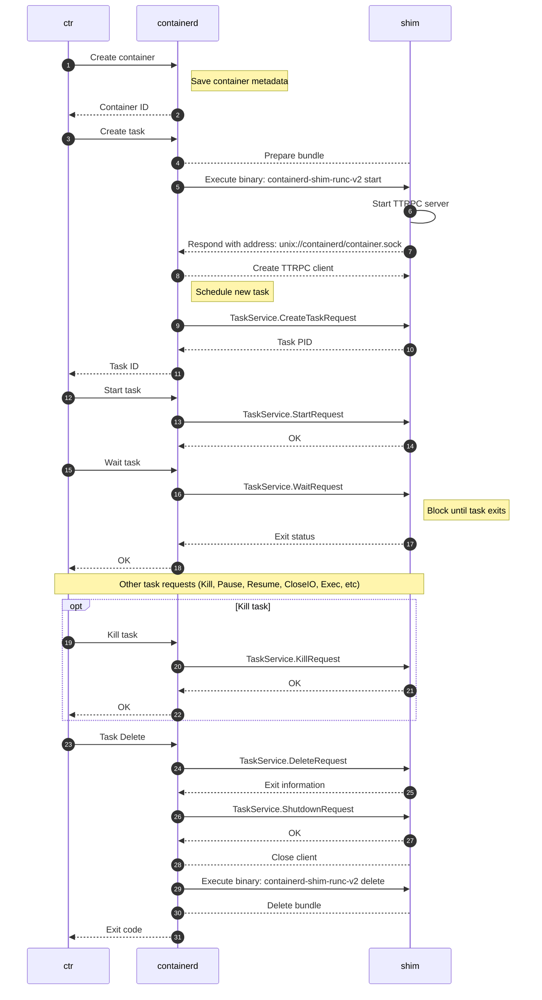
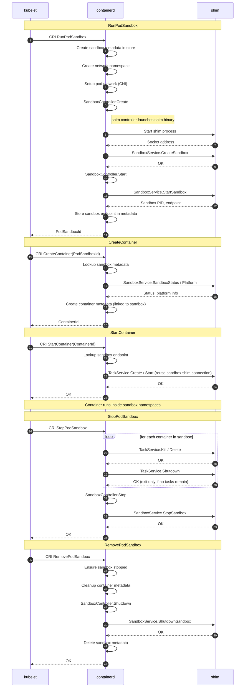
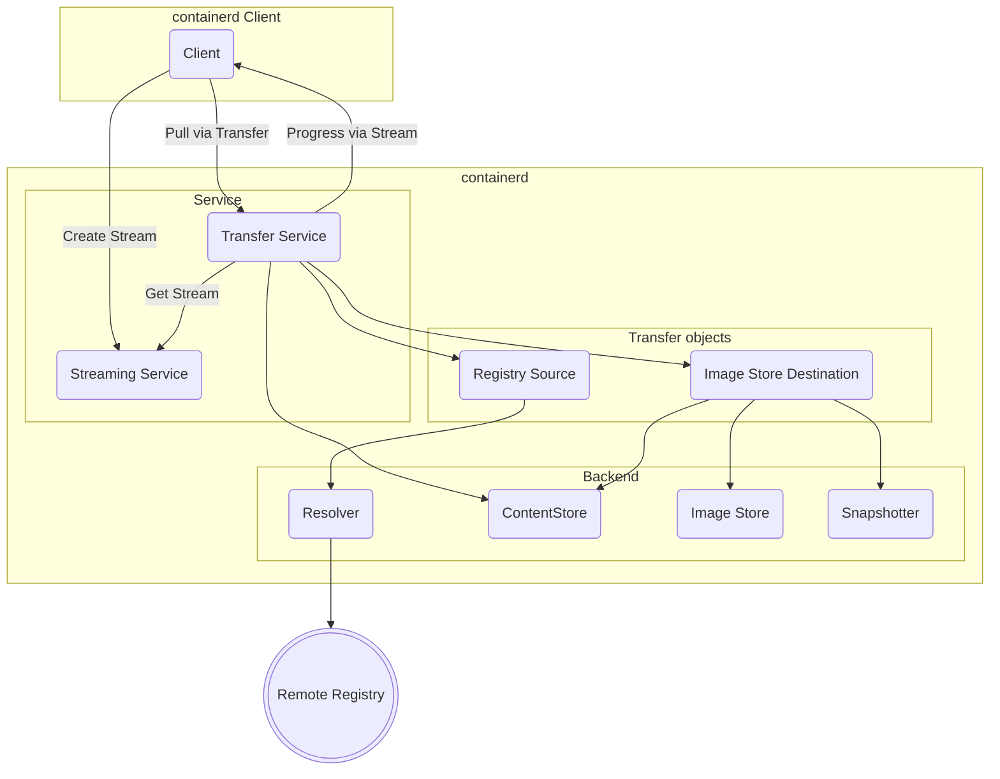

<a id="doc-12e0a48d6c5f2a58f4caa284"></a>

# containerd/containerd / ADOPTERS.md

Upstream: https://github.com/containerd/containerd/blob/df742f8d7ee7f57ddba3c475497c032fe9486391/ADOPTERS.md

Commit: `df742f8d7ee7f57ddba3c475497c032fe9486391`

Retrieved: 2026-10-01T15:16:13.018591+00:00

Kind: official-document

Raw SHA256: `ce2150132ed56a0b656c85e03d4a8e87e86c85d003e3a2fdd3f4a32503364956`

Source text below is untrusted reference content. Acquisition does not verify technical claims.

License status: UPSTREAM_NOTICES_CAPTURED_PER_FILE_REVIEW_REQUIRED. See this repository's captured license files.

---

## containerd Adopters

A non-exhaustive list of containerd adopters is provided below.

**_Docker/Moby engine_** - Containerd began life prior to its CNCF adoption as a lower-layer
runtime manager for `runc` processes below the Docker engine. Continuing today, containerd
has extremely broad production usage as a component of the [Docker engine](https://github.com/docker/docker-ce)
stack. Note that this includes any use of the open source [Moby engine project](https://github.com/moby/moby);
including the Balena project listed below.

**[faasd by OpenFaaS](https://github.com/openfaas/faasd)** - faasd in an Open Source project for serverless functions. It takes the same OpenFaaS components that usually run on Kubernetes and instead launches containers directly on a single host using CNI for networking. It's ideal for edge and for deploying functions without having to think about managing and maintaining Kubernetes.

**_[IBM Cloud Kubernetes Service (IKS)](https://www.ibm.com/cloud/container-service)_** - offers containerd as the CRI runtime for v1.11 and higher versions.

**_[IBM Cloud Private (ICP)](https://www.ibm.com/cloud/private)_** - IBM's on-premises cloud offering has containerd as a "tech preview" CRI runtime for the Kubernetes offered within this product for the past two releases, and plans to fully migrate to containerd in a future release.

**_[Google Container-Optimized OS (COS)](https://cloud.google.com/container-optimized-os/docs)_** - Container-Optimized OS is a Linux Operating System from Google that is optimized for running containers. COS has used containerd as container runtime when containerd was part of Docker's core container runtime.

**_[Google Cloud Kubernetes Engine (GKE)](https://cloud.google.com/kubernetes-engine/)_** - containerd has been offered in GKE since version 1.14 and has been the default runtime since version 1.19. It is also the only supported runtime for GKE Autopilot from the launch. [More details](https://cloud.google.com/kubernetes-engine/docs/concepts/using-containerd)

**_[AWS Fargate](https://aws.amazon.com/fargate)_** - uses containerd + Firecracker (noted below) as the runtime and isolation technology for containers run in the Fargate platform. Fargate is a serverless, container-native compute offering from Amazon Web Services.

**_[Amazon Elastic Kubernetes Service (EKS)](https://aws.amazon.com/eks/)_** - EKS optionally offers containerd as a CRI runtime starting with Kubernetes version 1.21. In Kubernetes 1.22 the default CRI runtime will be containerd.

**_[Bottlerocket](https://aws.amazon.com/bottlerocket/)_** - Bottlerocket is a Linux distribution from Amazon Web Services purpose-built for containers using containerd as the core system runtime.

**_Cloud Foundry_** - The [Guardian container manager](https://github.com/cloudfoundry/guardian) for CF has been using OCI runC directly with additional code from CF managing the container image and filesystem interactions, but have recently migrated to use containerd as a replacement for the extra code they had written around runC.

**_Alibaba's PouchContainer_** - The Alibaba [PouchContainer](https://github.com/alibaba/pouch) project uses containerd as its runtime for a cloud native offering that has unique isolation and image distribution capabilities.

**_Rancher's k3s project_** - Rancher Labs [k3s](https://github.com/rancher/k3s) is a lightweight Kubernetes distribution; in their words: "Easy to install, half the memory, all in a binary less than 40mb." k8s uses containerd as the embedded runtime for this popular lightweight Kubernetes variant.

**_Rancher's Rio project_** - Rancher Labs [Rio](https://github.com/rancher/rio) project uses containerd as the runtime for a combined Kubernetes, Istio, and container "Cloud Native Container Distribution" platform.

**_Balena_** - Resin's [Balena](https://github.com/resin-os/balena) container engine, based on moby/moby but for edge, embedded, and IoT use cases, uses the containerd and runc stack in the same way that the Docker engine uses containerd.

**_LinuxKit_** - the Moby project's [LinuxKit](https://github.com/linuxkit/linuxkit) for building secure, minimal Linux OS images in a container-native model uses containerd as the core runtime for system and service containers.

**_BuildKit_** - The Moby project's [BuildKit](https://github.com/moby/buildkit) can use either runC or containerd as build execution backends for building container images. BuildKit support has also been built into the Docker engine in recent releases, making BuildKit provide the backend to the `docker build` command.

**_[Azure Kubernetes Service (AKS)](https://azure.microsoft.com/services/kubernetes-service)_** - Microsoft's managed Kubernetes offering uses containerd for Linux nodes running v1.19 and greater, and Windows nodes running 1.20 and greater. [More Details](https://docs.microsoft.com/azure/aks/cluster-configuration#container-runtime-configuration)

**_Amazon Firecracker_** - The AWS [Firecracker VMM project](http://firecracker-microvm.io/) has extended containerd with a new snapshotter and v2 shim to allow containerd to drive virtualized container processes via their VMM implementation. More details on their containerd integration are available in [their GitHub project](https://github.com/firecracker-microvm/firecracker-containerd).

**_Kata Containers_** - The [Kata containers](https://katacontainers.io/) lightweight-virtualized container runtime project integrates with containerd via a custom v2 shim implementation that drives the Kata container runtime.

**_Inclavare Containers_** - [Inclavare Containers](https://github.com/alibaba/inclavare-containers) is an innovation of container runtime with the novel approach for launching protected containers in hardware-assisted Trusted Execution Environment (TEE) technology, aka Enclave, which can prevent the untrusted entity, such as Cloud Service Provider (CSP), from accessing the sensitive and confidential assets in use.

**_VMware TKG_** - [Tanzu Kubernetes Grid](https://tanzu.vmware.com/kubernetes-grid) VMware's Multicloud Kubernetes offering uses containerd as the default CRI runtime.

**_VMware TCE_** - [Tanzu Community Edition](https://github.com/vmware-tanzu/community-edition) VMware's fully-featured, easy to manage, Kubernetes platform for learners and users. It is a freely available, community supported, and open source distribution of VMware Tanzu. It uses containerd as the default CRI runtime.

**_[Talos Linux](https://www.talos.dev/)_** - Talos Linux is Linux designed for Kubernetes – secure, immutable, and minimal. Talos Linux is using containerd as the core system runtime and CRI implementation.

**_Deckhouse_** - [Deckhouse Kubernetes Platform](https://deckhouse.io/) from Flant allows you to manage Kubernetes clusters anywhere in a fully automatic and uniform fashion. It uses containerd as the default CRI runtime.

**_[Actuated](https://actuated.dev)_** - Actuated is a platform for running self-hosted CI in securely-isolated Firecracker VMs. Actuated uses containerd's image pulling facility to distribute and update the root filesystem for VMs for CI agents.

**_[Syself Autopilot](https://syself.com)** - Syself Autopilot is a simplified Kubernetes platform based on Cluster API that can run on various providers. Syself Autopilot uses containerd as the default CRI runtime.

**_Other Projects_** - While the above list provides a cross-section of well known uses of containerd, the simplicity and clear API layer for containerd has inspired many smaller projects around providing simple container management platforms. Several examples of building higher layer functionality on top of the containerd base have come from various containerd community participants:
 - Michael Crosby's [boss](https://github.com/crosbymichael/boss) project,
 - Evan Hazlett's [stellar](https://github.com/ehazlett/stellar) project,
 - Paul Knopf's immutable Linux image builder project: [darch](https://github.com/godarch/darch).


<a id="doc-a54ff182c7e8acf56acfd6e4"></a>

# containerd/containerd / AGENTS.md

Upstream: https://github.com/containerd/containerd/blob/df742f8d7ee7f57ddba3c475497c032fe9486391/AGENTS.md

Commit: `df742f8d7ee7f57ddba3c475497c032fe9486391`

Retrieved: 2026-10-01T15:16:13.018591+00:00

Kind: official-document

Raw SHA256: `98f9b9c51c5b472d6de9dd2605a699aa7334e585ce81ca83e0e9a8cabab608af`

Source text below is untrusted reference content. Acquisition does not verify technical claims.

License status: UPSTREAM_NOTICES_CAPTURED_PER_FILE_REVIEW_REQUIRED. See this repository's captured license files.

---

# AGENTS.md

## Preparing changes

Before contributing, read [CONTRIBUTING.md](CONTRIBUTING.md) and the [org-wide contribution guide](https://github.com/containerd/project/blob/main/CONTRIBUTING.md). They cover change scope, tests, license headers, commit sign-offs, and AI attribution.

For AI-assisted work, follow the org guide's [Coding Agent Usage](https://github.com/containerd/project/blob/main/CONTRIBUTING.md#coding-agent-usage) policy and the repository's [submission requirements](CONTRIBUTING.md#automated-and-ai-generated-contributions). The human contributor reviews all content before submission and writes replies to review comments and issue discussions. Automated PR creation requires prior maintainer approval.

- Before adding a capability, check [SCOPE.md](SCOPE.md). Its allow-list governs features and components.
- Before adding packages or source files, read [Where to put packages](CONTRIBUTING.md#where-to-put-packages).
- Before changing a public API or protobuf definition, read [Public API Stability](RELEASES.md#public-api-stability).
- Before changing daemon configuration, read [Daemon Configuration](RELEASES.md#daemon-configuration) for compatibility and migration requirements.

When requirements leave behavior or API names ambiguous, resolve them with the human contributor before implementing the change.

## Build and validation

- **Builds and dependencies:** read [BUILDING.md](BUILDING.md) for prerequisites, binary targets, build tags, and vendoring. Regenerate `vendor/` with `make vendor`; never hand-edit vendored files.
- **Protobuf changes:** follow [Updating protobuf files](CONTRIBUTING.md#updating-protobuf-files) to regenerate code and check formatting. Never hand-edit generated protobuf code.
- **Lint:** run `make check` with the tools from [Setting up your local environment](CONTRIBUTING.md#setting-up-your-local-environment). If prerequisites are unavailable, report the blocker.
- **Tests:** use [Testing containerd](BUILDING.md#testing-containerd) to select the suite and privileges needed for the changed behavior. Check for skipped tests before reporting coverage. For CRI changes, also read [CRI Plugin Testing Guide](docs/cri/testing.md).

Run `make clean-test` only on a dedicated test host: it kills every `containerd` and `runc` process and removes runtime state.

Fix failing checks at the cause, or explain to the human contributor why the check is wrong. Never delete or weaken tests, add `//nolint`, or bypass a check just to make CI pass.

## Subsystem context

Read the relevant docs before changing a subsystem:

| Area                                      | Reference                                        |
| ----------------------------------------- | ------------------------------------------------ |
| Plugin registration and dependencies      | [Plugin model](docs/PLUGINS.md)                  |
| Task execution and shim lifecycle         | [Runtime v2](docs/runtime-v2.md)                 |
| Sandbox controllers                       | [Sandbox API](docs/sandbox-api.md)               |
| CRI requests and kubelet integration      | [CRI architecture](docs/cri/architecture.md)     |
| Content, snapshots, and their labels      | [Content flow](docs/content-flow.md)             |
| Resource retention and garbage collection | [Garbage collection](docs/garbage-collection.md) |
| Namespace propagation through context     | [Namespaces](docs/namespaces.md)                 |
| Daemon-side image transfers               | [Transfer service](docs/transfer.md)             |

## Security findings

Before scanning for security issues, evaluating a suspected vulnerability, or drafting a security report, read all three:

- [Threat model](docs/security/THREAT_MODEL.md): trust boundaries, trusted components, and security exclusions.
- [Triage guide](docs/security/TRIAGE_GUIDE.md): required evidence and finding classifications.
- [Operator baseline](docs/security/OPERATOR_GUIDELINES.md#1-baseline-security-requirements): deployment assumptions used in triage.

Apply their scope and evidence requirements before calling a finding a vulnerability. Findings outside the threat model are not vulnerabilities.

Raise suspected non-public vulnerabilities privately with the human contributor, who decides whether to use the [Security Advisories portal](https://github.com/containerd/containerd/security). Never disclose them in issues, PRs, commits, review comments, or public chat; containerd channels in the CNCF Slack are public.


<a id="doc-f1355fd54329147c830843ab"></a>

# containerd/containerd / BUILDING.md

Upstream: https://github.com/containerd/containerd/blob/df742f8d7ee7f57ddba3c475497c032fe9486391/BUILDING.md

Commit: `df742f8d7ee7f57ddba3c475497c032fe9486391`

Retrieved: 2026-10-01T15:16:13.018591+00:00

Kind: official-document

Raw SHA256: `6742f0d5f6689d0dba4719b41ebf48e3f7aa45bcc2ec8681912ccba98f712904`

Source text below is untrusted reference content. Acquisition does not verify technical claims.

License status: UPSTREAM_NOTICES_CAPTURED_PER_FILE_REVIEW_REQUIRED. See this repository's captured license files.

---

# Build containerd from source

This guide is useful if you intend to contribute on containerd. Thanks for your
effort. Every contribution is very appreciated.

This doc includes:
* [Getting started with GitHub Codespaces](#getting-started-with-gitHub-codespaces)
* [Build requirements](#build-requirements)
* [Build the development environment](#build-the-development-environment)
* [Build containerd](#build-containerd)
* [Via docker container](#via-docker-container)
* [Testing](#testing-containerd)

## Getting started with GitHub Codespaces

To get started, create a codespace for this repository by clicking this 👇

[](https://github.com/codespaces/new?hide_repo_select=true&ref=main&repo=46089560)

A codespace will open in a web-based version of Visual Studio Code. The [dev container](.devcontainer/devcontainer.json) is fully configured with software needed for this project and the containerd built. If you use a codespace, then you can directly skip to the [testing](#testing-containerd) section of this document.

**Note**: Dev containers is an open spec which is supported by [GitHub Codespaces](https://github.com/codespaces) and [other tools](https://containers.dev/supporting).

## Build requirements

To build the `containerd` daemon, and the `ctr` simple test client, the following build system dependencies are required:

* Go compiler (download from https://go.dev/dl/). At least one of the two most recent major Go versions are supported. For example, if Go 1.26 is the latest, either 1.26 or 1.25 are supported. It is not uncommon to find issues in early days of the latest go version. The support of the non-latest version is dependant on dependencies supported versions.
* Btrfs headers and libraries for your distribution. Note that building the btrfs driver can be disabled via the build tag `no_btrfs`, removing this dependency.

> *Note*: On macOS, you need a third party runtime to run containers on containerd

## Build the development environment

First you need to setup your Go development environment. You can follow this
guideline [How to write go code](https://golang.org/doc/code.html) and at the
end you have `go` command in your `PATH`.

You need `git` to checkout the source code:

```sh
git clone https://github.com/containerd/containerd
```

To enable optional [Btrfs](https://en.wikipedia.org/wiki/Btrfs) snapshotter, you should have the headers from the Linux kernel 4.12 or later.
The dependency on the kernel headers only affects users building containerd from source.
Users on older kernels may opt to not compile the btrfs support (see `BUILDTAGS=no_btrfs` below),
or to provide headers from a newer kernel.

> **Note**
> The dependency on the Linux kernel headers 4.12 was introduced in containerd 1.7.0-beta.4.
>
> containerd 1.6 has different set of dependencies for enabling btrfs.
> containerd 1.6 users should refer to https://github.com/containerd/containerd/blob/release/1.6/BUILDING.md#build-the-development-environment

At this point you are ready to build `containerd` yourself!

## Runc

Runc is the default container runtime used by `containerd` and is required to
run containerd. While it is okay to download a `runc` binary and install that on
the system, sometimes it is necessary to build runc directly when working with
container runtime development. Make sure to follow the guidelines for versioning
in [RUNC.md](/docs/RUNC.md) for the best results.

> *Note*: Runc only supports Linux

## Build containerd

`containerd` uses `make` to create a repeatable build flow. It means that you
can run:

```sh
cd containerd
make
```

This is going to build all the project binaries in the `./bin/` directory.

You can move them in your global path, `/usr/local/bin` with:

```sh
sudo make install
```

The install prefix can be changed by passing the `PREFIX` variable (defaults
to `/usr/local`).

Note: if you set one of these vars, set them to the same values on all make stages
(build as well as install).

If you want to prepend an additional prefix on actual installation (eg. packaging or chroot install),
you can pass it via `DESTDIR` variable:

```sh
sudo make install DESTDIR=/tmp/install-x973234/
```

The above command installs the `containerd` binary to `/tmp/install-x973234/usr/local/bin/containerd`

The current `DESTDIR` convention is supported since containerd v1.6.
Older releases was using `DESTDIR` for a different purpose that is similar to `PREFIX`.


When making any changes to the gRPC API, you can use the installed `protoc`
compiler to regenerate the API generated code packages with:

```sh
make generate
```

> *Note*: Several build tags are currently available:
> * `no_cri`: A build tag disables building Kubernetes [CRI](http://blog.kubernetes.io/2016/12/container-runtime-interface-cri-in-kubernetes.html) support into containerd.
> See [here](https://github.com/containerd/cri-containerd#build-tags) for build tags of CRI plugin.
> * snapshotters (alphabetical order)
>   * `no_aufs`: A build tag disables building the aufs snapshot driver. (Ignored since containerd v2.0, as the aufs snapshot driver is no longer supported)
>   * `no_btrfs`: A build tag disables building the Btrfs snapshot driver.
>   * `no_devmapper`: A build tag disables building the device mapper snapshot driver.
>   * `no_zfs`: A build tag disables building the ZFS snapshot driver.
> * platform
>   * `no_systemd`: disables any systemd specific code
>
> For example, adding `BUILDTAGS=no_btrfs` to your environment before calling the **binaries**
> Makefile target will disable the btrfs driver within the containerd Go build.

Vendoring of external imports uses the [Go Modules](https://golang.org/ref/mod#vendoring). You need
to use `go mod` command to modify the dependencies. After modifition, you should run `go mod tidy`
and `go mod vendor` to ensure the `go.mod`, `go.sum` files and `vendor` directory are up to date.
Changes to these files should become a single commit for a PR which relies on vendored updates.

Please refer to [RUNC.md](/docs/RUNC.md) for the currently supported version of `runc` that is used by containerd.

> *Note*: On macOS, the containerd daemon can be built and run natively. However, as stated above, runc only supports linux.

### Static binaries

You can build static binaries by providing a few variables to `make`:

```sh
make STATIC=1
```

> *Note*:
> - static build is discouraged
> - static containerd binary does not support loading shared object plugins (`*.so`)
> - static build binaries are not position-independent

# Via Docker container

> [!NOTE]
> The following instructions assume you are at the **parent** directory of containerd source directory.

## Build containerd in a container

You can build `containerd` via a Linux-based Docker container using the [Docker official `golang` image](https://hub.docker.com/_/golang/)

From the **parent** directory of `containerd`'s cloned repo you can run the following command:

```sh
docker run -it \
    -v ${PWD}/containerd:/src/containerd \
    -w /src/containerd golang
```

This mounts the `containerd` repository inside the image at `/src/containerd` and, by default, runs a shell at that directory.

Now, you are now ready to follow the [build instructions](#build-containerd):

## Build containerd and runc in a container

To have complete core container runtime, you will need both `containerd` and `runc`. It is possible to build both of these via Docker container.

You can clone `runc` in the same parent directory where you cloned `containerd` and you should clone [the latest stable version of `runc`](https://github.com/opencontainers/runc/releases), e.g. v1.1.13:

```sh
git clone --branch <RELEASE_TAG> https://github.com/opencontainers/runc
```

In our Docker container we will build `runc` build, which includes
[seccomp](https://en.wikipedia.org/wiki/seccomp), [SELinux](https://en.wikipedia.org/wiki/Security-Enhanced_Linux),
and [AppArmor](https://en.wikipedia.org/wiki/AppArmor) support. Seccomp support
in runc requires `libseccomp-dev` as a dependency (AppArmor and SELinux support
do not require external libraries at build time). Refer to [RUNC.md](docs/RUNC.md)
in the docs directory to for details about building runc, and to learn about
supported versions of `runc` as used by containerd.

Since we need [`libseccomp-dev`](https://packages.debian.org/stable/libseccomp-dev) installed as a dependency, we will need a custom Docker image derived from the official `golang` image. You can use the following `Dockerfile` to build your custom image:

```sh
FROM golang

RUN apt-get update && \
    apt-get install -y libseccomp-dev
```

Let's suppose you've built an image named `containerd/build` from the above `Dockerfile`.

You can run the following command:

```sh
docker run -it \
    -v ${PWD}/containerd:/src/containerd \
    -v ${PWD}/runc:/src/runc \
    -w /src/containerd \
    containerd/build
```

This mounts both `runc` and `containerd` repositories in our Docker container.

From within the Docker container, let's build `containerd`:

```sh
make && make install
```

You can check the installed binaries with:

```sh
$ which containerd
/usr/local/bin/containerd

$ containerd --version
containerd github.com/containerd/containerd/v2 v2.0.0-rc.3-195-gf5d5407c2 f5d5407c2ff12865653a9a132d5783196be82763
```

Next, let's build `runc`:

```sh
cd /src/runc
make && make install
```

You can check the installed binaries with:

```sh
$ which runc
/usr/local/sbin/runc

$ runc --version
runc version 1.1.13
commit: v1.1.13-0-g58aa9203
spec: 1.0.2-dev
go: go1.23.0
libseccomp: 2.5.4
```

For further details about building runc, refer to [RUNC.md](docs/RUNC.md) in the
docs directory.

When working with `ctr`, the simple test client we just built, don't forget to start the daemon!

```sh
containerd --config config.toml
```

# Testing containerd

During the automated CI the unit tests and integration tests are run as part of the PR validation. As a developer you can run these tests locally by using any of the following `Makefile` targets:
 - `make test`: run all non-integration tests that do not require `root` privileges
 - `make root-test`: run all non-integration tests which require `root`
 - `make integration`: run all tests, including integration tests and those which require `root`. `TESTFLAGS_PARALLEL` can be used to control parallelism. For example, `TESTFLAGS_PARALLEL=1 make integration` will lead a non-parallel execution. The default value of `TESTFLAGS_PARALLEL` is **8**.
 - `make cri-integration`: [CRI Integration Tests](https://github.com/containerd/containerd/blob/main/docs/cri/testing.md#cri-integration-test) run cri integration tests

A test that needs `root` calls `testutil.RequiresRoot`, which skips it unless
`-test.root` is passed. `make test` skips those tests and still succeeds, so check
whether the tests covering your change are among them. `make root-test` selects
the packages that call the helper and runs them with `-test.root`.

To execute a specific test or set of tests you can use the `go test` capabilities
without using the `Makefile` targets. The following examples show how to specify a test
name and also how to use the flag directly against `go test` to run root-requiring tests.

```sh
# run the test <TEST_NAME>:
go test	-v -run "<TEST_NAME>" ./path/to/package
# enable the root-requiring tests:
go test -v -run ./path/to/package -test.root
```

Example output from directly running `go test` to execute the `TestContainerList` test:

```sh
sudo go test -v -run "TestContainerList" ./integration/client -test.root
=== RUN   TestContainerList
--- PASS: TestContainerList (0.00s)
PASS

ok      github.com/containerd/containerd/v2/integration/client  2.584s
```

> *Note*: in order to run `sudo go` you need to
> - either keep user PATH environment variable. ex: `sudo "PATH=$PATH" env go test <args>`
> - or use `go test -exec` ex: `go test -exec sudo -v -run "TestTarWithXattr" ./pkg/archive -test.root`

## Additional tools

### containerd-stress
In addition to `go test`-based testing executed via the `Makefile` targets, the `containerd-stress` tool is available and built with the `all` or `binaries` targets and installed during `make install`.

With this tool you can stress a running containerd daemon for a specified period of time, selecting a concurrency level to generate stress against the daemon. The following command is an example of having five workers running for two hours against a default containerd gRPC socket address:

```sh
containerd-stress -c 5 -d 120m
```

For more information on this tool's options please run `containerd-stress --help`.

### bucketbench
[Bucketbench](https://github.com/estesp/bucketbench) is an external tool which can be used to drive load against a container runtime, specifying a particular set of lifecycle operations to run with a specified amount of concurrency. Bucketbench is more focused on generating performance details than simply inducing load against containerd.

Bucketbench differs from the `containerd-stress` tool in a few ways:
 - Bucketbench has support for testing the Docker engine, the `runc` binary, and containerd 0.2.x (via `ctr`) and 1.0 (via the client library) branches.
 - Bucketbench is driven via configuration file that allows specifying a list of lifecycle operations to execute. This can be used to generate detailed statistics per-command (e.g. start, stop, pause, delete).
 - Bucketbench generates detailed reports and timing data at the end of the configured test run.

More details on how to install and run `bucketbench` are available at the [GitHub project page](https://github.com/estesp/bucketbench).


<a id="doc-6ebdb617a8104a7756d0cf36"></a>

# containerd/containerd / CLAUDE.md

Upstream: https://github.com/containerd/containerd/blob/df742f8d7ee7f57ddba3c475497c032fe9486391/CLAUDE.md

Commit: `df742f8d7ee7f57ddba3c475497c032fe9486391`

Retrieved: 2026-10-01T15:16:13.018591+00:00

Kind: official-document

Raw SHA256: `a54ff182c7e8acf56acfd6e4b9c3ff41e2c41a31c9b211b2deb9df75d9a478f9`

Source text below is untrusted reference content. Acquisition does not verify technical claims.

License status: UPSTREAM_NOTICES_CAPTURED_PER_FILE_REVIEW_REQUIRED. See this repository's captured license files.

---

AGENTS.md

<a id="doc-eca12c0a30e25b4b46522ebf"></a>

# containerd/containerd / CONTRIBUTING.md

Upstream: https://github.com/containerd/containerd/blob/df742f8d7ee7f57ddba3c475497c032fe9486391/CONTRIBUTING.md

Commit: `df742f8d7ee7f57ddba3c475497c032fe9486391`

Retrieved: 2026-10-01T15:16:13.018591+00:00

Kind: official-document

Raw SHA256: `0678eb2e96d2ee6bb128ff0515ff49894bb48cfab256348d021aa7a7c56fe8e3`

Source text below is untrusted reference content. Acquisition does not verify technical claims.

License status: UPSTREAM_NOTICES_CAPTURED_PER_FILE_REVIEW_REQUIRED. See this repository's captured license files.

---

# Contributors' Guide

This guide will help familiarize contributors to the `containerd/containerd` repository.

## Prerequisite

First read the containerd project's [general guidelines around contribution](https://github.com/containerd/project/blob/main/CONTRIBUTING.md)
which apply to all containerd projects.

## Getting started

See [`BUILDING.md`](https://github.com/containerd/containerd/blob/main/BUILDING.md) for instructions for setting up a development environment.

If you are also a new user to containerd, you can first check out the [_Getting started with containerd_](https://github.com/containerd/containerd/blob/main/docs/getting-started.md) guide.

## Setting up your local environment

At a minimum, the dev tools from `script/setup/install-dev-tools` should be installed.
Run `make install-deps` to install dependencies used for running and developing the CRI plugin.
Other install scripts under `script/setup` may need to be run depending on your environment and your preference for installing libraries and dependencies.
The versions used by `containerd/containerd` CI can be found in `script/setup` and referred to if installing manually.

```
$ script/setup/install-dev-tools
$ make install-deps
```

## Pull request expectations

- Before starting work on an issue, check whether an open pull request already
  addresses it: look at the issue's linked pull requests and search open pull
  requests for the issue number.
- Document features and enhancements, both at the code level and in the
  user-facing docs under `docs/`.
- Test at the levels that fit the change: unit, integration, or end-to-end.
  For failure injection in integration tests, use the failpoint pattern
  (`internal/failpoint`, `integration/failpoint`).
- Run `make check` and the tests that cover your change locally before opening
  or updating a pull request.
- Monitor your pull request's CI runs and make sure your changes are not
  responsible for failures.

## Automated and AI-generated contributions

Pull requests must be opened by a human. Any use of automation to create
pull requests must be approved by a maintainer. Accounts creating pull requests
using automation without prior approval may be restricted from the containerd
organization.

All AI-generated or AI-assisted submissions — whether code, PR descriptions,
or comments — must be reviewed by the human author before being submitted.
The human author is responsible for the correctness and quality of all content
in their pull request and any associated comments.

## Code style

- Go files adhere to standard Go formatting and styling
- Protobuf files use tabs for indentation
- Other files must not contain trailing whitespace and should end with a single new line character

Use the `check` command in the makefile to verify your code matches the expected style.

```
make check
```

## Updating protobuf files

Ensure protoc and dev tools have been installed, then run `make protos`

> **Note**
> When running `make protos`, the current working directory should be found under the `GOPATH` environment
> variable to ensure protoc can properly resolve the paths of protofiles in the project.

## Naming packages

Package names should be short and simple. Avoid using `_` and repeating words from parent directories.

### Where to put packages

Try to put a new package under the appropriate root directories. The root directory is reserved for
configuration and build files, no source files will be accepted in root since containerd v2.0.

- `api` - All protobuf service definitions and types used by services
- `bin` - Autogenerated during build, do not check in file here
- `client` - All Go files for the containerd client (formerly in `containerd/containerd` root in 1.x)
- `cmd` - All Go main packages and the packages used only for that main package
- `contrib` - Files, configurations, and packages related to external tools or libraries
- `core` - Core Go packages with interface definitions and built-in implementations
- `docs` - All containerd technical documentation using markdown
- `internal` - All utility packages used by containerd and not intended for direct import
- `man`- All containerd reference manuals used for the `man` command
- `pkg` - Non-core Go packages used by clients and other containerd packages
- `plugins` - All included containerd plugins which are registered via init
- `releases` - All release note files
- `script` - All scripts used for testing, development, and CI
- `test` - Test scripts used for external end to end testing of containerd, do not add new files here
- `vendor` - Autogenerated vendor files from `make vendor` command, do not manually edit files here
- `version` - Version package with the current containerd version


<a id="doc-c693279643b8cd5d248172d9"></a>

# containerd/containerd / LICENSE

Upstream: https://github.com/containerd/containerd/blob/df742f8d7ee7f57ddba3c475497c032fe9486391/LICENSE

Commit: `df742f8d7ee7f57ddba3c475497c032fe9486391`

Retrieved: 2026-10-01T15:16:13.018591+00:00

Kind: license

Raw SHA256: `4bbe3b885e8cd1907ab4cf9a41e862e74e24b5422297a4f2fe524e6a30ada2b4`

Source text below is untrusted reference content. Acquisition does not verify technical claims.

License status: UPSTREAM_NOTICES_CAPTURED_PER_FILE_REVIEW_REQUIRED. See this repository's captured license files.

---

````text

                                 Apache License
                           Version 2.0, January 2004
                        https://www.apache.org/licenses/

   TERMS AND CONDITIONS FOR USE, REPRODUCTION, AND DISTRIBUTION

   1. Definitions.

      "License" shall mean the terms and conditions for use, reproduction,
      and distribution as defined by Sections 1 through 9 of this document.

      "Licensor" shall mean the copyright owner or entity authorized by
      the copyright owner that is granting the License.

      "Legal Entity" shall mean the union of the acting entity and all
      other entities that control, are controlled by, or are under common
      control with that entity. For the purposes of this definition,
      "control" means (i) the power, direct or indirect, to cause the
      direction or management of such entity, whether by contract or
      otherwise, or (ii) ownership of fifty percent (50%) or more of the
      outstanding shares, or (iii) beneficial ownership of such entity.

      "You" (or "Your") shall mean an individual or Legal Entity
      exercising permissions granted by this License.

      "Source" form shall mean the preferred form for making modifications,
      including but not limited to software source code, documentation
      source, and configuration files.

      "Object" form shall mean any form resulting from mechanical
      transformation or translation of a Source form, including but
      not limited to compiled object code, generated documentation,
      and conversions to other media types.

      "Work" shall mean the work of authorship, whether in Source or
      Object form, made available under the License, as indicated by a
      copyright notice that is included in or attached to the work
      (an example is provided in the Appendix below).

      "Derivative Works" shall mean any work, whether in Source or Object
      form, that is based on (or derived from) the Work and for which the
      editorial revisions, annotations, elaborations, or other modifications
      represent, as a whole, an original work of authorship. For the purposes
      of this License, Derivative Works shall not include works that remain
      separable from, or merely link (or bind by name) to the interfaces of,
      the Work and Derivative Works thereof.

      "Contribution" shall mean any work of authorship, including
      the original version of the Work and any modifications or additions
      to that Work or Derivative Works thereof, that is intentionally
      submitted to Licensor for inclusion in the Work by the copyright owner
      or by an individual or Legal Entity authorized to submit on behalf of
      the copyright owner. For the purposes of this definition, "submitted"
      means any form of electronic, verbal, or written communication sent
      to the Licensor or its representatives, including but not limited to
      communication on electronic mailing lists, source code control systems,
      and issue tracking systems that are managed by, or on behalf of, the
      Licensor for the purpose of discussing and improving the Work, but
      excluding communication that is conspicuously marked or otherwise
      designated in writing by the copyright owner as "Not a Contribution."

      "Contributor" shall mean Licensor and any individual or Legal Entity
      on behalf of whom a Contribution has been received by Licensor and
      subsequently incorporated within the Work.

   2. Grant of Copyright License. Subject to the terms and conditions of
      this License, each Contributor hereby grants to You a perpetual,
      worldwide, non-exclusive, no-charge, royalty-free, irrevocable
      copyright license to reproduce, prepare Derivative Works of,
      publicly display, publicly perform, sublicense, and distribute the
      Work and such Derivative Works in Source or Object form.

   3. Grant of Patent License. Subject to the terms and conditions of
      this License, each Contributor hereby grants to You a perpetual,
      worldwide, non-exclusive, no-charge, royalty-free, irrevocable
      (except as stated in this section) patent license to make, have made,
      use, offer to sell, sell, import, and otherwise transfer the Work,
      where such license applies only to those patent claims licensable
      by such Contributor that are necessarily infringed by their
      Contribution(s) alone or by combination of their Contribution(s)
      with the Work to which such Contribution(s) was submitted. If You
      institute patent litigation against any entity (including a
      cross-claim or counterclaim in a lawsuit) alleging that the Work
      or a Contribution incorporated within the Work constitutes direct
      or contributory patent infringement, then any patent licenses
      granted to You under this License for that Work shall terminate
      as of the date such litigation is filed.

   4. Redistribution. You may reproduce and distribute copies of the
      Work or Derivative Works thereof in any medium, with or without
      modifications, and in Source or Object form, provided that You
      meet the following conditions:

      (a) You must give any other recipients of the Work or
          Derivative Works a copy of this License; and

      (b) You must cause any modified files to carry prominent notices
          stating that You changed the files; and

      (c) You must retain, in the Source form of any Derivative Works
          that You distribute, all copyright, patent, trademark, and
          attribution notices from the Source form of the Work,
          excluding those notices that do not pertain to any part of
          the Derivative Works; and

      (d) If the Work includes a "NOTICE" text file as part of its
          distribution, then any Derivative Works that You distribute must
          include a readable copy of the attribution notices contained
          within such NOTICE file, excluding those notices that do not
          pertain to any part of the Derivative Works, in at least one
          of the following places: within a NOTICE text file distributed
          as part of the Derivative Works; within the Source form or
          documentation, if provided along with the Derivative Works; or,
          within a display generated by the Derivative Works, if and
          wherever such third-party notices normally appear. The contents
          of the NOTICE file are for informational purposes only and
          do not modify the License. You may add Your own attribution
          notices within Derivative Works that You distribute, alongside
          or as an addendum to the NOTICE text from the Work, provided
          that such additional attribution notices cannot be construed
          as modifying the License.

      You may add Your own copyright statement to Your modifications and
      may provide additional or different license terms and conditions
      for use, reproduction, or distribution of Your modifications, or
      for any such Derivative Works as a whole, provided Your use,
      reproduction, and distribution of the Work otherwise complies with
      the conditions stated in this License.

   5. Submission of Contributions. Unless You explicitly state otherwise,
      any Contribution intentionally submitted for inclusion in the Work
      by You to the Licensor shall be under the terms and conditions of
      this License, without any additional terms or conditions.
      Notwithstanding the above, nothing herein shall supersede or modify
      the terms of any separate license agreement you may have executed
      with Licensor regarding such Contributions.

   6. Trademarks. This License does not grant permission to use the trade
      names, trademarks, service marks, or product names of the Licensor,
      except as required for reasonable and customary use in describing the
      origin of the Work and reproducing the content of the NOTICE file.

   7. Disclaimer of Warranty. Unless required by applicable law or
      agreed to in writing, Licensor provides the Work (and each
      Contributor provides its Contributions) on an "AS IS" BASIS,
      WITHOUT WARRANTIES OR CONDITIONS OF ANY KIND, either express or
      implied, including, without limitation, any warranties or conditions
      of TITLE, NON-INFRINGEMENT, MERCHANTABILITY, or FITNESS FOR A
      PARTICULAR PURPOSE. You are solely responsible for determining the
      appropriateness of using or redistributing the Work and assume any
      risks associated with Your exercise of permissions under this License.

   8. Limitation of Liability. In no event and under no legal theory,
      whether in tort (including negligence), contract, or otherwise,
      unless required by applicable law (such as deliberate and grossly
      negligent acts) or agreed to in writing, shall any Contributor be
      liable to You for damages, including any direct, indirect, special,
      incidental, or consequential damages of any character arising as a
      result of this License or out of the use or inability to use the
      Work (including but not limited to damages for loss of goodwill,
      work stoppage, computer failure or malfunction, or any and all
      other commercial damages or losses), even if such Contributor
      has been advised of the possibility of such damages.

   9. Accepting Warranty or Additional Liability. While redistributing
      the Work or Derivative Works thereof, You may choose to offer,
      and charge a fee for, acceptance of support, warranty, indemnity,
      or other liability obligations and/or rights consistent with this
      License. However, in accepting such obligations, You may act only
      on Your own behalf and on Your sole responsibility, not on behalf
      of any other Contributor, and only if You agree to indemnify,
      defend, and hold each Contributor harmless for any liability
      incurred by, or claims asserted against, such Contributor by reason
      of your accepting any such warranty or additional liability.

   END OF TERMS AND CONDITIONS

   Copyright The containerd Authors

   Licensed under the Apache License, Version 2.0 (the "License");
   you may not use this file except in compliance with the License.
   You may obtain a copy of the License at

       https://www.apache.org/licenses/LICENSE-2.0

   Unless required by applicable law or agreed to in writing, software
   distributed under the License is distributed on an "AS IS" BASIS,
   WITHOUT WARRANTIES OR CONDITIONS OF ANY KIND, either express or implied.
   See the License for the specific language governing permissions and
   limitations under the License.

````


<a id="doc-dfb14fbb9e7d095209ec4cfd"></a>

# containerd/containerd / NOTICE

Upstream: https://github.com/containerd/containerd/blob/df742f8d7ee7f57ddba3c475497c032fe9486391/NOTICE

Commit: `df742f8d7ee7f57ddba3c475497c032fe9486391`

Retrieved: 2026-10-01T15:16:13.018591+00:00

Kind: license

Raw SHA256: `03f0b4bcaecfdb491ef5a7d320e2c2adf886c732d34e3fff87d52dbaec64d8c3`

Source text below is untrusted reference content. Acquisition does not verify technical claims.

License status: UPSTREAM_NOTICES_CAPTURED_PER_FILE_REVIEW_REQUIRED. See this repository's captured license files.

---

````text
Docker
Copyright 2012-2015 Docker, Inc.

This product includes software developed at Docker, Inc. (https://www.docker.com).

The following is courtesy of our legal counsel:


Use and transfer of Docker may be subject to certain restrictions by the
United States and other governments.
It is your responsibility to ensure that your use and/or transfer does not
violate applicable laws.

For more information, please see https://www.bis.doc.gov

See also https://www.apache.org/dev/crypto.html and/or seek legal counsel.

````


<a id="doc-b335630551682c19a781afeb"></a>

# containerd/containerd / README.md

Upstream: https://github.com/containerd/containerd/blob/df742f8d7ee7f57ddba3c475497c032fe9486391/README.md

Commit: `df742f8d7ee7f57ddba3c475497c032fe9486391`

Retrieved: 2026-10-01T15:16:13.018591+00:00

Kind: official-document

Raw SHA256: `2c02476d86fb7be05c12d6e089dcd1ce204e306b9067b84b9259c30b5e413f07`

Source text below is untrusted reference content. Acquisition does not verify technical claims.

License status: UPSTREAM_NOTICES_CAPTURED_PER_FILE_REVIEW_REQUIRED. See this repository's captured license files.

---


[](https://pkg.go.dev/github.com/containerd/containerd/v2)
[](https://github.com/containerd/containerd/actions?query=workflow%3ACI+event%3Amerge_group)
[](https://github.com/containerd/containerd/actions?query=workflow%3ANightly)
[](https://bestpractices.coreinfrastructure.org/projects/1271)
[](https://scorecard.dev/viewer/?uri=github.com/containerd/containerd)
[](https://github.com/containerd/containerd/actions/workflows/links.yml)

containerd is an industry-standard container runtime with an emphasis on simplicity, robustness, and portability. It is available as a daemon for Linux and Windows, which can manage the complete container lifecycle of its host system: image transfer and storage, container execution and supervision, low-level storage and network attachments, etc.

containerd is a member of CNCF with ['graduated'](https://landscape.cncf.io/?selected=containerd) status.

containerd is designed to be embedded into a larger system, rather than being used directly by developers or end-users.


## Announcements

### Now Recruiting

We are a large inclusive OSS project that is welcoming help of any kind shape or form:
* Documentation help is needed to make the product easier to consume and extend.
* We need OSS community outreach/organizing help to get the word out; manage
and create messaging and educational content; and help with social media, community forums/groups, and google groups.
* We are actively inviting new [security advisors](https://github.com/containerd/project/blob/main/GOVERNANCE.md#security-advisors) to join the team.
* New subprojects are being created, core and non-core that could use additional development help.
* Each of the [containerd projects](https://github.com/containerd) has a list of issues currently being worked on or that need help resolving.
  - If the issue has not already been assigned to someone or has not made recent progress, and you are interested, please inquire.
  - If you are interested in starting with a smaller/beginner-level issue, look for issues with an `exp/beginner` tag, for example [containerd/containerd beginner issues.](https://github.com/containerd/containerd/issues?q=is%3Aissue+is%3Aopen+label%3Aexp%2Fbeginner)

## Getting Started

See our documentation on [containerd.io](https://containerd.io):
* [for ops and admins](docs/ops.md)
* [namespaces](docs/namespaces.md)
* [client options](docs/client-opts.md)

To get started contributing to containerd, see [CONTRIBUTING](CONTRIBUTING.md).

If you are interested in trying out containerd see our example at [Getting Started](docs/getting-started.md).

## Nightly builds

There are nightly builds available for download [here](https://github.com/containerd/containerd/actions?query=workflow%3ANightly).
Binaries are generated from `main` branch every night for `Linux` and `Windows`.

Please be aware: nightly builds might have critical bugs, it's not recommended for use in production and no support provided.

## Kubernetes (k8s) CI Dashboard Group

The [k8s CI dashboard group for containerd](https://testgrid.k8s.io/containerd) contains test results regarding
the health of kubernetes when run against main and a number of containerd release branches.

- [containerd-periodics](https://testgrid.k8s.io/containerd-periodic)

## Runtime Requirements

Runtime requirements for containerd are very minimal. Most interactions with
the Linux and Windows container feature sets are handled via [runc](https://github.com/opencontainers/runc) and/or
OS-specific libraries (e.g. [hcsshim](https://github.com/Microsoft/hcsshim) for Microsoft).
The current required version of `runc` is described in [RUNC.md](docs/RUNC.md).

There are specific features
used by containerd core code and snapshotters that will require a minimum kernel
version on Linux. With the understood caveat of distro kernel versioning, a
reasonable starting point for Linux is a minimum 4.x kernel version.

The overlay filesystem snapshotter, used by default, uses features that were
finalized in the 4.x kernel series. If you choose to use btrfs, there may
be more flexibility in kernel version (minimum recommended is 3.18), but will
require the btrfs kernel module and btrfs tools to be installed on your Linux
distribution.

To use Linux checkpoint and restore features, you will need `criu` installed on
your system. See more details in [Checkpoint and Restore](#checkpoint-and-restore).

Build requirements for developers are listed in [BUILDING](BUILDING.md).


## Supported Registries

Any registry which is compliant with the [OCI Distribution Specification](https://github.com/opencontainers/distribution-spec)
is supported by containerd.

For configuring registries, see [registry host configuration documentation](docs/hosts.md)

## Features

For a detailed overview of containerd's core concepts and the features it supports,
please refer to the [FEATURES.MD](./docs/features.md) document.

### Releases and API Stability

Please see [RELEASES.md](RELEASES.md) for details on versioning and stability
of containerd components.

Downloadable 64-bit Intel/AMD binaries of all official releases are available on
our [releases page](https://github.com/containerd/containerd/releases). Binaries
are published for additional platforms as well; see
[Platform Support](RELEASES.md#platform-support) for the full list of platforms
and the level of support for each.

For other architectures and distribution support, you will find that many
Linux distributions package their own containerd and provide it across several
architectures, such as [Canonical's Ubuntu packaging](https://launchpad.net/ubuntu/bionic/+package/containerd).

#### Enabling command auto-completion

Starting with containerd 1.4, the urfave client feature for auto-creation of bash and zsh
autocompletion data is enabled. To use the autocomplete feature in a bash shell for example, source
the autocomplete/ctr file in your `.bashrc`, or manually like:

```
$ source ./contrib/autocomplete/ctr
```

#### Distribution of `ctr` autocomplete for bash and zsh

For bash, copy the `contrib/autocomplete/ctr` script into
`/etc/bash_completion.d/` and rename it to `ctr`. The `zsh_autocomplete`
file is also available and can be used similarly for zsh users.

Provide documentation to users to `source` this file into their shell if
you don't place the autocomplete file in a location where it is automatically
loaded for the user's shell environment.

### CRI

`cri` is a [containerd](https://containerd.io/) plugin implementation of the Kubernetes [container runtime interface (CRI)](https://github.com/kubernetes/cri-api/blob/master/pkg/apis/runtime/v1/api.proto). With it, you are able to use containerd as the container runtime for a Kubernetes cluster.


#### CRI Status

`cri` is a native plugin of containerd. Since containerd 1.1, the cri plugin is built into the release binaries and enabled by default.

The `cri` plugin has reached GA status, representing that it is:
* Feature complete
* Works with Kubernetes 1.10 and above
* Passes all [CRI validation tests](https://github.com/kubernetes/community/blob/master/contributors/devel/sig-node/cri-validation.md).
* Passes all [node e2e tests](https://github.com/kubernetes/community/blob/master/contributors/devel/sig-node/e2e-node-tests.md).
* Passes all [e2e tests](https://github.com/kubernetes/community/blob/master/contributors/devel/sig-testing/e2e-tests.md).

See results on the containerd k8s [test dashboard](https://testgrid.k8s.io/containerd)

#### Validating Your `cri` Setup
A Kubernetes incubator project, [cri-tools](https://github.com/kubernetes-sigs/cri-tools), includes programs for exercising CRI implementations. More importantly, cri-tools includes the program `critest` which is used for running [CRI Validation Testing](https://github.com/kubernetes/community/blob/master/contributors/devel/sig-node/cri-validation.md).

#### CRI Guides
* [Installing with Ansible and Kubeadm](contrib/ansible/README.md)
* [For Non-Ansible Users, Performing a Custom Installation Using the Release Tarball and Kubeadm](docs/getting-started.md)
* [CRI Plugin Testing Guide](./docs/cri/testing.md)
* [Debugging Pods, Containers, and Images with `crictl`](./docs/cri/crictl.md)
* [Configuring `cri` Plugins](./docs/cri/config.md)
* [Configuring containerd](https://github.com/containerd/containerd/blob/main/docs/man/containerd-config.8.md)

### Communication

For async communication and long-running discussions please use issues and pull requests on the GitHub repo.
This will be the best place to discuss design and implementation.

For sync communication catch us in the `#containerd` and `#containerd-dev` Slack channels on Cloud Native Computing Foundation's (CNCF) Slack - `cloud-native.slack.com`. Everyone is welcome to join and chat. [Get Invite to CNCF Slack.](https://slack.cncf.io)

Join our next community meeting hosted on Zoom. The schedule is posted on the [CNCF Calendar](https://www.cncf.io/calendar/) (search 'containerd' to filter).

### Security audit

Security audits for the containerd project are hosted on our website. Please see the [security page at containerd.io](https://containerd.io/security/) for more information.

### Reporting security issues

Please follow the instructions at [containerd/project](https://github.com/containerd/project/blob/main/SECURITY.md#reporting-a-vulnerability)

## Licenses

The containerd codebase is released under the [Apache 2.0 license](LICENSE).
The README.md file and files in the "docs" folder are licensed under the
Creative Commons Attribution 4.0 International License. You may obtain a
copy of the license, titled CC-BY-4.0, at http://creativecommons.org/licenses/by/4.0/.

## Project details

**containerd** is the primary open source project within the broader containerd GitHub organization.
However, all projects within the repo have common maintainership, governance, and contributing
guidelines which are stored in a `project` repository commonly for all containerd projects.

Please find all these core project documents, including the:
 * [Project governance](https://github.com/containerd/project/blob/main/GOVERNANCE.md),
 * [Maintainers](https://github.com/containerd/project/blob/main/MAINTAINERS),
 * and [Contributing guidelines](https://github.com/containerd/project/blob/main/CONTRIBUTING.md)

information in our [`containerd/project`](https://github.com/containerd/project) repository.

## Adoption

Interested to see who is using containerd? Are you using containerd in a project?
Please add yourself via pull request to our [ADOPTERS.md](./ADOPTERS.md) file.


<a id="doc-4a00447b47c36ebd3ded7732"></a>

# containerd/containerd / RELEASES.md

Upstream: https://github.com/containerd/containerd/blob/df742f8d7ee7f57ddba3c475497c032fe9486391/RELEASES.md

Commit: `df742f8d7ee7f57ddba3c475497c032fe9486391`

Retrieved: 2026-10-01T15:16:13.018591+00:00

Kind: official-document

Raw SHA256: `6d21664b7f9ff6515b8fa6ebe13ee19864c85b65e1ef60853c3461c3af02ac6b`

Source text below is untrusted reference content. Acquisition does not verify technical claims.

License status: UPSTREAM_NOTICES_CAPTURED_PER_FILE_REVIEW_REQUIRED. See this repository's captured license files.

---

# Versioning and Release

This document details the versioning and release plan for containerd. Stability
is a top goal for this project, and we hope that this document and the processes
it entails will help to achieve that. It covers the release process, versioning
numbering, backporting, API stability and support horizons.

If you rely on containerd, it would be good to spend time understanding the
areas of the API that are and are not supported and how they impact your
project in the future.

This document will be considered a living document. Supported timelines,
backport targets and API stability guarantees will be updated here as they
change.

If there is something that you require or this document leaves out, please
reach out by [filing an issue](https://github.com/containerd/containerd/issues).

## Releases

Releases of containerd will be versioned using dotted triples, similar to
[Semantic Version](http://semver.org/). For the purposes of this document, we
will refer to the respective components of this triple as
`<major>.<minor>.<patch>`. The version number may have additional information,
such as alpha, beta and release candidate qualifications. Such releases will be
considered "pre-releases".

### Major and Minor Releases

Major and minor releases of containerd will be made from main. Releases of
containerd will be marked with GPG signed tags and announced at
https://github.com/containerd/containerd/releases. The tag will be of the
format `v<major>.<minor>.<patch>` and should be made with the command `git tag
-s v<major>.<minor>.<patch>`.

After a minor release, a branch will be created, with the format
`release/<major>.<minor>` from the minor tag. All further patch releases will
be done from that branch. For example, once we release `v1.0.0`, a branch
`release/1.0` will be created from that tag. All future patch releases will be
done against that branch.

### Release Cadence

Since containerd v2.3 in April 2026, minor releases are provided on a time basis
with a cadence of 4 months. New minor releases are scheduled for April, August,
and December of each year. This cadence is synchronized with the Kubernetes
release schedule to ensure that new features in containerd can be smoothly
adopted by new Kubernetes releases.

The maintainers will maintain a roadmap and milestones for each release, however,
features may be pushed to accommodate the release timeline. If your issue or feature
is not present in the roadmap, please open a Github issue or leave a
comment requesting it be added to a milestone.

As part of synchronizing with the Kubernetes release schedule, containerd will
cut beta and release candidates that align with the Kubernetes release cycle.
This allows for end-to-end testing of new Kubernetes features with a compatible
containerd version before the final release of either project.

### Patch Releases

Patch releases are made directly from release branches and will be done as needed
by the release branch owners.

### Pre-releases

Pre-releases, such as alphas, betas and release candidates will be conducted
from their source branch. For major and minor releases, these releases will be
done from main. For patch releases, it is uncommon to have pre-releases but
they may have an rc based on the discretion of the release branch owners.

### Support Horizon

Support horizons will be defined corresponding to a release branch, identified
by `<major>.<minor>`. Release branches will be in one of several states:

- __*Future*__: An upcoming scheduled release.
- __*Alpha*__: The next scheduled release on the main branch under active development.
- __*Beta*__: The next scheduled release on the main branch under testing. Begins 8-10 weeks before a final release.
- __*RC*__: The next scheduled release on the main branch under final testing and stabilization. Begins 2-4 weeks before a final release. For new releases where the source branch is main, the main branch will be in a feature freeze during this phase.
- __*Active*__: The release is a stable branch which is currently supported and accepting patches.
- __*Extended*__: The release branch is only accepting security patches.
- __*LTS*__: The release is a long term stable branch which is currently supported and accepting patches.
- __*End of Life*__: The release branch is no longer supported and no new patches will be accepted.

Regular (non-LTS) releases will be supported for 8 months after a _minor_
release. This means that we will accept bug reports and backports to these
release branches until the end of life date. Additionally, releases may have an
extended security support period after the end of the active period to accept
security backports. This timeframe will be decided by maintainers before the end
of the active status.

One release per year will be designated a Long Term Stable (_LTS_) release. LTS
releases are supported for at least two years after their initial _minor_
(x.y.0) release. The maintainers of the _LTS_ branch may commit to a longer period
or extend the support period as needed. These branches will accept bug reports and
backports until the end of life date. They may also accept a wider range of
patches than non-_LTS_ releases to support the longer term maintainability of the
branch, including library dependency, toolchain (including Go) and other version
updates which are needed to ensure each release is built with fully supported
dependencies. Feature backports are up to the discretion of the maintainers who
own the branch but should be rejected by default.

This combination of regular and LTS releases allows users to choose between
adopting new features more quickly or prioritizing stability and longer support
lifecycles.

### Release Owners

Every release shall be assigned owners when entering into the beta stage of the release. The initial
release owners will be responsible for creating the releases and ensuring the release is on time.
Once the release is in rc, the release owners should be part of any discussion around merging
impactful or risky changes. Every release should have at least two owners who are all active
maintainers and one of which has been a release owner in at least two prior releases.

Once the final release is out and the release branch moves to active, ownership will be
transferred back over to all committers. Active releases are maintained by all committers
until the release reaches end of life or the branch transitions to _LTS_.

Every _LTS_ release requires at least two maintainers to volunteer as owners. The owners of the
_LTS_ release may step down or be replaced by another maintainer at any time if they can no longer
support the release. If no maintainers volunteer to own the _LTS_ release after maintainers step
down, the branch will end of life after 6 months of extended support with ownership transferred back
to all committers.

### Current State of containerd Releases

| Release                                                              | Status         | Start                          | End of Life                    | Owners                 |
| -------------------------------------------------------------------- | -------------- | ------------------------------ | ------------------------------ | ---------------------- |
| [0.0](https://github.com/containerd/containerd/releases/tag/0.0.5)   | End of Life    | Dec 4, 2015                    | -                              |                        |
| [0.1](https://github.com/containerd/containerd/releases/tag/v0.1.0)  | End of Life    | Mar 21, 2016                   | -                              |                        |
| [0.2](https://github.com/containerd/containerd/tree/v0.2.x)          | End of Life    | Apr 21, 2016                   | December 5, 2017               |                        |
| [1.0](https://github.com/containerd/containerd/releases/tag/v1.0.3)  | End of Life    | December 5, 2017               | December 5, 2018               |                        |
| [1.1](https://github.com/containerd/containerd/releases/tag/v1.1.8)  | End of Life    | April 23, 2018                 | October 23, 2019               |                        |
| [1.2](https://github.com/containerd/containerd/releases/tag/v1.2.13) | End of Life    | October 24, 2018               | October 15, 2020               |                        |
| [1.3](https://github.com/containerd/containerd/releases/tag/v1.3.10) | End of Life    | September 26, 2019             | March 4, 2021                  |                        |
| [1.4](https://github.com/containerd/containerd/releases/tag/v1.4.13) | End of Life    | August 17, 2020                | March 3, 2022                  |                        |
| [1.5](https://github.com/containerd/containerd/releases/tag/v1.5.18) | End of Life    | May 3, 2021                    | February 28, 2023              |                        |
| [1.6](https://github.com/containerd/containerd/releases/tag/v1.6.39) | End of Life    | February 15, 2022              | August 23, 2025                |                        |
| [1.7](https://github.com/containerd/containerd/releases/tag/v1.7.33) | LTS            | March 10, 2023                 | September 2026*                | [@samuelkarp](https://github.com/samuelkarp), [@chrishenzie](https://github.com/chrishenzie) |
| [2.0](https://github.com/containerd/containerd/releases/tag/v2.0.10) | LTS            | November 5, 2024               | March, 2027**                  | [@samuelkarp](https://github.com/samuelkarp), [@chrishenzie](https://github.com/chrishenzie) |
| [2.1](https://github.com/containerd/containerd/releases/tag/v2.1.9)  | End of Life    | May 7, 2025                    | July 3, 2026                   |                        |
| [2.2](https://github.com/containerd/containerd/releases/tag/v2.2.5)  | Active         | November 5, 2025               | November 6, 2026               | @containerd/committers |
| [2.3](https://github.com/containerd/containerd/releases/tag/v2.3.2)  | LTS            | April 30, 2026                 | April 30, 2028                 | @containerd/committers |
| [2.4](https://github.com/containerd/containerd/milestone/51)         | Active         | September 16, 2026             | May 16, 2027                   | @containerd/committers |

\* Support for the 1.7 release branch was provided by @containerd/committers until March 10, 2026. Extended support through September 2026 is provided by [@samuelkarp](https://github.com/samuelkarp) and [@chrishenzie](https://github.com/chrishenzie).  This extended support is focused on usage with Kubernetes 1.32, 1.31, and 1.30 via [Google Kubernetes Engine](https://cloud.google.com/kubernetes-engine).  Changes may not be accepted if they are not needed for this usage.

\*\* Support for the 2.0 release branch was provided by @containerd/committers until November 7, 2025. Extended support through March 2027 is provided by [@samuelkarp](https://github.com/samuelkarp) and [@chrishenzie](https://github.com/chrishenzie).  This extended support is focused on usage with Kuberentes 1.33 via [Google Kubernetes Engine](https://cloud.google.com/kubernetes-engine).  Changes may not be accepted if they are not needed for this usage.

### Kubernetes Support

The Kubernetes version matrix represents the versions of containerd which are
recommended for a Kubernetes release. Any actively supported version of
containerd may receive patches to fix bugs encountered in any version of
Kubernetes, however, our recommendation is based on which versions have been
the most thoroughly tested. See the [Kubernetes test grid](https://testgrid.k8s.io/sig-node-containerd)
for the list of actively tested versions. Kubernetes only supports n-3 minor
release versions and containerd will ensure there is always a supported version
of containerd for every supported version of Kubernetes.

| Kubernetes Version | containerd Version               | CRI Version     |
|--------------------|----------------------------------|-----------------|
| 1.32               | 2.1.0+, 2.0.1+, 1.7.24+, 1.6.36+ | v1              |
| 1.33               | 2.1.0+, 2.0.4+, 1.7.24+, 1.6.36+ | v1              |
| 1.34               | 2.1.3+, 2.0.6+, 1.7.28+, 1.6.39+ | v1              |
| 1.35               | 2.2.0+, 2.1.5+, 1.7.28+          | v1              |
| 1.36               | 2.3.0+, 2.2.0+                   | v1              |
| 1.37               | 2.4.0+, 2.3.0+                   | v1              |

Deprecated containerd and kubernetes versions

| Containerd Version       | Kubernetes Version | CRI Version                          |
|--------------------------|--------------------|--------------------------------------|
| v1.0 (w/ cri-containerd) | 1.7, 1.8, 1.9      | v1alpha1                             |
| v1.1                     | 1.10+              | v1alpha2                             |
| v1.2                     | 1.10+              | v1alpha2                             |
| v1.3                     | 1.12+              | v1alpha2                             |
| v1.4                     | 1.19+              | v1alpha2                             |
| v1.5                     | 1.20+              | v1 (1.23+), v1alpha2 (until 1.25) ** |
| v1.6.15+, v1.7.0+        | 1.26+              | v1                                   |

** Note: containerd v1.6.*, and v1.7.* support CRI v1 and v1alpha2 through EOL as those releases continue to support older versions of k8s, cloud providers, and other clients using CRI v1alpha2. CRI v1alpha2 is deprecated in v1.7 and is not present in containerd v2.0.

### Platform Support

containerd runs on a range of operating systems and CPU architectures, but the
level of support we can provide varies by platform. Support is limited by what
we are able to build, test, and maintain. A platform that we can fully test in
CI can be supported more strongly than one we can only compile.

To make these differences explicit, platforms are organized into tiers. A tier
describes what the project commits to for a platform. Tiers are forward-looking
and apply to in-development and future releases. Platforms may be
[demoted or removed](#demotion-and-removal) if the project is no longer able to
commit to support at a given tier.

A platform is identified by its `GOOS/GOARCH` pair, optionally with a variant
(for example `linux/amd64`, `windows/amd64`, or `linux/arm/v7`). For operating
systems like Linux, we do not designate specific distributions as supported,
however automated testing primarily covers Ubuntu, Fedora, and AlmaLinux.

#### Tiers

__*Tier 1: Supported.*__ The platform is built, released, and exercised by
automated tests (integration and/or CRI tests) in CI on every change. Test
failures on a Tier 1 platform generally block merges and releases. These are the
platforms we recommend for production use. Release artifacts are published with
each release and nightly builds are produced.

__*Tier 2: Released, best-effort.*__ The platform is built and release artifacts
are published, but we run no automated testing for it. While binaries are
produced with the expectation that they work, the project cannot independently
validate runtime behavior. Bugs that are specific to a Tier 2 platform are
addressed on a best-effort basis and may depend on the reporter or interested
parties to diagnose, fix, and verify. Nightly builds are produced.

__*Tier 3: Build-verified.*__ The platform is compiled in CI so that we do not
knowingly break it, but no release artifacts are published and no testing is
performed. This tier exists primarily to support the adoption of containerd on
platforms that we do not have the resources to support at a stronger level.

__*Unsupported.*__ Any platform not listed below. containerd may still build and
run on these platforms, but the project makes no commitments and performs no
verification. Users are free to build from source for their own use.

#### Current platforms

| Platform        | Tier | Release artifacts | Nightly builds | Functional CI testing | Build / compile check |
|-----------------|:----:|:-----------------:|:--------------:|:---------------------:|:---------------------:|
| linux/amd64     |  1   | ✅                | ✅             | ✅                    | ✅                    |
| linux/arm64     |  1   | ✅                | ✅             | ✅                    | ✅                    |
| windows/amd64   |  1   | ✅                | ✅             | ✅                    | ✅                    |
| linux/ppc64le   |  2   | ✅                | ✅             | ❌                    | ✅                    |
| linux/riscv64   |  2   | ✅                | ✅             | ❌                    | ✅                    |
| linux/s390x     |  2   | ✅                | ✅             | ❌                    | ✅                    |
| linux/arm/v7    |  3   | ❌                | ❌             | ❌                    | ✅                    |
| linux/arm/v5    |  3   | ❌                | ❌             | ❌                    | ✅                    |
| linux/loong64   |  3   | ❌                | ❌             | ❌                    | ✅                    |
| darwin/arm64    |  3   | ❌                | ❌             | ❌                    | ✅                    |
| freebsd/amd64   |  3   | ❌                | ❌             | ❌                    | ✅                    |
| freebsd/arm64   |  3   | ❌                | ❌             | ❌                    | ✅                    |
| windows/arm64   |  3   | ❌                | ❌             | ❌                    | ✅                    |

containerd's build, testing, and release infrastructure is primarily defined
in [GitHub Actions](./.github/workflows). Release artifacts and their platforms
are defined in `release.yml`, nightly builds in `nightly.yml`, functional
testing in `ci.yml`, and Tier 3 compile coverage in the `binaries` and
`crossbuild` jobs of `ci.yml`. This table should be updated if the
workflows are changed.

#### Requesting a new platform or a tier change

New platforms enter at the lowest tier that the maintainers can sustainably
commit to, and most begin at Tier 3. To propose a new platform or a change in
tier, [open an issue](https://github.com/containerd/containerd/issues)
describing the platform, its `GOOS/GOARCH`, the level of support being
requested, and what you are able to contribute toward it.

What it takes to reach each tier:

- __Tier 3 (Build-verified):__ Go must support the platform as a port, and the
  platform must build (at minimum, `make build` and `make binaries`). Because
  the cost and risk are low, the maintainers will generally accept a new
  build-verified platform as long as it does not meaningfully complicate the
  build or slow CI. This is the recommended entry point for a new architecture.
- __Tier 2 (Released, best-effort):__ In addition to Tier 3, the platform must
  produce working release artifacts through the existing release tooling. The
  maintainers decide whether to publish release artifacts for a platform at
  their discretion, weighing demonstrated demand, the risk of shipping binaries
  we cannot test, and the ongoing maintenance burden. A vendor or community
  sponsor who commits to triaging platform-specific issues is not required, but
  is strongly encouraged and makes promotion more likely.
- __Tier 1 (Supported):__ In addition to Tier 2, the platform must be covered by
  automated functional tests in CI that are reliable enough to gate merges. This
  generally requires either hosted runners for the platform or a sponsor who
  provides and _maintains_ suitable CI infrastructure (for example, self-hosted
  runners or hardware). Testing or infrastructure that is too slow or too flaky
  to reliably gate changes is not sufficient.

#### Demotion and removal

Tiers reflect what the project can sustain, so a platform may move down as well as
up. The maintainers may demote or remove a platform when, for example:

- automated testing for the platform becomes too unreliable or too slow to gate
  changes;
- the infrastructure or sponsorship that a tier depended on is no longer
  available;
- supporting the platform meaningfully impedes development of containerd; or
- the platform is no longer in meaningful use.

When practical, the maintainers will give notice before lowering a platform's
tier or removing it, and will prefer to make such changes at a minor-release
boundary. Removing a platform does not retroactively affect artifacts already
published for prior releases.

### Backporting

Backports in containerd are community driven. As maintainers, we'll try to
ensure that sensible bugfixes make it into _active_ release, but our main focus
will be features for the next _minor_ or _major_ release. For the most part,
this process is straightforward, and we are here to help make it as smooth as
possible. An exception to the general policy of primarily backporting bugfixes
is for new deprecation warnings. To ensure users have adequate time to respond
to upcoming breaking changes, new deprecation warnings may be backported to any
supported release, including LTS releases.

If there are important fixes that need to be backported, please let us know in
one of three ways:

1. Open an issue.
2. Open a PR with cherry-picked change from main.
3. Open a PR with a ported fix.

__If you are reporting a security issue:__

Please follow the instructions at [containerd/project](https://github.com/containerd/project/blob/main/SECURITY.md#reporting-a-vulnerability)

Remember that backported PRs must follow the versioning guidelines from this document.

Any release that is "active" can accept backports. Opening a backport PR is
fairly straightforward. The steps differ depending on whether you are pulling
a fix from main or need to draft a new commit specific to a particular
branch.

To cherry-pick a straightforward commit from main, simply use the cherry-pick
process:

1. Pick the branch to which you want backported, usually in the format
   `release/<major>.<minor>`. The following will create a branch you can
   use to open a PR:

	```console
	$ git checkout -b my-backport-branch release/<major>.<minor>.
	```

2. Find the commit you want backported.
3. Apply it to the release branch:

	```console
	$ git cherry-pick -xsS <commit>
	```

   If all of the work from a particular PR/set of PRs is wanted,
   cherry-pick the individual commits instead of the merge commit.
   Take #8624 for example, 82ec62b is favored over 9e834e7.

   (Optional) If other commits exist in the main branch which are related
   to the cherry-picked commit; eg: fixes to the main PR. It is recommended
   to cherry-pick those commits also into this same `my-backport-branch`.
4. Push the branch and open up a PR against the _release branch_:

	```
	$ git push -u stevvooe my-backport-branch
	```

   Make sure to replace `stevvooe` with whatever fork you are using to open
   the PR. When you open the PR, make sure to switch `main` with whatever
   release branch you are targeting with the fix. Make sure the PR title has
   `[<release branch>]` prefixed. e.g.:

   ```
   [release/1.4] Fix foo in bar
   ```

If there is no existing fix in main, you should first fix the bug in main,
or ask us a maintainer or contributor to do it via an issue. Once that PR is
completed, open a PR using the process above.

Only when the bug is not seen in main and must be made for the specific
release branch should you open a PR with new code.

### Upgrade Path

Upgrades are supported for sequential minor releases. For example, an upgrade
from 2.0 to 2.1 is supported, but an upgrade from 2.0 to 2.2 is not. Patch
releases are always backward compatible with their minor version.

In addition to sequential minor release upgrades, direct upgrades between
sequential LTS (Long Term Stable) releases are also supported. For example, a
direct upgrade from 1.7 (LTS) to 2.3 (LTS) will be tested and supported, but 1.7
(LTS) to 2.6 (LTS, tentatively) will not. This allows users who prefer to stay
on LTS releases to have a clear and safe upgrade path.

There are no compatibility guarantees with upgrades to _major_ versions. For 2.0, migration was
added to ensure upgrading from 1.6 or 1.7 to 2.0 is easy. The latest releases of 1.6 and 1.7 provide
deprecation warnings if any configuration is used which is incompatible with 2.0. If deprecation
warnings are showing up, the configuration can be safely migrated in 1.6 or 1.7 before upgrading to
2.0. Once no deprecation warnings are showing up, the upgrade to 2.0 should be smooth. Always
check the release notes, breaking changes are listed there, and test your configuration before
upgrading.

Features can only be removed in a release that immediately follows an LTS
release. Before upgrading, especially across multiple minor versions or to a new
LTS release, users should ensure that they have addressed any deprecation
warnings from their current version. This practice ensures a smoother transition
and avoids issues with removed features.

## Public API Stability

The following table provides an overview of the components covered by
containerd versions:


| Component        | Status   | Stabilized Version | Links         |
|------------------|----------|--------------------|---------------|
| GRPC API         | Stable   | 1.0                | [gRPC API](#grpc-api) |
| Metrics API      | Stable   | 1.0                | - |
| Runtime Shim API | Stable   | 1.2                | - |
| Daemon Config    | Stable   | 1.0                | - |
| CRI GRPC API     | Stable   | 1.6 (_CRI v1_)     | [cri-api](https://github.com/kubernetes/cri-api/tree/master/pkg/apis/runtime/v1) |
| Go client API    | Stable   | 2.0                | [godoc](https://pkg.go.dev/github.com/containerd/containerd/v2/client) |
| `ctr` tool       | Unstable | Out of scope       | - |

From the version stated in the above table, that component must adhere to the
stability constraints expected in release versions.

Unless explicitly stated here, components that are called out as unstable or
not covered may change in a future minor version. Breaking changes to
"unstable" components will be avoided in patch versions.

Go client API stability includes the `client`, `defaults` and `version` package
as well as all packages under `pkg`, `core`, `api` and `protobuf`.
All packages under `cmd`, `contrib`, `integration`, and `internal` are not
considered part of the stable client API.

### GRPC API

The primary product of containerd is the GRPC API. As of the 1.0.0 release, the
GRPC API will not have any backwards incompatible changes without a _major_
version jump.

To ensure compatibility, we have collected the entire GRPC API symbol set into
a single file. At each _minor_ release of containerd, we will move the current
`next.pb.txt` file to a file named for the minor version, such as `1.0.pb.txt`,
enumerating the support services and messages.

Note that new services may be added in _minor_ releases. New service methods
and new fields on messages may be added if they are optional.

`*.pb.txt` files are generated at each API release. They prevent unintentional changes
to the API by having a diff that the CI can run. These files are not intended to be
consumed or used by clients.

As of containerd 2.0, the API version diverges from the main containerd version.
While containerd 2.0 is a _major_ version jump for containerd, the API will remain
on 1.x to remain backwards compatible with prior releases and existing clients.
The 2.0 release adds the API to a separate Go module which can remain as the
`github.com/containerd/containerd/api` Go package and imported separately from the
rest of containerd.

The API minor version will continue to be incremented for each major and minor
version release of containerd. However, the API is tagged directly out of the
main branch with the minor version incrementing earlier in the next release cycle
rather than at the end. This means that after the containerd 2.0 release, the next
API change is tagged as `api/v1.9.0` prior to any containerd 2.1 release. The
latest API version should be backported to all supported versions and patch
releases for prior API versions should be avoided if possible.


| Containerd Version | API Version at Release |
|--------------------|------------------------|
| v1.0               | 1.0                    |
| v1.1               | 1.1                    |
| v1.2               | 1.2                    |
| v1.3               | 1.3                    |
| v1.4               | 1.4                    |
| v1.5               | 1.5                    |
| v1.6               | 1.6                    |
| v1.7               | 1.7                    |
| v2.0               | 1.8                    |
| v2.1               | 1.9                    |
| v2.2               | 1.10                   |
| v2.3               | 1.11                   |
| v2.4               | 1.12                   |


### Metrics API

The metrics API that outputs prometheus style metrics will be versioned independently,
prefixed with the API version. i.e. `/v1/metrics`, `/v2/metrics`.

The metrics API version will be incremented when breaking changes are made to the prometheus
output. New metrics can be added to the output in a backwards compatible manner without
bumping the API version.

### Plugins API

containerd is based on a modular design where plugins are implemented to provide the core functionality.
Plugins implemented in tree are supported by the containerd community unless explicitly specified as non-stable.
Out of tree plugins are not supported by the containerd maintainers.

Currently, the Windows runtime and snapshot plugins are not stable and not supported.
Please refer to the GitHub milestones for Windows support in a future release.

#### Error Codes

Error codes will not change in a patch release, unless a missing error code
causes a blocking bug. Error codes of type "unknown" may change to more
specific types in the future. Any error code that is not "unknown" that is
currently returned by a service will not change without a _major_ release or a
new version of the service.

If you find that an error code that is required by your application is not
well-documented in the protobuf service description or tested explicitly,
please file an issue and we will clarify.

#### Opaque Fields

Unless explicitly stated, the formats of certain fields may not be covered by
this guarantee and should be treated opaquely. For example, don't rely on the
format details of a URL field unless we explicitly say that the field will
follow that format.

### Go client API

As of containerd 2.0, the Go client API documented in
[godoc](https://godoc.org/github.com/containerd/containerd/v2/client) is stable.
Note that because the Go client interfaces with the GRPC API, clients building on top
of the Go client should remain compatible with future server releases implementing the
same major GRPC API series. For backwards compatability and as a general rule of thumb,
it is the client's responsibility to handle not implemented errors returned by the containerd daemon.

Any changes to the Go client API should be detectable at compile time, so upgrading will
be a matter of fixing compilation errors and moving from there.

### CRI GRPC API

The CRI (Container Runtime Interface) GRPC API is used by a Kubernetes kubelet
to communicate with a container runtime. This interface is used to manage
container lifecycles and container images. Currently, this API is under
development and unstable across Kubernetes releases. Each Kubernetes release
only supports a single version of CRI and the CRI plugin only implements a
single version of CRI.

Each _minor_ release will support one version of CRI and at least one version
of Kubernetes. Once this API is stable, a _minor_ will be compatible with any
version of Kubernetes which supports that version of CRI.

### `ctr` tool

The `ctr` tool provides the ability to introspect and understand the containerd
API. It is not considered a primary offering of the project and is unsupported in
that sense. While we understand its value as a debug tool, it may be completely
refactored or have breaking changes in _minor_ releases.

Targeting `ctr` for feature additions reflects a misunderstanding of the containerd
architecture. Feature addition should focus on the client Go API and additions to
`ctr` may or may not be accepted at the discretion of the maintainers.

We will do our best to not break compatibility in the tool in _patch_ releases.

### Daemon Configuration

The daemon's configuration file, commonly located in `/etc/containerd/config.toml`
is versioned and backwards compatible.  The `version` field in the config
file specifies the config's version.  If no version number is specified inside
the config file then it is assumed to be a version `1` config and parsed as such.
The latest version is `version = 4`. The configuration is automatically migrated to
the latest version on each startup, leaving the configuration file unchanged. To
avoid the migration and optimize the daemon startup time, use `containerd config
migrate` to output the configuration as the latest version. All prior versions are
supported by migration.

Migrating a configuration to the latest version will limit the prior versions
of containerd in which the configuration can be used. It is suggested not to
migrate your configuration file until you are confident you do not need to
quickly rollback your containerd version. Use the table of configuration
versions to containerd releases to know the minimum version of containerd for
each configuration version.

| Configuration Version | Minimum containerd version |
|-----------------------|----------------------------|
| 1                     | v1.0.0                     |
| 2                     | v1.3.0                     |
| 3                     | v2.0.0                     |
| 4                     | v2.3.0                     |

### Not Covered

As a general rule, anything not mentioned in this document is not covered by
the stability guidelines and may change in any release. Explicitly, this
pertains to this non-exhaustive list of components:

- File System layout
- Storage formats
- Snapshot formats

Between upgrades of subsequent, _minor_ versions, we may migrate these formats.
Any outside processes relying on details of these file system layouts may break
in that process. Container root file systems will be maintained on upgrade.

### Exceptions

We may make exceptions in the interest of __security patches__. If a break is
required, it will be communicated clearly and the solution will be considered
against total impact.

## Deprecated features

The deprecated features are shown in the following table:

| Component                                                                        | Deprecation release | Target release for removal            | Recommendation                           |
|----------------------------------------------------------------------------------|---------------------|---------------------------------------|------------------------------------------------------------------------------------------------|
| Runtime V1 API and implementation (`io.containerd.runtime.v1.linux`)             | containerd v1.4     | containerd v2.0 ✅                    | Use `io.containerd.runc.v2`                                                                    |
| Runc V1 implementation of Runtime V2 (`io.containerd.runc.v1`)                   | containerd v1.4     | containerd v2.0 ✅                    | Use `io.containerd.runc.v2`                                                                    |
| Built-in `aufs` snapshotter                                                      | containerd v1.5     | containerd v2.0 ✅                    | Use `overlayfs` snapshotter                                                                    |
| Container label `containerd.io/restart.logpath`                                  | containerd v1.5     | containerd v2.0 ✅                    | Use `containerd.io/restart.loguri` label                                                       |
| `cri-containerd-*.tar.gz` release bundles                                        | containerd v1.6     | containerd v2.0 ✅                    | Use `containerd-*.tar.gz` bundles                                                              |
| Pulling Schema 1 images (`application/vnd.docker.distribution.manifest.v1+prettyjws`) | containerd v1.7     | containerd v2.1 (Disabled in v2.0) ✅ | Use Schema 2 or OCI images                                                                |
| CRI `v1alpha2`                                                                   | containerd v1.7     | containerd v2.0 ✅                    | Use CRI `v1`                                                                                   |
| Legacy CRI implementation of podsandbox support                                  | containerd v2.0     | containerd v2.0 ✅                    |                                                                                                |
| Go-Plugin library (`*.so`) as containerd runtime plugin                          | containerd v2.0     | containerd v2.1 ✅                    | Use external plugins (proxy or binary)                                                         |
| NRI v0.1.0 plugin support                                                        | containerd v2.2     | containerd v2.3                       | Use the v010-adapter NRI plugin, or update v0.1.0 plugins to use the current NRI API           |
| cgroup v1 support                                                                | containerd v2.2     | (May 2029)                            | Use cgroup v2                                                                                  |
| Restoring checkpoint data during CRI `CreateContainer`                           | containerd v2.3     | containerd v2.4 ✅                    | Follow [KEP-5823](https://github.com/kubernetes/enhancements/issues/5823) for a replacement `RestorePod` API |

- Pulling Schema 1 images has been disabled in containerd v2.0, but it still can be enabled by setting an environment variable `CONTAINERD_ENABLE_DEPRECATED_PULL_SCHEMA_1_IMAGE=1`
  until containerd v2.1. `ctr` users have to specify `--local` too (e.g., `ctr images pull --local`). Users of CRI clients (such as Kubernetes and `crictl`) have to specify this environment variable on the containerd daemon (usually in the systemd unit).
- The latest release in May 2029 may not necessarily support cgroup v1, but there will be at least one maintained branch with the support for cgroup v1.

### Deprecated config properties
The deprecated properties in [`config.toml`](./docs/cri/config.md) are shown in the following table:

| Property Group                                                       | Property                     | Deprecation release | Target release for removal | Recommendation                                  |
|----------------------------------------------------------------------|------------------------------|---------------------|----------------------------|------------------------------------------------------|
|`[plugins."io.containerd.grpc.v1.cri"]`                               | `systemd_cgroup`             | containerd v1.3     | containerd v2.0 ✅         | Use `SystemdCgroup` in runc options (see below)      |
|`[plugins."io.containerd.grpc.v1.cri".containerd]`                    | `untrusted_workload_runtime` | containerd v1.2     | containerd v2.0 ✅         | Create `untrusted` runtime in `runtimes`             |
|`[plugins."io.containerd.grpc.v1.cri".containerd]`                    | `default_runtime`            | containerd v1.3     | containerd v2.0 ✅         | Use `default_runtime_name`                           |
|`[plugins."io.containerd.grpc.v1.cri".containerd.runtimes.*]`         | `runtime_engine`             | containerd v1.3     | containerd v2.0 ✅         | Use runtime v2                                       |
|`[plugins."io.containerd.grpc.v1.cri".containerd.runtimes.*]`         | `runtime_root`               | containerd v1.3     | containerd v2.0 ✅         | Use `options.Root`                                   |
|`[plugins."io.containerd.grpc.v1.cri".containerd.runtimes.*]`         | `disable_cgroup`             | -                   | containerd v2.0 ✅         | Use [cgroup v2 delegation](https://rootlesscontaine.rs/getting-started/common/cgroup2/) |
|`[plugins."io.containerd.grpc.v1.cri".containerd.runtimes.*.options]` | `CriuPath`                   | containerd v1.7     | containerd v2.0 ✅         | Set `$PATH` to the `criu` binary                     |
|`[plugins."io.containerd.grpc.v1.cri".registry]`                      | `auths`                      | containerd v1.3     | containerd v2.7            | Use [`ImagePullSecrets`](https://kubernetes.io/docs/tasks/configure-pod-container/pull-image-private-registry/). See also [#8228](https://github.com/containerd/containerd/issues/8228). |
|`[plugins."io.containerd.grpc.v1.cri".registry]`                      | `configs`                    | containerd v1.5     | containerd v2.7            | Use [`config_path`](./docs/hosts.md)                 |
|`[plugins."io.containerd.grpc.v1.cri".registry]`                      | `mirrors`                    | containerd v1.5     | containerd v2.7            | Use [`config_path`](./docs/hosts.md)                 |
|`[plugins."io.containerd.tracing.processor.v1.otlp"]`                 | `endpoint`, `protocol`, `insecure` | containerd v1.6.29 | containerd v2.4 ✅    | Use [OTLP environment variables](https://opentelemetry.io/docs/specs/otel/protocol/exporter/), e.g. OTEL_EXPORTER_OTLP_TRACES_ENDPOINT, OTEL_EXPORTER_OTLP_PROTOCOL, OTEL_SDK_DISABLED    |
|`[plugins."io.containerd.cri.v1.runtime".cni]`                        | `bin_dir`                    | containerd v2.1     | containerd v2.4 ✅         | Use `bin_dirs`, which supports a list of directories |
|`[plugins."io.containerd.internal.v1.tracing"]`                       | `service_name`, `sampling_ratio`   | containerd v1.6.29 | containerd v2.4 ✅    | Instead use [OTel environment variables](https://opentelemetry.io/docs/specs/otel/configuration/sdk-environment-variables/), e.g. OTEL_SERVICE_NAME, OTEL_TRACES_SAMPLER*  |
|`[plugins."io.containerd.cri.v1.runtime"]`                            | `enable_cdi`                 | containerd v2.2     | containerd v2.4 ✅         | CDI support will always be enabled                   |


> **Note**
>
> CNI Config Template (`plugins."io.containerd.grpc.v1.cri".cni.conf_template`) was once deprecated in v1.7.0,
> but its deprecation was cancelled in v1.7.3.

<details><summary>Example: runc option <code>SystemdCgroup</code></summary><p>

```toml
version = 2

# OLD
# [plugins."io.containerd.grpc.v1.cri"]
#   systemd_cgroup = true

# NEW
[plugins."io.containerd.grpc.v1.cri".containerd.runtimes.runc.options]
  SystemdCgroup = true
```

</p></details>

<details><summary>Example: runc option <code>Root</code></summary><p>

```toml
version = 2

# OLD
# [plugins."io.containerd.grpc.v1.cri".containerd.runtimes.runc]
#   runtime_root = "/path/to/runc/root"

# NEW
[plugins."io.containerd.grpc.v1.cri".containerd.runtimes.runc.options]
  Root = "/path/to/runc/root"
```

</p></details>

## Experimental features

Experimental features are new features added to containerd which do not have the
same stability guarantees as the rest of containerd. An effort is made to avoid
breaking interfaces between versions, but changes to experimental features before
being fully supported is possible. Users can still expect experimental features
to be high quality and are encouraged to use new features to help them stabilize
more quickly.

| Component                                                                              | Initial Release | Target Supported Release |
|----------------------------------------------------------------------------------------|-----------------|--------------------------|
| [Sandbox Service](https://github.com/containerd/containerd/pull/6703)                  | containerd v1.7 | containerd v2.0          |
| [Sandbox CRI Server](https://github.com/containerd/containerd/pull/7228)               | containerd v1.7 | containerd v2.0          |
| [Transfer Service](https://github.com/containerd/containerd/pull/7320)                 | containerd v1.7 | containerd v2.0          |
| [NRI in CRI Support](https://github.com/containerd/containerd/pull/6019)               | containerd v1.7 | containerd v2.0          |
| [gRPC Shim](https://github.com/containerd/containerd/pull/8052)                        | containerd v1.7 | containerd v2.0          |
| [CRI Runtime Specific Snapshotter](https://github.com/containerd/containerd/pull/6899) | containerd v1.7 | containerd v2.0          |
| [CRI Support for User Namespaces](./docs/user-namespaces/README.md)                    | containerd v1.7 | containerd v2.0          |


<a id="doc-683343bdf93f55ed3cada861"></a>

# containerd/containerd / ROADMAP.md

Upstream: https://github.com/containerd/containerd/blob/df742f8d7ee7f57ddba3c475497c032fe9486391/ROADMAP.md

Commit: `df742f8d7ee7f57ddba3c475497c032fe9486391`

Retrieved: 2026-10-01T15:16:13.018591+00:00

Kind: official-document

Raw SHA256: `8f95f51f47413fc3066bbe93e2268e479d1282138a9862f4b247cc680a344bba`

Source text below is untrusted reference content. Acquisition does not verify technical claims.

License status: UPSTREAM_NOTICES_CAPTURED_PER_FILE_REVIEW_REQUIRED. See this repository's captured license files.

---

# containerd roadmap

containerd uses the issues and milestones to define its roadmap.
`ROADMAP.md` files are common in open source projects, but we find they quickly become out of date.
We opt for an issues and milestone approach that our maintainers and community can keep up-to-date as work is added and completed.

## Issues

Issues tagged with the `roadmap` label are high level roadmap items.
They are tasks and/or features that the containerd community wants completed.

Smaller issues and pull requests can reference back to the main roadmap issue that is tagged to help detail progress towards the overall goal.

## Milestones

Milestones define when an issue, pull request, and/or roadmap item is to be completed.
Issues are the what, milestones are the when.
Development is complex therefore roadmap items can move between milestones depending on the remaining development and testing required to release a change.

## Searching

To find the roadmap items currently planned for containerd you can filter on the `roadmap` label.

[Search Roadmap Items](https://github.com/containerd/containerd/issues?q=is%3Aopen+is%3Aissue+label%3Aroadmap)

After searching for roadmap items you can view what milestone they are scheduled to be completed in along with the progress.

[View Milestones](https://github.com/containerd/containerd/milestones)


<a id="doc-232847d7bce0ee80595653fc"></a>

# containerd/containerd / SCOPE.md

Upstream: https://github.com/containerd/containerd/blob/df742f8d7ee7f57ddba3c475497c032fe9486391/SCOPE.md

Commit: `df742f8d7ee7f57ddba3c475497c032fe9486391`

Retrieved: 2026-10-01T15:16:13.018591+00:00

Kind: official-document

Raw SHA256: `1c82be8e677b4ffc8af629e0c467905517eb0819c1d5ac71249904c9170a7183`

Source text below is untrusted reference content. Acquisition does not verify technical claims.

License status: UPSTREAM_NOTICES_CAPTURED_PER_FILE_REVIEW_REQUIRED. See this repository's captured license files.

---

# Scope and Principles

Having a clearly defined scope of a project is important for ensuring consistency and focus.
These following criteria will be used when reviewing pull requests, features, and changes for the project before being accepted.

### Components

Components should not have tight dependencies on each other so that they are able to be used independently.
The APIs for images and containers should be designed in a way that when used together the components have a natural flow but still be useful independently.

An example for this design can be seen with the overlay filesystems and the container execution layer.
The execution layer and overlay filesystems can be used independently but if you were to use both, they share a common `Mount` struct that the filesystems produce and the execution layer consumes.

### Primitives

containerd should expose primitives to solve problems instead of building high level abstractions in the API.
A common example of this is how build would be implemented.
Instead of having a build API in containerd we should expose the lower level primitives that allow things required in build to work.
Breaking up the filesystem APIs to allow snapshots, copy functionality, and mounts allow people implementing build at the higher levels with more flexibility.

### Extensibility and Defaults

For the various components in containerd there should be defined extension points where implementations can be swapped for alternatives.
The best example of this is that containerd will use `runc` from OCI as the default runtime in the execution layer but other runtimes conforming to the OCI Runtime specification can be easily added to containerd.

containerd will come with a default implementation for the various components.
These defaults will be chosen by the maintainers of the project and should not change unless better tech for that component comes out.
Additional implementations will not be accepted into the core repository and should be developed in a separate repository not maintained by the containerd maintainers.


## Scope

The following table specifies the various components of containerd and general features of container runtimes.
The table specifies whether the feature/component is in or out of scope.

| Name | Description | In/Out | Reason |
|------------------------------|--------------------------------------------------------------------------------------------------------|--------|-------------------------------------------------------------------------------------------------------------------------------------------------------------------------------------------------------------|
| execution | Provide an extensible execution layer for executing a container | in | Create,start, stop pause, resume exec, signal, delete |
| cow filesystem | Built in functionality for overlay and other copy on write filesystems for containers | in |  |
| distribution | Having the ability to push and pull images as well as operations on images as a first class API object | in | containerd will fully support the management and retrieval of images |
| metrics | container-level metrics, cgroup stats, and OOM events | in |
| networking | creation and management of network interfaces | out | Networking will be handled and provided to containerd via higher level systems. |
| build | Building images as a first class API | out | Build is a higher level tooling feature and can be implemented in many different ways on top of containerd |
| volumes | Volume management for external data | out | The API supports mounts, binds, etc where all volumes type systems can be built on top of containerd. |
| logging | Persisting container logs | out | Logging can be build on top of containerd because the container’s STDIO will be provided to the clients and they can persist any way they see fit. There is no io copying of container STDIO in containerd. |


containerd is scoped to a single host and makes assumptions based on that fact.
It can be used to build things like a node agent that launches containers but does not have any concepts of a distributed system.

containerd is designed to be embedded into a larger system, hence it only includes a barebone CLI (`ctr`) specifically for development and debugging purpose, with no mandate to be human-friendly, and no guarantee of interface stability over time.

### How is the scope changed?

The scope of this project is an allowed list.
If it's not mentioned as being in scope, it is out of scope.
For the scope of this project to change it requires a 100% vote from all maintainers of the project.


<a id="doc-f1a69a41a835b5265e1c58e1"></a>

# containerd/containerd / code-of-conduct.md

Upstream: https://github.com/containerd/containerd/blob/df742f8d7ee7f57ddba3c475497c032fe9486391/code-of-conduct.md

Commit: `df742f8d7ee7f57ddba3c475497c032fe9486391`

Retrieved: 2026-10-01T15:16:13.018591+00:00

Kind: official-document

Raw SHA256: `a09209f5a7536035376ffa2cbaa48ebbedf22acefef286ee6c996e91e42a52af`

Source text below is untrusted reference content. Acquisition does not verify technical claims.

License status: UPSTREAM_NOTICES_CAPTURED_PER_FILE_REVIEW_REQUIRED. See this repository's captured license files.

---

## containerd Community Code of Conduct

containerd follows the [CNCF Code of Conduct](https://github.com/cncf/foundation/blob/main/code-of-conduct.md).


<a id="doc-549baf4b2300e19b6400b465"></a>

# containerd/containerd / contrib/README.md

Upstream: https://github.com/containerd/containerd/blob/df742f8d7ee7f57ddba3c475497c032fe9486391/contrib/README.md

Commit: `df742f8d7ee7f57ddba3c475497c032fe9486391`

Retrieved: 2026-10-01T15:16:13.018591+00:00

Kind: official-document

Raw SHA256: `e13ae136b8caff7212160ce89e7d506ececc01046d4228f3a61b6d4020a26a2e`

Source text below is untrusted reference content. Acquisition does not verify technical claims.

License status: UPSTREAM_NOTICES_CAPTURED_PER_FILE_REVIEW_REQUIRED. See this repository's captured license files.

---

# contrib

The `contrib` directory contains packages that do not belong in the core containerd packages but still contribute to overall containerd usability.

Package such as Apparmor or Selinux are placed in `contrib` because they are platform dependent and often require higher level tools and profiles to work.

Packaging and other built tools can be added to `contrib` to aid in packaging containerd for various distributions.

## Testing

Code in the `contrib` directory may or may not have been tested in the normal test pipeline for core components.


<a id="doc-2d4536dcf725f9c2a01d83b6"></a>

# containerd/containerd / contrib/ansible/README.md

Upstream: https://github.com/containerd/containerd/blob/df742f8d7ee7f57ddba3c475497c032fe9486391/contrib/ansible/README.md

Commit: `df742f8d7ee7f57ddba3c475497c032fe9486391`

Retrieved: 2026-10-01T15:16:13.018591+00:00

Kind: official-document

Raw SHA256: `6562c0f0e858910334c3ad5494f29cd6947c655257bcbf02053127a9ed7213e7`

Source text below is untrusted reference content. Acquisition does not verify technical claims.

License status: UPSTREAM_NOTICES_CAPTURED_PER_FILE_REVIEW_REQUIRED. See this repository's captured license files.

---

# Kubernetes Cluster with Containerd

This document provides the steps to bring up a Kubernetes cluster using ansible and kubeadm tools.

### Prerequisites:
- **OS**: Ubuntu 16.04 (will be updated with additional distros after testing)
- **Python**: 2.7+
- **Ansible**: 2.4+

## Step 0:
-  Install Ansible on the host where you will provision the cluster. This host may be one of the nodes you plan to include in your cluster. Installation instructions for Ansible are found [here](http://docs.ansible.com/ansible/latest/intro_installation.html).
-  Create a hosts file and include the IP addresses of the hosts that need to be provisioned by Ansible.
```console
$ cat hosts
172.31.7.230
172.31.13.159
172.31.1.227
```
-  Setup passwordless SSH access from the host where you are running Ansible to all the hosts in the hosts file. The instructions can be found in [here](http://www.linuxproblem.org/art_9.html)

## Step 1:
At this point, the ansible playbook should be able to ssh into the machines in the hosts file.
```console
git clone https://github.com/containerd/containerd
cd ./containerd/contrib/ansible
ansible-playbook -i hosts cri-containerd.yaml
```
A typical cloud login might have a username and private key file, in which case the following can be used:
```console
ansible-playbook -i hosts -u <username> --private-key <example.pem> cri-containerd.yaml
 ```
For more options ansible config file (/etc/ansible/ansible.cfg) can be used to set defaults. Please refer to [Ansible options](http://docs.ansible.com/ansible/latest/intro_configuration.html) for advanced ansible configurations.

At the end of this step, you will have the required software installed in the hosts to bringup a kubernetes cluster.
```console
PLAY RECAP ***************************************************************************************************************************************************************
172.31.1.227               : ok=21   changed=7    unreachable=0    failed=0
172.31.13.159              : ok=21   changed=7    unreachable=0    failed=0
172.31.7.230               : ok=21   changed=7    unreachable=0    failed=0
```

## Step 2:
Use [kubeadm](https://kubernetes.io/docs/setup/production-environment/tools/kubeadm/install-kubeadm/) to bring up a Kubernetes Cluster. Depending on what third-party provider you choose, you might have to set the ```--pod-network-cidr``` to something provider-specific.
Initialize the cluster from one of the nodes (Note: This node will be the master node):
```console
$sudo kubeadm init --skip-preflight-checks
[kubeadm] WARNING: kubeadm is in beta, please do not use it for production clusters.
[init] Using Kubernetes version: v1.7.6
[init] Using Authorization modes: [Node RBAC]
[preflight] Skipping pre-flight checks
[kubeadm] WARNING: starting in 1.8, tokens expire after 24 hours by default (if you require a non-expiring token use --token-ttl 0)
[certificates] Generated CA certificate and key.
[certificates] Generated API server certificate and key.
[certificates] API Server serving cert is signed for DNS names [abhi-k8-ubuntu-1 kubernetes kubernetes.default kubernetes.default.svc kubernetes.default.svc.cluster.local] and IPs [10.96.0.1 172.31.7.230]
[certificates] Generated API server kubelet client certificate and key.
[certificates] Generated service account token signing key and public key.
[certificates] Generated front-proxy CA certificate and key.
[certificates] Generated front-proxy client certificate and key.
[certificates] Valid certificates and keys now exist in "/etc/kubernetes/pki"
[kubeconfig] Wrote KubeConfig file to disk: "/etc/kubernetes/admin.conf"
[kubeconfig] Wrote KubeConfig file to disk: "/etc/kubernetes/kubelet.conf"
[kubeconfig] Wrote KubeConfig file to disk: "/etc/kubernetes/controller-manager.conf"
[kubeconfig] Wrote KubeConfig file to disk: "/etc/kubernetes/scheduler.conf"
[apiclient] Created API client, waiting for the control plane to become ready
[apiclient] All control plane components are healthy after 42.002391 seconds
[token] Using token: 43a25d.420ff2e06336e4c1
[apiconfig] Created RBAC rules
[addons] Applied essential addon: kube-proxy
[addons] Applied essential addon: kube-dns

Your Kubernetes master has initialized successfully!

To start using your cluster, you need to run (as a regular user):

  mkdir -p $HOME/.kube
  sudo cp -i /etc/kubernetes/admin.conf $HOME/.kube/config
  sudo chown $(id -u):$(id -g) $HOME/.kube/config

You should now deploy a pod network to the cluster.
Run "kubectl apply -f [podnetwork].yaml" with one of the options listed at:
  https://kubernetes.io/docs/concepts/cluster-administration/addons/

You can now join any number of machines by running the following on each node
as root:

  kubeadm join --token 43a25d.420ff2e06336e4c1 172.31.7.230:6443

```
## Step 3:
Use kubeadm join to add each of the remaining nodes to your cluster. (Note: Uses token that was generated during cluster init.)
```console
$sudo kubeadm join --token 43a25d.420ff2e06336e4c1 172.31.7.230:6443 --skip-preflight-checks
[kubeadm] WARNING: kubeadm is in beta, please do not use it for production clusters.
[preflight] Skipping pre-flight checks
[discovery] Trying to connect to API Server "172.31.7.230:6443"
[discovery] Created cluster-info discovery client, requesting info from "https://172.31.7.230:6443"
[discovery] Cluster info signature and contents are valid, will use API Server "https://172.31.7.230:6443"
[discovery] Successfully established connection with API Server "172.31.7.230:6443"
[bootstrap] Detected server version: v1.7.6
[bootstrap] The server supports the Certificates API (certificates.k8s.io/v1beta1)
[csr] Created API client to obtain unique certificate for this node, generating keys and certificate signing request
[csr] Received signed certificate from the API server, generating KubeConfig...
[kubeconfig] Wrote KubeConfig file to disk: "/etc/kubernetes/kubelet.conf"

Node join complete:
* Certificate signing request sent to master and response
  received.
* Kubelet informed of new secure connection details.

Run 'kubectl get nodes' on the master to see this machine join.
```
At the end of Step 3 you should have a kubernetes cluster up and running and ready for deployment.

## Step 4:
Please follow the instructions [here](https://kubernetes.io/docs/setup/production-environment/tools/kubeadm/create-cluster-kubeadm/#pod-network) to deploy CNI network plugins and start a demo app.

We are constantly striving to improve the installer. Please feel free to open issues and provide suggestions to make the installer fast and easy to use. We are open to receiving help in validating and improving the installer on different distros.


<a id="doc-dc5d002cabe2a56e1f32ca8f"></a>

# containerd/containerd / core/runtime/v2/README.md

Upstream: https://github.com/containerd/containerd/blob/df742f8d7ee7f57ddba3c475497c032fe9486391/core/runtime/v2/README.md

Commit: `df742f8d7ee7f57ddba3c475497c032fe9486391`

Retrieved: 2026-10-01T15:16:13.018591+00:00

Kind: official-document

Raw SHA256: `a811093f9c14091bc631a70abffb53dd7bd81acca1a6f795bf5cff8211b66257`

Source text below is untrusted reference content. Acquisition does not verify technical claims.

License status: UPSTREAM_NOTICES_CAPTURED_PER_FILE_REVIEW_REQUIRED. See this repository's captured license files.

---

../../../docs/runtime-v2.md

<a id="doc-8fa60e207d115fb81c43c4ee"></a>

# containerd/containerd / core/runtime/v2/example/README.md

Upstream: https://github.com/containerd/containerd/blob/df742f8d7ee7f57ddba3c475497c032fe9486391/core/runtime/v2/example/README.md

Commit: `df742f8d7ee7f57ddba3c475497c032fe9486391`

Retrieved: 2026-10-01T15:16:13.018591+00:00

Kind: official-document

Raw SHA256: `44cdff8b01c349f4c0ab77cd37c3c6072edbff06fd8068fbf198c106e3347e36`

Source text below is untrusted reference content. Acquisition does not verify technical claims.

License status: UPSTREAM_NOTICES_CAPTURED_PER_FILE_REVIEW_REQUIRED. See this repository's captured license files.

---

# Example Shim

This directory provides skeleton code as the starting point for creating a Runtime v2 shim.
This allows runtime authors to quickly bootstrap new shim implementations.

Available examples:

- `./` - minimal Runtime v2 task shim skeleton
- `./sandbox/` - minimal in-memory Runtime v2 shim that also implements the Sandbox API

For full documentation on building a shim for containerd, see the [Shim Documentation](../README.md) file.


<a id="doc-dd726f5ff1601187aa96f33f"></a>

# containerd/containerd / core/runtime/v2/example/cmd/main.go

Upstream: https://github.com/containerd/containerd/blob/df742f8d7ee7f57ddba3c475497c032fe9486391/core/runtime/v2/example/cmd/main.go

Commit: `df742f8d7ee7f57ddba3c475497c032fe9486391`

Retrieved: 2026-10-01T15:16:13.018591+00:00

Kind: upstream-example-code

Raw SHA256: `d992587819d851692c61fbb36cdde1ef77fda7c34e61daba9f4997579fe908e2`

Source text below is untrusted reference content. Acquisition does not verify technical claims.

License status: UPSTREAM_NOTICES_CAPTURED_PER_FILE_REVIEW_REQUIRED. See this repository's captured license files.

---

````text
/*
   Copyright The containerd Authors.

   Licensed under the Apache License, Version 2.0 (the "License");
   you may not use this file except in compliance with the License.
   You may obtain a copy of the License at

       http://www.apache.org/licenses/LICENSE-2.0

   Unless required by applicable law or agreed to in writing, software
   distributed under the License is distributed on an "AS IS" BASIS,
   WITHOUT WARRANTIES OR CONDITIONS OF ANY KIND, either express or implied.
   See the License for the specific language governing permissions and
   limitations under the License.
*/

package main

import (
	"context"

	"github.com/containerd/containerd/v2/core/runtime/v2/example"
	"github.com/containerd/containerd/v2/pkg/shim"
)

func main() {
	// init and execute the shim
	shim.RunShim(context.Background(), example.NewManager("io.containerd.example.v1"))
}

````


<a id="doc-de29424067c76475165342ee"></a>

# containerd/containerd / core/runtime/v2/example/example.go

Upstream: https://github.com/containerd/containerd/blob/df742f8d7ee7f57ddba3c475497c032fe9486391/core/runtime/v2/example/example.go

Commit: `df742f8d7ee7f57ddba3c475497c032fe9486391`

Retrieved: 2026-10-01T15:16:13.018591+00:00

Kind: upstream-example-code

Raw SHA256: `88c98c897d2bf3bbcd63fcd6634d46ecfe8104f359fc60c51ffa446809ed295e`

Source text below is untrusted reference content. Acquisition does not verify technical claims.

License status: UPSTREAM_NOTICES_CAPTURED_PER_FILE_REVIEW_REQUIRED. See this repository's captured license files.

---

````text
/*
   Copyright The containerd Authors.

   Licensed under the Apache License, Version 2.0 (the "License");
   you may not use this file except in compliance with the License.
   You may obtain a copy of the License at

       http://www.apache.org/licenses/LICENSE-2.0

   Unless required by applicable law or agreed to in writing, software
   distributed under the License is distributed on an "AS IS" BASIS,
   WITHOUT WARRANTIES OR CONDITIONS OF ANY KIND, either express or implied.
   See the License for the specific language governing permissions and
   limitations under the License.
*/

package example

import (
	"context"
	"io"
	"os"

	bootapi "github.com/containerd/containerd/api/runtime/bootstrap/v1"
	taskAPI "github.com/containerd/containerd/api/runtime/task/v2"
	apitypes "github.com/containerd/containerd/api/types"
	ptypes "github.com/containerd/containerd/v2/pkg/protobuf/types"
	"github.com/containerd/containerd/v2/pkg/shim"
	"github.com/containerd/containerd/v2/pkg/shutdown"
	"github.com/containerd/containerd/v2/plugins"
	"github.com/containerd/errdefs"
	"github.com/containerd/plugin"
	"github.com/containerd/plugin/registry"
	"github.com/containerd/ttrpc"
)

func init() {
	registry.Register(&plugin.Registration{
		Type: plugins.TTRPCPlugin,
		ID:   "task",
		Requires: []plugin.Type{
			plugins.EventPlugin,
			plugins.InternalPlugin,
		},
		InitFn: func(ic *plugin.InitContext) (any, error) {
			pp, err := ic.GetByID(plugins.EventPlugin, "publisher")
			if err != nil {
				return nil, err
			}
			ss, err := ic.GetByID(plugins.InternalPlugin, "shutdown")
			if err != nil {
				return nil, err
			}
			return newTaskService(ic.Context, pp.(shim.Publisher), ss.(shutdown.Service))
		},
	})
}

func NewManager(name string) shim.Shim {
	return manager{name: name}
}

type manager struct {
	name string
}

func (m manager) Name() string {
	return m.name
}

func (m manager) Start(ctx context.Context, opts *bootapi.BootstrapParams) (*bootapi.BootstrapResult, error) {
	return nil, errdefs.ErrNotImplemented
}

func (m manager) Stop(ctx context.Context, id string) (shim.StopStatus, error) {
	return shim.StopStatus{}, errdefs.ErrNotImplemented
}

func (m manager) Info(ctx context.Context, optionsR io.Reader) (*apitypes.RuntimeInfo, error) {
	info := &apitypes.RuntimeInfo{
		Name: "io.containerd.example.v1",
		Version: &apitypes.RuntimeVersion{
			Version: "v1.0.0",
		},
	}
	return info, nil
}

func newTaskService(ctx context.Context, publisher shim.Publisher, sd shutdown.Service) (taskAPI.TTRPCTaskService, error) {
	// The shim.Publisher and shutdown.Service are usually useful for your task service,
	// but we don't need them in the exampleTaskService.
	return &exampleTaskService{}, nil
}

var (
	_ = shim.TTRPCService(&exampleTaskService{})
)

type exampleTaskService struct {
}

// RegisterTTRPC allows TTRPC services to be registered with the underlying server
func (s *exampleTaskService) RegisterTTRPC(server *ttrpc.Server) error {
	taskAPI.RegisterTTRPCTaskService(server, s)
	return nil
}

// Create a new container
func (s *exampleTaskService) Create(ctx context.Context, r *taskAPI.CreateTaskRequest) (_ *taskAPI.CreateTaskResponse, err error) {
	return nil, errdefs.ErrNotImplemented
}

// Start the primary user process inside the container
func (s *exampleTaskService) Start(ctx context.Context, r *taskAPI.StartRequest) (*taskAPI.StartResponse, error) {
	return nil, errdefs.ErrNotImplemented
}

// Delete a process or container
func (s *exampleTaskService) Delete(ctx context.Context, r *taskAPI.DeleteRequest) (*taskAPI.DeleteResponse, error) {
	return nil, errdefs.ErrNotImplemented
}

// Exec an additional process inside the container
func (s *exampleTaskService) Exec(ctx context.Context, r *taskAPI.ExecProcessRequest) (*ptypes.Empty, error) {
	return nil, errdefs.ErrNotImplemented
}

// ResizePty of a process
func (s *exampleTaskService) ResizePty(ctx context.Context, r *taskAPI.ResizePtyRequest) (*ptypes.Empty, error) {
	return nil, errdefs.ErrNotImplemented
}

// State returns runtime state of a process
func (s *exampleTaskService) State(ctx context.Context, r *taskAPI.StateRequest) (*taskAPI.StateResponse, error) {
	return nil, errdefs.ErrNotImplemented
}

// Pause the container
func (s *exampleTaskService) Pause(ctx context.Context, r *taskAPI.PauseRequest) (*ptypes.Empty, error) {
	return nil, errdefs.ErrNotImplemented
}

// Resume the container
func (s *exampleTaskService) Resume(ctx context.Context, r *taskAPI.ResumeRequest) (*ptypes.Empty, error) {
	return nil, errdefs.ErrNotImplemented
}

// Kill a process
func (s *exampleTaskService) Kill(ctx context.Context, r *taskAPI.KillRequest) (*ptypes.Empty, error) {
	return nil, errdefs.ErrNotImplemented
}

// Pids returns all pids inside the container
func (s *exampleTaskService) Pids(ctx context.Context, r *taskAPI.PidsRequest) (*taskAPI.PidsResponse, error) {
	return nil, errdefs.ErrNotImplemented
}

// CloseIO of a process
func (s *exampleTaskService) CloseIO(ctx context.Context, r *taskAPI.CloseIORequest) (*ptypes.Empty, error) {
	return nil, errdefs.ErrNotImplemented
}

// Checkpoint the container
func (s *exampleTaskService) Checkpoint(ctx context.Context, r *taskAPI.CheckpointTaskRequest) (*ptypes.Empty, error) {
	return nil, errdefs.ErrNotImplemented
}

// Connect returns shim information of the underlying service
func (s *exampleTaskService) Connect(ctx context.Context, r *taskAPI.ConnectRequest) (*taskAPI.ConnectResponse, error) {
	return nil, errdefs.ErrNotImplemented
}

// Shutdown is called after the underlying resources of the shim are cleaned up and the service can be stopped
func (s *exampleTaskService) Shutdown(ctx context.Context, r *taskAPI.ShutdownRequest) (*ptypes.Empty, error) {
	os.Exit(0)
	return &ptypes.Empty{}, nil
}

// Stats returns container level system stats for a container and its processes
func (s *exampleTaskService) Stats(ctx context.Context, r *taskAPI.StatsRequest) (*taskAPI.StatsResponse, error) {
	return nil, errdefs.ErrNotImplemented
}

// Update the live container
func (s *exampleTaskService) Update(ctx context.Context, r *taskAPI.UpdateTaskRequest) (*ptypes.Empty, error) {
	return nil, errdefs.ErrNotImplemented
}

// Wait for a process to exit
func (s *exampleTaskService) Wait(ctx context.Context, r *taskAPI.WaitRequest) (*taskAPI.WaitResponse, error) {
	return nil, errdefs.ErrNotImplemented
}

````


<a id="doc-3080423c8b32aab101ad45e2"></a>

# containerd/containerd / core/runtime/v2/example/sandbox/README.md

Upstream: https://github.com/containerd/containerd/blob/df742f8d7ee7f57ddba3c475497c032fe9486391/core/runtime/v2/example/sandbox/README.md

Commit: `df742f8d7ee7f57ddba3c475497c032fe9486391`

Retrieved: 2026-10-01T15:16:13.018591+00:00

Kind: official-document

Raw SHA256: `b01a1887a51107fdaa4623370b65111b05566b11229e0da8d84cd02ccece078a`

Source text below is untrusted reference content. Acquisition does not verify technical claims.

License status: UPSTREAM_NOTICES_CAPTURED_PER_FILE_REVIEW_REQUIRED. See this repository's captured license files.

---

# Sandbox API Shim Example

This package provides a minimal in-memory example of a Runtime v2 shim that also implements the Sandbox API.

It is intended as a small starting point for runtime authors who want to understand how a shim can:

- register both the `Task` and `Sandbox` TTRPC services
- handle a basic sandbox lifecycle
- report sandbox platform and status
- expose a runnable shim entrypoint
- be tested directly without running a full containerd instance

## Behavior

The example keeps all sandbox state in memory and does not launch real workloads.

Implemented sandbox RPC behavior:

- `CreateSandbox` stores sandbox metadata
- `StartSandbox` marks the sandbox as running and returns the current process pid
- `Platform` reports the current Go runtime platform
- `SandboxStatus` reports state and basic metadata
- `WaitSandbox` blocks until `StopSandbox` is called
- `PingSandbox` verifies the sandbox exists
- `ShutdownSandbox` removes the sandbox and triggers shim shutdown

The Task service methods are intentionally left as `ErrNotImplemented`, except for `Shutdown`.

## Build

```bash
go build ./core/runtime/v2/example/sandbox/cmd
```

## Test

```bash
go test ./core/runtime/v2/example/sandbox
```

## Notes

This is a teaching example, not a production shim. Real implementations need persistent state handling, task lifecycle support, robust process management, metrics, and integration with containerd runtime expectations.

<a id="doc-3c2c23c7d168524450bb4fe7"></a>

# containerd/containerd / core/runtime/v2/example/sandbox/cmd/main.go

Upstream: https://github.com/containerd/containerd/blob/df742f8d7ee7f57ddba3c475497c032fe9486391/core/runtime/v2/example/sandbox/cmd/main.go

Commit: `df742f8d7ee7f57ddba3c475497c032fe9486391`

Retrieved: 2026-10-01T15:16:13.018591+00:00

Kind: upstream-example-code

Raw SHA256: `8d4081fa03ae214be473c07cb81cf22468a9a1b2e9edf411ebda0a1382cebdd3`

Source text below is untrusted reference content. Acquisition does not verify technical claims.

License status: UPSTREAM_NOTICES_CAPTURED_PER_FILE_REVIEW_REQUIRED. See this repository's captured license files.

---

````text
/*
   Copyright The containerd Authors.

   Licensed under the Apache License, Version 2.0 (the "License");
   you may not use this file except in compliance with the License.
   You may obtain a copy of the License at

       http://www.apache.org/licenses/LICENSE-2.0

   Unless required by applicable law or agreed to in writing, software
   distributed under the License is distributed on an "AS IS" BASIS,
   WITHOUT WARRANTIES OR CONDITIONS OF ANY KIND, either express or implied.
   See the License for the specific language governing permissions and
   limitations under the License.
*/

package main

import (
	"context"

	examplesandbox "github.com/containerd/containerd/v2/core/runtime/v2/example/sandbox"
	"github.com/containerd/containerd/v2/pkg/shim"
)

func main() {
	shim.RunShim(context.Background(), examplesandbox.NewManager("io.containerd.example.sandbox.v1"))
}

````


<a id="doc-d17ef10a31e85696fd6fca1b"></a>

# containerd/containerd / core/runtime/v2/example/sandbox/example.go

Upstream: https://github.com/containerd/containerd/blob/df742f8d7ee7f57ddba3c475497c032fe9486391/core/runtime/v2/example/sandbox/example.go

Commit: `df742f8d7ee7f57ddba3c475497c032fe9486391`

Retrieved: 2026-10-01T15:16:13.018591+00:00

Kind: upstream-example-code

Raw SHA256: `9caeb14eb1be087bcfcd64584473ad234170a8ed8a8ec0b7cd4fe87b295909fb`

Source text below is untrusted reference content. Acquisition does not verify technical claims.

License status: UPSTREAM_NOTICES_CAPTURED_PER_FILE_REVIEW_REQUIRED. See this repository's captured license files.

---

````text
/*
   Copyright The containerd Authors.

   Licensed under the Apache License, Version 2.0 (the "License");
   you may not use this file except in compliance with the License.
   You may obtain a copy of the License at

       http://www.apache.org/licenses/LICENSE-2.0

   Unless required by applicable law or agreed to in writing, software
   distributed under the License is distributed on an "AS IS" BASIS,
   WITHOUT WARRANTIES OR CONDITIONS OF ANY KIND, either express or implied.
   See the License for the specific language governing permissions and
   limitations under the License.
*/

package sandbox

import (
	"context"
	"io"
	"maps"
	"os"
	"runtime"
	"sync"
	"time"

	bootapi "github.com/containerd/containerd/api/runtime/bootstrap/v1"
	sandboxapi "github.com/containerd/containerd/api/runtime/sandbox/v1"
	taskAPI "github.com/containerd/containerd/api/runtime/task/v2"
	typesapi "github.com/containerd/containerd/api/types"
	"github.com/containerd/containerd/v2/pkg/protobuf"
	"github.com/containerd/containerd/v2/pkg/shim"
	"github.com/containerd/containerd/v2/pkg/shutdown"
	"github.com/containerd/containerd/v2/plugins"
	"github.com/containerd/errdefs"
	"github.com/containerd/plugin"
	"github.com/containerd/plugin/registry"
	"github.com/containerd/ttrpc"
	"google.golang.org/protobuf/types/known/emptypb"
)

func init() {
	registry.Register(&plugin.Registration{
		Type: plugins.TTRPCPlugin,
		ID:   "task",
		Requires: []plugin.Type{
			plugins.EventPlugin,
			plugins.InternalPlugin,
		},
		InitFn: func(ic *plugin.InitContext) (any, error) {
			ss, err := ic.GetByID(plugins.InternalPlugin, "shutdown")
			if err != nil {
				return nil, err
			}
			return newService(ss.(shutdown.Service)), nil
		},
	})
}

func NewManager(name string) shim.Shim {
	return manager{name: name}
}

type manager struct {
	name string
}

func (m manager) Name() string {
	return m.name
}

func (m manager) Start(ctx context.Context, opts *bootapi.BootstrapParams) (*bootapi.BootstrapResult, error) {
	return nil, errdefs.ErrNotImplemented
}

func (m manager) Stop(ctx context.Context, id string) (shim.StopStatus, error) {
	return shim.StopStatus{}, errdefs.ErrNotImplemented
}

func (m manager) Info(ctx context.Context, optionsR io.Reader) (*typesapi.RuntimeInfo, error) {
	info := &typesapi.RuntimeInfo{
		Name: m.name,
		Version: &typesapi.RuntimeVersion{
			Version: "v1.0.0",
		},
	}
	return info, nil
}

func newService(sd shutdown.Service) *exampleService {
	return &exampleService{
		shutdown:  sd,
		sandboxes: make(map[string]*sandboxState),
	}
}

var (
	_ = shim.TTRPCService(&exampleService{})
	_ = sandboxapi.TTRPCSandboxService(&exampleService{})
	_ = taskAPI.TTRPCTaskService(&exampleService{})
)

type sandboxState struct {
	id          string
	bundlePath  string
	netnsPath   string
	annotations map[string]string
	pid         uint32
	state       string
	createdAt   time.Time
	exitedAt    time.Time
	exitStatus  uint32
	waitCh      chan struct{}
	stopped     bool
}

type exampleService struct {
	shutdown shutdown.Service

	mu        sync.Mutex
	sandboxes map[string]*sandboxState
}

func (s *exampleService) RegisterTTRPC(server *ttrpc.Server) error {
	taskAPI.RegisterTTRPCTaskService(server, s)
	sandboxapi.RegisterTTRPCSandboxService(server, s)
	return nil
}

func (s *exampleService) CreateSandbox(ctx context.Context, req *sandboxapi.CreateSandboxRequest) (*sandboxapi.CreateSandboxResponse, error) {
	s.mu.Lock()
	defer s.mu.Unlock()

	if _, ok := s.sandboxes[req.GetSandboxID()]; ok {
		return nil, errdefs.ErrAlreadyExists
	}

	annotations := req.GetAnnotations()
	copied := make(map[string]string, len(annotations))
	maps.Copy(copied, annotations)
	s.sandboxes[req.GetSandboxID()] = &sandboxState{
		id:          req.GetSandboxID(),
		bundlePath:  req.GetBundlePath(),
		netnsPath:   req.GetNetnsPath(),
		annotations: copied,
		state:       "SANDBOX_NOTREADY",
		createdAt:   time.Now().UTC(),
		waitCh:      make(chan struct{}),
	}
	return &sandboxapi.CreateSandboxResponse{}, nil
}

func (s *exampleService) StartSandbox(ctx context.Context, req *sandboxapi.StartSandboxRequest) (*sandboxapi.StartSandboxResponse, error) {
	s.mu.Lock()
	defer s.mu.Unlock()

	sb, err := s.getSandbox(req.GetSandboxID())
	if err != nil {
		return nil, err
	}

	sb.pid = uint32(os.Getpid())
	sb.state = "SANDBOX_READY"

	return &sandboxapi.StartSandboxResponse{
		Pid:       sb.pid,
		CreatedAt: protobuf.ToTimestamp(sb.createdAt),
	}, nil
}

func (s *exampleService) Platform(ctx context.Context, req *sandboxapi.PlatformRequest) (*sandboxapi.PlatformResponse, error) {
	s.mu.Lock()
	defer s.mu.Unlock()

	if _, err := s.getSandbox(req.GetSandboxID()); err != nil {
		return nil, err
	}

	return &sandboxapi.PlatformResponse{
		Platform: &typesapi.Platform{
			OS:           runtime.GOOS,
			Architecture: runtime.GOARCH,
		},
	}, nil
}

func (s *exampleService) StopSandbox(ctx context.Context, req *sandboxapi.StopSandboxRequest) (*sandboxapi.StopSandboxResponse, error) {
	s.mu.Lock()
	defer s.mu.Unlock()

	sb, err := s.getSandbox(req.GetSandboxID())
	if err != nil {
		return nil, err
	}

	if !sb.stopped {
		sb.stopped = true
		sb.state = "SANDBOX_NOTREADY"
		sb.exitedAt = time.Now().UTC()
		close(sb.waitCh)
	}

	return &sandboxapi.StopSandboxResponse{}, nil
}

func (s *exampleService) WaitSandbox(ctx context.Context, req *sandboxapi.WaitSandboxRequest) (*sandboxapi.WaitSandboxResponse, error) {
	s.mu.Lock()
	sb, err := s.getSandbox(req.GetSandboxID())
	if err != nil {
		s.mu.Unlock()
		return nil, err
	}
	waitCh := sb.waitCh
	s.mu.Unlock()

	select {
	case <-waitCh:
	case <-ctx.Done():
		return nil, ctx.Err()
	}

	return &sandboxapi.WaitSandboxResponse{
		ExitStatus: sb.exitStatus,
		ExitedAt:   protobuf.ToTimestamp(sb.exitedAt),
	}, nil
}

func (s *exampleService) SandboxStatus(ctx context.Context, req *sandboxapi.SandboxStatusRequest) (*sandboxapi.SandboxStatusResponse, error) {
	s.mu.Lock()
	defer s.mu.Unlock()

	sb, err := s.getSandbox(req.GetSandboxID())
	if err != nil {
		return nil, err
	}

	info := map[string]string{
		"bundle": sb.bundlePath,
		"netns":  sb.netnsPath,
	}
	if req.GetVerbose() {
		for k, v := range sb.annotations {
			info["annotation."+k] = v
		}
	}

	return &sandboxapi.SandboxStatusResponse{
		SandboxID: sb.id,
		Pid:       sb.pid,
		State:     sb.state,
		Info:      info,
		CreatedAt: protobuf.ToTimestamp(sb.createdAt),
		ExitedAt:  protobuf.ToTimestamp(sb.exitedAt),
	}, nil
}

func (s *exampleService) PingSandbox(ctx context.Context, req *sandboxapi.PingRequest) (*sandboxapi.PingResponse, error) {
	s.mu.Lock()
	defer s.mu.Unlock()

	if _, err := s.getSandbox(req.GetSandboxID()); err != nil {
		return nil, err
	}
	return &sandboxapi.PingResponse{}, nil
}

func (s *exampleService) ShutdownSandbox(ctx context.Context, req *sandboxapi.ShutdownSandboxRequest) (*sandboxapi.ShutdownSandboxResponse, error) {
	s.mu.Lock()
	if _, err := s.getSandbox(req.GetSandboxID()); err != nil {
		s.mu.Unlock()
		return nil, err
	}
	delete(s.sandboxes, req.GetSandboxID())
	s.mu.Unlock()

	s.shutdown.Shutdown()
	return &sandboxapi.ShutdownSandboxResponse{}, nil
}

func (s *exampleService) UpdateSandbox(ctx context.Context, req *sandboxapi.UpdateSandboxRequest) (*sandboxapi.UpdateSandboxResponse, error) {
	return nil, errdefs.ErrNotImplemented
}

func (s *exampleService) SandboxMetrics(ctx context.Context, req *sandboxapi.SandboxMetricsRequest) (*sandboxapi.SandboxMetricsResponse, error) {
	s.mu.Lock()
	defer s.mu.Unlock()

	if _, err := s.getSandbox(req.GetSandboxID()); err != nil {
		return nil, err
	}
	return nil, errdefs.ErrNotImplemented
}

func (s *exampleService) Create(ctx context.Context, r *taskAPI.CreateTaskRequest) (*taskAPI.CreateTaskResponse, error) {
	return nil, errdefs.ErrNotImplemented
}

func (s *exampleService) Start(ctx context.Context, r *taskAPI.StartRequest) (*taskAPI.StartResponse, error) {
	return nil, errdefs.ErrNotImplemented
}

func (s *exampleService) Delete(ctx context.Context, r *taskAPI.DeleteRequest) (*taskAPI.DeleteResponse, error) {
	return nil, errdefs.ErrNotImplemented
}

func (s *exampleService) Exec(ctx context.Context, r *taskAPI.ExecProcessRequest) (*emptypb.Empty, error) {
	return nil, errdefs.ErrNotImplemented
}

func (s *exampleService) ResizePty(ctx context.Context, r *taskAPI.ResizePtyRequest) (*emptypb.Empty, error) {
	return nil, errdefs.ErrNotImplemented
}

func (s *exampleService) State(ctx context.Context, r *taskAPI.StateRequest) (*taskAPI.StateResponse, error) {
	return nil, errdefs.ErrNotImplemented
}

func (s *exampleService) Pause(ctx context.Context, r *taskAPI.PauseRequest) (*emptypb.Empty, error) {
	return nil, errdefs.ErrNotImplemented
}

func (s *exampleService) Resume(ctx context.Context, r *taskAPI.ResumeRequest) (*emptypb.Empty, error) {
	return nil, errdefs.ErrNotImplemented
}

func (s *exampleService) Kill(ctx context.Context, r *taskAPI.KillRequest) (*emptypb.Empty, error) {
	return nil, errdefs.ErrNotImplemented
}

func (s *exampleService) Pids(ctx context.Context, r *taskAPI.PidsRequest) (*taskAPI.PidsResponse, error) {
	return nil, errdefs.ErrNotImplemented
}

func (s *exampleService) CloseIO(ctx context.Context, r *taskAPI.CloseIORequest) (*emptypb.Empty, error) {
	return nil, errdefs.ErrNotImplemented
}

func (s *exampleService) Checkpoint(ctx context.Context, r *taskAPI.CheckpointTaskRequest) (*emptypb.Empty, error) {
	return nil, errdefs.ErrNotImplemented
}

func (s *exampleService) Connect(ctx context.Context, r *taskAPI.ConnectRequest) (*taskAPI.ConnectResponse, error) {
	return nil, errdefs.ErrNotImplemented
}

func (s *exampleService) Shutdown(ctx context.Context, r *taskAPI.ShutdownRequest) (*emptypb.Empty, error) {
	// Shutdown is called after each task deletion and may be invoked multiple
	// times while the sandbox is still active. Do not trigger shim exit here,
	// instead let ShutdownSandbox trigger shim exit.
	return &emptypb.Empty{}, nil
}

func (s *exampleService) Stats(ctx context.Context, r *taskAPI.StatsRequest) (*taskAPI.StatsResponse, error) {
	return nil, errdefs.ErrNotImplemented
}

func (s *exampleService) Update(ctx context.Context, r *taskAPI.UpdateTaskRequest) (*emptypb.Empty, error) {
	return nil, errdefs.ErrNotImplemented
}

func (s *exampleService) Wait(ctx context.Context, r *taskAPI.WaitRequest) (*taskAPI.WaitResponse, error) {
	return nil, errdefs.ErrNotImplemented
}

func (s *exampleService) getSandbox(id string) (*sandboxState, error) {
	sb, ok := s.sandboxes[id]
	if !ok {
		return nil, errdefs.ErrNotFound
	}
	return sb, nil
}

````


<a id="doc-e340ffb2203a4efcfd066c1b"></a>

# containerd/containerd / core/runtime/v2/example/sandbox/example_test.go

Upstream: https://github.com/containerd/containerd/blob/df742f8d7ee7f57ddba3c475497c032fe9486391/core/runtime/v2/example/sandbox/example_test.go

Commit: `df742f8d7ee7f57ddba3c475497c032fe9486391`

Retrieved: 2026-10-01T15:16:13.018591+00:00

Kind: upstream-example-code

Raw SHA256: `bbfe899a20a654b22d0b88acd5c9e0fc8942e16854f855ee1cc226dc17e5bf64`

Source text below is untrusted reference content. Acquisition does not verify technical claims.

License status: UPSTREAM_NOTICES_CAPTURED_PER_FILE_REVIEW_REQUIRED. See this repository's captured license files.

---

````text
/*
   Copyright The containerd Authors.

   Licensed under the Apache License, Version 2.0 (the "License");
   you may not use this file except in compliance with the License.
   You may obtain a copy of the License at

       http://www.apache.org/licenses/LICENSE-2.0

   Unless required by applicable law or agreed to in writing, software
   distributed under the License is distributed on an "AS IS" BASIS,
   WITHOUT WARRANTIES OR CONDITIONS OF ANY KIND, either express or implied.
   See the License for the specific language governing permissions and
   limitations under the License.
*/

package sandbox

import (
	"context"
	"testing"
	"time"

	sandboxapi "github.com/containerd/containerd/api/runtime/sandbox/v1"
)

type testShutdownService struct {
	ch chan struct{}
}

func newTestShutdownService() *testShutdownService {
	return &testShutdownService{ch: make(chan struct{}, 1)}
}

func (t *testShutdownService) Shutdown() {
	select {
	case t.ch <- struct{}{}:
	default:
	}
}

func (t *testShutdownService) RegisterCallback(func(context.Context) error) {}

func (t *testShutdownService) Done() <-chan struct{} {
	return t.ch
}

func (t *testShutdownService) Err() error {
	return nil
}

func TestSandboxLifecycle(t *testing.T) {
	sd := newTestShutdownService()
	svc := newService(sd)
	ctx := context.Background()

	_, err := svc.CreateSandbox(ctx, &sandboxapi.CreateSandboxRequest{
		SandboxID:   "sandbox-1",
		BundlePath:  "/tmp/bundle",
		NetnsPath:   "/var/run/netns/test",
		Annotations: map[string]string{"example": "true"},
	})
	if err != nil {
		t.Fatalf("CreateSandbox error = %v", err)
	}

	startResp, err := svc.StartSandbox(ctx, &sandboxapi.StartSandboxRequest{
		SandboxID: "sandbox-1",
	})
	if err != nil {
		t.Fatalf("StartSandbox error = %v", err)
	}
	if startResp.GetPid() == 0 {
		t.Fatal("StartSandbox pid = 0, want non-zero")
	}

	platformResp, err := svc.Platform(ctx, &sandboxapi.PlatformRequest{
		SandboxID: "sandbox-1",
	})
	if err != nil {
		t.Fatalf("Platform error = %v", err)
	}
	if platformResp.GetPlatform() == nil {
		t.Fatal("Platform returned nil platform")
	}

	statusResp, err := svc.SandboxStatus(ctx, &sandboxapi.SandboxStatusRequest{
		SandboxID: "sandbox-1",
		Verbose:   true,
	})
	if err != nil {
		t.Fatalf("SandboxStatus error = %v", err)
	}
	if statusResp.GetState() != "SANDBOX_READY" {
		t.Fatalf("SandboxStatus state = %q, want SANDBOX_READY", statusResp.GetState())
	}
	if got := statusResp.GetInfo()["annotation.example"]; got != "true" {
		t.Fatalf("SandboxStatus annotation.example = %q, want true", got)
	}

	waitDone := make(chan *sandboxapi.WaitSandboxResponse, 1)
	waitErr := make(chan error, 1)
	go func() {
		resp, err := svc.WaitSandbox(ctx, &sandboxapi.WaitSandboxRequest{
			SandboxID: "sandbox-1",
		})
		if err != nil {
			waitErr <- err
			return
		}
		waitDone <- resp
	}()

	// Assert that WaitSandbox is actually blocking before we call StopSandbox.
	select {
	case err := <-waitErr:
		t.Fatalf("WaitSandbox returned early with error = %v", err)
	case <-waitDone:
		t.Fatal("WaitSandbox returned before StopSandbox was called")
	case <-time.After(50 * time.Millisecond):
		// expected: still blocking
	}

	if _, err := svc.StopSandbox(ctx, &sandboxapi.StopSandboxRequest{
		SandboxID: "sandbox-1",
	}); err != nil {
		t.Fatalf("StopSandbox error = %v", err)
	}

	select {
	case err := <-waitErr:
		t.Fatalf("WaitSandbox error = %v", err)
	case resp := <-waitDone:
		if resp.GetExitedAt() == nil {
			t.Fatal("WaitSandbox ExitedAt = nil, want timestamp")
		}
	case <-time.After(time.Second):
		t.Fatal("WaitSandbox did not return after StopSandbox")
	}

	if _, err := svc.PingSandbox(ctx, &sandboxapi.PingRequest{
		SandboxID: "sandbox-1",
	}); err != nil {
		t.Fatalf("PingSandbox error = %v", err)
	}

	if _, err := svc.ShutdownSandbox(ctx, &sandboxapi.ShutdownSandboxRequest{
		SandboxID: "sandbox-1",
	}); err != nil {
		t.Fatalf("ShutdownSandbox error = %v", err)
	}

	select {
	case <-sd.ch:
	case <-time.After(time.Second):
		t.Fatal("shutdown service was not notified")
	}
}

````


<a id="doc-a71dab6ef9c720481d70b50e"></a>

# containerd/containerd / docs/NRI.md

Upstream: https://github.com/containerd/containerd/blob/df742f8d7ee7f57ddba3c475497c032fe9486391/docs/NRI.md

Commit: `df742f8d7ee7f57ddba3c475497c032fe9486391`

Retrieved: 2026-10-01T15:16:13.018591+00:00

Kind: official-document

Raw SHA256: `8cd713037b73d902796d468d1be12f7e2fb0424fa4160508aebd1e45216853b0`

Source text below is untrusted reference content. Acquisition does not verify technical claims.

License status: UPSTREAM_NOTICES_CAPTURED_PER_FILE_REVIEW_REQUIRED. See this repository's captured license files.

---

# NRI Support In Containerd

## Node Resource Interface

NRI, the Node Resource Interface, is a common framework for plugging
extensions into OCI-compatible container runtimes. It provides basic
mechanisms for plugins to track the state of containers and to make
limited changes to their configuration.

NRI itself is agnostic to the internal implementation details of any
container runtime. It provides an adaptation library which runtimes
use to integrate to and interact with NRI and plugins. In principle
any NRI plugin should be able to work with NRI-enabled runtimes.

For a detailed description of NRI and its capabilities please take a
look at the [NRI repository](https://github.com/containerd/nri).

## Containerd NRI Integration

<details>
<summary>see the containerd/NRI integration diagram</summary>

</details>

NRI support in containerd is split into two parts both logically and
physically. These parts are a common plugin (`/internal/nri/*`) to integrate to
NRI and CRI-specific bits (`/internal/cri/nri`) which convert
data between the runtime-agnostic NRI representation and the internal
representation of the CRI plugin.

### Containerd NRI Plugin

The containerd common NRI plugin implements the core logic of integrating
to and interacting with NRI. However, it does this without any knowledge
about the internal representation of containers or pods within containerd.
It defines an additional interface, Domain, which is used whenever the
internal representation of a container or pod needs to be translated to
the runtime agnostic NRI one, or when a configuration change requested by
an external NRI plugin needs to be applied to a container within containerd. `Domain` can be considered as a short-cut name for Domain-Namespace as Domain implements the functions the generic NRI interface needs to deal with pods and containers from a particular containerd namespace. As a reminder, containerd namespaces isolate state between clients of containerd. E.g. "k8s.io" for the kubernetes CRI clients, "moby" for docker clients, ... and "containerd" as the default for containerd/ctr.

### NRI Support for CRI Containers

The containerd CRI plugin registers itself as an above mentioned NRI
Domain for the "k8s.io" namespace, to allow container configuration to be customized by external
NRI plugins.

### NRI Support for Other Container 'Domains'

The main reason for this split of functionality is to allow
 NRI plugins for other types of sandboxes and for other container clients other than just for CRI containers in the "k8s.io" namespace.

## Disabling NRI Support in Containerd

Enabling and disabling NRI support in containerd happens by enabling or
disabling the common containerd NRI plugin. Starting with containerd 2.0
The plugin, and consequently NRI functionality, is enabled by default.
It can be disabled by editing the `[plugins."io.containerd.nri.v1.nri"]`
section in the containerd configuration file, which by default is
`/etc/containerd/config.toml`, and changing `disable = false` to
`disable = true`. The NRI section to disable NRI functionality should
look something like this:

```toml
  [plugins."io.containerd.nri.v1.nri"]
    # Disable NRI support in containerd.
    disable = true
    # Allow connections from externally launched NRI plugins.
    disable_connections = false
    # plugin_config_path is the directory to search for plugin-specific configuration.
    plugin_config_path = "/etc/nri/conf.d"
    # plugin_path is the directory to search for plugins to launch on startup.
    plugin_path = "/opt/nri/plugins"
    # plugin_registration_timeout is the timeout for a plugin to register after connection.
    plugin_registration_timeout = "5s"
    # plugin_request_timeout is the timeout for a plugin to handle an event/request.
    plugin_request_timeout = "2s"
    # socket_path is the path of the NRI socket to create for plugins to connect to.
    socket_path = "/var/run/nri/nri.sock"
```

There are two ways how an NRI plugin can be started. Plugins can be
pre-registered in which case they are automatically started when the NRI
adaptation is instantiated (or in our case when containerd is started).
Plugins can also be started by external means, for instance by systemd.

Pre-registering a plugin happens by placing a symbolic link to the plugin
executable into a well-known NRI-specific directory, `/opt/nri/plugins`
by default. A pre-registered plugin is started with a socket pre-connected
to NRI. Externally launched plugins connect to a well-known NRI-specific
socket, `/var/run/nri/nri.sock` by default, to register themselves. The only
difference between pre-registered and externally launched plugins is how
they get started and connected to NRI. Once a connection is established
all plugins are identical.

NRI can be configured to disable connections from externally launched
plugins, in which case the well-known socket is not created at all. The
configuration fragment shown above ensures that external connections are
enabled regardless of the built-in NRI defaults. This is convenient for
testing as it allows one to connect, disconnect and reconnect plugins at
any time.

Note that you can't run two NRI-enabled runtimes on a single node with the
same default socket configuration. You need to either disable NRI or change
the NRI socket path in one of the runtimes.

## Testing NRI Support in Containerd

You can verify that NRI integration is properly enabled and functional by
configuring containerd and NRI as described above, taking the NRI
logger plugin from the [NRI repository](https://github.com/containerd/nri/tree/main/plugins/logger)
on github, compiling it and starting it up.

```bash
git clone https://github.com/containerd/nri
cd nri
make
./build/bin/logger -idx 00
```

You should see the logger plugin receiving a list of existing pods
and containers. If you then create or remove further pods and containers
using crictl or kubectl you should see detailed logs of the corresponding NRI
events printed by the logger.

## NRI Compatibility With v0.1.0 Plugins

You can enable backward compatibility with NRI v0.1.0 plugins using the
[v010-adapter plugin](https://github.com/containerd/nri/tree/main/plugins/v010-adapter).

```bash
git clone https://github.com/containerd/nri
cd nri
make
sudo cp build/bin/v010-adapter /usr/local/bin
sudo mkdir -p /opt/nri/plugins
sudo ln -s /usr/local/bin/v010-adapter /opt/nri/plugins/00-v010-adapter
```

## Default Validator

The built-in default NRI validator plugin can be used to selectively lock
down some of the container controls available in NRI. You can enable and
configure the default validator using the following toml fragment in the
containerd configuration file:

```toml
  [plugins.'io.containerd.nri.v1.nri'.default_validator]
      enable = <true|false>
      reject_oci_hook_adjustment = <true|false>
      reject_runtime_default_seccomp_adjustment = <true|false>
      reject_unconfined_seccomp_adjustment = <true|false>
      reject_custom_seccomp_adjustment = <true|false>
      reject_namespace_adjustment = <true|false>
      required_plugins = [ <list of required NRI plugins> ]
      tolerate_missing_plugins_annotation = <annotation key name for toleration>
```

Using this configuration you can selectively disable
  - OCI hook injection
  - adjustment of the default seccomp policy
  - adjustment of an unconfined seccomp policy
  - adjustment of a custom seccomp policy
  - adjustment of linux namespace adjustment

Additionally, you can require a set of NRI plugins to always be present for
container creation to succeed, and an annotation key which can be used to
annotate containers otherwise.


<a id="doc-a4b5186ca4937b26e09acd66"></a>

# containerd/containerd / docs/PLUGINS.md

Upstream: https://github.com/containerd/containerd/blob/df742f8d7ee7f57ddba3c475497c032fe9486391/docs/PLUGINS.md

Commit: `df742f8d7ee7f57ddba3c475497c032fe9486391`

Retrieved: 2026-10-01T15:16:13.018591+00:00

Kind: official-document

Raw SHA256: `e05d4440f2c907bee12b3cfd5f4977e43772a4c7a84a4d30b38665aac1d0999c`

Source text below is untrusted reference content. Acquisition does not verify technical claims.

License status: UPSTREAM_NOTICES_CAPTURED_PER_FILE_REVIEW_REQUIRED. See this repository's captured license files.

---

# containerd Plugins

containerd supports extending its functionality using most of its defined
interfaces. This includes using a customized runtime, snapshotter, content
store, and even adding gRPC interfaces.

## Smart Client Model

containerd has a smart client architecture, meaning any functionality which is
not required by the daemon is done by the client. This includes most high
level interactions such as creating a container's specification, interacting
with an image registry, or loading an image from tar. containerd's Go client
gives a user access to many points of extensions from creating their own
options on container creation to resolving image registry names.

See [containerd's Go documentation](https://godoc.org/github.com/containerd/containerd/v2/client)

## External Plugins

External plugins allow extending containerd's functionality using an officially
released version of containerd without needing to recompile the daemon to add a
plugin.

containerd allows extensions through two methods:
 - via a binary available in containerd's PATH
 - by configuring containerd to proxy to another gRPC service

### V2 Runtimes

containerd supports multiple container runtimes. Each container can be
invoked with a different runtime.

When using the Container Runtime Interface (CRI) plugin, named runtimes can be defined
in the containerd configuration file. When a container is run without specifying a runtime,
the configured default runtime is used. Alternatively, a different named runtime can be
specified explicitly when creating a container via CRI gRPC by selecting the runtime handler to be used.

When a client such as `ctr` or `nerdctl` creates a container, it can optionally specify a runtime and options to use.
If a runtime is not specified, containerd will use its default runtime.

containerd invokes v2 runtimes as binaries on the system,
which are used to start the shim process for containerd. This, in turn, allows
containerd to start and manage those containers using the runtime shim api returned by
the binary.

For more details on runtimes and shims, including how to invoke and configure them,
see the [runtime v2 documentation](../core/runtime/v2/README.md)

### Proxy Plugins

A proxy plugin is configured using containerd's config file and will be loaded
alongside the internal plugins when containerd is started. These plugins are
connected to containerd using a local socket serving one of containerd's gRPC
API services. Each plugin is configured with a type and name just as internal
plugins are.

#### Configuration

Update the containerd config file, which by default is at
`/etc/containerd/config.toml`. Add a `[proxy_plugins]` section along with a
section for your given plugin `[proxy_plugins.myplugin]`. The `address` must
refer to a local socket file which the containerd process has access to. The
currently supported types are `snapshot`, `content`, and `diff`.

```toml
version = 2

[proxy_plugins]
  [proxy_plugins.customsnapshot]
    type = "snapshot"
    address = "/var/run/mysnapshotter.sock"
    default_timeout = ""
```

`default_timeout` is optional and honored by `snapshot` proxy plugins today. When
set to a duration != "", for example to "30m", each call to the plugin gets that deadline if the caller has not set one of
its own, so a stuck plugin cannot hold its lock for good. A caller that already
has a deadline keeps it. Leaving the key out, or giving it a zero or negative
duration, keeps calls unbounded.

#### Implementation

Implementing a proxy plugin is as easy as implementing the gRPC API for a
service. For implementing a proxy plugin in Go, look at the go doc for
[content store service](https://godoc.org/github.com/containerd/containerd/v2/api/services/content/v1#ContentServer), [snapshotter service](https://godoc.org/github.com/containerd/containerd/v2/api/services/snapshots/v1#SnapshotsServer), and [diff service](https://pkg.go.dev/github.com/containerd/containerd/v2/api/services/diff/v1#DiffServer).

The following example creates a snapshot plugin binary which can be used
with any implementation of
[containerd's Snapshotter interface](https://godoc.org/github.com/containerd/containerd/v2/snapshots#Snapshotter)
```go
package main

import (
	"fmt"
	"net"
	"os"

	"google.golang.org/grpc"

	snapshotsapi "github.com/containerd/containerd/api/services/snapshots/v1"
	"github.com/containerd/containerd/v2/contrib/snapshotservice"
	"github.com/containerd/containerd/v2/plugins/snapshots/native"
)

func main() {
	// Provide a unix address to listen to, this will be the `address`
	// in the `proxy_plugin` configuration.
	// The root will be used to store the snapshots.
	if len(os.Args) < 3 {
		fmt.Printf("invalid args: usage: %s <unix addr> <root>\n", os.Args[0])
		os.Exit(1)
	}

	// Create a gRPC server
	rpc := grpc.NewServer()

	// Configure your custom snapshotter, this example uses the native
	// snapshotter and a root directory. Your custom snapshotter will be
	// much more useful than using a snapshotter which is already included.
	// https://godoc.org/github.com/containerd/containerd/snapshots#Snapshotter
	sn, err := native.NewSnapshotter(os.Args[2])
	if err != nil {
		fmt.Printf("error: %v\n", err)
		os.Exit(1)
	}

	// Convert the snapshotter to a gRPC service,
	// example in github.com/containerd/containerd/contrib/snapshotservice
	service := snapshotservice.FromSnapshotter(sn)

	// Register the service with the gRPC server
	snapshotsapi.RegisterSnapshotsServer(rpc, service)

	// Listen and serve
	l, err := net.Listen("unix", os.Args[1])
	if err != nil {
		fmt.Printf("error: %v\n", err)
		os.Exit(1)
	}
	if err := rpc.Serve(l); err != nil {
		fmt.Printf("error: %v\n", err)
		os.Exit(1)
	}
}
```

Using the previous configuration and example, you could run a snapshot plugin
with
```
# Start plugin in one terminal
$ go run ./main.go /var/run/mysnapshotter.sock /tmp/snapshots

# Use ctr in another
$ CONTAINERD_SNAPSHOTTER=customsnapshot ctr images pull docker.io/library/alpine:latest
$ tree -L 3 /tmp/snapshots
/tmp/snapshots
|-- metadata.db
`-- snapshots
    `-- 1
        |-- bin
        |-- dev
        |-- etc
        |-- home
        |-- lib
        |-- media
        |-- mnt
        |-- proc
        |-- root
        |-- run
        |-- sbin
        |-- srv
        |-- sys
        |-- tmp
        |-- usr
        `-- var

18 directories, 1 file
```

## Built-in Plugins

containerd uses plugins internally to ensure that internal implementations are
decoupled, stable, and treated equally with external plugins. To see all the
plugins containerd has, use `ctr plugins ls`

```
$ ctr plugins ls
TYPE                            ID                    PLATFORMS      STATUS
io.containerd.content.v1        content               -              ok
io.containerd.snapshotter.v1    btrfs                 linux/amd64    ok
io.containerd.snapshotter.v1    aufs                  linux/amd64    error
io.containerd.snapshotter.v1    native                linux/amd64    ok
io.containerd.snapshotter.v1    overlayfs             linux/amd64    ok
io.containerd.snapshotter.v1    zfs                   linux/amd64    error
io.containerd.metadata.v1       bolt                  -              ok
io.containerd.differ.v1         walking               linux/amd64    ok
io.containerd.gc.v1             scheduler             -              ok
io.containerd.service.v1        containers-service    -              ok
io.containerd.service.v1        content-service       -              ok
io.containerd.service.v1        diff-service          -              ok
io.containerd.service.v1        images-service        -              ok
io.containerd.service.v1        leases-service        -              ok
io.containerd.service.v1        namespaces-service    -              ok
io.containerd.service.v1        snapshots-service     -              ok
io.containerd.runtime.v1        linux                 linux/amd64    ok
io.containerd.runtime.v2        task                  linux/amd64    ok
io.containerd.monitor.v1        cgroups               linux/amd64    ok
io.containerd.service.v1        tasks-service         -              ok
io.containerd.internal.v1       restart               -              ok
io.containerd.grpc.v1           containers            -              ok
io.containerd.grpc.v1           content               -              ok
io.containerd.grpc.v1           diff                  -              ok
io.containerd.grpc.v1           events                -              ok
io.containerd.grpc.v1           healthcheck           -              ok
io.containerd.grpc.v1           images                -              ok
io.containerd.grpc.v1           leases                -              ok
io.containerd.grpc.v1           namespaces            -              ok
io.containerd.grpc.v1           snapshots             -              ok
io.containerd.grpc.v1           tasks                 -              ok
io.containerd.grpc.v1           version               -              ok
io.containerd.grpc.v1           cri                   linux/amd64    ok
```

From the output all the plugins can be seen as well those which did not
successfully load. In this case `aufs` and `zfs` are expected not to load
since they are not support on the machine. The logs will show why it failed,
but you can also get more details using the `-d` option.

```
$ ctr plugins ls -d id==aufs id==zfs
Type:          io.containerd.snapshotter.v1
ID:            aufs
Platforms:     linux/amd64
Exports:
               root      /var/lib/containerd/io.containerd.snapshotter.v1.aufs
Error:
               Code:        Unknown
               Message:     modprobe aufs failed: "modprobe: FATAL: Module aufs not found in directory /lib/modules/4.17.2-1-ARCH\n": exit status 1

Type:          io.containerd.snapshotter.v1
ID:            zfs
Platforms:     linux/amd64
Exports:
               root      /var/lib/containerd/io.containerd.snapshotter.v1.zfs
Error:
               Code:        Unknown
               Message:     path /var/lib/containerd/io.containerd.snapshotter.v1.zfs must be a zfs filesystem to be used with the zfs snapshotter
```

The error message which the plugin returned explains why the plugin was unable
to load.

#### Configuration

Plugins are configured using the `[plugins]` section of containerd's config.
Every plugin can have its own section using the pattern `[plugins."<plugin type>.<plugin id>"]`.

example configuration
```toml
version = 2

[plugins]
  [plugins."io.containerd.monitor.v1.cgroups"]
    no_prometheus = false
```

To see full configuration example run `containerd config default`.
If you want to get the configuration combined with your configuration, run `containerd config dump`.

##### Version header

containerd has several configuration versions:
- Version 3 (Recommended for containerd 2.x): Introduced in containerd 2.0.
  Several plugin IDs have changed in this version.
- Version 2 (Recommended for containerd 1.x): Introduced in containerd 1.3.
  Still supported in containerd v2.x.
  Plugin IDs are changed to have prefixes like "io.containerd.".
- Version 1: Introduced in containerd 1.0. Removed in containerd 2.0.

A configuration for Version 2 or 3 must specify the version `version = 2` or `version = 3` in the header, and must have
fully qualified plugin IDs in the `[plugins]` section:
```toml
version = 3

[plugins]
  [plugins.'io.containerd.monitor.task.v1.cgroups']
    no_prometheus = false
```

```toml
version = 2

[plugins]
  [plugins."io.containerd.monitor.v1.cgroups"]
    no_prometheus = false
```

A configuration with Version 1 may not have `version` header, and does not need fully qualified plugin IDs.
```toml
[plugins]
  [plugins.cgroups]
    no_prometheus = false
```

<a id="doc-51e4b5135f99ae70c28c3f8a"></a>

# containerd/containerd / docs/RUNC.md

Upstream: https://github.com/containerd/containerd/blob/df742f8d7ee7f57ddba3c475497c032fe9486391/docs/RUNC.md

Commit: `df742f8d7ee7f57ddba3c475497c032fe9486391`

Retrieved: 2026-10-01T15:16:13.018591+00:00

Kind: official-document

Raw SHA256: `fe831579ab9fc4f66e03507c75c646ae36261940d48bed9f29eaff0da4ee3a0d`

Source text below is untrusted reference content. Acquisition does not verify technical claims.

License status: UPSTREAM_NOTICES_CAPTURED_PER_FILE_REVIEW_REQUIRED. See this repository's captured license files.

---

# Runc version requirements for containerd

containerd is built with OCI support and with support for advanced features
provided by the [runc container runtime](https://github.com/opencontainers/runc).

Development (`-dev`) and pre-releases of containerd may depend features in `runc`
that have not yet been released, and may require a specific runc build. The version
of runc that is tested against in our CI can be found in the [`script/setup/runc-version`](../script/setup/runc-version)
file, which may point to a git-commit (for pre releases) or tag in the runc
repository.

For regular (non-pre-)releases of containerd releases, we attempt to use released
(tagged) versions of runc. We recommend using a version of runc that's equal to
or higher than the version of runc described in [`script/setup/runc-version`](../script/setup/runc-version).

If you encounter any runtime errors, make sure your runc is in sync with the
commit or tag provided in that file.

If you do not have the correct version of `runc` installed, you can refer to the
["building" section in the runc documentation](https://github.com/opencontainers/runc#building)
to learn how to build `runc` from source.

runc builds have [SELinux](https://en.wikipedia.org/wiki/Security-Enhanced_Linux),
[AppArmor](https://en.wikipedia.org/wiki/AppArmor), and [seccomp](https://en.wikipedia.org/wiki/seccomp)
support enabled by default.

Note that "seccomp" can be disabled by passing an empty `BUILDTAGS` make
variable, but is highly recommended to keep enabled.

Use the output of the `runc --version` output to verify if your version of runc
has seccomp enabled. For example:

```sh
$ runc --version
runc version 1.0.1
commit: v1.0.1-0-g4144b638
spec: 1.0.2-dev
go: go1.16.6
libseccomp: 2.4.4
```


<a id="doc-a3ce103a5c3fee565793a6b5"></a>

# containerd/containerd / docs/client-opts.md

Upstream: https://github.com/containerd/containerd/blob/df742f8d7ee7f57ddba3c475497c032fe9486391/docs/client-opts.md

Commit: `df742f8d7ee7f57ddba3c475497c032fe9486391`

Retrieved: 2026-10-01T15:16:13.018591+00:00

Kind: official-document

Raw SHA256: `5f689f8a5e3481536b11ba4ebf886bc0e398ccdbd56c48ef9fdfdce197ac6df6`

Source text below is untrusted reference content. Acquisition does not verify technical claims.

License status: UPSTREAM_NOTICES_CAPTURED_PER_FILE_REVIEW_REQUIRED. See this repository's captured license files.

---

# Client options

The containerd client was built to be easily extended by consumers.
The goal is that the execution flow of the calls remain the same across implementations while `Opts` are written to extend functionality.
To accomplish this we depend on the `Opts` pattern in Go.

## Method Calls

For many functions and methods within the client package you will generally see variadic args as the last parameter.

If we look at the `NewContainer` method on the client we can see that it has a required argument of `id` and then additional `NewContainerOpts`.

There are a few built in options that allow the container to be created with an existing spec, `WithSpec`, and snapshot opts for creating or using an existing snapshot.

```go
func (c *Client) NewContainer(ctx context.Context, id string, opts ...NewContainerOpts) (Container, error) {
}
```

## Extending the Client

As a consumer of the containerd client you need to be able to add your domain specific functionality.
There are a few ways of doing this, changing the client code, submitting a PR to the containerd client, or forking the client.
These ways of extending the client should only be considered after every other method has been tried.

The proper and supported way of extending the client is to build a package of `Opts` that define your application specific logic.

As an example, if Docker is integrating containerd support and needs to add concepts such as Volumes, they would create a `docker` package with options.

#### Bad Extension Example

```go
// example code
container, err := client.NewContainer(ctx, id)

// add volumes with their config and bind mounts
container.Labels["volumes"] = VolumeConfig{}
container.Spec.Binds  = append({"/var/lib/docker/volumes..."})
```

#### Good Extension Example

```go
// example code
import "github.com/docker/docker"
import "github.com/docker/libnetwork"

container, err := client.NewContainer(ctx, id,
	docker.WithVolume("volume-name"),
	libnetwork.WithOverlayNetwork("cluster-network"),
)
```

There are a few advantages using this model.

1. Your application code is not scattered in the execution flow of the containerd client.
2. Your code can be unit tested without mocking the containerd client.
3. Contributors can better follow your containerd implementation and understand when and where your application logic is added to standard containerd client calls.

## Example SpecOpt

If we want to make a `SpecOpt` to setup a container to monitor the host system with `htop` it can be easily done without ever touching a line of code in the containerd repository.

```go
package monitor

import (
	"github.com/containerd/containerd/v2/pkg/oci"
	specs "github.com/opencontainers/runtime-spec/specs-go"
)

// WithHtop configures a container to monitor the host system via `htop`
func WithHtop(s *specs.Spec) error {
	// make sure we are in the host pid namespace
	if err := oci.WithHostNamespace(specs.PIDNamespace)(s); err != nil {
		return err
	}
	// make sure we set htop as our arg
	s.Process.Args = []string{"htop"}
	// make sure we have a tty set for htop
	if err := oci.WithTTY(s); err != nil {
		return err
	}
	return nil
}
```

Adding your new option to spec generation is as easy as importing your new package and adding the option when creating a spec.

```go
import "github.com/crosbymichael/monitor"

container, err := client.NewContainer(ctx, id,
	containerd.WithNewSpec(oci.WithImageConfig(image), monitor.WithHtop),
)
```

You can see the full code and run the monitor container [here](https://github.com/crosbymichael/monitor).


<a id="doc-7490cc13f240569a77bf271b"></a>

# containerd/containerd / docs/containerd-2.0.md

Upstream: https://github.com/containerd/containerd/blob/df742f8d7ee7f57ddba3c475497c032fe9486391/docs/containerd-2.0.md

Commit: `df742f8d7ee7f57ddba3c475497c032fe9486391`

Retrieved: 2026-10-01T15:16:13.018591+00:00

Kind: official-document

Raw SHA256: `42b01ab7e7f24cf2d35962b39d74707c1b788bfca712bd7f6e9cac598831ab31`

Source text below is untrusted reference content. Acquisition does not verify technical claims.

License status: UPSTREAM_NOTICES_CAPTURED_PER_FILE_REVIEW_REQUIRED. See this repository's captured license files.

---

# containerd 2.0

Please try out the release binaries available at <https://github.com/containerd/containerd/releases> and report any issues to <https://github.com/containerd/containerd/issues>.

## What's new

### Transfer service is now stable

Proposed in [#7592](https://github.com/containerd/containerd/issues/7592), the transfer service is now stable. The transfer service provides a simple interface to transfer artifact objects between any source and destination. Inspired by the core ideas put forth by the libchan project, the transfer service provides an API with binary streams and data channels as first class citizens to offer a more robust API without the need for constant protocol and API updates.

The transfer service has been integrated with the containerd [`client.Transfer`](https://pkg.go.dev/github.com/containerd/containerd/v2@v2.0.0-rc.5/client#Client.Transfer) and the debugging tool `ctr` to pull, push, import and export images to containerd. See the ["Transfer Service"](./transfer.md) document for more details.

### Sandbox service is now stable

Proposed in [#4131](https://github.com/containerd/containerd/issues/4131), the sandbox service is now stable. The sandbox service extends management of containerd's shim providing more flexibility and functionality for multi-container environments such as pods and VMs.

### Sandboxed CRI is now enabled by default

containerd's CRI plugin has moved from using the legacy CRI server to use the sandbox controller implementation for podsandbox support. As previously noted, the sandbox service has been marked stable.

### Sandbox attributes are now mutable

The sandbox controller has added the `Update` API (`/containerd.services.sandbox.v1.Controller/Update`) to modify a pre-existing sandbox's attributes. i.e. sandbox specification, runtime, extensions, and labels.

### NRI is now enabled by default

NRI (Node Resource Interface) is a framework for plugging domain or vendor-specific logic into OCI-compatible container runtimes. It allows users to make changes to containers, perform extra actions, and improve the management of resources. NRI plugins are considered to be part of the container runtime, and access to NRI is controlled by restricting access to the systemwide NRI socket. See the ["NRI"](NRI.md) document for more details.

### CDI is now enabled by default

CDI (Container Device Interface) provides a standard mechanism for device vendors to describe what is required to provide access to a specific resource such as a GPU beyond a simple device name.
CDI is now part of the Kubernetes Device Plugin framework.
See [the Kubernetes Enhancement Proposal 4009](https://github.com/kubernetes/enhancements/tree/master/keps/sig-node/4009-add-cdi-devices-to-device-plugin-api).

### Daemon configuration version 3

This release adds support for containerd daemon configuration `version = 3`. Daemon configurations are automatically migrated to the latest version on startup. This ensures previous configurations continue to work on future daemons; however, it is recommended to migrate to the latest version to avoid migrations and optimize daemon startup time. See ["Daemon configuration"](../RELEASES.md#daemon-configuration) in the releases document for more details.

### Plugin info has been added to the Introspection API

This release adds the `PluginInfo` API definition to the introspection service. (`/containerd.services.introspection.v1.Introspection/PluginInfo`)

For example, the new `PluginInfo()` call can be used to inspect the version, features, and annotations of the runtime plugin.

```bash
$ ctr plugins inspect-runtime --runtime=io.containerd.runc.v2 --runc-binary=runc
{
    "Name": "io.containerd.runc.v2",
    "Version": {
        "Version": "v2.0.0-rc.X-XX-gXXXXXXXXX.m",
        "Revision": "v2.0.0-rc.X-XX-gXXXXXXXXX.m"
    },
    "Options": {
        "binary_name": "runc"
    },
    "Features": {
        "ociVersionMin": "1.0.0",
        "ociVersionMax": "1.2.0",
        ...,
    },
    "Annotations": null
}
```

### OTEL environment variable configuration support for containerd's built-in tracing plugin

This release adds support for the standard environment variables defined in the OpenTelemetry [specification](https://opentelemetry.io/docs/specs/otel/configuration/sdk-environment-variables/) to the built-in containerd tracing plugin.

Implementation note: Both `OTEL_SDK_DISABLED` and one of either `OTEL_EXPORTER_OTLP_ENDPOINT` or `OTEL_EXPORTER_OTLP_TRACES_ENDPOINT` must be set in the containerd environment for the tracing plugin to be enabled. The containerd tracing OLTP plugin is disabled if no endpoint is configured.

### Intel ISA-L's igzip support

Intel ISA-L's igzip support has been added to the containerd client. If found, the containerd client uses igzip for gzip decompression, such as when pulling container images. Benchmarks have shown igzip to outperform both Go's built-in gzip and external pigz implementations.

### Image verifier plugins

The transfer service now supports plugins that can verify that images are allowed to be pulled. Plugins like this can implement policy, such as enforcing that container images are signed, or that images must have particular names. Plugins are independent programs that communicate via command-line arguments and standard I/O. See more details in [the image verifier plugin documentation](image-verification.md).

### CRI support for user namespaces

The CRI plugin now supports running pods with [user namespaces](https://kubernetes.io/docs/concepts/workloads/pods/user-namespaces/) so as to map the user IDs in pods to different user IDs on the host.
This enables isolation of the root user inside the container, constraining available permissions on the host further than seccomp and capabilities alone.

This features needs [runc](https://github.com/opencontainers/runc) v1.2.0 or later.

### CRI support for recursive read-only mounts

The CRI plugin now supports [recursive read-only mounts](https://kubernetes.io/docs/concepts/storage/volumes/#read-only-mounts) so as to prohibit accidentally having writable submounts.

### Unprivileged ports and ICMP by default for CRI

The CRI plugin now enables `net.ipv4.ip_unprivileged-port-start=0` and `net.ipv4.ping_group_range=0 2147483647` for containers that do not use the host network namespace or user namespaces.  This enables containers to bind to ports below 1024 without granting `CAP_NET_BIND_SERVICE` and to run `ping` without `CAP_NET_RAW`.  This default behavior change can be reverted by setting the `enable_unprivileged_ports` and `enable_unprivileged_icmp` options to `false` in the CRI plugin configuration.

### Deprecation warnings can now be discovered via the Introspection API

Deprecations warnings have been added to the `ServerResponse` for the introspection service (`/containerd.services.introspection.v1.Introspection/Server`) and to the `ctr` tool via `ctr deprecation list`.

To ease containerd 2.0 transition, the community has moved to backport this feature to containerd 1.6 and 1.7 release branches to give users another tool to identify the sticking points for migrating containerd versions.

Administrators whose workloads are running on containerd versions >= 1.6.27, >= 1.7.12 can query their containerd server to receive warnings for features marked for deprecation and are in the critical path. With the `ctr` client, users can run `ctr deprecations list` (and optionally pass `--format json` for machine-readable output).

## What's breaking

### Docker Schema 1 image support is disabled by default

Pulling Docker Schema 1 (`application/vnd.docker.distribution.manifest.v1+prettyjws`) images is disabled by default. Users should migrate their container images by rebuilding/pushing with the latest Docker or nerdctl+Buildkit tooling. Previous behavior can be re-enabled by setting an environment variable `CONTAINERD_ENABLE_DEPRECATED_PULL_SCHEMA_1_IMAGE=1` for `containerd` (in the case of CRI clients, such as Kubernetes and `crictl`) and `ctr` (`ctr` users also must specify `--local`); however, users are **strongly recommended** to migrate to Docker Schema 2 or OCI images. Support for Docker Schema 1 images will be fully removed in a future release.

Since containerd 1.7.8 and 1.6.25, schema 1 images are labeled during pull with `io.containerd.image/converted-docker-schema1`. To find images that were converted from schema 1, you can use a command like `ctr namespaces list --quiet | xargs -I{} -- ctr --namespace={} image list 'labels."io.containerd.image/converted-docker-schema1"'`.

### `io_uring_*` syscalls are disallowed by default

The following syscalls (`io_uring_enter`, `io_uring_register`, and `io_uring_setup`) have been removed from the default Seccomp profile allowlist. Numerous Linux kernel exploits that are being reported have been linked to `io_uring` to the extent that its usage cannot be recommended as part of the default allowlist.

Additional context:

- <https://security.googleblog.com/2023/06/learnings-from-kctf-vrps-42-linux.html>

### `LimitNOFILE` configuration has been removed

Explicit configuration for `LimitNOFILE` in the reference `containerd.service` systemd service file has been removed. The decision to remove the explicit configuration comes as a result of a community discussion [#8924](https://github.com/containerd/containerd/pull/8924).

containerd's rlimits are inherited by containers, so the daemon's `LimitNOFILE` affects `RLIMIT_NOFILE` within containers. It is recommended to use the default systemd `LimitNOFILE` configuration.

> [!WARNING]
> Administrators on platforms running versions less than systemd 240 should explicitly configure `LimitNOFILE=1024:524288` or risk falling back to the kernel default of `4096`.

### `io.containerd.runtime.v1.linux` and `io.containerd.runc.v1` have been removed

Deprecated in containerd v1.4, support for the Runtime V1 (`io.containerd.runtime.v1.linux`) and Runc V1 (`io.containerd.runc.v1`) shims have been removed. Users should migrate to use `io.containerd.runc.v2` containerd shim instead.

### `containerd.io/restart.logpath` container label has been removed

Deprecated in containerd v1.5, support for the `containerd.io/restart.logpath` container label has been removed. Users should migrate to use `containerd.io/restart.loguri` container label instead.

### CRI v1alpha2 API has been removed

Deprecated in containerd v1.7, support for the CRI v1alpha2 API has been removed. Users should migrate to use CRI v1 instead. k8s users can reference containerd's ["Kubernetes support"](../RELEASES.md#kubernetes-support) matrix to verify support for their Kubernetes version.

### AUFS snapshotter has been removed

Deprecated in containerd v1.5, the built-in `aufs` snapshotter has been removed. As an alternative, it is recommended to use the `overlayfs` snapshotter. See the ["Snapshotters"](snapshotters/README.md) document for more details.

### `cri-containerd-(cni-)-VERSION-OS-ARCH.tar.gz` release bundles have been removed

Deprecated in containerd v1.7, the `cri-containerd-(cni-)-VERSION-OS-ARCH.tar.gz` release bundles have been removed from
<https://github.com/containerd/containerd/releases>.

Instead of this, install the following components separately, either from the binary or from the source:
* [containerd (`containerd-VERSION-OS-ARCH.tar.gz`)](https://github.com/containerd/containerd/releases)
* [runc](https://github.com/opencontainers/runc/releases)
* [CNI plugins](https://github.com/containernetworking/plugins/releases)

The CRI plugin has been included in containerd since containerd 1.1.

See also the ["Getting started"](./getting-started.md) document.

## What's changing

### containerd client has moved to its own package

The containerd client Go library has moved to its own package ([`github.com/containerd/containerd/v2/client`](https://pkg.go.dev/github.com/containerd/containerd/v2/client)).

See ["Implementing your own containerd client"](./getting-started.md#implementing-your-own-containerd-client) from the getting started guide for a working example for building on top of the containerd client.

### CRI registry properties are deprecated

Support for the following properties of `[plugins.\"io.containerd.grpc.v1.cri\".registry]` is deprecated and will be removed in a future release.

- The CRIRegistryMirrors (`mirrors`) property. Users should migrate to use [`config_path`](./hosts.md).
- The CRIRegistryAuths (`auths`) property. Users should migrate to use [`ImagePullSecrets`](https://kubernetes.io/docs/tasks/configure-pod-container/pull-image-private-registry/).
- The CRIRegistryConfigs (`configs`) property. Users should migrate to use [`config_path`](./hosts.md).

### Support for Go-plugin libraries as containerd runtime plugins is deprecated

Go-plugin libraries (`*.so`) support as containerd runtime plugins (sometimes referred as dynamic plugins) is deprecated and will be removed in a future release.

Affected configurations have `plugin_dir` at the root of their containerd configuration.

It is recommended to migrate to use proxy or binary external plugins. See the ["containerd Plugins"](./PLUGINS.md) document for more details.

### Support for events envelope to package containerd events is deprecated

[`service.events.Envelope`](https://pkg.go.dev/github.com/containerd/containerd/api@v1.7.19/services/events/v1#Envelope) and [`ttrpc.events.Envelope`](https://pkg.go.dev/github.com/containerd/containerd/api@v1.7.19/services/ttrpc/events/v1#Envelope) support is deprecated and will be removed in a future release. It is recommended for users to migrate to [`types.Envelope`](https://pkg.go.dev/github.com/containerd/containerd/api/types#Envelope).

### Support for CRI configuration of CNI configuration templates is extended

Previously marked for deprecation in containerd v1.7.0, CRI configuration support for CNI configuration template (`[plugins.\"io.containerd.grpc.v1.cri\".cni.conf_template]`) is extended.


<a id="doc-b8ad6b5ea26e78730a00a889"></a>

# containerd/containerd / docs/content-flow.md

Upstream: https://github.com/containerd/containerd/blob/df742f8d7ee7f57ddba3c475497c032fe9486391/docs/content-flow.md

Commit: `df742f8d7ee7f57ddba3c475497c032fe9486391`

Retrieved: 2026-10-01T15:16:13.018591+00:00

Kind: official-document

Raw SHA256: `82e1eec503365ce866761af843cbbe261f6ed36ea1829dea44f89387d854a9b7`

Source text below is untrusted reference content. Acquisition does not verify technical claims.

License status: UPSTREAM_NOTICES_CAPTURED_PER_FILE_REVIEW_REQUIRED. See this repository's captured license files.

---

# Content Flow

A major goal of containerd is to create a system wherein content can be used for executing containers.
In order to execute on that flow, containerd requires content and to manage it.

This document describes how content flows into containerd, how it is managed, and where it exists
at each stage in the process. We use an example of going from a known image
[docker.io/library/redis:5.0.9](https://hub.docker.com/layers/library/redis/5.0.9/images/sha256-9bb13890319dc01e5f8a4d3d0c4c72685654d682d568350fd38a02b1d70aee6b) to explore the
flow of content.

## Content Areas

Content exists in several areas in the containerd lifecycle:

* OCI registry, for example [hub.docker.com](https://hub.docker.com) or [quay.io](https://quay.io)
* containerd content store, under containerd's local storage space, for example, on a standard Linux installation at `/var/lib/containerd/io.containerd.content.v1.content`
* snapshots, under containerd's local storage space, for example, on a standard Linux installation at `/var/lib/containerd/io.containerd.snapshotter.v1.<type>`. For an overlayfs snapshotter, that would be at `/var/lib/containerd/io.containerd.snapshotter.v1.overlayfs`

A container needs a mountable, and often mutable, filesystem to run. This filesystem is created from the content in the content store.
In order to create a container, the following must occur:

1. The image and all its content must be loaded into the local content store. This normally happens via download from the OCI registry, but you can load content in directly as well. This content is in the same format as in the registry.
1. The layers from the image must be read and applied to a filesystem, creating what is known as a "committed snapshot". This is repeated for each layer in order. This process is known as "unpacking".
1. A final mutable mountable filesystem, an "active snapshot", must be created on top of the final layer of content for the image.

A container now can be created, with its root filesystem as the active snapshot.

The rest of this document looks at the content in each area in detail, and how they relate to one another.

### Image Format

Images in a registry normally are stored in the following format. An "image" is comprised of a JSON document
known as a descriptor. A descriptor always contains an element, `mediaType`, which tells us which type it is. It is one of two options:

* a "manifest", which lists the hashes of the config file for running the image as a container, and the binary data layers that create the filesystem for the image
* an "index", which lists the hashes of manifests, one per platform, where a platform is a combination of architecture (e.g. amd64 or arm64) and operating system (e.g. linux)

The purpose of an index is to allow us to pick which manifest matches our target platform.

To convert an image reference, such as `redis:5.0.9`, from a registry to actual on-disk storage, we:

1. Retrieve the descriptor (JSON document) for the image
1. Determine from the `mediaType` if the descriptor is a manifest or an index:
   * If the descriptor is an index, find in it the platform (architecture+os) that represents the platform on which we want to run the container, use that hash to retrieve the manifest
   * If the descriptor already is a manifest, continue
1. For each element in the manifest - the config and one or more layers - use the hash listed to retrieve the components and save them

We use our example image, `redis:5.0.9`, to clarify the process.

When we first resolve `redis:5.0.9`, we get the following JSON document:

```json
{
    "manifests": [
        {
            "digest": "sha256:9bb13890319dc01e5f8a4d3d0c4c72685654d682d568350fd38a02b1d70aee6b",
            "mediaType": "application/vnd.docker.distribution.manifest.v2+json",
            "platform": {
                "architecture": "amd64",
                "os": "linux"
            },
            "size": 1572
        },
        {
            "digest": "sha256:aeb53f8db8c94d2cd63ca860d635af4307967aa11a2fdead98ae0ab3a329f470",
            "mediaType": "application/vnd.docker.distribution.manifest.v2+json",
            "platform": {
                "architecture": "arm",
                "os": "linux",
                "variant": "v5"
            },
            "size": 1573
        },
        {
            "digest": "sha256:17dc42e40d4af0a9e84c738313109f3a95e598081beef6c18a05abb57337aa5d",
            "mediaType": "application/vnd.docker.distribution.manifest.v2+json",
            "platform": {
                "architecture": "arm",
                "os": "linux",
                "variant": "v7"
            },
            "size": 1573
        },
        {
            "digest": "sha256:613f4797d2b6653634291a990f3e32378c7cfe3cdd439567b26ca340b8946013",
            "mediaType": "application/vnd.docker.distribution.manifest.v2+json",
            "platform": {
                "architecture": "arm64",
                "os": "linux",
                "variant": "v8"
            },
            "size": 1573
        },
        {
            "digest": "sha256:ee0e1f8d8d338c9506b0e487ce6c2c41f931d1e130acd60dc7794c3a246eb59e",
            "mediaType": "application/vnd.docker.distribution.manifest.v2+json",
            "platform": {
                "architecture": "386",
                "os": "linux"
            },
            "size": 1572
        },
        {
            "digest": "sha256:1072145f8eea186dcedb6b377b9969d121a00e65ae6c20e9cd631483178ea7ed",
            "mediaType": "application/vnd.docker.distribution.manifest.v2+json",
            "platform": {
                "architecture": "mips64le",
                "os": "linux"
            },
            "size": 1572
        },
        {
            "digest": "sha256:4b7860fcaea5b9bbd6249c10a3dc02a5b9fb339e8aef17a542d6126a6af84d96",
            "mediaType": "application/vnd.docker.distribution.manifest.v2+json",
            "platform": {
                "architecture": "ppc64le",
                "os": "linux"
            },
            "size": 1573
        },
        {
            "digest": "sha256:d66dfc869b619cd6da5b5ae9d7b1cbab44c134b31d458de07f7d580a84b63f69",
            "mediaType": "application/vnd.docker.distribution.manifest.v2+json",
            "platform": {
                "architecture": "s390x",
                "os": "linux"
            },
            "size": 1573
        }
    ],
    "mediaType": "application/vnd.docker.distribution.manifest.list.v2+json",
    "schemaVersion": 2
}
```

The descriptor above, towards the end, shows that the `mediaType` is a "manifest.list", or in OCI parlance, an index.
It has an array field called `manifests`, each element of which lists one platform and the hash of the manifest for that platform.
The "platform" is a combination of "architecture" and "os". Since we will be running on the common
linux on amd64, we look for an entry in `manifests` that has a `platform` entry as follows:

```json
"platform": {
  "architecture": "amd64",
  "os": "linux"
}
```

This is the first one in the list, and it has the hash of `sha256:9bb13890319dc01e5f8a4d3d0c4c72685654d682d568350fd38a02b1d70aee6b`.

We then retrieve the item with that hash, specifically `docker.io/library/redis@sha256:9bb13890319dc01e5f8a4d3d0c4c72685654d682d568350fd38a02b1d70aee6b`
This gives us the manifest for the image on linux/amd64:

```json
{
    "schemaVersion": 2,
    "mediaType": "application/vnd.docker.distribution.manifest.v2+json",
    "config": {
        "mediaType": "application/vnd.docker.container.image.v1+json",
        "size": 7648,
        "digest": "sha256:987b553c835f01f46eb1859bc32f564119d5833801a27b25a0ca5c6b8b6e111a"
    },
    "layers": [
        {
            "mediaType": "application/vnd.docker.image.rootfs.diff.tar.gzip",
            "size": 27092228,
            "digest": "sha256:bb79b6b2107fea8e8a47133a660b78e3a546998fcf0427be39ac9a0af4a97e90"
        },
        {
            "mediaType": "application/vnd.docker.image.rootfs.diff.tar.gzip",
            "size": 1732,
            "digest": "sha256:1ed3521a5dcbd05214eb7f35b952ecf018d5a6610c32ba4e315028c556f45e94"
        },
        {
            "mediaType": "application/vnd.docker.image.rootfs.diff.tar.gzip",
            "size": 1417672,
            "digest": "sha256:5999b99cee8f2875d391d64df20b6296b63f23951a7d41749f028375e887cd05"
        },
        {
            "mediaType": "application/vnd.docker.image.rootfs.diff.tar.gzip",
            "size": 7348264,
            "digest": "sha256:bfee6cb5fdad6b60ec46297f44542ee9d8ac8f01c072313a51cd7822df3b576f"
        },
        {
            "mediaType": "application/vnd.docker.image.rootfs.diff.tar.gzip",
            "size": 98,
            "digest": "sha256:fd36a1ebc6728807cbb1aa7ef24a1861343c6dc174657721c496613c7b53bd07"
        },
        {
            "mediaType": "application/vnd.docker.image.rootfs.diff.tar.gzip",
            "size": 409,
            "digest": "sha256:97481c7992ebf6f22636f87e4d7b79e962f928cdbe6f2337670fa6c9a9636f04"
        }
    ]
}
```

The `mediaType` tell us that this is a "manifest", and it fits the correct format:

* one `config`, whose hash is `sha256:987b553c835f01f46eb1859bc32f564119d5833801a27b25a0ca5c6b8b6e111a`
* one or more `layers`; in this example, there are 6 layers

Each of these elements - the index, the manifests, the config file and each of the layers - is stored
separately in the registry, and is downloaded independently.

### Content Store

When content is loaded into containerd's content store, it stores them very similarly to how the registry does.
Each component is stored in a file whose name is the hash of it.

Continuing our redis example, if we do `client.Pull()` or `ctr pull`, we will get the following in our
content store:

* `sha256:2a9865e55c37293b71df051922022898d8e4ec0f579c9b53a0caee1b170bc81c` - the index
* `sha256:9bb13890319dc01e5f8a4d3d0c4c72685654d682d568350fd38a02b1d70aee6b` - the manifest for `linux/amd64`
* `sha256:987b553c835f01f46eb1859bc32f564119d5833801a27b25a0ca5c6b8b6e111a` - the config
* `sha256:97481c7992ebf6f22636f87e4d7b79e962f928cdbe6f2337670fa6c9a9636f04` - layer 0
* `sha256:5999b99cee8f2875d391d64df20b6296b63f23951a7d41749f028375e887cd05` - layer 1
* `sha256:bfee6cb5fdad6b60ec46297f44542ee9d8ac8f01c072313a51cd7822df3b576f` - layer 2
* `sha256:fd36a1ebc6728807cbb1aa7ef24a1861343c6dc174657721c496613c7b53bd07` - layer 3
* `sha256:bb79b6b2107fea8e8a47133a660b78e3a546998fcf0427be39ac9a0af4a97e90` - layer 4
* `sha256:1ed3521a5dcbd05214eb7f35b952ecf018d5a6610c32ba4e315028c556f45e94` - layer 5

If we look in our content store, we see exactly these (I filtered and sorted to make it easier to read):

```console
$ tree /var/lib/containerd/io.containerd.content.v1.content/blobs
/var/lib/containerd/io.containerd.content.v1.content/blobs
└── sha256
    ├── 2a9865e55c37293b71df051922022898d8e4ec0f579c9b53a0caee1b170bc81c
    ├── 9bb13890319dc01e5f8a4d3d0c4c72685654d682d568350fd38a02b1d70aee6b
    ├── 987b553c835f01f46eb1859bc32f564119d5833801a27b25a0ca5c6b8b6e111a
    ├── 97481c7992ebf6f22636f87e4d7b79e962f928cdbe6f2337670fa6c9a9636f04
    ├── 5999b99cee8f2875d391d64df20b6296b63f23951a7d41749f028375e887cd05
    ├── bfee6cb5fdad6b60ec46297f44542ee9d8ac8f01c072313a51cd7822df3b576f
    ├── fd36a1ebc6728807cbb1aa7ef24a1861343c6dc174657721c496613c7b53bd07
    ├── bb79b6b2107fea8e8a47133a660b78e3a546998fcf0427be39ac9a0af4a97e90
    └── 1ed3521a5dcbd05214eb7f35b952ecf018d5a6610c32ba4e315028c556f45e94
```

We can see the same thing if we use the containerd interface. Again, we sorted it for consistent easier viewing.

```console
$ ctr content ls
DIGEST                                                                  SIZE    AGE             LABELS
sha256:2a9865e55c37293b71df051922022898d8e4ec0f579c9b53a0caee1b170bc81c 1.862kB 20 minutes      containerd.io/distribution.source.docker.io=library/redis,containerd.io/gc.ref.content.m.0=sha256:9bb13890319dc01e5f8a4d3d0c4c72685654d682d568350fd38a02b1d70aee6b,containerd.io/gc.ref.content.m.1=sha256:aeb53f8db8c94d2cd63ca860d635af4307967aa11a2fdead98ae0ab3a329f470,containerd.io/gc.ref.content.m.2=sha256:17dc42e40d4af0a9e84c738313109f3a95e598081beef6c18a05abb57337aa5d,containerd.io/gc.ref.content.m.3=sha256:613f4797d2b6653634291a990f3e32378c7cfe3cdd439567b26ca340b8946013,containerd.io/gc.ref.content.m.4=sha256:ee0e1f8d8d338c9506b0e487ce6c2c41f931d1e130acd60dc7794c3a246eb59e,containerd.io/gc.ref.content.m.5=sha256:1072145f8eea186dcedb6b377b9969d121a00e65ae6c20e9cd631483178ea7ed,containerd.io/gc.ref.content.m.6=sha256:4b7860fcaea5b9bbd6249c10a3dc02a5b9fb339e8aef17a542d6126a6af84d96,containerd.io/gc.ref.content.m.7=sha256:d66dfc869b619cd6da5b5ae9d7b1cbab44c134b31d458de07f7d580a84b63f69
sha256:9bb13890319dc01e5f8a4d3d0c4c72685654d682d568350fd38a02b1d70aee6b 1.572kB 20 minutes      containerd.io/distribution.source.docker.io=library/redis,containerd.io/gc.ref.content.config=sha256:987b553c835f01f46eb1859bc32f564119d5833801a27b25a0ca5c6b8b6e111a,containerd.io/gc.ref.content.l.0=sha256:bb79b6b2107fea8e8a47133a660b78e3a546998fcf0427be39ac9a0af4a97e90,containerd.io/gc.ref.content.l.1=sha256:1ed3521a5dcbd05214eb7f35b952ecf018d5a6610c32ba4e315028c556f45e94,containerd.io/gc.ref.content.l.2=sha256:5999b99cee8f2875d391d64df20b6296b63f23951a7d41749f028375e887cd05,containerd.io/gc.ref.content.l.3=sha256:bfee6cb5fdad6b60ec46297f44542ee9d8ac8f01c072313a51cd7822df3b576f,containerd.io/gc.ref.content.l.4=sha256:fd36a1ebc6728807cbb1aa7ef24a1861343c6dc174657721c496613c7b53bd07,containerd.io/gc.ref.content.l.5=sha256:97481c7992ebf6f22636f87e4d7b79e962f928cdbe6f2337670fa6c9a9636f04
sha256:987b553c835f01f46eb1859bc32f564119d5833801a27b25a0ca5c6b8b6e111a 7.648kB 20 minutes      containerd.io/distribution.source.docker.io=library/redis,containerd.io/gc.ref.snapshot.overlayfs=sha256:33bd296ab7f37bdacff0cb4a5eb671bcb3a141887553ec4157b1e64d6641c1cd
sha256:97481c7992ebf6f22636f87e4d7b79e962f928cdbe6f2337670fa6c9a9636f04 409B    20 minutes      containerd.io/distribution.source.docker.io=library/redis,containerd.io/uncompressed=sha256:d442ae63d423b4b1922875c14c3fa4e801c66c689b69bfd853758fde996feffb
sha256:5999b99cee8f2875d391d64df20b6296b63f23951a7d41749f028375e887cd05 1.418MB 20 minutes      containerd.io/distribution.source.docker.io=library/redis,containerd.io/uncompressed=sha256:223b15010c47044b6bab9611c7a322e8da7660a8268949e18edde9c6e3ea3700
sha256:bfee6cb5fdad6b60ec46297f44542ee9d8ac8f01c072313a51cd7822df3b576f 7.348MB 20 minutes      containerd.io/distribution.source.docker.io=library/redis,containerd.io/uncompressed=sha256:b96fedf8ee00e59bf69cf5bc8ed19e92e66ee8cf83f0174e33127402b650331d
sha256:fd36a1ebc6728807cbb1aa7ef24a1861343c6dc174657721c496613c7b53bd07 98B     20 minutes      containerd.io/distribution.source.docker.io=library/redis,containerd.io/uncompressed=sha256:aff00695be0cebb8a114f8c5187fd6dd3d806273004797a00ad934ec9cd98212
sha256:bb79b6b2107fea8e8a47133a660b78e3a546998fcf0427be39ac9a0af4a97e90 27.09MB 19 minutes      containerd.io/distribution.source.docker.io=library/redis,containerd.io/uncompressed=sha256:d0fe97fa8b8cefdffcef1d62b65aba51a6c87b6679628a2b50fc6a7a579f764c
sha256:1ed3521a5dcbd05214eb7f35b952ecf018d5a6610c32ba4e315028c556f45e94 1.732kB 20 minutes      containerd.io/distribution.source.docker.io=library/redis,containerd.io/uncompressed=sha256:832f21763c8e6b070314e619ebb9ba62f815580da6d0eaec8a1b080bd01575f7
```

#### Labels

Note that each blob of content has several labels on it. This sub-section describes the labels.
This is not intended to be a comprehensive overview of labels.

#### Common Labels
For images pulled from remotes, the `containerd.io.distribution.source.<registry>=[<repo/1>,<repo/2>]` label
is added to each blob of the image to indicate its source.
```
containerd.io/distribution.source.docker.io=library/redis
```

If the blob is shared by different repos in the same registry, the repo name will be appended:
```
containerd.io/distribution.source.docker.io=library/redis,myrepo/redis
```

##### Layer Labels

We start with the layers themselves. These have only one label: `containerd.io/uncompressed`. These files are
gzipped tar files; the value of the label gives the hash of them when uncompressed. You can get the same value
by doing:

```console
$ cat <file> | gunzip - | sha256sum -
```

For example:

```console
$ cat /var/lib/containerd/io.containerd.content.v1.content/blobs/sha256/1ed3521a5dcbd05214eb7f35b952ecf018d5a6610c32ba4e315028c556f45e94 | gunzip - | sha256sum -
832f21763c8e6b070314e619ebb9ba62f815580da6d0eaec8a1b080bd01575f7
```

That aligns precisely with the last layer:

```
sha256:1ed3521a5dcbd05214eb7f35b952ecf018d5a6610c32ba4e315028c556f45e94 1.732kB 20 minutes      containerd.io/distribution.source.docker.io=library/redis,containerd.io/uncompressed=sha256:832f21763c8e6b070314e619ebb9ba62f815580da6d0eaec8a1b080bd01575f7
```

##### Config Labels

We have a single config layer, `sha256:987b553c835f01f46eb1859bc32f564119d5833801a27b25a0ca5c6b8b6e111a`. It has a label prefixed with `containerd.io/gc.ref.` indicating
that it is a label that impacts garbage collection.

In this case, the label is `containerd.io/gc.ref.snapshot.overlayfs` and has a value of `sha256:33bd296ab7f37bdacff0cb4a5eb671bcb3a141887553ec4157b1e64d6641c1cd`.

This is used to connect this config to a snapshot. We will look at that shortly when we discuss snapshots.

##### Manifest Labels

The labels on the manifest also begin with `containerd.io/gc.ref`, indicating that they are used to control
garbage collection. A manifest has several "children". These normally are the config and the layers. We want
to ensure that as long as the image remains around, i.e. the manifest, the children do not get garbage collected.
Thus, we have labels referencing each child:
* `containerd.io/gc.ref.content.config` references the config
* `containerd.io/gc.ref.content.l.<index>` reference the layers

In our example, the manifest is `sha256:9bb13890319dc01e5f8a4d3d0c4c72685654d682d568350fd38a02b1d70aee6b`, and the labels are as follows.

```
containerd.io/gc.ref.content.config=sha256:df57482065789980ee9445b1dd79ab1b7b3d1dc26b6867d94470af969a64c8e6
containerd.io/gc.ref.content.l.0=sha256:97481c7992ebf6f22636f87e4d7b79e962f928cdbe6f2337670fa6c9a9636f04
containerd.io/gc.ref.content.l.1=sha256:5999b99cee8f2875d391d64df20b6296b63f23951a7d41749f028375e887cd05
containerd.io/gc.ref.content.l.2=sha256:bfee6cb5fdad6b60ec46297f44542ee9d8ac8f01c072313a51cd7822df3b576f
containerd.io/gc.ref.content.l.3=sha256:fd36a1ebc6728807cbb1aa7ef24a1861343c6dc174657721c496613c7b53bd07
containerd.io/gc.ref.content.l.4=sha256:bb79b6b2107fea8e8a47133a660b78e3a546998fcf0427be39ac9a0af4a97e90
containerd.io/gc.ref.content.l.5=sha256:1ed3521a5dcbd05214eb7f35b952ecf018d5a6610c32ba4e315028c556f45e94
```

These are precisely those children of the manifest - the config and layers - that are stored in our content store.

##### Index Labels

The labels on the index also begin with `containerd.io/gc.ref`, indicating that they are used to control
garbage collection. An index has several "children", i.e. the manifests, one for each platform, as discussed above.
We want to ensure that as long as the index remains around, the children do not get garbage collected.
Thus, we have labels referencing each child, `containerd.io/gc.ref.content.m.<index>`.

In our example, the index is `sha256:2a9865e55c37293b71df051922022898d8e4ec0f579c9b53a0caee1b170bc81c`, and the labels are as follows:

```
containerd.io/gc.ref.content.m.0=sha256:9bb13890319dc01e5f8a4d3d0c4c72685654d682d568350fd38a02b1d70aee6b
containerd.io/gc.ref.content.m.1=sha256:aeb53f8db8c94d2cd63ca860d635af4307967aa11a2fdead98ae0ab3a329f470
containerd.io/gc.ref.content.m.2=sha256:17dc42e40d4af0a9e84c738313109f3a95e598081beef6c18a05abb57337aa5d
containerd.io/gc.ref.content.m.3=sha256:613f4797d2b6653634291a990f3e32378c7cfe3cdd439567b26ca340b8946013
containerd.io/gc.ref.content.m.4=sha256:ee0e1f8d8d338c9506b0e487ce6c2c41f931d1e130acd60dc7794c3a246eb59e
containerd.io/gc.ref.content.m.5=sha256:1072145f8eea186dcedb6b377b9969d121a00e65ae6c20e9cd631483178ea7ed
containerd.io/gc.ref.content.m.6=sha256:4b7860fcaea5b9bbd6249c10a3dc02a5b9fb339e8aef17a542d6126a6af84d96
containerd.io/gc.ref.content.m.7=sha256:d66dfc869b619cd6da5b5ae9d7b1cbab44c134b31d458de07f7d580a84b63f69
```

Notice that there are 8 children to the index, but all of them are for platforms other than ours, `linux/amd64`,
and thus only one of them, `sha256:9bb13890319dc01e5f8a4d3d0c4c72685654d682d568350fd38a02b1d70aee6b` actually is
in our content store. That doesn't hurt; it just means that the others will not be garbage collected either. Since
they aren't there, they won't be removed.

### Snapshots

The content in the content store is unusable directly by containers.

First, it is immutable, which makes it difficult for containers to use as a container filesystem.
Second, the format itself often is unusable directly. For example,
most container layers are in a tar-gzip format, with each tar-gzip file representing a single layer to be applied on top of the previous layers.
One cannot simply mount a tar-gzip file. Even if one could, one would need to apply the changes from each layer on top of the previous.
Third, some content layer media-types, like the standard container layer, include not only normal file additions and modifications,
but removals. None of this can be used directly by a container, which requires a normal filesystem mount.

In order to use the content for an image, we create snapshots of the content.

The process is as follows:

1. The snapshotter creates a snapshot from the parent. In the case of the first layer, that is blank. This is now an "active" snapshot.
1. The diff applier, which has knowledge of the internal format of the layer blob, applies the layer blob to the active snapshot.
1. The snapshotter commits the snapshot after the diff has been applied. This is now a "committed" snapshot.
1. The committed snapshot is used as the parent for the next layer.

containerd ships with several built-in snapshotters, the default of which is `overlayfs`. You can choose a different snapshotter for each unpack
of an image and creating a container. See [snapshotters](./snapshotters/README.md) and [PLUGINS](./PLUGINS.md).

Returning to our example, each layer will have a corresponding immutable snapshot layer. Recalling that
our example has 6 layers, we expect to see 6 committed snapshots. The output has been sorted to make viewing
easier; it matches the layers from the content store and manifest itself.

```console
$ ctr snapshot ls
KEY                                                                     PARENT                                                                  KIND
sha256:33bd296ab7f37bdacff0cb4a5eb671bcb3a141887553ec4157b1e64d6641c1cd sha256:bc8b010e53c5f20023bd549d082c74ef8bfc237dc9bbccea2e0552e52bc5fcb1 Committed
sha256:bc8b010e53c5f20023bd549d082c74ef8bfc237dc9bbccea2e0552e52bc5fcb1 sha256:aa4b58e6ece416031ce00869c5bf4b11da800a397e250de47ae398aea2782294 Committed
sha256:aa4b58e6ece416031ce00869c5bf4b11da800a397e250de47ae398aea2782294 sha256:a8f09c4919857128b1466cc26381de0f9d39a94171534f63859a662d50c396ca Committed
sha256:a8f09c4919857128b1466cc26381de0f9d39a94171534f63859a662d50c396ca sha256:2ae5fa95c0fce5ef33fbb87a7e2f49f2a56064566a37a83b97d3f668c10b43d6 Committed
sha256:2ae5fa95c0fce5ef33fbb87a7e2f49f2a56064566a37a83b97d3f668c10b43d6 sha256:d0fe97fa8b8cefdffcef1d62b65aba51a6c87b6679628a2b50fc6a7a579f764c Committed
sha256:d0fe97fa8b8cefdffcef1d62b65aba51a6c87b6679628a2b50fc6a7a579f764c                                                                         Committed
```

If we look in the snapshot directory, which is specific to each snapshotter, we see the snapshots themselves.

```bash
# cd /var/lib/containerd
# ls io.containerd.snapshotter.v1.overlayfs/snapshots/
1  2  3  4  5  6
```

There are 6 snapshots, each corresponding to one listed from `ctr snapshot ls`, above. The directories themselves contain the actual content:

```bash
# ls io.containerd.snapshotter.v1.overlayfs/snapshots/1/fs
bin  boot  dev  etc  home  lib  lib64  media  mnt  opt  proc  root  run  sbin  srv  sys  tmp  usr  var
# ls io.containerd.snapshotter.v1.overlayfs/snapshots/2/fs
etc  var
```

These are the unpacked and applied contents of the first and second layers.

#### Parents

Each snapshot has a parent, except for the root. It is a tree, or a stacked cake, starting with the first layer.
This matches how the layers are built, as layers.

#### Name

The key, or name, for the snapshot does not match the hash from the content store. This is because the hash from the
content store is the hash of the _original_ content, in this case tar-gzipped. The snapshot expands it out into the
filesystem to make it useful. It also does not match the uncompressed content, i.e. the tar file without gzip, and as
given on the label `containerd.io/uncompressed`.

Rather the name is the result of applying the layer to the previous one and hashing it. By that logic, the very root
of the tree, the first layer, should have the same hash and name as the uncompressed value of the first layer blob.
Indeed, it does. The root layer is `sha256:bb79b6b2107fea8e8a47133a660b78e3a546998fcf0427be39ac9a0af4a97e90 `
which, when uncompressed, has the value `sha256:d0fe97fa8b8cefdffcef1d62b65aba51a6c87b6679628a2b50fc6a7a579f764c`,
which is the first layer in the snapshot, and also the label on that layer in the content store:

```
sha256:bb79b6b2107fea8e8a47133a660b78e3a546998fcf0427be39ac9a0af4a97e90 27.09MB 19 minutes      containerd.io/distribution.source.docker.io=library/redis,containerd.io/uncompressed=sha256:d0fe97fa8b8cefdffcef1d62b65aba51a6c87b6679628a2b50fc6a7a579f764c
```

#### Final Layer

The final, or top, layer, is the point at which you would want to create an active snapshot to start a container.
Thus, we would need to track it. This is exactly the label that is placed on the config. In our example, the
config is at `sha256:987b553c835f01f46eb1859bc32f564119d5833801a27b25a0ca5c6b8b6e111a` and had the label
`containerd.io/gc.ref.snapshot.overlayfs=sha256:33bd296ab7f37bdacff0cb4a5eb671bcb3a141887553ec4157b1e64d6641c1cd`.

Looking at our snapshots, the value of the final layer of the stack is, indeed, that:

```
sha256:33bd296ab7f37bdacff0cb4a5eb671bcb3a141887553ec4157b1e64d6641c1cd sha256:bc8b010e53c5f20023bd549d082c74ef8bfc237dc9bbccea2e0552e52bc5fcb1 Committed
```

Note as well, that the label on the config in the content store starts with `containerd.io/gc.ref`. This is
a garbage collection label. It is this label that keeps the garbage collector from removing the snapshot.
Because the config has a reference to it, the top layer is "protected" from garbage collection. This layer,
in turn, depends on the next layer down, so it is protected from collection, and so on until the root or base layer.

### Container

With the above in place, we know how to create an active snapshot that is useful for the container. We simply
need to [Prepare()](https://godoc.org/github.com/containerd/containerd/v2/snapshots#Snapshotter) the active snapshot,
passing it an ID and the parent, in this case the top layer of committed snapshots.

We can see this by creating two containers from the same image. Both will create active snapshots on top of the top committed
snapshot. However, we expect to see only 2 new snapshots, each active. The committed snapshots are unchanged, as they are reused.

```console
# ctr container create docker.io/library/redis:5.0.6 redis1
# ctr container create docker.io/library/redis:5.0.6 redis2
ctr snapshot ls
KEY                                                                     PARENT                                                                  KIND
redis1                                                                  sha256:33bd296ab7f37bdacff0cb4a5eb671bcb3a141887553ec4157b1e64d6641c1cd Active
redis2                                                                  sha256:33bd296ab7f37bdacff0cb4a5eb671bcb3a141887553ec4157b1e64d6641c1cd Active
sha256:33bd296ab7f37bdacff0cb4a5eb671bcb3a141887553ec4157b1e64d6641c1cd sha256:bc8b010e53c5f20023bd549d082c74ef8bfc237dc9bbccea2e0552e52bc5fcb1 Committed
sha256:bc8b010e53c5f20023bd549d082c74ef8bfc237dc9bbccea2e0552e52bc5fcb1 sha256:aa4b58e6ece416031ce00869c5bf4b11da800a397e250de47ae398aea2782294 Committed
sha256:aa4b58e6ece416031ce00869c5bf4b11da800a397e250de47ae398aea2782294 sha256:a8f09c4919857128b1466cc26381de0f9d39a94171534f63859a662d50c396ca Committed
sha256:a8f09c4919857128b1466cc26381de0f9d39a94171534f63859a662d50c396ca sha256:2ae5fa95c0fce5ef33fbb87a7e2f49f2a56064566a37a83b97d3f668c10b43d6 Committed
sha256:2ae5fa95c0fce5ef33fbb87a7e2f49f2a56064566a37a83b97d3f668c10b43d6 sha256:d0fe97fa8b8cefdffcef1d62b65aba51a6c87b6679628a2b50fc6a7a579f764c Committed
sha256:d0fe97fa8b8cefdffcef1d62b65aba51a6c87b6679628a2b50fc6a7a579f764c                                                                         Committed
```

The same 6 committed layers exist, but only 2 new active snapshots are created, one for each container. Both have the parent of the top committed snapshot,
`sha256:33bd296ab7f37bdacff0cb4a5eb671bcb3a141887553ec4157b1e64d6641c1cd`.

Thus, the steps are:

1. Get the content into the content store, either via [Pull()](https://godoc.org/github.com/containerd/containerd/v2/client#Client.Pull), or via loading it in the [content.Store API](https://godoc.org/github.com/containerd/containerd/v2/content#Store)
1. Unpack the image to create committed snapshots for each layer, using [image.Unpack()](https://godoc.org/github.com/containerd/containerd/v2/client#Image). Alternatively, if you use [Pull()](https://godoc.org/github.com/containerd/containerd/v2/client#Client.Pull), you can pass it an option to unpack when pulling, using [WithPullUnpack()](https://godoc.org/github.com/containerd/containerd/v2/client#WithPullUnpack).
1. Create an active snapshot using [Prepare()](https://godoc.org/github.com/containerd/containerd/v2/snapshots#Snapshotter). You can skip this step if you plan on creating a container, as you can pass it as an option to the next step.
1. Create a container using [NewContainer()](https://godoc.org/github.com/containerd/containerd/v2/client#Client.NewContainer), optionally telling it to create a snapshot with [WithNewSnapshot()](https://godoc.org/github.com/containerd/containerd/v2/client#WithNewSnapshot)


<a id="doc-b374c244bddfc993d32ca509"></a>

# containerd/containerd / docs/cri/architecture.md

Upstream: https://github.com/containerd/containerd/blob/df742f8d7ee7f57ddba3c475497c032fe9486391/docs/cri/architecture.md

Commit: `df742f8d7ee7f57ddba3c475497c032fe9486391`

Retrieved: 2026-10-01T15:16:13.018591+00:00

Kind: official-document

Raw SHA256: `8db9e5a0083ccf9da8eec5a55620b9d40ae1a42e12f8c858a2cbff052890571a`

Source text below is untrusted reference content. Acquisition does not verify technical claims.

License status: UPSTREAM_NOTICES_CAPTURED_PER_FILE_REVIEW_REQUIRED. See this repository's captured license files.

---

# Architecture of The CRI Plugin
This document describes the architecture of the `cri` plugin for `containerd`.

This plugin is an implementation of Kubernetes [container runtime interface (CRI)](https://github.com/kubernetes/kubernetes/blob/master/staging/src/k8s.io/cri-api/pkg/apis/runtime/v1/api.proto). Containerd operates on the same node as the [Kubelet](https://kubernetes.io/docs/reference/command-line-tools-reference/kubelet/). The `cri` plugin inside containerd handles all CRI service requests from the Kubelet and uses containerd internals to manage containers and container images.

The `cri` plugin uses containerd to manage the full container lifecycle and all container images. As also shown below, `cri` manages pod networking via [CNI](https://github.com/containernetworking/cni) (another CNCF project).


Let's use an example to demonstrate how the `cri` plugin works for the case when Kubelet creates a single-container pod:
* Kubelet calls the `cri` plugin, via the CRI runtime service API, to create a pod;
* `cri` creates the pod’s network namespace, and then configures it using CNI;
* `cri` uses containerd internal to create and start a special [pause container](https://www.ianlewis.org/en/almighty-pause-container) (the sandbox container) and put that container inside the pod’s cgroups and namespace (steps omitted for brevity);
* Kubelet subsequently calls the `cri` plugin, via the CRI image service API, to pull the application container image;
* `cri` further uses containerd to pull the image if the image is not present on the node;
* Kubelet then calls `cri`, via the CRI runtime service API, to create and start the application container inside the pod using the pulled container image;
* `cri` finally uses containerd internal to create the application container, put it inside the pod’s cgroups and namespace, then to start the pod’s new application container.
After these steps, a pod and its corresponding application container is created and running.


<a id="doc-91d0a4c61f6d3523b5a19717"></a>

# containerd/containerd / docs/cri/config.md

Upstream: https://github.com/containerd/containerd/blob/df742f8d7ee7f57ddba3c475497c032fe9486391/docs/cri/config.md

Commit: `df742f8d7ee7f57ddba3c475497c032fe9486391`

Retrieved: 2026-10-01T15:16:13.018591+00:00

Kind: official-document

Raw SHA256: `b2051b2108c287e27ab5300d0bd9b552cb58b64b307ae02a7629eacd025ccb9e`

Source text below is untrusted reference content. Acquisition does not verify technical claims.

License status: UPSTREAM_NOTICES_CAPTURED_PER_FILE_REVIEW_REQUIRED. See this repository's captured license files.

---

# CRI Plugin Config Guide
This document provides the description of the CRI plugin configuration.
The CRI plugin config is part of the containerd config (default
path: `/etc/containerd/config.toml`).

See [here](https://github.com/containerd/containerd/blob/main/docs/ops.md)
for more information about containerd config.

Note that the `[plugins."io.containerd.grpc.v1.cri"]` section is specific to CRI,
and not recognized by other containerd clients such as `ctr`, `nerdctl`, and Docker/Moby.

## Config versions
The content of `/etc/containerd/config.toml` must start with a version header, for example:
```toml
version = 3
```

The config version 3 was introduced in containerd v2.0.
The config version 2 used in containerd 1.x is still supported and automatically
converted to the config version 3.

For the further information, see [`../PLUGINS.md`](../PLUGINS.md).

## Basic configuration
### Cgroup Driver
While containerd and Kubernetes use the legacy `cgroupfs` driver for managing cgroups by default,
it is recommended to use the `systemd` driver on systemd-based hosts for compliance of
[the "single-writer" rule](https://systemd.io/CGROUP_DELEGATION/) of cgroups.

To configure containerd to use the `systemd` driver, set the following option in `/etc/containerd/config.toml`:
+ In containerd 2.x
```toml
version = 3
[plugins.'io.containerd.cri.v1.runtime'.containerd.runtimes.runc.options]
  SystemdCgroup = true
```
+ In containerd 1.x
```toml
version = 2
[plugins."io.containerd.grpc.v1.cri".containerd.runtimes.runc.options]
  SystemdCgroup = true
```

In addition to containerd, you have to configure the `KubeletConfiguration` to use the "systemd" cgroup driver.
The `KubeletConfiguration` is typically located at `/var/lib/kubelet/config.yaml`:
```yaml
kind: KubeletConfiguration
apiVersion: kubelet.config.k8s.io/v1beta1
cgroupDriver: "systemd"
```

kubeadm users should also see [the kubeadm documentation](https://kubernetes.io/docs/tasks/administer-cluster/kubeadm/configure-cgroup-driver/).

> Note: Kubernetes v1.28 supports automatic detection of the cgroup driver as
> an alpha feature. With the `KubeletCgroupDriverFromCRI` kubelet feature gate
> enabled, the kubelet automatically detects the cgroup driver from the CRI
> runtime and the `KubeletConfiguration` configuration step above is not
> needed.
>
> When determining the cgroup driver, containerd uses the `SystemdCgroup`
> setting from runc-based runtime classes, starting from the default runtime
> class. If no runc-based runtime classes have been configured containerd
> relies on auto-detection based on determining if systemd is running.
> Note that all runc-based runtime classes should be configured to have the
> same `SystemdCgroup` setting in order to avoid unexpected behavior.
>
> The automatic cgroup driver configuration for kubelet feature is supported in
> containerd v2.0 and later.

### Snapshotter

The default snapshotter is set to `overlayfs` (akin to Docker's `overlay2` storage driver):
+ In containerd 2.x
```toml
version = 3
[plugins.'io.containerd.cri.v1.images']
  snapshotter = "overlayfs"
```
+ In containerd 1.x
```toml
version = 2
[plugins."io.containerd.grpc.v1.cri".containerd]
  snapshotter = "overlayfs"
```

See [here](https://github.com/containerd/containerd/blob/main/docs/snapshotters) for other supported snapshotters.

### Runtime classes

The following example registers custom runtimes into containerd:
+ In containerd 2.x
```toml
version = 3
[plugins."io.containerd.cri.v1.runtime".containerd]
  default_runtime_name = "crun"
  [plugins."io.containerd.cri.v1.runtime".containerd.runtimes]
    # crun: https://github.com/containers/crun
    [plugins."io.containerd.cri.v1.runtime".containerd.runtimes.crun]
      runtime_type = "io.containerd.runc.v2"
      [plugins."io.containerd.cri.v1.runtime".containerd.runtimes.crun.options]
        BinaryName = "/usr/local/bin/crun"
    # gVisor: https://gvisor.dev/
    [plugins."io.containerd.cri.v1.runtime".containerd.runtimes.gvisor]
      runtime_type = "io.containerd.runsc.v1"
    # Kata Containers: https://katacontainers.io/
    [plugins."io.containerd.cri.v1.runtime".containerd.runtimes.kata]
      runtime_type = "io.containerd.kata.v2"
```
+ In containerd 1.x
```toml
version = 2
[plugins."io.containerd.grpc.v1.cri".containerd]
  default_runtime_name = "crun"
  [plugins."io.containerd.grpc.v1.cri".containerd.runtimes]
    # crun: https://github.com/containers/crun
    [plugins."io.containerd.grpc.v1.cri".containerd.runtimes.crun]
      runtime_type = "io.containerd.runc.v2"
      [plugins."io.containerd.grpc.v1.cri".containerd.runtimes.crun.options]
        BinaryName = "/usr/local/bin/crun"
    # gVisor: https://gvisor.dev/
    [plugins."io.containerd.grpc.v1.cri".containerd.runtimes.gvisor]
      runtime_type = "io.containerd.runsc.v1"
    # Kata Containers: https://katacontainers.io/
    [plugins."io.containerd.grpc.v1.cri".containerd.runtimes.kata]
      runtime_type = "io.containerd.kata.v2"
```

In addition, you have to install the following `RuntimeClass` resources into the cluster
with the `cluster-admin` role:

```yaml
apiVersion: node.k8s.io/v1
kind: RuntimeClass
metadata:
  name: crun
handler: crun
---
apiVersion: node.k8s.io/v1
kind: RuntimeClass
metadata:
  name: gvisor
handler: gvisor
---
apiVersion: node.k8s.io/v1
kind: RuntimeClass
metadata:
  name: kata
handler: kata
```

To apply a runtime class to a pod, set `.spec.runtimeClassName`:

```yaml
apiVersion: v1
kind: Pod
spec:
  runtimeClassName: crun
```

See also [the Kubernetes documentation](https://kubernetes.io/docs/concepts/containers/runtime-class/).


## Image Pull Configuration (since containerd v2.1)

### Transfer Service for Image Pull

Starting with containerd v2.1, the CRI plugin uses containerd's Transfer Service for image pull by default, instead of client-based pull.

To configure Transfer Service, use the following settings in your config.toml:

```toml
[plugins.'io.containerd.transfer.v1.local']
  # Transfer service specific configurations
  max_concurrent_downloads = 3
  unpack_config = { ... }
```

### Local Pull Mode

If you prefer to use the client-based pull method instead of the Transfer Service, you can set `use_local_image_pull = true` in your CRI image configuration:

```toml
[plugins.'io.containerd.cri.v1.images']
  use_local_image_pull = true
```

### Configuration differences and automatic fallback to Local Mode

There are some differences in how image pull configurations are specified between the Transfer Service and Local Pull mode:

| CRI Image Config Option | Local Pull | Transfer Service Pull |
|------------------------|------------|---------------------|
| Snapshotter | ✅ Supported | ✅ Supported |
| DisableSnapshotAnnotations | ✅ Supported | ⚠️ Must be configured in snapshotter plugin:<br>`[proxy_plugins.stargz.exports]`<br>`enable_remote_snapshot_annotations = "true"` |
| ImagePullProgressTimeout | ✅ Supported | ✅ Supported |
| DiscardUnpackedLayers | ✅ Supported | ❌ Not Supported |
| PinnedImages | ✅ Supported | ✅ Supported |
| Registry Settings | ✅ All supported | ⚠️ Only ConfigPath and Headers supported<br>(Mirrors, Configs, Auths not supported, also deprecated) |
| ImageDecryption | ❌ Disabled | ❌ Disabled |
| MaxConcurrentDownloads | ✅ Uses CRI Image config | ⚠️ Must be configured in transfer service plugin: `plugins."io.containerd.transfer.v1.local"` |
| ImagePullWithSyncFs | ✅ Supported | ❌ Not Supported |
| StatsCollectPeriod | ✅ Supported | ✅ Supported |

To ensure compatibility, ***containerd 2.1 automatically detects configuration conflicts and falls back to local image pull mode when necessary***.

If you have any of the following configurations in your CRI image config, containerd will automatically set `use_local_image_pull = true` and log a warning:

- `DisableSnapshotAnnotations = false`
- `DiscardUnpackedLayers = true`
- `Registry.Mirrors` is configured
- `Registry.Configs` is configured
- `Registry.Auths` is configured
- `MaxConcurrentDownloads != 3`
- `ImagePullWithSyncFs = true`

The warning message will indicate which configuration option triggered the fallback and provide guidance on how to properly configure the option when using the Transfer Service.

## Full configuration
The explanation and default value of each configuration item are as follows:
+ In containerd 2.x
<details>

<p>

```toml
# containerd has several configuration versions:
# - Version 3 (Recommended for containerd 2.x): Introduced in containerd 2.0.
#   Several plugin IDs have changed in this version.
# - Version 2 (Recommended for containerd 1.x): Introduced in containerd 1.3.
#   Still supported in containerd v2.x.
#   Plugin IDs are changed to have prefixes like "io.containerd.".
# - Version 1 (Default): Introduced in containerd 1.0. Removed in containerd 2.0.
version = 3

[plugins]
  [plugins.'io.containerd.cri.v1.images']
    snapshotter = 'overlayfs'
    disable_snapshot_annotations = true
    discard_unpacked_layers = false
    max_concurrent_downloads = 3
    image_pull_progress_timeout = '5m0s'
    image_pull_with_sync_fs = false
    stats_collect_period = 10
    use_local_image_pull = false

    [plugins.'io.containerd.cri.v1.images'.pinned_images]
      sandbox = 'registry.k8s.io/pause:3.10.2'

    [plugins.'io.containerd.cri.v1.images'.registry]
      config_path = ''

    [plugins.'io.containerd.cri.v1.images'.image_decryption]
      key_model = 'node'

  [plugins.'io.containerd.cri.v1.runtime']
    enable_selinux = false
    selinux_category_range = 1024
    max_container_log_line_size = 16384
    disable_cgroup = false
    disable_apparmor = false
    restrict_oom_score_adj = false
    disable_proc_mount = false
    unset_seccomp_profile = ''
    tolerate_missing_hugetlb_controller = true
    disable_hugetlb_controller = true
    device_ownership_from_security_context = false
    ignore_image_defined_volumes = false
    netns_mounts_under_state_dir = false
    enable_unprivileged_ports = true
    enable_unprivileged_icmp = true
    cdi_spec_dirs = ['/etc/cdi', '/var/run/cdi']
    drain_exec_sync_io_timeout = '0s'
    ignore_deprecation_warnings = []
    stats_collect_period = '1s'
    stats_retention_period = '2m'
    enable_criu = true

    [plugins.'io.containerd.cri.v1.runtime'.containerd]
      default_runtime_name = 'runc'
      ignore_blockio_not_enabled_errors = false
      ignore_rdt_not_enabled_errors = false

      [plugins.'io.containerd.cri.v1.runtime'.containerd.runtimes]
        [plugins.'io.containerd.cri.v1.runtime'.containerd.runtimes.runc]
          runtime_type = 'io.containerd.runc.v2'
          runtime_path = ''
          pod_annotations = []
          container_annotations = []
          privileged_without_host_devices = false
          privileged_without_host_devices_all_devices_allowed = false
          cgroup_writable = false
          base_runtime_spec = ''
          cni_conf_dir = ''
          cni_max_conf_num = 0
          snapshotter = ''
          sandboxer = 'podsandbox'
          disable_pause_image_pull = false
          io_type = ''

          [plugins.'io.containerd.cri.v1.runtime'.containerd.runtimes.runc.options]
            BinaryName = ''
            CriuImagePath = ''
            CriuWorkPath = ''
            IoGid = 0
            IoUid = 0
            NoNewKeyring = false
            Root = ''
            ShimCgroup = ''

    [plugins.'io.containerd.cri.v1.runtime'.cni]
      bin_dirs = ['/opt/cni/bin']
      conf_dir = '/etc/cni/net.d'
      max_conf_num = 1
      setup_serially = false
      conf_template = ''
      ip_pref = ''
      use_internal_loopback = false

  [plugins.'io.containerd.grpc.v1.cri']
    disable_tcp_service = true
    stream_server_address = '127.0.0.1'
    stream_server_port = '0'
    stream_idle_timeout = '4h0m0s'
    enable_tls_streaming = false

    [plugins.'io.containerd.grpc.v1.cri'.x509_key_pair_streaming]
      tls_cert_file = ''
      tls_key_file = ''
```

</p>
</details>

+ In containerd 1.x
<details>

<p>

```toml
# containerd has several configuration versions:
# - Version 3 (Recommended for containerd 2.x): Introduced in containerd 2.0.
#   Several plugin IDs have changed in this version.
# - Version 2 (Recommended for containerd 1.x): Introduced in containerd 1.3.
#   Still supported in containerd v2.x.
#   Plugin IDs are changed to have prefixes like "io.containerd.".
# - Version 1 (Default): Introduced in containerd 1.0. Removed in containerd 2.0.
version = 2

# The 'plugins."io.containerd.grpc.v1.cri"' table contains all of the server options.
[plugins."io.containerd.grpc.v1.cri"]

  # disable_tcp_service disables serving CRI on the TCP server.
  # Note that a TCP server is enabled for containerd if TCPAddress is set in section [grpc].
  disable_tcp_service = true

  # stream_server_address is the ip address streaming server is listening on.
  stream_server_address = "127.0.0.1"

  # stream_server_port is the port streaming server is listening on.
  stream_server_port = "0"

  # stream_idle_timeout is the maximum time a streaming connection can be
  # idle before the connection is automatically closed.
  # The string is in the golang duration format, see:
  #   https://golang.org/pkg/time/#ParseDuration
  stream_idle_timeout = "4h"

  # enable_selinux indicates to enable the selinux support.
  enable_selinux = false

  # selinux_category_range allows the upper bound on the category range to be set.
  # if not specified or set to 0, defaults to 1024 from the selinux package.
  selinux_category_range = 1024

  # sandbox_image is the image used by sandbox container.
  sandbox_image = "registry.k8s.io/pause:3.10.2"

  # stats_collect_period is the period (in seconds) of snapshots stats collection.
  stats_collect_period = 10

  # enable_tls_streaming enables the TLS streaming support.
  # It generates a self-sign certificate unless the following x509_key_pair_streaming are both set.
  enable_tls_streaming = false

  # tolerate_missing_hugetlb_controller if set to false will error out on create/update
  # container requests with huge page limits if the cgroup controller for hugepages is not present.
  # This helps with supporting Kubernetes <=1.18 out of the box. (default is `true`)
  tolerate_missing_hugetlb_controller = true

  # ignore_image_defined_volumes ignores volumes defined by the image. Useful for better resource
  # isolation, security and early detection of issues in the mount configuration when using
  # ReadOnlyRootFilesystem since containers won't silently mount a temporary volume.
  ignore_image_defined_volumes = false

  # netns_mounts_under_state_dir places all mounts for network namespaces under StateDir/netns
  # instead of being placed under the hardcoded directory /var/run/netns. Changing this setting
  # requires that all containers are deleted.
  netns_mounts_under_state_dir = false

  # max_container_log_line_size is the maximum log line size in bytes for a container.
  # Log line longer than the limit will be split into multiple lines. -1 means no
  # limit.
  max_container_log_line_size = 16384

  # disable_cgroup indicates to disable the cgroup support.
  # This is useful when the daemon does not have permission to access cgroup.
  disable_cgroup = false

  # disable_apparmor indicates to disable the apparmor support.
  # This is useful when the daemon does not have permission to access apparmor.
  disable_apparmor = false

  # restrict_oom_score_adj indicates to limit the lower bound of OOMScoreAdj to
  # the containerd's current OOMScoreAdj.
  # This is useful when the containerd does not have permission to decrease OOMScoreAdj.
  restrict_oom_score_adj = false

  # max_concurrent_downloads restricts the number of concurrent downloads for each image.
  max_concurrent_downloads = 3

  # disable_proc_mount disables Kubernetes ProcMount support. This MUST be set to `true`
  # when using containerd with Kubernetes <=1.11.
  disable_proc_mount = false

  # unset_seccomp_profile is the seccomp profile containerd/cri will use if the seccomp
  # profile requested over CRI is unset (or nil) for a pod/container (otherwise if this field is not set the
  # default unset profile will map to `unconfined`)
    # Note: The default unset seccomp profile should not be confused with the seccomp profile
    # used in CRI when the runtime default seccomp profile is requested. In the later case, the
    # default is set by the following code (https://github.com/containerd/containerd/blob/main/contrib/seccomp/seccomp_default.go).
    # To summarize, there are two different seccomp defaults, the unset default used when the CRI request is
    # set to nil or `unconfined`, and the default used when the runtime default seccomp profile is requested.
  unset_seccomp_profile = ""

  # enable_unprivileged_ports configures net.ipv4.ip_unprivileged_port_start=0
  # for all containers which are not using host network
  # and if it is not overwritten by PodSandboxConfig
  # Note that before containerd v2.0, this value defaulted to false.
  #   [k8s discussion](https://github.com/kubernetes/kubernetes/issues/102612)
  enable_unprivileged_ports = true

  # enable_unprivileged_icmp configures net.ipv4.ping_group_range="0 2147483647"
  # for all containers which are not using host network, are not running in user namespace
  # and if it is not overwritten by PodSandboxConfig
  # Note that before containerd v2.0, this value defaulted to false.
  enable_unprivileged_icmp = true

  # cdi_spec_dirs is the list of directories to scan for CDI spec files
  # For more details about CDI configuration please refer to
  # https://tags.cncf.io/container-device-interface#containerd-configuration
  cdi_spec_dirs = ["/etc/cdi", "/var/run/cdi"]

  # drain_exec_sync_io_timeout is the maximum duration to wait for ExecSync API'
  # IO EOF event after exec init process exits. A zero value means there is no
  # timeout.
  #
  # The string is in the golang duration format, see:
  #    https://golang.org/pkg/time/#ParseDuration
  #
  # For example, the value can be '5h', '2h30m', '10s'.
  drain_exec_sync_io_timeout = "0s"

  # 'plugins."io.containerd.grpc.v1.cri".x509_key_pair_streaming' contains a x509 valid key pair to stream with tls.
  [plugins."io.containerd.grpc.v1.cri".x509_key_pair_streaming]
    # tls_cert_file is the filepath to the certificate paired with the "tls_key_file"
    tls_cert_file = ""

    # tls_key_file is the filepath to the private key paired with the "tls_cert_file"
    tls_key_file = ""

  # 'plugins."io.containerd.grpc.v1.cri".containerd' contains config related to containerd
  [plugins."io.containerd.grpc.v1.cri".containerd]

    # snapshotter is the default snapshotter used by containerd
    # for all runtimes, if not overridden by an experimental runtime's snapshotter config.
    snapshotter = "overlayfs"

    # no_pivot disables pivot-root (linux only), required when running a container in a RamDisk with runc.
    # This only works for runtime type "io.containerd.runtime.v1.linux".
    no_pivot = false

    # disable_snapshot_annotations disables to pass additional annotations (image
    # related information) to snapshotters. These annotations are required by
    # stargz snapshotter (https://github.com/containerd/stargz-snapshotter)
    # changed to default true with https://github.com/containerd/containerd/pull/4665 and subsequent service refreshes.
    disable_snapshot_annotations = true

    # discard_unpacked_layers allows GC to remove layers from the content store after
    # successfully unpacking these layers to the snapshotter.
    discard_unpacked_layers = false

    # default_runtime_name is the default runtime name to use.
    default_runtime_name = "runc"

    # ignore_blockio_not_enabled_errors disables blockio related
    # errors when blockio support has not been enabled. By default,
    # trying to set the blockio class of a container via annotations
    # produces an error if blockio hasn't been enabled.  This config
    # option practically enables a "soft" mode for blockio where these
    # errors are ignored and the container gets no blockio class.
    ignore_blockio_not_enabled_errors = false

    # ignore_rdt_not_enabled_errors disables RDT related errors when RDT
    # support has not been enabled. Intel RDT is a technology for cache and
    # memory bandwidth management. By default, trying to set the RDT class of
    # a container via annotations produces an error if RDT hasn't been enabled.
    # This config option practically enables a "soft" mode for RDT where these
    # errors are ignored and the container gets no RDT class.
    ignore_rdt_not_enabled_errors = false

    # 'plugins."io.containerd.grpc.v1.cri".containerd.default_runtime' is the runtime to use in containerd.
    # DEPRECATED: use `default_runtime_name` and `plugins."io.containerd.grpc.v1.cri".containerd.runtimes` instead.
    [plugins."io.containerd.grpc.v1.cri".containerd.default_runtime]

    # 'plugins."io.containerd.grpc.v1.cri".containerd.untrusted_workload_runtime' is a runtime to run untrusted workloads on it.
    # DEPRECATED: use `untrusted` runtime in `plugins."io.containerd.grpc.v1.cri".containerd.runtimes` instead.
    [plugins."io.containerd.grpc.v1.cri".containerd.untrusted_workload_runtime]

    # 'plugins."io.containerd.grpc.v1.cri".containerd.runtimes' is a map from CRI RuntimeHandler strings, which specify types
    # of runtime configurations, to the matching configurations.
    # In this example, 'runc' is the RuntimeHandler string to match.
    [plugins."io.containerd.grpc.v1.cri".containerd.runtimes.runc]
      # runtime_type is the runtime type to use in containerd.
      # The default value is "io.containerd.runc.v2" since containerd 1.4.
      # The default value was "io.containerd.runc.v1" in containerd 1.3, "io.containerd.runtime.v1.linux" in prior releases.
      runtime_type = "io.containerd.runc.v2"

      # runtime_path is an optional field that can be used to overwrite path to a shim runtime binary.
      # When specified, containerd will ignore runtime name field when resolving shim location.
      # Path must be abs.
      runtime_path = ""

      # pod_annotations is a list of pod annotations passed to both pod
      # sandbox as well as container OCI annotations. Pod_annotations also
      # supports golang path match pattern - https://golang.org/pkg/path/#Match.
      # e.g. ["runc.com.*"], ["*.runc.com"], ["runc.com/*"].
      #
      # For the naming convention of annotation keys, please reference:
      # * Kubernetes: https://kubernetes.io/docs/concepts/overview/working-with-objects/annotations/#syntax-and-character-set
      # * OCI: https://github.com/opencontainers/image-spec/blob/main/annotations.md
      pod_annotations = []

      # container_annotations is a list of container annotations passed through to the OCI config of the containers.
      # Container annotations in CRI are usually generated by other Kubernetes node components (i.e., not users).
      # Currently, only device plugins populate the annotations.
      container_annotations = []

      # privileged_without_host_devices allows overloading the default behaviour of passing host
      # devices through to privileged containers. This is useful when using a runtime where it does
      # not make sense to pass host devices to the container when privileged. Defaults to false -
      # i.e pass host devices through to privileged containers.
      privileged_without_host_devices = false

      # privileged_without_host_devices_all_devices_allowed allows the allowlisting of all devices when
      # privileged_without_host_devices is enabled.
      # In plain privileged mode all host device nodes are added to the container's spec and all devices
      # are put in the container's device allowlist. This flags is for the modification of the privileged_without_host_devices
      # option so that even when no host devices are implicitly added to the container, all devices allowlisting is still enabled.
      # Requires privileged_without_host_devices to be enabled. Defaults to false.
      privileged_without_host_devices_all_devices_allowed = false

      # cgroup_writable field enables the support for writable cgroups in unprivileged containers with cgroup v2 enabled. When disabled, the cgroup interface (/sys/fs/cgroup) is mounted as read-only, preventing containers from managing their own cgroup hierarchies.
      cgroup_writable = false

      # base_runtime_spec is a file path to a JSON file with the OCI spec that will be used as the base spec that all
      # container's are created from.
      # Use containerd's `ctr oci spec > /etc/containerd/cri-base.json` to output initial spec file.
      # Spec files are loaded at launch, so containerd daemon must be restarted on any changes to refresh default specs.
      # Still running containers and restarted containers will still be using the original spec from which that container was created.
      base_runtime_spec = ""

      # conf_dir is the directory in which the admin places a CNI conf.
      # this allows a different CNI conf for the network stack when a different runtime is being used.
      cni_conf_dir = "/etc/cni/net.d"

      # cni_max_conf_num specifies the maximum number of CNI plugin config files to
      # load from the CNI config directory. By default, only 1 CNI plugin config
      # file will be loaded. If you want to load multiple CNI plugin config files
      # set max_conf_num to the number desired. Setting cni_max_config_num to 0 is
      # interpreted as no limit is desired and will result in all CNI plugin
      # config files being loaded from the CNI config directory.
      cni_max_conf_num = 1

      # snapshotter overrides the global default snapshotter to a runtime specific value.
      # Please be aware that overriding the default snapshotter on a runtime basis is currently an experimental feature.
      # See https://github.com/containerd/containerd/issues/6657 for context.
      snapshotter = ""

      # sandboxer is the sandbox controller for the runtime.
      # The default sandbox controller is the podsandbox controller, which create a "pause" container as a sandbox.
      # We can create our own "shim" sandbox controller by implementing the sandbox api defined in runtime/sandbox/v1/sandbox.proto in our shim, and specifiy the sandboxer to "shim" here.
      # We can also run a grpc or ttrpc server to serve the sandbox controller API defined in services/sandbox/v1/sandbox.proto, and define a ProxyPlugin of "sandbox" type, and specify the name of the ProxyPlugin here.
      sandboxer = ""

      # io_type is the way containerd get stdin/stdout/stderr from container or the execed process.
      # The default value is "fifo", in which containerd will create a set of named pipes and transfer io by them.
      # Currently the value of "streaming" is supported, in this way, sandbox should serve streaming api defined in services/streaming/v1/streaming.proto, and containerd will connect to sandbox's endpoint and create a set of streams to it, as channels to transfer io of container or process.
      io_type = ""

      # 'plugins."io.containerd.grpc.v1.cri".containerd.runtimes.runc.options' is options specific to
      # "io.containerd.runc.v1" and "io.containerd.runc.v2". Its corresponding options type is:
      #   https://github.com/containerd/containerd/blob/v1.3.2/runtime/v2/runc/options/oci.pb.go#L26 .
      [plugins."io.containerd.grpc.v1.cri".containerd.runtimes.runc.options]
        # NoPivotRoot disables pivot root when creating a container.
        NoPivotRoot = false

        # NoNewKeyring disables new keyring for the container.
        NoNewKeyring = false

        # ShimCgroup places the shim in a cgroup.
        ShimCgroup = ""

        # IoUid sets the I/O's pipes uid.
        IoUid = 0

        # IoGid sets the I/O's pipes gid.
        IoGid = 0

        # BinaryName is the binary name of the runc binary.
        BinaryName = ""

        # Root is the runc root directory.
        Root = ""

        # SystemdCgroup enables systemd cgroups.
        SystemdCgroup = false

        # CriuImagePath is the criu image path
        CriuImagePath = ""

        # CriuWorkPath is the criu work path.
        CriuWorkPath = ""

  # 'plugins."io.containerd.grpc.v1.cri".cni' contains config related to cni
  [plugins."io.containerd.grpc.v1.cri".cni]
    # bin_dir is the directory in which the binaries for the plugin is kept.
    bin_dir = "/opt/cni/bin"

    # conf_dir is the directory in which the admin places a CNI conf.
    conf_dir = "/etc/cni/net.d"

    # max_conf_num specifies the maximum number of CNI plugin config files to
    # load from the CNI config directory. By default, only 1 CNI plugin config
    # file will be loaded. If you want to load multiple CNI plugin config files
    # set max_conf_num to the number desired. Setting max_config_num to 0 is
    # interpreted as no limit is desired and will result in all CNI plugin
    # config files being loaded from the CNI config directory.
    max_conf_num = 1

    # conf_template is the file path of golang template used to generate
    # cni config.
    # If this is set, containerd will generate a cni config file from the
    # template. Otherwise, containerd will wait for the system admin or cni
    # daemon to drop the config file into the conf_dir.
    # See the "CNI Config Template" section for more details.
    conf_template = ""
    # ip_pref specifies the strategy to use when selecting the main IP address for a pod.
    # options include:
    # * ipv4, "" - (default) select the first ipv4 address
    # * ipv6 - select the first ipv6 address
    # * cni - use the order returned by the CNI plugins, returning the first IP address from the results
    ip_pref = "ipv4"
    # use_internal_loopback specifies if we use the CNI loopback plugin or internal mechanism to set lo to up
    use_internal_loopback = false

  # 'plugins."io.containerd.grpc.v1.cri".image_decryption' contains config related
  # to handling decryption of encrypted container images.
  [plugins."io.containerd.grpc.v1.cri".image_decryption]
    # key_model defines the name of the key model used for how the cri obtains
    # keys used for decryption of encrypted container images.
    # The [decryption document](https://github.com/containerd/containerd/blob/main/docs/cri/decryption.md)
    # contains additional information about the key models available.
    #
    # Set of available string options: {"", "node"}
    # Omission of this field defaults to the empty string "", which indicates no key model,
    # disabling image decryption.
    #
    # In order to use the decryption feature, additional configurations must be made.
    # The [decryption document](https://github.com/containerd/containerd/blob/main/docs/cri/decryption.md)
    # provides information of how to set up stream processors and the containerd imgcrypt decoder
    # with the appropriate key models.
    #
    # Additional information:
    # * Stream processors: https://github.com/containerd/containerd/blob/main/docs/stream_processors.md
    # * Containerd imgcrypt: https://github.com/containerd/imgcrypt
    key_model = "node"

  # 'plugins."io.containerd.grpc.v1.cri".registry' contains config related to
  # the registry
  [plugins."io.containerd.grpc.v1.cri".registry]
    # config_path specifies a directory to look for the registry hosts configuration.
    #
    # The cri plugin will look for and use config_path/host-namespace/hosts.toml
    #   configs if present OR load certificate files as laid out in the Docker/Moby
    #   specific layout https://docs.docker.com/engine/security/certificates/
    #
    # If config_path is not provided defaults are used.
    #
    # *** registry.configs and registry.mirrors that were a part of containerd 1.4
    # are now DEPRECATED and will only be used if the config_path is not specified.
    # It is an error to specify both config_path and the deprecated configs or mirrors
    config_path = "/etc/containerd/certs.d:/etc/docker/certs.d"
```

</p>
</details>

## Registry Configuration

Here is a simple example for a default registry hosts configuration. Set
`config_path = "/etc/containerd/certs.d"` in your config.toml for containerd.
Make a directory tree at the config path that includes `docker.io` as a directory
representing the host namespace to be configured. Then add a `hosts.toml` file
in the `docker.io` to configure the host namespace. It should look like this:
```
$ tree /etc/containerd/certs.d
/etc/containerd/certs.d
└── docker.io
    └── hosts.toml

$ cat /etc/containerd/certs.d/docker.io/hosts.toml
server = "https://docker.io"

[host."https://registry-1.docker.io"]
  capabilities = ["pull", "resolve"]
```

To specify a custom certificate:

```
$ cat /etc/containerd/certs.d/192.168.12.34:5000/hosts.toml
server = "https://192.168.12.34:5000"

[host."https://192.168.12.34:5000"]
  ca = "/path/to/ca.crt"
```

See [`docs/hosts.md`](https://github.com/containerd/containerd/blob/main/docs/hosts.md) for the further information.

## Untrusted Workload

The recommended way to run untrusted workload is to use
[`RuntimeClass`](https://kubernetes.io/docs/concepts/containers/runtime-class/) api
introduced in Kubernetes 1.12 to select RuntimeHandlers configured to run
untrusted workload in `plugins."io.containerd.grpc.v1.cri".containerd.runtimes`.

However, if you are using the legacy `io.kubernetes.cri.untrusted-workload`pod annotation
to request a pod be run using a runtime for untrusted workloads, the RuntimeHandler
`plugins."io.containerd.grpc.v1.cri"cri.containerd.runtimes.untrusted` must be defined first.
When the annotation `io.kubernetes.cri.untrusted-workload` is set to `true` the `untrusted`
runtime will be used. For example, see
[Create an untrusted pod using Kata Containers](https://github.com/kata-containers/kata-containers/blob/main/docs/how-to/containerd-kata.md#kata-containers-as-the-runtime-for-untrusted-workload).

## CNI Config Template

Ideally the cni config should be placed by system admin or cni daemon like calico, weaveworks etc.
However, this is useful for the cases when there is no cni daemonset to place cni config.

The cni config template uses the [golang
template](https://golang.org/pkg/text/template/) format. Currently supported
values are:
* `.PodCIDR` is a string of the first CIDR assigned to the node.
* `.PodCIDRRanges` is a string array of all CIDRs assigned to the node. It is
  usually used for
  [dualstack](https://github.com/kubernetes/enhancements/tree/master/keps/sig-network/563-dual-stack) support.
* `.Routes` is a string array of all routes needed. It is usually used for
  dualstack support or single stack but IPv4 or IPv6 is decided at runtime.

The [golang template actions](https://golang.org/pkg/text/template/#hdr-Actions)
can be used to render the cni config. For example, you can use the following
template to add CIDRs and routes for dualstack in the CNI config:
```
"ipam": {
  "type": "host-local",
  "ranges": [{{range $i, $range := .PodCIDRRanges}}{{if $i}}, {{end}}[{"subnet": "{{$range}}"}]{{end}}],
  "routes": [{{range $i, $route := .Routes}}{{if $i}}, {{end}}{"dst": "{{$route}}"}{{end}}]
}
```

## Deprecation
The config options of the CRI plugin follow the [Kubernetes deprecation
policy of "admin-facing CLI components"](https://kubernetes.io/docs/reference/using-api/deprecation-policy/#deprecating-a-flag-or-cli).

In summary, when a config option is announced to be deprecated:
* It is kept functional for 6 months or 1 release (whichever is longer);
* A warning is emitted when it is used.


<a id="doc-325b0e3876b9406cc93c527c"></a>

# containerd/containerd / docs/cri/crictl.md

Upstream: https://github.com/containerd/containerd/blob/df742f8d7ee7f57ddba3c475497c032fe9486391/docs/cri/crictl.md

Commit: `df742f8d7ee7f57ddba3c475497c032fe9486391`

Retrieved: 2026-10-01T15:16:13.018591+00:00

Kind: official-document

Raw SHA256: `c469d109cdad9549494ec94d9582e9502c214d1347955eef59d9363f64511128`

Source text below is untrusted reference content. Acquisition does not verify technical claims.

License status: UPSTREAM_NOTICES_CAPTURED_PER_FILE_REVIEW_REQUIRED. See this repository's captured license files.

---

CRICTL User Guide
=================
This document presumes you already have `containerd` with the `cri` plugin installed and running.

This document is for developers who wish to debug, inspect, and manage their pods,
containers, and container images.

Before generating issues against this document, `containerd`, `containerd/cri`,
or `crictl` please make sure the issue has not already been submitted.

## Install crictl
If you have not already installed crictl please install the version compatible
with the `cri` plugin you are using. If you are a user, your deployment
should have installed crictl for you. If not, get it from your release tarball.
If you are a developer the current version of crictl is specified [here](/script/setup/critools-version).
A helper command has been included to install the dependencies at the right version:
```console
$ make install-deps
```
* Note: The file named `/etc/crictl.yaml` is used to configure crictl
so you don't have to repeatedly specify the runtime sock used to connect crictl
to the container runtime:
```console
$ cat /etc/crictl.yaml
runtime-endpoint: unix:///run/containerd/containerd.sock
image-endpoint: unix:///run/containerd/containerd.sock
timeout: 10
debug: true
```

## Download and Inspect a Container Image
The pull command tells the container runtime to download a container image from
a container registry.
```console
$ crictl pull busybox
  ...
$ crictl inspecti busybox
  ... displays information about the image.
```

***Note:*** If you get an error similar to the following when running a `crictl`
command (and your containerd instance is already running):
```console
crictl info
FATA[0000] getting status of runtime failed: rpc error: code = Unimplemented desc = unknown service runtime.v1alpha2.RuntimeService
```
This could be that you are using an incorrect containerd configuration (maybe
from a Docker install). You will need to update your containerd configuration
to the containerd instance that you are running. One way of doing this is as
follows:
```console
$ mv /etc/containerd/config.toml /etc/containerd/config.bak
$ containerd config default > /etc/containerd/config.toml
```

## Directly Load a Container Image
Another way to load an image into the container runtime is with the load
command. With the load command you inject a container image into the container
runtime from a file. First you need to create a container image tarball. For
example to create an image tarball for a pause container using Docker:
```console
$ docker pull registry.k8s.io/pause:3.10.2
  3.10.2: Pulling from pause
  81ede36234b0: Pull complete
  Digest: sha256:f548e0e8e3dc1896ca956272154dde3314e8cc4fde0a57577ee9fa1c63f5baf4
  Status: Downloaded newer image for registry.k8s.io/pause:3.10.2
  registry.k8s.io/pause:3.10.2
$ docker save registry.k8s.io/pause:3.10.2 -o pause.tar
```
Then use `ctr` to load the container image into the container runtime:
```console
# The cri plugin uses the "k8s.io" containerd namespace.
$ sudo ctr -n=k8s.io images import pause.tar
  Loaded image: registry.k8s.io/pause:3.10.2
```
List images and inspect the pause image:
```console
$ sudo crictl images
IMAGE                       TAG                 IMAGE ID            SIZE
docker.io/library/busybox   latest              f6e427c148a76       728kB
registry.k8s.io/pause       3.10.2              4a83b15d3ecfe       736kB
$ sudo crictl inspecti 4a83b15d3ecfe
  ... displays information about the pause image.
$ sudo crictl inspecti registry.k8s.io/pause:3.10.2
  ... displays information about the pause image.
```

## Run a pod sandbox (using a config file)
```console
$ cat sandbox-config.json
{
    "metadata": {
        "name": "nginx-sandbox",
        "namespace": "default",
        "attempt": 1,
        "uid": "hdishd83djaidwnduwk28bcsb"
    },
    "linux": {
    }
}

$ crictl runp sandbox-config.json
e1c83b0b8d481d4af8ba98d5f7812577fc175a37b10dc824335951f52addbb4e
$ crictl pods
PODSANDBOX ID       CREATED             STATE               NAME               NAMESPACE          ATTEMPT
e1c83b0b8d481       2 hours ago         SANDBOX_READY       nginx-sandbox      default            1
$ crictl inspectp e1c8
  ... displays information about the pod and the pod sandbox pause container.
```
* Note: As shown above, you may use truncated IDs if they are unique.
* Other commands to manage the pod include `stops ID` to stop a running pod and
`rmp ID` to remove a pod sandbox.

## Create and Run a Container in the Pod Sandbox (using a config file)
```console
$ cat container-config.json
{
  "metadata": {
      "name": "busybox"
  },
  "image":{
      "image": "busybox"
  },
  "command": [
      "top"
  ],
  "linux": {
  }
}

$ crictl create e1c83 container-config.json sandbox-config.json
0a2c761303163f2acaaeaee07d2ba143ee4cea7e3bde3d32190e2a36525c8a05
$ crictl ps -a
CONTAINER ID        IMAGE               CREATED             STATE               NAME                ATTEMPT
0a2c761303163       docker.io/busybox   2 hours ago         CONTAINER_CREATED   busybox             0
$ crictl start 0a2c
0a2c761303163f2acaaeaee07d2ba143ee4cea7e3bde3d32190e2a36525c8a05
$ crictl ps
CONTAINER ID        IMAGE               CREATED             STATE               NAME                ATTEMPT
0a2c761303163       docker.io/busybox   2 hours ago         CONTAINER_RUNNING   busybox             0
$ crictl inspect 0a2c7
  ... show detailed information about the container
```
## Exec a Command in the Container
```console
$ crictl exec -i -t 0a2c ls
bin   dev   etc   home  proc  root  sys   tmp   usr   var
```
## Display Stats for the Container
```console
$ crictl stats
CONTAINER           CPU %               MEM                 DISK              INODES
0a2c761303163f      0.00                983kB             16.38kB             6
```
* Other commands to manage the container include `stop ID` to stop a running
container and `rm ID` to remove a container.
## Display Version Information
```console
$ crictl version
Version:  0.1.0
RuntimeName:  containerd
RuntimeVersion:  v1.7.0
RuntimeApiVersion:  v1
```
## Display Status & Configuration Information about Containerd & The CRI Plugin
<details>
<p>

```console
$ crictl info
{
  "status": {
    "conditions": [
      {
        "type": "RuntimeReady",
        "status": true,
        "reason": "",
        "message": ""
      },
      {
        "type": "NetworkReady",
        "status": true,
        "reason": "",
        "message": ""
      }
    ]
  },
  "cniconfig": {
    "PluginDirs": [
      "/opt/cni/bin"
    ],
    "PluginConfDir": "/etc/cni/net.d",
    "PluginMaxConfNum": 1,
    "Prefix": "eth",
    "Networks": []
  },
  "config": {
    "containerd": {
      "snapshotter": "overlayfs",
      "defaultRuntimeName": "runc",
      "defaultRuntime": {
        "runtimeType": "",
        "runtimePath": "",
        "runtimeEngine": "",
        "PodAnnotations": [],
        "ContainerAnnotations": [],
        "runtimeRoot": "",
        "options": {},
        "privileged_without_host_devices": false,
        "privileged_without_host_devices_all_devices_allowed": false,
        "baseRuntimeSpec": "",
        "cniConfDir": "",
        "cniMaxConfNum": 0,
        "snapshotter": "",
        "sandboxMode": ""
      },
      "untrustedWorkloadRuntime": {
        "runtimeType": "",
        "runtimePath": "",
        "runtimeEngine": "",
        "PodAnnotations": [],
        "ContainerAnnotations": [],
        "runtimeRoot": "",
        "options": {},
        "privileged_without_host_devices": false,
        "privileged_without_host_devices_all_devices_allowed": false,
        "baseRuntimeSpec": "",
        "cniConfDir": "",
        "cniMaxConfNum": 0,
        "snapshotter": "",
        "sandboxMode": ""
      },
      "runtimes": {
        "runc": {
          "runtimeType": "io.containerd.runc.v2",
          "runtimePath": "",
          "runtimeEngine": "",
          "PodAnnotations": [],
          "ContainerAnnotations": [],
          "runtimeRoot": "",
          "options": {
            "BinaryName": "",
            "CriuImagePath": "",
            "CriuPath": "",
            "CriuWorkPath": "",
            "IoGid": 0,
            "IoUid": 0,
            "NoNewKeyring": false,
            "NoPivotRoot": false,
            "Root": "",
            "ShimCgroup": "",
            "SystemdCgroup": false
          },
          "privileged_without_host_devices": false,
          "privileged_without_host_devices_all_devices_allowed": false,
          "baseRuntimeSpec": "",
          "cniConfDir": "",
          "cniMaxConfNum": 0,
          "snapshotter": "",
          "sandboxMode": "podsandbox"
        }
      },
      "noPivot": false,
      "disableSnapshotAnnotations": true,
      "discardUnpackedLayers": false,
      "ignoreBlockIONotEnabledErrors": false,
      "ignoreRdtNotEnabledErrors": false
    },
    "cni": {
      "binDir": "/opt/cni/bin",
      "confDir": "/etc/cni/net.d",
      "maxConfNum": 1,
      "setupSerially": false,
      "confTemplate": "",
      "ipPref": ""
    },
    "registry": {
      "configPath": "",
      "mirrors": {},
      "configs": {},
      "auths": {},
      "headers": {}
    },
    "imageDecryption": {
      "keyModel": "node"
    },
    "disableTCPService": true,
    "streamServerAddress": "127.0.0.1",
    "streamServerPort": "0",
    "streamIdleTimeout": "4h0m0s",
    "enableSelinux": false,
    "selinuxCategoryRange": 1024,
    "sandboxImage": "registry.k8s.io/pause:3.10.2",
    "statsCollectPeriod": 10,
    "systemdCgroup": false,
    "enableTLSStreaming": false,
    "x509KeyPairStreaming": {
      "tlsCertFile": "",
      "tlsKeyFile": ""
    },
    "maxContainerLogSize": 16384,
    "disableCgroup": false,
    "disableApparmor": false,
    "restrictOOMScoreAdj": false,
    "maxConcurrentDownloads": 3,
    "disableProcMount": false,
    "unsetSeccompProfile": "",
    "tolerateMissingHugetlbController": true,
    "disableHugetlbController": true,
    "device_ownership_from_security_context": false,
    "ignoreImageDefinedVolumes": false,
    "netnsMountsUnderStateDir": false,
    "enableUnprivilegedPorts": false,
    "enableUnprivilegedICMP": false,
    "cdiSpecDirs": [
      "/etc/cdi",
      "/var/run/cdi"
    ],
    "imagePullProgressTimeout": "1m0s",
    "drainExecSyncIOTimeout": "0s",
    "containerdRootDir": "/var/lib/containerd",
    "containerdEndpoint": "/run/containerd/containerd.sock",
    "rootDir": "/var/lib/containerd/io.containerd.grpc.v1.cri",
    "stateDir": "/run/containerd/io.containerd.grpc.v1.cri"
  },
  "golang": "go1.20.3",
  "lastCNILoadStatus": "OK",
  "lastCNILoadStatus.default": "OK"
}
```

</p>
</details>

## More Information
See [here](https://github.com/kubernetes-sigs/cri-tools/blob/master/docs/crictl.md)
for information about crictl.


<a id="doc-3dfdc21ddb649be11ed5be9b"></a>

# containerd/containerd / docs/cri/decryption.md

Upstream: https://github.com/containerd/containerd/blob/df742f8d7ee7f57ddba3c475497c032fe9486391/docs/cri/decryption.md

Commit: `df742f8d7ee7f57ddba3c475497c032fe9486391`

Retrieved: 2026-10-01T15:16:13.018591+00:00

Kind: official-document

Raw SHA256: `1f74b04e81d36c75fd3802c797018cdabb6cb9aca768d02ed1449fa8511d0941`

Source text below is untrusted reference content. Acquisition does not verify technical claims.

License status: UPSTREAM_NOTICES_CAPTURED_PER_FILE_REVIEW_REQUIRED. See this repository's captured license files.

---

# Configure Image Decryption
This document describes the method to configure encrypted container image decryption for `containerd` for use with the `cri` plugin.

## Encrypted Container Images

Encrypted container images are OCI images which contain encrypted blobs. These encrypted images can be created through the use of [containerd/imgcrypt project](https://github.com/containerd/imgcrypt). To decrypt these images, the `containerd` runtime uses information passed from the `cri` such as keys, options and encryption metadata.

## The "node" Key Model

Encryption ties trust to an entity based on the model in which a key is associated with it. We call this the key model. One such usecase is when we want to tie the trust of a key to the node in a cluster. In this case, we call it the "node" or "host" Key Model. Future work will include more key models to facilitate other trust associations (i.e. for multi-tenancy).

### "node" Key Model Usecase

In this model encryption is tied to worker nodes. The usecase here revolves around the idea that an image should be decryptable only on trusted host. Using this model, various node based technologies which help bootstrap trust in worker nodes and perform secure key distribution (i.e. TPM, host attestation, secure/measured boot). In this scenario, runtimes are capable of fetching the necessary decryption keys. An example of this is using the [`--decryption-keys-path` flag in imgcrypt](https://github.com/containerd/imgcrypt).

### Configuring image decryption for "node" key model

This is the default model since containerd v1.5.

For containerd v1.4, you need to add the following configuration to `/etc/containerd/config.toml` and restart the `containerd` service manually.
```toml
version = 2

[plugins."io.containerd.grpc.v1.cri".image_decryption]
  key_model = "node"

[stream_processors]
  [stream_processors."io.containerd.ocicrypt.decoder.v1.tar.gzip"]
    accepts = ["application/vnd.oci.image.layer.v1.tar+gzip+encrypted"]
    returns = "application/vnd.oci.image.layer.v1.tar+gzip"
    path = "ctd-decoder"
    args = ["--decryption-keys-path", "/etc/containerd/ocicrypt/keys"]
    env= ["OCICRYPT_KEYPROVIDER_CONFIG=/etc/containerd/ocicrypt/ocicrypt_keyprovider.conf"]
  [stream_processors."io.containerd.ocicrypt.decoder.v1.tar"]
    accepts = ["application/vnd.oci.image.layer.v1.tar+encrypted"]
    returns = "application/vnd.oci.image.layer.v1.tar"
    path = "ctd-decoder"
    args = ["--decryption-keys-path", "/etc/containerd/ocicrypt/keys"]
    env= ["OCICRYPT_KEYPROVIDER_CONFIG=/etc/containerd/ocicrypt/ocicrypt_keyprovider.conf"]
```

In this example, container image decryption is set to use the "node" key model.
In addition, the decryption [`stream_processors`](https://github.com/containerd/containerd/blob/main/docs/stream_processors.md) are configured as specified in [containerd/imgcrypt project](https://github.com/containerd/imgcrypt), with the additional field `--decryption-keys-path` configured to specify where decryption keys are located locally in the node.

The `$OCICRYPT_KEYPROVIDER_CONFIG` environment variable is used for [ocicrypt keyprovider protocol](https://github.com/containers/ocicrypt/blob/main/docs/keyprovider.md).


<a id="doc-ad3ce646632d139915e549d7"></a>

# containerd/containerd / docs/cri/registry.md

Upstream: https://github.com/containerd/containerd/blob/df742f8d7ee7f57ddba3c475497c032fe9486391/docs/cri/registry.md

Commit: `df742f8d7ee7f57ddba3c475497c032fe9486391`

Retrieved: 2026-10-01T15:16:13.018591+00:00

Kind: official-document

Raw SHA256: `d053ab550e66918f7b70f4fd9343e517fc9b3dcd9e774a40cf0efd3312144f40`

Source text below is untrusted reference content. Acquisition does not verify technical claims.

License status: UPSTREAM_NOTICES_CAPTURED_PER_FILE_REVIEW_REQUIRED. See this repository's captured license files.

---

# Configure Image Registry

This document describes the method to configure the image registry for `containerd` for use with the `cri` plugin.

> **_NOTE:_** registry.mirrors and registry.configs as previously described in this document
> have been DEPRECATED. As described in [the cri config](./config.md#registry-configuration) you
> should now use the following configuration
+ In containerd 2.x
```toml
[plugins."io.containerd.cri.v1.images".registry]
   config_path = "/etc/containerd/certs.d"
```
+ In containerd 1.x
```toml
[plugins."io.containerd.grpc.v1.cri".registry]
   config_path = "/etc/containerd/certs.d"
```

If no registry-specific options are set, `config_path` will default to
`/etc/containerd/certs.d:/etc/docker/certs.d`, which enables compatibility with
[the docker method of adding registry configuration](https://docs.docker.com/registry/insecure/#use-self-signed-certificates).

## Configure Registry Credentials

> **_NOTE:_**  registry.configs.*.auth is DEPRECATED and will NOT have an equivalent way to store
> unencrypted secrets in the host configuration files. However, it will not be removed until
> a suitable secret management alternative is available as a plugin. It remains supported
> in 1.x releases, including the 1.6 LTS release.

To configure a credential for a specific registry, create/modify the
`/etc/containerd/config.toml` as follows:

+ In containerd 2.x
```toml
# explicitly use v3 config format
version = 3

# The registry host has to be a domain name or IP. Port number is also
# needed if the default HTTPS or HTTP port is not used.
[plugins."io.containerd.cri.v1.images".registry.configs."gcr.io".auth]
  username = ""
  password = ""
  auth = ""
  identitytoken = ""
```
+ In containerd 1.x
```toml
# explicitly use v2 config format
version = 2

# The registry host has to be a domain name or IP. Port number is also
# needed if the default HTTPS or HTTP port is not used.
[plugins."io.containerd.grpc.v1.cri".registry.configs."gcr.io".auth]
  username = ""
  password = ""
  auth = ""
  identitytoken = ""
```

The meaning of each field is the same with the corresponding field in `.docker/config.json`.

Please note that auth config passed by CRI takes precedence over this config.
The registry credential in this config will only be used when auth config is
not specified by Kubernetes via CRI.

After modifying this config, you need to restart the `containerd` service.

### Configure Registry Credentials Example - GCR with Service Account Key Authentication

If you don't already have Google Container Registry (GCR) set up then you need to do the following steps:

* Create a Google Cloud Platform (GCP) account and project if not already created (see [GCP getting started](https://cloud.google.com/gcp/getting-started))
* Enable GCR for your project (see [Quickstart for Container Registry](https://cloud.google.com/container-registry/docs/quickstart))
* For authentication to GCR: Create [service account and JSON key](https://cloud.google.com/container-registry/docs/advanced-authentication#json-key)
* The JSON key file needs to be downloaded to your system from the GCP console
* For access to the GCR storage: Add service account to the GCR storage bucket with storage admin access rights (see [Granting permissions](https://cloud.google.com/container-registry/docs/access-control#grant-bucket))

Refer to [Pushing and pulling images](https://cloud.google.com/container-registry/docs/pushing-and-pulling) for detailed information on the above steps.

> Note: The JSON key file is a multi-line file and it can be cumbersome to use the contents as a key outside of the file. It is worthwhile generating a single line format output of the file. One way of doing this is using the `jq` tool as follows: `jq -c . key.json`

It is beneficial to first confirm that from your terminal you can authenticate with your GCR and have access to the storage before hooking it into containerd. This can be verified by performing a login to your GCR and
pushing an image to it as follows:

```console
docker login -u _json_key -p "$(cat key.json)" gcr.io

docker pull busybox

docker tag busybox gcr.io/your-gcp-project-id/busybox

docker push gcr.io/your-gcp-project-id/busybox

docker logout gcr.io
```

Now that you know you can access your GCR from your terminal, it is now time to try out containerd.

Edit the containerd config (default location is at `/etc/containerd/config.toml`)
to add your JSON key for `gcr.io` domain image pull
requests:
+ In containerd 2.x
```toml
version = 3

[plugins."io.containerd.cri.v1.images".registry]
  [plugins."io.containerd.cri.v1.images".registry.mirrors]
    [plugins."io.containerd.cri.v1.images".registry.mirrors."docker.io"]
      endpoint = ["https://registry-1.docker.io"]
    [plugins."io.containerd.cri.v1.images".registry.mirrors."gcr.io"]
      endpoint = ["https://gcr.io"]
  [plugins."io.containerd.cri.v1.images".registry.configs]
    [plugins."io.containerd.cri.v1.images".registry.configs."gcr.io".auth]
      username = "_json_key"
      password = 'paste output from jq'
```
+ In containerd 1.x
```toml
version = 2

[plugins."io.containerd.grpc.v1.cri".registry]
  [plugins."io.containerd.grpc.v1.cri".registry.mirrors]
    [plugins."io.containerd.grpc.v1.cri".registry.mirrors."docker.io"]
      endpoint = ["https://registry-1.docker.io"]
    [plugins."io.containerd.grpc.v1.cri".registry.mirrors."gcr.io"]
      endpoint = ["https://gcr.io"]
  [plugins."io.containerd.grpc.v1.cri".registry.configs]
    [plugins."io.containerd.grpc.v1.cri".registry.configs."gcr.io".auth]
      username = "_json_key"
      password = 'paste output from jq'
```

> Note: `username` of `_json_key` signifies that JSON key authentication will be used.

Restart containerd:

```console
service containerd restart
```

Pull an image from your GCR with `crictl`:

```console
$ sudo crictl pull gcr.io/your-gcp-project-id/busybox

DEBU[0000] get image connection
DEBU[0000] connect using endpoint 'unix:///run/containerd/containerd.sock' with '3s' timeout
DEBU[0000] connected successfully using endpoint: unix:///run/containerd/containerd.sock
DEBU[0000] PullImageRequest: &PullImageRequest{Image:&ImageSpec{Image:gcr.io/your-gcr-instance-id/busybox,},Auth:nil,SandboxConfig:nil,}
DEBU[0001] PullImageResponse: &PullImageResponse{ImageRef:sha256:78096d0a54788961ca68393e5f8038704b97d8af374249dc5c8faec1b8045e42,}
Image is up to date for sha256:78096d0a54788961ca68393e5f8038704b97d8af374249dc5c8faec1b8045e42
```

---

NOTE: The configuration syntax used in this doc is in version 2 which is the recommended since `containerd` 1.3. For the previous config format you can reference [https://github.com/containerd/cri/blob/release/1.2/docs/registry.md](https://github.com/containerd/cri/blob/release/1.2/docs/registry.md).


<a id="doc-c6f6a31ee370ded9ae037ff8"></a>

# containerd/containerd / docs/cri/testing.md

Upstream: https://github.com/containerd/containerd/blob/df742f8d7ee7f57ddba3c475497c032fe9486391/docs/cri/testing.md

Commit: `df742f8d7ee7f57ddba3c475497c032fe9486391`

Retrieved: 2026-10-01T15:16:13.018591+00:00

Kind: official-document

Raw SHA256: `60d748011ca5a046978857a209721f742ffce1068fd880760424bdc689ba2fc2`

Source text below is untrusted reference content. Acquisition does not verify technical claims.

License status: UPSTREAM_NOTICES_CAPTURED_PER_FILE_REVIEW_REQUIRED. See this repository's captured license files.

---

CRI Plugin Testing Guide
========================
This document assumes you have already setup the development environment (go, git, `github.com/containerd/containerd` repo etc.).

Before sending pull requests you should at least make sure your changes have passed code verification, unit, integration and CRI validation tests.

## Build
Follow the [building](../../BUILDING.md) instructions.

## CRI Integration Test
The tests need the host dependencies installed by `make install-deps` (see [CONTRIBUTING.md](../../CONTRIBUTING.md#setting-up-your-local-environment)).
* Run all CRI integration tests:
```bash
make cri-integration
```
* Run specific CRI integration tests: use the `FOCUS` parameter to specify the test case.
```bash
# run CRI integration tests that match the test string <TEST_NAME>
FOCUS=<TEST_NAME> make cri-integration
```
Example:
```bash
FOCUS=TestContainerListStats make cri-integration
```
## CRI Validation Test
[CRI validation test](https://github.com/kubernetes-sigs/cri-tools/blob/master/docs/validation.md) is a test framework for validating that a Container Runtime Interface (CRI) implementation such as containerd with the `cri` plugin meets all the requirements necessary to manage pod sandboxes, containers, images etc.

CRI validation test makes it possible to verify CRI conformance of `containerd` without setting up Kubernetes components or running Kubernetes end-to-end tests.
* [Install dependencies](https://github.com/kubernetes-sigs/cri-tools/blob/master/docs/validation.md#install).
* Run the containerd you built above with the `cri` plugin built in:
```bash
containerd -l debug
```
* Run CRI [validation](https://github.com/kubernetes-sigs/cri-tools/blob/master/docs/validation.md#run) test.

[More information](https://github.com/kubernetes-sigs/cri-tools) about CRI validation test.
## Node E2E Test
[Node e2e test](https://github.com/kubernetes/community/blob/master/contributors/devel/sig-node/e2e-node-tests.md) is a test framework testing Kubernetes node level functionalities such as managing pods, mounting volumes etc. It starts a local cluster with Kubelet and a few other minimum dependencies, and runs node functionality tests against the local cluster.

Currently e2e-node tests are supported from via Pull Request comments on github.
Enter "/test all" as a comment on a pull request for a list of testing options that have been integrated through prow bot with kubernetes testing services hosted on GCE.
Typing `/test pull-containerd-node-e2e` will start a node e2e test run on your pull request commits.

[More information](https://github.com/kubernetes/community/blob/master/contributors/devel/sig-node/e2e-node-tests.md) about Kubernetes node e2e test.


<a id="doc-aff15ced1fe37506f41f2e1d"></a>

# containerd/containerd / docs/features.md

Upstream: https://github.com/containerd/containerd/blob/df742f8d7ee7f57ddba3c475497c032fe9486391/docs/features.md

Commit: `df742f8d7ee7f57ddba3c475497c032fe9486391`

Retrieved: 2026-10-01T15:16:13.018591+00:00

Kind: official-document

Raw SHA256: `53c26252871b2027e3d4f620073d6a29bb21fa8bbbb286585801edb70ba46ead`

Source text below is untrusted reference content. Acquisition does not verify technical claims.

License status: UPSTREAM_NOTICES_CAPTURED_PER_FILE_REVIEW_REQUIRED. See this repository's captured license files.

---


# Features

The sections below cover core features of `containerd`.

## Client

containerd offers a full client package to help you integrate containerd into your platform.

```go

import (
  "context"

  containerd "github.com/containerd/containerd/v2/client"
  "github.com/containerd/containerd/v2/pkg/cio"
  "github.com/containerd/containerd/v2/pkg/namespaces"
)


func main() {
	client, err := containerd.New("/run/containerd/containerd.sock")
	defer client.Close()
}

```

## Namespaces

Namespaces allow multiple consumers to use the same containerd without conflicting with each other.  It has the benefit of sharing content while maintaining separation with containers and images.

To set a namespace for requests to the API:

```go
context = context.Background()
// create a context for docker
docker = namespaces.WithNamespace(context, "docker")

containerd, err := client.NewContainer(docker, "id")
```

To set a default namespace on the client:

```go
client, err := containerd.New(address, containerd.WithDefaultNamespace("docker"))
```

## Distribution

```go
// pull an image
image, err := client.Pull(context, "docker.io/library/redis:latest")

// push an image
err := client.Push(context, "docker.io/library/redis:latest", image.Target())
```

## Containers

In containerd, a container is a metadata object. Resources such as an OCI runtime specification, image, root filesystem, and other metadata can be attached to a container.

```go
redis, err := client.NewContainer(context, "redis-master")
defer redis.Delete(context)
```

## OCI Runtime Specification

containerd fully supports the OCI runtime specification for running containers.  We have built-in functions to help you generate runtime specifications based on images as well as custom parameters.

You can specify options when creating a container about how to modify the specification.

```go
redis, err := client.NewContainer(context, "redis-master", containerd.WithNewSpec(oci.WithImageConfig(image)))
```

## Root Filesystems

containerd allows you to use overlay or snapshot filesystems with your containers.  It comes with built-in support for overlayfs and btrfs.

```go
// pull an image and unpack it into the configured snapshotter
image, err := client.Pull(context, "docker.io/library/redis:latest", containerd.WithPullUnpack)

// allocate a new RW root filesystem for a container based on the image
redis, err := client.NewContainer(context, "redis-master",
	containerd.WithNewSnapshot("redis-rootfs", image),
	containerd.WithNewSpec(oci.WithImageConfig(image)),
)

// use a readonly filesystem with multiple containers
for i := 0; i < 10; i++ {
	id := fmt.Sprintf("id-%s", i)
	container, err := client.NewContainer(ctx, id,
		containerd.WithNewSnapshotView(id, image),
		containerd.WithNewSpec(oci.WithImageConfig(image)),
	)
}
```

## Tasks

Taking a container object and turning it into a runnable process on a system is done by creating a new `Task` from the container.  A task represents the runnable object within containerd.

```go
// create a new task
task, err := redis.NewTask(context, cio.NewCreator(cio.WithStdio))
defer task.Delete(context)

// the task is now running and has a pid that can be used to setup networking
// or other runtime settings outside of containerd
pid := task.Pid()

// start the redis-server process inside the container
err := task.Start(context)

// wait for the task to exit and get the exit status
status, err := task.Wait(context)
```

## Checkpoint and Restore

If you have [criu](https://criu.org/Main_Page) installed on your machine you can checkpoint and restore containers and their tasks.  This allows you to clone and/or live migrate containers to other machines.

```go
// checkpoint the task then push it to a registry
checkpoint, err := task.Checkpoint(context)

err := client.Push(context, "myregistry/checkpoints/redis:master", checkpoint)

// on a new machine pull the checkpoint and restore the redis container
checkpoint, err := client.Pull(context, "myregistry/checkpoints/redis:master")

redis, err = client.NewContainer(context, "redis-master", containerd.WithNewSnapshot("redis-rootfs", checkpoint))
defer container.Delete(context)

task, err = redis.NewTask(context, cio.NewCreator(cio.WithStdio), containerd.WithTaskCheckpoint(checkpoint))
defer task.Delete(context)

err := task.Start(context)
```

## Snapshot Plugins

In addition to the built-in Snapshot plugins in containerd, additional external
plugins can be configured using GRPC. An external plugin is made available using
the configured name and appears as a plugin alongside the built-in ones.

To add an external snapshot plugin, add the plugin to containerd's config file
(by default at `/etc/containerd/config.toml`). The string following
`proxy_plugin.` will be used as the name of the snapshotter and the address
should refer to a socket with a GRPC listener serving containerd's Snapshot
GRPC API. Remember to restart containerd for any configuration changes to take
effect.

```
[proxy_plugins]
  [proxy_plugins.customsnapshot]
    type = "snapshot"
    address =  "/var/run/mysnapshotter.sock"
```

See [PLUGINS.md](PLUGINS.md) for how to create plugins


<a id="doc-6d9d3ab013d08f7005171172"></a>

# containerd/containerd / docs/fsverity.md

Upstream: https://github.com/containerd/containerd/blob/df742f8d7ee7f57ddba3c475497c032fe9486391/docs/fsverity.md

Commit: `df742f8d7ee7f57ddba3c475497c032fe9486391`

Retrieved: 2026-10-01T15:16:13.018591+00:00

Kind: official-document

Raw SHA256: `711d45683d435f588a9ead500f85f88c5c0eb5d7f923cc033eff22f2ca8346cd`

Source text below is untrusted reference content. Acquisition does not verify technical claims.

License status: UPSTREAM_NOTICES_CAPTURED_PER_FILE_REVIEW_REQUIRED. See this repository's captured license files.

---

# Using fs-verity for Content Integrity

containerd can use the Linux kernel's `fs-verity` feature to protect on-disk image content. Support for the default local content store was added in containerd v2.0.0. When active, the kernel detects in-place tampering of content-store blobs (layers, configs, etc.) and blocks reads of corrupted data, providing defense-in-depth against [STORE-005](./security/THREAT_MODEL.md#threat-id-store-005) (at-rest blob tampering).

> [!IMPORTANT]
> `fs-verity` protects content-store **blobs at rest**. It does **not** mitigate image-unpacking attacks such as [STORE-001](./security/THREAT_MODEL.md#threat-id-store-001) (symlink / path-traversal during extraction): those writes target the snapshotter, not a content-store blob, and `fs-verity` plays no role there. It also does not defend against an attacker who can already write to containerd's directories as root (see below) — that boundary is a [Security Exclusion](./security/THREAT_MODEL.md#24-security-exclusions-non-vulnerabilities).

The default local content store in containerd opportunistically enables `fs-verity` support when the host kernel and filesystem support it. If enabling `fs-verity` on a blob fails, containerd logs a warning and continues (fail-open).

Some snapshotters (such as EROFS) support optional `fs-verity` configuration knobs (e.g., `enable_fsverity`) which can be enabled if desired.

## How fs-verity Provides Protection

`fs-verity` is best understood as protection against **at-rest corruption and offline tampering** of content-store blobs, not as a defense against a live attacker who already holds `root` (and therefore root-equivalent control of the daemon). Against an offline or non-root tampering attempt, it offers two kernel-enforced properties:

1.  **Immutability against in-place modification:** Once `fs-verity` is enabled on a file, the kernel makes its contents read-only. Any in-place write, truncate, or append fails with `EPERM` — including for `root`.
2.  **On-Demand Block Verification:** The kernel stores a Merkle tree (hash tree) for the file. When a block is read, the kernel verifies it on the fly. If the on-disk data was altered (e.g., via an offline attack or direct raw disk writes), the read fails with `EIO`, preventing use of corrupted data.

What `fs-verity` does **not** do:

*   **Replacement is still possible.** A `root` attacker can delete the protected file and write a new one with its own `fs-verity` measurement. `fs-verity` only guarantees that a file's *contents* cannot change in place after enablement. It does not protect against deletion and recreation.
*   **Signature enforcement is not used.** `fs-verity` supports signing a file's root hash and having the kernel reject unsigned files. containerd does **not** configure or enforce `fs-verity` signatures for the content store, so this property is not available as a containerd protection today.

For technical details on `fs-verity` guarantees, refer to the official [Linux Kernel Documentation](https://www.kernel.org/doc/html/latest/filesystems/fsverity.html).

## Requirements

To enable `fs-verity` support for your `containerd` installation, you must meet the following requirements:

1.  **Host Kernel Version:** Your Linux kernel must be version **5.4 or newer** and built with `CONFIG_FS_VERITY`.
2.  **Filesystem Support:** The filesystem that hosts the `containerd` root directory (e.g., `/var/lib/containerd`) must support `fs-verity`. This is independent of the snapshotter.
    *   `ext4` (Linux 5.4 and newer). Requires the `verity` feature flag on the filesystem; see below.
    *   `f2fs` (Linux 5.4 and newer). Requires the `verity` feature flag, set at `mkfs` time with `mkfs.f2fs -O verity`.
    *   `btrfs` (Linux 5.15 and newer). Requires no feature flag.

    `xfs` does not support `fs-verity`. Several distributions use it as the default root filesystem, so a `containerd` daemon running with its root directory on `xfs` cannot use `fs-verity`.

## How to Enable `fs-verity` on an `ext4` Filesystem

If you are using an `ext4` filesystem, you must enable the `verity` feature flag on the block device.

> [!NOTE]
> This is simplest to do when provisioning a new node. Enabling `verity` on an existing node's root filesystem is more disruptive: `tune2fs` requires the filesystem unmounted or read-only, so it generally means booting into a rescue/live environment (or doing it before the filesystem is first mounted).

1.  **Identify the Block Device:**
    Find the block device where your `/var/lib/containerd` (or equivalent) directory resides. You can use the `df` command:
    ```console
    $ df /var/lib/containerd
    Filesystem     1K-blocks      Used Available Use% Mounted on
    /dev/sda1      102399996  10000000  92399996  10% /
    ```
    In this example, the device is `/dev/sda1`.

2.  **Enable the `verity` feature:**
    Use `tune2fs` to enable the feature. The filesystem must be unmounted or in read-only mode to safely perform this operation. For a root filesystem, it's best to do this from a live CD or rescue environment.
    ```console
    # Ensure the filesystem is unmounted or read-only before running.
    # tune2fs -O verity /dev/sda1
    ```

3.  **Check and Repair the Filesystem:**
    Running a filesystem check immediately after modifying feature flags is highly recommended to ensure metadata consistency:
    ```console
    # e2fsck -f /dev/sda1
    ```

4.  **Verify the Feature is Enabled:**
    You can check that the feature has been enabled using `dumpe2fs`:
    ```console
    # dumpe2fs -h /dev/sda1 | grep 'Filesystem features'
    dumpe2fs 1.45.5 (07-Jan-2020)
    Filesystem features:      has_journal ext_attr resize_inode dir_index filetype needs_recovery extent 64bit flex_bg sparse_super large_file huge_file dir_nlink extra_isize metadata_csum verity
    ```
    Look for **`verity`** in the list of filesystem features.

## Verification

Once the kernel and filesystem are correctly configured, `containerd` will automatically attempt to enable `fs-verity` on new content written to the default content store. No further configuration is required for standard local storage, though optional snapshotters (like EROFS) must be configured explicitly. `containerd` logs a warning and continues if it fails to enable `fs-verity` on a supported filesystem. There is currently no explicit command to check whether a specific blob has `fs-verity` enabled through the `ctr` tool.


<a id="doc-5edd17fa93e892d9b4c07f69"></a>

# containerd/containerd / docs/garbage-collection.md

Upstream: https://github.com/containerd/containerd/blob/df742f8d7ee7f57ddba3c475497c032fe9486391/docs/garbage-collection.md

Commit: `df742f8d7ee7f57ddba3c475497c032fe9486391`

Retrieved: 2026-10-01T15:16:13.018591+00:00

Kind: official-document

Raw SHA256: `1f6a3f97f4e3bc6a1850389d9d9f2a199700ec14de9bfac484566f36a5d16bcc`

Source text below is untrusted reference content. Acquisition does not verify technical claims.

License status: UPSTREAM_NOTICES_CAPTURED_PER_FILE_REVIEW_REQUIRED. See this repository's captured license files.

---

# Garbage Collection

`containerd` has a garbage collector capable of removing resources which are no
longer being used. The client is responsible for ensuring that all resources
which are created are either used or held by a lease at all times, else they
will be considered eligible for removal. The Go client library
(`github.com/containerd/containerd/v2/client`) has built-in behavior to ensure resources
are properly tracked and leased. However, the lifecycles of leases are the
responsibility of the caller of the library. The `containerd` daemon has strict
resource management and will garbage collect any unused resource.

## What is a lease?

Leases are a resource in `containerd` which are created by clients and are used
to reference other resources such as snapshots and content. Leases may be
configured with an expiration or deleted by clients once it has completed an
operation. Leases are needed to inform the `containerd` daemon that a resource
may be used in the future after the client completes an operation, even though
it currently is not seen as utilized.

## How to use leases

### using Go client

The best way to use leases is to add it to a Go context immediately after the
context is created. Normally the lifespan of a lease will be the same as the
lifecycle of a Go context.

```.go
	ctx, done, err := client.WithLease(ctx)
	if err != nil {
		return err
	}
	defer done(ctx)
```

This will create a lease which will defer its own deletion and have a default
expiry of 24 hours (in case the process dies before defer). For most use cases,
this is enough and no more thought needs to be put into leases.

_But, of course, more complicated use cases are supported..._

If the program or lease are intended to be longer lived, instead of the very
easy `client.WithLease`, the lease manager can be used directly. This also
allows for setting custom labels on the lease or manipulating its resources.
Use `client.LeasesService()` to get a [lease Manager](https://godoc.org/github.com/containerd/containerd/v2/leases#Manager)
which can be used to create, list, and delete leases as well as manage the
referenced resources for that lease.

```.go
	manager := client.LeasesService()

	// this lease will never expire
	// Use `leases.WithExpiration` to make it expire
	// Use `leases.WithLabels` to apply any labels
	l, err := manager.Create(ctx, leases.WithRandomID())
	if err != nil {
		return err
	}

	// Update current context to add lease
	ctx = leases.WithLease(ctx, l.ID)

	// Do something, lease will be used...

	// Delete lease at any time, or track it to delete later
	if err := ls.Delete(ctx, l); err != nil {
		return err
	}
```


### using gRPC

The lease is not an explicit field in the API (except of course the leases
service), but rather an optional field any API service can use. Leases can
be set on any gRPC service endpoint using a gRPC header. Set the
gRPC header `containerd-lease` to the lease identifier and the API
service will operate within that lease context.

To manage the creation and deletion of leases, use the leases gRPC service.

## Garbage Collection labels

The garbage collection defines relationships between resources in two different
ways, by type specific resources properties, and by resource labels. The type
specific properties do not need to be managed by the user as they are part of
the natural structure of a resource (i.e. a container's snapshot, a snapshot's
parent, an image's target, etc). However resources may have relationships which
are not defined by `containerd`, but rather by the client. For example, an OCI
image has a manifest which references a config file and layer tars. These
resources are stored in `containerd` as generic blobs, it is the client that
understands the relationships between these blobs and sets them up using labels
on the content resources.

Resource labels can also be used to cue the garbage collector on other
properties, such as expiry, whether an object should be kept without any
reference or limit what is referenced.

The supported garbage collection labels are:

| Label key | Label value | Supported Resources | Description |
|---|---|---|---|
| `containerd.io/gc.root` | _nonempty_ | Content, Snapshots | Keep this object and anything it references. (Clients may set this to a [rfc3339](https://tools.ietf.org/html/rfc3339) timestamp to indicate when this value was set, however, the garbage collector does not parse the value) |
| `containerd.io/gc.ref.snapshot.<snapshotter>` | `<identifier>` | Content, Snapshots | Resource references the given snapshot `<identifier>` for the snapshotter `<snapshotter>` |
| `containerd.io/gc.ref.content` | _digest_ | Content, Snapshots, Images, Containers | Resource references the given content blob |
| `containerd.io/gc.ref.content.<user defined>` | _digest_ | Content, Snapshots, Images, Containers | Resource references the given content blob with a `<user defined>` label key |
| `containerd.io/gc.expire` | _timestamp_ formatted as [rfc3339](https://tools.ietf.org/html/rfc3339) | Leases | When to expire the lease. The garbage collector will delete the lease after expiration. |
| `containerd.io/gc.flat` | _nonempty_ | Leases | Ignore label references of leased resources. This only applies when the reference is originating from the lease, if the leased resources are referenced elsewhere, then their label references will be used. |
| `containerd.io/gc.bref.container` | `<identifier>` | Content, Snapshots, Images | Resource is referenced by the given container `<identifier>` |
| `containerd.io/gc.bref.content` | _digest_ | Content, Snapshots, Images | Resource is referenced by the given content blob |
| `containerd.io/gc.bref.image` | _image name_ | Content, Snapshots, Images | Resource is referenced by the given image |
| `containerd.io/gc.bref.snapshot.<snapshotter>` | `<identifier>` | Content, Snapshots, Images | Resource is referenced by the given snapshot `<identifier>` for the snapshotter `<snapshotter>` |

## Garbage Collection configuration

The garbage collector (gc) is scheduled on a background goroutine and runs based
on a number of configurable factors. By default the garbage collector will
attempt to keep the database unlocked 98% of the time based on prior
calculations of lock time from garbage collection. Also by default, the garbage
collector will not schedule itself if no deletions occurred or after every 100
database writes.

The garbage collection scheduler considers the time the database is locked
as the pause time. The garbage collection will take longer than this when
resources are being removed, for example cleaning up snapshots may be slow.
The scheduler will only schedule after the whole garbage collection is
completed but use the average pause time for determining when the next run
attempt is.

Garbage collection may be configured using the `containerd` daemon's
configuration file, usually at `/etc/containerd/config.toml`. The
configuration is under the `scheduler` plugin.

### Configuration parameters

| Configuration | Default | Description |
|---|---|---|
| `pause_threshold` | 0.02 | Represents the maximum amount of time gc should be scheduled based on the average pause time. A maximum value of .5 (50%) is enforced to prevent over scheduling. |
| `deletion_threshold` | 0 | A threshold of number of deletes to immediately trigger gc. 0 means a gc will not be triggered by deletion count, however a deletion will ensure the next scheduled gc will run. |
| `mutation_threshold` | 100 | A threshold for running gc after the given number of database mutations. Note any mutation which performed a delete will always cause gc to run, this case handles more rare events such as label reference removal. |
| `schedule_delay` | "0ms" | The delay between a trigger event and running gc. A non-zero value can be used when mutations may quickly burst. |
| `startup_delay` | "100ms" | The delay before running the initial garbage collection after daemon startup. This should be run after other startup processes have completed and no gc can be scheduled before this delay. |

The default configuration is represented as...
```.toml
version = 2
[plugins]
  [plugins."io.containerd.gc.v1.scheduler"]
    pause_threshold = 0.02
    deletion_threshold = 0
    mutation_threshold = 100
    schedule_delay = "0ms"
    startup_delay = "100ms"
```

## Synchronous Garbage Collection

In addition to garbage collections done through the scheduler, the client
may also request a garbage collection during resource removal. In this case,
the garbage collection will be scheduled immediately (or after `schedule_delay`
when configured to non-zero). The service will not return until the garbage
collection has completed. This is currently supported on removal of images and
leases. Use [`images.SynchronousDelete()`](https://godoc.org/github.com/containerd/containerd/v2/images#SynchronousDelete)
for [`images.Store`](https://godoc.org/github.com/containerd/containerd/v2/images#Store)'s
`Delete` and
[`leases.SynchronousDelete`](https://godoc.org/github.com/containerd/containerd/v2/leases#SynchronousDelete)
for [`leases.Manager`](https://godoc.org/github.com/containerd/containerd/v2/leases#Manager)'s
`Delete`.

<a id="doc-31bcba2ccafa41d46fbbd6d1"></a>

# containerd/containerd / docs/getting-started.md

Upstream: https://github.com/containerd/containerd/blob/df742f8d7ee7f57ddba3c475497c032fe9486391/docs/getting-started.md

Commit: `df742f8d7ee7f57ddba3c475497c032fe9486391`

Retrieved: 2026-10-01T15:16:13.018591+00:00

Kind: official-document

Raw SHA256: `ef4f7aba12999597a12a1d4a6af46474dbb44c601f1635a0922d1c941c25c4ae`

Source text below is untrusted reference content. Acquisition does not verify technical claims.

License status: UPSTREAM_NOTICES_CAPTURED_PER_FILE_REVIEW_REQUIRED. See this repository's captured license files.

---

# Getting started with containerd

## Installing containerd

### Option 1: From the official binaries

The official binary releases of containerd are available for the `amd64` (also known as `x86_64`) and `arm64` (also known as `aarch64`) architectures.

Typically, you will have to install [runc](https://github.com/opencontainers/runc/releases) and [CNI plugins](https://github.com/containernetworking/plugins/releases)
from their official sites too.

#### Step 1: Installing containerd

Download the `containerd-<VERSION>-<OS>-<ARCH>.tar.gz` archive from https://github.com/containerd/containerd/releases ,
verify its sha256sum, and extract it under `/usr/local`:

```console
$ tar Cxzvf /usr/local containerd-1.6.2-linux-amd64.tar.gz
bin/
bin/containerd-shim-runc-v2
bin/containerd-shim
bin/ctr
bin/containerd-shim-runc-v1
bin/containerd
bin/containerd-stress
```

The `containerd` binary is built dynamically for glibc-based Linux distributions such as Ubuntu and Rocky Linux.
This binary may not work on musl-based distributions such as Alpine Linux.
Users of such distributions may have to install containerd from the source or a third party package.

> **FAQ**: For Kubernetes, do I need to download `cri-containerd-(cni-)<VERSION>-<OS-<ARCH>.tar.gz` too?
>
> **Answer**: No.
>
> As the Kubernetes CRI feature has been already included in `containerd-<VERSION>-<OS>-<ARCH>.tar.gz`,
> you do not need to download the `cri-containerd-....` archives to use CRI.
>
> The `cri-containerd-...` archives are [deprecated](https://github.com/containerd/containerd/blob/main/RELEASES.md#deprecated-features),
> do not work on old Linux distributions, and will be removed in containerd 2.0.


##### systemd
If you intend to start containerd via systemd, you should also download the `containerd.service` unit file from
https://raw.githubusercontent.com/containerd/containerd/main/containerd.service into `/usr/local/lib/systemd/system/containerd.service`,
and run the following commands:

```bash
systemctl daemon-reload
systemctl enable --now containerd
```

#### Step 2: Installing runc

Download the `runc.<ARCH>` binary from https://github.com/opencontainers/runc/releases ,
verify its sha256sum, and install it as `/usr/local/sbin/runc`.

```console
$ install -m 755 runc.amd64 /usr/local/sbin/runc
```

The binary is built statically and should work on any Linux distribution.

#### Step 3: Installing CNI plugins

Download the `cni-plugins-<OS>-<ARCH>-<VERSION>.tgz` archive from https://github.com/containernetworking/plugins/releases ,
verify its sha256sum, and extract it under `/opt/cni/bin`:

```console
$ mkdir -p /opt/cni/bin
$ tar Cxzvf /opt/cni/bin cni-plugins-linux-amd64-v1.1.1.tgz
./
./macvlan
./static
./vlan
./portmap
./host-local
./vrf
./bridge
./tuning
./firewall
./host-device
./sbr
./loopback
./dhcp
./ptp
./ipvlan
./bandwidth
```

The binaries are built statically and should work on any Linux distribution.

### Option 2: From `apt-get` or `dnf`

The `containerd.io` packages in DEB and RPM formats are distributed by Docker (not by the containerd project).
See the Docker documentation for how to set up `apt-get` or `dnf` to install `containerd.io` packages:
- [CentOS](https://docs.docker.com/engine/install/centos/)
- [Debian](https://docs.docker.com/engine/install/debian/)
- [Fedora](https://docs.docker.com/engine/install/fedora/)
- [Ubuntu](https://docs.docker.com/engine/install/ubuntu/)

The `containerd.io` package contains runc too, but does not contain CNI plugins.

### Option 3: From source

To install containerd and its dependencies from the source, see [`BUILDING.md`](/BUILDING.md).

## Installing containerd on Windows

From an elevated PowerShell session (_running as Admin_) run the following commands:

```PowerShell
# If containerd previously installed run:
Stop-Service containerd

# Download and extract desired containerd Windows binaries
$Version="1.7.13"	# update to your preferred version
$Arch = "amd64"	# arm64 also available
curl.exe -LO https://github.com/containerd/containerd/releases/download/v$Version/containerd-$Version-windows-$Arch.tar.gz
tar.exe xvf .\containerd-$Version-windows-$Arch.tar.gz

# Copy
Copy-Item -Path .\bin -Destination $Env:ProgramFiles\containerd -Recurse -Force

# add the binaries (containerd.exe, ctr.exe) in $env:Path
$Path = [Environment]::GetEnvironmentVariable("PATH", "Machine") + [IO.Path]::PathSeparator + "$Env:ProgramFiles\containerd"
[Environment]::SetEnvironmentVariable( "Path", $Path, "Machine")
# reload path, so you don't have to open a new PS terminal later if needed
$Env:Path = [System.Environment]::GetEnvironmentVariable("Path","Machine") + ";" + [System.Environment]::GetEnvironmentVariable("Path","User")

# configure
containerd.exe config default | Out-File $Env:ProgramFiles\containerd\config.toml -Encoding ascii
# Review the configuration. Depending on setup you may want to adjust:
# - the sandbox_image (Kubernetes pause image)
# - cni bin_dir and conf_dir locations
Get-Content $Env:ProgramFiles\containerd\config.toml

# Register and start service
containerd.exe --register-service
Start-Service containerd
```

> **Tip for Running `containerd` Service on Windows:**
>
> `containerd` logs are not persisted when we start it as a service
using Windows Service Manager. [`nssm`](https://nssm.cc) can be used to
configure logs to go into a cyclic buffer:
> ```powershell
> nssm.exe install containerd
> nssm.exe set containerd AppStdout "\containerd.log"
> nssm.exe set containerd AppStderr "\containerd.err.log"
> nssm.exe start containerd
> # to stop:
> nssm.exe stop containerd
> ```

## Interacting with containerd via CLI

There are several command line interface (CLI) projects for interacting with containerd:

Name      | Community             | API    | Target             | Web site                                    |
----------|-----------------------|------- | -------------------|---------------------------------------------|
`ctr`     | containerd            | Native | For debugging only | (None, see `ctr --help` to learn the usage) |
`nerdctl` | containerd (non-core) | Native | General-purpose    | https://github.com/containerd/nerdctl       |
`crictl`  | Kubernetes SIG-node   | CRI    | For debugging only | https://github.com/kubernetes-sigs/cri-tools/blob/master/docs/crictl.md |

While the `ctr` tool is bundled together with containerd, it should be noted the `ctr` tool is solely made for debugging containerd.
The [`nerdctl`](https://github.com/containerd/nerdctl) tool provides stable and human-friendly user experience.

Example (`ctr`):
```bash
ctr images pull docker.io/library/redis:alpine
ctr run docker.io/library/redis:alpine redis
```

Example (`nerdctl`):
```bash
nerdctl run --name redis redis:alpine
```

## Setting up containerd for Kubernetes

containerd has built-in support for Kubernetes Container Runtime Interface (CRI).

To set up containerd nodes for managed Kubernetes services, see the service providers' documentations:
- [Amazon Elastic Kubernetes Service](https://docs.aws.amazon.com/eks/latest/userguide/dockershim-deprecation.html)
- [Azure Kubernetes Service](https://docs.microsoft.com/en-us/azure/aks/cluster-configuration)
- [Google Kubernetes Engine](https://cloud.google.com/kubernetes-engine/docs/concepts/using-containerd)

For non-managed environments, see the following Kubernetes documentations:
- [Getting started / Production environment / Container runtimes](https://kubernetes.io/docs/setup/production-environment/container-runtimes/)
- [Getting started / Production environment / Installing Kubernetes with deployment tools](https://kubernetes.io/docs/setup/production-environment/tools/)

- - -

# Advanced topics

## Customizing containerd

containerd uses a configuration file located in `/etc/containerd/config.toml` for specifying daemon level options.
A sample configuration file can be found [here](/docs/man/containerd-config.toml.5.md).

The default configuration can be generated via `containerd config default > /etc/containerd/config.toml`.

## Implementing your own containerd client
There are many different ways to use containerd.
If you are a developer working on containerd you can use the `ctr` tool or the `nerdctl` tool to quickly test features and functionality without writing extra code.
However, if you want to integrate containerd into your project we have an easy to use client package that allows you to work with containerd.

In this guide we will pull and run a redis server with containerd using the client package.
This project requires a recent version of Go.
See the header of [`go.mod`](https://github.com/containerd/containerd/blob/main/go.mod) for the recommended Go version.

### Connecting to containerd

We will start a new `main.go` file and import the containerd client package.


```go
package main

import (
	"log"

	containerd "github.com/containerd/containerd/v2/client"
)

func main() {
	if err := redisExample(); err != nil {
		log.Fatal(err)
	}
}

func redisExample() error {
	client, err := containerd.New("/run/containerd/containerd.sock")
	if err != nil {
		return err
	}
	defer client.Close()
	return nil
}
```

This will create a new client with the default containerd socket path.
Because we are working with a daemon over GRPC we need to create a `context` for use with calls to client methods.
containerd is also namespaced for callers of the API.
We should also set a namespace for our guide after creating the context.

```go
	ctx := namespaces.WithNamespace(context.Background(), "example")
```

Having a namespace for our usage ensures that containers, images, and other resources without containerd do not conflict with other users of a single daemon.

### Pulling the redis image

Now that we have a client to work with we need to pull an image.
We can use the redis image based on Alpine Linux from the DockerHub.

```go
	image, err := client.Pull(ctx, "docker.io/library/redis:alpine", containerd.WithPullUnpack)
	if err != nil {
		return err
	}
```

The containerd client uses the `Opts` pattern for many of the method calls.
We use the `containerd.WithPullUnpack` so that we not only fetch and download the content into containerd's content store but also unpack it into a snapshotter for use as a root filesystem.

Let's put the code together that will pull the redis image based on alpine linux from Dockerhub and then print the name of the image on the console's output.

```go
package main

import (
        "context"
        "log"

        containerd "github.com/containerd/containerd/v2/client"
        "github.com/containerd/containerd/v2/pkg/namespaces"
)

func main() {
        if err := redisExample(); err != nil {
                log.Fatal(err)
        }
}

func redisExample() error {
        client, err := containerd.New("/run/containerd/containerd.sock")
        if err != nil {
                return err
        }
        defer client.Close()

        ctx := namespaces.WithNamespace(context.Background(), "example")
        image, err := client.Pull(ctx, "docker.io/library/redis:alpine", containerd.WithPullUnpack)
        if err != nil {
                return err
        }
        log.Printf("Successfully pulled %s image\n", image.Name())

        return nil
}
```

```bash
> go build main.go
> sudo ./main

2017/08/13 17:43:21 Successfully pulled docker.io/library/redis:alpine image
```

### Creating an OCI Spec and Container

Now that we have an image to base our container off of, we need to generate an OCI runtime specification that the container can be based off of as well as the new container.

containerd provides reasonable defaults for generating OCI runtime specs.
There is also an `Opt` for modifying the default config based on the image that we pulled.

The container will be based off of the image, and we will:
1. allocate a new read-write snapshot so the container can store any persistent information.
2. create a new spec for the container.


```go
	container, err := client.NewContainer(
		ctx,
		"redis-server",
		containerd.WithNewSnapshot("redis-server-snapshot", image),
		containerd.WithNewSpec(oci.WithImageConfig(image)),
	)
	if err != nil {
		return err
	}
	defer container.Delete(ctx, containerd.WithSnapshotCleanup)
```

If you have an existing OCI specification created you can use `containerd.WithSpec(spec)` to set it on the container.

When creating a new snapshot for the container we need to provide a snapshot ID as well as the Image that the container will be based on.
By providing a separate snapshot ID than the container ID we can easily reuse, existing snapshots across different containers.

We also add a line to delete the container along with its snapshot after we are done with this example.

Here is example code to pull the redis image based on alpine linux from Dockerhub, create an OCI spec, create a container based on the spec and finally delete the container.
```go
package main

import (
        "context"
        "log"

        containerd "github.com/containerd/containerd/v2/client"
        "github.com/containerd/containerd/v2/pkg/namespaces"
        "github.com/containerd/containerd/v2/pkg/oci"
)

func main() {
        if err := redisExample(); err != nil {
                log.Fatal(err)
        }
}

func redisExample() error {
        client, err := containerd.New("/run/containerd/containerd.sock")
        if err != nil {
                return err
        }
        defer client.Close()

        ctx := namespaces.WithNamespace(context.Background(), "example")
        image, err := client.Pull(ctx, "docker.io/library/redis:alpine", containerd.WithPullUnpack)
        if err != nil {
                return err
        }
        log.Printf("Successfully pulled %s image\n", image.Name())

        container, err := client.NewContainer(
                ctx,
                "redis-server",
                containerd.WithNewSnapshot("redis-server-snapshot", image),
                containerd.WithNewSpec(oci.WithImageConfig(image)),
        )
        if err != nil {
                return err
        }
        defer container.Delete(ctx, containerd.WithSnapshotCleanup)
        log.Printf("Successfully created container with ID %s and snapshot with ID redis-server-snapshot", container.ID())

        return nil
}
```

Let's see it in action.

```bash
> go build main.go
> sudo ./main

2017/08/13 18:01:35 Successfully pulled docker.io/library/redis:alpine image
2017/08/13 18:01:35 Successfully created container with ID redis-server and snapshot with ID redis-server-snapshot
```

### Creating a running Task

One thing that may be confusing at first for new containerd users is the separation between a `Container` and a `Task`.
A container is a metadata object that resources are allocated and attached to.
A task is a live, running process on the system.
Tasks should be deleted after each run while a container can be used, updated, and queried multiple times.

```go
	task, err := container.NewTask(ctx, cio.NewCreator(cio.WithStdio))
	if err != nil {
		return err
	}
	defer task.Delete(ctx)
```

The new task that we just created is actually a running process on your system.
We use `cio.WithStdio` so that all IO from the container is sent to our `main.go` process.
This is a `cio.Opt` that configures the `Streams` used by `NewCreator` to return a `cio.IO`
for the new task.

If you are familiar with the OCI runtime actions, the task is currently in the "created" state.
This means that the namespaces, root filesystem, and various container level settings have been initialized but the user defined process, in this example "redis-server", has not been started.
This gives users a chance to setup network interfaces or attach different tools to monitor the container.
containerd also takes this opportunity to monitor your container as well.
Waiting on things like the container's exit status and cgroup metrics are setup at this point.

If you are familiar with prometheus you can curl the containerd metrics endpoint (in the `config.toml` that we created) to see your container's metrics:

```bash
> curl 127.0.0.1:1338/v1/metrics
```

Pretty cool right?

### Task Wait and Start

Now that we have a task in the created state we need to make sure that we wait on the task to exit.
It is essential to wait for the task to finish so that we can close our example and cleanup the resources that we created.
You always want to make sure you `Wait` before calling `Start` on a task.
This makes sure that you do not encounter any races if the task has a simple program like `/bin/true` that exits promptly after calling start.

```go
	exitStatusC, err := task.Wait(ctx)
	if err != nil {
		return err
	}

	if err := task.Start(ctx); err != nil {
		return err
	}
```

Now we should see the `redis-server` logs in our terminal when we run the `main.go` file.

### Killing the task

Since we are running a long running server we will need to kill the task in order to exit out of our example.
To do this we will simply call `Kill` on the task after waiting a couple of seconds so we have a chance to see the redis-server logs.

```go
	time.Sleep(3 * time.Second)

	if err := task.Kill(ctx, syscall.SIGTERM); err != nil {
		return err
	}

	status := <-exitStatusC
	code, exitedAt, err := status.Result()
	if err != nil {
		return err
	}
	fmt.Printf("redis-server exited with status: %d\n", code)
```

We wait on our exit status channel that we setup to ensure the task has fully exited and we get the exit status.
If you have to reload containers or miss waiting on a task, `Delete` will also return the exit status when you finally delete the task.
We got you covered.

```go
status, err := task.Delete(ctx)
```

### Full Example

Here is the full example that we just put together.

```go
package main

import (
	"context"
	"fmt"
	"log"
	"syscall"
	"time"

	"github.com/containerd/containerd/v2/pkg/cio"
	containerd "github.com/containerd/containerd/v2/client"
	"github.com/containerd/containerd/v2/pkg/oci"
	"github.com/containerd/containerd/v2/pkg/namespaces"
)

func main() {
	if err := redisExample(); err != nil {
		log.Fatal(err)
	}
}

func redisExample() error {
	// create a new client connected to the default socket path for containerd
	client, err := containerd.New("/run/containerd/containerd.sock")
	if err != nil {
		return err
	}
	defer client.Close()

	// create a new context with an "example" namespace
	ctx := namespaces.WithNamespace(context.Background(), "example")

	// pull the redis image from DockerHub
	image, err := client.Pull(ctx, "docker.io/library/redis:alpine", containerd.WithPullUnpack)
	if err != nil {
		return err
	}

	// create a container
	container, err := client.NewContainer(
		ctx,
		"redis-server",
		containerd.WithImage(image),
		containerd.WithNewSnapshot("redis-server-snapshot", image),
		containerd.WithNewSpec(oci.WithImageConfig(image)),
	)
	if err != nil {
		return err
	}
	defer container.Delete(ctx, containerd.WithSnapshotCleanup)

	// create a task from the container
	task, err := container.NewTask(ctx, cio.NewCreator(cio.WithStdio))
	if err != nil {
		return err
	}
	defer task.Delete(ctx)

	// make sure we wait before calling start
	exitStatusC, err := task.Wait(ctx)
	if err != nil {
		return err
	}

	// call start on the task to execute the redis server
	if err := task.Start(ctx); err != nil {
		return err
	}

	// sleep for a lil bit to see the logs
	time.Sleep(3 * time.Second)

	// kill the process and get the exit status
	if err := task.Kill(ctx, syscall.SIGTERM); err != nil {
		return err
	}

	// wait for the process to fully exit and print out the exit status

	status := <-exitStatusC
	code, _, err := status.Result()
	if err != nil {
		return err
	}
	fmt.Printf("redis-server exited with status: %d\n", code)

	return nil
}
```

We can build this example and run it as follows to see our hard work come together.

```bash
> go build main.go
> sudo ./main

1:C 04 Aug 20:41:37.682 # oO0OoO0OoO0Oo Redis is starting oO0OoO0OoO0Oo
1:C 04 Aug 20:41:37.682 # Redis version=4.0.1, bits=64, commit=00000000, modified=0, pid=1, just started
1:C 04 Aug 20:41:37.682 # Warning: no config file specified, using the default config. In order to specify a config file use redis-server /path/to/redis.conf
1:M 04 Aug 20:41:37.682 # You requested maxclients of 10000 requiring at least 10032 max file descriptors.
1:M 04 Aug 20:41:37.682 # Server can't set maximum open files to 10032 because of OS error: Operation not permitted.
1:M 04 Aug 20:41:37.682 # Current maximum open files is 1024. maxclients has been reduced to 992 to compensate for low ulimit. If you need higher maxclients increase 'ulimit -n'.
1:M 04 Aug 20:41:37.683 * Running mode=standalone, port=6379.
1:M 04 Aug 20:41:37.683 # WARNING: The TCP backlog setting of 511 cannot be enforced because /proc/sys/net/core/somaxconn is set to the lower value of 128.
1:M 04 Aug 20:41:37.684 # Server initialized
1:M 04 Aug 20:41:37.684 # WARNING overcommit_memory is set to 0! Background save may fail under low memory condition. To fix this issue add 'vm.overcommit_memory = 1' to /etc/sysctl.conf and then reboot or run the command 'sysctl vm.overcommit_memory=1' for this to take effect.
1:M 04 Aug 20:41:37.684 # WARNING you have Transparent Huge Pages (THP) support enabled in your kernel. This will create latency and memory usage issues with Redis. To fix this issue run the command 'echo never > /sys/kernel/mm/transparent_hugepage/enabled' as root, and add it to your /etc/rc.local in order to retain the setting after a reboot. Redis must be restarted after THP is disabled.
1:M 04 Aug 20:41:37.684 * Ready to accept connections
1:signal-handler (1501879300) Received SIGTERM scheduling shutdown...
1:M 04 Aug 20:41:40.791 # User requested shutdown...
1:M 04 Aug 20:41:40.791 * Saving the final RDB snapshot before exiting.
1:M 04 Aug 20:41:40.794 * DB saved on disk
1:M 04 Aug 20:41:40.794 # Redis is now ready to exit, bye bye...
redis-server exited with status: 0
```

In the end, we really did not write that much code when you use the client package.

- - -
We hope this guide helped to get you up and running with containerd.
Feel free to join the `#containerd` and `#containerd-dev` slack channels on Cloud Native Computing Foundation's (CNCF) slack - `cloud-native.slack.com` if you have any questions and like all things, if you want to help contribute to containerd or this guide, submit a pull request. [Get Invite to CNCF slack.](https://slack.cncf.io)


<a id="doc-f3217d968232f5cf54bffecb"></a>

# containerd/containerd / docs/historical/cri/proposal.md

Upstream: https://github.com/containerd/containerd/blob/df742f8d7ee7f57ddba3c475497c032fe9486391/docs/historical/cri/proposal.md

Commit: `df742f8d7ee7f57ddba3c475497c032fe9486391`

Retrieved: 2026-10-01T15:16:13.018591+00:00

Kind: official-document

Raw SHA256: `7f030bc3637f6b76334fd1c955cf4eefda8aac669f1e3180a52005295e6fbe4e`

Source text below is untrusted reference content. Acquisition does not verify technical claims.

License status: UPSTREAM_NOTICES_CAPTURED_PER_FILE_REVIEW_REQUIRED. See this repository's captured license files.

---

Containerd CRI Integration
=============
Author: Lantao Liu (@random-liu)
## Abstract
This proposal aims to integrate [containerd](https://github.com/containerd/containerd) with Kubelet against the [container runtime interface (CRI)](https://github.com/kubernetes/kubernetes/blob/v1.6.0/pkg/kubelet/api/v1alpha1/runtime/api.proto).
## Background
Containerd is a core container runtime, which provides the minimum set of functionalities to manage the complete container lifecycle of its host system, including container execution and supervision, image distribution and storage, etc.

Containerd was [introduced in Docker 1.11](https://blog.docker.com/2016/04/docker-engine-1-11-runc/), used to manage [runC](https://runc.io/) containers on the node. As shown below, it creates a containerd-shim for each container, and the shim manages the lifecycle of its corresponding container.


In Dec. 2016, Docker Inc. spun it out into a standalone component, and donated it to [CNCF](https://www.cncf.io/) in Mar. 2017.

## Motivation
Containerd is one potential alternative to Docker as the runtime for Kubernetes clusters. *Compared with Docker*, containerd has pros and cons.
### Pros
* **Stability**: Containerd has limited scope and slower feature velocity, which is expected to be more stable.
* **Compatibility**: The scope of containerd aligns with Kubernetes' requirements. It provides the required functionalities and the flexibility for areas like image pulling, networking, volume and logging etc.
* **Performance**:
  * Containerd consumes less resource than Docker at least because it's a subset of Docker;
  * Containerd CRI integration eliminates an extra hop in the stack (as shown below). 
* **Neutral Foundation**: Containerd is part of CNCF now.
### Cons
* **User Adoption**:
  * Ideally, Kubernetes users don't interact with the underlying container runtime directly. However, for the lack of debug toolkits, sometimes users still need to login the node to debug with Docker CLI directly.
  * Containerd provides barebone CLI [ctr](https://github.com/containerd/containerd/tree/main/cmd/ctr) for development and debugging purpose, but it may not be sufficient and necessary. Additionally, presuming these are sufficient and necessary tools, a plan and time would be needed to sufficiently document these CLIs and educate users in their use.
* **Maturity**: The rescoped containerd is pretty new, and it's still under heavy development.
## Goals
* Make sure containerd meets the requirement of Kubernetes, now and into the foreseeable future.
* Implement containerd CRI shim and make sure it provides equivalent functionality, usability and debuggability.
* Improve Kubernetes by taking advantage of the flexibility provided by containerd.
## Design
The following sections discuss the design aspects of the containerd CRI integration. For the purposes of this doc, the containerd CRI integration will be referred to as `CRI-containerd`.
### Container Lifecycle
CRI-containerd relies on containerd to manage container lifecycle.

Ideally, CRI-containerd only needs to do api translation and information reorganization. However, CRI-containerd needs to maintain some metadata because:
* There is a mismatch between container lifecycle of CRI and containerd - containerd only tracks running processes, once the container and it's corresponding containerd-shim exit, the container is no longer visible in the containerd API.
* Some sandbox/container metadata is not provided by containerd, and we can not leverage OCI runtime annotation to store it because of the container lifecycle mismatch, e.g. labels/annotations, `PodSandboxID` of a container, `FinishedAt` timestamp, `ExitCode`, `Mounts` etc.

CRI-containerd should checkpoint these metadata itself or use [containerd metadata service](https://github.com/containerd/containerd/blob/0a5544d8c4dab44dfc682f5ad07f1cd011c0a115/design/plugins.md#core) if available.
### Container Logging
Containerd doesn't provide persistent container log. It redirects container STDIO into different FIFOs.

CRI-containerd should start a goroutine (process/container in the future) to:
* Continuously drain the FIFO;
* Decorate the log line into [CRI-defined format](https://github.com/kubernetes/design-proposals-archive/blob/main/node/kubelet-cri-logging.md#proposed-solution);
* Write the log into [CRI-defined log path](https://github.com/kubernetes/design-proposals-archive/blob/main/node/kubelet-cri-logging.md#proposed-solution).
### Container Streaming
Containerd supports creating a process in the container with `Exec`, and the STDIO is also exposed as FIFOs. Containerd also supports resizing console of a specific process with `Pty`.

CRI-containerd could reuse the [streaming server](https://github.com/kubernetes/kubernetes/blob/release-1.6/pkg/kubelet/server/streaming/server.go), it should implement the [streaming runtime interface](https://github.com/kubernetes/kubernetes/blob/release-1.6/pkg/kubelet/server/streaming/server.go#L61-L65).

For different CRI streaming functions:
* `ExecSync`: CRI-containerd should use `Exec` to create the exec process, collect the stdout/stderr of the process, and wait for the process to terminate.
* `Exec`: CRI-containerd should use `Exec` to create the exec process, create a goroutine (process/container) to redirect streams, and wait for the process to terminate.
* `Attach`: CRI-containerd should create a goroutine (process/container) to read the existing container log to the output, redirect streams of the init process, and wait for any stream to be closed.
* `PortForward`: CRI-containerd could implement this with `socat` and `nsenter`, similar with [current Docker portforward implementation](https://github.com/kubernetes/kubernetes/blob/release-1.6/pkg/kubelet/dockertools/docker_manager.go#L1373-L1428).
### Container Networking
Containerd doesn't provide container networking, but OCI runtime spec supports joining a linux container into an existing network namespace.

CRI-containerd should:
* Create a network namespace for a sandbox;
* Call [network plugin](https://kubernetes.io/docs/concepts/extend-kubernetes/compute-storage-net/network-plugins/) to update the options of the network namespace;
* Let the user containers in the same sandbox share the network namespace.
### Container Metrics
Containerd provides [container cgroup metrics](https://github.com/containerd/containerd/blob/main/docs/historical/reports/2017-03-17.md#metrics), and plans to provide [container writable layer disk usage](https://github.com/containerd/containerd/issues/678).

CRI container metrics api needs to be defined ([#27097](https://github.com/kubernetes/kubernetes/issues/27097)). After that, CRI-containerd should translate containerd container metrics into CRI container metrics.
### Image Management
CRI-containerd relies on containerd to manage images. Containerd should provide all function and information required by CRI, and CRI-containerd only needs to do api translation and information reorganization.

### ImageFS Metrics
Containerd plans to provide [image filesystem metrics](https://github.com/containerd/containerd/issues/678).

CRI image filesystem metrics needs to be defined ([#33048](https://github.com/kubernetes/kubernetes/issues/33048)). After that, we should make sure containerd provides the required metrics, and CRI-containerd should translate containerd image filesystem metrics into CRI image filesystem metrics.
### Out of Scope
Following items are out of the scope of this design, we may address them in future version as enhancement or optimization.
* **Debuggability**: One of the biggest concern of CRI-containerd is debuggability. We should provide equivalent debuggability with Docker CLI through `kubectl`, [`cri-tools`](https://github.com/kubernetes-sigs/cri-tools) or containerd CLI.
* **Built-in CRI support**: The [plugin model](https://github.com/containerd/containerd/blob/main/docs/PLUGINS.md) provided by containerd makes it possible to directly build CRI support into containerd as a plugin, which will eliminate one more hop from the stack. But because of the [limitation of golang plugin](https://github.com/containerd/containerd/issues/563), we have to either maintain our own branch or push CRI plugin upstream.
* **Seccomp**: ([#36997](https://github.com/kubernetes/kubernetes/issues/36997)) Seccomp is supported in OCI runtime spec. However, current seccomp implementation in Kubernetes is experimental and docker specific, the api needs to be defined in CRI first before CRI-containerd implements it.
* **Streaming server authentication**: ([#36666](https://github.com/kubernetes/kubernetes/issues/36666)) CRI-containerd will be out-of-process with Kubelet, so it could not reuse Kubelet authentication. Its streaming server should implement its own authentication mechanism.
* **Move container facilities into pod cgroup**: Container facilities including container image puller, container streaming handler, log handler and containerd-shim serve a specific container. They should be moved to the corresponding pod cgroup, and the overhead introduced by them should be charged to the pod.
* **Log rotation**: ([#42718](https://github.com/kubernetes/kubernetes/issues/42718)) Container log rotation is under design. A function may be added in CRI to signal the runtime to reopen log file. CRI-containerd should implement that function after it is defined.
* **Exec container**: With the flexibility provided by containerd, it is possible to implement `Exec` with a separate container sharing the same rootfs and mount namespace with the original container. The advantage is that the `Exec` container could have it's own sub-cgroup, so that it will not consume the resource of application container and user could specify dedicated resource for it.
* **Advanced image management**: The image management interface in CRI is relatively simple because the requirement of Kubelet image management is not clearly scoped out. In the future, we may want to leverage the flexibility provided by containerd more, e.g. estimate image size before pulling etc.
* ...
## Roadmap and Milestones
### Milestones
#### Kubernetes 1.7 - Q2
* [P0] Basic container lifecycle.
* [P0] Basic image management.
* [P0] Container networking.
* [P1] Container streaming/logging.
* [P2] Container/ImageFS Metrics.

*Test Plan: Each feature added should have unit test and pass its corresponding cri validation test.*
#### Kubernetes 1.8 - Q3
* [P0] Feature complete, pass 100% cri validation test.
* [P0] Integrate CRI-containerd with Kubernetes, and build the e2e/node e2e test framework.
* [P1] Address the debuggability problem.
### Q2 Roadmap
|               Item               | 1/2 Mar. | 2/2 Mar. | 1/2 Apr. | 2/2 Apr. | 1/2 May. | 2/2 May. |
|:--------------------------------:|:--------:|:--------:|:--------:|:--------:|:--------:|:--------:|
|              Survey              |     ✓    |          |          |          |          |          |
|                POC               |          |     ✓    |          |          |          |          |
|             Proposal             |          |          |     ✓    |          |          |          |
|    Containerd Feature Complete   |     ✓    |     ✓    |     ✓    |          |          |          |
|  Runtime Management Integration  |          |          |     ✓    |     ✓    |     ✓    |     ✓    |
|   Image Management Integration   |          |          |          |     ✓    |     ✓    |     ✓    |
| Container Networking Integration |          |          |          |          |     ✓    |     ✓    |


<a id="doc-ad0f305d44ee1bdb26f6469c"></a>

# containerd/containerd / docs/historical/design/architecture.md

Upstream: https://github.com/containerd/containerd/blob/df742f8d7ee7f57ddba3c475497c032fe9486391/docs/historical/design/architecture.md

Commit: `df742f8d7ee7f57ddba3c475497c032fe9486391`

Retrieved: 2026-10-01T15:16:13.018591+00:00

Kind: official-document

Raw SHA256: `8c8452a3a0eba17ba89d4beccd5beb88de99749e98674a6abd01c2830ee93e89`

Source text below is untrusted reference content. Acquisition does not verify technical claims.

License status: UPSTREAM_NOTICES_CAPTURED_PER_FILE_REVIEW_REQUIRED. See this repository's captured license files.

---

# Architecture

To ensure clean separation of concerns, we have organized the units of
containerd's behavior into _components_. _Components_ are roughly organized
into _subsystems_. _Components_ that bridge subsystems may be referred to as
_modules_. _Modules_ typically provide cross-cutting functionality, such as
persistent storage or event distribution. Understanding these _components_ and
their relationships is key to modifying and extending the system.

This document will cover very high-level interaction. For details on each
module, please see the relevant design document.

The main goal of this architecture is to coordinate the creation and execution
of _bundles_.  _Bundles_ contain configuration, metadata and root filesystem
data and are consumed by the _runtime_. A _bundle_ is the on-disk
representation of a runtime container. _Bundles_ are mutable and can be passed
to other systems for modification or packed up and distributed. In practice, it
is simply a directory on the filesystem. 


Note that while these architectural ideas are important to understand the
system, code layout may not reflect the exact architecture. These ideas should
be used as a guide for placing functionality and behavior and understanding the
thought behind the design.

## Subsystems

External users interact with services, made available via a GRPC API.

- __*Bundle*__: The bundle service allows the user to extract and pack bundles
  from disk images.
- __*Runtime*__: The runtime service supports the execution of _bundles_,
  including the creation of runtime containers.

Typically, each subsystem will have one or more related _controller_ components
that implement the behavior of the _subsystem_. The behavior of the _subsystem_
may be exported for access via corresponding _services_.

## Modules

In addition to the subsystems, we have several components that may cross
subsystem boundaries, referenced to as components. We have the following
components:

- __*Executor*__: The executor implements the actual container runtime.
- __*Supervisor*__: The supervisor monitors and reports container state.
- __*Metadata*__: Stores metadata in a graph database. Use to store any
  persistent references to images and bundles. Data entered into the
  database will have schemas coordinated between components to provide access
  to arbitrary data. Other functionality includes hooks for garbage collection
  of on-disk resources.
- __*Content*__: Provides access to content addressable storage. All immutable
  content will be stored here, keyed by content hash.
- __*Snapshot*__: Manages filesystem snapshots for container images. This is
  analogous to the graphdriver in Docker today. Layers are unpacked into
  snapshots.
- __*Events*__: Supports the collection and consumption of events for providing
  consistent, event driven behavior and auditing. Events may be replayed to
  various _modules_
- __*Metrics*__: Each components will export several metrics, accessible via
  the metrics API. (We may want to promote this to a subsystem.

## Client-side components

Some components are implemented on the client side for flexibility:

- __*Distribution*__: Functions for pulling and pushing images

## Data Flow

As discussed above, the concept of a _bundle_ is central to containerd. Below
is a diagram illustrating the data flow for bundle creation.


Let's take pulling an image as a demonstrated example:

1. Instruct the Distribution layer to pull a particular image. The distribution
   layer places the image content into the _content store_. The image name and
   root manifest pointers are registered with the metadata store.
2. Once the image is pulled, the user can instruct the bundle controller to
   unpack the image into a bundle. Consuming from the content store, _layers_
   from the image are unpacked into the _snapshot_ component.
3. When the snapshot for the rootfs of a container is ready, the _bundle
   controller_ can use the image manifest and config to prepare the execution
   configuration. Part of this is entering mounts into the execution config
   from the _snapshot_ module.
4. The prepared bundle is then passed off to the _runtime_ subsystem for
   execution. It reads the bundle configuration to create a running container.


<a id="doc-cc9216127f50d80c574e150d"></a>

# containerd/containerd / docs/historical/design/data-flow.md

Upstream: https://github.com/containerd/containerd/blob/df742f8d7ee7f57ddba3c475497c032fe9486391/docs/historical/design/data-flow.md

Commit: `df742f8d7ee7f57ddba3c475497c032fe9486391`

Retrieved: 2026-10-01T15:16:13.018591+00:00

Kind: official-document

Raw SHA256: `e979447cf439b156f90d0b302a2e4ce8d950fe7843f17af00eb5358bc4eb71af`

Source text below is untrusted reference content. Acquisition does not verify technical claims.

License status: UPSTREAM_NOTICES_CAPTURED_PER_FILE_REVIEW_REQUIRED. See this repository's captured license files.

---

# Data Flow

In the past, container systems have hidden the complexity of pulling container
images, hiding many details and complexity. This document intends to shed light
on that complexity and detail how a "pull" operation will look from the
perspective of a containerd user. We use the _bundle_ as the target object in
this workflow, and walk back from there to describe the full process. In this
context, we describe both pulling an image and creating a bundle from that
image.

With containerd, we redefine the "pull" to comprise the same set of steps
encompassed in prior container engines. In this model, an image defines a
collection of resources that can be used to create a _bundle_. There is no
specific format or object called an image. The goal of the pull is to produce a
set of steps is to resolve the resources that comprise an image, with the
separation providing lifecycle points in the process.

A reference implementation of the complete "pull", performed client-side, will
be provided as part of containerd, but there may not be a single "pull" API
call.

A rough diagram of the dataflow, along with the relevant components, is below.


While the process proceeds left to right in the diagram, this document is
written right to left. By working through this process backwards, we can best
understand the approach employed by containerd.

## Running a Container

For containerd, we'd generally like to retrieve a _bundle_. This is the
runtime, on-disk container layout, which includes the filesystem and
configuration required to run the container.

Generically, speaking, we can say we have the following directory:

```
config.json
rootfs/
```

The contents of `config.json` isn't interesting in this context, but for
clarity, it may be the runc config or a containerd specific configuration file
for setting up a running container. The `rootfs` is a directory where
containerd will setup the runtime container's filesystem.

While containerd doesn't have the concept of an image, we can effectively build
this structure from an image, as projected into containerd. Given this, we can
say that requirements for running a container are to do the following:

1. Convert the configuration from the container image into the target format
   for the containerd runtime.
2. Reproduce the root filesystem from the container image. While we could
   unpack this into `rootfs` in the bundle, we can also just pass this as a set
   of mounts to the container configuration.

The above defines the framework in which we will operate. Put differently, we
can say that we want to create a bundle by creating these two components of a
bundle.

## Creating a Bundle

Now that we've defined what is required to run a container, a _bundle_, we need
to create one.

Let's say we have the following:

```
ctr run ubuntu
```

This does no pulling of images. It only takes the name and creates a _bundle_.
Broken down into steps, the process looks as follows:

1. Lookup the digest of the image in metadata store.
2. Resolve the manifest in the content store.
3. Resolve the layer snapshots in the snapshot subsystem.
4. Transform the config into the target bundle format.
5. Create a runtime snapshot for the rootfs of the container, including resolution of mounts.
6. Run the container.

From this, we can understand the required resources to _pull_ an image:

1. An entry in the metadata store a name pointing at a particular digest.
2. The manifest must be available in the content store.
3. The result of successively applied layers must be available as a snapshot.

## Unpacking Layers

While this process may be pull or run driven, the idea is quite simple. For
each layer, apply the result to a snapshot of the previous layer. The result
should be stored under the chain id (as defined by OCI) of the resulting
application.

## Pulling an Image

With all the above defined, pulling an image simply becomes the following:

1. Fetch the manifest for the image, verify and store it.
2. Fetch each layer of the image manifest, verify and store them.
3. Store the manifest digest under the provided name.

Note that we leave off using the name to resolve a particular location. We'll
leave that for another doc!


<a id="doc-eda515a691dea941a19b76bc"></a>

# containerd/containerd / docs/historical/design/lifecycle.md

Upstream: https://github.com/containerd/containerd/blob/df742f8d7ee7f57ddba3c475497c032fe9486391/docs/historical/design/lifecycle.md

Commit: `df742f8d7ee7f57ddba3c475497c032fe9486391`

Retrieved: 2026-10-01T15:16:13.018591+00:00

Kind: official-document

Raw SHA256: `4bfa3222b5a6f40ae39bcccdd491b6f7f7877adda6d4f5ebaf4eed17fd0a9820`

Source text below is untrusted reference content. Acquisition does not verify technical claims.

License status: UPSTREAM_NOTICES_CAPTURED_PER_FILE_REVIEW_REQUIRED. See this repository's captured license files.

---

# Container Lifecycle

While containerd is a daemon that provides API to manage multiple containers, the containers themselves are not tied to the lifecycle of containerd.  Each container has a shim that acts as the direct parent for the container's processes as well as reporting the exit status and holding onto the STDIO of the container.  This also allows containerd to crash and restore all functionality to containers.


## containerd

The daemon provides an API to manage multiple containers.  It can handle locking in process where needed to coordinate tasks between subsystems.  While the daemon does fork off the needed processes to run containers, the shim and runc, these are re-parented to the system's init.

## shim

Each container has its own shim that acts as the direct parent of the container's processes.  The shim is responsible for keeping the IO and/or pty master of the container open, writing the container's exit status for containerd, and reaping the container's processes when they exit.  Since the shim owns the container's pty master, it provides an API for resizing.

Overall, a container's lifecycle is not tied to the containerd daemon.  The daemon is a management API for multiple container whose lifecycle is tied to one shim per container.


<a id="doc-8ece3c3ef2df2193edd51c44"></a>

# containerd/containerd / docs/historical/design/mounts.md

Upstream: https://github.com/containerd/containerd/blob/df742f8d7ee7f57ddba3c475497c032fe9486391/docs/historical/design/mounts.md

Commit: `df742f8d7ee7f57ddba3c475497c032fe9486391`

Retrieved: 2026-10-01T15:16:13.018591+00:00

Kind: official-document

Raw SHA256: `73f13467c81604ef33cb43ce350fc3298034b420f9654095d04d6f6defbebbed`

Source text below is untrusted reference content. Acquisition does not verify technical claims.

License status: UPSTREAM_NOTICES_CAPTURED_PER_FILE_REVIEW_REQUIRED. See this repository's captured license files.

---

# Mounts

Mounts are the main interaction mechanism in containerd. Container systems of
the past typically end up having several disparate components independently
perform mounts, resulting in complex lifecycle management and buggy behavior
when coordinating large mount stacks.

In containerd, we intend to keep mount syscalls isolated to the container
runtime component, opting to have various components produce a serialized
representation of the mount. This ensures that the mounts are performed as a
unit and unmounted as a unit.

From an architecture perspective, components produce mounts and runtime
executors consume them.

More imaginative use cases include the ability to virtualize a series of mounts
from various components without ever having to create a runtime. This will aid
in testing and implementation of satellite components.

## Structure

The `Mount` type follows the structure of the historic mount syscall:

| Field | Type | Description |
|-------|----|-------------|
| Type | `string` | Specific type of the mount, typically operating system specific |
| Target | `string` | Intended filesystem path for the mount destination. |
| Source | `string` | The object which originates the mount, typically a device or another filesystem path. |
| Options | `[]string` | Zero or more options to apply with the mount, possibly `=`-separated key value pairs. | 

We may want to further parameterize this to support mounts with various
helpers, such as `mount.fuse`, but this is out of scope, for now.


<a id="doc-032a2cb51d372d5259ff1a0d"></a>

# containerd/containerd / docs/historical/design/snapshots.md

Upstream: https://github.com/containerd/containerd/blob/df742f8d7ee7f57ddba3c475497c032fe9486391/docs/historical/design/snapshots.md

Commit: `df742f8d7ee7f57ddba3c475497c032fe9486391`

Retrieved: 2026-10-01T15:16:13.018591+00:00

Kind: official-document

Raw SHA256: `2696f5b10c7988673482cbb2f8b9b8c7b129a5ca1f33bf3404c4f1a8b9cb58f3`

Source text below is untrusted reference content. Acquisition does not verify technical claims.

License status: UPSTREAM_NOTICES_CAPTURED_PER_FILE_REVIEW_REQUIRED. See this repository's captured license files.

---

# Snapshots

Docker containers, from the beginning, have long been built on a snapshotting
methodology known as _layers_. _Layers_ provide the ability to fork a
filesystem, make changes then save the changeset back to a new layer.

Historically, these have been tightly integrated into the Docker daemon as a
component called the `graphdriver`. The `graphdriver` allows one to run the
docker daemon on several different operating systems while still maintaining
roughly similar snapshot semantics for committing and distributing changes to
images.

The `graphdriver` is deeply integrated with the import and export of images,
including managing layer relationships and container runtime filesystems. The
behavior of the `graphdriver` informs the transport of image formats.

In this document, we propose a more flexible model for managing layers. It
focuses on providing an API for the base snapshotting functionality without
coupling so tightly to the structure of images and their identification. The
minimal API simplifies behavior without sacrificing power. This makes the
surface area for driver implementations smaller, ensuring that behavior is more
consistent between implementations.

These differ from the concept of the graphdriver in that the _Snapshotter_
has no knowledge of images or containers. Users simply prepare and commit
directories. We also avoid the integration between graph drivers and the tar
format used to represent the changesets.

The best aspect is that we can get to this model by refactoring the existing
graphdrivers, minimizing the need for new code and sprawling tests.

## Scope

In the past, the `graphdriver` component has provided quite a lot of
functionality in Docker. This includes serialization, hashing, unpacking,
packing, mounting.

The _Snapshotter_ will only provide mount-oriented snapshot
access with minimal metadata. Serialization, hashing, unpacking, packing and
mounting are not included in this design, opting for common implementations
between graphdrivers, rather than specialized ones. This is less of a problem
for performance since direct access to changesets is provided in the
interface.

## Architecture

The _Snapshotter_ provides an API for allocating, snapshotting and mounting
abstract, layer-based filesystems. The model works by building up sets of
directories with parent-child relationships, known as _Snapshots_.

A _Snapshot_ represents a filesystem state.  Every snapshot has a parent,
where the empty parent is represented by the empty string.  A diff can be taken
between a parent and its snapshot to create a classic layer.

Snapshots are best understood by their lifecycle.  _Active_ snapshots are always
created with `Prepare` or `View` from a _Committed_ snapshot (including the
empty snapshot).  _Committed_ snapshots are always created with
`Commit` from an _Active_ snapshot.  Active snapshots never become committed
snapshots and vice versa. All snapshots may be removed.

After mounting an _Active_ snapshot, changes can be made to the snapshot.  The
act of committing creates a _Committed_ snapshot.  The committed snapshot will
inherit the parent of the active snapshot.  The committed snapshot can then be
used as a parent.  Active snapshots can never be used as a parent.

The following diagram demonstrates the relationships of snapshots:


In this diagram, you can see that the active snapshot _a_ is created by calling
`Prepare` with the committed snapshot _P<sub>0</sub>_.  After modification, _a_
becomes _a'_ and a committed snapshot _P<sub>1</sub>_ is created by calling
`Commit`.  _a'_ can be further modified as _a''_ and a second committed snapshot
can be created as _P<sub>2</sub>_ by calling `Commit` again.  Note here that
_P<sub>2</sub>_'s parent is _P<sub>0</sub>_ and not _P<sub>1</sub>_.

### Operations

The manifestation of _snapshots_ is facilitated by the `Mount` object and
user-defined directories used for opaque data storage. When creating a new
active snapshot, the caller provides an identifier called the _key_. This
operation returns a list of mounts that, if mounted, will have the fully
prepared snapshot at the mounted path. We call this the _prepare_ operation.

Once a snapshot is _prepared_ and mounted, the caller may write new data to the
snapshot. Depending on the application, a user may want to capture these changes
or not.

For a read-only view of a snapshot, the _view_ operation can be used. Like
_prepare_, _view_ will return a list of mounts that, if mounted, will have the
fully prepared snapshot at the mounted path.

If the user wants to keep the changes, the _commit_ operation is employed. The
_commit_ operation takes the _key_ identifier, which represents an active
snapshot, and a _name_ identifier. A successful result will create a _committed_
snapshot that can be used as the parent of new _active_ snapshots when
referenced by the _name_.

If the user wants to discard the changes in an active snapshot, the _remove_
operation will release any resources associated with the snapshot.  The mounts
provided by _prepare_ or _view_ should be unmounted before calling this method.

If the user wants to discard committed snapshots, the _remove_ operation can
also be used, but any children must be removed before proceeding.

For detailed usage information, see the
[GoDoc](https://godoc.org/github.com/containerd/containerd/snapshots#Snapshotter).

### Graph metadata

As snapshots are imported into the container system, a "graph" of snapshots and
their parents will form. Queries over this graph must be a supported operation.

## How snapshots work

To flesh out the _Snapshots_ terminology, we are going to demonstrate the use of
the _Snapshotter_ from the perspective of importing layers. We'll use a Go API
to represent the process.

### Importing a Layer

To import a layer, we simply have the _Snapshotter_ provide a list of
mounts to be applied such that our destination will capture a changeset. We start
out by getting a path to the layer tar file and creating a temp location to
unpack it to:

	layerPath, tmpDir := getLayerPath(), mkTmpDir() // just a path to layer tar file.

We start by using a _Snapshotter_ to _Prepare_ a new snapshot transaction, using
a _key_ and descending from the empty parent "":

	mounts, err := snapshotter.Prepare(key, "")
	if err != nil { ... }

We get back a list of mounts from `Snapshotter.Prepare`, with the `key`
identifying the active snapshot. Mount this to the temporary location with the
following:

	if err := mount.All(mounts, tmpDir); err != nil { ... }

Once the mounts are performed, our temporary location is ready to capture
a diff. In practice, this works similar to a filesystem transaction. The
next step is to unpack the layer. We have a special function `unpackLayer`
that applies the contents of the layer to target location and calculates the
`DiffID` of the unpacked layer (this is a requirement for docker
implementation):

	layer, err := os.Open(layerPath)
	if err != nil { ... }
	digest, err := unpackLayer(tmpLocation, layer) // unpack into layer location
	if err != nil { ... }

When the above completes, we should have a filesystem the represents the
contents of the layer. Careful implementations should verify that digest
matches the expected `DiffID`. When completed, we unmount the mounts:

	unmount(mounts) // optional, for now

Now that we've verified and unpacked our layer, we commit the active
snapshot to a _name_. For this example, we are just going to use the layer
digest, but in practice, this will probably be the `ChainID`:

	if err := snapshotter.Commit(digest.String(), key); err != nil { ... }

Now, we have a layer in the _Snapshotter_ that can be accessed with the digest
provided during commit. Once you have committed the snapshot, the active
snapshot can be removed with the following:

	snapshotter.Remove(key)

### Importing the Next Layer

Making a layer depend on the above is identical to the process described
above except that the parent is provided as `parent` when calling
`Snapshotter.Prepare`, assuming a clean `tmpLocation`:

	mounts, err := snapshotter.Prepare(tmpLocation, parentDigest)

We then mount, apply and commit, as we did above. The new snapshot will be
based on the content of the previous one.

### Running a Container

To run a container, we simply provide `Snapshotter.Prepare` the committed image
snapshot as the parent. After mounting, the prepared path can
be used directly as the container's filesystem:

	mounts, err := snapshotter.Prepare(containerKey, imageRootFSChainID)

The returned mounts can then be passed directly to the container runtime. If
one would like to create a new image from the filesystem, `Snapshotter.Commit`
is called:

	if err := snapshotter.Commit(newImageSnapshot, containerKey); err != nil { ... }

Alternatively, for most container runs, `Snapshotter.Remove` will be called to
signal the Snapshotter to abandon the changes.


<a id="doc-7671c036abfe56bca35d849a"></a>

# containerd/containerd / docs/historical/reports/2017-01-13.md

Upstream: https://github.com/containerd/containerd/blob/df742f8d7ee7f57ddba3c475497c032fe9486391/docs/historical/reports/2017-01-13.md

Commit: `df742f8d7ee7f57ddba3c475497c032fe9486391`

Retrieved: 2026-10-01T15:16:13.018591+00:00

Kind: official-document

Raw SHA256: `7a95047256ba09887211050f436237dac0c8f741f0b5ddc5b0c7c54a5388d9e7`

Source text below is untrusted reference content. Acquisition does not verify technical claims.

License status: UPSTREAM_NOTICES_CAPTURED_PER_FILE_REVIEW_REQUIRED. See this repository's captured license files.

---

# Development Report for Jan 13, 2017

### Preface

I wanted to try something different for this project during its development by giving a weekly summary on the progress and what is being working on.  I figured the best place is to keep the reports in the repo.  Please give your feedback on the format and let me know if this is a waste of time or if there is something better we can do.

## Quick Start and Vendoring

This week we merged PRs adding a quick start guide with build instructions to help get new contributors onboard quicker.  We also merged a vendoring PR so everyone has the same revision of packages for the project.  It can add a little burden on development having vendoring at this early stage, especially the way we have to do vendoring in Go, but it ensures that everyone contributing has a consistent environment.

* https://github.com/containerd/containerd/pull/400
* https://github.com/containerd/containerd/pull/390

## Milestones

I spent some time yesterday working on milestones.  The milestones are more goal focused instead of being based on a versions or a date.  We have goals that we want to hit in each of the phases and the milestones are organized that way.

We are currently in the bootstrap phase.  Much of the design work, getting the project's infrastructure up (ci, vendoring, guides for development, etc) are part of this work.

The milestones will give you the most up-to-date view on the project and what is being worked on when.

* https://github.com/containerd/containerd/milestones

## Networking

Containerd will not support networking in its core.  Based on the feedback we received and our own experience with networking we can confidently leave this out of containerd without impacting functionality.  You can see the full discussion in the issue linked below.

Networking means many different things today and is becoming more software based.  On the runtime level, overlay networking is very simple, its just veth interfaces.  All of the overlay magic happens at the upper levels with routing tables and termination outside of the runtime and interfaces.  Networking also contains various forms of service discovery which should not be at the runtime level as things like health checks come into play to make sure you are only discovering healthy services.

I personally feel like this is a good move for the project.  We have good primitives at the runtime level with the create/start split that allows a container's network namespace to be created and time for a network plugin to create and add interfaces to the container before the user's process is started.  We also have the ability for containers to join pre-existing network namespaces that have already been populated by a networking implementation.

* https://github.com/containerd/containerd/issues/362

## Runtime and Shim

We finished porting over the shim from the existing containerd implementation that is being used today.  This makes sure that the containers are not tied to the daemon's lifecycle.  This allows containerd to reattach to the STDIO and receive exit events for the containers when it is no longer the parent of these processes.

* https://github.com/containerd/containerd/pull/417

## What's Next?

Next week we will be working towards a full PoC with the runtime, storage, and fetching of images.  Getting the core functionality up and running quickly is important to us to ensure that integration between the different subsystems in the core flow well together.  We want to make sure the responsibilities of pulling an image from a remote source do not spill into the storage layer and vice-versa.

We still have more documentation work to do on the design and lifecycle of components in the core which is another focus for next week.  You can find the current design docs in the [repo here](https://github.com/containerd/containerd/tree/main/docs).

I hope this status report helps.  If you are looking for ways to contribute, check out the issues on the current milestone.


<a id="doc-8fbd3dc41171aedd513f8dd2"></a>

# containerd/containerd / docs/historical/reports/2017-01-20.md

Upstream: https://github.com/containerd/containerd/blob/df742f8d7ee7f57ddba3c475497c032fe9486391/docs/historical/reports/2017-01-20.md

Commit: `df742f8d7ee7f57ddba3c475497c032fe9486391`

Retrieved: 2026-10-01T15:16:13.018591+00:00

Kind: official-document

Raw SHA256: `a48f30fe00873a05fe6e80da733d743e72f554081fd251f4fca536bfca52a88f`

Source text below is untrusted reference content. Acquisition does not verify technical claims.

License status: UPSTREAM_NOTICES_CAPTURED_PER_FILE_REVIEW_REQUIRED. See this repository's captured license files.

---

# Development Report for Jan 20, 2017

This week we worked on refactoring the storage and runtime aspects of containerd, much of this work won't be completed until next week.

## Distribution tool

@stevvooe started work on a `dist` tool for fetching images and other distribution aspects.  One of the problems we wanted to solve with containerd is the ability to decouple the fetch of image contents, the unpacking of the contents, and the storage of the contents.  Separating these lets us download content as non-root on machines and only elevate privileges when the contents need to be unpacked on disk.

* https://github.com/containerd/containerd/pull/452

## Shim Work

A large part of my week I have been working on the shim.  It is a very core aspect of containerd and allows containers to run without being tied to the lifecycle of the containerd daemon.  With this work we will end up with one shim per container that manages all additional processes in the container.  This saves resources on the system as well as makes interacting with the shim much easier.  We are placing the shim behind a GRPC API instead of the pipe based protocol that we have today.

I don't have a PR open at this time but expect something next week.

## General Improvements

We worked on the build process this week as well as improvements across the codebase.  There were 31 commits merged this week from various contributors.

Overall, there were no large features hitting master this week.  Many of those are still in the works but a lot was done to simplify existing code and reduce complexity where we can.


<a id="doc-c10156244729c68a3f72c008"></a>

# containerd/containerd / docs/historical/reports/2017-01-27.md

Upstream: https://github.com/containerd/containerd/blob/df742f8d7ee7f57ddba3c475497c032fe9486391/docs/historical/reports/2017-01-27.md

Commit: `df742f8d7ee7f57ddba3c475497c032fe9486391`

Retrieved: 2026-10-01T15:16:13.018591+00:00

Kind: official-document

Raw SHA256: `cb076dc0fce65612043baaebfca20bceeb2428a6f69830cbb44d60e8283a6a8a`

Source text below is untrusted reference content. Acquisition does not verify technical claims.

License status: UPSTREAM_NOTICES_CAPTURED_PER_FILE_REVIEW_REQUIRED. See this repository's captured license files.

---

# Development Report for Jan 27, 2017

This week we made a lot of progress on tools to work with local content storage
and image distribution. These parts are critical in forming an end to end proof
of concept, taking docker/oci images and turning them into bundles.

We also have defined a new GRPC protocol for interacting with the
container-shim, which is used for robust container management.

## Maintainers

* https://github.com/containerd/containerd/pull/473

Derek McGowan will be joining the containerd team as a maintainer. His
extensive experience in graphdrivers and distribution will be invaluable to the
containerd project.

## Shim over GRPC

* https://github.com/containerd/containerd/pull/462

```
NAME:
   containerd-shim - 
                    __        _                     __           __    _         
  _________  ____  / /_____ _(_)___  ___  _________/ /     _____/ /_  (_)___ ___ 
 / ___/ __ \/ __ \/ __/ __ `/ / __ \/ _ \/ ___/ __  /_____/ ___/ __ \/ / __ `__ \
/ /__/ /_/ / / / / /_/ /_/ / / / / /  __/ /  / /_/ /_____(__  ) / / / / / / / / /
\___/\____/_/ /_/\__/\__,_/_/_/ /_/\___/_/   \__,_/     /____/_/ /_/_/_/ /_/ /_/ 
                                                                                 
shim for container lifecycle and reconnection


USAGE:
   containerd-shim [global options] command [command options] [arguments...]

VERSION:
   1.0.0

COMMANDS:
     help, h  Shows a list of commands or help for one command

GLOBAL OPTIONS:
   --debug        enable debug output in logs
   --help, -h     show help
   --version, -v  print the version

```

This week we completed work on porting the shim over to GRPC.  This allows us
to have a more robust way to interface with the shim.  It also allows us to
have one shim per container where previously we had one shim per process.  This
drastically reduces the memory usage for exec processes.

We also had a lot of code in the containerd core for syncing with the shims
during execution.  This was because we needed ways to signal if the shim was
running, the container was created or any errors on create and then starting
the container's process.  Getting this right and syncing was hard and required
a lot of code.  With the new flow it is just function calls via rpc.

```proto
service Shim {
	rpc Create(CreateRequest) returns (CreateResponse);
	rpc Start(StartRequest) returns (google.protobuf.Empty);
	rpc Delete(DeleteRequest) returns (DeleteResponse);
	rpc Exec(ExecRequest) returns (ExecResponse);
	rpc Pty(PtyRequest) returns (google.protobuf.Empty);
	rpc Events(EventsRequest) returns (stream Event);
	rpc State(StateRequest) returns (StateResponse);
}
```

With the GRPC service it allows us to decouple the shim's lifecycle from the
containers, in the way that we get synchronous feedback if the container failed
to create, start, or exec from shim errors.

The overhead for adding GRPC to the shim is actually less than the initial
implementation.  We already had a few pipes that allowed you to control
resizing of the pty master and exit events, now all replaced by one unix
socket.  Unix sockets are cheap and fast and we reduce our open fd count with
way by not relying on multiple fifos.  

We also added a subcommand to the `ctr` command for testing and interfacing
with the shim.  You can interact with a shim directly via `ctr shim` and get
events, start containers, start exec processes.

## Distribution Tool

* https://github.com/containerd/containerd/pull/452
* https://github.com/containerd/containerd/pull/472
* https://github.com/containerd/containerd/pull/474

Last week, @stevvooe committed the first parts of the distribution tool. The main
component provided there was the `dist fetch` command. This has been followed
up by several other low-level commands that interact with content resolution
and local storage that can be used together to work with parts of images.

With this change, we add the following commands to the dist tool:
    
- `ingest`: verify and accept content into storage
- `active`: display active ingest processes
- `list`: list content in storage
- `path`: provide a path to a blob by digest
- `delete`: remove a piece of content from storage
- `apply`: apply a layer to a directory

When this is more solidified, we can roll these up into higher-level
operations that can be orchestrated through the `dist` tool or via GRPC.

As part of the _Development Report_, we thought it was a good idea to show
these tools in depth. Specifically, we can show going from an image locator to
a root filesystem with the current suite of commands.

### Fetching Image Resources

The first component added to the `dist` tool is the `fetch` command. It is a
low-level command for fetching image resources, such as manifests and layers.
It operates around the concept of `remotes`. Objects are fetched by providing a
`locator` and an object identifier. The `locator`, roughly analogous to an
image name or repository, is a schema-less URL. The following is an example of
a `locator`:

```
docker.io/library/redis
```

When we say the `locator` is a "schema-less URL", we mean that it starts with
hostname and has a path, representing some image repository. While the hostname
may represent an actual location, we can pass it through arbitrary resolution
systems to get the actual location. In that sense, it acts like a namespace.

In practice, the `locator` can be used to resolve a `remote`. Object
identifiers are then passed to this remote, along with hints, which are then
mapped to the specific protocol and retrieved.  By dispatching on this common
identifier, we should be able to support almost any protocol and discovery
mechanism imaginable.

The actual `fetch` command currently provides anonymous access to Docker Hub
images, keyed by the `locator` namespace `docker.io`. With a `locator`,
`identifier` and `hint`, the correct protocol and endpoints are resolved and the
resource is printed to stdout. As an example, one can fetch the manifest for
`redis` with the following command:
    
```
$ ./dist fetch docker.io/library/redis latest mediatype:application/vnd.docker.distribution.manifest.v2+json
```

Note that we have provided a mediatype "hint", nudging the fetch implementation
to grab the correct endpoint. We can hash the output of that to fetch the same
content by digest:
    
```
$ ./dist fetch docker.io/library/redis sha256:$(./dist fetch docker.io/library/redis latest mediatype:application/vnd.docker.distribution.manifest.v2+json | shasum -a256)
```
    
The hint now elided on the outer command, since we have affixed the content to
a particular hash. The above shows us effectively fetches by tag, then by hash
to demonstrate the equivalence when interacting with a remote.
 
This is just the beginning. We should be able to centralize configuration
around fetch to implement a number of distribution methodologies that have been
challenging or impossible up to this point.

Keep reading to see how this is used with the other commands to fetch complete
images.

### Fetching all the layers of an image

If you are not yet entertained, let's bring `jq` and `xargs` into the mix for
maximum fun. Our first task will be to collect the layers into a local content
store with the `ingest` command.

The following incantation fetches the manifest and downloads each layer:

 ```
$ ./dist fetch docker.io/library/redis latest mediatype:application/vnd.docker.distribution.manifest.v2+json | \
	jq -r '.layers[] | "./dist fetch docker.io/library/redis "+.digest + "| ./dist ingest --expected-digest "+.digest+" --expected-size "+(.size | tostring) +" docker.io/library/redis@"+.digest' | xargs -I{} -P10 -n1 sh -c "{}"
```

The above fetches a manifest, pipes it to jq, which assembles a shell pipeline
to ingest each layer into the content store. Because the transactions are keyed
by their digest, concurrent downloads and downloads of repeated content are
ignored. Each process is then executed parallel using xargs.  If you run the
above command twice, it will not download the layers because those blobs are
already present in the content store.

What about status? Let's first remove our content so we can monitor a download.
`dist list` can be combined with xargs and `dist delete` to remove that
content:

```
$ ./dist list -q | xargs ./dist delete
```

In a separate shell session, could monitor the active downloads with the following:
    
```
$ watch -n0.2 ./dist active
```
    
For now, the content is downloaded into `.content` in the current working
directory. To watch the contents of this directory, you can use the following:
    
```
$ watch -n0.2 tree .content
```

Now, run the fetch pipeline from above. You'll see the active downloads, keyed
by locator and object, as well as the ingest transactions resulting blobs
becoming available in the content store. This will help to understand what is
going on internally.
 
### Getting to a rootfs

While we haven't yet integrated full snapshot support for layer application, we
can use the `dist apply` command to start building out rootfs for inspection
and testing. We'll build up a similar pipeline to unpack the layers and get an
actual image rootfs.

To get access to the layers, you can use the path command: 

```
$./dist path sha256:010c454d55e53059beaba4044116ea4636f8dd8181e975d893931c7e7204fffa
sha256:010c454d55e53059beaba4044116ea4636f8dd8181e975d893931c7e7204fffa /home/sjd/go/src/github.com/containerd/containerd/.content/blobs/sha256/010c454d55e53059beaba4044116ea4636f8dd8181e975d893931c7e7204fffa
```

This returns the a direct path to the blob to facilitate fast access. We can
incorporate this into the `apply` command to get to a rootfs for `redis`:
    
```
$ mkdir redis-rootfs
$ ./dist fetch docker.io/library/redis latest mediatype:application/vnd.docker.distribution.manifest.v2+json | \
	jq -r '.layers[] | "sudo ./dist apply ./redis-rootfs < $(./dist path -q "+.digest+")"' | xargs -I{} -n1 sh -c "{}"
```

The above fetches the manifest, then passes each layer into the `dist apply`
command, resulting in the full redis container root filesystem. We do not do
this in parallel, since each layer must be applied sequentially. Also, note
that we have to run `apply` with `sudo`, since the layers typically have
resources with root ownership.

Alternatively, you can just read the manifest from the content store, rather
than fetching it. We use fetch above to avoid having to lookup the manifest
digest for our demo.

Note that this is mostly a POC. This tool has a long way to go. Things like
failed downloads and abandoned download cleanup aren't quite handled. We'll
probably make adjustments around how content store transactions are handled to
address this. We still need to incorporate snapshotting, as well as the ability
to calculate the `ChainID` under subsequent unpacking. Once we have some tools
to play around with snapshotting, we'll be able to incorporate our
`rootfs.ApplyLayer` algorithm that will get us a lot closer to a production
worthy system.
   
From here, we'll build out full image pull and create tooling to get runtime
bundles from the fetched content.


<a id="doc-fafb779cf47d87c84e6d0a82"></a>

# containerd/containerd / docs/historical/reports/2017-02-10.md

Upstream: https://github.com/containerd/containerd/blob/df742f8d7ee7f57ddba3c475497c032fe9486391/docs/historical/reports/2017-02-10.md

Commit: `df742f8d7ee7f57ddba3c475497c032fe9486391`

Retrieved: 2026-10-01T15:16:13.018591+00:00

Kind: official-document

Raw SHA256: `0b3e18d923c149964291ceb7ececa4f10dc82fb017eceba4b6c5a4dea8a3dd00`

Source text below is untrusted reference content. Acquisition does not verify technical claims.

License status: UPSTREAM_NOTICES_CAPTURED_PER_FILE_REVIEW_REQUIRED. See this repository's captured license files.

---

# Development Report for Feb 10, 2017

Sorry for slacking off last week on the report.  We totally spaced it.
This week we will go over what happened last week and this week.

## Snapshot Design Changes

* https://github.com/containerd/containerd/pull/496

After receiving feedback on the `snapshot.Driver` interface, now known as the
`Snapshotter`, it was found that the behavior of active and committed snapshots
was confusing.  Specifically, it was hard to tell which methods to use based on
the state of the snapshot. It was also confusing which identifier to use based
on the state.

To clean this up, we moved to using "Active" and "Committed" as the type of a
snapshot, as opposed to the state of the snapshot. These lifecycle
relationships are such that "Active" snapshots can only be created from a
"Committed" snapshot and "Committed" snapshots must come from an "Active"
snapshot. We retain the concept of a parent for "Active" and "Committed"
snapshots, but clarified that only "Committed" snapshots can be a parent.


As part of this, we unified the keyspace of snapshots. For common operations,
such as removal and stat, we only have a single method that works for both
active and committed snapshots. For methods that take one or the other, the
restriction is called out. `Remove` and `Delete` were consolidated as part of
this. This also makes it easier to handle scenarios that use the snapshot
identity as a lock to coordinate multiple writers.

`Exists` and `Parent` have also be consolidated into single `Stat` call. This
returns an `Info` structure which includes information about state and
parentage. We also simplify the `Walk` method as part of this.

Effectively, we now have snapshots that are either active or committed and a
much smaller interface!

## Bundles Bundles Bundles

We spend time talking with people implementing Windows support as well as a few other users.
One the major issues with our current approach was that bundles were a central part of our architecture.
The content and storage subsystems would produce bundles and the execution subsystem would consume them.
However, with a bundle being on the filesystem, having this concept does not work as smoothly on Windows
as it would for Unix platforms.

So the major design change is that bundles will be an implementation detail of the runtime and not a core
part of the API.  You will no longer pass the bundle path to containerd, it will manage bundles internally
and the root filesystem mounts along with the spec, passed via the `Any` type, will be API fields for the 
create request of a container.

## Runtimes

With the bundles change above we also need to make sure changes for where containers are created and who
does the supervision after creation.

The runtimes in containerd, things such as Linux, Windows, and Solaris, will be responsible for the 
creation of containers and loading of containers when containerd boots.

The containerd core will be responsible for interfacing with the GRPC API and managing a common `Container` 
interface that the runtimes produce.  The supervision of containers will be handled in the core. 
This is not much of a change from today, just refining where responsibilities lie. 

## Progress and POC

Overall design has been a large focus for us at the moment.  While containerd can run containers today it 
is not optimized in terms of speed or design.  With the work we did this week to make sure that containerd 
will work across many different platforms with first class support, not as an after thought, we are in a good 
position to really start on the development work and get a POC out within the next few weeks.  

This POC should give you a good idea of what containerd can do, its APIs, and how users will interact with
its various subsystems.


<a id="doc-e26e92a6c5e5c845b12c960d"></a>

# containerd/containerd / docs/historical/reports/2017-02-24.md

Upstream: https://github.com/containerd/containerd/blob/df742f8d7ee7f57ddba3c475497c032fe9486391/docs/historical/reports/2017-02-24.md

Commit: `df742f8d7ee7f57ddba3c475497c032fe9486391`

Retrieved: 2026-10-01T15:16:13.018591+00:00

Kind: official-document

Raw SHA256: `b34aff5ad7f644883a92187302d942767867f3e9208c6bd61f9c9f02d877b98d`

Source text below is untrusted reference content. Acquisition does not verify technical claims.

License status: UPSTREAM_NOTICES_CAPTURED_PER_FILE_REVIEW_REQUIRED. See this repository's captured license files.

---

# Development Report for Feb 24, 2017

## containerd Summit

Yesterday, Feb. 23, we had the containerd summit for contributors and maintainers.  We started off by getting everyone up to speed on the project, roadmap, and goals before diving down into specific issues and design of containerd.  We should have the videos up soon for the various sessions and Q&A.

## Runtime Breakout Session

### Shim

We discussed the use of the containerd shim, the costs that it adds, as well as its benefits.  Overall, most of us agreed that the extra memory overhead is worth it for the feature set that it provides.

However, we did make a few changes to the shim in the master branch; a grpc API so that the shim is straightforward to interact with and much more robust in terms of error handling.  We also have one shim per container vs the one shim per process, which was the current implementation.

There were a couple of additional changes we discussed.  One being launching the shim inside the cgroup of the container so that any IO, CPU, and memory that the shim consumes is "charged" to the container.  I'll expand a little more on why this matters in the next section when it comes to logging.


### Logging

Logging is a big issue for containers and it’s not exactly straightforward.  Since containers can be used in many different ways the support of logging and connecting to a containers interactively can add complexity to the runtime.  Right now, the shim is responsible for handling the IO of a container and making sure that it is kept open in the event that containerd ( the daemon ) or clients above containerd crash and need to reconnect to containers that they launched.

You can use fifos for reconnecting to container logs but there is concerns about the buffer limit when nothing is reading from the fifo.  If the fifo fills up, then the application in the container will block.  In the end, most container systems log to files on disk but in various formats.  The only part of the container's IO that needs to be a pipe, or fifo for reconnection is STDIN.  STDOUT and STDERR can go directly to a file in most cases.  However, logging the raw output for a container directly to a file is not ideal as both Docker and Kube have specific on disk formats.  

So our initial idea that was discussed is to move some type of "log formatter" into the shim.  This will allow a single container to have its logs written directly to disk from the shim without using fifos for OUT and ERR.  The other problem that this would solve is when a single container has excessive logs.  If a single daemon is writing all the logs to disk, you will see high CPU on the entire daemon.  If we place the shim in the cgroup for the container, then only that container is affected when it starts to log excessively without affecting the performance of the entire system.  The CPU and IO could be charged to the container.

We still have to work out how we will specify the log format in the shim.  Go 1.8 plugins are not looking like a good solution for this.  I’ll be opening an issue so that we can figure this out on the repo.


### Multitenancy Metadata

A use case for containerd is that it’s a solid base for multiple container platforms.  When you have a single containerd installed on a system but have Kube, Docker, and Swarm all using it, different operations such as listing of containers and access to content need to be scoped appropriately so that Docker does not return containers created by Kube and vice versa.  

We were already looking to design a metadata store for clients and internal data of containerd and this seems like a good fit for this problem.  In the breakout session we discussed having system details like content and containers stay in a flat namespace inside the containerd core but query and create operations by clients should be namespaced.

As simple example would be:

`/docker/images/redis/3.2`
`/docker/containers/redis-master`
`/kube/services/lb`
`/kube/pods/redis/containers/logger`
`/kube/pods/redis/containers/master`

These are just simple examples and much of the format will be left up to the clients for storing metadata within the system.  Clients should be able to query based on the namespace of keys as well as queries of `/` to see the entire system as a whole.

### Plugins in Go 1.8

Looking at the latest Go 1.8 release plugins looked like a perfect solution for extending containerd by third parties.  However, after discussions at the summit and with help from Tim to get clarification on the feature from the Go team it does not not look very promising in terms of implementation.  We currently have the code for plugins via go 1.8 merged into master but we will have to rethink our extension method going forward.

https://github.com/containerd/containerd/issues/563

## Storage and Distribution Breakout Session

### Snapshots

During the image distribution breakout we first covered the current state of snapshots and where we expect to go next. The discussion started with how new snapshotters will be integrated using Go plugins or package importing rather than relying on grpc. Snapshots themselves are not currently exposed as a grpc service but there is some desire to have lower level access for debugging, content sideloading, or building. The exposed interface for snapshots beyond the existing pull/push/run workflows will be designed with this in mind. Additionally there was some discussion related to the possibility of having the mounter be pluggable and opening up snapshots to volumes use cases. The snapshot model was discussed in depth including how we will differentiate between terminal commits and online snapshots. Differentiating between the two could be important to optimize different use cases around building, importing, and backing up container changes.

### Distribution

The next major topic of discussion was around distribution, primarily focused on the resolver and fetcher interfaces. We discussed what a locator will look for finding remote content as well as how they can be integrated with a `git remote`-like model. Stephen expressed his intent to keep the locator as opaque as possible, but to stay away from including protocol definitions in the locator value. Having a remotes table was proposed was proposed as a way to keep naming simple but allow defining more specific protocols. The current fetch interface was found to be unclear. It was proposed to remove the hints and integrate the media type checks and expectations into the resolver. Role of content store discussed for validating content and converging ingests of duplicate data.

## Upcoming work

1. Next week we are still working towards and end to end PoC with the various subsystems of containerd working together behind the GRPC api.  The API is still under development but the PoC should give people a good idea how the various subsystems will interact with one another.
2. We will also try to get issues up on the repository from discussions at the summit so we can continue the discussions during the summit with the broader community.
3. Rethinking an extension model.  Extending containerd is important for many people.  It makes sure that third parties do not have to commit code to the core to gain the functionality that they require.  However, it’s not simple in Go and Go 1.8 plugins do not look like the solution.  We need to work more on this. 


<a id="doc-6b13b7414491035def842bdb"></a>

# containerd/containerd / docs/historical/reports/2017-03-10.md

Upstream: https://github.com/containerd/containerd/blob/df742f8d7ee7f57ddba3c475497c032fe9486391/docs/historical/reports/2017-03-10.md

Commit: `df742f8d7ee7f57ddba3c475497c032fe9486391`

Retrieved: 2026-10-01T15:16:13.018591+00:00

Kind: official-document

Raw SHA256: `f1f08ce5caf22811ad21da6b752ae2e281783cac452984559798ff98026ecb45`

Source text below is untrusted reference content. Acquisition does not verify technical claims.

License status: UPSTREAM_NOTICES_CAPTURED_PER_FILE_REVIEW_REQUIRED. See this repository's captured license files.

---

# Development Report for Mar 10, 2017

## Runtime 

This week I (@crosbymichael) have been working on the OCI runtime specifications.  Since containerd is to be fully compliant with the OCI specs we need to make sure we reach a 1.0 and have a solid base to build on.  We are getting very close on the spec side and have a final rc out for review.  If you have time please check it out. 

I have also been working on the `runc` side of things, fixing terminal handling for `exec` and implementing the changes in our go bindings.

## Reaper

I have also worked on adding a global process monitor/reaper to containerd.  The issues before with having a `SIGCHLD` reaper is that the Go `exec.Cmd` and especially its `Wait` method did not play well together.  This would cause races between the reaper doing a `waitpid` and the `exec.Cmd` doing a `Wait`.  I think we solved this problem fully now as long as code is written against the `reaper` api.  It is a little more of a burden on developers of containerd but makes it much more robust when dealing with processes being reparented to `containerd` and its `shim`.

## Snapshot Dynamic Registration

We merged a PR making the snapshot registration dynamic.  This allows users to compile containerd with additional shapshotters than the ones we have builtin to the core.  Because of the current state of Go 1.8 plugins the best course of action for adding additional runtimes, snapshotters, and other extensions is to modify the `builtins.go` file for the `containerd` command and recompile.  Hopefully the short comings will be fixed in later Go releases.

```go
package main

// register containerd builtins here
import (
	_ "github.com/containerd/containerd/linux"
	_ "github.com/containerd/containerd/services/content"
	_ "github.com/containerd/containerd/services/execution"
	_ "github.com/containerd/containerd/snapshot/btrfs"
	_ "github.com/containerd/containerd/snapshot/overlay"
)
```

## Update on Dates

We are working towards being feature complete mid April, with a Q2 1.0.  The Beta milestone on github should reflect this goal and the dates associated with it.

After we hit a feature complete state we hope to finish the Docker, swarm, and kube CRI integrations to make sure that we provide the feature set that is required for each, before locking down the APIs.

## Containerd Summit

There is going to be another containerd summit at Dockecon this year.  I created a document in the repository so that everyone can add discussion points for the breakout sessions.  We should have a much larger crowd than the previous summit, therefore, having a few pre-defined discussion points will help.  We will still have ad-hoc discussions but it never hurts to be prepared.


## Next

We are still moving forward so that we can have the distribution, content, and snapshotters all working together over the API.  One of the challenges is to make sure things work well over GRPC.  We need to be able to support things like `docker build` and making sure that it performs as good or better than what you expect.


<a id="doc-9e863f4e62261a7b4e7a51fe"></a>

# containerd/containerd / docs/historical/reports/2017-03-17.md

Upstream: https://github.com/containerd/containerd/blob/df742f8d7ee7f57ddba3c475497c032fe9486391/docs/historical/reports/2017-03-17.md

Commit: `df742f8d7ee7f57ddba3c475497c032fe9486391`

Retrieved: 2026-10-01T15:16:13.018591+00:00

Kind: official-document

Raw SHA256: `cb016fc485fc6c8285e78c420f5355801af8b82a3ac867eb360bb7cdfbbaa982`

Source text below is untrusted reference content. Acquisition does not verify technical claims.

License status: UPSTREAM_NOTICES_CAPTURED_PER_FILE_REVIEW_REQUIRED. See this repository's captured license files.

---

# Development Report for Mar 17, 2017

## Testing Plan

Thanks to @gianarb for starting the discussion around a test and CI plan for containerd.  We want to make sure that users of containerd can feel secure depending on containerd; having a solid test plan is a must.

Testing a project like containerd is always a challenge because of the systems that it needs to support. ARM, Windows, Linux, and Power (as well as many more variations) are all examples of platforms that we support today and will need a CI.

You can view the issue and contribute to the testing plan [here](https://github.com/containerd/containerd/issues/634).

## Windows Runtime

Work has started on porting over the Windows execution code.  There is still a lot of testing to do after the port but a PR should be coming soon.

## Metrics

We started the work to get container level metrics exported over prometheus.  You can see the initial output here:

```
containerd_container_blkio_io_service_bytes_recursive_bytes{id="test",major="8",minor="0",op="Async"} 958464
containerd_container_blkio_io_service_bytes_recursive_bytes{id="test",major="8",minor="0",op="Read"} 958464
containerd_container_blkio_io_service_bytes_recursive_bytes{id="test",major="8",minor="0",op="Sync"} 0
containerd_container_blkio_io_service_bytes_recursive_bytes{id="test",major="8",minor="0",op="Total"} 958464
containerd_container_blkio_io_service_bytes_recursive_bytes{id="test",major="8",minor="0",op="Write"} 0
containerd_container_blkio_io_serviced_recursive_total{id="test",major="8",minor="0",op="Async"} 17
containerd_container_blkio_io_serviced_recursive_total{id="test",major="8",minor="0",op="Read"} 17
containerd_container_blkio_io_serviced_recursive_total{id="test",major="8",minor="0",op="Sync"} 0
containerd_container_blkio_io_serviced_recursive_total{id="test",major="8",minor="0",op="Total"} 17
containerd_container_blkio_io_serviced_recursive_total{id="test",major="8",minor="0",op="Write"} 0
containerd_container_cpu_kernel_nanoseconds{id="test"} 1e+07
containerd_container_cpu_throttle_periods_total{id="test"} 0
containerd_container_cpu_throttled_periods_total{id="test"} 0
containerd_container_cpu_throttled_time_nanoseconds{id="test"} 0
containerd_container_cpu_total_nanoseconds{id="test"} 2.1428791e+07
containerd_container_cpu_user_nanoseconds{id="test"} 0
containerd_container_hugetlb_failcnt_total{id="test",page="1GB"} 0
containerd_container_hugetlb_failcnt_total{id="test",page="2MB"} 0
containerd_container_hugetlb_max_bytes{id="test",page="1GB"} 0
containerd_container_hugetlb_max_bytes{id="test",page="2MB"} 0
containerd_container_hugetlb_usage_bytes{id="test",page="1GB"} 0
containerd_container_hugetlb_usage_bytes{id="test",page="2MB"} 0
containerd_container_memory_active_anon_bytes{id="test"} 0
containerd_container_memory_active_file_bytes{id="test"} 659456
containerd_container_memory_cache_bytes{id="test"} 925696
containerd_container_memory_dirty_bytes{id="test"} 0
containerd_container_memory_hierarchical_memory_limit_bytes{id="test"} 9.223372036854772e+18
containerd_container_memory_hierarchical_memsw_limit_bytes{id="test"} 9.223372036854772e+18
containerd_container_memory_inactive_anon_bytes{id="test"} 73728
containerd_container_memory_inactive_file_bytes{id="test"} 266240
containerd_container_memory_kernel_failcnt_total{id="test"} 0
containerd_container_memory_kernel_limit_bytes{id="test"} 9.223372036854772e+18
containerd_container_memory_kernel_max_bytes{id="test"} 0
containerd_container_memory_kernel_usage_bytes{id="test"} 0
containerd_container_memory_kerneltcp_failcnt_total{id="test"} 0
containerd_container_memory_kerneltcp_limit_bytes{id="test"} 9.223372036854772e+18
containerd_container_memory_kerneltcp_max_bytes{id="test"} 0
containerd_container_memory_kerneltcp_usage_bytes{id="test"} 0
containerd_container_memory_mapped_file_bytes{id="test"} 577536
containerd_container_memory_oom_total{id="test"} 0I
containerd_container_memory_pgfault_bytes{id="test"} 770
containerd_container_memory_pgmajfault_bytes{id="test"} 6
containerd_container_memory_pgpgin_bytes{id="test"} 651
containerd_container_memory_pgpgout_bytes{id="test"} 407
containerd_container_memory_rss_bytes{id="test"} 73728
containerd_container_memory_rss_huge_bytes{id="test"} 0
containerd_container_memory_swap_failcnt_total{id="test"} 0
containerd_container_memory_swap_limit_bytes{id="test"} 9.223372036854772e+18
containerd_container_memory_swap_max_bytes{id="test"} 1.527808e+06
containerd_container_memory_swap_usage_bytes{id="test"} 999424
containerd_container_memory_total_active_anon_bytes{id="test"} 0
containerd_container_memory_total_active_file_bytes{id="test"} 659456
containerd_container_memory_total_cache_bytes{id="test"} 925696
containerd_container_memory_total_dirty_bytes{id="test"} 0
containerd_container_memory_total_inactive_anon_bytes{id="test"} 73728
containerd_container_memory_total_inactive_file_bytes{id="test"} 266240
containerd_container_memory_total_mapped_file_bytes{id="test"} 577536
containerd_container_memory_total_pgfault_bytes{id="test"} 770
containerd_container_memory_total_pgmajfault_bytes{id="test"} 6
containerd_container_memory_total_pgpgin_bytes{id="test"} 651
containerd_container_memory_total_pgpgout_bytes{id="test"} 407
containerd_container_memory_total_rss_bytes{id="test"} 73728
containerd_container_memory_total_rss_huge_bytes{id="test"} 0
containerd_container_memory_total_unevictable_bytes{id="test"} 0
containerd_container_memory_total_writeback_bytes{id="test"} 0
containerd_container_memory_unevictable_bytes{id="test"} 0
containerd_container_memory_usage_failcnt_total{id="test"} 0
containerd_container_memory_usage_limit_bytes{id="test"} 9.223372036854772e+18
containerd_container_memory_usage_max_bytes{id="test"} 1.527808e+06
containerd_container_memory_usage_usage_bytes{id="test"} 999424
containerd_container_memory_writeback_bytes{id="test"} 0
containerd_container_per_cpu_nanoseconds{cpu="0",id="test"} 7.530139e+06
containerd_container_per_cpu_nanoseconds{cpu="1",id="test"} 4.586408e+06
containerd_container_per_cpu_nanoseconds{cpu="2",id="test"} 5.076059e+06
containerd_container_per_cpu_nanoseconds{cpu="3",id="test"} 4.236185e+06
containerd_container_pids_current{id="test"} 1
containerd_container_pids_limit{id="test"} 0
```

The `id` label will be the id of the container so users can filter on the metrics for only the containers that they care about.

The frequency of metric collection is configurable via the prometheus scrape time.  Every time the `/metrics` API is hit, that is when container metrics are collected.  There is no internal timer in containerd, you only pay the cost of collecting metrics when you are asking for them.  If you never ask for metrics the collection never happens.

There should be a PR up soon so that we can discuss the metrics and label names.

## Image Pull

* https://github.com/containerd/containerd/pull/640

We now have a proof of concept of end to end pull.  Up to this point, the
relationship between subsystems has been somewhat theoretical. We now leverage
fetching, the snapshot drivers, the rootfs service, image metadata and the
execution service, validating the proposed model for containerd.  There are a
few caveats, including the need to move some of the access into GRPC services,
but the basic components are there.

The first command we will cover here is `dist pull`. This is the analog of
`docker pull` and `git pull`. It performs a full resource fetch for an image
and unpacks the root filesystem into the snapshot drivers. An example follows:

``` console
$ sudo ./bin/dist pull docker.io/library/redis:latest
docker.io/library/redis:latest:                                                   resolved       |++++++++++++++++++++++++++++++++++++++|
manifest-sha256:4c8fb09e8d634ab823b1c125e64f0e1ceaf216025aa38283ea1b42997f1e8059: done           |++++++++++++++++++++++++++++++++++++++|
layer-sha256:3b281f2bcae3b25c701d53a219924fffe79bdb74385340b73a539ed4020999c4:    done           |++++++++++++++++++++++++++++++++++++++|
config-sha256:e4a35914679d05d25e2fccfd310fde1aa59ffbbf1b0b9d36f7b03db5ca0311b0:   done           |++++++++++++++++++++++++++++++++++++++|
layer-sha256:4b7726832aec75f0a742266c7190c4d2217492722dfd603406208eaa902648d8:    done           |++++++++++++++++++++++++++++++++++++++|
layer-sha256:338a7133395941c85087522582af182d2f6477dbf54ba769cb24ec4fd91d728f:    done           |++++++++++++++++++++++++++++++++++++++|
layer-sha256:83f12ff60ff1132d1e59845e26c41968406b4176c1a85a50506c954696b21570:    done           |++++++++++++++++++++++++++++++++++++++|
layer-sha256:693502eb7dfbc6b94964ae66ebc72d3e32facd981c72995b09794f1e87bac184:    done           |++++++++++++++++++++++++++++++++++++++|
layer-sha256:622732cddc347afc9360b4b04b46c6f758191a1dc73d007f95548658847ee67e:    done           |++++++++++++++++++++++++++++++++++++++|
layer-sha256:19a7e34366a6f558336c364693df538c38307484b729a36fede76432789f084f:    done           |++++++++++++++++++++++++++++++++++++++|
elapsed: 1.6 s                                                                    total:   0.0 B (0.0 B/s)
INFO[0001] unpacking rootfs
```

Note that we haven't integrated rootfs unpacking into the status output, but we
pretty much have what is in docker today (:P). We can see the result of our
pull with the following:

```console
$ sudo ./bin/dist images
REF                            TYPE                                                 DIGEST                                                                  SIZE
docker.io/library/redis:latest application/vnd.docker.distribution.manifest.v2+json sha256:4c8fb09e8d634ab823b1c125e64f0e1ceaf216025aa38283ea1b42997f1e8059 1.8 kB
```

The above shows that we have an image called "docker.io/library/redis:latest"
mapped to the given digest marked with a specific format. We get the size of
the manifest right now, not the full image, but we can add more as we need it.
For the most part, this is all that is needed, but a few tweaks to the model
for naming may need to be added. Specifically, we may want to index under a few
different names, including those qualified by hash or matched by tag versions.
We can do more work in this area as we develop the metadata store.

The name shown above can then be used to run the actual container image. We can
do this with the following command:

```console
$ sudo ./bin/ctr run --id foo docker.io/library/redis:latest /usr/local/bin/redis-server
1:C 17 Mar 17:20:25.316 # Warning: no config file specified, using the default config. In order to specify a config file use /usr/local/bin/redis-server /path/to/redis.conf
1:M 17 Mar 17:20:25.317 * Increased maximum number of open files to 10032 (it was originally set to 1024).
				_._
		   _.-``__ ''-._
	  _.-``    `.  `_.  ''-._           Redis 3.2.8 (00000000/0) 64 bit
  .-`` .-```.  ```\/    _.,_ ''-._
 (    '      ,       .-`  | `,    )     Running in standalone mode
 |`-._`-...-` __...-.``-._|'` _.-'|     Port: 6379
 |    `-._   `._    /     _.-'    |     PID: 1
  `-._    `-._  `-./  _.-'    _.-'
 |`-._`-._    `-.__.-'    _.-'_.-'|
 |    `-._`-._        _.-'_.-'    |           http://redis.io
  `-._    `-._`-.__.-'_.-'    _.-'
 |`-._`-._    `-.__.-'    _.-'_.-'|
 |    `-._`-._        _.-'_.-'    |
  `-._    `-._`-.__.-'_.-'    _.-'
	  `-._    `-.__.-'    _.-'
		  `-._        _.-'
			  `-.__.-'

1:M 17 Mar 17:20:25.326 # WARNING: The TCP backlog setting of 511 cannot be enforced because /proc/sys/net/core/somaxconn is set to the lower value of 128.
1:M 17 Mar 17:20:25.326 # Server started, Redis version 3.2.8
1:M 17 Mar 17:20:25.326 # WARNING overcommit_memory is set to 0! Background save may fail under low memory condition. To fix this issue add 'vm.overcommit_memory = 1' to /etc/sysctl.conf and then reboot or run the command 'sysctl vm.overcommit_memory=1' for this to take effect.
1:M 17 Mar 17:20:25.326 # WARNING you have Transparent Huge Pages (THP) support enabled in your kernel. This will create latency and memory usage issues with Redis. To fix this issue run the command 'echo never > /sys/kernel/mm/transparent_hugepage/enabled' as root, and add it to your /etc/rc.local in order to retain the setting after a reboot. Redis must be restarted after THP is disabled.
1:M 17 Mar 17:20:25.326 * The server is now ready to accept connections on port 6379
```

Wow! So, now we are running `redis`!

There are still a few things to work out. Notice that we have to specify the
command as part of the arguments to `ctr run`. This is because are not yet
reading the image config and converting it to an OCI runtime config. With the
base laid in this PR, adding such functionality should be straightforward.

While this is a _little_ messy, this is great progress. It should be easy
sailing from here.


<a id="doc-0e0c31baf32e4055056f1de4"></a>

# containerd/containerd / docs/historical/reports/2017-03-24.md

Upstream: https://github.com/containerd/containerd/blob/df742f8d7ee7f57ddba3c475497c032fe9486391/docs/historical/reports/2017-03-24.md

Commit: `df742f8d7ee7f57ddba3c475497c032fe9486391`

Retrieved: 2026-10-01T15:16:13.018591+00:00

Kind: official-document

Raw SHA256: `5e5c443aeb078a1f7d487e8582c38004c976f27c0357e804b9fd328d9c8e217d`

Source text below is untrusted reference content. Acquisition does not verify technical claims.

License status: UPSTREAM_NOTICES_CAPTURED_PER_FILE_REVIEW_REQUIRED. See this repository's captured license files.

---

# Development Report for Mar 24, 2017

## Container Level Metrics

* https://github.com/containerd/containerd/pull/646

We merged a PR to add our first pass of container level metrics to our
prometheus output in containerd. We still have to review the metric names and
structure before having something we are all comfortable supporting in the long
run but we now have comprehensive metrics for all containers running on
containerd.

## Distribution

After hitting a major milestone of getting a proof of concept for end to end
pull and run, this week the focus was on getting that code in the right place
and figure out where the implementation gaps are.

### Image to OCI Spec

* https://github.com/containerd/containerd/pull/660

We merged support for getting an image config that was pulled off of a registry
and generating a spec based on the image properties in the `ctr` command.  This
will let you pull images off of a registry and run them based on the config and
how the image was built.

Its very simple at the moment but will will be porting over the default spec
and generation code from Docker soon into a package that can be easily consumed
by clients of containerd.

You can test this by running:

```console
bash
sudo dist pull docker.io/library/redis:alpine
sudo ctr run --id redis -t docker.io/library/redis:alpine
```

### Image handlers

* https://github.com/containerd/containerd/pull/638

We refactored the fetch command into a more generic image handler interface. As
we look forward to supporting the full oci image spec as well as the Docker
distribution specifications, we are removing any opinionated code to make
distribution as generalized and efficient as possible.

### Image listing now with full image size

```console
$ dist images
REF                                    TYPE                                                 DIGEST                                                                  SIZE     
docker.io/library/redis:latest         application/vnd.docker.distribution.manifest.v2+json sha256:1b358a2b0dc2629af3ed75737e2f07e5b3408eabf76a8fa99606ec0c276a93f8 71.0 MiB
```

## Snapshot driver improvements

* https://github.com/containerd/containerd/pull/635

The `overlay` and `btrfs` driver implementations are now fully implemented and
share an implementation for metadata storage. This new metadata storage package
allows not only making snapshot drivers easier, but allow us to focus on making
our existing drivers more resilient and stable once.


<a id="doc-f0703e19ec7e4bac3e2b7d4f"></a>

# containerd/containerd / docs/historical/reports/2017-04-28.md

Upstream: https://github.com/containerd/containerd/blob/df742f8d7ee7f57ddba3c475497c032fe9486391/docs/historical/reports/2017-04-28.md

Commit: `df742f8d7ee7f57ddba3c475497c032fe9486391`

Retrieved: 2026-10-01T15:16:13.018591+00:00

Kind: official-document

Raw SHA256: `f4ae46420fcd876b4d27dd2b88fa3b441a92860d83ec7043bc31090e9937f4ad`

Source text below is untrusted reference content. Acquisition does not verify technical claims.

License status: UPSTREAM_NOTICES_CAPTURED_PER_FILE_REVIEW_REQUIRED. See this repository's captured license files.

---

# Development Report for April 28, 2017

Sorry for the slow reports lately.  Last week was Dockercon and many people inside Docker and external contributors where in Austin for the week.  It was a long week and we didn't get much work done on the project but it was good meeting everyone IRL and putting a face to the github handle.  Also, thank you to everyone that stayed a day late to attend the summit on Thursday.  You can see the summit notes at the bottom of this report.

## New Projects to the Org.

We are looking to move some of our dependencies used by containerd into the org.  We want to have a simple maintainer model for containerd and any other repository that is added to the org.  Basically, if you are a maintainer of containerd, you are a maintainer on all of the repos.  We don't want to have separate maintainers for the various parts as we should all share the responsibility for quality and stability for the project as a whole.

We have an issue on github discussing the various projects that we want to add.  If you have any feedback please let us know on the issue below.

[projects!](https://github.com/containerd/containerd/issues/772)
[process](https://github.com/containerd/containerd/pull/779)

## Darwin/BSD Port

Justin has begun work on porting over containerd to Darwin and BSD.  `ctr` compiles and there were a few changes in terminal handling that had to be made but overall its going fairly smooth.  You can ping @justincormack for more information or if you are interested in working on something like a BSD jails port of `runc`.

## Introspection

@AkihiroSuda has been working on introspection RPCs to make sure consumers know the services and features that they are interacting with.  There is still a lot to consider when exposing service versions, containerd versions and functionality; if you have any input you can take a look at the current PR [here](https://github.com/containerd/containerd/pull/776).

## Expanded Registry Support

@dmcgowan has been working on expanding registry support with authentication in [783](https://github.com/containerd/containerd/pull/783).  This expands registry support for gcr.io, Dockerhub, and local registries.


## Task List for week of May 1

So, now that we are all back from Dockercon and not rested at all, what's on the agenda for next week?

* Docker Integration Pass
	- Replace the current v0.2.x branch of containerd in Docker for execution with the 1.0 execution service
* Converge Event Handling
* Move new projects into containerd organization
* New Layer creation for supporting build
* Continue work on metadata service
	- container
	- layer
	- image
	- namespace support

If are you looking for areas to contribute to containerd just take a pass through the issue tracker.  There are issues such as [770](https://github.com/containerd/containerd/issues/770) that could use some help in solving as well as other.  Also feel free to stop by the slack channel for containerd to chat and find ideas on what needs to be developed next.

## containerd Summit Notes

Here are the notes from the containerd summit that was held after Dockercon.  If there are important to you and you would like to start working on a feature, fix, request, please go ahead and open an issue on github.  Just remember, we shouldn't have to have a summit to get things into containerd.  Open issues, discuss with other members of the community and write the code ;)

* “Since containerd is one of the bottom bricks in the stack, how can we setup automated integration tests for consumers of containerd?”
	- Looking for others to provide compute (testing within Docker, K8s, Microsoft)
	- Would we publish results of integration tests, not likely per PR
	- K8s had a similar problem, solved by pushing builds to buckets and creating dashboards from results pushed back to buckets
	- Need tests for projects containerd is integrated with (Windows, runv), testing containerd connection to shims
* “We'd like to propose an Authorization plugin to containerd that would allow an external component to police events like container start & stop (and have a discussion about the best way to go about it)”
	- Need to look into how it could be implemented with containerd
	- Possible to be done by MITM the GRPC socket
	- Currently seen as out of scope for server, can be done via client (or proxy), we could build a client package to support this so it does not have to be implemented by each integrator.
	- Currently only unix socket allowed which prevents unauthorized access
* “Should containerd provide image filesystem metrics? If yes, what metrics should be included? How to implement that?”
	- Previously discussed, yes, PR to provide this information through the snapshot interface.
	- Figuring out what is being shared, could figure out it from mapping layers to images
* “Support for disk quotas: How? What is the role of containerd? How is it going to be integrated with volume managers that want to be in the same quota group?”
	- Expanding question, “will each snapshot driver have a quota system? What is the granularity, per container, global?”
	- Stephen’s hope is that quota management can be done based on the returned mounts, otherwise need to figure out quota abstraction
	- Could we rely on work being done for volumes with CSI
	- Need to open up issue to discuss project quotas and general snapshot quotas
* “Checkpoint/Restore: how can we support more use cases? One of the big issues here is the large number of options that can be passed to CRIU.”
	- Not currently in Containerd, requires runc update as well
	- Need to figure out a way to pass in options opaquely
	- Needs to be discuss with Michael for what best solution for runc will be
	- Today caller must know runtime since runtime spec is passed opaquely on create to runtime
* “How to support multi-OS docker images, for example, Linux Vs Windows using one graph driver plugin properly?”
	- From looking into implementing linux containers on HyperV
	- Missing options when creating rootfs to specify the snapshot driver
	- Containerd will support running multiple snapshotter
	- Timeline, Docker will first use update runtime after stabilizing
* “Containerd is acting as init system in LinuxKit, is there a plan to support what init systems support”
-	 Containerd was not implemented as an init system, we are not trying to compete with it. A higher level init system could be implemented with it.
* “Will containerd be able to leverage runtime plugins specified within Docker?”
	- Docker would have to orchestrate re-configuring containerd with the new runtime
	- Currently cannot hotswap plugins, runtime and shim are built in
	- Would require defining plugin interface or getting go 1.8 plugins working
	- We could have a plugin which connects to a grpc address
	- Resolved in rocket by first allowing downloading a runtime and running it as privileged
	- Need to open up an issue to discuss this
* “What do we want from orchestrator who are looking at integration?”
	- Feedback is biggest
	- Currently targeting K8s and SwarmKit to keep API grounded
	- Starting PoCs now, we have already made changes based on early feedback


<a id="doc-dafad3c16ac2bc33b1bf64a5"></a>

# containerd/containerd / docs/historical/reports/2017-05-05.md

Upstream: https://github.com/containerd/containerd/blob/df742f8d7ee7f57ddba3c475497c032fe9486391/docs/historical/reports/2017-05-05.md

Commit: `df742f8d7ee7f57ddba3c475497c032fe9486391`

Retrieved: 2026-10-01T15:16:13.018591+00:00

Kind: official-document

Raw SHA256: `20fc607ad4c4b6e4bb01dc9c92b49cfda07d885f027b1669e9661e765cf3bead`

Source text below is untrusted reference content. Acquisition does not verify technical claims.

License status: UPSTREAM_NOTICES_CAPTURED_PER_FILE_REVIEW_REQUIRED. See this repository's captured license files.

---

# Development Report for May 05, 2017

## runc and runtime-spec 1.0 final

This week we have been working on getting Docker integrated with the final RCs for the OCI runtime-spec and runc.  We currently have a [PR open on Docker](https://github.com/moby/moby/pull/33007) that is ready for review.

This is important for the containerd project because we need a stable runtime like runc and have a spec that is not constantly changing so that people can begin integrating with containerd and know that the APIs we expose and APIs/specs that we depend on are stable for the long term.

## New Projects

We finished moving a few of our external dependencies into the containerd organization this week.  There were a few projects that we built outside but wanted to bring these under the project to ensure that our dependencies are held to the same standards as the rest of our codebase.

### go-runc

[go-runc](https://github.com/containerd/go-runc)

This project contains the runc bindings that we consume in containerd to interface with runc and other OCI runtimes.  It lets us interact with the binary and handles many of the common options like working with the console socket and other IO operations.

### fifo

[fifo](https://github.com/containerd/fifo)

This package contains helpers for handling fifos.  Fifos are a little more complex than regular pipes and sometimes requires special handling and blocking semantics depending on the flags used with opening the fifo on either end.  This package helps to handle many of the common use cases that we use in containerd.

### console

[console](https://github.com/containerd/console)

The console package is a refresh of the `term` package from Docker.  It provides a cleaner API for working with the current console for a program or creating new terminals and keeping the flags in sync for proxying reads and writes between the two sides of the console.

### cgroups

[cgroups](https://github.com/containerd/cgroups)

The cgroups package is currently used in containerd for collecting stats from cgroups that are created for a container.  It exposes a package for exporting cgroup level metrics to prometheus for containers.

### btrfs

[btrfs](https://github.com/containerd/btrfs)

The btrfs package handles interfacing with btrfs for our snapshotter.  It binds to the btrfs C library to create subvolumes and handle any other interaction with the filesystem.

### continuity

[continuity](https://github.com/containerd/continuity)

continuity provides a transport agnostic filesystem metadata manifest.  This allows us to work with filesystems at the file level instead of interacting with a "layer". We also intend to concentrate a rich set of file system utility packages for use in containerd.


<a id="doc-7c7e432431b0e03b7a7ab01e"></a>

# containerd/containerd / docs/historical/reports/2017-05-19.md

Upstream: https://github.com/containerd/containerd/blob/df742f8d7ee7f57ddba3c475497c032fe9486391/docs/historical/reports/2017-05-19.md

Commit: `df742f8d7ee7f57ddba3c475497c032fe9486391`

Retrieved: 2026-10-01T15:16:13.018591+00:00

Kind: official-document

Raw SHA256: `75fb5ec9f8f607d2c6e3e59a93b24bcb014764c3ce4f291009f5d71f58bdfaed`

Source text below is untrusted reference content. Acquisition does not verify technical claims.

License status: UPSTREAM_NOTICES_CAPTURED_PER_FILE_REVIEW_REQUIRED. See this repository's captured license files.

---

# Development Report for May 19, 2017

## Containers and Tasks

Moving more functionality into containerd means more requirements from users.  One thing that we have ran into was the disconnect of what our Container model is and what users expect, `docker create;docker start;docker rm` vs a container that is destroyed when it exits.

To users, containers are more of a metadata object that resources(rw, configuration) and information(state, last exit status) are attached to.  We have been reworking what we call a "container" today to be called a "task" and a Container metadata object.  The task only has runtime state:  a pid, namespaces, cgroups, etc.  A container has an id, root filesystem, configuration, and other metadata from a user.

Managing static state and runtime state in the same object is very tricky so we choose to keep execution and metadata separate.  We are hoping to not cause more confusion with this additional task object.  You can see a mockup of a client interacting with a container and how the task is handled below:

```go
container, err := client.NewContainer(id, spec, rootfs)

task, err := container.CreateTask(containerd.Stdio())
task.Start()
task.Pid()
task.Kill(syscall.SIGKILL)

container.Delete()
```

[container metadata PR](https://github.com/containerd/containerd/pull/859)

## Checkpoint && Restore

There is a PR open for checkpoint and restore within containerd.  We needed to port over this code from the existing containerd branch but we are able to do more in terms of functionality since we have filesystem and distribution built in.  The overall functionality for checkpoint/restore is that you can still checkpoint containers but instead of having a directory on disk with the checkpointed data, it is checkpointed to the content store.

Having checkpoints in the content store allows you to push checkpoints that include the container's memory data, rw layer with the file contents that the container has written, and other resources like bind(volumes) to a registry that is running so that you can live migrate containers to other hosts in your cluster.  And you can do all this with your existing registries; no other services required to migrate containers around your data center.

[checkpoint restore PR](https://github.com/containerd/containerd/pull/862)

## Snapshot and Diff Service

The RootFS service has been removed and replaced with a snapshot service and
diff service. The snapshot service provides access to all snapshotter methods
and allows clients to operate directly against the snapshotter interface. This
enables clients to prepare RW layers as it could before with the RootFS service,
but also has full access to commit or remove those snapshots directly. The diff
service provides 2 methods, extract and diff. The extract takes in a set of
mounts and a descriptor to a layer tar, mounts, then extracts the tar from the
content store into the mount. The diff service takes in 2 sets of mounts,
computes the diff, sends the diff to the content store and returns the content
descriptor for the computed diff. The diff service is designed to allow clients
to pull content into snapshotters without requiring the privileges to mount and
handle root-owned files.

[Snapshot and Diff Service PR](https://github.com/containerd/containerd/pull/849)
[Diff implementation PR](https://github.com/containerd/containerd/pull/863)

## Roadmap for May and June

We have a few remaining tasks to finish up in the next few weeks before we consider containerd to be feature complete.

### Namespaces

We want the ability to have a single containerd running on a system but allow multiple consumers like Docker, swarmkit, and Kube all consuming the same containerd daemon without stepping on each others containers and images.  We will do this with namespaces.

```go
client, err := containerd.NewClient(address, namespace)
```

### Push Support

Right now we have pull support for fetching content but we need to have the ability to produce content in terms of builds and pushing checkpoints.

### Daemon Wide Events

We need to finish the events service so that consumers have a single service that they can consume to handle events produced by containerd, images, and their containers.


After we have these features completed, the majority of the time in June will be spent reviewing the API and client packages so that we have an API we are comfortable supporting in an LTS release.

We currently have a few integrations in the works for using containerd with Kube, Swarmkit, and Docker and in June we hope to complete some of these integrations and have testing infrastructure setup for these.

So that is the basic plan for the next 6 weeks or so.  Feature complete with the last remaining tasks then iterate on our API and clients to make sure we have the features that consumers need and an API that we can support for the long term.


<a id="doc-393449372edb7618842e39e3"></a>

# containerd/containerd / docs/historical/reports/2017-05-26.md

Upstream: https://github.com/containerd/containerd/blob/df742f8d7ee7f57ddba3c475497c032fe9486391/docs/historical/reports/2017-05-26.md

Commit: `df742f8d7ee7f57ddba3c475497c032fe9486391`

Retrieved: 2026-10-01T15:16:13.018591+00:00

Kind: official-document

Raw SHA256: `14c93b338e4825533fdd023c83814b051eea168cc604511afa4202e033eb125f`

Source text below is untrusted reference content. Acquisition does not verify technical claims.

License status: UPSTREAM_NOTICES_CAPTURED_PER_FILE_REVIEW_REQUIRED. See this repository's captured license files.

---

# Development Report for May 26, 2017

## Project Status

Overall, containerd is very close to being feature complete.  The final features like namespace support are being worked on.  We have a couple consumers that are working on containerd implementations such as a CRI for kube, Docker execution, Swarmkit, and Linuxkit consuming containerd.

We hope to be feature complete by the end of this month.  That will leave the month of June to focus on quality of the API and making sure that client needs are met.  We have some work on error codes and reviewing our protos to make sure we have an API that we can support for the life of containerd 1.x.

# Image push

We added a `push` and `push-object` command to the dist tool. The `push` command
can be used to push a manifest and all the related objects to a registry. The
`push-object` can push individual blobs from the content store to a registry.

The push command does not require first tagging an image, just specify the
remote name of the image as well as the local name. If the remote and local
name are the same, only one argument is needed. The remote name may exclude
the object identifier (Docker-style tag or digest), in which case the manifest
may be repulled using the manifest digest as the object identifier. Push only
handles pushing images which already exist, it will not create an image manifest
if one does not exist. We will add a separate command for creating new images in
the future.

Example pushing image to a local registry.
```
$ dist image list
REF                               TYPE                                                 DIGEST                                                                  SIZE
docker.io/library/ubuntu:latest   application/vnd.docker.distribution.manifest.v2+json sha256:382452f82a8bbd34443b2c727650af46aced0f94a44463c62a9848133ecb1aa8 44.7 MiB
$ dist push localhost:5000/ubuntu docker.io/library/ubuntu:latest
manifest-sha256:382452f82a8bbd34443b2c727650af46aced0f94a44463c62a9848133ecb1aa8: done           |++++++++++++++++++++++++++++++++++++++|
layer-sha256:cf9722e506aada1109f5c00a9ba542a81c9e109606c01c81f5991b1f93de7b66:    done           |++++++++++++++++++++++++++++++++++++++|
layer-sha256:b6f892c0043b37bd1834a4a1b7d68fe6421c6acbc7e7e63a4527e1d379f92c1b:    done           |++++++++++++++++++++++++++++++++++++++|
layer-sha256:55010f332b047687e081a9639fac04918552c144bc2da4edb3422ce8efcc1fb1:    done           |++++++++++++++++++++++++++++++++++++++|
layer-sha256:3deef3fcbd3072b45771bd0d192d4e5ff2b7310b99ea92bce062e01097953505:    done           |++++++++++++++++++++++++++++++++++++++|
config-sha256:ebcd9d4fca80e9e8afc525d8a38e7c56825dfb4a220ed77156f9fb13b14d4ab7:   done           |++++++++++++++++++++++++++++++++++++++|
layer-sha256:2955fb827c947b782af190a759805d229cfebc75978dba2d01b4a59e6a333845:    done           |++++++++++++++++++++++++++++++++++++++|
elapsed: 6.5 s                                                                    total:  44.7 M (6.9 MiB/s)
```

[#886 Add dist push-object](https://github.com/containerd/containerd/pull/886)

[#911 Add dist push](https://github.com/containerd/containerd/pull/911)

## Client

We started work on the initial containerd client.  Since we will have multiple consumers using the API, we want to reduce duplicated code for users of containerd.  Another goal for our client is to give users a stable client API that does not feel like they are working with a remote daemon.  Containers are already complex for most people but this does not need to be the case.  Building a platform on top of containerd should be effortless.  We want to handle the low level system aspects so that you can build a platform for your users and not worry about the underlying system, unless you want to.


### Creating a client for Docker

```go
client, err := containerd.New(address, containerd.WithNamespace("docker"))
if err != nil {
	return err
}
defer client.Close()
```

### Pulling an Image from DockerHub

```go
// pull && unpack the image to your snapshot ( overlayfs default ) of choice
image, err := client.Pull(ctx, "docker.io/library/redis:alpine", containerd.WithPullUnpack)
if err != nil {
	return err
}
```

### Generate an OCI runtime specification

```go
// generate the spec based on the image that we pulled
spec, err := containerd.GenerateSpec(containerd.WithImageConfig(ctx, image))
if err != nil {
	return err
}
```

### Create a new container based on the image

```go
// create the container with a persistent ReadWrite layer based on the image and spec
container, err := client.NewContainer(ctx, "redis", spec, containerd.WithNewRootFS("redis-rootfs", image))
if err != nil {
	return err
}
defer container.Delete(ctx)
```

### Run the container

```go
// use the current process's stdio
task, err := container.NewTask(ctx, containerd.Stdio)
if err != nil {
	return err
}
defer task.Delete(ctx)

pid := task.Pid()

// start the redis process
if err := task.Start(ctx); err != nil {
	return err
}

task.Kill(ctx, syscall.SIGTERM)

status, err := task.Wait(ctx)

os.Exit(status)
```

This is a very simple but common usecase for containerd.  Pull an image and run a container based on that image.  The client lets you write code, use `defer` statements and any other logic you want without having to do complex filesystem operations, deal with tar files or setting up root filesystems.  The API is split up and allows you to look into the lifecycle of an executing container without the need to register hooks and provide callbacks.

Over the next few weeks we will be expanding the client to support the full containerd feature set.

## Testing

With the initial client merged into the code base we are also starting work on integration tests.  We have full integration tests running on travis ci.  You don't have to mess with any other test frameworks to write tests for containerd, just the standard Go testing package.

We also designed the client to allow mocking of calls so that our tests can be mocked out or users of our client to easily mock their own code for testing.

You can view the PR [here](https://github.com/containerd/containerd/pull/910).


## What's Next?

We still need to finish Events.  This is one of the last major features that we need before we consider containerd feature complete.  The namespace work is in progress with the initial service spec'd.

Within the next few weeks we should have namespaces done, a complete client, and hopefully a stable events service.


<a id="doc-8860e6b19174ce926049f371"></a>

# containerd/containerd / docs/historical/reports/2017-06-09.md

Upstream: https://github.com/containerd/containerd/blob/df742f8d7ee7f57ddba3c475497c032fe9486391/docs/historical/reports/2017-06-09.md

Commit: `df742f8d7ee7f57ddba3c475497c032fe9486391`

Retrieved: 2026-10-01T15:16:13.018591+00:00

Kind: official-document

Raw SHA256: `c90c18c33e6126357f71744ec3bda53984d83b944d6358eff0cf346557b2ba2a`

Source text below is untrusted reference content. Acquisition does not verify technical claims.

License status: UPSTREAM_NOTICES_CAPTURED_PER_FILE_REVIEW_REQUIRED. See this repository's captured license files.

---

# Development Report for June 09, 2017

## Docker Schema 1 Pull

We added support for pulling Docker images which use the schema1 manifest
format in the containerd client. This allows pulling images from older
registries as well as images pushed from older versions of Docker. With this
change any image from the Docker Hub or registry supporting the v2 API can be
pulled. As part of our commitment to support OCI images, the schema 1 images
pulled by the client are converted to OCI images before being stored by
containerd. The containerd client will only support pushing these images as
OCI.

[#968 Schema 1 pull](https://github.com/containerd/containerd/pull/968)

## Namespaces for multitenancy

One of the goals of containerd is to support multiple consumers.  The ability to have swarm, docker, kube, and more all running on the same system and using the same containerd without having naming and actions conflict with one another.  We have the namespace API merged in and most of the underlying components updated to support namespaces.  You can view the namespace PR below for more information on the functionality of namespaces.

[namespaces](https://github.com/containerd/containerd/pull/963)

## Client Updates

We added updates to the client to support attach, checkpoint and restore, exec of additional processes, and fixes.  We also ported over the `ctr` and `dist` tools to use the client this week.

[exec](https://github.com/containerd/containerd/pull/940)
[tty](https://github.com/containerd/containerd/pull/948)
[checkpoint](https://github.com/containerd/containerd/pull/958)
[attach](https://github.com/containerd/containerd/pull/976)

# What's Next?

We only have a few features left to implement, such as [events](https://github.com/containerd/containerd/pull/956), for our 1.0 release.  The rest of the month we are working on usability, bug fixes, and stability.

We will be helping out with integrations of containerd into other platforms to make sure that everyone has the functionality that they need.  If you run into any problems please open an issue on github.  Also Pull Requests for the problems you are having are welcome.  If you have any question or help working on a change, stop by the #containerd slack channel as everyone is friendly and helpful.


<a id="doc-b789a8c093080a293b7c069a"></a>

# containerd/containerd / docs/historical/reports/2017-06-23.md

Upstream: https://github.com/containerd/containerd/blob/df742f8d7ee7f57ddba3c475497c032fe9486391/docs/historical/reports/2017-06-23.md

Commit: `df742f8d7ee7f57ddba3c475497c032fe9486391`

Retrieved: 2026-10-01T15:16:13.018591+00:00

Kind: official-document

Raw SHA256: `d496ac0696b861e0422cef97ed8f6fbfeea63f52ee733d35f30ee15fd54e4c13`

Source text below is untrusted reference content. Acquisition does not verify technical claims.

License status: UPSTREAM_NOTICES_CAPTURED_PER_FILE_REVIEW_REQUIRED. See this repository's captured license files.

---

# Development Report for June 23, 2017

## Events Service

We added an events service for getting events across various services including
containers, content, execution, images, namespaces, and snapshots. Additionally
we added `ctr events` to view events emitted by the service.

```
$ ctr events
2017-06-23 23:21:30.271802153 +0000 UTC   /snapshot/prepare   key=registry parent=sha256:dc22a13eb565d14bfe2b16f6fa731a05da0eeff02a52059c7b59cdc2c232a2b2
2017-06-23 23:21:30.28045193 +0000 UTC   /containers/create   id=registry image=docker.io/library/registry:latest runtime=&ContainerCreate_Runtime{Name:io.containerd.runtime.v1.linux,Options:map[string]string{},}
2017-06-23 23:21:30.347842352 +0000 UTC   /runtime/task-create   id=registry type=CREATE pid=30411 status=0 exited=0001-01-01 00:00:00 +0000 UTC
2017-06-23 23:21:30.355290368 +0000 UTC   /runtime/create   id=registry bundle=/var/lib/containerd/io.containerd.runtime.v1.linux/default/registry rootfs=type=overlay:src=overlay checkpoint=
2017-06-23 23:21:30.362012776 +0000 UTC   /tasks/create   id=registry
2017-06-23 23:21:30.369742117 +0000 UTC   /runtime/task-start   id=registry type=START pid=30411 status=0 exited=0001-01-01 00:00:00 +0000 UTC
2017-06-23 23:21:30.369793151 +0000 UTC   /tasks/start   id=registry
2017-06-23 23:21:40.169884207 +0000 UTC   /runtime/task-exit   id=registry type=EXIT pid=30411 status=130 exited=2017-06-23 23:21:40.16962998 +0000 UTC
2017-06-23 23:21:40.185850194 +0000 UTC   /runtime/delete   id=registry runtime=io.containerd.runtime.v1.linux status=130 exited=2017-06-23 23:21:40.16962998 +0000 UTC
2017-06-23 23:21:40.225633455 +0000 UTC   /tasks/delete   id=registry pid=30411 status=130
2017-06-23 23:21:42.053154149 +0000 UTC   /snapshot/remove   key=registry
2017-06-23 23:21:42.061579495 +0000 UTC   /containers/delete   id=registry
```

[#956: Events service](https://github.com/containerd/containerd/pull/956)

## Filters

We added the syntax to use for filtration of items over the containerd API. The
`filter` package defines a syntax and parser that can be used across types and
use cases in a uniform manner. This will be used commonly across the API for
images, containers, events, snapshots, etc.

The syntax is fairly familiar, if you've used container ecosystem
projects.  At the core, we base it on the concept of protobuf field
paths, augmenting with the ability to quote portions of the field path
to match arbitrary labels. These "selectors" come in the following
syntax:

```
<fieldpath>[<operator><value>]
```

A basic example is as follows:

```
name==foo
```

This would match all objects that have a field `name` with the value
`foo`. If we only want to test if the field is present, we can omit the
operator. This is most useful for matching labels in containerd. The
following will match objects that has the field labels and have the
label "foo" defined:

```
labels.foo
```

We also allow for quoting of parts of the field path to allow matching
of arbitrary items:

```
labels."very complex label"==something
```

We also define `!=` and `~=` as operators. The `!=` operator will match
all objects that don't match the value for a field and `~=` will compile
the target value as a regular expression and match the field value
against that.

Selectors can be combined using a comma, such that the resulting
selector will require all selectors are matched for the object to match.
The following example will match objects that are named `foo` and have
the label `bar`:

```
name==foo,labels.bar
```

[#995: Add package for filters](https://github.com/containerd/containerd/pull/995)

[#1050: Container list filters](https://github.com/containerd/containerd/pull/1050)

[#1069: Event filters](https://github.com/containerd/containerd/pull/1069)

## Support for pushing and pulling OCI indexes

We added support for pushing and pulling OCI indexes. Currently all content
referenced by the list are pulled and further work on the client will be done
to allow selection of the pulled manifest to extract and run.

[#1022: Support pull for OCI indexes](https://github.com/containerd/containerd/pull/1022)

## Snapshot list

We added `ctr snapshot list` to snapshots from containerd. This will output all
snapshots, not just the active snapshots used by containers.

```
$ ctr snapshot list
ID                                                                      Parent                                                                  State     Readonly
registry2                                                               sha256:dc22a13eb565d14bfe2b16f6fa731a05da0eeff02a52059c7b59cdc2c232a2b2 active    false
registry3                                                               sha256:dc22a13eb565d14bfe2b16f6fa731a05da0eeff02a52059c7b59cdc2c232a2b2 active    false
sha256:4ac69ce655ab8aa97362915793348d31361fb3c047e223c2b58be706e89c48fc sha256:ba2cc2690e31f63847e4bc0d266b354f8f11dc04474d45d44312ff70edae9c98 committed true
sha256:ba2cc2690e31f63847e4bc0d266b354f8f11dc04474d45d44312ff70edae9c98                                                                         committed true
sha256:bfe0b04fc169b94099b29dbf5a527f6a11db627cd0a6126803edf8f42bd7b4b3 sha256:4ac69ce655ab8aa97362915793348d31361fb3c047e223c2b58be706e89c48fc committed true
sha256:d959def87dadbb9ba85070c09e99b46d994967b12f5748f617c377073b8d1e39 sha256:bfe0b04fc169b94099b29dbf5a527f6a11db627cd0a6126803edf8f42bd7b4b3 committed true
sha256:dc22a13eb565d14bfe2b16f6fa731a05da0eeff02a52059c7b59cdc2c232a2b2 sha256:d959def87dadbb9ba85070c09e99b46d994967b12f5748f617c377073b8d1e39 committed true
```

[#1058: Add list snapshot subcommand](https://github.com/containerd/containerd/pull/1058)

## API cleanup

As part of our API review process we have started implementing some changes to
make the API clearer and more consistent.

[#1040: Update GRPC APIs](https://github.com/containerd/containerd/pull/1040)

[#1047: Rename execution service to tasks](https://github.com/containerd/containerd/pull/1047)

[#1059: enforce a character set for namespaces](https://github.com/containerd/containerd/pull/1059)

[#1052: version protobuf service packages](https://github.com/containerd/containerd/pull/1062)

[#1072: move events types into service package](https://github.com/containerd/containerd/pull/1072)

[#1073: consolidate API types packages](https://github.com/containerd/containerd/pull/1073)

[#1074: replace whale with D](https://github.com/containerd/containerd/pull/1074)

## Containerd notes from Moby Summit

At the Moby summit on 06/19/2017 there was a containerd round table meeting.
This was a good opportunity to discuss the upcoming API freeze and release of
containerd with others working with it in the community. Always remember that
these summit round tables are not the only opportunity to have these topics
discussed and everyone is encouraged to open issues and engage the community on
Slack.

* "What are the plans for a resolver-resolver and image reference namespacing?"
    - Maintainers are trying to figure out what everyone’s plans/needs are for a resolver-resolver.
    - A resolver-resolver allows configuring where push/pull happens. Could take in a configuration format which specifies how to push, pull, and authenticate. Needed in order to do discover of names to registry configurations.
    - Stephen confirms we are thinking of more configuration driven rather programmatic. The resolver-resolver and any configuration is always client side, allowing the integrator to design any interface or configuration suits their needs. But we are also looking to define something that could be consistently applied by containerd clients.
    - The resolver-resolver will be compatible with Docker, but could allow Docker to expand its resolution support.

* "What is the plan for garbage collection?"
    - Current design is oriented around being garbage collected. The data model is designed around references which are used to walk a root set. Everything unreferenced would be garbage collected.
    - Another more complicated aspect of garbage collection is around policy, allowing to clean up resources based on age or client specified policies.
    - Client side implementations would allow establishing policies.
    - Containerd will require a stop the world to do the garbage collection.
    - A heavy delete which does not garbage collect is an option and similar to to the interface today. The API does not guarantee that disk is cleaned up after a deletion, only that the resource is freed. Inline deletion would require reference counting to know when to delete. This would also require global locking to protect the references.
    - How to handle content which is active but unreferenced, leasing vs pre-allocate. This has not been decided on.

* "What will need to change in Docker in regards to graphdrivers for accommodating the containerd snapshotters?"
    - The goal is to have graphdrivers be able to be used as snapshot drivers.
    - To accomplish this graphdrivers need to be able to return mounts without needing to require action on unmount. Unmount will no longer contact the graphdriver since snapshotters to do not control the mount/unmount lifecycle.
    - For implementation, in the repository tree only overlayfs and btrfs are supported. Everything else will be out of tree and require special builds or proxying.

* "Version numbers on events and API objects"
    - Are objects mutable? Some objects are mutable but not necessarily relevant to clients.
    - Are containers mutable? It can have multiple tasks, can be started and stopped.
    - We may need to have task id separate from the container to differentiate between tasks within a container.
    - Tasks have a pid which could be used to identify the task. Someone had a customer that ran out of memory from running too many tasks, could be caused by repeated execs in the same container.
    - Getting state of a containers task involves requesting containers and tasks, or just tasks could be listed.
    - What are the API costs, is there measurements of the cost of API calls and comparisons with Docker? Calling docker ps can be expensive due to locks, containerd should be much cheaper and faster to call. This need to be verified and measurements added.

* "How can clients understand the capabilities of the containerd instance it is talking to?"
    - As an orchestrator, interested in understanding what can be done with the plugins. Example, docker log drivers change feature set but the log driver names do not change. Stuck on checking docker version.
    - There have been problems in the past with requiring multiple clients of docker to handle changes.
    - GRPC is adding introspection, plan is to wait for this work rather than making something ourselves.
    - The maintainers would like to understand what were the really bad changes in Docker that caused problems with version support for users. Problems around needing to bump the whole API to get a new feature. Containerd API versions each service and v1 interface will be stable and supported.


<a id="doc-f74a824d585fec15b5c33fa5"></a>

# containerd/containerd / docs/hosts.md

Upstream: https://github.com/containerd/containerd/blob/df742f8d7ee7f57ddba3c475497c032fe9486391/docs/hosts.md

Commit: `df742f8d7ee7f57ddba3c475497c032fe9486391`

Retrieved: 2026-10-01T15:16:13.018591+00:00

Kind: official-document

Raw SHA256: `291f51bf2badc1485e6b791db0910de1fcdf9a56576872971d799a1167e6c704`

Source text below is untrusted reference content. Acquisition does not verify technical claims.

License status: UPSTREAM_NOTICES_CAPTURED_PER_FILE_REVIEW_REQUIRED. See this repository's captured license files.

---


# Registry Configuration - Introduction

New and additional registry hosts config support has been implemented in containerd v1.5 for the `ctr`
client (the containerd tool for admins/developers), containerd image service clients, and CRI clients
such as `kubectl` and `crictl`.

Configuring registries, for these clients, will be done by specifying (optionally) a `hosts.toml` file for each desired registry host in a configuration directory.

> **Note**: Updates under this directory do not require restarting the containerd daemon.

## Registry API Support

All configured registry hosts are expected to comply with the [OCI Distribution Specification](https://github.com/opencontainers/distribution-spec).
Registries which are non-compliant or implement non-standard behavior are not guaranteed
to be supported and may break unexpectedly between releases.

Currently supported OCI Distribution version: **[v1.0.0](https://github.com/opencontainers/distribution-spec/tree/v1.0.0)**

## Specifying the Configuration Directory

### Using Host Namespace Configs with CTR

When pulling a container image via `ctr` using the `--hosts-dir` option tells `ctr`
to find and use the host configuration files located in the specified path:
```
ctr images pull --hosts-dir "/etc/containerd/certs.d" myregistry.io:5000/image_name:tag
```

### CRI

_The old CRI config pattern for specifying registry.mirrors and registry.configs has
been **DEPRECATED**._ You should now point your registry `config_path` to the path where your
`hosts.toml` files are located.

Modify your `config.toml` (default location: `/etc/containerd/config.toml`) as follows:
+ In containerd 2.x
```toml
version = 3

[plugins."io.containerd.cri.v1.images".registry]
   config_path = "/etc/containerd/certs.d"
```
+ In containerd 1.x
```toml
version = 2

[plugins."io.containerd.grpc.v1.cri".registry]
   config_path = "/etc/containerd/certs.d"
```

## Support for Docker's Certificate File Pattern

If no hosts.toml configuration exists in the host directory, it will fallback to check
certificate files based on [Docker's certificate file pattern](https://docs.docker.com/engine/reference/commandline/dockerd/#insecure-registries)
(".crt" files for CA certificates and ".cert"/".key" files for client certificates).

## Registry Host Namespace

A registry host is the location where container images and artifacts are sourced. These
registry hosts may be local or remote and are typically accessed via http/https using the
[OCI distribution specification](https://github.com/opencontainers/distribution-spec/blob/main/spec.md).
A registry mirror is not a registry host but these mirrors can also be used to pull content.
Registry hosts are typically referred to by their internet domain names, aka. registry
host names. For example, docker.io, quay.io, gcr.io, and ghcr.io.

A registry host namespace is, for the purpose of containerd registry configuration, a
path to the `hosts.toml` file specified by the registry host name, or ip address, and an
optional port identifier. When making a pull request for an image the format is
typically as follows:
```
pull [registry_host_name|IP address][:port][/v2][/org_path]<image_name>[:tag|@DIGEST]
```

The registry host namespace portion is `[registry_host_name|IP address][:port]`. Example
tree for docker.io:

```shell
$ tree /etc/containerd/certs.d
/etc/containerd/certs.d
└── docker.io
    └── hosts.toml
```

Optionally the `_default` registry host namespace can be used as a fallback, if no
other namespace matches.

The `/v2` portion of the pull request format shown above refers to the version of the
distribution api. If not included in the pull request, `/v2` is added by default for all
clients compliant to the distribution specification linked above.

If a host is configured that's different to the registry host namespace (e.g. a mirror), then
containerd will append the registry host namespace to requests as a query parameter called `ns`.

For example when pulling `image_name:tag_name` from a private registry named `myregistry.io` over
port 5000:
```
pull myregistry.io:5000/image_name:tag_name
```
The pull will resolve to `https://myregistry.io:5000/v2/image_name/manifests/tag_name`.

The same pull with a host configuration for `mymirror.io` will resolve to
`https://mymirror.io/v2/image_name/manifests/tag_name?ns=myregistry.io:5000`.

### Port Handling in Registry Host

If a registry host contains a port (e.g., `myregistry.io:5000`), containerd will search
for the `hosts.toml` file in the following ordered registry host namespaces under
the hosts configuration directory:

+ on Unix:

```
myregistry.io_5000_
myregistry.io:5000
_default
```

+ on Windows (which doesn't support `:` in directory/file names):

```
myregistry.io_5000_
myregistry.io5000
_default
```

## Specifying Registry Credentials

### CTR

When performing image operations via `ctr` use the --help option to get a list of options you can set for specifying credentials:
```
ctr i pull --help
...
OPTIONS:
   --skip-verify, -k                 skip SSL certificate validation
   --plain-http                      allow connections using plain HTTP
   --user value, -u value            user[:password] Registry user and password
   --refresh value                   refresh token for authorization server
   --hosts-dir value                 Custom hosts configuration directory
   --tlscacert value                 path to TLS root CA
   --tlscert value                   path to TLS client certificate
   --tlskey value                    path to TLS client key
   --http-dump                       dump all HTTP request/responses when interacting with container registry
   --http-trace                      enable HTTP tracing for registry interactions
   --snapshotter value               snapshotter name. Empty value stands for the default value. [$CONTAINERD_SNAPSHOTTER]
   --label value                     labels to attach to the image
   --platform value                  Pull content from a specific platform
   --all-platforms                   pull content and metadata from all platforms
   --all-metadata                    Pull metadata for all platforms
   --print-chainid                   Print the resulting image's chain ID
   --max-concurrent-downloads value  Set the max concurrent downloads for each pull (default: 0)
```

### CRI

Although we have deprecated the old CRI config pattern for specifying registry.mirrors
and registry.configs you can still specify your credentials via
[CRI config](https://github.com/containerd/containerd/blob/main/docs/cri/registry.md#configure-registry-credentials).

Additionally, the containerd CRI plugin implements/supports the authentication parameters passed in through CRI pull image service requests.
For example, when containerd is the container runtime implementation for `Kubernetes`, the containerd CRI plugin receives
authentication credentials from kubelet as retrieved from
[Kubernetes Image Pull Secrets](https://kubernetes.io/docs/tasks/configure-pod-container/pull-image-private-registry/)

# Registry Configuration - Examples

## Simple (default) Host Config for Docker

Here is a simple example for a default registry hosts configuration. Set
`config_path = "/etc/containerd/certs.d"` in your config.toml for containerd.
Make a directory tree at the config path that includes `docker.io` as a directory
representing the host namespace to be configured. Then add a `hosts.toml` file
in the `docker.io` to configure the host namespace. It should look like this:

```shell
$ tree /etc/containerd/certs.d
/etc/containerd/certs.d
└── docker.io
    └── hosts.toml

$ cat /etc/containerd/certs.d/docker.io/hosts.toml
server = "https://docker.io"

[host."https://registry-1.docker.io"]
  capabilities = ["pull", "resolve"]
```

## Setup a Local Mirror for Docker

```shell
server = "https://registry-1.docker.io"    # Exclude this to not use upstream

[host."https://public-mirror.example.com"]
  capabilities = ["pull"]                  # Requires less trust, won't resolve tag to digest from this host
[host."https://docker-mirror.internal"]
  capabilities = ["pull", "resolve"]
  ca = "docker-mirror.crt"                 # Or absolute path /etc/containerd/certs.d/docker.io/docker-mirror.crt
```

## Setup Default Mirror for All Registries

This is an example of using a mirror regardless of the intended registry.
The upstream registry will automatically be used after all defined hosts have been tried.

```shell
$ tree /etc/containerd/certs.d
/etc/containerd/certs.d
└── _default
    └── hosts.toml

$ cat /etc/containerd/certs.d/_default/hosts.toml
[host."https://registry.example.com"]
  capabilities = ["pull", "resolve"]
```

If you wish to ensure *only* the mirror is utilised and the upstream not consulted, set the mirror as the `server` instead of a host.
You may still specify additional hosts if you'd like to use other mirrors first.

```shell
$ cat /etc/containerd/certs.d/_default/hosts.toml
server = "https://registry.example.com"
```

## Bypass TLS Verification Example

To bypass the TLS verification for a private registry at `192.168.31.250:5000`

Create a path and `hosts.toml` text at the path "/etc/containerd/certs.d/docker.io/hosts.toml" with following or similar contents:

```toml
server = "https://registry-1.docker.io"

[host."http://192.168.31.250:5000"]
  capabilities = ["pull", "resolve", "push"]
  skip_verify = true
```

# hosts.toml Content Description - Detail

For each registry host namespace directory in your registry `config_path` you may
include a `hosts.toml` configuration file. The following root level toml fields
apply to the registry host namespace:

**Note**: All paths specified in the `hosts.toml` file may be absolute or relative
to the `hosts.toml` file.

## server field

`server` specifies the default server for this registry host namespace.

When `host`(s) are specified, the hosts will be tried first in the order listed.
If all `host`(s) are tried then `server` will be used as a fallback.

If `server` is not specified then the image's registry host namespace will automatically be used.

```toml
server = "https://docker.io"
```

## capabilities field

`capabilities` is an optional setting for specifying what operations a host is
capable of performing. Include only the values that apply.
```toml
capabilities =  ["pull", "resolve", "push"]
```

capabilities (or Host capabilities) represent the capabilities of the registry host.
This also represents the set of operations for which the registry host may be trusted
to perform.

For example, pushing is a capability which should only be performed on an upstream
source, not a mirror.

Resolving (the process of converting a name into a digest)
must be considered a trusted operation and only done by
a host which is trusted (or more preferably by secure process
which can prove the provenance of the mapping).

A public mirror should never be trusted to do a resolve action.

| Registry Type    | Pull | Resolve | Push |
|------------------|------|---------|------|
| Public Registry  | yes  | yes     | yes  |
| Private Registry | yes  | yes     | yes  |
| Public Mirror    | yes  | no      | no   |
| Private Mirror   | yes  | yes     | no   |

## ca field

`ca` (Certificate Authority Certification) can be set to a path or an array of
paths each pointing to a ca file for use in authenticating with the registry
namespace.
```toml
ca = "/etc/certs/mirror.pem"
```
or
```toml
ca = ["/etc/certs/test-1-ca.pem", "/etc/certs/special.pem"]
```

## client field

`client` certificates are configured as follows

a path:
```toml
client = "/etc/certs/client.pem"
```

an array of paths:
```toml
client = ["/etc/certs/client-1.pem", "/etc/certs/client-2.pem"]
```

an array of pairs of paths:
```toml
client = [["/etc/certs/client.cert", "/etc/certs/client.key"],["/etc/certs/client.pem", ""]]
```

## skip_verify field

`skip_verify` skips verifications of the registry's certificate chain and
host name when set to `true`. This should only be used for testing or in
combination with other method of verifying connections. (Defaults to `false`)

```toml
skip_verify = false
```

## header fields (in the toml table format)

`[header]` contains some number of keys where each key is to one of a string or

an array of strings as follows:
```toml
[header]
  x-custom-1 = "custom header"
```

or
```toml
[header]
  x-custom-1 = ["custom header part a","part b"]
```

or
```toml
[header]
  x-custom-1 = "custom header"
  x-custom-1-2 = "another custom header"
```

## override_path field

`override_path` is used to indicate the host's API root endpoint is defined
in the URL path rather than by the API specification. This may be used with
non-compliant OCI registries which are missing the `/v2` prefix.
(Defaults to `false`)

```toml
override_path = true
```

## dial_timeout field

`dial_timeout` specifies the maximum time allowed for a connection attempt to complete.
A shorter timeout helps reduce delays when falling back to the original registry if the mirror is unreachable.
(Defaults to `30s`)

```
dial_timeout = "1s"
```

## host field(s) (in the toml table format)

`[host]."https://namespace"` and `[host]."http://namespace"` entries in the
`hosts.toml` configuration are registry namespaces used in lieu of the default
registry host namespace. These hosts are sometimes called mirrors because they
may contain a copy of the container images and artifacts you are attempting to
retrieve from the default registry. Each `host`/`mirror` namespace is also
configured in much the same way as the default registry namespace. Notably the
`server` is not specified in the `host` description because it is specified in
the namespace. Here are a few rough examples configuring host mirror namespaces
for this registry host namespace:

```toml
[host."https://mirror.registry"]
  capabilities = ["pull"]
  ca = "/etc/certs/mirror.pem"
  skip_verify = false
  [host."https://mirror.registry".header]
    x-custom-2 = ["value1", "value2"]

[host."https://mirror-bak.registry/us"]
  capabilities = ["pull"]
  skip_verify = true

[host."http://mirror.registry"]
  capabilities = ["pull"]

[host."https://test-1.registry"]
  capabilities = ["pull", "resolve", "push"]
  ca = ["/etc/certs/test-1-ca.pem", "/etc/certs/special.pem"]
  client = [["/etc/certs/client.cert", "/etc/certs/client.key"],["/etc/certs/client.pem", ""]]

[host."https://test-2.registry"]
  client = "/etc/certs/client.pem"

[host."https://test-3.registry"]
  client = ["/etc/certs/client-1.pem", "/etc/certs/client-2.pem"]

[host."https://non-compliant-mirror.registry/v2/upstream"]
  capabilities = ["pull"]
  override_path = true
```

**Note**: Recursion is not supported in the specification of host mirror
namespaces in the hosts.toml file. Thus the following is not allowed/supported:

```toml
[host."http://mirror.registry"]
  capabilities = ["pull"]
  [host."http://double-mirror.registry"]
    capabilities = ["pull"]
```


<a id="doc-02c5c9d76e79f4d64f3bf01f"></a>

# containerd/containerd / docs/image-verification.md

Upstream: https://github.com/containerd/containerd/blob/df742f8d7ee7f57ddba3c475497c032fe9486391/docs/image-verification.md

Commit: `df742f8d7ee7f57ddba3c475497c032fe9486391`

Retrieved: 2026-10-01T15:16:13.018591+00:00

Kind: official-document

Raw SHA256: `561c4d612afdcbcd88c43568312894d82026dcdf62253153300b7335323b3434`

Source text below is untrusted reference content. Acquisition does not verify technical claims.

License status: UPSTREAM_NOTICES_CAPTURED_PER_FILE_REVIEW_REQUIRED. See this repository's captured license files.

---

# Image Verification

The following covers the default "bindir" `ImageVerifier` plugin implementation.

To enable image verification, add a stanza like the following to the containerd config:

```yaml
[plugins]
  [plugins."io.containerd.image-verifier.v1.bindir"]
    bin_dir = "/opt/containerd/image-verifier/bin"
    max_verifiers = 10
    per_verifier_timeout = "10s"
```

All files in `bin_dir`, if it exists, must be verifier executables which conform to the following API.

## Image Verifier Binary API

### CLI Arguments

- `-name`: The given reference to the image that may be pulled.
- `-digest`: The resolved digest of the image that may be pulled.
- `-stdin-media-type`: The media type of the JSON data passed to stdin.

### Standard Input

A JSON encoded payload is passed to the verifier binary's standard input. The
media type of this payload is specified by the `-stdin-media-type` CLI
argument, and may change in future versions of containerd. Currently, the
payload has a media type of `application/vnd.oci.descriptor.v1+json` and
represents the OCI Content Descriptor of the image that may be pulled. See
[the OCI specification](https://github.com/opencontainers/image-spec/blob/main/descriptor.md)
for more details.

### Image Pull Judgement

Print to standard output a reason for the image pull judgement.

Return an exit code of 0 to allow the image to be pulled and any other exit code to block the image from being pulled.

## Image Verifier Caller Contract

- If `bin_dir` does not exist or contains no files, the image verifier does not block image pulls.
- An image is pulled only if all verifiers that are called return an "ok" judgement (exit with status code 0). In other words, image pull judgements are combined with an `AND` operator.
- If any verifiers exceeds the `per_verifier_timeout` or fails to exec, the verification fails with an error and a `nil` judgement is returned.
- If `max_verifiers < 0`, there is no imposed limit on the number of image verifiers called.
- If `max_verifiers >= 0`, there is a limit imposed on the number of image verifiers called. The entries in `bin_dir` are lexicographically sorted by name, and the first `n = max_verifiers` of the verifiers will be called, and the rest will be skipped.
- There is no guarantee for the order of execution of verifier binaries.
- Standard error output of verifier binaries is logged at debug level by containerd, subject to truncation.
- Standard output of verifier binaries (the "reason" for the judgement) is subject to truncation.
- System resources used by verifier binaries are currently accounted for in and constrained by containerd's own cgroup, but this is subject to change.


<a id="doc-20557e6cbd73c6eecc65e8aa"></a>

# containerd/containerd / docs/man/containerd-config.8.md

Upstream: https://github.com/containerd/containerd/blob/df742f8d7ee7f57ddba3c475497c032fe9486391/docs/man/containerd-config.8.md

Commit: `df742f8d7ee7f57ddba3c475497c032fe9486391`

Retrieved: 2026-10-01T15:16:13.018591+00:00

Kind: official-document

Raw SHA256: `180296624c8ef6754d084ca8c01503a12fbc0faad93ce6b80564e75897774526`

Source text below is untrusted reference content. Acquisition does not verify technical claims.

License status: UPSTREAM_NOTICES_CAPTURED_PER_FILE_REVIEW_REQUIRED. See this repository's captured license files.

---

# containerd-config 8 01/30/2018

## NAME

containerd-config - information on the containerd config

## SYNOPSIS

containerd config [command]

## DESCRIPTION

The *containerd config* command has one subcommand, named *default*, which
will display on standard output the default containerd config for this version
of the containerd daemon.

This output can be piped to a __containerd-config.toml(5)__ file and placed in
**/etc/containerd** to be used as the configuration for containerd on daemon
startup. The configuration can be placed in any filesystem location and used
with the **--config** option to the containerd daemon as well.

See __containerd-config.toml(5)__ for more information on the containerd
configuration options.

## OPTIONS

**default**
: This subcommand will output the TOML formatted containerd configuration to standard output

## BUGS

Please file any specific issues that you encounter at
https://github.com/containerd/containerd.

## AUTHOR

Phil Estes <estesp@gmail.com>

## SEE ALSO

ctr(8), containerd(8), containerd-config.toml(5)


<a id="doc-e810f6458689e3b2d795ca97"></a>

# containerd/containerd / docs/man/containerd-config.toml.5.md

Upstream: https://github.com/containerd/containerd/blob/df742f8d7ee7f57ddba3c475497c032fe9486391/docs/man/containerd-config.toml.5.md

Commit: `df742f8d7ee7f57ddba3c475497c032fe9486391`

Retrieved: 2026-10-01T15:16:13.018591+00:00

Kind: official-document

Raw SHA256: `0f10b507a96cefcd41beb21165ab904f87b90358f96ddaa835b0af49dc216408`

Source text below is untrusted reference content. Acquisition does not verify technical claims.

License status: UPSTREAM_NOTICES_CAPTURED_PER_FILE_REVIEW_REQUIRED. See this repository's captured license files.

---

# /etc/containerd/config.toml 5 04/05/2022

## NAME

containerd-config.toml - configuration file for containerd

## SYNOPSIS

The **config.toml** file is a configuration file for the containerd daemon. The
file must be placed at **/etc/containerd/config.toml** or specified with the
**--config** option of **containerd** to be used by the daemon. If the file
does not exist at the appropriate location or is not provided via the
**--config** option containerd uses its default configuration settings, which
can be displayed with the **containerd config(1)** command.

## DESCRIPTION

The TOML file used to configure the containerd daemon settings has a short
list of global settings followed by a series of sections for specific areas
of daemon configuration. There is also a section for **plugins** that allows
each containerd plugin to have an area for plugin-specific configuration and
settings.

## FORMAT

**version**
: The version field in the config file specifies the config’s version. If no
version number is specified inside the config file then it is assumed to be a
version 1 config and parsed as such. Version 4 is the latest config version.
Older configs are automatically migrated on startup.

**root**
: The root directory for containerd metadata. (Default: "/var/lib/containerd")

**state**
: The state directory for containerd (Default: "/run/containerd")

**plugin_dir**
: The directory for dynamic plugins to be stored

**[grpc]** *(deprecated in version 4)*
: Section for gRPC socket listener settings. In version 4, use the server
plugins **io.containerd.server.v1.grpc** and **io.containerd.server.v1.grpc-tcp**
instead. Existing configs are migrated automatically. Contains the following
properties:

- **address** (Default: "/run/containerd/containerd.sock")
- **tcp_address**
- **tcp_tls_cert**
- **tcp_tls_key**
- **uid** (Default: 0)
- **gid** (Default: 0)
- **max_recv_message_size**
- **max_send_message_size**

**[ttrpc]** *(deprecated in version 4)*
: Section for TTRPC settings. In version 4, use the server plugin
**io.containerd.server.v1.ttrpc** instead. In prior versions, when the TTRPC
address was not explicitly set it was derived from the GRPC address
(grpcAddress + ".ttrpc") and inherited GRPC’s UID/GID. In version 4, each
server plugin is independently configured; the TTRPC plugin uses its own
defaults when its configuration block is omitted. Contains properties:

- **address** (Default: "")
- **uid** (Default: 0)
- **gid** (Default: 0)

**[debug]** *(deprecated in version 4)*
: Section to enable and configure a debug socket listener. In version 4, use the
server plugin **io.containerd.server.v1.debug** instead. Contains properties:

- **address** (Default: "") Debug endpoint does not listen by default
- **uid** (Default: 0)
- **gid** (Default: 0)
- **level** (Default: "info") sets the debug log level. Supported levels are:
  "trace", "debug", "info", "warn", "error", "fatal", "panic"
- **format** (Default: "text") sets log format. Supported formats are "text" and "json"

**[metrics]** *(deprecated in version 4)*
: Section to enable and configure a metrics listener. In version 4, use the
server plugin **io.containerd.server.v1.metrics** instead. Contains properties:

- **address** (Default: "") Metrics endpoint does not listen by default
- **grpc_histogram** (Default: false) Turn on or off gRPC histogram metrics

**disabled_plugins**
: Disabled plugins are IDs of plugins to disable. Disabled plugins won't be
initialized and started.

**required_plugins**
: Required plugins are IDs of required plugins. Containerd exits if any
required plugin doesn't exist or fails to be initialized or started.

**[plugins]**
: The plugins section contains configuration options exposed from installed plugins.
The following plugins are enabled by default and their settings are shown below.
Plugins that are not enabled by default will provide their own configuration values
documentation.

- **[plugins."io.containerd.server.v1.grpc"]** configures the main gRPC server listener (version 4):
  - **address** (Default: "/run/containerd/containerd.sock")
  - **uid** (Default: effective UID)
  - **gid** (Default: effective GID)
  - **max_recv_message_size** (Default: 16777216)
  - **max_send_message_size** (Default: 16777216)
- **[plugins."io.containerd.server.v1.grpc-tcp"]** configures the TCP gRPC server listener (version 4).
  Skipped if address is empty:
  - **address** (Default: "")
  - **tls_cert**, **tls_key**, **tls_ca**, **tls_common_name**
  - **max_recv_message_size** (Default: 16777216)
  - **max_send_message_size** (Default: 16777216)
- **[plugins."io.containerd.server.v1.ttrpc"]** configures the TTRPC server listener (version 4).
  In version 4, this plugin is configured independently from the gRPC plugin.
  If the plugin block is omitted, the TTRPC server binds to its own default
  address rather than deriving one from the gRPC address:
  - **address** (Default: "/run/containerd/containerd.sock.ttrpc")
  - **uid** (Default: effective UID)
  - **gid** (Default: effective GID)
- **[plugins."io.containerd.server.v1.debug"]** configures the debug server listener (version 4).
  Skipped if address is empty:
  - **address** (Default: "")
  - **uid** (Default: 0)
  - **gid** (Default: 0)
- **[plugins."io.containerd.server.v1.metrics"]** configures the metrics HTTP listener (version 4).
  Skipped if address is empty:
  - **address** (Default: "")
- **[plugins."io.containerd.monitor.v1.cgroups"]** has one option __no_prometheus__ (Default: **false**)
- **[plugins."io.containerd.service.v1.diff-service"]** has one option __default__, a list by default set to **["walking"]**
- **[plugins."io.containerd.gc.v1.scheduler"]** has several options that perform advanced tuning for the scheduler:
  - **pause_threshold** is the maximum amount of time GC should be scheduled (Default: **0.02**),
  - **deletion_threshold** guarantees GC is scheduled after n number of deletions (Default: **0** [not triggered]),
  - **mutation_threshold** guarantees GC is scheduled after n number of database mutations (Default: **100**),
  - **schedule_delay** defines the delay after trigger event before scheduling a GC (Default **"0ms"** [immediate]),
  - **startup_delay** defines the delay after startup before scheduling a GC (Default **"100ms"**)
- **[plugins."io.containerd.runtime.v2.task"]** specifies options for configuring the runtime shim:
  - **platforms** specifies the list of supported platforms
  - **sched_core** Core scheduling is a feature that allows only trusted tasks
    to run concurrently on cpus sharing compute resources (eg: hyperthreads on
    a core). (Default: **false**)
- **[plugins."io.containerd.service.v1.tasks-service"]** has performance options:
  - **blockio_config_file** (Linux only) specifies path to blockio class definitions
    (Default: **""**). Controls I/O scheduler priority and bandwidth throttling.
    See [blockio configuration](https://github.com/intel/goresctrl/blob/main/doc/blockio.md#configuration)
    for details of the file format.
  - **rdt_config_file** (Linux only) specifies path to a configuration used for configuring
    RDT (Default: **""**). Enables support for Intel RDT, a technology
    for cache and memory bandwidth management.
    See [RDT configuration](https://github.com/intel/goresctrl/blob/main/doc/rdt.md#configuration)
    for details of the file format.
- **[plugins."io.containerd.grpc.v1.cri".containerd]** contains options for the CRI plugin, and child nodes for CRI options:
  - **default_runtime_name** (Default: **"runc"**) specifies the default runtime name
- **[plugins."io.containerd.grpc.v1.cri".containerd.runtimes]** one or more container runtimes, each with a unique name
- **[plugins."io.containerd.grpc.v1.cri".containerd.runtimes.<runtime>]** a runtime named `<runtime>`
- **[plugins."io.containerd.grpc.v1.cri".containerd.runtimes.<runtime>.options]** options for the named `<runtime>`, most important:
  -  **BinaryName** specifies the path to the actual runtime to be invoked by the shim, e.g. `"/usr/bin/runc"`


**oom_score**
: The out of memory (OOM) score applied to the containerd daemon process (Default: 0)

**[cgroup]**
: Section for Linux cgroup specific settings

- **path** (Default: "") Specify a custom cgroup path for created containers

**[proxy_plugins]**
: Proxy plugins configures plugins which are communicated to over gRPC

- **type** (Default: "")
- **address** (Default: "")
- **default_timeout** (Default: "") a duration bounding each call to the plugin
  when the caller's context carries no deadline of its own, for example "30m".
  Empty leaves calls unbounded unless the caller's context carries a deadline of its own. Currently honored by snapshot proxy plugins.

**timeouts**
: Timeouts specified as a duration

<!-- [timeouts]
  "io.containerd.timeout.shim.cleanup" = "5s"
  "io.containerd.timeout.shim.load" = "5s"
  "io.containerd.timeout.shim.shutdown" = "3s"
  "io.containerd.timeout.task.state" = "2s" -->

**imports**
: Imports is a list of additional configuration files to include.
This allows to split the main configuration file and keep some sections
separately (for example vendors may keep a custom runtime configuration in a
separate file without modifying the main `config.toml`).
Imported files will overwrite simple fields like `int` or
`string` (if not empty) and will append `array` and `map` fields.
Imported files are also versioned, and the version can't be higher than
the main config.

**stream_processors**

- **accepts** (Default: "[]") Accepts specific media-types
- **returns** (Default: "") Returns the media-type
- **path** (Default: "") Path or name of the binary
- **args** (Default: "[]") Args to the binary

## EXAMPLES

### Version 4 Configuration

The following is a **config.toml** example using version 4, where server
settings are configured as plugins:

```toml
version = 4

root = "/var/lib/containerd"
state = "/run/containerd"
oom_score = 0
imports = ["/etc/containerd/runtime_*.toml", "./debug.toml"]

[plugins."io.containerd.server.v1.grpc"]
  address = "/run/containerd/containerd.sock"

[plugins."io.containerd.server.v1.ttrpc"]
  address = "/run/containerd/containerd.sock.ttrpc"

[plugins."io.containerd.server.v1.debug"]
  address = "/run/containerd/debug.sock"
  level = "info"

[cgroup]
  path = ""

[plugins]
  [plugins."io.containerd.monitor.v1.cgroups"]
    no_prometheus = false
  [plugins."io.containerd.service.v1.diff-service"]
    default = ["walking"]
  [plugins."io.containerd.gc.v1.scheduler"]
    pause_threshold = 0.02
    deletion_threshold = 0
    mutation_threshold = 100
    schedule_delay = 0
    startup_delay = "100ms"
  [plugins."io.containerd.runtime.v2.task"]
    platforms = ["linux/amd64"]
    sched_core = true
  [plugins."io.containerd.service.v1.tasks-service"]
    blockio_config_file = ""
    rdt_config_file = ""
```

### Multiple Runtimes

The following is an example partial configuration with two runtimes:

```toml
[plugins]

  [plugins."io.containerd.grpc.v1.cri"]

    [plugins."io.containerd.grpc.v1.cri".containerd]
      default_runtime_name = "runc"

      [plugins."io.containerd.grpc.v1.cri".containerd.runtimes]
        [plugins."io.containerd.grpc.v1.cri".containerd.runtimes.runc]
          privileged_without_host_devices = false
          runtime_type = "io.containerd.runc.v2"

          [plugins."io.containerd.grpc.v1.cri".containerd.runtimes.runc.options]
            BinaryName = "/usr/bin/runc"

        [plugins."io.containerd.grpc.v1.cri".containerd.runtimes.other]
          privileged_without_host_devices = false
          runtime_type = "io.containerd.runc.v2"

          [plugins."io.containerd.grpc.v1.cri".containerd.runtimes.other.options]
            BinaryName = "/usr/bin/path-to-runtime"
```

The above creates two named runtime configurations - named `runc` and `other` - and sets the default runtime to `runc`.
The above are used _solely_ for runtimes invoked via CRI. To use the non-default "other" runtime in this example,
a spec will include the runtime handler named "other" to specify the desire to use the named runtime config.

The CRI specification includes a [`runtime_handler` field](https://github.com/kubernetes/cri-api/blob/de5f1318aede866435308f39cb432618a15f104e/pkg/apis/runtime/v1/api.proto#L476), which will reference the named runtime.

It is important to note the naming convention. Runtimes are under `[plugins."io.containerd.grpc.v1.cri".containerd.runtimes]`,
with each runtime given a unique name, e.g. `[plugins."io.containerd.grpc.v1.cri".containerd.runtimes.runc]`.
In addition, each runtime can have shim-specific options under `[plugins."io.containerd.grpc.v1.cri".containerd.runtimes.<runtime>.options]`,
for example, `[plugins."io.containerd.grpc.v1.cri".containerd.runtimes.runc.options]`.

The `io.containerd.runc.v2` runtime is used to run OCI-compatible runtimes on Linux, such as runc.  In the example above, the `runtime_type`
field specifies the shim to use (`io.containerd.runc.v2`) while the `BinaryName` field is a shim-specific option which specifies the path to the
OCI runtime.

For the example configuration named "runc", the shim will launch `/usr/bin/runc` as the OCI runtime.  For the example configuration named
"other", the shim will launch `/usr/bin/path-to-runtime` instead.

## BUGS

Please file any specific issues that you encounter at
https://github.com/containerd/containerd.

## AUTHOR

Phil Estes <estesp@gmail.com>

## SEE ALSO

ctr(8), containerd-config(8), containerd(8)


<a id="doc-b6bb7b988113bd9e529a38ca"></a>

# containerd/containerd / docs/managed-opt.md

Upstream: https://github.com/containerd/containerd/blob/df742f8d7ee7f57ddba3c475497c032fe9486391/docs/managed-opt.md

Commit: `df742f8d7ee7f57ddba3c475497c032fe9486391`

Retrieved: 2026-10-01T15:16:13.018591+00:00

Kind: official-document

Raw SHA256: `1deada5eaa04b7b0b46de39c9a7ff24550d3be021930e19e80d3a927de7788ba`

Source text below is untrusted reference content. Acquisition does not verify technical claims.

License status: UPSTREAM_NOTICES_CAPTURED_PER_FILE_REVIEW_REQUIRED. See this repository's captured license files.

---

The containerd managed opt directory provides a way for users to install containerd dependencies using the existing distribution infrastructure.

With runtime v2 and new shim's being built, it is a challenge to
download various shims or runtime dependencies onto a machine.

The managed `/opt` directory for containerd allows users to create images that provide these dependencies and install them on a system using the containerd client API.

Configuration:

*default:* `/opt/containerd`

*containerd config:*
```toml
version = 2

[plugins."io.containerd.internal.v1.opt"]
	path = "/opt/mypath"

```

Usage:

*code:*

```go
image, err := client.Pull(ctx, "docker.io/crosbymichael/runc:latest")
client.Install(ctx, image)
```

Options:

```go
// WithInstallLibs installs libs from the image
func WithInstallLibs(c *InstallConfig) {
}

// WithInstallReplace will replace existing files
func WithInstallReplace(c *InstallConfig) {
}
```

*ctr:*

```bash
ctr content fetch docker.io/crosbymichael/runc:latest
ctr install docker.io/crosbymichael/runc:latest
```

You can manage versions and see what is running via standard image commands.

Images:

These images MUST be small and only contain binaries and libs if required.

```Dockerfile
FROM scratch
Add runc /bin/runc
```

Containerd will only extract files in `/bin` of the image by default, Opts can be added to replace or install `libs/`.
However, we recommend that these binaries be static to reduce linked dependencies.

The code adds a service to manage an `/opt/containerd` directory and
provide that path to callers via the introspection service.

How to Test:

Delete runc from your system.

```bash
> sudo ctr run --rm  docker.io/library/redis:alpine redis
ctr: OCI runtime create failed: unable to retrieve OCI runtime error (open /run/containerd/io.containerd.runtime.v1.linux/default/redis/log.json: no such file or directory): exec: "runc": executable file not found in $PATH: unknown

> sudo ctr content fetch docker.io/crosbymichael/runc:latest
> sudo ctr  install docker.io/crosbymichael/runc:latest

> sudo ctr run --rm  docker.io/library/redis:alpine redis
1:C 01 Aug 15:59:52.864 # oO0OoO0OoO0Oo Redis is starting oO0OoO0OoO0Oo
1:C 01 Aug 15:59:52.864 # Redis version=4.0.10, bits=64, commit=00000000, modified=0, pid=1, just started
1:C 01 Aug 15:59:52.864 # Warning: no config file specified, using the default config. In order to specify a config file use redis-server /path/to/redis.conf
1:M 01 Aug 15:59:52.866 # You requested maxclients of 10000 requiring at least 10032 max file descriptors.
1:M 01 Aug 15:59:52.866 # Server can't set maximum open files to 10032 because of OS error: Operation not permitted.
1:M 01 Aug 15:59:52.866 # Current maximum open files is 1024. maxclients has been reduced to 992 to compensate for low ulimit. If you need higher maxclients increase 'ulimit -n'.
1:M 01 Aug 15:59:52.870 * Running mode=standalone, port=6379.
1:M 01 Aug 15:59:52.870 # WARNING: The TCP backlog setting of 511 cannot be enforced because /proc/sys/net/core/somaxconn is set to the lower value of 128.
1:M 01 Aug 15:59:52.870 # Server initialized
1:M 01 Aug 15:59:52.870 # WARNING overcommit_memory is set to 0! Background save may fail under low memory condition. To fix this issue add 'vm.overcommit_memory = 1' to /etc/sysctl.conf and then reboot or run the command 'sysctl vm.overcommit_memory=1' for this to take effect.
1:M 01 Aug 15:59:52.870 # WARNING you have Transparent Huge Pages (THP) support enabled in your kernel. This will create latency and memory usage issues with Redis. To fix this issue run the command 'echo never > /sys/kernel/mm/transparent_hugepage/enabled' as root, and add it to your /etc/rc.local in order to retain the setting after a reboot. Redis must be restarted after THP is disabled.
1:M 01 Aug 15:59:52.870 * Ready to accept connections
^C1:signal-handler (1533139193) Received SIGINT scheduling shutdown...
1:M 01 Aug 15:59:53.472 # User requested shutdown...
1:M 01 Aug 15:59:53.472 * Saving the final RDB snapshot before exiting.
1:M 01 Aug 15:59:53.484 * DB saved on disk
1:M 01 Aug 15:59:53.484 # Redis is now ready to exit, bye bye...
```
For Windows:

```Dockerfile
FROM mcr.microsoft.com/windows/nanoserver:1809
ADD runhcs.exe /bin/runhcs.exe
```

```powershell
> ctr content fetch docker.io/ameyagawde/runhcs:1809 #An example image, not supported by containerd
> ctr install docker.io/ameyagawde/runhcs:1809
```
The Windows equivalent for `/opt/containerd` will be `$env:ProgramData\containerd\root\opt`

<a id="doc-1962c8a34b98fb025d30208a"></a>

# containerd/containerd / docs/mounts.md

Upstream: https://github.com/containerd/containerd/blob/df742f8d7ee7f57ddba3c475497c032fe9486391/docs/mounts.md

Commit: `df742f8d7ee7f57ddba3c475497c032fe9486391`

Retrieved: 2026-10-01T15:16:13.018591+00:00

Kind: official-document

Raw SHA256: `d699b321b8255198ff510e259d38684fa53ac932564be4285dc941e1d5aad0ad`

Source text below is untrusted reference content. Acquisition does not verify technical claims.

License status: UPSTREAM_NOTICES_CAPTURED_PER_FILE_REVIEW_REQUIRED. See this repository's captured license files.

---

# containerd Mounts and Mount Management

## Mount Type

`Mount` is an important struct in containerd used to represent a filesystem
without needing any active state. This allows deferring the mounting of
filesystems to when they are needed. This also allows temporary mounts, normally
done by containerd to inspect a container image's filesystem or make changes
before handing off a filesystem to the lower level runtime. This also allows the
lower level runtime to make optimizations such as using virtio-blk over
virtio-fs for some mounts or performing the mounts inside another mount
namespace.

The `Mount` type is used by the `Snapshotter` interface to return the filesystem
for a snapshot. This allows the snapshotter to focus on the storage lifecycle of
the snapshot without complicated logic to handle the runtime lifecycle of the
mounted filesystem. This is part of containerd's decoupled architecture where
snapshotters and runtimes don't need to share state, only the set of mounts
needs to be communicated.

## Mount Management

In containerd 2.2, the mount manager was introduced to extend the functionality
of mounts, allowing for more powerful snapshotters and complex use cases that
are hard to represent with native filesystem mounts. It also adds an extra
layer of resource tracking to mounts, to add more protection against leaking
mounts in the host mount namespace.

### Extending the mount types

Typically snapshotters are limited to mount types which are mountable by
the host kernel, or in some advanced use cases, a vm guest kernel. The mount
manager is able to extend the mount types by using a plugable interface to
handle custom mount types.

The interface for a custom mount handler is very simple.

```go
type Handler interface {
	Mount(context.Context, Mount, string, []ActiveMount) (ActiveMount, error)
	Unmount(context.Context, string) error
}
```

#### Built-in Mount Handlers

##### Loopback Handler

The loopback handler (`loop`) allows mounting files as loopback devices. This is useful
for mounting disk images or filesystem images without requiring a pre-configured loopback device.
It is preferable to use the `loop` option on mounts when supported by other mount types to allow
other mount types to optimize when a loopback is needed, when this handler is used with
another mount type it may force a loopback to be used even when not necessary.

```go
// Example mount using loopback
mount.Mount{
    Type:    "loop",
    Source:  "/path/to/disk.img",
    Options: []string{},
}
```

The handler automatically:
- Sets up the loopback device using the first available loop device
- Makes device available at mount point
- Handles cleanup on unmount

### Mount Transformers

Mount transformers are interfaces that can modify mounts based on previous mount state.
Transformers are useful for preparing mounts before they are activated, such as creating
directories or formatting filesystems.

```go
type Transformer interface {
	Transform(context.Context, Mount, []ActiveMount) (Mount, error)
}
```

Transformers are specified in the mount type using a prefix pattern: `<transformer>/<mount-type>`.
Multiple transformers can be chained: `<transformer1>/<transformer2>/<mount-type>`.

#### Built-in Transformers

##### Format Transformer (`format/`)

In order to chain mounts together, the results from a previous mount may be
needed for subsequent mounts. Some of these mount parameters may not be
known until mount time, making it impossible to represent with static
mount values. Formatted mounts allow providing templated values for mount
parameters to be filled in at mount activation time using the previous
mounts' results.

Formatted mounts have a type that starts with `format/` followed by the
intended mount type after filling in format values.
Uses templating based on [go templates](https://pkg.go.dev/text/template) to
fill in values.

Values are referenced by the index of the previous active mounts. The following
is a list of supported values that can be provided in formatted mounts.

| Value | Args | Example | Description |
|-----|------|---------|-------------|
| `source` | <index> | `{{ source 0 }}` | Source from active mount at <index> |
| `target` | <index> | `{{ target 0 }}` | Target from the active mount at <index> |
| `mount` | <index> | `{{ mount 0 }}` | Mount point from the active mount at <index> |
| `overlay` | <start> <end> | `{{ overlay 0 2 }}` | Fill in overlayfs lowerdir arguments for active mount points at <start> through <end> |

Formatted mounts are handled differently than other custom mounts. If the
resulting mount after formatting is a supported system mount, it does not
need to be mounted by the mount handlers like custom mounts do.

**Example:**
```go
// First mount provides the lower layer
mount.Mount{
    Type:   "bind",
    Source: "/var/lib/containerd/snapshots/1",
    Options: []string{"ro"},
},
// Second mount uses formatting to reference the first mount
mount.Mount{
    Type:   "format/overlay",
    Source: "overlay",
    Options: []string{
        "lowerdir={{ mount 0 }}",
        "upperdir=/upper",
        "workdir=/work",
    },
}
```

##### Mkfs Transformer (`mkfs/`)

The mkfs transformer creates and formats filesystem images. It supports creating
ext2, ext3, ext4, and xfs filesystems in files that can then be mounted as loopback devices.

Mount options with the `X-containerd.mkfs.` prefix are consumed by the transformer:

| Option | Description | Example |
|--------|-------------|---------|
| `X-containerd.mkfs.size` | Size of the filesystem image (supports units like MiB, GiB) | `X-containerd.mkfs.size=100MiB` |
| `X-containerd.mkfs.fs` | Filesystem type (ext2, ext3, ext4, xfs) | `X-containerd.mkfs.fs=ext4` |
| `X-containerd.mkfs.uuid` | UUID for the filesystem | `X-containerd.mkfs.uuid=550e8400-e29b-41d4-a716-446655440000` |

**Example:**
```go
mount.Mount{
    Type:   "mkfs/loop",
    Source: "/path/to/disk.img",
    Options: []string{
        "X-containerd.mkfs.size=1GiB",
        "X-containerd.mkfs.fs=ext4",
    },
}
```

This will:
1. Create a 1GiB file at `/path/to/disk.img`
2. Format it as ext4
3. Set up a loopback device for the file
4. Return the loop device for subsequent mounting

##### Mkdir Transformer (`mkdir/`)

The mkdir transformer creates directories before mounting. This is useful for
ensuring overlay upperdir and workdir directories exist, or for creating mount points.

Mount options with the `X-containerd.mkdir.` prefix are consumed by the transformer:

| Option Format | Description |
|--------------|-------------|
| `X-containerd.mkdir.path=<dir>` | Create directory with default permissions (0700) |
| `X-containerd.mkdir.path=<dir>:<mode>` | Create directory with specified octal mode |
| `X-containerd.mkdir.path=<dir>:<mode>:<uid>:<gid>` | Create directory with mode and ownership |

**Example:**
```go
mount.Mount{
    Type:   "format/mkdir/overlay",
    Source: "overlay",
    Options: []string{
        "X-containerd.mkdir.path={{ mount 0 }}/upper:0755",
        "X-containerd.mkdir.path={{ mount 0 }}/work:0755",
        "lowerdir={{ mount 1 }}",
        "upperdir={{ mount 0 }}/upper",
        "workdir={{ mount 0 }}/work",
    },
}
```

#### Chaining Transformers

Transformers can be chained together to perform multiple operations in sequence:

```go
mount.Mount{
    Type:   "mkfs/loop",
    Source: "/data/fs.img",
    Options: []string{
        "X-containerd.mkfs.size=500MiB",
        "X-containerd.mkfs.fs=xfs",
    },
},
mount.Mount{
    Type:   "xfs",
    Source: "{{ source 0 }}",  // Loop device from previous mount
    Options: []string{},
},
mount.Mount{
    Type:   "format/mkdir/overlay",
    Source: "overlay",
    Options: []string{
        "X-containerd.mkdir.path={{ mount 1 }}/upper:0755",
        "X-containerd.mkdir.path={{ mount 1 }}/work:0755",
        "lowerdir=/lower",
        "upperdir={{ mount 1 }}/upper",
        "workdir={{ mount 1 }}/work",
    },
}
```

This example:
1. Creates and formats a 500MiB XFS image
2. Sets up a loop device and mounts the XFS filesystem
3. Creates directories on the XFS filesystem and sets up an overlay

### Garbage Collection and Backreferences

The mount manager integrates with containerd's garbage collection system to ensure
mounts are properly tracked and cleaned up. Mounts can reference other resources
using special labels:

| Label | Description |
|-------|-------------|
| `containerd.io/gc.bref.container.*` | Back reference to a container |
| `containerd.io/gc.bref.content.*` | Back reference to content in the content store |
| `containerd.io/gc.bref.image.*` | Back reference to an image |
| `containerd.io/gc.bref.snapshot.*` | Back reference to a snapshot |

The `.*` suffix allows for named backreferences separated by `.` or `/`.

**Example:**
```go
info, err := mountManager.Activate(ctx, "my-mount", mounts,
    mount.WithLabels(map[string]string{
        "containerd.io/gc.bref.container": "container-id-123",
        "containerd.io/gc.bref.snapshot.overlayfs": "active-snapshot-key",
    }),
)
```

These labels ensure that the mount won't be garbage collected while the
referenced resources still exist, and the mount will be automatically cleaned
up when the references are removed.

### Relationship with runtimes

The runtime should use the mount manager to initiate activation of the mounts
before setting up the rootfs for a container.

The `ActivateOptions` allow runtimes to indicate which mount types and
transforms they can handle:

```go
// Runtime can handle formatting, so don't let mount manager do it
info, err := mountManager.Activate(ctx, name, mounts,
    mount.WithAllowTransform("format"),
)

// Runtime can handle loop devices
info, err := mountManager.Activate(ctx, name, mounts,
    mount.WithAllowMountType("loop"),
)
```

A claimed mount or transform is still performed by the mount manager if a
subsequent mount depends on it, since the runtime cannot supply a mount point
that does not exist yet. Similarly, a claimed transform is only honored as a
suffix of the transform chain it appears in: transforms apply outside-in, so
an inner one's input is an outer one's output, and the manager still applies
an outer, unclaimed transform even when an inner one is claimed. Claiming
`format` alone in `format/mkdir/overlay` does nothing, since `mkdir` cannot
run without `format` having already run; claiming `mkdir` gets the manager to
apply `format` and hand back `mkdir/overlay`.

#### Support with containerd shims

By default, the containerd runtime will call the mount manager to activate mounts,
which will perform any transformations and custom mounts. However, a runtime shim may
choose to handle some mount types or transformations itself in order to optimize
performance based on the runtime environment. For example, a VM based runtime may
choose to handle loopback mounts itself by passing the disk image file directly to
the VM instead of setting up a loop device on the host.

A shim declares what it handles by attaching a `containerd.types.MountCapabilities`
extension to its bootstrap result, naming the mount types and transforms it performs
itself. containerd translates that into the `mount.WithAllowMountType` and
`mount.WithAllowTransform` options above. See
[shim-capabilities.md](shim-capabilities.md) for the details.

The shim is started before its mounts are activated, so that what it advertises can
be taken into account.

### Mount Manager Interface

The complete mount manager interface:

```go
type Manager interface {
    Activate(context.Context, string, []Mount, ...ActivateOpt) (ActivationInfo, error)
    Deactivate(context.Context, string) error
    Info(context.Context, string) (ActivationInfo, error)
    Update(context.Context, ActivationInfo, ...string) (ActivationInfo, error)
    List(context.Context, ...string) ([]ActivationInfo, error)
}
```

**Methods:**
- `Activate`: Activate a set of mounts with a unique name
- `Deactivate`: Unmount and cleanup an activation
- `Info`: Get information about an active mount
- `Update`: Update an active mount (not yet implemented)
- `List`: List all active mounts, optionally filtered

**ActivationInfo** contains:
- `Name`: Unique identifier for the activation
- `Active`: Mounts that were handled by the mount manager
- `System`: Remaining mounts that must be performed by the system/runtime
- `Labels`: Labels associated with the activation

### Storage and Persistence

The mount manager stores activation state in a BoltDB database and maintains
mount targets in a dedicated directory. This provides:

- Crash recovery: Mounts can be tracked and cleaned up after daemon restart
- Garbage collection: Integration with containerd's GC system
- Lease support: Mounts can be associated with leases for lifecycle management

### Example Usage

```go
// Initialize mount manager
mm, err := manager.NewManager(
    db,
    targetDir,
    manager.WithMountHandler("loop", mount.LoopbackHandler()),
)

// Create mounts for a writable overlay with custom block device
mounts := []mount.Mount{
    {
        Type:   "mkfs/loop",
        Source: "/data/writable.img",
        Options: []string{
            "X-containerd.mkfs.size=1GiB",
            "X-containerd.mkfs.fs=ext4",
        },
    },
    {
        Type:   "ext4",
        Source: "{{ source 0 }}",
    },
    {
        Type:   "mkdir/format/overlay",
        Source: "overlay",
        Options: []string{
            "X-containerd.mkdir.path={{ mount 1 }}/upper:0755",
            "X-containerd.mkdir.path={{ mount 1 }}/work:0755",
            "lowerdir=/snapshots/base",
            "upperdir={{ mount 1 }}/upper",
            "workdir={{ mount 1 }}/work",
        },
    },
}

// Activate with lease and backreference
info, err := mm.Activate(ctx, "container-123-rootfs", mounts,
    mount.WithLabels(map[string]string{
        "containerd.io/gc.bref.container": "container-123",
    }),
)

// info.Active contains mounts handled by mount manager
// info.System contains remaining mounts to perform in container namespace

// Later, cleanup
err = mm.Deactivate(ctx, "container-123-rootfs")
```

<a id="doc-b8b064c3a7c8b3810404fd5c"></a>

# containerd/containerd / docs/namespaces.md

Upstream: https://github.com/containerd/containerd/blob/df742f8d7ee7f57ddba3c475497c032fe9486391/docs/namespaces.md

Commit: `df742f8d7ee7f57ddba3c475497c032fe9486391`

Retrieved: 2026-10-01T15:16:13.018591+00:00

Kind: official-document

Raw SHA256: `7c166a29008d644dfdc51cea904ea740f588a201747a8f2b0715a859ac7060b3`

Source text below is untrusted reference content. Acquisition does not verify technical claims.

License status: UPSTREAM_NOTICES_CAPTURED_PER_FILE_REVIEW_REQUIRED. See this repository's captured license files.

---

# containerd Namespaces and Multi-Tenancy

containerd offers a fully namespaced API so multiple consumers can all use a single containerd instance without conflicting with one another.
Namespaces allow multi-tenancy within a single daemon. This removes the need for the common pattern of using nested containers to achieve this separation.
Consumers are able to have containers with the same names but with settings and/or configurations that vary drastically.
For example, system or infrastructure level containers can be hidden in one namespace while user level containers are kept in another.
Underlying image content is still shared via content addresses but image names and metadata are separate per namespace.

It is important to note that namespaces, as implemented, is an administrative construct that is not meant to be used as a security feature.
It is trivial for clients to switch namespaces.

## Who specifies the namespace?

The client specifies the namespace via the `context`.
There is a `github.com/containerd/containerd/v2/namespaces` package that allows a user to get and set the namespace on a context.

```go
// set a namespace
ctx := namespaces.WithNamespace(context.Background(), "my-namespace")

// get the namespace
ns, ok := namespaces.Namespace(ctx)
```

Because the client calls containerd's gRPC API to interact with the daemon, all API calls require a context with a namespace set.

> Note that a namespace cannot be named `"version"` ([#6944](https://github.com/containerd/containerd/issues/6944)).

## How low level is the implementation?

Namespaces are passed through the containerd API to the underlying plugins providing functionality.
Plugins must be written to take namespaces into account.
Filesystem paths, IDs, and other system level resources must be namespaced for a plugin to work properly.

## How does multi-tenancy work?

Simply create a new `context` and set your application's namespace on the `context`.
Make sure to use a unique namespace for applications that does not conflict with existing namespaces. The namespaces
API, or the `ctr namespaces` client command, can be used to query/list and create new namespaces.

```go
ctx := context.Background()

var (
	docker = namespaces.WithNamespace(ctx, "docker")
	vmware = namespaces.WithNamespace(ctx, "vmware")
	ecs = namespaces.WithNamespace(ctx, "aws-ecs")
	cri = namespaces.WithNamespace(ctx, "cri")
)
```

## Namespace Labels

Namespaces can have a list of labels associated with the namespace. This can be useful for associating metadata with a particular namespace.
Labels can also be used to configure the defaults for containerd, for example:

```bash
> sudo ctr namespaces label k8s.io containerd.io/defaults/snapshotter=btrfs
> sudo ctr namespaces label k8s.io containerd.io/defaults/runtime=testRuntime
```

This will set the default snapshotter as `btrfs` and runtime as `testRuntime`.
Note that currently only these two labels are used to configure the defaults and labels of `default` namespace are not considered for the same.

## Inspecting Namespaces

If we need to inspect containers, images, or other resources in various namespaces the `ctr` tool allows you to do this.
Simply set the `--namespace,-n` flag on `ctr` to change the namespace. If you do not provide a namespace, `ctr` client commands
will all use the default namespace, which is simply named "`default`".

```bash
> sudo ctr -n docker tasks
> sudo ctr -n cri tasks
```

You can also use the `CONTAINERD_NAMESPACE` environment variable to specify the default namespace to use for
any of the `ctr` client commands.


<a id="doc-f307db903341db35ddf198cb"></a>

# containerd/containerd / docs/ops.md

Upstream: https://github.com/containerd/containerd/blob/df742f8d7ee7f57ddba3c475497c032fe9486391/docs/ops.md

Commit: `df742f8d7ee7f57ddba3c475497c032fe9486391`

Retrieved: 2026-10-01T15:16:13.018591+00:00

Kind: official-document

Raw SHA256: `11290a6436ce2e2a2552f324c0746a294587689753567f64ddf303a361067d41`

Source text below is untrusted reference content. Acquisition does not verify technical claims.

License status: UPSTREAM_NOTICES_CAPTURED_PER_FILE_REVIEW_REQUIRED. See this repository's captured license files.

---

# containerd for Ops and Admins

containerd is meant to be a simple daemon to run on any system.
It provides a minimal config with knobs to configure the daemon and what plugins are used when necessary.

```
NAME:
   containerd -
                    __        _                     __
  _________  ____  / /_____ _(_)___  ___  _________/ /
 / ___/ __ \/ __ \/ __/ __ `/ / __ \/ _ \/ ___/ __  /
/ /__/ /_/ / / / / /_/ /_/ / / / / /  __/ /  / /_/ /
\___/\____/_/ /_/\__/\__,_/_/_/ /_/\___/_/   \__,_/

high performance container runtime


USAGE:
   containerd [global options] command [command options] [arguments...]

VERSION:
   v2.0.0-beta.0

DESCRIPTION:

containerd is a high performance container runtime whose daemon can be started
by using this command. If none of the *config*, *publish*, *oci-hook*, or *help* commands
are specified, the default action of the **containerd** command is to start the
containerd daemon in the foreground.


A default configuration is used if no TOML configuration is specified or located
at the default file location. The *containerd config* command can be used to
generate the default configuration for containerd. The output of that command
can be used and modified as necessary as a custom configuration.

COMMANDS:
   config    Information on the containerd config
   publish   Binary to publish events to containerd
   oci-hook  Provides a base for OCI runtime hooks to allow arguments to be injected.
   help, h   Shows a list of commands or help for one command

GLOBAL OPTIONS:
   --config value, -c value     Path to the configuration file (default: "/etc/containerd/config.toml")
   --log-level value, -l value  Set the logging level [trace, debug, info, warn, error, fatal, panic]
   --address value, -a value    Address for containerd's GRPC server
   --root value                 containerd root directory
   --state value                containerd state directory
   --help, -h                   Show help
   --version, -v                Print the version

```

While a few daemon level options can be set from CLI flags the majority of containerd's configuration is kept in the configuration file.
The default path for the config file is located at `/etc/containerd/config.toml`.
You can change this path via the `--config,-c` flags when booting the daemon.

## systemd

If you are using systemd as your init system, which most modern linux OSs are, the service file requires a few modifications.

```systemd
[Unit]
Description=containerd container runtime
Documentation=https://containerd.io
After=network.target

[Service]
ExecStartPre=-/sbin/modprobe overlay
ExecStart=/usr/local/bin/containerd
Delegate=yes
KillMode=process

[Install]
WantedBy=multi-user.target
```

`Delegate=yes` and `KillMode=process` are the two most important changes you need to make in the `[Service]` section.

`Delegate` allows containerd and its runtimes to manage the cgroups of the containers that it creates.
Without setting this option, systemd will try to move the processes into its own cgroups, causing problems for containerd and its runtimes to properly account for resource usage with the containers.

`KillMode` handles when containerd is being shut down.
By default, systemd will look in its named cgroup and kill every process that it knows about for the service.
This is not what we want.
As ops, we want to be able to upgrade containerd and allow existing containers to keep running without interruption.
Setting `KillMode` to `process` ensures that systemd only kills the containerd daemon and not any child processes such as the shims and containers.

The following `systemd-run` command starts containerd in a similar way:
```
sudo systemd-run -p Delegate=yes -p KillMode=process /usr/local/bin/containerd
```

## Base Configuration

In the containerd config file you will find settings for persistent and runtime storage locations as well as grpc, debug, and metrics addresses for the various APIs.

There are a few settings that are important for ops.
The first setting is the `oom_score`.  Because containerd will be managing multiple containers, we need to ensure that containers are killed before the containerd daemon gets into an out of memory condition.
We also do not want to make containerd unkillable, but we want to lower its score to the level of other system daemons.

containerd also exports its own metrics as well as container level metrics via the Prometheus metrics format under `/v1/metrics`.
Currently, Prometheus only supports TCP endpoints, therefore, the metrics address should be a TCP address that your Prometheus infrastructure can scrape metrics from.

containerd also has two different storage locations on a host system.
One is for persistent data and the other is for runtime state.

`root` will be used to store any type of persistent data for containerd.
Snapshots, content, metadata for containers and image, as well as any plugin data will be kept in this location.
The root is also namespaced for plugins that containerd loads.
Each plugin will have its own directory where it stores data.
containerd itself does not actually have any persistent data that it needs to store, its functionality comes from the plugins that are loaded.


```
/var/lib/containerd/
├── io.containerd.content.v1.content
│   ├── blobs
│   └── ingest
├── io.containerd.metadata.v1.bolt
│   └── meta.db
├── io.containerd.runtime.v2.task
│   ├── default
│   └── example
├── io.containerd.snapshotter.v1.btrfs
└── io.containerd.snapshotter.v1.overlayfs
    ├── metadata.db
    └── snapshots
```

`state` will be used to store any type of ephemeral data.
Sockets, pids, runtime state, mount points, and other plugin data that must not persist between reboots are stored in this location.

```
/run/containerd
├── containerd.sock
├── debug.sock
├── io.containerd.runtime.v2.task
│   └── default
│       └── redis
│           ├── config.json
│           ├── init.pid
│           ├── log.json
│           └── rootfs
│               ├── bin
│               ├── data
│               ├── dev
│               ├── etc
│               ├── home
│               ├── lib
│               ├── media
│               ├── mnt
│               ├── proc
│               ├── root
│               ├── run
│               ├── sbin
│               ├── srv
│               ├── sys
│               ├── tmp
│               ├── usr
│               └── var
└── runc
    └── default
        └── redis
            └── state.json
```

Both the `root` and `state` directories are namespaced for plugins.
Both directories are an implementation detail of containerd and its plugins.
They should not be tampered with as corruption and bugs can and will happen.
External apps reading or watching changes in these directories have been known to cause `EBUSY` and stale file handles when containerd and/or its plugins try to cleanup resources.

```toml
version = 2

# persistent data location
root = "/var/lib/containerd"
# runtime state information
state = "/run/containerd"
# set containerd's OOM score
oom_score = -999

# grpc configuration
[grpc]
  address = "/run/containerd/containerd.sock"
  # socket uid
  uid = 0
  # socket gid
  gid = 0

# debug configuration
[debug]
  address = "/run/containerd/debug.sock"
  # socket uid
  uid = 0
  # socket gid
  gid = 0
  # debug level
  level = "info"

# metrics configuration
[metrics]
  # tcp address!
  address = "127.0.0.1:1234"
```

## Plugin Configuration

At the end of the day, containerd's core is very small.
The real functionality comes from plugins.
Everything from snapshotters, runtimes, and content are all plugins that are registered at runtime.
Because these various plugins are so different we need a way to provide type safe configuration to the plugins.
The only way we can do this is via the config file and not CLI flags.

In the config file you can specify plugin level options for the set of plugins that you use via the `[plugins.<name>]` sections.
You will have to read the plugin specific docs to find the options that your plugin accepts.

See [containerd's Plugin documentation](./PLUGINS.md)

### Bolt Metadata Plugin

The bolt metadata plugin allows configuration of the content sharing policy between namespaces.

The default mode "shared" will make blobs available in all namespaces once it is pulled into any namespace.
The blob will be pulled into the namespace if a writer is opened with the "Expected" digest that is already present in the backend.

The alternative mode, "isolated" requires that clients prove they have access to the content by providing all of the content to the ingest before the blob is added to the namespace.

Both modes share backing data, while "shared" will reduce total bandwidth across namespaces, at the cost of allowing access to any blob just by knowing its digest.

The default is "shared". While this is largely the most desired policy, one can change to "isolated" mode with the following configuration:

```toml
version = 2

[plugins."io.containerd.metadata.v1.bolt"]
	content_sharing_policy = "isolated"
```

In "isolated" mode, it is also possible to share only the contents of a specific namespace by adding the label `containerd.io/namespace.shareable=true` to that namespace.
This will make its blobs available in all other namespaces even if the content sharing policy is set to "isolated".
If the label value is set to anything other than `true`, the namespace content will not be shared.


<a id="doc-a1481814b47ad6f3e17c2a47"></a>

# containerd/containerd / docs/rootless.md

Upstream: https://github.com/containerd/containerd/blob/df742f8d7ee7f57ddba3c475497c032fe9486391/docs/rootless.md

Commit: `df742f8d7ee7f57ddba3c475497c032fe9486391`

Retrieved: 2026-10-01T15:16:13.018591+00:00

Kind: official-document

Raw SHA256: `f27e8d3f298b4b606306f38ea66e0d1dea1d5267cd8276f8a5ae7d216cce9411`

Source text below is untrusted reference content. Acquisition does not verify technical claims.

License status: UPSTREAM_NOTICES_CAPTURED_PER_FILE_REVIEW_REQUIRED. See this repository's captured license files.

---

# Running containerd as a non-root user

A non-root user can execute containerd by using [`user_namespaces(7)`](http://man7.org/linux/man-pages/man7/user_namespaces.7.html).

For example [RootlessKit](https://github.com/rootless-containers/rootlesskit) can be used for setting up a user namespace (along with mount namespace and optionally network namespace). Please refer to RootlessKit documentation for further information.

See also https://rootlesscontaine.rs/ .

## "Easy way"

The easiest way is to use `containerd-rootless-setuptool.sh` included in [containerd/nerdctl](https://github.com/containerd/nerdctl).

```console
$ containerd-rootless-setuptool.sh install
$ nerdctl run -d --restart=always --name nginx -p 8080:80 nginx:alpine
```

See [nerdctl/docs/rootless.md](https://github.com/containerd/nerdctl/blob/main/docs/rootless.md) for further information.

## "Hard way"

<details>
<summary>Click here to show the "hard way"</summary>

<p>

### Daemon

```console
$ rootlesskit --net=slirp4netns --copy-up=/etc --copy-up=/run \
  --state-dir=/run/user/1001/rootlesskit-containerd \
  sh -c "rm -f /run/containerd; exec containerd -c config.toml"
```

* `--net=slirp4netns --copy-up=/etc` is only required when you want to unshare network namespaces.
  See [RootlessKit documentation](https://github.com/rootless-containers/rootlesskit/blob/v0.14.1/docs/network.md) for further information about the network drivers.
* `--copy-up=/DIR` mounts a writable tmpfs on `/DIR` with symbolic links to the files under the `/DIR` on the parent namespace
  so that the user can add/remove files under `/DIR` in the mount namespace.
  `--copy-up=/etc` and `--copy-up=/run` are needed on typical setup.
  Depending on the containerd plugin configuration, you may also need to add more `--copy-up` options.
* `rm -f /run/containerd` removes the "copied-up" symbolic link to `/run/containerd` on the parent namespace (if exists), which cannot be accessed by non-root users.
  The actual `/run/containerd` directory on the host is not affected.
* `--state-dir` is set to a random directory under `/tmp` if unset. RootlessKit writes the PID to a file named `child_pid` under this directory.
* You need to provide `config.toml` with your own path configuration. e.g.
```toml
version = 2
root = "/home/penguin/.local/share/containerd"
state = "/run/user/1001/containerd"

[grpc]
  address = "/run/user/1001/containerd/containerd.sock"
```

### Client

A client program such as `ctr` also needs to be executed inside the daemon namespaces.
```console
$ nsenter -U --preserve-credentials -m -n -t $(cat /run/user/1001/rootlesskit-containerd/child_pid)
$ export CONTAINERD_ADDRESS=/run/user/1001/containerd/containerd.sock
$ export CONTAINERD_SNAPSHOTTER=native
$ ctr images pull docker.io/library/ubuntu:latest
$ ctr run -t --rm --fifo-dir /tmp/foo-fifo --cgroup "" docker.io/library/ubuntu:latest foo
```

* The `overlayfs` snapshotter does not work inside user namespaces before kernel 5.11, except on Ubuntu and Debian kernels.
  However, [`fuse-overlayfs` snapshotter](https://github.com/containerd/fuse-overlayfs-snapshotter) can be used instead if running kernel >= 4.18.
* Enabling cgroup requires cgroup v2 and systemd, e.g. `ctr run --cgroup "user.slice:foo:bar" --runc-systemd-cgroup ...` .
  See also [runc documentation](https://github.com/opencontainers/runc/blob/v1.0.0-rc93/docs/cgroup-v2.md).


</p>
</details>


<a id="doc-b4d86dd00e783b746a7e2046"></a>

# containerd/containerd / docs/runtime-v2.md

Upstream: https://github.com/containerd/containerd/blob/df742f8d7ee7f57ddba3c475497c032fe9486391/docs/runtime-v2.md

Commit: `df742f8d7ee7f57ddba3c475497c032fe9486391`

Retrieved: 2026-10-01T15:16:13.018591+00:00

Kind: official-document

Raw SHA256: `d29e753be2bb3704403d73228517947c32af575c6235e2d339df1e5304787269`

Source text below is untrusted reference content. Acquisition does not verify technical claims.

License status: UPSTREAM_NOTICES_CAPTURED_PER_FILE_REVIEW_REQUIRED. See this repository's captured license files.

---

# Runtime v2

Runtime v2 introduces a first class shim API for runtime authors to integrate with containerd.

containerd, the daemon, does not directly launch containers. Instead, it acts as a higher-level manager
or hub for coordinating the activities of containers and content, that lower-level
programs, called "runtimes", actually implement to start, stop and manage containers,
either individual containers or groups of containers, e.g. Kubernetes pods.

For example, containerd will retrieve container image config and its content as layers, use the snapshotter to lay it out on disk, set up
the container's rootfs and config, and then launch a runtime that will create/start/stop the container.

This document describes the major components of the v2 runtime integration model, how the components interact
with containerd and the v2 runtime, and how to use and integrate different v2 runtimes.

To simplify the interaction, runtime v2 introduced a first class v2 API for runtime authors to integrate with containerd,
replacing the v1 API.
The v2 API is minimal and scoped to the execution lifecycle of a container.

This document is split into the following sections:

* [architecture](#architecture) - the major components, their purposes and relationships
* [usage](#usage) - how to invoke specific runtimes, and how to configure them
* [authoring](#shim-authoring) - how to author a v2 runtime

## Architecture

### containerd-runtime communication

containerd expects a runtime to implement several container control features, such as create, start and stop.

The high-level flow is as follows:

1. client requests from containerd to create a container
1. containerd lays out the container's filesystem, and creates the necessary config information
1. containerd invokes the runtime over an API to create/start/stop the container

However, containerd itself does not actually directly invoke the runtime to start the container.
Instead it expects to invoke the runtime, which will expose a socket - Unix-domain on Unix-like systems, named pipe on Windows -
and listen for container commands via [ttRPC](https://github.com/containerd/ttrpc) over that
socket.

The runtime is expected to process those operations. How it does so is entirely within the scope of the runtime implementation.
Two common patterns are:

* a single binary for runtime that both listens on the socket and creates/starts/stops the container
* a separate shim binary that listens on the socket, and invokes a separate runtime engine that creates/starts/stops the container

The separate "shim+engine" pattern is used because it makes it easier to integrate distinct runtimes implementing a specific runtime
engine spec, such as the [OCI runtime spec](https://github.com/opencontainers/runtime-spec).
The ttRPC protocol can be handled via one runtime shim, while distinct runtime engine implementations can
be used, as long as they implement the OCI runtime spec.

The most commonly used runtime _engine_ is [runc](https://github.com/opencontainers/runc), which implements the
[OCI runtime spec](https://github.com/opencontainers/runtime-spec). As this is a runtime _engine_, it is not
invoked directly by containerd; instead, it is invoked by a shim, which listens on the socket and invokes the runtime engine.

#### shim+engine Architecture

##### runtime shim

The runtime shim is what actually is invoked by containerd. It has minimal options on start beyond
being provided the communications port for containerd and some configuration information.

The runtime shim listens on the socket for ttRPC commands from containerd, and then invokes a separate program,
the runtime engine, via `fork`/`exec` to run the container. For example, the `io.containerd.runc.v2` shim invokes
an OCI compliant runtime engine such as `runc`.

containerd passes options to the shim over the ttRPC connection, which may include the runtime engine binary
to invoke. These are the `options` for the [`CreateTaskRequest`](#container-level-shim-configuration).

For example, the `io.containerd.runc.v2` shim supports including the path to the runtime engine binary.

##### runtime engine

The runtime engine itself is what actually starts and stops the container.

For example, in the case of [runc](https://github.com/opencontainers/runc), the containerd project provides the shim
as the executable `containerd-shim-runc-v2`. This is invoked by containerd and starts the ttRPC listener.

The shim then invokes the actual `runc` binary, passing it the container configuration, and the `runc` binary
creates/starts/stops the container typically via `libcontainer`->system apis.

#### shim+engine Relationship

Since each shim instance communicates with containerd as a daemon, while parenting containers via invoking independent runtimes,
it is possible to have one shim for multiple containers and invocations. For example,
you could have one `containerd-shim-runc-v2` communicating with one containerd, and it can
invoke ten distinct containers.

It even is possible to have one shim for multiple containers, each with its own actual runtime,
since, as described above, the runtime binary is passed as one of the options in `CreateTaskRequest`.

containerd does not know or care about whether the shim to container relationship is one-to-one,
or one-to-many. It is entirely up to the shim to decide. For example, the `io.containerd.runc.v2` shim
automatically groups based on the presence of
[labels](https://github.com/containerd/containerd/blob/b30e0163ac36c1a193604e5eca031053d62019c5/runtime/v2/runc/manager/manager_linux.go#L54-L60). In practice, this means that containers launched by Kubernetes, that are part of the same Kubernetes pod, are handled by a single
shim, grouping on the `io.kubernetes.cri.sandbox-id` label set by the CRI plugin.

The flow, then, is as follows:

1. containerd receives a request to create a container
1. containerd lays out the container's filesystem, and creates the necessary [container config](https://github.com/opencontainers/image-spec/blob/main/config.md) information
1. containerd invokes the shim, including container configuration, which uses that information to decide whether to launch a new socket listener (1:1 shim to container) or use an existing one (1:many)
   * if existing, return the address of the existing socket and exit
   * if new, the shim:
	 1. creates a new process to listen on a socket for ttRPC commands from containerd
	 1. returns the address to that socket to containerd
	 1. exits
1. containerd sends the shim a command to start the container
1. The shim invokes `runc` to create/start/stop the container

An excellent flow diagram is available later in this document under [Flow](#Flow).

## Usage

### Invoking Runtimes

A runtime - single instance or shim+engine - and its options, can be selected when creating a container via one of the exposed
containerd services (containerd client, CRI API,...), or via a client that calls into the containerd provided services.
Examples of containerd clients include `ctr`, `nerdctl`, kubernetes, docker/moby, rancher and others.

The runtime can also be changed via a container update.

The runtime name that is passed is a string that is used to identify the runtime to containerd. In the case of separate shim+engine,
this will be the runtime _shim_. Either way, this is the binary that containerd executes and expects to start the ttRPC listener.
The runtime name can be either a URI-like string, or, beginning with containerd 1.6.0, the actual path to the executable.

1. If the runtime name is a path, use that as the actual path to the runtime to invoke.
1. If the runtime name is URI-like, convert it to a runtime name using the below logic.

If the runtime name is URI-like, containerd will convert the passed runtime from the URI-like name to a binary name using the following logic:

1. Replaces all `.` with `-`
1. Takes the last 2 components, e.g. `runc.v2`
1. Prepends `containerd-shim`

For example, if the runtime name is `io.containerd.runc.v2`, containerd will invoke the shim as `containerd-shim-runc-v2`. It expects to
find the binary in its normal `PATH`.

containerd keeps the `containerd-shim-*` prefix so that users can `ps aux | grep containerd-shim` to see running shims on their system.

For example:

```bash
$ ctr --runtime io.containerd.runc.v2 run --rm docker.io/library/alpine:latest alpine
```

Will invoke `containerd-shim-runc-v2`.

You can test this by trying another name:

```bash
$ ctr run --runtime=io.foo.bar.runc2.v2.baz --rm docker.io/library/hello-world:latest hello-world /hello
ctr: failed to start shim: failed to resolve runtime path: runtime "io.foo.bar.runc2.v2.baz" binary not installed "containerd-shim-v2-baz": file does not exist: unknown
```

It received `io.foo.bar.runc2.v2.baz` and looked for `containerd-shim-v2-baz`.

You also can override the default configured runtime for the shim, by passing it the `--runc-binary`
option. For example"

```
ctr --runtime io.containerd.runc.v2 --runc-binary /usr/local/bin/runc-custom run --rm docker.io/library/alpine:latest alpine
```

### Configuring Runtimes

You can configure one or more runtimes in containerd's `config.toml` configuration file, by modifying the
section:

```toml
      [plugins."io.containerd.grpc.v1.cri".containerd.runtimes]
```

See [config.toml man page](man/containerd-config.toml.5.md) for more details and an example.

These "named runtimes" in the configuration file are used solely when invoked via CRI, which has a
[`runtime_handler` field](https://github.com/kubernetes/cri-api/blob/de5f1318aede866435308f39cb432618a15f104e/pkg/apis/runtime/v1/api.proto#L476).

## Shim Authoring

This section is dedicated to runtime authors wishing to build a shim.
It will detail how the API works and different considerations when building shim.

### Commands

Container information is provided to a shim in two ways.
The OCI Runtime Bundle and on the `Create` rpc request.

#### `start`

Each shim MUST implement a `start` subcommand.
This command will launch new shims.
The start command, as well as all binary calls to the shim, has the bundle for the container set as the `cwd`.

##### Bootstrap protocol (2.3+)

Starting with containerd 2.3, the `start` command receives all configuration from containerd via a single
protobuf-serialized [`BootstrapParams`](../api/runtime/bootstrap/v1/bootstrap.proto) message on stdin.
This replaces the previous scattered mechanisms (CLI flags, environment variables, stdin protobuf options)
with a single, versioned, extensible protocol.

The shim MUST read a `BootstrapParams` message from stdin and write a `BootstrapResult` message to stdout.
Both messages are defined in [`bootstrap.proto`](../api/runtime/bootstrap/v1/bootstrap.proto) and serialized
using protobuf binary encoding.

`BootstrapParams` carries all the information the shim needs to initialize: the container/sandbox ID, namespace,
log level, containerd version and API addresses, etc.

containerd can pass additional, shim-specific configuration via the `extensions` field — a list of
`google.protobuf.Any` messages. This allows new configuration types (e.g. runtime options, CRI config,
sandbox config) to be introduced without changing the core protocol.

`BootstrapResult` carries the shim's listening address and protocol (`ttrpc` or `grpc`), along with an
optional `capabilities` field, reserved for future use and currently unused, and an optional `extensions`
field — a list of `google.protobuf.Any` messages, the same mechanism `BootstrapParams` uses. A shim attaches
a typed extension to tell containerd what it is able to do, so that containerd can adjust its own behavior;
for example, a shim that performs a mount type itself makes the mount manager skip that mount rather than
performing it on the shim's behalf. containerd ignores an extension whose type it does not recognize, so a
shim can advertise unconditionally and an older daemon simply keeps its previous behavior. See
[shim-capabilities.md](shim-capabilities.md) for the registry of extension types.

The `pkg/shim` package handles the bootstrap protocol automatically — it tries the new protocol first and
falls back to the legacy mechanism (described below) to ease migration. containerd 2.3 still provides the
legacy CLI flags and environment variables alongside the new protocol for backward compatibility, but the
legacy mechanism is deprecated and will be removed in a future releases.

##### Legacy protocol (up to 2.2)

In containerd versions up to 2.2, the start command receives configuration via CLI flags, environment variables,
and protobuf-serialized runtime options on stdin.

The start command MUST accept the following flags:

* `-namespace` the namespace for the container
* `-address` the address of the containerd's main grpc socket
* `-publish-binary` the binary path to publish events back to containerd
* `-id` the id of the container

The start command may have the following containerd specific environment variables set:

* `TTRPC_ADDRESS` the address of containerd's ttrpc API socket
* `GRPC_ADDRESS` the address of containerd's grpc API socket (1.7+)
* `MAX_SHIM_VERSION` the maximum shim version supported by the client, always `2` for shim v2 (1.7+)
* `SCHED_CORE` enable core scheduling if available (1.6+)
* `NAMESPACE` an optional namespace the shim is operating in or inheriting (1.7+)

The start command MUST write to stdout either the ttrpc address that the shim is serving its API on, or
a JSON structure in the following format (where protocol can be either "ttrpc" or "grpc"):

```json
{
	"version": 2,
	"address": "/address/of/task/service",
	"protocol": "grpc"
}
```

The address will be used by containerd to issue API requests for container operations.

The start command can either start a new shim or return an address to an existing shim based on the shim's logic.

#### `delete`

Each shim MUST implement a `delete` subcommand.
This command allows containerd to delete any container resources created, mounted, and/or run by a shim when containerd can no longer communicate over rpc.
This happens if a shim is SIGKILL'd with a running container.
These resources will need to be cleaned up when containerd looses the connection to a shim.
This is also used when containerd boots and reconnects to shims.
If a bundle is still on disk but containerd cannot connect to a shim, the delete command is invoked.

The delete command MUST accept the following flags:

* `-namespace` the namespace for the container
* `-address` the address of the containerd's main socket
* `-publish-binary` the binary path to publish events back to containerd
* `-id` the id of the container
* `-bundle` the path to the bundle to delete. On non-Windows and non-FreeBSD platforms this will match `cwd`

The delete command will be executed in the container's bundle as its `cwd` except for on Windows and FreeBSD platforms.

### Command-like flags
#### `-v`
Each shim SHOULD implement a `-v` flag.
This command-like flag prints the shim implementation version and exits.
The output is not machine-parsable.

#### `-info`
Each shim SHOULD implement a `-info` flag.
This command-like flag gets the option protobuf from stdin, prints the shim info protobuf (see below) to stdout, and exits.

```proto
message RuntimeInfo {
       string name = 1;
       RuntimeVersion version = 2;
       // Options from stdin
       google.protobuf.Any options = 3;
       // OCI-compatible runtimes should use https://github.com/opencontainers/runtime-spec/blob/main/features.md
       google.protobuf.Any features = 4;
       // Annotations of the shim. Irrelevant to features.Annotations.
       map<string, string> annotations = 5;
}
```

### Host Level Shim Configuration

containerd does not provide any host level configuration for shims via the API.
If a shim needs configuration from the user with host level information across all instances, a shim specific configuration file can be setup.

### Container Level Shim Configuration

On the create request, there is a generic `*protobuf.Any` that allows a user to specify container level configuration for the shim.

```proto
message CreateTaskRequest {
	string id = 1;
	...
	google.protobuf.Any options = 10;
}
```

A shim author can create their own protobuf message for configuration and clients can import and provide this information if needed.

### I/O

I/O for a container is provided by the client to the shim via fifo on Linux, named pipes on Windows, or log files on disk.
The paths to these files are provided on the `Create` rpc for the initial creation and on the `Exec` rpc for additional processes.

```proto
message CreateTaskRequest {
	string id = 1;
	bool terminal = 4;
	string stdin = 5;
	string stdout = 6;
	string stderr = 7;
}
```

```proto
message ExecProcessRequest {
	string id = 1;
	string exec_id = 2;
	bool terminal = 3;
	string stdin = 4;
	string stdout = 5;
	string stderr = 6;
}
```

Containers that are to be launched with an interactive terminal will have the `terminal` field set to `true`, data is still copied over the files(fifos,pipes) in the same way as non interactive containers.

### Root Filesystems

The root filesystem for the containers is provided by on the `Create` rpc.
Shims are responsible for managing the lifecycle of the filesystem mount during the lifecycle of a container.

```proto
message CreateTaskRequest {
	string id = 1;
	string bundle = 2;
	repeated containerd.types.Mount rootfs = 3;
	...
}
```

The mount protobuf message is:

```proto
message Mount {
	// Type defines the nature of the mount.
	string type = 1;
	// Source specifies the name of the mount. Depending on mount type, this
	// may be a volume name or a host path, or even ignored.
	string source = 2;
	// Target path in container
	string target = 3;
	// Options specifies zero or more fstab style mount options.
	repeated string options = 4;
}
```

Shims are responsible for mounting the filesystem into the `rootfs/` directory of the bundle.
Shims are also responsible for unmounting of the filesystem.
During a `delete` binary call, the shim MUST ensure that filesystem is also unmounted.
Filesystems are provided by the containerd snapshotters.

### Events

The Runtime v2 supports an async event model. In order for the an upstream caller (such as Docker) to get these events in the correct order a Runtime v2 shim MUST implement the following events where `Compliance=MUST`. This avoids race conditions between the shim and shim client where for example a call to `Start` can signal a `TaskExitEventTopic` before even returning the results from the `Start` call. With these guarantees of a Runtime v2 shim a call to `Start` is required to have published the async event `TaskStartEventTopic` before the shim can publish the `TaskExitEventTopic`.

#### Tasks

| Topic | Compliance | Description |
| ----- | ---------- | ----------- |
| `runtime.TaskCreateEventTopic`       | MUST                                                                          | When a task is successfully created |
| `runtime.TaskStartEventTopic`        | MUST (follow `TaskCreateEventTopic`)                                          | When a task is successfully started |
| `runtime.TaskExitEventTopic`         | MUST (follow `TaskStartEventTopic`)                                           | When a task exits expected or unexpected |
| `runtime.TaskDeleteEventTopic`       | MUST (follow `TaskExitEventTopic` or `TaskCreateEventTopic` if never started) | When a task is removed from a shim |
| `runtime.TaskPausedEventTopic`       | SHOULD                                                                        | When a task is successfully paused |
| `runtime.TaskResumedEventTopic`      | SHOULD (follow `TaskPausedEventTopic`)                                        | When a task is successfully resumed |
| `runtime.TaskCheckpointedEventTopic` | SHOULD                                                                        | When a task is checkpointed |
| `runtime.TaskOOMEventTopic`          | SHOULD                                                                        | If the shim collects Out of Memory events |

#### Execs

| Topic | Compliance | Description |
| ----- | ---------- | ----------- |
| `runtime.TaskExecAddedEventTopic`   | MUST (follow `TaskCreateEventTopic` )     | When an exec is successfully added |
| `runtime.TaskExecStartedEventTopic` | MUST (follow `TaskExecAddedEventTopic`)   | When an exec is successfully started |
| `runtime.TaskExitEventTopic`        | MUST (follow `TaskExecStartedEventTopic`) | When an exec (other than the init exec) exits expected or unexpected |
| `runtime.TaskDeleteEventTopic`      | SHOULD (follow `TaskExitEventTopic` or `TaskExecAddedEventTopic` if never started) | When an exec is removed from a shim |

### Flow

The following sequence diagram shows the flow of actions when `ctr run` command executed.



#### Logging

Shims may support pluggable logging via STDIO URIs.
Current supported schemes for logging are:

* fifo - Linux
* binary - Linux & Windows
* binary-v2 (since containerd v2.2) - Linux & Windows
* file - Linux & Windows
* npipe - Windows

Binary logging has the ability to forward a container's STDIO to an external binary for consumption.
The legacy `binary://` scheme treats EOF on `CONTAINER_WAIT` as ready for backward compatibility.
The `binary-v2://` scheme requires the logging binary to write a byte to `CONTAINER_WAIT` and then close it.
The runtime v2 plugin exposes supported log URI schemes in plugin metadata exports under the
`log-uri-schemes` key as a comma-separated list.
A sample logging driver that forwards the container's STDOUT and STDERR to `journald` is:

```go
package main

import (
	"bufio"
	"context"
	"fmt"
	"io"
	"sync"

	"github.com/containerd/containerd/v2/core/runtime/v2/logging"
	"github.com/coreos/go-systemd/journal"
)

func main() {
	logging.Run(log)
}

func log(ctx context.Context, config *logging.Config, ready func() error) error {
	// construct any log metadata for the container
	vars := map[string]string{
		"SYSLOG_IDENTIFIER": fmt.Sprintf("%s:%s", config.Namespace, config.ID),
	}
	var wg sync.WaitGroup
	wg.Add(2)
	// forward both stdout and stderr to the journal
	go copy(&wg, config.Stdout, journal.PriInfo, vars)
	go copy(&wg, config.Stderr, journal.PriErr, vars)

	// signal that we are ready and setup for the container to be started
	if err := ready(); err != nil {
		return err
	}
	wg.Wait()
	return nil
}

func copy(wg *sync.WaitGroup, r io.Reader, pri journal.Priority, vars map[string]string) {
	defer wg.Done()
	s := bufio.NewScanner(r)
	for s.Scan() {
		journal.Send(s.Text(), pri, vars)
	}
}
```

### Other

#### Unsupported rpcs

If a shim does not or cannot implement an rpc call, it MUST return a `github.com/containerd/errdefs.ErrNotImplemented` error.

#### Debugging and Shim Logs

A fifo on unix or named pipe on Windows will be provided to the shim.
It can be located inside the `cwd` of the shim named "log".
The shims can use the existing `github.com/containerd/log` package to log debug messages.
Messages will automatically be output in the containerd's daemon logs with the correct fields and runtime set.

#### ttrpc

[ttrpc](https://github.com/containerd/ttrpc) is one of the supported protocols for shims.
It works with standard protobufs and GRPC services as well as generating clients.
The only difference between grpc and ttrpc is the wire protocol.
ttrpc removes the http stack in order to save memory and binary size to keep shims small.
It is recommended to use ttrpc in your shim but grpc support is currently an experimental feature.

#### containerd-shim-runc-v2 as sub-reaper
The shim process takes responsibility as a sub-reaper to cleanup exited containers or setns(2) processes.
When container is running in new PID namespace, the container should cleanup orphaned processes before it exits.
If container uses the same PID namespace with shim process, its descendant processes will be reparented to shim process. The shim process will reap them when they exit.
However, [\[PATCH\] exit: fix the setns() && PR_SET_CHILD_SUBREAPER interaction](https://lore.kernel.org/all/20170130181735.GA11285@redhat.com/#r) prevents any cross-namespace reparenting in kernel. Assume that container is in X-namespace and P in root-namespace setns into X-namespace. P forks child C. The child C forks a grandchild G and exits. The G will be reparented to X instead of P's reaper.
If the PID namespace is different from shim process, the container init process should cleanup any orphaned reparented processes created by setns process (exec operation).


<a id="doc-329285aad0bb6620d5e467c6"></a>

# containerd/containerd / docs/sandbox-api.md

Upstream: https://github.com/containerd/containerd/blob/df742f8d7ee7f57ddba3c475497c032fe9486391/docs/sandbox-api.md

Commit: `df742f8d7ee7f57ddba3c475497c032fe9486391`

Retrieved: 2026-10-01T15:16:13.018591+00:00

Kind: official-document

Raw SHA256: `d39abf66af5450668fb4a5714a0b7c742f7edd1e00a91420ca7abe2fd9f689cc`

Source text below is untrusted reference content. Acquisition does not verify technical claims.

License status: UPSTREAM_NOTICES_CAPTURED_PER_FILE_REVIEW_REQUIRED. See this repository's captured license files.

---

# Sandbox API

The Sandbox API introduces a first class sandbox primitive for managing groups of containers that share resources
and a common lifecycle. It is entirely based on the existing [Runtime v2](../core/runtime/v2/README.md) shim
architecture, extending the shim model with dedicated sandbox lifecycle management.

## Background

In the Runtime v2 model, containerd launches a shim process for each container. The shim exposes a
[`TaskService`](../api/runtime/task/v3/shim.proto) over a ttrpc (or gRPC) socket, and containerd sends
create/start/stop/delete commands over that connection. This works well for individual containers, but breaks down
when containers need to be grouped into a shared execution environment — a sandbox.

In Kubernetes, a Pod is a group of containers that are scheduled together and share resources such as a network
namespace. To implement this, Kubernetes uses a "pause container" — a minimal container whose sole purpose is to act
as a parent process and hold shared namespaces alive. Application containers then join these namespaces when they
start.

The Sandbox API aims to generalize this concept. It models a sandbox as a parent environment for a group of
containers — one that starts first and ends last, acquiring shared resources (such as a network namespace or an
IP address) that child containers then join.

> [!NOTE]
> The terms "pod sandbox" and "sandbox" refer to different things in this document. A **pod sandbox** is the
> Kubernetes-specific concept used in the CRI plugin and Kubernetes gRPC APIs (e.g. `RunPodSandbox`), traditionally
> implemented via a pause container. A **sandbox** is the general abstraction defined by the Sandbox API — a pod
> sandbox is one possible implementation of it.

Before the Sandbox API, containerd had no first class notion of this grouping. The pause container lifecycle and
sandbox metadata were managed entirely inside the CRI plugin. This approach has several flaws:

- One-size-fits-all: the implementation assumed every sandbox was a pause container. Runtimes with a different
  model, such as VM-based runtimes that manage their own sandbox (VMM), had no way to plug in.

- No extension points: the sandbox lifecycle lived inside the CRI plugin, so runtime authors could not customize
  behavior for their runtime.

- Shim lifecycle tied to tasks: the shim process was created and destroyed with the task, but a sandbox needs a
  shim that stays alive while containers come and go.

The Sandbox API provides an abstraction around pod sandbox implementations, so that runtime authors can provide
their own implementation without having to modify containerd or the CRI plugin. The design goals are:

1. Provide a better abstraction around container grouping to support non-standard use cases, such as microVM-style
   containers, behind a common [`Controller`](../core/sandbox/controller.go) interface.
   See the [`SandboxService`](../api/runtime/sandbox/v1/sandbox.proto) proto definition for the full RPC surface.

2. Make the CRI plugin in containerd less opinionated and free of implementation details. Pause containers are
   expected to become one of the Sandbox API implementations, not a hardcoded assumption.

## Flow

The following sequence diagram shows the flow of CRI calls when kubelet creates a pod with one application
container, using the `shim` sandbox controller. Container-specific details (snapshots, OCI spec, NRI hooks, exit
monitors) are omitted — the focus is on the Sandbox API interactions.



### Shutdown behavior for grouped shims

containerd invokes `TaskService.Shutdown` after deleting every task. It may be
invoked multiple times for a grouped shim. It does not mean that the shim must
terminate immediately. The shim should return without terminating while it still
has active tasks. It should terminate only after receiving `TaskService.Shutdown`
when no active tasks remain.

`SandboxService.ShutdownSandbox` is independent from `TaskService.Shutdown` and
shuts down the sandbox instance.

### Optional sandbox updates

`SandboxController.Update` forwards the updated sandbox metadata object to the shim
via `SandboxService.UpdateSandbox`, together with the fieldpaths that changed. CRI
uses this path for pod level resource updates (`UpdatePodSandboxResources`), where
the new resources and overhead travel as a sandbox extension.

Implementing `UpdateSandbox` is optional. As for any other unsupported shim RPC
(see [Unsupported rpcs](runtime-v2.md#unsupported-rpcs)), a shim that does not
support updates MUST return a `github.com/containerd/errdefs.ErrNotImplemented`
error, which maps to gRPC `codes.Unimplemented`; a shim that does not register
the method at all is answered with the same code by ttrpc. Callers are expected
to tolerate it.

## Controller Implementations

There are two `Controller` implementations today:

- `shim` — shim binaries that support the Sandbox API flow implement the
  [`SandboxService`](../api/runtime/sandbox/v1/sandbox.proto) RPCs and handle sandbox lifecycle natively.
  This is the target model that the Sandbox API was designed for.

- `podsandbox` — the pause container implementation, currently living in the CRI
  [`podsandbox/`](../internal/cri/server/podsandbox) package.

The `podsandbox` controller technically satisfies the `Controller` interface, but in practice it acts as an
in-memory implementation tightly coupled to the CRI layer. It lives there due to refactoring complexity — moving
it out cleanly is a large incremental effort that has been ongoing since the Sandbox API was first introduced in
containerd 1.7, and improves with every release.

### Minimal teaching example

- [Minimal in-memory Runtime v2 shim that also implements the Sandbox API](../core/runtime/v2/example/sandbox/)

## Status

The Sandbox API was first introduced in containerd 1.7 as an experimental API and was promoted to stable in 2.0.
It is still evolving; ongoing work can be tracked in
[#9431](https://github.com/containerd/containerd/issues/9431).

<a id="doc-61b865454ab2c7ac080fa4c4"></a>

# containerd/containerd / docs/security/OPERATOR_GUIDELINES.md

Upstream: https://github.com/containerd/containerd/blob/df742f8d7ee7f57ddba3c475497c032fe9486391/docs/security/OPERATOR_GUIDELINES.md

Commit: `df742f8d7ee7f57ddba3c475497c032fe9486391`

Retrieved: 2026-10-01T15:16:13.018591+00:00

Kind: official-document

Raw SHA256: `7032e3759e02b93b812ced1e225bb33788f18bc94e2f4869e79acc953886fdf8`

Source text below is untrusted reference content. Acquisition does not verify technical claims.

License status: UPSTREAM_NOTICES_CAPTURED_PER_FILE_REVIEW_REQUIRED. See this repository's captured license files.

---

# containerd Operator Security Guidelines

This document outlines containerd's security baseline requirements and prioritized hardening suggestions for operators.

---

## 1. Baseline Security Requirements

These represent the absolute baseline requirements that containerd assumes are met. Abuse or misconfiguration of the environment that breaches these requirements does not violate containerd's security boundaries and is classified as a Non-Vulnerability (Security Exclusion):

### 1.1. Host & Daemon Patching
*   **Kernel Patching:** Keep the host Linux kernel updated with security patches. The host kernel is the primary container boundary; escapes often rely on unpatched kernel vulnerabilities.
*   **containerd Version Alignment:** Keep `containerd` updated to the latest stable patch releases. Refer to the official [releases support matrix](https://containerd.io/releases/#current-state-of-containerd-releases) to ensure your version is actively supported.

### 1.2. Dependency Patching (runc)
*   **runc & Shim Patching:** Keep the OCI runtime (`runc`) and runtime shims (`containerd-shim-runc-v2`) updated. Watch the [containerd](https://github.com/containerd/containerd/security/advisories) and [runc](https://github.com/opencontainers/runc/security/advisories) repositories to be notified when an advisory is published. To follow fixed releases, subscribe to the `releases.atom` feed on each project's releases page.

### 1.3. Permissions Constraints
*   **Socket Permissions:** containerd sets socket permissions to `0660` on startup. Restrict access to `containerd.sock` and `nri.sock` (usually at `/var/run/nri/nri.sock`) by assigning GID ownership to a system GID (like `kubelet` or a custom admin group) that has no unprivileged users. Allowing groups with unprivileged users to write to the socket is a major risk; socket access is equivalent to root and bypasses `sudo` auditing. Never mount these sockets inside unprivileged containers.
*   **Directory Permissions:** Enforce strict GID/UID boundaries on containerd's directories:
    *   **Daemon root (`/var/lib/containerd`):** `0700`.
    *   **Runtime state root (`/run/containerd`):** `0711`, and some subdirectories under it are also created `0711`. UID/GID-remapped (user-namespaced) workloads depend on this to traverse those paths, so do not set them to `0700`.
    *   **Sensitive per-plugin directories:** `0700`. This includes the CRI directory (`io.containerd.grpc.v1.cri`), which can contain pod volume contents.
*   **File Permissions:** Host binaries (`containerd`, `runc`, shims), systemd service files (like `containerd.service`), daemon environment files (like `/etc/default/containerd`), and `config.toml` must be owned by `root`. They should not be writable by unprivileged users (use `0640` or `0755` as appropriate) and must not have setuid or setgid flags.

### 1.4. Registry TLS
*   **HTTPS Enforcement:** Only connect to registries over HTTPS with verified certificates. Disable insecure HTTP registries in production.

### 1.5. Trusted Plugins
*   **Plugin Security Controls:** Plugins run inside containerd's Trusted Computing Base (TCB), so there is no security boundary between containerd and its plugins; a plugin runs with the same privileges as containerd itself. Vet NRI, CNI, and snapshotter plugins before deploying them, applying the same scrutiny you would to any code you run as root: obtain the plugin from a source you trust, review or audit its code where you can, and pin to a known version. Make sure only `root` can write to plugin binaries (e.g., `/opt/cni/bin/`) and configurations (e.g., `/etc/cni/net.d/`, `/etc/nri/`), so an attacker cannot replace a vetted plugin with a malicious one.

### 1.6. Debug & Metrics Endpoints
*   **Debug Endpoint:** containerd serves pprof on the debug endpoint when an address is configured (`[debug]` in `config.toml`); no address is set by default. pprof output includes heap dumps of daemon memory, which may contain registry credentials and other secrets, and profiling requests consume host CPU and memory. Restrict access as you would for `containerd.sock`: containerd sets file permissions to `0660` for a Unix domain socket address and applies the configured UID/GID, so assign GID ownership to a system GID with no unprivileged users. No permissions are enforced for a TCP socket address; never configure one.
*   **Metrics Endpoint:** containerd serves Prometheus metrics at `/v1/metrics` when an address is configured (`[metrics]` in `config.toml`); no address is set by default. The listener is TCP only, with no authentication or TLS, and the metrics describe the daemon and the containers it runs. Bind it to a loopback or management interface, never a public one.

---

## 2. Prioritized Hardening Suggestions

These represent optional, defense-in-depth suggestions that operators can adopt to minimize the attack surface.

### Tier 1 — Highly Recommended / Basic Hardening
*   **Digest-based Image Pulls:** Pin container images, base images, and the orchestrator sandbox image (like the Kubernetes `pause` image configured in `config.toml` under `sandbox_image`) to digests (`sha256:...`) instead of tags. This stops attackers or registries from replacing the image under a tag.
*   **Minimize Namespace Sharing:** Avoid sharing host namespaces (`--net=host`, `--pid=host`, `--ipc=host`, or the equivalent `hostNetwork`/`hostPID`/`hostIPC` in a Kubernetes pod spec) unless absolutely required. Workloads running in host namespaces bypass container isolation by design. Restrict this at whichever layer defines your workloads (e.g., the orchestrator, not just `ctr`).
*   **Isolation Profiles:** Enforce default Seccomp, AppArmor, or SELinux profiles for unprivileged workloads where supported by the host kernel and orchestrator configuration.
*   **Workload Least Privilege:** Execute container processes with the lowest possible privileges (e.g., running as non-root UIDs/GIDs, dropping unnecessary Linux capabilities). Avoid passing sensitive credentials or API keys directly inside container environment variables.

### Tier 2 — Recommended / Advanced Hardening
*   **Admission Controllers:** Deploy Kubernetes admission controllers (e.g., Kyverno, OPA Gatekeeper) to block unprivileged containers requesting host volume mounts or raw capabilities.
*   **Log & Event Monitoring:** Monitor containerd daemon logs for deprecation warnings, container OOM events, or gRPC connection anomalies.
*   **User Namespaces:** Configure UID/GID mapping for container root users to mitigate host-level breakout risks where supported by the orchestrator and storage engine.
*   **Image Integrity Verification:** Configure signature verification (cosign/Notary) and SBOM/provenance verification (SLSA) using the [containerd image verifier plugin](../image-verification.md).
*   **Secrets Protection:** Migrate secrets from environment variables to volume-mounted, memory-only tmpfs folders (e.g., Kubernetes Secrets).
*   **Disk Space Quotas:** Apply filesystem-level storage quotas on the containerd root (`/var/lib/containerd`), which holds the content store and snapshot data where layer blobs and unpacked rootfs accumulate, to prevent disk space exhaustion Denial of Service (DoS).

### Tier 3 — Defense in Depth
*   **Host Access:** Keep SSH access to host nodes to a minimum and make sure all administrative sessions are logged and audited.
*   **Sandboxed Runtimes:** Execute untrusted workloads via microkernel or VM-based sandboxed runtimes (e.g., Kata Containers, gVisor) at the OCI runtime class layer.
*   **File Integrity Monitoring (FIM):** Deploy FIM tools (AIDE, OSSEC) on host system folders to track modifications to binaries, libraries, and configuration files.


<a id="doc-280fd006f2f5a49fa3ae895a"></a>

# containerd/containerd / docs/security/THREAT_MODEL.md

Upstream: https://github.com/containerd/containerd/blob/df742f8d7ee7f57ddba3c475497c032fe9486391/docs/security/THREAT_MODEL.md

Commit: `df742f8d7ee7f57ddba3c475497c032fe9486391`

Retrieved: 2026-10-01T15:16:13.018591+00:00

Kind: official-document

Raw SHA256: `46e828c6e9727cc1bce81be8a79f71ed9af7df3d47264b7018296d0b58fc9716`

Source text below is untrusted reference content. Acquisition does not verify technical claims.

License status: UPSTREAM_NOTICES_CAPTURED_PER_FILE_REVIEW_REQUIRED. See this repository's captured license files.

---

# containerd Threat Model

## 1. Introduction

This document provides a comprehensive threat model for the containerd container runtime. The goal of this threat model is to identify potential codebase and runtime security risks, categorize them using the STRIDE methodology, and establish qualitative risk assessments.

This threat model considers the default configuration of containerd, as well as popular extensions, plugins, and orchestrator integrations.

---

## 2. System Overview and Scope

### 2.1 Key Assets
The following assets are within the scope of containerd's protection boundary:
*   **Host Filesystem and Kernel:** The host kernel is the primary security boundary; securing host binaries and containerd daemon execution state is critical.
*   **Container Images:** Private application code, configuration assets, and registry authentication configurations.
*   **Container Runtime State:** Local metadata, container processes execution states, namespace bindings, and mounted volume boundaries.
*   **gRPC API Socket:** The local Unix socket (`/run/containerd/containerd.sock`) controlling the containerd and CRI control planes.

### 2.2 Trust Boundaries & CRI Security Expectations
The threat model analyzes boundaries crossing these six critical trust interfaces:
1.  **Host OS ↔ Container:** Kernel-enforced isolation via namespaces, cgroups, Seccomp, and AppArmor/SELinux.
2.  **Client ↔ containerd API:** Access to the local UNIX socket (`containerd.sock`), which represents a root-equivalent boundary.
3.  **containerd ↔ OCI Registry:** Network boundary for image push/pull and manifest verification.
4.  **containerd ↔ runc/shim:** Delegation of execution parameters to low-level runtime systems.
5.  **Container ↔ Container:** Lateral namespace isolation between co-located workloads.
6.  **Orchestrator (Kubernetes) ↔ containerd:** The CRI gRPC control plane trust interface.

#### CRI Security Expectations
containerd's role is to execute the container specification exactly as requested by the CRI client (e.g., Kubelet). If the Kubelet configures a workload with broad privileges (e.g., host namespaces, root execution, or privileged volume mounts), containerd will fulfill it by design. containerd's responsibility is to grant no more privilege than the client's configuration specifies, not to constrain privileges the configuration itself already permits. If the requested configuration is inherently escalation-enabling (for example, a read-write `hostPath` mount of the entire root filesystem), a workload that exercises that access is operating by design, and containerd does not prevent it.

Plugins like NRI or CNI might escalate privileges beyond what the Kubelet requested. If the operator configured the plugin to do this, it is not a vulnerability.

A security boundary bypass is only classified as a containerd vulnerability if an attacker can gain privileges *beyond* what the Kubelet explicitly requested in the container spec. Orchestrator-level misconfigurations or authorization bypasses (e.g., a tenant obtaining Kubelet-level write permissions to deploy privileged pods) reside outside containerd's security responsibility.

#### CRI Input Trust: Client vs. Forwarded Content
While the Kubelet is a trusted CRI client, not all data it sends originates with the Kubelet. CRI inputs fall into two classes, and containerd must treat them differently:

*   **Class 1 (Kubelet-authored policy):** Security context, namespaces, resource limits, masked/read-only paths, runtime handler, and mount intentions. The control plane logically vets these, and containerd executes them faithfully. If the Kubelet requests broad privileges, granting them is by design (see the CRI Security Expectations above and Section 2.4). This is what the existing CRI expectations cover.
*   **Class 2 (attacker-influenced content forwarded verbatim):** The image reference, the image bytes (layers), the values embedded in the image config (labels, environment, declared volumes, entrypoint, the `USER` directive), and the contents of container checkpoint archives imported through CRI. The Kubelet does not author or inspect this content. It forwards an image reference or a checkpoint archive import path, and containerd pulls or imports the bytes and interprets them.

containerd treats Class 2 input as untrusted content, on par with registry image bytes, not as Kubelet-authored policy. Any point where containerd re-derives a host-side runtime decision from a Class 2 value (a privileged file operation, a mount source, a device or hook injected into the OCI spec, a workload identity, a node-local image tag, or a label consumed by a containerd plugin) is a trust boundary that requires the same validation untrusted layer content already receives.

A security boundary bypass is a containerd vulnerability when attacker-influenced Class 2 content lets a tenant gain privilege, or obtain information, beyond what the Kubelet explicitly requested for that Pod, including a request for one Pod yielding state belonging to another. Misconfiguration or authorization bypass at the orchestrator (a tenant obtaining Kubelet-level write permission, or a Kubelet bug that escalates a Pod) remains Class 1 and outside containerd's responsibility. Public examples of Class 2 boundary failures include image-unpack path traversal (STORE-001), insecure image-config volume handling (CRI-002 / CVE-2022-23648), image-config values re-derived into a host sink (CRI-004), and checkpoint-metadata re-trust (CRI-005).

### 2.3 Security Scope and Expectations
containerd defines its security scope along the following six primary architectural boundaries:

#### 1. gRPC API Socket Boundary
*   **In-Scope:**
    *   Ensuring local unprivileged container workloads cannot escape container isolation to access or write to the host socket.
    *   Ensuring the daemon socket is never exposed over the network, and that internal control sockets (such as shim/runtime sockets) are not reachable across namespace boundaries (e.g., via abstract Unix sockets, as exploited in CVE-2020-15257).
*   **Out-of-Scope:** Confining, auditing, or restricting the capabilities of clients authorized to write to the `containerd.sock` UNIX socket. Because socket access is root-equivalent, actions performed by authorized socket callers are by design.

#### 2. CRI / Orchestrator Namespace Boundary
*   **In-Scope:** Enforcing that container workloads cannot gain privileges, capabilities, or host namespace access beyond what Kubelet explicitly configured in the CRI request spec.
*   **Out-of-Scope:** Enforcing lateral namespace isolation (e.g., shared network or IPC namespaces inside a Kubernetes Pod) when Kubelet explicitly requests namespace sharing.

#### 3. TCB Plugin Boundary (NRI, CNI, Snapshotters)
*   **In-Scope:** Ensuring built-in core plugins execute safely without compromising the daemon.
*   **Out-of-Scope:** Securing containerd against custom third-party plugins. All loaded plugins run inside the Trusted Computing Base (TCB); containerd does not enforce security boundaries against its own plugins.

#### 4. Workload Sandboxing Boundary
*   **In-Scope:** Safely delegating container creation and configuration down to OCI runtime shims.
*   **Out-of-Scope:** Handling container escapes that result from vulnerabilities in low-level runtimes (e.g., `runc`) or the host Linux kernel. Hard sandboxing for untrusted workloads (e.g., via Kata or gVisor) must be enforced at the orchestrator level.

#### 5. Image and Registry Resilience Boundary
*   **In-Scope:** Protecting daemon integrity and host filesystems during push, pull, and unpack operations from potentially malicious remote registries or images.
*   **Out-of-Scope:** Redacting sensitive credentials or tokens generated by external registries or third-party plugins inside error strings propagated to the orchestrator.

#### 6. Container-to-Container Lateral Boundary
*   **In-Scope:** Ensuring containerd does not itself weaken the kernel-enforced isolation (namespaces, cgroups) between co-located workloads beyond what the CRI client requested.
*   **Out-of-Scope:** Enforcing lateral isolation when the orchestrator explicitly requests shared namespaces (e.g., shared network/IPC/PID inside a Kubernetes Pod). Lateral isolation otherwise depends on the host kernel, which is a TCB dependency (see boundary #4).

### 2.4 Security Exclusions (Non-Vulnerabilities)
containerd does not consider the following classes of issues to be vulnerabilities. Exploiting these is treated as a hardening opportunity rather than a bypass of containerd security boundaries:

1.  **Secrets Leakage in Component Errors:** containerd does not control the contents of error messages generated by external or TCB components (e.g., remote registries, third-party NRI plugins). If an external component includes sensitive data (such as credentials or tokens) in its error returns, and containerd propagates this error string back to the orchestrator (Kubelet), this is not a containerd vulnerability. containerd makes a *best-effort* attempt to redact known-sensitive data in errors and logs it generates itself — for example masking userinfo and query-parameter values in registry URLs and dropping the `Authorization` header — but this coverage is **not comprehensive and offers no guarantees**: not every error path is sanitized. containerd does not attempt to filter the contents of errors that originate outside its own boundary.
2.  **Orchestrator-Authorized Privileges:** containerd executes container specifications exactly as requested by its clients, including the CRI client (Kubelet). If a client configures a Pod with broad host access (e.g., `--privileged`, host volume mounts, or shared namespaces), any host-level compromise originating from that workload is an orchestrator security configuration issue, not a containerd vulnerability.
3.  **Root/Socket Access Equivalence:** Access to the containerd Unix socket (`containerd.sock`), shim socket, or NRI socket is equivalent to root access on the host. Any exploit vector that requires direct write access to the socket or host-level root privileges to execute does not bypass a security boundary and is not classified as a vulnerability.
4.  **Unreachable code and simulated or unit test flaws:** Flaws in internal functions that cannot be reached or executed in a running containerd daemon, and reports whose proof-of-concept is limited to isolated unit or integration tests against internal functions, or function simulations without demonstrating runtime security impact (see [TRIAGE_GUIDE.md](./TRIAGE_GUIDE.md#1-proof-of-concept-poc-requirements)).

---

## 3. Architecture Overview

containerd is a container runtime that manages the full container lifecycle, including image transfer, storage, execution, supervision, and network attachment.

It uses a "smart client" model: the containerd daemon provides a minimal core of services, while clients handle complex tasks like building container specifications and interacting with image registries.

### 3.1 Key Components

| Component | Description |
| :--- | :--- |
| **containerd daemon** | Central process managing container lifecycle, image storage, and runtime coordination. |
| **gRPC API / Socket** | Unix socket (`/run/containerd/containerd.sock`) for client communication. |
| **CRI Plugin** | Kubernetes Container Runtime Interface implementation loaded into containerd. |
| **Content Store** | Content-addressable storage for image layers, manifests, and configurations. |
| **Metadata Store (BoltDB)** | Stores container, image, namespace, and snapshot metadata. |
| **Snapshotter** | Manages filesystem snapshots for container rootfs (overlayfs, native, devmapper, etc.). |
| **Runtime Shims** | Per-container processes bridging containerd and low-level OCI runtimes. |
| **runc (OCI runtime)** | Low-level OCI runtime executing containers via Linux namespaces and cgroups. |
| **Image Pull/Push** | Network client interacting with remote OCI registries over HTTPS. |
| **Namespace System** | Logical separation of resources within containerd. |

### 3.2 Trusted Computing Base (TCB)
The Trusted Computing Base (TCB) includes all components that are critical to the security of the system. A component is considered part of the TCB if a vulnerability or misconfiguration within it could lead to a compromise of the host system. This includes not only components that run with high privileges (e.g., as `root`), but also those that can **influence or control privileged operations**, such as by modifying OCI runtime specifications. For containerd, the TCB includes:

*   **The `containerd` daemon:** The central privileged process.
*   **Core Plugins:** All plugins compiled into `containerd`, including default snapshotters (`overlayfs`, `native`), content store, metadata store, and the CRI plugin.
*   **Runtimes & Shims:**
    *   **Low-level runtime:** Such as `runc`.
    *   **Shim:** Such as `containerd-shim-runc-v2`.
*   **External Plugins:** Configured third-party plugins interacting with containerd:
    *   **Proxy Plugins:** External gRPC services replacing a built-in service (e.g., proxy snapshotters).
    *   **gRPC Service Plugins:** External services integrating via dedicated APIs, such as **NRI (Node Resource Interface) plugins**. All loaded plugins are fully trusted and execute inside the TCB; containerd does not support or secure boundaries against "untrusted" plugins.
    *   **Executable Plugins:** External binaries executed by containerd for specific tasks (e.g., CNI plugins, Image Verifier plugins).

---

## 4. Threat Model

### 4.0 Severity and Likelihood Methodology
The **Severity** and **Likelihood** ratings in this section are qualitative guidelines for weighing the threats below; they are **not** the authoritative rating of any individual report. For a reported vulnerability, containerd maintainers and security advisors set the final severity rating (Critical / High / Moderate / Low) and coordinate disclosure during triage; confirmed vulnerabilities are published in a [GitHub Security Advisory (GHSA)](https://github.com/containerd/containerd/security). See [TRIAGE_GUIDE.md](./TRIAGE_GUIDE.md) for how reports are triaged and rated.

Vulnerability reports must demonstrate a reachable code path in a running containerd daemon and demonstrate security impact. Reports relying on isolated unit or integration tests against internal functions or simulated function calls do not qualify as vulnerabilities. See [TRIAGE_GUIDE.md](./TRIAGE_GUIDE.md#1-proof-of-concept-poc-requirements) for proof-of-concept requirements.


We evaluate security threats using a qualitative risk assessment framework based on **Severity** and **Likelihood**:

#### Severity Levels
*   **Critical:** Full host compromise, arbitrary code execution as root on the host, or complete container escape to host namespaces.
*   **High:** Access to unauthorized host directories, lateral container-to-container escape, or complete denial of service of the node's container runtime.
*   **Moderate:** Exposing local process metadata, partial registry credentials limited to the local node context, or container-level data tampering.
*   **Low:** Minor convenience bypasses, non-exploitable logs disclosures, or temporary performance degradation.

#### Likelihood Levels
*   **High:** Triggerable remotely by unprivileged users via standard orchestrator APIs (e.g., a Pod Spec or an image pull the attacker themselves controls) without requiring specialized local access.
*   **Medium:** Requires specific and uncommon configuration states, local unprivileged execution, exploiting complex timing race conditions, or inducing another party to pull/run an attacker-controlled image.
*   **Low:** Requires highly specialized local unprivileged configurations or obscure timing windows.

> [!NOTE]
> Malicious-image threats span this range. In a multi-tenant cluster, an unprivileged tenant who can reference an arbitrary image in their own Pod spec causes containerd to pull and unpack attacker-controlled content directly — this is **High**. Where the attack instead depends on inducing an *administrator or other user* to pull a poisoned image, it is **Medium**. The malicious-image threats below (STORE-001, STORE-003) are rated **Medium-High** to reflect both deployment models; treat them as High in multi-tenant environments.

---

### 4.1 Core Daemon & gRPC API

---

#### **Threat ID: CORE-001**
*   **Threat:** An unauthorized user or process gains access to the containerd gRPC socket.
*   **STRIDE Category:** Elevation of Privilege (EoP), Tampering, Information Disclosure
*   **Risk Assessment:**
    *   **Non-Vulnerability:** Access to the privileged socket (`containerd.sock`) represents a root-equivalent security boundary. Any exploit requiring direct socket access does not bypass a security boundary and is classified as a Security Exclusion (Section 2.4).
*   **Mitigation:** Restrict socket access. See [OPERATOR_GUIDELINES.md (permissions)](./OPERATOR_GUIDELINES.md#13-permissions-constraints) for baseline socket configurations.

> [!NOTE]
> **Repudiation Note:** containerd does not collect fine-grained, high-fidelity audit logs that trace specific gRPC API requests back to individual host-level users. However, because socket access represents a root-equivalent security boundary, any attacker gaining access can easily manipulate host-level logs, making non-repudiation at the runtime layer secondary to securing the socket itself.

---

#### **Threat ID: CORE-002**
*   **Threat:** A vulnerability in the containerd daemon's gRPC request handling logic leads to a crash or resource exhaustion.
*   **STRIDE Category:** Denial of Service (DoS)
*   **Risk Assessment:**
    *   **Severity:** High - Crashes containerd, preventing all container management operations across the host node.
    *   **Likelihood:** Medium - Many request-handling endpoints require direct socket access (root-equivalent), but the image **pull and unpack** paths can be reached transitively when an unprivileged tenant references a malicious remote image in a standard Pod spec. Note that the OCI image *import* path (e.g., CVE-2023-25153 below) is a direct socket-client operation (`ctr image import` / the transfer service) and is **not** reachable through CRI/Pod specs; its DoS therefore requires socket access.
*   **Mitigation:** Strict input validation, gRPC payload limits, and execution under systemd process supervisors that automatically restart the daemon. See [OPERATOR_GUIDELINES.md (integrity checks)](./OPERATOR_GUIDELINES.md#tier-2--recommended--advanced-hardening) for image signature verification.
*   **Real-world Examples:**
    *   **[GHSA-259w-8hf6-59c2](https://github.com/containerd/containerd/security/advisories/GHSA-259w-8hf6-59c2) ([CVE-2023-25153](https://github.com/containerd/containerd/security/advisories/GHSA-259w-8hf6-59c2)):** Lack of memory limits during OCI image import could lead to memory exhaustion (DoS).

---

#### **Threat ID: CORE-003**
*   **Threat:** An attacker with local host filesystem access or control over the daemon tampers with the containerd metadata store (boltDB).
*   **STRIDE Category:** Denial of Service (DoS), Tampering
*   **Risk Assessment:**
    *   **Non-Vulnerability:** Requires direct write access to `/var/lib/containerd`, which is restricted to root and classified as a Security Exclusion (Section 2.4).
*   **Mitigation:** Protect data directories. See [OPERATOR_GUIDELINES.md (permissions)](./OPERATOR_GUIDELINES.md#13-permissions-constraints) for baseline directory permission rules.

---

#### **Threat ID: CORE-004**
*   **Threat:** An attacker with socket access floods the API with calls to generate an overwhelming volume of event messages, exhausting daemon resources.
*   **STRIDE Category:** Denial of Service (DoS)
*   **Risk Assessment:**
    *   **Non-Vulnerability:** Requires direct gRPC socket connection and is classified as a Security Exclusion (Section 2.4).
*   **Mitigation:** Connection rate limiting and event queue resource controls.

*Note: While general gRPC endpoints are susceptible to DoS from rapid requests (addressed broadly in `CORE-002`), the events subsystem is uniquely vulnerable due to its pub/sub broadcast design, which amplifies serialization overhead across multiple concurrent subscribers.*

---

#### **Threat ID: CORE-005**
*   **Threat:** An attacker modifies the containerd configuration file (`config.toml`) to disable security features or inject malicious plugins.
*   **STRIDE Category:** Tampering, Elevation of Privilege (EoP)
*   **Risk Assessment:**
    *   **Non-Vulnerability:** Requires write permissions to `/etc/containerd/config.toml` (restricted to root) and is classified as a Security Exclusion (Section 2.4).
*   **Mitigation:** Protect configuration files with strict root-owned permissions. See [OPERATOR_GUIDELINES.md (permissions)](./OPERATOR_GUIDELINES.md#13-permissions-constraints) for baseline permissions, and [OPERATOR_GUIDELINES.md (FIM)](./OPERATOR_GUIDELINES.md#tier-3--defense-in-depth) for file integrity auditing.

---

#### **Threat ID: CORE-006**
*   **Threat:** Overly permissive permissions on containerd's runtime or metadata directories allow local unprivileged traversal.
*   **STRIDE Category:** Information Disclosure, Elevation of Privilege (EoP)
*   **Risk Assessment:**
    *   **Severity:** High - Traversal of internal directories exposes sensitive volume paths, metadata, and credentials. Access to setuid binaries from mounted volumes can lead to host privilege escalation.
    *   **Likelihood:** Medium - Occurred historically via default configurations before directory permission tightening.
*   **Mitigation:** Apply strict directory structures. See [OPERATOR_GUIDELINES.md (permissions)](./OPERATOR_GUIDELINES.md#13-permissions-constraints) for baseline directory permission settings.
*   **Real-world Examples:**
    *   **[CVE-2024-25621](https://nvd.nist.gov/vuln/detail/CVE-2024-25621):** The daemon root (`/var/lib/containerd`) and per-plugin state directories (the CRI and shim state directories under `/run/containerd`) were created group- and world-traversable, so local users could reach internal paths and read sensitive assets.

---

### 4.2 Runtime and Shims

---

#### **Threat ID: RUN-001**
*   **Threat:** A vulnerability in the low-level runtime (`runc`) allows a malicious process in a container to escape to the host.
*   **STRIDE Category:** Elevation of Privilege (EoP)
*   **Risk Assessment:**
    *   **Scope:** `runc` and the host kernel are **TCB dependencies** (see Section 2.3, boundary #4, and TCB-001). A flaw originating *within* `runc` or the kernel is owned and fixed upstream, not by containerd; such reports are referred upstream during triage. This threat is documented here because containerd's job is to delegate execution safely and operators must keep these components patched — not because runc-internal escapes are within containerd's own security boundary.
    *   **Severity:** Critical - Full host compromise, escaping container isolation to the host namespaces.
    *   **Likelihood:** Medium - Exploiting a kernel or runc vulnerability is highly complex, but escapes are a recurring vulnerability class and public exploits are highly stable once a flaw is disclosed.
*   **Mitigation:** Keep `runc` and the host kernel fully patched. Enforce default profiles where supported. See [OPERATOR_GUIDELINES.md (patching)](./OPERATOR_GUIDELINES.md#12-dependency-patching-runc) and [OPERATOR_GUIDELINES.md (profiles)](./OPERATOR_GUIDELINES.md#tier-1--highly-recommended--basic-hardening).
*   **Real-world Examples:**
    *   **runc Escape CVEs:** [CVE-2024-21626](https://nvd.nist.gov/vuln/detail/CVE-2024-21626) (leaked file descriptor / `WORKDIR`), and [CVE-2025-31133](https://nvd.nist.gov/vuln/detail/CVE-2025-31133) / [CVE-2025-52565](https://nvd.nist.gov/vuln/detail/CVE-2025-52565) / [CVE-2025-52881](https://nvd.nist.gov/vuln/detail/CVE-2025-52881) (escapes via runtime mount operations).

---

#### **Threat ID: RUN-002**
*   **Threat:** An attacker replaces the `runc` binary on the host with a malicious version.
*   **STRIDE Category:** Elevation of Privilege (EoP), Tampering
*   **Risk Assessment:**
    *   **Non-Vulnerability:** Requires host write permissions to the system binary paths (restricted to root) and is classified as a Security Exclusion (Section 2.4).
*   **Mitigation:** Enforce strict read-only permissions on host binary paths. See [OPERATOR_GUIDELINES.md (permissions)](./OPERATOR_GUIDELINES.md#13-permissions-constraints) for baseline file settings, and [OPERATOR_GUIDELINES.md (FIM)](./OPERATOR_GUIDELINES.md#tier-3--defense-in-depth) for file integrity tracking.

---

#### **Threat ID: RUN-003**
*   **Threat:** A misconfigured custom OCI runtime allows for a container escape.
*   **STRIDE Category:** Elevation of Privilege (EoP)
*   **Risk Assessment:**
    *   **Severity:** Critical - Full host compromise.
    *   **Likelihood:** Low-Medium - Requires specific custom wrapper configurations or script designs.
*   **Common Misconfiguration Scenarios:**
    *   **Command Injection in Wrapper Scripts:** A custom runtime implemented as a shell wrapper script that parses parameters in the OCI `config.json` spec but executes host-level command lines insecurely, allowing container users to trigger host execution.
    *   **Over-privileged Directory Sharing in VM Shims:** Virtual-machine-based shims (e.g., Kata, gVisor) configured to share highly sensitive host directories (such as the host `/` or `/var/run`) with write privileges via `virtio-fs` or 9p.
    *   **Disabled Default Security Enforcements:** Custom runtimes that silently drop or misapply Linux capabilities, Seccomp filters, or AppArmor/SELinux profiles supplied by containerd.
*   **Mitigation:** Auditing and secure-coding reviews of custom wrappers. See [OPERATOR_GUIDELINES.md (sandboxing)](./OPERATOR_GUIDELINES.md#tier-3--defense-in-depth) for sandboxed VM runtimes.

---

#### **Threat ID: RUN-004**
*   **Threat:** A container process exhausts host resources (CPU, memory, PIDs) due to missing cgroup limits.
*   **STRIDE Category:** Denial of Service (DoS)
*   **Risk Assessment:**
    *   **Severity:** High - Starves surrounding containers and host processes, rendering the node unresponsive.
    *   **Likelihood:** High - Zero special privileges or exploits required; easily triggered by standard application code or simple loops if limits are missing.
*   **Mitigation:** Always enforce cgroup CPU, memory, and PID limits on all workloads to prevent resource DoS.

---

#### **Threat ID: RUN-005**
*   **Threat:** A container reaches the shim's control socket (or other shim IPC surface) across a namespace boundary and uses it to spawn processes or otherwise influence execution, escalating privileges toward the host.
*   **STRIDE Category:** Elevation of Privilege (EoP)
*   **Risk Assessment:**
    *   **Severity:** Moderate - Reaching the shim's control API can lead to privilege escalation rather than merely a crash or disclosure, but the precondition (a workload sharing the host network namespace) constrains exposure. containerd rated the historical instance (CVE-2020-15257) **Moderate**.
    *   **Likelihood:** Low-Medium - The historical vector required a `hostNetwork` workload. Current shims close this by default (see mitigation), so exploitation now requires a new flaw in shim socket handling.
*   **Mitigation:** Keep shims updated. Shims now use path-based Unix sockets with filesystem-based ACLs (mode `0600`) instead of abstract Unix sockets, preventing cross-namespace reachability from `hostNetwork` workloads.
*   **Real-world Examples:**
    *   **[GHSA-36xw-fx78-c5r4](https://github.com/containerd/containerd/security/advisories/GHSA-36xw-fx78-c5r4) ([CVE-2020-15257](https://nvd.nist.gov/vuln/detail/CVE-2020-15257)):** The containerd-shim API was exposed over an abstract Unix socket guarded only by an effective-UID-0 check. A container sharing the host network namespace could reach the shim API and cause new processes to run with elevated privileges. Rated Moderate by containerd; resolved by the move to path-based sockets.

---

#### **Threat ID: RUN-006**
*   **Threat:** Interactive process execution (`exec`) is triggered inside a container without producing a forensics trail.
*   **STRIDE Category:** Repudiation
*   **Risk Assessment:**
    *   **Severity:** Moderate - Hides malicious post-compromise actions (data exfiltration, backdoor installation) from audit logs.
    *   **Likelihood:** High - containerd's core API does not log execution commands once the process handles are handed to the shim.
*   **Mitigation:** Deploy eBPF-based runtime tracing. See [OPERATOR_GUIDELINES.md (observability)](./OPERATOR_GUIDELINES.md#tier-2--recommended--advanced-hardening) for real-time system call auditing.

---

#### **Threat ID: RUN-007**
*   **Threat:** Container environment variables containing sensitive secrets leak into host logs or filesystem nodes.
*   **STRIDE Category:** Information Disclosure
*   **Risk Assessment:**
    *   **Severity:** High - Exposure of critical database credentials, TLS keys, or API credentials.
    *   **Likelihood:** High - Environment variables are highly visible inside `/proc/[pid]/environ` on the host, in metadata database stores, and in standard container logs.
*   **Mitigation:** Avoid passing secrets as environment variables. Use volume-mounted secrets. See [OPERATOR_GUIDELINES.md (secrets protection)](./OPERATOR_GUIDELINES.md#tier-2--recommended--advanced-hardening).

---

### 4.3 Storage (Snapshotters and Content Store)

---

#### **Threat ID: STORE-001**
*   **Threat:** A maliciously crafted image abuses symlinks or path traversal during unpacking to write or modify files at arbitrary host locations outside the snapshot root.
*   **STRIDE Category:** Tampering, Elevation of Privilege (EoP)
*   **Risk Assessment:**
    *   **Severity:** Critical - Arbitrary file write or modification on the host filesystem, leading to full host compromise.
    *   **Likelihood:** Medium-High - The attacker only needs containerd to pull and unpack their image (see the malicious-image note in Section 4.0; High in multi-tenant clusters).
*   **Mitigation:** Keep containerd updated — unpacking path-traversal and symlink handling are fixed in the daemon itself, which is the primary control. Because the daemon performs extraction as root, directory permissions do **not** prevent this traversal; defense relies on the unpacker's own boundary checks. Image signature verification (rejecting untrusted images before unpack) reduces exposure. See [OPERATOR_GUIDELINES.md (image integrity)](./OPERATOR_GUIDELINES.md#tier-2--recommended--advanced-hardening). **Note:** `fs-verity` does *not* mitigate this threat — it protects content-store blobs at rest (see STORE-005), but the write occurs in the snapshotter during extraction, not against a content-store blob.
*   **Real-world Examples:**
    *   **[GHSA-cm76-qm8v-3j95](https://github.com/containerd/containerd/security/advisories/GHSA-cm76-qm8v-3j95) ([CVE-2025-47290](https://github.com/containerd/containerd/security/advisories/GHSA-cm76-qm8v-3j95)):** A symlink TOCTOU race during image unpacking allowed writing through a symlink to arbitrary host locations. This was a regression specific to containerd **2.1.0** (fixed in 2.1.1), not a flaw in the long-standing core unpacker.
    *   **[GHSA-c72p-9xmj-rx3w](https://github.com/containerd/containerd/security/advisories/GHSA-c72p-9xmj-rx3w) ([CVE-2021-32760](https://github.com/containerd/containerd/security/advisories/GHSA-c72p-9xmj-rx3w)):** Overly permissive archive handling allowed `chmod` operations outside the target extraction path.

---

#### **Threat ID: STORE-002**
*   **Threat:** An attacker exhausts host disk space by pulling extremely large images (storage exhaustion DoS).
*   **STRIDE Category:** Denial of Service (DoS)
*   **Risk Assessment:**
    *   **Severity:** Moderate - Fills disk space, halting new container deployments and causing host instability.
    *   **Likelihood:** Medium - Standard unprivileged users can transitively trigger large image downloads via orchestrator APIs.
*   **Mitigation:** Enforce strict disk space limits and storage quotas on the content store and snapshot storage (where layer blobs and unpacked rootfs data accumulate), not merely the BoltDB metadata. See [OPERATOR_GUIDELINES.md (disk quotas)](./OPERATOR_GUIDELINES.md#tier-2--recommended--advanced-hardening).

---

#### **Threat ID: STORE-003**
*   **Threat:** A maliciously crafted image exploits parsing or extraction flaws in the content store's unpacking pipeline. This covers parsers running inside containerd; for layer content parsed by the kernel instead, see STORE-006.
*   **STRIDE Category:** Denial of Service (DoS), Elevation of Privilege (EoP)
*   **Susceptible Components:**
    *   **JSON/Schema Parsers:** Ambiguity or resource limits in parsing OCI image manifests, configuration files, and index JSON documents.
    *   **Decompression Libraries:** Vulnerabilities (or resource exhaustion zip/tar bombs) during the decompression of compressed layer blobs (e.g., `gzip`, `zstd`).
    *   **Tar Unpacking & Archive Handling:** Flaws in the extraction of tar files to snapshotter directories, including path traversal or symlink manipulation.
*   **Risk Assessment:**
    *   **Severity:** High - The realistic impact of this class is resource-exhaustion DoS of the privileged daemon (decompression bombs, pathological parsers). Worst-case memory-safety or extraction flaws could in principle reach arbitrary file write or code execution, but no such containerd defect has been demonstrated; the arbitrary-write cases observed in practice are the unpacking path-traversal bugs tracked under STORE-001.
    *   **Likelihood:** Medium-High - The attacker only needs containerd to pull and unpack their image (see the malicious-image note in Section 4.0; High in multi-tenant clusters).
*   **Mitigation:** Keep containerd fully updated. Verify signatures and scan SBOMs. See [OPERATOR_GUIDELINES.md (image integrity)](./OPERATOR_GUIDELINES.md#tier-2--recommended--advanced-hardening).
*   **Real-world Examples:**
    *   **[GHSA-5j5w-g665-5m35](https://github.com/containerd/containerd/security/advisories/GHSA-5j5w-g665-5m35):** Ambiguous OCI manifest/index parsing (the same digest could be deserialized differently depending on the `Content-Type` header) allowed inconsistent image interpretation. This is a **Low**-severity integrity/confusion issue, fixed by rejecting ambiguous documents; it did **not** enable arbitrary file write or code execution.

---

#### **Threat ID: STORE-004**
*   **Threat:** An attacker intercepts or eavesdrops on registry communication during image pull operations due to disabled TLS or MITM attacks.
*   **STRIDE Category:** Spoofing, Information Disclosure
*   **Risk Assessment:**
    *   **Severity:** High - Exposure of private image layers (containing application code or configurations) or execution of tampered layers.
    *   **Likelihood:** Low-Medium - Requires network positioning or DNS/BGP hijacking combined with insecure configuration.
*   **Mitigation:** Enforce TLS verification for all registry endpoints. See [OPERATOR_GUIDELINES.md (registry TLS)](./OPERATOR_GUIDELINES.md#14-registry-tls).

---

#### **Threat ID: STORE-005**
*   **Threat:** An attacker with local write access tampers with content-store blobs (layers, configs) on disk after they have been pulled.
*   **STRIDE Category:** Tampering
*   **Risk Assessment:**
    *   **Non-Vulnerability:** Modifying blobs under `/var/lib/containerd` requires local write access to a root-restricted directory and is classified as a Security Exclusion (Section 2.4). It is documented here because containerd offers a defense-in-depth control against it.
*   **Mitigation:** The default content store verifies a blob's digest **at write/commit time** (and consumers such as image pull re-verify fetched content against its expected digest), but it does **not** re-hash blobs on every read — a plain content-store read serves the on-disk bytes without re-verification, so content-addressing alone is not a read-time tamper check. The available defense-in-depth control is:
    *   **`fs-verity` (opportunistic):** On supporting kernels/filesystems, the default content store enables `fs-verity` on committed blobs. The kernel then makes each blob immutable (in-place writes fail with `EPERM`) and blocks reads of a blob whose bytes were altered in place (`EIO`) — the only mechanism providing read-time at-rest integrity for stored blobs. It does **not** stop a root attacker who deletes and replaces a blob with a fresh `fs-verity`-enabled file (containerd does not enforce `fs-verity` signatures), and it does **not** apply to STORE-001 (image-unpacking) threats. See [fsverity.md](../fsverity.md).

---

#### **Threat ID: STORE-006**
*   **Threat:** A maliciously crafted image supplies a native EROFS layer, which the EROFS differ writes to the snapshotter without unpacking; the host kernel's EROFS driver then parses the attacker-controlled bytes when the snapshot is mounted.
*   **STRIDE Category:** Denial of Service (DoS), Elevation of Privilege (EoP)
*   **Risk Assessment:**
    *   **Severity:** High - The flaw exploited would be in the in-kernel EROFS driver rather than in containerd, with containerd acting as the vector that delivers the crafted bytes to the kernel. Impact is bounded by what a kernel filesystem defect allows, up to host compromise.
    *   **Likelihood:** Low - Requires the EROFS differ to be configured and the image to advertise an EROFS layer media type; the default pull path unpacks tar layers in userspace instead.
*   **Mitigation:** Keep the host kernel updated — containerd does not validate the internal structure of a native EROFS blob before mounting it, so the kernel's own hardening is the control. Restrict which images can reach this path by pinning to digests and verifying image signatures. See [OPERATOR_GUIDELINES.md (image integrity)](./OPERATOR_GUIDELINES.md#tier-2--recommended--advanced-hardening).

---

### 4.4 CRI Plugin

---

#### **Threat ID: CRI-001**
*   **Threat:** A vulnerability in the CRI plugin's request handling leads to resource exhaustion (memory, CPU) or daemon crash.
*   **STRIDE Category:** Denial of Service (DoS)
*   **Risk Assessment:**
    *   **Severity:** High - Knocks out containerd, causing orchestrator status sync loss and scheduling failures.
    *   **Likelihood:** Medium - Unprivileged users can transitively trigger CRI API endpoints (e.g., creating high volume exec resizes or logs).
*   **Mitigation:** Strict input validation, rate limiting, and resource controls inside the CRI plugin.
*   **Real-world Examples:**
    *   **[GHSA-2qjp-425j-52j9](https://github.com/containerd/containerd/security/advisories/GHSA-2qjp-425j-52j9) ([CVE-2022-23471](https://github.com/containerd/containerd/security/advisories/GHSA-2qjp-425j-52j9)):** Terminal resize goroutine leak leading to host memory exhaustion.
    *   **[GHSA-5ffw-gxpp-mxpf](https://github.com/containerd/containerd/security/advisories/GHSA-5ffw-gxpp-mxpf) ([CVE-2022-31030](https://github.com/containerd/containerd/security/advisories/GHSA-5ffw-gxpp-mxpf)):** Memory exhaustion via `ExecSync` calls.
    *   **[GHSA-m6hq-p25p-ffr2](https://github.com/containerd/containerd/security/advisories/GHSA-m6hq-p25p-ffr2) ([CVE-2025-64329](https://github.com/containerd/containerd/security/advisories/GHSA-m6hq-p25p-ffr2)):** Goroutine leaks in `Attach` functionality leading to memory exhaustion.

---

#### **Threat ID: CRI-002**
*   **Threat:** The CRI plugin incorrectly handles volume mounts or security contexts, allowing a container to access host filesystem nodes or execute setuid binaries to escalate privileges.
*   **STRIDE Category:** Elevation of Privilege (EoP), Information Disclosure
*   **Risk Assessment:**
    *   **Severity:** High - Bypasses security profiles (like SELinux labels), enabling host namespace traversal or local privilege escalation.
    *   **Likelihood:** Medium - Unprivileged users can submit Pod Specs requesting volume bindings.
*   **Mitigation:** Enforce `nosuid` on local volume mounts. Set `allowPrivilegeEscalation: false` on pods. Use admission controllers to block insecure mounts. See [OPERATOR_GUIDELINES.md (admission controllers)](./OPERATOR_GUIDELINES.md#tier-2--recommended--advanced-hardening).
*   **Real-world Examples:**
    *   **[GHSA-mvff-h3cj-wj9c](https://github.com/containerd/containerd/security/advisories/GHSA-mvff-h3cj-wj9c) ([CVE-2021-43816](https://github.com/containerd/containerd/security/advisories/GHSA-mvff-h3cj-wj9c)):** Unprivileged pods using `hostPath` could sidestep SELinux labels.
    *   **[GHSA-crp2-qrr5-8pq7](https://github.com/containerd/containerd/security/advisories/GHSA-crp2-qrr5-8pq7) ([CVE-2022-23648](https://github.com/containerd/containerd/security/advisories/GHSA-crp2-qrr5-8pq7)):** Insecure handling of image volumes allowed arbitrary file reading.

---

#### **Threat ID: CRI-003**
*   **Threat:** A flaw in containerd's own handling of the workload identity (user/UID/GID) causes a container to run with a more privileged identity than the spec requested, bypassing an orchestrator-enforced policy such as `runAsNonRoot`.
*   **STRIDE Category:** Elevation of Privilege (EoP)
*   **Risk Assessment:**
    *   **Severity:** Moderate - The container gains an unintended identity (e.g., root *inside the container*). This does not by itself cross the container/host boundary, but it defeats a security control the orchestrator relied on.
    *   **Likelihood:** Medium - Triggerable by an unprivileged tenant supplying a crafted user field in their own Pod/container spec.
*   **Mitigation:** Keep containerd updated. Enforce identity policies with admission controllers as defense-in-depth rather than relying solely on the runtime.
*   **Real-world Examples:**
    *   **[GHSA-265r-hfxg-fhmg](https://github.com/containerd/containerd/security/advisories/GHSA-265r-hfxg-fhmg) ([CVE-2024-40635](https://github.com/containerd/containerd/security/advisories/GHSA-265r-hfxg-fhmg)):** An integer overflow in containerd's User ID handling caused containers configured with a UID above the 32-bit signed maximum to wrap around to `0`, running as root inside the container and bypassing `runAsNonRoot`. This is a containerd bug (not a `runc` flaw) and is an in-container identity bypass, not a host escape.

---

#### **Threat ID: CRI-004**
*   **Threat:** Much of what an image config carries (such as the `entrypoint`, environment variables, working directory, and `USER` directive) configures the workload itself. By design, containerd applies these settings to the workload. A trust boundary is crossed only if containerd or one of its plugins interprets an image-config value as runtime control input or uses it to make a host-side decision without validating it as untrusted Class 2 content (Section 2.2). One example is an image label copied into a reserved namespace (`containerd.io/*` or `io.cri-containerd*`): because containerd and its plugins read those labels as their own control metadata (for example, a restart-monitor log URI that the shim executes), an image that sets one is steering the runtime rather than labeling its workload. Another example is an image-derived path or mount source used for a host-side file operation without validation.
*   **STRIDE Category:** Elevation of Privilege (EoP), Information Disclosure
*   **Risk Assessment:**
    *   **Severity:** Critical - Depending on the sink, an interpreted image-config value can reach arbitrary host command execution or host file disclosure.
    *   **Likelihood:** Medium-High - The attacker only needs containerd to pull and run their image (see the malicious-image note in Section 4.0; High in multi-tenant clusters).
*   **Mitigation:** containerd should not let image-config values be interpreted as containerd's own control input: reject or strip image-config labels in reserved namespaces rather than copying them onto the container, and validate image-derived paths and mount sources before any host-side use. Keep containerd updated and verify image signatures to reject untrusted images before they run. See [OPERATOR_GUIDELINES.md (image integrity)](./OPERATOR_GUIDELINES.md#tier-2--recommended--advanced-hardening).
*   **Real-world Examples:**
    *   **[GHSA-xhf5-7wjv-pqxp](https://github.com/containerd/containerd/security/advisories/GHSA-xhf5-7wjv-pqxp) ([CVE-2026-53488](https://github.com/containerd/containerd/security/advisories/GHSA-xhf5-7wjv-pqxp)):** Image-config `LABEL` values were copied unvalidated into container labels; a reserved restart-monitor label (`containerd.io/restart.loguri`) was interpreted as a `binary://` log URI and executed as host root. containerd now drops reserved-namespace labels when copying from an image config.
    *   **[GHSA-crp2-qrr5-8pq7](https://github.com/containerd/containerd/security/advisories/GHSA-crp2-qrr5-8pq7) ([CVE-2022-23648](https://github.com/containerd/containerd/security/advisories/GHSA-crp2-qrr5-8pq7)):** Insecure handling of image-declared volume paths allowed arbitrary host file reads (also referenced under CRI-002 as a volume/mount issue).

---

#### **Threat ID: CRI-005**
*   **Threat:** CRIU-based container checkpoint/restore introduces a distinct untrusted input: the checkpoint archive and its embedded metadata. A tenant supplying a crafted checkpoint image controls the archive's file contents, embedded annotations, and recorded image references, all of which represent untrusted Class 2 content (Section 2.2). The threat occurs if containerd derives runtime configuration from this attacker-authored metadata during import or restore instead of using the live Pod request, allowing host-side effects to land before `runc` or CRIU starts. Examples include annotations carried in the archive applied to the restored container's OCI spec (devices, mounts, hooks), image references recorded in the checkpoint config written into the node-local image store, and archive file paths (such as `container.log`) resolved against the host filesystem.
*   **STRIDE Category:** Elevation of Privilege (EoP), Spoofing, Tampering, Information Disclosure
*   **Risk Assessment:**
    *   **Severity:** Critical - The impact depends on the sink: injection of devices or hooks into the restored OCI spec, disclosure of a host file, or a poisoned node-local image tag that affects other workloads.
    *   **Likelihood:** Medium - Requires checkpoint/restore to be in use and the attacker to supply a crafted checkpoint image.
*   **Mitigation:** containerd should treat the checkpoint archive as untrusted content: re-derive security-relevant OCI configuration from the live Pod request rather than the archive, validate or strip embedded annotations, do not create node-local image references from the archive, and resolve restored file paths without following symlinks. Users should restrict checkpoint import to trusted sources and keep containerd updated.
*   **Real-world Examples:**
    *   **[GHSA-33vj-92qq-66hc](https://github.com/containerd/containerd/security/advisories/GHSA-33vj-92qq-66hc) ([CVE-2026-53492](https://github.com/containerd/containerd/security/advisories/GHSA-33vj-92qq-66hc)):** CDI annotations carried in checkpoint metadata were re-applied to the restored OCI spec, which injected attacker-chosen devices, mounts, or hooks (OCI-spec sink).
    *   **[GHSA-cvxm-645q-p574](https://github.com/containerd/containerd/security/advisories/GHSA-cvxm-645q-p574) ([CVE-2026-50195](https://github.com/containerd/containerd/security/advisories/GHSA-cvxm-645q-p574)):** Checkpoint import created a node-local image tag from the archive's image reference, which poisoned the node's image cache (image-store sink).
    *   **[GHSA-rgh6-rfwx-v388](https://github.com/containerd/containerd/security/advisories/GHSA-rgh6-rfwx-v388) ([CVE-2026-53489](https://github.com/containerd/containerd/security/advisories/GHSA-rgh6-rfwx-v388)):** `container.log` was restored by following a symlink in the archive, which exposed an arbitrary host file via `kubectl logs` (host-filesystem sink).

---

### 4.5 Trusted Computing Base (TCB)

---

#### **Threat ID: TCB-001**
*   **Threat:** A vulnerability in an external TCB component (host kernel, system shims, or external plugins like CNI/NRI) allows host compromise.
*   **STRIDE Category:** Elevation of Privilege (EoP), Tampering, Information Disclosure, Denial of Service (DoS)
*   **Risk Assessment:**
    *   **Severity:** Critical - Vulnerability in root-equivalent layers (like CNI or NRI plugins) can lead to full host compromise.
    *   **Likelihood:** Low - Highly variable; while runc escapes (like CVE-2024-21626) present high exploitability once found, TCB compromise generally requires admin setup of custom plugins or zero-day system flaws.
*   **Mitigation:** Ensure CNI/NRI extensions are vetted, securely configured, and updated. See [OPERATOR_GUIDELINES.md (trusted plugins)](./OPERATOR_GUIDELINES.md#15-trusted-plugins).

---

## 5. Threat Summary Matrix

| Threat ID | Subsystem | Category | Threat Description | Severity | Likelihood |
| :--- | :--- | :--- | :--- | :--- | :--- |
| **CORE-001** | Core Daemon | EoP / Tampering | Unauthorized socket access | Non-Vuln | - |
| **CORE-002** | Core Daemon | DoS | Request handling crash / resource exhaustion | High | Medium |
| **CORE-003** | Core Daemon | DoS / Tampering | BoltDB metadata tampering | Non-Vuln | - |
| **CORE-004** | Core Daemon | DoS | Events queue DoS / amplification | Non-Vuln | - |
| **CORE-005** | Core Daemon | Tampering | `config.toml` tampering | Non-Vuln | - |
| **CORE-006** | Core Daemon | Info / EoP | World-traversable directory traversal | High | Medium |
| **RUN-001** | Runtime/Shim | EoP | runc container escape (TCB dependency) | Critical | Medium |
| **RUN-002** | Runtime/Shim | EoP / Tampering | runc binary replacement | Non-Vuln | - |
| **RUN-003** | Runtime/Shim | EoP | Custom runtime wrapper escape | Critical | Low-Medium |
| **RUN-004** | Runtime/Shim | DoS | Host resource exhaustion (cgroups) | High | High |
| **RUN-005** | Runtime/Shim | EoP | Shim control-socket cross-namespace escape | Moderate | Low-Medium |
| **RUN-006** | Runtime/Shim | Repudiation | Unaudited container process execs | Moderate | High |
| **RUN-007** | Runtime/Shim | Info | Secrets leakage via environment variables | High | High |
| **STORE-001** | Storage | Tampering / EoP | Image-unpack symlink / path traversal → host write | Critical | Medium-High |
| **STORE-002** | Storage | DoS | Disk space storage exhaustion | Moderate | Medium |
| **STORE-003** | Storage | DoS / EoP | Malicious image parser exploit | High | Medium-High |
| **STORE-004** | Storage | Spoofing / Info | Registry MITM / eavesdropping | High | Low-Medium |
| **STORE-005** | Storage | Tampering | At-rest content-store blob tampering | Non-Vuln | - |
| **STORE-006** | Storage | DoS / EoP | Malicious native EROFS layer parsed by kernel driver | High | Low |
| **CRI-001** | CRI Plugin | DoS | CRI request memory/goroutine DoS | High | Medium |
| **CRI-002** | CRI Plugin | EoP / Info | Volume mount / setuid context bypass | High | Medium |
| **CRI-003** | CRI Plugin | EoP | Identity/UID bypass (`runAsNonRoot`) | Moderate | Medium |
| **CRI-004** | CRI Plugin | EoP / Info | Image-config value interpreted as runtime control input | Critical | Medium-High |
| **CRI-005** | CRI Plugin | EoP / Spoof / Tamp / Info | Attacker-authored checkpoint metadata re-trusted as runtime policy | Critical | Medium |
| **TCB-001** | TCB Plugins | EoP / Tamp | External CNI/NRI plugin vulnerability | Critical | Low |

---

## 6. References

*   **containerd Security Hub:** https://containerd.io/security
*   **[CVE-2024-25621](https://nvd.nist.gov/vuln/detail/CVE-2024-25621)** — Local privilege escalation via world-traversable directory permissions.
*   **[CVE-2025-64329](https://nvd.nist.gov/vuln/detail/CVE-2025-64329)** — Goroutine leak in CRI plugin attach interface leading to memory DoS.
*   **[CVE-2025-47290](https://nvd.nist.gov/vuln/detail/CVE-2025-47290)** — Symlink TOCTOU path traversal during image unpacking (containerd 2.1.0 regression, fixed in 2.1.1).
*   **[CVE-2024-40635](https://github.com/containerd/containerd/security/advisories/GHSA-265r-hfxg-fhmg)** — Integer overflow in containerd UID handling; large UIDs wrap to root inside the container, bypassing `runAsNonRoot` (containerd, not runc).
*   **[GHSA-36xw-fx78-c5r4](https://github.com/containerd/containerd/security/advisories/GHSA-36xw-fx78-c5r4) ([CVE-2020-15257](https://nvd.nist.gov/vuln/detail/CVE-2020-15257))** — Privilege escalation via shim abstract Unix socket exposure from `hostNetwork` workloads (rated Moderate by containerd).
*   **runc escape CVEs:** [CVE-2024-21626](https://nvd.nist.gov/vuln/detail/CVE-2024-21626) / [CVE-2025-31133](https://nvd.nist.gov/vuln/detail/CVE-2025-31133) / [CVE-2025-52565](https://nvd.nist.gov/vuln/detail/CVE-2025-52565) / [CVE-2025-52881](https://nvd.nist.gov/vuln/detail/CVE-2025-52881) (runc escapes via fd leak / mount operations).
*   **[CVE-2026-53488](https://github.com/containerd/containerd/security/advisories/GHSA-xhf5-7wjv-pqxp):** Image-config `LABEL` propagated to a reserved restart-monitor label, yielding host-root command execution via a `binary://` log URI (CRI-004).
*   **[CVE-2026-53492](https://github.com/containerd/containerd/security/advisories/GHSA-33vj-92qq-66hc):** CDI annotation smuggling during CRI checkpoint restore (CRI-005, OCI-spec sink).
*   **[CVE-2026-50195](https://github.com/containerd/containerd/security/advisories/GHSA-cvxm-645q-p574):** Local image-tag poisoning via CRI checkpoint import (CRI-005, image-store sink).
*   **[CVE-2026-53489](https://github.com/containerd/containerd/security/advisories/GHSA-rgh6-rfwx-v388):** Arbitrary host file read via symlink following in CRI checkpoint restore (CRI-005, host-filesystem sink).


<a id="doc-df7397d966645ede87804110"></a>

# containerd/containerd / docs/security/TRIAGE_GUIDE.md

Upstream: https://github.com/containerd/containerd/blob/df742f8d7ee7f57ddba3c475497c032fe9486391/docs/security/TRIAGE_GUIDE.md

Commit: `df742f8d7ee7f57ddba3c475497c032fe9486391`

Retrieved: 2026-10-01T15:16:13.018591+00:00

Kind: official-document

Raw SHA256: `9021b32eed51ac53b16969519dc3942acb63ca7ae93f4015ebd78687770519b0`

Source text below is untrusted reference content. Acquisition does not verify technical claims.

License status: UPSTREAM_NOTICES_CAPTURED_PER_FILE_REVIEW_REQUIRED. See this repository's captured license files.

---

# containerd Security Triage Guide

This guide outlines how containerd maintainers and security advisors triage incoming security reports.

> [!NOTE]
> To **report** a security vulnerability, use the [containerd Security Advisories portal](https://github.com/containerd/containerd/security). This guide describes how maintainers evaluate reports after submission. Reports must include a proof-of-concept (PoC) against a running containerd daemon demonstrating security impact (see [PoC requirements](#1-proof-of-concept-poc-requirements)).

## 1. Proof-of-concept (PoC) requirements

To qualify as a vulnerability, incoming reports must include a reproducible proof-of-concept (PoC) that demonstrates security impact on a running containerd daemon.

### 1.1. End-to-end execution against a running daemon
Reporters must demonstrate the vulnerability by executing an exploit against a live, running `containerd` daemon using standard operational paths, such as the CRI/Kubelet interface, `ctr`, or official client APIs. The PoC must exercise reachable code paths under realistic execution conditions.

### 1.2. Incomplete PoCs and non-qualifying submissions
Submissions with incomplete PoCs do not satisfy the PoC requirement. Examples of non-qualifying submissions include:
*   Unit or integration tests written against isolated internal functions in the containerd codebase.
*   Standalone scripts or test harnesses that simulate or mock internal containerd functions in narrowly scoped tests.
*   Flaws in internal functions where no reachable execution path exists from an operational client entry point in a running daemon.

### 1.3. Demonstrable security impact
The PoC must demonstrate security impact (such as container escape, unauthorized host access, privilege escalation beyond the client specification, or daemon denial of service) consistent with containerd's threat model. Theoretical findings, static analysis reports, and code hygiene suggestions without demonstrated runtime security impact do not qualify as security vulnerabilities.

### 1.4. LLM-assisted and automated reports
Reports generated with Large Language Models (LLMs) or automated static analysis tools must meet the same standards:
*   LLM-assisted reports often generate false-positive function analysis, synthetic unit tests, or unreachable exploit claims.
*   Submissions generated using LLMs or automated tools must include a manually verified end-to-end PoC against a running containerd daemon demonstrating security impact.

## 2. Security Boundaries and Threat Model

The primary security boundary for containerd is the **container isolation boundary**. A vulnerability is typically defined as a flaw that allows an attacker to bypass this boundary (e.g., container escape).

### 2.1. Root-Equivalence

containerd considers access to its primary APIs to be **equivalent to root access on the host**. This includes:

*   **containerd gRPC Socket:** Typically located at `/run/containerd/containerd.sock`. By default, the CRI plugin is served over this same socket.

**Triage Impact:** Reports that require access to these sockets to exploit are often classified as **bugs or hardening items** rather than vulnerabilities, unless they lead to an unexpected elevation of privilege beyond what an authorized client should be able to achieve. For example, if an authorized CRI client can write arbitrary files to the host filesystem, this is considered "by design" because a CRI client can already create privileged containers with full host access.

### 2.2. Trusted vs. Untrusted Input

containerd distinguishes between input from trusted sources (e.g., authorized API clients, trusted registries) and untrusted sources (e.g., malicious container images, untrusted users in a container).

*   **Image Unpacking:** Vulnerabilities in image unpacking (e.g., path traversal) are treated as high-priority vulnerabilities because containerd is expected to safely handle potentially malicious images from remote registries.
*   **Metadata:** Oversized metadata fields (labels, extensions) are treated as Denial of Service (DoS) vulnerabilities if they can lead to resource exhaustion of the daemon.

### 2.3. Triage Criteria for Architectural Boundaries
When assessing incoming security reports, containerd maintainers follow the architectural boundaries defined in [THREAT_MODEL.md, Section 2.3 (Security Scope and Expectations)](./THREAT_MODEL.md#23-security-scope-and-expectations):
*   **Socket Access Reports:** Reports requiring direct, local access to `containerd.sock` are closed as **Non-Vulnerabilities** (unless they bypass the Kubelet CRI translation layer).
*   **Stack Escape Reports:** Escapes originating from flaws in `runc` or the Linux kernel are referred upstream and closed as **TCB dependencies**.
*   **Third-Party Plugin Reports:** Flaws in CNI or NRI plugins are referred to their respective plugin maintainers, as all plugins run inside the TCB.
*   **Error Leakage Reports:** Registry token or credential leaks inside error messages are triaged as **Hardening opportunities**, not vulnerabilities.

## 3. CVSS Scoring Stance

containerd follows a specific philosophy when calculating CVSS scores to ensure consistency and accuracy.

### 3.1. Attack Vector (AV) and Privileges Required (PR)

containerd CVSS scoring distinguishes between direct socket access and transitive orchestrator access:
*   **Direct Socket Access:** If an exploit needs direct, local access to the containerd socket (restricted to root or admin GIDs), the Base AV is **Local (L)** and Privileges Required is **High (H)**.
*   **Transitive Orchestrator Access:** If the exploit is triggered transitively by an unprivileged tenant through standard orchestrator APIs (e.g., a Kubernetes Pod Spec) or registry actions (e.g., image pulls), the Base AV is **Network (N)** and Privileges Required are typically **Low (L)** (reflecting the tenant's authorized orchestrator privileges).

### 3.2. Scope (S)

We carefully consider whether a vulnerability results in a **Scope Change (C)**.
*   A container escape that allows access to the host typically constitutes a Scope Change.
*   Violating orchestrator-enforced security constraints (e.g., bypassing Kubernetes `runAsNonRoot` or `readOnlyRootFilesystem` policies) or causing persistent orchestrator management failures (e.g., preventing Pod termination) constitutes a Scope Change.
*   Host-level Denial of Service or resource exhaustion does **not** change scope (S:U); this impact is captured strictly under **Availability: High (A:H)**.

### 3.3. User Interaction (UI)

*   **None (UI:N):** If the attacker possesses standard orchestrator credentials to trigger the vulnerable action directly (e.g., deploying their own Pod).
*   **Required (UI:R):** If the attack relies on inducing an administrator or other user to pull a compromised image, run a payload, or configure optional features.

## 4. Triage Process

1.  **Reproduce:** Empirically reproduce the reported issue using the provided end-to-end PoC against a running daemon.
2.  **Assess Boundary:** Determine if a documented security boundary was crossed.
3.  **Check TCB:** Identify if the flaw is in containerd itself or a TCB component (e.g., runc, Linux kernel).
4.  **Assign Severity:** Use the component-first CVSS stance to determine the Base Score.
5.  **Coordinate:** If a vulnerability is confirmed, follow the security policy for coordinated disclosure, including opening a GHSA and notifying relevant stakeholders (e.g., Kubernetes SRC).

## 5. Common Non-Vulnerabilities

*   **Attacks requiring root/socket access:** As noted in 2.1, these are generally not considered vulnerabilities.
*   **Issues in `--net=host` mode:** Sharing host namespaces is inherently insecure. While we implement hardening (e.g., moving to path-based Unix sockets for shims), we do not guarantee isolation when namespaces are shared.
*   **Vulnerable Dependencies:** Vulnerabilities in dependencies are only considered containerd vulnerabilities if they are **exploitable** through containerd's usage of that dependency.
*   **Unit or integration test repros and simulated code execution:** Reports where the proof-of-concept is limited to unit tests, integration tests, or function simulations rather than an end-to-end exploit against a running daemon (see Section 1).
*   **Unreachable internal function flaws:** Flaws in internal functions that cannot be reached or triggered through operational daemon APIs or client interfaces.


<a id="doc-206bb63e585d8c99e15a3e50"></a>

# containerd/containerd / docs/shim-capabilities.md

Upstream: https://github.com/containerd/containerd/blob/df742f8d7ee7f57ddba3c475497c032fe9486391/docs/shim-capabilities.md

Commit: `df742f8d7ee7f57ddba3c475497c032fe9486391`

Retrieved: 2026-10-01T15:16:13.018591+00:00

Kind: official-document

Raw SHA256: `71cc130c00848230b43a7bb374cf4354455eb56935ab9f04f6a866297993f775`

Source text below is untrusted reference content. Acquisition does not verify technical claims.

License status: UPSTREAM_NOTICES_CAPTURED_PER_FILE_REVIEW_REQUIRED. See this repository's captured license files.

---

# Shim capabilities

A shim tells containerd what it is able to do by attaching typed extensions to
the `BootstrapResult` it writes at startup. See [runtime-v2.md](runtime-v2.md)
for the bootstrap protocol itself.

```proto
message BootstrapResult {
  ...
  repeated Extension extensions = 6;
}
```

containerd ignores an extension whose type it does not recognize, so a shim
can attach one unconditionally: an older containerd simply keeps its previous
behavior.

## Registry

### `containerd.types.MountCapabilities`

The shim performs some mount types or transforms itself, and the mount
manager must not perform them on its behalf.

```proto
message MountCapabilities {
  repeated string types = 1;      // e.g. "erofs", "loop"
  repeated string transforms = 2; // e.g. "format", "mkfs", "mkdir"
}
```

`types` are base mount types, with any transform prefixes removed. `transforms`
name a transform on its own, without the `/<mount-type>` suffix, so claiming
`format` applies to `format/bind` and `format/mkdir/overlay` alike, wherever
either appears in a chain. See [mounts.md](mounts.md) for what each transform
does.

containerd translates these into the `mount.WithAllowMountType` and
`mount.WithAllowTransform` [activation options][activateopts]. Attaching the
extension with neither field set means the shim handles nothing beyond
ordinary system mounts.

A claimed transform is only ever honored as a suffix of the chain it appears
in: transforms apply outside-in, so an inner one's input is an outer one's
output, and the mount manager still applies an outer, unclaimed transform even
when an inner one is claimed. In `format/mkdir/overlay`, claiming `mkdir`
gets the manager to apply `format` and hand back `mkdir/overlay`; claiming
`format` alone does nothing, since `mkdir` cannot run without it having
already run. A shim that wants to perform `format` itself should claim every
transform after it in the chain too.

`format` in particular resolves templates such as `{{ mount 0 }}` against
mount points internal to the mount manager (see [mounts.md](mounts.md)); a
shim can only claim it as part of a suffix that covers the rest of the
chain, never on its own.

Added in containerd 2.4. Replaces the deprecated
`containerd.io/runtime-allow-mounts` runtime info annotation. A shim that
does not attach this extension is still checked for that annotation as a
migration path, except for `io.containerd.runc.v2` and
`io.containerd.runhcs.v1`, which are known to never set it.

[activateopts]: mounts.md#relationship-with-runtimes


<a id="doc-46fc21922aad9928ea845d85"></a>

# containerd/containerd / docs/snapshotters/README.md

Upstream: https://github.com/containerd/containerd/blob/df742f8d7ee7f57ddba3c475497c032fe9486391/docs/snapshotters/README.md

Commit: `df742f8d7ee7f57ddba3c475497c032fe9486391`

Retrieved: 2026-10-01T15:16:13.018591+00:00

Kind: official-document

Raw SHA256: `5be91054622bc63e352f2721d5985c1c7e953466f8cd1dbd641f34f7a55a4371`

Source text below is untrusted reference content. Acquisition does not verify technical claims.

License status: UPSTREAM_NOTICES_CAPTURED_PER_FILE_REVIEW_REQUIRED. See this repository's captured license files.

---

# Snapshotters

Snapshotters manage the snapshots of the container filesystems.

The available snapshotters can be inspected by running `ctr plugins ls` or `nerdctl info`.

## Core snapshotter plugins

Generic:
- `overlayfs` (default): OverlayFS. This driver is akin to Docker/Moby's "overlay2" storage driver, but containerd's implementation is not called "overlay2".
- `native`: Native file copying driver. Akin to Docker/Moby's "vfs" driver.

Block-based:
- [`blockfile`](./blockfile.md): A driver using raw block files for each snapshot. Block files are copied from a parent or base empty block file. Mounting requires a virtual machine or support for loopback mounts.
- `devmapper`: ext4/xfs device mapper. See [`devmapper.md`](./devmapper.md).

Filesystem-specific:
- `btrfs`: btrfs. Needs the plugin root (`/var/lib/containerd/io.containerd.snapshotter.v1.btrfs`) to be mounted as btrfs.
- `zfs`: ZFS. Needs the plugin root (`/var/lib/containerd/io.containerd.snapshotter.v1.zfs`) to be mounted as ZFS. See also https://github.com/containerd/zfs .
- `erofs`: EROFS. `OverlayFS` kernel module needs to be enabled for active snapshots. See also [`erofs.md`](./erofs.md).

[Deprecated](https://github.com/containerd/containerd/blob/main/RELEASES.md#deprecated-features):
- `aufs`: AUFS. Deprecated since containerd 1.5. Removed in containerd 2.0. See also https://github.com/containerd/aufs .

## Non-core snapshotter plugins

- `fuse-overlayfs`: [FUSE-OverlayFS Snapshotter](https://github.com/containerd/fuse-overlayfs-snapshotter)
- `nydus`: [Nydus Snapshotter](https://github.com/containerd/nydus-snapshotter)
- `overlaybd`: [OverlayBD Snapshotter](https://github.com/containerd/accelerated-container-image)
- `stargz`: [Stargz Snapshotter](https://github.com/containerd/stargz-snapshotter)

## Mount target

Mounts can optionally specify a target to describe submounts in the container's
rootfs. For example, if the snapshotter wishes to bind mount to a subdirectory
ontop of an overlayfs mount, they can return the following mounts:

```json
[
    {
        "type": "overlay",
        "source": "overlay",
        "options": [
            "workdir=...",
            "upperdir=...",
            "lowerdir=..."
        ]
    },
    {
        "type": "bind",
        "source": "/path/on/host",
        "target": "/path/inside/container",
        "options": [
            "ro",
            "rbind"
        ]
    }
]
```

However, the mountpoint `/path/inside/container` needs to exist for the bind
mount, so one of the previous mounts must be responsible for providing that
directory in the rootfs. In this case, one of the lower dirs of the overlay has
that directory to enable the bind mount.


<a id="doc-8536e991c16b02a8f4edcdbf"></a>

# containerd/containerd / docs/snapshotters/blockfile.md

Upstream: https://github.com/containerd/containerd/blob/df742f8d7ee7f57ddba3c475497c032fe9486391/docs/snapshotters/blockfile.md

Commit: `df742f8d7ee7f57ddba3c475497c032fe9486391`

Retrieved: 2026-10-01T15:16:13.018591+00:00

Kind: official-document

Raw SHA256: `d4fc60bec50a8251567ce22cbaa378adab11410b060ca1e8537001157805b22e`

Source text below is untrusted reference content. Acquisition does not verify technical claims.

License status: UPSTREAM_NOTICES_CAPTURED_PER_FILE_REVIEW_REQUIRED. See this repository's captured license files.

---

# Blockfile Snapshotter

The blockfile snapshotter uses raw block files for each snapshot. Block files are
copied from a parent or base empty block file. Mounting requires a virtual machine
or support for loopback mounts.

## Use Case

Snapshotters serve the purpose of extracting an image from the OCI image store and
creating a snapshot that is useful to containers. It handles setting up the
underlying infrastructure, such as preparing a directory or other filesystem setup,
applying the layers to create a single mountable directory to serve as the container
base, and mounting into the container upon start.

The most commonly used snapshotter is the overlayfs snapshotter, which is the default
in containerd. The overlayfs snapshotter provides a directory on the host filesystem,
which then is bind-mounted into the container.

The blockfile snapshotter targets a use case where the container will run inside a
VM. Specifically, the OCI image will be the filesystem for the container, like with
a normal container, but the container itself will be run inside a VM.
Since the VM cannot bind-mount directories from the host, the blockfile snapshotter
creates a block device for the snapshot, which can be attached to the VM as a block
device to facilitate getting the contents into the guest.

## Alternatives

There are alternatives to the blockfile snapshotter for mounting directories into a
VM. One alternative is a [virtiofs](https://virtio-fs.gitlab.io) driver,
assuming your VMM supports it. Similarly, you can use
[9p](https://www.kernel.org/doc/Documentation/filesystems/9p.txt) to mount a local
directory into the VM, assuming your VMM supports it.

Additionally, the [devicemapper snapshotter](./devmapper.md) can be used to create
snapshots on filesystem images in a devicemapper thin-pool.

## Usage

### Checking if the blockfile snapshotter is available

To check if the blockfile snapshotter is available, run the following command:

```bash
$ ctr plugins ls | grep blockfile
```

### Configuration

To configure the snapshotter, you can use the following configuration options
in your containerd `config.toml`. Don't forget to restart it after changing the
configuration.

```toml
  [plugins.'io.containerd.snapshotter.v1.blockfile']
    scratch_file = "/opt/containerd/blockfile"
    root_path = "/somewhere/on/disk"
    fs_type = 'ext4'
    mount_options = []
    recreate_scratch = true
```

- `root_path`: The directory where the block files are stored. This directory must be writable by the containerd process.
- `scratch_file`: The path to the empty file that will be used as the base for the block files. This file should exist before first using the snapshotter.
- `fs_type`: The filesystem type to use for the block files. Currently supported are `ext4` and `xfs`.
- `mount_options`: Additional mount options to use when mounting the block files.
- `recreate_scratch`: If set to `true`, the snapshotter will recreate the scratch file if it is missing. If set to `false`, the snapshotter will fail if the scratch file is missing.

### Creating the scratch file

You can create a scratch file as follows. This example uses a 500MB scratch file.

```bash
$ # make a 500M file
$ dd if=/dev/zero of=/opt/containerd/blockfile bs=1M count=500
500+0 records in
500+0 records out
524288000 bytes (524 MB, 500 MiB) copied, 1.76253 s, 297 MB/s

$ # format the file with ext4
$ sudo mkfs.ext4 /opt/containerd/blockfile
mke2fs 1.47.0 (5-Feb-2023)
Discarding device blocks: done
Creating filesystem with 512000 1k blocks and 128016 inodes
Filesystem UUID: d9947ecc-722d-4627-9cf9-fa2a3b622106
Superblock backups stored on blocks:
        8193, 24577, 40961, 57345, 73729, 204801, 221185, 401409

Allocating group tables: done
Writing inode tables: done
Creating journal (8192 blocks): done
Writing superblocks and filesystem accounting information: done
```

### Running a container

To run a container using the blockfile snapshotter, you need to specify the
snapshotter:

```bash
$ # ensure that the image we are using exists; it is a regular OCI image
$ ctr image pull docker.io/library/busybox:latest
$ # run the container with the provides snapshotter
$ ctr run -rm -t --snapshotter blockfile docker.io/library/busybox:latest hello sh
```

To use it via the go client API, it is identical to using any other snapshotter:

```go
import (
    "context"
    "github.com/containerd/containerd"
    "github.com/containerd/containerd/snapshots"
)

// create a new client
client, err := containerd.New("/run/containerd/containerd.sock")
snapshotter := "blockfile"
cOpts := []containerd.NewContainerOpts{
				containerd.WithImage(image),
				containerd.WithImageConfigLabels(image),
				containerd.WithAdditionalContainerLabels(labels),
				containerd.WithSnapshotter(snapshotter)
}
container, err := client.NewContainer(ctx, containerID, cOpts...)
```

## How It Works

The blockfile snapshotter functions similarly to other snapshotters.
It unpacks each individual layer from a container image, with each layer unpack
building on the content from its parent(s).

The blockfile snapshotter is unique in two ways:

1. It applies layers inside a disk image file, rather than on the host filesystem.
1. It creates a block image file for each layer, applying the previous on top of it.

Rather than a single directory with the contents, the end of the blockfile
snapshotter's process is a single file, which has the contents of the full
filesystem image. That image file can be loopback mounted, or attached to a virtual
machine.

For every layer the snapshotter creates a new blockfile, starting with a copy of the
blockfile from the previous layer. If there is no previous layer, i.e. for the first
layer, it copies the scratch file.

For example, for an image with 3 layers - called A, B, C - the process is as follows:

1. Layer A:
   1. Copy the scratch file to a new blockfile for layer A.
    1. Loopback-mount the blockfile for layer A.
    1. Apply layer A to the mount.
    1. Unmount the blockfile for layer A.
1. Layer B:
    1. Copy the blockfile for layer A to a new blockfile for layer B.
    1. Loopback-mount the blockfile for layer B.
    1. Apply layer B to the mount.
    1. Unmount the blockfile for layer B.
1. Layer C:
    1. Copy the blockfile for layer B to a new blockfile for layer C.
    1. Loopback-mount the blockfile for layer C.
    1. Apply layer C to the mount.
    1. Unmount the blockfile for layer C.

Each unpack of a layer builds upon the contents of the previous layers into a new
blockfile. This completes with the final blockfile containing the full filesystem
image.

As a result of the process, each layer leads to another blockfile in the system:

1. Layer A blockfile: contents of layer A
1. Layer B blockfile: contents of layer A + layer B
1. Layer C blockfile: contents of layer A + layer B + layer C

If available in the underlying filesystem and the host OS, the process uses
sparse file support whenever available. This means that the blockfiles only take
up the space required for the actual content.

For example, if the scratch image is 500MB, and each layer adds 25MB, then the
file sizes will be:

1. Layer A blockfile: 25MB from layer A
1. Layer B blockfile: 50MB from layer A and B
1. Layer C blockfile: 75MB from layer A, B, and C

Total space usage thus is 25+50+75=150MB. This is a fraction of the amount
required if each layer's blockfile used the full 500MB, i.e. 1500MB in total.


<a id="doc-dcabd3e7860067e34874a8e9"></a>

# containerd/containerd / docs/snapshotters/devmapper.md

Upstream: https://github.com/containerd/containerd/blob/df742f8d7ee7f57ddba3c475497c032fe9486391/docs/snapshotters/devmapper.md

Commit: `df742f8d7ee7f57ddba3c475497c032fe9486391`

Retrieved: 2026-10-01T15:16:13.018591+00:00

Kind: official-document

Raw SHA256: `02bc0712ea963e06306169d110fdbeabbd7c0e403a1c61944bafa8d862068272`

Source text below is untrusted reference content. Acquisition does not verify technical claims.

License status: UPSTREAM_NOTICES_CAPTURED_PER_FILE_REVIEW_REQUIRED. See this repository's captured license files.

---

## Devmapper snapshotter

Devmapper is a `containerd` snapshotter plugin that stores snapshots in filesystem images
in a Device-mapper thin-pool. The devmapper plugin takes advantage of Device-mapper features
like [device snapshot support](https://www.kernel.org/doc/Documentation/device-mapper/snapshot.txt).

## Setup

To use the devmapper snapshotter plugin you need to prepare a Device-mapper `thin-pool` in advance and update containerd's configuration file.
This file is typically located at `/etc/containerd/config.toml`.

Here's a minimal sample entry that can be made in the configuration file:

```toml
version = 2

[plugins]
  ...
  [plugins."io.containerd.snapshotter.v1.devmapper"]
    root_path = "/var/lib/containerd/devmapper"
    pool_name = "containerd-pool"
    base_image_size = "8192MB"
  ...
```

The following configuration flags are supported:
* `root_path` - a directory where the metadata will be available (if empty
  default location for `containerd` plugins will be used)
* `pool_name` - a name to use for the Device-mapper thin-pool. Pool name
  should be the same as in `/dev/mapper/` directory
* `base_image_size` - defines how much space to allocate when creating thin device snapshots from the base (pool) device
* `async_remove` - flag to async remove device using snapshot GC's cleanup callback (default: `false`)
* `discard_blocks` - whether to discard blocks when removing a device. This is especially useful for returning disk space to the filesystem when using loopback devices. (default: `false`)
* `fs_type` - defines the file system to use for snapshot device mount. Valid values are `ext4` and `xfs` (default: `"ext4"`)
* `fs_options` - optionally defines the file system options. This is currently only applicable to `ext4` file system. (default: `""`)

`root_path`, `pool_name`, and `base_image_size` are required snapshotter parameters.

## Run
Give it a try with the following commands:

```bash
ctr images pull --snapshotter devmapper docker.io/library/hello-world:latest
ctr run --snapshotter devmapper docker.io/library/hello-world:latest test
```

## Requirements

The devicemapper snapshotter requires `dmsetup` (>= 1.02.110) command line tool to be installed and
available on your computer. On Ubuntu, it can be installed with `apt-get install dmsetup` command.

### How to setup Device-Mapper thin-pool

There are many ways how to configure a Device-mapper thin-pool depending on your requirements, disk configuration,
and environment. Two common configurations are provided below, one for development environments and one for
production environments.

#### 1. Loopback Devices

On local dev environment you can utilize loopback devices. This type of configuration is simple and suits well for
development and testing (*please note that this configuration is slow and not recommended for production uses*).
Run the following script to create a thin-pool device with associated metadata and data device files:

```bash
#!/bin/bash
set -ex

DATA_DIR=/var/lib/containerd/devmapper
POOL_NAME=devpool

sudo mkdir -p ${DATA_DIR}

# Create data file
sudo touch "${DATA_DIR}/data"
sudo truncate -s 100G "${DATA_DIR}/data"

# Create metadata file
sudo touch "${DATA_DIR}/meta"
sudo truncate -s 10G "${DATA_DIR}/meta"

# Allocate loop devices
DATA_DEV=$(sudo losetup --find --show "${DATA_DIR}/data")
META_DEV=$(sudo losetup --find --show "${DATA_DIR}/meta")

# Define thin-pool parameters.
# See https://www.kernel.org/doc/Documentation/device-mapper/thin-provisioning.txt for details.
SECTOR_SIZE=512
DATA_SIZE="$(sudo blockdev --getsize64 -q ${DATA_DEV})"
LENGTH_IN_SECTORS=$(bc <<< "${DATA_SIZE}/${SECTOR_SIZE}")
DATA_BLOCK_SIZE=128
LOW_WATER_MARK=32768

# Create a thin-pool device
sudo dmsetup create "${POOL_NAME}" \
    --table "0 ${LENGTH_IN_SECTORS} thin-pool ${META_DEV} ${DATA_DEV} ${DATA_BLOCK_SIZE} ${LOW_WATER_MARK}"

cat << EOF
#
# Add this to your config.toml configuration file and restart the containerd daemon
#
[plugins]
  [plugins."io.containerd.snapshotter.v1.devmapper"]
    pool_name = "${POOL_NAME}"
    root_path = "${DATA_DIR}"
    base_image_size = "10GB"
    discard_blocks = true
EOF
```

Use `dmsetup` to verify that the thin-pool was created successfully:
```bash
sudo dmsetup ls
devpool	(253:0)
```

Once `containerd` is configured and restarted, you'll see the following output:
```
INFO[2020-03-17T20:24:45.532604888Z] loading plugin "io.containerd.snapshotter.v1.devmapper"...  type=io.containerd.snapshotter.v1
INFO[2020-03-17T20:24:45.532672738Z] initializing pool device "devpool"
```

#### 2. direct-lvm thin-pool

Another way to setup a thin-pool is via the [container-storage-setup](https://github.com/projectatomic/container-storage-setup)
tool (formerly known as `docker-storage-setup`). It is a script to configure CoW file systems like devicemapper:

```bash
#!/bin/bash
set -ex

# Block device to use for devmapper thin-pool
BLOCK_DEV=/dev/sdf
POOL_NAME=devpool
VG_NAME=containerd

# Install container-storage-setup tool
git clone https://github.com/projectatomic/container-storage-setup.git
cd container-storage-setup/
sudo make install-core
echo "Using version $(container-storage-setup -v)"

# Create configuration file
# Refer to `man container-storage-setup` to see available options
sudo tee /etc/sysconfig/docker-storage-setup <<EOF
DEVS=${BLOCK_DEV}
VG=${VG_NAME}
CONTAINER_THINPOOL=${POOL_NAME}
EOF

# Run the script
sudo container-storage-setup

cat << EOF
#
# Add this to your config.toml configuration file and restart containerd daemon
#
[plugins]
  [plugins.devmapper]
    root_path = "/var/lib/containerd/devmapper"
    pool_name = "${VG_NAME}-${POOL_NAME}"
    base_image_size = "10GB"
EOF
```

If successful `container-storage-setup` will output:
```
+ echo VG=containerd
+ sudo container-storage-setup
INFO: Volume group backing root filesystem could not be determined
INFO: Writing zeros to first 4MB of device /dev/xvdf
4+0 records in
4+0 records out
4194304 bytes (4.2 MB) copied, 0.0162906 s, 257 MB/s
INFO: Device node /dev/xvdf1 exists.
  Physical volume "/dev/xvdf1" successfully created.
  Volume group "containerd" successfully created
  Rounding up size to full physical extent 12.00 MiB
  Thin pool volume with chunk size 512.00 KiB can address at most 126.50 TiB of data.
  Logical volume "devpool" created.
  Logical volume containerd/devpool changed.
...
```

And `dmsetup` will produce the following output:
```bash
sudo dmsetup ls
containerd-devpool          (253:2)
containerd-devpool_tdata    (253:1)
containerd-devpool_tmeta    (253:0)
```

See also [Configure direct-lvm mode for production](https://docs.docker.com/storage/storagedriver/device-mapper-driver/#configure-direct-lvm-mode-for-production) for additional information about production devmapper setups.

## Additional Resources

For more information on Device-mapper, thin provisioning, etc., you can refer to the following resources:

* https://access.redhat.com/documentation/en-us/red_hat_enterprise_linux/6/html/logical_volume_manager_administration/device_mapper
* https://en.wikipedia.org/wiki/Device_mapper
* https://docs.docker.com/storage/storagedriver/device-mapper-driver/
* https://www.kernel.org/doc/Documentation/device-mapper/thin-provisioning.txt
* https://www.kernel.org/doc/Documentation/device-mapper/snapshot.txt

<a id="doc-6fe84c33ab0bf07da643ced2"></a>

# containerd/containerd / docs/snapshotters/erofs.md

Upstream: https://github.com/containerd/containerd/blob/df742f8d7ee7f57ddba3c475497c032fe9486391/docs/snapshotters/erofs.md

Commit: `df742f8d7ee7f57ddba3c475497c032fe9486391`

Retrieved: 2026-10-01T15:16:13.018591+00:00

Kind: official-document

Raw SHA256: `3ab2ec1eb3bd6b45da7fd21ba47ddbcc73e0e7a7fd97cedf277f7917d4c923e9`

Source text below is untrusted reference content. Acquisition does not verify technical claims.

License status: UPSTREAM_NOTICES_CAPTURED_PER_FILE_REVIEW_REQUIRED. See this repository's captured license files.

---

# EROFS Snapshotter

The [EROFS](https://erofs.docs.kernel.org) snapshotter is a native containerd
snapshotter to enable the EROFS filesystem, specifically to keep EROFS‑formatted
blobs for each committed snapshot and to prepare an OverlayFS mount for each
active snapshot.

In order to convert OCI container images directly into EROFS-formatted blobs,
the EROFS differ must be specified with the EROFS snapshotter.  Otherwise,
if the walking differ is used, the EROFS snapshotter will behave much like the
existing OverlayFS snapshotter: the applier of the walking differ will unpack
the current layer into the active EROFS snapshot of the mounted OverlayFS, and
the EROFS snapshotter will commit it into an EROFS-formatted blob, which is
slower than using the EROFS differ. Also see _the [Configuration](#configuration) section_.

Although the EROFS snapshotter sounds somewhat similar to an enhanced OverlayFS
snapshotter, several kernel features are highly tied to the EROFS internals, so
it would be better to leave it as an independent snapshotter. This way, existing
OverlayFS users will not be impacted by the new EROFS‑specific behaviors, and
interested users will also have a chance to use the EROFS filesystem and even
develop the related ecosystems (such as ComposeFS, confidential containers,
gVisor, Kata, nerdbox and more) together.

## Use Cases

The EROFS snapshotter can benefit to several use cases:

For runC containers, instead of unpacking individual files into a directory
on the backing filesystem, it applies OCI layers into EROFS blobs, therefore:

 - Improved image unpacking performance by live-converting tar archives into
   EROFS-formatted layers during unpacking, compared with directly unpacking
   to the host filesystem: By converting to EROFS-formatted layers, there is no
   extra filesystem metadata journal traffic during handling individual files
   and no need to remove a large number of files when GCing unused snapshots;

   Here are the unpacking benchmark results against the OverlayFS snapshotter
   using containerd 2.2.1 (pulling from a local registry, without parallel
   unpacking):

   
   

 - Parallel unpacking is now supported natively, similar to the OverlayFS
   snapshotter.  This capability is difficult to implement in
   disk‑snapshot‑style snapshotters such as blockfile, devmapper and ZFS
   snapshotters.  It also uses an efficient method to persist layer data (via
   fsync) compared to the OverlayFS snapshotter, which can only use syncfs;

 - Better data persistence guarantee: compared to directly unpacking to the host
   filesystem, it provides better semantics by fsyncing the individual
   EROFS-formatted layer blobs instead of syncfsing the whole disk each time.

 - Full data protection for each snapshot using the FS_IMMUTABLE_FL file
   attribute and fsverity.  EROFS uses FS_IMMUTABLE_FL and fsverity to protect
   each EROFS layer blob, ensuring the mounted tree remains immutable.  However,
   since FS_IMMUTABLE_FL and fsverity protect individual files rather than a
   sub-filesystem tree, other snapshotter implementations like the overlayfs
   snapshotter are not quite applicable due to less efficiency at least;

 - Support given‑size block devices as the upper layer for OverlayFS to
   limit the disk quota for writable layers (usually ephemeral storage);

 - A dedicated EROFS default mount handler enables EROFS file‑backed mounts
   to avoid loop devices on runC.  Note that specific runtime shims can
   handle EROFS mounts without this built‑in handler; for more details, see
   [containerd Mounts and Mount Management](../mounts.md);

 - Native EROFS layers can be pulled from registries without conversion.

For VM containers, the EROFS snapshotter can efficiently pass through and share
image layers, offering several advantages (e.g. better performance and smaller
memory footprints) over [virtiofs](https://virtio-fs.gitlab.io) or
[9p](https://www.kernel.org/doc/Documentation/filesystems/9p.txt).  Besides,
the popular application kernel [gVisor](https://gvisor.dev/) also supports
[EROFS](https://github.com/google/gvisor/pull/9486) for efficient image
pass-through.

## Why consider EROFS over other kernel filesystems?

EROFS is specifically designed as an immutable filesystem with the following
highlights:

 - **Lightweight, flexible on-disk format:** Designed for archival use to
   avoid any serious filesystem consistency issues and minimize attack vectors.
   There is no need to estimate filesystem size or total inode counts in
   advance, unlike generic filesystems like EXT4;

 - **Multi-device support:** Enables native layering or content-addressable
   storage;

 - **Bdev- and file-backed mounts:** File-backed mounts supported since Linux
   6.12, eliminating the need for loopback devices.  This covers the latest
   mainstream distributions such as RHEL 10, Fedora 40, Debian 13, Ubuntu 26.04
   LTS (or 24.04 LTS with HWE kernels), and more;

 - **Memory sharing:** Supports FSDAX using virtio-pmem and per-inode page cache
   sharing.

## Usage

### Ensure that EROFS filesystem is available

On newer Ubuntu/Debian systems, erofs-utils can be installed directly using the
apt command, and on Fedora it can be installed directly using the dnf command.

```bash
# Debian/Ubuntu
$ apt install erofs-utils
# Fedora
$ dnf install erofs-utils
```

Make sure that erofs-utils version is 1.7 or higher.

When using the EROFS snapshotter, before starting containerd, also make sure
the _EROFS kernel module_ is loaded (Linux 5.4 or later is required): it can be
loaded with `modprobe erofs`.

### Checking if the EROFS snapshotter and differ are available

To check if the EROFS snapshotter is available, run the following command:

```bash
$ ctr plugins ls | grep erofs
```

The following message will be shown like below:
```
io.containerd.snapshotter.v1           erofs                    linux/amd64    ok
io.containerd.differ.v1                erofs                    linux/amd64    ok
```

### Configuration

The following configuration can be used in your containerd `config.toml`. Don't
forget to restart containerd after changing the configuration.

``` toml
  [plugins."io.containerd.snapshotter.v1.erofs"]
      # Enable fsverity support for EROFS layers, default is false
      enable_fsverity = true

      # Optional: Additional mount options for overlayfs
      ovl_mount_options = []

  [plugins."io.containerd.service.v1.diff-service"]
    default = ["erofs","walking"]
```

Note that if erofs-utils is version 1.8 or higher, you can add
`-T0 --mkfs-time` to the differ's `mkfs_options` to enable reproducible
builds, as shown below:

``` toml
  [plugins."io.containerd.differ.v1.erofs"]
    mkfs_options = ["-T0", "--mkfs-time"]
```

If erofs-utils is 1.8.2 or higher, it's preferred to append `--sort=none` to
the differ's `mkfs_options` to avoid unnecessary tar data reordering for
improved performance, as shown below:

``` toml
  [plugins."io.containerd.differ.v1.erofs"]
    mkfs_options = ["-T0", "--mkfs-time", "--sort=none"]
```

### Running a container

To run a container using the EROFS snapshotter, it needs to be explicitly
specified:

```bash
$ # ensure that the image we are using exists; it is a regular OCI image
$ ctr image pull docker.io/library/busybox:latest
$ # run the container with the provides snapshotter
$ ctr run -rm -t --snapshotter erofs docker.io/library/busybox:latest hello sh
```

## Quota Support

EROFS supports block mode to generate fixed‑size virtual blocks as the upper
layers for overlayfs with a given filesystem formatted in order enable the disk
quota.  The `default_size` option can be used in the containerd configuration:

```toml
  [plugins."io.containerd.snapshotter.v1.erofs"]
    default_size = "20GiB"
```

## Data Integrity

The EROFS snapshotter provides three methods to consolidate data integrity:

### Data Integrity with Immutable File Attribute

By setting `set_immutable = true`, the EROFS snapshotter marks each layer blob
with `IMMUTABLE_FL`. This ensures that dirty data is flushed immediately and the
EROFS layer blob cannot be deleted, renamed, or modified.

The immutable file attribute is mainly used to ensure data persistence and
prevent artificial data loss, but it cannot detect data corruption caused by
hardware failures. Since it can flush in-memory dirty data, it may significantly
increase the unpacking time it takes to launch a container: for example, the
unpacking time for tensorflow:2.19.0 increases by 108.86% (from 10.090s to
21.074s) on EXT4. However, it has no impact on runtime performance.

### Data Integrity with fs-verity

By setting `enable_fsverity = true`, the EROFS snapshotter will:

 - Enable fs-verity on EROFS layers during commit;

 - Verify the fs-verity status before mounting layers;

 - Skip fs-verity if the filesystem or kernel does not support it.

The fs-verity method guarantees that EROFS blob layers never change, but it
introduces additional runtime overhead since all container image reads from
the container will be slower because it needs to verify the Merkle hash tree
first.

### Data Integrity with dm-verity

The EROFS snapshotter supports device-mapper verity to provide block-level integrity
verification for each EROFS layer. This method creates a dm-verity device for each
layer and mounts it read-only. The dm-verity implementation uses the `go-dmverity`
Go library, eliminating the need for external `veritysetup` command-line tools.
This requires a Linux kernel with dm-verity support (CONFIG_DM_VERITY) and the
device-mapper kernel module loaded.

The differ must be configured to generate dm-verity metadata:

```toml
[plugins."io.containerd.differ.v1.erofs"]
  enable_dmverity = true
```

When dm-verity is enabled, the EROFS differ formats each layer with dm-verity
by appending a Merkle hash tree to the EROFS blob and generating a root hash.
The hash tree is stored inline within the layer blob itself.
The root hash and hash offset are saved in a `.dmverity` metadata file alongside the
layer blob in JSON format. All other dm-verity parameters (block sizes, salt, etc.)
are stored in a superblock within the layer blob and are auto-detected when mounting.
Regular mode uses 4096-byte blocks (standard page size), while tar-index mode uses
512-byte blocks (dm-verity logical_block_size constraint).

The snapshotter can be configured to control dm-verity behavior using `dmverity_mode`:

```toml
[plugins."io.containerd.snapshotter.v1.erofs"]
  dmverity_mode = "auto"  # Options: "auto" (default), "on", "off"
```

The available modes are:

- `"auto"` (default): Uses dm-verity if `.dmverity` metadata exists for a layer,
  otherwise mounts as regular EROFS. This allows mixing dm-verity and non-dm-verity
  layers in the same system.

- `"on"`: Requires dm-verity for all layers. If a layer lacks `.dmverity` metadata,
  mounting will fail with an error. Use this mode when you want to enforce integrity
  verification for all layers.

  > **Important**: If you enable `dmverity_mode = "on"` after layers have already been
  > unpacked without dm-verity enabled in the differ, those existing layers will not
  > have `.dmverity` metadata files. In this case, you must clean up the existing
  > snapshots and re-pull the images with both `enable_dmverity = true` in the differ
  > and `dmverity_mode = "on"` in the snapshotter configured. Alternatively, use
  > `dmverity_mode = "auto"` to allow mixing dm-verity and non-dm-verity layers.

- `"off"`: Disables dm-verity completely, even if `.dmverity` metadata exists.
  Layers are mounted as regular EROFS without integrity verification. Use this for
  compatibility or when dm-verity overhead is unacceptable.

When mounting a layer with dm-verity enabled, the snapshotter reads the metadata
from the `.dmverity` file and creates a dm-verity device. The dm-verity library
automatically reads all parameters from the superblock, ensuring that any corruption
or tampering will be detected at read time. The dm-verity device is then mounted as
the backing layer in the OverlayFS stack

## How It Works

For each layer, the EROFS snapshotter prepares a directory containing the
following items:

```
  .erofslayer
  fs
  work
```

`.erofslayer` file is used to indicate that the layer is prepared by the EROFS
snapshotter.

If the EROFS differ is also enabled, the differ will check for the existence
of `.erofslayer` and convert the image content blob (e.g., an OCI layer) into
an EROFS layer blob.

In this case, the snapshot layer directory will look like this:
```
  .erofslayer
  fs
  layer.erofs
  work
```

If dm-verity is enabled, a `.dmverity` metadata file will also be present:
```
  .erofslayer
  fs
  layer.erofs
  layer.erofs.dmverity
  work
```

Then the EROFS snapshotter will check for the existence of `layer.erofs`: it
will mount the EROFS layer blob to `fs/` and return a valid overlayfs mount
with all parent layers. If dm-verity is enabled and the `.dmverity` file exists,
the snapshotter will create a dm-verity device and mount that instead.

If other differs (not the EROFS differ) are used, the EROFS snapshotter will
convert the flat directory into an EROFS layer blob on Commit instead.

In other words, the EROFS differ can only be used with the EROFS snapshotter;
otherwise, it will skip to the next differ.  The EROFS snapshotter can work
with or without the EROFS differ.

## Tar Index Mode

The EROFS differ also supports a "tar index" mode that offers a unique approach
to handling OCI image layers:

Instead of extracting the entire tar archive to create an EROFS filesystem, the
tar index mode:
1. Generates a tar index for the tar content
2. Appends the original tar content to the index
3. Creates a combined file: `[Tar index][Original tar content]`

The tar index can be stored in a registry alongside image layers, allowing nodes
to fetch it directly when needed. Typically, the tar index is much smaller than
a full EROFS blob, making it more efficient to store and transfer. If the tar
index is not available in the registry, it can be generated on the node as a
fallback. When integrating with dm-verity, the registry can also store the
dm-verity Merkle tree and root hash signature together with the tar index,
enabling nodes to retrieve all necessary artifacts without redundant
computation.

In addition, we have a tar diffID for each layer according to the OCI image
spec, so we don't need to reinvent a new way to verify the image layer content
for confidential containers but just calculate the sha256 of the original tar
data (because erofs could just reuse the tar data with 512-byte fs block size
and build a minimal index for direct mounting of tar) out of the tar index mode
in the guest and compare it with each diffID.

### Configuration

For the EROFS differ:

```toml
[plugins."io.containerd.differ.v1.erofs"]
  enable_tar_index = true
```

## Layer Content Cache

When pulling a regular OCI image, every layer is converted on the node into
either a native EROFS blob or an indexed tar (see _the
[Tar Index Mode](#tar-index-mode) section_). That is an EROFS image build per
layer, on every node that pulls the image.

The conversion can be done upfront instead and handed to containerd as a
pre-warmed cache. `layer_content_caches` lists directories of pre-built EROFS
blobs keyed by layer `diffID`. When a layer is unpacked, the snapshotter checks the
cache first, and on a hit it just symlinks the cached blob into the snapshot and
mounts it, with no conversion. A miss is unpacked and converted as usual, so a
partially populated cache is fine. Cache hits also skip the layer download, so no
layer blobs are fetched for a fully cached image.

```toml
  [plugins."io.containerd.snapshotter.v1.erofs"]
    layer_content_caches = ["/var/lib/erofs-cache/base-images", "/mnt/shared/erofs-cache"]
```

Directories are searched in order and the first hit wins. A directory that isn't
there counts as a miss, so an empty or not-yet-populated cache won't break pulls.

Listing more than one is handy when they have different lifetimes or owners, e.g.
a small local cache of base images baked into the machine image, plus a larger
one on shared storage that's refreshed on its own schedule.

Populating and maintaining a cache is the operator's responsibility: containerd
never writes to these directories, so they can be mounted read-only.

> [!IMPORTANT]
> A hit symlinks the blob instead of copying it, so an entry has to stay in place
> for as long as any snapshot references it. Removing one that's still in use
> breaks those layers.

> [!NOTE]
> For the same reason `enable_fsverity` and `set_immutable` can't be used
> together with a cache, since both would have to modify a blob that every
> snapshot using that layer shares. Use dm-verity instead.

To build a new cache, fetch the image content and convert its layers:

```bash
$ ctr content fetch $IMG
$ ctr images build-erofs-cache \
    --compressors lz4 \
    --dmverity \
    $IMG ./output
```

Blobs land at `<algo>/<xx>/<digest>.erofs` (`<xx>` shards on the first two
digest characters), and `--dmverity` writes a `.dmverity` sidecar alongside each
one. Since the key is the diffID, one cache serves every image sharing those
layers.


<a id="doc-bd9cb94b73e904a58c676335"></a>

# containerd/containerd / docs/snapshotters/remote-snapshotter.md

Upstream: https://github.com/containerd/containerd/blob/df742f8d7ee7f57ddba3c475497c032fe9486391/docs/snapshotters/remote-snapshotter.md

Commit: `df742f8d7ee7f57ddba3c475497c032fe9486391`

Retrieved: 2026-10-01T15:16:13.018591+00:00

Kind: official-document

Raw SHA256: `9adb64c546d931c8c6da83b2c7496dc3ba8204c0fab3f6197aeb770e23e6e15c`

Source text below is untrusted reference content. Acquisition does not verify technical claims.

License status: UPSTREAM_NOTICES_CAPTURED_PER_FILE_REVIEW_REQUIRED. See this repository's captured license files.

---

# Remote Snapshotter

Containerd allows snapshotters to reuse snapshots existing somewhere managed by them.

_Remote Snapshotter_ is a snapshotter that leverages this functionality and reuses snapshots that are stored in a remotely shared place.
These remotely shared snapshots are called _remote snapshots_.
Remote snapshotter allows containerd to prepare these remote snapshots without pulling layers from registries, which hopefully shorten the time to take for image pull.

One of the remote snapshotter implementations is [Stargz Snapshotter](https://github.com/containerd/stargz-snapshotter).
This enables containerd to lazily pull images from standard-compliant registries leveraging remote snapshotter functionality and stargz images by google/crfs.

## The containerd client API

The containerd client's `Pull` API with unpacking-mode allows the underlying snapshotter to query for remote snapshots before fetching content.
Remote snapshotter needs to be plugged into containerd in [the same ways as normal snapshotters](/docs/PLUGINS.md).

```go
import (
	containerd "github.com/containerd/containerd/v2/client"
)

image, err := client.Pull(ctx, ref,
	containerd.WithPullUnpack,
	containerd.WithPullSnapshotter("my-remote-snapshotter"),
)
```

## Passing snapshotter-specific information

Some remote snapshotters requires snapshotter-specific information through `Pull` API.
The information will be used in various ways including searching snapshot contents from a remote store.
One of the example snapshotters that requires snapshotter-specific information is stargz snapshotter.
It requires the image reference name and layer digests, etc. for searching layer contents from registries.

Snapshotters receive the information through user-defined labels prefixed by `containerd.io/snapshot/`.
The containerd client supports two ways to pass these labels to the underlying snapshotter.

### Using snapshotter's `WithLabels` option

User-defined labels can be passed down to the underlying snapshotter using snapshotter option `WithLabels`.
Specified labels will be passed down every time the containerd client queries a remote snapshot.
This is useful if the values of these labels are determined statically regardless of the snapshots.
These user-defined labels must be prefixed by `containerd.io/snapshot/`.

```go
import (
	containerd "github.com/containerd/containerd/v2/client"
	"github.com/containerd/containerd/v2/core/snapshots"
)

image, err := client.Pull(ctx, ref,
	containerd.WithPullUnpack,
	containerd.WithPullSnapshotter(
		"my-remote-snapshotter",
		snapshots.WithLabels(map[string]string{
			"containerd.io/snapshot/reference": ref,
		}),
	),
)
```

### Using the containerd client's `WithImageHandlerWrapper` option

User-defined labels can also be passed using an image handler wrapper.
This is useful when labels vary depending on the snapshot.

Every time the containerd client queries remote snapshot, it passes `Annotations` appended to the targeting layer descriptor (means the layer descriptor that will be pulled and unpacked for preparing that snapshot) to the underlying snapshotter.
These annotations are passed to the snapshotter as user-defined labels.
The values of annotations can be dynamically added and modified in the handler wrapper.
Note that annotations must be prefixed by `containerd.io/snapshot/`.
`github.com/containerd/containerd/v2/pkg/snapshotters` is a handler implementation used by the CRI package, nerdctl and moby.

```go
import (
	containerd "github.com/containerd/containerd/v2/client"
	"github.com/containerd/containerd/v2/pkg/snapshotters"
)

if _, err := client.Pull(ctx, ref,
	containerd.WithPullUnpack,
	containerd.WithPullSnapshotter("my-remote-snapshotter"),
	containerd.WithImageHandlerWrapper(snapshotters.AppendInfoHandlerWrapper(ref)),
)
```

## Snapshotter APIs for querying remote snapshots

The containerd client queries remote snapshots to the underlying remote snapshotter using snapshotter APIs.
This section describes the high-level overview of how snapshotter APIs are used for remote snapshots functionality, with some piece of pseudo-codes that describe the simplified logic implemented in the containerd client.
For more details, see [`unpacker.go`](../core/unpack/unpacker.go) that implements this logic.

During image pull, the containerd client calls `Prepare` API with the label `containerd.io/snapshot.ref`.
This is a containerd-defined label which contains ChainID that targets a committed snapshot that the client is trying to prepare.
At this moment, user-defined labels (prefixed by `containerd.io/snapshot/`) will also be merged into the labels option.

```go
// Gets annotations appended to the targeting layer which would contain
// snapshotter-specific information passed by the user.
labels := snapshots.FilterInheritedLabels(desc.Annotations)
if labels == nil {
	labels = make(map[string]string)
}

// Specifies ChainID of the targeting committed snapshot.
labels["containerd.io/snapshot.ref"] = chainID

// Merges snapshotter options specified by the user which would contain
// snapshotter-specific information passed by the user.
opts := append(rCtx.SnapshotterOpts, snapshots.WithLabels(labels))

// Calls `Prepare` API with target identifier and snapshotter-specific
// information.
mounts, err = sn.Prepare(ctx, key, parent.String(), opts...)
```

If this snapshotter is a remote snapshotter, that committed snapshot hopefully exists, for example, in a shared remote store.
Remote snapshotter must define and enforce policies about whether it will use an existing snapshot.
When remote snapshotter allows the user to use that snapshot, it must return `ErrAlreadyExists`.

If the containerd client gets `ErrAlreadyExists` by `Prepare`, it ensures the existence of that committed snapshot by calling `Stat` with the ChainID.
If this snapshot is available, the containerd client skips pulling and unpacking layer that would otherwise be needed for preparing and committing that snapshot.

```go
mounts, err = sn.Prepare(ctx, key, parent.String(), opts...)
if err != nil {
	if errdefs.IsAlreadyExists(err) {
		// Ensures the layer existence
		if _, err := sn.Stat(ctx, chainID); err != nil {
			// Handling error
		} else {
			// snapshot found with ChainID
			// pulling/unpacking will be skipped
			continue
		}
	} else {
		return err
	}
}
```


<a id="doc-74dc0fe5bc935440b24f63e3"></a>

# containerd/containerd / docs/stream_processors.md

Upstream: https://github.com/containerd/containerd/blob/df742f8d7ee7f57ddba3c475497c032fe9486391/docs/stream_processors.md

Commit: `df742f8d7ee7f57ddba3c475497c032fe9486391`

Retrieved: 2026-10-01T15:16:13.018591+00:00

Kind: official-document

Raw SHA256: `6ba88e5569c50da700cb16e56e15923110fa47aec39c66a69035b3ed133cf70b`

Source text below is untrusted reference content. Acquisition does not verify technical claims.

License status: UPSTREAM_NOTICES_CAPTURED_PER_FILE_REVIEW_REQUIRED. See this repository's captured license files.

---

# Stream Processors

## Processor API

Processors are a binary API that works off of content streams.

The incoming content stream will be provided to the binary via `STDIN`
and the stream processor is expected to output the processed stream on
`STDOUT`.  If errors are encountered, errors MUST be returned via `STDERR`
with a non-zero exit status.

Additional information can be provided to stream processors via a payload.
Payloads are marshaled as `protobuf.Any` types and can wrap any type of
serialized data structure.

On Unix systems, the payload, if available, is provided on `fd 3` for the process.

On Windows systems, the payload, if available, is provided via a named pipe with the
pipe's path set as the value of the environment variable `STREAM_PROCESSOR_PIPE`.

## Configuration

To configure stream processors for containerd, entries in the config file need to be made.
The `stream_processors` field is a map so that users can chain together multiple processors
to mutate content streams.

Processor Fields:

* Key - ID of the processor, used for passing a specific payload to the processor.
* `accepts` - Accepted media-types for the processor that it can handle.
* `returns` - The media-type that the processor returns.
* `path` - Path to the processor binary.
* `args` - Arguments passed to the processor binary.

```toml
version = 2

[stream_processors]
  [stream_processors."io.containerd.processor.v1.pigz"]
	accepts = ["application/vnd.docker.image.rootfs.diff.tar.gzip"]
	returns = "application/vnd.oci.image.layer.v1.tar"
	path = "unpigz"
	args = ["-d", "-c"]
```


<a id="doc-4fe19a5aa6df7475c7b02436"></a>

# containerd/containerd / docs/tracing.md

Upstream: https://github.com/containerd/containerd/blob/df742f8d7ee7f57ddba3c475497c032fe9486391/docs/tracing.md

Commit: `df742f8d7ee7f57ddba3c475497c032fe9486391`

Retrieved: 2026-10-01T15:16:13.018591+00:00

Kind: official-document

Raw SHA256: `30233e3fa6fcb92b073bf068562c56259b263fb4994535baa0f698e9e381b9bf`

Source text below is untrusted reference content. Acquisition does not verify technical claims.

License status: UPSTREAM_NOTICES_CAPTURED_PER_FILE_REVIEW_REQUIRED. See this repository's captured license files.

---

# Tracing

containerd supports OpenTelemetry tracing since v1.6.0.
Tracing currently targets only gRPC calls.

## Sending traces from containerd daemon

containerd daemon can send traces to collection endpoints by configuring
[OpenTelemetry exporter environment variables](https://opentelemetry.io/docs/specs/otel/protocol/exporter/)
within the daemon's process space.

The following environment variables are supported.

- `OTEL_EXPORTER_OTLP_ENDPOINT` (or `OTEL_EXPORTER_OTLP_TRACES_ENDPOINT`): The address of a server that receives [OpenTelemetry Protocol](https://github.com/open-telemetry/opentelemetry-specification/blob/v1.8.0/specification/protocol/otlp.md).
- `OTEL_EXPORTER_OTLP_PROTOCOL` (or `OTEL_EXPORTER_OTLP_TRACES_PROTOCOL`): OpenTelemetry supports multiple protocols.
  The default value is "http/protobuf". "grpc" is also supported.
- `OTEL_EXPORTER_OTLP_INSECURE` (or `OTEL_EXPORTER_OTLP_TRACES_INSECURE`): Disable transport security when connecting to the collector. The default is false.

The sampling ratio and the service name on the traces can be configured by setting
[OpenTelemetry environment variables](https://opentelemetry.io/docs/specs/otel/configuration/sdk-environment-variables/).

For example, if running containerd as a systemd service, add the environment variables to the service:

```text
[Service]
Environment="OTEL_EXPORTER_OTLP_ENDPOINT=http://localhost:4318"
Environment="OTEL_EXPORTER_OTLP_PROTOCOL=http/protobuf"
Environment="OTEL_SERVICE_NAME=containerd"
Environment="OTEL_TRACES_SAMPLER=traceidratio"
Environment="OTEL_TRACES_SAMPLER_ARG=1.0"
```

Or if running containerd from the command-line, set the environment variables before starting the daemon:

```bash
export OTEL_EXPORTER_OTLP_ENDPOINT="http://localhost:4318"
export OTEL_EXPORTER_OTLP_PROTOCOL="http/protobuf"
export OTEL_SERVICE_NAME="containerd"
export OTEL_TRACES_SAMPLER="traceidratio"
export OTEL_TRACES_SAMPLER_ARG=1.0
```

## Sending traces from the runc shim

Build `containerd-shim-runc-v2` with the `shim_tracing` build tag to enable
shim tracing. The shim inherits the daemon's OpenTelemetry exporter settings,
but uses the stable service name `containerd-shim-runc-v2`.

Each newly launched shim sets these resource attributes:

- `service.instance.id`: the ID passed to the shim at startup.
- `service.version`: the shim's build version.

These attributes override matching keys inherited through
`OTEL_RESOURCE_ATTRIBUTES`; other inherited attributes are preserved.
A shared shim retains its identity while serving multiple containers, so
`service.instance.id` does not identify the target container of every operation.
The startup ID is not guaranteed to be unique across hosts or containerd
namespaces; include that context when correlating shim instances.

Previously, shim service names included the startup ID (`containerd-shim-<id>`).
Update queries using those names to select `service.name=containerd-shim-runc-v2` and
filter by `service.instance.id` as needed.

## Sending traces from containerd client

By configuring its underlying gRPC client, containerd's Go client can send
traces to an OpenTelemetry endpoint.

Note that the Go client's methods and gRPC calls are not 1:1. Single method
call would issue multiple gRPC calls.

```go
func clientWithTrace() error {
	exp, err := otlptracehttp.New(ctx,
		otlptracehttp.WithEndpoint("localhost:4318"),
		otlptracehttp.WithInsecure(),
	)
	if err != nil {
		return err
	}

	res, err := resource.New(ctx, resource.WithAttributes(
		semconv.ServiceNameKey.String("CLIENT NAME"),
	))
	if err != nil {
		return err
	}

	provider := trace.NewTracerProvider(
		trace.WithSampler(trace.AlwaysSample()),
		trace.WithSpanProcessor(trace.NewSimpleSpanProcessor(exp)),
		trace.WithResource(res),
	)
	otel.SetTracerProvider(provider)
	otel.SetTextMapPropagator(propagation.TraceContext{})

    ...

    dialOpts := []grpc.DialOption{
        grpc.WithTransportCredentials(insecure.NewCredentials()),
        grpc.WithStatsHandler(otelgrpc.NewClientHandler()),
    }
    client, ctx, cancel, err := commands.NewClient(ctx, cmd, containerd.WithDialOpts(dialOpts))
    if err != nil {
        return err
    }
    defer cancel()

    ctx, span := tracing.StartSpan(ctx, "OPERATION NAME")
    defer span.End()
    ...
}
```
## Manual instrumentation

OpenTelemetry provides language specific [API](https://pkg.go.dev/go.opentelemetry.io/otel) libraries to instrument parts of your application that are not covered by automatic instrumentation.

In Containerd, a thin wrapper library defined in `tracing/tracing.go` provides additional functionality and makes it easier to use the OpenTelemetry API for manual instrumentation.

### Creating a new span

To create a new span, use the `tracing.StartSpan()` method. You should already have a global TracerProvider set by configuring `io.containerd.tracing.processor.v1.otlp` plugin, else this will only create an instance of a NoopSpan{}.

```go
func CreateContainer(ctx context.Context, r *runtime.CreateContainerRequest) error {
    ctx, span := tracing.StartSpan(ctx,
        tracing.Name(criSpanPrefix, "CreateContainer") // name of the span
        tracing.WithAttribute("sandbox.id",r.GetPodSandboxId(), //attributes to be added to the span
        )
	defer span.End() // end the span once the function returns
    ...
}
```
Mark the span complete at the end of workflow by calling `Span.End()`. In the above example, we use 'defer' to ensure that the span is properly closed and its duration is recorded.

### Adding Attributes to a span

You can add additional attributes to the span using `Span.SetAttributes()`. Attributes can be added during span creation (by passing `tracing.WithAttribute()` to tracing.StartSpan()) or at any other time during the lifecycle of a span before it has completed.

```go
func CreateContainer(ctx context.Context, r *runtime.CreateContainerRequest) error {
    ctx, span := tracing.StartSpan(ctx,
        tracing.Name(criSpanPrefix, "CreateContainer")
        tracing.WithAttribute("sandbox.id",r.GetPodSandboxId(),
        )
	defer span.End()
    ...
    containerId := util.GenerateID()
    containerName := makeContainerName(metadata, sandboxConfig.GetMetadata())

    //Add new attributes to the existing span
    span.SetAttributes(
		tracing.Attribute("container.id", containerId),
		tracing.Attribute("container.name", containerName),
	)
    ...
}
```
### Adding an Event to a span
Use `Span.AddEvent()` to add an event to an existing span. A [span event](https://opentelemetry.io/docs/instrumentation/go/manual/#events) is a specific occurrence within a span, such as the completion of an operation or the occurrence of an error. Span events can be used to provide additional information about the operation represented by the span, and can be used for debugging or performance analysis.

The below example shows how we can add an event to the span to mark the execution of an NRI hook.
```go
func CreateContainer(ctx context.Context, r *runtime.CreateContainerRequest) error {
    span := tracing.SpanFromContext(ctx) // get the current span from context
    ...
    ...
    if c.nri.isEnabled() {
        // Add an event to mark start of an NRI api call
        span.AddEvent("start NRI postCreateContainer request")

        err = c.nri.postCreateContainer(ctx, &sandbox, &container)
        if err != nil {
			log.G(ctx).WithError(err).Errorf("NRI post-create notification failed")
		}

        // Add an event to mark completion of the request
        span.AddEvent("finished NRI postCreateContainer request")
	}
    ...
    // You can also add additional attributes to an event
    span.AddEvent("container created",
		tracing.Attribute("container.create.duration", time.Since(start).String()),
	)

	return &runtime.CreateContainerResponse{ContainerId: id}, nil
}
```

### Recording errors in a span
You can  use `Span.RecordError()` to record an error as an exception span event for this span. The `RecordError` function does not automatically set a span’s status to Error, so if you wish to consider the span tracking a failed operation you should use `Span.SetStatus(err error)` to record the error and also set the span status to Error.

To record an error:
```go
span := tracing.SpanFromContext(ctx)
defer span.End()
...
err = c.nri.postCreateContainer(ctx, &sandbox, &container)
if err != nil {
    span.RecordError(err) //record error
	log.G(ctx).WithError(err).Errorf("NRI post-create notification failed")
}
```

To record an error and also set the span status:
```go
span := tracing.SpanFromContext(ctx)
defer span.End()
...
err = c.nri.postCreateContainer(ctx, &sandbox, &container)
if err != nil {
    span.SetStatus(err) //record error and set status
	log.G(ctx).WithError(err).Errorf("NRI post-create notification failed")
}
```

## Naming Convention

OpenTelemetry maintains a set of recommended [semantic conventions](https://opentelemetry.io/docs/reference/specification/overview/#semantic-conventions) for different types of telemetry data, such as traces and metrics, to help users of the OpenTelemetry libraries and tools to collect and use telemetry data in a consistent and interoperable way.

Manually instrumented spans in Containerd follow the conventions defined for [Spans](https://opentelemetry.io/docs/reference/specification/trace/semantic_conventions/) and [Attributes](https://opentelemetry.io/docs/reference/specification/common/attribute-naming/)

### Span Names
* Dot-separated notation.
* Span Names may include relative path to the package.
* Span Names should include a name that represents the specific component or service performing the operation.
* For example: "pkg.cri.sbserver.CreateContainer"
   * "pkg.cri.sbserver" - relative path to the package
   * "CreateContainer" - describes the operation that is traced

### Attribute Names
* Lower-case.
* Dot-separated notation.
* Use a namespace based representation.
* For example: "http.method.get" , http.method.post".
   * "http" - represents the general category of the attribute.
   * "method" - specific aspect or property of the attribute.
   * "get" - additional detail or context.


<a id="doc-f853230399e685e3d42e6529"></a>

# containerd/containerd / docs/transfer.md

Upstream: https://github.com/containerd/containerd/blob/df742f8d7ee7f57ddba3c475497c032fe9486391/docs/transfer.md

Commit: `df742f8d7ee7f57ddba3c475497c032fe9486391`

Retrieved: 2026-10-01T15:16:13.018591+00:00

Kind: official-document

Raw SHA256: `55752b4fe0e2ffcf656f3005f109ec3da8b0afdfd93c3bdb0e0dc07b8e633d46`

Source text below is untrusted reference content. Acquisition does not verify technical claims.

License status: UPSTREAM_NOTICES_CAPTURED_PER_FILE_REVIEW_REQUIRED. See this repository's captured license files.

---

# Transfer Service

The transfer service is a simple flexible service which can be used to transfer artifact objects between a source and destination. The flexible API allows each implementation of the transfer interface to determines whether the transfer between the source and destination is possible. This allows new functionality to be added directly by implementations without versioning the API or requiring other implementations to handle an interface change.

The transfer service is built upon the core ideas put forth by the libchan project, that an API with binary streams and data channels as first class objects is more flexible and opens a wider variety of use cases without requiring constant protocol and API updates. To accomplish this, the transfer service makes use of the streaming service to allow binary and object streams to be accessible by transfer objects even when using grpc and ttrpc.

## Transfer API

The transfer API consists of a single operation which can be called with various different objects depending on the intended operation.

In Go the API looks like,
```go
type Transferrer interface {
	Transfer(ctx context.Context, source any, destination any, opts ...Opt) error
}
```

The proto API looks like,
```proto
service Transfer {
	rpc Transfer(TransferRequest) returns (google.protobuf.Empty);
}

message TransferRequest {
	google.protobuf.Any source = 1;
	google.protobuf.Any destination = 2;
	TransferOptions options = 3;
}

message TransferOptions {
 string progress_stream = 1;
 // Progress min interval
}
```

## Transfer Objects (Sources and Destinations)

## Transfer Operations

|   Source    | Destination | Description | Local Implementation Version |
|-------------|-------------|-------------|-----------------------|
| Registry    | Image Store | "pull"      | 1.7 |
| Image Store | Registry    | "push"      | 1.7 |
| Object stream (Archive) | Image Store | "import" | 1.7 |
| Image Store | Object stream (Archive) | "export" | 1.7 |
| Object stream (Layer) | Mount/Snapshot | "unpack" | Not implemented |
| Mount/Snapshot | Object stream (Layer) | "diff" | Not implemented |
| Image Store | Image Store | "tag" | 1.7 |
| Registry | Registry | mirror registry image | Not implemented |

### Local containerd daemon support

containerd has a single built in transfer plugin which implements most basic transfer operations. The local plugin can be configured the same way as other containerd plugins
```
[plugins]
[plugins."io.containerd.transfer.v1"]
```

## Diagram

Pull Components



## Streaming

Streaming is used by the transfer service to send or receive data streams as part of an operation as well as to handle callbacks (synchronous or asynchronous). The streaming protocol should be invisible to the client Go interface. Object types such as funcs, readers, and writers can be transparently converted to the streaming protocol when going over RPC. The client and server interface can remain unchanged while the proto marshaling and unmarshaling need to be aware of the streaming protocol and have access to the stream manager. Streams are created by clients using the client side stream manager and sent via proto RPC as string stream identifiers. Server implementations of services can lookup the streams by the stream identifier using the server side stream manager.

### Progress

Progress is an asynchronous callback sent from the server to the client. It is normally representing in the Go interface as a simple callback function, which the client implements and the server calls.

From Go types progress uses these types
```go
type ProgressFunc func(Progress)

type Progress struct {
	Event    string
	Name     string
	Parents  []string
	Progress int64
	Total    int64
}
```

The proto message type sent over the stream is

```proto
message Progress {
	string event = 1;
	string name = 2;
	repeated string parents = 3;
	int64 progress = 4;
	int64 total = 5;
}
```

Progress can be passed along as a transfer option to get progress on any transfer operation. The progress events may differ based on the transfer operation.

### Binary Streams

Transfer objects may also use `io.Reader` and `io.WriteCloser` directly.

The bytes are transferred over the stream using two simple proto message types
```proto
message Data {
	bytes data = 1;
}

message WindowUpdate {
	int32 update = 1;
}

```

The sender sends the `Data` message and the receiver sends the `WindowUpdate` message. When the client is sending an `io.Reader`, the client is the sender and server is the receiver. When a client sends an `io.WriteCloser`, the server is the sender and the client is the receiver.

Binary streams are used for import (sending an `io.Reader`) and export (sending an `io.WriteCloser`).

### Credentials

Credentials are handled as a synchronous callback from the server to the client. The callback is made when the server encounters an authorization request from a registry.

The Go interface to use a credential helper in a transfer object looks like
```go
type CredentialHelper interface {
	GetCredentials(ctx context.Context, ref, host string) (Credentials, error)
}

type Credentials struct {
	Host     string
	Username string
	Secret   string
	Header   string
}

```

It is send over a stream using the proto messages
```proto
// AuthRequest is sent as a callback on a stream
message AuthRequest {
	// host is the registry host
	string host = 1;

	// reference is the namespace and repository name requested from the registry
	string reference = 2;

	// wwwauthenticate is the HTTP WWW-Authenticate header values returned from the registry
	repeated string wwwauthenticate = 3;
}

enum AuthType {
	NONE = 0;

	// CREDENTIALS is used to exchange username/password for access token
	// using an oauth or "Docker Registry Token" server
	CREDENTIALS = 1;

	// REFRESH is used to exchange secret for access token using an oauth
	// or "Docker Registry Token" server
	REFRESH = 2;

	// HEADER is used to set the HTTP Authorization header to secret
	// directly for the registry.
	// Value should be `<auth-scheme> <authorization-parameters>`
	HEADER = 3;
}

message AuthResponse {
	AuthType authType = 1;
	string secret = 2;
	string username = 3;
	google.protobuf.Timestamp expire_at = 4;
}
```


<a id="doc-fa58d8e2b53f10e50dd29109"></a>

# containerd/containerd / docs/user-namespaces/README.md

Upstream: https://github.com/containerd/containerd/blob/df742f8d7ee7f57ddba3c475497c032fe9486391/docs/user-namespaces/README.md

Commit: `df742f8d7ee7f57ddba3c475497c032fe9486391`

Retrieved: 2026-10-01T15:16:13.018591+00:00

Kind: official-document

Raw SHA256: `a7a8d0dd55be1ad1265ff1097e4f5a1521644263c7df11dc00d1bcf5aa5d4e6c`

Source text below is untrusted reference content. Acquisition does not verify technical claims.

License status: UPSTREAM_NOTICES_CAPTURED_PER_FILE_REVIEW_REQUIRED. See this repository's captured license files.

---

# Support for user namespaces

Kubernetes supports running pods with user namespace since v1.25. This document explains the
containerd support for this feature.

## What are user namespaces?

A user namespace isolates the user running inside the container from the one in the host.

A process running as root in a container can run as a different (non-root) user in the host; in
other words, the process has full privileges for operations inside the user namespace, but is
unprivileged for operations outside the namespace.

You can use this feature to reduce the damage a compromised container can do to the host or other
pods in the same node. There are several security vulnerabilities rated either HIGH or CRITICAL that
were not exploitable when user namespaces is active. It is expected user namespace will mitigate
some future vulnerabilities too.

See [the kubernetes documentation][kube-intro] for a high-level introduction to
user namespaces.

[kube-intro]: https://kubernetes.io/docs/concepts/workloads/pods/user-namespaces/#introduction

## Stack requirements

The Kubernetes implementation was redesigned in 1.27, so the requirements are different for versions
pre and post Kubernetes 1.27.

Please note that if you try to use user namespaces with containerd 1.6 or older, the `hostUsers:
false` setting in your pod.spec will be **silently ignored**.

### Kubernetes 1.25 and 1.26

 * Containerd 1.7
 * You can use runc or crun as the OCI runtime:
   * runc 1.1 or greater
   * crun 1.4.3 or greater

You can also use containerd 2.0 or above, but the same [requirements as Kubernetes 1.27 and
greater](#Kubernetes-127-and-greater) apply, except for the Linux kernel. Bear in mind that all the
requirements there apply, including file-systems supporting idmap mounts. You can use Linux
versions:

 * Linux 5.15: you will suffer from [the containerd 1.7 storage and latency
   limitations](#Limitations), as it doesn't support idmap mounts for overlayfs.
 * Linux 5.19 or greater (recommended): it doesn't suffer from any of the containerd 1.7
   limitations, as overlayfs started supporting idmap mounts on this kernel version.

### Kubernetes 1.27 and greater

 * Linux 6.3 or greater
 * Containerd 2.0 or greater
 * You can use runc or crun as the OCI runtime:
   * runc 1.2 or greater
   * crun 1.9 or greater

Furthermore, all the file-systems used by the volumes in the pod need kernel-support for idmap
mounts. Some popular file-systems that support idmap mounts in Linux 6.3 are: `btrfs`, `ext4`, `xfs`,
`fat`, `tmpfs`, `overlayfs`.

The kubelet is in charge of populating some files to the containers (like configmap, secrets, etc.).
The file-system used in that path needs to support idmap mounts too. See [the Kubernetes
documentation][kube-req] for more info on that.


[kube-req]: https://kubernetes.io/docs/concepts/workloads/pods/user-namespaces/#before-you-begin

## Creating a Kubernetes pod with user namespaces

First check your containerd, Linux and Kubernetes versions. If those are okay, then there is no
special configuration needed on conntainerd. You can just follow the steps in the [Kubernetes
website][kube-example].

[kube-example]: https://kubernetes.io/docs/tasks/configure-pod-container/user-namespaces/

# Limitations

You can check the limitations Kubernetes has [here][kube-limitations]. Note that different
Kubernetes versions have different limitations, be sure to check the site for the Kubernetes version
you are using.

Different containerd versions have different limitations too, those are highlighted in this section.

[kube-limitations]: https://kubernetes.io/docs/concepts/workloads/pods/user-namespaces/#limitations

### containerd 1.7

One limitation present in containerd 1.7 is that it needs to change the ownership of every file and
directory inside the container image, during Pod startup. This means it has a storage overhead, as
**the size of the container image is duplicated each time a pod is created**, and can significantly
impact the container startup latency, as doing such a copy takes time too.

You can mitigate this limitation by switching `/sys/module/overlay/parameters/metacopy` to `Y`. This
will significantly reduce the storage and performance overhead, as only the inode for each file of
the container image will be duplicated, but not the content of the file. This means it will use less
storage and it will be faster. However, it is not a panacea.

If you change the metacopy param, make sure to do it in a way that is persistent across reboots. You
should also be aware that this setting will be used for all containers, not just containers with
user namespaces enabled. This will affect all the snapshots that you take manually (if you happen to
do that). In that case, make sure to use the same value of `/sys/module/overlay/parameters/metacopy`
when creating and restoring the snapshot.

### containerd 2.0 and above

The storage and latency limitation from containerd 1.7 are not present in container 2.0 and above,
if you use the overlay snapshotter (this is used by default). It will not use more storage at all,
and there is no startup latency.

This is achieved by using the kernel feature idmap mounts with the container rootfs (the container
image). This allows an overlay file-system to expose the image with different UID/GID without copying
the files nor the inodes, just using a bind-mount.

Containerd by default will refuse to create a container with user namespaces, if overlayfs is the
snapshotter and the kernel running doesn't support idmap mounts for overlayfs.  This is to make sure
before falling back to the expensive chown (in terms of storage and pod startup latency), you
understand the implications and decide to opt-in. Please read the containerd 1.7 limitations for an
explanation of those.

If your kernel doesn't support idmap mounts for the overlayfs snapshotter, you will see an error
like:

```
failed to create containerd container: snapshotter "overlayfs" doesn't support idmap mounts on this host, configure `slow_chown` to allow a slower and expensive fallback
```

Linux supports idmap mounts on an overlayfs since version 5.19.

You can opt-in for the slow chown by adding the `slow_chown` field to your config in the overlayfs
snapshotter section, like this:

```
  [plugins."io.containerd.snapshotter.v1.overlayfs"]
    slow_chown = true
```

Note that only overlayfs users need to opt-in for the slow chown, as it as it is the only one that
containerd provides a better option (only the overlayfs snapshotter supports idmap mounts in
containerd). If you use another snapshotter, you will fall-back to the expensive chown without the
need to opt-in.

That being said, you can double check if your container is using idmap mounts for the container
image if you create a pod with user namespaces, exec into it and run:

```
mount | grep overlay
```

You should see a reference to the idmap mount in the `lowerdir` parameter, in this case we can see
`idmapped` used there:

```
overlay on / type overlay (rw,relatime,lowerdir=/tmp/ovl-idmapped823885363/0,upperdir=/var/lib/containerd/io.containerd.snapshotter.v1.overlayfs/snapshots/1018/fs,workdir=/var/lib/containerd/io.containerd.snapshotter.v1.overlayfs/snapshots/1018/work)
```

## Creating a container with user namespaces with `ctr`

You can also create a container with user namespaces using `ctr`. This is more low-level, be warned.

Create a directory where we will work:

```sh
mkdir -p /tmp/userns-test
cd /tmp/userns-test
```

Please note that we will need +x permissions to all components in the path to the rootfs (like
`/tmp` and `/tmp/rootfs`). So, it's recommended to do this inside `/tmp`, as that will have the
right permissions.

Create an OCI bundle:
```sh
# create the rootfs directory
mkdir rootfs

# export busybox via Docker into the rootfs directory
docker export $(docker create busybox) | tar -C rootfs -xvf -

# adjust the permissions
sudo chown -R 65536:65536 rootfs/
```

Copy [this config.json](./config.json) to `/tmp/userns-test`. Please note the process.root.path
field in the config.json it's pointing to the rootfs we just created. This **needs to be an
absolute path**.

Then create and start the container with:

```
sudo ctr c create --config config.json userns-test
sudo ctr t start userns-test
```

This will open a shell inside the container. You can run this, to verify you are inside a user
namespace:

```
root@runc:/# cat /proc/self/uid_map
         0      65536      65536
```

The output should be exactly the same.


<a id="doc-59cf633bb07524d3732c808d"></a>

# containerd/containerd / integration/failpoint/cmd/cni-bridge-fp/README.md

Upstream: https://github.com/containerd/containerd/blob/df742f8d7ee7f57ddba3c475497c032fe9486391/integration/failpoint/cmd/cni-bridge-fp/README.md

Commit: `df742f8d7ee7f57ddba3c475497c032fe9486391`

Retrieved: 2026-10-01T15:16:13.018591+00:00

Kind: official-document

Raw SHA256: `85cc5d038908202700d282cbcf7481f84feeba988bb2c84ff8011c126ea90474`

Source text below is untrusted reference content. Acquisition does not verify technical claims.

License status: UPSTREAM_NOTICES_CAPTURED_PER_FILE_REVIEW_REQUIRED. See this repository's captured license files.

---

## cni-bridge-f(ail)p(oint)

### Overview

The `cni-bridge-fp` is a CNI plugin which delegates interface-creating function
to [CNI bridge plugin][1] and allows user to inject failpoint before delegation.

Since the CNI plugin is invoked by binary call from CRI and it is short-lived,
the failpoint need to be configured by a JSON file, which can be persisted.
There is an example about failpoint description.

```json
{
	"cmdAdd":   "1*error(you-shall-not-pass!)->1*panic(again)",
	"cmdDel":   "1*error(try-again)",
	"cmdCheck": "10*off"
}
```

* `cmdAdd` (string, optional): The failpoint for `ADD` command.
* `cmdDel` (string, optional): The failpoint for `DEL` command.
* `cmdCheck` (string, optional): The failpoint for `CHECK` command.

Since the `cmdXXX` can be multiple failpoints, each CNI binary call will update
the current state to make sure the order of execution is expected.

And the failpoint injection is enabled by pod's annotation. Currently, the key
of customized CNI capabilities in containerd can only be `io.kubernetes.cri.pod-annotations`
and containerd will pass pod's annotations to CNI under the that object. The
user can use the `failpoint.cni.containerd.io/confpath` annotation to enable
failpoint for the pod.

```yaml
apiVersion: v1
kind: Pod
metadata:
  name: nginx
  annotations:
    failpoint.cni.containerd.io/confpath: "/tmp/pod-failpoints.json"
spec:
  containers:
  - name: nginx
    image: nginx:1.14.2
    ports:
    - containerPort: 80
```

### Example

Let's use the following json as failpoint description.

```bash
$ cat <<EOF | tee /tmp/cni-failpoint.json
{
	"cmdAdd":   "1*error(try-again)",
	"cmdDel":   "2*error(oops)",
	"cmdCheck": "1*off->1*panic(sorry)"
}
EOF
```

And use `ip netns` to create persisted net namespace named by `failpoint`.

```bash
$ sudo ip netns add failpoint
```

And then setup the following bash script for demo.

```bash
$ cat <<EOFDEMO | tee /tmp/cni-failpoint-demo-helper.sh
#!/usr/bin/env bash

export CNI_CONTAINERID=failpoint-testing
export CNI_NETNS=/run/netns/failpoint
export CNI_IFNAME=fpeni0
export CNI_PATH=/opt/cni/bin/

cat <<EOF | /opt/cni/bin/cni-bridge-fp
{
  "cniVersion": "0.3.0",
  "name": "containerd-net-fp",
  "type": "cni-bridge-fp",
  "bridge": "fp-cni0",
  "isGateway": true,
  "ipMasq": true,
  "promiscMode": true,
  "ipam": {
    "type": "host-local",
    "ranges": [
      [{
        "subnet": "10.88.0.0/16"
      }],
      [{
        "subnet": "2001:4860:4860::/64"
      }]
    ],
    "routes": [
      { "dst": "0.0.0.0/0" },
      { "dst": "::/0" }
    ]
  },
  "runtimeConfig": {
    "io.kubernetes.cri.pod-annotations": {
      "failpoint.cni.containerd.io/confpath": "/tmp/cni-failpoint.json"
    }
  }
}
EOF

EOFDEMO
```

Let's try to setup CNI and we should get a error `try-again`.

```bash
$ sudo CNI_COMMAND=ADD bash /tmp/cni-failpoint-demo-helper.sh
{
    "code": 999,
    "msg": "try-again"
}

# there is no failpoint for ADD command.
$ cat /tmp/cni-failpoint.json | jq .
{
  "cmdAdd": "0*error(try-again)",
  "cmdDel": "2*error(oops)",
  "cmdCheck": "1*off->1*panic(sorry)"
}
```

We should setup CNI successfully after retry. When we teardown the interface,
there should be two failpoints.

```bash
$ sudo CNI_COMMAND=ADD bash /tmp/cni-failpoint-demo-helper.sh
...

$ sudo CNI_COMMAND=DEL bash /tmp/cni-failpoint-demo-helper.sh
{
    "code": 999,
    "msg": "oops"
}

$ sudo CNI_COMMAND=DEL bash /tmp/cni-failpoint-demo-helper.sh
{
    "code": 999,
    "msg": "oops"
}

$ cat /tmp/cni-failpoint.json | jq .
{
  "cmdAdd": "0*error(try-again)",
  "cmdDel": "0*error(oops)",
  "cmdCheck": "1*off->1*panic(sorry)"
}
```

[1]: <https://www.cni.dev/plugins/current/main/bridge/>


<a id="doc-9102bb2df121976dce985529"></a>

# containerd/containerd / integration/images/README.md

Upstream: https://github.com/containerd/containerd/blob/df742f8d7ee7f57ddba3c475497c032fe9486391/integration/images/README.md

Commit: `df742f8d7ee7f57ddba3c475497c032fe9486391`

Retrieved: 2026-10-01T15:16:13.018591+00:00

Kind: official-document

Raw SHA256: `17884df6a9945ac3d366d6bc4a40c00c0af34c7139316474783f975f722eaa8c`

Source text below is untrusted reference content. Acquisition does not verify technical claims.

License status: UPSTREAM_NOTICES_CAPTURED_PER_FILE_REVIEW_REQUIRED. See this repository's captured license files.

---

# Test image overview

Test images for Linux can be built as usual using buildx.

While it is possible to build Windows docker images on Linux (if we avoid the ```RUN``` or ```WORKDIR``` options), the ```volume-ownership``` and ```volume-copy-up``` images need to be built on Windows for the tests to be relevant. The reason for this is that when building images on Linux, Windows specific security info (DACL and ownership) does not get attached to the test files and folders inside the image. The ```TestVolumeCopyUp``` and ```TestVolumeOwnership``` tests will not be relevant, as owners of the files will always be ```ContainerAdministrator```.

Building images on Windows nodes also allows us to potentially add new users inside the images or enable new testing scenarios that require different services or applications to run inside the container.

This document describes the needed bits to build the Windows container images on a remote Windows node.

## Setting up the Windows build node

We can build images for all relevant Windows versions on a single Windows node as long as that Windows node is a version greater or equal to the image versions we're trying to build. For example, on a Windows Server 2022 node, we can build images for 1809, 2004, 20H2 and ltsc2022, while if we were running on Windows server 2019 machine, we would only be able to generate images for 1809. To build images for different versions of Windows, we need to enable the ```Hyper-V``` role, and use ```--isolation=hyperv``` as an argument to docker build.

Note, this will also work if nested hyperv is enabled. This means that the images can be built on Azure (nested Hyper-V is enabled by default), or on any modern linux machine using KVM and libvirt.
Note, at the time of this writing, the recommended version to build on is Windows Server 2022 (ltsc2022).


### Enabling nested VMX on Libvirt

To enable nested Hyper-V on libvirt, simply install Windows Server 2022 as usual, then shutdown the guest and edit it's config:

```bash
# replace win2k22 with the name of your Windows VM
virsh edit win2k22
```

and add/edit the CPU section to look like this:

```xml
<cpu mode='custom' match='exact' check='partial'>
    <model fallback='allow'>Broadwell</model>
    <feature policy='require' name='vmx'/>
</cpu>
```

Hyper-V should now work inside your KVM machine. It's not terribly fast, but it should suffice for building images.

### Enable necessary roles

Install the needed roles and tools:

```powershell
# Enable Hyper-V and management tools
Enable-WindowsOptionalFeature -Online -FeatureName Microsoft-Hyper-V,Microsoft-Hyper-V-Management-Clients,Microsoft-Hyper-V-Management-PowerShell -All -NoRestart

# Enable SSH (this can be skipped if you don't need it)
Add-WindowsCapability -Online -Name OpenSSH.Server~~~~0.0.1.0

# Install Docker
Install-PackageProvider -Name NuGet -MinimumVersion 2.8.5.201 -Force -Confirm:$false
Install-Module -Name DockerMsftProvider -Repository PSGallery -Force -Confirm:$false
Install-Package -Name docker -ProviderName DockerMsftProvider -Force -Confirm:$false
```

At this point we can reboot for the changes to take effect:

```powershell
Restart-Computer -Force
```

### Configure needed services

Start sshd and enable it to run on startup:

```powershell
Start-Service sshd
Set-Service -Name sshd -StartupType 'Automatic'
```

Open Firewall port for ssh:

```powershell
New-NetFirewallRule -Name 'OpenSSH-Server-In-TCP' -DisplayName 'OpenSSH Server (sshd)' -Enabled True -Direction Inbound -Protocol TCP -Action Allow -LocalPort 22
```

These following steps are taken from the [k8s windows image builder helper page](https://github.com/kubernetes/kubernetes/blob/master/test/images/windows/README.md).


Enable TLS authentication for docker and enable remote access:

```powershell
# Replace YOUR_SERVER_IP_GOES_HERE with the IP addresses you'll use to access
# this node. This will be the private IP and VIP/Floating IP of the server.
docker run --isolation=hyperv --user=ContainerAdministrator --rm `
   -e SERVER_NAME=$(hostname) `
   -e IP_ADDRESSES=127.0.0.1,YOUR_SERVER_IP_GOES_HERE `
   -v "c:\programdata\docker:c:\programdata\docker" `
   -v "$env:USERPROFILE\.docker:c:\users\containeradministrator\.docker" stefanscherer/dockertls-windows:2.5.5
```

Restart Docker:

```powershell
Stop-Service docker
Start-Service docker
```

After this, the files (```ca.pem```, ```cert.pem``` and ```key.pem```) needed to authenticate to docker will be present in ```$env:USERPROFILE\.docker``` on the Windows machine. You will need to copy those files to your linux machine in ```$HOME/.docker```. They are needed in order to authenticate against the Windows docker daemon during our image build process.

Open Firewall port for docker:

```powershell
New-NetFirewallRule -Name 'Docker-TLS-In-TCP' -DisplayName 'Docker (TLS)' -Enabled True -Direction Inbound -Protocol TCP -Action Allow -LocalPort 2376
```

Note, if you're running in a cloud, make sure you also open the port in your NSG/Security group.

## Building the images

With the above mentioned files copied to ```$HOME/.docker``` we can now start building the images:

```bash
git clone https://github.com/containerd/containerd
cd containerd/integration/images/volume-copy-up

make setup-buildx
make configure-docker
# 192.168.122.107 corresponds to the IP address of your windows build node.
# This builds the images and pushes them to the registry specified by PROJ
# The Windows images will be built on the Windows node and pushed from there.
# You will need to make sure that docker is configured and able to push to the
# project you want to push to.
make build-registry PROJ=docker.example.com REMOTE_DOCKER_URL=192.168.122.107:2376
# Create a manifest and update it with all supported operating systems and architectures.
make push-manifest PROJ=docker.samfira.com REMOTE_DOCKER_URL=192.168.122.107:2376
```


<a id="doc-c06e8f0d65e645e2d79dec3a"></a>

# containerd/containerd / releases/README.md

Upstream: https://github.com/containerd/containerd/blob/df742f8d7ee7f57ddba3c475497c032fe9486391/releases/README.md

Commit: `df742f8d7ee7f57ddba3c475497c032fe9486391`

Retrieved: 2026-10-01T15:16:13.018591+00:00

Kind: official-document

Raw SHA256: `c10f247e9917b8f20e532fa5f115cc4b2835ddde049abb8161c33d33bb80fd2d`

Source text below is untrusted reference content. Acquisition does not verify technical claims.

License status: UPSTREAM_NOTICES_CAPTURED_PER_FILE_REVIEW_REQUIRED. See this repository's captured license files.

---

## containerd release process

### containerd CI signal
The [testgrid dashboard](https://testgrid.k8s.io/containerd-periodic) for containerd shows the current state of the
containerd periodic build and test jobs. For cutting a release from branch `release/1.x`, the following should be
verified:
- `containerd-build-1.x` in [containerd-periodics](https://testgrid.k8s.io/containerd-periodic) should be passing.
- [CI](https://github.com/containerd/containerd/actions/workflows/ci.yml) should be green for `release/1.x` branch.

### Steps for making the release

1. Create release pull request with release notes and updated versions.

   1. Review all pull requests merged into the release. For any pull request
      that should be highlighted in the release notes, add the appropriate
      `impact/*` and `area/*` labels. Update the title to match the style used
      in release notes. Normally the titles are short descriptions starting with
      a present tense verb and optionally prepended with square brackets section
      which usually includes release branch.

   2. Compile release notes with summary of changes since the last release and
      add release template file to `releases/` directory. The template is defined
      by containerd's release tool but refer to previous release files for style
      and format help. Name the file using the version, for rc add an `-rc` suffix.
      When moving from rc to final, the rc file may just be renamed and updated.
      See [release-tool](https://github.com/containerd/release-tool)

   3. Update the version file at `https://github.com/containerd/containerd/blob/main/version/version.go`

   4. Ensure api replace statement is removed, run `make clean-vendor` and ensure
      no api changes in vendor afterwards.

   5. (major/minor release only) Update RELEASES.md to refer to the new release and dates.

   6. Update the `.mailmap` files for commit authors which have multiple email addresses in the commit log.
      If it is not clear which email or name the contributor might want used in the release notes, reach
      out to the contributor for feedback. NOTE: real names should be used whenever possible. The file is
      maintained by manually adding entries to the file.
      - e.g. `Real Name <preferred@email.com> Other Name <other@email.com>`

   7. Before opening the pull request, run the release tool using the new release notes.
      Ensure the output matches what is expected, including contributors, change log,
      dependencies, and visual elements such as spacing. If a contributor is duplicated,
      use the emails outputted by the release tool to update the mailmap then re-run. The
      goal of the release tool is that is generates release notes that need no
      alterations after it is generated.

2. Create tag

   1. Choose tag for the next release, containerd uses semantic versioning and
      expects tags to be formatted as `vx.y.z[-rc.n]`.

   2. Generate release notes (using a temp file may be helpful).
      - e.g. `release-tool -r -g -d -n -t v1.0.0 ./releases/v1.0.0.toml > /tmp/v1.0.0-notes`
      - if release notes are too long, such as for major/minor releases, add `--skip-commits` option

   3. Create tag using the generated release notes.
      - e.g. `git tag --cleanup=whitespace -s v1.0.0 -F /tmp/v1.0.0-notes`

   4. Verify tag (e.g. `git show v1.0.0`), it may help to compare the new tag against previous.

3. Push tag and Github release

   1. Push the tag to `git@github.com:containerd/containerd.git`.
      NOTE: this will kick off CI to prepare the Github release and binaries.

   2. Verify release job has started in the actions tab and wait for release job to complete
      successfully. If the job fails, attempt to restart it. If the job continuously fails,
      delete the tag from GitHub as soon as possible and fix the issue before restarting the
      release process.

   3. Check the Github release, ensure the content matches what is expected and all the
      release binaries are included.

4. (major/minor release only) Create `release/x.y` branch from tag and push to `git@github.com:containerd/containerd.git`.

5. (patch release only) Update RELEASES.md in main branch to refer to the new patch release.

6. (major/minor release only) Create `cherry-pick/x.y.x` and `cherry-picked/x.y.x` labels

7. Close any milestones associated with the release.

8. Update [`config.toml`](https://github.com/containerd/containerd.io/blob/f827d53826a426cb48f24cc08e43cc8722ad6d01/config.toml#L35) with latest release in the [containerd/containerd.io project](https://github.com/containerd/containerd.io); open PR to
   force website downloads update.

9. Update Kubernetes test infrastructure to test against any new release branches, see example from https://github.com/kubernetes/test-infra/pull/25476

10. Promote on Slack, Twitter, mailing lists, etc


<a id="doc-61688f9a5ce3e3e76cc6abf1"></a>

# containerd/containerd / script/vm/README.md

Upstream: https://github.com/containerd/containerd/blob/df742f8d7ee7f57ddba3c475497c032fe9486391/script/vm/README.md

Commit: `df742f8d7ee7f57ddba3c475497c032fe9486391`

Retrieved: 2026-10-01T15:16:13.018591+00:00

Kind: official-document

Raw SHA256: `8e52ac23d27c7ca0f6700f0c0cbca2545d81f931ab26969e0432a9f158d87235`

Source text below is untrusted reference content. Acquisition does not verify technical claims.

License status: UPSTREAM_NOTICES_CAPTURED_PER_FILE_REVIEW_REQUIRED. See this repository's captured license files.

---

# VM scripts

The scripts in this directory run the containerd integration tests inside a
virtual machine (Fedora or an EL distribution, with SELinux Enforcing by
default). They are used by the `integration-vm` job in
`.github/workflows/ci.yml`, but do not depend on [Lima](https://lima-vm.io)
and can be used with other VM environments too.

## Local usage with Lima

```bash
# Boot a plain VM. template:almalinux-8, -9, and -10 are tested too.
# --plain keeps the guest pristine (no guest agent, no mounts, no port forwards).
limactl start --plain --name=default --cpus=2 --memory=4 --disk=60 template:fedora-44

# Copy the source tree into the guest.
limactl cp -r . default:containerd
lima bash -c 'sudo mkdir -p /go/src/github.com/containerd && sudo mv ~/containerd /go/src/github.com/containerd/containerd'

export LIMA_WORKDIR=/go/src/github.com/containerd/containerd

# Provision the guest (packages, Go, runc, CNI plugins, cri-tools, containerd, ...).
lima sudo script/vm/provision.sh

# Run the test suites.
lima sudo script/vm/test-integration.sh
lima sudo CGROUP_DRIVER=systemd script/vm/test-cri-integration.sh
lima sudo CGROUP_DRIVER=systemd script/vm/test-cri.sh

# Clean up.
limactl delete -f default
```

## Environment variables

- `provision.sh`: `GO_VERSION`, `RUNC_FLAVOR` (`runc` or `crun`), `SELINUX`
  (`Enforcing`, `Permissive`, or `Disabled`), `INSTALL_PACKAGES`
- `test-integration.sh`: `RUNC_FLAVOR`
- `test-cri-integration.sh`: `CGROUP_DRIVER` (empty or `systemd`), `RUNC_FLAVOR`
- `test-cri.sh`: `CGROUP_DRIVER` (empty or `systemd`), `REPORT_DIR`
