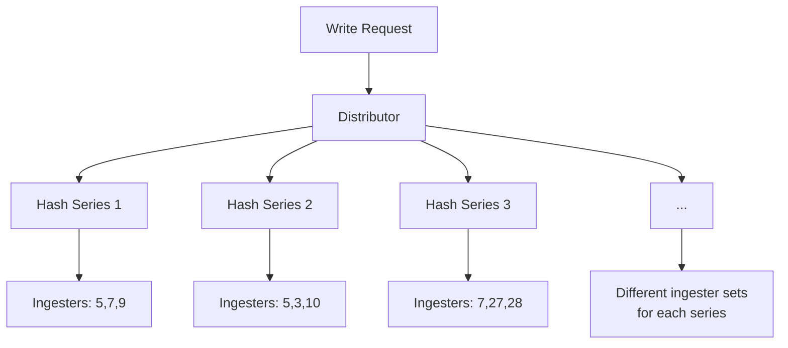
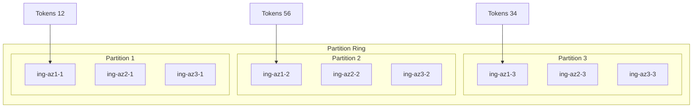
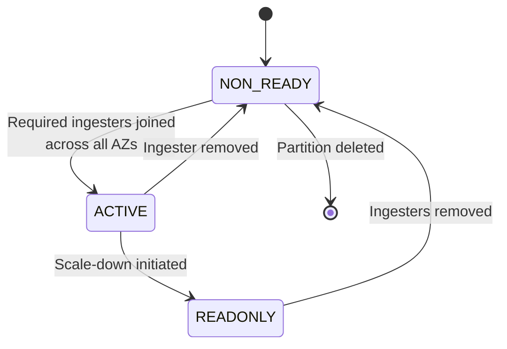
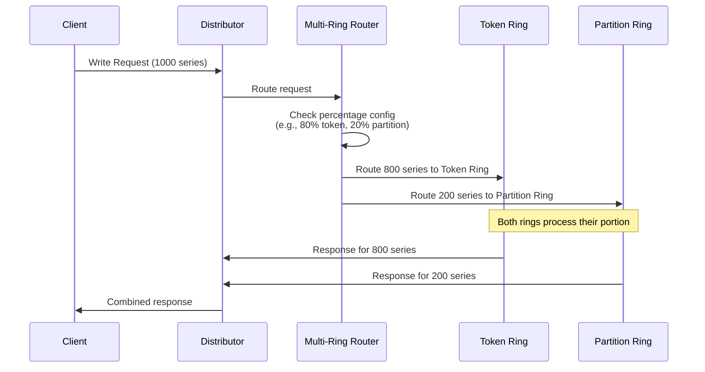

<a id="doc-12e0a48d6c5f2a58f4caa284"></a>

# cortexproject/cortex / ADOPTERS.md

Upstream: https://github.com/cortexproject/cortex/blob/99c3b4dd4015ecb4fdb7ebffeb6648e1c0f1b738/ADOPTERS.md

Commit: `99c3b4dd4015ecb4fdb7ebffeb6648e1c0f1b738`

Retrieved: 2026-10-01T15:16:20.092296+00:00

Kind: official-document

Raw SHA256: `aa722d38dc5335506a4bbd1e342c99d3f88ca95d31b469aed1b0c8cdf4ad1e87`

Source text below is untrusted reference content. Acquisition does not verify technical claims.

License status: UPSTREAM_NOTICES_CAPTURED_PER_FILE_REVIEW_REQUIRED. See this repository's captured license files.

---

# Cortex Adopters

This is the list of organisations that are using Cortex in **production environments** to power their metrics and monitoring systems. Please send PRs to add or remove organisations.

* [Adobe](https://www.adobe.com)
* [Amazon Web Services (AWS)](https://aws.amazon.com/prometheus)
* [Aspen Mesh](https://aspenmesh.io/)
* [Buoyant](https://buoyant.io/)
* [Cabify](https://tech.cabify.com/)
* [DigitalOcean](https://www.digitalocean.com/)
* [Electronic Arts](https://www.ea.com/)
* [Etsy](https://www.etsy.com/)
* [EverQuote](https://everquote.com/)
* [GoJek](https://www.gojek.io/)
* [KakaoEnterprise](https://kakaocloud.com/)
* [MayaData](https://mayadata.io/)
* [Northflank](https://northflank.com/)
* [Open-Xchange](https://www.open-xchange.com/)
* [Opstrace](https://opstrace.com/)
* [PITS Globale Datenrettungsdienste](https://www.pitsdatenrettung.de/)
* [Planetary Quantum](https://www.planetary-quantum.com)
* [Platform9](https://platform9.com/)
* [REWE Digital](https://rewe-digital.com/)
* [Swiggy](https://www.swiggy.in/)
* [Sophotech](https://sopho.tech/)
* [SysEleven](https://www.syseleven.de/)
* [Twilio](https://www.twilio.com/)


<a id="doc-a54ff182c7e8acf56acfd6e4"></a>

# cortexproject/cortex / AGENTS.md

Upstream: https://github.com/cortexproject/cortex/blob/99c3b4dd4015ecb4fdb7ebffeb6648e1c0f1b738/AGENTS.md

Commit: `99c3b4dd4015ecb4fdb7ebffeb6648e1c0f1b738`

Retrieved: 2026-10-01T15:16:20.092296+00:00

Kind: official-document

Raw SHA256: `821ce248302066876a64a1c25520fb199b79ef3fa99927eb2ad50ad279a88598`

Source text below is untrusted reference content. Acquisition does not verify technical claims.

License status: UPSTREAM_NOTICES_CAPTURED_PER_FILE_REVIEW_REQUIRED. See this repository's captured license files.

---

# AGENTS.md

This file provides guidance to AI coding agents when working with code in this repository.

## Project Overview

Cortex is a horizontally scalable, highly available, multi-tenant, long-term storage solution for Prometheus metrics. It uses a microservices architecture with components that can run as separate processes or as a single binary.

## Build Commands

```bash
make                           # Build all (runs in Docker container by default)
make BUILD_IN_CONTAINER=false  # Build locally without Docker
make exes                      # Build binaries only
make protos                    # Generate protobuf files
make lint                      # Run all linters (golangci-lint, misspell, etc.)
make doc                       # Generate config documentation (run after changing flags/config)
make ./cmd/cortex/.uptodate    # Build Cortex Docker image for integration tests
```

## Vendored Dependencies

Go modules are vendored in the `vendor/` folder. When upgrading a dependency or component:

```bash
go get github.com/some/dependency@version  # Update go.mod
go mod vendor                               # Sync vendor folder
go mod tidy                                 # Clean up go.mod/go.sum
```

**Important**: Always check the `vendor/` folder for upstream library code (e.g., `vendor/github.com/prometheus/alertmanager/` for Alertmanager internals). Do not modify vendored code directly.

## Testing

### Unit Tests

```bash
go test -timeout 2400s -tags "netgo slicelabels" ./...          # Run tests with CI configuration
```

### Integration Tests

Integration tests require Docker and the Cortex image to be built first:

```bash
make ./cmd/cortex/.uptodate    # Build Cortex Docker image first

# Run all integration tests
go test -v -tags=integration,requires_docker,integration_alertmanager,integration_memberlist,integration_querier,integration_ruler,integration_query_fuzz ./integration/...

# Run a specific integration test
go test -v -tags=integration,integration_ruler -timeout 2400s -count=1 ./integration/... -run "^TestRulerAPISharding$"
```

Environment variables for integration tests:

- `CORTEX_IMAGE` - Docker image to test (default: `quay.io/cortexproject/cortex:latest`)
- `E2E_TEMP_DIR` - Directory for temporary test files

## Code Formatting

Use goimports with Cortex-specific import grouping:

```bash
goimports -local github.com/cortexproject/cortex -w ./path/to/file.go
```

Import order: stdlib, third-party packages, internal Cortex packages (separated by blank lines).

## Architecture

### Write Path

- **Distributor** (stateless) - Receives samples via remote write, validates, distributes to ingesters using consistent hashing
- **Ingester** (semi-stateful) - Stores samples in memory, periodically flushes to long-term storage (TSDB blocks)

### Read Path

- **Querier** (stateless) - Executes PromQL queries across ingesters and long-term storage
- **Query Frontend** (optional, stateless) - Query caching, splitting, and queueing
- **Query Scheduler** (optional, stateless) - Moves queue from frontend for independent scaling

### Storage

- **Compactor** (stateless) - Compacts TSDB blocks in object storage
- **Store Gateway** (semi-stateful) - Queries blocks from object storage

### Optional Services

- **Ruler** - Executes recording rules and alerts
- **Alertmanager** - Multi-tenant alert routing
- **Configs API** - Configuration management

### Key Patterns

- **Hash Ring** - Consistent hashing via Consul, Etcd, or memberlist gossip for data distribution
- **Multi-tenancy** - Tenant isolation via `X-Scope-OrgID` header
- **Blocks Storage** - TSDB-based storage with 2-hour block ranges, stored in S3/GCS/Azure/Swift

### Main Entry Points

- `cmd/cortex/main.go` - Main Cortex binary
- `pkg/cortex/cortex.go` - Service orchestration and configuration

## Code Conventions

- **No global variables** - Use dependency injection
- **Metrics**: Register with `promauto.With(reg)`, never use global prometheus registerer
- **Config naming**: YAML uses `snake_case`, CLI flags use `kebab-case`
- **Logging**: Use `github.com/go-kit/log` (not `github.com/go-kit/kit/log`)

## PR Requirements

- Sign commits with DCO: `git commit -s -m "message"`
- Run `make doc` if config/flags changed
- Include CHANGELOG entry for user-facing changes

## Investigating CI Build Failures

When asked to investigate a CI build failure:

1. **Fetch job details** using `gh api repos/cortexproject/cortex/actions/runs/<run-id>/jobs` to identify failed jobs and steps. Note: `gh run view --log` only works after the entire run completes, not just individual jobs.
2. **Get annotations** using `gh api repos/cortexproject/cortex/check-runs/<job-id>/annotations` to surface error messages when full logs are unavailable.
3. **Fetch full logs** once the run completes using `gh run view <run-id> --job <job-id> --log`.
4. **Determine root cause** — distinguish between infrastructure failures (e.g., Docker Hub rate limits, runner issues) and code-related failures (e.g., test regressions). Use `git log` and `gh pr diff` to check if the failure relates to the PR's changes.
5. **For flaky/infrastructure issues**, use `git log` and `git log -p` to trace when the failing code was introduced and which PR added it.
6. **File GitHub issues** with the user's permission, including:
   - The full error output in a `<details>` block (since job links can expire)
   - Root cause analysis
   - Which PR introduced the issue (but do not assign or tag individuals without the user's approval)
   - Proposed solutions

## Related Policies

This file (`AGENTS.md`) provides technical guidance **to** AI coding agents working in this repository (build commands, architecture, conventions). For the policy governing **human use** of AI tools when preparing contributions, see [GENAI_POLICY.md](GENAI_POLICY.md).


<a id="doc-06572a96a58dc510037d5efa"></a>

# cortexproject/cortex / CHANGELOG.md

Upstream: https://github.com/cortexproject/cortex/blob/99c3b4dd4015ecb4fdb7ebffeb6648e1c0f1b738/CHANGELOG.md

Commit: `99c3b4dd4015ecb4fdb7ebffeb6648e1c0f1b738`

Retrieved: 2026-10-01T15:16:20.092296+00:00

Kind: official-document

Raw SHA256: `b70e3adb5282e00cfbf5782215bad8effbb961c105bf6e87aee3db69a2ca4ddc`

Source text below is untrusted reference content. Acquisition does not verify technical claims.

License status: UPSTREAM_NOTICES_CAPTURED_PER_FILE_REVIEW_REQUIRED. See this repository's captured license files.

---

# Changelog

## master / unreleased

* [FEATURE] Ruler: Add experimental support for federated rule groups. A rule group listing tenants in its `source_tenants` field is evaluated against those tenants while the resulting series and alerts are written to the tenant owning the rule group. Enabled with `-ruler.enable-federated-rules` (requires `-tenant-federation.enabled`), and restricted to selected tenants with `-ruler.allowed-federated-tenants` and `-ruler.disallowed-federated-tenants`. #7828

## 1.22.0 in progress
* [CHANGE] Ruler: Remove the deprecated `-ruler.evaluation-delay-duration` flag and its `ruler_evaluation_delay_duration` per-tenant limit. Use `-ruler.query-offset` / `ruler_query_offset`, which no longer takes the higher of the two values. Cortex decodes the runtime config strictly, so a leftover `ruler_evaluation_delay_duration` override makes the runtime config fail to load: Cortex **exits at startup** (`module failed`, `module=runtime-config`), and on an already-running process every reload fails, pinning the last good overrides and dropping `cortex_runtime_config_last_reload_successful` to 0. Run `grep -r ruler_evaluation_delay_duration` over your runtime configs before upgrading. #7792
* [CHANGE] Remove the deprecated `-<prefix>.fifocache.size` flag and its `size` YAML field (deprecated in 1.1.0). Use `-<prefix>.fifocache.max-size-items` or `-<prefix>.fifocache.max-size-bytes`; a cache configured only via `size` now starts with no capacity. #7791
* [CHANGE] Querier: Remove the deprecated `-querier.ingester-metadata-streaming` flag and its `ingester_metadata_streaming` YAML field (deprecated in 1.18.0, default `true`). Streaming RPCs are now always used for the metadata APIs. Also removes the dead hidden `ingester_streaming` YAML field left over from `-querier.ingester-streaming`. #7791
* [CHANGE] Remove deprecated CLI flags that have been no-ops for at least two minor releases. All of them were flag-only (no YAML config option) and already had no effect, so the only impact is that passing them now fails at startup. Remove them from your command lines before upgrading. #7790
  - `-querier.ingester-streaming` (deprecated in 1.17.0)
  - `-querier.iterators` (deprecated in 1.17.0)
  - `-querier.batch-iterators` (deprecated in 1.17.0)
  - `-querier.query-store-for-labels-enabled` (deprecated in 1.18.0)
  - `-querier.max-outstanding-requests-per-tenant` (deprecated in 1.18.0; use `-frontend.max-outstanding-requests-per-tenant`)
  - `-query-scheduler.max-outstanding-requests-per-tenant` (deprecated in 1.18.0; use `-frontend.max-outstanding-requests-per-tenant`)
  - `-blocks-storage.tsdb.wal-compression-enabled` (deprecated in 1.19.0; use `-blocks-storage.tsdb.wal-compression-type`)
  - `-ingester.max-series-per-query` (a chunks-storage limit, ignored since blocks storage; use `-querier.max-fetched-series-per-query`)
* [CHANGE] Ingester: Formally deprecate `-blocks-storage.tsdb.max-exemplars`, scheduled for removal in v1.24.0. Use the per-tenant `max_exemplars` limit instead. The flag still works as the global fallback when `max_exemplars` is 0, but setting it now logs a warning and increments `deprecated_flags_inuse_total`. #7793
* [CHANGE] Ingester: Graduate native histogram ingestion (`-blocks-storage.tsdb.enable-native-histograms`) from experimental. #7789
* [CHANGE] Querier: Make query time range configurations per-tenant: `query_ingesters_within`, `query_store_after`, and `shuffle_sharding_ingesters_lookback_period`. Uses `model.Duration` instead of `time.Duration` to support serialization but has minimum unit of 1ms (nanoseconds/microseconds not supported). #7160 #7323
* [CHANGE] Alertmanager: Remove the obsolete startup migration of local state files into per-tenant directories (scheduled for removal in 1.11.0). Upgrading from a release older than 1.9.0 with a persisted local state directory now requires upgrading to an intermediate release first, so the migration can run. #7513
* [CHANGE] Cache: Setting `-blocks-storage.bucket-store.metadata-cache.bucket-index-content-ttl` to 0 will disable the bucket-index cache. #7446
* [CHANGE] HA Tracker: Move `-distributor.ha-tracker.failover-timeout` from a global config to a per-tenant runtime config. The flag name and default value (30s) remain the same. #7481
* [FEATURE] Parquet: Support sharded parquet file conversion and querying. #7610
* [FEATURE] Parquet Converter: Add experimental `-parquet-converter.max-num-columns` flag to automatically shard parquet files when the number of columns exceeds the configured limit. This prevents failures when a TSDB block has more unique label names than the parquet library's column limit (32767). #7624
* [FEATURE] Distributor: Add experimental `-distributor.num-query-workers` flag to use a goroutine worker pool for query fan-out calls to ingesters. Reuses pre-grown goroutine stacks to eliminate the `runtime.copystack` overhead (~8% CPU) observed on rulers with wide ingester fan-out. Falls back to spawning a new goroutine when no worker is available. #7623
* [FEATURE] Ingester: Add experimental active series tracker that counts active series by configurable label matchers (including regex) per tenant and exposes `cortex_ingester_active_series_per_tracker` metric. Configured via `active_series_trackers` in runtime config overrides. #7476
* [FEATURE] Ingester: Add experimental head-only queried series metric. `cortex_ingester_queried_head_series` tracks unique series queried from head via HLL. Enabled via `-ingester.head-queried-series-metrics-enabled`. #7500
* [FEATURE] Ruler: Add per-tenant `ruler_alert_generator_url_template` runtime config option to customize alert generator URLs using Go templates. Includes a `jsonEscape` template function for safely embedding expressions in JSON-encoded URL parameters (e.g., Grafana Explore panes). Supports Grafana Explore, Perses, and other UIs. #7302 #7458
* [FEATURE] Distributor: Add experimental `-distributor.enable-start-timestamp` flag for Prometheus Remote Write 2.0. When enabled, `StartTimestamp (ST)` is ingested. #7371
* [FEATURE] Memberlist: Add `-memberlist.cluster-label` and `-memberlist.cluster-label-verification-disabled` to prevent accidental cross-cluster gossip joins and support rolling label rollout. #7385
* [FEATURE] Querier: Add timeout classification to classify query timeouts as 4XX (user error) or 5XX (system error) based on phase timing. When enabled, queries that spend most of their time in PromQL evaluation return `422 Unprocessable Entity` instead of `503 Service Unavailable`. #7374
* [FEATURE] Querier: Implement Resource Based Throttling in Querier. #7442
* [FEATURE] Querier: Add resource-based query eviction that automatically cancels the heaviest running query when CPU or heap utilization exceeds configured thresholds. #7488
* [FEATURE] Storage: Add support for Oracle Cloud Infrastructure (OCI) Object Storage as a backend for blocks, ruler, and alertmanager storage. Configured via `-<prefix>.oci.*` flags with `backend: oci`. #7718
* [FEATURE] StoreGateway: Add experimental optional limit `blocks-storage.bucket-store.max-concurrent-data-bytes` on the data bytes (postings, series and chunks) fetched via the Series() API call and processed concurrently across all queries per store gateway to protect from oomkill. This returns an error that is retryable at querier level. #7271
* [FEATURE] Engine: Add `-querier.selector-batch-size` and `-ruler.selector-batch-size` flags to configure series batching in the Thanos promQL engine. 0 disables batching. #7763
* [ENHANCEMENT] Upgrade prometheus alertmanager version to v0.32.1. #7462
* [ENHANCEMENT] Tenant Federation: Avoid purging the regex resolver LRU cache on user-sync ticks when the set of known users has not changed. #7489
* [ENHANCEMENT] Parquet Converter: Add `parquet-converter.max-block-label-names` limit to skip conversion of TSDB blocks with too many label names. #7625
* [ENHANCEMENT] Parquet Converter: Add a ring status page to expose the ring status. #7455
* [ENHANCEMENT] Parquet: Add `-blocks-storage.bucket-store.parquet-query-concurrency` flag to configure the maximum number of concurrent goroutines applied at each level of parquet query processing in store-gateway: shard querying, row group processing, and column materialization. #7613
* [ENHANCEMENT] Parquet: Add a row ranges cache for parquet query filtering in querier and store-gateway. #7478
* [ENHANCEMENT] Ingester: Add `cortex_ingester_ingestion_delay_seconds` native histogram metric to track the delay between sample ingestion time and sample timestamp. #7443
* [ENHANCEMENT] Ingester: Add WAL record metrics to help evaluate the effectiveness of WAL compression type (e.g. snappy, zstd): `cortex_ingester_tsdb_wal_record_part_writes_total`, `cortex_ingester_tsdb_wal_record_parts_bytes_written_total`, and `cortex_ingester_tsdb_wal_record_bytes_saved_total`. #7420
* [ENHANCEMENT] Distributor: Introduce dynamic `Symbols` slice capacity pooling. #7398 #7401
* [ENHANCEMENT] Metrics Helper: Add native histogram support for aggregating and merging, including dual-format histogram handling that exposes both native and classic bucket formats. #7359
* [ENHANCEMENT] Cache: Add per-tenant TTL configuration for query results cache to control cache expiration on a per-tenant basis with separate TTLs for regular and out-of-order data. `-frontend.out-of-order-results-cache-ttl` falls back to `-frontend.results-cache-ttl` when unset, and then to the global cache backend TTL. #7357 #7775
* [ENHANCEMENT] Update build image and Go version to 1.26. #7434 #7437 #7716 #7726
* [ENHANCEMENT] Upgraded container base images from `alpine:3.23` to `gcr.io/distroless/static-debian12`, reducing image size and attack surface. #7637
* [ENHANCEMENT] Query Scheduler: Add `cortex_query_scheduler_tracked_requests` metric to track the current number of requests held by the scheduler. #7355
* [ENHANCEMENT] Compactor: Prevent partition compaction to compact any blocks marked for deletion. #7391
* [ENHANCEMENT] Distributor: Optimize memory allocations by reusing the existing capacity of these pooled slices in the Prometheus Remote Write 2.0 path. #7392
* [ENHANCEMENT] Upgrade gRPC from v1.71.2 to v1.79.3 to address CVE-2026-33186. #7460 #7463
* [ENHANCEMENT] Query Frontend: Add `query_too_expensive` reason to QFE and `reason` field to query stats. #7479
* [ENHANCEMENT] Instrument Ingester CPU profile with source for read APIs. #7494
* [ENHANCEMENT] Ingester: Convert expanded postings cache from FIFO to LRU eviction to retain frequently-queried entries under memory pressure. #7510
* [ENHANCEMENT] Querier: Detach series label and chunk data from gRPC unmarshal buffers in store-gateway streaming path, allowing the Go GC to reclaim receive buffers. #7519
* [ENHANCEMENT] Distributor: Added `cortex_distributor_received_histogram_buckets` metric to track number of buckets in received native histogram samples before validation, per user. #7569
* [ENHANCEMENT] Ingester: Add lazy regex evaluation on head postings cache miss. Defers expensive regex matchers on high-cardinality labels to per-series filtering when a selective equality matcher already narrows the result set. Configured via `-blocks-storage.expanded_postings_cache.head.lazy-matcher-max-cardinality` (disabled by default). #7553
* [ENHANCEMENT] Ingester: Remove the redundant post-commit expanded postings cache invalidation in `Push`, now that the head invalidates the cache when a series is created. Pushes containing new series do less work and invalidate the head postings cache fewer times, improving its hit ratio. #7850
* [ENHANCEMENT] Store Gateway: Resolve the parquet shard count from the bucket index instead of reading the converter mark for each block, reducing object storage calls when the bucket index is enabled. A `component` label is added to the bucket index loader metrics to distinguish store-queryable and store-gateway. #7648
* [ENHANCEMENT] Query Frontend: Improve the slow query log with `source`, `user_agent`, `engine_type`, `block_store_type`, and query stats fields to aid slow query diagnosis. #7601
* [ENHANCEMENT] Ring: Add ring metric to count number of duplicate tokens. #7626
* [ENHANCEMENT] Upgrade prometheus version to v3.9.1. #7535
* [ENHANCEMENT] Metrics: Add native histogram support to all remaining production histograms, enabling dual-format (classic + native) exposition across all Cortex components. #7636
* [ENHANCEMENT] Ring: Cache `ShuffleShardWithLookback` subrings. The cached entry is invalidated on topology change or once `now` reaches the earliest `RegisteredTimestamp + lookbackPeriod` of any included instance. #7628
* [ENHANCEMENT] Query Frontend: Rename `time_taken` field to `time_taken_ms` and make it return millisecond count. #7649
* [ENHANCEMENT] Update prometheus alertmanager version to v0.34.0. #7647 #7820
  - The `reason` label on `cortex_alertmanager_notifications_failed_total` now reports `authError` for HTTP 401/403 and `rateLimited` for HTTP 429. These were previously counted as `clientError`.
* [ENHANCEMENT] Querier/Ingester: Detach ingester series from gRPC buffers to reduce heap. #7670
* [ENHANCEMENT] Ingester: Add `cortex_ingester_tsdb_head_max_timestamp` metric that re-exports the TSDB head max timestamp (`prometheus_tsdb_head_max_time`) per user, to help investigate ingestion issues like out-of-bounds (too old sample) errors. #7694
* [ENHANCEMENT] Ingester: Include the TSDB head max time in the `out of bounds` and `too old sample` error messages, so that users can see how far behind the accepted time range a rejected sample is. #7695
* [ENHANCEMENT] Compactor: Reduce object storage GET calls when updating the bucket index by skipping re-reading parquet converter markers for blocks that already have a valid-version parquet entry in the previous index. #7669
* [ENHANCEMENT] Upgrade Thanos and promql-engine to latest. #7505 #7691 #7740 #7788
* [ENHANCEMENT] Ruler: Adjust ruler frontend decoder to not wrap query error messages with execution prefix, this makes error responses consistent between internal and external ruler paths. #7741
* [ENHANCEMENT] Distributor: Deduplicate metric metadata when converting PRW 2.0 requests. PRW 2.0 attaches metadata to every series, so a metric family was previously expanded into one `MetricMetadata` per series. #7760
* [ENHANCEMENT] Ingester: Add `cortex_ingester_head_metric_names` gauge exposing the number of unique metric names in the TSDB head per tenant. Registered when `-ingester.active-series-metrics-enabled` is true. #7514
* [ENHANCEMENT] Query Frontend: Log `X-Grafana-User` header in query stats, slow query, and query request logs when Grafana's `send_user_header` is enabled. #7799
* [ENHANCEMENT] Querier: Add `-querier.pool-iterator-batches-buf` flag to pool mergeIterator scratch buffers via sync.Pool, reducing per-iterator memory allocation. #7765
* [ENHANCEMENT] Querier: Use non-pointer HistogramBucket slice in response codec. #7809
* [ENHANCEMENT] Update build image and Go version to 1.27.0. #7807 #7814
* [ENHANCEMENT] Querier: Reduce merge iterator `BatchSize` from 12 to 8. #7823
* [ENHANCEMENT] Upgrade promql-engine to latest. #7841
* [ENHANCEMENT] Ruler: Add new limit `-ruler.list-rules-max-rules` on the total number of rules returned by the Prometheus ListRules API. Responses exceeding the limit are truncated on a rule group boundary and return a `groupNextToken` for retrieving the remaining groups. A rule group is never split, so a single group larger than the limit is still returned whole. Defaults to 0, which is unlimited. #7785
* [BUGFIX] Querier: Fix queryWithRetry and labelsWithRetry returning (nil, nil) on cancelled context by propagating ctx.Err(). #7370
* [BUGFIX] Metrics Helper: Fix non-deterministic bucket order in merged histograms by sorting buckets after map iteration, matching Prometheus client library behavior. #7380
* [BUGFIX] Distributor: Return HTTP 401 Unauthorized when tenant ID resolution fails in the Prometheus Remote Write 2.0 path. #7389
* [BUGFIX] Packaging: Fix RPM and deb packages to install the binary to `/usr/bin`, install the systemd unit to the correct system path (`/usr/lib/systemd/system` for RPM, `/lib/systemd/system` for deb), and mark the sysconfig/default env file as a config file so it is not overwritten on upgrade. #7445
* [BUGFIX] Compactor: Handle not-found and access-denied errors from `Attributes()` in bucket index updater, preventing a stale cached `Get()` from causing the entire cleanup cycle to fail when `meta.json` has been deleted from object storage. #7454
* [BUGFIX] Compactor: Fix stale `cortex_bucket_index_last_successful_update_timestamp_seconds` metric not being cleaned up when tenant ownership changes due to ring rebalancing. This caused false alarms on bucket index update rate when a tenant moved between compactors. #7487
* [BUGFIX] Compactor: Fix flake in `TestCompactor_DeleteLocalSyncFiles` and `TestPartitionCompactor_DeleteLocalSyncFiles` by polling on user ownership rather than just the `CompactionRunsCompleted` counter, which increments even when the second compactor sees zero owned users due to a transient ring-view skew at startup. #7565
* [BUGFIX] Ingester: Close TSDB when compaction fails during `createTSDB`, preventing resource leaks (file descriptors, mmap handles) that could lead to ingester instability. #7560
* [BUGFIX] Tenant Federation: Fix result cache returning stale data after a new tenant is added when `-tenant-federation.regex-matcher-enabled=true`. The resolved tenant set is now hashed and included in the cache key so that any change to the matched tenant list automatically invalidates cached entries. Non-regex users are unaffected. #7562
* [BUGFIX] Tenant Federation: Fix regex resolver clearing known users list when user scan fails. #7534
* [BUGFIX] Ingester: Fix inflight query counter leak when resource-based query protection rejects a request. #7539
* [BUGFIX] Ingester: Release the TSDB appender on every early-return path in `Push` (e.g. out-of-order label set) by deferring `Rollback`. Previously such requests leaked TSDB head series references, mmap'd chunks and pending state per request, causing the `cortex_ingester_tsdb_head_active_appenders` gauge to grow unbounded. #7528
* [BUGFIX] Ingester: Fix `panic: send on closed channel` in `ActiveQueriedSeriesService` on shutdown by removing the redundant channel close in `stopping()` and relying on `ctx.Done()` to signal worker exit. #7533
* [BUGFIX] Ring: Fix ring token conflict resolution only applied to updated instance and make constantly token conflict check during instance observe period. #7554
* [BUGFIX] Ring: Fix `DoBatch` never running its cleanup callback when a per-instance callback panics. `wg.Done()` is now deferred, so `wg.Wait()` no longer blocks forever and the context timers and request buffers owned by the cleanup function are released. #7559
* [BUGFIX] Query Frontend: Fix native histogram responses not being handled correctly in `minTime()` sort ordering for split_by_interval merge. #7555
* [BUGFIX] Compactor: Ensure visit marker heartbeat goroutine completes before blocks cleaner returns. #7386
* [BUGFIX] Querier: Fix unbounded resource leak in the bucket-scan blocks finder (used when the bucket index is disabled). Per-tenant metadata fetchers, their Prometheus registries, and on-disk meta caches are now evicted once a tenant is no longer active, instead of being retained for the lifetime of the process. #7573
* [BUGFIX] Alertmanager: Fix data race between ApplyConfig's dispatcher/inhibitor startup and Stop during config reload and shutdown, and reject lazy tenant creation after shutdown begins. #7618
* [BUGFIX] Distributor: Release the push worker pool goroutines on shutdown by stopping the async executor during the stopping phase when `-distributor.num-push-workers` is set. #7602
* [BUGFIX] Query Frontend: Track data selection min and max time of query requests in query stats regardless of whether query priority and query rejection are enabled. #7724
* [BUGFIX] Querier: Fix flake in integration tests TestQuerierWithStoreGatewayDataBytesLimits and TestQuerierWithBlocksStorageLimits by waiting for the querier to see the store-gateway ACTIVE in the ring before querying. #7614
* [BUGFIX] Ruler: Register xfunctions (xincrease, xrate, xdelta) in the global parser before loading rule files. #7621
* [BUGFIX] Security: Reject empty entries in `-distributor.sign-write-requests-keys` caused by stray or trailing commas (e.g. `newkey,`). Previously these were silently accepted and produced an empty signing key, which downgraded HMAC stream-push authentication to a forgeable signature. Misconfigured flags now fail at process startup; audit your configs before upgrading. #7587
* [BUGFIX] Config: Fix validation of explicit zero values in non-empty YAML root sections, allowing configs such as `flusher: { exit_after_flush: false }` while continuing to reject empty root sections. #7700
* [BUGFIX] Querier: Fix panic due to request tracker truncating multi-byte UTF-8 character #7640
* [BUGFIX] Ingester: Fix panic (`HistogramProtoToHistogram called with a float histogram`) when ingesting a float native histogram with a zero count (e.g. a staleness marker or empty histogram). The decoder is now selected by histogram type via `IsFloatHistogram()` instead of by count value. #7645
* [BUGFIX] Querier: Fix parquet queryable fallback returning a nil error instead of the actual query error in `LabelValues` and `LabelNames`. #7638
* [BUGFIX] Storage: Default the Azure `endpoint_suffix` to `blob.core.windows.net` instead of empty. Cortex builds the Thanos Azure config directly and bypasses Thanos' default, so an unset suffix produced an invalid FQDN (`<account>.`) and components hung on startup with DNS errors. #5449 #7687
* [BUGFIX] Store Gateway: Fix misleading "no index cache backend addresses" validation error being reported for chunks-cache, metadata-cache, and parquet caches when their memcached or redis backend is configured without addresses. The message is now the cache-type-agnostic "no cache backend addresses". #7675
* [BUGFIX] Querier/Query Frontend: Fix DNS watcher dropping all query-frontend/scheduler worker connections on a transient DNS lookup failure. #7698
* [BUGFIX] Ring: Fix DynamoDB KV CAS not retrying on transactional conditional check failures. `TransactWriteItems` reports condition failures as `TransactionCanceledException` with a `ConditionalCheckFailed` cancellation reason, which was not recognized as retryable, so any concurrent ring update conflict (e.g. many ingesters joining during a rolling update) failed immediately instead of re-reading and retrying. `TransactionConflict` cancellation reasons are also treated as retryable. #7706
* [BUGFIX] Distributor: Return HTTP 499 (Client Closed Request) instead of 500 when a remote-write or OTLP push is canceled by the client, so client-side cancellations are no longer counted as server-side errors. #7717
* [BUGFIX] Querier: Fix gRPC `codes.Canceled` errors being mapped to HTTP 500 instead of 499 when a client cancels a query. #7738
* [BUGFIX] Fix the gRPC DNS watcher's SRV record path deleting all known endpoints when the SRV query succeeds but every target's A record lookup fails. #7745
* [BUGFIX] Compactor: Fix spurious `bucket operation fail after retries` error logs emitted during partial block cleanup. #7749
* [BUGFIX] Alertmanager: Fix panic in `validateAlertmanagerConfig` when receiver config traversal encounters nil interface values. #7751
* [BUGFIX] Parquet Converter: Fix `auto_forget_delay` having no effect. The ring lifecycler was created without the auto-forget delegate, so unhealthy instances were never automatically removed from the ring. #7752
* [BUGFIX] Compactor: Properly handle error from ReadPartitionedGroupInfo in UpdatePartitionedGroupInfo. #7766
* [BUGFIX] Alertmanager: Reject the global `mattermost_webhook_url_file` setting in per-tenant configs, consistent with every other global `*_file` setting. #7768
* [BUGFIX] Alertmanager: Tighten per-tenant config validation to reject additional file-based settings. #7767
* [BUGFIX] Parquet Converter: Fix misleading error messages referring to the compactor ring instead of the parquet converter ring during startup and sharding checks. #7755
* [BUGFIX] Querier: Fix panic (`index out of range [-1]`) in the active request tracker when truncating a `match[]`/`query` value made entirely of invalid UTF-8 continuation bytes. The backwards scan for a rune boundary now stops at index 0 instead of underflowing. #7743
* [BUGFIX] Config: Fix CSV-list flags/YAML fields (e.g. `-compactor.enabled-tenants`) treating an explicitly empty string as a one-element list containing an empty tenant name instead of an empty list. #7714
* [BUGFIX] Tenant Federation: Fix regex tenant federation dropping tenants when `-blocks-storage.users-scanner.cache-ttl` is set. The regex resolver sorted the user list returned by the users scanner in place, corrupting the scanner cache and progressively losing tenants on every sync until the cache expired. #7812
* [BUGFIX] Tenant Federation: Fix regex tenant federation resolving to an empty user list right after startup. #7811
* [BUGFIX] Ingester: Don't count a forced head compaction skipped because blocks shipping is in progress as a failure. Previously such skips incremented `cortex_ingester_tsdb_compactions_failed_total`, producing spurious alerts. #7842

## 1.21.1 2026-06-04

* [BUGFIX] gRPC: Fix panic when `grpc_compression` is set to `snappy` on ingester client or store-gateway client configurations. #7459
* [BUGFIX] Config: Mask Swift, etcd, Redis, and HTTP basic-auth credentials on the `/config` endpoint. #7473
* [BUGFIX] Memberlist: Drop incoming TCP transport packets when digest verification fails, preventing corrupted payloads from being forwarded. #7474
* [BUGFIX] Ingester: Reject `PushStream` requests where the per-message `TenantID` does not match the authenticated caller, and add HMAC-SHA256 stream authentication for `PushStream` via `-distributor.sign-write-requests-keys`. #7475
* [BUGFIX] Security: Fix stored XSS vulnerability in Alertmanager and Store Gateway status pages by replacing `text/template` with `html/template`. #7512
* [BUGFIX] Security: Limit decompressed gzip output in `ParseProtoReader` and OTLP ingestion path. The decompressed body is now capped by `-distributor.otlp-max-recv-msg-size`. #7515
* [BUGFIX] Memberlist: Add `-memberlist.packet-read-timeout`, `-memberlist.max-packet-size`, and `-memberlist.max-concurrent-connections` flags to bound inbound gossip TCP connections, preventing slow-read, OOM, and connection-flood attacks on the gossip port. #7518
* [BUGFIX] Distributor: Add `WrappedHistogram` with configurable size limit (`-validation.max-native-histogram-size-bytes`, default 16 KB) to cap native histogram protobuf size before unmarshalling, preventing memory amplification attacks via packed varint deltas. #7570
* [BUGFIX] Distributor: Fix a panic (`slice bounds out of range`) in the stream push path when the context deadline expires while the worker goroutine is still marshalling a `WriteRequest`. #7541

## 1.21.0 2026-04-24

* [CHANGE] Ruler: Graduate Ruler API from experimental. #7312
  * Flag: Renamed `-experimental.ruler.enable-api` to `-ruler.enable-api`. The old flag is kept as deprecated.
  * Ruler API is no longer marked as experimental.
* [CHANGE] Alertmanager: Graduate Alertmanager API and sharding from experimental. #7315
  * Flag: Renamed `-experimental.alertmanager.enable-api` to `-alertmanager.enable-api`. The old flag is kept as deprecated.
  * Alertmanager sharding is no longer marked as experimental.
* [CHANGE] Blocks storage: Bucket index is now enabled by default. Disabling the bucket index (`-blocks-storage.bucket-store.bucket-index.enabled=false`) is not recommended for production. #7259
* [CHANGE] Users Scanner: Rename user index update configuration. #7180
  * Flag: Renamed `-*.users-scanner.user-index.cleanup-interval` to `-*.users-scanner.user-index.update-interval`.
  * Config: Renamed `clean_up_interval` to `update_interval` within the `users_scanner` configuration block..
* [CHANGE] Querier: Refactored parquet cache configuration naming. #7146
  * Metrics: Renamed `cortex_parquet_queryable_cache_*` to `cortex_parquet_cache_*`.
  * Flags: Renamed `-querier.parquet-queryable-shard-cache-size` to `-querier.parquet-shard-cache-size` and `-querier.parquet-queryable-shard-cache-ttl` to `-querier.parquet-shard-cache-ttl`.
  * Config: Renamed `parquet_queryable_shard_cache_size` to `parquet_shard_cache_size` and `parquet_queryable_shard_cache_ttl` to `parquet_shard_cache_ttl`.
* [FEATURE] Overrides: Add new Overrides API component and rename old overrides module to `overrides-configs`. #6975
* [FEATURE] HATracker: Add experimental support for `memberlist` and `multi` as a KV store backend. #7284
* [FEATURE] Distributor: Add `-distributor.otlp.add-metric-suffixes` flag. If true, suffixes will be added to the metrics for name normalization. #7286
* [FEATURE] StoreGateway: Introduces a new parquet mode. #7046
* [FEATURE] StoreGateway: Add a parquet shard cache to parquet mode. #7166
* [FEATURE] Distributor: Add a per-tenant flag `-distributor.enable-type-and-unit-labels` that enables adding `__unit__` and `__type__` labels for remote write v2 and OTLP requests. This is a breaking change; the `-distributor.otlp.enable-type-and-unit-labels` flag is now deprecated, operates as a no-op, and has been consolidated into this new flag. #7077
* [FEATURE] Querier: Add experimental projection pushdown support in Parquet Queryable. #7152
* [FEATURE] Ingester: Add experimental active series queried metric. #7173
* [FEATURE] Update prometheus Alertmanager version to v0.31.1 and add new integration to IncidentIO and Mattermost. #7092 #7267
* [FEATURE] Tenant Federation: Add experimental support for partial responses using the `-tenant-federation.allow-partial-data` flag. When enabled, failures from individual tenants during a federated query are treated as warnings, allowing results from successful tenants to be returned. #7232
* [FEATURE] Alertmanager: Add `-alertmanager.disable-replica-set-extension` flag to limit blast radius during config corruption incidents. #7153
* [ENHANCEMENT] Tenant Federation: Add a local cache to regex resolver. #7363
* [ENHANCEMENT] Distributor: Add `cortex_distributor_push_requests_total` metric to track the number of push requests by type. #7239
* [ENHANCEMENT] Querier: Add `-querier.store-gateway-series-batch-size` flag to configure the maximum number of series to be batched in a single gRPC response message from Store Gateways. #7203
* [ENHANCEMENT] HATracker: Add `-distributor.ha-tracker.enable-startup-sync` flag. If enabled, the ha-tracker fetches all tracked keys on startup to populate the local cache. #7213
* [ENHANCEMENT] Distributor: Add validation to ensure remote write v2 requests contain at least one sample or histogram. #7201
* [ENHANCEMENT] Ingester: Add support for ingesting Native Histogram with Custom Buckets. #7191
* [ENHANCEMENT] Ingester: Optimize labels out-of-order (ooo) check by allowing the iteration to terminate immediately upon finding the first unsorted label. #7186
* [ENHANCEMENT] Distributor: Skip attaching `__unit__` and `__type__` labels when `-distributor.enable-type-and-unit-labels` is enabled, as these are appended from metadata. #7145
* [ENHANCEMENT] Distributor: Add `cortex_distributor_ingester_push_timeouts_total` metric to track the number of push requests to ingesters that were canceled due to timeout. #7155 #7229
* [ENHANCEMENT] StoreGateway: Add tracings to parquet mode. #7125
* [ENHANCEMENT] Querier: Add a `-querier.parquet-queryable-shard-cache-ttl` flag to add TTL to parquet shard cache. #7098
* [ENHANCEMENT] Ingester: Add `enable_matcher_optimization` config to apply low selectivity matchers lazily. #7063
* [ENHANCEMENT] Distributor: Add a label references validation for remote write v2 request. #7074
* [ENHANCEMENT] Distributor: Add count, spans, and buckets validations for native histogram. #7072
* [ENHANCEMENT] Alertmanager/Ruler: Introduce a user scanner to reduce the number of list calls to object storage. #6999
* [ENHANCEMENT] Ruler: Add DecodingConcurrency config flag for Thanos Engine. #7118
* [ENHANCEMENT] Query Frontend: Add query priority based on operation. #7128
* [ENHANCEMENT] Compactor: Avoid double compaction by cleaning partition files in 2 cycles. #7130 #7209 #7260
* [ENHANCEMENT] Distributor: Optimize memory usage by recycling v2 requests. #7131
* [ENHANCEMENT] Compactor: Avoid double compaction by not filtering delete blocks on real time when using bucketIndex lister. #7156
* [ENHANCEMENT] Upgrade to go 1.25.8 #7164 #7340
* [ENHANCEMENT] Upgraded container base images to `alpine:3.23`. #7163
* [ENHANCEMENT] Ingester: Instrument Ingester CPU profile with userID for read APIs. #7184
* [ENHANCEMENT] Ingester: Add fetch timeout for Ingester expanded postings cache. #7185
* [ENHANCEMENT] Ingester: Add feature flag to collect metrics of how expensive an unoptimized regex matcher is and new limits to protect Ingester query path against expensive unoptimized regex matchers. #7194 #7210
* [ENHANCEMENT] Querier: Add active API requests tracker logging to help with OOMKill troubleshooting. #7216
* [ENHANCEMENT] Compactor: Add partition group creation time to visit marker. #7217
* [ENHANCEMENT] Compactor: Add concurrency for partition cleanup and mark block for deletion #7246
* [ENHANCEMENT] Distributor: Validate metric name before removing empty labels. #7253
* [ENHANCEMENT] Ruler/Ingester: Propagate append hints to discard out of order samples on Ingester #7330
* [ENHANCEMENT] Make cortex_ingester_tsdb_sample_ooo_delta metric per-tenant #7279
* [ENHANCEMENT] Distributor: Add dimension `nhcb` to keep track of nhcb samples in `cortex_distributor_received_samples_total` and `cortex_distributor_samples_in_total` metrics.
* [ENHANCEMENT] Distributor: Add `-distributor.accept-unknown-remote-write-content-type` flag. When enabled, requests with unknown or invalid Content-Type header are treated as remote write v1 instead of returning 415 Unsupported Media Type. Default is false. #7293
* [ENHANCEMENT] Ingester: Added `cortex_ingester_ingested_histogram_buckets` metric to track number of histogram buckets ingested per user. #7297
* [ENHANCEMENT] Ring: Reuse timers in lifecycler and backoff loops to reduce allocations. #7270
* [ENHANCEMENT] Ring/KV: Reuse timers in DynamoDB watch loops to avoid per-poll allocations. #7266
* [ENHANCEMENT] Ring/KV: Reuse timers in memberlist client to reduce allocations. #7285
* [ENHANCEMENT] PromQL: Add `holt_winters` backwards compatibility as alias for `double_exponential_smoothing`. #7223
* [ENHANCEMENT] Query Frontend: Add logical plan fragmentation for distributed query execution. #7018
* [ENHANCEMENT] Parquet: Support sharded parquet files in parquet converter and queryable. #7189
* [ENHANCEMENT] Compactor: Add graceful period for compaction groups to prevent compacting recently written blocks. #7182
* [ENHANCEMENT] Query Engine: Add projection pushdown optimizer for improved query performance. #7141
* [ENHANCEMENT] Distributor: Optimize memory allocations by pooling PreallocWriteRequestV2 and preserving the capacity of the Symbols slice during resets. #7404
* [ENHANCEMENT] Ruler: Allow ExternalPusher and ExternalQueryable to be specified separately. #7224
* [BUGFIX] Distributor: Add bounds checking for symbol references in Remote Write V2 requests to prevent panics when UnitRef or HelpRef exceed the symbols array length. #7290
* [BUGFIX] Distributor: If remote write v2 is disabled, explicitly return HTTP 415 (Unsupported Media Type) for Remote Write V2 requests instead of attempting to parse them as V1. #7238
* [BUGFIX] Ring: Change DynamoDB KV to retry indefinitely for WatchKey. #7088
* [BUGFIX] Ruler: Add XFunctions validation support. #7111
* [BUGFIX] Querier: propagate Prometheus info annotations in protobuf responses. #7132
* [BUGFIX] Scheduler: Fix memory leak by properly cleaning up query fragment registry. #7148
* [BUGFIX] Compactor: Add back deletion of partition group info file even if not complete #7157
* [BUGFIX] Query Frontend: Add Native Histogram extraction logic in results cache #7167
* [BUGFIX] Alertmanager: Fix alertmanager reloading bug that removes user template files #7196
* [BUGFIX] Query Scheduler: If max_outstanding_requests_per_tenant value is updated to lesser value than the current number of requests in the queue, the excess requests (newest ones) will be dropped to prevent deadlocks. #7188
* [BUGFIX] Distributor: Return remote write V2 stats headers properly when the request is HA deduplicated. #7240
* [BUGFIX] Cache: Fix Redis Cluster EXECABORT error in MSet by using individual SET commands instead of transactions for cluster mode. #7262
* [BUGFIX] Distributor: Fix an `index out of range` panic in PRW2.0 handler caused by dirty metadata when reusing requests from `sync.Pool`. #7299
* [BUGFIX] Distributor: Fix data corruption in the push handler caused by shallow copying `Samples` and `Histograms` when converting Remote Write V2 requests to V1. #7337
* [BUGFIX] Ingester: Fix panic due to concurrent access to rand in active queried series. #7329
* [BUGFIX] Distributor: Fix request slice not being properly reused in push error paths. #7123
* [BUGFIX] Memberlist: Skip nil values delivered by `WatchPrefix` when a key is deleted, preventing a panic in the HA tracker caused by a failed type assertion on a nil interface value. #7429
* [BUGFIX] Tenant Federation: Fix `unsupported character` error when `tenant-federation.regex-matcher-enabled` is enabled and the input regex matches 0 or 1 existing tenant. #7424
* [BUGFIX] KV store: Fix false-positive `status_code="500"` metrics for HA tracker CAS operations when using memberlist. #7408
* [BUGFIX] Fix nil when ingester_query_max_attempts > 1. #7369
* [BUGFIX] Alertmanager: Fix disappearing user config and state when ring is temporarily unreachable. #7372
* [BUGFIX] Fix memory leak in `ReuseWriteRequestV2` by explicitly clearing the `Symbols` backing array string pointers before returning the object to `sync.Pool`. #7373
* [BUGFIX] Querier: Fix queryWithRetry and labelsWithRetry returning (nil, nil) on cancelled context by propagating ctx.Err(). #7375


## 1.20.1 2025-12-03

* [BUGFIX] Distributor: Fix panic on health check failure when using stream push. #7116

## 1.20.0 2025-11-10

* [CHANGE] StoreGateway/Alertmanager: Add default 5s connection timeout on client. #6603
* [CHANGE] Ingester: Remove EnableNativeHistograms config flag and instead gate keep through new per-tenant limit at ingestion. #6718
* [CHANGE] Validate a tenantID when to use a single tenant resolver. #6727
* [CHANGE] Ring: Add zone label to ring_members metric. #6900
* [FEATURE] Distributor: Add an experimental `-distributor.otlp.enable-type-and-unit-labels` flag to add `__type__` and `__unit__` labels for OTLP metrics. #6969
* [FEATURE] Distributor: Add an experimental `-distributor.otlp.allow-delta-temporality` flag to ingest delta temporality otlp metrics. #6934
* [FEATURE] Query Frontend: Add dynamic interval size for query splitting. This is enabled by configuring experimental flags `querier.max-shards-per-query` and/or `querier.max-fetched-data-duration-per-query`. The split interval size is dynamically increased to maintain a number of shards and total duration fetched below the configured values. #6458
* [FEATURE] Querier/Ruler: Add `query_partial_data` and `rules_partial_data` limits to allow queries/rules to be evaluated with data from a single zone, if other zones are not available. #6526
* [FEATURE] Update prometheus alertmanager version to v0.28.0 and add new integration msteamsv2, jira, and rocketchat. #6590
* [FEATURE] Ingester/StoreGateway: Add `ResourceMonitor` module in Cortex, and add `ResourceBasedLimiter` in Ingesters and StoreGateways. #6674
* [FEATURE] Support Prometheus remote write 2.0. #6330
* [FEATURE] Ingester: Support out-of-order native histogram ingestion. It is automatically enabled when `-ingester.out-of-order-time-window > 0` and `-blocks-storage.tsdb.enable-native-histograms=true`. #6626 #6663
* [FEATURE] Ruler: Add support for percentage based sharding for rulers. #6680
* [FEATURE] Ruler: Add support for group labels. #6665
* [FEATURE] Query federation: Introduce a regex tenant resolver to allow regex in `X-Scope-OrgID` value. #6713
- Add an experimental `tenant-federation.regex-matcher-enabled` flag. If it enabled, user can input regex to `X-Scope-OrgId`, the matched tenantIDs are automatically involved. The user discovery is based on scanning block storage, so new users can get queries after uploading a block (generally 2h).
- Add an experimental `tenant-federation.user-sync-interval` flag, it specifies how frequently to scan users. The scanned users are used to calculate matched tenantIDs.
* [FEATURE] Experimental Support Parquet format: Implement parquet converter service to convert a TSDB block into Parquet and Parquet Queryable. #6716 #6743
* [FEATURE] Distributor/Ingester: Implemented experimental feature to use gRPC stream connection for push requests. This can be enabled by setting `-distributor.use-stream-push=true`. #6580
* [FEATURE] Compactor: Add support for percentage based sharding for compactors. #6738
* [FEATURE] Querier: Allow choosing PromQL engine via header `X-PromQL-EngineType`. #6777
* [FEATURE] Querier: Support for configuring query optimizers and enabling XFunctions in the Thanos engine. #6873
* [FEATURE] Query Frontend: Add support /api/v1/format_query API for formatting queries. #6893
* [FEATURE] Query Frontend: Add support for /api/v1/parse_query API (experimental) to parse a PromQL expression and return it as a JSON-formatted AST (abstract syntax tree). #6978
* [ENHANCEMENT] Upgrade the Prometheus version to 3.6.0 and add a `-name-validation-scheme` flag to support UTF-8. #7040 #7056
* [ENHANCEMENT] Distributor: Emit an error with a 400 status code when empty labels are found before the relabelling or label dropping process. #7052
* [ENHANCEMENT] Parquet Storage: Add support for additional sort columns during Parquet file generation #7003
* [ENHANCEMENT] Modernizes the entire codebase by using go modernize tool. #7005
* [ENHANCEMENT] Overrides Exporter: Expose all fields that can be converted to float64. Also, the label value `max_local_series_per_metric` got renamed to `max_series_per_metric`, and `max_local_series_per_user` got renamed to `max_series_per_user`. #6979
* [ENHANCEMENT] Ingester: Add `cortex_ingester_tsdb_wal_replay_unknown_refs_total` and `cortex_ingester_tsdb_wbl_replay_unknown_refs_total` metrics to track unknown series references during wal/wbl replaying. #6945
* [ENHANCEMENT] Distributor: Introduce a Protobuf model for Prometheus Remote Write 2.0 and a pool to improve performance. #6917
* [ENHANCEMENT] Ruler: Emit an error message when the rule synchronization fails. #6902
* [ENHANCEMENT] Querier: Support snappy and zstd response compression for `-querier.response-compression` flag. #6848
* [ENHANCEMENT] Tenant Federation: Add a # of query result limit logic when the `-tenant-federation.regex-matcher-enabled` is enabled. #6845
* [ENHANCEMENT] Query Frontend: Add a `cortex_slow_queries_total` metric to track # of slow queries per user. #6859
* [ENHANCEMENT] Query Frontend: Change to return 400 when the tenant resolving fail. #6715
* [ENHANCEMENT] Querier: Support query parameters to metadata api (/api/v1/metadata) to allow user to limit metadata to return. Add a `-ingester.return-all-metadata` flag to make the metadata API run when the deployment. Please set this flag to `false` to use the metadata API with the limits later. #6681 #6744
* [ENHANCEMENT] Ingester: Add a `cortex_ingester_active_native_histogram_series` metric to track # of active NH series. #6695
* [ENHANCEMENT] Query Frontend: Add new limit `-frontend.max-query-response-size` for total query response size after decompression in query frontend. #6607
* [ENHANCEMENT] Alertmanager: Add nflog and silences maintenance metrics. #6659
* [ENHANCEMENT] Querier: limit label APIs to query only ingesters if `start` param is not specified. #6618
* [ENHANCEMENT] Alertmanager: Add new limits `-alertmanager.max-silences-count` and `-alertmanager.max-silences-size-bytes` for limiting silences per tenant. #6605
* [ENHANCEMENT] Add `compactor.auto-forget-delay` for compactor to auto forget compactors after X minutes without heartbeat. #6533
* [ENHANCEMENT] StoreGateway: Emit more histogram buckets on the `cortex_querier_storegateway_refetches_per_query` metric. #6570
* [ENHANCEMENT] Querier: Apply bytes limiter to LabelNames and LabelValuesForLabelNames. #6568
* [ENHANCEMENT] Query Frontend: Add a `too_many_tenants` reason label value to `cortex_rejected_queries_total` metric to track the rejected query count due to the # of tenant limits. #6569
* [ENHANCEMENT] Alertmanager: Add receiver validations for msteamsv2 and rocketchat. #6606
* [ENHANCEMENT] Query Frontend: Add a `-frontend.enabled-ruler-query-stats` flag to configure whether to report the query stats log for queries coming from the Ruler. #6504
* [ENHANCEMENT] OTLP: Support otlp metadata ingestion. #6617
* [ENHANCEMENT] AlertManager: Add `keep_instance_in_the_ring_on_shutdown` and `tokens_file_path` configs for alertmanager ring. #6628
* [ENHANCEMENT] Querier: Add metric and enhanced logging for query partial data. #6676
* [ENHANCEMENT] Ingester: Push request should fail when label set is out of order #6746
* [ENHANCEMENT] Querier: Add `querier.ingester-query-max-attempts` to retry on partial data. #6714
* [ENHANCEMENT] Distributor: Add min/max schema validation for Native Histogram. #6766
* [ENHANCEMENT] Ingester: Handle runtime errors in query path #6769
* [ENHANCEMENT] Compactor: Support metadata caching bucket for Cleaner. Can be enabled via `-compactor.cleaner-caching-bucket-enabled` flag. #6778
* [ENHANCEMENT] Distributor: Add ingestion rate limit for Native Histogram. #6794 and #6994
* [ENHANCEMENT] Ingester: Add active series limit specifically for Native Histogram. #6796
* [ENHANCEMENT] Compactor, Store Gateway: Introduce user scanner strategy and user index. #6780
* [ENHANCEMENT] Querier: Support chunks cache for parquet queryable. #6805
* [ENHANCEMENT] Parquet Storage: Add some metrics for parquet blocks and converter. #6809 #6821
* [ENHANCEMENT] Compactor: Optimize cleaner run time. #6815
* [ENHANCEMENT] Parquet Storage: Allow percentage based dynamic shard size for Parquet Converter. #6817
* [ENHANCEMENT] Query Frontend: Enhance the performance of the JSON codec. #6816
* [ENHANCEMENT] Compactor: Emit partition metrics separate from cleaner job. #6827
* [ENHANCEMENT] Metadata Cache: Support inmemory and multi level cache backend. #6829
* [ENHANCEMENT] Store Gateway: Allow to ignore syncing blocks older than certain time using `ignore_blocks_before`. #6830
* [ENHANCEMENT] Distributor: Add native histograms max sample size bytes limit validation. #6834
* [ENHANCEMENT] Querier: Support caching parquet labels file in parquet queryable. #6835
* [ENHANCEMENT] Querier: Support query limits in parquet queryable. #6870
* [ENHANCEMENT] Ingester: Add new metric `cortex_ingester_push_errors_total` to track reasons for ingester request failures. #6901
* [ENHANCEMENT] Ring: Expose `detailed_metrics_enabled` for all rings. Default true. #6926
* [ENHANCEMENT] Parquet Storage: Allow Parquet Queryable to disable fallback to Store Gateway. #6920
* [ENHANCEMENT] Query Frontend: Add a `format_query` and `parse_query` labels value to the `op` label at `cortex_query_frontend_queries_total` metric. #6925 #6990
* [ENHANCEMENT] API: add request ID injection to context to enable tracking requests across downstream services. #6895
* [ENHANCEMENT] gRPC: Add gRPC Channelz monitoring. #6950
* [ENHANCEMENT] Upgrade build image and Go version to 1.24.6. #6970 #6976
* [ENHANCEMENT] Implement versioned transactions for writes to DynamoDB ring. #6986
* [ENHANCEMENT] Add source metadata to requests(api vs ruler) #6947
* [ENHANCEMENT] Add new metric `cortex_discarded_series` and `cortex_discarded_series_per_labelset` to track number of series that have a discarded sample. #6995
* [ENHANCEMENT] Ingester: Add `cortex_ingester_tsdb_head_stale_series` metric to keep track of number of stale series on head. #7071
* [ENHANCEMENT] Expose more Go runtime metrics. #7070
* [ENHANCEMENT] Distributor: Filter out label with empty value. #7069
* [BUGFIX] Ingester: Avoid error or early throttling when READONLY ingesters are present in the ring #6517
* [BUGFIX] Ingester: Fix labelset data race condition. #6573
* [BUGFIX] Compactor: Cleaner should not put deletion marker for blocks with no-compact marker. #6576
* [BUGFIX] Compactor: Cleaner would delete bucket index when there is no block in bucket store. #6577
* [BUGFIX] Querier: Fix marshal native histogram with empty bucket when protobuf codec is enabled. #6595
* [BUGFIX] Query Frontend: Fix samples scanned and peak samples query stats when query hits results cache. #6591
* [BUGFIX] Query Frontend: Fix panic caused by nil pointer dereference. #6609
* [BUGFIX] Ingester: Add check to avoid query 5xx when closing tsdb. #6616
* [BUGFIX] Querier: Fix panic when marshaling QueryResultRequest. #6601
* [BUGFIX] Ingester: Avoid resharding for query when restart readonly ingesters. #6642
* [BUGFIX] Query Frontend: Fix query frontend per `user` metrics clean up. #6698
* [BUGFIX] Add `__markers__` tenant ID validation. #6761
* [BUGFIX] Ring: Fix nil pointer exception when token is shared. #6768
* [BUGFIX] Fix race condition in active user. #6773
* [BUGFIX] Ruler: Prevent counting 2xx and 4XX responses as failed writes. #6785
* [BUGFIX] Ingester: Allow shipper to skip corrupted blocks. #6786
* [BUGFIX] Compactor: Delete the prefix `blocks_meta` from the metadata fetcher metrics. #6832
* [BUGFIX] Store Gateway: Avoid race condition by deduplicating entries in bucket stores user scan. #6863
* [BUGFIX] Runtime-config: Change to check tenant limit validation when loading runtime config only for `all`, `distributor`, `querier`, and `ruler` targets. #6880
* [BUGFIX] Distributor: Fix `/distributor/all_user_stats` api to work during rolling updates on ingesters. #7026
* [BUGFIX] Runtime-config: Fix panic when the runtime config is `null`. #7062
* [BUGFIX] Scheduler: Avoid all queriers reserved for prioritized requests. #7057
* [BUGFIX] Fix bug where validating metric names uses the wrong validation logic. #7086
* [BUGFIX] Compactor: Avoid race condition which allow a grouper to not compact all partitions. #7082
* [BUGFIX] Add alertmanager receiver validation for discord and email. #7097

## 1.19.1 2025-09-20

* [BUGFIX] Frontend: Fix remote read snappy input due to request string logging when query stats enabled. #7025

## 1.19.0 2025-02-27

* [CHANGE] Deprecate `-blocks-storage.tsdb.wal-compression-enabled` flag (use `blocks-storage.tsdb.wal-compression-type` instead). #6529
* [CHANGE] OTLP: Change OTLP handler to be consistent with the Prometheus OTLP handler. #6272
- `target_info` metric is enabled by default and can be disabled via `-distributor.otlp.disable-target-info=true` flag
- Convert all attributes to labels is disabled by default and can be enabled via `-distributor.otlp.convert-all-attributes=true` flag
- You can specify the attributes converted to labels via `-distributor.promote-resource-attributes` flag. Supported only if `-distributor.otlp.convert-all-attributes=false`
* [CHANGE] Change all max async concurrency default values `50` to `3` #6268
* [CHANGE] Change default value of `-blocks-storage.bucket-store.index-cache.multilevel.max-async-concurrency` from `50` to `3` #6265
* [CHANGE] Enable Compactor and Alertmanager in target all. #6204
* [CHANGE] Update the `cortex_ingester_inflight_push_requests` metric to represent the maximum number of inflight requests recorded in the last minute. #6437
* [CHANGE] gRPC Client: Expose connection timeout and set default to value to 5s. #6523
* [FEATURE] Ruler: Add an experimental flag `-ruler.query-response-format` to retrieve query response as a proto format. #6345
* [FEATURE] Ruler: Pagination support for List Rules API. #6299
* [FEATURE] Query Frontend/Querier: Add protobuf codec `-api.querier-default-codec` and the option to choose response compression type `-querier.response-compression`. #5527
* [FEATURE] Ruler: Experimental: Add `ruler.frontend-address` to allow query to query frontends instead of ingesters. #6151
* [FEATURE] Ruler: Minimize chances of missed rule group evaluations that can occur due to OOM kills, bad underlying nodes, or due to an unhealthy ruler that appears in the ring as healthy. This feature is enabled via `-ruler.enable-ha-evaluation` flag. #6129
* [FEATURE] Store Gateway: Add an in-memory chunk cache. #6245
* [FEATURE] Chunk Cache: Support multi level cache and add metrics. #6249
* [FEATURE] Distributor: Accept multiple HA Tracker pairs in the same request. #6256
* [FEATURE] Ruler: Add support for per-user external labels #6340
* [FEATURE] Query Frontend: Support a metadata federated query when `-tenant-federation.enabled=true`. #6461
* [FEATURE] Query Frontend: Support an exemplar federated query when `-tenant-federation.enabled=true`. #6455
* [FEATURE] Ingester/StoreGateway: Add support for cache regex query matchers via `-ingester.matchers-cache-max-items` and `-blocks-storage.bucket-store.matchers-cache-max-items`. #6477 #6491
* [ENHANCEMENT] Query Frontend: Add more operation label values to the `cortex_query_frontend_queries_total` metric. #6519
* [ENHANCEMENT] Query Frontend: Add a `source` label to query stat metrics. #6470
* [ENHANCEMENT] Query Frontend: Add a flag `-tenant-federation.max-tenant` to limit the number of tenants for federated query. #6493
* [ENHANCEMENT] Querier: Add a `-tenant-federation.max-concurrent` flags to configure the number of worker processing federated query and add a `cortex_querier_federated_tenants_per_query` histogram to track the number of tenants per query. #6449
* [ENHANCEMENT] Query Frontend: Add a number of series in the query response to the query stat log. #6423
* [ENHANCEMENT] Store Gateway: Add a hedged request to reduce the tail latency. #6388
* [ENHANCEMENT] Ingester: Add metrics to track succeed/failed native histograms. #6370
* [ENHANCEMENT] Query Frontend/Querier: Add an experimental flag `-querier.enable-promql-experimental-functions` to enable experimental promQL functions. #6355
* [ENHANCEMENT] OTLP: Add `-distributor.otlp-max-recv-msg-size` flag to limit OTLP request size in bytes. #6333
* [ENHANCEMENT] S3 Bucket Client: Add a list objects version configs to configure list api object version. #6280
* [ENHANCEMENT] OpenStack Swift: Add application credential configs for Openstack swift object storage backend. #6255
* [ENHANCEMENT] Query Frontend: Add new query stats metrics `cortex_query_samples_scanned_total` and `cortex_query_peak_samples` to track scannedSamples and peakSample per user. #6228
* [ENHANCEMENT] Ingester: Add option `ingester.disable-chunk-trimming` to disable chunk trimming. #6300
* [ENHANCEMENT] Ingester: Add `blocks-storage.tsdb.wal-compression-type` to support zstd wal compression type. #6232
* [ENHANCEMENT] Query Frontend: Add info field to query response. #6207
* [ENHANCEMENT] Query Frontend: Add peakSample in query stats response. #6188
* [ENHANCEMENT] Ruler: Add new ruler metric `cortex_ruler_rule_groups_in_store` that is the total rule groups per tenant in store, which can be used to compare with `cortex_prometheus_rule_group_rules` to count the number of rule groups that are not loaded by a ruler. #5869
* [ENHANCEMENT] Ingester/Ring: New `READONLY` status on ring to be used by Ingester. New ingester API to change mode of ingester #6163
* [ENHANCEMENT] Ruler: Add query statistics metrics when --ruler.query-stats-enabled=true. #6173
* [ENHANCEMENT] Ingester: Add new API `/ingester/all_user_stats` which shows loaded blocks, active timeseries and ingestion rate for a specific ingester. #6178
* [ENHANCEMENT] Distributor: Add new `cortex_reduced_resolution_histogram_samples_total` metric to track the number of histogram samples which resolution was reduced. #6182
* [ENHANCEMENT] StoreGateway: Implement metadata API limit in queryable. #6195
* [ENHANCEMENT] Ingester: Add matchers to ingester LabelNames() and LabelNamesStream() RPC. #6209
* [ENHANCEMENT] KV: Add TLS configs to consul. #6374
* [ENHANCEMENT] Ingester/Store Gateway Clients: Introduce an experimental HealthCheck handler to quickly fail requests directed to unhealthy targets. #6225 #6257
* [ENHANCEMENT] Upgrade build image and Go version to 1.23.2. #6261 #6262
* [ENHANCEMENT] Ingester: Introduce a new experimental feature for caching expanded postings on the ingester. #6296
* [ENHANCEMENT] Querier/Ruler: Expose `store_gateway_consistency_check_max_attempts` for max retries when querying store gateway in consistency check. #6276
* [ENHANCEMENT] StoreGateway: Add new `cortex_bucket_store_chunk_pool_inuse_bytes` metric to track the usage in chunk pool. #6310
* [ENHANCEMENT] Distributor: Add new `cortex_distributor_inflight_client_requests` metric to track number of ingester client inflight requests. #6358
* [ENHANCEMENT] Distributor: Expose `cortex_label_size_bytes` native histogram metric. #6372
* [ENHANCEMENT] Add new option `-server.grpc_server-num-stream-workers` to configure the number of worker goroutines that should be used to process incoming streams. #6386
* [ENHANCEMENT] Distributor: Return HTTP 5XX instead of HTTP 4XX when instance limits are hit. #6358
* [ENHANCEMENT] Ingester: Make sure unregistered ingester joining the ring after WAL replay. #6277
* [ENHANCEMENT] Distributor: Add a new `-distributor.num-push-workers` flag to use a goroutine worker pool when sending data from distributor to ingesters. #6406
* [ENHANCEMENT] Ingester: If a limit per label set entry doesn't have any label, use it as the default partition to catch all series that doesn't match any other label sets entries. #6435
* [ENHANCEMENT] Querier: Add new `cortex_querier_codec_response_size` metric to track the size of the encoded query responses from queriers. #6444
* [ENHANCEMENT] Distributor: Added `cortex_distributor_received_samples_per_labelset_total` metric to calculate ingestion rate per label set. #6443
* [ENHANCEMENT] Added metric name in limiter per-metric exceeded errors. #6416
* [ENHANCEMENT] StoreGateway: Added `cortex_bucket_store_indexheader_load_duration_seconds` and `cortex_bucket_store_indexheader_download_duration_seconds` metrics for time of downloading and loading index header files. #6445
* [ENHANCEMENT] Blocks Storage: Allow use of non-dualstack endpoints for S3 blocks storage via `-blocks-storage.s3.disable-dualstack`. #6522
* [BUGFIX] Runtime-config: Handle absolute file paths when working directory is not / #6224
* [BUGFIX] Ruler: Allow rule evaluation to complete during shutdown. #6326
* [BUGFIX] Ring: update ring with new ip address when instance is lost, rejoins, but heartbeat is disabled.  #6271
* [BUGFIX] Ingester: Fix regression on usage of cortex_ingester_queried_chunks. #6398
* [BUGFIX] Ingester: Fix possible race condition when `active series per LabelSet` is configured. #6409
* [BUGFIX] Query Frontend: Fix @ modifier not being applied correctly on sub queries. #6450
* [BUGFIX] Cortex Redis flags with multiple dots #6476
* [BUGFIX] ThanosEngine: Only enable default optimizers. #6776

## 1.18.1 2024-10-14

* [BUGFIX] Backporting upgrade to go 1.22.7 to patch CVE-2024-34155, CVE-2024-34156, CVE-2024-34158 #6217 #6264


## 1.18.0 2024-09-03

* [CHANGE] Ingester: Remove `-querier.query-store-for-labels-enabled` flag. Querying long-term store for labels is always enabled. #5984
* [CHANGE] Server: Instrument `cortex_request_duration_seconds` metric with native histogram. If `native-histograms` feature is enabled in monitoring Prometheus then the metric name needs to be updated in your dashboards. #6056
* [CHANGE] Distributor/Ingester: Change `cortex_distributor_ingester_appends_total`, `cortex_distributor_ingester_append_failures_total`, `cortex_distributor_ingester_queries_total`, and `cortex_distributor_ingester_query_failures_total` metrics to use the ingester ID instead of its IP as the label value. #6078
* [CHANGE] OTLP: Set `AddMetricSuffixes` to true to always enable metric name normalization. #6136
* [CHANGE] Querier: Deprecate and enable by default `querier.ingester-metadata-streaming` flag. #6147
* [CHANGE] QueryFrontend/QueryScheduler: Deprecate `-querier.max-outstanding-requests-per-tenant` and `-query-scheduler.max-outstanding-requests-per-tenant` flags. Use frontend.max-outstanding-requests-per-tenant instead. #6146
* [CHANGE] Ingesters: Enable 'snappy-block' compression on ingester clients by default. #6148
* [CHANGE] Ruler: Scheduling `ruler.evaluation-delay-duration` to be deprecated. Ruler will use the highest value between `ruler.evaluation-delay-duration` and `ruler.query-offset` #6149
* [CHANGE] Querier: Remove `-querier.at-modifier-enabled` flag. #6157
* [CHANGE] Tracing: Remove deprecated `oltp_endpoint` config entirely. #6158
* [CHANGE] Store Gateway: Enable store gateway zone stable shuffle sharding by default. #6161
* [FEATURE] Ingester/Distributor: Experimental: Enable native histogram ingestion via `-blocks-storage.tsdb.enable-native-histograms` flag. #5986 #6010 #6020
* [FEATURE] Querier: Enable querying native histogram chunks. #5944 #6031
* [FEATURE] Query Frontend: Support native histogram in query frontend response. #5996 #6043
* [FEATURE] Ruler: Support sending native histogram samples to Ingester. #6029
* [FEATURE] Ruler: Add support for filtering out alerts in ListRules API. #6011
* [FEATURE] Query Frontend: Added a query rejection mechanism to block resource-intensive queries. #6005
* [FEATURE] OTLP: Support ingesting OTLP exponential metrics as native histograms. #6071 #6135
* [FEATURE] Ingester: Add `ingester.instance-limits.max-inflight-query-requests` to allow limiting ingester concurrent queries. #6081
* [FEATURE] Distributor: Add `validation.max-native-histogram-buckets` to limit max number of bucket count. Distributor will try to automatically reduce histogram resolution until it is within the bucket limit or resolution cannot be reduced anymore. #6104
* [FEATURE] Store Gateway: Introduce token bucket limiter to enhance store gateway throttling. #6016
* [FEATURE] Ruler: Add support for `query_offset` field on RuleGroup and new `ruler_query_offset` per-tenant limit. #6085
* [ENHANCEMENT] Ruler: Add support to persist tokens in rulers. #5987
* [ENHANCEMENT] Query Frontend/Querier: Added store gateway postings touched count and touched size in Querier stats and log in Query Frontend. #5892
* [ENHANCEMENT] Query Frontend/Querier: Returns `warnings` on prometheus query responses. #5916
* [ENHANCEMENT] Ingester: Allowing to configure `-blocks-storage.tsdb.head-compaction-interval` flag up to 30 min and add a jitter on the first head compaction. #5919 #5928
* [ENHANCEMENT] Distributor: Added `max_inflight_push_requests` config to ingester client to protect distributor from OOMKilled. #5917
* [ENHANCEMENT] Distributor/Querier: Clean stale per-ingester metrics after ingester restarts. #5930
* [ENHANCEMENT] Distributor/Ring: Allow disabling detailed ring metrics by ring member. #5931
* [ENHANCEMENT] KV: Etcd Added etcd.ping-without-stream-allowed parameter to disable/enable PermitWithoutStream #5933
* [ENHANCEMENT] Ingester: Add a new `limits_per_label_set` limit. This limit functions similarly to `max_series_per_metric`, but allowing users to define the maximum number of series per LabelSet. #5950 #5993
* [ENHANCEMENT] Store Gateway: Log gRPC requests together with headers configured in `http_request_headers_to_log`. #5958
* [ENHANCEMENT] Ingester: Add a new experimental `-ingester.labels-string-interning-enabled` flag to enable string interning for metrics labels. #6057
* [ENHANCEMENT] Ingester: Add link to renew 10% of the ingesters tokens in the admin page. #6063
* [ENHANCEMENT] Ruler: Add support for filtering by `state` and `health` field on Rules API. #6040
* [ENHANCEMENT] Ruler: Add support for filtering by `match` field on Rules API. #6083
* [ENHANCEMENT] Distributor: Reduce memory usage when error volume is high. #6095
* [ENHANCEMENT] Compactor: Centralize metrics used by compactor and add user label to compactor metrics. #6096
* [ENHANCEMENT] Compactor: Add unique execution ID for each compaction cycle in log for easy debugging. #6097
* [ENHANCEMENT] Compactor: Differentiate retry and halt error and retry failed compaction only on retriable error. #6111
* [ENHANCEMENT] Ruler: Add support for filtering by `state` and `health` field on Rules API. #6040
* [ENHANCEMENT] Compactor: Split cleaner cycle for active and deleted tenants. #6112
* [ENHANCEMENT] Compactor: Introduce cleaner visit marker. #6113
* [ENHANCEMENT] Query Frontend: Add `cortex_query_samples_total` metric. #6142
* [ENHANCEMENT] Ingester: Implement metadata API limit. #6128
* [BUGFIX] Configsdb: Fix endline issue in db password. #5920
* [BUGFIX] Ingester: Fix `user` and `type` labels for the `cortex_ingester_tsdb_head_samples_appended_total` TSDB metric. #5952
* [BUGFIX] Querier: Enforce max query length check for `/api/v1/series` API even though `ignoreMaxQueryLength` is set to true. #6018
* [BUGFIX] Ingester: Fix issue with the minimize token generator where it was not taking in consideration the current ownership of an instance when generating extra tokens. #6062
* [BUGFIX] Scheduler: Fix user queue in scheduler that was not thread-safe. #6077 #6160
* [BUGFIX] Ingester: Include out-of-order head compaction when compacting TSDB head. #6108
* [BUGFIX] Ingester: Fix `cortex_ingester_tsdb_mmap_chunks_total` metric. #6134
* [BUGFIX] Query Frontend: Fix query rejection bug for metadata queries. #6143

## 1.17.1 2024-05-20

* [CHANGE] Query Frontend/Ruler: Omit empty data, errorType and error fields in API response. #5953 #5954
* [ENHANCEMENT] Ingester: Added `upload_compacted_blocks_enabled` config to ingester to parameterize uploading compacted blocks. #5959
* [BUGFIX] Querier: Select correct tenant during query federation. #5943

## 1.17.0 2024-04-30

* [CHANGE] Azure Storage: Upgraded objstore dependency and support Azure Workload Identity Authentication. Added `connection_string` to support authenticating via SAS token. Marked `msi_resource` config as deprecating. #5645
* [CHANGE] Store Gateway: Add a new fastcache based inmemory index cache. #5619
* [CHANGE] Index Cache: Multi level cache backfilling operation becomes async. Added `-blocks-storage.bucket-store.index-cache.multilevel.max-async-concurrency` and `-blocks-storage.bucket-store.index-cache.multilevel.max-async-buffer-size` configs and metric `cortex_store_multilevel_index_cache_backfill_dropped_items_total` for number of dropped items. #5661
* [CHANGE] Ingester: Disable uploading compacted blocks and overlapping compaction in ingester. #5735
* [CHANGE] Distributor: Count the number of rate-limited samples in `distributor_samples_in_total`. #5714
* [CHANGE] Ruler: Remove `cortex_ruler_write_requests_total`, `cortex_ruler_write_requests_failed_total`, `cortex_ruler_queries_total`, `cortex_ruler_queries_failed_total`, and `cortex_ruler_query_seconds_total` metrics for the tenant when the ruler deletes the manager for the tenant. #5772
* [CHANGE] Main: Mark `mem-ballast-size-bytes` flag as deprecated. #5816
* [CHANGE] Querier: Mark `-querier.ingester-streaming` flag as deprecated. Now query ingester streaming is always enabled. #5817
* [CHANGE] Compactor/Bucket Store: Added `-blocks-storage.bucket-store.block-discovery-strategy` to configure different block listing strategy. Reverted the current recursive block listing mechanism and use the strategy `Concurrent` as in 1.15. #5828
* [CHANGE] Compactor: Don't halt compactor when overlapped source blocks detected. #5854
* [CHANGE] S3 Bucket Client: Expose `-blocks-storage.s3.send-content-md5` flag and set default checksum algorithm to MD5. #5870
* [CHANGE] Querier: Mark `querier.iterators` and `querier.batch-iterators` flags as deprecated. Now querier always use batch iterators. #5868
* [CHANGE] Query Frontend: Error response returned by Query Frontend now follows Prometheus API error response format. #5811
* [FEATURE] Experimental: OTLP ingestion. #5813
* [FEATURE] Query Frontend/Scheduler: Add query priority support. #5605
* [FEATURE] Tracing: Use `kuberesolver` to resolve OTLP endpoints address with `kubernetes://` prefix as Kubernetes service. #5731
* [FEATURE] Tracing: Add `tracing.otel.round-robin` flag to use `round_robin` gRPC client side LB policy for sending OTLP traces. #5731
* [FEATURE] Ruler: Add `ruler.concurrent-evals-enabled` flag to enable concurrent evaluation within a single rule group for independent rules. Maximum concurrency can be configured via `ruler.max-concurrent-evals`. #5766
* [FEATURE] Distributor Queryable: Experimental: Add config `zone_results_quorum_metadata`. When querying ingesters using metadata APIs such as label names and values, only results from quorum number of zones will be included and merged. #5779
* [FEATURE] Storage Cache Clients: Add config `set_async_circuit_breaker_config` to utilize the circuit breaker pattern for dynamically thresholding asynchronous set operations. Implemented in both memcached and redis cache clients. #5789
* [FEATURE] Ruler: Add experimental `experimental.ruler.api-deduplicate-rules` flag to remove duplicate rule groups from the Prometheus compatible rules API endpoint. Add experimental `ruler.ring.replication-factor` and `ruler.ring.zone-awareness-enabled` flags to configure rule group replication, but only the first ruler in the replicaset evaluates the rule group, the rest will be used as backup to handle events when a ruler is down during an API request to list rules. #5782 #5901
* [FEATURE] Ring: Add experimental `-ingester.tokens-generator-strategy=minimize-spread` flag to enable the new minimize spread token generator strategy. #5855
* [FEATURE] Ring Status Page: Add `Ownership Diff From Expected` column in the ring table to indicate the extent to which the ownership of a specific ingester differs from the expected ownership. #5889
* [ENHANCEMENT] Ingester: Add per-tenant new metric `cortex_ingester_tsdb_data_replay_duration_seconds`. #5477
* [ENHANCEMENT] Store Gateway: Added `-store-gateway.enabled-tenants` and `-store-gateway.disabled-tenants` to explicitly enable or disable store-gateway for specific tenants. #5638
* [ENHANCEMENT] Query Frontend: Write service timing header in response even though there is an error. #5653
* [ENHANCEMENT] Compactor: Add new compactor metric `cortex_compactor_start_duration_seconds`. #5683
* [ENHANCEMENT] Index Cache: Multi level cache adds config `max_backfill_items` to cap max items to backfill per async operation. #5686
* [ENHANCEMENT] Query Frontend: Log number of split queries in `query stats` log. #5703
* [ENHANCEMENT] Compactor: Skip compaction retry when encountering a permission denied error. #5727
* [ENHANCEMENT] Logging: Added new options for logging HTTP request headers: `-server.log-request-headers` enables logging HTTP request headers, `-server.log-request-headers-exclude-list` allows users to specify headers which should not be logged. #5744
* [ENHANCEMENT] Query Frontend/Scheduler: Time check in query priority now considers overall data select time window (including range selectors, modifiers and lookback delta). #5758
* [ENHANCEMENT] Querier: Added `querier.store-gateway-query-stats-enabled` to enable or disable store gateway query stats log. #5749
* [ENHANCEMENT] Querier: Improve labels APIs latency by merging slices using K-way merge and more than 1 core. #5785
* [ENHANCEMENT] AlertManager: Retrying AlertManager Delete Silence on error. #5794
* [ENHANCEMENT] Ingester: Add new ingester metric `cortex_ingester_max_inflight_query_requests`. #5798
* [ENHANCEMENT] Query: Added `query_storage_wall_time` to Query Frontend and Ruler query stats log for wall time spent on fetching data from storage. Query evaluation is not included. #5799
* [ENHANCEMENT] Query: Added additional max query length check at Query Frontend and Ruler. Added `-querier.ignore-max-query-length` flag to disable max query length check at Querier. #5808
* [ENHANCEMENT] Querier: Add context error check when converting Metrics to SeriesSet for GetSeries on distributorQuerier. #5827
* [ENHANCEMENT] Ruler: Improve GetRules response time by reducing lock contention and introducing a temporary rules cache in `ruler/manager.go`. #5805
* [ENHANCEMENT] Querier: Add context error check when merging slices from ingesters for GetLabel operations. #5837
* [BUGFIX] Distributor: Do not use label with empty values for sharding #5717
* [BUGFIX] Query Frontend: queries with negative offset should check whether it is cacheable or not. #5719
* [BUGFIX] Redis Cache: pass `cache_size` config correctly. #5734
* [BUGFIX] Distributor: Shuffle-Sharding with `ingestion_tenant_shard_size` set to 0, default sharding strategy should be used. #5189
* [BUGFIX] Cortex: Fix GRPC stream clients not honoring overrides for call options. #5797
* [BUGFIX] Ruler: Fix support for `keep_firing_for` field in alert rules. #5823
* [BUGFIX] Ring DDB: Fix lifecycle for ring counting unhealthy pods as healthy. #5838
* [BUGFIX] Ring DDB: Fix region assignment. #5842

## 1.16.1 2024-04-23

* [ENHANCEMENT] Upgraded Docker base images to `alpine:3.18`. #5684
* [ENHANCEMENT] Upgrade to go 1.21.9 #5879 #5882

## 1.16.0 2023-11-20

* [CHANGE] AlertManager: include reason label in `cortex_alertmanager_notifications_failed_total`. #5409
* [CHANGE] Ruler: Added user label to `cortex_ruler_write_requests_total`, `cortex_ruler_write_requests_failed_total`, `cortex_ruler_queries_total`, and `cortex_ruler_queries_failed_total` metrics. #5312
* [CHANGE] Alertmanager: Validating new fields on the PagerDuty AM config. #5290
* [CHANGE] Ingester: Creating label `native-histogram-sample` on the `cortex_discarded_samples_total` to keep track of discarded native histogram samples. #5289
* [CHANGE] Store Gateway: Rename `cortex_bucket_store_cached_postings_compression_time_seconds` to `cortex_bucket_store_cached_postings_compression_time_seconds_total`. #5431
* [CHANGE] Store Gateway: Rename `cortex_bucket_store_cached_series_fetch_duration_seconds` to `cortex_bucket_store_series_fetch_duration_seconds` and `cortex_bucket_store_cached_postings_fetch_duration_seconds` to `cortex_bucket_store_postings_fetch_duration_seconds`. Add new metric `cortex_bucket_store_chunks_fetch_duration_seconds`. #5448
* [CHANGE] Store Gateway: Remove `idle_timeout`, `max_conn_age`, `pool_size`, `min_idle_conns` fields for Redis index cache and caching bucket. #5448
* [CHANGE] Store Gateway: Add flag `-store-gateway.sharding-ring.zone-stable-shuffle-sharding` to enable store gateway to use zone stable shuffle sharding. #5489
* [CHANGE] Bucket Index: Add `series_max_size` and `chunk_max_size` to bucket index. #5489
* [CHANGE] StoreGateway: Rename `cortex_bucket_store_chunk_pool_returned_bytes_total` and `cortex_bucket_store_chunk_pool_requested_bytes_total` to `cortex_bucket_store_chunk_pool_operation_bytes_total`. #5552
* [CHANGE] Query Frontend/Querier: Make build info API disabled by default and add feature flag `api.build-info-enabled` to enable it. #5533
* [CHANGE] Purger: Do no use S3 tenant kms key when uploading deletion marker. #5575
* [CHANGE] Ingester: Shipper always allows uploading compacted blocks to ship OOO compacted blocks. #5625
* [CHANGE] DDBKV: Change metric name from `dynamodb_kv_read_capacity_total` to `dynamodb_kv_consumed_capacity_total` and include Delete, Put, Batch dimension. #5487
* [CHANGE] Compactor: Adding the userId on the compact dir path. #5524
* [CHANGE] Ingester: Remove deprecated ingester metrics. #5472
* [CHANGE] Query Frontend: Expose `-querier.max-subquery-steps` to configure subquery max steps check. By default, the limit is set to 0, which is disabled. #5656
* [FEATURE] Store Gateway: Implementing multi level index cache. #5451
* [FEATURE] Ruler: Add support for disabling rule groups. #5521
* [FEATURE] Support object storage backends for runtime configuration file. #5292
* [FEATURE] Ruler: Add support for `Limit` field on RuleGroup. #5528
* [FEATURE] AlertManager: Add support for Webex, Discord and Telegram Receiver. #5493
* [FEATURE] Ingester: added `-admin-limit-message` to customize the message contained in limit errors.#5460
* [FEATURE] AlertManager: Update version to v0.26.0 and bring in Microsoft Teams receiver. #5543
* [FEATURE] Store Gateway: Support lazy expanded posting optimization. Added new flag `blocks-storage.bucket-store.lazy-expanded-postings-enabled` and new metrics `cortex_bucket_store_lazy_expanded_postings_total`, `cortex_bucket_store_lazy_expanded_posting_size_bytes_total` and `cortex_bucket_store_lazy_expanded_posting_series_overfetched_size_bytes_total`. #5556.
* [FEATURE] Store Gateway: Add `max_downloaded_bytes_per_request` to limit max bytes to download per store gateway request. #5179
* [FEATURE] Added 2 flags `-alertmanager.alertmanager-client.grpc-max-send-msg-size` and ` -alertmanager.alertmanager-client.grpc-max-recv-msg-size` to configure alert manager grpc client message size limits. #5338
* [FEATURE] Querier/StoreGateway: Allow the tenant shard sizes to be a percent of total instances. #5393
* [FEATURE] Added the flag `-alertmanager.api-concurrency` to configure alert manager api concurrency limit. #5412
* [FEATURE] Store Gateway: Add `-store-gateway.sharding-ring.keep-instance-in-the-ring-on-shutdown` to skip unregistering instance from the ring in shutdown. #5421
* [FEATURE] Ruler: Support for filtering rules in the API. #5417
* [FEATURE] Compactor: Add `-compactor.ring.tokens-file-path` to store generated tokens locally. #5432
* [FEATURE] Query Frontend: Add `-frontend.retry-on-too-many-outstanding-requests` to re-enqueue 429 requests if there are multiple query-schedulers available. #5496
* [FEATURE] Store Gateway: Add `-blocks-storage.bucket-store.max-inflight-requests` for store gateways to reject further series requests upon reaching the limit. #5553
* [FEATURE] Store Gateway: Support filtered index cache. #5587
* [ENHANCEMENT] Update go version to 1.21.3. #5630
* [ENHANCEMENT] Store Gateway: Add `cortex_bucket_store_block_load_duration_seconds` histogram to track time to load blocks. #5580
* [ENHANCEMENT] Querier: retry chunk pool exhaustion error in querier rather than query frontend. #5569
* [ENHANCEMENT] Alertmanager: Added flag `-alertmanager.alerts-gc-interval` to configure alerts Garbage collection interval. #5550
* [ENHANCEMENT] Query Frontend: enable vertical sharding on binary expr . #5507
* [ENHANCEMENT] Query Frontend: Include user agent as part of query frontend log. #5450
* [ENHANCEMENT] Query: Set CORS Origin headers for Query API #5388
* [ENHANCEMENT] Query Frontend: Add `cortex_rejected_queries_total` metric for throttled queries. #5356
* [ENHANCEMENT] Query Frontend: Optimize the decoding of `SampleStream`. #5349
* [ENHANCEMENT] Compactor: Check ctx done when uploading visit marker. #5333
* [ENHANCEMENT] AlertManager: Add `cortex_alertmanager_dispatcher_aggregation_groups` and `cortex_alertmanager_dispatcher_alert_processing_duration_seconds` metrics for dispatcher. #5592
* [ENHANCEMENT] Store Gateway: Added new flag `blocks-storage.bucket-store.series-batch-size` to control how many series to fetch per batch in Store Gateway. #5582.
* [ENHANCEMENT] Querier: Log query stats when querying store gateway. #5376
* [ENHANCEMENT] Ruler: Add `cortex_ruler_rule_group_load_duration_seconds` and `cortex_ruler_rule_group_sync_duration_seconds` metrics. #5609
* [ENHANCEMENT] Ruler: Add contextual info and query statistics to log #5604
* [ENHANCEMENT] Distributor/Ingester: Add span on push path #5319
* [ENHANCEMENT] Query Frontend: Reject subquery with too small step size. #5323
* [ENHANCEMENT] Compactor: Exposing Thanos `accept-malformed-index` to Cortex compactor. #5334
* [ENHANCEMENT] Log: Avoid expensive `log.Valuer` evaluation for disallowed levels. #5297
* [ENHANCEMENT] Improving Performance on the API Gzip Handler. #5347
* [ENHANCEMENT] Dynamodb: Add `puller-sync-time` to allow different pull time for ring. #5357
* [ENHANCEMENT] Emit querier `max_concurrent` as a metric. #5362
* [ENHANCEMENT] Avoid sort tokens on lifecycler autoJoin. #5394
* [ENHANCEMENT] Do not resync blocks in running store gateways during rollout deployment and container restart. #5363
* [ENHANCEMENT] Store Gateway: Add new metrics `cortex_bucket_store_sent_chunk_size_bytes`, `cortex_bucket_store_postings_size_bytes` and `cortex_bucket_store_empty_postings_total`. #5397
* [ENHANCEMENT] Add jitter to lifecycler heartbeat. #5404
* [ENHANCEMENT] Store Gateway: Add config `estimated_max_series_size_bytes` and `estimated_max_chunk_size_bytes` to address data overfetch. #5401
* [ENHANCEMENT] Distributor/Ingester: Add experimental `-distributor.sign_write_requests` flag to sign the write requests. #5430
* [ENHANCEMENT] Store Gateway/Querier/Compactor: Handling CMK Access Denied errors. #5420 #5442 #5446
* [ENHANCEMENT] Alertmanager: Add the alert name in error log when it get throttled. #5456
* [ENHANCEMENT] Querier: Retry store gateway on different zones when zone awareness is enabled. #5476
* [ENHANCEMENT] Compactor: allow `unregister_on_shutdown` to be configurable. #5503
* [ENHANCEMENT] Querier: Batch adding series to query limiter to optimize locking. #5505
* [ENHANCEMENT] Store Gateway: add metric `cortex_bucket_store_chunk_refetches_total` for number of chunk refetches. #5532
* [ENHANCEMENT] BasicLifeCycler: allow final-sleep during shutdown #5517
* [ENHANCEMENT] All: Handling CMK Access Denied errors. #5420 #5542
* [ENHANCEMENT] Querier: Retry store gateway client connection closing gRPC error. #5558
* [ENHANCEMENT] QueryFrontend: Add generic retry for all APIs. #5561.
* [ENHANCEMENT] Querier: Check context before notifying scheduler and frontend. #5565
* [ENHANCEMENT] QueryFrontend: Add metric for number of series requests. #5373
* [ENHANCEMENT] Store Gateway: Add histogram metrics for total time spent fetching series and chunks per request. #5573
* [ENHANCEMENT] Store Gateway: Check context in multi level cache. Add `cortex_store_multilevel_index_cache_fetch_duration_seconds` and `cortex_store_multilevel_index_cache_backfill_duration_seconds` to measure fetch and backfill latency. #5596
* [ENHANCEMENT] Ingester: Added new ingester TSDB metrics `cortex_ingester_tsdb_head_samples_appended_total`, `cortex_ingester_tsdb_head_out_of_order_samples_appended_total`, `cortex_ingester_tsdb_snapshot_replay_error_total`, `cortex_ingester_tsdb_sample_ooo_delta` and `cortex_ingester_tsdb_mmap_chunks_total`. #5624
* [ENHANCEMENT] Query Frontend: Handle context error before decoding and merging responses. #5499
* [ENHANCEMENT] Store-Gateway and AlertManager: Add a `wait_instance_time_out` to context to avoid waiting forever. #5581
* [ENHANCEMENT] Blocks storage: Move the tenant deletion mark from `<tenantID>/markers/tenant-deletion-mark.json` to  `__markers__/<tenantID>/tenant-deletion-mark.json`. #5676
* [BUGFIX] Compactor: Fix possible division by zero during compactor config validation. #5535
* [BUGFIX] Ruler: Validate if rule group can be safely converted back to rule group yaml from protobuf message #5265
* [BUGFIX] Querier: Convert gRPC `ResourceExhausted` status code from store gateway to 422 limit error. #5286
* [BUGFIX] Alertmanager: Route web-ui requests to the alertmanager distributor when sharding is enabled. #5293
* [BUGFIX] Storage: Bucket index updater should ignore meta not found for partial blocks. #5343
* [BUGFIX] Ring: Add `JOINING` state to read operation. #5346
* [BUGFIX] Compactor: Partial block with only visit marker should be deleted even there is no deletion marker. #5342
* [BUGFIX] KV: Etcd calls will no longer block indefinitely and will now time out after the `DialTimeout` period. #5392
* [BUGFIX] Ring: Allow RF greater than number of zones to select more than one instance per zone #5411
* [BUGFIX] Store Gateway: Fix bug in store gateway ring comparison logic. #5426
* [BUGFIX] Ring: Fix bug in consistency of Get func in a scaling zone-aware ring. #5429
* [BUGFIX] Compactor: Fix retry on markers. #5441
* [BUGFIX] Query Frontend: Fix bug of failing to cancel downstream request context in query frontend v2 mode (query scheduler enabled). #5447
* [BUGFIX] Alertmanager: Remove the user id from state replication key metric label value. #5453
* [BUGFIX] Compactor: Avoid cleaner concurrency issues checking global markers before all blocks. #5457
* [BUGFIX] DDBKV: Disallow instance with older timestamp to update instance with newer timestamp. #5480
* [BUGFIX] DDBKV: When no change detected in ring, retry the CAS until there is change. #5502
* [BUGFIX] Fix bug on objstore when configured to use S3 fips endpoints. #5540
* [BUGFIX] Ruler: Fix bug on ruler where a failure to load a single RuleGroup would prevent rulers to sync all RuleGroup. #5563
* [BUGFIX] Query Frontend: Fix query string being omitted in query stats log. #5655

## 1.15.3 2023-06-22

* [BUGFIX] Distributor: Fix potential data corruption in cases of timeout between distributors and ingesters. #5422

## 1.15.2 2023-05-09

* [ENHANCEMENT] Update Go version to 1.20.4. #5299

## 1.15.1 2023-04-26

* [CHANGE] Alertmanager: Validating new fields on the PagerDuty AM config. #5290
* [BUGFIX] Querier: Convert gRPC `ResourceExhausted` status code from store gateway to 422 limit error. #5286

## 1.15.0 2023-04-19

* [CHANGE] Storage: Make Max exemplars config per tenant instead of global configuration. #5080 #5122
* [CHANGE] Alertmanager: Local file disclosure vulnerability in OpsGenie configuration has been fixed. #5045
* [CHANGE] Rename oltp_endpoint to otlp_endpoint to match opentelemetry spec and lib name. #5068
* [CHANGE] Distributor/Ingester: Log warn level on push requests when they have status code 4xx. Do not log if status is 429. #5103
* [CHANGE] Tracing: Use the default OTEL trace sampler when `-tracing.otel.exporter-type` is set to `awsxray`. #5141
* [CHANGE] Ingester partial error log line to debug level. #5192
* [CHANGE] Change HTTP status code from 503/422 to 499 if a request is canceled. #5220
* [CHANGE] Store gateways summary metrics have been converted to histograms `cortex_bucket_store_series_blocks_queried`, `cortex_bucket_store_series_data_fetched`, `cortex_bucket_store_series_data_size_touched_bytes`, `cortex_bucket_store_series_data_size_fetched_bytes`, `cortex_bucket_store_series_data_touched`, `cortex_bucket_store_series_result_series` #5239
* [FEATURE] Querier/Query Frontend: support Prometheus /api/v1/status/buildinfo API. #4978
* [FEATURE] Ingester: Add active series to all_user_stats page. #4972
* [FEATURE] Ingester: Added `-blocks-storage.tsdb.head-chunks-write-queue-size` allowing to configure the size of the in-memory queue used before flushing chunks to the disk . #5000
* [FEATURE] Query Frontend: Log query params in query frontend even if error happens. #5005
* [FEATURE] Ingester: Enable snapshotting of In-memory TSDB on disk during shutdown via `-blocks-storage.tsdb.memory-snapshot-on-shutdown`. #5011
* [FEATURE] Query Frontend/Scheduler: Add a new counter metric `cortex_request_queue_requests_total` for total requests going to queue. #5030
* [FEATURE] Build ARM docker images. #5041
* [FEATURE] Query-frontend/Querier: Create spans to measure time to merge promql responses. #5041
* [FEATURE] Querier/Ruler: Support the new thanos promql engine. This is an experimental feature and might change in the future. #5093
* [FEATURE] Added zstd as an option for grpc compression #5092
* [FEATURE] Ring: Add new kv store option `dynamodb`. #5026
* [FEATURE] Cache: Support redis as backend for caching bucket and index cache. #5057
* [FEATURE] Querier/Store-Gateway: Added `-blocks-storage.bucket-store.ignore-blocks-within` allowing to filter out the recently created blocks from being synced by queriers and store-gateways. #5166
* [FEATURE] AlertManager/Ruler: Added support for  `keep_firing_for` on alerting rulers.
* [FEATURE] Alertmanager: Add support for time_intervals. #5102
* [FEATURE] Added `snappy-block` as an option for grpc compression #5215
* [FEATURE] Enable experimental out-of-order samples support. Added 2 new configs `ingester.out_of_order_time_window` and `blocks-storage.tsdb.out_of_order_cap_max`. #4964
* [ENHANCEMENT] Querier: limit series query to only ingesters if `start` param is not specified. #4976
* [ENHANCEMENT] Query-frontend/scheduler: add a new limit `frontend.max-outstanding-requests-per-tenant` for configuring queue size per tenant. Started deprecating two flags `-query-scheduler.max-outstanding-requests-per-tenant` and `-querier.max-outstanding-requests-per-tenant`, and change their value default to 0. Now if both the old flag and new flag are specified, the old flag's queue size will be picked. #4991
* [ENHANCEMENT] Query-tee: Add `/api/v1/query_exemplars` API endpoint support. #5010
* [ENHANCEMENT] Let blocks_cleaner delete blocks concurrently(default 16 goroutines). #5028
* [ENHANCEMENT] Query Frontend/Query Scheduler: Increase upper bound to 60s for queue duration histogram metric. #5029
* [ENHANCEMENT] Query Frontend: Log Vertical sharding information when `query_stats_enabled` is enabled. #5037
* [ENHANCEMENT] Ingester: The metadata APIs should honour `querier.query-ingesters-within` when `querier.query-store-for-labels-enabled` is true. #5027
* [ENHANCEMENT] Query Frontend: Skip instant query roundtripper if sharding is not applicable. #5062
* [ENHANCEMENT] Push reduce one hash operation of Labels. #4945 #5114
* [ENHANCEMENT] Alertmanager: Added `-alertmanager.enabled-tenants` and `-alertmanager.disabled-tenants` to explicitly enable or disable alertmanager for specific tenants. #5116
* [ENHANCEMENT] Upgraded Docker base images to `alpine:3.17`. #5132
* [ENHANCEMENT] Add retry logic to S3 bucket client. #5135
* [ENHANCEMENT] Update Go version to 1.20.1. #5159
* [ENHANCEMENT] Distributor: Reuse byte slices when serializing requests from distributors to ingesters. #5193
* [ENHANCEMENT] Query Frontend: Add number of chunks and samples fetched in query stats. #5198
* [ENHANCEMENT] Implement grpc.Compressor.DecompressedSize for snappy to optimize memory allocations. #5213
* [ENHANCEMENT] Querier: Batch Iterator optimization to prevent transversing it multiple times query ranges steps does not overlap. #5237
* [BUGFIX] Updated `golang.org/x/net` dependency to fix CVE-2022-27664. #5008
* [BUGFIX] Fix panic when otel and xray tracing is enabled. #5044
* [BUGFIX] Fixed no compact block got grouped in shuffle sharding grouper. #5055
* [BUGFIX] Fixed ingesters with less tokens stuck in LEAVING. #5061
* [BUGFIX] Tracing: Fix missing object storage span instrumentation. #5074
* [BUGFIX] Ingester: Fix Ingesters returning empty response for metadata APIs. #5081
* [BUGFIX] Ingester: Fix panic when querying metadata from blocks that are being deleted. #5119
* [BUGFIX] Ring: Fix case when dynamodb kv reaches the limit of 25 actions per batch call. #5136
* [BUGFIX] Query-frontend: Fix shardable instant queries do not produce sorted results for `sort`, `sort_desc`, `topk`, `bottomk` functions. #5148, #5170
* [BUGFIX] Querier: Fix `/api/v1/series` returning 5XX instead of 4XX when limits are hit. #5169
* [BUGFIX] Compactor: Fix issue that shuffle sharding planner return error if block is under visit by other compactor. #5188
* [BUGFIX] Fix S3 BucketWithRetries upload empty content issue #5217
* [BUGFIX] Query Frontend: Disable `absent`, `absent_over_time` and `scalar` for vertical sharding. #5221
* [BUGFIX] Catch context error in the s3 bucket client. #5240
* [BUGFIX] Fix query frontend remote read empty body. #5257
* [BUGFIX] Fix query frontend incorrect error response format at `SplitByQuery` middleware. #5260

## 1.14.0 2022-12-02

  **This release removes support for chunks storage. See below for more.**
* [CHANGE] Remove support for chunks storage entirely. If you are using chunks storage on a previous version, you must [migrate your data](https://github.com/cortexproject/cortex/blob/v1.13.1/docs/blocks-storage/migrate-from-chunks-to-blocks.md) on version 1.13.1 or earlier. Before upgrading to this release, you should also remove any deprecated chunks-related configuration, as this release will no longer accept that. The following flags are gone:
  - `-dynamodb.*`
  - `-metrics.*`
  - `-s3.*`
  - `-azure.*`
  - `-bigtable.*`
  - `-gcs.*`
  - `-cassandra.*`
  - `-boltdb.*`
  - `-local.*`
  - some `-ingester` flags:
    - `-ingester.wal-enabled`
    - `-ingester.checkpoint-enabled`
    - `-ingester.recover-from-wal`
    - `-ingester.wal-dir`
    - `-ingester.checkpoint-duration`
    - `-ingester.flush-on-shutdown-with-wal-enabled`
    - `-ingester.max-transfer-retries`
    - `-ingester.max-samples-per-query`
    - `-ingester.min-chunk-length`
    - `-ingester.flush-period`
    - `-ingester.retain-period`
    - `-ingester.max-chunk-idle`
    - `-ingester.max-stale-chunk-idle`
    - `-ingester.flush-op-timeout`
    - `-ingester.max-chunk-age`
    - `-ingester.chunk-age-jitter`
    - `-ingester.concurrent-flushes`
    - `-ingester.spread-flushes`
    - `-ingester.chunk-encoding`
    - `-store.*` except `-store.engine` and `-store.max-query-length`
    - `-store.query-chunk-limit` was deprecated and replaced by `-querier.max-fetched-chunks-per-query`
  - `-deletes.*`
  - `-grpc-store.*`
  - `-flusher.wal-dir`, `-flusher.concurrent-flushes`, `-flusher.flush-op-timeout`
* [CHANGE] Remove support for alertmanager and ruler legacy store configuration. Before upgrading, you need to convert your configuration to use the `alertmanager-storage` and `ruler-storage` configuration on the version that you're already running, then upgrade.
* [CHANGE] Disables TSDB isolation. #4825
* [CHANGE] Drops support Prometheus 1.x rule format on configdb. #4826
* [CHANGE] Removes `-ingester.stream-chunks-when-using-blocks` experimental flag and stream chunks by default when `querier.ingester-streaming` is enabled. #4864
* [CHANGE] Compactor: Added `cortex_compactor_runs_interrupted_total` to separate compaction interruptions from failures
* [CHANGE] Enable PromQL `@` modifier, negative offset always. #4927
* [CHANGE] Store-gateway: Add user label to `cortex_bucket_store_blocks_loaded` metric. #4918
* [CHANGE] AlertManager: include `status` label in `cortex_alertmanager_alerts_received_total`. #4907
* [FEATURE] Compactor: Added `-compactor.block-files-concurrency` allowing to configure number of go routines for download/upload block files during compaction. #4784
* [FEATURE] Compactor: Added `-compactor.blocks-fetch-concurrency` allowing to configure number of go routines for blocks during compaction. #4787
* [FEATURE] Compactor: Added configurations for Azure MSI in blocks-storage, ruler-storage and alertmanager-storage. #4818
* [FEATURE] Ruler: Add support to pass custom implementations of queryable and pusher. #4782
* [FEATURE] Create OpenTelemetry Bridge for Tracing. Now cortex can send traces to multiple destinations using OTEL Collectors. #4834
* [FEATURE] Added `-api.http-request-headers-to-log` allowing for the addition of HTTP Headers to logs #4803
* [FEATURE] Distributor: Added a new limit `-validation.max-labels-size-bytes` allowing to limit the combined size of labels for each timeseries. #4848
* [FEATURE] Storage/Bucket: Added `-*.s3.bucket-lookup-type` allowing to configure the s3 bucket lookup type. #4794
* [FEATURE] QueryFrontend: Implement experimental vertical sharding at query frontend for range/instant queries. #4863
* [FEATURE] QueryFrontend: Support vertical sharding for subqueries. #4955
* [FEATURE] Querier: Added a new limit `-querier.max-fetched-data-bytes-per-query` allowing to limit the maximum size of all data in bytes that a query can fetch from each ingester and storage. #4854
* [FEATURE] Added 2 flags `-alertmanager.alertmanager-client.grpc-compression` and `-querier.store-gateway-client.grpc-compression` to configure compression methods for grpc clients. #4889
* [ENHANCEMENT] AlertManager: Retrying AlertManager Get Requests (Get Alertmanager status, Get Alertmanager Receivers) on next replica on error #4840
* [ENHANCEMENT] Querier/Ruler: Retry store-gateway in case of unexpected failure, instead of failing the query. #4532 #4839
* [ENHANCEMENT] Ring: DoBatch prioritize 4xx errors when failing. #4783
* [ENHANCEMENT] Cortex now built with Go 1.18. #4829
* [ENHANCEMENT] Ingester: Prevent ingesters to become unhealthy during wall replay. #4847
* [ENHANCEMENT] Compactor: Introduced visit marker file for blocks so blocks are under compaction will not be picked up by another compactor. #4805
* [ENHANCEMENT] Distributor: Add label name to labelValueTooLongError. #4855
* [ENHANCEMENT] Enhance traces with hostname information. #4898
* [ENHANCEMENT] Improve the documentation around limits. #4905
* [ENHANCEMENT] Distributor: cache user overrides to reduce lock contention. #4904
* [BUGFIX] Storage/Bucket: Enable AWS SDK for go authentication for s3 to fix IMDSv1 authentication. #4897
* [BUGFIX] Memberlist: Add join with no retrying when starting service. #4804
* [BUGFIX] Ruler: Fix /ruler/rule_groups returns YAML with extra fields. #4767
* [BUGFIX] Respecting `-tracing.otel.sample-ratio` configuration when enabling OpenTelemetry tracing with X-ray. #4862
* [BUGFIX] QueryFrontend: fixed query_range requests when query has `start` equals to `end`. #4877
* [BUGFIX] AlertManager: fixed issue introduced by #4495 where templates files were being deleted when using alertmanager local store. #4890
* [BUGFIX] Ingester: fixed incorrect logging at the start of ingester block shipping logic. #4934
* [BUGFIX] Storage/Bucket: fixed global mark missing on deletion. #4949
* [BUGFIX] QueryFrontend/Querier: fixed regression added by #4863 where we stopped compressing the response between querier and query frontend. #4960
* [BUGFIX] QueryFrontend/Querier: fixed fix response error to be ungzipped when status code is not 2xx. #4975

### Known issues

- Configsdb: Ruler configs doesn't work. Remove all configs from postgres database that have format Prometheus 1.x rule format before upgrading to v1.14.0 (see [5387](https://github.com/cortexproject/cortex/issues/5387))

## 1.13.0 2022-07-14

* [CHANGE] Changed default for `-ingester.min-ready-duration` from 1 minute to 15 seconds. #4539
* [CHANGE] query-frontend: Do not print anything in the logs of `query-frontend` if a in-progress query has been canceled (context canceled) to avoid spam. #4562
* [CHANGE] Compactor block deletion mark migration, needed when upgrading from v1.7, is now disabled by default. #4597
* [CHANGE] The `status_code` label on gRPC client metrics has changed from '200' and '500' to '2xx', '5xx', '4xx', 'cancel' or 'error'. #4601
* [CHANGE] Memberlist: changed probe interval from `1s` to `5s` and probe timeout from `500ms` to `2s`. #4601
* [CHANGE] Fix incorrectly named `cortex_cache_fetched_keys` and `cortex_cache_hits` metrics. Renamed to `cortex_cache_fetched_keys_total` and `cortex_cache_hits_total` respectively. #4686
* [CHANGE] Enable Thanos series limiter in store-gateway. #4702
* [CHANGE] Distributor: Apply `max_fetched_series_per_query` limit for `/series` API. #4683
* [CHANGE] Re-enable the `proxy_url` option for receiver configuration. #4741
* [FEATURE] Ruler: Add `external_labels` option to tag all alerts with a given set of labels. #4499
* [FEATURE] Compactor: Add `-compactor.skip-blocks-with-out-of-order-chunks-enabled` configuration to mark blocks containing index with out-of-order chunks for no compact instead of halting the compaction. #4707
* [FEATURE] Querier/Query-Frontend: Add `-querier.per-step-stats-enabled` and `-frontend.cache-queryable-samples-stats` configurations to enable query sample statistics. #4708
* [FEATURE] Add shuffle sharding for the compactor #4433
* [FEATURE] Querier: Use streaming for ingester metadata APIs. #4725
* [ENHANCEMENT] Update Go version to 1.17.8. #4602 #4604 #4658
* [ENHANCEMENT] Keep track of discarded samples due to bad relabel configuration in `cortex_discarded_samples_total`. #4503
* [ENHANCEMENT] Ruler: Add `-ruler.disable-rule-group-label` to disable the `rule_group` label on exported metrics. #4571
* [ENHANCEMENT] Query federation: improve performance in MergeQueryable by memoizing labels. #4502
* [ENHANCEMENT] Added new ring related config `-ingester.readiness-check-ring-health` when enabled the readiness probe will succeed only after all instances are ACTIVE and healthy in the ring, this is enabled by default. #4539
* [ENHANCEMENT] Added new ring related config `-distributor.excluded-zones` when set this will exclude the comma-separated zones from the ring, default is "". #4539
* [ENHANCEMENT] Upgraded Docker base images to `alpine:3.14`. #4514
* [ENHANCEMENT] Updated Prometheus to latest. Includes changes from prometheus#9239, adding 15 new functions. Multiple TSDB bugfixes prometheus#9438 & prometheus#9381. #4524
* [ENHANCEMENT] Query Frontend: Add setting `-frontend.forward-headers-list` in frontend  to configure the set of headers from the requests to be forwarded to downstream requests. #4486
* [ENHANCEMENT] Blocks storage: Add `-blocks-storage.azure.http.*`, `-alertmanager-storage.azure.http.*`, and `-ruler-storage.azure.http.*` to configure the Azure storage client. #4581
* [ENHANCEMENT] Optimise memberlist receive path when used as a backing store for rings with a large number of members. #4601
* [ENHANCEMENT] Add length and limit to labelNameTooLongError and labelValueTooLongError #4595
* [ENHANCEMENT] Add jitter to rejoinInterval. #4747
* [ENHANCEMENT] Compactor: uploading blocks no compaction marks to the global location and introduce a new metric #4729
  * `cortex_bucket_blocks_marked_for_no_compaction_count`: Total number of blocks marked for no compaction in the bucket.
* [ENHANCEMENT] Querier: Reduce the number of series that are kept in memory while streaming from ingesters. #4745
* [BUGFIX] AlertManager: remove stale template files. #4495
* [BUGFIX] Distributor: fix bug in query-exemplar where some results would get dropped. #4583
* [BUGFIX] Update Thanos dependency: compactor tracing support, azure blocks storage memory fix. #4585
* [BUGFIX] Set appropriate `Content-Type` header for /services endpoint, which previously hard-coded `text/plain`. #4596
* [BUGFIX] Querier: Disable query scheduler SRV DNS lookup, which removes noisy log messages about "failed DNS SRV record lookup". #4601
* [BUGFIX] Memberlist: fixed corrupted packets when sending compound messages with more than 255 messages or messages bigger than 64KB. #4601
* [BUGFIX] Query Frontend: If 'LogQueriesLongerThan' is set to < 0, log all queries as described in the docs. #4633
* [BUGFIX] Distributor: update defaultReplicationStrategy to not fail with extend-write when a single instance is unhealthy. #4636
* [BUGFIX] Distributor: Fix race condition on `/series` introduced by #4683. #4716
* [BUGFIX] Ruler: Fixed leaking notifiers after users are removed #4718
* [BUGFIX] Distributor: Fix a memory leak in distributor due to the cluster label. #4739
* [BUGFIX] Memberlist: Avoid clock skew by limiting the timestamp accepted on gossip. #4750
* [BUGFIX] Compactor: skip compaction if there is only 1 block available for shuffle-sharding compactor. #4756
* [BUGFIX] Compactor: Fixes #4770 - an edge case in compactor with shulffle sharding where compaction stops when a tenant stops ingesting samples. #4771
* [BUGFIX] Compactor: fix cortex_compactor_remaining_planned_compactions not set after plan generation for shuffle sharding compactor. #4772

## 1.11.0 2021-11-25

* [CHANGE] Memberlist: Expose default configuration values to the command line options. Note that setting these explicitly to zero will no longer cause the default to be used. If the default is desired, then do set the option. The following are affected: #4276
  - `-memberlist.stream-timeout`
  - `-memberlist.retransmit-factor`
  - `-memberlist.pull-push-interval`
  - `-memberlist.gossip-interval`
  - `-memberlist.gossip-nodes`
  - `-memberlist.gossip-to-dead-nodes-time`
  - `-memberlist.dead-node-reclaim-time`
* [CHANGE] `-querier.max-fetched-chunks-per-query` previously applied to chunks from ingesters and store separately; now the two combined should not exceed the limit. #4260
* [CHANGE] Memberlist: the metric `memberlist_kv_store_value_bytes` has been removed due to values no longer being stored in-memory as encoded bytes. #4345
* [CHANGE] Some files and directories created by Cortex components on local disk now have stricter permissions, and are only readable by owner, but not group or others. #4394
* [CHANGE] The metric `cortex_deprecated_flags_inuse_total` has been renamed to `deprecated_flags_inuse_total` as part of using grafana/dskit functionality. #4443
* [FEATURE] Ruler: Add new `-ruler.query-stats-enabled` which when enabled will report the `cortex_ruler_query_seconds_total` as a per-user metric that tracks the sum of the wall time of executing queries in the ruler in seconds. #4317
* [FEATURE] Query Frontend: Add `cortex_query_fetched_series_total` and `cortex_query_fetched_chunks_bytes_total` per-user counters to expose the number of series and bytes fetched as part of queries. These metrics can be enabled with the `-frontend.query-stats-enabled` flag (or its respective YAML config option `query_stats_enabled`). #4343
* [FEATURE] AlertManager: Add support for SNS Receiver. #4382
* [FEATURE] Distributor: Add label `status` to metric `cortex_distributor_ingester_append_failures_total` #4442
* [FEATURE] Queries: Added `present_over_time` PromQL function, also some TSDB optimisations. #4505
* [ENHANCEMENT] Add timeout for waiting on compactor to become ACTIVE in the ring. #4262
* [ENHANCEMENT] Reduce memory used by streaming queries, particularly in ruler. #4341
* [ENHANCEMENT] Ring: allow experimental configuration of disabling of heartbeat timeouts by setting the relevant configuration value to zero. Applies to the following: #4342
  * `-distributor.ring.heartbeat-timeout`
  * `-ring.heartbeat-timeout`
  * `-ruler.ring.heartbeat-timeout`
  * `-alertmanager.sharding-ring.heartbeat-timeout`
  * `-compactor.ring.heartbeat-timeout`
  * `-store-gateway.sharding-ring.heartbeat-timeout`
* [ENHANCEMENT] Ring: allow heartbeats to be explicitly disabled by setting the interval to zero. This is considered experimental. This applies to the following configuration options: #4344
  * `-distributor.ring.heartbeat-period`
  * `-ingester.heartbeat-period`
  * `-ruler.ring.heartbeat-period`
  * `-alertmanager.sharding-ring.heartbeat-period`
  * `-compactor.ring.heartbeat-period`
  * `-store-gateway.sharding-ring.heartbeat-period`
* [ENHANCEMENT] Memberlist: optimized receive path for processing ring state updates, to help reduce CPU utilization in large clusters. #4345
* [ENHANCEMENT] Memberlist: expose configuration of memberlist packet compression via `-memberlist.compression=enabled`. #4346
* [ENHANCEMENT] Update Go version to 1.16.6. #4362
* [ENHANCEMENT] Updated Prometheus to include changes from prometheus/prometheus#9083. Now whenever `/labels` API calls include matchers, blocks store is queried for `LabelNames` with matchers instead of `Series` calls which was inefficient. #4380
* [ENHANCEMENT] Querier: performance improvements in socket and memory handling. #4429 #4377
* [ENHANCEMENT] Exemplars are now emitted for all gRPC calls and many operations tracked by histograms. #4462
* [ENHANCEMENT] New options `-server.http-listen-network` and `-server.grpc-listen-network` allow binding as 'tcp4' or 'tcp6'. #4462
* [ENHANCEMENT] Rulers: Using shuffle sharding subring on GetRules API. #4466
* [ENHANCEMENT] Support memcached auto-discovery via `auto-discovery` flag, introduced by thanos in https://github.com/thanos-io/thanos/pull/4487. Both AWS and Google Cloud memcached service support auto-discovery, which returns a list of nodes of the memcached cluster. #4412
* [BUGFIX] Fixes a panic in the query-tee when comparing result. #4465
* [BUGFIX] Frontend: Fixes @ modifier functions (start/end) when splitting queries by time. #4464
* [BUGFIX] Compactor: compactor will no longer try to compact blocks that are already marked for deletion. Previously compactor would consider blocks marked for deletion within `-compactor.deletion-delay / 2` period as eligible for compaction. #4328
* [BUGFIX] HA Tracker: when cleaning up obsolete elected replicas from KV store, tracker didn't update number of cluster per user correctly. #4336
* [BUGFIX] Ruler: fixed counting of PromQL evaluation errors as user-errors when updating `cortex_ruler_queries_failed_total`. #4335
* [BUGFIX] Ingester: When using block storage, prevent any reads or writes while the ingester is stopping. This will prevent accessing TSDB blocks once they have been already closed. #4304
* [BUGFIX] Ingester: fixed ingester stuck on start up (LEAVING ring state) when `-ingester.heartbeat-period=0` and `-ingester.unregister-on-shutdown=false`. #4366
* [BUGFIX] Ingester: panic during shutdown while fetching batches from cache. #4397
* [BUGFIX] Querier: After query-frontend restart, querier may have lower than configured concurrency. #4417
* [BUGFIX] Memberlist: forward only changes, not entire original message. #4419
* [BUGFIX] Memberlist: don't accept old tombstones as incoming change, and don't forward such messages to other gossip members. #4420
* [BUGFIX] Querier: fixed panic when querying exemplars and using `-distributor.shard-by-all-labels=false`. #4473
* [BUGFIX] Querier: honor querier minT,maxT if `nil` SelectHints are passed to Select(). #4413
* [BUGFIX] Compactor: fixed panic while collecting Prometheus metrics. #4483
* [BUGFIX] Update go-kit package to fix spurious log messages #4544

## 1.10.0 / 2021-08-03

* [CHANGE] Prevent path traversal attack from users able to control the HTTP header `X-Scope-OrgID`. #4375 (CVE-2021-36157)
  * Users only have control of the HTTP header when Cortex is not frontend by an auth proxy validating the tenant IDs
* [CHANGE] Enable strict JSON unmarshal for `pkg/util/validation.Limits` struct. The custom `UnmarshalJSON()` will now fail if the input has unknown fields. #4298
* [CHANGE] Cortex chunks storage has been deprecated and it's now in maintenance mode: all Cortex users are encouraged to migrate to the blocks storage. No new features will be added to the chunks storage. The default Cortex configuration still runs the chunks engine; please check out the [blocks storage doc](https://cortexmetrics.io/docs/blocks-storage/) on how to configure Cortex to run with the blocks storage.  #4268
* [CHANGE] The example Kubernetes manifests (stored at `k8s/`) have been removed due to a lack of proper support and maintenance. #4268
* [CHANGE] Querier / ruler: deprecated `-store.query-chunk-limit` CLI flag (and its respective YAML config option `max_chunks_per_query`) in favour of `-querier.max-fetched-chunks-per-query` (and its respective YAML config option `max_fetched_chunks_per_query`). The new limit specifies the maximum number of chunks that can be fetched in a single query from ingesters and long-term storage: the total number of actual fetched chunks could be 2x the limit, being independently applied when querying ingesters and long-term storage. #4125
* [CHANGE] Alertmanager: allowed to configure the experimental receivers firewall on a per-tenant basis. The following CLI flags (and their respective YAML config options) have been changed and moved to the limits config section: #4143
  - `-alertmanager.receivers-firewall.block.cidr-networks` renamed to `-alertmanager.receivers-firewall-block-cidr-networks`
  - `-alertmanager.receivers-firewall.block.private-addresses` renamed to `-alertmanager.receivers-firewall-block-private-addresses`
* [CHANGE] Change default value of `-server.grpc.keepalive.min-time-between-pings` from `5m` to `10s` and `-server.grpc.keepalive.ping-without-stream-allowed` to `true`. #4168
* [CHANGE] Ingester: Change default value of `-ingester.active-series-metrics-enabled` to `true`. This incurs a small increase in memory usage, between 1.2% and 1.6% as measured on ingesters with 1.3M active series. #4257
* [CHANGE] Dependency: update go-redis from v8.2.3 to v8.9.0. #4236
* [FEATURE] Querier: Added new `-querier.max-fetched-series-per-query` flag. When Cortex is running with blocks storage, the max series per query limit is enforced in the querier and applies to unique series received from ingesters and store-gateway (long-term storage). #4179
* [FEATURE] Querier/Ruler: Added new `-querier.max-fetched-chunk-bytes-per-query` flag. When Cortex is running with blocks storage, the max chunk bytes limit is enforced in the querier and ruler and limits the size of all aggregated chunks returned from ingesters and storage as bytes for a query. #4216
* [FEATURE] Alertmanager: support negative matchers, time-based muting - [upstream release notes](https://github.com/prometheus/alertmanager/releases/tag/v0.22.0). #4237
* [FEATURE] Alertmanager: Added rate-limits to notifiers. Rate limits used by all integrations can be configured using `-alertmanager.notification-rate-limit`, while per-integration rate limits can be specified via `-alertmanager.notification-rate-limit-per-integration` parameter. Both shared and per-integration limits can be overwritten using overrides mechanism. These limits are applied on individual (per-tenant) alertmanagers. Rate-limited notifications are failed notifications. It is possible to monitor rate-limited notifications via new `cortex_alertmanager_notification_rate_limited_total` metric. #4135 #4163
* [FEATURE] Alertmanager: Added `-alertmanager.max-config-size-bytes` limit to control size of configuration files that Cortex users can upload to Alertmanager via API. This limit is configurable per-tenant. #4201
* [FEATURE] Alertmanager: Added `-alertmanager.max-templates-count` and `-alertmanager.max-template-size-bytes` options to control number and size of templates uploaded to Alertmanager via API. These limits are configurable per-tenant. #4223
* [FEATURE] Added flag `-debug.block-profile-rate` to enable goroutine blocking events profiling. #4217
* [FEATURE] Alertmanager: The experimental sharding feature is now considered complete. Detailed information about the configuration options can be found [here for alertmanager](https://cortexmetrics.io/docs/configuration/configuration-file/#alertmanager_config) and [here for the alertmanager storage](https://cortexmetrics.io/docs/configuration/configuration-file/#alertmanager_storage_config). To use the feature: #3925 #4020 #4021 #4031 #4084 #4110 #4126 #4127 #4141 #4146 #4161 #4162 #4222
  * Ensure that a remote storage backend is configured for Alertmanager to store state using `-alertmanager-storage.backend`, and flags related to the backend. Note that the `local` and `configdb` storage backends are not supported.
  * Ensure that a ring store is configured using `-alertmanager.sharding-ring.store`, and set the flags relevant to the chosen store type.
  * Enable the feature using `-alertmanager.sharding-enabled`.
  * Note the prior addition of a new configuration option `-alertmanager.persist-interval`. This sets the interval between persisting the current alertmanager state (notification log and silences) to object storage. See the [configuration file reference](https://cortexmetrics.io/docs/configuration/configuration-file/#alertmanager_config) for more information.
* [ENHANCEMENT] Alertmanager: Cleanup persisted state objects from remote storage when a tenant configuration is deleted. #4167
* [ENHANCEMENT] Storage: Added the ability to disable Open Census within GCS client (e.g `-gcs.enable-opencensus=false`). #4219
* [ENHANCEMENT] Etcd: Added username and password to etcd config. #4205
* [ENHANCEMENT] Alertmanager: introduced new metrics to monitor operation when using `-alertmanager.sharding-enabled`: #4149
  * `cortex_alertmanager_state_fetch_replica_state_total`
  * `cortex_alertmanager_state_fetch_replica_state_failed_total`
  * `cortex_alertmanager_state_initial_sync_total`
  * `cortex_alertmanager_state_initial_sync_completed_total`
  * `cortex_alertmanager_state_initial_sync_duration_seconds`
  * `cortex_alertmanager_state_persist_total`
  * `cortex_alertmanager_state_persist_failed_total`
* [ENHANCEMENT] Blocks storage: support ingesting exemplars and querying of exemplars.  Enabled by setting new CLI flag `-blocks-storage.tsdb.max-exemplars=<n>` or config option `blocks_storage.tsdb.max_exemplars` to positive value. #4124 #4181
* [ENHANCEMENT] Distributor: Added distributors ring status section in the admin page. #4151
* [ENHANCEMENT] Added zone-awareness support to alertmanager for use when sharding is enabled. When zone-awareness is enabled, alerts will be replicated across availability zones. #4204
* [ENHANCEMENT] Added `tenant_ids` tag to tracing spans #4186
* [ENHANCEMENT] Ring, query-frontend: Avoid using automatic private IPs (APIPA) when discovering IP address from the interface during the registration of the instance in the ring, or by query-frontend when used with query-scheduler. APIPA still used as last resort with logging indicating usage. #4032
* [ENHANCEMENT] Memberlist: introduced new metrics to aid troubleshooting tombstone convergence: #4231
  * `memberlist_client_kv_store_value_tombstones`
  * `memberlist_client_kv_store_value_tombstones_removed_total`
  * `memberlist_client_messages_to_broadcast_dropped_total`
* [ENHANCEMENT] Alertmanager: Added `-alertmanager.max-dispatcher-aggregation-groups` option to control max number of active dispatcher groups in Alertmanager (per tenant, also overridable). When the limit is reached, Dispatcher produces log message and increases `cortex_alertmanager_dispatcher_aggregation_group_limit_reached_total` metric. #4254
* [ENHANCEMENT] Alertmanager: Added `-alertmanager.max-alerts-count` and `-alertmanager.max-alerts-size-bytes` to control max number of alerts and total size of alerts that a single user can have in Alertmanager's memory. Adding more alerts will fail with a log message and incrementing `cortex_alertmanager_alerts_insert_limited_total` metric (per-user). These limits can be overrided by using per-tenant overrides. Current values are tracked in `cortex_alertmanager_alerts_limiter_current_alerts` and `cortex_alertmanager_alerts_limiter_current_alerts_size_bytes` metrics. #4253
* [ENHANCEMENT] Store-gateway: added `-store-gateway.sharding-ring.wait-stability-min-duration` and `-store-gateway.sharding-ring.wait-stability-max-duration` support to store-gateway, to wait for ring stability at startup. #4271
* [ENHANCEMENT] Ruler: added `rule_group` label to metrics `cortex_prometheus_rule_group_iterations_total` and `cortex_prometheus_rule_group_iterations_missed_total`. #4121
* [ENHANCEMENT] Ruler: added new metrics for tracking total number of queries and push requests sent to ingester, as well as failed queries and push requests. Failures are only counted for internal errors, but not user-errors like limits or invalid query. This is in contrast to existing `cortex_prometheus_rule_evaluation_failures_total`, which is incremented also when query or samples appending fails due to user-errors. #4281
  * `cortex_ruler_write_requests_total`
  * `cortex_ruler_write_requests_failed_total`
  * `cortex_ruler_queries_total`
  * `cortex_ruler_queries_failed_total`
* [ENHANCEMENT] Ingester: Added option `-ingester.ignore-series-limit-for-metric-names` with comma-separated list of metric names that will be ignored in max series per metric limit. #4302
* [ENHANCEMENT] Added instrumentation to Redis client, with the following metrics: #3976
  - `cortex_rediscache_request_duration_seconds`
* [BUGFIX] Purger: fix `Invalid null value in condition for column range` caused by `nil` value in range for WriteBatch query. #4128
* [BUGFIX] Ingester: fixed infrequent panic caused by a race condition between TSDB mmap-ed head chunks truncation and queries. #4176
* [BUGFIX] Alertmanager: fix Alertmanager status page if clustering via gossip is disabled or sharding is enabled. #4184
* [BUGFIX] Ruler: fix `/ruler/rule_groups` endpoint doesn't work when used with object store. #4182
* [BUGFIX] Ruler: Honor the evaluation delay for the `ALERTS` and `ALERTS_FOR_STATE` series. #4227
* [BUGFIX] Make multiple Get requests instead of MGet on Redis Cluster. #4056
* [BUGFIX] Ingester: fix issue where runtime limits erroneously override default limits. #4246
* [BUGFIX] Ruler: fix startup in single-binary mode when the new `ruler_storage` is used. #4252
* [BUGFIX] Querier: fix queries failing with "at least 1 healthy replica required, could only find 0" error right after scaling up store-gateways until they're ACTIVE in the ring. #4263
* [BUGFIX] Store-gateway: when blocks sharding is enabled, do not load all blocks in each store-gateway in case of a cold startup, but load only blocks owned by the store-gateway replica. #4271
* [BUGFIX] Memberlist: fix to setting the default configuration value for `-memberlist.retransmit-factor` when not provided. This should improve propagation delay of the ring state (including, but not limited to, tombstones). Note that if the configuration is already explicitly given, this fix has no effect. #4269
* [BUGFIX] Querier: Fix issue where samples in a chunk might get skipped by batch iterator. #4218

## Blocksconvert

* [ENHANCEMENT] Scanner: add support for DynamoDB (v9 schema only). #3828
* [ENHANCEMENT] Add Cassandra support. #3795
* [ENHANCEMENT] Scanner: retry failed uploads. #4188

## 1.9.0 / 2021-05-14

* [CHANGE] Alertmanager now removes local files after Alertmanager is no longer running for removed or resharded user. #3910
* [CHANGE] Alertmanager now stores local files in per-tenant folders. Files stored by Alertmanager previously are migrated to new hierarchy. Support for this migration will be removed in Cortex 1.11. #3910
* [CHANGE] Ruler: deprecated `-ruler.storage.*` CLI flags (and their respective YAML config options) in favour of `-ruler-storage.*`. The deprecated config will be removed in Cortex 1.11. #3945
* [CHANGE] Alertmanager: deprecated `-alertmanager.storage.*` CLI flags (and their respective YAML config options) in favour of `-alertmanager-storage.*`. This change doesn't apply to `alertmanager.storage.path` and `alertmanager.storage.retention`. The deprecated config will be removed in Cortex 1.11. #4002
* [CHANGE] Alertmanager: removed `-cluster.` CLI flags deprecated in Cortex 1.7. The new config options to use are: #3946
  * `-alertmanager.cluster.listen-address` instead of `-cluster.listen-address`
  * `-alertmanager.cluster.advertise-address` instead of `-cluster.advertise-address`
  * `-alertmanager.cluster.peers` instead of `-cluster.peer`
  * `-alertmanager.cluster.peer-timeout` instead of `-cluster.peer-timeout`
* [CHANGE] Blocks storage: removed the config option `-blocks-storage.bucket-store.index-cache.postings-compression-enabled`, which was deprecated in Cortex 1.6. Postings compression is always enabled. #4101
* [CHANGE] Querier: removed the config option `-store.max-look-back-period`, which was deprecated in Cortex 1.6 and was used only by the chunks storage. You should use `-querier.max-query-lookback` instead. #4101
* [CHANGE] Query Frontend: removed the config option `-querier.compress-http-responses`, which was deprecated in Cortex 1.6. You should use`-api.response-compression-enabled` instead. #4101
* [CHANGE] Runtime-config / overrides: removed the config options `-limits.per-user-override-config` (use `-runtime-config.file`) and `-limits.per-user-override-period` (use `-runtime-config.reload-period`), both deprecated since Cortex 0.6.0. #4112
* [CHANGE] Cortex now fails fast on startup if unable to connect to the ring backend. #4068
* [FEATURE] The following features have been marked as stable: #4101
  - Shuffle-sharding
  - Querier support for querying chunks and blocks store at the same time
  - Tracking of active series and exporting them as metrics (`-ingester.active-series-metrics-enabled` and related flags)
  - Blocks storage: lazy mmap of block indexes in the store-gateway (`-blocks-storage.bucket-store.index-header-lazy-loading-enabled`)
  - Ingester: close idle TSDB and remove them from local disk (`-blocks-storage.tsdb.close-idle-tsdb-timeout`)
* [FEATURE] Memberlist: add TLS configuration options for the memberlist transport layer used by the gossip KV store. #4046
  * New flags added for memberlist communication:
    * `-memberlist.tls-enabled`
    * `-memberlist.tls-cert-path`
    * `-memberlist.tls-key-path`
    * `-memberlist.tls-ca-path`
    * `-memberlist.tls-server-name`
    * `-memberlist.tls-insecure-skip-verify`
* [FEATURE] Ruler: added `local` backend support to the ruler storage configuration under the `-ruler-storage.` flag prefix. #3932
* [ENHANCEMENT] Upgraded Docker base images to `alpine:3.13`. #4042
* [ENHANCEMENT] Blocks storage: reduce ingester memory by eliminating series reference cache. #3951
* [ENHANCEMENT] Ruler: optimized `<prefix>/api/v1/rules` and `<prefix>/api/v1/alerts` when ruler sharding is enabled. #3916
* [ENHANCEMENT] Ruler: added the following metrics when ruler sharding is enabled: #3916
  * `cortex_ruler_clients`
  * `cortex_ruler_client_request_duration_seconds`
* [ENHANCEMENT] Alertmanager: Add API endpoint to list all tenant alertmanager configs: `GET /multitenant_alertmanager/configs`. #3529
* [ENHANCEMENT] Ruler: Add API endpoint to list all tenant ruler rule groups: `GET /ruler/rule_groups`. #3529
* [ENHANCEMENT] Query-frontend/scheduler: added querier forget delay (`-query-frontend.querier-forget-delay` and `-query-scheduler.querier-forget-delay`) to mitigate the blast radius in the event queriers crash because of a repeatedly sent "query of death" when shuffle-sharding is enabled. #3901
* [ENHANCEMENT] Query-frontend: reduced memory allocations when serializing query response. #3964
* [ENHANCEMENT] Querier / ruler: some optimizations to PromQL query engine. #3934 #3989
* [ENHANCEMENT] Ingester: reduce CPU and memory when an high number of errors are returned by the ingester on the write path with the blocks storage. #3969 #3971 #3973
* [ENHANCEMENT] Distributor: reduce CPU and memory when an high number of errors are returned by the distributor on the write path. #3990
* [ENHANCEMENT] Put metric before label value in the "label value too long" error message. #4018
* [ENHANCEMENT] Allow use of `y|w|d` suffixes for duration related limits and per-tenant limits. #4044
* [ENHANCEMENT] Query-frontend: Small optimization on top of PR #3968 to avoid unnecessary Extents merging. #4026
* [ENHANCEMENT] Add a metric `cortex_compactor_compaction_interval_seconds` for the compaction interval config value. #4040
* [ENHANCEMENT] Ingester: added following per-ingester (instance) experimental limits: max number of series in memory (`-ingester.instance-limits.max-series`), max number of users in memory (`-ingester.instance-limits.max-tenants`), max ingestion rate (`-ingester.instance-limits.max-ingestion-rate`), and max inflight requests (`-ingester.instance-limits.max-inflight-push-requests`). These limits are only used when using blocks storage. Limits can also be configured using runtime-config feature, and current values are exported as `cortex_ingester_instance_limits` metric. #3992.
* [ENHANCEMENT] Cortex is now built with Go 1.16. #4062
* [ENHANCEMENT] Distributor: added per-distributor experimental limits: max number of inflight requests (`-distributor.instance-limits.max-inflight-push-requests`) and max ingestion rate in samples/sec (`-distributor.instance-limits.max-ingestion-rate`). If not set, these two are unlimited. Also added metrics to expose current values (`cortex_distributor_inflight_push_requests`, `cortex_distributor_ingestion_rate_samples_per_second`) as well as limits (`cortex_distributor_instance_limits` with various `limit` label values). #4071
* [ENHANCEMENT] Ruler: Added `-ruler.enabled-tenants` and `-ruler.disabled-tenants` to explicitly enable or disable rules processing for specific tenants. #4074
* [ENHANCEMENT] Block Storage Ingester: `/flush` now accepts two new parameters: `tenant` to specify tenant to flush and `wait=true` to make call synchronous. Multiple tenants can be specified by repeating `tenant` parameter. If no `tenant` is specified, all tenants are flushed, as before. #4073
* [ENHANCEMENT] Alertmanager: validate configured `-alertmanager.web.external-url` and fail if ends with `/`. #4081
* [ENHANCEMENT] Alertmanager: added `-alertmanager.receivers-firewall.block.cidr-networks` and `-alertmanager.receivers-firewall.block.private-addresses` to block specific network addresses in HTTP-based Alertmanager receiver integrations. #4085
* [ENHANCEMENT] Allow configuration of Cassandra's host selection policy. #4069
* [ENHANCEMENT] Store-gateway: retry syncing blocks if a per-tenant sync fails. #3975 #4088
* [ENHANCEMENT] Add metric `cortex_tcp_connections` exposing the current number of accepted TCP connections. #4099
* [ENHANCEMENT] Querier: Allow federated queries to run concurrently. #4065
* [ENHANCEMENT] Label Values API call now supports `match[]` parameter when querying blocks on storage (assuming `-querier.query-store-for-labels-enabled` is enabled). #4133
* [BUGFIX] Ruler-API: fix bug where `/api/v1/rules/<namespace>/<group_name>` endpoint return `400` instead of `404`. #4013
* [BUGFIX] Distributor: reverted changes done to rate limiting in #3825. #3948
* [BUGFIX] Ingester: Fix race condition when opening and closing tsdb concurrently. #3959
* [BUGFIX] Querier: streamline tracing spans. #3924
* [BUGFIX] Ruler Storage: ignore objects with empty namespace or group in the name. #3999
* [BUGFIX] Distributor: fix issue causing distributors to not extend the replication set because of failing instances when zone-aware replication is enabled. #3977
* [BUGFIX] Query-frontend: Fix issue where cached entry size keeps increasing when making tiny query repeatedly. #3968
* [BUGFIX] Compactor: `-compactor.blocks-retention-period` now supports weeks (`w`) and years (`y`). #4027
* [BUGFIX] Querier: returning 422 (instead of 500) when query hits `max_chunks_per_query` limit with block storage, when the limit is hit in the store-gateway. #3937
* [BUGFIX] Ruler: Rule group limit enforcement should now allow the same number of rules in a group as the limit. #3616
* [BUGFIX] Frontend, Query-scheduler: allow querier to notify about shutdown without providing any authentication. #4066
* [BUGFIX] Querier: fixed race condition causing queries to fail right after querier startup with the "empty ring" error. #4068
* [BUGFIX] Compactor: Increment `cortex_compactor_runs_failed_total` if compactor failed compact a single tenant. #4094
* [BUGFIX] Tracing: hot fix to avoid the Jaeger tracing client to indefinitely block the Cortex process shutdown in case the HTTP connection to the tracing backend is blocked. #4134
* [BUGFIX] Forward proper EndsAt from ruler to Alertmanager inline with Prometheus behaviour. #4017
* [BUGFIX] Querier: support filtering LabelValues with matchers when using tenant federation. #4277

## Blocksconvert

* [ENHANCEMENT] Builder: add `-builder.timestamp-tolerance` option which may reduce block size by rounding timestamps to make difference whole seconds. #3891

## 1.8.1 / 2021-04-27

* [CHANGE] Fix for CVE-2021-31232: Local file disclosure vulnerability when `-experimental.alertmanager.enable-api` is used. The HTTP basic auth `password_file` can be used as an attack vector to send any file content via a webhook. The alertmanager templates can be used as an attack vector to send any file content because the alertmanager can load any text file specified in the templates list.

## 1.8.0 / 2021-03-24

* [CHANGE] Alertmanager: Don't expose cluster information to tenants via the `/alertmanager/api/v1/status` API endpoint when operating with clustering enabled. #3903
* [CHANGE] Ingester: don't update internal "last updated" timestamp of TSDB if tenant only sends invalid samples. This affects how "idle" time is computed. #3727
* [CHANGE] Require explicit flag `-<prefix>.tls-enabled` to enable TLS in GRPC clients. Previously it was enough to specify a TLS flag to enable TLS validation. #3156
* [CHANGE] Query-frontend: removed `-querier.split-queries-by-day` (deprecated in Cortex 0.4.0). Please use `-querier.split-queries-by-interval` instead. #3813
* [CHANGE] Store-gateway: the chunks pool controlled by `-blocks-storage.bucket-store.max-chunk-pool-bytes` is now shared across all tenants. #3830
* [CHANGE] Ingester: return error code 400 instead of 429 when per-user/per-tenant series/metadata limits are reached. #3833
* [CHANGE] Compactor: add `reason` label to `cortex_compactor_blocks_marked_for_deletion_total` metric. Source blocks marked for deletion by compactor are labelled as `compaction`, while blocks passing the retention period are labelled as `retention`. #3879
* [CHANGE] Alertmanager: the `DELETE /api/v1/alerts` is now idempotent. No error is returned if the alertmanager config doesn't exist. #3888
* [FEATURE] Experimental Ruler Storage: Add a separate set of configuration options to configure the ruler storage backend under the `-ruler-storage.` flag prefix. All blocks storage bucket clients and the config service are currently supported. Clients using this implementation will only be enabled if the existing `-ruler.storage` flags are left unset. #3805 #3864
* [FEATURE] Experimental Alertmanager Storage: Add a separate set of configuration options to configure the alertmanager storage backend under the `-alertmanager-storage.` flag prefix. All blocks storage bucket clients and the config service are currently supported. Clients using this implementation will only be enabled if the existing `-alertmanager.storage` flags are left unset. #3888
* [FEATURE] Adds support to S3 server-side encryption using KMS. The S3 server-side encryption config can be overridden on a per-tenant basis for the blocks storage, ruler and alertmanager. Deprecated `-<prefix>.s3.sse-encryption`, please use the following CLI flags that have been added. #3651 #3810 #3811 #3870 #3886 #3906
  - `-<prefix>.s3.sse.type`
  - `-<prefix>.s3.sse.kms-key-id`
  - `-<prefix>.s3.sse.kms-encryption-context`
* [FEATURE] Querier: Enable `@ <timestamp>` modifier in PromQL using the new `-querier.at-modifier-enabled` flag. #3744
* [FEATURE] Overrides Exporter: Add `overrides-exporter` module for exposing per-tenant resource limit overrides as metrics. It is not included in `all` target (single-binary mode), and must be explicitly enabled. #3785
* [FEATURE] Experimental thanosconvert: introduce an experimental tool `thanosconvert` to migrate Thanos block metadata to Cortex metadata. #3770
* [FEATURE] Alertmanager: It now shards the `/api/v1/alerts` API using the ring when sharding is enabled. #3671
  * Added `-alertmanager.max-recv-msg-size` (defaults to 16M) to limit the size of HTTP request body handled by the alertmanager.
  * New flags added for communication between alertmanagers:
    * `-alertmanager.max-recv-msg-size`
    * `-alertmanager.alertmanager-client.remote-timeout`
    * `-alertmanager.alertmanager-client.tls-enabled`
    * `-alertmanager.alertmanager-client.tls-cert-path`
    * `-alertmanager.alertmanager-client.tls-key-path`
    * `-alertmanager.alertmanager-client.tls-ca-path`
    * `-alertmanager.alertmanager-client.tls-server-name`
    * `-alertmanager.alertmanager-client.tls-insecure-skip-verify`
* [FEATURE] Compactor: added blocks storage per-tenant retention support. This is configured via `-compactor.retention-period`, and can be overridden on a per-tenant basis. #3879
* [ENHANCEMENT] Queries: Instrument queries that were discarded due to the configured `max_outstanding_requests_per_tenant`. #3894
  * `cortex_query_frontend_discarded_requests_total`
  * `cortex_query_scheduler_discarded_requests_total`
* [ENHANCEMENT] Ruler: Add TLS and explicit basis authentication configuration options for the HTTP client the ruler uses to communicate with the alertmanager. #3752
  * `-ruler.alertmanager-client.basic-auth-username`: Configure the basic authentication username used by the client. Takes precedent over a URL configured username.
  * `-ruler.alertmanager-client.basic-auth-password`: Configure the basic authentication password used by the client. Takes precedent over a URL configured password.
  * `-ruler.alertmanager-client.tls-ca-path`: File path to the CA file.
  * `-ruler.alertmanager-client.tls-cert-path`: File path to the TLS certificate.
  * `-ruler.alertmanager-client.tls-insecure-skip-verify`: Boolean to disable verifying the certificate.
  * `-ruler.alertmanager-client.tls-key-path`: File path to the TLS key certificate.
  * `-ruler.alertmanager-client.tls-server-name`: Expected name on the TLS certificate.
* [ENHANCEMENT] Ingester: exposed metric `cortex_ingester_oldest_unshipped_block_timestamp_seconds`, tracking the unix timestamp of the oldest TSDB block not shipped to the storage yet. #3705
* [ENHANCEMENT] Prometheus upgraded. #3739 #3806
  * Avoid unnecessary `runtime.GC()` during compactions.
  * Prevent compaction loop in TSDB on data gap.
* [ENHANCEMENT] Query-Frontend now returns server side performance metrics using `Server-Timing` header when query stats is enabled. #3685
* [ENHANCEMENT] Runtime Config: Add a `mode` query parameter for the runtime config endpoint. `/runtime_config?mode=diff` now shows the YAML runtime configuration with all values that differ from the defaults. #3700
* [ENHANCEMENT] Distributor: Enable downstream projects to wrap distributor push function and access the deserialized write requests before/after they are pushed. #3755
* [ENHANCEMENT] Add flag `-<prefix>.tls-server-name` to require a specific server name instead of the hostname on the certificate. #3156
* [ENHANCEMENT] Alertmanager: Remove a tenant's alertmanager instead of pausing it as we determine it is no longer needed. #3722
* [ENHANCEMENT] Blocks storage: added more configuration options to S3 client. #3775
  * `-blocks-storage.s3.tls-handshake-timeout`: Maximum time to wait for a TLS handshake. 0 means no limit.
  * `-blocks-storage.s3.expect-continue-timeout`: The time to wait for a server's first response headers after fully writing the request headers if the request has an Expect header. 0 to send the request body immediately.
  * `-blocks-storage.s3.max-idle-connections`: Maximum number of idle (keep-alive) connections across all hosts. 0 means no limit.
  * `-blocks-storage.s3.max-idle-connections-per-host`: Maximum number of idle (keep-alive) connections to keep per-host. If 0, a built-in default value is used.
  * `-blocks-storage.s3.max-connections-per-host`: Maximum number of connections per host. 0 means no limit.
* [ENHANCEMENT] Ingester: when tenant's TSDB is closed, Ingester now removes pushed metrics-metadata from memory, and removes metadata (`cortex_ingester_memory_metadata`, `cortex_ingester_memory_metadata_created_total`, `cortex_ingester_memory_metadata_removed_total`) and validation metrics (`cortex_discarded_samples_total`, `cortex_discarded_metadata_total`). #3782
* [ENHANCEMENT] Distributor: cleanup metrics for inactive tenants. #3784
* [ENHANCEMENT] Ingester: Have ingester to re-emit following TSDB metrics. #3800
  * `cortex_ingester_tsdb_blocks_loaded`
  * `cortex_ingester_tsdb_reloads_total`
  * `cortex_ingester_tsdb_reloads_failures_total`
  * `cortex_ingester_tsdb_symbol_table_size_bytes`
  * `cortex_ingester_tsdb_storage_blocks_bytes`
  * `cortex_ingester_tsdb_time_retentions_total`
* [ENHANCEMENT] Querier: distribute workload across `-store-gateway.sharding-ring.replication-factor` store-gateway replicas when querying blocks and `-store-gateway.sharding-enabled=true`. #3824
* [ENHANCEMENT] Distributor / HA Tracker: added cleanup of unused elected HA replicas from KV store. Added following metrics to monitor this process: #3809
  * `cortex_ha_tracker_replicas_cleanup_started_total`
  * `cortex_ha_tracker_replicas_cleanup_marked_for_deletion_total`
  * `cortex_ha_tracker_replicas_cleanup_deleted_total`
  * `cortex_ha_tracker_replicas_cleanup_delete_failed_total`
* [ENHANCEMENT] Ruler now has new API endpoint `/ruler/delete_tenant_config` that can be used to delete all ruler groups for tenant. It is intended to be used by administrators who wish to clean up state after removed user. Note that this endpoint is enabled regardless of `-experimental.ruler.enable-api`. #3750 #3899
* [ENHANCEMENT] Query-frontend, query-scheduler: cleanup metrics for inactive tenants. #3826
* [ENHANCEMENT] Blocks storage: added `-blocks-storage.s3.region` support to S3 client configuration. #3811
* [ENHANCEMENT] Distributor: Remove cached subrings for inactive users when using shuffle sharding. #3849
* [ENHANCEMENT] Store-gateway: Reduced memory used to fetch chunks at query time. #3855
* [ENHANCEMENT] Ingester: attempt to prevent idle compaction from happening in concurrent ingesters by introducing a 25% jitter to the configured idle timeout (`-blocks-storage.tsdb.head-compaction-idle-timeout`). #3850
* [ENHANCEMENT] Compactor: cleanup local files for users that are no longer owned by compactor. #3851
* [ENHANCEMENT] Store-gateway: close empty bucket stores, and delete leftover local files for tenants that no longer belong to store-gateway. #3853
* [ENHANCEMENT] Store-gateway: added metrics to track partitioner behaviour. #3877
  * `cortex_bucket_store_partitioner_requested_bytes_total`
  * `cortex_bucket_store_partitioner_requested_ranges_total`
  * `cortex_bucket_store_partitioner_expanded_bytes_total`
  * `cortex_bucket_store_partitioner_expanded_ranges_total`
* [ENHANCEMENT] Store-gateway: added metrics to monitor chunk buffer pool behaviour. #3880
  * `cortex_bucket_store_chunk_pool_requested_bytes_total`
  * `cortex_bucket_store_chunk_pool_returned_bytes_total`
* [ENHANCEMENT] Alertmanager: load alertmanager configurations from object storage concurrently, and only load necessary configurations, speeding configuration synchronization process and executing fewer "GET object" operations to the storage when sharding is enabled. #3898
* [ENHANCEMENT] Ingester (blocks storage): Ingester can now stream entire chunks instead of individual samples to the querier. At the moment this feature must be explicitly enabled either by using `-ingester.stream-chunks-when-using-blocks` flag or `ingester_stream_chunks_when_using_blocks` (boolean) field in runtime config file, but these configuration options are temporary and will be removed when feature is stable. #3889
* [ENHANCEMENT] Alertmanager: New endpoint `/multitenant_alertmanager/delete_tenant_config` to delete configuration for tenant identified by `X-Scope-OrgID` header. This is an internal endpoint, available even if Alertmanager API is not enabled by using `-experimental.alertmanager.enable-api`. #3900
* [ENHANCEMENT] MemCached: Add `max_item_size` support. #3929
* [BUGFIX] Cortex: Fixed issue where fatal errors and various log messages where not logged. #3778
* [BUGFIX] HA Tracker: don't track as error in the `cortex_kv_request_duration_seconds` metric a CAS operation intentionally aborted. #3745
* [BUGFIX] Querier / ruler: do not log "error removing stale clients" if the ring is empty. #3761
* [BUGFIX] Store-gateway: fixed a panic caused by a race condition when the index-header lazy loading is enabled. #3775 #3789
* [BUGFIX] Compactor: fixed "could not guess file size" log when uploading blocks deletion marks to the global location. #3807
* [BUGFIX] Prevent panic at start if the http_prefix setting doesn't have a valid value. #3796
* [BUGFIX] Memberlist: fixed panic caused by race condition in `armon/go-metrics` used by memberlist client. #3725
* [BUGFIX] Querier: returning 422 (instead of 500) when query hits `max_chunks_per_query` limit with block storage. #3895
* [BUGFIX] Alertmanager: Ensure that experimental `/api/v1/alerts` endpoints work when `-http.prefix` is empty. #3905
* [BUGFIX] Chunk store: fix panic in inverted index when deleted fingerprint is no longer in the index. #3543

## 1.7.1 / 2021-04-27

* [CHANGE] Fix for CVE-2021-31232: Local file disclosure vulnerability when `-experimental.alertmanager.enable-api` is used. The HTTP basic auth `password_file` can be used as an attack vector to send any file content via a webhook. The alertmanager templates can be used as an attack vector to send any file content because the alertmanager can load any text file specified in the templates list.

## 1.7.0 / 2021-02-23

Note the blocks storage compactor runs a migration task at startup in this version, which can take many minutes and use a lot of RAM.
[Turn this off after first run](https://cortexmetrics.io/docs/blocks-storage/production-tips/#ensure-deletion-marks-migration-is-disabled-after-first-run).

* [CHANGE] FramedSnappy encoding support has been removed from Push and Remote Read APIs. This means Prometheus 1.6 support has been removed and the oldest Prometheus version supported in the remote write is 1.7. #3682
* [CHANGE] Ruler: removed the flag `-ruler.evaluation-delay-duration-deprecated` which was deprecated in 1.4.0. Please use the `ruler_evaluation_delay_duration` per-tenant limit instead. #3694
* [CHANGE] Removed the flags `-<prefix>.grpc-use-gzip-compression` which were deprecated in 1.3.0: #3694
  * `-query-scheduler.grpc-client-config.grpc-use-gzip-compression`: use `-query-scheduler.grpc-client-config.grpc-compression` instead
  * `-frontend.grpc-client-config.grpc-use-gzip-compression`: use `-frontend.grpc-client-config.grpc-compression` instead
  * `-ruler.client.grpc-use-gzip-compression`: use `-ruler.client.grpc-compression` instead
  * `-bigtable.grpc-use-gzip-compression`: use `-bigtable.grpc-compression` instead
  * `-ingester.client.grpc-use-gzip-compression`: use `-ingester.client.grpc-compression` instead
  * `-querier.frontend-client.grpc-use-gzip-compression`: use `-querier.frontend-client.grpc-compression` instead
* [CHANGE] Querier: it's not required to set `-frontend.query-stats-enabled=true` in the querier anymore to enable query statistics logging in the query-frontend. The flag is now required to be configured only in the query-frontend and it will be propagated to the queriers. #3595 #3695
* [CHANGE] Blocks storage: compactor is now required when running a Cortex cluster with the blocks storage, because it also keeps the bucket index updated. #3583
* [CHANGE] Blocks storage: block deletion marks are now stored in a per-tenant global markers/ location too, other than within the block location. The compactor, at startup, will copy deletion marks from the block location to the global location. This migration is required only once, so it can be safely disabled via `-compactor.block-deletion-marks-migration-enabled=false` after new compactor has successfully started at least once in the cluster. #3583
* [CHANGE] OpenStack Swift: the default value for the `-ruler.storage.swift.container-name` and `-swift.container-name` config options has changed from `cortex` to empty string. If you were relying on the default value, please set it back to `cortex`. #3660
* [CHANGE] HA Tracker: configured replica label is now verified against label value length limit (`-validation.max-length-label-value`). #3668
* [CHANGE] Distributor: `extend_writes` field in YAML configuration has moved from `lifecycler` (inside `ingester_config`) to `distributor_config`. This doesn't affect command line option `-distributor.extend-writes`, which stays the same. #3719
* [CHANGE] Alertmanager: Deprecated `-cluster.` CLI flags in favor of their `-alertmanager.cluster.` equivalent. The deprecated flags (and their respective YAML config options) are: #3677
  * `-cluster.listen-address` in favor of `-alertmanager.cluster.listen-address`
  * `-cluster.advertise-address` in favor of `-alertmanager.cluster.advertise-address`
  * `-cluster.peer` in favor of `-alertmanager.cluster.peers`
  * `-cluster.peer-timeout` in favor of `-alertmanager.cluster.peer-timeout`
* [CHANGE] Blocks storage: the default value of `-blocks-storage.bucket-store.sync-interval` has been changed from `5m` to `15m`. #3724
* [FEATURE] Querier: Queries can be federated across multiple tenants. The tenants IDs involved need to be specified separated by a `|` character in the `X-Scope-OrgID` request header. This is an experimental feature, which can be enabled by setting `-tenant-federation.enabled=true` on all Cortex services. #3250
* [FEATURE] Alertmanager: introduced the experimental option `-alertmanager.sharding-enabled` to shard tenants across multiple Alertmanager instances. This feature is still under heavy development and its usage is discouraged. The following new metrics are exported by the Alertmanager: #3664
  * `cortex_alertmanager_ring_check_errors_total`
  * `cortex_alertmanager_sync_configs_total`
  * `cortex_alertmanager_sync_configs_failed_total`
  * `cortex_alertmanager_tenants_discovered`
  * `cortex_alertmanager_tenants_owned`
* [ENHANCEMENT] Allow specifying JAEGER_ENDPOINT instead of sampling server or local agent port. #3682
* [ENHANCEMENT] Blocks storage: introduced a per-tenant bucket index, periodically updated by the compactor, used to avoid full bucket scanning done by queriers, store-gateways and rulers. The bucket index is updated by the compactor during blocks cleanup, on every `-compactor.cleanup-interval`. #3553 #3555 #3561 #3583 #3625 #3711 #3715
* [ENHANCEMENT] Blocks storage: introduced an option `-blocks-storage.bucket-store.bucket-index.enabled` to enable the usage of the bucket index in the querier, store-gateway and ruler. When enabled, the querier, store-gateway and ruler will use the bucket index to find a tenant's blocks instead of running the periodic bucket scan. The following new metrics are exported by the querier and ruler: #3614 #3625
  * `cortex_bucket_index_loads_total`
  * `cortex_bucket_index_load_failures_total`
  * `cortex_bucket_index_load_duration_seconds`
  * `cortex_bucket_index_loaded`
* [ENHANCEMENT] Compactor: exported the following metrics. #3583 #3625
  * `cortex_bucket_blocks_count`: Total number of blocks per tenant in the bucket. Includes blocks marked for deletion, but not partial blocks.
  * `cortex_bucket_blocks_marked_for_deletion_count`: Total number of blocks per tenant marked for deletion in the bucket.
  * `cortex_bucket_blocks_partials_count`: Total number of partial blocks.
  * `cortex_bucket_index_last_successful_update_timestamp_seconds`: Timestamp of the last successful update of a tenant's bucket index.
* [ENHANCEMENT] Ruler: Add `cortex_prometheus_last_evaluation_samples` to expose the number of samples generated by a rule group per tenant. #3582
* [ENHANCEMENT] Memberlist: add status page (/memberlist) with available details about memberlist-based KV store and memberlist cluster. It's also possible to view KV values in Go struct or JSON format, or download for inspection. #3575
* [ENHANCEMENT] Memberlist: client can now keep a size-bounded buffer with sent and received messages and display them in the admin UI (/memberlist) for troubleshooting. #3581 #3602
* [ENHANCEMENT] Blocks storage: added block index attributes caching support to metadata cache. The TTL can be configured via `-blocks-storage.bucket-store.metadata-cache.block-index-attributes-ttl`. #3629
* [ENHANCEMENT] Alertmanager: Add support for Azure blob storage. #3634
* [ENHANCEMENT] Compactor: tenants marked for deletion will now be fully cleaned up after some delay since deletion of last block. Cleanup includes removal of remaining marker files (including tenant deletion mark file) and files under `debug/metas`. #3613
* [ENHANCEMENT] Compactor: retry compaction of a single tenant on failure instead of re-running compaction for all tenants. #3627
* [ENHANCEMENT] Querier: Implement result caching for tenant query federation. #3640
* [ENHANCEMENT] API: Add a `mode` query parameter for the config endpoint: #3645
  * `/config?mode=diff`: Shows the YAML configuration with all values that differ from the defaults.
  * `/config?mode=defaults`: Shows the YAML configuration with all the default values.
* [ENHANCEMENT] OpenStack Swift: added the following config options to OpenStack Swift backend client: #3660
  - Chunks storage: `-swift.auth-version`, `-swift.max-retries`, `-swift.connect-timeout`, `-swift.request-timeout`.
  - Blocks storage: ` -blocks-storage.swift.auth-version`, ` -blocks-storage.swift.max-retries`, ` -blocks-storage.swift.connect-timeout`, ` -blocks-storage.swift.request-timeout`.
  - Ruler: `-ruler.storage.swift.auth-version`, `-ruler.storage.swift.max-retries`, `-ruler.storage.swift.connect-timeout`, `-ruler.storage.swift.request-timeout`.
* [ENHANCEMENT] Disabled in-memory shuffle-sharding subring cache in the store-gateway, ruler and compactor. This should reduce the memory utilisation in these services when shuffle-sharding is enabled, without introducing a significantly increase CPU utilisation. #3601
* [ENHANCEMENT] Shuffle sharding: optimised subring generation used by shuffle sharding. #3601
* [ENHANCEMENT] New /runtime_config endpoint that returns the defined runtime configuration in YAML format. The returned configuration includes overrides. #3639
* [ENHANCEMENT] Query-frontend: included the parameter name failed to validate in HTTP 400 message. #3703
* [ENHANCEMENT] Fail to startup Cortex if provided runtime config is invalid. #3707
* [ENHANCEMENT] Alertmanager: Add flags to customize the cluster configuration: #3667
  * `-alertmanager.cluster.gossip-interval`: The interval between sending gossip messages. By lowering this value (more frequent) gossip messages are propagated across cluster more quickly at the expense of increased bandwidth usage.
  * `-alertmanager.cluster.push-pull-interval`: The interval between gossip state syncs. Setting this interval lower (more frequent) will increase convergence speeds across larger clusters at the expense of increased bandwidth usage.
* [ENHANCEMENT] Distributor: change the error message returned when a received series has too many label values. The new message format has the series at the end and this plays better with Prometheus logs truncation. #3718
  - From: `sample for '<series>' has <value> label names; limit <value>`
  - To: `series has too many labels (actual: <value>, limit: <value>) series: '<series>'`
* [ENHANCEMENT] Improve bucket index loader to handle edge case where new tenant has not had blocks uploaded to storage yet. #3717
* [BUGFIX] Allow `-querier.max-query-lookback` use `y|w|d` suffix like deprecated `-store.max-look-back-period`. #3598
* [BUGFIX] Memberlist: Entry in the ring should now not appear again after using "Forget" feature (unless it's still heartbeating). #3603
* [BUGFIX] Ingester: do not close idle TSDBs while blocks shipping is in progress. #3630 #3632
* [BUGFIX] Ingester: correctly update `cortex_ingester_memory_users` and `cortex_ingester_active_series` when a tenant's idle TSDB is closed, when running Cortex with the blocks storage. #3646
* [BUGFIX] Querier: fix default value incorrectly overriding `-querier.frontend-address` in single-binary mode. #3650
* [BUGFIX] Compactor: delete `deletion-mark.json` at last when deleting a block in order to not leave partial blocks without deletion mark in the bucket if the compactor is interrupted while deleting a block. #3660
* [BUGFIX] Blocks storage: do not cleanup a partially uploaded block when `meta.json` upload fails. Despite failure to upload `meta.json`, this file may in some cases still appear in the bucket later. By skipping early cleanup, we avoid having corrupted blocks in the storage. #3660
* [BUGFIX] Alertmanager: disable access to `/alertmanager/metrics` (which exposes all Cortex metrics), `/alertmanager/-/reload` and `/alertmanager/debug/*`, which were available to any authenticated user with enabled AlertManager. #3678
* [BUGFIX] Query-Frontend: avoid creating many small sub-queries by discarding cache extents under 5 minutes #3653
* [BUGFIX] Ruler: Ensure the stale markers generated for evaluated rules respect the configured `-ruler.evaluation-delay-duration`. This will avoid issues with samples with NaN be persisted with timestamps set ahead of the next rule evaluation. #3687
* [BUGFIX] Alertmanager: don't serve HTTP requests until Alertmanager has fully started. Serving HTTP requests earlier may result in loss of configuration for the user. #3679
* [BUGFIX] Do not log "failed to load config" if runtime config file is empty. #3706
* [BUGFIX] Do not allow to use a runtime config file containing multiple YAML documents. #3706
* [BUGFIX] HA Tracker: don't track as error in the `cortex_kv_request_duration_seconds` metric a CAS operation intentionally aborted. #3745

## 1.6.0 / 2020-12-29

* [CHANGE] Query Frontend: deprecate `-querier.compress-http-responses` in favour of `-api.response-compression-enabled`. #3544
* [CHANGE] Querier: deprecated `-store.max-look-back-period`. You should use `-querier.max-query-lookback` instead. #3452
* [CHANGE] Blocks storage: increased `-blocks-storage.bucket-store.chunks-cache.attributes-ttl` default from `24h` to `168h` (1 week). #3528
* [CHANGE] Blocks storage: the config option `-blocks-storage.bucket-store.index-cache.postings-compression-enabled` has been deprecated and postings compression is always enabled. #3538
* [CHANGE] Ruler: gRPC message size default limits on the Ruler-client side have changed: #3523
  - limit for outgoing gRPC messages has changed from 2147483647 to 16777216 bytes
  - limit for incoming gRPC messages has changed from 4194304 to 104857600 bytes
* [FEATURE] Distributor/Ingester: Provide ability to not overflow writes in the presence of a leaving or unhealthy ingester. This allows for more efficient ingester rolling restarts. #3305
* [FEATURE] Query-frontend: introduced query statistics logged in the query-frontend when enabled via `-frontend.query-stats-enabled=true`. When enabled, the metric `cortex_query_seconds_total` is tracked, counting the sum of the wall time spent across all queriers while running queries (on a per-tenant basis). The metrics `cortex_request_duration_seconds` and `cortex_query_seconds_total` are different: the first one tracks the request duration (eg. HTTP request from the client), while the latter tracks the sum of the wall time on all queriers involved executing the query. #3539
* [ENHANCEMENT] API: Add GZIP HTTP compression to the API responses. Compression can be enabled via `-api.response-compression-enabled`. #3536
* [ENHANCEMENT] Added zone-awareness support on queries. When zone-awareness is enabled, queries will still succeed if all ingesters in a single zone will fail. #3414
* [ENHANCEMENT] Blocks storage ingester: exported more TSDB-related metrics. #3412
  - `cortex_ingester_tsdb_wal_corruptions_total`
  - `cortex_ingester_tsdb_head_truncations_failed_total`
  - `cortex_ingester_tsdb_head_truncations_total`
  - `cortex_ingester_tsdb_head_gc_duration_seconds`
* [ENHANCEMENT] Enforced keepalive on all gRPC clients used for inter-service communication. #3431
* [ENHANCEMENT] Added `cortex_alertmanager_config_hash` metric to expose hash of Alertmanager Config loaded per user. #3388
* [ENHANCEMENT] Query-Frontend / Query-Scheduler: New component called "Query-Scheduler" has been introduced. Query-Scheduler is simply a queue of requests, moved outside of Query-Frontend. This allows Query-Frontend to be scaled separately from number of queues. To make Query-Frontend and Querier use Query-Scheduler, they need to be started with `-frontend.scheduler-address` and `-querier.scheduler-address` options respectively. #3374 #3471
* [ENHANCEMENT] Query-frontend / Querier / Ruler: added `-querier.max-query-lookback` to limit how long back data (series and metadata) can be queried. This setting can be overridden on a per-tenant basis and is enforced in the query-frontend, querier and ruler. #3452 #3458
* [ENHANCEMENT] Querier: added `-querier.query-store-for-labels-enabled` to query store for label names, label values and series APIs. Only works with blocks storage engine. #3461 #3520
* [ENHANCEMENT] Ingester: exposed `-blocks-storage.tsdb.wal-segment-size-bytes` config option to customise the TSDB WAL segment max size. #3476
* [ENHANCEMENT] Compactor: concurrently run blocks cleaner for multiple tenants. Concurrency can be configured via `-compactor.cleanup-concurrency`. #3483
* [ENHANCEMENT] Compactor: shuffle tenants before running compaction. #3483
* [ENHANCEMENT] Compactor: wait for a stable ring at startup, when sharding is enabled. #3484
* [ENHANCEMENT] Store-gateway: added `-blocks-storage.bucket-store.index-header-lazy-loading-enabled` to enable index-header lazy loading (experimental). When enabled, index-headers will be mmap-ed only once required by a query and will be automatically released after `-blocks-storage.bucket-store.index-header-lazy-loading-idle-timeout` time of inactivity. #3498
* [ENHANCEMENT] Alertmanager: added metrics `cortex_alertmanager_notification_requests_total` and `cortex_alertmanager_notification_requests_failed_total`. #3518
* [ENHANCEMENT] Ingester: added `-blocks-storage.tsdb.head-chunks-write-buffer-size-bytes` to fine-tune the TSDB head chunks write buffer size when running Cortex blocks storage. #3518
* [ENHANCEMENT] /metrics now supports OpenMetrics output. HTTP and gRPC servers metrics can now include exemplars. #3524
* [ENHANCEMENT] Expose gRPC keepalive policy options by gRPC server. #3524
* [ENHANCEMENT] Blocks storage: enabled caching of `meta.json` attributes, configurable via `-blocks-storage.bucket-store.metadata-cache.metafile-attributes-ttl`. #3528
* [ENHANCEMENT] Compactor: added a config validation check to fail fast if the compactor has been configured invalid block range periods (each period is expected to be a multiple of the previous one). #3534
* [ENHANCEMENT] Blocks storage: concurrently fetch deletion marks from object storage. #3538
* [ENHANCEMENT] Blocks storage ingester: ingester can now close idle TSDB and delete local data. #3491 #3552
* [ENHANCEMENT] Blocks storage: add option to use V2 signatures for S3 authentication. #3540
* [ENHANCEMENT] Exported process metrics to monitor the number of memory map areas allocated. #3537
  * - `process_memory_map_areas`
  * - `process_memory_map_areas_limit`
* [ENHANCEMENT] Ruler: Expose gRPC client options. #3523
* [ENHANCEMENT] Compactor: added metrics to track on-going compaction. #3535
  * `cortex_compactor_tenants_discovered`
  * `cortex_compactor_tenants_skipped`
  * `cortex_compactor_tenants_processing_succeeded`
  * `cortex_compactor_tenants_processing_failed`
* [ENHANCEMENT] Added new experimental API endpoints: `POST /purger/delete_tenant` and `GET /purger/delete_tenant_status` for deleting all tenant data. Only works with blocks storage. Compactor removes blocks that belong to user marked for deletion. #3549 #3558
* [ENHANCEMENT] Chunks storage: add option to use V2 signatures for S3 authentication. #3560
* [ENHANCEMENT] HA Tracker: Added new limit `ha_max_clusters` to set the max number of clusters tracked for single user. This limit is disabled by default. #3668
* [BUGFIX] Query-Frontend: `cortex_query_seconds_total` now return seconds not nanoseconds. #3589
* [BUGFIX] Blocks storage ingester: fixed some cases leading to a TSDB WAL corruption after a partial write to disk. #3423
* [BUGFIX] Blocks storage: Fix the race between ingestion and `/flush` call resulting in overlapping blocks. #3422
* [BUGFIX] Querier: fixed `-querier.max-query-into-future` which wasn't correctly enforced on range queries. #3452
* [BUGFIX] Fixed float64 precision stability when aggregating metrics before exposing them. This could have lead to false counters resets when querying some metrics exposed by Cortex. #3506
* [BUGFIX] Querier: the meta.json sync concurrency done when running Cortex with the blocks storage is now controlled by `-blocks-storage.bucket-store.meta-sync-concurrency` instead of the incorrect `-blocks-storage.bucket-store.block-sync-concurrency` (default values are the same). #3531
* [BUGFIX] Querier: fixed initialization order of querier module when using blocks storage. It now (again) waits until blocks have been synchronized. #3551

## Blocksconvert

* [ENHANCEMENT] Scheduler: ability to ignore users based on regexp, using `-scheduler.ignore-users-regex` flag. #3477
* [ENHANCEMENT] Builder: Parallelize reading chunks in the final stage of building block. #3470
* [ENHANCEMENT] Builder: remove duplicate label names from chunk. #3547

## 1.5.0 / 2020-11-09

### Cortex

* [CHANGE] Blocks storage: update the default HTTP configuration values for the S3 client to the upstream Thanos default values. #3244
  - `-blocks-storage.s3.http.idle-conn-timeout` is set 90 seconds.
  - `-blocks-storage.s3.http.response-header-timeout` is set to 2 minutes.
* [CHANGE] Improved shuffle sharding support in the write path. This work introduced some config changes: #3090
  * Introduced `-distributor.sharding-strategy` CLI flag (and its respective `sharding_strategy` YAML config option) to explicitly specify which sharding strategy should be used in the write path
  * `-experimental.distributor.user-subring-size` flag renamed to `-distributor.ingestion-tenant-shard-size`
  * `user_subring_size` limit YAML config option renamed to `ingestion_tenant_shard_size`
* [CHANGE] Dropped "blank Alertmanager configuration; using fallback" message from Info to Debug level. #3205
* [CHANGE] Zone-awareness replication for time-series now should be explicitly enabled in the distributor via the `-distributor.zone-awareness-enabled` CLI flag (or its respective YAML config option). Before, zone-aware replication was implicitly enabled if a zone was set on ingesters. #3200
* [CHANGE] Removed the deprecated CLI flag `-config-yaml`. You should use `-schema-config-file` instead. #3225
* [CHANGE] Enforced the HTTP method required by some API endpoints which did (incorrectly) allow any method before that. #3228
  - `GET /`
  - `GET /config`
  - `GET /debug/fgprof`
  - `GET /distributor/all_user_stats`
  - `GET /distributor/ha_tracker`
  - `GET /all_user_stats`
  - `GET /ha-tracker`
  - `GET /api/v1/user_stats`
  - `GET /api/v1/chunks`
  - `GET <legacy-http-prefix>/user_stats`
  - `GET <legacy-http-prefix>/chunks`
  - `GET /services`
  - `GET /multitenant_alertmanager/status`
  - `GET /status` (alertmanager microservice)
  - `GET|POST /ingester/ring`
  - `GET|POST /ring`
  - `GET|POST /store-gateway/ring`
  - `GET|POST /compactor/ring`
  - `GET|POST /ingester/flush`
  - `GET|POST /ingester/shutdown`
  - `GET|POST /flush`
  - `GET|POST /shutdown`
  - `GET|POST /ruler/ring`
  - `POST /api/v1/push`
  - `POST <legacy-http-prefix>/push`
  - `POST /push`
  - `POST /ingester/push`
* [CHANGE] Renamed CLI flags to configure the network interface names from which automatically detect the instance IP. #3295
  - `-compactor.ring.instance-interface` renamed to `-compactor.ring.instance-interface-names`
  - `-store-gateway.sharding-ring.instance-interface` renamed to `-store-gateway.sharding-ring.instance-interface-names`
  - `-distributor.ring.instance-interface` renamed to `-distributor.ring.instance-interface-names`
  - `-ruler.ring.instance-interface` renamed to `-ruler.ring.instance-interface-names`
* [CHANGE] Renamed `-<prefix>.redis.enable-tls` CLI flag to `-<prefix>.redis.tls-enabled`, and its respective YAML config option from `enable_tls` to `tls_enabled`. #3298
* [CHANGE] Increased default `-<prefix>.redis.timeout` from `100ms` to `500ms`. #3301
* [CHANGE] `cortex_alertmanager_config_invalid` has been removed in favor of `cortex_alertmanager_config_last_reload_successful`. #3289
* [CHANGE] Query-frontend: POST requests whose body size exceeds 10MiB will be rejected. The max body size can be customised via `-frontend.max-body-size`. #3276
* [FEATURE] Shuffle sharding: added support for shuffle-sharding queriers in the query-frontend. When configured (`-frontend.max-queriers-per-tenant` globally, or using per-tenant limit `max_queriers_per_tenant`), each tenants's requests will be handled by different set of queriers. #3113 #3257
* [FEATURE] Shuffle sharding: added support for shuffle-sharding ingesters on the read path. When ingesters shuffle-sharding is enabled and `-querier.shuffle-sharding-ingesters-lookback-period` is set, queriers will fetch in-memory series from the minimum set of required ingesters, selecting only ingesters which may have received series since 'now - lookback period'. #3252
* [FEATURE] Query-frontend: added `compression` config to support results cache with compression. #3217
* [FEATURE] Add OpenStack Swift support to blocks storage. #3303
* [FEATURE] Added support for applying Prometheus relabel configs on series received by the distributor. A `metric_relabel_configs` field has been added to the per-tenant limits configuration. #3329
* [FEATURE] Support for Cassandra client SSL certificates. #3384
* [ENHANCEMENT] Ruler: Introduces two new limits `-ruler.max-rules-per-rule-group` and `-ruler.max-rule-groups-per-tenant` to control the number of rules per rule group and the total number of rule groups for a given user. They are disabled by default. #3366
* [ENHANCEMENT] Allow to specify multiple comma-separated Cortex services to `-target` CLI option (or its respective YAML config option). For example, `-target=all,compactor` can be used to start Cortex single-binary with compactor as well. #3275
* [ENHANCEMENT] Expose additional HTTP configs for the S3 backend client. New flag are listed below: #3244
  - `-blocks-storage.s3.http.idle-conn-timeout`
  - `-blocks-storage.s3.http.response-header-timeout`
  - `-blocks-storage.s3.http.insecure-skip-verify`
* [ENHANCEMENT] Added `cortex_query_frontend_connected_clients` metric to show the number of workers currently connected to the frontend. #3207
* [ENHANCEMENT] Shuffle sharding: improved shuffle sharding in the write path. Shuffle sharding now should be explicitly enabled via `-distributor.sharding-strategy` CLI flag (or its respective YAML config option) and guarantees stability, consistency, shuffling and balanced zone-awareness properties. #3090 #3214
* [ENHANCEMENT] Ingester: added new metric `cortex_ingester_active_series` to track active series more accurately. Also added options to control whether active series tracking is enabled (`-ingester.active-series-metrics-enabled`, defaults to false), and how often this metric is updated (`-ingester.active-series-metrics-update-period`) and max idle time for series to be considered inactive (`-ingester.active-series-metrics-idle-timeout`). #3153
* [ENHANCEMENT] Store-gateway: added zone-aware replication support to blocks replication in the store-gateway. #3200
* [ENHANCEMENT] Store-gateway: exported new metrics. #3231
  - `cortex_bucket_store_cached_series_fetch_duration_seconds`
  - `cortex_bucket_store_cached_postings_fetch_duration_seconds`
  - `cortex_bucket_stores_gate_queries_max`
* [ENHANCEMENT] Added `-version` flag to Cortex. #3233
* [ENHANCEMENT] Hash ring: added instance registered timestamp to the ring. #3248
* [ENHANCEMENT] Reduce tail latency by smoothing out spikes in rate of chunk flush operations. #3191
* [ENHANCEMENT] User Cortex as User Agent in http requests issued by Configs DB client. #3264
* [ENHANCEMENT] Experimental Ruler API: Fetch rule groups from object storage in parallel. #3218
* [ENHANCEMENT] Chunks GCS object storage client uses the `fields` selector to limit the payload size when listing objects in the bucket. #3218 #3292
* [ENHANCEMENT] Added shuffle sharding support to ruler. Added new metric `cortex_ruler_sync_rules_total`. #3235
* [ENHANCEMENT] Return an explicit error when the store-gateway is explicitly requested without a blocks storage engine. #3287
* [ENHANCEMENT] Ruler: only load rules that belong to the ruler. Improves rules syncing performances when ruler sharding is enabled. #3269
* [ENHANCEMENT] Added `-<prefix>.redis.tls-insecure-skip-verify` flag. #3298
* [ENHANCEMENT] Added `cortex_alertmanager_config_last_reload_successful_seconds` metric to show timestamp of last successful AM config reload. #3289
* [ENHANCEMENT] Blocks storage: reduced number of bucket listing operations to list block content (applies to newly created blocks only). #3363
* [ENHANCEMENT] Ruler: Include the tenant ID on the notifier logs. #3372
* [ENHANCEMENT] Blocks storage Compactor: Added `-compactor.enabled-tenants` and `-compactor.disabled-tenants` to explicitly enable or disable compaction of specific tenants. #3385
* [ENHANCEMENT] Blocks storage ingester: Creating checkpoint only once even when there are multiple Head compactions in a single `Compact()` call. #3373
* [BUGFIX] Blocks storage ingester: Read repair memory-mapped chunks file which can end up being empty on abrupt shutdowns combined with faulty disks. #3373
* [BUGFIX] Blocks storage ingester: Close TSDB resources on failed startup preventing ingester OOMing. #3373
* [BUGFIX] No-longer-needed ingester operations for queries triggered by queriers and rulers are now canceled. #3178
* [BUGFIX] Ruler: directories in the configured `rules-path` will be removed on startup and shutdown in order to ensure they don't persist between runs. #3195
* [BUGFIX] Handle hash-collisions in the query path. #3192
* [BUGFIX] Check for postgres rows errors. #3197
* [BUGFIX] Ruler Experimental API: Don't allow rule groups without names or empty rule groups. #3210
* [BUGFIX] Experimental Alertmanager API: Do not allow empty Alertmanager configurations or bad template filenames to be submitted through the configuration API. #3185
* [BUGFIX] Reduce failures to update heartbeat when using Consul. #3259
* [BUGFIX] When using ruler sharding, moving all user rule groups from ruler to a different one and then back could end up with some user groups not being evaluated at all. #3235
* [BUGFIX] Fixed shuffle sharding consistency when zone-awareness is enabled and the shard size is increased or instances in a new zone are added. #3299
* [BUGFIX] Use a valid grpc header when logging IP addresses. #3307
* [BUGFIX] Fixed the metric `cortex_prometheus_rule_group_duration_seconds` in the Ruler, it wouldn't report any values. #3310
* [BUGFIX] Fixed gRPC connections leaking in rulers when rulers sharding is enabled and APIs called. #3314
* [BUGFIX] Fixed shuffle sharding consistency when zone-awareness is enabled and the shard size is increased or instances in a new zone are added. #3299
* [BUGFIX] Fixed Gossip memberlist members joining when addresses are configured using DNS-based service discovery. #3360
* [BUGFIX] Ingester: fail to start an ingester running the blocks storage, if unable to load any existing TSDB at startup. #3354
* [BUGFIX] Blocks storage: Avoid deletion of blocks in the ingester which are not shipped to the storage yet. #3346
* [BUGFIX] Fix common prefixes returned by List method of S3 client. #3358
* [BUGFIX] Honor configured timeout in Azure and GCS object clients. #3285
* [BUGFIX] Blocks storage: Avoid creating blocks larger than configured block range period on forced compaction and when TSDB is idle. #3344
* [BUGFIX] Shuffle sharding: fixed max global series per user/metric limit when shuffle sharding and `-distributor.shard-by-all-labels=true` are both enabled in distributor. When using these global limits you should now set `-distributor.sharding-strategy` and `-distributor.zone-awareness-enabled` to ingesters too. #3369
* [BUGFIX] Slow query logging: when using downstream server request parameters were not logged. #3276
* [BUGFIX] Fixed tenant detection in the ruler and alertmanager API when running without auth. #3343

### Blocksconvert

* [ENHANCEMENT] Blocksconvert – Builder: download plan file locally before processing it. #3209
* [ENHANCEMENT] Blocksconvert – Cleaner: added new tool for deleting chunks data. #3283
* [ENHANCEMENT] Blocksconvert – Scanner: support for scanning specific date-range only. #3222
* [ENHANCEMENT] Blocksconvert – Scanner: metrics for tracking progress. #3222
* [ENHANCEMENT] Blocksconvert – Builder: retry block upload before giving up. #3245
* [ENHANCEMENT] Blocksconvert – Scanner: upload plans concurrently. #3340
* [BUGFIX] Blocksconvert: fix chunks ordering in the block. Chunks in different order than series work just fine in TSDB blocks at the moment, but it's not consistent with what Prometheus does and future Prometheus and Cortex optimizations may rely on this ordering. #3371

## 1.4.0 / 2020-10-02

* [CHANGE] TLS configuration for gRPC, HTTP and etcd clients is now marked as experimental. These features are not yet fully baked, and we expect possible small breaking changes in Cortex 1.5. #3198
* [CHANGE] Cassandra backend support is now GA (stable). #3180
* [CHANGE] Blocks storage is now GA (stable). The `-experimental` prefix has been removed from all CLI flags related to the blocks storage (no YAML config changes). #3180 #3201
  - `-experimental.blocks-storage.*` flags renamed to `-blocks-storage.*`
  - `-experimental.store-gateway.*` flags renamed to `-store-gateway.*`
  - `-experimental.querier.store-gateway-client.*` flags renamed to `-querier.store-gateway-client.*`
  - `-experimental.querier.store-gateway-addresses` flag renamed to `-querier.store-gateway-addresses`
  - `-store-gateway.replication-factor` flag renamed to `-store-gateway.sharding-ring.replication-factor`
  - `-store-gateway.tokens-file-path` flag renamed to `store-gateway.sharding-ring.tokens-file-path`
* [CHANGE] Ingester: Removed deprecated untyped record from chunks WAL. Only if you are running `v1.0` or below, it is recommended to first upgrade to `v1.1`/`v1.2`/`v1.3` and run it for a day before upgrading to `v1.4` to avoid data loss. #3115
* [CHANGE] Distributor API endpoints are no longer served unless target is set to `distributor` or `all`. #3112
* [CHANGE] Increase the default Cassandra client replication factor to 3. #3007
* [CHANGE] Blocks storage: removed the support to transfer blocks between ingesters on shutdown. When running the Cortex blocks storage, ingesters are expected to run with a persistent disk. The following metrics have been removed: #2996
  * `cortex_ingester_sent_files`
  * `cortex_ingester_received_files`
  * `cortex_ingester_received_bytes_total`
  * `cortex_ingester_sent_bytes_total`
* [CHANGE] The buckets for the `cortex_chunk_store_index_lookups_per_query` metric have been changed to 1, 2, 4, 8, 16. #3021
* [CHANGE] Blocks storage: the `operation` label value `getrange` has changed into `get_range` for the metrics `thanos_store_bucket_cache_operation_requests_total` and `thanos_store_bucket_cache_operation_hits_total`. #3000
* [CHANGE] Experimental Delete Series: `/api/v1/admin/tsdb/delete_series` and `/api/v1/admin/tsdb/cancel_delete_request` purger APIs to return status code `204` instead of `200` for success. #2946
* [CHANGE] Histogram `cortex_memcache_request_duration_seconds` `method` label value changes from `Memcached.Get` to `Memcached.GetBatched` for batched lookups, and is not reported for non-batched lookups (label value `Memcached.GetMulti` remains, and had exactly the same value as `Get` in nonbatched lookups).  The same change applies to tracing spans. #3046
* [CHANGE] TLS server validation is now enabled by default, a new parameter `tls_insecure_skip_verify` can be set to true to skip validation optionally. #3030
* [CHANGE] `cortex_ruler_config_update_failures_total` has been removed in favor of `cortex_ruler_config_last_reload_successful`. #3056
* [CHANGE] `ruler.evaluation_delay_duration` field in YAML config has been moved and renamed to `limits.ruler_evaluation_delay_duration`. #3098
* [CHANGE] Removed obsolete `results_cache.max_freshness` from YAML config (deprecated since Cortex 1.2). #3145
* [CHANGE] Removed obsolete `-promql.lookback-delta` option (deprecated since Cortex 1.2, replaced with `-querier.lookback-delta`). #3144
* [CHANGE] Cache: added support for Redis Cluster and Redis Sentinel. #2961
  - The following changes have been made in Redis configuration:
   - `-redis.master_name` added
   - `-redis.db` added
   - `-redis.max-active-conns` changed to `-redis.pool-size`
   - `-redis.max-conn-lifetime` changed to `-redis.max-connection-age`
   - `-redis.max-idle-conns` removed
   - `-redis.wait-on-pool-exhaustion` removed
* [CHANGE] TLS configuration for gRPC, HTTP and etcd clients is now marked as experimental. These features are not yet fully baked, and we expect possible small breaking changes in Cortex 1.5. #3198
* [CHANGE] Fixed store-gateway CLI flags inconsistencies. #3201
  - `-store-gateway.replication-factor` flag renamed to `-store-gateway.sharding-ring.replication-factor`
  - `-store-gateway.tokens-file-path` flag renamed to `store-gateway.sharding-ring.tokens-file-path`
* [FEATURE] Logging of the source IP passed along by a reverse proxy is now supported by setting the `-server.log-source-ips-enabled`. For non standard headers the settings `-server.log-source-ips-header` and `-server.log-source-ips-regex` can be used. #2985
* [FEATURE] Blocks storage: added shuffle sharding support to store-gateway blocks sharding. Added the following additional metrics to store-gateway: #3069
  * `cortex_bucket_stores_tenants_discovered`
  * `cortex_bucket_stores_tenants_synced`
* [FEATURE] Experimental blocksconvert: introduce an experimental tool `blocksconvert` to migrate long-term storage chunks to blocks. #3092 #3122 #3127 #3162
* [ENHANCEMENT] Improve the Alertmanager logging when serving requests from its API / UI. #3397
* [ENHANCEMENT] Add support for azure storage in China, German and US Government environments. #2988
* [ENHANCEMENT] Query-tee: added a small tolerance to floating point sample values comparison. #2994
* [ENHANCEMENT] Query-tee: add support for doing a passthrough of requests to preferred backend for unregistered routes #3018
* [ENHANCEMENT] Expose `storage.aws.dynamodb.backoff_config` configuration file field. #3026
* [ENHANCEMENT] Added `cortex_request_message_bytes` and `cortex_response_message_bytes` histograms to track received and sent gRPC message and HTTP request/response sizes. Added `cortex_inflight_requests` gauge to track number of inflight gRPC and HTTP requests. #3064
* [ENHANCEMENT] Publish ruler's ring metrics. #3074
* [ENHANCEMENT] Add config validation to the experimental Alertmanager API. Invalid configs are no longer accepted. #3053
* [ENHANCEMENT] Add "integration" as a label for `cortex_alertmanager_notifications_total` and `cortex_alertmanager_notifications_failed_total` metrics. #3056
* [ENHANCEMENT] Add `cortex_ruler_config_last_reload_successful` and `cortex_ruler_config_last_reload_successful_seconds` to check status of users rule manager. #3056
* [ENHANCEMENT] The configuration validation now fails if an empty YAML node has been set for a root YAML config property. #3080
* [ENHANCEMENT] Memcached dial() calls now have a circuit-breaker to avoid hammering a broken cache. #3051, #3189
* [ENHANCEMENT] `-ruler.evaluation-delay-duration` is now overridable as a per-tenant limit, `ruler_evaluation_delay_duration`. #3098
* [ENHANCEMENT] Add TLS support to etcd client. #3102
* [ENHANCEMENT] When a tenant accesses the Alertmanager UI or its API, if we have valid `-alertmanager.configs.fallback` we'll use that to start the manager and avoid failing the request. #3073
* [ENHANCEMENT] Add `DELETE api/v1/rules/{namespace}` to the Ruler. It allows all the rule groups of a namespace to be deleted. #3120
* [ENHANCEMENT] Experimental Delete Series: Retry processing of Delete requests during failures. #2926
* [ENHANCEMENT] Improve performance of QueryStream() in ingesters. #3177
* [ENHANCEMENT] Modules included in "All" target are now visible in output of `-modules` CLI flag. #3155
* [ENHANCEMENT] Added `/debug/fgprof` endpoint to debug running Cortex process using `fgprof`. This adds up to the existing `/debug/...` endpoints. #3131
* [ENHANCEMENT] Blocks storage: optimised `/api/v1/series` for blocks storage. (#2976)
* [BUGFIX] Ruler: when loading rules from "local" storage, check for directory after resolving symlink. #3137
* [BUGFIX] Query-frontend: Fixed rounding for incoming query timestamps, to be 100% Prometheus compatible. #2990
* [BUGFIX] Querier: Merge results from chunks and blocks ingesters when using streaming of results. #3013
* [BUGFIX] Querier: query /series from ingesters regardless the `-querier.query-ingesters-within` setting. #3035
* [BUGFIX] Blocks storage: Ingester is less likely to hit gRPC message size limit when streaming data to queriers. #3015
* [BUGFIX] Blocks storage: fixed memberlist support for the store-gateways and compactors ring used when blocks sharding is enabled. #3058 #3095
* [BUGFIX] Fix configuration for TLS server validation, TLS skip verify was hardcoded to true for all TLS configurations and prevented validation of server certificates. #3030
* [BUGFIX] Fixes the Alertmanager panicking when no `-alertmanager.web.external-url` is provided. #3017
* [BUGFIX] Fixes the registration of the Alertmanager API metrics `cortex_alertmanager_alerts_received_total` and `cortex_alertmanager_alerts_invalid_total`. #3065
* [BUGFIX] Fixes `flag needs an argument: -config.expand-env` error. #3087
* [BUGFIX] An index optimisation actually slows things down when using caching. Moved it to the right location. #2973
* [BUGFIX] Ingester: If push request contained both valid and invalid samples, valid samples were ingested but not stored to WAL of the chunks storage. This has been fixed. #3067
* [BUGFIX] Cassandra: fixed consistency setting in the CQL session when creating the keyspace. #3105
* [BUGFIX] Ruler: Config API would return both the `record` and `alert` in `YAML` response keys even when one of them must be empty. #3120
* [BUGFIX] Index page now uses configured HTTP path prefix when creating links. #3126
* [BUGFIX] Purger: fixed deadlock when reloading of tombstones failed. #3182
* [BUGFIX] Fixed panic in flusher job, when error writing chunks to the store would cause "idle" chunks to be flushed, which triggered panic. #3140
* [BUGFIX] Index page no longer shows links that are not valid for running Cortex instance. #3133
* [BUGFIX] Configs: prevent validation of templates to fail when using template functions. #3157
* [BUGFIX] Configuring the S3 URL with an `@` but without username and password doesn't enable the AWS static credentials anymore. #3170
* [BUGFIX] Limit errors on ranged queries (`api/v1/query_range`) no longer return a status code `500` but `422` instead. #3167
* [BUGFIX] Handle hash-collisions in the query path. Before this fix, Cortex could occasionally mix up two different series in a query, leading to invalid results, when `-querier.ingester-streaming` was used. #3192

## 1.3.0 / 2020-08-21

* [CHANGE] Replace the metric `cortex_alertmanager_configs` with `cortex_alertmanager_config_invalid` exposed by Alertmanager. #2960
* [CHANGE] Experimental Delete Series: Change target flag for purger from `data-purger` to `purger`. #2777
* [CHANGE] Experimental blocks storage: The max concurrent queries against the long-term storage, configured via `-experimental.blocks-storage.bucket-store.max-concurrent`, is now a limit shared across all tenants and not a per-tenant limit anymore. The default value has changed from `20` to `100` and the following new metrics have been added: #2797
  * `cortex_bucket_stores_gate_queries_concurrent_max`
  * `cortex_bucket_stores_gate_queries_in_flight`
  * `cortex_bucket_stores_gate_duration_seconds`
* [CHANGE] Metric `cortex_ingester_flush_reasons` has been renamed to `cortex_ingester_flushing_enqueued_series_total`, and new metric `cortex_ingester_flushing_dequeued_series_total` with `outcome` label (superset of reason) has been added. #2802 #2818 #2998
* [CHANGE] Experimental Delete Series: Metric `cortex_purger_oldest_pending_delete_request_age_seconds` would track age of delete requests since they are over their cancellation period instead of their creation time. #2806
* [CHANGE] Experimental blocks storage: the store-gateway service is required in a Cortex cluster running with the experimental blocks storage. Removed the `-experimental.tsdb.store-gateway-enabled` CLI flag and `store_gateway_enabled` YAML config option. The store-gateway is now always enabled when the storage engine is `blocks`. #2822
* [CHANGE] Experimental blocks storage: removed support for `-experimental.blocks-storage.bucket-store.max-sample-count` flag because the implementation was flawed. To limit the number of samples/chunks processed by a single query you can set `-store.query-chunk-limit`, which is now supported by the blocks storage too. #2852
* [CHANGE] Ingester: Chunks flushed via /flush stay in memory until retention period is reached. This affects `cortex_ingester_memory_chunks` metric. #2778
* [CHANGE] Querier: the error message returned when the query time range exceeds `-store.max-query-length` has changed from `invalid query, length > limit (X > Y)` to `the query time range exceeds the limit (query length: X, limit: Y)`. #2826
* [CHANGE] Add `component` label to metrics exposed by chunk, delete and index store clients. #2774
* [CHANGE] Querier: when `-querier.query-ingesters-within` is configured, the time range of the query sent to ingesters is now manipulated to ensure the query start time is not older than 'now - query-ingesters-within'. #2904
* [CHANGE] KV: The `role` label which was a label of `multi` KV store client only has been added to metrics of every KV store client. If KV store client is not `multi`, then the value of `role` label is `primary`. #2837
* [CHANGE] Added the `engine` label to the metrics exposed by the Prometheus query engine, to distinguish between `ruler` and `querier` metrics. #2854
* [CHANGE] Added ruler to the single binary when started with `-target=all` (default). #2854
* [CHANGE] Experimental blocks storage: compact head when opening TSDB. This should only affect ingester startup after it was unable to compact head in previous run. #2870
* [CHANGE] Metric `cortex_overrides_last_reload_successful` has been renamed to `cortex_runtime_config_last_reload_successful`. #2874
* [CHANGE] HipChat support has been removed from the alertmanager (because removed from the Prometheus upstream too). #2902
* [CHANGE] Add constant label `name` to metric `cortex_cache_request_duration_seconds`. #2903
* [CHANGE] Add `user` label to metric `cortex_query_frontend_queue_length`. #2939
* [CHANGE] Experimental blocks storage: cleaned up the config and renamed "TSDB" to "blocks storage". #2937
  - The storage engine setting value has been changed from `tsdb` to `blocks`; this affects `-store.engine` CLI flag and its respective YAML option.
  - The root level YAML config has changed from `tsdb` to `blocks_storage`
  - The prefix of all CLI flags has changed from `-experimental.tsdb.` to `-experimental.blocks-storage.`
  - The following settings have been grouped under `tsdb` property in the YAML config and their CLI flags changed:
    - `-experimental.tsdb.dir` changed to `-experimental.blocks-storage.tsdb.dir`
    - `-experimental.tsdb.block-ranges-period` changed to `-experimental.blocks-storage.tsdb.block-ranges-period`
    - `-experimental.tsdb.retention-period` changed to `-experimental.blocks-storage.tsdb.retention-period`
    - `-experimental.tsdb.ship-interval` changed to `-experimental.blocks-storage.tsdb.ship-interval`
    - `-experimental.tsdb.ship-concurrency` changed to `-experimental.blocks-storage.tsdb.ship-concurrency`
    - `-experimental.tsdb.max-tsdb-opening-concurrency-on-startup` changed to `-experimental.blocks-storage.tsdb.max-tsdb-opening-concurrency-on-startup`
    - `-experimental.tsdb.head-compaction-interval` changed to `-experimental.blocks-storage.tsdb.head-compaction-interval`
    - `-experimental.tsdb.head-compaction-concurrency` changed to `-experimental.blocks-storage.tsdb.head-compaction-concurrency`
    - `-experimental.tsdb.head-compaction-idle-timeout` changed to `-experimental.blocks-storage.tsdb.head-compaction-idle-timeout`
    - `-experimental.tsdb.stripe-size` changed to `-experimental.blocks-storage.tsdb.stripe-size`
    - `-experimental.tsdb.wal-compression-enabled` changed to `-experimental.blocks-storage.tsdb.wal-compression-enabled`
    - `-experimental.tsdb.flush-blocks-on-shutdown` changed to `-experimental.blocks-storage.tsdb.flush-blocks-on-shutdown`
* [CHANGE] Flags `-bigtable.grpc-use-gzip-compression`, `-ingester.client.grpc-use-gzip-compression`, `-querier.frontend-client.grpc-use-gzip-compression` are now deprecated. #2940
* [CHANGE] Limit errors reported by ingester during query-time now return HTTP status code 422. #2941
* [FEATURE] Introduced `ruler.for-outage-tolerance`, Max time to tolerate outage for restoring "for" state of alert. #2783
* [FEATURE] Introduced `ruler.for-grace-period`, Minimum duration between alert and restored "for" state. This is maintained only for alerts with configured "for" time greater than grace period. #2783
* [FEATURE] Introduced `ruler.resend-delay`, Minimum amount of time to wait before resending an alert to Alertmanager. #2783
* [FEATURE] Ruler: added `local` filesystem support to store rules (read-only). #2854
* [ENHANCEMENT] Upgraded Docker base images to `alpine:3.12`. #2862
* [ENHANCEMENT] Experimental: Querier can now optionally query secondary store. This is specified by using `-querier.second-store-engine` option, with values `chunks` or `blocks`. Standard configuration options for this store are used. Additionally, this querying can be configured to happen only for queries that need data older than `-querier.use-second-store-before-time`. Default value of zero will always query secondary store. #2747
* [ENHANCEMENT] Query-tee: increased the `cortex_querytee_request_duration_seconds` metric buckets granularity. #2799
* [ENHANCEMENT] Query-tee: fail to start if the configured `-backend.preferred` is unknown. #2799
* [ENHANCEMENT] Ruler: Added the following metrics: #2786
  * `cortex_prometheus_notifications_latency_seconds`
  * `cortex_prometheus_notifications_errors_total`
  * `cortex_prometheus_notifications_sent_total`
  * `cortex_prometheus_notifications_dropped_total`
  * `cortex_prometheus_notifications_queue_length`
  * `cortex_prometheus_notifications_queue_capacity`
  * `cortex_prometheus_notifications_alertmanagers_discovered`
* [ENHANCEMENT] The behavior of the `/ready` was changed for the query frontend to indicate when it was ready to accept queries. This is intended for use by a read path load balancer that would want to wait for the frontend to have attached queriers before including it in the backend. #2733
* [ENHANCEMENT] Experimental Delete Series: Add support for deletion of chunks for remaining stores. #2801
* [ENHANCEMENT] Add `-modules` command line flag to list possible values for `-target`. Also, log warning if given target is internal component. #2752
* [ENHANCEMENT] Added `-ingester.flush-on-shutdown-with-wal-enabled` option to enable chunks flushing even when WAL is enabled. #2780
* [ENHANCEMENT] Query-tee: Support for custom API prefix by using `-server.path-prefix` option. #2814
* [ENHANCEMENT] Query-tee: Forward `X-Scope-OrgId` header to backend, if present in the request. #2815
* [ENHANCEMENT] Experimental blocks storage: Added `-experimental.blocks-storage.tsdb.head-compaction-idle-timeout` option to force compaction of data in memory into a block. #2803
* [ENHANCEMENT] Experimental blocks storage: Added support for flushing blocks via `/flush`, `/shutdown` (previously these only worked for chunks storage) and by using `-experimental.blocks-storage.tsdb.flush-blocks-on-shutdown` option. #2794
* [ENHANCEMENT] Experimental blocks storage: Added support to enforce max query time range length via `-store.max-query-length`. #2826
* [ENHANCEMENT] Experimental blocks storage: Added support to limit the max number of chunks that can be fetched from the long-term storage while executing a query. The limit is enforced both in the querier and store-gateway, and is configurable via `-store.query-chunk-limit`. #2852 #2922
* [ENHANCEMENT] Ingester: Added new metric `cortex_ingester_flush_series_in_progress` that reports number of ongoing flush-series operations. Useful when calling `/flush` handler: if `cortex_ingester_flush_queue_length + cortex_ingester_flush_series_in_progress` is 0, all flushes are finished. #2778
* [ENHANCEMENT] Memberlist members can join cluster via SRV records. #2788
* [ENHANCEMENT] Added configuration options for chunks s3 client. #2831
  * `s3.endpoint`
  * `s3.region`
  * `s3.access-key-id`
  * `s3.secret-access-key`
  * `s3.insecure`
  * `s3.sse-encryption`
  * `s3.http.idle-conn-timeout`
  * `s3.http.response-header-timeout`
  * `s3.http.insecure-skip-verify`
* [ENHANCEMENT] Prometheus upgraded. #2798 #2849 #2867 #2902 #2918
  * Optimized labels regex matchers for patterns containing literals (eg. `foo.*`, `.*foo`, `.*foo.*`)
* [ENHANCEMENT] Add metric `cortex_ruler_config_update_failures_total` to Ruler to track failures of loading rules files. #2857
* [ENHANCEMENT] Experimental Alertmanager: Alertmanager configuration persisted to object storage using an experimental API that accepts and returns YAML-based Alertmanager configuration. #2768
* [ENHANCEMENT] Ruler: `-ruler.alertmanager-url` now supports multiple URLs. Each URL is treated as a separate Alertmanager group. Support for multiple Alertmanagers in a group can be achieved by using DNS service discovery. #2851
* [ENHANCEMENT] Experimental blocks storage: Cortex Flusher now works with blocks engine. Flusher needs to be provided with blocks-engine configuration, existing Flusher flags are not used (they are only relevant for chunks engine). Note that flush errors are only reported via log. #2877
* [ENHANCEMENT] Flusher: Added `-flusher.exit-after-flush` option (defaults to true) to control whether Cortex should stop completely after Flusher has finished its work. #2877
* [ENHANCEMENT] Added metrics `cortex_config_hash` and `cortex_runtime_config_hash` to expose hash of the currently active config file. #2874
* [ENHANCEMENT] Logger: added JSON logging support, configured via the `-log.format=json` CLI flag or its respective YAML config option. #2386
* [ENHANCEMENT] Added new flags `-bigtable.grpc-compression`, `-ingester.client.grpc-compression`, `-querier.frontend-client.grpc-compression` to configure compression used by gRPC. Valid values are `gzip`, `snappy`, or empty string (no compression, default). #2940
* [ENHANCEMENT] Clarify limitations of the `/api/v1/series`, `/api/v1/labels` and `/api/v1/label/{name}/values` endpoints. #2953
* [ENHANCEMENT] Ingester: added `Dropped` outcome to metric `cortex_ingester_flushing_dequeued_series_total`. #2998
* [BUGFIX] Fixed a bug with `api/v1/query_range` where no responses would return null values for `result` and empty values for `resultType`. #2962
* [BUGFIX] Fixed a bug in the index intersect code causing storage to return more chunks/series than required. #2796
* [BUGFIX] Fixed the number of reported keys in the background cache queue. #2764
* [BUGFIX] Fix race in processing of headers in sharded queries. #2762
* [BUGFIX] Query Frontend: Do not re-split sharded requests around ingester boundaries. #2766
* [BUGFIX] Experimental Delete Series: Fixed a problem with cache generation numbers prefixed to cache keys. #2800
* [BUGFIX] Ingester: Flushing chunks via `/flush` endpoint could previously lead to panic, if chunks were already flushed before and then removed from memory during the flush caused by `/flush` handler. Immediate flush now doesn't cause chunks to be flushed again. Samples received during flush triggered via `/flush` handler are no longer discarded. #2778
* [BUGFIX] Prometheus upgraded. #2849
  * Fixed unknown symbol error during head compaction
* [BUGFIX] Fix panic when using cassandra as store for both index and delete requests. #2774
* [BUGFIX] Experimental Delete Series: Fixed a data race in Purger. #2817
* [BUGFIX] KV: Fixed a bug that triggered a panic due to metrics being registered with the same name but different labels when using a `multi` configured KV client. #2837
* [BUGFIX] Query-frontend: Fix passing HTTP `Host` header if `-frontend.downstream-url` is configured. #2880
* [BUGFIX] Ingester: Improve time-series distribution when `-experimental.distributor.user-subring-size` is enabled. #2887
* [BUGFIX] Set content type to `application/x-protobuf` for remote_read responses. #2915
* [BUGFIX] Fixed ruler and store-gateway instance registration in the ring (when sharding is enabled) when a new instance replaces abruptly terminated one, and the only difference between the two instances is the address. #2954
* [BUGFIX] Fixed `Missing chunks and index config causing silent failure` Absence of chunks and index from schema config is not validated. #2732
* [BUGFIX] Fix panic caused by KVs from boltdb being used beyond their life. #2971
* [BUGFIX] Experimental blocks storage: `/api/v1/series`, `/api/v1/labels` and `/api/v1/label/{name}/values` only query the TSDB head regardless of the configured `-experimental.blocks-storage.tsdb.retention-period`. #2974
* [BUGFIX] Ingester: Avoid indefinite checkpointing in case of surge in number of series. #2955
* [BUGFIX] Querier: query /series from ingesters regardless the `-querier.query-ingesters-within` setting. #3035
* [BUGFIX] Ruler: fixed an unintentional breaking change introduced in the ruler's `alertmanager_url` YAML config option, which changed the value from a string to a list of strings. #2989

## 1.2.0 / 2020-07-01

* [CHANGE] Metric `cortex_kv_request_duration_seconds` now includes `name` label to denote which client is being used as well as the `backend` label to denote the KV backend implementation in use. #2648
* [CHANGE] Experimental Ruler: Rule groups persisted to object storage using the experimental API have an updated object key encoding to better handle special characters. Rule groups previously-stored using object storage must be renamed to the new format. #2646
* [CHANGE] Query Frontend now uses Round Robin to choose a tenant queue to service next. #2553
* [CHANGE] `-promql.lookback-delta` is now deprecated and has been replaced by `-querier.lookback-delta` along with `lookback_delta` entry under `querier` in the config file. `-promql.lookback-delta` will be removed in v1.4.0. #2604
* [CHANGE] Experimental TSDB: removed `-experimental.tsdb.bucket-store.binary-index-header-enabled` flag. Now the binary index-header is always enabled.
* [CHANGE] Experimental TSDB: Renamed index-cache metrics to use original metric names from Thanos, as Cortex is not aggregating them in any way: #2627
  * `cortex_<service>_blocks_index_cache_items_evicted_total` => `thanos_store_index_cache_items_evicted_total{name="index-cache"}`
  * `cortex_<service>_blocks_index_cache_items_added_total` => `thanos_store_index_cache_items_added_total{name="index-cache"}`
  * `cortex_<service>_blocks_index_cache_requests_total` => `thanos_store_index_cache_requests_total{name="index-cache"}`
  * `cortex_<service>_blocks_index_cache_items_overflowed_total` => `thanos_store_index_cache_items_overflowed_total{name="index-cache"}`
  * `cortex_<service>_blocks_index_cache_hits_total` => `thanos_store_index_cache_hits_total{name="index-cache"}`
  * `cortex_<service>_blocks_index_cache_items` => `thanos_store_index_cache_items{name="index-cache"}`
  * `cortex_<service>_blocks_index_cache_items_size_bytes` => `thanos_store_index_cache_items_size_bytes{name="index-cache"}`
  * `cortex_<service>_blocks_index_cache_total_size_bytes` => `thanos_store_index_cache_total_size_bytes{name="index-cache"}`
  * `cortex_<service>_blocks_index_cache_memcached_operations_total` =>  `thanos_memcached_operations_total{name="index-cache"}`
  * `cortex_<service>_blocks_index_cache_memcached_operation_failures_total` =>  `thanos_memcached_operation_failures_total{name="index-cache"}`
  * `cortex_<service>_blocks_index_cache_memcached_operation_duration_seconds` =>  `thanos_memcached_operation_duration_seconds{name="index-cache"}`
  * `cortex_<service>_blocks_index_cache_memcached_operation_skipped_total` =>  `thanos_memcached_operation_skipped_total{name="index-cache"}`
* [CHANGE] Experimental TSDB: Renamed metrics in bucket stores: #2627
  * `cortex_<service>_blocks_meta_syncs_total` => `cortex_blocks_meta_syncs_total{component="<service>"}`
  * `cortex_<service>_blocks_meta_sync_failures_total` => `cortex_blocks_meta_sync_failures_total{component="<service>"}`
  * `cortex_<service>_blocks_meta_sync_duration_seconds` => `cortex_blocks_meta_sync_duration_seconds{component="<service>"}`
  * `cortex_<service>_blocks_meta_sync_consistency_delay_seconds` => `cortex_blocks_meta_sync_consistency_delay_seconds{component="<service>"}`
  * `cortex_<service>_blocks_meta_synced` => `cortex_blocks_meta_synced{component="<service>"}`
  * `cortex_<service>_bucket_store_block_loads_total` => `cortex_bucket_store_block_loads_total{component="<service>"}`
  * `cortex_<service>_bucket_store_block_load_failures_total` => `cortex_bucket_store_block_load_failures_total{component="<service>"}`
  * `cortex_<service>_bucket_store_block_drops_total` => `cortex_bucket_store_block_drops_total{component="<service>"}`
  * `cortex_<service>_bucket_store_block_drop_failures_total` => `cortex_bucket_store_block_drop_failures_total{component="<service>"}`
  * `cortex_<service>_bucket_store_blocks_loaded` => `cortex_bucket_store_blocks_loaded{component="<service>"}`
  * `cortex_<service>_bucket_store_series_data_touched` => `cortex_bucket_store_series_data_touched{component="<service>"}`
  * `cortex_<service>_bucket_store_series_data_fetched` => `cortex_bucket_store_series_data_fetched{component="<service>"}`
  * `cortex_<service>_bucket_store_series_data_size_touched_bytes` => `cortex_bucket_store_series_data_size_touched_bytes{component="<service>"}`
  * `cortex_<service>_bucket_store_series_data_size_fetched_bytes` => `cortex_bucket_store_series_data_size_fetched_bytes{component="<service>"}`
  * `cortex_<service>_bucket_store_series_blocks_queried` => `cortex_bucket_store_series_blocks_queried{component="<service>"}`
  * `cortex_<service>_bucket_store_series_get_all_duration_seconds` => `cortex_bucket_store_series_get_all_duration_seconds{component="<service>"}`
  * `cortex_<service>_bucket_store_series_merge_duration_seconds` => `cortex_bucket_store_series_merge_duration_seconds{component="<service>"}`
  * `cortex_<service>_bucket_store_series_refetches_total` => `cortex_bucket_store_series_refetches_total{component="<service>"}`
  * `cortex_<service>_bucket_store_series_result_series` => `cortex_bucket_store_series_result_series{component="<service>"}`
  * `cortex_<service>_bucket_store_cached_postings_compressions_total` => `cortex_bucket_store_cached_postings_compressions_total{component="<service>"}`
  * `cortex_<service>_bucket_store_cached_postings_compression_errors_total` => `cortex_bucket_store_cached_postings_compression_errors_total{component="<service>"}`
  * `cortex_<service>_bucket_store_cached_postings_compression_time_seconds` => `cortex_bucket_store_cached_postings_compression_time_seconds{component="<service>"}`
  * `cortex_<service>_bucket_store_cached_postings_original_size_bytes_total` => `cortex_bucket_store_cached_postings_original_size_bytes_total{component="<service>"}`
  * `cortex_<service>_bucket_store_cached_postings_compressed_size_bytes_total` => `cortex_bucket_store_cached_postings_compressed_size_bytes_total{component="<service>"}`
  * `cortex_<service>_blocks_sync_seconds` => `cortex_bucket_stores_blocks_sync_seconds{component="<service>"}`
  * `cortex_<service>_blocks_last_successful_sync_timestamp_seconds` => `cortex_bucket_stores_blocks_last_successful_sync_timestamp_seconds{component="<service>"}`
* [CHANGE] Available command-line flags are printed to stdout, and only when requested via `-help`. Using invalid flag no longer causes printing of all available flags. #2691
* [CHANGE] Experimental Memberlist ring: randomize gossip node names to avoid conflicts when running multiple clients on the same host, or reusing host names (eg. pods in statefulset). Node name randomization can be disabled by using `-memberlist.randomize-node-name=false`. #2715
* [CHANGE] Memberlist KV client is no longer considered experimental. #2725
* [CHANGE] Experimental Delete Series: Make delete request cancellation duration configurable. #2760
* [CHANGE] Removed `-store.fullsize-chunks` option which was undocumented and unused (it broke ingester hand-overs). #2656
* [CHANGE] Query with no metric name that has previously resulted in HTTP status code 500 now returns status code 422 instead. #2571
* [FEATURE] TLS config options added for GRPC clients in Querier (Query-frontend client & Ingester client), Ruler, Store Gateway, as well as HTTP client in Config store client. #2502
* [FEATURE] The flag `-frontend.max-cache-freshness` is now supported within the limits overrides, to specify per-tenant max cache freshness values. The corresponding YAML config parameter has been changed from `results_cache.max_freshness` to `limits_config.max_cache_freshness`. The legacy YAML config parameter (`results_cache.max_freshness`) will continue to be supported till Cortex release `v1.4.0`. #2609
* [FEATURE] Experimental gRPC Store: Added support to 3rd parties index and chunk stores using gRPC client/server plugin mechanism. #2220
* [FEATURE] Add `-cassandra.table-options` flag to customize table options of Cassandra when creating the index or chunk table. #2575
* [ENHANCEMENT] Propagate GOPROXY value when building `build-image`. This is to help the builders building the code in a Network where default Go proxy is not accessible (e.g. when behind some corporate VPN). #2741
* [ENHANCEMENT] Querier: Added metric `cortex_querier_request_duration_seconds` for all requests to the querier. #2708
* [ENHANCEMENT] Cortex is now built with Go 1.14. #2480 #2749 #2753
* [ENHANCEMENT] Experimental TSDB: added the following metrics to the ingester: #2580 #2583 #2589 #2654
  * `cortex_ingester_tsdb_appender_add_duration_seconds`
  * `cortex_ingester_tsdb_appender_commit_duration_seconds`
  * `cortex_ingester_tsdb_refcache_purge_duration_seconds`
  * `cortex_ingester_tsdb_compactions_total`
  * `cortex_ingester_tsdb_compaction_duration_seconds`
  * `cortex_ingester_tsdb_wal_fsync_duration_seconds`
  * `cortex_ingester_tsdb_wal_page_flushes_total`
  * `cortex_ingester_tsdb_wal_completed_pages_total`
  * `cortex_ingester_tsdb_wal_truncations_failed_total`
  * `cortex_ingester_tsdb_wal_truncations_total`
  * `cortex_ingester_tsdb_wal_writes_failed_total`
  * `cortex_ingester_tsdb_checkpoint_deletions_failed_total`
  * `cortex_ingester_tsdb_checkpoint_deletions_total`
  * `cortex_ingester_tsdb_checkpoint_creations_failed_total`
  * `cortex_ingester_tsdb_checkpoint_creations_total`
  * `cortex_ingester_tsdb_wal_truncate_duration_seconds`
  * `cortex_ingester_tsdb_head_active_appenders`
  * `cortex_ingester_tsdb_head_series_not_found_total`
  * `cortex_ingester_tsdb_head_chunks`
  * `cortex_ingester_tsdb_mmap_chunk_corruptions_total`
  * `cortex_ingester_tsdb_head_chunks_created_total`
  * `cortex_ingester_tsdb_head_chunks_removed_total`
* [ENHANCEMENT] Experimental TSDB: added metrics useful to alert on critical conditions of the blocks storage: #2573
  * `cortex_compactor_last_successful_run_timestamp_seconds`
  * `cortex_querier_blocks_last_successful_sync_timestamp_seconds` (when store-gateway is disabled)
  * `cortex_querier_blocks_last_successful_scan_timestamp_seconds` (when store-gateway is enabled)
  * `cortex_storegateway_blocks_last_successful_sync_timestamp_seconds`
* [ENHANCEMENT] Experimental TSDB: added the flag `-experimental.tsdb.wal-compression-enabled` to allow to enable TSDB WAL compression. #2585
* [ENHANCEMENT] Experimental TSDB: Querier and store-gateway components can now use so-called "caching bucket", which can currently cache fetched chunks into shared memcached server. #2572
* [ENHANCEMENT] Ruler: Automatically remove unhealthy rulers from the ring. #2587
* [ENHANCEMENT] Query-tee: added support to `/metadata`, `/alerts`, and `/rules` endpoints #2600
* [ENHANCEMENT] Query-tee: added support to query results comparison between two different backends. The comparison is disabled by default and can be enabled via `-proxy.compare-responses=true`. #2611
* [ENHANCEMENT] Query-tee: improved the query-tee to not wait all backend responses before sending back the response to the client. The query-tee now sends back to the client first successful response, while honoring the `-backend.preferred` option. #2702
* [ENHANCEMENT] Thanos and Prometheus upgraded. #2602 #2604 #2634 #2659 #2686 #2756
  * TSDB now holds less WAL files after Head Truncation.
  * TSDB now does memory-mapping of Head chunks and reduces memory usage.
* [ENHANCEMENT] Experimental TSDB: decoupled blocks deletion from blocks compaction in the compactor, so that blocks deletion is not blocked by a busy compactor. The following metrics have been added: #2623
  * `cortex_compactor_block_cleanup_started_total`
  * `cortex_compactor_block_cleanup_completed_total`
  * `cortex_compactor_block_cleanup_failed_total`
  * `cortex_compactor_block_cleanup_last_successful_run_timestamp_seconds`
* [ENHANCEMENT] Experimental TSDB: Use shared cache for metadata. This is especially useful when running multiple querier and store-gateway components to reduce number of object store API calls. #2626 #2640
* [ENHANCEMENT] Experimental TSDB: when `-querier.query-store-after` is configured and running the experimental blocks storage, the time range of the query sent to the store is now manipulated to ensure the query end time is not more recent than 'now - query-store-after'. #2642
* [ENHANCEMENT] Experimental TSDB: small performance improvement in concurrent usage of RefCache, used during samples ingestion. #2651
* [ENHANCEMENT] The following endpoints now respond appropriately to an `Accept` header with the value `application/json` #2673
  * `/distributor/all_user_stats`
  * `/distributor/ha_tracker`
  * `/ingester/ring`
  * `/store-gateway/ring`
  * `/compactor/ring`
  * `/ruler/ring`
  * `/services`
* [ENHANCEMENT] Experimental Cassandra backend: Add `-cassandra.num-connections` to allow increasing the number of TCP connections to each Cassandra server. #2666
* [ENHANCEMENT] Experimental Cassandra backend: Use separate Cassandra clients and connections for reads and writes. #2666
* [ENHANCEMENT] Experimental Cassandra backend: Add `-cassandra.reconnect-interval` to allow specifying the reconnect interval to a Cassandra server that has been marked `DOWN` by the gocql driver. Also change the default value of the reconnect interval from `60s` to `1s`. #2687
* [ENHANCEMENT] Experimental Cassandra backend: Add option `-cassandra.convict-hosts-on-failure=false` to not convict host of being down when a request fails. #2684
* [ENHANCEMENT] Experimental TSDB: Applied a jitter to the period bucket scans in order to better distribute bucket operations over the time and increase the probability of hitting the shared cache (if configured). #2693
* [ENHANCEMENT] Experimental TSDB: Series limit per user and per metric now work in TSDB blocks. #2676
* [ENHANCEMENT] Experimental Memberlist: Added ability to periodically rejoin the memberlist cluster. #2724
* [ENHANCEMENT] Experimental Delete Series: Added the following metrics for monitoring processing of delete requests: #2730
  - `cortex_purger_load_pending_requests_attempts_total`: Number of attempts that were made to load pending requests with status.
  - `cortex_purger_oldest_pending_delete_request_age_seconds`: Age of oldest pending delete request in seconds.
  - `cortex_purger_pending_delete_requests_count`: Count of requests which are in process or are ready to be processed.
* [ENHANCEMENT] Experimental TSDB: Improved compactor to hard-delete also partial blocks with an deletion mark (even if the deletion mark threshold has not been reached). #2751
* [ENHANCEMENT] Experimental TSDB: Introduced a consistency check done by the querier to ensure all expected blocks have been queried via the store-gateway. If a block is missing on a store-gateway, the querier retries fetching series from missing blocks up to 3 times. If the consistency check fails once all retries have been exhausted, the query execution fails. The following metrics have been added: #2593 #2630 #2689 #2695
  * `cortex_querier_blocks_consistency_checks_total`
  * `cortex_querier_blocks_consistency_checks_failed_total`
  * `cortex_querier_storegateway_refetches_per_query`
* [ENHANCEMENT] Delete requests can now be canceled #2555
* [ENHANCEMENT] Table manager can now provision tables for delete store #2546
* [BUGFIX] Ruler: Ensure temporary rule files with special characters are properly mapped and cleaned up. #2506
* [BUGFIX] Fixes #2411, Ensure requests are properly routed to the prometheus api embedded in the query if `-server.path-prefix` is set. #2372
* [BUGFIX] Experimental TSDB: fixed chunk data corruption when querying back series using the experimental blocks storage. #2400
* [BUGFIX] Fixed collection of tracing spans from Thanos components used internally. #2655
* [BUGFIX] Experimental TSDB: fixed memory leak in ingesters. #2586
* [BUGFIX] QueryFrontend: fixed a situation where HTTP error is ignored and an incorrect status code is set. #2590
* [BUGFIX] Ingester: Fix an ingester starting up in the JOINING state and staying there forever. #2565
* [BUGFIX] QueryFrontend: fixed a panic (`integer divide by zero`) in the query-frontend. The query-frontend now requires the `-querier.default-evaluation-interval` config to be set to the same value of the querier. #2614
* [BUGFIX] Experimental TSDB: when the querier receives a `/series` request with a time range older than the data stored in the ingester, it now ignores the requested time range and returns known series anyway instead of returning an empty response. This aligns the behaviour with the chunks storage. #2617
* [BUGFIX] Cassandra: fixed an edge case leading to an invalid CQL query when querying the index on a Cassandra store. #2639
* [BUGFIX] Ingester: increment series per metric when recovering from WAL or transfer. #2674
* [BUGFIX] Fixed `wrong number of arguments for 'mget' command` Redis error when a query has no chunks to lookup from storage. #2700 #2796
* [BUGFIX] Ingester: Automatically remove old tmp checkpoints, fixing a potential disk space leak after an ingester crashes. #2726

## 1.1.0 / 2020-05-21

This release brings the usual mix of bugfixes and improvements. The biggest change is that WAL support for chunks is now considered to be production-ready!

Please make sure to review renamed metrics, and update your dashboards and alerts accordingly.

* [CHANGE] Added v1 API routes documented in #2327. #2372
  * Added `-http.alertmanager-http-prefix` flag which allows the configuration of the path where the Alertmanager API and UI can be reached. The default is set to `/alertmanager`.
  * Added `-http.prometheus-http-prefix` flag which allows the configuration of the path where the Prometheus API and UI can be reached. The default is set to `/prometheus`.
  * Updated the index hosted at the root prefix to point to the updated routes.
  * Legacy routes hardcoded with the `/api/prom` prefix now respect the `-http.prefix` flag.
* [CHANGE] The metrics `cortex_distributor_ingester_appends_total` and `distributor_ingester_append_failures_total` now include a `type` label to differentiate between `samples` and `metadata`. #2336
* [CHANGE] The metrics for number of chunks and bytes flushed to the chunk store are renamed. Note that previous metrics were counted pre-deduplication, while new metrics are counted after deduplication. #2463
  * `cortex_ingester_chunks_stored_total` > `cortex_chunk_store_stored_chunks_total`
  * `cortex_ingester_chunk_stored_bytes_total` > `cortex_chunk_store_stored_chunk_bytes_total`
* [CHANGE] Experimental TSDB: renamed blocks meta fetcher metrics: #2375
  * `cortex_querier_bucket_store_blocks_meta_syncs_total` > `cortex_querier_blocks_meta_syncs_total`
  * `cortex_querier_bucket_store_blocks_meta_sync_failures_total` > `cortex_querier_blocks_meta_sync_failures_total`
  * `cortex_querier_bucket_store_blocks_meta_sync_duration_seconds` > `cortex_querier_blocks_meta_sync_duration_seconds`
  * `cortex_querier_bucket_store_blocks_meta_sync_consistency_delay_seconds` > `cortex_querier_blocks_meta_sync_consistency_delay_seconds`
* [CHANGE] Experimental TSDB: Modified default values for `compactor.deletion-delay` option from 48h to 12h and `-experimental.tsdb.bucket-store.ignore-deletion-marks-delay` from 24h to 6h. #2414
* [CHANGE] WAL: Default value of `-ingester.checkpoint-enabled` changed to `true`. #2416
* [CHANGE] `trace_id` field in log files has been renamed to `traceID`. #2518
* [CHANGE] Slow query log has a different output now. Previously used `url` field has been replaced with `host` and `path`, and query parameters are logged as individual log fields with `qs_` prefix. #2520
* [CHANGE] WAL: WAL and checkpoint compression is now disabled. #2436
* [CHANGE] Update in dependency `go-kit/kit` from `v0.9.0` to `v0.10.0`. HTML escaping disabled in JSON Logger. #2535
* [CHANGE] Experimental TSDB: Removed `cortex_<service>_` prefix from Thanos objstore metrics and added `component` label to distinguish which Cortex component is doing API calls to the object storage when running in single-binary mode: #2568
  - `cortex_<service>_thanos_objstore_bucket_operations_total` renamed to `thanos_objstore_bucket_operations_total{component="<name>"}`
  - `cortex_<service>_thanos_objstore_bucket_operation_failures_total` renamed to `thanos_objstore_bucket_operation_failures_total{component="<name>"}`
  - `cortex_<service>_thanos_objstore_bucket_operation_duration_seconds` renamed to `thanos_objstore_bucket_operation_duration_seconds{component="<name>"}`
  - `cortex_<service>_thanos_objstore_bucket_last_successful_upload_time` renamed to `thanos_objstore_bucket_last_successful_upload_time{component="<name>"}`
* [CHANGE] FIFO cache: The `-<prefix>.fifocache.size` CLI flag has been renamed to `-<prefix>.fifocache.max-size-items` as well as its YAML config option `size` renamed to `max_size_items`. #2319
* [FEATURE] Ruler: The `-ruler.evaluation-delay` flag was added to allow users to configure a default evaluation delay for all rules in cortex. The default value is 0 which is the current behavior. #2423
* [FEATURE] Experimental: Added a new object storage client for OpenStack Swift. #2440
* [FEATURE] TLS config options added to the Server. #2535
* [FEATURE] Experimental: Added support for `/api/v1/metadata` Prometheus-based endpoint. #2549
* [FEATURE] Add ability to limit concurrent queries to Cassandra with `-cassandra.query-concurrency` flag. #2562
* [FEATURE] Experimental TSDB: Introduced store-gateway service used by the experimental blocks storage to load and query blocks. The store-gateway optionally supports blocks sharding and replication via a dedicated hash ring, configurable via `-experimental.store-gateway.sharding-enabled` and `-experimental.store-gateway.sharding-ring.*` flags. The following metrics have been added: #2433 #2458 #2469 #2523
  * `cortex_querier_storegateway_instances_hit_per_query`
* [ENHANCEMENT] Experimental TSDB: sample ingestion errors are now reported via existing `cortex_discarded_samples_total` metric. #2370
* [ENHANCEMENT] Failures on samples at distributors and ingesters return the first validation error as opposed to the last. #2383
* [ENHANCEMENT] Experimental TSDB: Added `cortex_querier_blocks_meta_synced`, which reflects current state of synced blocks over all tenants. #2392
* [ENHANCEMENT] Added `cortex_distributor_latest_seen_sample_timestamp_seconds` metric to see how far behind Prometheus servers are in sending data. #2371
* [ENHANCEMENT] FIFO cache to support eviction based on memory usage. Added `-<prefix>.fifocache.max-size-bytes` CLI flag and YAML config option `max_size_bytes` to specify memory limit of the cache. #2319, #2527
* [ENHANCEMENT] Added `-querier.worker-match-max-concurrent`. Force worker concurrency to match the `-querier.max-concurrent` option.  Overrides `-querier.worker-parallelism`.  #2456
* [ENHANCEMENT] Added the following metrics for monitoring delete requests: #2445
  - `cortex_purger_delete_requests_received_total`: Number of delete requests received per user.
  - `cortex_purger_delete_requests_processed_total`: Number of delete requests processed per user.
  - `cortex_purger_delete_requests_chunks_selected_total`: Number of chunks selected while building delete plans per user.
  - `cortex_purger_delete_requests_processing_failures_total`: Number of delete requests processing failures per user.
* [ENHANCEMENT] Single Binary: Added query-frontend to the single binary.  Single binary users will now benefit from various query-frontend features.  Primarily: sharding, parallelization, load shedding, additional caching (if configured), and query retries. #2437
* [ENHANCEMENT] Allow 1w (where w denotes week) and 1y (where y denotes year) when setting `-store.cache-lookups-older-than` and `-store.max-look-back-period`. #2454
* [ENHANCEMENT] Optimize index queries for matchers using "a|b|c"-type regex. #2446 #2475
* [ENHANCEMENT] Added per tenant metrics for queries and chunks and bytes read from chunk store: #2463
  * `cortex_chunk_store_fetched_chunks_total` and `cortex_chunk_store_fetched_chunk_bytes_total`
  * `cortex_query_frontend_queries_total` (per tenant queries counted by the frontend)
* [ENHANCEMENT] WAL: New metrics `cortex_ingester_wal_logged_bytes_total` and `cortex_ingester_checkpoint_logged_bytes_total` added to track total bytes logged to disk for WAL and checkpoints. #2497
* [ENHANCEMENT] Add de-duplicated chunks counter `cortex_chunk_store_deduped_chunks_total` which counts every chunk not sent to the store because it was already sent by another replica. #2485
* [ENHANCEMENT] Query-frontend now also logs the POST data of long queries. #2481
* [ENHANCEMENT] WAL: Ingester WAL records now have type header and the custom WAL records have been replaced by Prometheus TSDB's WAL records. Old records will not be supported from 1.3 onwards. Note: once this is deployed, you cannot downgrade without data loss. #2436
* [ENHANCEMENT] Redis Cache: Added `idle_timeout`, `wait_on_pool_exhaustion` and `max_conn_lifetime` options to redis cache configuration. #2550
* [ENHANCEMENT] WAL: the experimental tag has been removed on the WAL in ingesters. #2560
* [ENHANCEMENT] Use newer AWS API for paginated queries - removes 'Deprecated' message from logfiles. #2452
* [ENHANCEMENT] Experimental memberlist: Add retry with backoff on memberlist join other members. #2705
* [ENHANCEMENT] Experimental TSDB: when the store-gateway sharding is enabled, unhealthy store-gateway instances are automatically removed from the ring after 10 consecutive `-experimental.store-gateway.sharding-ring.heartbeat-timeout` periods. #2526
* [BUGFIX] Ruler: Ensure temporary rule files with special characters are properly mapped and cleaned up. #2506
* [BUGFIX] Ensure requests are properly routed to the prometheus api embedded in the query if `-server.path-prefix` is set. Fixes #2411. #2372
* [BUGFIX] Experimental TSDB: Fixed chunk data corruption when querying back series using the experimental blocks storage. #2400
* [BUGFIX] Cassandra Storage: Fix endpoint TLS host verification. #2109
* [BUGFIX] Experimental TSDB: Fixed response status code from `422` to `500` when an error occurs while iterating chunks with the experimental blocks storage. #2402
* [BUGFIX] Ring: Fixed a situation where upgrading from pre-1.0 cortex with a rolling strategy caused new 1.0 ingesters to lose their zone value in the ring until manually forced to re-register. #2404
* [BUGFIX] Distributor: `/all_user_stats` now show API and Rule Ingest Rate correctly. #2457
* [BUGFIX] Fixed `version`, `revision` and `branch` labels exported by the `cortex_build_info` metric. #2468
* [BUGFIX] QueryFrontend: fixed a situation where span context missed when downstream_url is used. #2539
* [BUGFIX] Querier: Fixed a situation where querier would crash because of an unresponsive frontend instance. #2569

## 1.0.1 / 2020-04-23

* [BUGFIX] Fix gaps when querying ingesters with replication factor = 3 and 2 ingesters in the cluster. #2503

## 1.0.0 / 2020-04-02

This is the first major release of Cortex. We made a lot of **breaking changes** in this release which have been detailed below. Please also see the stability guarantees we provide as part of a major release: https://cortexmetrics.io/docs/configuration/v1guarantees/

* [CHANGE] Remove the following deprecated flags: #2339
  - `-metrics.error-rate-query` (use `-metrics.write-throttle-query` instead).
  - `-store.cardinality-cache-size` (use `-store.index-cache-read.enable-fifocache` and `-store.index-cache-read.fifocache.size` instead).
  - `-store.cardinality-cache-validity` (use `-store.index-cache-read.enable-fifocache` and `-store.index-cache-read.fifocache.duration` instead).
  - `-distributor.limiter-reload-period` (flag unused)
  - `-ingester.claim-on-rollout` (flag unused)
  - `-ingester.normalise-tokens` (flag unused)
* [CHANGE] Renamed YAML file options to be more consistent. See [full config file changes below](#config-file-breaking-changes). #2273
* [CHANGE] AWS based autoscaling has been removed. You can only use metrics based autoscaling now. `-applicationautoscaling.url` has been removed. See https://cortexmetrics.io/docs/production/aws/#dynamodb-capacity-provisioning on how to migrate. #2328
* [CHANGE] Renamed the `memcache.write-back-goroutines` and `memcache.write-back-buffer` flags to `background.write-back-concurrency` and `background.write-back-buffer`. This affects the following flags: #2241
  - `-frontend.memcache.write-back-buffer` --> `-frontend.background.write-back-buffer`
  - `-frontend.memcache.write-back-goroutines` --> `-frontend.background.write-back-concurrency`
  - `-store.index-cache-read.memcache.write-back-buffer` --> `-store.index-cache-read.background.write-back-buffer`
  - `-store.index-cache-read.memcache.write-back-goroutines` --> `-store.index-cache-read.background.write-back-concurrency`
  - `-store.index-cache-write.memcache.write-back-buffer` --> `-store.index-cache-write.background.write-back-buffer`
  - `-store.index-cache-write.memcache.write-back-goroutines` --> `-store.index-cache-write.background.write-back-concurrency`
  - `-memcache.write-back-buffer` --> `-store.chunks-cache.background.write-back-buffer`. Note the next change log for the difference.
  - `-memcache.write-back-goroutines` --> `-store.chunks-cache.background.write-back-concurrency`. Note the next change log for the difference.

* [CHANGE] Renamed the chunk cache flags to have `store.chunks-cache.` as prefix. This means the following flags have been changed: #2241
  - `-cache.enable-fifocache` --> `-store.chunks-cache.cache.enable-fifocache`
  - `-default-validity` --> `-store.chunks-cache.default-validity`
  - `-fifocache.duration` --> `-store.chunks-cache.fifocache.duration`
  - `-fifocache.size` --> `-store.chunks-cache.fifocache.size`
  - `-memcache.write-back-buffer` --> `-store.chunks-cache.background.write-back-buffer`. Note the previous change log for the difference.
  - `-memcache.write-back-goroutines` --> `-store.chunks-cache.background.write-back-concurrency`. Note the previous change log for the difference.
  - `-memcached.batchsize` --> `-store.chunks-cache.memcached.batchsize`
  - `-memcached.consistent-hash` --> `-store.chunks-cache.memcached.consistent-hash`
  - `-memcached.expiration` --> `-store.chunks-cache.memcached.expiration`
  - `-memcached.hostname` --> `-store.chunks-cache.memcached.hostname`
  - `-memcached.max-idle-conns` --> `-store.chunks-cache.memcached.max-idle-conns`
  - `-memcached.parallelism` --> `-store.chunks-cache.memcached.parallelism`
  - `-memcached.service` --> `-store.chunks-cache.memcached.service`
  - `-memcached.timeout` --> `-store.chunks-cache.memcached.timeout`
  - `-memcached.update-interval` --> `-store.chunks-cache.memcached.update-interval`
  - `-redis.enable-tls` --> `-store.chunks-cache.redis.enable-tls`
  - `-redis.endpoint` --> `-store.chunks-cache.redis.endpoint`
  - `-redis.expiration` --> `-store.chunks-cache.redis.expiration`
  - `-redis.max-active-conns` --> `-store.chunks-cache.redis.max-active-conns`
  - `-redis.max-idle-conns` --> `-store.chunks-cache.redis.max-idle-conns`
  - `-redis.password` --> `-store.chunks-cache.redis.password`
  - `-redis.timeout` --> `-store.chunks-cache.redis.timeout`
* [CHANGE] Rename the `-store.chunk-cache-stubs` to `-store.chunks-cache.cache-stubs` to be more inline with above. #2241
* [CHANGE] Change prefix of flags `-dynamodb.periodic-table.*` to `-table-manager.index-table.*`. #2359
* [CHANGE] Change prefix of flags `-dynamodb.chunk-table.*` to `-table-manager.chunk-table.*`. #2359
* [CHANGE] Change the following flags: #2359
  - `-dynamodb.poll-interval` --> `-table-manager.poll-interval`
  - `-dynamodb.periodic-table.grace-period` --> `-table-manager.periodic-table.grace-period`
* [CHANGE] Renamed the following flags: #2273
  - `-dynamodb.chunk.gang.size` --> `-dynamodb.chunk-gang-size`
  - `-dynamodb.chunk.get.max.parallelism` --> `-dynamodb.chunk-get-max-parallelism`
* [CHANGE] Don't support mixed time units anymore for duration. For example, 168h5m0s doesn't work anymore, please use just one unit (s|m|h|d|w|y). #2252
* [CHANGE] Utilize separate protos for rule state and storage. Experimental ruler API will not be functional until the rollout is complete. #2226
* [CHANGE] Frontend worker in querier now starts after all Querier module dependencies are started. This fixes issue where frontend worker started to send queries to querier before it was ready to serve them (mostly visible when using experimental blocks storage). #2246
* [CHANGE] Lifecycler component now enters Failed state on errors, and doesn't exit the process. (Important if you're vendoring Cortex and use Lifecycler) #2251
* [CHANGE] `/ready` handler now returns 200 instead of 204. #2330
* [CHANGE] Better defaults for the following options: #2344
  - `-<prefix>.consul.consistent-reads`: Old default: `true`, new default: `false`. This reduces the load on Consul.
  - `-<prefix>.consul.watch-rate-limit`: Old default: 0, new default: 1. This rate limits the reads to 1 per second. Which is good enough for ring watches.
  - `-distributor.health-check-ingesters`: Old default: `false`, new default: `true`.
  - `-ingester.max-stale-chunk-idle`: Old default: 0, new default: 2m. This lets us expire series that we know are stale early.
  - `-ingester.spread-flushes`: Old default: false, new default: true. This allows to better de-duplicate data and use less space.
  - `-ingester.chunk-age-jitter`: Old default: 20mins, new default: 0. This is to enable the `-ingester.spread-flushes` to true.
  - `-<prefix>.memcached.batchsize`: Old default: 0, new default: 1024. This allows batching of requests and keeps the concurrent requests low.
  - `-<prefix>.memcached.consistent-hash`: Old default: false, new default: true. This allows for better cache hits when the memcaches are scaled up and down.
  - `-querier.batch-iterators`: Old default: false, new default: true.
  - `-querier.ingester-streaming`: Old default: false, new default: true.
* [CHANGE] Experimental TSDB: Added `-experimental.tsdb.bucket-store.postings-cache-compression-enabled` to enable postings compression when storing to cache. #2335
* [CHANGE] Experimental TSDB: Added `-compactor.deletion-delay`, which is time before a block marked for deletion is deleted from bucket. If not 0, blocks will be marked for deletion and compactor component will delete blocks marked for deletion from the bucket. If delete-delay is 0, blocks will be deleted straight away. Note that deleting blocks immediately can cause query failures, if store gateway / querier still has the block loaded, or compactor is ignoring the deletion because it's compacting the block at the same time. Default value is 48h. #2335
* [CHANGE] Experimental TSDB: Added `-experimental.tsdb.bucket-store.index-cache.postings-compression-enabled`, to set duration after which the blocks marked for deletion will be filtered out while fetching blocks used for querying. This option allows querier to ignore blocks that are marked for deletion with some delay. This ensures store can still serve blocks that are meant to be deleted but do not have a replacement yet. Default is 24h, half of the default value for `-compactor.deletion-delay`. #2335
* [CHANGE] Experimental TSDB: Added `-experimental.tsdb.bucket-store.index-cache.memcached.max-item-size` to control maximum size of item that is stored to memcached. Defaults to 1 MiB. #2335
* [FEATURE] Added experimental storage API to the ruler service that is enabled when the `-experimental.ruler.enable-api` is set to true #2269
  * `-ruler.storage.type` flag now allows `s3`,`gcs`, and `azure` values
  * `-ruler.storage.(s3|gcs|azure)` flags exist to allow the configuration of object clients set for rule storage
* [CHANGE] Renamed table manager metrics. #2307 #2359
  * `cortex_dynamo_sync_tables_seconds` -> `cortex_table_manager_sync_duration_seconds`
  * `cortex_dynamo_table_capacity_units` -> `cortex_table_capacity_units`
* [FEATURE] Flusher target to flush the WAL. #2075
  * `-flusher.wal-dir` for the WAL directory to recover from.
  * `-flusher.concurrent-flushes` for number of concurrent flushes.
  * `-flusher.flush-op-timeout` is duration after which a flush should timeout.
* [FEATURE] Ingesters can now have an optional availability zone set, to ensure metric replication is distributed across zones. This is set via the `-ingester.availability-zone` flag or the `availability_zone` field in the config file. #2317
* [ENHANCEMENT] Better reuse of connections to DynamoDB and S3. #2268
* [ENHANCEMENT] Reduce number of goroutines used while executing a single index query. #2280
* [ENHANCEMENT] Experimental TSDB: Add support for local `filesystem` backend. #2245
* [ENHANCEMENT] Experimental TSDB: Added memcached support for the TSDB index cache. #2290
* [ENHANCEMENT] Experimental TSDB: Removed gRPC server to communicate between querier and BucketStore. #2324
* [ENHANCEMENT] Allow 1w (where w denotes week) and 1y (where y denotes year) when setting table period and retention. #2252
* [ENHANCEMENT] Added FIFO cache metrics for current number of entries and memory usage. #2270
* [ENHANCEMENT] Output all config fields to /config API, including those with empty value. #2209
* [ENHANCEMENT] Add "missing_metric_name" and "metric_name_invalid" reasons to cortex_discarded_samples_total metric. #2346
* [ENHANCEMENT] Experimental TSDB: sample ingestion errors are now reported via existing `cortex_discarded_samples_total` metric. #2370
* [BUGFIX] Ensure user state metrics are updated if a transfer fails. #2338
* [BUGFIX] Fixed etcd client keepalive settings. #2278
* [BUGFIX] Register the metrics of the WAL. #2295
* [BUXFIX] Experimental TSDB: fixed error handling when ingesting out of bound samples. #2342

### Known issues

- This experimental blocks storage in Cortex `1.0.0` has a bug which may lead to the error `cannot iterate chunk for series` when running queries. This bug has been fixed in #2400. If you're running the experimental blocks storage, please build Cortex from `master`.

### Config file breaking changes

In this section you can find a config file diff showing the breaking changes introduced in Cortex. You can also find the [full configuration file reference doc](https://cortexmetrics.io/docs/configuration/configuration-file/) in the website.

```diff
### ingester_config

 # Period with which to attempt to flush chunks.
 # CLI flag: -ingester.flush-period
-[flushcheckperiod: <duration> | default = 1m0s]
+[flush_period: <duration> | default = 1m0s]

 # Period chunks will remain in memory after flushing.
 # CLI flag: -ingester.retain-period
-[retainperiod: <duration> | default = 5m0s]
+[retain_period: <duration> | default = 5m0s]

 # Maximum chunk idle time before flushing.
 # CLI flag: -ingester.max-chunk-idle
-[maxchunkidle: <duration> | default = 5m0s]
+[max_chunk_idle_time: <duration> | default = 5m0s]

 # Maximum chunk idle time for chunks terminating in stale markers before
 # flushing. 0 disables it and a stale series is not flushed until the
 # max-chunk-idle timeout is reached.
 # CLI flag: -ingester.max-stale-chunk-idle
-[maxstalechunkidle: <duration> | default = 0s]
+[max_stale_chunk_idle_time: <duration> | default = 2m0s]

 # Timeout for individual flush operations.
 # CLI flag: -ingester.flush-op-timeout
-[flushoptimeout: <duration> | default = 1m0s]
+[flush_op_timeout: <duration> | default = 1m0s]

 # Maximum chunk age before flushing.
 # CLI flag: -ingester.max-chunk-age
-[maxchunkage: <duration> | default = 12h0m0s]
+[max_chunk_age: <duration> | default = 12h0m0s]

-# Range of time to subtract from MaxChunkAge to spread out flushes
+# Range of time to subtract from -ingester.max-chunk-age to spread out flushes
 # CLI flag: -ingester.chunk-age-jitter
-[chunkagejitter: <duration> | default = 20m0s]
+[chunk_age_jitter: <duration> | default = 0]

 # Number of concurrent goroutines flushing to dynamodb.
 # CLI flag: -ingester.concurrent-flushes
-[concurrentflushes: <int> | default = 50]
+[concurrent_flushes: <int> | default = 50]

-# If true, spread series flushes across the whole period of MaxChunkAge
+# If true, spread series flushes across the whole period of
+# -ingester.max-chunk-age.
 # CLI flag: -ingester.spread-flushes
-[spreadflushes: <boolean> | default = false]
+[spread_flushes: <boolean> | default = true]

 # Period with which to update the per-user ingestion rates.
 # CLI flag: -ingester.rate-update-period
-[rateupdateperiod: <duration> | default = 15s]
+[rate_update_period: <duration> | default = 15s]


### querier_config

 # The maximum number of concurrent queries.
 # CLI flag: -querier.max-concurrent
-[maxconcurrent: <int> | default = 20]
+[max_concurrent: <int> | default = 20]

 # Use batch iterators to execute query, as opposed to fully materialising the
 # series in memory.  Takes precedent over the -querier.iterators flag.
 # CLI flag: -querier.batch-iterators
-[batchiterators: <boolean> | default = false]
+[batch_iterators: <boolean> | default = true]

 # Use streaming RPCs to query ingester.
 # CLI flag: -querier.ingester-streaming
-[ingesterstreaming: <boolean> | default = false]
+[ingester_streaming: <boolean> | default = true]

 # Maximum number of samples a single query can load into memory.
 # CLI flag: -querier.max-samples
-[maxsamples: <int> | default = 50000000]
+[max_samples: <int> | default = 50000000]

 # The default evaluation interval or step size for subqueries.
 # CLI flag: -querier.default-evaluation-interval
-[defaultevaluationinterval: <duration> | default = 1m0s]
+[default_evaluation_interval: <duration> | default = 1m0s]

### query_frontend_config

 # URL of downstream Prometheus.
 # CLI flag: -frontend.downstream-url
-[downstream: <string> | default = ""]
+[downstream_url: <string> | default = ""]


### ruler_config

 # URL of alerts return path.
 # CLI flag: -ruler.external.url
-[externalurl: <url> | default = ]
+[external_url: <url> | default = ]

 # How frequently to evaluate rules
 # CLI flag: -ruler.evaluation-interval
-[evaluationinterval: <duration> | default = 1m0s]
+[evaluation_interval: <duration> | default = 1m0s]

 # How frequently to poll for rule changes
 # CLI flag: -ruler.poll-interval
-[pollinterval: <duration> | default = 1m0s]
+[poll_interval: <duration> | default = 1m0s]

-storeconfig:
+storage:

 # file path to store temporary rule files for the prometheus rule managers
 # CLI flag: -ruler.rule-path
-[rulepath: <string> | default = "/rules"]
+[rule_path: <string> | default = "/rules"]

 # URL of the Alertmanager to send notifications to.
 # CLI flag: -ruler.alertmanager-url
-[alertmanagerurl: <url> | default = ]
+[alertmanager_url: <url> | default = ]

 # Use DNS SRV records to discover alertmanager hosts.
 # CLI flag: -ruler.alertmanager-discovery
-[alertmanagerdiscovery: <boolean> | default = false]
+[enable_alertmanager_discovery: <boolean> | default = false]

 # How long to wait between refreshing alertmanager hosts.
 # CLI flag: -ruler.alertmanager-refresh-interval
-[alertmanagerrefreshinterval: <duration> | default = 1m0s]
+[alertmanager_refresh_interval: <duration> | default = 1m0s]

 # If enabled requests to alertmanager will utilize the V2 API.
 # CLI flag: -ruler.alertmanager-use-v2
-[alertmanangerenablev2api: <boolean> | default = false]
+[enable_alertmanager_v2: <boolean> | default = false]

 # Capacity of the queue for notifications to be sent to the Alertmanager.
 # CLI flag: -ruler.notification-queue-capacity
-[notificationqueuecapacity: <int> | default = 10000]
+[notification_queue_capacity: <int> | default = 10000]

 # HTTP timeout duration when sending notifications to the Alertmanager.
 # CLI flag: -ruler.notification-timeout
-[notificationtimeout: <duration> | default = 10s]
+[notification_timeout: <duration> | default = 10s]

 # Distribute rule evaluation using ring backend
 # CLI flag: -ruler.enable-sharding
-[enablesharding: <boolean> | default = false]
+[enable_sharding: <boolean> | default = false]

 # Time to spend searching for a pending ruler when shutting down.
 # CLI flag: -ruler.search-pending-for
-[searchpendingfor: <duration> | default = 5m0s]
+[search_pending_for: <duration> | default = 5m0s]

 # Period with which to attempt to flush rule groups.
 # CLI flag: -ruler.flush-period
-[flushcheckperiod: <duration> | default = 1m0s]
+[flush_period: <duration> | default = 1m0s]

### alertmanager_config

 # Base path for data storage.
 # CLI flag: -alertmanager.storage.path
-[datadir: <string> | default = "data/"]
+[data_dir: <string> | default = "data/"]

 # will be used to prefix all HTTP endpoints served by Alertmanager. If omitted,
 # relevant URL components will be derived automatically.
 # CLI flag: -alertmanager.web.external-url
-[externalurl: <url> | default = ]
+[external_url: <url> | default = ]

 # How frequently to poll Cortex configs
 # CLI flag: -alertmanager.configs.poll-interval
-[pollinterval: <duration> | default = 15s]
+[poll_interval: <duration> | default = 15s]

 # Listen address for cluster.
 # CLI flag: -cluster.listen-address
-[clusterbindaddr: <string> | default = "0.0.0.0:9094"]
+[cluster_bind_address: <string> | default = "0.0.0.0:9094"]

 # Explicit address to advertise in cluster.
 # CLI flag: -cluster.advertise-address
-[clusteradvertiseaddr: <string> | default = ""]
+[cluster_advertise_address: <string> | default = ""]

 # Time to wait between peers to send notifications.
 # CLI flag: -cluster.peer-timeout
-[peertimeout: <duration> | default = 15s]
+[peer_timeout: <duration> | default = 15s]

 # Filename of fallback config to use if none specified for instance.
 # CLI flag: -alertmanager.configs.fallback
-[fallbackconfigfile: <string> | default = ""]
+[fallback_config_file: <string> | default = ""]

 # Root of URL to generate if config is http://internal.monitor
 # CLI flag: -alertmanager.configs.auto-webhook-root
-[autowebhookroot: <string> | default = ""]
+[auto_webhook_root: <string> | default = ""]

### table_manager_config

-store:
+storage:

-# How frequently to poll DynamoDB to learn our capacity.
-# CLI flag: -dynamodb.poll-interval
-[dynamodb_poll_interval: <duration> | default = 2m0s]
+# How frequently to poll backend to learn our capacity.
+# CLI flag: -table-manager.poll-interval
+[poll_interval: <duration> | default = 2m0s]

-# DynamoDB periodic tables grace period (duration which table will be
-# created/deleted before/after it's needed).
-# CLI flag: -dynamodb.periodic-table.grace-period
+# Periodic tables grace period (duration which table will be created/deleted
+# before/after it's needed).
+# CLI flag: -table-manager.periodic-table.grace-period
 [creation_grace_period: <duration> | default = 10m0s]

 index_tables_provisioning:
   # Enables on demand throughput provisioning for the storage provider (if
-  # supported). Applies only to tables which are not autoscaled
-  # CLI flag: -dynamodb.periodic-table.enable-ondemand-throughput-mode
-  [provisioned_throughput_on_demand_mode: <boolean> | default = false]
+  # supported). Applies only to tables which are not autoscaled. Supported by
+  # DynamoDB
+  # CLI flag: -table-manager.index-table.enable-ondemand-throughput-mode
+  [enable_ondemand_throughput_mode: <boolean> | default = false]


   # Enables on demand throughput provisioning for the storage provider (if
-  # supported). Applies only to tables which are not autoscaled
-  # CLI flag: -dynamodb.periodic-table.inactive-enable-ondemand-throughput-mode
-  [inactive_throughput_on_demand_mode: <boolean> | default = false]
+  # supported). Applies only to tables which are not autoscaled. Supported by
+  # DynamoDB
+  # CLI flag: -table-manager.index-table.inactive-enable-ondemand-throughput-mode
+  [enable_inactive_throughput_on_demand_mode: <boolean> | default = false]


 chunk_tables_provisioning:
   # Enables on demand throughput provisioning for the storage provider (if
-  # supported). Applies only to tables which are not autoscaled
-  # CLI flag: -dynamodb.chunk-table.enable-ondemand-throughput-mode
-  [provisioned_throughput_on_demand_mode: <boolean> | default = false]
+  # supported). Applies only to tables which are not autoscaled. Supported by
+  # DynamoDB
+  # CLI flag: -table-manager.chunk-table.enable-ondemand-throughput-mode
+  [enable_ondemand_throughput_mode: <boolean> | default = false]

### storage_config

 aws:
-  dynamodbconfig:
+  dynamodb:
     # DynamoDB endpoint URL with escaped Key and Secret encoded. If only region
     # is specified as a host, proper endpoint will be deduced. Use
     # inmemory:///<table-name> to use a mock in-memory implementation.
     # CLI flag: -dynamodb.url
-    [dynamodb: <url> | default = ]
+    [dynamodb_url: <url> | default = ]

     # DynamoDB table management requests per second limit.
     # CLI flag: -dynamodb.api-limit
-    [apilimit: <float> | default = 2]
+    [api_limit: <float> | default = 2]

     # DynamoDB rate cap to back off when throttled.
     # CLI flag: -dynamodb.throttle-limit
-    [throttlelimit: <float> | default = 10]
+    [throttle_limit: <float> | default = 10]
-
-    # ApplicationAutoscaling endpoint URL with escaped Key and Secret encoded.
-    # CLI flag: -applicationautoscaling.url
-    [applicationautoscaling: <url> | default = ]


       # Queue length above which we will scale up capacity
       # CLI flag: -metrics.target-queue-length
-      [targetqueuelen: <int> | default = 100000]
+      [target_queue_length: <int> | default = 100000]

       # Scale up capacity by this multiple
       # CLI flag: -metrics.scale-up-factor
-      [scaleupfactor: <float> | default = 1.3]
+      [scale_up_factor: <float> | default = 1.3]

       # Ignore throttling below this level (rate per second)
       # CLI flag: -metrics.ignore-throttle-below
-      [minthrottling: <float> | default = 1]
+      [ignore_throttle_below: <float> | default = 1]

       # query to fetch ingester queue length
       # CLI flag: -metrics.queue-length-query
-      [queuelengthquery: <string> | default = "sum(avg_over_time(cortex_ingester_flush_queue_length{job=\"cortex/ingester\"}[2m]))"]
+      [queue_length_query: <string> | default = "sum(avg_over_time(cortex_ingester_flush_queue_length{job=\"cortex/ingester\"}[2m]))"]

       # query to fetch throttle rates per table
       # CLI flag: -metrics.write-throttle-query
-      [throttlequery: <string> | default = "sum(rate(cortex_dynamo_throttled_total{operation=\"DynamoDB.BatchWriteItem\"}[1m])) by (table) > 0"]
+      [write_throttle_query: <string> | default = "sum(rate(cortex_dynamo_throttled_total{operation=\"DynamoDB.BatchWriteItem\"}[1m])) by (table) > 0"]

       # query to fetch write capacity usage per table
       # CLI flag: -metrics.usage-query
-      [usagequery: <string> | default = "sum(rate(cortex_dynamo_consumed_capacity_total{operation=\"DynamoDB.BatchWriteItem\"}[15m])) by (table) > 0"]
+      [write_usage_query: <string> | default = "sum(rate(cortex_dynamo_consumed_capacity_total{operation=\"DynamoDB.BatchWriteItem\"}[15m])) by (table) > 0"]

       # query to fetch read capacity usage per table
       # CLI flag: -metrics.read-usage-query
-      [readusagequery: <string> | default = "sum(rate(cortex_dynamo_consumed_capacity_total{operation=\"DynamoDB.QueryPages\"}[1h])) by (table) > 0"]
+      [read_usage_query: <string> | default = "sum(rate(cortex_dynamo_consumed_capacity_total{operation=\"DynamoDB.QueryPages\"}[1h])) by (table) > 0"]

       # query to fetch read errors per table
       # CLI flag: -metrics.read-error-query
-      [readerrorquery: <string> | default = "sum(increase(cortex_dynamo_failures_total{operation=\"DynamoDB.QueryPages\",error=\"ProvisionedThroughputExceededException\"}[1m])) by (table) > 0"]
+      [read_error_query: <string> | default = "sum(increase(cortex_dynamo_failures_total{operation=\"DynamoDB.QueryPages\",error=\"ProvisionedThroughputExceededException\"}[1m])) by (table) > 0"]

     # Number of chunks to group together to parallelise fetches (zero to
     # disable)
-    # CLI flag: -dynamodb.chunk.gang.size
-    [chunkgangsize: <int> | default = 10]
+    # CLI flag: -dynamodb.chunk-gang-size
+    [chunk_gang_size: <int> | default = 10]

     # Max number of chunk-get operations to start in parallel
-    # CLI flag: -dynamodb.chunk.get.max.parallelism
-    [chunkgetmaxparallelism: <int> | default = 32]
+    # CLI flag: -dynamodb.chunk.get-max-parallelism
+    [chunk_get_max_parallelism: <int> | default = 32]

     backoff_config:
       # Minimum delay when backing off.
       # CLI flag: -bigtable.backoff-min-period
-      [minbackoff: <duration> | default = 100ms]
+      [min_period: <duration> | default = 100ms]

       # Maximum delay when backing off.
       # CLI flag: -bigtable.backoff-max-period
-      [maxbackoff: <duration> | default = 10s]
+      [max_period: <duration> | default = 10s]

       # Number of times to backoff and retry before failing.
       # CLI flag: -bigtable.backoff-retries
-      [maxretries: <int> | default = 10]
+      [max_retries: <int> | default = 10]

   # If enabled, once a tables info is fetched, it is cached.
   # CLI flag: -bigtable.table-cache.enabled
-  [tablecacheenabled: <boolean> | default = true]
+  [table_cache_enabled: <boolean> | default = true]

   # Duration to cache tables before checking again.
   # CLI flag: -bigtable.table-cache.expiration
-  [tablecacheexpiration: <duration> | default = 30m0s]
+  [table_cache_expiration: <duration> | default = 30m0s]

 # Cache validity for active index entries. Should be no higher than
 # -ingester.max-chunk-idle.
 # CLI flag: -store.index-cache-validity
-[indexcachevalidity: <duration> | default = 5m0s]
+[index_cache_validity: <duration> | default = 5m0s]

### ingester_client_config

 grpc_client_config:
   backoff_config:
     # Minimum delay when backing off.
     # CLI flag: -ingester.client.backoff-min-period
-    [minbackoff: <duration> | default = 100ms]
+    [min_period: <duration> | default = 100ms]

     # Maximum delay when backing off.
     # CLI flag: -ingester.client.backoff-max-period
-    [maxbackoff: <duration> | default = 10s]
+    [max_period: <duration> | default = 10s]

     # Number of times to backoff and retry before failing.
     # CLI flag: -ingester.client.backoff-retries
-    [maxretries: <int> | default = 10]
+    [max_retries: <int> | default = 10]

### frontend_worker_config

-# Address of query frontend service.
+# Address of query frontend service, in host:port format.
 # CLI flag: -querier.frontend-address
-[address: <string> | default = ""]
+[frontend_address: <string> | default = ""]

 # How often to query DNS.
 # CLI flag: -querier.dns-lookup-period
-[dnslookupduration: <duration> | default = 10s]
+[dns_lookup_duration: <duration> | default = 10s]

 grpc_client_config:
   backoff_config:
     # Minimum delay when backing off.
     # CLI flag: -querier.frontend-client.backoff-min-period
-    [minbackoff: <duration> | default = 100ms]
+    [min_period: <duration> | default = 100ms]

     # Maximum delay when backing off.
     # CLI flag: -querier.frontend-client.backoff-max-period
-    [maxbackoff: <duration> | default = 10s]
+    [max_period: <duration> | default = 10s]

     # Number of times to backoff and retry before failing.
     # CLI flag: -querier.frontend-client.backoff-retries
-    [maxretries: <int> | default = 10]
+    [max_retries: <int> | default = 10]

### consul_config

 # ACL Token used to interact with Consul.
-# CLI flag: -<prefix>.consul.acltoken
-[acltoken: <string> | default = ""]
+# CLI flag: -<prefix>.consul.acl-token
+[acl_token: <string> | default = ""]

 # HTTP timeout when talking to Consul
 # CLI flag: -<prefix>.consul.client-timeout
-[httpclienttimeout: <duration> | default = 20s]
+[http_client_timeout: <duration> | default = 20s]

 # Enable consistent reads to Consul.
 # CLI flag: -<prefix>.consul.consistent-reads
-[consistentreads: <boolean> | default = true]
+[consistent_reads: <boolean> | default = false]

 # Rate limit when watching key or prefix in Consul, in requests per second. 0
 # disables the rate limit.
 # CLI flag: -<prefix>.consul.watch-rate-limit
-[watchkeyratelimit: <float> | default = 0]
+[watch_rate_limit: <float> | default = 1]

 # Burst size used in rate limit. Values less than 1 are treated as 1.
 # CLI flag: -<prefix>.consul.watch-burst-size
-[watchkeyburstsize: <int> | default = 1]
+[watch_burst_size: <int> | default = 1]


### configstore_config
 # URL of configs API server.
 # CLI flag: -<prefix>.configs.url
-[configsapiurl: <url> | default = ]
+[configs_api_url: <url> | default = ]

 # Timeout for requests to Weave Cloud configs service.
 # CLI flag: -<prefix>.configs.client-timeout
-[clienttimeout: <duration> | default = 5s]
+[client_timeout: <duration> | default = 5s]
```

## 0.7.0 / 2020-03-16

Cortex `0.7.0` is a major step forward the upcoming `1.0` release. In this release, we've got 164 contributions from 26 authors. Thanks to all contributors! ❤️

Please be aware that Cortex `0.7.0` introduces some **breaking changes**. You're encouraged to read all the `[CHANGE]` entries below before upgrading your Cortex cluster. In particular:

- Cleaned up some configuration options in preparation for the Cortex `1.0.0` release (see also the [annotated config file breaking changes](#annotated-config-file-breaking-changes) below):
  - Removed CLI flags support to configure the schema (see [how to migrate from flags to schema file](https://cortexmetrics.io/docs/configuration/schema-configuration/#migrating-from-flags-to-schema-file))
  - Renamed CLI flag `-config-yaml` to `-schema-config-file`
  - Removed CLI flag `-store.min-chunk-age` in favor of `-querier.query-store-after`. The corresponding YAML config option `ingestermaxquerylookback` has been renamed to [`query_ingesters_within`](https://cortexmetrics.io/docs/configuration/configuration-file/#querier-config)
  - Deprecated CLI flag `-frontend.cache-split-interval` in favor of `-querier.split-queries-by-interval`
  - Renamed the YAML config option `defaul_validity` to `default_validity`
  - Removed the YAML config option `config_store` (in the [`alertmanager YAML config`](https://cortexmetrics.io/docs/configuration/configuration-file/#alertmanager-config)) in favor of `store`
  - Removed the YAML config root block `configdb` in favor of [`configs`](https://cortexmetrics.io/docs/configuration/configuration-file/#configs-config). This change is also reflected in the following CLI flags renaming:
      * `-database.*` -> `-configs.database.*`
      * `-database.migrations` -> `-configs.database.migrations-dir`
  - Removed the fluentd-based billing infrastructure including the CLI flags:
      * `-distributor.enable-billing`
      * `-billing.max-buffered-events`
      * `-billing.retry-delay`
      * `-billing.ingester`
- Removed support for using denormalised tokens in the ring. Before upgrading, make sure your Cortex cluster is already running `v0.6.0` or an earlier version with `-ingester.normalise-tokens=true`

### Full changelog

* [CHANGE] Removed support for flags to configure schema. Further, the flag for specifying the config file (`-config-yaml`) has been deprecated. Please use `-schema-config-file`. See the [Schema Configuration documentation](https://cortexmetrics.io/docs/configuration/schema-configuration/) for more details on how to configure the schema using the YAML file. #2221
* [CHANGE] In the config file, the root level `config_store` config option has been moved to `alertmanager` > `store` > `configdb`. #2125
* [CHANGE] Removed unnecessary `frontend.cache-split-interval` in favor of `querier.split-queries-by-interval` both to reduce configuration complexity and guarantee alignment of these two configs. Starting from now, `-querier.cache-results` may only be enabled in conjunction with `-querier.split-queries-by-interval` (previously the cache interval default was `24h` so if you want to preserve the same behaviour you should set `-querier.split-queries-by-interval=24h`). #2040
* [CHANGE] Renamed Configs configuration options. #2187
  * configuration options
    * `-database.*` -> `-configs.database.*`
    * `-database.migrations` -> `-configs.database.migrations-dir`
  * config file
    * `configdb.uri:` -> `configs.database.uri:`
    * `configdb.migrationsdir:` -> `configs.database.migrations_dir:`
    * `configdb.passwordfile:` -> `configs.database.password_file:`
* [CHANGE] Moved `-store.min-chunk-age` to the Querier config as `-querier.query-store-after`, allowing the store to be skipped during query time if the metrics wouldn't be found. The YAML config option `ingestermaxquerylookback` has been renamed to `query_ingesters_within` to match its CLI flag. #1893
* [CHANGE] Renamed the cache configuration setting `defaul_validity` to `default_validity`. #2140
* [CHANGE] Remove fluentd-based billing infrastructure and flags such as `-distributor.enable-billing`. #1491
* [CHANGE] Removed remaining support for using denormalised tokens in the ring. If you're still running ingesters with denormalised tokens (Cortex 0.4 or earlier, with `-ingester.normalise-tokens=false`), such ingesters will now be completely invisible to distributors and need to be either switched to Cortex 0.6.0 or later, or be configured to use normalised tokens. #2034
* [CHANGE] The frontend http server will now send 502 in case of deadline exceeded and 499 if the user requested cancellation. #2156
* [CHANGE] We now enforce queries to be up to `-querier.max-query-into-future` into the future (defaults to 10m). #1929
  * `-store.min-chunk-age` has been removed
  * `-querier.query-store-after` has been added in it's place.
* [CHANGE] Removed unused `/validate_expr endpoint`. #2152
* [CHANGE] Updated Prometheus dependency to v2.16.0. This Prometheus version uses Active Query Tracker to limit concurrent queries. In order to keep `-querier.max-concurrent` working, Active Query Tracker is enabled by default, and is configured to store its data to `active-query-tracker` directory (relative to current directory when Cortex started). This can be changed by using `-querier.active-query-tracker-dir` option. Purpose of Active Query Tracker is to log queries that were running when Cortex crashes. This logging happens on next Cortex start. #2088
* [CHANGE] Default to BigChunk encoding; may result in slightly higher disk usage if many timeseries have a constant value, but should generally result in fewer, bigger chunks. #2207
* [CHANGE] WAL replays are now done while the rest of Cortex is starting, and more specifically, when HTTP server is running. This makes it possible to scrape metrics during WAL replays. Applies to both chunks and experimental blocks storage. #2222
* [CHANGE] Cortex now has `/ready` probe for all services, not just ingester and querier as before. In single-binary mode, /ready reports 204 only if all components are running properly. #2166
* [CHANGE] If you are vendoring Cortex and use its components in your project, be aware that many Cortex components no longer start automatically when they are created. You may want to review PR and attached document. #2166
* [CHANGE] Experimental TSDB: the querier in-memory index cache used by the experimental blocks storage shifted from per-tenant to per-querier. The `-experimental.tsdb.bucket-store.index-cache-size-bytes` now configures the per-querier index cache max size instead of a per-tenant cache and its default has been increased to 1GB. #2189
* [CHANGE] Experimental TSDB: TSDB head compaction interval and concurrency is now configurable (defaults to 1 min interval and 5 concurrent head compactions). New options: `-experimental.tsdb.head-compaction-interval` and `-experimental.tsdb.head-compaction-concurrency`. #2172
* [CHANGE] Experimental TSDB: switched the blocks storage index header to the binary format. This change is expected to have no visible impact, except lower startup times and memory usage in the queriers. It's possible to switch back to the old JSON format via the flag `-experimental.tsdb.bucket-store.binary-index-header-enabled=false`. #2223
* [CHANGE] Experimental Memberlist KV store can now be used in single-binary Cortex. Attempts to use it previously would fail with panic. This change also breaks existing binary protocol used to exchange gossip messages, so this version will not be able to understand gossiped Ring when used in combination with the previous version of Cortex. Easiest way to upgrade is to shutdown old Cortex installation, and restart it with new version. Incremental rollout works too, but with reduced functionality until all components run the same version. #2016
* [FEATURE] Added a read-only local alertmanager config store using files named corresponding to their tenant id. #2125
* [FEATURE] Added flag `-experimental.ruler.enable-api` to enable the ruler api which implements the Prometheus API `/api/v1/rules` and `/api/v1/alerts` endpoints under the configured `-http.prefix`. #1999
* [FEATURE] Added sharding support to compactor when using the experimental TSDB blocks storage. #2113
* [FEATURE] Added ability to override YAML config file settings using environment variables. #2147
  * `-config.expand-env`
* [FEATURE] Added flags to disable Alertmanager notifications methods. #2187
  * `-configs.notifications.disable-email`
  * `-configs.notifications.disable-webhook`
* [FEATURE] Add /config HTTP endpoint which exposes the current Cortex configuration as YAML. #2165
* [FEATURE] Allow Prometheus remote write directly to ingesters. #1491
* [FEATURE] Introduced new standalone service `query-tee` that can be used for testing purposes to send the same Prometheus query to multiple backends (ie. two Cortex clusters ingesting the same metrics) and compare the performances. #2203
* [FEATURE] Fan out parallelizable queries to backend queriers concurrently. #1878
  * `querier.parallelise-shardable-queries` (bool)
  * Requires a shard-compatible schema (v10+)
  * This causes the number of traces to increase accordingly.
  * The query-frontend now requires a schema config to determine how/when to shard queries, either from a file or from flags (i.e. by the `config-yaml` CLI flag). This is the same schema config the queriers consume. The schema is only required to use this option.
  * It's also advised to increase downstream concurrency controls as well:
    * `querier.max-outstanding-requests-per-tenant`
    * `querier.max-query-parallelism`
    * `querier.max-concurrent`
    * `server.grpc-max-concurrent-streams` (for both query-frontends and queriers)
* [FEATURE] Added user sub rings to distribute users to a subset of ingesters. #1947
  * `-experimental.distributor.user-subring-size`
* [FEATURE] Add flag `-experimental.tsdb.stripe-size` to expose TSDB stripe size option. #2185
* [FEATURE] Experimental Delete Series: Added support for Deleting Series with Prometheus style API. Needs to be enabled first by setting `-purger.enable` to `true`. Deletion only supported when using `boltdb` and `filesystem` as index and object store respectively. Support for other stores to follow in separate PRs #2103
* [ENHANCEMENT] Alertmanager: Expose Per-tenant alertmanager metrics #2124
* [ENHANCEMENT] Add `status` label to `cortex_alertmanager_configs` metric to gauge the number of valid and invalid configs. #2125
* [ENHANCEMENT] Cassandra Authentication: added the `custom_authenticators` config option that allows users to authenticate with cassandra clusters using password authenticators that are not approved by default in [gocql](https://github.com/gocql/gocql/blob/81b8263d9fe526782a588ef94d3fa5c6148e5d67/conn.go#L27) #2093
* [ENHANCEMENT] Cassandra Storage: added `max_retries`, `retry_min_backoff` and `retry_max_backoff` configuration options to enable retrying recoverable errors. #2054
* [ENHANCEMENT] Allow to configure HTTP and gRPC server listen address, maximum number of simultaneous connections and connection keepalive settings.
  * `-server.http-listen-address`
  * `-server.http-conn-limit`
  * `-server.grpc-listen-address`
  * `-server.grpc-conn-limit`
  * `-server.grpc.keepalive.max-connection-idle`
  * `-server.grpc.keepalive.max-connection-age`
  * `-server.grpc.keepalive.max-connection-age-grace`
  * `-server.grpc.keepalive.time`
  * `-server.grpc.keepalive.timeout`
* [ENHANCEMENT] PostgreSQL: Bump up `github.com/lib/pq` from `v1.0.0` to `v1.3.0` to support PostgreSQL SCRAM-SHA-256 authentication. #2097
* [ENHANCEMENT] Cassandra Storage: User no longer need `CREATE` privilege on `<all keyspaces>` if given keyspace exists. #2032
* [ENHANCEMENT] Cassandra Storage: added `password_file` configuration options to enable reading Cassandra password from file. #2096
* [ENHANCEMENT] Configs API: Allow GET/POST configs in YAML format. #2181
* [ENHANCEMENT] Background cache writes are batched to improve parallelism and observability. #2135
* [ENHANCEMENT] Add automatic repair for checkpoint and WAL. #2105
* [ENHANCEMENT] Support `lastEvaluation` and `evaluationTime` in `/api/v1/rules` endpoints and make order of groups stable. #2196
* [ENHANCEMENT] Skip expired requests in query-frontend scheduling. #2082
* [ENHANCEMENT] Add ability to configure gRPC keepalive settings. #2066
* [ENHANCEMENT] Experimental TSDB: Export TSDB Syncer metrics from Compactor component, they are prefixed with `cortex_compactor_`. #2023
* [ENHANCEMENT] Experimental TSDB: Added dedicated flag `-experimental.tsdb.bucket-store.tenant-sync-concurrency` to configure the maximum number of concurrent tenants for which blocks are synched. #2026
* [ENHANCEMENT] Experimental TSDB: Expose metrics for objstore operations (prefixed with `cortex_<component>_thanos_objstore_`, component being one of `ingester`, `querier` and `compactor`). #2027
* [ENHANCEMENT] Experimental TSDB: Added support for Azure Storage to be used for block storage, in addition to S3 and GCS. #2083
* [ENHANCEMENT] Experimental TSDB: Reduced memory allocations in the ingesters when using the experimental blocks storage. #2057
* [ENHANCEMENT] Experimental Memberlist KV: expose `-memberlist.gossip-to-dead-nodes-time` and `-memberlist.dead-node-reclaim-time` options to control how memberlist library handles dead nodes and name reuse. #2131
* [BUGFIX] Alertmanager: fixed panic upon applying a new config, caused by duplicate metrics registration in the `NewPipelineBuilder` function. #211
* [BUGFIX] Azure Blob ChunkStore: Fixed issue causing `invalid chunk checksum` errors. #2074
* [BUGFIX] The gauge `cortex_overrides_last_reload_successful` is now only exported by components that use a `RuntimeConfigManager`. Previously, for components that do not initialize a `RuntimeConfigManager` (such as the compactor) the gauge was initialized with 0 (indicating error state) and then never updated, resulting in a false-negative permanent error state. #2092
* [BUGFIX] Fixed WAL metric names, added the `cortex_` prefix.
* [BUGFIX] Restored histogram `cortex_configs_request_duration_seconds` #2138
* [BUGFIX] Fix wrong syntax for `url` in config-file-reference. #2148
* [BUGFIX] Fixed some 5xx status code returned by the query-frontend when they should actually be 4xx. #2122
* [BUGFIX] Fixed leaked goroutines in the querier. #2070
* [BUGFIX] Experimental TSDB: fixed `/all_user_stats` and `/api/prom/user_stats` endpoints when using the experimental TSDB blocks storage. #2042
* [BUGFIX] Experimental TSDB: fixed ruler to correctly work with the experimental TSDB blocks storage. #2101

### Changes to denormalised tokens in the ring

Cortex 0.4.0 is the last version that can *write* denormalised tokens. Cortex 0.5.0 and above always write normalised tokens.

Cortex 0.6.0 is the last version that can *read* denormalised tokens. Starting with Cortex 0.7.0 only normalised tokens are supported, and ingesters writing denormalised tokens to the ring (running Cortex 0.4.0 or earlier with `-ingester.normalise-tokens=false`) are ignored by distributors. Such ingesters should either switch to using normalised tokens, or be upgraded to Cortex 0.5.0 or later.

### Known issues

- The gRPC streaming for ingesters doesn't work when using the experimental TSDB blocks storage. Please do not enable `-querier.ingester-streaming` if you're using the TSDB blocks storage. If you want to enable it, you can build Cortex from `master` given the issue has been fixed after Cortex `0.7` branch has been cut and the fix wasn't included in the `0.7` because related to an experimental feature.

### Annotated config file breaking changes

In this section you can find a config file diff showing the breaking changes introduced in Cortex `0.7`. You can also find the [full configuration file reference doc](https://cortexmetrics.io/docs/configuration/configuration-file/) in the website.

 ```diff
### Root level config

 # "configdb" has been moved to "alertmanager > store > configdb".
-[configdb: <configdb_config>]

 # "config_store" has been renamed to "configs".
-[config_store: <configstore_config>]
+[configs: <configs_config>]


### `distributor_config`

 # The support to hook an external billing system has been removed.
-[enable_billing: <boolean> | default = false]
-billing:
-  [maxbufferedevents: <int> | default = 1024]
-  [retrydelay: <duration> | default = 500ms]
-  [ingesterhostport: <string> | default = "localhost:24225"]


### `querier_config`

 # "ingestermaxquerylookback" has been renamed to "query_ingesters_within".
-[ingestermaxquerylookback: <duration> | default = 0s]
+[query_ingesters_within: <duration> | default = 0s]


### `queryrange_config`

results_cache:
  cache:
     # "defaul_validity" has been renamed to "default_validity".
-    [defaul_validity: <duration> | default = 0s]
+    [default_validity: <duration> | default = 0s]

   # "cache_split_interval" has been deprecated in favor of "split_queries_by_interval".
-  [cache_split_interval: <duration> | default = 24h0m0s]


### `alertmanager_config`

# The "store" config block has been added. This includes "configdb" which previously
# was the "configdb" root level config block.
+store:
+  [type: <string> | default = "configdb"]
+  [configdb: <configstore_config>]
+  local:
+    [path: <string> | default = ""]


### `storage_config`

index_queries_cache_config:
   # "defaul_validity" has been renamed to "default_validity".
-  [defaul_validity: <duration> | default = 0s]
+  [default_validity: <duration> | default = 0s]


### `chunk_store_config`

chunk_cache_config:
   # "defaul_validity" has been renamed to "default_validity".
-  [defaul_validity: <duration> | default = 0s]
+  [default_validity: <duration> | default = 0s]

write_dedupe_cache_config:
   # "defaul_validity" has been renamed to "default_validity".
-  [defaul_validity: <duration> | default = 0s]
+  [default_validity: <duration> | default = 0s]

 # "min_chunk_age" has been removed in favor of "querier > query_store_after".
-[min_chunk_age: <duration> | default = 0s]


### `configs_config`

-# "uri" has been moved to "database > uri".
-[uri: <string> | default = "postgres://postgres@configs-db.weave.local/configs?sslmode=disable"]

-# "migrationsdir" has been moved to "database > migrations_dir".
-[migrationsdir: <string> | default = ""]

-# "passwordfile" has been moved to "database > password_file".
-[passwordfile: <string> | default = ""]

+database:
+  [uri: <string> | default = "postgres://postgres@configs-db.weave.local/configs?sslmode=disable"]
+  [migrations_dir: <string> | default = ""]
+  [password_file: <string> | default = ""]
```

## 0.6.1 / 2020-02-05

* [BUGFIX] Fixed parsing of the WAL configuration when specified in the YAML config file. #2071

## 0.6.0 / 2020-01-28

Note that the ruler flags need to be changed in this upgrade. You're moving from a single node ruler to something that might need to be sharded.
Further, if you're using the configs service, we've upgraded the migration library and this requires some manual intervention. See full instructions below to upgrade your PostgreSQL.

* [CHANGE] The frontend component now does not cache results if it finds a `Cache-Control` header and if one of its values is `no-store`. #1974
* [CHANGE] Flags changed with transition to upstream Prometheus rules manager:
  * `-ruler.client-timeout` is now `ruler.configs.client-timeout` in order to match `ruler.configs.url`.
  * `-ruler.group-timeout`has been removed.
  * `-ruler.num-workers` has been removed.
  * `-ruler.rule-path` has been added to specify where the prometheus rule manager will sync rule files.
  * `-ruler.storage.type` has beem added to specify the rule store backend type, currently only the configdb.
  * `-ruler.poll-interval` has been added to specify the interval in which to poll new rule groups.
  * `-ruler.evaluation-interval` default value has changed from `15s` to `1m` to match the default evaluation interval in Prometheus.
  * Ruler sharding requires a ring which can be configured via the ring flags prefixed by `ruler.ring.`. #1987
* [CHANGE] Use relative links from /ring page to make it work when used behind reverse proxy. #1896
* [CHANGE] Deprecated `-distributor.limiter-reload-period` flag. #1766
* [CHANGE] Ingesters now write only normalised tokens to the ring, although they can still read denormalised tokens used by other ingesters. `-ingester.normalise-tokens` is now deprecated, and ignored. If you want to switch back to using denormalised tokens, you need to downgrade to Cortex 0.4.0. Previous versions don't handle claiming tokens from normalised ingesters correctly. #1809
* [CHANGE] Overrides mechanism has been renamed to "runtime config", and is now separate from limits. Runtime config is simply a file that is reloaded by Cortex every couple of seconds. Limits and now also multi KV use this mechanism.<br />New arguments were introduced: `-runtime-config.file` (defaults to empty) and `-runtime-config.reload-period` (defaults to 10 seconds), which replace previously used `-limits.per-user-override-config` and `-limits.per-user-override-period` options. Old options are still used if `-runtime-config.file` is not specified. This change is also reflected in YAML configuration, where old `limits.per_tenant_override_config` and `limits.per_tenant_override_period` fields are replaced with `runtime_config.file` and `runtime_config.period` respectively. #1749
* [CHANGE] Cortex now rejects data with duplicate labels. Previously, such data was accepted, with duplicate labels removed with only one value left. #1964
* [CHANGE] Changed the default value for `-distributor.ha-tracker.prefix` from `collectors/` to `ha-tracker/` in order to not clash with other keys (ie. ring) stored in the same key-value store. #1940
* [FEATURE] Experimental: Write-Ahead-Log added in ingesters for more data reliability against ingester crashes. #1103
  * `--ingester.wal-enabled`: Setting this to `true` enables writing to WAL during ingestion.
  * `--ingester.wal-dir`: Directory where the WAL data should be stored and/or recovered from.
  * `--ingester.checkpoint-enabled`: Set this to `true` to enable checkpointing of in-memory chunks to disk.
  * `--ingester.checkpoint-duration`: This is the interval at which checkpoints should be created.
  * `--ingester.recover-from-wal`: Set this to `true` to recover data from an existing WAL.
  * For more information, please checkout the ["Ingesters with WAL" guide](https://cortexmetrics.io/docs/guides/ingesters-with-wal/).
* [FEATURE] The distributor can now drop labels from samples (similar to the removal of the replica label for HA ingestion) per user via the `distributor.drop-label` flag. #1726
* [FEATURE] Added flag `debug.mutex-profile-fraction` to enable mutex profiling #1969
* [FEATURE] Added `global` ingestion rate limiter strategy. Deprecated `-distributor.limiter-reload-period` flag. #1766
* [FEATURE] Added support for Microsoft Azure blob storage to be used for storing chunk data. #1913
* [FEATURE] Added readiness probe endpoint`/ready` to queriers. #1934
* [FEATURE] Added "multi" KV store that can interact with two other KV stores, primary one for all reads and writes, and secondary one, which only receives writes. Primary/secondary store can be modified in runtime via runtime-config mechanism (previously "overrides"). #1749
* [FEATURE] Added support to store ring tokens to a file and read it back on startup, instead of generating/fetching the tokens to/from the ring. This feature can be enabled with the flag `-ingester.tokens-file-path`. #1750
* [FEATURE] Experimental TSDB: Added `/series` API endpoint support with TSDB blocks storage. #1830
* [FEATURE] Experimental TSDB: Added TSDB blocks `compactor` component, which iterates over users blocks stored in the bucket and compact them according to the configured block ranges. #1942
* [ENHANCEMENT] metric `cortex_ingester_flush_reasons` gets a new `reason` value: `Spread`, when `-ingester.spread-flushes` option is enabled. #1978
* [ENHANCEMENT] Added `password` and `enable_tls` options to redis cache configuration. Enables usage of Microsoft Azure Cache for Redis service. #1923
* [ENHANCEMENT] Upgraded Kubernetes API version for deployments from `extensions/v1beta1` to `apps/v1`. #1941
* [ENHANCEMENT] Experimental TSDB: Open existing TSDB on startup to prevent ingester from becoming ready before it can accept writes. The max concurrency is set via `--experimental.tsdb.max-tsdb-opening-concurrency-on-startup`. #1917
* [ENHANCEMENT] Experimental TSDB: Querier now exports aggregate metrics from Thanos bucket store and in memory index cache (many metrics to list, but all have `cortex_querier_bucket_store_` or `cortex_querier_blocks_index_cache_` prefix). #1996
* [ENHANCEMENT] Experimental TSDB: Improved multi-tenant bucket store. #1991
  * Allowed to configure the blocks sync interval via `-experimental.tsdb.bucket-store.sync-interval` (0 disables the sync)
  * Limited the number of tenants concurrently synched by `-experimental.tsdb.bucket-store.block-sync-concurrency`
  * Renamed `cortex_querier_sync_seconds` metric to `cortex_querier_blocks_sync_seconds`
  * Track `cortex_querier_blocks_sync_seconds` metric for the initial sync too
* [BUGFIX] Fixed unnecessary CAS operations done by the HA tracker when the jitter is enabled. #1861
* [BUGFIX] Fixed ingesters getting stuck in a LEAVING state after coming up from an ungraceful exit. #1921
* [BUGFIX] Reduce memory usage when ingester Push() errors. #1922
* [BUGFIX] Table Manager: Fixed calculation of expected tables and creation of tables from next active schema considering grace period. #1976
* [BUGFIX] Experimental TSDB: Fixed ingesters consistency during hand-over when using experimental TSDB blocks storage. #1854 #1818
* [BUGFIX] Experimental TSDB: Fixed metrics when using experimental TSDB blocks storage. #1981 #1982 #1990 #1983
* [BUGFIX] Experimental memberlist: Use the advertised address when sending packets to other peers of the Gossip memberlist. #1857
* [BUGFIX] Experimental TSDB: Fixed incorrect query results introduced in #2604 caused by a buffer incorrectly reused while iterating samples. #2697

### Upgrading PostgreSQL (if you're using configs service)

Reference: <https://github.com/golang-migrate/migrate/tree/master/database/postgres#upgrading-from-v1>

1. Install the migrate package cli tool: <https://github.com/golang-migrate/migrate/tree/master/cmd/migrate#installation>
2. Drop the `schema_migrations` table: `DROP TABLE schema_migrations;`.
2. Run the migrate command:

```bash
migrate  -path <absolute_path_to_cortex>/cmd/cortex/migrations -database postgres://localhost:5432/database force 2
```

### Known issues

- The `cortex_prometheus_rule_group_last_evaluation_timestamp_seconds` metric, tracked by the ruler, is not unregistered for rule groups not being used anymore. This issue will be fixed in the next Cortex release (see [2033](https://github.com/cortexproject/cortex/issues/2033)).

- Write-Ahead-Log (WAL) does not have automatic repair of corrupt checkpoint or WAL segments, which is possible if ingester crashes abruptly or the underlying disk corrupts. Currently the only way to resolve this is to manually delete the affected checkpoint and/or WAL segments. Automatic repair will be added in the future releases.

## 0.4.0 / 2019-12-02

* [CHANGE] The frontend component has been refactored to be easier to reuse. When upgrading the frontend, cache entries will be discarded and re-created with the new protobuf schema. #1734
* [CHANGE] Removed direct DB/API access from the ruler. `-ruler.configs.url` has been now deprecated. #1579
* [CHANGE] Removed `Delta` encoding. Any old chunks with `Delta` encoding cannot be read anymore. If `ingester.chunk-encoding` is set to `Delta` the ingester will fail to start. #1706
* [CHANGE] Setting `-ingester.max-transfer-retries` to 0 now disables hand-over when ingester is shutting down. Previously, zero meant infinite number of attempts. #1771
* [CHANGE] `dynamo` has been removed as a valid storage name to make it consistent for all components. `aws` and `aws-dynamo` remain as valid storage names.
* [CHANGE/FEATURE] The frontend split and cache intervals can now be configured using the respective flag `--querier.split-queries-by-interval` and `--frontend.cache-split-interval`.
  * If `--querier.split-queries-by-interval` is not provided request splitting is disabled by default.
  * __`--querier.split-queries-by-day` is still accepted for backward compatibility but has been deprecated. You should now use `--querier.split-queries-by-interval`. We recommend a to use a multiple of 24 hours.__
* [FEATURE] Global limit on the max series per user and metric #1760
  * `-ingester.max-global-series-per-user`
  * `-ingester.max-global-series-per-metric`
  * Requires `-distributor.replication-factor` and `-distributor.shard-by-all-labels` set for the ingesters too
* [FEATURE] Flush chunks with stale markers early with `ingester.max-stale-chunk-idle`. #1759
* [FEATURE] EXPERIMENTAL: Added new KV Store backend based on memberlist library. Components can gossip about tokens and ingester states, instead of using Consul or Etcd. #1721
* [FEATURE] EXPERIMENTAL: Use TSDB in the ingesters & flush blocks to S3/GCS ala Thanos. This will let us use an Object Store more efficiently and reduce costs. #1695
* [FEATURE] Allow Query Frontend to log slow queries with `frontend.log-queries-longer-than`. #1744
* [FEATURE] Add HTTP handler to trigger ingester flush & shutdown - used when running as a stateful set with the WAL enabled.  #1746
* [FEATURE] EXPERIMENTAL: Added GCS support to TSDB blocks storage. #1772
* [ENHANCEMENT] Reduce memory allocations in the write path. #1706
* [ENHANCEMENT] Consul client now follows recommended practices for blocking queries wrt returned Index value. #1708
* [ENHANCEMENT] Consul client can optionally rate-limit itself during Watch (used e.g. by ring watchers) and WatchPrefix (used by HA feature) operations. Rate limiting is disabled by default. New flags added: `--consul.watch-rate-limit`, and `--consul.watch-burst-size`. #1708
* [ENHANCEMENT] Added jitter to HA deduping heartbeats, configure using `distributor.ha-tracker.update-timeout-jitter-max` #1534
* [ENHANCEMENT] Add ability to flush chunks with stale markers early. #1759
* [BUGFIX] Stop reporting successful actions as 500 errors in KV store metrics. #1798
* [BUGFIX] Fix bug where duplicate labels can be returned through metadata APIs. #1790
* [BUGFIX] Fix reading of old, v3 chunk data. #1779
* [BUGFIX] Now support IAM roles in service accounts in AWS EKS. #1803
* [BUGFIX] Fixed duplicated series returned when querying both ingesters and store with the experimental TSDB blocks storage. #1778

In this release we updated the following dependencies:

- gRPC v1.25.0  (resulted in a drop of 30% CPU usage when compression is on)
- jaeger-client v2.20.0
- aws-sdk-go to v1.25.22

## 0.3.0 / 2019-10-11

This release adds support for Redis as an alternative to Memcached, and also includes many optimisations which reduce CPU and memory usage.

* [CHANGE] Gauge metrics were renamed to drop the `_total` suffix. #1685
  * In Alertmanager, `alertmanager_configs_total` is now `alertmanager_configs`
  * In Ruler, `scheduler_configs_total` is now `scheduler_configs`
  * `scheduler_groups_total` is now `scheduler_groups`.
* [CHANGE] `--alertmanager.configs.auto-slack-root` flag was dropped as auto Slack root is not supported anymore. #1597
* [CHANGE] In table-manager, default DynamoDB capacity was reduced from 3,000 units to 1,000 units. We recommend you do not run with the defaults: find out what figures are needed for your environment and set that via `-dynamodb.periodic-table.write-throughput` and `-dynamodb.chunk-table.write-throughput`.
* [FEATURE] Add Redis support for caching #1612
* [FEATURE] Allow spreading chunk writes across multiple S3 buckets #1625
* [FEATURE] Added `/shutdown` endpoint for ingester to shutdown all operations of the ingester. #1746
* [ENHANCEMENT] Upgraded Prometheus to 2.12.0 and Alertmanager to 0.19.0. #1597
* [ENHANCEMENT] Cortex is now built with Go 1.13 #1675, #1676, #1679
* [ENHANCEMENT] Many optimisations, mostly impacting ingester and querier: #1574, #1624, #1638, #1644, #1649, #1654, #1702

Full list of changes: <https://github.com/cortexproject/cortex/compare/v0.2.0...v0.3.0>

## 0.2.0 / 2019-09-05

This release has several exciting features, the most notable of them being setting `-ingester.spread-flushes` to potentially reduce your storage space by upto 50%.

* [CHANGE] Flags changed due to changes upstream in Prometheus Alertmanager #929:
  * `alertmanager.mesh.listen-address` is now `cluster.listen-address`
  * `alertmanager.mesh.peer.host` and `alertmanager.mesh.peer.service` can be replaced by `cluster.peer`
  * `alertmanager.mesh.hardware-address`, `alertmanager.mesh.nickname`, `alertmanager.mesh.password`, and `alertmanager.mesh.peer.refresh-interval` all disappear.
* [CHANGE] --claim-on-rollout flag deprecated; feature is now always on #1566
* [CHANGE] Retention period must now be a multiple of periodic table duration #1564
* [CHANGE] The value for the name label for the chunks memcache in all `cortex_cache_` metrics is now `chunksmemcache` (before it was `memcache`) #1569
* [FEATURE] Makes the ingester flush each timeseries at a specific point in the max-chunk-age cycle with `-ingester.spread-flushes`. This means multiple replicas of a chunk are very likely to contain the same contents which cuts chunk storage space by up to 66%. #1578
* [FEATURE] Make minimum number of chunk samples configurable per user #1620
* [FEATURE] Honor HTTPS for custom S3 URLs #1603
* [FEATURE] You can now point the query-frontend at a normal Prometheus for parallelisation and caching #1441
* [FEATURE] You can now specify `http_config` on alert receivers #929
* [FEATURE] Add option to use jump hashing to load balance requests to memcached #1554
* [FEATURE] Add status page for HA tracker to distributors #1546
* [FEATURE] The distributor ring page is now easier to read with alternate rows grayed out #1621

## 0.1.0 / 2019-08-07

* [CHANGE] HA Tracker flags were renamed to provide more clarity #1465
  * `distributor.accept-ha-labels` is now `distributor.ha-tracker.enable`
  * `distributor.accept-ha-samples` is now `distributor.ha-tracker.enable-for-all-users`
  * `ha-tracker.replica` is now `distributor.ha-tracker.replica`
  * `ha-tracker.cluster` is now `distributor.ha-tracker.cluster`
* [FEATURE] You can specify "heap ballast" to reduce Go GC Churn #1489
* [BUGFIX] HA Tracker no longer always makes a request to Consul/Etcd when a request is not from the active replica #1516
* [BUGFIX] Queries are now correctly cancelled by the query-frontend #1508


<a id="doc-6ebdb617a8104a7756d0cf36"></a>

# cortexproject/cortex / CLAUDE.md

Upstream: https://github.com/cortexproject/cortex/blob/99c3b4dd4015ecb4fdb7ebffeb6648e1c0f1b738/CLAUDE.md

Commit: `99c3b4dd4015ecb4fdb7ebffeb6648e1c0f1b738`

Retrieved: 2026-10-01T15:16:20.092296+00:00

Kind: official-document

Raw SHA256: `a54ff182c7e8acf56acfd6e4b9c3ff41e2c41a31c9b211b2deb9df75d9a478f9`

Source text below is untrusted reference content. Acquisition does not verify technical claims.

License status: UPSTREAM_NOTICES_CAPTURED_PER_FILE_REVIEW_REQUIRED. See this repository's captured license files.

---

AGENTS.md

<a id="doc-eca12c0a30e25b4b46522ebf"></a>

# cortexproject/cortex / CONTRIBUTING.md

Upstream: https://github.com/cortexproject/cortex/blob/99c3b4dd4015ecb4fdb7ebffeb6648e1c0f1b738/CONTRIBUTING.md

Commit: `99c3b4dd4015ecb4fdb7ebffeb6648e1c0f1b738`

Retrieved: 2026-10-01T15:16:20.092296+00:00

Kind: official-document

Raw SHA256: `d041b82f54aaa524e0f7cb88f53d4ad4a783e036d63eee8f524ed38bebde3307`

Source text below is untrusted reference content. Acquisition does not verify technical claims.

License status: UPSTREAM_NOTICES_CAPTURED_PER_FILE_REVIEW_REQUIRED. See this repository's captured license files.

---

# Contributing to Cortex

See [https://cortexmetrics.io/docs/contributing/](https://cortexmetrics.io/docs/contributing/).

If using generative AI tools, please also review our [Generative AI Contribution Policy](GENAI_POLICY.md).


<a id="doc-e1a466f4a27d5e8071176f1c"></a>

# cortexproject/cortex / GENAI_POLICY.md

Upstream: https://github.com/cortexproject/cortex/blob/99c3b4dd4015ecb4fdb7ebffeb6648e1c0f1b738/GENAI_POLICY.md

Commit: `99c3b4dd4015ecb4fdb7ebffeb6648e1c0f1b738`

Retrieved: 2026-10-01T15:16:20.092296+00:00

Kind: official-document

Raw SHA256: `0cdf360da42f75f2dd698ddf5d376a792b77653df518e735a177700ed5fec69c`

Source text below is untrusted reference content. Acquisition does not verify technical claims.

License status: UPSTREAM_NOTICES_CAPTURED_PER_FILE_REVIEW_REQUIRED. See this repository's captured license files.

---

# Generative AI Contribution Policy

## Purpose

The Cortex project welcomes contributions that make use of generative AI (GenAI) tools. AI assistants can help contributors write code, explore the codebase, draft documentation, and improve productivity. However, **humans bear full responsibility** for every contribution they submit, regardless of how it was produced.

This policy applies to all repositories under the [cortexproject](https://github.com/cortexproject) GitHub organisation.

## Permitted Use of AI Tools

The following uses of AI tools are encouraged and permitted:

- **Coding assistants** - Using tools like GitHub Copilot, Claude Code, Cursor, or similar to help write, refactor, or debug code.
- **Codebase exploration** - Querying AI tools to understand project architecture, locate relevant code, or learn conventions.
- **Documentation drafting** - Generating initial drafts of documentation, comments, or commit messages.
- **PR review assistance** - Using AI to help review code, identify potential issues, or suggest improvements.
- **Maintainer-configured review bots** - Automated review bots configured by project maintainers.

## Contributor Responsibilities

When using AI tools to assist with contributions, you must:

1. **Understand every line you submit.** You must be able to independently explain any change in your contribution. "The AI wrote it" is not an acceptable justification during review.

2. **Review and validate AI output.** Never submit AI-generated content verbatim without careful review. Verify correctness, check for hallucinated APIs or dependencies, and ensure the output follows Cortex conventions.

3. **Disclose significant AI usage.** If AI generated the bulk of a contribution (e.g., an entire new feature, large refactors, or substantial documentation), note this in the PR description. Minor assistance (autocomplete, small suggestions) does not require disclosure.

4. **Honour the DCO.** Your `Signed-off-by` line on each commit certifies the [Developer Certificate of Origin](https://developercertificate.org/) for **all** content in that commit, including any AI-generated portions. You are attesting that you have the right to submit the work.

5. **Meet the same quality bar.** AI-assisted contributions are held to the same standards as any other contribution: tests, documentation, CHANGELOG entries, passing CI, and adherence to the project's [design patterns and conventions](docs/contributing/design-patterns-and-conventions.md).

## GitHub Communications

- **Issues, pull request reviews, and discussions** must be substantively human-authored. Do not submit bulk AI-generated comments, reviews, or issue reports.
- Sharing AI-generated analyses (e.g., "I asked an AI to summarise the failure modes and here is what it found") is acceptable when clearly attributed and verified by the contributor.
- Do not use AI tools to generate large volumes of low-quality issues or review comments.

## Maintainer Authority

Maintainers may:

- **Request disclosure** of AI tool usage for any contribution.
- **Close or request revision** of PRs or issues that appear to contain unreviewed AI-generated content.
- **Escalate persistent low-effort submissions** through the project's normal [Code of Conduct](code-of-conduct.md) enforcement process.

## Relationship to Other Policies

| Document | Purpose |
|----------|---------|
| [Contributing Guide](CONTRIBUTING.md) | General contribution workflow and requirements |
| [Code of Conduct](code-of-conduct.md) | Community behaviour standards |
| [Governance](GOVERNANCE.md) | Project governance and decision-making |
| [AGENTS.md](AGENTS.md) | Technical guidance **to** AI coding agents working in this repo |

**AGENTS.md vs GENAI_POLICY.md:** `AGENTS.md` provides instructions that AI coding agents consume when working with the codebase (build commands, architecture, conventions). This document (`GENAI_POLICY.md`) governs how **human contributors** use AI tools when preparing their contributions.

## References

- [OpenTelemetry GenAI Contribution Policy](https://github.com/open-telemetry/community/blob/main/policies/genai.md)
- [Linux Foundation AI Guidelines](https://www.linuxfoundation.org/legal/generative-ai)
- [Developer Certificate of Origin](https://developercertificate.org/)


<a id="doc-b60c6a93e9f74ee52e71bf33"></a>

# cortexproject/cortex / GOVERNANCE.md

Upstream: https://github.com/cortexproject/cortex/blob/99c3b4dd4015ecb4fdb7ebffeb6648e1c0f1b738/GOVERNANCE.md

Commit: `99c3b4dd4015ecb4fdb7ebffeb6648e1c0f1b738`

Retrieved: 2026-10-01T15:16:20.092296+00:00

Kind: official-document

Raw SHA256: `0edd3f406a27946b0eaa057faa106fb2dbb7e3dbac9b818f1161c6d39156496a`

Source text below is untrusted reference content. Acquisition does not verify technical claims.

License status: UPSTREAM_NOTICES_CAPTURED_PER_FILE_REVIEW_REQUIRED. See this repository's captured license files.

---

# Cortex Governance
This document defines project governance for the cortex project. Its purpose is to describe how decisions are made on the project and how anyone can influence these decisions.

This governance charter applies to every project under the cortex GitHub organization. The term "cortex project" refers to any work done under the cortexproject GitHub organization and includes the cortexproject/cortex repository itself as well as cortexproject/cortex-tools, cortexproject/cortex-jsonnet and all the other repositories under the cortexproject GitHub organization.

## Voting

The Cortex project employs voting to ensure no single member can dominate the project. Any maintainer may cast a vote. To avoid having a single company dominate the project, at most two votes from maintainers working for the same company will count.

For formal votes, a specific statement of what is being voted on should be added to the relevant github issue or PR, and a link to that issue or PR added to the maintainers meeting agenda document.

Maintainers should indicate their yes/no vote on that issue or PR, and after a suitable period of time (minimum 2 business weeks), the votes will be tallied and the outcome noted. Maintainers who do not cast a vote, after a suitable period of time, are not included in the majority calculation.


## Maintainer Role

Maintainers are required to participate in the project, by joining discussions, submitting and reviewing pull requests, answering user questions, among others.

Besides that, we have one concrete activity in which maintainers have to engage from time to time: releasing new versions of Cortex. This process ideally takes only a couple of hours, but requires coordination on different fronts. Even though the process is well documented, it is not without eventual glitches, so, each release needs a "Release shepherd". How it works is described in the [RELEASE.md](https://github.com/cortexproject/cortex/blob/master/RELEASE.md) file.

## Changes in Maintainership

Contributors who are interested in becoming a maintainer, if performing relevant responsibilities, should discuss their interest with the existing maintainers. New maintainers must be nominated by an existing maintainer and must be elected by 2/3 majority vote.

We do not expect anyone to make a permanent commitment to be a Cortex maintainer forever. After all, circumstances change,
people get new jobs, new interests, and may not be able to continue contributing to the project. At the same time, we need
to keep the list of maintainers current in order to have effective governance. People may be removed from the current list
of maintainers via one of the following ways:
  * They can resign
  * If they stop contributing to the project for a period of 6 months or more
  * By a 2/3 majority vote from active maintainers

Former maintainers are recognized with an honorary _Emeritus Maintainer_ status, and have their names permanently
listed in the [README](https://github.com/cortexproject/cortex/blob/master/README.md) as a form of gratitude for their contributions.

## Approving PRs

PRs may be merged after receiving at least two positive votes. If the PR author is a maintainer, this counts as a vote.

## Triage Role

Triagers are contributors who assist in managing and organizing issues and pull requests. See [here](https://docs.github.com/en/organizations/managing-user-access-to-your-organizations-repositories/managing-repository-roles/repository-roles-for-an-organization#repository-roles-for-organizations) for details about the role’s permission.

## Github Project Administration

Maintainers will be added to the collaborators list of the Cortex repository with "Write" access while Triagers will be added to the collaborators list of the Cortex repository with "Triage" access.

After 6 months a maintainer will be given "Admin" access to the Cortex repository.

## Changes in Governance

All changes in Governance require a 2/3 majority vote.

## Cortex Team

${Maintainers}

## Other Changes

Unless specified above, all other changes to the project require a 2/3 majority vote.
Additionally, any maintainer may request that any change require a 2/3 majority vote.


<a id="doc-c693279643b8cd5d248172d9"></a>

# cortexproject/cortex / LICENSE

Upstream: https://github.com/cortexproject/cortex/blob/99c3b4dd4015ecb4fdb7ebffeb6648e1c0f1b738/LICENSE

Commit: `99c3b4dd4015ecb4fdb7ebffeb6648e1c0f1b738`

Retrieved: 2026-10-01T15:16:20.092296+00:00

Kind: license

Raw SHA256: `c71d239df91726fc519c6eb72d318ec65820627232b2f796219e87dcf35d0ab4`

Source text below is untrusted reference content. Acquisition does not verify technical claims.

License status: UPSTREAM_NOTICES_CAPTURED_PER_FILE_REVIEW_REQUIRED. See this repository's captured license files.

---

````text
                                 Apache License
                           Version 2.0, January 2004
                        http://www.apache.org/licenses/

   TERMS AND CONDITIONS FOR USE, REPRODUCTION, AND DISTRIBUTION

   1. Definitions.

      "License" shall mean the terms and conditions for use, reproduction,
      and distribution as defined by Sections 1 through 9 of this document.

      "Licensor" shall mean the copyright owner or entity authorized by
      the copyright owner that is granting the License.

      "Legal Entity" shall mean the union of the acting entity and all
      other entities that control, are controlled by, or are under common
      control with that entity. For the purposes of this definition,
      "control" means (i) the power, direct or indirect, to cause the
      direction or management of such entity, whether by contract or
      otherwise, or (ii) ownership of fifty percent (50%) or more of the
      outstanding shares, or (iii) beneficial ownership of such entity.

      "You" (or "Your") shall mean an individual or Legal Entity
      exercising permissions granted by this License.

      "Source" form shall mean the preferred form for making modifications,
      including but not limited to software source code, documentation
      source, and configuration files.

      "Object" form shall mean any form resulting from mechanical
      transformation or translation of a Source form, including but
      not limited to compiled object code, generated documentation,
      and conversions to other media types.

      "Work" shall mean the work of authorship, whether in Source or
      Object form, made available under the License, as indicated by a
      copyright notice that is included in or attached to the work
      (an example is provided in the Appendix below).

      "Derivative Works" shall mean any work, whether in Source or Object
      form, that is based on (or derived from) the Work and for which the
      editorial revisions, annotations, elaborations, or other modifications
      represent, as a whole, an original work of authorship. For the purposes
      of this License, Derivative Works shall not include works that remain
      separable from, or merely link (or bind by name) to the interfaces of,
      the Work and Derivative Works thereof.

      "Contribution" shall mean any work of authorship, including
      the original version of the Work and any modifications or additions
      to that Work or Derivative Works thereof, that is intentionally
      submitted to Licensor for inclusion in the Work by the copyright owner
      or by an individual or Legal Entity authorized to submit on behalf of
      the copyright owner. For the purposes of this definition, "submitted"
      means any form of electronic, verbal, or written communication sent
      to the Licensor or its representatives, including but not limited to
      communication on electronic mailing lists, source code control systems,
      and issue tracking systems that are managed by, or on behalf of, the
      Licensor for the purpose of discussing and improving the Work, but
      excluding communication that is conspicuously marked or otherwise
      designated in writing by the copyright owner as "Not a Contribution."

      "Contributor" shall mean Licensor and any individual or Legal Entity
      on behalf of whom a Contribution has been received by Licensor and
      subsequently incorporated within the Work.

   2. Grant of Copyright License. Subject to the terms and conditions of
      this License, each Contributor hereby grants to You a perpetual,
      worldwide, non-exclusive, no-charge, royalty-free, irrevocable
      copyright license to reproduce, prepare Derivative Works of,
      publicly display, publicly perform, sublicense, and distribute the
      Work and such Derivative Works in Source or Object form.

   3. Grant of Patent License. Subject to the terms and conditions of
      this License, each Contributor hereby grants to You a perpetual,
      worldwide, non-exclusive, no-charge, royalty-free, irrevocable
      (except as stated in this section) patent license to make, have made,
      use, offer to sell, sell, import, and otherwise transfer the Work,
      where such license applies only to those patent claims licensable
      by such Contributor that are necessarily infringed by their
      Contribution(s) alone or by combination of their Contribution(s)
      with the Work to which such Contribution(s) was submitted. If You
      institute patent litigation against any entity (including a
      cross-claim or counterclaim in a lawsuit) alleging that the Work
      or a Contribution incorporated within the Work constitutes direct
      or contributory patent infringement, then any patent licenses
      granted to You under this License for that Work shall terminate
      as of the date such litigation is filed.

   4. Redistribution. You may reproduce and distribute copies of the
      Work or Derivative Works thereof in any medium, with or without
      modifications, and in Source or Object form, provided that You
      meet the following conditions:

      (a) You must give any other recipients of the Work or
          Derivative Works a copy of this License; and

      (b) You must cause any modified files to carry prominent notices
          stating that You changed the files; and

      (c) You must retain, in the Source form of any Derivative Works
          that You distribute, all copyright, patent, trademark, and
          attribution notices from the Source form of the Work,
          excluding those notices that do not pertain to any part of
          the Derivative Works; and

      (d) If the Work includes a "NOTICE" text file as part of its
          distribution, then any Derivative Works that You distribute must
          include a readable copy of the attribution notices contained
          within such NOTICE file, excluding those notices that do not
          pertain to any part of the Derivative Works, in at least one
          of the following places: within a NOTICE text file distributed
          as part of the Derivative Works; within the Source form or
          documentation, if provided along with the Derivative Works; or,
          within a display generated by the Derivative Works, if and
          wherever such third-party notices normally appear. The contents
          of the NOTICE file are for informational purposes only and
          do not modify the License. You may add Your own attribution
          notices within Derivative Works that You distribute, alongside
          or as an addendum to the NOTICE text from the Work, provided
          that such additional attribution notices cannot be construed
          as modifying the License.

      You may add Your own copyright statement to Your modifications and
      may provide additional or different license terms and conditions
      for use, reproduction, or distribution of Your modifications, or
      for any such Derivative Works as a whole, provided Your use,
      reproduction, and distribution of the Work otherwise complies with
      the conditions stated in this License.

   5. Submission of Contributions. Unless You explicitly state otherwise,
      any Contribution intentionally submitted for inclusion in the Work
      by You to the Licensor shall be under the terms and conditions of
      this License, without any additional terms or conditions.
      Notwithstanding the above, nothing herein shall supersede or modify
      the terms of any separate license agreement you may have executed
      with Licensor regarding such Contributions.

   6. Trademarks. This License does not grant permission to use the trade
      names, trademarks, service marks, or product names of the Licensor,
      except as required for reasonable and customary use in describing the
      origin of the Work and reproducing the content of the NOTICE file.

   7. Disclaimer of Warranty. Unless required by applicable law or
      agreed to in writing, Licensor provides the Work (and each
      Contributor provides its Contributions) on an "AS IS" BASIS,
      WITHOUT WARRANTIES OR CONDITIONS OF ANY KIND, either express or
      implied, including, without limitation, any warranties or conditions
      of TITLE, NON-INFRINGEMENT, MERCHANTABILITY, or FITNESS FOR A
      PARTICULAR PURPOSE. You are solely responsible for determining the
      appropriateness of using or redistributing the Work and assume any
      risks associated with Your exercise of permissions under this License.

   8. Limitation of Liability. In no event and under no legal theory,
      whether in tort (including negligence), contract, or otherwise,
      unless required by applicable law (such as deliberate and grossly
      negligent acts) or agreed to in writing, shall any Contributor be
      liable to You for damages, including any direct, indirect, special,
      incidental, or consequential damages of any character arising as a
      result of this License or out of the use or inability to use the
      Work (including but not limited to damages for loss of goodwill,
      work stoppage, computer failure or malfunction, or any and all
      other commercial damages or losses), even if such Contributor
      has been advised of the possibility of such damages.

   9. Accepting Warranty or Additional Liability. While redistributing
      the Work or Derivative Works thereof, You may choose to offer,
      and charge a fee for, acceptance of support, warranty, indemnity,
      or other liability obligations and/or rights consistent with this
      License. However, in accepting such obligations, You may act only
      on Your own behalf and on Your sole responsibility, not on behalf
      of any other Contributor, and only if You agree to indemnify,
      defend, and hold each Contributor harmless for any liability
      incurred by, or claims asserted against, such Contributor by reason
      of your accepting any such warranty or additional liability.

   END OF TERMS AND CONDITIONS

   APPENDIX: How to apply the Apache License to your work.

      To apply the Apache License to your work, attach the following
      boilerplate notice, with the fields enclosed by brackets "[]"
      replaced with your own identifying information. (Don't include
      the brackets!)  The text should be enclosed in the appropriate
      comment syntax for the file format. We also recommend that a
      file or class name and description of purpose be included on the
      same "printed page" as the copyright notice for easier
      identification within third-party archives.

   Copyright [yyyy] [name of copyright owner]

   Licensed under the Apache License, Version 2.0 (the "License");
   you may not use this file except in compliance with the License.
   You may obtain a copy of the License at

       http://www.apache.org/licenses/LICENSE-2.0

   Unless required by applicable law or agreed to in writing, software
   distributed under the License is distributed on an "AS IS" BASIS,
   WITHOUT WARRANTIES OR CONDITIONS OF ANY KIND, either express or implied.
   See the License for the specific language governing permissions and
   limitations under the License.

````


<a id="doc-39da3bd6270d44ea37b6ed50"></a>

# cortexproject/cortex / MAINTAINERS.md

Upstream: https://github.com/cortexproject/cortex/blob/99c3b4dd4015ecb4fdb7ebffeb6648e1c0f1b738/MAINTAINERS.md

Commit: `99c3b4dd4015ecb4fdb7ebffeb6648e1c0f1b738`

Retrieved: 2026-10-01T15:16:20.092296+00:00

Kind: official-document

Raw SHA256: `9c9def23215f65f80283b47792e6e16db8c36e098cc97ab414fb1168058e9c48`

Source text below is untrusted reference content. Acquisition does not verify technical claims.

License status: UPSTREAM_NOTICES_CAPTURED_PER_FILE_REVIEW_REQUIRED. See this repository's captured license files.

---

### Maintainers

| Name               | Email                 | GitHub        | Company             |
|--------------------|-----------------------|---------------|---------------------|
| Alan Protasio      | alanprot@gmail.com    | @alanprot     | Amazon Web Services |
| Ben Ye             | yb532204897@gmail.com | @yeya24       | Amazon Web Services |
| Charlie Le         | chtle4@gmail.com      | @CharlieTLe   | Apple               |
| Daniel Blando      | daniel@blando.com.br  | @danielblando | Amazon Web Services |
| Friedrich Gonzalez | friedrichg@gmail.com  | @friedrichg   | Apple               |
| Sungjin Lee        | tjdwls1201@gmail.com  | @SungJin1212  | KakaoEnterprise     |

This table, the [`@cortexproject/maintainers` GitHub team](https://github.com/orgs/cortexproject/teams/maintainers) and `CODEOWNERS` must be kept in sync. The team is the code owner for the whole repository, and GitHub's team code review assignment requests a single maintainer per pull request from it.

### Triagers


| Name            | Email                      | GitHub          | Company             |
|-----------------|----------------------------|-----------------|---------------------|
| Anand Rajagopal | anand.rajagopal@icloud.com | @rajagopalanand | Amazon Web Services |
| Daniel Sabsay   | danielsabsay.sofware@gmail.com          | @dsabsay        | Adobe               |
| Yuxuan Chen     | sandy19890604@gmail.com    | @sandy2008      | Morgan Stanley      |
| Siddarth Gundu  | siddarthg0910@gmail.com    | @siddarth2810   | Independent         |


<a id="doc-b335630551682c19a781afeb"></a>

# cortexproject/cortex / README.md

Upstream: https://github.com/cortexproject/cortex/blob/99c3b4dd4015ecb4fdb7ebffeb6648e1c0f1b738/README.md

Commit: `99c3b4dd4015ecb4fdb7ebffeb6648e1c0f1b738`

Retrieved: 2026-10-01T15:16:20.092296+00:00

Kind: official-document

Raw SHA256: `d0db4ef999b38e83ceb323f14096cd8d760cf9dd40d3878bd5e0e9e3d6aeabc8`

Source text below is untrusted reference content. Acquisition does not verify technical claims.

License status: UPSTREAM_NOTICES_CAPTURED_PER_FILE_REVIEW_REQUIRED. See this repository's captured license files.

---

<p align="center"></p>

[](https://scorecard.dev/viewer/?uri=github.com/cortexproject/cortex)
[](https://github.com/cortexproject/cortex/actions)
[](https://godoc.org/github.com/cortexproject/cortex)
<a href="https://goreportcard.com/report/github.com/cortexproject/cortex"></a>
<a href="https://cloud-native.slack.com/messages/cortex/"></a>
<a href="https://bestpractices.coreinfrastructure.org/projects/6681"></a>
[](https://clomonitor.io/projects/cncf/cortex)


# Cortex

Cortex is a horizontally scalable, highly available, multi-tenant, long-term storage solution for [Prometheus](https://prometheus.io) and [OpenTelemetry Metrics](https://opentelemetry.io/docs/specs/otel/metrics/).

## Features

- **Horizontally scalable:** Cortex can run across multiple machines in a cluster, exceeding the throughput and storage of a single machine.
- **Highly available:** When run in a cluster, Cortex can replicate data between machines.
- **Multi-tenant:** Cortex can isolate data and queries from multiple different independent Prometheus sources in a single cluster.
- **Long-term storage:** Cortex supports S3, GCS, Swift and Microsoft Azure for long-term storage of metric data.

## Documentation

- [Getting Started](https://cortexmetrics.io/docs/getting-started/)
- [Architecture Overview](https://cortexmetrics.io/docs/architecture/)
- [Configuration](https://cortexmetrics.io/docs/configuration/)
- [Guides](https://cortexmetrics.io/docs/guides/)
- [Security](https://cortexmetrics.io/docs/guides/security/)
- [Contributing](https://cortexmetrics.io/docs/contributing/)

## Community and Support

If you have any questions about Cortex, you can:

- Ask a question on the [Cortex Slack channel](https://cloud-native.slack.com/messages/cortex/). To invite yourself to
  the CNCF Slack, visit http://slack.cncf.io/.
- [File an issue](https://github.com/cortexproject/cortex/issues/new).
- Email [cortex-users@lists.cncf.io](mailto:cortex-users@lists.cncf.io).

Your feedback is always welcome.

For security issues see https://github.com/cortexproject/cortex/security/policy

## Engage with Our Community

We invite you to participate in the Cortex Community Calls, an exciting opportunity to connect with fellow
developers and enthusiasts. These meetings are held every 4 weeks on Thursdays at 1700 UTC,
providing a platform for open discussion, collaboration, and knowledge sharing.

Our meeting notes are meticulously documented and can be
accessed [here](https://docs.google.com/document/d/1shtXSAqp3t7fiC-9uZcKkq3mgwsItAJlH6YW6x1joZo/edit), offering a
comprehensive overview of the topics discussed and decisions made.

To ensure you never miss a meeting, we've made it easy for you to keep track:

- View the Cortex Community Call schedule in your
  browser [here](https://zoom-lfx.platform.linuxfoundation.org/meetings/cortex?view=month).
- Alternatively, download the .ics
  file [here](https://webcal.prod.itx.linuxfoundation.org/lfx/a092M00001IfTjPQAV) for
  use with any calendar application or service that supports the iCal format.

Join us in shaping the future of Cortex, and let's build something amazing together!

## Further reading

### Talks

- Apr 2026 KubeCon talk "Discover Cortex: High Scalability Metrics in 2026" ([video](https://youtu.be/PCeS4YLKTwg?si=gdQD10PvH8GH288p), [slides](https://hosted-files.sched.co/kccnceu2026/ff/Discover_Cortex_High_Scalability_Metrics_in_2026.pdf))
- Apr 2025 KubeCon talk "Cortex: Insights, Updates and Roadmap" ([video](https://youtu.be/3aUg2qxfoZU), [slides](https://static.sched.com/hosted_files/kccnceu2025/6c/Cortex%20Talk%20KubeCon%20EU%202025.pdf))
- Apr 2025 KubeCon talk "Taming 50 Billion Time Series: Operating Global-Scale Prometheus Deployments on Kubernetes" ([video](https://youtu.be/OqLpKJwKZlk), [slides](https://static.sched.com/hosted_files/kccnceu2025/b2/kubecon%20-%2050b%20-%20final.pdf))
- Nov 2024 KubeCon talk "Cortex Intro: Multi-Tenant Scalable Prometheus" ([video](https://youtu.be/OGAEWCoM6Tw), [slides](https://static.sched.com/hosted_files/kccncna2024/0f/Cortex%20Talk%20KubeCon%20US%202024.pdf))
- Mar 2024 KubeCon talk "Cortex Intro: Multi-Tenant Scalable Prometheus" ([video](https://youtu.be/by538PPSPQ0), [slides](https://static.sched.com/hosted_files/kccnceu2024/a1/Cortex%20Talk%20KubeConEU24.pptx.pdf))
- Apr 2023 KubeCon talk "How to Run a Rock Solid Multi-Tenant Prometheus" ([video](https://youtu.be/Pl5hEoRPLJU), [slides](https://static.sched.com/hosted_files/kccnceu2023/49/Kubecon2023.pptx.pdf))
- Oct 2022 KubeCon talk "Current State and the Future of Cortex" ([video](https://youtu.be/u1SfBAGWHgQ), [slides](https://static.sched.com/hosted_files/kccncna2022/93/KubeCon%20%2B%20CloudNativeCon%20NA%202022%20PowerPoint%20-%20Cortex.pdf))
- Oct 2021 KubeCon talk "Cortex: Intro and Production Tips" ([video](https://youtu.be/zNE_kGcUGuI), [slides](https://static.sched.com/hosted_files/kccncna2021/8e/KubeCon%202021%20NA%20Cortex%20Maintainer.pdf))
- Sep 2020 KubeCon talk "Scaling Prometheus: How We Got Some Thanos Into Cortex" ([video](https://www.youtube.com/watch?v=Z5OJzRogAS4), [slides](https://static.sched.com/hosted_files/kccnceu20/ec/2020-08%20-%20KubeCon%20EU%20-%20Cortex%20blocks%20storage.pdf))
- Jul 2020 PromCon talk "Sharing is Caring: Leveraging Open Source to Improve Cortex & Thanos" ([video](https://www.youtube.com/watch?v=2oTLouUvsac), [slides](https://docs.google.com/presentation/d/1OuKYD7-k9Grb7unppYycdmVGWN0Bo0UwdJRySOoPdpg/edit))
- Nov 2019 KubeCon talks "[Cortex 101: Horizontally Scalable Long Term Storage for Prometheus][kubecon-cortex-101]" ([video][kubecon-cortex-101-video], [slides][kubecon-cortex-101-slides]), "[Configuring Cortex for Max
  Performance][kubecon-cortex-201]" ([video][kubecon-cortex-201-video], [slides][kubecon-cortex-201-slides], [write up][kubecon-cortex-201-writeup]) and "[Blazin' Fast PromQL][kubecon-blazin]" ([slides][kubecon-blazin-slides], [video][kubecon-blazin-video], [write up][kubecon-blazin-writeup])
- Nov 2019 PromCon talk "[Two Households, Both Alike in Dignity: Cortex and Thanos][promcon-two-households]" ([video][promcon-two-households-video], [slides][promcon-two-households-slides], [write up][promcon-two-households-writeup])
- May 2019 KubeCon talks; "[Cortex: Intro][kubecon-cortex-intro]" ([video][kubecon-cortex-intro-video], [slides][kubecon-cortex-intro-slides], [blog post][kubecon-cortex-intro-blog]) and "[Cortex: Deep Dive][kubecon-cortex-deepdive]" ([video][kubecon-cortex-deepdive-video], [slides][kubecon-cortex-deepdive-slides])
- Nov 2018 CloudNative London meetup talk; "Cortex: Horizontally Scalable, Highly Available Prometheus" ([slides][cloudnative-london-2018-slides])
- Aug 2018 PromCon panel; "[Prometheus Long-Term Storage Approaches][promcon-2018-panel]" ([video][promcon-2018-video])
- Dec 2018 KubeCon talk; "[Cortex: Infinitely Scalable Prometheus][kubecon-2018-talk]" ([video][kubecon-2018-video], [slides][kubecon-2018-slides])
- Aug 2017 PromCon talk; "[Cortex: Prometheus as a Service, One Year On][promcon-2017-talk]" ([video][promcon-2017-video], [slides][promcon-2017-slides], write up [part 1][promcon-2017-writeup-1], [part 2][promcon-2017-writeup-2], [part 3][promcon-2017-writeup-3])
- Jun 2017 Prometheus London meetup talk; "Cortex: open-source, horizontally-scalable, distributed Prometheus" ([video][prometheus-london-2017-video])
- Dec 2016 KubeCon talk; "Weave Cortex: Multi-tenant, horizontally scalable Prometheus as a Service" ([video][kubecon-2016-video], [slides][kubecon-2016-slides])
- Aug 2016 PromCon talk; "Project Frankenstein: Multitenant, Scale-Out Prometheus": ([video][promcon-2016-video], [slides][promcon-2016-slides])

### Blog Posts

- Dec 2020 blog post "[How AWS and Grafana Labs are scaling Cortex for the cloud](https://aws.amazon.com/blogs/opensource/how-aws-and-grafana-labs-are-scaling-cortex-for-the-cloud/)"
- Oct 2020 blog post "[How to switch Cortex from chunks to blocks storage (and why you won't look back)](https://grafana.com/blog/2020/10/19/how-to-switch-cortex-from-chunks-to-blocks-storage-and-why-you-wont-look-back/)"
- Oct 2020 blog post "[Now GA: Cortex blocks storage for running Prometheus at scale with reduced operational complexity](https://grafana.com/blog/2020/10/06/now-ga-cortex-blocks-storage-for-running-prometheus-at-scale-with-reduced-operational-complexity/)"
- Sep 2020 blog post "[A Tale of Tail Latencies](https://www.weave.works/blog/a-tale-of-tail-latencies)"
- Aug 2020 blog post "[Scaling Prometheus: How we're pushing Cortex blocks storage to its limit and beyond](https://grafana.com/blog/2020/08/12/scaling-prometheus-how-were-pushing-cortex-blocks-storage-to-its-limit-and-beyond/)"
- Jul 2020 blog post "[How blocks storage in Cortex reduces operational complexity for running Prometheus at massive scale](https://grafana.com/blog/2020/07/29/how-blocks-storage-in-cortex-reduces-operational-complexity-for-running-prometheus-at-massive-scale/)"
- Mar 2020 blog post "[Cortex: Zone Aware Replication](https://kenhaines.net/cortex-zone-aware-replication/)"
- Mar 2020 blog post "[How we're using gossip to improve Cortex and Loki availability](https://grafana.com/blog/2020/03/25/how-were-using-gossip-to-improve-cortex-and-loki-availability/)"
- Jan 2020 blog post "[The Future of Cortex: Into the Next Decade](https://grafana.com/blog/2020/01/21/the-future-of-cortex-into-the-next-decade/)"
- Feb 2019 blog post & podcast; "[Prometheus Scalability with Bryan Boreham][prometheus-scalability]" ([podcast][prometheus-scalability-podcast])
- Feb 2019 blog post; "[How Aspen Mesh Runs Cortex in Production][aspen-mesh-2019]"
- Dec 2018 CNCF blog post; "[Cortex: a multi-tenant, horizontally scalable Prometheus-as-a-Service][cncf-2018-blog]"
- Nov 2018 CNCF TOC Presentation; "Horizontally Scalable, Multi-tenant Prometheus" ([slides][cncf-toc-presentation])
- Sept 2018 blog post; "[What is Cortex?][what-is-cortex]"
- Jul 2018 design doc; "[Cortex Query Optimisations][cortex-query-optimisation-2018]"
- Jun 2016 design document; "[Project Frankenstein: A Multi Tenant, Scale Out Prometheus](http://goo.gl/prdUYV)"

[kubecon-cortex-101]: https://kccncna19.sched.com/event/UaiH/cortex-101-horizontally-scalable-long-term-storage-for-prometheus-chris-marchbanks-splunk
[kubecon-cortex-101-video]: https://www.youtube.com/watch?v=f8GmbH0U_kI
[kubecon-cortex-101-slides]: https://static.sched.com/hosted_files/kccncna19/92/cortex_101.pdf
[kubecon-cortex-201]: https://kccncna19.sched.com/event/UagC/performance-tuning-and-day-2-operations-goutham-veeramachaneni-grafana-labs
[kubecon-cortex-201-slides]: https://static.sched.com/hosted_files/kccncna19/87/Taming%20Cortex_%20Configuring%20for%20maximum%20performance%281%29.pdf
[kubecon-cortex-201-video]: https://www.youtube.com/watch?v=VuE5aDHDexU
[kubecon-cortex-201-writeup]: https://grafana.com/blog/2019/12/02/kubecon-recap-configuring-cortex-for-maximum-performance-at-scale/
[kubecon-blazin]: https://kccncna19.sched.com/event/UaWT/blazin-fast-promql-tom-wilkie-grafana-labs
[kubecon-blazin-slides]: https://static.sched.com/hosted_files/kccncna19/0b/2019-11%20Blazin%27%20Fast%20PromQL.pdf
[kubecon-blazin-video]: https://www.youtube.com/watch?v=yYgdZyeBOck
[kubecon-blazin-writeup]: https://grafana.com/blog/2019/09/19/how-to-get-blazin-fast-promql/
[promcon-two-households]: https://promcon.io/2019-munich/talks/two-households-both-alike-in-dignity-cortex-and-thanos/
[promcon-two-households-video]: https://www.youtube.com/watch?v=KmJnmd3K3Ws&feature=youtu.be
[promcon-two-households-slides]: https://promcon.io/2019-munich/slides/two-households-both-alike-in-dignity-cortex-and-thanos.pdf
[promcon-two-households-writeup]: https://grafana.com/blog/2019/11/21/promcon-recap-two-households-both-alike-in-dignity-cortex-and-thanos/
[kubecon-cortex-intro]: https://kccnceu19.sched.com/event/MPhX/intro-cortex-tom-wilkie-grafana-labs-bryan-boreham-weaveworks
[kubecon-cortex-intro-video]: https://www.youtube.com/watch?v=_7Wnta-3-W0
[kubecon-cortex-intro-slides]: https://static.sched.com/hosted_files/kccnceu19/af/Cortex%20Intro%20KubeCon%20EU%202019.pdf
[kubecon-cortex-intro-blog]: https://grafana.com/blog/2019/05/21/grafana-labs-at-kubecon-the-latest-on-cortex/
[kubecon-cortex-deepdive]: https://kccnceu19.sched.com/event/MPjK/deep-dive-cortex-tom-wilkie-grafana-labs-bryan-boreham-weaveworks
[kubecon-cortex-deepdive-video]: https://www.youtube.com/watch?v=mYyFT4ChHio
[kubecon-cortex-deepdive-slides]: https://static.sched.com/hosted_files/kccnceu19/52/Cortex%20Deep%20Dive%20KubeCon%20EU%202019.pdf
[prometheus-scalability]: https://www.weave.works/blog/prometheus-scalability-with-bryan-boreham
[prometheus-scalability-podcast]: https://softwareengineeringdaily.com/2019/01/21/prometheus-scalability-with-bryan-boreham/
[aspen-mesh-2019]: https://www.weave.works/blog/how-aspen-mesh-runs-cortex-in-production
[kubecon-2018-talk]: https://kccna18.sched.com/event/GrXL/cortex-infinitely-scalable-prometheus-bryan-boreham-weaveworks
[kubecon-2018-video]: https://www.youtube.com/watch?v=iyN40FsRQEo
[kubecon-2018-slides]: https://static.sched.com/hosted_files/kccna18/9b/Cortex%20CloudNativeCon%202018.pdf
[cloudnative-london-2018-slides]: https://www.slideshare.net/grafana/cortex-horizontally-scalable-highly-available-prometheus
[cncf-2018-blog]: https://www.cncf.io/blog/2018/12/18/cortex-a-multi-tenant-horizontally-scalable-prometheus-as-a-service/
[cncf-toc-presentation]: https://docs.google.com/presentation/d/190oIFgujktVYxWZLhLYN4q8p9dtQYoe4sxHgn4deBSI/edit#slide=id.g3b8e2d6f7e_0_6
[what-is-cortex]: https://medium.com/weaveworks/what-is-cortex-2c30bcbd247d
[promcon-2018-panel]: https://promcon.io/2018-munich/talks/panel-discussion-prometheus-long-term-storage-approaches/
[promcon-2018-video]: https://www.youtube.com/watch?v=3pTG_N8yGSU
[prometheus-london-2017-video]: https://www.youtube.com/watch?v=Xi4jq2IUbLs
[promcon-2017-talk]: https://promcon.io/2017-munich/talks/cortex-prometheus-as-a-service-one-year-on/
[promcon-2017-video]: https://www.youtube.com/watch?v=_8DmPW4iQBQ
[promcon-2017-slides]: https://promcon.io/2017-munich/slides/cortex-prometheus-as-a-service-one-year-on.pdf
[promcon-2017-writeup-1]: https://kausal.co/blog/cortex-prometheus-aas-promcon-1/
[promcon-2017-writeup-2]: https://kausal.co/blog/cortex-prometheus-aas-promcon-2/
[promcon-2017-writeup-3]: https://kausal.co/blog/cortex-prometheus-aas-promcon-3/
[cortex-query-optimisation-2018]: https://docs.google.com/document/d/1lsvSkv0tiAMPQv-V8vI2LZ8f4i9JuTRsuPI_i-XcAqY
[kubecon-2016-video]: https://www.youtube.com/watch?v=9Uctgnazfwk
[kubecon-2016-slides]: http://www.slideshare.net/weaveworks/weave-cortex-multitenant-horizontally-scalable-prometheus-as-a-service
[promcon-2016-video]: https://youtu.be/3Tb4Wc0kfCM
[promcon-2016-slides]: http://www.slideshare.net/weaveworks/project-frankenstein-a-multitenant-horizontally-scalable-prometheus-as-a-service

## Hosted Cortex

### Amazon Managed Service for Prometheus (AMP)

[Amazon Managed Service for Prometheus (AMP)](https://aws.amazon.com/prometheus/) is a Prometheus-compatible monitoring service that makes it easy to monitor containerized applications at scale. It is a highly available, secure, and managed monitoring service for your containers. Get started [here](https://console.aws.amazon.com/prometheus/home). To learn more about AMP, reference our [documentation](https://docs.aws.amazon.com/prometheus/latest/userguide/what-is-Amazon-Managed-Service-Prometheus.html) and [Getting Started with AMP blog](https://aws.amazon.com/blogs/mt/getting-started-amazon-managed-service-for-prometheus/).

## Emeritus Maintainers

* Peter Štibraný @pstibrany
* Marco Pracucci @pracucci
* Bryan Boreham @bboreham
* Goutham Veeramachaneni @gouthamve
* Jacob Lisi @jtlisi
* Tom Wilkie @tomwilkie
* Alvin Lin @alvinlin123

## History of Cortex

The Cortex project was started by Tom Wilkie and Julius Volz (Prometheus' co-founder) in June 2016.


<a id="doc-2b1b69303b927a484e02c7fa"></a>

# cortexproject/cortex / RELEASE.md

Upstream: https://github.com/cortexproject/cortex/blob/99c3b4dd4015ecb4fdb7ebffeb6648e1c0f1b738/RELEASE.md

Commit: `99c3b4dd4015ecb4fdb7ebffeb6648e1c0f1b738`

Retrieved: 2026-10-01T15:16:20.092296+00:00

Kind: official-document

Raw SHA256: `7728132315b99235f3d60959f58c3c3ead22476b523666c68b350254a242508e`

Source text below is untrusted reference content. Acquisition does not verify technical claims.

License status: UPSTREAM_NOTICES_CAPTURED_PER_FILE_REVIEW_REQUIRED. See this repository's captured license files.

---

# Releases

This page describes the release process and the currently planned schedule for upcoming releases as well as the respective release shepherd. Release shepherds are chosen on a voluntary basis.

## Release schedule

Our goal is to provide a new minor release every 6 months. This is a new process and everything in this document is subject to change.

| release series | date of first pre-release (year-month-day) | release shepherd                            |
|----------------|--------------------------------------------|---------------------------------------------|
| v0.1.0         | 2019-07-31                                 | Chris Marchbanks (GitHub: @csmarchbanks)    |
| v0.2.0         | 2019-08-28                                 | Goutham Veeramachaneni (Github: @gouthamve) |
| v0.3.0         | 2019-10-09                                 | Bryan Boreham (@bboreham)                   |
| v0.4.0         | 2019-11-13                                 | Tom Wilkie (@tomwilkie)                     |
| v0.5.0         | 2020-01-08                                 | _Abandoned_                                 |
| v0.6.0         | 2020-01-22                                 | Marco Pracucci (@pracucci)                  |
| v0.7.0         | 2020-03-09                                 | Marco Pracucci (@pracucci)                  |
| v1.0.0         | 2020-03-31                                 | Goutham Veeramachaneni (@gouthamve)         |
| v1.1.0         | 2020-05-11                                 | Peter Štibraný (@pstibrany)                 |
| v1.2.0         | 2020-06-24                                 | Bryan Boreham                               |
| v1.3.0         | 2020-08-03                                 | Marco Pracucci (@pracucci)                  |
| v1.4.0         | 2020-09-14                                 | Marco Pracucci (@pracucci)                  |
| v1.5.0         | 2020-10-26                                 | Chris Marchbanks (@csmarchbanks)            |
| v1.6.0         | 2020-12-07                                 | Jacob Lisi (@jtlisi)                        |
| v1.7.0         | 2021-01-18                                 | Ken Haines (@khaines)                       |
| v1.8.0         | 2021-03-08                                 | Peter Štibraný (@pstibrany)                 |
| v1.9.0         | 2021-04-29                                 | Goutham Veeramachaneni (@gouthamve)         |
| v1.10.0        | 2021-06-25                                 | Bryan Boreham (@bboreham)                   |
| v1.11.0        | 2021-08-06                                 | Marco Pracucci (@pracucci)                  |
| v1.12.0        | 2022-02-17                                 | _Abandoned_                                 |
| v1.13.0        | 2022-06-23                                 | Alvin Lin (@alvinlin123)                    |
| v1.14.0        | 2022-11-15                                 | Alan Protasio (@alanprot)                   |
| v1.15.0        | 2023-03-27                                 | Ben Ye (@yeya24)                            |
| v1.16.0        | 2023-11-05                                 | Ben Ye (@yeya24)                            |
| v1.17.0        | 2024-04-25                                 | Ben Ye (@yeya24)                            |
| v1.18.0        | 2024-08-16                                 | Daniel Blando (@danielblando)               |
| v1.19.0        | 2025-01-22                                 | Charlie Le (@charlietle)                    |
| v1.20.0        | 2025-10-31                                 | Ben Ye (@yeya24)                            |
| v1.21.0        | 2026-03-12                                 | Friedrich Gonzalez (@friedrichg)            |
| v1.22.0        | 2026-09-12                                 | Charlie Le (@charlietle)                    |

## Release shepherd responsibilities

The release shepherd is responsible for the entire release series of a minor release, meaning all pre- and patch releases of a minor release. The process formally starts with the initial pre-release, but some preparations should be done a few days in advance.

* We aim to keep the master branch in a working state at all times. In principle, it should be possible to cut a release from master at any time. In practice, things might not work out as nicely. A few days before the pre-release is scheduled, the shepherd should check the state of master. Following their best judgement, the shepherd should try to expedite bug fixes that are still in progress but should make it into the release. On the other hand, the shepherd may hold back merging last-minute invasive and risky changes that are better suited for the next minor release.
* On the date listed in the table above, the release shepherd cuts the first pre-release (using the suffix `-rc.0`) and creates a new branch called  `release-<major>.<minor>` starting at the commit tagged for the pre-release. In general, a pre-release is considered a release candidate (that's what `rc` stands for) and should therefore not contain any known bugs that are planned to be fixed in the final release.
* With the pre-release, the release shepherd is responsible for coordinating or running the release candidate in any [end user](https://github.com/cortexproject/cortex/blob/master/ADOPTERS.md) production environment for 3 days.
* If regressions or critical bugs are detected, they need to get fixed before cutting a new pre-release (called `-rc.1`, `-rc.2`, etc.).

See the next section for details on cutting an individual release.

## How to cut an individual release

### Branch management and versioning strategy

We use [Semantic Versioning](https://semver.org/).

We maintain a separate branch for each minor release, named `release-<major>.<minor>`, e.g. `release-1.1`, `release-2.0`.

The usual flow is to merge new features and changes into the master branch and to merge bug fixes into the latest release branch. Bug fixes are then merged into master from the latest release branch. The master branch should always contain all commits from the latest release branch. As long as master hasn't deviated from the release branch, new commits can also go to master, followed by merging master back into the release branch.

If a bug fix got accidentally merged into master after non-bug-fix changes in master, the bug-fix commits have to be cherry-picked into the release branch, which then have to be merged back into master. Try to avoid that situation.

Maintaining the release branches for older minor releases happens on a best effort basis.

### Show that a release is in progress

This helps ongoing PRs to get their changes in the right place, and to consider whether they need cherry-picked.

1. Make a PR to update `CHANGELOG.md` on master
   - Add a new section for the new release so that "## master / unreleased" is blank and at the top.
   - New section should say "## x.y.0 in progress".
2. Get this PR reviewed and merged.
3. Comment on open PRs with a CHANGELOG entry to rebase `master` and move the CHANGELOG entry to the top under `## master / unreleased`

### Prepare your release

For a new major or minor release, create the corresponding release branch based on the master branch. For a patch release, work in the branch of the minor release you want to patch.

To prepare release branch, first create new release branch (release-X.Y) in Cortex repository from master commit of your choice, and then do the following steps on a private branch (prepare-release-X.Y) and send PR to merge this private branch to the new release branch (prepare-release-X.Y -> release-X.Y).

0. Make sure you've a GPG key associated to your GitHub account (`git tag` will be signed with that GPG key)
   - You can add a GPG key to your GitHub account following [this procedure](https://help.github.com/articles/generating-a-gpg-key/)
1. Update the version number in the `VERSION` file to say "X.Y-rc.0"
2. Update `CHANGELOG.md`
   - Ensure changelog entries for the new release are in this order:
     * `[CHANGE]`
     * `[FEATURE]`
     * `[ENHANCEMENT]`
     * `[BUGFIX]`
   - Run `./tools/release/check-changelog.sh LAST-RELEASE-TAG...master` and add any missing PR which includes user-facing changes

Once your PR with release preparation is approved, merge it to "release-X.Y" branch, and continue with publishing.

### Publish a release candidate

To publish a release candidate:

1. Do not change the release branch directly; make a PR to the release-X.Y branch with VERSION and any CHANGELOG changes.
   1. Ensure the `VERSION` file has the `-rc.X` suffix (`X` starting from `0`)
1. After merging your PR to release branch, `git tag` the new release (see [How to tag a release](#how-to-tag-a-release)) from release branch.
1. Wait until CI pipeline succeeded (once a tag is created, the release process through GitHub actions will be triggered for this tag)
1. Create a pre-release in GitHub
   - Write the release notes (including a copy-paste of the changelog)
   - Download binaries from the `Dist Binaries` artifact in the [distribution](https://github.com/cortexproject/cortex/actions/workflows/distribution.yml) GitHub Actions workflow for the tag and attach them to the release
   - Download packages from the `Packages` artifact in the [distribution](https://github.com/cortexproject/cortex/actions/workflows/distribution.yml) GitHub Actions workflow for the tag and attach them to the release
1. [Sign the artifact and generate SBOM for the release](#sing-and-sbom)

### Publish a stable release

To publish a stable release:

1. Do not change the release branch directly; make a PR to the release-X.Y branch with VERSION and any CHANGELOG changes.
   1. Ensure the `VERSION` file has **no** `-rc.X` suffix
   1. Update the Cortex version in the following locations:
      - `docs/getting-started/.env`
      - Bump version in cortex-helm-chart via PR, for example https://github.com/cortexproject/cortex-helm-chart/pull/501
1. After merging your PR to release branch, `git tag` the new release (see [How to tag a release](#how-to-tag-a-release)) from release branch.
1. Wait until CI pipeline succeeded (once a tag is created, the release process through GitHub actions will be triggered for this tag)
1. Create a release in GitHub
   - Write the release notes (including a copy-paste of the changelog)
   - Download binaries from the `Dist Binaries` artifact in the [distribution](https://github.com/cortexproject/cortex/actions/workflows/distribution.yml) GitHub Actions workflow for the tag and attach them to the release
   - Download packages from the `Packages` artifact in the [distribution](https://github.com/cortexproject/cortex/actions/workflows/distribution.yml) GitHub Actions workflow for the tag and attach them to the release
1. [Sign the artifact and generate SBOM for the release](#sing-and-sbom)
1. Merge the release branch `release-x.y` to `master`
   - Create `merge-release-X.Y-to-master` branch **from `release-X.Y` branch** locally
   - Merge upstream `master` branch into your `merge-release-X.Y-to-master` and resolve conflicts
   - Send PR for merging your `merge-release-X.Y-to-master` branch into `master`
   - Once approved, merge the PR by using "Merge" commit.
     - This can either be done by temporarily enabling "Allow merge commits" option in "Settings > Options".
     - Alternatively, this can be done locally by merging `merge-release-X.Y-to-master` branch into `master`, and pushing resulting `master` to upstream repository. This doesn't break `master` branch protection, since PR has been approved already, and it also doesn't require removing the protection.
1. Open a PR to add the new version to the backward compatibility integration test (`integration/backward_compatibility_test.go`)

### <a name="sing-and-sbom"></a>Sign the release artifacts and generate SBOM
1. Make sure you have the release branch checked out, and you don't have any local modifications
1. Generate SBOMs using the provided script (requires https://github.com/kubernetes-sigs/bom):
   ```bash
   ./tools/generate-sbom.sh /path/to/cortex
   ```
   This generates SBOMs for the Go modules and all container images (cortex, query-tee, test-exporter, thanosconvert) and packages them into `dist/sbom.tar.gz`.
1. Download the artifacts attached to the published release
   ```bash
   curl -H "Authorization: Bearer <your GitHub API token>" -s https://api.github.com/repos/cortexproject/cortex/releases/tags/<release tag> \
   | grep "browser_download_url" \
   | cut -d: -f2- \
   | tr -d "\"" \
   | wget -qi -
   ```
1. Sign the files with your PGP key: `find . -maxdepth 1 -type f | xargs -L 1 gpg --armor --detach-sign`
1. Attach `sbom.tar.gz` to the release
1. Attach the generated `.asc` files to the release
1. Attach `sign.pub` which contains the public key of the PGP key you used to sign the binaries
   * You can get the public key by doing `gpg --armor --export <your@email.address>`

### How to tag a release

Every release is tagged with `v<major>.<minor>.<patch>`, e.g. `v0.1.3`. Note the `v` prefix.

You can do the tagging on the commandline:

```bash
$ tag=$(< VERSION)
$ git tag -s "v${tag}" -m "v${tag}"
$ git push origin "v${tag}"
```


<a id="doc-f6ed156e4bf5c79168066246"></a>

# cortexproject/cortex / SECURITY.md

Upstream: https://github.com/cortexproject/cortex/blob/99c3b4dd4015ecb4fdb7ebffeb6648e1c0f1b738/SECURITY.md

Commit: `99c3b4dd4015ecb4fdb7ebffeb6648e1c0f1b738`

Retrieved: 2026-10-01T15:16:20.092296+00:00

Kind: official-document

Raw SHA256: `45ed029812c1e1d070fe26b662ca5b60e508e500427855051ea56fc897247637`

Source text below is untrusted reference content. Acquisition does not verify technical claims.

License status: UPSTREAM_NOTICES_CAPTURED_PER_FILE_REVIEW_REQUIRED. See this repository's captured license files.

---

# Cortex Security and Disclosure Information

As with any complex system, it is certain that bugs will be found, some of them security-relevant. If you find a _security bug_ please report it privately to the maintainers listed in the MAINTAINERS of the relevant repository and CC cortex-team@googlegroups.com. We will fix the issue as soon as possible and coordinate a release date with you. You will be able to choose if you want public acknowledgement of your effort and if you want to be mentioned by name.

## Public Disclosure Timing

The public disclosure date is agreed between the Cortex Team and the bug submitter. We prefer to fully disclose the bug as soon as possible, but only after a mitigation or fix is available. We will ask for delay if the bug or the fix is not yet fully understood or the solution is not tested to our standards yet. While there is no fixed timeframe for fix & disclosure, we will try our best to be quick and do not expect to need the usual 90 days most companies ask or. For a vulnerability with a straightforward mitigation, we expect report date to disclosure date to be on the order of 7 days.

---------------------------

## Private Vendors List

We also have a list for vendors who provide Cortex to their users.
This list is not intended for individuals to find out about security issues.

### Embargo Policy

The information members receive on cortex-vendors-announce@googlegroups.com
must not be made public, shared, nor even hinted at anywhere
beyond the need-to-know within your specific team except with the list's
explicit approval. This holds true until the public disclosure date/time that was
agreed upon by the list. Members of the list and others may not use the information
 for anything other than getting the issue fixed for your respective vendor’s users.

Before any information from the list is shared with respective members of your
team required to fix said issue, they must agree to the same terms and only
find out information on a need-to-know basis.

In the unfortunate event you share the information beyond what is allowed by
this policy, you _must_ urgently inform the cortex-team@googlegroups.com
mailing list of exactly what information
leaked and to whom. A retrospective will take place after the leak so
we can assess how to not make the same mistake in the future.

If you continue to leak information and break the policy outlined here, you
will be removed from the list.

### Contributing Back

This is a team effort. As a member of the list you must carry some water. This
could be in the form of the following:

**Technical**

- Review and/or test the proposed patches and point out potential issues with
  them (such as incomplete fixes for the originally reported issues, additional
  issues you might notice, and newly introduced bugs), and inform the list of the
  work done even if no issues were encountered.

**Administrative**

- Help draft emails to the public disclosure mailing list.
- Help with release notes.

### Membership

Group membership is managed by the Cortex maintainers using Google Groups.

### Membership Criteria

To be eligible for the cortex-vendors-announce@googlegroups.com mailing list, your
company should:

0. Have an actively monitored security email alias for our project.
1. Have a public hosted version/distribution of Cortex.
2. Have a user base not limited to your own organization.
3. Not be a downstream or rebuild of another vendor.
4. Be a participant and active contributor in the community.
5. Accept the [Embargo Policy](#embargo-policy) that is outlined above.
6. Be willing to [contribute back](#contributing-back) as outlined above.

**Removal**: If your vendor stops meeting one or more of these criteria
after joining the list then you will be unsubscribed.

### Request to Join

Please open an issue to the repo with the details to prove that you're eligible based on
the above criteria. The team will review the application and will reach out to you in case
of any clarifications. Once the application is accepted you'll be added to the mailing-list
and also to the list below.

### Members of the list

Members of the list are listed below:
- Cortex Maintainers
- AWS Security Announce (email private)


<a id="doc-df7b59b6c576173e941e040a"></a>

# cortexproject/cortex / VENDORED_CODE.md

Upstream: https://github.com/cortexproject/cortex/blob/99c3b4dd4015ecb4fdb7ebffeb6648e1c0f1b738/VENDORED_CODE.md

Commit: `99c3b4dd4015ecb4fdb7ebffeb6648e1c0f1b738`

Retrieved: 2026-10-01T15:16:20.092296+00:00

Kind: official-document

Raw SHA256: `4372cc35c2d785a0ecbb8f16402eb242180ccddcf0788da65ef4ddb6d040167c`

Source text below is untrusted reference content. Acquisition does not verify technical claims.

License status: UPSTREAM_NOTICES_CAPTURED_PER_FILE_REVIEW_REQUIRED. See this repository's captured license files.

---

# Use of vendored code in Weave Cortex

Weave Cortex is licensed under the [Apache 2.0 license](LICENSE).
Some vendored code is under different licenses though, all of them ship the
entire license text they are under.

The following bits of vendored code are under the MPL-2.0 and can be found
in the ./vendor/ directory:

- https://github.com/hashicorp/go-cleanhttp and
  https://github.com/hashicorp/consul
- Pulled in by dependencies are
  https://github.com/hashicorp/golang-lru
  https://github.com/hashicorp/serf
  https://github.com/hashicorp/go-rootcerts

[One file used in tests](COPYING.LGPL-3) is under LGPL-3, that's why we ship
the license text in this repository.


<a id="doc-f1a69a41a835b5265e1c58e1"></a>

# cortexproject/cortex / code-of-conduct.md

Upstream: https://github.com/cortexproject/cortex/blob/99c3b4dd4015ecb4fdb7ebffeb6648e1c0f1b738/code-of-conduct.md

Commit: `99c3b4dd4015ecb4fdb7ebffeb6648e1c0f1b738`

Retrieved: 2026-10-01T15:16:20.092296+00:00

Kind: official-document

Raw SHA256: `cd6470b506974f6484e8ab2e01bcbcb48008e3bebb91bde3d4f61ac151baa989`

Source text below is untrusted reference content. Acquisition does not verify technical claims.

License status: UPSTREAM_NOTICES_CAPTURED_PER_FILE_REVIEW_REQUIRED. See this repository's captured license files.

---

## Cortex Community Code of Conduct

Cortex follows the [CNCF Code of Conduct](https://github.com/cncf/foundation/blob/main/code-of-conduct.md).


<a id="doc-b6ec9d395b4c1d89c8e58c13"></a>

# cortexproject/cortex / docs/api/_index.md

Upstream: https://github.com/cortexproject/cortex/blob/99c3b4dd4015ecb4fdb7ebffeb6648e1c0f1b738/docs/api/_index.md

Commit: `99c3b4dd4015ecb4fdb7ebffeb6648e1c0f1b738`

Retrieved: 2026-10-01T15:16:20.092296+00:00

Kind: official-document

Raw SHA256: `b6ad4fcd3899511172c81bea8adcd0cda13ec7b4e56fd867d6db1224efc63758`

Source text below is untrusted reference content. Acquisition does not verify technical claims.

License status: UPSTREAM_NOTICES_CAPTURED_PER_FILE_REVIEW_REQUIRED. See this repository's captured license files.

---

---
title: "HTTP API"
linkTitle: "HTTP API"
weight: 7
slug: api
menu:
no_section_index_title: true
---

Cortex exposes an HTTP API for pushing and querying time series data, and operating the cluster itself.

For the sake of clarity, in this document we have grouped API endpoints by service, but keep in mind that they're exposed both when running Cortex in microservices and singly-binary mode:
- **Microservices**: each service exposes its own endpoints
- **Single-binary**: the Cortex process exposes all API endpoints for the services running internally

## Endpoints

| API | Service | Available Since | Endpoint |
| --- | ------- | --------------- | ---------|
| [Index page](#index-page) | _All services_ || `GET /` |
| [Configuration](#configuration) | _All services_ || `GET /config` |
| [Runtime Configuration](#runtime-configuration) | _All services_ || `GET /runtime_config` |
| [Services status](#services-status) | _All services_ || `GET /services` |
| [Readiness probe](#readiness-probe) | _All services_ || `GET /ready` |
| [Metrics](#metrics) | _All services_ || `GET /metrics` |
| [Pprof](#pprof) | _All services_ || `GET /debug/pprof` |
| [Fgprof](#fgprof) | _All services_ || `GET /debug/fgprof` |
| [Remote write](#remote-write) | Distributor || `POST /api/v1/push` |
| [OTLP receiver](#otlp-receiver) | Distributor || `POST /api/v1/otlp/v1/metrics` |
| [Tenants stats](#tenants-stats) | Distributor || `GET /distributor/all_user_stats` |
| [HA tracker status](#ha-tracker-status) | Distributor || `GET /distributor/ha_tracker` |
| [Flush blocks](#flush-blocks) | Ingester || `GET,POST /ingester/flush` |
| [Shutdown](#shutdown) | Ingester || `GET,POST /ingester/shutdown` |
| [Ingesters ring status](#ingesters-ring-status) | Ingester || `GET /ingester/ring` |
| [Ingester tenants stats](#ingester-tenants-stats) | Ingester || `GET /ingester/all_user_stats` |
| [Ingester mode](#ingester-mode) | Ingester || `GET,POST /ingester/mode` |
| [Instant query](#instant-query) | Querier, Query-frontend || `GET,POST <prometheus-http-prefix>/api/v1/query` |
| [Range query](#range-query) | Querier, Query-frontend || `GET,POST <prometheus-http-prefix>/api/v1/query_range` |
| [Exemplar query](#exemplar-query) | Querier, Query-frontend || `GET,POST <prometheus-http-prefix>/api/v1/query_exemplars` |
| [Format query](#format-query) | Querier, Query-frontend || `GET,POST <prometheus-http-prefix>/api/v1/format_query` |
| [Parse query](#parse-query) | Querier, Query-frontend || `GET,POST <prometheus-http-prefix>/api/v1/parse_query` |
| [Get series by label matchers](#get-series-by-label-matchers) | Querier, Query-frontend || `GET,POST <prometheus-http-prefix>/api/v1/series` |
| [Get label names](#get-label-names) | Querier, Query-frontend || `GET,POST <prometheus-http-prefix>/api/v1/labels` |
| [Get label values](#get-label-values) | Querier, Query-frontend || `GET <prometheus-http-prefix>/api/v1/label/{name}/values` |
| [Get metric metadata](#get-metric-metadata) | Querier, Query-frontend || `GET <prometheus-http-prefix>/api/v1/metadata` |
| [Remote read](#remote-read) | Querier, Query-frontend || `POST <prometheus-http-prefix>/api/v1/read` |
| [Build information](#build-information) | Querier, Query-frontend |v1.15.0| `GET <prometheus-http-prefix>/api/v1/status/buildinfo` |
| [Get tenant ingestion stats](#get-tenant-ingestion-stats) | Querier || `GET /api/v1/user_stats` |
| [Ruler ring status](#ruler-ring-status) | Ruler || `GET /ruler/ring` |
| [Ruler rules ](#ruler-rule-groups) | Ruler || `GET /ruler/rule_groups` |
| [List rules](#list-rules) | Ruler || `GET <prometheus-http-prefix>/api/v1/rules` |
| [List alerts](#list-alerts) | Ruler || `GET <prometheus-http-prefix>/api/v1/alerts` |
| [List rule groups](#list-rule-groups) | Ruler || `GET /api/v1/rules` |
| [Get rule groups by namespace](#get-rule-groups-by-namespace) | Ruler || `GET /api/v1/rules/{namespace}` |
| [Get rule group](#get-rule-group) | Ruler || `GET /api/v1/rules/{namespace}/{groupName}` |
| [Set rule group](#set-rule-group) | Ruler || `POST /api/v1/rules/{namespace}` |
| [Delete rule group](#delete-rule-group) | Ruler || `DELETE /api/v1/rules/{namespace}/{groupName}` |
| [Delete namespace](#delete-namespace) | Ruler || `DELETE /api/v1/rules/{namespace}` |
| [Delete tenant configuration](#delete-tenant-configuration) | Ruler || `POST /ruler/delete_tenant_config` |
| [Alertmanager status](#alertmanager-status) | Alertmanager || `GET /multitenant_alertmanager/status` |
| [Alertmanager configs](#alertmanager-configs) | Alertmanager || `GET /multitenant_alertmanager/configs` |
| [Alertmanager ring status](#alertmanager-ring-status) | Alertmanager || `GET /multitenant_alertmanager/ring` |
| [Alertmanager UI](#alertmanager-ui) | Alertmanager || `GET /<alertmanager-http-prefix>` |
| [Alertmanager Delete Tenant Configuration](#alertmanager-delete-tenant-configuration) | Alertmanager || `POST /multitenant_alertmanager/delete_tenant_config` |
| [Get Alertmanager configuration](#get-alertmanager-configuration) | Alertmanager || `GET /api/v1/alerts` |
| [Set Alertmanager configuration](#set-alertmanager-configuration) | Alertmanager || `POST /api/v1/alerts` |
| [Delete Alertmanager configuration](#delete-alertmanager-configuration) | Alertmanager || `DELETE /api/v1/alerts` |
| [Tenant delete request](#tenant-delete-request) | Purger || `POST /purger/delete_tenant` |
| [Tenant delete status](#tenant-delete-status) | Purger || `GET /purger/delete_tenant_status` |
| [Get user overrides](#get-user-overrides) | Overrides || `GET /api/v1/user-overrides` |
| [Set user overrides](#set-user-overrides) | Overrides || `POST /api/v1/user-overrides` |
| [Delete user overrides](#delete-user-overrides) | Overrides || `DELETE /api/v1/user-overrides` |
| [Store-gateway ring status](#store-gateway-ring-status) | Store-gateway || `GET /store-gateway/ring` |
| [Compactor ring status](#compactor-ring-status) | Compactor || `GET /compactor/ring` |
| [Parquet Converter ring status](#parquet-converter-ring-status) | Parquet Converter || `GET /parquet-converter/ring` |
| [Get rule files](#get-rule-files) | Configs API (deprecated) || `GET /api/prom/configs/rules` |
| [Set rule files](#set-rule-files) | Configs API (deprecated) || `POST /api/prom/configs/rules` |
| [Get template files](#get-template-files) | Configs API (deprecated) || `GET /api/prom/configs/templates` |
| [Set template files](#set-template-files) | Configs API (deprecated) || `POST /api/prom/configs/templates` |
| [Get Alertmanager config file](#get-alertmanager-config-file) | Configs API (deprecated) || `GET /api/prom/configs/alertmanager` |
| [Set Alertmanager config file](#set-alertmanager-config-file) | Configs API (deprecated) || `POST /api/prom/configs/alertmanager` |
| [Validate Alertmanager config](#validate-alertmanager-config-file) | Configs API (deprecated) || `POST /api/prom/configs/alertmanager/validate` |
| [Deactivate configs](#deactivate-configs) | Configs API (deprecated) || `DELETE /api/prom/configs/deactivate` |
| [Restore configs](#restore-configs) | Configs API (deprecated) || `POST /api/prom/configs/restore` |


### Path prefixes

In this documentation you will find the usage of some placeholders for the path prefixes, whenever the prefix is configurable. The following table shows the supported prefixes.

| Prefix                       | Default         | CLI Flag                         | YAML Config |
| ---------------------------- | --------------- | -------------------------------- | ----------- |
| `<legacy-http-prefix>`       | `/api/prom`     | `-http.prefix`                   | `http_prefix` |
| `<prometheus-http-prefix>`   | `/prometheus`   | `-http.prometheus-http-prefix`   | `api > prometheus_http_prefix` |
| `<alertmanager-http-prefix>` | `/alertmanager` | `-http.alertmanager-http-prefix` | `api > alertmanager_http_prefix` |

### Authentication

When multi-tenancy is enabled, endpoints requiring authentication are expected to be called with the `X-Scope-OrgID` HTTP request header set to the tenant ID. Otherwise, when multi-tenancy is disabled, Cortex doesn't require any request to have the `X-Scope-OrgID` header.

Multi-tenancy can be enabled/disabled via the CLI flag `-auth.enabled` or its respective YAML config option.

_For more information, please refer to the dedicated [Authentication and Authorisation](../guides/authentication-and-authorisation.md) guide._

## All services

The following API endpoints are exposed by all services.

### Index page

```
GET /
```

Displays an index page with links to other web pages exposed by Cortex.

### Configuration

```
GET /config
```

Displays the configuration currently applied to Cortex (in YAML format), including default values and settings via CLI flags. Sensitive data is masked. Please be aware that the exported configuration **doesn't include the per-tenant overrides**.

#### Different modes

```
GET /config?mode=diff
```

Displays the configuration currently applied to Cortex (in YAML format) as before, but containing only the values that differ from the default values.

```
GET /config?mode=defaults
```

Displays the configuration using only the default values.

### Runtime Configuration

```
GET /runtime_config
```

Displays the runtime configuration currently applied to Cortex (in YAML format), including default values. Please be aware that the endpoint will be only available if Cortex is configured with the `-runtime-config.file` option.

#### Different modes

```
GET /runtime_config?mode=diff
```

Displays the runtime configuration currently applied to Cortex (in YAML format) as before, but containing only the values that differ from the default values.

### Services status

```
GET /services
```

Displays a web page with the status of internal Cortex services.

### Readiness probe

```
GET /ready
```

Returns 200 when Cortex is ready to serve traffic.

### Metrics

```
GET /metrics
```

Returns the metrics for the running Cortex service in the Prometheus exposition format.

### Pprof

```
GET /debug/pprof/heap
GET /debug/pprof/block
GET /debug/pprof/profile
GET /debug/pprof/trace
GET /debug/pprof/goroutine
GET /debug/pprof/mutex
```

Returns the runtime profiling data in the format expected by the pprof visualization tool. There are many things which can be profiled using this including heap, trace, goroutine, etc.

_For more information, please check out the official documentation of [pprof](https://golang.org/pkg/net/http/pprof/)._

### Fgprof

```
GET /debug/fgprof
```

Returns the sampling Go profiling data which allows you to analyze On-CPU as well as Off-CPU (e.g. I/O) time together.

_For more information, please check out the official documentation of [fgprof](https://github.com/felixge/fgprof)._

## Distributor

### Remote write

```
POST /api/v1/push

# Legacy
POST <legacy-http-prefix>/push
```

Entrypoint for the [Prometheus remote write](https://prometheus.io/docs/prometheus/latest/configuration/configuration/#remote_write).

This API endpoint accepts an HTTP POST request with a body containing a request encoded with [Protocol Buffers](https://developers.google.com/protocol-buffers) and compressed with [Snappy](https://github.com/google/snappy). The definition of the protobuf message can be found in [`cortex.proto`](https://github.com/cortexproject/cortex/blob/master/pkg/cortexpb/cortex.proto#L12). The HTTP request should contain the header `X-Prometheus-Remote-Write-Version` set to `0.1.0`.

_For more information, please check out Prometheus [Remote storage integrations](https://prometheus.io/docs/prometheus/latest/storage/#remote-storage-integrations)._

_Requires [authentication](#authentication)._

### OTLP Receiver

```
POST /api/v1/otlp/v1/metrics
```

Entrypoint for the OTLP Receiver

This API endpoint accepts a HTTP POST request using [OTLP](https://opentelemetry.io/docs/specs/otlp/) format

_Requires [authentication](#authentication)._

### Distributor ring status

```
GET /distributor/ring
```

Displays a web page with the distributor hash ring status, including the state, healthy and last heartbeat time of each distributor.

### Tenants stats

```
GET /distributor/all_user_stats

# Legacy
GET /all_user_stats
```

Displays a web page with per-tenant statistics updated in realtime, including the total number of loaded blocks and active series across all ingesters as well as the current ingestion rate (samples / sec).

### HA tracker status

```
GET /distributor/ha_tracker

# Legacy
GET /ha-tracker
```

Displays a web page with the current status of the HA tracker, including the elected replica for each Prometheus HA cluster.


## Ingester

### Flush blocks

```
GET,POST /ingester/flush

# Legacy
GET,POST /flush
```

Triggers a flush of the in-memory time series data to the long-term storage. This endpoint triggers the flush also when `-ingester.flush-on-shutdown-with-wal-enabled` or `-blocks-storage.tsdb.flush-blocks-on-shutdown` are disabled.

This endpoint accepts `tenant` parameter to specify tenant whose blocks are compacted and shipped. This parameter may be specified multiple times to select more tenants. If no tenant is specified, all tenants are flushed.

Flush endpoint now also accepts `wait=true` parameter, which makes the call synchronous – it will only return after flushing has finished. Note that returned status code does not reflect the result of flush operation.

### Shutdown

```
GET,POST /ingester/shutdown

# Legacy
GET,POST /shutdown
```

Flushes in-memory time series data from ingester to the long-term storage, and shuts down the ingester service. Notice that the other Cortex services are still running, and the operator (or any automation) is expected to terminate the process with a `SIGINT` / `SIGTERM` signal after the shutdown endpoint returns. In the meantime, `/ready` will not return 200. This endpoint will unregister the ingester from the ring even if `-ingester.unregister-on-shutdown` is disabled.

_This API endpoint is usually used by scale down automations._

### Ingesters ring status

```
GET /ingester/ring

# Legacy
GET /ring
```

Displays a web page with the ingesters hash ring status, including the state, healthy and last heartbeat time of each ingester.

### Ingester tenants stats

```
GET /ingester/all_user_stats

```

Displays a web page with per-tenant statistics updated in realtime, including the total number of loaded blocks and active series from a specific ingester as well as the current ingestion rate (samples / sec).

### Ingester mode

```
GET,POST /ingester/mode
```
Change ingester mode between ACTIVE or READONLY. READONLY ingester does not receive push requests and will only be called for query operations.

The endpoint accept query param `mode` or POST as `application/x-www-form-urlencoded` with mode type.


## Querier / Query-frontend

The following endpoints are exposed both by the querier and query-frontend.

### Instant query

```
GET,POST <prometheus-http-prefix>/api/v1/query

# Legacy
GET,POST <legacy-http-prefix>/api/v1/query
```

Prometheus-compatible instant query endpoint.
PromQL engine can be selected using `X-PromQL-EngineType` header with values `prometheus` (default) and `thanos`.

_For more information, please check out the Prometheus [instant query](https://prometheus.io/docs/prometheus/latest/querying/api/#instant-queries) documentation._

_Requires [authentication](#authentication)._

### Range query

```
GET,POST <prometheus-http-prefix>/api/v1/query_range

# Legacy
GET,POST <legacy-http-prefix>/api/v1/query_range
```

Prometheus-compatible range query endpoint. When the request is sent through the query-frontend, the query will be accelerated by query-frontend (results caching and execution parallelisation).
PromQL engine can be selected using `X-PromQL-EngineType` header with values `prometheus` (default) and `thanos`.

_For more information, please check out the Prometheus [range query](https://prometheus.io/docs/prometheus/latest/querying/api/#range-queries) documentation._

_Requires [authentication](#authentication)._

### Exemplar query

```
GET,POST <prometheus-http-prefix>/api/v1/query_exemplars

# Legacy
GET,POST <legacy-http-prefix>/api/v1/query_exemplars
```

Prometheus-compatible exemplar query endpoint.

_For more information, please check out the Prometheus [exemplar query](https://prometheus.io/docs/prometheus/latest/querying/api/#querying-exemplars) documentation._

_Requires [authentication](#authentication)._

### Format query

```
GET,POST <prometheus-http-prefix>/api/v1/format_query

# Legacy
GET,POST <legacy-http-prefix>/api/v1/format_query
```

Prometheus-compatible format query endpoint. The endpoint formats a PromQL expression in a prettified way.

_For more information, please check out the Prometheus [fomatting query expressions](https://prometheus.io/docs/prometheus/latest/querying/api/#formatting-query-expressions) documentation._

_Requires [authentication](#authentication)._

### Parse query

```
GET,POST <prometheus-http-prefix>/api/v1/parse_query

# Legacy
GET,POST <legacy-http-prefix>/api/v1/parse_query
```

Prometheus-compatible parse query endpoint. This endpoint is **experimental**, it parses a PromQL expression and returns it as a JSON-formatted AST (abstract syntax tree) representation.

_For more information, please check out the Prometheus [Parsing query expressions](https://prometheus.io/docs/prometheus/latest/querying/api/#parsing-a-promql-expressions-into-a-abstract-syntax-tree-ast) documentation._

_Requires [authentication](#authentication)._

### Get series by label matchers

```
GET,POST <prometheus-http-prefix>/api/v1/series

# Legacy
GET,POST <legacy-http-prefix>/api/v1/series
```

Find series by label matchers. Starting from release v1.18.0, Cortex by default honors the `start` and `end` request parameters and fetches series from either ingester, store gateway or both. The special case is that if `start` param is not specified, Cortex currently fetches series from data stored in the ingesters.

_For more information, please check out the Prometheus [series endpoint](https://prometheus.io/docs/prometheus/latest/querying/api/#finding-series-by-label-matchers) documentation._

_Requires [authentication](#authentication)._

### Get label names

```
GET,POST <prometheus-http-prefix>/api/v1/labels

# Legacy
GET,POST <legacy-http-prefix>/api/v1/labels
```

Get label names of ingested series. Starting from release v1.18.0, Cortex by default honors the `start` and `end` request parameters and fetches label names from either ingester, store gateway or both. The special case is that if `start` param is not specified, Cortex currently fetches labels from data stored in the ingesters.

_For more information, please check out the Prometheus [get label names](https://prometheus.io/docs/prometheus/latest/querying/api/#getting-label-names) documentation._

_Requires [authentication](#authentication)._

### Get label values

```
GET <prometheus-http-prefix>/api/v1/label/{name}/values

# Legacy
GET <legacy-http-prefix>/api/v1/label/{name}/values
```

Get label values for a given label name. Starting from release v1.18.0, Cortex by default honors the `start` and `end` request parameters and fetches label values from either ingester, store gateway or both. The special case is that if `start` param is not specified, Cortex currently fetches label values from data stored in the ingesters.

_For more information, please check out the Prometheus [get label values](https://prometheus.io/docs/prometheus/latest/querying/api/#querying-label-values) documentation._

_Requires [authentication](#authentication)._

### Get metric metadata

```
GET <prometheus-http-prefix>/api/v1/metadata

# Legacy
GET <legacy-http-prefix>/api/v1/metadata
```

Prometheus-compatible metric metadata endpoint.

_For more information, please check out the Prometheus [metric metadata](https://prometheus.io/docs/prometheus/latest/querying/api/#querying-metric-metadata) documentation._

_Requires [authentication](#authentication)._

### Remote read

```
POST <prometheus-http-prefix>/api/v1/read

# Legacy
POST <legacy-http-prefix>/api/v1/read
```

Prometheus-compatible [remote read](https://prometheus.io/docs/prometheus/latest/configuration/configuration/#remote_read) endpoint.

_For more information, please check out Prometheus [Remote storage integrations](https://prometheus.io/docs/prometheus/latest/storage/#remote-storage-integrations)._

_Requires [authentication](#authentication)._

### Build Information

```
GET <prometheus-http-prefix>/api/v1/status/buildinfo
# Legacy
GET <legacy-http-prefix>/api/v1/status/buildinfo
```

Prometheus-compatible [build information](https://prometheus.io/docs/prometheus/latest/querying/api/#build-information) endpoint.

_Requires [authentication](#authentication)._

## Querier

### Get tenant ingestion stats

```
GET /api/v1/user_stats

# Legacy
GET <legacy-http-prefix>/user_stats
```

Returns realtime ingestion rate, for the authenticated tenant, in `JSON` format.

_Requires [authentication](#authentication)._

## Ruler

The ruler API endpoints require to configure a backend object storage to store the recording rules and alerts. The ruler API uses the concept of a "namespace" when creating rule groups. This is a stand in for the name of the rule file in Prometheus and rule groups must be named uniquely within a namespace.

### Ruler ring status

```
GET /ruler/ring

# Legacy
GET /ruler_ring
```

Displays a web page with the ruler hash ring status, including the state, healthy and last heartbeat time of each ruler.

### Ruler rules

```
GET /ruler/rule_groups
```

List all tenant rules. This endpoint is not part of ruler-API and is always available regardless of whether ruler-API is enabled or not. It should not be exposed to end users. This endpoint returns a YAML dictionary with all the rule groups for each tenant and `200` status code on success.

### List rules

```
GET <prometheus-http-prefix>/api/v1/rules

# Legacy
GET <legacy-http-prefix>/api/v1/rules
```

Prometheus-compatible rules endpoint to list alerting and recording rules that are currently loaded.

_For more information, please check out the Prometheus [rules](https://prometheus.io/docs/prometheus/latest/querying/api/#rules) documentation._

_This endpoint is disabled by default and can be enabled via the `-ruler.enable-api` CLI flag (or its respective YAML config option)._

_Requires [authentication](#authentication)._

### List alerts

```
GET <prometheus-http-prefix>/api/v1/alerts

# Legacy
GET <legacy-http-prefix>/api/v1/alerts
```

Prometheus-compatible rules endpoint to list of all active alerts.

_For more information, please check out the Prometheus [alerts](https://prometheus.io/docs/prometheus/latest/querying/api/#alerts) documentation._

_This endpoint is disabled by default and can be enabled via the `-ruler.enable-api` CLI flag (or its respective YAML config option)._

_Requires [authentication](#authentication)._

### List rule groups

```
GET /api/v1/rules

# Legacy
GET <legacy-http-prefix>/rules
```

List all rules configured for the authenticated tenant. This endpoint returns a YAML dictionary with all the rule groups for each namespace and `200` status code on success.

_This endpoint is disabled by default and can be enabled via the `-ruler.enable-api` CLI flag (or its respective YAML config option)._

_Requires [authentication](#authentication)._

#### Example response

```yaml
---
<namespace1>:
- name: <string>
  interval: <duration;optional>
  rules:
  - record: <string>
      expr: <string>
  - alert: <string>
      expr: <string>
      for: <duration>
      annotations:
      <annotation_name>: <string>
      labels:
      <label_name>: <string>
- name: <string>
  interval: <duration;optional>
  rules:
  - record: <string>
      expr: <string>
  - alert: <string>
      expr: <string>
      for: <duration>
      annotations:
      <annotation_name>: <string>
      labels:
      <label_name>: <string>
<namespace2>:
- name: <string>
  interval: <duration;optional>
  rules:
  - record: <string>
      expr: <string>
  - alert: <string>
      expr: <string>
      for: <duration>
      annotations:
      <annotation_name>: <string>
      labels:
      <label_name>: <string>
```

### Get rule groups by namespace

```
GET /api/v1/rules/{namespace}

# Legacy
GET <legacy-http-prefix>/rules/{namespace}
```

Returns the rule groups defined for a given namespace.

_This endpoint is disabled by default and can be enabled via the `-ruler.enable-api` CLI flag (or its respective YAML config option)._

_Requires [authentication](#authentication)._

#### Example response

```yaml
name: <string>
interval: <duration;optional>
rules:
  - record: <string>
    expr: <string>
  - alert: <string>
    expr: <string>
    for: <duration>
    annotations:
      <annotation_name>: <string>
    labels:
      <label_name>: <string>
```

### Get rule group

```
GET /api/v1/rules/{namespace}/{groupName}

# Legacy
GET <legacy-http-prefix>/rules/{namespace}/{groupName}
```

Returns the rule group matching the request namespace and group name.

_This endpoint is disabled by default and can be enabled via the `-ruler.enable-api` CLI flag (or its respective YAML config option)._

_Requires [authentication](#authentication)._

### Set rule group

```
POST /api/v1/rules/{namespace}

# Legacy
POST <legacy-http-prefix>/rules/{namespace}
```

Creates or updates a rule group. This endpoint expects a request with `Content-Type: application/yaml` header and the rules **YAML** definition in the request body, and returns `202` on success.

_This endpoint is disabled by default and can be enabled via the `-ruler.enable-api` CLI flag (or its respective YAML config option)._

_Requires [authentication](#authentication)._

#### Example request

Request headers:
- `Content-Type: application/yaml`

Request body:

```yaml
name: <string>
interval: <duration;optional>
rules:
  - record: <string>
    expr: <string>
  - alert: <string>
    expr: <string>
    for: <duration>
    annotations:
      <annotation_name>: <string>
    labels:
      <label_name>: <string>
```

### Delete rule group

```
DELETE /api/v1/rules/{namespace}/{groupName}

# Legacy
DELETE <legacy-http-prefix>/rules/{namespace}/{groupName}
```

Deletes a rule group by namespace and group name. This endpoints returns `202` on success.

_This endpoint is disabled by default and can be enabled via the `-ruler.enable-api` CLI flag (or its respective YAML config option)._

_Requires [authentication](#authentication)._

### Delete namespace

```
DELETE /api/v1/rules/{namespace}

# Legacy
DELETE <legacy-http-prefix>/rules/{namespace}
```

Deletes all the rule groups in a namespace (including the namespace itself). This endpoint returns `202` on success.

_This endpoint is disabled by default and can be enabled via the `-ruler.enable-api` CLI flag (or its respective YAML config option)._

_Requires [authentication](#authentication)._

### Delete tenant configuration

```
POST /ruler/delete_tenant_config
```

This deletes all rule groups for tenant, and returns `200` on success. Calling endpoint when no rule groups exist for user returns `200`. Authentication is only to identify the tenant.

This is intended as internal API, and not to be exposed to users. This endpoint is enabled regardless of whether `-ruler.enable-api` is enabled or not.

_Requires [authentication](#authentication)._

## Alertmanager

### Alertmanager status

```
GET /multitenant_alertmanager/status

# Legacy (microservices mode only)
GET /status
```

Displays a web page with the current status of the Alertmanager, including the Alertmanager cluster members.

### Alertmanager configs

```
GET /multitenant_alertmanager/configs
```

List all Alertmanager configurations. This endpoint is not part of alertmanager-API and is always available regardless of whether alertmanager-API is enabled or not. It should not be exposed to end users. This endpoint returns a YAML dictionary with all the Alertmanager configurations and `200` status code on success.

### Alertmanager ring status

```
GET /multitenant_alertmanager/ring
```

Displays a web page with the Alertmanager hash ring status, including the state, healthy and last heartbeat time of each Alertmanager instance.

### Alertmanager UI

```
GET /<alertmanager-http-prefix>

# Legacy (microservices mode only)
GET /<legacy-http-prefix>
```

Displays the Alertmanager UI.

_Requires [authentication](#authentication)._

### Alertmanager Delete Tenant Configuration

```
POST /multitenant_alertmanager/delete_tenant_config
```

This endpoint deletes configuration for a tenant identified by `X-Scope-OrgID` header.
It is internal, available even if Alertmanager API is not enabled by using `-alertmanager.enable-api`.
The endpoint returns a status code of `200` if the user's configuration has been deleted, or it didn't exist in the first place.

_Requires [authentication](#authentication)._

### Get Alertmanager configuration

```
GET /api/v1/alerts
```

Get the current Alertmanager configuration for the authenticated tenant, reading it from the configured object storage.

This endpoint doesn't accept any URL query parameter and returns `200` on success.

_This endpoint is disabled by default and can be enabled via the `-alertmanager.enable-api` CLI flag (or its respective YAML config option)._

_Requires [authentication](#authentication)._

### Set Alertmanager configuration

```
POST /api/v1/alerts
```

Stores or updates the Alertmanager configuration for the authenticated tenant. The Alertmanager configuration is stored in the configured backend object storage.

This endpoint expects the Alertmanager **YAML** configuration in the request body and returns `201` on success.

_This endpoint is disabled by default and can be enabled via the `-alertmanager.enable-api` CLI flag (or its respective YAML config option)._

_Requires [authentication](#authentication)._

> **Note:** When using `curl` send the request body from a file, ensure that you use the `--data-binary` flag instead of `-d`, `--data`, or `--data-ascii`.
> The latter options do not preserve carriage returns and newlines.

#### Example request body

```yaml
template_files:
  default_template: |
    {{ define "__alertmanager" }}AlertManager{{ end }}
    {{ define "__alertmanagerURL" }}{{ .ExternalURL }}/#/alerts?receiver={{ .Receiver | urlquery }}{{ end }}
alertmanager_config: |
  global:
    smtp_smarthost: 'localhost:25'
    smtp_from: 'youraddress@example.org'
  templates:
    - 'default_template'
  route:
    receiver: example-email
  receivers:
    - name: example-email
      email_configs:
      - to: 'youraddress@example.org'
```

### Delete Alertmanager configuration

```
DELETE /api/v1/alerts
```

Deletes the Alertmanager configuration for the authenticated tenant.

This endpoint doesn't accept any URL query parameter and returns `200` on success.

_This endpoint is disabled by default and can be enabled via the `-alertmanager.enable-api` CLI flag (or its respective YAML config option)._

_Requires [authentication](#authentication)._

## Purger

The Purger service provides APIs for requesting deletion of tenants.

### Tenant Delete Request

```
POST /purger/delete_tenant
```

Request deletion of ALL tenant data. Only works with blocks storage. Experimental.

_Requires [authentication](#authentication)._

### Tenant Delete Status

```
GET /purger/delete_tenant_status
```

Returns status of tenant deletion. Output format to be defined. Experimental.

_Requires [authentication](#authentication)._

## Overrides

The Overrides service provides an API for managing user overrides.

### Get user overrides

```
GET /api/v1/user-overrides
```

Get the current overrides for the authenticated tenant. Returns the overrides in JSON format.

_Requires [authentication](#authentication)._

### Set user overrides

```
POST /api/v1/user-overrides
```

Set or update overrides for the authenticated tenant. The request body should contain a JSON object with the override values.

_Requires [authentication](#authentication)._

### Delete user overrides

```
DELETE /api/v1/user-overrides
```

Delete all overrides for the authenticated tenant. This will revert the tenant to using default values.

_Requires [authentication](#authentication)._

#### Example request body for PUT

```json
{
  "ingestion_rate": 50000,
  "max_global_series_per_user": 1000000,
  "ruler_max_rules_per_rule_group": 100
}
```

#### Supported limits

The following limits can be modified via the API:
- `max_global_series_per_user`
- `max_global_series_per_metric`
- `ingestion_rate`
- `ingestion_burst_size`
- `ruler_max_rules_per_rule_group`
- `ruler_max_rule_groups_per_tenant`

#### Hard limits

Overrides are validated against hard limits defined in the runtime configuration file. If a requested override exceeds the hard limit for the tenant, the request will be rejected with a 400 status code.

## Store-gateway

### Store-gateway ring status
```
GET /store-gateway/ring
```

Displays a web page with the store-gateway hash ring status, including the state, healthy and last heartbeat time of each store-gateway.

## Compactor

### Compactor ring status

```
GET /compactor/ring
```

Displays a web page with the compactor hash ring status, including the state, healthy and last heartbeat time of each compactor.

## Parquet Converter

### Parquet Converter ring status

```
GET /parquet-converter/ring
```

Displays a web page with the parquet-converter hash ring status, including the state, healthy and last heartbeat time of each parquet-converter instance.

## Configs API

_This service has been **deprecated** in favour of [Ruler](#ruler) and [Alertmanager](#alertmanager) API._

The configs API service provides an API-driven multi-tenant approach to handling various configuration files for Prometheus. The service hosts an API where users can read and write Prometheus rule files, Alertmanager configuration files, and Alertmanager templates to a database. Each tenant will have its own set of rule files, Alertmanager config, and templates.

#### Request / response schema

The following schema is used both when retrieving the current configs from the API and when setting new configs via the API:

```json
{
    "id": 99,
    "rule_format_version": "2",
    "alertmanager_config": "<standard alertmanager.yaml config>",
    "rules_files": {
        "rules.yaml": "<standard rules.yaml config>",
        "rules2.yaml": "<standard rules.yaml config>"
     },
    "template_files": {
        "templates.tmpl": "<standard template file>",
        "templates2.tmpl": "<standard template file>"
    }
}
```

- **`id`**<br />
  Should be incremented every time data is updated; Cortex will use the config with the highest number.
- **`rule_format_version`**<br />
  Allows compatibility for tenants with config in Prometheus V1 format. Pass "1" or "2" according to which Prometheus version you want to match.
- **`alertmanager_config`**<br />
  The contents of the alertmanager config file should be as described [here](https://prometheus.io/docs/prometheus/latest/configuration/alerting_rules/), encoded as a single string to fit within the overall JSON payload.
- **`config.rules_files`**<br />
  The contents of a rules file should be as described [here](http://prometheus.io/docs/prometheus/latest/configuration/recording_rules/), encoded as a single string to fit within the overall JSON payload.
- **`config.template_files`**<br />
  The contents of a template file should be as described [here](https://prometheus.io/docs/alerting/notification_examples/#defining-reusable-templates), encoded as a single string to fit within the overall JSON payload. These entries should match the `templates` entries in `alertmanager_config`. Example:
  ```yaml
  template_files:
    myorg.tmpl: |
      {{ define "__alertmanager" }}AlertManager{{ end }}
      {{ define "__alertmanagerURL" }}{{ .ExternalURL }}/#/alerts?receiver={{ .Receiver | urlquery }}{{ end }}
  alertmanager_config: |
    templates:
      - 'myorg.tmpl'
  ```

### Get rule files

```
GET /api/prom/configs/rules
```

Get the current rule files for the authenticated tenant.

_Requires [authentication](#authentication)._

### Set rule files

```
POST /api/prom/configs/rules
```

Replace the current rule files for the authenticated tenant.

_Requires [authentication](#authentication)._

### Get template files

```
GET /api/prom/configs/templates
```

Get the current template files for the authenticated tenant.

_Requires [authentication](#authentication)._

### Set template files

```
POST /api/prom/configs/templates
```

Replace the current template files for the authenticated tenant.

_Requires [authentication](#authentication)._

#### Get Alertmanager config file

```
GET /api/prom/configs/alertmanager
```

Get the current Alertmanager config for the authenticated tenant.

_Requires [authentication](#authentication)._

### Set Alertmanager config file

```
POST /api/prom/configs/alertmanager
```

Replace the current Alertmanager config for the authenticated tenant.

_Requires [authentication](#authentication)._

### Validate Alertmanager config file

```
POST /api/prom/configs/alertmanager/validate
```

Validate the Alertmanager config in the request body. The request body is expected to contain only the Alertmanager YAML config.

### Deactivate configs

```
DELETE /api/prom/configs/deactivate
```

Disable configs for the authenticated tenant. Please be aware that setting a new config will effectively "re-enable" the Rules and Alertmanager configuration for the tenant.

_Requires [authentication](#authentication)._

### Restore configs

```
POST /api/prom/configs/restore
```

Re-enable configs for the authenticated tenant, after being previously deactivated.

_Requires [authentication](#authentication)._


<a id="doc-4f1317dfb5a3c25e7f2ad285"></a>

# cortexproject/cortex / docs/architecture-diagram.md

Upstream: https://github.com/cortexproject/cortex/blob/99c3b4dd4015ecb4fdb7ebffeb6648e1c0f1b738/docs/architecture-diagram.md

Commit: `99c3b4dd4015ecb4fdb7ebffeb6648e1c0f1b738`

Retrieved: 2026-10-01T15:16:20.092296+00:00

Kind: official-document

Raw SHA256: `dc0fac7768cf23cbb9f5f261b19e91d3afe2e47df3793daf3ec61d4df9447061`

Source text below is untrusted reference content. Acquisition does not verify technical claims.

License status: UPSTREAM_NOTICES_CAPTURED_PER_FILE_REVIEW_REQUIRED. See this repository's captured license files.

---

---
title: "Interactive Architecture Diagram"
linkTitle: "Interactive Diagram"
weight: 3
slug: architecture-diagram
---

The [interactive architecture diagram](../tools/diagram/cortex-architecture.html)
draws the same system [Architecture](./architecture.md) describes in prose, with the
details attached to the picture instead of scattered through the text. It covers
the write path, the read path, the blocks lifecycle and the optional services —
ruler, alertmanager, compactor, store-gateway, query-scheduler and the caches.
Hover a connector and it names the protocol and the endpoint that hop actually
uses; select a component and it gives you the role, whether it is stateful, which
hash ring it joins, the endpoints it serves, its `-target` value and the file in
the Cortex tree that implements it.

Three toggles cover the places where the topology genuinely forks, rather than
drawing one deployment and calling it typical: the query-frontend's own queue
versus a separate query-scheduler, the ruler evaluating rules in its own querier
stack versus delegating to the query-frontend with `-ruler.frontend-address`, and
the parquet queryable off versus on. There are also guided walkthroughs that step
through the write, read, rule-evaluation and blocks flows one hop at a time, a
table view of every component and flow, and a dark-mode toggle.

The diagram's metadata is hand-maintained against the Cortex source rather than
generated from it, so the `src` path shown in each component's panel is the
authority — if a ring key, prefix or endpoint disagrees with the code, the code is
right and the diagram needs fixing. It also deliberately shows a few things the
prose does not yet cover, such as the OTLP ingest endpoint and the
parquet-converter, which is marked experimental for that reason. Its source lives
in [`tools/diagram/`](https://github.com/cortexproject/cortex/tree/master/tools/diagram).

**[Open the interactive architecture diagram &rarr;](../tools/diagram/cortex-architecture.html)**


<a id="doc-140eef3ba41bdcf401d50740"></a>

# cortexproject/cortex / docs/architecture.md

Upstream: https://github.com/cortexproject/cortex/blob/99c3b4dd4015ecb4fdb7ebffeb6648e1c0f1b738/docs/architecture.md

Commit: `99c3b4dd4015ecb4fdb7ebffeb6648e1c0f1b738`

Retrieved: 2026-10-01T15:16:20.092296+00:00

Kind: official-document

Raw SHA256: `6e8e683a562730968989a1f37caed65ca8225e3c15b03964cea1b8cdff596b49`

Source text below is untrusted reference content. Acquisition does not verify technical claims.

License status: UPSTREAM_NOTICES_CAPTURED_PER_FILE_REVIEW_REQUIRED. See this repository's captured license files.

---

---
title: "Cortex Architecture"
linkTitle: "Architecture"
weight: 2
slug: architecture
---

Cortex consists of multiple horizontally scalable microservices. Each microservice uses the most appropriate technique for horizontal scaling; most are stateless and can handle requests for any users while some (namely the [ingesters](#ingester)) are semi-stateful and depend on consistent hashing. This document provides a basic overview of Cortex's architecture.

The [interactive architecture diagram](./architecture-diagram.md) draws the same system, and does include the services this document leaves out. Hover a connector for the protocol and endpoint of that hop; select a component for its hash ring, endpoints and source file.

## The role of Prometheus

Prometheus instances scrape samples from various targets and then push them to Cortex (using Prometheus' [remote write API](https://prometheus.io/docs/prometheus/latest/storage/#remote-storage-integrations)). That remote write API emits batched [Snappy](https://google.github.io/snappy/)-compressed [Protocol Buffer](https://developers.google.com/protocol-buffers/) messages inside the body of an HTTP `PUT` request.

Cortex requires that each HTTP request bear a header specifying a tenant ID for the request. Request authentication and authorization are handled by an external reverse proxy.

Incoming samples (writes from Prometheus) are handled by the [distributor](#distributor) while incoming reads (PromQL queries) are handled by the [querier](#querier) or optionally by the [query frontend](#query-frontend).

## Blocks storage

The blocks storage is based on [Prometheus TSDB](https://prometheus.io/docs/prometheus/latest/storage/): it stores each tenant's time series into their own TSDB which writes out their series to an on-disk Block (defaults to 2h block range periods). Each Block is composed of a few files storing the chunks and the block index.

The TSDB chunk files contain the samples for multiple series. The series inside the chunks are then indexed by a per-block index, which indexes metric names and labels to time series in the chunk files.

The blocks storage doesn't require a dedicated storage backend for the index. The only requirement is an object store for the Block files, which can be:

* [Amazon S3](https://aws.amazon.com/s3)
* [Google Cloud Storage](https://cloud.google.com/storage/)
* [Microsoft Azure Storage](https://azure.microsoft.com/en-us/services/storage/)
* [OpenStack Swift](https://wiki.openstack.org/wiki/Swift)
* [Local Filesystem](https://thanos.io/storage.md/#filesystem) (single node only)

For more information, please check out the [Blocks storage](./blocks-storage/_index.md) documentation.

## Services

Cortex has a service-based architecture, in which the overall system is split up into a variety of components that perform a specific task. These components run separately and in parallel. Cortex can alternatively run in a single process mode, where all components are executed within a single process. The single process mode is particularly handy for local testing and development.

The Cortex services are:

- [Distributor](#distributor)
- [Ingester](#ingester)
- [Querier](#querier)
- [Compactor](#compactor)
- [Store gateway](#store-gateway)
- [Alertmanager](#alertmanager) (optional)
- [Configs API](#configs-api) (optional)
- [Overrides exporter](./guides/overrides-exporter.md) (optional)
- [Query frontend](#query-frontend) (optional)
- [Query scheduler](./operations/scalable-query-frontend.md#query-scheduler) (optional)
- [Ruler](#ruler) (optional)


### Distributor

The **distributor** service is responsible for handling incoming samples from Prometheus. It's the first stop in the write path for series samples. Once the distributor receives samples from Prometheus, each sample is validated for correctness and to ensure that it is within the configured tenant limits, falling back to default ones in case limits have not been overridden for the specific tenant. Valid samples are then split into batches and sent to multiple [ingesters](#ingester) in parallel.

The validation done by the distributor includes:

- The metric label names are formally correct
- The configured max number of labels per metric is respected
- The configured max length of a label name and value is respected
- The timestamp is not older/newer than the configured min/max time range

Distributors are **stateless** and can be scaled up and down as needed.

#### High Availability Tracker

The distributor features a **High Availability (HA) Tracker**. When enabled, the distributor deduplicates incoming samples from redundant Prometheus servers. This allows you to have multiple HA replicas of the same Prometheus servers, writing the same series to Cortex and then deduplicate these series in the Cortex distributor.

The HA Tracker deduplicates incoming samples based on a cluster and replica label. The cluster label uniquely identifies the cluster of redundant Prometheus servers for a given tenant, while the replica label uniquely identifies the replica within the Prometheus cluster. Incoming samples are considered duplicated (and thus dropped) if received by any replica which is not the current primary within a cluster.

The HA Tracker requires a key-value (KV) store to coordinate which replica is currently elected. The distributor will only accept samples from the current leader. Samples with one or no labels (of the replica and cluster) are accepted by default and never deduplicated.

The supported KV stores for the HA tracker are:

* [Consul](https://www.consul.io)
* [Etcd](https://etcd.io)

Note: Memberlist is not supported. Memberlist-based KV store propagates updates using gossip, which is very slow for HA purposes: the result is that different distributors may see different Prometheus servers as the elected HA replica, which is definitely not desirable.

For more information, please refer to [config for sending HA pairs data to Cortex](guides/ha-pair-handling.md) in the documentation.

#### Hashing

Distributors use consistent hashing, in conjunction with a configurable replication factor, to determine which ingester instance(s) should receive a given series.

Cortex supports two hashing strategies:

1. Hash the metric name and tenant ID (default)
2. Hash the metric name, labels and tenant ID (enabled with `-distributor.shard-by-all-labels=true`)

The trade-off associated with the latter is that writes are more balanced across ingesters but each query needs to talk to all ingesters since a metric could be spread across multiple ingesters given different label sets.

#### The hash ring

A hash ring (stored in a key-value store) is used to achieve consistent hashing for the series sharding and replication across the ingesters. All [ingesters](#ingester) register themselves into the hash ring with a set of tokens they own; each token is a random unsigned 32-bit number. Each incoming series is [hashed](#hashing) in the distributor and then pushed to the ingester owning the token's range for the series hash number plus N-1 subsequent ingesters in the ring, where N is the replication factor.

To do the hash lookup, distributors find the smallest appropriate token whose value is larger than the [hash of the series](#hashing). When the replication factor is larger than 1, the next subsequent tokens (clockwise in the ring) that belong to different ingesters will also be included in the result.

The effect of this hash setup is that each token that an ingester owns is responsible for a range of hashes. If there are three tokens with values 0, 25, and 50, then a hash of 3 would be given to the ingester that owns token 25; the ingester owning token 25 is responsible for the hash range of 1-25.

The supported KV stores for the hash ring are:

* [Consul](https://www.consul.io)
* [Etcd](https://etcd.io)
* Gossip [memberlist](https://github.com/hashicorp/memberlist)

#### Quorum consistency

Since all distributors share access to the same hash ring, write requests can be sent to any distributor and you can set up a stateless load balancer in front of it.

To ensure consistent query results, Cortex uses [Dynamo-style](https://www.allthingsdistributed.com/files/amazon-dynamo-sosp2007.pdf) quorum consistency on reads and writes. This means that the distributor will wait for a positive response of at least one half plus one of the ingesters to send the sample to before successfully responding to the Prometheus write request.

#### Load balancing across distributors

We recommend randomly load balancing write requests across distributor instances. For example, if you're running Cortex in a Kubernetes cluster, you could run the distributors as a Kubernetes [Service](https://kubernetes.io/docs/concepts/services-networking/service/).

### Ingester

The **ingester** service is responsible for writing incoming series to a [long-term storage backend](#blocks-storage) on the write path and returning in-memory series samples for queries on the read path.

Incoming series are not immediately written to the storage but kept in memory and periodically flushed to the storage (by default, 2 hours). For this reason, the [queriers](#querier) may need to fetch samples both from ingesters and long-term storage while executing a query on the read path.

Ingesters contain a **lifecycler** which manages the lifecycle of an ingester and stores the **ingester state** in the [hash ring](#the-hash-ring). Each ingester can be in one of the following states:

- **`PENDING`**<br />
  The ingester has just started. While in this state, the ingester doesn't receive either write or read requests.
- **`JOINING`**<br />
  The ingester is starting up and joining the ring. While in this state the ingester doesn't receive either write or read requests. The ingester will join the ring using tokens loaded from disk (if `-ingester.tokens-file-path` is configured) or generate a set of new random ones. Finally, the ingester optionally observes the ring for token conflicts and then, once any conflict is resolved, will move to `ACTIVE` state.
- **`ACTIVE`**<br />
  The ingester is up and running. While in this state the ingester can receive both write and read requests.
- **`LEAVING`**<br />
  The ingester is shutting down and leaving the ring. While in this state the ingester doesn't receive write requests, while it can still receive read requests.
- **`UNHEALTHY`**<br />
  The ingester has failed to heartbeat to the ring's KV Store. While in this state, distributors skip the ingester while building the replication set for incoming series and the ingester does not receive write or read requests.

Ingesters are **semi-stateful**.

#### Ingester failure and data loss

If an ingester process crashes or exits abruptly, all the in-memory series that have not yet been flushed to the long-term storage will be lost. There are two main ways to mitigate this failure mode:

1. Replication
2. Write-ahead log (WAL)

The **replication** is used to hold multiple (typically 3) replicas of each time series in the ingesters. If the Cortex cluster loses an ingester, the in-memory series held by the lost ingester are also replicated to at least one other ingester. In the event of a single ingester failure, no time series samples will be lost. However, in the event of multiple ingester failures, time series may be potentially lost if the failures affect all the ingesters holding the replicas of a specific time series.

The **write-ahead log** (WAL) is used to write to a persistent disk all incoming series samples until they're flushed to the long-term storage. In the event of an ingester failure, a subsequent process restart will replay the WAL and recover the in-memory series samples.

Contrary to the sole replication and given that the persistent disk data is not lost, in the event of multiple ingester failures each ingester will recover the in-memory series samples from WAL upon subsequent restart. The replication is still recommended in order to ensure no temporary failures on the read path in the event of a single ingester failure.

#### Ingester write de-amplification

Ingesters store recently received samples in-memory in order to perform write de-amplification. If the ingesters would immediately write received samples to the long-term storage, the system would be very difficult to scale due to the very high pressure on the storage. For this reason, the ingesters batch and compress samples in-memory and periodically flush them out to the storage.

Write de-amplification is the main source of Cortex's low total cost of ownership (TCO).

### Querier

The **querier** service handles queries using the [PromQL](https://prometheus.io/docs/prometheus/latest/querying/basics/) query language.

Queriers fetch series samples both from the ingesters and long-term storage. The ingesters hold the in-memory series that have not yet been flushed to the long-term storage. Because of the replication factor, it is possible that the querier may receive duplicated samples. To address this, the querier internally **deduplicates** samples with the exact same timestamp for a given time series.

Queriers are **stateless** and can be scaled up and down as needed.

### Compactor

The **compactor** is a service which is responsible for:

- Compacting multiple blocks of a given tenant into a single optimized larger block. This helps to reduce storage costs (deduplication, index size reduction), and increase query speed (querying fewer blocks is faster).
- Keeping the per-tenant bucket index updated. The [bucket index](./blocks-storage/bucket-index.md) is used by [queriers](./blocks-storage/querier.md), [store-gateways](#store-gateway) and rulers to discover new blocks in the storage.

For more information, see the [compactor documentation](./blocks-storage/compactor.md).

The compactor is **stateless**.

### Store gateway
The **store gateway** is the Cortex service responsible for querying series from blocks. It needs to have an almost up-to-date view of the storage bucket. To discover blocks belonging to their shard, the store gateway can keep the bucket view updated in two different ways:

1. Periodically scanning the bucket (default)
2. Periodically downloading the [bucket index](./blocks-storage/bucket-index.md)

For more information, see the [store gateway documentation](./blocks-storage/store-gateway.md).

The store gateway is **semi-stateful**.

### Query frontend

The **query frontend** is an **optional service** providing the querier's API endpoints and can be used to accelerate the read path. When the query frontend is in place, incoming query requests should be directed to the query frontend instead of the queriers. The querier service will still be required within the cluster, in order to execute the actual queries.

The query frontend internally performs some query adjustments and holds queries in an internal queue. In this setup, queriers act as workers which pull jobs from the queue, execute them, and return them to the query-frontend for aggregation. Queriers need to be configured with the query frontend address (via the `-querier.frontend-address` CLI flag) in order to allow them to connect to the query frontends.

Query frontends are **stateless**. However, due to how the internal queue works, it's recommended to run a few query frontend replicas to reap the benefit of fair scheduling. Two replicas should suffice in most cases.

Flow of the query in the system when using query-frontend:

1) Query is received by query frontend, which can optionally split it or serve from the cache.
2) Query frontend stores the query into an in-memory queue, where it waits for some querier to pick it up.
3) Querier picks up the query, and executes it.
4) Querier sends result back to query-frontend, which then forwards it to the client.

Query frontend can also be used with any Prometheus-API compatible service. In this mode Cortex can be used as a query accelerator with its caching and splitting features on other prometheus query engines like Thanos Querier or your own Prometheus server. Query frontend needs to be configured with downstream url address (via the `-frontend.downstream-url` CLI flag), which is the endpoint of the prometheus server intended to be connected with Cortex.

#### Queueing

The query frontend queueing mechanism is used to:

* Ensure that large queries, that could cause an out-of-memory (OOM) error in the querier, will be retried on failure. This allows administrators to under-provision memory for queries, or optimistically run more small queries in parallel, which helps to reduce the total cost of ownership (TCO).
* Prevent multiple large requests from being convoyed on a single querier by distributing them across all queriers using a first-in/first-out queue (FIFO).
* Prevent a single tenant from denial-of-service-ing (DOSing) other tenants by fairly scheduling queries between tenants.

#### Splitting

The query frontend splits multi-day queries into multiple single-day queries, executing these queries in parallel on downstream queriers and stitching the results back together again. This prevents large (multi-day) queries from causing out of memory issues in a single querier and helps to execute them faster.

#### Caching

The query frontend supports caching query results and reuses them on subsequent queries. If the cached results are incomplete, the query frontend calculates the required subqueries and executes them in parallel on downstream queriers. The query frontend can optionally align queries with their step parameter to improve the cacheability of the query results. The result cache is compatible with any cortex caching backend (currently memcached, redis, and an in-memory cache).

### Query Scheduler

Query Scheduler is an **optional** service that moves the internal queue from query frontend into a separate component.
This enables independent scaling of query frontends and number of queues (query scheduler).

In order to use query scheduler, both query frontend and queriers must be configured with query scheduler address
(using `-frontend.scheduler-address` and `-querier.scheduler-address` options respectively).

Flow of the query in the system changes when using query scheduler:

1) Query is received by query frontend, which can optionally split it or serve from the cache.
2) Query frontend forwards the query to a random query scheduler process.
3) Query scheduler stores the query into an in-memory queue, where it waits for some querier to pick it up.
4) Querier picks up the query, and executes it.
5) Querier sends result back to query-frontend, which then forwards it to the client.

Query schedulers are **stateless**. It is recommended to run two replicas to make sure queries can still be serviced while one replica is restarting.

### Ruler

The **ruler** is an **optional service** executing PromQL queries for recording rules and alerts. The ruler requires a database storing the recording rules and alerts for each tenant.

Ruler is **semi-stateful** and can be scaled horizontally.
Running rules internally have state, as well as the ring the rulers initiate.
However, if the rulers all fail and restart,
Prometheus alert rules have a feature where an alert is restored and returned to a firing state
if it would have been active in its for period.
However, there would be gaps in the series generated by the recording rules.

### Alertmanager

The **alertmanager** is an **optional service** responsible for accepting alert notifications from the [ruler](#ruler), deduplicating and grouping them, and routing them to the correct notification channel, such as email, PagerDuty or OpsGenie.

The Cortex alertmanager is built on top of the [Prometheus Alertmanager](https://prometheus.io/docs/alerting/alertmanager/), adding multi-tenancy support. Like the [ruler](#ruler), the alertmanager requires a database storing the per-tenant configuration.

Alertmanager is **semi-stateful**.
The Alertmanager persists information about silences and active alerts to its disk.
If all of the alertmanager nodes failed simultaneously there would be a loss of data.

### Configs API

The **configs API** is an **optional service** managing the configuration of Rulers and Alertmanagers.
It provides APIs to get/set/update the ruler and alertmanager configurations and store them in the backend.
Current supported backends are PostgreSQL and in-memory.

Configs API is **stateless**.


<a id="doc-3c5b282249e132838d9da5c4"></a>

# cortexproject/cortex / docs/blocks-storage/_index.md

Upstream: https://github.com/cortexproject/cortex/blob/99c3b4dd4015ecb4fdb7ebffeb6648e1c0f1b738/docs/blocks-storage/_index.md

Commit: `99c3b4dd4015ecb4fdb7ebffeb6648e1c0f1b738`

Retrieved: 2026-10-01T15:16:20.092296+00:00

Kind: official-document

Raw SHA256: `32089b3a3d60e1ecad0c2e792b5e173c563c83114dca09004d7c85c7dabb0f82`

Source text below is untrusted reference content. Acquisition does not verify technical claims.

License status: UPSTREAM_NOTICES_CAPTURED_PER_FILE_REVIEW_REQUIRED. See this repository's captured license files.

---

---
title: "Blocks Storage"
linkTitle: "Blocks Storage"
weight: 4
menu:
---

The blocks storage is a Cortex storage engine based on [Prometheus TSDB](https://prometheus.io/docs/prometheus/latest/storage/): it stores each tenant's time series into their own TSDB which write out their series to a on-disk block (defaults to 2h block range periods). Each block is composed by chunk files - containing the timestamp-value pairs for multiple series - and an index, which indexes metric names and labels to time series in the chunk files.

The supported backends for the blocks storage are:

* [Amazon S3](https://aws.amazon.com/s3)
* [Google Cloud Storage](https://cloud.google.com/storage/)
* [Microsoft Azure Storage](https://azure.microsoft.com/en-us/services/storage/)
* [OpenStack Swift](https://wiki.openstack.org/wiki/Swift)
* [Local Filesystem](https://thanos.io/tip/thanos/storage.md/#filesystem) (single node only)

_Internally, some components are based on [Thanos](https://thanos.io), but no Thanos knowledge is required in order to run it._

## Architecture

When running the Cortex blocks storage, the Cortex architecture doesn't significantly change and thus the [general architecture documentation](../architecture.md) applies to the blocks storage as well. However, there are two additional Cortex services when running the blocks storage:

- [Store-gateway](./store-gateway.md)
- [Compactor](./compactor.md)


<!-- Diagram source at https://docs.google.com/presentation/d/1bHp8_zcoWCYoNU2AhO2lSagQyuIrghkCncViSqn14cU/edit -->

The **[store-gateway](./store-gateway.md)** is responsible to query blocks and is used by the [querier](./querier.md) at query time. The store-gateway is required when running the blocks storage.

The **[compactor](./compactor.md)** is responsible to merge and deduplicate smaller blocks into larger ones, in order to reduce the number of blocks stored in the long-term storage for a given tenant and query them more efficiently. It also keeps the [bucket index](./bucket-index.md) updated and, for this reason, it's a required component.

The `alertmanager` and `ruler` components can also use object storage to store its configurations and rules uploaded by users.  In that case a separate bucket should be created to store alertmanager configurations and rules: using the same bucket between ruler/alertmanager and blocks will cause issue with the **[compactor](./compactor.md)**.

### The write path

**Ingesters** receive incoming samples from the distributors. Each push request belongs to a tenant, and the ingester appends the received samples to the specific per-tenant TSDB stored on the local disk. The received samples are both kept in-memory and written to a write-ahead log (WAL) and used to recover the in-memory series in case the ingester abruptly terminates. The per-tenant TSDB is lazily created in each ingester as soon as the first samples are received for that tenant.

The in-memory samples are periodically flushed to disk - and the WAL truncated - when a new TSDB block is created, which by default occurs every 2 hours. Each newly created block is then uploaded to the long-term storage and kept in the ingester until the configured `-blocks-storage.tsdb.retention-period` expires, in order to give [queriers](./querier.md) and [store-gateways](./store-gateway.md) enough time to discover the new block on the storage and download its index-header.

In order to effectively use the **WAL** and being able to recover the in-memory series upon ingester abruptly termination, the WAL needs to be stored to a persistent disk which can survive in the event of an ingester failure (ie. AWS EBS volume or GCP persistent disk when running in the cloud). For example, if you're running the Cortex cluster in Kubernetes, you may use a StatefulSet with a persistent volume claim for the ingesters. The location on the filesystem where the WAL is stored is the same where local TSDB blocks (compacted from head) are stored and cannot be decoupled.  See also the [timeline of block uploads](production-tips/#how-to-estimate--querierquery-store-after) and [disk space estimate](production-tips/#ingester-disk-space).

#### Distributor series sharding and replication

The series sharding and replication done by the distributor doesn't change based on the storage engine.

It's important to note that due to the replication factor N (typically 3), each time series is stored by N ingesters. Since each ingester writes its own block to the long-term storage, this leads a storage utilization N times more. [Compactor](./compactor.md) solves this problem by merging blocks from multiple ingesters into a single block, and removing duplicated samples. After blocks compaction, the storage utilization is significantly smaller.

For more information, please refer to the following dedicated sections:

- [Compactor](./compactor.md)
- [Production tips](./production-tips.md)

### The read path

[Queriers](./querier.md) and [store-gateways](./store-gateway.md) periodically iterate over the storage bucket to discover blocks recently uploaded by ingesters.

For each discovered block, queriers only download the block's `meta.json` file (containing some metadata including min and max timestamp of samples within the block), while store-gateways download the `meta.json` as well as the index-header, which is a small subset of the block's index used by the store-gateway to lookup series at query time.

Queriers use the blocks metadata to compute the list of blocks that need to be queried at query time and fetch matching series from the store-gateway instances holding the required blocks.

For more information, please refer to the following dedicated sections:

- [Querier](./querier.md)
- [Store-gateway](./store-gateway.md)
- [Production tips](./production-tips.md)

## Known issues

GitHub issues tagged with the [`storage/blocks`](https://github.com/cortexproject/cortex/issues?q=is%3Aopen+is%3Aissue+label%3Astorage%2Fblocks) label are the best source of currently known issues affecting the blocks storage.


<a id="doc-19425192ff9e7541d04cbb41"></a>

# cortexproject/cortex / docs/blocks-storage/binary-index-header.md

Upstream: https://github.com/cortexproject/cortex/blob/99c3b4dd4015ecb4fdb7ebffeb6648e1c0f1b738/docs/blocks-storage/binary-index-header.md

Commit: `99c3b4dd4015ecb4fdb7ebffeb6648e1c0f1b738`

Retrieved: 2026-10-01T15:16:20.092296+00:00

Kind: official-document

Raw SHA256: `bc0e5910b976602d475bbaaa1b4bc6634ba8462f5f0b08f9d8c3bc10ea83ab04`

Source text below is untrusted reference content. Acquisition does not verify technical claims.

License status: UPSTREAM_NOTICES_CAPTURED_PER_FILE_REVIEW_REQUIRED. See this repository's captured license files.

---

---
title: "Binary index-header"
linkTitle: "Binary index-header"
weight: 5
slug: binary-index-header
---

In order to query series inside blocks from object storage, the [store-gateway](./store-gateway.md) has to know certain initial info from each block index. In order to achieve so, the store-gateway builds an index-header for each block and stores it on local disk; such index-header is built by downloading specific pieces of original block's index and storing them on local disk. Index header is then used by store-gateway at query time.

Store-gateways build the index-header with specific sections of the block's index downloaded using **GET byte range requests**. Since downloading specific sections of the original block's index is a computationally easy operation, the index-header is never uploaded back to the object storage and multiple store-gateway instances (or the same instance after a rolling update without a persistent disk) will re-build the index-header from original block's index each time, if not already existing on local disk.

## Format (version 1)

The index-header is a subset of the block index and contains:

- [Symbol Table](https://github.com/prometheus/prometheus/blob/master/tsdb/docs/format/index.md#symbol-table), used to unintern string values
- [Posting Offset Table](https://github.com/prometheus/prometheus/blob/master/tsdb/docs/format/index.md#postings-offset-table), used to lookup postings

The following describes the format of the index-header file found in each block store-gateway local directory. It is terminated by a table of contents which serves as an entry point into the index.

```
┌─────────────────────────────┬───────────────────────────────┐
│    magic(0xBAAAD792) <4b>   │      version(1) <1 byte>      │
├─────────────────────────────┬───────────────────────────────┤
│  index version(2) <1 byte>  │ index PostingOffsetTable <8b> │
├─────────────────────────────┴───────────────────────────────┤
│ ┌─────────────────────────────────────────────────────────┐ │
│ │      Symbol Table (exact copy from original index)      │ │
│ ├─────────────────────────────────────────────────────────┤ │
│ │      Posting Offset Table (exact copy from index)       │ │
│ ├─────────────────────────────────────────────────────────┤ │
│ │                          TOC                            │ │
│ └─────────────────────────────────────────────────────────┘ │
└─────────────────────────────────────────────────────────────┘
```


<a id="doc-c8fc3bdff21ebf7a4f13bdf8"></a>

# cortexproject/cortex / docs/blocks-storage/bucket-index.md

Upstream: https://github.com/cortexproject/cortex/blob/99c3b4dd4015ecb4fdb7ebffeb6648e1c0f1b738/docs/blocks-storage/bucket-index.md

Commit: `99c3b4dd4015ecb4fdb7ebffeb6648e1c0f1b738`

Retrieved: 2026-10-01T15:16:20.092296+00:00

Kind: official-document

Raw SHA256: `b94f574796e1d8f5637b15f3c9909cf118b13f848958a7ff4484bb88c81709b7`

Source text below is untrusted reference content. Acquisition does not verify technical claims.

License status: UPSTREAM_NOTICES_CAPTURED_PER_FILE_REVIEW_REQUIRED. See this repository's captured license files.

---

---
title: "Bucket Index"
linkTitle: "Bucket Index"
weight: 5
slug: bucket-index
---

The bucket index is a **per-tenant file containing the list of blocks and block deletion marks** in the storage. The bucket index itself is stored in the backend object storage, is periodically updated by the compactor, and used by queriers, store-gateways and rulers to discover blocks in the storage.

The bucket index is **enabled by default**. Disabling it via `-blocks-storage.bucket-store.bucket-index.enabled=false` is not recommended for production environments.

## Benefits

The [querier](./querier.md), [store-gateway](./store-gateway.md) and ruler need to have an almost up-to-date view over the entire storage bucket, in order to find the right blocks to lookup at query time (querier) and load block's [index-header](./binary-index-header.md) (store-gateway). Because of this, they need to periodically scan the bucket to look for new blocks uploaded by ingester or compactor, and blocks deleted (or marked for deletion) by compactor.

When the bucket index is enabled, the querier, store-gateway and ruler periodically look up the per-tenant bucket index instead of scanning the bucket via "list objects" operations. This brings few benefits:

1. Reduced number of API calls to the object storage by querier and store-gateway
2. No "list objects" storage API calls done by querier and store-gateway
3. The [querier](./querier.md) is up and running immediately after the startup (no need to run an initial bucket scan)

## Structure of the index

The `bucket-index.json.gz` contains:

- **`blocks`**<br />
  List of complete blocks of a tenant, including blocks marked for deletion (partial blocks are excluded from the index).
- **`block_deletion_marks`**<br />
  List of block deletion marks.
- **`updated_at`**<br />
  Unix timestamp (seconds precision) of when the index has been updated (written in the storage) the last time.

## How it gets updated

The [compactor](./compactor.md) periodically scans the bucket and uploads an updated bucket index to the storage. The frequency at which the bucket index is updated can be configured via `-compactor.cleanup-interval`.

The index itself is built and updated by the compactor even if `-blocks-storage.bucket-store.bucket-index.enabled` has **not** been enabled. This is intentional, so that once a Cortex cluster operator decides to enable the bucket index in a live cluster, the bucket index for any tenant is already existing and query results consistency is guaranteed. The overhead introduced by keeping the bucket index updated is expected to be non significative.

## How it's used by the querier

At query time the [querier](./querier.md) and ruler check whether the bucket index for the tenant has already been loaded in memory. If not, the querier and ruler download it from the storage and cache it in memory.

_Given it's a small file, lazy downloading it doesn't significantly impact on first query performances, but allows to get a querier up and running without pre-downloading every tenant's bucket index. Moreover, if the [metadata cache](./querier.md#metadata-cache) is enabled, the bucket index will be cached for a short time in a shared cache, reducing the actual latency and number of API calls to the object storage in case multiple queriers and rulers will fetch the same tenant's bucket index in a short time._


<!-- Diagram source at https://docs.google.com/presentation/d/1bHp8_zcoWCYoNU2AhO2lSagQyuIrghkCncViSqn14cU/edit -->

While in-memory, a background process will keep it **updated at periodic intervals**, so that subsequent queries from the same tenant to the same querier instance will use the cached (and periodically updated) bucket index. There are two config options involved:

- `-blocks-storage.bucket-store.sync-interval`<br />
  This option configures how frequently a cached bucket index should be refreshed.
- `-blocks-storage.bucket-store.bucket-index.update-on-error-interval`<br />
  If downloading a bucket index fails, the failure is cached for a short time in order to avoid hammering the backend storage. This option configures how frequently a bucket index, which previously failed to load, should be tried to load again.

If a bucket index is unused for a long time (configurable via `-blocks-storage.bucket-store.bucket-index.idle-timeout`), e.g. because that querier instance is not receiving any query from the tenant, the querier will offload it, stopping to keep it updated at regular intervals. This is particularly for tenants which are resharded to different queriers when [shuffle sharding](../guides/shuffle-sharding.md) is enabled.

Finally, at query time the querier and ruler check how old a bucket index is (based on its `updated_at`) and fail a query if its age is older than `-blocks-storage.bucket-store.bucket-index.max-stale-period`. This circuit breaker is used to ensure queriers and rulers will not return any partial query results due to a stale view over the long-term storage.

## How it's used by the store-gateway

The [store-gateway](./store-gateway.md), at startup and periodically, fetches the bucket index for each tenant belonging to their shard and uses it as the source of truth for the blocks (and deletion marks) in the storage. This removes the need to periodically scan the bucket to discover blocks belonging to their shard.


<a id="doc-90032dff96e339a5ef84ae3b"></a>

# cortexproject/cortex / docs/blocks-storage/compactor.md

Upstream: https://github.com/cortexproject/cortex/blob/99c3b4dd4015ecb4fdb7ebffeb6648e1c0f1b738/docs/blocks-storage/compactor.md

Commit: `99c3b4dd4015ecb4fdb7ebffeb6648e1c0f1b738`

Retrieved: 2026-10-01T15:16:20.092296+00:00

Kind: official-document

Raw SHA256: `b06c32cc32a9b4a221aa01870fb0316483fb4ead34ce1dca3708b5e917a67d0e`

Source text below is untrusted reference content. Acquisition does not verify technical claims.

License status: UPSTREAM_NOTICES_CAPTURED_PER_FILE_REVIEW_REQUIRED. See this repository's captured license files.

---

---
title: "Compactor"
linkTitle: "Compactor"
weight: 4
slug: compactor
---

<!-- DO NOT EDIT THIS FILE - This file has been automatically generated from its .template -->

The **compactor** is an service which is responsible to:

- Compact multiple blocks of a given tenant into a single optimized larger block. This helps to reduce storage costs (deduplication, index size reduction), and increase query speed (querying fewer blocks is faster).
- Keep the per-tenant bucket index updated. The [bucket index](./bucket-index.md) is used by [queriers](./querier.md), [store-gateways](./store-gateway.md) and rulers to discover new blocks in the storage.

The compactor is **stateless**.

## How compaction works

The blocks compaction has two main benefits:

1. Vertically compact blocks uploaded by all ingesters for the same time range
2. Horizontally compact blocks with small time ranges into a single larger block

The **vertical compaction** merges all the blocks of a tenant uploaded by ingesters for the same time range (2 hours ranges by default) into a single block, while **de-duplicating samples** that are originally written to N blocks as a result of replication. This step reduces number of blocks for single 2 hours time range from #(number of ingesters) to 1 per tenant.

The **horizontal compaction** triggers after the vertical compaction and compacts several blocks with adjacent 2-hour range periods into a single larger block. Even though the total size of block chunks doesn't change after this compaction, it may still significantly reduce the size of the index and the index-header kept in memory by store-gateways.


<!-- Diagram source at https://docs.google.com/presentation/d/1bHp8_zcoWCYoNU2AhO2lSagQyuIrghkCncViSqn14cU/edit -->

## Compactor sharding

The compactor optionally supports sharding.

When sharding is enabled, multiple compactor instances can coordinate to split the workload and shard blocks by tenant. All the blocks of a tenant are processed by a single compactor instance at any given time, but compaction for different tenants may simultaneously run on different compactor instances.

Whenever the pool of compactors increase or decrease (ie. following up a scale up/down), tenants are resharded across the available compactor instances without any manual intervention.

The compactor sharding is based on the Cortex [hash ring](../architecture.md#the-hash-ring). At startup, a compactor generates random tokens and registers itself to the ring. While running, it periodically scans the storage bucket (every `-compactor.compaction-interval`) to discover the list of tenants in the storage and compacts blocks for each tenant whose hash matches the token ranges assigned to the instance itself within the ring.

This feature can be enabled via `-compactor.sharding-enabled=true` and requires the backend [hash ring](../architecture.md#the-hash-ring) to be configured via `-compactor.ring.*` flags (or their respective YAML config options).

### Waiting for stable ring at startup

In the event of a cluster cold start or scale up of 2+ compactor instances at the same time we may end up in a situation where each new compactor instance starts at a slightly different time and thus each one runs the first compaction based on a different state of the ring. This is not a critical condition, but may be inefficient, because multiple compactor replicas may start compacting the same tenant nearly at the same time.

To reduce the likelihood this could happen, the compactor waits for a stable ring at startup. A ring is considered stable if no instance is added/removed to the ring for at least `-compactor.ring.wait-stability-min-duration`. If the ring keep getting changed after `-compactor.ring.wait-stability-max-duration`, the compactor will stop waiting for a stable ring and will proceed starting up normally.

To disable this waiting logic, you can start the compactor with `-compactor.ring.wait-stability-min-duration=0`.

## Soft and hard blocks deletion

When the compactor successfully compacts some source blocks into a larger block, source blocks are deleted from the storage. Blocks deletion is not immediate, but follows a two steps process:

1. First, a block is **marked for deletion** (soft delete)
2. Then, once a block is marked for deletion for longer then `-compactor.deletion-delay`, the block is **deleted** from the storage (hard delete)

The compactor is both responsible to mark blocks for deletion and then hard delete them once the deletion delay expires.
The soft deletion is based on a tiny `deletion-mark.json` file stored within the block location in the bucket which gets looked up both by queriers and store-gateways.

This soft deletion mechanism is used to give enough time to queriers and store-gateways to discover the new compacted blocks before the old source blocks are deleted. If source blocks would be immediately hard deleted by the compactor, some queries involving the compacted blocks may fail until the queriers and store-gateways haven't rescanned the bucket and found both deleted source blocks and the new compacted ones.

## Compactor disk utilization

The compactor needs to download source blocks from the bucket to the local disk, and store the compacted block to the local disk before uploading it to the bucket. Depending on the largest tenants in your cluster and the configured `-compactor.block-ranges`, the compactor may need a lot of disk space.

Assuming `max_compaction_range_blocks_size` is the total size of blocks for the largest tenant (you can measure it inspecting the bucket) and the longest `-compactor.block-ranges` period, the formula to estimate the minimum disk space required is:

```
min_disk_space_required = compactor.compaction-concurrency * max_compaction_range_blocks_size * 2
```

Alternatively, assuming the largest `-compactor.block-ranges` is `24h` (default), you could consider 150GB of disk space every 10M active series owned by the largest tenant. For example, if your largest tenant has 30M active series and `-compactor.compaction-concurrency=1` we would recommend having a disk with at least 450GB available.

## Compactor HTTP endpoints

- `GET /compactor/ring`<br />
  Displays the status of the compactors ring, including the tokens owned by each compactor and an option to remove (forget) instances from the ring.

## Compactor configuration

This section described the compactor configuration. For the general Cortex configuration and references to common config blocks, please refer to the [configuration documentation](../configuration/config-file-reference.md).

### `compactor_config`

The `compactor_config` configures the compactor for the blocks storage.

```yaml
compactor:
  # List of compaction time ranges.
  # CLI flag: -compactor.block-ranges
  [block_ranges: <list of duration> | default = 2h0m0s,12h0m0s,24h0m0s]

  # Number of Go routines to use when syncing block index and chunks files from
  # the long term storage.
  # CLI flag: -compactor.block-sync-concurrency
  [block_sync_concurrency: <int> | default = 20]

  # Number of Go routines to use when syncing block meta files from the long
  # term storage.
  # CLI flag: -compactor.meta-sync-concurrency
  [meta_sync_concurrency: <int> | default = 20]

  # Minimum age of fresh (non-compacted) blocks before they are being processed.
  # Malformed blocks older than the maximum of consistency-delay and 48h0m0s
  # will be removed.
  # CLI flag: -compactor.consistency-delay
  [consistency_delay: <duration> | default = 0s]

  # Data directory in which to cache blocks and process compactions
  # CLI flag: -compactor.data-dir
  [data_dir: <string> | default = "./data"]

  # The frequency at which the compaction runs
  # CLI flag: -compactor.compaction-interval
  [compaction_interval: <duration> | default = 1h]

  # How many times to retry a failed compaction within a single compaction run.
  # CLI flag: -compactor.compaction-retries
  [compaction_retries: <int> | default = 3]

  # Max number of concurrent compactions running.
  # CLI flag: -compactor.compaction-concurrency
  [compaction_concurrency: <int> | default = 1]

  # How frequently compactor should run blocks cleanup and maintenance, as well
  # as update the bucket index.
  # CLI flag: -compactor.cleanup-interval
  [cleanup_interval: <duration> | default = 15m]

  # Max number of tenants for which blocks cleanup and maintenance should run
  # concurrently.
  # CLI flag: -compactor.cleanup-concurrency
  [cleanup_concurrency: <int> | default = 20]

  # Time before a block marked for deletion is deleted from bucket. If not 0,
  # blocks will be marked for deletion and compactor component will permanently
  # delete blocks marked for deletion from the bucket. If 0, blocks will be
  # deleted straight away. Note that deleting blocks immediately can cause query
  # failures.
  # CLI flag: -compactor.deletion-delay
  [deletion_delay: <duration> | default = 12h]

  # For tenants marked for deletion, this is time between deleting of last
  # block, and doing final cleanup (marker files, debug files) of the tenant.
  # CLI flag: -compactor.tenant-cleanup-delay
  [tenant_cleanup_delay: <duration> | default = 6h]

  # When enabled, mark blocks containing index with out-of-order chunks for no
  # compact instead of halting the compaction.
  # CLI flag: -compactor.skip-blocks-with-out-of-order-chunks-enabled
  [skip_blocks_with_out_of_order_chunks_enabled: <boolean> | default = false]

  # Number of goroutines to use when fetching/uploading block files from object
  # storage.
  # CLI flag: -compactor.block-files-concurrency
  [block_files_concurrency: <int> | default = 10]

  # Number of goroutines to use when fetching blocks from object storage when
  # compacting.
  # CLI flag: -compactor.blocks-fetch-concurrency
  [blocks_fetch_concurrency: <int> | default = 3]

  # When enabled, at compactor startup the bucket will be scanned and all found
  # deletion marks inside the block location will be copied to the markers
  # global location too. This option can (and should) be safely disabled as soon
  # as the compactor has successfully run at least once.
  # CLI flag: -compactor.block-deletion-marks-migration-enabled
  [block_deletion_marks_migration_enabled: <boolean> | default = false]

  # Comma separated list of tenants that can be compacted. If specified, only
  # these tenants will be compacted by compactor, otherwise all tenants can be
  # compacted. Subject to sharding.
  # CLI flag: -compactor.enabled-tenants
  [enabled_tenants: <string> | default = ""]

  # Comma separated list of tenants that cannot be compacted by this compactor.
  # If specified, and compactor would normally pick given tenant for compaction
  # (via -compactor.enabled-tenants or sharding), it will be ignored instead.
  # CLI flag: -compactor.disabled-tenants
  [disabled_tenants: <string> | default = ""]

  # Shard tenants across multiple compactor instances. Sharding is required if
  # you run multiple compactor instances, in order to coordinate compactions and
  # avoid race conditions leading to the same tenant blocks simultaneously
  # compacted by different instances.
  # CLI flag: -compactor.sharding-enabled
  [sharding_enabled: <boolean> | default = false]

  # The sharding strategy to use. Supported values are: default,
  # shuffle-sharding.
  # CLI flag: -compactor.sharding-strategy
  [sharding_strategy: <string> | default = "default"]

  sharding_ring:
    kvstore:
      # Backend storage to use for the ring. Supported values are: consul,
      # dynamodb, etcd, inmemory, memberlist, multi.
      # CLI flag: -compactor.ring.store
      [store: <string> | default = "consul"]

      # The prefix for the keys in the store. Should end with a /.
      # CLI flag: -compactor.ring.prefix
      [prefix: <string> | default = "collectors/"]

      # The consul_config configures the consul client.
      # The CLI flags prefix for this block config is: compactor.ring
      [consul: <consul_config>]

      dynamodb:
        # Region to access dynamodb.
        # CLI flag: -compactor.ring.dynamodb.region
        [region: <string> | default = ""]

        # Table name to use on dynamodb.
        # CLI flag: -compactor.ring.dynamodb.table-name
        [table_name: <string> | default = ""]

        # Time to expire items on dynamodb.
        # CLI flag: -compactor.ring.dynamodb.ttl-time
        [ttl: <duration> | default = 0s]

        # Time to refresh local ring with information on dynamodb.
        # CLI flag: -compactor.ring.dynamodb.puller-sync-time
        [puller_sync_time: <duration> | default = 1m]

        # Maximum number of retries for DDB KV CAS.
        # CLI flag: -compactor.ring.dynamodb.max-cas-retries
        [max_cas_retries: <int> | default = 10]

        # Timeout of dynamoDbClient requests. Default is 2m.
        # CLI flag: -compactor.ring.dynamodb.timeout
        [timeout: <duration> | default = 2m]

      # The etcd_config configures the etcd client.
      # The CLI flags prefix for this block config is: compactor.ring
      [etcd: <etcd_config>]

      multi:
        # Primary backend storage used by multi-client.
        # CLI flag: -compactor.ring.multi.primary
        [primary: <string> | default = ""]

        # Secondary backend storage used by multi-client.
        # CLI flag: -compactor.ring.multi.secondary
        [secondary: <string> | default = ""]

        # Mirror writes to secondary store.
        # CLI flag: -compactor.ring.multi.mirror-enabled
        [mirror_enabled: <boolean> | default = false]

        # Timeout for storing value to secondary store.
        # CLI flag: -compactor.ring.multi.mirror-timeout
        [mirror_timeout: <duration> | default = 2s]

    # Period at which to heartbeat to the ring. 0 = disabled.
    # CLI flag: -compactor.ring.heartbeat-period
    [heartbeat_period: <duration> | default = 5s]

    # The heartbeat timeout after which compactors are considered unhealthy
    # within the ring. 0 = never (timeout disabled).
    # CLI flag: -compactor.ring.heartbeat-timeout
    [heartbeat_timeout: <duration> | default = 1m]

    # Time since last heartbeat before compactor will be removed from ring. 0 to
    # disable
    # CLI flag: -compactor.auto-forget-delay
    [auto_forget_delay: <duration> | default = 2m]

    # Set to true to enable ring detailed metrics. These metrics provide
    # detailed information, such as token count and ownership per tenant.
    # Disabling them can significantly decrease the number of metrics emitted.
    # CLI flag: -compactor.ring.detailed-metrics-enabled
    [detailed_metrics_enabled: <boolean> | default = true]

    # Minimum time to wait for ring stability at startup. 0 to disable.
    # CLI flag: -compactor.ring.wait-stability-min-duration
    [wait_stability_min_duration: <duration> | default = 1m]

    # Maximum time to wait for ring stability at startup. If the compactor ring
    # keeps changing after this period of time, the compactor will start anyway.
    # CLI flag: -compactor.ring.wait-stability-max-duration
    [wait_stability_max_duration: <duration> | default = 5m]

    # Name of network interface to read address from.
    # CLI flag: -compactor.ring.instance-interface-names
    [instance_interface_names: <list of string> | default = [eth0 en0]]

    # File path where tokens are stored. If empty, tokens are not stored at
    # shutdown and restored at startup.
    # CLI flag: -compactor.ring.tokens-file-path
    [tokens_file_path: <string> | default = ""]

    # Unregister the compactor during shutdown if true.
    # CLI flag: -compactor.ring.unregister-on-shutdown
    [unregister_on_shutdown: <boolean> | default = true]

    # Timeout for waiting on compactor to become ACTIVE in the ring.
    # CLI flag: -compactor.ring.wait-active-instance-timeout
    [wait_active_instance_timeout: <duration> | default = 10m]

  # How long shuffle sharding planner would wait before running planning code.
  # This delay would prevent double compaction when two compactors claimed same
  # partition in grouper at same time.
  # CLI flag: -compactor.sharding-planner-delay
  [sharding_planner_delay: <duration> | default = 10s]

  # The compaction strategy to use. Supported values are: default, partitioning.
  # CLI flag: -compactor.compaction-strategy
  [compaction_strategy: <string> | default = "default"]

  # How long compaction visit marker file should be considered as expired and
  # able to be picked up by compactor again.
  # CLI flag: -compactor.compaction-visit-marker-timeout
  [compaction_visit_marker_timeout: <duration> | default = 10m]

  # How frequently compaction visit marker file should be updated duration
  # compaction.
  # CLI flag: -compactor.compaction-visit-marker-file-update-interval
  [compaction_visit_marker_file_update_interval: <duration> | default = 1m]

  # How long cleaner visit marker file should be considered as expired and able
  # to be picked up by cleaner again. The value should be smaller than
  # -compactor.cleanup-interval
  # CLI flag: -compactor.cleaner-visit-marker-timeout
  [cleaner_visit_marker_timeout: <duration> | default = 10m]

  # How frequently cleaner visit marker file should be updated when cleaning
  # user.
  # CLI flag: -compactor.cleaner-visit-marker-file-update-interval
  [cleaner_visit_marker_file_update_interval: <duration> | default = 5m]

  # When enabled, index verification will ignore out of order label names.
  # CLI flag: -compactor.accept-malformed-index
  [accept_malformed_index: <boolean> | default = false]

  # When enabled, caching bucket will be used for compactor, except cleaner
  # service, which serves as the source of truth for block status
  # CLI flag: -compactor.caching-bucket-enabled
  [caching_bucket_enabled: <boolean> | default = false]

  # When enabled, caching bucket will be used for cleaner
  # CLI flag: -compactor.cleaner-caching-bucket-enabled
  [cleaner_caching_bucket_enabled: <boolean> | default = false]
```


<a id="doc-192c8e2081695646ea888e39"></a>

# cortexproject/cortex / docs/blocks-storage/convert-stored-chunks-to-blocks.md

Upstream: https://github.com/cortexproject/cortex/blob/99c3b4dd4015ecb4fdb7ebffeb6648e1c0f1b738/docs/blocks-storage/convert-stored-chunks-to-blocks.md

Commit: `99c3b4dd4015ecb4fdb7ebffeb6648e1c0f1b738`

Retrieved: 2026-10-01T15:16:20.092296+00:00

Kind: official-document

Raw SHA256: `c9bfcbc7268ee1d3c79e79cadf0212b67417f8a0ce7525e9132a555059b4f10a`

Source text below is untrusted reference content. Acquisition does not verify technical claims.

License status: UPSTREAM_NOTICES_CAPTURED_PER_FILE_REVIEW_REQUIRED. See this repository's captured license files.

---

---
title: "Convert long-term storage from chunks to blocks"
linkTitle: "Convert long-term storage from chunks to blocks"
weight: 6
slug: convert-long-term-storage-from-chunks-to-blocks
---

If you have [configured your cluster to write new data to blocks](./migrate-from-chunks-to-blocks.md), there is still a question about old data.
Cortex can query both chunks and the blocks at the same time, but converting old chunks to blocks still has some benefits, like being able to decommission the chunks storage backend and save costs.
This document presents set of tools for doing the conversion.

_[Original design document](https://docs.google.com/document/d/1VI0cgaJmHD0pcrRb3UV04f8szXXGmFKQyqUJnFOcf6Q/edit?usp=sharing) for `blocksconvert` is also available._

## Tools

Cortex provides a tool called `blocksconvert`, which is actually collection of three tools for converting chunks to blocks.

Tools are:

- [**Scanner**](#scanner)<br />
  Scans the chunks index database and produces so-called "plan files", each file being a set of series and chunks for each series. Plan files are uploaded to the same object store bucket where blocks live.
- [**Scheduler**](#scheduler)<br />
  Looks for plan files, and distributes them to builders. Scheduler has global view of overall conversion progress.
- [**Builder**](#builder)<br />
  Asks scheduler for next plan file to work on, fetches chunks, puts them into TSDB block, and uploads the block to the object store. It repeats this process until there are no more plans.
- [**Cleaner**](#cleaner)<br />
  Cleaner asks scheduler for next plan file to work on, but instead of building the block, it actually **REMOVES CHUNKS** and **INDEX ENTRIES** from the Index database.

All tools start HTTP server (see `-server.http*` options) exposing the `/metrics` endpoint.
All tools also start gRPC server (`-server.grpc*` options), but only Scheduler exposes services on it.

### Scanner

Scanner is started by running `blocksconvert -target=scanner`. Scanner requires configuration for accessing Cortex Index:

- `-schema-config-file` – this is standard Cortex schema file.
- `-bigtable.instance`, `-bigtable.project` – options for BigTable access.
- `-dynamodb.url` - for DynamoDB access.  Example `dynamodb://us-east-1/`
- `-blocks-storage.backend` and corresponding `-blocks-storage.*` options for storing plan files.
- `-scanner.output-dir` – specifies local directory for writing plan files to. Finished plan files are deleted after upload to the bucket. List of scanned tables is also kept in this directory, to avoid scanning the same tables multiple times when Scanner is restarted.
- `-scanner.allowed-users` – comma-separated list of Cortex tenants that should have plans generated. If empty, plans for all found users are generated.
- `-scanner.ignore-users-regex` - If plans for all users are generated (`-scanner.allowed-users` is not set), then users matching this non-empty regular expression will be skipped.
- `-scanner.tables-limit` – How many tables should be scanned? By default all tables are scanned, but when testing scanner it may be useful to start with small number of tables first.
- `-scanner.tables` – Comma-separated list of tables to be scanned. Can be used to scan specific tables only. Note that schema is still used to find all tables first, and then this list is consulted to select only specified tables.
- `-scanner.scan-period-start` & `-scanner.scan-period-end` - limit the scan to a particular date range (format like `2020-12-31`)

Scanner will read the Cortex schema file to discover Index tables, and then it will start scanning them from most-recent table first, going back.
For each table, it will fully read the table and generate a plan for each user and day stored in the table.
Plan files are then uploaded to the configured blocks-storage bucket (at the `-blocksconvert.bucket-prefix` location prefix), and local copies are deleted.
After that, scanner continues with the next table until it scans them all or `-scanner.tables-limit` is reached.

Note that even though `blocksconvert` has options for configuring different Index store backends, **it only supports BigTable and DynamoDB at the moment.**

It is expected that only single Scanner process is running.
Scanner does the scanning of multiple table subranges concurrently.

Scanner exposes metrics with `cortex_blocksconvert_scanner_` prefix, eg. total number of scanned index entries of different type, number of open files (scanner doesn't close currently plan files until entire table has been scanned), scanned rows and parsed index entries.

**Scanner only supports schema version v9 on DynamoDB; v9, v10 and v11 on BigTable. Earlier schema versions are currently not supported.**

### Scheduler

Scheduler is started by running `blocksconvert -target=scheduler`. It only needs to be configured with options to access the object store with blocks:

- `-blocks-storage.*` - Blocks storage object store configuration.
- `-scheduler.scan-interval` – How often to scan for plan files and their status.
- `-scheduler.allowed-users` – Comma-separated list of Cortex tenants. If set, only plans for these tenants will be offered to Builders.

It is expected that only single Scheduler process is running. Schedulers consume very little resources.

Scheduler's metrics have `cortex_blocksconvert_scheduler` prefix (number of plans in different states, oldest/newest plan).
Scheduler HTTP server also exposes  `/plans` page that shows currently queued plans, and all plans and their status for all users.

### Builder

Builder asks scheduler for next plan to work on, downloads the plan, builds the block and uploads the block to the blocks storage. It then repeats the process while there are still plans.

Builder is started by `blocksconvert -target=builder`. It needs to be configured with Scheduler endpoint, Cortex schema file, chunk-store specific options and blocks storage to upload blocks to.

- `-builder.scheduler-endpoint` - where to find scheduler, eg. "scheduler:9095"
- `-schema-config-file` - Cortex schema file, used to find out which chunks store to use for given plan
- `-gcs.bucketname` – when using GCS as chunks store (other chunks backend storages, like S3, are supported as well)
- `-blocks-storage.*` - blocks storage configuration
- `-builder.output-dir` - Local directory where Builder keeps the block while it is being built. Once block is uploaded to blocks storage, it is deleted from local directory.

Multiple builders may run at the same time, each builder will receive different plan to work on from scheduler.
Builders are CPU intensive (decoding and merging chunks), and require fast disk IO for writing blocks.

Builders's metrics have `cortex_blocksconvert_builder` prefix, and include total number of fetched chunks and their size, read position of the current plan and plan size, total number of written series and samples, number of chunks that couldn't be downloaded.

### Cleaner

Cleaner is similar to builder in that it asks scheduler for next plan to work on, but instead of building blocks, it actually **REMOVES CHUNKS and INDEX ENTRIES**. Use with caution.

Cleaner is started by using `blocksconvert -target=cleaner`. Like Builder, it needs Scheduler endpoint, Cortex schema file, index and chunk-store specific options. Note that Cleaner works with any index store supported by Cortex, not just BigTable.

- `-cleaner.scheduler-endpoint` – where to find scheduler
- `-blocks-storage.*` – blocks storage configuration, used for downloading plan files
- `-cleaner.plans-dir` – local directory to store plan file while it is being processed by Cleaner.
- `-schema-config-file` – Cortex schema file.

Cleaner doesn't **scan** for index entries, but uses existing plan files to find chunks and index entries. For each series, Cleaner needs to download at least one chunk. This is because plan file doesn't contain label names and values, but chunks do. Cleaner will then delete all index entries associated with the series, and also all chunks.

**WARNING:** If both Builder and Cleaner run at the same time and use use the same Scheduler, **some plans will be handled by builder, and some by cleaner!** This will result in a loss of data!

Cleaner should only be deployed if no other Builder is running. Running multiple Cleaners at once is not supported, and will result in leftover chunks and index entries. Reason for this is that chunks can span multiple days, and chunk is fully deleted only when processing plan (day) when chunk started. Since cleaner also needs to download some chunks to be able to clean up all index entries, when using multiple cleaners, it can happen that cleaner processing older plans will delete chunks required to properly clean up data in newer plans. When using single cleaner only, this is not a problem, since scheduler sends plans to cleaner in time-reversed order.

**Note:** Cleaner is designed for use in very special cases, eg. when deleting chunks and index entries for a specific customer. If `blocksconvert` was used to convert ALL chunks to blocks, it is simpler to just drop the index and chunks database afterwards. In such case, Cleaner is not needed.

### Limitations

The `blocksconvert` toolset currently has the following limitations:

- Scanner supports only BigTable and DynamoDB for chunks index backend, and cannot currently scan other databases.
- Supports only chunks schema versions v9 for DynamoDB; v9, v10 and v11 for Bigtable.


<a id="doc-4e2058120345d74c58c72630"></a>

# cortexproject/cortex / docs/blocks-storage/learn-more.md

Upstream: https://github.com/cortexproject/cortex/blob/99c3b4dd4015ecb4fdb7ebffeb6648e1c0f1b738/docs/blocks-storage/learn-more.md

Commit: `99c3b4dd4015ecb4fdb7ebffeb6648e1c0f1b738`

Retrieved: 2026-10-01T15:16:20.092296+00:00

Kind: official-document

Raw SHA256: `eadced0ed1619b44a00e817e5c717318614aa40d087eb67f9a1f3ad84730698d`

Source text below is untrusted reference content. Acquisition does not verify technical claims.

License status: UPSTREAM_NOTICES_CAPTURED_PER_FILE_REVIEW_REQUIRED. See this repository's captured license files.

---

---
title: "Learn more"
linkTitle: "Learn more"
weight: 100
slug: learn-more
---

In this page we're listing some external resources to learn more about the Cortex blocks storage.

## Talks

### Scaling Prometheus: How We Got Some Thanos Into Cortex

<iframe width="560" height="315" src="https://www.youtube.com/embed/Z5OJzRogAS4" frameborder="0" allow="accelerometer; autoplay; clipboard-write; encrypted-media; gyroscope; picture-in-picture" allowfullscreen></iframe>

## Articles

- [How to switch Cortex from chunks to blocks storage (and why you won’t look back)](https://grafana.com/blog/2020/10/19/how-to-switch-cortex-from-chunks-to-blocks-storage-and-why-you-wont-look-back/) (Oct 2020)
- [Now GA: Cortex blocks storage for running Prometheus at scale with reduced operational complexity](https://grafana.com/blog/2020/10/06/now-ga-cortex-blocks-storage-for-running-prometheus-at-scale-with-reduced-operational-complexity/) (Oct 2020)
- [Scaling Prometheus: How we’re pushing Cortex blocks storage to its limit and beyond](https://grafana.com/blog/2020/08/12/scaling-prometheus-how-were-pushing-cortex-blocks-storage-to-its-limit-and-beyond/) (Aug 2020)
- [How blocks storage in Cortex reduces operational complexity for running Prometheus at massive scale](https://grafana.com/blog/2020/07/29/how-blocks-storage-in-cortex-reduces-operational-complexity-for-running-prometheus-at-massive-scale/) (Jul 2020)


<a id="doc-3e21a30325213567e10e0fe5"></a>

# cortexproject/cortex / docs/blocks-storage/migrate-from-chunks-to-blocks.md

Upstream: https://github.com/cortexproject/cortex/blob/99c3b4dd4015ecb4fdb7ebffeb6648e1c0f1b738/docs/blocks-storage/migrate-from-chunks-to-blocks.md

Commit: `99c3b4dd4015ecb4fdb7ebffeb6648e1c0f1b738`

Retrieved: 2026-10-01T15:16:20.092296+00:00

Kind: official-document

Raw SHA256: `ddd30274032a30ea360501b3cfabb32005b567000ab4e76720d616b4122ad16f`

Source text below is untrusted reference content. Acquisition does not verify technical claims.

License status: UPSTREAM_NOTICES_CAPTURED_PER_FILE_REVIEW_REQUIRED. See this repository's captured license files.

---

---
title: "Migrate Cortex cluster from chunks to blocks"
linkTitle: "Migrate Cortex cluster from chunks to blocks"
weight: 5
slug: migrate-cortex-cluster-from-chunks-to-blocks
---

This article describes how to migrate existing Cortex cluster from chunks storage to blocks storage,
and highlight possible issues you may encounter in the process.

_This document replaces the [Cortex proposal](https://cortexmetrics.io/docs/proposals/ingesters-migration/),
which was written before support for migration was in place._

## Introduction

This article **assumes** that:

- Cortex cluster is managed by Kubernetes
- Cortex is using chunks storage
- Ingesters are using WAL
- Cortex version 1.4.0 or later.

_If your ingesters are not using WAL, the documented procedure will still apply, but the presented migration script will not work properly without changes, as it assumes that ingesters are managed via StatefulSet._

The migration procedure is composed by 3 steps:

1. [Preparation](#step-1-preparation)
1. [Ingesters migration](#step-2-ingesters-migration)
1. [Cleanup](#step-3-cleanup)

_In case of any issue during or after the migration, this document also outlines a [Rollback](#rollback) strategy._

## Step 1: Preparation

Before starting the migration of ingesters, we need to prepare other services.

### Querier and Ruler

_Everything discussed for querier applies to ruler as well, since it shares querier configuration – CLI flags prefix is `-querier` even when used by ruler._

Querier and ruler need to be reconfigured as follow:

- `-querier.second-store-engine=blocks`
- `-querier.query-store-after=0`

#### `-querier.second-store-engine=blocks`

Querier (and ruler) needs to be reconfigured to query both chunks storage and blocks storage at the same time.
This is achieved by using `-querier.second-store-engine=blocks` option, and providing querier with full blocks configuration, but keeping "primary" store set to `-store.engine=chunks`.

#### `-querier.query-store-after=0`

Querier (and ruler) has an option `-querier.query-store-after` to query store only if query hits data older than some period of time.
For example, if ingesters keep 12h of data in memory, there is no need to hit the store for queries that only need last 1h of data.
During the migration, this flag needs to be set to 0, to make queriers always consult the store when handling queries.
As chunks ingesters shut down, they flush chunks to the storage. They are then replaced with new ingesters configured
to use blocks. Queriers cannot fetch recent chunks from ingesters directly (as blocks ingester don't reload chunks),
and need to use storage instead.

### Compactor and Store-gateway

[Compactor](./compactor.md) and [store-gateway](./store-gateway.md) services should be deployed and successfully up and running before migrating ingesters.

### Ingester – blocks

Migration script presented in Step 2 assumes that there are two StatefulSets of ingesters: existing one configured with chunks, and the new one with blocks.
New StatefulSet with blocks ingesters should have 0 replicas at the beginning of migration.

### Table-Manager - chunks

If you use a store with provisioned IO, e.g. DynamoDB, scale up the provision before starting the migration.
Each ingester will need to flush all chunks before exiting, so will write to the store at many times the normal rate.

Stop or reconfigure the table-manager to stop it adjusting the provision back to normal.
(Don't do the migration on Wednesday night when a new weekly table might be required.)

## Step 2: Ingesters migration

We have developed a script available in Cortex [`tools/migrate-ingester-statefulsets.sh`](https://github.com/cortexproject/cortex/blob/master/tools/migrate-ingester-statefulsets.sh) to migrate ingesters between two StatefulSets, shutting down ingesters one by one.

It can be used like this:

```
$ tools/migrate-ingester-statefulsets.sh <namespace> <ingester-old> <ingester-new> <num-instances>
```

Where parameters are:
- `<namespace>`: Kubernetes namespace where the Cortex cluster is running
- `<ingester-old>`: name of the ingesters StatefulSet to scale down (running chunks storage)
- `<ingester-new>`: name of the ingesters StatefulSet to scale up (running blocks storage)
- `<num-instances>`: number of instances to scale down (in `ingester-old` statefulset) and scale up (in `ingester-new`), or "all" – which will scale down all remaining instances in `ingester-old` statefulset

After starting new pod in `ingester-new` statefulset, script then triggers `/shutdown` endpoint on the old ingester. When the flushing on the old ingester is complete, scale down of statefulset continues, and process repeats.

_The script supports both migration from chunks to blocks, and vice versa (eg. rollback)._

### Known issues

There are few known issues with the script:

- If expected messages don't appear in the log, but pod keeps on running, the script will never finish.
- Script doesn't verify that flush finished without any error.

## Step 3: Cleanup

When the ingesters migration finishes, there are still two StatefulSets, with original StatefulSet (running the chunks storage) having 0 instances now.

At this point, we can delete the old StatefulSet and its persistent volumes and recreate it with final blocks storage configuration (eg. changing PVs), and use the script again to move pods from `ingester-blocks` to `ingester`.

Querier (and ruler) can be reconfigured to use `blocks` as "primary" store to search, and `chunks` as secondary:

- `-store.engine=blocks`
- `-querier.second-store-engine=chunks`
- `-querier.use-second-store-before-time=<timestamp after ingesters migration has completed>`

#### `-querier.use-second-store-before-time`

The CLI flag `-querier.use-second-store-before-time` (or its respective YAML config option) is only available for secondary store.
This flag can be set to a timestamp when migration has finished, and it avoids querying secondary store (chunks) for data when running queries that don't need data before given time.

Both primary and secondary stores are queried before this time, so the overlap where some data is in chunks and some in blocks is covered.

## Rollback

If rollback to chunks is needed for any reason, it is possible to use the same migration script with reversed arguments:

- Scale down ingesters StatefulSet running blocks storage
- Scale up ingesters StatefulSet running chunks storage

_Blocks ingesters support the same `/shutdown` endpoint for flushing data._

During the rollback, queriers and rulers need to use the same configuration changes as during migration. You should also make sure the following settings are applied:

- `-store.engine=chunks`
- `-querier.second-store-engine=blocks`
- `-querier.use-second-store-before-time` should not be set

Once the rollback is complete, some configuration changes need to stay in place, because some data has already been stored to blocks:

- The query sharding in the query-frontend must be kept disabled, otherwise querying blocks will not work correctly
- `store-gateway` needs to keep running, otherwise querying blocks will fail
- `compactor` may be shutdown, after it has no more compaction work to do

Kubernetes resources related to the ingesters running the blocks storage may be deleted.

### Known issues

After rollback, chunks ingesters will replay their old Write-Ahead-Log, thus loading old chunks into memory.
WAL doesn't remember whether these old chunks were already flushed or not, so they will be flushed again to the storage.
Until that flush happens, Cortex reports those chunks as unflushed, which may trigger some alerts based on `cortex_oldest_unflushed_chunk_timestamp_seconds` metric.

## Appendix

### Jsonnet config

This section shows how to use [cortex-jsonnet](https://github.com/grafana/cortex-jsonnet) to configure additional services.

We will assume that `main.jsonnet` is main configuration for the cluster, that also imports `temp.jsonnet` – with our temporary configuration for migration.

In `main.jsonnet` we have something like this:

```jsonnet
local cortex = import 'cortex/cortex.libsonnet';
local wal = import 'cortex/wal.libsonnet';
local temp = import 'temp.jsonnet';

// Note that 'tsdb' is not imported here.
cortex + wal + temp {
  _images+:: (import 'images.libsonnet'),

  _config+:: {
    cluster: 'k8s-cluster',
    namespace: 'k8s-namespace',

...
```

To configure querier to use secondary store for querying, we need to add:

```
    querier_second_storage_engine: 'blocks',
    blocks_storage_bucket_name: 'bucket-for-storing-blocks',
```

to the `_config` object in main.jsonnet.

Let's generate blocks configuration now in `temp.jsonnet`.
There are comments inside that should give you an idea about what's happening.
Most important thing is generating resources with blocks configuration, and exposing some of them.


```jsonnet
{
  local cortex = import 'cortex/cortex.libsonnet',
  local tsdb = import 'cortex/tsdb.libsonnet',
  local rootConfig = self._config,
  local statefulSet = $.apps.v1beta1.statefulSet,

  // Prepare TSDB resources, but hide them. Cherry-picked resources will be exposed later.
  tsdb_config:: cortex + tsdb + {
    _config+:: {
      cluster: rootConfig.cluster,
      namespace: rootConfig.namespace,
      external_url: rootConfig.external_url,

      // This Cortex cluster is using the blocks storage.
      storage_tsdb_bucket_name: rootConfig.storage_tsdb_bucket_name,
      cortex_store_gateway_data_disk_size: '100Gi',
      cortex_compactor_data_disk_class: 'fast',
    },

    // We create another statefulset for ingesters here, with different name.
    ingester_blocks_statefulset: self.newIngesterStatefulSet('ingester-blocks', self.ingester_container) +
                                 statefulSet.mixin.spec.withReplicas(0),

    ingester_blocks_pdb: self.newIngesterPdb('ingester-blocks-pdb', 'ingester-blocks'),
    ingester_blocks_service: $.util.serviceFor(self.ingester_blocks_statefulset, self.ingester_service_ignored_labels),
  },

  _config+: {
    queryFrontend+: {
      // Disabled because querying blocks-data breaks if query is rewritten for sharding.
      sharded_queries_enabled: false,
    },
  },

  // Expose some services from TSDB configuration, needed for running Querier with Chunks as primary and TSDB as secondary store.
  tsdb_store_gateway_pdb: self.tsdb_config.store_gateway_pdb,
  tsdb_store_gateway_service: self.tsdb_config.store_gateway_service,
  tsdb_store_gateway_statefulset: self.tsdb_config.store_gateway_statefulset,

  tsdb_memcached_metadata: self.tsdb_config.memcached_metadata,

  tsdb_ingester_statefulset: self.tsdb_config.ingester_blocks_statefulset,
  tsdb_ingester_pdb: self.tsdb_config.ingester_blocks_pdb,
  tsdb_ingester_service: self.tsdb_config.ingester_blocks_service,

  tsdb_compactor_statefulset: self.tsdb_config.compactor_statefulset,

  // Querier and ruler configuration used during migration, and after.
  query_config_during_migration:: {
    // query-store-after is required during migration, since new ingesters running on blocks will not load any chunks from chunks-WAL.
    // All such chunks are however flushed to the store.
    'querier.query-store-after': '0',
  },

  query_config_after_migration:: {
    'querier.query-ingesters-within': '13h',  // TSDB ingesters have data for up to 4d.
    'querier.query-store-after': '12h',  // Can be enabled once blocks ingesters are running for 12h.

    // Switch TSDB and chunks. TSDB is "primary" now so that we can skip querying chunks for old queries.
    // We can do this, because querier/ruler have both configurations.
    'store.engine': 'blocks',
    'querier.second-store-engine': 'chunks',

    'querier.use-second-store-before-time': '2020-07-28T17:00:00Z',  // If migration from chunks finished around 18:10 CEST, no need to query chunk store for queries before this time.
  },

  querier_args+:: self.tsdb_config.blocks_metadata_caching_config + self.query_config_during_migration,  // + self.query_config_after_migration,
  ruler_args+:: self.tsdb_config.blocks_metadata_caching_config + self.query_config_during_migration,  // + self.query_config_after_migration,
}
```


<a id="doc-d941eba4d55271d88a9733c6"></a>

# cortexproject/cortex / docs/blocks-storage/migrate-storage-from-thanos-and-prometheus.md

Upstream: https://github.com/cortexproject/cortex/blob/99c3b4dd4015ecb4fdb7ebffeb6648e1c0f1b738/docs/blocks-storage/migrate-storage-from-thanos-and-prometheus.md

Commit: `99c3b4dd4015ecb4fdb7ebffeb6648e1c0f1b738`

Retrieved: 2026-10-01T15:16:20.092296+00:00

Kind: official-document

Raw SHA256: `92f0effa21bb4e95b3e5934a3a6dc610a47bbe4afa531e8eb84f8122199defae`

Source text below is untrusted reference content. Acquisition does not verify technical claims.

License status: UPSTREAM_NOTICES_CAPTURED_PER_FILE_REVIEW_REQUIRED. See this repository's captured license files.

---

---
title: "Migrate the storage from Thanos and Prometheus"
linkTitle: "Migrate the storage from Thanos and Prometheus"
weight: 7
slug: migrate-storage-from-thanos-and-prometheus
---

The Cortex blocks storage engine stores series in TSDB blocks uploaded in the storage bucket. This makes very easy to migrate the storage from Thanos and/or Prometheus to Cortex, when running the blocks storage.

## Cortex blocks storage requirements

The Cortex blocks storage has few requirements that should be considered when migrating TSDB blocks from Thanos / Prometheus to Cortex:

1. **The blocks in the bucket should be located at `bucket://<tenant-id>/`**<br />
   Cortex isolates blocks on a per-tenant basis in the bucket and, for this reason, each tenant blocks should be uploaded to a different location in the bucket. The bucket prefix, where a specific tenant blocks should be uploaded, is `/<tenant-id>/`; if Cortex is running with auth disabled (no multi-tenancy) then the `<tenant-id>` to use is `fake`.
2. **Remove Thanos external labels and inject `__org_id__` into each block's `meta.json`**<br />
   Every block has a little metadata file named `meta.json`. Thanos stores external labels at `thanos` > `labels`, which should be all removed when migrating to Cortex, while the `"__org_id__": "<tenant-id>"` added.

## How to migrate the storage

### Upload TSDB blocks to Cortex bucket

TSDB blocks stored in Prometheus local disk or Thanos bucket should be copied/uploaded to the Cortex bucket at the location `bucket://<tenant-id>/` (when Cortex is running with auth disabled then `<tenant-id>` must be `fake`).

### Migrate block metadata (`meta.json`) to Cortex

For each block copied/uploaded to the Cortex bucket, there are a few changes required to the `meta.json`.

#### Automatically migrate metadata using the `thanosconvert` tool

`thanosconvert` can iterate over a Cortex bucket and make sure that each `meta.json` has the correct `thanos` > `labels` layout.

⚠ Warning ⚠ `thanosconvert` will modify files in the bucket you specify. It's recommended that you have backups or enable object versioning before running this tool.

To run `thanosconvert`, you need to provide it with the bucket configuration in the same format as the [blocks storage bucket configuration](../configuration/config-file-reference.md#blocks_storage_config).
```yaml
# bucket-config.yaml
backend: s3
s3:
  endpoint: s3.us-east-1.amazonaws.com
  bucket_name: my-cortex-bucket
```

You can run thanosconvert directly using Go:
```bash
go install github.com/cortexproject/cortex/cmd/thanosconvert
thanosconvert
```

Or use the provided docker image:
```bash
docker run quay.io/cortexproject/thanosconvert
```

You can run the tool in dry-run mode first to find out what which blocks it will migrate:

```bash
thanosconvert -config ./bucket-config.yaml -dry-run
```

Once you're happy with the results, you can run without dry run to migrate blocks:
```bash
thanosconvert -config ./bucket-config.yaml
```

You can cancel a conversion in progress (with Ctrl+C) and rerun `thanosconvert`. It won't change any blocks which have been written by Cortex or already converted from Thanos, so you can run `thanosconvert` multiple times.


#### Migrate metadata manually

If you need to migrate the block metadata manually, you need to:

1. Download the `meta.json` to the local filesystem
2. Decode the JSON
3. Manipulate the data structure (_see below_)
4. Re-encode the JSON
5. Re-upload it to the bucket (overwriting the previous version of the `meta.json` file)

The `meta.json` should be manipulated in order to ensure:

- It contains the `thanos` root-level entry
- The `thanos` > `labels` do not contain any Thanos-specific external label
- The `thanos` > `labels` contain the Cortex-specific external label `"__org_id__": "<tenant-id>"`


##### When migrating from Thanos

When migrating from Thanos, the easiest approach would be keep the existing `thanos` root-level entry as is, except:

1. Completely remove the content of `thanos` > `labels`
2. Add `"__org_id__": "<tenant-id>"` to `thanos` > `labels`

For example, when migrating a block from Thanos for the tenant `user-1`, the `thanos` root-level property within the `meta.json` file will look like:

```json
{
	"thanos": {
		"labels": {
			"__org_id__": "user-1"
		},
		"downsample": {
			"resolution": 0
		},
		"source": "compactor"
	}
}
```

Right now Cortex doesn't support downsampling so Thanos downsampled blocks are not supported. Downsampled blocks will be simply skipped by the `thanosconvert` tool.

If downsampled blocks are uploaded to the Cortex bucket, they cannot be queried so please exclude them when migrating TSDB blocks.

##### When migrating from Prometheus

When migrating from Prometheus, the `meta.json` file will not contain any `thanos` root-level entry and, for this reason, it would need to be generated:

1. Create the `thanos` root-level entry (_see below_)
2. Add `"__org_id__": "<tenant-id>"` to `thanos` > `labels`

For example, when migrating a block from Prometheus for the tenant `user-1`, the `thanos` root-level property within the `meta.json` file should be as follow:

```json
{
	"thanos": {
		"labels": {
			"__org_id__": "user-1"
		},
		"downsample": {
			"resolution": 0
		},
		"source": "compactor"
	}
}
```


<a id="doc-355094929baf6321fa01b389"></a>

# cortexproject/cortex / docs/blocks-storage/production-tips.md

Upstream: https://github.com/cortexproject/cortex/blob/99c3b4dd4015ecb4fdb7ebffeb6648e1c0f1b738/docs/blocks-storage/production-tips.md

Commit: `99c3b4dd4015ecb4fdb7ebffeb6648e1c0f1b738`

Retrieved: 2026-10-01T15:16:20.092296+00:00

Kind: official-document

Raw SHA256: `bee127a62d0d43a30859982e0ca191f4c9b86d0744cd8ccdf3e2b5f5d8553478`

Source text below is untrusted reference content. Acquisition does not verify technical claims.

License status: UPSTREAM_NOTICES_CAPTURED_PER_FILE_REVIEW_REQUIRED. See this repository's captured license files.

---

---
title: "Production tips"
linkTitle: "Production tips"
weight: 4
slug: production-tips
---

This page shares some tips and things to take into consideration when setting up a production Cortex cluster based on the blocks storage.

## Ingester

### Ensure a high number of max open file descriptors

The ingester stores received series into per-tenant TSDB blocks. Both TSDB WAL, head and compacted blocks are composed of a relatively large number of files which get loaded via mmap. This means that the ingester keeps file descriptors open for TSDB WAL segments, chunk files and compacted blocks which haven't reached the retention period yet.

If your Cortex cluster has many tenants or the ingester is running with a long `-blocks-storage.tsdb.retention-period`, the ingester may hit the **`file-max` ulimit** (maximum number of open file descriptions by a process); in such case, we recommend increasing the limit on your system or enabling [shuffle sharding](../guides/shuffle-sharding.md).

The rule of thumb is that a production system shouldn't have the `file-max` ulimit below `65536`, but higher values are recommended (e.g. `1048576`).

### Ingester disk space

Ingesters create blocks on disk as samples come in, then every 2 hours (configurable) they cut off those blocks and start a new block.

We typically configure ingesters to retain these blocks for longer, to allow time to recover if something goes wrong uploading to the long-term store and to reduce work in queriers - more detail [here](#how-to-estimate--querierquery-store-after).

If you configure ingesters with `-blocks-storage.tsdb.retention-period=24h`, a rule of thumb for disk space required is to take the number of timeseries after replication and multiply by 30KB.

For example, if you have 20M active series replicated 3 ways, this gives approx 1.7TB. Divide by the number of ingesters and allow some margin for growth, e.g. if you have 20 ingesters then 100GB each should work, or 150GB each to be more comfortable.

## Querier

### Ensure caching is enabled

The querier relies on caching to reduce the number of API calls to the storage bucket. Ensure [caching](./querier.md#caching) is properly configured and [properly scaled](#ensure-memcached-is-properly-scaled).

### Ensure bucket index is enabled

The bucket index reduces the number of API calls to the storage bucket and, when enabled, the querier is up and running immediately after the startup (no need to run an initial bucket scan). Ensure [bucket index](./bucket-index.md) is enabled for the querier.

### Avoid querying non compacted blocks

When running Cortex blocks storage cluster at scale, querying non compacted blocks may be inefficient for two reasons:

1. Non compacted blocks contain duplicated samples (as an effect of the ingested samples replication)
2. Overhead introduced by querying many small indexes

Because of this, we would suggest to avoid querying non compacted blocks. In order to do it, you should:

1. Run the [compactor](./compactor.md)
1. Configure queriers `-querier.query-store-after` large enough to give compactor enough time to compact newly uploaded blocks (_see below_)
1. Configure queriers `-querier.query-ingesters-within` equal to `-querier.query-store-after` plus 5m (5 minutes is just a delta to query the boundary both from ingesters and queriers)
1. Configure ingesters `-blocks-storage.tsdb.retention-period` at least as `-querier.query-ingesters-within`
1. Lower `-blocks-storage.bucket-store.ignore-deletion-marks-delay` to 1h, otherwise non compacted blocks could be queried anyway, even if their compacted replacement is available

#### How to estimate `-querier.query-store-after`

The `-querier.query-store-after` should be set to a duration large enough to give compactor enough time to compact newly uploaded blocks, and queriers and store-gateways to discover and sync newly compacted blocks.

The following diagram shows all the timings involved in the estimation. This diagram should be used only as a template and you're expected to tweak the assumptions based on real measurements in your Cortex cluster. In this example, the following assumptions have been made:

- An ingester takes up to 30 minutes to upload a block to the storage
- The compactor takes up to 3 hours to compact 2h blocks shipped from all ingesters
- Querier and store-gateways take up to 15 minutes to discover and load a new compacted block

Given these assumptions, in the worst case scenario it would take up to 6h and 45m since when a sample has been ingested until that sample has been appended to a block flushed to the storage and that block has been [vertically compacted](./compactor.md) with all other overlapping 2h blocks shipped from ingesters.


<!-- Diagram source at https://docs.google.com/presentation/d/1bHp8_zcoWCYoNU2AhO2lSagQyuIrghkCncViSqn14cU/edit -->

## Store-gateway

### Ensure caching is enabled

The store-gateway heavily relies on caching both to speed up the queries and to reduce the number of API calls to the storage bucket. Ensure [caching](./store-gateway.md#caching) is properly configured and [properly scaled](#ensure-memcached-is-properly-scaled).

### Ensure bucket index is enabled

The bucket index reduces the number of API calls to the storage bucket and the startup time of the store-gateway. Ensure [bucket index](./bucket-index.md) is enabled for the store-gateway.

### Ensure a high number of max open file descriptors

The store-gateway stores each block's index-header on the local disk and loads it via mmap. This means that the store-gateway keeps a file descriptor open for each loaded block. If your Cortex cluster has many blocks in the bucket, the store-gateway may hit the **`file-max` ulimit** (maximum number of open file descriptions by a process); in such case, we recommend increasing the limit on your system or running more store-gateway instances with blocks sharding enabled.

The rule of thumb is that a production system shouldn't have the `file-max` ulimit below `65536`, but higher values are recommended (e.g. `1048576`).

## Compactor

### Ensure the compactor has enough disk space

The compactor generally needs a lot of disk space in order to download source blocks from the bucket and store the compacted block before uploading it to the storage. Please refer to [Compactor disk utilization](./compactor.md#compactor-disk-utilization) for more information about how to do capacity planning.

## Caching

### Ensure memcached is properly scaled

The rule of thumb to ensure memcached is properly scaled is to make sure evictions happen infrequently. When that's not the case and they affect query performances, the suggestion is to scale out the memcached cluster adding more nodes or increasing the memory limit of existing ones.

We also recommend to run a different memcached cluster for each cache type (metadata, index, chunks). It's not required, but suggested to not worry about the effect of memory pressure on a cache type against others.

## Alertmanager

### Ensure Alertmanager networking is hardened

If the Alertmanager API is enabled, users with access to Cortex can autonomously configure the Alertmanager, including receiver integrations that allow to issue network requests to the configured URL (e.g. webhook). If the Alertmanager network is not hardened, Cortex users may have the ability to issue network requests to any network endpoint including services running in the local network accessible by the Alertmanager itself.

Despite hardening the system is out of the scope of Cortex, Cortex provides a basic built-in firewall to block connections created by Alertmanager receiver integrations:

- `-alertmanager.receivers-firewall-block-cidr-networks`
- `-alertmanager.receivers-firewall-block-private-addresses`

_These settings can also be overridden on a per-tenant basis via overrides specified in the [runtime config](../configuration/arguments.md#runtime-configuration-file)._


<a id="doc-8a3cc79f1b75624d3e2b1992"></a>

# cortexproject/cortex / docs/blocks-storage/querier.md

Upstream: https://github.com/cortexproject/cortex/blob/99c3b4dd4015ecb4fdb7ebffeb6648e1c0f1b738/docs/blocks-storage/querier.md

Commit: `99c3b4dd4015ecb4fdb7ebffeb6648e1c0f1b738`

Retrieved: 2026-10-01T15:16:20.092296+00:00

Kind: official-document

Raw SHA256: `a675d1c0c9841c3cc5e9b73882689d9c2ae9c104c6abcedd29f4047816162b83`

Source text below is untrusted reference content. Acquisition does not verify technical claims.

License status: UPSTREAM_NOTICES_CAPTURED_PER_FILE_REVIEW_REQUIRED. See this repository's captured license files.

---

---
title: "Querier"
linkTitle: "Querier"
weight: 2
slug: querier
---

<!-- DO NOT EDIT THIS FILE - This file has been automatically generated from its .template -->

The **querier** service handles queries using the [PromQL](https://prometheus.io/docs/prometheus/latest/querying/basics/) query language.  This document dives into the storage-specific details of the querier service. The [general architecture documentation](../architecture.md#querier) applies too.

The querier is **stateless**.

## How it works

The querier needs to have an almost up-to-date view over the entire storage bucket, in order to find the right blocks to lookup at query time. The querier can keep the bucket view updated in to two different ways:

1. Periodically scanning the bucket (default)
2. Periodically downloading the [bucket index](./bucket-index.md)

### Bucket index disabled (default)

At startup, **queriers** iterate over the entire storage bucket to discover all tenants blocks and download the `meta.json` for each block. During this initial bucket scanning phase, a querier is not ready to handle incoming queries yet and its `/ready` readiness probe endpoint will fail.

While running, queriers periodically iterate over the storage bucket to discover new tenants and recently uploaded blocks. Queriers do **not** download any content from blocks except a small `meta.json` file containing the block's metadata (including the minimum and maximum timestamp of samples within the block).

Queriers use the metadata to compute the list of blocks that need to be queried at query time and fetch matching series from the [store-gateway](./store-gateway.md) instances holding the required blocks.

### Bucket index enabled

When [bucket index](./bucket-index.md) is enabled, queriers lazily download the bucket index upon the first query received for a given tenant, cache it in memory and periodically keep it update. The bucket index contains the list of blocks and block deletion marks of a tenant, which is later used during the query execution to find the set of blocks that need to be queried for the given query.

Given the bucket index removes the need to scan the bucket, it brings few benefits:

1. The querier is expected to be ready shortly after startup.
2. Lower volume of API calls to object storage.

### Anatomy of a query request

When a querier receives a query range request, it contains the following parameters:

- `query`: the PromQL query expression itself (e.g. `rate(node_cpu_seconds_total[1m])`)
- `start`: the start time
- `end`: the end time
- `step`: the query resolution (e.g. `30` to have 1 resulting data point every 30s)

Given a query, the querier analyzes the `start` and `end` time range to compute a list of all known blocks containing at least 1 sample within this time range. Given the list of blocks, the querier then computes a list of store-gateway instances holding these blocks and sends a request to each matching store-gateway instance asking to fetch all the samples for the series matching the `query` within the `start` and `end` time range.

The request sent to each store-gateway contains the list of block IDs that are expected to be queried, and the response sent back by the store-gateway to the querier contains the list of block IDs that were actually queried. This list may be a subset of the requested blocks, for example due to recent blocks resharding event (ie. last few seconds). The querier runs a consistency check on responses received from the store-gateways to ensure all expected blocks have been queried; if not, the querier retries to fetch samples from missing blocks from different store-gateways (if the `-store-gateway.sharding-ring.replication-factor` is greater than `1`) and if the consistency check fails after all retries, the query execution fails as well (correctness is always guaranteed).

If the query time range covers a period within `-querier.query-ingesters-within` duration, the querier also sends the request to all ingesters, in order to fetch samples that have not been uploaded to the long-term storage yet.

Once all samples have been fetched from both store-gateways and ingesters, the querier proceeds with running the PromQL engine to execute the query and send back the result to the client.

### How queriers connect to store-gateway

Queriers need to discover store-gateways in order to connect to them at query time. The service discovery mechanism used depends whether blocks sharding is enabled in the store-gateways.

When blocks sharding is **enabled**, queriers need to access to the store-gateways hash ring and thus queriers need to be configured with the same `-store-gateway.sharding-ring.*` flags (or their respective YAML config options) store-gateways have been configured.

When blocks sharding is **disabled**, queriers need the `-querier.store-gateway-addresses` CLI flag (or its respective YAML config option) being set to a comma separated list of store-gateway addresses in [DNS Service Discovery format]((../configuration/arguments.md#dns-service-discovery). Queriers will evenly balance the requests to query blocks across the resolved addresses.

## Caching

The querier supports the following caches:

- [Metadata cache](#metadata-cache)

Caching is optional, but **highly recommended** in a production environment. Please also check out the [production tips](./production-tips.md#caching) for more information about configuring the cache.

### Metadata cache

[Store-gateway](./store-gateway.md) and querier can use memcached for caching bucket metadata:

- List of tenants
- List of blocks per tenant
- Block's `meta.json` content
- Block's `deletion-mark.json` existence and content
- Tenant's `bucket-index.json.gz` content

Using the metadata cache can significantly reduce the number of API calls to object storage and protects from linearly scale the number of these API calls with the number of querier and store-gateway instances (because the bucket is periodically scanned and synched by each querier and store-gateway).

To enable metadata cache, please set `-blocks-storage.bucket-store.metadata-cache.backend`. Only `memcached` backend is supported currently. Memcached client has additional configuration available via flags with `-blocks-storage.bucket-store.metadata-cache.memcached.*` prefix.

Additional options for configuring metadata cache have `-blocks-storage.bucket-store.metadata-cache.*` prefix. By configuring TTL to zero or negative value, caching of given item type is disabled.

_The same memcached backend cluster should be shared between store-gateways and queriers._

## Querier configuration

This section described the querier configuration. For the general Cortex configuration and references to common config blocks, please refer to the [configuration documentation](../configuration/config-file-reference.md).

### `querier_config`

The `querier_config` configures the Cortex querier.

```yaml
querier:
  # The maximum number of concurrent queries.
  # CLI flag: -querier.max-concurrent
  [max_concurrent: <int> | default = 20]

  # The timeout for a query.
  # CLI flag: -querier.timeout
  [timeout: <duration> | default = 2m]

  # Use LabelNames ingester RPCs with match params.
  # CLI flag: -querier.ingester-label-names-with-matchers
  [ingester_label_names_with_matchers: <boolean> | default = false]

  # Maximum number of samples a single query can load into memory.
  # CLI flag: -querier.max-samples
  [max_samples: <int> | default = 50000000]

  # Enable returning samples stats per steps in query response.
  # CLI flag: -querier.per-step-stats-enabled
  [per_step_stats_enabled: <boolean> | default = false]

  # Use compression for metrics query API or instant and range query APIs.
  # Supported compression 'gzip', 'snappy', 'zstd' and '' (disable compression)
  # CLI flag: -querier.response-compression
  [response_compression: <string> | default = "gzip"]

  # Maximum duration into the future you can query. 0 to disable.
  # CLI flag: -querier.max-query-into-future
  [max_query_into_future: <duration> | default = 10m]

  # The default evaluation interval or step size for subqueries.
  # CLI flag: -querier.default-evaluation-interval
  [default_evaluation_interval: <duration> | default = 1m]

  # Max number of steps allowed for every subquery expression in query. Number
  # of steps is calculated using subquery range / step. A value > 0 enables it.
  # CLI flag: -querier.max-subquery-steps
  [max_subquery_steps: <int> | default = 0]

  # Active query tracker monitors active queries, and writes them to the file in
  # given directory. If Cortex discovers any queries in this log during startup,
  # it will log them to the log file. Setting to empty value disables active
  # query tracker, which also disables -querier.max-concurrent option.
  # CLI flag: -querier.active-query-tracker-dir
  [active_query_tracker_dir: <string> | default = "./active-query-tracker"]

  # Time since the last sample after which a time series is considered stale and
  # ignored by expression evaluations.
  # CLI flag: -querier.lookback-delta
  [lookback_delta: <duration> | default = 5m]

  # Comma separated list of store-gateway addresses in DNS Service Discovery
  # format. This option should be set when using the blocks storage and the
  # store-gateway sharding is disabled (when enabled, the store-gateway
  # instances form a ring and addresses are picked from the ring).
  # CLI flag: -querier.store-gateway-addresses
  [store_gateway_addresses: <string> | default = ""]

  store_gateway_client:
    # Enable TLS for gRPC client connecting to store-gateway.
    # CLI flag: -querier.store-gateway-client.tls-enabled
    [tls_enabled: <boolean> | default = false]

    # Path to the client certificate file, which will be used for authenticating
    # with the server. Also requires the key path to be configured.
    # CLI flag: -querier.store-gateway-client.tls-cert-path
    [tls_cert_path: <string> | default = ""]

    # Path to the key file for the client certificate. Also requires the client
    # certificate to be configured.
    # CLI flag: -querier.store-gateway-client.tls-key-path
    [tls_key_path: <string> | default = ""]

    # Path to the CA certificates file to validate server certificate against.
    # If not set, the host's root CA certificates are used.
    # CLI flag: -querier.store-gateway-client.tls-ca-path
    [tls_ca_path: <string> | default = ""]

    # Override the expected name on the server certificate.
    # CLI flag: -querier.store-gateway-client.tls-server-name
    [tls_server_name: <string> | default = ""]

    # Skip validating server certificate.
    # CLI flag: -querier.store-gateway-client.tls-insecure-skip-verify
    [tls_insecure_skip_verify: <boolean> | default = false]

    # Use compression when sending messages. Supported values are: 'gzip',
    # 'snappy' and '' (disable compression)
    # CLI flag: -querier.store-gateway-client.grpc-compression
    [grpc_compression: <string> | default = ""]

    # EXPERIMENTAL: If enabled, gRPC clients perform health checks for each
    # target and fail the request if the target is marked as unhealthy.
    healthcheck_config:
      # The number of consecutive failed health checks required before
      # considering a target unhealthy. 0 means disabled.
      # CLI flag: -querier.store-gateway-client.healthcheck.unhealthy-threshold
      [unhealthy_threshold: <int> | default = 0]

      # The approximate amount of time between health checks of an individual
      # target.
      # CLI flag: -querier.store-gateway-client.healthcheck.interval
      [interval: <duration> | default = 5s]

      # The amount of time during which no response from a target means a failed
      # health check.
      # CLI flag: -querier.store-gateway-client.healthcheck.timeout
      [timeout: <duration> | default = 1s]

    # The maximum amount of time to establish a connection. A value of 0 means
    # using default gRPC client connect timeout 5s.
    # CLI flag: -querier.store-gateway-client.connect-timeout
    [connect_timeout: <duration> | default = 5s]

  # If enabled, store gateway query stats will be logged using `info` log level.
  # CLI flag: -querier.store-gateway-query-stats-enabled
  [store_gateway_query_stats: <boolean> | default = true]

  # The maximum number of times we attempt fetching missing blocks from
  # different store-gateways. If no more store-gateways are left (ie. due to
  # lower replication factor) than we'll end the retries earlier
  # CLI flag: -querier.store-gateway-consistency-check-max-attempts
  [store_gateway_consistency_check_max_attempts: <int> | default = 3]

  # [Experimental] The maximum number of series to be batched in a single gRPC
  # response message from Store Gateways. A value of 0 or 1 disables batching.
  # CLI flag: -querier.store-gateway-series-batch-size
  [store_gateway_series_batch_size: <int> | default = 1]

  # The maximum number of times we attempt fetching data from ingesters for
  # retryable errors (ex. partial data returned).
  # CLI flag: -querier.ingester-query-max-attempts
  [ingester_query_max_attempts: <int> | default = 1]

  thanos_engine:
    # Experimental. Use Thanos promql engine
    # https://github.com/thanos-io/promql-engine rather than the Prometheus
    # promql engine.
    # CLI flag: -querier.thanos-engine
    [enabled: <boolean> | default = false]

    # Enable xincrease, xdelta, xrate etc from Thanos engine.
    # CLI flag: -querier.enable-x-functions
    [enable_x_functions: <boolean> | default = false]

    # Logical plan optimizers. Multiple optimizers can be provided as a
    # comma-separated list. Supported values: default, all, propagate-matchers,
    # sort-matchers, merge-selects, detect-histogram-stats, projection
    # CLI flag: -querier.optimizers
    [optimizers: <string> | default = "default"]

    # Maximum number of goroutines that can be used to decode samples. 0
    # defaults to GOMAXPROCS / 2.
    # CLI flag: -querier.decoding-concurrency
    [decoding_concurrency: <int> | default = 0]

    # Maximum number of series processed per batch in selectors. 0 disables
    # batching.
    # CLI flag: -querier.selector-batch-size
    [selector_batch_size: <int> | default = 0]

  # If enabled, ignore max query length check at Querier select method. Users
  # can choose to ignore it since the validation can be done before Querier
  # evaluation like at Query Frontend or Ruler.
  # CLI flag: -querier.ignore-max-query-length
  [ignore_max_query_length: <boolean> | default = false]

  # [Experimental] If true, experimental promQL functions are enabled.
  # CLI flag: -querier.enable-promql-experimental-functions
  [enable_promql_experimental_functions: <boolean> | default = false]

  # [Experimental] If true, querier will try to query the parquet files if
  # available.
  # CLI flag: -querier.enable-parquet-queryable
  [enable_parquet_queryable: <boolean> | default = false]

  # [Experimental] Maximum size of the Parquet shard cache. 0 to disable.
  # CLI flag: -querier.parquet-shard-cache-size
  [parquet_shard_cache_size: <int> | default = 512]

  # [Experimental] TTL of the Parquet shard cache. 0 to no TTL.
  # CLI flag: -querier.parquet-shard-cache-ttl
  [parquet_shard_cache_ttl: <duration> | default = 24h]

  # [Experimental] Parquet queryable's default block store to query. Valid
  # options are tsdb and parquet. If it is set to tsdb, parquet queryable always
  # fallback to store gateway.
  # CLI flag: -querier.parquet-queryable-default-block-store
  [parquet_queryable_default_block_store: <string> | default = "parquet"]

  # [Experimental] Disable Parquet queryable to fallback queries to Store
  # Gateway if the block is not available as Parquet files but available in
  # TSDB. Setting this to true will disable the fallback and users can remove
  # Store Gateway. But need to make sure Parquet files are created before it is
  # queryable.
  # CLI flag: -querier.parquet-queryable-fallback-disabled
  [parquet_queryable_fallback_disabled: <boolean> | default = false]

  # [Experimental] If true, querier will honor projection hints and only
  # materialize requested labels. Today, projection is only effective when
  # Parquet Queryable is enabled. Projection is only applied when not querying
  # mixed block types (parquet and non-parquet) and not querying ingesters.
  # CLI flag: -querier.honor-projection-hints
  [honor_projection_hints: <boolean> | default = false]

  # If true, classify query timeouts as 4XX (user error) or 5XX (system error)
  # based on phase timing.
  # CLI flag: -querier.timeout-classification-enabled
  [timeout_classification_enabled: <boolean> | default = false]

  # The total time before the querier proactively cancels a query for timeout
  # classification. Set this a few seconds less than the querier timeout.
  # CLI flag: -querier.timeout-classification-deadline
  [timeout_classification_deadline: <duration> | default = 1m59s]

  # Eval time threshold above which a timeout is classified as user error (4XX).
  # CLI flag: -querier.timeout-classification-eval-threshold
  [timeout_classification_eval_threshold: <duration> | default = 1m30s]

  query_protection:
    rejection:
      threshold:
        # EXPERIMENTAL: Max CPU utilization that this instance can reach before
        # rejecting new query request (across all tenants) in percentage,
        # between 0 and 1. monitored_resources config must include the resource
        # type. 0 to disable.
        # CLI flag: -querier.query-protection.rejection.threshold.cpu-utilization
        [cpu_utilization: <float> | default = 0]

        # EXPERIMENTAL: Max heap utilization that this instance can reach before
        # rejecting new query request (across all tenants) in percentage,
        # between 0 and 1. monitored_resources config must include the resource
        # type. 0 to disable.
        # CLI flag: -querier.query-protection.rejection.threshold.heap-utilization
        [heap_utilization: <float> | default = 0]

    eviction:
      threshold:
        # EXPERIMENTAL: Max CPU utilization that this instance can reach before
        # evicting the heaviest running query (across all tenants) in
        # percentage, between 0 and 1. monitored_resources config must include
        # the resource type. 0 to disable.
        # CLI flag: -querier.query-protection.eviction.threshold.cpu-utilization
        [cpu_utilization: <float> | default = 0]

        # EXPERIMENTAL: Max heap utilization that this instance can reach before
        # evicting the heaviest running query (across all tenants) in
        # percentage, between 0 and 1. monitored_resources config must include
        # the resource type. 0 to disable.
        # CLI flag: -querier.query-protection.eviction.threshold.heap-utilization
        [heap_utilization: <float> | default = 0]

      # EXPERIMENTAL: How frequently the evictor checks system resource
      # utilization.
      # CLI flag: -querier.query-protection.eviction.check-interval
      [check_interval: <duration> | default = 1s]

      # EXPERIMENTAL: Number of check intervals to wait after an eviction before
      # evicting again.
      # CLI flag: -querier.query-protection.eviction.cooldown-period
      [cooldown_period: <int> | default = 3]

      # EXPERIMENTAL: The query metric used to determine the heaviest query for
      # eviction. Supported values: fetched_samples, fetched_series,
      # fetched_chunks, fetched_chunk_bytes.
      # CLI flag: -querier.query-protection.eviction.eviction-metric
      [eviction_metric: <string> | default = "fetched_samples"]

      # EXPERIMENTAL: Minimum time a query must be running before it becomes
      # eligible for eviction. Queries younger than this are ignored.
      # CLI flag: -querier.query-protection.eviction.min-query-age
      [min_query_age: <duration> | default = 10s]

      # EXPERIMENTAL: Maximum number of queries to evict in a single check cycle
      # when resource thresholds are breached.
      # CLI flag: -querier.query-protection.eviction.max-evictions-per-cycle
      [max_evictions_per_cycle: <int> | default = 1]

  # Pool the merge iterator scratch buffer (batchesBuf) via sync.Pool instead of
  # allocating one per iterator.
  # CLI flag: -querier.pool-iterator-batches-buf
  [pool_iterator_batches_buf: <boolean> | default = false]
```

### `blocks_storage_config`

The `blocks_storage_config` configures the blocks storage.

```yaml
blocks_storage:
  # Backend storage to use. Supported backends are: s3, gcs, azure, swift, oci,
  # filesystem.
  # CLI flag: -blocks-storage.backend
  [backend: <string> | default = "s3"]

  s3:
    # The S3 bucket endpoint. It could be an AWS S3 endpoint listed at
    # https://docs.aws.amazon.com/general/latest/gr/s3.html or the address of an
    # S3-compatible service in hostname:port format.
    # CLI flag: -blocks-storage.s3.endpoint
    [endpoint: <string> | default = ""]

    # S3 region. If unset, the client will issue a S3 GetBucketLocation API call
    # to autodetect it.
    # CLI flag: -blocks-storage.s3.region
    [region: <string> | default = ""]

    # S3 bucket name
    # CLI flag: -blocks-storage.s3.bucket-name
    [bucket_name: <string> | default = ""]

    # If enabled, S3 endpoint will use the non-dualstack variant.
    # CLI flag: -blocks-storage.s3.disable-dualstack
    [disable_dualstack: <boolean> | default = false]

    # S3 secret access key
    # CLI flag: -blocks-storage.s3.secret-access-key
    [secret_access_key: <string> | default = ""]

    # S3 access key ID
    # CLI flag: -blocks-storage.s3.access-key-id
    [access_key_id: <string> | default = ""]

    # If enabled, use http:// for the S3 endpoint instead of https://. This
    # could be useful in local dev/test environments while using an
    # S3-compatible backend storage, like Minio.
    # CLI flag: -blocks-storage.s3.insecure
    [insecure: <boolean> | default = false]

    # The signature version to use for authenticating against S3. Supported
    # values are: v4, v2.
    # CLI flag: -blocks-storage.s3.signature-version
    [signature_version: <string> | default = "v4"]

    # The s3 bucket lookup style. Supported values are: auto, virtual-hosted,
    # path.
    # CLI flag: -blocks-storage.s3.bucket-lookup-type
    [bucket_lookup_type: <string> | default = "auto"]

    # If true, attach MD5 checksum when upload objects and S3 uses MD5 checksum
    # algorithm to verify the provided digest. If false, use CRC32C algorithm
    # instead.
    # CLI flag: -blocks-storage.s3.send-content-md5
    [send_content_md5: <boolean> | default = true]

    # The list api version. Supported values are: v1, v2, and ''.
    # CLI flag: -blocks-storage.s3.list-objects-version
    [list_objects_version: <string> | default = ""]

    # The s3_sse_config configures the S3 server-side encryption.
    # The CLI flags prefix for this block config is: blocks-storage
    [sse: <s3_sse_config>]

    http:
      # The time an idle connection will remain idle before closing.
      # CLI flag: -blocks-storage.s3.http.idle-conn-timeout
      [idle_conn_timeout: <duration> | default = 1m30s]

      # The amount of time the client will wait for a servers response headers.
      # CLI flag: -blocks-storage.s3.http.response-header-timeout
      [response_header_timeout: <duration> | default = 2m]

      # If the client connects via HTTPS and this option is enabled, the client
      # will accept any certificate and hostname.
      # CLI flag: -blocks-storage.s3.http.insecure-skip-verify
      [insecure_skip_verify: <boolean> | default = false]

      # Maximum time to wait for a TLS handshake. 0 means no limit.
      # CLI flag: -blocks-storage.s3.tls-handshake-timeout
      [tls_handshake_timeout: <duration> | default = 10s]

      # The time to wait for a server's first response headers after fully
      # writing the request headers if the request has an Expect header. 0 to
      # send the request body immediately.
      # CLI flag: -blocks-storage.s3.expect-continue-timeout
      [expect_continue_timeout: <duration> | default = 1s]

      # Maximum number of idle (keep-alive) connections across all hosts. 0
      # means no limit.
      # CLI flag: -blocks-storage.s3.max-idle-connections
      [max_idle_connections: <int> | default = 100]

      # Maximum number of idle (keep-alive) connections to keep per-host. If 0,
      # a built-in default value is used.
      # CLI flag: -blocks-storage.s3.max-idle-connections-per-host
      [max_idle_connections_per_host: <int> | default = 100]

      # Maximum number of connections per host. 0 means no limit.
      # CLI flag: -blocks-storage.s3.max-connections-per-host
      [max_connections_per_host: <int> | default = 0]

  gcs:
    # GCS bucket name
    # CLI flag: -blocks-storage.gcs.bucket-name
    [bucket_name: <string> | default = ""]

    # JSON representing either a Google Developers Console
    # client_credentials.json file or a Google Developers service account key
    # file. If empty, fallback to Google default logic.
    # CLI flag: -blocks-storage.gcs.service-account
    [service_account: <string> | default = ""]

  azure:
    # Azure storage account name
    # CLI flag: -blocks-storage.azure.account-name
    [account_name: <string> | default = ""]

    # Azure storage account key
    # CLI flag: -blocks-storage.azure.account-key
    [account_key: <string> | default = ""]

    # The values of `account-name` and `endpoint-suffix` values will not be
    # ignored if `connection-string` is set. Use this method over `account-key`
    # if you need to authenticate via a SAS token or if you use the Azurite
    # emulator.
    # CLI flag: -blocks-storage.azure.connection-string
    [connection_string: <string> | default = ""]

    # Azure storage container name
    # CLI flag: -blocks-storage.azure.container-name
    [container_name: <string> | default = ""]

    # Azure storage endpoint suffix without schema. The account name will be
    # prefixed to this value to create the FQDN
    # CLI flag: -blocks-storage.azure.endpoint-suffix
    [endpoint_suffix: <string> | default = "blob.core.windows.net"]

    # Number of retries for recoverable errors
    # CLI flag: -blocks-storage.azure.max-retries
    [max_retries: <int> | default = 20]

    # Deprecated: Azure storage MSI resource. It will be set automatically by
    # Azure SDK.
    # CLI flag: -blocks-storage.azure.msi-resource
    [msi_resource: <string> | default = ""]

    # Azure storage MSI resource managed identity client Id. If not supplied
    # default Azure credential will be used. Set it to empty if you need to
    # authenticate via Azure Workload Identity.
    # CLI flag: -blocks-storage.azure.user-assigned-id
    [user_assigned_id: <string> | default = ""]

    http:
      # The time an idle connection will remain idle before closing.
      # CLI flag: -blocks-storage.azure.http.idle-conn-timeout
      [idle_conn_timeout: <duration> | default = 1m30s]

      # The amount of time the client will wait for a servers response headers.
      # CLI flag: -blocks-storage.azure.http.response-header-timeout
      [response_header_timeout: <duration> | default = 2m]

      # If the client connects via HTTPS and this option is enabled, the client
      # will accept any certificate and hostname.
      # CLI flag: -blocks-storage.azure.http.insecure-skip-verify
      [insecure_skip_verify: <boolean> | default = false]

      # Maximum time to wait for a TLS handshake. 0 means no limit.
      # CLI flag: -blocks-storage.azure.tls-handshake-timeout
      [tls_handshake_timeout: <duration> | default = 10s]

      # The time to wait for a server's first response headers after fully
      # writing the request headers if the request has an Expect header. 0 to
      # send the request body immediately.
      # CLI flag: -blocks-storage.azure.expect-continue-timeout
      [expect_continue_timeout: <duration> | default = 1s]

      # Maximum number of idle (keep-alive) connections across all hosts. 0
      # means no limit.
      # CLI flag: -blocks-storage.azure.max-idle-connections
      [max_idle_connections: <int> | default = 100]

      # Maximum number of idle (keep-alive) connections to keep per-host. If 0,
      # a built-in default value is used.
      # CLI flag: -blocks-storage.azure.max-idle-connections-per-host
      [max_idle_connections_per_host: <int> | default = 100]

      # Maximum number of connections per host. 0 means no limit.
      # CLI flag: -blocks-storage.azure.max-connections-per-host
      [max_connections_per_host: <int> | default = 0]

  swift:
    # OpenStack Swift authentication API version. 0 to autodetect.
    # CLI flag: -blocks-storage.swift.auth-version
    [auth_version: <int> | default = 0]

    # OpenStack Swift authentication URL
    # CLI flag: -blocks-storage.swift.auth-url
    [auth_url: <string> | default = ""]

    # OpenStack Swift application credential ID.
    # CLI flag: -blocks-storage.swift.application-credential-id
    [application_credential_id: <string> | default = ""]

    # OpenStack Swift application credential name.
    # CLI flag: -blocks-storage.swift.application-credential-name
    [application_credential_name: <string> | default = ""]

    # OpenStack Swift application credential secret.
    # CLI flag: -blocks-storage.swift.application-credential-secret
    [application_credential_secret: <string> | default = ""]

    # OpenStack Swift username.
    # CLI flag: -blocks-storage.swift.username
    [username: <string> | default = ""]

    # OpenStack Swift user's domain name.
    # CLI flag: -blocks-storage.swift.user-domain-name
    [user_domain_name: <string> | default = ""]

    # OpenStack Swift user's domain ID.
    # CLI flag: -blocks-storage.swift.user-domain-id
    [user_domain_id: <string> | default = ""]

    # OpenStack Swift user ID.
    # CLI flag: -blocks-storage.swift.user-id
    [user_id: <string> | default = ""]

    # OpenStack Swift API key.
    # CLI flag: -blocks-storage.swift.password
    [password: <string> | default = ""]

    # OpenStack Swift user's domain ID.
    # CLI flag: -blocks-storage.swift.domain-id
    [domain_id: <string> | default = ""]

    # OpenStack Swift user's domain name.
    # CLI flag: -blocks-storage.swift.domain-name
    [domain_name: <string> | default = ""]

    # OpenStack Swift project ID (v2,v3 auth only).
    # CLI flag: -blocks-storage.swift.project-id
    [project_id: <string> | default = ""]

    # OpenStack Swift project name (v2,v3 auth only).
    # CLI flag: -blocks-storage.swift.project-name
    [project_name: <string> | default = ""]

    # ID of the OpenStack Swift project's domain (v3 auth only), only needed if
    # it differs the from user domain.
    # CLI flag: -blocks-storage.swift.project-domain-id
    [project_domain_id: <string> | default = ""]

    # Name of the OpenStack Swift project's domain (v3 auth only), only needed
    # if it differs from the user domain.
    # CLI flag: -blocks-storage.swift.project-domain-name
    [project_domain_name: <string> | default = ""]

    # OpenStack Swift Region to use (v2,v3 auth only).
    # CLI flag: -blocks-storage.swift.region-name
    [region_name: <string> | default = ""]

    # Name of the OpenStack Swift container to put chunks in.
    # CLI flag: -blocks-storage.swift.container-name
    [container_name: <string> | default = ""]

    # Max retries on requests error.
    # CLI flag: -blocks-storage.swift.max-retries
    [max_retries: <int> | default = 3]

    # Time after which a connection attempt is aborted.
    # CLI flag: -blocks-storage.swift.connect-timeout
    [connect_timeout: <duration> | default = 10s]

    # Time after which an idle request is aborted. The timeout watchdog is reset
    # each time some data is received, so the timeout triggers after X time no
    # data is received on a request.
    # CLI flag: -blocks-storage.swift.request-timeout
    [request_timeout: <duration> | default = 5s]

  oci:
    # The OCI configuration provider to use. Supported values are: default,
    # instance-principal, raw, oke-workload-identity.
    # CLI flag: -blocks-storage.oci.provider
    [provider: <string> | default = "default"]

    # The OCI bucket name.
    # CLI flag: -blocks-storage.oci.bucket
    [bucket: <string> | default = ""]

    # The OCID of the compartment that contains the bucket.
    # CLI flag: -blocks-storage.oci.compartment-ocid
    [compartment_ocid: <string> | default = ""]

    # The OCID of the tenancy. Required when the provider is 'raw'.
    # CLI flag: -blocks-storage.oci.tenancy-ocid
    [tenancy_ocid: <string> | default = ""]

    # The OCID of the user. Required when the provider is 'raw'.
    # CLI flag: -blocks-storage.oci.user-ocid
    [user_ocid: <string> | default = ""]

    # The OCI region. Required when the provider is 'raw'.
    # CLI flag: -blocks-storage.oci.region
    [region: <string> | default = ""]

    # The fingerprint of the API signing key. Required when the provider is
    # 'raw'.
    # CLI flag: -blocks-storage.oci.fingerprint
    [fingerprint: <string> | default = ""]

    # The API signing private key in PEM format. Required when the provider is
    # 'raw'.
    # CLI flag: -blocks-storage.oci.private-key
    [privatekey: <string> | default = ""]

    # The passphrase for the API signing private key, if the key is encrypted.
    # CLI flag: -blocks-storage.oci.private-key-passphrase
    [passphrase: <string> | default = ""]

    # The part size in bytes used for multipart uploads. 0 uses the provider
    # default.
    # CLI flag: -blocks-storage.oci.part-size
    [part_size: <int> | default = 0]

    # The maximum number of request attempts when encountering recoverable
    # errors. Values of 0 or 1 disable retries.
    # CLI flag: -blocks-storage.oci.max-request-retries
    [max_request_retries: <int> | default = 3]

    # The fixed interval in seconds to wait between request retry attempts.
    # CLI flag: -blocks-storage.oci.request-retry-interval
    [request_retry_interval: <int> | default = 10]

  filesystem:
    # Local filesystem storage directory.
    # CLI flag: -blocks-storage.filesystem.dir
    [dir: <string> | default = ""]

  # This configures how the querier and store-gateway discover and synchronize
  # blocks stored in the bucket.
  bucket_store:
    # Directory to store synchronized TSDB index headers.
    # CLI flag: -blocks-storage.bucket-store.sync-dir
    [sync_dir: <string> | default = "tsdb-sync"]

    # How frequently to scan the bucket, or to refresh the bucket index (if
    # enabled), in order to look for changes (new blocks shipped by ingesters
    # and blocks deleted by retention or compaction).
    # CLI flag: -blocks-storage.bucket-store.sync-interval
    [sync_interval: <duration> | default = 15m]

    # Max number of concurrent queries to execute against the long-term storage.
    # The limit is shared across all tenants.
    # CLI flag: -blocks-storage.bucket-store.max-concurrent
    [max_concurrent: <int> | default = 100]

    # Max number of inflight queries to execute against the long-term storage.
    # The limit is shared across all tenants. 0 to disable.
    # CLI flag: -blocks-storage.bucket-store.max-inflight-requests
    [max_inflight_requests: <int> | default = 0]

    # [Experimental] Max number of data bytes (postings, series and chunks)
    # fetched from object storage via the Series() API call and processed
    # concurrently across all queries. The limit is shared across all tenants.
    # When the limit is reached, new requests are rejected with HTTP 503. 0 to
    # disable.
    # CLI flag: -blocks-storage.bucket-store.max-concurrent-data-bytes
    [max_concurrent_data_bytes: <int> | default = 0]

    # Maximum number of concurrent tenants syncing blocks.
    # CLI flag: -blocks-storage.bucket-store.tenant-sync-concurrency
    [tenant_sync_concurrency: <int> | default = 10]

    # Maximum number of concurrent blocks syncing per tenant.
    # CLI flag: -blocks-storage.bucket-store.block-sync-concurrency
    [block_sync_concurrency: <int> | default = 20]

    # Number of Go routines to use when syncing block meta files from object
    # storage per tenant.
    # CLI flag: -blocks-storage.bucket-store.meta-sync-concurrency
    [meta_sync_concurrency: <int> | default = 20]

    # Minimum age of a block before it's being read. Set it to safe value (e.g
    # 30m) if your object storage is eventually consistent. GCS and S3 are
    # (roughly) strongly consistent.
    # CLI flag: -blocks-storage.bucket-store.consistency-delay
    [consistency_delay: <duration> | default = 0s]

    index_cache:
      # The index cache backend type. Multiple cache backend can be provided as
      # a comma-separated ordered list to enable the implementation of a cache
      # hierarchy. Supported values: inmemory, memcached, redis.
      # CLI flag: -blocks-storage.bucket-store.index-cache.backend
      [backend: <string> | default = "inmemory"]

      inmemory:
        # Maximum size in bytes of in-memory index cache used to speed up blocks
        # index lookups (shared between all tenants).
        # CLI flag: -blocks-storage.bucket-store.index-cache.inmemory.max-size-bytes
        [max_size_bytes: <int> | default = 1073741824]

        # Selectively cache index item types. Supported values are Postings,
        # ExpandedPostings and Series
        # CLI flag: -blocks-storage.bucket-store.index-cache.inmemory.enabled-items
        [enabled_items: <list of string> | default = []]

      memcached:
        # Comma separated list of memcached addresses. Supported prefixes are:
        # dns+ (looked up as an A/AAAA query), dnssrv+ (looked up as a SRV
        # query, dnssrvnoa+ (looked up as a SRV query, with no A/AAAA lookup
        # made after that).
        # CLI flag: -blocks-storage.bucket-store.index-cache.memcached.addresses
        [addresses: <string> | default = ""]

        # The socket read/write timeout.
        # CLI flag: -blocks-storage.bucket-store.index-cache.memcached.timeout
        [timeout: <duration> | default = 100ms]

        # The maximum number of idle connections that will be maintained per
        # address.
        # CLI flag: -blocks-storage.bucket-store.index-cache.memcached.max-idle-connections
        [max_idle_connections: <int> | default = 16]

        # The maximum number of concurrent asynchronous operations can occur.
        # CLI flag: -blocks-storage.bucket-store.index-cache.memcached.max-async-concurrency
        [max_async_concurrency: <int> | default = 3]

        # The maximum number of enqueued asynchronous operations allowed.
        # CLI flag: -blocks-storage.bucket-store.index-cache.memcached.max-async-buffer-size
        [max_async_buffer_size: <int> | default = 10000]

        # The maximum number of concurrent connections running get operations.
        # If set to 0, concurrency is unlimited.
        # CLI flag: -blocks-storage.bucket-store.index-cache.memcached.max-get-multi-concurrency
        [max_get_multi_concurrency: <int> | default = 100]

        # The maximum number of keys a single underlying get operation should
        # run. If more keys are specified, internally keys are split into
        # multiple batches and fetched concurrently, honoring the max
        # concurrency. If set to 0, the max batch size is unlimited.
        # CLI flag: -blocks-storage.bucket-store.index-cache.memcached.max-get-multi-batch-size
        [max_get_multi_batch_size: <int> | default = 0]

        # The maximum size of an item stored in memcached. Bigger items are not
        # stored. If set to 0, no maximum size is enforced.
        # CLI flag: -blocks-storage.bucket-store.index-cache.memcached.max-item-size
        [max_item_size: <int> | default = 1048576]

        # Use memcached auto-discovery mechanism provided by some cloud provider
        # like GCP and AWS
        # CLI flag: -blocks-storage.bucket-store.index-cache.memcached.auto-discovery
        [auto_discovery: <boolean> | default = false]

        set_async_circuit_breaker_config:
          # If true, enable circuit breaker.
          # CLI flag: -blocks-storage.bucket-store.index-cache.memcached.set-async.circuit-breaker.enabled
          [enabled: <boolean> | default = false]

          # Maximum number of requests allowed to pass through when the circuit
          # breaker is half-open. If set to 0, by default it allows 1 request.
          # CLI flag: -blocks-storage.bucket-store.index-cache.memcached.set-async.circuit-breaker.half-open-max-requests
          [half_open_max_requests: <int> | default = 10]

          # Period of the open state after which the state of the circuit
          # breaker becomes half-open. If set to 0, by default open duration is
          # 60 seconds.
          # CLI flag: -blocks-storage.bucket-store.index-cache.memcached.set-async.circuit-breaker.open-duration
          [open_duration: <duration> | default = 5s]

          # Minimal requests to trigger the circuit breaker.
          # CLI flag: -blocks-storage.bucket-store.index-cache.memcached.set-async.circuit-breaker.min-requests
          [min_requests: <int> | default = 50]

          # Consecutive failures to determine if the circuit breaker should
          # open.
          # CLI flag: -blocks-storage.bucket-store.index-cache.memcached.set-async.circuit-breaker.consecutive-failures
          [consecutive_failures: <int> | default = 5]

          # Failure percentage to determine if the circuit breaker should open.
          # CLI flag: -blocks-storage.bucket-store.index-cache.memcached.set-async.circuit-breaker.failure-percent
          [failure_percent: <float> | default = 0.05]

        # Selectively cache index item types. Supported values are Postings,
        # ExpandedPostings and Series
        # CLI flag: -blocks-storage.bucket-store.index-cache.memcached.enabled-items
        [enabled_items: <list of string> | default = []]

      redis:
        # Comma separated list of redis addresses. Supported prefixes are: dns+
        # (looked up as an A/AAAA query), dnssrv+ (looked up as a SRV query,
        # dnssrvnoa+ (looked up as a SRV query, with no A/AAAA lookup made after
        # that).
        # CLI flag: -blocks-storage.bucket-store.index-cache.redis.addresses
        [addresses: <string> | default = ""]

        # Redis username.
        # CLI flag: -blocks-storage.bucket-store.index-cache.redis.username
        [username: <string> | default = ""]

        # Redis password.
        # CLI flag: -blocks-storage.bucket-store.index-cache.redis.password
        [password: <string> | default = ""]

        # Database to be selected after connecting to the server.
        # CLI flag: -blocks-storage.bucket-store.index-cache.redis.db
        [db: <int> | default = 0]

        # Specifies the master's name. Must be not empty for Redis Sentinel.
        # CLI flag: -blocks-storage.bucket-store.index-cache.redis.master-name
        [master_name: <string> | default = ""]

        # The maximum number of concurrent GetMulti() operations. If set to 0,
        # concurrency is unlimited.
        # CLI flag: -blocks-storage.bucket-store.index-cache.redis.max-get-multi-concurrency
        [max_get_multi_concurrency: <int> | default = 100]

        # The maximum size per batch for mget.
        # CLI flag: -blocks-storage.bucket-store.index-cache.redis.get-multi-batch-size
        [get_multi_batch_size: <int> | default = 100]

        # The maximum number of concurrent SetMulti() operations. If set to 0,
        # concurrency is unlimited.
        # CLI flag: -blocks-storage.bucket-store.index-cache.redis.max-set-multi-concurrency
        [max_set_multi_concurrency: <int> | default = 100]

        # The maximum size per batch for pipeline set.
        # CLI flag: -blocks-storage.bucket-store.index-cache.redis.set-multi-batch-size
        [set_multi_batch_size: <int> | default = 100]

        # The maximum number of concurrent asynchronous operations can occur.
        # CLI flag: -blocks-storage.bucket-store.index-cache.redis.max-async-concurrency
        [max_async_concurrency: <int> | default = 3]

        # The maximum number of enqueued asynchronous operations allowed.
        # CLI flag: -blocks-storage.bucket-store.index-cache.redis.max-async-buffer-size
        [max_async_buffer_size: <int> | default = 10000]

        # Client dial timeout.
        # CLI flag: -blocks-storage.bucket-store.index-cache.redis.dial-timeout
        [dial_timeout: <duration> | default = 5s]

        # Client read timeout.
        # CLI flag: -blocks-storage.bucket-store.index-cache.redis.read-timeout
        [read_timeout: <duration> | default = 3s]

        # Client write timeout.
        # CLI flag: -blocks-storage.bucket-store.index-cache.redis.write-timeout
        [write_timeout: <duration> | default = 3s]

        # Whether to enable tls for redis connection.
        # CLI flag: -blocks-storage.bucket-store.index-cache.redis.tls-enabled
        [tls_enabled: <boolean> | default = false]

        # Path to the client certificate file, which will be used for
        # authenticating with the server. Also requires the key path to be
        # configured.
        # CLI flag: -blocks-storage.bucket-store.index-cache.redis.tls-cert-path
        [tls_cert_path: <string> | default = ""]

        # Path to the key file for the client certificate. Also requires the
        # client certificate to be configured.
        # CLI flag: -blocks-storage.bucket-store.index-cache.redis.tls-key-path
        [tls_key_path: <string> | default = ""]

        # Path to the CA certificates file to validate server certificate
        # against. If not set, the host's root CA certificates are used.
        # CLI flag: -blocks-storage.bucket-store.index-cache.redis.tls-ca-path
        [tls_ca_path: <string> | default = ""]

        # Override the expected name on the server certificate.
        # CLI flag: -blocks-storage.bucket-store.index-cache.redis.tls-server-name
        [tls_server_name: <string> | default = ""]

        # Skip validating server certificate.
        # CLI flag: -blocks-storage.bucket-store.index-cache.redis.tls-insecure-skip-verify
        [tls_insecure_skip_verify: <boolean> | default = false]

        # If not zero then client-side caching is enabled. Client-side caching
        # is when data is stored in memory instead of fetching data each time.
        # See https://redis.io/docs/manual/client-side-caching/ for more info.
        # CLI flag: -blocks-storage.bucket-store.index-cache.redis.cache-size
        [cache_size: <int> | default = 0]

        set_async_circuit_breaker_config:
          # If true, enable circuit breaker.
          # CLI flag: -blocks-storage.bucket-store.index-cache.redis.set-async.circuit-breaker.enabled
          [enabled: <boolean> | default = false]

          # Maximum number of requests allowed to pass through when the circuit
          # breaker is half-open. If set to 0, by default it allows 1 request.
          # CLI flag: -blocks-storage.bucket-store.index-cache.redis.set-async.circuit-breaker.half-open-max-requests
          [half_open_max_requests: <int> | default = 10]

          # Period of the open state after which the state of the circuit
          # breaker becomes half-open. If set to 0, by default open duration is
          # 60 seconds.
          # CLI flag: -blocks-storage.bucket-store.index-cache.redis.set-async.circuit-breaker.open-duration
          [open_duration: <duration> | default = 5s]

          # Minimal requests to trigger the circuit breaker.
          # CLI flag: -blocks-storage.bucket-store.index-cache.redis.set-async.circuit-breaker.min-requests
          [min_requests: <int> | default = 50]

          # Consecutive failures to determine if the circuit breaker should
          # open.
          # CLI flag: -blocks-storage.bucket-store.index-cache.redis.set-async.circuit-breaker.consecutive-failures
          [consecutive_failures: <int> | default = 5]

          # Failure percentage to determine if the circuit breaker should open.
          # CLI flag: -blocks-storage.bucket-store.index-cache.redis.set-async.circuit-breaker.failure-percent
          [failure_percent: <float> | default = 0.05]

        # Selectively cache index item types. Supported values are Postings,
        # ExpandedPostings and Series
        # CLI flag: -blocks-storage.bucket-store.index-cache.redis.enabled-items
        [enabled_items: <list of string> | default = []]

      multilevel:
        # The maximum number of concurrent asynchronous operations can occur
        # when backfilling cache items.
        # CLI flag: -blocks-storage.bucket-store.index-cache.multilevel.max-async-concurrency
        [max_async_concurrency: <int> | default = 3]

        # The maximum number of enqueued asynchronous operations allowed when
        # backfilling cache items.
        # CLI flag: -blocks-storage.bucket-store.index-cache.multilevel.max-async-buffer-size
        [max_async_buffer_size: <int> | default = 10000]

        # The maximum number of items to backfill per asynchronous operation.
        # CLI flag: -blocks-storage.bucket-store.index-cache.multilevel.max-backfill-items
        [max_backfill_items: <int> | default = 10000]

    chunks_cache:
      # The chunks cache backend type. Single or Multiple cache backend can be
      # provided. Supported values in single cache: memcached, redis, inmemory,
      # and '' (disable). Supported values in multi level cache: a
      # comma-separated list of (inmemory, memcached, redis)
      # CLI flag: -blocks-storage.bucket-store.chunks-cache.backend
      [backend: <string> | default = ""]

      inmemory:
        # Maximum size in bytes of in-memory chunks cache used (shared between
        # all tenants).
        # CLI flag: -blocks-storage.bucket-store.chunks-cache.inmemory.max-size-bytes
        [max_size_bytes: <int> | default = 1073741824]

      memcached:
        # Comma separated list of memcached addresses. Supported prefixes are:
        # dns+ (looked up as an A/AAAA query), dnssrv+ (looked up as a SRV
        # query, dnssrvnoa+ (looked up as a SRV query, with no A/AAAA lookup
        # made after that).
        # CLI flag: -blocks-storage.bucket-store.chunks-cache.memcached.addresses
        [addresses: <string> | default = ""]

        # The socket read/write timeout.
        # CLI flag: -blocks-storage.bucket-store.chunks-cache.memcached.timeout
        [timeout: <duration> | default = 100ms]

        # The maximum number of idle connections that will be maintained per
        # address.
        # CLI flag: -blocks-storage.bucket-store.chunks-cache.memcached.max-idle-connections
        [max_idle_connections: <int> | default = 16]

        # The maximum number of concurrent asynchronous operations can occur.
        # CLI flag: -blocks-storage.bucket-store.chunks-cache.memcached.max-async-concurrency
        [max_async_concurrency: <int> | default = 3]

        # The maximum number of enqueued asynchronous operations allowed.
        # CLI flag: -blocks-storage.bucket-store.chunks-cache.memcached.max-async-buffer-size
        [max_async_buffer_size: <int> | default = 10000]

        # The maximum number of concurrent connections running get operations.
        # If set to 0, concurrency is unlimited.
        # CLI flag: -blocks-storage.bucket-store.chunks-cache.memcached.max-get-multi-concurrency
        [max_get_multi_concurrency: <int> | default = 100]

        # The maximum number of keys a single underlying get operation should
        # run. If more keys are specified, internally keys are split into
        # multiple batches and fetched concurrently, honoring the max
        # concurrency. If set to 0, the max batch size is unlimited.
        # CLI flag: -blocks-storage.bucket-store.chunks-cache.memcached.max-get-multi-batch-size
        [max_get_multi_batch_size: <int> | default = 0]

        # The maximum size of an item stored in memcached. Bigger items are not
        # stored. If set to 0, no maximum size is enforced.
        # CLI flag: -blocks-storage.bucket-store.chunks-cache.memcached.max-item-size
        [max_item_size: <int> | default = 1048576]

        # Use memcached auto-discovery mechanism provided by some cloud provider
        # like GCP and AWS
        # CLI flag: -blocks-storage.bucket-store.chunks-cache.memcached.auto-discovery
        [auto_discovery: <boolean> | default = false]

        set_async_circuit_breaker_config:
          # If true, enable circuit breaker.
          # CLI flag: -blocks-storage.bucket-store.chunks-cache.memcached.set-async.circuit-breaker.enabled
          [enabled: <boolean> | default = false]

          # Maximum number of requests allowed to pass through when the circuit
          # breaker is half-open. If set to 0, by default it allows 1 request.
          # CLI flag: -blocks-storage.bucket-store.chunks-cache.memcached.set-async.circuit-breaker.half-open-max-requests
          [half_open_max_requests: <int> | default = 10]

          # Period of the open state after which the state of the circuit
          # breaker becomes half-open. If set to 0, by default open duration is
          # 60 seconds.
          # CLI flag: -blocks-storage.bucket-store.chunks-cache.memcached.set-async.circuit-breaker.open-duration
          [open_duration: <duration> | default = 5s]

          # Minimal requests to trigger the circuit breaker.
          # CLI flag: -blocks-storage.bucket-store.chunks-cache.memcached.set-async.circuit-breaker.min-requests
          [min_requests: <int> | default = 50]

          # Consecutive failures to determine if the circuit breaker should
          # open.
          # CLI flag: -blocks-storage.bucket-store.chunks-cache.memcached.set-async.circuit-breaker.consecutive-failures
          [consecutive_failures: <int> | default = 5]

          # Failure percentage to determine if the circuit breaker should open.
          # CLI flag: -blocks-storage.bucket-store.chunks-cache.memcached.set-async.circuit-breaker.failure-percent
          [failure_percent: <float> | default = 0.05]

      redis:
        # Comma separated list of redis addresses. Supported prefixes are: dns+
        # (looked up as an A/AAAA query), dnssrv+ (looked up as a SRV query,
        # dnssrvnoa+ (looked up as a SRV query, with no A/AAAA lookup made after
        # that).
        # CLI flag: -blocks-storage.bucket-store.chunks-cache.redis.addresses
        [addresses: <string> | default = ""]

        # Redis username.
        # CLI flag: -blocks-storage.bucket-store.chunks-cache.redis.username
        [username: <string> | default = ""]

        # Redis password.
        # CLI flag: -blocks-storage.bucket-store.chunks-cache.redis.password
        [password: <string> | default = ""]

        # Database to be selected after connecting to the server.
        # CLI flag: -blocks-storage.bucket-store.chunks-cache.redis.db
        [db: <int> | default = 0]

        # Specifies the master's name. Must be not empty for Redis Sentinel.
        # CLI flag: -blocks-storage.bucket-store.chunks-cache.redis.master-name
        [master_name: <string> | default = ""]

        # The maximum number of concurrent GetMulti() operations. If set to 0,
        # concurrency is unlimited.
        # CLI flag: -blocks-storage.bucket-store.chunks-cache.redis.max-get-multi-concurrency
        [max_get_multi_concurrency: <int> | default = 100]

        # The maximum size per batch for mget.
        # CLI flag: -blocks-storage.bucket-store.chunks-cache.redis.get-multi-batch-size
        [get_multi_batch_size: <int> | default = 100]

        # The maximum number of concurrent SetMulti() operations. If set to 0,
        # concurrency is unlimited.
        # CLI flag: -blocks-storage.bucket-store.chunks-cache.redis.max-set-multi-concurrency
        [max_set_multi_concurrency: <int> | default = 100]

        # The maximum size per batch for pipeline set.
        # CLI flag: -blocks-storage.bucket-store.chunks-cache.redis.set-multi-batch-size
        [set_multi_batch_size: <int> | default = 100]

        # The maximum number of concurrent asynchronous operations can occur.
        # CLI flag: -blocks-storage.bucket-store.chunks-cache.redis.max-async-concurrency
        [max_async_concurrency: <int> | default = 3]

        # The maximum number of enqueued asynchronous operations allowed.
        # CLI flag: -blocks-storage.bucket-store.chunks-cache.redis.max-async-buffer-size
        [max_async_buffer_size: <int> | default = 10000]

        # Client dial timeout.
        # CLI flag: -blocks-storage.bucket-store.chunks-cache.redis.dial-timeout
        [dial_timeout: <duration> | default = 5s]

        # Client read timeout.
        # CLI flag: -blocks-storage.bucket-store.chunks-cache.redis.read-timeout
        [read_timeout: <duration> | default = 3s]

        # Client write timeout.
        # CLI flag: -blocks-storage.bucket-store.chunks-cache.redis.write-timeout
        [write_timeout: <duration> | default = 3s]

        # Whether to enable tls for redis connection.
        # CLI flag: -blocks-storage.bucket-store.chunks-cache.redis.tls-enabled
        [tls_enabled: <boolean> | default = false]

        # Path to the client certificate file, which will be used for
        # authenticating with the server. Also requires the key path to be
        # configured.
        # CLI flag: -blocks-storage.bucket-store.chunks-cache.redis.tls-cert-path
        [tls_cert_path: <string> | default = ""]

        # Path to the key file for the client certificate. Also requires the
        # client certificate to be configured.
        # CLI flag: -blocks-storage.bucket-store.chunks-cache.redis.tls-key-path
        [tls_key_path: <string> | default = ""]

        # Path to the CA certificates file to validate server certificate
        # against. If not set, the host's root CA certificates are used.
        # CLI flag: -blocks-storage.bucket-store.chunks-cache.redis.tls-ca-path
        [tls_ca_path: <string> | default = ""]

        # Override the expected name on the server certificate.
        # CLI flag: -blocks-storage.bucket-store.chunks-cache.redis.tls-server-name
        [tls_server_name: <string> | default = ""]

        # Skip validating server certificate.
        # CLI flag: -blocks-storage.bucket-store.chunks-cache.redis.tls-insecure-skip-verify
        [tls_insecure_skip_verify: <boolean> | default = false]

        # If not zero then client-side caching is enabled. Client-side caching
        # is when data is stored in memory instead of fetching data each time.
        # See https://redis.io/docs/manual/client-side-caching/ for more info.
        # CLI flag: -blocks-storage.bucket-store.chunks-cache.redis.cache-size
        [cache_size: <int> | default = 0]

        set_async_circuit_breaker_config:
          # If true, enable circuit breaker.
          # CLI flag: -blocks-storage.bucket-store.chunks-cache.redis.set-async.circuit-breaker.enabled
          [enabled: <boolean> | default = false]

          # Maximum number of requests allowed to pass through when the circuit
          # breaker is half-open. If set to 0, by default it allows 1 request.
          # CLI flag: -blocks-storage.bucket-store.chunks-cache.redis.set-async.circuit-breaker.half-open-max-requests
          [half_open_max_requests: <int> | default = 10]

          # Period of the open state after which the state of the circuit
          # breaker becomes half-open. If set to 0, by default open duration is
          # 60 seconds.
          # CLI flag: -blocks-storage.bucket-store.chunks-cache.redis.set-async.circuit-breaker.open-duration
          [open_duration: <duration> | default = 5s]

          # Minimal requests to trigger the circuit breaker.
          # CLI flag: -blocks-storage.bucket-store.chunks-cache.redis.set-async.circuit-breaker.min-requests
          [min_requests: <int> | default = 50]

          # Consecutive failures to determine if the circuit breaker should
          # open.
          # CLI flag: -blocks-storage.bucket-store.chunks-cache.redis.set-async.circuit-breaker.consecutive-failures
          [consecutive_failures: <int> | default = 5]

          # Failure percentage to determine if the circuit breaker should open.
          # CLI flag: -blocks-storage.bucket-store.chunks-cache.redis.set-async.circuit-breaker.failure-percent
          [failure_percent: <float> | default = 0.05]

      multilevel:
        # The maximum number of concurrent asynchronous operations can occur
        # when backfilling cache items.
        # CLI flag: -blocks-storage.bucket-store.chunks-cache.multilevel.max-async-concurrency
        [max_async_concurrency: <int> | default = 3]

        # The maximum number of enqueued asynchronous operations allowed when
        # backfilling cache items.
        # CLI flag: -blocks-storage.bucket-store.chunks-cache.multilevel.max-async-buffer-size
        [max_async_buffer_size: <int> | default = 10000]

        # The maximum number of items to backfill per asynchronous operation.
        # CLI flag: -blocks-storage.bucket-store.chunks-cache.multilevel.max-backfill-items
        [max_backfill_items: <int> | default = 10000]

      # Size of each subrange that bucket object is split into for better
      # caching.
      # CLI flag: -blocks-storage.bucket-store.chunks-cache.subrange-size
      [subrange_size: <int> | default = 16000]

      # Maximum number of sub-GetRange requests that a single GetRange request
      # can be split into when fetching chunks. Zero or negative value =
      # unlimited number of sub-requests.
      # CLI flag: -blocks-storage.bucket-store.chunks-cache.max-get-range-requests
      [max_get_range_requests: <int> | default = 3]

      # TTL for caching object attributes for chunks.
      # CLI flag: -blocks-storage.bucket-store.chunks-cache.attributes-ttl
      [attributes_ttl: <duration> | default = 168h]

      # TTL for caching individual chunks subranges.
      # CLI flag: -blocks-storage.bucket-store.chunks-cache.subrange-ttl
      [subrange_ttl: <duration> | default = 24h]

    metadata_cache:
      # The metadata cache backend type. Single or Multiple cache backend can be
      # provided. Supported values in single cache: memcached, redis, inmemory,
      # and '' (disable). Supported values in multi level cache: a
      # comma-separated list of (inmemory, memcached, redis)
      # CLI flag: -blocks-storage.bucket-store.metadata-cache.backend
      [backend: <string> | default = ""]

      inmemory:
        # Maximum size in bytes of in-memory metadata cache used (shared between
        # all tenants).
        # CLI flag: -blocks-storage.bucket-store.metadata-cache.inmemory.max-size-bytes
        [max_size_bytes: <int> | default = 1073741824]

      memcached:
        # Comma separated list of memcached addresses. Supported prefixes are:
        # dns+ (looked up as an A/AAAA query), dnssrv+ (looked up as a SRV
        # query, dnssrvnoa+ (looked up as a SRV query, with no A/AAAA lookup
        # made after that).
        # CLI flag: -blocks-storage.bucket-store.metadata-cache.memcached.addresses
        [addresses: <string> | default = ""]

        # The socket read/write timeout.
        # CLI flag: -blocks-storage.bucket-store.metadata-cache.memcached.timeout
        [timeout: <duration> | default = 100ms]

        # The maximum number of idle connections that will be maintained per
        # address.
        # CLI flag: -blocks-storage.bucket-store.metadata-cache.memcached.max-idle-connections
        [max_idle_connections: <int> | default = 16]

        # The maximum number of concurrent asynchronous operations can occur.
        # CLI flag: -blocks-storage.bucket-store.metadata-cache.memcached.max-async-concurrency
        [max_async_concurrency: <int> | default = 3]

        # The maximum number of enqueued asynchronous operations allowed.
        # CLI flag: -blocks-storage.bucket-store.metadata-cache.memcached.max-async-buffer-size
        [max_async_buffer_size: <int> | default = 10000]

        # The maximum number of concurrent connections running get operations.
        # If set to 0, concurrency is unlimited.
        # CLI flag: -blocks-storage.bucket-store.metadata-cache.memcached.max-get-multi-concurrency
        [max_get_multi_concurrency: <int> | default = 100]

        # The maximum number of keys a single underlying get operation should
        # run. If more keys are specified, internally keys are split into
        # multiple batches and fetched concurrently, honoring the max
        # concurrency. If set to 0, the max batch size is unlimited.
        # CLI flag: -blocks-storage.bucket-store.metadata-cache.memcached.max-get-multi-batch-size
        [max_get_multi_batch_size: <int> | default = 0]

        # The maximum size of an item stored in memcached. Bigger items are not
        # stored. If set to 0, no maximum size is enforced.
        # CLI flag: -blocks-storage.bucket-store.metadata-cache.memcached.max-item-size
        [max_item_size: <int> | default = 1048576]

        # Use memcached auto-discovery mechanism provided by some cloud provider
        # like GCP and AWS
        # CLI flag: -blocks-storage.bucket-store.metadata-cache.memcached.auto-discovery
        [auto_discovery: <boolean> | default = false]

        set_async_circuit_breaker_config:
          # If true, enable circuit breaker.
          # CLI flag: -blocks-storage.bucket-store.metadata-cache.memcached.set-async.circuit-breaker.enabled
          [enabled: <boolean> | default = false]

          # Maximum number of requests allowed to pass through when the circuit
          # breaker is half-open. If set to 0, by default it allows 1 request.
          # CLI flag: -blocks-storage.bucket-store.metadata-cache.memcached.set-async.circuit-breaker.half-open-max-requests
          [half_open_max_requests: <int> | default = 10]

          # Period of the open state after which the state of the circuit
          # breaker becomes half-open. If set to 0, by default open duration is
          # 60 seconds.
          # CLI flag: -blocks-storage.bucket-store.metadata-cache.memcached.set-async.circuit-breaker.open-duration
          [open_duration: <duration> | default = 5s]

          # Minimal requests to trigger the circuit breaker.
          # CLI flag: -blocks-storage.bucket-store.metadata-cache.memcached.set-async.circuit-breaker.min-requests
          [min_requests: <int> | default = 50]

          # Consecutive failures to determine if the circuit breaker should
          # open.
          # CLI flag: -blocks-storage.bucket-store.metadata-cache.memcached.set-async.circuit-breaker.consecutive-failures
          [consecutive_failures: <int> | default = 5]

          # Failure percentage to determine if the circuit breaker should open.
          # CLI flag: -blocks-storage.bucket-store.metadata-cache.memcached.set-async.circuit-breaker.failure-percent
          [failure_percent: <float> | default = 0.05]

      redis:
        # Comma separated list of redis addresses. Supported prefixes are: dns+
        # (looked up as an A/AAAA query), dnssrv+ (looked up as a SRV query,
        # dnssrvnoa+ (looked up as a SRV query, with no A/AAAA lookup made after
        # that).
        # CLI flag: -blocks-storage.bucket-store.metadata-cache.redis.addresses
        [addresses: <string> | default = ""]

        # Redis username.
        # CLI flag: -blocks-storage.bucket-store.metadata-cache.redis.username
        [username: <string> | default = ""]

        # Redis password.
        # CLI flag: -blocks-storage.bucket-store.metadata-cache.redis.password
        [password: <string> | default = ""]

        # Database to be selected after connecting to the server.
        # CLI flag: -blocks-storage.bucket-store.metadata-cache.redis.db
        [db: <int> | default = 0]

        # Specifies the master's name. Must be not empty for Redis Sentinel.
        # CLI flag: -blocks-storage.bucket-store.metadata-cache.redis.master-name
        [master_name: <string> | default = ""]

        # The maximum number of concurrent GetMulti() operations. If set to 0,
        # concurrency is unlimited.
        # CLI flag: -blocks-storage.bucket-store.metadata-cache.redis.max-get-multi-concurrency
        [max_get_multi_concurrency: <int> | default = 100]

        # The maximum size per batch for mget.
        # CLI flag: -blocks-storage.bucket-store.metadata-cache.redis.get-multi-batch-size
        [get_multi_batch_size: <int> | default = 100]

        # The maximum number of concurrent SetMulti() operations. If set to 0,
        # concurrency is unlimited.
        # CLI flag: -blocks-storage.bucket-store.metadata-cache.redis.max-set-multi-concurrency
        [max_set_multi_concurrency: <int> | default = 100]

        # The maximum size per batch for pipeline set.
        # CLI flag: -blocks-storage.bucket-store.metadata-cache.redis.set-multi-batch-size
        [set_multi_batch_size: <int> | default = 100]

        # The maximum number of concurrent asynchronous operations can occur.
        # CLI flag: -blocks-storage.bucket-store.metadata-cache.redis.max-async-concurrency
        [max_async_concurrency: <int> | default = 3]

        # The maximum number of enqueued asynchronous operations allowed.
        # CLI flag: -blocks-storage.bucket-store.metadata-cache.redis.max-async-buffer-size
        [max_async_buffer_size: <int> | default = 10000]

        # Client dial timeout.
        # CLI flag: -blocks-storage.bucket-store.metadata-cache.redis.dial-timeout
        [dial_timeout: <duration> | default = 5s]

        # Client read timeout.
        # CLI flag: -blocks-storage.bucket-store.metadata-cache.redis.read-timeout
        [read_timeout: <duration> | default = 3s]

        # Client write timeout.
        # CLI flag: -blocks-storage.bucket-store.metadata-cache.redis.write-timeout
        [write_timeout: <duration> | default = 3s]

        # Whether to enable tls for redis connection.
        # CLI flag: -blocks-storage.bucket-store.metadata-cache.redis.tls-enabled
        [tls_enabled: <boolean> | default = false]

        # Path to the client certificate file, which will be used for
        # authenticating with the server. Also requires the key path to be
        # configured.
        # CLI flag: -blocks-storage.bucket-store.metadata-cache.redis.tls-cert-path
        [tls_cert_path: <string> | default = ""]

        # Path to the key file for the client certificate. Also requires the
        # client certificate to be configured.
        # CLI flag: -blocks-storage.bucket-store.metadata-cache.redis.tls-key-path
        [tls_key_path: <string> | default = ""]

        # Path to the CA certificates file to validate server certificate
        # against. If not set, the host's root CA certificates are used.
        # CLI flag: -blocks-storage.bucket-store.metadata-cache.redis.tls-ca-path
        [tls_ca_path: <string> | default = ""]

        # Override the expected name on the server certificate.
        # CLI flag: -blocks-storage.bucket-store.metadata-cache.redis.tls-server-name
        [tls_server_name: <string> | default = ""]

        # Skip validating server certificate.
        # CLI flag: -blocks-storage.bucket-store.metadata-cache.redis.tls-insecure-skip-verify
        [tls_insecure_skip_verify: <boolean> | default = false]

        # If not zero then client-side caching is enabled. Client-side caching
        # is when data is stored in memory instead of fetching data each time.
        # See https://redis.io/docs/manual/client-side-caching/ for more info.
        # CLI flag: -blocks-storage.bucket-store.metadata-cache.redis.cache-size
        [cache_size: <int> | default = 0]

        set_async_circuit_breaker_config:
          # If true, enable circuit breaker.
          # CLI flag: -blocks-storage.bucket-store.metadata-cache.redis.set-async.circuit-breaker.enabled
          [enabled: <boolean> | default = false]

          # Maximum number of requests allowed to pass through when the circuit
          # breaker is half-open. If set to 0, by default it allows 1 request.
          # CLI flag: -blocks-storage.bucket-store.metadata-cache.redis.set-async.circuit-breaker.half-open-max-requests
          [half_open_max_requests: <int> | default = 10]

          # Period of the open state after which the state of the circuit
          # breaker becomes half-open. If set to 0, by default open duration is
          # 60 seconds.
          # CLI flag: -blocks-storage.bucket-store.metadata-cache.redis.set-async.circuit-breaker.open-duration
          [open_duration: <duration> | default = 5s]

          # Minimal requests to trigger the circuit breaker.
          # CLI flag: -blocks-storage.bucket-store.metadata-cache.redis.set-async.circuit-breaker.min-requests
          [min_requests: <int> | default = 50]

          # Consecutive failures to determine if the circuit breaker should
          # open.
          # CLI flag: -blocks-storage.bucket-store.metadata-cache.redis.set-async.circuit-breaker.consecutive-failures
          [consecutive_failures: <int> | default = 5]

          # Failure percentage to determine if the circuit breaker should open.
          # CLI flag: -blocks-storage.bucket-store.metadata-cache.redis.set-async.circuit-breaker.failure-percent
          [failure_percent: <float> | default = 0.05]

      multilevel:
        # The maximum number of concurrent asynchronous operations can occur
        # when backfilling cache items.
        # CLI flag: -blocks-storage.bucket-store.metadata-cache.multilevel.max-async-concurrency
        [max_async_concurrency: <int> | default = 3]

        # The maximum number of enqueued asynchronous operations allowed when
        # backfilling cache items.
        # CLI flag: -blocks-storage.bucket-store.metadata-cache.multilevel.max-async-buffer-size
        [max_async_buffer_size: <int> | default = 10000]

        # The maximum number of items to backfill per asynchronous operation.
        # CLI flag: -blocks-storage.bucket-store.metadata-cache.multilevel.max-backfill-items
        [max_backfill_items: <int> | default = 10000]

      # How long to cache list of tenants in the bucket.
      # CLI flag: -blocks-storage.bucket-store.metadata-cache.tenants-list-ttl
      [tenants_list_ttl: <duration> | default = 15m]

      # How long to cache list of blocks for each tenant.
      # CLI flag: -blocks-storage.bucket-store.metadata-cache.tenant-blocks-list-ttl
      [tenant_blocks_list_ttl: <duration> | default = 5m]

      # How long to cache list of chunks for a block.
      # CLI flag: -blocks-storage.bucket-store.metadata-cache.chunks-list-ttl
      [chunks_list_ttl: <duration> | default = 24h]

      # How long to cache information that block metafile exists. Also used for
      # user deletion mark file.
      # CLI flag: -blocks-storage.bucket-store.metadata-cache.metafile-exists-ttl
      [metafile_exists_ttl: <duration> | default = 2h]

      # How long to cache information that block metafile doesn't exist. Also
      # used for user deletion mark file.
      # CLI flag: -blocks-storage.bucket-store.metadata-cache.metafile-doesnt-exist-ttl
      [metafile_doesnt_exist_ttl: <duration> | default = 5m]

      # How long to cache content of the metafile.
      # CLI flag: -blocks-storage.bucket-store.metadata-cache.metafile-content-ttl
      [metafile_content_ttl: <duration> | default = 24h]

      # Maximum size of metafile content to cache in bytes. Caching will be
      # skipped if the content exceeds this size. This is useful to avoid
      # network round trip for large content if the configured caching backend
      # has an hard limit on cached items size (in this case, you should set
      # this limit to the same limit in the caching backend).
      # CLI flag: -blocks-storage.bucket-store.metadata-cache.metafile-max-size-bytes
      [metafile_max_size_bytes: <int> | default = 1048576]

      # How long to cache attributes of the block metafile.
      # CLI flag: -blocks-storage.bucket-store.metadata-cache.metafile-attributes-ttl
      [metafile_attributes_ttl: <duration> | default = 168h]

      # How long to cache attributes of the block index.
      # CLI flag: -blocks-storage.bucket-store.metadata-cache.block-index-attributes-ttl
      [block_index_attributes_ttl: <duration> | default = 168h]

      # How long to cache content of the bucket index. 0 disables caching
      # CLI flag: -blocks-storage.bucket-store.metadata-cache.bucket-index-content-ttl
      [bucket_index_content_ttl: <duration> | default = 5m]

      # Maximum size of bucket index content to cache in bytes. Caching will be
      # skipped if the content exceeds this size. This is useful to avoid
      # network round trip for large content if the configured caching backend
      # has an hard limit on cached items size (in this case, you should set
      # this limit to the same limit in the caching backend).
      # CLI flag: -blocks-storage.bucket-store.metadata-cache.bucket-index-max-size-bytes
      [bucket_index_max_size_bytes: <int> | default = 1048576]

      # How long to cache list of partitioned groups for an user. 0 disables
      # caching
      # CLI flag: -blocks-storage.bucket-store.metadata-cache.partitioned-groups-list-ttl
      [partitioned_groups_list_ttl: <duration> | default = 0s]

    parquet_labels_cache:
      # The parquet labels cache backend type. Single or Multiple cache backend
      # can be provided. Supported values in single cache: memcached, redis,
      # inmemory, and '' (disable). Supported values in multi level cache: a
      # comma-separated list of (inmemory, memcached, redis)
      # CLI flag: -blocks-storage.bucket-store.parquet-labels-cache.backend
      [backend: <string> | default = ""]

      inmemory:
        # Maximum size in bytes of in-memory parquet-labels cache used (shared
        # between all tenants).
        # CLI flag: -blocks-storage.bucket-store.parquet-labels-cache.inmemory.max-size-bytes
        [max_size_bytes: <int> | default = 1073741824]

      memcached:
        # Comma separated list of memcached addresses. Supported prefixes are:
        # dns+ (looked up as an A/AAAA query), dnssrv+ (looked up as a SRV
        # query, dnssrvnoa+ (looked up as a SRV query, with no A/AAAA lookup
        # made after that).
        # CLI flag: -blocks-storage.bucket-store.parquet-labels-cache.memcached.addresses
        [addresses: <string> | default = ""]

        # The socket read/write timeout.
        # CLI flag: -blocks-storage.bucket-store.parquet-labels-cache.memcached.timeout
        [timeout: <duration> | default = 100ms]

        # The maximum number of idle connections that will be maintained per
        # address.
        # CLI flag: -blocks-storage.bucket-store.parquet-labels-cache.memcached.max-idle-connections
        [max_idle_connections: <int> | default = 16]

        # The maximum number of concurrent asynchronous operations can occur.
        # CLI flag: -blocks-storage.bucket-store.parquet-labels-cache.memcached.max-async-concurrency
        [max_async_concurrency: <int> | default = 3]

        # The maximum number of enqueued asynchronous operations allowed.
        # CLI flag: -blocks-storage.bucket-store.parquet-labels-cache.memcached.max-async-buffer-size
        [max_async_buffer_size: <int> | default = 10000]

        # The maximum number of concurrent connections running get operations.
        # If set to 0, concurrency is unlimited.
        # CLI flag: -blocks-storage.bucket-store.parquet-labels-cache.memcached.max-get-multi-concurrency
        [max_get_multi_concurrency: <int> | default = 100]

        # The maximum number of keys a single underlying get operation should
        # run. If more keys are specified, internally keys are split into
        # multiple batches and fetched concurrently, honoring the max
        # concurrency. If set to 0, the max batch size is unlimited.
        # CLI flag: -blocks-storage.bucket-store.parquet-labels-cache.memcached.max-get-multi-batch-size
        [max_get_multi_batch_size: <int> | default = 0]

        # The maximum size of an item stored in memcached. Bigger items are not
        # stored. If set to 0, no maximum size is enforced.
        # CLI flag: -blocks-storage.bucket-store.parquet-labels-cache.memcached.max-item-size
        [max_item_size: <int> | default = 1048576]

        # Use memcached auto-discovery mechanism provided by some cloud provider
        # like GCP and AWS
        # CLI flag: -blocks-storage.bucket-store.parquet-labels-cache.memcached.auto-discovery
        [auto_discovery: <boolean> | default = false]

        set_async_circuit_breaker_config:
          # If true, enable circuit breaker.
          # CLI flag: -blocks-storage.bucket-store.parquet-labels-cache.memcached.set-async.circuit-breaker.enabled
          [enabled: <boolean> | default = false]

          # Maximum number of requests allowed to pass through when the circuit
          # breaker is half-open. If set to 0, by default it allows 1 request.
          # CLI flag: -blocks-storage.bucket-store.parquet-labels-cache.memcached.set-async.circuit-breaker.half-open-max-requests
          [half_open_max_requests: <int> | default = 10]

          # Period of the open state after which the state of the circuit
          # breaker becomes half-open. If set to 0, by default open duration is
          # 60 seconds.
          # CLI flag: -blocks-storage.bucket-store.parquet-labels-cache.memcached.set-async.circuit-breaker.open-duration
          [open_duration: <duration> | default = 5s]

          # Minimal requests to trigger the circuit breaker.
          # CLI flag: -blocks-storage.bucket-store.parquet-labels-cache.memcached.set-async.circuit-breaker.min-requests
          [min_requests: <int> | default = 50]

          # Consecutive failures to determine if the circuit breaker should
          # open.
          # CLI flag: -blocks-storage.bucket-store.parquet-labels-cache.memcached.set-async.circuit-breaker.consecutive-failures
          [consecutive_failures: <int> | default = 5]

          # Failure percentage to determine if the circuit breaker should open.
          # CLI flag: -blocks-storage.bucket-store.parquet-labels-cache.memcached.set-async.circuit-breaker.failure-percent
          [failure_percent: <float> | default = 0.05]

      redis:
        # Comma separated list of redis addresses. Supported prefixes are: dns+
        # (looked up as an A/AAAA query), dnssrv+ (looked up as a SRV query,
        # dnssrvnoa+ (looked up as a SRV query, with no A/AAAA lookup made after
        # that).
        # CLI flag: -blocks-storage.bucket-store.parquet-labels-cache.redis.addresses
        [addresses: <string> | default = ""]

        # Redis username.
        # CLI flag: -blocks-storage.bucket-store.parquet-labels-cache.redis.username
        [username: <string> | default = ""]

        # Redis password.
        # CLI flag: -blocks-storage.bucket-store.parquet-labels-cache.redis.password
        [password: <string> | default = ""]

        # Database to be selected after connecting to the server.
        # CLI flag: -blocks-storage.bucket-store.parquet-labels-cache.redis.db
        [db: <int> | default = 0]

        # Specifies the master's name. Must be not empty for Redis Sentinel.
        # CLI flag: -blocks-storage.bucket-store.parquet-labels-cache.redis.master-name
        [master_name: <string> | default = ""]

        # The maximum number of concurrent GetMulti() operations. If set to 0,
        # concurrency is unlimited.
        # CLI flag: -blocks-storage.bucket-store.parquet-labels-cache.redis.max-get-multi-concurrency
        [max_get_multi_concurrency: <int> | default = 100]

        # The maximum size per batch for mget.
        # CLI flag: -blocks-storage.bucket-store.parquet-labels-cache.redis.get-multi-batch-size
        [get_multi_batch_size: <int> | default = 100]

        # The maximum number of concurrent SetMulti() operations. If set to 0,
        # concurrency is unlimited.
        # CLI flag: -blocks-storage.bucket-store.parquet-labels-cache.redis.max-set-multi-concurrency
        [max_set_multi_concurrency: <int> | default = 100]

        # The maximum size per batch for pipeline set.
        # CLI flag: -blocks-storage.bucket-store.parquet-labels-cache.redis.set-multi-batch-size
        [set_multi_batch_size: <int> | default = 100]

        # The maximum number of concurrent asynchronous operations can occur.
        # CLI flag: -blocks-storage.bucket-store.parquet-labels-cache.redis.max-async-concurrency
        [max_async_concurrency: <int> | default = 3]

        # The maximum number of enqueued asynchronous operations allowed.
        # CLI flag: -blocks-storage.bucket-store.parquet-labels-cache.redis.max-async-buffer-size
        [max_async_buffer_size: <int> | default = 10000]

        # Client dial timeout.
        # CLI flag: -blocks-storage.bucket-store.parquet-labels-cache.redis.dial-timeout
        [dial_timeout: <duration> | default = 5s]

        # Client read timeout.
        # CLI flag: -blocks-storage.bucket-store.parquet-labels-cache.redis.read-timeout
        [read_timeout: <duration> | default = 3s]

        # Client write timeout.
        # CLI flag: -blocks-storage.bucket-store.parquet-labels-cache.redis.write-timeout
        [write_timeout: <duration> | default = 3s]

        # Whether to enable tls for redis connection.
        # CLI flag: -blocks-storage.bucket-store.parquet-labels-cache.redis.tls-enabled
        [tls_enabled: <boolean> | default = false]

        # Path to the client certificate file, which will be used for
        # authenticating with the server. Also requires the key path to be
        # configured.
        # CLI flag: -blocks-storage.bucket-store.parquet-labels-cache.redis.tls-cert-path
        [tls_cert_path: <string> | default = ""]

        # Path to the key file for the client certificate. Also requires the
        # client certificate to be configured.
        # CLI flag: -blocks-storage.bucket-store.parquet-labels-cache.redis.tls-key-path
        [tls_key_path: <string> | default = ""]

        # Path to the CA certificates file to validate server certificate
        # against. If not set, the host's root CA certificates are used.
        # CLI flag: -blocks-storage.bucket-store.parquet-labels-cache.redis.tls-ca-path
        [tls_ca_path: <string> | default = ""]

        # Override the expected name on the server certificate.
        # CLI flag: -blocks-storage.bucket-store.parquet-labels-cache.redis.tls-server-name
        [tls_server_name: <string> | default = ""]

        # Skip validating server certificate.
        # CLI flag: -blocks-storage.bucket-store.parquet-labels-cache.redis.tls-insecure-skip-verify
        [tls_insecure_skip_verify: <boolean> | default = false]

        # If not zero then client-side caching is enabled. Client-side caching
        # is when data is stored in memory instead of fetching data each time.
        # See https://redis.io/docs/manual/client-side-caching/ for more info.
        # CLI flag: -blocks-storage.bucket-store.parquet-labels-cache.redis.cache-size
        [cache_size: <int> | default = 0]

        set_async_circuit_breaker_config:
          # If true, enable circuit breaker.
          # CLI flag: -blocks-storage.bucket-store.parquet-labels-cache.redis.set-async.circuit-breaker.enabled
          [enabled: <boolean> | default = false]

          # Maximum number of requests allowed to pass through when the circuit
          # breaker is half-open. If set to 0, by default it allows 1 request.
          # CLI flag: -blocks-storage.bucket-store.parquet-labels-cache.redis.set-async.circuit-breaker.half-open-max-requests
          [half_open_max_requests: <int> | default = 10]

          # Period of the open state after which the state of the circuit
          # breaker becomes half-open. If set to 0, by default open duration is
          # 60 seconds.
          # CLI flag: -blocks-storage.bucket-store.parquet-labels-cache.redis.set-async.circuit-breaker.open-duration
          [open_duration: <duration> | default = 5s]

          # Minimal requests to trigger the circuit breaker.
          # CLI flag: -blocks-storage.bucket-store.parquet-labels-cache.redis.set-async.circuit-breaker.min-requests
          [min_requests: <int> | default = 50]

          # Consecutive failures to determine if the circuit breaker should
          # open.
          # CLI flag: -blocks-storage.bucket-store.parquet-labels-cache.redis.set-async.circuit-breaker.consecutive-failures
          [consecutive_failures: <int> | default = 5]

          # Failure percentage to determine if the circuit breaker should open.
          # CLI flag: -blocks-storage.bucket-store.parquet-labels-cache.redis.set-async.circuit-breaker.failure-percent
          [failure_percent: <float> | default = 0.05]

      multilevel:
        # The maximum number of concurrent asynchronous operations can occur
        # when backfilling cache items.
        # CLI flag: -blocks-storage.bucket-store.parquet-labels-cache.multilevel.max-async-concurrency
        [max_async_concurrency: <int> | default = 3]

        # The maximum number of enqueued asynchronous operations allowed when
        # backfilling cache items.
        # CLI flag: -blocks-storage.bucket-store.parquet-labels-cache.multilevel.max-async-buffer-size
        [max_async_buffer_size: <int> | default = 10000]

        # The maximum number of items to backfill per asynchronous operation.
        # CLI flag: -blocks-storage.bucket-store.parquet-labels-cache.multilevel.max-backfill-items
        [max_backfill_items: <int> | default = 10000]

      # Size of each subrange that bucket object is split into for better
      # caching.
      # CLI flag: -blocks-storage.bucket-store.parquet-labels-cache.subrange-size
      [subrange_size: <int> | default = 16000]

      # Maximum number of sub-GetRange requests that a single GetRange request
      # can be split into when fetching parquet labels file. Zero or negative
      # value = unlimited number of sub-requests.
      # CLI flag: -blocks-storage.bucket-store.parquet-labels-cache.max-get-range-requests
      [max_get_range_requests: <int> | default = 3]

      # TTL for caching object attributes for parquet labels file.
      # CLI flag: -blocks-storage.bucket-store.parquet-labels-cache.attributes-ttl
      [attributes_ttl: <duration> | default = 168h]

      # TTL for caching individual subranges.
      # CLI flag: -blocks-storage.bucket-store.parquet-labels-cache.subrange-ttl
      [subrange_ttl: <duration> | default = 24h]

    parquet_row_ranges_cache:
      # The parquet row ranges cache backend type. Single or Multiple cache
      # backend can be provided. Supported values in single cache: memcached,
      # redis, inmemory, and '' (disable). Supported values in multi level
      # cache: a comma-separated list of (inmemory, memcached, redis)
      # CLI flag: -blocks-storage.bucket-store.parquet-row-ranges-cache.backend
      [backend: <string> | default = ""]

      inmemory:
        # Maximum size in bytes of in-memory parquet-row-ranges cache used
        # (shared between all tenants).
        # CLI flag: -blocks-storage.bucket-store.parquet-row-ranges-cache.inmemory.max-size-bytes
        [max_size_bytes: <int> | default = 1073741824]

      memcached:
        # Comma separated list of memcached addresses. Supported prefixes are:
        # dns+ (looked up as an A/AAAA query), dnssrv+ (looked up as a SRV
        # query, dnssrvnoa+ (looked up as a SRV query, with no A/AAAA lookup
        # made after that).
        # CLI flag: -blocks-storage.bucket-store.parquet-row-ranges-cache.memcached.addresses
        [addresses: <string> | default = ""]

        # The socket read/write timeout.
        # CLI flag: -blocks-storage.bucket-store.parquet-row-ranges-cache.memcached.timeout
        [timeout: <duration> | default = 100ms]

        # The maximum number of idle connections that will be maintained per
        # address.
        # CLI flag: -blocks-storage.bucket-store.parquet-row-ranges-cache.memcached.max-idle-connections
        [max_idle_connections: <int> | default = 16]

        # The maximum number of concurrent asynchronous operations can occur.
        # CLI flag: -blocks-storage.bucket-store.parquet-row-ranges-cache.memcached.max-async-concurrency
        [max_async_concurrency: <int> | default = 3]

        # The maximum number of enqueued asynchronous operations allowed.
        # CLI flag: -blocks-storage.bucket-store.parquet-row-ranges-cache.memcached.max-async-buffer-size
        [max_async_buffer_size: <int> | default = 10000]

        # The maximum number of concurrent connections running get operations.
        # If set to 0, concurrency is unlimited.
        # CLI flag: -blocks-storage.bucket-store.parquet-row-ranges-cache.memcached.max-get-multi-concurrency
        [max_get_multi_concurrency: <int> | default = 100]

        # The maximum number of keys a single underlying get operation should
        # run. If more keys are specified, internally keys are split into
        # multiple batches and fetched concurrently, honoring the max
        # concurrency. If set to 0, the max batch size is unlimited.
        # CLI flag: -blocks-storage.bucket-store.parquet-row-ranges-cache.memcached.max-get-multi-batch-size
        [max_get_multi_batch_size: <int> | default = 0]

        # The maximum size of an item stored in memcached. Bigger items are not
        # stored. If set to 0, no maximum size is enforced.
        # CLI flag: -blocks-storage.bucket-store.parquet-row-ranges-cache.memcached.max-item-size
        [max_item_size: <int> | default = 1048576]

        # Use memcached auto-discovery mechanism provided by some cloud provider
        # like GCP and AWS
        # CLI flag: -blocks-storage.bucket-store.parquet-row-ranges-cache.memcached.auto-discovery
        [auto_discovery: <boolean> | default = false]

        set_async_circuit_breaker_config:
          # If true, enable circuit breaker.
          # CLI flag: -blocks-storage.bucket-store.parquet-row-ranges-cache.memcached.set-async.circuit-breaker.enabled
          [enabled: <boolean> | default = false]

          # Maximum number of requests allowed to pass through when the circuit
          # breaker is half-open. If set to 0, by default it allows 1 request.
          # CLI flag: -blocks-storage.bucket-store.parquet-row-ranges-cache.memcached.set-async.circuit-breaker.half-open-max-requests
          [half_open_max_requests: <int> | default = 10]

          # Period of the open state after which the state of the circuit
          # breaker becomes half-open. If set to 0, by default open duration is
          # 60 seconds.
          # CLI flag: -blocks-storage.bucket-store.parquet-row-ranges-cache.memcached.set-async.circuit-breaker.open-duration
          [open_duration: <duration> | default = 5s]

          # Minimal requests to trigger the circuit breaker.
          # CLI flag: -blocks-storage.bucket-store.parquet-row-ranges-cache.memcached.set-async.circuit-breaker.min-requests
          [min_requests: <int> | default = 50]

          # Consecutive failures to determine if the circuit breaker should
          # open.
          # CLI flag: -blocks-storage.bucket-store.parquet-row-ranges-cache.memcached.set-async.circuit-breaker.consecutive-failures
          [consecutive_failures: <int> | default = 5]

          # Failure percentage to determine if the circuit breaker should open.
          # CLI flag: -blocks-storage.bucket-store.parquet-row-ranges-cache.memcached.set-async.circuit-breaker.failure-percent
          [failure_percent: <float> | default = 0.05]

      redis:
        # Comma separated list of redis addresses. Supported prefixes are: dns+
        # (looked up as an A/AAAA query), dnssrv+ (looked up as a SRV query,
        # dnssrvnoa+ (looked up as a SRV query, with no A/AAAA lookup made after
        # that).
        # CLI flag: -blocks-storage.bucket-store.parquet-row-ranges-cache.redis.addresses
        [addresses: <string> | default = ""]

        # Redis username.
        # CLI flag: -blocks-storage.bucket-store.parquet-row-ranges-cache.redis.username
        [username: <string> | default = ""]

        # Redis password.
        # CLI flag: -blocks-storage.bucket-store.parquet-row-ranges-cache.redis.password
        [password: <string> | default = ""]

        # Database to be selected after connecting to the server.
        # CLI flag: -blocks-storage.bucket-store.parquet-row-ranges-cache.redis.db
        [db: <int> | default = 0]

        # Specifies the master's name. Must be not empty for Redis Sentinel.
        # CLI flag: -blocks-storage.bucket-store.parquet-row-ranges-cache.redis.master-name
        [master_name: <string> | default = ""]

        # The maximum number of concurrent GetMulti() operations. If set to 0,
        # concurrency is unlimited.
        # CLI flag: -blocks-storage.bucket-store.parquet-row-ranges-cache.redis.max-get-multi-concurrency
        [max_get_multi_concurrency: <int> | default = 100]

        # The maximum size per batch for mget.
        # CLI flag: -blocks-storage.bucket-store.parquet-row-ranges-cache.redis.get-multi-batch-size
        [get_multi_batch_size: <int> | default = 100]

        # The maximum number of concurrent SetMulti() operations. If set to 0,
        # concurrency is unlimited.
        # CLI flag: -blocks-storage.bucket-store.parquet-row-ranges-cache.redis.max-set-multi-concurrency
        [max_set_multi_concurrency: <int> | default = 100]

        # The maximum size per batch for pipeline set.
        # CLI flag: -blocks-storage.bucket-store.parquet-row-ranges-cache.redis.set-multi-batch-size
        [set_multi_batch_size: <int> | default = 100]

        # The maximum number of concurrent asynchronous operations can occur.
        # CLI flag: -blocks-storage.bucket-store.parquet-row-ranges-cache.redis.max-async-concurrency
        [max_async_concurrency: <int> | default = 3]

        # The maximum number of enqueued asynchronous operations allowed.
        # CLI flag: -blocks-storage.bucket-store.parquet-row-ranges-cache.redis.max-async-buffer-size
        [max_async_buffer_size: <int> | default = 10000]

        # Client dial timeout.
        # CLI flag: -blocks-storage.bucket-store.parquet-row-ranges-cache.redis.dial-timeout
        [dial_timeout: <duration> | default = 5s]

        # Client read timeout.
        # CLI flag: -blocks-storage.bucket-store.parquet-row-ranges-cache.redis.read-timeout
        [read_timeout: <duration> | default = 3s]

        # Client write timeout.
        # CLI flag: -blocks-storage.bucket-store.parquet-row-ranges-cache.redis.write-timeout
        [write_timeout: <duration> | default = 3s]

        # Whether to enable tls for redis connection.
        # CLI flag: -blocks-storage.bucket-store.parquet-row-ranges-cache.redis.tls-enabled
        [tls_enabled: <boolean> | default = false]

        # Path to the client certificate file, which will be used for
        # authenticating with the server. Also requires the key path to be
        # configured.
        # CLI flag: -blocks-storage.bucket-store.parquet-row-ranges-cache.redis.tls-cert-path
        [tls_cert_path: <string> | default = ""]

        # Path to the key file for the client certificate. Also requires the
        # client certificate to be configured.
        # CLI flag: -blocks-storage.bucket-store.parquet-row-ranges-cache.redis.tls-key-path
        [tls_key_path: <string> | default = ""]

        # Path to the CA certificates file to validate server certificate
        # against. If not set, the host's root CA certificates are used.
        # CLI flag: -blocks-storage.bucket-store.parquet-row-ranges-cache.redis.tls-ca-path
        [tls_ca_path: <string> | default = ""]

        # Override the expected name on the server certificate.
        # CLI flag: -blocks-storage.bucket-store.parquet-row-ranges-cache.redis.tls-server-name
        [tls_server_name: <string> | default = ""]

        # Skip validating server certificate.
        # CLI flag: -blocks-storage.bucket-store.parquet-row-ranges-cache.redis.tls-insecure-skip-verify
        [tls_insecure_skip_verify: <boolean> | default = false]

        # If not zero then client-side caching is enabled. Client-side caching
        # is when data is stored in memory instead of fetching data each time.
        # See https://redis.io/docs/manual/client-side-caching/ for more info.
        # CLI flag: -blocks-storage.bucket-store.parquet-row-ranges-cache.redis.cache-size
        [cache_size: <int> | default = 0]

        set_async_circuit_breaker_config:
          # If true, enable circuit breaker.
          # CLI flag: -blocks-storage.bucket-store.parquet-row-ranges-cache.redis.set-async.circuit-breaker.enabled
          [enabled: <boolean> | default = false]

          # Maximum number of requests allowed to pass through when the circuit
          # breaker is half-open. If set to 0, by default it allows 1 request.
          # CLI flag: -blocks-storage.bucket-store.parquet-row-ranges-cache.redis.set-async.circuit-breaker.half-open-max-requests
          [half_open_max_requests: <int> | default = 10]

          # Period of the open state after which the state of the circuit
          # breaker becomes half-open. If set to 0, by default open duration is
          # 60 seconds.
          # CLI flag: -blocks-storage.bucket-store.parquet-row-ranges-cache.redis.set-async.circuit-breaker.open-duration
          [open_duration: <duration> | default = 5s]

          # Minimal requests to trigger the circuit breaker.
          # CLI flag: -blocks-storage.bucket-store.parquet-row-ranges-cache.redis.set-async.circuit-breaker.min-requests
          [min_requests: <int> | default = 50]

          # Consecutive failures to determine if the circuit breaker should
          # open.
          # CLI flag: -blocks-storage.bucket-store.parquet-row-ranges-cache.redis.set-async.circuit-breaker.consecutive-failures
          [consecutive_failures: <int> | default = 5]

          # Failure percentage to determine if the circuit breaker should open.
          # CLI flag: -blocks-storage.bucket-store.parquet-row-ranges-cache.redis.set-async.circuit-breaker.failure-percent
          [failure_percent: <float> | default = 0.05]

      multilevel:
        # The maximum number of concurrent asynchronous operations can occur
        # when backfilling cache items.
        # CLI flag: -blocks-storage.bucket-store.parquet-row-ranges-cache.multilevel.max-async-concurrency
        [max_async_concurrency: <int> | default = 3]

        # The maximum number of enqueued asynchronous operations allowed when
        # backfilling cache items.
        # CLI flag: -blocks-storage.bucket-store.parquet-row-ranges-cache.multilevel.max-async-buffer-size
        [max_async_buffer_size: <int> | default = 10000]

        # The maximum number of items to backfill per asynchronous operation.
        # CLI flag: -blocks-storage.bucket-store.parquet-row-ranges-cache.multilevel.max-backfill-items
        [max_backfill_items: <int> | default = 10000]

      # TTL for caching parquet row ranges.
      # CLI flag: -blocks-storage.bucket-store.parquet-row-ranges-cache.ttl
      [ttl: <duration> | default = 10m]

    # Maximum number of entries in the regex matchers cache. 0 to disable.
    # CLI flag: -blocks-storage.bucket-store.matchers-cache-max-items
    [matchers_cache_max_items: <int> | default = 0]

    # Duration after which the blocks marked for deletion will be filtered out
    # while fetching blocks. The idea of ignore-deletion-marks-delay is to
    # ignore blocks that are marked for deletion with some delay. This ensures
    # store can still serve blocks that are meant to be deleted but do not have
    # a replacement yet. Default is 6h, half of the default value for
    # -compactor.deletion-delay.
    # CLI flag: -blocks-storage.bucket-store.ignore-deletion-marks-delay
    [ignore_deletion_mark_delay: <duration> | default = 6h]

    # The blocks created since `now() - ignore_blocks_within` will not be
    # synced. This should be used together with `-querier.query-store-after` to
    # filter out the blocks that are too new to be queried. A reasonable value
    # for this flag would be `-querier.query-store-after -
    # blocks-storage.bucket-store.bucket-index.max-stale-period` to give some
    # buffer. 0 to disable.
    # CLI flag: -blocks-storage.bucket-store.ignore-blocks-within
    [ignore_blocks_within: <duration> | default = 0s]

    # The blocks created before `now() - ignore_blocks_before` will not be
    # synced. 0 to disable.
    # CLI flag: -blocks-storage.bucket-store.ignore-blocks-before
    [ignore_blocks_before: <duration> | default = 0s]

    bucket_index:
      # True to enable querier and store-gateway to discover blocks in the
      # storage via bucket index instead of bucket scanning. Disabling the
      # bucket index is not recommended for production.
      # CLI flag: -blocks-storage.bucket-store.bucket-index.enabled
      [enabled: <boolean> | default = true]

      # How frequently a bucket index, which previously failed to load, should
      # be tried to load again. This option is used by querier and store-gateway
      # parquet mode.
      # CLI flag: -blocks-storage.bucket-store.bucket-index.update-on-error-interval
      [update_on_error_interval: <duration> | default = 1m]

      # How long a unused bucket index should be cached. Once this timeout
      # expires, the unused bucket index is removed from the in-memory cache.
      # This option is used by querier and store-gateway parquet mode.
      # CLI flag: -blocks-storage.bucket-store.bucket-index.idle-timeout
      [idle_timeout: <duration> | default = 1h]

      # The maximum allowed age of a bucket index (last updated) before queries
      # start failing because the bucket index is too old. The bucket index is
      # periodically updated by the compactor, while this check is enforced in
      # the querier (at query time).
      # CLI flag: -blocks-storage.bucket-store.bucket-index.max-stale-period
      [max_stale_period: <duration> | default = 1h]

    # One of concurrent, recursive, bucket_index. When set to concurrent, stores
    # will concurrently issue one call per directory to discover active blocks
    # in the bucket. The recursive strategy iterates through all objects in the
    # bucket, recursively traversing into each directory. This avoids N+1 calls
    # at the expense of having slower bucket iterations. bucket_index strategy
    # can be used in Compactor only and utilizes the existing bucket index to
    # fetch block IDs to sync. This avoids iterating the bucket but can be
    # impacted by delays of cleaner creating bucket index.
    # CLI flag: -blocks-storage.bucket-store.block-discovery-strategy
    [block_discovery_strategy: <string> | default = "concurrent"]

    # Type of bucket store to use (tsdb or parquet).
    # CLI flag: -blocks-storage.bucket-store.bucket-store-type
    [bucket_store_type: <string> | default = "tsdb"]

    # Max size - in bytes - of a chunks pool, used to reduce memory allocations.
    # The pool is shared across all tenants. 0 to disable the limit.
    # CLI flag: -blocks-storage.bucket-store.max-chunk-pool-bytes
    [max_chunk_pool_bytes: <int> | default = 2147483648]

    # If enabled, store-gateway will lazily memory-map an index-header only once
    # required by a query.
    # CLI flag: -blocks-storage.bucket-store.index-header-lazy-loading-enabled
    [index_header_lazy_loading_enabled: <boolean> | default = false]

    # If index-header lazy loading is enabled and this setting is > 0, the
    # store-gateway will release memory-mapped index-headers after 'idle
    # timeout' inactivity.
    # CLI flag: -blocks-storage.bucket-store.index-header-lazy-loading-idle-timeout
    [index_header_lazy_loading_idle_timeout: <duration> | default = 20m]

    # If true, Store Gateway will estimate postings size and try to lazily
    # expand postings if it downloads less data than expanding all postings.
    # CLI flag: -blocks-storage.bucket-store.lazy-expanded-postings-enabled
    [lazy_expanded_postings_enabled: <boolean> | default = false]

    # Mark posting group as lazy if it fetches more keys than R * max series the
    # query should fetch. With R set to 100, a posting group which fetches 100K
    # keys will be marked as lazy if the current query only fetches 1000 series.
    # This config is only valid if lazy expanded posting is enabled. 0 disables
    # the limit.
    # CLI flag: -blocks-storage.bucket-store.lazy-expanded-posting-group-max-key-series-ratio
    [lazy_expanded_posting_group_max_key_series_ratio: <float> | default = 100]

    # Controls how many series to fetch per batch in Store Gateway. Default
    # value is 10000.
    # CLI flag: -blocks-storage.bucket-store.series-batch-size
    [series_batch_size: <int> | default = 10000]

    token_bucket_bytes_limiter:
      # Token bucket bytes limiter mode. Supported values are: disabled, dryrun,
      # enabled
      # CLI flag: -blocks-storage.bucket-store.token-bucket-bytes-limiter.mode
      [mode: <string> | default = "disabled"]

      # Instance token bucket size
      # CLI flag: -blocks-storage.bucket-store.token-bucket-bytes-limiter.instance-token-bucket-size
      [instance_token_bucket_size: <int> | default = 859832320]

      # User token bucket size
      # CLI flag: -blocks-storage.bucket-store.token-bucket-bytes-limiter.user-token-bucket-size
      [user_token_bucket_size: <int> | default = 644874240]

      # Request token bucket size
      # CLI flag: -blocks-storage.bucket-store.token-bucket-bytes-limiter.request-token-bucket-size
      [request_token_bucket_size: <int> | default = 4194304]

    # [Experimental] Maximum size of the Parquet shard cache. 0 to disable.
    # CLI flag: -blocks-storage.bucket-store.parquet-shard-cache-size
    [parquet_shard_cache_size: <int> | default = 512]

    # [Experimental] TTL of the Parquet shard cache. 0 to no TTL.
    # CLI flag: -blocks-storage.bucket-store.parquet-shard-cache-ttl
    [parquet_shard_cache_ttl: <duration> | default = 24h]

    # Maximum number of concurrent goroutines per query applied at each level of
    # parquet processing: shard querying, row group processing, and column
    # materialization. Note: this limit is applied independently at each level,
    # so the total goroutines per query can grow multiplicatively (up to N^3 in
    # the worst case).
    # CLI flag: -blocks-storage.bucket-store.parquet-query-concurrency
    [parquet_query_concurrency: <int> | default = 4]

  tsdb:
    # Local directory to store TSDBs in the ingesters.
    # CLI flag: -blocks-storage.tsdb.dir
    [dir: <string> | default = "tsdb"]

    # TSDB blocks range period.
    # CLI flag: -blocks-storage.tsdb.block-ranges-period
    [block_ranges_period: <list of duration> | default = 2h0m0s]

    # TSDB blocks retention in the ingester before a block is removed. This
    # should be larger than the block_ranges_period and large enough to give
    # store-gateways and queriers enough time to discover newly uploaded blocks.
    # CLI flag: -blocks-storage.tsdb.retention-period
    [retention_period: <duration> | default = 6h]

    # How frequently the TSDB blocks are scanned and new ones are shipped to the
    # storage. 0 means shipping is disabled.
    # CLI flag: -blocks-storage.tsdb.ship-interval
    [ship_interval: <duration> | default = 1m]

    # Maximum number of tenants concurrently shipping blocks to the storage.
    # CLI flag: -blocks-storage.tsdb.ship-concurrency
    [ship_concurrency: <int> | default = 10]

    # How frequently does Cortex try to compact TSDB head. Block is only created
    # if data covers smallest block range. Must be greater than 0 and max 30
    # minutes. Note that up to 50% jitter is added to the value for the first
    # compaction to avoid ingesters compacting concurrently.
    # CLI flag: -blocks-storage.tsdb.head-compaction-interval
    [head_compaction_interval: <duration> | default = 1m]

    # Maximum number of tenants concurrently compacting TSDB head into a new
    # block
    # CLI flag: -blocks-storage.tsdb.head-compaction-concurrency
    [head_compaction_concurrency: <int> | default = 5]

    # If TSDB head is idle for this duration, it is compacted. Note that up to
    # 25% jitter is added to the value to avoid ingesters compacting
    # concurrently. 0 means disabled.
    # CLI flag: -blocks-storage.tsdb.head-compaction-idle-timeout
    [head_compaction_idle_timeout: <duration> | default = 1h]

    # The write buffer size used by the head chunks mapper. Lower values reduce
    # memory utilisation on clusters with a large number of tenants at the cost
    # of increased disk I/O operations.
    # CLI flag: -blocks-storage.tsdb.head-chunks-write-buffer-size-bytes
    [head_chunks_write_buffer_size_bytes: <int> | default = 4194304]

    # The number of shards of series to use in TSDB (must be a power of 2).
    # Reducing this will decrease memory footprint, but can negatively impact
    # performance.
    # CLI flag: -blocks-storage.tsdb.stripe-size
    [stripe_size: <int> | default = 16384]

    # TSDB WAL type. Supported values are: 'snappy', 'zstd' and '' (disable
    # compression)
    # CLI flag: -blocks-storage.tsdb.wal-compression-type
    [wal_compression_type: <string> | default = ""]

    # TSDB WAL segments files max size (bytes).
    # CLI flag: -blocks-storage.tsdb.wal-segment-size-bytes
    [wal_segment_size_bytes: <int> | default = 134217728]

    # True to flush blocks to storage on shutdown. If false, incomplete blocks
    # will be reused after restart.
    # CLI flag: -blocks-storage.tsdb.flush-blocks-on-shutdown
    [flush_blocks_on_shutdown: <boolean> | default = false]

    # If TSDB has not received any data for this duration, and all blocks from
    # TSDB have been shipped, TSDB is closed and deleted from local disk. If set
    # to positive value, this value must be greater than
    # -limits.query-ingesters-within flag to make sure that TSDB is not closed
    # prematurely, which could cause partial query results. 0 or negative value
    # disables closing of idle TSDB.
    # CLI flag: -blocks-storage.tsdb.close-idle-tsdb-timeout
    [close_idle_tsdb_timeout: <duration> | default = 0s]

    # The size of the in-memory queue used before flushing chunks to the disk.
    # CLI flag: -blocks-storage.tsdb.head-chunks-write-queue-size
    [head_chunks_write_queue_size: <int> | default = 0]

    # limit the number of concurrently opening TSDB's on startup
    # CLI flag: -blocks-storage.tsdb.max-tsdb-opening-concurrency-on-startup
    [max_tsdb_opening_concurrency_on_startup: <int> | default = 10]

    # Deprecated (use the per-tenant max_exemplars limit instead) and will be
    # removed in v1.24.0: the global fallback for the maximum number of
    # exemplars stored in TSDB, used only when the per-tenant max_exemplars
    # limit is 0. 0 or less means exemplars are disabled.
    # CLI flag: -blocks-storage.tsdb.max-exemplars
    [max_exemplars: <int> | default = 0]

    # True to enable snapshotting of in-memory TSDB data on disk when shutting
    # down.
    # CLI flag: -blocks-storage.tsdb.memory-snapshot-on-shutdown
    [memory_snapshot_on_shutdown: <boolean> | default = false]

    # [EXPERIMENTAL] Configures the maximum number of samples per chunk that can
    # be out-of-order.
    # CLI flag: -blocks-storage.tsdb.out-of-order-cap-max
    [out_of_order_cap_max: <int> | default = 32]

    # [EXPERIMENTAL] If enabled, ingesters will cache expanded postings when
    # querying blocks. Caching can be configured separately for the head and
    # compacted blocks.
    expanded_postings_cache:
      # If enabled, ingesters will cache expanded postings for the head block.
      # Only queries with with an equal matcher for metric __name__ are cached.
      head:
        # Whether the postings cache is enabled or not
        # CLI flag: -blocks-storage.expanded_postings_cache.head.enabled
        [enabled: <boolean> | default = false]

        # Max bytes for postings cache
        # CLI flag: -blocks-storage.expanded_postings_cache.head.max-bytes
        [max_bytes: <int> | default = 10485760]

        # TTL for postings cache
        # CLI flag: -blocks-storage.expanded_postings_cache.head.ttl
        [ttl: <duration> | default = 10m]

        # Timeout for fetching postings from TSDB index when cache miss occurs.
        # This prevents runaway queries from consuming resources when all
        # callers have given up.
        # CLI flag: -blocks-storage.expanded_postings_cache.head.fetch-timeout
        [fetch_timeout: <duration> | default = 0s]

      # If enabled, ingesters will cache expanded postings for the compacted
      # blocks. The cache is shared between all blocks.
      blocks:
        # Whether the postings cache is enabled or not
        # CLI flag: -blocks-storage.expanded_postings_cache.block.enabled
        [enabled: <boolean> | default = false]

        # Max bytes for postings cache
        # CLI flag: -blocks-storage.expanded_postings_cache.block.max-bytes
        [max_bytes: <int> | default = 10485760]

        # TTL for postings cache
        # CLI flag: -blocks-storage.expanded_postings_cache.block.ttl
        [ttl: <duration> | default = 10m]

        # Timeout for fetching postings from TSDB index when cache miss occurs.
        # This prevents runaway queries from consuming resources when all
        # callers have given up.
        # CLI flag: -blocks-storage.expanded_postings_cache.block.fetch-timeout
        [fetch_timeout: <duration> | default = 0s]

      # [EXPERIMENTAL] Maximum label cardinality for deferring regex matchers on
      # the head block. When a regex matcher targets a label with more unique
      # values than this threshold, it is applied lazily during iteration
      # instead of postings lookup. 0 disables.
      # CLI flag: -blocks-storage.expanded_postings_cache.head.lazy-matcher-max-cardinality
      [lazy_matcher_max_cardinality: <int> | default = 0]

      # [EXPERIMENTAL] Cardinality:postings ratio above which a simple regex
      # (prefix-only, single contains) is deferred to lazy iteration. Lower =
      # more aggressive deferral. Calibrated empirically; defaults to 6.
      # CLI flag: -blocks-storage.expanded_postings_cache.head.lazy-matcher-simple-cost-ratio
      [lazy_matcher_simple_cost_ratio: <int> | default = 6]

      # [EXPERIMENTAL] Cardinality:postings ratio above which a complex regex
      # (multi-substring, capture groups, character classes) is deferred. Lower
      # = more aggressive deferral. Calibrated empirically; defaults to 2.
      # CLI flag: -blocks-storage.expanded_postings_cache.head.lazy-matcher-complex-cost-ratio
      [lazy_matcher_complex_cost_ratio: <int> | default = 2]

  users_scanner:
    # Strategy to use to scan users. Supported values are: list, user_index.
    # CLI flag: -blocks-storage.users-scanner.strategy
    [strategy: <string> | default = "list"]

    # Maximum period of time to consider the user index as stale. Fall back to
    # the base scanner if stale. Only valid when strategy is user_index.
    # CLI flag: -blocks-storage.users-scanner.user-index.max-stale-period
    [max_stale_period: <duration> | default = 1h]

    # How frequently user index file is updated. It only takes effect when user
    # scan strategy is user_index.
    # CLI flag: -blocks-storage.users-scanner.user-index.update-interval
    [update_interval: <duration> | default = 15m]

    # TTL of the cached users. 0 disables caching and relies on caching at
    # bucket client level.
    # CLI flag: -blocks-storage.users-scanner.cache-ttl
    [cache_ttl: <duration> | default = 0s]
```


<a id="doc-43d27afbc93f30bc744448d0"></a>

# cortexproject/cortex / docs/blocks-storage/store-gateway.md

Upstream: https://github.com/cortexproject/cortex/blob/99c3b4dd4015ecb4fdb7ebffeb6648e1c0f1b738/docs/blocks-storage/store-gateway.md

Commit: `99c3b4dd4015ecb4fdb7ebffeb6648e1c0f1b738`

Retrieved: 2026-10-01T15:16:20.092296+00:00

Kind: official-document

Raw SHA256: `fc3c4c8c118845db314804d01b08cecb8c1684dbbe50220694768decc2c0ebba`

Source text below is untrusted reference content. Acquisition does not verify technical claims.

License status: UPSTREAM_NOTICES_CAPTURED_PER_FILE_REVIEW_REQUIRED. See this repository's captured license files.

---

---
title: "Store-gateway"
linkTitle: "Store-gateway"
weight: 3
slug: store-gateway
---

<!-- DO NOT EDIT THIS FILE - This file has been automatically generated from its .template -->

The store-gateway is the Cortex service responsible to query series from blocks. The store-gateway is required when running the Cortex blocks storage.

The store-gateway is **semi-stateful**.

## How it works

The store-gateway needs to have an almost up-to-date view over the storage bucket, in order to discover blocks belonging to their shard. The store-gateway can keep the bucket view updated in to two different ways:

1. Periodically scanning the bucket (default)
2. Periodically downloading the [bucket index](./bucket-index.md)

### Bucket index disabled (default)

At startup **store-gateways** iterate over the entire storage bucket to discover blocks for all tenants and download the `meta.json` and index-header for each block. During this initial bucket synchronization phase, the store-gateway `/ready` readiness probe endpoint will fail.

While running, store-gateways periodically rescan the storage bucket to discover new blocks (uploaded by the ingesters and [compactor](./compactor.md)) and blocks marked for deletion or fully deleted since the last scan (as a result of compaction). The frequency at which this occurs is configured via `-blocks-storage.bucket-store.sync-interval`.

The blocks chunks and the entire index are never fully downloaded by the store-gateway. The index-header is stored to the local disk, in order to avoid to re-download it on subsequent restarts of a store-gateway. For this reason, it's recommended - but not required - to run the store-gateway with a persistent disk. For example, if you're running the Cortex cluster in Kubernetes, you may use a StatefulSet with a persistent volume claim for the store-gateways.

_For more information about the index-header, please refer to [Binary index-header documentation](./binary-index-header.md)._

### Bucket index enabled

When bucket index is enabled, the overall workflow is the same but, instead of iterating over the bucket objects, the store-gateway fetch the [bucket index](./bucket-index.md) for each tenant belonging to their shard in order to discover each tenant's blocks and block deletion marks.

_For more information about the bucket index, please refer to [bucket index documentation](./bucket-index.md)._

## Blocks sharding and replication

The store-gateway optionally supports blocks sharding. Sharding can be used to horizontally scale blocks in a large cluster without hitting any vertical scalability limit.

When sharding is enabled, store-gateway instances builds an [hash ring](../architecture.md#the-hash-ring) and blocks get sharded and replicated across the pool of store-gateway instances registered within the ring.

Store-gateways continuously monitor the ring state and whenever the ring topology changes (e.g. a new instance has been added/removed or gets healthy/unhealthy) each store-gateway instance resync the blocks assigned to its shard, based on the block ID hash matching the token ranges assigned to the instance itself within the ring.

For each block belonging to a store-gateway shard, the store-gateway loads its `meta.json`, the `deletion-mark.json` and the index-header. Once a block is loaded on the store-gateway, it's ready to be queried by queriers. When the querier queries blocks through a store-gateway, the response will contain the list of actually queried block IDs. If a querier tries to query a block which has not been loaded by a store-gateway, the querier will either retry on a different store-gateway (if blocks replication is enabled) or fail the query.

Blocks can be replicated across multiple store-gateway instances based on a replication factor configured via `-store-gateway.sharding-ring.replication-factor`. The blocks replication is used to protect from query failures caused by some blocks not loaded by any store-gateway instance at a given time like, for example, in the event of a store-gateway failure or while restarting a store-gateway instance (e.g. during a rolling update).

This feature can be enabled via `-store-gateway.sharding-enabled=true` and requires the backend [hash ring](../architecture.md#the-hash-ring) to be configured via `-store-gateway.sharding-ring.*` flags (or their respective YAML config options).

### Sharding strategies

The store-gateway supports two sharding strategies:

- `default`
- `shuffle-sharding`
- `zone-stable-shuffle-sharding`

The **`default`** sharding strategy spreads the blocks of each tenant across all store-gateway instances. It's the easiest form of sharding supported, but doesn't provide any workload isolation between different tenants.

The **`shuffle-sharding`** strategy spreads the blocks of a tenant across a subset of store-gateway instances. This way, the number of store-gateway instances loading blocks of a single tenant is limited and the blast radius of any issue that could be introduced by the tenant's workload is limited to its shard instances.

The shuffle sharding strategy can be enabled via `-store-gateway.sharding-strategy=shuffle-sharding` and requires the `-store-gateway.tenant-shard-size` flag (or their respective YAML config options) to be set to the default shard size, which is the default number of store-gateway instances each tenant should be sharded to. The shard size can then be overridden on a per-tenant basis setting the `store_gateway_tenant_shard_size` in the limits overrides.

The **`zone-stable-shuffle-sharding`** strategy achieves the same as the **`shuffle-sharding`** strategy, but using a different sharding algorithm. The new sharding algorithm ensures that when zone awareness is enabled, when shard size increases or decreases by one, the replicas for any block should only change at most by one instance. This is important for querying store gateway because a block can be retried at most 3 times.

Zone stable shuffle sharding can be enabled via `-store-gateway.sharding-ring.zone-stable-shuffle-sharding` CLI flag.

It will become the default shuffle sharding strategy for store gateway in `v1.17.0` release and the previous shuffle sharding algorithm will be removed in `v1.18.0` release.

_Please check out the [shuffle sharding documentation](../guides/shuffle-sharding.md) for more information about how it works._

### Auto-forget

When a store-gateway instance cleanly shutdowns, it automatically unregisters itself from the ring. However, in the event of a crash or node failure, the instance will not be unregistered from the ring, potentially leaving a spurious entry in the ring forever.

To protect from this, when an healthy store-gateway instance finds another instance in the ring which is unhealthy for more than 10 times the configured `-store-gateway.sharding-ring.heartbeat-timeout`, the healthy instance forcibly removes the unhealthy one from the ring.

This feature is called **auto-forget** and is built into the store-gateway.

### Zone-awareness

The store-gateway replication optionally supports [zone-awareness](../guides/zone-replication.md). When zone-aware replication is enabled and the blocks replication factor is > 1, each block is guaranteed to be replicated across store-gateway instances running in different availability zones.

**To enable** the zone-aware replication for the store-gateways you should:

1. Configure the availability zone for each store-gateway via the `-store-gateway.sharding-ring.instance-availability-zone` CLI flag (or its respective YAML config option)
2. Enable blocks zone-aware replication via the `-store-gateway.sharding-ring.zone-awareness-enabled` CLI flag (or its respective YAML config option). Please be aware this configuration option should be set to store-gateways, queriers and rulers.
3. Rollout store-gateways, queriers and rulers to apply the new configuration

### Waiting for stable ring at startup

In the event of a cluster cold start or scale up of 2+ store-gateway instances at the same time we may end up in a situation where each new store-gateway instance starts at a slightly different time and thus each one runs the initial blocks sync based on a different state of the ring. For example, in case of a cold start, the first store-gateway joining the ring may load all blocks since the sharding logic runs based on the current state of the ring, which is 1 single store-gateway.

To reduce the likelihood this could happen, the store-gateway waits for a stable ring at startup. A ring is considered stable if no instance is added/removed to the ring for at least `-store-gateway.sharding-ring.wait-stability-min-duration`. If the ring keep getting changed after `-store-gateway.sharding-ring.wait-stability-max-duration`, the store-gateway will stop waiting for a stable ring and will proceed starting up normally.

To disable this waiting logic, you can start the store-gateway with `-store-gateway.sharding-ring.wait-stability-min-duration=0`.

## Blocks index-header

The [index-header](./binary-index-header.md) is a subset of the block index which the store-gateway downloads from the object storage and keeps on the local disk in order to speed up queries.

At startup, the store-gateway downloads the index-header of each block belonging to its shard. A store-gateway is not ready until this initial index-header download is completed. Moreover, while running, the store-gateway periodically looks for newly uploaded blocks in the storage and downloads the index-header for the blocks belonging to its shard.

### Index-header lazy loading

By default, each index-header is memory mapped by the store-gateway right after downloading it. In a cluster with a large number of blocks, each store-gateway may have a large amount of memory mapped index-headers, regardless how frequently they're used at query time.

Cortex supports a configuration option `-blocks-storage.bucket-store.index-header-lazy-loading-enabled=true` to enable index-header lazy loading. When enabled, index-headers will be memory mapped only once required by a query and will be automatically released after `-blocks-storage.bucket-store.index-header-lazy-loading-idle-timeout` time of inactivity.

## Caching

The store-gateway supports the following caches:

- [Index cache](#index-cache)
- [Chunks cache](#chunks-cache)
- [Metadata cache](#metadata-cache)

Caching is optional, but **highly recommended** in a production environment. Please also check out the [production tips](./production-tips.md#caching) for more information about configuring the cache.

### Index cache

The store-gateway can use a cache to speed up lookups of postings and series from TSDB blocks indexes. Two backends are supported:

- `inmemory`
- `memcached`
- `redis`

#### In-memory index cache

The `inmemory` index cache is **enabled by default** and its max size can be configured through the flag `-blocks-storage.bucket-store.index-cache.inmemory.max-size-bytes` (or config file). The trade-off of using the in-memory index cache is:

- Pros: zero latency
- Cons: increased store-gateway memory usage, not shared across multiple store-gateway replicas (when sharding is disabled or replication factor > 1)

#### Memcached index cache

The `memcached` index cache allows to use [Memcached](https://memcached.org/) as cache backend. This cache backend is configured using `-blocks-storage.bucket-store.index-cache.backend=memcached` and requires the Memcached server(s) addresses via `-blocks-storage.bucket-store.index-cache.memcached.addresses` (or config file). The addresses are resolved using the [DNS service provider](../configuration/arguments.md#dns-service-discovery).

The trade-off of using the Memcached index cache is:

- Pros: can scale beyond a single node memory (Memcached cluster), shared across multiple store-gateway instances
- Cons: higher latency in the cache round trip compared to the in-memory one

The Memcached client uses a jump hash algorithm to shard cached entries across a cluster of Memcached servers. For this reason, you should make sure memcached servers are **not** behind any kind of load balancer and their address is configured so that servers are added/removed to the end of the list whenever a scale up/down occurs.

For example, if you're running Memcached in Kubernetes, you may:

1. Deploy your Memcached cluster using a [StatefulSet](https://kubernetes.io/docs/concepts/workloads/controllers/statefulset/)
2. Create a [headless service](https://kubernetes.io/docs/concepts/services-networking/service/#headless-services) for Memcached StatefulSet
3. Configure the Cortex's Memcached client address using the `dnssrvnoa+` [service discovery](../configuration/arguments.md#dns-service-discovery)

#### Redis index cache

The `redis` index cache allows to use [Redis](https://memcached.org/) as cache backend. This cache backend is configured using `-blocks-storage.bucket-store.index-cache.backend=redis` and requires the Redis server(s) addresses via `-blocks-storage.bucket-store.index-cache.redis.addresses` (or config file).

Using `redis` as the cache backend has similar trade-offs as using `memcached` cache backend. However, client side caching can be enabled when using `redis` backend to avoid Store Gateway fetching data from cache each time. See [here](https://redis.io/docs/manual/client-side-caching/) for more info and it can be enabled by setting flag `-blocks-storage.bucket-store.index-cache.redis.cache-size` > 0.

### Chunks cache

Store-gateway can also use a cache for storing chunks fetched from the storage. Chunks contain actual samples, and can be reused if user query hits the same series for the same time range.

To enable chunks cache, please set `-blocks-storage.bucket-store.chunks-cache.backend`. Chunks can be stored into Memcached or Redis cache. Memcached client can be configured via flags with `-blocks-storage.bucket-store.chunks-cache.memcached.*` prefix. Redis client can be configured via flags with `-blocks-storage.bucket-store.chunks-cache.redis.*` prefix.

There are additional low-level options for configuring chunks cache. Please refer to other flags with `-blocks-storage.bucket-store.chunks-cache.*` prefix.

### Metadata cache

Store-gateway and [querier](./querier.md) can use memcached or redis for caching bucket metadata:

- List of tenants
- List of blocks per tenant
- Block's `meta.json` content
- Block's `deletion-mark.json` existence and content
- Tenant's `bucket-index.json.gz` content

Using the metadata cache can significantly reduce the number of API calls to object storage and protects from linearly scale the number of these API calls with the number of querier and store-gateway instances (because the bucket is periodically scanned and synched by each querier and store-gateway).

To enable metadata cache, please set `-blocks-storage.bucket-store.metadata-cache.backend`. `memcached` and `redis` backend are supported currently. Memcached client has additional configuration available via flags with `-blocks-storage.bucket-store.metadata-cache.memcached.*` prefix. Redis client has additional configuration available via flags with `-blocks-storage.bucket-store.metadata-cache.redis.*` prefix.

Additional options for configuring metadata cache have `-blocks-storage.bucket-store.metadata-cache.*` prefix. By configuring TTL to zero or negative value, caching of given item type is disabled.

_The same cache backend deployment should be shared between store-gateways and queriers._

## Store-gateway HTTP endpoints

- `GET /store-gateway/ring`<br />
  Displays the status of the store-gateways ring, including the tokens owned by each store-gateway and an option to remove (forget) instances from the ring.

## Store-gateway configuration

This section described the store-gateway configuration. For the general Cortex configuration and references to common config blocks, please refer to the [configuration documentation](../configuration/config-file-reference.md).

### `store_gateway_config`

The `store_gateway_config` configures the store-gateway service used by the blocks storage.

```yaml
store_gateway:
  # Shard blocks across multiple store gateway instances. This option needs be
  # set both on the store-gateway and querier when running in microservices
  # mode.
  # CLI flag: -store-gateway.sharding-enabled
  [sharding_enabled: <boolean> | default = false]

  # The hash ring configuration. This option is required only if blocks sharding
  # is enabled.
  sharding_ring:
    # The key-value store used to share the hash ring across multiple instances.
    # This option needs be set both on the store-gateway and querier when
    # running in microservices mode.
    kvstore:
      # Backend storage to use for the ring. Supported values are: consul,
      # dynamodb, etcd, inmemory, memberlist, multi.
      # CLI flag: -store-gateway.sharding-ring.store
      [store: <string> | default = "consul"]

      # The prefix for the keys in the store. Should end with a /.
      # CLI flag: -store-gateway.sharding-ring.prefix
      [prefix: <string> | default = "collectors/"]

      # The consul_config configures the consul client.
      # The CLI flags prefix for this block config is:
      # store-gateway.sharding-ring
      [consul: <consul_config>]

      dynamodb:
        # Region to access dynamodb.
        # CLI flag: -store-gateway.sharding-ring.dynamodb.region
        [region: <string> | default = ""]

        # Table name to use on dynamodb.
        # CLI flag: -store-gateway.sharding-ring.dynamodb.table-name
        [table_name: <string> | default = ""]

        # Time to expire items on dynamodb.
        # CLI flag: -store-gateway.sharding-ring.dynamodb.ttl-time
        [ttl: <duration> | default = 0s]

        # Time to refresh local ring with information on dynamodb.
        # CLI flag: -store-gateway.sharding-ring.dynamodb.puller-sync-time
        [puller_sync_time: <duration> | default = 1m]

        # Maximum number of retries for DDB KV CAS.
        # CLI flag: -store-gateway.sharding-ring.dynamodb.max-cas-retries
        [max_cas_retries: <int> | default = 10]

        # Timeout of dynamoDbClient requests. Default is 2m.
        # CLI flag: -store-gateway.sharding-ring.dynamodb.timeout
        [timeout: <duration> | default = 2m]

      # The etcd_config configures the etcd client.
      # The CLI flags prefix for this block config is:
      # store-gateway.sharding-ring
      [etcd: <etcd_config>]

      multi:
        # Primary backend storage used by multi-client.
        # CLI flag: -store-gateway.sharding-ring.multi.primary
        [primary: <string> | default = ""]

        # Secondary backend storage used by multi-client.
        # CLI flag: -store-gateway.sharding-ring.multi.secondary
        [secondary: <string> | default = ""]

        # Mirror writes to secondary store.
        # CLI flag: -store-gateway.sharding-ring.multi.mirror-enabled
        [mirror_enabled: <boolean> | default = false]

        # Timeout for storing value to secondary store.
        # CLI flag: -store-gateway.sharding-ring.multi.mirror-timeout
        [mirror_timeout: <duration> | default = 2s]

    # Period at which to heartbeat to the ring. 0 = disabled.
    # CLI flag: -store-gateway.sharding-ring.heartbeat-period
    [heartbeat_period: <duration> | default = 15s]

    # The heartbeat timeout after which store gateways are considered unhealthy
    # within the ring. 0 = never (timeout disabled). This option needs be set
    # both on the store-gateway and querier when running in microservices mode.
    # CLI flag: -store-gateway.sharding-ring.heartbeat-timeout
    [heartbeat_timeout: <duration> | default = 1m]

    # The replication factor to use when sharding blocks. This option needs be
    # set both on the store-gateway and querier when running in microservices
    # mode.
    # CLI flag: -store-gateway.sharding-ring.replication-factor
    [replication_factor: <int> | default = 3]

    # File path where tokens are stored. If empty, tokens are not stored at
    # shutdown and restored at startup.
    # CLI flag: -store-gateway.sharding-ring.tokens-file-path
    [tokens_file_path: <string> | default = ""]

    # True to enable zone-awareness and replicate blocks across different
    # availability zones.
    # CLI flag: -store-gateway.sharding-ring.zone-awareness-enabled
    [zone_awareness_enabled: <boolean> | default = false]

    # True to keep the store gateway instance in the ring when it shuts down.
    # The instance will then be auto-forgotten from the ring after
    # 10*heartbeat_timeout.
    # CLI flag: -store-gateway.sharding-ring.keep-instance-in-the-ring-on-shutdown
    [keep_instance_in_the_ring_on_shutdown: <boolean> | default = false]

    # Set to true to enable ring detailed metrics. These metrics provide
    # detailed information, such as token count and ownership per tenant.
    # Disabling them can significantly decrease the number of metrics emitted.
    # CLI flag: -store-gateway.sharding-ring.detailed-metrics-enabled
    [detailed_metrics_enabled: <boolean> | default = true]

    # Minimum time to wait for ring stability at startup. 0 to disable.
    # CLI flag: -store-gateway.sharding-ring.wait-stability-min-duration
    [wait_stability_min_duration: <duration> | default = 1m]

    # Maximum time to wait for ring stability at startup. If the store-gateway
    # ring keeps changing after this period of time, the store-gateway will
    # start anyway.
    # CLI flag: -store-gateway.sharding-ring.wait-stability-max-duration
    [wait_stability_max_duration: <duration> | default = 5m]

    # Timeout for waiting on store-gateway to become desired state in the ring.
    # CLI flag: -store-gateway.sharding-ring.wait-instance-state-timeout
    [wait_instance_state_timeout: <duration> | default = 10m]

    # The sleep seconds when store-gateway is shutting down. Need to be close to
    # or larger than KV Store information propagation delay
    # CLI flag: -store-gateway.sharding-ring.final-sleep
    [final_sleep: <duration> | default = 0s]

    # Name of network interface to read address from.
    # CLI flag: -store-gateway.sharding-ring.instance-interface-names
    [instance_interface_names: <list of string> | default = [eth0 en0]]

    # The availability zone where this instance is running. Required if
    # zone-awareness is enabled.
    # CLI flag: -store-gateway.sharding-ring.instance-availability-zone
    [instance_availability_zone: <string> | default = ""]

  # The sharding strategy to use. Supported values are: default,
  # shuffle-sharding.
  # CLI flag: -store-gateway.sharding-strategy
  [sharding_strategy: <string> | default = "default"]

  # Comma separated list of tenants whose store metrics this storegateway can
  # process. If specified, only these tenants will be handled by storegateway,
  # otherwise this storegateway will be enabled for all the tenants in the
  # store-gateway cluster.
  # CLI flag: -store-gateway.enabled-tenants
  [enabled_tenants: <string> | default = ""]

  # Comma separated list of tenants whose store metrics this storegateway cannot
  # process. If specified, a storegateway that would normally pick the specified
  # tenant(s) for processing will ignore them instead.
  # CLI flag: -store-gateway.disabled-tenants
  [disabled_tenants: <string> | default = ""]

  query_protection:
    rejection:
      threshold:
        # EXPERIMENTAL: Max CPU utilization that this instance can reach before
        # rejecting new query request (across all tenants) in percentage,
        # between 0 and 1. monitored_resources config must include the resource
        # type. 0 to disable.
        # CLI flag: -store-gateway.query-protection.rejection.threshold.cpu-utilization
        [cpu_utilization: <float> | default = 0]

        # EXPERIMENTAL: Max heap utilization that this instance can reach before
        # rejecting new query request (across all tenants) in percentage,
        # between 0 and 1. monitored_resources config must include the resource
        # type. 0 to disable.
        # CLI flag: -store-gateway.query-protection.rejection.threshold.heap-utilization
        [heap_utilization: <float> | default = 0]

    eviction:
      threshold:
        # EXPERIMENTAL: Max CPU utilization that this instance can reach before
        # evicting the heaviest running query (across all tenants) in
        # percentage, between 0 and 1. monitored_resources config must include
        # the resource type. 0 to disable.
        # CLI flag: -store-gateway.query-protection.eviction.threshold.cpu-utilization
        [cpu_utilization: <float> | default = 0]

        # EXPERIMENTAL: Max heap utilization that this instance can reach before
        # evicting the heaviest running query (across all tenants) in
        # percentage, between 0 and 1. monitored_resources config must include
        # the resource type. 0 to disable.
        # CLI flag: -store-gateway.query-protection.eviction.threshold.heap-utilization
        [heap_utilization: <float> | default = 0]

      # EXPERIMENTAL: How frequently the evictor checks system resource
      # utilization.
      # CLI flag: -store-gateway.query-protection.eviction.check-interval
      [check_interval: <duration> | default = 1s]

      # EXPERIMENTAL: Number of check intervals to wait after an eviction before
      # evicting again.
      # CLI flag: -store-gateway.query-protection.eviction.cooldown-period
      [cooldown_period: <int> | default = 3]

      # EXPERIMENTAL: The query metric used to determine the heaviest query for
      # eviction. Supported values: fetched_samples, fetched_series,
      # fetched_chunks, fetched_chunk_bytes.
      # CLI flag: -store-gateway.query-protection.eviction.eviction-metric
      [eviction_metric: <string> | default = "fetched_samples"]

      # EXPERIMENTAL: Minimum time a query must be running before it becomes
      # eligible for eviction. Queries younger than this are ignored.
      # CLI flag: -store-gateway.query-protection.eviction.min-query-age
      [min_query_age: <duration> | default = 10s]

      # EXPERIMENTAL: Maximum number of queries to evict in a single check cycle
      # when resource thresholds are breached.
      # CLI flag: -store-gateway.query-protection.eviction.max-evictions-per-cycle
      [max_evictions_per_cycle: <int> | default = 1]

  hedged_request:
    # If true, hedged requests are applied to object store calls. It can help
    # with reducing tail latency.
    # CLI flag: -store-gateway.hedged-request.enabled
    [enabled: <boolean> | default = false]

    # Maximum number of hedged requests allowed for each initial request. A high
    # number can reduce latency but increase internal calls.
    # CLI flag: -store-gateway.hedged-request.max-requests
    [max_requests: <int> | default = 3]

    # It is used to calculate a latency threshold to trigger hedged requests.
    # For example, additional requests are triggered when the initial request
    # response time exceeds the 90th percentile.
    # CLI flag: -store-gateway.hedged-request.quantile
    [quantile: <float> | default = 0.9]
```

### `blocks_storage_config`

The `blocks_storage_config` configures the blocks storage.

```yaml
blocks_storage:
  # Backend storage to use. Supported backends are: s3, gcs, azure, swift, oci,
  # filesystem.
  # CLI flag: -blocks-storage.backend
  [backend: <string> | default = "s3"]

  s3:
    # The S3 bucket endpoint. It could be an AWS S3 endpoint listed at
    # https://docs.aws.amazon.com/general/latest/gr/s3.html or the address of an
    # S3-compatible service in hostname:port format.
    # CLI flag: -blocks-storage.s3.endpoint
    [endpoint: <string> | default = ""]

    # S3 region. If unset, the client will issue a S3 GetBucketLocation API call
    # to autodetect it.
    # CLI flag: -blocks-storage.s3.region
    [region: <string> | default = ""]

    # S3 bucket name
    # CLI flag: -blocks-storage.s3.bucket-name
    [bucket_name: <string> | default = ""]

    # If enabled, S3 endpoint will use the non-dualstack variant.
    # CLI flag: -blocks-storage.s3.disable-dualstack
    [disable_dualstack: <boolean> | default = false]

    # S3 secret access key
    # CLI flag: -blocks-storage.s3.secret-access-key
    [secret_access_key: <string> | default = ""]

    # S3 access key ID
    # CLI flag: -blocks-storage.s3.access-key-id
    [access_key_id: <string> | default = ""]

    # If enabled, use http:// for the S3 endpoint instead of https://. This
    # could be useful in local dev/test environments while using an
    # S3-compatible backend storage, like Minio.
    # CLI flag: -blocks-storage.s3.insecure
    [insecure: <boolean> | default = false]

    # The signature version to use for authenticating against S3. Supported
    # values are: v4, v2.
    # CLI flag: -blocks-storage.s3.signature-version
    [signature_version: <string> | default = "v4"]

    # The s3 bucket lookup style. Supported values are: auto, virtual-hosted,
    # path.
    # CLI flag: -blocks-storage.s3.bucket-lookup-type
    [bucket_lookup_type: <string> | default = "auto"]

    # If true, attach MD5 checksum when upload objects and S3 uses MD5 checksum
    # algorithm to verify the provided digest. If false, use CRC32C algorithm
    # instead.
    # CLI flag: -blocks-storage.s3.send-content-md5
    [send_content_md5: <boolean> | default = true]

    # The list api version. Supported values are: v1, v2, and ''.
    # CLI flag: -blocks-storage.s3.list-objects-version
    [list_objects_version: <string> | default = ""]

    # The s3_sse_config configures the S3 server-side encryption.
    # The CLI flags prefix for this block config is: blocks-storage
    [sse: <s3_sse_config>]

    http:
      # The time an idle connection will remain idle before closing.
      # CLI flag: -blocks-storage.s3.http.idle-conn-timeout
      [idle_conn_timeout: <duration> | default = 1m30s]

      # The amount of time the client will wait for a servers response headers.
      # CLI flag: -blocks-storage.s3.http.response-header-timeout
      [response_header_timeout: <duration> | default = 2m]

      # If the client connects via HTTPS and this option is enabled, the client
      # will accept any certificate and hostname.
      # CLI flag: -blocks-storage.s3.http.insecure-skip-verify
      [insecure_skip_verify: <boolean> | default = false]

      # Maximum time to wait for a TLS handshake. 0 means no limit.
      # CLI flag: -blocks-storage.s3.tls-handshake-timeout
      [tls_handshake_timeout: <duration> | default = 10s]

      # The time to wait for a server's first response headers after fully
      # writing the request headers if the request has an Expect header. 0 to
      # send the request body immediately.
      # CLI flag: -blocks-storage.s3.expect-continue-timeout
      [expect_continue_timeout: <duration> | default = 1s]

      # Maximum number of idle (keep-alive) connections across all hosts. 0
      # means no limit.
      # CLI flag: -blocks-storage.s3.max-idle-connections
      [max_idle_connections: <int> | default = 100]

      # Maximum number of idle (keep-alive) connections to keep per-host. If 0,
      # a built-in default value is used.
      # CLI flag: -blocks-storage.s3.max-idle-connections-per-host
      [max_idle_connections_per_host: <int> | default = 100]

      # Maximum number of connections per host. 0 means no limit.
      # CLI flag: -blocks-storage.s3.max-connections-per-host
      [max_connections_per_host: <int> | default = 0]

  gcs:
    # GCS bucket name
    # CLI flag: -blocks-storage.gcs.bucket-name
    [bucket_name: <string> | default = ""]

    # JSON representing either a Google Developers Console
    # client_credentials.json file or a Google Developers service account key
    # file. If empty, fallback to Google default logic.
    # CLI flag: -blocks-storage.gcs.service-account
    [service_account: <string> | default = ""]

  azure:
    # Azure storage account name
    # CLI flag: -blocks-storage.azure.account-name
    [account_name: <string> | default = ""]

    # Azure storage account key
    # CLI flag: -blocks-storage.azure.account-key
    [account_key: <string> | default = ""]

    # The values of `account-name` and `endpoint-suffix` values will not be
    # ignored if `connection-string` is set. Use this method over `account-key`
    # if you need to authenticate via a SAS token or if you use the Azurite
    # emulator.
    # CLI flag: -blocks-storage.azure.connection-string
    [connection_string: <string> | default = ""]

    # Azure storage container name
    # CLI flag: -blocks-storage.azure.container-name
    [container_name: <string> | default = ""]

    # Azure storage endpoint suffix without schema. The account name will be
    # prefixed to this value to create the FQDN
    # CLI flag: -blocks-storage.azure.endpoint-suffix
    [endpoint_suffix: <string> | default = "blob.core.windows.net"]

    # Number of retries for recoverable errors
    # CLI flag: -blocks-storage.azure.max-retries
    [max_retries: <int> | default = 20]

    # Deprecated: Azure storage MSI resource. It will be set automatically by
    # Azure SDK.
    # CLI flag: -blocks-storage.azure.msi-resource
    [msi_resource: <string> | default = ""]

    # Azure storage MSI resource managed identity client Id. If not supplied
    # default Azure credential will be used. Set it to empty if you need to
    # authenticate via Azure Workload Identity.
    # CLI flag: -blocks-storage.azure.user-assigned-id
    [user_assigned_id: <string> | default = ""]

    http:
      # The time an idle connection will remain idle before closing.
      # CLI flag: -blocks-storage.azure.http.idle-conn-timeout
      [idle_conn_timeout: <duration> | default = 1m30s]

      # The amount of time the client will wait for a servers response headers.
      # CLI flag: -blocks-storage.azure.http.response-header-timeout
      [response_header_timeout: <duration> | default = 2m]

      # If the client connects via HTTPS and this option is enabled, the client
      # will accept any certificate and hostname.
      # CLI flag: -blocks-storage.azure.http.insecure-skip-verify
      [insecure_skip_verify: <boolean> | default = false]

      # Maximum time to wait for a TLS handshake. 0 means no limit.
      # CLI flag: -blocks-storage.azure.tls-handshake-timeout
      [tls_handshake_timeout: <duration> | default = 10s]

      # The time to wait for a server's first response headers after fully
      # writing the request headers if the request has an Expect header. 0 to
      # send the request body immediately.
      # CLI flag: -blocks-storage.azure.expect-continue-timeout
      [expect_continue_timeout: <duration> | default = 1s]

      # Maximum number of idle (keep-alive) connections across all hosts. 0
      # means no limit.
      # CLI flag: -blocks-storage.azure.max-idle-connections
      [max_idle_connections: <int> | default = 100]

      # Maximum number of idle (keep-alive) connections to keep per-host. If 0,
      # a built-in default value is used.
      # CLI flag: -blocks-storage.azure.max-idle-connections-per-host
      [max_idle_connections_per_host: <int> | default = 100]

      # Maximum number of connections per host. 0 means no limit.
      # CLI flag: -blocks-storage.azure.max-connections-per-host
      [max_connections_per_host: <int> | default = 0]

  swift:
    # OpenStack Swift authentication API version. 0 to autodetect.
    # CLI flag: -blocks-storage.swift.auth-version
    [auth_version: <int> | default = 0]

    # OpenStack Swift authentication URL
    # CLI flag: -blocks-storage.swift.auth-url
    [auth_url: <string> | default = ""]

    # OpenStack Swift application credential ID.
    # CLI flag: -blocks-storage.swift.application-credential-id
    [application_credential_id: <string> | default = ""]

    # OpenStack Swift application credential name.
    # CLI flag: -blocks-storage.swift.application-credential-name
    [application_credential_name: <string> | default = ""]

    # OpenStack Swift application credential secret.
    # CLI flag: -blocks-storage.swift.application-credential-secret
    [application_credential_secret: <string> | default = ""]

    # OpenStack Swift username.
    # CLI flag: -blocks-storage.swift.username
    [username: <string> | default = ""]

    # OpenStack Swift user's domain name.
    # CLI flag: -blocks-storage.swift.user-domain-name
    [user_domain_name: <string> | default = ""]

    # OpenStack Swift user's domain ID.
    # CLI flag: -blocks-storage.swift.user-domain-id
    [user_domain_id: <string> | default = ""]

    # OpenStack Swift user ID.
    # CLI flag: -blocks-storage.swift.user-id
    [user_id: <string> | default = ""]

    # OpenStack Swift API key.
    # CLI flag: -blocks-storage.swift.password
    [password: <string> | default = ""]

    # OpenStack Swift user's domain ID.
    # CLI flag: -blocks-storage.swift.domain-id
    [domain_id: <string> | default = ""]

    # OpenStack Swift user's domain name.
    # CLI flag: -blocks-storage.swift.domain-name
    [domain_name: <string> | default = ""]

    # OpenStack Swift project ID (v2,v3 auth only).
    # CLI flag: -blocks-storage.swift.project-id
    [project_id: <string> | default = ""]

    # OpenStack Swift project name (v2,v3 auth only).
    # CLI flag: -blocks-storage.swift.project-name
    [project_name: <string> | default = ""]

    # ID of the OpenStack Swift project's domain (v3 auth only), only needed if
    # it differs the from user domain.
    # CLI flag: -blocks-storage.swift.project-domain-id
    [project_domain_id: <string> | default = ""]

    # Name of the OpenStack Swift project's domain (v3 auth only), only needed
    # if it differs from the user domain.
    # CLI flag: -blocks-storage.swift.project-domain-name
    [project_domain_name: <string> | default = ""]

    # OpenStack Swift Region to use (v2,v3 auth only).
    # CLI flag: -blocks-storage.swift.region-name
    [region_name: <string> | default = ""]

    # Name of the OpenStack Swift container to put chunks in.
    # CLI flag: -blocks-storage.swift.container-name
    [container_name: <string> | default = ""]

    # Max retries on requests error.
    # CLI flag: -blocks-storage.swift.max-retries
    [max_retries: <int> | default = 3]

    # Time after which a connection attempt is aborted.
    # CLI flag: -blocks-storage.swift.connect-timeout
    [connect_timeout: <duration> | default = 10s]

    # Time after which an idle request is aborted. The timeout watchdog is reset
    # each time some data is received, so the timeout triggers after X time no
    # data is received on a request.
    # CLI flag: -blocks-storage.swift.request-timeout
    [request_timeout: <duration> | default = 5s]

  oci:
    # The OCI configuration provider to use. Supported values are: default,
    # instance-principal, raw, oke-workload-identity.
    # CLI flag: -blocks-storage.oci.provider
    [provider: <string> | default = "default"]

    # The OCI bucket name.
    # CLI flag: -blocks-storage.oci.bucket
    [bucket: <string> | default = ""]

    # The OCID of the compartment that contains the bucket.
    # CLI flag: -blocks-storage.oci.compartment-ocid
    [compartment_ocid: <string> | default = ""]

    # The OCID of the tenancy. Required when the provider is 'raw'.
    # CLI flag: -blocks-storage.oci.tenancy-ocid
    [tenancy_ocid: <string> | default = ""]

    # The OCID of the user. Required when the provider is 'raw'.
    # CLI flag: -blocks-storage.oci.user-ocid
    [user_ocid: <string> | default = ""]

    # The OCI region. Required when the provider is 'raw'.
    # CLI flag: -blocks-storage.oci.region
    [region: <string> | default = ""]

    # The fingerprint of the API signing key. Required when the provider is
    # 'raw'.
    # CLI flag: -blocks-storage.oci.fingerprint
    [fingerprint: <string> | default = ""]

    # The API signing private key in PEM format. Required when the provider is
    # 'raw'.
    # CLI flag: -blocks-storage.oci.private-key
    [privatekey: <string> | default = ""]

    # The passphrase for the API signing private key, if the key is encrypted.
    # CLI flag: -blocks-storage.oci.private-key-passphrase
    [passphrase: <string> | default = ""]

    # The part size in bytes used for multipart uploads. 0 uses the provider
    # default.
    # CLI flag: -blocks-storage.oci.part-size
    [part_size: <int> | default = 0]

    # The maximum number of request attempts when encountering recoverable
    # errors. Values of 0 or 1 disable retries.
    # CLI flag: -blocks-storage.oci.max-request-retries
    [max_request_retries: <int> | default = 3]

    # The fixed interval in seconds to wait between request retry attempts.
    # CLI flag: -blocks-storage.oci.request-retry-interval
    [request_retry_interval: <int> | default = 10]

  filesystem:
    # Local filesystem storage directory.
    # CLI flag: -blocks-storage.filesystem.dir
    [dir: <string> | default = ""]

  # This configures how the querier and store-gateway discover and synchronize
  # blocks stored in the bucket.
  bucket_store:
    # Directory to store synchronized TSDB index headers.
    # CLI flag: -blocks-storage.bucket-store.sync-dir
    [sync_dir: <string> | default = "tsdb-sync"]

    # How frequently to scan the bucket, or to refresh the bucket index (if
    # enabled), in order to look for changes (new blocks shipped by ingesters
    # and blocks deleted by retention or compaction).
    # CLI flag: -blocks-storage.bucket-store.sync-interval
    [sync_interval: <duration> | default = 15m]

    # Max number of concurrent queries to execute against the long-term storage.
    # The limit is shared across all tenants.
    # CLI flag: -blocks-storage.bucket-store.max-concurrent
    [max_concurrent: <int> | default = 100]

    # Max number of inflight queries to execute against the long-term storage.
    # The limit is shared across all tenants. 0 to disable.
    # CLI flag: -blocks-storage.bucket-store.max-inflight-requests
    [max_inflight_requests: <int> | default = 0]

    # [Experimental] Max number of data bytes (postings, series and chunks)
    # fetched from object storage via the Series() API call and processed
    # concurrently across all queries. The limit is shared across all tenants.
    # When the limit is reached, new requests are rejected with HTTP 503. 0 to
    # disable.
    # CLI flag: -blocks-storage.bucket-store.max-concurrent-data-bytes
    [max_concurrent_data_bytes: <int> | default = 0]

    # Maximum number of concurrent tenants syncing blocks.
    # CLI flag: -blocks-storage.bucket-store.tenant-sync-concurrency
    [tenant_sync_concurrency: <int> | default = 10]

    # Maximum number of concurrent blocks syncing per tenant.
    # CLI flag: -blocks-storage.bucket-store.block-sync-concurrency
    [block_sync_concurrency: <int> | default = 20]

    # Number of Go routines to use when syncing block meta files from object
    # storage per tenant.
    # CLI flag: -blocks-storage.bucket-store.meta-sync-concurrency
    [meta_sync_concurrency: <int> | default = 20]

    # Minimum age of a block before it's being read. Set it to safe value (e.g
    # 30m) if your object storage is eventually consistent. GCS and S3 are
    # (roughly) strongly consistent.
    # CLI flag: -blocks-storage.bucket-store.consistency-delay
    [consistency_delay: <duration> | default = 0s]

    index_cache:
      # The index cache backend type. Multiple cache backend can be provided as
      # a comma-separated ordered list to enable the implementation of a cache
      # hierarchy. Supported values: inmemory, memcached, redis.
      # CLI flag: -blocks-storage.bucket-store.index-cache.backend
      [backend: <string> | default = "inmemory"]

      inmemory:
        # Maximum size in bytes of in-memory index cache used to speed up blocks
        # index lookups (shared between all tenants).
        # CLI flag: -blocks-storage.bucket-store.index-cache.inmemory.max-size-bytes
        [max_size_bytes: <int> | default = 1073741824]

        # Selectively cache index item types. Supported values are Postings,
        # ExpandedPostings and Series
        # CLI flag: -blocks-storage.bucket-store.index-cache.inmemory.enabled-items
        [enabled_items: <list of string> | default = []]

      memcached:
        # Comma separated list of memcached addresses. Supported prefixes are:
        # dns+ (looked up as an A/AAAA query), dnssrv+ (looked up as a SRV
        # query, dnssrvnoa+ (looked up as a SRV query, with no A/AAAA lookup
        # made after that).
        # CLI flag: -blocks-storage.bucket-store.index-cache.memcached.addresses
        [addresses: <string> | default = ""]

        # The socket read/write timeout.
        # CLI flag: -blocks-storage.bucket-store.index-cache.memcached.timeout
        [timeout: <duration> | default = 100ms]

        # The maximum number of idle connections that will be maintained per
        # address.
        # CLI flag: -blocks-storage.bucket-store.index-cache.memcached.max-idle-connections
        [max_idle_connections: <int> | default = 16]

        # The maximum number of concurrent asynchronous operations can occur.
        # CLI flag: -blocks-storage.bucket-store.index-cache.memcached.max-async-concurrency
        [max_async_concurrency: <int> | default = 3]

        # The maximum number of enqueued asynchronous operations allowed.
        # CLI flag: -blocks-storage.bucket-store.index-cache.memcached.max-async-buffer-size
        [max_async_buffer_size: <int> | default = 10000]

        # The maximum number of concurrent connections running get operations.
        # If set to 0, concurrency is unlimited.
        # CLI flag: -blocks-storage.bucket-store.index-cache.memcached.max-get-multi-concurrency
        [max_get_multi_concurrency: <int> | default = 100]

        # The maximum number of keys a single underlying get operation should
        # run. If more keys are specified, internally keys are split into
        # multiple batches and fetched concurrently, honoring the max
        # concurrency. If set to 0, the max batch size is unlimited.
        # CLI flag: -blocks-storage.bucket-store.index-cache.memcached.max-get-multi-batch-size
        [max_get_multi_batch_size: <int> | default = 0]

        # The maximum size of an item stored in memcached. Bigger items are not
        # stored. If set to 0, no maximum size is enforced.
        # CLI flag: -blocks-storage.bucket-store.index-cache.memcached.max-item-size
        [max_item_size: <int> | default = 1048576]

        # Use memcached auto-discovery mechanism provided by some cloud provider
        # like GCP and AWS
        # CLI flag: -blocks-storage.bucket-store.index-cache.memcached.auto-discovery
        [auto_discovery: <boolean> | default = false]

        set_async_circuit_breaker_config:
          # If true, enable circuit breaker.
          # CLI flag: -blocks-storage.bucket-store.index-cache.memcached.set-async.circuit-breaker.enabled
          [enabled: <boolean> | default = false]

          # Maximum number of requests allowed to pass through when the circuit
          # breaker is half-open. If set to 0, by default it allows 1 request.
          # CLI flag: -blocks-storage.bucket-store.index-cache.memcached.set-async.circuit-breaker.half-open-max-requests
          [half_open_max_requests: <int> | default = 10]

          # Period of the open state after which the state of the circuit
          # breaker becomes half-open. If set to 0, by default open duration is
          # 60 seconds.
          # CLI flag: -blocks-storage.bucket-store.index-cache.memcached.set-async.circuit-breaker.open-duration
          [open_duration: <duration> | default = 5s]

          # Minimal requests to trigger the circuit breaker.
          # CLI flag: -blocks-storage.bucket-store.index-cache.memcached.set-async.circuit-breaker.min-requests
          [min_requests: <int> | default = 50]

          # Consecutive failures to determine if the circuit breaker should
          # open.
          # CLI flag: -blocks-storage.bucket-store.index-cache.memcached.set-async.circuit-breaker.consecutive-failures
          [consecutive_failures: <int> | default = 5]

          # Failure percentage to determine if the circuit breaker should open.
          # CLI flag: -blocks-storage.bucket-store.index-cache.memcached.set-async.circuit-breaker.failure-percent
          [failure_percent: <float> | default = 0.05]

        # Selectively cache index item types. Supported values are Postings,
        # ExpandedPostings and Series
        # CLI flag: -blocks-storage.bucket-store.index-cache.memcached.enabled-items
        [enabled_items: <list of string> | default = []]

      redis:
        # Comma separated list of redis addresses. Supported prefixes are: dns+
        # (looked up as an A/AAAA query), dnssrv+ (looked up as a SRV query,
        # dnssrvnoa+ (looked up as a SRV query, with no A/AAAA lookup made after
        # that).
        # CLI flag: -blocks-storage.bucket-store.index-cache.redis.addresses
        [addresses: <string> | default = ""]

        # Redis username.
        # CLI flag: -blocks-storage.bucket-store.index-cache.redis.username
        [username: <string> | default = ""]

        # Redis password.
        # CLI flag: -blocks-storage.bucket-store.index-cache.redis.password
        [password: <string> | default = ""]

        # Database to be selected after connecting to the server.
        # CLI flag: -blocks-storage.bucket-store.index-cache.redis.db
        [db: <int> | default = 0]

        # Specifies the master's name. Must be not empty for Redis Sentinel.
        # CLI flag: -blocks-storage.bucket-store.index-cache.redis.master-name
        [master_name: <string> | default = ""]

        # The maximum number of concurrent GetMulti() operations. If set to 0,
        # concurrency is unlimited.
        # CLI flag: -blocks-storage.bucket-store.index-cache.redis.max-get-multi-concurrency
        [max_get_multi_concurrency: <int> | default = 100]

        # The maximum size per batch for mget.
        # CLI flag: -blocks-storage.bucket-store.index-cache.redis.get-multi-batch-size
        [get_multi_batch_size: <int> | default = 100]

        # The maximum number of concurrent SetMulti() operations. If set to 0,
        # concurrency is unlimited.
        # CLI flag: -blocks-storage.bucket-store.index-cache.redis.max-set-multi-concurrency
        [max_set_multi_concurrency: <int> | default = 100]

        # The maximum size per batch for pipeline set.
        # CLI flag: -blocks-storage.bucket-store.index-cache.redis.set-multi-batch-size
        [set_multi_batch_size: <int> | default = 100]

        # The maximum number of concurrent asynchronous operations can occur.
        # CLI flag: -blocks-storage.bucket-store.index-cache.redis.max-async-concurrency
        [max_async_concurrency: <int> | default = 3]

        # The maximum number of enqueued asynchronous operations allowed.
        # CLI flag: -blocks-storage.bucket-store.index-cache.redis.max-async-buffer-size
        [max_async_buffer_size: <int> | default = 10000]

        # Client dial timeout.
        # CLI flag: -blocks-storage.bucket-store.index-cache.redis.dial-timeout
        [dial_timeout: <duration> | default = 5s]

        # Client read timeout.
        # CLI flag: -blocks-storage.bucket-store.index-cache.redis.read-timeout
        [read_timeout: <duration> | default = 3s]

        # Client write timeout.
        # CLI flag: -blocks-storage.bucket-store.index-cache.redis.write-timeout
        [write_timeout: <duration> | default = 3s]

        # Whether to enable tls for redis connection.
        # CLI flag: -blocks-storage.bucket-store.index-cache.redis.tls-enabled
        [tls_enabled: <boolean> | default = false]

        # Path to the client certificate file, which will be used for
        # authenticating with the server. Also requires the key path to be
        # configured.
        # CLI flag: -blocks-storage.bucket-store.index-cache.redis.tls-cert-path
        [tls_cert_path: <string> | default = ""]

        # Path to the key file for the client certificate. Also requires the
        # client certificate to be configured.
        # CLI flag: -blocks-storage.bucket-store.index-cache.redis.tls-key-path
        [tls_key_path: <string> | default = ""]

        # Path to the CA certificates file to validate server certificate
        # against. If not set, the host's root CA certificates are used.
        # CLI flag: -blocks-storage.bucket-store.index-cache.redis.tls-ca-path
        [tls_ca_path: <string> | default = ""]

        # Override the expected name on the server certificate.
        # CLI flag: -blocks-storage.bucket-store.index-cache.redis.tls-server-name
        [tls_server_name: <string> | default = ""]

        # Skip validating server certificate.
        # CLI flag: -blocks-storage.bucket-store.index-cache.redis.tls-insecure-skip-verify
        [tls_insecure_skip_verify: <boolean> | default = false]

        # If not zero then client-side caching is enabled. Client-side caching
        # is when data is stored in memory instead of fetching data each time.
        # See https://redis.io/docs/manual/client-side-caching/ for more info.
        # CLI flag: -blocks-storage.bucket-store.index-cache.redis.cache-size
        [cache_size: <int> | default = 0]

        set_async_circuit_breaker_config:
          # If true, enable circuit breaker.
          # CLI flag: -blocks-storage.bucket-store.index-cache.redis.set-async.circuit-breaker.enabled
          [enabled: <boolean> | default = false]

          # Maximum number of requests allowed to pass through when the circuit
          # breaker is half-open. If set to 0, by default it allows 1 request.
          # CLI flag: -blocks-storage.bucket-store.index-cache.redis.set-async.circuit-breaker.half-open-max-requests
          [half_open_max_requests: <int> | default = 10]

          # Period of the open state after which the state of the circuit
          # breaker becomes half-open. If set to 0, by default open duration is
          # 60 seconds.
          # CLI flag: -blocks-storage.bucket-store.index-cache.redis.set-async.circuit-breaker.open-duration
          [open_duration: <duration> | default = 5s]

          # Minimal requests to trigger the circuit breaker.
          # CLI flag: -blocks-storage.bucket-store.index-cache.redis.set-async.circuit-breaker.min-requests
          [min_requests: <int> | default = 50]

          # Consecutive failures to determine if the circuit breaker should
          # open.
          # CLI flag: -blocks-storage.bucket-store.index-cache.redis.set-async.circuit-breaker.consecutive-failures
          [consecutive_failures: <int> | default = 5]

          # Failure percentage to determine if the circuit breaker should open.
          # CLI flag: -blocks-storage.bucket-store.index-cache.redis.set-async.circuit-breaker.failure-percent
          [failure_percent: <float> | default = 0.05]

        # Selectively cache index item types. Supported values are Postings,
        # ExpandedPostings and Series
        # CLI flag: -blocks-storage.bucket-store.index-cache.redis.enabled-items
        [enabled_items: <list of string> | default = []]

      multilevel:
        # The maximum number of concurrent asynchronous operations can occur
        # when backfilling cache items.
        # CLI flag: -blocks-storage.bucket-store.index-cache.multilevel.max-async-concurrency
        [max_async_concurrency: <int> | default = 3]

        # The maximum number of enqueued asynchronous operations allowed when
        # backfilling cache items.
        # CLI flag: -blocks-storage.bucket-store.index-cache.multilevel.max-async-buffer-size
        [max_async_buffer_size: <int> | default = 10000]

        # The maximum number of items to backfill per asynchronous operation.
        # CLI flag: -blocks-storage.bucket-store.index-cache.multilevel.max-backfill-items
        [max_backfill_items: <int> | default = 10000]

    chunks_cache:
      # The chunks cache backend type. Single or Multiple cache backend can be
      # provided. Supported values in single cache: memcached, redis, inmemory,
      # and '' (disable). Supported values in multi level cache: a
      # comma-separated list of (inmemory, memcached, redis)
      # CLI flag: -blocks-storage.bucket-store.chunks-cache.backend
      [backend: <string> | default = ""]

      inmemory:
        # Maximum size in bytes of in-memory chunks cache used (shared between
        # all tenants).
        # CLI flag: -blocks-storage.bucket-store.chunks-cache.inmemory.max-size-bytes
        [max_size_bytes: <int> | default = 1073741824]

      memcached:
        # Comma separated list of memcached addresses. Supported prefixes are:
        # dns+ (looked up as an A/AAAA query), dnssrv+ (looked up as a SRV
        # query, dnssrvnoa+ (looked up as a SRV query, with no A/AAAA lookup
        # made after that).
        # CLI flag: -blocks-storage.bucket-store.chunks-cache.memcached.addresses
        [addresses: <string> | default = ""]

        # The socket read/write timeout.
        # CLI flag: -blocks-storage.bucket-store.chunks-cache.memcached.timeout
        [timeout: <duration> | default = 100ms]

        # The maximum number of idle connections that will be maintained per
        # address.
        # CLI flag: -blocks-storage.bucket-store.chunks-cache.memcached.max-idle-connections
        [max_idle_connections: <int> | default = 16]

        # The maximum number of concurrent asynchronous operations can occur.
        # CLI flag: -blocks-storage.bucket-store.chunks-cache.memcached.max-async-concurrency
        [max_async_concurrency: <int> | default = 3]

        # The maximum number of enqueued asynchronous operations allowed.
        # CLI flag: -blocks-storage.bucket-store.chunks-cache.memcached.max-async-buffer-size
        [max_async_buffer_size: <int> | default = 10000]

        # The maximum number of concurrent connections running get operations.
        # If set to 0, concurrency is unlimited.
        # CLI flag: -blocks-storage.bucket-store.chunks-cache.memcached.max-get-multi-concurrency
        [max_get_multi_concurrency: <int> | default = 100]

        # The maximum number of keys a single underlying get operation should
        # run. If more keys are specified, internally keys are split into
        # multiple batches and fetched concurrently, honoring the max
        # concurrency. If set to 0, the max batch size is unlimited.
        # CLI flag: -blocks-storage.bucket-store.chunks-cache.memcached.max-get-multi-batch-size
        [max_get_multi_batch_size: <int> | default = 0]

        # The maximum size of an item stored in memcached. Bigger items are not
        # stored. If set to 0, no maximum size is enforced.
        # CLI flag: -blocks-storage.bucket-store.chunks-cache.memcached.max-item-size
        [max_item_size: <int> | default = 1048576]

        # Use memcached auto-discovery mechanism provided by some cloud provider
        # like GCP and AWS
        # CLI flag: -blocks-storage.bucket-store.chunks-cache.memcached.auto-discovery
        [auto_discovery: <boolean> | default = false]

        set_async_circuit_breaker_config:
          # If true, enable circuit breaker.
          # CLI flag: -blocks-storage.bucket-store.chunks-cache.memcached.set-async.circuit-breaker.enabled
          [enabled: <boolean> | default = false]

          # Maximum number of requests allowed to pass through when the circuit
          # breaker is half-open. If set to 0, by default it allows 1 request.
          # CLI flag: -blocks-storage.bucket-store.chunks-cache.memcached.set-async.circuit-breaker.half-open-max-requests
          [half_open_max_requests: <int> | default = 10]

          # Period of the open state after which the state of the circuit
          # breaker becomes half-open. If set to 0, by default open duration is
          # 60 seconds.
          # CLI flag: -blocks-storage.bucket-store.chunks-cache.memcached.set-async.circuit-breaker.open-duration
          [open_duration: <duration> | default = 5s]

          # Minimal requests to trigger the circuit breaker.
          # CLI flag: -blocks-storage.bucket-store.chunks-cache.memcached.set-async.circuit-breaker.min-requests
          [min_requests: <int> | default = 50]

          # Consecutive failures to determine if the circuit breaker should
          # open.
          # CLI flag: -blocks-storage.bucket-store.chunks-cache.memcached.set-async.circuit-breaker.consecutive-failures
          [consecutive_failures: <int> | default = 5]

          # Failure percentage to determine if the circuit breaker should open.
          # CLI flag: -blocks-storage.bucket-store.chunks-cache.memcached.set-async.circuit-breaker.failure-percent
          [failure_percent: <float> | default = 0.05]

      redis:
        # Comma separated list of redis addresses. Supported prefixes are: dns+
        # (looked up as an A/AAAA query), dnssrv+ (looked up as a SRV query,
        # dnssrvnoa+ (looked up as a SRV query, with no A/AAAA lookup made after
        # that).
        # CLI flag: -blocks-storage.bucket-store.chunks-cache.redis.addresses
        [addresses: <string> | default = ""]

        # Redis username.
        # CLI flag: -blocks-storage.bucket-store.chunks-cache.redis.username
        [username: <string> | default = ""]

        # Redis password.
        # CLI flag: -blocks-storage.bucket-store.chunks-cache.redis.password
        [password: <string> | default = ""]

        # Database to be selected after connecting to the server.
        # CLI flag: -blocks-storage.bucket-store.chunks-cache.redis.db
        [db: <int> | default = 0]

        # Specifies the master's name. Must be not empty for Redis Sentinel.
        # CLI flag: -blocks-storage.bucket-store.chunks-cache.redis.master-name
        [master_name: <string> | default = ""]

        # The maximum number of concurrent GetMulti() operations. If set to 0,
        # concurrency is unlimited.
        # CLI flag: -blocks-storage.bucket-store.chunks-cache.redis.max-get-multi-concurrency
        [max_get_multi_concurrency: <int> | default = 100]

        # The maximum size per batch for mget.
        # CLI flag: -blocks-storage.bucket-store.chunks-cache.redis.get-multi-batch-size
        [get_multi_batch_size: <int> | default = 100]

        # The maximum number of concurrent SetMulti() operations. If set to 0,
        # concurrency is unlimited.
        # CLI flag: -blocks-storage.bucket-store.chunks-cache.redis.max-set-multi-concurrency
        [max_set_multi_concurrency: <int> | default = 100]

        # The maximum size per batch for pipeline set.
        # CLI flag: -blocks-storage.bucket-store.chunks-cache.redis.set-multi-batch-size
        [set_multi_batch_size: <int> | default = 100]

        # The maximum number of concurrent asynchronous operations can occur.
        # CLI flag: -blocks-storage.bucket-store.chunks-cache.redis.max-async-concurrency
        [max_async_concurrency: <int> | default = 3]

        # The maximum number of enqueued asynchronous operations allowed.
        # CLI flag: -blocks-storage.bucket-store.chunks-cache.redis.max-async-buffer-size
        [max_async_buffer_size: <int> | default = 10000]

        # Client dial timeout.
        # CLI flag: -blocks-storage.bucket-store.chunks-cache.redis.dial-timeout
        [dial_timeout: <duration> | default = 5s]

        # Client read timeout.
        # CLI flag: -blocks-storage.bucket-store.chunks-cache.redis.read-timeout
        [read_timeout: <duration> | default = 3s]

        # Client write timeout.
        # CLI flag: -blocks-storage.bucket-store.chunks-cache.redis.write-timeout
        [write_timeout: <duration> | default = 3s]

        # Whether to enable tls for redis connection.
        # CLI flag: -blocks-storage.bucket-store.chunks-cache.redis.tls-enabled
        [tls_enabled: <boolean> | default = false]

        # Path to the client certificate file, which will be used for
        # authenticating with the server. Also requires the key path to be
        # configured.
        # CLI flag: -blocks-storage.bucket-store.chunks-cache.redis.tls-cert-path
        [tls_cert_path: <string> | default = ""]

        # Path to the key file for the client certificate. Also requires the
        # client certificate to be configured.
        # CLI flag: -blocks-storage.bucket-store.chunks-cache.redis.tls-key-path
        [tls_key_path: <string> | default = ""]

        # Path to the CA certificates file to validate server certificate
        # against. If not set, the host's root CA certificates are used.
        # CLI flag: -blocks-storage.bucket-store.chunks-cache.redis.tls-ca-path
        [tls_ca_path: <string> | default = ""]

        # Override the expected name on the server certificate.
        # CLI flag: -blocks-storage.bucket-store.chunks-cache.redis.tls-server-name
        [tls_server_name: <string> | default = ""]

        # Skip validating server certificate.
        # CLI flag: -blocks-storage.bucket-store.chunks-cache.redis.tls-insecure-skip-verify
        [tls_insecure_skip_verify: <boolean> | default = false]

        # If not zero then client-side caching is enabled. Client-side caching
        # is when data is stored in memory instead of fetching data each time.
        # See https://redis.io/docs/manual/client-side-caching/ for more info.
        # CLI flag: -blocks-storage.bucket-store.chunks-cache.redis.cache-size
        [cache_size: <int> | default = 0]

        set_async_circuit_breaker_config:
          # If true, enable circuit breaker.
          # CLI flag: -blocks-storage.bucket-store.chunks-cache.redis.set-async.circuit-breaker.enabled
          [enabled: <boolean> | default = false]

          # Maximum number of requests allowed to pass through when the circuit
          # breaker is half-open. If set to 0, by default it allows 1 request.
          # CLI flag: -blocks-storage.bucket-store.chunks-cache.redis.set-async.circuit-breaker.half-open-max-requests
          [half_open_max_requests: <int> | default = 10]

          # Period of the open state after which the state of the circuit
          # breaker becomes half-open. If set to 0, by default open duration is
          # 60 seconds.
          # CLI flag: -blocks-storage.bucket-store.chunks-cache.redis.set-async.circuit-breaker.open-duration
          [open_duration: <duration> | default = 5s]

          # Minimal requests to trigger the circuit breaker.
          # CLI flag: -blocks-storage.bucket-store.chunks-cache.redis.set-async.circuit-breaker.min-requests
          [min_requests: <int> | default = 50]

          # Consecutive failures to determine if the circuit breaker should
          # open.
          # CLI flag: -blocks-storage.bucket-store.chunks-cache.redis.set-async.circuit-breaker.consecutive-failures
          [consecutive_failures: <int> | default = 5]

          # Failure percentage to determine if the circuit breaker should open.
          # CLI flag: -blocks-storage.bucket-store.chunks-cache.redis.set-async.circuit-breaker.failure-percent
          [failure_percent: <float> | default = 0.05]

      multilevel:
        # The maximum number of concurrent asynchronous operations can occur
        # when backfilling cache items.
        # CLI flag: -blocks-storage.bucket-store.chunks-cache.multilevel.max-async-concurrency
        [max_async_concurrency: <int> | default = 3]

        # The maximum number of enqueued asynchronous operations allowed when
        # backfilling cache items.
        # CLI flag: -blocks-storage.bucket-store.chunks-cache.multilevel.max-async-buffer-size
        [max_async_buffer_size: <int> | default = 10000]

        # The maximum number of items to backfill per asynchronous operation.
        # CLI flag: -blocks-storage.bucket-store.chunks-cache.multilevel.max-backfill-items
        [max_backfill_items: <int> | default = 10000]

      # Size of each subrange that bucket object is split into for better
      # caching.
      # CLI flag: -blocks-storage.bucket-store.chunks-cache.subrange-size
      [subrange_size: <int> | default = 16000]

      # Maximum number of sub-GetRange requests that a single GetRange request
      # can be split into when fetching chunks. Zero or negative value =
      # unlimited number of sub-requests.
      # CLI flag: -blocks-storage.bucket-store.chunks-cache.max-get-range-requests
      [max_get_range_requests: <int> | default = 3]

      # TTL for caching object attributes for chunks.
      # CLI flag: -blocks-storage.bucket-store.chunks-cache.attributes-ttl
      [attributes_ttl: <duration> | default = 168h]

      # TTL for caching individual chunks subranges.
      # CLI flag: -blocks-storage.bucket-store.chunks-cache.subrange-ttl
      [subrange_ttl: <duration> | default = 24h]

    metadata_cache:
      # The metadata cache backend type. Single or Multiple cache backend can be
      # provided. Supported values in single cache: memcached, redis, inmemory,
      # and '' (disable). Supported values in multi level cache: a
      # comma-separated list of (inmemory, memcached, redis)
      # CLI flag: -blocks-storage.bucket-store.metadata-cache.backend
      [backend: <string> | default = ""]

      inmemory:
        # Maximum size in bytes of in-memory metadata cache used (shared between
        # all tenants).
        # CLI flag: -blocks-storage.bucket-store.metadata-cache.inmemory.max-size-bytes
        [max_size_bytes: <int> | default = 1073741824]

      memcached:
        # Comma separated list of memcached addresses. Supported prefixes are:
        # dns+ (looked up as an A/AAAA query), dnssrv+ (looked up as a SRV
        # query, dnssrvnoa+ (looked up as a SRV query, with no A/AAAA lookup
        # made after that).
        # CLI flag: -blocks-storage.bucket-store.metadata-cache.memcached.addresses
        [addresses: <string> | default = ""]

        # The socket read/write timeout.
        # CLI flag: -blocks-storage.bucket-store.metadata-cache.memcached.timeout
        [timeout: <duration> | default = 100ms]

        # The maximum number of idle connections that will be maintained per
        # address.
        # CLI flag: -blocks-storage.bucket-store.metadata-cache.memcached.max-idle-connections
        [max_idle_connections: <int> | default = 16]

        # The maximum number of concurrent asynchronous operations can occur.
        # CLI flag: -blocks-storage.bucket-store.metadata-cache.memcached.max-async-concurrency
        [max_async_concurrency: <int> | default = 3]

        # The maximum number of enqueued asynchronous operations allowed.
        # CLI flag: -blocks-storage.bucket-store.metadata-cache.memcached.max-async-buffer-size
        [max_async_buffer_size: <int> | default = 10000]

        # The maximum number of concurrent connections running get operations.
        # If set to 0, concurrency is unlimited.
        # CLI flag: -blocks-storage.bucket-store.metadata-cache.memcached.max-get-multi-concurrency
        [max_get_multi_concurrency: <int> | default = 100]

        # The maximum number of keys a single underlying get operation should
        # run. If more keys are specified, internally keys are split into
        # multiple batches and fetched concurrently, honoring the max
        # concurrency. If set to 0, the max batch size is unlimited.
        # CLI flag: -blocks-storage.bucket-store.metadata-cache.memcached.max-get-multi-batch-size
        [max_get_multi_batch_size: <int> | default = 0]

        # The maximum size of an item stored in memcached. Bigger items are not
        # stored. If set to 0, no maximum size is enforced.
        # CLI flag: -blocks-storage.bucket-store.metadata-cache.memcached.max-item-size
        [max_item_size: <int> | default = 1048576]

        # Use memcached auto-discovery mechanism provided by some cloud provider
        # like GCP and AWS
        # CLI flag: -blocks-storage.bucket-store.metadata-cache.memcached.auto-discovery
        [auto_discovery: <boolean> | default = false]

        set_async_circuit_breaker_config:
          # If true, enable circuit breaker.
          # CLI flag: -blocks-storage.bucket-store.metadata-cache.memcached.set-async.circuit-breaker.enabled
          [enabled: <boolean> | default = false]

          # Maximum number of requests allowed to pass through when the circuit
          # breaker is half-open. If set to 0, by default it allows 1 request.
          # CLI flag: -blocks-storage.bucket-store.metadata-cache.memcached.set-async.circuit-breaker.half-open-max-requests
          [half_open_max_requests: <int> | default = 10]

          # Period of the open state after which the state of the circuit
          # breaker becomes half-open. If set to 0, by default open duration is
          # 60 seconds.
          # CLI flag: -blocks-storage.bucket-store.metadata-cache.memcached.set-async.circuit-breaker.open-duration
          [open_duration: <duration> | default = 5s]

          # Minimal requests to trigger the circuit breaker.
          # CLI flag: -blocks-storage.bucket-store.metadata-cache.memcached.set-async.circuit-breaker.min-requests
          [min_requests: <int> | default = 50]

          # Consecutive failures to determine if the circuit breaker should
          # open.
          # CLI flag: -blocks-storage.bucket-store.metadata-cache.memcached.set-async.circuit-breaker.consecutive-failures
          [consecutive_failures: <int> | default = 5]

          # Failure percentage to determine if the circuit breaker should open.
          # CLI flag: -blocks-storage.bucket-store.metadata-cache.memcached.set-async.circuit-breaker.failure-percent
          [failure_percent: <float> | default = 0.05]

      redis:
        # Comma separated list of redis addresses. Supported prefixes are: dns+
        # (looked up as an A/AAAA query), dnssrv+ (looked up as a SRV query,
        # dnssrvnoa+ (looked up as a SRV query, with no A/AAAA lookup made after
        # that).
        # CLI flag: -blocks-storage.bucket-store.metadata-cache.redis.addresses
        [addresses: <string> | default = ""]

        # Redis username.
        # CLI flag: -blocks-storage.bucket-store.metadata-cache.redis.username
        [username: <string> | default = ""]

        # Redis password.
        # CLI flag: -blocks-storage.bucket-store.metadata-cache.redis.password
        [password: <string> | default = ""]

        # Database to be selected after connecting to the server.
        # CLI flag: -blocks-storage.bucket-store.metadata-cache.redis.db
        [db: <int> | default = 0]

        # Specifies the master's name. Must be not empty for Redis Sentinel.
        # CLI flag: -blocks-storage.bucket-store.metadata-cache.redis.master-name
        [master_name: <string> | default = ""]

        # The maximum number of concurrent GetMulti() operations. If set to 0,
        # concurrency is unlimited.
        # CLI flag: -blocks-storage.bucket-store.metadata-cache.redis.max-get-multi-concurrency
        [max_get_multi_concurrency: <int> | default = 100]

        # The maximum size per batch for mget.
        # CLI flag: -blocks-storage.bucket-store.metadata-cache.redis.get-multi-batch-size
        [get_multi_batch_size: <int> | default = 100]

        # The maximum number of concurrent SetMulti() operations. If set to 0,
        # concurrency is unlimited.
        # CLI flag: -blocks-storage.bucket-store.metadata-cache.redis.max-set-multi-concurrency
        [max_set_multi_concurrency: <int> | default = 100]

        # The maximum size per batch for pipeline set.
        # CLI flag: -blocks-storage.bucket-store.metadata-cache.redis.set-multi-batch-size
        [set_multi_batch_size: <int> | default = 100]

        # The maximum number of concurrent asynchronous operations can occur.
        # CLI flag: -blocks-storage.bucket-store.metadata-cache.redis.max-async-concurrency
        [max_async_concurrency: <int> | default = 3]

        # The maximum number of enqueued asynchronous operations allowed.
        # CLI flag: -blocks-storage.bucket-store.metadata-cache.redis.max-async-buffer-size
        [max_async_buffer_size: <int> | default = 10000]

        # Client dial timeout.
        # CLI flag: -blocks-storage.bucket-store.metadata-cache.redis.dial-timeout
        [dial_timeout: <duration> | default = 5s]

        # Client read timeout.
        # CLI flag: -blocks-storage.bucket-store.metadata-cache.redis.read-timeout
        [read_timeout: <duration> | default = 3s]

        # Client write timeout.
        # CLI flag: -blocks-storage.bucket-store.metadata-cache.redis.write-timeout
        [write_timeout: <duration> | default = 3s]

        # Whether to enable tls for redis connection.
        # CLI flag: -blocks-storage.bucket-store.metadata-cache.redis.tls-enabled
        [tls_enabled: <boolean> | default = false]

        # Path to the client certificate file, which will be used for
        # authenticating with the server. Also requires the key path to be
        # configured.
        # CLI flag: -blocks-storage.bucket-store.metadata-cache.redis.tls-cert-path
        [tls_cert_path: <string> | default = ""]

        # Path to the key file for the client certificate. Also requires the
        # client certificate to be configured.
        # CLI flag: -blocks-storage.bucket-store.metadata-cache.redis.tls-key-path
        [tls_key_path: <string> | default = ""]

        # Path to the CA certificates file to validate server certificate
        # against. If not set, the host's root CA certificates are used.
        # CLI flag: -blocks-storage.bucket-store.metadata-cache.redis.tls-ca-path
        [tls_ca_path: <string> | default = ""]

        # Override the expected name on the server certificate.
        # CLI flag: -blocks-storage.bucket-store.metadata-cache.redis.tls-server-name
        [tls_server_name: <string> | default = ""]

        # Skip validating server certificate.
        # CLI flag: -blocks-storage.bucket-store.metadata-cache.redis.tls-insecure-skip-verify
        [tls_insecure_skip_verify: <boolean> | default = false]

        # If not zero then client-side caching is enabled. Client-side caching
        # is when data is stored in memory instead of fetching data each time.
        # See https://redis.io/docs/manual/client-side-caching/ for more info.
        # CLI flag: -blocks-storage.bucket-store.metadata-cache.redis.cache-size
        [cache_size: <int> | default = 0]

        set_async_circuit_breaker_config:
          # If true, enable circuit breaker.
          # CLI flag: -blocks-storage.bucket-store.metadata-cache.redis.set-async.circuit-breaker.enabled
          [enabled: <boolean> | default = false]

          # Maximum number of requests allowed to pass through when the circuit
          # breaker is half-open. If set to 0, by default it allows 1 request.
          # CLI flag: -blocks-storage.bucket-store.metadata-cache.redis.set-async.circuit-breaker.half-open-max-requests
          [half_open_max_requests: <int> | default = 10]

          # Period of the open state after which the state of the circuit
          # breaker becomes half-open. If set to 0, by default open duration is
          # 60 seconds.
          # CLI flag: -blocks-storage.bucket-store.metadata-cache.redis.set-async.circuit-breaker.open-duration
          [open_duration: <duration> | default = 5s]

          # Minimal requests to trigger the circuit breaker.
          # CLI flag: -blocks-storage.bucket-store.metadata-cache.redis.set-async.circuit-breaker.min-requests
          [min_requests: <int> | default = 50]

          # Consecutive failures to determine if the circuit breaker should
          # open.
          # CLI flag: -blocks-storage.bucket-store.metadata-cache.redis.set-async.circuit-breaker.consecutive-failures
          [consecutive_failures: <int> | default = 5]

          # Failure percentage to determine if the circuit breaker should open.
          # CLI flag: -blocks-storage.bucket-store.metadata-cache.redis.set-async.circuit-breaker.failure-percent
          [failure_percent: <float> | default = 0.05]

      multilevel:
        # The maximum number of concurrent asynchronous operations can occur
        # when backfilling cache items.
        # CLI flag: -blocks-storage.bucket-store.metadata-cache.multilevel.max-async-concurrency
        [max_async_concurrency: <int> | default = 3]

        # The maximum number of enqueued asynchronous operations allowed when
        # backfilling cache items.
        # CLI flag: -blocks-storage.bucket-store.metadata-cache.multilevel.max-async-buffer-size
        [max_async_buffer_size: <int> | default = 10000]

        # The maximum number of items to backfill per asynchronous operation.
        # CLI flag: -blocks-storage.bucket-store.metadata-cache.multilevel.max-backfill-items
        [max_backfill_items: <int> | default = 10000]

      # How long to cache list of tenants in the bucket.
      # CLI flag: -blocks-storage.bucket-store.metadata-cache.tenants-list-ttl
      [tenants_list_ttl: <duration> | default = 15m]

      # How long to cache list of blocks for each tenant.
      # CLI flag: -blocks-storage.bucket-store.metadata-cache.tenant-blocks-list-ttl
      [tenant_blocks_list_ttl: <duration> | default = 5m]

      # How long to cache list of chunks for a block.
      # CLI flag: -blocks-storage.bucket-store.metadata-cache.chunks-list-ttl
      [chunks_list_ttl: <duration> | default = 24h]

      # How long to cache information that block metafile exists. Also used for
      # user deletion mark file.
      # CLI flag: -blocks-storage.bucket-store.metadata-cache.metafile-exists-ttl
      [metafile_exists_ttl: <duration> | default = 2h]

      # How long to cache information that block metafile doesn't exist. Also
      # used for user deletion mark file.
      # CLI flag: -blocks-storage.bucket-store.metadata-cache.metafile-doesnt-exist-ttl
      [metafile_doesnt_exist_ttl: <duration> | default = 5m]

      # How long to cache content of the metafile.
      # CLI flag: -blocks-storage.bucket-store.metadata-cache.metafile-content-ttl
      [metafile_content_ttl: <duration> | default = 24h]

      # Maximum size of metafile content to cache in bytes. Caching will be
      # skipped if the content exceeds this size. This is useful to avoid
      # network round trip for large content if the configured caching backend
      # has an hard limit on cached items size (in this case, you should set
      # this limit to the same limit in the caching backend).
      # CLI flag: -blocks-storage.bucket-store.metadata-cache.metafile-max-size-bytes
      [metafile_max_size_bytes: <int> | default = 1048576]

      # How long to cache attributes of the block metafile.
      # CLI flag: -blocks-storage.bucket-store.metadata-cache.metafile-attributes-ttl
      [metafile_attributes_ttl: <duration> | default = 168h]

      # How long to cache attributes of the block index.
      # CLI flag: -blocks-storage.bucket-store.metadata-cache.block-index-attributes-ttl
      [block_index_attributes_ttl: <duration> | default = 168h]

      # How long to cache content of the bucket index. 0 disables caching
      # CLI flag: -blocks-storage.bucket-store.metadata-cache.bucket-index-content-ttl
      [bucket_index_content_ttl: <duration> | default = 5m]

      # Maximum size of bucket index content to cache in bytes. Caching will be
      # skipped if the content exceeds this size. This is useful to avoid
      # network round trip for large content if the configured caching backend
      # has an hard limit on cached items size (in this case, you should set
      # this limit to the same limit in the caching backend).
      # CLI flag: -blocks-storage.bucket-store.metadata-cache.bucket-index-max-size-bytes
      [bucket_index_max_size_bytes: <int> | default = 1048576]

      # How long to cache list of partitioned groups for an user. 0 disables
      # caching
      # CLI flag: -blocks-storage.bucket-store.metadata-cache.partitioned-groups-list-ttl
      [partitioned_groups_list_ttl: <duration> | default = 0s]

    parquet_labels_cache:
      # The parquet labels cache backend type. Single or Multiple cache backend
      # can be provided. Supported values in single cache: memcached, redis,
      # inmemory, and '' (disable). Supported values in multi level cache: a
      # comma-separated list of (inmemory, memcached, redis)
      # CLI flag: -blocks-storage.bucket-store.parquet-labels-cache.backend
      [backend: <string> | default = ""]

      inmemory:
        # Maximum size in bytes of in-memory parquet-labels cache used (shared
        # between all tenants).
        # CLI flag: -blocks-storage.bucket-store.parquet-labels-cache.inmemory.max-size-bytes
        [max_size_bytes: <int> | default = 1073741824]

      memcached:
        # Comma separated list of memcached addresses. Supported prefixes are:
        # dns+ (looked up as an A/AAAA query), dnssrv+ (looked up as a SRV
        # query, dnssrvnoa+ (looked up as a SRV query, with no A/AAAA lookup
        # made after that).
        # CLI flag: -blocks-storage.bucket-store.parquet-labels-cache.memcached.addresses
        [addresses: <string> | default = ""]

        # The socket read/write timeout.
        # CLI flag: -blocks-storage.bucket-store.parquet-labels-cache.memcached.timeout
        [timeout: <duration> | default = 100ms]

        # The maximum number of idle connections that will be maintained per
        # address.
        # CLI flag: -blocks-storage.bucket-store.parquet-labels-cache.memcached.max-idle-connections
        [max_idle_connections: <int> | default = 16]

        # The maximum number of concurrent asynchronous operations can occur.
        # CLI flag: -blocks-storage.bucket-store.parquet-labels-cache.memcached.max-async-concurrency
        [max_async_concurrency: <int> | default = 3]

        # The maximum number of enqueued asynchronous operations allowed.
        # CLI flag: -blocks-storage.bucket-store.parquet-labels-cache.memcached.max-async-buffer-size
        [max_async_buffer_size: <int> | default = 10000]

        # The maximum number of concurrent connections running get operations.
        # If set to 0, concurrency is unlimited.
        # CLI flag: -blocks-storage.bucket-store.parquet-labels-cache.memcached.max-get-multi-concurrency
        [max_get_multi_concurrency: <int> | default = 100]

        # The maximum number of keys a single underlying get operation should
        # run. If more keys are specified, internally keys are split into
        # multiple batches and fetched concurrently, honoring the max
        # concurrency. If set to 0, the max batch size is unlimited.
        # CLI flag: -blocks-storage.bucket-store.parquet-labels-cache.memcached.max-get-multi-batch-size
        [max_get_multi_batch_size: <int> | default = 0]

        # The maximum size of an item stored in memcached. Bigger items are not
        # stored. If set to 0, no maximum size is enforced.
        # CLI flag: -blocks-storage.bucket-store.parquet-labels-cache.memcached.max-item-size
        [max_item_size: <int> | default = 1048576]

        # Use memcached auto-discovery mechanism provided by some cloud provider
        # like GCP and AWS
        # CLI flag: -blocks-storage.bucket-store.parquet-labels-cache.memcached.auto-discovery
        [auto_discovery: <boolean> | default = false]

        set_async_circuit_breaker_config:
          # If true, enable circuit breaker.
          # CLI flag: -blocks-storage.bucket-store.parquet-labels-cache.memcached.set-async.circuit-breaker.enabled
          [enabled: <boolean> | default = false]

          # Maximum number of requests allowed to pass through when the circuit
          # breaker is half-open. If set to 0, by default it allows 1 request.
          # CLI flag: -blocks-storage.bucket-store.parquet-labels-cache.memcached.set-async.circuit-breaker.half-open-max-requests
          [half_open_max_requests: <int> | default = 10]

          # Period of the open state after which the state of the circuit
          # breaker becomes half-open. If set to 0, by default open duration is
          # 60 seconds.
          # CLI flag: -blocks-storage.bucket-store.parquet-labels-cache.memcached.set-async.circuit-breaker.open-duration
          [open_duration: <duration> | default = 5s]

          # Minimal requests to trigger the circuit breaker.
          # CLI flag: -blocks-storage.bucket-store.parquet-labels-cache.memcached.set-async.circuit-breaker.min-requests
          [min_requests: <int> | default = 50]

          # Consecutive failures to determine if the circuit breaker should
          # open.
          # CLI flag: -blocks-storage.bucket-store.parquet-labels-cache.memcached.set-async.circuit-breaker.consecutive-failures
          [consecutive_failures: <int> | default = 5]

          # Failure percentage to determine if the circuit breaker should open.
          # CLI flag: -blocks-storage.bucket-store.parquet-labels-cache.memcached.set-async.circuit-breaker.failure-percent
          [failure_percent: <float> | default = 0.05]

      redis:
        # Comma separated list of redis addresses. Supported prefixes are: dns+
        # (looked up as an A/AAAA query), dnssrv+ (looked up as a SRV query,
        # dnssrvnoa+ (looked up as a SRV query, with no A/AAAA lookup made after
        # that).
        # CLI flag: -blocks-storage.bucket-store.parquet-labels-cache.redis.addresses
        [addresses: <string> | default = ""]

        # Redis username.
        # CLI flag: -blocks-storage.bucket-store.parquet-labels-cache.redis.username
        [username: <string> | default = ""]

        # Redis password.
        # CLI flag: -blocks-storage.bucket-store.parquet-labels-cache.redis.password
        [password: <string> | default = ""]

        # Database to be selected after connecting to the server.
        # CLI flag: -blocks-storage.bucket-store.parquet-labels-cache.redis.db
        [db: <int> | default = 0]

        # Specifies the master's name. Must be not empty for Redis Sentinel.
        # CLI flag: -blocks-storage.bucket-store.parquet-labels-cache.redis.master-name
        [master_name: <string> | default = ""]

        # The maximum number of concurrent GetMulti() operations. If set to 0,
        # concurrency is unlimited.
        # CLI flag: -blocks-storage.bucket-store.parquet-labels-cache.redis.max-get-multi-concurrency
        [max_get_multi_concurrency: <int> | default = 100]

        # The maximum size per batch for mget.
        # CLI flag: -blocks-storage.bucket-store.parquet-labels-cache.redis.get-multi-batch-size
        [get_multi_batch_size: <int> | default = 100]

        # The maximum number of concurrent SetMulti() operations. If set to 0,
        # concurrency is unlimited.
        # CLI flag: -blocks-storage.bucket-store.parquet-labels-cache.redis.max-set-multi-concurrency
        [max_set_multi_concurrency: <int> | default = 100]

        # The maximum size per batch for pipeline set.
        # CLI flag: -blocks-storage.bucket-store.parquet-labels-cache.redis.set-multi-batch-size
        [set_multi_batch_size: <int> | default = 100]

        # The maximum number of concurrent asynchronous operations can occur.
        # CLI flag: -blocks-storage.bucket-store.parquet-labels-cache.redis.max-async-concurrency
        [max_async_concurrency: <int> | default = 3]

        # The maximum number of enqueued asynchronous operations allowed.
        # CLI flag: -blocks-storage.bucket-store.parquet-labels-cache.redis.max-async-buffer-size
        [max_async_buffer_size: <int> | default = 10000]

        # Client dial timeout.
        # CLI flag: -blocks-storage.bucket-store.parquet-labels-cache.redis.dial-timeout
        [dial_timeout: <duration> | default = 5s]

        # Client read timeout.
        # CLI flag: -blocks-storage.bucket-store.parquet-labels-cache.redis.read-timeout
        [read_timeout: <duration> | default = 3s]

        # Client write timeout.
        # CLI flag: -blocks-storage.bucket-store.parquet-labels-cache.redis.write-timeout
        [write_timeout: <duration> | default = 3s]

        # Whether to enable tls for redis connection.
        # CLI flag: -blocks-storage.bucket-store.parquet-labels-cache.redis.tls-enabled
        [tls_enabled: <boolean> | default = false]

        # Path to the client certificate file, which will be used for
        # authenticating with the server. Also requires the key path to be
        # configured.
        # CLI flag: -blocks-storage.bucket-store.parquet-labels-cache.redis.tls-cert-path
        [tls_cert_path: <string> | default = ""]

        # Path to the key file for the client certificate. Also requires the
        # client certificate to be configured.
        # CLI flag: -blocks-storage.bucket-store.parquet-labels-cache.redis.tls-key-path
        [tls_key_path: <string> | default = ""]

        # Path to the CA certificates file to validate server certificate
        # against. If not set, the host's root CA certificates are used.
        # CLI flag: -blocks-storage.bucket-store.parquet-labels-cache.redis.tls-ca-path
        [tls_ca_path: <string> | default = ""]

        # Override the expected name on the server certificate.
        # CLI flag: -blocks-storage.bucket-store.parquet-labels-cache.redis.tls-server-name
        [tls_server_name: <string> | default = ""]

        # Skip validating server certificate.
        # CLI flag: -blocks-storage.bucket-store.parquet-labels-cache.redis.tls-insecure-skip-verify
        [tls_insecure_skip_verify: <boolean> | default = false]

        # If not zero then client-side caching is enabled. Client-side caching
        # is when data is stored in memory instead of fetching data each time.
        # See https://redis.io/docs/manual/client-side-caching/ for more info.
        # CLI flag: -blocks-storage.bucket-store.parquet-labels-cache.redis.cache-size
        [cache_size: <int> | default = 0]

        set_async_circuit_breaker_config:
          # If true, enable circuit breaker.
          # CLI flag: -blocks-storage.bucket-store.parquet-labels-cache.redis.set-async.circuit-breaker.enabled
          [enabled: <boolean> | default = false]

          # Maximum number of requests allowed to pass through when the circuit
          # breaker is half-open. If set to 0, by default it allows 1 request.
          # CLI flag: -blocks-storage.bucket-store.parquet-labels-cache.redis.set-async.circuit-breaker.half-open-max-requests
          [half_open_max_requests: <int> | default = 10]

          # Period of the open state after which the state of the circuit
          # breaker becomes half-open. If set to 0, by default open duration is
          # 60 seconds.
          # CLI flag: -blocks-storage.bucket-store.parquet-labels-cache.redis.set-async.circuit-breaker.open-duration
          [open_duration: <duration> | default = 5s]

          # Minimal requests to trigger the circuit breaker.
          # CLI flag: -blocks-storage.bucket-store.parquet-labels-cache.redis.set-async.circuit-breaker.min-requests
          [min_requests: <int> | default = 50]

          # Consecutive failures to determine if the circuit breaker should
          # open.
          # CLI flag: -blocks-storage.bucket-store.parquet-labels-cache.redis.set-async.circuit-breaker.consecutive-failures
          [consecutive_failures: <int> | default = 5]

          # Failure percentage to determine if the circuit breaker should open.
          # CLI flag: -blocks-storage.bucket-store.parquet-labels-cache.redis.set-async.circuit-breaker.failure-percent
          [failure_percent: <float> | default = 0.05]

      multilevel:
        # The maximum number of concurrent asynchronous operations can occur
        # when backfilling cache items.
        # CLI flag: -blocks-storage.bucket-store.parquet-labels-cache.multilevel.max-async-concurrency
        [max_async_concurrency: <int> | default = 3]

        # The maximum number of enqueued asynchronous operations allowed when
        # backfilling cache items.
        # CLI flag: -blocks-storage.bucket-store.parquet-labels-cache.multilevel.max-async-buffer-size
        [max_async_buffer_size: <int> | default = 10000]

        # The maximum number of items to backfill per asynchronous operation.
        # CLI flag: -blocks-storage.bucket-store.parquet-labels-cache.multilevel.max-backfill-items
        [max_backfill_items: <int> | default = 10000]

      # Size of each subrange that bucket object is split into for better
      # caching.
      # CLI flag: -blocks-storage.bucket-store.parquet-labels-cache.subrange-size
      [subrange_size: <int> | default = 16000]

      # Maximum number of sub-GetRange requests that a single GetRange request
      # can be split into when fetching parquet labels file. Zero or negative
      # value = unlimited number of sub-requests.
      # CLI flag: -blocks-storage.bucket-store.parquet-labels-cache.max-get-range-requests
      [max_get_range_requests: <int> | default = 3]

      # TTL for caching object attributes for parquet labels file.
      # CLI flag: -blocks-storage.bucket-store.parquet-labels-cache.attributes-ttl
      [attributes_ttl: <duration> | default = 168h]

      # TTL for caching individual subranges.
      # CLI flag: -blocks-storage.bucket-store.parquet-labels-cache.subrange-ttl
      [subrange_ttl: <duration> | default = 24h]

    parquet_row_ranges_cache:
      # The parquet row ranges cache backend type. Single or Multiple cache
      # backend can be provided. Supported values in single cache: memcached,
      # redis, inmemory, and '' (disable). Supported values in multi level
      # cache: a comma-separated list of (inmemory, memcached, redis)
      # CLI flag: -blocks-storage.bucket-store.parquet-row-ranges-cache.backend
      [backend: <string> | default = ""]

      inmemory:
        # Maximum size in bytes of in-memory parquet-row-ranges cache used
        # (shared between all tenants).
        # CLI flag: -blocks-storage.bucket-store.parquet-row-ranges-cache.inmemory.max-size-bytes
        [max_size_bytes: <int> | default = 1073741824]

      memcached:
        # Comma separated list of memcached addresses. Supported prefixes are:
        # dns+ (looked up as an A/AAAA query), dnssrv+ (looked up as a SRV
        # query, dnssrvnoa+ (looked up as a SRV query, with no A/AAAA lookup
        # made after that).
        # CLI flag: -blocks-storage.bucket-store.parquet-row-ranges-cache.memcached.addresses
        [addresses: <string> | default = ""]

        # The socket read/write timeout.
        # CLI flag: -blocks-storage.bucket-store.parquet-row-ranges-cache.memcached.timeout
        [timeout: <duration> | default = 100ms]

        # The maximum number of idle connections that will be maintained per
        # address.
        # CLI flag: -blocks-storage.bucket-store.parquet-row-ranges-cache.memcached.max-idle-connections
        [max_idle_connections: <int> | default = 16]

        # The maximum number of concurrent asynchronous operations can occur.
        # CLI flag: -blocks-storage.bucket-store.parquet-row-ranges-cache.memcached.max-async-concurrency
        [max_async_concurrency: <int> | default = 3]

        # The maximum number of enqueued asynchronous operations allowed.
        # CLI flag: -blocks-storage.bucket-store.parquet-row-ranges-cache.memcached.max-async-buffer-size
        [max_async_buffer_size: <int> | default = 10000]

        # The maximum number of concurrent connections running get operations.
        # If set to 0, concurrency is unlimited.
        # CLI flag: -blocks-storage.bucket-store.parquet-row-ranges-cache.memcached.max-get-multi-concurrency
        [max_get_multi_concurrency: <int> | default = 100]

        # The maximum number of keys a single underlying get operation should
        # run. If more keys are specified, internally keys are split into
        # multiple batches and fetched concurrently, honoring the max
        # concurrency. If set to 0, the max batch size is unlimited.
        # CLI flag: -blocks-storage.bucket-store.parquet-row-ranges-cache.memcached.max-get-multi-batch-size
        [max_get_multi_batch_size: <int> | default = 0]

        # The maximum size of an item stored in memcached. Bigger items are not
        # stored. If set to 0, no maximum size is enforced.
        # CLI flag: -blocks-storage.bucket-store.parquet-row-ranges-cache.memcached.max-item-size
        [max_item_size: <int> | default = 1048576]

        # Use memcached auto-discovery mechanism provided by some cloud provider
        # like GCP and AWS
        # CLI flag: -blocks-storage.bucket-store.parquet-row-ranges-cache.memcached.auto-discovery
        [auto_discovery: <boolean> | default = false]

        set_async_circuit_breaker_config:
          # If true, enable circuit breaker.
          # CLI flag: -blocks-storage.bucket-store.parquet-row-ranges-cache.memcached.set-async.circuit-breaker.enabled
          [enabled: <boolean> | default = false]

          # Maximum number of requests allowed to pass through when the circuit
          # breaker is half-open. If set to 0, by default it allows 1 request.
          # CLI flag: -blocks-storage.bucket-store.parquet-row-ranges-cache.memcached.set-async.circuit-breaker.half-open-max-requests
          [half_open_max_requests: <int> | default = 10]

          # Period of the open state after which the state of the circuit
          # breaker becomes half-open. If set to 0, by default open duration is
          # 60 seconds.
          # CLI flag: -blocks-storage.bucket-store.parquet-row-ranges-cache.memcached.set-async.circuit-breaker.open-duration
          [open_duration: <duration> | default = 5s]

          # Minimal requests to trigger the circuit breaker.
          # CLI flag: -blocks-storage.bucket-store.parquet-row-ranges-cache.memcached.set-async.circuit-breaker.min-requests
          [min_requests: <int> | default = 50]

          # Consecutive failures to determine if the circuit breaker should
          # open.
          # CLI flag: -blocks-storage.bucket-store.parquet-row-ranges-cache.memcached.set-async.circuit-breaker.consecutive-failures
          [consecutive_failures: <int> | default = 5]

          # Failure percentage to determine if the circuit breaker should open.
          # CLI flag: -blocks-storage.bucket-store.parquet-row-ranges-cache.memcached.set-async.circuit-breaker.failure-percent
          [failure_percent: <float> | default = 0.05]

      redis:
        # Comma separated list of redis addresses. Supported prefixes are: dns+
        # (looked up as an A/AAAA query), dnssrv+ (looked up as a SRV query,
        # dnssrvnoa+ (looked up as a SRV query, with no A/AAAA lookup made after
        # that).
        # CLI flag: -blocks-storage.bucket-store.parquet-row-ranges-cache.redis.addresses
        [addresses: <string> | default = ""]

        # Redis username.
        # CLI flag: -blocks-storage.bucket-store.parquet-row-ranges-cache.redis.username
        [username: <string> | default = ""]

        # Redis password.
        # CLI flag: -blocks-storage.bucket-store.parquet-row-ranges-cache.redis.password
        [password: <string> | default = ""]

        # Database to be selected after connecting to the server.
        # CLI flag: -blocks-storage.bucket-store.parquet-row-ranges-cache.redis.db
        [db: <int> | default = 0]

        # Specifies the master's name. Must be not empty for Redis Sentinel.
        # CLI flag: -blocks-storage.bucket-store.parquet-row-ranges-cache.redis.master-name
        [master_name: <string> | default = ""]

        # The maximum number of concurrent GetMulti() operations. If set to 0,
        # concurrency is unlimited.
        # CLI flag: -blocks-storage.bucket-store.parquet-row-ranges-cache.redis.max-get-multi-concurrency
        [max_get_multi_concurrency: <int> | default = 100]

        # The maximum size per batch for mget.
        # CLI flag: -blocks-storage.bucket-store.parquet-row-ranges-cache.redis.get-multi-batch-size
        [get_multi_batch_size: <int> | default = 100]

        # The maximum number of concurrent SetMulti() operations. If set to 0,
        # concurrency is unlimited.
        # CLI flag: -blocks-storage.bucket-store.parquet-row-ranges-cache.redis.max-set-multi-concurrency
        [max_set_multi_concurrency: <int> | default = 100]

        # The maximum size per batch for pipeline set.
        # CLI flag: -blocks-storage.bucket-store.parquet-row-ranges-cache.redis.set-multi-batch-size
        [set_multi_batch_size: <int> | default = 100]

        # The maximum number of concurrent asynchronous operations can occur.
        # CLI flag: -blocks-storage.bucket-store.parquet-row-ranges-cache.redis.max-async-concurrency
        [max_async_concurrency: <int> | default = 3]

        # The maximum number of enqueued asynchronous operations allowed.
        # CLI flag: -blocks-storage.bucket-store.parquet-row-ranges-cache.redis.max-async-buffer-size
        [max_async_buffer_size: <int> | default = 10000]

        # Client dial timeout.
        # CLI flag: -blocks-storage.bucket-store.parquet-row-ranges-cache.redis.dial-timeout
        [dial_timeout: <duration> | default = 5s]

        # Client read timeout.
        # CLI flag: -blocks-storage.bucket-store.parquet-row-ranges-cache.redis.read-timeout
        [read_timeout: <duration> | default = 3s]

        # Client write timeout.
        # CLI flag: -blocks-storage.bucket-store.parquet-row-ranges-cache.redis.write-timeout
        [write_timeout: <duration> | default = 3s]

        # Whether to enable tls for redis connection.
        # CLI flag: -blocks-storage.bucket-store.parquet-row-ranges-cache.redis.tls-enabled
        [tls_enabled: <boolean> | default = false]

        # Path to the client certificate file, which will be used for
        # authenticating with the server. Also requires the key path to be
        # configured.
        # CLI flag: -blocks-storage.bucket-store.parquet-row-ranges-cache.redis.tls-cert-path
        [tls_cert_path: <string> | default = ""]

        # Path to the key file for the client certificate. Also requires the
        # client certificate to be configured.
        # CLI flag: -blocks-storage.bucket-store.parquet-row-ranges-cache.redis.tls-key-path
        [tls_key_path: <string> | default = ""]

        # Path to the CA certificates file to validate server certificate
        # against. If not set, the host's root CA certificates are used.
        # CLI flag: -blocks-storage.bucket-store.parquet-row-ranges-cache.redis.tls-ca-path
        [tls_ca_path: <string> | default = ""]

        # Override the expected name on the server certificate.
        # CLI flag: -blocks-storage.bucket-store.parquet-row-ranges-cache.redis.tls-server-name
        [tls_server_name: <string> | default = ""]

        # Skip validating server certificate.
        # CLI flag: -blocks-storage.bucket-store.parquet-row-ranges-cache.redis.tls-insecure-skip-verify
        [tls_insecure_skip_verify: <boolean> | default = false]

        # If not zero then client-side caching is enabled. Client-side caching
        # is when data is stored in memory instead of fetching data each time.
        # See https://redis.io/docs/manual/client-side-caching/ for more info.
        # CLI flag: -blocks-storage.bucket-store.parquet-row-ranges-cache.redis.cache-size
        [cache_size: <int> | default = 0]

        set_async_circuit_breaker_config:
          # If true, enable circuit breaker.
          # CLI flag: -blocks-storage.bucket-store.parquet-row-ranges-cache.redis.set-async.circuit-breaker.enabled
          [enabled: <boolean> | default = false]

          # Maximum number of requests allowed to pass through when the circuit
          # breaker is half-open. If set to 0, by default it allows 1 request.
          # CLI flag: -blocks-storage.bucket-store.parquet-row-ranges-cache.redis.set-async.circuit-breaker.half-open-max-requests
          [half_open_max_requests: <int> | default = 10]

          # Period of the open state after which the state of the circuit
          # breaker becomes half-open. If set to 0, by default open duration is
          # 60 seconds.
          # CLI flag: -blocks-storage.bucket-store.parquet-row-ranges-cache.redis.set-async.circuit-breaker.open-duration
          [open_duration: <duration> | default = 5s]

          # Minimal requests to trigger the circuit breaker.
          # CLI flag: -blocks-storage.bucket-store.parquet-row-ranges-cache.redis.set-async.circuit-breaker.min-requests
          [min_requests: <int> | default = 50]

          # Consecutive failures to determine if the circuit breaker should
          # open.
          # CLI flag: -blocks-storage.bucket-store.parquet-row-ranges-cache.redis.set-async.circuit-breaker.consecutive-failures
          [consecutive_failures: <int> | default = 5]

          # Failure percentage to determine if the circuit breaker should open.
          # CLI flag: -blocks-storage.bucket-store.parquet-row-ranges-cache.redis.set-async.circuit-breaker.failure-percent
          [failure_percent: <float> | default = 0.05]

      multilevel:
        # The maximum number of concurrent asynchronous operations can occur
        # when backfilling cache items.
        # CLI flag: -blocks-storage.bucket-store.parquet-row-ranges-cache.multilevel.max-async-concurrency
        [max_async_concurrency: <int> | default = 3]

        # The maximum number of enqueued asynchronous operations allowed when
        # backfilling cache items.
        # CLI flag: -blocks-storage.bucket-store.parquet-row-ranges-cache.multilevel.max-async-buffer-size
        [max_async_buffer_size: <int> | default = 10000]

        # The maximum number of items to backfill per asynchronous operation.
        # CLI flag: -blocks-storage.bucket-store.parquet-row-ranges-cache.multilevel.max-backfill-items
        [max_backfill_items: <int> | default = 10000]

      # TTL for caching parquet row ranges.
      # CLI flag: -blocks-storage.bucket-store.parquet-row-ranges-cache.ttl
      [ttl: <duration> | default = 10m]

    # Maximum number of entries in the regex matchers cache. 0 to disable.
    # CLI flag: -blocks-storage.bucket-store.matchers-cache-max-items
    [matchers_cache_max_items: <int> | default = 0]

    # Duration after which the blocks marked for deletion will be filtered out
    # while fetching blocks. The idea of ignore-deletion-marks-delay is to
    # ignore blocks that are marked for deletion with some delay. This ensures
    # store can still serve blocks that are meant to be deleted but do not have
    # a replacement yet. Default is 6h, half of the default value for
    # -compactor.deletion-delay.
    # CLI flag: -blocks-storage.bucket-store.ignore-deletion-marks-delay
    [ignore_deletion_mark_delay: <duration> | default = 6h]

    # The blocks created since `now() - ignore_blocks_within` will not be
    # synced. This should be used together with `-querier.query-store-after` to
    # filter out the blocks that are too new to be queried. A reasonable value
    # for this flag would be `-querier.query-store-after -
    # blocks-storage.bucket-store.bucket-index.max-stale-period` to give some
    # buffer. 0 to disable.
    # CLI flag: -blocks-storage.bucket-store.ignore-blocks-within
    [ignore_blocks_within: <duration> | default = 0s]

    # The blocks created before `now() - ignore_blocks_before` will not be
    # synced. 0 to disable.
    # CLI flag: -blocks-storage.bucket-store.ignore-blocks-before
    [ignore_blocks_before: <duration> | default = 0s]

    bucket_index:
      # True to enable querier and store-gateway to discover blocks in the
      # storage via bucket index instead of bucket scanning. Disabling the
      # bucket index is not recommended for production.
      # CLI flag: -blocks-storage.bucket-store.bucket-index.enabled
      [enabled: <boolean> | default = true]

      # How frequently a bucket index, which previously failed to load, should
      # be tried to load again. This option is used by querier and store-gateway
      # parquet mode.
      # CLI flag: -blocks-storage.bucket-store.bucket-index.update-on-error-interval
      [update_on_error_interval: <duration> | default = 1m]

      # How long a unused bucket index should be cached. Once this timeout
      # expires, the unused bucket index is removed from the in-memory cache.
      # This option is used by querier and store-gateway parquet mode.
      # CLI flag: -blocks-storage.bucket-store.bucket-index.idle-timeout
      [idle_timeout: <duration> | default = 1h]

      # The maximum allowed age of a bucket index (last updated) before queries
      # start failing because the bucket index is too old. The bucket index is
      # periodically updated by the compactor, while this check is enforced in
      # the querier (at query time).
      # CLI flag: -blocks-storage.bucket-store.bucket-index.max-stale-period
      [max_stale_period: <duration> | default = 1h]

    # One of concurrent, recursive, bucket_index. When set to concurrent, stores
    # will concurrently issue one call per directory to discover active blocks
    # in the bucket. The recursive strategy iterates through all objects in the
    # bucket, recursively traversing into each directory. This avoids N+1 calls
    # at the expense of having slower bucket iterations. bucket_index strategy
    # can be used in Compactor only and utilizes the existing bucket index to
    # fetch block IDs to sync. This avoids iterating the bucket but can be
    # impacted by delays of cleaner creating bucket index.
    # CLI flag: -blocks-storage.bucket-store.block-discovery-strategy
    [block_discovery_strategy: <string> | default = "concurrent"]

    # Type of bucket store to use (tsdb or parquet).
    # CLI flag: -blocks-storage.bucket-store.bucket-store-type
    [bucket_store_type: <string> | default = "tsdb"]

    # Max size - in bytes - of a chunks pool, used to reduce memory allocations.
    # The pool is shared across all tenants. 0 to disable the limit.
    # CLI flag: -blocks-storage.bucket-store.max-chunk-pool-bytes
    [max_chunk_pool_bytes: <int> | default = 2147483648]

    # If enabled, store-gateway will lazily memory-map an index-header only once
    # required by a query.
    # CLI flag: -blocks-storage.bucket-store.index-header-lazy-loading-enabled
    [index_header_lazy_loading_enabled: <boolean> | default = false]

    # If index-header lazy loading is enabled and this setting is > 0, the
    # store-gateway will release memory-mapped index-headers after 'idle
    # timeout' inactivity.
    # CLI flag: -blocks-storage.bucket-store.index-header-lazy-loading-idle-timeout
    [index_header_lazy_loading_idle_timeout: <duration> | default = 20m]

    # If true, Store Gateway will estimate postings size and try to lazily
    # expand postings if it downloads less data than expanding all postings.
    # CLI flag: -blocks-storage.bucket-store.lazy-expanded-postings-enabled
    [lazy_expanded_postings_enabled: <boolean> | default = false]

    # Mark posting group as lazy if it fetches more keys than R * max series the
    # query should fetch. With R set to 100, a posting group which fetches 100K
    # keys will be marked as lazy if the current query only fetches 1000 series.
    # This config is only valid if lazy expanded posting is enabled. 0 disables
    # the limit.
    # CLI flag: -blocks-storage.bucket-store.lazy-expanded-posting-group-max-key-series-ratio
    [lazy_expanded_posting_group_max_key_series_ratio: <float> | default = 100]

    # Controls how many series to fetch per batch in Store Gateway. Default
    # value is 10000.
    # CLI flag: -blocks-storage.bucket-store.series-batch-size
    [series_batch_size: <int> | default = 10000]

    token_bucket_bytes_limiter:
      # Token bucket bytes limiter mode. Supported values are: disabled, dryrun,
      # enabled
      # CLI flag: -blocks-storage.bucket-store.token-bucket-bytes-limiter.mode
      [mode: <string> | default = "disabled"]

      # Instance token bucket size
      # CLI flag: -blocks-storage.bucket-store.token-bucket-bytes-limiter.instance-token-bucket-size
      [instance_token_bucket_size: <int> | default = 859832320]

      # User token bucket size
      # CLI flag: -blocks-storage.bucket-store.token-bucket-bytes-limiter.user-token-bucket-size
      [user_token_bucket_size: <int> | default = 644874240]

      # Request token bucket size
      # CLI flag: -blocks-storage.bucket-store.token-bucket-bytes-limiter.request-token-bucket-size
      [request_token_bucket_size: <int> | default = 4194304]

    # [Experimental] Maximum size of the Parquet shard cache. 0 to disable.
    # CLI flag: -blocks-storage.bucket-store.parquet-shard-cache-size
    [parquet_shard_cache_size: <int> | default = 512]

    # [Experimental] TTL of the Parquet shard cache. 0 to no TTL.
    # CLI flag: -blocks-storage.bucket-store.parquet-shard-cache-ttl
    [parquet_shard_cache_ttl: <duration> | default = 24h]

    # Maximum number of concurrent goroutines per query applied at each level of
    # parquet processing: shard querying, row group processing, and column
    # materialization. Note: this limit is applied independently at each level,
    # so the total goroutines per query can grow multiplicatively (up to N^3 in
    # the worst case).
    # CLI flag: -blocks-storage.bucket-store.parquet-query-concurrency
    [parquet_query_concurrency: <int> | default = 4]

  tsdb:
    # Local directory to store TSDBs in the ingesters.
    # CLI flag: -blocks-storage.tsdb.dir
    [dir: <string> | default = "tsdb"]

    # TSDB blocks range period.
    # CLI flag: -blocks-storage.tsdb.block-ranges-period
    [block_ranges_period: <list of duration> | default = 2h0m0s]

    # TSDB blocks retention in the ingester before a block is removed. This
    # should be larger than the block_ranges_period and large enough to give
    # store-gateways and queriers enough time to discover newly uploaded blocks.
    # CLI flag: -blocks-storage.tsdb.retention-period
    [retention_period: <duration> | default = 6h]

    # How frequently the TSDB blocks are scanned and new ones are shipped to the
    # storage. 0 means shipping is disabled.
    # CLI flag: -blocks-storage.tsdb.ship-interval
    [ship_interval: <duration> | default = 1m]

    # Maximum number of tenants concurrently shipping blocks to the storage.
    # CLI flag: -blocks-storage.tsdb.ship-concurrency
    [ship_concurrency: <int> | default = 10]

    # How frequently does Cortex try to compact TSDB head. Block is only created
    # if data covers smallest block range. Must be greater than 0 and max 30
    # minutes. Note that up to 50% jitter is added to the value for the first
    # compaction to avoid ingesters compacting concurrently.
    # CLI flag: -blocks-storage.tsdb.head-compaction-interval
    [head_compaction_interval: <duration> | default = 1m]

    # Maximum number of tenants concurrently compacting TSDB head into a new
    # block
    # CLI flag: -blocks-storage.tsdb.head-compaction-concurrency
    [head_compaction_concurrency: <int> | default = 5]

    # If TSDB head is idle for this duration, it is compacted. Note that up to
    # 25% jitter is added to the value to avoid ingesters compacting
    # concurrently. 0 means disabled.
    # CLI flag: -blocks-storage.tsdb.head-compaction-idle-timeout
    [head_compaction_idle_timeout: <duration> | default = 1h]

    # The write buffer size used by the head chunks mapper. Lower values reduce
    # memory utilisation on clusters with a large number of tenants at the cost
    # of increased disk I/O operations.
    # CLI flag: -blocks-storage.tsdb.head-chunks-write-buffer-size-bytes
    [head_chunks_write_buffer_size_bytes: <int> | default = 4194304]

    # The number of shards of series to use in TSDB (must be a power of 2).
    # Reducing this will decrease memory footprint, but can negatively impact
    # performance.
    # CLI flag: -blocks-storage.tsdb.stripe-size
    [stripe_size: <int> | default = 16384]

    # TSDB WAL type. Supported values are: 'snappy', 'zstd' and '' (disable
    # compression)
    # CLI flag: -blocks-storage.tsdb.wal-compression-type
    [wal_compression_type: <string> | default = ""]

    # TSDB WAL segments files max size (bytes).
    # CLI flag: -blocks-storage.tsdb.wal-segment-size-bytes
    [wal_segment_size_bytes: <int> | default = 134217728]

    # True to flush blocks to storage on shutdown. If false, incomplete blocks
    # will be reused after restart.
    # CLI flag: -blocks-storage.tsdb.flush-blocks-on-shutdown
    [flush_blocks_on_shutdown: <boolean> | default = false]

    # If TSDB has not received any data for this duration, and all blocks from
    # TSDB have been shipped, TSDB is closed and deleted from local disk. If set
    # to positive value, this value must be greater than
    # -limits.query-ingesters-within flag to make sure that TSDB is not closed
    # prematurely, which could cause partial query results. 0 or negative value
    # disables closing of idle TSDB.
    # CLI flag: -blocks-storage.tsdb.close-idle-tsdb-timeout
    [close_idle_tsdb_timeout: <duration> | default = 0s]

    # The size of the in-memory queue used before flushing chunks to the disk.
    # CLI flag: -blocks-storage.tsdb.head-chunks-write-queue-size
    [head_chunks_write_queue_size: <int> | default = 0]

    # limit the number of concurrently opening TSDB's on startup
    # CLI flag: -blocks-storage.tsdb.max-tsdb-opening-concurrency-on-startup
    [max_tsdb_opening_concurrency_on_startup: <int> | default = 10]

    # Deprecated (use the per-tenant max_exemplars limit instead) and will be
    # removed in v1.24.0: the global fallback for the maximum number of
    # exemplars stored in TSDB, used only when the per-tenant max_exemplars
    # limit is 0. 0 or less means exemplars are disabled.
    # CLI flag: -blocks-storage.tsdb.max-exemplars
    [max_exemplars: <int> | default = 0]

    # True to enable snapshotting of in-memory TSDB data on disk when shutting
    # down.
    # CLI flag: -blocks-storage.tsdb.memory-snapshot-on-shutdown
    [memory_snapshot_on_shutdown: <boolean> | default = false]

    # [EXPERIMENTAL] Configures the maximum number of samples per chunk that can
    # be out-of-order.
    # CLI flag: -blocks-storage.tsdb.out-of-order-cap-max
    [out_of_order_cap_max: <int> | default = 32]

    # [EXPERIMENTAL] If enabled, ingesters will cache expanded postings when
    # querying blocks. Caching can be configured separately for the head and
    # compacted blocks.
    expanded_postings_cache:
      # If enabled, ingesters will cache expanded postings for the head block.
      # Only queries with with an equal matcher for metric __name__ are cached.
      head:
        # Whether the postings cache is enabled or not
        # CLI flag: -blocks-storage.expanded_postings_cache.head.enabled
        [enabled: <boolean> | default = false]

        # Max bytes for postings cache
        # CLI flag: -blocks-storage.expanded_postings_cache.head.max-bytes
        [max_bytes: <int> | default = 10485760]

        # TTL for postings cache
        # CLI flag: -blocks-storage.expanded_postings_cache.head.ttl
        [ttl: <duration> | default = 10m]

        # Timeout for fetching postings from TSDB index when cache miss occurs.
        # This prevents runaway queries from consuming resources when all
        # callers have given up.
        # CLI flag: -blocks-storage.expanded_postings_cache.head.fetch-timeout
        [fetch_timeout: <duration> | default = 0s]

      # If enabled, ingesters will cache expanded postings for the compacted
      # blocks. The cache is shared between all blocks.
      blocks:
        # Whether the postings cache is enabled or not
        # CLI flag: -blocks-storage.expanded_postings_cache.block.enabled
        [enabled: <boolean> | default = false]

        # Max bytes for postings cache
        # CLI flag: -blocks-storage.expanded_postings_cache.block.max-bytes
        [max_bytes: <int> | default = 10485760]

        # TTL for postings cache
        # CLI flag: -blocks-storage.expanded_postings_cache.block.ttl
        [ttl: <duration> | default = 10m]

        # Timeout for fetching postings from TSDB index when cache miss occurs.
        # This prevents runaway queries from consuming resources when all
        # callers have given up.
        # CLI flag: -blocks-storage.expanded_postings_cache.block.fetch-timeout
        [fetch_timeout: <duration> | default = 0s]

      # [EXPERIMENTAL] Maximum label cardinality for deferring regex matchers on
      # the head block. When a regex matcher targets a label with more unique
      # values than this threshold, it is applied lazily during iteration
      # instead of postings lookup. 0 disables.
      # CLI flag: -blocks-storage.expanded_postings_cache.head.lazy-matcher-max-cardinality
      [lazy_matcher_max_cardinality: <int> | default = 0]

      # [EXPERIMENTAL] Cardinality:postings ratio above which a simple regex
      # (prefix-only, single contains) is deferred to lazy iteration. Lower =
      # more aggressive deferral. Calibrated empirically; defaults to 6.
      # CLI flag: -blocks-storage.expanded_postings_cache.head.lazy-matcher-simple-cost-ratio
      [lazy_matcher_simple_cost_ratio: <int> | default = 6]

      # [EXPERIMENTAL] Cardinality:postings ratio above which a complex regex
      # (multi-substring, capture groups, character classes) is deferred. Lower
      # = more aggressive deferral. Calibrated empirically; defaults to 2.
      # CLI flag: -blocks-storage.expanded_postings_cache.head.lazy-matcher-complex-cost-ratio
      [lazy_matcher_complex_cost_ratio: <int> | default = 2]

  users_scanner:
    # Strategy to use to scan users. Supported values are: list, user_index.
    # CLI flag: -blocks-storage.users-scanner.strategy
    [strategy: <string> | default = "list"]

    # Maximum period of time to consider the user index as stale. Fall back to
    # the base scanner if stale. Only valid when strategy is user_index.
    # CLI flag: -blocks-storage.users-scanner.user-index.max-stale-period
    [max_stale_period: <duration> | default = 1h]

    # How frequently user index file is updated. It only takes effect when user
    # scan strategy is user_index.
    # CLI flag: -blocks-storage.users-scanner.user-index.update-interval
    [update_interval: <duration> | default = 15m]

    # TTL of the cached users. 0 disables caching and relies on caching at
    # bucket client level.
    # CLI flag: -blocks-storage.users-scanner.cache-ttl
    [cache_ttl: <duration> | default = 0s]
```


<a id="doc-bac12bcb3a66ce8226eee0c8"></a>

# cortexproject/cortex / docs/case-studies/_index.md

Upstream: https://github.com/cortexproject/cortex/blob/99c3b4dd4015ecb4fdb7ebffeb6648e1c0f1b738/docs/case-studies/_index.md

Commit: `99c3b4dd4015ecb4fdb7ebffeb6648e1c0f1b738`

Retrieved: 2026-10-01T15:16:20.092296+00:00

Kind: official-document

Raw SHA256: `93d1a9ba758ce202e01bebca104f711b2a4391573be279ce45965578e4826804`

Source text below is untrusted reference content. Acquisition does not verify technical claims.

License status: UPSTREAM_NOTICES_CAPTURED_PER_FILE_REVIEW_REQUIRED. See this repository's captured license files.

---

---
title: "Case Studies"
linkTitle: "Case Studies"
slug: case-studies
no_section_index_title: true
weight: 9
menu:
---


<a id="doc-5935c0ad748de6e94ea00cc7"></a>

# cortexproject/cortex / docs/case-studies/buoyant-cloud.md

Upstream: https://github.com/cortexproject/cortex/blob/99c3b4dd4015ecb4fdb7ebffeb6648e1c0f1b738/docs/case-studies/buoyant-cloud.md

Commit: `99c3b4dd4015ecb4fdb7ebffeb6648e1c0f1b738`

Retrieved: 2026-10-01T15:16:20.092296+00:00

Kind: official-document

Raw SHA256: `db3331ba1611292d9776d570def33cc45db26340618fde5fefe5bd4f6683dd78`

Source text below is untrusted reference content. Acquisition does not verify technical claims.

License status: UPSTREAM_NOTICES_CAPTURED_PER_FILE_REVIEW_REQUIRED. See this repository's captured license files.

---

---
title: "Buoyant Cloud and Cortex: Standing on the shoulders of Linkerd and Prometheus"
linkTitle: "Buoyant Cloud"
weight: 3
slug: buoyant-cloud
---

[Buoyant](https://buoyant.io), the creator of [Linkerd](https://linkerd.io), has had a close relationship with Prometheus and related technologies for years. As of today, that relationship now includes [Cortex](https://cortexmetrics.io/).

Linkerd is an open source service mesh for Kubernetes, and part of the CNCF, along with Prometheus and Cortex. Linkerd provides three key classes of features: observability, reliability, and security—all without requiring any changes to your code. That first pillar, observability, has motivated deep Prometheus integration, and is the focus of this case study.

## Linkerd x Prometheus

In 2016, Linkerd 1.0 shipped with a [visualization module](https://linkerd.io/2016/10/04/a-service-mesh-for-kubernetes-part-i-top-line-service-metrics/#step-3-install-linkerd-viz) built with Prometheus and Grafana. With the release of [Linkerd 2.0 in 2018](https://linkerd.io/2018/09/18/announcing-linkerd-2-0/), Prometheus and Grafana were promoted to first-class components. That evolution was documented in a blog post entitled [Prometheus the Right Way](https://linkerd.io/2018/05/17/prometheus-the-right-way-lessons-learned-evolving-conduits-prometheus-integration/), and a KubeCon North America 2018 talk entitled [Linkerd 2.0, Now with Extra Prometheus](https://www.youtube.com/watch?v=bnDWApsH36Y), both co-authored by [Frederic Branczyk](https://twitter.com/fredbrancz) of Polar Signals and [Andrew Seigner](https://twitter.com/siggy) of Buoyant.

This deep integration in Linkerd 2.0 provided out-of-the-box golden metrics, that is, success rate, request rate, and latency, across all your Kubernetes workloads.


_Linkerd 2.0 with integrated Prometheus and Grafana, out-of-the-box golden metrics_

## Buoyant x Cortex

Building on the success of Linkerd, Buoyant has created [Buoyant Cloud](https://buoyant.cloud/), a global platform health dashboard for Kubernetes. Leveraging Linkerd's integration with Prometheus, Buoyant Cloud rolls up Linkerd metrics across all Kubernetes clusters to provide global platform-wide observability, including advanced features such as cross-cluster Service Level Objectives for success rate and latency.


_Service Level Objectives in Buoyant Cloud_

### Buoyant Cloud Prototyping with Prometheus

To enable observability in Buoyant Cloud, customers install an agent into their Kubernetes clusters. That agent gathers metrics from Linkerd and sends them up to Buoyant Cloud. Early prototypes of Buoyant Cloud received these metrics, wrote them to [pushgateway](https://github.com/prometheus/pushgateway), and then our own larger Prometheus would scrape metrics from there. While this had the nice property that Linkerd metrics looked the same in Buoyant Cloud as they did in individual Linkerd clusters, gathering metrics across all customers into a single Prometheus instance created an inherent scaling limitation, and a single-point-of-failure.

### Observability Requirements

Thinking beyond our early prototypes, we came up with four core requirements for our observability system:

1. Scalable - To support all Kubernetes clusters across our growing customer base, we needed a system that could scale as-needed. Bonus points if we could scale our reads and writes independently.
2. Reliable - Users of Linkerd expect nothing less.
3. Multi-tenant - To provide an extra layer of security and performance isolation between customers.
4. Prometheus-compatible - To give our customers a familiar API, and to allow a drop-in replacement for our prototype Prometheus instance.

Those first two requirements in particular are not compatible with a single instance of anything. Even Prometheus, which does exceptionally well as a single instance, is intentionally not designed as a distributed, scalable system.

Take a look at those requirements again, then go to the [Cortex website](https://cortexmetrics.io/):


_[https://cortexmetrics.io/](https://cortexmetrics.io/)_

This was not intentional, but it was a fortuitous coincidence. Cortex's one-line description of itself literally satisfied all four of our requirements for Buoyant Cloud.

### Buoyant Cloud Production-Ready with Cortex

We set about building a proof of concept to validate whether Cortex could be a viable replacement for Buoyant Cloud's prototype Prometheus-based observability.

#### Development environment

The very first attempt at Cortex integration in our development environment was surprisingly smooth, thanks largely to Cortex's [single instance, single process](https://cortexmetrics.io/docs/getting-started/#single-instance-single-process) mode. This enabled our developers to operate all of Cortex's services as a single process in our docker-compose development environment, with no dependencies.

#### (Almost) a drop-in replacement

Cortex provides a Prometheus-compatible API. To enable multi-tenancy, you must set a [X-Scope-OrgID](https://cortexmetrics.io/docs/guides/auth/) header on every request with a unique identifier for the tenant. We already had a unique public identifier for each Buoyant Cloud customer, so that was a natural fit for this header. Modifying all reads and writes to Prometheus to set this header was a relatively straightforward code change, considering we were about to completely swap out a back-end storage system.

#### Blocks Storage

Being the creators of Linkerd, we care a lot about operational complexity. Thus, it was no surprise that we wanted to minimize operational complexity and cost for ourselves in maintaining Buoyant Cloud. Cortex's [Chunk Storage](https://cortexmetrics.io/docs/chunks-storage/getting-started-chunks-storage/) was a concern here. Operating our own Cassandra cluster would incur developer time, and paying for DynamoDB, BigTable, or Azure Cosmos DB would incur cost. Cortex's [Blocks Storage](https://cortexmetrics.io/docs/blocks-storage/) removed this complexity and cost by relying on a simple and cheap object store, such as S3, GCS, or Azure Storage. At the time, Blocks Storage was still marked experimental. That's when we hopped into a Q&A at a KubeCon EU 2020 talk, [Scaling Prometheus: How We Got Some Thanos Into Cortex](https://www.youtube.com/watch?v=Z5OJzRogAS4) by [Thor Hansen](https://twitter.com/thor4hansen) of HashiCorp and [Marco Pracucci](https://twitter.com/pracucci) of Grafana Labs. We asked the Cortex maintainers how close to General Availability they felt Blocks Storage was. While wisely not guaranteeing a date, they hinted it may be ready by the next Cortex release (and that hint turned out to be true, Blocks Storage was marked stable in [Cortex 1.4.0](https://github.com/cortexproject/cortex/releases/tag/v1.4.0)!). This gave us enough confidence to build our proof of concept around Blocks Storage.

#### Recording Rules

Buoyant Cloud uses recording rules for important success rate and latency metrics. One unexpected challenge was that Cortex's multi-tenancy applies to recording rules. This meant that for every customer, we needed to push an identical set of recording rules to the [Cortex Ruler API](https://cortexmetrics.io/docs/api/#ruler). We ended up writing a small background process that continually checks our database for new customers, and pushes recording rules when they appear.

#### Cortex in Prod: Writes, then reads

Once all the pieces were in place, we enabled production writes to our new Cortex cluster. We continued writing to and reading from our existing Prometheus. Writing to Cortex and Prometheus simultaneously enabled validation of three things. We could 1) Evaluate Cortex's read performance under full production write load, 2) ensure Cortex query results matched Prometheus, and 3) gather enough historical metrics in Cortex to minimize data loss for our customers.

When we were satisfied with all three of these validation steps, we switched all reads to Cortex. This was the smallest code change in the entire migration. We simply swapped out a few command-line flags pointing to `prometheus:9009` with `query-frontend.cortex.svc.cluster.local:9009/api/prom`. Boom! It all worked!


_The moment we turned on Cortex reads in production (numbers do not reflect full production load)._

## Looking Ahead

Our mission with Buoyant Cloud is to enable our customers to build observable, scalable, and secure Kubernetes platforms, without the complexity of stitching together lots of components.

Users of Linkerd expect their observability to "just work", and expect it to be something they are already familiar with and have tools to integrate with. For Linkerd running on a single Kubernetes cluster, Prometheus fits the bill perfectly. For Buoyant Cloud, we believe Cortex can deliver that same familiarity and integration story for all Kubernetes clusters across all customers.


<a id="doc-a719fc05761756e0082bc80f"></a>

# cortexproject/cortex / docs/case-studies/gojek.md

Upstream: https://github.com/cortexproject/cortex/blob/99c3b4dd4015ecb4fdb7ebffeb6648e1c0f1b738/docs/case-studies/gojek.md

Commit: `99c3b4dd4015ecb4fdb7ebffeb6648e1c0f1b738`

Retrieved: 2026-10-01T15:16:20.092296+00:00

Kind: official-document

Raw SHA256: `09ad3c30a67f6f891e31f89e3787cfabc365bdeb67c02c41ead08a62758cfd86`

Source text below is untrusted reference content. Acquisition does not verify technical claims.

License status: UPSTREAM_NOTICES_CAPTURED_PER_FILE_REVIEW_REQUIRED. See this repository's captured license files.

---

---
title: "How Gojek Is Leveraging Cortex to Keep Up with Its Ever-Growing Scale"
linkTitle: "Gojek"
weight: 1
slug: gojek
---

[Gojek](https://www.gojek.com/) launched in 2010 as a call center for booking motorcycle taxi rides in Indonesia. Today, the startup is a decacorn serving  millions of users across Southeast Asia with its mobile wallet, GoPay, and 20+ products on its super app. Want to order dinner? Book a massage? Buy movie tickets? You can do all of that with the Gojek app.

The company’s mission is to solve everyday challenges with technology innovation. To achieve that across multiple markets the systems team at Gojek focused on building an infrastructure for speed, reliability, and scale. By 2019, the team realized it needed a new monitoring system that could keep up with Gojek’s ever-growing technology organization, which led them to [Cortex](https://github.com/cortexproject/cortex), the horizontally scalable [Prometheus](https://prometheus.io/) implementation.

“We were using InfluxDB for metrics storage. Developers configured alerts by committing kapacitor scripts in git repos. To achieve high availability, we had a relay setup with two InfluxDBs. Since we could not horizontally scale Influx unless we paid for an enterprise license, we ended up having many InfluxDB clusters with relay setup,” says Product Engineer Ankit Goel.

Though the team had introduced automation for setup, managing all those Influx instances became a pain point for operations. Additionally, some of the Gojek engineering teams needed far greater scale. “Some of our teams generate more than a million active time series,” says Goel. Another common requirement from customers was long-term storage of metrics. With InfluxDB, Gojek only had 2 weeks’ retention, and increasing it would mean provisioning bigger instances.

Gojek was in search of a better monitoring solution that would meet the following requirements:

 - Kubernetes native.
 - Horizontally scalable.
 - Highly available out of the box.
 - High reliability.
 - Low operations overhead so a small team can manage it.

Cortex met all of these requirements, and also had the following features that the Gojek team could leverage:

 - Multi-tenancy.
 - Customizable and modifiable, so it could be integrated with Gojek’s existing tooling.
 - Support for remote_write.

Because it supports remote_write, Cortex enabled one of Gojek’s key needs: the ability to offer monitoring as a service. “With Thanos, we would have had to deploy a Thanos sidecar on every Prometheus that would have been deployed,” says Goel. “So essentially, there would be a substantial part of infrastructure on the client side that we would need to manage. We preferred Cortex because people could simply push their metrics to us, and we would have all the metrics in a single place.”

The implementation started in January 2019. The team developed a few tools: a simple service for token-based authentication, and another for storing team information, such as notification channels and PagerDuty policies. Once all this was done, they leveraged [InfluxData Telegraf’s remote_write plugin](https://github.com/achilles42/telegraf/tree/prometheus-remote-write) to write to Cortex. This allowed them to have all the metrics being sent to InfluxDB to be sent to Cortex as well. “So moving from InfluxDB to tenants would not be that complicated. Because Cortex was multi-tenant, we could directly map each of our InfluxDB servers to our tenants,” says Goel. They’ve developed an internal helm chart to deploy and manage Cortex. After the customizations were completed in about two months, “we had our setup up and running, and we onboarded one team on Cortex,” he says.

In the initial version, GitOps was the only interface for developers to apply alerts and create dashboards. The team built tools like [grafonnet-playground](https://github.com/lahsivjar/grafonnet-playground) to make it easy for developers to create dashboards. Developers are also allowed to create dashboards using the UI, since Grafana maintains version history for dashboards.


“We needed metrics like ‘the number of alerts triggered for each team,’ ‘how long did it take to resolve these alerts,’ ‘how many were actionable and how many were ignored,’ etc.,” says Goel. “For measuring these metrics, the team only had to create a simple dashboard, since the ruler component exposes the per-tenant alert metrics. Both business and developers have found these metrics to be very useful.”


The team built a CLI tool to improve user experience for applying alerts without having to dig into PromQL. “You can write a command and say `lens attach alert`, and you tell it what kind of alert you want to attach, such as a CPU alert or Postgres alerts, and then you give it a service name,” says Goel. “There are some challenges to this approach for applying alerts, but we would like to move to such a model in the future.”

One of the challenges the team faces is developer education. But “we always knew if we are going to move to either Thanos or Cortex, developers would have to learn PromQL,” Goel says. The monitoring team paired with developers to help them understand PromQL and migrate their graphs and alerts.

The monitoring team has faced issues with Cortex from time to time, but “we always reached out to the Cortex community with our issues through the Cortex slack channel,” says Goel, and “active members of the Cortex community have always helped us with our problems.”

Today, Gojek’s Lens monitoring system has 40+ tenants, for which Cortex handles about **1.2 million samples per second**. Adoption is growing organically by word of mouth. Gojek is currently migrating to Kubernetes, and the teams that moved to Kubernetes have found Prometheus to be a better fit than InfluxDB. Seeing that success, other teams on Kubernetes have onboarded themselves to Lens.


Ultimately, Goel says, “where Cortex has really helped us is to integrate the monitoring system with our existing tools. We have a lot of internal tooling, and in certain places, we needed really tight integrations with the monitoring system. So the goal is to make sure that whenever a new service or team is created, they automatically get onboarded to the monitoring platform. After developers deploy, some of their system metrics and all the other standard metrics that are available for a service are automatically sent to the platform.” The team plans to spend the next six months bringing everyone over to Lens.

Looking ahead, Goel and his team have the long-term vision of growing from a monitoring team to a full-fledged observability team. “We also want to take care of logging and tracing in Gojek,” he says. “[Loki](https://github.com/grafana/loki) would be easy to fit with Cortex, so in the future we want to explore Loki for logging.”


<a id="doc-b4f96ca63556f2a87f596d73"></a>

# cortexproject/cortex / docs/case-studies/rewe-digital.md

Upstream: https://github.com/cortexproject/cortex/blob/99c3b4dd4015ecb4fdb7ebffeb6648e1c0f1b738/docs/case-studies/rewe-digital.md

Commit: `99c3b4dd4015ecb4fdb7ebffeb6648e1c0f1b738`

Retrieved: 2026-10-01T15:16:20.092296+00:00

Kind: official-document

Raw SHA256: `192dd1dd422336405ca96cb39753ae1d2a434aad3191eddeab61e72ce9ee4c93`

Source text below is untrusted reference content. Acquisition does not verify technical claims.

License status: UPSTREAM_NOTICES_CAPTURED_PER_FILE_REVIEW_REQUIRED. See this repository's captured license files.

---

---
title: "How Cortex helped REWE digital ensure stability while scaling services during the Covid-19 pandemic"
linkTitle: "REWE digital"
weight: 2
slug: rewe-digital
---

[REWE digital](https://www.rewe-digital.com/) builds the technology that drives the e-commerce, app, and food pickup and delivery services for one of Germany’s largest grocery chains, REWE. Like other companies involved in the food supply chain, REWE has seen demand spike during the Covid-19 pandemic. Thanks to its adoption of Cortex last year, the monitoring team has been able to ensure stability at growing scale.

The REWE digital subsidiary was started in 2014 to advance its parent company’s digital transformation, so “we have a rather modern tech stack,” says Cloud Platform Engineer Martin Schneppenheim. A lot of the platform is run on Kubernetes using GKE while some is still running on-prem using Nomad. Still, there were some challenges that arose from the Spotify tribe model that the organization adopted. Each of the four tribes at REWE digital -- ECOM, FULFILLMENT, CONTENT and PLATFORM, and while the tribes mostly converged on the same technologies, he says, “each platform team has its own solution for, say, Kafka, for Prometheus, for Grafana.”

Plus, over the past six years, the company has grown from 30 employees to around 600.

With this rapid growth, they realized by the end of 2018 that they needed a new solution. The tipping point came when they experienced some out-of-memory issues with Prometheus, he says, “and we had no idea why.”

Each tribe had one Prometheus HA pair that was used by all the teams in the tribe. One of the tribes used one Prometheus pair which required 30-60 gigabytes of RAM per instance. “We still saw some random out-of-memory kills, and we believe it was because some queries were loading too many samples,” Schneppenheim says. “We had several platform teams doing basically the same thing, and we wanted to tackle such issues organization-wide.”


### Searching for a scalable monitoring solution

The solution needed to support the Prometheus format, since all of REWE’s microservices had a Prometheus end point. And the team wanted to have trust in the project’s longevity. After considering M3, Victoria Metrics, and Thanos, the REWE digital team decided to go with Cortex. “Cortex had just been released as a CNCF project, and there were several developers from different companies,” he says. “That was another plus point for us.”
The key selling point, he adds, was Cortex’s multi-tenant support, which also involves the different protection mechanisms built into Cortex to limit a tenant’s usage so that a single tenant doesn’t affect the performance for other tenants. “Every platform team was providing one Prometheus for their tribe,” Schneppenheim says, “and we wanted to move to something like a software-as-a-service approach, with just one team that provides Cortex, which can be used by all the teams within the company.”

### Implementation

Implementation began with the Big Data tribe, which has since merged with the other tribes and has been the smallest in the company. “We already had Prometheus set up, and we just switched the data source from Prometheus to Cortex,” Schneppenheim says. “In the beginning it was just one dashboard where we switched the data sources, and later on we switched the data source for the whole tribe so that all dashboards used the Cortex data source by default, and the Prometheus deployment basically acted as remote writing Prometheus. We always had the chance to just switch back to the Prometheus, in case there were any failures, so there was not a big risk.”

In fact, things went smoothly, and a few months later, the ECOM tribe started writing metrics to Cortex. At the same time, the platform tribe decided to create one Grafana instance and use organizations to offer multi-tenancy. After that second migration, the tribe’s teams were able to migrate dashboards to the new Grafana instance, and then start querying against that data. By the end of the year, all the tribes will have migrated to Cortex and the Grafana instance.

REWE digital adopted Cortex at “a very early stage,” Schneppenheim says. At first, “sometimes we had to read the code, because there was little documentation, but we were still confident that we took the right decision, because we got lots of support [from the community] in debugging some problems, which were usually misconfigurations.”

He points out that configuration has become simpler over the past year, with default values set in v1.0, and more documentation: “Things definitely became better.”

### Results

Cortex’s horizontal scaling has proven to be crucial during the Covid-19 pandemic, when REWE’s grocery and food delivery services have seen extremely high demand. “Our primary focus was to ensure stability, so we had to scale, and we deployed more containers,” he says. “That meant we had way more metrics than before, on the one hand, and on the other hand, I believe our developers were watching our dashboards more closely, so we had way more queries as well.”

Schneppenheim estimates that over the past two months, reads and writes have increased significantly, and the platform was able to handle the added load. Plus, “it was quite easy deploying another set of queriers,” he says.

Aside from that, Schneppenheim says, “the biggest advantage for our company is that we now have a team that can offer one thing as an internal service.” While the tribes’ ops teams still have to manage their own Prometheus servers, they have a much more stable and scalable system. The challenges are unpredictable resource usage on querying and some queries that can load too much data causing Prometheus to OOM, but with Cortex handling all the queries, this is no longer a problem. And while Schneppenheim’s team is still just two people ([they’re hiring!](https://www.rewe-digital.com/en/job-overview.html#categories=34)), he adds, “we can spend more time actually learning how to run it, and become an expert within the company for Cortex and the things that come along with it, like high cardinality metric series, which we see every two weeks or so. We are the contact for all the monitoring now.”

There have been other technical advantages, too: “We have no gaps anymore in our Prometheus and Grafana,” he says. “In case a Prometheus instance fails or if it needs to be restarted, we automatically switch over to the replica with the HA tracker, which is a great thing.”


With Cortex’s query results cache, the queries are cached. The REWE digital team has found that this feature makes dashboards “super fast, because the query is likely already cached and it just has to load the new 30 seconds or so, since the last refresh,” says Schneppenheim. “Preloaded dashboards load or refresh really, really fast.”

Plus, there is a higher retention with Cortex. “We now have 60 days’ retention; we used to have seven days only,” he says.

The benefits are also clear as the infrastructure grows. REWE digital has added a few more small Kubernetes clusters, which “obviously have the same monitoring/alerting needs as our biggest clusters,” he says. Previously, the team would have to deploy Prometheus and a separate Grafana instance (along with NGINX and DNS setup).

“With our new SaaS approach, making monitoring available for these is as easy as adding a Prometheus pair, which sends metrics to our Cortex cluster, and adding this new tenant in our Grafana organization,” he says.

With Cortex, they’ve also been able to solve two use cases (Kubernetes clusters that had been split for technical reasons, and cloud migration) that required metrics from two different clusters to be available with the same tenant. “The dev teams had the need to aggregate metrics across these two clusters, which was easily possible, because we just ingested them under the same tenant ID,” says Schneppenheim.

And those out-of-memory issues? “We are constantly growing, not only on the query side, but also on the ingesting metrics side as we onboard teams and tribes,” he says. “But we have fine-tuned it quite well, and there are not as many OOM kills, and if there are, we don't see them in Grafana. That's important to us, that our developers have a smooth experience.” (Most tribes use Grafana alerting; one uses Prometheus Alertmanager.)

### Looking ahead

REWE digital’s main focus right now is to onboard the rest of the teams to Cortex. But looking ahead, the team is exploring [Grafana Cloud Agent](https://grafana.com/blog/2020/03/18/introducing-grafana-cloud-agent-a-remote_write-focused-prometheus-agent-that-can-save-40-on-memory-usage/) for the tribes that aren’t using Prometheus Alertmanager. “They don't need Prometheus; we only use Prometheus to scrape the targets and send samples to our Cortex,” he says, “so that could definitely be interesting, especially given the performance improvements. Its sole purpose is to send metrics to Cortex as our remote-write backend, so maybe there will be other advantages in the future, like a more close monitoring.”

The in-development Cortex Blocks storage engine is also interesting to the team as a solution for the bottleneck it has around a small BigTable cluster. “We just run three BigTable nodes, and the BigTable read latency sometimes peaks at one second, which is also the upper bucket limit in the histogram,” he says. “This happens if users open Grafana dashboards querying a long time range with many panels. Our hope is that switching from BigTable to the new storage engine would fix this as the object store (GCS) scales on-demand.”

The REWE digital team has built and open sourced its own [Cortex gateway](https://github.com/rewe-digital/cortex-gateway), which is on the project roadmap. “This might be a chance for us to contribute,” says Schneppenheim.

Schneppenheim is also hopeful that the positive results REWE digital has seen with Cortex may lead to its further adoption throughout the greater REWE Group organization. “We're just a small company within the REWE group,” he says, but “we might offer it as internal software as a service for other parts of the Group. They can trust our solution.”


<a id="doc-0c72602bc8db88bc09dca6c8"></a>

# cortexproject/cortex / docs/configuration/_index.md

Upstream: https://github.com/cortexproject/cortex/blob/99c3b4dd4015ecb4fdb7ebffeb6648e1c0f1b738/docs/configuration/_index.md

Commit: `99c3b4dd4015ecb4fdb7ebffeb6648e1c0f1b738`

Retrieved: 2026-10-01T15:16:20.092296+00:00

Kind: official-document

Raw SHA256: `fd6dd9263e47455226a4ab01f61f7f83701b284031196cfb9fd72db6dbd39008`

Source text below is untrusted reference content. Acquisition does not verify technical claims.

License status: UPSTREAM_NOTICES_CAPTURED_PER_FILE_REVIEW_REQUIRED. See this repository's captured license files.

---

---
title: "Configuration"
linkTitle: "Configuration"
no_section_index_title: true
weight: 5
menu:
---

<a id="doc-3f5f7bc28a4b062a808bd8eb"></a>

# cortexproject/cortex / docs/configuration/arguments.md

Upstream: https://github.com/cortexproject/cortex/blob/99c3b4dd4015ecb4fdb7ebffeb6648e1c0f1b738/docs/configuration/arguments.md

Commit: `99c3b4dd4015ecb4fdb7ebffeb6648e1c0f1b738`

Retrieved: 2026-10-01T15:16:20.092296+00:00

Kind: official-document

Raw SHA256: `d7b9c91e176f3f4818087eccb26da0d2cb65c8cc6d8a1bf03b0d77c38c086cce`

Source text below is untrusted reference content. Acquisition does not verify technical claims.

License status: UPSTREAM_NOTICES_CAPTURED_PER_FILE_REVIEW_REQUIRED. See this repository's captured license files.

---

---
title: "Cortex Arguments"
linkTitle: "Cortex Arguments Explained"
weight: 2
slug: arguments
---

## General Notes

Cortex has evolved over several years, and the command-line options sometimes reflect this heritage. In some cases the default value for options is not the recommended value, and in some cases names do not reflect the true meaning. We do intend to clean this up, but it requires a lot of care to avoid breaking existing installations. In the meantime we regret the inconvenience.

Duration arguments should be specified with a unit like `5s` or `3h`. Valid time units are "ms", "s", "m", "h".

## Querier

- `-querier.max-concurrent`

   The maximum number of top-level PromQL queries that will execute at the same time, per querier process.
   If using the query frontend, this should be set to at least (`-querier.worker-parallelism` * number of query frontend replicas). Otherwise queries may queue in the queriers and not the frontend, which will affect QoS.  Alternatively, consider using `-querier.worker-match-max-concurrent` to force worker parallelism to match `-querier.max-concurrent`.

- `-querier.timeout`

   The timeout for a top-level PromQL query.

- `-querier.max-samples`

   Maximum number of samples a single query can load into memory, to avoid blowing up on enormous queries.

The next three options only apply when the querier is used together with the Query Frontend or Query Scheduler:

- `-querier.frontend-address`

   Address of query frontend service, used by workers to find the frontend which will give them queries to execute.

- `-querier.scheduler-address`

   Address of query scheduler service, used by workers to find the scheduler which will give them queries to execute. If set, `-querier.frontend-address` is ignored, and querier will use query scheduler.

- `-querier.dns-lookup-period`

   How often the workers will query DNS to re-check where the query frontend or query scheduler is.

- `-querier.worker-parallelism`

   Number of simultaneous queries to process, per query frontend or scheduler.
   See note on `-querier.max-concurrent`

- `-querier.worker-match-max-concurrent`

   Force worker concurrency to match the -querier.max-concurrent option.  Overrides `-querier.worker-parallelism`.
   See note on `-querier.max-concurrent`


## Querier and Ruler

- `-querier.lookback-delta`

   Time since the last sample after which a time series is considered stale and ignored by expression evaluations.

## Query Frontend

- `-querier.align-querier-with-step`

   If set to true, will cause the query frontend to mutate incoming queries and align their start and end parameters to the step parameter of the query.  This improves the cacheability of the query results.

- `-querier.split-queries-by-interval`

   If set, will cause the query frontend to split multi-day queries into multiple queries and execute them in parallel. A multiple of 24h should be used when setting this flag.

- `-querier.cache-results`

   If set to true, will cause the querier to cache query results.  The cache will be used to answer future, overlapping queries.  The query frontend calculates extra queries required to fill gaps in the cache.

- `-frontend.forward-headers-list`

   Request headers forwarded by query frontend to downstream queriers. Multiple headers may be specified. Defaults to empty.

- `-frontend.max-cache-freshness`

   When caching query results, it is desirable to prevent the caching of very recent results that might still be in flux.  Use this parameter to configure the age of results that should be excluded.

- `-frontend.memcached.{hostname, service, timeout}`

   Use these flags to specify the location and timeout of the memcached cluster used to cache query results.

- `-frontend.redis.{endpoint, timeout}`

   Use these flags to specify the location and timeout of the Redis service used to cache query results.

## Distributor

- `-distributor.shard-by-all-labels`

   In the original Cortex design, samples were sharded amongst distributors by the combination of (userid, metric name).  Sharding by metric name was designed to reduce the number of ingesters you need to hit on the read path; the downside was that you could hotspot the write path.

   In hindsight, this seems like the wrong choice: we do many orders of magnitude more writes than reads, and ingester reads are in-memory and cheap. It seems the right thing to do is to use all the labels to shard, improving load balancing and support for very high cardinality metrics.

   Set this flag to `true` for the new behaviour.

   Important to note is that when setting this flag to `true`, it has to be set on the distributor, the querier, and the ruler (called `-distributor.shard-by-all-labels` on Querier as well). If the flag is only set on the distributor and not on the querier, you will get incomplete query results because not all ingesters are queried.

   **Upgrade notes**: As this flag also makes all queries always read from all ingesters, the upgrade path is pretty trivial; just enable the flag. When you do enable it, you'll see a spike in the number of active series as the writes are "reshuffled" amongst the ingesters, but over the next stale period all the old series will be flushed, and you should end up with much better load balancing. With this flag enabled in the queriers, reads will always catch all the data from all ingesters.

   **Warning**: disabling this flag can lead to a much less balanced distribution of load among the ingesters.

- `-distributor.extra-query-delay`
   This is used by a component with an embedded distributor (Querier and Ruler) to control how long to wait until sending more than the minimum amount of queries needed for a successful response.

- `distributor.ha-tracker.enable-for-all-users`
   Flag to enable, for all users, handling of samples with external labels identifying replicas in an HA Prometheus setup. This defaults to false, and is technically defined in the Distributor limits.

- `distributor.ha-tracker.enable`
   Enable the distributors HA tracker so that it can accept samples from Prometheus HA replicas gracefully (requires labels). Global (for distributors), this ensures that the necessary internal data structures for the HA handling are created. The option `enable-for-all-users` is still needed to enable ingestion of HA samples for all users.

- `distributor.drop-label`
   This flag can be used to specify label names to drop during sample ingestion within the distributor and can be repeated in order to drop multiple labels.

### Ring/HA Tracker Store

The KVStore client is used by both the Ring and HA Tracker (HA Tracker supports memberlist as a KV store as an experimental feature).
- `{ring,distributor.ha-tracker}.prefix`
   The prefix for the keys in the store. Should end with a /. For example with a prefix of foo/, the key bar would be stored under foo/bar.
- `{ring,distributor.ha-tracker}.store`
   Backend storage to use for the HA Tracker (consul, etcd, inmemory, multi).

   **Warning:** The `inmemory` store will not work correctly with multiple distributors as each distributor can have a different state, causing ingestion errors.
- `{ring,distributor.ring}.store`
   Backend storage to use for the Ring (consul, etcd, inmemory, memberlist, multi).

#### Consul

By default these flags are used to configure Consul used for the ring. To configure Consul for the HA tracker,
prefix these flags with `distributor.ha-tracker.`

- `consul.hostname`
   Hostname and port of Consul.
- `consul.acl-token`
   ACL token used to interact with Consul.
- `consul.client-timeout`
   HTTP timeout when talking to Consul.
- `consul.consistent-reads`
   Enable consistent reads to Consul.

#### etcd

By default these flags are used to configure etcd used for the ring. To configure etcd for the HA tracker,
prefix these flags with `distributor.ha-tracker.`

- `etcd.endpoints`
   The etcd endpoints to connect to.
- `etcd.dial-timeout`
   The timeout for the etcd connection.
- `etcd.max-retries`
   The maximum number of retries to do for failed ops.
- `etcd.tls-enabled`
   Enable TLS.
- `etcd.tls-cert-path`
   The TLS certificate file path.
- `etcd.tls-key-path`
   The TLS private key file path.
- `etcd.tls-ca-path`
   The trusted CA file path.
- `etcd.tls-insecure-skip-verify`
   Skip validating server certificate.
- `etcd.ping-without-stream-allowed`
   Enable/Disable PermitWithoutStream parameter


#### memberlist

Warning: memberlist KV works only for the [hash ring](../architecture.md#the-hash-ring), not for the HA Tracker, because propagation of changes is too slow for HA Tracker purposes.

When using memberlist-based KV store, each node maintains its own copy of the hash ring.
Updates generated locally, and received from other nodes are merged together to form the current state of the ring on the node.
Updates are also propagated to other nodes.
All nodes run the following two loops:

1. Every "gossip interval", pick random "gossip nodes" number of nodes, and send recent ring updates to them.
2. Every "push/pull sync interval", choose random single node, and exchange full ring information with it (push/pull sync). After this operation, rings on both nodes are the same.

When a node receives a ring update, the node will merge it into its own ring state, and if that resulted in a change, the node will add that update to the list of gossiped updates.
Such update will be gossiped `R * log(N+1)` times by this node (R = retransmit multiplication factor, N = number of gossiping nodes in the cluster).

If you find the propagation to be too slow, there are some tuning possibilities (default values are memberlist settings for LAN networks):
- Decrease gossip interval (default: 200ms)
- Increase gossip nodes (default 3)
- Decrease push/pull sync interval (default 30s)
- Increase retransmit multiplication factor (default 4)

To find propagation delay, you can use the `cortex_ring_oldest_member_timestamp{state="ACTIVE"}` metric.

Flags for configuring KV store based on memberlist library:

- `memberlist.nodename`
   Name of the node in memberlist cluster. Defaults to hostname.
- `memberlist.randomize-node-name`
   This flag adds an extra random suffix to the node name used by memberlist. Defaults to true. Using a random suffix helps to prevent issues when running multiple memberlist nodes on the same machine, or when node names are reused (e.g. in stateful sets).
- `memberlist.retransmit-factor`
   Multiplication factor used when sending out messages (factor * log(N+1)). If not set, default value is used.
- `memberlist.join`
   Other cluster members to join. Can be specified multiple times.
- `memberlist.min-join-backoff`, `memberlist.max-join-backoff`, `memberlist.max-join-retries`
   These flags control backoff settings when joining the cluster.
- `memberlist.abort-if-join-fails`
   If this node fails to join memberlist cluster, abort.
- `memberlist.rejoin-interval`
   How often to try to rejoin the memberlist cluster. Defaults to 0, no rejoining. Occasional rejoin may be useful in some configurations, and is otherwise harmless.
- `memberlist.left-ingesters-timeout`
   How long to keep LEFT ingesters in the ring. Note: this is only used for gossiping, LEFT ingesters are otherwise invisible.
- `memberlist.leave-timeout`
   Timeout for leaving memberlist cluster.
- `memberlist.gossip-interval`
   How often to gossip with other cluster members. Uses memberlist LAN defaults if 0.
- `memberlist.gossip-nodes`
   How many nodes to gossip with in each gossip interval. Uses memberlist LAN defaults if 0.
- `memberlist.pullpush-interval`
   How often to use pull/push sync. Uses memberlist LAN defaults if 0.
- `memberlist.bind-addr`
   IP address to listen on for gossip messages. Multiple addresses may be specified. Defaults to 0.0.0.0.
- `memberlist.bind-port`
   Port to listen on for gossip messages. Defaults to 7946.
- `memberlist.packet-dial-timeout`
   Timeout used when connecting to other nodes to send packet.
- `memberlist.packet-write-timeout`
   Timeout for writing 'packet' data.
- `memberlist.transport-debug`
   Log debug transport messages. Note: global log.level must be at debug level as well.
- `memberlist.gossip-to-dead-nodes-time`
   How long to keep gossiping to the nodes that seem to be dead. After this time, dead node is removed from list of nodes. If "dead" node appears again, it will simply join the cluster again, if its name is not reused by other node in the meantime. If the name has been reused, such a reanimated node will be ignored by other members.
- `memberlist.dead-node-reclaim-time`
   How soon can a dead node's name be reused by a new node (using different IP). Disabled by default, name reclaim is not allowed until `gossip-to-dead-nodes-time` expires. This can be useful to set to low numbers when reusing node names, e.g. in stateful sets.
   If memberlist library detects that a new node is trying to reuse the name of a previous node, it will log a message like this: `Conflicting address for ingester-6. Mine: 10.44.12.251:7946 Theirs: 10.44.12.54:7946 Old state: 2`. Node states are: "alive" = 0, "suspect" = 1 (doesn't respond, will be marked as dead if it doesn't respond), "dead" = 2.

#### Multi KV

This is a special key-value implementation that uses two different KV stores (e.g. consul, etcd or memberlist). One of them is always marked as primary, and all reads and writes go to the primary store. The other one, secondary, is only used for writes. The idea is that an operator can use multi KV store to migrate from primary to secondary store at runtime.

For example, migration from Consul to Etcd would look like this:

- Set `ring.store` to use `multi` store. Set `-multi.primary=consul` and `-multi.secondary=etcd`. All consul and etcd settings must still be specified.
- Start all Cortex microservices. They will still use Consul as primary KV, but they will also share the ring via etcd.
- Operator can now use the "runtime config" mechanism to switch primary store to etcd.
- After all Cortex microservices have picked up the new primary store, and everything looks correct, operator can now shut down Consul, and modify Cortex configuration to use `-ring.store=etcd` only.
- At this point, Consul can be shut down.

Multi KV has the following parameters:

- `multi.primary` - name of primary KV store. Same values as in `ring.store` are supported, except `multi`.
- `multi.secondary` - name of secondary KV store.
- `multi.mirror-enabled` - enable mirroring of values to secondary store, defaults to false
- `multi.mirror-timeout` - wait max this time for write to secondary store to finish. Defaults to 2 seconds. Errors writing to secondary store are not reported to caller, but are logged and also reported via `cortex_multikv_mirror_write_errors_total` metric.

Multi KV also reacts to changes done via runtime configuration. It uses this section:

```yaml
multi_kv_config:
    mirror_enabled: false
    primary: memberlist
```

Note that runtime configuration values take precedence over command line options.

### HA Tracker

HA tracking has two of its own flags:
- `distributor.ha-tracker.cluster`
   Prometheus label to look for in samples to identify a Prometheus HA cluster. (default "cluster")
- `distributor.ha-tracker.replica`
   Prometheus label to look for in samples to identify a Prometheus HA replica. (default "`__replica__`")

It's reasonable to assume people probably already have a `cluster` label, or something similar. If not, they should add one along with `__replica__` via external labels in their Prometheus config. If you stick to these default values, your Prometheus config could look like this (`POD_NAME` is an environment variable which must be set by you):

```yaml
global:
  external_labels:
    cluster: clustername
    __replica__: $POD_NAME
```

HA Tracking looks for the two labels (which can be overridden per user).

It also talks to a KVStore and has its own copies of the same flags used by the Distributor to connect to the ring.
- `distributor.ha-tracker.failover-timeout`
   If we don't receive any samples from the accepted replica for a cluster in this amount of time we will failover to the next replica we receive a sample from. This value must be greater than the update timeout (default 30s)
- `distributor.ha-tracker.store`
   Backend storage to use for the ring (consul, etcd, inmemory, multi). Inmemory only works if there is a single distributor and ingester running in the same process (for testing purposes). (default "consul")
- `distributor.ha-tracker.update-timeout`
   Update the timestamp in the KV store for a given cluster/replica only after this amount of time has passed since the current stored timestamp. (default 15s)

## Ingester

- `-ingester.join-after`

   How long to wait in PENDING state during the hand-over process (supported only by the chunks storage). (default 0s)

- `-ingester-client.expected-timeseries`

   When `push` requests arrive, pre-allocate this many slots to decode them. Tune this setting to reduce memory allocations and garbage. This should match the `max_samples_per_send` in your `queue_config` for Prometheus.

- `-ingester-client.expected-samples-per-series`

   When `push` requests arrive, pre-allocate this many slots to decode them. Tune this setting to reduce memory allocations and garbage. Under normal conditions, Prometheus scrapes should arrive with one sample per series.

- `-ingester-client.expected-labels`

   When `push` requests arrive, pre-allocate this many slots to decode them. Tune this setting to reduce memory allocations and garbage. The optimum value will depend on how many labels are sent with your timeseries samples.

## Runtime Configuration file

Cortex has a concept of "runtime config" file, which is simply a file that is reloaded while Cortex is running. It is used by some Cortex components to allow an operator to change some aspects of Cortex configuration without restarting it. The file is specified by using the `-runtime-config.file=<filename>` flag and reload period (which defaults to 10 seconds) can be changed by the `-runtime-config.reload-period=<duration>` flag. Previously this mechanism was only used by limits overrides, and flags were called `-limits.per-user-override-config=<filename>` and `-limits.per-user-override-period=10s` respectively. These are still used, if `-runtime-config.file=<filename>` is not specified.

At the moment, runtime configuration may contain per-user limits, multi KV store, and ingester instance limits.

Example runtime configuration file:

```yaml
overrides:
  tenant1:
    ingestion_rate: 10000
    max_series_per_metric: 100000
    max_fetched_series_per_query: 10000
  tenant2:
    max_series_per_metric: 100000
    max_fetched_series_per_query: 100000

multi_kv_config:
    mirror_enabled: false
    primary: memberlist

ingester_limits:
  max_ingestion_rate: 42000
  max_inflight_push_requests: 10000
```

When running Cortex on Kubernetes, store this file in a config map and mount it in each service's container. When changing the values there is no need to restart the services, unless otherwise specified.

The `/runtime_config` endpoint returns the whole runtime configuration, including the overrides. In case you want to get only the non-default values of the configuration you can pass the `mode` parameter with the `diff` value.

## Ingester, Distributor & Querier limits

Cortex implements various limits on the requests it can process, in order to prevent a single tenant from overwhelming the cluster. There are various default global limits which apply to all tenants which can be set on the command line. These limits can also be overridden on a per-tenant basis by using the `overrides` field of the runtime configuration file.

The `overrides` field is a map of tenant ID (same values as passed in the `X-Scope-OrgID` header) to the various limits. An example could look like:

```yaml
overrides:
  tenant1:
    ingestion_rate: 10000
    max_series_per_metric: 100000
    max_fetched_series_per_query: 100000
  tenant2:
    max_series_per_metric: 100000
    max_fetched_series_per_query: 100000
```

Valid per-tenant limits are (with their corresponding flags for default values):

- `ingestion_rate_strategy` / `-distributor.ingestion-rate-limit-strategy`
- `ingestion_rate` / `-distributor.ingestion-rate-limit`
- `ingestion_burst_size` / `-distributor.ingestion-burst-size`

  The per-tenant rate limit (and burst size), in samples per second. It supports two strategies: `local` (default) and `global`.

  The `local` strategy enforces the limit on a per distributor basis; the actual effective rate limit will be N times higher, where N is the number of distributor replicas.

  The `global` strategy enforces the limit globally, configuring a per-distributor local rate limiter as `ingestion_rate / N`, where N is the number of distributor replicas (it's automatically adjusted if the number of replicas changes). The `ingestion_burst_size` refers to the per-distributor local rate limiter (even in the case of the `global` strategy) and should be set at least to the maximum number of samples expected in a single push request. For this reason, the `global` strategy requires that push requests are evenly distributed across the pool of distributors; if you use a load balancer in front of the distributors you should already be covered, while if you have a custom setup (i.e. an authentication gateway in front) make sure traffic is evenly balanced across distributors.

  The `global` strategy requires the distributors to form their own ring, which is used to keep track of the current number of healthy distributor replicas. The ring is configured by `distributor: { ring: {}}` / `-distributor.ring.*`.

  For a deeper walkthrough of the per-tenant and per-instance ingestion limiters, the native histogram limiter, error responses and related metrics, see the [Rate Limiting](../guides/rate-limiting.md) guide.

- `max_label_name_length` / `-validation.max-length-label-name`
- `max_label_value_length` / `-validation.max-length-label-value`
- `max_label_names_per_series` / `-validation.max-label-names-per-series`

  Also enforced by the distributor; limits on the length of labels and their values, and the total number of labels allowed per series.

- `reject_old_samples` / `-validation.reject-old-samples`
- `reject_old_samples_max_age` / `-validation.reject-old-samples.max-age`
- `creation_grace_period` / `-validation.create-grace-period`

  Also enforced by the distributor; limits on how far in the past (and future) timestamps that we accept can be.

- `max_series_per_user` / `-ingester.max-series-per-user`
- `max_series_per_metric` / `-ingester.max-series-per-metric`

  Enforced by the ingesters; limits the number of active series a user (or a given metric) can have. When running with `-distributor.shard-by-all-labels=false` (the default), this limit will enforce the maximum number of series a metric can have 'globally', as all series for a single metric will be sent to the same replication set of ingesters. This is not the case when running with `-distributor.shard-by-all-labels=true`, so the actual limit will be N/RF times higher, where N is the number of ingester replicas and RF is the configured replication factor.

- `max_global_series_per_user` / `-ingester.max-global-series-per-user`
- `max_global_series_per_metric` / `-ingester.max-global-series-per-metric`

   Like `max_series_per_user` and `max_series_per_metric`, but the limit is enforced across the cluster. Each ingester is configured with a local limit based on the replication factor, the `-distributor.shard-by-all-labels` setting and the current number of healthy ingesters, and is kept updated whenever the number of ingesters changes.

   Requires `-distributor.replication-factor`, `-distributor.shard-by-all-labels`, `-distributor.sharding-strategy` and `-distributor.zone-awareness-enabled` set for the ingesters too.

- `max_metadata_per_user` / `-ingester.max-metadata-per-user`
- `max_metadata_per_metric` / `-ingester.max-metadata-per-metric`
  Enforced by the ingesters; limits the number of active metadata a user (or a given metric) can have. When running with `-distributor.shard-by-all-labels=false` (the default), this limit will enforce the maximum number of metadata a metric can have 'globally', as all metadata for a single metric will be sent to the same replication set of ingesters. This is not the case when running with `-distributor.shard-by-all-labels=true`, so the actual limit will be N/RF times higher, where N is the number of ingester replicas and RF is the configured replication factor.

- `max_fetched_series_per_query` / `querier.max-fetched-series-per-query`
  When running Cortex with blocks storage, this limit is enforced in the queriers on unique series fetched from ingesters and store-gateways (long-term storage).

- `max_global_metadata_per_user` / `-ingester.max-global-metadata-per-user`
- `max_global_metadata_per_metric` / `-ingester.max-global-metadata-per-metric`

   Like `max_metadata_per_user` and `max_metadata_per_metric`, but the limit is enforced across the cluster. Each ingester is configured with a local limit based on the replication factor, the `-distributor.shard-by-all-labels` setting and the current number of healthy ingesters, and is kept updated whenever the number of ingesters changes.

   Requires `-distributor.replication-factor`, `-distributor.shard-by-all-labels`, `-distributor.sharding-strategy` and `-distributor.zone-awareness-enabled` set for the ingesters too.

## Ingester Instance Limits

Cortex ingesters support limits that are applied per-instance, meaning they apply to each ingester process. These can be used to ensure individual ingesters are not overwhelmed regardless of any per-user limits. These limits can be set under the `ingester.instance_limits` block in the global configuration file, with command line flags, or under the `ingester_limits` field in the runtime configuration file.

An example as part of the runtime configuration file:

```yaml
ingester_limits:
  max_ingestion_rate: 20000
  max_series: 1500000
  max_tenants: 1000
  max_inflight_push_requests: 30000
```

Valid ingester instance limits are (with their corresponding flags):

- `max_ingestion_rate` / `--ingester.instance-limits.max-ingestion-rate`

  Limit the ingestion rate in samples per second for an ingester. When this limit is reached, new requests will fail with an HTTP 500 error.

- `max_series` / `-ingester.instance-limits.max-series`

  Limit the total number of series that an ingester keeps in memory, across all users. When this limit is reached, requests that create new series will fail with an HTTP 500 error.

- `max_tenants` / `-ingester.instance-limits.max-tenants`

  Limit the maximum number of users an ingester will accept metrics for. When this limit is reached, requests from new users will fail with an HTTP 500 error.

- `max_inflight_push_requests` / `-ingester.instance-limits.max-inflight-push-requests`

  Limit the maximum number of requests being handled by an ingester at once. This setting is critical for preventing ingesters from using an excessive amount of memory during high load or temporary slow downs. When this limit is reached, new requests will fail with an HTTP 500 error.

## DNS Service Discovery

Some clients in Cortex support service discovery via DNS to find addresses of backend servers to connect to (i.e. caching servers). The clients supporting it are:

- [Blocks storage's memcached cache](../blocks-storage/store-gateway.md#caching)
- [All caching memcached servers](./config-file-reference.md#memcached-client-config)
- [Memberlist KV store](./config-file-reference.md#memberlist-config)

### Supported discovery modes

The DNS service discovery, inspired by Thanos DNS SD, supports different discovery modes. A discovery mode is selected by adding a specific prefix to the address. The supported prefixes are:

- **`dns+`**<br />
  The domain name after the prefix is looked up as an A/AAAA query. For example: `dns+memcached.local:11211`
- **`dnssrv+`**<br />
  The domain name after the prefix is looked up as a SRV query, and then each SRV record is resolved as an A/AAAA record. For example: `dnssrv+_memcached._tcp.memcached.namespace.svc.cluster.local`
- **`dnssrvnoa+`**<br />
  The domain name after the prefix is looked up as a SRV query, with no A/AAAA lookup made after that. For example: `dnssrvnoa+_memcached._tcp.memcached.namespace.svc.cluster.local`

If **no prefix** is provided, the provided IP or hostname will be used directly without pre-resolving it.

If you are using a managed memcached service from [Google Cloud](https://cloud.google.com/memorystore/docs/memcached/auto-discovery-overview), or [AWS](https://docs.aws.amazon.com/AmazonElastiCache/latest/mem-ug/AutoDiscovery.HowAutoDiscoveryWorks.html), use the [auto-discovery](./config-file-reference.md#memcached-client-config) flag instead of DNS discovery, then use the discovery/configuration endpoint as the domain name without any prefix.

## Logging of IP of reverse proxy

If a reverse proxy is used in front of Cortex, it might be difficult to troubleshoot errors. The following 3 settings can be used to log the IP address passed along by the reverse proxy in headers like X-Forwarded-For.

- `-server.log_source_ips_enabled`

  Set this to `true` to add logging of the IP when a Forwarded, X-Real-IP or X-Forwarded-For header is used. A field called `sourceIPs` will be added to error logs when data is pushed into Cortex.

- `-server.log-source-ips-header`

  Header field storing the source IPs. It is only used if `-server.log-source-ips-enabled` is true and if `-server.log-source-ips-regex` is set. If not set, the default Forwarded, X-Real-IP or X-Forwarded-For headers are searched.

- `-server.log-source-ips-regex`

  Regular expression for matching the source IPs. It should contain at least one capturing group, the first of which will be returned. Only used if `-server.log-source-ips-enabled` is true and if `-server.log-source-ips-header` is set. If not set, the default Forwarded, X-Real-IP or X-Forwarded-For headers are searched.


<a id="doc-cb926e77cd909b1b1b3c0649"></a>

# cortexproject/cortex / docs/configuration/config-file-reference.md

Upstream: https://github.com/cortexproject/cortex/blob/99c3b4dd4015ecb4fdb7ebffeb6648e1c0f1b738/docs/configuration/config-file-reference.md

Commit: `99c3b4dd4015ecb4fdb7ebffeb6648e1c0f1b738`

Retrieved: 2026-10-01T15:16:20.092296+00:00

Kind: official-document

Raw SHA256: `bcc82fa5fadd603acbb3ee115617aa570da4e1e1f6ad18160d82dd1483e1638f`

Source text below is untrusted reference content. Acquisition does not verify technical claims.

License status: UPSTREAM_NOTICES_CAPTURED_PER_FILE_REVIEW_REQUIRED. See this repository's captured license files.

---

---
title: "Configuration file"
linkTitle: "Configuration file"
weight: 1
slug: configuration-file
---

<!-- DO NOT EDIT THIS FILE - This file has been automatically generated from its .template -->

Cortex can be configured using a YAML file - specified using the `-config.file` flag - or CLI flags. In case you combine both, CLI flags take precedence over the YAML config file.

The current configuration of any Cortex component can be seen by visiting the `/config` HTTP path.
Passwords are filtered out of this endpoint.

## Reference

To specify which configuration file to load, pass the `-config.file` flag at the command line. The file is written in [YAML format](https://en.wikipedia.org/wiki/YAML), defined by the scheme below. Brackets indicate that a parameter is optional.

### Generic placeholders

* `<boolean>`: a boolean that can take the values `true` or `false`
* `<int>`: any integer matching the regular expression `[1-9]+[0-9]*`
* `<duration>`: a duration matching the regular expression `[0-9]+(ns|us|µs|ms|s|m|h|d|w|y)` where y = 365 days.
* `<string>`: a regular string
* `<url>`: a URL
* `<prefix>`: a CLI flag prefix based on the context (look at the parent configuration block to see which CLI flags prefix should be used)
* `<relabel_config>`: a [Prometheus relabeling configuration](https://prometheus.io/docs/prometheus/latest/configuration/configuration/#relabel_config).
* `<time>`: a timestamp, with available formats: `2006-01-20` (midnight, local timezone), `2006-01-20T15:04` (local timezone), and RFC 3339 formats: `2006-01-20T15:04:05Z` (UTC) or `2006-01-20T15:04:05+07:00` (explicit timezone)

### Use environment variables in the configuration

You can use environment variable references in the config file to set values that need to be configurable during deployment by using the `-config.expand-env` flag.
To do this, use:

```
${VAR}
```

Where VAR is the name of the environment variable.

Each variable reference is replaced at startup by the value of the environment variable.
The replacement is case-sensitive and occurs before the YAML file is parsed.
References to undefined variables are replaced by empty strings unless you specify a default value or custom error text.

To specify a default value, use:

```
${VAR:default_value}
```

Where default_value is the value to use if the environment variable is undefined.

### Supported contents and default values of the config file

```yaml
# Comma-separated list of Cortex modules to load. The alias 'all' can be used in
# the list to load a number of core modules and will enable single-binary mode.
# Use '-modules' command line flag to get a list of available modules, and to
# see which modules are included in 'all'.
# CLI flag: -target
[target: <string> | default = "all"]

# Set to false to disable auth.
# CLI flag: -auth.enabled
[auth_enabled: <boolean> | default = true]

# HTTP path prefix for Cortex API.
# CLI flag: -http.prefix
[http_prefix: <string> | default = "/api/prom"]

# Name validation scheme for metric names and label names, Support values are:
# legacy, utf8.
# CLI flag: -name-validation-scheme
[name_validation_scheme: <int> | default = legacy]

resource_monitor:
  # Comma-separated list of resources to monitor. Supported values are cpu and
  # heap, which tracks metrics from github.com/prometheus/procfs and
  # runtime/metrics that are close estimates. Empty string to disable.
  # CLI flag: -resource-monitor.resources
  [resources: <string> | default = ""]

  # Update interval of resource monitor. Must be greater than 0.
  # CLI flag: -resource-monitor.interval
  [interval: <duration> | default = 100ms]

  # Interval to calculate average CPU rate. Must be greater than resource
  # monitor interval.
  # CLI flag: -resource-monitor.cpu-rate-interval
  [cpu_rate_interval: <duration> | default = 1m]

api:
  # Use GZIP compression for API responses. Some endpoints serve large YAML or
  # JSON blobs which can benefit from compression.
  # CLI flag: -api.response-compression-enabled
  [response_compression_enabled: <boolean> | default = false]

  # HTTP URL path under which the Alertmanager ui and api will be served.
  # CLI flag: -http.alertmanager-http-prefix
  [alertmanager_http_prefix: <string> | default = "/alertmanager"]

  # HTTP URL path under which the Prometheus api will be served.
  # CLI flag: -http.prometheus-http-prefix
  [prometheus_http_prefix: <string> | default = "/prometheus"]

  # Which HTTP Request headers to add to logs
  # CLI flag: -api.http-request-headers-to-log
  [http_request_headers_to_log: <list of string> | default = []]

  # HTTP header that can be used as request id
  # CLI flag: -api.request-id-header
  [request_id_header: <string> | default = ""]

  # Regex for CORS origin. It is fully anchored. Example:
  # 'https?://(domain1|domain2)\.com'
  # CLI flag: -server.cors-origin
  [cors_origin: <string> | default = ".*"]

  # If enabled, build Info API will be served by query frontend or querier.
  # CLI flag: -api.build-info-enabled
  [build_info_enabled: <boolean> | default = false]

  # Choose default codec for querier response serialization. Supports 'json' and
  # 'protobuf'.
  # CLI flag: -api.querier-default-codec
  [querier_default_codec: <string> | default = "json"]

# The server_config configures the HTTP and gRPC server of the launched
# service(s).
[server: <server_config>]

# The distributor_config configures the Cortex distributor.
[distributor: <distributor_config>]

# The querier_config configures the Cortex querier.
[querier: <querier_config>]

# The ingester_client_config configures how the Cortex distributors connect to
# the ingesters.
[ingester_client: <ingester_client_config>]

# The ingester_config configures the Cortex ingester.
[ingester: <ingester_config>]

# The flusher_config configures the WAL flusher target, used to manually run
# one-time flushes when scaling down ingesters.
[flusher: <flusher_config>]

# The storage_config configures the storage type Cortex uses.
[storage: <storage_config>]

# The limits_config configures default and per-tenant limits imposed by Cortex
# services (ie. distributor, ingester, ...).
[limits: <limits_config>]

# The frontend_worker_config configures the worker - running within the Cortex
# querier - picking up and executing queries enqueued by the query-frontend or
# query-scheduler.
[frontend_worker: <frontend_worker_config>]

# The query_frontend_config configures the Cortex query-frontend.
[frontend: <query_frontend_config>]

# The query_range_config configures the query splitting and caching in the
# Cortex query-frontend.
[query_range: <query_range_config>]

# The blocks_storage_config configures the blocks storage.
[blocks_storage: <blocks_storage_config>]

# The compactor_config configures the compactor for the blocks storage.
[compactor: <compactor_config>]

parquet_converter:
  # Maximum concurrent goroutines for downloading block metadata from object
  # storage.
  # CLI flag: -parquet-converter.meta-sync-concurrency
  [meta_sync_concurrency: <int> | default = 20]

  # How often to check for new TSDB blocks to convert to parquet format.
  # CLI flag: -parquet-converter.conversion-interval
  [conversion_interval: <duration> | default = 1m]

  # Maximum number of time series per parquet row group. Larger values improve
  # compression but may reduce performance during reads.
  # CLI flag: -parquet-converter.max-rows-per-row-group
  [max_rows_per_row_group: <int> | default = 1000000]

  # Maximum number of row groups per parquet shard. Each shard holds at most
  # num-row-groups * max-rows-per-row-group series, so lowering this value
  # splits a block into more parquet shards for better read parallelization. 0
  # means unlimited (single shard).
  # CLI flag: -parquet-converter.num-row-groups
  [num_row_groups: <int> | default = 0]

  # Maximum number of columns per Parquet file. When exceeded, conversion will
  # automatically shard the data into multiple files. 0 uses the library default
  # (32767).
  # CLI flag: -parquet-converter.max-num-columns
  [max_num_columns: <int> | default = 0]

  # Enable disk-based write buffering to reduce memory consumption during
  # parquet file generation.
  # CLI flag: -parquet-converter.file-buffer-enabled
  [file_buffer_enabled: <boolean> | default = true]

  # Local directory path for caching TSDB blocks during parquet conversion.
  # CLI flag: -parquet-converter.data-dir
  [data_dir: <string> | default = "./data"]

  ring:
    kvstore:
      # Backend storage to use for the ring. Supported values are: consul,
      # dynamodb, etcd, inmemory, memberlist, multi.
      # CLI flag: -parquet-converter.ring.store
      [store: <string> | default = "consul"]

      # The prefix for the keys in the store. Should end with a /.
      # CLI flag: -parquet-converter.ring.prefix
      [prefix: <string> | default = "collectors/"]

      # The consul_config configures the consul client.
      # The CLI flags prefix for this block config is: parquet-converter.ring
      [consul: <consul_config>]

      dynamodb:
        # Region to access dynamodb.
        # CLI flag: -parquet-converter.ring.dynamodb.region
        [region: <string> | default = ""]

        # Table name to use on dynamodb.
        # CLI flag: -parquet-converter.ring.dynamodb.table-name
        [table_name: <string> | default = ""]

        # Time to expire items on dynamodb.
        # CLI flag: -parquet-converter.ring.dynamodb.ttl-time
        [ttl: <duration> | default = 0s]

        # Time to refresh local ring with information on dynamodb.
        # CLI flag: -parquet-converter.ring.dynamodb.puller-sync-time
        [puller_sync_time: <duration> | default = 1m]

        # Maximum number of retries for DDB KV CAS.
        # CLI flag: -parquet-converter.ring.dynamodb.max-cas-retries
        [max_cas_retries: <int> | default = 10]

        # Timeout of dynamoDbClient requests. Default is 2m.
        # CLI flag: -parquet-converter.ring.dynamodb.timeout
        [timeout: <duration> | default = 2m]

      # The etcd_config configures the etcd client.
      # The CLI flags prefix for this block config is: parquet-converter.ring
      [etcd: <etcd_config>]

      multi:
        # Primary backend storage used by multi-client.
        # CLI flag: -parquet-converter.ring.multi.primary
        [primary: <string> | default = ""]

        # Secondary backend storage used by multi-client.
        # CLI flag: -parquet-converter.ring.multi.secondary
        [secondary: <string> | default = ""]

        # Mirror writes to secondary store.
        # CLI flag: -parquet-converter.ring.multi.mirror-enabled
        [mirror_enabled: <boolean> | default = false]

        # Timeout for storing value to secondary store.
        # CLI flag: -parquet-converter.ring.multi.mirror-timeout
        [mirror_timeout: <duration> | default = 2s]

    # Period at which to heartbeat to the ring. 0 = disabled.
    # CLI flag: -parquet-converter.ring.heartbeat-period
    [heartbeat_period: <duration> | default = 5s]

    # The heartbeat timeout after which parquet-converter are considered
    # unhealthy within the ring. 0 = never (timeout disabled).
    # CLI flag: -parquet-converter.ring.heartbeat-timeout
    [heartbeat_timeout: <duration> | default = 1m]

    # Time since last heartbeat before parquet-converter will be removed from
    # ring. 0 to disable
    # CLI flag: -parquet-converter.auto-forget-delay
    [auto_forget_delay: <duration> | default = 2m]

    # File path where tokens are stored. If empty, tokens are not stored at
    # shutdown and restored at startup.
    # CLI flag: -parquet-converter.ring.tokens-file-path
    [tokens_file_path: <string> | default = ""]

# The store_gateway_config configures the store-gateway service used by the
# blocks storage.
[store_gateway: <store_gateway_config>]

tenant_federation:
  # If enabled on all Cortex services, queries can be federated across multiple
  # tenants. The tenant IDs involved need to be specified separated by a `|`
  # character in the `X-Scope-OrgID` header.
  # CLI flag: -tenant-federation.enabled
  [enabled: <boolean> | default = false]

  # The number of workers used to process each federated query.
  # CLI flag: -tenant-federation.max-concurrent
  [max_concurrent: <int> | default = 16]

  # A maximum number of tenants to query at once. 0 means no limit.
  # CLI flag: -tenant-federation.max-tenant
  [max_tenant: <int> | default = 0]

  # [Experimental] If enabled, the `X-Scope-OrgID` header value can accept a
  # regex and the matched tenantIDs are automatically involved. The regex
  # matching rule follows the Prometheus, see the detail:
  # https://prometheus.io/docs/prometheus/latest/querying/basics/#regular-expressions.
  # The user discovery is based on scanning block storage, so new users can get
  # queries after uploading a block (generally 2h).
  # CLI flag: -tenant-federation.regex-matcher-enabled
  [regex_matcher_enabled: <boolean> | default = false]

  # [Experimental] If the regex matcher is enabled, it specifies how frequently
  # to scan users. The scanned users are used to calculate matched tenantIDs.
  # The scanning strategy depends on the
  # `-blocks-storage.users-scanner.strategy`.
  # CLI flag: -tenant-federation.user-sync-interval
  [user_sync_interval: <duration> | default = 5m]

  # [Experimental] Cache size of regex match results used by regex resolver.
  # Each cache entry includes both regex patterns (e.g. `user-.+`) and resolved
  # tenant IDs (e.g. `user-1`). Set to 0 or less to disable caching.
  # CLI flag: -tenant-federation.regex-cache-size
  [regex_cache_size: <int> | default = 1000]

  # [Experimental] If enabled, query errors from individual tenants are treated
  # as warnings, allowing partial results to be returned.
  # CLI flag: -tenant-federation.allow-partial-data
  [allow_partial_data: <boolean> | default = false]

# The ruler_config configures the Cortex ruler.
[ruler: <ruler_config>]

# The ruler_storage_config configures the Cortex ruler storage backend.
[ruler_storage: <ruler_storage_config>]

# The configs_config configures the Cortex Configs DB and API.
[configs: <configs_config>]

# The alertmanager_config configures the Cortex alertmanager.
[alertmanager: <alertmanager_config>]

# The alertmanager_storage_config configures the Cortex alertmanager storage
# backend.
[alertmanager_storage: <alertmanager_storage_config>]

# The runtime_configuration_storage_config configures the storage backend for
# the runtime configuration file.
[runtime_config: <runtime_configuration_storage_config>]

# The memberlist_config configures the Gossip memberlist.
[memberlist: <memberlist_config>]

query_scheduler:
  # If a querier disconnects without sending notification about graceful
  # shutdown, the query-scheduler will keep the querier in the tenant's shard
  # until the forget delay has passed. This feature is useful to reduce the
  # blast radius when shuffle-sharding is enabled.
  # CLI flag: -query-scheduler.querier-forget-delay
  [querier_forget_delay: <duration> | default = 0s]

  # This configures the gRPC client used to report errors back to the
  # query-frontend.
  grpc_client_config:
    # gRPC client max receive message size (bytes).
    # CLI flag: -query-scheduler.grpc-client-config.grpc-max-recv-msg-size
    [max_recv_msg_size: <int> | default = 104857600]

    # gRPC client max send message size (bytes).
    # CLI flag: -query-scheduler.grpc-client-config.grpc-max-send-msg-size
    [max_send_msg_size: <int> | default = 16777216]

    # Use compression when sending messages. Supported values are: 'gzip',
    # 'snappy', 'snappy-block' ,'zstd' and '' (disable compression)
    # CLI flag: -query-scheduler.grpc-client-config.grpc-compression
    [grpc_compression: <string> | default = ""]

    # Rate limit for gRPC client; 0 means disabled.
    # CLI flag: -query-scheduler.grpc-client-config.grpc-client-rate-limit
    [rate_limit: <float> | default = 0]

    # Rate limit burst for gRPC client.
    # CLI flag: -query-scheduler.grpc-client-config.grpc-client-rate-limit-burst
    [rate_limit_burst: <int> | default = 0]

    # Enable backoff and retry when we hit ratelimits.
    # CLI flag: -query-scheduler.grpc-client-config.backoff-on-ratelimits
    [backoff_on_ratelimits: <boolean> | default = false]

    backoff_config:
      # Minimum delay when backing off.
      # CLI flag: -query-scheduler.grpc-client-config.backoff-min-period
      [min_period: <duration> | default = 100ms]

      # Maximum delay when backing off.
      # CLI flag: -query-scheduler.grpc-client-config.backoff-max-period
      [max_period: <duration> | default = 10s]

      # Number of times to backoff and retry before failing.
      # CLI flag: -query-scheduler.grpc-client-config.backoff-retries
      [max_retries: <int> | default = 10]

    # Enable TLS in the GRPC client. This flag needs to be enabled when any
    # other TLS flag is set. If set to false, insecure connection to gRPC server
    # will be used.
    # CLI flag: -query-scheduler.grpc-client-config.tls-enabled
    [tls_enabled: <boolean> | default = false]

    # Path to the client certificate file, which will be used for authenticating
    # with the server. Also requires the key path to be configured.
    # CLI flag: -query-scheduler.grpc-client-config.tls-cert-path
    [tls_cert_path: <string> | default = ""]

    # Path to the key file for the client certificate. Also requires the client
    # certificate to be configured.
    # CLI flag: -query-scheduler.grpc-client-config.tls-key-path
    [tls_key_path: <string> | default = ""]

    # Path to the CA certificates file to validate server certificate against.
    # If not set, the host's root CA certificates are used.
    # CLI flag: -query-scheduler.grpc-client-config.tls-ca-path
    [tls_ca_path: <string> | default = ""]

    # Override the expected name on the server certificate.
    # CLI flag: -query-scheduler.grpc-client-config.tls-server-name
    [tls_server_name: <string> | default = ""]

    # Skip validating server certificate.
    # CLI flag: -query-scheduler.grpc-client-config.tls-insecure-skip-verify
    [tls_insecure_skip_verify: <boolean> | default = false]

    # The maximum amount of time to establish a connection. A value of 0 means
    # using default gRPC client connect timeout 20s.
    # CLI flag: -query-scheduler.grpc-client-config.connect-timeout
    [connect_timeout: <duration> | default = 5s]

# The tracing_config configures backends cortex uses.
[tracing: <tracing_config>]
```

### `alertmanager_config`

The `alertmanager_config` configures the Cortex alertmanager.

```yaml
# Base path for data storage.
# CLI flag: -alertmanager.storage.path
[data_dir: <string> | default = "data/"]

# How long to keep data for.
# CLI flag: -alertmanager.storage.retention
[retention: <duration> | default = 120h]

# The URL under which Alertmanager is externally reachable (for example, if
# Alertmanager is served via a reverse proxy). Used for generating relative and
# absolute links back to Alertmanager itself. If the URL has a path portion, it
# will be used to prefix all HTTP endpoints served by Alertmanager. If omitted,
# relevant URL components will be derived automatically.
# CLI flag: -alertmanager.web.external-url
[external_url: <url> | default = ]

# How frequently to poll Cortex configs
# CLI flag: -alertmanager.configs.poll-interval
[poll_interval: <duration> | default = 15s]

# Maximum size (bytes) of an accepted HTTP request body.
# CLI flag: -alertmanager.max-recv-msg-size
[max_recv_msg_size: <int> | default = 16777216]

# Shard tenants across multiple alertmanager instances.
# CLI flag: -alertmanager.sharding-enabled
[sharding_enabled: <boolean> | default = false]

sharding_ring:
  # The key-value store used to share the hash ring across multiple instances.
  kvstore:
    # Backend storage to use for the ring. Supported values are: consul,
    # dynamodb, etcd, inmemory, memberlist, multi.
    # CLI flag: -alertmanager.sharding-ring.store
    [store: <string> | default = "consul"]

    # The prefix for the keys in the store. Should end with a /.
    # CLI flag: -alertmanager.sharding-ring.prefix
    [prefix: <string> | default = "alertmanagers/"]

    # The consul_config configures the consul client.
    # The CLI flags prefix for this block config is: alertmanager.sharding-ring
    [consul: <consul_config>]

    dynamodb:
      # Region to access dynamodb.
      # CLI flag: -alertmanager.sharding-ring.dynamodb.region
      [region: <string> | default = ""]

      # Table name to use on dynamodb.
      # CLI flag: -alertmanager.sharding-ring.dynamodb.table-name
      [table_name: <string> | default = ""]

      # Time to expire items on dynamodb.
      # CLI flag: -alertmanager.sharding-ring.dynamodb.ttl-time
      [ttl: <duration> | default = 0s]

      # Time to refresh local ring with information on dynamodb.
      # CLI flag: -alertmanager.sharding-ring.dynamodb.puller-sync-time
      [puller_sync_time: <duration> | default = 1m]

      # Maximum number of retries for DDB KV CAS.
      # CLI flag: -alertmanager.sharding-ring.dynamodb.max-cas-retries
      [max_cas_retries: <int> | default = 10]

      # Timeout of dynamoDbClient requests. Default is 2m.
      # CLI flag: -alertmanager.sharding-ring.dynamodb.timeout
      [timeout: <duration> | default = 2m]

    # The etcd_config configures the etcd client.
    # The CLI flags prefix for this block config is: alertmanager.sharding-ring
    [etcd: <etcd_config>]

    multi:
      # Primary backend storage used by multi-client.
      # CLI flag: -alertmanager.sharding-ring.multi.primary
      [primary: <string> | default = ""]

      # Secondary backend storage used by multi-client.
      # CLI flag: -alertmanager.sharding-ring.multi.secondary
      [secondary: <string> | default = ""]

      # Mirror writes to secondary store.
      # CLI flag: -alertmanager.sharding-ring.multi.mirror-enabled
      [mirror_enabled: <boolean> | default = false]

      # Timeout for storing value to secondary store.
      # CLI flag: -alertmanager.sharding-ring.multi.mirror-timeout
      [mirror_timeout: <duration> | default = 2s]

  # Period at which to heartbeat to the ring. 0 = disabled.
  # CLI flag: -alertmanager.sharding-ring.heartbeat-period
  [heartbeat_period: <duration> | default = 15s]

  # The heartbeat timeout after which alertmanagers are considered unhealthy
  # within the ring. 0 = never (timeout disabled).
  # CLI flag: -alertmanager.sharding-ring.heartbeat-timeout
  [heartbeat_timeout: <duration> | default = 1m]

  # The replication factor to use when sharding the alertmanager.
  # CLI flag: -alertmanager.sharding-ring.replication-factor
  [replication_factor: <int> | default = 3]

  # True to enable zone-awareness and replicate alerts across different
  # availability zones.
  # CLI flag: -alertmanager.sharding-ring.zone-awareness-enabled
  [zone_awareness_enabled: <boolean> | default = false]

  # File path where tokens are stored. If empty, tokens are not stored at
  # shutdown and restored at startup.
  # CLI flag: -alertmanager.sharding-ring.tokens-file-path
  [tokens_file_path: <string> | default = ""]

  # Set to true to enable ring detailed metrics. These metrics provide detailed
  # information, such as token count and ownership per tenant. Disabling them
  # can significantly decrease the number of metrics emitted.
  # CLI flag: -alertmanager.sharding-ring.detailed-metrics-enabled
  [detailed_metrics_enabled: <boolean> | default = true]

  # Disable extending the replica set when instances are unhealthy. This limits
  # blast radius during config corruption incidents but reduces availability
  # during normal failures.
  # CLI flag: -alertmanager.sharding-ring.disable-replica-set-extension
  [disable_replica_set_extension: <boolean> | default = false]

  # The sleep seconds when alertmanager is shutting down. Need to be close to or
  # larger than KV Store information propagation delay
  # CLI flag: -alertmanager.sharding-ring.final-sleep
  [final_sleep: <duration> | default = 0s]

  # Timeout for waiting on alertmanager to become desired state in the ring.
  # CLI flag: -alertmanager.sharding-ring.wait-instance-state-timeout
  [wait_instance_state_timeout: <duration> | default = 10m]

  # Keep instance in the ring on shut down.
  # CLI flag: -alertmanager.sharding-ring.keep-instance-in-the-ring-on-shutdown
  [keep_instance_in_the_ring_on_shutdown: <boolean> | default = false]

  # Name of network interface to read address from.
  # CLI flag: -alertmanager.sharding-ring.instance-interface-names
  [instance_interface_names: <list of string> | default = [eth0 en0]]

  # The availability zone where this instance is running. Required if
  # zone-awareness is enabled.
  # CLI flag: -alertmanager.sharding-ring.instance-availability-zone
  [instance_availability_zone: <string> | default = ""]

# Filename of fallback config to use if none specified for instance.
# CLI flag: -alertmanager.configs.fallback
[fallback_config_file: <string> | default = ""]

# Root of URL to generate if config is http://internal.monitor
# CLI flag: -alertmanager.configs.auto-webhook-root
[auto_webhook_root: <string> | default = ""]

cluster:
  # Listen address and port for the cluster. Not specifying this flag disables
  # high-availability mode.
  # CLI flag: -alertmanager.cluster.listen-address
  [listen_address: <string> | default = "0.0.0.0:9094"]

  # Explicit address or hostname to advertise in cluster.
  # CLI flag: -alertmanager.cluster.advertise-address
  [advertise_address: <string> | default = ""]

  # Comma-separated list of initial peers.
  # CLI flag: -alertmanager.cluster.peers
  [peers: <string> | default = ""]

  # Time to wait between peers to send notifications.
  # CLI flag: -alertmanager.cluster.peer-timeout
  [peer_timeout: <duration> | default = 15s]

  # The interval between sending gossip messages. By lowering this value (more
  # frequent) gossip messages are propagated across cluster more quickly at the
  # expense of increased bandwidth usage.
  # CLI flag: -alertmanager.cluster.gossip-interval
  [gossip_interval: <duration> | default = 200ms]

  # The interval between gossip state syncs. Setting this interval lower (more
  # frequent) will increase convergence speeds across larger clusters at the
  # expense of increased bandwidth usage.
  # CLI flag: -alertmanager.cluster.push-pull-interval
  [push_pull_interval: <duration> | default = 1m]

# Deprecated: Use -alertmanager.enable-api instead.
# CLI flag: -experimental.alertmanager.enable-api
[enable_api: <boolean> | default = false]

# Maximum number of concurrent GET API requests before returning an error.
# CLI flag: -alertmanager.api-concurrency
[api_concurrency: <int> | default = 0]

# Alertmanager alerts Garbage collection interval.
# CLI flag: -alertmanager.alerts-gc-interval
[gc_interval: <duration> | default = 30m]

alertmanager_client:
  # Timeout for downstream alertmanagers.
  # CLI flag: -alertmanager.alertmanager-client.remote-timeout
  [remote_timeout: <duration> | default = 2s]

  # Enable TLS in the GRPC client. This flag needs to be enabled when any other
  # TLS flag is set. If set to false, insecure connection to gRPC server will be
  # used.
  # CLI flag: -alertmanager.alertmanager-client.tls-enabled
  [tls_enabled: <boolean> | default = false]

  # Path to the client certificate file, which will be used for authenticating
  # with the server. Also requires the key path to be configured.
  # CLI flag: -alertmanager.alertmanager-client.tls-cert-path
  [tls_cert_path: <string> | default = ""]

  # Path to the key file for the client certificate. Also requires the client
  # certificate to be configured.
  # CLI flag: -alertmanager.alertmanager-client.tls-key-path
  [tls_key_path: <string> | default = ""]

  # Path to the CA certificates file to validate server certificate against. If
  # not set, the host's root CA certificates are used.
  # CLI flag: -alertmanager.alertmanager-client.tls-ca-path
  [tls_ca_path: <string> | default = ""]

  # Override the expected name on the server certificate.
  # CLI flag: -alertmanager.alertmanager-client.tls-server-name
  [tls_server_name: <string> | default = ""]

  # Skip validating server certificate.
  # CLI flag: -alertmanager.alertmanager-client.tls-insecure-skip-verify
  [tls_insecure_skip_verify: <boolean> | default = false]

  # Use compression when sending messages. Supported values are: 'gzip',
  # 'snappy' and '' (disable compression)
  # CLI flag: -alertmanager.alertmanager-client.grpc-compression
  [grpc_compression: <string> | default = ""]

  # gRPC client max receive message size (bytes).
  # CLI flag: -alertmanager.alertmanager-client.grpc-max-recv-msg-size
  [max_recv_msg_size: <int> | default = 16777216]

  # gRPC client max send message size (bytes).
  # CLI flag: -alertmanager.alertmanager-client.grpc-max-send-msg-size
  [max_send_msg_size: <int> | default = 4194304]

  # The maximum amount of time to establish a connection. A value of 0 means
  # using default gRPC client connect timeout 5s.
  # CLI flag: -alertmanager.alertmanager-client.connect-timeout
  [connect_timeout: <duration> | default = 5s]

# The interval between persisting the current alertmanager state (notification
# log and silences) to object storage. This is only used when sharding is
# enabled. This state is read when all replicas for a shard can not be
# contacted. In this scenario, having persisted the state more frequently will
# result in potentially fewer lost silences, and fewer duplicate notifications.
# CLI flag: -alertmanager.persist-interval
[persist_interval: <duration> | default = 15m]

# Comma separated list of tenants whose alerts this alertmanager can process. If
# specified, only these tenants will be handled by alertmanager, otherwise this
# alertmanager can process alerts from all tenants.
# CLI flag: -alertmanager.enabled-tenants
[enabled_tenants: <string> | default = ""]

# Comma separated list of tenants whose alerts this alertmanager cannot process.
# If specified, a alertmanager that would normally pick the specified tenant(s)
# for processing will ignore them instead.
# CLI flag: -alertmanager.disabled-tenants
[disabled_tenants: <string> | default = ""]
```

### `alertmanager_storage_config`

The `alertmanager_storage_config` configures the Cortex alertmanager storage backend.

```yaml
# Backend storage to use. Supported backends are: s3, gcs, azure, swift, oci,
# filesystem, configdb, local.
# CLI flag: -alertmanager-storage.backend
[backend: <string> | default = "s3"]

s3:
  # The S3 bucket endpoint. It could be an AWS S3 endpoint listed at
  # https://docs.aws.amazon.com/general/latest/gr/s3.html or the address of an
  # S3-compatible service in hostname:port format.
  # CLI flag: -alertmanager-storage.s3.endpoint
  [endpoint: <string> | default = ""]

  # S3 region. If unset, the client will issue a S3 GetBucketLocation API call
  # to autodetect it.
  # CLI flag: -alertmanager-storage.s3.region
  [region: <string> | default = ""]

  # S3 bucket name
  # CLI flag: -alertmanager-storage.s3.bucket-name
  [bucket_name: <string> | default = ""]

  # If enabled, S3 endpoint will use the non-dualstack variant.
  # CLI flag: -alertmanager-storage.s3.disable-dualstack
  [disable_dualstack: <boolean> | default = false]

  # S3 secret access key
  # CLI flag: -alertmanager-storage.s3.secret-access-key
  [secret_access_key: <string> | default = ""]

  # S3 access key ID
  # CLI flag: -alertmanager-storage.s3.access-key-id
  [access_key_id: <string> | default = ""]

  # If enabled, use http:// for the S3 endpoint instead of https://. This could
  # be useful in local dev/test environments while using an S3-compatible
  # backend storage, like Minio.
  # CLI flag: -alertmanager-storage.s3.insecure
  [insecure: <boolean> | default = false]

  # The signature version to use for authenticating against S3. Supported values
  # are: v4, v2.
  # CLI flag: -alertmanager-storage.s3.signature-version
  [signature_version: <string> | default = "v4"]

  # The s3 bucket lookup style. Supported values are: auto, virtual-hosted,
  # path.
  # CLI flag: -alertmanager-storage.s3.bucket-lookup-type
  [bucket_lookup_type: <string> | default = "auto"]

  # If true, attach MD5 checksum when upload objects and S3 uses MD5 checksum
  # algorithm to verify the provided digest. If false, use CRC32C algorithm
  # instead.
  # CLI flag: -alertmanager-storage.s3.send-content-md5
  [send_content_md5: <boolean> | default = true]

  # The list api version. Supported values are: v1, v2, and ''.
  # CLI flag: -alertmanager-storage.s3.list-objects-version
  [list_objects_version: <string> | default = ""]

  # The s3_sse_config configures the S3 server-side encryption.
  # The CLI flags prefix for this block config is: alertmanager-storage
  [sse: <s3_sse_config>]

  http:
    # The time an idle connection will remain idle before closing.
    # CLI flag: -alertmanager-storage.s3.http.idle-conn-timeout
    [idle_conn_timeout: <duration> | default = 1m30s]

    # The amount of time the client will wait for a servers response headers.
    # CLI flag: -alertmanager-storage.s3.http.response-header-timeout
    [response_header_timeout: <duration> | default = 2m]

    # If the client connects via HTTPS and this option is enabled, the client
    # will accept any certificate and hostname.
    # CLI flag: -alertmanager-storage.s3.http.insecure-skip-verify
    [insecure_skip_verify: <boolean> | default = false]

    # Maximum time to wait for a TLS handshake. 0 means no limit.
    # CLI flag: -alertmanager-storage.s3.tls-handshake-timeout
    [tls_handshake_timeout: <duration> | default = 10s]

    # The time to wait for a server's first response headers after fully writing
    # the request headers if the request has an Expect header. 0 to send the
    # request body immediately.
    # CLI flag: -alertmanager-storage.s3.expect-continue-timeout
    [expect_continue_timeout: <duration> | default = 1s]

    # Maximum number of idle (keep-alive) connections across all hosts. 0 means
    # no limit.
    # CLI flag: -alertmanager-storage.s3.max-idle-connections
    [max_idle_connections: <int> | default = 100]

    # Maximum number of idle (keep-alive) connections to keep per-host. If 0, a
    # built-in default value is used.
    # CLI flag: -alertmanager-storage.s3.max-idle-connections-per-host
    [max_idle_connections_per_host: <int> | default = 100]

    # Maximum number of connections per host. 0 means no limit.
    # CLI flag: -alertmanager-storage.s3.max-connections-per-host
    [max_connections_per_host: <int> | default = 0]

gcs:
  # GCS bucket name
  # CLI flag: -alertmanager-storage.gcs.bucket-name
  [bucket_name: <string> | default = ""]

  # JSON representing either a Google Developers Console client_credentials.json
  # file or a Google Developers service account key file. If empty, fallback to
  # Google default logic.
  # CLI flag: -alertmanager-storage.gcs.service-account
  [service_account: <string> | default = ""]

azure:
  # Azure storage account name
  # CLI flag: -alertmanager-storage.azure.account-name
  [account_name: <string> | default = ""]

  # Azure storage account key
  # CLI flag: -alertmanager-storage.azure.account-key
  [account_key: <string> | default = ""]

  # The values of `account-name` and `endpoint-suffix` values will not be
  # ignored if `connection-string` is set. Use this method over `account-key` if
  # you need to authenticate via a SAS token or if you use the Azurite emulator.
  # CLI flag: -alertmanager-storage.azure.connection-string
  [connection_string: <string> | default = ""]

  # Azure storage container name
  # CLI flag: -alertmanager-storage.azure.container-name
  [container_name: <string> | default = ""]

  # Azure storage endpoint suffix without schema. The account name will be
  # prefixed to this value to create the FQDN
  # CLI flag: -alertmanager-storage.azure.endpoint-suffix
  [endpoint_suffix: <string> | default = "blob.core.windows.net"]

  # Number of retries for recoverable errors
  # CLI flag: -alertmanager-storage.azure.max-retries
  [max_retries: <int> | default = 20]

  # Deprecated: Azure storage MSI resource. It will be set automatically by
  # Azure SDK.
  # CLI flag: -alertmanager-storage.azure.msi-resource
  [msi_resource: <string> | default = ""]

  # Azure storage MSI resource managed identity client Id. If not supplied
  # default Azure credential will be used. Set it to empty if you need to
  # authenticate via Azure Workload Identity.
  # CLI flag: -alertmanager-storage.azure.user-assigned-id
  [user_assigned_id: <string> | default = ""]

  http:
    # The time an idle connection will remain idle before closing.
    # CLI flag: -alertmanager-storage.azure.http.idle-conn-timeout
    [idle_conn_timeout: <duration> | default = 1m30s]

    # The amount of time the client will wait for a servers response headers.
    # CLI flag: -alertmanager-storage.azure.http.response-header-timeout
    [response_header_timeout: <duration> | default = 2m]

    # If the client connects via HTTPS and this option is enabled, the client
    # will accept any certificate and hostname.
    # CLI flag: -alertmanager-storage.azure.http.insecure-skip-verify
    [insecure_skip_verify: <boolean> | default = false]

    # Maximum time to wait for a TLS handshake. 0 means no limit.
    # CLI flag: -alertmanager-storage.azure.tls-handshake-timeout
    [tls_handshake_timeout: <duration> | default = 10s]

    # The time to wait for a server's first response headers after fully writing
    # the request headers if the request has an Expect header. 0 to send the
    # request body immediately.
    # CLI flag: -alertmanager-storage.azure.expect-continue-timeout
    [expect_continue_timeout: <duration> | default = 1s]

    # Maximum number of idle (keep-alive) connections across all hosts. 0 means
    # no limit.
    # CLI flag: -alertmanager-storage.azure.max-idle-connections
    [max_idle_connections: <int> | default = 100]

    # Maximum number of idle (keep-alive) connections to keep per-host. If 0, a
    # built-in default value is used.
    # CLI flag: -alertmanager-storage.azure.max-idle-connections-per-host
    [max_idle_connections_per_host: <int> | default = 100]

    # Maximum number of connections per host. 0 means no limit.
    # CLI flag: -alertmanager-storage.azure.max-connections-per-host
    [max_connections_per_host: <int> | default = 0]

swift:
  # OpenStack Swift authentication API version. 0 to autodetect.
  # CLI flag: -alertmanager-storage.swift.auth-version
  [auth_version: <int> | default = 0]

  # OpenStack Swift authentication URL
  # CLI flag: -alertmanager-storage.swift.auth-url
  [auth_url: <string> | default = ""]

  # OpenStack Swift application credential ID.
  # CLI flag: -alertmanager-storage.swift.application-credential-id
  [application_credential_id: <string> | default = ""]

  # OpenStack Swift application credential name.
  # CLI flag: -alertmanager-storage.swift.application-credential-name
  [application_credential_name: <string> | default = ""]

  # OpenStack Swift application credential secret.
  # CLI flag: -alertmanager-storage.swift.application-credential-secret
  [application_credential_secret: <string> | default = ""]

  # OpenStack Swift username.
  # CLI flag: -alertmanager-storage.swift.username
  [username: <string> | default = ""]

  # OpenStack Swift user's domain name.
  # CLI flag: -alertmanager-storage.swift.user-domain-name
  [user_domain_name: <string> | default = ""]

  # OpenStack Swift user's domain ID.
  # CLI flag: -alertmanager-storage.swift.user-domain-id
  [user_domain_id: <string> | default = ""]

  # OpenStack Swift user ID.
  # CLI flag: -alertmanager-storage.swift.user-id
  [user_id: <string> | default = ""]

  # OpenStack Swift API key.
  # CLI flag: -alertmanager-storage.swift.password
  [password: <string> | default = ""]

  # OpenStack Swift user's domain ID.
  # CLI flag: -alertmanager-storage.swift.domain-id
  [domain_id: <string> | default = ""]

  # OpenStack Swift user's domain name.
  # CLI flag: -alertmanager-storage.swift.domain-name
  [domain_name: <string> | default = ""]

  # OpenStack Swift project ID (v2,v3 auth only).
  # CLI flag: -alertmanager-storage.swift.project-id
  [project_id: <string> | default = ""]

  # OpenStack Swift project name (v2,v3 auth only).
  # CLI flag: -alertmanager-storage.swift.project-name
  [project_name: <string> | default = ""]

  # ID of the OpenStack Swift project's domain (v3 auth only), only needed if it
  # differs the from user domain.
  # CLI flag: -alertmanager-storage.swift.project-domain-id
  [project_domain_id: <string> | default = ""]

  # Name of the OpenStack Swift project's domain (v3 auth only), only needed if
  # it differs from the user domain.
  # CLI flag: -alertmanager-storage.swift.project-domain-name
  [project_domain_name: <string> | default = ""]

  # OpenStack Swift Region to use (v2,v3 auth only).
  # CLI flag: -alertmanager-storage.swift.region-name
  [region_name: <string> | default = ""]

  # Name of the OpenStack Swift container to put chunks in.
  # CLI flag: -alertmanager-storage.swift.container-name
  [container_name: <string> | default = ""]

  # Max retries on requests error.
  # CLI flag: -alertmanager-storage.swift.max-retries
  [max_retries: <int> | default = 3]

  # Time after which a connection attempt is aborted.
  # CLI flag: -alertmanager-storage.swift.connect-timeout
  [connect_timeout: <duration> | default = 10s]

  # Time after which an idle request is aborted. The timeout watchdog is reset
  # each time some data is received, so the timeout triggers after X time no
  # data is received on a request.
  # CLI flag: -alertmanager-storage.swift.request-timeout
  [request_timeout: <duration> | default = 5s]

oci:
  # The OCI configuration provider to use. Supported values are: default,
  # instance-principal, raw, oke-workload-identity.
  # CLI flag: -alertmanager-storage.oci.provider
  [provider: <string> | default = "default"]

  # The OCI bucket name.
  # CLI flag: -alertmanager-storage.oci.bucket
  [bucket: <string> | default = ""]

  # The OCID of the compartment that contains the bucket.
  # CLI flag: -alertmanager-storage.oci.compartment-ocid
  [compartment_ocid: <string> | default = ""]

  # The OCID of the tenancy. Required when the provider is 'raw'.
  # CLI flag: -alertmanager-storage.oci.tenancy-ocid
  [tenancy_ocid: <string> | default = ""]

  # The OCID of the user. Required when the provider is 'raw'.
  # CLI flag: -alertmanager-storage.oci.user-ocid
  [user_ocid: <string> | default = ""]

  # The OCI region. Required when the provider is 'raw'.
  # CLI flag: -alertmanager-storage.oci.region
  [region: <string> | default = ""]

  # The fingerprint of the API signing key. Required when the provider is 'raw'.
  # CLI flag: -alertmanager-storage.oci.fingerprint
  [fingerprint: <string> | default = ""]

  # The API signing private key in PEM format. Required when the provider is
  # 'raw'.
  # CLI flag: -alertmanager-storage.oci.private-key
  [privatekey: <string> | default = ""]

  # The passphrase for the API signing private key, if the key is encrypted.
  # CLI flag: -alertmanager-storage.oci.private-key-passphrase
  [passphrase: <string> | default = ""]

  # The part size in bytes used for multipart uploads. 0 uses the provider
  # default.
  # CLI flag: -alertmanager-storage.oci.part-size
  [part_size: <int> | default = 0]

  # The maximum number of request attempts when encountering recoverable errors.
  # Values of 0 or 1 disable retries.
  # CLI flag: -alertmanager-storage.oci.max-request-retries
  [max_request_retries: <int> | default = 3]

  # The fixed interval in seconds to wait between request retry attempts.
  # CLI flag: -alertmanager-storage.oci.request-retry-interval
  [request_retry_interval: <int> | default = 10]

filesystem:
  # Local filesystem storage directory.
  # CLI flag: -alertmanager-storage.filesystem.dir
  [dir: <string> | default = ""]

# The configstore_config configures the config database storing rules and
# alerts, and is used by the Cortex alertmanager.
# The CLI flags prefix for this block config is: alertmanager-storage
[configdb: <configstore_config>]

local:
  # Path at which alertmanager configurations are stored.
  # CLI flag: -alertmanager-storage.local.path
  [path: <string> | default = ""]

users_scanner:
  # Strategy to use to scan users. Supported values are: list, user_index.
  # CLI flag: -alertmanager-storage.users-scanner.strategy
  [strategy: <string> | default = "list"]

  # Maximum period of time to consider the user index as stale. Fall back to the
  # base scanner if stale. Only valid when strategy is user_index.
  # CLI flag: -alertmanager-storage.users-scanner.user-index.max-stale-period
  [max_stale_period: <duration> | default = 1h]

  # How frequently user index file is updated. It only takes effect when user
  # scan strategy is user_index.
  # CLI flag: -alertmanager-storage.users-scanner.user-index.update-interval
  [update_interval: <duration> | default = 15m]

  # TTL of the cached users. 0 disables caching and relies on caching at bucket
  # client level.
  # CLI flag: -alertmanager-storage.users-scanner.cache-ttl
  [cache_ttl: <duration> | default = 0s]
```

### `blocks_storage_config`

The `blocks_storage_config` configures the blocks storage.

```yaml
# Backend storage to use. Supported backends are: s3, gcs, azure, swift, oci,
# filesystem.
# CLI flag: -blocks-storage.backend
[backend: <string> | default = "s3"]

s3:
  # The S3 bucket endpoint. It could be an AWS S3 endpoint listed at
  # https://docs.aws.amazon.com/general/latest/gr/s3.html or the address of an
  # S3-compatible service in hostname:port format.
  # CLI flag: -blocks-storage.s3.endpoint
  [endpoint: <string> | default = ""]

  # S3 region. If unset, the client will issue a S3 GetBucketLocation API call
  # to autodetect it.
  # CLI flag: -blocks-storage.s3.region
  [region: <string> | default = ""]

  # S3 bucket name
  # CLI flag: -blocks-storage.s3.bucket-name
  [bucket_name: <string> | default = ""]

  # If enabled, S3 endpoint will use the non-dualstack variant.
  # CLI flag: -blocks-storage.s3.disable-dualstack
  [disable_dualstack: <boolean> | default = false]

  # S3 secret access key
  # CLI flag: -blocks-storage.s3.secret-access-key
  [secret_access_key: <string> | default = ""]

  # S3 access key ID
  # CLI flag: -blocks-storage.s3.access-key-id
  [access_key_id: <string> | default = ""]

  # If enabled, use http:// for the S3 endpoint instead of https://. This could
  # be useful in local dev/test environments while using an S3-compatible
  # backend storage, like Minio.
  # CLI flag: -blocks-storage.s3.insecure
  [insecure: <boolean> | default = false]

  # The signature version to use for authenticating against S3. Supported values
  # are: v4, v2.
  # CLI flag: -blocks-storage.s3.signature-version
  [signature_version: <string> | default = "v4"]

  # The s3 bucket lookup style. Supported values are: auto, virtual-hosted,
  # path.
  # CLI flag: -blocks-storage.s3.bucket-lookup-type
  [bucket_lookup_type: <string> | default = "auto"]

  # If true, attach MD5 checksum when upload objects and S3 uses MD5 checksum
  # algorithm to verify the provided digest. If false, use CRC32C algorithm
  # instead.
  # CLI flag: -blocks-storage.s3.send-content-md5
  [send_content_md5: <boolean> | default = true]

  # The list api version. Supported values are: v1, v2, and ''.
  # CLI flag: -blocks-storage.s3.list-objects-version
  [list_objects_version: <string> | default = ""]

  # The s3_sse_config configures the S3 server-side encryption.
  # The CLI flags prefix for this block config is: blocks-storage
  [sse: <s3_sse_config>]

  http:
    # The time an idle connection will remain idle before closing.
    # CLI flag: -blocks-storage.s3.http.idle-conn-timeout
    [idle_conn_timeout: <duration> | default = 1m30s]

    # The amount of time the client will wait for a servers response headers.
    # CLI flag: -blocks-storage.s3.http.response-header-timeout
    [response_header_timeout: <duration> | default = 2m]

    # If the client connects via HTTPS and this option is enabled, the client
    # will accept any certificate and hostname.
    # CLI flag: -blocks-storage.s3.http.insecure-skip-verify
    [insecure_skip_verify: <boolean> | default = false]

    # Maximum time to wait for a TLS handshake. 0 means no limit.
    # CLI flag: -blocks-storage.s3.tls-handshake-timeout
    [tls_handshake_timeout: <duration> | default = 10s]

    # The time to wait for a server's first response headers after fully writing
    # the request headers if the request has an Expect header. 0 to send the
    # request body immediately.
    # CLI flag: -blocks-storage.s3.expect-continue-timeout
    [expect_continue_timeout: <duration> | default = 1s]

    # Maximum number of idle (keep-alive) connections across all hosts. 0 means
    # no limit.
    # CLI flag: -blocks-storage.s3.max-idle-connections
    [max_idle_connections: <int> | default = 100]

    # Maximum number of idle (keep-alive) connections to keep per-host. If 0, a
    # built-in default value is used.
    # CLI flag: -blocks-storage.s3.max-idle-connections-per-host
    [max_idle_connections_per_host: <int> | default = 100]

    # Maximum number of connections per host. 0 means no limit.
    # CLI flag: -blocks-storage.s3.max-connections-per-host
    [max_connections_per_host: <int> | default = 0]

gcs:
  # GCS bucket name
  # CLI flag: -blocks-storage.gcs.bucket-name
  [bucket_name: <string> | default = ""]

  # JSON representing either a Google Developers Console client_credentials.json
  # file or a Google Developers service account key file. If empty, fallback to
  # Google default logic.
  # CLI flag: -blocks-storage.gcs.service-account
  [service_account: <string> | default = ""]

azure:
  # Azure storage account name
  # CLI flag: -blocks-storage.azure.account-name
  [account_name: <string> | default = ""]

  # Azure storage account key
  # CLI flag: -blocks-storage.azure.account-key
  [account_key: <string> | default = ""]

  # The values of `account-name` and `endpoint-suffix` values will not be
  # ignored if `connection-string` is set. Use this method over `account-key` if
  # you need to authenticate via a SAS token or if you use the Azurite emulator.
  # CLI flag: -blocks-storage.azure.connection-string
  [connection_string: <string> | default = ""]

  # Azure storage container name
  # CLI flag: -blocks-storage.azure.container-name
  [container_name: <string> | default = ""]

  # Azure storage endpoint suffix without schema. The account name will be
  # prefixed to this value to create the FQDN
  # CLI flag: -blocks-storage.azure.endpoint-suffix
  [endpoint_suffix: <string> | default = "blob.core.windows.net"]

  # Number of retries for recoverable errors
  # CLI flag: -blocks-storage.azure.max-retries
  [max_retries: <int> | default = 20]

  # Deprecated: Azure storage MSI resource. It will be set automatically by
  # Azure SDK.
  # CLI flag: -blocks-storage.azure.msi-resource
  [msi_resource: <string> | default = ""]

  # Azure storage MSI resource managed identity client Id. If not supplied
  # default Azure credential will be used. Set it to empty if you need to
  # authenticate via Azure Workload Identity.
  # CLI flag: -blocks-storage.azure.user-assigned-id
  [user_assigned_id: <string> | default = ""]

  http:
    # The time an idle connection will remain idle before closing.
    # CLI flag: -blocks-storage.azure.http.idle-conn-timeout
    [idle_conn_timeout: <duration> | default = 1m30s]

    # The amount of time the client will wait for a servers response headers.
    # CLI flag: -blocks-storage.azure.http.response-header-timeout
    [response_header_timeout: <duration> | default = 2m]

    # If the client connects via HTTPS and this option is enabled, the client
    # will accept any certificate and hostname.
    # CLI flag: -blocks-storage.azure.http.insecure-skip-verify
    [insecure_skip_verify: <boolean> | default = false]

    # Maximum time to wait for a TLS handshake. 0 means no limit.
    # CLI flag: -blocks-storage.azure.tls-handshake-timeout
    [tls_handshake_timeout: <duration> | default = 10s]

    # The time to wait for a server's first response headers after fully writing
    # the request headers if the request has an Expect header. 0 to send the
    # request body immediately.
    # CLI flag: -blocks-storage.azure.expect-continue-timeout
    [expect_continue_timeout: <duration> | default = 1s]

    # Maximum number of idle (keep-alive) connections across all hosts. 0 means
    # no limit.
    # CLI flag: -blocks-storage.azure.max-idle-connections
    [max_idle_connections: <int> | default = 100]

    # Maximum number of idle (keep-alive) connections to keep per-host. If 0, a
    # built-in default value is used.
    # CLI flag: -blocks-storage.azure.max-idle-connections-per-host
    [max_idle_connections_per_host: <int> | default = 100]

    # Maximum number of connections per host. 0 means no limit.
    # CLI flag: -blocks-storage.azure.max-connections-per-host
    [max_connections_per_host: <int> | default = 0]

swift:
  # OpenStack Swift authentication API version. 0 to autodetect.
  # CLI flag: -blocks-storage.swift.auth-version
  [auth_version: <int> | default = 0]

  # OpenStack Swift authentication URL
  # CLI flag: -blocks-storage.swift.auth-url
  [auth_url: <string> | default = ""]

  # OpenStack Swift application credential ID.
  # CLI flag: -blocks-storage.swift.application-credential-id
  [application_credential_id: <string> | default = ""]

  # OpenStack Swift application credential name.
  # CLI flag: -blocks-storage.swift.application-credential-name
  [application_credential_name: <string> | default = ""]

  # OpenStack Swift application credential secret.
  # CLI flag: -blocks-storage.swift.application-credential-secret
  [application_credential_secret: <string> | default = ""]

  # OpenStack Swift username.
  # CLI flag: -blocks-storage.swift.username
  [username: <string> | default = ""]

  # OpenStack Swift user's domain name.
  # CLI flag: -blocks-storage.swift.user-domain-name
  [user_domain_name: <string> | default = ""]

  # OpenStack Swift user's domain ID.
  # CLI flag: -blocks-storage.swift.user-domain-id
  [user_domain_id: <string> | default = ""]

  # OpenStack Swift user ID.
  # CLI flag: -blocks-storage.swift.user-id
  [user_id: <string> | default = ""]

  # OpenStack Swift API key.
  # CLI flag: -blocks-storage.swift.password
  [password: <string> | default = ""]

  # OpenStack Swift user's domain ID.
  # CLI flag: -blocks-storage.swift.domain-id
  [domain_id: <string> | default = ""]

  # OpenStack Swift user's domain name.
  # CLI flag: -blocks-storage.swift.domain-name
  [domain_name: <string> | default = ""]

  # OpenStack Swift project ID (v2,v3 auth only).
  # CLI flag: -blocks-storage.swift.project-id
  [project_id: <string> | default = ""]

  # OpenStack Swift project name (v2,v3 auth only).
  # CLI flag: -blocks-storage.swift.project-name
  [project_name: <string> | default = ""]

  # ID of the OpenStack Swift project's domain (v3 auth only), only needed if it
  # differs the from user domain.
  # CLI flag: -blocks-storage.swift.project-domain-id
  [project_domain_id: <string> | default = ""]

  # Name of the OpenStack Swift project's domain (v3 auth only), only needed if
  # it differs from the user domain.
  # CLI flag: -blocks-storage.swift.project-domain-name
  [project_domain_name: <string> | default = ""]

  # OpenStack Swift Region to use (v2,v3 auth only).
  # CLI flag: -blocks-storage.swift.region-name
  [region_name: <string> | default = ""]

  # Name of the OpenStack Swift container to put chunks in.
  # CLI flag: -blocks-storage.swift.container-name
  [container_name: <string> | default = ""]

  # Max retries on requests error.
  # CLI flag: -blocks-storage.swift.max-retries
  [max_retries: <int> | default = 3]

  # Time after which a connection attempt is aborted.
  # CLI flag: -blocks-storage.swift.connect-timeout
  [connect_timeout: <duration> | default = 10s]

  # Time after which an idle request is aborted. The timeout watchdog is reset
  # each time some data is received, so the timeout triggers after X time no
  # data is received on a request.
  # CLI flag: -blocks-storage.swift.request-timeout
  [request_timeout: <duration> | default = 5s]

oci:
  # The OCI configuration provider to use. Supported values are: default,
  # instance-principal, raw, oke-workload-identity.
  # CLI flag: -blocks-storage.oci.provider
  [provider: <string> | default = "default"]

  # The OCI bucket name.
  # CLI flag: -blocks-storage.oci.bucket
  [bucket: <string> | default = ""]

  # The OCID of the compartment that contains the bucket.
  # CLI flag: -blocks-storage.oci.compartment-ocid
  [compartment_ocid: <string> | default = ""]

  # The OCID of the tenancy. Required when the provider is 'raw'.
  # CLI flag: -blocks-storage.oci.tenancy-ocid
  [tenancy_ocid: <string> | default = ""]

  # The OCID of the user. Required when the provider is 'raw'.
  # CLI flag: -blocks-storage.oci.user-ocid
  [user_ocid: <string> | default = ""]

  # The OCI region. Required when the provider is 'raw'.
  # CLI flag: -blocks-storage.oci.region
  [region: <string> | default = ""]

  # The fingerprint of the API signing key. Required when the provider is 'raw'.
  # CLI flag: -blocks-storage.oci.fingerprint
  [fingerprint: <string> | default = ""]

  # The API signing private key in PEM format. Required when the provider is
  # 'raw'.
  # CLI flag: -blocks-storage.oci.private-key
  [privatekey: <string> | default = ""]

  # The passphrase for the API signing private key, if the key is encrypted.
  # CLI flag: -blocks-storage.oci.private-key-passphrase
  [passphrase: <string> | default = ""]

  # The part size in bytes used for multipart uploads. 0 uses the provider
  # default.
  # CLI flag: -blocks-storage.oci.part-size
  [part_size: <int> | default = 0]

  # The maximum number of request attempts when encountering recoverable errors.
  # Values of 0 or 1 disable retries.
  # CLI flag: -blocks-storage.oci.max-request-retries
  [max_request_retries: <int> | default = 3]

  # The fixed interval in seconds to wait between request retry attempts.
  # CLI flag: -blocks-storage.oci.request-retry-interval
  [request_retry_interval: <int> | default = 10]

filesystem:
  # Local filesystem storage directory.
  # CLI flag: -blocks-storage.filesystem.dir
  [dir: <string> | default = ""]

# This configures how the querier and store-gateway discover and synchronize
# blocks stored in the bucket.
bucket_store:
  # Directory to store synchronized TSDB index headers.
  # CLI flag: -blocks-storage.bucket-store.sync-dir
  [sync_dir: <string> | default = "tsdb-sync"]

  # How frequently to scan the bucket, or to refresh the bucket index (if
  # enabled), in order to look for changes (new blocks shipped by ingesters and
  # blocks deleted by retention or compaction).
  # CLI flag: -blocks-storage.bucket-store.sync-interval
  [sync_interval: <duration> | default = 15m]

  # Max number of concurrent queries to execute against the long-term storage.
  # The limit is shared across all tenants.
  # CLI flag: -blocks-storage.bucket-store.max-concurrent
  [max_concurrent: <int> | default = 100]

  # Max number of inflight queries to execute against the long-term storage. The
  # limit is shared across all tenants. 0 to disable.
  # CLI flag: -blocks-storage.bucket-store.max-inflight-requests
  [max_inflight_requests: <int> | default = 0]

  # [Experimental] Max number of data bytes (postings, series and chunks)
  # fetched from object storage via the Series() API call and processed
  # concurrently across all queries. The limit is shared across all tenants.
  # When the limit is reached, new requests are rejected with HTTP 503. 0 to
  # disable.
  # CLI flag: -blocks-storage.bucket-store.max-concurrent-data-bytes
  [max_concurrent_data_bytes: <int> | default = 0]

  # Maximum number of concurrent tenants syncing blocks.
  # CLI flag: -blocks-storage.bucket-store.tenant-sync-concurrency
  [tenant_sync_concurrency: <int> | default = 10]

  # Maximum number of concurrent blocks syncing per tenant.
  # CLI flag: -blocks-storage.bucket-store.block-sync-concurrency
  [block_sync_concurrency: <int> | default = 20]

  # Number of Go routines to use when syncing block meta files from object
  # storage per tenant.
  # CLI flag: -blocks-storage.bucket-store.meta-sync-concurrency
  [meta_sync_concurrency: <int> | default = 20]

  # Minimum age of a block before it's being read. Set it to safe value (e.g
  # 30m) if your object storage is eventually consistent. GCS and S3 are
  # (roughly) strongly consistent.
  # CLI flag: -blocks-storage.bucket-store.consistency-delay
  [consistency_delay: <duration> | default = 0s]

  index_cache:
    # The index cache backend type. Multiple cache backend can be provided as a
    # comma-separated ordered list to enable the implementation of a cache
    # hierarchy. Supported values: inmemory, memcached, redis.
    # CLI flag: -blocks-storage.bucket-store.index-cache.backend
    [backend: <string> | default = "inmemory"]

    inmemory:
      # Maximum size in bytes of in-memory index cache used to speed up blocks
      # index lookups (shared between all tenants).
      # CLI flag: -blocks-storage.bucket-store.index-cache.inmemory.max-size-bytes
      [max_size_bytes: <int> | default = 1073741824]

      # Selectively cache index item types. Supported values are Postings,
      # ExpandedPostings and Series
      # CLI flag: -blocks-storage.bucket-store.index-cache.inmemory.enabled-items
      [enabled_items: <list of string> | default = []]

    memcached:
      # Comma separated list of memcached addresses. Supported prefixes are:
      # dns+ (looked up as an A/AAAA query), dnssrv+ (looked up as a SRV query,
      # dnssrvnoa+ (looked up as a SRV query, with no A/AAAA lookup made after
      # that).
      # CLI flag: -blocks-storage.bucket-store.index-cache.memcached.addresses
      [addresses: <string> | default = ""]

      # The socket read/write timeout.
      # CLI flag: -blocks-storage.bucket-store.index-cache.memcached.timeout
      [timeout: <duration> | default = 100ms]

      # The maximum number of idle connections that will be maintained per
      # address.
      # CLI flag: -blocks-storage.bucket-store.index-cache.memcached.max-idle-connections
      [max_idle_connections: <int> | default = 16]

      # The maximum number of concurrent asynchronous operations can occur.
      # CLI flag: -blocks-storage.bucket-store.index-cache.memcached.max-async-concurrency
      [max_async_concurrency: <int> | default = 3]

      # The maximum number of enqueued asynchronous operations allowed.
      # CLI flag: -blocks-storage.bucket-store.index-cache.memcached.max-async-buffer-size
      [max_async_buffer_size: <int> | default = 10000]

      # The maximum number of concurrent connections running get operations. If
      # set to 0, concurrency is unlimited.
      # CLI flag: -blocks-storage.bucket-store.index-cache.memcached.max-get-multi-concurrency
      [max_get_multi_concurrency: <int> | default = 100]

      # The maximum number of keys a single underlying get operation should run.
      # If more keys are specified, internally keys are split into multiple
      # batches and fetched concurrently, honoring the max concurrency. If set
      # to 0, the max batch size is unlimited.
      # CLI flag: -blocks-storage.bucket-store.index-cache.memcached.max-get-multi-batch-size
      [max_get_multi_batch_size: <int> | default = 0]

      # The maximum size of an item stored in memcached. Bigger items are not
      # stored. If set to 0, no maximum size is enforced.
      # CLI flag: -blocks-storage.bucket-store.index-cache.memcached.max-item-size
      [max_item_size: <int> | default = 1048576]

      # Use memcached auto-discovery mechanism provided by some cloud provider
      # like GCP and AWS
      # CLI flag: -blocks-storage.bucket-store.index-cache.memcached.auto-discovery
      [auto_discovery: <boolean> | default = false]

      set_async_circuit_breaker_config:
        # If true, enable circuit breaker.
        # CLI flag: -blocks-storage.bucket-store.index-cache.memcached.set-async.circuit-breaker.enabled
        [enabled: <boolean> | default = false]

        # Maximum number of requests allowed to pass through when the circuit
        # breaker is half-open. If set to 0, by default it allows 1 request.
        # CLI flag: -blocks-storage.bucket-store.index-cache.memcached.set-async.circuit-breaker.half-open-max-requests
        [half_open_max_requests: <int> | default = 10]

        # Period of the open state after which the state of the circuit breaker
        # becomes half-open. If set to 0, by default open duration is 60
        # seconds.
        # CLI flag: -blocks-storage.bucket-store.index-cache.memcached.set-async.circuit-breaker.open-duration
        [open_duration: <duration> | default = 5s]

        # Minimal requests to trigger the circuit breaker.
        # CLI flag: -blocks-storage.bucket-store.index-cache.memcached.set-async.circuit-breaker.min-requests
        [min_requests: <int> | default = 50]

        # Consecutive failures to determine if the circuit breaker should open.
        # CLI flag: -blocks-storage.bucket-store.index-cache.memcached.set-async.circuit-breaker.consecutive-failures
        [consecutive_failures: <int> | default = 5]

        # Failure percentage to determine if the circuit breaker should open.
        # CLI flag: -blocks-storage.bucket-store.index-cache.memcached.set-async.circuit-breaker.failure-percent
        [failure_percent: <float> | default = 0.05]

      # Selectively cache index item types. Supported values are Postings,
      # ExpandedPostings and Series
      # CLI flag: -blocks-storage.bucket-store.index-cache.memcached.enabled-items
      [enabled_items: <list of string> | default = []]

    redis:
      # Comma separated list of redis addresses. Supported prefixes are: dns+
      # (looked up as an A/AAAA query), dnssrv+ (looked up as a SRV query,
      # dnssrvnoa+ (looked up as a SRV query, with no A/AAAA lookup made after
      # that).
      # CLI flag: -blocks-storage.bucket-store.index-cache.redis.addresses
      [addresses: <string> | default = ""]

      # Redis username.
      # CLI flag: -blocks-storage.bucket-store.index-cache.redis.username
      [username: <string> | default = ""]

      # Redis password.
      # CLI flag: -blocks-storage.bucket-store.index-cache.redis.password
      [password: <string> | default = ""]

      # Database to be selected after connecting to the server.
      # CLI flag: -blocks-storage.bucket-store.index-cache.redis.db
      [db: <int> | default = 0]

      # Specifies the master's name. Must be not empty for Redis Sentinel.
      # CLI flag: -blocks-storage.bucket-store.index-cache.redis.master-name
      [master_name: <string> | default = ""]

      # The maximum number of concurrent GetMulti() operations. If set to 0,
      # concurrency is unlimited.
      # CLI flag: -blocks-storage.bucket-store.index-cache.redis.max-get-multi-concurrency
      [max_get_multi_concurrency: <int> | default = 100]

      # The maximum size per batch for mget.
      # CLI flag: -blocks-storage.bucket-store.index-cache.redis.get-multi-batch-size
      [get_multi_batch_size: <int> | default = 100]

      # The maximum number of concurrent SetMulti() operations. If set to 0,
      # concurrency is unlimited.
      # CLI flag: -blocks-storage.bucket-store.index-cache.redis.max-set-multi-concurrency
      [max_set_multi_concurrency: <int> | default = 100]

      # The maximum size per batch for pipeline set.
      # CLI flag: -blocks-storage.bucket-store.index-cache.redis.set-multi-batch-size
      [set_multi_batch_size: <int> | default = 100]

      # The maximum number of concurrent asynchronous operations can occur.
      # CLI flag: -blocks-storage.bucket-store.index-cache.redis.max-async-concurrency
      [max_async_concurrency: <int> | default = 3]

      # The maximum number of enqueued asynchronous operations allowed.
      # CLI flag: -blocks-storage.bucket-store.index-cache.redis.max-async-buffer-size
      [max_async_buffer_size: <int> | default = 10000]

      # Client dial timeout.
      # CLI flag: -blocks-storage.bucket-store.index-cache.redis.dial-timeout
      [dial_timeout: <duration> | default = 5s]

      # Client read timeout.
      # CLI flag: -blocks-storage.bucket-store.index-cache.redis.read-timeout
      [read_timeout: <duration> | default = 3s]

      # Client write timeout.
      # CLI flag: -blocks-storage.bucket-store.index-cache.redis.write-timeout
      [write_timeout: <duration> | default = 3s]

      # Whether to enable tls for redis connection.
      # CLI flag: -blocks-storage.bucket-store.index-cache.redis.tls-enabled
      [tls_enabled: <boolean> | default = false]

      # Path to the client certificate file, which will be used for
      # authenticating with the server. Also requires the key path to be
      # configured.
      # CLI flag: -blocks-storage.bucket-store.index-cache.redis.tls-cert-path
      [tls_cert_path: <string> | default = ""]

      # Path to the key file for the client certificate. Also requires the
      # client certificate to be configured.
      # CLI flag: -blocks-storage.bucket-store.index-cache.redis.tls-key-path
      [tls_key_path: <string> | default = ""]

      # Path to the CA certificates file to validate server certificate against.
      # If not set, the host's root CA certificates are used.
      # CLI flag: -blocks-storage.bucket-store.index-cache.redis.tls-ca-path
      [tls_ca_path: <string> | default = ""]

      # Override the expected name on the server certificate.
      # CLI flag: -blocks-storage.bucket-store.index-cache.redis.tls-server-name
      [tls_server_name: <string> | default = ""]

      # Skip validating server certificate.
      # CLI flag: -blocks-storage.bucket-store.index-cache.redis.tls-insecure-skip-verify
      [tls_insecure_skip_verify: <boolean> | default = false]

      # If not zero then client-side caching is enabled. Client-side caching is
      # when data is stored in memory instead of fetching data each time. See
      # https://redis.io/docs/manual/client-side-caching/ for more info.
      # CLI flag: -blocks-storage.bucket-store.index-cache.redis.cache-size
      [cache_size: <int> | default = 0]

      set_async_circuit_breaker_config:
        # If true, enable circuit breaker.
        # CLI flag: -blocks-storage.bucket-store.index-cache.redis.set-async.circuit-breaker.enabled
        [enabled: <boolean> | default = false]

        # Maximum number of requests allowed to pass through when the circuit
        # breaker is half-open. If set to 0, by default it allows 1 request.
        # CLI flag: -blocks-storage.bucket-store.index-cache.redis.set-async.circuit-breaker.half-open-max-requests
        [half_open_max_requests: <int> | default = 10]

        # Period of the open state after which the state of the circuit breaker
        # becomes half-open. If set to 0, by default open duration is 60
        # seconds.
        # CLI flag: -blocks-storage.bucket-store.index-cache.redis.set-async.circuit-breaker.open-duration
        [open_duration: <duration> | default = 5s]

        # Minimal requests to trigger the circuit breaker.
        # CLI flag: -blocks-storage.bucket-store.index-cache.redis.set-async.circuit-breaker.min-requests
        [min_requests: <int> | default = 50]

        # Consecutive failures to determine if the circuit breaker should open.
        # CLI flag: -blocks-storage.bucket-store.index-cache.redis.set-async.circuit-breaker.consecutive-failures
        [consecutive_failures: <int> | default = 5]

        # Failure percentage to determine if the circuit breaker should open.
        # CLI flag: -blocks-storage.bucket-store.index-cache.redis.set-async.circuit-breaker.failure-percent
        [failure_percent: <float> | default = 0.05]

      # Selectively cache index item types. Supported values are Postings,
      # ExpandedPostings and Series
      # CLI flag: -blocks-storage.bucket-store.index-cache.redis.enabled-items
      [enabled_items: <list of string> | default = []]

    multilevel:
      # The maximum number of concurrent asynchronous operations can occur when
      # backfilling cache items.
      # CLI flag: -blocks-storage.bucket-store.index-cache.multilevel.max-async-concurrency
      [max_async_concurrency: <int> | default = 3]

      # The maximum number of enqueued asynchronous operations allowed when
      # backfilling cache items.
      # CLI flag: -blocks-storage.bucket-store.index-cache.multilevel.max-async-buffer-size
      [max_async_buffer_size: <int> | default = 10000]

      # The maximum number of items to backfill per asynchronous operation.
      # CLI flag: -blocks-storage.bucket-store.index-cache.multilevel.max-backfill-items
      [max_backfill_items: <int> | default = 10000]

  chunks_cache:
    # The chunks cache backend type. Single or Multiple cache backend can be
    # provided. Supported values in single cache: memcached, redis, inmemory,
    # and '' (disable). Supported values in multi level cache: a comma-separated
    # list of (inmemory, memcached, redis)
    # CLI flag: -blocks-storage.bucket-store.chunks-cache.backend
    [backend: <string> | default = ""]

    inmemory:
      # Maximum size in bytes of in-memory chunks cache used (shared between all
      # tenants).
      # CLI flag: -blocks-storage.bucket-store.chunks-cache.inmemory.max-size-bytes
      [max_size_bytes: <int> | default = 1073741824]

    memcached:
      # Comma separated list of memcached addresses. Supported prefixes are:
      # dns+ (looked up as an A/AAAA query), dnssrv+ (looked up as a SRV query,
      # dnssrvnoa+ (looked up as a SRV query, with no A/AAAA lookup made after
      # that).
      # CLI flag: -blocks-storage.bucket-store.chunks-cache.memcached.addresses
      [addresses: <string> | default = ""]

      # The socket read/write timeout.
      # CLI flag: -blocks-storage.bucket-store.chunks-cache.memcached.timeout
      [timeout: <duration> | default = 100ms]

      # The maximum number of idle connections that will be maintained per
      # address.
      # CLI flag: -blocks-storage.bucket-store.chunks-cache.memcached.max-idle-connections
      [max_idle_connections: <int> | default = 16]

      # The maximum number of concurrent asynchronous operations can occur.
      # CLI flag: -blocks-storage.bucket-store.chunks-cache.memcached.max-async-concurrency
      [max_async_concurrency: <int> | default = 3]

      # The maximum number of enqueued asynchronous operations allowed.
      # CLI flag: -blocks-storage.bucket-store.chunks-cache.memcached.max-async-buffer-size
      [max_async_buffer_size: <int> | default = 10000]

      # The maximum number of concurrent connections running get operations. If
      # set to 0, concurrency is unlimited.
      # CLI flag: -blocks-storage.bucket-store.chunks-cache.memcached.max-get-multi-concurrency
      [max_get_multi_concurrency: <int> | default = 100]

      # The maximum number of keys a single underlying get operation should run.
      # If more keys are specified, internally keys are split into multiple
      # batches and fetched concurrently, honoring the max concurrency. If set
      # to 0, the max batch size is unlimited.
      # CLI flag: -blocks-storage.bucket-store.chunks-cache.memcached.max-get-multi-batch-size
      [max_get_multi_batch_size: <int> | default = 0]

      # The maximum size of an item stored in memcached. Bigger items are not
      # stored. If set to 0, no maximum size is enforced.
      # CLI flag: -blocks-storage.bucket-store.chunks-cache.memcached.max-item-size
      [max_item_size: <int> | default = 1048576]

      # Use memcached auto-discovery mechanism provided by some cloud provider
      # like GCP and AWS
      # CLI flag: -blocks-storage.bucket-store.chunks-cache.memcached.auto-discovery
      [auto_discovery: <boolean> | default = false]

      set_async_circuit_breaker_config:
        # If true, enable circuit breaker.
        # CLI flag: -blocks-storage.bucket-store.chunks-cache.memcached.set-async.circuit-breaker.enabled
        [enabled: <boolean> | default = false]

        # Maximum number of requests allowed to pass through when the circuit
        # breaker is half-open. If set to 0, by default it allows 1 request.
        # CLI flag: -blocks-storage.bucket-store.chunks-cache.memcached.set-async.circuit-breaker.half-open-max-requests
        [half_open_max_requests: <int> | default = 10]

        # Period of the open state after which the state of the circuit breaker
        # becomes half-open. If set to 0, by default open duration is 60
        # seconds.
        # CLI flag: -blocks-storage.bucket-store.chunks-cache.memcached.set-async.circuit-breaker.open-duration
        [open_duration: <duration> | default = 5s]

        # Minimal requests to trigger the circuit breaker.
        # CLI flag: -blocks-storage.bucket-store.chunks-cache.memcached.set-async.circuit-breaker.min-requests
        [min_requests: <int> | default = 50]

        # Consecutive failures to determine if the circuit breaker should open.
        # CLI flag: -blocks-storage.bucket-store.chunks-cache.memcached.set-async.circuit-breaker.consecutive-failures
        [consecutive_failures: <int> | default = 5]

        # Failure percentage to determine if the circuit breaker should open.
        # CLI flag: -blocks-storage.bucket-store.chunks-cache.memcached.set-async.circuit-breaker.failure-percent
        [failure_percent: <float> | default = 0.05]

    redis:
      # Comma separated list of redis addresses. Supported prefixes are: dns+
      # (looked up as an A/AAAA query), dnssrv+ (looked up as a SRV query,
      # dnssrvnoa+ (looked up as a SRV query, with no A/AAAA lookup made after
      # that).
      # CLI flag: -blocks-storage.bucket-store.chunks-cache.redis.addresses
      [addresses: <string> | default = ""]

      # Redis username.
      # CLI flag: -blocks-storage.bucket-store.chunks-cache.redis.username
      [username: <string> | default = ""]

      # Redis password.
      # CLI flag: -blocks-storage.bucket-store.chunks-cache.redis.password
      [password: <string> | default = ""]

      # Database to be selected after connecting to the server.
      # CLI flag: -blocks-storage.bucket-store.chunks-cache.redis.db
      [db: <int> | default = 0]

      # Specifies the master's name. Must be not empty for Redis Sentinel.
      # CLI flag: -blocks-storage.bucket-store.chunks-cache.redis.master-name
      [master_name: <string> | default = ""]

      # The maximum number of concurrent GetMulti() operations. If set to 0,
      # concurrency is unlimited.
      # CLI flag: -blocks-storage.bucket-store.chunks-cache.redis.max-get-multi-concurrency
      [max_get_multi_concurrency: <int> | default = 100]

      # The maximum size per batch for mget.
      # CLI flag: -blocks-storage.bucket-store.chunks-cache.redis.get-multi-batch-size
      [get_multi_batch_size: <int> | default = 100]

      # The maximum number of concurrent SetMulti() operations. If set to 0,
      # concurrency is unlimited.
      # CLI flag: -blocks-storage.bucket-store.chunks-cache.redis.max-set-multi-concurrency
      [max_set_multi_concurrency: <int> | default = 100]

      # The maximum size per batch for pipeline set.
      # CLI flag: -blocks-storage.bucket-store.chunks-cache.redis.set-multi-batch-size
      [set_multi_batch_size: <int> | default = 100]

      # The maximum number of concurrent asynchronous operations can occur.
      # CLI flag: -blocks-storage.bucket-store.chunks-cache.redis.max-async-concurrency
      [max_async_concurrency: <int> | default = 3]

      # The maximum number of enqueued asynchronous operations allowed.
      # CLI flag: -blocks-storage.bucket-store.chunks-cache.redis.max-async-buffer-size
      [max_async_buffer_size: <int> | default = 10000]

      # Client dial timeout.
      # CLI flag: -blocks-storage.bucket-store.chunks-cache.redis.dial-timeout
      [dial_timeout: <duration> | default = 5s]

      # Client read timeout.
      # CLI flag: -blocks-storage.bucket-store.chunks-cache.redis.read-timeout
      [read_timeout: <duration> | default = 3s]

      # Client write timeout.
      # CLI flag: -blocks-storage.bucket-store.chunks-cache.redis.write-timeout
      [write_timeout: <duration> | default = 3s]

      # Whether to enable tls for redis connection.
      # CLI flag: -blocks-storage.bucket-store.chunks-cache.redis.tls-enabled
      [tls_enabled: <boolean> | default = false]

      # Path to the client certificate file, which will be used for
      # authenticating with the server. Also requires the key path to be
      # configured.
      # CLI flag: -blocks-storage.bucket-store.chunks-cache.redis.tls-cert-path
      [tls_cert_path: <string> | default = ""]

      # Path to the key file for the client certificate. Also requires the
      # client certificate to be configured.
      # CLI flag: -blocks-storage.bucket-store.chunks-cache.redis.tls-key-path
      [tls_key_path: <string> | default = ""]

      # Path to the CA certificates file to validate server certificate against.
      # If not set, the host's root CA certificates are used.
      # CLI flag: -blocks-storage.bucket-store.chunks-cache.redis.tls-ca-path
      [tls_ca_path: <string> | default = ""]

      # Override the expected name on the server certificate.
      # CLI flag: -blocks-storage.bucket-store.chunks-cache.redis.tls-server-name
      [tls_server_name: <string> | default = ""]

      # Skip validating server certificate.
      # CLI flag: -blocks-storage.bucket-store.chunks-cache.redis.tls-insecure-skip-verify
      [tls_insecure_skip_verify: <boolean> | default = false]

      # If not zero then client-side caching is enabled. Client-side caching is
      # when data is stored in memory instead of fetching data each time. See
      # https://redis.io/docs/manual/client-side-caching/ for more info.
      # CLI flag: -blocks-storage.bucket-store.chunks-cache.redis.cache-size
      [cache_size: <int> | default = 0]

      set_async_circuit_breaker_config:
        # If true, enable circuit breaker.
        # CLI flag: -blocks-storage.bucket-store.chunks-cache.redis.set-async.circuit-breaker.enabled
        [enabled: <boolean> | default = false]

        # Maximum number of requests allowed to pass through when the circuit
        # breaker is half-open. If set to 0, by default it allows 1 request.
        # CLI flag: -blocks-storage.bucket-store.chunks-cache.redis.set-async.circuit-breaker.half-open-max-requests
        [half_open_max_requests: <int> | default = 10]

        # Period of the open state after which the state of the circuit breaker
        # becomes half-open. If set to 0, by default open duration is 60
        # seconds.
        # CLI flag: -blocks-storage.bucket-store.chunks-cache.redis.set-async.circuit-breaker.open-duration
        [open_duration: <duration> | default = 5s]

        # Minimal requests to trigger the circuit breaker.
        # CLI flag: -blocks-storage.bucket-store.chunks-cache.redis.set-async.circuit-breaker.min-requests
        [min_requests: <int> | default = 50]

        # Consecutive failures to determine if the circuit breaker should open.
        # CLI flag: -blocks-storage.bucket-store.chunks-cache.redis.set-async.circuit-breaker.consecutive-failures
        [consecutive_failures: <int> | default = 5]

        # Failure percentage to determine if the circuit breaker should open.
        # CLI flag: -blocks-storage.bucket-store.chunks-cache.redis.set-async.circuit-breaker.failure-percent
        [failure_percent: <float> | default = 0.05]

    multilevel:
      # The maximum number of concurrent asynchronous operations can occur when
      # backfilling cache items.
      # CLI flag: -blocks-storage.bucket-store.chunks-cache.multilevel.max-async-concurrency
      [max_async_concurrency: <int> | default = 3]

      # The maximum number of enqueued asynchronous operations allowed when
      # backfilling cache items.
      # CLI flag: -blocks-storage.bucket-store.chunks-cache.multilevel.max-async-buffer-size
      [max_async_buffer_size: <int> | default = 10000]

      # The maximum number of items to backfill per asynchronous operation.
      # CLI flag: -blocks-storage.bucket-store.chunks-cache.multilevel.max-backfill-items
      [max_backfill_items: <int> | default = 10000]

    # Size of each subrange that bucket object is split into for better caching.
    # CLI flag: -blocks-storage.bucket-store.chunks-cache.subrange-size
    [subrange_size: <int> | default = 16000]

    # Maximum number of sub-GetRange requests that a single GetRange request can
    # be split into when fetching chunks. Zero or negative value = unlimited
    # number of sub-requests.
    # CLI flag: -blocks-storage.bucket-store.chunks-cache.max-get-range-requests
    [max_get_range_requests: <int> | default = 3]

    # TTL for caching object attributes for chunks.
    # CLI flag: -blocks-storage.bucket-store.chunks-cache.attributes-ttl
    [attributes_ttl: <duration> | default = 168h]

    # TTL for caching individual chunks subranges.
    # CLI flag: -blocks-storage.bucket-store.chunks-cache.subrange-ttl
    [subrange_ttl: <duration> | default = 24h]

  metadata_cache:
    # The metadata cache backend type. Single or Multiple cache backend can be
    # provided. Supported values in single cache: memcached, redis, inmemory,
    # and '' (disable). Supported values in multi level cache: a comma-separated
    # list of (inmemory, memcached, redis)
    # CLI flag: -blocks-storage.bucket-store.metadata-cache.backend
    [backend: <string> | default = ""]

    inmemory:
      # Maximum size in bytes of in-memory metadata cache used (shared between
      # all tenants).
      # CLI flag: -blocks-storage.bucket-store.metadata-cache.inmemory.max-size-bytes
      [max_size_bytes: <int> | default = 1073741824]

    memcached:
      # Comma separated list of memcached addresses. Supported prefixes are:
      # dns+ (looked up as an A/AAAA query), dnssrv+ (looked up as a SRV query,
      # dnssrvnoa+ (looked up as a SRV query, with no A/AAAA lookup made after
      # that).
      # CLI flag: -blocks-storage.bucket-store.metadata-cache.memcached.addresses
      [addresses: <string> | default = ""]

      # The socket read/write timeout.
      # CLI flag: -blocks-storage.bucket-store.metadata-cache.memcached.timeout
      [timeout: <duration> | default = 100ms]

      # The maximum number of idle connections that will be maintained per
      # address.
      # CLI flag: -blocks-storage.bucket-store.metadata-cache.memcached.max-idle-connections
      [max_idle_connections: <int> | default = 16]

      # The maximum number of concurrent asynchronous operations can occur.
      # CLI flag: -blocks-storage.bucket-store.metadata-cache.memcached.max-async-concurrency
      [max_async_concurrency: <int> | default = 3]

      # The maximum number of enqueued asynchronous operations allowed.
      # CLI flag: -blocks-storage.bucket-store.metadata-cache.memcached.max-async-buffer-size
      [max_async_buffer_size: <int> | default = 10000]

      # The maximum number of concurrent connections running get operations. If
      # set to 0, concurrency is unlimited.
      # CLI flag: -blocks-storage.bucket-store.metadata-cache.memcached.max-get-multi-concurrency
      [max_get_multi_concurrency: <int> | default = 100]

      # The maximum number of keys a single underlying get operation should run.
      # If more keys are specified, internally keys are split into multiple
      # batches and fetched concurrently, honoring the max concurrency. If set
      # to 0, the max batch size is unlimited.
      # CLI flag: -blocks-storage.bucket-store.metadata-cache.memcached.max-get-multi-batch-size
      [max_get_multi_batch_size: <int> | default = 0]

      # The maximum size of an item stored in memcached. Bigger items are not
      # stored. If set to 0, no maximum size is enforced.
      # CLI flag: -blocks-storage.bucket-store.metadata-cache.memcached.max-item-size
      [max_item_size: <int> | default = 1048576]

      # Use memcached auto-discovery mechanism provided by some cloud provider
      # like GCP and AWS
      # CLI flag: -blocks-storage.bucket-store.metadata-cache.memcached.auto-discovery
      [auto_discovery: <boolean> | default = false]

      set_async_circuit_breaker_config:
        # If true, enable circuit breaker.
        # CLI flag: -blocks-storage.bucket-store.metadata-cache.memcached.set-async.circuit-breaker.enabled
        [enabled: <boolean> | default = false]

        # Maximum number of requests allowed to pass through when the circuit
        # breaker is half-open. If set to 0, by default it allows 1 request.
        # CLI flag: -blocks-storage.bucket-store.metadata-cache.memcached.set-async.circuit-breaker.half-open-max-requests
        [half_open_max_requests: <int> | default = 10]

        # Period of the open state after which the state of the circuit breaker
        # becomes half-open. If set to 0, by default open duration is 60
        # seconds.
        # CLI flag: -blocks-storage.bucket-store.metadata-cache.memcached.set-async.circuit-breaker.open-duration
        [open_duration: <duration> | default = 5s]

        # Minimal requests to trigger the circuit breaker.
        # CLI flag: -blocks-storage.bucket-store.metadata-cache.memcached.set-async.circuit-breaker.min-requests
        [min_requests: <int> | default = 50]

        # Consecutive failures to determine if the circuit breaker should open.
        # CLI flag: -blocks-storage.bucket-store.metadata-cache.memcached.set-async.circuit-breaker.consecutive-failures
        [consecutive_failures: <int> | default = 5]

        # Failure percentage to determine if the circuit breaker should open.
        # CLI flag: -blocks-storage.bucket-store.metadata-cache.memcached.set-async.circuit-breaker.failure-percent
        [failure_percent: <float> | default = 0.05]

    redis:
      # Comma separated list of redis addresses. Supported prefixes are: dns+
      # (looked up as an A/AAAA query), dnssrv+ (looked up as a SRV query,
      # dnssrvnoa+ (looked up as a SRV query, with no A/AAAA lookup made after
      # that).
      # CLI flag: -blocks-storage.bucket-store.metadata-cache.redis.addresses
      [addresses: <string> | default = ""]

      # Redis username.
      # CLI flag: -blocks-storage.bucket-store.metadata-cache.redis.username
      [username: <string> | default = ""]

      # Redis password.
      # CLI flag: -blocks-storage.bucket-store.metadata-cache.redis.password
      [password: <string> | default = ""]

      # Database to be selected after connecting to the server.
      # CLI flag: -blocks-storage.bucket-store.metadata-cache.redis.db
      [db: <int> | default = 0]

      # Specifies the master's name. Must be not empty for Redis Sentinel.
      # CLI flag: -blocks-storage.bucket-store.metadata-cache.redis.master-name
      [master_name: <string> | default = ""]

      # The maximum number of concurrent GetMulti() operations. If set to 0,
      # concurrency is unlimited.
      # CLI flag: -blocks-storage.bucket-store.metadata-cache.redis.max-get-multi-concurrency
      [max_get_multi_concurrency: <int> | default = 100]

      # The maximum size per batch for mget.
      # CLI flag: -blocks-storage.bucket-store.metadata-cache.redis.get-multi-batch-size
      [get_multi_batch_size: <int> | default = 100]

      # The maximum number of concurrent SetMulti() operations. If set to 0,
      # concurrency is unlimited.
      # CLI flag: -blocks-storage.bucket-store.metadata-cache.redis.max-set-multi-concurrency
      [max_set_multi_concurrency: <int> | default = 100]

      # The maximum size per batch for pipeline set.
      # CLI flag: -blocks-storage.bucket-store.metadata-cache.redis.set-multi-batch-size
      [set_multi_batch_size: <int> | default = 100]

      # The maximum number of concurrent asynchronous operations can occur.
      # CLI flag: -blocks-storage.bucket-store.metadata-cache.redis.max-async-concurrency
      [max_async_concurrency: <int> | default = 3]

      # The maximum number of enqueued asynchronous operations allowed.
      # CLI flag: -blocks-storage.bucket-store.metadata-cache.redis.max-async-buffer-size
      [max_async_buffer_size: <int> | default = 10000]

      # Client dial timeout.
      # CLI flag: -blocks-storage.bucket-store.metadata-cache.redis.dial-timeout
      [dial_timeout: <duration> | default = 5s]

      # Client read timeout.
      # CLI flag: -blocks-storage.bucket-store.metadata-cache.redis.read-timeout
      [read_timeout: <duration> | default = 3s]

      # Client write timeout.
      # CLI flag: -blocks-storage.bucket-store.metadata-cache.redis.write-timeout
      [write_timeout: <duration> | default = 3s]

      # Whether to enable tls for redis connection.
      # CLI flag: -blocks-storage.bucket-store.metadata-cache.redis.tls-enabled
      [tls_enabled: <boolean> | default = false]

      # Path to the client certificate file, which will be used for
      # authenticating with the server. Also requires the key path to be
      # configured.
      # CLI flag: -blocks-storage.bucket-store.metadata-cache.redis.tls-cert-path
      [tls_cert_path: <string> | default = ""]

      # Path to the key file for the client certificate. Also requires the
      # client certificate to be configured.
      # CLI flag: -blocks-storage.bucket-store.metadata-cache.redis.tls-key-path
      [tls_key_path: <string> | default = ""]

      # Path to the CA certificates file to validate server certificate against.
      # If not set, the host's root CA certificates are used.
      # CLI flag: -blocks-storage.bucket-store.metadata-cache.redis.tls-ca-path
      [tls_ca_path: <string> | default = ""]

      # Override the expected name on the server certificate.
      # CLI flag: -blocks-storage.bucket-store.metadata-cache.redis.tls-server-name
      [tls_server_name: <string> | default = ""]

      # Skip validating server certificate.
      # CLI flag: -blocks-storage.bucket-store.metadata-cache.redis.tls-insecure-skip-verify
      [tls_insecure_skip_verify: <boolean> | default = false]

      # If not zero then client-side caching is enabled. Client-side caching is
      # when data is stored in memory instead of fetching data each time. See
      # https://redis.io/docs/manual/client-side-caching/ for more info.
      # CLI flag: -blocks-storage.bucket-store.metadata-cache.redis.cache-size
      [cache_size: <int> | default = 0]

      set_async_circuit_breaker_config:
        # If true, enable circuit breaker.
        # CLI flag: -blocks-storage.bucket-store.metadata-cache.redis.set-async.circuit-breaker.enabled
        [enabled: <boolean> | default = false]

        # Maximum number of requests allowed to pass through when the circuit
        # breaker is half-open. If set to 0, by default it allows 1 request.
        # CLI flag: -blocks-storage.bucket-store.metadata-cache.redis.set-async.circuit-breaker.half-open-max-requests
        [half_open_max_requests: <int> | default = 10]

        # Period of the open state after which the state of the circuit breaker
        # becomes half-open. If set to 0, by default open duration is 60
        # seconds.
        # CLI flag: -blocks-storage.bucket-store.metadata-cache.redis.set-async.circuit-breaker.open-duration
        [open_duration: <duration> | default = 5s]

        # Minimal requests to trigger the circuit breaker.
        # CLI flag: -blocks-storage.bucket-store.metadata-cache.redis.set-async.circuit-breaker.min-requests
        [min_requests: <int> | default = 50]

        # Consecutive failures to determine if the circuit breaker should open.
        # CLI flag: -blocks-storage.bucket-store.metadata-cache.redis.set-async.circuit-breaker.consecutive-failures
        [consecutive_failures: <int> | default = 5]

        # Failure percentage to determine if the circuit breaker should open.
        # CLI flag: -blocks-storage.bucket-store.metadata-cache.redis.set-async.circuit-breaker.failure-percent
        [failure_percent: <float> | default = 0.05]

    multilevel:
      # The maximum number of concurrent asynchronous operations can occur when
      # backfilling cache items.
      # CLI flag: -blocks-storage.bucket-store.metadata-cache.multilevel.max-async-concurrency
      [max_async_concurrency: <int> | default = 3]

      # The maximum number of enqueued asynchronous operations allowed when
      # backfilling cache items.
      # CLI flag: -blocks-storage.bucket-store.metadata-cache.multilevel.max-async-buffer-size
      [max_async_buffer_size: <int> | default = 10000]

      # The maximum number of items to backfill per asynchronous operation.
      # CLI flag: -blocks-storage.bucket-store.metadata-cache.multilevel.max-backfill-items
      [max_backfill_items: <int> | default = 10000]

    # How long to cache list of tenants in the bucket.
    # CLI flag: -blocks-storage.bucket-store.metadata-cache.tenants-list-ttl
    [tenants_list_ttl: <duration> | default = 15m]

    # How long to cache list of blocks for each tenant.
    # CLI flag: -blocks-storage.bucket-store.metadata-cache.tenant-blocks-list-ttl
    [tenant_blocks_list_ttl: <duration> | default = 5m]

    # How long to cache list of chunks for a block.
    # CLI flag: -blocks-storage.bucket-store.metadata-cache.chunks-list-ttl
    [chunks_list_ttl: <duration> | default = 24h]

    # How long to cache information that block metafile exists. Also used for
    # user deletion mark file.
    # CLI flag: -blocks-storage.bucket-store.metadata-cache.metafile-exists-ttl
    [metafile_exists_ttl: <duration> | default = 2h]

    # How long to cache information that block metafile doesn't exist. Also used
    # for user deletion mark file.
    # CLI flag: -blocks-storage.bucket-store.metadata-cache.metafile-doesnt-exist-ttl
    [metafile_doesnt_exist_ttl: <duration> | default = 5m]

    # How long to cache content of the metafile.
    # CLI flag: -blocks-storage.bucket-store.metadata-cache.metafile-content-ttl
    [metafile_content_ttl: <duration> | default = 24h]

    # Maximum size of metafile content to cache in bytes. Caching will be
    # skipped if the content exceeds this size. This is useful to avoid network
    # round trip for large content if the configured caching backend has an hard
    # limit on cached items size (in this case, you should set this limit to the
    # same limit in the caching backend).
    # CLI flag: -blocks-storage.bucket-store.metadata-cache.metafile-max-size-bytes
    [metafile_max_size_bytes: <int> | default = 1048576]

    # How long to cache attributes of the block metafile.
    # CLI flag: -blocks-storage.bucket-store.metadata-cache.metafile-attributes-ttl
    [metafile_attributes_ttl: <duration> | default = 168h]

    # How long to cache attributes of the block index.
    # CLI flag: -blocks-storage.bucket-store.metadata-cache.block-index-attributes-ttl
    [block_index_attributes_ttl: <duration> | default = 168h]

    # How long to cache content of the bucket index. 0 disables caching
    # CLI flag: -blocks-storage.bucket-store.metadata-cache.bucket-index-content-ttl
    [bucket_index_content_ttl: <duration> | default = 5m]

    # Maximum size of bucket index content to cache in bytes. Caching will be
    # skipped if the content exceeds this size. This is useful to avoid network
    # round trip for large content if the configured caching backend has an hard
    # limit on cached items size (in this case, you should set this limit to the
    # same limit in the caching backend).
    # CLI flag: -blocks-storage.bucket-store.metadata-cache.bucket-index-max-size-bytes
    [bucket_index_max_size_bytes: <int> | default = 1048576]

    # How long to cache list of partitioned groups for an user. 0 disables
    # caching
    # CLI flag: -blocks-storage.bucket-store.metadata-cache.partitioned-groups-list-ttl
    [partitioned_groups_list_ttl: <duration> | default = 0s]

  parquet_labels_cache:
    # The parquet labels cache backend type. Single or Multiple cache backend
    # can be provided. Supported values in single cache: memcached, redis,
    # inmemory, and '' (disable). Supported values in multi level cache: a
    # comma-separated list of (inmemory, memcached, redis)
    # CLI flag: -blocks-storage.bucket-store.parquet-labels-cache.backend
    [backend: <string> | default = ""]

    inmemory:
      # Maximum size in bytes of in-memory parquet-labels cache used (shared
      # between all tenants).
      # CLI flag: -blocks-storage.bucket-store.parquet-labels-cache.inmemory.max-size-bytes
      [max_size_bytes: <int> | default = 1073741824]

    memcached:
      # Comma separated list of memcached addresses. Supported prefixes are:
      # dns+ (looked up as an A/AAAA query), dnssrv+ (looked up as a SRV query,
      # dnssrvnoa+ (looked up as a SRV query, with no A/AAAA lookup made after
      # that).
      # CLI flag: -blocks-storage.bucket-store.parquet-labels-cache.memcached.addresses
      [addresses: <string> | default = ""]

      # The socket read/write timeout.
      # CLI flag: -blocks-storage.bucket-store.parquet-labels-cache.memcached.timeout
      [timeout: <duration> | default = 100ms]

      # The maximum number of idle connections that will be maintained per
      # address.
      # CLI flag: -blocks-storage.bucket-store.parquet-labels-cache.memcached.max-idle-connections
      [max_idle_connections: <int> | default = 16]

      # The maximum number of concurrent asynchronous operations can occur.
      # CLI flag: -blocks-storage.bucket-store.parquet-labels-cache.memcached.max-async-concurrency
      [max_async_concurrency: <int> | default = 3]

      # The maximum number of enqueued asynchronous operations allowed.
      # CLI flag: -blocks-storage.bucket-store.parquet-labels-cache.memcached.max-async-buffer-size
      [max_async_buffer_size: <int> | default = 10000]

      # The maximum number of concurrent connections running get operations. If
      # set to 0, concurrency is unlimited.
      # CLI flag: -blocks-storage.bucket-store.parquet-labels-cache.memcached.max-get-multi-concurrency
      [max_get_multi_concurrency: <int> | default = 100]

      # The maximum number of keys a single underlying get operation should run.
      # If more keys are specified, internally keys are split into multiple
      # batches and fetched concurrently, honoring the max concurrency. If set
      # to 0, the max batch size is unlimited.
      # CLI flag: -blocks-storage.bucket-store.parquet-labels-cache.memcached.max-get-multi-batch-size
      [max_get_multi_batch_size: <int> | default = 0]

      # The maximum size of an item stored in memcached. Bigger items are not
      # stored. If set to 0, no maximum size is enforced.
      # CLI flag: -blocks-storage.bucket-store.parquet-labels-cache.memcached.max-item-size
      [max_item_size: <int> | default = 1048576]

      # Use memcached auto-discovery mechanism provided by some cloud provider
      # like GCP and AWS
      # CLI flag: -blocks-storage.bucket-store.parquet-labels-cache.memcached.auto-discovery
      [auto_discovery: <boolean> | default = false]

      set_async_circuit_breaker_config:
        # If true, enable circuit breaker.
        # CLI flag: -blocks-storage.bucket-store.parquet-labels-cache.memcached.set-async.circuit-breaker.enabled
        [enabled: <boolean> | default = false]

        # Maximum number of requests allowed to pass through when the circuit
        # breaker is half-open. If set to 0, by default it allows 1 request.
        # CLI flag: -blocks-storage.bucket-store.parquet-labels-cache.memcached.set-async.circuit-breaker.half-open-max-requests
        [half_open_max_requests: <int> | default = 10]

        # Period of the open state after which the state of the circuit breaker
        # becomes half-open. If set to 0, by default open duration is 60
        # seconds.
        # CLI flag: -blocks-storage.bucket-store.parquet-labels-cache.memcached.set-async.circuit-breaker.open-duration
        [open_duration: <duration> | default = 5s]

        # Minimal requests to trigger the circuit breaker.
        # CLI flag: -blocks-storage.bucket-store.parquet-labels-cache.memcached.set-async.circuit-breaker.min-requests
        [min_requests: <int> | default = 50]

        # Consecutive failures to determine if the circuit breaker should open.
        # CLI flag: -blocks-storage.bucket-store.parquet-labels-cache.memcached.set-async.circuit-breaker.consecutive-failures
        [consecutive_failures: <int> | default = 5]

        # Failure percentage to determine if the circuit breaker should open.
        # CLI flag: -blocks-storage.bucket-store.parquet-labels-cache.memcached.set-async.circuit-breaker.failure-percent
        [failure_percent: <float> | default = 0.05]

    redis:
      # Comma separated list of redis addresses. Supported prefixes are: dns+
      # (looked up as an A/AAAA query), dnssrv+ (looked up as a SRV query,
      # dnssrvnoa+ (looked up as a SRV query, with no A/AAAA lookup made after
      # that).
      # CLI flag: -blocks-storage.bucket-store.parquet-labels-cache.redis.addresses
      [addresses: <string> | default = ""]

      # Redis username.
      # CLI flag: -blocks-storage.bucket-store.parquet-labels-cache.redis.username
      [username: <string> | default = ""]

      # Redis password.
      # CLI flag: -blocks-storage.bucket-store.parquet-labels-cache.redis.password
      [password: <string> | default = ""]

      # Database to be selected after connecting to the server.
      # CLI flag: -blocks-storage.bucket-store.parquet-labels-cache.redis.db
      [db: <int> | default = 0]

      # Specifies the master's name. Must be not empty for Redis Sentinel.
      # CLI flag: -blocks-storage.bucket-store.parquet-labels-cache.redis.master-name
      [master_name: <string> | default = ""]

      # The maximum number of concurrent GetMulti() operations. If set to 0,
      # concurrency is unlimited.
      # CLI flag: -blocks-storage.bucket-store.parquet-labels-cache.redis.max-get-multi-concurrency
      [max_get_multi_concurrency: <int> | default = 100]

      # The maximum size per batch for mget.
      # CLI flag: -blocks-storage.bucket-store.parquet-labels-cache.redis.get-multi-batch-size
      [get_multi_batch_size: <int> | default = 100]

      # The maximum number of concurrent SetMulti() operations. If set to 0,
      # concurrency is unlimited.
      # CLI flag: -blocks-storage.bucket-store.parquet-labels-cache.redis.max-set-multi-concurrency
      [max_set_multi_concurrency: <int> | default = 100]

      # The maximum size per batch for pipeline set.
      # CLI flag: -blocks-storage.bucket-store.parquet-labels-cache.redis.set-multi-batch-size
      [set_multi_batch_size: <int> | default = 100]

      # The maximum number of concurrent asynchronous operations can occur.
      # CLI flag: -blocks-storage.bucket-store.parquet-labels-cache.redis.max-async-concurrency
      [max_async_concurrency: <int> | default = 3]

      # The maximum number of enqueued asynchronous operations allowed.
      # CLI flag: -blocks-storage.bucket-store.parquet-labels-cache.redis.max-async-buffer-size
      [max_async_buffer_size: <int> | default = 10000]

      # Client dial timeout.
      # CLI flag: -blocks-storage.bucket-store.parquet-labels-cache.redis.dial-timeout
      [dial_timeout: <duration> | default = 5s]

      # Client read timeout.
      # CLI flag: -blocks-storage.bucket-store.parquet-labels-cache.redis.read-timeout
      [read_timeout: <duration> | default = 3s]

      # Client write timeout.
      # CLI flag: -blocks-storage.bucket-store.parquet-labels-cache.redis.write-timeout
      [write_timeout: <duration> | default = 3s]

      # Whether to enable tls for redis connection.
      # CLI flag: -blocks-storage.bucket-store.parquet-labels-cache.redis.tls-enabled
      [tls_enabled: <boolean> | default = false]

      # Path to the client certificate file, which will be used for
      # authenticating with the server. Also requires the key path to be
      # configured.
      # CLI flag: -blocks-storage.bucket-store.parquet-labels-cache.redis.tls-cert-path
      [tls_cert_path: <string> | default = ""]

      # Path to the key file for the client certificate. Also requires the
      # client certificate to be configured.
      # CLI flag: -blocks-storage.bucket-store.parquet-labels-cache.redis.tls-key-path
      [tls_key_path: <string> | default = ""]

      # Path to the CA certificates file to validate server certificate against.
      # If not set, the host's root CA certificates are used.
      # CLI flag: -blocks-storage.bucket-store.parquet-labels-cache.redis.tls-ca-path
      [tls_ca_path: <string> | default = ""]

      # Override the expected name on the server certificate.
      # CLI flag: -blocks-storage.bucket-store.parquet-labels-cache.redis.tls-server-name
      [tls_server_name: <string> | default = ""]

      # Skip validating server certificate.
      # CLI flag: -blocks-storage.bucket-store.parquet-labels-cache.redis.tls-insecure-skip-verify
      [tls_insecure_skip_verify: <boolean> | default = false]

      # If not zero then client-side caching is enabled. Client-side caching is
      # when data is stored in memory instead of fetching data each time. See
      # https://redis.io/docs/manual/client-side-caching/ for more info.
      # CLI flag: -blocks-storage.bucket-store.parquet-labels-cache.redis.cache-size
      [cache_size: <int> | default = 0]

      set_async_circuit_breaker_config:
        # If true, enable circuit breaker.
        # CLI flag: -blocks-storage.bucket-store.parquet-labels-cache.redis.set-async.circuit-breaker.enabled
        [enabled: <boolean> | default = false]

        # Maximum number of requests allowed to pass through when the circuit
        # breaker is half-open. If set to 0, by default it allows 1 request.
        # CLI flag: -blocks-storage.bucket-store.parquet-labels-cache.redis.set-async.circuit-breaker.half-open-max-requests
        [half_open_max_requests: <int> | default = 10]

        # Period of the open state after which the state of the circuit breaker
        # becomes half-open. If set to 0, by default open duration is 60
        # seconds.
        # CLI flag: -blocks-storage.bucket-store.parquet-labels-cache.redis.set-async.circuit-breaker.open-duration
        [open_duration: <duration> | default = 5s]

        # Minimal requests to trigger the circuit breaker.
        # CLI flag: -blocks-storage.bucket-store.parquet-labels-cache.redis.set-async.circuit-breaker.min-requests
        [min_requests: <int> | default = 50]

        # Consecutive failures to determine if the circuit breaker should open.
        # CLI flag: -blocks-storage.bucket-store.parquet-labels-cache.redis.set-async.circuit-breaker.consecutive-failures
        [consecutive_failures: <int> | default = 5]

        # Failure percentage to determine if the circuit breaker should open.
        # CLI flag: -blocks-storage.bucket-store.parquet-labels-cache.redis.set-async.circuit-breaker.failure-percent
        [failure_percent: <float> | default = 0.05]

    multilevel:
      # The maximum number of concurrent asynchronous operations can occur when
      # backfilling cache items.
      # CLI flag: -blocks-storage.bucket-store.parquet-labels-cache.multilevel.max-async-concurrency
      [max_async_concurrency: <int> | default = 3]

      # The maximum number of enqueued asynchronous operations allowed when
      # backfilling cache items.
      # CLI flag: -blocks-storage.bucket-store.parquet-labels-cache.multilevel.max-async-buffer-size
      [max_async_buffer_size: <int> | default = 10000]

      # The maximum number of items to backfill per asynchronous operation.
      # CLI flag: -blocks-storage.bucket-store.parquet-labels-cache.multilevel.max-backfill-items
      [max_backfill_items: <int> | default = 10000]

    # Size of each subrange that bucket object is split into for better caching.
    # CLI flag: -blocks-storage.bucket-store.parquet-labels-cache.subrange-size
    [subrange_size: <int> | default = 16000]

    # Maximum number of sub-GetRange requests that a single GetRange request can
    # be split into when fetching parquet labels file. Zero or negative value =
    # unlimited number of sub-requests.
    # CLI flag: -blocks-storage.bucket-store.parquet-labels-cache.max-get-range-requests
    [max_get_range_requests: <int> | default = 3]

    # TTL for caching object attributes for parquet labels file.
    # CLI flag: -blocks-storage.bucket-store.parquet-labels-cache.attributes-ttl
    [attributes_ttl: <duration> | default = 168h]

    # TTL for caching individual subranges.
    # CLI flag: -blocks-storage.bucket-store.parquet-labels-cache.subrange-ttl
    [subrange_ttl: <duration> | default = 24h]

  parquet_row_ranges_cache:
    # The parquet row ranges cache backend type. Single or Multiple cache
    # backend can be provided. Supported values in single cache: memcached,
    # redis, inmemory, and '' (disable). Supported values in multi level cache:
    # a comma-separated list of (inmemory, memcached, redis)
    # CLI flag: -blocks-storage.bucket-store.parquet-row-ranges-cache.backend
    [backend: <string> | default = ""]

    inmemory:
      # Maximum size in bytes of in-memory parquet-row-ranges cache used (shared
      # between all tenants).
      # CLI flag: -blocks-storage.bucket-store.parquet-row-ranges-cache.inmemory.max-size-bytes
      [max_size_bytes: <int> | default = 1073741824]

    memcached:
      # Comma separated list of memcached addresses. Supported prefixes are:
      # dns+ (looked up as an A/AAAA query), dnssrv+ (looked up as a SRV query,
      # dnssrvnoa+ (looked up as a SRV query, with no A/AAAA lookup made after
      # that).
      # CLI flag: -blocks-storage.bucket-store.parquet-row-ranges-cache.memcached.addresses
      [addresses: <string> | default = ""]

      # The socket read/write timeout.
      # CLI flag: -blocks-storage.bucket-store.parquet-row-ranges-cache.memcached.timeout
      [timeout: <duration> | default = 100ms]

      # The maximum number of idle connections that will be maintained per
      # address.
      # CLI flag: -blocks-storage.bucket-store.parquet-row-ranges-cache.memcached.max-idle-connections
      [max_idle_connections: <int> | default = 16]

      # The maximum number of concurrent asynchronous operations can occur.
      # CLI flag: -blocks-storage.bucket-store.parquet-row-ranges-cache.memcached.max-async-concurrency
      [max_async_concurrency: <int> | default = 3]

      # The maximum number of enqueued asynchronous operations allowed.
      # CLI flag: -blocks-storage.bucket-store.parquet-row-ranges-cache.memcached.max-async-buffer-size
      [max_async_buffer_size: <int> | default = 10000]

      # The maximum number of concurrent connections running get operations. If
      # set to 0, concurrency is unlimited.
      # CLI flag: -blocks-storage.bucket-store.parquet-row-ranges-cache.memcached.max-get-multi-concurrency
      [max_get_multi_concurrency: <int> | default = 100]

      # The maximum number of keys a single underlying get operation should run.
      # If more keys are specified, internally keys are split into multiple
      # batches and fetched concurrently, honoring the max concurrency. If set
      # to 0, the max batch size is unlimited.
      # CLI flag: -blocks-storage.bucket-store.parquet-row-ranges-cache.memcached.max-get-multi-batch-size
      [max_get_multi_batch_size: <int> | default = 0]

      # The maximum size of an item stored in memcached. Bigger items are not
      # stored. If set to 0, no maximum size is enforced.
      # CLI flag: -blocks-storage.bucket-store.parquet-row-ranges-cache.memcached.max-item-size
      [max_item_size: <int> | default = 1048576]

      # Use memcached auto-discovery mechanism provided by some cloud provider
      # like GCP and AWS
      # CLI flag: -blocks-storage.bucket-store.parquet-row-ranges-cache.memcached.auto-discovery
      [auto_discovery: <boolean> | default = false]

      set_async_circuit_breaker_config:
        # If true, enable circuit breaker.
        # CLI flag: -blocks-storage.bucket-store.parquet-row-ranges-cache.memcached.set-async.circuit-breaker.enabled
        [enabled: <boolean> | default = false]

        # Maximum number of requests allowed to pass through when the circuit
        # breaker is half-open. If set to 0, by default it allows 1 request.
        # CLI flag: -blocks-storage.bucket-store.parquet-row-ranges-cache.memcached.set-async.circuit-breaker.half-open-max-requests
        [half_open_max_requests: <int> | default = 10]

        # Period of the open state after which the state of the circuit breaker
        # becomes half-open. If set to 0, by default open duration is 60
        # seconds.
        # CLI flag: -blocks-storage.bucket-store.parquet-row-ranges-cache.memcached.set-async.circuit-breaker.open-duration
        [open_duration: <duration> | default = 5s]

        # Minimal requests to trigger the circuit breaker.
        # CLI flag: -blocks-storage.bucket-store.parquet-row-ranges-cache.memcached.set-async.circuit-breaker.min-requests
        [min_requests: <int> | default = 50]

        # Consecutive failures to determine if the circuit breaker should open.
        # CLI flag: -blocks-storage.bucket-store.parquet-row-ranges-cache.memcached.set-async.circuit-breaker.consecutive-failures
        [consecutive_failures: <int> | default = 5]

        # Failure percentage to determine if the circuit breaker should open.
        # CLI flag: -blocks-storage.bucket-store.parquet-row-ranges-cache.memcached.set-async.circuit-breaker.failure-percent
        [failure_percent: <float> | default = 0.05]

    redis:
      # Comma separated list of redis addresses. Supported prefixes are: dns+
      # (looked up as an A/AAAA query), dnssrv+ (looked up as a SRV query,
      # dnssrvnoa+ (looked up as a SRV query, with no A/AAAA lookup made after
      # that).
      # CLI flag: -blocks-storage.bucket-store.parquet-row-ranges-cache.redis.addresses
      [addresses: <string> | default = ""]

      # Redis username.
      # CLI flag: -blocks-storage.bucket-store.parquet-row-ranges-cache.redis.username
      [username: <string> | default = ""]

      # Redis password.
      # CLI flag: -blocks-storage.bucket-store.parquet-row-ranges-cache.redis.password
      [password: <string> | default = ""]

      # Database to be selected after connecting to the server.
      # CLI flag: -blocks-storage.bucket-store.parquet-row-ranges-cache.redis.db
      [db: <int> | default = 0]

      # Specifies the master's name. Must be not empty for Redis Sentinel.
      # CLI flag: -blocks-storage.bucket-store.parquet-row-ranges-cache.redis.master-name
      [master_name: <string> | default = ""]

      # The maximum number of concurrent GetMulti() operations. If set to 0,
      # concurrency is unlimited.
      # CLI flag: -blocks-storage.bucket-store.parquet-row-ranges-cache.redis.max-get-multi-concurrency
      [max_get_multi_concurrency: <int> | default = 100]

      # The maximum size per batch for mget.
      # CLI flag: -blocks-storage.bucket-store.parquet-row-ranges-cache.redis.get-multi-batch-size
      [get_multi_batch_size: <int> | default = 100]

      # The maximum number of concurrent SetMulti() operations. If set to 0,
      # concurrency is unlimited.
      # CLI flag: -blocks-storage.bucket-store.parquet-row-ranges-cache.redis.max-set-multi-concurrency
      [max_set_multi_concurrency: <int> | default = 100]

      # The maximum size per batch for pipeline set.
      # CLI flag: -blocks-storage.bucket-store.parquet-row-ranges-cache.redis.set-multi-batch-size
      [set_multi_batch_size: <int> | default = 100]

      # The maximum number of concurrent asynchronous operations can occur.
      # CLI flag: -blocks-storage.bucket-store.parquet-row-ranges-cache.redis.max-async-concurrency
      [max_async_concurrency: <int> | default = 3]

      # The maximum number of enqueued asynchronous operations allowed.
      # CLI flag: -blocks-storage.bucket-store.parquet-row-ranges-cache.redis.max-async-buffer-size
      [max_async_buffer_size: <int> | default = 10000]

      # Client dial timeout.
      # CLI flag: -blocks-storage.bucket-store.parquet-row-ranges-cache.redis.dial-timeout
      [dial_timeout: <duration> | default = 5s]

      # Client read timeout.
      # CLI flag: -blocks-storage.bucket-store.parquet-row-ranges-cache.redis.read-timeout
      [read_timeout: <duration> | default = 3s]

      # Client write timeout.
      # CLI flag: -blocks-storage.bucket-store.parquet-row-ranges-cache.redis.write-timeout
      [write_timeout: <duration> | default = 3s]

      # Whether to enable tls for redis connection.
      # CLI flag: -blocks-storage.bucket-store.parquet-row-ranges-cache.redis.tls-enabled
      [tls_enabled: <boolean> | default = false]

      # Path to the client certificate file, which will be used for
      # authenticating with the server. Also requires the key path to be
      # configured.
      # CLI flag: -blocks-storage.bucket-store.parquet-row-ranges-cache.redis.tls-cert-path
      [tls_cert_path: <string> | default = ""]

      # Path to the key file for the client certificate. Also requires the
      # client certificate to be configured.
      # CLI flag: -blocks-storage.bucket-store.parquet-row-ranges-cache.redis.tls-key-path
      [tls_key_path: <string> | default = ""]

      # Path to the CA certificates file to validate server certificate against.
      # If not set, the host's root CA certificates are used.
      # CLI flag: -blocks-storage.bucket-store.parquet-row-ranges-cache.redis.tls-ca-path
      [tls_ca_path: <string> | default = ""]

      # Override the expected name on the server certificate.
      # CLI flag: -blocks-storage.bucket-store.parquet-row-ranges-cache.redis.tls-server-name
      [tls_server_name: <string> | default = ""]

      # Skip validating server certificate.
      # CLI flag: -blocks-storage.bucket-store.parquet-row-ranges-cache.redis.tls-insecure-skip-verify
      [tls_insecure_skip_verify: <boolean> | default = false]

      # If not zero then client-side caching is enabled. Client-side caching is
      # when data is stored in memory instead of fetching data each time. See
      # https://redis.io/docs/manual/client-side-caching/ for more info.
      # CLI flag: -blocks-storage.bucket-store.parquet-row-ranges-cache.redis.cache-size
      [cache_size: <int> | default = 0]

      set_async_circuit_breaker_config:
        # If true, enable circuit breaker.
        # CLI flag: -blocks-storage.bucket-store.parquet-row-ranges-cache.redis.set-async.circuit-breaker.enabled
        [enabled: <boolean> | default = false]

        # Maximum number of requests allowed to pass through when the circuit
        # breaker is half-open. If set to 0, by default it allows 1 request.
        # CLI flag: -blocks-storage.bucket-store.parquet-row-ranges-cache.redis.set-async.circuit-breaker.half-open-max-requests
        [half_open_max_requests: <int> | default = 10]

        # Period of the open state after which the state of the circuit breaker
        # becomes half-open. If set to 0, by default open duration is 60
        # seconds.
        # CLI flag: -blocks-storage.bucket-store.parquet-row-ranges-cache.redis.set-async.circuit-breaker.open-duration
        [open_duration: <duration> | default = 5s]

        # Minimal requests to trigger the circuit breaker.
        # CLI flag: -blocks-storage.bucket-store.parquet-row-ranges-cache.redis.set-async.circuit-breaker.min-requests
        [min_requests: <int> | default = 50]

        # Consecutive failures to determine if the circuit breaker should open.
        # CLI flag: -blocks-storage.bucket-store.parquet-row-ranges-cache.redis.set-async.circuit-breaker.consecutive-failures
        [consecutive_failures: <int> | default = 5]

        # Failure percentage to determine if the circuit breaker should open.
        # CLI flag: -blocks-storage.bucket-store.parquet-row-ranges-cache.redis.set-async.circuit-breaker.failure-percent
        [failure_percent: <float> | default = 0.05]

    multilevel:
      # The maximum number of concurrent asynchronous operations can occur when
      # backfilling cache items.
      # CLI flag: -blocks-storage.bucket-store.parquet-row-ranges-cache.multilevel.max-async-concurrency
      [max_async_concurrency: <int> | default = 3]

      # The maximum number of enqueued asynchronous operations allowed when
      # backfilling cache items.
      # CLI flag: -blocks-storage.bucket-store.parquet-row-ranges-cache.multilevel.max-async-buffer-size
      [max_async_buffer_size: <int> | default = 10000]

      # The maximum number of items to backfill per asynchronous operation.
      # CLI flag: -blocks-storage.bucket-store.parquet-row-ranges-cache.multilevel.max-backfill-items
      [max_backfill_items: <int> | default = 10000]

    # TTL for caching parquet row ranges.
    # CLI flag: -blocks-storage.bucket-store.parquet-row-ranges-cache.ttl
    [ttl: <duration> | default = 10m]

  # Maximum number of entries in the regex matchers cache. 0 to disable.
  # CLI flag: -blocks-storage.bucket-store.matchers-cache-max-items
  [matchers_cache_max_items: <int> | default = 0]

  # Duration after which the blocks marked for deletion will be filtered out
  # while fetching blocks. The idea of ignore-deletion-marks-delay is to ignore
  # blocks that are marked for deletion with some delay. This ensures store can
  # still serve blocks that are meant to be deleted but do not have a
  # replacement yet. Default is 6h, half of the default value for
  # -compactor.deletion-delay.
  # CLI flag: -blocks-storage.bucket-store.ignore-deletion-marks-delay
  [ignore_deletion_mark_delay: <duration> | default = 6h]

  # The blocks created since `now() - ignore_blocks_within` will not be synced.
  # This should be used together with `-querier.query-store-after` to filter out
  # the blocks that are too new to be queried. A reasonable value for this flag
  # would be `-querier.query-store-after -
  # blocks-storage.bucket-store.bucket-index.max-stale-period` to give some
  # buffer. 0 to disable.
  # CLI flag: -blocks-storage.bucket-store.ignore-blocks-within
  [ignore_blocks_within: <duration> | default = 0s]

  # The blocks created before `now() - ignore_blocks_before` will not be synced.
  # 0 to disable.
  # CLI flag: -blocks-storage.bucket-store.ignore-blocks-before
  [ignore_blocks_before: <duration> | default = 0s]

  bucket_index:
    # True to enable querier and store-gateway to discover blocks in the storage
    # via bucket index instead of bucket scanning. Disabling the bucket index is
    # not recommended for production.
    # CLI flag: -blocks-storage.bucket-store.bucket-index.enabled
    [enabled: <boolean> | default = true]

    # How frequently a bucket index, which previously failed to load, should be
    # tried to load again. This option is used by querier and store-gateway
    # parquet mode.
    # CLI flag: -blocks-storage.bucket-store.bucket-index.update-on-error-interval
    [update_on_error_interval: <duration> | default = 1m]

    # How long a unused bucket index should be cached. Once this timeout
    # expires, the unused bucket index is removed from the in-memory cache. This
    # option is used by querier and store-gateway parquet mode.
    # CLI flag: -blocks-storage.bucket-store.bucket-index.idle-timeout
    [idle_timeout: <duration> | default = 1h]

    # The maximum allowed age of a bucket index (last updated) before queries
    # start failing because the bucket index is too old. The bucket index is
    # periodically updated by the compactor, while this check is enforced in the
    # querier (at query time).
    # CLI flag: -blocks-storage.bucket-store.bucket-index.max-stale-period
    [max_stale_period: <duration> | default = 1h]

  # One of concurrent, recursive, bucket_index. When set to concurrent, stores
  # will concurrently issue one call per directory to discover active blocks in
  # the bucket. The recursive strategy iterates through all objects in the
  # bucket, recursively traversing into each directory. This avoids N+1 calls at
  # the expense of having slower bucket iterations. bucket_index strategy can be
  # used in Compactor only and utilizes the existing bucket index to fetch block
  # IDs to sync. This avoids iterating the bucket but can be impacted by delays
  # of cleaner creating bucket index.
  # CLI flag: -blocks-storage.bucket-store.block-discovery-strategy
  [block_discovery_strategy: <string> | default = "concurrent"]

  # Type of bucket store to use (tsdb or parquet).
  # CLI flag: -blocks-storage.bucket-store.bucket-store-type
  [bucket_store_type: <string> | default = "tsdb"]

  # Max size - in bytes - of a chunks pool, used to reduce memory allocations.
  # The pool is shared across all tenants. 0 to disable the limit.
  # CLI flag: -blocks-storage.bucket-store.max-chunk-pool-bytes
  [max_chunk_pool_bytes: <int> | default = 2147483648]

  # If enabled, store-gateway will lazily memory-map an index-header only once
  # required by a query.
  # CLI flag: -blocks-storage.bucket-store.index-header-lazy-loading-enabled
  [index_header_lazy_loading_enabled: <boolean> | default = false]

  # If index-header lazy loading is enabled and this setting is > 0, the
  # store-gateway will release memory-mapped index-headers after 'idle timeout'
  # inactivity.
  # CLI flag: -blocks-storage.bucket-store.index-header-lazy-loading-idle-timeout
  [index_header_lazy_loading_idle_timeout: <duration> | default = 20m]

  # If true, Store Gateway will estimate postings size and try to lazily expand
  # postings if it downloads less data than expanding all postings.
  # CLI flag: -blocks-storage.bucket-store.lazy-expanded-postings-enabled
  [lazy_expanded_postings_enabled: <boolean> | default = false]

  # Mark posting group as lazy if it fetches more keys than R * max series the
  # query should fetch. With R set to 100, a posting group which fetches 100K
  # keys will be marked as lazy if the current query only fetches 1000 series.
  # This config is only valid if lazy expanded posting is enabled. 0 disables
  # the limit.
  # CLI flag: -blocks-storage.bucket-store.lazy-expanded-posting-group-max-key-series-ratio
  [lazy_expanded_posting_group_max_key_series_ratio: <float> | default = 100]

  # Controls how many series to fetch per batch in Store Gateway. Default value
  # is 10000.
  # CLI flag: -blocks-storage.bucket-store.series-batch-size
  [series_batch_size: <int> | default = 10000]

  token_bucket_bytes_limiter:
    # Token bucket bytes limiter mode. Supported values are: disabled, dryrun,
    # enabled
    # CLI flag: -blocks-storage.bucket-store.token-bucket-bytes-limiter.mode
    [mode: <string> | default = "disabled"]

    # Instance token bucket size
    # CLI flag: -blocks-storage.bucket-store.token-bucket-bytes-limiter.instance-token-bucket-size
    [instance_token_bucket_size: <int> | default = 859832320]

    # User token bucket size
    # CLI flag: -blocks-storage.bucket-store.token-bucket-bytes-limiter.user-token-bucket-size
    [user_token_bucket_size: <int> | default = 644874240]

    # Request token bucket size
    # CLI flag: -blocks-storage.bucket-store.token-bucket-bytes-limiter.request-token-bucket-size
    [request_token_bucket_size: <int> | default = 4194304]

  # [Experimental] Maximum size of the Parquet shard cache. 0 to disable.
  # CLI flag: -blocks-storage.bucket-store.parquet-shard-cache-size
  [parquet_shard_cache_size: <int> | default = 512]

  # [Experimental] TTL of the Parquet shard cache. 0 to no TTL.
  # CLI flag: -blocks-storage.bucket-store.parquet-shard-cache-ttl
  [parquet_shard_cache_ttl: <duration> | default = 24h]

  # Maximum number of concurrent goroutines per query applied at each level of
  # parquet processing: shard querying, row group processing, and column
  # materialization. Note: this limit is applied independently at each level, so
  # the total goroutines per query can grow multiplicatively (up to N^3 in the
  # worst case).
  # CLI flag: -blocks-storage.bucket-store.parquet-query-concurrency
  [parquet_query_concurrency: <int> | default = 4]

tsdb:
  # Local directory to store TSDBs in the ingesters.
  # CLI flag: -blocks-storage.tsdb.dir
  [dir: <string> | default = "tsdb"]

  # TSDB blocks range period.
  # CLI flag: -blocks-storage.tsdb.block-ranges-period
  [block_ranges_period: <list of duration> | default = 2h0m0s]

  # TSDB blocks retention in the ingester before a block is removed. This should
  # be larger than the block_ranges_period and large enough to give
  # store-gateways and queriers enough time to discover newly uploaded blocks.
  # CLI flag: -blocks-storage.tsdb.retention-period
  [retention_period: <duration> | default = 6h]

  # How frequently the TSDB blocks are scanned and new ones are shipped to the
  # storage. 0 means shipping is disabled.
  # CLI flag: -blocks-storage.tsdb.ship-interval
  [ship_interval: <duration> | default = 1m]

  # Maximum number of tenants concurrently shipping blocks to the storage.
  # CLI flag: -blocks-storage.tsdb.ship-concurrency
  [ship_concurrency: <int> | default = 10]

  # How frequently does Cortex try to compact TSDB head. Block is only created
  # if data covers smallest block range. Must be greater than 0 and max 30
  # minutes. Note that up to 50% jitter is added to the value for the first
  # compaction to avoid ingesters compacting concurrently.
  # CLI flag: -blocks-storage.tsdb.head-compaction-interval
  [head_compaction_interval: <duration> | default = 1m]

  # Maximum number of tenants concurrently compacting TSDB head into a new block
  # CLI flag: -blocks-storage.tsdb.head-compaction-concurrency
  [head_compaction_concurrency: <int> | default = 5]

  # If TSDB head is idle for this duration, it is compacted. Note that up to 25%
  # jitter is added to the value to avoid ingesters compacting concurrently. 0
  # means disabled.
  # CLI flag: -blocks-storage.tsdb.head-compaction-idle-timeout
  [head_compaction_idle_timeout: <duration> | default = 1h]

  # The write buffer size used by the head chunks mapper. Lower values reduce
  # memory utilisation on clusters with a large number of tenants at the cost of
  # increased disk I/O operations.
  # CLI flag: -blocks-storage.tsdb.head-chunks-write-buffer-size-bytes
  [head_chunks_write_buffer_size_bytes: <int> | default = 4194304]

  # The number of shards of series to use in TSDB (must be a power of 2).
  # Reducing this will decrease memory footprint, but can negatively impact
  # performance.
  # CLI flag: -blocks-storage.tsdb.stripe-size
  [stripe_size: <int> | default = 16384]

  # TSDB WAL type. Supported values are: 'snappy', 'zstd' and '' (disable
  # compression)
  # CLI flag: -blocks-storage.tsdb.wal-compression-type
  [wal_compression_type: <string> | default = ""]

  # TSDB WAL segments files max size (bytes).
  # CLI flag: -blocks-storage.tsdb.wal-segment-size-bytes
  [wal_segment_size_bytes: <int> | default = 134217728]

  # True to flush blocks to storage on shutdown. If false, incomplete blocks
  # will be reused after restart.
  # CLI flag: -blocks-storage.tsdb.flush-blocks-on-shutdown
  [flush_blocks_on_shutdown: <boolean> | default = false]

  # If TSDB has not received any data for this duration, and all blocks from
  # TSDB have been shipped, TSDB is closed and deleted from local disk. If set
  # to positive value, this value must be greater than
  # -limits.query-ingesters-within flag to make sure that TSDB is not closed
  # prematurely, which could cause partial query results. 0 or negative value
  # disables closing of idle TSDB.
  # CLI flag: -blocks-storage.tsdb.close-idle-tsdb-timeout
  [close_idle_tsdb_timeout: <duration> | default = 0s]

  # The size of the in-memory queue used before flushing chunks to the disk.
  # CLI flag: -blocks-storage.tsdb.head-chunks-write-queue-size
  [head_chunks_write_queue_size: <int> | default = 0]

  # limit the number of concurrently opening TSDB's on startup
  # CLI flag: -blocks-storage.tsdb.max-tsdb-opening-concurrency-on-startup
  [max_tsdb_opening_concurrency_on_startup: <int> | default = 10]

  # Deprecated (use the per-tenant max_exemplars limit instead) and will be
  # removed in v1.24.0: the global fallback for the maximum number of exemplars
  # stored in TSDB, used only when the per-tenant max_exemplars limit is 0. 0 or
  # less means exemplars are disabled.
  # CLI flag: -blocks-storage.tsdb.max-exemplars
  [max_exemplars: <int> | default = 0]

  # True to enable snapshotting of in-memory TSDB data on disk when shutting
  # down.
  # CLI flag: -blocks-storage.tsdb.memory-snapshot-on-shutdown
  [memory_snapshot_on_shutdown: <boolean> | default = false]

  # [EXPERIMENTAL] Configures the maximum number of samples per chunk that can
  # be out-of-order.
  # CLI flag: -blocks-storage.tsdb.out-of-order-cap-max
  [out_of_order_cap_max: <int> | default = 32]

  # [EXPERIMENTAL] If enabled, ingesters will cache expanded postings when
  # querying blocks. Caching can be configured separately for the head and
  # compacted blocks.
  expanded_postings_cache:
    # If enabled, ingesters will cache expanded postings for the head block.
    # Only queries with with an equal matcher for metric __name__ are cached.
    head:
      # Whether the postings cache is enabled or not
      # CLI flag: -blocks-storage.expanded_postings_cache.head.enabled
      [enabled: <boolean> | default = false]

      # Max bytes for postings cache
      # CLI flag: -blocks-storage.expanded_postings_cache.head.max-bytes
      [max_bytes: <int> | default = 10485760]

      # TTL for postings cache
      # CLI flag: -blocks-storage.expanded_postings_cache.head.ttl
      [ttl: <duration> | default = 10m]

      # Timeout for fetching postings from TSDB index when cache miss occurs.
      # This prevents runaway queries from consuming resources when all callers
      # have given up.
      # CLI flag: -blocks-storage.expanded_postings_cache.head.fetch-timeout
      [fetch_timeout: <duration> | default = 0s]

    # If enabled, ingesters will cache expanded postings for the compacted
    # blocks. The cache is shared between all blocks.
    blocks:
      # Whether the postings cache is enabled or not
      # CLI flag: -blocks-storage.expanded_postings_cache.block.enabled
      [enabled: <boolean> | default = false]

      # Max bytes for postings cache
      # CLI flag: -blocks-storage.expanded_postings_cache.block.max-bytes
      [max_bytes: <int> | default = 10485760]

      # TTL for postings cache
      # CLI flag: -blocks-storage.expanded_postings_cache.block.ttl
      [ttl: <duration> | default = 10m]

      # Timeout for fetching postings from TSDB index when cache miss occurs.
      # This prevents runaway queries from consuming resources when all callers
      # have given up.
      # CLI flag: -blocks-storage.expanded_postings_cache.block.fetch-timeout
      [fetch_timeout: <duration> | default = 0s]

    # [EXPERIMENTAL] Maximum label cardinality for deferring regex matchers on
    # the head block. When a regex matcher targets a label with more unique
    # values than this threshold, it is applied lazily during iteration instead
    # of postings lookup. 0 disables.
    # CLI flag: -blocks-storage.expanded_postings_cache.head.lazy-matcher-max-cardinality
    [lazy_matcher_max_cardinality: <int> | default = 0]

    # [EXPERIMENTAL] Cardinality:postings ratio above which a simple regex
    # (prefix-only, single contains) is deferred to lazy iteration. Lower = more
    # aggressive deferral. Calibrated empirically; defaults to 6.
    # CLI flag: -blocks-storage.expanded_postings_cache.head.lazy-matcher-simple-cost-ratio
    [lazy_matcher_simple_cost_ratio: <int> | default = 6]

    # [EXPERIMENTAL] Cardinality:postings ratio above which a complex regex
    # (multi-substring, capture groups, character classes) is deferred. Lower =
    # more aggressive deferral. Calibrated empirically; defaults to 2.
    # CLI flag: -blocks-storage.expanded_postings_cache.head.lazy-matcher-complex-cost-ratio
    [lazy_matcher_complex_cost_ratio: <int> | default = 2]

users_scanner:
  # Strategy to use to scan users. Supported values are: list, user_index.
  # CLI flag: -blocks-storage.users-scanner.strategy
  [strategy: <string> | default = "list"]

  # Maximum period of time to consider the user index as stale. Fall back to the
  # base scanner if stale. Only valid when strategy is user_index.
  # CLI flag: -blocks-storage.users-scanner.user-index.max-stale-period
  [max_stale_period: <duration> | default = 1h]

  # How frequently user index file is updated. It only takes effect when user
  # scan strategy is user_index.
  # CLI flag: -blocks-storage.users-scanner.user-index.update-interval
  [update_interval: <duration> | default = 15m]

  # TTL of the cached users. 0 disables caching and relies on caching at bucket
  # client level.
  # CLI flag: -blocks-storage.users-scanner.cache-ttl
  [cache_ttl: <duration> | default = 0s]
```

### `compactor_config`

The `compactor_config` configures the compactor for the blocks storage.

```yaml
# List of compaction time ranges.
# CLI flag: -compactor.block-ranges
[block_ranges: <list of duration> | default = 2h0m0s,12h0m0s,24h0m0s]

# Number of Go routines to use when syncing block index and chunks files from
# the long term storage.
# CLI flag: -compactor.block-sync-concurrency
[block_sync_concurrency: <int> | default = 20]

# Number of Go routines to use when syncing block meta files from the long term
# storage.
# CLI flag: -compactor.meta-sync-concurrency
[meta_sync_concurrency: <int> | default = 20]

# Minimum age of fresh (non-compacted) blocks before they are being processed.
# Malformed blocks older than the maximum of consistency-delay and 48h0m0s will
# be removed.
# CLI flag: -compactor.consistency-delay
[consistency_delay: <duration> | default = 0s]

# Data directory in which to cache blocks and process compactions
# CLI flag: -compactor.data-dir
[data_dir: <string> | default = "./data"]

# The frequency at which the compaction runs
# CLI flag: -compactor.compaction-interval
[compaction_interval: <duration> | default = 1h]

# How many times to retry a failed compaction within a single compaction run.
# CLI flag: -compactor.compaction-retries
[compaction_retries: <int> | default = 3]

# Max number of concurrent compactions running.
# CLI flag: -compactor.compaction-concurrency
[compaction_concurrency: <int> | default = 1]

# How frequently compactor should run blocks cleanup and maintenance, as well as
# update the bucket index.
# CLI flag: -compactor.cleanup-interval
[cleanup_interval: <duration> | default = 15m]

# Max number of tenants for which blocks cleanup and maintenance should run
# concurrently.
# CLI flag: -compactor.cleanup-concurrency
[cleanup_concurrency: <int> | default = 20]

# Time before a block marked for deletion is deleted from bucket. If not 0,
# blocks will be marked for deletion and compactor component will permanently
# delete blocks marked for deletion from the bucket. If 0, blocks will be
# deleted straight away. Note that deleting blocks immediately can cause query
# failures.
# CLI flag: -compactor.deletion-delay
[deletion_delay: <duration> | default = 12h]

# For tenants marked for deletion, this is time between deleting of last block,
# and doing final cleanup (marker files, debug files) of the tenant.
# CLI flag: -compactor.tenant-cleanup-delay
[tenant_cleanup_delay: <duration> | default = 6h]

# When enabled, mark blocks containing index with out-of-order chunks for no
# compact instead of halting the compaction.
# CLI flag: -compactor.skip-blocks-with-out-of-order-chunks-enabled
[skip_blocks_with_out_of_order_chunks_enabled: <boolean> | default = false]

# Number of goroutines to use when fetching/uploading block files from object
# storage.
# CLI flag: -compactor.block-files-concurrency
[block_files_concurrency: <int> | default = 10]

# Number of goroutines to use when fetching blocks from object storage when
# compacting.
# CLI flag: -compactor.blocks-fetch-concurrency
[blocks_fetch_concurrency: <int> | default = 3]

# When enabled, at compactor startup the bucket will be scanned and all found
# deletion marks inside the block location will be copied to the markers global
# location too. This option can (and should) be safely disabled as soon as the
# compactor has successfully run at least once.
# CLI flag: -compactor.block-deletion-marks-migration-enabled
[block_deletion_marks_migration_enabled: <boolean> | default = false]

# Comma separated list of tenants that can be compacted. If specified, only
# these tenants will be compacted by compactor, otherwise all tenants can be
# compacted. Subject to sharding.
# CLI flag: -compactor.enabled-tenants
[enabled_tenants: <string> | default = ""]

# Comma separated list of tenants that cannot be compacted by this compactor. If
# specified, and compactor would normally pick given tenant for compaction (via
# -compactor.enabled-tenants or sharding), it will be ignored instead.
# CLI flag: -compactor.disabled-tenants
[disabled_tenants: <string> | default = ""]

# Shard tenants across multiple compactor instances. Sharding is required if you
# run multiple compactor instances, in order to coordinate compactions and avoid
# race conditions leading to the same tenant blocks simultaneously compacted by
# different instances.
# CLI flag: -compactor.sharding-enabled
[sharding_enabled: <boolean> | default = false]

# The sharding strategy to use. Supported values are: default, shuffle-sharding.
# CLI flag: -compactor.sharding-strategy
[sharding_strategy: <string> | default = "default"]

sharding_ring:
  kvstore:
    # Backend storage to use for the ring. Supported values are: consul,
    # dynamodb, etcd, inmemory, memberlist, multi.
    # CLI flag: -compactor.ring.store
    [store: <string> | default = "consul"]

    # The prefix for the keys in the store. Should end with a /.
    # CLI flag: -compactor.ring.prefix
    [prefix: <string> | default = "collectors/"]

    # The consul_config configures the consul client.
    # The CLI flags prefix for this block config is: compactor.ring
    [consul: <consul_config>]

    dynamodb:
      # Region to access dynamodb.
      # CLI flag: -compactor.ring.dynamodb.region
      [region: <string> | default = ""]

      # Table name to use on dynamodb.
      # CLI flag: -compactor.ring.dynamodb.table-name
      [table_name: <string> | default = ""]

      # Time to expire items on dynamodb.
      # CLI flag: -compactor.ring.dynamodb.ttl-time
      [ttl: <duration> | default = 0s]

      # Time to refresh local ring with information on dynamodb.
      # CLI flag: -compactor.ring.dynamodb.puller-sync-time
      [puller_sync_time: <duration> | default = 1m]

      # Maximum number of retries for DDB KV CAS.
      # CLI flag: -compactor.ring.dynamodb.max-cas-retries
      [max_cas_retries: <int> | default = 10]

      # Timeout of dynamoDbClient requests. Default is 2m.
      # CLI flag: -compactor.ring.dynamodb.timeout
      [timeout: <duration> | default = 2m]

    # The etcd_config configures the etcd client.
    # The CLI flags prefix for this block config is: compactor.ring
    [etcd: <etcd_config>]

    multi:
      # Primary backend storage used by multi-client.
      # CLI flag: -compactor.ring.multi.primary
      [primary: <string> | default = ""]

      # Secondary backend storage used by multi-client.
      # CLI flag: -compactor.ring.multi.secondary
      [secondary: <string> | default = ""]

      # Mirror writes to secondary store.
      # CLI flag: -compactor.ring.multi.mirror-enabled
      [mirror_enabled: <boolean> | default = false]

      # Timeout for storing value to secondary store.
      # CLI flag: -compactor.ring.multi.mirror-timeout
      [mirror_timeout: <duration> | default = 2s]

  # Period at which to heartbeat to the ring. 0 = disabled.
  # CLI flag: -compactor.ring.heartbeat-period
  [heartbeat_period: <duration> | default = 5s]

  # The heartbeat timeout after which compactors are considered unhealthy within
  # the ring. 0 = never (timeout disabled).
  # CLI flag: -compactor.ring.heartbeat-timeout
  [heartbeat_timeout: <duration> | default = 1m]

  # Time since last heartbeat before compactor will be removed from ring. 0 to
  # disable
  # CLI flag: -compactor.auto-forget-delay
  [auto_forget_delay: <duration> | default = 2m]

  # Set to true to enable ring detailed metrics. These metrics provide detailed
  # information, such as token count and ownership per tenant. Disabling them
  # can significantly decrease the number of metrics emitted.
  # CLI flag: -compactor.ring.detailed-metrics-enabled
  [detailed_metrics_enabled: <boolean> | default = true]

  # Minimum time to wait for ring stability at startup. 0 to disable.
  # CLI flag: -compactor.ring.wait-stability-min-duration
  [wait_stability_min_duration: <duration> | default = 1m]

  # Maximum time to wait for ring stability at startup. If the compactor ring
  # keeps changing after this period of time, the compactor will start anyway.
  # CLI flag: -compactor.ring.wait-stability-max-duration
  [wait_stability_max_duration: <duration> | default = 5m]

  # Name of network interface to read address from.
  # CLI flag: -compactor.ring.instance-interface-names
  [instance_interface_names: <list of string> | default = [eth0 en0]]

  # File path where tokens are stored. If empty, tokens are not stored at
  # shutdown and restored at startup.
  # CLI flag: -compactor.ring.tokens-file-path
  [tokens_file_path: <string> | default = ""]

  # Unregister the compactor during shutdown if true.
  # CLI flag: -compactor.ring.unregister-on-shutdown
  [unregister_on_shutdown: <boolean> | default = true]

  # Timeout for waiting on compactor to become ACTIVE in the ring.
  # CLI flag: -compactor.ring.wait-active-instance-timeout
  [wait_active_instance_timeout: <duration> | default = 10m]

# How long shuffle sharding planner would wait before running planning code.
# This delay would prevent double compaction when two compactors claimed same
# partition in grouper at same time.
# CLI flag: -compactor.sharding-planner-delay
[sharding_planner_delay: <duration> | default = 10s]

# The compaction strategy to use. Supported values are: default, partitioning.
# CLI flag: -compactor.compaction-strategy
[compaction_strategy: <string> | default = "default"]

# How long compaction visit marker file should be considered as expired and able
# to be picked up by compactor again.
# CLI flag: -compactor.compaction-visit-marker-timeout
[compaction_visit_marker_timeout: <duration> | default = 10m]

# How frequently compaction visit marker file should be updated duration
# compaction.
# CLI flag: -compactor.compaction-visit-marker-file-update-interval
[compaction_visit_marker_file_update_interval: <duration> | default = 1m]

# How long cleaner visit marker file should be considered as expired and able to
# be picked up by cleaner again. The value should be smaller than
# -compactor.cleanup-interval
# CLI flag: -compactor.cleaner-visit-marker-timeout
[cleaner_visit_marker_timeout: <duration> | default = 10m]

# How frequently cleaner visit marker file should be updated when cleaning user.
# CLI flag: -compactor.cleaner-visit-marker-file-update-interval
[cleaner_visit_marker_file_update_interval: <duration> | default = 5m]

# When enabled, index verification will ignore out of order label names.
# CLI flag: -compactor.accept-malformed-index
[accept_malformed_index: <boolean> | default = false]

# When enabled, caching bucket will be used for compactor, except cleaner
# service, which serves as the source of truth for block status
# CLI flag: -compactor.caching-bucket-enabled
[caching_bucket_enabled: <boolean> | default = false]

# When enabled, caching bucket will be used for cleaner
# CLI flag: -compactor.cleaner-caching-bucket-enabled
[cleaner_caching_bucket_enabled: <boolean> | default = false]
```

### `configs_config`

The `configs_config` configures the Cortex Configs DB and API.

```yaml
database:
  # URI where the database can be found (for dev you can use memory://)
  # CLI flag: -configs.database.uri
  [uri: <string> | default = "postgres://postgres@configs-db.weave.local/configs?sslmode=disable"]

  # Path where the database migration files can be found
  # CLI flag: -configs.database.migrations-dir
  [migrations_dir: <string> | default = ""]

  # File containing password (username goes in URI)
  # CLI flag: -configs.database.password-file
  [password_file: <string> | default = ""]

api:
  notifications:
    # Disable Email notifications for Alertmanager.
    # CLI flag: -configs.notifications.disable-email
    [disable_email: <boolean> | default = false]

    # Disable WebHook notifications for Alertmanager.
    # CLI flag: -configs.notifications.disable-webhook
    [disable_webhook: <boolean> | default = false]
```

### `configstore_config`

The `configstore_config` configures the config database storing rules and alerts, and is used by the Cortex alertmanager. The supported CLI flags `<prefix>` used to reference this config block are:

- `alertmanager-storage`
- `ruler-storage`

&nbsp;

```yaml
# URL of configs API server.
# CLI flag: -<prefix>.configs.url
[configs_api_url: <url> | default = ]

# Timeout for requests to Weave Cloud configs service.
# CLI flag: -<prefix>.configs.client-timeout
[client_timeout: <duration> | default = 5s]

# Path to the client certificate file, which will be used for authenticating
# with the server. Also requires the key path to be configured.
# CLI flag: -<prefix>.configs.tls-cert-path
[tls_cert_path: <string> | default = ""]

# Path to the key file for the client certificate. Also requires the client
# certificate to be configured.
# CLI flag: -<prefix>.configs.tls-key-path
[tls_key_path: <string> | default = ""]

# Path to the CA certificates file to validate server certificate against. If
# not set, the host's root CA certificates are used.
# CLI flag: -<prefix>.configs.tls-ca-path
[tls_ca_path: <string> | default = ""]

# Override the expected name on the server certificate.
# CLI flag: -<prefix>.configs.tls-server-name
[tls_server_name: <string> | default = ""]

# Skip validating server certificate.
# CLI flag: -<prefix>.configs.tls-insecure-skip-verify
[tls_insecure_skip_verify: <boolean> | default = false]
```

### `consul_config`

The `consul_config` configures the consul client. The supported CLI flags `<prefix>` used to reference this config block are:

- _no prefix_
- `alertmanager.sharding-ring`
- `compactor.ring`
- `distributor.ha-tracker`
- `distributor.ring`
- `parquet-converter.ring`
- `ruler.ring`
- `store-gateway.sharding-ring`

&nbsp;

```yaml
# Hostname and port of Consul.
# CLI flag: -<prefix>.consul.hostname
[host: <string> | default = "localhost:8500"]

# ACL Token used to interact with Consul.
# CLI flag: -<prefix>.consul.acl-token
[acl_token: <string> | default = ""]

# HTTP timeout when talking to Consul.
# CLI flag: -<prefix>.consul.client-timeout
[http_client_timeout: <duration> | default = 20s]

# Enable consistent reads to Consul.
# CLI flag: -<prefix>.consul.consistent-reads
[consistent_reads: <boolean> | default = false]

# Rate limit when watching key or prefix in Consul, in requests per second. 0
# disables the rate limit.
# CLI flag: -<prefix>.consul.watch-rate-limit
[watch_rate_limit: <float> | default = 1]

# Burst size used in rate limit. Values less than 1 are treated as 1.
# CLI flag: -<prefix>.consul.watch-burst-size
[watch_burst_size: <int> | default = 1]

# Enable TLS.
# CLI flag: -<prefix>.consul.tls-enabled
[tls_enabled: <boolean> | default = false]

# Path to the client certificate file, which will be used for authenticating
# with the server. Also requires the key path to be configured.
# CLI flag: -<prefix>.consul.tls-cert-path
[tls_cert_path: <string> | default = ""]

# Path to the key file for the client certificate. Also requires the client
# certificate to be configured.
# CLI flag: -<prefix>.consul.tls-key-path
[tls_key_path: <string> | default = ""]

# Path to the CA certificates file to validate server certificate against. If
# not set, the host's root CA certificates are used.
# CLI flag: -<prefix>.consul.tls-ca-path
[tls_ca_path: <string> | default = ""]

# Override the expected name on the server certificate.
# CLI flag: -<prefix>.consul.tls-server-name
[tls_server_name: <string> | default = ""]

# Skip validating server certificate.
# CLI flag: -<prefix>.consul.tls-insecure-skip-verify
[tls_insecure_skip_verify: <boolean> | default = false]
```

### `distributor_config`

The `distributor_config` configures the Cortex distributor.

```yaml
pool:
  # How frequently to clean up clients for ingesters that have gone away.
  # CLI flag: -distributor.client-cleanup-period
  [client_cleanup_period: <duration> | default = 15s]

  # Run a health check on each ingester client during periodic cleanup.
  # CLI flag: -distributor.health-check-ingesters
  [health_check_ingesters: <boolean> | default = true]

ha_tracker:
  # Enable the HA tracker so that it can accept data from Prometheus HA replicas
  # gracefully (requires labels).
  # CLI flag: -distributor.ha-tracker.enable
  [enable_ha_tracker: <boolean> | default = false]

  # The time interval that must pass since the last timestamp update in the KV
  # store before updating it again for a given cluster.
  # CLI flag: -distributor.ha-tracker.update-timeout
  [ha_tracker_update_timeout: <duration> | default = 15s]

  # The maximum jitter applied to the update timeout to spread KV store updates
  # over time.
  # CLI flag: -distributor.ha-tracker.update-timeout-jitter-max
  [ha_tracker_update_timeout_jitter_max: <duration> | default = 5s]

  # [Experimental] If enabled, fetches all tracked keys on startup to populate
  # the local cache. This prevents duplicate GET calls for the same key while
  # the cache is cold, but could cause a spike in GET requests during
  # initialization if the number of tracked keys is large.
  # CLI flag: -distributor.ha-tracker.enable-startup-sync
  [enable_startup_sync: <boolean> | default = false]

  # Backend storage to use for the ring. Memberlist support in the HA tracker is
  # experimental, as gossip propagation delays may impact HA performance.
  kvstore:
    # Backend storage to use for the ring. Supported values are: consul,
    # dynamodb, etcd, inmemory, memberlist, multi.
    # CLI flag: -distributor.ha-tracker.store
    [store: <string> | default = "consul"]

    # The prefix for the keys in the store. Should end with a /.
    # CLI flag: -distributor.ha-tracker.prefix
    [prefix: <string> | default = "ha-tracker/"]

    # The consul_config configures the consul client.
    # The CLI flags prefix for this block config is: distributor.ha-tracker
    [consul: <consul_config>]

    dynamodb:
      # Region to access dynamodb.
      # CLI flag: -distributor.ha-tracker.dynamodb.region
      [region: <string> | default = ""]

      # Table name to use on dynamodb.
      # CLI flag: -distributor.ha-tracker.dynamodb.table-name
      [table_name: <string> | default = ""]

      # Time to expire items on dynamodb.
      # CLI flag: -distributor.ha-tracker.dynamodb.ttl-time
      [ttl: <duration> | default = 0s]

      # Time to refresh local ring with information on dynamodb.
      # CLI flag: -distributor.ha-tracker.dynamodb.puller-sync-time
      [puller_sync_time: <duration> | default = 1m]

      # Maximum number of retries for DDB KV CAS.
      # CLI flag: -distributor.ha-tracker.dynamodb.max-cas-retries
      [max_cas_retries: <int> | default = 10]

      # Timeout of dynamoDbClient requests. Default is 2m.
      # CLI flag: -distributor.ha-tracker.dynamodb.timeout
      [timeout: <duration> | default = 2m]

    # The etcd_config configures the etcd client.
    # The CLI flags prefix for this block config is: distributor.ha-tracker
    [etcd: <etcd_config>]

    multi:
      # Primary backend storage used by multi-client.
      # CLI flag: -distributor.ha-tracker.multi.primary
      [primary: <string> | default = ""]

      # Secondary backend storage used by multi-client.
      # CLI flag: -distributor.ha-tracker.multi.secondary
      [secondary: <string> | default = ""]

      # Mirror writes to secondary store.
      # CLI flag: -distributor.ha-tracker.multi.mirror-enabled
      [mirror_enabled: <boolean> | default = false]

      # Timeout for storing value to secondary store.
      # CLI flag: -distributor.ha-tracker.multi.mirror-timeout
      [mirror_timeout: <duration> | default = 2s]

# remote_write API max receive message size (bytes).
# CLI flag: -distributor.max-recv-msg-size
[max_recv_msg_size: <int> | default = 104857600]

# Maximum OTLP request size in bytes that the Distributor can accept.
# CLI flag: -distributor.otlp-max-recv-msg-size
[otlp_max_recv_msg_size: <int> | default = 104857600]

# Timeout for downstream ingesters.
# CLI flag: -distributor.remote-timeout
[remote_timeout: <duration> | default = 2s]

# Time to wait before sending more than the minimum successful query requests.
# CLI flag: -distributor.extra-query-delay
[extra_queue_delay: <duration> | default = 0s]

# The sharding strategy to use. Supported values are: default, shuffle-sharding.
# CLI flag: -distributor.sharding-strategy
[sharding_strategy: <string> | default = "default"]

# Distribute samples based on all labels, as opposed to solely by user and
# metric name.
# CLI flag: -distributor.shard-by-all-labels
[shard_by_all_labels: <boolean> | default = false]

# Try writing to an additional ingester in the presence of an ingester not in
# the ACTIVE state. It is useful to disable this along with
# -ingester.unregister-on-shutdown=false in order to not spread samples to extra
# ingesters during rolling restarts with consistent naming.
# CLI flag: -distributor.extend-writes
[extend_writes: <boolean> | default = true]

# EXPERIMENTAL: If enabled, sign the write request between distributors and
# ingesters.
# CLI flag: -distributor.sign-write-requests
[sign_write_requests: <boolean> | default = false]

# EXPERIMENTAL: Comma-separated list of HMAC-SHA256 keys authenticating
# PushStream connections between distributors and ingesters. The first key is
# used by the distributor to sign; all keys are accepted by the ingester. It
# only takes effect when the -distributor.sign-write-requests is true. The key
# change procedure for zero downtime is: (1) redeploy ingesters first with
# 'newkey,oldkey' — ingester accepts both keys; (2) redeploy distributors with
# 'newkey,oldkey' — distributor signs with newkey; (3) once stable, redeploy
# both with 'newkey' to drop the old key.
# CLI flag: -distributor.sign-write-requests-keys
[sign_write_requests_keys: <string> | default = ""]

# EXPERIMENTAL: If enabled, distributor would use stream connection to send
# requests to ingesters.
# CLI flag: -distributor.use-stream-push
[use_stream_push: <boolean> | default = false]

# EXPERIMENTAL: If true, accept prometheus remote write v2 protocol push
# request.
# CLI flag: -distributor.remote-writev2-enabled
[remote_writev2_enabled: <boolean> | default = false]

# If true, treat requests with unknown or invalid Content-Type header as remote
# write v1 (legacy behavior). If false, return 415 Unsupported Media Type for
# non-standard content types.
# CLI flag: -distributor.accept-unknown-remote-write-content-type
[accept_unknown_remote_write_content_type: <boolean> | default = false]

ring:
  kvstore:
    # Backend storage to use for the ring. Supported values are: consul,
    # dynamodb, etcd, inmemory, memberlist, multi.
    # CLI flag: -distributor.ring.store
    [store: <string> | default = "consul"]

    # The prefix for the keys in the store. Should end with a /.
    # CLI flag: -distributor.ring.prefix
    [prefix: <string> | default = "collectors/"]

    # The consul_config configures the consul client.
    # The CLI flags prefix for this block config is: distributor.ring
    [consul: <consul_config>]

    dynamodb:
      # Region to access dynamodb.
      # CLI flag: -distributor.ring.dynamodb.region
      [region: <string> | default = ""]

      # Table name to use on dynamodb.
      # CLI flag: -distributor.ring.dynamodb.table-name
      [table_name: <string> | default = ""]

      # Time to expire items on dynamodb.
      # CLI flag: -distributor.ring.dynamodb.ttl-time
      [ttl: <duration> | default = 0s]

      # Time to refresh local ring with information on dynamodb.
      # CLI flag: -distributor.ring.dynamodb.puller-sync-time
      [puller_sync_time: <duration> | default = 1m]

      # Maximum number of retries for DDB KV CAS.
      # CLI flag: -distributor.ring.dynamodb.max-cas-retries
      [max_cas_retries: <int> | default = 10]

      # Timeout of dynamoDbClient requests. Default is 2m.
      # CLI flag: -distributor.ring.dynamodb.timeout
      [timeout: <duration> | default = 2m]

    # The etcd_config configures the etcd client.
    # The CLI flags prefix for this block config is: distributor.ring
    [etcd: <etcd_config>]

    multi:
      # Primary backend storage used by multi-client.
      # CLI flag: -distributor.ring.multi.primary
      [primary: <string> | default = ""]

      # Secondary backend storage used by multi-client.
      # CLI flag: -distributor.ring.multi.secondary
      [secondary: <string> | default = ""]

      # Mirror writes to secondary store.
      # CLI flag: -distributor.ring.multi.mirror-enabled
      [mirror_enabled: <boolean> | default = false]

      # Timeout for storing value to secondary store.
      # CLI flag: -distributor.ring.multi.mirror-timeout
      [mirror_timeout: <duration> | default = 2s]

  # Period at which to heartbeat to the ring. 0 = disabled.
  # CLI flag: -distributor.ring.heartbeat-period
  [heartbeat_period: <duration> | default = 5s]

  # The heartbeat timeout after which distributors are considered unhealthy
  # within the ring. 0 = never (timeout disabled).
  # CLI flag: -distributor.ring.heartbeat-timeout
  [heartbeat_timeout: <duration> | default = 1m]

  # Set to true to enable ring detailed metrics. These metrics provide detailed
  # information, such as token count and ownership per tenant. Disabling them
  # can significantly decrease the number of metrics emitted.
  # CLI flag: -distributor.ring.detailed-metrics-enabled
  [detailed_metrics_enabled: <boolean> | default = true]

  # Name of network interface to read address from.
  # CLI flag: -distributor.ring.instance-interface-names
  [instance_interface_names: <list of string> | default = [eth0 en0]]

# EXPERIMENTAL: Number of go routines to handle push calls from distributors to
# ingesters. When no workers are available, a new goroutine will be spawned
# automatically. If set to 0 (default), workers are disabled, and a new
# goroutine will be created for each push request.
# CLI flag: -distributor.num-push-workers
[num_push_workers: <int> | default = 0]

# EXPERIMENTAL: Number of go routines to handle query fan-out calls from
# distributors (queriers and rulers) to ingesters. When no workers are
# available, a new goroutine will be spawned automatically. If set to 0
# (default), workers are disabled, and a new goroutine will be created for each
# query request.
# CLI flag: -distributor.num-query-workers
[num_query_workers: <int> | default = 0]

instance_limits:
  # Max ingestion rate (samples/sec) that this distributor will accept. This
  # limit is per-distributor, not per-tenant. Additional push requests will be
  # rejected. Current ingestion rate is computed as exponentially weighted
  # moving average, updated every second. 0 = unlimited.
  # CLI flag: -distributor.instance-limits.max-ingestion-rate
  [max_ingestion_rate: <float> | default = 0]

  # Max inflight push requests that this distributor can handle. This limit is
  # per-distributor, not per-tenant. Additional requests will be rejected. 0 =
  # unlimited.
  # CLI flag: -distributor.instance-limits.max-inflight-push-requests
  [max_inflight_push_requests: <int> | default = 0]

  # Max inflight ingester client requests that this distributor can handle. This
  # limit is per-distributor, not per-tenant. Additional requests will be
  # rejected. 0 = unlimited.
  # CLI flag: -distributor.instance-limits.max-inflight-client-requests
  [max_inflight_client_requests: <int> | default = 0]

otlp:
  # If true, all resource attributes are converted to labels.
  # CLI flag: -distributor.otlp.convert-all-attributes
  [convert_all_attributes: <boolean> | default = false]

  # If true, a target_info metric is not ingested. (refer to:
  # https://github.com/prometheus/OpenMetrics/blob/main/specification/OpenMetrics.md#supporting-target-metadata-in-both-push-based-and-pull-based-systems)
  # CLI flag: -distributor.otlp.disable-target-info
  [disable_target_info: <boolean> | default = false]

  # EXPERIMENTAL: If true, delta temporality otlp metrics to be ingested.
  # CLI flag: -distributor.otlp.allow-delta-temporality
  [allow_delta_temporality: <boolean> | default = false]

  # Deprecated: Use `-distributor.enable-type-and-unit-labels` flag instead.
  # CLI flag: -distributor.otlp.enable-type-and-unit-labels
  [enable_type_and_unit_labels: <boolean> | default = false]

  # If true, suffixes will be added to the metrics for name normalization.
  # CLI flag: -distributor.otlp.add-metric-suffixes
  [add_metric_suffixes: <boolean> | default = true]
```

### `etcd_config`

The `etcd_config` configures the etcd client. The supported CLI flags `<prefix>` used to reference this config block are:

- _no prefix_
- `alertmanager.sharding-ring`
- `compactor.ring`
- `distributor.ha-tracker`
- `distributor.ring`
- `parquet-converter.ring`
- `ruler.ring`
- `store-gateway.sharding-ring`

&nbsp;

```yaml
# The etcd endpoints to connect to.
# CLI flag: -<prefix>.etcd.endpoints
[endpoints: <list of string> | default = []]

# The dial timeout for the etcd connection.
# CLI flag: -<prefix>.etcd.dial-timeout
[dial_timeout: <duration> | default = 10s]

# The maximum number of retries to do for failed ops.
# CLI flag: -<prefix>.etcd.max-retries
[max_retries: <int> | default = 10]

# Enable TLS.
# CLI flag: -<prefix>.etcd.tls-enabled
[tls_enabled: <boolean> | default = false]

# Path to the client certificate file, which will be used for authenticating
# with the server. Also requires the key path to be configured.
# CLI flag: -<prefix>.etcd.tls-cert-path
[tls_cert_path: <string> | default = ""]

# Path to the key file for the client certificate. Also requires the client
# certificate to be configured.
# CLI flag: -<prefix>.etcd.tls-key-path
[tls_key_path: <string> | default = ""]

# Path to the CA certificates file to validate server certificate against. If
# not set, the host's root CA certificates are used.
# CLI flag: -<prefix>.etcd.tls-ca-path
[tls_ca_path: <string> | default = ""]

# Override the expected name on the server certificate.
# CLI flag: -<prefix>.etcd.tls-server-name
[tls_server_name: <string> | default = ""]

# Skip validating server certificate.
# CLI flag: -<prefix>.etcd.tls-insecure-skip-verify
[tls_insecure_skip_verify: <boolean> | default = false]

# Etcd username.
# CLI flag: -<prefix>.etcd.username
[username: <string> | default = ""]

# Etcd password.
# CLI flag: -<prefix>.etcd.password
[password: <string> | default = ""]

# Send Keepalive pings with no streams.
# CLI flag: -<prefix>.etcd.ping-without-stream-allowed
[ping-without-stream-allowed: <boolean> | default = true]
```

### `fifo_cache_config`

The `fifo_cache_config` configures the local in-memory cache.

```yaml
# Maximum memory size of the cache in bytes. A unit suffix (KB, MB, GB) may be
# applied.
# CLI flag: -frontend.fifocache.max-size-bytes
[max_size_bytes: <string> | default = ""]

# Maximum number of entries in the cache.
# CLI flag: -frontend.fifocache.max-size-items
[max_size_items: <int> | default = 0]

# The expiry duration for the cache.
# CLI flag: -frontend.fifocache.duration
[validity: <duration> | default = 0s]
```

### `flusher_config`

The `flusher_config` configures the WAL flusher target, used to manually run one-time flushes when scaling down ingesters.

```yaml
# Stop Cortex after flush has finished. If false, Cortex process will keep
# running, doing nothing.
# CLI flag: -flusher.exit-after-flush
[exit_after_flush: <boolean> | default = true]
```

### `frontend_worker_config`

The `frontend_worker_config` configures the worker - running within the Cortex querier - picking up and executing queries enqueued by the query-frontend or query-scheduler.

```yaml
# Address of query frontend service, in host:port format. If
# -querier.scheduler-address is set as well, querier will use scheduler instead.
# Only one of -querier.frontend-address or -querier.scheduler-address can be
# set. If neither is set, queries are only received via HTTP endpoint.
# CLI flag: -querier.frontend-address
[frontend_address: <string> | default = ""]

# Hostname (and port) of scheduler that querier will periodically resolve,
# connect to and receive queries from. Only one of -querier.frontend-address or
# -querier.scheduler-address can be set. If neither is set, queries are only
# received via HTTP endpoint.
# CLI flag: -querier.scheduler-address
[scheduler_address: <string> | default = ""]

# How often to query DNS for query-frontend or query-scheduler address.
# CLI flag: -querier.dns-lookup-period
[dns_lookup_duration: <duration> | default = 10s]

# Number of simultaneous queries to process per query-frontend or
# query-scheduler.
# CLI flag: -querier.worker-parallelism
[parallelism: <int> | default = 10]

# Force worker concurrency to match the -querier.max-concurrent option.
# Overrides querier.worker-parallelism.
# CLI flag: -querier.worker-match-max-concurrent
[match_max_concurrent: <boolean> | default = false]

# Querier ID, sent to frontend service to identify requests from the same
# querier. Defaults to hostname.
# CLI flag: -querier.id
[id: <string> | default = ""]

grpc_client_config:
  # gRPC client max receive message size (bytes).
  # CLI flag: -querier.frontend-client.grpc-max-recv-msg-size
  [max_recv_msg_size: <int> | default = 104857600]

  # gRPC client max send message size (bytes).
  # CLI flag: -querier.frontend-client.grpc-max-send-msg-size
  [max_send_msg_size: <int> | default = 16777216]

  # Use compression when sending messages. Supported values are: 'gzip',
  # 'snappy', 'snappy-block' ,'zstd' and '' (disable compression)
  # CLI flag: -querier.frontend-client.grpc-compression
  [grpc_compression: <string> | default = ""]

  # Rate limit for gRPC client; 0 means disabled.
  # CLI flag: -querier.frontend-client.grpc-client-rate-limit
  [rate_limit: <float> | default = 0]

  # Rate limit burst for gRPC client.
  # CLI flag: -querier.frontend-client.grpc-client-rate-limit-burst
  [rate_limit_burst: <int> | default = 0]

  # Enable backoff and retry when we hit ratelimits.
  # CLI flag: -querier.frontend-client.backoff-on-ratelimits
  [backoff_on_ratelimits: <boolean> | default = false]

  backoff_config:
    # Minimum delay when backing off.
    # CLI flag: -querier.frontend-client.backoff-min-period
    [min_period: <duration> | default = 100ms]

    # Maximum delay when backing off.
    # CLI flag: -querier.frontend-client.backoff-max-period
    [max_period: <duration> | default = 10s]

    # Number of times to backoff and retry before failing.
    # CLI flag: -querier.frontend-client.backoff-retries
    [max_retries: <int> | default = 10]

  # Enable TLS in the GRPC client. This flag needs to be enabled when any other
  # TLS flag is set. If set to false, insecure connection to gRPC server will be
  # used.
  # CLI flag: -querier.frontend-client.tls-enabled
  [tls_enabled: <boolean> | default = false]

  # Path to the client certificate file, which will be used for authenticating
  # with the server. Also requires the key path to be configured.
  # CLI flag: -querier.frontend-client.tls-cert-path
  [tls_cert_path: <string> | default = ""]

  # Path to the key file for the client certificate. Also requires the client
  # certificate to be configured.
  # CLI flag: -querier.frontend-client.tls-key-path
  [tls_key_path: <string> | default = ""]

  # Path to the CA certificates file to validate server certificate against. If
  # not set, the host's root CA certificates are used.
  # CLI flag: -querier.frontend-client.tls-ca-path
  [tls_ca_path: <string> | default = ""]

  # Override the expected name on the server certificate.
  # CLI flag: -querier.frontend-client.tls-server-name
  [tls_server_name: <string> | default = ""]

  # Skip validating server certificate.
  # CLI flag: -querier.frontend-client.tls-insecure-skip-verify
  [tls_insecure_skip_verify: <boolean> | default = false]

  # The maximum amount of time to establish a connection. A value of 0 means
  # using default gRPC client connect timeout 20s.
  # CLI flag: -querier.frontend-client.connect-timeout
  [connect_timeout: <duration> | default = 5s]

# Name of network interface to read address from.
# CLI flag: -querier.instance-interface-names
[instance_interface_names: <list of string> | default = [eth0 en0]]
```

### `ingester_config`

The `ingester_config` configures the Cortex ingester.

```yaml
lifecycler:
  ring:
    kvstore:
      # Backend storage to use for the ring. Supported values are: consul,
      # dynamodb, etcd, inmemory, memberlist, multi.
      # CLI flag: -ring.store
      [store: <string> | default = "consul"]

      # The prefix for the keys in the store. Should end with a /.
      # CLI flag: -ring.prefix
      [prefix: <string> | default = "collectors/"]

      # The consul_config configures the consul client.
      [consul: <consul_config>]

      dynamodb:
        # Region to access dynamodb.
        # CLI flag: -dynamodb.region
        [region: <string> | default = ""]

        # Table name to use on dynamodb.
        # CLI flag: -dynamodb.table-name
        [table_name: <string> | default = ""]

        # Time to expire items on dynamodb.
        # CLI flag: -dynamodb.ttl-time
        [ttl: <duration> | default = 0s]

        # Time to refresh local ring with information on dynamodb.
        # CLI flag: -dynamodb.puller-sync-time
        [puller_sync_time: <duration> | default = 1m]

        # Maximum number of retries for DDB KV CAS.
        # CLI flag: -dynamodb.max-cas-retries
        [max_cas_retries: <int> | default = 10]

        # Timeout of dynamoDbClient requests. Default is 2m.
        # CLI flag: -dynamodb.timeout
        [timeout: <duration> | default = 2m]

      # The etcd_config configures the etcd client.
      [etcd: <etcd_config>]

      multi:
        # Primary backend storage used by multi-client.
        # CLI flag: -multi.primary
        [primary: <string> | default = ""]

        # Secondary backend storage used by multi-client.
        # CLI flag: -multi.secondary
        [secondary: <string> | default = ""]

        # Mirror writes to secondary store.
        # CLI flag: -multi.mirror-enabled
        [mirror_enabled: <boolean> | default = false]

        # Timeout for storing value to secondary store.
        # CLI flag: -multi.mirror-timeout
        [mirror_timeout: <duration> | default = 2s]

    # The heartbeat timeout after which ingesters are skipped for reads/writes.
    # 0 = never (timeout disabled).
    # CLI flag: -ring.heartbeat-timeout
    [heartbeat_timeout: <duration> | default = 1m]

    # The number of ingesters to write to and read from.
    # CLI flag: -distributor.replication-factor
    [replication_factor: <int> | default = 3]

    # True to enable the zone-awareness and replicate ingested samples across
    # different availability zones.
    # CLI flag: -distributor.zone-awareness-enabled
    [zone_awareness_enabled: <boolean> | default = false]

    # Comma-separated list of zones to exclude from the ring. Instances in
    # excluded zones will be filtered out from the ring.
    # CLI flag: -distributor.excluded-zones
    [excluded_zones: <string> | default = ""]

    # Set to true to enable ring detailed metrics. These metrics provide
    # detailed information, such as token count and ownership per tenant.
    # Disabling them can significantly decrease the number of metrics emitted by
    # the distributors.
    # CLI flag: -ring.detailed-metrics-enabled
    [detailed_metrics_enabled: <boolean> | default = true]

  # Number of tokens for each ingester.
  # CLI flag: -ingester.num-tokens
  [num_tokens: <int> | default = 128]

  # EXPERIMENTAL: Algorithm used to generate new ring tokens. Supported Values:
  # random,minimize-spread
  # CLI flag: -ingester.tokens-generator-strategy
  [tokens_generator_strategy: <string> | default = "random"]

  # Period at which to heartbeat to consul. 0 = disabled.
  # CLI flag: -ingester.heartbeat-period
  [heartbeat_period: <duration> | default = 5s]

  # Observe tokens after generating to resolve collisions. Useful when using
  # gossiping ring.
  # CLI flag: -ingester.observe-period
  [observe_period: <duration> | default = 0s]

  # Period to wait for a claim from another member; will join automatically
  # after this.
  # CLI flag: -ingester.join-after
  [join_after: <duration> | default = 0s]

  # Minimum duration to wait after the internal readiness checks have passed but
  # before succeeding the readiness endpoint. This is used to slowdown
  # deployment controllers (eg. Kubernetes) after an instance is ready and
  # before they proceed with a rolling update, to give the rest of the cluster
  # instances enough time to receive ring updates.
  # CLI flag: -ingester.min-ready-duration
  [min_ready_duration: <duration> | default = 15s]

  # Name of network interface to read address from.
  # CLI flag: -ingester.lifecycler.interface
  [interface_names: <list of string> | default = [eth0 en0]]

  # Duration to sleep for before exiting, to ensure metrics are scraped.
  # CLI flag: -ingester.final-sleep
  [final_sleep: <duration> | default = 30s]

  # File path where tokens are stored. If empty, tokens are not stored at
  # shutdown and restored at startup.
  # CLI flag: -ingester.tokens-file-path
  [tokens_file_path: <string> | default = ""]

  # The availability zone where this instance is running.
  # CLI flag: -ingester.availability-zone
  [availability_zone: <string> | default = ""]

  # Unregister from the ring upon clean shutdown. It can be useful to disable
  # for rolling restarts with consistent naming in conjunction with
  # -distributor.extend-writes=false.
  # CLI flag: -ingester.unregister-on-shutdown
  [unregister_on_shutdown: <boolean> | default = true]

  # When enabled the readiness probe succeeds only after all instances are
  # ACTIVE and healthy in the ring, otherwise only the instance itself is
  # checked. This option should be disabled if in your cluster multiple
  # instances can be rolled out simultaneously, otherwise rolling updates may be
  # slowed down.
  # CLI flag: -ingester.readiness-check-ring-health
  [readiness_check_ring_health: <boolean> | default = true]

# Period at which metadata we have not seen will remain in memory before being
# deleted.
# CLI flag: -ingester.metadata-retain-period
[metadata_retain_period: <duration> | default = 10m]

# Period with which to update the per-user ingestion rates.
# CLI flag: -ingester.rate-update-period
[rate_update_period: <duration> | default = 15s]

# Period with which to update the per-user tsdb config.
# CLI flag: -ingester.user-tsdb-configs-update-period
[user_tsdb_configs_update_period: <duration> | default = 15s]

# Enable tracking of active series and export them as metrics.
# CLI flag: -ingester.active-series-metrics-enabled
[active_series_metrics_enabled: <boolean> | default = true]

# How often to update active series metrics.
# CLI flag: -ingester.active-series-metrics-update-period
[active_series_metrics_update_period: <duration> | default = 1m]

# After what time a series is considered to be inactive.
# CLI flag: -ingester.active-series-metrics-idle-timeout
[active_series_metrics_idle_timeout: <duration> | default = 10m]

# Enable tracking of active queried series using probabilistic data structure
# and export them as metrics.
# CLI flag: -ingester.active-queried-series-metrics-enabled
[active_queried_series_metrics_enabled: <boolean> | default = false]

# How often to update active queried series metrics.
# CLI flag: -ingester.active-queried-series-metrics-update-period
[active_queried_series_metrics_update_period: <duration> | default = 1m]

# Duration of each sub-window for active queried series tracking (e.g., 1
# minute). Used to divide the total tracking period into smaller windows.
# CLI flag: -ingester.active-queried-series-metrics-window-duration
[active_queried_series_metrics_window_duration: <duration> | default = 15m]

# Sampling rate for active queried series tracking (1.0 = 100% sampling, 0.1 =
# 10% sampling). By default, all queries are sampled.
# CLI flag: -ingester.active-queried-series-metrics-sample-rate
[active_queried_series_metrics_sample_rate: <float> | default = 1]

# Time windows to expose queried series metric. Each window tracks queried
# series within that time period.
# CLI flag: -ingester.active-queried-series-metrics-windows
[active_queried_series_metrics_windows: <list of duration> | default = 2h0m0s]

# Experimental: Enable tracking of series queried from head only and expose them
# as metrics.
# CLI flag: -ingester.head-queried-series-metrics-enabled
[head_queried_series_metrics_enabled: <boolean> | default = false]

# Duration of each sub-window for head queried series tracking.
# CLI flag: -ingester.head-queried-series-metrics-window-duration
[head_queried_series_metrics_window_duration: <duration> | default = 15m]

# Sampling rate for head queried series tracking (1.0 = 100%%).
# CLI flag: -ingester.head-queried-series-metrics-sample-rate
[head_queried_series_metrics_sample_rate: <float> | default = 1]

# Time windows to expose head queried series metrics. Also controls how long
# per-metric-name cardinality is reported after last query.
# CLI flag: -ingester.head-queried-series-metrics-windows
[head_queried_series_metrics_windows: <list of duration> | default = 2h0m0s]

# Enable uploading compacted blocks.
# CLI flag: -ingester.upload-compacted-blocks-enabled
[upload_compacted_blocks_enabled: <boolean> | default = true]

instance_limits:
  # Max ingestion rate (samples/sec) that ingester will accept. This limit is
  # per-ingester, not per-tenant. Additional push requests will be rejected.
  # Current ingestion rate is computed as exponentially weighted moving average,
  # updated every second. This limit only works when using blocks engine. 0 =
  # unlimited.
  # CLI flag: -ingester.instance-limits.max-ingestion-rate
  [max_ingestion_rate: <float> | default = 0]

  # Max users that this ingester can hold. Requests from additional users will
  # be rejected. This limit only works when using blocks engine. 0 = unlimited.
  # CLI flag: -ingester.instance-limits.max-tenants
  [max_tenants: <int> | default = 0]

  # Max series that this ingester can hold (across all tenants). Requests to
  # create additional series will be rejected. This limit only works when using
  # blocks engine. 0 = unlimited.
  # CLI flag: -ingester.instance-limits.max-series
  [max_series: <int> | default = 0]

  # Max inflight push requests that this ingester can handle (across all
  # tenants). Additional requests will be rejected. 0 = unlimited.
  # CLI flag: -ingester.instance-limits.max-inflight-push-requests
  [max_inflight_push_requests: <int> | default = 0]

  # Max inflight query requests that this ingester can handle (across all
  # tenants). Additional requests will be rejected. 0 = unlimited.
  # CLI flag: -ingester.instance-limits.max-inflight-query-requests
  [max_inflight_query_requests: <int> | default = 0]

# Comma-separated list of metric names, for which
# -ingester.max-series-per-metric and -ingester.max-global-series-per-metric
# limits will be ignored. Does not affect max-series-per-user or
# max-global-series-per-metric limits.
# CLI flag: -ingester.ignore-series-limit-for-metric-names
[ignore_series_limit_for_metric_names: <string> | default = ""]

# Customize the message contained in limit errors
# CLI flag: -ingester.admin-limit-message
[admin_limit_message: <string> | default = "please contact administrator to raise it"]

# Experimental: Enable string interning for metrics labels.
# CLI flag: -ingester.labels-string-interning-enabled
[labels_string_interning_enabled: <boolean> | default = false]

# Disable trimming of matching series chunks based on query Start and End time.
# When disabled, the result may contain samples outside the queried time range
# but select performances may be improved. Note that certain query results might
# change by changing this option.
# CLI flag: -ingester.disable-chunk-trimming
[disable_chunk_trimming: <boolean> | default = false]

# Maximum number of entries in the regex matchers cache. 0 to disable.
# CLI flag: -ingester.matchers-cache-max-items
[matchers_cache_max_items: <int> | default = 0]

# If enabled, the metadata API returns all metadata regardless of the limits.
# CLI flag: -ingester.skip-metadata-limits
[skip_metadata_limits: <boolean> | default = true]

# Enable optimization of label matchers when query chunks. When enabled,
# matchers with low selectivity such as =~.+ are applied lazily during series
# scanning instead of being used for postings matching.
# CLI flag: -ingester.enable-matcher-optimization
[enable_matcher_optimization: <boolean> | default = false]

# Enable regex matcher limits and metrics collection for unoptimized regex
# queries. When enabled, the ingester will track pattern length, label
# cardinality, and total value length for unoptimized regex matchers.
# CLI flag: -ingester.enable-regex-matcher-limits
[enable_regex_matcher_limits: <boolean> | default = false]

query_protection:
  rejection:
    threshold:
      # EXPERIMENTAL: Max CPU utilization that this instance can reach before
      # rejecting new query request (across all tenants) in percentage, between
      # 0 and 1. monitored_resources config must include the resource type. 0 to
      # disable.
      # CLI flag: -ingester.query-protection.rejection.threshold.cpu-utilization
      [cpu_utilization: <float> | default = 0]

      # EXPERIMENTAL: Max heap utilization that this instance can reach before
      # rejecting new query request (across all tenants) in percentage, between
      # 0 and 1. monitored_resources config must include the resource type. 0 to
      # disable.
      # CLI flag: -ingester.query-protection.rejection.threshold.heap-utilization
      [heap_utilization: <float> | default = 0]

  eviction:
    threshold:
      # EXPERIMENTAL: Max CPU utilization that this instance can reach before
      # evicting the heaviest running query (across all tenants) in percentage,
      # between 0 and 1. monitored_resources config must include the resource
      # type. 0 to disable.
      # CLI flag: -ingester.query-protection.eviction.threshold.cpu-utilization
      [cpu_utilization: <float> | default = 0]

      # EXPERIMENTAL: Max heap utilization that this instance can reach before
      # evicting the heaviest running query (across all tenants) in percentage,
      # between 0 and 1. monitored_resources config must include the resource
      # type. 0 to disable.
      # CLI flag: -ingester.query-protection.eviction.threshold.heap-utilization
      [heap_utilization: <float> | default = 0]

    # EXPERIMENTAL: How frequently the evictor checks system resource
    # utilization.
    # CLI flag: -ingester.query-protection.eviction.check-interval
    [check_interval: <duration> | default = 1s]

    # EXPERIMENTAL: Number of check intervals to wait after an eviction before
    # evicting again.
    # CLI flag: -ingester.query-protection.eviction.cooldown-period
    [cooldown_period: <int> | default = 3]

    # EXPERIMENTAL: The query metric used to determine the heaviest query for
    # eviction. Supported values: fetched_samples, fetched_series,
    # fetched_chunks, fetched_chunk_bytes.
    # CLI flag: -ingester.query-protection.eviction.eviction-metric
    [eviction_metric: <string> | default = "fetched_samples"]

    # EXPERIMENTAL: Minimum time a query must be running before it becomes
    # eligible for eviction. Queries younger than this are ignored.
    # CLI flag: -ingester.query-protection.eviction.min-query-age
    [min_query_age: <duration> | default = 10s]

    # EXPERIMENTAL: Maximum number of queries to evict in a single check cycle
    # when resource thresholds are breached.
    # CLI flag: -ingester.query-protection.eviction.max-evictions-per-cycle
    [max_evictions_per_cycle: <int> | default = 1]
```

### `ingester_client_config`

The `ingester_client_config` configures how the Cortex distributors connect to the ingesters.

```yaml
grpc_client_config:
  # gRPC client max receive message size (bytes).
  # CLI flag: -ingester.client.grpc-max-recv-msg-size
  [max_recv_msg_size: <int> | default = 104857600]

  # gRPC client max send message size (bytes).
  # CLI flag: -ingester.client.grpc-max-send-msg-size
  [max_send_msg_size: <int> | default = 16777216]

  # Use compression when sending messages. Supported values are: 'gzip',
  # 'snappy', 'snappy-block' ,'zstd' and '' (disable compression)
  # CLI flag: -ingester.client.grpc-compression
  [grpc_compression: <string> | default = "snappy-block"]

  # Rate limit for gRPC client; 0 means disabled.
  # CLI flag: -ingester.client.grpc-client-rate-limit
  [rate_limit: <float> | default = 0]

  # Rate limit burst for gRPC client.
  # CLI flag: -ingester.client.grpc-client-rate-limit-burst
  [rate_limit_burst: <int> | default = 0]

  # Enable backoff and retry when we hit ratelimits.
  # CLI flag: -ingester.client.backoff-on-ratelimits
  [backoff_on_ratelimits: <boolean> | default = false]

  backoff_config:
    # Minimum delay when backing off.
    # CLI flag: -ingester.client.backoff-min-period
    [min_period: <duration> | default = 100ms]

    # Maximum delay when backing off.
    # CLI flag: -ingester.client.backoff-max-period
    [max_period: <duration> | default = 10s]

    # Number of times to backoff and retry before failing.
    # CLI flag: -ingester.client.backoff-retries
    [max_retries: <int> | default = 10]

  # Enable TLS in the GRPC client. This flag needs to be enabled when any other
  # TLS flag is set. If set to false, insecure connection to gRPC server will be
  # used.
  # CLI flag: -ingester.client.tls-enabled
  [tls_enabled: <boolean> | default = false]

  # Path to the client certificate file, which will be used for authenticating
  # with the server. Also requires the key path to be configured.
  # CLI flag: -ingester.client.tls-cert-path
  [tls_cert_path: <string> | default = ""]

  # Path to the key file for the client certificate. Also requires the client
  # certificate to be configured.
  # CLI flag: -ingester.client.tls-key-path
  [tls_key_path: <string> | default = ""]

  # Path to the CA certificates file to validate server certificate against. If
  # not set, the host's root CA certificates are used.
  # CLI flag: -ingester.client.tls-ca-path
  [tls_ca_path: <string> | default = ""]

  # Override the expected name on the server certificate.
  # CLI flag: -ingester.client.tls-server-name
  [tls_server_name: <string> | default = ""]

  # Skip validating server certificate.
  # CLI flag: -ingester.client.tls-insecure-skip-verify
  [tls_insecure_skip_verify: <boolean> | default = false]

  # The maximum amount of time to establish a connection. A value of 0 means
  # using default gRPC client connect timeout 20s.
  # CLI flag: -ingester.client.connect-timeout
  [connect_timeout: <duration> | default = 5s]

  # EXPERIMENTAL: If enabled, gRPC clients perform health checks for each target
  # and fail the request if the target is marked as unhealthy.
  healthcheck_config:
    # The number of consecutive failed health checks required before considering
    # a target unhealthy. 0 means disabled.
    # CLI flag: -ingester.client.healthcheck.unhealthy-threshold
    [unhealthy_threshold: <int> | default = 0]

    # The approximate amount of time between health checks of an individual
    # target.
    # CLI flag: -ingester.client.healthcheck.interval
    [interval: <duration> | default = 5s]

    # The amount of time during which no response from a target means a failed
    # health check.
    # CLI flag: -ingester.client.healthcheck.timeout
    [timeout: <duration> | default = 1s]

# Max inflight push requests that this ingester client can handle. This limit is
# per-ingester-client. Additional requests will be rejected. 0 = unlimited.
# CLI flag: -ingester.client.max-inflight-push-requests
[max_inflight_push_requests: <int> | default = 0]
```

### `limits_config`

The `limits_config` configures default and per-tenant limits imposed by Cortex services (ie. distributor, ingester, ...).

```yaml
# Per-user ingestion rate limit in samples per second.
# CLI flag: -distributor.ingestion-rate-limit
[ingestion_rate: <float> | default = 25000]

# Per-user native histogram ingestion rate limit in samples per second. Disabled
# by default
# CLI flag: -distributor.native-histogram-ingestion-rate-limit
[native_histogram_ingestion_rate: <float> | default = 1.7976931348623157e+308]

# Whether the ingestion rate limit should be applied individually to each
# distributor instance (local), or evenly shared across the cluster (global).
# CLI flag: -distributor.ingestion-rate-limit-strategy
[ingestion_rate_strategy: <string> | default = "local"]

# Per-user allowed ingestion burst size (in number of samples).
# CLI flag: -distributor.ingestion-burst-size
[ingestion_burst_size: <int> | default = 50000]

# Per-user allowed native histogram ingestion burst size (in number of samples)
# CLI flag: -distributor.native-histogram-ingestion-burst-size
[native_histogram_ingestion_burst_size: <int> | default = 0]

# Flag to enable, for all users, handling of samples with external labels
# identifying replicas in an HA Prometheus setup.
# CLI flag: -distributor.ha-tracker.enable-for-all-users
[accept_ha_samples: <boolean> | default = false]

# [Experimental] Flag to enable handling of samples with mixed external labels
# identifying replicas in an HA Prometheus setup. Supported only if
# -distributor.ha-tracker.enable-for-all-users is true.
# CLI flag: -experimental.distributor.ha-tracker.mixed-ha-samples
[accept_mixed_ha_samples: <boolean> | default = false]

# Prometheus label to look for in samples to identify a Prometheus HA cluster.
# CLI flag: -distributor.ha-tracker.cluster
[ha_cluster_label: <string> | default = "cluster"]

# Prometheus label to look for in samples to identify a Prometheus HA replica.
# CLI flag: -distributor.ha-tracker.replica
[ha_replica_label: <string> | default = "__replica__"]

# Maximum number of clusters that HA tracker will keep track of for single user.
# 0 to disable the limit.
# CLI flag: -distributor.ha-tracker.max-clusters
[ha_max_clusters: <int> | default = 0]

# If the elected replica doesn't send samples in this time, the HA tracker will
# accept a new replica. This value must be greater than the update timeout plus
# the maximum jitter.
# CLI flag: -distributor.ha-tracker.failover-timeout
[ha_tracker_failover_timeout: <duration> | default = 30s]

# This flag can be used to specify label names that to drop during sample
# ingestion within the distributor and can be repeated in order to drop multiple
# labels.
# CLI flag: -distributor.drop-label
[drop_labels: <list of string> | default = []]

# Maximum length accepted for label names
# CLI flag: -validation.max-length-label-name
[max_label_name_length: <int> | default = 1024]

# Maximum length accepted for label value. This setting also applies to the
# metric name
# CLI flag: -validation.max-length-label-value
[max_label_value_length: <int> | default = 2048]

# Maximum number of label names per series.
# CLI flag: -validation.max-label-names-per-series
[max_label_names_per_series: <int> | default = 30]

# Maximum combined size in bytes of all labels and label values accepted for a
# series. 0 to disable the limit.
# CLI flag: -validation.max-labels-size-bytes
[max_labels_size_bytes: <int> | default = 0]

# Maximum size in bytes of a native histogram sample. 0 to disable the limit.
# CLI flag: -validation.max-native-histogram-sample-size-bytes
[max_native_histogram_sample_size_bytes: <int> | default = 0]

# Maximum length accepted for metric metadata. Metadata refers to Metric Name,
# HELP and UNIT.
# CLI flag: -validation.max-metadata-length
[max_metadata_length: <int> | default = 1024]

# Reject old samples.
# CLI flag: -validation.reject-old-samples
[reject_old_samples: <boolean> | default = false]

# Maximum accepted sample age before rejecting.
# CLI flag: -validation.reject-old-samples.max-age
[reject_old_samples_max_age: <duration> | default = 2w]

# Duration which table will be created/deleted before/after it's needed; we
# won't accept sample from before this time.
# CLI flag: -validation.create-grace-period
[creation_grace_period: <duration> | default = 10m]

# Enforce every metadata has a metric name.
# CLI flag: -validation.enforce-metadata-metric-name
[enforce_metadata_metric_name: <boolean> | default = true]

# Enforce every sample has a metric name.
# CLI flag: -validation.enforce-metric-name
[enforce_metric_name: <boolean> | default = true]

# The default tenant's shard size when the shuffle-sharding strategy is used.
# Must be set both on ingesters and distributors. When this setting is specified
# in the per-tenant overrides, a value of 0 disables shuffle sharding for the
# tenant.
# CLI flag: -distributor.ingestion-tenant-shard-size
[ingestion_tenant_shard_size: <int> | default = 0]

# List of metric relabel configurations. Note that in most situations, it is
# more effective to use metrics relabeling directly in the Prometheus server,
# e.g. remote_write.write_relabel_configs.
[metric_relabel_configs: <relabel_config...> | default = []]

# Limit on total number of positive and negative buckets allowed in a single
# native histogram. The resolution of a histogram with more buckets will be
# reduced until the number of buckets is within the limit. If the limit cannot
# be reached, the sample will be discarded. 0 means no limit. Enforced at
# Distributor.
# CLI flag: -validation.max-native-histogram-buckets
[max_native_histogram_buckets: <int> | default = 0]

# Comma separated list of resource attributes that should be converted to
# labels.
# CLI flag: -distributor.promote-resource-attributes
[promote_resource_attributes: <list of string> | default = ]

# EXPERIMENTAL: If true, the __type__ and __unit__ labels are added to metrics.
# This applies to remote write v2 and OTLP requests.
# CLI flag: -distributor.enable-type-and-unit-labels
[enable_type_and_unit_labels: <boolean> | default = false]

# EXPERIMENTAL: If true, StartTimestampMs (ST) is handled for remote write v2
# samples and histograms. CreatedTimestamp (CT) is used as a fallback when ST is
# not set.
# CLI flag: -distributor.enable-start-timestamp
[enable_start_timestamp: <boolean> | default = false]

# The maximum number of active series per user, per ingester. 0 to disable.
# CLI flag: -ingester.max-series-per-user
[max_series_per_user: <int> | default = 5000000]

# The maximum number of active series per metric name, per ingester. 0 to
# disable.
# CLI flag: -ingester.max-series-per-metric
[max_series_per_metric: <int> | default = 50000]

# The maximum number of active native histogram series per user, per ingester. 0
# to disable. Supported only if ingester.active-series-metrics-enabled is true.
# CLI flag: -ingester.max-native-histogram-series-per-user
[max_native_histogram_series_per_user: <int> | default = 0]

# The maximum number of active series per user, across the cluster before
# replication. 0 to disable. Supported only if -distributor.shard-by-all-labels
# is true.
# CLI flag: -ingester.max-global-series-per-user
[max_global_series_per_user: <int> | default = 0]

# The maximum number of active series per metric name, across the cluster before
# replication. 0 to disable.
# CLI flag: -ingester.max-global-series-per-metric
[max_global_series_per_metric: <int> | default = 0]

# The maximum number of active native histogram series per user, across the
# cluster before replication. 0 to disable. Supported only if
# -distributor.shard-by-all-labels and ingester.active-series-metrics-enabled is
# true.
# CLI flag: -ingester.max-global-native-histogram-series-per-user
[max_global_native_histogram_series_per_user: <int> | default = 0]

# [Experimental] Enable limits per LabelSet. Supported limits per labelSet:
# [max_series]
[limits_per_label_set: <list of LimitsPerLabelSet> | default = []]

# List of active series tracker configurations. Each tracker counts active
# series matching its matchers and exposes the count as a metric.
[active_series_trackers: <list of ActiveSeriesTrackerConfig> | default = []]

# True to enable native histogram.
# CLI flag: -blocks-storage.tsdb.enable-native-histograms
[enable_native_histograms: <boolean> | default = false]

# Maximum length (in bytes) of an unoptimized regex pattern. This is a
# pre-flight check to reject expensive regex queries. 0 to disable. This is only
# enforced in Ingester.
# CLI flag: -validation.max-regex-pattern-length
[max_regex_pattern_length: <int> | default = 0]

# Maximum cardinality of a label that can be queried with an unoptimized regex
# matcher. If exceeded, the query will be rejected with a limit error. 0 to
# disable. This is only enforced in Ingester.
# CLI flag: -validation.max-label-cardinality-for-unoptimized-regex
[max_label_cardinality_for_unoptimized_regex: <int> | default = 0]

# Maximum total length (in bytes) of all label values combined for an
# unoptimized regex matcher. If exceeded, the query will be rejected with a
# limit error. 0 to disable. This is only enforced in Ingester.
# CLI flag: -validation.max-total-label-value-length-for-unoptimized-regex
[max_total_label_value_length_for_unoptimized_regex: <int> | default = 0]

# The maximum number of active metrics with metadata per user, per ingester. 0
# to disable.
# CLI flag: -ingester.max-metadata-per-user
[max_metadata_per_user: <int> | default = 8000]

# The maximum number of metadata per metric, per ingester. 0 to disable.
# CLI flag: -ingester.max-metadata-per-metric
[max_metadata_per_metric: <int> | default = 10]

# The maximum number of active metrics with metadata per user, across the
# cluster. 0 to disable. Supported only if -distributor.shard-by-all-labels is
# true.
# CLI flag: -ingester.max-global-metadata-per-user
[max_global_metadata_per_user: <int> | default = 0]

# The maximum number of metadata per metric, across the cluster. 0 to disable.
# CLI flag: -ingester.max-global-metadata-per-metric
[max_global_metadata_per_metric: <int> | default = 0]

# [Experimental] Configures the allowed time window for ingestion of
# out-of-order samples. Disabled (0s) by default.
# CLI flag: -ingester.out-of-order-time-window
[out_of_order_time_window: <duration> | default = 0s]

# Enables support for exemplars in TSDB and sets the maximum number that will be
# stored. less than zero means disabled. If the value is set to zero, cortex
# will fallback to the deprecated blocks-storage.tsdb.max-exemplars value; that
# fallback is removed in v1.24.0.
# CLI flag: -ingester.max-exemplars
[max_exemplars: <int> | default = 0]

# Maximum number of chunks that can be fetched in a single query from ingesters
# and long-term storage. This limit is enforced in the querier, ruler and
# store-gateway. 0 to disable.
# CLI flag: -querier.max-fetched-chunks-per-query
[max_fetched_chunks_per_query: <int> | default = 2000000]

# The maximum number of unique series for which a query can fetch samples from
# each ingesters and blocks storage. This limit is enforced in the querier,
# ruler and store-gateway. 0 to disable
# CLI flag: -querier.max-fetched-series-per-query
[max_fetched_series_per_query: <int> | default = 0]

# Deprecated (use max-fetched-data-bytes-per-query instead): The maximum size of
# all chunks in bytes that a query can fetch from each ingester and storage.
# This limit is enforced in the querier, ruler and store-gateway. 0 to disable.
# CLI flag: -querier.max-fetched-chunk-bytes-per-query
[max_fetched_chunk_bytes_per_query: <int> | default = 0]

# The maximum combined size of all data that a query can fetch from each
# ingester and storage. This limit is enforced in the querier and ruler for
# `query`, `query_range` and `series` APIs. 0 to disable.
# CLI flag: -querier.max-fetched-data-bytes-per-query
[max_fetched_data_bytes_per_query: <int> | default = 0]

# Limit how long back data (series and metadata) can be queried, up until
# <lookback> duration ago. This limit is enforced in the query-frontend, querier
# and ruler. If the requested time range is outside the allowed range, the
# request will not fail but will be manipulated to only query data within the
# allowed time range. 0 to disable.
# CLI flag: -querier.max-query-lookback
[max_query_lookback: <duration> | default = 0s]

# Limit the query time range (end - start time of range query parameter and max
# - min of data fetched time range). This limit is enforced in the
# query-frontend and ruler (on the received query). 0 to disable.
# CLI flag: -store.max-query-length
[max_query_length: <duration> | default = 0s]

# Maximum number of split queries will be scheduled in parallel by the frontend.
# CLI flag: -querier.max-query-parallelism
[max_query_parallelism: <int> | default = 14]

# The maximum total uncompressed query response size. If the query was sharded
# the limit is applied to the total response size of all shards. This limit is
# enforced in query-frontend for `query` and `query_range` APIs. 0 to disable.
# CLI flag: -frontend.max-query-response-size
[max_query_response_size: <int> | default = 0]

# Most recent allowed cacheable result per-tenant, to prevent caching very
# recent results that might still be in flux.
# CLI flag: -frontend.max-cache-freshness
[max_cache_freshness: <duration> | default = 1m]

# Per-tenant TTL for cached query results in the cache backend
# (Memcached/Redis/FIFO). This is the standard TTL for results that do not
# overlap with the out-of-order time window. 0 (default) means use the global
# cache backend TTL configuration.
# CLI flag: -frontend.results-cache-ttl
[results_cache_ttl: <duration> | default = 0s]

# Per-tenant TTL for cached query results that overlap with the out-of-order
# time window. These results may still receive out-of-order samples, so they
# typically use a shorter TTL. 0 (default) means fall back to
# frontend.results-cache-ttl, and if that is also 0, use the global cache
# backend TTL configuration.
# CLI flag: -frontend.out-of-order-results-cache-ttl
[out_of_order_results_cache_ttl: <duration> | default = 0s]

# Maximum number of queriers that can handle requests for a single tenant. If
# set to 0 or value higher than number of available queriers, *all* queriers
# will handle requests for the tenant. If the value is < 1, it will be treated
# as a percentage and the gets a percentage of the total queriers. Each frontend
# (or query-scheduler, if used) will select the same set of queriers for the
# same tenant (given that all queriers are connected to all frontends /
# query-schedulers). This option only works with queriers connecting to the
# query-frontend / query-scheduler, not when using downstream URL.
# CLI flag: -frontend.max-queriers-per-tenant
[max_queriers_per_tenant: <float> | default = 0]

# [Experimental] Number of shards to use when distributing shardable PromQL
# queries.
# CLI flag: -frontend.query-vertical-shard-size
[query_vertical_shard_size: <int> | default = 0]

# Enable to allow queries to be evaluated with data from a single zone, if other
# zones are not available.
[query_partial_data: <boolean> | default = false]

# Maximum lookback duration for querying data from ingesters. Queries for data
# older than this will only query the long-term storage. This is a per-tenant
# limit that can be overridden in the runtime configuration. Should be less than
# or equal to close-idle-tsdb-timeout.
# CLI flag: -limits.query-ingesters-within
[query_ingesters_within: <duration> | default = 0s]

# Minimum age of data before querying the long-term storage. Queries for data
# younger than this will only query ingesters. This is a per-tenant limit that
# can be overridden in the runtime configuration.
# CLI flag: -limits.query-store-after
[query_store_after: <duration> | default = 0s]

# Lookback period for shuffle sharding of ingesters. This is a per-tenant limit
# that can be overridden in the runtime configuration. Should be greater than or
# equal to query-ingesters-within.
# CLI flag: -limits.shuffle-sharding-ingesters-lookback-period
[shuffle_sharding_ingesters_lookback_period: <duration> | default = 0s]

# The maximum number of rows that can be fetched when querying parquet storage.
# Each row maps to a series in a parquet file. This limit applies before
# materializing chunks. 0 to disable.
# CLI flag: -querier.parquet-queryable.max-fetched-row-count
[parquet_max_fetched_row_count: <int> | default = 0]

# The maximum number of bytes that can be used to fetch chunk column pages when
# querying parquet storage. 0 to disable.
# CLI flag: -querier.parquet-queryable.max-fetched-chunk-bytes
[parquet_max_fetched_chunk_bytes: <int> | default = 0]

# The maximum number of bytes that can be used to fetch all column pages when
# querying parquet storage. 0 to disable.
# CLI flag: -querier.parquet-queryable.max-fetched-data-bytes
[parquet_max_fetched_data_bytes: <int> | default = 0]

# Maximum number of outstanding requests per tenant per request queue (either
# query frontend or query scheduler); requests beyond this error with HTTP 429.
# CLI flag: -frontend.max-outstanding-requests-per-tenant
[max_outstanding_requests_per_tenant: <int> | default = 100]

# Configuration for query priority.
query_priority:
  # Whether queries are assigned with priorities.
  # CLI flag: -frontend.query-priority.enabled
  [enabled: <boolean> | default = false]

  # Priority assigned to all queries by default. Must be a unique value. Use
  # this as a baseline to make certain queries higher/lower priority.
  # CLI flag: -frontend.query-priority.default-priority
  [default_priority: <int> | default = 0]

  # List of priority definitions.
  [priorities: <list of PriorityDef> | default = []]

# Configuration for query rejection.
query_rejection:
  # Whether query rejection is enabled.
  # CLI flag: -frontend.query-rejection.enabled
  [enabled: <boolean> | default = false]

  # List of query_attributes to match and reject queries. A query is rejected if
  # it matches any query_attribute in this list. Each query_attribute has
  # several properties (e.g., regex, time_window, user_agent), and all specified
  # properties must match for a query_attribute to be considered a match. Only
  # the specified properties are checked, and an AND operator is applied to
  # them.
  [query_attributes: <list of QueryAttribute> | default = []]

# The default tenant's shard size when the shuffle-sharding strategy is used by
# ruler. When this setting is specified in the per-tenant overrides, a value of
# 0 disables shuffle sharding for the tenant. If the value is < 1 the shard size
# will be a percentage of the total rulers.
# CLI flag: -ruler.tenant-shard-size
[ruler_tenant_shard_size: <float> | default = 0]

# Maximum number of rules per rule group per-tenant. 0 to disable.
# CLI flag: -ruler.max-rules-per-rule-group
[ruler_max_rules_per_rule_group: <int> | default = 0]

# Maximum number of rule groups per-tenant. 0 to disable.
# CLI flag: -ruler.max-rule-groups-per-tenant
[ruler_max_rule_groups_per_tenant: <int> | default = 0]

# Duration to offset all rule evaluation queries per-tenant.
# CLI flag: -ruler.query-offset
[ruler_query_offset: <duration> | default = 0s]

# external labels for alerting rules
[ruler_external_labels: <map of string (labelName) to string (labelValue)> | default = []]

# Per-tenant external URL for the ruler. If set, it overrides the global
# -ruler.external.url for this tenant's alert notifications.
[ruler_external_url: <string> | default = ""]

# Go text/template for alert generator URLs. Available variables: .ExternalURL
# (resolved external URL) and .Expression (PromQL expression). Built-in
# functions like urlquery are available. A jsonEscape function is also provided
# for embedding expressions inside JSON-encoded URL parameters. If empty, uses
# default Prometheus /graph format.
[ruler_alert_generator_url_template: <string> | default = ""]

# Enable to allow rules to be evaluated with data from a single zone, if other
# zones are not available.
[rules_partial_data: <boolean> | default = false]

# The default tenant's shard size when the shuffle-sharding strategy is used.
# Must be set when the store-gateway sharding is enabled with the
# shuffle-sharding strategy. When this setting is specified in the per-tenant
# overrides, a value of 0 disables shuffle sharding for the tenant. If the value
# is < 1 the shard size will be a percentage of the total store-gateways.
# CLI flag: -store-gateway.tenant-shard-size
[store_gateway_tenant_shard_size: <float> | default = 0]

# The maximum number of data bytes to download per gRPC request in Store
# Gateway, including Series/LabelNames/LabelValues requests. 0 to disable.
# CLI flag: -store-gateway.max-downloaded-bytes-per-request
[max_downloaded_bytes_per_request: <int> | default = 0]

# Delete blocks containing samples older than the specified retention period. 0
# to disable.
# CLI flag: -compactor.blocks-retention-period
[compactor_blocks_retention_period: <duration> | default = 0s]

# The default tenant's shard size when the shuffle-sharding strategy is used by
# the compactor. When this setting is specified in the per-tenant overrides, a
# value of 0 disables shuffle sharding for the tenant. If the value is < 1 and >
# 0 the shard size will be a percentage of the total compactors
# CLI flag: -compactor.tenant-shard-size
[compactor_tenant_shard_size: <float> | default = 0]

# Index size limit in bytes for each compaction partition. 0 means no limit
# CLI flag: -compactor.partition-index-size-bytes
[compactor_partition_index_size_bytes: <int> | default = 68719476736]

# Time series count limit for each compaction partition. 0 means no limit
# CLI flag: -compactor.partition-series-count
[compactor_partition_series_count: <int> | default = 0]

# If set, enables the Parquet converter to create the parquet files.
# CLI flag: -parquet-converter.enabled
[parquet_converter_enabled: <boolean> | default = false]

# The default tenant's shard size when the shuffle-sharding strategy is used by
# the parquet converter. When this setting is specified in the per-tenant
# overrides, a value of 0 disables shuffle sharding for the tenant. If the value
# is < 1 and > 0 the shard size will be a percentage of the total parquet
# converters.
# CLI flag: -parquet-converter.tenant-shard-size
[parquet_converter_tenant_shard_size: <float> | default = 0]

# Additional label names for specific tenants to sort by after metric name, in
# order of precedence. These are applied during Parquet file generation.
# CLI flag: -parquet-converter.sort-columns
[parquet_converter_sort_columns: <list of string> | default = []]

# [Experimental] Maximum number of distinct label names allowed in a TSDB block
# for parquet conversion. If exceeded, the converter writes a no-convert marker.
# 0 to disable.
# CLI flag: -parquet-converter.max-block-label-names
[parquet_converter_max_block_label_names: <int> | default = 0]

# S3 server-side encryption type. Required to enable server-side encryption
# overrides for a specific tenant. If not set, the default S3 client settings
# are used.
[s3_sse_type: <string> | default = ""]

# S3 server-side encryption KMS Key ID. Ignored if the SSE type override is not
# set.
[s3_sse_kms_key_id: <string> | default = ""]

# S3 server-side encryption KMS encryption context. If unset and the key ID
# override is set, the encryption context will not be provided to S3. Ignored if
# the SSE type override is not set.
[s3_sse_kms_encryption_context: <string> | default = ""]

# Comma-separated list of network CIDRs to block in Alertmanager receiver
# integrations.
# CLI flag: -alertmanager.receivers-firewall-block-cidr-networks
[alertmanager_receivers_firewall_block_cidr_networks: <string> | default = ""]

# True to block private and local addresses in Alertmanager receiver
# integrations. It blocks private addresses defined by  RFC 1918 (IPv4
# addresses) and RFC 4193 (IPv6 addresses), as well as loopback, local unicast
# and local multicast addresses.
# CLI flag: -alertmanager.receivers-firewall-block-private-addresses
[alertmanager_receivers_firewall_block_private_addresses: <boolean> | default = false]

# Per-user rate limit for sending notifications from Alertmanager in
# notifications/sec. 0 = rate limit disabled. Negative value = no notifications
# are allowed.
# CLI flag: -alertmanager.notification-rate-limit
[alertmanager_notification_rate_limit: <float> | default = 0]

# Per-integration notification rate limits. Value is a map, where each key is
# integration name and value is a rate-limit (float). On command line, this map
# is given in JSON format. Rate limit has the same meaning as
# -alertmanager.notification-rate-limit, but only applies for specific
# integration. Allowed integration names: webhook, email, pagerduty, opsgenie,
# wechat, slack, victorops, pushover, sns, telegram, discord, webex, msteams,
# msteamsv2, jira, rocketchat.
# CLI flag: -alertmanager.notification-rate-limit-per-integration
[alertmanager_notification_rate_limit_per_integration: <map of string to float64> | default = {}]

# Maximum size of configuration file for Alertmanager that tenant can upload via
# Alertmanager API. 0 = no limit.
# CLI flag: -alertmanager.max-config-size-bytes
[alertmanager_max_config_size_bytes: <int> | default = 0]

# Maximum number of templates in tenant's Alertmanager configuration uploaded
# via Alertmanager API. 0 = no limit.
# CLI flag: -alertmanager.max-templates-count
[alertmanager_max_templates_count: <int> | default = 0]

# Maximum size of single template in tenant's Alertmanager configuration
# uploaded via Alertmanager API. 0 = no limit.
# CLI flag: -alertmanager.max-template-size-bytes
[alertmanager_max_template_size_bytes: <int> | default = 0]

# Maximum number of aggregation groups in Alertmanager's dispatcher that a
# tenant can have. Each active aggregation group uses single goroutine. When the
# limit is reached, dispatcher will not dispatch alerts that belong to
# additional aggregation groups, but existing groups will keep working properly.
# 0 = no limit.
# CLI flag: -alertmanager.max-dispatcher-aggregation-groups
[alertmanager_max_dispatcher_aggregation_groups: <int> | default = 0]

# Maximum number of alerts that a single user can have. Inserting more alerts
# will fail with a log message and metric increment. 0 = no limit.
# CLI flag: -alertmanager.max-alerts-count
[alertmanager_max_alerts_count: <int> | default = 0]

# Maximum total size of alerts that a single user can have, alert size is the
# sum of the bytes of its labels, annotations and generatorURL. Inserting more
# alerts will fail with a log message and metric increment. 0 = no limit.
# CLI flag: -alertmanager.max-alerts-size-bytes
[alertmanager_max_alerts_size_bytes: <int> | default = 0]

# Maximum number of silences that a single user can have, including expired
# silences. 0 = no limit.
# CLI flag: -alertmanager.max-silences-count
[alertmanager_max_silences_count: <int> | default = 0]

# Maximum size of individual silences that a single user can have. 0 = no limit.
# CLI flag: -alertmanager.max-silences-size-bytes
[alertmanager_max_silences_size_bytes: <int> | default = 0]

# list of rule groups to disable
[disabled_rule_groups: <list of DisabledRuleGroup> | default = []]
```

### `memberlist_config`

The `memberlist_config` configures the Gossip memberlist.

```yaml
# Name of the node in memberlist cluster. Defaults to hostname.
# CLI flag: -memberlist.nodename
[node_name: <string> | default = ""]

# Add random suffix to the node name.
# CLI flag: -memberlist.randomize-node-name
[randomize_node_name: <boolean> | default = true]

# The timeout for establishing a connection with a remote node, and for
# read/write operations.
# CLI flag: -memberlist.stream-timeout
[stream_timeout: <duration> | default = 10s]

# Multiplication factor used when sending out messages (factor * log(N+1)).
# CLI flag: -memberlist.retransmit-factor
[retransmit_factor: <int> | default = 4]

# How often to use pull/push sync.
# CLI flag: -memberlist.pullpush-interval
[pull_push_interval: <duration> | default = 30s]

# How often to gossip.
# CLI flag: -memberlist.gossip-interval
[gossip_interval: <duration> | default = 200ms]

# How many nodes to gossip to.
# CLI flag: -memberlist.gossip-nodes
[gossip_nodes: <int> | default = 3]

# How long to keep gossiping to dead nodes, to give them chance to refute their
# death.
# CLI flag: -memberlist.gossip-to-dead-nodes-time
[gossip_to_dead_nodes_time: <duration> | default = 30s]

# How soon can dead node's name be reclaimed with new address. 0 to disable.
# CLI flag: -memberlist.dead-node-reclaim-time
[dead_node_reclaim_time: <duration> | default = 0s]

# Enable message compression. This can be used to reduce bandwidth usage at the
# cost of slightly more CPU utilization.
# CLI flag: -memberlist.compression-enabled
[compression_enabled: <boolean> | default = true]

# Gossip address to advertise to other members in the cluster. Used for NAT
# traversal.
# CLI flag: -memberlist.advertise-addr
[advertise_addr: <string> | default = ""]

# Gossip port to advertise to other members in the cluster. Used for NAT
# traversal.
# CLI flag: -memberlist.advertise-port
[advertise_port: <int> | default = 7946]

# The cluster label is an optional string to include in outbound packets and
# gossip streams. Other members in the memberlist cluster will discard any
# message whose label doesn't match the configured one, unless the
# 'cluster-label-verification-disabled' configuration option is set to true.
# CLI flag: -memberlist.cluster-label
[cluster_label: <string> | default = ""]

# When true, memberlist doesn't verify that inbound packets and gossip streams
# have the cluster label matching the configured one. This verification should
# be disabled while rolling out the change to the configured cluster label in a
# live memberlist cluster.
# CLI flag: -memberlist.cluster-label-verification-disabled
[cluster_label_verification_disabled: <boolean> | default = false]

# Other cluster members to join. Can be specified multiple times. It can be an
# IP, hostname or an entry specified in the DNS Service Discovery format.
# CLI flag: -memberlist.join
[join_members: <list of string> | default = []]

# Min backoff duration to join other cluster members.
# CLI flag: -memberlist.min-join-backoff
[min_join_backoff: <duration> | default = 1s]

# Max backoff duration to join other cluster members.
# CLI flag: -memberlist.max-join-backoff
[max_join_backoff: <duration> | default = 1m]

# Max number of retries to join other cluster members.
# CLI flag: -memberlist.max-join-retries
[max_join_retries: <int> | default = 10]

# If this node fails to join memberlist cluster, abort.
# CLI flag: -memberlist.abort-if-join-fails
[abort_if_cluster_join_fails: <boolean> | default = true]

# If not 0, how often to rejoin the cluster. Occasional rejoin can help to fix
# the cluster split issue, and is harmless otherwise. For example when using
# only few components as a seed nodes (via -memberlist.join), then it's
# recommended to use rejoin. If -memberlist.join points to dynamic service that
# resolves to all gossiping nodes (eg. Kubernetes headless service), then rejoin
# is not needed.
# CLI flag: -memberlist.rejoin-interval
[rejoin_interval: <duration> | default = 0s]

# How long to keep LEFT ingesters in the ring.
# CLI flag: -memberlist.left-ingesters-timeout
[left_ingesters_timeout: <duration> | default = 5m]

# How long to keep deleted keys (tombstones) in the KV store
# CLI flag: -memberlist.tombstone-timeout
[tombstone_timeout: <duration> | default = 5m]

# Timeout for leaving memberlist cluster.
# CLI flag: -memberlist.leave-timeout
[leave_timeout: <duration> | default = 5s]

# How much space to use for keeping received and sent messages in memory for
# troubleshooting (two buffers). 0 to disable.
# CLI flag: -memberlist.message-history-buffer-bytes
[message_history_buffer_bytes: <int> | default = 0]

# IP address to listen on for gossip messages. Multiple addresses may be
# specified. Defaults to 0.0.0.0
# CLI flag: -memberlist.bind-addr
[bind_addr: <list of string> | default = []]

# Port to listen on for gossip messages.
# CLI flag: -memberlist.bind-port
[bind_port: <int> | default = 7946]

# Timeout used when connecting to other nodes to send packet.
# CLI flag: -memberlist.packet-dial-timeout
[packet_dial_timeout: <duration> | default = 5s]

# Timeout for writing 'packet' data.
# CLI flag: -memberlist.packet-write-timeout
[packet_write_timeout: <duration> | default = 5s]

# Timeout for reading packet data from inbound connections. 0 = no limit.
# CLI flag: -memberlist.packet-read-timeout
[packet_read_timeout: <duration> | default = 5s]

# Maximum size in bytes of an inbound gossip packet. 0 = no limit.
# CLI flag: -memberlist.max-packet-size
[max_packet_size: <int> | default = 1048576]

# Maximum number of concurrent inbound TCP connections. 0 = no limit.
# CLI flag: -memberlist.max-concurrent-connections
[max_concurrent_connections: <int> | default = 100]

# Enable TLS on the memberlist transport layer.
# CLI flag: -memberlist.tls-enabled
[tls_enabled: <boolean> | default = false]

# Path to the client certificate file, which will be used for authenticating
# with the server. Also requires the key path to be configured.
# CLI flag: -memberlist.tls-cert-path
[tls_cert_path: <string> | default = ""]

# Path to the key file for the client certificate. Also requires the client
# certificate to be configured.
# CLI flag: -memberlist.tls-key-path
[tls_key_path: <string> | default = ""]

# Path to the CA certificates file to validate server certificate against. If
# not set, the host's root CA certificates are used.
# CLI flag: -memberlist.tls-ca-path
[tls_ca_path: <string> | default = ""]

# Override the expected name on the server certificate.
# CLI flag: -memberlist.tls-server-name
[tls_server_name: <string> | default = ""]

# Skip validating server certificate.
# CLI flag: -memberlist.tls-insecure-skip-verify
[tls_insecure_skip_verify: <boolean> | default = false]
```

### `memcached_config`

The `memcached_config` block configures how data is stored in Memcached (ie. expiration).

```yaml
# How long keys stay in the memcache.
# CLI flag: -frontend.memcached.expiration
[expiration: <duration> | default = 0s]

# How many keys to fetch in each batch.
# CLI flag: -frontend.memcached.batchsize
[batch_size: <int> | default = 1024]

# Maximum active requests to memcache.
# CLI flag: -frontend.memcached.parallelism
[parallelism: <int> | default = 100]
```

### `memcached_client_config`

The `memcached_client_config` configures the client used to connect to Memcached.

```yaml
# Hostname for memcached service to use. If empty and if addresses is unset, no
# memcached will be used.
# CLI flag: -frontend.memcached.hostname
[host: <string> | default = ""]

# SRV service used to discover memcache servers.
# CLI flag: -frontend.memcached.service
[service: <string> | default = "memcached"]

# Comma separated addresses list in DNS Service Discovery format:
# https://cortexmetrics.io/docs/configuration/arguments/#dns-service-discovery
# CLI flag: -frontend.memcached.addresses
[addresses: <string> | default = ""]

# Maximum time to wait before giving up on memcached requests.
# CLI flag: -frontend.memcached.timeout
[timeout: <duration> | default = 100ms]

# Maximum number of idle connections in pool.
# CLI flag: -frontend.memcached.max-idle-conns
[max_idle_conns: <int> | default = 16]

# The maximum size of an item stored in memcached. Bigger items are not stored.
# If set to 0, no maximum size is enforced.
# CLI flag: -frontend.memcached.max-item-size
[max_item_size: <int> | default = 0]

# Period with which to poll DNS for memcache servers.
# CLI flag: -frontend.memcached.update-interval
[update_interval: <duration> | default = 1m]

# Use consistent hashing to distribute to memcache servers.
# CLI flag: -frontend.memcached.consistent-hash
[consistent_hash: <boolean> | default = true]

# Trip circuit-breaker after this number of consecutive dial failures (if zero
# then circuit-breaker is disabled).
# CLI flag: -frontend.memcached.circuit-breaker-consecutive-failures
[circuit_breaker_consecutive_failures: <int> | default = 10]

# Duration circuit-breaker remains open after tripping (if zero then 60 seconds
# is used).
# CLI flag: -frontend.memcached.circuit-breaker-timeout
[circuit_breaker_timeout: <duration> | default = 10s]

# Reset circuit-breaker counts after this long (if zero then never reset).
# CLI flag: -frontend.memcached.circuit-breaker-interval
[circuit_breaker_interval: <duration> | default = 10s]
```

### `querier_config`

The `querier_config` configures the Cortex querier.

```yaml
# The maximum number of concurrent queries.
# CLI flag: -querier.max-concurrent
[max_concurrent: <int> | default = 20]

# The timeout for a query.
# CLI flag: -querier.timeout
[timeout: <duration> | default = 2m]

# Use LabelNames ingester RPCs with match params.
# CLI flag: -querier.ingester-label-names-with-matchers
[ingester_label_names_with_matchers: <boolean> | default = false]

# Maximum number of samples a single query can load into memory.
# CLI flag: -querier.max-samples
[max_samples: <int> | default = 50000000]

# Enable returning samples stats per steps in query response.
# CLI flag: -querier.per-step-stats-enabled
[per_step_stats_enabled: <boolean> | default = false]

# Use compression for metrics query API or instant and range query APIs.
# Supported compression 'gzip', 'snappy', 'zstd' and '' (disable compression)
# CLI flag: -querier.response-compression
[response_compression: <string> | default = "gzip"]

# Maximum duration into the future you can query. 0 to disable.
# CLI flag: -querier.max-query-into-future
[max_query_into_future: <duration> | default = 10m]

# The default evaluation interval or step size for subqueries.
# CLI flag: -querier.default-evaluation-interval
[default_evaluation_interval: <duration> | default = 1m]

# Max number of steps allowed for every subquery expression in query. Number of
# steps is calculated using subquery range / step. A value > 0 enables it.
# CLI flag: -querier.max-subquery-steps
[max_subquery_steps: <int> | default = 0]

# Active query tracker monitors active queries, and writes them to the file in
# given directory. If Cortex discovers any queries in this log during startup,
# it will log them to the log file. Setting to empty value disables active query
# tracker, which also disables -querier.max-concurrent option.
# CLI flag: -querier.active-query-tracker-dir
[active_query_tracker_dir: <string> | default = "./active-query-tracker"]

# Time since the last sample after which a time series is considered stale and
# ignored by expression evaluations.
# CLI flag: -querier.lookback-delta
[lookback_delta: <duration> | default = 5m]

# Comma separated list of store-gateway addresses in DNS Service Discovery
# format. This option should be set when using the blocks storage and the
# store-gateway sharding is disabled (when enabled, the store-gateway instances
# form a ring and addresses are picked from the ring).
# CLI flag: -querier.store-gateway-addresses
[store_gateway_addresses: <string> | default = ""]

store_gateway_client:
  # Enable TLS for gRPC client connecting to store-gateway.
  # CLI flag: -querier.store-gateway-client.tls-enabled
  [tls_enabled: <boolean> | default = false]

  # Path to the client certificate file, which will be used for authenticating
  # with the server. Also requires the key path to be configured.
  # CLI flag: -querier.store-gateway-client.tls-cert-path
  [tls_cert_path: <string> | default = ""]

  # Path to the key file for the client certificate. Also requires the client
  # certificate to be configured.
  # CLI flag: -querier.store-gateway-client.tls-key-path
  [tls_key_path: <string> | default = ""]

  # Path to the CA certificates file to validate server certificate against. If
  # not set, the host's root CA certificates are used.
  # CLI flag: -querier.store-gateway-client.tls-ca-path
  [tls_ca_path: <string> | default = ""]

  # Override the expected name on the server certificate.
  # CLI flag: -querier.store-gateway-client.tls-server-name
  [tls_server_name: <string> | default = ""]

  # Skip validating server certificate.
  # CLI flag: -querier.store-gateway-client.tls-insecure-skip-verify
  [tls_insecure_skip_verify: <boolean> | default = false]

  # Use compression when sending messages. Supported values are: 'gzip',
  # 'snappy' and '' (disable compression)
  # CLI flag: -querier.store-gateway-client.grpc-compression
  [grpc_compression: <string> | default = ""]

  # EXPERIMENTAL: If enabled, gRPC clients perform health checks for each target
  # and fail the request if the target is marked as unhealthy.
  healthcheck_config:
    # The number of consecutive failed health checks required before considering
    # a target unhealthy. 0 means disabled.
    # CLI flag: -querier.store-gateway-client.healthcheck.unhealthy-threshold
    [unhealthy_threshold: <int> | default = 0]

    # The approximate amount of time between health checks of an individual
    # target.
    # CLI flag: -querier.store-gateway-client.healthcheck.interval
    [interval: <duration> | default = 5s]

    # The amount of time during which no response from a target means a failed
    # health check.
    # CLI flag: -querier.store-gateway-client.healthcheck.timeout
    [timeout: <duration> | default = 1s]

  # The maximum amount of time to establish a connection. A value of 0 means
  # using default gRPC client connect timeout 5s.
  # CLI flag: -querier.store-gateway-client.connect-timeout
  [connect_timeout: <duration> | default = 5s]

# If enabled, store gateway query stats will be logged using `info` log level.
# CLI flag: -querier.store-gateway-query-stats-enabled
[store_gateway_query_stats: <boolean> | default = true]

# The maximum number of times we attempt fetching missing blocks from different
# store-gateways. If no more store-gateways are left (ie. due to lower
# replication factor) than we'll end the retries earlier
# CLI flag: -querier.store-gateway-consistency-check-max-attempts
[store_gateway_consistency_check_max_attempts: <int> | default = 3]

# [Experimental] The maximum number of series to be batched in a single gRPC
# response message from Store Gateways. A value of 0 or 1 disables batching.
# CLI flag: -querier.store-gateway-series-batch-size
[store_gateway_series_batch_size: <int> | default = 1]

# The maximum number of times we attempt fetching data from ingesters for
# retryable errors (ex. partial data returned).
# CLI flag: -querier.ingester-query-max-attempts
[ingester_query_max_attempts: <int> | default = 1]

thanos_engine:
  # Experimental. Use Thanos promql engine
  # https://github.com/thanos-io/promql-engine rather than the Prometheus promql
  # engine.
  # CLI flag: -querier.thanos-engine
  [enabled: <boolean> | default = false]

  # Enable xincrease, xdelta, xrate etc from Thanos engine.
  # CLI flag: -querier.enable-x-functions
  [enable_x_functions: <boolean> | default = false]

  # Logical plan optimizers. Multiple optimizers can be provided as a
  # comma-separated list. Supported values: default, all, propagate-matchers,
  # sort-matchers, merge-selects, detect-histogram-stats, projection
  # CLI flag: -querier.optimizers
  [optimizers: <string> | default = "default"]

  # Maximum number of goroutines that can be used to decode samples. 0 defaults
  # to GOMAXPROCS / 2.
  # CLI flag: -querier.decoding-concurrency
  [decoding_concurrency: <int> | default = 0]

  # Maximum number of series processed per batch in selectors. 0 disables
  # batching.
  # CLI flag: -querier.selector-batch-size
  [selector_batch_size: <int> | default = 0]

# If enabled, ignore max query length check at Querier select method. Users can
# choose to ignore it since the validation can be done before Querier evaluation
# like at Query Frontend or Ruler.
# CLI flag: -querier.ignore-max-query-length
[ignore_max_query_length: <boolean> | default = false]

# [Experimental] If true, experimental promQL functions are enabled.
# CLI flag: -querier.enable-promql-experimental-functions
[enable_promql_experimental_functions: <boolean> | default = false]

# [Experimental] If true, querier will try to query the parquet files if
# available.
# CLI flag: -querier.enable-parquet-queryable
[enable_parquet_queryable: <boolean> | default = false]

# [Experimental] Maximum size of the Parquet shard cache. 0 to disable.
# CLI flag: -querier.parquet-shard-cache-size
[parquet_shard_cache_size: <int> | default = 512]

# [Experimental] TTL of the Parquet shard cache. 0 to no TTL.
# CLI flag: -querier.parquet-shard-cache-ttl
[parquet_shard_cache_ttl: <duration> | default = 24h]

# [Experimental] Parquet queryable's default block store to query. Valid options
# are tsdb and parquet. If it is set to tsdb, parquet queryable always fallback
# to store gateway.
# CLI flag: -querier.parquet-queryable-default-block-store
[parquet_queryable_default_block_store: <string> | default = "parquet"]

# [Experimental] Disable Parquet queryable to fallback queries to Store Gateway
# if the block is not available as Parquet files but available in TSDB. Setting
# this to true will disable the fallback and users can remove Store Gateway. But
# need to make sure Parquet files are created before it is queryable.
# CLI flag: -querier.parquet-queryable-fallback-disabled
[parquet_queryable_fallback_disabled: <boolean> | default = false]

# [Experimental] If true, querier will honor projection hints and only
# materialize requested labels. Today, projection is only effective when Parquet
# Queryable is enabled. Projection is only applied when not querying mixed block
# types (parquet and non-parquet) and not querying ingesters.
# CLI flag: -querier.honor-projection-hints
[honor_projection_hints: <boolean> | default = false]

# If true, classify query timeouts as 4XX (user error) or 5XX (system error)
# based on phase timing.
# CLI flag: -querier.timeout-classification-enabled
[timeout_classification_enabled: <boolean> | default = false]

# The total time before the querier proactively cancels a query for timeout
# classification. Set this a few seconds less than the querier timeout.
# CLI flag: -querier.timeout-classification-deadline
[timeout_classification_deadline: <duration> | default = 1m59s]

# Eval time threshold above which a timeout is classified as user error (4XX).
# CLI flag: -querier.timeout-classification-eval-threshold
[timeout_classification_eval_threshold: <duration> | default = 1m30s]

query_protection:
  rejection:
    threshold:
      # EXPERIMENTAL: Max CPU utilization that this instance can reach before
      # rejecting new query request (across all tenants) in percentage, between
      # 0 and 1. monitored_resources config must include the resource type. 0 to
      # disable.
      # CLI flag: -querier.query-protection.rejection.threshold.cpu-utilization
      [cpu_utilization: <float> | default = 0]

      # EXPERIMENTAL: Max heap utilization that this instance can reach before
      # rejecting new query request (across all tenants) in percentage, between
      # 0 and 1. monitored_resources config must include the resource type. 0 to
      # disable.
      # CLI flag: -querier.query-protection.rejection.threshold.heap-utilization
      [heap_utilization: <float> | default = 0]

  eviction:
    threshold:
      # EXPERIMENTAL: Max CPU utilization that this instance can reach before
      # evicting the heaviest running query (across all tenants) in percentage,
      # between 0 and 1. monitored_resources config must include the resource
      # type. 0 to disable.
      # CLI flag: -querier.query-protection.eviction.threshold.cpu-utilization
      [cpu_utilization: <float> | default = 0]

      # EXPERIMENTAL: Max heap utilization that this instance can reach before
      # evicting the heaviest running query (across all tenants) in percentage,
      # between 0 and 1. monitored_resources config must include the resource
      # type. 0 to disable.
      # CLI flag: -querier.query-protection.eviction.threshold.heap-utilization
      [heap_utilization: <float> | default = 0]

    # EXPERIMENTAL: How frequently the evictor checks system resource
    # utilization.
    # CLI flag: -querier.query-protection.eviction.check-interval
    [check_interval: <duration> | default = 1s]

    # EXPERIMENTAL: Number of check intervals to wait after an eviction before
    # evicting again.
    # CLI flag: -querier.query-protection.eviction.cooldown-period
    [cooldown_period: <int> | default = 3]

    # EXPERIMENTAL: The query metric used to determine the heaviest query for
    # eviction. Supported values: fetched_samples, fetched_series,
    # fetched_chunks, fetched_chunk_bytes.
    # CLI flag: -querier.query-protection.eviction.eviction-metric
    [eviction_metric: <string> | default = "fetched_samples"]

    # EXPERIMENTAL: Minimum time a query must be running before it becomes
    # eligible for eviction. Queries younger than this are ignored.
    # CLI flag: -querier.query-protection.eviction.min-query-age
    [min_query_age: <duration> | default = 10s]

    # EXPERIMENTAL: Maximum number of queries to evict in a single check cycle
    # when resource thresholds are breached.
    # CLI flag: -querier.query-protection.eviction.max-evictions-per-cycle
    [max_evictions_per_cycle: <int> | default = 1]

# Pool the merge iterator scratch buffer (batchesBuf) via sync.Pool instead of
# allocating one per iterator.
# CLI flag: -querier.pool-iterator-batches-buf
[pool_iterator_batches_buf: <boolean> | default = false]
```

### `query_frontend_config`

The `query_frontend_config` configures the Cortex query-frontend.

```yaml
# Log queries that are slower than the specified duration. Set to 0 to disable.
# Set to < 0 to enable on all queries.
# CLI flag: -frontend.log-queries-longer-than
[log_queries_longer_than: <duration> | default = 0s]

# Max body size for downstream prometheus.
# CLI flag: -frontend.max-body-size
[max_body_size: <int> | default = 10485760]

# True to enable query statistics tracking. When enabled, a message with some
# statistics is logged for every query.
# CLI flag: -frontend.query-stats-enabled
[query_stats_enabled: <boolean> | default = false]

# If enabled, report the query stats log for queries coming from the ruler to
# evaluate rules. It only takes effect when '-ruler.frontend-address' is
# configured.
# CLI flag: -frontend.enabled-ruler-query-stats
[enabled_ruler_query_stats_log: <boolean> | default = false]

# If a querier disconnects without sending notification about graceful shutdown,
# the query-frontend will keep the querier in the tenant's shard until the
# forget delay has passed. This feature is useful to reduce the blast radius
# when shuffle-sharding is enabled.
# CLI flag: -query-frontend.querier-forget-delay
[querier_forget_delay: <duration> | default = 0s]

# DNS hostname used for finding query-schedulers.
# CLI flag: -frontend.scheduler-address
[scheduler_address: <string> | default = ""]

# How often to resolve the scheduler-address, in order to look for new
# query-scheduler instances.
# CLI flag: -frontend.scheduler-dns-lookup-period
[scheduler_dns_lookup_period: <duration> | default = 10s]

# Number of concurrent workers forwarding queries to single query-scheduler.
# CLI flag: -frontend.scheduler-worker-concurrency
[scheduler_worker_concurrency: <int> | default = 5]

grpc_client_config:
  # gRPC client max receive message size (bytes).
  # CLI flag: -frontend.grpc-client-config.grpc-max-recv-msg-size
  [max_recv_msg_size: <int> | default = 104857600]

  # gRPC client max send message size (bytes).
  # CLI flag: -frontend.grpc-client-config.grpc-max-send-msg-size
  [max_send_msg_size: <int> | default = 16777216]

  # Use compression when sending messages. Supported values are: 'gzip',
  # 'snappy', 'snappy-block' ,'zstd' and '' (disable compression)
  # CLI flag: -frontend.grpc-client-config.grpc-compression
  [grpc_compression: <string> | default = ""]

  # Rate limit for gRPC client; 0 means disabled.
  # CLI flag: -frontend.grpc-client-config.grpc-client-rate-limit
  [rate_limit: <float> | default = 0]

  # Rate limit burst for gRPC client.
  # CLI flag: -frontend.grpc-client-config.grpc-client-rate-limit-burst
  [rate_limit_burst: <int> | default = 0]

  # Enable backoff and retry when we hit ratelimits.
  # CLI flag: -frontend.grpc-client-config.backoff-on-ratelimits
  [backoff_on_ratelimits: <boolean> | default = false]

  backoff_config:
    # Minimum delay when backing off.
    # CLI flag: -frontend.grpc-client-config.backoff-min-period
    [min_period: <duration> | default = 100ms]

    # Maximum delay when backing off.
    # CLI flag: -frontend.grpc-client-config.backoff-max-period
    [max_period: <duration> | default = 10s]

    # Number of times to backoff and retry before failing.
    # CLI flag: -frontend.grpc-client-config.backoff-retries
    [max_retries: <int> | default = 10]

  # Enable TLS in the GRPC client. This flag needs to be enabled when any other
  # TLS flag is set. If set to false, insecure connection to gRPC server will be
  # used.
  # CLI flag: -frontend.grpc-client-config.tls-enabled
  [tls_enabled: <boolean> | default = false]

  # Path to the client certificate file, which will be used for authenticating
  # with the server. Also requires the key path to be configured.
  # CLI flag: -frontend.grpc-client-config.tls-cert-path
  [tls_cert_path: <string> | default = ""]

  # Path to the key file for the client certificate. Also requires the client
  # certificate to be configured.
  # CLI flag: -frontend.grpc-client-config.tls-key-path
  [tls_key_path: <string> | default = ""]

  # Path to the CA certificates file to validate server certificate against. If
  # not set, the host's root CA certificates are used.
  # CLI flag: -frontend.grpc-client-config.tls-ca-path
  [tls_ca_path: <string> | default = ""]

  # Override the expected name on the server certificate.
  # CLI flag: -frontend.grpc-client-config.tls-server-name
  [tls_server_name: <string> | default = ""]

  # Skip validating server certificate.
  # CLI flag: -frontend.grpc-client-config.tls-insecure-skip-verify
  [tls_insecure_skip_verify: <boolean> | default = false]

  # The maximum amount of time to establish a connection. A value of 0 means
  # using default gRPC client connect timeout 20s.
  # CLI flag: -frontend.grpc-client-config.connect-timeout
  [connect_timeout: <duration> | default = 5s]

# When multiple query-schedulers are available, re-enqueue queries that were
# rejected due to too many outstanding requests.
# CLI flag: -frontend.retry-on-too-many-outstanding-requests
[retry_on_too_many_outstanding_requests: <boolean> | default = false]

# Name of network interface to read address from. This address is sent to
# query-scheduler and querier, which uses it to send the query response back to
# query-frontend.
# CLI flag: -frontend.instance-interface-names
[instance_interface_names: <list of string> | default = [eth0 en0]]

# URL of downstream Prometheus.
# CLI flag: -frontend.downstream-url
[downstream_url: <string> | default = ""]
```

### `query_range_config`

The `query_range_config` configures the query splitting and caching in the Cortex query-frontend.

```yaml
# Split queries by an interval and execute in parallel, 0 disables it. You
# should use a multiple of 24 hours (same as the storage bucketing scheme), to
# avoid queriers downloading and processing the same chunks. This also
# determines how cache keys are chosen when result caching is enabled
# CLI flag: -querier.split-queries-by-interval
[split_queries_by_interval: <duration> | default = 0s]

dynamic_query_splits:
  # [EXPERIMENTAL] Maximum number of shards for a query, 0 disables it.
  # Dynamically uses a multiple of split interval to maintain a total number of
  # shards below the set value. If vertical sharding is enabled for a query, the
  # combined total number of interval splits and vertical shards is kept below
  # this value.
  # CLI flag: -querier.max-shards-per-query
  [max_shards_per_query: <int> | default = 0]

  # [EXPERIMENTAL] Max total duration of data fetched from storage by all query
  # shards, 0 disables it. Dynamically uses a multiple of split interval to
  # maintain a total fetched duration of data lower than the value set. It takes
  # into account additional duration fetched by matrix selectors and subqueries.
  # CLI flag: -querier.max-fetched-data-duration-per-query
  [max_fetched_data_duration_per_query: <duration> | default = 0s]

  # [EXPERIMENTAL] Dynamically adjust vertical shard size to maximize the total
  # combined number of query shards and splits.
  # CLI flag: -querier.enable-dynamic-vertical-sharding
  [enable_dynamic_vertical_sharding: <boolean> | default = false]

# Mutate incoming queries to align their start and end with their step.
# CLI flag: -querier.align-querier-with-step
[align_queries_with_step: <boolean> | default = false]

results_cache:
  cache:
    # Enable in-memory cache.
    # CLI flag: -frontend.cache.enable-fifocache
    [enable_fifocache: <boolean> | default = false]

    # The default validity of entries for caches unless overridden.
    # CLI flag: -frontend.default-validity
    [default_validity: <duration> | default = 0s]

    background:
      # At what concurrency to write back to cache.
      # CLI flag: -frontend.background.write-back-concurrency
      [writeback_goroutines: <int> | default = 10]

      # How many key batches to buffer for background write-back.
      # CLI flag: -frontend.background.write-back-buffer
      [writeback_buffer: <int> | default = 10000]

    # The memcached_config block configures how data is stored in Memcached (ie.
    # expiration).
    [memcached: <memcached_config>]

    # The memcached_client_config configures the client used to connect to
    # Memcached.
    [memcached_client: <memcached_client_config>]

    # The redis_config configures the Redis backend cache.
    [redis: <redis_config>]

    # The fifo_cache_config configures the local in-memory cache.
    [fifocache: <fifo_cache_config>]

  # Use compression in results cache. Supported values are: 'snappy' and ''
  # (disable compression).
  # CLI flag: -frontend.compression
  [compression: <string> | default = ""]

  # Cache Statistics queryable samples on results cache.
  # CLI flag: -frontend.cache-queryable-samples-stats
  [cache_queryable_samples_stats: <boolean> | default = false]

# Cache query results.
# CLI flag: -querier.cache-results
[cache_results: <boolean> | default = false]

# Maximum number of retries for a single request; beyond this, the downstream
# error is returned.
# CLI flag: -querier.max-retries-per-request
[max_retries: <int> | default = 5]

# List of headers forwarded by the query Frontend to downstream querier.
# CLI flag: -frontend.forward-headers-list
[forward_headers_list: <list of string> | default = []]
```

### `redis_config`

The `redis_config` configures the Redis backend cache.

```yaml
# Redis Server endpoint to use for caching. A comma-separated list of endpoints
# for Redis Cluster or Redis Sentinel. If empty, no redis will be used.
# CLI flag: -frontend.redis.endpoint
[endpoint: <string> | default = ""]

# Redis Sentinel master name. An empty string for Redis Server or Redis Cluster.
# CLI flag: -frontend.redis.master-name
[master_name: <string> | default = ""]

# Maximum time to wait before giving up on redis requests.
# CLI flag: -frontend.redis.timeout
[timeout: <duration> | default = 500ms]

# How long keys stay in the redis.
# CLI flag: -frontend.redis.expiration
[expiration: <duration> | default = 0s]

# Database index.
# CLI flag: -frontend.redis.db
[db: <int> | default = 0]

# Maximum number of connections in the pool.
# CLI flag: -frontend.redis.pool-size
[pool_size: <int> | default = 0]

# Password to use when connecting to redis.
# CLI flag: -frontend.redis.password
[password: <string> | default = ""]

# Enable connecting to redis with TLS.
# CLI flag: -frontend.redis.tls-enabled
[tls_enabled: <boolean> | default = false]

# Skip validating server certificate.
# CLI flag: -frontend.redis.tls-insecure-skip-verify
[tls_insecure_skip_verify: <boolean> | default = false]

# Close connections after remaining idle for this duration. If the value is
# zero, then idle connections are not closed.
# CLI flag: -frontend.redis.idle-timeout
[idle_timeout: <duration> | default = 0s]

# Close connections older than this duration. If the value is zero, then the
# pool does not close connections based on age.
# CLI flag: -frontend.redis.max-connection-age
[max_connection_age: <duration> | default = 0s]
```

### `ruler_config`

The `ruler_config` configures the Cortex ruler.

```yaml
# [Experimental] gRPC address of the Query Frontend (host:port). If set, the
# Ruler send queries to the Query Frontend to utilize splitting and caching, at
# the cost of additional network hops compared to direct querying to Ingesters
# and Store Gateway.
# CLI flag: -ruler.frontend-address
[frontend_address: <string> | default = ""]

# [Experimental] Query response format to get query results from Query Frontend
# when the rule evaluation. It will only take effect when
# `-ruler.frontend-address` is configured. Supported values: json,protobuf
# CLI flag: -ruler.query-response-format
[query_response_format: <string> | default = "protobuf"]

frontend_client:
  # gRPC client max receive message size (bytes).
  # CLI flag: -ruler.frontendClient.grpc-max-recv-msg-size
  [max_recv_msg_size: <int> | default = 104857600]

  # gRPC client max send message size (bytes).
  # CLI flag: -ruler.frontendClient.grpc-max-send-msg-size
  [max_send_msg_size: <int> | default = 16777216]

  # Use compression when sending messages. Supported values are: 'gzip',
  # 'snappy', 'snappy-block' ,'zstd' and '' (disable compression)
  # CLI flag: -ruler.frontendClient.grpc-compression
  [grpc_compression: <string> | default = ""]

  # Rate limit for gRPC client; 0 means disabled.
  # CLI flag: -ruler.frontendClient.grpc-client-rate-limit
  [rate_limit: <float> | default = 0]

  # Rate limit burst for gRPC client.
  # CLI flag: -ruler.frontendClient.grpc-client-rate-limit-burst
  [rate_limit_burst: <int> | default = 0]

  # Enable backoff and retry when we hit ratelimits.
  # CLI flag: -ruler.frontendClient.backoff-on-ratelimits
  [backoff_on_ratelimits: <boolean> | default = false]

  backoff_config:
    # Minimum delay when backing off.
    # CLI flag: -ruler.frontendClient.backoff-min-period
    [min_period: <duration> | default = 100ms]

    # Maximum delay when backing off.
    # CLI flag: -ruler.frontendClient.backoff-max-period
    [max_period: <duration> | default = 10s]

    # Number of times to backoff and retry before failing.
    # CLI flag: -ruler.frontendClient.backoff-retries
    [max_retries: <int> | default = 10]

  # Enable TLS in the GRPC client. This flag needs to be enabled when any other
  # TLS flag is set. If set to false, insecure connection to gRPC server will be
  # used.
  # CLI flag: -ruler.frontendClient.tls-enabled
  [tls_enabled: <boolean> | default = false]

  # Path to the client certificate file, which will be used for authenticating
  # with the server. Also requires the key path to be configured.
  # CLI flag: -ruler.frontendClient.tls-cert-path
  [tls_cert_path: <string> | default = ""]

  # Path to the key file for the client certificate. Also requires the client
  # certificate to be configured.
  # CLI flag: -ruler.frontendClient.tls-key-path
  [tls_key_path: <string> | default = ""]

  # Path to the CA certificates file to validate server certificate against. If
  # not set, the host's root CA certificates are used.
  # CLI flag: -ruler.frontendClient.tls-ca-path
  [tls_ca_path: <string> | default = ""]

  # Override the expected name on the server certificate.
  # CLI flag: -ruler.frontendClient.tls-server-name
  [tls_server_name: <string> | default = ""]

  # Skip validating server certificate.
  # CLI flag: -ruler.frontendClient.tls-insecure-skip-verify
  [tls_insecure_skip_verify: <boolean> | default = false]

  # The maximum amount of time to establish a connection. A value of 0 means
  # using default gRPC client connect timeout 20s.
  # CLI flag: -ruler.frontendClient.connect-timeout
  [connect_timeout: <duration> | default = 5s]

# URL of alerts return path.
# CLI flag: -ruler.external.url
[external_url: <url> | default = ]

# Labels to add to all alerts.
[external_labels: <map of string (labelName) to string (labelValue)> | default = []]

ruler_client:
  # gRPC client max receive message size (bytes).
  # CLI flag: -ruler.client.grpc-max-recv-msg-size
  [max_recv_msg_size: <int> | default = 104857600]

  # gRPC client max send message size (bytes).
  # CLI flag: -ruler.client.grpc-max-send-msg-size
  [max_send_msg_size: <int> | default = 16777216]

  # Use compression when sending messages. Supported values are: 'gzip',
  # 'snappy', 'snappy-block' ,'zstd' and '' (disable compression)
  # CLI flag: -ruler.client.grpc-compression
  [grpc_compression: <string> | default = ""]

  # Rate limit for gRPC client; 0 means disabled.
  # CLI flag: -ruler.client.grpc-client-rate-limit
  [rate_limit: <float> | default = 0]

  # Rate limit burst for gRPC client.
  # CLI flag: -ruler.client.grpc-client-rate-limit-burst
  [rate_limit_burst: <int> | default = 0]

  # Enable backoff and retry when we hit ratelimits.
  # CLI flag: -ruler.client.backoff-on-ratelimits
  [backoff_on_ratelimits: <boolean> | default = false]

  backoff_config:
    # Minimum delay when backing off.
    # CLI flag: -ruler.client.backoff-min-period
    [min_period: <duration> | default = 100ms]

    # Maximum delay when backing off.
    # CLI flag: -ruler.client.backoff-max-period
    [max_period: <duration> | default = 10s]

    # Number of times to backoff and retry before failing.
    # CLI flag: -ruler.client.backoff-retries
    [max_retries: <int> | default = 10]

  # Enable TLS in the GRPC client. This flag needs to be enabled when any other
  # TLS flag is set. If set to false, insecure connection to gRPC server will be
  # used.
  # CLI flag: -ruler.client.tls-enabled
  [tls_enabled: <boolean> | default = false]

  # Path to the client certificate file, which will be used for authenticating
  # with the server. Also requires the key path to be configured.
  # CLI flag: -ruler.client.tls-cert-path
  [tls_cert_path: <string> | default = ""]

  # Path to the key file for the client certificate. Also requires the client
  # certificate to be configured.
  # CLI flag: -ruler.client.tls-key-path
  [tls_key_path: <string> | default = ""]

  # Path to the CA certificates file to validate server certificate against. If
  # not set, the host's root CA certificates are used.
  # CLI flag: -ruler.client.tls-ca-path
  [tls_ca_path: <string> | default = ""]

  # Override the expected name on the server certificate.
  # CLI flag: -ruler.client.tls-server-name
  [tls_server_name: <string> | default = ""]

  # Skip validating server certificate.
  # CLI flag: -ruler.client.tls-insecure-skip-verify
  [tls_insecure_skip_verify: <boolean> | default = false]

  # The maximum amount of time to establish a connection. A value of 0 means
  # using default gRPC client connect timeout 20s.
  # CLI flag: -ruler.client.connect-timeout
  [connect_timeout: <duration> | default = 5s]

  # Timeout for downstream rulers.
  # CLI flag: -ruler.client.remote-timeout
  [remote_timeout: <duration> | default = 2m]

# How frequently to evaluate rules
# CLI flag: -ruler.evaluation-interval
[evaluation_interval: <duration> | default = 1m]

# How frequently to poll for rule changes
# CLI flag: -ruler.poll-interval
[poll_interval: <duration> | default = 1m]

# file path to store temporary rule files for the prometheus rule managers
# CLI flag: -ruler.rule-path
[rule_path: <string> | default = "/rules"]

# Comma-separated list of URL(s) of the Alertmanager(s) to send notifications
# to. Each Alertmanager URL is treated as a separate group in the configuration.
# Multiple Alertmanagers in HA per group can be supported by using DNS
# resolution via -ruler.alertmanager-discovery.
# CLI flag: -ruler.alertmanager-url
[alertmanager_url: <string> | default = ""]

# Use DNS SRV records to discover Alertmanager hosts.
# CLI flag: -ruler.alertmanager-discovery
[enable_alertmanager_discovery: <boolean> | default = false]

# How long to wait between refreshing DNS resolutions of Alertmanager hosts.
# CLI flag: -ruler.alertmanager-refresh-interval
[alertmanager_refresh_interval: <duration> | default = 1m]

# Capacity of the queue for notifications to be sent to the Alertmanager.
# CLI flag: -ruler.notification-queue-capacity
[notification_queue_capacity: <int> | default = 10000]

# HTTP timeout duration when sending notifications to the Alertmanager.
# CLI flag: -ruler.notification-timeout
[notification_timeout: <duration> | default = 10s]

alertmanager_client:
  # Path to the client certificate file, which will be used for authenticating
  # with the server. Also requires the key path to be configured.
  # CLI flag: -ruler.alertmanager-client.tls-cert-path
  [tls_cert_path: <string> | default = ""]

  # Path to the key file for the client certificate. Also requires the client
  # certificate to be configured.
  # CLI flag: -ruler.alertmanager-client.tls-key-path
  [tls_key_path: <string> | default = ""]

  # Path to the CA certificates file to validate server certificate against. If
  # not set, the host's root CA certificates are used.
  # CLI flag: -ruler.alertmanager-client.tls-ca-path
  [tls_ca_path: <string> | default = ""]

  # Override the expected name on the server certificate.
  # CLI flag: -ruler.alertmanager-client.tls-server-name
  [tls_server_name: <string> | default = ""]

  # Skip validating server certificate.
  # CLI flag: -ruler.alertmanager-client.tls-insecure-skip-verify
  [tls_insecure_skip_verify: <boolean> | default = false]

  # HTTP Basic authentication username. It overrides the username set in the URL
  # (if any).
  # CLI flag: -ruler.alertmanager-client.basic-auth-username
  [basic_auth_username: <string> | default = ""]

  # HTTP Basic authentication password. It overrides the password set in the URL
  # (if any).
  # CLI flag: -ruler.alertmanager-client.basic-auth-password
  [basic_auth_password: <string> | default = ""]

# Max time to tolerate outage for restoring "for" state of alert.
# CLI flag: -ruler.for-outage-tolerance
[for_outage_tolerance: <duration> | default = 1h]

# Minimum duration between alert and restored "for" state. This is maintained
# only for alerts with configured "for" time greater than grace period.
# CLI flag: -ruler.for-grace-period
[for_grace_period: <duration> | default = 10m]

# Minimum amount of time to wait before resending an alert to Alertmanager.
# CLI flag: -ruler.resend-delay
[resend_delay: <duration> | default = 1m]

# If enabled, rules from a single rule group can be evaluated concurrently if
# there is no dependency between each other. Max concurrency for each rule group
# is controlled via ruler.max-concurrent-evals flag.
# CLI flag: -ruler.concurrent-evals-enabled
[concurrent_evals_enabled: <boolean> | default = false]

# Max concurrency for a single rule group to evaluate independent rules.
# CLI flag: -ruler.max-concurrent-evals
[max_concurrent_evals: <int> | default = 1]

# Distribute rule evaluation using ring backend
# CLI flag: -ruler.enable-sharding
[enable_sharding: <boolean> | default = false]

# The sharding strategy to use. Supported values are: default, shuffle-sharding.
# CLI flag: -ruler.sharding-strategy
[sharding_strategy: <string> | default = "default"]

# Time to spend searching for a pending ruler when shutting down.
# CLI flag: -ruler.search-pending-for
[search_pending_for: <duration> | default = 5m]

ring:
  kvstore:
    # Backend storage to use for the ring. Supported values are: consul,
    # dynamodb, etcd, inmemory, memberlist, multi.
    # CLI flag: -ruler.ring.store
    [store: <string> | default = "consul"]

    # The prefix for the keys in the store. Should end with a /.
    # CLI flag: -ruler.ring.prefix
    [prefix: <string> | default = "rulers/"]

    # The consul_config configures the consul client.
    # The CLI flags prefix for this block config is: ruler.ring
    [consul: <consul_config>]

    dynamodb:
      # Region to access dynamodb.
      # CLI flag: -ruler.ring.dynamodb.region
      [region: <string> | default = ""]

      # Table name to use on dynamodb.
      # CLI flag: -ruler.ring.dynamodb.table-name
      [table_name: <string> | default = ""]

      # Time to expire items on dynamodb.
      # CLI flag: -ruler.ring.dynamodb.ttl-time
      [ttl: <duration> | default = 0s]

      # Time to refresh local ring with information on dynamodb.
      # CLI flag: -ruler.ring.dynamodb.puller-sync-time
      [puller_sync_time: <duration> | default = 1m]

      # Maximum number of retries for DDB KV CAS.
      # CLI flag: -ruler.ring.dynamodb.max-cas-retries
      [max_cas_retries: <int> | default = 10]

      # Timeout of dynamoDbClient requests. Default is 2m.
      # CLI flag: -ruler.ring.dynamodb.timeout
      [timeout: <duration> | default = 2m]

    # The etcd_config configures the etcd client.
    # The CLI flags prefix for this block config is: ruler.ring
    [etcd: <etcd_config>]

    multi:
      # Primary backend storage used by multi-client.
      # CLI flag: -ruler.ring.multi.primary
      [primary: <string> | default = ""]

      # Secondary backend storage used by multi-client.
      # CLI flag: -ruler.ring.multi.secondary
      [secondary: <string> | default = ""]

      # Mirror writes to secondary store.
      # CLI flag: -ruler.ring.multi.mirror-enabled
      [mirror_enabled: <boolean> | default = false]

      # Timeout for storing value to secondary store.
      # CLI flag: -ruler.ring.multi.mirror-timeout
      [mirror_timeout: <duration> | default = 2s]

  # Period at which to heartbeat to the ring. 0 = disabled.
  # CLI flag: -ruler.ring.heartbeat-period
  [heartbeat_period: <duration> | default = 5s]

  # The heartbeat timeout after which rulers are considered unhealthy within the
  # ring. 0 = never (timeout disabled).
  # CLI flag: -ruler.ring.heartbeat-timeout
  [heartbeat_timeout: <duration> | default = 1m]

  # EXPERIMENTAL: The replication factor to use when loading rule groups for API
  # HA.
  # CLI flag: -ruler.ring.replication-factor
  [replication_factor: <int> | default = 1]

  # EXPERIMENTAL: True to enable zone-awareness and load rule groups across
  # different availability zones for API HA.
  # CLI flag: -ruler.ring.zone-awareness-enabled
  [zone_awareness_enabled: <boolean> | default = false]

  # EXPERIMENTAL: File path where tokens are stored. If empty, tokens are not
  # stored at shutdown and restored at startup.
  # CLI flag: -ruler.ring.tokens-file-path
  [tokens_file_path: <string> | default = ""]

  # Set to true to enable ring detailed metrics. These metrics provide detailed
  # information, such as token count and ownership per tenant. Disabling them
  # can significantly decrease the number of metrics emitted.
  # CLI flag: -ruler.ring.detailed-metrics-enabled
  [detailed_metrics_enabled: <boolean> | default = true]

  # Name of network interface to read address from.
  # CLI flag: -ruler.ring.instance-interface-names
  [instance_interface_names: <list of string> | default = [eth0 en0]]

  # Number of tokens for each ruler.
  # CLI flag: -ruler.ring.num-tokens
  [num_tokens: <int> | default = 128]

  # The sleep seconds when ruler is shutting down. Need to be close to or larger
  # than KV Store information propagation delay
  # CLI flag: -ruler.ring.final-sleep
  [final_sleep: <duration> | default = 0s]

  # Keep instance in the ring on shut down.
  # CLI flag: -ruler.ring.keep-instance-in-the-ring-on-shutdown
  [keep_instance_in_the_ring_on_shutdown: <boolean> | default = false]

# Period with which to attempt to flush rule groups.
# CLI flag: -ruler.flush-period
[flush_period: <duration> | default = 1m]

# Enable the ruler api
# CLI flag: -ruler.enable-api
[enable_api: <boolean> | default = false]

# EXPERIMENTAL: Remove duplicate rules in the prometheus rules and alerts API
# response. If there are duplicate rules the rule with the latest evaluation
# timestamp will be kept.
# CLI flag: -experimental.ruler.api-deduplicate-rules
[api_deduplicate_rules: <boolean> | default = false]

# Comma separated list of tenants whose rules this ruler can evaluate. If
# specified, only these tenants will be handled by ruler, otherwise this ruler
# can process rules from all tenants. Subject to sharding.
# CLI flag: -ruler.enabled-tenants
[enabled_tenants: <string> | default = ""]

# Comma separated list of tenants whose rules this ruler cannot evaluate. If
# specified, a ruler that would normally pick the specified tenant(s) for
# processing will ignore them instead. Subject to sharding.
# CLI flag: -ruler.disabled-tenants
[disabled_tenants: <string> | default = ""]

# Maximum number of rules returned by the Prometheus ListRules API. If there are
# more rulegroups, the response will include a pagination token which can be
# used to fetch the next set. The API will always return at least one rulegroup,
# even if it contains more rules than the limit. Defaults to 0, which is
# unlimited
# CLI flag: -ruler.list-rules-max-rules
[list_rules_max_rules: <int> | default = 0]

# [Experimental] Enable federated rule groups. A federated rule group lists the
# tenants to query in its `source_tenants` field, while the resulting series and
# alerts always belong to the tenant owning the rule group. Requires
# -tenant-federation.enabled=true.
# CLI flag: -ruler.enable-federated-rules
[enable_federated_rules: <boolean> | default = false]

# [Experimental] Comma separated list of tenants allowed to create federated
# rule groups. If specified, only these tenants can create federated rule
# groups, otherwise all tenants can.
# CLI flag: -ruler.allowed-federated-tenants
[allowed_federated_tenants: <string> | default = ""]

# [Experimental] Comma separated list of tenants that cannot create federated
# rule groups. If specified, a tenant that would normally be allowed to create
# federated rule groups is denied instead.
# CLI flag: -ruler.disallowed-federated-tenants
[disallowed_federated_tenants: <string> | default = ""]

# Report query statistics for ruler queries to complete as a per user metric and
# as an info level log message.
# CLI flag: -ruler.query-stats-enabled
[query_stats_enabled: <boolean> | default = false]

# Disable the rule_group label on exported metrics
# CLI flag: -ruler.disable-rule-group-label
[disable_rule_group_label: <boolean> | default = false]

# Enable high availability
# CLI flag: -ruler.enable-ha-evaluation
[enable_ha_evaluation: <boolean> | default = false]

# Timeout duration for non-primary rulers during liveness checks. If the check
# times out, the non-primary ruler will evaluate the rule group. Applicable when
# ruler.enable-ha-evaluation is true.
# CLI flag: -ruler.liveness-check-timeout
[liveness_check_timeout: <duration> | default = 1s]

thanos_engine:
  # Experimental. Use Thanos promql engine
  # https://github.com/thanos-io/promql-engine rather than the Prometheus promql
  # engine.
  # CLI flag: -ruler.thanos-engine
  [enabled: <boolean> | default = false]

  # Enable xincrease, xdelta, xrate etc from Thanos engine.
  # CLI flag: -ruler.enable-x-functions
  [enable_x_functions: <boolean> | default = false]

  # Logical plan optimizers. Multiple optimizers can be provided as a
  # comma-separated list. Supported values: default, all, propagate-matchers,
  # sort-matchers, merge-selects, detect-histogram-stats, projection
  # CLI flag: -ruler.optimizers
  [optimizers: <string> | default = "default"]

  # Maximum number of goroutines that can be used to decode samples. 0 defaults
  # to GOMAXPROCS / 2.
  # CLI flag: -ruler.decoding-concurrency
  [decoding_concurrency: <int> | default = 0]

  # Maximum number of series processed per batch in selectors. 0 disables
  # batching.
  # CLI flag: -ruler.selector-batch-size
  [selector_batch_size: <int> | default = 0]
```

### `ruler_storage_config`

The `ruler_storage_config` configures the Cortex ruler storage backend.

```yaml
# Backend storage to use. Supported backends are: s3, gcs, azure, swift, oci,
# filesystem, configdb, local.
# CLI flag: -ruler-storage.backend
[backend: <string> | default = "s3"]

s3:
  # The S3 bucket endpoint. It could be an AWS S3 endpoint listed at
  # https://docs.aws.amazon.com/general/latest/gr/s3.html or the address of an
  # S3-compatible service in hostname:port format.
  # CLI flag: -ruler-storage.s3.endpoint
  [endpoint: <string> | default = ""]

  # S3 region. If unset, the client will issue a S3 GetBucketLocation API call
  # to autodetect it.
  # CLI flag: -ruler-storage.s3.region
  [region: <string> | default = ""]

  # S3 bucket name
  # CLI flag: -ruler-storage.s3.bucket-name
  [bucket_name: <string> | default = ""]

  # If enabled, S3 endpoint will use the non-dualstack variant.
  # CLI flag: -ruler-storage.s3.disable-dualstack
  [disable_dualstack: <boolean> | default = false]

  # S3 secret access key
  # CLI flag: -ruler-storage.s3.secret-access-key
  [secret_access_key: <string> | default = ""]

  # S3 access key ID
  # CLI flag: -ruler-storage.s3.access-key-id
  [access_key_id: <string> | default = ""]

  # If enabled, use http:// for the S3 endpoint instead of https://. This could
  # be useful in local dev/test environments while using an S3-compatible
  # backend storage, like Minio.
  # CLI flag: -ruler-storage.s3.insecure
  [insecure: <boolean> | default = false]

  # The signature version to use for authenticating against S3. Supported values
  # are: v4, v2.
  # CLI flag: -ruler-storage.s3.signature-version
  [signature_version: <string> | default = "v4"]

  # The s3 bucket lookup style. Supported values are: auto, virtual-hosted,
  # path.
  # CLI flag: -ruler-storage.s3.bucket-lookup-type
  [bucket_lookup_type: <string> | default = "auto"]

  # If true, attach MD5 checksum when upload objects and S3 uses MD5 checksum
  # algorithm to verify the provided digest. If false, use CRC32C algorithm
  # instead.
  # CLI flag: -ruler-storage.s3.send-content-md5
  [send_content_md5: <boolean> | default = true]

  # The list api version. Supported values are: v1, v2, and ''.
  # CLI flag: -ruler-storage.s3.list-objects-version
  [list_objects_version: <string> | default = ""]

  # The s3_sse_config configures the S3 server-side encryption.
  # The CLI flags prefix for this block config is: ruler-storage
  [sse: <s3_sse_config>]

  http:
    # The time an idle connection will remain idle before closing.
    # CLI flag: -ruler-storage.s3.http.idle-conn-timeout
    [idle_conn_timeout: <duration> | default = 1m30s]

    # The amount of time the client will wait for a servers response headers.
    # CLI flag: -ruler-storage.s3.http.response-header-timeout
    [response_header_timeout: <duration> | default = 2m]

    # If the client connects via HTTPS and this option is enabled, the client
    # will accept any certificate and hostname.
    # CLI flag: -ruler-storage.s3.http.insecure-skip-verify
    [insecure_skip_verify: <boolean> | default = false]

    # Maximum time to wait for a TLS handshake. 0 means no limit.
    # CLI flag: -ruler-storage.s3.tls-handshake-timeout
    [tls_handshake_timeout: <duration> | default = 10s]

    # The time to wait for a server's first response headers after fully writing
    # the request headers if the request has an Expect header. 0 to send the
    # request body immediately.
    # CLI flag: -ruler-storage.s3.expect-continue-timeout
    [expect_continue_timeout: <duration> | default = 1s]

    # Maximum number of idle (keep-alive) connections across all hosts. 0 means
    # no limit.
    # CLI flag: -ruler-storage.s3.max-idle-connections
    [max_idle_connections: <int> | default = 100]

    # Maximum number of idle (keep-alive) connections to keep per-host. If 0, a
    # built-in default value is used.
    # CLI flag: -ruler-storage.s3.max-idle-connections-per-host
    [max_idle_connections_per_host: <int> | default = 100]

    # Maximum number of connections per host. 0 means no limit.
    # CLI flag: -ruler-storage.s3.max-connections-per-host
    [max_connections_per_host: <int> | default = 0]

gcs:
  # GCS bucket name
  # CLI flag: -ruler-storage.gcs.bucket-name
  [bucket_name: <string> | default = ""]

  # JSON representing either a Google Developers Console client_credentials.json
  # file or a Google Developers service account key file. If empty, fallback to
  # Google default logic.
  # CLI flag: -ruler-storage.gcs.service-account
  [service_account: <string> | default = ""]

azure:
  # Azure storage account name
  # CLI flag: -ruler-storage.azure.account-name
  [account_name: <string> | default = ""]

  # Azure storage account key
  # CLI flag: -ruler-storage.azure.account-key
  [account_key: <string> | default = ""]

  # The values of `account-name` and `endpoint-suffix` values will not be
  # ignored if `connection-string` is set. Use this method over `account-key` if
  # you need to authenticate via a SAS token or if you use the Azurite emulator.
  # CLI flag: -ruler-storage.azure.connection-string
  [connection_string: <string> | default = ""]

  # Azure storage container name
  # CLI flag: -ruler-storage.azure.container-name
  [container_name: <string> | default = ""]

  # Azure storage endpoint suffix without schema. The account name will be
  # prefixed to this value to create the FQDN
  # CLI flag: -ruler-storage.azure.endpoint-suffix
  [endpoint_suffix: <string> | default = "blob.core.windows.net"]

  # Number of retries for recoverable errors
  # CLI flag: -ruler-storage.azure.max-retries
  [max_retries: <int> | default = 20]

  # Deprecated: Azure storage MSI resource. It will be set automatically by
  # Azure SDK.
  # CLI flag: -ruler-storage.azure.msi-resource
  [msi_resource: <string> | default = ""]

  # Azure storage MSI resource managed identity client Id. If not supplied
  # default Azure credential will be used. Set it to empty if you need to
  # authenticate via Azure Workload Identity.
  # CLI flag: -ruler-storage.azure.user-assigned-id
  [user_assigned_id: <string> | default = ""]

  http:
    # The time an idle connection will remain idle before closing.
    # CLI flag: -ruler-storage.azure.http.idle-conn-timeout
    [idle_conn_timeout: <duration> | default = 1m30s]

    # The amount of time the client will wait for a servers response headers.
    # CLI flag: -ruler-storage.azure.http.response-header-timeout
    [response_header_timeout: <duration> | default = 2m]

    # If the client connects via HTTPS and this option is enabled, the client
    # will accept any certificate and hostname.
    # CLI flag: -ruler-storage.azure.http.insecure-skip-verify
    [insecure_skip_verify: <boolean> | default = false]

    # Maximum time to wait for a TLS handshake. 0 means no limit.
    # CLI flag: -ruler-storage.azure.tls-handshake-timeout
    [tls_handshake_timeout: <duration> | default = 10s]

    # The time to wait for a server's first response headers after fully writing
    # the request headers if the request has an Expect header. 0 to send the
    # request body immediately.
    # CLI flag: -ruler-storage.azure.expect-continue-timeout
    [expect_continue_timeout: <duration> | default = 1s]

    # Maximum number of idle (keep-alive) connections across all hosts. 0 means
    # no limit.
    # CLI flag: -ruler-storage.azure.max-idle-connections
    [max_idle_connections: <int> | default = 100]

    # Maximum number of idle (keep-alive) connections to keep per-host. If 0, a
    # built-in default value is used.
    # CLI flag: -ruler-storage.azure.max-idle-connections-per-host
    [max_idle_connections_per_host: <int> | default = 100]

    # Maximum number of connections per host. 0 means no limit.
    # CLI flag: -ruler-storage.azure.max-connections-per-host
    [max_connections_per_host: <int> | default = 0]

swift:
  # OpenStack Swift authentication API version. 0 to autodetect.
  # CLI flag: -ruler-storage.swift.auth-version
  [auth_version: <int> | default = 0]

  # OpenStack Swift authentication URL
  # CLI flag: -ruler-storage.swift.auth-url
  [auth_url: <string> | default = ""]

  # OpenStack Swift application credential ID.
  # CLI flag: -ruler-storage.swift.application-credential-id
  [application_credential_id: <string> | default = ""]

  # OpenStack Swift application credential name.
  # CLI flag: -ruler-storage.swift.application-credential-name
  [application_credential_name: <string> | default = ""]

  # OpenStack Swift application credential secret.
  # CLI flag: -ruler-storage.swift.application-credential-secret
  [application_credential_secret: <string> | default = ""]

  # OpenStack Swift username.
  # CLI flag: -ruler-storage.swift.username
  [username: <string> | default = ""]

  # OpenStack Swift user's domain name.
  # CLI flag: -ruler-storage.swift.user-domain-name
  [user_domain_name: <string> | default = ""]

  # OpenStack Swift user's domain ID.
  # CLI flag: -ruler-storage.swift.user-domain-id
  [user_domain_id: <string> | default = ""]

  # OpenStack Swift user ID.
  # CLI flag: -ruler-storage.swift.user-id
  [user_id: <string> | default = ""]

  # OpenStack Swift API key.
  # CLI flag: -ruler-storage.swift.password
  [password: <string> | default = ""]

  # OpenStack Swift user's domain ID.
  # CLI flag: -ruler-storage.swift.domain-id
  [domain_id: <string> | default = ""]

  # OpenStack Swift user's domain name.
  # CLI flag: -ruler-storage.swift.domain-name
  [domain_name: <string> | default = ""]

  # OpenStack Swift project ID (v2,v3 auth only).
  # CLI flag: -ruler-storage.swift.project-id
  [project_id: <string> | default = ""]

  # OpenStack Swift project name (v2,v3 auth only).
  # CLI flag: -ruler-storage.swift.project-name
  [project_name: <string> | default = ""]

  # ID of the OpenStack Swift project's domain (v3 auth only), only needed if it
  # differs the from user domain.
  # CLI flag: -ruler-storage.swift.project-domain-id
  [project_domain_id: <string> | default = ""]

  # Name of the OpenStack Swift project's domain (v3 auth only), only needed if
  # it differs from the user domain.
  # CLI flag: -ruler-storage.swift.project-domain-name
  [project_domain_name: <string> | default = ""]

  # OpenStack Swift Region to use (v2,v3 auth only).
  # CLI flag: -ruler-storage.swift.region-name
  [region_name: <string> | default = ""]

  # Name of the OpenStack Swift container to put chunks in.
  # CLI flag: -ruler-storage.swift.container-name
  [container_name: <string> | default = ""]

  # Max retries on requests error.
  # CLI flag: -ruler-storage.swift.max-retries
  [max_retries: <int> | default = 3]

  # Time after which a connection attempt is aborted.
  # CLI flag: -ruler-storage.swift.connect-timeout
  [connect_timeout: <duration> | default = 10s]

  # Time after which an idle request is aborted. The timeout watchdog is reset
  # each time some data is received, so the timeout triggers after X time no
  # data is received on a request.
  # CLI flag: -ruler-storage.swift.request-timeout
  [request_timeout: <duration> | default = 5s]

oci:
  # The OCI configuration provider to use. Supported values are: default,
  # instance-principal, raw, oke-workload-identity.
  # CLI flag: -ruler-storage.oci.provider
  [provider: <string> | default = "default"]

  # The OCI bucket name.
  # CLI flag: -ruler-storage.oci.bucket
  [bucket: <string> | default = ""]

  # The OCID of the compartment that contains the bucket.
  # CLI flag: -ruler-storage.oci.compartment-ocid
  [compartment_ocid: <string> | default = ""]

  # The OCID of the tenancy. Required when the provider is 'raw'.
  # CLI flag: -ruler-storage.oci.tenancy-ocid
  [tenancy_ocid: <string> | default = ""]

  # The OCID of the user. Required when the provider is 'raw'.
  # CLI flag: -ruler-storage.oci.user-ocid
  [user_ocid: <string> | default = ""]

  # The OCI region. Required when the provider is 'raw'.
  # CLI flag: -ruler-storage.oci.region
  [region: <string> | default = ""]

  # The fingerprint of the API signing key. Required when the provider is 'raw'.
  # CLI flag: -ruler-storage.oci.fingerprint
  [fingerprint: <string> | default = ""]

  # The API signing private key in PEM format. Required when the provider is
  # 'raw'.
  # CLI flag: -ruler-storage.oci.private-key
  [privatekey: <string> | default = ""]

  # The passphrase for the API signing private key, if the key is encrypted.
  # CLI flag: -ruler-storage.oci.private-key-passphrase
  [passphrase: <string> | default = ""]

  # The part size in bytes used for multipart uploads. 0 uses the provider
  # default.
  # CLI flag: -ruler-storage.oci.part-size
  [part_size: <int> | default = 0]

  # The maximum number of request attempts when encountering recoverable errors.
  # Values of 0 or 1 disable retries.
  # CLI flag: -ruler-storage.oci.max-request-retries
  [max_request_retries: <int> | default = 3]

  # The fixed interval in seconds to wait between request retry attempts.
  # CLI flag: -ruler-storage.oci.request-retry-interval
  [request_retry_interval: <int> | default = 10]

filesystem:
  # Local filesystem storage directory.
  # CLI flag: -ruler-storage.filesystem.dir
  [dir: <string> | default = ""]

# The configstore_config configures the config database storing rules and
# alerts, and is used by the Cortex alertmanager.
# The CLI flags prefix for this block config is: ruler-storage
[configdb: <configstore_config>]

local:
  # Directory to scan for rules
  # CLI flag: -ruler-storage.local.directory
  [directory: <string> | default = ""]

users_scanner:
  # Strategy to use to scan users. Supported values are: list, user_index.
  # CLI flag: -ruler-storage.users-scanner.strategy
  [strategy: <string> | default = "list"]

  # Maximum period of time to consider the user index as stale. Fall back to the
  # base scanner if stale. Only valid when strategy is user_index.
  # CLI flag: -ruler-storage.users-scanner.user-index.max-stale-period
  [max_stale_period: <duration> | default = 1h]

  # How frequently user index file is updated. It only takes effect when user
  # scan strategy is user_index.
  # CLI flag: -ruler-storage.users-scanner.user-index.update-interval
  [update_interval: <duration> | default = 15m]

  # TTL of the cached users. 0 disables caching and relies on caching at bucket
  # client level.
  # CLI flag: -ruler-storage.users-scanner.cache-ttl
  [cache_ttl: <duration> | default = 0s]
```

### `runtime_configuration_storage_config`

The `runtime_configuration_storage_config` configures the storage backend for the runtime configuration file.

```yaml
# How often to check runtime config file.
# CLI flag: -runtime-config.reload-period
[period: <duration> | default = 10s]

# File with the configuration that can be updated in runtime.
# CLI flag: -runtime-config.file
[file: <string> | default = ""]

# Backend storage to use. Supported backends are: s3, gcs, azure, swift, oci,
# filesystem.
# CLI flag: -runtime-config.backend
[backend: <string> | default = "filesystem"]

s3:
  # The S3 bucket endpoint. It could be an AWS S3 endpoint listed at
  # https://docs.aws.amazon.com/general/latest/gr/s3.html or the address of an
  # S3-compatible service in hostname:port format.
  # CLI flag: -runtime-config.s3.endpoint
  [endpoint: <string> | default = ""]

  # S3 region. If unset, the client will issue a S3 GetBucketLocation API call
  # to autodetect it.
  # CLI flag: -runtime-config.s3.region
  [region: <string> | default = ""]

  # S3 bucket name
  # CLI flag: -runtime-config.s3.bucket-name
  [bucket_name: <string> | default = ""]

  # If enabled, S3 endpoint will use the non-dualstack variant.
  # CLI flag: -runtime-config.s3.disable-dualstack
  [disable_dualstack: <boolean> | default = false]

  # S3 secret access key
  # CLI flag: -runtime-config.s3.secret-access-key
  [secret_access_key: <string> | default = ""]

  # S3 access key ID
  # CLI flag: -runtime-config.s3.access-key-id
  [access_key_id: <string> | default = ""]

  # If enabled, use http:// for the S3 endpoint instead of https://. This could
  # be useful in local dev/test environments while using an S3-compatible
  # backend storage, like Minio.
  # CLI flag: -runtime-config.s3.insecure
  [insecure: <boolean> | default = false]

  # The signature version to use for authenticating against S3. Supported values
  # are: v4, v2.
  # CLI flag: -runtime-config.s3.signature-version
  [signature_version: <string> | default = "v4"]

  # The s3 bucket lookup style. Supported values are: auto, virtual-hosted,
  # path.
  # CLI flag: -runtime-config.s3.bucket-lookup-type
  [bucket_lookup_type: <string> | default = "auto"]

  # If true, attach MD5 checksum when upload objects and S3 uses MD5 checksum
  # algorithm to verify the provided digest. If false, use CRC32C algorithm
  # instead.
  # CLI flag: -runtime-config.s3.send-content-md5
  [send_content_md5: <boolean> | default = true]

  # The list api version. Supported values are: v1, v2, and ''.
  # CLI flag: -runtime-config.s3.list-objects-version
  [list_objects_version: <string> | default = ""]

  # The s3_sse_config configures the S3 server-side encryption.
  # The CLI flags prefix for this block config is: runtime-config
  [sse: <s3_sse_config>]

  http:
    # The time an idle connection will remain idle before closing.
    # CLI flag: -runtime-config.s3.http.idle-conn-timeout
    [idle_conn_timeout: <duration> | default = 1m30s]

    # The amount of time the client will wait for a servers response headers.
    # CLI flag: -runtime-config.s3.http.response-header-timeout
    [response_header_timeout: <duration> | default = 2m]

    # If the client connects via HTTPS and this option is enabled, the client
    # will accept any certificate and hostname.
    # CLI flag: -runtime-config.s3.http.insecure-skip-verify
    [insecure_skip_verify: <boolean> | default = false]

    # Maximum time to wait for a TLS handshake. 0 means no limit.
    # CLI flag: -runtime-config.s3.tls-handshake-timeout
    [tls_handshake_timeout: <duration> | default = 10s]

    # The time to wait for a server's first response headers after fully writing
    # the request headers if the request has an Expect header. 0 to send the
    # request body immediately.
    # CLI flag: -runtime-config.s3.expect-continue-timeout
    [expect_continue_timeout: <duration> | default = 1s]

    # Maximum number of idle (keep-alive) connections across all hosts. 0 means
    # no limit.
    # CLI flag: -runtime-config.s3.max-idle-connections
    [max_idle_connections: <int> | default = 100]

    # Maximum number of idle (keep-alive) connections to keep per-host. If 0, a
    # built-in default value is used.
    # CLI flag: -runtime-config.s3.max-idle-connections-per-host
    [max_idle_connections_per_host: <int> | default = 100]

    # Maximum number of connections per host. 0 means no limit.
    # CLI flag: -runtime-config.s3.max-connections-per-host
    [max_connections_per_host: <int> | default = 0]

gcs:
  # GCS bucket name
  # CLI flag: -runtime-config.gcs.bucket-name
  [bucket_name: <string> | default = ""]

  # JSON representing either a Google Developers Console client_credentials.json
  # file or a Google Developers service account key file. If empty, fallback to
  # Google default logic.
  # CLI flag: -runtime-config.gcs.service-account
  [service_account: <string> | default = ""]

azure:
  # Azure storage account name
  # CLI flag: -runtime-config.azure.account-name
  [account_name: <string> | default = ""]

  # Azure storage account key
  # CLI flag: -runtime-config.azure.account-key
  [account_key: <string> | default = ""]

  # The values of `account-name` and `endpoint-suffix` values will not be
  # ignored if `connection-string` is set. Use this method over `account-key` if
  # you need to authenticate via a SAS token or if you use the Azurite emulator.
  # CLI flag: -runtime-config.azure.connection-string
  [connection_string: <string> | default = ""]

  # Azure storage container name
  # CLI flag: -runtime-config.azure.container-name
  [container_name: <string> | default = ""]

  # Azure storage endpoint suffix without schema. The account name will be
  # prefixed to this value to create the FQDN
  # CLI flag: -runtime-config.azure.endpoint-suffix
  [endpoint_suffix: <string> | default = "blob.core.windows.net"]

  # Number of retries for recoverable errors
  # CLI flag: -runtime-config.azure.max-retries
  [max_retries: <int> | default = 20]

  # Deprecated: Azure storage MSI resource. It will be set automatically by
  # Azure SDK.
  # CLI flag: -runtime-config.azure.msi-resource
  [msi_resource: <string> | default = ""]

  # Azure storage MSI resource managed identity client Id. If not supplied
  # default Azure credential will be used. Set it to empty if you need to
  # authenticate via Azure Workload Identity.
  # CLI flag: -runtime-config.azure.user-assigned-id
  [user_assigned_id: <string> | default = ""]

  http:
    # The time an idle connection will remain idle before closing.
    # CLI flag: -runtime-config.azure.http.idle-conn-timeout
    [idle_conn_timeout: <duration> | default = 1m30s]

    # The amount of time the client will wait for a servers response headers.
    # CLI flag: -runtime-config.azure.http.response-header-timeout
    [response_header_timeout: <duration> | default = 2m]

    # If the client connects via HTTPS and this option is enabled, the client
    # will accept any certificate and hostname.
    # CLI flag: -runtime-config.azure.http.insecure-skip-verify
    [insecure_skip_verify: <boolean> | default = false]

    # Maximum time to wait for a TLS handshake. 0 means no limit.
    # CLI flag: -runtime-config.azure.tls-handshake-timeout
    [tls_handshake_timeout: <duration> | default = 10s]

    # The time to wait for a server's first response headers after fully writing
    # the request headers if the request has an Expect header. 0 to send the
    # request body immediately.
    # CLI flag: -runtime-config.azure.expect-continue-timeout
    [expect_continue_timeout: <duration> | default = 1s]

    # Maximum number of idle (keep-alive) connections across all hosts. 0 means
    # no limit.
    # CLI flag: -runtime-config.azure.max-idle-connections
    [max_idle_connections: <int> | default = 100]

    # Maximum number of idle (keep-alive) connections to keep per-host. If 0, a
    # built-in default value is used.
    # CLI flag: -runtime-config.azure.max-idle-connections-per-host
    [max_idle_connections_per_host: <int> | default = 100]

    # Maximum number of connections per host. 0 means no limit.
    # CLI flag: -runtime-config.azure.max-connections-per-host
    [max_connections_per_host: <int> | default = 0]

swift:
  # OpenStack Swift authentication API version. 0 to autodetect.
  # CLI flag: -runtime-config.swift.auth-version
  [auth_version: <int> | default = 0]

  # OpenStack Swift authentication URL
  # CLI flag: -runtime-config.swift.auth-url
  [auth_url: <string> | default = ""]

  # OpenStack Swift application credential ID.
  # CLI flag: -runtime-config.swift.application-credential-id
  [application_credential_id: <string> | default = ""]

  # OpenStack Swift application credential name.
  # CLI flag: -runtime-config.swift.application-credential-name
  [application_credential_name: <string> | default = ""]

  # OpenStack Swift application credential secret.
  # CLI flag: -runtime-config.swift.application-credential-secret
  [application_credential_secret: <string> | default = ""]

  # OpenStack Swift username.
  # CLI flag: -runtime-config.swift.username
  [username: <string> | default = ""]

  # OpenStack Swift user's domain name.
  # CLI flag: -runtime-config.swift.user-domain-name
  [user_domain_name: <string> | default = ""]

  # OpenStack Swift user's domain ID.
  # CLI flag: -runtime-config.swift.user-domain-id
  [user_domain_id: <string> | default = ""]

  # OpenStack Swift user ID.
  # CLI flag: -runtime-config.swift.user-id
  [user_id: <string> | default = ""]

  # OpenStack Swift API key.
  # CLI flag: -runtime-config.swift.password
  [password: <string> | default = ""]

  # OpenStack Swift user's domain ID.
  # CLI flag: -runtime-config.swift.domain-id
  [domain_id: <string> | default = ""]

  # OpenStack Swift user's domain name.
  # CLI flag: -runtime-config.swift.domain-name
  [domain_name: <string> | default = ""]

  # OpenStack Swift project ID (v2,v3 auth only).
  # CLI flag: -runtime-config.swift.project-id
  [project_id: <string> | default = ""]

  # OpenStack Swift project name (v2,v3 auth only).
  # CLI flag: -runtime-config.swift.project-name
  [project_name: <string> | default = ""]

  # ID of the OpenStack Swift project's domain (v3 auth only), only needed if it
  # differs the from user domain.
  # CLI flag: -runtime-config.swift.project-domain-id
  [project_domain_id: <string> | default = ""]

  # Name of the OpenStack Swift project's domain (v3 auth only), only needed if
  # it differs from the user domain.
  # CLI flag: -runtime-config.swift.project-domain-name
  [project_domain_name: <string> | default = ""]

  # OpenStack Swift Region to use (v2,v3 auth only).
  # CLI flag: -runtime-config.swift.region-name
  [region_name: <string> | default = ""]

  # Name of the OpenStack Swift container to put chunks in.
  # CLI flag: -runtime-config.swift.container-name
  [container_name: <string> | default = ""]

  # Max retries on requests error.
  # CLI flag: -runtime-config.swift.max-retries
  [max_retries: <int> | default = 3]

  # Time after which a connection attempt is aborted.
  # CLI flag: -runtime-config.swift.connect-timeout
  [connect_timeout: <duration> | default = 10s]

  # Time after which an idle request is aborted. The timeout watchdog is reset
  # each time some data is received, so the timeout triggers after X time no
  # data is received on a request.
  # CLI flag: -runtime-config.swift.request-timeout
  [request_timeout: <duration> | default = 5s]

oci:
  # The OCI configuration provider to use. Supported values are: default,
  # instance-principal, raw, oke-workload-identity.
  # CLI flag: -runtime-config.oci.provider
  [provider: <string> | default = "default"]

  # The OCI bucket name.
  # CLI flag: -runtime-config.oci.bucket
  [bucket: <string> | default = ""]

  # The OCID of the compartment that contains the bucket.
  # CLI flag: -runtime-config.oci.compartment-ocid
  [compartment_ocid: <string> | default = ""]

  # The OCID of the tenancy. Required when the provider is 'raw'.
  # CLI flag: -runtime-config.oci.tenancy-ocid
  [tenancy_ocid: <string> | default = ""]

  # The OCID of the user. Required when the provider is 'raw'.
  # CLI flag: -runtime-config.oci.user-ocid
  [user_ocid: <string> | default = ""]

  # The OCI region. Required when the provider is 'raw'.
  # CLI flag: -runtime-config.oci.region
  [region: <string> | default = ""]

  # The fingerprint of the API signing key. Required when the provider is 'raw'.
  # CLI flag: -runtime-config.oci.fingerprint
  [fingerprint: <string> | default = ""]

  # The API signing private key in PEM format. Required when the provider is
  # 'raw'.
  # CLI flag: -runtime-config.oci.private-key
  [privatekey: <string> | default = ""]

  # The passphrase for the API signing private key, if the key is encrypted.
  # CLI flag: -runtime-config.oci.private-key-passphrase
  [passphrase: <string> | default = ""]

  # The part size in bytes used for multipart uploads. 0 uses the provider
  # default.
  # CLI flag: -runtime-config.oci.part-size
  [part_size: <int> | default = 0]

  # The maximum number of request attempts when encountering recoverable errors.
  # Values of 0 or 1 disable retries.
  # CLI flag: -runtime-config.oci.max-request-retries
  [max_request_retries: <int> | default = 3]

  # The fixed interval in seconds to wait between request retry attempts.
  # CLI flag: -runtime-config.oci.request-retry-interval
  [request_retry_interval: <int> | default = 10]

filesystem:
  # Local filesystem storage directory.
  # CLI flag: -runtime-config.filesystem.dir
  [dir: <string> | default = ""]
```

### `s3_sse_config`

The `s3_sse_config` configures the S3 server-side encryption. The supported CLI flags `<prefix>` used to reference this config block are:

- `alertmanager-storage`
- `blocks-storage`
- `ruler-storage`
- `runtime-config`

&nbsp;

```yaml
# Enable AWS Server Side Encryption. Supported values: SSE-KMS, SSE-S3.
# CLI flag: -<prefix>.s3.sse.type
[type: <string> | default = ""]

# KMS Key ID used to encrypt objects in S3
# CLI flag: -<prefix>.s3.sse.kms-key-id
[kms_key_id: <string> | default = ""]

# KMS Encryption Context used for object encryption. It expects JSON formatted
# string.
# CLI flag: -<prefix>.s3.sse.kms-encryption-context
[kms_encryption_context: <string> | default = ""]
```

### `server_config`

The `server_config` configures the HTTP and gRPC server of the launched service(s).

```yaml
# HTTP server listen network, default tcp
# CLI flag: -server.http-listen-network
[http_listen_network: <string> | default = "tcp"]

# HTTP server listen address.
# CLI flag: -server.http-listen-address
[http_listen_address: <string> | default = ""]

# HTTP server listen port.
# CLI flag: -server.http-listen-port
[http_listen_port: <int> | default = 80]

# Maximum number of simultaneous http connections, <=0 to disable
# CLI flag: -server.http-conn-limit
[http_listen_conn_limit: <int> | default = 0]

# gRPC server listen network
# CLI flag: -server.grpc-listen-network
[grpc_listen_network: <string> | default = "tcp"]

# gRPC server listen address.
# CLI flag: -server.grpc-listen-address
[grpc_listen_address: <string> | default = ""]

# gRPC server listen port.
# CLI flag: -server.grpc-listen-port
[grpc_listen_port: <int> | default = 9095]

# Maximum number of simultaneous grpc connections, <=0 to disable
# CLI flag: -server.grpc-conn-limit
[grpc_listen_conn_limit: <int> | default = 0]

# Comma-separated list of cipher suites to use. If blank, the default Go cipher
# suites is used.
# CLI flag: -server.tls-cipher-suites
[tls_cipher_suites: <string> | default = ""]

# Minimum TLS version to use. Allowed values: VersionTLS10, VersionTLS11,
# VersionTLS12, VersionTLS13. If blank, the Go TLS minimum version is used.
# CLI flag: -server.tls-min-version
[tls_min_version: <string> | default = ""]

http_tls_config:
  # HTTP server cert path.
  # CLI flag: -server.http-tls-cert-path
  [cert_file: <string> | default = ""]

  # HTTP server key path.
  # CLI flag: -server.http-tls-key-path
  [key_file: <string> | default = ""]

  # HTTP TLS Client Auth type.
  # CLI flag: -server.http-tls-client-auth
  [client_auth_type: <string> | default = ""]

  # HTTP TLS Client CA path.
  # CLI flag: -server.http-tls-ca-path
  [client_ca_file: <string> | default = ""]

grpc_tls_config:
  # GRPC TLS server cert path.
  # CLI flag: -server.grpc-tls-cert-path
  [cert_file: <string> | default = ""]

  # GRPC TLS server key path.
  # CLI flag: -server.grpc-tls-key-path
  [key_file: <string> | default = ""]

  # GRPC TLS Client Auth type.
  # CLI flag: -server.grpc-tls-client-auth
  [client_auth_type: <string> | default = ""]

  # GRPC TLS Client CA path.
  # CLI flag: -server.grpc-tls-ca-path
  [client_ca_file: <string> | default = ""]

# Register the intrumentation handlers (/metrics etc).
# CLI flag: -server.register-instrumentation
[register_instrumentation: <boolean> | default = true]

# Timeout for graceful shutdowns
# CLI flag: -server.graceful-shutdown-timeout
[graceful_shutdown_timeout: <duration> | default = 30s]

# Read timeout for HTTP server
# CLI flag: -server.http-read-timeout
[http_server_read_timeout: <duration> | default = 30s]

# Write timeout for HTTP server
# CLI flag: -server.http-write-timeout
[http_server_write_timeout: <duration> | default = 30s]

# Idle timeout for HTTP server
# CLI flag: -server.http-idle-timeout
[http_server_idle_timeout: <duration> | default = 2m]

# Limit on the size of a gRPC message this server can receive (bytes).
# CLI flag: -server.grpc-max-recv-msg-size-bytes
[grpc_server_max_recv_msg_size: <int> | default = 4194304]

# Limit on the size of a gRPC message this server can send (bytes).
# CLI flag: -server.grpc-max-send-msg-size-bytes
[grpc_server_max_send_msg_size: <int> | default = 4194304]

# Limit on the number of concurrent streams for gRPC calls (0 = unlimited)
# CLI flag: -server.grpc-max-concurrent-streams
[grpc_server_max_concurrent_streams: <int> | default = 100]

# Number of worker goroutines that should be used to process incoming
# streams.Setting this 0 (default) will disable workers and spawn a new
# goroutine for each stream.
# CLI flag: -server.grpc_server-num-stream-workers
[grpc_server_num_stream_workers: <int> | default = 0]

# The duration after which an idle connection should be closed. Default:
# infinity
# CLI flag: -server.grpc.keepalive.max-connection-idle
[grpc_server_max_connection_idle: <duration> | default = 2562047h47m16.854775807s]

# The duration for the maximum amount of time a connection may exist before it
# will be closed. Default: infinity
# CLI flag: -server.grpc.keepalive.max-connection-age
[grpc_server_max_connection_age: <duration> | default = 2562047h47m16.854775807s]

# An additive period after max-connection-age after which the connection will be
# forcibly closed. Default: infinity
# CLI flag: -server.grpc.keepalive.max-connection-age-grace
[grpc_server_max_connection_age_grace: <duration> | default = 2562047h47m16.854775807s]

# Duration after which a keepalive probe is sent in case of no activity over the
# connection., Default: 2h
# CLI flag: -server.grpc.keepalive.time
[grpc_server_keepalive_time: <duration> | default = 2h]

# After having pinged for keepalive check, the duration after which an idle
# connection should be closed, Default: 20s
# CLI flag: -server.grpc.keepalive.timeout
[grpc_server_keepalive_timeout: <duration> | default = 20s]

# Minimum amount of time a client should wait before sending a keepalive ping.
# If client sends keepalive ping more often, server will send GOAWAY and close
# the connection.
# CLI flag: -server.grpc.keepalive.min-time-between-pings
[grpc_server_min_time_between_pings: <duration> | default = 10s]

# If true, server allows keepalive pings even when there are no active
# streams(RPCs). If false, and client sends ping when there are no active
# streams, server will send GOAWAY and close the connection.
# CLI flag: -server.grpc.keepalive.ping-without-stream-allowed
[grpc_server_ping_without_stream_allowed: <boolean> | default = true]

# Enable Channelz for gRPC server. A web UI will be also exposed on the HTTP
# server at /channelz
# CLI flag: -server.enable-channelz
[enable_channelz: <boolean> | default = false]

# Output log messages in the given format. Valid formats: [logfmt, json]
# CLI flag: -log.format
[log_format: <string> | default = "logfmt"]

# Only log messages with the given severity or above. Valid levels: [debug,
# info, warn, error]
# CLI flag: -log.level
[log_level: <string> | default = "info"]

# Optionally log the source IPs.
# CLI flag: -server.log-source-ips-enabled
[log_source_ips_enabled: <boolean> | default = false]

# Header field storing the source IPs. Only used if
# server.log-source-ips-enabled is true. If not set the default Forwarded,
# X-Real-IP and X-Forwarded-For headers are used
# CLI flag: -server.log-source-ips-header
[log_source_ips_header: <string> | default = ""]

# Regex for matching the source IPs. Only used if server.log-source-ips-enabled
# is true. If not set the default Forwarded, X-Real-IP and X-Forwarded-For
# headers are used
# CLI flag: -server.log-source-ips-regex
[log_source_ips_regex: <string> | default = ""]

# Optionally log request headers.
# CLI flag: -server.log-request-headers
[log_request_headers: <boolean> | default = false]

# Optionally log requests at info level instead of debug level. Applies to
# request headers as well if server.log-request-headers is enabled.
# CLI flag: -server.log-request-at-info-level-enabled
[log_request_at_info_level_enabled: <boolean> | default = false]

# Comma separated list of headers to exclude from loggin. Only used if
# server.log-request-headers is true.
# CLI flag: -server.log-request-headers-exclude-list
[log_request_exclude_headers_list: <string> | default = ""]

# Base path to serve all API routes from (e.g. /v1/)
# CLI flag: -server.path-prefix
[http_path_prefix: <string> | default = ""]
```

### `storage_config`

The `storage_config` configures the storage type Cortex uses.

```yaml
# The storage engine to use: blocks is the only supported option today.
# CLI flag: -store.engine
[engine: <string> | default = "blocks"]
```

### `store_gateway_config`

The `store_gateway_config` configures the store-gateway service used by the blocks storage.

```yaml
# Shard blocks across multiple store gateway instances. This option needs be set
# both on the store-gateway and querier when running in microservices mode.
# CLI flag: -store-gateway.sharding-enabled
[sharding_enabled: <boolean> | default = false]

# The hash ring configuration. This option is required only if blocks sharding
# is enabled.
sharding_ring:
  # The key-value store used to share the hash ring across multiple instances.
  # This option needs be set both on the store-gateway and querier when running
  # in microservices mode.
  kvstore:
    # Backend storage to use for the ring. Supported values are: consul,
    # dynamodb, etcd, inmemory, memberlist, multi.
    # CLI flag: -store-gateway.sharding-ring.store
    [store: <string> | default = "consul"]

    # The prefix for the keys in the store. Should end with a /.
    # CLI flag: -store-gateway.sharding-ring.prefix
    [prefix: <string> | default = "collectors/"]

    # The consul_config configures the consul client.
    # The CLI flags prefix for this block config is: store-gateway.sharding-ring
    [consul: <consul_config>]

    dynamodb:
      # Region to access dynamodb.
      # CLI flag: -store-gateway.sharding-ring.dynamodb.region
      [region: <string> | default = ""]

      # Table name to use on dynamodb.
      # CLI flag: -store-gateway.sharding-ring.dynamodb.table-name
      [table_name: <string> | default = ""]

      # Time to expire items on dynamodb.
      # CLI flag: -store-gateway.sharding-ring.dynamodb.ttl-time
      [ttl: <duration> | default = 0s]

      # Time to refresh local ring with information on dynamodb.
      # CLI flag: -store-gateway.sharding-ring.dynamodb.puller-sync-time
      [puller_sync_time: <duration> | default = 1m]

      # Maximum number of retries for DDB KV CAS.
      # CLI flag: -store-gateway.sharding-ring.dynamodb.max-cas-retries
      [max_cas_retries: <int> | default = 10]

      # Timeout of dynamoDbClient requests. Default is 2m.
      # CLI flag: -store-gateway.sharding-ring.dynamodb.timeout
      [timeout: <duration> | default = 2m]

    # The etcd_config configures the etcd client.
    # The CLI flags prefix for this block config is: store-gateway.sharding-ring
    [etcd: <etcd_config>]

    multi:
      # Primary backend storage used by multi-client.
      # CLI flag: -store-gateway.sharding-ring.multi.primary
      [primary: <string> | default = ""]

      # Secondary backend storage used by multi-client.
      # CLI flag: -store-gateway.sharding-ring.multi.secondary
      [secondary: <string> | default = ""]

      # Mirror writes to secondary store.
      # CLI flag: -store-gateway.sharding-ring.multi.mirror-enabled
      [mirror_enabled: <boolean> | default = false]

      # Timeout for storing value to secondary store.
      # CLI flag: -store-gateway.sharding-ring.multi.mirror-timeout
      [mirror_timeout: <duration> | default = 2s]

  # Period at which to heartbeat to the ring. 0 = disabled.
  # CLI flag: -store-gateway.sharding-ring.heartbeat-period
  [heartbeat_period: <duration> | default = 15s]

  # The heartbeat timeout after which store gateways are considered unhealthy
  # within the ring. 0 = never (timeout disabled). This option needs be set both
  # on the store-gateway and querier when running in microservices mode.
  # CLI flag: -store-gateway.sharding-ring.heartbeat-timeout
  [heartbeat_timeout: <duration> | default = 1m]

  # The replication factor to use when sharding blocks. This option needs be set
  # both on the store-gateway and querier when running in microservices mode.
  # CLI flag: -store-gateway.sharding-ring.replication-factor
  [replication_factor: <int> | default = 3]

  # File path where tokens are stored. If empty, tokens are not stored at
  # shutdown and restored at startup.
  # CLI flag: -store-gateway.sharding-ring.tokens-file-path
  [tokens_file_path: <string> | default = ""]

  # True to enable zone-awareness and replicate blocks across different
  # availability zones.
  # CLI flag: -store-gateway.sharding-ring.zone-awareness-enabled
  [zone_awareness_enabled: <boolean> | default = false]

  # True to keep the store gateway instance in the ring when it shuts down. The
  # instance will then be auto-forgotten from the ring after
  # 10*heartbeat_timeout.
  # CLI flag: -store-gateway.sharding-ring.keep-instance-in-the-ring-on-shutdown
  [keep_instance_in_the_ring_on_shutdown: <boolean> | default = false]

  # Set to true to enable ring detailed metrics. These metrics provide detailed
  # information, such as token count and ownership per tenant. Disabling them
  # can significantly decrease the number of metrics emitted.
  # CLI flag: -store-gateway.sharding-ring.detailed-metrics-enabled
  [detailed_metrics_enabled: <boolean> | default = true]

  # Minimum time to wait for ring stability at startup. 0 to disable.
  # CLI flag: -store-gateway.sharding-ring.wait-stability-min-duration
  [wait_stability_min_duration: <duration> | default = 1m]

  # Maximum time to wait for ring stability at startup. If the store-gateway
  # ring keeps changing after this period of time, the store-gateway will start
  # anyway.
  # CLI flag: -store-gateway.sharding-ring.wait-stability-max-duration
  [wait_stability_max_duration: <duration> | default = 5m]

  # Timeout for waiting on store-gateway to become desired state in the ring.
  # CLI flag: -store-gateway.sharding-ring.wait-instance-state-timeout
  [wait_instance_state_timeout: <duration> | default = 10m]

  # The sleep seconds when store-gateway is shutting down. Need to be close to
  # or larger than KV Store information propagation delay
  # CLI flag: -store-gateway.sharding-ring.final-sleep
  [final_sleep: <duration> | default = 0s]

  # Name of network interface to read address from.
  # CLI flag: -store-gateway.sharding-ring.instance-interface-names
  [instance_interface_names: <list of string> | default = [eth0 en0]]

  # The availability zone where this instance is running. Required if
  # zone-awareness is enabled.
  # CLI flag: -store-gateway.sharding-ring.instance-availability-zone
  [instance_availability_zone: <string> | default = ""]

# The sharding strategy to use. Supported values are: default, shuffle-sharding.
# CLI flag: -store-gateway.sharding-strategy
[sharding_strategy: <string> | default = "default"]

# Comma separated list of tenants whose store metrics this storegateway can
# process. If specified, only these tenants will be handled by storegateway,
# otherwise this storegateway will be enabled for all the tenants in the
# store-gateway cluster.
# CLI flag: -store-gateway.enabled-tenants
[enabled_tenants: <string> | default = ""]

# Comma separated list of tenants whose store metrics this storegateway cannot
# process. If specified, a storegateway that would normally pick the specified
# tenant(s) for processing will ignore them instead.
# CLI flag: -store-gateway.disabled-tenants
[disabled_tenants: <string> | default = ""]

query_protection:
  rejection:
    threshold:
      # EXPERIMENTAL: Max CPU utilization that this instance can reach before
      # rejecting new query request (across all tenants) in percentage, between
      # 0 and 1. monitored_resources config must include the resource type. 0 to
      # disable.
      # CLI flag: -store-gateway.query-protection.rejection.threshold.cpu-utilization
      [cpu_utilization: <float> | default = 0]

      # EXPERIMENTAL: Max heap utilization that this instance can reach before
      # rejecting new query request (across all tenants) in percentage, between
      # 0 and 1. monitored_resources config must include the resource type. 0 to
      # disable.
      # CLI flag: -store-gateway.query-protection.rejection.threshold.heap-utilization
      [heap_utilization: <float> | default = 0]

  eviction:
    threshold:
      # EXPERIMENTAL: Max CPU utilization that this instance can reach before
      # evicting the heaviest running query (across all tenants) in percentage,
      # between 0 and 1. monitored_resources config must include the resource
      # type. 0 to disable.
      # CLI flag: -store-gateway.query-protection.eviction.threshold.cpu-utilization
      [cpu_utilization: <float> | default = 0]

      # EXPERIMENTAL: Max heap utilization that this instance can reach before
      # evicting the heaviest running query (across all tenants) in percentage,
      # between 0 and 1. monitored_resources config must include the resource
      # type. 0 to disable.
      # CLI flag: -store-gateway.query-protection.eviction.threshold.heap-utilization
      [heap_utilization: <float> | default = 0]

    # EXPERIMENTAL: How frequently the evictor checks system resource
    # utilization.
    # CLI flag: -store-gateway.query-protection.eviction.check-interval
    [check_interval: <duration> | default = 1s]

    # EXPERIMENTAL: Number of check intervals to wait after an eviction before
    # evicting again.
    # CLI flag: -store-gateway.query-protection.eviction.cooldown-period
    [cooldown_period: <int> | default = 3]

    # EXPERIMENTAL: The query metric used to determine the heaviest query for
    # eviction. Supported values: fetched_samples, fetched_series,
    # fetched_chunks, fetched_chunk_bytes.
    # CLI flag: -store-gateway.query-protection.eviction.eviction-metric
    [eviction_metric: <string> | default = "fetched_samples"]

    # EXPERIMENTAL: Minimum time a query must be running before it becomes
    # eligible for eviction. Queries younger than this are ignored.
    # CLI flag: -store-gateway.query-protection.eviction.min-query-age
    [min_query_age: <duration> | default = 10s]

    # EXPERIMENTAL: Maximum number of queries to evict in a single check cycle
    # when resource thresholds are breached.
    # CLI flag: -store-gateway.query-protection.eviction.max-evictions-per-cycle
    [max_evictions_per_cycle: <int> | default = 1]

hedged_request:
  # If true, hedged requests are applied to object store calls. It can help with
  # reducing tail latency.
  # CLI flag: -store-gateway.hedged-request.enabled
  [enabled: <boolean> | default = false]

  # Maximum number of hedged requests allowed for each initial request. A high
  # number can reduce latency but increase internal calls.
  # CLI flag: -store-gateway.hedged-request.max-requests
  [max_requests: <int> | default = 3]

  # It is used to calculate a latency threshold to trigger hedged requests. For
  # example, additional requests are triggered when the initial request response
  # time exceeds the 90th percentile.
  # CLI flag: -store-gateway.hedged-request.quantile
  [quantile: <float> | default = 0.9]
```

### `tracing_config`

The `tracing_config` configures backends cortex uses.

```yaml
# Tracing type. OTEL and JAEGER are currently supported. For jaeger
# `JAEGER_AGENT_HOST` environment variable should also be set. See:
# https://cortexmetrics.io/docs/guides/tracing .
# CLI flag: -tracing.type
[type: <string> | default = "jaeger"]

otel:
  # otl collector endpoint that the driver will use to send spans.
  # CLI flag: -tracing.otel.otlp-endpoint
  [otlp_endpoint: <string> | default = ""]

  # enhance/modify traces/propagators for specific exporter. If empty, OTEL
  # defaults will apply. Supported values are: `awsxray.`
  # CLI flag: -tracing.otel.exporter-type
  [exporter_type: <string> | default = ""]

  # Fraction of traces to be sampled. Fractions >= 1 means sampling if off and
  # everything is traced.
  # CLI flag: -tracing.otel.sample-ratio
  [sample_ratio: <float> | default = 0.001]

  # If enabled, use round_robin gRPC load balancing policy. By default, use
  # pick_first policy. For more details, please refer to
  # https://github.com/grpc/grpc/blob/master/doc/load-balancing.md#load-balancing-policies.
  # CLI flag: -tracing.otel.round-robin
  [round_robin: <boolean> | default = false]

  # Enable TLS in the GRPC client. This flag needs to be enabled when any other
  # TLS flag is set. If set to false, insecure connection to gRPC server will be
  # used.
  # CLI flag: -tracing.otel.tls-enabled
  [tls_enabled: <boolean> | default = false]

  tls:
    # Path to the client certificate file, which will be used for authenticating
    # with the server. Also requires the key path to be configured.
    # CLI flag: -tracing.otel.tls.tls-cert-path
    [tls_cert_path: <string> | default = ""]

    # Path to the key file for the client certificate. Also requires the client
    # certificate to be configured.
    # CLI flag: -tracing.otel.tls.tls-key-path
    [tls_key_path: <string> | default = ""]

    # Path to the CA certificates file to validate server certificate against.
    # If not set, the host's root CA certificates are used.
    # CLI flag: -tracing.otel.tls.tls-ca-path
    [tls_ca_path: <string> | default = ""]

    # Override the expected name on the server certificate.
    # CLI flag: -tracing.otel.tls.tls-server-name
    [tls_server_name: <string> | default = ""]

    # Skip validating server certificate.
    # CLI flag: -tracing.otel.tls.tls-insecure-skip-verify
    [tls_insecure_skip_verify: <boolean> | default = false]
```

### `LimitsPerLabelSet`

```yaml
limits:
  # The maximum number of active series per LabelSet, across the cluster before
  # replication. Setting the value 0 will enable the monitoring (metrics) but
  # would not enforce any limits.
  [max_series: <int> | default = ]

# LabelSet which the limit should be applied. If no labels are provided, it
# becomes the default partition which matches any series that doesn't match any
# other explicitly defined label sets.'
[label_set: <map of string (labelName) to string (labelValue)> | default = []]
```

### `ActiveSeriesTrackerConfig`

```yaml
# Name of the tracker, used as a label value in the emitted metric.
[name: <string> | default = ""]

# PromQL series selector (e.g. {__name__=~"api_.*"}). All matchers must match
# for a series to be counted.
[matchers: <string> | default = ""]
```

### `PriorityDef`

```yaml
# Priority level. Must be a unique value.
[priority: <int> | default = 0]

# Number of reserved queriers to handle priorities higher or equal to the
# priority level. Value between 0 and 1 will be used as a percentage.
[reserved_queriers: <float> | default = 0]

# List of query_attributes to match and assign priority to queries. A query is
# assigned to this priority if it matches any query_attribute in this list. Each
# query_attribute has several properties (e.g., regex, time_window, user_agent),
# and all specified properties must match for a query_attribute to be considered
# a match. Only the specified properties are checked, and an AND operator is
# applied to them.
[query_attributes: <list of QueryAttribute> | default = []]
```

### `QueryAttribute`

```yaml
# API type for the query. Should be one of the query, query_range, series,
# labels, label_values. If not set, it won't be checked.
[api_type: <string> | default = ""]

# Regex that the query string (or at least one of the matchers in metadata
# query) should match. If not set, it won't be checked.
[regex: <string> | default = ""]

# Overall data select time window (including range selectors, modifiers and
# lookback delta) that the query should be within. If not set, it won't be
# checked.
time_window:
  # Start of the data select time window (including range selectors, modifiers
  # and lookback delta) that the query should be within. If set to 0, it won't
  # be checked.
  [start: <int> | default = 0]

  # End of the data select time window (including range selectors, modifiers and
  # lookback delta) that the query should be within. If set to 0, it won't be
  # checked.
  [end: <int> | default = 0]

# Query time range should be within this limit to match. Depending on where it
# was used, in most of the use-cases, either min or max value will be used. If
# not set, it won't be checked.
time_range_limit:
  # This will be duration (12h, 1d, 15d etc.). Query time range should be above
  # or equal to this value to match. Ex: if this value is 20d, then queries
  # whose range is bigger than or equal to 20d will match. If set to 0, it won't
  # be checked.
  [min: <int> | default = 0]

  # This will be duration (12h, 1d, 15d etc.). Query time range should be below
  # or equal to this value to match. Ex: if this value is 24h, then queries
  # whose range is smaller than or equal to 24h will match.If set to 0, it won't
  # be checked.
  [max: <int> | default = 0]

# If query step provided should be within this limit to match. If not set, it
# won't be checked. This property only applied to range queries and ignored for
# other types of queries.
query_step_limit:
  # Query step should be above or equal to this value to match. If set to 0, it
  # won't be checked.
  [min: <int> | default = 0]

  # Query step should be below or equal to this value to match. If set to 0, it
  # won't be checked.
  [max: <int> | default = 0]

# Regex that User-Agent header of the request should match. If not set, it won't
# be checked.
[user_agent_regex: <string> | default = ""]

# Grafana includes X-Dashboard-Uid header in query requests. If this field is
# provided then X-Dashboard-Uid header of request should match this value. If
# not set, it won't be checked. This property won't be applied to metadata
# queries.
[dashboard_uid: <string> | default = ""]

# Grafana includes X-Panel-Id header in query requests. If this field is
# provided then X-Panel-Id header of request should match this value. If not
# set, it won't be checked. This property won't be applied to metadata queries.
[panel_id: <string> | default = ""]
```

### `DisabledRuleGroup`

```yaml
# namespace in which the rule group belongs
[namespace: <string> | default = ""]

# name of the rule group
[name: <string> | default = ""]
```


<a id="doc-5d9300f23de0f08c8df3ec09"></a>

# cortexproject/cortex / docs/configuration/prometheus-frontend.md

Upstream: https://github.com/cortexproject/cortex/blob/99c3b4dd4015ecb4fdb7ebffeb6648e1c0f1b738/docs/configuration/prometheus-frontend.md

Commit: `99c3b4dd4015ecb4fdb7ebffeb6648e1c0f1b738`

Retrieved: 2026-10-01T15:16:20.092296+00:00

Kind: official-document

Raw SHA256: `aa6ecb76e5ae0ca50140a64d7e2db47d2b043f61a2a8480e4755536df908d8ad`

Source text below is untrusted reference content. Acquisition does not verify technical claims.

License status: UPSTREAM_NOTICES_CAPTURED_PER_FILE_REVIEW_REQUIRED. See this repository's captured license files.

---

---
title: "Prometheus Frontend"
linkTitle: "Prometheus Frontend"
weight: 3
slug: prometheus-frontend
---

You can use the Cortex query frontend with any Prometheus-API compatible
service, including Prometheus and Thanos.  Use this config file to get
the benefits of query parallelisation and caching.

```yaml
# Disable the requirement that every request to Cortex has a
# X-Scope-OrgID header. `fake` will be substituted in instead.
auth_enabled: false

# We only want to run the query-frontend module.
target: query-frontend

# We don't want the usual /api/prom prefix.
http_prefix:

server:
  http_listen_port: 9091

query_range:
  split_queries_by_interval: 24h
  align_queries_with_step: true
  cache_results: true

  # list of request headers  forwarded by query frontend to downstream queriers.
  forward_headers_list:
    - Authorization

  results_cache:
    cache:

      # We're going to use the in-process "FIFO" cache, but you can enable
      # memcached below.
      enable_fifocache: true
      fifocache:
        size: 1024
        validity: 24h

      # If you want to use a memcached cluster, you can either configure a
      # headless service in Kubernetes and Cortex will discover the individual
      # instances using a SRV DNS query (host) or list comma separated
      # memcached addresses.
      # host + service: this is the config you should set when you use the
      # SRV DNS (this is considered stable)
      # addresses: this is experimental and supports service discovery
      # (https://cortexmetrics.io/docs/configuration/arguments/#dns-service-discovery)
      # so it could either be a list of single addresses, or a SRV record
      # prefixed with dnssrvnoa+. Cortex will then do client-side hashing to
      # spread the load evenly.

      # memcached:
      #   expiration : 24h
      # memcached_client:
      #   host: memcached.default.svc.cluster.local
      #   service: memcached
      #   addresses: ""
      #   consistent_hash: true

frontend:
  log_queries_longer_than: 1s
  compress_responses: true

  # The query endpoint URL of a Prometheus-API compatible service to which the query-frontend should connect to.
  downstream_url: http://prometheus.mydomain.com
```


<a id="doc-12e471e1921668fe3f180a96"></a>

# cortexproject/cortex / docs/configuration/v1-guarantees.md

Upstream: https://github.com/cortexproject/cortex/blob/99c3b4dd4015ecb4fdb7ebffeb6648e1c0f1b738/docs/configuration/v1-guarantees.md

Commit: `99c3b4dd4015ecb4fdb7ebffeb6648e1c0f1b738`

Retrieved: 2026-10-01T15:16:20.092296+00:00

Kind: official-document

Raw SHA256: `2e7f3cd6df43d71b72f85701f24f81f9e26892ef96654c076c9a4f6bb9d3ae61`

Source text below is untrusted reference content. Acquisition does not verify technical claims.

License status: UPSTREAM_NOTICES_CAPTURED_PER_FILE_REVIEW_REQUIRED. See this repository's captured license files.

---

---
title: "v1.x Guarantees"
linkTitle: "v1.x Guarantees"
weight: 6
slug: v1guarantees
---

For the v1.0 release, we want to provide the following guarantees:

## Flags, Config and minor version upgrades

Upgrading cortex from one minor version to the next should "just work"; that being said, we don't want to bump the major version every time we remove a flag, so we will will keep deprecated flags around for 2 minor release.  There is a metric (`deprecated_flags_inuse_total`) you can alert on to find out if you're using a deprecated  flag.

Similarly to flags, minor version upgrades using config files should "just work".  If we do need to change config, we will keep the old way working for two minor version.  There will be a metric you can alert on for this too.

These guarantees don't apply for [experimental features](#experimental-features).

## Reading old data

The Cortex maintainers commit to ensuring future version of Cortex can read data written by versions up to two years old. In practice we expect to be able to read more, but this is our guarantee.

## API Compatibility

Cortex strives to be 100% API compatible with Prometheus (under `/prometheus/*` and `/api/prom/*`); any deviation from this is considered a bug, except:

- Additional API endpoints for creating, removing and modifying alerts and recording rules.
- Additional API around pushing metrics (under `/api/push`).
- Additional API endpoints for management of Cortex itself, such as the ring.  These APIs are not part of the any compatibility guarantees.

## Experimental features

Cortex is an actively developed project and we want to encourage the introduction of new features and capability.  As such, not everything in each release of Cortex is considered "production-ready". We don't provide any backwards compatibility guarantees on these and the config and flags might break.

Currently experimental features are:

- Overrides API
  - Runtime configuration API for managing tenant limits
- Ruler
  - Evaluate rules to query frontend instead of ingesters (enabled via `-ruler.frontend-address`).
  - When `-ruler.frontend-address` is specified, the response format can be specified (via `-ruler.query-response-format`).
  - Federated rule groups (`-ruler.enable-federated-rules`, `-ruler.allowed-federated-tenants`, `-ruler.disallowed-federated-tenants`).
- S3 Server Side Encryption (SSE) using KMS (including per-tenant KMS config overrides).
- Alertmanager:
  - Receiver integrations firewall (configured via `-alertmanager.receivers-firewall.*`)
- gRPC Store.
- TLS configuration in gRPC and HTTP clients.
- TLS configuration in Etcd client.
- OpenStack Swift storage support.
- Oracle Cloud Infrastructure (OCI) Object Storage support.
- Metric relabeling in the distributor.
- Ingester: do not unregister from ring on shutdown (`-ingester.unregister-on-shutdown=false`)
- Distributor:
  - Do not extend writes on unhealthy ingesters (`-distributor.extend-writes=false`)
  - Accept multiple HA pairs in the same request (enabled via `-experimental.distributor.ha-tracker.mixed-ha-samples=true`)
  - Accept Prometheus remote write 2.0 request (`-distributor.remote-writev2-enabled=true`)
  - Use a goroutine worker pool for query fan-out calls to ingesters (`-distributor.num-query-workers`)
- Tenant Deletion in Purger, for blocks storage.
- Blocks storage user index
- Store Gateway max concurrent fetched data bytes limit
  - `-blocks-storage.bucket-store.max-concurrent-data-bytes` (int) CLI flag
  - `max_concurrent_data_bytes` (int) field in config file
- Querier: tenant federation
  - `-tenant-federation.regex-matcher-enabled`
  - `-tenant-federation.regex-cache-size`
  - `-tenant-federation.user-sync-interval`
  - `-tenant-federation.allow-partial-data`
- The thanosconvert tool for converting Thanos block metadata to Cortex
- Alertmanager limits
  - notification rate (`-alertmanager.notification-rate-limit` and `-alertmanager.notification-rate-limit-per-integration`)
  - dispatcher groups (`-alertmanager.max-dispatcher-aggregation-groups`)
  - user config size (`-alertmanager.max-config-size-bytes`)
  - templates count in user config (`-alertmanager.max-templates-count`)
  - max template size (`-alertmanager.max-template-size-bytes`)
- Disabling ring heartbeat timeouts
  - `-distributor.ring.heartbeat-timeout=0`
  - `-ring.heartbeat-timeout=0`
  - `-ruler.ring.heartbeat-timeout=0`
  - `-alertmanager.sharding-ring.heartbeat-timeout=0`
  - `-compactor.ring.heartbeat-timeout=0`
  - `-store-gateway.sharding-ring.heartbeat-timeout=0`
- Disabling ring heartbeats
  - `-distributor.ring.heartbeat-period=0`
  - `-ingester.heartbeat-period=0`
  - `-ruler.ring.heartbeat-period=0`
  - `-alertmanager.sharding-ring.heartbeat-period=0`
  - `-compactor.ring.heartbeat-period=0`
  - `-store-gateway.sharding-ring.heartbeat-period=0`
- Vertical sharding at query frontend for range/instant queries
  - `-frontend.query-vertical-shard-size` (int) CLI flag
  - `query_vertical_shard_size` (int) field in runtime config file
- Snapshotting of in-memory TSDB on disk during shutdown
  - `-blocks-storage.tsdb.memory-snapshot-on-shutdown` (boolean) CLI flag
- Out of order samples support
  - `-blocks-storage.tsdb.out-of-order-cap-max` (int) CLI flag
  - `-ingester.out-of-order-time-window` (duration) CLI flag
  - `out_of_order_time_window` (duration) field in runtime config file
- Store Gateway Zone Stable Shuffle Sharding
  - `-store-gateway.sharding-ring.zone-stable-shuffle-sharding` CLI flag
  - `zone_stable_shuffle_sharding` (boolean) field in config file
- Basic Lifecycler (Storegateway, Alertmanager, Ruler) Final Sleep on shutdown, which tells the pod wait before shutdown, allowing a delay to propagate ring changes.
  - `-ruler.ring.final-sleep` (duration) CLI flag
  - `store-gateway.sharding-ring.final-sleep` (duration) CLI flag
  - `alertmanager-sharding-ring.final-sleep` (duration) CLI flag
- OTLP Receiver
  - Ingest delta temporality OTLP metrics (`-distributor.otlp.allow-delta-temporality=true`)
- Persistent tokens in the Ruler Ring:
  - `-ruler.ring.tokens-file-path` (path) CLI flag
- String interning for metrics labels
  - Enable string interning for metrics labels by setting `-ingester.labels-string-interning-enabled` on Ingester.
- Query-frontend: query rejection (`-frontend.query-rejection.enabled`)
- Querier: protobuf codec (`-api.querier-default-codec`)
- Querier: Series batch size (`-querier.store-gateway-series-batch-size`)
- Query-frontend: dynamic query splits
  - `querier.max-shards-per-query` (int) CLI flag
  - `querier.max-fetched-data-duration-per-query` (duration) CLI flag
- Ingester/Store-Gateway/Querier: Query rejection
  - `-ingester.query-protection.rejection`
  - `-store-gateway.query-protection.rejection`
  - `-querier.query-protection.rejection`
- Distributor/Ingester: Stream push connection
  - Enable stream push connection between distributor and ingester by setting `-distributor.use-stream-push=true` on Distributor.
  - Enable stream push authentication on Distributor/Ingester. (`-distributor.sign-write-requests-keys`)
  - Add `__type__` and `__unit__` labels to OTLP and remote write v2 requests (`-distributor.enable-type-and-unit-labels`)
  - Handle StartTimestampMs (ST) for remote write v2 samples and histograms, using CreatedTimestamp (CT) as a fallback when ST is not set (`-distributor.enable-start-timestamp`)
- Ingester: Series Queried Metric
  - Enable on Ingester via `-ingester.active-queried-series-metrics-enabled=true`
  - Set the time window to expose via metrics using `-ingester.active-queried-series-metrics-windows=2h`. At least 1 time window is required to expose the metric.
  - `-ingester.active-queried-series-metrics-update-period` metric update interval
  - `-ingester.active-queried-series-metrics-window-duration` each HyperLogLog time window size
  - `-ingester.active-queried-series-metrics-sample-rate` query sampling rate
- Ingester: Regex Matcher Limits
  - Enable regex matcher limits and metrics collection via `-ingester.enable-regex-matcher-limits=true`
  - Per-tenant limits for unoptimized regex matchers:
    - `-validation.max-regex-pattern-length` (int) - maximum pattern length in bytes
    - `-validation.max-label-cardinality-for-unoptimized-regex` (int) - maximum label cardinality
    - `-validation.max-total-label-value-length-for-unoptimized-regex` (int) - maximum total length of all label values in bytes
- HATracker: `-distributor.ha-tracker.enable-startup-sync` (bool) - If enabled, fetches all tracked keys on startup to populate the local cache.
- Querier: Resource-based query eviction
  - `-querier.query-protection.eviction.threshold.cpu-utilization` (float)
  - `-querier.query-protection.eviction.threshold.heap-utilization` (float)
  - `-querier.query-protection.eviction.check-interval` (duration)
  - `-querier.query-protection.eviction.cooldown-period` (int)
  - `-querier.query-protection.eviction.eviction-metric` (string)
  - `-querier.query-protection.eviction.min-query-age` (duration)
  - `-querier.query-protection.eviction.max-evictions-per-cycle` (int)
- Ingester: Active Series Tracker
  - Per-tenant `active_series_trackers` configuration in runtime config overrides
  - Counts active series matching PromQL label matchers and exposes `cortex_ingester_active_series_per_tracker` metric
- Ingester: Lazy regex evaluation on head postings cache miss
  - `-blocks-storage.expanded_postings_cache.head.lazy-matcher-max-cardinality` (int) CLI flag
  - `-blocks-storage.expanded_postings_cache.head.lazy-matcher-simple-cost-ratio` (int) CLI flag
  - `-blocks-storage.expanded_postings_cache.head.lazy-matcher-complex-cost-ratio` (int) CLI flag
- Ingester: Head Queried Series Metrics
  - Enable on Ingester via `-ingester.head-queried-series-metrics-enabled=true`
  - Tracks unique series queried from head only (not blocks) using HLL
  - `-ingester.head-queried-series-metrics-windows` time windows to report (default: 2h)
  - `-ingester.head-queried-series-metrics-window-duration` HLL sub-window size
  - `-ingester.head-queried-series-metrics-sample-rate` query sampling rate
- Parquet storage
  - Parquet Converter: the `-parquet-converter.*` CLI flags, including `-parquet-converter.enabled`,
    `-parquet-converter.max-num-columns` (automatically shards parquet files when the number of columns
    exceeds the configured limit), `-parquet-converter.max-block-label-names` (if enabled, adds a
    no-convert mark and skips blocks with too many label names) and the `-parquet-converter.ring.*`
    ring configuration
  - Querier: `-querier.parquet-queryable-default-block-store`, `-querier.parquet-queryable-fallback-disabled`,
    the `-querier.parquet-queryable.max-fetched-*` limits and `-querier.parquet-shard-cache-*`
  - Store Gateway: `-blocks-storage.bucket-store.parquet-query-concurrency`,
    `-blocks-storage.bucket-store.parquet-shard-cache-*` and the
    `-blocks-storage.bucket-store.parquet-labels-cache.*` /
    `-blocks-storage.bucket-store.parquet-row-ranges-cache.*` cache configuration
- Querier/Ruler: Thanos PromQL engine
  - `-querier.thanos-engine` / `-ruler.thanos-engine` (boolean) CLI flags
  - `-querier.enable-x-functions` / `-ruler.enable-x-functions` (boolean) CLI flags
  - `-querier.optimizers` / `-ruler.optimizers` (string) CLI flags
  - `-querier.decoding-concurrency` / `-ruler.decoding-concurrency` (int) CLI flags
  - `-querier.selector-batch-size` / `-ruler.selector-batch-size` (int) CLI flags


<a id="doc-010d3f3b0ba12546c068db21"></a>

# cortexproject/cortex / docs/contributing/_index.md

Upstream: https://github.com/cortexproject/cortex/blob/99c3b4dd4015ecb4fdb7ebffeb6648e1c0f1b738/docs/contributing/_index.md

Commit: `99c3b4dd4015ecb4fdb7ebffeb6648e1c0f1b738`

Retrieved: 2026-10-01T15:16:20.092296+00:00

Kind: official-document

Raw SHA256: `4dea79c04efda6d582bbd0a55d6bdfe6caad61c997af09d39a33ddef58dcd109`

Source text below is untrusted reference content. Acquisition does not verify technical claims.

License status: UPSTREAM_NOTICES_CAPTURED_PER_FILE_REVIEW_REQUIRED. See this repository's captured license files.

---

---
title: Contributing
linkTitle: "Contributing"
weight: 10
menu:
---

Welcome! We're excited that you're interested in contributing. Below are some basic guidelines.

## Workflow

Cortex follows a standard GitHub pull request workflow. If you're unfamiliar with this workflow, read the very helpful [Understanding the GitHub flow](https://guides.github.com/introduction/flow/) guide from GitHub.

You are welcome to create draft PRs at any stage of readiness - this
can be helpful to ask for assistance or to develop an idea. But before
a piece of work is finished it should:

* Be organized into one or more commits, each of which has a commit message that describes all changes made in that commit ('why' more than 'what' - we can read the diffs to see the code that changed).
* Each commit should build towards the whole - don't leave in back-tracks and mistakes that you later corrected.
* Have unit and/or [integration](./how-integration-tests-work.md) tests for new functionality or tests that would have caught the bug being fixed.
* Include a CHANGELOG message if users of Cortex need to hear about what you did.
* If you have made any changes to flags or config, run `make doc` and commit the changed files to update the config file documentation.

Once a pull request is marked ready for review, a maintainer is automatically requested as reviewer, so there's no need to hunt for one. Draft pull requests are skipped until you mark them ready.

## Use of AI Tools

Cortex permits the use of generative AI tools to assist with contributions. Contributors remain
fully responsible for all submitted content. If AI generated the bulk of a contribution, please
disclose this in the PR description. See the full `GENAI_POLICY.md`
for details.

## Formatting

Cortex projects uses `goimports` tool (`go get golang.org/x/tools/cmd/goimports` to install) to format the Go files, and sort imports. We use goimports with `-local github.com/cortexproject/cortex` parameter, to put Cortex internal imports into a separate group. We try to keep imports sorted into three groups: imports from standard library, imports of 3rd party packages and internal Cortex imports. Goimports will fix the order, but will keep existing newlines between imports in the groups. We try to avoid extra newlines like that.

You're using an IDE you may find useful the following settings for the Cortex project:

- [VSCode](vscode-goimports-settings.json)


## Developer Certificates of Origin (DCOs)

Before submitting your work in a pull request, make sure that *all* commits are signed off with a **Developer Certificate of Origin** (DCO). Here's an example:

```shell
git commit -s -m "Here is my signed commit"
```

You can find further instructions [here](https://github.com/probot/dco#how-it-works).

## Building Cortex

To build:
```
make
```

(By default, the build runs in a Docker container, using an image built
with all the tools required. The source code is mounted from where you
run `make` into the build container as a Docker volume.)

To run the unit tests suite:
```
go test ./...
```

To run the integration tests suite please see "[How integration tests work](./how-integration-tests-work.md)".

### Dependency management

We use [Go modules](https://golang.org/cmd/go/#hdr-Modules__module_versions__and_more) to manage dependencies on external packages.
This requires a working Go environment with version 1.11 or greater, git and [bzr](http://wiki.bazaar.canonical.com/Download) installed.

To add or update a new dependency, use the `go get` command:

```bash
# Pick the latest tagged release.
go get example.com/some/module/pkg

# Pick a specific version.
go get example.com/some/module/pkg@vX.Y.Z
```

Tidy up the `go.mod` and `go.sum` files:

```bash
go mod tidy
go mod vendor
git add go.mod go.sum vendor
git commit
```

You have to commit the changes to `go.mod` and `go.sum` before submitting the pull request.

## Design patterns and Code conventions

Please see the dedicated "[Design patterns and Code conventions](design-patterns-and-conventions.md)" page.

## Documentation

The Cortex documentation is compiled into a website published at [cortexmetrics.io](https://cortexmetrics.io/). Please see "[How to run the website locally](./how-to-run-website-locally.md)" for instructions.

Note: if you attempt to view pages on Github, it's likely that you might find broken links or pages. That is expected and should not be addressed unless it is causing issues with the site that occur as part of the build.


<a id="doc-aa93dace06c3952fe93ade06"></a>

# cortexproject/cortex / docs/contributing/design-patterns-and-conventions.md

Upstream: https://github.com/cortexproject/cortex/blob/99c3b4dd4015ecb4fdb7ebffeb6648e1c0f1b738/docs/contributing/design-patterns-and-conventions.md

Commit: `99c3b4dd4015ecb4fdb7ebffeb6648e1c0f1b738`

Retrieved: 2026-10-01T15:16:20.092296+00:00

Kind: official-document

Raw SHA256: `165ac672a5da87f2345e169686cea22e22ca6108bf2689877a2c063bc71124de`

Source text below is untrusted reference content. Acquisition does not verify technical claims.

License status: UPSTREAM_NOTICES_CAPTURED_PER_FILE_REVIEW_REQUIRED. See this repository's captured license files.

---

---
title: "Design patterns and Code conventions"
linkTitle: "Design patterns and Code conventions"
weight: 2
slug: design-patterns-and-code-conventions
---

Cortex adopts some design patterns and code conventions that we ask you to follow when contributing to the project. These conventions have been adopted based on the experience gained over the time and aim to enforce good coding practices and keep a consistent UX (ie. config).

## Go coding style

Cortex follows the [Go Code Review Comments](https://github.com/golang/go/wiki/CodeReviewComments) styleguide and the [Formatting and style](https://peter.bourgon.org/go-in-production/#formatting-and-style) section of Peter Bourgon's [Go: Best Practices for Production Environments](https://peter.bourgon.org/go-in-production/).

## No global variables

- Do not use global variables

## Prometheus metrics

When registering a metric:

- Do not use a global variable for the metric
- Create and register the metric with `promauto.With(reg)`
- In any internal Cortex component, do not register the metric to the default prometheus registerer, but pick the registerer in input (ie. `NewComponent(reg prometheus.Registerer)`)

Testing metrics:

- When writing using tests, test exported metrics using `testutil.GatherAndCompare()`

## Config file and CLI flags conventions

Naming:

- Config file options should be lowercase with words `_` (underscore) separated (ie. `memcached_client`)
- CLI flags should be lowercase with words `-` (dash) separated (ie. `memcached-client`)
- When adding a new config option, look if a similar one already exists within the [config](../configuration/config-file-reference.md) and keep the same naming (ie. `addresses` for a list of network endpoints)

Documentation:

- A CLI flag mentioned in the documentation or changelog should be always prefixed with a single `-` (dash)


<a id="doc-d9bf6ee57cb0023fea282204"></a>

# cortexproject/cortex / docs/contributing/how-integration-tests-work.md

Upstream: https://github.com/cortexproject/cortex/blob/99c3b4dd4015ecb4fdb7ebffeb6648e1c0f1b738/docs/contributing/how-integration-tests-work.md

Commit: `99c3b4dd4015ecb4fdb7ebffeb6648e1c0f1b738`

Retrieved: 2026-10-01T15:16:20.092296+00:00

Kind: official-document

Raw SHA256: `3ac19aa87630f04806070468158951ffa238a974c40ecf06abe1610a5291c7cf`

Source text below is untrusted reference content. Acquisition does not verify technical claims.

License status: UPSTREAM_NOTICES_CAPTURED_PER_FILE_REVIEW_REQUIRED. See this repository's captured license files.

---

---
title: "How integration tests work"
linkTitle: "How integration tests work"
weight: 5
slug: how-integration-tests-work
---

Cortex integration tests are written in Go and based on a [custom framework](https://github.com/cortexproject/cortex/tree/master/integration/e2e) running Cortex and its dependencies in Docker containers and using the Go [`testing`](https://golang.org/pkg/testing/) package for assertions. Integration tests run in CI for every PR, and can be easily executed locally during development (it just requires Docker).

## How to run integration tests

When integration tests run in CI, we build the Cortex docker image based on the PR code and then run the integration tests against it. When running tests **locally** you should build the Cortex Docker image first:

```
make ./cmd/cortex/.uptodate
```

This will locally build the `quay.io/cortexproject/cortex:latest` image used by integration tests. Whenever the Cortex code changes (`cmd/`, `pkg/` or vendors) you should rebuild the Cortex image, while it's **not** necessary to rebuild it while developing integration tests.

Once the Docker image is built, you can run integration tests:

```
go test -v -tags=integration,requires_docker,integration_alertmanager,integration_memberlist,integration_querier,integration_ruler,integration_query_fuzz ./integration/...
```

If you want to run a single test you can use a filter. For example, to only run `TestRulerAPISharding`:

```
go test -v -tags=integration,integration_ruler  -timeout 2400s -v -count=1 ./integration/... -run "^TestRulerAPISharding$"
```

### Supported environment variables

- **`CORTEX_IMAGE`**<br />
  Docker image used to run Cortex in integration tests (defaults to `quay.io/cortexproject/cortex:latest`)
- **`CORTEX_CHECKOUT_DIR`**<br />
  The absolute path of the Cortex repository local checkout (defaults to `$GOPATH/src/github.com/cortexproject/cortex`)
- **`E2E_TEMP_DIR`**<br />
  The absolute path to a directory where the integration test will create an additional temporary directory to store files generated during the test.
- **`E2E_NETWORK_NAME`**<br />
  Name of the docker network to create and use for integration tests. If no variable is set, defaults to `e2e-cortex-test`.

### The `requires_docker` tag

Integration tests have `requires_docker` tag (`// +build requires_docker` line followed by empty line on top of Go files), to avoid running them unintentionally as they require Docker, e.g. by running `go test ./...` in main Cortex package.

## Isolation

Each integration test runs in isolation. For each integration test, we do create a Docker network, start Cortex and its dependencies containers, push/query series to/from Cortex and run assertions on it. Once the test has done, both the Docker network and containers are terminated and deleted.

<a id="doc-65bdc514841e66559e6bde1c"></a>

# cortexproject/cortex / docs/contributing/how-to-add-a-maintainer.md

Upstream: https://github.com/cortexproject/cortex/blob/99c3b4dd4015ecb4fdb7ebffeb6648e1c0f1b738/docs/contributing/how-to-add-a-maintainer.md

Commit: `99c3b4dd4015ecb4fdb7ebffeb6648e1c0f1b738`

Retrieved: 2026-10-01T15:16:20.092296+00:00

Kind: official-document

Raw SHA256: `a4b77be7ce2326b3e41a442839a7857a2b5e005440426d6659cfb106495c7016`

Source text below is untrusted reference content. Acquisition does not verify technical claims.

License status: UPSTREAM_NOTICES_CAPTURED_PER_FILE_REVIEW_REQUIRED. See this repository's captured license files.

---

---
title: "How to add a maintainer"
linkTitle: "How to add a maintainer"
weight: 10
slug: how-to-add-a-maintainer
---

New maintainers are proposed by an existing maintainer and are elected by [majority vote](./governance.md#voting). Once the vote passed, the following steps should be done to add a new member to the maintainers team:

1. Submit a PR to add the new member to `MAINTAINERS`
1. Invite to [GitHub organization](https://github.com/orgs/cortexproject/people)
1. Add to the [`maintainers` GitHub team](https://github.com/orgs/cortexproject/teams/maintainers) — this is what makes them a code owner via `CODEOWNERS` and puts them in the review rotation
1. Invite to [`cortex-team` group](https://groups.google.com/forum/#!forum/cortex-team)
1. Invite to [Quay.io repository](https://quay.io/organization/cortexproject?tab=teams)
1. Invite to [Docker Hub organization](https://hub.docker.com/u/cortexproject)
1. Submit a PR to [CNCF maintainer list for Cortex](http://maintainers.cncf.io)
1. Invite to [CNCF `cncf-cortex-maintainers` mailing list](https://lists.cncf.io/g/cncf-cortex-maintainers) (via [CNCF Service Desk](https://servicedesk.cncf.io))
1. Invite to [Cortex Project Public Calendar](https://calendar.google.com/calendar/u/0?cid=Y25jZi1jb3J0ZXgtbWFpbnRhaW5lcnNAbGlzdHMuY25jZi5pbw)
1. Invite to [maintainer's Google Docs](https://drive.google.com/drive/folders/1aT7-rx4hvYoB3EjvOeX1LHJhgH0Sawzb)
1. Add to the Google Analytics property used for the website statistics
1. Invite to credentials vault

When a maintainer steps down, remove them from the [`maintainers` GitHub team](https://github.com/orgs/cortexproject/teams/maintainers) as well as from `MAINTAINERS`, so that the review rotation and the published list stay in sync.


<a id="doc-dc75754ce8d35df87eb509c5"></a>

# cortexproject/cortex / docs/contributing/how-to-run-website-locally.md

Upstream: https://github.com/cortexproject/cortex/blob/99c3b4dd4015ecb4fdb7ebffeb6648e1c0f1b738/docs/contributing/how-to-run-website-locally.md

Commit: `99c3b4dd4015ecb4fdb7ebffeb6648e1c0f1b738`

Retrieved: 2026-10-01T15:16:20.092296+00:00

Kind: official-document

Raw SHA256: `2198e13b931c63602ca13400e372200e1a208313ea7146f5f1b0b42da7cfe12c`

Source text below is untrusted reference content. Acquisition does not verify technical claims.

License status: UPSTREAM_NOTICES_CAPTURED_PER_FILE_REVIEW_REQUIRED. See this repository's captured license files.

---

---
title: "How to run the website locally"
linkTitle: "How to run the website locally"
weight: 3
slug: how-to-run-the-website-locally
---

The Cortex documentation is compiled into a website published at [cortexmetrics.io](https://cortexmetrics.io/). These instructions explain how to run the website locally, in order to have a quick feedback loop while contributing to the documentation or website styling.


## Initial setup

The following initial setup is required only once:

1. Install [Hugo](https://gohugo.io/) (**extended** version)
   * Look for value of `HUGO_VERSION` in `build-image/Dockerfile`.
1. Install [Node.js](https://nodejs.org/en/) `v14` or above (alternatively via [`nvm`](https://github.com/nvm-sh/nvm))
1. Install required Node modules with:
   ```
   cd website && npm install && cd -
   ```
1. Install [embedmd](https://github.com/campoy/embedmd) `v1.0.0`:
   ```
   go install github.com/campoy/embedmd@v1.0.0
   ```
1. Run `make BUILD_IN_CONTAINER=false web-build`


## Run it

Once the initial setup is completed, you can run the website with the following command. The local website will run at [`http://localhost:1313/`](http://localhost:1313/)

```bash
# Keep this running
make web-serve
```

Whenever you change the content of `docs/` or markdown files in the repository root `/` you should run:

```bash
make BUILD_IN_CONTAINER=false web-pre
```

Whenever you change the config file or CLI flags in the Cortex code, you should rebuild the config file reference documentation:

```bash
make BUILD_IN_CONTAINER=false doc web-pre
```


<a id="doc-a3ad72a3a022553036ef8d96"></a>

# cortexproject/cortex / docs/contributing/how-to-update-the-build-image.md

Upstream: https://github.com/cortexproject/cortex/blob/99c3b4dd4015ecb4fdb7ebffeb6648e1c0f1b738/docs/contributing/how-to-update-the-build-image.md

Commit: `99c3b4dd4015ecb4fdb7ebffeb6648e1c0f1b738`

Retrieved: 2026-10-01T15:16:20.092296+00:00

Kind: official-document

Raw SHA256: `99e59765de1a8061a187fa4417a48d9f0dfc4d771c6b16ee61acd72e25066894`

Source text below is untrusted reference content. Acquisition does not verify technical claims.

License status: UPSTREAM_NOTICES_CAPTURED_PER_FILE_REVIEW_REQUIRED. See this repository's captured license files.

---

---
title: "How to update the build image"
linkTitle: "How to update the build image"
weight: 5
slug: how-to-update-the-build-image
---

The procedure is:

1. Update `build-image/Dockerfile`
1. Create a PR to master with that changed, after the PR is merged to master, the new build image is available in the quay.io repository. Check github action logs [here](https://github.com/cortexproject/cortex/actions/workflows/build-image.yml) for to find the image tag.
1. Create another PR to replace the image tag in `.github/workflows/*` (_there may be multiple references_) and Makefile (variable `LATEST_BUILD_IMAGE_TAG`).
1. If you are updating Go's runtime version be sure to change `actions/setup-go`'s `go-version` in ``.github/workflows/*`.
1. Open a PR and make sure the CI with new build-image passes


<a id="doc-e90f136b90f1ddbbe1c0be81"></a>

# cortexproject/cortex / docs/contributing/how-to-upgrade-golang-version.md

Upstream: https://github.com/cortexproject/cortex/blob/99c3b4dd4015ecb4fdb7ebffeb6648e1c0f1b738/docs/contributing/how-to-upgrade-golang-version.md

Commit: `99c3b4dd4015ecb4fdb7ebffeb6648e1c0f1b738`

Retrieved: 2026-10-01T15:16:20.092296+00:00

Kind: official-document

Raw SHA256: `5998b9239fed85876e7632bc82ba2bfa03dc548a1942692b6af8ac678d011c01`

Source text below is untrusted reference content. Acquisition does not verify technical claims.

License status: UPSTREAM_NOTICES_CAPTURED_PER_FILE_REVIEW_REQUIRED. See this repository's captured license files.

---

---
title: "How to upgrade Golang version"
linkTitle: "How to upgrade Golang version"
weight: 4
slug: how-to-upgrade-golang-version
---

To upgrade the Go runtime version:

1. Upgrade build image version with golang version as described [here](./how-to-update-the-build-image.md)

If the minimum supported Go language version should be upgraded as well:

1. Upgrade `go` version in `go.mod`


<a id="doc-4369de20767a72f00e221e1f"></a>

# cortexproject/cortex / docs/getting-started/_index.md

Upstream: https://github.com/cortexproject/cortex/blob/99c3b4dd4015ecb4fdb7ebffeb6648e1c0f1b738/docs/getting-started/_index.md

Commit: `99c3b4dd4015ecb4fdb7ebffeb6648e1c0f1b738`

Retrieved: 2026-10-01T15:16:20.092296+00:00

Kind: official-document

Raw SHA256: `df73b8200b9e8116ebc2e13793031c2523d906aadc5be017644d990ea257cbfa`

Source text below is untrusted reference content. Acquisition does not verify technical claims.

License status: UPSTREAM_NOTICES_CAPTURED_PER_FILE_REVIEW_REQUIRED. See this repository's captured license files.

---

---
title: "Getting Started"
linkTitle: "Getting Started"
weight: 1
no_section_index_title: true
slug: "getting-started"
---

Welcome to Cortex! This guide will help you get a Cortex environment up and running quickly.

## What is Cortex?

Cortex is a horizontally scalable, highly available, multi-tenant, long-term storage solution for Prometheus and OpenTelemetry Metrics. It can be run in two modes:

- **Single Binary Mode**: All components run in a single process - ideal for testing, development, and learning
- **Microservices Mode**: Components run as independent services - designed for production deployments

Both deployment modes use [blocks storage](../blocks-storage/_index.md), which is based on Prometheus TSDB and stores data in object storage (S3, GCS, Azure, or compatible services).

## Choose Your Guide

| Mode | Time | Use Case | Guide |
|------|------|----------|-------|
| **Single Binary** | ~15 min | Learning, Development, Testing | [Start Here →](single-binary.md) |
| **Microservices** | ~30 min | Production-like Environment, Kubernetes | [Start Here →](microservices.md) |

### Single Binary Mode

Perfect for your first experience with Cortex. Runs all components in one process with minimal dependencies.

**What you'll set up:**
- Cortex (single process)
- Prometheus (sending metrics via remote_write)
- Grafana (visualizing metrics)
- SeaweedFS (S3-compatible storage)

**Requirements:**
- Docker & Docker Compose
- 4GB RAM, 10GB disk

[Get Started with Single Binary Mode →](single-binary.md)

### Microservices Mode

Experience Cortex as it runs in production. Each component runs as a separate service in Kubernetes.

**What you'll set up:**
- Cortex (distributed: ingester, querier, distributor, compactor, etc.)
- Prometheus (sending metrics via remote_write)
- Grafana (visualizing metrics)
- SeaweedFS (S3-compatible storage)

**Requirements:**
- Kind, kubectl, Helm
- 8GB RAM, 20GB disk

[Get Started with Microservices Mode →](microservices.md)

## Key Concepts

Before you begin, it's helpful to understand these core concepts:

- **Blocks Storage**: Cortex's storage engine based on Prometheus TSDB. Metrics are stored in 2-hour blocks in object storage.
- **Multi-tenancy**: Cortex isolates metrics by tenant ID (sent via `X-Scope-OrgID` header). In these guides, we use `cortex` as the tenant ID.
- **Remote Write**: Prometheus protocol for sending metrics to remote storage systems like Cortex.
- **Components**: In microservices mode, Cortex runs as separate services (distributor, ingester, querier, etc.). In single binary mode, all run together.

## Data Flow

```
Prometheus → remote_write → Cortex → Object Storage (S3)
                               ↓
                            Grafana (queries via PromQL)
```

## Need Help?

- **Documentation**: Explore the [Architecture guide](../architecture.md) to understand Cortex's design
- **Community**: Join the [CNCF Slack #cortex channel](https://cloud-native.slack.com/archives/cortex)
- **Issues**: Report problems on [GitHub](https://github.com/cortexproject/cortex/issues)


<a id="doc-1a40fb418cff4439b3dbbabe"></a>

# cortexproject/cortex / docs/getting-started/microservices.md

Upstream: https://github.com/cortexproject/cortex/blob/99c3b4dd4015ecb4fdb7ebffeb6648e1c0f1b738/docs/getting-started/microservices.md

Commit: `99c3b4dd4015ecb4fdb7ebffeb6648e1c0f1b738`

Retrieved: 2026-10-01T15:16:20.092296+00:00

Kind: official-document

Raw SHA256: `c98a1cacde2122e29f5d3cd2dfdb4a7a827b85112f55f4f69a77912afd9cd5ad`

Source text below is untrusted reference content. Acquisition does not verify technical claims.

License status: UPSTREAM_NOTICES_CAPTURED_PER_FILE_REVIEW_REQUIRED. See this repository's captured license files.

---

---
title: "Microservices Mode"
linkTitle: "Microservices Mode"
weight: 3
slug: "microservices"
---

This guide will help you run Cortex in microservices mode using Kubernetes (Kind). In this mode, each Cortex component runs as an independent service, mirroring how Cortex runs in production.

**Time to complete:** ~30 minutes

## What You'll Learn

- How to deploy Cortex on Kubernetes with Helm
- How Cortex microservices communicate with each other
- How to configure Prometheus to send metrics to a distributed Cortex
- How to query metrics across multiple Cortex services
- How to configure rules and alerts in a distributed setup

## Prerequisites

### Software Requirements

- [Kind](https://kind.sigs.k8s.io/docs/user/quick-start/#installation) (Kubernetes in Docker)
- [kubectl](https://kubernetes.io/docs/tasks/tools/) (v1.20+)
- [Helm](https://helm.sh/docs/intro/install/) (v3.0+)
- [Docker](https://docs.docker.com/get-docker/) (required by Kind)

### System Requirements

- 8GB RAM minimum (for local Kubernetes cluster)
- 20GB disk space
- Linux, macOS, or Windows with WSL2

### Optional Tools

- [cortextool](https://github.com/cortexproject/cortex-tools/) - For managing rules and alerts (install with `brew install cortexproject/tap/cortextool`)
- [jq](https://jqlang.github.io/jq/) - For parsing JSON responses

## Architecture

This setup creates a production-like Cortex deployment with independent microservices:

```
                            ┌─────────────────────────────────────┐
                            │      Kubernetes Cluster (Kind)      │
                            │                                     │
┌─────────────┐             │  ┌──────────────┐  ┌──────────────┐ │
│ Prometheus  │────remote───┼─>│ Distributor  │  │   Ingester   │ │
│             │    write    │  └──────────────┘  └──────────────┘ │
└─────────────┘             │          │                │         │
                            │          │                │         │
                            │          └────────────────┘         │
                            │                   │                 │
                            │                   ▼                 │
      ┌─────────────┐       │  ┌──────────────┐  ┌──────────────┐ │
      │   Grafana   │◄──────┼──┤   Querier    │  │  SeaweedFS   │ │
      └─────────────┘       │  └──────────────┘  │     (S3)     │ │
                            │          ▲         └──────────────┘ │
                            │          │                │         │
                            │  ┌──────────────┐         │         │
                            │  │Store Gateway │◄────────┘         │
                            │  └──────────────┘                   │
                            │                                     │
                            │  ┌──────────────┐                   │
                            │  │  Compactor   │                   │
                            │  └──────────────┘                   │
                            │                                     │
                            │  ┌──────────────┐                   │
                            │  │    Ruler     │                   │
                            │  └──────────────┘                   │
                            └─────────────────────────────────────┘
```

**Components:**
- **Distributor**: Receives metrics from Prometheus, validates, and forwards to ingesters
- **Ingester**: Stores recent metrics in memory and flushes to S3
- **Querier**: Queries both ingesters (recent data) and store-gateway (historical data)
- **Store Gateway**: Queries historical blocks from S3
- **Compactor**: Compacts and deduplicates blocks in S3
- **Ruler**: Evaluates recording and alerting rules
- **Alertmanager**: Manages alerts (optional)

## Step 1: Create a Kubernetes Cluster

Create a local Kubernetes cluster using Kind:

```sh
kind create cluster --name cortex-demo
```

**What's happening?**
- Kind creates a Kubernetes cluster running inside Docker
- This takes ~2 minutes
- The cluster is named `cortex-demo`

**Verify the cluster:**
```sh
kubectl cluster-info
kubectl get nodes
```

You should see one node in the `Ready` state.

## Step 2: Configure Helm Repositories

Add the Helm repositories for Cortex, Grafana, and Prometheus:

```sh
helm repo add cortex-helm https://cortexproject.github.io/cortex-helm-chart
helm repo add grafana https://grafana.github.io/helm-charts
helm repo add prometheus-community https://prometheus-community.github.io/helm-charts
helm repo update
```

## Step 3: Clone the Repository

```sh
git clone https://github.com/cortexproject/cortex.git
cd cortex/docs/getting-started
```

The `getting-started` directory contains Helm values files and Kubernetes manifests.

## Step 4: Create the Cortex Namespace

```sh
kubectl create namespace cortex
```

All Cortex components will be deployed in this namespace.

## Step 5: Deploy SeaweedFS (S3-Compatible Storage)

Cortex requires object storage for blocks. We'll use SeaweedFS as an S3-compatible alternative.

### Deploy SeaweedFS

```sh
kubectl --namespace cortex apply -f seaweedfs.yaml --wait --timeout=5m
```

### Wait for SeaweedFS to be Ready

```sh
kubectl --namespace cortex wait --for=condition=ready pod -l app=seaweedfs --timeout=5m
```

**What's happening?**
- SeaweedFS starts as a StatefulSet
- It provides an S3-compatible API on port 8333
- Initial startup takes ~1 minute

### Create S3 Buckets

SeaweedFS needs buckets for Cortex data. First, port-forward to SeaweedFS:

```sh
kubectl --namespace cortex port-forward svc/seaweedfs 8333 &
```

**Note:** This runs in the background. If the command fails with "port already in use", kill the existing process:
```sh
lsof -ti:8333 | xargs kill
```

Now create the buckets:

```sh
for bucket in cortex-blocks cortex-ruler cortex-alertmanager; do
  curl --aws-sigv4 "aws:amz:local:seaweedfs" \
       --user "any:any" \
       -X PUT http://localhost:8333/$bucket
done
```

**What are these buckets?**
- `cortex-blocks`: Stores TSDB blocks (metric data)
- `cortex-ruler`: Stores ruler configuration
- `cortex-alertmanager`: Stores alertmanager configuration

**Verify buckets were created:**
```sh
curl --aws-sigv4 "aws:amz:local:seaweedfs" --user "any:any" http://localhost:8333
```

## Step 6: Deploy Cortex

Deploy Cortex using the Helm chart with the provided values file:

```sh
helm upgrade --install \
  --version=2.4.0 \
  --namespace cortex \
  cortex cortex-helm/cortex \
  -f cortex-values.yaml \
  --wait
```

**What's in `cortex-values.yaml`?**
- Configures blocks storage to use SeaweedFS
- Sets resource limits for each component
- Enables the ruler and alertmanager
- Configures the ingester to use 3 replicas

**This takes ~5 minutes.** The `--wait` flag waits for all pods to be ready.

### Verify Cortex Components

```sh
kubectl --namespace cortex get pods
```

You should see pods for each Cortex component:
- `cortex-distributor-*`
- `cortex-ingester-*` (multiple replicas)
- `cortex-querier-*`
- `cortex-query-frontend-*`
- `cortex-store-gateway-*`
- `cortex-compactor-*`
- `cortex-ruler-*`
- `cortex-nginx-*` (reverse proxy)

**Check logs if pods aren't starting:**
```sh
kubectl --namespace cortex logs -l app.kubernetes.io/name=cortex -f --max-log-requests 20
```

## Step 7: Deploy Prometheus

Deploy Prometheus to scrape metrics from Kubernetes and send them to Cortex:

```sh
helm upgrade --install \
  --version=25.20.1 \
  --namespace cortex \
  prometheus prometheus-community/prometheus \
  -f prometheus-values.yaml \
  --wait
```

**What's in `prometheus-values.yaml`?**
- Configures remote_write to send metrics to `cortex-distributor`
- Sets up scrape configs for Kubernetes services
- Adds the `X-Scope-OrgID: cortex` header for multi-tenancy

**Verify Prometheus is running:**
```sh
kubectl --namespace cortex get pods -l app.kubernetes.io/name=prometheus
```

## Step 8: Deploy Grafana

Deploy Grafana to visualize metrics from Cortex:

```sh
helm upgrade --install \
  --version=7.3.9 \
  --namespace cortex \
  grafana grafana/grafana \
  -f grafana-values.yaml \
  --wait
```

**What's in `grafana-values.yaml`?**

- Configures Cortex as a datasource (pointing to `cortex-nginx`)
- Enables sidecar for loading dashboards from ConfigMaps

### Load Cortex Dashboards

Create ConfigMaps for Cortex operational dashboards:

```sh
for dashboard in $(ls dashboards); do
  basename=$(basename -s .json $dashboard)
  cmname=grafana-dashboard-$basename
  kubectl create --namespace cortex configmap $cmname \
    --from-file=$dashboard=dashboards/$dashboard \
    --save-config=true -o yaml --dry-run=client | kubectl apply -f -
  kubectl patch --namespace cortex configmap $cmname \
    -p '{"metadata":{"labels":{"grafana_dashboard":"1"}}}'
done
```

**What's happening?**

- Each dashboard JSON is stored in a ConfigMap
- The `grafana_dashboard` label tells Grafana's sidecar to load it
- Dashboards appear automatically in Grafana

## Step 9: Access the Services

Port-forward to access Grafana:

```sh
kubectl --namespace cortex port-forward deploy/grafana 3000 &
```

Open [Grafana](http://localhost:3000).

**For other services, port-forward as needed:**

```sh
# Prometheus
kubectl --namespace cortex port-forward deploy/prometheus-server 9090 &

# Cortex Nginx (API gateway)
kubectl --namespace cortex port-forward svc/cortex-nginx 8080:80 &

# Cortex Distributor (admin UI)
kubectl --namespace cortex port-forward deploy/cortex-distributor 9009:8080 &
```

**Tip:** Open a new terminal for each port-forward, or use `&` to run in the background.

## Step 10: Verify Data Flow

### Check Prometheus is Sending Metrics

Port-forward to Prometheus:
```sh
kubectl --namespace cortex port-forward deploy/prometheus-server 9090 &
```

Open [Prometheus](http://localhost:9090) and:

1. Go to Status → Targets - verify targets are UP
2. Go to Query - verify `prometheus_remote_storage_samples_total` is increasing

### Query Metrics in Cortex

Port-forward to the Cortex API:

```sh
kubectl --namespace cortex port-forward svc/cortex-nginx 8080:80 &
```

Query metrics:

```sh
curl -H "X-Scope-OrgID: cortex" \
  "http://localhost:8080/prometheus/api/v1/query?query=up" | jq
```

**Note:** The `X-Scope-OrgID` header specifies the tenant. Cortex is multi-tenant.

### View Metrics in Grafana

1. Open [Grafana](http://localhost:3000)
2. Go to [Explore](http://localhost:3000/explore)
3. Select the "Cortex" datasource
4. Run a query: `up`
5. You should see metrics from Prometheus!

### View Cortex Dashboards

Navigate to [Dashboards](http://localhost:3000/dashboards?tag=cortex) to see:

- **Cortex / Writes**: Monitor the distributor and ingesters
- **Cortex / Reads**: Monitor the querier and query-frontend
- **Cortex / Object Store**: Monitor block storage operations
- **Cortex / Compactor**: Monitor block compaction

## Step 11: Configure Rules and Alerts (Optional)

### Port-Forward to Cortex API

If not already running:
```sh
kubectl --namespace cortex port-forward svc/cortex-nginx 8080:80 &
```

### Install cortextool (if needed)

```sh
brew install cortexproject/tap/cortextool
```

Works on macOS and Linux (including WSL2), builds from source, takes about a minute.

**Or use Docker:**
```sh
alias cortextool="docker run --rm --network host -v $(pwd):/workspace -w /workspace quay.io/cortexproject/cortex-tools:v0.21.1"
```

The Docker alias needs `--network host` to reach the `kubectl port-forward` on your host, which only works on Linux. On macOS and Windows, install cortextool with Homebrew instead.

### Load Recording and Alerting Rules

```sh
cortextool rules sync rules.yaml alerts.yaml \
  --id cortex \
  --address http://localhost:8080
```

**What's happening?**
- `rules.yaml` contains recording rules (pre-computed PromQL queries)
- `alerts.yaml` contains alerting rules (conditions that trigger alerts)
- Rules are stored in S3 and evaluated by the ruler component

### Verify Rules Are Loaded

View rules in Grafana: [Alerting → Alert rules](http://localhost:3000/alerting/list?view=list&search=datasource:Cortex)

Or check via API:
```sh
curl -H "X-Scope-OrgID: cortex" \
  "http://localhost:8080/prometheus/api/v1/rules" | jq
```

## Step 12: Configure Alertmanager (Optional)

Load Alertmanager configuration:

```sh
cortextool alertmanager load alertmanager-config.yaml \
  --id cortex \
  --address http://localhost:8080
```

**Verify in Grafana:** [Alerting → Notification policies](http://localhost:3000/alerting/notifications?search=&alertmanager=Cortex%20Alertmanager)

## Explore and Experiment

### Experiment 1: Scale Ingesters

Cortex uses a hash ring to distribute time series across ingesters. Let's add more ingesters:

```sh
kubectl --namespace cortex scale deployment cortex-ingester --replicas=5
```

**Observe:**
- New ingesters join the ring
- Time series are rebalanced
- View the ring: Port-forward to a distributor and visit [http://localhost:9009/ingester/ring](http://localhost:9009/ingester/ring)

```sh
kubectl --namespace cortex port-forward deploy/cortex-distributor 9009:8080
```

**Scale back down:**
```sh
kubectl --namespace cortex scale deployment cortex-ingester --replicas=3
```

### Experiment 2: Kill an Ingester

Simulate a failure by deleting a single ingester pod. This demonstrates Cortex's resilience.

**Step 1: List the ingester pods**
```sh
kubectl --namespace cortex get pods -l app.kubernetes.io/component=ingester
```

You should see multiple ingester pods (typically 3 replicas).

**Step 2: Delete one specific ingester pod**
```sh
# Replace <pod-name> with an actual pod name from the list above
kubectl --namespace cortex delete pod <pod-name> --force --grace-period=0
```

Example:
```sh
kubectl --namespace cortex delete pod cortex-ingester-76d95464d8 --force --grace-period=0
```

**Observe:**
- Queries still work (data is replicated across the remaining ingesters)
- Kubernetes automatically restarts the deleted pod
- The new ingester rejoins the ring
- Check the ring status: Port-forward to a distributor and visit [http://localhost:9009/ingester/ring](http://localhost:9009/ingester/ring)

**Why it works:** Cortex replicates data across multiple ingesters (default: 3 replicas), so losing one ingester doesn't cause data loss.

### Experiment 3: View Component Logs

See what each component is doing:

```sh
# Distributor logs (receives metrics from Prometheus)
kubectl --namespace cortex logs -l app.kubernetes.io/component=distributor -f

# Ingester logs (stores metrics in memory)
kubectl --namespace cortex logs -l app.kubernetes.io/component=ingester -f

# Querier logs (handles PromQL queries)
kubectl --namespace cortex logs -l app.kubernetes.io/component=querier -f

# Compactor logs (compacts blocks in S3)
kubectl --namespace cortex logs -l app.kubernetes.io/component=compactor -f
```

### Experiment 4: Inspect the Ring

Cortex uses a hash ring for consistent hashing. View the ingester ring:

```sh
kubectl --namespace cortex port-forward deploy/cortex-distributor 9009:8080 &
```

Open [http://localhost:9009/ingester/ring](http://localhost:9009/ingester/ring) to see:
- Ingester tokens in the ring
- Health status of each ingester
- Token ownership ranges

### Experiment 5: Check Block Storage

View blocks in SeaweedFS using the S3 API:

```sh
kubectl --namespace cortex port-forward svc/seaweedfs 8333 &
```

**List buckets:**
```sh
curl --aws-sigv4 "aws:amz:local:seaweedfs" --user "any:any" http://localhost:8333
```

**List objects in the cortex-blocks bucket:**
```sh
curl --aws-sigv4 "aws:amz:local:seaweedfs" --user "any:any" http://localhost:8333/cortex-blocks?list-type=2
```

You'll see:
- `cortex/` directory (tenant ID)
- Block directories (named by ULID)
- Each block contains `index`, `chunks/`, and `meta.json`

**Tip:** You can also use the AWS CLI:
```sh
export AWS_ACCESS_KEY_ID=any
export AWS_SECRET_ACCESS_KEY=any
aws --endpoint-url=http://localhost:8333 s3 ls s3://cortex-blocks/cortex/
```

## Configuration Files

| File                       | Purpose                                                   |
|----------------------------|-----------------------------------------------------------|
| `seaweedfs.yaml`           | Kubernetes manifest for SeaweedFS (S3)                    |
| `cortex-values.yaml`       | Helm values for Cortex (component config, storage)        |
| `prometheus-values.yaml`   | Helm values for Prometheus (scrape configs, remote_write) |
| `grafana-values.yaml`      | Helm values for Grafana (datasources, dashboards)         |
| `rules.yaml`               | Recording rules for the ruler                             |
| `alerts.yaml`              | Alerting rules for the ruler                              |
| `alertmanager-config.yaml` | Alertmanager notification configuration                   |

**Want to customize?** Edit the Helm values files and upgrade:
```sh
helm upgrade --namespace cortex cortex cortex-helm/cortex -f cortex-values.yaml
```

## Troubleshooting

### Pods are pending or crashing
```sh
# Check pod status
kubectl --namespace cortex get pods

# Describe a pod to see events
kubectl --namespace cortex describe pod <pod-name>

# Check logs
kubectl --namespace cortex logs <pod-name>
```

### Ingesters won't start
- Check that SeaweedFS is running and buckets are created
- Verify the `cortex-values.yaml` has correct S3 config
- Check logs: `kubectl --namespace cortex logs -l app.kubernetes.io/component=ingester`

### No metrics in Grafana
1. Check Prometheus remote_write is configured: `kubectl --namespace cortex get configmap prometheus-server -o yaml`
2. Check distributor is receiving metrics: `kubectl --namespace cortex logs -l app.kubernetes.io/component=distributor`
3. Test Cortex API directly: `curl -H "X-Scope-OrgID: cortex" "http://localhost:8080/prometheus/api/v1/query?query=up"`

### Port-forward fails
- Check if port is already in use: `lsof -i :<port>`
- Kill existing process: `lsof -ti:<port> | xargs kill`

### Out of memory
Kind requires Docker to have enough resources:
- Docker Desktop → Settings → Resources → Memory (set to 8GB+)

### cortextool commands fail
- Make sure port-forward is running: `kubectl --namespace cortex port-forward svc/cortex-nginx 8080:80 &`
- Verify Cortex is responding: `curl http://localhost:8080/ready`
- If you're using the Docker alias, note that `--network host` only works on Linux. Install cortextool with `brew install cortexproject/tap/cortextool` to run it directly against the port-forward on any platform.

## Clean Up

### Remove Port-Forwards

```sh
# Kill all kubectl port-forwards
killall kubectl

# Or kill specific port-forwards
lsof -ti:3000,8080,9009,9090 | xargs kill
```

### Delete the Kind Cluster

```sh
kind delete cluster --name cortex-demo
```

This removes all Kubernetes resources and the Kind cluster.

## Next Steps

Congratulations! You've successfully deployed Cortex in microservices mode on Kubernetes. Here's what to explore next:

1. **Production Deployment**: [Run Cortex on real Kubernetes →](../guides/running-cortex-on-kubernetes.md)
2. **Learn the Architecture**: [Understand each component →](../architecture.md)
3. **Blocks Storage Deep Dive**: [How blocks storage works →](../blocks-storage/_index.md)
4. **High Availability**: [Configure zone replication →](../guides/zone-replication.md)
5. **Monitoring Cortex**: [Capacity planning guide →](../guides/capacity-planning.md)
6. **Secure Your Deployment**: [Set up authentication →](../guides/authentication-and-authorisation.md)

## Comparison: Single Binary vs Microservices

| Aspect                | Single Binary                  | Microservices                     |
|-----------------------|--------------------------------|-----------------------------------|
| **Components**        | All in one process             | Separate pods per component       |
| **Scaling**           | Vertical (bigger instance)     | Horizontal (more pods)            |
| **Resource Usage**    | Lower (1 process)              | Higher (multiple processes)       |
| **Complexity**        | Simple                         | Complex (orchestration needed)    |
| **Failure Isolation** | None (single point of failure) | Yes (component failures isolated) |
| **Use Case**          | Dev, testing, learning         | Production deployments            |

## Additional Resources

- [Cortex Documentation](https://cortexmetrics.io/docs/)
- [Cortex Helm Chart](https://github.com/cortexproject/cortex-helm-chart)
- [Cortex Architecture](../architecture.md)
- [Running on Production Kubernetes](../guides/running-cortex-on-kubernetes.md)
- [CNCF Slack #cortex](https://cloud-native.slack.com/archives/cortex)


<a id="doc-2c814e24b4601787c9bb3211"></a>

# cortexproject/cortex / docs/getting-started/single-binary.md

Upstream: https://github.com/cortexproject/cortex/blob/99c3b4dd4015ecb4fdb7ebffeb6648e1c0f1b738/docs/getting-started/single-binary.md

Commit: `99c3b4dd4015ecb4fdb7ebffeb6648e1c0f1b738`

Retrieved: 2026-10-01T15:16:20.092296+00:00

Kind: official-document

Raw SHA256: `1b9088d56e99d4811325c09b06d1ac095377b48ca9cd96600582bf73aa4dd0a6`

Source text below is untrusted reference content. Acquisition does not verify technical claims.

License status: UPSTREAM_NOTICES_CAPTURED_PER_FILE_REVIEW_REQUIRED. See this repository's captured license files.

---

---
title: "Single Binary Mode"
linkTitle: "Single Binary Mode"
weight: 2
slug: "single-binary"
---

This guide will help you get Cortex running in single-binary mode using Docker Compose. In this mode, all Cortex components run in a single process, making it perfect for learning, development, and testing.

**Time to complete:** ~15 minutes

## What You'll Learn

- How to run Cortex with Docker Compose
- How to send metrics from Prometheus to Cortex using remote_write
- How to query metrics stored in Cortex using Grafana
- How to configure recording rules and alerting rules
- How to set up the Cortex Alertmanager

## Prerequisites

### Software Requirements

- [Docker](https://docs.docker.com/get-docker/) (v20.10+)
- [Docker Compose](https://docs.docker.com/compose/install/) (v2.30+)

### System Requirements

- 4GB RAM minimum
- 10GB disk space
- Linux, macOS, or Windows with WSL2

### Optional Tools

- [cortextool](https://github.com/cortexproject/cortex-tools/) - For managing rules and alerts (install with `brew install cortexproject/tap/cortextool`)

## Architecture

This setup creates the following services:

```
┌─────────────┐     remote_write     ┌─────────────┐
│ Prometheus  │ ───────────────────> │   Cortex    │
│             │                      │  (single)   │
└─────────────┘                      └─────────────┘
                                             │
                                             │ stores blocks
                                             ▼
┌─────────────┐                      ┌─────────────┐
│   Grafana   │ ────── queries ────> │  SeaweedFS  │
│   Perses    │                      │     (S3)    │
└─────────────┘                      └─────────────┘
```

**Components:**
- **SeaweedFS**: S3-compatible object storage for storing metric blocks
- **Cortex**: Single-process Cortex instance with all components (distributor, ingester, querier, compactor, etc.)
- **Prometheus**: Scrapes its own metrics and sends them to Cortex
- **Grafana**: Visualizes metrics stored in Cortex
- **Perses**: Modern dashboard alternative (optional)

## Step 1: Clone the Repository

```sh
git clone https://github.com/cortexproject/cortex.git
cd cortex/docs/getting-started
```

The `getting-started` directory contains all the configuration files needed for this guide.

## Step 2: Start the Services

```sh
docker compose up -d
```

This command starts all services in the background. Docker Compose will:
1. Pull required images (first time only)
2. Start SeaweedFS (S3-compatible storage)
3. Initialize S3 buckets
4. Start Cortex
5. Start Prometheus (configured to send metrics to Cortex)
6. Start Grafana (pre-configured with Cortex datasource)

**What's happening?** Check the logs:
```sh
# View all logs
docker compose logs -f

# View Cortex logs only
docker compose logs -f cortex
```

## Step 3: Verify Services Are Running

After ~30 seconds, all services should be healthy. Verify by checking:

```sh
docker compose ps
```

You should see all services with status "Up" or "healthy".

### Access the UIs

Open these URLs in your browser:

- **Cortex**: [http://localhost:9009](http://localhost:9009) - Admin interface and ring status
- **Prometheus**: [http://localhost:9090](http://localhost:9090) - Prometheus UI
- **Grafana**: [http://localhost:3000](http://localhost:3000) - Dashboards (no auth needed)
- **SeaweedFS S3 API**: http://localhost:8333 - S3-compatible API (use curl with `--user any:any`)

## Step 4: Verify Data Flow

Let's verify that metrics are flowing from Prometheus → Cortex → Grafana.

### Check Prometheus is Sending Metrics

1. Open [Prometheus](http://localhost:9090)
2. Go to Status → Targets
3. Verify the targets are UP
4. Go to Query - you should see `prometheus_remote_storage_samples_total` increasing

### Query Metrics in Cortex

Test that Cortex is receiving metrics:

```sh
curl -H "X-Scope-OrgID: cortex" "http://localhost:9009/prometheus/api/v1/query?query=up" | jq
```

You should see JSON output with metrics data.

**Note:** The `X-Scope-OrgID` header specifies which tenant's data to query. Cortex is multi-tenant by default. Prometheus automatically adds this header when writing metrics via remote_write.

### View Metrics in Grafana

1. Open [Grafana](http://localhost:3000) (login: `admin` / `admin`)
2. Go to [Explore](http://localhost:3000/explore)
3. Select the "Cortex" datasource
4. Run a query: `up`
5. You should see metrics from Prometheus!

### View Cortex Dashboards

Pre-built dashboards are available at [Dashboards](http://localhost:3000/dashboards?tag=cortex):

- **Cortex / Writes**: Monitor metric ingestion
- **Cortex / Reads**: Monitor query performance
- **Cortex / Object Store**: Monitor block storage

## Step 5: Configure Recording and Alerting Rules (Optional)

Cortex can evaluate PromQL recording rules and alerting rules, similar to Prometheus. This is optional but demonstrates an important Cortex feature.

**What are these?**
- **Recording rules**: Pre-compute expensive queries and store results as new metrics
- **Alerting rules**: Define conditions that trigger alerts

The repository includes example rules in `rules.yaml` and `alerts.yaml`.

### Install cortextool

```sh
brew install cortexproject/tap/cortextool
```

Works on macOS and Linux (including WSL2), builds from source, takes about a minute.

**Or use Docker:**
```sh
alias cortextool="docker run --rm --network getting-started_default \
  -v $(pwd):/workspace -w /workspace \
  quay.io/cortexproject/cortex-tools:v0.21.1"
```

With the Docker alias, use `--address http://cortex:9009` instead of `http://localhost:9009` below — the container reaches Cortex over the Compose network, not your host.

### Load Rules into Cortex

```sh
cortextool rules sync rules.yaml alerts.yaml --id cortex --address http://localhost:9009
```

**Note:** The `--id cortex` flag specifies the tenant ID. Cortex is multi-tenant, so rules are namespaced by tenant.

### Verify Rules Are Loaded

View rules in Grafana: [Alerting → Alert rules](http://localhost:3000/alerting/list?view=list&search=datasource:Cortex)

Or check via API:
```sh
curl -H "X-Scope-OrgID: cortex" "http://localhost:9009/prometheus/api/v1/rules" | jq
```

## Step 6: Configure Alertmanager (Optional)

Cortex includes a multi-tenant Alertmanager that receives alerts from the ruler.

### Load Alertmanager Configuration

```sh
cortextool alertmanager load alertmanager-config.yaml --id cortex --address http://localhost:9009
```

### View Alertmanager in Grafana

Configure Alertmanager notification policies in Grafana: [Alerting → Notification policies](http://localhost:3000/alerting/notifications?search=&alertmanager=Cortex%20Alertmanager)

## Step 7: Per-Tenant Alert Generator URLs (Optional)

Cortex supports customizing the "Source" link on alerts per-tenant using Go `text/template` strings. This lets each tenant's alerts link back to their preferred metrics explorer — Grafana Explore, Perses, or any other tool.

The getting-started example includes a `runtime-config.yaml` with two tenant configurations:
- **tenant-a**: Alert source links point to **Grafana Explore**
- **tenant-b**: Alert source links point to **Perses**

### How It Works

The `ruler_alert_generator_url_template` field accepts a Go template with two variables:
- `{{ .ExternalURL }}` — the resolved external URL for this tenant (set via `ruler_external_url`)
- `{{ .Expression }}` — the PromQL expression that triggered the alert

Built-in Go template functions like `urlquery` are available for URL encoding. Cortex also provides a `jsonEscape` function that escapes a string for embedding inside a JSON string value (e.g., `"` → `\"`). Use `jsonEscape` when the expression is placed inside a JSON-encoded URL parameter, such as Grafana's `panes`.

Example for Grafana Explore (simple query parameter):
```yaml
ruler_external_url: "http://localhost:3000"
ruler_alert_generator_url_template: >-
  {{ .ExternalURL }}/explore?expr={{ urlquery .Expression }}
```

Example for Grafana Explore (JSON-encoded `panes` parameter — use `jsonEscape` to properly escape quotes in expressions):
```yaml
ruler_external_url: "http://localhost:3000"
ruler_alert_generator_url_template: >-
  {{ .ExternalURL }}/explore?schemaVersion=1&panes=%7B%22default%22:%7B%22datasource%22:%22my-datasource%22,%22queries%22:%5B%7B%22refId%22:%22A%22,%22expr%22:%22{{ urlquery (jsonEscape .Expression) }}%22%7D%5D,%22range%22:%7B%22from%22:%22now-1h%22,%22to%22:%22now%22%7D%7D%7D&orgId=1
```

### Try It Out

1. **Load alertmanager configs** for tenant-a and tenant-b:

```sh
# Upload alertmanager config for tenant-a
curl -X POST http://localhost:9009/api/v1/alerts \
  -H "X-Scope-OrgID: tenant-a" \
  -H "Content-Type: application/yaml" \
  --data-binary @- <<'EOF'
alertmanager_config: |
  receivers:
    - name: default-receiver
  route:
    receiver: default-receiver
    group_wait: 5s
    group_interval: 10s
EOF

# Upload alertmanager config for tenant-b
curl -X POST http://localhost:9009/api/v1/alerts \
  -H "X-Scope-OrgID: tenant-b" \
  -H "Content-Type: application/yaml" \
  --data-binary @- <<'EOF'
alertmanager_config: |
  receivers:
    - name: default-receiver
  route:
    receiver: default-receiver
    group_wait: 5s
    group_interval: 10s
EOF
```

2. **Load demo alert rules** that fire immediately:

```sh
# Alert rules for tenant-a
curl -X POST http://localhost:9009/api/v1/rules/demo \
  -H "X-Scope-OrgID: tenant-a" \
  -H "Content-Type: application/yaml" \
  --data-binary @- <<'EOF'
name: demo_alerts
interval: 10s
rules:
  - alert: HighMemoryUsage
    expr: vector(85) > 80
    for: 0m
    labels:
      severity: warning
    annotations:
      summary: "Memory usage is above 80%"
  - alert: HighErrorRate
    expr: vector(5.2) > 5
    for: 0m
    labels:
      severity: critical
    annotations:
      summary: "Error rate exceeds 5%"
  - alert: AlwaysFiringWithQuotes
    expr: count(up{job!="nonexistent"} or vector(1))
    for: 0m
    labels:
      severity: info
    annotations:
      summary: "Demo alert with quotes in expression"
EOF

# Alert rules for tenant-b
curl -X POST http://localhost:9009/api/v1/rules/demo \
  -H "X-Scope-OrgID: tenant-b" \
  -H "Content-Type: application/yaml" \
  --data-binary @- <<'EOF'
name: demo_alerts
interval: 10s
rules:
  - alert: DiskSpaceLow
    expr: vector(92) > 90
    for: 0m
    labels:
      severity: critical
    annotations:
      summary: "Disk space usage above 90%"
  - alert: HighLatency
    expr: vector(3.5) > 2
    for: 0m
    labels:
      severity: warning
    annotations:
      summary: "P99 latency exceeds 2s"
  - alert: AlwaysFiringWithQuotes
    expr: count(up{job!="nonexistent"} or vector(1))
    for: 0m
    labels:
      severity: info
    annotations:
      summary: "Demo alert with quotes in expression"
EOF
```

3. **Wait ~30 seconds** for the ruler to evaluate rules and send alerts to the alertmanager.

4. **View alerts in Grafana** at [Alerting → Alert groups](http://localhost:3000/alerting/groups?groupBy=alertname):
   - Select the **Tenant A Alertmanager** datasource — click "See source" to open Grafana Explore
   - Select the **Tenant B Alertmanager** datasource — click "See source" to open Perses

5. **Verify generator URLs** via the API:

```sh
# Tenant A: Grafana Explore URLs
curl -s "http://localhost:9009/alertmanager/api/v2/alerts" \
  -H "X-Scope-OrgID: tenant-a" | jq '.[].generatorURL'

# Tenant B: Perses URLs
curl -s "http://localhost:9009/alertmanager/api/v2/alerts" \
  -H "X-Scope-OrgID: tenant-b" | jq '.[].generatorURL'
```

## Explore and Experiment

Now that everything is running, try these experiments to learn how Cortex works:

### Experiment 1: Stop the Ingester

Cortex runs all components in one process, so stopping Cortex simulates an ingester failure.

```sh
docker compose stop cortex
```

**Observe:**
- Prometheus continues running and queues samples
- Grafana queries fail (no ingesters available)
- Metrics are NOT lost - Prometheus will retry

**Restart Cortex:**
```sh
docker compose start cortex
```

**Result:** Prometheus catches up by sending queued samples. Check the Cortex / Writes dashboard to see the backlog being processed.

### Experiment 2: Query Old vs Recent Data

Cortex stores recent data (last ~2 hours) in memory and older data in object storage (S3).

**Query recent metrics (from ingester memory):**
```sh
curl "http://localhost:9009/prometheus/api/v1/query?query=up" | jq
```

**After 2+ hours, query old metrics (from S3 blocks):**
```sh
curl "http://localhost:9009/prometheus/api/v1/query?query=up[24h]" | jq
```

**Observe:** Both queries work! Cortex seamlessly queries both sources.

### Experiment 3: Compare Prometheus vs Cortex

**In Prometheus:** [Query `up`](http://localhost:9090/graph?g0.expr=up)

**In Grafana (Cortex datasource):** [Query `up`](http://localhost:3000/explore)

**Are they the same?** Initially yes, but after Prometheus sends data to Cortex via remote_write, the data diverges:
- Prometheus has local storage (limited retention)
- Cortex has long-term storage in S3

### Experiment 4: Explore the Ring

Cortex uses a hash ring for consistent hashing of time series to ingesters.

View the ring status: [http://localhost:9009/ring](http://localhost:9009/ring)

In single-binary mode, you'll see one ingester. In microservices mode, you'd see multiple ingesters.

### Experiment 5: Inspect Object Storage

SeaweedFS stores Cortex blocks. You can inspect them using the S3 API:

**List buckets:**
```sh
curl --aws-sigv4 "aws:amz:local:seaweedfs" --user "any:any" http://localhost:8333
```

**List objects in the cortex-blocks bucket:**
```sh
curl --aws-sigv4 "aws:amz:local:seaweedfs" --user "any:any" http://localhost:8333/cortex-blocks?list-type=2
```

You'll see:
- `cortex/` directory (tenant ID)
- Block directories named by ULID (e.g., `01J8KRQ7M8...`)
- Each block contains `index`, `chunks/`, and `meta.json`

**Tip:** You can also use the AWS CLI with SeaweedFS:
```sh
export AWS_ACCESS_KEY_ID=any
export AWS_SECRET_ACCESS_KEY=any
aws --endpoint-url=http://localhost:8333 s3 ls s3://cortex-blocks/
```

## Configuration Files

This setup uses several configuration files. Here's what each does:

| File                             | Purpose                                                       |
|----------------------------------|---------------------------------------------------------------|
| `docker-compose.yaml`            | Defines all services (Cortex, Prometheus, Grafana, SeaweedFS) |
| `cortex-config.yaml`             | Cortex configuration (storage, limits, components)            |
| `runtime-config.yaml`            | Per-tenant runtime overrides (alert generator URL templates)  |
| `prometheus-config.yaml`         | Prometheus configuration with remote_write to Cortex          |
| `grafana-datasource-docker.yaml` | Grafana datasource pointing to Cortex                         |
| `rules.yaml`                     | Example recording rules                                       |
| `alerts.yaml`                    | Example alerting rules                                        |
| `alertmanager-config.yaml`       | Alertmanager configuration                                    |

**Want to customize?** Edit these files and restart services:
```sh
docker compose restart cortex
```

## Troubleshooting

### Services won't start
```sh
# Check logs
docker compose logs

# Check port conflicts
lsof -i :9009  # Cortex
lsof -i :9090  # Prometheus
lsof -i :3000  # Grafana
```

### No metrics in Grafana
1. Check Prometheus is sending metrics: [Status → Targets](http://localhost:9090/targets)
2. Check Cortex is receiving metrics: `curl "http://localhost:9009/prometheus/api/v1/query?query=up"`
3. Check Grafana datasource: Settings → Data sources → Cortex → Test

### cortextool cannot reach Cortex
1. Check the binary is on your `PATH`: `cortextool version`
2. Check Cortex is up: `docker compose ps` should show `cortex` as healthy
3. If you're using the Docker alias instead of a host install, use `--address http://cortex:9009` — a container can't reach Cortex on your host's `localhost`

### Out of memory errors
Increase Docker's memory limit to 4GB or more:
- Docker Desktop → Settings → Resources → Memory

## Clean Up

When you're done, stop and remove all services:

```sh
docker compose down -v
```

The `-v` flag removes volumes (stored data). Omit it to keep data between runs.

## Next Steps

Congratulations! You've successfully run Cortex in single-binary mode. Here's what to explore next:

1. **Try Microservices Mode**: [Get started with microservices mode →](microservices.md)
2. **Learn the Architecture**: [Understand Cortex's design →](../architecture.md)
3. **Production Deployment**: [Run Cortex on Kubernetes →](../guides/running-cortex-on-kubernetes.md)
4. **Deep Dive into Blocks Storage**: [Learn about blocks storage →](../blocks-storage/_index.md)
5. **Configure Multi-tenancy**: [Set up authentication →](../guides/authentication-and-authorisation.md)

## Additional Resources

- [Cortex Documentation](https://cortexmetrics.io/docs/)
- [Cortex Helm Chart](https://github.com/cortexproject/cortex-helm-chart)
- [cortextool CLI](https://github.com/cortexproject/cortex-tools)
- [CNCF Slack #cortex](https://cloud-native.slack.com/archives/cortex)


<a id="doc-35efb7fd3ce061e605446207"></a>

# cortexproject/cortex / docs/guides/_index.md

Upstream: https://github.com/cortexproject/cortex/blob/99c3b4dd4015ecb4fdb7ebffeb6648e1c0f1b738/docs/guides/_index.md

Commit: `99c3b4dd4015ecb4fdb7ebffeb6648e1c0f1b738`

Retrieved: 2026-10-01T15:16:20.092296+00:00

Kind: official-document

Raw SHA256: `b5b567f6dc123f418bb50b875a684742214b3616bed93b22667bd05f1d6cbc2d`

Source text below is untrusted reference content. Acquisition does not verify technical claims.

License status: UPSTREAM_NOTICES_CAPTURED_PER_FILE_REVIEW_REQUIRED. See this repository's captured license files.

---

---
title: "Guides"
linkTitle: "Guides"
no_section_index_title: true
weight: 6
menu:
---

<a id="doc-0ed976872ad8f1fd771bb957"></a>

# cortexproject/cortex / docs/guides/alert-manager-configuration.md

Upstream: https://github.com/cortexproject/cortex/blob/99c3b4dd4015ecb4fdb7ebffeb6648e1c0f1b738/docs/guides/alert-manager-configuration.md

Commit: `99c3b4dd4015ecb4fdb7ebffeb6648e1c0f1b738`

Retrieved: 2026-10-01T15:16:20.092296+00:00

Kind: official-document

Raw SHA256: `e13d1a36a0819e4facf2bb051e21977500007ad536f9fc0c005249d1a9b0f952`

Source text below is untrusted reference content. Acquisition does not verify technical claims.

License status: UPSTREAM_NOTICES_CAPTURED_PER_FILE_REVIEW_REQUIRED. See this repository's captured license files.

---

---
title: "Configuring Notification using Cortex Alertmanager"
linkTitle: "Alertmanager configuration"
weight: 10
slug: alertmanager-configuration
---

## Context

Cortex Alertmanager notification setup follows mostly the syntax of Prometheus Alertmanager since it is based on the same codebase.  The following is a description on how to load the configuration setup so that Alertmanager can use it for notification when an alert event happens.

### Configuring the Cortex Alertmanager storage backend

With the introduction of Cortex 1.8, the storage backend config option shifted to the new pattern [#3888](https://github.com/cortexproject/cortex/pull/3888). You can find the new configuration [here](../configuration/config-file-reference.md#alertmanager_storage_config)

Note that when using `-alertmanager.sharding-enabled=true`, the following storage backends are not supported: `local`, `configdb`.

When using the new configuration pattern, it is important that any of the old configuration pattern flags are unset (`-alertmanager.storage`), as well as `-<prefix>.configs.url`. This is because the old pattern still takes precedence over the new one. The old configuration pattern (`-alertmanager.storage`) is marked as deprecated and will be removed by Cortex version 1.11. However, this change doesn't apply to `-alertmanager.storage.path` and `-alertmanager.storage.retention`.

### Cortex Alertmanager configuration

Cortex Alertmanager can be uploaded via Cortex [Set Alertmanager configuration API](../api/_index.md#set-alertmanager-configuration) or using [Cortex Tools](https://github.com/cortexproject/cortex-tools).

Follow the instructions at the `cortextool` link above to download or update to the latest version of the tool.

To obtain the full help of how to use `cortextool` for all commands and flags, use
`cortextool --help-long`.

The following example shows the steps to upload the configuration to Cortex `Alertmanager` using `cortextool`.

#### 1. Create the Alertmanager configuration YAML file.

The following is `amconfig.yml`, an example of a configuration for Cortex `Alertmanager` to send notifications via email:

```
global:
  # The smarthost and SMTP sender used for mail notifications.
  smtp_smarthost: 'localhost:25'
  smtp_from: 'alertmanager@example.org'
  smtp_auth_username: 'alertmanager'
  smtp_auth_password: 'password'

route:
  # A default receiver.
  receiver: send-email

receivers:
  - name: send-email
    email_configs:
      - to: 'someone@localhost'
```

[Example on how to set up Slack](https://grafana.com/blog/2020/02/25/step-by-step-guide-to-setting-up-prometheus-alertmanager-with-slack-pagerduty-and-gmail/#:~:text=To%20set%20up%20alerting%20in,to%20receive%20notifications%20from%20Alertmanager.) to support receiving Alertmanager notifications.

#### 2. Upload the Alertmanager configuration

In this example,  Cortex `Alertmanager` is set to be available via localhost on port 8095 with user/org = 100.

To upload the above configuration `.yml` file with `--key` to be your Basic Authentication or API key:

```
cortextool alertmanager load ./amconfig.yml \
--address=http://localhost:8095 \
--id=100 \
--key=<yourKey>
```
If there is no error reported, the upload is successful.

To upload the configuration for Cortex `Alertmanager` using Cortex API and curl - see Cortex [Set Alertmanager configuration API](https://cortexmetrics.io/docs/api/#set-alertmanager-configuration).

#### 3. Ensure the configuration has been uploaded successfully

```
cortextool alertmanager get \
--address=http://localhost:8095 \
--id=100 \
--key=<yourKey>
```


<a id="doc-351eea5088f156e3cfe1106f"></a>

# cortexproject/cortex / docs/guides/authentication-and-authorisation.md

Upstream: https://github.com/cortexproject/cortex/blob/99c3b4dd4015ecb4fdb7ebffeb6648e1c0f1b738/docs/guides/authentication-and-authorisation.md

Commit: `99c3b4dd4015ecb4fdb7ebffeb6648e1c0f1b738`

Retrieved: 2026-10-01T15:16:20.092296+00:00

Kind: official-document

Raw SHA256: `81c881eebb216e17cdd894db568a71c5e23edb2ed91daa7de6a7ca13dc9d16f9`

Source text below is untrusted reference content. Acquisition does not verify technical claims.

License status: UPSTREAM_NOTICES_CAPTURED_PER_FILE_REVIEW_REQUIRED. See this repository's captured license files.

---

---
title: "Authentication and Authorisation"
linkTitle: "Authentication and Authorisation"
weight: 10
slug: auth
---

All Cortex components take the tenant ID from a header `X-Scope-OrgID`
on each request. A tenant (also called "user" or "org") is the owner of
a set of series written to and queried from Cortex. All Cortex components
trust this value completely: if you need to protect your Cortex installation
from accidental or malicious calls, then you must add an additional layer
of protection.

Typically, this means you run Cortex behind a reverse proxy, and you must
ensure that all callers, both machines sending data over the `remote_write`
interface and humans sending queries from GUIs, supply credentials
which identify them and confirm they are authorised. When configuring the
`remote_write` API in Prometheus, the user and password fields of HTTP Basic
auth, or Bearer token, can be used to convey the tenant ID and/or credentials.
See the [Cortex-Tenant](#cortex-tenant) section below for one way to solve this.

In trusted environments, Prometheus can send the `X-Scope-OrgID` header itself
by configuring the `headers` field in its [`remote_write` configuration](https://prometheus.io/docs/prometheus/latest/configuration/configuration/#remote_write):
```
remote_write:
  - url: http://<cortex>/prometheus/api/v1/push
    headers:
      X-Scope-OrgID: <org>
```

To disable the multi-tenant functionality, you can pass the argument
`-auth.enabled=false` to every Cortex component, which will set the OrgID
to the string `fake` for every request.

Note that the tenant ID that is used to write the series to the datastore
should be the same as the one you use to query the data. If they don't match,
you won't see any data. As of now, you can't see series from other tenants.

For more information regarding the tenant ID naming conventions, refer to: [Tenant ID naming conventions](tenantID-naming-conventions.md#tenant-id-naming)

### Cortex-Tenant

One way to add `X-Scope-OrgID` to Prometheus requests is to use a [cortex-tenant](https://github.com/blind-oracle/cortex-tenant)
proxy which is able to extract the tenant ID from Prometheus labels.

It can be placed between Prometheus and Cortex and will search for a predefined
label and use its value as `X-Scope-OrgID` header when proxying the timeseries to Cortex.

This can help to run Cortex in a trusted environment where you want to separate your metrics
into distinct namespaces by some criteria (e.g. teams, applications, etc.).

Be advised that **cortex-tenant** is a third-party community project and it's not maintained by the Cortex team.


<a id="doc-39c4e4c5cbd26dbb2a523db7"></a>

# cortexproject/cortex / docs/guides/capacity-planning.md

Upstream: https://github.com/cortexproject/cortex/blob/99c3b4dd4015ecb4fdb7ebffeb6648e1c0f1b738/docs/guides/capacity-planning.md

Commit: `99c3b4dd4015ecb4fdb7ebffeb6648e1c0f1b738`

Retrieved: 2026-10-01T15:16:20.092296+00:00

Kind: official-document

Raw SHA256: `13566925228ceabcd25c4dab40d579d2e5e1d52156c9268f815d1b70e356c587`

Source text below is untrusted reference content. Acquisition does not verify technical claims.

License status: UPSTREAM_NOTICES_CAPTURED_PER_FILE_REVIEW_REQUIRED. See this repository's captured license files.

---

---
title: "Capacity Planning"
linkTitle: "Capacity Planning"
weight: 10
slug: capacity-planning
---

_This doc is likely out of date. It should be updated for blocks storage._


You will want to estimate how many nodes are required, how many of
each component to run, and how much storage space will be required.
In practice, these will vary greatly depending on the metrics being
sent to Cortex.

Some key parameters are:

1. The number of active series. If you have Prometheus already, you
   can query `prometheus_tsdb_head_series` to see this number.
2. Sampling rate, e.g. a new sample for each series every minute
   (the default Prometheus [scrape_interval](https://prometheus.io/docs/prometheus/latest/configuration/configuration/)).
   Multiply this by the number of active series to get the
   total rate at which samples will arrive at Cortex.
3. The rate at which series are added and removed. This can be very
   high if you monitor objects that come and go - for example, if you run
   thousands of batch jobs lasting a minute or so and capture metrics
   with a unique ID for each one. [Read how to analyse this on
   Prometheus](https://www.robustperception.io/using-tsdb-analyze-to-investigate-churn-and-cardinality).
4. How compressible the time-series data are. If a metric stays at
   the same value constantly, then Cortex can compress it very well, so
   12 hours of data sampled every 15 seconds would be around 2KB. On
   the other hand, if the value jumps around a lot, it might take 10KB.
   There are not currently any tools available to analyse this.
5. How long you want to retain data for, e.g. 1 month or 2 years.

Other parameters which can become important if you have particularly
high values:

6. Number of different series under one metric name.
7. Number of labels per series.
8. Rate and complexity of queries.

Now, some rules of thumb:

1. Each million series in an ingester takes 15GB of RAM. The total number
   of series in ingesters is the number of active series times the
   replication factor. This is with the default of 12-hour chunks - RAM
   required will reduce if you set `-ingester.max-chunk-age` lower
   (trading off more back-end database I/O).
   There are some additional considerations for planning for ingester memory usage:
    1. Memory increases during write-ahead log (WAL) replay, [See Prometheus issue #6934](https://github.com/prometheus/prometheus/issues/6934#issuecomment-726039115). If you do not have enough memory for WAL replay, the ingester will not be able to restart successfully without intervention.
    2. Memory temporarily increases during resharding since timeseries are temporarily on both the new and old ingesters. This means you should scale up the number of ingesters before memory utilization is too high, otherwise you will not have the headroom to account for the temporary increase.
2. Each million series (including churn) consumes 15GB of chunk
   storage and 4GB of index, per day (so multiply by the retention
   period).
3. The distributors' CPU utilization depends on the specific Cortex cluster
   setup, while they don't need much RAM. Typically, distributors are capable
   of processing between 20,000 and 100,000 samples/sec with 1 CPU core. It's also
   highly recommended to configure Prometheus `max_samples_per_send` to 1,000
   samples, in order to reduce the distributors' CPU utilization given the same
   total samples/sec throughput.

If you turn on compression between distributors and ingesters (for
example, to save on inter-zone bandwidth charges at AWS/GCP), they will use
significantly more CPU (approx. 100% more for distributor and 50% more
for ingester).


<a id="doc-eba865b340e3bb1e3c1e530d"></a>

# cortexproject/cortex / docs/guides/encryption-at-rest.md

Upstream: https://github.com/cortexproject/cortex/blob/99c3b4dd4015ecb4fdb7ebffeb6648e1c0f1b738/docs/guides/encryption-at-rest.md

Commit: `99c3b4dd4015ecb4fdb7ebffeb6648e1c0f1b738`

Retrieved: 2026-10-01T15:16:20.092296+00:00

Kind: official-document

Raw SHA256: `d8195de4119c38887ca65f682c71e0a547490601d8d212c9b62f179acd0458d9`

Source text below is untrusted reference content. Acquisition does not verify technical claims.

License status: UPSTREAM_NOTICES_CAPTURED_PER_FILE_REVIEW_REQUIRED. See this repository's captured license files.

---

---
title: "Encryption at Rest"
linkTitle: "Encryption at Rest"
weight: 10
slug: encryption-at-rest
---

Cortex supports data encryption at rest for some storage backends.

## S3

The Cortex S3 client supports the following server-side encryption (SSE) modes:

- [SSE-S3](https://docs.aws.amazon.com/AmazonS3/latest/dev/UsingServerSideEncryption.html)
- [SSE-KMS](https://docs.aws.amazon.com/AmazonS3/latest/dev/UsingKMSEncryption.html)

### Blocks storage

The [blocks storage](../blocks-storage/_index.md) S3 server-side encryption can be configured as follows.

### `s3_sse_config`

The `s3_sse_config` configures the S3 server-side encryption.

```yaml
sse:
  # Enable AWS Server Side Encryption. Supported values: SSE-KMS, SSE-S3.
  # CLI flag: -<prefix>.s3.sse.type
  [type: <string> | default = ""]

  # KMS Key ID used to encrypt objects in S3
  # CLI flag: -<prefix>.s3.sse.kms-key-id
  [kms_key_id: <string> | default = ""]

  # KMS Encryption Context used for object encryption. It expects JSON formatted
  # string.
  # CLI flag: -<prefix>.s3.sse.kms-encryption-context
  [kms_encryption_context: <string> | default = ""]
```

### Ruler

The ruler S3 server-side encryption can be configured similarly to the blocks storage. The per-tenant overrides are supported when using the storage backend configurable with the `-ruler-storage.` flag prefix (or their respective YAML config options).

### Alertmanager

The alertmanager S3 server-side encryption can be configured similarly to the blocks storage. The per-tenant overrides are supported when using the storage backend configurable with the `-alertmanager-storage.` flag prefix (or their respective YAML config options).

### Per-tenant config overrides

The S3 client used by the blocks storage, ruler, and alertmanager supports S3 SSE config overrides on a per-tenant basis, using the [runtime configuration file](../configuration/arguments.md#runtime-configuration-file).
The following settings can be overridden for each tenant:

- **`s3_sse_type`**<br />
  S3 server-side encryption type. It must be set to enable the SSE config override for a given tenant.
- **`s3_sse_kms_key_id`**<br />
  S3 server-side encryption KMS Key ID. Ignored if the SSE type override is not set or the type is not `SSE-KMS`.
- **`s3_sse_kms_encryption_context`**<br />
  S3 server-side encryption KMS encryption context. If unset and the key ID override is set, the encryption context will not be provided to S3. Ignored if the SSE type override is not set or the type is not `SSE-KMS`.

## Other storages

Other storage backends may support encryption at rest, configuring it directly at the storage level.


<a id="doc-1769140ce83daa8bb197a27f"></a>

# cortexproject/cortex / docs/guides/glossary.md

Upstream: https://github.com/cortexproject/cortex/blob/99c3b4dd4015ecb4fdb7ebffeb6648e1c0f1b738/docs/guides/glossary.md

Commit: `99c3b4dd4015ecb4fdb7ebffeb6648e1c0f1b738`

Retrieved: 2026-10-01T15:16:20.092296+00:00

Kind: official-document

Raw SHA256: `43e95b64276078858006ac5a272667f4e56c1f219d13262fc4d2dd4db407b297`

Source text below is untrusted reference content. Acquisition does not verify technical claims.

License status: UPSTREAM_NOTICES_CAPTURED_PER_FILE_REVIEW_REQUIRED. See this repository's captured license files.

---

---
title: "Glossary"
linkTitle: "Glossary"
weight: 999
slug: glossary
---

### Active series

An active series is a [series](#series) held in an ingester that has received at least one [sample](#sample) within the active-series idle timeout window (configured via `-ingester.active-series-metrics-idle-timeout`, default `10m`). Active series are a subset of [memory series](#memory-series): once a series stops receiving samples for longer than the idle timeout, it is no longer counted as active, even if it remains in the ingester's memory until the TSDB head garbage-collects it.

Active series are tracked per-tenant and exposed via the `cortex_ingester_active_series` metric. The `max_global_series_per_user` and `max_global_series_per_metric` limits are enforced against this count. The feature is enabled by default and controlled by `-ingester.active-series-metrics-enabled`.

### Blocks storage

The blocks storage is a Cortex storage engine based on Prometheus TSDB, which only requires an object store (eg. AWS S3, Google GCS, ...) as backend storage.

For more information, please refer to the [Cortex blocks storage](../blocks-storage/_index.md) documentation.

### Chunk

A chunk is an object containing compressed timestamp-value pairs.

A single chunk contains timestamp-value pairs for several series.

### Churn

Churn is the frequency at which series become idle.

A series becomes idle once it's not exported anymore by the monitored targets. Typically, series become idle when the monitored target itself disappears (eg. the process or node gets terminated).

### Flushing

Series flushing is the operation run by ingesters to offload time series from memory and store them in the long-term storage.

### HA Tracker

The HA Tracker is a feature of Cortex distributor which is used to deduplicate received series coming from two (or more) Prometheus servers configured in HA pairs.

For more information, please refer to the guide "[Config for sending HA Pairs data to Cortex](../guides/ha-pair-handling.md)".

### Hash ring

The hash ring is a distributed data structure used by Cortex for sharding, replication, and service discovery. The hash ring data structure gets shared across Cortex replicas via gossip or a key-value store.

For more information, please refer to the [Architecture](../architecture.md#the-hash-ring) documentation.

### Memory series

A memory series is a [series](#series) currently held in an ingester's in-memory TSDB head block. Memory series include both [active series](#active-series) and recently-idle series that the TSDB head has not yet garbage-collected.

Memory series are exposed via the `cortex_ingester_memory_series` metric and drive ingester memory sizing (see [Capacity planning](capacity-planning.md)). The per-instance `-ingester.instance-limits.max-series` flag caps the total number of memory series an ingester will accept across all tenants.

### Org

_See [Tenant](#tenant)._

### Ring

_See [Hash ring](#hash-ring)._

### Sample

A sample is a single timestamped value in a time series.

For example, given the series `node_cpu_seconds_total{instance="10.0.0.1",mode="system"}` its stream of values (samples) could be:

```
# Display format: <value> @<timestamp>
11775 @1603812134
11790 @1603812149
11805 @1603812164
11819 @1603812179
11834 @1603812194
```

### Series

In the Prometheus ecosystem, a series (or time series) is a single stream of timestamped values belonging to the same metric, with the same set of label key-value pairs.

For example, given a single metric `node_cpu_seconds_total` you may have multiple series, each one uniquely identified by the combination of metric name and unique label key-value pairs:

```
node_cpu_seconds_total{instance="10.0.0.1",mode="system"}
node_cpu_seconds_total{instance="10.0.0.1",mode="user"}
node_cpu_seconds_total{instance="10.0.0.2",mode="system"}
node_cpu_seconds_total{instance="10.0.0.2",mode="user"}
```

### Tenant

A tenant (also called "user" or "org") is the owner of a set of series written to and queried from Cortex. Cortex multi-tenancy support allows you to isolate series belonging to different tenants. For example, if you have two tenants `team-A` and `team-B`, `team-A` series will be isolated from `team-B`, and each team will be able to query only their own series.

For more information, please refer to:

- [HTTP API authentication](../api/_index.md#authentication)
- [Tenant ID naming conventions](tenantID-naming-conventions.md#tenant-id-naming)

### Time series

_See [Series](#series)._

### User

_See [Tenant](#tenant)._

### WAL

The Write-Ahead Log (WAL) is an append-only log stored on disk used by ingesters to recover their in-memory state after the process gets restarted, either after a clear shutdown or an abrupt termination.

For more information, please refer to [Ingesters with WAL](../blocks-storage/_index.md#the-write-path).


<a id="doc-037dc25f8965173117f0e410"></a>

# cortexproject/cortex / docs/guides/gossip-ring-getting-started.md

Upstream: https://github.com/cortexproject/cortex/blob/99c3b4dd4015ecb4fdb7ebffeb6648e1c0f1b738/docs/guides/gossip-ring-getting-started.md

Commit: `99c3b4dd4015ecb4fdb7ebffeb6648e1c0f1b738`

Retrieved: 2026-10-01T15:16:20.092296+00:00

Kind: official-document

Raw SHA256: `8f1a164e64ef0abe88743eeeb59d7ef6bb9e6285752c256f0d635694a5611aef`

Source text below is untrusted reference content. Acquisition does not verify technical claims.

License status: UPSTREAM_NOTICES_CAPTURED_PER_FILE_REVIEW_REQUIRED. See this repository's captured license files.

---

---
title: "Getting started with gossiped ring"
linkTitle: "Getting started with a gossip ring cluster"
weight: 4
slug: getting-started-with-gossiped-ring
---

Cortex requires a Key-Value (KV) store to store the ring. It can use traditional KV stores like Consul or Etcd,
but it can also build its own KV store on top of the memberlist library using a gossip algorithm.

This short guide shows how to start Cortex in [single-binary mode](../architecture.md) with a memberlist-based ring.
To reduce the number of required dependencies in this guide, it will use [blocks storage](../blocks-storage/_index.md) with no shipping to external stores.
The storage engine and external storage configuration are not dependent on the ring configuration.

## Single-binary, two Cortex instances

For simplicity and to get started, we'll run it as two instances of Cortex on the local computer.
We will use prepared configuration files ([file 1](../../configuration/single-process-config-blocks-gossip-1.yaml), [file 2](../../configuration/single-process-config-blocks-gossip-2.yaml)), with no external
dependencies.

Build Cortex first:
```sh
$ go build ./cmd/cortex
```

Run two instances of Cortex, each one with its own dedicated config file:
```
$ ./cortex -config.file docs/configuration/single-process-config-blocks-gossip-1.yaml
$ ./cortex -config.file docs/configuration/single-process-config-blocks-gossip-2.yaml
```

Download Prometheus and configure it to use our first Cortex instance for remote writes.

```yaml
remote_write:
- url: http://localhost:9109/api/v1/push
```

After starting Prometheus, it will now start pushing data to Cortex. The Distributor component in Cortex will
distribute incoming samples between the two instances.

To query that data, you can configure your Grafana instance to use http://localhost:9109/prometheus (first Cortex) as a Prometheus data source.

## How it works

The two instances we started earlier should be able to find each other via memberlist configuration (already present in the config files):

```yaml
memberlist:
  # defaults to hostname
  node_name: "Ingester 1"
  bind_port: 7946
  cluster_label: "gossip-demo"
  join_members:
    - localhost:7947
  abort_if_cluster_join_fails: false
```

This tells memberlist to listen on port 7946, and connect to localhost:7947, which is the second instance.
Port numbers are reversed in the second configuration file.
We also need to configure `node_name` and also ingester ID (`ingester.lifecycler.id` field), because it defaults to hostname,
but we are running both Cortex instances on the same host.

To make sure that both ingesters generate unique tokens, we configure `join_after` and `observe_period` to 10 seconds.
The first option tells Cortex to wait 10 seconds before joining the ring.  This option is normally used to tell Cortex ingester
how long to wait for a potential token and data transfer from leaving ingester, but we also use it here to increase
the chance of finding other gossip peers. When Cortex joins the ring, it generates tokens and writes them to the ring.
If multiple Cortex instances do this at the same time, they can generate conflicting tokens. This can be a problem
when using a gossiped ring (instances may simply not see each other yet), so we use `observe_period` to watch the ring for token conflicts.
If conflict is detected, new tokens are generated instead of conflicting tokens, and the observe period is restarted.
If no conflict is detected within the observe period, the ingester switches to the ACTIVE state.

We are able to observe ring state on [http://localhost:9109/ring](http://localhost:9109/ring) and [http://localhost:9209/ring](http://localhost:9209/ring).
The two instances may see slightly different views (eg. different timestamps), but they should converge to a common state soon, with both instances
being ACTIVE and ready to receive samples.

## How to add another instance?

To add another Cortex to the small cluster, copy `docs/configuration/single-process-config-blocks-gossip-1.yaml` to a new file,
and make the following modifications. We assume that the third Cortex will run on the same machine again, so we change the node name and ingester ID as well. Here
is the annotated diff:

```diff
...

 server:
+  # These ports need to be unique.
-  http_listen_port: 9109
-  grpc_listen_port: 9195
+  http_listen_port: 9309
+  grpc_listen_port: 9395

...

 ingester:
   lifecycler:
     # Defaults to hostname, but we run both ingesters in this demonstration on the same machine.
-    id: "Ingester 1"
+    id: "Ingester 3"

...

 memberlist:
    # defaults to hostname
-   node_name: "Ingester 1"
+   node_name: "Ingester 3"

    # bind_port needs to be unique
-   bind_port: 7946
+   bind_port: 7948

...

+# Directory names in the `blocks_storage` > `tsdb` config ending with `...1` to end with `...3`. This is to avoid different instances
+# writing in-progress data to the same directories.
 blocks_storage:
   tsdb:
-    dir: /tmp/cortex/tsdb-ing1
+    dir: /tmp/cortex/tsdb-ing3
    bucket_store:
-     sync_dir: /tmp/cortex/tsdb-sync-querier1
+     sync_dir: /tmp/cortex/tsdb-sync-querier3

...
```

We don't need to change or add `memberlist.join_members` list. This new instance will simply join to the second one (listening on port 7947), and
will discover other peers through it. When using Kubernetes, the suggested setup is to have a headless service pointing to all pods
that want to be part of the gossip cluster, and then point `join_members` to this headless service.

In production, set `memberlist.cluster_label` to the same value on every Cortex process that should share the same gossip cluster. This helps avoid accidentally merging rings with other Cortex, Mimir, or Loki deployments that can reach the same seed addresses.

We also don't need to change `/tmp/cortex/storage` directory in the `blocks_storage.filesystem.dir` field. This is the directory where all ingesters will
"upload" finished blocks. This can also be an S3 or GCP storage, but for simplicity, we use the local filesystem in this example.

After these changes, we can start another Cortex instance using the modified configuration file. This instance will join the ring
and will start receiving samples after it enters the ACTIVE state.


<a id="doc-6fc3fdfc04ecaf0509d441e2"></a>

# cortexproject/cortex / docs/guides/ha-pair-handling.md

Upstream: https://github.com/cortexproject/cortex/blob/99c3b4dd4015ecb4fdb7ebffeb6648e1c0f1b738/docs/guides/ha-pair-handling.md

Commit: `99c3b4dd4015ecb4fdb7ebffeb6648e1c0f1b738`

Retrieved: 2026-10-01T15:16:20.092296+00:00

Kind: official-document

Raw SHA256: `3b5129429f9ecb29fabfbce71e0c18d7cff529356af28f5b7b195fefb8407168`

Source text below is untrusted reference content. Acquisition does not verify technical claims.

License status: UPSTREAM_NOTICES_CAPTURED_PER_FILE_REVIEW_REQUIRED. See this repository's captured license files.

---

---
title: "Config for sending HA Pairs data to Cortex"
linkTitle: "Config for sending HA Pairs data to Cortex"
weight: 10
slug: ha-pair-handling
---

## Context

You can have more than a single Prometheus instance monitoring and ingesting the same metrics for redundancy. Cortex already does replication for redundancy, and it doesn't make sense to ingest the same data twice. So in Cortex, we made sure we can dedupe the data we receive from HA Pairs of Prometheus. We do this via the following:

Assume that there are two teams, each running their own Prometheus, monitoring different services. Let's call the Prometheus instances T1 and T2. Now, if the teams are running HA pairs, let's call the individual Prometheus instances T1.a, T1.b, and T2.a and T2.b.

In Cortex, we make sure we only ingest from one of T1.a and T1.b, and only from one of T2.a and T2.b. We do this by electing a leader replica for each cluster of Prometheus. For example, in the case of T1, let it be T1.a. As long as T1.a is the leader, we drop the samples sent by T1.b. And if Cortex sees no new samples from T1.a for a short period (30s by default), it'll switch the leader to be T1.b.

This means if T1.a goes down for a few minutes, Cortex's HA sample handling will have switched and elected T1.b as the leader. This failover timeout is what enables us to only accept samples from a single replica at a time, but ensure we don't drop too much data in case of issues. Note that with the default scrape period of 15s, and the default timeouts in Cortex, in most cases, you'll only lose a single scrape of data in the case of a leader election failover. For any rate queries, the rate window should be at least 4x the scrape period to account for any of these failover scenarios. For example, with the default scrape period of 15s, then you should calculate rates over at least 1m periods.

Now we do the same leader election process for T2.

## Config

### Client Side

So for Cortex to achieve this, we need 2 identifiers for each process, one identifier for the cluster (T1 or T2, etc.) and one identifier to identify the replica in the cluster (a or b). The easiest way to do this is by setting external labels; the default labels are `cluster` and `__replica__`. For example:

```
cluster: prom-team1
__replica__: replica1 (or pod-name)
```

and

```
cluster: prom-team1
__replica__: replica2
```

Note: These are external labels and have nothing to do with remote_write config.

These two label names are configurable per-tenant within Cortex and should be set to something sensible. For example, the cluster label is already used by some workloads, and you should set the label to be something else that uniquely identifies the cluster. Good examples for this label-name would be `team`, `cluster`, `prometheus`, etc.

The replica label should be set so that the value for each prometheus is unique in that cluster. Note: Cortex drops this label when ingesting data but preserves the cluster label. This way, your timeseries won't change when replicas change.

### Server Side

The minimal configuration requires:

* Enabling the HA tracker via `-distributor.ha-tracker.enable=true` CLI flag (or its YAML config option)
* Configuring the KV store for the ring (See: [Ring/HA Tracker Store](../configuration/arguments.md#ringha-tracker-store)). Only Consul and etcd are currently supported. Multi should be used for migration purposes only.
* Setting the limits configuration to accept samples via `-distributor.ha-tracker.enable-for-all-users` (or its YAML config option).


The following configuration snippet shows an example of the HA tracker config via YAML config file:

```yaml
limits:
  ...
  accept_ha_samples: true
  ...
distributor:
  ...
  ha_tracker:
    enable_ha_tracker: true
    ...
    kvstore:
      [store: <string> | default = "consul"]
      [consul | etcd: <config>]
      ...
  ...
```

For further configuration file documentation, see the [distributor section](../configuration/config-file-reference.md#distributor_config) and [Ring/HA Tracker Store](../configuration/arguments.md#ringha-tracker-store).

For flag configuration, see the [distributor flags](../configuration/arguments.md#ha-tracker) having `ha-tracker` in them.

## Remote Read

If you plan to use remote_read, you can't have the `__replica__` label in the
external section. Instead, you will need to add it only on the remote_write
section of your prometheus.yml.

```
global:
  external_labels:
    cluster: prom-team1
remote_write:
- url: https://cortex/api/v1/push
  write_relabel_configs:
    - target_label: __replica__
      replacement: 1
```

and

```
global:
  external_labels:
    cluster: prom-team1
remote_write:
- url: https://cortex/api/v1/push
  write_relabel_configs:
    - target_label: __replica__
      replacement: replica2
```

When Prometheus is executing remote read queries, it will add the external
labels to the query. In this case, if it asks for the `__replica__` label,
Cortex will not return any data.

Therefore, the `__replica__` label should only be added for remote write.

## Accept multiple HA pairs in single request
Let's assume there are two teams (T1 and T2), and each team operates two Prometheus for the HA (T1.a, T1.b for T1 and
T2.a, T2.b for T2).
They want to operate another Prometheus, receiving whole Prometheus requests and sending write request to the
Distributor.

The write request flow is as follows: T1.a, T1.b, T2.a, T2.b -> Prometheus -> Distributor which means the Distributor's
incoming write request contains time series of T1.a, T1.b, T2.a, and T2.b.
In other words, there are two HA pairs in a single write request, and the expected push result is to accept each
Prometheus leader replicas (example: T1.a, T2.b for each team).

## Config
### Client side
The client setting is the same as a single HA pair.
For example:

For T1.a
```
cluster: prom-team1
__replica__: replica1 (or pod-name)
```

For T1.b

```
cluster: prom-team1
__replica__: replica2 (or pod-name)
```

For T2.a

```
cluster: prom-team2
__replica__: replica1 (or pod-name)
```

For T2.b

```
cluster: prom-team2
__replica__: replica2 (or pod-name)
```

### Server side

One additional setting is needed to accept multiple HA pairs; it is enabled via
`--experimental.distributor.ha-tracker.mixed-ha-samples=true` (or its YAML config option).

The following configuration snippet shows an example of accepting multiple HA pairs config via the YAML config file:

```yaml
limits:
  ...
  accept_ha_samples: true
  accept_mixed_ha_samples: true
  ...
distributor:
  ...
  ha_tracker:
    enable_ha_tracker: true
    ...
    kvstore:
      [ store: <string> | default = "consul" ]
        [ consul | etcd: <config> ]
        ...
  ...
```

For further configuration file documentation, see
the [limits section](../configuration/config-file-reference.md#limits_config).


<a id="doc-aa5227497b8c4330213189fb"></a>

# cortexproject/cortex / docs/guides/ingesters-rolling-updates.md

Upstream: https://github.com/cortexproject/cortex/blob/99c3b4dd4015ecb4fdb7ebffeb6648e1c0f1b738/docs/guides/ingesters-rolling-updates.md

Commit: `99c3b4dd4015ecb4fdb7ebffeb6648e1c0f1b738`

Retrieved: 2026-10-01T15:16:20.092296+00:00

Kind: official-document

Raw SHA256: `0502841cc9a2b76da8f37a7b328fdd228ca3904f91fd1d7c73decb3a8b7d9e6e`

Source text below is untrusted reference content. Acquisition does not verify technical claims.

License status: UPSTREAM_NOTICES_CAPTURED_PER_FILE_REVIEW_REQUIRED. See this repository's captured license files.

---

---
title: "Ingesters rolling updates"
linkTitle: "Ingesters rolling updates"
weight: 10
slug: ingesters-rolling-updates
---

Cortex [ingesters](architecture.md#ingester) are semi-stateful.
A running ingester holds several hours of time series data in memory before they're flushed to the long-term storage.
When an ingester shuts down because of a rolling update or maintenance, the in-memory data must not be discarded in order to avoid any data loss.

The Cortex [blocks storage](../blocks-storage/_index.md) requires ingesters to run with a persistent disk where the TSDB WAL and blocks are stored (eg. a StatefulSet when deployed on Kubernetes).

During a rolling update, the leaving ingester closes the open TSDBs, synchronizes the data to disk (`fsync`), and releases the disk resources.
The new ingester, which is expected to reuse the same disk as the leaving one, will replay the TSDB WAL on startup to load back into memory the time series that have not been compacted into a block yet.


<a id="doc-de910eb6d906c1ded4317850"></a>

# cortexproject/cortex / docs/guides/ingesters-scaling-up-and-down.md

Upstream: https://github.com/cortexproject/cortex/blob/99c3b4dd4015ecb4fdb7ebffeb6648e1c0f1b738/docs/guides/ingesters-scaling-up-and-down.md

Commit: `99c3b4dd4015ecb4fdb7ebffeb6648e1c0f1b738`

Retrieved: 2026-10-01T15:16:20.092296+00:00

Kind: official-document

Raw SHA256: `2872be8a1452535b41f58d47a8bba45b37112df0ab98b1b613ee40d4e4ef52c5`

Source text below is untrusted reference content. Acquisition does not verify technical claims.

License status: UPSTREAM_NOTICES_CAPTURED_PER_FILE_REVIEW_REQUIRED. See this repository's captured license files.

---

---
title: "Ingesters scaling up and down"
linkTitle: "Ingesters scaling up and down"
weight: 10
slug: ingesters-scaling-up-and-down
---

This guide explains how to scale up and down ingesters.

If you're looking for how to run ingesters rolling updates, please refer to the [dedicated guide](./ingesters-rolling-updates.md)._

## Scaling up

Adding more ingesters to a Cortex cluster is considered a safe operation. When a new ingester starts, it will register to the [hash ring](../architecture.md#the-hash-ring) and the distributors will reshard received series accordingly.
Ingesters that were previously receiving those series will see data stop arriving and will consider those series "idle".

If you run with `-distributor.shard-by-all-labels=false` (the default), before adding a second ingester, you have to wait until data has migrated from idle series to the back-end store; otherwise, you will see gaps in queries. This will happen after the next "head compaction" (typically every 2 hours).
If you have set `-querier.query-store-after`, then that is also a minimum time you have to wait before adding a second ingester.

If you run with `-distributor.shard-by-all-labels=true`,
no special care is required to take when scaling up ingesters.

## Scaling down

A running ingester holds several hours of time series data in memory before they’re flushed to the long-term storage. When an ingester shuts down because of a scale down operation, the in-memory data must not be discarded in order to avoid any data loss.

Ingesters don’t flush series to blocks at shutdown by default. However, Cortex ingesters expose an API endpoint [`/shutdown`](../api/_index.md#shutdown) that can be called to flush series to blocks and upload blocks to the long-term storage before the ingester terminates.

Even if ingester blocks are compacted and shipped to the storage at shutdown, it takes some time for queriers and store-gateways to discover the newly uploaded blocks. This is due to the fact that the blocks storage runs a periodic scanning of the storage bucket to discover blocks. If two or more ingesters are scaled down in a short period of time, queriers may miss some data at query time due to series that were stored in the terminated ingesters but their blocks haven’t been discovered yet.

### New Gradual Scaling Approach (Recommended)

Starting with Cortex 1.19.0, a new **READONLY** state for ingesters was introduced that enables gradual, safe scaling down without data loss or performance impact. This approach eliminates the need for complex configuration changes and allows for more flexible scaling operations.

#### How the READONLY State Works

The READONLY state allows ingesters to:
- **Stop accepting new writes** - Push requests will be rejected and redistributed to other ingesters
- **Continue serving queries** - Existing data remains available for queries, maintaining performance
- **Gradually age out data** - As time passes, data naturally ages out according to your retention settings
- **Be safely removed** - Once data has aged out, ingesters can be terminated without any impact

#### Step-by-Step Scaling Process

1. **Set ingesters to READONLY mode**
   ```bash
   # Transition ingester to READONLY state
   curl -X POST "http://ingester-1:8080/ingester/mode" -d 'mode=READONLY'
   curl -X POST "http://ingester-2:8080/ingester/mode" -d 'mode=READONLY'
   curl -X POST "http://ingester-3:8080/ingester/mode" -d 'mode=READONLY'
   ```

2. **Monitor data aging** (Optional but recommended)
   ```bash
   # Check user statistics and loaded blocks on the ingester
   curl http://ingester-1:8080/ingester/all_user_stats
   ```

3. **Wait for safe removal window**
   - **Immediate removal** (after step 1): Safe once queries no longer need the ingester's data
   - **Conservative approach**: Wait for `querier.query-ingesters-within` duration (e.g., 5 hours)
   - **Complete data aging**: Wait for full retention period to ensure all blocks are removed

4. **Remove ingesters**
   ```bash
   # Terminate the ingester processes
   kubectl delete pod ingester-1 ingester-2 ingester-3
   ```

#### Timeline Example

For a cluster with `querier.query-ingesters-within=5h`:

- **T0**: Set ingesters 5, 6, 7 to READONLY state
- **T1**: Ingesters stop receiving new data but continue serving queries
- **T2 (T0 + 5h)**: Ingesters no longer receive query requests (safe to remove)
- **T3 (T0 + retention_period)**: All blocks naturally removed from ingesters
- **T4**: Remove ingesters from cluster

**Any time after T2 is safe for removal without service impact.**

### Legacy Approach (For Older Versions)

If you’re running an older version of Cortex that doesn’t support the READONLY state, you’ll need to follow the legacy approach.

The ingesters scale down is deemed an infrequent operation and no automation is currently provided. However, if you need to scale down ingesters, please be aware of the following:

- Configure queriers and rulers to always query the storage
  - `-querier.query-store-after=0s`
- Frequently scan the storage bucket
  - `-blocks-storage.bucket-store.sync-interval=5m`
  - `-compactor.cleanup-interval=5m`
- Lower bucket scanning cache TTLs
  - `-blocks-storage.bucket-store.metadata-cache.bucket-index-content-ttl=1m`
  - `-blocks-storage.bucket-store.metadata-cache.tenant-blocks-list-ttl=1m`
  - `-blocks-storage.bucket-store.metadata-cache.metafile-doesnt-exist-ttl=1m`
- Ingesters should be scaled down one by one:
  1. Call `/shutdown` endpoint on the ingester to shutdown
  2. Wait until the HTTP call returns successfully or "finished flushing and shipping TSDB blocks" is logged
  3. Terminate the ingester process (the `/shutdown` will not do it)
  4. Before proceeding to the next ingester, wait 2x the maximum between `-blocks-storage.bucket-store.sync-interval` and `-compactor.cleanup-interval`


<a id="doc-79a728c09ba33194593257ce"></a>

# cortexproject/cortex / docs/guides/migration-kv-store-to-memberlist.md

Upstream: https://github.com/cortexproject/cortex/blob/99c3b4dd4015ecb4fdb7ebffeb6648e1c0f1b738/docs/guides/migration-kv-store-to-memberlist.md

Commit: `99c3b4dd4015ecb4fdb7ebffeb6648e1c0f1b738`

Retrieved: 2026-10-01T15:16:20.092296+00:00

Kind: official-document

Raw SHA256: `5c450c090807c842925cf9345c38f7c4eb10c0a7b3588527f45fae9d2ea22da4`

Source text below is untrusted reference content. Acquisition does not verify technical claims.

License status: UPSTREAM_NOTICES_CAPTURED_PER_FILE_REVIEW_REQUIRED. See this repository's captured license files.

---

---
title: "Migration KV Store to Memberlist"
linkTitle: "Migration KV Store to Memberlist"
weight: 10
slug: migration-kv-store-to-memberlist
---

This guide explains how to perform a live migration of the Cortex Key-Value (KV) Store from an external backend (such as Consul or Etcd) to Memberlist.

## Context

When deployed as microservices, Cortex relies on a KV Store to discover other Cortex components and manage ring topologies.

To reduce external dependencies and simplify operations, you may want to migrate your existing KV store to Memberlist, a built-in gossip protocol implementation.

## Step-by-step Migration Process

We can leverage the [multi KV Store](https://cortexmetrics.io/docs/configuration/arguments/#multi-kv) feature to achieve a live migration.

### Set Memberlist as the Secondary KV Store

In this example, we will walk through migrating from Consul to Memberlist.

Using the Multi KV Store feature, you will designate your existing KV store (Consul) as the `primary` and Memberlist as the `secondary`. By setting `mirror_enabled: true`, Cortex will automatically replicate all data written to the primary store into the secondary store.

Update your configuration file and deploy the changes:

```yaml
ring:
  store: memberlist
memberlist:
  abort_if_cluster_join_fails: false
  bind_port: <gossip-ring-port>
  cluster_label: <shared-cluster-label>
  cluster_label_verification_disabled: true
  join_members:
    - gossip-ring.<namespace>.svc.cluster.local:<gossip-ring-port>
...
ingester:
  lifecycler:
    join_after: 60s
    heartbeat_period: 5s
    ring:
      kvstore:
        store: multi
        multi:
          mirror_enabled: true
          primary: consul
          secondary: memberlist
        consul:
          host: <consul-host>:<consul-port>
...
```
> **Why `join_after: 60s`?**
>
> The Memberlist gossip protocol requires a bit of time to propagate the state across the cluster. Setting a 60-second delay ensures that the ingester has enough time to fully sync the existing ring topology from other peers before actively joining and receiving traffic.
>
> **Note:** Make sure to apply this multi KV store configuration to all other components that interact with the ring (e.g. distributors, store-gateways), not just the ingesters.
>
> **Note:** If multiple Cortex, Mimir, or Loki clusters could reach the same gossip seed addresses, configure a shared `memberlist.cluster_label` for your Cortex cluster.
>
> **For a fresh Memberlist rollout:**
> 1. Deploy with `memberlist.cluster_label` set and `memberlist.cluster_label_verification_disabled: true`.
> 2. Once every memberlist-enabled process is running with the same label, set `memberlist.cluster_label_verification_disabled: false`.
>
> **For an existing unlabeled Memberlist cluster:**
> 1. Roll out `memberlist.cluster_label_verification_disabled: true` everywhere (leave `memberlist.cluster_label` empty).
> 2. Roll out the shared `memberlist.cluster_label` value to all processes.
> 3. Set `memberlist.cluster_label_verification_disabled: false`.
>
> This isolates Memberlist traffic only; it does not isolate Consul or Etcd prefixes.

Once deployed, Cortex will begin mirroring primary (Consul) data to Memberlist.

### Verify Data Mirroring

You can verify that data is safely replicating to the secondary store by monitoring the following metrics:

- `cortex_multikv_mirror_enabled`: Indicates whether data mirroring is currently active (a value of `1` means active).
- `cortex_multikv_mirror_writes_total`: The total number of successful write operations replicated to the secondary store.
- `cortex_multikv_mirror_write_errors_total`: The total number of failed write operations to the secondary store.

**Validation Check:**
1. Check that the `cortex_multikv_mirror_enabled` metric is exposing a value of `1`.
2. Monitor the write rate using a query like `rate(cortex_multikv_mirror_writes_total[5m])`. This rate should remain stable.
3. Ensure that `cortex_multikv_mirror_write_errors_total` is not increasing.

If these conditions are met, you can safely assume that the primary data is being successfully mirrored to Memberlist.

### Set Memberlist as the Sole KV Store

Once the data migration is verified and stable, you can finalize the migration by configuring Memberlist as the primary and only KV store.

```yaml
ingester:
  lifecycler:
    join_after: 60s
    heartbeat_period: 5s
    ring:
      kvstore:
        store: memberlist
```
> **Note:** Again, ensure this update is applied across all components.

After the updated configuration is fully deployed across your cluster and everything is running stably, you can remove your Consul cluster.

If you enabled `memberlist.cluster_label_verification_disabled: true` during the migration, finish the rollout by setting it back to `false` once every memberlist-enabled Cortex process is using the same `memberlist.cluster_label`.


<a id="doc-e3a3b7536d178de990bc1057"></a>

# cortexproject/cortex / docs/guides/native-histograms.md

Upstream: https://github.com/cortexproject/cortex/blob/99c3b4dd4015ecb4fdb7ebffeb6648e1c0f1b738/docs/guides/native-histograms.md

Commit: `99c3b4dd4015ecb4fdb7ebffeb6648e1c0f1b738`

Retrieved: 2026-10-01T15:16:20.092296+00:00

Kind: official-document

Raw SHA256: `d1e484efe22db5759f24267f35a632f67a31f3889a63d657d6af67eb7eb9c7db`

Source text below is untrusted reference content. Acquisition does not verify technical claims.

License status: UPSTREAM_NOTICES_CAPTURED_PER_FILE_REVIEW_REQUIRED. See this repository's captured license files.

---

---
title: "Native Histograms"
linkTitle: "Native Histograms"
weight: 10
slug: native-histograms
---

## Context
The Prometheus introduces a native histogram, a new sample type, to address several problems that the classic histograms (originally implemented histograms) have.
Please read to [Prometheus Native Histograms Document](https://prometheus.io/docs/specs/native_histograms/) if more detailed information is necessary.

This guide explains how to configure the native histograms on the Cortex.

## How to configure native histograms
This section explains how to configure native histograms on the Cortex.
### Enable Ingestion
To ingest native histogram ingestion, set the flag `-blocks-storage.tsdb.enable-native-histograms`.

And via yaml:
```yaml
limits:
  enable_native_histograms: <bool>
```
By default, it is disabled, so make sure to enable it if you need native histograms for your system monitoring.

When a `write request` contains both `samples` and `native histogram`, the ingestion behavior is as follows:
- When it is enabled, the Cortex ingests samples and native histograms. If ingestion is successful, the Cortex returns a 200 status code.
- When it is disabled, the Cortex ingests samples but discards the native histograms. If sample ingestion is successful, the Cortex returns a 200 status code.

You can track the discarded number of native histograms via the `cortex_discarded_samples_total{reason="native-histogram-sample"}` promQL.

### Set Bucket limit
To limit the number of buckets(= sum of the number of positive and negative buckets) native histograms ingested, set the flag `-validation.max-native-histogram-buckets`.

And via yaml:
```yaml
limits:
  max_native_histogram_buckets: <int>
```

The default value is 0, which means no limit. If the total number of positive and negative buckets exceeds the limit, the Cortex emits a validation error with status code 400 (Bad Request).

To limit the number of buckets per tenant, you can utilize a [runtime config](../configuration/arguments.md#runtime-configuration-file).

For example, the following yaml file specifies the number of bucket limit 160 for `user-1` and no limit for `user-2`.

```
overrides:
  user-1:
    max_native_histogram_buckets: 160
  user-2:
    max_native_histogram_buckets: 0
```

## How to enable out-of-order native histograms ingestion
Like samples out-of-order ingestion, the Cortex allows out-of-order ingestion for the native histogram.
It is automatically enabled when `-blocks-storage.tsdb.enable-native-histograms=true` and `-ingester.out-of-order-time-window > 0`.

And via yaml:

```yaml
limits:
  enable_native_histograms: true
  out_of_order_time_window: 5m
```

<a id="doc-6930c20f051742aab64e496b"></a>

# cortexproject/cortex / docs/guides/open-telemetry-collector.md

Upstream: https://github.com/cortexproject/cortex/blob/99c3b4dd4015ecb4fdb7ebffeb6648e1c0f1b738/docs/guides/open-telemetry-collector.md

Commit: `99c3b4dd4015ecb4fdb7ebffeb6648e1c0f1b738`

Retrieved: 2026-10-01T15:16:20.092296+00:00

Kind: official-document

Raw SHA256: `4012f64fdefa1470c70f9441c4ffb9fbff1c179b7ce62287d993e49f8134a789`

Source text below is untrusted reference content. Acquisition does not verify technical claims.

License status: UPSTREAM_NOTICES_CAPTURED_PER_FILE_REVIEW_REQUIRED. See this repository's captured license files.

---

---
title: "Use OpenTelemetry Collector to send metrics to Cortex"
linkTitle: "Use OpenTelemetry Collector to send metrics to Cortex"
weight: 10
slug: use-opentelemetry-collector-to-send-metrics-to-cortex
---

This guide explains how to configure open-telemetry collector and OTLP(OpenTelemetry Protocol) configurations in the
Cortex.

## Context

The [open-telemetry collector](https://opentelemetry.io/docs/collector/) can write collected metrics to the Cortex with
the Prometheus and OTLP formats.

## Push with Prometheus format

To push metrics via the `Prometheus` format, we can
use [prometheusremotewrite](https://github.com/open-telemetry/opentelemetry-collector-contrib/tree/main/exporter/prometheusremotewriteexporter)
exporter in the open-telemetry collector.
In the `exporters` and `service` sections in the open-telemetry collector yaml file, we can add as follows:

```
exporters:
  prometheusremotewrite:
    endpoint: http://<cortex-endpoint>/api/v1/push
    headers:
      X-Scope-OrgId: <orgId>

...

service:
  pipelines:
    metrics:
      receivers: [...]
      processors: [...]
      exporters: [prometheusremotewrite]
```

Please refer to [Authentication and Authorisation](./authentication-and-authorisation.md) section for the
`X-Scope-OrgId` explanation.

## Push with OTLP format

To push metrics via the `OTLP` format, we can
use [otlphttp](https://github.com/open-telemetry/opentelemetry-collector/tree/main/exporter/otlphttpexporter) exporter
in the open-telemetry collector.
In the `exporters` and `service` sections in the open-telemetry collector yaml file, we can add as follows:

```
exporters:
  otlphttp:
    endpoint: http://<cortex-endpoint>/api/v1/otlp
    headers:
      X-Scope-OrgId: <orgId>

...

service:
  pipelines:
    metrics:
      receivers: [...]
      processors: [...]
      exporters: [otlphttp]
```

## Cortex configurations for ingesting OTLP metrics
You can configure OTLP-related flags in the config file.

```
limits:
 promote_resource_attributes: <list of string>
...
distributor:
  otlp:
    convert_all_attributes: <boolean>
    disable_target_info: <boolean>
    allow_delta_temporality: <boolean>
    enable_type_and_unit_labels: <boolean>
    add_metric_suffixes: <boolean>
```

### Ingest `target_info` metric

By default,
the [target_info](https://github.com/prometheus/OpenMetrics/blob/main/specification/OpenMetrics.md#supporting-target-metadata-in-both-push-based-and-pull-based-systems)
is enabled to write and can be disabled via `-distributor.otlp.disable-target-info=true`.

### Resource attributes conversion

The conversion of
all [resource attributes](https://opentelemetry.io/docs/specs/semconv/resource/) to labels is
disabled by default and can be enabled via
`-distributor.otlp.convert-all-attributes=true`.

You can specify the attributes converted to labels via `-distributor.promote-resource-attributes` flag. It is supported
only if `-distributor.otlp.convert-all-attributes=false`.

These flags can be configured via yaml:

```
limits:
 promote_resource_attributes: <list of string>
...
distributor:
  otlp:
    convert_all_attributes: <boolean>
    disable_target_info: <boolean>
```

These are the yaml examples:

- Example 1: All of the resource attributes are converted, and the `target_info` metric is disabled to push.

```
distributor:
  otlp:
    convert_all_attributes: true
    disable_target_info: true
```

- Example 2: Only `service.name` and `service.instance.id` resource attributes are converted to labels and the
  `target_info` metric is enabled to push.

```
limits:
 promote_resource_attributes: ["service.name", "service.instance.id"]
distributor:
  otlp:
    convert_all_attributes: false
    disable_target_info: false
```

### Ingest delta temporality OTLP metrics

OpenTelemetry supports two temporalities, [Delta and Cumulative](https://opentelemetry.io/docs/specs/otel/metrics/data-model/#temporality).
By default, only the cumulative metrics can be ingested via OTLP endpoint in Cortex.
To enable the ingestion of OTLP metrics with delta temporality, set the `distributor.otlp.allow-delta-temporality` flag to `true`.

### Enable `__type__` and `__unit__` label

The `__type__` and `__unit__` labels are added to OTLP metrics if `distributor.otlp.enable-type-and-unit-labels` is set to `true`.
This flag is disabled by default.

### Configure promote resource attributes per tenants

The `promote_resource_attributes` is a [runtime config](./overrides-exporter.md) so you can configure it per tenant.

For example, this yaml file specifies `attr1` being converted to label in both `user-1` and `user-2`. But, the `attr2`
is converted only for `user-2`.

```
overrides:
  user-1:
    promote_resource_attributes: ["attr1"]
  user-2:
    promote_resource_attributes: ["attr1", "attr2"]
`
```

### Configure adding suffixes to metrics

The flag `add_metric_suffixes` allows control to add suffixes to the metrics for name normalization.
This flag is enabled by default.


<a id="doc-9f2e73f90605f18aee6295e5"></a>

# cortexproject/cortex / docs/guides/overrides-exporter.md

Upstream: https://github.com/cortexproject/cortex/blob/99c3b4dd4015ecb4fdb7ebffeb6648e1c0f1b738/docs/guides/overrides-exporter.md

Commit: `99c3b4dd4015ecb4fdb7ebffeb6648e1c0f1b738`

Retrieved: 2026-10-01T15:16:20.092296+00:00

Kind: official-document

Raw SHA256: `e5a1a4714f29de0a9a67c0b6bd2808424801f8695f1aeb26a5b056e372ee04ac`

Source text below is untrusted reference content. Acquisition does not verify technical claims.

License status: UPSTREAM_NOTICES_CAPTURED_PER_FILE_REVIEW_REQUIRED. See this repository's captured license files.

---

---
title: "Overrides Exporter"
linkTitle: "Overrides Exporter"
weight: 10
slug: overrides-exporter
---

Since Cortex is a multi-tenant system, it supports applying limits to each tenant to prevent
any single one from using too many resources. In order to help operators understand how close
to their limits tenants are, the `overrides-exporter` module can expose limits as Prometheus metrics.

## Context

To update configuration without restarting, Cortex allows operators to supply a `runtime_config`
file that will be periodically reloaded. This file can be specified under the `runtime_config` section
of the main [configuration file](../configuration/arguments.md#runtime-configuration-file) or using the `-runtime-config.file`
command-line flag. This file is used to apply tenant-specific limits.

## Example

The `overrides-exporter` is not enabled by default; it must be explicitly enabled. We recommend
only running a single instance of it in your cluster due to the cardinality of the metrics
emitted.

With a `runtime.yaml` file given below:

[embedmd]:# (./overrides-exporter-runtime.yaml)
```yaml
# file: runtime.yaml
# In this example, we're overriding ingestion limits for a single tenant.
overrides:
  "user1":
    ingestion_burst_size: 350000
    ingestion_rate: 350000
    max_global_series_per_metric: 300000
    max_global_series_per_user: 300000
    max_series_per_metric: 0
    max_series_per_user: 0
    max_fetched_series_per_query: 100000
```

The `overrides-exporter` is configured to run as follows:

```
cortex -target overrides-exporter -runtime-config.file runtime.yaml -server.http-listen-port=8080
```

After the `overrides-exporter` starts, you can use `curl` to inspect the tenant overrides.

```text
curl -s http://localhost:8080/metrics | grep cortex_overrides
# HELP cortex_overrides Resource limit overrides applied to tenants
# TYPE cortex_overrides gauge
cortex_overrides{limit_name="ingestion_burst_size",user="user1"} 350000
cortex_overrides{limit_name="ingestion_rate",user="user1"} 350000
cortex_overrides{limit_name="max_global_series_per_metric",user="user1"} 300000
cortex_overrides{limit_name="max_global_series_per_user",user="user1"} 300000
cortex_overrides{limit_name="max_local_series_per_metric",user="user1"} 0
cortex_overrides{limit_name="max_local_series_per_user",user="user1"} 0
cortex_overrides{limit_name="max_samples_per_query",user="user1"} 100000
```

With these metrics, you can set up alerts to know when tenants are close to hitting their limits
before they exceed them.

## Exposed Metrics
Prior to version v1.20.0, the exporter only exposed the fixed, hardcoded list of limits shown in the example section above.

As of version v1.20.0, the exporter automatically discovers and exposes all fields from the [limit_config](../configuration/config-file-reference.md#limits_config) configuration
that are numerically representable.

The exposes metrics based on the following rules:
- Numerical types (`int`, `int64`, `uint`, `uint64`, `float64`) are converted directly to a `float64`.
- bool types are converted to 1.0 (for `true`) or 0.0 (for `false`).
- model.Duration types (which are internally `int64`) are converted to the total number of seconds as a `float64` (e.g, 1h becomes 3600.0).

Fields with types such as `string`, `slice`, `map`, or other nested structs (like `metric_relabel_configs`) are ignored and not exported as metrics.


<a id="doc-53e652b29fe2cb1910ded20e"></a>

# cortexproject/cortex / docs/guides/overrides.md

Upstream: https://github.com/cortexproject/cortex/blob/99c3b4dd4015ecb4fdb7ebffeb6648e1c0f1b738/docs/guides/overrides.md

Commit: `99c3b4dd4015ecb4fdb7ebffeb6648e1c0f1b738`

Retrieved: 2026-10-01T15:16:20.092296+00:00

Kind: official-document

Raw SHA256: `169d7d6ab639f9b95fc796b9c1b8ef4f75ee0aa492e04c9f6bba3e27691e4a82`

Source text below is untrusted reference content. Acquisition does not verify technical claims.

License status: UPSTREAM_NOTICES_CAPTURED_PER_FILE_REVIEW_REQUIRED. See this repository's captured license files.

---

---
title: "User Overrides API"
linkTitle: "User Overrides API"
weight: 11
slug: overrides
---

The User Overrides API provides a RESTful interface for managing tenant-specific limit overrides at runtime without requiring manual edits to the runtime configuration file or service restarts.

## Context

Cortex is a multi-tenant system that applies resource limits to each tenant to prevent any single tenant from using too many resources. These limits can be configured globally via the `limits` section in the main configuration file, or per-tenant via the `runtime_config` file.

Traditionally, updating per-tenant limits required:
1. Manually editing the runtime configuration file
2. Waiting for Cortex to reload the configuration (based on `reload-period`)
3. Direct access to the runtime configuration storage

The User Overrides API simplifies this process by providing HTTP endpoints that allow authorized users or systems to:
- View current tenant overrides
- Set or update specific limit overrides
- Delete all overrides for a tenant

## Architecture

The overrides module runs as a service within Cortex and provides three main capabilities:

1. **API Endpoints**: RESTful HTTP endpoints for managing overrides
2. **Validation**: Enforces allowed limits and hard limits from runtime configuration
3. **Merge Behavior**: Preserves existing overrides when updating specific limits

## Configuration

### Enabling the Overrides Module

The `overrides` module must be explicitly enabled in Cortex. It is not included in the `all` target by default.

```bash
# Run only the overrides module
cortex -target=overrides -runtime-config.file=runtime.yaml

# Include overrides with other modules
cortex -target=overrides,query-frontend,querier -runtime-config.file=runtime.yaml
```

### Runtime Configuration File

The runtime configuration file controls which limits can be modified via the API and sets upper bounds (hard limits) for tenant overrides.

#### Basic Configuration

```yaml
# file: runtime.yaml

# Current tenant overrides
overrides:
  tenant1:
    ingestion_rate: 50000
    max_global_series_per_user: 1000000

# Limits that can be modified via the API
api_allowed_limits:
  - ingestion_rate
  - ingestion_burst_size
  - max_global_series_per_user
  - max_global_series_per_metric
  - ruler_max_rules_per_rule_group
  - ruler_max_rule_groups_per_tenant
```

#### Configuration with Hard Limits

Hard limits prevent tenants from setting overrides above a specified maximum value:

```yaml
# file: runtime.yaml

# Current tenant overrides
overrides:
  tenant1:
    ingestion_rate: 50000
    max_global_series_per_user: 500000

# Allowed limits that can be modified via API
api_allowed_limits:
  - ingestion_rate
  - ingestion_burst_size
  - max_global_series_per_user
  - max_global_series_per_metric
  - ruler_max_rules_per_rule_group
  - ruler_max_rule_groups_per_tenant

# Hard limits (maximum values) per tenant
hard_overrides:
  tenant1:
    ingestion_rate: 100000
    max_global_series_per_user: 2000000
  tenant2:
    ingestion_rate: 200000
    max_global_series_per_user: 5000000
```

### Storage Backend

The overrides module uses the same storage backend as the runtime config. Configure it using the `runtime-config` section:

```yaml
runtime_config:
  period: 10s
  file: runtime.yaml

  # For S3 backend
  backend: s3
  s3:
    bucket_name: cortex-runtime-config
    endpoint: s3.amazonaws.com
    access_key_id: ${AWS_ACCESS_KEY_ID}
    secret_access_key: ${AWS_SECRET_ACCESS_KEY}

  # For GCS backend
  # backend: gcs
  # gcs:
  #   bucket_name: cortex-runtime-config

  # For filesystem backend (default)
  # backend: filesystem
  # filesystem:
  #   dir: /etc/cortex
```

## API Reference

All endpoints require authentication using the `X-Scope-OrgID` header with the tenant ID.

### Get User Overrides

```http
GET /api/v1/user-overrides
X-Scope-OrgID: tenant1
```

Returns the current overrides for the authenticated tenant in JSON format.

**Response (200 OK):**
```json
{
  "ingestion_rate": 50000,
  "max_global_series_per_user": 500000,
  "ruler_max_rules_per_rule_group": 100
}
```

**Response (404 Not Found):**
If the tenant has no overrides configured, an empty object is returned:
```json
{}
```

### Set User Overrides

```http
POST /api/v1/user-overrides
X-Scope-OrgID: tenant1
Content-Type: application/json

{
  "ingestion_rate": 75000
}
```

Sets or updates specific overrides for the authenticated tenant. This operation **merges** with existing overrides rather than replacing them entirely.

**Merge Behavior Example:**

Current state:
```json
{
  "ingestion_rate": 50000,
  "max_global_series_per_user": 500000,
  "ruler_max_rules_per_rule_group": 100
}
```

Request:
```json
{
  "ingestion_rate": 75000
}
```

Result:
```json
{
  "ingestion_rate": 75000,
  "max_global_series_per_user": 500000,
  "ruler_max_rules_per_rule_group": 100
}
```

**Response (200 OK):**
Returns success with no body.

**Response (400 Bad Request):**
- Invalid limit names (not in `api_allowed_limits`)
- Values exceeding hard limits
- Invalid JSON format

### Delete User Overrides

```http
DELETE /api/v1/user-overrides
X-Scope-OrgID: tenant1
```

Removes all overrides for the authenticated tenant. The tenant will revert to using global default values.

**Response (200 OK):**
Returns success with no body.

## API Allowed Limits

The `api_allowed_limits` configuration in the runtime config file controls which limits can be modified via the API. This provides an additional security layer to prevent unauthorized modification of critical limits.

### Configuring Allowed Limits

```yaml
api_allowed_limits:
  - ingestion_rate
  - ingestion_burst_size
  - max_global_series_per_user
  - max_global_series_per_metric
  - ruler_max_rules_per_rule_group
  - ruler_max_rule_groups_per_tenant
```

### Validation Behavior

When a POST request is made:

1. **Allowed limits check**: Each limit in the request is validated against `api_allowed_limits`
2. **Rejection**: If any limit is not in the allowed list, the entire request is rejected with a 400 error

**Example - Rejected Request:**

Runtime config:
```yaml
api_allowed_limits:
  - ingestion_rate
  - max_global_series_per_user
```

Request:
```json
{
  "ingestion_rate": 50000,
  "max_series_per_query": 100000
}
```

Response (400 Bad Request):
```
the following limits cannot be modified via the overrides API: max_series_per_query
```

### Available Limit Names

Limit names correspond to fields in the [`limits_config`](../configuration/config-file-reference.md#limits_config) section. Common examples include:

- `ingestion_rate`
- `ingestion_burst_size`
- `max_global_series_per_user`
- `max_global_series_per_metric`
- `max_local_series_per_user`
- `max_local_series_per_metric`
- `max_series_per_query`
- `max_samples_per_query`
- `ruler_max_rules_per_rule_group`
- `ruler_max_rule_groups_per_tenant`
- `max_label_names_per_series`
- `max_label_name_length`
- `max_label_value_length`

## Hard Limits

Hard limits provide per-tenant upper bounds for override values. They prevent tenants from setting limits that exceed their allocated capacity.

**Hard limits are inclusive** - if a hard limit is set to 100000, then values up to and including 100000 are allowed, but 100001 and above will be rejected.

### Configuring Hard Limits

Hard limits are specified per tenant in the `hard_overrides` section:

```yaml
hard_overrides:
  tenant1:
    ingestion_rate: 100000
    max_global_series_per_user: 2000000
  tenant2:
    ingestion_rate: 500000
    max_global_series_per_user: 10000000
```

### Validation Behavior

When a POST request is made:

1. **Hard limit lookup**: System checks if the tenant has hard limits configured
2. **Value comparison**: Each requested override value is compared against its hard limit (inclusive)
3. **Rejection**: If any value exceeds its hard limit, the entire request is rejected

**Example - Allowed Request (at hard limit):**

Runtime config:
```yaml
hard_overrides:
  tenant1:
    ingestion_rate: 100000
    max_global_series_per_user: 2000000
```

Request:
```json
{
  "ingestion_rate": 100000
}
```

Response (200 OK): The request succeeds because 100000 equals the hard limit (inclusive).

**Example - Rejected Request (exceeds hard limit):**

Runtime config:
```yaml
hard_overrides:
  tenant1:
    ingestion_rate: 100000
    max_global_series_per_user: 2000000
```

Request:
```json
{
  "ingestion_rate": 100001
}
```

Response (400 Bad Request):
```
limit ingestion_rate exceeds hard limit: 100001 > 100000
```

### Hard Limits vs. Default Limits

| Configuration | Purpose | Scope |
|--------------|---------|-------|
| Default limits (`limits_config`) | Global defaults for all tenants | All tenants |
| Overrides (`overrides`) | Per-tenant custom limits | Specific tenants |
| Hard limits (`hard_overrides`) | Maximum allowed override values (inclusive) | Specific tenants |

**Hierarchy:**
```
Default Limits (global)
  ↓
Tenant Overrides (per-tenant, must be ≤ hard limits)
  ↓
Hard Limits (per-tenant maximum, inclusive)
```

## Usage Examples

### Example 1: Initial Override Setup

Set initial overrides for a new tenant:

```bash
curl -X POST http://cortex:8080/api/v1/user-overrides \
  -H "X-Scope-OrgID: tenant1" \
  -H "Content-Type: application/json" \
  -d '{
    "ingestion_rate": 50000,
    "max_global_series_per_user": 1000000,
    "ruler_max_rules_per_rule_group": 50
  }'
```

### Example 2: Update Specific Limit

Update only the ingestion rate while preserving other overrides:

```bash
curl -X POST http://cortex:8080/api/v1/user-overrides \
  -H "X-Scope-OrgID: tenant1" \
  -H "Content-Type: application/json" \
  -d '{
    "ingestion_rate": 75000
  }'
```

Result: `ingestion_rate` updated to 75000, other limits remain unchanged.

### Example 3: View Current Overrides

```bash
curl -X GET http://cortex:8080/api/v1/user-overrides \
  -H "X-Scope-OrgID: tenant1"
```

Response:
```json
{
  "ingestion_rate": 75000,
  "max_global_series_per_user": 1000000,
  "ruler_max_rules_per_rule_group": 50
}
```

### Example 4: Remove All Overrides

```bash
curl -X DELETE http://cortex:8080/api/v1/user-overrides \
  -H "X-Scope-OrgID: tenant1"
```

Result: Tenant reverts to global default limits.

### Example 5: Handling Validation Errors

Attempt to set a disallowed limit:

```bash
curl -X POST http://cortex:8080/api/v1/user-overrides \
  -H "X-Scope-OrgID: tenant1" \
  -H "Content-Type: application/json" \
  -d '{
    "ingestion_rate": 50000,
    "some_invalid_limit": 100
  }'
```

Response (400):
```
the following limits cannot be modified via the overrides API: some_invalid_limit
```

Attempt to exceed hard limit:

```bash
curl -X POST http://cortex:8080/api/v1/user-overrides \
  -H "X-Scope-OrgID: tenant1" \
  -H "Content-Type: application/json" \
  -d '{
    "ingestion_rate": 100001
  }'
```

Response (400):
```
limit ingestion_rate exceeds hard limit: 100001 > 100000
```

Note: If the hard limit is 100000, then 100000 itself would be allowed (hard limits are inclusive), but 100001 exceeds it.

## Operational Considerations

### Security

- **Authentication**: All endpoints require valid tenant authentication via `X-Scope-OrgID` header
- **Authorization**: Tenants can only manage their own overrides
- **Allowed limits**: Use `api_allowed_limits` to restrict which limits can be modified
- **Hard limits**: Use `hard_overrides` to enforce maximum values per tenant

### High Availability

- The overrides module can run on multiple instances for high availability
- All instances read/write to the same runtime configuration storage backend
- Changes are eventually consistent based on `runtime-config.period`

### Best Practices

1. **Use hard limits**: Always configure `hard_overrides` to prevent runaway resource usage
2. **Restrict allowed limits**: Only expose limits via `api_allowed_limits` that are safe for self-service
3. **Monitor changes**: Track when overrides are modified and by whom
4. **Version control**: Keep runtime configuration in version control for audit trail
5. **Gradual rollout**: Test override changes in non-production environments first

## Troubleshooting

### "user not found" error when getting overrides

This means the tenant has no overrides configured. This is normal for new tenants. An empty JSON object `{}` is returned.

### Changes not taking effect immediately

The runtime config is reloaded periodically based on `runtime-config.period` (default: 10s). Changes may take up to this duration to be applied.

### "failed to validate hard limits" error

This indicates an issue reading or parsing the runtime configuration file. Check:
- Runtime config file is accessible
- YAML syntax is valid
- Storage backend is properly configured

## See Also

- [Limits Configuration Reference](../configuration/config-file-reference.md#limits_config)
- [Runtime Configuration](../configuration/arguments.md#runtime-configuration-file)
- [Overrides Exporter](./overrides-exporter.md)
- [API Documentation](../api/_index.md#overrides)


<a id="doc-00aee7011ccf0c1405a4bba3"></a>

# cortexproject/cortex / docs/guides/parquet-mode.md

Upstream: https://github.com/cortexproject/cortex/blob/99c3b4dd4015ecb4fdb7ebffeb6648e1c0f1b738/docs/guides/parquet-mode.md

Commit: `99c3b4dd4015ecb4fdb7ebffeb6648e1c0f1b738`

Retrieved: 2026-10-01T15:16:20.092296+00:00

Kind: official-document

Raw SHA256: `7e6f5322af99dc61ba7941713ac47dae2e4c4161d819b965f2b4df49e0cfdb15`

Source text below is untrusted reference content. Acquisition does not verify technical claims.

License status: UPSTREAM_NOTICES_CAPTURED_PER_FILE_REVIEW_REQUIRED. See this repository's captured license files.

---

---
title: "Parquet Mode"
linkTitle: "Parquet Mode"
weight: 11
slug: parquet-mode
---

## Overview

Parquet mode in Cortex provides an experimental feature that converts TSDB blocks to Parquet format for improved query performance and storage efficiency on older data. This feature is particularly beneficial for long-term storage scenarios where data is accessed less frequently but needs to be queried efficiently.

The parquet mode consists of two main components:
- **Parquet Converter**: Converts TSDB blocks to Parquet format
- **Parquet Queryable**: Enables querying of Parquet files with fallback to TSDB blocks

## Why Parquet Mode?

Traditional TSDB format and Store Gateway architecture face significant challenges when dealing with long-term data storage on object storage:

### TSDB Format Limitations
- **Random Read Intensive**: TSDB index relies heavily on random reads, where each read becomes a separate request to object storage
- **Overfetching**: To reduce object storage requests, data that are close together are merged in a single request, leading to higher bandwidth usage and overfetching
- **High Cardinality Bottlenecks**: Index postings can become a major bottleneck for high cardinality data

### Store Gateway Operational Challenges
- **Resource Intensive**: Requires significant local disk space for index headers and high memory usage
- **Complex State Management**: Requires complex data sharding when scaling, which often leads to consistency and availability issues, as well as long startup times
- **Query Inefficiencies**: Single-threaded block processing leads to high latency for large blocks

### Parquet Advantages
[Apache Parquet](https://parquet.apache.org/) addresses these challenges through:
- **Columnar Storage**: Data organized by columns reduces object storage requests as only specific columns need to be fetched
- **Data Locality**: Series that are likely to be queried together are co-located to minimize I/O operations
- **Stateless Design**: Rich file metadata eliminates the need for local state like index headers
- **Advanced Compression**: Reduces storage costs and improves query performance
- **Parallel Processing**: Row groups enable parallel processing for better scalability

For more details on the design rationale, see the [Parquet Storage Proposal](../proposals/parquet-storage.md).

## Architecture

The parquet system works by:

1. **Block Conversion**: The parquet converter runs periodically to identify TSDB blocks that should be converted to Parquet format
2. **Storage**: Parquet files are stored alongside TSDB blocks in object storage
3. **Querying**: The parquet queryable attempts to query Parquet files first, falling back to TSDB blocks when necessary
4. **Marker System**: Conversion status is tracked using marker files to avoid duplicate conversions

## Configuration

### Enabling Parquet Converter

To enable the parquet converter service, add it to your target list:

```yaml
target: parquet-converter
```

Or include it in a multi-target deployment:

```yaml
target: all,parquet-converter
```

### Parquet Converter Configuration

Configure the parquet converter in your Cortex configuration:

```yaml
parquet_converter:
  # Data directory for caching blocks during conversion
  data_dir: "./data"

  # Frequency of conversion job execution
  conversion_interval: 1m

  # Maximum rows per parquet row group
  max_rows_per_row_group: 1000000

  # Number of concurrent meta file sync operations
  meta_sync_concurrency: 20

  # Enable file buffering to reduce memory usage
  file_buffer_enabled: true

  # Ring configuration for distributed conversion
  ring:
    kvstore:
      store: consul
      consul:
        host: localhost:8500
    heartbeat_period: 5s
    heartbeat_timeout: 1m
    instance_addr: 127.0.0.1
    instance_port: 9095
```

### Per-Tenant Parquet Settings

Enable parquet conversion per tenant using limits:

```yaml
limits:
  # Enable parquet converter for all tenants
  parquet_converter_enabled: true

  # Shard size for shuffle sharding (0 = disabled)
  parquet_converter_tenant_shard_size: 0.8

  # Defines sort columns applied during Parquet file generation for specific tenants
  parquet_converter_sort_columns: ["label1", "label2"]
```

You can also configure per-tenant settings using runtime configuration:

```yaml
overrides:
  tenant-1:
    parquet_converter_enabled: true
    parquet_converter_tenant_shard_size: 2
    parquet_converter_sort_columns: ["cluster", "namespace"]
  tenant-2:
    parquet_converter_enabled: false
```

### Enabling Parquet Queryable

To enable querying of Parquet files, configure the querier:

```yaml
querier:
  # Enable parquet queryable with fallback (experimental)
  enable_parquet_queryable: true

  # Cache size for parquet shards
  parquet_queryable_shard_cache_size: 512

  # Default block store: "tsdb" or "parquet"
  parquet_queryable_default_block_store: "parquet"

  # Disable fallback to TSDB blocks when parquet files are not available
  parquet_queryable_fallback_disabled: false
```

### Query Limits for Parquet

Configure query limits specific to parquet operations:

```yaml
limits:
  # Maximum number of rows that can be scanned per query
  parquet_max_fetched_row_count: 1000000

  # Maximum chunk bytes per query
  parquet_max_fetched_chunk_bytes: 100_000_000 # 100MB

  # Maximum data bytes per query
  parquet_max_fetched_data_bytes: 1_000_000_000 # 1GB
```

### Cache Configuration

Parquet mode supports dedicated caching for both chunks and labels to improve query performance. Configure caching in the blocks storage section:

```yaml
blocks_storage:
  bucket_store:
    # Chunks cache configuration for parquet data
    chunks_cache:
      backend: "memcached"  # Options: "", "inmemory", "memcached", "redis"
      subrange_size: 16000  # Size of each subrange for better caching
      max_get_range_requests: 3  # Max sub-GetRange requests per GetRange call
      attributes_ttl: 168h  # TTL for caching object attributes
      subrange_ttl: 24h     # TTL for caching individual chunk subranges

      # Memcached configuration (if using memcached backend)
      memcached:
        addresses: "memcached:11211"
        timeout: 500ms
        max_idle_connections: 16
        max_async_concurrency: 10
        max_async_buffer_size: 10000
        max_get_multi_concurrency: 100
        max_get_multi_batch_size: 0

    # Parquet labels cache configuration (experimental)
    parquet_labels_cache:
      backend: "memcached"  # Options: "", "inmemory", "memcached", "redis"
      subrange_size: 16000  # Size of each subrange for better caching
      max_get_range_requests: 3  # Max sub-GetRange requests per GetRange call
      attributes_ttl: 168h  # TTL for caching object attributes
      subrange_ttl: 24h     # TTL for caching individual label subranges

      # Memcached configuration (if using memcached backend)
      memcached:
        addresses: "memcached:11211"
        timeout: 500ms
        max_idle_connections: 16
```

#### Cache Backend Options

- **Empty string ("")**: Disables caching
- **inmemory**: Uses in-memory cache (suitable for single-instance deployments)
- **memcached**: Uses Memcached for distributed caching (recommended for production)
- **redis**: Uses Redis for distributed caching
- **Multi-level**: Comma-separated list for multi-tier caching (e.g., "inmemory,memcached")

#### Cache Performance Tuning

- **subrange_size**: Smaller values increase cache hit rates but create more cache entries
- **max_get_range_requests**: Higher values reduce object storage requests but increase memory usage
- **TTL values**: Balance between cache freshness and hit rates based on your data patterns
- **Multi-level caching**: Use "inmemory,memcached" for L1/L2 cache hierarchy

## Block Conversion Logic

The parquet converter determines which blocks to convert based on:

1. **Time Range**: Only blocks with time ranges larger than the base TSDB block duration (typically 2h) are converted
2. **Conversion Status**: Blocks are only converted once, tracked via marker files
3. **Tenant Settings**: Conversion must be enabled for the specific tenant

The conversion process:
- Downloads TSDB blocks from object storage
- Converts time series data to Parquet format
- Uploads Parquet files (chunks and labels) to object storage
- Creates conversion marker files to track completion

## Querying Behavior

When parquet queryable is enabled:

1. **Block Discovery**: The bucket index is used to discover available blocks
   * The bucket index now contains metadata indicating whether parquet files are available for querying
1. **Query Execution**: Queries prioritize parquet files when available, falling back to TSDB blocks when parquet conversion is incomplete
1. **Hybrid Queries**: Supports querying both parquet and TSDB blocks within the same query operation
1. **Fallback Control**: When `parquet_queryable_fallback_disabled` is set to `true`, queries will fail with a consistency check error if any required blocks are not available as parquet files, ensuring strict parquet-only querying

## Monitoring

### Parquet Converter Metrics

Monitor parquet converter operations:

```promql
# Blocks converted
cortex_parquet_converter_blocks_converted_total

# Conversion failures
cortex_parquet_converter_block_convert_failures_total

# Delay in minutes of Parquet block to be converted from the TSDB block being uploaded to object store
cortex_parquet_converter_convert_block_delay_minutes
```

### Parquet Queryable Metrics

Monitor parquet query performance:

```promql
# Blocks queried by type
cortex_parquet_queryable_blocks_queried_total

# Query operations
cortex_parquet_queryable_operations_total

# Cache metrics
cortex_parquet_queryable_cache_hits_total
cortex_parquet_queryable_cache_misses_total
```

## Best Practices

### Deployment Recommendations

1. **Dedicated Converters**: Run parquet converters on dedicated instances for better resource isolation
2. **Ring Configuration**: Use a distributed ring for high availability and load distribution
3. **Storage Considerations**: Ensure sufficient disk space in `data_dir` for block processing
4. **Network Bandwidth**: Consider network bandwidth for downloading/uploading blocks

### Performance Tuning

1. **Row Group Size**: Adjust `max_rows_per_row_group` based on your query patterns
2. **Cache Size**: Tune `parquet_queryable_shard_cache_size` based on available memory
3. **Concurrency**: Adjust `meta_sync_concurrency` based on object storage performance
4. **Sort Columns**: Configure `parquet_converter_sort_columns` based on your most common query filters to improve query performance

### Fallback Configuration

1. **Gradual Migration**: Keep `parquet_queryable_fallback_disabled: false` (default) during initial deployment to allow queries to succeed even when parquet conversion is incomplete
2. **Strict Parquet Mode**: Set `parquet_queryable_fallback_disabled: true` only after ensuring all required blocks have been converted to parquet format
3. **Monitoring**: Monitor conversion progress and query failures before enabling strict parquet mode

## Limitations

1. **Experimental Feature**: Parquet mode is experimental and may have stability issues
2. **Storage Overhead**: Parquet files are stored in addition to TSDB blocks
3. **Conversion Latency**: There's a delay between block creation and parquet availability
4. **Shuffle Sharding Requirement**: Parquet mode only supports shuffle sharding as sharding strategy
5. **Bucket Index Dependency**: The bucket index must be enabled and properly configured as it provides essential metadata for parquet file discovery and query routing

## Migration Considerations

When enabling parquet mode:

1. **Gradual Rollout**: Enable for specific tenants first
2. **Monitor Resources**: Watch CPU, memory, and storage usage
3. **Backup Strategy**: Ensure TSDB blocks remain available as fallback
4. **Testing**: Thoroughly test query patterns before production deployment


<a id="doc-9985aed1ba4d974fa75670a9"></a>

# cortexproject/cortex / docs/guides/partitioning-compactor.md

Upstream: https://github.com/cortexproject/cortex/blob/99c3b4dd4015ecb4fdb7ebffeb6648e1c0f1b738/docs/guides/partitioning-compactor.md

Commit: `99c3b4dd4015ecb4fdb7ebffeb6648e1c0f1b738`

Retrieved: 2026-10-01T15:16:20.092296+00:00

Kind: official-document

Raw SHA256: `348c176a23bbb58ca2192244e056d08adfcd84afafa0f951db7bb9e5090c5787`

Source text below is untrusted reference content. Acquisition does not verify technical claims.

License status: UPSTREAM_NOTICES_CAPTURED_PER_FILE_REVIEW_REQUIRED. See this repository's captured license files.

---

---
title: "Use Partition Compaction in Cortex"
linkTitle: "Partition Compaction"
weight: 10
slug: partition-compaction
---

## Context

Compactor is bounded by maximum 64GB of index file size. If compaction failed due to exceeding index file size limit, partition compaction can be enabled to allow compactor compacting into multiple blocks that have index file size stays within limit.

## Enable Partition Compaction

In order to enable partition compaction, the following flag needs to be set:

```
-compactor.sharding-enabled=true                # Enable sharding tenants across multiple compactor instances. This is required to enable partition compaction
-compactor.sharding-strategy=shuffle-sharding   # Use Shuffle Sharding as sharding strategy. This is required to enable partition compaction
-compactor.compaction-strategy=partitioning     # Use Partition Compaction as compaction strategy. To turn if off, set it to `default`
```

### Migration

There is no special migration process needed to enable partition compaction. End user could enable it by setting the above configurations all at once.

Enabling partition compaction would group previously compacted blocks (only those have time range smaller than the largest configured compaction time ranges) with uncompacted blocks and generate new compaction plans. This would group blocks having duplicated series together and those series would be deduped after compaction.

Disabling partition compaction after enabled it does not need migration either. After disabling partition compaction, compactor would group partitioned result blocks together and compact them into one block.

## Configure Partition Compaction

By default, partition compaction utilizes the following configurations and their values:

```
-compactor.partition-index-size-bytes=68719476736   # 64GB
-compactor.partition-series-count=0                 # no limit
```

The default value should start partitioning result blocks when sum of index files size of parent blocks exceeds 64GB. End user could also change those two configurations. Partition compaction would always calculate partition count based on both configuration and pick the one with higher partition count.

Both configurations support to be set per tenant.

Note: `compactor.partition-series-count` is using sum of series count of all parent blocks. If parent blocks were not deduped, the result block could have fewer series than the configuration value.

## Useful Metrics

- `cortex_compactor_group_partition_count`: can be used to keep track of how many partitions being compacted for each time range.
- `cortex_compactor_group_compactions_not_planned_total`: can be used to alarm any compaction was failed to be planned due to error.
- `cortex_compact_group_compaction_duration_seconds`: can be used to monitor compaction duration of each time range compactions.
- `cortex_compactor_oldest_partition_offset`: can be used to monitor when was the oldest compaction that is still not completed.


<a id="doc-6e8a64edcc911de6e23feade"></a>

# cortexproject/cortex / docs/guides/protecting-cortex-from-heavy-queries.md

Upstream: https://github.com/cortexproject/cortex/blob/99c3b4dd4015ecb4fdb7ebffeb6648e1c0f1b738/docs/guides/protecting-cortex-from-heavy-queries.md

Commit: `99c3b4dd4015ecb4fdb7ebffeb6648e1c0f1b738`

Retrieved: 2026-10-01T15:16:20.092296+00:00

Kind: official-document

Raw SHA256: `dfac759d30e636c8e0769bad9752007508c06e64220b5bb0640f30266fa948c2`

Source text below is untrusted reference content. Acquisition does not verify technical claims.

License status: UPSTREAM_NOTICES_CAPTURED_PER_FILE_REVIEW_REQUIRED. See this repository's captured license files.

---

---
title: "Protecting Cortex from Heavy Queries"
linkTitle: "Protecting Cortex from Heavy Queries"
weight: 11
slug: protecting-cortex-from-heavy-queries
---

PromQL is powerful, and is able to result in query requests that have very wide range of data fetched and samples processed. Heavy queries can cause:

1. CPU on any query component to be partially exhausted, increasing latency and causing incoming queries to queue up with high chance of time-out.
2. CPU on any query component to be fully exhausted, causing GC to slow down leading to the pod being out-of-memory and killed.
3. Heap memory on any query component to be exhausted, leading to the pod being out-of-memory and killed.

It's important to protect Cortex components by setting appropriate limits and throttling configurations based on your infrastructure and data ingested by the customers.

## Static limits

There are number of static limits that you could configure to block heavy queries from running.

### Max outstanding requests per tenant

See https://cortexmetrics.io/docs/configuration/configuration-file/#query_frontend_config:~:text=max_outstanding_requests_per_tenant for details.

### Max data bytes fetched per (sharded) query

See https://cortexmetrics.io/docs/configuration/configuration-file/#query_frontend_config:~:text=max_fetched_data_bytes_per_query for details.

### Max series fetched per (sharded) query

See https://cortexmetrics.io/docs/configuration/configuration-file/#query_frontend_config:~:text=max_fetched_series_per_query for details.

### Max chunks fetched per (sharded) query

See https://cortexmetrics.io/docs/configuration/configuration-file/#query_frontend_config:~:text=max_fetched_chunk_bytes_per_query for details.

### Max samples fetched per (sharded) query

See https://cortexmetrics.io/docs/configuration/configuration-file/#querier_config:~:text=max_samples for details.

## Resource-based throttling (Experimental)

Although the static limits are able to protect Cortex components from specific query patterns, they are not generic enough to cover different combinations of bad query patterns. For example, what if the query fetches relatively large postings, series and chunks that are slightly below the individual limits? For a more generic solution, you can enable resource-based throttling by setting CPU and heap utilization thresholds.

Currently, it only throttles incoming query requests with error code 429 (too many requests) when the resource usage breaches the configured thresholds.

For example, the following configuration will start throttling query requests if either CPU or heap utilization is above 80%, leaving 20% of room for inflight requests.

```
target: ingester
monitored_resources: cpu,heap
ingester:
  query_protection:
    rejection:
      enabled: true
      threshold:
        cpu_utilization: 0.8
        heap_utilization: 0.8
```

See https://cortexmetrics.io/docs/configuration/configuration-file/:~:text=query_protection for details.


<a id="doc-77329d808a6297371a5f3960"></a>

# cortexproject/cortex / docs/guides/rate-limiting.md

Upstream: https://github.com/cortexproject/cortex/blob/99c3b4dd4015ecb4fdb7ebffeb6648e1c0f1b738/docs/guides/rate-limiting.md

Commit: `99c3b4dd4015ecb4fdb7ebffeb6648e1c0f1b738`

Retrieved: 2026-10-01T15:16:20.092296+00:00

Kind: official-document

Raw SHA256: `5e6c3e8b3adff14e2a45c338fb370ebe4e6cbf47f75f3e5f3823dcc1806f5791`

Source text below is untrusted reference content. Acquisition does not verify technical claims.

License status: UPSTREAM_NOTICES_CAPTURED_PER_FILE_REVIEW_REQUIRED. See this repository's captured license files.

---

---
title: "Rate Limiting"
linkTitle: "Rate Limiting"
weight: 10
slug: rate-limiting
---

Cortex applies rate limits on the write path to protect itself from overload and to enforce a fair share of capacity across tenants. This page describes the limiters that gate sample ingestion, how to configure them, and how to interpret the resulting errors and metrics.

## Overview

There are two layers of rate limiting on the write path:

1. **Per-tenant ingestion limit (distributor)** — a token-bucket limiter applied per tenant in every distributor. This is the main knob most operators tune. It is configured with `ingestion_rate` and `ingestion_burst_size` (and the parallel pair for native histograms).
2. **Per-instance ingestion limit (distributor and ingester)** — a per-process safety valve on the total sample rate a single distributor or ingester will accept, regardless of tenant. Configured with `-distributor.instance-limits.max-ingestion-rate` and `-ingester.instance-limits.max-ingestion-rate`.

The per-tenant limiter rejects with HTTP `429 Too Many Requests`; the per-instance limit rejects with HTTP `503 Service Unavailable`. Prometheus `remote_write` retries both by default (it retries on 5xx, and on 429 when `retry_on_http_429` is set).

## Per-tenant ingestion limit

The per-tenant limit uses Go's [`golang.org/x/time/rate`](https://pkg.go.dev/golang.org/x/time/rate) token bucket. The bucket has two parameters:

- `ingestion_rate` — the steady-state refill rate, in samples per second.
- `ingestion_burst_size` — the bucket capacity, i.e. the largest number of "tokens" that can be consumed in a single instant when the bucket is full.

For each push request the distributor computes:

```
totalN = float samples + native histogram samples + exemplars + metadata entries
```

and consumes `totalN` tokens from the tenant's bucket. If the bucket has fewer tokens than `totalN`, the entire request is rejected with HTTP `429 Too Many Requests` and the dropped items are counted in `cortex_discarded_samples_total{reason="rate_limited"}`, `cortex_discarded_exemplars_total{reason="rate_limited"}` and `cortex_discarded_metadata_total{reason="rate_limited"}`.

The limit and burst configured for a tenant are re-read every 10 seconds, so changes to the runtime overrides file (or to a tenant override pushed via the [User Overrides API](./overrides.md)) take effect within that window without a restart.

### Configuration

| YAML | CLI flag | Default | Description |
| --- | --- | --- | --- |
| `ingestion_rate` | `-distributor.ingestion-rate-limit` | `25000` | Per-tenant ingestion rate, samples/sec. |
| `ingestion_burst_size` | `-distributor.ingestion-burst-size` | `50000` | Per-tenant bucket capacity, in samples. |
| `ingestion_rate_strategy` | `-distributor.ingestion-rate-limit-strategy` | `local` | `local` or `global`. See below. |

All three values are per-tenant and can be overridden via the runtime configuration overrides file or the [User Overrides API](./overrides.md). See the [Arguments](../configuration/arguments.md) page for the full set of per-tenant limits.

### Local vs. global strategy

The strategy controls how the `ingestion_rate` value is interpreted in a multi-distributor cluster:

- **`local` (default)** — each distributor enforces `ingestion_rate` independently. With N distributors the effective cluster-wide rate is `N * ingestion_rate`.
- **`global`** — each distributor enforces `ingestion_rate / N`, where `N` is the number of healthy distributors discovered through the distributor ring. The cluster-wide effective rate is `ingestion_rate`. `N` is recomputed automatically as distributors come and go.

`ingestion_burst_size` is **not** divided by `N` under the global strategy — every distributor uses the full configured burst. This is intentional: it keeps the burst a single, easy-to-reason-about value and means a single large push request is not rejected just because the cluster has many distributors.

The global strategy assumes that push requests are evenly distributed across distributors. A load balancer in front of the distributors satisfies this; a setup that pins clients to specific distributors does not, and will produce uneven enforcement of the global limit.

The global strategy requires the distributors to form their own hash ring, configured under `distributor.ring` / `-distributor.ring.*`.

### Sizing guidance

- Set `ingestion_rate` to the expected sustained per-tenant write rate plus headroom. Under the global strategy, that value is the cluster-wide rate; under the local strategy it is per-distributor.
- Set `ingestion_burst_size` to at least the **largest single push request you expect**. Prometheus `remote_write` can batch thousands of samples per request, and OpenTelemetry exporters can be larger still. A burst smaller than a single request will produce spurious 429s even when the steady rate is well under the limit.
- A common starting point is `ingestion_burst_size = 2 * ingestion_rate`, then increase if you see rate-limit errors during normal operation.

## Native histogram ingestion limit

Native histogram samples are gated by a **separate** token-bucket limiter that runs *after* the main ingestion limiter. If a request passes the main limiter but fails the native-histogram limiter, only the histogram samples are dropped; float samples, exemplars and metadata are still ingested.

| YAML | CLI flag | Default | Description |
| --- | --- | --- | --- |
| `native_histogram_ingestion_rate` | `-distributor.native-histogram-ingestion-rate-limit` | `Inf` (disabled) | Per-tenant native histogram ingestion rate, samples/sec. |
| `native_histogram_ingestion_burst_size` | `-distributor.native-histogram-ingestion-burst-size` | `0` | Per-tenant native histogram bucket capacity. |

The same `ingestion_rate_strategy` value is also used by this limiter, with the same local-vs-global semantics. Dropped histogram samples are counted under `cortex_discarded_samples_total{reason="native_histogram_rate_limited"}`.

If both values are left at their defaults, native histogram ingestion works as unlimited.
`native_histogram_ingestion_rate` defaults to `rate.Inf`, which always allows the limiter and causes the zero burst to be ignored.

## Per-instance ingestion limits

In addition to the per-tenant limits, both the distributor and the ingester can enforce a per-process cap on the **total** sample rate they will accept, summed across all tenants. This is intended as a safety valve to protect a single instance that has been disproportionately loaded, not as a primary admission control.

| CLI flag | Component | Default | Description |
| --- | --- | --- | --- |
| `-distributor.instance-limits.max-ingestion-rate` | distributor | `0` (unlimited) | Max samples/sec this distributor will accept across all tenants. |
| `-ingester.instance-limits.max-ingestion-rate` | ingester | `0` (unlimited) | Max samples/sec this ingester will accept across all tenants. |

The current rate is computed as an exponentially weighted moving average and updated every second. Requests that arrive while the EWMA is over the configured limit are rejected. The distributor returns HTTP `503 Service Unavailable` with the body `distributor's samples push rate limit reached`; the ingester returns the gRPC error `ingester's samples push rate limit reached`, which the distributor surfaces upstream.

## Errors and observability

A rate-limited push request returns one of the following:

- HTTP `429 Too Many Requests` — `ingestion rate limit (<rate>) exceeded while adding <samples> samples and <metadata> metadata` — per-tenant ingestion limiter.
- HTTP `429 Too Many Requests` — `native histogram ingestion rate limit (<rate>) exceeded while adding <samples> native histogram samples` — per-tenant native histogram limiter.
- HTTP `503 Service Unavailable` — `distributor's samples push rate limit reached` — per-distributor instance limit.
- Upstream `ingester's samples push rate limit reached` — per-ingester instance limit, surfaced through the distributor.

Prometheus 2.26+ supports `retry_on_http_429` in the `remote_write` configuration; clients that enable it will back off and retry 429s automatically. 5xx responses are retried by default.

Useful metrics:

- `cortex_distributor_ingestion_rate_samples_per_second` — the current per-distributor sample rate EWMA.
- `cortex_discarded_samples_total{reason="rate_limited"}` — samples dropped by the per-tenant ingestion limiter.
- `cortex_discarded_samples_total{reason="native_histogram_rate_limited"}` — native histogram samples dropped by the native histogram limiter.
- `cortex_discarded_exemplars_total{reason="rate_limited"}` and `cortex_discarded_metadata_total{reason="rate_limited"}` — exemplars and metadata dropped by the per-tenant ingestion limiter.
- `cortex_distributor_instance_limits{limit="max_ingestion_rate"}` and the ingester equivalent — the configured per-instance caps.

If you run the [Overrides Exporter](./overrides-exporter.md), the effective per-tenant `ingestion_rate` and `ingestion_burst_size` are exposed as `cortex_overrides{limit_name="ingestion_rate"}` and `cortex_overrides{limit_name="ingestion_burst_size"}`, which makes it easy to alert on tenants near their limits.


<a id="doc-8ec31b6ca867698ba61f2a5a"></a>

# cortexproject/cortex / docs/guides/rule-evaluations-via-query-frontend.md

Upstream: https://github.com/cortexproject/cortex/blob/99c3b4dd4015ecb4fdb7ebffeb6648e1c0f1b738/docs/guides/rule-evaluations-via-query-frontend.md

Commit: `99c3b4dd4015ecb4fdb7ebffeb6648e1c0f1b738`

Retrieved: 2026-10-01T15:16:20.092296+00:00

Kind: official-document

Raw SHA256: `70539e96e66dfa0bea2a3c093548fe25aad297e30c47724a7f511a89cb1f1ecf`

Source text below is untrusted reference content. Acquisition does not verify technical claims.

License status: UPSTREAM_NOTICES_CAPTURED_PER_FILE_REVIEW_REQUIRED. See this repository's captured license files.

---

---
title: "Rule evaluations via query frontend"
linkTitle: "Rule evaluations via query frontend"
weight: 10
slug: rule-evalutions-via-query-frontend
---

This guide explains how to configure the Ruler to evaluate rules via Query Frontends instead of the Ingester/Store Gateway, and the pros and cons of rule evaluation via Query Frontend.

## How to enable

By default, the Ruler queries both Ingesters and Store Gateway depending on the Rule time range for evaluating rules (alerting rules or recording rules). If you have set `-ruler.frontend-address`, then the Ruler queries the Query Frontend for evaluation rules.
The address should be the gRPC listen address in host:port format.


You can configure via args:
```
-ruler.frontend-address=query-frontend.svc.cluster.local:9095
```
And via yaml:
```yaml
ruler:
  frontend_address: query-frontend.svc.cluster.local:9095
```

In addition, you can configure gRPC client (Ruler -> Query Frontend) config, please refer to frontend_client section in [ruler config](../configuration/config-file-reference.md#ruler_config).

## Configure query response format
You can configure the query response format via `-ruler.query-response-format`. It is used to retrieve query results from the Query Frontend.
The supported values are `protobuf` and `json`. We recommend using `protobuf`(default) because the retrieved query results containing native histograms are only supported on `protobuf`.

## How to track query stat log and metric
When the `-ruler.frontend-address` is configured, the values of query stats for rule evaluation logs and metrics are all `0` in the Ruler.
You can look at the logs at the Query Frontend via enabling `-frontend.enabled-ruler-query-stats` (disabled by default).

Also, there are alternative metrics; you can see right-side metrics instead:
```
`cortex_ruler_query_seconds_total` -> `cortex_query_seconds_total{source="ruler"}`
`cortex_ruler_fetched_series_total` -> `cortex_query_fetched_series_total{source="ruler"}`
`cortex_ruler_samples_total` -> `cortex_query_samples_total{source="ruler"}`
`cortex_ruler_fetched_chunks_bytes_total` -> `cortex_query_fetched_chunks_bytes_total{source="ruler"}`
`cortex_ruler_fetched_data_bytes_total` -> `cortex_query_fetched_data_bytes_total{source="ruler"}`
```

## Pros and Cons
If this feature is enabled, the query execute path is as follows:

Ruler -> Query Frontend -> Query Scheduler -> Querier -> Ingester/Store Gateway

There are pros and cons regarding query performance as more hops than before (Ruler -> Ingester/Store Gateway).
### Pros
- The rule evaluation performance could be improved in such a situation where the number of Queriers pulling queries from the Query Scheduler is good enough.
If then, the queries in Query Scheduler are fetched in a reasonable time (i.e. a lot of hops are not a defect for query performance). In this environment, query performance could be improved as we can use Query Frontend features like the vertical query sharding.
- The Ruler can use fewer resources as it doesn't need to run a query engine to evaluate rules.

### Cons
- If there are not enough Queriers, adding rule queries to Query Scheduler could cause query starvation problem (queries in Query Scheduler could not be fetched in a reasonable time), so rules cannot be evaluated in time.

You can utilize the `cortex_prometheus_rule_evaluation_duration_seconds` metric whether to use `-ruler.frontend-address`.

<a id="doc-726097e798207d8268e1980c"></a>

# cortexproject/cortex / docs/guides/ruler-tenant-federation.md

Upstream: https://github.com/cortexproject/cortex/blob/99c3b4dd4015ecb4fdb7ebffeb6648e1c0f1b738/docs/guides/ruler-tenant-federation.md

Commit: `99c3b4dd4015ecb4fdb7ebffeb6648e1c0f1b738`

Retrieved: 2026-10-01T15:16:20.092296+00:00

Kind: official-document

Raw SHA256: `3d97046b8948df87a7c91264e6033534c099678420d72e05b4abc6757a79a327`

Source text below is untrusted reference content. Acquisition does not verify technical claims.

License status: UPSTREAM_NOTICES_CAPTURED_PER_FILE_REVIEW_REQUIRED. See this repository's captured license files.

---

---
title: "Ruler tenant federation"
linkTitle: "Ruler tenant federation"
weight: 10
slug: ruler-tenant-federation
---

This guide explains how to configure the Ruler to evaluate federated rule groups, which query data from several tenants while the resulting series and alerts belong to a single tenant. The feature is experimental and implements the [federated ruler proposal](../proposals/federated-ruler.md).

## How it works

A federated rule group is a regular rule group with an additional `source_tenants` field listing the tenants to query:

```yaml
name: cortex-admin
interval: 1m
source_tenants: [team-a, team-b, team-c]
rules:
  - record: tenant:prometheus_rule_evaluation_failures:rate5m
    expr: sum by (__tenant_id__) (rate(prometheus_rule_evaluation_failures_total[5m]))
  - alert: TenantRuleEvaluationFailures
    expr: sum by (__tenant_id__) (rate(prometheus_rule_evaluation_failures_total[5m])) > 0
    for: 10m
    labels:
      severity: warning
    annotations:
      summary: "Rule evaluations are failing in tenant {{ $labels.__tenant_id__ }}"
```

- The rule group is owned by the tenant that created it through the Ruler API, `infra` for example.
- Every rule in the group is evaluated with the `X-Scope-OrgID` set to `team-a|team-b|team-c`, so the query runs across the source tenants exactly like a federated query, and each series carries the `__tenant_id__` label. As for any federated query, the label is not added when `source_tenants` lists a single tenant.
- The resulting series, the `ALERTS` and `ALERTS_FOR_STATE` series and the notifications are written to `infra` only. The source tenants are never modified and cannot see the rule group.
- Rule groups without `source_tenants` are not affected.

Alerting rules work the same way: the `TenantRuleEvaluationFailures` alert above fires once per source tenant with failing rule evaluations, and every alert is sent to the Alertmanager configuration of `infra`. The `__tenant_id__` label is kept on the alert as long as the expression does not aggregate it away, so the Alertmanager configuration of the owning tenant can route the alerts per source tenant:

```yaml
route:
  receiver: infra-default
  routes:
    - matchers: ['__tenant_id__="team-a"']
      receiver: team-a-slack
    - matchers: ['__tenant_id__="team-b"']
      receiver: team-b-slack
```

### Chaining rules within a federated rule group

In Prometheus, the rules of a group are evaluated in order, so a rule can use the series recorded by a previous rule of the same group. In a federated rule group this does not work out of the box, because the results of a recording rule are stored in the owning tenant while the following rules still query the source tenants. In the following group owned by `infra`, the alert never fires: `job:requests:rate5m` is written to `infra`, but the alert looks for it in `team-a` and `team-b`.

```yaml
name: traffic
source_tenants: [team-a, team-b]
rules:
  - record: job:requests:rate5m
    expr: sum by (job) (rate(http_requests_total[5m]))
  - alert: HighTraffic
    expr: job:requests:rate5m > 1000
```

To reuse the output of a previous rule, add the owning tenant to `source_tenants`. The recorded series is then found in `infra`, carrying the `__tenant_id__="infra"` label:

```yaml
name: traffic
source_tenants: [infra, team-a, team-b]
rules:
  - record: job:requests:rate5m
    expr: sum by (job) (rate(http_requests_total[5m]))
  - alert: HighTraffic
    expr: job:requests:rate5m > 1000
```

## Configuration

Federated rule groups require multi-tenant query federation and the ruler flag:

```
-tenant-federation.enabled=true
-ruler.enable-federated-rules=true
```

`-tenant-federation.enabled` must be set on all Cortex services. When the ruler evaluates rules through the query frontend (`-ruler.frontend-address`), the query frontend and the queriers perform the federated query; otherwise the ruler merges the results of the source tenants itself.

When the feature is disabled, the Ruler API rejects rule groups with `source_tenants` and any stored federated rule group is skipped with a warning log.

### Restricting the tenants allowed to create federated rule groups

By default, every tenant can create federated rule groups querying any tenant. The following flags restrict which tenants may own federated rule groups:

```
-ruler.allowed-federated-tenants=infra,platform
-ruler.disallowed-federated-tenants=untrusted
```

- If `-ruler.allowed-federated-tenants` is set, only the listed tenants can create federated rule groups.
- If `-ruler.disallowed-federated-tenants` is set, the listed tenants cannot create federated rule groups even if they are allowed otherwise.

The checks apply when a rule group is created and again when the ruler loads the rule groups, so changing the flags (and restarting the ruler) also disables the federated rule groups already stored for a tenant. Note that these flags do not restrict which tenants can be listed in `source_tenants`.

### Limits

- `-tenant-federation.max-tenant` also limits the number of tenants listed in `source_tenants`.
- When `-tenant-federation.regex-matcher-enabled` is set, the joined tenant IDs are resolved as a regular expression against the tenants discovered in the blocks storage. Tenant IDs containing regex metacharacters (`.`, `*`, `(`, `)`) are therefore rejected in `source_tenants`, and a source tenant that has not uploaded any block yet is silently ignored.
- These limits are checked when a rule group is created and again on every rule group poll (`-ruler.poll-interval`).

## Deployment notes

- Rulers running a version without this feature ignore the `source_tenants` field and evaluate such rule groups against the owning tenant only. Enable the feature and create federated rule groups only once every ruler has been upgraded, and delete them before downgrading.
- The `local` and `configdb` rule stores load Prometheus rule files, which cannot contain `source_tenants`. Federated rule groups require a rule store backed by an object store.


<a id="doc-1204b34e1e9442d4c077d323"></a>

# cortexproject/cortex / docs/guides/running-cortex-on-kubernetes.md

Upstream: https://github.com/cortexproject/cortex/blob/99c3b4dd4015ecb4fdb7ebffeb6648e1c0f1b738/docs/guides/running-cortex-on-kubernetes.md

Commit: `99c3b4dd4015ecb4fdb7ebffeb6648e1c0f1b738`

Retrieved: 2026-10-01T15:16:20.092296+00:00

Kind: official-document

Raw SHA256: `4c3238ee0d7ac1ac43fe0af1e420257eed2601e2965372172273def100e1f64f`

Source text below is untrusted reference content. Acquisition does not verify technical claims.

License status: UPSTREAM_NOTICES_CAPTURED_PER_FILE_REVIEW_REQUIRED. See this repository's captured license files.

---

---
title: "Running Cortex on Kubernetes"
linkTitle: "Running Cortex on Kubernetes"
weight: 3
slug: running-cortex-on-kubernetes
---

Because Cortex is designed to run multiple instances of each component
(ingester, querier, etc.), you probably want to automate the placement
and shepherding of these instances. Most users choose Kubernetes to do
this, but this is not mandatory.

## Configuration

### Resource requests

If using Kubernetes, each container should specify resource requests
so that the scheduler can place them on a node with sufficient capacity.

For example, an ingester might request:

```
        resources:
          requests:
            cpu: 4
            memory: 10Gi
```

The specific values here should be adjusted based on your own
experiences running Cortex - they are very dependent on the rate of data
arriving and other factors such as series churn.

### Take extra care with ingesters

Ingesters hold hours of timeseries data in memory; you can configure
Cortex to replicate the data, but you should take steps to avoid losing
all replicas at once:

- Don't run multiple ingesters on the same node.
- Don't run ingesters on preemptible/spot nodes.
- Spread out ingesters across racks / availability zones / whatever
  applies in your datacenters.

You can ask Kubernetes to avoid running on the same node like this:

```
      affinity:
        podAntiAffinity:
          preferredDuringSchedulingIgnoredDuringExecution:
          - weight: 100
            podAffinityTerm:
              labelSelector:
                matchExpressions:
                - key: name
                  operator: In
                  values:
                  - ingester
              topologyKey: "kubernetes.io/hostname"
```

Give plenty of time for an ingester to hand over or flush data to
store when shutting down; for Kubernetes, this looks like:

```
      terminationGracePeriodSeconds: 2400
```

Ask Kubernetes to limit rolling updates to one ingester at a time and
signal the old one to stop before the new one is ready:

```
  strategy:
    rollingUpdate:
      maxSurge: 0
      maxUnavailable: 1
```

Ingesters provide an HTTP hook to signal readiness when all is well;
this is valuable because it stops a rolling update at the first
problem:

```
        readinessProbe:
          httpGet:
            path: /ready
            port: 80
```

We do not recommend configuring a liveness probe on ingesters -
killing them is a last resort and should not be left to a machine.


<a id="doc-039ebcd7282ee6857a9595f7"></a>

# cortexproject/cortex / docs/guides/security.md

Upstream: https://github.com/cortexproject/cortex/blob/99c3b4dd4015ecb4fdb7ebffeb6648e1c0f1b738/docs/guides/security.md

Commit: `99c3b4dd4015ecb4fdb7ebffeb6648e1c0f1b738`

Retrieved: 2026-10-01T15:16:20.092296+00:00

Kind: official-document

Raw SHA256: `36e11354431317d608f1799f330c23b74e3ecc3e2ab8d60775ff9e13af614cfa`

Source text below is untrusted reference content. Acquisition does not verify technical claims.

License status: UPSTREAM_NOTICES_CAPTURED_PER_FILE_REVIEW_REQUIRED. See this repository's captured license files.

---

---
title: "Security"
linkTitle: "Security"
weight: 10
slug: security
---

Cortex must be deployed with due care over system configuration, using principles such as "least privilege" to limit any exposure due to flaws in the source code.

You must configure authorisation and authentication externally to Cortex; see [this guide](./authentication-and-authorisation.md)

Information about security disclosures and mailing lists is [in the main repo](https://github.com/cortexproject/cortex/blob/master/SECURITY.md)


<a id="doc-1ec3313db87a5560379cc8aa"></a>

# cortexproject/cortex / docs/guides/sharded_ruler.md

Upstream: https://github.com/cortexproject/cortex/blob/99c3b4dd4015ecb4fdb7ebffeb6648e1c0f1b738/docs/guides/sharded_ruler.md

Commit: `99c3b4dd4015ecb4fdb7ebffeb6648e1c0f1b738`

Retrieved: 2026-10-01T15:16:20.092296+00:00

Kind: official-document

Raw SHA256: `bd9dff5ecca96819f25463743c0c55c7a7ab4c8b5d900ac7090b21c46479ffa7`

Source text below is untrusted reference content. Acquisition does not verify technical claims.

License status: UPSTREAM_NOTICES_CAPTURED_PER_FILE_REVIEW_REQUIRED. See this repository's captured license files.

---

---
title: "Config for horizontally scaling the Ruler"
linkTitle: "Config for horizontally scaling the Ruler"
weight: 10
slug: ruler-sharding
---

## Context

One option to scale the ruler is by scaling it horizontally. However, with multiple ruler instances running, they will need to coordinate to determine which instance will evaluate which rule. Similar to the ingesters, the rulers establish a hash ring to divide up the responsibilities of evaluating rules.

## Config

In order to enable sharding in the ruler, the following flag needs to be set:

```
  -ruler.enable-sharding=true
```

In addition, the ruler requires its own ring to be configured, for instance:

```
  -ruler.ring.consul.hostname=consul.dev.svc.cluster.local:8500
```

The only configuration that is required is to enable sharding and configure a key-value store. From there, the rulers will shard and handle the division of rules automatically.

Unlike ingesters, rulers do not hand over responsibility: all rules are re-sharded randomly every time a ruler is added to or removed from the ring.

## Ruler Storage

The ruler supports six kinds of storage (configdb, Azure, GCS, S3, Swift, local).  Most kinds of storage work with the sharded ruler configuration in an obvious way,  i.e. configure all rulers to use the same backend.

The local implementation reads [Prometheus recording rules](https://prometheus.io/docs/prometheus/latest/configuration/recording_rules/) off the local filesystem.  This is a read-only backend that does not support the creation and deletion of rules through [the API](../api/_index.md#ruler).  Despite the fact that it reads the local filesystem, this method can still be used in a sharded ruler configuration if the operator takes care to load the same rules to every ruler.  For instance, this could be accomplished by mounting a [Kubernetes ConfigMap](https://kubernetes.io/docs/concepts/configuration/configmap/) onto every ruler pod.

A typical local config may look something like:
```
  -ruler-storage.backend=local
  -ruler-storage.local.directory=/tmp/cortex/rules
```

With the above configuration, the ruler would expect the following layout:
```
/tmp/cortex/rules/<tenant id>/rules1.yaml
                             /rules2.yaml
```
Yaml files are expected to be in the [Prometheus format](https://prometheus.io/docs/prometheus/latest/configuration/recording_rules/#recording-rules).


<a id="doc-ed24650c9528e238cd15eb6c"></a>

# cortexproject/cortex / docs/guides/shuffle-sharding.md

Upstream: https://github.com/cortexproject/cortex/blob/99c3b4dd4015ecb4fdb7ebffeb6648e1c0f1b738/docs/guides/shuffle-sharding.md

Commit: `99c3b4dd4015ecb4fdb7ebffeb6648e1c0f1b738`

Retrieved: 2026-10-01T15:16:20.092296+00:00

Kind: official-document

Raw SHA256: `40117d4f88a36bb2c2305e8390d1b06fa7dc70e80f3bd2973dc8379c57de9f8d`

Source text below is untrusted reference content. Acquisition does not verify technical claims.

License status: UPSTREAM_NOTICES_CAPTURED_PER_FILE_REVIEW_REQUIRED. See this repository's captured license files.

---

---
title: "Shuffle Sharding"
linkTitle: "Shuffle Sharding"
weight: 10
slug: shuffle-sharding
---

Cortex leverages sharding techniques to horizontally scale both single and multi-tenant clusters beyond the capacity of a single node.

## Background

The **default sharding strategy** employed by Cortex distributes the workload across the entire pool of instances running a given service (eg. ingesters). For example, on the write path, each tenant's series are sharded across all ingesters, regardless of how many active series the tenant has or how many different tenants are in the cluster.

The default strategy allows for a fair balance on the resources consumed by each instance (ie. CPU and memory) and to maximise these resources across the cluster.

However, in a **multi-tenant** cluster, this approach also introduces some **downsides**:

1. An outage affects all tenants
2. A misbehaving tenant (eg. causing out-of-memory) could affect all other tenants.

The goal of **shuffle sharding** is to provide an alternative sharding strategy to reduce the blast radius of an outage and better isolate tenants.

## What is shuffle sharding?

Shuffle sharding is a technique used to isolate different tenants’ workloads and to give each tenant a single-tenant experience even if they're running in a shared cluster. This technique has been publicly shared and clearly explained by AWS in their [builders' library](https://aws.amazon.com/builders-library/workload-isolation-using-shuffle-sharding/) and a reference implementation has been shown in the [Route53 Infima library](https://github.com/awslabs/route53-infima/blob/master/src/main/java/com/amazonaws/services/route53/infima/SimpleSignatureShuffleSharder.java).

The idea is to assign each tenant a shard composed of a subset of the Cortex service instances, aiming to minimize the overlapping instances between two different tenants. Shuffle sharding brings the following **benefits** over the default sharding strategy:

- An outage on some Cortex cluster instances/nodes will only affect a subset of tenants.
- A misbehaving tenant will affect only its shard instances. Due to the low overlap of instances between different tenants, it's statistically quite likely that any other tenant will run on different instances or only a subset of instances will match the affected ones.

Shuffle sharding requires no more resources than the default sharding strategy, but instances may be less evenly balanced from time to time.

### Low overlapping instances probability

For example, given a Cortex cluster running **50 ingesters** and assigning **each tenant 4** out of 50 ingesters, shuffling instances between each tenant, we get **230K possible combinations**.

Randomly picking two different tenants, we have the:

- 71% chance that they will not share any instance
- 26% chance that they will share only 1 instance
- 2.7% chance that they will share 2 instances
- 0.08% chance that they will share 3 instances
- Only a 0.0004% chance that their instances will fully overlap


<!-- Chart source at https://docs.google.com/spreadsheets/d/1FXbiWTXi6bdERtamH-IfmpgFq1fNL4GP_KX_yJvbRi4/edit -->

## Cortex shuffle sharding

Cortex currently supports shuffle sharding in the following services:

- [Ingesters](#ingesters-shuffle-sharding)
- [Query-frontend / Query-scheduler](#query-frontend-and-query-scheduler-shuffle-sharding)
- [Store-gateway](#store-gateway-shuffle-sharding)
- [Ruler](#ruler-shuffle-sharding)
- [Compactor](#compactor-shuffle-sharding)

Shuffle sharding is **disabled by default** and needs to be explicitly enabled in the configuration.

### Guaranteed properties

The Cortex shuffle sharding implementation guarantees the following properties:

- **Stability**<br />
  Given a consistent state of the hash ring, the shuffle sharding algorithm always selects the same instances for a given tenant, even across different machines.
- **Consistency**<br />
  Adding or removing 1 instance from the hash ring leads to only 1 instance changed at most, in each tenant's shard.
- **Shuffling**<br />
  Probabilistically and for a large enough cluster, it ensures that every tenant gets a different set of instances, with a reduced number of overlapping instances between two tenants to improve failure isolation.
- **Zone-awareness**<br />
  When [zone-aware replication](./zone-replication.md) is enabled, the subset of instances selected for each tenant contains a balanced number of instances for each availability zone.

### Ingesters shuffle sharding

By default, the Cortex distributor spreads the received series across all running ingesters.

When shuffle sharding is **enabled** for the ingesters, the distributor and ruler on the **write path** spread each tenant series across `-distributor.ingestion-tenant-shard-size` number of ingesters, while on the **read path**, the querier and ruler queries only the subset of ingesters holding the series for a given tenant.

_The shard size can be overridden on a per-tenant basis in the limits overrides configuration._

#### Ingesters write path

To enable shuffle-sharding for ingesters on the write path, you need to configure the following CLI flags (or their respective YAML config options) to **distributor**, **ingester**, and **ruler**:

- `-distributor.sharding-strategy=shuffle-sharding`
- `-distributor.ingestion-tenant-shard-size=<size>`<br />
  `<size>` should be set to the number of ingesters each tenant series should be sharded to. If `<size>` is greater than the number of available ingesters in the Cortex cluster, the tenant series are sharded across all ingesters.

#### Ingesters read path

Assuming shuffle-sharding has been enabled for the write path, to enable shuffle-sharding for ingesters on the read path too, you need to configure the following CLI flags (or their respective YAML config options) to **querier** and **ruler**:

- `-distributor.sharding-strategy=shuffle-sharding`
- `-distributor.ingestion-tenant-shard-size=<size>`
- `-querier.shuffle-sharding-ingesters-lookback-period=<period>`<br />
  Queriers and rulers fetch in-memory series from the minimum set of required ingesters, selecting only ingesters which may have received series since 'now - lookback period'. The configured lookback `<period>` should be greater than or equal to `-querier.query-store-after` and `-querier.query-ingesters-within` if set, and greater than the estimated minimum time it takes for the oldest samples stored in a block uploaded by ingester to be discovered and available for querying (3h with the default configuration).

#### Rollout strategy

If you're running a Cortex cluster with shuffle-sharding disabled and you want to enable it for ingesters, the following rollout strategy should be used to avoid missing querying any time-series in the ingesters’ memory:

1. Enable ingesters shuffle-sharding on the **write path**
2. **Wait** at least `-querier.shuffle-sharding-ingesters-lookback-period` time
3. Enable ingesters shuffle-sharding on the **read path**

#### Limitation: decreasing the tenant shard size

The current shuffle-sharding implementation in Cortex has a limitation which prevents safely decreasing the tenant shard size if the ingesters shuffle-sharding is enabled on the read path.

The problem is that if a tenant’s subring decreases in size, there is currently no way for the queriers and rulers to know how big the tenant subring was previously, and hence they will potentially miss an ingester with data for that tenant. In other words, the lookback mechanism to select the ingesters which may have received series since 'now - lookback period' doesn't work correctly if the tenant shard size is decreased.

This is deemed an infrequent operation that we considered banning, but a workaround still exists:
1. **Disable** shuffle-sharding on the read path
2. **Decrease** the configured tenant shard size
3. **Wait** at least `-querier.shuffle-sharding-ingesters-lookback-period` time
4. **Re-enable** shuffle-sharding on the read path

### Query-frontend and Query-scheduler shuffle sharding

By default, all Cortex queriers can execute received queries for a given tenant.

When shuffle sharding is **enabled** by setting `-frontend.max-queriers-per-tenant` (or its respective YAML config option) to a value higher than 0 and lower than the number of available queriers, only the specified number of queriers will execute queries for a single tenant.

Note that this distribution happens in the query-frontend, or query-scheduler if used. When using query-scheduler, the `-frontend.max-queriers-per-tenant` option must be set for the query-scheduler component. When not using query-frontend (with or without scheduler), this option is not available.

_The maximum number of queriers can be overridden on a per-tenant basis in the limits overrides configuration._

#### The impact of "query of death"

In the event a tenant is repeatedly sending a "query of death" which leads the querier to crash or get killed because of out-of-memory, the crashed querier will get disconnected from the query-frontend or query-scheduler and a new querier will be immediately assigned to the tenant's shard. This practically invalidates the assumption that shuffle-sharding can be used to contain the blast radius in case of a query of death.

To mitigate it, Cortex allows you to configure a delay between when a querier disconnects because of a crash and when the crashed querier is actually removed from the tenant's shard (and another healthy querier is added as a replacement). A delay of 1 minute may be a reasonable trade-off:

- Query-frontend: `-query-frontend.querier-forget-delay=1m`
- Query-scheduler: `-query-scheduler.querier-forget-delay=1m`

### Store-gateway shuffle sharding

The Cortex store-gateway -- used by the [blocks storage](../blocks-storage/_index.md) -- by default spreads each tenant's blocks across all running store-gateways.

When shuffle sharding is **enabled** via `-store-gateway.sharding-strategy=shuffle-sharding` (or its respective YAML config option), each tenant’s blocks will be sharded across a subset of `-store-gateway.tenant-shard-size` store-gateway instances. This configuration needs to be set to **store-gateway**, **querier**, and **ruler**.

_The shard size can be overridden on a per-tenant basis setting `store_gateway_tenant_shard_size` in the limits overrides configuration._

_Please check out the [store-gateway documentation](../blocks-storage/store-gateway.md) for more information about how it works._

### Ruler shuffle sharding

Cortex ruler can run in three modes:

1. **No sharding at all.** This is the most basic mode of the ruler. It is activated by using `-ruler.enable-sharding=false` (default) and works correctly only if a single ruler is running. In this mode, the Ruler loads all rules for all tenants.
2. **Default sharding**, activated by using `-ruler.enable-sharding=true` and `-ruler.sharding-strategy=default` (default). In this mode, rulers register themselves into the ring. Each ruler will then select and evaluate only those rules that it "owns".
3. **Shuffle sharding**, activated by using `-ruler.enable-sharding=true` and `-ruler.sharding-strategy=shuffle-sharding`. Similarly to default sharding, rulers use the ring to distribute workload, but rule groups for each tenant can only be evaluated on a limited number of rulers (`-ruler.tenant-shard-size`, can also be set per tenant as `ruler_tenant_shard_size` in overrides).

Note that when using sharding strategy, each rule group is evaluated by a single ruler only; there is no replication.

### Compactor shuffle sharding

Cortex compactor can run in three modes:

1. **No sharding at all.** This is the most basic mode of the compactor. It is activated by using `-compactor.sharding-enabled=false` (default). In this mode, every compactor will run every compaction.
2. **Default sharding**, activated by using `-compactor.sharding-enabled=true` and `-compactor.sharding-strategy=default` (default). In this mode, compactors register themselves into the ring. One single tenant will belong to only 1 compactor.
3. **Shuffle sharding**, activated by using `-compactor.sharding-enabled=true` and `-compactor.sharding-strategy=shuffle-sharding`. Similarly to default sharding, but compactions for each tenant can be carried out on multiple compactors (`-compactor.tenant-shard-size`, can also be set per tenant as `compactor_tenant_shard_size` in overrides).

With shuffle sharding selected as the sharding strategy, a subset of the compactors will be used to handle a user based on the shard size.

The idea behind using the shuffle sharding strategy for the compactor is to further enable horizontal scalability and build tolerance for compactions that may take longer than the compaction interval.

## FAQ

### Does shuffle sharding add additional overhead to the KV store?
No, shuffle sharding subrings are computed client-side and are not stored in the ring. KV store sizing still depends primarily on the number of replicas (of any component that uses the ring, e.g. ingesters) and tokens per replica.

However, each tenant's subring is cached in memory on the client-side, which may slightly increase the memory footprint of certain components (mostly the distributor).


<a id="doc-4aa24a113b7ed1f0f6eb0ec3"></a>

# cortexproject/cortex / docs/guides/supported-architectures.md

Upstream: https://github.com/cortexproject/cortex/blob/99c3b4dd4015ecb4fdb7ebffeb6648e1c0f1b738/docs/guides/supported-architectures.md

Commit: `99c3b4dd4015ecb4fdb7ebffeb6648e1c0f1b738`

Retrieved: 2026-10-01T15:16:20.092296+00:00

Kind: official-document

Raw SHA256: `b8925ce3e4e147f43f008507e4df46a36e257dd0661693a92514861765f3f29f`

Source text below is untrusted reference content. Acquisition does not verify technical claims.

License status: UPSTREAM_NOTICES_CAPTURED_PER_FILE_REVIEW_REQUIRED. See this repository's captured license files.

---

---
title: "Supported architectures"
linkTitle: "Supported architectures"
weight: 16
---

Cortex release artifacts are built for the operating systems and architectures
listed below. Use these targets when selecting container images, binary
artifacts, or OS packages for production deployments.

## Supported release targets

| Artifact type | Operating system | Architectures |
|---------------|------------------|---------------|
| Container images | Linux | `amd64`, `arm64` |
| Cortex binary | Linux | `amd64`, `arm64` |
| Cortex binary | darwin (macOS) | `amd64`, `arm64` |
| `query-tee` binary | Linux | `amd64`, `arm64` |
| `query-tee` binary | darwin (macOS) | `amd64`, `arm64` |
| Debian package | Linux | `amd64`, `arm64` |
| RPM package | Linux | `amd64`, `arm64` |

The CI and release pipelines build Cortex with `GOOS` and `GOARCH` targets
matching these rows. Automated tests run against Linux `amd64` and `arm64`
Cortex images.

## Unsupported targets

Other operating systems or architectures may work when built from source, but
they are not part of the regular Cortex release artifacts or CI matrix. Treat
those builds as unsupported unless you validate them in your own environment.

Cortex does not require architecture-specific CPU extensions such as AVX in its
release build configuration. If you use external services or custom base images
alongside Cortex, verify their architecture and CPU requirements separately.


<a id="doc-fcbca881885f939a5071fd0b"></a>

# cortexproject/cortex / docs/guides/tenantID-naming-conventions.md

Upstream: https://github.com/cortexproject/cortex/blob/99c3b4dd4015ecb4fdb7ebffeb6648e1c0f1b738/docs/guides/tenantID-naming-conventions.md

Commit: `99c3b4dd4015ecb4fdb7ebffeb6648e1c0f1b738`

Retrieved: 2026-10-01T15:16:20.092296+00:00

Kind: official-document

Raw SHA256: `e8d3238d8633c2e8c9eb16eba419746fd405c9ac0f6a261e0e428ff4435ccbeb`

Source text below is untrusted reference content. Acquisition does not verify technical claims.

License status: UPSTREAM_NOTICES_CAPTURED_PER_FILE_REVIEW_REQUIRED. See this repository's captured license files.

---

---
title: "Tenant ID Naming Conventions"
linkTitle: "Tenant ID Naming Conventions"
weight: 998
slug: Tenant ID Naming Conventions
---

## Tenant ID naming

The tenant ID (also called "user ID" or "org ID") is the unique identifier of a tenant within a Cortex cluster. The tenant ID is opaque information to Cortex, which doesn't make any assumptions on its format/content, but its naming has three limitations:

1. Supported characters
2. Invalid tenant IDs
3. Length

### Supported characters

The following character sets are generally **safe for use in the tenant ID**:

- Alphanumeric characters
  - `0-9`
  - `a-z`
  - `A-Z`
- Special characters
  - Exclamation point (`!`)
  - Hyphen (`-`)
  - Underscore (`_`)
  - Single Period (`.`), but the tenant IDs `.` and `..` are considered invalid
  - Asterisk (`*`)
  - Single quote (`'`)
  - Open parenthesis (`(`)
  - Close parenthesis (`)`)

All other characters are not safe to use. In particular, slashes `/` and whitespaces (` `) are **not supported**.

### Invalid tenant IDs
The following tenant IDs are considered invalid in Cortex.

- Current directory (`.`)
- Parent directory (`..`)
- Markers directory (`__markers__`)
- User Index File (`user-index.json.gz`)

### Length

The tenant ID length should not exceed 150 bytes/characters.


<a id="doc-b1bc66eae2ab5ffc28e90947"></a>

# cortexproject/cortex / docs/guides/timeout-classification.md

Upstream: https://github.com/cortexproject/cortex/blob/99c3b4dd4015ecb4fdb7ebffeb6648e1c0f1b738/docs/guides/timeout-classification.md

Commit: `99c3b4dd4015ecb4fdb7ebffeb6648e1c0f1b738`

Retrieved: 2026-10-01T15:16:20.092296+00:00

Kind: official-document

Raw SHA256: `5dd407e1072ff320618b9616ae5bfb218ef30976264934a48306ffbf27de7d97`

Source text below is untrusted reference content. Acquisition does not verify technical claims.

License status: UPSTREAM_NOTICES_CAPTURED_PER_FILE_REVIEW_REQUIRED. See this repository's captured license files.

---

# Timeout Classification

Timeout classification lets Cortex distinguish between query timeouts caused by expensive user queries (4XX) and those caused by system issues (5XX). When enabled, queries that spend most of their time in PromQL evaluation are returned as `422 Unprocessable Entity` instead of `503 Service Unavailable`, giving callers a clear signal to simplify the query rather than retry.

## How It Works

When a query (instant/ranged, other apis are unchanged) arrives at the querier, the feature:

1. Subtracts any time the query spent waiting in the scheduler queue from the configured deadline.
2. Sets a proactive context timeout using the remaining budget, so the querier cancels the query slightly before the PromQL engine's own timeout fires.
3. On timeout, inspects phase timings (storage fetch time vs. total time) to compute eval time.
4. If eval time exceeds the configured threshold, the timeout is classified as a user error (4XX). Otherwise it remains a system error (5XX).

This means expensive queries that burn their budget in PromQL evaluation get a `422`, while other queries remain a `5XX`.

* Note that due to different query shards not returning at the same time, the first returned timed out shard gets to decide whether the query will be converted to 4XX.

## Configuration

Enable the feature and set the three related flags:

```yaml
querier:
  timeout_classification_enabled: true
  timeout_classification_deadline: 1m59s
  timeout_classification_eval_threshold: 1m30s
```

| Flag | Default | Description |
|---|---|---|
| `timeout_classification_enabled` | `false` | Enable 5XX-to-4XX conversion based on phase timing. |
| `timeout_classification_deadline` | `1m59s` | Proactive cancellation deadline. Set this a few seconds less than the querier timeout. |
| `timeout_classification_eval_threshold` | `1m30s` | Eval time above which a timeout is classified as user error (4XX). Must be ≤ the deadline. |

### Constraints

- `timeout_classification_deadline` must be positive and strictly less than `querier.timeout`.
- `timeout_classification_eval_threshold` must be positive and ≤ `timeout_classification_deadline`.
- Query stats must be enabled (`query_stats_enabled: true` on the frontend handler) for classification to work.

## Tuning

- The deadline should be close to but below the querier timeout so the proactive cancellation fires first. A gap of 1–2 seconds is typical.
- The eval threshold controls sensitivity. A lower threshold classifies more timeouts as user errors; a higher threshold is more conservative. Start with the default and adjust based on your workload.
- Monitor the `decision` field in the timeout classification log line (`query shard timed out with classification`) to see how queries are being classified before enabling the conversion.

## Observability

When a query times out and query stats is active, the querier emits a warning-level log line containing:

- `queue_wait_time` — time spent in the scheduler queue
- `query_storage_wall_time` — time spent fetching data from storage
- `eval_time` — computed as `total_time - query_storage_wall_time`
- `decision` — `0` for 5XX (system), `1` for 4XX (user)
- `conversion_enabled` — whether the status code conversion is active

These fields are logged regardless of whether conversion is enabled, so you can observe classification behavior in dry-run mode by setting `timeout_classification_enabled: false` and reviewing the logs.


<a id="doc-bc80212e8d30d0a230dbb307"></a>

# cortexproject/cortex / docs/guides/tls.md

Upstream: https://github.com/cortexproject/cortex/blob/99c3b4dd4015ecb4fdb7ebffeb6648e1c0f1b738/docs/guides/tls.md

Commit: `99c3b4dd4015ecb4fdb7ebffeb6648e1c0f1b738`

Retrieved: 2026-10-01T15:16:20.092296+00:00

Kind: official-document

Raw SHA256: `a7fbba077836a35f7db34426087eb7cc644272147782254b466762a05a9730d2`

Source text below is untrusted reference content. Acquisition does not verify technical claims.

License status: UPSTREAM_NOTICES_CAPTURED_PER_FILE_REVIEW_REQUIRED. See this repository's captured license files.

---

---
title: "Securing communication between Cortex components with TLS"
linkTitle: "Securing communication between Cortex components with TLS"
weight: 10
slug: tls
---

Cortex is a distributed system with significant traffic between its services.
To allow for secure communication, Cortex supports TLS between all its
components. This guide describes the process of setting up TLS.

### Generation of certs to configure TLS

The first step to securing inter-service communication in Cortex with TLS is
generating certificates. A Certifying Authority (CA) will be used for this
purpose, which should be private to the organization, as any certificates signed
by this CA will have permissions to communicate with the cluster.

We will use the following script to generate self-signed certs for the cluster:

```
# keys
openssl genrsa -out root.key
openssl genrsa -out client.key
openssl genrsa -out server.key

# root cert / certifying authority
openssl req -x509 -new -nodes -key root.key -subj "/C=US/ST=KY/O=Org/CN=root" -sha256 -days 100000 -out root.crt

# csrs - certificate signing requests
openssl req -new -sha256 -key client.key -subj "/C=US/ST=KY/O=Org/CN=client" -out client.csr
openssl req -new -sha256 -key server.key -subj "/C=US/ST=KY/O=Org/CN=localhost" -out server.csr

# certificates
openssl x509 -req -in client.csr -CA root.crt -CAkey root.key -CAcreateserial -out client.crt -days 100000 -sha256
openssl x509 -req -in server.csr -CA root.crt -CAkey root.key -CAcreateserial -out server.crt -days 100000 -sha256
```

Note that the above script generates certificates that are valid for 100,000 days.
This can be changed by adjusting the `-days` option in the above commands.
It is recommended that the certs be replaced at least once every 2 years.

The above script generates keys `client.key, server.key` and certs
`client.crt, server.crt` for both the client and server. The CA cert is
generated as `root.crt`.

### Load certs into the HTTP/GRPC server/client

Every HTTP/GRPC link between Cortex components supports TLS configuration
through the following config parameters:

#### Server flags

```
    # Path to the TLS Cert for the HTTP Server
    -server.http-tls-cert-path=/path/to/server.crt

    # Path to the TLS Key for the HTTP Server
    -server.http-tls-key-path=/path/to/server.key

    # Type of Client Auth for the HTTP Server
    -server.http-tls-client-auth="RequireAndVerifyClientCert"

    # Path to the Client CA Cert for the HTTP Server
    -server.http-tls-ca-path="/path/to/root.crt"

    # Path to the TLS Cert for the GRPC Server
    -server.grpc-tls-cert-path=/path/to/server.crt

    # Path to the TLS Key for the GRPC Server
    -server.grpc-tls-key-path=/path/to/server.key

    # Type of Client Auth for the GRPC Server
    -server.grpc-tls-client-auth="RequireAndVerifyClientCert"

    # Path to the Client CA Cert for the GRPC Server
    -server.grpc-tls-ca-path=/path/to/root.crt
```

#### Client flags

Client flags are component-specific.

For an HTTP client in the Alertmanager:
```
    # Path to the TLS Cert for the HTTP Client
    -alertmanager.configs.tls-cert-path=/path/to/client.crt

    # Path to the TLS Key for the HTTP Client
    -alertmanager.configs.tls-key-path=/path/to/client.key

    # Path to the TLS CA for the HTTP Client
    -alertmanager.configs.tls-ca-path=/path/to/root.crt
```

For a GRPC client in the Querier:
```
    # Path to the TLS Cert for the GRPC Client
    -querier.frontend-client.tls-cert-path=/path/to/client.crt

    # Path to the TLS Key for the GRPC Client
    -querier.frontend-client.tls-key-path=/path/to/client.key

    # Path to the TLS CA for the GRPC Client
    -querier.frontend-client.tls-ca-path=/path/to/root.crt
```

Similarly, for the GRPC Ingester Client:
```
    # Path to the TLS Cert for the GRPC Client
    -ingester.client.tls-cert-path=/path/to/client.crt

    # Path to the TLS Key for the GRPC Client
    -ingester.client.tls-key-path=/path/to/client.key

    # Path to the TLS CA for the GRPC Client
    -ingester.client.tls-ca-path=/path/to/root.crt
```

TLS can be configured in a similar fashion for other HTTP/GRPC clients in Cortex.


<a id="doc-1455171421944a5077bfb22c"></a>

# cortexproject/cortex / docs/guides/tracing.md

Upstream: https://github.com/cortexproject/cortex/blob/99c3b4dd4015ecb4fdb7ebffeb6648e1c0f1b738/docs/guides/tracing.md

Commit: `99c3b4dd4015ecb4fdb7ebffeb6648e1c0f1b738`

Retrieved: 2026-10-01T15:16:20.092296+00:00

Kind: official-document

Raw SHA256: `591467030ecb7486787ae20fcfd1c9305eefc66309c4641565b2665bb6743782`

Source text below is untrusted reference content. Acquisition does not verify technical claims.

License status: UPSTREAM_NOTICES_CAPTURED_PER_FILE_REVIEW_REQUIRED. See this repository's captured license files.

---

---
title: "Tracing"
linkTitle: "Tracing"
weight: 10
slug: tracing
---

Cortex uses [Jaeger](https://www.jaegertracing.io/) or [OpenTelemetry](https://opentelemetry.io/) to implement distributed
tracing. We have found tracing invaluable for troubleshooting the behavior of
Cortex in production.

## Jaeger

### Dependencies

In order to send traces, you will need to set up a Jaeger deployment. A
deployment includes either the Jaeger all-in-one binary or else a distributed
system of agents, collectors, and queriers. If running on Kubernetes, [Jaeger
Kubernetes](https://github.com/jaegertracing/jaeger-kubernetes) is an excellent
resource.

### Configuration

In order to configure Cortex to send traces, you must do two things:
1. Set the `JAEGER_AGENT_HOST` environment variable in all components to point
   to your Jaeger agent. This defaults to `localhost`.
1. Enable sampling in the appropriate components:
    * The Ingester and Ruler self-initiate traces and should have sampling
      explicitly enabled.
    * Sampling for the Distributor and Query Frontend can be enabled in Cortex
      or in an upstream service such as your front door.

To enable sampling in Cortex components, you can specify either
`JAEGER_SAMPLER_MANAGER_HOST_PORT` for remote sampling or
`JAEGER_SAMPLER_TYPE` and `JAEGER_SAMPLER_PARAM` to manually set sampling
configuration. See the [Jaeger Client Go
documentation](https://github.com/jaegertracing/jaeger-client-go#environment-variables)
for the full list of environment variables you can configure.

Note that you must specify one of `JAEGER_AGENT_HOST` or
`JAEGER_SAMPLER_MANAGER_HOST_PORT` in each component for Jaeger to be enabled,
even if you plan to use the default values.


## OpenTelemetry

### Dependencies

In order to send traces, you will need to set up an OpenTelemetry Collector. The collector will be able to send traces to
multiple destinations such as [AWS X-Ray](https://aws-otel.github.io/docs/getting-started/x-ray),
[Google Cloud](https://github.com/open-telemetry/opentelemetry-collector-contrib/tree/main/exporter/googlecloudexporter),
[Dash0](https://www.dash0.com/hub/integrations/int_opentelemetry-collector/overview),
[DataDog](https://docs.datadoghq.com/tracing/trace_collection/open_standards/otel_collector_datadog_exporter/), and
[others](https://github.com/open-telemetry/opentelemetry-collector-contrib/tree/main/exporter). OpenTelemetry Collector
provides a [helm chart](https://github.com/open-telemetry/opentelemetry-helm-charts/tree/main/charts/opentelemetry-collector/examples/deployment-otlp-traces)
to set up the environment.

### Configuration

See the document on the tracing section in the [Configuration file](https://cortexmetrics.io/docs/configuration/configuration-file/).

### Current State

Cortex is maintaining backward compatibility with Jaeger support. Cortex has not fully migrated from OpenTracing to OpenTelemetry and is currently using the
[OpenTracing bridge](https://opentelemetry.io/docs/migration/opentracing/).


<a id="doc-88d40abecda30e8681c5f946"></a>

# cortexproject/cortex / docs/guides/zone-replication.md

Upstream: https://github.com/cortexproject/cortex/blob/99c3b4dd4015ecb4fdb7ebffeb6648e1c0f1b738/docs/guides/zone-replication.md

Commit: `99c3b4dd4015ecb4fdb7ebffeb6648e1c0f1b738`

Retrieved: 2026-10-01T15:16:20.092296+00:00

Kind: official-document

Raw SHA256: `8f50c11b865920f722f19aa3b1986e1c836af306a9fb28df78a732a825a59881`

Source text below is untrusted reference content. Acquisition does not verify technical claims.

License status: UPSTREAM_NOTICES_CAPTURED_PER_FILE_REVIEW_REQUIRED. See this repository's captured license files.

---

---
title: "Zone Aware Replication"
linkTitle: "Zone Aware Replication"
weight: 10
slug: zone-aware-replication
---

Cortex supports data replication for different services. By default, data is transparently replicated across the whole pool of service instances, regardless of whether these instances are all running within the same availability zone (or data center, or rack) or in different ones.

It is completely possible that all the replicas for the given data are held within the same availability zone, even if the Cortex cluster spans multiple zones. Storing multiple replicas for a given data within the same availability zone poses a risk for data loss if there is an outage affecting various nodes within a zone or a full zone outage.

For this reason, Cortex optionally supports zone-aware replication. When zone-aware replication is **enabled**, replicas for the given data are guaranteed to span across different availability zones. This requires the Cortex cluster to run at least in a number of zones equal to the configured replication factor.

Reads from a zone-aware replication enabled Cortex Cluster can withstand zone failures as long as there are no more than `floor(replication factor / 2)` zones with failing instances.

The Cortex services supporting **zone-aware replication** are:

- **[Distributors and Ingesters](#distributors-and-ingesters-time-series-replication)**
- **[Store-gateways](#store-gateways-blocks-replication)** ([blocks storage](../blocks-storage/_index.md) only)

## Distributors / Ingesters: time-series replication

The Cortex time-series replication is used to hold multiple (typically 3) replicas of each time series in the **ingesters**.

**To enable** the zone-aware replication for the ingesters you should:

1. Configure the availability zone for each ingester via the `-ingester.availability-zone` CLI flag (or its respective YAML config option)
2. Rollout ingesters to apply the configured zone
3. Enable time-series zone-aware replication via the `-distributor.zone-awareness-enabled` CLI flag (or its respective YAML config option). Please be aware that this configuration option should be set to distributors, queriers, and rulers.

The `-distributor.shard-by-all-labels` setting has an impact on read availability. When enabled, a metric is sharded across all ingesters, and the querier needs to fetch series from all ingesters. While, when disabled, a metric is sharded only across `<replication factor>` ingesters.

In the event of a large outage impacting ingesters in more than 1 zone, when `-distributor.shard-by-all-labels=true`, all queries will fail, while when disabled, some queries may still succeed if the ingesters holding the required metric are not impacted by the outage. To learn more about this flag, please refer to [distributor arguments](../configuration/arguments.md#distributor).

## Store-gateways: blocks replication

The Cortex [store-gateway](../blocks-storage/store-gateway.md) (used only when Cortex is running with the [blocks storage](../blocks-storage/_index.md)) supports blocks sharding, used to horizontally scale blocks in a large cluster without hitting any vertical scalability limit.

To enable the zone-aware replication for the store-gateways, please refer to the [store-gateway](../blocks-storage/store-gateway.md#zone-awareness) documentation.

## Minimum number of zones

For Cortex to function correctly, there must be at least the same number of availability zones as the replication factor. For example, if the replication factor is configured to 3 (default for time-series replication), the Cortex cluster should be spread at least over 3 availability zones.

It is safe to have more zones than the replication factor, but it cannot be less. Having fewer availability zones than the replication factor causes a replica write to be missed, and in some cases, the write fails if the availability zones count is too low.

## Impact on unbalanced zones

**Cortex requires that each zone runs the same number of instances** of a given service for which the zone-aware replication is enabled. This guarantees a fair split of the workload across zones.

On the contrary, if zones are unbalanced, the zones with a lower number of instances would have a higher pressure on resources utilization (eg. CPU and memory) compared to zones with a higher number of instances.

## Impact on costs

Depending on the underlying infrastructure being used, deploying Cortex across multiple availability zones may cause an increase in running costs as most cloud providers charge for inter-availability zone networking. The most significant change would be for a Cortex cluster currently running in a single zone.


<a id="doc-eb68c6335cc4ad84f7b845f7"></a>

# cortexproject/cortex / docs/operations/_index.md

Upstream: https://github.com/cortexproject/cortex/blob/99c3b4dd4015ecb4fdb7ebffeb6648e1c0f1b738/docs/operations/_index.md

Commit: `99c3b4dd4015ecb4fdb7ebffeb6648e1c0f1b738`

Retrieved: 2026-10-01T15:16:20.092296+00:00

Kind: official-document

Raw SHA256: `cc9b1ad57e1ecbeae7a6fb8e8997e48bb70cde7232efc23b887458aa16fb695b`

Source text below is untrusted reference content. Acquisition does not verify technical claims.

License status: UPSTREAM_NOTICES_CAPTURED_PER_FILE_REVIEW_REQUIRED. See this repository's captured license files.

---

---
title: "Operating Cortex"
linkTitle: "Operations"
no_section_index_title: true
weight: 8
menu:
---

This section covers day-2 operation of a Cortex cluster. Start here if you are
running Cortex in production.

## Core operator guides

- [Monitoring Cortex]() — install the
  bundled dashboards, alert rules, and recording rules.
- [Troubleshooting]() — symptom-driven
  decision tree for the write path, read path, storage, and rings.
- [Upgrading]() — version-to-version upgrade
  procedure, component ordering, and downgrade caveats.

## Specialized topics

- [Scaling the Query Frontend]()
- [Query Auditor]() — detect query
  correctness regressions.
- [Query Tee]() — compare two Cortex deployments
  side-by-side.
- [Requests Mirroring with Envoy]()

For component-level operational guidance (HA pairs, shuffle sharding, zone
replication, capacity planning, encryption), see the [Guides]() section.


<a id="doc-16a7177755ebd41acaa439e2"></a>

# cortexproject/cortex / docs/operations/monitoring-cortex.md

Upstream: https://github.com/cortexproject/cortex/blob/99c3b4dd4015ecb4fdb7ebffeb6648e1c0f1b738/docs/operations/monitoring-cortex.md

Commit: `99c3b4dd4015ecb4fdb7ebffeb6648e1c0f1b738`

Retrieved: 2026-10-01T15:16:20.092296+00:00

Kind: official-document

Raw SHA256: `c01babec923161b376e94a2b7363e0ea9f12a2a1aa0e8117ec5cf4def4c0dab9`

Source text below is untrusted reference content. Acquisition does not verify technical claims.

License status: UPSTREAM_NOTICES_CAPTURED_PER_FILE_REVIEW_REQUIRED. See this repository's captured license files.

---

---
title: "Monitoring Cortex"
linkTitle: "Monitoring Cortex"
weight: 1
slug: monitoring-cortex
---

This page describes the bundled assets Cortex ships for monitoring a production
deployment — Grafana dashboards, Prometheus alerting rules, and recording rules
— and how to install them. The assets live in the repository and are kept in
sync with the code; they are the same artifacts the Cortex maintainers use to
operate their own clusters.

## What ships with Cortex

| Asset | Source | Purpose |
|-------|--------|---------|
| Dashboards (JSON) | `docs/getting-started/dashboards/` | Drop-in Grafana dashboards covering every Cortex component |
| Alert rules | `docs/getting-started/alerts.yaml` | 50+ PrometheusRule alerts grouped by component |
| Recording rules | `docs/getting-started/cortex-jsonnet/cortex-mixin/recording_rules.libsonnet` | Pre-aggregated series used by the dashboards and alerts |
| Jsonnet mixin | `docs/getting-started/cortex-jsonnet/cortex-mixin/` | The source of truth — generates the JSON/YAML above |

## Dashboards

Each dashboard JSON in `docs/getting-started/dashboards/` is ready to import into
Grafana via **Dashboards → Import → Upload JSON file**.

| Dashboard | What to watch |
|-----------|---------------|
| `cortex-writes.json` | End-to-end write path: distributor QPS, ingestion rate, ingester push errors and latency, samples appended, WAL writes. The first dashboard to open during a write incident. |
| `cortex-reads.json` | End-to-end read path: query QPS at the frontend, scheduler queue length, querier execution latency, store-gateway and ingester sub-queries. |
| `cortex-queries.json` | Per-query breakdowns: chunks/series fetched, bytes processed, queries by tenant. Useful for hunting expensive queries. |
| `cortex-slow-queries.json` | The slowest queries in the last interval, including the PromQL and the tenant. Pair with the query-frontend logs. |
| `cortex-compactor.json` | Compactor run progress, blocks compacted vs. failed, sync errors. |
| `cortex-compactor-resources.json` | CPU, memory, disk, and goroutines for the compactor pods. |
| `cortex-object-store.json` | Object-store request rate, latency, and error rate broken down by operation (Get, Iter, Upload). |
| `cortex-rollout-progress.json` | Rolling-deployment progress for stateful sets (ingester, store-gateway, compactor). |
| `cortex-scaling.json` | Suggested replica counts derived from current load — pair with [Capacity Planning](). |
| `cortex-config.json` | The runtime configuration currently in effect, by tenant. |
| `alertmanager.json` | Alertmanager-specific: notification rate, replication, ring health. |
| `ruler.json` | Ruler-specific: evaluation rate, missed evaluations, push and query errors. |

Dashboards assume a Prometheus datasource named `Cortex`; either name your
datasource that way or edit the dashboard variables on import. Several
dashboards rely on the recording rules described below — install those first or
some panels will be empty.

## Alerts

The bundled alerts in `docs/getting-started/alerts.yaml` are grouped by concern:

| Group | Examples |
|-------|----------|
| `cortex_alerts` | `CortexIngesterUnhealthy`, `CortexRequestErrors`, `CortexRequestLatency`, `CortexQueriesIncorrect`, `CortexInconsistentRuntimeConfig`, `CortexKVStoreFailure`, `CortexMemoryMapAreasTooHigh` |
| `cortex_ingester_instance_alerts` | `CortexIngesterReachingSeriesLimit`, `CortexIngesterReachingTenantsLimit`, `CortexDistributorReachingInflightPushRequestLimit` |
| `cortex-rollout-alerts` | `CortexRolloutStuck` |
| `cortex-provisioning` | `CortexProvisioningTooManyActiveSeries`, `CortexProvisioningTooManyWrites`, `CortexAllocatingTooMuchMemory` |
| `ruler_alerts` | `CortexRulerTooManyFailedPushes`, `CortexRulerTooManyFailedQueries`, `CortexRulerMissedEvaluations`, `CortexRulerFailedRingCheck` |
| `gossip_alerts` | `CortexGossipMembersMismatch` |
| `etcd_alerts` | `EtcdAllocatingTooMuchMemory` |
| `alertmanager_alerts` | `CortexAlertmanagerSyncConfigsFailing`, `CortexAlertmanagerRingCheckFailing`, `CortexAlertmanagerPartialStateMergeFailing`, `CortexAlertmanagerReplicationFailing`, `CortexAlertmanagerPersistStateFailing`, `CortexAlertmanagerInitialSyncFailed` |
| `cortex_blocks_alerts` | `CortexIngesterHasNotShippedBlocks`, `CortexIngesterHasUnshippedBlocks`, `CortexIngesterTSDBHeadCompactionFailed`, `CortexIngesterTSDBWALCorrupted`, `CortexQuerierHasNotScanTheBucket`, `CortexQuerierHighRefetchRate`, `CortexStoreGatewayHasNotSyncTheBucket`, `CortexBucketIndexNotUpdated`, `CortexTenantHasPartialBlocks` |
| `cortex_compactor_alerts` | `CortexCompactorHasNotSuccessfullyCleanedUpBlocks`, `CortexCompactorHasNotSuccessfullyRunCompaction`, `CortexCompactorHasNotUploadedBlocks` |

For every alert, the file ships with `for`, `severity`, and a short summary in
annotations. Treat these as a starting point — tune the thresholds (and which
alerts page vs. ticket) to your SLOs.

### Installing the alerts

The alerts file is a standard Prometheus rule file. In Kubernetes with the
Prometheus Operator, wrap it in a `PrometheusRule` resource; an example lives in
`docs/getting-started/prometheusrule.yaml`. With a self-hosted Prometheus, add
the file to `rule_files:` in `prometheus.yml`.

If you also run a Cortex ruler, the same file can be loaded into Cortex itself
via `cortextool rules load` (see [Sharded Ruler]()).

## Recording rules

The dashboards depend on a set of pre-aggregated metrics defined in
`docs/getting-started/cortex-jsonnet/cortex-mixin/recording_rules.libsonnet`.
These collapse per-instance counters into per-cluster/per-tenant rates so the
dashboards stay fast on large deployments. Install them the same way you
install the alerts — alongside, in the same Prometheus.

Skipping the recording rules will leave several dashboard panels blank or
extremely slow.

## The Jsonnet mixin

If you already manage Prometheus rules and dashboards via Jsonnet/Tanka, import
`docs/getting-started/cortex-jsonnet/cortex-mixin/` directly:

```jsonnet
local cortexMixin = import 'cortex-mixin/mixin.libsonnet';

{
  prometheusAlerts+:: cortexMixin.prometheusAlerts,
  prometheusRules+:: cortexMixin.prometheusRules,
  grafanaDashboards+:: cortexMixin.grafanaDashboards,
}
```

The mixin honours the standard [monitoring-mixin
contract](https://github.com/monitoring-mixins/docs), so it composes with mixins
for Kubernetes, etcd, Memcached, and the other dependencies a Cortex cluster
typically runs alongside.

The mixin's `_config` block exposes knobs for the datasource name, single-binary
vs. microservices mode, namespace/cluster labels, and per-component selectors.
See `cortex-mixin/config.libsonnet` for the full list.

## Tracing

Dashboards and alerts cover RED metrics — latency, traffic, errors. For
end-to-end request tracing, configure Cortex's OpenTelemetry/Jaeger exporter as
described in [Tracing](). The
`cortex-slow-queries.json` dashboard surfaces a query ID that maps directly to a
trace when tracing is enabled, making it easy to pivot from "this query was
slow" to "here is where it spent its time."

## Related

- [Capacity Planning]() — sizing
  inputs to feed the scaling dashboard.
- [Tracing]() — span exporter setup.
- [Query Auditor]() — detecting query
  correctness regressions.
- [Query Tee]() — comparing two Cortex
  deployments side-by-side.


<a id="doc-9df9f34b488975d721cb9363"></a>

# cortexproject/cortex / docs/operations/query-auditor.md

Upstream: https://github.com/cortexproject/cortex/blob/99c3b4dd4015ecb4fdb7ebffeb6648e1c0f1b738/docs/operations/query-auditor.md

Commit: `99c3b4dd4015ecb4fdb7ebffeb6648e1c0f1b738`

Retrieved: 2026-10-01T15:16:20.092296+00:00

Kind: official-document

Raw SHA256: `3ca9c6952d967cf0e1dbc21451a9d868c38ecfe97e8dd08bcb70cc619ce7cca6`

Source text below is untrusted reference content. Acquisition does not verify technical claims.

License status: UPSTREAM_NOTICES_CAPTURED_PER_FILE_REVIEW_REQUIRED. See this repository's captured license files.

---

---
title: "Query Auditor (tool)"
linkTitle: "Query Auditor (tool)"
weight: 2
slug: query-auditor
---

The query auditor is a tool bundled in the Cortex repository, but **not** included in Docker images -- this must be built from source. It's primarily useful for those _developing_ Cortex, but can be helpful to operators as well during certain scenarios (backend migrations come to mind).

## How it works

The `query-audit` tool performs a set of queries against two backends that expose the Prometheus read API. This is generally the `query-frontend` component of two Cortex deployments. It will then compare the differences in the responses to determine the average difference for each query. It does this by:

 - Ensuring the resulting label sets match.
 - For each label set, ensuring they contain the same number of samples as their pair from the other backend.
 - For each sample, calculates their difference against it's pair from the other backend/label set.
 - Calculates the average diff per query from the above diffs.

### Limitations

It currently only supports queries with `Matrix` response types.

### Use cases

- Correctness testing when working on the read path.
- Comparing results from different backends.

### Example Configuration

```yaml
control:
  host: http://localhost:8080/prometheus
  headers:
    "X-Scope-OrgID": 1234

test:
  host: http://localhost:8081/prometheus
  headers:
    "X-Scope-OrgID": 1234

queries:
  - query: 'sum(rate(container_cpu_usage_seconds_total[5m]))'
    start: 2019-11-25T00:00:00Z
    end: 2019-11-28T00:00:00Z
    step_size: 15m
  - query: 'sum(rate(container_cpu_usage_seconds_total[5m])) by (container_name)'
    start: 2019-11-25T00:00:00Z
    end: 2019-11-28T00:00:00Z
    step_size: 15m
  - query: 'sum(rate(container_cpu_usage_seconds_total[5m])) without (container_name)'
    start: 2019-11-25T00:00:00Z
    end: 2019-11-26T00:00:00Z
    step_size: 15m
  - query: 'histogram_quantile(0.9, sum(rate(cortex_cache_value_size_bytes_bucket[5m])) by (le, job))'
    start: 2019-11-25T00:00:00Z
    end: 2019-11-25T06:00:00Z
    step_size: 15m
    # two shardable legs
  - query: 'sum without (instance, job) (rate(cortex_query_frontend_queue_length[5m])) or sum by (job) (rate(cortex_query_frontend_queue_length[5m]))'
    start: 2019-11-25T00:00:00Z
    end: 2019-11-25T06:00:00Z
    step_size: 15m
    # one shardable leg
  - query: 'sum without (instance, job) (rate(cortex_cache_request_duration_seconds_count[5m])) or rate(cortex_cache_request_duration_seconds_count[5m])'
    start: 2019-11-25T00:00:00Z
    end: 2019-11-25T06:00:00Z
    step_size: 15m
```

### Example Output

Under ideal circumstances, you'll see output like the following:

```
$ go run ./tools/query-audit/ -f config.yaml

0.000000% avg diff for:
        query: sum(rate(container_cpu_usage_seconds_total[5m]))
        series: 1
        samples: 289
        start: 2019-11-25 00:00:00 +0000 UTC
        end: 2019-11-28 00:00:00 +0000 UTC
        step: 15m0s

0.000000% avg diff for:
        query: sum(rate(container_cpu_usage_seconds_total[5m])) by (container_name)
        series: 95
        samples: 25877
        start: 2019-11-25 00:00:00 +0000 UTC
        end: 2019-11-28 00:00:00 +0000 UTC
        step: 15m0s

0.000000% avg diff for:
        query: sum(rate(container_cpu_usage_seconds_total[5m])) without (container_name)
        series: 4308
        samples: 374989
        start: 2019-11-25 00:00:00 +0000 UTC
        end: 2019-11-26 00:00:00 +0000 UTC
        step: 15m0s

0.000000% avg diff for:
        query: histogram_quantile(0.9, sum(rate(cortex_cache_value_size_bytes_bucket[5m])) by (le, job))
        series: 13
        samples: 325
        start: 2019-11-25 00:00:00 +0000 UTC
        end: 2019-11-25 06:00:00 +0000 UTC
        step: 15m0s

0.000000% avg diff for:
        query: sum without (instance, job) (rate(cortex_query_frontend_queue_length[5m])) or sum by (job) (rate(cortex_query_frontend_queue_length[5m]))
        series: 21
        samples: 525
        start: 2019-11-25 00:00:00 +0000 UTC
        end: 2019-11-25 06:00:00 +0000 UTC
        step: 15m0s

0.000000% avg diff for:
        query: sum without (instance, job) (rate(cortex_cache_request_duration_seconds_count[5m])) or rate(cortex_cache_request_duration_seconds_count[5m])
        series: 942
        samples: 23550
        start: 2019-11-25 00:00:00 +0000 UTC
        end: 2019-11-25 06:00:00 +0000 UTC
        step: 15m0s

0.000000% avg diff for:
        query: sum by (namespace) (predict_linear(container_cpu_usage_seconds_total[5m], 10))
        series: 16
        samples: 400
        start: 2019-11-25 00:00:00 +0000 UTC
        end: 2019-11-25 06:00:00 +0000 UTC
        step: 15m0s

0.000000% avg diff for:
        query: sum by (namespace) (avg_over_time((rate(container_cpu_usage_seconds_total[5m]))[10m:]) > 1)
        series: 4
        samples: 52
        start: 2019-11-25 00:00:00 +0000 UTC
        end: 2019-11-25 01:00:00 +0000 UTC
        step: 5m0s
```


<a id="doc-69cb28e2b9e4e7060334a5ac"></a>

# cortexproject/cortex / docs/operations/query-tee.md

Upstream: https://github.com/cortexproject/cortex/blob/99c3b4dd4015ecb4fdb7ebffeb6648e1c0f1b738/docs/operations/query-tee.md

Commit: `99c3b4dd4015ecb4fdb7ebffeb6648e1c0f1b738`

Retrieved: 2026-10-01T15:16:20.092296+00:00

Kind: official-document

Raw SHA256: `6290dd83acd8447268ba2de7be1d1e0cb77c94870f398faad57e522893e35cb4`

Source text below is untrusted reference content. Acquisition does not verify technical claims.

License status: UPSTREAM_NOTICES_CAPTURED_PER_FILE_REVIEW_REQUIRED. See this repository's captured license files.

---

---
title: "Query Tee (service)"
linkTitle: "Query Tee (service)"
weight: 3
slug: query-tee
---

The `query-tee` is a standalone service which can be used for testing purposes to compare the query performances of 2+ backend systems (ie. Cortex clusters) ingesting the same exact series.

This service exposes Prometheus-compatible read API endpoints and, for each received request, performs the request against all backends tracking the response time of each backend and then sends back to the client one of the received responses.

## How to run it

You can run `query-tee` in two ways:

- Build it from sources
  ```
  go run ./cmd/query-tee -help
  ```
- Run it via the provided Docker image
  ```
  docker run quay.io/cortexproject/query-tee -help
  ```

The service requires at least 1 backend endpoint (but 2 are required in order to compare performances) configured as comma-separated HTTP(S) URLs via the CLI flag **`-backend.endpoints`**. For each incoming request, `query-tee` will clone the request and send it to each backend, tracking performance metrics for each backend before sending back the response to the client.

## How it works

### API endpoints

The following Prometheus API endpoints are supported by `query-tee`:

- `/api/v1/query` (GET)
- `/api/v1/query_range` (GET)
- `/api/v1/labels` (GET)
- `/api/v1/label/{name}/values` (GET)
- `/api/v1/series` (GET)
- `/api/v1/metadata` (GET)
- `/api/v1/alerts` (GET)
- `/api/v1/rules` (GET)

#### Pass-through requests

`query-tee` supports acting as a transparent proxy for requests to routes not matching any of the documented API endpoints above.
When enabled, those requests are passed on to just the configured preferred backend.
To activate this feature it requires setting `-proxy.passthrough-non-registered-routes=true` flag and configuring a preferred backend.

### Authentication

`query-tee` supports [HTTP basic authentication](https://developer.mozilla.org/en-US/docs/Web/HTTP/Authentication). It allows either to configure username and password in the backend URL, to forward the request auth to the backend or merge the two.

The request sent from the `query-tee` to the backend includes HTTP basic authentication when one of the following conditions are met:

- If the endpoint URL has username and password, `query-tee` uses it.
- If the endpoint URL has username only, `query-tee` keeps the username and inject the password received in the incoming request (if any).
- If the endpoint URL has no username and no password, `query-tee` forwards the incoming request basic authentication (if any).

### Backend response selection

`query-tee` allows to configure a preferred backend from which picking the response to send back to the client. The preferred backend can be configured via the CLI flag `-backend.preferred=<hostname>`, setting it to the hostname of the preferred backend.

When a preferred backend **is set**, `query-tee` sends back to the client:

- The preferred backend response if the status code is 2xx or 4xx
- Otherwise, the first received 2xx or 4xx response if at least a backend succeeded
- Otherwise, the first received response

When a preferred backend **is not set**, `query-tee` sends back to the client:

- The first received 2xx or 4xx response if at least a backend succeeded
- Otherwise, the first received response

_Note: from the `query-tee` perspective, a backend request is considered successful even if the status code is 4xx because it generally means the error is due to an invalid request and not to a backend issue._

### Backend results comparison

`query-tee` allows to optionally enable the query results comparison between two backends. The results comparison can be enabled via the CLI flag `-proxy.compare-responses=true` and requires exactly two configured backends with a preferred one.

When the comparison is enabled, the `query-tee` compares the response received from the two configured backends and logs a message for each query whose results don't match, as well as keeps track of the number of successful and failed comparison through the metric `cortex_querytee_responses_compared_total`.

Floating point sample values are compared with a small tolerance that can be configured via `-proxy.value-comparison-tolerance`. This prevents false positives due to differences in floating point values _rounding_ introduced by the non deterministic series ordering within the Prometheus PromQL engine.

### Slow backends

`query-tee` sends back to the client the first viable response as soon as available, without waiting to receive a response from all backends.

### Exported metrics

`query-tee` exposes the following Prometheus metrics on the port configured via the CLI flag `-server.metrics-port`:

```bash
# HELP cortex_querytee_request_duration_seconds Time (in seconds) spent serving HTTP requests.
# TYPE cortex_querytee_request_duration_seconds histogram
cortex_querytee_request_duration_seconds_bucket{backend="<hostname>",method="<method>",route="<route>",status_code="<status>",le="<bucket>"}
cortex_querytee_request_duration_seconds_sum{backend="<hostname>",method="<method>",route="<route>",status_code="<status>"}
cortex_querytee_request_duration_seconds_count{backend="<hostname>",method="<method>",route="<route>",status_code="<status>"}

# HELP cortex_querytee_responses_total Total number of responses sent back to the client by the selected backend.
# TYPE cortex_querytee_responses_total counter
cortex_querytee_responses_total{backend="<hostname>",method="<method>",route="<route>"}

# HELP cortex_querytee_responses_compared_total Total number of responses compared per route name by result.
# TYPE cortex_querytee_responses_compared_total counter
cortex_querytee_responses_compared_total{route="<route>",result="<success|fail>"}
```


<a id="doc-79d9239ef02619dfd29544ee"></a>

# cortexproject/cortex / docs/operations/requests-mirroring-to-secondary-cluster.md

Upstream: https://github.com/cortexproject/cortex/blob/99c3b4dd4015ecb4fdb7ebffeb6648e1c0f1b738/docs/operations/requests-mirroring-to-secondary-cluster.md

Commit: `99c3b4dd4015ecb4fdb7ebffeb6648e1c0f1b738`

Retrieved: 2026-10-01T15:16:20.092296+00:00

Kind: official-document

Raw SHA256: `9594c653c9a9119569e18083d7a25be70f93a41538c53e7215d3873f07096cd8`

Source text below is untrusted reference content. Acquisition does not verify technical claims.

License status: UPSTREAM_NOTICES_CAPTURED_PER_FILE_REVIEW_REQUIRED. See this repository's captured license files.

---

---
title: "Requests mirroring to secondary cluster"
linkTitle: "Requests mirroring to secondary cluster"
weight: 4
slug: requests-mirroring-to-secondary-cluster
---

Requests mirroring (or shadowing) is a technique you can use to mirror requests from a primary Cortex cluster to a secondary one.

For example, requests mirroring can be used when you need to setup a testing Cortex cluster receiving the same series ingested by a primary one without having control over Prometheus remote write config (if you do, then configuring two remote write entries in Prometheus would be the preferred option).

## Mirroring with Envoy proxy

[Envoy proxy](https://www.envoyproxy.io/) can be used to mirror HTTP requests to a secondary upstream cluster. From a network path perspective, you should run Envoy in front of both clusters distributors, letting Envoy to proxy requests to the primary Cortex cluster and mirror them to a secondary cluster in background. The performances and availability of the secondary cluster have no impact on the requests to the primary one. The response to the client will always be the one from the primary one. In this sense, the requests from Envoy to the secondary cluster are "fire and forget".

### Example Envoy config

The following Envoy configuration shows an example with two Cortex clusters. Envoy will listen on port `9900` and will proxies all requests to `cortex-primary:80`, mirroring it to `cortex-secondary:80` too.

[embedmd]:# (./requests-mirroring-envoy.yaml)
```yaml
admin:
  # No access logs.
  access_log_path: /dev/null
  address:
    socket_address: { address: 0.0.0.0, port_value: 9901 }

static_resources:
  listeners:
    - name: cortex_listener
      address:
        socket_address: { address: 0.0.0.0, port_value: 9900 }
      filter_chains:
        - filters:
            - name: envoy.http_connection_manager
              config:
                stat_prefix: cortex_ingress
                route_config:
                  name: all_routes
                  virtual_hosts:
                    - name: all_hosts
                      domains: ["*"]
                      routes:
                        - match: { prefix: "/" }
                          route:
                            cluster: cortex_primary

                            # Specifies the upstream timeout. This spans between the point at which the entire downstream
                            # request has been processed and when the upstream response has been completely processed.
                            timeout: 15s

                            # Specifies the cluster that requests will be mirrored to. The performances and availability of
                            # the secondary cluster have no impact on the requests to the primary one. The response to the
                            # client will always be the one from the primary one. The requests from Envoy to the secondary
                            # cluster are "fire and forget".
                            request_mirror_policies:
                              - cluster: cortex_secondary
                http_filters:
                  - name: envoy.router
  clusters:
    - name: cortex_primary
      type: STRICT_DNS
      connect_timeout: 1s
      hosts: [{ socket_address: { address: cortex-primary, port_value: 80 }}]
      dns_refresh_rate: 5s
    - name: cortex_secondary
      type: STRICT_DNS
      connect_timeout: 1s
      hosts: [{ socket_address: { address: cortex-secondary, port_value: 80 }}]
      dns_refresh_rate: 5s
```


<a id="doc-5182c91bf8c7f43c3576bd5b"></a>

# cortexproject/cortex / docs/operations/scalable-query-frontend.md

Upstream: https://github.com/cortexproject/cortex/blob/99c3b4dd4015ecb4fdb7ebffeb6648e1c0f1b738/docs/operations/scalable-query-frontend.md

Commit: `99c3b4dd4015ecb4fdb7ebffeb6648e1c0f1b738`

Retrieved: 2026-10-01T15:16:20.092296+00:00

Kind: official-document

Raw SHA256: `14fe5f283ac3c7b4fb9b3cf4d525d8a0aebb087c1e261834a124dffd31293d7f`

Source text below is untrusted reference content. Acquisition does not verify technical claims.

License status: UPSTREAM_NOTICES_CAPTURED_PER_FILE_REVIEW_REQUIRED. See this repository's captured license files.

---

---
title: "Scaling the Query Frontend"
linkTitle: "Scaling the Query Frontend"
weight: 5
slug: scaling-query-frontend
---

Historically scaling the Cortex query frontend has [posed some challenges](../proposals/scalable-query-frontend.md).
This document aims to detail how to use some added configuration parameters to correctly scale the frontend.
Note that these instructions apply in both the HA single binary scenario or microservices mode.

## Scaling the Query Frontend

For every query frontend the querier adds a [configurable number of concurrent workers](https://github.com/cortexproject/cortex/blob/1797adfed2979f6096c3305b0dc9162c1ec0c046/pkg/querier/worker/worker.go#L212)
which are each capable of executing a query.
Each worker is connected to a single query frontend instance, therefore scaling up the query frontend impacts the amount of work each individual querier is attempting to do at any given time.

Scaling up may cause a querier to attempt more work than they are configured for due to restrictions such as memory and cpu limits.
Additionally, the PromQL engine itself is limited in the number of queries it can do as configured by the `-querier.max-concurrent` parameter.
Attempting more queries concurrently than this value causes the queries to queue up in the querier itself.

For similar reasons scaling down the query frontend may cause a querier to not use its allocated memory and cpu effectively.
This will lower effective resource utilization.
Also, because individual queriers will be doing less work, this may cause increased queueing in the query frontends.

### Querier Max Concurrency

To guarantee that querier doesn't receive more queries that it can handle at the same time, make sure to configure the querier to match its PromQL concurrency with number of connections.
This can be done by using `-querier.worker-match-max-concurrent=true` option, or `match_max_concurrent: true` field in `frontend_worker` section of YAML config file.
This allows the operator to freely scale the frontend or scheduler up and down without impacting the amount of work an individual querier is attempting to perform.

### Query Scheduler

Query scheduler is a service that moves the in-memory queue from query frontend to a separate component.
This makes scaling query frontend easier, as it allows running multiple query frontends without increasing the number of queues.

In order to use query scheduler, both query frontend and queriers must be configured with query scheduler address
(using `-frontend.scheduler-address` and `-querier.scheduler-address` options respectively).

Note that querier will only fetch queries from query frontend or query scheduler, but not both.
`-querier.frontend-address` and `-querier.scheduler-address` options are mutually exclusive, and at most one can be set.

When using query scheduler, it is recommended to run two query scheduler instances.
Running only one query scheduler poses a risk of increased query latency when single scheduler crashes or restarts.
Running two query-schedulers should be enough even for large Cortex clusters with an high QPS.

When using single-binary mode, Cortex defaults to run **without** query scheduler.

### DNS Configuration / Readiness

When a new frontend is first created on scale up it will not immediately have queriers attached to it.
The existing endpoint `/ready` returns HTTP 200 status code only when the query frontend is ready to serve queries.
Make sure to configure this endpoint as a healthcheck in your load balancer,
otherwise a query frontend scale up event might result in failed queries or high latency for a bit while queriers attach.

When using query frontend with query scheduler, `/ready` will report 200 status code only after frontend discovers some schedulers via DNS resolution.


<a id="doc-2883c5b585966e4ab99e6cc2"></a>

# cortexproject/cortex / docs/operations/troubleshooting.md

Upstream: https://github.com/cortexproject/cortex/blob/99c3b4dd4015ecb4fdb7ebffeb6648e1c0f1b738/docs/operations/troubleshooting.md

Commit: `99c3b4dd4015ecb4fdb7ebffeb6648e1c0f1b738`

Retrieved: 2026-10-01T15:16:20.092296+00:00

Kind: official-document

Raw SHA256: `27fd48b54713d79f888268812b22966f8648e016acd3a1e328b2a2cb656b8b0b`

Source text below is untrusted reference content. Acquisition does not verify technical claims.

License status: UPSTREAM_NOTICES_CAPTURED_PER_FILE_REVIEW_REQUIRED. See this repository's captured license files.

---

---
title: "Troubleshooting Cortex"
linkTitle: "Troubleshooting"
weight: 2
slug: troubleshooting
---

A decision tree for the most common production issues. Each section starts with
the symptom an operator sees, names the metrics and logs to inspect, and points
to the upstream fix.

The [bundled dashboards and alerts]()
surface most of the signals referenced below. Install them first if you have
not already.

## Write path

### Distributors return 5xx on `/api/v1/push`

1. **Confirm where the error originates.** Distributor logs include the cause:
   ingester unreachable, rate-limit exceeded, validation error. Filter for
   `level=warn` and `level=error` on the distributor.
2. **Check ingester health on the ring page** (`/ring` on any distributor). All
   ingesters should be in state `ACTIVE`. `UNHEALTHY` or missing ingesters
   point at a partition between distributor and ingester, or at the KV store.
3. **Check the `CortexIngesterUnhealthy` alert.** If it is firing, follow it:
   the offending ingester is in the alert's labels.
4. **Inspect `cortex_distributor_ingester_append_failures_total`.** A non-zero
   rate that matches the 5xx rate confirms ingester-side rejection.

If the cause is `per-user limit exceeded`, raise the limit in `runtime_config`
([Overrides]()) rather than scaling out.

### Samples are accepted but never appear in queries

1. **Verify the tenant header.** The push and the query must use the same
   `X-Scope-OrgID`. The single most common cause of "missing data" is a
   tenant-ID mismatch.
2. **Check `cortex_ingester_memory_series` on the receiving ingester.** If
   non-zero for the tenant, the data is in memory and queries should see it.
3. **Confirm time-range overlap.** Ingesters serve recent data from the TSDB
   head and from local on-disk blocks until they age out per
   `-blocks-storage.tsdb.retention-period` (default `6h`). Queriers stop
   consulting ingesters entirely for time ranges older than
   `-limits.query-ingesters-within` (per-tenant, when set). Older data must
   have been shipped and must be visible to the store-gateway via the bucket
   index — check `cortex_ingester_shipper_uploads_total`, the
   `CortexIngesterHasNotShippedBlocks` alert, and
   `CortexBucketIndexNotUpdated`.

### Distributor `inflight push requests` rejected

The `CortexDistributorReachingInflightPushRequestLimit` alert fires when
distributors near `-distributor.instance-limits.max-inflight-push-requests`.
Either scale distributors horizontally or raise the limit if CPU and memory
have headroom.

## Read path

### Queries time out at the frontend

1. **Look at `cortex-reads.json` and `cortex-slow-queries.json`.** They show
   queue depth, per-step latency, and the offending PromQL.
2. **If the frontend queue is full** (`CortexFrontendQueriesStuck` or
   `CortexSchedulerQueriesStuck`): there are not enough queriers, or queriers
   are blocked on something downstream. Check querier CPU, then ingester and
   store-gateway latency.
3. **If the queue is empty but queries are still slow:** the bottleneck is in
   the querier or below. Look at chunks fetched per query and bytes scanned —
   an expensive query may need the protections in [Protecting Cortex from
   Heavy Queries]().

### Queries return partial or no data for old time ranges

Old data lives in object storage and is served by the store-gateway. Check:

- `CortexStoreGatewayHasNotSyncTheBucket` — a stale store-gateway will not see
  recently uploaded blocks.
- `CortexBucketIndexNotUpdated` — the compactor maintains the bucket index;
  querier and store-gateway use it to discover blocks.
- `CortexQuerierHighRefetchRate` — symptom of store-gateways missing blocks
  the querier expected to find.

### Queries return incorrect results

`CortexQueriesIncorrect` fires when the same query, run through the query-tee
against two backends, disagrees. Cortex ships a [Query
Auditor]() for this case; pair it with the
[Query Tee]() to bisect which deployment is
wrong.

## Storage path

### Ingester is not shipping blocks

The `CortexIngesterHasNotShippedBlocks` and `CortexIngesterHasUnshippedBlocks`
alerts catch this. Common causes:

- Object-store credentials misconfigured — see distributor and ingester logs
  for `403`/`AccessDenied`.
- A new block has not been cut yet. Ingesters cut blocks every
  `-blocks-storage.tsdb.block-ranges-period` (default `2h`); a recently
  started ingester has nothing to ship until the first block-range elapses.
- Disk pressure: check `cortex_ingester_tsdb_*` metrics and pod disk usage.

### TSDB head compaction or WAL errors

`CortexIngesterTSDBHeadCompactionFailed`, `CortexIngesterTSDBWALCorrupted`, and
`CortexIngesterTSDBWALWritesFailed` indicate disk-level problems. Treat the
affected ingester as a failed replica: cordon it, let traffic move to the
other replicas in the ring, then restore from a healthy ingester or replay
the WAL on a fresh volume. Do **not** restart in place if the WAL is corrupt —
you will lose the in-memory series.

### Compactor falls behind

`CortexCompactorHasNotSuccessfullyRunCompaction` means recent blocks are
piling up and queries will get slower over time. Check:

- Compactor CPU and memory headroom — compaction is CPU-bound.
- Object-store latency on the compactor (it does a lot of small reads/writes).
- The `cortex-compactor.json` dashboard for per-tenant progress.

See [Partitioning Compactor]() for scaling out.

## Hash ring and KV store

### `CortexKVStoreFailure` is firing

The component named in the alert cannot reach the KV store backend (Consul,
etcd, or memberlist). Steps:

1. From an affected pod, hit the KV backend's health endpoint directly.
2. If the backend is up, look for network policy or DNS changes since the alert
   started.
3. With memberlist, check `cortex_memberlist_client_messages_received_total`
   and `cortex_memberlist_client_messages_sent_total` on each pod; a partition
   shows up as one-sided traffic.

### Ingesters keep joining and leaving the ring

`CortexGossipMembersMismatch` indicates members disagree on cluster membership.
This is almost always a misconfigured `join_members:` list (some pods do not
list a bootstrap peer that resolves) or a packet-loss issue between zones.
[Gossip Ring Getting Started]() walks through the canonical configuration.

## Alertmanager

`CortexAlertmanagerSyncConfigsFailing`, `CortexAlertmanagerReplicationFailing`,
and the `*Persist*` / `*InitialSync*` alerts trace to the Alertmanager's
storage backend or its peer replication. Inspect the alertmanager logs for the
specific operation that failed; the alert annotations include the storage
endpoint that returned the error.

## Ruler

A spike in `CortexRulerMissedEvaluations` typically means a ruler tenant has
too many rules for the assigned shards. Either shard more aggressively (see
[Sharded Ruler]()) or move
heavy-evaluation tenants to the
[query-frontend-backed rule evaluation path]() so they share the
query path's capacity rather than the ruler's local one.

## Multi-tenant noisy-neighbour

If one tenant is degrading the cluster for everyone:

1. Use `cortex-queries.json` filtered by tenant to confirm the source.
2. Apply tenant-specific limits via `runtime_config` ([Overrides]()). Limits take effect within seconds — no
   restart needed.
3. For longer-term isolation, move the tenant to its own shuffle shard
   ([Shuffle Sharding]()).

## When the answer isn't here

- Search recent CHANGELOG entries for the component you suspect — many subtle
  bugs are documented there before they show up in an issue.
- Check [GitHub issues](https://github.com/cortexproject/cortex/issues) for the
  alert name or error string; production issues are frequently filed verbatim.
- Ask in the
  [#cortex Slack channel](https://cloud-native.slack.com/messages/cortex) with
  the alert name, the dashboard timeframe, and a relevant log line.


<a id="doc-1b721960126b46bd2727ec82"></a>

# cortexproject/cortex / docs/operations/upgrading.md

Upstream: https://github.com/cortexproject/cortex/blob/99c3b4dd4015ecb4fdb7ebffeb6648e1c0f1b738/docs/operations/upgrading.md

Commit: `99c3b4dd4015ecb4fdb7ebffeb6648e1c0f1b738`

Retrieved: 2026-10-01T15:16:20.092296+00:00

Kind: official-document

Raw SHA256: `6c9f80ec0b13f6c053ba1d02602addde10a7948a101f150e1df46c811b649846`

Source text below is untrusted reference content. Acquisition does not verify technical claims.

License status: UPSTREAM_NOTICES_CAPTURED_PER_FILE_REVIEW_REQUIRED. See this repository's captured license files.

---

---
title: "Upgrading Cortex"
linkTitle: "Upgrading"
weight: 3
slug: upgrading
---

This page describes how to upgrade a running Cortex cluster safely. It covers
the general procedure, the component-by-component ordering, and the places to
look for version-specific breaking changes.

## Where breaking changes are recorded

Cortex follows semantic versioning for the [v1 surface](). Anything outside that surface — and
anything inside it that requires explicit operator action — is recorded in
`CHANGELOG.md` in the repository root, in the section for the target release.

For each release, scan the CHANGELOG for these headings before upgrading:

- `[CHANGE]` — behavioural changes that affect operators.
- `[FEATURE]` / `[ENHANCEMENT]` — new options that may need configuration.
- `[BUGFIX]` — fixes; useful when an upgrade resolves a known issue.

`[CHANGE]` entries are the ones that bite. Always read every `[CHANGE]` in the
range between your current version and the target, not just the target's
entries.

## Recommended upgrade procedure

### 1. Pick a target version

Upgrade one minor version at a time when possible — for example, `1.16 → 1.17`
rather than `1.14 → 1.17` — so any `[CHANGE]` entries that require config
adjustments can be applied incrementally. Patch upgrades (`1.17.0 → 1.17.1`)
are safe to take in bulk.

### 2. Reconcile configuration

Compare your current config against `cortex -config.expand-env -modules` and
the [Config File Reference]() for the target version.

Pay particular attention to:

- Renamed or deprecated flags (the CHANGELOG `[CHANGE]` entries call these out
  explicitly).
- New required fields — usually called out in `[FEATURE]` entries.
- Runtime config (`overrides:`) — limits added in newer versions take effect
  even when the flag is absent, using the new default.

Use `cortex -config.file=cortex.yaml -modules=none -log.level=debug` against
the new binary to validate the config without starting the service.

### 3. Deploy in the canonical order

Cortex's components form a layered system. Upgrade in this order so each layer
is always serving a version that understands what the layer above sends it:

1. **Compactor, store-gateway** — read-side dependencies, downstream of
   ingester. Safe to roll first because writes are unaffected.
2. **Querier, query-frontend, query-scheduler** — depend on (1).
3. **Ingester** — careful, see below.
4. **Distributor** — depends on (3) speaking the new ingester wire format.
5. **Ruler, alertmanager** — top-of-stack, depend on (1)-(4).

Within a stateful set (ingester, store-gateway, compactor), use a rolling
update that respects the ring: drain each pod via the
`/ingester/shutdown` endpoint before terminating, so its in-memory series flush
to object storage cleanly. The bundled `CortexRolloutStuck` alert fires if the
rollout stalls — pair the rollout with the
[rollout-progress dashboard]().

### 4. Validate after each layer

After rolling each layer, before moving to the next:

- The [bundled dashboards]() should
  show steady error rates and latency.
- No new alerts should be firing.
- Sample a few queries from production tenants to confirm the read path
  returns the expected data.

If anything regresses, **stop and roll back the current layer** before the
next layer starts. Cortex tolerates running mixed versions across a single
minor-version boundary; running across two minors is not supported.

## Component-specific notes

### Ingester

Ingesters hold the active TSDB head in memory (and on the WAL) plus local
on-disk blocks that have been cut but may not yet have shipped. A rough
restart that loses the local disk loses up to one
`-blocks-storage.tsdb.block-ranges-period` (default `2h`) of head data plus
any on-disk blocks not yet uploaded.

- Drain via `POST /ingester/shutdown` so blocks are uploaded and series are
  handed off to a replacement replica before the pod terminates.
- Watch `cortex_ingester_shipper_uploads_total` climb on the draining pod;
  termination is safe once it stops increasing.
- The `CortexIngesterHasUnshippedBlocks` alert is a hard "don't terminate yet"
  signal.

### Compactor

The compactor owns the bucket index. After a compactor upgrade,
`CortexBucketIndexNotUpdated` should clear within one compaction interval. If
it does not, the new binary may be failing to read pre-existing index format —
check compactor logs for `cannot decode`-style errors.

### Alertmanager

Alertmanager persists state (silences, notification log) through the storage
backend. Read the relevant `[CHANGE]` entries closely for any state migration:
on rare upgrades the persisted format changes and silences/nflog from the
previous version must be replayed.

## Downgrade

Cortex supports rolling **back** within the same minor version (any patch
release of the same minor) at any time. Cross-minor downgrade is **not**
supported: persisted formats on disk and in object storage may have been
written in a way the older binary cannot read.

If you must downgrade across a minor, the safe path is:

1. Stop all writes (point Prometheus's `remote_write` at a buffer).
2. Wait for compactor to finish and ingesters to ship.
3. Restore the previous binary against object storage; ingester local state on
   disk should be discarded.
4. Resume writes.

This is invasive — prefer to roll forward to a fix instead.

## Related

- [v1 Guarantees]() — what is
  and isn't covered by the stability contract.
- [Ingesters: Rolling Updates]() — the mechanics of draining an
  ingester safely.
- [Migrating the KV Store to Memberlist]() — the canonical example
  of a multi-step migration done online.
- `CHANGELOG.md` in the repository root — version-by-version change list.


<a id="doc-f99e3ab87c55416441529168"></a>

# cortexproject/cortex / docs/proposals/_index.md

Upstream: https://github.com/cortexproject/cortex/blob/99c3b4dd4015ecb4fdb7ebffeb6648e1c0f1b738/docs/proposals/_index.md

Commit: `99c3b4dd4015ecb4fdb7ebffeb6648e1c0f1b738`

Retrieved: 2026-10-01T15:16:20.092296+00:00

Kind: official-document

Raw SHA256: `e473743ce9f892f39ae304ce3989c0baaf012f437ad2999a4fbb7a273318f827`

Source text below is untrusted reference content. Acquisition does not verify technical claims.

License status: UPSTREAM_NOTICES_CAPTURED_PER_FILE_REVIEW_REQUIRED. See this repository's captured license files.

---

---
title: "Proposals"
linkTitle: "Proposals"
no_section_index_title: true
weight: 9
menu:
---


<a id="doc-f17bcb7cfc76a042fb75ab85"></a>

# cortexproject/cortex / docs/proposals/active-series-tracker.md

Upstream: https://github.com/cortexproject/cortex/blob/99c3b4dd4015ecb4fdb7ebffeb6648e1c0f1b738/docs/proposals/active-series-tracker.md

Commit: `99c3b4dd4015ecb4fdb7ebffeb6648e1c0f1b738`

Retrieved: 2026-10-01T15:16:20.092296+00:00

Kind: official-document

Raw SHA256: `bf366692f75a94298f8fe329814ba568608b9f7b74956769736b13d4edb963b5`

Source text below is untrusted reference content. Acquisition does not verify technical claims.

License status: UPSTREAM_NOTICES_CAPTURED_PER_FILE_REVIEW_REQUIRED. See this repository's captured license files.

---

# Active Series Tracker

## Problem

AMP needs to monitor active series counts by configurable patterns (e.g., all series with `__name__=~"api_.*"`) for internal observability. The existing `LimitsPerLabelSet` feature is unsuitable because:

1. **No regex matching** — only supports exact `label=value` matching.
2. **Default partition side-effects** — adding labelset buckets reduces the default partition count.
3. **Coupled to limit enforcement** — designed for enforcing series limits, not pure monitoring.

## Requirements

- Track active series counts by configurable label matchers (including regex).
- Expose counts as Prometheus metrics on the ingester (internal only, not vended to customers).
- Configuration supports **per-tenant overrides** with a **default** fallback (same pattern as all other Limits fields).
- **Runtime hot-reloadable** via the existing runtime config file mechanism.
- **No limit enforcement** — purely observational.
- **No default partition** — unmatched series are simply not tracked.
- A series can match multiple tracker entries simultaneously.

## Design

### Configuration

Tracker config lives in the `Limits` struct, following the same per-tenant override pattern as `LimitsPerLabelSet`:

```yaml
# Default trackers (applied to all tenants without overrides)
limits:
  active_series_trackers:
    - name: api_metrics
      matchers: '{__name__=~"api_.*"}'

# Per-tenant overrides via runtime config
overrides:
  tenant-123:
    active_series_trackers:
      - name: api_metrics
        matchers: '{__name__=~"api_.*"}'
      - name: system_metrics
        matchers: '{__name__=~"node_.*|process_.*"}'
```

The `matchers` field uses standard PromQL matcher syntax parsed via `parser.ParseMetricSelector`.

### Runtime Reload

Tracker config is part of `Limits`, which is reloaded via the runtime config manager every `runtime-config.reload-period` (default 10s). Matchers are parsed and validated during YAML/JSON unmarshalling. Invalid configs are rejected (existing config stays active).

### Metrics

A new gauge metric emitted per ingester:

```
cortex_ingester_active_series_per_tracker{user="<tenant>", name="<tracker_name>"} <count>
```

### Matching Logic

On each active series metrics update tick (default 1min), for each tenant:
1. Read the tenant's tracker config via `i.limits.ActiveSeriesTrackers(userID)`
2. For each tracker, count active series whose labels satisfy all matchers
3. Emit the gauge metric

A series can match multiple trackers. Tenants without configured trackers emit no tracker metrics.

### Performance Considerations

- Matching runs once per update period (default 1min), not on every sample ingestion.
- The number of trackers is expected to be small (< 10).
- Compiled matchers are cached in the parsed Limits and only recompiled on config change.


<a id="doc-6a0359aa577c103b02e2b1b5"></a>

# cortexproject/cortex / docs/proposals/api_design.md

Upstream: https://github.com/cortexproject/cortex/blob/99c3b4dd4015ecb4fdb7ebffeb6648e1c0f1b738/docs/proposals/api_design.md

Commit: `99c3b4dd4015ecb4fdb7ebffeb6648e1c0f1b738`

Retrieved: 2026-10-01T15:16:20.092296+00:00

Kind: official-document

Raw SHA256: `78107c109e6885108303184983aad9abd5f979dd35fb9973609f52cf45da01bd`

Source text below is untrusted reference content. Acquisition does not verify technical claims.

License status: UPSTREAM_NOTICES_CAPTURED_PER_FILE_REVIEW_REQUIRED. See this repository's captured license files.

---

---
title: "HTTP API Design"
linkTitle: "HTTP API Design"
weight: 1
slug: http-api-design
---

- Author: @jtlisi
- Reviewers: @pracucci, @pstibrany, @khaines, @gouthamve
- Date: March 2020
- Status: Accepted

## Overview

The purpose of this design document is to propose a set of standards that should be the basis of the Cortex HTTP API. This document will outline the current state of the Cortex http api and describe limitations that result from the current approach. It will also outline a set of paradigms on how http routes should be created within Cortex.

## Current Design

As things currently stand, the majority of HTTP API calls exist under the `/api/prom` path prefix. This prefix is configurable. However, since this prefix is shared between all the modules which leads to conflicts if the Alertmanager is attempted to be run as as part of the single binary (#1722).

## Proposed Design

### Module-Based Routing

Cortex incorporates three separate APIs: Alertmanager, Prometheus, and Cortex. Each of these APIs should use a separate route prefix that accurately describes the API. Currently, all of the api calls in Cortex reside under the configured http prefix. Instead the following routing tree is proposed:

#### `/prometheus/*`

Under this path prefix, Cortex will act as a Prometheus web server. It will host all of the required Prometheus api endpoints. For example to query cortex the endpoint `/prometheus/api/v1/query_range` will be used.

#### `/alertmanager/*`

Under this path prefix, Cortex will act as a Alertmanager web server. In this case, it will forward requests to the alertmanager and support the alertmanager API. This means for a user to access their Alertmanager UI, they will use the `/alertmanager` path of cortex.

#### `/api/v1/*` -- The cortex API will exist under this path prefix.

- `/push`
- `/chunks`
- `/rules/*`

| Current             | Proposed          |
| ------------------- | ----------------- |
| `/api/prom/push`    | `/api/v1/push`    |
| `/api/prom/chunks`  | `/api/v1/chunks`  |
| `/api/prom/rules/*` | `/api/v1/rules/*` |


#### Service Endpoints

A number of endpoints currently exist that are not under the `/api/prom` prefix that provide basic web interfaces and trigger operations for cortex services. These endpoints will all be placed under a url with their service name as a prefix if it is applicable.

| Current               | Proposed                           |
| --------------------- | ---------------------------------- |
| `/status`             | `/multitenant-alertmanager/status` |
| `/config`             | `/config`                          |
| `/ring`               | `/ingester/ring`                   |
| `/ruler_ring`         | `/ruler/ring`                      |
| `/compactor/ring`     | `/compactor/ring`                  |
| `/store-gateway/ring` | `/store-gateway/ring`              |
| `/ha-tracker`         | `/distributor/ha_tracker`          |
| `/all_user_stats`     | `/distributor/all_user_stats`      |
| `/user_stats`         | `/distributor/user_stats`          |
| `/flush`              | `/ingester/flush`                  |
| `/shutdown`           | `/ingester/shutdown`               |

### Path Versioning

Cortex will utilize path based versioning similar to both Prometheus and Alertmanager. This will allow future versions of the API to be released with changes over time.

### Backwards-Compatibility

The new API endpoints and the current http prefix endpoints can be maintained concurrently. The flag to configure these endpoints will be maintained as `http.prefix`. This will allow us to roll out the new API without disrupting the current routing schema. The original http prefix endpoints can maintained indefinitely or be phased out over time. Deprecation warnings can be added to the current API either when initialized or utilized. This can be accomplished by injecting a middleware that logs a warning whenever a legacy API endpoint is used.

In cases where Cortex is run as a single binary, the Alertmanager module will only be accessible using the new API.

### Implementation

This will be implemented by adding an API module to the Cortex service. This module will handle setting up all the required HTTP routes with Cortex. It will be designed around a set of interfaces required to fulfill the API. This is similar to how the `v1` Prometheus API is implemented.

### Style

* All new paths will utilize `_` instead of `-` for their url to conform with Prometheus and its use of the underscore in the `query_range` endpoint. This applies to all operations endpoints. Component names in the path can still contain dashes. For example: `/store-gateway/ring`.


<a id="doc-80ad78a161763c175c24d44d"></a>

# cortexproject/cortex / docs/proposals/auth-gateway.md

Upstream: https://github.com/cortexproject/cortex/blob/99c3b4dd4015ecb4fdb7ebffeb6648e1c0f1b738/docs/proposals/auth-gateway.md

Commit: `99c3b4dd4015ecb4fdb7ebffeb6648e1c0f1b738`

Retrieved: 2026-10-01T15:16:20.092296+00:00

Kind: official-document

Raw SHA256: `59caabbc9772c614cd6c865e56f056bb08f9cf9261ce450a52b08a2bd389bba3`

Source text below is untrusted reference content. Acquisition does not verify technical claims.

License status: UPSTREAM_NOTICES_CAPTURED_PER_FILE_REVIEW_REQUIRED. See this repository's captured license files.

---

---
title: "Authentication Gateway"
linkTitle: "Authentication Gateway"
weight: 1
slug: "auth-gateway"
---

- Author: [Doğukan Teber](https://github.com/dogukanteber)
- Date: March 2023
- Status: Proposed

## Overview

If you run Cortex for multiple tenants you need to identify your tenants every time they send metrics or query them.
This is needed to ensure that metrics can be ingested and queried separately from each other. For this purpose, the Cortex microservices require you to pass a Header called `X-Scope-OrgID`.
The Cortex k8s manifests suggest deploying an NGINX server inside of each tenant which acts as a reverse proxy.
Its sole purpose is proxying the traffic and setting the `X-Scope-OrgID` header for your tenant.

## Proposal

We propose to solve this problem by adding a gateway that can be considered the entry point for all requests towards Cortex.
This gateway will be responsible for handling multi-tenancy features without complicated proxy configuration.

This gateway will be located in another repository, [cortexproject/auth-gateway](https://github.com/cortexproject/auth-gateway).
For the first version, basic authentication will be supported.
However, as the project grows, it is planned to support different authentication mechanisms according to the needs of the users.

We would like to have a simple configuration format.
The following is the proposed configuration:

```yaml
server:
  address: localhost
  port: 8080
debug:
  address: localhost
  port: 8090
tenants:
  - authentication: basic
    username: username1
    password: password1
    id: orgid

  - authentication: basic
    username: username2
    password: password2
    id: orgid
distributor:
  dns_refresh_interval: 3s
  url: http://distributor:9009
  paths:
  - /api/v1/push
  - /api/prom/push
  http_client_timeout: 20
  read_timeout: 5
  write_timeout: 5
  idle_timeout: 7
frontend:
  url: http://frontend:9010
  read_timeout: 5
  write_timeout: 5
  idle_timeout: 7

...

```

`debug` will be used for endpoints that do not require authentication, ie. /metrics, /ready, /pprof.
If no paths are given in the component, such as `frontend`, the default API paths of that component will be registered.
If paths are provided, then the provided API paths will override the default API paths.
Additionally, the users will be able to specify custom timeouts for each component similar to [NGINX](https://github.com/cortexproject/cortex-helm-chart/blob/571fc2a5f184b6b7c243bac3727503264249bfd1/templates/nginx/nginx-config.yaml#L50-L55).

Note that only the distributor and query-frontend are mentioned in the example configuration.
However, in addition to the distributor and query-frontend, alertmanager and ruler will be supported.
The same configurations can be done for these components as well.

The time values that are specified in the above configuration are not tested and are only given as an example.
The default values for these fields will be decided later when comprehensive tests are conducted.

Finally, we will ensure the load is balanced between the targets similar to NGINX in which there is a configurable dns refresh parameter and a round-robin between all the hosts.


<a id="doc-eedd5b8982b87e88e4ff9d1a"></a>

# cortexproject/cortex / docs/proposals/block-storage-time-series-deletion.md

Upstream: https://github.com/cortexproject/cortex/blob/99c3b4dd4015ecb4fdb7ebffeb6648e1c0f1b738/docs/proposals/block-storage-time-series-deletion.md

Commit: `99c3b4dd4015ecb4fdb7ebffeb6648e1c0f1b738`

Retrieved: 2026-10-01T15:16:20.092296+00:00

Kind: official-document

Raw SHA256: `29470e5e4d16e82a3096eaf3736a6b3f74322f08644823146d095d1fe7b68d18`

Source text below is untrusted reference content. Acquisition does not verify technical claims.

License status: UPSTREAM_NOTICES_CAPTURED_PER_FILE_REVIEW_REQUIRED. See this repository's captured license files.

---

---
title: "Time Series Deletion from Blocks Storage"
linkTitle: "Time Series Deletion from Blocks Storage"
weight: 1
slug: block-storage-time-series-deletion
---

- Author: [Ilan Gofman](https://github.com/ilangofman)
- Date: June 2021
- Status: Proposal

## Problem

Currently, Cortex only implements a time series deletion API for chunk storage.  We present a design for implementing time series deletion with block storage. We would like to have the same API for deleting series as currently implemented in Prometheus and in Cortex with chunk storage.


This can be very important for users to have as confidential or accidental data might have been incorrectly pushed and needs to be removed. As well as potentially removing high cardinality data that is causing inefficient queries.

## Related works

As previously mentioned, the deletion feature is already implemented with chunk storage. The main functionality is implemented through the purger service. It accepts requests for deletion and processes them.  At first, when a deletion request is made, a tombstone is created. This is used to filter out the data for queries. After some time, a deletion plan is executed where the data is permanently removed from chunk storage.

Can find more info here:

- [Cortex documentation for chunk store deletion](https://cortexmetrics.io/docs/guides/deleting-series/)
- [Chunk deletion proposal](https://docs.google.com/document/d/1PeKwP3aGo3xVrR-2qJdoFdzTJxT8FcAbLm2ew_6UQyQ/edit)


## Background on current storage

With a block-storage configuration, Cortex stores data that could be potentially deleted by a user in:

- Object store (GCS, S3, etc..) for long term storage of blocks
- Ingesters for more recent data that should be eventually transferred to the object store
- Cache
    - Index cache
    - Metadata cache
    - Chunks cache (stores the potentially to be deleted data)
    - Query results cache  (stores the potentially to be deleted data)
- Compactor during the compaction process
- Store-gateway


## Proposal

The deletion will not happen right away. Initially, the data will be filtered out from queries using tombstones and will be deleted afterward. This will allow the user some time to cancel the delete request.

### API Endpoints

The existing purger service will be used to process the incoming requests for deletion. The API will follow the same structure as the chunk storage endpoints for deletion, which is also based on the Prometheus deletion API.

This will enable the following endpoints for Cortex when using block storage:

`POST /api/v1/admin/tsdb/delete_series` - Accepts [Prometheus style delete request](https://prometheus.io/docs/prometheus/latest/querying/api/#delete-series)  for deleting series.

Parameters:

- `start=<rfc3339 | unix_timestamp>`
    - Optional. If not provided, will be set to minimum possible time.
- `end=<rfc3339 | unix_timestamp> `
    - Optional. If not provided, will be set to maximum possible time (time when request was made). End time cannot be greater than the current UTC time.
- `match[]=<series_selector>`
    - Cannot be empty, must contain at least one label matcher argument.


`POST /api/v1/admin/tsdb/cancel_delete_request`  - To cancel a request if it has not been processed yet for permanent deletion. This can only be done before the `-purger.delete-request-cancel-period` has passed.
Parameters:

- `request_id`

`GET /api/v1/admin/tsdb/delete_series` - Get all delete requests id’s and their current status.

Prometheus also implements a [clean_tombstones](https://prometheus.io/docs/prometheus/latest/querying/api/#clean-tombstones) API which is not included in this proposal. The tombstones will be deleted automatically once the permanent deletion has taken place which is described in the section below. By default, this should take approximately 24 hours.

### Deletion Lifecycle

The deletion request lifecycle can follow these 3 states:

1. Pending - Tombstone file is created. During this state, the queriers will be performing query time filtering. The initial time period configured by `-purger.delete-request-cancel-period`, no data will be deleted. Once this period is over, permanent deletion processing will begin and the request is no longer cancellable.
2. Processed - All requested data has been deleted. Initially, will still need to do query time filtering while waiting for the bucket index and store-gateway to pick up the new blocks. Once that period has passed, will no longer require any query time filtering.
3. Deleted - The deletion request was cancelled. A grace period configured by `-purger.delete-request-cancel-period` will allow the user some time to cancel the deletion request if it was made by mistake. The request is no longer cancelable after this period has passed.


### Filtering data during queries while not yet deleted:

Once a deletion request is received, a tombstone entry will be created. The object store such as S3, GCS, Azure storage, can be used to store all the deletion requests. See the section below for more detail on how the tombstones will be stored. Using the tombstones, the querier will be able to filter the to-be-deleted data initially. If a cancel delete request is made, then the tombstone file will be deleted. In addition, the existing cache will be invalidated using cache generation numbers, which are described in the later sections.

The compactor's _BlocksCleaner_ service will scan for new tombstone files and will update the bucket-index with the tombstone information regarding the deletion requests. This will enable the querier to periodically check the bucket index if there are any new tombstone files that are required to be used for filtering. One drawback of this approach is the time it could take to start filtering the data. Since the compactor will update the bucket index with the new tombstones every `-compactor.cleanup-interval` (default 15 min). Then the cached bucket index is refreshed in the querier every `-blocks-storage.bucket-store.sync-interval` (default 15 min). Potentially could take almost 30 min for queriers to start filtering deleted data when using the default values. If the information requested for deletion is confidential/classified, the time delay is something that the user should be aware of, in addition to the time that the data has already been in Cortex.

An additional thing to consider is that this would mean that the bucket-index would have to be enabled for this API to work. Since the plan is to make to the bucket-index mandatory in the future for block storage, this shouldn't be an issue.

Similar to the chunk storage deletion implementation, the initial filtering of the deleted data will be done inside the Querier. This will allow filtering the data read from both the store gateway and the ingester. This functionality already exists for the chunk storage implementation. By implementing it in the querier, this would mean that the ruler will be supported too (ruler internally runs the querier).

#### Storing tombstones in object store


The Purger will write the new tombstone entries in a separate folder called `tombstones` in the object store (e.g. S3 bucket) in the respective tenant folder. Each tombstone can have a separate JSON file outlining all the necessary information about the deletion request such as the parameters passed in the request, as well as some meta-data such as the creation date of the file.  The name of the file can be a hash of the API parameters (start, end, markers). This way if a user calls the API twice by accident with the same parameters, it will only create one tombstone. To keep track of the request state, filename extensions can be used. This will allow the tombstone files to be immutable. The 3 different file extensions will be `pending, processed, deleted`. Each time the deletion request moves to a new state, a new file will be added with the same deletion information but a different extension to indicate the new state. The file containing the previous state will be deleted once the new one is created. If a deletion request is cancelled, then a tombstone file with the `.deleted` filename extension will be created.

When it is determined that the request should move to the next state, then it will first write a new file containing the tombstone information to the object store. The information inside the file will be the same except the `stateCreationTime`, which is replaced with the current timestamp. The extension of the new file will be different to reflect the new state. If the new file is successfully written, the file with the previous state is deleted. If the write of the new file fails, then the previous file is not going to be deleted. Next time the service runs to check the state of each tombstone, it will retry creating the new file with the updated state. If the write is successful but the deletion of the old file is unsuccessful then there will be 2 tombstone files with the same filename but different extension. When `BlocksCleaner` writes the tombstones to the bucket index, the compactor will check for duplicate tombstone files but with different extensions. It will use the tombstone with the most recently updated state and try to delete the file with the older state. There could be a scenario where there are two files with the same request ID but different extensions: {`.pending`, `.processed`} or {`.pending`, `.deleted`}. In this case, the `.processed` or `.deleted ` file will be selected as it is always the later state compared to the `pending` state.

The tombstone will be stored in a single JSON file per request and state:

- `/<tenantId>/tombstones/<request_id>.json.<state>`


The schema of the JSON file is:


```
{
  "requestId": <string>,
  "startTime": <int>,
  "endTime": <int>,
  "requestCreationTime": <int>,
  "stateCreationTime": <int>,
  "matchers": [
    "<string matcher 1>",
    ..,
    "<string matcher n>"
    ]
  },
  "userID": <string>,
}
```


Pros:
- Allows deletion and un-delete to be done in a single operation.

Cons:

- Negative impact on query performance when there are active tombstones. As in the chunk storage implementation, all the series will have to be compared to the matchers contained in the active tombstone files. The impact on performance should be the same as the deletion would have with chunk storage.

- With the default config, potential 30 minute wait for the data to begin filtering if using the default configuration.

#### Invalidating cache

Using block store, the different caches available are:
- Index cache
- Metadata cache
- Chunks cache (stores the potentially to be deleted chunks of data)
- Query results cache (stores the potentially to be deleted data)

There are two potential caches that could contain deleted data, the chunks cache, and the query results cache. Using the tombstones, the queriers filter out the data received from the ingesters and store-gateway. The cache not being processed through the querier needs to be invalidated to prevent deleted data from coming up in queries.

Firstly, the query results cache needs to be invalidated for each new delete request or a cancellation of one. This can be accomplished by utilizing cache generation numbers. For each tenant, their cache is prefixed with a cache generation number. When the query front-end discovers a cache generation number that is greater than the previous generation number, then it knows to invalidate the query results cache. However, the cache can only be invalidated once the queriers have loaded the tombstones from the bucket index and have begun filtering the data. Otherwise, to-be deleted data might show up in queries and be cached again. One of the way to guarantee that all the queriers are using the new tombstones is to wait until the bucket index staleness period has passed from the time the tombstones have been written to the bucket index. The staleness period can be configured using the following flag: `-blocks-storage.bucket-store.bucket-index.max-stale-period`. We can use the bucket index staleness period as the delay to wait before the cache generation number is increased. A query will fail inside the querier, if the bucket index last update is older the staleness period. Once this period is over, all the queriers should have the updated tombstones and the query results cache can be invalidated.  Here is the proposed method for accomplishing this:


- The cache generation number will be a timestamp. The default value will be 0.
- The bucket index will store the cache generation number.  The query front-end will periodically fetch the bucket index.
- Inside the compactor, the _BlocksCleaner_ will load the tombstones from object store and update the bucket index accordingly. It will calculate the cache generation number by iterating through all the tombstones and their respective times (next bullet point) and selecting the maximum timestamp that is less than (current time minus  `-blocks-storage.bucket-store.bucket-index.max-stale-period`). This would mean that if a deletion request is made or cancelled, the compactor will only update the cache generation number once the staleness period is over, ensuring that all queriers have the updated tombstones.
- For requests in a pending or processed state, the `requestCreationTime` will be used when comparing the maximum timestamps. If a request is in a deleted state, it will use the `stateCreationTime` for comparing the timestamps. This means that the cache gets invalidated only once it has been created or deleted, and the bucket index staleness period has passed. The cache will not be invalidated again when a request advances from pending to processed state.
- The query front-end will fetch the cache generation number from the bucket index. The query front end will compare it to the current cache generation number stored in the front-end. If the cache generation number from the front-end is less than the one from bucket index, then the cache is invalidated.

In regards to the chunks cache, since it is retrieved from the store gateway and passed to the querier, it will be filtered out like the rest of the time series data in the querier using the tombstones, with the mechanism described in the previous section.

### Permanently deleting the data

The proposed approach is to perform the deletions from the compactor. A new background service inside the compactor called _DeletedSeriesCleaner_ can be created and is responsible for executing the deletion.

#### Processing


This will happen after a grace period has passed once the API request has been made. By default this should be 24 hours. A background task can be created to process the permanent deletion of time series. This background task can be executed each hour.

To delete the data from the blocks, the same logic as the [Bucket Rewrite Tool](https://thanos.io/tip/components/tools.md/#bucket-rewrite
) from Thanos can be leveraged. This tool does the following: `tools bucket rewrite rewrites chosen blocks in the bucket, while deleting or modifying series`. The tool itself is a CLI tool that we won’t be using, but instead we can utilize the logic inside it. For more information about the way this tool runs, please see the code [here](https://github.com/thanos-io/thanos/blob/d8b21e708bee6d19f46ca32b158b0509ca9b7fed/cmd/thanos/tools_bucket.go#L809).

The compactor’s _DeletedSeriesCleaner_ will apply this logic on individual blocks and each time it is run, it creates a new block without the data that matched the deletion request. The original individual blocks containing the data that was requested to be deleted, need to be marked for deletion by the compactor.

While deleting the data permanently from the block storage, the `meta.json` files will be used to keep track of the deletion progress. Inside each `meta.json` file, we will add a new field called `tombstonesFiltered`. This will store an array of deletion request id's that were used to create this block. Once the rewrite logic is applied to a block, the new block's `meta.json` file will append the deletion request id(s) used for the rewrite operation inside this field. This will let the _DeletedSeriesCleaner_ know that this block has already processed the particular deletions requests listed in this field. Assuming that the deletion requests are quite rare, the size of the meta.json files should remain small.

The _DeletedSeriesCleaner_ can iterate through all the blocks that the deletion request could apply to. For each of these blocks, if the deletion request ID isn't inside the meta.json `tombstonesFiltered` field, then the compactor can apply the rewrite logic to this block. If there are multiple tombstones that are currently being processing for deletions and apply to a particular block, then the _DeletedSeriesCleaner_ will process both at the same time to prevent additional blocks from being created. If after iterating through all the blocks, it doesn’t find any such blocks requiring deletion, then the `Pending` state is complete and the request progresses to the `Processed` state.

One important thing to note regarding this rewrite tool is that it should not be used at the same time as when another compactor is touching a block. If the tool is run at the same time as compaction on a particular block, it can cause overlap and the data marked for deletion can already be part of the compacted block. To mitigate such issues, these are some of the proposed solutions:

Option 1: Only apply the deletion once the blocks are in the final state of compaction.

Pros:
- Simpler implementation as everything is contained within the DeletedSeriesCleaner.

Cons:
- Might have to wait for a longer period of time for the compaction to be finished.
    - This would mean the earliest time to be able to run the deletion would be once the last time from the block_ranges in the [compactor_config](https://cortexmetrics.io/docs/blocks-storage/compactor/#compactor-configuration) has passed. By default this value is 24 hours, so only once 24 hours have passed and the new compacted blocks have been created, then the rewrite can be safely run.


Option 2: For blocks that still need to be compacted further after the deletion request cancel period is over, the deletion logic can be applied before the blocks are compacted. This will generate a new block which can then be used instead for compaction with other blocks.

Pros:
- The deletion can be applied earlier than the previous options.
    - Only applies if the deletion request cancel period is less than the last time interval for compaction is.
Cons:
- Added coupling between the compaction and the DeletedSeriesCleaner.
- Might block compaction for a short time while doing the deletion.


Once all the applicable blocks have been rewritten without the deleted data, the deletion request state moves to the `Processed` state. Once in this state, the queriers will still have to perform query time filtering using the tombstones until the old blocks that were marked for deletion are no longer queried by the queriers. This will mean that the query time filtering will last for an additional length of `-compactor.deletion-delay + -compactor.cleanup-interval +  -blocks-storage.bucket-store.sync-interval` in the `Processed` state. Once that time period has passed, the queriers should no longer be querying any of the old blocks that were marked for deletion. The tombstone will no longer be used after this.


#### Cancelled Delete Requests

If a request was successfully cancelled, then a tombstone file a `.deleted` extension is created. This is done to help ensure that the cache generation number is updated and the query results cache is invalidated. The compactor's blocks cleaner can take care of cleaning up `.deleted` tombstones after a period of time of when they are no longer required for cache invalidation. This can be done after 10 times the bucket index max staleness time period has passed. Before removing the file from the object store, the current cache generation number must greater than or equal to when the tombstone was cancelled.

#### Handling failed/unfinished delete jobs:

Deletions will be completed and the tombstones will be deleted only when the DeletedSeriesCleaner iterates over all blocks that match the time interval and confirms that they have been re-written without the deleted data.  Otherwise, it will keep iterating over the blocks and process the blocks that haven't been rewritten according to the information in the `meta.json` file. In case of any failure that causes the deletion to stop, any unfinished deletions will be resumed once the service is restarted. If the block rewrite was not completed on a particular block, then the original block will not be marked for deletion. The compactor will continue to iterate over the blocks and process the block again.


#### Tenant Deletion API

If a request is made to delete a tenant, then all the tombstones will be deleted for that user.


## Current Open Questions:

- If the start and end time is very far apart, it might result in a lot of the data being re-written. Since we create a new block without the deleted data and mark the old one for deletion, there may be a period of time with lots of extra blocks and space used for large deletion queries.
- There will be a delay between the deletion request and the deleted data being filtered during queries.
    - In Prometheus, there is no delay.
    - One way to filter out immediately is to load the tombstones during query time but this will cause a negative performance impact.
- Adding limits to the API such as:
    - Max number of deletion requests allowed in the last 24 hours for a given tenent.
    - Max number of pending tombstones for a given tenant.


## Alternatives Considered


#### Adding a Pre-processing State

The process of permanently deleting the data can be separated into 2 stages, preprocessing and processing.

Pre-processing will begin after the `-purger.delete-request-cancel-period` has passed since the API request has been made. The deletion request will move to a new state called `BuildingPlan`. The compactor will outline all the blocks that may contain data to be deleted. For each separate block that the deletion may be applicable to, the compactor will begin the process by adding a series deletion marker inside the series-deletion-marker.json file. The JSON file will contain an array of deletion request id's that need to be applied to the block, which allows the ability to handle the situation when there are multiple tombstones that could be applicable to a particular block. Then during the processing step, instead of checking the meta.json file, we only need to check if a marker file exists with a specific deletion request id. If the marker file exists, then we apply the rewrite logic.

#### Alternative Permanent Deletion Processing

For processing the actual deletions, an alternative approach is not to wait until the final compaction has been completed and filter out the data during compaction. If the data is marked to be deleted, then don’t include it the new bigger block during compaction. For the remaining blocks where the data wasn’t filtered during compaction, the deletion can be done the same as in the previous section.

Pros:

- The deletion can happen sooner.
- The rewrite tools creates additional blocks. By filtering the metrics during compaction, the intermediary re-written block will be avoided.

Cons:

- A more complicated implementation requiring add more logic to the compactor
- Slower compaction if it needs to filter all the data
- Need to manage which blocks should be deleted with the rewrite vs which blocks already had data filtered during compaction.
- Would need to run the rewrite logic during and outside of compaction because some blocks that might need to be deleted are already in the final compaction state. So that would mean the deletion functionality has to be implemented in multiple places.
- Won’t be leveraging the rewrites tools from Thanos for all the deletion, so potentially more work is duplicated


<a id="doc-3363ac75f991c856d99a610a"></a>

# cortexproject/cortex / docs/proposals/blocks-storage-bucket-index.md

Upstream: https://github.com/cortexproject/cortex/blob/99c3b4dd4015ecb4fdb7ebffeb6648e1c0f1b738/docs/proposals/blocks-storage-bucket-index.md

Commit: `99c3b4dd4015ecb4fdb7ebffeb6648e1c0f1b738`

Retrieved: 2026-10-01T15:16:20.092296+00:00

Kind: official-document

Raw SHA256: `edd12041f3da20944353627ed05af3103704bb97d6b8549579e616a2654ab482`

Source text below is untrusted reference content. Acquisition does not verify technical claims.

License status: UPSTREAM_NOTICES_CAPTURED_PER_FILE_REVIEW_REQUIRED. See this repository's captured license files.

---

---
title: "Blocks storage bucket index"
linkTitle: "Blocks storage bucket index"
weight: 1
slug: blocks-storage-bucket-index
---

- Author: [Marco Pracucci](https://github.com/pracucci)
- Date: November 2020
- Status: draft

## Introduction

Queriers and store-gateways, at startup and periodically while running, need to scan the entire object store bucket to find tenants and blocks for each tenants.

For each discovered block, they need to fetch the `meta.json` file and check for the existence of `deletion-mark.json` (used to signal a block is "marked for deletion"). The `meta.json` file is immutable and gets cached, but `deletion-mark.json` can be created at any time and its non-existence can't be safely cached for long (actually our cache is pretty ineffective regarding this).

The number of blocks in the storage linearly increases with the number of tenants, and so does the number of bucket API calls required to scan the bucket.

For example, assuming 1 block / day / tenant and a 400d retention, we would have 400 blocks for a single-tenant cluster, but 4M blocks for a 10K tenants cluster (regardless of the number of active series or their QPS).

We're currently testing a cluster running with 6K tenants and we have faced the following issues:

- The cold start of queriers and store-gateways (empty caches) take tens of minutes.
- If we increase the concurrency of bucket operations run to scan the bucket, we hit into object store rate limits and/or the 5xx error rate increases
- The need to run "list objects" API call for queriers and store-gateways to discover blocks and the check for the existence of `deletion-mark.json` (which requires a read operation for each block and can't be cached for a long time) represents a significant % of bucket API calls baseline costs, regardless the tenants QPS (costs we have even if the cluster has 0 queries)

## Goal

The goal of this proposal is:

- The querier should be up and running without having to scan the bucket at all (zero startup time)
- The querier should not run any "list objects" operation at anytime
- The querier should require only 1 "get object" operation to get the entire view of a tenant's blocks

## Out of scope

We believe the same technique described in this proposal could be applied to optimise the store-gateway too (we've built a [PoC](https://github.com/cortexproject/cortex/compare/pracucci:experiment-object-store-based-blocks-index)), however to keep the design doc easier to discuss we suggest to keep the store-gateway out of scope and address it in a follow-up design doc.

## Proposal

We propose to introduce a per-tenant bucket index. The index is a single JSON file containing two main information: list of all completed (non partial) blocks in the bucket + list of all deletion marks. The bucket index is stored in the bucket within the tenant location (eg. `/user-1/bucket-index.json`) and is kept updated by the compactor.

The querier, at query time, checks whether the bucket index for the tenant has already been loaded in memory. If not, the querier will download it and cache it in memory. Given it's a small file, we expect the lazy download of the bucket index to not significantly impact first query performances.

While in-memory, a background process will keep it updated at periodic intervals (configurable), so that subsequent queries from the same tenant to the same querier instance will use the cached (and periodically updated) bucket index.

If a bucket index is unused for a long time (configurable), eg. because that querier instance is not receiving any query from the tenant, the querier will offload it, stopping to keep it updated at regular intervals. This is particularly useful when shuffle sharding is enabled, because a querier will only run queries for a subset of tenants and tenants can be re-sharded across queries in the event of a scale up/down or rolling updates.

The bucket index will be also cached on memcached for a short period of time, to reduce the number of "get object" operations in case multiple queriers fetch it in a short period of time (eg. 5 minutes).

### Bucket index structure

The `bucket-index.json` is a single file containing the following information:

- `Version`
- List of blocks
  - `ID`, `MinTime`, `MaxTime`, `UploadedAt`
  - `SegmentsFormat` (eg. "1-based-6-digits"), `SegmentsNum` (these two information will be used by the store-gateway)
- List of block deletion marks
  - `ID`, `DeletionTime`
- Timestamp of when the index has been updated

The bucket index intentionally stores a subset of data for each block's `meta.json`, in order to keep the size of the index small. The information in the index is enough to run the querier without having to load the full `meta.json` of each block.

**Size**: the expected size of the index is about 150 bytes per block. In the case of a tenant with 400 blocks, its bucket index would be 58KB. The size could be further reduced compressing it: experiments show a compression ratio of about 4x using gzip.

### Why the compactor writes the bucket index

There are few reasons why the compactor may be a good candidate to write the bucket index:

- The compactor already scans the bucket to have a consistent view of the blocks before running a compaction. Writing the bucket index in the compactor would require no additional bucket API calls.
- Queriers and store-gateways currently read only from the bucket (no writes). We believe that it may be a nice property to preserve.


### How to reduce bucket API calls required to discover deletion marks

The `deletion-mark.json` files are stored within each block location. This means that the compactor would still need to run a "get object" operation for every single block in order to find out which block has it, while updating the bucket index.

To reduce the number of operations required, we propose to store block deletion marks for all blocks in a per-tenant location (`markers/`). Discovering all blocks marked for deletion for a given tenant would only require a single "list objects" operation on the `/<tenant-id>/markers/` prefix. New markers introduced in the future (eg. tenant deletion mark) could be stored in the same location in order to discover all markers with a single "list objects" operation.

For example:

```
/user-1/markers/01ER1ZSYHF1FT6RBD8HTVQWX13-deletion-mark.json
/user-1/markers/01ER1ZGSX1Q4B41MK1QQ7RHD33-deletion-mark.json
/user-1/markers/01ER1ZGWKVFT60YMXT8D3XJMDB-deletion-mark.json
```

### What if a bucket index gets stale

Queriers and store-gateways don't need a strongly consistent view over the bucket. Even today, given queriers and store-gateways run a periodic scan of the bucket, their view could be stale up to the "scan interval" (defaults to 15m).

The maximum delay between a change into the bucket is picked up by queriers and store-gateways depends on the configuration and is the minimum time between:

- New blocks uploaded by ingester:
  `min(-querier.query-ingesters-within, -blocks-storage.tsdb.retention-period)` (default: 6h)
- New blocks uploaded/deleted by compactor:
  `-compactor.deletion-delay` (default: 12h)

In order to guarantee consistent query results, we propose to configure the bucket index max stale period in the querier and fail queries if, because of any issue, the bucket index `UpdatedAt` age exceeds it.

The staleness of each bucket index will be tracked via metrics, in order to be alert on it when it's close to expiration (but before it happens).

### Object store eventual consistency

Object stores like S3 or GCS do guarantee read-after-create consistency but not read-after-update.

However, given the analysis done in "[What if a bucket index gets stale](#what-if-a-bucket-index-gets-stale)" we expect this not to be a real issue, considering we do expect object store reads to not be out of sync for hours.


<a id="doc-da423d26e8a9c381ec31412c"></a>

# cortexproject/cortex / docs/proposals/blocks-storage-sharding.md

Upstream: https://github.com/cortexproject/cortex/blob/99c3b4dd4015ecb4fdb7ebffeb6648e1c0f1b738/docs/proposals/blocks-storage-sharding.md

Commit: `99c3b4dd4015ecb4fdb7ebffeb6648e1c0f1b738`

Retrieved: 2026-10-01T15:16:20.092296+00:00

Kind: official-document

Raw SHA256: `1df5f94afc5ed260ad3137ac06c6166569394f2c36a3f92dbb1ff26e85b2a026`

Source text below is untrusted reference content. Acquisition does not verify technical claims.

License status: UPSTREAM_NOTICES_CAPTURED_PER_FILE_REVIEW_REQUIRED. See this repository's captured license files.

---

---
title: "Blocks storage sharding"
linkTitle: "Blocks storage sharding"
weight: 1
slug: blocks-storage-sharding
---

- Author: [Marco Pracucci](https://github.com/pracucci)
- Date: March 2020
- Status: accepted

## Problem

In Cortex, when using the experimental blocks storage, each querier internally runs the Thanos [`BucketStore`](https://github.com/thanos-io/thanos/blob/master/pkg/store/bucket.go). This means that each querier has a full view over all blocks in the long-term storage and all blocks index headers are loaded in each querier memory. The querier memory usage linearly increase with number and size of all blocks in the storage, imposing a scalability limit to the blocks storage.

In this proposal we want to solve this. In particular, we want to:

1. Shard blocks (index headers) across a pool of nodes
2. Do not compromise HA on the read path (if a node fails, queries should continue to work)
3. Do not compromise correctness (either the query result is correct or it fails)

## Proposed solution

The idea is to introduce a new Cortex service - `store-gateway` - internally running the Thanos [`BucketStore`](https://github.com/thanos-io/thanos/blob/master/pkg/store/bucket.go). At query time, a querier will run a query fetching the matching series both from ingesters and the subset of gateways holding the related blocks (based on the query time range). Blocks are replicated across the gateways in order to guarantee query results consistency and HA even in the case of a gateway instance failure.

### Ring-based sharding and replication

In order to build blocks sharding and replication, the `store-gateway` instances form a [ring](../architecture.md#the-hash-ring). Each gateway instance uses a custom [`MetaFetcherFilter`](https://github.com/thanos-io/thanos/blob/master/pkg/block/fetcher.go#L108) to filter blocks loaded on the instance itself, keeping only blocks whose `hash(block-id)` is within the tokens range assigned to the gateway instance within the ring.

Within a gateway, the blocks synchronization is triggered in two cases:

1. **Periodically**<br />
   to discover new blocks uploaded by ingesters or compactor, and delete old blocks removed due to retention or by the compactor
2. **On-demand**<br/>
   when the ring topology changes (the tokens ranges assigned to the gateway instance have changed)

It's important to outline that the sync takes time (typically will have to re-scan the bucket and download new blocks index headers) and Cortex needs to guarantee query results consistency at any given time (_see below_).

### Query execution

When a querier executes a query, it will need to fetch series both from ingesters and the store-gateway instances.

For a given query, the number of blocks to query is expected to be low, especially if the Cortex cluster is running the `query-frontend` with a `24h` query split interval. In this scenario, whatever is the client's query time range, the `query-frontend` will split the client's query into partitioned queries each with up to `24h` time range and the querier will likely hit not more than 1 block per partitioned query (except for the last 24h for which blocks may have not been compacted yet).

Given this assumption, we want to avoid sending every query to every store-gateway instance. The querier should be able to take an informed decision about the minimum subset of store-gateway instances which needs to query given a time range.

The idea is to run the [`MetaFetcher`](https://github.com/thanos-io/thanos/blob/master/pkg/block/fetcher.go#L127) also within the querier, but without any sharding filter (contrary to the store-gateway). At any given point in time, the querier knows the entire list of blocks in the storage. When the querier executes the `Select()` (or `SelectSorted()`) it does:

1. Compute the list of blocks by the query time range
2. Compute the minimum list of store-gateway instances containing the required blocks (using the information from the ring)
3. Fetch series from ingesters and the matching store-gateway instances
4. Merge and deduplicate received series
   - Optimization: can be skipped if the querier hits only 1 store-gateway

### Query results consistency

When a querier executes a query, it should guarantee that either all blocks matching the time range are queried or the query fails.

However, due to the (intentional) lack of a strong coordination between queriers and store-gateways, and the ring topology which can change any time, there's no guarantee that the blocks assigned to a store-gateway shard are effectively loaded on the store-gateway itself at any given point in time.

The idea is introduce a **consistency check in the querier**. When a store-gateway receives a request from the querier, the store-gateway includes in the response the list of block IDs currently loaded on the store-gateway itself. The querier can then merge the list of block IDs received from all store-gateway hit, and match it against the list of block IDs computed at the beginning of the query execution.

There are three possible scenarios:

1. The list match: all good
2. All the blocks known by the querier are within the list of blocks returned by store-gateway, but the store-gateway also included blocks unknown to the querier: all good (it means the store-gateways have discovered and loaded new blocks before the querier discovered them)
3. Some blocks known by the querier are **not** within the list of blocks returned by store-gateway: potential consistency issue

We want to protect from a partial results response which may occur in the case #3. However, there are some legit cases which, if not handled, would lead to frequent false positives. Given the querier and store-gateway instances independently scan the bucket at a regular interval (to find new blocks or deleted blocks), we may be in one of the following cases:

a. The querier has discovered new blocks before the store-gateway successfully discovered and loaded them
b. The store-gateway has offloaded blocks "marked for deletion" before the querier

To protect from case (a), we can exclude the blocks which have been uploaded in the last `X` time from the consistency check (same technique already used in other Thanos components). This `X` delay time is used to give the store-gateway enough time to discover and load new blocks, before the querier consider them for the consistency check. This value `X` should be greater than the `-experimental.blocks-storage.bucket-store.consistency-delay`, because we do expect the querier to consider a block for consistency check once it's reasonably safe to assume that its store-gateway already loaded it.

To protect from case (b) we need to understand how blocks are offloaded. The `BucketStore` (running within the store-gateway) offloads a block as soon as it's not returned by the `MetaFetcher`. This means we can configure the `MetaFetcher` with a [`IgnoreDeletionMarkFilter`](https://github.com/thanos-io/thanos/blob/4bd19b16a752e9ceb1836c21d4156bdeb517fe50/pkg/block/fetcher.go#L648) with a delay of `X` (could be the same value used for case (a)) and in the querier exclude the blocks which have been marked for deletion more than `X` time ago from the consistency check.

## Trade-offs

The proposed solution comes with the following trade-offs:

- A querier is not ready until it has completed an initial full scan of the bucket, downloading the `meta.json` file of every block
- A store-gateway is not ready until it has completed an initial full scan of the bucket, downloading the `meta.json` and index header of each block matching its shard
- If a querier hits 2+ store-gateways it may receive duplicated series if the 2+ store-gateways share some blocks due to the replication factor


<a id="doc-2719e2049e7cbedba12305b6"></a>

# cortexproject/cortex / docs/proposals/client-identity-ingestion-rate-limiting.md

Upstream: https://github.com/cortexproject/cortex/blob/99c3b4dd4015ecb4fdb7ebffeb6648e1c0f1b738/docs/proposals/client-identity-ingestion-rate-limiting.md

Commit: `99c3b4dd4015ecb4fdb7ebffeb6648e1c0f1b738`

Retrieved: 2026-10-01T15:16:20.092296+00:00

Kind: official-document

Raw SHA256: `287e6f4ca8c634fe20e1d2c98ba8d06bf5dfda0763ffb823f1cfdafeefff20a7`

Source text below is untrusted reference content. Acquisition does not verify technical claims.

License status: UPSTREAM_NOTICES_CAPTURED_PER_FILE_REVIEW_REQUIRED. See this repository's captured license files.

---

---
title: "Client-Identity Ingestion Rate Limiting"
linkTitle: "Client-Identity Ingestion Rate Limiting"
weight: 1
slug: client-identity-ingestion-rate-limiting
---

- Author: Krunal Jain
- Date: July 2026
- Status: Proposed

## Background

Cortex enforces ingestion rate limits at the tenant level only. Every request is identified solely
by the `X-Scope-OrgID` header value, and the distributor's rate limiter applies a single shared
budget, local or global, across everything sent under that tenant.

In practice, a single tenant is very often not a single writer. Multiple independent services,
teams, or clusters frequently share one `X-Scope-OrgID` (splitting tenants further has real
operational cost: more ring shards, more per-tenant limits to tune, more override entries to
maintain). When that happens, today's rate limiter cannot distinguish a well-behaved writer from a
noisy or misbehaving one sharing the same tenant. A single client scaling up unexpectedly (bad
config, retry storm, new deployment, or many parallel agent instances fanning out under one shared
tenant) can exhaust the *entire tenant's* ingestion budget and start throttling every other
legitimate writer sharing that org ID, even though none of the throttled traffic was the cause.

Cortex's trust model already has precedent for exactly this shape of problem at the tenant level:
`X-Scope-OrgID` itself is a plain, unauthenticated-by-Cortex header. Cortex trusts it entirely
because it assumes something in front of it (a reverse proxy, an auth gateway such as the one
described in the [Authentication Gateway](./auth-gateway.md) proposal) authenticates the caller and
sets the header correctly, and that untrusted clients can never reach Cortex directly. There is no
equivalent mechanism today for identifying *who, within a tenant,* sent a given write.

## Problem

Provide a second, optional rate-limiting dimension *below* the tenant: throttle by client identity,
where identity is an opaque string supplied by the same trusted gateway/proxy layer that already
sets `X-Scope-OrgID`, so that one noisy client cannot exhaust a shared tenant's ingestion budget for
everyone else.

Requirements:

- **Opt-in and backward compatible.** Deployments that don't set the identity header, or don't
  enable this feature, see no behavior change; the tenant-level limiter continues to work exactly
  as it does today.
- **Per-tenant configurable**, following the same default-plus-per-tenant-override pattern as every
  other Cortex limit.
- **Consistent trust model with the rest of Cortex.** The identity header is trusted the same way
  `X-Scope-OrgID` already is: because it arrives from a trusted network path, not because Cortex
  independently verifies it. This proposal does not attempt to add a stronger guarantee than
  Cortex's existing multi-tenancy model provides; it reuses the same assumption rather than
  introducing a new one.
- **Presence-gated, not mandatory.** A request without the identity header is not rejected or
  treated as suspicious; it simply isn't subject to the additional per-identity check, and its
  usage counts only toward the tenant's existing aggregate budget, unchanged from today.

## Out of Scope

- Any form of authentication Cortex does not already support (JWT validation, OAuth, SSO, mTLS
  client-cert identity). An earlier draft of this proposal considered deriving identity from a
  verified TLS client certificate; that was dropped because it only works when Cortex itself
  terminates client TLS, which excludes the common case of a service mesh (Istio, Linkerd) or
  gateway terminating mTLS in front of Cortex, a real gap given Cortex's own case studies document
  exactly this kind of mesh-fronted deployment. Reusing the existing `X-Scope-OrgID` trust model
  avoids that gap entirely.
- Cross-tenant limiting or identity: this is purely a sub-division of the existing per-tenant
  ingestion rate limit.
- Read-path (query) rate limiting by client identity is covered by a **separate, companion
  proposal**, [Client-Identity Query Rate Limiting](./client-identity-query-rate-limiting.md), kept
  independent of this one because it has a different enforcement point (query-frontend, not
  distributor); it reuses the same `X-Scope-ClientID` header and identity-extraction approach introduced
  here. Filed alongside this proposal rather than folded into it, so each can be reviewed and
  merged on its own timeline.
- Defining *how* an operator's gateway derives the identity value (API key ID, service account,
  mesh workload identity, job name, etc.). Exactly like Cortex never defines what a "tenant" is
  organizationally, this proposal treats the identity as an opaque string the gateway is trusted to
  set consistently, which is out of scope for Cortex itself to prescribe.

## Proposed Design

### Identity extraction

Add a new trusted header, `X-Scope-ClientID`, read once when a write request enters Cortex. This
mirrors the existing `X-Scope-OrgID` header handling: like `X-Scope-OrgID`, `X-Scope-ClientID` is
trusted as-is, because Cortex assumes it is set by a trusted gateway/proxy in front of it, not
supplied directly by an untrusted caller. If the header is absent, the request is unaffected by
anything in this proposal. The `X-Scope-` prefix is deliberately reused from `X-Scope-OrgID` so the
two headers read as an obviously related pair to an operator, rather than as two unrelated naming
schemes.

Cortex's HTTP library dependency already defines an `X-Scope-UserID` header, but it is unused
anywhere in Cortex today and its original intent isn't documented. Reusing it was considered and
rejected: adopting an existing-but-dormant header with no clear record of its intended semantics
risks silently changing behavior for any deployment that happens to already send that header for an
unrelated reason, whereas a new, clearly-scoped header name carries no such risk. `ClientID` is used
instead of `UserID` both to sidestep that collision and because "client" is the term used throughout
this proposal for the identity being rate-limited, whereas "user" risks being read as an end human
user rather than the service/team-level identity this is meant to represent.

The extracted identity is threaded through the request the same way source IPs are today (already
carried from the HTTP entrypoint through to the distributor for logging purposes), so it survives
the handoff into the write path without changing any internal request/response shapes.

### Configuration

New limits, following the same default-plus-per-tenant-override pattern as every other Cortex
limit:

```yaml
# Default (flags), applied to all tenants without an override
distributor:
  client_identity_ingestion_rate_limit: 0        # 0 = disabled (default; no behavior change)
  client_identity_ingestion_burst_size: 0

# Per-tenant override via runtime config
overrides:
  tenant-123:
    client_identity_ingestion_rate_limit: 5000
    client_identity_ingestion_burst_size: 10000
    # Per-tenant cap on how many distinct tracked client entries the per-client rate limiter
    # keeps in memory for this tenant; oldest-used entries are evicted once this is reached.
    # See "Bounding memory" below.
    client_identity_ingestion_tracked_clients_limit: 1000
```

`client_identity_ingestion_rate_limit: 0` is the default and means "disabled", the same convention
Cortex already uses elsewhere for a limit that should only take effect once explicitly configured.
This guarantees zero behavior change for any tenant that doesn't explicitly opt in.

### Enforcement

Enforcement is gated on **two independent conditions**, both of which must hold:

1. The tenant has a non-zero `client_identity_ingestion_rate_limit` configured.
2. The request carries a non-empty `X-Scope-ClientID` value.

If either is false, the request is subject only to the existing tenant-level ingestion rate check,
exactly as today: a missing header is not an error, and a tenant that hasn't opted in never pays
any cost for this feature.

```
Push request
     │
     v
┌──────────────────────┐          fail          ┌──────────────┐
│ Tenant IngestionRate │───────────────────────>│ 429 Too Many │
│ check (existing)     │                        │ Requests     │
└──────────────────────┘                        └──────────────┘
     │ pass
     v
┌──────────────────────────────┐    no (either gate)    ┌─────────────┐
│ X-Scope-ClientID present AND │───────────────────────>│ Continue to │
│ tenant limit configured?     │                        │ ingestion   │
└──────────────────────────────┘                        └─────────────┘
     │ yes
     v
┌───────────────────────────┐          fail          ┌──────────────┐
│ Per-(tenant, client) rate │───────────────────────>│ 429 Too Many │
│ limit check (new)         │                        │ Requests     │
└───────────────────────────┘                        └──────────────┘
     │ pass
     v
Continue to ingestion
```

A second rate limiter instance is added to the distributor, keyed by tenant and client identity
together rather than by tenant alone. It enforces against the authoritative per-tenant, per-client
counter via ring-based sharding — see "Distributed enforcement via the distributor ring"
below. This check runs as an *additional* step alongside, not instead of, the existing tenant-level
limiter: a request must pass both. A tenant's aggregate throughput is still capped by the existing
tenant-level rate limit; this only prevents one client from consuming the entire budget.

The per-tenant limit and burst are looked up the same way every other tenant limit is: the
enforcement point resolves the tenant from the combined key and reads the configured value from
that tenant's overrides. The *limit value* is still a single per-tenant number, same as every other
Cortex limit; only the token bucket enforcing it is split per client.

### Distributed enforcement via the distributor ring

Per-client limits are enforced using the existing distributor ring rather than gossip-based counter
aggregation. Each `(tenant, client)` key is sharded onto the ring: the distributor instance that
owns the shard for that key maintains the authoritative rate-limit counter for it.

When a distributor receives a write request carrying an `X-Scope-ClientID` value, it hashes
`(tenant_id, client_id)` to determine the owning ring member, then:

- If it owns that shard, it increments and enforces the counter locally.
- If another replica owns the shard, it forwards the rate-limit check to that replica via an
  internal RPC before accepting or rejecting the request.

This approach:

- **Works on any ring backend** (Consul, Etcd, memberlist) — not memberlist-only — because the
  ring is used only for key ownership, not as a gossip transport.
- **Eliminates convergence lag**: the owning replica holds the single authoritative counter; there
  is no eventual-consistency window during which a burst can transiently exceed the configured
  per-tenant limit before all replicas converge.
- **Stays accurate under uneven load**: a client's requests landing on different distributors always
  count against the same shard owner, regardless of which replica physically received each request.

The tradeoff is a potential per-request remote call to the shard owner when the receiving
distributor does not own the relevant shard. For deployments with random load balancing in front of
distributors, a majority of checks will require this hop. Whether the added latency is acceptable
depends on the intra-cluster RPC latency for a given deployment; this is a known cost and worth
calling out explicitly in the implementation phase.

### Bounding memory: capped tracking, not an unbounded map

Unlike the existing tenant-level limiter, whose per-tenant map stays small because the number of
tenants is small and operator-controlled, the number of distinct tenant+client keys here is
bounded only by how many distinct `X-Scope-ClientID` values a gateway ever sends. Left as a plain
unbounded map, this becomes both a slow memory leak under normal churn (clients renamed, rotated,
or retired over time never get cleaned up) and, combined with the header trust boundary above, a
denial-of-service vector: a caller able to set arbitrary `X-Scope-ClientID` values could grow that map
without limit simply by rotating identities.

Cortex already solves an analogous problem elsewhere: the tenant-federation regex resolver bounds
a similar per-key cache with a fixed-size, least-recently-used eviction cache rather than a plain
map, sized by an operator-configurable limit. This proposal adopts the same approach: the per-client
tracking for each tenant is capped by a new per-tenant limit (configurable via
`client_identity_ingestion_tracked_clients_limit` in the tenant's overrides, with a sensible default
on the order of 1,000 tracked clients per tenant) using least-recently-used eviction once the cap
is reached.

Unlike the federation regex resolver, where eviction only affects latency (a cache miss means a
slower regex rebuild), eviction here has an enforcement consequence: an evicted client's counter is
discarded, so if it reappears it starts from zero and can issue a fresh burst before its token
bucket fills and enforcement kicks in again. This is a deliberate tradeoff — the alternative
(refusing new clients once the cap is full) risks denying service to legitimate new clients when a
tenant has many active writers. The LRU approach bounds memory and preserves fairness under normal
cardinality, at the cost of a brief enforcement gap when a previously-evicted client resumes. Under
sustained high-cardinality abuse (an attacker rotating identities to flood the LRU), the failure
mode is bounded churn (evictions) rather than unbounded memory growth, which is acceptable given
the existing guidance to keep `X-Scope-ClientID` behind a trusted gateway.

Operators can tune the per-tenant cap upward for tenants with many legitimate concurrent writers,
or observe the eviction counter (a dedicated counter incremented in the LRU eviction callback) to
distinguish "cap is properly sized" from "we are actively seeing identity churn."

### Header trust boundary

Because `X-Scope-ClientID` is trusted the same way `X-Scope-OrgID` is, deployments that expose Cortex's
HTTP endpoints directly to untrusted clients (rather than through a gateway/proxy that strips and
re-sets both headers) would let a malicious caller set an arbitrary identity, for example to evade
throttling by rotating identity values, or to frame another client. This is not a new risk specific
to this feature: it is the exact risk profile `X-Scope-OrgID` already carries today, and Cortex's
existing guidance (run behind a reverse proxy/gateway that authenticates callers and controls these
headers) applies unchanged. This should be stated explicitly in the docs for this feature, the same
way multi-tenancy setup docs already caution about `X-Scope-OrgID` exposure. The bounded tracking
above ensures that even under this threat model, the failure mode is bounded churn, not unbounded
memory growth.

### Metrics

- The existing discarded-samples metric gains a new discard reason for this rate limit, following
  the same reason-labeling convention already used for the tenant-level rate limiter, so it's
  observable per tenant the same way tenant-level rate limiting already is.
- Per-client rejection visibility (which specific client tripped the limit) is available from
  request logs rather than a dedicated per-client metric label. Adding a client label directly to
  the discarded-samples metric would multiply its existing cardinality (already keyed by discard
  reason and tenant) by the number of distinct tracked clients; logs are the better fit for a
  dimension that's expected to have many more distinct values than tenants do. This mirrors the
  same choice made in the companion query-path proposal, for consistency between the two.

A cardinality caveat on tracking itself, separate from the metrics question above: client identity
values are gateway-controlled, but a deployment that sets a distinct identity per end user (rather
than per service/team) could still produce many distinct tracked clients. The bounded-tracking cap
described above already limits the worst case; this is called out here because it's the same
underlying cardinality concern Cortex's existing per-labelset limits feature already warns about,
just showing up in a different place (limiter memory) rather than metrics.

### Interaction with existing limits

This is purely additive:

- **The tenant-level ingestion rate limit is unaffected** and remains the hard ceiling for the
  tenant as a whole.
- **Per-labelset limits** partition by data content (label matchers); this proposal partitions by
  data origin (who sent it). They are orthogonal and can be used together.
- If a tenant has no client-identity limit configured (the default), or the request has no
  `X-Scope-ClientID` header, the new check is a no-op and behavior is identical to today.

## Value of the Identity Header Beyond Rate Limiting

Establishing `X-Scope-ClientID` as a first-class header in the write path opens up a broader set of
per-client observability and control capabilities that are not in scope for this proposal but
become straightforward extensions once the identity is available:

- **Resource consumption attribution.** Samples ingested, bytes written, and active series can all
  be broken down per client in logs and metrics, enabling capacity planning and chargeback at the
  client level rather than only at the tenant level.
- **Out-of-order sample detection per client.** The distributor already detects and discards
  out-of-order samples; with `X-Scope-ClientID` present, those rejections can be attributed to the
  specific client sending them, making it straightforward to identify a misconfigured or misbehaving
  writer without manual log correlation across requests.
- **Per-client cardinality tracking.** Today cardinality can only be attributed to a tenant as a
  whole. With client identity available on the write path, high-cardinality contributors can be
  identified by source, not just by label patterns.
- **Audit and debugging.** A client identity on every write request makes it possible to answer
  questions like "which client started sending this metric series?" or "which client's deployment
  caused this ingestion spike?" directly from logs, without cross-referencing external systems.
- **Future per-client quota enforcement.** Once client identity is a reliable, trusted dimension,
  per-client quotas (not just rate limits) — for example, a cap on active series or total samples
  per day per client — become implementable without any additional identity plumbing.

None of these require changes to this proposal; they are downstream opportunities that justify
establishing a clean, trusted identity header now rather than bolting it on later.

## Rollout Plan

Introduced as an **experimental** feature, consistent with how Cortex introduces most new limits
(disabled by default, documented as experimental, graduated to stable after operational
experience). Rollout in two phases:

**Phase 1**: Ship with distributed enforcement (see "Distributed enforcement via the distributor ring"
above) behind the `client_identity_ingestion_rate_limit` per-tenant override, defaulting to `0`
(disabled) so existing deployments see no change. Validate with a small number of opted-in tenants.

**Phase 2**: Based on operational feedback, consider graduating the feature out of experimental
status.

## Alternatives Considered

- **mTLS client certificate identity.** Cryptographically stronger than a trusted header, and
  Cortex's server already supports client-cert authentication. Rejected as the primary mechanism
  because it only works when Cortex itself terminates client TLS: a common deployment pattern is a
  service mesh or gateway terminating mTLS *before* Cortex, in which case the certificate Cortex
  sees reflects the mesh sidecar, not the original caller. It would also reopen an unresolved
  Common-Name-vs-Subject-Alternative-Name identity question. The header-based approach sidesteps
  both problems and matches Cortex's existing `X-Scope-OrgID` trust model rather than introducing a
  second, different one. Could still be revisited later as an alternate identity *source* feeding
  the same enforcement path, for deployments that do terminate TLS at Cortex.
- **JWT claim-based identity.** Would require Cortex to parse and validate bearer tokens itself,
  which is a meaningfully larger surface (token validation, key rotation, clock skew) than reading a
  header the same way `X-Scope-OrgID` already is. Left as potential future work if operators need
  cryptographic identity guarantees stronger than the trusted-header model provides.
- **Basic Auth username.** Only applicable if a deployment terminates HTTP Basic Auth at Cortex
  itself, which is uncommon for the write path in practice (most Cortex deployments put
  authentication at a gateway/proxy in front of Cortex, per the Authentication Gateway proposal),
  the same gateway that would set `X-Scope-ClientID` under this proposal, making a separate Basic Auth
  path redundant.

## Open Questions

- Should the client-identity limiter default to enabled with a very high limit (encouraging
  visibility/metrics even for tenants that don't want enforcement), or fully opt-in (0 = off, as
  described above)? This proposal defaults to fully opt-in to guarantee zero behavior change on
  upgrade, consistent with how most new Cortex limits are introduced as disabled-by-default
  experimental features.
- Should the header name be configurable, the way Cortex already allows configuring the header used
  for source-IP logging, rather than a hardcoded `X-Scope-ClientID`? Leaning toward configurable, to avoid
  collisions with header names deployments may already use for a similar purpose.
- Should this eventually extend to the query path (read-side per-client throttling, reusing this
  same `X-Scope-ClientID` header)? **Yes: see the companion proposal,
  [Client-Identity Query Rate Limiting](./client-identity-query-rate-limiting.md),** filed alongside
  this one and deliberately kept separate rather than expanding this proposal's scope.
- What's the right default for the per-tenant tracked-clients cap? The cap is configurable per
  tenant via `client_identity_ingestion_tracked_clients_limit` in the overrides; evictions caused
  by hitting the cap are observable via a dedicated eviction counter, letting operators distinguish
  "cap is properly sized" from "we're actively being hit with identity churn" without needing to
  inspect memory profiles.


<a id="doc-174ea17d9ada704b8a8a352b"></a>

# cortexproject/cortex / docs/proposals/client-identity-query-rate-limiting.md

Upstream: https://github.com/cortexproject/cortex/blob/99c3b4dd4015ecb4fdb7ebffeb6648e1c0f1b738/docs/proposals/client-identity-query-rate-limiting.md

Commit: `99c3b4dd4015ecb4fdb7ebffeb6648e1c0f1b738`

Retrieved: 2026-10-01T15:16:20.092296+00:00

Kind: official-document

Raw SHA256: `1e42a07d58634a4e67d2ac15b989691b1e44a21c4f1391be8386d1eff1f34722`

Source text below is untrusted reference content. Acquisition does not verify technical claims.

License status: UPSTREAM_NOTICES_CAPTURED_PER_FILE_REVIEW_REQUIRED. See this repository's captured license files.

---

---
title: "Client-Identity Query Rate Limiting"
linkTitle: "Client-Identity Query Rate Limiting"
weight: 1
slug: client-identity-query-rate-limiting
---

- Author: Krunal Jain
- Date: July 2026
- Status: Proposed

## Background

This is a follow-on to
[Client-Identity Ingestion Rate Limiting](./client-identity-ingestion-rate-limiting.md) (write path), applying the same
idea to queries.

Cortex has no per-request-rate limiter on the read path today. What exists is a different kind of
control: a per-tenant limit on how many requests can be *queued at once*, and a family of per-query
cost limits that bound how *expensive* a single query can be. Neither bounds *how many queries per
second* a tenant's traffic issues, and, same as the write path, neither can distinguish one query
source from another within a shared tenant.

The query-frontend already reads and logs a couple of per-request identifying headers today, purely
for observability (Grafana's dashboard and panel identifiers, included in slow-query log lines).
These headers are not used for enforcement today, only logging, and this proposal does not use them
for identity either; it uses a new, generic header instead (see Proposed Design).

A single noisy dashboard, a runaway alert rule evaluating too frequently, or one team's ad hoc
Explore usage can all generate a query load that consumes a shared tenant's query-processing
capacity (queriers, store-gateways) at the expense of every other user/dashboard under that same
`X-Scope-OrgID`, mirroring exactly the ingestion-side problem the write-path proposal addresses,
just on reads.

## Problem

Provide a query-rate-limiting dimension *below* the tenant, at the query-frontend, so that one noisy
query source cannot degrade query performance for every other user sharing a tenant.

Requirements (mirroring the write-path proposal):

- **Opt-in and backward compatible.** Deployments that don't set the identity header, or don't
  enable this feature, see no behavior change.
- **Per-tenant configurable**, following the same default-plus-per-tenant-override pattern used
  throughout Cortex.
- **Presence-gated, not mandatory.** A request without the identity header is not rejected; it is
  simply not subject to the additional per-identity check, and counts only toward whatever
  tenant-level behavior already exists today (which, notably, currently has no *rate* limit to fall
  back to on the read path, see Interaction with Existing Limits).
- **Same generic, gateway-set identity header as the write-path proposal (`X-Scope-ClientID`), not a
  per-client-application-specific one.** Consistent with the write-path proposal's principle:
  Cortex trusts one opaque identity value, set by whatever sits in front of it, the same way it
  already trusts `X-Scope-OrgID`. It does not special-case any particular client application.

## Out of Scope

- The write (ingestion) path: covered by the companion proposal,
  [Client-Identity Ingestion Rate Limiting](./client-identity-ingestion-rate-limiting.md). The two share a design
  philosophy (trusted, gateway-forwarded identity header, opt-in, additive to existing limits) and,
  as of this revision, the *same* identity header. They are kept as separate proposals because they
  have different enforcement points (distributor vs. query-frontend), not because of any difference
  in identity source.
- Per-query cost limiting: unaffected and orthogonal; this proposal bounds *frequency*, those bound
  *cost per query*.
- Any new authentication mechanism, and any client-application-specific identity header. Exactly
  like the write-path proposal, this reuses a header trusted the same way `X-Scope-OrgID` already
  is; it does not add token validation, a new identity protocol, or special-cased handling for any
  particular upstream client.
- Enforcement in the querier itself (as opposed to the query-frontend/scheduler). The query-frontend
  is the natural analog to the distributor here: it is the first internal component every query
  passes through, exactly as the distributor is for writes.

## Proposed Design

### Identity extraction

The same generic, trusted header as the write-path proposal, `X-Scope-ClientID`, read once when a query
request enters the query-frontend, alongside the existing Grafana dashboard/panel header reads.
Using the exact same header and identity-extraction approach as the write-path proposal means a
deployment that sets `X-Scope-ClientID` once, at its gateway, for all Cortex-bound traffic gets consistent
per-client identity across both ingestion and queries with no additional configuration: one
identity mechanism, reused at both enforcement points, rather than two different ones.

### Configuration

New limits, following the same pattern as the write-path proposal:

```yaml
# Default (flags), applied to all tenants without an override
frontend:
  client_identity_query_rate_limit: 0        # 0 = disabled (default; no behavior change)
  client_identity_query_burst_size: 0

# Per-tenant override via runtime config
overrides:
  tenant-123:
    client_identity_query_rate_limit: 50
    client_identity_query_burst_size: 100
    # Per-tenant cap on how many distinct tracked client entries the per-client rate limiter
    # keeps in memory for this tenant; oldest-used entries are evicted once this is reached.
    # See "Bounding memory" in the write-path proposal for eviction semantics.
    client_identity_query_tracked_clients_limit: 1000
```

Units are queries per second (matching how Cortex's existing outstanding-requests limit is already
a count, not a byte/sample rate; this is a request-frequency limit, deliberately independent of
query cost).

### Enforcement

Same two-gate structure as the write-path proposal:

1. The tenant has a non-zero `client_identity_query_rate_limit` configured.
2. The request carries a non-empty `X-Scope-ClientID` value.

```
Query request arrives at query-frontend
     │
     v
┌──────────────────────────────┐    no (either gate)    ┌─────────────────┐
│ X-Scope-ClientID present AND │───────────────────────>│ Continue        │
│ tenant limit configured?     │                        │ (queue/forward) │
└──────────────────────────────┘                        └─────────────────┘
     │ yes
     v
┌───────────────────────────┐          fail          ┌──────────────┐
│ Per-(tenant, client) rate │───────────────────────>│ 429 Too Many │
│ limit check (new)         │                        │ Requests     │
└───────────────────────────┘                        └──────────────┘
     │ pass
     v
Continue (queued locally, or forwarded to the scheduler, depending on deployment topology)
```

A new rate limiter instance, using the same ring-based distributed enforcement as the
write-path proposal, is added at the query-frontend, keyed by tenant and client identity together. This reuses
the query-frontend's existing rejected-request counter and discard-reason pattern, so a rejection
under this feature is observable the same way existing query-frontend rejections already are.

The rate-limiter strategy backing it mirrors the write-path proposal's approach exactly: it splits
the combined tenant/client key and looks up the per-tenant configured limit, the same per-tenant
limits interface pattern already used elsewhere for query-side limits.

### Where this runs relative to the frontend/scheduler split

Cortex's query-frontend can run with or without a separate query-scheduler. The query-frontend's
request handler runs in the query-frontend process in both configurations: it is the entrypoint
before a request is either queued locally or forwarded to the scheduler, so enforcing here, rather
than inside the scheduler's own queueing logic, covers both deployment topologies with one check.

Each query-frontend replica uses the same ring-based distributed enforcement as the write-path
proposal: the `(tenant, client)` key is hashed onto the existing ring, and the owning replica
maintains the authoritative per-tenant, per-client counter. A client cannot route around the limit
by landing on a less-loaded frontend replica, and enforcement stays accurate as replicas scale up
or down without any reconfiguration of per-replica shares.

### Bounding memory: capped tracking, not an unbounded map

Same concern as the write-path proposal, and the same fix: the number of distinct tenant+client
keys here is bounded only by how many distinct `X-Scope-ClientID` values are presented to the
query-frontend, so tracking is capped per tenant with least-recently-used eviction rather than kept
in a plain unbounded map, exactly as described in the write-path proposal's equivalent section
(including its discussion of the enforcement consequence of eviction). The two caps are configured
independently per tenant (see Configuration above) since the query-frontend and distributor are
separate processes with independent memory budgets, but the mechanism and rationale are identical.

### Distributed enforcement and interaction with the results cache

This proposal uses the same ring-based distributed enforcement as the write-path proposal: each
`(tenant, client)` key is sharded onto the existing ring, and the owning query-frontend replica
maintains the authoritative per-tenant, per-client counter. A client cannot route around the
per-tenant limit by spreading requests across frontend replicas, and enforcement stays accurate as
replicas scale without any per-replica reconfiguration.

A read-path-specific question remains: the query-frontend serves some requests entirely from its
results cache, without ever reaching a querier or store-gateway. Enforcing the per-client check
before knowing whether a request will be a cache hit means a client issuing frequent but cheap,
repeated, cacheable queries (for example, an auto-refreshing dashboard hitting the same query
window) could be throttled even though those requests would have cost negligible querier/store
gateway capacity. Given this feature's stated goal is protecting shared query-processing capacity,
not query volume for its own sake, this is worth resolving before this feature is considered
complete: either check cache-eligibility first and only rate-limit the cache-miss path, or accept
the imprecision in a first version and document it clearly as a known limitation. This proposal
does not resolve that choice; it is called out explicitly as an open question below rather than
silently deferred.

### Metrics

- Reuses the query-frontend's existing rejected-query counter with a new discard reason for this
  limit; no new metric family needed, consistent with how other query-frontend rejections are
  already tracked.
- Per-client rejection visibility is obtained from query-frontend logs rather than a dedicated
  metric label, the same way dashboard/panel identifiers already are, and for the same reason as
  the write-path proposal: adding a client label to an existing metric that already carries several
  labels would multiply its cardinality by however many distinct clients are tracked.

### Interaction with existing limits

- **Orthogonal to per-query cost limits**: those bound how expensive one query is; this bounds how
  many queries per second one client issues.
- **Orthogonal to the existing per-tenant outstanding-requests limit**: that bounds queue depth (how
  many requests can be waiting at once); this bounds arrival rate. A client could stay under the
  queue depth limit while still issuing queries fast enough to starve other queue occupants of
  querier time; this closes that gap.
- **Consistent with the write-path proposal's philosophy**: purely additive, off by default,
  identical two-gate opt-in structure, same underlying rate-limiting mechanism.

## Value of the Identity Header Beyond Rate Limiting

The same `X-Scope-ClientID` header established on the write path (see the companion proposal) carries
equivalent value on the read path once it is available:

- **Query resource consumption per client.** Query execution time, querier CPU, and store-gateway
  reads can all be attributed per client in logs, enabling identification of expensive query
  sources — runaway alert rules, auto-refreshing dashboards, ad hoc exploration — without manual
  log correlation.
- **Per-client slow query attribution.** The query-frontend already logs slow queries; with
  `X-Scope-ClientID` present, slow query log lines carry the client identity directly, making it
  straightforward to identify which client or dashboard is responsible without cross-referencing
  external systems.
- **Future per-client query cost quotas.** Once client identity is a reliable, trusted dimension on
  the read path, per-client cost controls — for example, a cap on total querier time or
  store-gateway bytes scanned per client per interval — become implementable without any additional
  identity plumbing.

These are downstream opportunities enabled by this proposal's identity header, not in scope here.

## Rollout Plan

Same phased approach as the write-path proposal: introduced as an **experimental** feature with
global enforcement, disabled by default (`client_identity_query_rate_limit: 0`). Graduation out of
experimental status follows once operational experience from Phase 1, including resolution of the
cache-interaction question above, confirms the design is sound.

## Alternatives Considered

- **Enforce in the scheduler instead of the frontend.** Would require either scheduler-side rate
  limiting to be per-scheduler-replica (fine, but then it needs its own identical mechanism since
  the scheduler is a separate component from the frontend) or shared/global state across scheduler
  replicas, a much larger change mirroring the local-vs-global split the write-path proposal already
  has to consider. Enforcing once in the frontend, before a request is ever queued or forwarded, is
  simpler and sufficient for a first version; a global variant could be considered later exactly as
  it was for the write path.
- **A single combined proposal covering both ingestion and query paths.** Considered and explicitly
  rejected; see the write-path proposal's cross-reference to this one. Different enforcement
  points and independent review/merge risk argue for two focused proposals over one broad one, even
  though both now share the same identity mechanism.

## Open Questions

- Should this feature ship together with the write-path proposal, or fully independently, given they
  touch different components and teams (distributor vs. query-frontend) might review them
  separately? Leaning towards shipping independently, sharing only the small identity-extraction
  logic, given the review benefits of keeping them as separate changes discussed above.
- What's the right default for the per-tenant tracked-clients cap? The cap is configurable per
  tenant via `client_identity_query_tracked_clients_limit` in the overrides; evictions caused by
  hitting the cap are observable via a dedicated eviction counter, letting operators distinguish
  "cap is properly sized" from "we're actively being hit with identity churn" without needing to
  inspect memory profiles.
- Should the per-client query limit be expressible as a percentage of the tenant's overall query
  capacity, similar to how Cortex's existing max-queriers-per-tenant limit supports
  fractional/percentage values, rather than an absolute queries/second number? Left as a fast-follow
  refinement rather than blocking the initial absolute-number implementation.
- Should the per-client check run before or after results-cache eligibility is known (see "Distributed enforcement and interaction with the results cache" above)? Checking after would avoid
  throttling cheap, cache-served requests, at the cost of being a slightly more invasive change to
  the request handling order; checking before (as currently proposed) is simpler but risks
  throttling based on request *count* rather than actual resource consumption. This should be
  resolved before the feature is considered ready to implement, not left as a known limitation by
  default.


<a id="doc-d37c75047ba0698e770047cf"></a>

# cortexproject/cortex / docs/proposals/cross-tenant-query-federation.md

Upstream: https://github.com/cortexproject/cortex/blob/99c3b4dd4015ecb4fdb7ebffeb6648e1c0f1b738/docs/proposals/cross-tenant-query-federation.md

Commit: `99c3b4dd4015ecb4fdb7ebffeb6648e1c0f1b738`

Retrieved: 2026-10-01T15:16:20.092296+00:00

Kind: official-document

Raw SHA256: `1beeff60dfa0597d23dd8490626fb85b0f9a2a9b02f6c801883cb6797024bda2`

Source text below is untrusted reference content. Acquisition does not verify technical claims.

License status: UPSTREAM_NOTICES_CAPTURED_PER_FILE_REVIEW_REQUIRED. See this repository's captured license files.

---

---
title: "Cross-Tenant Query Federation"
linkTitle: "Cross-Tenant Query Federation"
weight: 1
slug: "cross-tenant-query-federation"
---

- Author: [Christian Simon](https://github.com/simonswine)
- Date: October 2020
- Status: Accepted

## Overview

This document aims to describe how to implement the ability to allow queries to cover data from more than a single Cortex tenant.

## Reasoning

Adopting a tenancy model within an organization with each tenant representing a department comes with the disadvantage that it will prevent queries from spanning multiple departments. This proposal tries to overcome those limitations.

## Alternatives considered

### Aggregation in PromQL API clients

In theory PromQL API clients could be aggregating/correlating query results from multiple tenants. For example Grafana could be used with multiple data sources and a cross tenant query could be achieved through using [Transformations][grafana_transformation].

As this approach comes with the following disadvantages, it was not considered further:

- Every PromQL API client needs to support the aggregation from various sources.

- Queries that are written in PromQL can't be used without extra work across tenants.

[grafana_transformation]: https://grafana.com/docs/grafana/latest/panels/transformations/

### Multi tenant aggregation in the query frontends

Another approach to multi tenant query federation could be achieved by aggregation of partial query results within the query frontend. For this a query needs to be split into sub queries per tenant and afterwards the partial results need reduced into the final result.

The [astmapper] package goes down a similar approach, but it cannot parallelize all query types. Ideally multi-tenant query federation should support the full PromQL language and the algorithms necessary would differ per query functions and operators used. This approach was deemed as a fairly complex way to achieve that tenant query federation.

[astmapper]: https://github.com/cortexproject/cortex/blob/f0c81bb59bf202db820403812e8dabcb64347bfd/pkg/querier/astmapper/parallel.go#L27

## Challenges

### Aggregate data without overlaps

#### Challenge

The series in different tenants might have exactly the same labels and hence potentially collide which each other.

#### Proposal

In order to be able to always identify the tenant correctly, queries using multiple tenants should inject a tenant label named `__tenant_id__` and its value containing the tenant ID into the results. A potentially existing label with the same name should be stored in a label with the prefix `original_`.

Label selectors containing the tenant label should behave like any other labels. This can be achieved by selecting the tenants used in a multi tenant query.

### Exposure of feature to the user

#### Challenge

The tenant ID is currently read from the `X-Scope-OrgID` HTTP header. The tenant ID has those [documented limitations][cortex_tenant_id] of values being allowed.

[cortex_tenant_id]: https://cortexmetrics.io/docs/guides/limitations/#tenant-id-naming

#### Proposal

For the query path a user should be able to specify a `X-Scope-OrgID` header with multiple tenant IDs.  Multiple tenant IDs should then be propagating throughout out the system until it reaches the querier. The `Queryable` instance returned by the querier component, is wrapped by a `mergeQueryable`, which will aggregate the results from a `Queryable` per tenant and hence treated by the downstream components as a single tenant query.

To allow such queries to be processed we suggest that an experimental configuration flag `-querier.tenant-federation.enabled` will be added, which is switched off by default. Once enabled the value of the `X-Scope-OrgID` header should be interpreted as `|` separated list of tenant ids. Components which are not expecting multiple tenant ids (e.g. the ingress path) must signal an error if multiple are used.


### Implementing Limits, Fairness and Observability for Cross-Tenant queries

#### Challenge

In Cortex the tenant id is used as the primary identifier for those components:

- The limits that apply to a certain query.

- The query-frontend maintains a per tenant query queue to implement fairness.

- Relevant metrics about the query are exposed under a `user` label.

Having a query spanning multiple tenants, the existing methods are no longer correct.

#### Proposal

The identifier for aforementioned features for queries involving more than a single tenant should be derived from: An ordered, distinct list of tenant IDs, which is joined by a `|`. This will produce a reproducible identifier for the same set of tenants no matter which order they have been specified.

While this feature is considered experimental, this provides some insights and ability to limit multi-tenant queries with these short comings:

- Cardinality costs to the possible amount of tenant ID combinations.

- Query limits applied to single tenants part of a multi tenant query are ignored.


## Conclusion

| Challenge                                                                | Status                       |
|--------------------------------------------------------------------------|------------------------------|
| Aggregate data without overlap                                           | Implementation in PR [#3250] |
| Exposure of feature to the user                                          | Implementation in PR [#3250] |
| Implementing Limits, Fairness and Observability for Cross-Tenant queries | Implementation in PR [#3250] |

[#3250]: https://github.com/cortexproject/cortex/pull/3250

### Future work

Those features are currently out of scope for this proposal, but we can foresee some interest implementing them after this proposal.

#### Cross Tenant support for the ruler

Ability to use multi tenant queries in the ruler.

#### Allow the identifier for limits, fairness and observability to be switched out

It would be great if the source identifier could be made more pluggable. This could allow to for example base all of those features on another dimension (e.g. users rather than tenants)

#### Allow customisation of the label used to expose tenant ids

As per this proposal the label name `__tenant_id__` is fixed, but users might want to be able to modify that through a configuration option.

#### Retain overlapping tenant id label values recursively

As per this proposal the tenant label injection retains an existing label value, but this is not implemented recursively. So if the result already contains `__tenant_id__` and `original__tenant_id__` labels, the value of the latter would be lost.


<a id="doc-63558c4ee633e4a7b25c1867"></a>

# cortexproject/cortex / docs/proposals/crossplane-provider.md

Upstream: https://github.com/cortexproject/cortex/blob/99c3b4dd4015ecb4fdb7ebffeb6648e1c0f1b738/docs/proposals/crossplane-provider.md

Commit: `99c3b4dd4015ecb4fdb7ebffeb6648e1c0f1b738`

Retrieved: 2026-10-01T15:16:20.092296+00:00

Kind: official-document

Raw SHA256: `916413c69bc5d78a38fe2783703e043e2bd5ad3239dbb115197ec957451d7428`

Source text below is untrusted reference content. Acquisition does not verify technical claims.

License status: UPSTREAM_NOTICES_CAPTURED_PER_FILE_REVIEW_REQUIRED. See this repository's captured license files.

---

---
title: "Crossplane Provider for Cortex"
linkTitle: "Crossplane Provider for Cortex"
weight: 1
slug: crossplane-provider-for-cortex
---

- Author: [Alex Frisvold](https://github.com/zanderfriz)
- Date: 10/1/2025
- Status: Proposed

## Overview

This proposal outlines the development of a Crossplane provider for Cortex that enables declarative management of a Cortex tenant's recording rules, alerting rules, and Alertmanager configurations through Kubernetes Custom Resources.

## Current State

Currently, a Cortex tenant's recording rules, alerting rules, and Alertmanager configurations are managed through a variety of methods:

- Manual API calls to configure alerting rules and alertmanager settings
- [cortextool](https://github.com/cortexproject/cortex-tools) CLI that directly interacts with Cortex APIs
- Configuration files deployed via traditional Kubernetes deployments or ConfigMaps

This approach leads to several challenges:

- **Configuration Drift**: Manual changes and inconsistent deployment practices result in environments becoming out of sync
- **Limited Observability**: No standardized way to track the status and health of Cortex configurations
- **Security Concerns**: Authentication credentials are often embedded in scripts or stored insecurely
- **Tenant Isolation**: Difficult to enforce proper isolation and governance controls across multiple tenants
- **No GitOps Integration**: Configurations cannot be easily managed through standard Kubernetes workflows

## Proposal

This proposal introduces a Crossplane provider that enables declarative management of Cortex configurations through Kubernetes Custom Resources. The provider implements three core resources that address the key aspects of Cortex management:

1. **TenantConfig**: Manages connection details and authentication for specific Cortex tenants
2. **RuleGroup**: Declaratively manages Prometheus alerting and recording rules
3. **AlertmanagerConfig**: Manages Alertmanager configuration for handling alert notifications

The provider leverages Crossplane's composition and configuration capabilities to provide:

- Secure credential management through Kubernetes secrets
- Declarative configuration management with drift detection
- Multi-tenant isolation and governance controls
- Integration with GitOps workflows
- Comprehensive observability and status reporting

### Goals

- Enable declarative management of Cortex ruler configurations, alerting rules, and Alertmanager configurations through Kubernetes CRDs
- Provide secure authentication and credential management for multi-tenant Cortex environments
- Support multiple authentication methods including bearer tokens, basic auth, and mTLS
- Implement comprehensive observability and status reporting for all managed resources
- Enable platform teams to provide self-service capabilities to development teams while maintaining governance controls
- Support GitOps workflows for configuration management and deployment

### Non-Goals

- This provider does NOT manage the deployment or lifecycle of Cortex infrastructure itself (clusters, storage, etc.)
- Does not provide backup and restore capabilities for Cortex data
- Does not implement custom Cortex extensions or plugins
- Scope is limited to configuration management, not performance tuning or capacity planning

## Design

### Architecture Overview

The provider follows Crossplane's standard architecture pattern with three main components:

```
┌─────────────────┐    ┌─────────────────┐    ┌──────────────────┐
│   TenantConfig  │    │   RuleGroup     │    │AlertmanagerConfig│
│                 │    │                 │    │                  │
│ - Connection    │    │ - Rules Mgmt    │    │ - AM Config      │
│ - Auth Details  │    │ - PromQL        │    │ - Templates      │
│ - TLS Config    │    │ - Evaluation    │    │ - Routing        │
└─────────┬───────┘    └─────────┬───────┘    └─────────┬────────┘
          │                      │                      │
          └──────────────────────┼──────────────────────┘
                                 │
                    ┌─────────────────────┐
                    │ Crossplane Provider │
                    │                     │
                    │ - Authentication    │
                    │ - HTTP Client       │
                    │ - Reconciliation    │
                    │ - Status Reporting  │
                    └─────────┬───────────┘
                              │
                    ┌─────────────────────┐
                    │   Cortex Cluster    │
                    │                     │
                    │ - Ruler API         │
                    │ - Alertmanager API  │
                    │ - Multi-tenant      │
                    └─────────────────────┘
```

The provider implements controllers for each Custom Resource Definition (CRD) that handle:

1. **Authentication Management**: Secure retrieval and caching of credentials from Kubernetes secrets
2. **HTTP Client Management**: Configurable HTTP clients with TLS support and custom headers based on Cortex's own go client code
3. **Reconciliation Logic**: Ensures desired state matches actual state in Cortex
4. **Status Reporting**: Provides detailed feedback on resource health and synchronization status
5. **Drift Detection**: Monitors for changes and automatically reconciles configurations

### Custom Resource Definitions (CRDs)

#### TenantConfig

The TenantConfig CRD manages connection details and authentication for a specific Cortex tenant:

```yaml
apiVersion: config.cortexmetrics.io/v1alpha1
kind: TenantConfig
metadata:
  name: production-tenant
  namespace: tenant
spec:
  forProvider:
    tenantId: "production"
    endpoint: "https://cortex.company.com"
    authMethod: "bearer"  # bearer, basic, or none
    bearerTokenSecretRef:
      name: cortex-token
      key: token
    tlsConfig:
      insecureSkipVerify: false
      caBundleSecretRef:
        name: cortex-ca-bundle
        key: ca-bundle.crt
    additionalHeaders:
      "X-Custom-Header": "custom-value"
  providerConfigRef:
    name: cortex-config
status:
  atProvider:
    tenantId: "production"
    connectionStatus: "Connected"
    lastConnectionTime: "2025-01-01T10:30:00Z"
    authMethod: "bearer"
  conditions:
  - type: Ready
    status: "True"
  - type: Synced
    status: "True"
```

**Key Features:**
- Support for multiple authentication methods (bearer token, basic auth, mTLS)
- Flexible TLS configuration including custom CA bundles and client certificates
- Custom HTTP headers for additional authentication or routing
- Connection health monitoring and status reporting

#### RuleGroup

The RuleGroup CRD manages Prometheus alerting and recording rules within a Cortex namespace:

```yaml
apiVersion: config.cortexmetrics.io/v1alpha1
kind: RuleGroup
metadata:
  name: cpu-monitoring
  namespace: tenant
spec:
  forProvider:
    tenantConfigRef:
      name: production-tenant
    namespace: "monitoring"
    groupName: "cpu-alerts"
    interval: "30s"
    rules:
    # Alerting rule - fires when node CPU usage exceeds 80%
    - alert: HighCPUUsage
      expr: |
        100 - (avg by (instance) (rate(node_cpu_seconds_total{mode="idle"}[5m])) * 100) > 80
      for: "5m"
      labels:
        severity: "warning"
        team: "platform"
      annotations:
        summary: "High CPU usage on {{ $labels.instance }}"
        description: "CPU usage is {{ $value | humanize }}% (above 80% threshold for 5 minutes)"
    # Recording rule - pre-calculates node CPU usage percentage for dashboards
    - record: instance_cpu_usage_percent
      expr: |
        100 - (avg by (instance) (rate(node_cpu_seconds_total{mode="idle"}[5m])) * 100)
      labels:
        job: "node-exporter"
status:
  atProvider:
    namespace: "monitoring"
    groupName: "cpu-alerts"
    ruleCount: 2
    lastUpdated: "2025-01-01T10:35:00Z"
    status: "Active"
```

**Key Features:**
- Support for both alerting rules (using `alert:` field) and recording rules (using `record:` field)
- Rules specify their type explicitly using either `alert:` or `record:` field
- PromQL expression validation
- Configurable evaluation intervals
- Flexible labeling and annotation support
- Alerting rules support `annotations` and `for` duration fields
- Rule count and status monitoring

#### AlertmanagerConfig

The AlertmanagerConfig CRD manages Alertmanager configuration including routing rules, receivers, and notification templates:

```yaml
apiVersion: config.cortexmetrics.io/v1alpha1
kind: AlertmanagerConfig
metadata:
  name: production-alerting
  namespace: tenant
spec:
  forProvider:
    tenantConfigRef:
      name: production-tenant
    alertmanagerConfig: |
      global:
        resolve_timeout: 5m
        smtp_smarthost: 'smtp.company.com:587'
      route:
        group_by: ['alertname', 'cluster']
        group_wait: 10s
        group_interval: 10s
        repeat_interval: 1h
        receiver: 'platform-team'
        routes:
        - match:
            severity: critical
          receiver: 'critical-alerts'
      receivers:
      - name: 'platform-team'
        email_configs:
        - to: 'platform@company.com'
          subject: 'Alert: {{ .GroupLabels.alertname }}'
          body: '{{ template "alert.html" . }}'
      - name: 'critical-alerts'
        slack_configs:
        - api_url: 'https://hooks.slack.com/services/...'
          channel: '#critical-alerts'
          title: 'Critical Alert: {{ .GroupLabels.alertname }}'
    templateFiles:
      alert.html: |
        <h2>Alert Details</h2>
        {{ range .Alerts }}
        <p><strong>{{ .Annotations.summary }}</strong></p>
        <p>{{ .Annotations.description }}</p>
        {{ end }}
status:
  atProvider:
    configurationStatus: "Applied"
    lastUpdated: "2025-01-01T10:40:00Z"
    configHash: "abc123def456"
```

**Key Features:**
- Full Alertmanager configuration management
- Support for notification templates
- Configuration validation and syntax checking
- Hash-based change detection
- Template file management

### Provider Components

#### Controller Architecture

The provider implements three controllers following Crossplane's managed resource pattern:

**TenantConfig Controller:**
- Manages HTTP client instances with authentication and TLS configuration
- Validates connection to Cortex endpoints and reports connection status
- Caches authentication tokens and manages credential refresh
- Monitors endpoint health and Cortex version compatibility

**RuleGroup Controller:**
- Validates PromQL expressions before applying to Cortex
- Validates rule structure with clear error messages for configuration mistakes
- Manages rule group lifecycle (create, update, delete) via Cortex Ruler API
- Tracks rule evaluation status and provides detailed error reporting
- Supports alerting rules with `alert` name, `for` duration, and `annotations`
- Supports recording rules with `record` name for pre-computed metrics

**AlertmanagerConfig Controller:**
- Validates Alertmanager configuration syntax using built-in validation
- Manages configuration and template files via Cortex Alertmanager API
- Implements hash-based change detection to minimize API calls
- Provides detailed feedback on configuration parsing and validation errors

#### Resource Management

The provider manages resources through a consistent pattern:

1. **Reconciliation Loop**: Each controller runs a reconciliation loop that:
   - Fetches the current state from Cortex APIs
   - Compares with desired state from Kubernetes CRD
   - Applies necessary changes via HTTP API calls
   - Updates resource status with current state and any errors

2. **External Resource Identification**: Resources are identified using:
   - TenantConfig: Combination of endpoint and tenant ID
   - RuleGroup: Namespace and group name within the tenant
   - AlertmanagerConfig: Tenant-specific Alertmanager configuration

3. **Dependency Management**: Resources reference each other using Crossplane's reference resolution:
   - RuleGroup and AlertmanagerConfig reference TenantConfig for connection details
   - Changes to TenantConfig trigger reconciliation of dependent resources

### Configuration Management

The provider handles Cortex configuration through several mechanisms:

**Authentication and Security:**
- Secure retrieval of credentials from Kubernetes secrets
- Support for bearer tokens, basic authentication, and mTLS
- Cross-namespace secret references supported for centralized credential management
- TLS certificate validation with custom CA bundles
- Request timeout and retry configuration

**API Client Management:**
- HTTP client pooling and connection reuse
- Automatic retry with exponential backoff
- Request/response logging for debugging
- Rate limiting to prevent API overwhelm

**Configuration Validation:**
- PromQL expression syntax validation using Prometheus parser
- Rule structure validation with helpful error messages
- Alertmanager configuration validation using Alertmanager's built-in validator
- Pre-flight validation before applying changes to Cortex
- Detailed error reporting for validation failures

**Hash-Based Drift Detection:**
- Configuration hashes computed for both desired state (CRD) and current state (Cortex)
- Hash comparison enables efficient drift detection without deep object comparisons
- Avoids unnecessary API calls and updates when configurations are already synchronized
- Metrics track both drift detected and unnecessary updates avoided

### Observability

The provider includes comprehensive observability features:

**Metrics:**
- **Resource Metrics**: Track rule group sizes, receiver counts, and configuration complexity
- **Performance Metrics**: Monitor hash calculation duration, Cortex API latency, secret retrieval, and TLS setup times
- **Drift Detection Metrics**: Track configuration drift detected and unnecessary updates avoided via hash matching
- **Error Metrics**: Classify and count API errors by type, operation, and resource
- **Authentication Metrics**: Track authentication failures by method
- All metrics designed with low cardinality for efficient Prometheus operation

**Logging:**
The provider will use a **debug-first logging approach** with structured logging:
- **Info Level (Default)**: Only critical events visible
  - Drift detected (with hashes)
  - Connection test failures
  - Blocking deletion events
  - All errors and validation failures
- **Debug Level** (requires `--debug` flag): Operational details
  - All lifecycle operations (Connect, Observe, Create, Update, Delete)
  - "No drift detected" routine checks
  - Connection test start/success
  - API call details and hash calculations
  - TLS/authentication setup
- **Structured Fields**: All logs include resource context (namespace, name, generation, tenantConfig), Cortex details (tenantID, endpoint, cortexNamespace, groupName), and operation-specific data for filtering

**Status Reporting:**
- Standard Crossplane conditions (Ready, Synced)
- Resource-specific status fields (connection status, rule count, config hash, etc.)
- Last update timestamps and configuration hashes
- Error details with actionable messages

## Compatibility
### Crossplane Versions

- **Minimum**: Crossplane v2.0.0 (uses Crossplane Runtime v2)
- **Recommended**: Crossplane v2.0.2

**Note**: Crossplane Runtime v2 is not backwards compatible with Crossplane v1.x releases. This provider requires Crossplane v2.0.0 or later.

### Cortex Versions

The provider supports multiple Cortex versions through its flexible API client:
- **Minimum**: Cortex 1.17.0+
- **Recommended**: Cortex 1.19.0+

### Ruler Storage Backends

The provider requires Cortex to be configured with a ruler storage backend that supports the full Ruler API. The following backends are supported:

| Backend | Support Status | Notes |
|---------|---------------|-------|
| **S3** | ✅ Fully Supported | Recommended for production use. Includes S3-compatible storage like MinIO |
| **GCS** | ✅ Fully Supported | Google Cloud Storage |
| **Azure** | ✅ Fully Supported | Azure Blob Storage |
| **Swift** | ✅ Fully Supported | OpenStack Swift |
| **Local** | ❌ **NOT SUPPORTED** | Read-only backend with no write API support |

**Important**: Cortex's `ruler_storage.backend: local` is a read-only storage backend that does not support the write operations (SetRuleGroup, DeleteRuleGroup) required by this provider.

### API Fallback Support

The provider implements intelligent API fallback for maximum compatibility:

- **Primary Path**: Uses `GetRuleGroup` API for optimal performance on supported backends
- **Fallback Path**: Automatically falls back to `ListRules` if `GetRuleGroup` returns "unsupported" errors
- **Transparency**: Fallback happens automatically with no user configuration required

This ensures compatibility with different Cortex configurations while maintaining optimal performance where possible.

## Security Considerations

### Authentication and Authorization

- **Secure Credential Storage**: All credentials stored in Kubernetes secrets
- **Principle of Least Privilege**: Provider service account has minimal required permissions
- **Bearer Token Authentication**: Maintains continuous authentication using bearer tokens from secrets
- **Audit Logging**: All configuration changes are logged for security auditing

### Network Security

- **TLS**: All HTTP communications can use TLS with certificate validation
- **Custom CA Support**: Support for private CAs and certificate pinning
- **mTLS Authentication**: Client certificate authentication for enhanced security
- **Network Policies**: Compatible with Kubernetes network policies for traffic isolation

### Multi-tenancy

- **Tenant Isolation**: Each TenantConfig manages separate tenant credentials and configurations
- **Namespace Isolation**: Resources can be deployed in separate namespaces for isolation
- **RBAC Integration**: Leverages Kubernetes RBAC for access control
- **Configuration Validation**: Prevents cross-tenant configuration leakage

## Alternatives Considered

### Alternative 1: Helm Charts Only

**Approach**: Using Helm charts to deploy and manage Cortex configurations

**Limitations**:
- No drift detection or reconciliation capabilities
- Manual lifecycle management of configurations
- Limited observability into configuration status
- No native Kubernetes resource management integration
- Difficult to implement proper multi-tenancy and isolation
- Configuration updates require manual intervention

**Conclusion**: Helm charts alone are insufficient for dynamic configuration management and lack the operational benefits of Kubernetes-native resources.

### Alternative 2: Traditional Kubernetes Operators

**Approach**: Building a traditional Kubernetes operator without Crossplane

**Comparison**:
- **Pros**: Direct control over implementation, no external dependencies
- **Cons**:
  - Requires building and maintaining complex controller infrastructure
  - No composition or configuration management capabilities
  - Limited reusability across different Kubernetes clusters
  - Missing advanced features like external secret management
  - Significant development and maintenance overhead

**Conclusion**: While operators provide control, Crossplane offers a mature platform with proven patterns and extensive ecosystem benefits.

### Alternative 3: Terraform Providers

**Approach**: Using Terraform with custom providers for Cortex management

**Comparison**:
- **State Management**: Terraform state vs. Kubernetes-native status
- **Drift Detection**: Limited compared to Kubernetes controllers
- **Integration**: Separate toolchain vs. native Kubernetes workflows
- **Observability**: External monitoring vs. built-in Kubernetes observability
- **Multi-tenancy**: Complex state management vs. native namespace isolation

**Conclusion**: While Terraform is powerful for infrastructure management, Crossplane provides better integration with Kubernetes-native workflows and superior multi-tenancy support for application-level configuration management.

## Open Questions

### Implementation and Technical Questions

- **Configuration Composition**: How should we implement Crossplane Compositions to enable platform teams to create reusable configuration templates?
- **Multi-cluster Support**: What is the best approach for managing Cortex configurations across multiple Kubernetes clusters?
- **Performance Optimization**: What are the optimal reconciliation intervals and caching strategies for large-scale deployments?

### Operational and Deployment Questions

- **Provider Distribution**: What is the best approach for distributing and versioning the provider package?
- **Upgrade Strategy**: How should we handle provider upgrades and backward compatibility for existing configurations?
- **Documentation Strategy**: What additional documentation and training materials are needed for successful adoption?

## References

- [Crossplane Documentation](https://crossplane.io/docs/) - Core platform documentation and best practices
- [Crossplane Runtime v2](https://github.com/crossplane/crossplane-runtime/tree/main/v2) - Runtime library used by the provider
- [Cortex Documentation](https://cortexmetrics.io/docs/) - Cortex configuration and API documentation
- [Cortex Ruler API](https://cortexmetrics.io/docs/api/#ruler) - API endpoints for rule management
- [Cortex Alertmanager API](https://cortexmetrics.io/docs/api/#alertmanager) - API endpoints for alertmanager configuration


<a id="doc-0ae07fd0da719b73131d9c12"></a>

# cortexproject/cortex / docs/proposals/distributed-query-execution.md

Upstream: https://github.com/cortexproject/cortex/blob/99c3b4dd4015ecb4fdb7ebffeb6648e1c0f1b738/docs/proposals/distributed-query-execution.md

Commit: `99c3b4dd4015ecb4fdb7ebffeb6648e1c0f1b738`

Retrieved: 2026-10-01T15:16:20.092296+00:00

Kind: official-document

Raw SHA256: `6112f799b13b53b3d424a6ec5dd991780cbaaebef59869a2b76f52f92b9d82ef`

Source text below is untrusted reference content. Acquisition does not verify technical claims.

License status: UPSTREAM_NOTICES_CAPTURED_PER_FILE_REVIEW_REQUIRED. See this repository's captured license files.

---

---
title: "Distributed Query Execution"
linkTitle: "Distributed Query Execution"
weight: 1
slug: "distributed-query-execution"
---

- Author: [Harry John](https://github.com/harry671003)
- Date: June 2025
- Status: Proposed


## Overview

### Background

Cortex currently implements distributed query execution by rewriting queries into multiple subqueries, handled through middlewares in the query-frontend. These split queries are scheduled via the query-scheduler, evaluated by queriers, and merged back in the query-frontend. This proposal introduces a new distributed query execution model based on Thanos PromQL engine.

### Terminology

* Logical plan - Parsed PromQL expression represented as a tree of logical operators.
* Query Plan - The logical query plan.
* Optimization - Selecting the most efficient logical plan.
* Planner/Optimizer - Component that performs optimization.
* Fragment - A portion of the query plan.
* Scheduling - Assigning fragments to queriers

## Problem

#### Scalability

The current model struggles with high-cardinality queries scanning millions of series. Ingesters are not well-partitioned, and store-gateways don’t leverage partitioning during query execution. As a result, queriers often pull all data to a single node, creating bottlenecks.

#### Inefficient Merging

Merging results in the query-frontend—which isn’t shuffle-sharded — makes it a single point of failure. Poison queries with large responses can OOM all query-frontends, impacting availability.

#### Limited Query Rewriting

Today, queries are split via string manipulation. For example:

```
sum by (pod) (rate(http_req_total[5m])) over 2d
=> MERGE(sum by (pod) (rate(http_req_total{shard="1"}[5m])), sum by (pod) (rate(http_req_total{shard="2"}[5m])))
```

This is fragile and not scalable. Modern databases instead create a physical plan and split it into executable fragments assigned across nodes.

#### Lack of Optimizations

Cortex currently supports only basic optimizations (e.g., time and by/without clause-based splitting). Mature DBMS systems explore multiple execution strategies and pick the optimal one — something currently missing in Cortex.

## Solution

### Architecture Overview

This proposal introduces a new query execution model that will be implemented using the volcano-iterator model from the Thanos PromQL query engine. Here is a high level overview of the proposal of implementing query optimization and distributed query execution in Cortex:

* **Query Frontend**: Converts the logical plan into an optimized plan and sends the plan to the query-scheduler.
* **Query Scheduler**: Fragments the plan and assigns plan fragments to queriers.
* **Queriers**: Pull fragments, execute them, and return results. The root-fragment querier acts as coordinator, merging final results before notifying the frontend.


### Query Frontend

The **Query Frontend** continues to act as the entry point for `query_range` and `query` APIs. The existing API layer is reused, but a new **distributed query engine** is introduced under the hood. This engine is responsible for generating and optimizing the query plan, and coordinating with the query scheduler.

#### Logical Plan

When a query request is received, the PromQL expression is first parsed into a **logical query plan**, represented as a tree of logical operators. This logical plan is then passed through a series of **optimizers** that aim to transform the query into a more efficient structure. Consider the PromQL query `sum(rate(req_total[5m]))` to be run over 2 days. The query is parsed into the following basic logical plan.


#### Distributed Optimizer

A special optimizer, the **Distributed Optimizer**, analyzes the logical plan to determine where and how the query can be split and executed in parallel. This is done by inserting **`Remote` logical nodes** at appropriate points in the plan tree.
These `Remote` nodes act as placeholders indicating plan fragments that can be offloaded to remote queriers. This enables sharding both over time and across data partitions.


### Query Scheduler

The **Query Scheduler** receives the optimized logical plan, including the `Remote` nodes introduced by the optimizer. It is responsible for **fragmenting** the plan and orchestrating its execution across multiple queriers.

#### Fragmentation

Fragmentation involves splitting the query plan into **multiple fragments**, where each fragment is a sub-tree of the overall plan that can be evaluated independently. Fragments are created by cutting the plan at `Remote` nodes. In the below diagram the coloured tiles mark the same fragment.


#### Enqueuing fragments

Fragmentation respects dependencies: **child fragments are enqueued before parent fragments**, ensuring data is available before dependent operations are scheduled.
These fragments are then **enqueued** into the scheduler’s internal queue system, ready to be picked up by queriers.


#### Assigning query fragments to queriers

The fragment include the plan and the remote fragment IDs it depends on. Queriers pull fragments from the scheduler. After child fragments are assigned to a particular querier, it’s parent fragment is updated with the location of the querier from which to read the results from.

At execution time, a `Remote` operator acts as a placeholder within the querier's execution engine to **pull results from other queriers** running dependent fragments.


### Querier

The **Querier** is enhanced to support both **executing** query fragments and **serving** results to other queriers. In the distributed query model, a querier may either evaluate a plan fragment or provide intermediate results to other queriers that depend on its output.

To support this, the querier now implements two interfaces:
* **QueryExecutor** – Executes assigned query plan root fragment.
* **QueryServer** – Serves results to other queriers via streaming gRPC endpoints. (i.e., acts as a remote data source for `Remote` operators).

#### QueryExecutor
The QueryExecutor interface enables a querier to execute the root fragment of the distributed query plan.

```
type QueryExecutor interface {
	ExecuteQuery(p LogicalPlan) (QueryResult, error)
}
```

#### QueryServer
The QueryServer interface enables a querier to expose query results to other queriers via a gRPC API. This is used when another querier is executing a fragment that depends on the results of this one (i.e., the child in the execution tree).

```
type QueryServer interface {
	Enqueue(context.Context, p LogicalPlan) error
    Series(SeriesRequest, querierpb.QueryServer_SeriesServer) error
	Next(*executionpb.NextRequest, querierpb.QueryServer_NextServer) error
}
```

* **Enqueue** - Schedules the provided logical plan fragment for execution on the querier. Enqueuing a plan on a quereir will block a concurrency until the query finishes, or times out if it exceeds the configured limit. It respects the querier’s concurrency limits and queue capacity.
* **Series** - Streams the metadata (labels) for the series produced by the fragment, allowing parent queriers to understand the shape of incoming data.
* **Next** - Streams the actual step vector results of the fragment, returning time-step-wise computed samples and histograms.

These methods are implemented as streaming gRPC endpoints and used by `Remote` operators to pull data on-demand during execution.


##### gRPC Service Definition

```
service QueryServer {
  rpc Series(SeriesRequest) returns (stream OneSeries);
  rpc Next(NextRequest) returns (stream StepVectorBatch);
}

message OneSeries {
    repeated Label labels = 1;
}

message StepVectorBatch {
    repeated StepVector step_vectors = 1;
}

message StepVector {
	int64 t  = 1;
	repeated uint64 sample_IDs = 2;
	repeated double samples = 3;

	repeated uint64 histogram_IDs = 4;
	repeated FloatHistogram histograms = 5;
}
```

Together, the QueryExecutor and QueryServer roles allow each querier to act as both a compute node and a data provider, enabling true parallel and distributed evaluation of PromQL queries across Cortex's infrastructure.

#### Fragment Execution

Each fragment is evaluated using the **Thanos PromQL engine’s volcano iterator model**, where operators are chained and lazily pulled for evaluation. If a fragment includes a `RemoteOperator`, it fetches the intermediate result from the peer querier serving the dependent fragment. Leaf operators such as `MatrixSelector` and `VectorSelector` read data from storage layer.

#### Co-ordinated Execution

The querier assigned the **root fragment** also plays the role of **coordinator**. The co-ordinator will

* Trigger dependent fragment execution by invoking Next() on the child queriers
* Wait for remote fragment results
* Assemble the final result
* Notify the QueryFrontend

This keeps the query execution tree distributed and parallelized, but the final result is merged and returned by a single coordinator node for consistency and simplicity.

#### Fallback

Not all types of queries are supported by Thanos PromQL engine. If any plan fragment is not supported by Thanos engine, the plan is converted back into a query string and evaluated by the Prometheus PromQL engine.

### Error Handling

If any individual fragment fails or if a querier handling a fragment is restarted during execution, the entire query is considered failed. No retries or partial results are supported in the initial version. The root querier reports the error back to the QueryFrontend, which returns it to the client.


## Conclusion

This proposal lays the groundwork for a robust and scalable distributed query execution in Cortex. By leveraging Thanos PromQL's iterator engine and explicit fragmentation, it avoids string-based rewriting and unlocks deep query optimization and better fault isolation. Future iterations can explore support for retries, cost-based optimization, and fine-grained resource scheduling.


<a id="doc-732ea26c2200663ad4f227a4"></a>

# cortexproject/cortex / docs/proposals/federated-ruler.md

Upstream: https://github.com/cortexproject/cortex/blob/99c3b4dd4015ecb4fdb7ebffeb6648e1c0f1b738/docs/proposals/federated-ruler.md

Commit: `99c3b4dd4015ecb4fdb7ebffeb6648e1c0f1b738`

Retrieved: 2026-10-01T15:16:20.092296+00:00

Kind: official-document

Raw SHA256: `031ae638bb3389e618cdd0f17ee78969af84d70b37128277678f591a5026dc15`

Source text below is untrusted reference content. Acquisition does not verify technical claims.

License status: UPSTREAM_NOTICES_CAPTURED_PER_FILE_REVIEW_REQUIRED. See this repository's captured license files.

---

---
title: "Ruler Tenant Federation"
linkTitle: "Ruler Tenant Federation"
weight: 1
slug: "ruler-tenant-federation"
---

- Author: [Rees Dooley](https://github.com/rdooley)
- Date: November 2021
- Status: Accepted

## Overview

This document aims to describe how to implement the ability to allow rules to cover data from more than a single Cortex tenant, here after referred to as federated rules. Since currently rules are owned by, query data from and save resulting series in the same tenant, this document aims to provide clear delineation of who owns a federated rule, what tenants the federated rule queries data from and where the federated rule saves resulting series.

A federated rule is any rule which contains the `source_tenants` field.

## Reasoning

The primary use case for allowing federated rules which query data from multiple tenants is the administration of cortex.

In the case of the administration of cortex, when running Cortex within a large organization, there may be metrics spanning across tenants which might be desired to be monitored e.g. administrative metrics of the cortex system like `prometheus_rule_evaluation_failures_total` aggregated by `__tenant_id__`. In this case, a team e.g. `infra` may wish to be able to create a rule, owned by `infra` which queries multiple tenants `t0|t1|...|ti` and stores resulting series in `infra`.

## Challenges

### Allow federated rules behind feature flag

#### Challenge

Federated tenant rules and alerts will not be a good fit for organization and should be behind a feature flag.

#### Proposal

For federated rules, creation of federated rules (those sourcing data from multiple tenants) should be blocked behind the feature flag `ruler.enable-federated-rules`

If tenant federation is enabled, then ruler should use a `mergeQueryable` to aggregate the results of querying multiple tenants.

### Allow federated rules only for select tenants

#### Challenge

For many organizations, the ability for any tenant to write a rule querying any other tenant is not acceptable and more fine grained control is required

#### Proposal

Since the current default is that a tenant should only be able to write rules against itself, we suggest a config option `ruler.allowed-federated-tenants`, a string slice of OrgIDs like `infra` or `0|1|2|3|4` which are allowed to write rules against all tenants. If a tenant `bar` attempts to create a federated rule, an error should be returned by the ruler api. Similarly an option `ruler.disallowed-federated-tenants` explicitly states a list of tenants for which federated rules are not allowed. Combining these in a `util.AllowedTenants` should allow one to quickly determine if federation is enabled or disabled for a given tenant at rule creation.

### Where to store resulting series of federated rule

#### Challenge

A single tenant rule always stores produced series in the tenant where the rule exists. This 1 -> 1 mapping becomes a many -> 1 mapping for federated rules.

#### Proposal

Tenants owning a federated rule the resulting series is saved in the tenant which owns the rule.

### Which tenants to query from for federated rules

#### Challenge

A single tenant rule always queries the tenant which owns the rule. This 1 -> 1 mapping becomes a 1 -> many mapping for federated rules.

#### Proposal

As some use cases will demand that a specific federated rule, querying tenant B and C, is stored in the owning teams tenant A, an option to allow explicit assignment of source tenants for a federated rule is needed.

To support this we suggest an additional field `source_tenants` on the rule group containing an array of OrgIDs e.g. `[t0,t1,...,ti]` which when present determines which tenants to query for the given rule. Rule group is chosen as it reduces repetition between rules.

## Conclusion

| Challenge                                                                | Status                                |
|--------------------------------------------------------------------------|---------------------------------------|
| Allow federated rules behind feature flag                                | Implemented                           |
| Allow federated rules only for select tenants                            | Implemented                           |
| Where to store resulting series of federated rules                       | Implemented                           |
| Which tenants to query from for federated rules                          | Implemented                           |


<a id="doc-c487af70a78d446f5945ea3d"></a>

# cortexproject/cortex / docs/proposals/generalize-modules.md

Upstream: https://github.com/cortexproject/cortex/blob/99c3b4dd4015ecb4fdb7ebffeb6648e1c0f1b738/docs/proposals/generalize-modules.md

Commit: `99c3b4dd4015ecb4fdb7ebffeb6648e1c0f1b738`

Retrieved: 2026-10-01T15:16:20.092296+00:00

Kind: official-document

Raw SHA256: `f2ed440cee3473d925a7901ffabd1c1a019ba940694bc6c632d461c0b26d81e0`

Source text below is untrusted reference content. Acquisition does not verify technical claims.

License status: UPSTREAM_NOTICES_CAPTURED_PER_FILE_REVIEW_REQUIRED. See this repository's captured license files.

---

---
title: "Generalize Modules Service to make it extensible"
linkTitle: "Generalize Modules Service to make it extensible"
weight: 1
slug: generalize-modules
---

- Author: @annanay25
- Reviewers: @jtlisi, @pstibrany, @cyriltovena, @pracucci
- Date: April 2020
- Status: Accepted

## Overview

Cortex uses modules to start and operate services with dependencies. Inter-service dependencies are specified in a map and passed to a module manager which ensures that they are initialised in the right order of dependencies. While this works really well, the implementation is tied in specifically to the Cortex struct and is not flexible for use with other projects like Loki, which also require similar forms of dependency management.

We would like to extend modules in cortex to a generic dependency management framework, that can be used by any project with no ties to cortex.

## Specific goals

- Framework should allow for reusing cortex modules and allow us to:
  - Add new modules
  - Overwrite the implementation of a current module
  - Manage dependencies
- Framework should allow for building an application from scratch using the `modules` package, with no dependencies on Cortex. For ex: Remove code from Loki that was copied from `pkg/cortex/cortex.go`.


## Proposed Design

### Modules package

To make the modules package extensible, we need to abstract away any Cortex specific details from the module manager. The proposed design is to:

- Make a new component `Manager`, which is envisioned to be a central manager for all modules of the application. It stores modules & dependencies, and will be housed under a new package `pkg/util/modules`. `Manager` has the following methods for interaction:
```
   func (m *Manager) RegisterModule(name string, initFn func() (Service, error))
   func (m *Manager) AddDependency(name string, dependsOn... string) error
   func (m *Manager) InitModuleServices(target string) (map[string]services.Service, error)
```

- Modules can be created by the application and registered with `modules.Manager` using `RegisterModule`. The parameters are:
  - `name`: Name of the module
  - `initFn`: A function that will be used to start the module. If it returns nil, and other modules depend on it, `InitModuleServices` will return an error.

- Dependencies between modules can be added using `AddDependency`. The parameters to the function are:
  - `name`: Name of the module
  - `dependsOn`: A variadic list of modules that the module depends on.

  These need to be added before the call to `InitModuleServices`.

- The application can be initialized by running `initFn`'s of all the modules in the right order of dependencies by invoking `InitModuleServices` with the target module name.


### Changes to `pkg/cortex`:

- `WrappedService` present in the current `module` design will be deprecated. All `initFn`'s will be wrapped into `WrappedService` by default.

- While the process of loading modules into `modules.Manager` should be remain as part of the `Cortex.New()` function, `InitModuleServices` should be part of `Cortex.Run()` and to enable this, `modules.Manager` would be made a member of the `Cortex` struct.


## Usage

Following these changes, the Modules package will be a generic dependency management framework that can be used by any project.

#### To use the modules framework:

- Import the `pkg/util/modules` package, and initialize a new instance of the `Manager` using `modules.NewManager()`
- Create components in the system that implement the services interface (present in `pkg/util/services`).
- Register each of these components as a module using `Manager.RegisterModule()` by passing name of the module and `initFn` for the module.
- To add dependencies between modules, use `Manager.AddDependency()`
- Once all modules are added into `modules.Manager`, initialize the application by calling `Manager.InitModuleServices()` which initializes modules in the right order of dependencies.


## Future work

- Extend the module manager to allow specifying multiple targets as opposed to a single target name supported currently.
- Factor out `Run()` method to make it independent of Cortex. This will help reduce replicated code in the Loki project as well as help manage `modules.Manager` outside of the Cortex struct.

<a id="doc-4d2547ebf4ea55dbfbfcc806"></a>

# cortexproject/cortex / docs/proposals/ingesters-migration.md

Upstream: https://github.com/cortexproject/cortex/blob/99c3b4dd4015ecb4fdb7ebffeb6648e1c0f1b738/docs/proposals/ingesters-migration.md

Commit: `99c3b4dd4015ecb4fdb7ebffeb6648e1c0f1b738`

Retrieved: 2026-10-01T15:16:20.092296+00:00

Kind: official-document

Raw SHA256: `08533dadc1602d9ca27356aaa9db76cf7b8837de708bbdd1950ca3691d3b8e05`

Source text below is untrusted reference content. Acquisition does not verify technical claims.

License status: UPSTREAM_NOTICES_CAPTURED_PER_FILE_REVIEW_REQUIRED. See this repository's captured license files.

---

---
title: "Migrating ingesters from chunks to blocks and back."
linkTitle: "Migrating ingesters from chunks to blocks and back."
weight: 1
slug: ingesters-migration
---

- Author: @pstibrany
- Reviewers:
- Date: June 2020
- Status: Replaced with [migration guide (now removed from this site)](https://github.com/cortexproject/cortex/blob/v1.11.1/docs/blocks-storage/migrate-from-chunks-to-blocks.md).

## Warning

Suggestions from this proposal were implemented, but general procedure outlined here doesn't quite work in
Kubernetes environment. Please see [chunks to blocks migration guide (now removed from this site)](https://github.com/cortexproject/cortex/blob/v1.11.1/docs/blocks-storage/migrate-from-chunks-to-blocks.md)
instead.

## Introduction

This short document describes the first step in full migration of the Cortex cluster from using chunks storage to using blocks storage, specifically switching ingesters to using blocks, and modification of queriers to query both chunks and blocks storage.

## Ingesters

When switching ingesters from chunks to blocks, we need to consider the following:

- Ingesting of new data, and querying should work during the switch.
- Ingesters are rolled out with new configuration over time. There is overlap: ingesters of both kinds (chunks, blocks) are running at the same time.
- Ingesters using WAL don’t flush in-memory chunks to storage on shutdown.
- Rollout should be as automated as possible.

How do we handle ingesters with WAL (non-WAL ingesters are discussed below)? There are several possibilities, but the simplest option seems to be adding a new flag to ingesters to flush chunks on shutdown. This is trivial change to ingester, and allows us to do automated migration by:

1. Enabling this flag on each ingester (first rollout).
2. Turn off chunks, enable TSDB (second rollout). During the second rollout, as the ingester shuts down, it will flush all chunks in memory, and when it restarts, it will start using TSDB.

Benefit of this approach is that it is trivial to add the flag, and then rollout in both steps can be fully automated.
In this scenario, we will reconfigure existing statefulset of ingesters to use blocks in step 2.

Notice that querier can ask only ingesters for most recent data and not consult the store, but during the rollout (and some time after), ingesters that are already using blocks will **not** have the most recent chunks in memory. To make sure queries work correctly, `-querier.query-store-after` needs to be set to 0, in order for queriers to not rely on ingesters only for most recent data. After couple of hours after rollout, this value can be increased again, depending on how much data ingesters keep. (`-experimental.blocks-storage.tsdb.retention-period` for blocks, `-ingester.retain-period` for chunks)
During the rollout, chunks and blocks ingesters share the ring and use the same statefulset.

Other alternatives considered for flushing chunks / handling WAL:

* Replay chunks-WAL into TSDB head on restart. In this scenario, chunks-ingester shuts down, and block ingester starts. It can detect existing chunks WAL, and replay it into TSDB head (and then delete old WAL). Issue here is that current chunks-WAL is quite specific to ingester code, and would require some refactoring to make this happen. Deployment is trivial: just reconfigure ingesters to start using blocks, and replay chunks WAL if found. Required change seems like a couple of days of coding work, but it is essentially only used once (for each cluster). Doesn't seem like good time investment.
* Shutdown single chunks-ingester, run flusher in its place, and when done start new blocks ingester. This is similar to the procedure we did during the introduction of WAL. Flusher can be run via initContainer support in pods. This still requires two-step deployment: 1) enable flusher and reconfigure ingesters to use blocks, 2) remove flusher.

When not using WAL, ingesters using chunks cannot transfer those chunks to new ingesters that start with blocks support, so old ingesters need to be configured to disable transfers (using `-ingester.max-transfer-retries=0`), and to flush chunks on shutdown instead.
As ingesters without WAL are typically deployed using Kubernetes deployment, while blocks ingesters need to use statefulset, and there is no chunks transfer happening, it is possible to configure and start blocks-ingesters and then stop old deployment.

After all ingesters are converted to blocks, we can set cut-off time for querying chunks storage on queriers.

For rollback from blocks to chunks, we need to be able to flush data from ingesters to the blocks storage, and then switch ingesters back to chunks.
Ingesters are currently not able to flush blocks to storage, but adding flush-on-shutdown option, support for `/shutdown` endpoint and support in flusher component similar to chunks is doable, and should be part of this work.

With this ability, rollback would follow the same process, just in reverse: 1) redeploy with flush flag enabled, 2a) redeploy with config change from blocks to chunks (when using WAL) or 2b) scale down statefulset with blocks-ingesters, and start deployment with chunk-ingesters again.
Note that this isn't a *full* rollback to chunks-only solution, as generated blocks still need to be queried after the rollback, otherwise samples pushed to blocks would be missing.
This means running store-gateways and queriers that can query both chunks and blocks store.

Alternative plan could be to use a separate Cortex cluster configured to use blocks, and redirect incoming traffic to both chunks and blocks cluster.
When one is confident about the blocks cluster running correctly, old chunks cluster can be shutdown.
In this plan, there is an overlap where both clusters are ingesting same data.
Blocks cluster needs to be configured to be able to query chunks storage as well, with cut-off time based on when clusters were configured (at latest, to minimize amount of duplicated samples that need to be processed during queries.)

## Querying

To be able to query both old and new data, querier needs to be modified to be able to query both blocks (on object store only) and chunks store (NoSQL + object store) at the same time, and merge results from both.

For querying chunks storage, we have two options:

- Always query the chunks store – useful during ingesters switch, or after rollback from blocks to chunks.
- Query chunk store only for queries that ask for data after specific cut-off time. This is useful after all ingesters have switched, and we know the timestamp since ingesters are only writing blocks.

Querier needs to support both modes of querying chunks store.
Which one of these two modes is used depends on single timestamp flag passed to the querier.
If timestamp is configured, chunks store is only used for queries that ask for data older than timestamp.
If timestamp is not configured, chunks store is always queried.

For blocks, we don't need to use the timestamp flag. Queriers can always query blocks – each querier knows about existing blocks and their timeranges, so it can quickly determine whether there are any blocks with relevant data.
Always querying blocks is also useful when there is some background process converting chunks to blocks.
As new blocks with old data appear on the store as a result of conversion, they get queried if necessary.

While we could use runtime-config for on-the-fly switch without restarts, queriers restart quickly and so switching via configuration or command line option seems enough.

## Work to do

- Ingester: Add flags for always flushing on shutdown, even when using WAL or blocks.
- Querier: Add support for querying both chunk store and blocks at the same time and test the support for querying both chunks and blocks from ingesters works correctly
- Querier: Add cut-off time support to querier to query chunk the store only if needed, based on query time.


<a id="doc-51944f7dbb81a32bc5d19507"></a>

# cortexproject/cortex / docs/proposals/native-histograms.md

Upstream: https://github.com/cortexproject/cortex/blob/99c3b4dd4015ecb4fdb7ebffeb6648e1c0f1b738/docs/proposals/native-histograms.md

Commit: `99c3b4dd4015ecb4fdb7ebffeb6648e1c0f1b738`

Retrieved: 2026-10-01T15:16:20.092296+00:00

Kind: official-document

Raw SHA256: `4ae7bc0a34cdc371520a721fa6460298e413458e72e2a7c9877cc368d61d1d00`

Source text below is untrusted reference content. Acquisition does not verify technical claims.

License status: UPSTREAM_NOTICES_CAPTURED_PER_FILE_REVIEW_REQUIRED. See this repository's captured license files.

---

# Native Histogram Support for All Production Metrics

## Problem

Cortex exposes ~56 histogram metrics across its components. Native histograms (introduced in Prometheus 2.40) offer significant advantages over classic histograms:

1. **Higher resolution** — Exponential bucket boundaries adapt to observed values, eliminating the need to pre-define bucket ranges.
2. **Lower storage cost** — Native histograms typically use fewer time series than classic histograms with many buckets.
3. **Better aggregation** — Native histograms can be merged across instances without information loss from mismatched bucket boundaries.

Previously, ~11 histograms were converted to dual-format (classic + native). The remaining ~45 production histograms were still classic-only, providing an inconsistent experience for operators who want to adopt native histograms.

## Design

### Dual-Format Histograms

All production histograms are configured as dual-format by adding three fields to each `prometheus.HistogramOpts`:

```go
NativeHistogramBucketFactor:     1.1,
NativeHistogramMaxBucketNumber:  100,
NativeHistogramMinResetDuration: time.Hour,
```

This means:
- **Classic scrapes** continue to work unchanged — the histogram exposes classic buckets as before.
- **Native-aware scrapes** (using `Accept: application/vnd.google.protobuf`) receive native histogram data instead.
- No behavioral change for existing deployments until they opt in to native histogram scraping.

### Configuration Values

| Field | Value | Rationale |
|-------|-------|-----------|
| `NativeHistogramBucketFactor` | 1.1 | ~10% relative resolution per bucket, providing good precision without excessive bucket count. Matches the pattern already established in the codebase. |
| `NativeHistogramMaxBucketNumber` | 100 | Upper bound on bucket count to prevent cardinality explosion from pathological distributions. |
| `NativeHistogramMinResetDuration` | `time.Hour` | Prevents premature schema resets during transient spikes, reducing unnecessary churn. |

These values match the existing pattern used by the ~11 histograms already converted (e.g., in `pkg/distributor`, `pkg/ingester`).

### Affected Components

| Component | Histograms |
|-----------|-----------|
| Ingester | 8 (WAL replay, appender add/commit, queried samples/exemplars/series/chunks) |
| Querier | 7 (store gateway client, instances hit, refetches, blocks scan, tenant federation) |
| Cache | 4 (instrumented cache value size/duration, memcached, redis) |
| API | 3 (request duration, message sizes) |
| Distributor | 2 (query duration, labels per sample) |
| Compactor | 2 (meta sync duration, garbage collection duration) |
| Storage/TSDB | 5 (bucket index load, multilevel cache fetch/backfill) |
| Store Gateway | 1 (blocks sync) |
| Frontend | 2 (queue duration, retries) |
| Scheduler | 1 (queue duration) |
| Alertmanager | 2 (client request duration, initial sync duration) |
| Ring/KV | 4 (KV request duration, consul, dynamodb, lifecycler shutdown) |
| Ruler | 2 (client pool request duration, frontend client pool) |
| HA Tracker | 1 (change propagation time) |
| Configs | 2 (client request duration, database request duration) |
| Parquet Converter | 1 (block conversion delay) |

### Backward Compatibility

This change is fully backward compatible:

- **No metric name changes** — all existing metric names, labels, and bucket boundaries are preserved.
- **No scrape format change** — classic format is served unless the scraper explicitly requests native histograms via content negotiation.
- **No configuration required** — dual-format is enabled automatically; operators opt in to native scraping at the Prometheus/agent level.

## Migration Path

1. **Deploy updated Cortex** — histograms begin emitting dual-format data. No observable change for classic scrapers.
2. **Enable native histogram ingestion** in Prometheus (or compatible agents) by configuring `scrape_protocols` to include `PrometheusProto`.
3. **Update dashboards/alerts** — native histograms use the base metric name (without `_bucket`/`_sum`/`_count` suffixes). For example:

   ```promql
   # Classic histogram query:
   histogram_quantile(0.99, rate(cortex_ingester_tsdb_appender_commit_duration_seconds_bucket[5m]))

   # Native histogram query (uses base name directly):
   histogram_quantile(0.99, rate(cortex_ingester_tsdb_appender_commit_duration_seconds[5m]))
   ```

   Native histograms also enable new PromQL functions not available with classic histograms: `histogram_avg()`, `histogram_fraction()`, `histogram_stddev()`, and `histogram_stdvar()`.

## Alternatives Considered

### Native-only (no classic buckets)

Rejected because it would break existing dashboards and alerts that rely on classic bucket boundaries. Dual-format ensures zero disruption.

### Per-histogram configuration

Rejected because uniform settings simplify operations and the chosen values (1.1 factor, 100 max buckets, 1h min reset) are broadly suitable for all Cortex histograms. Operators who need different settings can override at the scrape level.


<a id="doc-a160841f8ec5792f90506507"></a>

# cortexproject/cortex / docs/proposals/parallel-compaction.md

Upstream: https://github.com/cortexproject/cortex/blob/99c3b4dd4015ecb4fdb7ebffeb6648e1c0f1b738/docs/proposals/parallel-compaction.md

Commit: `99c3b4dd4015ecb4fdb7ebffeb6648e1c0f1b738`

Retrieved: 2026-10-01T15:16:20.092296+00:00

Kind: official-document

Raw SHA256: `943ac8244b1a58b908968f9f1d0b442c31aeba12cba9fb59e44f118c7f04b2f6`

Source text below is untrusted reference content. Acquisition does not verify technical claims.

License status: UPSTREAM_NOTICES_CAPTURED_PER_FILE_REVIEW_REQUIRED. See this repository's captured license files.

---

---
title: "Parallel Compaction by Time Interval"
linkTitle: "Parallel Compaction by Time Interval"
weight: 1
slug: parallel-compaction
---

- Author: [Roy Chiang](https://github.com/roystchiang)
- Date: May 2021
- Status: Proposed
---

## Introduction
As a part of pushing Cortex’s scaling capability at AWS, we have done performance testing with Cortex and found the compactor to be one of the main limiting factors for higher active timeseries limit per tenant. The documentation [Compactor](https://cortexmetrics.io/docs/blocks-storage/compactor/#how-compaction-works) describes the responsibilities of a compactor, and this proposal focuses on the limitations of the current compactor architecture. In the current architecture, compactor has simple sharding, meaning that a single tenant is sharded to a single compactor. The compactor generates compaction groups, which are groups of Prometheus TSDB blocks that can be compacted together, independently of another group. However, a compactor currently handles compaction groups of a single tenant iteratively, meaning that blocks belonging non-overlapping times are not compacted in parallel.

Cortex ingesters are responsible for uploading TSDB blocks with data emitted by a tenant. These blocks are considered as level-1 blocks, as they contain duplicate timeseries for the same time interval, depending on the replication factor. [Vertical compaction](https://cortexmetrics.io/docs/blocks-storage/compactor/#how-compaction-works) is done to merge all the blocks with the same time interval and deduplicate the samples. These merged blocks are level-2 blocks. Subsequent compactions such as horizontal compaction can happen, further increasing the compaction level of the blocks.

### Problem and Requirements
Currently, a compactor is able to compact up to 20M timeseries within 2 hours for a level-2 compaction, including the time to download blocks, compact, and upload the newly compacted block. We would like to increase the timeseries limit per tenant, and compaction is one of the limiting factors. In addition, we would like to achieve the following:

* Compact multiple non-overlapping time intervals concurrently, so we can achieve higher throughput for the compaction of a single tenant
* We should be able to scale up, down compactor as needed, depending on how many compactions are pending
* Insight into the compaction progress of a tenant, such as the number of compactions required in order to catch up to the newest blocks

## Design

We accept the fact that a single compaction can potentially take more than 2 hours to compact, and we achieve higher compaction throughput through horizontally scaling the compactor. To compact more blocks in parallel for a single tenant, we distribute the compaction groups to compactors, instead of introducing more parallelism within a compactor.

### Parallelize Work

This proposal builds heavily on top of the [GrafanaLabs approach of introducing parallelism via time intervals](https://github.com/cortexproject/cortex/pull/2616). The difference being that a single tenant is now sharded across multiple compactors instead of just a single compactor. The initial approach will be to work on distinct time intervals, but the compactor planner can be later extended to introduce parallelism within a time interval as well.

The following is an example of parallelize work at each level:


Compactors are shuffle-sharded, meaning that 1 tenant can belong to multiple compactors, and these subset of compactors determine which blocks should be compacted together. Compactors determine amongst themselves the responsibility of the compaction blocks, by using a hash of time interval and tenant id, and putting it on the sharding ring.

The benefit of this approach is that this aligns with what Cortex currently does in Ruler. The downside is that a compaction job can only be assigned to a single compactor, rather than all of the compactors sharded for the tenant. If a compaction job takes forever, other tenants sharded to the same compactor will be blocked until the issue is resolved. With the scheduler approach, any compactor assigned to a given tenant can pick up any work required.


## Scenarios

### Bad block resulting in non-ideal compaction groups

A Cortex operator configures the compaction block range as 2h and 6h. If a full 6-hour block cannot be compacted due to compaction failures, the compactor should not split up the group into subgroups, as this may cause suboptimal grouping of block. Cortex has full information regarding all the available blocks, so we should utilize this information to achieve the best compaction group possible.

## Alternatives

### Shard compaction jobs amongst compactors with a scheduler


We add a new component Compactor Scheduler, which is responsible for calculating the compaction plan, and distributing compaction groups to compactors. The planner is sharded by tenant id, so that we can horizontally scale the planner as needed in order to accept more tenants in the cortex cluster. A tenant will have two queues inside the planner, a compaction queue and a clean up queue, similar to how the query frontend currently holds queues of pending queries.

Once a compactor scheduler pushes a job to a compactor, the job is no longer available. Every set interval, or once the compaction is done, a compactor will update the compactor schedule the current status of the compaction job. If a compactor does not provide an update to the scheduler within a timeout, the compaction job becomes available to be assigned to other compactors.

#### Concurrency

To achieve concurrency within a single tenant, compactor scheduler will push jobs to compactors. Compactors are shuffle-sharded by tenant id, to prevent a large tenant from impacting the compaction of other tenants. Compactor will download blocks from long term storage, compact, and upload. Compactor will also pull from the clean up queues from scheduler, and delete blocks marked for deletion.

#### Consistency

On resharding of compactor schedulers, a tenant might move to a different scheduler. We can either drop the current compactor job in order to prevent duplicate compaction jobs, or continue compaction. I propose that the compactor drops the compaction job if the compaction group no longer belongs to the original compactor scheduler. This way, we do not have duplicate compactions happening, and we can minimize work wasted.

### Contribute to Thanos for a more scalable compactor
Instead of introducing parallelism on the Cortex compactor level, we move the parallelism to the Thanos compactor itself. Thanos has a [proposal to make compactor more scalable](https://docs.google.com/document/d/1xi0V8DB0hE54XgkogJRnNL6yH7C5JThJywlLFoC6dCQ/), and a [PR](https://github.com/thanos-io/thanos/pull/3807). Cortex will enjoy higher throughput per tenant if Thanos is able to speed up the compaction, and we can keep the Cortex architecture the same. However, this approach means that a single tenant is still sharded to a single compactor. In order to compact more groups at once, we must scale up compactor vertically. Although vertical scaling can get us far, we should scale horizontally where we can.


<a id="doc-94a1f0916ea818cad3234456"></a>

# cortexproject/cortex / docs/proposals/parquet-storage.md

Upstream: https://github.com/cortexproject/cortex/blob/99c3b4dd4015ecb4fdb7ebffeb6648e1c0f1b738/docs/proposals/parquet-storage.md

Commit: `99c3b4dd4015ecb4fdb7ebffeb6648e1c0f1b738`

Retrieved: 2026-10-01T15:16:20.092296+00:00

Kind: official-document

Raw SHA256: `d52829ea4aa0f03a5d031a93dd0149a8a8f30e78a3ca31bcab5d5efb469c17cc`

Source text below is untrusted reference content. Acquisition does not verify technical claims.

License status: UPSTREAM_NOTICES_CAPTURED_PER_FILE_REVIEW_REQUIRED. See this repository's captured license files.

---

---
title: "Parquet-based Storage"
linkTitle: "Parquet-based Storage"
weight: 1
slug: parquet-storage
---

- Author: [Alan Protasio](https://github.com/alanprot), [Ben Ye](https://github.com/yeya24)
- Date: April 2025
- Status: Proposed

## Background

Since the introduction of Block Storage in Cortex, TSDB format and Store Gateway is the de-facto way to query long term data on object storage. However, it presents several significant challenges:

### TSDB Format Limitations

TSDB format, while efficient for write-heavy workloads on local SSDs, is not designed for object storage:
- Index relies heavily on random reads to serve queries, where each random read becomes a request to object store
- In order to reduce requests to object store, requests needs to be merged, leading to higher overfetch
- Index relies on postings, which can be a huge bottleneck for high cardinality data

### Store Gateway Operational Challenges

Store Gateway is originally introduced in [Thanos](https://thanos.io/). Both Cortex and Thanos community have been collaborating to add a lot of optimizations to Store Gateway. However, it has its own problems related to the design.

1. Resource Intensive
   - Requires significant local disk space to store index headers
   - High memory utilization due to index header mmap
   - Often needs over-provisioning to handle query spikes

2. State Management and Scaling Difficulties
   - Requires complex data sharding when scaling. Often causing issues such as consistency check failure. Hard to configure for users
   - Initial sync causes long startup time. This affects service availability on both scaling and failure recovery scenario

3. Query Inefficiencies
   - Attempts to minimize storage requests often lead to overfetching, causing high bandwidth usage
   - Complex caching logic with varying effectiveness. Latency varies a lot when cache miss
   - Processes single block with one goroutine, leading to high latency for large blocks and cannot scale without complex data partitioning

### Why Parquet?

[Apache Parquet](https://parquet.apache.org/) is a columnar storage format designed specifically for efficient data storage and retrieval from object storage systems. It offers several key advantages that directly address the problems we face with TSDB and Store Gateway:

- Data organized by columns rather than rows, reduces number of requests to object storage as only limited IO is required to fetch the whole column
- Rich file metadata and index, no local state like index header required to query the data, making it stateless
- Advanced compression techniques reduce storage costs and improve query performance
- Parallel processing friendly using Parquet Row Group

There are other benefits of Parquet formats, but they are not directly related to the proposal:

- Wide ecosystem and tooling support
- Column pruning opportunity using projection pushdown

## Out of Scope

- Allow Ingester and Compactor to create Parquet files instead of TSDB blocks directly. This could be in the future roadmap but this proposal only focuses on converting and querying Parquet files.

## Proposed Design

### Components

There are 2 new Cortex components/modules introduced in this design.

#### 1. Parquet Converter

Parquet Converter is a new component that converts TSDB blocks on object store to Parquet file format.

It is similar to compactor, however, it only converts single block. The converted Parquet files will be stored in the same TSDB block folder so that the lifecycle of Parquet file will be managed together with the block.

Only certain blocks can be configured to convert to Parquet file and it can be block duration based, for example we only convert if block duration is >= 12h.

#### 2. Parquet Queryable

Similar to the existing `distributorQueryable` and `blockStorageQueryable`, Parquet queryable is a queryable implementation which allows Cortex to query parquet files and can be used in both Cortex Querier and Ruler.

If Parquet queryable is enabled, block storage queryable will be disabled and Cortex querier will not query Store Gateway anymore. `distributorQueryable` remains unchanged so it still queries Ingesters.

Parquet queryable uses bucket index to discovers  parquet files in object storage. The bucket index is the same as the existing TSDB bucket index file, but using a different name `bucket-index-parquet.json.gz`. It is updated periodically by Cortex Compactor/Parquet Converter if parquet storage is enabled.

Cortex querier remains a stateless component when Parquet queryable is enabled.

### Architecture

```
┌──────────┐    ┌─────────────┐    ┌──────────────┐
│ Ingester │───>│   TSDB      │───>│   Parquet    │
└──────────┘    │   Blocks    │    │  Converter   │
                └─────────────┘    └──────────────┘
                                          │
                                          v
┌──────────┐    ┌─────────────┐    ┌──────────────┐
│  Query   │───>│   Parquet   │───>│    Parquet   │
│ Frontend │    │   Querier   │    │    Files     │
└──────────┘    └─────────────┘    └──────────────┘
```

### Data Format

Parquet file is converted from TSDB block so it follows the same time range constraint.

If the largest block is 1 day then parquet file can go up to 1 day. Max block range is configurable in Cortex but default value is 24h. So following schema will use 24h as example.

#### Schema Overview

The Parquet format consists of two types of files:

1. **Labels Parquet File**
   - Each row represents a unique time series
   - Each column corresponds to a label name (e.g., `__name__`, `label1`, ..., `labelN`)
   - Row groups are sorted by `__name__` alphabetically in ascending order

2. **Chunks Parquet File**
   - Maintains row and row group order matching the Labels file
   - Contains multiple chunk columns for time-series data ordered by time. With 3 chunk columns for example, each column covers 8h of chunks: 0-8h, 8h-16h, 16-24h. It is possible that a single TSDB chunk spans over time ranges of 2 columns and Parquet file writer needs to split and re-encode chunks for each chunk column.

#### Column Specifications

| Column Name | Description | Type | Encoding/Compression/skipPageBounds | Required |
|------------|-------------|------|-----------------------------------|-----------|
| `s_hash` | Hash of all labels | INT64 | None/Zstd/Yes | No |
| `s_col_indexes` | Bitmap indicating which columns store the label set for this row (series) | ByteArray (bitmap) | DeltaByteArray/Zstd/Yes | Yes |
| `s_lbl_{labelName}` | Values for a given label name. Rows are sorted by metric name | ByteArray (string) | RLE_DICTIONARY/Zstd/No | Yes |
| `s_data_{n}` | Chunks columns (0 to data_cols_count). Each column contains data from `[n*duration, (n+1)*duration]` where duration is `24h/data_cols_count` | ByteArray (encoded chunks) | DeltaByteArray/Zstd/Yes | Yes |

data_cols_count will be a parquet file metadata and its value is default to 3 but it can be configurable to adjust for different usecases.

## Open Questions

1. Should we use Parquet Gateway to replace Store Gateway
   - Separate query engine and storage
   - We can make Parquet Gateway semi-stateful like data locality for better performance

## Acknowledgement

We'd like to give huge credits for people from the Thanos community who started this initiative.

- [Filip Petkovski](https://github.com/fpetkovski) and his initial [talk about Parquet](https://www.youtube.com/watch?v=V8Y4VuUwg8I)
- [Michael Hoffmann](https://github.com/MichaHoffmann) and his great work of [parquet poc](https://github.com/cloudflare/parquet-tsdb-poc)


<a id="doc-ce2515004259ac1293c68cc9"></a>

# cortexproject/cortex / docs/proposals/partition-ring-multi-az-replication.md

Upstream: https://github.com/cortexproject/cortex/blob/99c3b4dd4015ecb4fdb7ebffeb6648e1c0f1b738/docs/proposals/partition-ring-multi-az-replication.md

Commit: `99c3b4dd4015ecb4fdb7ebffeb6648e1c0f1b738`

Retrieved: 2026-10-01T15:16:20.092296+00:00

Kind: official-document

Raw SHA256: `8cdedf4521c46f5411a478bf1b2bb92562de078b0d736df500f160550fdda2de`

Source text below is untrusted reference content. Acquisition does not verify technical claims.

License status: UPSTREAM_NOTICES_CAPTURED_PER_FILE_REVIEW_REQUIRED. See this repository's captured license files.

---

---
title: "Partition Ring with Multi-AZ Replication"
linkTitle: "Partition Ring Multi-AZ Replication"
weight: 1
slug: partition-ring-multi-az-replication
---

- Author: [Daniel Blando](https://github.com/danielblando)
- Date: July 2025
- Status: Proposed

## Background

Distributors use a token-based ring to shard data across ingesters. Each ingester owns random tokens (32-bit numbers) in a hash ring. For each incoming series, the distributor:

1. Hashes the series labels to get a hash value
2. Finds the primary ingester (smallest token > hash value)
3. When replication is enabled, selects additional replicas by moving clockwise around the ring
4. Ensures replicas are distributed across different availability zones

The issue arises when replication is enabled: each series in a request is hashed independently, causing each series to route to different groups of ingesters.



## Problem

### Limited AZ Failure Tolerance with replication factor

While the token ring effectively distributes load across the ingester fleet, the independent hashing and routing of each series creates an amplification effect where a single ingester failure can impact a large number of write requests.

Consider a ring with 30 ingesters, each series gets distributed to three different ingesters:

```
Sample 1: {name="http_request_latency",api="/push", status="2xx"}
         → Ingesters: ing-5, ing-7, ing-9
Sample 2: {name="http_request_latency",api="/push", status="4xx"}
         → Ingesters: ing-5, ing-3, ing-10
Sample 3: {name="http_request_latency",api="/push", status="2xx"}
         → Ingesters: ing-7, ing-27, ing-28
...
```
If ingesters `ing-15` and `ing-18` (in different AZs) are offline, any request containing a series that needs to write to both these ingesters will fail completely:

```
Sample 15: {name="http_request_latency",api="/push", status="5xx"}
          → Ingesters: ing-10, ing-15, ing-18  // Request fails
```

With requests increasing their batch size, the probability of request failure becomes critical in replicated deployments. Given two failed ingesters in different AZs, each individual series has a small chance of requiring both failed ingesters. However, as request batch sizes increase, the probability that at least one series in the batch will hash to both failed ingesters approaches certainty.

**Note**: This problem specifically affects Cortex using replication. Replication as 1 are not impacted by this availability amplification issue.

## Proposed Solution

### Partition Ring Architecture

A new Partition Ring is proposed where the ring is divided into partitions, with each partition containing a set of tokens and a group of ingesters. Ingesters are allocated to partitions based on their order in the zonal StatefulSet, ensuring that scaling operations align with StatefulSet's LIFO behavior. Each partition contains a number of ingesters equal to the replication factor, with exactly one ingester per availability zone.

This approach provides **reduced failure probability** where the chances of getting two ingesters in the same partition down decreases significantly compared to random ingester failures affecting multiple series. It also enables **deterministic replication** where data sent to `ing-az1-1` always replicates to `ing-az2-1` and `ing-az3-1`, making the system behavior more predictable and easier to troubleshoot.



Within each partition, ingesters maintain identical data, acting as true replicas of each other. Distributors maintain similar hashing logic but select a partition instead of individual ingesters. Data is then forwarded to all ingesters within the selected partition, making the replication pattern deterministic.

### Protocol Buffer Definitions

```protobuf
message PartitionRingDesc {
    map<string, PartitionDesc> partitions = 1;
}

message PartitionDesc {
    PartitionState state = 1;
    repeated uint32 tokens = 2;
    map<string, InstanceDesc> instances = 3;
    int64 registered_timestamp = 4;
}

// Unchanged from current implementation
message InstanceDesc {
    string addr = 1;
    int64 timestamp = 2;
    InstanceState state = 3;
    string zone = 7;
    int64 registered_timestamp = 8;
}
```

### Partition States

Partitions maintain a simplified state model that provides **clear ownership** where each series belongs to exactly one partition, but requires **additional state management** for partition states and lifecycle management:

```go
type PartitionState int

const (
    NON_READY PartitionState = iota  // Insufficient ingesters
    ACTIVE                           // Fully operational
    READONLY                         // Scale-down in progress
)
```

State transitions:


### Partition Lifecycle Management

#### Creating Partitions

When a new ingester joins the ring:
1. Check if a suitable partition exists with available slots
2. If no partition exists, create a new partition in `NON_READY` state
3. Add partition's tokens to the ring
4. Add the ingester to the partition
5. Wait for required number of ingesters across all AZs (one per AZ)
6. Once all AZs are represented, transition partition to `ACTIVE`

#### Removing Partitions

The scale-down process follows these steps:
1. **Mark READONLY**: Partition stops accepting new writes but continues serving reads
2. **Data Transfer**: Wait for all ingesters in partition to transfer data and become empty
3. **Coordinated Removal**: Remove one ingester from each AZ simultaneously
4. **State Transition**: Partition automatically transitions to `NON_READY` (insufficient replicas)
5. **Cleanup**: Remove remaining ingesters and delete partition from ring

If not using READONLY mode, removing an ingester will make the partition as NON_READY. When all ingesters are removed, the last will delete the partition if configuration `unregister_on_shutdown` is true

### Multi-Ring Migration Strategy

To address the migration challenge for production clusters currently running token-based rings, this proposal also introduces a multi-ring infrastructure that allows gradual traffic shifting from token-based to partition-based rings:



Migration phases for production clusters:
1. **Phase 1**: Deploy partition ring alongside existing token ring (0% traffic)
2. **Phase 2**: Route 10% traffic to partition ring
3. **Phase 3**: Gradually increase to 50% traffic
4. **Phase 4**: Route 90% traffic to partition ring
5. **Phase 5**: Complete migration (100% partition ring)

This multi-ring approach solves the migration problem for existing production deployments that cannot afford downtime during the transition from token-based to partition-based rings. It provides **zero downtime migration** with **rollback capability** and **incremental validation** at each step. However, it requires **dual ring participation** where ingesters must participate in both rings during migration, **increased memory usage** and **migration coordination** requiring careful percentage management and monitoring.

#### Read Path Considerations

During migration, the read path (queriers and rulers) must have visibility into both rings to ensure all functionality works correctly:

- **Queriers** must check both token and partition rings to locate series data, as data may be distributed across both ring types during migration
- **Rulers** must evaluate rules against data from both rings to ensure complete rule evaluation
- **Ring-aware components** (like shuffle sharding) must operate correctly across both ring types
- **Metadata operations** (like label queries) must aggregate results from both rings

All existing Cortex functionality must continue to work seamlessly during the migration period, requiring components to transparently handle the dual-ring architecture.


<a id="doc-f1220867723f1b3202ea28ea"></a>

# cortexproject/cortex / docs/proposals/per-tenant-cardinality-api.md

Upstream: https://github.com/cortexproject/cortex/blob/99c3b4dd4015ecb4fdb7ebffeb6648e1c0f1b738/docs/proposals/per-tenant-cardinality-api.md

Commit: `99c3b4dd4015ecb4fdb7ebffeb6648e1c0f1b738`

Retrieved: 2026-10-01T15:16:20.092296+00:00

Kind: official-document

Raw SHA256: `0a87cd0a4917aea91aa03118d756f54297ba4c12e34c31afd180bb184e32864a`

Source text below is untrusted reference content. Acquisition does not verify technical claims.

License status: UPSTREAM_NOTICES_CAPTURED_PER_FILE_REVIEW_REQUIRED. See this repository's captured license files.

---

---
title: "Per-Tenant Cardinality API"
linkTitle: "Per-Tenant Cardinality API"
weight: 1
slug: per-tenant-cardinality-api
---

- Author: [Charlie Le](https://github.com/CharlieTLe)
- Date: March 2026
- Status: Draft

## Background

High-cardinality series is one of the most common operational challenges for Prometheus-based systems. When a tenant has too many active series, it can lead to increased resource usage in ingesters, slower queries, and ultimately hitting per-tenant series limits.

Currently, Cortex tenants lack visibility into which metrics, labels, and label-value pairs contribute the most series in ingesters. Without this information, debugging high-cardinality issues requires operators to inspect TSDB internals directly on ingester instances, which is impractical in a multi-tenant, distributed environment.

This proposal introduces a dedicated cardinality API for Cortex that works across both in-memory ingester data and long-term block storage.

## Goal

Expose per-tenant cardinality statistics via a REST API endpoint on the Cortex query path. The endpoint should:

1. Support two data sources: in-memory TSDB head data from ingesters and compacted blocks from long-term object storage via store gateways.
2. Aggregate statistics across all ingesters or store gateways that hold data for the requesting tenant.
3. Correctly account for replication factor when summing series counts from ingesters.
4. Respect multi-tenancy, ensuring tenants can only see their own data.

## Out of Scope

- **Automated cardinality limiting**: This is a read-only diagnostic endpoint; it does not enforce or suggest limits.
- **Cardinality reduction actions**: The endpoint reports statistics but does not provide mechanisms to drop or relabel series.

## Proposed Design

### Endpoint

```
GET <prometheus-http-prefix>/api/v1/cardinality?limit=N&source=head|blocks&start=T&end=T
```

The endpoint is also registered at `<legacy-http-prefix>/api/v1/cardinality`, following the pattern used by other querier endpoints.

- **Authentication**: Requires `X-Scope-OrgID` header (standard Cortex tenant authentication).
- **Query Parameters**:
  - `limit` (optional, default 10, max 512) - controls the number of top items returned per category. Values outside the `[1, 512]` range are rejected with HTTP 400.
  - `source` (optional, default `head`) - selects the data source. `head` queries ingester TSDB heads, `blocks` queries compacted blocks in long-term storage via store gateways. Invalid values are rejected with HTTP 400.
  - `start` (RFC3339 or Unix timestamp) - start of the time range to analyze. Required for `source=blocks`, not accepted for `source=head`.
  - `end` (RFC3339 or Unix timestamp) - end of the time range to analyze. Required for `source=blocks`, not accepted for `source=head`.
- **Time Range Behavior** (`source=blocks` only):
  - `start` and `end` are required. Only blocks whose time range overlaps with `[start, end]` are analyzed. A block is included if its `minTime < end` and its `maxTime > start`.
  - The requested time range (`end - start`) must not exceed the per-tenant `cardinality_max_query_range` limit (see [Per-Tenant Limits](#per-tenant-limits)).
  - `start` must be before `end`; inverted ranges are rejected with HTTP 400.

The head path does not accept `start`/`end` because the TSDB head cannot filter cardinality statistics by sub-range — it always returns stats for the full head. Rather than accept parameters that cannot be honored, the endpoint rejects them with HTTP 400.

### Error Responses

All error responses use the standard Prometheus API envelope:

```json
{"status": "error", "errorType": "bad_data", "error": "description of the problem"}
```

| Condition | HTTP Status | Error Message |
|---|---|---|
| Invalid `limit` (< 1, > 512, or non-integer) | 400 | `invalid limit: must be an integer between 1 and 512` |
| Invalid `source` (not `head` or `blocks`) | 400 | `invalid source: must be "head" or "blocks"` |
| `start`/`end` provided with `source=head` | 400 | `start and end parameters are not supported for source=head` |
| `start` or `end` missing with `source=blocks` | 400 | `start and end are required for source=blocks` |
| Malformed `start` or `end` | 400 | `invalid start/end: must be RFC3339 or Unix timestamp` |
| `start >= end` | 400 | `invalid time range: start must be before end` |
| Time range exceeds `cardinality_max_query_range` | 400 | `the query time range exceeds the limit (query length: %s, limit: %s)` |

### Architecture

The HTTP handler parses the `source` parameter and delegates to the appropriate backend. The endpoint is registered via `NewQuerierHandler` in `pkg/api/handlers.go` and does **not** go through the Query Frontend — it is served directly by the Querier. The Query Frontend's splitting, caching, and retry logic is designed for PromQL queries and does not apply to cardinality statistics. The Querier's own per-tenant concurrency limit provides sufficient request control (see [Per-Tenant Limits](#per-tenant-limits)).

#### Head Path (`source=head`)

The request flows through the Querier's HTTP handler, which delegates to the in-process Distributor for ingester fan-out:

```
Client → HTTP Handler (Querier) → In-process Distributor → gRPC Fan-out (Ingesters) → Aggregation (Distributor) → JSON Response
```

1. **HTTP Handler** (`CardinalityHandler` in `pkg/querier/cardinality_handler.go`): Registered via `NewQuerierHandler` in `pkg/api/handlers.go`. Parses the `limit` query parameter and calls the distributor's `Cardinality` method.
2. **Distributor Fan-out** (`Cardinality` in `pkg/distributor/distributor.go`): The Querier process holds an in-process Distributor instance (initialized via the `DistributorService` module). This instance uses `GetIngestersForMetadata` to discover all ingesters for the tenant, then sends a `CardinalityRequest` gRPC call to each ingester in the replication set with `MaxErrors = 0` — all ingesters must respond for the RF-based aggregation to be accurate. If any ingester in the tenant's replication set is unavailable, the request fails.
3. **Ingester** (`Cardinality` in `pkg/ingester/ingester.go`): Retrieves the tenant's TSDB head and calls `db.Head().Stats(labels.MetricName, limit)` to get cardinality statistics from the Prometheus TSDB library.
4. **Aggregation**: The distributor merges responses from all ingesters and returns the combined result.

**Rolling upgrade compatibility**: During rolling deployments, some ingesters may not yet support the `Cardinality` RPC. The distributor treats `Unimplemented` gRPC errors from old ingesters the same as any other error — since `MaxErrors = 0`, the request fails with an HTTP 500 indicating that not all ingesters support the cardinality API. This is acceptable during the upgrade window.

#### Blocks Path (`source=blocks`)

The request flows through the Querier's HTTP handler, which fans out to store gateways using the same `BlocksFinder` + `GetClientsFor` pattern used by `LabelNames`, `LabelValues`, and `Series`:

```
Client → HTTP Handler (Querier) → BlocksFinder (discover blocks) → GetClientsFor (route blocks to SGs) → gRPC Fan-out → Aggregation (Querier) → JSON Response
```

1. **HTTP Handler** (`CardinalityHandler` in `pkg/querier/cardinality_handler.go`): Parses `limit`, `start`, `end`, and `source=blocks`, then calls the blocks store's `Cardinality` method.
2. **Block Discovery**: The Querier uses `BlocksFinder.GetBlocks()` to discover all blocks for the tenant within the `[start, end]` time range, then calls `GetClientsFor()` to route each block to exactly one store gateway instance. Each block is sent to a single store gateway — there is no broadcast to all replicas.
3. **Store Gateway** (`Cardinality` in `pkg/storegateway/gateway.go`): Receives a request with specific block IDs. Locates the tenant's `BucketStore`, iterates over the specified blocks, and computes cardinality statistics from block indexes (see [Block Index Cardinality Computation](#block-index-cardinality-computation)).
4. **Consistency Check**: After receiving responses, the querier runs `BlocksConsistencyChecker.Check()` to detect missing blocks. If blocks are missing (e.g., a store gateway hasn't loaded a recently uploaded block), the querier retries those blocks on different store gateway replicas, up to 3 attempts. If blocks remain missing after all retries, the response includes partial results.
5. **Aggregation**: The querier merges responses from all store gateways and returns the combined result.

**Rolling upgrade compatibility**: During rolling deployments, store gateways that do not yet support the `Cardinality` RPC return `Unimplemented` errors. The querier retries affected blocks on other replicas. If no replica supports the RPC, those blocks are treated as missing and the response is partial.

### gRPC Definition

Shared protobuf messages are defined in `pkg/cortexpb/cardinality.proto` and imported by both the ingester and store gateway protos:

```protobuf
// pkg/cortexpb/cardinality.proto

message CardinalityStatItem {
  string name = 1;
  uint64 value = 2;
}
```

#### Ingester Service

A new `Cardinality` RPC is added to the Ingester service in `pkg/ingester/client/ingester.proto`:

```protobuf
rpc Cardinality(CardinalityRequest) returns (CardinalityResponse) {};

message CardinalityRequest {
  int32 limit = 1;
}

message CardinalityResponse {
  uint64 num_series = 1;
  repeated cortexpb.CardinalityStatItem series_count_by_metric_name = 2;
  repeated cortexpb.CardinalityStatItem label_value_count_by_label_name = 3;
  repeated cortexpb.CardinalityStatItem series_count_by_label_value_pair = 4;
}
```

#### Store Gateway Service

A new `Cardinality` RPC is added to the StoreGateway service in `pkg/storegateway/storegatewaypb/gateway.proto`:

```protobuf
rpc Cardinality(CardinalityRequest) returns (CardinalityResponse) {};

message CardinalityRequest {
  int32 limit = 1;
  int64 min_time = 2;
  int64 max_time = 3;
  repeated bytes block_ids = 4;
}

message CardinalityResponse {
  uint64 num_series = 1;
  repeated cortexpb.CardinalityStatItem series_count_by_metric_name = 2;
  repeated cortexpb.CardinalityStatItem label_value_count_by_label_name = 3;
  repeated cortexpb.CardinalityStatItem series_count_by_label_value_pair = 4;
}
```

The store gateway `CardinalityRequest` includes `min_time`, `max_time`, and `block_ids` so the store gateway can filter blocks server-side. This matches the pattern used by other store gateway RPCs (`SeriesRequest`, `LabelNamesRequest`) where the querier routes specific blocks to specific store gateways.

### Aggregation Logic

#### Head Path Aggregation

Because each series is replicated across multiple ingesters (controlled by the replication factor), the aggregation logic divides by the RF when merging responses. All ingesters must respond (`MaxErrors = 0`) for the RF division to be accurate.

| Field | Aggregation Strategy |
|---|---|
| `numSeries` | Sum across ingesters, divide by replication factor |
| `seriesCountByMetricName` | Sum per metric, divide by RF, return top N |
| `labelValueCountByLabelName` | Maximum per label (unique counts, not affected by replication) |
| `seriesCountByLabelValuePair` | Sum per pair, divide by RF, return top N |

The `topNStats` helper function handles the sort-and-truncate step: it divides values by the replication factor, sorts descending by value, and returns the top N items.

**Note on approximation**: The RF division is a best-effort approximation, matching the approach used by `UserStats`. It can undercount when ingesters are in non-ACTIVE states during ring changes, or when shuffle sharding with a lookback period causes uneven distribution. This is acceptable for a diagnostic endpoint — the goal is to identify the largest cardinality contributors, not to produce exact totals.

#### Blocks Path Aggregation

The blocks path uses `GetClientsFor` to route each block to exactly one store gateway instance. Since there is no broadcast to all replicas, **no RF division is applied** — each block's statistics are returned exactly once.

| Field | Aggregation Strategy |
|---|---|
| `numSeries` | Sum across store gateways (no RF division) |
| `seriesCountByMetricName` | Sum per metric, return top N |
| `labelValueCountByLabelName` | Maximum per label |
| `seriesCountByLabelValuePair` | Sum per pair, return top N |

**Note on block overlap**: Before compaction completes, a tenant may have multiple blocks covering the same time range. Series that appear in overlapping blocks are counted once per block they appear in, so the `numSeries` total may overcount compared to the true unique series count. In practice, with RF ingesters each uploading 2-hour blocks, a 24-hour query range before compaction could have up to `RF * 12` overlapping source blocks, making `numSeries` up to `RF`x the true value. The response includes an `approximated` field set to `true` when overlapping blocks are detected, so consumers know the results may be inflated. The top-N rankings remain useful regardless of overlap — the relative ordering of cardinality contributors is preserved.

### Block Index Cardinality Computation

The store gateway computes cardinality statistics from the block indexes already loaded for the tenant's `BucketStore`. Each block has an `indexheader.Reader` (memory-mapped binary index header) that provides cheap access to label metadata, and optionally a full `index.Reader` for posting list expansion.

The three cardinality dimensions have different cost profiles:

#### 1. Label Value Count by Label Name (Cheap)

This is computed entirely from the index header, with no object storage I/O:

```go
labelNames, _ := indexHeaderReader.LabelNames()
for _, name := range labelNames {
    values, _ := indexHeaderReader.LabelValues(name)
    // len(values) = number of distinct values for this label
}
```

The index header stores label name → label value → posting offset mappings in memory. Calling `LabelValues()` returns the distinct values directly. Across multiple blocks, the values are merged (set union) to produce the total distinct count per label.

#### 2. Series Count by Metric Name (Moderate)

To count the number of series per `__name__` value, we must determine the size of each posting list. Two approaches:

**Option A — Posting list expansion**: For each metric name, call `ExpandedPostings(ctx, "__name__", metricName)` on the full block index to get the posting list (series IDs). The list length equals the series count. This requires fetching posting list data from object storage.

**Option B — Posting offset estimation**: The index header stores the byte offset of each posting list in the index file. The byte length between consecutive posting offsets provides an estimate of the posting list size. Since posting lists are varint-encoded series IDs, the relationship between byte size and series count is approximately proportional. This avoids object storage I/O entirely but produces estimates rather than exact counts.

**Recommendation**: Use Option A (posting list expansion) for the `__name__` label only. The number of distinct metric names is typically bounded (hundreds to low thousands), making the cost manageable. Results should be cached per block since compacted blocks are immutable (see [Caching](#caching)).

#### 3. Series Count by Label-Value Pair (Expensive)

This requires expanding posting lists for every label=value combination, which is an order of magnitude more expensive than metric-name-only expansion. For a tenant with 100 label names and 1,000 values each, this means 100,000 posting list lookups.

**Recommendation**: This field is computed on-demand using Option A (posting list expansion). To bound the cost:
- Only expand posting lists for the top N label names by value count (already known from step 1).
- Within each label name, only expand posting lists for a bounded number of values.
- Apply the per-tenant `cardinality_query_timeout` (default 60s) so that very high-cardinality tenants get partial results rather than unbounded computation. When a timeout occurs, the response includes whatever results were computed before the deadline, with the `approximated` field set to `true`.

Results are cached per block (see [Caching](#caching)).

#### Block Selection

The store gateway filters blocks based on the required `start` and `end` parameters: a block is included only if its `minTime < end` and its `maxTime > start`. This scopes cardinality analysis to a specific time window, such as the last 24 hours or a particular incident period.

#### Caching

Compacted blocks are immutable — once a block is written to object storage, its contents never change. This means cardinality statistics computed from a block's index can be cached indefinitely (until the block is deleted by the compactor).

Each store gateway maintains a per-block cardinality cache. The cache stores the full (unlimited) result per block ULID, keyed by `(block ULID)`. The `limit` (top-N truncation) is applied at response time from the cached full result. This maximizes cache hit rates — a `limit=10` request followed by a `limit=20` request reuses the same cache entry.

The cache is populated on first request and invalidated when blocks are removed during compaction syncs. A safety TTL of 24 hours is applied as defense-in-depth for entries that survive block deletion.

**Cache hit/miss metrics**: The cache exposes `cortex_cardinality_cache_hits_total` and `cortex_cardinality_cache_misses_total` counters per store gateway (see [Observability](#observability)).

### Response Format

The JSON response uses the standard Prometheus API envelope. Both `source=head` and `source=blocks` return the same data fields:

```json
{
  "status": "success",
  "data": {
    "numSeries": 1500,
    "approximated": false,
    "seriesCountByMetricName": [
      {"name": "http_requests_total", "value": 500},
      {"name": "process_cpu_seconds_total", "value": 200}
    ],
    "labelValueCountByLabelName": [
      {"name": "instance", "value": 50},
      {"name": "job", "value": 10}
    ],
    "seriesCountByLabelValuePair": [
      {"name": "job=api-server", "value": 300},
      {"name": "instance=host1:9090", "value": 150}
    ]
  }
}
```

| Field | Description |
|---|---|
| `numSeries` | Total number of series (approximate — see notes on RF division and block overlap). |
| `approximated` | `true` when results may be inflated due to overlapping blocks, partial timeout, or missing blocks after consistency check retries. `false` when results are exact. |
| `seriesCountByMetricName` | Top N metrics by series count. |
| `labelValueCountByLabelName` | Top N label names by number of distinct values. |
| `seriesCountByLabelValuePair` | Top N label=value pairs by series count. |

### Multi-Tenancy

Tenant isolation is enforced through the existing Cortex authentication middleware. The `X-Scope-OrgID` header identifies the tenant, and the ingester only returns statistics from that tenant's TSDB head. No cross-tenant data leakage is possible because each tenant has a separate TSDB instance in the ingester.

### Per-Tenant Limits

To prevent expensive cardinality queries from overloading the system, the following per-tenant runtime-configurable limits are introduced:

| Limit | Flag | YAML | Default | Description |
|---|---|---|---|---|
| `cardinality_api_enabled` | `-querier.cardinality-api-enabled` | `cardinality_api_enabled` | `false` | Enables the cardinality API for this tenant. When disabled, the endpoint returns HTTP 403. |
| `cardinality_max_query_range` | `-querier.cardinality-max-query-range` | `cardinality_max_query_range` | `24h` | Maximum allowed time range (`end - start`) for `source=blocks` cardinality queries. |
| `cardinality_max_concurrent_requests` | `-querier.cardinality-max-concurrent-requests` | `cardinality_max_concurrent_requests` | `2` | Maximum number of concurrent cardinality requests per tenant. Excess requests are rejected with HTTP 429. |
| `cardinality_query_timeout` | `-querier.cardinality-query-timeout` | `cardinality_query_timeout` | `60s` | Per-request timeout for cardinality computation. On timeout, partial results are returned with `approximated: true`. |

When a `source=blocks` request exceeds the `cardinality_max_query_range` limit, the endpoint returns HTTP 400 with an error message following the pattern used by `max_query_length` violations: `"the query time range exceeds the limit (query length: %s, limit: %s)"`.

### Observability

The cardinality endpoint exposes the following metrics:

| Metric | Type | Labels | Description |
|---|---|---|---|
| `cortex_cardinality_request_duration_seconds` | Histogram | `source`, `status_code` | End-to-end request duration. |
| `cortex_cardinality_requests_total` | Counter | `source`, `status_code` | Total requests by source and result. |
| `cortex_cardinality_inflight_requests` | Gauge | `source` | Current number of in-flight cardinality requests. |
| `cortex_cardinality_cache_hits_total` | Counter | — | Per-block cardinality cache hits (store gateway). |
| `cortex_cardinality_cache_misses_total` | Counter | — | Per-block cardinality cache misses (store gateway). |
| `cortex_cardinality_blocks_queried_total` | Counter | — | Number of blocks analyzed per request (store gateway). |

These metrics are registered with `promauto.With(reg)` following Cortex conventions — no global registerer is used.

## Rollout Plan

The cardinality API is introduced as an **experimental** feature behind the `cardinality_api_enabled` per-tenant flag (default `false`).

**Phase 1 — Head path**: Implement the `source=head` path (ingester fan-out, RF-based aggregation). This is lower risk since it only queries in-memory TSDB heads with bounded data. Enable for a small set of tenants for validation.

**Phase 2 — Blocks path**: Implement the `source=blocks` path (store gateway fan-out, block index analysis, caching). This is higher risk due to potential object storage I/O and larger data volumes. Enable selectively behind the same flag.

**Phase 3 — GA**: After validation, change `cardinality_api_enabled` default to `true` and graduate from experimental status.

## Design Alternatives

### Distributor vs Querier Routing (Head Path)

This design routes the endpoint through the **Querier**, which handles the HTTP request and delegates to the in-process Distributor for ingester fan-out and aggregation. An alternative is to route through the **Distributor** directly.

**Current approach (Querier):**
- Provides logical separation — this is a read-only diagnostic endpoint and belongs on the read path alongside other query APIs.
- Follows the pattern used by the `/api/v1/metadata` endpoint, which is registered via `NewQuerierHandler` and delegates to the Distributor's `MetricsMetadata` method.
- Requires adding `Cardinality` to the Querier's Distributor interface (`pkg/querier/distributor_queryable.go`) and a handler in the Querier package.

**Alternative (Distributor):**
- Follows the pattern used by the `UserStats` endpoint, which is registered directly on the Distributor.
- Slightly simpler — no need to thread the method through the Querier's Distributor interface.

Note that both approaches have the same number of network hops. Even in microservices mode, the Querier process initializes an in-process Distributor instance via the `DistributorService` module (a `UserInvisibleModule` dependency of `Queryable`). This in-process Distributor holds its own ingester client pool and connects directly to ingesters via gRPC. The choice between Querier and Distributor routing only affects which process serves the HTTP request, not the number of network hops.

### Posting List Expansion vs Offset Estimation (Blocks Path)

For computing series counts from block indexes, two strategies were considered:

**Posting list expansion (chosen):**
- Fetches and decodes the posting list for each label value from the full block index.
- Produces exact series counts.
- Requires object storage I/O on first access (cached thereafter).
- Cost is proportional to the number of distinct metric names (typically manageable).

**Posting offset estimation:**
- Uses byte offsets between consecutive entries in the posting offset table (available in the index header) to estimate posting list sizes.
- No object storage I/O required — uses only the memory-mapped index header.
- Produces approximate counts since varint encoding means byte size is not directly proportional to series count.
- Would require calibration or a conversion factor that varies by data characteristics.

Posting list expansion was chosen because exact counts are more useful for cardinality debugging, and the per-block caching strategy (blocks are immutable) amortizes the object storage I/O cost over repeated requests.

### Compactor-Based Precomputation (Blocks Path)

An alternative to on-demand computation is precomputing cardinality statistics during compaction and storing them in block `meta.json`:

**Pros:**
- Zero read-time cost — statistics are available immediately from block metadata.
- The compactor already reads the full block index during compaction and validation (`GatherIndexHealthStats`).

**Cons:**
- Statistics are only available after compaction runs. Freshly uploaded blocks from ingesters would have no cardinality data until the next compaction cycle.
- Increases `meta.json` size. With hundreds of metric names and label-value pairs, the cardinality data could be significant.
- The `limit` parameter cannot be applied at precomputation time — either store all data or pick a fixed limit.
- Adds complexity to the compaction pipeline for a diagnostic feature.

The on-demand approach was chosen because it works for all blocks immediately (not just compacted ones) and allows flexible `limit` parameters per request.

## Implementation

The implementation spans the following key files:

### Head Path (Ingester)

- `pkg/api/handlers.go` - Route registration in `NewQuerierHandler` (both prometheus and legacy prefixes)
- `pkg/querier/cardinality_handler.go` - HTTP handler (`CardinalityHandler`)
- `pkg/querier/cardinality_handler_test.go` - Handler unit tests
- `pkg/querier/distributor_queryable.go` - `Cardinality` added to the Distributor interface
- `pkg/distributor/distributor.go` - Fan-out to ingesters and aggregation logic (`Cardinality`, `topNStats`)
- `pkg/distributor/distributor_test.go` - Aggregation unit tests
- `pkg/ingester/ingester.go` - Per-tenant TSDB head stats retrieval (`Cardinality`, `statsToPB`)
- `pkg/ingester/client/ingester.proto` - gRPC message definitions (`CardinalityRequest`, `CardinalityResponse`)

### Blocks Path (Store Gateway)

- `pkg/querier/cardinality_handler.go` - HTTP handler routes `source=blocks` to store gateway path
- `pkg/querier/blocks_store_queryable.go` - `Cardinality` added to the store gateway query interface
- `pkg/storegateway/storegatewaypb/gateway.proto` - gRPC message definitions for store gateway `Cardinality` RPC
- `pkg/storegateway/gateway.go` - Store gateway `Cardinality` handler, delegates to `ThanosBucketStores`
- `pkg/storegateway/bucket_stores.go` - Per-tenant block iteration and cardinality computation from index headers and block indexes

### Shared

- `pkg/cortexpb/cardinality.proto` - Shared `CardinalityStatItem` message definition
- `pkg/util/validation/limits.go` - Per-tenant limit definitions (`cardinality_api_enabled`, `cardinality_max_query_range`, `cardinality_max_concurrent_requests`, `cardinality_query_timeout`)
- `pkg/util/validation/exporter.go` - Overrides exporter for new limits
- `docs/api/_index.md` - API documentation (updated with `source`, `start`, and `end` parameters)
- `integration/api_endpoints_test.go` - Integration tests for both head and blocks paths


<a id="doc-6ff601c67a77ddec50b739cb"></a>

# cortexproject/cortex / docs/proposals/receiving_metadata.md

Upstream: https://github.com/cortexproject/cortex/blob/99c3b4dd4015ecb4fdb7ebffeb6648e1c0f1b738/docs/proposals/receiving_metadata.md

Commit: `99c3b4dd4015ecb4fdb7ebffeb6648e1c0f1b738`

Retrieved: 2026-10-01T15:16:20.092296+00:00

Kind: official-document

Raw SHA256: `4738c4d37d4b3373307cc288cbbcad4efe254eaa4279ac52e71a1df623a59842`

Source text below is untrusted reference content. Acquisition does not verify technical claims.

License status: UPSTREAM_NOTICES_CAPTURED_PER_FILE_REVIEW_REQUIRED. See this repository's captured license files.

---

---
title: "Support metadata API"
linkTitle: "Support metadata API"
weight: 1
slug: support-metadata-api
---

- Author: @gotjosh
- Reviewers: @gouthamve, @pracucci
- Date: March 2020
- Status: Accepted

## Problem Statement
Prometheus holds metric metadata alongside the contents of a scrape. This metadata (`HELP`, `TYPE`, `UNIT` and `METRIC_NAME`) enables [some Prometheus API](https://github.com/prometheus/prometheus/issues/6395) endpoints to output the metadata for integrations (e.g. [Grafana](https://github.com/grafana/grafana/pull/21124)) to consume it.

At the moment of writing, Cortex does not support the `api/v1/metadata` endpoint that Prometheus implements as metadata was never propagated via remote write. Recent [work is done in Prometheus](https://github.com/prometheus/prometheus/pull/6815/files) enables the propagation of metadata.

With this in place, remote write integrations such as Cortex can now receive this data and implement the API endpoint. This results in Cortex users being able to enjoy a tiny bit more insight on their metrics.

## Potential Solutions
Before we delve into the solutions, let's set a baseline about how the data is received. This applies almost equally for the two.

Metadata from Prometheus is sent in the same [`WriteRequest` proto message](https://github.com/prometheus/prometheus/blob/master/prompb/remote.proto) that the samples use. It is part of a different field (#3 given #2 is already [used interally](https://github.com/cortexproject/cortex/blob/master/pkg/ingester/client/cortex.proto#L36)), the data is a set identified by the metric name - that means it is aggregated across targets, and is sent all at once. Implying, Cortex will receive a single `WriteRequest` containing a set of the metadata for that instance at an specified interval.

. It is also important to note that this current process is an intermediary step. Eventually, metadata in a request will be sent alongside samples and only for those included. The solutions proposed, take this nuance into account to avoid coupling between the current and future state of Prometheus, and hopefully do something now that also works for the future.

As a reference, these are some key numbers regarding the size (and send timings) of the data at hand from our clusters at Grafana Labs:

- On average, metadata (a combination of `HELP`, `TYPE`, `UNIT` and `METRIC_NAME`) is ~55 bytes uncompressed.
- at GL, on an instance with about 2.6M active series, we hold ~1241 unique metrics in total.
- with that, we can assume that on a worst-case scenario the metadata set for that instance is ~68 kilobytes uncompressed.
- by default, this data is only propagated once every minute (aligning with the default scrape interval), but this can be adjusted.
- Finally, what this gives us is a baseline worst-case scenario formula for the data to store per tenant: `~68KB * Replication Factor * # of Instances`. Keeping in mind that typically, there's a very high overlap of metadata across instances, and we plan to deduplicate in the ingesters.

### Write Path

1. Store the metadata directly from the distributors into a cache (e.g. Memcached)

Since metadata is received all at once, we could directly store into an external cache using the tenant ID as a key, and still, avoid a read-modify-write.  However, a very common use case of Cortex is to have multiple Prometheus sending data for the same tenant ID. This complicates things, as it adds a need to have an intermediary merging phase and thus making a read-modify-write inevitable.

2. Keep metadata in memory within the ingesters

Similarly to what we do with sample data, we can keep the metadata in-memory in the ingesters and apply similar semantics. I propose to use the tenant ID as a hash key, distribute it to the ingesters (taking into account the replication factor), using a hash map to keep a set of the metadata across all instances for a single tenant, and implement a configurable time-based purge process to deal with metadata churn. Given, we need to ensure fair-use we also propose implementing limits for both the number of metadata entries we can receive and the size of a single entry.

### Read Path

In my eyes, the read path seems to only have one option. At the moment of writing, Cortex uses a [`DummyTargetRetriever`](https://github.com/cortexproject/cortex/blob/master/pkg/querier/dummy.go#L11-L20) as a way to signal that these API endpoints are not implemented. We'd need to modify the Prometheus interface to support a `Context` and extract the tenant ID from there. Then, use the tenant ID to query the ingesters for the data, deduplicate it and serve it.

## Conclusions

I conclude that solution #2 is ideal for this work on the write path. It allows us to use similar semantics to samples, thus reducing operational complexity, and lays a groundwork for when we start receiving metadata alongside samples.

There's one last piece to address: Allowing metadata to survive rolling restarts. Option #1 handles this well, given the aim would be to use an external cache such as Memcached. Option #2 lacks this, as it does not include any plans to persist this data. Given Prometheus (by default) sends metadata every minute, and we don't need a high level of consistency. We expect that an eventual consistency of up to 1 minute on the default case is deemed acceptable.

## References
- [Prometheus Propagate metadata via Remote Write Design Doc](https://docs.google.com/document/d/1LoCWPAIIbGSq59NG3ZYyvkeNb8Ymz28PUKbg_yhAzvE/edit#)
- [Prometheus Propagate metadata via Remote Write Design Issue](https://github.com/prometheus/prometheus/issues/6395)


<a id="doc-a9029e398009b93aff05a161"></a>

# cortexproject/cortex / docs/proposals/ring-multikey.md

Upstream: https://github.com/cortexproject/cortex/blob/99c3b4dd4015ecb4fdb7ebffeb6648e1c0f1b738/docs/proposals/ring-multikey.md

Commit: `99c3b4dd4015ecb4fdb7ebffeb6648e1c0f1b738`

Retrieved: 2026-10-01T15:16:20.092296+00:00

Kind: official-document

Raw SHA256: `3bfdde127eb74d2d3b3154f3153a291e5ab1f6b02985e35f87f20d37b39c4dc1`

Source text below is untrusted reference content. Acquisition does not verify technical claims.

License status: UPSTREAM_NOTICES_CAPTURED_PER_FILE_REVIEW_REQUIRED. See this repository's captured license files.

---

---
title: "Ring Multikey"
linkTitle: "Ring Multikey"
weight: 1
slug: ring-multikey
---

- Author: [Daniel Blando](https://github.com/danielblando)
- Date: August 2022
- Status: Proposed

## Background

Cortex implements a ring structure to share information of registered pods for each
service. The data stored and used by the ring need to be implemented via Codec interface. Currently, the only supported
Codec to the ring is [Desc](https://github.com/cortexproject/cortex/blob/c815b3cb61e4d0a3f01e9947d44fa111bc85aa08/pkg/ring/ring.proto#L10).
Desc is a proto.Message with a list of instances descriptions. It is used to store the data for each pod and
saved on a supported KV store. Currently, Cortex supports memberlist, consul and etcd as KV stores. Memberlist works
implementing a gossip protocol while consul and etcd are a KV store service.

The ring is used by different services using a different ring key to store and receive the values from the KV store.
For example, ingester service uses the key "ingester" to save and load data from KV. As the saved data is a Desc
struct only one key is used for all the information.

## Problem

Each service using a single key to save and load information creates a concurrency issue when multiple pods are saving
the same key. When using memberlist, the issue is mitigate as the information is owned by all pods and timestamp is used
to confirm latest data. For consul and etcd, all pods compete to update the key at the same time causing an increase on
latency and failures direct related to number of pods running. Cortex and etcd implementation use a version tag to
make sure no data is being overridden causing the problem of write failures.

On a test running cortex with etcd, distributor was scaled to 300 pods and latency increase was noticed coming from etcd usage.
We can also notice 5xx happening when etcd was running.


17:14 - Running memberlist, p99 around 5ms
17:25 - Running etcd, p99 around 200ms
17:25 to 17:34 migrating to multikey
After running etcd multikey poc, p99 around 25ms

## Proposal

### Multikey interface

The proposal is separate the current Desc struct which contains a list of key value in multiple keys. Instead of saving one
"ingester" key, the KV store will have "ingester-1", "ingester-2" keys saved.

Current:
```
Key: ingester/ring/ingester
Value:
{
  "ingesters": {
    "ingester-0": {
      "addr": "10.0.0.1:9095",
      "timestamp": 1660760278,
      "tokens": [
        1,
        2
      ],
      "zone": "us-west-2b",
      "registered_timestamp": 1660708390
    },
    "ingester-1": ...
  }
}
```

Proposal:
```
Key: ingester/ring/ingester-0
Value:
{
    "addr": "10.0.0.1:9095",
    "timestamp": 1660760278,
    "tokens": [
        1,
        15
    ],
    "zone": "us-west-2b",
    "registered_timestamp": 1660708390
}

Key: ingester/ring/ingester-1
Value:
{
    "addr": "10.0.0.2:9095",
    "timestamp": 1660760378,
    "tokens": [
        5,
        28
    ],
    "zone": "us-west-2b",
    "registered_timestamp": 1660708572
}
```

The proposal is to create an interface called MultiKey. The interface allows KV store to request the codec to split and
join the values is separated keys.

```
type MultiKey interface {
    SplitById() map[string]interface{}

    JoinIds(map[string]interface{}) Multikey

    GetChildFactory() proto.Message

    FindDifference(MultiKey) (Multikey, []string, error)
}
```

* SplitById - responsible to split the codec in multiple keys and interface.
* JoinIds - responsible to receive multiple keys and interface creating the codec object
* GetChildFactory - Allow the kv store to know how to serialize and deserialize the interface returned by “SplitById”.
  The interface returned by SplitById need to be a proto.Message
* FindDifference - optimization used to know what need to be updated or deleted from a codec. This avoids updating all keys every
  time the coded change. First parameter returns a subset of the Multikey to be updated. Second is a list of keys to
  be deleted.

The codec implementation will change to support multiple keys. Currently, the codec interface for KV store supports
only Encode and Decode. New methods will be added which would be used only by the KV stores implementing the multi
key functionality.

```
type Codec interface {
    //Existen
    Decode([]byte) (interface{}, error)
    Encode(interface{}) ([]byte, error)
    CodecID() string

    //Proposed
    DecodeMultiKey(map[string][]byte) (interface{}, error)
    EncodeMultiKey(interface{}) (map[string][]byte, error)
}
```

* DecodeMultiKey - called by KV store to decode data downloaded. This function will use the JoinIds method.
* EncodeMultiKey - called by KV store to encode data to be saved. This function will use the SplitById method.

The new KV store will know the data being saved is a reference for multikey. It will use the FindDifference
to know which keys need to be updated. The codec implementation for the new methods will use the JoinIds and SplitById
to know how to separate the codec in multiple keys. The DecodeMultiKey will also use GetChildFactory to know how to
decode the data stored in the kv store.

Example of CAS being used with multikey design:


<a id="doc-6e5a961f7589808a3d4f31b6"></a>

# cortexproject/cortex / docs/proposals/ruler-ha-new.md

Upstream: https://github.com/cortexproject/cortex/blob/99c3b4dd4015ecb4fdb7ebffeb6648e1c0f1b738/docs/proposals/ruler-ha-new.md

Commit: `99c3b4dd4015ecb4fdb7ebffeb6648e1c0f1b738`

Retrieved: 2026-10-01T15:16:20.092296+00:00

Kind: official-document

Raw SHA256: `b8f8e0caf53caa271d2f98b4733a05df11656591895c4b1485430ccd0204601e`

Source text below is untrusted reference content. Acquisition does not verify technical claims.

License status: UPSTREAM_NOTICES_CAPTURED_PER_FILE_REVIEW_REQUIRED. See this repository's captured license files.

---

---
title: "Ruler High Availability"
linkTitle: "Ruler High Availability"
weight: 1
slug: ruler-high-availability
---

- Author: [Anand Rajagopal](https://github.com/rajagopalanand)
- Date: Aug 2024
- Status: Proposed
---

## Problem

Rulers in Cortex currently run with a replication factor of 1, wherein each RuleGroup is assigned to exactly 1 ruler.  This lack of redundancy creates the following risks:

- Rule group evaluation
    - Missed evaluations due to a ruler outage, possibly caused by a deployment, noisy neighbour, hardware failure, etc.
    - Missed evaluations due to a ruler brownout due to other tenant rule groups sharing the same ruler (noisy neighbour)
- API
  - Inconsistent API results during resharding (e.g. due to a deployment) when rulers are in a transition state loading rule groups

This proposal attempts to mitigate the above risks by enabling a ruler replication factor of greater than 1, allowing multiple rulers to evaluate the same rule group — effectively.

## Proposal

### Make ReplicationFactor configurable

ReplicationFactor in Ruler is currently hardcoded to 1.  Making this a configurable parameter is the first step to enabling HA in ruler.  The parameter value will be 1 by default. To enable Ruler HA for rule group evaluation, a new flag will be created

A replication factor greater than 1 will result in the following

 - Ring will pick R rulers for a rule group where R=RF
 - The primary ruler (R1), when active, will take ownership of the rule group
 - Non-primary ruler R2 will check if R1 is active. If R1 is not active, R2 will take ownership of the rule group
 - Non-primary ruler R3 (if RF=3) will check if R1 and R2 are active. If they are both inactive/unhealthy, then R3 will take owership of the rule group
 - Non-primary rulers will drop their ownership when R1 becomes active after an outage

With this redundancy, the maximum duration of missed evaluations will be limited to the sync interval of the rule groups, reducing the impact of primary Ruler unavailability.

### Prometheus change

No Prometheus change is required for this proposal

### API HA

An interim solution is addressed in this [#5773](https://github.com/cortexproject/cortex/issues/5773) PR. This will be modified such that the replicas will return both active and passive rule groups and the API handler will continue to de-duplicate the results.
The difference is that after Ruler HA, the replicas could potentially return proper rule group state if those replicas evaluated the rule group

PRs:

* For Rule evaluation [#6129](https://github.com/cortexproject/cortex/pull/6129)
* For API HA [#5773](https://github.com/cortexproject/cortex/issues/5773)


<a id="doc-84248d902d30d824394d5520"></a>

# cortexproject/cortex / docs/proposals/ruler-ha.md

Upstream: https://github.com/cortexproject/cortex/blob/99c3b4dd4015ecb4fdb7ebffeb6648e1c0f1b738/docs/proposals/ruler-ha.md

Commit: `99c3b4dd4015ecb4fdb7ebffeb6648e1c0f1b738`

Retrieved: 2026-10-01T15:16:20.092296+00:00

Kind: official-document

Raw SHA256: `dc6a8209cc7921eaefb6823456af58dfc4e5f589affe0e7f596a3fcf62862f3e`

Source text below is untrusted reference content. Acquisition does not verify technical claims.

License status: UPSTREAM_NOTICES_CAPTURED_PER_FILE_REVIEW_REQUIRED. See this repository's captured license files.

---

---
title: "Ruler HA"
linkTitle: "Ruler HA"
weight: 1
slug: ruler-ha
---

- Author: [Soon-Ping Phang](https://github.com/soonping-amzn)
- Date: June 2022
- Status: Deprecated
---

## Introduction

_This proposal is deprecated in favor of the new [proposal](./ruler-ha-new.md)_

This proposal consolidates multiple existing PRs from the AWS team working on this feature, as well as future work needed to complete support.  The hope is that a more holistic view will make for more productive discussion and review of the individual changes, as well as provide better tracking of overall progress.

The original issue is [#4435](https://github.com/cortexproject/cortex/issues/4435).

## Problem

Rulers in Cortex currently run with a replication factor of 1, wherein each RuleGroup is assigned to exactly 1 ruler.  This lack of redundancy creates the following risks:

- Rule group evaluation
  - Missed evaluations due to a ruler outage, possibly caused by a deployment, noisy neighbour, hardware failure, etc.
  - Missed evaluations due to a ruler brownout due to other tenant rule groups sharing the same ruler (noisy neighbour)
- API
  -inconsistent API results during resharding (e.g. due to a deployment) when rulers are in a transition state loading rule groups

This proposal attempts to mitigate the above risks by enabling a ruler replication factor of greater than 1, allowing multiple rulers to evaluate the same rule group — effectively, the ruler equivalent of ingester HA already supported in Cortex.

## Proposal

### Make ReplicationFactor configurable

ReplicationFactor in Ruler is currently hardcoded to 1.  Making this a configurable parameter is the first step to enabling HA in ruler, and would also be the mechanism for the user to turn the feature on.  The parameter value will be 1 by default, equating to the feature being turned off by default.

A replication factor greater than 1 will result in the same rules being evaluated by multiple ruler instances.

This redundancy will allow for missed or skipped rule evaluations from single ruler outages to be covered by other instances evaluating the same rules.

There is also the question of duplicate metrics generated by replicated evaluation.  We do not expect this to be a problem, as all replicas must use the same [slotted intervals](https://github.com/prometheus/prometheus/blob/b878527151e6503d24ac5b667b86e8794eb79ff7/rules/manager.go#L509) when evaluating rules, which should result in the same timestamp applying to metrics generated by each replica, with the samples being deduplicated in the ingestion path.

[PR #4712](https://github.com/cortexproject/cortex/pull/4712) [open]

### Adjustments for ALERTS_FOR_STATE

When an alert fires in a rulegroup shared across multiple rulers, the alert on each ruler will have slightly different timestamps due to the differences in evaluation time on each ruler.  This results in the ALERTS_FOR_STATE metric being deduplicated with the "duplicate sample for timestamp" error.  To prevent this, we synchronize Alert.activeAt for the same alerts in different rulers using a post-processing hook.


PRs:

* Prometheus PR [#9665](https://github.com/prometheus/prometheus/pull/9665) [merged]
* Prometheus PR [#10070](https://github.com/prometheus/prometheus/pull/10070) [merged]
* Cortex PR [#4712](https://github.com/cortexproject/cortex/pull/4712) [open]

### Weak and Strong Quorum in ListRules and ListAlerts

ListRules/ListAlerts will return inconsistent responses while a new configuration propagates to multiple ruler HA instances. For most users, this is an acceptable side-effect of an eventually consistent HA architecture. However, some use-cases have stronger consistency requirements and are willing to sacrifice some availability for those use-cases. For example, an alerts client might want to verify that a change has propagated to a majority of instances before informing the user that the update succeeded. To enable this, we propose adding an optional quorum API parameter with the following behaviour:

- quorum=weak (default)
  - Biased towards availability, ListRules will perform a best-effort merge of the results from at least $i = tenantShardSize - replicationFactor + 1$ instances. If a rulegroup definition does not satisfy a quorum of $q = \lfloor{replicationFactor / 2}\rfloor + 1$ copies, it will choose the most recently evaluated version of that rulegroup for the final result set. An error response will be returned only if all instances return an error.  Note that a side-effect of this rule is that the API will return a result even if all but one ruler instances in the tenant's shard is unavailable.

- quorum=strong
  - Biased towards consistency, ListRules will query at least $i = tenantShardSize - \lfloor{replicationFactor / 2}\rfloor + 1$ instances. If any rulegroup does not satisfy a quorum of $q = \lfloor{replicationFactor / 2}\rfloor + 1$ copies, a 503 error will be returned.

[PR #4768](https://github.com/cortexproject/cortex/pull/4768) [open]

#### Alternatives to a quorum API parameter

##### Weak or strong quorum by default

Another option for making ListRules work in HA mode is to implement one of the quorum rules (weak or strong) as the default, with no control to select between the two, outside of maybe a configuration parameter.  AWS itself runs multitenant Cortex instances, and we have an internal use-case for the strong quorum implementation, but we do not want to impose the subsequent availability hit on our customers, particularly given that replication_factor is not currently a tenant-specific parameter in Cortex, for ingesters, alert manager, or ruler.

Making HA availability the default, while giving users the choice to knowingly request for more consistency at the cost of more error-handling seems like a good balance.


<a id="doc-1938d79f42af702059e1f031"></a>

# cortexproject/cortex / docs/proposals/scalable-alertmanager.md

Upstream: https://github.com/cortexproject/cortex/blob/99c3b4dd4015ecb4fdb7ebffeb6648e1c0f1b738/docs/proposals/scalable-alertmanager.md

Commit: `99c3b4dd4015ecb4fdb7ebffeb6648e1c0f1b738`

Retrieved: 2026-10-01T15:16:20.092296+00:00

Kind: official-document

Raw SHA256: `458934ee1d1a5c2ff3306604cc0ced3a9bdcaa41c092f1b4087181908c1996fa`

Source text below is untrusted reference content. Acquisition does not verify technical claims.

License status: UPSTREAM_NOTICES_CAPTURED_PER_FILE_REVIEW_REQUIRED. See this repository's captured license files.

---

---
title: "Scalable Alertmanager"
linkTitle: "Scalable Alertmanager"
weight: 1
slug: scalable-alertmanager
---

- Author: [Josh Abreu](https://github.com/gotjosh)
- Date: December 2020
- Status: Accepted

## Context and Background

The Cortex Alertmanager at its current state supports high-availability by using the same technique as the upstream Prometheus Alertmanager: we gossip silences and notifications between replicas to achieve eventual consistency. This allows us to tolerate machine failure without interruption of service. The caveat here is traffic between the ruler and Alertmanagers must not be load balanced as alerts themselves are not gossiped.

By itself it is not horizontally scalable; it is recommended to run a maximum of 3 replicas (for high availability). Each alertmanager replica will contain an internal instance for every tenant. The Alertmanager uses roughly ~3.7MB of memory and ~0.001 CPU cores per tenant, with an average tenant having ~10 active alerts and ~1 silences. These stats were measured from a cluster with ~80 QPS (Alerts received Per Second), ~40 NPS (Notifications Per Second), and ~700 configurations over a single replica.


## Problem and Requirements

Current numbers show a reasonably sized machine can handle 2000 tenants in the current service. We would like to be able to scale this up to 10x without increasing the machine size; i.e. we would like to make Cortex Alertmanager service horizontally scalable.

Furthermore, we desire to preserve the following characteristics:

- A single Cortex Alertmanager replica crashing or exiting abruptly should not cause externally-visible downtime or failure to deliver notifications.
- Users should have an eventually consistent view of all the alerts current firing and under active notification, favouring availability of the Cortex Alertmanager over consistency.
- We should be able to scale up, down and roll out new versions of the service without any service interruption or data loss.

## Design

This is a big design, and as such we have divided the problem up into 4 areas: Routing & Sharding, Persistence & State, Replication & Consistency, and Architecture. The options and solutions I propose are divided along these lines to aid clarity.

### Routing & Sharding

To achieve horizontal scalability, we need to distribute the workload among replicas of the service. We need to choose an appropriate field to use to distribute the workload. The field must be present on all the API requests to the Alertmanager service.

**We propose the sharding on Tenant ID**. The simplicity of this implementation, would allow us to get up and running relatively quickly whilst helping us validate assumptions. We intend to use the existing ring code to manage this. Other options such as tenant ID + receiver or Tenant ID + route are relatively complex as distributor components (in this case the Ruler) would need to be aware of Alertmanager configuration.

### Persistence & State

Alertmanager is a stateful service; it stores the notification state and configured silences. By default, Alertmanager persists its state to disk every 15mins.  In the horizontally scalable Alertmanager service, we need to move this state around as the number of replicas grows and shrinks.  We also need to persist this state across restarts and rolling upgrades.

**We propose** making each Alertmanager replica flush the state to object storage, under its own key that’s a combination of tenant ID + replica periodically. This state on durable storage will only be used when cold-starting the cluster.

This mechanism covers multiple challenges (scaling up & down, rolling restarts, total cluster failure). **To top this off, in the implementation, we’ll always try to request state from other replicas in the cluster before ever trying to go to object storage.**

### Replication & Consistency

Upstream Alertmanager replicates notification state between replicas to ensure notifications are not sent more than once. Cortex Alertmanager does the same.  When we move to a model where AM instances for a given tenant only live on a subset of replicas, we have to decide how we will keep these replicas in sync.

**We have an option of doing nothing** and use the existing gossip mechanism and gossip all tenants state to all replicas. The AM Router will then drop state updates for tenants which don’t shard to a given replica. I think this will be easy to implement as it requires  few changes but probably won’t scale.

**However, I propose we Synchronized state over gRPC.** The upstream Alertmanager notification dispatcher uses a timeout-based approach for its notifications. Using the “peer order”, it’ll wait a certain amount of time before letting other replicas know if this notification succeeded or not. If it didn’t, the next replica in line will try to send the notification. We propose to communicate this via gRPC calls.

While I propose the use of gRPC, is good to note that doing nothing is still a solid candidate for consideration but not having to maintain and operate two separate replication patterns feels like a win.

### Architecture

To implement the sharding strategy we need a component in charge of handling incoming alerts and API requests, distributing it to the corresponding shard.

The idea here is to have an “Alertmanager Distributor” as a first stop in the reception of alerts. Once alerts are received, the component is in charge of validating the alerts against the limits. Validated alerts are then sent to multiple managers in parallel.

The individual pieces of this component (sharding, limits) cannot be optional - the optional part of it is where we decide to run it.

We can either run it as a separate service or embed it. **I propose we simply embed it**. At its core it’ll be simpler to operate. With future work making it possible to run as a separate service so that operators can scale when/if needed.


## Conclusion

Under the assumption we implement the options proposed above, our architecture looks like this:


**POST /api/v1/alerts (from the ruler) can go to any Alertmanager replica.** The AM distributor uses the ring to write alerts to a quorum of AM managers (reusing the existing code). We continue to use the same in-memory data structure from the upstream Alertmanager to save alerts and notify other pieces

**GET /api/v1/alerts and /api/v1/alerts/group** uses the ring to find the right alertmanager replicas for the given tenant. They read from a quorum of alertmanager replicas and return an union of the results.

**Alertmanager state is replicated between instances to keep them in sync**. Where the state is replicated to to is controlled by the ring.


<a id="doc-c4ce5038a865ecea8fa5fd87"></a>

# cortexproject/cortex / docs/proposals/scalable-query-frontend.md

Upstream: https://github.com/cortexproject/cortex/blob/99c3b4dd4015ecb4fdb7ebffeb6648e1c0f1b738/docs/proposals/scalable-query-frontend.md

Commit: `99c3b4dd4015ecb4fdb7ebffeb6648e1c0f1b738`

Retrieved: 2026-10-01T15:16:20.092296+00:00

Kind: official-document

Raw SHA256: `a334d28df2f738d199593a4bf8aecb6cd7d21c48fc3add287ae9d3f7eae86e94`

Source text below is untrusted reference content. Acquisition does not verify technical claims.

License status: UPSTREAM_NOTICES_CAPTURED_PER_FILE_REVIEW_REQUIRED. See this repository's captured license files.

---

---
title: "Scalable Query Frontend"
linkTitle: "Scalable Query Frontend"
weight: 1
slug: scalable-query frontend
---

- Author: [Joe Elliott](https://github.com/joe-elliott)
- Date: April 2020
- Status: Proposed

## Overview
This document aims to describe the [role](#query-frontend-role) that the Cortex Query Frontend plays in running multitenant Cortex at scale.  It also describes the [challenges](#challenges-and-proposals) of horizontally scaling the query frontend component and includes several recommendations and options for creating a reliably scalable query-frontend.  Finally, we conclude with a discussion of the overall philosophy of the changes and propose an [alternative](#alternative).

For the original design behind the query frontend, you should read [Cortex Query Optimisations design doc from 2018-07](https://docs.google.com/document/d/1lsvSkv0tiAMPQv-V8vI2LZ8f4i9JuTRsuPI_i-XcAqY).


## Reasoning

Query frontend scaling is becoming increasingly important for two primary reasons.

The Cortex team is working toward a scalable single binary solution.  Recently the query-frontend was [added](https://github.com/cortexproject/cortex/pull/2437) to the Cortex single binary mode and, therefore, needs to seamlessly scale.  Technically, nothing immediately breaks when scaling the query-frontend, but there are a number of concerns detailed in [Challenges And Proposals](#challenges-and-proposals).

As the query-frontend continues to [support additional features](https://github.com/cortexproject/cortex/pull/1878) it will start to become a bottleneck of the system.  Current wisdom is to run very few query-frontends in order to maximize [Tenancy Fairness](#tenancy-fairness) but as more features are added scaling horizontally will become necessary.

## Query Frontend Role

### Load Shedding

The query frontend maintains a queue per tenant of configurable length (default 100) in which it stores a series of requests from that tenant.  If this queue fills up then the frontend will return 429’s thus load shedding the rest of the system.

This is particularly effective due to the “pull” based model in which queriers pull requests from query frontends.

### Query Retries

The query frontend is capable of retrying a query on another querier if the first should fail due to OOM or network issues.

### Sharding/Parallelization

The query frontend shards requests by interval and [other factors](https://github.com/cortexproject/cortex/pull/1878) to concurrently run a single query across multiple queriers.

### Query Alignment/Caching

Queries are aligned to their own step and then stored/retrieved from cache.

### Tenancy Fairness

By maintaining one queue per tenant, a low demand tenant will have the same opportunity to have a query serviced as a high demand tenant.  See [Dilutes Tenant Fairness](#dilutes-tenant-fairness) for additional discussion.

For clarity, tenancy fairness only comes into play when queries are actually being queued in the query frontend.  Currently this rarely occurs, but as [query sharding](https://github.com/cortexproject/cortex/pull/1878) becomes more aggressive this may become the norm.

## Challenges And Proposals

### Dynamic Querier Concurrency

#### Challenge

For every query frontend the querier adds a [configurable number of goroutines](https://github.com/cortexproject/cortex/blob/50f53dba8f8bd5f62c0e85cc5d85684234cd1c1c/pkg/querier/frontend/worker.go#L146) which are each capable of executing a query.  Therefore, scaling the query frontend impacts the amount of work each individual querier is attempting to do at any given time.

Scaling up may cause a querier to attempt more work than they are configured for due to restrictions such as memory and cpu limits. Additionally, the promql engine itself is limited in the number of queries it can do as configured by the `-querier.max-concurrent` parameter.  Attempting more queries concurrently than this value causes the queries to queue up in the querier itself.

For similar reasons scaling down the query frontend may cause a querier to not use its allocated memory and cpu effectively.  This will lower effective resource utilization.  Also, because individual queriers will be doing less work, this may cause increased queueing in the query frontends.

#### Proposal

Currently queriers are configured to have a [max parallelism per query frontend](https://github.com/cortexproject/cortex/blob/50f53dba8f8bd5f62c0e85cc5d85684234cd1c1c/pkg/querier/frontend/worker.go#L146).  An additional “total max concurrency” flag should be added.

Total Max Concurrency would then be evenly divided amongst all available query frontends. This would decouple the amount of work a querier is attempting to do with the number of query frontends that happen to exist at this moment.  Consequently this would allow allocated resources (e.g. k8s cpu/memory limits) to remain balanced with the work the querier was attempting as the query frontend is scaled up or down.

A [PR](https://github.com/cortexproject/cortex/pull/2456) has already been merged to address this.

### Overwhelming PromQL Concurrency

#### Challenge

If #frontends > promql concurrency then the queriers are incapable of devoting even a single worker to each query frontend without risking queueing in the querier.  Queuing in the querier is a highly undesirable state and one of the primary reasons the query frontend was originally created.

#### Proposal

When #frontends > promql concurrency then each querier will maintain [exactly one connection](https://github.com/cortexproject/cortex/blob/8fb86155a7c7c155b8c4d31b91b267f9631b60ba/pkg/querier/frontend/worker.go#L194-L200) to every frontend.  As the query frontend is [currently coded](https://github.com/cortexproject/cortex/blob/8fb86155a7c7c155b8c4d31b91b267f9631b60ba/pkg/querier/frontend/frontend.go#L279-L332) it will attempt to use every open GRPC connection to execute a query in the attached queriers.  Therefore, in this situation where #frontends > promql concurrency, the querier is exposing itself to more work then it is actually configured to perform.

To prevent this we will add “flow control” information to the [ProcessResponse message](https://github.com/cortexproject/cortex/blob/master/pkg/querier/frontend/frontend.proto#L21) that is used to return query results from the querier to the query frontend.  In an active system this message is passed multiple times per second from the queriers to the query frontends and would be a reliable way for the frontends to track the state of queriers and balance load.

There are a lot of options for an exact implementation of this idea.  An effective solution should be determined and chosen by modeling a set of alternatives.  The details of this would be included in another design doc.  A simple implementation would look something like the following:

Add two new fields to [ProcessResponse](https://github.com/cortexproject/cortex/blob/master/pkg/querier/frontend/frontend.proto#L21):


```protobuf
message ProcessResponse {
  httpgrpc.HTTPResponse httpResponse = 1;
  currentConcurrency int = 2;
  desiredConcurrency int = 3;
}
```

**currentConcurrency** - The current number of queries being executed by the querier.

**desiredConcurrency** - The total number of queries that a querier is capable of executing.

Add a short backoff to the main frontend [processing loop](https://github.com/cortexproject/cortex/blob/8fb86155a7c7c155b8c4d31b91b267f9631b60ba/pkg/querier/frontend/frontend.go#L288-L331).  This would cause the frontend to briefly back off of any querier that was overloaded but continue to send queries to those that were capable of doing work.

```go
if current > desired {
  zzz := (current - desired) * backoffDuration
  zzz *= 1 + rand.Float64() * .1               // jitter
  time.Sleep(zzz)
}
```

Passing flow control information from the querier to the frontend would also open up additional future work for more sophisticated load balancing across queriers.  For example by simply comparing and choosing [the least congested of two](https://www.nginx.com/blog/nginx-power-of-two-choices-load-balancing-algorithm/) queriers we could dramatically improve how well work is distributed.

### Increased Time To Failure

#### Challenge

Scaling the query frontend also increases the per tenant queue length by creating more queues.  This could result in increased latencies where failing fast (429) would have been preferred.

The operator could reduce the queue length per query frontend in response to scaling out, but then they would run the risk of unnecessarily failing a request due to unbalanced distribution across query frontends.  Also, shorter queues run the risk of failing to properly service heavily sharded queries.

Another concern is that a system with more queues will take longer to recover from an production event as it will have queued up more work.

#### Proposal

Currently we are not proposing any changes to alleviate this concern.  We believe this is solvable operationally.  This can be revisited as more information is gathered.

### Querier Discovery Lag

#### Challenge

Queriers have a configurable parameter that controls how often they refresh their query frontend list.  The default value is 10 seconds.  After a new query frontend is added the average querier will take 5 seconds (after DNS is updated) to become aware of it and begin requesting queries from it.

#### Proposal

It is recommended to add a readiness/health check to the query frontend to prevent it from receiving queries while it is waiting for queriers to connect.   HTTP health checks are supported by [envoy](https://www.envoyproxy.io/learn/health-check), [k8s](https://kubernetes.io/docs/tasks/configure-pod-container/configure-liveness-readiness-startup-probes/), [nginx](https://docs.nginx.com/nginx/admin-guide/load-balancer/http-health-check/), and basically any commodity load balancer.  The query frontend would not indicate healthy on its health check until at least one querier had connected.

In a k8s environment this will require two services.  One service for discovery with `publishNotReadyAddresses` set to true and one service for load balancing which honors the healthcheck/readiness probe.  After a new query-frontend instance is created the "discovery service" would immediately have the ip of the new instance which would allow queriers to discover and attach to it.  After queriers had connected it would then raise its readiness probe and appear on the "load balancing" service and begin receiving traffic.


### Dilutes Tenant Fairness

#### Challenge

Given `f` query frontends, `n` tenants and an average of `q` queries in the frontend per tenant.  The following assumes that queries are perfectly distributed across query frontends.  The number of tenants per instance would be:


The chance that a query by a tenant with `Q` queries in the frontend is serviced next is:


Note that fewer query frontends caps the impact of the number of active queries per tenant.  If there is only one query frontend then the equation reduces to:


and every tenant has an equal chance of being serviced regardless of the number of queued queries.

Adding more query frontends favors high volume tenants by giving them more slots to be picked up by the next available querier.  Fewer query frontends allows for an even playing field regardless of the number of active queries.

For clarity, it should be noted that tenant fairness is only impacted if queries are being queued in the frontend.  Under normal operations this is currently not occurring although this may change with increased sharding.

#### Proposal

Tenancy fairness is complex and is currently _not_ impacting our system.  Therefore we are proposing a very simple improvement to the query frontend.  If/when frontend queuing becomes more common this can be revisited as we will understand the problem better.

Currently the query frontend [picks a random tenant](https://github.com/cortexproject/cortex/blob/50f53dba8f8bd5f62c0e85cc5d85684234cd1c1c/pkg/querier/frontend/frontend.go#L362-L367) to service when a querier requests a new query.  This can increase long tail latency if a tenant gets “unlucky” and is also exacerbated for low volume tenants by scaling the query frontend.  Instead the query frontend could use a round robin approach to choose the next tenant to service.  Round robin is a commonly used algorithm to increase fairness in scheduling.

This would be a very minor improvement, but would give some guarantees to low volume tenants that their queries would be serviced.  This has been proposed in this [issue](https://github.com/cortexproject/cortex/issues/2431).

**Pros:** Requires local knowledge only.  Easier to implement than weighted round robin.

**Cons:** Improvement is minor.

**Alternatives to Round Robin**

**Do Nothing**

As is noted above tenancy fairness only comes into play when queries start queueing up in the query frontend.  Internal Metrics for multi-tenant Cortex at Grafana show that this has only happened 5 times in the past week significantly enough to have been caught by Prometheus.

Right now doing nothing is a viable option that will, almost always, fairly serve our tenants.  There is, however, some concern that as sharding becomes more commonplace queueing will become more common and QOS will suffer due to reasons outlined in [Dilutes Tenant Fairness](#dilutes-tenant-fairness).

**Pros:** Easy!

**Cons:** Nothing happens!

**Weighted Round Robin**

The query frontends could maintain a local record of throughput or work per tenant.  Tenants could then be sorted in QOS bands.  In its simplest form there would be two QOS bands.  The band of low volume tenants would be serviced twice for every one time the band of high volume tenants would be serviced.  The full details of this approach would require a separate proposal.

This solution would also open up interesting future work.  For instance, we could allow operators to manually configure tenants into QOS bands.

**Pros:** Requires local knowledge only.  Can be extended later to allow tenants to be manually sorted into QOS tiers.

**Cons:** Improvement is better than Round Robin only.  Relies on even distribution of queries across frontends.  Increased complexity and difficulty in reasoning about edge cases.

**Weighted Round Robin With Gossiped Traffic**

This approach would be equivalent to Weighted Round Robin proposed above but with tenant traffic volume gossiped between query frontends.

**Pros:** Benefits of Weighted Round Robin without the requirement of even query distribution.  Even though it requires distributed information a failure in gossip means it gracefully degrades to Weighted Round Robin.

**Cons:** Requires cross instance communication.  Increased complexity and difficulty in reasoning about edge cases.

## Alternative

The proposals in this document have preferred augmenting existing components to make decisions with local knowledge.  The unstated goal of these proposals is to build a distributed queue across a scaled query frontend that reliably and fairly serves our tenants.

Overall, these proposals will create a robust system that is resistant to network partitions and failures of individual pieces.  However, it will also create a complex system that could be difficult to reason about, contain hard to ascertain edge cases and nuanced failure modes.

The alternative is, instead of building a distributed queue, to add a new cortex queueing service that sits in between the frontends and the queriers.  This queueing service would pull from the frontends and distribute to the queriers.  It would decouple the stateful queue from the stateless elements of the query frontend and allow us to easily scale the query frontend while keeping the queue itself a singleton.  In a single binary HA mode one (or few) of the replicas would be leader elected to serve this role.

Having a singleton queue is attractive because it is simple to reason about and gives us a single place to make fair cross tenant queueing decisions.  It does, however, create a single point of failure and add another network hop to the query path.

## Conclusion

In this document we reviewed the [reasons the frontend exists](#query-frontend-role), [challenges and proposals to scaling the frontend](#challenges-and-proposals) and [an alternative architecture that avoids most problems but comes with its own challenges.](#alternative)

<table>
  <tr>
   <td><strong>Challenge</strong>
   </td>
   <td><strong>Proposal</strong>
   </td>
   <td><strong>Status</strong>
   </td>
  </tr>
  <tr>
   <td>Dynamic Querier Concurrency
   </td>
   <td>Add Max Total Concurrency in Querier
   </td>
   <td><a href="https://github.com/cortexproject/cortex/pull/2456">Pull Request</a>
   </td>
  </tr>
  <tr>
   <td>Overwhelming PromQL Concurrency
   </td>
   <td>Queriers Coordinate Concurrency with Frontends
   </td>
   <td>Proposed
   </td>
  </tr>
  <tr>
   <td>Increased Time to Failure
   </td>
   <td>Operational/Configuration Issue.  No Changes Proposed.
   </td>
   <td>
   N/A
   </td>
  </tr>
  <tr>
   <td>Querier Discovery Lag
   </td>
   <td>Query Frontend HTTP Health Checks
   </td>
   <td><a href="https://github.com/cortexproject/cortex/pull/2733">Pull Request</a>
   </td>
  </tr>
  <tr>
   <td>Dilutes Tenant Fairness
   </td>
   <td>Round Robin with additional alternatives proposed
   </td>
   <td><a href="https://github.com/cortexproject/cortex/pull/2553">Pull Request</a>
   </td>
  </tr>
</table>


<a id="doc-d18eaa9a537b7eceea9bf56b"></a>

# cortexproject/cortex / docs/proposals/shuffle-sharding-and-zone-awareness.md

Upstream: https://github.com/cortexproject/cortex/blob/99c3b4dd4015ecb4fdb7ebffeb6648e1c0f1b738/docs/proposals/shuffle-sharding-and-zone-awareness.md

Commit: `99c3b4dd4015ecb4fdb7ebffeb6648e1c0f1b738`

Retrieved: 2026-10-01T15:16:20.092296+00:00

Kind: official-document

Raw SHA256: `51beaf9c078ee74f2c0bb25570280513be8f91e4dac1739322b16d8566f8ce70`

Source text below is untrusted reference content. Acquisition does not verify technical claims.

License status: UPSTREAM_NOTICES_CAPTURED_PER_FILE_REVIEW_REQUIRED. See this repository's captured license files.

---

---
title: "Shuffle sharding and zone awareness"
linkTitle: "Shuffle sharding and zone awareness"
weight: 1
slug: shuffle-sharding-and-zone-awareness
---

- Author: @pracucci, @tomwilkie, @pstibrany
- Reviewers:
- Date: August 2020
- Status: Accepted, implemented in [PR #3090](https://github.com/cortexproject/cortex/pull/3090)

## Shuffle sharding and zone awareness


### Background

Cortex shards the received series across all available ingesters. In a multi-tenant cluster, each tenant series are sharded across all ingesters. This allows to horizontally scale the series across the pool of ingesters but also suffers some issues:

1. Given every tenant writes series to all ingesters, there’s no isolation between tenants - a single misbehaving tenant can affect the whole cluster.
2. Each ingester needs an open TSDB per tenant per ingester - which has significant memory overhead. The larger the number of tenants, the higher the TSDB memory overhead, regardless of the number of series stored in each TSDB.
3. Similarly, the number of uploaded blocks to the storage every 2 hours is a function of the number of TSDBs open for each ingester. A cluster with a large number of small tenants will upload a very large number of blocks to the storage, each block being very small, increasing the number of API calls against the storage bucket.

Cortex currently supports sharding a tenant to a subset of the ingesters on the write path [PR](https://github.com/cortexproject/cortex/pull/1947), using a feature called “**subring**”. However, the current subring implementation suffers two issues:

1. **No zone awareness:** it doesn’t guarantee selected instances are balanced across availability zones
2. **No shuffling:** the implementation is based on the hash ring and it selects N consecutive instances in the ring. This means that, instead of minimizing the likelihood that two tenants share the same instances, it emphasises it. In order to provide a good isolation between tenants, we want to minimize the chances that two tenants share the same instances.

### Goal

The goal of this work is to fix “shuffling” and “zone-awareness” when building the subring for a given tenant, honoring the following properties:

- **Stability:** given the same ring, the algorithm always generates the same subring for a given tenant, even across different machines
- [**Consistency:**](https://en.wikipedia.org/wiki/Consistent_hashing) when the ring is resized, only n/m series are remapped on average (where n is the number of series and m is the number of replicas).
- **Shuffling:** probabilistically and for a large enough cluster, ensure every tenant gets a different set of instances, with a reduced number of overlapping instances between two tenants to improve failure isolation.
- **Zone-awareness (balanced):** the subring built for each tenant contains a balanced number of instances for each availability zone. Selecting the same number of instances in each zone is an important property because we want to preserve the balance of in-memory series across ingesters. Having less replicas in one zone will mean more load per node in this zone, which is something we want to avoid.

### Proposal

This proposal is based on [Amazon’s Shuffle Sharding article](https://aws.amazon.com/builders-library/workload-isolation-using-shuffle-sharding/) and the algorithm has been inspired by shuffle sharding implementation in the [AWS Route53 infima library](https://github.com/awslabs/route53-infima/blob/master/src/main/java/com/amazonaws/services/route53/infima/SimpleSignatureShuffleSharder.java).

Given a tenant and a shard size S (number of instances to which tenant data/workload should be sharded to), we build a subring selecting N instances from each zone, where N = ceil(S / num of zones). The shard size S is required to be a multiple of the number of zones, in order to select an equal number of instances from each zone.

To do it, we **treat each zone as a separate ring** and select N unique instances from each zone. The instances selection process works as follow:

1. Generate a seed based on the tenant ID
2. Initialise a pseudo random number generator with the tenant’s seed. The random generator must guarantee predictable numbers given the same input seed.
3. Generate a sequence of N random numbers, where N is the number of instances to select from the zone. Each random number is used as a “token” to look up instances in the ring. For each random number:
  1. Lookup the instance holding that token in the ring
  2. If the instance has not been previously selected, then pick it
  3. If the instance was previously selected (we call this a “collision”), then continue walking the ring clockwise until we find an instance which has not been selected yet

### Guaranteed properties

#### Stability

The same tenant ID always generates the same seed. Given the same seed, the pseudo number random generator always generates the same sequence of numbers.

This guarantees that, given the same ring, we generate the same exact subring for a given tenant.

#### Consistency

The consistency property is honored by two aspects of the algorithm:

1. The quantity of random numbers generated is always equal to the shard size S, even in case of “collisions”. A collision is when the instance holding the random token has already been picked and we need to select a different instance which has not been picked yet.
2. In case of collisions, we select the “next” instance continuing walking the ring instead of generating another random number

##### Example adding an instance to the ring

Let’s consider an initial ring with 3 instances and 1 zone (for simplicity):

- I1 - Tokens: 1,  8, 15
- I2 - Tokens: 5, 11, 19
- I3 - Tokens: 7, 13, 21

With a replication factor = 2, the random sequence looks up:

- 3 (I2)
- 6 (I1)

Then we add a new instance and the **updated ring** is:

- I1 - Tokens: 1,  8, 15
- I2 - Tokens: 5, 11, 19
- I3 - Tokens: 7, 13, 21
- I4 - Tokens: 4,  7, 17

Now, let’s compare two different algorithms to solve collisions:

- Using the random generator:<br />
Random sequence = 3 (**I4**), 6 (I4 - collision), 12 (**I3**)<br />
**all instances are different** (I4, I3)
- Walking the ring:<br />
Random sequence = 3 (**I4**), 6 (I4 - collision, next is **I1**)<br />
**only 1 instance is different** (I4, I1)

#### Shuffling

Unless when resolving collisions, the algorithm doesn’t walk the ring to find the next instances, but uses a sequence of random numbers. This guarantees instances are shuffled, between different tenants, when building the subring.

#### Zone-awareness

We treat each zone as a separate ring and select an equal number of instances from each zone. This guarantees a fair balance of instances between zones.

### Proof of concept

We’ve built a [reference implementation](https://github.com/cortexproject/cortex/pull/3090) of the proposed algorithm, to test the properties described above.

In particular, we’ve observed that the [actual distribution](https://github.com/cortexproject/cortex/pull/3090/files#diff-121ffce90aa9932f6b87ffd138e0f36aR281) of matching instances between different tenants is very close to the [theoretical one](https://docs.google.com/spreadsheets/d/1FXbiWTXi6bdERtamH-IfmpgFq1fNL4GP_KX_yJvbRi4/edit), as well as consistency and stability properties are both honored.


<a id="doc-907ca45ad56ad216faf53bbc"></a>

# cortexproject/cortex / docs/proposals/shuffle-sharding-on-the-read-path.md

Upstream: https://github.com/cortexproject/cortex/blob/99c3b4dd4015ecb4fdb7ebffeb6648e1c0f1b738/docs/proposals/shuffle-sharding-on-the-read-path.md

Commit: `99c3b4dd4015ecb4fdb7ebffeb6648e1c0f1b738`

Retrieved: 2026-10-01T15:16:20.092296+00:00

Kind: official-document

Raw SHA256: `3fff8f8c5eb5c1eef97b5eff3bbc364981badb5c7468bd9726e2b04a07b4159b`

Source text below is untrusted reference content. Acquisition does not verify technical claims.

License status: UPSTREAM_NOTICES_CAPTURED_PER_FILE_REVIEW_REQUIRED. See this repository's captured license files.

---

---
title: "Shuffle sharding on the read path"
linkTitle: "Shuffle sharding on the read path"
weight: 1
slug: shuffle-sharding-on-the-read-path
---

- Author: @pracucci, @tomwilkie, @pstibrany
- Reviewers:
- Date: August 2020
- Status: Proposed, partially implemented

## Background

Cortex currently supports sharding of tenants to a subset of the ingesters on the write path [PR](https://github.com/cortexproject/cortex/pull/1947).

This feature is called “subring”, because it computes a subset of nodes registered to the hash ring. The aim of this feature is to improve isolation between tenants and reduce the number of tenants impacted by an outage.

This approach is similar to the techniques described in [Amazon’s Shuffle Sharding article](https://aws.amazon.com/builders-library/workload-isolation-using-shuffle-sharding/), but currently suffers from a non random selection of nodes (*proposed solution below*).

Cortex can be **configured** with a default subring size, and then it can be [customized on a per-tenant basis](https://cortexmetrics.io/docs/configuration/configuration-file/#limits_config). The per-tenant configuration is live reloaded during runtime and applied without restarting the Cortex process.

The subring sharding currently supports only the write-path. The read-path is not shuffle sharding aware. For example, an outage of more than one ingester with RF=3 will affect all tenants, or a particularly noisy tenant wrt queries has the ability to affect all tenants.

## Goals

The Cortex **read path should support shuffle sharding to isolate** the impact of an outage in the cluster. The shard size must be dynamically configurable on a per-tenant basis during runtime.

This deliverable involves introducing shuffle sharding in:
- **Query-frontend → Querier** (for queries sharding) [PR #3113](https://github.com/cortexproject/cortex/pull/3113)
- **Querier → Store-gateway** (for blocks sharding) [PR #3069](https://github.com/cortexproject/cortex/pull/3069)
- **Querier→ Ingesters** (for queries on recent data)
- **Ruler** (for rule and alert evaluation)

### Prerequisite: fix subring shuffling

The solution is implemented in https://github.com/cortexproject/cortex/pull/3090.

#### The problem
The subring is a subset of nodes that should be used for a specific tenant.

The current subring implementation doesn’t shuffle tenants across nodes. Given a tenant ID, it finds the first node owning the hash(tenant ID) token and then it picks N distinct consecutive nodes walking the ring clockwise.

For example, in a cluster with 6 nodes (numbered 1-6) and a replication factor of 3, three tenants (A, B, C) could have the following shards:

Tenant ID | Node 1 | Node 2 | Node 3 | Node 4 | Node 5 | Node 6
----------|--------|--------|--------|--------|--------|-------
A | x | x | x | | |
B | | x | x | x | |
C | | | x | x | x |


#### Proposal

We propose to build the subring picking N distinct and random nodes registered in the ring, using the following algorithm:

1. SID = tenant ID
2. SID = hash(SID)
3. Look for the node owning the token range containing FNV-1a(SID)
4. Loop to (2) until we’ve found N distinct nodes (where N is the shard size)

*hash() function to be decided. The required property is to be strong enough to not generate loops across multiple subsequent hashing of the previous hash.*

### Query-frontend → Queriers shuffle sharding

Implemented in https://github.com/cortexproject/cortex/pull/3113.

### How querier runs query-frontend jobs

Today **each** querier connects to **each** query-frontend instance, and calls a single “Process” method via gRPC.

“Process” is a bi-directional streaming gRPC method – using the server-to-client stream for sending requests from query-frontend to the querier, and client-to-server stream for returning results from querier to the query-frontend.  NB this is the opposite of what might be considered normal. Query-frontend scans all its queues with pending query requests, and picks a query to execute based on a fair schedule between tenants.

The query request is then sent to an idle querier worker over the stream opened in the Process method, and the query-frontend then waits for a response from querier. This loop repeats until querier disconnects.

### Proposal

To support shuffle sharding, Query-Frontends will keep a list of connected Queriers, and randomly (but consistently between query-frontends) choose N of them to distribute requests to. When Query-Frontend looks for the next request to send to a given querier, it will only consider tenants that “belong” to the Querier.

To choose N Queriers for a tenant, we propose to use a simple algorithm:

1. Sort all Queriers by their ID
2. SID = tenant ID
3. SID = hash(SID)
4. Pick the querier from the list of sorted queries with:<br />
index = FNV-1a(SID) % number of Queriers
5. Loop to (3) until we’ve found N distinct queriers (where N is the shard size) and stop early if there aren’t enough queriers

*hash() function to be decided. The required property is to be strong enough to not generate loops across multiple subsequent hashing of the previous hash.*

### Properties

- **Stability:** this will produce the same result on all query-frontends as long as all queriers are connected to all query-frontends.
- **Simplicity:** no external dependencies.
- **No consistent hashing:** adding/removing queriers will cause “resharding” of tenants between queriers. While in general that’s not desirable property, queriers are stateless so it doesn’t seem to matter in this case.

### Implementation notes

- **Caching:** once this list of queriers to use for a tenant is computed in the query-frontend, it is cached in memory until queriers are added or removed. Per-tenant cache entries will have a TTL to discard tenants not “seen” since a while.
- **Querier ID:** Query-frontends currently don’t have any identity for queriers. We need to introduce sending of a unique  ID (eg. hostname) by querier to query-frontend when it calls “Process” method.
- **Backward-compatibility:** when querier shuffle sharding is enabled, the system expects that both query-frontend and querier will run a compatible version. Cluster version upgrade will require to rollout new query-frontends and queriers first, and then enable shuffle sharding.
- **UI:** we propose to expose the current state of the query-frontend through a new endpoint which should display:
  - Which querier are connected to the query-frontend
  - Are there any “old” queriers, that are receiving requests from all tenants?
  - Mapping of tenants to queriers. Note that this mapping may only be available for tenants with pending requests on given query-frontend, and therefore be very dynamic.

### Configuration

- **Shard size** will be configurable on a per-tenant basis via existing “runtime-configuration” mechanism (limits overrides). Changing a value for a tenant needs to invalidate cached per-tenant queriers.
- Queriers shard size will be a different setting than then one used for writes.

### Evaluated alternatives

#### Use the subring

An alternative option would be using the subring. This implies having queriers registering to the hash ring and query-frontend instances using the ring client to find the queriers subring for each tenant.

This solution looks adding more complexity without any actual benefit.

#### Change query-frontend → querier architecture

Completely different approach would be to introduce a place where starting queriers would register (eg. DNS-based service discovery), and let query-frontends discover queriers from this central registry.

Possible benefit would be that queriers don’t need to initiate connection to all query-frontends, but query-frontends would only connect to queriers for which they have actual pending requests. However this would be a significant redesign of how query-frontend / querier communication works.

## Querier → Store-gateway shuffle sharding

Implemented in https://github.com/cortexproject/cortex/pull/3069.

### Introduction

As of today, the store-gateway supports blocks sharding with customizable replication factor (defaults to 3). Blocks of a single tenant are sharded across all store-gateway instances and so to execute a query the querier may touch any store-gateway in the cluster.

The current sharding implementation is based on a **hash ring** formed by store-gateway instances.

### Proposal

The proposed solution to add shuffle sharding support to the store-gateway is to **leverage on the existing hash ring** to build a per-tenant **subring**, which is then used both by the querier and store-gateway to know to which store-gateway a block belongs to.

### Configuration

- Shuffle sharding can be enabled in the **store-gateway configuration.** It supports a **default sharding factor,** which is **overridable on a per-tenant basis** and live reloaded during runtime (using the existing limits config).
- The querier already requires the store-gateway configuration when the blocks sharding is enabled. Similarly, when shuffle sharding is enabled the querier will require the store-gateway shuffle sharding configuration as well.

### Implementation notes

When shuffle sharding is enabled:

- The **store-gateway** `syncUsersBlocks()` will build a tenant’s subring for each tenant found scanning the bucket and will skip any tenant not belonging to its shard.<br />
Likewise, ShardingMetadataFilter will first build a **tenant’s subring** and then will use the existing logic to filter out blocks not belonging to store-gateway instance itself. The tenant ID can be read from the block’s meta.json.
- The **querier** `blocksStoreReplicationSet.GetClientsFor()` will first build a **tenant’s subring** and then will use the existing logic to find out to which store-gateway instance each requested block belongs to.

### Evaluated alternatives

*Given the store-gateways already form a ring and building the shuffle sharding based on the ring (like in the write path) doesn’t introduce extra operational complexity, we haven’t discussed alternatives.*

## Querier→ Ingesters shuffle sharding

We’re currently discussing/evaluating different options.

### Problem

Cortex must guarantee query correctness; transiently incorrect results may be cached and returned forever. The main problem to solve when introducing ingesters shuffle sharding on the read path is to make sure that a querier fetch data from all ingesters having at least 1 sample for a given tenant.

The problem to solve is: how can a querier efficiently find which ingesters have data for a given tenant?  Each option must consider the changing of the set of ingesters and the changing of each tenant’s subring size.

### Proposal: use only the information contained in the ring.

*This section describes an alternative approach.  Discussion is still on-going.*

The idea is for the queries to be able to deduce what ingesters could possibly hold data for a given tenant by just consulting the ring (and the per-tenant sub ring sizes).  We posit that this is possible with only a single piece of extra information: a single timestamp per ingester saying when the ingester first joined the ring.

#### Scenario: ingester scale up

When a new ingester is added to the ring, there will be a set of user subrings that see a change: an ingester being removed, and a new one being added.  We need to guarantee that for some time period (the block flush interval), the ingester removed is also consulted for queries.

To do this, during the subring selection if we encounters an ingester added within the time period, we will add this to the subring but continue node selection as before - in effect, selecting an extra ingester:

```go
var (
    subringSize   int
    selectedNodes []Node
    deadline      = time.Now().Add(-flushWindow)
)

for len(selectedNodes) < subringSize {
    token := random.Next()
    node := getNodeByToken(token)
    for {
        if node in selectedNodes {
            node = node.Next()
            continue
        }
        if node.Added.After(deadline) {
            subringSize++
            selectedNodes.Add(node)
            node = node.Next()
            continue
        )
        selectedNodes.Add(node)
        break
    )
}
```

#### Scenario: ingester scale down

When an ingester is permanently removed from the ring it will flush its data to the object store and the subrings containing the removed ingester will gain a “new” ingester.  Queries consult the store and merge the results with those from the ingesters, so no data will be missed.

Queriers and store-gateways will discover newly flushed blocks on next sync (`-blocks-storage.bucket-store.sync-interval`, default 5 minutes).
Multiple ingesters should not be scaled-down within this interval.

To improve read-performance, queriers and rulers are usually configured with non-zero value of `-querier.query-store-after` option.
This option makes queriers and rulers to consult **only** ingesters when running queries within specified time window (eg. 12h).
During scale-down this needs to be lowered in order to let queriers and rulers use flushed blocks from the storage.

#### Scenario: increase size of a tenant’s subring

Node selection for subrings is stable - increasing the size of a subring is guaranteed to only add new nodes to it (and not remove any nodes).  Hence, if a tenant’s subring is increase in size the queriers will notice the config change and start consulting the new ingester.

#### Scenario: decreasing size of a tenant’s subring

If a tenant’s subring decreases in size, there is currently no way for the queriers to know how big the ring was previously, and hence they will potentially miss an ingester with data for that tenant.

This is deemed an infrequent operation that we considered banning, but have a proposal for how we might make it possible:

The proposal is to have separate read subring and write subring size in the config.  The read subring will not be allowed to be smaller than the write subring.  When reducing the size of a tenant’s subring, operators must first reduce the write subring, and then two hours later when the blocks have been flushed, the read subring.  In the majority of cases the read subring will not need to be specified, as it will default to the write subring size.

### Considered alternative #1: Ingesters expose list of tenants

A possible solution could be keeping in the querier an in-memory data structure to map each ingester to the list of tenants for which it has some data. This data structure would be constructed at querier startup, and then periodically updated, interpolating two information:

1. The current state of the ring
2. The list of tenants directly exposed by each ingester (via a dedicated gRPC call)

#### Scenario: new querier starts up

When a querier starts up and before getting ready:

1. It scans all ingesters (discovered via the ring) and fetches the list of tenants for which each ingester has some data
2. For each found tenant (unique list of tenant IDs across all ingesters responses), the querier looks at the current state of the ring and adds to the map the list of ingesters currently assigned to the tenant shard, even if they don’t hold any data yet (because may start receiving series shortly)

Then the querier watches the ingester ring and rebuilds the in-memory map whenever the ring topology changes.

#### Scenario: querier receives a query for an unknown tenant

A new tenant starts remote writing to the cluster. The querier doesn’t know it in its in-memory map, so it adds the tenant on the fly to the map just looking at the current state of the ring.

#### Scenario: ingester scale up / down

When a new ingester is added / removed to / from the ring, the ring topology changes and queriers will update the in-memory map.

#### Scenario: per-tenant shard size increases

Queriers periodically (every 1m) reload the limits config file. When a tenant shard size change is detected, the querier updates the in-memory map for the affected tenant.

**Issue:** some time series data may be missing in queries up to 1m.

#### Edge case: queriers notice the ring topology change before distributors

Consider the following scenario:

1. Tenant A shard is composed by ingesters 1,2,3,4,5,6
2. Tenant A is remote writing 1 single series and gets replicated to ingester 1,2,3
3. The ring topology changes and tenant A shard is ingesters 1,2,3,7,8,9
4. Querier notices the ring topology change and updates the in-memory map. Given tenant A series were only on ingester 1,2,3, the querier maps tenant A to ingester 1,2,3 (because of what received from ingesters via gRPC) and 7,8,9 (because of the current state of the ring)
5. Distributor hasn’t updated the ring state yet
6. Tenant A remote writes 1 **new** series, which get replicated to 4,5,6
7. Distributor updates the ring state
8. **Race condition:** querier will not know that ingesters 4,5,6 contains tenant A data until the next sync

### Considered alternative #2: streaming updates from ingesters to queriers

*This section describes an alternative approach.*

#### Current state

As of today, queriers discover ingesters via the ring:

- **Ingesters** register (and update their heartbeat timestamp) to the ring and queriers watch the ring, keeping an in-memory copy of the latest ingesters ring state.
- **Queriers** use the in-memory ring state to discover all ingesters that should be queried at query time.

#### Proposal

The proposal is to expose a new gRPC endpoint on ingesters, which allows queriers to receive a stream of real time updates from ingesters about the tenants for which an ingester currently has time series data.

From the querier side:

- At **startup** the querier discovers all existing ingesters. For each ingester, the querier calls the ingester’s gRPC endpoint WatchTenants() (to be created). As soon as the WatchTenants() rpc is called, the ingester sends the entire set of tenants to the querier and then will send incremental updates (tenant added or removed from ingester) while the WatchTenants() stream connection is alive.
- If the querier **loses the connection** to an ingester, it will automatically retry (with backoff) while the ingester is within the ring.
- The querier **watches the ring** to discover added/removed ingesters. When an ingester is added, the querier adds the ingester to the pool of ingesters whose state should be monitored via WatchTenants().
- At **query time,** the querier looks for all ingesters within the ring. There are two options:
  1. The querier knows the state of the ingester: the ingester will be queried only if it contains data for the query’s tenant.
  2. The querier doesn’t know the state of the ingester (eg. because it was just registered to the ring and WatchTenants() hasn’t succeeded yet): the ingester will be queried anyway (correctness first).
- The querier will fine tune [gRPC keepalive](https://godoc.org/google.golang.org/grpc/keepalive) settings to ensure a lost connection between the querier and ingester will be early detected and retried.

#### Trade-offs

Pros:

- The querier logic, used to find ingesters for a tenant’s shard, **does not require to watch the overrides** config file (containing tenant shard size override). Watching the file in the querier is problematic because of introduced delays (ConfigMap update and Cortex file polling) which could lead to distributors apply changes before queriers.
- The querier **never uses the current state of the ring** as a source of information to detect which ingesters have data for a specific tenant. This information comes directly from the ingesters themselves, which makes the implementation less likely to be subject to race conditions.

Cons:

- Each querier needs to open a gRPC connection to each ingester. Given gRPC supports multiplexing, the underlying TCP connection could be the same connection used to fetch samples from ingesters at query time, basically having 1 single TCP connection between a querier and an ingester.
- The “Edge case: queriers notice the ring topology change before distributors” described in attempt #1 can still happen in case of delays in the propagation of the state update from an ingester to queriers:
  - Short delay: a short delay (few seconds) shouldn’t be a real problem. From the final user perspective, there’s no real difference between this edge case and a delay of few seconds in the ingestion path (eg. Prometheus remote write lagging behind few seconds). In the real case of Prometheus remote writing to Cortex, there’s no easy way to know if the latest samples are missing because has not been remote written yet by Prometheus or any delay in the propagation of this information between ingesters and queriers.
  - Long delay: in case of networking issue propagating the state update from an ingester to the querier, the gRPC keepalive will trigger (because of failed ping-pong) and the querier will remove the failing ingesters in-memory data, so the ingester will be always tried by the querier for any query, until the state update will be re-established.

## Ruler sharding

### Introduction

The ruler currently supports rule groups sharding across a pool of rulers. When sharding is enabled, rulers form a hash ring and each ruler uses the ring to check if it should evaluate a specific rule group.

At a polling interval (defaults to 1 minute), the ruler:

- List all the bucket objects to find all rule groups (listing is done specifying an empty delimiter so it return objects at any depth)
- For each discovered rule group, the ruler hashes the object key and checks if it belongs to the range of tokens assigned to the ruler itself. If not, the rule group is discarded, otherwise it’s kept for evaluation.

### Proposal

We propose to introduce shuffle sharding in the ruler as well, leveraging on the already existing hash ring used by the current sharding implementation.

The **configuration** will be extended to allow to configure:

- Enable/disable shuffle sharding
- Default shard size
- Per-tenant overrides (reloaded at runtime)

When shuffle sharding is enabled:

- The ruler lists (ListBucketV2) the tenants for which rule groups are stored in the bucket
- The ruler filters out tenants not belonging to its shard
- For each tenant belonging to its shard, the ruler does a ListBucketV2 call with the “<tenant-id>/” prefix and with empty delimiter to find all the rule groups, which are then evaluated in the ruler

The ruler re-syncs the rule groups from the bucket whenever one of the following conditions happen:

1. Periodic interval (configurable)
2. Ring topology changes
3. The configured shard size of a tenant has changed

### Other notes

- The “subring” implementation is unoptimized. We will optimize it as part of this work to make sure no performance degradation is introduced when using the subring vs the normal ring.


<a id="doc-af7d4113b4634a811d5b93be"></a>

# cortexproject/cortex / docs/proposals/tenant-deletion.md

Upstream: https://github.com/cortexproject/cortex/blob/99c3b4dd4015ecb4fdb7ebffeb6648e1c0f1b738/docs/proposals/tenant-deletion.md

Commit: `99c3b4dd4015ecb4fdb7ebffeb6648e1c0f1b738`

Retrieved: 2026-10-01T15:16:20.092296+00:00

Kind: official-document

Raw SHA256: `ccff546b7de3fc798ac7f50eaf7801372f99508e56110ad602f31102fb38669b`

Source text below is untrusted reference content. Acquisition does not verify technical claims.

License status: UPSTREAM_NOTICES_CAPTURED_PER_FILE_REVIEW_REQUIRED. See this repository's captured license files.

---

---
title: "Deletion of Tenant Data from Blocks Storage"
linkTitle: "Deletion of Tenant Data from Blocks Storage"
weight: 1
slug: tenant-deletion
---

- Author: [Peter Stibrany](https://github.com/pstibrany)
- Date: November 2020
- Status: Accepted

## Deletion of tenant data

## Problem

When a tenant is deleted from the external system that controls access to Cortex, we want to clean up tenants data from Cortex as well.

## Background

When using blocks storage, Cortex stores tenant’s data in several places:
- object store for long-term storage of blocks,
- ingesters disks for short-term storage. Ingesters eventually upload data to long-term storage,
- various caches: query-frontend, chunks, index and metadata,
- object store for rules (separate from blocks),
- object store for alert manager configuration,
- state for alertmanager instances (notifications and silences).

This document expects that there is an external authorization system in place.
Disabling or deleting the tenant in this system will stop tenants data, queries and other API calls from reaching Cortex.
Note that there may be a delay before disabling or deleting the user, until data / queries fully stop, due to eg. caching in authorization proxies.
Cortex endpoint for deleting a tenant data should be only called after this blocking is in place.

## Proposal

### API Endpoints

#### POST /purger/delete_tenant

We propose to introduce an `/purger/delete_tenant` API endpoint to trigger data deletion for the tenant.

While this endpoint works as an “admin” endpoint and should not be exposed directly to tenants, it still needs to know under which tenant it should operate.
For consistency with other endpoints this endpoint would therefore require an `X-Scope-OrgID` header and use the tenant from it.

It is safe to call “delete_tenant” multiple times.

#### GET /purger/delete_tenant_status

To monitor the state of data deletion, another endpoint will be available: `/purger/delete_tenant_status`.
This will return OK if tenant’s data has been fully deleted – no more blocks exist on the long-term storage, alertmanager and rulers are fully stopped and configuration removed.
Similarly to “delete_tenant” endpoint, “delete_tenant_status” will require `X-Scope-OrgID` header.

### Implementation (asynchronous)

Purger will implement both API endpoints.
Upon receiving the call to `/purger/delete_tenant` endpoint, Purger will initiate the deletion by writing “deletion marker” objects for specific tenant to following buckets:

- Blocks bucket
- Ruler configuration bucket
- Alertmanager configuration bucket

Deletion marker for the tenant will be an object stored under tenant prefix, eg. “/<tenant>/deleted”.
This object will contain the timestamp when it was created, so that we can delete it later based on the specified time period.
We could reuse a subset of the proposed Thanos tombstones format, or use custom format.

“delete_tenant_status” endpoint will report success, if all of the following are true:
- There are no blocks for the tenant in the blocks bucket
- There is a “deletion finished” object in the bucket for the tenant in the ruler configuration bucket.
- There is a “deletion finished” object in the bucket for the tenant in the alertmanager configuration bucket.

See later sections on Ruler and Alertmanager for explanation of “deletion finished” objects.

### Blocks deletion marker

Blocks deletion marker will be used by compactor, querier and store-gateway.

#### Compactor

Upon discovering the blocks deletion marker, the compactor will start deletion of all blocks that belong to the tenant.
This can take hours to finish, depending on the number of blocks.
Even after deleting all blocks on the storage, ingesters may upload additional blocks for the tenant.
To make sure that the compactor deletes these blocks, the compactor will keep the deletion marker in the bucket.
After a configurable period of time it can delete the deletion marker too.

To implement deletion, Compactor should use new TenantsCleaner component similar to existing BlocksCleaner (which deletes blocks marked for deletion), and modify UserScanner to ignore deleted tenants (for BlocksCleaner and Compactor itself) or only return deleted tenants (for TenantsCleaner).

#### Querier, Store-gateway

These two components scan for all tenants periodically, and can use the tenant deletion marker to skip tenants and avoid loading their blocks into memory and caching to disk (store-gateways).
By implementing this, store-gateways will also unload and remove cached blocks.

Queriers and store-gateways use metadata cache and chunks cache when accessing blocks to reduce the number of API calls to object storage.
In this proposal we don’t suggest removing obsolete entries from the cache – we will instead rely on configured expiration time for cache items.

Note: assuming no queries will be sent to the system once the tenant is deleted, implementing support for tenant deletion marker in queriers and store-gateways is just an optimization.
These components will unload blocks once they are deleted from the object store even without this optimization.

#### Query Frontend

While query-frontend could use the tenant blocks deletion marker to clean up the cache, we don’t suggest to do that due to additional complexity.
Instead we will only rely on eventual eviction of cached query results from the cache.
It is possible to configure Cortex to set TTL for items in the frontend cache by using `-frontend.default-validity` option.

#### Ingester

Ingesters don’t scan object store for tenants.

To clean up the local state on ingesters, we will implement closing and deletion of local per-tenant data for idle TSDB. (See Cortex PR #3491).
This requires additional configuration for ingesters, specifically how long to wait before closing and deleting TSDB.
This feature needs to work properly in two different scenarios:
- Ingester is no longer receiving data due to ring changes (eg. scale up of ingesters)
- Data is received because user has been deleted.

Ingester doesn’t distinguish between the two at the moment.
To make sure we don’t break queries by accidentally deleting TSDB too early, ingester needs to wait at least `-querier.query-ingesters-within` duration.

Alternatively, ingester could check whether deletion marker exists on the block storage, when it detects idle TSDB.

**If more data is pushed to the ingester for a given tenant, ingester will open new TSDB, build new blocks and upload them. It is therefore essential that no more data is pushed to Cortex for the tenant after calling the “delete_tenant” endpoint.**

#### Ruler deletion marker

This deletion marker is stored in the ruler configuration bucket.
When rulers discover this marker during the periodic sync of the rule groups, they will
- stop the evaluation of the rule groups for the user,
- delete tenant rule groups (when multiple rulers do this at the same time, they will race for deletion, and need to be prepared to handle possible “object not found” errors)
- delete local state.

When the ruler is finished with this cleanup, it will ask all other rulers if they still have any data for the tenant.
If all other rulers reply with “no”, ruler can write “deletion finished” marker back to the bucket.
This allows rulers to ignore the ruler completely, and it also communicates the status of the deletion back to purger.

Note that ruler currently relies on cached local files when using Prometheus Ruler Manager component.
[This can be avoided now](https://github.com/cortexproject/cortex/issues/3134), and since it makes cleanup simpler, we suggest to modify Cortex ruler implementation to avoid this local copy.

**Similarly to ingesters, it is necessary to disable access to the ruler API for deleted tenant.
This must be done in external authorization proxy.**

#### Alertmanager deletion marker

Deletion marker for alert manager is stored in the alertmanager configuration bucket. Cleanup procedure for alertmanager data is similar to rulers – when individual alertmanager instances discover the marker, they will:
- Delete tenant configuration
- Delete local notifications and silences state
- Ask other alertmanagers if they have any tenant state yet, and if not, write “deletion finished” marker back to the bucket.

To perform the last step, Alertmanagers need to find other alertmanager instances. This will be implemented by using the ring, which will (likely) be added as per [Alertmanager scaling proposal](https://github.com/cortexproject/cortex/pull/3574).

Access to Alertmanager API must be disabled for tenant that is going to be deleted.

## Alternatives Considered

Another possibility how to deal with tenant data deletion is to make purger component actively communicate with ingester, compactor, ruler and alertmanagers to make data deletion faster. In this case purger would need to understand how to reach out to all those components (with multiple ring configurations, one for each component type), and internal API calls would need to have strict semantics around when the data deletion is complete. This alternative has been rejected due to additional complexity and only small benefit in terms of how fast data would be deleted.


<a id="doc-266b6f7c10e154ea5038652d"></a>

# cortexproject/cortex / docs/proposals/tenant_retention.md

Upstream: https://github.com/cortexproject/cortex/blob/99c3b4dd4015ecb4fdb7ebffeb6648e1c0f1b738/docs/proposals/tenant_retention.md

Commit: `99c3b4dd4015ecb4fdb7ebffeb6648e1c0f1b738`

Retrieved: 2026-10-01T15:16:20.092296+00:00

Kind: official-document

Raw SHA256: `2ee47a0c73169592c0d0068e896c3b8e7b0dba9b80ace9b740ac7c61b09427d5`

Source text below is untrusted reference content. Acquisition does not verify technical claims.

License status: UPSTREAM_NOTICES_CAPTURED_PER_FILE_REVIEW_REQUIRED. See this repository's captured license files.

---

---
title: "Retention of Tenant Data from Blocks Storage"
linkTitle: "Retention of Tenant Data from Blocks Storage"
weight: 1
slug: tenant-retention
---

- Author: [Allenzhli](https://github.com/Allenzhli)
- Date: January 2021
- Status: Accepted, Implemented in [PR #3879](https://github.com/cortexproject/cortex/pull/3879).

## Retention of tenant data

## Problem

Metric data is growing over time per-tenant, at the same time, the value of data decreases. We want to have a retention policy like prometheus does. In Cortex, data retention is typically achieved via a bucket policy. However, this has two main issues:

1. Not every backend storage support bucket policies
2. Bucket policies don't easily allow a per-tenant custom retention

## Background

### tenants
When using blocks storage, Cortex stores tenant’s data in object store for long-term storage of blocks, tenant id as part of the object store path. We discover all tenants via scan the root dir of bucket.

### runtime config
Using the "overrides" mechanism (part of runtime config) already allows for per-tenant settings. See [runtime-configuration-file](https://cortexmetrics.io/docs/configuration/arguments/#runtime-configuration-file) for more details. Using it for tenant retention would fit nicely. Admin could set per-tenant retention here, and also have a single global value for tenants that don't have custom value set.

## Proposal

### retention period field

We propose to introduce just one new field `RetentionPeriod` in the Limits struct(defined at pkg/util/validation/limits.go).

`RetentionPeriod` setting how long historical metric data retention period per-tenant. `0` is disable.

Runtime config is reloaded periodically (defaults to 10 seconds), so we can update the retention settings on-the-fly.

For each tenant, if a tenant-specific *runtime_config* value exists, it will be used directly, otherwise, if a default *limits_config* value exists, then the default value will be used; If neither exists, do nothing.

### Implementation

A BlocksCleaner within the Compactor run periodically (which defaults to 15 minutes) and the retention logic will insert into it. The logic should compare retention value to block `maxTime` and blocks that match `maxTime < now - retention` will be marked for delete.

Blocks deletion is not immediate, but follows a two steps process. See [soft-and-hard-blocks-deletion](https://cortexmetrics.io/docs/blocks-storage/compactor/#soft-and-hard-blocks-deletion)


<a id="doc-ea53bb0e3cf39dc0eb9121b4"></a>

# cortexproject/cortex / docs/proposals/timeseries-partitioning-in-compactor.md

Upstream: https://github.com/cortexproject/cortex/blob/99c3b4dd4015ecb4fdb7ebffeb6648e1c0f1b738/docs/proposals/timeseries-partitioning-in-compactor.md

Commit: `99c3b4dd4015ecb4fdb7ebffeb6648e1c0f1b738`

Retrieved: 2026-10-01T15:16:20.092296+00:00

Kind: official-document

Raw SHA256: `9403f64f19374b43d214b983c957c52a4444c212c6fbdcc996be3b92a8dd514e`

Source text below is untrusted reference content. Acquisition does not verify technical claims.

License status: UPSTREAM_NOTICES_CAPTURED_PER_FILE_REVIEW_REQUIRED. See this repository's captured license files.

---

---
title: "Timeseries Partitioning in Compactor"
linkTitle: "Timeseries Partitioning in Compactor"
weight: 1
slug: timeseries-partitioning-in-compactor
---

- Author: @roystchiang
- Reviewers:
- Date: August 2022
- Status: Proposed


## Timeseries Partitioning in Compactor

## Introduction

The compactor is a crucial component in Cortex responsible for deduplication of replicated data, and merging blocks across multiple time intervals together. This proposal will not go into great depth with why the compactor is necessary, but aims to focus on how to scale the compactor as a tenant grows within a Cortex cluster.


## Problem and Requirements

Cortex introduced horizontally scaling compactor which allows multiple compactors to compact blocks for a single tenant, sharded by time interval. The compactor is capable of compacting multiple smaller blocks into a larger block, to reduce the duplicated information in index. The following is an illustration of how the shuffle sharding compactor works, where each arrow represents a single compaction that can be carried out independently.


However, if the tenant is sending unique timeseries, the compaction process does not help with reducing the index size. Furthermore, this scaling of parallelism by time interval is not sufficient for a tenant with hundreds of millions of timeseries, as more timeseries means longer compaction time.

Currently, the compactor is bounded by the 64GB index size, and having a compaction that takes days to complete simply is not sustainable. This time includes the time to download the blocks, merging of the timeseries, writing to disk, and finally uploading to object storage.

The compactor is able to compact up to 400M timeseries within 12 hours, and will fail with the error of index exceeding 64GB. Depending on the number of labels and the size of labels, one might reach the 64GB limit sooner. We need a solution that is capable of:

* handling the 64GB index limit
* reducing the overall compaction time
    * downloading the data in smaller batches
    * reducing the time required to compact

## Design

A reminder of what a Prometheus TSDB is composed of: an index and chunks. An index is a mapping of timeseries to the chunks, so we can do a direct lookup in the chunks. Each timeseries is effectively a set of labels, mapped to a list of <timestamp, value> pair. This proposal focuses on partitioning of the timeseries.

### Partitioning strategy

The compactor will compact a overlapping time-range into multiple sub-blocks, instead of a single block. Cortex can determine which partition a single timeseries should go into by applying a hash to the timeseries label, and taking the modulo of the hash by the number of partition. This guarantees that with same number of partition, the same timeseries will go into the same partition.

`partitionId = Hash(timeseries label) % number of partition`

The number of partition will be determined automatically, via a configured `multiplier`. This `multiplier` factor allows us to group just a subset of the blocks together to achieve the same deduplication factor as having all the blocks. Using a `multiplier` of 2 as an example, we can do grouping for partition of 2,  4 and 8. We’ll build on the actual number of partition determination in a later section.

### Determining overlapping blocks

In order to reduce the amount of time spent downloading blocks, and iterating through the index to filter out unrelated timeseries, we can do smart grouping of the blocks.


Given that we are always multiplying the number of partition by the `multiplier` factor, we can deduce from the modulo which partition could contain overlapping result

```
Given a hash N, if N % 8 == 7, then N % 4 must be 3
Given a hash N, if N % 8 == 3, then N % 4 must be 3
Given a hash N, if N % 8 == 4, then N % 4 must be 0
Given a hash N, if N % 8 == 0, then N % 4 must be 0
```

Hence it is safe to group blocks with `N % 8 == 7` with `N % 8 == 3 `together with `N % 4 == 3` together, and we are sure that other blocks won’t contain the same timeseries. We also know that if `N % 8 == 0`, then we don’t need to download blocks where `N % 4 == 1` or `N % 4 == 2
`
Given partition count and partition id, we can immediately find out which blocks are required. Using the above modulo example, we get the following partitiong mapping.


### Planning the compaction

The shuffle sharding compactor introduced additional logic to group blocks by distinct time intervals. It can also sum up the sizes of all indices to determine how many shards are required in total. Using the above example again, and assuming that each block has an index of 30GB, the sum is 30GB * 14 = 420GB, which needs to be at least 7, since maximum index size is 64GB. Using the `multiplier` factor, it will be rounded up to 8.

Now the planner knows the resulting compaction will have 8 partitions, it can start planning out which groups of blocks can go into a single compaction group. Given that we need 8 partitions in total, the planner will go through the process above to find out what blocks are necessary. Using the above example again, but we have distinct time intervals, T1, T2, and T3. T1 has 2 partitions, T2 has 4 partitions, and T3 has 8 partitions, and we want to produce T1-T3 blocks

```
Compaction Group 1-8
T1 - Partition 1-2
T2 - Partition 1-4
T3 - Partition 1-8

Compaction Group 2-8
T1 - Partition 2-2
T2 - Partition 2-4
T3 - Partition 2-8

Compaction Group 3-8
T1 - Partition 1-2
T2 - Parittion 3-4
T3 - Partition 3-8

Compaction Group 4-8
T1 - Partition 2-2
T2 - Partition 4-4
T3 - Partition 4-8

Compaction Group 5-8
T1 - Partition 1-2
T2 - Partition 1-4
T3 - Partition 5-8

Compaction Group 6-8
T1 - Partition 2-2
T2 - Partition 2-4
T3 - Partition 6-8

Compaction Group 7-8
T1 - Partition 1-2
T2 - Partition 3-4
T3 - Partition 7-8

Compaction Group 8-8
T1 - Partition 2-2
T2 - Partition 4-4
T3 - Partition 8-8
```

`T1 - Partition 1-2` is used in multiple compaction groups, and the following section will describe how the compaction avoids duplicate timeseries in the resulting blocks

### Compaction

Now that the planner has produced a compaction plan for the T1-T3 compaction groups, the compactor can start downloading the necessary blocks. Using compaction group 1-8 from above as example.

T1 - Partition 1-2 was created with hash % 2 == 0, and in order to avoid having duplication information in blocks produced by compaction group 3-8, compaction group 5-8, and compaction group 7-8, we need apply the filter the `%8 == 0` hash, as that’s the hash of the highest partition count.

### Compaction Workflow

1. Compactor initializes Grouper and Planner.
2. Compactor retrieves block's meta.json and call Grouper to group blocks for compaction.
3. Grouper generates partitioned compaction groups:
   1. Grouper groups source blocks into unpartitioned groups.
   2. For each unpartitioned group:
      1. Generates partitioned compaction group ID which is hash of min and max time of result block.
      2. If the ID exists under the tenant directory in block storage, continue on next unpartitioned group.
      3. Calculates number of partitions. Number of partitions indicates how many partitions one unpartitioned group would be partitioned into based on the total size of indices and number of time series from each source blocks in the unpartitioned group.
      4. Assign source blocks into each partition with partition ID (value is in range from 0 to number_of_partitions - 1). Note that one source block could be used in multiple partitions (explanation in [Planning the compaction](#planning-the-compaction) and [Compaction](#compaction)). So multiple partition ID could be assigned to same source block. Check more partitioning examples in [Compaction Partitioning Examples](#compaction-partitioning-examples)
      5. Generates partitioned compaction group that indicates which partition ID each blocks got assigned.
      6. Partitioned compaction group information would be stored in block storage under the tenant directory it belongs to and the stored file can be picked up by cleaner later. Partitioned compaction group information contains partitioned compaction group ID, number of partitions, list of partitions which has partition ID and list of source blocks.
      7. Store partitioned compaction group ID in block storage under each blocks' directory that are used by the generated partitioned compaction group.
4. Grouper returns partitioned compaction groups to Compactor. Each returned group would have partition ID, number of partitions, and list of source blocks in memory.
5. Compactor iterates over each partitioned compaction group. For each iteration, calls Planner to make sure the group is ready for compaction.
6. Planner collects partitioned compaction group which is ready for compaction.
   1. For each partitions in the group and for each blocks in the partition:
      1. Make sure all source blocks fit within the time range of the group.
      2. Make sure each source block with assigned partition IDs is currently not used by another ongoing compaction. This could utilize visit marker file that is introduced in #4805 by expanding it for each partition ID of the source block.
      3. If all blocks in the partition are ready to be compacted,
         1. mark status of those blocks with assigned partition ID as `pending`.
         2. The status information of each partition ID would be stored in block storage under the corresponding block directory in order for cleaner to pick it up later.
      4. If not all blocks in the partition are ready, continue on next partition
7. Return all ready partitions to Compactor.
8. Compactor starts compacting partitioned blocks. Once compaction completed, Compactor would mark status of all blocks along with assigned partition ID in the group as `completed`. Compactor should use partitioned compaction group ID to retrieve partitioned compaction group information from block storage to get all partition IDs assigned to each block. Then, retrieve status information of each partition ID this assigned to block under current block directory in block storage. If all assigned partition ID of the block have status set to `completed`, upload deletion marker for this block. Otherwise, no deletion marker would be uploaded.

### Clean up Workflow

Cleaner would periodically check any tenants having deletion marker. If there is a deletion marker for the tenant, Cleaner should remove all blocks and then clean up other files including partitioned group information files after tenant clean up delay. If there is no deletion marker for tenant, Clean should scan any source blocks having a deletion marker. If there is a deletion marker for the block, Cleaner should delete it.

## Performance

Currently a 400M timeseries takes 12 hours to compact, without taking block download into consideration. If we have a partition count of 2, we can reduce this down to 6 hours, and a partition count of 10 is 3 hours. The scaling is not linear, and I’m still attempting to find out why. The initial result is promising enough to continue though.

## Alternatives Considered

### Dynamic Number of Partition

We can also increase/decrease the number of partition without needing the `multiplier` factor. However, if a tenant is sending highly varying number of timeseries or label size, the index size can be very different, resulting in highly dynamic number of partitions. To perform deduplication, we’ll end up having to download all the sub-blocks, and it can be inefficient as less parallelization can be done, and we will spend more time downloading all the unnecessary blocks.

### Consistent Hashing

Jump consistent hash, rendezvous hashing, and other consistent hashing are great algorithms to avoid
reshuffling of data when introducing/removing partitions on the fly. However, it does not bring much of a benefit when determining which partition contains the same timeseries, which we need to deduplication of index.

### Partition by metric name

It is likely that when a query comes, a tenant is interested in an aggregation of a single metric, across all label names. The compactor can partition by metric name, so that all timeseries with the same name will go into the same block. However, this can result in very uneven partitioning.

## Architecture

### Planning

The shuffle partitioning compactor introduced a planner logic, which we can extend on. This planner is responsible for grouping the blocks together by time interval, in order to compact blocks in parallel. The grouper can also determine the number of partition by looking at the sum of index file sizes. In addition, it can also do the grouping of the sub-blocks together, so we can achieve even higher parallelism.

### Clean up

Cortex compactor cleans up obsolete source blocks by looking at a deletion marker. The current architecture does not have the problem of having a single source block involved in multiple compaction. However, this proposal is able to achieve higher parallelism than before, hence it is possible that a source block is involved multiple times. Changes needs to be made on the compactor regarding how many plans a particular blocked is involved in, and determining when a block is safe to be deleted.


## Changes Required in Dependencies

### Partitioning during compaction time

Prometheus exposes the possibility to pass in a custom [mergeFunc](https://github.com/prometheus/prometheus/blob/a1fcfe62dbe82c6292214f50ee91337566b0d61b/tsdb/compact.go#L148). This allows us to plug in the custom partitioning strategy. However, the mergeFunc is only called when the timeseries is successfully replicated to at least 3 replicas, meaning that we’ll produce duplicate timeseries across blocks if the data is only replicated once. To work around the issue, we can propose Prometheus to allow the configuration of the [MergeChunkSeriesSet](https://github.com/prometheus/prometheus/blob/a1fcfe62dbe82c6292214f50ee91337566b0d61b/tsdb/compact.go#L757).

### Source block checking

Cortex uses Thanos’s compactor logic, and it has a check to make sure the source blocks of the input blocks do not overlap. Meaning that if BlockA is produced from BlockY, and BlockB is also produced from BlockY, it will halt. This is not desirable for us, since partitioning by timeseries means the same source blocks will produce multiple blocks. Reason for having this check in Thanos is supposed to prevent having duplicate chunks, but the change was introduced without knowing whether it will actually help. We’ll need to introduce a change in Thanos to disable this check, or start using Thanos compactor as a library instead of a closed box.

## Work Plan

* Performance test the impact on query of having multiple blocks
* Get real data on the efficiency of modulo operator for partitioning
* Get the necessary changes in Prometheus approved and merged
* Get the necessary changes in Thanos approved and merged
* Implement the number of partition determination in group
* Implement the grouper logic in Cortex
* Implement the clean up logic in Cortex
* Implement the partitioning strategy in Cortex, passed to Prometheus
* Produce the partitioned blocks

## Appendix

### Risks

* Is taking the modulo of the hash sufficient to produce a good distribution of partitions?
* What’s the effect of having too many blocks for the same time range?

### Frequently Asked Questions

* Are we able to decrease the number of partition?
    * Using partitions of 2, and 4, and 8 as example

```
T1 partition 1 - Hash(timeseries label) % 2 == 0
T1 partition 2 - Hash(timeseries label) % 2 == 1

T2 partition 1 - Hash(timeseries label) % 4 == 0
T2 partition 2 - Hash(timeseries label) % 4 == 1
T2 partition 3 - Hash(timeseries label) % 4 == 2
T2 partition 4 - Hash(timeseries label) % 4 == 3

T3 partition 1 - Hash(timeseries label) % 8 == 0
T3 partition 2 - Hash(timeseries label) % 8 == 1
T3 partition 3 - Hash(timeseries label) % 8 == 2
T3 partition 4 - Hash(timeseries label) % 8 == 3
T3 partition 5 - Hash(timeseries label) % 8 == 4
T3 partition 6 - Hash(timeseries label) % 8 == 5
T3 partition 7 - Hash(timeseries label) % 8 == 6
T3 partition 8 - Hash(timeseries label) % 8 == 7

We are free to produce a resulting timerange T1-T3, without
having to download all 14 blocks in a single compactor

If T1-T3 can fit inside 4 partitions, we can do the following grouping

T1 partition 1 - Hash(timeseries label) % 2 == 0 && % 4 == 0
T2 partition 1 - Hash(timeseries label) % 4 == 0 &&
T3 partition 1 - Hash(timeseries label) % 8 == 0
T3 partition 5 - Hash(timeseries label) % 8 == 4

T1 partition 2 - Hash(timeseries label) % 2 == 1 && % 4 == 01
T2 partition 2 - Hash(timeseries label) % 4 == 1
T3 partition 2 - Hash(timeseries label) % 8 == 1
T3 partition 7 - Hash(timeseries label) % 8 == 5

T1 partition 1 - Hash(timeseries label) % 2 == 0 && % 4 == 2
T2 partition 3 - Hash(timeseries label) % 4 == 2
T3 partition 3 - Hash(timeseries label) % 8 == 2
T3 partition 7 - Hash(timeseries label) % 8 == 6

T1 partition 2 - Hash(timeseries label) % 2 == 1 && % 4 == 3
T2 partition 4 - Hash(timeseries label) % 4 == 3
T3 partition 4 - Hash(timeseries label) % 8 == 3
T3 partition 8 - Hash(timeseries label) % 8 == 7

If T1-T3 can fit inside 16 partitions, we can do the same grouping, and hash on top

T1 partition 1 - Hash(timeseries label) % 2 == 0 && % 8 == 0
T2 partition 1 - Hash(timeseries label) % 4 == 0 && % 8 == 0
T3 partition 1 - Hash(timeseries label) % 8 == 0

T1 partition 2 - Hash(timeseries label) % 2 == 1  && % 8 == 1
T2 partition 2 - Hash(timeseries label) % 4 == 1  && % 8 == 1
T3 partition 2 - Hash(timeseries label) % 8 == 1

T1 partition 1 - Hash(timeseries label) % 2 == 0 && % 8 == 2
T2 partition 3 - Hash(timeseries label) % 4 == 2 && % 8 == 2
T3 partition 3 - Hash(timeseries label) % 8 == 2

T1 partition 2 - Hash(timeseries label) % 2 == 1 && % 8 == 3
T2 partition 4 - Hash(timeseries label) % 4 == 3 && % 8 == 3
T3 partition 4 - Hash(timeseries label) % 8 == 3

T1 partition 1 - Hash(timeseries label) % 2 == 0 && % 8 == 4
T2 partition 1 - Hash(timeseries label) % 4 == 0 && % 8 == 4
T3 partition 5 - Hash(timeseries label) % 8 == 4

T1 partition 2 - Hash(timeseries label) % 2 == 1 && % 8 == 5
T2 partition 2 - Hash(timeseries label) % 4 == 1 && % 8 == 5
T3 partition 6 - Hash(timeseries label) % 8 == 5

T1 partition 1 - Hash(timeseries label) % 2 == 0 &&  % 8 == 6
T2 partition 3 - Hash(timeseries label) % 4 == 2 &&  % 8 == 6
T3 partition 7 - Hash(timeseries label) % 8 == 6

T1 partition 2 - Hash(timeseries label) % 2 == 1 && % 8 == 7
T2 partition 4 - Hash(timeseries label) % 4 == 3 && % 8 == 7
T3 partition 8 - Hash(timeseries label) % 8 == 7
```

### Compaction Partitioning Examples

#### Scenario: All source blocks were compacted by partitioning compaction (Idea case)

All source blocks were previously compacted through partitioning compaction. In this case for each time range, the number of blocks belong to same time range would be 2^x if multiplier is set to 2.

```
Time ranges:
T1, T2, T3

Source blocks:
T1: B1, B2
T2: B3, B4, B5, B6
T3: B7, B8, B9, B10, B11, B12, B13, B14

Total indices size of all source blocks:
200G
```

Number of Partitions = (200G / 64G = 3.125) => round up to next 2^x = 4

Partitioning:
* For T1, there are only 2 blocks which is < 4. So
    * B1 (index 0 in the time range) can be grouped with other blocks having N % 4 == 0 or 2. Because 0 % 2 == 0.
    * B2 (index 1 in the time range) can be grouped with other blocks having N % 4 == 1 or 3. Because 1 % 2 == 1.
* For T2,
    * B3 (index 0 in the time range) can be grouped with other blocks having N % 4 == 0.
    * B4 (index 1 in the time range) can be grouped with other blocks having N % 4 == 1.
    * B5 (index 2 in the time range) can be grouped with other blocks having N % 4 == 2.
    * B6 (index 3 in the time range) can be grouped with other blocks having N % 4 == 3.
* For T3,
    * B7 (index 0 in the time range) can be grouped with other blocks having N % 4 == 0.
    * B8 (index 1 in the time range) can be grouped with other blocks having N % 4 == 1.
    * B9 (index 2 in the time range) can be grouped with other blocks having N % 4 == 2.
    * B10 (index 3 in the time range) can be grouped with other blocks having N % 4 == 3.
    * B11 (index 4 in the time range) can be grouped with other blocks having N % 4 == 0.
    * B12 (index 5 in the time range) can be grouped with other blocks having N % 4 == 1.
    * B13 (index 6 in the time range) can be grouped with other blocks having N % 4 == 2.
    * B14 (index 7 in the time range) can be grouped with other blocks having N % 4 == 3.

Partitions in Partitioned Compaction Group:
* Partition ID: 0 \
  Number of Partitions: 4 \
  Blocks: B1, B3, B7, B11
* Partition ID: 1 \
  Number of Partitions: 4 \
  Blocks: B2, B4, B8, B12
* Partition ID: 2 \
  Number of Partitions: 4 \
  Blocks: B1, B5, B9, B13
* Partition ID: 3 \
  Number of Partitions: 4 \
  Blocks: B2, B6, B10, B14

---

#### Scenario: All source blocks are level 1 blocks

All source blocks are level 1 blocks. Since number of level 1 blocks in one time range is not guaranteed to be 2^x, all blocks need to be included in each partition.

```
Time ranges:
T1

Source blocks:
T1: B1, B2, B3

Total indices size of all source blocks:
100G
```

Number of Partitions = (100G / 64G = 1.5625) => round up to next 2^x = 2

Partitioning: There is only one time range from all source blocks which means it is compacting level 1 blocks. Partitioning needs to include all source blocks in each partition.

Partitions in Partitioned Compaction Group:
* Partition ID: 0 \
  Number of Partitions: 2 \
  Blocks: B1, B2, B3
* Partition ID: 1 \
  Number of Partitions: 2 \
  Blocks: B1, B2, B3

---

#### Scenario: All source blocks are with compaction level > 1 and were generated by compactor without partitioning compaction

If source block was generated by compactor without partitioning compaction, there should be only one block per time range. Since there is only one block in one time range, that one block would be included in all partitions.

```
Time ranges:
T1, T2, T3

Source blocks:
T1: B1
T2: B2
T3: B3

Total indices size of all source blocks:
100G
```

Number of Partitions = (100G / 64G = 1.5625) => round up to next 2^x = 2

Partitioning:
* For T1, there is only one source block. Include B1 in all partitions.
* For T2, there is only one source block. Include B2 in all partitions.
* For T3, there is only one source block. Include B3 in all partitions.

Partitions in Partitioned Compaction Group:
* Partition ID: 0 \
  Number of Partitions: 2 \
  Blocks: B1, B2, B3
* Partition ID: 1 \
  Number of Partitions: 2 \
  Blocks: B1, B2, B3

---

#### Scenario: All source blocks are with compaction level > 1 and some of them were generated by compactor with partitioning compaction

Blocks generated by compactor without partitioning compaction would be included in all partitions. Blocks generated with partitioning compaction would be partitioned based on multiplier.

```
Time ranges:
T1, T2, T3

Source blocks:
T1: B1 (unpartitioned)
T2: B2, B3
T3: B4, B5, B6, B7

Total indices size of all source blocks:
100G
```

Number of Partitions = (100G / 64G = 1.5625) => round up to next 2^x = 2

Partitioning:
* For T1, there is only one source block. Include B1 in all partitions.
* For T2,
    * B2 (index 0 in the time range) can be grouped with other blocks having N % 2 == 0.
    * B3 (index 1 in the time range) can be grouped with other blocks having N % 2 == 1.
* For T3,
    * B4 (index 0 in the time range) can be grouped with other blocks having N % 2 == 0.
    * B5 (index 1 in the time range) can be grouped with other blocks having N % 2 == 1.
    * B6 (index 2 in the time range) can be grouped with other blocks having N % 2 == 0.
    * B7 (index 3 in the time range) can be grouped with other blocks having N % 2 == 1.

Partitions in Partitioned Compaction Group:
* Partition ID: 0 \
  Number of Partitions: 2 \
  Blocks: B1, B2, B4, B6
* Partition ID: 1 \
  Number of Partitions: 2 \
  Blocks: B1, B3, B5, B7


<a id="doc-a3d96ad91d6d3b005632f98d"></a>

# cortexproject/cortex / docs/proposals/user-overrides-api.md

Upstream: https://github.com/cortexproject/cortex/blob/99c3b4dd4015ecb4fdb7ebffeb6648e1c0f1b738/docs/proposals/user-overrides-api.md

Commit: `99c3b4dd4015ecb4fdb7ebffeb6648e1c0f1b738`

Retrieved: 2026-10-01T15:16:20.092296+00:00

Kind: official-document

Raw SHA256: `1ad68fa2f27bddfe1d4cc92f18d9ae5e5b05f6933b48be2f16962ba8e8f9ada7`

Source text below is untrusted reference content. Acquisition does not verify technical claims.

License status: UPSTREAM_NOTICES_CAPTURED_PER_FILE_REVIEW_REQUIRED. See this repository's captured license files.

---

---
title: "User Overrides API"
linkTitle: "User Overrides API"
weight: 1
slug: overrides-api
---

- Author: Bogdan Stancu
- Date: June 2025
- Status: Proposed

## Overview

This proposal outlines the design for a new API endpoint that will allow users to modify their current limits in Cortex. Currently, overrides can only be changed by administrators modifying the runtime configuration file and waiting for it to be reloaded.

## Problem

Currently, when users need limit adjustments, they must:
1. Manually editing the runtime configuration file
2. Coordinate with users to verify the changes
3. Potentially repeating this process multiple times to find the right balance

This manual process is time-consuming, error-prone, and doesn't scale well with a large number of users. By offering a self-service API, users can adjust their own limits within predefined boundaries, reducing the administrative overhead and improving the user experience.

## Proposed API Design

### Endpoints

#### 1. GET /api/v1/user-overrides
Returns the current overrides configuration for a specific tenant.

Response format:
```json
{
  "ingestion_rate": 10000,
  "ingestion_burst_size": 20000,
  "max_global_series_per_user": 1000000,
  "max_global_series_per_metric": 200000,
  ...
}
```

#### 2. POST /api/v1/user-overrides
Updates overrides for a specific tenant. The request body should contain only the overrides that need to be updated.

Request body:
```json
{
  "ingestion_rate": 10000,
  "max_series_per_metric": 100000
}
```

#### 3. DELETE /api/v1/user-overrides
Removes tenant-specific overrides, reverting to default overrides.

### Implementation Details

1. The API will be integrated into the cortex-overrides component to:
   - Read the current runtime config from the configured storage backend
   - Persist changes back to the storage backend
   - The API will only work with configurations stored in block storage backends.

2. Security:
   - Rate limiting will be implemented to prevent abuse
   - Changes will be validated before being applied


3. Error Handling:
   - Invalid limit values will return 400 Bad Request
   - Storage backend errors will return 500 Internal Server Error

### Open Questions:
   - How do we implement a hard-limit configuration to avoid users
   setting unreasonable limits?
   - What set of overrides can be configurable through this API?
   Limits like `shard_size` should only be modified by the admin.

<a id="doc-eee5b3f887a08aff847705cf"></a>

# cortexproject/cortex / docs/proposals/version-documentation.md

Upstream: https://github.com/cortexproject/cortex/blob/99c3b4dd4015ecb4fdb7ebffeb6648e1c0f1b738/docs/proposals/version-documentation.md

Commit: `99c3b4dd4015ecb4fdb7ebffeb6648e1c0f1b738`

Retrieved: 2026-10-01T15:16:20.092296+00:00

Kind: official-document

Raw SHA256: `b2085cc9c29829e52f0e80dee06402c6f3eae106ec69953f5e5ef0dd95cb2d9b`

Source text below is untrusted reference content. Acquisition does not verify technical claims.

License status: UPSTREAM_NOTICES_CAPTURED_PER_FILE_REVIEW_REQUIRED. See this repository's captured license files.

---

---
title: "Documentation Versioning"
linkTitle: "Documentation Versioning"
weight: 1
slug: documentation-versioning
---

- Author: [Jay Batra](https://github.com/jaybatra26)
- Date: March 2020
- Status: proposal

## Problem

In Cortex, currently, we are missing versioning of documentation. The idea is to have version documentation just like Prometheus.[`Prometheus`](https://prometheus.io/docs/introduction/overview/). Documentation is the main source of information for current contributors and first-timers. A properly versioned documentation will help everyone to have a proper place to look for answers before flagging it in the community.

In this proposal, we want to solve this. In particular, we want to:

1. Version specific pages of the documentation
2. Include links to change version (the version must be in the URL)
3. Include the master version and last 3 minor releases. Documentation defaults to the last minor release.


## Proposed solution

Currently, the documentation is residing under the docs/ folder of cortexproject/cortex. It is built by Hugo using the theme [`docsy`](https://www.docsy.dev). It will have a proper [`drop-down menu`](https://www.docsy.dev/docs/adding-content/versioning/#adding-a-version-drop-down-menu) which will enable proper versioning. It has a section [`params.version`](https://www.docsy.dev/docs/adding-content/versioning/#adding-a-version-drop-down-menu) in config.toml which will allow us to map URLs with proper versions. We will have to change all the occurrences of older doc links with new links. We will keep `master` version with 3 latest `release` versions. Each release is a minor version expressed as `1.x`. The document would default to latest minor version.

From the current doc, the following paths (and all their subpages) should be versioned for now:

1. https://cortexmetrics.io/docs/apis/
2. https://cortexmetrics.io/docs/configuration/ (moving v1.x Guarantees outside of the tree, because these shouldn't be versioned)

The above should be versioned under a single URL path (`/docs/running-cortex/` in the following example, but final prefix is still to be decided).

### Example:

For `master` version we would be able to use the above links via the following path

```
/docs/running-cortex/master/configuration/
/docs/running-cortex/master/api/
```

And for a minor version like `1.x`:

```
/docs/running-cortex/1.0/configuration/
/docs/running-cortex/1.0/apis/
```

we'll have versioned documentation only under the /docs/running-cortex/ prefix and, as a starting point, all versioned pages should go there.


<a id="doc-6a17656d764b8e1930354f34"></a>

# cortexproject/cortex / docs/roadmap.md

Upstream: https://github.com/cortexproject/cortex/blob/99c3b4dd4015ecb4fdb7ebffeb6648e1c0f1b738/docs/roadmap.md

Commit: `99c3b4dd4015ecb4fdb7ebffeb6648e1c0f1b738`

Retrieved: 2026-10-01T15:16:20.092296+00:00

Kind: official-document

Raw SHA256: `9e395b366ffa37a23cb1641e4508300a96e583026dd3cbc7357ed504297b3371`

Source text below is untrusted reference content. Acquisition does not verify technical claims.

License status: UPSTREAM_NOTICES_CAPTURED_PER_FILE_REVIEW_REQUIRED. See this repository's captured license files.

---

---
title: "Roadmap"
linkTitle: "Roadmap"
weight: 10
slug: roadmap
---

This document highlights some ideas for major features we'd like to implement in the near future.
To get a more complete overview of planned features and current work, see the [issue tracker](https://github.com/cortexproject/cortex/issues).
Note that these are not ordered by priority.

Last updated: January 4, 2025

## Short-term (< 6 months)

### Support for Prometheus Remote Write 2.0

[Prometheus Remote Write 2.0](https://prometheus.io/docs/specs/remote_write_spec_2_0/)

* adds a new Protobuf Message with new features enabling more use cases and wider adoption on top of performance and cost savings
* deprecates the previous Protobuf Message from a 1.0 Remote-Write specification
* adds mandatory X-Prometheus-Remote-Write-*-Written HTTP response headers for reliability purposes

For more information tracking this, please see [issue #6116](https://github.com/cortexproject/cortex/issues/6116).

## Long-term (> 6 months)

### CNCF Graduation Status

Cortex was accepted to the CNCF on September 20, 2018 and moved to the Incubating maturity level on August 20, 2020. The Cortex maintainers are working towards promoting the project to the graduation status.

For more information tracking this, please see [issue #6075](https://github.com/cortexproject/cortex/issues/6075).

### Downsampling

[Downsampling](https://thanos.io/tip/components/compact.md/#downsampling) means storing fewer samples, e.g. one per minute instead of one every 15 seconds.
This makes queries over long periods more efficient. It can reduce storage space slightly if the full-detail data is discarded.

For more information tracking this, please see [issue #4322](https://github.com/cortexproject/cortex/issues/4322).

## Changes to this Roadmap

Changes to this roadmap will take the form of pull requests containing the suggested change. All such PRs must be posted to the [#cortex](https://cloud-native.slack.com/archives/CCYDASBLP) Slack channel in
the [CNCF slack](https://communityinviter.com/apps/cloud-native/cncf) so that they're made visible to all other developers and maintainers.

Significant changes to this document should be discussed in the [monthly meeting](https://github.com/cortexproject/cortex?tab=readme-ov-file#engage-with-our-community)
before merging, to raise awareness of the change and to provide an opportunity for discussion. A significant change is one which meaningfully alters
one of the roadmap items, adds a new item, or removes an item.

Insignificant changes include updating links to issues, spelling fixes or minor rewordings which don't significantly change meanings. These insignificant changes
don't need to be discussed in a meeting but should still be shared in Slack.


<a id="doc-a3d303ad5b0de361788b41ef"></a>

# cortexproject/cortex / integration/README.md

Upstream: https://github.com/cortexproject/cortex/blob/99c3b4dd4015ecb4fdb7ebffeb6648e1c0f1b738/integration/README.md

Commit: `99c3b4dd4015ecb4fdb7ebffeb6648e1c0f1b738`

Retrieved: 2026-10-01T15:16:20.092296+00:00

Kind: official-document

Raw SHA256: `277fec789598323af961fbc32dd79dfaccf09d7060a08a6519eadca3d2cedb17`

Source text below is untrusted reference content. Acquisition does not verify technical claims.

License status: UPSTREAM_NOTICES_CAPTURED_PER_FILE_REVIEW_REQUIRED. See this repository's captured license files.

---

# Cortex integration tests

See "[How integration tests work](https://cortexmetrics.io/docs/contributing/how-integration-tests-work/)".

## Owners

The `integration/e2e` package is used by other projects than Cortex. When modifying please ask @pracucci @bwplotka for review.


<a id="doc-fd8bbe995b33092b515d813c"></a>

# cortexproject/cortex / pkg/util/services/README.md

Upstream: https://github.com/cortexproject/cortex/blob/99c3b4dd4015ecb4fdb7ebffeb6648e1c0f1b738/pkg/util/services/README.md

Commit: `99c3b4dd4015ecb4fdb7ebffeb6648e1c0f1b738`

Retrieved: 2026-10-01T15:16:20.092296+00:00

Kind: official-document

Raw SHA256: `e7b27e490717784b302cfa90710d04b244a605401e6124f74a2522e7adadd646`

Source text below is untrusted reference content. Acquisition does not verify technical claims.

License status: UPSTREAM_NOTICES_CAPTURED_PER_FILE_REVIEW_REQUIRED. See this repository's captured license files.

---

# Services

This is a Go implementation of [services model](https://github.com/google/guava/wiki/ServiceExplained) from [Google Guava](https://github.com/google/guava) library.

It provides `Service` interface (with implementation in `BasicService` type) and `Manager` for managing group of services at once.

Main benefits of this model are:

- Services have well-defined explicit states. Services are not supposed to start any work until they are started, and they are supposed to enter Running state only if they have successfully done all initialization in Starting state.
- States are observable by clients. Client can not only see the state, but also wait for Running or Terminated state.
- If more observability is needed, clients can register state listeners.
- Service startup and shutdown is done asynchronously. This allows for nice parallelization of startup or shutdown of multiple services.
- Services that depend on each other can simply wait for other service to be in correct state before using it.

## Service interface

As the user of the service, here is what you need to know:
Each service starts in New state.
In this state, service is not yet doing anything. It is only instantiated, and ready to be started.

Service is started by calling its `StartAsync` method. This will make service transition to `Starting` state, and eventually to `Running` state, if starting is successful.
Starting is done asynchronously, so that client can do other work while service is starting, for example start more services.

Service spends most of its time in `Running` state, in which it provides it services to the clients. What exactly it does depends on service itself. Typical examples include responding to HTTP requests, running periodic background tasks, etc.

Clients can stop the service by calling `StopAsync`, which tells service to stop. `Service` will transition to `Stopping` state (in which it does the necessary cleanup) and eventually `Terminated` state.
If service fails in its `Starting`, `Running` or `Stopping` state, it will end up in `Failed` state instead of Terminated.

Once service is in `Terminated` or `Failed` state, it cannot be restarted, these states are terminal.

Full state diagram:

```text
   ┌────────────────────────────────────────────────────────────────────┐
   │                                                                    │
   │                                                                    ▼
┌─────┐      ┌──────────┐      ┌─────────┐     ┌──────────┐      ┌────────────┐
│ New │─────▶│ Starting │─────▶│ Running │────▶│ Stopping │───┬─▶│ Terminated │
└─────┘      └──────────┘      └─────────┘     └──────────┘   │  └────────────┘
                   │                                          │
                   │                                          │
                   │                                          │   ┌────────┐
                   └──────────────────────────────────────────┴──▶│ Failed │
                                                                  └────────┘
```

API and states and semantics are implemented to correspond to [Service class](https://guava.dev/releases/snapshot/api/docs/com/google/common/util/concurrent/Service.html) in Guava library.

## Manager

Multiple services can be managed via `Manager` (corresponds to [ServiceManager](https://guava.dev/releases/snapshot/api/docs/com/google/common/util/concurrent/ServiceManager.html) in Guava library).
Manager is initialized with list of New services.
It can start the services, and wait until all services are running (= "Healthy" state).
Manager can also be stopped – which triggers stopping of all its services.
When all services are in their terminal states (Terminated or Final), manager is said to be Stopped.

## Implementing custom Service

As a developer who wants to implement your own service, there are several possibilities.

### Using `NewService`

The easiest possible way to create a service is using `NewService` function with three functions called `StartingFn`, `RunningFn` and `StoppingFn`.
Returned service will be in `New` state.
When it transitions to `Starting` state (by calling `StartAsync`), `StartingFn` is called.
When `StartingFn` finishes with no error, service transitions to `Running` state and `RunningFn` is called.
When `RunningFn` finishes, services transitions to `Stopping` state, and `StoppingFn` is called.
After `StoppingFn` is done, service ends in `Terminated` state (if none of the functions returned error), or `Failed` state, if there were errors.

Any of the functions can be `nil`, in which case service simply moves to the next state.

### Using `NewIdleService`

"Idle" service is a service which needs to run custom code during `Starting` or `Stopping` state, but not in `Running` state.
Service will remain in `Running` state until explicitly stopped via `StopAsync`.

Example usage is a service that registers some HTTP or gRPC handlers.

### Using `NewTimerService`

Timer service runs supplied function on every tick. If this function returns error, service will fail.
Otherwise service will continue calling supplied function until stopped via `StopAsync`.

### Using `BasicService` struct

All previous options use `BasicService` type internally, and it is `BasicService` which implements semantics of `Service` interface.
This struct can also be embedded into custom struct, and then initialized with starting/running/stopping functions via `InitBasicService`:

```go
type exampleService struct {
	*BasicService

	log []string
	ch  chan string
}

func newExampleServ() *exampleService {
	s := &exampleService{
		ch: make(chan string),
	}
    s.BasicService = NewBasicService(nil, s.collect, nil) // StartingFn, RunningFn, StoppingFn
	return s
}

// used as Running function. When service is stopped, context is canceled, so we react on it.
func (s *exampleService) collect(ctx context.Context) error {
	for {
		select {
		case <-ctx.Done():
			return nil
		case msg := <-s.ch:
			s.log = append(s.log, msg)
		}
	}
}

// External method called by clients of the Service.
func (s *exampleService) Send(msg string) bool {
	ctx := s.ServiceContext() // provided by BasicService. Not part of Service interface.
	if ctx == nil {
		// Service is not yet started
		return false
	}
	select {
	case s.ch <- msg:
		return true
	case <-ctx.Done():
		// Service is not running anymore.
		return false
	}
}
```

Now `serv` is a service that can be started, observed for state changes, or stopped. As long as service is in Running state, clients can call its `Send` method:

```go
s := newServ()
s.StartAsync(context.Background())
s.AwaitRunning(context.Background())
// now collect() is running
s.Send("A")
s.Send("B")
s.Send("C")
s.StopAsync()
s.AwaitTerminated(context.Background())
// now service is finished, and we can access s.log
```

After service is stopped (in Terminated or Failed state, although here the "running" function doesn't return error, so only Terminated state is possible), all collected messages can be read from `log` field.
Notice that no further synchronization is necessary in this case... when service is stopped and client has observed that via `AwaitTerminated`, any access to `log` is safe.

(This example is adapted from unit tests in basic_service_test.go)

This may seem like a lot of extra code, and for such a simple usage it probably is.
Real benefit comes when one starts combining multiple services into a manager, observe them as a group, or let services depend on each other via Await methods.


<a id="doc-405d290ba2870055b6e6584d"></a>

# cortexproject/cortex / tools/LICENSE

Upstream: https://github.com/cortexproject/cortex/blob/99c3b4dd4015ecb4fdb7ebffeb6648e1c0f1b738/tools/LICENSE

Commit: `99c3b4dd4015ecb4fdb7ebffeb6648e1c0f1b738`

Retrieved: 2026-10-01T15:16:20.092296+00:00

Kind: license

Raw SHA256: `1129db0d004150128986e23a96092fba0336014471b280a2166108944df4031a`

Source text below is untrusted reference content. Acquisition does not verify technical claims.

License status: UPSTREAM_NOTICES_CAPTURED_PER_FILE_REVIEW_REQUIRED. See this repository's captured license files.

---

````text
Copyright 2018 Weaveworks. All rights reserved.

Licensed under the Apache License, Version 2.0 (the "License");
you may not use this file except in compliance with the License.
You may obtain a copy of the License at

http://www.apache.org/licenses/LICENSE-2.0

Unless required by applicable law or agreed to in writing, software
distributed under the License is distributed on an "AS IS" BASIS,
WITHOUT WARRANTIES OR CONDITIONS OF ANY KIND, either express or implied.
See the License for the specific language governing permissions and
limitations under the License.

````


<a id="doc-9cea6a1607559a2e7aefc9e3"></a>

# cortexproject/cortex / tools/README.md

Upstream: https://github.com/cortexproject/cortex/blob/99c3b4dd4015ecb4fdb7ebffeb6648e1c0f1b738/tools/README.md

Commit: `99c3b4dd4015ecb4fdb7ebffeb6648e1c0f1b738`

Retrieved: 2026-10-01T15:16:20.092296+00:00

Kind: official-document

Raw SHA256: `8dbcecd1a322617314475bb825a924841dfcc89121b024f7d23d558d8b8a387a`

Source text below is untrusted reference content. Acquisition does not verify technical claims.

License status: UPSTREAM_NOTICES_CAPTURED_PER_FILE_REVIEW_REQUIRED. See this repository's captured license files.

---

Scripts based on https://github.com/weaveworks/build-tools


<a id="doc-cecfbc992900cf3572c3c5d5"></a>

# cortexproject/cortex / tools/alertmanager-ui/README.md

Upstream: https://github.com/cortexproject/cortex/blob/99c3b4dd4015ecb4fdb7ebffeb6648e1c0f1b738/tools/alertmanager-ui/README.md

Commit: `99c3b4dd4015ecb4fdb7ebffeb6648e1c0f1b738`

Retrieved: 2026-10-01T15:16:20.092296+00:00

Kind: official-document

Raw SHA256: `e36ac98ec713556c5283361fa009cef16a35c85856104fd634d0a80dd0cd1015`

Source text below is untrusted reference content. Acquisition does not verify technical claims.

License status: UPSTREAM_NOTICES_CAPTURED_PER_FILE_REVIEW_REQUIRED. See this repository's captured license files.

---

# Alertmanager UI Assets

This directory contains pre-built Alertmanager web UI assets for the version
vendored in this repository.

These files are **not included in the Go module proxy zip** for the alertmanager
module, so they must be maintained separately from the normal vendor workflow.

## Why this exists

`go mod vendor` copies files matching `//go:embed` patterns from the module cache.
Since the module proxy zip doesn't include `app/dist/`, we keep a canonical copy
here and populate the module cache before running `go mod vendor` (see `mod-check`
target in the Makefile).

## Updating

When upgrading `github.com/prometheus/alertmanager`, update these files:

1. Download the new UI assets tarball from the GitHub release:
   wget https://github.com/prometheus/alertmanager/releases/download/vX.Y.Z/alertmanager-web-ui-X.Y.Z.tar.gz

2. Extract into this directory:
   ```
   tar -xzvf alertmanager-web-ui-X.Y.Z.tar.gz
   ```

3. Commit the updated files along with the version bump.


<a id="doc-61fe507a7e6990d4d34fea2b"></a>

# cortexproject/cortex / tools/diagram/readme.md

Upstream: https://github.com/cortexproject/cortex/blob/99c3b4dd4015ecb4fdb7ebffeb6648e1c0f1b738/tools/diagram/readme.md

Commit: `99c3b4dd4015ecb4fdb7ebffeb6648e1c0f1b738`

Retrieved: 2026-10-01T15:16:20.092296+00:00

Kind: official-document

Raw SHA256: `0bb85de771eb72639108b0b015bd4c94da50a6e60b81b9ee91574e08a139bebe`

Source text below is untrusted reference content. Acquisition does not verify technical claims.

License status: UPSTREAM_NOTICES_CAPTURED_PER_FILE_REVIEW_REQUIRED. See this repository's captured license files.

---

# Architecture diagram sources

## `cortex-architecture.html` — interactive diagram

Open it in a browser; `file://` works and there is no build step:

```sh
open tools/diagram/cortex-architecture.html
```

Its only dependency is D3, which is not committed here — see
[below](#d3minjs--not-committed-comes-from-npm).

It renders the write path, read path, blocks lifecycle and optional services as
an interactive [D3](https://d3js.org/) node-link diagram. Hover a connector for
its protocol and endpoint; select a component for its role, statefulness, hash
ring, endpoints and source file. There are toggles for the three places the
topology genuinely forks — the query-scheduler vs. the query-frontend's own
queue, the ruler's own querier stack vs. `-ruler.frontend-address`, and the
parquet queryable off vs. on — plus guided walkthroughs of the write, read, rule-evaluation and
blocks flows, a table view, and a dark-mode toggle. The page is light by
default, matching the rest of cortexmetrics.io; the OS colour-scheme setting is
deliberately not consulted.

All seven caches are drawn separately because no two share a consumer set: the
results cache belongs to the query-frontend; the index cache to the store-gateway
alone; the chunks cache to the store-gateway and querier; the metadata cache to
those two plus the compactor; the two parquet caches to the querier and the
store-gateway's parquet stores, only with the parquet queryable enabled; and the
expanded postings cache to the ingester, in-process, configured under
`blocks-storage.tsdb.*` rather than with the bucket-store caches.

### Editing it

Components and connections live in the `NODES` and `EDGES` arrays near the top
of the single `<script>`; node positions are deliberately hand-placed rather
than force-directed, so the reading order survives a reload. Two things to keep
in mind when changing it:

- **The three path colours are not free choices.** They are documented
  categorical palette slots, validated for colour-vision deficiency on the
  all-pairs pairlist in both light and dark mode. A node-link diagram lets any
  two marks sit adjacent, and only three-hue subsets clear that gate — adding a
  fourth hued category fails it. The aqua slot is below 3:1 on the light
  surface, which is why the table view ships as part of the page: it is the
  relief channel, not an extra.
- **The metadata is hand-maintained**, so the `src` path on each node is the
  authority. If you change a ring key, prefix or endpoint, check it against the
  code first.

### Where it is published

`tools/diagram/` is the single source of truth.
[`tools/website/web-pre.sh`](../website/web-pre.sh) copies the page into
`website/static/diagrams/` at build time, together with D3 from
`website/node_modules/`, so the page is served at
`/diagrams/cortex-architecture.html`. The `<script src="d3.min.js">` is
relative and therefore resolves in both places. Files under `static/` bypass
Hugo's asset pipeline, so `hugo --minify` does not touch the page.

[`docs/architecture-diagram.md`](../../docs/architecture-diagram.md) is the
sidebar entry that links to it. That link is written repo-relative so it works
on GitHub, and [`tools/website/website.go`](../website/website.go) rewrites it
to the site path — the same trick it already uses for images.

## `d3.min.js` — not committed, comes from npm

The page's one dependency is [D3](https://d3js.org/), pinned to **7.9.0** in
[`website/package.json`](../../website/package.json) (ISC, Copyright 2010-2023
Mike Bostock). It is not committed to this repository:
[`tools/website/web-pre.sh`](../website/web-pre.sh) copies
`website/node_modules/d3/dist/d3.min.js` into `website/static/diagrams/` at
build time, next to the page, so the published site loads it same-origin and
makes no third-party request. To bump it, `npm install --save-exact d3@<version>`
in `website/` and update the version in the CDN fallback below.

Opening the file straight out of a checkout has no sibling copy, so it falls
back to `https://cdn.jsdelivr.net/npm/d3@7.9.0/dist/d3.min.js`, pinned and
guarded by the subresource-integrity hash
`sha384-CjloA8y00+1SDAUkjs099PVfnY2KmDC2BZnws9kh8D/lX1s46w6EPhpXdqMfjK6i`. That
fallback only ever fires locally. To preview with no network at all, drop the
npm copy next to the page — `.gitignore` covers it, so it cannot be committed
by accident:

```sh
(cd website && npm ci) && cp website/node_modules/d3/dist/d3.min.js tools/diagram/
```

## `cortex-architecture.drawio` — stale, chunks-storage era

**Do not edit this file.** It dates from 2019 and depicts the long-removed
chunks-storage architecture: a Table Manager, BigTable/Cassandra/DynamoDB,
separate index and chunk memcaches, and no store-gateway, compactor or
query-scheduler. It is also inconsistent with the `images/architecture.png`
that ships today, which is newer and was not generated from it. It is kept only
as history.

`images/architecture.png` is history too: nothing embeds it any more —
[`docs/architecture.md`](../../docs/architecture.md) links to the interactive
diagram instead. The file stays in `images/` because external pages hotlink
`cortexmetrics.io/images/architecture.png`. It has no usable source, so if you
need to change what the project's architecture picture says, change the HTML
diagram.
