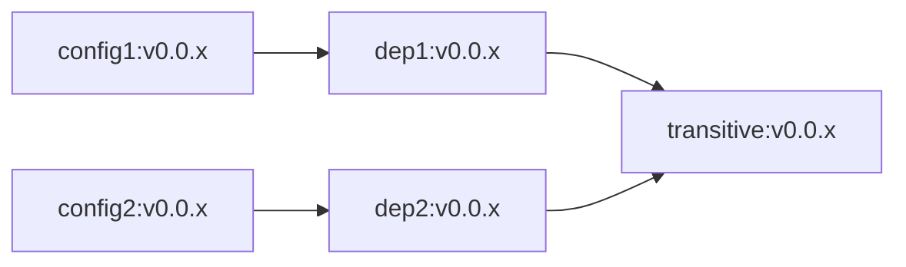

<a id="doc-12e0a48d6c5f2a58f4caa284"></a>

# crossplane/crossplane / ADOPTERS.md

Upstream: https://github.com/crossplane/crossplane/blob/ab4371d0549056dec7f900572a1af743dd46a119/ADOPTERS.md

Commit: `ab4371d0549056dec7f900572a1af743dd46a119`

Retrieved: 2026-10-01T15:16:24.725741+00:00

Kind: official-document

Raw SHA256: `7f5891aadf01aff105172d749045d6630a911a00bbb8b7056ceb82804fc31295`

Source text below is untrusted reference content. Acquisition does not verify technical claims.

License status: UPSTREAM_NOTICES_CAPTURED_PER_FILE_REVIEW_REQUIRED. See this repository's captured license files.

---

# Adopters

This list captures the set of organizations that are using Crossplane within their environments. If
you are an adopter of Crossplane and not yet on this list, we encourage you to add your organization
here as well!

The goal for this list is to be the complete and authoritative source for the entire community of
Crossplane adopters, and give inspiration to others that are earlier in their Crossplane journey.

Contributing to this list is a small effort that has a **big impact** to the project's growth,
maturity, and momentum.  Thank you to all adopters and contributors of the Crossplane project!

## Updating this list

To add your organization to this list, you can choose any of the following options:

1. [Open a PR](https://github.com/crossplane/crossplane/pulls) to directly update this list, or
   [edit this file](https://github.com/crossplane/crossplane/edit/main/ADOPTERS.md) directly in
   Github
1. Fill out the [adopters form](https://forms.gle/dBQhiyYkYSdzXovN6)
1. Send an email to <crossplane-steering@lists.cncf.io> with your information for the table below

Feel free to reach out to <crossplane-steering@lists.cncf.io> with any questions and/or assistance with
updating this list.

## Crossplane Adopters

This list is sorted in the order that organizations were added to it.

| Organization | Contact | Description of Use |
| ------------ | ------- | ------------------ |
| [Upbound](https://upbound.io) | @jbw976 | Main control plane and infrastructure management solution for [Upbound Cloud](https://upbound.io). Crossplane powers the internal developer platforms for all dev, staging, and production environments. |
| [RunWhen](https://runwhen.com) | @stewartshea | Builds production and developer environments that power the RunWhen Social Reliability Platform.|
| [Nethopper](https://nethopper.io) | @ddonahuex | Main IaC component in Nethopper's [Cloud Management Platform](https://www.nethopper.io/platform). Nethopper's Cloud Management Platform combines Crossplane with Continuous Delivery to allow DevOps to create, update, and destroy infrastructure in any cloud.|
| [Renault](https://www.renaultgroup.com/) | @smileisak | Building Renault Kubernetes Platform resources using XRDs and compositions for an additional layer of abstraction to provide end-user services. |
| [Wellhub (formerly Gympass)](https://wellhub.com) | @caiofralmeida @LCaparelli | Builds a self-service platform so engineers can be more productive in resource provisioning. |
| [Deutsche Kreditbank AG](https://www.dkb.de/) | @TheBelgarion| At DKB, we have fully integrated Crossplane into our DKB Standard Operating Platform. Managing more than 10+ EKS clusters with Crossplane to manage thousands of resources. We did switch from Crossplane to Upbound providers for most of the main providers |
| [Akuity](https://akuity.io) | @wanghong230 | Control plane and infrastructure management solution for [Akuity Platform - Managed Argo CD](https://akuity.io/akuity-platform/). Crossplane manages some infrastructure part of dev, staging, and production environments. |
| [Neux](https://neux.io) | @styk-tv | In production, running dynamic Crossplane control plane for auto-adjusting kafka/connect/telegraf payload transformations, filtering to/from sources/destinations. |
| [Disashop](https://www.disashop.com/) | @edalonso | We manage our infrastructure in EKS for all dev, staging, and production environments and create compositions in order to deploy our transactional platform about digital products in kubernetes clusters.|
| [Consensys](https://consensys.io/) | [@clementblaise](https://github.com/clementblaise) | Main control plane for an internal developer platform powering production workloads and managing more than 1,000 resources. Watch our KubeCon + CloudNativeCon [talk](https://www.youtube.com/watch?v=pcpm4HiRktY) |
| [Wildlife Studios](https://wildlifestudios.com/) | @kasama | Component that powers an API used to manage infrastructure for a self-service platform for developers |
| [Autodesk](https://autodesk.com/) | @jessesanford | IaC components and declarative API abstractions for our next generation Autodesk Unified Control Plane. |
| [Millennium bcp](https://www.millenniumbcp.pt/) | @infbase | Self-service platform for end-to-end application (and dependant resources) lifecycle |
| [Splash](https://splashthat.com/) | @adrienzieba | Manage our shared infrastructure in EKS and provide a self-service framework for engineers' application resource needs |
| [Grafana Labs](https://grafana.com/) | @Duologic | Control plane for an internal developer platform |
| [Ancestry](https://www.ancestry.com/) | @joshadambell | Control plane and infrastructure management solution in production for AWS EKS |
| [Syntasso](https://syntasso.io) | @syntassodev |  Used as an optional subcomponent in [Kratix](https://kratix.io), to enable platform teams to manage infrastructure. |
| [VSHN](https://www.vshn.ch) | @tobru | Crossplane powers the [VSHN Application Catalog (AppCat)](https://products.vshn.ch/appcat/index.html), a Cloud Native marketplace which offers services from Cloud Service Providers like Amazon AWS, Google Cloud, Microsoft Azure, Aiven.io, Exoscale or cloudscale.ch, as well as managed services from VSHN. |
| [Grupo Boticário](https://www.grupoboticario.com.br/) | [@chicoribas](https://github.com/chicoribas), [@fndiaz](https://github.com/fndiaz), [@digogid](https://github.com/digogid), [@manumbs](https://github.com/manumbs), [@haooliveira84](https://github.com/haooliveira84)| Centralized developer portal|
| [PITS Global Data Recovery Services](https://www.pitsdatarecovery.net/) | @pheianox | Declarative configuration and integration with CI/CD pipelines |
| [NASA Science Cloud](https://smce.nasa.gov/) | [ramon.e.ramirez-linan@nasa.gov](mailto:ramon.e.ramirez-linan@nasa.gov) ([@rezuma](https://github.com/rezuma)) | [NASA Science Cloud](https://smce.nasa.gov) has created compositions to deploy the Open Science Studio, a jupyterhub based platform that connects to HPC in the cloud and foster NASA Open Science Initiative. Navteca ([@navteca](https://github.com/Navteca)) has been helping NASA with this initiative |
| [Navteca](https://navteca.com/) | [rlinan@navteca.com](mailto:rlinan@navteca.com) ([@navteca](https://github.com/Navteca)) | [Navteca](https://www.navteca.com) is adopting Crossplane to deploy [Voice Atlas](https://www.voiceatlas.com) a cloud based product that let customer connect corporate knowledge with any Large Language Model and offered to be consumed by users through any channel (slack, MS Teams, Website, etc) |
| [SAP](https://sap.com/) | [opensource@sap.com](mailto:opensource@sap.com)<br />[@dee0sap](https://github.com/dee0sap)| [SAP](https://sap.com)'s internal Crossplane community is continuously growing and extending the use of Crossplane within SAP in different products. Our teams developed Crossplane providers for internal use and continue contributing new providers to the Crossplane ecosystem. We also contributed a framework that supports end-to-end tests for Crossplane providers to the project. <br /> [SAP Open Source Report 2023](https://dam.sap.com/mac/app/e/pdf/preview/embed/NG3Cg8G?ltr=a&rc=10&includeRelatedAssets=true) <br /> As of February 2024, SAP is ramping up the use of Crossplane with currently 100+ KRM based control planes with Crossplane and other technologies and 1000s of Managed Resources in different qualification grades.
| [Airnity](https://airnity.com/) | [hello@airnity.com](mailto:hello@airnity.com) | [Airnity](https://airnity.com/) uses Crossplane to deploy a worldwide cellular connectivity platform for the automotive industry. |
| [Intility](https://intility.com/) | @daniwk @JonasKs | We orchestrate our metacloud's infrastructure in production using Crossplane. |
| [codecentric](https://www.codecentric.de/) | @jonashackt | Software engineering & Infrastructure automation/GitOps consulting, where the Kubernetes ecosystem is continuously evaluated for best suited tooling for our clients - and Crossplane is a definitive shooting star, which will for sure kick off a broad adoption soon. Currently we're in the process of evaluating and showcasing crossplane to our customers. |
| [Continental](https://continental.com/) | @yogeek | Used to manage cloud infrastructure components and to provide self-service ephemeral K8S VCluster to development teams. |
| [Luminar](https://www.luminartech.com/) | @satishweb | Manage our cloud infrastructure and provide a self-service framework for engineer's application resource needs |
| [Transfix](https://transfix.io/) | @transfixio @amanfredi | We are using Crossplane to deploy new AWS infrastructure and modify existing cloud resources. |
| [Jellysmack](https://jellysmack.com/) | @mickaelcanevet | Used to deploy hundreds of AWS IAM Role and patch the ServiceAccount annotation for IRSA. |
| [Scaleway](https://scaleway.com/) | @yfodil | We created a Crossplane Provider for Scaleway infrastructures. |
| [IntentHQ](https://intenthq.com/) | @driosalido | Build an internal developer platform and to manage our cloud infrastructure in production (replace Terraform). |
| [Skyscrapers](https://skyscrapers.eu/) | [hello@skyscrapers.eu](mailto:hello@skyscrapers.eu) | We use Crossplane in our control plane to manage our Kubernetes clusters on EKS for our DevOps-as-a-Service offering |
| [HiredScore](https://hiredscore.com) | [ops@hiredscore.com](mailto:ops@hiredscore.com) | We use Crossplane to deploy Kubernetes related cloud resources. |
| [IBM](https://www.ibm.com/) | @morningspace | We created a Crossplane Provider for IBM Cloud. Also used Crossplane for a service mapping framework layer which provides the portability / transparency of the underlying services internally. |
| [Sinch](https://www.sinch.com/) | @mateusz-lubanski-sinch | We built an API for our engineering teams which allows them build basic cloud infrastructure for apps they deliver. This helped us reduce huge amount of terraform code managed previously by DevOps and also being teams more self-served as they can now use kubernetes ecosystem they are familiar with |
| [Novo Nordisk](https://www.novonordisk.com/) | [scni@novonordisk.com](mailto:scni@novonordisk.com) ([@CasperGN](https://github.com/CasperGN)) | Provisioning our Cluster setup in production with Crossplane to span across both of our Cloud Providers. |
| [VMware Tanzu](https://tanzu.vmware.com/tanzu) | [@teddyking](https://github.com/teddyking) | Crossplane is an essential component backing many of the services capabilities offered by [Tanzu Application Platform](https://tanzu.vmware.com/application-platform) |
| [Nexthink](https://nexthink.com) | @fernandezcuesta | Deployment and bootstrapping of multiple EKS clusters and common infrastructure in production replacing Terraform+Ansible. |
| [Nokia](https://www.nokia.com) | @bobh66 | Multi-cloud orchestration of resources in support of production deployments for a variety of network services. |
| [Built Technologies](https://www.getbuilt.com) | @rwsweeney | Built Technologies uses Crossplane in our developer environment, and at times it has exceeded over 10,000 AWS resources managed by Crossplane. |
| [Printbox](https://getprintbox.com/) | [@printbox-team](https://github.com/printbox-team) | Printbox is leveraging Crossplane in production environments, to streamline the deployment of a wide range of services. Our usage of Crossplane extends from basic tasks like creating S3 buckets on AWS to more complex operations such as implementing CDN solutions on Google Cloud. |
| [DeepSea](https://deepsea.ai/) | [bmutziu](https://github.com/bmutziu) | Migrated to Crossplane from Terraform in production environments. |
| [Imagine Learning](https://www.imaginelearning.com/) | [@blakeromano](https://github.com/blakeromano) [blake.romano@imaginelearning.com](mailto:blake.romano@imaginelearning.com) | Control Plane for Infrastructure in Internal Developer Platform |
| [babelforce](https://www.babelforce.com/) | [@nik843](https://github.com/nik843) | Orchestrating relational database servers by creating databases, users and permissions for them within all environments. |
| [Nike](https://nike.com/) | [joel.cooklin@nike.com](mailto:joel.cooklin@nike.com) | Crossplane powers the internal developer platform managing thousands of resources from development to production.  |
| [Elastic](https://elastic.co) | [@hwoarang](https://github.com/hwoarang) | We use Crossplane to deploy resources across multiple Cloud Providers for the [Elastic Serverless](https://www.elastic.co/elasticsearch/serverless) products. |
| [DB Systel](https://www.dbsystel.de) | [@gandhiano](htttps://github.com/gandhiano) | Backbone of the Developer Experience Platform of the [Deutsche Bahn](https://deutschebahn.com). Through Crossplane, application developers can easily provision and integrate a panoply of platform services, creating a coherent platform experience. Cloud infrastructure can also be self-serviced, allowing a 100% Gitops infrastructure-as-code approach. Both the K8s API and a developer portal UI ([Backstage](https://backstage.io)) can be used to interact with the Crossplane compositions.|
| [Akamai](https://www.akamai.com/) | [@nolancon](https://github.com/nolancon) | We use Crossplane to offer customers [provider-linode](https://github.com/linode/provider-linode), a control plane for Akamai Cloud Computing services based on Linode. We have also used Crossplane to develop [provider-ceph](https://github.com/linode/provider-ceph). Provider Ceph is an object storage control plane for Ceph. It is capable orchestrating up to 200k Managed Resources which represent S3 buckets distributed across multiple Ceph clusters. |
| [Variphy](https://www.variphy.com/) | [info@variphy.com](mailto:info@variphy.com) ([@dmvariphy](https://github.com/dmvariphy) [@nick-variphy](https://github.com/nick-variphy) [@dfalter-variphy](https://github.com/dfalter-variphy) [@zach-variphy](https://github.com/zach-variphy)) | We use Crossplane (via [Upbound Cloud](https://www.upbound.io/)) to manage our development and production infrastructure via GitOps.  Crossplane also allows us to provide custom APIs for production Variphy applications to dynamically manage external resources, such as [Confluent Cloud](https://www.confluent.io/) Kafka topics.  |
| [OneUptime](https://oneuptime.com) | @simlarsen | Builds production and developer environments that power the OneUptime Platform. |
| [Xata](https://xata.io) | [@mattfield](https://github.com/mattfield) [@paulaguijarro](https://github.com/paulaguijarro) | Crossplane manages the dev, staging, and production RDS Aurora PostgreSQL clusters for our [Dedicated Clusters](https://xata.io/blog/postgres-dedicated-clusters) offering, along with Flux Kustomizations and other resources that provision cells of internal [Xata](https://xata.io) services. |
| [AlphaSense](https://www.alpha-sense.com/) | @abhihendre | Engineering teams at [AlphaSense](https://www.alpha-sense.com/) leverage Crossplane APIs, abstracted by a set of Helm charts and Compositions curated by our Platform Teams, to seamlessly provision cloud services across three major clouds, including our production environment.|
| [UiPath](https://www.uipath.com/) | [@mjnovice](https://github.com/mjnovice) | Control plane for infrastructure management which powers [AutomationSuite](https://docs.uipath.com/automation-suite/automation-suite/2023.10/installation-guide-eks-aks/automation-suite-on-eksaks-overview) |
| [CloudScript](https://www.cloudscript.com.br/) | @xcloudscript | [CloudScript](https://www.cloudscript.com.br/) engineers have been using Crossplane since 2022 creating customized Compositions for the implementation of our engineering platform, basically automating the creation of Kubernetes environments on AWS, GCP and Azure ( coming soon).|
| [SpareBank 1 Utvikling](https://sparebank1.dev/) | [@chlunde](https://github.com/chlunde) | Crossplane powers our Internal Developer Platform. It is utilized for day-to-day operations via GitOps and enabled us to execute a large-scale self-service migration of over a thousand production microservices, databases and caches from on-premises to EKS and managed AWS services. |
| [Veset](https://veset.tv/) | [@pblgomez](https://github.com/pblgomez) | At Veset we are deploying all our backend resources in production environments to be managed by Crossplane. |
| [Skillsoft](https://www.skillsoft.com/) | [@brandon-powers](https://github.com/brandon-powers) | At Skillsoft, Crossplane automates the provisioning and management of our AWS infrastructure (S3, Athena, and Glue) to support core Apache Kafka services powering our online learning platform, [Percipio](https://www.skillsoft.com/meet-skillsoft-percipio), in production environments. |
| [Sopra Steria NO](https://www.soprasteria.no/) | [Eirik Holgernes](mailto:eirik.holgernes@soprasteria.com) | As a consultant agency, [Sopra Steria NO](https://www.soprasteria.no/) is leveraging the benefits of [Crossplane](https://www.crossplane.io/) to create self-service backends to increase speed and agility for the developers and engineers of our customers.<br />With the power of the compositions and composite resource definitions, the life cycle management of resources in [Kubernetes](https://kubernetes.io/) and deployment using GitOps tools like [Flux](https://fluxcd.io/) or [Argo CD](https://argoproj.github.io/cd/), our customers are taking giant strides into the future! |
| [Zuru Tech Italy](https://zuru.tech/) | [@nello1992](https://github.com/nello1992) | We currently use Crossplane in production environments to deploy workload clusters, with more use cases across the organization to come. |
| [Rogo](https://rogodata.com/) | [@aiell0](https://github.com/aiell0) | We use Crossplane to deploy application-specific infrastructure to multiple cloud providers in our production environments. |
| [Arcfield](https://arcfield.com/) | [@DE-Wizard](https://github.com/DE-Wizard) | Our entire cloud architecture was redesigned from the ground up using [Crossplane](https://www.crossplane.io/) to manage the cloud resources and [Flux](https://fluxcd.io/) to manage feeding [Crossplane](https://www.crossplane.io/) with its configurations. We have architected a Control - Workload cluster configuration that spans multiple regions and providers. The combination of the 2 controllers allowed us to more tightly control environment changes and apply drift correction to mitigate manual configuration changes that may be unauthorized. Our combination covers both dev and production environments with the production environment Master Control Cluster having dominion over both in the end. |
| [Jove](https://www.jove.com/) | [@arturkasperek](https://github.com/arturkasperek) | We use Crossplane in production environments to build a Heroku like Internal Developer Platform on top of AWS and AWS EKS. |
| [Alauda](https://www.alauda.io/) | [@tossmilestone](https://github.com/tossmilestone) | Our container platform product (ACP) uses Crossplane to simplify application deployment and infrastructure provisioning for our clients in production environments. |
| [Neteera](https://www.neteera.com/) | [@heinanca](https://github.com/heinanca) | We utilize Crossplane to build our EU operations using official and in-house providers. |
| [Nebinfra](https://www.nebinfra.com) | [@satishweb](https://github.com/satishweb) | Manage multi-cloud digital infrastructure and deliver a self-service framework that empowers engineers to provision application resources for our customers. |
| [Frame.io](https://www.frame.io) | [@tenitski](https://github.com/tenitski) | Manage infrastructure resources for dynamically created sandboxes, allowing engineers to test changes to their branch in a "production-like" environment. |
| [Terradue Srl](https://www.terradue.com) | [@fabricebrito](https://github.com/fabricebrito) | Open Web & Cloud Computing e-Infrastructure for Earth Sciences using Crossplane to procure resources such as Kubernetes clusters and deploy applications in production environments |
| [Sophotech](https://sopho.tech) | [@archy-rock3t-cloud](https://github.com/archy-rock3t-cloud), [Artem Muterko](mailto:artem@sopho.tech) | At [Sophotech](https://www.sopho.tech), we use [Crossplane](https://www.crossplane.io/) to power our custom Developer Platform. By combining Crossplane’s infrastructure abstraction with [Flux](https://fluxcd.io/)’s GitOps workflows, we deliver unified management of cloud resources and applications across all environments, from development to production. This approach enables our clients to standardize the infrastructure stack, reduce operational complexity and decrease long-term maintenance costs. |
| [Cloudflavor](https://cloudflavor.io) | [@pi-victor](https://github.com/pi-victor) | [Nubium Cloud](https://nubium.cloud) uses Crossplane to provision AI/ML-ready infrastructure on demand. It automates the creation of compute, storage, and networking resources across providers, giving teams secure, scalable environments tailored for data and machine learning workloads. |
| [AI CoE at Vodafone Germany](https://www.vodafone.de/) | [@zouldapp](https://github.com/zouldapp) | Crossplane enables unified and compliant multi-cloud infrastructure provisioning by composing AWS and GCP services into standardized, reusable platform APIs for our development teams in production environments across the organization. We rely on Crossplane to manage cloud services through GitOps workflows and to extend Kubernetes with infrastructure APIs. Our business-critical internal use cases include powering AI agentic assistants that support customer service, procurement, and legal departments.|
| [monday.com](https://www.monday.com/) | [@mondaycom](https://github.com/mondaycom)  | We've been using Crossplane as part of a self-service framework for internal development teams, providing a single, declarative interface for managing infrastructure resources across multiple clouds. |
| [Baloise](https://www.baloise.com/en/home.html) | [@jonasz-lasut](https://github.com/jonasz-lasut) | In Baloise we use Crossplane to power the self-service of Azure infrastructure in multi-tenant kubernetes clusters, ranging from test to production environments, in a secure and opinionated manner. |
| [Evaneos](https://www.evaneos.com/) | [@grams](https://github.com/grams) | Crossplane has become Evaneos’ primary infrastructure-as-code solution for our latest SaaS environment and our developer self-service platform, using compositions and in-house open-source providers. It is also the IaC target for our Marketplace and legacy activities. |
| [Ambev Tech](https://www.ambevtech.com.br/) | [@cencristian](https://github.com/cencristian), [@dimitridittrich](https://github.com/dimitridittrich), [@rafaelvilarinho](https://github.com/rafaelvilarinho) | We are using Crossplane as an executor in our IDP to provide infrastructure in our production environment. |
| [Aurora Innovation](https://aurorainnovation.com) | [@O5ten](https://github.com/O5ten) | At Aurora Innovation we use Crossplane to power our cloud infrastructure. We use it together with Kustomize and ArgoCD to achieve true GitOps for our development and platform teams in production environments |
| [Netclab](https://netclab.dev) | [@mbakalarski](https://github.com/mbakalarski) | [netclab-xp](https://github.com/netclab/netclab-xp) - declarative, GitOps-driven configuration and lifecycle management of physical, virtual, and containerized network devices using Crossplane. Layered XRDs and compositions describe a device at any level of abstraction, from a single setting to an entire network, and reach it over whichever management interface the device speaks - hiding device-specific complexity behind reusable Kubernetes APIs. |
| [Sumo Logic](https://sumologic.com) | [@jcogilvie](https://github.com/jcogilvie) | Crossplane is the go-forward solution for provisioning Sumo's production infrastructure. |
| [Wargaming](https://wargaming.net) | [@alexey-pankratyev](https://github.com/alexey-pankratyev) | We use Crossplane across staging and production environments with a GitOps approach to create infrastructure for a well-known mobile gaming title, quickly provisioning new AWS EKS clusters with all components (Agones, Istio, Karpenter and required K8s controllers) for dynamic connectivity with other clusters. It is also used for targeted application deployments via GitOps, where Crossplane provisions the necessary application infrastructure through Argo CD and Helm charts.|
| [Lansweeper](https://www.lansweeper.com) | [Platform Team](mailto:PlatformTeam@lansweeper.com) | Distributed control planes for self-service infrastructure and integrations in production environments. |
| [T-Systems International GmbH](https://public.t-cloud.com/en) | [@anton-sidelnikov](https://github.com/anton-sidelnikov) | Development of Crossplane provider for [T Cloud Public](https://public.t-cloud.com/en). |
| [Instech Solutions AS](https://instech.no) | @olafsm | Crossplane powers self-service infrastructure management for our internal developer platform, supporting multi-tenant workloads across dev and production environments. |
| [Stone Payments](https://www.stone.com.br/) | [@fabiano-amaral](https://github.com/fabiano-amaral), [@ambrisolla](https://github.com/ambrisolla), [@gadsilva](https://github.com/gadsilva) | Powers self-service infrastructure provisioning for the internal developer platform. We use Crossplane with custom XRDs to manage multi-cloud resources in production environments across AWS (S3, RDS, ElastiCache, IAM, networking), Azure, Confluent Cloud (Kafka), MongoDB Atlas, and Kong, integrated with ArgoCD for GitOps.
| [Orange](https://www.orange.com) | [@frigaut-orange](https://github.com/frigaut-orange), [@cazeaux](https://github.com/cazeaux) | Orange has adopted Crossplane as a core enabler of its platform engineering approach in production environments, using it on its own cloud to deliver simple, consistent, and easy-to-use services for developers. By abstracting infrastructure complexity and enabling a streamlined self-service experience, Crossplane enables Orange to build scalable internal platforms that accelerate application delivery and enhance the developer experience.<br />Orange also contributes to the Crossplane ecosystem to enable multitenancy in shared platform environments. |
| [Julius Baer](https://juliusbaer.com) | [@erost](https://github.com/erost), [@BigGold1310](https://github.com/BigGold1310), [oss@juliusbaer.com](mailto:oss@juliusbaer.com) | At Julius Baer we use Crossplane to power our internal platforms, from developer resources to production environments. <br/> Our unusual but highly scalable architecture has been showcased multiple times at tech conferences across Europe: find out more at [our conferences repository](https://github.com/juliusbaer/conferences) |
| [RTL Nederland](https://www.rtl.nl) | [@nilpntr](https://github.com/nilpntr) | RTL uses Crossplane in its multi-cluster setup, together with Cluster API, Sveltos, and Argo CD, to deploy complete Kubernetes clusters on Azure and AWS. Crossplane provisions the cloud infrastructure for each cluster, for example networks, DNS, public IP addresses, identities, and key vaults. We also use it for infrastructure components and for ephemeral environments. Today this powers blue-green clusters in our test and acceptance environments, and we plan to extend the same model to our production environments. |


<a id="doc-77cb35e143685fcd4bad0bc4"></a>

# crossplane/crossplane / AI_POLICY.md

Upstream: https://github.com/crossplane/crossplane/blob/ab4371d0549056dec7f900572a1af743dd46a119/AI_POLICY.md

Commit: `ab4371d0549056dec7f900572a1af743dd46a119`

Retrieved: 2026-10-01T15:16:24.725741+00:00

Kind: official-document

Raw SHA256: `95e14b25d2fd3558f39c79cb423c87dea4e908222b848afe1decffc459312d9a`

Source text below is untrusted reference content. Acquisition does not verify technical claims.

License status: UPSTREAM_NOTICES_CAPTURED_PER_FILE_REVIEW_REQUIRED. See this repository's captured license files.

---

# Crossplane AI Contribution Policy

This policy defines how the Crossplane team expects contributors to engage with the project while
using AI tools like agents and LLMs.

This policy applies to all repositories in the `crossplane` and `crossplane-contrib` GitHub
organizations, just like the project [governance](GOVERNANCE.md).

## AI usage is assumed

The Crossplane team makes use of AI coding tools every day and we expect that almost all
contributors will be doing the same. Therefore, we do not require any disclosure for the usage of AI
in any contributions.

We discourage including attribution for your agent in your commits, e.g., a `Co-authored-by`
trailer, as it pollutes contributor statistics.

It is more important that we have high quality contributions and engagement with contributors, so
this policy focuses on achieving that goal.

## Own and understand your contribution

Contributors are responsible for the entirety of their submission, no matter what tooling they used
to produce it.

- **Understand every line you are changing:** If you cannot explain the purpose and impact of every
  change without the assistance of an agent, it's not ready for submission.
- **Think and verify critically:** Review and test your entire change deeply, both when opening a
  new PR and updating an existing one in response to feedback. The maintainer team should not be the
  first human to start critiquing or verifying your changes.
- **Use the templates:** PRs and issues have templates, so use them and provide the information they
  are requesting. An incoming PR that doesn't even contain the template's checklist is a clear sign
  your agent opened the PR for you and you didn't take much care during the PR creation process.
- **Don't blame your agent:** "My agent did/wrote that" is not a sufficient answer to review
  comments, it's critical to understand your changes more deeply than that.

AI tools are very capable of producing plausible looking changes for problems they don't deeply
understand. It's your job as a contributor to own, understand, and verify your changes to a high
degree of confidence.

## Talk to us yourself

### Express your reasoning naturally

We want to engage with human contributors, we do not want to feel like we are just talking to your
agent. We have our own agents that we can talk to and we can do that much faster than going through
you. We'd much rather connect directly and intellectually with the human behind the submission.

So please share your own reasoning behind your changes, e.g., why you framed the problem this way,
what you tried, what you are unsure about, or details about your use case that necessitates this
change.

### Use the right level of detail

Your writing should not make it **harder** to understand you. AI tools love to generate enormous
walls of text that prematurely go into an exorbitant level of detail, which is challenging for the
maintainer team to read and fully understand. These details often obscure the core problem and make
it more challenging to align on the right path forward together.

Code comments should help a future reader understand the reasoning behind implementation choices
that may be subtle or difficult to see just from reading the code itself. Agents tend to write for
the reviewer instead, narrating the alternatives they rejected or explaining why their change is
correct. That context may be helpful while we review but becomes clutter once the change is merged,
so it belongs in your pull request description instead of the codebase.

### Write naturally

We highly encourage you to write your own issues, pull request descriptions, and comment replies.
It's fine to use tools to help you get the words right, especially if English is not your first
language, but the thinking has to be yours, and it should read like it. Blindly pasting clearly
generated text while engaging with a maintainer is not the type of interaction we're looking for.

### Review with your own judgment

Reviewing pull requests is one of the best ways to learn this codebase, and it's a path toward
becoming a maintainer, so we appreciate more people doing it. But that depends on you being the one
doing the reviewing.

Don't point an agent at someone else's pull request and just post what it produces. We already have
automated AI reviewing tools set up and don't need your agents fabricating additional engagement.

Using AI to help you understand a change you're reviewing is fine, but please make sure the review
you post is your own.

## Maintainer time is limited

Time and energy from the human maintainers on this project are a limited resource. AI has made
writing code and opening a pull request a very cheap operation, which can easily overwhelm the team
responsible for reviewing and supporting those changes.

- **Bias towards discussion first:** For anything beyond a clearly scoped fix, we encourage you to
  open an issue and drive alignment on the direction before implementing the required changes. This
  is not a hard requirement, but it is an effective way to avoid spending cycles on a change that we
  won't accept.
- **Keep changes small and focused:** This reduces the effort of reviewing the change and ensuring
  its quality and makes it more likely to be accepted.
- **Avoid flooding us with changes:** If you already have pull requests open that have not been
  merged, avoid opening more pull requests that continue to grow the review backlog. This is most
  important when you are a new contributor and we haven't yet built a trusting relationship.

## Enforcement

The maintainer team may close pull requests and issues that do not meet the spirit of the guidelines
in this policy. We may even do so without first writing a detailed explanation or providing a
technical critique. We will most likely not debate whether a contribution violated this policy.

Contributors who continue to violate this policy will be blocked from further engagement in the
project. Closing submissions is not the only tool we have, and we will use the others when we need
to.

This policy is not aimed at contributors who want to learn the project and authentically engage with
the team. That's exactly the experience we are seeking to have. If you are new and trying to
understand something, then we are happy to help and collaborate in meaningful ways with other
humans.

## Legal

Crossplane is a CNCF project, which is part of the Linux Foundation. Therefore, the LF's [Generative
AI policy](https://www.linuxfoundation.org/legal/generative-ai) applies to every contribution and
must be adhered to.

<a id="doc-91d16dd057bd39f6431e90a1"></a>

# crossplane/crossplane / CHARTER.md

Upstream: https://github.com/crossplane/crossplane/blob/ab4371d0549056dec7f900572a1af743dd46a119/CHARTER.md

Commit: `ab4371d0549056dec7f900572a1af743dd46a119`

Retrieved: 2026-10-01T15:16:24.725741+00:00

Kind: official-document

Raw SHA256: `e2496fbf6b47e80e8ac547822c972b94765c54469b2f753cec39eaac022a1162`

Source text below is untrusted reference content. Acquisition does not verify technical claims.

License status: UPSTREAM_NOTICES_CAPTURED_PER_FILE_REVIEW_REQUIRED. See this repository's captured license files.

---

# Project Charter

## Overview

Crossplane is a framework for building cloud native control planes without
needing to write code. It has a highly extensible backend that enables you to
build a control plane that can orchestrate applications and infrastructure no
matter where they run, and a highly configurable frontend that puts you in
control of the schema of the declarative API it offers.

## Control Planes

Control planes first emerged in network packet switching, where devices must
forward packets as fast as possible, but also be highly configurable. Breaking
out the control plane from the data plane allows the former to be optimized for
flexibility while the latter is optimized for speed. It also decouples the
failure domains - a control plane failure does not prevent the data plane from
functioning. Control planes are rooted in control theory, in particular closed
loop control where the actual state of a system is observed in order to
determine how best to drive it toward a desired state.

Control planes power cloud computing. Cloud providers like AWS are built with
control planes, as are projects like Kubernetes. In cloud computing the data
plane is instead a “compute plane” consisting of applications and the
infrastructure they run on - VMs, containers, databases, caches, queues, etc.

Control planes are popular in cloud computing because they:

* Are “always-on”, constantly correcting drift by driving observed state toward
  desired state.
* Are API-driven, which enables discovery, collaboration, and integration with
  other systems.
* Don’t need to be installed on every laptop and CI/CD system, making them
  easier to operate.
* Keep control in a separate failure domain from the plane under control (e.g.
  compute).

Cloud native organizations increasingly prefer control planes to approaches such
as imperative scripts or Infrastructure-as-Code (IaC), but historically building
a control plane has required a significant investment to design and code it from
scratch. This is where Crossplane comes in.

## What Crossplane Is

Crossplane is a neutral place for vendors and individuals to come together in
enabling control planes. It offers a framework to build control planes for cloud
native computing without needing to write code (unless you want to). It shares a
foundation with Kubernetes, but supports many powerful extensions that enable it
to control anything - not just containers. The Crossplane project consists of:

* The Crossplane Resource Model (XRM). An API model for Crossplane extensions.
* The ability to compose bespoke control plane APIs for any compute plane.
* A package format and manager to extend your control plane with:
  * The ability to orchestrate any kind of compute plane resource.
  * New ways to compose control plane APIs.
  * New integration with supporting services such as secret stores.
* A set of providers and other integrations to cloud and infrastructure
  offerings that enable resources to be provisioned and managed.
* Tooling to create and test new Crossplane extensions.
* A conformance program for Crossplane extensions.
* Tooling, interfaces, and experiences that facilitate building, managing, and
  consuming a control plane.

As a framework, Crossplane:

* Avoids building features specific to any particular compute plane in its core.
  Instead features pertaining to any particular cloud provider, project, or tool
  are enabled through extension points.
* Focuses on APIs. Crossplane provides and recommends “golden path” tools to
  build conformant extensions but does not require them. Anything with
  conformant API schema and behavior may be considered a Crossplane extension -
  regardless of how it is built. 
* Optimizes for “vertical integration”. That is, Crossplane extensions are
  intended and designed to be used in conjunction with Crossplane and each
  other.
* Prioritizes enabling a “separation of concerns” between control plane curators
  and consumers. Curators deploy, extend, and configure control planes, while
  consumers use them to orchestrate compute planes.

## What Crossplane Is Not

Crossplane is not intended to be purpose built for any particular use case.
Instead it is a general, but complete, framework that facilitates building,
deploying, configuring, and managing a control plane for your own highly bespoke
use case, often without writing any code.

The project is a neutral place for vendors and individuals to come together in
enabling control planes. While any extension that passes the appropriate
Crossplane conformance suite may consider itself to be
“a Crossplane extension” - regardless of how it is built, licensed, or governed,
who maintains it, or where it is hosted - the project maintainers can endorse
a curated set of extensions to drive a high quality experience around them.

Concrete examples of things that are not in scope for the project include (but
are not limited to):

* Providing or mandating abstractions around specific use cases such as
  provisioning applications (e.g. a PaaS API) or provisioning Kubernetes
  clusters. 
* Providing or mandating a configuration language (for example, CUE). Crossplane
  provides a declarative API that may be targeted by arbitrary configuration
  languages, and extension points that may be powered by arbitrary languages.
* Enabling the use of Crossplane extensions without using Crossplane and vice
  versa; this is not supported and may result in undefined behavior.
* Providing or mandating opinions around control plane hosting, security and
  tenancy models, or multiple control plane management.
* Offering ‘in-tree’ support for particular compute planes - e.g. AWS. All
  features specific to any specific compute plane provider are built as
  extensions.
* Offering a package specification or manager for anything other than Crossplane
  extensions.

## Updating this Document

This is a living document. Changes to the scope, principles, or mission
statement of the Crossplane project require a [majority vote][sc-voting] of the
steering committee.

[sc-voting]: https://github.com/crossplane/crossplane/blob/main/GOVERNANCE.md#updating-the-governance


<a id="doc-ffdbe3a1e7ee93cacfc080b6"></a>

# crossplane/crossplane / CODE_OF_CONDUCT.md

Upstream: https://github.com/crossplane/crossplane/blob/ab4371d0549056dec7f900572a1af743dd46a119/CODE_OF_CONDUCT.md

Commit: `ab4371d0549056dec7f900572a1af743dd46a119`

Retrieved: 2026-10-01T15:16:24.725741+00:00

Kind: official-document

Raw SHA256: `176480114afa36831a570643c6da239896709be319138f42da9b8de4067b9466`

Source text below is untrusted reference content. Acquisition does not verify technical claims.

License status: UPSTREAM_NOTICES_CAPTURED_PER_FILE_REVIEW_REQUIRED. See this repository's captured license files.

---

## Community Code of Conduct

This project follows the [CNCF Code of Conduct](https://github.com/cncf/foundation/blob/main/code-of-conduct.md).


<a id="doc-eca12c0a30e25b4b46522ebf"></a>

# crossplane/crossplane / CONTRIBUTING.md

Upstream: https://github.com/crossplane/crossplane/blob/ab4371d0549056dec7f900572a1af743dd46a119/CONTRIBUTING.md

Commit: `ab4371d0549056dec7f900572a1af743dd46a119`

Retrieved: 2026-10-01T15:16:24.725741+00:00

Kind: official-document

Raw SHA256: `ec31b7ca19e26724fcad6850849c7fd9b269c9c40e1f612ca1297ac3a4f542d3`

Source text below is untrusted reference content. Acquisition does not verify technical claims.

License status: UPSTREAM_NOTICES_CAPTURED_PER_FILE_REVIEW_REQUIRED. See this repository's captured license files.

---

See [contributing](contributing).


<a id="doc-b60c6a93e9f74ee52e71bf33"></a>

# crossplane/crossplane / GOVERNANCE.md

Upstream: https://github.com/crossplane/crossplane/blob/ab4371d0549056dec7f900572a1af743dd46a119/GOVERNANCE.md

Commit: `ab4371d0549056dec7f900572a1af743dd46a119`

Retrieved: 2026-10-01T15:16:24.725741+00:00

Kind: official-document

Raw SHA256: `3ded46b253763dd98105a40d9e8a6a6339808523391e7a37d6964f467bd75967`

Source text below is untrusted reference content. Acquisition does not verify technical claims.

License status: UPSTREAM_NOTICES_CAPTURED_PER_FILE_REVIEW_REQUIRED. See this repository's captured license files.

---

# Crossplane Governance

Crossplane follows two tier governance model. The higher level tier is made up of the
Crossplane Steering Committee that is responsible for the overall health of the project.
Maintainers and Organization Members make up the lower tier and they are the main
contributors to one or more repositories within the overall project.

The governance policies defined here apply to all repositories and work happening within
the following GitHub organizations:

* https://github.com/crossplane
* https://github.com/crossplane-contrib

## Steering Committee

The Crossplane Steering Committee oversees the overall health of the project. Its made
up of members that demonstrate a strong commitment to the project with views in the
interest of the broader Crossplane community. Their responsibilities include:

* Own the overall charter, vision, and direction of the Crossplane project
* Define and evolve project governance structures and policies, including
  project roles and how collaborators become maintainers.
* Promote broad adoption of the overall project, stewarding the growth and
  health of the entire community
* Provide guidance for the project maintainers
* Review and approve central/core architecture and design changes that have
  broad impact across multiple repositories
* Participate in the conflict resolution and voting process at the organization
  scope when necessary
* Approving new repositories, or archiving repositories in the Crossplane
  organizations
* Add and remove members in the Crossplane organizations
* Actively participate in the regularly scheduled steering committee meetings
* Regularly attend the recurring community meetings

### Composition

The Steering Committee has five (5) seats who will be selected through an election process
outlined below. Elected committee members will serve 2-year terms. The elections will be
staggered in order to preserve continuity - i.e. not all seats will be up for election at any
given year.

The following are some guidelines for eligibility to the Steering Committee:

* Steering committee members in many cases will already be a maintainer on one
    or more of the repositories within the Crossplane project and be
    contributing consistently.
* While an existing repository maintainer position is helpful, a proposed member
    should have also demonstrated broad architectural influence and
    contributions across diverse areas of the project.
* The proposed member should have consistently exhibited input for the good of
    the entire project beyond the organization they are affiliated with and
    their input must have been aligned with the general charter and strategy and
    always with the big picture in mind.
* There is **no** minimum time period for contributions to the project by the
  proposed member.

### Steering Committee

The members of the steering committee are listed in the table below (listed in
alphabetical order of first name). When terms of the committee members expire,
new members will be selected through the [election process](#election-process)
outlined below.

| &nbsp;                                                     | Member                                          | Organization | Email                   | Term Start | Term End   |
|------------------------------------------------------------|-------------------------------------------------|--------------|-------------------------|------------|------------|
|      | [Bassam Tabbara](https://github.com/bassam)     | Upbound      | bassam@upbound.io       | 2026-02-06 | 2028-02-06 |
|      | [Bob Haddleton](https://github.com/bobh66)      | Nokia        | bob.haddleton@nokia.com | 2025-02-06 | 2027-02-06 |
|  | [Brian Lindblom](https://github.com/lindblombr) | Apple        | blindblom@apple.com     | 2025-02-06 | 2027-02-06 |
|      | [Jared Watts](https://github.com/jbw976)        | Upbound      | jared@upbound.io        | 2026-02-06 | 2028-02-06 |
|    | [Joel Cooklin](https://github.com/jcooklin)     | Nike         | joel.cooklin@gmail.com  | 2026-02-06 | 2028-02-06 |

### Contact Info

The steering committee can be reached at the following locations:

* [`#steering-committee`](https://crossplane.slack.com/archives/C032WMA459S)
  channel on the [Crossplane Slack](https://slack.crossplane.io/) workspace
* [`crossplane-steering@lists.cncf.io`](mailto:crossplane-steering@lists.cncf.io) public email address

Members of the community as well as the broader ecosystem are welcome to contact
the steering committee for any issues or concerns they can assist with.

### Election Process

#### Eligibility for Voting

Voting for steering committee members is open to all current steering committee
members and [maintainers](#maintainers).

#### Nomination Criteria

* Each eligible voter can nominate up to 2 candidates
* Previous steering committee members are eligible to be nominated again
* An eligible voter can self-nominate
* Anyone can be nominated, they do **not** have to be an eligible voter
* The nominated candidate must accept the nomination in order to be included in
  the election
* Each nominated candidate must be endorsed by 2 eligible voters from 2
    different organizations (the candidate can self-endorse if they are eligible
    to vote)

#### Election

Elections will be held using time-limited
[Condorcet](https://en.wikipedia.org/wiki/Condorcet_method) ranking on
[CIVS](http://civs.cs.cornell.edu/) using the
[IRV](https://en.wikipedia.org/wiki/Instant-runoff_voting) method. The top vote
getters will be elected to the open seats.

#### Maximum Representation

When the initial steering committee terms expire, the maximum number of
steering committee members from any organization (or conglomerate, in the case of
companies owning each other), will be limited to 2 in order to encourage diversity.

If the results of an election result in greater than 2 members from a single
organization, the lowest vote getters from that organization will be removed and
replaced by the next highest vote getters until maximum representation on the
committee is restored.

If percentages shift because of job changes, acquisitions, or other events,
sufficient members of the committee must resign until the maximum representation
is restored. If it is impossible to find sufficient members to resign, the
entire company’s representation will be removed and new special elections held.
In the event of a question of company membership (for example evaluating
independence of corporate subsidiaries) a majority of all non-involved steering
committee members will decide.

#### Vacancies

In the event of a resignation or other loss of an elected steering committee
member, the candidate with the next most votes from the previous election will
be offered the seat. This process will continue until the seat is filled.

In case this fails to fill the seat, a special election for that position will
be held as soon as possible. Eligible voters from the most recent election will
vote in the special election (i.e., eligibility will not be redetermined at the
time of the special election). A committee member elected in a special election
will serve out the remainder of the term for the person they are replacing,
regardless of the length of that remainder.

## Repository Governance

The Crossplane project consists of multiple repositories that are published and
maintained as part of the [crossplane](https://github.com/crossplane) and
[crossplane-contrib](https://github.com/crossplane-contrib) organizations on
GitHub. Each repository will be subject to the same overall governance model,
but will be allowed to have different teams of people (“maintainers”) with
permissions and access to the repository.  This increases diversity of
maintainers in the Crossplane organization, and also increases the velocity
of code changes.

### Maintainers

Each repository in the Crossplane organizations are allowed their own unique set
of maintainers. Maintainers have the most experience with the given repo and are
expected to have the knowledge and insight to lead its growth and improvement.

In general, adding and removing maintainers for a given repo is the
responsibility of the existing maintainer team for that repo and therefore does
not require approval from the steering committee. However, in rare cases, the
steering committee can veto the addition of a new maintainer by following the
[conflict resolution process](#conflict-resolution-and-voting).

Responsibilities include:

* Strong commitment to the project
* Participate in design and technical discussions
* Participate in the conflict resolution and voting process at the repository
  scope when necessary
* Seek review and obtain approval from the steering committee when making a
    change to central architecture that will have broad impact across multiple
    repositories
* Contribute non-trivial pull requests
* Perform code reviews on other's pull requests
* Ensure that proposed changes to your repository adhere to the established
    standards, best practices, and guidelines, and that the overall quality and
    integrity of the code base is upheld.
* Add and remove maintainers to the repository as described below
* Approve and merge pull requests into the code base
* Regularly triage GitHub issues. The areas of specialization possibly listed in
    [OWNERS.md](OWNERS.md) can be used to help with routing an issue/question to
    the right person.
* Make sure that ongoing PRs are moving forward at the right pace or closing
  them
* Monitor Crossplane Slack (delayed response is perfectly acceptable),
    particularly for the area of your repository
* Regularly attend the recurring community meetings
* Periodically attend the recurring steering committee meetings to provide input
* In general continue to be willing to spend at least 25% of their time working
    on Crossplane (~1.25 business days per week)

The current list of maintainers for each repository is published and updated in
each repo’s [OWNERS.md](OWNERS.md) file.

### Becoming a Maintainer

To become a maintainer for a given repository, you need to demonstrate the
following:

* Consistently be seen as a leader in the Crossplane community by fulfilling the
    maintainer responsibilities listed above to some degree.
* Domain expertise in the area of focus for the repository
* Willingness to contribute and provide value to all areas of the repository’s
    code base, beyond simply the direct interests of your organization, and to
    consistently promote the overall charter and vision of the entire Crossplane
    organization.
* Be extremely proficient with the languages, tools, and frameworks used in the
  repository
* Consistently demonstrate:
  * Ability to write good solid code and tests
  * Ability to collaborate with the team
  * Understanding of how the team works (policies, processes for testing and
    code review, etc.)
  * Understanding of the project's code base and coding style

Beyond your contributions to the project, consider:

* If your organization already has a maintainer on a given repository, more
    maintainers from your org may not be needed. A valid reason, however, is
    "blast radius" to get more coverage on a large repository.
* Becoming a maintainer generally means that you are going to be spending
    substantial time (>25%) on Crossplane for the foreseeable future.

If you are meeting these requirements, express interest to the repository’s
existing maintainers directly.

* We may ask you to do some PRs from our backlog.
* As you gain experience with the code base and our standards, we will ask you
    to do code reviews for incoming PRs (i.e., all maintainers are expected to
    shoulder a proportional share of community reviews).
* After a period of approximately 2-3 months of working together and making sure
    we see eye to eye, the repository’s existing maintainers will confer and
    decide whether to grant maintainer status or not, as per the voting process
    described below. We make no guarantees on the length of time this will take,
    but 2-3 months is the approximate goal.
  * This time period is up to the discretion of the existing maintainer team and
        it is possible for new maintainers to be added in a shorter time period
        than this general guidance.

To formalize the addition of the new maintainer, the existing maintainer team
will then add them to the following locations:

* `OWNERS.md` file at the root of the repo
* The appropriate GitHub team that allows maintainer permissions to the repo,
  including merging pull requests into protected branches.
* Crossplane [`.project` maintainer list](https://github.com/crossplane/.project/blob/main/maintainers.yaml)

#### Maintainers for New Repositories

The guidelines of collaborating for 2-3 months may not be feasible for when a
new repository is being created in the Crossplane organizations.  For new
repositories, the steering committee can choose to “bootstrap” the maintainer
team as they see fit.

### Removing a maintainer

If a maintainer is no longer interested or cannot perform the maintainer duties
listed above, they should volunteer to be moved to emeritus status. In extreme
cases this can also occur by a vote of the maintainers per the voting process
below.

The emeritus maintainer should be removed from all locations specified in the
[becoming a maintainer](#becoming-a-maintainer) section.

## Organization Members

Beyond the roles of the steering committee, and maintainers, outlined
above, contributors from the community can also be added to the Crossplane
organization as a “member”.  This affiliation only comes with the base
permissions (triage-only) for the organization, so the requirements are fairly
low.  Adding new members has the following benefits:

* Encourages a sense of belonging to the community and encourages collaboration
* Promotes visibility of the project by being displayed on each member’s profile
* Demonstrated tangible growth of the community and adoption of the project
* Allows issues to be assigned to the user

When adding a new member to the organization, they should meet some of the
following suggested requirements, which are open to the discretion of the
steering committee:

Community members who wish to become members of the Crossplane organization
should meet the following requirements, which are open to the discretion of the
steering committee:

* Have [enabled 2FA](https://github.com/settings/security) on their GitHub
  account.
* Have joined the [Crossplane slack channel](https://slack.crossplane.io/).
* Are actively contributing to the Crossplane project. Examples include:
  * opening issues
  * providing feedback on the project
  * engaging in discussions on issues, pull requests, Slack, etc.
  * attending community meetings
* Have reached out to two current Crossplane organization members who have
  agreed to sponsor their membership request.

Community members that want to join the organization should follow the [new
member
process](https://github.com/crossplane/org/blob/main/processes/new-member.md)
outlined in the `crossplane/org` repository. New members should be asked to set
the visibility of their Crossplane organization membership to public.

## Community Extension Projects

The [`crossplane-contrib`](https://github.com/crossplane-contrib) organization
serves as a vendor neutral home for community collaboration on crossplane
related projects and extensions. We commonly refer to the repositories in this
organization as **"community extension projects"** which includes providers,
functions and other crossplane extensions. As previously stated, this
organization and all of its repositories, in addition to the `crossplane`
organization, are under the governance and policies defined in this document.
They are effectively sub-projects of Crossplane and must follow all the same
rules and policies.

### Benefits of Becoming a Community Extension Project

It is entirely optional for a project in the greater Crossplane ecosystem to
formally join the `crossplane-contrib` organization as a community extension
project. The choice is up to the leadership team of each project. The benefits
of becoming a community extension project are listed below:

* To have a neutral home for collaboration with strong open source governance
  and licensing
* To attract more contributors and maintainers and increase the project’s long
  term sustainability
* To make the project eligible for reference in the Crossplane documentation,
  website, and publishing to the community `xpkg.crossplane.io` registry
* To contribute and participate more directly in the Crossplane community

### Policies for Community Extension Projects

All community extension projects are expected to adhere to the following set of
policies throughout their lifecycle:

* **CNCF Policies:** Each community extension project is part of the Crossplane
  CNCF project and must abide by all [CNCF
  policies](https://www.cncf.io/policies/).
* **Project Health**: Similarly, all extensions are expected to adhere to the
  [project health
  guidelines](https://contribute.cncf.io/maintainers/community/project-health/)
  published by the CNCF. As each extension will have varying needs, the health
  guidelines are not a completely prescriptive one size fits all approach, but
  all extensions must be operating with the spirit of these health guidelines in
  mind.
  * The steering committee is responsible for monitoring the state of these
    projects and taking action as defined in the [community extension project
    lifecycle](#community-extension-project-lifecycle) section below, including
    potential archival of the extension project.
  * Community members are welcome to bring any of their concerns or observations
    about a community extension project to the steering committee for review.
* **Registry:** Build artifacts, e.g. Crossplane packages (opinionated OCI
  images), must be published to the `crossplane-contrib` org on GitHub Container
  Registry (`ghcr.io`), which will serve as a neutral community registry.
  `ghcr.io` is preferred because it is integrated into GitHub, where all of the
  source code lives, and will reduce long term maintenance.
  * Optionally, the maintainer team can publish to additional registries of
    their choosing.
  * `xpkg.crossplane.io` will be published as a consistent entry point for pulls
    from the `ghcr.io/crossplane-contrib` organization. `xpkg.crossplane.io` is
    a Scarf gateway to help the project learn about adoption patterns through
    anonymized usage metrics, as
    [supported](https://contribute.cncf.io/resources/project-services/hosted-tools/)
    by the CNCF.
* **Maintainer list:** The current list of maintainers must be kept up to date
  in the following places:
  * `OWNERS.md` file at the root of the repo
  * Crossplane [`.project` maintainer list](https://github.com/crossplane/.project/blob/main/maintainers.yaml)
* **Project list:** Each extension should keep their entry in the [Community
  Extension Project
  list](https://docs.crossplane.io/latest/learn/community-extension-projects/)
  up to date.
* **API group**: New extension projects starting out in `crossplane-contrib`
  should use  the  `*.crossplane.io`  API group for their API resources. If the
  project was started in a different organization and contributed to
  `crossplane-contrib`, it can maintain a different API group to avoid breaking
  all uses of the extension.

### Community Extension Project Lifecycle

To create a new community extension project, an issue must first be opened in
the [`crossplane/org`](https://github.com/crossplane/org) repository that
defines the following criteria:

* Name of new extension
* Purpose and intended scope of the extension
* Initial maintainer team (GitHub usernames)
* Description of the maintainer team's long term commitment to the extension

The steering committee will review the provided information and assess whether
the proposed extension is a good fit for the project. The steering committee may
provide feedback or ask for changes if they feel it is needed to improve the
chance of long term success of the extension. If approved, a new repository will
be created and the initial maintainers will be added. The new maintainer team
should then add the project to the [project
list](https://docs.crossplane.io/latest/learn/community-extension-projects/).

Then, the day to day governance of the new extension repository follows the same
policies defined in this document for [repository
governance](#repository-governance) and [community extension project
policies](#policies-for-community-extension-projects). The maintainers operate in a
fairly autonomous fashion to maintain the repo and ensure its health and
success, and they can add/remove maintainers as defined.

#### Archival Policy

If a community extension project does not meet the policies defined in this
document, the steering committee should seek a resolution with the maintainer
team. Ideally, the maintainer team would be able to address the issues and bring
the extension back into good health and compliance. If the issues cannot be
resolved, the steering committee may decide to archive the repository. When a
repository is archived, this status change should be made very clear to the
community to reduce any potential confusion. Any references to the project from
the Crossplane documentation and/or website will be removed at this time.

### Public References to Community Extension Projects

Crossplane's public facing content, such as the [crossplane.io
website](https://www.crossplane.io/) and Crossplane
[documentation](https://docs.crossplane.io/), should only reference or promote
community extension projects that are in good health and compliance with all
[policies](#policies-for-community-extension-projects). For example, the docs
site should not include guides for extensions that are private, owned by
vendors, or archived. All public references by the project must be only for
healthy and compliant community extension projects.

#### Community Extension Projects List

The current list of community extension projects can be found in the [Crossplane
documentation](https://docs.crossplane.io/latest/learn/community-extension-projects/).
This list serves as the authoritative reference for all active community
extension projects that are in good health and compliance with project policies.

Community extension projects are expected to keep this list updated by
submitting pull requests to add their project when they join the
`crossplane-contrib` organization, and to ensure their project information
remains current and accurate. Projects that become archived should also be
removed from this list.

## Updating the Governance

This governance will likely be a living document and its policies will therefore
need to be updated over time as the community grows.  The steering committee has
full ownership of this governance and only the committee may make updates to it.
Changes can be made at any time, but a **super majority** (at least **2/3** of
votes) is required to approve any updates.

## Conflict resolution and voting

In general, it is preferred that technical issues and maintainer membership are
amicably worked out between the persons involved. If a dispute cannot be decided
independently, the leadership at the appropriate scope can be called in to
decide an issue. If that group cannot decide an issue themselves, the issue will
be resolved by voting.

### Issue Voting Scopes

Issues can be resolved or voted on at different scopes:

* **Repository**: When an issue or conflict only affects a single repository,
    then the **maintainer team** for that repository should resolve or vote on
    the issue.  This includes technical decisions as well as maintainer team
    membership.
* **Organization**: If an issue or conflict affects multiple repositories or the
    Crossplane organizations and community at large, the **steering committee**
    should resolve or vote on the issue.

### Issue Voting Process

The issue voting process is usually a simple majority in which each entity
within the voting scope gets a single vote. The following decisions require a
**super majority** (at least **2/3** of votes), all other decisions and changes
require only a simple majority:

* Updates to governance by the steering committee
* Additions and removals of maintainers by the repository’s current maintainer
  team
* Vetoes of maintainer additions by the steering committee

For organization scope voting, repository maintainers do not have a vote in this
process, although steering committee members should consider their input.

For formal votes, a specific statement of what is being voted on should be added
to the relevant GitHub issue or PR. Voting entities should indicate their yes/no
vote on that issue or PR.

After a suitable period of time (goal is by 5 business days), the votes will be
tallied and the outcome noted. If any voting entities are unreachable during the
voting period, postponing the completion of the voting process should be
considered.


<a id="doc-c693279643b8cd5d248172d9"></a>

# crossplane/crossplane / LICENSE

Upstream: https://github.com/crossplane/crossplane/blob/ab4371d0549056dec7f900572a1af743dd46a119/LICENSE

Commit: `ab4371d0549056dec7f900572a1af743dd46a119`

Retrieved: 2026-10-01T15:16:24.725741+00:00

Kind: license

Raw SHA256: `f2f9d4a90cfafb534c4c1fe08423861179de9e62e1db6b3ecde4a6e66156c669`

Source text below is untrusted reference content. Acquisition does not verify technical claims.

License status: UPSTREAM_NOTICES_CAPTURED_PER_FILE_REVIEW_REQUIRED. See this repository's captured license files.

---

````text
                                 Apache License
                           Version 2.0, January 2004
                        http://www.apache.org/licenses/

   TERMS AND CONDITIONS FOR USE, REPRODUCTION, AND DISTRIBUTION

   1. Definitions.

      "License" shall mean the terms and conditions for use, reproduction,
      and distribution as defined by Sections 1 through 9 of this document.

      "Licensor" shall mean the copyright owner or entity authorized by
      the copyright owner that is granting the License.

      "Legal Entity" shall mean the union of the acting entity and all
      other entities that control, are controlled by, or are under common
      control with that entity. For the purposes of this definition,
      "control" means (i) the power, direct or indirect, to cause the
      direction or management of such entity, whether by contract or
      otherwise, or (ii) ownership of fifty percent (50%) or more of the
      outstanding shares, or (iii) beneficial ownership of such entity.

      "You" (or "Your") shall mean an individual or Legal Entity
      exercising permissions granted by this License.

      "Source" form shall mean the preferred form for making modifications,
      including but not limited to software source code, documentation
      source, and configuration files.

      "Object" form shall mean any form resulting from mechanical
      transformation or translation of a Source form, including but
      not limited to compiled object code, generated documentation,
      and conversions to other media types.

      "Work" shall mean the work of authorship, whether in Source or
      Object form, made available under the License, as indicated by a
      copyright notice that is included in or attached to the work
      (an example is provided in the Appendix below).

      "Derivative Works" shall mean any work, whether in Source or Object
      form, that is based on (or derived from) the Work and for which the
      editorial revisions, annotations, elaborations, or other modifications
      represent, as a whole, an original work of authorship. For the purposes
      of this License, Derivative Works shall not include works that remain
      separable from, or merely link (or bind by name) to the interfaces of,
      the Work and Derivative Works thereof.

      "Contribution" shall mean any work of authorship, including
      the original version of the Work and any modifications or additions
      to that Work or Derivative Works thereof, that is intentionally
      submitted to Licensor for inclusion in the Work by the copyright owner
      or by an individual or Legal Entity authorized to submit on behalf of
      the copyright owner. For the purposes of this definition, "submitted"
      means any form of electronic, verbal, or written communication sent
      to the Licensor or its representatives, including but not limited to
      communication on electronic mailing lists, source code control systems,
      and issue tracking systems that are managed by, or on behalf of, the
      Licensor for the purpose of discussing and improving the Work, but
      excluding communication that is conspicuously marked or otherwise
      designated in writing by the copyright owner as "Not a Contribution."

      "Contributor" shall mean Licensor and any individual or Legal Entity
      on behalf of whom a Contribution has been received by Licensor and
      subsequently incorporated within the Work.

   2. Grant of Copyright License. Subject to the terms and conditions of
      this License, each Contributor hereby grants to You a perpetual,
      worldwide, non-exclusive, no-charge, royalty-free, irrevocable
      copyright license to reproduce, prepare Derivative Works of,
      publicly display, publicly perform, sublicense, and distribute the
      Work and such Derivative Works in Source or Object form.

   3. Grant of Patent License. Subject to the terms and conditions of
      this License, each Contributor hereby grants to You a perpetual,
      worldwide, non-exclusive, no-charge, royalty-free, irrevocable
      (except as stated in this section) patent license to make, have made,
      use, offer to sell, sell, import, and otherwise transfer the Work,
      where such license applies only to those patent claims licensable
      by such Contributor that are necessarily infringed by their
      Contribution(s) alone or by combination of their Contribution(s)
      with the Work to which such Contribution(s) was submitted. If You
      institute patent litigation against any entity (including a
      cross-claim or counterclaim in a lawsuit) alleging that the Work
      or a Contribution incorporated within the Work constitutes direct
      or contributory patent infringement, then any patent licenses
      granted to You under this License for that Work shall terminate
      as of the date such litigation is filed.

   4. Redistribution. You may reproduce and distribute copies of the
      Work or Derivative Works thereof in any medium, with or without
      modifications, and in Source or Object form, provided that You
      meet the following conditions:

      (a) You must give any other recipients of the Work or
          Derivative Works a copy of this License; and

      (b) You must cause any modified files to carry prominent notices
          stating that You changed the files; and

      (c) You must retain, in the Source form of any Derivative Works
          that You distribute, all copyright, patent, trademark, and
          attribution notices from the Source form of the Work,
          excluding those notices that do not pertain to any part of
          the Derivative Works; and

      (d) If the Work includes a "NOTICE" text file as part of its
          distribution, then any Derivative Works that You distribute must
          include a readable copy of the attribution notices contained
          within such NOTICE file, excluding those notices that do not
          pertain to any part of the Derivative Works, in at least one
          of the following places: within a NOTICE text file distributed
          as part of the Derivative Works; within the Source form or
          documentation, if provided along with the Derivative Works; or,
          within a display generated by the Derivative Works, if and
          wherever such third-party notices normally appear. The contents
          of the NOTICE file are for informational purposes only and
          do not modify the License. You may add Your own attribution
          notices within Derivative Works that You distribute, alongside
          or as an addendum to the NOTICE text from the Work, provided
          that such additional attribution notices cannot be construed
          as modifying the License.

      You may add Your own copyright statement to Your modifications and
      may provide additional or different license terms and conditions
      for use, reproduction, or distribution of Your modifications, or
      for any such Derivative Works as a whole, provided Your use,
      reproduction, and distribution of the Work otherwise complies with
      the conditions stated in this License.

   5. Submission of Contributions. Unless You explicitly state otherwise,
      any Contribution intentionally submitted for inclusion in the Work
      by You to the Licensor shall be under the terms and conditions of
      this License, without any additional terms or conditions.
      Notwithstanding the above, nothing herein shall supersede or modify
      the terms of any separate license agreement you may have executed
      with Licensor regarding such Contributions.

   6. Trademarks. This License does not grant permission to use the trade
      names, trademarks, service marks, or product names of the Licensor,
      except as required for reasonable and customary use in describing the
      origin of the Work and reproducing the content of the NOTICE file.

   7. Disclaimer of Warranty. Unless required by applicable law or
      agreed to in writing, Licensor provides the Work (and each
      Contributor provides its Contributions) on an "AS IS" BASIS,
      WITHOUT WARRANTIES OR CONDITIONS OF ANY KIND, either express or
      implied, including, without limitation, any warranties or conditions
      of TITLE, NON-INFRINGEMENT, MERCHANTABILITY, or FITNESS FOR A
      PARTICULAR PURPOSE. You are solely responsible for determining the
      appropriateness of using or redistributing the Work and assume any
      risks associated with Your exercise of permissions under this License.

   8. Limitation of Liability. In no event and under no legal theory,
      whether in tort (including negligence), contract, or otherwise,
      unless required by applicable law (such as deliberate and grossly
      negligent acts) or agreed to in writing, shall any Contributor be
      liable to You for damages, including any direct, indirect, special,
      incidental, or consequential damages of any character arising as a
      result of this License or out of the use or inability to use the
      Work (including but not limited to damages for loss of goodwill,
      work stoppage, computer failure or malfunction, or any and all
      other commercial damages or losses), even if such Contributor
      has been advised of the possibility of such damages.

   9. Accepting Warranty or Additional Liability. While redistributing
      the Work or Derivative Works thereof, You may choose to offer,
      and charge a fee for, acceptance of support, warranty, indemnity,
      or other liability obligations and/or rights consistent with this
      License. However, in accepting such obligations, You may act only
      on Your own behalf and on Your sole responsibility, not on behalf
      of any other Contributor, and only if You agree to indemnify,
      defend, and hold each Contributor harmless for any liability
      incurred by, or claims asserted against, such Contributor by reason
      of your accepting any such warranty or additional liability.

   END OF TERMS AND CONDITIONS

   APPENDIX: How to apply the Apache License to your work.

      To apply the Apache License to your work, attach the following
      boilerplate notice, with the fields enclosed by brackets "{}"
      replaced with your own identifying information. (Don't include
      the brackets!)  The text should be enclosed in the appropriate
      comment syntax for the file format. We also recommend that a
      file or class name and description of purpose be included on the
      same "printed page" as the copyright notice for easier
      identification within third-party archives.

   Copyright 2016 The Crossplane Authors. All rights reserved.

   Licensed under the Apache License, Version 2.0 (the "License");
   you may not use this file except in compliance with the License.
   You may obtain a copy of the License at

       http://www.apache.org/licenses/LICENSE-2.0

   Unless required by applicable law or agreed to in writing, software
   distributed under the License is distributed on an "AS IS" BASIS,
   WITHOUT WARRANTIES OR CONDITIONS OF ANY KIND, either express or implied.
   See the License for the specific language governing permissions and
   limitations under the License.

````


<a id="doc-403b96de276ed29c25c2559e"></a>

# crossplane/crossplane / OWNERS.md

Upstream: https://github.com/crossplane/crossplane/blob/ab4371d0549056dec7f900572a1af743dd46a119/OWNERS.md

Commit: `ab4371d0549056dec7f900572a1af743dd46a119`

Retrieved: 2026-10-01T15:16:24.725741+00:00

Kind: official-document

Raw SHA256: `b191ad2bb9ab5db878d8703555f85149c6ede5cfc1d3faf593e31fe98cc59e5f`

Source text below is untrusted reference content. Acquisition does not verify technical claims.

License status: UPSTREAM_NOTICES_CAPTURED_PER_FILE_REVIEW_REQUIRED. See this repository's captured license files.

---

# Crossplane Maintainers

This page lists all active members **this** repository. Each repository in the
[Crossplane organization](https://github.com/crossplane/) will list their
repository maintainers and reviewers in their own `OWNERS.md` file.

Please see [GOVERNANCE.md](GOVERNANCE.md) for governance guidelines and
responsibilities for the steering committee, maintainers, and reviewers.

See [CODEOWNERS](CODEOWNERS) for automatic PR assignment.

## Maintainers

* Nic Cope <negz@upbound.io> ([negz](https://github.com/negz))
* Bob Haddleton <bob.haddleton@nokia.com> ([bobh66](https://github.com/bobh66))
* Philippe Scorsolini <philippe.scorsolini@upbound.io> ([phisco](https://github.com/phisco))
* Jared Watts <jared@upbound.io> ([jbw976](https://github.com/jbw976))
* Adam Wolfe Gordon <adam.wolfegordon@upbound.io> ([adamwg](https://github.com/adamwg))
* Christopher Haar <christopher.haar@upbound.io> ([haarchri](https://github.com/haarchri))

## Emeritus Maintainers

* Bassam Tabbara <bassam@upbound.io> ([bassam](https://github.com/bassam))
* Illya Chekrygin <illya.chekrygin@gmail.com> ([ichekrygin](https://github.com/ichekrygin))
* Daniel Mangum <georgedanielmangum@gmail.com> ([hasheddan](https://github.com/hasheddan))
* Muvaffak Onus <me@muvaf.com> ([muvaf](https://github.com/muvaf))
* Hasan Turken <hasan@upbound.io> ([turkenh](https://github.com/turkenh))


<a id="doc-b335630551682c19a781afeb"></a>

# crossplane/crossplane / README.md

Upstream: https://github.com/crossplane/crossplane/blob/ab4371d0549056dec7f900572a1af743dd46a119/README.md

Commit: `ab4371d0549056dec7f900572a1af743dd46a119`

Retrieved: 2026-10-01T15:16:24.725741+00:00

Kind: official-document

Raw SHA256: `d92c0f6199db85d55117c19f70bbac0df165e37e8bed4dfbbc714e642178f6f1`

Source text below is untrusted reference content. Acquisition does not verify technical claims.

License status: UPSTREAM_NOTICES_CAPTURED_PER_FILE_REVIEW_REQUIRED. See this repository's captured license files.

---

[](https://www.bestpractices.dev/projects/3260)  [](https://goreportcard.com/report/github.com/crossplane/crossplane)


Crossplane is a framework for building cloud native control planes without
needing to write code. It has a highly extensible backend that enables you to
build a control plane that can orchestrate applications and infrastructure no
matter where they run, and a highly configurable frontend that puts you in
control of the schema of the declarative API it offers.

Crossplane is a [Cloud Native Computing Foundation][cncf] project.

## Get Started

Crossplane's [Get Started Docs] covers install and resource quickstarts.

## Releases

[](https://github.com/crossplane/crossplane/releases) [](https://artifacthub.io/packages/helm/crossplane/crossplane)

Currently maintained releases, as well as the next few upcoming releases are
listed below. For more information take a look at the Crossplane [release cycle
documentation].

| Release | Release Date |   EOL    |
|:-------:|:------------:|:--------:|
|  v1.20  | May 21, 2025 | Nov 2026 |
|  v2.2   | Feb 18, 2026 | Nov 2026 |
|  v2.3   | May 21, 2026 | Feb 2027 |
|  v2.4   | Aug 20, 2026 | May 2027 |
|  v2.5   |   Nov 2026   | Aug 2027 |
|  v2.6   |   Feb 2027   | Nov 2027 |
|  v2.7   |   May 2027   | Feb 2028 |

You can subscribe to the [community calendar] to track all release dates, and
find the most recent releases on the [releases] page.

The release process is fully documented in the [`crossplane/release`] repo.

### v1.20 end-of-life (EOL)

When v2.5 is released in Nov 2026, v1.20 will reach its EOL and no longer receive any support or
maintenance by the Crossplane project.

More details can be found in the [v2.4.0 release notes].

## Roadmap

The public roadmap for Crossplane is published as a GitHub project board. Issues
added to the roadmap have been triaged and identified as valuable to the
community, and therefore a priority for the project that we expect to invest in.

The maintainer team regularly triages requests from the community to identify
features and issues of suitable scope and impact to include in this roadmap. The
community is encouraged to show their support for potential roadmap issues by
adding a :+1: reaction, leaving descriptive comments, and attending the
[regular community meetings] to discuss their requirements and use cases.

The maintainer team updates the roadmap on an as needed basis, in response to
demand, priority, and available resources. The public roadmap can be updated at
any time.

Milestones assigned to any issues in the roadmap are intended to give a sense of
overall priority and the expected order of delivery. They should be considered
approximate estimations and are **not** a strict commitment to a specific
delivery timeline.

[Crossplane Roadmap]

## Get Involved

[](https://slack.crossplane.io) [](https://bsky.app/profile/crossplane.io) [](https://twitter.com/intent/follow?screen_name=crossplane_io&user_id=788180534543339520) [](https://www.youtube.com/@Crossplane)

Crossplane is a community driven project; we welcome your contribution. To file
a bug, suggest an improvement, or request a new feature please open an [issue
against Crossplane] or the relevant provider. Refer to our [contributing guide]
for more information on how you can help.

* Discuss Crossplane on [Slack].
* Follow us on [Bluesky], [Twitter], or [LinkedIn].
* Contact us via [Email].
* Join our regular community meetings.
* Provide feedback on our [roadmap and releases board].

The Crossplane community meeting takes place every 4 weeks on [Thursday at
10:00am Pacific Time][community meeting time]. You can find the up to date
meeting schedule on the [Community Calendar][community calendar].

Anyone who wants to discuss the direction of the project, design and
implementation reviews, or raise general questions with the broader community is
encouraged to join.

* Meeting link: <https://zoom-lfx.platform.linuxfoundation.org/meeting/98901510164?password=c60c41ae-1e1e-42d0-9a74-16de2fbb66f9>
* [Current agenda and past meeting notes]
* [Past meeting recordings]
* [Community Calendar][community calendar]

### Special Interest Groups (SIG)

The Crossplane project supports SIGs as discussion groups that bring together
community members with shared interests. SIGs have no decision making authority
or ownership responsibilities. They serve purely as collaborative forums for
community discussion.

If you're interested in any of the areas below, consider joining the discussion
in their Slack channels. To propose a new SIG that isn't represented, reach out
through any of the contact methods in the [get involved] section.

Each SIG collaborates primarily in Slack, and some groups hold regular meetings
that you can find in the [Community Calendar][community calendar].

- [#sig-cli][sig-cli]
- [#sig-composition-environments][sig-composition-environments-slack]
- [#sig-composition-functions][sig-composition-functions-slack]
- [#sig-deletion-ordering][sig-deletion-ordering-slack]
- [#sig-devex][sig-devex-slack]
- [#sig-docs][sig-docs-slack]
- [#sig-e2e-testing][sig-e2e-testing-slack]
- [#sig-observability][sig-observability-slack]
- [#sig-observe-only][sig-observe-only-slack]
- [#sig-prod-readiness][sig-prod-readiness-slack]
- [#sig-provider-families][sig-provider-families-slack]
- [#sig-secret-stores][sig-secret-stores-slack]
- [#sig-upjet][sig-upjet-slack]
- [#sig-v2-migration][sig-v2-migration]

## Adopters

A list of publicly known users of the Crossplane project can be found in [ADOPTERS.md].  We
encourage all users of Crossplane to add themselves to this list - we want to see the community's
growing success!

## License

Crossplane is under the Apache 2.0 license.

[](https://app.fossa.io/projects/git%2Bgithub.com%2Fcrossplane%2Fcrossplane?ref=badge_large)

<!-- Named links -->

[Crossplane]: https://crossplane.io
[release cycle documentation]: https://docs.crossplane.io/knowledge-base/guides/release-cycle
[install]: https://crossplane.io/docs/latest
[Slack]: https://slack.crossplane.io
[Bluesky]: https://bsky.app/profile/crossplane.io
[Twitter]: https://twitter.com/crossplane_io
[LinkedIn]: https://www.linkedin.com/company/crossplane/
[Email]: mailto:crossplane-info@lists.cncf.io
[issue against Crossplane]: https://github.com/crossplane/crossplane/issues
[contributing guide]: contributing/README.md
[community meeting time]: https://www.thetimezoneconverter.com/?t=10:00&tz=PT%20%28Pacific%20Time%29
[Current agenda and past meeting notes]: https://docs.google.com/document/d/1q_sp2jLQsDEOX7Yug6TPOv7Fwrys6EwcF5Itxjkno7Y/edit?usp=sharing
[Past meeting recordings]: https://www.youtube.com/playlist?list=PL510POnNVaaYYYDSICFSNWFqNbx1EMr-M
[roadmap and releases board]: https://github.com/orgs/crossplane/projects/20/views/9?pane=info
[cncf]: https://www.cncf.io/
[Get Started Docs]: https://docs.crossplane.io/latest/get-started/get-started-with-composition
[community calendar]: https://zoom-lfx.platform.linuxfoundation.org/meetings/crossplane?view=month
[releases]: https://github.com/crossplane/crossplane/releases
[`crossplane/release`]: https://github.com/crossplane/release
[ADOPTERS.md]: ADOPTERS.md
[regular community meetings]: https://github.com/crossplane/crossplane/blob/main/README.md#get-involved
[Crossplane Roadmap]: https://github.com/orgs/crossplane/projects/20/views/9?pane=info
[get involved]: https://github.com/crossplane/crossplane/blob/main/README.md#get-involved
[sig-cli]: https://crossplane.slack.com/archives/C08V9PMLRQA
[sig-composition-environments-slack]: https://crossplane.slack.com/archives/C05BP6QFLUW
[sig-composition-functions-slack]: https://crossplane.slack.com/archives/C031Y29CSAE
[sig-deletion-ordering-slack]: https://crossplane.slack.com/archives/C05BP8W5ALW
[sig-devex-slack]: https://crossplane.slack.com/archives/C05U1LLM3B2
[sig-docs-slack]: https://crossplane.slack.com/archives/C02CAQ52DPU
[sig-e2e-testing-slack]: https://crossplane.slack.com/archives/C05C8CCTVNV
[sig-observability-slack]: https://crossplane.slack.com/archives/C061GNH3LA0
[sig-observe-only-slack]: https://crossplane.slack.com/archives/C04D5988QEA
[sig-prod-readiness-slack]: https://crossplane.slack.com/archives/C0AEYUFP9GQ
[sig-provider-families-slack]: https://crossplane.slack.com/archives/C056YAQRV16
[sig-secret-stores-slack]: https://crossplane.slack.com/archives/C05BY7DKFV2
[sig-upjet-slack]: https://crossplane.slack.com/archives/C05T19TB729
[sig-v2-migration]: https://crossplane.slack.com/archives/C0B951LLPTJ
[v2.4.0 release notes]: https://github.com/crossplane/crossplane/releases/tag/v2.4.0

<a id="doc-2b1b69303b927a484e02c7fa"></a>

# crossplane/crossplane / RELEASE.md

Upstream: https://github.com/crossplane/crossplane/blob/ab4371d0549056dec7f900572a1af743dd46a119/RELEASE.md

Commit: `ab4371d0549056dec7f900572a1af743dd46a119`

Retrieved: 2026-10-01T15:16:24.725741+00:00

Kind: official-document

Raw SHA256: `ab1b71c59483dbfdfe12eaac4b4982efb1c415f06e4e2bd4d1704818858d897a`

Source text below is untrusted reference content. Acquisition does not verify technical claims.

License status: UPSTREAM_NOTICES_CAPTURED_PER_FILE_REVIEW_REQUIRED. See this repository's captured license files.

---

# Crossplane Releases

The release process for the Crossplane project is fully documented in the
[`crossplane/release`] repo.

Tracking issues with complete process checklists
for past and upcoming releases can be found there as well.

<!-- Named links -->
[`crossplane/release`]: https://github.com/crossplane/release

<a id="doc-683343bdf93f55ed3cada861"></a>

# crossplane/crossplane / ROADMAP.md

Upstream: https://github.com/crossplane/crossplane/blob/ab4371d0549056dec7f900572a1af743dd46a119/ROADMAP.md

Commit: `ab4371d0549056dec7f900572a1af743dd46a119`

Retrieved: 2026-10-01T15:16:24.725741+00:00

Kind: official-document

Raw SHA256: `cf765fba260797f0d663cde7c8a4bab2bee8a46366d7ca12305de7a70ee18c12`

Source text below is untrusted reference content. Acquisition does not verify technical claims.

License status: UPSTREAM_NOTICES_CAPTURED_PER_FILE_REVIEW_REQUIRED. See this repository's captured license files.

---

# Roadmap

The public roadmap for Crossplane is published as a GitHub project board. Issues
added to the roadmap have been triaged and identified as valuable to the
community, and therefore a priority for the project that we expect to invest in.

The maintainer team regularly triages requests from the community to identify
features and issues of suitable scope and impact to include in this roadmap. The
community is encouraged to show their support for potential roadmap issues by
adding a :+1: reaction, leaving descriptive comments, and attending the
[regular community meetings] to discuss their requirements and use cases.

The maintainer team updates the roadmap on an as needed basis, in response to
demand, priority, and available resources. The public roadmap can be updated at
any time.

Milestones assigned to any issues in the roadmap are intended to give a sense of
overall priority and the expected order of delivery. They should be considered
approximate estimations and are **not** a strict commitment to a specific
delivery timeline.

[Crossplane Roadmap]

[Crossplane Roadmap]: https://github.com/orgs/crossplane/projects/20/views/9?pane=info
[regular community meetings]: https://github.com/crossplane/crossplane/blob/main/README.md#get-involved


<a id="doc-f6ed156e4bf5c79168066246"></a>

# crossplane/crossplane / SECURITY.md

Upstream: https://github.com/crossplane/crossplane/blob/ab4371d0549056dec7f900572a1af743dd46a119/SECURITY.md

Commit: `ab4371d0549056dec7f900572a1af743dd46a119`

Retrieved: 2026-10-01T15:16:24.725741+00:00

Kind: official-document

Raw SHA256: `9287537ff666add3e7a99a9f365e38740c526bb387cdcf31ec794d63cfd0a2fb`

Source text below is untrusted reference content. Acquisition does not verify technical claims.

License status: UPSTREAM_NOTICES_CAPTURED_PER_FILE_REVIEW_REQUIRED. See this repository's captured license files.

---

# Security Policy

This policy is adapted from the policies of the following CNCF projects:

* [Rook](https://github.com/rook/rook)
* [Containerd](https://github.com/containerd/project)

## Audits

The following security related audits have been performed in the Crossplane
project and are available for download from the [security folder](./security)
and from the direct links below:

* A security audit was completed in July 2023 by [Ada
  Logics](https://adalogics.com/). The full report is available
  [here](./security/ADA-security-audit-23.pdf).
* A fuzzing security audit was completed in March 2023 by [Ada
  Logics](https://adalogics.com/). The full report is available
  [here](./security/ADA-fuzzing-audit-22.pdf).

## Reporting a Vulnerability

To report a vulnerability, either:

1. Report it on Github directly you can follow the procedure described
   [here](https://docs.github.com/en/code-security/security-advisories/guidance-on-reporting-and-writing/privately-reporting-a-security-vulnerability)
   and:

    - Navigate to the [security tab](https://github.com/crossplane/crossplane/security) on the repository
    - Click on 'Advisories'
    - Click on 'Report a vulnerability'
    - Detail the issue, see below for some expamples of info that might be
      useful including.

2. Send an email to `crossplane-security@lists.cncf.io` detailing the issue,
   see below for some examples of info that might be useful including.

The reporter(s) can typically expect a response within 24 hours acknowledging
the issue was received. If a response is not received within 24 hours, please
reach out to any
[maintainer](https://github.com/crossplane/crossplane/blob/main/OWNERS.md#maintainers)
directly to confirm receipt of the issue.

### Report Content

Crossplane's [security non-goals](./security/self-assessment.md#non-goals)
describe what Crossplane does not intend to protect against. Behavior covered by
them will not be treated as a vulnerability. Please review them before
submitting a report.

Make sure to include all the details that might help maintainers better
understand and prioritize it, for example here is a list of details that might be
worth adding:

- Versions of Crossplane used and more broadly of any other software involved,
  e.g. Kubernetes, providers, ...
- Detailed list of steps to reproduce the vulnerability.
- Consequences of the vulnerability.
- Severity you feel should be attributed to the vulnerabilities.
- Screenshots, logs or Kubernetes Events

Feel free to extend the list above with everything else you think would be
useful.

## Review Process

Once a maintainer has confirmed the relevance of the report, a draft security
advisory will be created on Github. The draft advisory will be used to discuss
the issue with maintainers, the reporter(s), and Crossplane's security advisors.
If the reporter(s) wishes to participate in this discussion, then provide
reporter Github username(s) to be invited to the discussion. If the reporter(s)
does not wish to participate directly in the discussion, then the reporter(s)
can request to be updated regularly via email.

If the vulnerability is accepted, a timeline for developing a patch, public
disclosure, and patch release will be determined. If there is an embargo period
on public disclosure before the patch release, an announcement will be sent to
the security announce mailing list (`crossplane-security-announce@lists.cncf.io`)
announcing the scope of the vulnerability, the date of availability of the
patch release, and the date of public disclosure. The reporter(s) are expected
to participate in the discussion of the timeline and abide by agreed upon dates
for public disclosure.

## Public Disclosure Process

Vulnerabilities once fixed, will be disclosed via email to
`crossplane-security-announce@lists.cncf.io`, shared publicly as a Github [security
advisory](https://docs.github.com/en/code-security/security-advisories/repository-security-advisories/about-repository-security-advisories)
and mentioned in the fixed versions' release notes.

## Supported Versions

See [Crossplane's documentation](https://docs.crossplane.io/latest/learn/release-cycle/)
for information on supported versions of crossplane. Any supported
release branch may receive security updates. For any security issues discovered
on older versions, non-core packages, or dependencies, please inform maintainers
using the same security mailing list as for reporting vulnerabilities.

## Joining the security announce mailing list

The security announcement mailing list
`crossplane-security-announce@lists.cncf.io`, will be used to announce
vulnerabilities, often ahead of when a fix is made available, to a restricted
set of Crossplane adopters and vendors.

Any organization or individual who directly uses crossplane and non-core
packages in production or in a security critical application is eligible to
join the security announce mailing list. Indirect users who use crossplane
through a vendor are not expected to join, but should request their vendor
join. To join the mailing list, the individual or organization must be
sponsored by either a crossplane maintainer or security advisor as well as have
a record of properly handling non-public security information. If a sponsor
cannot be found, sponsorship may be requested at
`crossplane-security-announce@lists.cncf.io`. Sponsorship should not be
requested via public channels since membership of the security announce list is
not public.


<a id="doc-2cb13278ed1fb57eacbe3690"></a>

# crossplane/crossplane / cluster/charts/crossplane/LICENSE

Upstream: https://github.com/crossplane/crossplane/blob/ab4371d0549056dec7f900572a1af743dd46a119/cluster/charts/crossplane/LICENSE

Commit: `ab4371d0549056dec7f900572a1af743dd46a119`

Retrieved: 2026-10-01T15:16:24.725741+00:00

Kind: license

Raw SHA256: `f2f9d4a90cfafb534c4c1fe08423861179de9e62e1db6b3ecde4a6e66156c669`

Source text below is untrusted reference content. Acquisition does not verify technical claims.

License status: UPSTREAM_NOTICES_CAPTURED_PER_FILE_REVIEW_REQUIRED. See this repository's captured license files.

---

````text
                                 Apache License
                           Version 2.0, January 2004
                        http://www.apache.org/licenses/

   TERMS AND CONDITIONS FOR USE, REPRODUCTION, AND DISTRIBUTION

   1. Definitions.

      "License" shall mean the terms and conditions for use, reproduction,
      and distribution as defined by Sections 1 through 9 of this document.

      "Licensor" shall mean the copyright owner or entity authorized by
      the copyright owner that is granting the License.

      "Legal Entity" shall mean the union of the acting entity and all
      other entities that control, are controlled by, or are under common
      control with that entity. For the purposes of this definition,
      "control" means (i) the power, direct or indirect, to cause the
      direction or management of such entity, whether by contract or
      otherwise, or (ii) ownership of fifty percent (50%) or more of the
      outstanding shares, or (iii) beneficial ownership of such entity.

      "You" (or "Your") shall mean an individual or Legal Entity
      exercising permissions granted by this License.

      "Source" form shall mean the preferred form for making modifications,
      including but not limited to software source code, documentation
      source, and configuration files.

      "Object" form shall mean any form resulting from mechanical
      transformation or translation of a Source form, including but
      not limited to compiled object code, generated documentation,
      and conversions to other media types.

      "Work" shall mean the work of authorship, whether in Source or
      Object form, made available under the License, as indicated by a
      copyright notice that is included in or attached to the work
      (an example is provided in the Appendix below).

      "Derivative Works" shall mean any work, whether in Source or Object
      form, that is based on (or derived from) the Work and for which the
      editorial revisions, annotations, elaborations, or other modifications
      represent, as a whole, an original work of authorship. For the purposes
      of this License, Derivative Works shall not include works that remain
      separable from, or merely link (or bind by name) to the interfaces of,
      the Work and Derivative Works thereof.

      "Contribution" shall mean any work of authorship, including
      the original version of the Work and any modifications or additions
      to that Work or Derivative Works thereof, that is intentionally
      submitted to Licensor for inclusion in the Work by the copyright owner
      or by an individual or Legal Entity authorized to submit on behalf of
      the copyright owner. For the purposes of this definition, "submitted"
      means any form of electronic, verbal, or written communication sent
      to the Licensor or its representatives, including but not limited to
      communication on electronic mailing lists, source code control systems,
      and issue tracking systems that are managed by, or on behalf of, the
      Licensor for the purpose of discussing and improving the Work, but
      excluding communication that is conspicuously marked or otherwise
      designated in writing by the copyright owner as "Not a Contribution."

      "Contributor" shall mean Licensor and any individual or Legal Entity
      on behalf of whom a Contribution has been received by Licensor and
      subsequently incorporated within the Work.

   2. Grant of Copyright License. Subject to the terms and conditions of
      this License, each Contributor hereby grants to You a perpetual,
      worldwide, non-exclusive, no-charge, royalty-free, irrevocable
      copyright license to reproduce, prepare Derivative Works of,
      publicly display, publicly perform, sublicense, and distribute the
      Work and such Derivative Works in Source or Object form.

   3. Grant of Patent License. Subject to the terms and conditions of
      this License, each Contributor hereby grants to You a perpetual,
      worldwide, non-exclusive, no-charge, royalty-free, irrevocable
      (except as stated in this section) patent license to make, have made,
      use, offer to sell, sell, import, and otherwise transfer the Work,
      where such license applies only to those patent claims licensable
      by such Contributor that are necessarily infringed by their
      Contribution(s) alone or by combination of their Contribution(s)
      with the Work to which such Contribution(s) was submitted. If You
      institute patent litigation against any entity (including a
      cross-claim or counterclaim in a lawsuit) alleging that the Work
      or a Contribution incorporated within the Work constitutes direct
      or contributory patent infringement, then any patent licenses
      granted to You under this License for that Work shall terminate
      as of the date such litigation is filed.

   4. Redistribution. You may reproduce and distribute copies of the
      Work or Derivative Works thereof in any medium, with or without
      modifications, and in Source or Object form, provided that You
      meet the following conditions:

      (a) You must give any other recipients of the Work or
          Derivative Works a copy of this License; and

      (b) You must cause any modified files to carry prominent notices
          stating that You changed the files; and

      (c) You must retain, in the Source form of any Derivative Works
          that You distribute, all copyright, patent, trademark, and
          attribution notices from the Source form of the Work,
          excluding those notices that do not pertain to any part of
          the Derivative Works; and

      (d) If the Work includes a "NOTICE" text file as part of its
          distribution, then any Derivative Works that You distribute must
          include a readable copy of the attribution notices contained
          within such NOTICE file, excluding those notices that do not
          pertain to any part of the Derivative Works, in at least one
          of the following places: within a NOTICE text file distributed
          as part of the Derivative Works; within the Source form or
          documentation, if provided along with the Derivative Works; or,
          within a display generated by the Derivative Works, if and
          wherever such third-party notices normally appear. The contents
          of the NOTICE file are for informational purposes only and
          do not modify the License. You may add Your own attribution
          notices within Derivative Works that You distribute, alongside
          or as an addendum to the NOTICE text from the Work, provided
          that such additional attribution notices cannot be construed
          as modifying the License.

      You may add Your own copyright statement to Your modifications and
      may provide additional or different license terms and conditions
      for use, reproduction, or distribution of Your modifications, or
      for any such Derivative Works as a whole, provided Your use,
      reproduction, and distribution of the Work otherwise complies with
      the conditions stated in this License.

   5. Submission of Contributions. Unless You explicitly state otherwise,
      any Contribution intentionally submitted for inclusion in the Work
      by You to the Licensor shall be under the terms and conditions of
      this License, without any additional terms or conditions.
      Notwithstanding the above, nothing herein shall supersede or modify
      the terms of any separate license agreement you may have executed
      with Licensor regarding such Contributions.

   6. Trademarks. This License does not grant permission to use the trade
      names, trademarks, service marks, or product names of the Licensor,
      except as required for reasonable and customary use in describing the
      origin of the Work and reproducing the content of the NOTICE file.

   7. Disclaimer of Warranty. Unless required by applicable law or
      agreed to in writing, Licensor provides the Work (and each
      Contributor provides its Contributions) on an "AS IS" BASIS,
      WITHOUT WARRANTIES OR CONDITIONS OF ANY KIND, either express or
      implied, including, without limitation, any warranties or conditions
      of TITLE, NON-INFRINGEMENT, MERCHANTABILITY, or FITNESS FOR A
      PARTICULAR PURPOSE. You are solely responsible for determining the
      appropriateness of using or redistributing the Work and assume any
      risks associated with Your exercise of permissions under this License.

   8. Limitation of Liability. In no event and under no legal theory,
      whether in tort (including negligence), contract, or otherwise,
      unless required by applicable law (such as deliberate and grossly
      negligent acts) or agreed to in writing, shall any Contributor be
      liable to You for damages, including any direct, indirect, special,
      incidental, or consequential damages of any character arising as a
      result of this License or out of the use or inability to use the
      Work (including but not limited to damages for loss of goodwill,
      work stoppage, computer failure or malfunction, or any and all
      other commercial damages or losses), even if such Contributor
      has been advised of the possibility of such damages.

   9. Accepting Warranty or Additional Liability. While redistributing
      the Work or Derivative Works thereof, You may choose to offer,
      and charge a fee for, acceptance of support, warranty, indemnity,
      or other liability obligations and/or rights consistent with this
      License. However, in accepting such obligations, You may act only
      on Your own behalf and on Your sole responsibility, not on behalf
      of any other Contributor, and only if You agree to indemnify,
      defend, and hold each Contributor harmless for any liability
      incurred by, or claims asserted against, such Contributor by reason
      of your accepting any such warranty or additional liability.

   END OF TERMS AND CONDITIONS

   APPENDIX: How to apply the Apache License to your work.

      To apply the Apache License to your work, attach the following
      boilerplate notice, with the fields enclosed by brackets "{}"
      replaced with your own identifying information. (Don't include
      the brackets!)  The text should be enclosed in the appropriate
      comment syntax for the file format. We also recommend that a
      file or class name and description of purpose be included on the
      same "printed page" as the copyright notice for easier
      identification within third-party archives.

   Copyright 2016 The Crossplane Authors. All rights reserved.

   Licensed under the Apache License, Version 2.0 (the "License");
   you may not use this file except in compliance with the License.
   You may obtain a copy of the License at

       http://www.apache.org/licenses/LICENSE-2.0

   Unless required by applicable law or agreed to in writing, software
   distributed under the License is distributed on an "AS IS" BASIS,
   WITHOUT WARRANTIES OR CONDITIONS OF ANY KIND, either express or implied.
   See the License for the specific language governing permissions and
   limitations under the License.

````


<a id="doc-70e604ddcad486c62fc1c19b"></a>

# crossplane/crossplane / cluster/charts/crossplane/README.md

Upstream: https://github.com/crossplane/crossplane/blob/ab4371d0549056dec7f900572a1af743dd46a119/cluster/charts/crossplane/README.md

Commit: `ab4371d0549056dec7f900572a1af743dd46a119`

Retrieved: 2026-10-01T15:16:24.725741+00:00

Kind: official-document

Raw SHA256: `20b922908bb55bd6ccfa7823d03bb2d4e9fc99f954e6e9e548e913ffdc9c15d9`

Source text below is untrusted reference content. Acquisition does not verify technical claims.

License status: UPSTREAM_NOTICES_CAPTURED_PER_FILE_REVIEW_REQUIRED. See this repository's captured license files.

---


Crossplane can be easily installed into any existing Kubernetes cluster using
the regularly published Helm chart. The Helm chart contains all the custom
resources and controllers needed to deploy and configure Crossplane.

## Pre-requisites

* [Kubernetes cluster], minimum version `v1.16.0+`
* [Helm], minimum version `v3.0.0+`.

## Installation

Helm charts for Crossplane are currently published to the `stable` and `master`
channels.

### Stable

The stable channel is the most recent release of Crossplane that is considered
ready for the community.

```console
kubectl create namespace crossplane-system

helm repo add crossplane-stable https://charts.crossplane.io/stable
helm repo update

helm install crossplane --namespace crossplane-system crossplane-stable/crossplane
```

### Master

The `master` channel contains the latest commits, with all automated tests
passing. `master` is subject to instability, incompatibility, and features may
be added or removed without much prior notice. It is recommended to use one of
the more stable channels, but if you want the absolute newest Crossplane
installed, then you can use the `master` channel.

To install the Helm chart from master, you will need to pass the specific
version returned by the `search` command:

```console
kubectl create namespace crossplane-system
helm repo add crossplane-master https://charts.crossplane.io/master/
helm repo update
helm search repo crossplane-master --devel

helm install crossplane --namespace crossplane-system crossplane-master/crossplane --devel --version <version>
```

## Uninstalling the Chart

To uninstall/delete the `crossplane` deployment:

```console
helm delete crossplane --namespace crossplane-system
```

That command removes all Kubernetes components associated with Crossplane,
including all the custom resources and controllers.

## Configuration

The following tables lists the configurable parameters of the Crossplane chart
and their default values.

| Parameter | Description | Default |
| --- | --- | --- |
| `affinity` | Add `affinities` to the Crossplane pod deployment. | `{}` |
| `args` | Add custom arguments to the Crossplane pod. | `[]` |
| `configuration.packages` | A list of Configuration packages to install. | `[]` |
| `customAnnotations` | Add custom `annotations` to the Crossplane pod deployment. | `{}` |
| `customLabels` | Add custom `labels` to the Crossplane pod deployment. | `{}` |
| `deploymentStrategy` | The deployment strategy for the Crossplane and RBAC Manager pods. | `"RollingUpdate"` |
| `dnsPolicy` | Specify the `dnsPolicy` to be used by the Crossplane pod. | `""` |
| `extraEnvVarsCrossplane` | Add custom environmental variables to the Crossplane pod deployment application container. Replaces any `.` in a variable name with `_`. For example, `SAMPLE.KEY=value1` becomes `SAMPLE_KEY=value1`. | `{}` |
| `extraEnvVarsCrossplaneInit` | Add custom environmental variables to the Crossplane pod deployment init container. Replaces any `.` in a variable name with `_`. For example, `SAMPLE.KEY=value1` becomes `SAMPLE_KEY=value1`. | `{}` |
| `extraEnvVarsRBACManager` | Add custom environmental variables to the RBAC Manager pod deployment. Replaces any `.` in a variable name with `_`. For example, `SAMPLE.KEY=value1` becomes `SAMPLE_KEY=value1`. | `{}` |
| `extraObjects` | To add arbitrary Kubernetes Objects during a Helm Install | `[]` |
| `extraVolumeMountsCrossplane` | Add custom `volumeMounts` to the Crossplane pod. Supports template expressions. | `{}` |
| `extraVolumesCrossplane` | Add custom `volumes` to the Crossplane pod. Supports template expressions. | `{}` |
| `function.packages` | A list of Function packages to install | `[]` |
| `functionCache.medium` | Set to `Memory` to hold the function cache in a RAM backed file system. Useful for Crossplane development. | `""` |
| `functionCache.pvc` | The name of a PersistentVolumeClaim to use as the function cache. Disables the default function cache `emptyDir` Volume. | `""` |
| `functionCache.sizeLimit` | The size limit for the function cache. If medium is `Memory` the `sizeLimit` can't exceed Node memory. | `"512Mi"` |
| `hostNetwork` | Enable `hostNetwork` for the Crossplane deployment. Caution: enabling `hostNetwork` grants the Crossplane Pod access to the host network namespace. Consider setting `dnsPolicy` to `ClusterFirstWithHostNet`. | `false` |
| `image.ignoreTag` | Do not use the {{ .image.tag }} value to compute the image uri. | `false` |
| `image.pullPolicy` | The image pull policy used for Crossplane and RBAC Manager pods. | `"IfNotPresent"` |
| `image.repository` | Repository for the Crossplane pod image. | `"xpkg.crossplane.io/crossplane/crossplane"` |
| `image.tag` | The Crossplane image tag. Defaults to the value of `appVersion` in `Chart.yaml`. | `""` |
| `imagePullSecrets` | The imagePullSecret names to add to the Crossplane ServiceAccount. | `[]` |
| `leaderElection` | Enable [leader election](https://docs.crossplane.io/latest/guides/pods/#leader-election) for the Crossplane pod. | `true` |
| `metrics.enabled` | Enable Prometheus path, port and scrape annotations and expose port 8080 for both the Crossplane and RBAC Manager pods. | `false` |
| `metrics.port` | The port the metrics server listens on. | `""` |
| `nodeSelector` | Add `nodeSelectors` to the Crossplane pod deployment. | `{}` |
| `packageCache.configMap` | The name of a ConfigMap to use as the package cache. Disables the default package cache `emptyDir` Volume. | `""` |
| `packageCache.medium` | Set to `Memory` to hold the package cache in a RAM backed file system. Useful for Crossplane development. | `""` |
| `packageCache.pvc` | The name of a PersistentVolumeClaim to use as the package cache. Disables the default package cache `emptyDir` Volume. | `""` |
| `packageCache.sizeLimit` | The size limit for the package cache. If medium is `Memory` the `sizeLimit` can't exceed Node memory. | `"20Mi"` |
| `podSecurityContextCrossplane` | Add a custom `securityContext` to the Crossplane pod. | `{}` |
| `podSecurityContextRBACManager` | Add a custom `securityContext` to the RBAC Manager pod. | `{}` |
| `priorityClassName` | The PriorityClass name to apply to the Crossplane and RBAC Manager pods. | `""` |
| `provider.defaultActivations` | Define entries for the default managed resource activation policy. If defined, a default MRAP will contain these activations. | `["*"]` |
| `provider.packages` | A list of Provider packages to install. | `[]` |
| `rbacManager.affinity` | Add `affinities` to the RBAC Manager pod deployment. | `{}` |
| `rbacManager.args` | Add custom arguments to the RBAC Manager pod. | `[]` |
| `rbacManager.deploy` | Deploy the RBAC Manager pod and its required roles. | `true` |
| `rbacManager.leaderElection` | Enable [leader election](https://docs.crossplane.io/latest/guides/pods/#leader-election) for the RBAC Manager pod. | `true` |
| `rbacManager.nodeSelector` | Add `nodeSelectors` to the RBAC Manager pod deployment. | `{}` |
| `rbacManager.replicas` | The number of RBAC Manager pod `replicas` to deploy. | `1` |
| `rbacManager.revisionHistoryLimit` | The number of RBAC Manager ReplicaSets to retain. | `nil` |
| `rbacManager.skipAggregatedClusterRoles` | Don't install aggregated Crossplane ClusterRoles. | `false` |
| `rbacManager.tolerations` | Add `tolerations` to the RBAC Manager pod deployment. | `[]` |
| `rbacManager.topologySpreadConstraints` | Add `topologySpreadConstraints` to the RBAC Manager pod deployment. | `[]` |
| `readiness.port` | The port the readyz server listens on. | `""` |
| `registryCaBundleConfig.key` | The ConfigMap key containing a custom CA bundle to enable fetching packages from registries with unknown or untrusted certificates. | `""` |
| `registryCaBundleConfig.name` | The ConfigMap name containing a custom CA bundle to enable fetching packages from registries with unknown or untrusted certificates. | `""` |
| `replicas` | The number of Crossplane pod `replicas` to deploy. | `1` |
| `resourcesCrossplane.limits.cpu` | CPU resource limits for the Crossplane pod. | `"500m"` |
| `resourcesCrossplane.limits.memory` | Memory resource limits for the Crossplane pod. | `"1024Mi"` |
| `resourcesCrossplane.requests.cpu` | CPU resource requests for the Crossplane pod. | `"100m"` |
| `resourcesCrossplane.requests.memory` | Memory resource requests for the Crossplane pod. | `"256Mi"` |
| `resourcesRBACManager.limits.cpu` | CPU resource limits for the RBAC Manager pod. | `"100m"` |
| `resourcesRBACManager.limits.memory` | Memory resource limits for the RBAC Manager pod. | `"512Mi"` |
| `resourcesRBACManager.requests.cpu` | CPU resource requests for the RBAC Manager pod. | `"100m"` |
| `resourcesRBACManager.requests.memory` | Memory resource requests for the RBAC Manager pod. | `"256Mi"` |
| `revisionHistoryLimit` | The number of Crossplane ReplicaSets to retain. | `nil` |
| `runtimeClassName` | The runtimeClassName name to apply to the Crossplane and RBAC Manager pods. | `""` |
| `secrets.customAnnotations` | Add custom annotations to Crossplane Secret resources. | `{}` |
| `securityContextCrossplane.allowPrivilegeEscalation` | Enable `allowPrivilegeEscalation` for the Crossplane pod. | `false` |
| `securityContextCrossplane.readOnlyRootFilesystem` | Set the Crossplane pod root file system as read-only. | `true` |
| `securityContextCrossplane.runAsGroup` | The group ID used by the Crossplane pod. | `65532` |
| `securityContextCrossplane.runAsUser` | The user ID used by the Crossplane pod. | `65532` |
| `securityContextRBACManager.allowPrivilegeEscalation` | Enable `allowPrivilegeEscalation` for the RBAC Manager pod. | `false` |
| `securityContextRBACManager.readOnlyRootFilesystem` | Set the RBAC Manager pod root file system as read-only. | `true` |
| `securityContextRBACManager.runAsGroup` | The group ID used by the RBAC Manager pod. | `65532` |
| `securityContextRBACManager.runAsUser` | The user ID used by the RBAC Manager pod. | `65532` |
| `service.customAnnotations` | Configure annotations on the service object. Only enabled when webhooks.enabled = true | `{}` |
| `serviceAccount.create` | Specifies whether Crossplane ServiceAccount should be created | `true` |
| `serviceAccount.customAnnotations` | Add custom `annotations` to the Crossplane ServiceAccount. | `{}` |
| `serviceAccount.name` | Provide the name of an already created Crossplane ServiceAccount. Required when `serviceAccount.create` is `false` | `""` |
| `sidecarsCrossplane` | Add sidecar containers to the Crossplane pod. Supports template expressions. | `[]` |
| `tolerations` | Add `tolerations` to the Crossplane pod deployment. | `[]` |
| `topologySpreadConstraints` | Add `topologySpreadConstraints` to the Crossplane pod deployment. | `[]` |
| `usages.enabled` | Enable support for deletion ordering and resource protection with Usages (beta, enabled by default). When disabled, the Usage deletion protection webhook is not installed. | `true` |
| `webhooks.enabled` | Enable webhooks for Crossplane and installed Provider packages. | `true` |
| `webhooks.port` | The port the webhook server listens on. | `""` |
| `webhooks.usage.failurePolicy` | The `failurePolicy` of the Usage deletion protection webhook (`crossplane-no-usages`). One of `Fail` or `Ignore`. Set to `Ignore` for compatibility with managed Kubernetes operations that reject `Fail`-policy webhooks with wildcard rules, such as Azure AKS cluster stop. | `"Fail"` |

### Command Line

You can pass the settings with helm command line parameters. Specify each
parameter using the `--set key=value[,key=value]` argument to `helm install`.
For example, the following command will install Crossplane with an image pull
policy of `IfNotPresent`.

```console
helm install --namespace crossplane-system crossplane-stable/crossplane --set image.pullPolicy=IfNotPresent
```

### Settings File

Alternatively, a yaml file that specifies the values for the above parameters
(`values.yaml`) can be provided while installing the chart.

```console
helm install crossplane --namespace crossplane-system crossplane-stable/crossplane -f values.yaml
```

Here are the sample settings to get you started.

```yaml
replicas: 1

deploymentStrategy: RollingUpdate

image:
  repository: xpkg.crossplane.io/crossplane/crossplane
  tag: alpha
  pullPolicy: Always
```

<!-- Named Links -->

[Kubernetes cluster]: https://kubernetes.io/docs/setup/
[Minikube]: https://kubernetes.io/docs/tasks/tools/install-minikube/
[Helm]: https://docs.helm.sh/using_helm/


<a id="doc-2dc5d0fb61c201567200c59c"></a>

# crossplane/crossplane / cluster/webhookconfigurations/README.md

Upstream: https://github.com/crossplane/crossplane/blob/ab4371d0549056dec7f900572a1af743dd46a119/cluster/webhookconfigurations/README.md

Commit: `ab4371d0549056dec7f900572a1af743dd46a119`

Retrieved: 2026-10-01T15:16:24.725741+00:00

Kind: official-document

Raw SHA256: `20b8d5ea8aab19899b94a3f23c87dd6aaa88ece0851fb4dab8b168ad043dffbe`

Source text below is untrusted reference content. Acquisition does not verify technical claims.

License status: UPSTREAM_NOTICES_CAPTURED_PER_FILE_REVIEW_REQUIRED. See this repository's captured license files.

---

# Webhook Configurations

The manifests in this directory are applied by the `crossplane-init` init
container. See `internal/initializer/webhook_configurations.go`.

The initializer also removes old webhook configurations that aren't used
anymore. This is necessary to avoid requests failing when we remove a webhook
endpoint that we no longer need.

Currently `crossplane-init` will only remove webhook entries from the
ValidatingWebhookConfiguration named `validating-webhook-configuration`. It
won't delete the configuration. If the configuration is empty you can delete it
manually.

<a id="doc-7f2921574e20802e1b293291"></a>

# crossplane/crossplane / contributing/README.md

Upstream: https://github.com/crossplane/crossplane/blob/ab4371d0549056dec7f900572a1af743dd46a119/contributing/README.md

Commit: `ab4371d0549056dec7f900572a1af743dd46a119`

Retrieved: 2026-10-01T15:16:24.725741+00:00

Kind: official-document

Raw SHA256: `cbb04c9a56a6cadfbaef412d63b703ff807e0a5bf6779650245d7b302da0802c`

Source text below is untrusted reference content. Acquisition does not verify technical claims.

License status: UPSTREAM_NOTICES_CAPTURED_PER_FILE_REVIEW_REQUIRED. See this repository's captured license files.

---

# Contributing to Crossplane

Welcome, and thank you for considering contributing to Crossplane. We encourage
you to help out by raising issues, improving documentation, fixing bugs, or
adding new features

If you're interested in contributing please start by reading this document. If
you have any questions at all, or don't know where to start, please reach out to
us on [Slack]. Please also take a look at our [code of conduct], which details
how contributors are expected to conduct themselves as part of the Crossplane
community.

## Getting Started Contributing to Crossplane

There is always lots of exciting work going on in the Crossplane project and
there are many places where new contributors can start to get more involved.
This section will help you understand the various opportunities across the
community and where you can start contributing.

To see all of the ways to connect with the rest of the community (community
meetings, special interest groups, Slack discussions, etc.), please refer to the
[Get Involved] section of the main README.

The CNCF also maintains a very helpful [contributor
guide][cncf-contributor-guide] that gives an excellent overview on how to get
into open source in general and start making your first contributions. We highly
recommend browsing this guide to kick start your contributor journey.

### Crossplane Core Contributions

The roadmap for improvements, fixes, and work items for Crossplane's [core] and
[runtime] are triaged and tracked in a single [GitHub project]. Here are a few
useful views of that project to help new contributors find areas where help is
needed:

* Issues that are useful for the project, but have lower complexity, are a great
  fit for folks just beginning to get involved in the code base. These issues
  are identified by the `good first issue` label.
  * [Good first issues]
* High priority work items are marked as P0/P1. These issues tend to have the
  biggest impact on the project, but also tend to be complex and challenging.
  * [P0/P1 issues with no owner]
  * [All P0/P1 issues]

### Extensions Ecosystem Contributions

Now that the core functionality of Crossplane is considered fairly mature and
stable, the vibrant ecosystem of Crossplane extensions has the most
opportunities for contributors to get involved.  There is a wide range of
Providers and Functions that could use your help to continue maturing and
delighting the community.

* Providers
  * If a Provider you need doesn't exist yet, you can create a [new provider] to
    fill this gap in the ecosystem.
  * The [Upjet framework] has become very popular for creating and maintaining
    Providers, and has lots of functionality to invest in.
    * The special interest group for Upjet is a great place to meet and
      collaborate with other Upjet contributors: [#sig-upjet][sig-upjet-slack]
  * [`provider-kubernetes`] and [`provider-helm`] are very popular utility
    Providers and thus contributions to these Providers have a lot of impact.
  * Some existing Providers need new maintainers to step up from the community
    to continue keeping them up to date and fix user reported issues. Feel free
    to reach out to current maintainers or the [steering committee] if you want
    to get involved with an existing Provider that you'd like to see more
    active.
* Functions
  * The community is creating new Functions all the time, but there are still
    many creative ideas left to fill unmet needs in the ecosystem that are just
    waiting for your contribution. Get inspired with your own ideas by browsing
    all the existing [`crossplane-contrib` Functions].
  * [`function-patch-and-transform`] and [`function-go-templating`] are very
    popular functions that have lots of interesting features and fixes to
    contribute to.
  * [`golang`][golang-sdk] and [`python`][python-sdk] have SDKs to accelerate
    Function developers to write functions using these languages and both
    welcome contributions. Additionally, new SDKs created by particularly
    motivated contributors to help Function developers work in other languages
    would be very welcomed.

### Docs Contributions

The [Crossplane docs] are seen by a large number of users both getting started
with Crossplane and referencing more nuanced details after they are running in
production. There's a large surface area of material to cover in the docs and
therefore many ways to contribute. The docs is also a great place to start
contributing because it does not require a highly technical software developer
and coding skill set.

* The [docs contributing guide] is very thorough and an excellent resource to
  help you understand everything needed to contribute to the docs yourself. You
  can learn about the style recommendations, how to utilize advanced
  functionality to create a rich experience, and how to build and test the docs
  locally.
* Browse the existing backlog of [docs issues] to see if there's any knowledge
  or requests there you can already help with.
* Documentation improvements are always welcome, no matter the size, both big
  and small
  * If you can't find the information you're looking for in the docs, consider
    [opening an issue][open-docs-issue] to request it.
  * If you find something incorrect or misleading, consider [opening an
    PR][open-docs-pr] to contribute the fix yourself.

## Establishing a Development Environment

> The Crossplane project consists of several repositories under the crossplane
> and crossplane-contrib GitHub organisations. This repository uses [Nix] for
> builds. Most other repositories use a `Makefile`. To establish a development
> environment for a repository with a `Makefile`, try running `make && make help`.

Crossplane is written in [Go]. For regular development you'll need Go and an IDE
installed, but for small contributions you don't need to install Go. You can use
any text editor and validate your changes with `./nix.sh flake check`.

To setup a Crossplane development environment:

1. Fork and clone this repository.
1. Install [Docker][get-docker].
1. Run `./nix.sh run .#test` to verify everything works.

The first run takes ~2-3 minutes to download tooling into a Docker volume.
Subsequent runs take seconds because everything is cached - the Nix store, Go
modules, Go build cache, and Docker images all persist across runs.

Use your editor or IDE to write code, then validate with `nix.sh`:

```sh
./nix.sh run .#test         # Run unit tests (uses local caches, fast)
./nix.sh run .#lint         # Run linters (with --fix)
./nix.sh run .#generate     # Run code generators
./nix.sh run .#e2e          # Run E2E tests (starts a kind cluster)
./nix.sh run .#hack         # Start kind cluster with your local changes
./nix.sh build              # Build binaries and images (see the result/ dir)
./nix.sh flake check        # Run checks hermetically, like CI

./nix.sh flake show         # List all available commands
```

Build output goes to `./result/`. For example, after `./nix.sh build` you'll
find binaries in `./result/bin/` and container images as tarballs.

### Native Nix (Optional)

Native Nix requires root to install, but is useful if you:

* Want `nix develop` to use your shell and dotfiles, not a generic bash shell.
* Don't want to use Docker.
* Want to use Nix as a general-purpose package manager.

If you prefer to install Nix natively, [install it][install-nix] and
[enable flakes][enable-flakes], then run commands without the `./nix.sh` wrapper:

```sh
nix run .#test
nix develop -c $SHELL    # Drop into your shell with Go, kubectl, helm, etc.
```

## Checklist Cheat Sheet

Wondering whether something on the pull request checklist applies to your PR?
Generally:

* Everyone must read and follow this contribution process.
* Everyone must read and follow our [AI policy]. We want authentic collaboration
  with other humans.
* Every PR must run (and pass) `./nix.sh flake check`.
* Most PRs that touch code should touch unit tests. We want ~80% coverage.
* Any significant feature should be covered by E2E tests. If you're adding a new
  feature, you should probably be adding or updating E2Es.
* Any significant feature should be documented. If you're adding a new feature,
  you should probably be opening a docs PR or tracking issue. If you make a
  change it's your responsibility to document it before it's released.
* Most PRs that (only) fix a bug should have a backport label.

If you're still unsure, just leave the checklist box unticked (and
un-struck-through). This will cause the `checklist-completed` CI job to fail
until you and your reviewer figure out what to do.

## Contributing Code

To contribute bug fixes or features to Crossplane:

1. Communicate your intent.
1. Make your changes.
1. Test your changes.
1. Update documentation and examples where appropriate.
1. Open a Pull Request (PR).

Communicating your intent lets the Crossplane maintainers know that you intend
to contribute, and how. This sets you up for success - you can avoid duplicating
an effort that may already be underway, adding a feature that may be rejected,
or heading down a path that you would be steered away from at review time. The
best way to communicate your intent is via a detailed GitHub issue. Take a look
first to see if there's already an issue relating to the thing you'd like to
contribute. If there isn't, please raise a new one! Let us know what you'd like
to work on, and why. The Crossplane maintainers can't always triage new issues
immediately, but we encourage you to bring them to our attention via [Slack].

> NOTE: new features can only being merged during the active development period
> of a Crossplane release cycle. If implementation and review of a new feature
> cannot be accomplished prior to feature freeze, it may be bumped to the next
> release cycle. See the [Crossplane release cycle] documentation for more
> information.

Be sure to practice [good git commit hygiene] as you make your changes. All but
the smallest changes should be broken up into a few commits that tell a story.
Use your git commits to provide context for the folks who will review PR, and
the folks who will be spelunking the codebase in the months and years to come.
Ensure each of your commits is signed-off in compliance with the [Developer
Certificate of Origin] by using `git commit -s`. The Crossplane project highly
values readable, idiomatic Go code. Familiarise yourself with the
[Coding Style](#coding-style) section below and try to preempt any comments your
reviewers would otherwise leave. Run `./nix.sh run .#lint` to lint your change.

All Crossplane features must be covered by unit **and** end-to-end (E2E) tests.

Crossplane uses table driven unit tests - you can find an example
[below](#prefer-table-driven-tests). Crossplane does not use third-party test
libraries (e.g. Ginkgo, Gomega, Testify) for unit tests and will request changes
to any PR that introduces one. See the Go [test review comments] for our
rationale.

E2E tests live under `test/e2e`. Refer to the [E2E readme] for information on
adding and updating E2E tests. They are considered to be expensive,
therefore add them only for important use cases that cannot be verified by
unit tests. If in a doubt, check with the maintainers for guidance.

All Crossplane documentation is under revision control; see the [docs]
repository. Any change that introduces new behaviour or changes existing
behaviour must include updates to any relevant documentation. Please keep
documentation changes in distinct commits.

Once your change is written, tested, and documented the final step is to have it
reviewed! You'll be presented with a template and a small checklist when you
open a PR. Please read the template and fill out the checklist. Please make all
requested changes in subsequent commits. This allows your reviewers to see what
has changed as you address their comments. Be mindful of  your commit history as
you do this - avoid commit messages like "Address review feedback" if possible.
If doing so is difficult a good alternative is to rewrite your commit history to
clean them up after your PR is approved but before it is merged.

In summary, please:

* Discuss your change in a GitHub issue before you start.
* Use your Git commit messages to communicate your intent to your reviewers.
* Sign-off on all Git commits by running `git commit -s`
* Add or update unit and E2E tests for all changes.
* Preempt [coding style](#coding-style) review comments.
* Update all relevant documentation.
* Don't force push to address review feedback. Your commits should tell a story.
* If necessary, tidy up your git commit history once your PR is approved.

Thank you for reading through our contributing guide! We appreciate you taking
the time to ensure your contributions are high quality and easy for our
community to review and accept. Please don't hesitate to [reach out to
us][Slack] if you have any questions about contributing!

## Using AI Tools

We support contributors using AI tools to assist their contributions to the
project. However, we highly value genuine engagement with other humans and we
want collaboration with contributors to feel that way.

Please review our [AI policy] before contributing to the Crossplane project and
ensure that you adhere to all of its guidelines.

## Certificate of Origin

By contributing to this project you agree to the Developer Certificate of Origin
(DCO). This document was created by the Linux Kernel community and is a simple
statement that you, as a contributor, have the legal right to make the
contribution. See the [DCO](../DCO) file for details.

Contributors sign-off that they adhere to these requirements by adding a
Signed-off-by line to commit messages. For example:

```text
This is my commit message

Signed-off-by: Random J Developer <random@developer.example.org>
```

Git even has a -s command line option to append this automatically to your
commit message:

```bash
git commit -s -m 'This is my commit message'
```

If you have already made a commit and forgot to include the sign-off, you can
amend your last commit to add the sign-off with the following command, which can
then be force pushed.

```bash
git commit --amend -s
```

We use a [DCO bot] to enforce the DCO on all commits in every pull request.

## Code Review Process

All Pull Requests (PR), whether written by a Crossplane maintainer or a
community member, must go through code review.

Not only do code reviews ensure that the code is correct, maintainable, and
secure, but more importantly it allows us to use code reviews as an educational
tool.

With this in mind, all efforts around code reviews should be seen through the
lens of educating the author and be accompanied by kind, detailed feedback
that will help authors understand the context the reviewer is coming from.

We encourage anyone in the community to conduct a code review on a PR.
In most situations we prefer to have the following approvals before
merging a PR:

* At least one approval from [Reviewers]
* At least one approval from [Maintainers]

When opening a PR, GitHub will assign reviewers based on the project's
code review settings and who gets assigned depends on what code the contributor
changed, per [CODEOWNERS]. In most cases we expect that someone from
[crossplane-reviewers] and a subject matter expert from
[crossplane-maintainers] will be assigned.

We encourage reviews from the community and [Reviewers] to take place before
someone from the [Maintainers] group reviews a PR. This helps reduce the load
on the project maintainers and ensures they can be more efficient in their
reviews. In addition, reviewing PRs is a path to becoming a maintainer on the
project.

### Expectation of PR Authors

While preparing your PR, be mindful of the instructions and requirements in the
[contributing code](#contributing-code) section.

Once your PR is ready for review please notify the assigned reviewers by
mentioning them in a comment.

After implementing review feedback, the PR author should notify the reviewer
by mentioning them in a comment when the PR is ready for another
review.

If you are not getting a response within a reasonable timeframe, remembering
that reviewers and maintainers offer their time free of charge and have other
obligations, you can reach out to the `#crossplane-owners` channel in the
Crossplane community [Slack] workspace.

### Expectation of Reviewers

If you are assigned as a reviewer on a PR and you are unable to commit to
reviewing the PR within a reasonable timeframe, you are encouraged to
communicate this and manage the PR author's expectation.

All reviewers are encouraged to consider the following aspects and to provide
guidance to the PR author before giving their approval:

* Is the code functionally correct?
* Are the changes well documented, and their intent explained sufficiently for
current and future readers?
* Is the code written according to the [Coding Style](#coding-style)?
* Is the solution idiomatically aligned with existing Crossplane APIs?
* Is the code sufficiently covered by tests?
* Has the PR author signed the DCO?
* Are all CI jobs passing?

When providing feedback please consider the following guidelines:

* It helps the recipient a lot to be able to understand the context and
intention behind comments.
* Aim to provide feedback in a conversational style, rather than terse
instructions.
* Clearly articulate if you are sharing an opinion or instruction that
needs to be complied with (i.e. a contribution guide rule). Proactively clarify
what needs to change for you to feel comfortable to approve a PR.
* Default to asking questions when things are not how we would expect them to
be. Suggesting rather than demanding changes.
* Proactively provide context when asking people to change things. Refer to
where rules are defined or existing precedent exists, where possible.
* Allow the author to “win some battles”. Particularly if they’re pushing
back on something that isn't crucial.

Examples:

* “What do you think about changing X? I think it would be an improvement
because Y”.
* "Do we need X at all in this scenario? My thinking is: ..."
* "I like the direction this is going. I think adding X would be useful
to Y.""
* "Please would you make sure your commits are signed (see the DCO check) and
update the PR description per the template (in particular detail how
you've tested this change)."
* "I'm not 100% sure I follow why this is needed - can you add a comment
(to the code) explaining?"
* "I might be wrong, but I think what you're actually trying to do here is X"

Being specific with your intention and expectation can save hours of
undercommunication and misunderstandings.

## Coding Style

The Crossplane project prefers not to maintain its own style guide, but we do
enforce the style and best practices established by the Go project and its
community. This means contributors should:

* Follow the guidelines set out by the [Effective Go] document.
* Preempt common Go [code review comments] and [test review comments].
* Follow Crossplane's [Observability Developer Guide].

These coding style guidelines apply to all https://github.com/crossplane and
https://github.com/crossplane-contrib repositories unless stated otherwise.

Below we cover some of the feedback we most frequently leave on pull requests.
Most of these are covered by the documents above, but may be subtle or easily
missed and thus warrant closer attention.

### Explain 'nolint' Directives

We use [golangci-lint] on all our repositories to enforce many style and safety
rules that are not covered here. We prefer to tolerate false positives from our
linter configuration in order to make sure we catch as many issues as possible.
This means it's sometimes necessary to override the linter to make a build pass.

You can override the linter using a `//nolint` comment directive. When you do so
you must:

1. Be specific. Apply `//nolint:nameoflinter` at as tight a scope as possible.
1. Include a comment explaining why you're disabling the linter.

For example:

```go
func hash(s string) string {
        h := fnv.New32()
        _ = h.Write([]byte(s)) //nolint:errcheck // Writing to a hash never returns an error.
        return fmt.Sprintf("%x", h.Sum32())
}
```

Here we only disable the specific linter that would emit a warning (`errcheck`),
for the specific line where that warning would be emitted.

### Use Descriptive Variable Names Sparingly

Quoting the Go [code review comments]:

> Variable names in Go should be short rather than long. This is especially true
> for local variables with limited scope. Prefer `c` to `lineCount`. Prefer `i`
> to `sliceIndex`.
>
> The basic rule: the further from its declaration that a name is used, the more
> descriptive the name must be. For a method receiver, one or two letters is
> sufficient. Common variables such as loop indices and readers can be a single
> letter (`i`, `r`). More unusual things and global variables need more
> descriptive names.

Another way to frame the above is that we prefer to use short variables in all
cases where a (human) reader could easily infer what the variable was from its
source. For example:

```go

// NumberOfGeese might be used outside this package, or many many lines further
// down the file so it needs a descriptive name. It's also just an int, which
// doesn't give the reader much clue about what it's for.
const NumberOfGeese = 42

// w is plenty for the first argument here. Naming it gooseWrangler is redundant
// because readers can tell what it is from its type. looseGeese on the other
// hand warrants a descriptive name. It's short lived (lines wise), and its type
// doesn't give us any context about what it's for.
func capture(w goose.Wrangler, looseGeese int) error {
        // Important goose capturing logic.
        for looseGeese > 0 {
                // It's not obvious from the w.Wrangle method name what the
                // return value is, so a descriptive name names sense here too.
                captured, err := w.Wrangle()
                if err != nil {
                        return errors.Wrap(err, "defeated by geese")
                }
                looseGeese = looseGeese - captured
        }

        // We prefer 'y' to 'yard' here because 'yard' is implied by 'NewYard'.
        y := goose.NewYard(w)
        return y.Secure()
}
```

### Don't Wrap Function Signatures

Quoting again from the Go [code review comments]:

> Most of the time when people wrap lines "unnaturally" (in the middle of
> function calls or function declarations, more or less, say, though some
> exceptions are around), the wrapping would be unnecessary if they had a
> reasonable number of parameters and reasonably short variable names. Long
> lines seem to go with long names, and getting rid of the long names helps a
> lot.

```go
func capture(gooseWrangler goose.Wrangler, looseGeese int, gooseYard goose.Yard,
        duckWrangler duck.Wrangler, looseDucks, duckYard duck.Yard) error {
        // Important fowl wrangling logic.
}
```

If you find the need to wrap a function signature like the above it's almost
always a sign that your argument names are superfluously verbose, or that your
function is doing too much. If your function needs to take many optional
arguments, perhaps to enable dependency injection, use variadic functions as
options. In this case we usually make an exception for wrapped function calls.
For example:

```go
type Wrangler struct {
        fw fowl.Wrangler
        loose int
}

type Option func(w *Wrangler)

func WithFowlWrangler(fw fowl.Wrangler) Option {
        return func(w *Wrangler) {
                w.fw = fw
        }
}

func NewWrangler(looseGeese int, o ...Option) *Wrangler {
        w := &Wrangler{
                fw: fowl.DefaultWrangler{}
                loose:
        }

        for _, fn := range o {
                fn(w)
        }

        return w
}

func example() {
        w := NewWrangler(42,
                WithFowlWrangler(chicken.NewWrangler()),
                WithSomeOtherOption(),
                WithYetAnotherOption())

        w.Wrangle()
}
```

You can read more about this pattern on [Dave Cheney's blog].

### Return Early

We prefer to return early. Another way to think about this is that we prefer to
handle terminal cases (e.g. errors) early. So for example instead of:

```go
func example() error {
        v := fetch()
        if v == 42 {
                // Really important business logic.
                b := embiggen(v)
                for k, v := range lookup(b) {
                        if v == true {
                                store(k)
                        } else {
                                remove(k)
                        }
                }
                return nil
        }
        return errors.New("v was a bad number")
}
```

We prefer:

```go
func example() error {
        v := fetch()
        if v != 42 {
                return errors.New("v was a bad number")
        }
        // Really important business logic.
        b := embiggen(v)
        for k, v := range lookup(b) {
                // "Continue early" is a variant of "return early".
                if v == false {
                        remove(k)
                        continue
                }
                store(k)
        }
        return nil
}
```

This approach gets error handling out of the way first, allowing the 'core' of
the function to follow at the scope of the function, not a conditional. Or put
otherwise, with the least amount of indentation. An interesting side effect of
this approach is that it's rare to find an `else` in Crossplane code (at the
time of writing there are four uses of `else` in `crossplane/crossplane`).
Quoting [Effective Go]:

> In the Go libraries, you'll find that when an if statement doesn't flow into
> the next statement—that is, the body ends in break, continue, goto, or
> return—the unnecessary else is omitted.

### Wrap Errors

Use [`crossplane-runtime/pkg/errors`] to wrap errors with context. This allows
us to emit logs and events with useful, specific errors that can be related to
deeper parts of the codebase without having to actually plumb loggers and event
sources deep down into the codebase. For example:

```go
import "github.com/crossplane/crossplane-runtime/pkg/errors"

func example() error {
        v, err := fetch()
        if err != nil {
                return errors.Wrap(err, "could not fetch the thing")
        }

        store(embiggen(v))
        return nil
}
```

Previously we made heavy use of error constants, for example:

```go
const errFetch = "could not fetch the thing"

if err != nil {
        return errors.Wrap(err, errFetch)
}
```

__We no longer recommend this pattern__. Instead, you should mostly create or
wrap errors with "inline" error strings. Refer to [#4514] for context.

### Test Error Properties, not Error Strings

We recommend using `cmpopts.EquateErrors` to test that your code returns the
expected error. This `cmp` option will consider one error that `errors.Is`
another to be equal to it.

When testing a simple function with few error cases it's usually sufficient to
test simply whether or not an error was returned. You can use `cmpopts.AnyError`
for this. We prefer `cmpopts.AnyError` to a simple `err == nil` test because it
keeps our tests consistent. This way it's easy to mix and match tests that check
for `cmpopts.AnyError` with tests that check for a more specific error in the
same test table.

For example:

```go
func TestQuack(t *testing.T) {
        type want struct {
                output string
                err error
        }

        // We only care that Quack returns an error when supplied with a bad
        // input, and returns no error when supplied with good input.
        cases := map[string]struct{
                input string
                want  want
        }{
                "BadInput": {
                        input: "Hello!",
                        want: want{
                                err: cmpopts.AnyError,
                        },
                },
                "GoodInput": {
                        input: "Quack!",
                        want: want{
                                output: "Quack!",
                        },
                },
        }

        for name, tc := range cases {
                t.Run(name, func(t *testing.T) {
                        got, err := Quack(tc.input)

                        if diff := cmp.Diff(got, tc.want.output); diff != "" {
                                t.Errorf("Quack(): -got, +want:\n%s", diff)
                        }

                        if diff := cmp.Diff(err, tc.want.err, cmpopts.EquateErrors()); diff != "" {
                                t.Errorf("Quack(): -got, +want:\n%s", diff)
                        }
                })
        }
}
```

For more complex functions with many error cases (like `Reconciler` methods)
consider injecting dependencies that you can make return a specific sentinel
error. This way you're able to test that you got the error you'd expect given a
particular set of inputs and dependency behaviors, not another unexpected error.
For example:

```go
func TestComplicatedQuacker(t *testing.T) {
        // We'll inject this error and test we return an error that errors.Is
        // (i.e. wraps) it.
        errBoom := errors.New("boom")

        type want struct {
                output string
                err error
        }

        cases := map[string]struct{
                q     Quacker
                input string
                want  want
        }{
                "BadQuackModulator": {
                        q: &ComplicatedQuacker{
                                DuckIdentifer: func() (Duck, error) {
                                        return &MockDuck{}, nil
                                },
                                QuackModulator: func() (int, error) {
                                        // QuackModulator returns our sentinel
                                        // error.
                                        return 0, errBoom
                                }
                        },
                        input: "Hello!",
                        want: want{
                                // We want an error that errors.Is (i.e. wraps)
                                // our sentinel error. We don't test what error
                                // message it was wrapped with.
                                err: errBoom,
                        },
                },
        }

        for name, tc := range cases {
                t.Run(name, func(t *testing.T) {
                        got, err := tc.q.Quack(tc.input)

                        if diff := cmp.Diff(got, tc.want.output); diff != "" {
                                t.Errorf("q.Quack(): -got, +want:\n%s", diff)
                        }

                        if diff := cmp.Diff(err, tc.want.err, cmpopts.EquateErrors()); diff != "" {
                                t.Errorf("q.Quack(): -got, +want:\n%s", diff)
                        }
                })
        }
}
```

### Scope Errors

Where possible, keep errors as narrowly scoped as possible. This avoids bugs
that can appear due to 'shadowed' errors, i.e. accidental re-use of an existing
`err` variable, as code is refactored over time. Keeping errors scoped to the
error handling conditional block can help protect against this. So for example
instead of:

```go
func example() error {
        err := enable()
        if err != nil {
                return errors.Wrap(err, "could not enable the thing")
        }

        // 'err' still exists here at the function scope.

        return errors.Wrap(emit(), "could not emit the thing")
}
```

We prefer:

```go
func example() error {
        if err := enable(); err != nil {
                // 'err' exists here inside the conditional block.
                return errors.Wrap(err, "could not enable the thing")
        }

        // 'err' does not exist here at the function scope. It's scoped to the
        // above conditional block.

        return errors.Wrap(emit(), "could not emit the thing")
}
```

Note that the 'return early' advice above trumps this rule - it's okay to
declare errors at the function scope if it lets you keep business logic less
nested. That is, instead of:

```go
func example() error {
        if v, err := fetch(); err != nil {
                return errors.Wrap(err, "could not enable the thing")
        } else {
                store(embiggen(v))
        }

        return nil
}
```

We prefer:

```go
func example() error {
        v, err := fetch()
        if err != nil {
                return errors.Wrap(err, "could not enable the thing")
        }

        store(embiggen(v))
        return nil
}
```

### Actionable Conditions

Conditions should be actionable for a user of Crossplane. This implies:

1. conditions are made for users, not for developers.
2. conditions should contain enough information to know where to look next.
3. conditions are part of UX.

Conditions have a `type`, a `reason` and a `message`:

- The type is fixed by type, e.g. `Ready` or `Synced`. Keep the number low.
  Uniform condition types across related kinds are preferred.

  `Ready` is common in Crossplane to indicate that a resource is ready to be
  used by the user. Do not signal `Ready=True` earlier, e.g. do not signal
  a claim as ready before the credential secret has been created and has
  valid and working credentials.

- The reason is for machines and uses CamelCase. Reasons should be documented in
  the API docs.
- The message is for humans and is written in plain English, without newlines,
  and with the first letter capitalized and no trailing punctuation. It might
  end in an error string, e.g. `Cannot create all resources: foo, bar, and 3 more failed: condiguration.pkg.crossplane.io "foo" is invalid: package.spec is required`.
  Keep the message reasonable short although there is no hard limit. 1000
  characters is probably too long, 100 characters is fine.

Conditions must not flap, including the reason and the message. Make sure that
the reason and message are deterministic and stable. For example, sort in case
of maps as maps iteration is not deterministic in Golang.

Avoid timestamps and in particular relative times in condition messages as
these change on repeated reconciliation. Rule of thumb: if another reconcile
shows the same problem, the condition message must not change.

Transient issues, e.g. apiserver conflict errors like `the object has been modified; please apply your changes to the latest version and try again`
must not be shown in condition messages, but rather the reconciliation should
silently requeue.

### Events when something happens, no events if nothing happens

Events are for users, not for Crossplane developers. Events should matter for
a human.

Events are about changes or actions. If nothing changes or no action happens, do
not emit an event. For example, if no new composition is selected, do not emit an
event. Successful idem-potent actions should only emit an event once. Erroring
actions should emit an event for each error.

Events should aim at telling what has changed and to which value, e.g.
`Successfully selected composition: eks.clusters.caas.com`, don't omit the
composition name here.

Events should not be used to tell what is going to happen, but what **has**
happened. In reconcile functions with an update at the end, it is fine to emit
an event before the update, in the assumption that the update will succeed.

Transient issues, e.g. apiserver conflict errors like `the object has been modified; please apply your changes to the latest version and try again`
should not be emitted as an event, but rather the reconciliation should silently
requeue.

Events are not a replacements for conditions. As a rule of thumb: the last event
showing a problem should show up as condition message too.

To keep the value for the user up, keep the number of events low. Events are for
humans and humans will read 10, but not 1000 events per object. Emit events
valuable for the user. Use logs instead of events for higher volume information.

Examples for good events:
- `Successfully selected composition: eks.clusters.caas.com` – the message
  is stable, and this is an action (selecting) that succeeded. Hence, it is fine
  to emit one event for it.
- `Readiness probe failed: Get "https://192.168.139.246:8443/readyz": net/http: request canceled (Client.Timeout exceeded while awaiting headers)`
  – the error string is stable, and this is an actions (probing) that failed.
  Hence, it is fine to repeat the event.

Examples for bad events:
- `Applied RBAC ClusterRoles` – it's lacking which ClusterRoles.
- `Bound system ClusterRole to provider ServiceAccount(s)` – it's lacking which
  ClusterRole, which service accounts and what this cluster role enables.
- `(Re)started composite resource controller` – controllers are not user-facing,
  but just an implementation detail of how APIs are implemented.
- `Update failed: the object has been modified; please apply your changes to the latest version and try again`
  – it's lacking which update failed. Moreover, this is a transient apiserver
  error. The controller should silently requeue instead of emitting an event.

### Prefer Table Driven Tests

As mentioned in [Contributing Code](#contributing-code) Crossplane diverges from
common controller-runtime patterns in that it follows the advice laid out in the
Go project's [test review comments] documents. This means we prefer table driven
tests, and avoid test frameworks like Ginkgo. The most common form of Crossplane
test is as follows:

```go
// Example is the function we're testing.
func Example(ctx context.Context, input string) (int, error) {
        // ...
}

// Test function names are always PascalCase. No underscores.
func TestExample(t *testing.T) {
        type args struct {
                ctx   context.Context
                input string
        }

        type want struct {
                output int
                err    error
        }

        cases := map[string]struct{
                reason string
                args   args
                want   want
        }{
                // The summary is always PascalCase. No spaces, hyphens, or underscores.
                "BriefTestCaseSummary": {
                        reason: "A longer summary of what we're testing - printed if the test fails.",
                        args: args{
                                ctx: context.Background(),
                                input: "some input value",
                        }
                        want: want{
                                output: "the expected output",
                                err: nil,
                        }
                },
        }

        for name, tc := range cases {
                t.Run(name, func(t *testing.T) {
                        got, err := Example(tc.args.ctx, tc.args.input)

                        // We prefer to use https://github.com/google/go-cmp/
                        // even for simple comparisons to keep test output
                        // consistent. Some Crossplane specific cmp options can
                        // be found in crossplane-runtime/pkg/test.
                        if diff := cmp.Diff(tc.want.err, err, cmpopts.EquateErrors()); diff != "" {
                                t.Errorf("%s\nExample(...): -want, +got:\n%s", tc.reason, diff)
                        }

                        if diff := cmp.Diff(tc.want.output, got); diff != "" {
                                t.Errorf("%s\nExample(...): -want, +got:\n%s", tc.reason, diff)
                        }
                })
        }
}
```

[Slack]: https://slack.crossplane.io/
[code of conduct]: https://github.com/cncf/foundation/blob/main/code-of-conduct.md
[AI policy]: ../AI_POLICY.md
[Nix]: ../design/one-pager-build-with-nix.md
[install-nix]: https://nixos.org/download/
[enable-flakes]: https://wiki.nixos.org/wiki/Flakes#Nix_standalone
[get-docker]: https://docs.docker.com/get-docker
[Go]: https://go.dev
[build submodule]: https://github.com/crossplane/build/
[`kind`]: https://kind.sigs.k8s.io/
[Crossplane release cycle]: https://docs.crossplane.io/knowledge-base/guides/release-cycle
[good git commit hygiene]: https://www.futurelearn.com/info/blog/telling-stories-with-your-git-history?category=using-futurelearn
[Developer Certificate of Origin]: https://github.com/apps/dco
[code review comments]: https://go.dev/wiki/CodeReviewComments
[test review comments]: https://go.dev/wiki/TestComments
[E2E readme]: ../test/e2e/README.md
[docs]: https://github.com/crossplane/docs
[Effective Go]: https://golang.org/doc/effective_go
[Observability Developer Guide]: guide-observability.md
[Dave Cheney's blog]: https://dave.cheney.net/2014/10/17/functional-options-for-friendly-apis
[`crossplane-runtime/pkg/errors`]: https://pkg.go.dev/github.com/crossplane/crossplane-runtime/pkg/errors
[golangci-lint]: https://golangci-lint.run/
[DCO bot]: https://probot.github.io/apps/dco/
[crossplane-maintainers]: https://github.com/orgs/crossplane/teams/crossplane-maintainers/members
[crossplane-reviewers]: https://github.com/orgs/crossplane/teams/crossplane-reviewers/members
[CODEOWNERS]: ../CODEOWNERS
[Reviewers]: ../OWNERS.md#reviewers
[Maintainers]: ../OWNERS.md#maintainers
[#4514]: https://github.com/crossplane/crossplane/issues/4514
[Get Involved]: ../README.md#get-involved
[GitHub project]: https://github.com/orgs/crossplane/projects/20/views/9?pane=info
[P0/P1 issues with no owner]: https://github.com/orgs/crossplane/projects/20/views/1?filterQuery=priority%3AP0%2CP1+no%3Aassignee+-status%3ADone%2CIcebox+&layout=table
[All P0/P1 issues]: https://github.com/orgs/crossplane/projects/20/views/6
[Good first issues]: https://github.com/crossplane/crossplane/issues?q=is%3Aopen+is%3Aissue+label%3A%22good+first+issue%22
[core]: https://github.com/crossplane/crossplane
[runtime]: https://github.com/crossplane/crossplane-runtime
[new provider]: https://github.com/crossplane/crossplane/discussions/5194
[Upjet framework]: https://github.com/crossplane/upjet/issues
[sig-upjet-slack]: https://crossplane.slack.com/archives/C05T19TB729
[steering committee]: ../GOVERNANCE.md#contact-info
[`provider-helm`]: https://github.com/crossplane-contrib/provider-helm/issues
[`provider-kubernetes`]: https://github.com/crossplane-contrib/provider-kubernetes/issues
[`crossplane-contrib` Functions]: https://github.com/orgs/crossplane-contrib/repositories?language=&q=function-+in%3Aname&sort=&type=all
[`function-patch-and-transform`]: https://github.com/crossplane-contrib/function-patch-and-transform/issues
[`function-go-templating`]: https://github.com/crossplane-contrib/function-go-templating/issues
[golang-sdk]: https://github.com/crossplane/function-sdk-go/issues
[python-sdk]: https://github.com/crossplane/function-sdk-python/issues
[cncf-contributor-guide]: https://contribute.cncf.io/contributors/getting-started/
[Crossplane docs]: https://docs.crossplane.io/
[open-docs-issue]: https://github.com/crossplane/docs/issues/new/choose
[open-docs-pr]: https://github.com/crossplane/docs/compare
[docs issues]: https://github.com/crossplane/docs/issues
[docs contributing guide]: https://docs.crossplane.io/contribute/


<a id="doc-7a08ff7823f72212ed396d3f"></a>

# crossplane/crossplane / design/README.md

Upstream: https://github.com/crossplane/crossplane/blob/ab4371d0549056dec7f900572a1af743dd46a119/design/README.md

Commit: `ab4371d0549056dec7f900572a1af743dd46a119`

Retrieved: 2026-10-01T15:16:24.725741+00:00

Kind: official-document

Raw SHA256: `1387f84fa1aa1a25944453b1340d4d8d1088ac52d1e6e181d227a6d92d012ea4`

Source text below is untrusted reference content. Acquisition does not verify technical claims.

License status: UPSTREAM_NOTICES_CAPTURED_PER_FILE_REVIEW_REQUIRED. See this repository's captured license files.

---

# Crossplane Design Documents

This directory contains all documents informing Crossplane's design. Crossplane
designs must transition through up to three of the following phases:

1. Proposals. A proposal is simply a Github issue against this repository with
   the [`proposal` label][proposal-label]. Proposals need not be more than two
   to three paragraphs.
2. One-pagers. A One-pager is a brief document pitching an idea for further
   experimentation. One-pagers, as the name suggests, are usually around one
   page long. They provide just enough context to achieve buy-in from Crossplane
   maintainers.
3. Design documents. A design document is a longer, more detailed design. Design
   documents should typically be preceded by a one-pager and/or a good amount
   of research and experimentation.

All designs must start as a proposal. In some simple cases this proposal alone
is sufficient to move forward with a design. As the complexity or controversy of
the proposed design increases a one-pager and/or design document may be
required. Please name your documents appropriately when committing to this
directory, i.e. `one-pager-my-cool-design.md` or `design-doc-my-cool-design.md`.

All documents committed to this directory _must_ include the following header:

```markdown
# Document Title
* Owner: Some Person (@GithubUsername)
* Reviewers: Crossplane Maintainers
* Status: Accepted, revision 1.0
```

The __document owner__ is the person responsible for stewarding its lifecycle.
The owner will typically be the original document author, though ownership may
be handed over to another individual over time. The owner may choose to include
their email address, but doing so is not mandatory.

The __document reviewers__ are a small, targeted audience. Feedback is _always_
welcome from any member of the Crossplane community, but feedback from the
elected reviewers carries extra weight.

The __document status__ reflects the lifecycle of the design. Designs may be
committed to `main` at any stage in their lifecycle as long as the status is
indicated clearly. Use one of the following statuses:

* _Speculative_ designs explore an idea without _yet_ explicitly proposing a
  change be made. Typically only one-pagers will be speculative.
* _Draft_ designs strive toward acceptance. Designs may exist in draft for
  some time as we experiment and learn, but their ultimate goal is to become
  an _accepted_ design.
* _Accepted_ designs reflect the current or impending state of the codebase.
  Documents may transition from _draft_ to _accepted_ only after receiving
  approval from a majority of the document's elected reviewers. Once a
  document reaches _accepted_ status it should also include a major.minor
  style abbreviated semantic version number reflecting substantial updates to
  the design over time.
* _Defunct_ designs are kept for historical reasons, but do not reflect the
  current or impending state of the codebase either because they were never
  accepted or because they were accepted but are no longer reflective of the
  state of the codebase.

Note that in some cases designs are "semi defunct". These designs are deemed
relevant enough to keep in the "accepted" state rather than marking them
completely defunct, but may:

* Be only partially implemented.
* Reference defunct concepts, like resource classes or Crossplane workloads.
* Have iterated either conceptually, API wise, or code wise since initial
  implementation.

The current convention for such documents is to leave them in the "Accepted"
state, but add a prominent note at the top of the document explaining the way(s)
in which they are no longer accurate.

[proposal-label]: https://github.com/crossplane/crossplane/issues?utf8=%E2%9C%93&q=is%3Aissue+label%3Aproposal

<a id="doc-95f77335191519e4bce5a566"></a>

# crossplane/crossplane / design/defunct/design-doc-agent.md

Upstream: https://github.com/crossplane/crossplane/blob/ab4371d0549056dec7f900572a1af743dd46a119/design/defunct/design-doc-agent.md

Commit: `ab4371d0549056dec7f900572a1af743dd46a119`

Retrieved: 2026-10-01T15:16:24.725741+00:00

Kind: official-document

Raw SHA256: `aed2d25db06a28310255eecfce5c8ddb5f107a9537c2232111ed2052d4716856`

Source text below is untrusted reference content. Acquisition does not verify technical claims.

License status: UPSTREAM_NOTICES_CAPTURED_PER_FILE_REVIEW_REQUIRED. See this repository's captured license files.

---

# Crossplane Agent for Consumption

* Owner: Muvaffak Onuş (@muvaf)
* Reviewers: Crossplane Maintainers
* Status: Defunct

## Background

Crossplane allows users to provision and manage cloud services from your
Kubernetes cluster. It has managed resources that map to the services in the
provider 1-to-1 as the lowest level resource. Then users can build & publish
their own APIs that are abstractions over these managed resources. The actual
connection and consumption of these resources by applications are handled with
namespaced types called requirements whose CRDs are created via
`InfrastructurePublication`s and have `*Requirement` suffix in their kind.

The consumption model is such that applications should create requirements to
request certain services and supply `Secret` name in the requirements which will
be used by Crossplane to populate the necessary credentials for application to
consume. As a simple example, an application bundle would have a
`MySQLInstanceRequirement` custom resource, a `Pod` and they would share the
same name for the secret so that one fills that `Secret` with credentials and
the other one mounts it for the containers to consume.

> For brevity, application will be assumed to have only one `Pod`.

This consumption model works well in cases where you use a single cluster for
both Crossplane and all of your applications. However, there could be many cases
that you'd like to have multiple Kubernetes clusters for different purposes
like:

* Private Networking.
  * You may want to deploy different applications into different VPCs but manage
    all of your infrastructure from one place. This isn't possible since you are
    deploying all applications into the same cluster to have them use Crossplane
    and being in the same cluster necessitates usage of the same VPC.
* Cluster Configuration.
  * Because you have to run applications in the same central cluster with
    others, you'll have to share the same Kubernetes resources like nodes and
    your needs in terms of instance types could differ greatly depending on your
    workloads, like some need GPU-powered machines and others memory-heavy ones.
* Security.
  * All applications are subject to the same user management domain, i.e. same
    api-server. This could be managed to be safe, but it's not physically
    impossible to have a `ServiceAccount` in another namespace to have access to
    resources in your namespace. So, you wouldn't really trust to have
    production in one namespace and dev in the other.

When you use multiple clusters and deploy Crossplane to each one of them gives
you more flexibility but you'd lose the ability to see all the infrastructure
from one place as the clusters are physically isolated. An example case that
you'd like to have centralized infrastructure management is that as a platform
team in an organization, you might want to publish a set of APIs that are
audited and blessed for developers in the organization to use in order to
request infrastructure. Besides from that, there are other benefits like cost
overview from one place, tracking lost/forgotten resources etc. But you would
also want to enable application teams to self-serve and have certain level of
freedom to choose the infrastructure architecture they'd like using the building
blocks you've provided.

What we need to do is to enable a platform team to have this central
infrastructure management ability while not imposing hard restrictions on
application teams. In the end, the goal of the platform teams is to increase the
velocity of development while keeping everything manageable.

### Current Approach

Crossplane has several features built to address this use case and the main
driver is the workload API which consists of `KubernetesApplication` and
`KubernetesApplicationResource` CRDs. The gist of how it works is that users
would need to provide the Kubernetes resource YAML as template to a
`KubernetesApplication` instance along with the list of `Secret`s and tell it to
which Kubernetes cluster to schedule that YAML and to propagate the given list
of `Secret`s that will be consumed by the resource in the template. This way,
everyone would still keep their infrastructure in the central cluster but if
they wanted their workloads to run in a separate cluster, then they'd wrap them
into `KubernetesApplication` and submit to that remote cluster. For reference,
here is a short version of how `KubernetesApplicationResource` looks like:

```yaml
apiVersion: common.crossplane.io/v1alpha1
kind: MySQLInstanceRequirement
metadata:
  name: sqldb
  namespace: default
spec:
  version: "5.7"
  storageGB: 20
  writeConnectionSecretToRef:
    name: sql-creds
---
apiVersion: workload.crossplane.io/v1alpha1
kind: KubernetesApplicationResource
metadata:
  name: wp-deployment
spec:
  # Select a KubernetesTarget which points to a secret that contains kubeconfig
  # of remote cluster.
  targetSelector:
    matchLabels:
      app: wp
  # The list of secrets that should be copied from central cluster to the
  # remote cluster.
  secrets:
    - name: sql-creds
  # The template of the actual resource to be created in the remote cluster.
  template:
    apiVersion: v1
    kind: Pod
    metadata:
    ...
    spec:
    containers:
    - name: wordpress
        image: "wordpress:4.6.1-apache"
        env:
        - name: WORDPRESS_DB_PASSWORD
          valueFrom:
            secretKeyRef:
              name: wp-deployment-sql-creds
              key: password
```

This resource is created in the central cluster and Crossplane itself would
manage your workload. It'd also propagate the status of the remote resource back
into status of `KubernetesApplicationResource`. In its essence, it pushes the
resources and pulls their status. Over time, we have identified several issues
with this approach:

* You cannot interact with what you deploy directly, i.e. always have to use
  `KubernetesApplicationResource` as a proxy and that has its own set of
  challenges:
  * It's a template and gets deployed after you make the edit, so, you loose the
    admission check rejections in case something went wrong. Instead, you'll see
    them in the status, but you won't be prevented from making the change as
    opposed to directly interacting.
  * Late initialization.
    * Let's say you deployed a `Pod` and `spec.node` is late-initialized. You
      will not see that because we only propagate the status back, not spec
      because the template is not strong-typed and it's hard to differentiate
      between user's actual desired spec and what's only a late-inited value.
    * If you have an element in an array that is late-inited or some elements
      are added after the creation, `PATCH` command will replace the whole array
      with what you got in your template. If the type is well-constructed to
      provide its own merge mechanics, this could be avoidable but that is
      usually not the case. For example, in some cases an element of an array in
      spec is late-inited for bookkeeping the IP and removing this causes its
      controller to provision new ones each time.
* Making existing application bundles like Helm charts are harder.
  * You actually need to change each and every element to be in a
    `KubernetesApplicationResource` in order to deploy them to a cluster that's
    different than where Crossplane itself runs.
  * For example, you'd like change only the `StatefulSet` in the Helm chart with
    `MySQLInstanceRequirement` to use Crossplane for DB provisioning but you
    have to change each resource to be a template in a
    `KubernetesApplicationResource` if you'd like to use the `Secret` of
    `MySQLInstanceRequirement` in the remote cluster.
* Operation experience. This is related to the first point. If you have an app
  using OAM, or some other app model, then you always have that intermediate
  proxy of workload CRs. You're losing on some value that these models provide
  because of that proxy and in some cases it could be functionally detrimental.

Surely, it has its own advantages as well. For example, you can manage all of
your apps from single point via `KubernetesApplication`s targeting the right
clusters. But as we see more usage patterns, we're convinced that the current
mechanics do not provide the experience users would like to have.

## Proposal

In order to preserve the central infrastructure management ability while
alleviating the issues above, we will change our approach from push-based one to
a pull-based one where applications, and their requirements are deployed into
the remote cluster, and they request the infrastructure from a central cluster
and pull the necessary credentials.

Since having this logic in the applications themselves wouldn't be a good UX, we
will have an agent that you will need to deploy into your remote cluster for
doing the heavy-lifting for you. There are several technical problems to be
solved in order to make the experience smooth. Overall, the goal is that we want
to keep the UX of local mode for application operators while keeping the power
of centralized infrastructure management for platform operators. For reference,
here is an example local mode experience we'd like to have for the remote mode
as well:

```yaml
apiVersion: common.crossplane.io/v1alpha1
kind: MySQLInstanceRequirement
metadata:
  name: sqldb
  namespace: default
spec:
  version: "5.7"
  storageGB: 20
  writeConnectionSecretToRef:
    name: sql-creds
---
apiVersion: v1
kind: Pod
metadata:
  name: wp
  namespace: default
spec:
containers:
- name: wordpress
    image: "wordpress:4.6.1-apache"
    env:
    - name: WORDPRESS_DB_PASSWORD
    valueFrom:
        secretKeyRef:
          name: sql-creds
          key: password
```

The agent will be a Kubernetes controller running in the remote cluster and
watching all `*Requirement` types. Next sections will talk about the
implementation and user experience we'd like to have.

### Synchronization

In local mode, users directly interact with what's published by the platform
team, which is `*Requirement` types and consume the infrastructure by mounting
the secret whose name they specified on the `*Requirement` custom resource. To
keep this experience, we need to have a synchronization loop for the following
resources:

* Pull
  * `CustomResourceDefinition`s of all types that we want the applications to be
    able to manage and view:
    * Requirements that are published via `InfrastructurePublication`s. The
      source of truth will be the remote cluster.
    * `InfrastructureDefinition`, `InfrastructurePublication` and `Composition`.
  * `Composition`s to discover what's available to choose. CRs of this type will
    be read-only, and the source of truth will be the central cluster.
  * `InfrastructurePublication`s to discover what's available as published API.
    Read-only.
  * `InfrastructureDefinition`s to discover how the secret keys are shaped.
    Read-only.
  * `Secret`s that are result of the infrastructure that is provisioned so that
    it can be mounted to `Pod`s. Read-only.
* Push
  * `*Requirement` custom resources so that infrastructure can be requested.
    Read and write permissions in a specific namespace in the central cluster
    will be needed.

Note that there will be no controller reconciling `InfrastructurePublication`
and `InfrastructureDefinition` types to generate their corresponding CRDs; the
agent will blindly pull the resulting CRDs from the central cluster so that in
case of a version mismatch between the agent(s) and the Crossplane in the
central cluster, there won't be any schema difference. The source of truth for
all these listed resources except the `*Requirement`s is the central cluster.

Here is an illustration of how synchronization will work:

![Synchronization Flows][sync-diagram]

### RBAC

As we have two different Kubernetes API servers, there will be two separate
security domains and because of that, the `ServiceAccount`s in the remote
cluster will not be able to do any operation in the central cluster. Since the
entity that will execute the operations in the central cluster is the agent, we
need to define how we can deliver the necessary credentials to the agent so that
it can connect to the central cluster. Additionally, it will need some
permissions to execute operations in the remote cluster like `Secret` and
`CustomResourceDefinition` creation. We will look at how the agent will be
granted permissions to do its job in two separate domains with different
mechanisms.

#### Authenticating to The Central Cluster

In order to execute any operation, a `ServiceAccount` needs to exist in the
central cluster with appropriate permissions to read during pull and write
during push operations while synchronizing with central cluster. Since the agent
is running in the remote cluster, the credentials of this `ServiceAccount` will
be stored in a `Secret` in the remote cluster. Alongside the credentials, the
agent needs to know the namespace that it should sync to in the central cluster.

The easiest configuration would be the one where we specify the `Secret` and a
target namespace via installation commands of the agent. Both of these inputs
will act as default and they can be overridden for each `Namespace`
independently. For example, multiple namespaces can have different requirements
with the same name which could cause conficts in the central cluster because all
namespaces are rolled up into one namespace. In order to prevent conflicts, the
agent will annotate the requirements in the central cluster with the UID of the
namespace in the remote cluster and do the necessary checks to avoid conflicts.

An illustrative installation command:
```bash
helm install crossplane/agent \
  --set default-credentials-secret-name=my-sa-creds \
  --set default-target-namespace=ns-in-central
```

While this installation time configuration provides a simple setup, it comes
with the restriction that you cannot have the requirements in different
namespaces with the same name. You can either try using different names or you
can specify which namespace in the remote cluster should be synced to which
namespace in the central cluster. In the remote cluster, `Namespace` can be
annotated as such:

```yaml
apiVersion: v1
kind: Namespace
metadata:
  name: foo
  annotations:
    "agent.crossplane.io/target-namespace": bar
```

The agent then will try to sync the requirements in `foo` namespace of the
remote cluster into `bar` namespace of the central cluster instead of the
default target namespace which is `ns-in-central` in this example. But it will
keep using the default credentials `Secret`. In case you don't want different
namespaces to share the same credentials `Secret`, then you can override this
setting, too:

```yaml
apiVersion: v1
kind: Namespace
metadata:
  name: foo
  annotations:
    "agent.crossplane.io/target-namespace": bar
    "agent.crossplane.io/credentials-secret-name": my-other-sa-creds
---
apiVersion: v1
kind: Secret
metadata:
  name: my-sa-creds
  namespace: foo
type: Opaque
data:
  kubeconfig: MWYyZDFlMmU2N2Rm...
```

Now, all the requirements in the `foo` namespace of the remote cluster will be
synced to `bar` namespace of the central cluster and all of the operations will
be done using the credentials in `my-other-sa-creds`.

There is also the option to automate the namespace pairings in a way that if
requirement `A` is deployed in namespace `foo` of the remote cluster, then it
gets synced to namespace `foo` of the central cluster. You can enable this
automation using a flag. Helm command would look like:
```bash
helm install crossplane/agent \
  --set default-credentials-secret-name=my-sa-creds \
  --set match-namespaces=true
```

As with all cases, you can override specific pairings via annotations on the
namespaces of the remote cluster.

#### Conflicts

The agent does not allow any conflicts to happen, meaning if two requirements
created with the same name by different agents in some namespace in the pool of
clusters, then it will reject syncing it to the central cluster. In order to do
that, there needs to be unique identifier of the source of the requirement.

Let's go over the different setups and consider conflict cases:
* Each namespace is annotated with the target namespace.
  * No conflict for single remote cluster.
  * Could conflict if more than one remote cluster is connected and its namespaces have
    common annotations with other namespaces of other remote clusters.
* Each namespace targets a namespace with the same name in the central cluster.
  * No conflict for single remote cluster.
  * Could conflict if more than one cluster is connected and its namespaces have
    the same names.
* All namespaces roll up to a default namespace.
  * Could conflict for single remote cluster if different namespaces have
    requirements with same name.
  * Could conflict if more than one cluster is connected to the same namespace
    but it's less likely to be in that situation since the default namespace
    selection is done explicitly during agent setup, probably by an admin.

In order to prevent conflicts, the agent will add two annotations to the
requirements it syncs:
* `agent.crossplane.io/source-namespace`: The name of the namespace in the
  remote cluster.
* `agent.crossplane.io/source-uid`: The unique identifier of the remote
  cluster.

By default, the value of `agent.crossplane.io/source-uid` will be the UID of the
`kube-system` namespace. However, you can override this with an installation
parameter like:
```bash
helm install crossplane/agent \
  --set default-credentials-secret-name=my-sa-creds \
  --set cluster-identifier=my-funny-little-cluster
```

This override behavior is especially useful in case you need to replace the
remote cluster with another one for various reasons like cluster simply not
responding, datacenter catching fire etc. In such cases, you can use the same
cluster identifier when you install the agent to the new remote cluster so that
it claims the ownership of the requirements that the old remote cluster created.

#### Authorization

##### Remote Cluster

Since there will be one agent for the whole cluster, its own mounted
`ServiceAccount` in that remote cluster needs to have read & write permissions
for all of the following kinds in the remote cluster listed below:

* `CustomResourceDefinition`
* `Composition`
* `InfrastructureDefinition`
* `InfrastructurePublication`
* `Secret`
* All `*Requirement` types

The last one is a bit tricky because the exact list of `*Requirement` types on
kind level is not known during installation and it's not static; new published
APIs should be available in the remote cluster dynamically. One option is to
allow agent to grant `Role` and `RoleBinding`s to itself as it creates the
necessary `CustomResourceDefinition`s in the remote cluster. However, an entity
that is able to grant permissions to itself could greatly impact the security
posture.

When you zoom out and think about how the `Role` will look like, in most of the
cases, it's something like the following:

```yaml
apiVersion: rbac.authorization.k8s.io/v1
kind: Role
metadata:
  name: crossplane-agent
  namespace: default
rules:
  # all kinds could be under one company/organization group
- apiGroups: ["acmeco.org"] 
  resources: ["*"]
  verbs: ["*"]
  # or there could be logical groupings for different sets of requirements
- apiGroups: ["database.acmeco.org"]
  resources: ["*"]
  verbs: ["*"]
```

As you can see, it's either one group for all the new APIs or a logical group
for each set of APIs. In both cases, the frequency of the need to add a new
`apiGroup` is less than one would imagine thanks to the ability of allowing a
whole group; most frequently, the platform operators will be adding new kinds to
the existing groups.

In the light of this assumption, the initial approach will be that the `Role`
bound to the agent will be populated by a static list of the groups of the
requirement types during the installation like shown above and if a new group is
introduced, then an addition to this `Role` will be needed. A separate
controller to dynamically manage the `Role` is mentioned in the [Future
Considerations](#future-considerations) section.

##### Central Cluster

The `ServiceAccount` that will be created in the central cluster needs to have
the following permissions for agent to do its operations:

* Read
  * `CustomResourceDefinition`s
  * `InfrastructureDefinition`s
  * `InfrastructurePublication`s
  * `Composition`s
  * `Secret`s in the given namespace.
* Write
  * `*Requirement` types that you'd like to allow in given namespace.

### User Experience

In this section, a walkthrough from only a central cluster to a working
application will be shown step by step to show how the user experience will
shape.

Setup:
  * The Central Cluster: A Kubernetes cluster with Crossplane deployed &
    configured with providers and some published APIs.

Steps in the central cluster:
1. A new `Namespace` called `bar` is created.
1. A `ServiceAccount` called `agent1` in that namespace are created and
   necessary RBAC resources are created.

```yaml
apiVersion: v1
kind: Namespace
metadata:
  name: bar
---
# The ServiceAccount whose credentials will be copied over to remote cluster
# for agent to use to connect to the central cluster.
apiVersion: v1
kind: ServiceAccount
metadata:
  name: agent1
  namespace: bar
---
# To be able to create & delete requirements in the designated namespace of
# the central cluster.
apiVersion: rbac.authorization.k8s.io/v1
kind: Role
metadata:
  name: agent-requirement
  namespace: bar
rules:
- apiGroups: [""]
  resources: ["secrets"]
  verbs: ["*"]
- apiGroups: ["database.acmeco.org"]
  resources: ["*"]
  verbs: ["*"]
- apiGroups: ["network.acmeco.org"]
  resources: ["*"]
  verbs: ["*"]
---
apiVersion: rbac.authorization.k8s.io/v1
kind: RoleBinding
metadata:
  name: agent-requirement
  namespace: bar
subjects:
- kind: ServiceAccount
  name: agent1
  apiGroup: rbac.authorization.k8s.io
roleRef:
  kind: Role
  name: agent-requirement
  apiGroup: rbac.authorization.k8s.io
```

The YAML above includes what's necessary to sync a specific namespace. The YAML
below is for cluster-scoped resources that should be read by the agent and it's
generic to be used by all agents except the `subjects` list of
`ClusterRoleBinding`:

```yaml
# To be able to read the cluster-scoped resources.
apiVersion: rbac.authorization.k8s.io/v1
kind: ClusterRole
metadata:
  name: read-for-agents
rules:
- apiGroups: ["apiextensions.kubernetes.io"]
  resources: ["customresourcedefinitions"]
  verbs: ["get", "watch", "list"]
- apiGroups: ["apiextensions.crossplane.io"]
  resources:
  - infrastructuredefinitions
  - infrastructurepublications
  - compositions
  verbs: ["get", "watch", "list"]
---
apiVersion: rbac.authorization.k8s.io/v1
kind: ClusterRoleBinding
metadata:
  name: read-for-agents
subjects:
- kind: ServiceAccount
  name: agent1
  apiGroup: rbac.authorization.k8s.io
roleRef:
  kind: ClusterRole
  name: read-for-agents
  apiGroup: rbac.authorization.k8s.io
```

At this point, we have a `ServiceAccount` with all necessary permissions in our
central cluster. You can think of it like IAM user in the public cloud
providers; we have created it and allowed it to access a certain set of APIs.
Later on, its key will be used by the agent; just like provider-aws using the
key of an IAM User.

1. User provisions a network stack and a Kubernetes cluster in that private
   network through Crossplane (or via other methods, even kind cluster would
   work). This cluster will be used as remote cluster. We'll run the rest of the
   steps in that remote cluster.
1. The `Secret` that contains the kubeconfig of the `ServiceAccount` we created
   in the central cluster is replicated in the remote cluster with name
   `agent1-creds`.
1. The agent is installed into the remote cluster. The Helm package will have
   all the necessary RBAC resources but user will need to enter the API groups
   of the published types so that it can reconcile them in the remote cluster.
   ```bash
   helm install crossplane/agent \
   --set apiGroups=database.acmeco.org,network.acmeco.org \
   --set default-credentials-secret-name=agent1-creds \
   --set default-target-namespace=bar
   ```

At this point, the setup has been completed. Now, users can use the APIs in the
remote cluster just as if they are in the local mode. An example application to
deploy:

```yaml
apiVersion: common.crossplane.io/v1alpha1
kind: MySQLInstanceRequirement
metadata:
  name: sqldb
  namespace: default
spec:
  version: "5.7"
  storageGB: 20
  writeConnectionSecretToRef:
    name: sql-creds
---
apiVersion: v1
kind: Pod
metadata:
  name: wp
  namespace: default
spec:
containers:
- name: wordpress
    image: "wordpress:4.6.1-apache"
    env:
    - name: WORDPRESS_DB_PASSWORD
    valueFrom:
        secretKeyRef:
          name: sql-creds
          key: password
```

The `MySQLInstanceRequirement` will be synced to `bar` namespace in the central
cluster. In case there are other `MySQLInstanceRequirement` custom resources in
the remote cluster with same name but in different namespaces, then the agent
will reject syncing that in order to prevent the conflict.


Note that these steps show the bare-bones setup. Most of the steps can be made
easier with simple commands in Crossplane CLI and YAML templates you can edit &
use.

Users can discover what resources available to them and how they can consume
them from their remote cluster.

List the published APIs:
```bash
kubectl get infrastructurepublications
```

See what keys are included in the connection `Secret` of a specific API so that
they know what keys to use in mounting process:
```
kubectl get infrastructuredefinition mysqlinstance.database.acmeco.org -o yaml
```

See what `Composition`s are available to select from:
```
kubectl get compositions
```

## Future Considerations

### Migration From Local Mode

Let's say you're running Crossplane in a big cluster together with your apps and
decided that you're at a point where you'd like to use the same Crossplane
environment from multiple clusters. You can either make the current cluster a
central cluster and have additional clusters connect to it via agent, which is
possible with this current design, or you'd like to migrate all things related
to Crossplane to a separate cluster and make your current one a remote cluster.
The agent can make some smart operations to enable the migration of the current
composite and managed resources to the central cluster for a smooth migration.

There will likely some changes needed in Crossplane's deployment model as well
but as an overarching goal, this migration path should be smooth.

### Read-only Mode for Federation

Crossplane agent could have a read-only mode where it replicates `Secret`s and
requirements in the remote cluster to let the `Pod`s use them. There would be
only pull operation and the same requirements could be used by N cluster at the
same time. For example, you might want to use the same database cluster from
different clusters spread across the globe.

### Additional Crossplane CLI Commands

Crossplane CLI can have simple commands to do most of the setup. For example,
with one command it should be possible to create the `ServiceAccount` in the
central cluster together with all of its RBAC resources. Also, agent
installation could be a very smooth process if we use Crossplane CLI instead of
Helm.

### RBAC Controller

A controller with its own types to manage the `ServiceAccount`s in the central
cluster could be a boost to UX. You'd create a custom resource that will result
in all RBAC resources that are needed for the agent to work with all the APIs in
the central cluster and write the credentials to a secret. Then the user can
copy this secret into their remote cluster and refer to it.

### Dynamic Updates to Agent's Role

In the remote cluster, we provide the `Role` that has the static set of
`apiGroup`s we'd like agent to be able to manage in the remote cluster. There
could be a controller that is separately installed and it could add new
`apiGroup`s as they appear as `InfrastructurePublication`s in the remote
cluster.

### Agent as an Executable for VMs

Instead of remote cluster, a VM can also use the infrastructure services that
the central cluster exposes. A different version of the agent could sync the
secrets to a file in the VM that can be used as credential file for VM
workloads. Maybe a small api-server shipped with that agent binary for
requirement requests?

### Admission Webhook to Reject Conflicts

In the current design, if you configured the default namespace with the agent,
then it's possible to have conflicts; `foo` requirement in `default` namespace
can conflict with `foo` requirement in `special` namespace since both of them
will be rolled up to a single default namespace in the central cluster. In such
cases, the agent rejects syncing the second one and writes about the conflict to
the status of the resource. However, an admission webhook could check the
conflict and reject the creation altogether immediately.

## Alternatives Considered

### Improving KubernetesApplication

We could make it a lower level component with no scheduling and have the
Crossplane CLI to do some smart conversions of the input YAML. Though that
approach is still subject to the problems of `KubernetesApplication` that are
inherently caused by template propagation.

### Remove Pod Controller

We could disable pod controller (or have a custom api-server with no pod
controller, shipped via Crossplane) and sync the `Pod`s in the local cluster to
the configured remote cluster. This option seems possible but the indirection
could result in increased complexity and also propagation of native types could
result in similar problems we had with templates in `KubernetesApplication`

### Webhook to Convert to KubernetesApplication

A webhook to convert the native types to `KubernetesApplication` during creation
could be possible but it's risky to enter one thing but end up with another
thing in the cluster. It's essentially putting an abstraction on top of all
api-server calls and it has to ignore some types that need to be in local
cluster like requirements.


[sync-diagram]: ../images/agent-diagram.png

<a id="doc-127aa6cc19f801f3fac4f41d"></a>

# crossplane/crossplane / design/defunct/design-doc-complex-workloads.md

Upstream: https://github.com/crossplane/crossplane/blob/ab4371d0549056dec7f900572a1af743dd46a119/design/defunct/design-doc-complex-workloads.md

Commit: `ab4371d0549056dec7f900572a1af743dd46a119`

Retrieved: 2026-10-01T15:16:24.725741+00:00

Kind: official-document

Raw SHA256: `3f54173a4c099f28078d41cb15a51df04f042e521432f9946bc3c30400f06f2d`

Source text below is untrusted reference content. Acquisition does not verify technical claims.

License status: UPSTREAM_NOTICES_CAPTURED_PER_FILE_REVIEW_REQUIRED. See this repository's captured license files.

---

# Complex Workloads in Crossplane
* Owner: Nic Cope (@negz)
* Reviewers: Crossplane Maintainers
* Status: Defunct

## Background
[Crossplane][1] is an open source multi cloud control plane. It introduces
workload and resource abstractions on-top of existing managed services to enable
a high degree of workload portability across cloud providers. A Crossplane
`Workload` models an application that may be deployed to a Kubernetes cluster;
it is a unit of scheduled work that cannot be split across multiple clusters.
Crossplane managed clusters are represented by resource claim named
`KubernetesCluster`; a `Workload` scheduled to a `KubernetesCluster` is
analogous to a `Pod` scheduled to a `Node`.

A contemporary Crossplane `Workload`:
```yaml
---
apiVersion: compute.crossplane.io/v1alpha1
kind: Workload
metadata:
  name: demo
spec:
  clusterSelector:
    provider: gcp
  resources:
  - name: demo
    secretName: demo
  targetDeployment:
    apiVersion: extensions/v1beta1
    kind: Deployment
    metadata:
      name: wordpress
      labels:
        app: wordpress
    spec:
      selector:
        app: wordpress
      template:
        metadata:
          labels:
            app: wordpress
        spec:
          containers:
            - name: wordpress
              image: wordpress:4.6.1-apache
              ports:
                - containerPort: 80
  targetNamespace: demo
  targetService:
    apiVersion: v1
    kind: Service
    metadata:
      name: wordpress
    spec:
      ports:
        - port: 80
      selector:
        app: wordpress
      type: LoadBalancer
```

Workloads are modeled in Crossplane 0.1 as a [Custom Resource Definition][12]
(CRD) embedding a Kubernetes `Namespace`, `Deployment` and `Service` -
`.spec.targetNamespace`, `.spec.targetDeployment` and `.spec.targetService`
respectively. Once the scheduler has scheduled the `Workload` to a cluster the
workload controller connects to said cluster and creates the templated
`Deployment` and `Service`. The controller polls the status of the `Deployment`
and `Service` during its sync phase, persisting them inline in the `Workload`'s
`.status` field. Each `Workload` may also contain a set of references to
Crossplane resources or resource claims upon which the Workload depends -
modeled as distinct Kubernetes resources - in order to replicate their
connection `Secrets` to the cluster upon which the `Workload` is scheduled.

Complex applications such as Gitlab exceed the capabilities of today's
`Workload` resource. Gitlab recommends deploying to Kubernetes via Helm. When
configured to use managed services for Redis, SQL, and Buckets the chart renders
to almost 4,800 lines of YAML including 14 `Deployments`, 1 `StatefulSet`,
3 `Jobs`, 9 `Services`, 16 `ConfigMaps`, and many other resources. Crossplane
must be able to model complex applications as complex workloads.


## Goals
The goal of this document is to design _part_ of the best possible user
experience for deploying complex applications with Crossplane; `Workload` will
not be responsible for the entire application installation and lifecycle
management but rather be a building block that may be managed by higher level
constructs.

It is important that:
* Workloads can model any Kubernetes resource, including built in resources and
  those defined by CRDs.
* Users do not need to connect to the cluster to which a `Workload` is scheduled
  in order to determine the status of the resources (`Deployments`, etc) managed
  by said `Workload`.
* Each `Workload` is a unit of scheduling; it may not be spread across multiple
  `KubernetesClusters`.
* The proposed design lay a foundation for supporting workloads that are not
  containerised.

The following are out of scope for the Workload resource:
* Deploying a single workload to multiple clusters simultaneously.
* Configuration and/or templating. Each `Workload` will be a 'static' resource;
  the task of generating or altering `Workloads` given a set of inputs will
  be that of a higher level construct.
* Package and dependency management. `Workloads` will not model dependencies on
  or relationships to other `Workloads`. Any resource types upon which a
  `Workload` depends are presumed to have been defined via CRD before
  instantiating the `Workload`.

## Design

### Custom Resource Definitions
This document proposes the `Workload` kind within the
`compute.crossplane.io/v1alpha1` API group be replaced with the
`KubernetesApplication` kind in the `workload.crossplane.io/v1alpha` group. The
`.spec` of each `KubernetesApplication` consists of a `KubernetesCluster` label
selector used for scheduling, and a series of resource templates representing
resources to be deployed to the scheduled `KubernetesCluster`.

A `KubernetesApplication` will not template arbitrary resources directly, but
rather via an interstitial resource; `KubernetesApplicationResource`. Each
`KubernetesApplication` therefore consists of one or more templated
`KubernetesApplicationResources`, each of which templates exactly one arbitrary
Kubernetes resource (for example a `Deployment` or `ConfigMap`).

#### Schema
Each `KubernetesApplicationResource` represents a single Kubernetes resource to
be deployed to a `KubernetesCluster`. The `KubernetesApplicationResource`
encapsulates the resource, including type and object metadata, in its
`.spec.template` field. If the templated resource kind exposes a `.status` field
when deployed, said field will be copied verbatim to the
`KubernetesApplicationResource`'s `.status.remote` field.
`KubernetesApplicationResources` will also specify a list of `Secrets` presumed
to be the automatically created resource connection secrets for Crossplane
managed resources upon which its templated Kubernetes resource depends. These
`Secrets` will be propagated into the same namespace as the templated resource.

Crossplane will model the template using the
[`*unstructured.Unstructured`][3] type internally. Unstructured types must
include Kubernetes type and object metadata but are otherwise opaque. Status
will be completely opaque - i.e. a [`json.RawMessage`][4] - to the controller
code. The controller will copy the remote resource's `.status` field into the
`KubernetesApplicationResource`'s `.status`.remote field. `.status.remote`
will be absent from `KubernetesApplicationResources` that template resource
kinds that do not expose a `.status` field.

An example complex workload:
```yaml
---
apiVersion: workload.crossplane.io/v1alpha1
kind: KubernetesApplication
metadata:
  name: wordpress-demo
  namespace: complex
  labels:
    app: wordpress-demo
spec:
  clusterSelector:
    matchLabels:
      app: wordpress-demo
  # Each resource template is used to create a KubernetesApplicationResource.
  resourceTemplates:
  - metadata:
      # Metadata of the KubernetesApplicationResource. The namespace is ignored;
      # KubernetesApplicationResources are always created in the namespace of
      # their controlling KubernetesApplication. This matches the behaviour of
      # Deployments and ReplicaSets.
      name: wordpress-demo-namespace
      labels:
        app: wordpress-demo
    spec:
      # This template specifies the actual resource to be deployed and managed
      # in a remote Kubernetes cluster by this KubernetesApplicationResource.
      # Note the two layers of templating; a KubernetesApplication templates
      # KubernetesApplicationResources, which template arbitrary resources.
      template:
        # These templates must contain type as well as object metadata, because
        # we allow templating of arbitrary resource kinds.
        apiVersion: v1
        kind: Namespace
        metadata:
          name: wordpress
          labels:
            app: wordpress
  - metadata:
      name: wordpress-demo-deployment
      labels:
        app: wordpress-demo
    spec:
      secrets:
      # sql is the name of a connection secret. It will be propagated to the
      # namespace of this KubernetesApplicationResource's template (i.e.
      # wordpress) as a Secret named wordpress-demo-deployment-sql.
      - name: sql
      template:
        apiVersion: apps/v1
        kind: Deployment
        metadata:
          namespace: wordpress
          name: wordpress
          labels:
            app: wordpress
        spec:
          selector:
            matchLabels:
              app: wordpress
          template:
            metadata:
              labels:
                app: wordpress
            spec:
              containers:
                - name: wordpress
                  image: wordpress:4.6.1-apache
                  ports:
                    - containerPort: 80
                      name: wordpress
  - metadata:
      name: wordpress-demo-service
      labels:
        app: wordpress-demo
    spec:
      template:
        apiVersion: v1
        kind: Service
        metadata:
          namespace: wordpress
          name: wordpress
          labels:
            app: wordpress
        spec:
          ports:
            - port: 80
          selector:
            app: wordpress
          type: LoadBalancer
```

Listing resources associated with a Kubernetes application:
```bash
$ kubectl -n complex get kubernetesapplication wordpress-demo
NAME             CLUSTER                  STATUS               DESIRED   SUBMITTED
wordpress-demo   wordpress-demo-cluster   PartiallySubmitted   3         2

$ kubectl -n complex get kubernetesapplicationresource --selector app=wordpress-demo
NAME                        TEMPLATE-KIND   TEMPLATE-NAME   CLUSTER                  STATUS
wordpress-demo-deployment   Deployment      wordpress       wordpress-demo-cluster   Submitted
wordpress-demo-namespace    Namespace       wordpress       wordpress-demo-cluster   Submitted
wordpress-demo-service      Service         wordpress       wordpress-demo-cluster   Failed
```

#### Naming
The proposed `KubernetesApplication` and especially
`KubernetesApplicationResource` names are rather verbose when compared to their
contemporary: `Workload`. These names are best justified by breaking them down
into their parts:

_Kubernetes_ represents the deployment vector of the application. Prefixing the
kind with Kubernetes leaves room to define applications that are deployed using
other methods. This design proposes the explicit prefix Kubernetes rather than
the abstract prefix _Containerized_ because the proposed CRD is tightly coupled
to Kubernetes; it could not be used to deploy a containerized application via
Amazon ECS or Docker Swarm. The scheme chosen by this design impacts future
implementations; would an application targeting Amazon Lambda be named a
ServerlessApplication or a LambdaApplication? Kubernetes is arguably ubiquitous
enough to be analogous with generic resource kind names like
ServerlessApplication or VMApplication.

_Application_ distinguishes a workload from a compute resource when interacting
with Crossplane. It is synonymous in this context with _Workload_, which is
implied by the workload.crossplane.io API namespace. Including Application would
thus be redundant except that the API namespace is typically omitted when
interacting with the API server. Assume `KubernetesApplication` was instead
named `Kubernetes`, relying on the API namespace to indicate that it was a
workload. In this scenario `kubectl get kubernetes` would return Kubernetes
workloads while `kubectl get kubernetescluster` would return Crossplane managed
Kubernetes clusters. These names are close enough that it's not unlikely
Crossplane users would expect `kubectl get kubernetes` to return Kubernetes
clusters rather than workloads. Application is preferable to Workload to avoid
[stuttering][5] when the API namespace is considered, and provides symmetry with
similar concepts like sig-apps' [Application][6].

_Resource_ templates an arbitrary Kubernetes resource of which an application
consists. A resource could template a compute resource such as a `Deployment`,
`StatefulSet`, or `Job`; a configuration resource such as a `ConfigMap` or
`Secret`; or a networking resource such as a `Service` or `Ingress`. The term
'Resource' is overloaded in the Crossplane world; it can refer to both a generic
Kubernetes resource (roughly synonymous with 'object' in Kubernetes parlance) as
well as a Crossplane 'managed resource', for example an `SQLInstance` resource
claim or an `RDSInstance` as a concrete managed resource. This document uses
'resource template' interchangeably with `KubernetesApplicationResource` and
explicitly refers to managed resources as 'managed resources'.

_workload.crossplane.io_ is the API namespace in which applications and their
resource templates exist, regardless of whether the application targets
Kubernetes or something else. Moving the kinds from `compute.crossplane.io` to
`workload.crossplane.io` clearly delineates compute resources from things that
run on compute resources.

#### Namespacing
Kubernetes resource kinds may be namespace or cluster scoped. The former exist
within a namespace that must be created before the resource, allowing a named
resource to be instantiated multiple times; once per namespace. The latter are
singletons; only one named instance of a resource can exist per cluster. Most
Kubernetes resource kinds are namespaced. Cluster scoped resources include
`CustomResourceDefinition`, `ClusterRole`, `PersistentVolume`, and `Namespace`
itself. Cluster scoped resources use the same object metadata schema as
namespaced resources but ignore the `.metadata.namespace` field.

The contemporary `Workload` templates two namespaced resources (a `Deployment`
and `Service`) and one cluster scoped resource (a `Namespace`). This document
proposes that application resource templates avoid special handling of
namespaces; an application could consist of three resource templates -
templating a `Namespace` named `coolns`, a `Deployment` in namespace `coolns`,
and a `Deployment` without a namespace. Templated resources of a namespaced kind
that do not specify a namespace will be created in the namespace default as
would any other Kubernetes resource. No relationship will exist between the
namespace of the `KubernetesApplication` or `KubernetesApplicationResource` in
the Crossplane API server and the namespace of templated resources to be
deployed to a cluster.

At first glance this may seem more complicated than requiring a namespace be
specified one time at the application level. On the contrary, doing so would
both complicate Crossplane's controller logic and result in surprising
behaviours for users. Recall that a `KubernetesApplicationResource` may
template any valid Kubernetes resource kind, _including those unknown to the
Crossplane API server_. This means a `KubernetesApplication` specifying an
explicit target namespace for its resource templates could consist of
`KubernetesApplicationResources` that template cluster scoped resources,
including other namespaces, that cannot be created in said target namespace.

This confusing behaviour could be eliminated by eliminating support for cluster
scoped resources; such resources are typically more closely related to clusters
themselves than the workloads running upon them. Unfortunately the ability to
require templated resources be namespaced is mutually exclusive with the ability
to template resource kinds unknown to the Crossplane API server. Namespaced and
cluster scoped resources are indistinguishable. Both use standard Kubernetes
object metadata, but cluster scoped resources ignore `.metadata.namespace`. It
is possible to determine whether a resource is namespaced by inspecting its
kind's API resource definition, but this would require resource definitions be
applied to the Crossplane API server before Crossplane was able to template
their resources.

The main arguments for specifying target namespaces at the application rather
than resource template level involve avoiding repetition. Most applications will
be composed of several namespaced resources deployed to one namespace.
Specifying the namespace via a resource template's object metadata would require
an application with ten resource templates to repeat the namespace ten times. In
cases where one application is deployed per cluster this is a moot point; there
is no need for namespacing when a cluster runs only one application. Simply omit
the namespace altogether and let resources be created in the namespace `default`
as is the Kubernetes API server's standard behaviour.

References to dependent managed resources are also specified at the resource
template level in the proposed design. Recall that the contemporary `Workload`
contains a set of references to managed resources. This allows Crossplane to
propagate their connection `Secrets` to the cluster upon which the `Workload` is
scheduled. `Secrets` are namespaced, and may only be consumed from within their
own namespace, so Crossplane must ensure secrets are propagated to the same
namespace as their consumers. It could be repetitive to specify dependent
managed resources at the resource template level, for example if an application
was composed of three `Deployments` all connecting to the same message queue.
Each resource template of a `Deployment` would need to reference the same
message queue resource.

On the other hand, this repetition is born of _explicitness_. Imagine a complex
workload consisting of three `Deployments` dependent upon two `SQLInstances`.
Specifying resource dependencies at the resource template level makes it
explicit which `Deployment` depends upon which `SQLInstance`. In this case it's
less ideal to model dependent resources at the application level, as doing so
would effectively represent that "some of the resource templates of this
application depend on some of these managed resources" rather than "this
Kubernetes resource depends on exactly these managed resources".

An application and its resource templates are static representations of a
complex workload to be deployed to a cluster. Requiring that templated resources
exist in exactly one namespace specified at the application scope complicates
Crossplane's controller code and results in surprising behaviours. This document
proposes that applications be unopinionated about resource namespaces and
instead rely on convention. Most workloads will be generated via a higher level
tool such as Helm. Such tools are the better place for strong opinions; they can
easily take a namespace as an input and output a `KubernetesApplication`
consisting of a `KubernetesApplicationResource` templating a `Namespace` along
with several other `KubernetesApplicationResources` templating resources to be
deployed to that namespace.

#### Secret Propagation
As mentioned in [Namespacing](#namespacing) this document proposes that the set
of Crossplane managed resource references used to propagate connection secrets
be scoped at the resource, not application level.

```go
type ResourceReference struct {
    // These first seven fields are in reality an embedded
    // corev1.ObjectReference.
	Kind            string
	Namespace       string
	Name            string
	UID             types.UID
	APIVersion      string
	ResourceVersion string
	FieldPath       string

	SecretName      string
}
```

The resources field of the contemporary `Workload` is a slice of
`ResourceReference` structs. These references are used, by convention, to refer
to either a Crossplane resource binding (e.g. `SQLInstance`) or a concrete
Crossplane resource (e.g. `RDSInstance`), but could just as easily refer to a
`Deployment` or `ConfigMap` that does not make sense in this context. In
practice, the contemporary workload controller code only uses
`ResourceReference`'s `SecretName` and `Name` fields. If `SecretName` is
specified a `Secret` of that name will be retrieved. If `SecretName` is not
specified a secret named `Name` will be retrieved. In either case all other
fields of the `ResourceReference`, including `Namespace`, are ignored. The
contemporary controller always looks for connection secrets in the `Workload`'s
namespace. Naming this field `.resources` makes it seem that a user could simply
provide a set of resource claims or concrete resources and let Crossplane figure
out the rest, but this is not the case. The user must either provide a set of
resources that follow Crossplane's default convention of storing their
connection secret in a `Secret` with the same name as the resource, or
explicitly tell Crossplane which `Secret` name to propagate.

```go
type KubernetesApplicationResourceSpec struct {
	Template *unstructured.Unstructured
	Secrets  []corev1.LocalObjectReference
}

type LocalObjectReference struct {
	Name
}
```

Given that the only purpose of the contemporary resources field is to load
resource connection `Secrets` for propagation, and given that the contemporary
workload only loads `Secrets` from within the `Workload`'s namespace,
`KubernetesApplicationResource` instead uses a slice of
`corev1.LocalObjectReference` in a field named `.secrets`. Doing so clarifies
the purpose and constraints of the field without having to read documentation or
the controller code.

## Controllers
The contemporary `Workload` is watched by two controllers within Crossplane -
the scheduler and the workload controller. The former is responsible for
allocating a `KubernetesCluster` to a `Workload` while the latter is responsible
for connecting to said cluster and managing the lifecycle of the `Workload`'s
`Namespace`, `Deployment` and `Service`.

This document proposes the responsibilities of the existing workload controller
be broken up between two controllers - application and resource. Under this
proposal the three controllers would have the following responsibilities:

* The *scheduler controller* watches for `KubernetesApplications`. It allocates
  each application to a `KubernetesCluster`. This is unchanged from today's
  scheduler implementation.
* The *application controller* watches for scheduled `KubernetesApplications`.
  It is responsible for:
    * Creating, updating, and deleting `KubernetesApplicationResources`
      according to its templates.
    * Ensuring the [controller reference][7] is set on its extant
      `KubernetesApplicationResources`.
    * Updating the application's `.status.desiredResources` and
      `.status.submittedResources` fields. The former represents the number of
      resource templates the application specifies. The latter represents the
      subset of those resource templates that have been successfully submitted
      to their scheduled Kubernetes cluster.
* The *resource controller* watches for scheduled
  `KubernetesApplicationResources`. It is responsible for:
    * Propagating its `.secrets` to its scheduled `KubernetesCluster`.
      Propagated `Secret` names are derived from the
      `KubernetesApplicationResource` and connection secret names in order to
      avoid conflicts when two resource templates reference the same `Secret`.
      For example a `Secret` named `mysql` referenced by a resource template
      named `wordpress-deployment` would be propagated to the scheduled cluster
      as a `Secret` named `wordpress-deployment-mysql`.
    * Creating or updating the resource templated in its `.spec.template` (e.g.
      a `Deployment`, `Service`, `Job`, `ConfigMap`, etc) in its scheduled
      KubernetesCluster.
    * Copying the templated resource's `.status` into its own `.status.remote`.

This design ensures `KubernetesApplication` is our atomic unit of scheduling,
while making it possible to reflect the status of each templated resource on the
`KubernetesApplicationResource` that envelopes it. Resources templated by a
`KubernetesApplicationResource` are opaque to the Crossplane API server - their
group, version, and kind need only be known to the Kubernetes cluster upon which
they're scheduled. A `KubernetesApplicationResource` may be retroactively added
to or removed from a `KubernetesApplication` after it has been created by
updating the application's templates.

### Controller Ownership
Kubernetes object metadata allows any resource to reflect that it is owned by
one or more resources. Exactly one owner of a resource may be [marked as its
controller][7]. A `Pod` may mark a `ReplicaSet` as its controller, which in turn
may mark a `Deployment` as its controller. Controllers are expected to respect
this metadata in order to avoid fighting over a resource.

This is relevant in the case of two `KubernetesApplications` both containing a
template for a `KubernetesApplicationResource` named `cool`. Despite the desired
one-to-many application-to-resource relationship both controllers would assume
they owned the `KubernetesApplicationResources`, resulting in a potential
many-to-many relationship and undefined, racy behaviour. The application
controller must use controller references to claim its templated
`KubernetesApplicationResources`.

The relationship between an application and its resource templates is as
follows:

1. The application controller takes a watch on all `KubernetesApplications` and
   `KubernetesApplicationResources`. Any activity for either kind triggers a
   reconciliation of the `KubernetesApplication`.
1. During each reconciliation the controller:
   * Attempts to create or update a `KubernetesApplicationResource` for each of
     its extant templates. This will fail if a named template conflicts with an
     existing `KubernetesApplicationResource` not controlled (in the controller
     reference sense) by the `KubernetesApplication`.
   * Iterates through all extant `KubernetesApplicationResources`, deleting any
     resource that is controlled by the application but that does not match the
     name of an extant template within the application's spec.
1. The application controller uses the `foregroundDeletion` finalizer. This
   ensures all of an application's controlled resource templates are
   [garbage collected][8] (i.e. deleted) upon deletion of the application.

A `KubernetesApplication` can *only* ever be associated with the
`KubernetesApplicationResources` that it templates; a `KubernetesApplication`
will never orphan or adopt orphaned `KubernetesApplicationResources`. This is
in line with the [controller reference design][7], which states:

> If a controller finds an orphaned object (an object with no ControllerRef)
> that matches its selector, it **may** try to adopt the object by adding a
> ControllerRef. Note that **whether or not the controller should try to adopt
> the object depends on the particular controller and object**.

The controller reference pattern applies only to resources defined in the same
API server. It uses a [`metav1.OwnerReference`][11] that assumes the controlling
resource exists in the same cluster and namespace as the controlled resource.
Consider two resource templates, both owned by the same application and thus scheduled
to the same cluster:

* A `KubernetesApplicationResource` named `coolns/cooldeployment`, templating a
  `Deployment` named `remotens/cooldeployment`
* A `KubernetesApplicationResource` named `coolns/lamedeployment`, _also_
  templating a `Deployment` named `remotens/cooldeployment`, but with a
  different `.spec.template.spec`.

In this example the two resource templates will race to create or update
`remotens/cooldeployment`. The resource controller will avoid this race by
adding annotations to the remote resource templated by a particular resource
and obeying the three laws of controllers. All remote resources owned by a
`KubernetesApplicationResource` will be annotated with key
`kubernetesapplicationresource.workload.crossplane.io/uid` set to the UID of
the `KubernetesApplicationResource` that created the remote resource.

### Validation Webhooks
All Crossplane resources, including `KubernetesApplication` and
`KubernetesApplicationResource`, are [CRDs][12]. CRDs are validated against an
OpenAPI v3 schema, but some kinds of validation [require][13] the use of a
[`ValidatingAdmissionWebhook`][14]. In particular a webhook is required to
enforce immutability; it's not possible via OpenAPI schema alone to specify
fields that may be set at creation time but that may not be subsequently
altered.

The design proposed by this document requires a handful of fields be immutable.
Updating a `KubernetesApplication`'s `.spec.clusterSelector` would require all
resources be removed from the old cluster and recreated on the new cluster. This
is more cleanly handled by deleting and recreating the application. The cluster
selector should be immutable.

A `KubernetesApplicationResource`'s `.spec.template.kind`,
`.spec.template.apiVersion`, `.spec.template.name`, and
`.spec.template.namespace` fields must also be immutable. Changing any of these
fields after creation time would cause the templated resource to be orphaned and
a new resource created with the new kind, API version, name, or namespace. The
controller-runtime library upon which Crossplane is built [does not expose the
old version of an object during updates][15], making it impossible to determine
whether these fields have changed, but [validating webhooks do][16].

Crossplane does not currently leverage Kubernetes webhooks, controller-runtime
has [support for both validating and mutating admission webhooks][17]. This
document proposes two validating webhook be added to Crossplane; one each of
`KubernetesApplication` and `KubernetesApplicationResource` to enforce
immutability of the aforementioned fields.

## Alternatives Considered
The following alternative designs were considered and discarded or deferred in
favor of the design proposed by this document.

### Loosely Coupled KubernetesApplicationResources
The proposed relationship between a `KubernetesApplication` and its
`KubernetesApplicationResources` is unlike that of any built in Kubernetes
controller resources and their controlled resources. Most controller resources
(as opposed to controller logic) include a single template that is used to
create one or more identical replicas of the templated resource; `ReplicaSet` is
an example of this pattern; a `ReplicaSet` includes a single pod template that
is used to instantiate N homogenous replicas. A `KubernetesApplication` on
the other hand includes one or more _heterogenous_ resource templates that are
used to instantiate one or more heterogenous resources. This pattern is closer
to the relationship between a `Pod` and its containers, except that Kubernetes
does not model containers as a distinct API resource.

Managing a set of heterogeneous resources is more complicated than managing
several homogenous replicas. A `ReplicaSet` can support only a handful of
operations:

* Increase running replicas by instantiating `N` randomly named `Pod` resources
  from its current pod template.
* Decrease running replicas by deleting `N` random controlled `Pods`.
* Update its pod template. Note that doing so does not affect running `Pods`,
  only `Pods` that are created in future scale ups.

A `KubernetesApplication` must support:

* Creating a `KubernetesApplicationResource` that has been added to its set of
  templates. This resource template has an explicit, non-random name, increasing
  the likelihood of an irreconcilable conflict with an existing
  `KubernetesApplicationResource`.
* Deleting a `KubernetesApplicationResource` that has been removed from its set
  of templates. There's no reliable way to observe the previous generation of
  the application, so the controller logic must assume any resource template
  referencing the application as its controller that does not match an extant
  template's name should be deleted.
* Updating a `KubernetesApplicationResource`.

One alternative to the pattern proposed by this design is closer to the loosely
coupled relationship between a `Service` and its backing `Pods`; the Crossplane
user would submit a series of `KubernetesApplicationResources`, then group them
all into a co-scheduled unit via a `KubernetesApplication` via a label selector.
A `KubernetesApplication` would be associated with its constituent
`KubernetesApplicationResources` purely via label selectors (and controller
references) rather than actively managing their lifecycles based on templates
encoded in its `.spec`. This defers conflict resolution to the Crossplane user
and avoids unwieldy, potentially gigantic, `KubernetesApplication` resources.

The main drawback of this loosely coupled approach is that the system is
eventually consistent with the user's intent. When all desired resources are
specified as templates in the application's `.spec` it's always obvious how many
resources the user desired and how many have been successfully submitted. If a
resource template is invalid the entire application will be rejected by the
Crossplane API Server. In the loosely coupled approach the invalid
`KubernetesApplicationResource` would be rejected by the API server, but the
`KubernetesApplication` would, according to the API server, otherwise appear to
be a healthy application that happens to desire one less resource than the user
intended.

### Monolithic Workloads
This alternative proposes a 'monolithic' workload. A monolithic workload is
similar to the design proposed by this document but with the various resources
and statuses nested directly within the `KubernetesApplication` rather than via
the interstitial `KubernetesApplicationResource` resource.

An example monolithic complex workload:
```yaml
---
apiVersion: workload.crossplane.io/v1alpha1
kind: KubernetesApplication
metadata:
  name: demo
spec:
  clusterSelector:
    provider: gcp
  resources:
  - name: demo
    secretName: demo
  resourceTemplates:
  # The monothlic workload does not template KubernetesApplicationResources, but
  # instead templates arbitrary Kubernetes resources directly.
  - apiVersion: extensions/v1beta1
    kind: Deployment
    metadata:
      name: wordpress
      labels:
        app: wordpress
    spec:
      selector:
        app: wordpress
      template:
        metadata:
          labels:
            app: wordpress
        spec:
          containers:
            - name: wordpress
              image: wordpress:4.6.1-apache
              ports:
                - containerPort: 80
status:
  cluster:
    namespace: cool
    name: theperfectkubernetescluster
  conditions:
  - lastTransitionTime: 2018-10-02T12:25:39Z
    lastUpdateTime: 2018-10-02T12:25:39Z
    message: Successfully submitted cool/supercoolwork
    status: "True"
  remote:
  # There's no distinct API resource within the Crossplane API server with which
  # to associate the status of each remote resource, so instead we maintain an
  # array of statuses 'keyed' by their resource's type and object metadata.
  - apiVersion: extensions/v1beta1
    kind: Deployment
    metadata:
      name: wordpress
      labels:
        app: wordpress
    status:
      replicas: 2
      availableReplicas: 2
      unavailableReplicas: 2
      observedGeneration: 3
      conditions:
      - lastTransitionTime: 2016-10-04T12:25:39Z
        lastUpdateTime: 2016-10-04T12:25:39Z
        message: Replica set "nginx-deployment-4262182780" is progressing.
        reason: ReplicaSetUpdated
        status: "True"
        type: Progressing
```

The monolithic workload design is functionally close to that proposed by this
document, but has two major drawbacks:

* Representing the status of remote resources would become unwieldy. Each
  `KubernetesApplication` would need to maintain a map of resource statuses
  keyed by their type and object metadata.
* It precludes breaking out the logic of the workload controller into separate
  application and resource controllers, resulting in a single more complicated
  controller.

It's worth noting that this monolithic design has a lot of symmetry with the
relationship between a `Pod` and its containers. Containers are not modelled as
distinct Kubernetes API resources, and are always coscheduled to a node, much as
resources under the monolithic design are always coscheduled to a Kubernetes
cluster and are not modelled as distinct API resources in the Crossplane API
server. Container status is modeled as an array 'keyed' by container name.

### Not Polling KubernetesApplicationResource Status
Both the contemporary and proposed workload designs poll the status of the
resources they create in their scheduled cluster, reflecting them in the status
of the `Workload` or `KubernetesApplicationResource` that created them. This
allows a Crossplane user to inspect the status of the resources they created in
a remote cluster without ever explicitly connecting to said cluster.

Resource statuses have arbitrary schemas; there is no standard even amongst
built in types. This makes it impossible to consistently model the health of a
resource managed by a resource. The status field exposed by a healthy
`Deployment` is completely different from the status field exposed by a healthy
`Ingress`, let alone the status field exposed by a custom resource. This forces
both the controller code and the `KubernetesApplicationResource` CRD OpenAPI
validation specification to treat status as an opaque JSON object.

One alternative would be to avoid polling the status altogether; resource
templates would simply reflect that they had submitted their templated resource
to their scheduled `KubernetesCluster` either successfully or unsuccessfully. It
would be left as an exercise for the Crossplane user to connect to the scheduled
cluster, locate the managed resources, and inspect them directly.

### 'Federation Style' Envelope Resources
The Kubernetes [Federation project][18] has similar but not identical goals to
Crossplane's workloads. Federation defines Kubernetes resources in one cluster
which runs controllers that propagate said resources to another set of clusters.

Federation v2 uses 'envelope' resources similar to the proposed
`KubernetesApplicationResource`, but with stronger typing. A federated resource
of kind `<K>` is specified using a `Federated<K>`, for example a `Service` is
modeled using a `FederatedService`. These `Federated<K>` envelopes are CRDs
generated via a [command line tool][19] that [introspects the underlying
resource][20]. `Federated<K>` is associated with `<K>` via a
[`FederatedTypeConfig`][21]. The federation controller watches for
`FederatedTypeConfig`, [creating two more controllers][22] for each
`Federated<K>` referenced by a `FederatedTypeConfig`. One controller is
responsible for propagating the `Federated<K>`'s templated `<K>` resource to the
clusters upon which it is scheduled while the other is responsible for polling
the status of the managed resources.

Crossplane could replace `KubernetesApplicationResource` with a series of
resources similar to the `Federated<K>` envelope resources, for example
`Cross<K>`. This is appealing because it allows for stronger typing; generating
a `Cross<K>` analog to a resource would require introspecting `<K>`, allowing
the `Cross<K>` to derive the schema for its `.spec.template` and
`.status.remote` fields from the underlying `<K>` kind.

Unfortunately this approach has several detractors:

* It requires the Crossplane API server to understand each kind of resource that
  it wishes to propagate as part of a workload. Assuming a resource of kind
  `Cool` is specified via a CRD, said CRD must be applied to the Crossplane API
  server before a `CrossCool` can be generated.
* Even when the `Cool` CRD has been applied to the Crossplane API server
  Crossplane does not have a Go object to associate with said CRD and thus must
  resort to using `*unstructured.Unstructured` and `json.RawMessage` to
  represent the kind's template and status.
* Additional complexity is introduced in order to generate strongly typed
  envelopes. The Federation project requires the operator to explicitly create
  these envelope CRDs by running a command line tool. A Crossplane controller
  could automate this by watching for [`APIResource`][23].
* Applications cannot be associated with several different resource kinds by
  label selector alone. It's possible to get all of a particular resource kind
  by label (e.g. `kubectl get pod -l thislabel=cool`) but it's not possible to
  get all resources (e.g. `kubectl get all -l thislabel=cool`). Workloads would
  need to be associated to strongly typed envelope kinds via either an array of
  `corev1.ObjectReferences`, or a label selector and an array of kinds.

A Federated resource status is still a `map[string]any` in the
controller code:
```go
type FederatedResource struct {
	metav1.TypeMeta
	metav1.ObjectMeta

	ClusterStatus []ResourceClusterStatus
}

type ResourceClusterStatus struct {
	ClusterName string
	Status      map[string]any
}
```

### Propagating 'Remote Controller' Resources
One alternative to a simple annotation representing that a remote resource is
owned by a `KubernetesApplicationResource` is to model said ownership using a
distinct resource in the `KubernetesCluster` to which a
`KubernetesApplicationResource` is scheduled. This resource would act as the
controller reference of the remote, templated resource. Assuming we named this
intermediary resource `CrossplaneApplicationResourceReference` a `Deployment`
templated by a `KubernetesApplicationResource` in the Crossplane API server
would be 'owned' (in the controller reference sense) by a
`CrossplaneApplicationResourceReference` in the remote cluster:

```yaml
---
apiVersion: workload.crossplane.io/v1alpha1
kind: CrossplaneApplicationResourceReference
metadata:
  name: demo
remote:
  apiServer: https://some.crossplane.apiserver.example.org
  # Everything below represents the controlling resource in the controlling
  # Crossplane API server.
  apiVersion: workload.crossplane.io/v1alpha1
  kind: KubernetesApplication
  metadata:
    name: demo
    namespace: demo
  uid: some-cool-uuid
```

An intermediary resource would provide context to uninitiated users of the
remote Kubernetes as to what a Crossplane is and which Crossplane instance is
managing a particular resource, but comes at the expense of increased
complexity. Crossplane would need to propagate the
`CrossplaneApplicationResourceReference` CRD to each cluster it managed, and
manage a `CrossplaneApplicationResourceReference` for every actual remote
resource. This complexity is only worthwhile if it is expected that Crossplane
will frequently deploy applications to clusters that are also used directly by
users who are unfamiliar with Crossplane.

### Special Handling for Cluster Scoped Resources
Namespaced resources often depend on cluster scoped resources; `Namespace` and
`CustomResourceDefinition` for example are cluster scoped resources that are
used by namespaced resources. The order in which the resource templates of an
application are reconciled are undefined. This means that, for example, an
application consisting of a resource templating a `Namespace` and another
resource templating a `Deployment` to be created in said namespace may take a
few reconcile loops to be created:

1. Random chance causes the resource templating the `Deployment` to be
   submitted first. This fails due to the `Deployment` targeting a name that has
   yet to be created. The reconcile of this resource is requeued.
1. The resource containing the `Namespace` is submitted successfully.
1. The resource containing the `Deployment` tries again. It now succeeds.

One way to avoid this would be to break a large application up into smaller
ones, applied sequentially. The issue here is that there is no guarantee the
second `KubernetesApplication` will be scheduled to the same cluster as the
first. The first application could add a label to the `KubernetesCluster` it is
scheduled to that the second could select, but this devolves into a flawed
dependency system. The requirements of the second `KubernetesApplication` are
not considered when the first is scheduled, despite the fact that they must be
co-scheduled.

Another alternative is to allow `KubernetesApplicationResources` to be
associated directly with a `KubernetesCluster` (instead of a
`KubernetesApplication`) via a label selector. This circumvents the scheduling
of a `KubernetesApplication`; the `KubernetesCluster` controller would find all
associated resource templates and explicitly 'schedule' them to itself when
instantiated. This pattern could be used to model resource templates that were more
strongly associated with the cluster itself rather than applications running
upon it, for example ensuring every `KubernetesCluster` ran a functional ingress
controller or had a base set of `ClusterRoles` available.

Per [Secret Propagation](#secret-propagation) this document proposes
`KubernetesApplicationResources` use a set of `Secret` references rather than a
set of managed resource references. Doing so makes the purpose of the field
clearer given that it is in practice only used to propagate connection
`Secrets`. If there are worthwhile uses for associating managed resources or
managed resource claims with a `KubernetesApplicationResource` beside connection
`Secret` propagation it would be preferable to maintain the contemporary
`Workload` pattern of taking a set of managed resource references rather than
`Secrets`. One speculative use could be to automatically ensure connectivity
between said managed resources and the `KubernetesCluster` to which their
consuming Kubernetes resources are scheduled.

Referencing Crossplane managed resources or resource claims in a fashion that
avoids the flaws of the contemporary design (see [Secret
Propagation](#secret-propagation) for details) is complicated by the fact that
the controller must know whether the referenced managed resource is concrete or
a claim (i.e. an `RDSInstance` or a `SQLInstance`). This is difficult because
Crossplane managed resources and claims are Kubernetes resources with arbitrary
kinds, e.g. `RedisCluster`, `Bucket`, `RDSInstance`, `CloudMemorystoreInstance`,
etc.

[1]: https://crossplane.io
[2]: https://kubernetes.io/docs/concepts/overview/working-with-objects/labels/#label-selectors
[3]: https://godoc.org/k8s.io/apimachinery/pkg/apis/meta/v1/unstructured#Unstructured
[4]: https://golang.org/pkg/encoding/json/#RawMessage
[5]: https://michaelwhatcott.com/go-code-that-stutters/
[6]: https://github.com/kubernetes-sigs/application/blob/0cbebd3/README.md#application-objects
[7]: https://github.com/kubernetes/community/blob/a6dcf86/contributors/design-proposals/api-machinery/controller-ref.md
[8]: https://kubernetes.io/docs/concepts/workloads/controllers/garbage-collection/#controlling-how-the-garbage-collector-deletes-dependents
[9]: https://github.com/kubernetes/community/blob/a6dcf86/contributors/design-proposals/api-machinery/controller-ref.md#the-three-laws-of-controllers
[10]: https://github.com/kubernetes/community/blob/a6dcf86/contributors/design-proposals/api-machinery/controller-ref.md#adoption
[11]: https://godoc.org/k8s.io/apimachinery/pkg/apis/meta/v1#OwnerReference
[12]: https://kubernetes.io/docs/concepts/extend-kubernetes/api-extension/custom-resources/
[13]: https://kubernetes.io/docs/concepts/extend-kubernetes/api-extension/custom-resources/#advanced-features-and-flexibility
[14]: https://kubernetes.io/docs/reference/access-authn-authz/admission-controllers/#validatingadmissionwebhook
[15]: https://github.com/kubernetes-sigs/controller-runtime/issues/399
[16]: https://godoc.org/k8s.io/api/admission/v1beta1#AdmissionRequest
[17]: https://book.kubebuilder.io/beyond_basics/what_is_a_webhook.html
[18]: https://github.com/kubernetes-sigs/federation-v2
[19]: https://github.com/kubernetes-sigs/federation-v2/blob/f9555f7/cmd/kubefed2/main.go
[20]: https://github.com/kubernetes-sigs/federation-v2/blob/2f49b7b/pkg/kubefed2/enable/enable.go#L317
[21]: https://godoc.org/sigs.k8s.io/federation-v2/pkg/apis/core/v1alpha1#FederatedTypeConfig
[22]: https://github.com/kubernetes-sigs/federation-v2/blob/46d3f9a/pkg/controller/federatedtypeconfig/controller.go#L221
[23]: https://kubernetes.io/docs/reference/generated/kubernetes-api/v1.13/#apiresource-v1-meta


<a id="doc-505f0accd69f393ce5da6700"></a>

# crossplane/crossplane / design/defunct/design-doc-composition-functions.md

Upstream: https://github.com/crossplane/crossplane/blob/ab4371d0549056dec7f900572a1af743dd46a119/design/defunct/design-doc-composition-functions.md

Commit: `ab4371d0549056dec7f900572a1af743dd46a119`

Retrieved: 2026-10-01T15:16:24.725741+00:00

Kind: official-document

Raw SHA256: `37264c02c25a08fa60e6d498e2efe097b41d5a4c809c8f855c303584dbf09a5e`

Source text below is untrusted reference content. Acquisition does not verify technical claims.

License status: UPSTREAM_NOTICES_CAPTURED_PER_FILE_REVIEW_REQUIRED. See this repository's captured license files.

---

 # Composition Functions

* Owners: Nic Cope (@negz), Sergen Yalçın (@sergenyalcin)
* Reviewers: Crossplane Maintainers
* Status: Defunct

## Background

Crossplane is a framework for building cloud native control planes. These
control planes sit one level above the cloud providers and allow you to
customize the APIs they expose. Platform teams use Crossplane to offer the
developers they support simpler, safer, self-service interfaces to the cloud.

To build a control plane with Crossplane you:

1. Define the APIs you’d like your control plane to expose.
1. Extend Crossplane with support for orchestrating external resources (e.g.
   AWS).
1. Configure which external resources to orchestrate when someone calls your
   APIs.

Crossplane offers a handful of extension points that layer atop each other to
help make this possible:

* Providers extend Crossplane with Managed Resources (MRs), which are high
  fidelity, declarative representations of external APIs. Crossplane reconciles
  MRs by orchestrating an external system (e.g. AWS).
* Configurations extend Crossplane with Composite Resources (XRs), which are
  essentially arbitrary APIs, and Compositions. Crossplane reconciles XRs by
  orchestrating MRs. Compositions teach Crossplane how to do this.

The functionality enabled by XRs and Compositions is typically referred to as
simply Composition. Support for Composition was added in Crossplane [v0.10.0]
(April 2020). From our [terminology documentation][term-composition]:

> Folks accustomed to Terraform might think of a Composition as a Terraform
> module; the HCL code that describes how to take input variables and use them
> to create resources in some cloud API. Folks accustomed to Helm might think of
> a Composition as a Helm chart’s templates; the moustache templated YAML files
> that describe how to take Helm chart values and render Kubernetes resources.

A Crossplane `Composition` consists of an array of one or more 'base'
resources. Each of these resources can be 'patched' with values derived from the
XR. The functionality enabled by a `Composition` is intentionally limited - for
example there is no support for conditionals (e.g. only create this resource if
the following conditions are met) or iteration (e.g. create N of the following
resource, where N is derived from an XR field).

Below is an example `Composition`:

```yaml
apiVersion: apiextensions.crossplane.io/v1
kind: Composition
metadata:
  name: example
spec:
  compositeTypeRef:
    apiVersion: database.example.org/v1alpha1
    kind: AcmeCoDatabase
  resources:
  - name: cloudsqlinstance
    base:
      apiVersion: database.gcp.crossplane.io/v1beta1
      kind: CloudSQLInstance
      spec:
        forProvider:
          databaseVersion: POSTGRES_9_6
          region: us-central1
          settings:
            tier: db-custom-1-3840
            dataDiskType: PD_SSD
    patches:
    - type: FromCompositeFieldPath
      fromFieldPath: spec.parameters.storageGB
      toFieldPath: spec.forProvider.settings.dataDiskSizeGb
```

The goals of the Crossplane maintainers in designing Composition were to:

* Empower platform teams to provide a platform of useful, opinionated
  abstractions.
* Enable platform teams to define abstractions that may be portable across
  different infrastructure providers and application runtimes.
* Enable platform teams to share and reuse the abstractions they define.
* Leverage the Kubernetes Resource Model (KRM) to model applications,
  infrastructure, and the product of the two in a predictable, safe, and
  declarative fashion using low or no code.
* Avoid imposing unnecessary opinions, assumptions, or constraints around how
  applications and infrastructure should function.

The design document for Composition [captures these goals][composition-design]
using somewhat dated parlance.

Our approach to achieving our goals was heavily informed by Brian Grant’s
[Declarative application management in Kubernetes][declarative-app-management].
Brian’s document is an excellent summary of the gotchas and pitfalls faced by
those attempting to design new configuration management tools, informed by his
experiences designing Kubernetes, its precursor Borg, and many generations of
configuration languages at Google, including [BCL/GCL][bcl]. In particular, we
wanted to:

* Avoid organically growing a new DSL. These languages tend to devolve to
  incoherency as stakeholders push to “bolt on” new functionality to solve
  pressing problems at the expense of measured design. Terraform’s DSL
  unintuitively [supporting the count argument in some places but not
  others][terraform-count] is a great example of this. Inventing a new DSL also
  comes with the cost of inventing new tooling to test, lint, generate, etc,
  your DSL.
* Stick to configuration that could be modeled as a REST API. Modeling
  Composition logic as a schemafied API resource makes it possible for
  Crossplane to validate that logic and provide feedback to the platform team at
  configuration time. It also greatly increases interoperability thanks to broad
  support across tools and languages for interacting with REST APIs.

It was also important to avoid the “worst of both worlds” - i.e. growing a fully
featured ([Turing-complete][turing-complete]) DSL modeled as a REST API. To this
end we omitted common language features such as conditionals and iteration. Our
rationale being that these features were better deferred to a General Purpose
Programming Language (GPL) designed by language experts, and with extensive
existing tooling.

Since its inception the Crossplane maintainers’ vision has been that there
should essentially be two variants of Composition:

* For simple cases, use contemporary "Patch and Transform" (P&T) Composition.
* For advanced cases, bring your tool or programming language of choice.

In this context a “simple case” might involve composing fewer than ten resources
without the need for logic such as conditionals and iteration. Note that the
Composition logic, whether P&T or deferred to a tool or programming language, is
always behind the API line (behind an XR). This means the distinction is only
important to the people authoring the Compositions, never to the people
consuming them.

Offering two variants of Composition allows Crossplane users to pick the one
that is best aligned with their situation, preferences, and experience level.
For simple cases you don’t need to learn a new programming language or tool, and
there are no external dependencies - just write familiar, Kubernetes-style YAML.
For advanced cases leverage proven tools and languages with existing ecosystems
and documentation. Either way, Crossplane has no religion - if you prefer not to
“write YAML”, pick another tool and vice versa.

## Goals

The proposal put forward by this document should:

* Let folks use their composition tool and/or programming language of choice.
* Support 'advanced' composition logic such as loops and conditionals.
* Balance safety (e.g. sandboxing) with speed and simplicity.
* Be possible to introduce behind a feature flag that is off by default.

While not an explicit goal, it would also be ideal if the solution put forth by
this document could serve as a test bed for new features in the contemporary
'resources array' based form of Composition.

The user experience around authoring and maintaining Composition Functions is
out of scope for this proposal, which focuses only on adding foundational
support for the feature to Crossplane. 

## Proposal

### Overview

This document proposes that a new `functions` array be added to the existing
`Composition` type. This array of functions would be called either instead of or
in addition to the existing `resources` array in order to determine how an XR
should be composed. The array of functions acts as a pipeline; the output of
each function is passed as the input to the next. The output of the final
function tells Crossplane what must be done to reconcile the XR.

```yaml
apiVersion: apiextensions.crossplane.io/v2alpha1
kind: Composition
metadata:
  name: example
spec:
  compositeTypeRef:
    apiVersion: database.example.org/v1alpha1
    kind: XPostgreSQLInstance
  functions:
  - name: my-cool-function
    type: Container
    container:
      image: xkpg.io/my-cool-function:0.1.0
```

Under this proposal each function is the entrypoint of an OCI image, though the
API is designed to support different function implementations (such as webhooks)
in the future. The updated API would affect only the `Composition` type - no
changes would be required to the schema of `CompositeResourceDefinitions`, XRs,
etc.

Notably the functions would not be responsible for interacting with the API
server to create, update, or delete composed resources. Instead, they instruct
Crossplane which resources should be created, updated, or deleted.

Under the proposed design functions could also be used for purposes besides
rendering composed resources, for example validating the results of the
`resources` array or earlier functions in the `functions` array. Furthermore, a
function could also be used to implement 'side effects' such as triggering a
replication or backup.

Below is a more detailed example of an entry in the `functions` array.

```yaml
apiVersion: apiextensions.crossplane.io/v2alpha1
kind: Composition
metadata:
  name: example
spec:
  compositeTypeRef:
    apiVersion: database.example.org/v1alpha1
    kind: XPostgreSQLInstance
  functions:
  - name: my-cool-function
    type: Container
    # Configuration specific to `type: Container` functions.
    container:
      # The OCI image to pull and run.
      image: xkpg.io/my-cool-function:0.1.0
      # Whether to pull the function Never, Always, or IfNotPresent.
      imagePullPolicy: IfNotPresent
      # Secrets used to pull from a private registry.
      imagePullSecrets:
      - namespace: crossplane-system
        name: my-xpkg-io-creds
      # Note that only resource limits are supported - not requests.
      # The function will be run with the specified resource limits.
      resources:
        limits:
          memory: 64Mi
          cpu: 250m
      # Defaults to 'Isolated' - i.e an isolated network namespace.
      network: Accessible
      # How long the function may run before it's killed. Defaults to 10s.
      timeout: 30s
      # Containers are run by an external process listening at the supplied
      # endpoint. Specifying an endpoint is optional; the endpoint defaults to
      # the below value.
      runner:
        endpoint: unix:///@crossplane/fn/default.sock
    # An x-kubernetes-embedded-resource RawExtension (i.e. an unschemafied
    # Kubernetes resource). Passed to the function as the config block of its
    # FunctionIO.
    config:
      apiVersion: database.example.org/v1alpha1
      kind: Config
      metadata:
        name: cloudsql
      spec:
        version: POSTGRES_9_6
```

### Function API

This document proposes that each function uses a `FunctionIO` type as its input
and output. In the case of `Container` functions this would correspond to stdin
and stdout. Crossplane would be responsible for reading stdout from the final
function and applying its changes to the relevant XR and composed resources.

```yaml
apiVersion: apiextensions.crossplane.io/v1alpha1
kind: FunctionIO
config:
  apiVersion: database.example.org/v1alpha1
  kind: Config
  metadata:
    name: cloudsql
  spec:
    version: POSTGRES_9_6
observed:
  composite:
    resource:
      apiVersion: database.example.org/v1alpha1
      kind: XPostgreSQLInstance
      metadata:
        name: my-db
      spec:
        parameters:
          storageGB: 20
        compositionSelector:
          matchLabels:
            provider: gcp
      status:
        conditions:
        - type: Ready
          status: True
    connectionDetails:
    - name: uri
      value: postgresql://db.example.org:5432
```

A `FunctionIO` resource consists of the following top-level fields:

* The `apiVersion` and `kind` (required).
* A `config` object (optional). This is a [Kubernetes resource][rawextension]
  with an arbitrary schema that may be used to provide additional configuration
  to a function. For example a `render-helm-chart` function might use its
  `config` to specify which Helm chart to render. Functions need not return
  their `config`, and any mutations will be ignored.
* An `observed` object (required). This reflects the observed state of the XR,
  any existing composed resources, and their connection details. Functions must
  return the `observed` object unmodified.
* A `desired` object (optional). This reflects the accumulated desired state of
  the XR and any composed resources. Functions may mutate the `desired` object.
* A `results` array (optional). Used to communicate information about the result
  of a function, including warnings and errors. Functions may mutate the
  `results` object.

Each function takes its `config` (if any), `observed` state, and any previously
accumulated `desired` state as input, and optionally mutates the `desired`
state. This allows the output of one function to be the input to the next.

The `observed` object consists of:

* `observed.composite.resource`. The observed XR.
* `observed.composite.connectionDetails`: The observed XR connection details.
* `observed.resources[N].name`: The name of an observed composed resource.
* `observed.resources[N].resource`: An observed composed resource.
* `observed.resources[N].connectionDetails`: An observed composed resource's
  current connection details.

If an observed composed resource appears in the Composition's `spec.resources`
array their `name` fields will match. Note that the `name` field is distinct
from a composed resource's `metadata.name` - it is used to identify the resource
within a Composition and/or its function pipeline.

The `desired` object consists of:

* `desired.composite.resource`. The desired XR.
* `desired.composite.resource.connectionDetails`. Desired XR connection details.
* `desired.resources[N].name`. The name of a desired composed resource.
* `desired.resources[N].resource`. A desired composed resource.
* `desired.resources[N].connectionDetails`. A desired composed resource's
  connection details.
* `desired.resources[N].readinessChecks`. A desired composed resource's
  readiness checks.

Note that the `desired.resources` array of the `FunctionIO` type is very
similar to the `spec.resources` array of the `Composition` type. In comparison:

* `name` works the same across both types, but is required by `FunctionIO`.
* `connectionDetails` and `readinessChecks` work the same across both types.
* `FunctionIO` does not support `base` and `patches`. Instead, a function should
  configure the `resource` field accordingly.

The `desired` state is _accumulated_ across the Composition and all of its
functions. This means the first function may be passed desired state as
specified by the `spec.resources` array of a Composite, if any, and each
function must include the accumulated desired state in its output. Desired state
is treated as an overlay on observed state, so a function pipeline need not
specify the desired state of the XR (for example) unless a function wishes to
mutate it.

A full `FunctionIO` specification will accompany the implementation. Some
example scenarios are illustrated below.

A function that wanted to create (compose) a `CloudSQLInstance` would do so by
returning the following `FunctionIO`:

```yaml
apiVersion: apiextensions.crossplane.io/v1alpha1
kind: FunctionIO
observed: {}  # Omitted for brevity.
desired:
  resources:
  - name: cloudsqlinstance
    resource:
      apiVersion: database.gcp.crossplane.io/v1beta1
      kind: CloudSQLInstance
      spec:
        forProvider:
          databaseVersion: POSTGRES_9_6
          region: us-central1
          settings:
            tier: db-custom-1-3840
            dataDiskType: PD_SSD
            dataDiskSizeGb: 20
        writeConnectionSecretToRef:
          namespace: crossplane-system
          name: cloudsqlpostgresql-conn
    connectionDetails:
    - name: hostname
      fromConnectionSecretKey: hostname
    readinessChecks:
    - type: None
```

A function that wanted to set only an XR connection detail could return:

```yaml
apiVersion: apiextensions.crossplane.io/v1alpha1
kind: FunctionIO
observed: {}  # Omitted for brevity.
desired:
  composite:
    connectionDetails:
    - type: FromValue
      name: username
      value: admin
```

A function wishing to delete a composed resource may do so by setting its
`resource` to null, for example:

```yaml
apiVersion: apiextensions.crossplane.io/v1alpha1
kind: FunctionIO
observed: {}  # Omitted for brevity.
desired:
  resources:
  - name: cloudsqlinstance
    resource: null
```

A function that could not complete successfully could do so by returning the
following `FunctionIO`:

```yaml
apiVersion: apiextensions.crossplane.io/v1alpha1
kind: FunctionIO
config:
  apiVersion: database.example.org/v1alpha1
  kind: Config
  metadata:
    name: cloudsql
  spec:
    version: POSTGRES_9_6
observed: {}  # Omitted for brevity.
results:
- severity: Error
  message: "Could not render Database.postgresql.crossplane.io/v1beta1`
```

### Running Container Function Pipelines

While Crossplane typically runs in a Kubernetes cluster - a cluster designed to
run containers - running an ordered _pipeline_ of short-lived containers via
Kubernetes is much less straightforward than you might expect. Refer to
[Alternatives Considered](#alternatives-considered) for details.

In order to provide flexibility and choice of tradeoffs in running containers
(e.g. speed, scalability, security) this document proposes Crossplane defer
containerized functions to an external runner. Communication with the runner
would occur via a gRPC API, with the runner expected to be listening at the
`endpoint` specified via the function's `runner` configuration block. This
endpoint would default to `unix:///@crossplane/fn/default.sock` - an abstract
[Unix domain socket][unix-domain-sockets].

Communication between Crossplane and a containerized function runner would use
the following API:

```protobuf
syntax = "proto3";

// This service defines the APIs for a containerized function runner.
service ContainerizedFunctionRunner {
    rpc RunFunction(RunFunctionRequest) returns (RunFunctionResponse) {}
}

// Corresponds to Kubernetes' image pull policy.
enum ImagePullPolicy {
  IF_NOT_PRESENT = 0;
  ALWAYS = 1;
  NEVER = 2;
}

// Corresponds to go-containerregistry's AuthConfig type.
// https://pkg.go.dev/github.com/google/go-containerregistry@v0.11.0/pkg/authn#AuthConfig
message ImagePullAuth {
  string username = 1;
  string password = 2;
  string auth = 3;
  string identity_token = 4;
  string registry_token = 5;
}

message ImagePullConfig {
  ImagePullPolicy pull_policy = 1;
  ImagePullAuth auth = 2;
}

// Containers are run without network access (in an isolated network namespace)
// by default.
enum NetworkPolicy = {
  ISOLATED = 0;
  ACCESSIBLE = 1;
}

// Only resource limits are supported. Resource requests could be added in
// future if a runner supported them (e.g. by running containers on Kubernetes).
message Resources {
  ResourceLimits limits = 1;
}

message ResourceLimits {
  string memory = 1;
  string cpu = 2;
}

message RunFunctionConfig {
  Resources resources = 1;
  NetworkPolicy network = 2;
  Duration timeout = 3;
}

// The input FunctionIO is supplied as opaque bytes.
message RunFunctionRequest {
  string image = 1;
  bytes input = 2;
  ImagePullConfig = 3;
  RunFunctionConfig = 4;
}

// The output FunctionIO is supplied as opaque bytes. Errors encountered while
// running a function (as opposed to errors returned _by_ a function) will be
// encapsulated as gRPC errors.
message RunFunctionResponse {
  bytes output = 1;
}
```

### The Default Function Runner

This document proposes that Crossplane include a default function runner. This
runner would be implemented as a sidecar to the core Crossplane container that
runs functions inside itself.

The primary advantages of this approach are speed and control. There's no need
to wait for another system (for example the Kubernetes control plane) to
schedule each container, and the runner can easily pass stdout from one
container to another's stdin. Speed of function runs is of particular importance
given that each XR typically reconciles (i.e. invokes its function pipeline)
once every 60 seconds.

The disadvantages of running the pipeline inside a sidecar container are scale
and reinvention of the wheel. The resources available to the sidecar container
will bound how many functions it can run at any one time, and it will need to
handle features that the Kubelet already offers such as pull secrets, caching
etc.

[Rootless containers][rootless] appear to be the most promising way to run
functions as containers inside a container:

> Rootless containers uses `user_namespaces(7)` (UserNS) for emulating fake
> privileges that are enough to create containers. The pseudo-root user gains
> capabilities such as `CAP_SYS_ADMIN` and `CAP_NET_ADMIN` inside UserNS to
> perform fake-privileged operations such as creating mount namespaces, network
> namespaces, and creating TAP devices.

Using user namespaces allows the runner to use the other kinds of namespaces
listed above to ensure an extra layer of isolation for the functions it runs.
For example a network namespace could be configured to prevent a function having
network access.

User namespaces are well supported by modern Linux Kernels, having been
introduced in Linux 3.8. Many OCI runtimes (including `runc`, `crun`, and
`runsc`) support rootless mode. `crun` appears to be the most promising choice
because:

* It is more self-contained than `runc` (the reference and most commonly used
  OCI runtime), which relies on setuid binaries to setup user namespaces.
* `runsc` (aka gVisor) uses extra defense in depth features which are not
  allowed inside most containers due to their seccomp policies.

Of course, "a container" is in fact many technologies working together and some
parts of rootless containers are less well supported than others; for example
cgroups v2 is required in order to limit resources like CPU and memory available
to a particular function. cgroups v2 has been available in Linux since 4.15, but
was not enabled by many distributions until 2021. In practice this means
Crossplane users must use a [sufficiently modern][cgroups-v2-distros]
distribution on their Kubernetes nodes in order to constrain the resources of a
Composition function.

Similarly, [overlayfs] was not allowed inside user namespaces until Linux 5.11.
Overlayfs is typically used to create a root filesystem for a container that is
backed by a read-write 'upper' directory overlaid on a read-only 'lower'
directory. This allows the root OCI image filesystem to persist as a cache of
sorts, while changes made during the lifetime of a container can be easily
discarded. It's possible to replicate these benefits (at the expense of disk
usage and start-up time) by falling back to making a throwaway copy of the root
filesystem for each container run where overlayfs is not available.

Under the approach proposed by this document each function run would involve the
following steps:

1. Use [go-containerregistry] to pull the function's OCI image.
1. Extract (untar) the OCI image's flattened filesystem to disk.
1. Create a filesystem for the container - either an overlay or a copy of the
   filesystem extracted in step 2.
1. Derive an [OCI runtime configuration][oci-rt-cfg] from the
   [OCI image configuration][oci-img-cfg] supplied by go-containerregistry.
1. Execute `crun run` to invoke the function in a rootless container.

Executing `crun` directly as opposed to using a higher level tool like `docker`
or `podman` allows the default function runner to avoid new dependencies apart
from a single static binary (i.e. `crun`). It keeps most functionality (pulling
images etc) inside the runner's codebase, delegating only container creation to
an external tool. Composition Functions are always short-lived and should always
have their stdin and stdout attached to the runner, so wrappers like
`containerd-shim` or `conmon` should not be required. The short-lived, "one
shot" nature of Composition Functions means it should also be acceptable to
`crun run` the container rather than using `crun create`, `crun start`, etc.

At the time of writing rootless containers appear to be supported by Kubernetes,
including Amazon's Elastic Kubernetes Service (EKS) and Google Kubernetes Engine
(GKE).

Testing using GKE 1.21.10-gke.2000 with Container Optimized OS (with containerd)
cos-89-16108-604-19 nodes (Kernel COS-5.4.170) found that it was possible to run
`unshare -rUm` (i.e. to create a new user and mount namespace) inside an Alpine
Linux container as long as AppArmor was disabled by applying the annotation
`container.apparmor.security.beta.kubernetes.io/${CONTAINER_NAME}=unconfined`.
It's possible to create user namespaces with AppArmor enabled, but not to create
mount namespaces with different mount propagation from their parent.

It is not possible to use rootless containers with gVisor enabled, as gVisor
does not yet [support mount namespaces][gvisor-mountns]. This means that it is
not possible to use rootless containers with GKE Autopilot, which requires that
gVisor be used.

Testing using EKS v1.21.5-eks-9017834 with Amazon Linux 2 nodes (Kernel
5.4.188-104.359.amzn2.x86_64) found that it was possible to run `unshare -rUm`
inside an Alpine Linux container 'out of the box'.

The `unshare` syscall used to create containers is rejected by the default
Docker and containerd seccomp profiles. seccomp is disabled ("Unconstrained") by
default in Kubernetes, but that will soon change per [this KEP][kep-seccomp]
which proposes that Kubernetes use the seccomp profiles of its container engine
(i.e. containerd) by default. Once this happens Crossplane will either need to
run with the "Unconstrained" seccomp profile, or a variant of the default
containerd seccomp profile that allows a few extra syscalls (i.e. at least
`unshare` and `mount`). This can be done by setting a Pod's
`spec.securityContext.seccompProfile.type` field to `Unconstrained`.

### Packaging Containerized Functions

This document proposes that containerized functions support Crossplane [package
metadata][package-meta] in the form of a `package.yaml` file at the root of the
flattened filesystem and/or the OCI layer annotated as `io.crossplane.xpkg:
base` per the [xpkg spec][xpkg-spec]. This `package.yaml` file would contain a
custom-resource-like YAML document of type `Function.meta.pkg.crossplane.io`.

Unlike `Configuration` and `Provider` packages, `Function` packages would not
actually be processed by the Crossplane package manager but rather by the
Composition (`apiextensions`) machinery. In practice Crossplane would be
ignorant of the `package.yaml` file; it would exist purely as a way to attach
"package-like" metadata to containerized Crossplane functions. Therefore, unlike
the existing package types the `package.yaml` would contain no `spec` section.

An example `package.yaml` might look like:

```yaml
# Required. Must be as below.
apiVersion: meta.pkg.crossplane.io/v1alpha1
# Required. Must be as below.
kind: Function
# Required.
metadata:
  # Required. Must comply with Kubernetes API conventions.
  name: function-example
  # Optional. Must comply with Kubernetes API conventions.
  annotations:
    meta.crossplane.io/source: https://github.com/negz/example-fn
    meta.crossplane.io/description: An example function
```

## Alternatives Considered

Most of the alternatives considered in this design could also be thought of as
future considerations. In most cases these alternatives don't make sense at the
present time but likely will in the future.

### Using Webhooks to Run Functions

Crossplane could invoke functions by calling a webhook rather than running an
OCI container. In this model function input and output would still take the form
of a `FunctionIO`, but would be HTTP request and response bodies rather than a
container's stdin and stdout.

The primary detractor of this approach is the burden it puts on function authors
and Crossplane operators. Rather than simply publishing an OCI image the author
and/or Crossplane operator must deploy and operate a web server, ensuring secure
communication between Crossplane and the webhook endpoint.

Support for `type: Webhook` functions will likely be added shortly after initial
support for `type: Container` functions is released.

### Using chroots to Run Functions

Crossplane could invoke functions packaged as OCI images by unarchiving them and
then running them inside a simple `chroot`. This offers more compatibility than
rootless containers at the expense of isolation - it's not possible to constrain
a chrooted function's compute resources, network access, etc. `type: Chroot`
functions would use the same artifacts as `type: Container` functions but invoke
them differently.

Support for `type: Chroot` functions could be added shortly after initial
support for `type: Container` functions are released if `type: Container` proves
to be insufficiently compatible (e.g. for clusters running gVisor, or that
require seccomp be enabled).

### Using Kubernetes to Run Containerized Functions

Asking Kubernetes to run a container pipeline is less straightforward than you
might think. Crossplane could schedule a `Pod` for each XR reconcile, or create
a `CronJob` to do so regularly. Another option could be to connect directly to a
Kubelet. This approach would enjoy all the advantages of the existing Kubelet
machinery (pull secrets, caching, etc) but incurs overhead in other areas, for
example:

* Every reconcile requires a pod to be scheduled, which may potentially block on
  node scale-up, etc.
* stdin and stdout must be streamed via the API server, for example by using the
  [`/attach` subresource][attach].
* Running containers in order requires either (ab)using init containers or
  injecting a middleware binary that blocks container starts to ensure they run
  in order (similar to Argo Workflow's '[emissary]' executor):

> The emissary works by replacing the container's command with its own command.
> This allows that command to capture stdout, the exit code, and easily
> terminate your process. The emissary can also delay the start of your process.

You can see some of the many options Argo Workflows explored to address these
issues before landing on `emissary` in their list of
[deprecated executors][argo-deprecated-executors].

### Using KRM Function Spec Compliant Functions

While the design proposed by this document is heavily inspired by KRM Functions,
the [KRM function specification][krm-fn-spec] as it currently exists is not an
ideal fit. This is because:

1. It is built around the needs of CLI tooling - including several references to
   (client-side) 'files' that don't exist in the Crossplane context. 
1. Crossplane needs additional metadata to distinguish which resource in the
   `ResourceList` is the composite resource and which are the composed
   resources.

### gVisor

[gVisor][gvisor] supports rootless mode, but requires too many privileges to run
in a container. A proof-of-concept [exists][gvisor-unpriv] to add an
`--unprivileged` flag to gVisor, allowing it to run inside a container. It's
unlikely that gVisor will work in all situations in the near future - for
example gVisor cannot currently run inside gVisor and support for anything other
than x86 architectures is experimental.

[term-composition]: https://crossplane.io/docs/v1.9/concepts/terminology.html#composition
[v0.10.0]: https://github.com/crossplane/crossplane/releases/tag/v0.10.0
[composition-design]: https://github.com/crossplane/crossplane/blob/e02c7a3/design/design-doc-composition.md#goals
[declarative-app-management]: https://docs.google.com/document/d/1cLPGweVEYrVqQvBLJg6sxV-TrE5Rm2MNOBA_cxZP2WU/edit
[bcl]: https://twitter.com/bgrant0607/status/1123620689930358786?lang=en
[terraform-count]: https://www.terraform.io/language/meta-arguments/count
[turing-complete]: https://en.wikipedia.org/wiki/Turing_completeness#Unintentional_Turing_completeness  
[pitfalls-dsl]: https://github.com/kubernetes/community/blob/8956bcd54dc6f99bcb681c79a7e5399289e15630/contributors/design-proposals/architecture/declarative-application-management.md#pitfalls-of-configuration-domain-specific-languages-dsls
[controller-runtime]: https://github.com/kubernetes-sigs/controller-runtime
[krm-fn-spec]: https://github.com/kubernetes-sigs/kustomize/blob/9d5491/cmd/config/docs/api-conventions/functions-spec.md
[rawextension]: https://kubernetes.io/docs/tasks/extend-kubernetes/custom-resources/custom-resource-definitions/#rawextension
[unix-domain-sockets]: https://man7.org/linux/man-pages/man7/unix.7.html
[rootless]: https://rootlesscontaine.rs/how-it-works/userns/
[cgroups-v2-distros]: https://rootlesscontaine.rs/getting-started/common/cgroup2/#checking-whether-cgroup-v2-is-already-enabled
[overlayfs]: https://www.kernel.org/doc/html/latest/filesystems/overlayfs.html
[go-containerregistry]: https://github.com/google/go-containerregistry
[oci-rt-cfg]: https://github.com/opencontainers/runtime-spec/blob/v1.0.2/config.md
[oci-img-cfg]: https://github.com/opencontainers/image-spec/blob/v1.0.2/config.md
[gvisor-mountns]: https://github.com/google/gvisor/issues/221
[kep-seccomp]: https://github.com/kubernetes/enhancements/issues/2413
[package-meta]: https://github.com/crossplane/crossplane/blob/035e77b/design/one-pager-package-format-v2.md
[xpkg-spec]: https://github.com/crossplane/crossplane/blob/035e77b/docs/reference/xpkg.md
[attach]: https://github.com/kubernetes/kubectl/blob/18a531/pkg/cmd/attach/attach.go
[emissary]: https://github.com/argoproj/argo-workflows/blob/702b293/workflow/executor/emissary/emissary.go#L25
[argo-deprecated-executors]: https://github.com/argoproj/argo-workflows/blob/v3.4.1/docs/workflow-executors.md
[krm-fn-spec]: https://github.com/kubernetes-sigs/kustomize/blob/9d5491/cmd/config/docs/api-conventions/functions-spec.md
[krm-fn-runtimes]: https://github.com/GoogleContainerTools/kpt/issues/2567
[krm-fn-catalog]: https://catalog.kpt.dev
[gvisor]: https://gvisor.dev
[gvisor-unpriv]: https://github.com/google/gvisor/issues/4371#issuecomment-700917549

<a id="doc-0733a6f46ccae3083ba75195"></a>

# crossplane/crossplane / design/defunct/design-doc-integration-tests.md

Upstream: https://github.com/crossplane/crossplane/blob/ab4371d0549056dec7f900572a1af743dd46a119/design/defunct/design-doc-integration-tests.md

Commit: `ab4371d0549056dec7f900572a1af743dd46a119`

Retrieved: 2026-10-01T15:16:24.725741+00:00

Kind: official-document

Raw SHA256: `06a9657a71b6bdf76e7eeb516c960154fbdf14013eb11b3f412f1ba08a592522`

Source text below is untrusted reference content. Acquisition does not verify technical claims.

License status: UPSTREAM_NOTICES_CAPTURED_PER_FILE_REVIEW_REQUIRED. See this repository's captured license files.

---

# Crossplane Integration Testing Framework
* Owner: Dan Mangum (@hasheddan)
* Reviewers: Crossplane Maintainers
* Status: Defunct

## Background

As Crossplane and its stacks have grown and evolved, the surface area for
potential bugs has increased as well. Every new controller in a stack has the
potential to behave in an undesirable manner given any number of edge-cases.
Currently, automated integration tests are performed at the stack level via
[bash scripts][current-integration-tests] that are triggered in a Jenkins
pipeline. While this is effective for determining if the stack can successfully
be installed into a Crossplane Kubernetes cluster, it does not go so far as to
test any of the controllers beyond that they start.

All other testing is performed in a manual ad-hoc manner for individual PR's or
leading up to a release. This leads to uncertainty around how last-minute
changes landing at the same time will affect the functionality of stacks.

## Goals

This design intends to create a testing framework with the following attributes:

- It is written in Go, such that it can be tested and distributed in a
  consistent and reliable manner.
- It is configurable, meaning that it does not require all controllers and
  resources to be tested in the same manner
- It is pluggable, meaning that it can easily be incorporated into a new project
  with minimal time and effort.
- It is familiar, meaning using the framework should feel like writing other
  tests in Go.
- It is simple, meaning efforts to develop and maintain the framework should be
  miniscule in comparison to the value it adds to the project.

The testing framework should *not* achieve the following:

- Replace the execution of unit tests.
- Serve as a build / deployment system.

The features above are already handled by robust platforms that are currently
serving their purpose effectively. Addressing them in the initial implementation
of this framework would require more effort than the return they would provide.

## Definition of a Successful Test

As mentioned above, the framework should unopinionated about the desired outcome
of a test. The framework provides setup, tear down, and a method to connect to
testing environments but it not responsible for the actual execution of tests.

### Definition of a Testable Unit

Any controller that is able to successfully register with the Kubernetes
control plane should be testable. Any valid CustomResourceDefinitions that are
able to be registered with the [Scheme] of the Kubernetes API should be
testable.

## Proposal

*Note: the integration testing package is referred to as [`athodyd`] in the
following section.*

The following sections describe a testing framework that utilizes the Go
[testing] package to execute tests against any Kubernetes control plane. The
framework is designed such that it can be minimally implemented in the
short-term, deferring most of the execution and configuration to the tests that
are written for each implementation. It is intended to evolve over time to
reduce the amount of configuration required by each implementation, while still
allowing flexibility to test any scenario.

Importantly, the framework is only responsible for environment setup *before*
custom controllers and API types are added and *after* they are removed.
Everything that happens between the start and stop of the controller manager
should be handled in the test implementations themselves.

### System Design

The framework encompasses three broad responsibilities:

1. Environment Setup

The framework sets up an environment by taking a Kubernetes REST configuration
and installing CustomResourceDefinitions, starting a controller manager, and
creating a client that can be used to communicate to the cluster. Because the
framework is a wrapper around the [envtest] package from [controller-runtime] it
can also start a local control plane if no REST configuration is applied.
Minimal setup that just installs CRDs into an existing cluster and returns a
controller manager would look as follows:

```go
cfg, err := config.GetConfig()
if err != nil {
    t.Fatal(err)
}

a, err := athodyd.New(cfg, athodyd.WithCRDDirectoryPaths([]string{"../crds"}))
if err != nil {
    t.Fatal(err)
}
```

The return value of `athodyd.New()` is of type `*athodyd.Manager`, which
implements the [controller-runtime] `manager.Manager` interface. This means that
controllers and API types can be added to the manager in the same manner they
are when the controller is being run in production:

```go
addToScheme(a.GetScheme()) // add API types to the manager scheme
controllerSetupWithManager(a) // register controllers with the manager
```

Once all setup is complete, the manager can be started with `a.Run()`.

2. Environment Connection

It is expected that most integration tests will want to interact with the API
server. To do so, a client can be retrieved and injected into the test function
at runtime.

```go
for name, tc := range cases {
    t.Run(name, func(t *testing.T) {
        err := tc.test(a.GetClient()) // retrieve the kubernetes client from athodyd
        if err != nil {
            t.Error(err)
        }
    })
}
```

3. Environment Cleanup

Because testing controllers usually involves creating some number of CRDs, it is
necessary to perform cleanup when external clusters are used. The framework will
default to deleting all CRDs that were installed in environment setup during its
cleanup if no alternative cleanup is supplied. During this step, the controller
manager is stopped, the `Cleaner` function is executed, and the connection to
the cluster will be terminated. If no configuration was supplied in the initial
setup, the local control plane will be destroyed in this step as well. If your
tests are dependent on successful cleanup, it may be desirable to fail if an
error is returned:

```go
defer func() {
    if err := a.Cleanup(); err != nil {
        t.Fatal(err)
    }
}()
```

To override the default `Cleaner` function, pass in your own to `athodyd.New()`:

```go
a, err := athodyd.New(cfg,
    athodyd.WithCRDDirectoryPaths([]string{"../crds"}),
    athodyd.WithCleaner(func(*envtest.Environment, client.Client){ return nil }))

if err != nil {
    t.Fatal(err)
}
```

The example above would not execute any action on cleanup and would always be
successful.

### Optional Configuration

As previously mentioned, the framework exposes a few point of customization.
These can be configured using `Option` functions:

```go
// WithBuilder sets a custom builder function for an Athodyd Config.
func WithBuilder(builder OperationFn) Option {
    return func(c *Config) {
        c.Builder = builder
    }
}

// WithCleaner sets a custom cleaner function for an Athodyd Config.
func WithCleaner(cleaner OperationFn) Option {
    return func(c *Config) {
        c.Cleaner = cleaner
    }
}

// WithCRDDirectoryPaths sets custom CRD locations for an Athodyd Config.
func WithCRDDirectoryPaths(crds []string) Option {
    return func(c *Config) {
        c.CRDDirectoryPaths = crds
    }
}

// WithManagerOptions sets custom options for the manager configured by Athodyd
// Config.
func WithManagerOptions(m manager.Options) Option {
    return func(c *Config) {
        c.ManagerOptions = m
    }
}
```

### Full Example

A simple example of an integration test using `athodyd` could look as follows:

```go
// TestThis tests this
func TestThis(t *testing.T) {
    cases := map[string]struct {
        reason string
        test   func(c client.Client) error
    }{
        "CreateProvider": {
            reason: "A GCP Provider should be created without error.",
            test: func(c client.Client) error {
                p := &v1alpha3.Provider{
                    ObjectMeta: metav1.ObjectMeta{
                        Name: "gcp-provider",
                    },
                    Spec: v1alpha3.ProviderSpec{
                        Secret: xpv1.SecretKeySelector{
                            Key: "credentials.json",
                            SecretReference: xpv1.SecretReference{
                                Name:      "example-provider-gcp",
                                Namespace: "crossplane-system",
                            },
                        },
                        ProjectID: "crossplane-playground",
                    },
                }

                defer func() {
                    if err := c.Delete(context.Background(), p); err != nil {
                        t.Error(err)
                    }
                }()

                return c.Create(context.Background(), p)
            },
        },
    }

    cfg, err := config.GetConfig()
    if err != nil {
        t.Fatal(err)
    }

    a, err := athodyd.New(cfg, athodyd.WithCRDDirectoryPaths([]string{"../crds"}))
    if err != nil {
        t.Fatal(err)
    }

    addToScheme(a.GetScheme())
    controllerSetupWithManager(a)

    a.Run()

    defer func() {
        if err := a.Cleanup(); err != nil {
            t.Fatal(err)
        }
    }()

    for name, tc := range cases {
        t.Run(name, func(t *testing.T) {
            err := tc.test(a.GetClient())
            if err != nil {
                t.Error(err)
            }
        })
    }
}
```

## Future Considerations

This initial proposal is meant to provide a framework for implementing
integration tests into the Crossplane ecosystem *as soon as possible*. As our
testing suite grows, it will be desirable to move common functionality into the
framework itself, such that new test implementation can be less burdensome.
However, it should always be a goal to allow for broad applicability, so new
features should be added as optional layers rather than core changes.

## Inspiration

This framework is loosely based off the work that has been done on [Kubernetes
e2e tests].

<!-- Named Links -->

[current-integration-tests]: https://github.com/crossplane/provider-gcp/blob/master/cluster/local/integration_tests.sh
[controller-runtime]: https://github.com/kubernetes-sigs/controller-runtime
[envtest]: https://godoc.org/sigs.k8s.io/controller-runtime/pkg/envtest
[testing]: https://golang.org/pkg/testing/
[Scheme]: https://godoc.org/k8s.io/apimachinery/pkg/runtime#Scheme
[`athodyd`]: https://en.wikipedia.org/wiki/Ramjet
[Kubernetes e2e tests]: https://github.com/kubernetes/community/blob/master/contributors/devel/sig-testing/e2e-tests.md
[KIND]: https://github.com/kubernetes-sigs/kind


<a id="doc-e7222e3c558914524d5a3040"></a>

# crossplane/crossplane / design/defunct/design-doc-packages.md

Upstream: https://github.com/crossplane/crossplane/blob/ab4371d0549056dec7f900572a1af743dd46a119/design/defunct/design-doc-packages.md

Commit: `ab4371d0549056dec7f900572a1af743dd46a119`

Retrieved: 2026-10-01T15:16:24.725741+00:00

Kind: official-document

Raw SHA256: `f30a21cfaf81c2f97ec4493d6b842f9a89a037f77d78f4e76682ec725a655c26`

Source text below is untrusted reference content. Acquisition does not verify technical claims.

License status: UPSTREAM_NOTICES_CAPTURED_PER_FILE_REVIEW_REQUIRED. See this repository's captured license files.

---

# Crossplane Packages
* Owner: Jared Watts (@jbw976)
* Reviewers: Crossplane Maintainers
* Status: Defunct

This document aims to provide details about the experience and implementation for Crossplane Packages, which can add new functionality/support, types, and controllers to Crossplane.

## Revisions

Packages include the version of this document that they follow within
their primary metadata file, currently the `apiVersion` field of `/.registry/app.yaml`.

* 1.1
  * Renamed Extensions concept to Stacks (`Stack` code references are unaffected) [#571](https://github.com/crossplane/crossplane/issues/571)
  * Added additional Questions and Open Issues
* 1.2 - Dan Mangum ([@hasheddan](https://github.com/hasheddan))
  * Renamed `ClusterPackageInstall` / `PackageInstall` / `Stack` to `ClusterPackageInstall` / `PackageInstall` / `Package`
  * Renamed stack manager to package manager

## Experience

The core experience for consuming new functionality in Crossplane is composed of 2 steps:

1. Create a package install object for the name of the Crossplane Package or one of the CRDs that it owns
    1. e.g., GitLab or `gitlabcluster.gitlab.com/v1alpha1`
1. Create a CRD instance that the custom controller owns
    1. e.g., GitLab CRD instance

After step 1, the required types and controllers are available in the Crossplane cluster and this step only needs to be done once.

After step 2, the controller (or other supported “runner”) from the package performs the necessary operations to create workloads, claims, etc. that bring the users desired state captured in the CRD to reality.
Step 2 can be repeated many times to provision multiple "instances" of the types that the package introduces to the cluster.

## Terminology

* **Custom Resource Definition** - A standard Kubernetes CRD, which defines a new type of resource that can be managed declaratively. This serves as the unit of management in Crossplane.  The CRD is composed of spec and status sections and supports API level versioning (e.g., v1alpha1)
  * Atomic / External CRDs - usually represent external resources, and cannot be broken down any further (leaves)
  * Composite CRDs - these are also resources that capture parent/child relationships. They have a selector that can help query/find children resources.
  * Claim CRDs - these are abstract resources that bind to managed resources.
* **Custom Controllers** -- this is the implementation of one or more CRDs. Can be implemented in different ways, such as golang code (controller-runtime), templates, functions/hooks, templates, a new DSL, etc. The implementation itself is versioned using semantic versioning (e.g., v1.0.4)
* **Package** -- this is the unit of extending Crossplane with new functionality.  It is comprised of the CRDs, Custom Controller, and metadata about the Package.  A Crossplane cluster can be queried for all installed Packages as a way of learning what functionality a particular Crossplane supports.
* **Package Registry** -- this is a registry for Packages where they can be published, downloaded, explored, categorized, etc. The registry understands a Package’s custom controller and its CRDs and indexes by both -- you could lookup a custom controller by the CRD name and vice versa.
* **Package Manager (PM)** -- this is the component that is responsible for installing a Package’s custom controllers and resources in Crossplane. It can download packages, resolve dependencies, install resources and execute controllers.  This component is also responsible for managing the complete life-cycle of Packages, including upgrading them as new versions become available.
* **unpacking** -- the process of extracting the Package files.

These concepts comprise the extensibility story for Crossplane.  With them, users will be able to add new supported functionality of all varieties to Crossplane.
The currently supported functionality, such as PostgreSQL, Redis, etc. can be packaged and published using the concepts described above, so that the initial installation of Crossplane is very sparse.
Only the user’s desired functionality needs to be added on as needed basis (a la carte).

When Crossplane is initially created, we should consider only having a few key components installed and running:

* Core API types (CRDs)
* Scheduler
* Workload and Kubernetes cluster Controllers
* Package Manager (PM)

This would enable a user to create Kubernetes clusters and define workloads to be scheduled on them without having to install any Packages.
All further functionality for Crossplane (databases, buckets, etc.) could then be added through additional Packages custom controllers and resources that are installed and managed by the PM.

## Installation Flow

This section describes the end to end installation flow implemented by the Package Manager:

* The PM starts up with a default “source” registry (e.g. `registry.crossplane.io`) that contains packages (bundles of a Package and its custom controllers and CRDs) published to it
* User creates a custom resource instance that represents their desire to install a new Package in the cluster, for example `ClusterPackageInstall` or `PackageInstall`.
The CRD type used here will depend on what type of Package they wish to install, but will always include everything needed to successfully run that Package, such as:
  * an optional source registry that can be any arbitrary registry location.
    If a registry source is provided and the controller image does not include a
    source, the controller image will use the registry source provided in the PackageInstall.
    If this field is not specified then the PM's default source registry
    will be used.
  * One of the following must be specified:
    * package name (`gitlab`) OR
    * CRD name (`gitlabcluster.gitlab.com/v1alpha1`)
      * Note: this code path is exactly the same as dependency resolution
* The PM performs dependency resolution that determines all CRDs and controllers that are required by this Package and any other dependencies (Not Implemented)
* The PM pulls all necessary Packages from the registry
* The PM creates an unpack job that sends the artifacts to `stdout` which the PM ingests to install the Package
  * Package metadata (`app.yaml`, `install.yaml`) is extracted and transformed to create an `Package` CRD instance that serves as a record of the install
  * All owned/defined CRDs are installed and annotated with their related metadata (`group.yaml`, `resource.yaml`, and icon file)
  * [RBAC rules](./one-pager-packages-security-isolation.md#allowed-resource-access) necessary for the controller or controller installer are installed
  * Package installation instructions (`install.yaml`), in the form of Kubernetes YAML state files, are parsed and sent to the Kubernetes API
* Kubernetes starts up the custom controller so that it is in the running state
* The PM marks the `PackageInstall` status as succeeded

## `ClusterPackageInstall` and `PackageInstall` CRDs

To commence the installation of new functionality into a Crossplane cluster, an instance of one of the package install CRDs should be created.
The currently supported package install types are `ClusterPackageInstall` and `PackageInstall`, which each have varying scope of permissions within the control plane.
More details can be read in the [security and isolation design doc](./one-pager-packages-security-isolation.md).
The PM will be watching for events on these types and it will begin the process of installing a Package during its reconcile loop.

Package install CRDs can be specified by either a package name or by a CRD type.
When given a CRD type, the controller will query the registry to find out what package owns that CRD and then it will download that package to proceed with the install.
This gives more flexibility to how Packages are installed and does not require the requestor to know what package a CRD is defined in.

```yaml
# Install a package into Crossplane from a package,
# using a specific version number.
# This package will be installed at the cluster scope.
apiVersion: packages.crossplane.io/v1alpha1
kind: ClusterPackageInstall
metadata:
  name: gcp-from-package
spec:
  source: registry.crossplane.io
  package: crossplane/provider-gcp:v0.1.0
status:
  conditions:
  - type: Ready
    status: "True"
---
# Install a package into Crossplane by specifying a CRD that
# the package defines/owns.
# This package will be installed at a namespace scope.
apiVersion: packages.crossplane.io/v1alpha1
kind: PackageInstall
metadata:
  name: wordpress-from-crd
spec:
  source: registry.crossplane.io
  crd: wordpressinstances.wordpress.samples.packages.crossplane.io/v1alpha1
status:
  conditions:
  - type: Creating
    status: "True"
```

## `Package` CRD

The `Package` CRD serves as a record of an installed Package (a custom controller and its CRDs).
These records make it so that a user or system can query Crossplane and learn all of the functionality that has been installed on it as well as their statuses.

Instances of this CRD can be generated from the filesystem based contents of a package, i.e. the metadata files contained inside the package.
This can be thought of as a translation operation, where the file based content is translated into a YAML based version that is stored in the `Package` CRD.

`Package` CRD instances can also be created directly by a user without any knowledge of packages at all.
They can directly create any CRDs that their Package requires and then create a `Package` CRD instance that describes their Package, its custom controller, etc.
The Package Manager will see this new instance and take the steps necessary to ensure the custom controller is running in the cluster and the Package’s functionality is available.

```yaml
apiVersion: packages.crossplane.io/v1alpha1
kind: Package
metadata:
 name: redis
spec:
 # these are references to CRDs for the resources exposed by this package
 # by convention they are bundled in the same Package as this package
 customresourcedefinitions:
 - kind: RedisCluster
   apiVersion: crossplane.redislabs.com/v1alpha1
 dependsOn: []
  # CRDs that this package depends on (required) are listed here
  # this data drives the dependency resolution process
 title: Redis package for Crossplane
 overviewShort: "One sentence in plain text about how Redis is a really cool database"
 overview: |
   Plain text about how Redis is a really cool database.
   This also describes how this package relates to Redis.
 readme: |
  ## README

  * Uses markdown
  * Describes the package
  * Describes features and how to get help
 category: Database
 version: 0.1.0
 icons:
 - base64data: iVBORw0KGgoAAAANSUhEUgAAAOEAAADZCAYAAADWmle6AAAACXBIWXMA
   mediatype: image/png
 maintainers:
 - name: Rick Kane
   email: rick@foo.io
 owners:
 - name: Chandler
   email: chandler@bar.io
 keywords:
 - "databases"
 website: "https://redislabs.com/"
 # the implementation of the package, i.e. a controller that will run
 # on the crossplane cluster
 controller:
  deployment:
    name: redis-controller
    spec:
      replicas: 1
      selector:
        matchLabels:
          core.crossplane.io/name: "redis"
      template:
        metadata:
          name: redis-controller
          labels:
            core.crossplane.io/name: "redis"
        spec:
          serviceAccountName: redis-controller
          containers:
          - name: redis-controller
            image: redis/redis-crossplane-controller:2.0.9
            imagePullPolicy: Always
            env:
```

### Modifying the Package via PackageInstall

The PackageInstall spec can include parameters to adjust the composition of the
Package resource and behaviors of the PackageManager and the Package's controller.

For example, a private registry can be used as the source of the Package
and the controller.  Both OCI images can be fetched using the necessary
registry secret and an appropriate pull policy using PackageInstall parameters.
The service account that is created to run the Package controller can also be
modified from the PackageInstall resource.

```yaml
apiVersion: packages.crossplane.io/v1alpha1
kind: PackageInstall
spec:
  source: private.registry.example.com
  package: private-user/image
  imagePullSecrets:
  - name: private-registry-secret
  imagePullPolicy: Always
  serviceAccount:
    annotations:
      iam-service-annotation: "special-value"
```

The PM, when handling this PackageInstall resource, will produce a Package resource
that has been modified in the following key ways:

```yaml
apiVersion: packages.crossplane.io/v1alpha1
kind: Package
spec:
  controller:
    deployment:
      spec:
        template:
          spec:
            containers:
            - image: private.registry.example.com/...
              imagePullPolicy: Always
            imagePullSecrets:
            - name: private-registry-secret
  serviceAccount:
    annotations:
      iam-service-annotation: "special-value"
```

The Package and controller image will be prefixed with the `PackageInstall`
`source` if provided. If the controller image already includes a registry, the
`source` will not be used for the controller image. `StackDefinition` resources
produced by the PM will also be affected. Their `behavior` images and
the generic templating-controller will be fetched from the same source.

The `ServiceAccount` created to run the controller deployment will include the
specified annotations when `serviceAccount.annotations` are provided in the
`PackageInstall`.

The `Deployment` created for the Package controller will include the
`PackageInstall` specified `imagePullPolicy` and `imagePullSecrets`.

The `initContainer` of the `Job` used by the PM, which copies the package files
to a shared volume, will use the `imagePullPolicy` and `imagePullSecrets`
specified in the `PackageInstall` to access the package image. The PM's package
processing (`package unpack`) container used in this `Job` will, however, rely on
the same `imagePullPolicy` used on the PM responsible for processing the
`PackageInstall`.

## Package Format

A Package is the bundle that contains the custom controller definition, CRDs, icons, and other metadata.

The Packaget is essentially just a tarball (e.g., a [container image](https://github.com/opencontainers/image-spec/blob/master/spec.md)).  All of the Package resources are brought together into this single unit which is understood and supported by the Package registry and Package manager.

As previously mentioned, after downloading and unpacking a Package, the Package Manager will not only install its contents into Crossplane, but it will also translate them into a `Package` record.

More details will be provided when a Package registry project is bootstrapped and launched.

### Package Filesystem Layout

Inside of a package, the filesystem layout shown below is expected for the best experience.  This layout will accommodate current and future Package consuming tools, such as client tools, back-end indexing and cataloging tools, and the Package Manager itself.

```text
.registry/
├── icon.svg
├── app.yaml # Application metadata.
├── install.yaml # Optional install metadata.
├── ui-schema.yaml #  Optional UI Metadata
└── resources
      └── databases.foocompany.io # Group directory
            ├── group.yaml # Optional Group metadata
            ├── icon.svg # Optional Group icon
            └── mysql # Kind directory by convention
                ├── v1alpha1
                │   ├── mysql.v1alpha1.crd.yaml # Required CRD
                │   ├── icon.svg # Optional resource icon
                │   └── resource.yaml # Resource level metadata.
                └── v1beta1
                    ├── mysql.v1beta1.crd.yaml
                    ├── ui-schema.yaml #  Optional UI Metadata, optionally prefixed with kind and version separated by periods
                    ├── icon.svg
                    └── resource.yaml
```

In this example, the directory names "databases.foocompany.io", "mysql", "v1alpha1", and "v1alpha2" are for human-readability and should be considered arbitrary.  The group, kind, and version data will be parsed from any leaf level CRD files ignoring the directory names.

### Package Files

* `app.yaml`: This file is the general metadata and information about the Package, such as its name, description, version, owners, etc.  This metadata will be saved in the `Package` record's spec fields.
* `install.yaml`: This file contains the information for how the custom controller for the Package should be installed into Crossplane.  Initially, only simple `Deployment` based controllers will be supported, but eventually other types of implementations will be supported as well, e.g., templates, functions/hooks, templates, a new DSL, etc.
* `icon.svg`: This file (or `icon.png`, `icon.jpg`, `icon.gif`, or potentially other supported filenames, TBD) will be used in a visual context when listing or describing this package.  The preferred formats/filenames are `svg`, `png`, `jpg`, `gif` in that order (if multiple files exist).  For bitmap formats, the width to height ratio should be 1:1. Limitations may be placed on the acceptable file dimensions and byte size (TBD).
* `resources` directory: This directory contains all the CRDs and optional metadata about them.
  * `group.yaml`: Related Package resources (CRDs) can be described at a high level within a group directory using this file.
  * `*resource.yaml` and `*icon.svg`: Files that describe the resource with descriptions, titles, or images, may be used to inform out-of-cluster or in-cluster Package managing tools.  This may affect the annotations of the `Package` record or the Resource CRD (TBD).
    * Multiple `*resource.yaml` files may exist alongside multiple CRD files in the same directory.  The `resource.yaml` files should include an `id:` referencing the `Kind` of their matching CRD.
    * Multiple `*icon.svg` files may be included in the same directory as the CRD yaml files they modify. In this case the filename should be prefixed to match the `Kind` of the associated CRD (`mytype.icon.svg`).
  * `*ui-schema.yaml`: UI metadata that will be transformed and annotated according to the [Package UI Metadata One Pager](one-pager-stack-ui-metadata.md)
    * Multiple `*ui-schema.yaml` files may be included in the same directory as the CRD yaml files they modify. In this case the filename should be prefixed to match the `Kind` of the associated CRD (`mytype.ui-schema.yaml`).
  * `*crd.yaml`: These CRDs are the types that the custom controller implements the logic for.  They will be directly installed into Crossplane so that users can create instances of them to start consuming their new Package functionality.  Notice that the filenames can vary from `very.descriptive.name.crd.yaml` to `crd.yaml`.
  Multiple CRDs can reside in the same file.  These CRDs may also be pre-annotated at build time with annotations describing the `resource.yaml`, `icon.svg`, and `ui-schema.yaml` files to avoid bundling additional files and incurring a minor processing penalty at runtime.

Examples of annotations that the Package manager produces are included in the [Example Package Files](example-package-files) section.  Icon annotations should be provided as [RFC-2397](https://tools.ietf.org/html/rfc2397) Data URIs and there is a strong preference that these URIs use base64 encoding.

The minimum required file tree for a single tool, such as the Package Manager, could be condensed to the following:

```text
.registry/
├── app.yaml
├── install.yaml
└── resources
      └── crd.yaml
```

Strictly speaking, `install.yaml` is optional, but a Package bereft of this file would only introduce a data storage CRD with no active controller to act on CRs.  A Package with no implementation could still be useful as a dependency of another Package if CRs or the CRD itself can influence the behavior of active Packages.

## Example Package Files

A concrete examples of this package format can be examined at <https://github.com/crossplane/sample-stack>.

A Git repository may choose to include the `.registry` directory with all of the files described above but that may not always be the case.  Packages are easy to create as build artifacts through a combination of shell scripting, Make, Docker, or any other tool-chain or process that can produce an OCI image.

An example project that processes the artifacts of Kubebuilder 2 to create a Package is available at <https://github.com/crossplane/app-wordpress>.

### Example `app.yaml`

```yaml
# This example conforms to version 0.1.0 of the package format
apiVersion: 0.1.0

# Version of project (optional)
# If omitted the version will be filled with the docker tag
# If set it must match the docker tag
version: 0.0.1

# Human readable title of application.
title: Sample Crossplane Stack

overviewShort: A one line plain text explanation of this package
overview: |
  Multiple line plain text description of this package.

# Markdown description of this entry
readme: |
 *Markdown* describing the sample Crossplane Stack project in more detail

# Maintainer names and emails.
maintainers:
- name: Jared Watts
  email: jared@upbound.io

# Owner names and emails.
owners:
- name: Bassam Tabbara
  email: bassam@upbound.io

# Human readable company name.
company: Upbound

# A single category that best fits this Package
# Arbitrary categories may be used but it is expected that a preferred set of categories will emerge among Package tools
category: Database

# Keywords that describe this application and help search indexing
keywords:
- "samples"
- "examples"
- "tutorials"

# Links to more information about the application (about page, source code, etc.)
website: "https://crossplane.io"
source: "https://github.com/crossplane/sample-stack"

# License SPDX name: https://spdx.org/licenses/
license: Apache-2.0

# Type of package represented. Supported values are:
#
# - Provider
# - Stack
# - Application
# - Addon
packageType: Provider


# Scope of roles needed by the package once installed in the control plane,
# current supported values are:
#
# - Cluster
# - Namespaced
permissionScope: Cluster

# Dependent CRDs will be coupled with Owned CRDs and core resources to produce
# RBAC rules. All verbs will be permitted.
dependsOn:
- crd: "mytype.mygroup.example.org/v1alpha1"
- crd: '*.yourstack.example.org/v1alpha1'

```

### Example `install.yaml`

The `install.yaml` file is expected to conform to a standard Kubernetes
YAML file describing a single `Deployment` object. The only exception is
that the `image` field in the container spec objects is optional. If it
is omitted, it will be filled in by the package manager with the value of
the image specified in the package install object used to install the
package. Leaving it out makes it easier to manage the versions of images
if the CRDs and the controller live in the same image.

Additionally, if an image is specified for the `Deployment` object, and
the package is installed with an explicit source registry, the registry
will be injected into the image field if it does not already specify a
registry.

```yaml
apiVersion: apps/v1
kind: Deployment
metadata:
  name: crossplane-sample-stack
  labels:
    core.crossplane.io/name: "crossplane-sample-stack"
spec:
  selector:
    matchLabels:
      core.crossplane.io/name: "crossplane-sample-stack"
  replicas: 1
  template:
    metadata:
      name: sample-stack-controller
      labels:
        core.crossplane.io/name: "crossplane-sample-stack"
    spec:
      containers:
      - name: sample-stack-controller
        # The `image:` field is optional. If omitted, it will be
        # filled in by the package manager, using the same image
        # name and tag as the package on the PackageInstall object.
        # We recommend omitting it unless you know you need it.
        #
        # image: crossplane/sample-stack:latest
        env:
        - name: POD_NAME
          valueFrom:
            fieldRef:
              fieldPath: metadata.name
        - name: POD_NAMESPACE
          valueFrom:
            fieldRef:
              fieldPath: metadata.namespace
```

### Example `group.yaml`

```yaml
group: databases.foocompany.io
title: Sample Controller Types
overviewShort: This is a one line plain text description of this resource group
overview: |
  This is a group description.
  Talk about the types of CRDs in this group.
readme: |
  # MySQL Resource Group by Foo Company

  This is a Crossplane Package resource group for FooCompany MySQL
```

### Example `resource.yaml`

```yaml
id: mysql
title: MySQL
titlePlural: MySQL Instances
category: Database
overviewShort: Overview of this resource in FooCompany MySQL
overview: |
  Longer plain text description.

  Some detail.
readme: |
  # MySQL Resource by FooCompany

  This is the Crossplane Package mysql crd for FooCompany MySQL

  ## Details

  More markdown.

  ## Examples

    apiVersion: mysql.stacks.foocompany.example/v1
    kind: mysql
```

### Example `crd.yaml`

```yaml
apiVersion: apiextensions.k8s.io/v1beta1
kind: CustomResourceDefinition
metadata:
  labels:
    controller-tools.k8s.io: "1.0"
  name: mytypes.samples.crossplane.io
spec:
  group: samples.crossplane.io
  names:
    kind: Mytype
    plural: mytypes
  scope: Namespaced
  version: v1alpha1
```

#### Example CRD with Package metadata

It is the job of the PM or a Package build tool to process the Package metadata
files and the source `*.crd.yaml` files into a final CRD installed in the
cluster.  The annotations that are applied will assist Package tools and users
in the discovery and identification of cluster resources that are both currently
managed by and can be managed by Crossplane.

```yaml
apiVersion: apiextensions.k8s.io/v1beta1
kind: CustomResourceDefinition
metadata:
  name: mytypes.samples.crossplane.io
  labels:
    controller-tools.k8s.io: "1.0"
    app.kubernetes.io/managed-by: package-manager
  annotations:
    packages.crossplane.io/package-title: "Crossplane Sample Stack"
    packages.crossplane.io/group-title: "Title of the Group"
    packages.crossplane.io/group-overview: "Overview of the Group"
    packages.crossplane.io/group-overview-short: "Short overview of the Group"
    packages.crossplane.io/group-readme: "Readme of the Group"
    packages.crossplane.io/resource-category: "Databases"
    packages.crossplane.io/resource-title: "Example Resource"
    packages.crossplane.io/resource-title-plural: "Example Resources"
    packages.crossplane.io/resource-overview: "Overview of the Resource"
    packages.crossplane.io/resource-overview-short: "Short overview of the Resource"
    packages.crossplane.io/resource-readme: "Readme of the Resource"
    packages.crossplane.io/icon-data-uri: data:image/svg+xml;base64,PHN2ZyB4bWxucz0iaHR0cDovL3d3dy53My5vcmcvMjAwMC9zdmciLz4K
    packages.crossplane.io/ui-schema: |
      version: 0.5
      configSections:
      - title: Configuration
        description: Enter information specific to the configuration you wish to create.
        items:
        - name: dbReplicas
          controlType: singleInput
          type: integer
          path: .spec.dbReplicas
          title: DB Replicas
          description: The number of DB Replicas
          default: 1
          validation:
          - minimum: 1
          - maximum: 3
      ---
      additionalSpec: example
      stillYaml: true
      usesSameSpecConvention: "not necessary"
  ownerReferences:
  - apiVersion: packages.crossplane.io/v1alpha1
    kind: PackageInstall
    name: stack-wordpress
    uid: 1eb30f04-afdf-4282-bfd2-d0fb924f65d9
spec:
  group: samples.crossplane.io
  names:
    kind: Mytype
    plural: mytypes
  scope: Namespaced
  version: v1alpha1
```

#### Package CRD Labels

The labels added by Crossplane tools serve the following purpose:

Label | Value | Purpose
---|--- | ---
`app.kubernetes.io/managed-by` | `package-manager` | This [recommended label](https://kubernetes.io/docs/concepts/overview/working-with-objects/common-labels/) identifies the tool being used to manage the operation of the application.

_Labels and annotations provided in the source CRD are preserved, such as
`controller-tools.k8s.io` in the example above._

#### Package CRD Annotations

The annotations added by Crossplane tools reflect the following metadata values:

Annotation | Metadata Source | Value from Source
---|---|---
`packages.crossplane.io/package-title` | `app.yaml` | `title`
`packages.crossplane.io/group-title` | `group.yaml` | `title`
`packages.crossplane.io/group-overview` | `group.yaml` | `overview`
`packages.crossplane.io/group-overview-short` | `group.yaml` | `overviewShort`
`packages.crossplane.io/group-readme` | `group.yaml` | `readme`
`packages.crossplane.io/resource-category` | `resource.yaml` | `category`
`packages.crossplane.io/resource-title` | `resource.yaml` | `title`
`packages.crossplane.io/resource-title-plural` | `resource.yaml` | `titlePlural`
`packages.crossplane.io/resource-overview` | `resource.yaml` | `overview`
`packages.crossplane.io/resource-overview-short` | `resource.yaml` | `shortOverview`
`packages.crossplane.io/resource-readme` | `resource.yaml` | `readme`
`packages.crossplane.io/ui-schema` | `ui-schema.yaml` | Multi-document concatenation
`packages.crossplane.io/icon-data-uri` | `icon.svg` | Data URI

## Dependency Resolution

When a Package requires types and functionality defined by another Package, this dependency needs to be resolved and fulfilled.
All dependencies are expressed by the CRDs that are required, as opposed to the Package that defines them.
Packages are units of publishing, pulling and versioning, they are not a unit of consumption.

Therefore, If the required CRDs don’t exist, the registry must be queried for what package defines them.
The registry maintains an index of package contents so that it can easily answer questions like this.
The full set of Packages that another Package depends on will be downloaded, unpacked and installed before installation of the Package itself can proceed.

## Package Processing

The process of installing a Package involves downloading it, extracting the its contents into its relevant CRDs and `Package` record, and applying them to the Crossplane cluster.

See the [Installation Flow](#installation-flow) for a more complete view of the current package processing implementation.

The package manager uses a "Job initContainer and shared volume" approach which copies the package contents from the package initContainer to a shared volume.  The PM, using command arguments to the Crossplane container, performs processing logic over the shared volume contents. The artifacts of this are sent to `stdout` where the main entry-point of the Crossplane container parses the unpacking container's `stdout`.  The parsed artifacts are then sent to the Kubernetes API for install.

The processing/unpacking logic can easily move to its own image that can be used as a base layer in the future (or a CLI tool).  This approach is not very divergent from the current implementation which divides these functions through the use of image entry-point command arguments.

A key aspect of the current implementation is that it takes advantage of the existing machinery in Kubernetes around container image download, verification, and extraction.
This is much more efficient and reliable than writing new code within Crossplane to do this work.

### Packaging Considerations

All packages should strive to minimize the amount of YAML they require.  Packages should avoid including any files that are not necessary for the Package metadata or the controller, when including the controller in the same image.

Some packaging considerations do not need to be enforced by spec and are left to the Package developer.

* Package metadata may be bundled with the controller image, but this does not need to be the case nor should it be enforced one way or the other.
  * There may be benefits to metadata-only Package images and their small byte sizes.
  * There is a benefit to requiring less image fetching by the container runtime
  * There may be benefits to maintaining fewer images (combined Package metadata + controller image vs separate Package metadata and controller images)

### Alternate Packaging Designs

Alternative designs for package processing and their related considerations (pros and cons) are listed below.  These ideas or parts of them may surface in future implementations.

* Package base image
  * A base image containing the unpacking logic could be defined and all other Packages are based on it, e.g., `FROM crossplane/package`
  * The main entry point of the package would call this unpacking logic and send all artifacts to `stdout`
  * PRO: The knowledge to unpack an image is self-contained an external entity such as the PM does not need to know these details, package format is opaque to the PM.
  * CON: This likely significantly increases the size of the package if the logic is written in golang using Crossplane types for unmarshalling, increasing the KB size of the original package contents into an image that is many MB in size.
* Job initContainer and shared volume
  * Package images only contain the package contents, no processing logic is included in the package
  * The PM starts a job pod with an init container for the package image and copies all its contents to a shared volume in the job pod.  The Crossplane package processing logic runs in the main pod container and runs over the shared volume, sending all artifacts to `stdout`.
  * PRO: Package images are significantly smaller since they will only contain yaml files and icons, no binaries or libraries.
  * PRO: The processing/unpacking logic can easily move to its own image that can be used as a base layer in the future (or a CLI tool), so this approach is not very divergent.
  * CON: The PM needs to understand package content and layout.
* CLI tool
  * The unpacking logic could be built into a CLI tool that can be run over a package image.
  * PRO: This is the most versatile option as it can be used in contexts outside of a Crossplane cluster.
  * CON: Doesn't integrate very cleanly into the Crossplane mainline scenario with the PM.

Each of these designs offered a good place to start.  Through iteration over time we will learn more, hopefully without investing much effort that cannot be reused.

## Security and Isolation

Details on the installation and runtime security and isolation of packages can be read in the [security and isolation design doc](./one-pager-packages-security-isolation.md).

## Questions and Open Issues

* Offloading redundant Package Manager functionality to Package building tools
* Dependency resolution design: [#434](https://github.com/crossplane/crossplane/issues/434)
* Updating/Upgrading Package: [#435](https://github.com/crossplane/crossplane/issues/435)
* Support installation of packages from private registries [#505](https://github.com/crossplane/crossplane/issues/505)
* Figure out model for crossplane core vs packages [#531](https://github.com/crossplane/crossplane/issues/531)
* Prototype alternate package implementations [#548](https://github.com/crossplane/crossplane/issues/548)
* Is there a benefit to `kind.version.` prefixed `crd.yaml` filenames
  * Should this be the only name prefix?
  * Should this be the primary means of disambiguating related CRD, UI, and Resource files in the same directory to each other?
* What categories are valid? Is there a well-defined Category tree? Are arbitrary categories invalid or ignored?
* Should links be predefined (`website`, `source`) or freeform `links:[{description:"Website",url:"..."}, ...]`?


<a id="doc-cb8cd297ac265c0bf0862d3d"></a>

# crossplane/crossplane / design/defunct/design-doc-reconciler-patterns.md

Upstream: https://github.com/crossplane/crossplane/blob/ab4371d0549056dec7f900572a1af743dd46a119/design/defunct/design-doc-reconciler-patterns.md

Commit: `ab4371d0549056dec7f900572a1af743dd46a119`

Retrieved: 2026-10-01T15:16:24.725741+00:00

Kind: official-document

Raw SHA256: `bb63684a86e18d6194d017c76ebaf8a08ceb8a91b7ed6a07f7e57350a0c57d23`

Source text below is untrusted reference content. Acquisition does not verify technical claims.

License status: UPSTREAM_NOTICES_CAPTURED_PER_FILE_REVIEW_REQUIRED. See this repository's captured license files.

---

# Crossplane Reconciler Patterns
* Owner: Illya Chekrygin (@ichekrygin)
* Reviewers: Crossplane Maintainers
* Status: Defunct

While Kubernetes declarative style API probably one of the best features of Kubernetes as a platform, Kubernetes API extensibility is arguably one of the most exciting ones. 
Using Kubernetes Operators patterns user can extend Kubernetes API types to support Kubernetes internal or external resources. 
Controller-Runtime (defacto standard for Kubernetes operator frameworks: Kubebuilder, Operator SDK) does a great job simplifying the development process for Kubernetes operator by providing default project scaffolding and infrastructure libraries plumbing. Nevertheless, using a Declarative Style API (Kubernetes) to perform Imperative API operation (Managed Cloud Resources) is less than a straight-forward process.  

Crossplane developers is the expected audience for this document, and as such it is expected that readers have some familiarity with the [controller-runtime](https://github.com/kubernetes-sigs/controller-runtime).

## Goals
The primary goal of this document is to capture and communicate the lessons
learned during the development of many Crossplane controllers and reconcile
loops. This document aims to help Crossplane contributors write and extend
controllers that:

* Are readable, maintainable, and not intimidating to new contributors.
* Lend themselves to unit and integration testing.
* Learn from our mistakes, i.e. do not fall prey to known but subtle bugs and
  mispatterns and consider common but unobvious edge cases.

This document is not blindly prescriptive, but where patterns are recommended
they should be followed unless there is clear and obvious reason not to. The
recommendations made in this document should be seen as a "golden path"; a
beneficial collection of principals and patterns that the Crossplane community
have found facilitate the creation of successful controllers. While there is no
one pattern that is strictly applicable to all controllers the Crossplane
maintainers feel the project benefits from consistency in implementation where
possible.

## Terminology

*   _Crossplane Object_ refers to the CRD Type manifestation in Kubernetes API.
    *   This term is used interchangeably with Kubernetes object or object
*   _Managed Resources_ - resources create via cloud provider API’s.
*   _Reconcile Loop_ or _Function_ is a term that identifies a controller iteration cycle while processing the Crossplane object.
*   _External [Resource] Update_ - refers to the process of updating crossplane object outside of the primary controller reconcile loop (see Object State section)
*   _SyncPeriod_ - refers to the process that triggers reconciliation of all objects managed by the controller manager (see Manager SyncPeriod section)


## Status Sub-resource

Kubernetes Object is defined with status sub-resource, with crossplane common as well as a provider-resource specific set of attributes. 

*   Common attributes:
    *   Resource Id - unique identifier of the managed resource used for storage and status retrieval.
    *   Resource Status - represents managed resource status
    *   Conditions - a collection of possible conditions a given object can be at any point in time.
*   Specific attributes: this list of attributes can vary per given resource/provider.

### Resource ID

Most (if not all) managed cloud resources have a common requirement for unique resource identification (resource id). 
Crossplane by itself is not opinionated as for specific value or format of the resource id, as long as the value represents a unique identifier. 
Kubernetes API assigns a unique UID metadata value to every single Kubernetes. 
It became a common practice in crossplane (with few exception) to incorporate object UID value in managed resource naming convention. 
For example: **`gke-d8b86f26-67b8-11e9-ac04-9cb6d08bde99`** where `gke` is a prefix value, followed by the object UID. 

There are, however, exceptions to this rule for some cloud provider, resource combination. 
For example, there could be a restriction on resource name in terms of length or regex value. 

### Resource Status

The status of the managed resource reported by the cloud provider API. 

### Conditions

The enumeration of current and past object condition states as assigned by the controller. Each condition has the following attributes:

*   Active: true/false value identifies if the object currently has this condition.
*   Timestamp: when the condition has occurred for the first time or re-occurred if it entered and exited this condition state in the past.
*   Reason: for this condition, for example: when this condition has occurred.
*   Message: detailed information on this condition.

Supported object status condition type: _None_ (no conditions), _Pending_, _Ready_, and _Failed_. 

One can think of Condition value as a state in which the controller was as it was reconciling a given object. 
Conditions are expected to be unique in terms of the condition type values, i.e. there should be only one entry for a given condition type irrespective of the condition status. 
_Creating_ and _Deleting_ conditions are a clear example since one can create and delete any given object only once. 
However, the case with _Ready_, _Updating_ and _Failed_ conditions is less clear since the controller can encounter (enter/exit) those conditions multiple times throughout the object lifecycle. 
Conditions are expected to reflect the object’s current and “some” past states, i.e. Conditions can be viewed as a partial (or most recent) history of the object processing.

Since the main intent for Status Conditions to have an informational purpose the controllers <span style="text-decoration:underline;">should not</span> use condition values as a determinant for the reconciler execution path. 
Instead, in most (if not all) cases controllers <span style="text-decoration:underline;">should</span> use managed Resource Status and Properties values in reconciliation against the desired state and specs.


#### Initial Condition or No Condition

Special condition type typically indicating that the controller sees this object for the very first time. In the future, _None_ could be replaced with a default condition value representing the initial state by the mutating webhook.

#### Creating Condition

This condition is activated by the controller when it processed a create managed resource request. 
The _Creating_ condition is deactivated by the controller when the resource creation process has been completed and resulted in the activation of either:

*   _Running_ condition - if resource creation was successful
*   _Failed_ condition - if resource creation has failed.

Note, there could be other causes for the _Failed_ condition to be activated as a result of intermittent failures. In those cases, it is expected for the _Creating_ condition to remain active (see _Failed_ Condition for more details).

In addition to the create request completion, this condition can be preempted and deactivated by the Delete call, i.e. _Deleting_ condition, since it appears most cloud providers allow resource deletion irrespective of the current state.

#### Deleting Condition

This condition is activated by the controller when it has processed a delete managed resource request. 
Most commonly, this condition is very short lived due to the object being garbage collected by the Kubernetes API. 
However, there could be cases involving multiple finalizers when the object may remain in deleting stated for quite some time (this also could be an indication of the problem). 

The _Deleting_ condition is a terminal condition. 
In most cases all subsequent updates to the object specification should be ignored once this condition is activated, i.e. a user cannot issue an update to the object that previously has been deleted, even if it is still returned by the Kubernetes API. Similar to the previous conditions, in cases of intermittent failures it is possible for _Deleting_ condition to be active at the same time as _Failed_ condition (see _Failed_ Condition for more details)


#### Updating Condition

This condition is activated by the controller when it needs to adjust the managed resource configuration or settings:

*   Bring drifted resource state back into the desired state
*   Update resource to reflect new specifications
    *   Note: Only most recently added resources (Redis) provide an implementation for the resource update

Similar to _Create_ condition, the _Update_ condition can be preempted by the Delete call. 
Also similar to _Create_ condition, an active _Update_ condition can coexist with an active _Failed_ condition (see _Failed_ Condition for more details).


#### Ready Condition

This condition is activated when the managed resource status reflects that this resource is ready to be consumed. 
Note there could be multiple discrete values for managed resource state that match Ready condition. 
It is up to the resource type/controller implementation to decide the set of resource states that match this condition. 

Upon reaching this condition the controller is expected to generate or update the resource connection secret with most current values: endpoints, credentials, etc. 
In addition, controllers are expected to perform check for the spec update, if update functionality is implemented (see Updating Condition section). 
There could be some additional tasks performed by the controller for objects in _Ready_ condition, which could vary per type/controller. 

For Kubernetes internal types, once the object reaches the _Ready_ state, typically, there are no further reconciliation cycles required and the _External Update_ or _SyncPeriod_ are the only requeue triggers.  
The situation is slightly different from the external resources point of view, where resource could be changed outside of Kubernetes API scope (manually, programmatically or by the resource cloud API). 
Thus, it is important to perform routine checks on the external resource. 

The downside of using _SyncPeriod_ to manage resource states is - it has to be set to aggressively short duration period to be effective. 
For example, the default value 10h is hardly optimal when trying to detect and correct changes in managed resource state. 
The downside of the short duration period is it creates unnecessary churn since it will result in requeue of <span style="text-decoration:underline;">all objects managed by all controllers</span> under the controller manager. 

As an alternative to both `reconcile.Result{}` + `SyncPeriod`, we can a delay duration (configurable or hardcoded) for a specific type. Thus, upon successful reconciliation instead of:


```go
return reconcile.Result{Requeue: false}, nil
```


We can use:


```go
return reconcile.Result{RequeueAfter: reqeueuDelayOnSuccess}, nil
```


Where `requeueDelayOnSuccess` is specifically tailored for a given Type/Controller

Similar to all conditions above, the active _Ready _condition can coexist with the active _Failed_ condition (see _Failed_ Condition for more details).

Also similar to conditions above, the active _Ready_ condition can be preempted by the Delete call.


#### Failed Condition

This is the most tricky condition since it can be activated in multiple places and by multiple reasons.


##### Processing Errors

All errors encountered by the controller during reconciliation loop could be grouped into two categories:


*   _Handled_ - errors that are typically surfaced as a result of either object or resource operations and captured/saved into object status sub-resource_ Failed _condition
*   _Unhandled_ - these errors are commonly raised by an underlying framework (_controller-runtime_) and do not require special handling, i.e. cannot be saved into the object status, instead, those errors are propagated to the caller defined by the controller-runtime framework. There are typically two calls/places that could return an unhandled error:
    *   Failure to retrieve (get) the object for reasons other than “Not found” (404)
    *   Failure to update the object or object status sub-resource

### Resource Status

In addition to Handled errors, the Failed condition can be activated by the controller to reflect current resource status. 
The managed resource could enter a failed state as defined by the cloud provider API for multiple reasons:

*   Invalid or Incompatible resource properties during resource operation (create, update, etc.)
*   Changes to the environment (networking, authentication, and authorization, etc.)
*   Direct interaction with the resource by the user (outside of the Crossplane environment)
*   Others

These are all possible status values for [RDS DB Instance](https://docs.aws.amazon.com/AmazonRDS/latest/UserGuide/Overview.DBInstance.Status.html) and [RDS DB Cluster](https://docs.aws.amazon.com/AmazonRDS/latest/AuroraUserGuide/Aurora.Status.html). As you can see, there are multiple statuses that correspond to the resource being in a Failed state. Moreover, some failed states may be recoverable while others are not.

## Reconcile Loop

Crossplane implementation is based on the _controller-runtime_ framework where controllers are expected to provide an implementation for a Reconcile Interface

```go
func (r *Reconciler) Reconcile(req reconcile.Request) (reconcile.Result, error){
...
}
```
<sub>Fig 1. Reconcile function</sub>


### Input

**_reconcile.Request_** with key property for Kubernetes object retrieval


### Output

The Reconcile functions return **reconcile.Result** and **error** which are used by the controller to handle this object in terms of further processing.


### To Requeue or Not To Requeue”? 

That is a trick question. The answer is “Yes, Requeue”. 
The real question is “When to Requeue?”, and the answer to this question is determined by the combination of both result and error values, as well as the state of the object, and the global controller manager sync period.


#### Manager SyncPeriod

Per **_controller-runtime_** documentation: 

```
SyncPeriod determines the minimum frequency at which watched resources are
reconciled. A lower period will correct entropy more quickly, but reduce
responsiveness to change if there are many watched resources. Change this
value only if you know what you are doing. Defaults to 10 hours if unset.
```


#### Object State

Object state can be viewed in a binary “Dirty/Clean” format, with:


*   Dirty: object state has changed since the last reconciliation cycle. Note the change could be introduced as a result of:
    *   Internal Update, i.e. update to the object spec or sub-resources inside the reconcile loop
    *   External update, i.e. update outside of this controller context, i.e. via user call to Kubernetes API (kubectl apply, or from another controller/process)
*   Clean: object state did not change since the last reconciliation cycle. 


#### Requeue Matrix

<table>
  <tr>
   <td><strong>Object State</strong>
   </td>
   <td><strong>Reconcile.Result</strong>
   </td>
   <td><strong>Error</strong>
   </td>
   <td><strong>When to Requeue</strong>
   </td>
  </tr>
  <tr>
   <td>Dirty
   </td>
   <td>Any
   </td>
   <td>Any
   </td>
   <td>Immediate.
   </td>
  </tr>
  <tr>
   <td>Clean
   </td>
   <td>Any
   </td>
   <td>Error
   </td>
   <td>Exponential Backoff
   </td>
  </tr>
  <tr>
   <td>Clean
   </td>
   <td>Result{Requeue: true}
   </td>
   <td>Any
   </td>
   <td>Exponential Backoff
   </td>
  </tr>
  <tr>
   <td>Clean
   </td>
   <td>Result{Requeue: false}
   </td>
   <td>Nil
   </td>
   <td>Sync Period
   </td>
  </tr>
  <tr>
   <td>Clean
   </td>
   <td>Result{RequeueAfter: 1 minute}
   </td>
   <td>Nil
   </td>
   <td>After 1 minute delay
   </td>
  </tr>
</table>


##### Suggested Return Values

###### reconcile.Result{}, nil

Description: the controller is done with the reconciliation of this object and there are no additional operation steps needed (ever), i.e. the only ways for this object to be queued again are via _SyncPeriod_ or _External Update._

Best fit: 

*   The object is not found (deleted and garbage collected)
*   The object is successfully deleted, finalizer removed and updated.


###### reconcile.Result{Requeue: true}, nil

Description: the controller encountered and handled the error during the object reconciliation.

Best fit: The object processing which resulted in an active _Failed_ status condition. The reason why we want to explicitly set {Requeue: true} is to handle the case of multiple (or perpetual) failures. For example: when the controller attempts to create the managed resource for the first time and gets resource API error, it will set (activate) Failed condition, update the status, and return “{Requeue: true}, nil”. In this specific case, since the state of the object status has changed (i.e. “dirty state”), the value of “{Requeue: true}” is superfluous, since the object will be immediately requeued anyways. However, if during the second (and all following) reconciliation attempt the controller receives the same error, it will set (activate) Failed condition which is already active, thus updating resource status will result in “noop”, i.e. (“clean state”). This is the reason why we want to explicitly instruct the controller to “{Requeue: true}” with exponential back-off.


###### reconcile.Result{RequeueAfter: duration}, nil

Description: the controller successfully processed reconciliation of the object.

Best fit:

*   The object reconciliation was successful, however, the remote cloud API is still performing create/update operation, which typically represented by the object’s CREATING or UPDATING status. Commonly, the duration value should be set to a “granular” value, for example: “30 seconds”, etc. The actual value could vary per status and object type combination.
*   Object reconciliation was successful, and the controller would like to check on it next time in “less granular” duration, for example: “2 minutes”, etc. Similarly, the actual value could vary per status and object type combination.


##### reconcile.Result{}, err

Description: this is the case when we are returning “unhandled” error, at which point the value of “reconcile.Result{}” is irrelevant, thus all three: “reconcile.[**Result{}**,**Result{Requeue: true}**,**Result{RequeueAfter: duration}**, **err**” are semantically equivalent.


### Reconcile Loop


<sub>Fig 2. Reconcile Loop</sub>


#### Retrieve Object

One of the first steps of every reconcile function it to retrieve the kubernetes object based on request key property.  If the object retrieval results in error, this could be either:


*   Not Found (404) - the object was deleted and does not exist. There is really not much could be done at this point in terms of handling the deletion. For special deletion handling, we should leverage object **finalizer** property, which once set will prevent object removal from the API (for more detail see Delete Section).
*   Intermittent API error, in which case there is nothing could be done except to propagate the error to the caller (see Unhandled errors section above)


#### Connect

Establish a resource client base on the cloud provider credentials. If a connection results in failure, update the object status sub-resource and exit reconcile loop. If the connection is successful, the Connect should return a Resource Operation Handler which provides support for the full set of Resource and Object related operations. 


#### Check for Deletion

Check for **_DeletionTimestamp_** property to determine if this object needs to be deleted. If yes - call Delete function, update the status and return. For more details see Delete function in SyncDeleter interface section.


#### Synchronize Object and Resource

Depending on the current state of the object the controller will perform a set of tasks needed in an attempt to bring the managed resource to the desired state. For more details see Update function in SyncDeleter interface section.


### Interfaces

Controller-runtime does a great job by abstracting all operator paradigm infrastructure: watchers and listers and provides a developer with a clean and simple Reconciler interface with a single function: **Reconcile(Request) (Result, error)**. Perhaps, writing a Kubernetes internal resource reconciliation could be achieved in a single function call (although I doubt that is possible especially with the manageable cognitive complexity), it is proven hands down impossible for external (managed) resources. Crossplaine reconciliation paradigm has organically evolved (and still evolving). As a result, one can observe multiple organizational patterns:


*   Monolithic Reconcile Function
*   Reconcile Function + Phase-specific stubbed function.
*   Reconcile Function + Phase-specific interfaces
*   Reconcile Function + Resource Handler interface + Phase-Specific interfaces.

This document will focus and propose and expand on the latter, however, as mentioned earlier, the search for “perfect reconciler” is not complete.


#### Resource Operations Interface

The resource operation interface is a union of all resource operations across multiple functional areas. In Fig 2. “Connect” operation returns Resource [Operations] Handler, which implements the Resource Operations interface. 

Sample of the Resource Operations interface: 


```go
type operations interface {
	// Resource object operations
	addFinalizer()
	removeFinalizer()
	isReclaimDelete() bool
	getSpecAttrs() v1alpha1.ResourceSpecAttrs
	setSpecAttrs(*group.ResourceAttrs)
	setStatusAttrs(*group.ResouceAttrs)
	setReady()
	failReconcile(ctx context.Context, reason, msg string) error

	// Controller-runtime operations
	updateObject(ctx context.Context) error
	updateStatus(ctx context.Context) error
	updateSecret(ctx context.Context) error

	// Managed Resource Client operations
	createResource(ctx context.Context, args string) error
	deleteResource(ctx context.Context) error
	updateResource(ctx context.Context, args string) error
	getAttributes(ctx context.Context) (*group.ResourceAttrs, error)
}
```


##### Resource Object Operations

Provide a definition for operations against the given resource type (Kubernetes object). Note while there are a common set of operations across all resources (“setReady”, “isReclaimDelete”, etc), some operations may be resource type specific (“getSpecAttr”, etc). Resource operations are implemented by the Resource Handler.


##### Controller-runtime Operations

Provide a definition for the object runtime operations. Typically those are limited to above three.


##### Managed Resource Client Operations

Provide a definition for managed resource handling operations and considered as integration layer with the managed resource client libraries. 


#### Resource SyncDeleter Maker 

This interface is responsible for integrating the Resource Operations Creation process with Reconciler, with the main purpose of test enablement.

Example: 


```go
type maker interface {
	newSyncDeleter(context.Context, *v1alpha1.Resource) (syncdeleter, error)
}
```


#### Resource SyncDeleter Interface

This interface provides high-level object handling. As per Fig 2. Reconcile function performs two types of object operations: Sync or Delete. Those operations are facilitated by SyncDeleter interface. 

Example:


```go
type syncdeleter interface {
	delete(context.Context) (reconcile.Result, error)
	sync(context.Context) (reconcile.Result, error)
}
```

Both “sync” and “delete” function are expected to handle object status update and return reconcile.Result + error. 

##### Delete 

<table>
  <tr>
   <td>Delete function responsible for handling managed resource according to the Resource Retention Policy. Crossplane defines two types of managed resource retention policy: Retain and Delete
<h6>Retain Policy</h6>
<p>
The managed resource will be left behind in orphaned state. It is implied that the Crossplane administrator will manually reclaim this managed resource (if needed) and all resource-related artifacts: security groups, subnets, etc.
<h6>Delete Policy</h6>
<p>
Upon deletion of the crossplane resource object, the controller will attempt to reclaim (delete) the corresponding managed resource and all resource-related artifacts. It is up to the specific controller on how to handle cases when the managed resource is not found. Typically this results in “no-op” operation and deletion considered to be successful.
<p>
This condition typically handled as “no-op”, i.e. successful deletion.
   </td>
   <td>
   
</p>
<sub>Fig 3. Delete</sub>
   </td>
  </tr>
</table> 


#### 


##### Sync


<table>
  <tr>
   <td>The sync function is responsible for synchronizing managed resource properties and state with the properties declared in the crossplane object spec section. 
<h6>Update Connection Secret</h6>


<p>
Controller updates resource secret (typically connection) at the beginning of Sync function.
<h6>Retrieve Managed Resource</h6>


<p>
The controller will retrieve managed resource information from using a cloud provider client API. If the resource is not found, the controller will proceed to Create a new resource, otherwise, the controller will proceed to update[check] of the existing resource. 
<p>
If resource retrieval has failed, the controller will update object status appropriately, activating the failed status condition. 
<h6>Pending Operation</h6>


<p>
If the managed resource has an active operation (“creating”, “updating”, etc.) the controller should return: <strong>reconcile.Result{RequeueAfter: waitDuration}</strong>
   </td>
   <td>


<sub>Fig 4. Sync</sub>
   </td>
  </tr>
</table>


#### Resource CreateUpdater Interface

This interface provides resource Sync functionality, i.e. controller should either create or update a given managed resource. 

```go
type createupdater interface {
	create(context.Context) (reconcile.Result, error)
	update(context.Context, *storage.BucketAttrs) (reconcile.Result, error)
}
```

##### Create

<table>
  <tr>
   <td>
<h6>Preparation </h6>

Create function starts with password retrieval (see <em>Password</em> section below for more details). 
<p>
If password retrieval fails - Failed condition is activated and reconcile.Result{Requeue: true} is returned to the caller.
<p>
Note, depending on the resource there could be additional preparation
<p>
ion steps required:
<ul>

<li>Multiple credentials

<li>Other additional properties

<h6>Resource Creation</h6>


<p>
When all required preparation steps are successfully completed, controller issues Create Resource call using cloud provider Resource Client. Note, most commonly this is a non-blocking call. 
<p>
If Create Resource request resulted in an error, this means that the resource creation did not start. Most commonly the errors are due to invalid parameter/values combinations.
<p>
If Create Resource was successful, the client typically returns a tracking object reference, using which we can further interrogate the cloud provider API about the status of this operation. 
<p>
<strong>Note</strong>: it is up to the controller and/or client implementation whether to use tracking operation object. Since the managed resource state should reflect resource status, this could be a sufficient mechanism to track managed resource Readiness or Failure. However, in case of the operation failed and depending on the cloud provider the failure details could be only available via tracking operation object status.
<h6>Spec Update</h6>


<p>
When applicable, upon successful creation, the controller can perform managed resource properties retrieval in order to save them back to the object spec. This is done to capture any default property values that were set by the managed resource API. 
</li>
</ul>
   </td>
   <td>


<sub>Fig 5. Create</sub>
   </td>
  </tr>
  <tr>
   <td>
<h6>Password</h6>

Most managed resources require credentials properties upon creation (typically administrator password, etc.)
<p>
Managed resource password is generated by the crossplane controller and persisted into the Kubernetes Secret object (Secret object reference should be reflected in the resource object status sub-resource). 
<p>
First, controller checks if the connection secret already exists and if it contains a password value. If so, the controller returns that password value. Otherwise, the controller generates new password value and saves it into the connection secret before returning it to the caller. 
<p>
Note, while password generation errors are treated as Handled Errors, in reality, those are non-recoverable system errors. 
<p>
Secret upsert error is a Handled Error. 
<p>
All errors are returned to the caller.
   </td>
   <td>


<sub>Fig 6.Credentials</sub>
   </td>
  </tr>
</table>


##### Update


<table>
  <tr>
   <td>
<h6>Resource Status</h6>

The controller captures managed resource status and updates object status sub-resource (typically “state” field).
<h6>Update Check</h6>


<p>
The controller compares the managed resource attributes with the object spec to detect if there is a need for an update operation. If there is, the controller performs the update on the resource, followed by managed resource properties retrieval and object spec update (similar to create operation). If there is no need for an update, the controller should return:
<p>
<strong>reconcile.Result{RequeueAfter: successDuration}</strong>
<p>
Where successDuration is requeue delay upon successful. 
   </td>
   <td>


<sub>Fig 7. Update</sub>`
   </td>
  </tr>
</table>


## Examples

The closest examples of the controller following this design paradigm are:


*   [GCP Bucket Controller](https://github.com/crossplane/crossplane/blob/master/pkg/controller/gcp/storage/bucket.go)
*   [Azure Storage Account Controller](https://github.com/crossplane/crossplane/blob/master/pkg/controller/azure/storage/account/account.go)


## References


*   [Kubebuilder Book](https://book.kubebuilder.io/)
*   [Controller-Runtime](https://github.com/kubernetes-sigs/controller-runtime)


<a id="doc-0932bc51f5f5cc789621d3e2"></a>

# crossplane/crossplane / design/defunct/design-doc-template-stacks-experience.md

Upstream: https://github.com/crossplane/crossplane/blob/ab4371d0549056dec7f900572a1af743dd46a119/design/defunct/design-doc-template-stacks-experience.md

Commit: `ab4371d0549056dec7f900572a1af743dd46a119`

Retrieved: 2026-10-01T15:16:24.725741+00:00

Kind: official-document

Raw SHA256: `0cfefa09a8bbd20f8f07d6ff06443875d2c7b84361edabc88d46a507b720784c`

Source text below is untrusted reference content. Acquisition does not verify technical claims.

License status: UPSTREAM_NOTICES_CAPTURED_PER_FILE_REVIEW_REQUIRED. See this repository's captured license files.

---

# Template Stacks Experience

* Owner: Daniel Suskin (@suskin)
* Reviewers: Crossplane Maintainers
* Status: Defunct

## Outline

* [Background](#background)
* [Terms](#terms)
* [Goals](#goals)
* [Non-goals](#non-goals)
* [How to read this document](#how-to-read-this-document)
* [Design](#design)
  * [Writing](#writing)
    * [Adding a CRD](#adding-a-crd)
  * [Building and publishing](#building-and-publishing)
  * [Consuming](#consuming)
    * [Install](#install)
    * [Create](#create)
    * [Delete](#delete)
    * [Uninstall](#uninstall)
    * [Upgrade and update](#upgrade-and-update)
  * [The stack.yaml](#the-stackyaml)
    * [Specifying how to process render requests](#specifying-how-to-process-render-requests)
  * [Specifying default values](#specifying-default-values)
  * [How processing objects works under the covers](#how-processing-objects-works-under-the-covers)
  * [Templating/configuration engine](#templatingconfiguration-engine)
  * [Lifecycle hooks](#lifecycle-hooks)
  * [Internal representation of templates](#internal-representation-of-templates)
  * [The template stack controller](#the-template-stack-controller)
* [Example use-cases](#example-use-cases)
  * [Helm charts](#helm-charts)
* [Further reading](#further-reading)

## Background

Managing configuration of bespoke Kubernetes applications has been a
topic of much interest and discussion in the Kubernetes community. A
[design document written by Brian
Grant](https://github.com/kubernetes/community/blob/master/contributors/design-proposals/architecture/declarative-application-management.md)
gives a nice overview of the space, and proposes some of the properties
and techniques that a unified solution would have.

A summary of the properties would be:

* Usage of Kubernetes APIs and patterns without going outside of them,
  so that existing and future tooling can easily integrate with what
  is built.
* Support for overlay-style configuration overrides, for their
  maintainability and expressiveness.
* Support for template-style configuration, for its ease of use for
  simple cases.
  * Alternatively, simple cases may be handled individually instead
    of via a general templating mechanism.

Users could choose an overlay-oriented approach or a template-style
approach. In general, overlay-oriented configuration is considered
better when the user has a large and complex configuration codebase, or
when extending a third-party configuration is needed. Template-oriented
configuration is considered easier to use for simple cases, especially
for people who are not accustomed to overlay-oriented configuration.

The most prominent overlay-oriented configuration tool is
[kustomize](https://github.com/kubernetes-sigs/kustomize), which
recently became part of the mainline kubectl tool. The most prominent
template-oriented configuration tool is [helm](https://helm.sh/), which
is the de-facto standard tool for managing resource configuration
bundles in Kubernetes.

On the Crossplane side, the extensibility model is still relatively new.
In the most recent release, the concept of
[Stacks](https://github.com/crossplane/crossplane/blob/master/design/design-doc-packages.md)
was introduced, and the first version of some [tooling to help write
Stacks](https://github.com/crossplane/crossplane-cli) was also
introduced. The Crossplane project has been working toward making Stacks
[easier to
write](https://github.com/crossplane/crossplane/issues/853), ideally
to the point where an author doesn't need to write a full controller.
The easier version of Stacks is being called "Template Stacks". There is
now [a repository with some
examples](https://github.com/suskin/template-stack-experience) of what
writing and interacting with a Template Stack may look like for
different use-cases.

## Terms

* A **render request** is an instance of a resource Kind recognized by
  the Template Stack (such as a Kind defined by a custom resource). It
  tells the stack that some configuration is desired.
* A **template** is a chunk of configuration which will be reused by
  the Template Stack to create configuration.
* A **render** is the configuration which is the output of the stack's
  controller in response to a render request. The configuration is
  created by processing the stack's input templates using the desired
  engine, and using the render request for context.
* **Behaviors** are the configuration settings for a Template Stack.
  For example, so that its controller knows how to respond to a render
  request of a known type.


## Goals

The goal of this document is to propose and discuss what the developer
and user experience would look like for Template Stacks. This
encompasses the complete lifecycle of a Template Stack: project setup,
development, testing, publishing, and consuming.

Some of the design goals include:

* Reuse existing Kubernetes APIs and patterns wherever possible.
* Support overlays, for their maintainability and extensibility.
* Support templates, for their ease of use for simple use-cases, or a
  solution of equivalent simplicity for simple use-cases.
* Allow developers to avoid writing a controller if their Stack fits
  the pattern of provisioning some set of resources.

We plan to support overlays in the long run, but plan to start with
templates, because they are easier for users to get into when they're
not familiar with overlays.

## Non-goals

Because this is the first iteration of the Template-style Stacks
Experience, there are many things which are out of scope. These include:

* Injecting values into stacks from outside of the stack (such as
  external resources or other stacks); also known as live value
  referencing.
* Creating the final form of template stacks; this is expected to
  evolve over time as people use it and gain insights about how to
  improve it.
* Dynamic name prefixing or suffixing.
* Automatically wrapping application configurations as Crossplane
  workloads.
* Automatically creating resources (other than CRDs) when a stack is
  installed.
* Updating output; the high-level idea of re-rendering and letting the
  other stacks take care of the updates seems close enough for now.
* Updating a stack. This should happen as part of the other thinking
  about versioning and how to update a stack's version.
* Updating the stack manager / shared controller. Eventually we'll
  need a controller version, and knowing that seems good enough for
  now.
* Setting status in the render request. This would be nice to have, but
  it seems independent from the other stuff we're working on. It
  duplicates information already in the system, so it's not a topmost
  priority at this time.

Also out of scope is the internal representation of configuration, and
the implementation of the stack manager. See the [complementary
internals-oriented Template Stack design doc](https://github.com/crossplane/crossplane/blob/master/design/one-pager-template-stacks.md)
for those details.

## How to read this document

This document is intended to be read alongside the quick start example
in the [template stacks experience repository][quick-start-example],
which contains an example of a complete user scenario of installing an
application and its infrastructure using Crossplane and template stacks.

Additionally, for more detail about the internals of template stacks on
the stack manager and Crossplane side, see the [design doc focused on
this](https://github.com/crossplane/crossplane/blob/master/design/one-pager-template-stacks.md)

## Design

The overall flow of authoring and consuming a template stack will be
very similar for all scenarios. It is expected that template stacks will
support a wide variety of scenarios, so this section will show some
examples to help explain them.

### Writing

Creating a template stack from scratch involves only a couple steps. The
project must first be initialized, and then the yamls must be put in a
particular directory. The rbac requirements for the stack must also be
configured, though some of that is done by the stack manager at runtime.
At a high level, the steps would be as follows:

1. Create a project directory.
2. In the project directory, `kubectl crossplane stack init --template
   myorg/mystack` to create the boilerplate of the stack layout.
3. Relative to the project directory, put the configuration yamls in
   `config/stack/manifests/resources`, or a different
   directory if desired, so long as the directory is in the right
   location in the stack artifact.
4. Add CRD definitions; this could be done by putting CRD yaml
   definitions in `config/stack/manifests/resources` or in
   `config/crd/bases`. We plan to make this simpler for the user by
   adding a crossplane-cli command for it.
5. Add configuration to `stack.yaml` to
   specify how configurations are rendered.
6. Edit `stack.yaml` to specify that the stack will be working with all
   of the kinds that it will be working with (using the `dependsOn`
   field).
7. Edit `stack.yaml` as appropriate.

Note that we plan to merge `app.yaml` and `stack.yaml` into a single
document (`stack.yaml`) in the future, so this set of steps is written
as though that has already happened.

#### Specifying configuration and templates

Because we plan to support multiple engines, this document won't get
into the specifics of what templates look like. That said, if a helm
chart were being used (for example), then the helm chart could be placed
in a folder (such as `wordpress`) in the resources directory, and the
stack would be configured to use that directory. Using the folder
structure described above, that would mean that root of the helm chart
would exist at `configu/stack/manifests/resources/wordpress`.

#### Adding a CRD

The tooling will make it simpler to add a CRD from scratch. For example,
the following would create a basic CRD in the appropriate folder, so
that it becomes part of the stack:

```
kubectl crossplane stack crd init WordpressInstance wordpress.samples.stacks.crossplane.io
```

The command will generate a reasonable version (such as `v1alpha1`), and
sensible list, plural, and singular names from the input; the generated
values can be adjusted by the user in the CRD file.

There will also be a convenience flag in the `stack init` command so
that people starting from scratch can initialize the stack and the first
CRD with a single command:

```
$ kubectl crossplane stack init --template mygroup/mystackname --init-crd
> CRD name: WordpressInstance
> CRD api group: wordpress.samples.stacks.crossplane.io
```

In the future, we will likely do more work in the are of making CRDs and
their schemas simpler to write.

### Building and publishing

To build and publish a stack, the standard steps for building and
publishing a stack are used.

Building:

```
kubectl crossplane stack build
```

Publishing:

```
kubectl crossplane stack publish
```

### Consuming

Consuming has two steps: installation and creation. Installation is
installing the stack into the Crossplane control cluster. Creation is
creating a Kubernetes resource which the stack recognizes, so that the
stack will do something in response to it. In the case of template
stacks, that usually will look something like rendering a set of yamls
and applying the rendered output to the cluster.

#### Install

Installation is much the same as installing any stack:

```
kubectl crossplane stack install myorg/mystack mystack
```

This installs the stack from the `myorg/mystack` image, using the name `mystack`.

#### Create

Instantiation is also very similar to creating any object. Here is some
sample yaml:

```yaml
apiVersion: thing.samples.stacks.crossplane.io/v1alpha1
kind: ThingInstance
metadata:
  name: thinginstance-sample
spec:
  myfield: myvalue
```

The difference is that underneath, the ThingInstance will be used as the
input for rendering a template.

#### Delete

When the ThingInstance is deleted, the corresponding resources will also
be deleted. This is the same behavior as in any stack.

The instance is also deleted if the stack is uninstalled.

#### Uninstall

Uninstall looks the same as any other stack:

```
kubectl crossplane stack uninstall mystack
```

#### Upgrade and update

Upgrading a stack version, and updating an instance of an object managed
by the stack, are out of scope of this document. However, one could
imagine that the process of upgrading a stack version would change a
version number on object instances which go with the stack, and that the
version number change would underneath cause the template to be rendered
again and applied to the cluster.

### The stack.yaml

Configuration for the template stack will be in a `stack.yaml` file at
the build root of the stack in the repository. For most cases, this will
mean the `stack.yaml` lives at the root of the repository.

#### Specifying how to process render requests

A Stack author must create a `stack.yaml` in order to configure how
templates are rendered in response to a render request. Here's an
example, with comments explaining the directives:

```yaml
# This field configures which templates are rendered in response
# to a given object type. An instance of the object type is
# considered to be a "render request".
behaviors:
  # An engine configuration here will apply to the rest of the
  # configuration, but it could also be specified at a per-crd
  # level, or as low as a per-hook level. Engine configurations
  # nested deeper in the configuration hierarchy will override
  # ones which are higher up in the hierarchy, so a hook-level
  # configuration would override this one.
  engine:
    type: kustomize

  crds:
    # This is a particular CRD which is being configured. When the
    # controller sees an object of this type, it will do something.
    wordpressinstance.wordpress.samples.stacks.crossplane.io:
      # This is a top-level object to group hook configurations.
      # There can be hooks for multiple different types of events.
      hooks:
        # Post create is triggered after an instance is created
        postCreate:
          # These are the templates which should be rendered when an object
          # of the type above is seen.
          #
          # Defaults for the variables can be defined in the default values
          # for the CRD fields, using the standard Kubernetes mechanism for
          # specifying CRD field default values.
          # Note that this is a list of objects, so multiple can be
          # specified.
          - directory: wordpress
        # Post update is triggered after an instance is changed
        postUpdate:
          - directory: wordpress
```

The `stack.yaml` should be in the build root of the repository. For most
single-stack repositories, this means the root of the repository.

For a realistic sample for a complete user scenario, see the [quick
start example][quick-start-example] in the template stack experience
repository.

### Specifying default values

Default values will be specified in the CRD itself, using the [standard
mechanism][kubernetes-default-values] for specifying default values for
CRD fields. Here is an example excerpt from a realistic CRD, where the
CRD's `spec.image` field is configured with a default:

```yaml
kind: CustomResourceDefinition
metadata:
  creationTimestamp: null
  name: wordpressinstances.wordpress.samples.stacks.crossplane.io
spec:
  group: wordpress.samples.stacks.crossplane.io
  names:
    kind: WordpressInstance
    plural: wordpressinstances
  scope: ""
  validation:
    openAPIV3Schema:
      description: WordpressInstance is the Schema for the wordpressinstances API
      properties:
        ...
        spec:
          type: object
          properties:
            ...
            image:
              type: string
              description: A custom wordpress container image id to use
              # Defaults are specified like this, using the schema validation for CRD fields.
              # For more about how this works with CRDs, see:
              # https://kubernetes.io/docs/tasks/access-kubernetes-api/custom-resources/custom-resource-definitions/#defaulting
              default: "wordpress:4.6.1-apache"
```

For the full example, see the sample in the
[template stack experience repository](https://github.com/suskin/template-stack-experience/tree/master/wordpress-workload/go-templates/default-variables).

### How processing objects works under the covers

The imagined implementation for how objects sent to the stack for
rendering become resources is that the object's fields become the input
for the template rendered by the controller.

For example, given this object as input:

```yaml
apiVersion: wordpress.samples.stacks.crossplane.io/v1alpha1
kind: WordpressInstance
metadata:
  name: "my-wordpress-app-from-helm2"
  namespace: dev
spec:
  engineVersion: "8.0"
```

The `engineVersion` field would be available to the templating engine
which was being used, and would have a value of `8.0`. This means that
if the engine being used were helm, the behavior would be equivalent to
if there were a `values.yaml` passed in which looked like this:

```yaml
engineVersion: "8.0"
```

We expect the configuration to support the same things as the underlying
engine. So, for example, nested configuration values would be supported
just as well as they would be with a regular `values.yaml` for a helm
chart.

For the complete example, see the [quick start
example][quick-start-example] in the template stack experience
repository. The snippet was taken from the part of the example where the
app stack is used.

For more details, see the [design document about the
internals](https://github.com/crossplane/crossplane/blob/master/design/one-pager-template-stacks.md).

### Templating/configuration engine

Template stacks will not be opinionated about which templating engine is
used. We plan to support multiple configuration engines. The engine will
be configurable by setting values in the `stack.yaml`. Here's an example
of a snippet from a `stack.yaml` which specifies a particular engine:

```yaml
behaviors:
  engine:
    type: kustomize
```

In some cases, the engine configuration line may be optional; the system
may be able to infer the engine based on the structure of the stack. For
example, if no engine is specified, and a `kustomization.yaml` is found,
the engine could be inferred to be kustomize.

The engine can be specified at multiple levels; setting it under
`behaviors` will set a default, but setting it lower down will override
a value set at a higher level. It can be configured per hook.

For a more complete example of a user scenario, including usage of
multiple different engines, see the [quick start
example][quick-start-example]. There are also some more details in the
[stack yaml section of this document](#the-stackyaml), and in the [helm
charts section](#helm-charts).

### Lifecycle hooks

We expect to eventually support lifecycle hooks. See the [speculative
design in the template stacks experience repo](https://github.com/suskin/template-stack-experience/tree/master/wordpress-workload/go-templates/lifecycle-hook)
for more details about what that could look like. Lifecycle hooks are
out of the scope of this document, and will be revisited in the future.

### Internal representation of templates

See the [design doc on the internals of the Template Stack
implementation](https://github.com/crossplane/crossplane/blob/master/design/one-pager-template-stacks.md).

### The template stack controller

See the [design doc on the internals of the Template Stack
implementation](https://github.com/crossplane/crossplane/blob/master/design/one-pager-template-stacks.md).

## Example use-cases

For a coherent user scenario, see the [quick start
example][quick-start-example].

The scenario shows what it might look like for a user to set up an
application and its infrastructure from scratch using Crossplane and
Template Stacks. Multiple configuration engines are shown.

### Helm charts

To author a [template stack from a simple helm
chart][helm-engine-example], these steps could be followed:

1. Create and initialize a template stack project, with a helm flag:
   `kubectl crossplane stack init --template`.
2. Create a CRD: `kubectl crossplane stack crd init WordpressInstance
   wordpress.samples.stacks.crossplane.io`
3. Put the chart's contents into the templates folder.
4. Create a `stack.yaml` in the root of the repostory, and configure it
   to use the templates for the created CRD.
5. To set up default values:
    1. Put the contents of the chart's `values.yaml` into the CRD's
       [default field value definitions][kubernetes-default-values].
6. Bundle and publish the stack.

When consuming the stack, the default template values can be overridden
by specifying fields on the render request object.

This use-case will probably need additional thought if we want to
support all permutations of helm chart. For more realistic and complete
examples, see the helm variation of the app stack in the [quick start
example][quick-start-example] in the template stack experience
repository.

## Further reading

* [Template Stack Experience - Quick Start Example](https://github.com/suskin/template-stack-experience/tree/master/wordpress-workload/quick-start)
* [Declarative Application Management in Kubernetes](https://github.com/kubernetes/community/blob/master/contributors/design-proposals/architecture/declarative-application-management.md)
* [Template Stacks internals design doc](https://github.com/crossplane/crossplane/blob/master/design/one-pager-template-stacks.md)
* [Stacks CLI design](https://github.com/crossplane/crossplane/blob/master/design/one-pager-stack-cli.md)
* [Kubernetes default field values][kubernetes-default-values]

<!-- Reference-style links -->
[kubernetes-default-values]: https://kubernetes.io/docs/tasks/access-kubernetes-api/custom-resources/custom-resource-definitions/#defaulting
[helm-engine-example]: https://github.com/suskin/template-stack-experience/tree/master/wordpress-workload/quick-start/app-stack/helm2
[quick-start-example]: https://github.com/suskin/template-stack-experience/tree/master/wordpress-workload/quick-start


<a id="doc-9727561fbc01bd37bb527491"></a>

# crossplane/crossplane / design/defunct/design-doc-workload-scheduler.md

Upstream: https://github.com/crossplane/crossplane/blob/ab4371d0549056dec7f900572a1af743dd46a119/design/defunct/design-doc-workload-scheduler.md

Commit: `ab4371d0549056dec7f900572a1af743dd46a119`

Retrieved: 2026-10-01T15:16:24.725741+00:00

Kind: official-document

Raw SHA256: `55b945e5ca020c420ae6d2c406c10048f538278539e383dd83c8338e0c006f60`

Source text below is untrusted reference content. Acquisition does not verify technical claims.

License status: UPSTREAM_NOTICES_CAPTURED_PER_FILE_REVIEW_REQUIRED. See this repository's captured license files.

---

# Workload Scheduler
* Owner: Illya Chekrygin (@ichekrygin)
* Reviewers: Crossplane Maintainers
* Status: Defunct

## Abstract
From the Crossplane Intro blog:

_It includes a workload scheduler that can factor a number of criteria including capabilities, availability, reliability, cost, regions, and performance while deploying workloads and their resources._

Kubernetes did a great job implementing a rich and flexible scheduler for Pods. Today we are extending Pod scheduling for Multi-Cluster environments, expanding and optimizing it even further for non-Kubernetes workloads and resources. Workload Scheduler is an integral piece of the Crossplane platform, and it is responsible for finding the best suited compute resource to fulfill the workload objectives. Similar to Kubernetes Pod scheduler, Crossplane offers feature-rich and robust scheduling mechanism for workloads, yet it is completely flexible and extensible by the external scheduler implementations. 

### Goals
- Workload implementation limited to Kubernetes types
    - Currently: Deployment and Service

### Non-goals
This effort does not include
- Resource scheduler(s) or ResourceClass's integration 
- Kubernetes clusters autoscaling
- Workloads targets other than Kubernetes clusters:
    - Serverless
    - VM’s


## Resource and Workload
Currently, crossplane does not provide an overarching context for crossplane resources and workloads. Thus we will treat resource and workload schedulers separately. This document’s primary focus is Workload Scheduler.

### Conceptual example of the overarching context 

- The user deploys a workload that depends on a MySql Resource claim.
- The user also provides MySql Resource Claim definition which points to a specific ResourceClass.

In a "standard" (Crossplane or PV/PVC) - the MySQL Instance will be provisioned irrespective of the workload definition. Thus if it happened to be say: RDS, then the workload should be ideally scheduled on EKS cluster (just an example). As we can see the resource class has a strong influence on the workload scheduler.

It would be desirable that the ResourceClass could be dynamically adjusted by the resource scheduler based on overall context of the workload. For example: if the workload is better suited to run on GCP, it would be preferable to adjust the MySQL resource class to use CloudSQL, etc.

This type of two-way coordination is difficult to achieve w/out the overarching context.

## Resource Scheduler

#### Resource Claims:
- `ResourceClaim` is tightly coupled to the specific `ResourceClass` 
- `ResourceClass` is tightly coupled to the specific `CloudProvider`.
- By extension, `ResourceClaim` is coupled to the specific cloud provider.

#### Resource Claim Provisioning:
- `ResourceClaim` and `Workloads` have separate and distinct contexts and life-cycles. 
- `ResourceClaim` is provisioned separately from the `Workload`
- `ResourceClaim` can be referenced by multiple `Workload` instances.

Currently, there is no overarching context that combine definitions of the abstract resources and workloads.

## Workload Scheduler
Workload scheduler is inspired by the Kubernetes Pod Scheduler. 

### Use Cases

#### No (0) Kubernetes Clusters
This is one of the simplest use-cases in terms of scheduling: the workload scheduling cannot be fulfilled since there are no available Kubernetes clusters.

#### One (1) Kubernetes Cluster
The workload is provisioning to the one and only available Kubernetes cluster granted satisfied cluster predicates.

#### Many Kubernetes Clusters
This is the “main” use case for the workload scheduler: select the best matching Kubernetes Cluster for the list of available clusters and apply predicates.

## Algorithm
Workload scheduler picks the most appropriate Kubernetes cluster out of the list of candidates in two steps: predicates and filters[^2].

[^2]

### Kubernetes Clusters predicates
Predicates are pure functions which take a Kubernetes cluster and a workload and return a boolean whether that workload fits onto the Kubernetes cluster or not. 
Predicates are meant to be fast and should eliminate all the clusters that can’t fit the workload[^2]. 

#### Named Cluster
This is very similar to the current implementation (i.e no scheduler), where cluster name is provided via workload spec definition: targetCluster

```yaml
apiVersion: compute.crossplane.io/v1alpha1
kind: Workload
metadata:
  name: test-workload
spec:
  resources:
    - name: demo-mysql
  targetCluster:
    name: demo-cluster
    namespace: crossplane-system
  targetNamespace: demo
  targetDeployment:
  targetService:
```

#### Cluster Selector
Limit the selection to the clusters with matching cluster attributes and/or labels:
1. Cluster Reference
    - Cluster Name
    - Cluster Namespace
1. Built-In Cluster Labels
    - Cluster version
    - Cloud provider
    - Others (TBD)

Adding labels to Kubernetes clusters allows targeting workloads to specific clusters or group of clusters.

```yaml
apiVersion: compute.crossplane.io/v1alpha1
kind: Workload
metadata:
  name: test-workload
spec:
  clusterSelector:
    clusterVersion: '1.11.4'
    cloudProvider: GCP
    foo: bar
  resources:
    - name: demo-mysql
  targetNamespace: demo
  targetDeployment:
  targetService:
```

#### Cluster Affinity 
Cluster affinity is conceptually similar to clusterSelector – it allows you to constrain which clusters your workload is eligible to be scheduled on, based on labels on the cluster.

```yaml
apiVersion: compute.crossplane.io/v1alpha1
kind: Workload
metadata:
  name: test-workload
spec:
  affinity:
    clusterAffinity:
      requiredDuringSchedulingIgnoredDuringExecution:
        clusterSelectorTerms:
        - matchExpressions:
          - key: crossplane.io/provider
            operator: In
            values:
            - aws
      preferredDuringSchedulingIgnoredDuringExecution:
      - weight: 1
        preference:
          matchExpressions:
          - key: another-cluster-label-key
            operator: In
            values:
            - another-cluster-label-value
  resources:
    - name: demo-mysql
  targetNamespace: demo
  targetDeployment:
  targetService:	
```
	
**TODO**: Cluster Affinity needs to be defined further.

#### Inter-Workload Affinity and Anti-affinity
Inter-workload affinity and anti-affinity allow you to constrain which clusters your workload is eligible to be scheduled based on labels on 
workloads that are already running on the cluster rather than based on labels on clusters. The rules are of the form “this workload 
should (or, in the case of anti-affinity, should not) run in an X if that X is already running one or more workloads that meet rule Y”. 
Conceptually X is a topology domain like cloud provider, cloud provider zone, cloud provider region, etc. You express it using a topologyKey 
which is the key for the cluster label that the system uses to denote such a topology domain, e.g. see the label keys listed above in the section 
ClusterSelector: built-in cluster labels[^1]. 

In practical terms, Inter-Workload Affinity and Anti-affinity is important when deploying interdependent workloads, which must target the same cluster. For example, the front-end application must be deployed into the same Kubernetes cluster which is targeted by the back-end service.

```yaml
apiVersion: compute.crossplane.io/v1alpha1
kind: Workload
metadata:
  name: front-end
spec:
  affinity:
   workloadAffinity:
      requiredDuringSchedulingIgnoredDuringExecution:
      - labelSelector:
          matchExpressions:
          - key: app
            operator: In
            values:
            - back-end
        topologyKey: crossplane.io/kubernetes
    workloadAntiAffinity:
      preferredDuringSchedulingIgnoredDuringExecution:
      - weight: 100
        workloadAffinityTerm:
          labelSelector:
            matchExpressions:
            - key: app
              operator: In
              values:
              - frontend
          topologyKey: crossplane.io/kubernetes
  resources:
    - name: demo-mysql
  targetNamespace: demo
  targetDeployment:
  targetService:	
```

**TODO**: Workload Affinity and Anti-affinity need to be defined further

### Kubernetes Cluster Priorities
Priorities, much like predicates, take a Kubernetes cluster and a workload but instead of a binary value (true/false), return a “score”, an integer between 1 and 10. 
This step is called ranking and is where the algorithm ranks all the Kubernetes clusters to find the best one suited for the workload[^2].


### Extending Workload Scheduler
Crossplane will provide default workload schedulers for all workload types. In addition it will provide a faculty to extend workload scheduling functionality by means of external (to Crossplane) schedulers. 

Every workload type spec will provide support for “schedulerName” field. If field value is not provided, the “shedulerName” will be implicitly set to the default scheduler for a given workload type.

```yaml
apiVersion: compute.crossplane.io/v1alpha1
kind: Workload
metadata:
  name: test-workload
spec:
  schedulerName: my-customer-scheduler 
```

If schedulerName is provided then the workload scheduling is expected to be fulfilled by the component (controller or webhook) with matching schedulerName. 


## Road Map
- Basic Scheduler: split Workload controller onto:
    - Workload Scheduler: responsible for target cluster assignment
    - Basic Cluster Selector using cluster object name/namespace
    - Workload Propagator: responsible for delivering workload artifacts to the destination a.k.a “target” cluster.
- Pluggable and Default Schedulers: allow workload to contain information on which scheduler should be used. This is similar to the Resource Provisioner. In addition there should be a notion of the “default” workload scheduler.
- Workload Scheduler with Cluster Selector support
- Workload Scheduler with Cluster Affinity support
- Workload Scheduler with Inter-Workload Affinity support
- Extending Workload Scheduler with:
    - Multiple scheduler controllers running side-by-side with default scheduler
    - Mutating webhook 


## Phase A 

### Design:
Basic Scheduler using Cluster Name/Namespace.

Propagate a workload to the given Kubernetes cluster based on the cluster reference: Name and Namespace, i.e. currently implemented functionality. 

### Items:
- Split current Workload controller on two separate controllers:
    - Workload Scheduler - performs workload Kubernetes cluster assignment
    - Workload Propagator - performs workload artifacts propagation to the assigned cluster
- Update Workload type by adding an addition field(s):
    - `Workload.Spec`
        - `ClusterSelector` - contains list of label key/values:
            - clusterName: name 
            - clusterNamespace: namespace
            - clusterProvider: [aws,azure,gcp]
            - clusterVersion: ‘1.11.1’
    - `Workload.Status`
        - `clusterRef`: Crossplane Kubernetes cluster resource reference
- Handling:
    - Scheduler 
        - will determine target cluster based on the Workload.Spec.ClusterSelector field values. 
        - If there is no available clusters that could satisfy ClusterSelector, the Workload will get into a `Failed` state:
        - Reason: “Failed to scheduler”
        - Message: an appropriate message with additional details.
    - Propagator 
        - will use Workload.Status.clusterRef field for workload artifacts propagation.

## References:
- https://kubernetes.io/docs/concepts/configuration/assign-pod-node/
- http://alexandrutopliceanu.ro/post/scheduling-in-kubernetes/

[^1]: https://kubernetes.io/docs/concepts/configuration/assign-pod-node/
[^2]: http://alexandrutopliceanu.ro/post/scheduling-in-kubernetes/


<a id="doc-b4c814170b5fbe4acebdf5da"></a>

# crossplane/crossplane / design/design-doc-composition-functions-extra-resources.md

Upstream: https://github.com/crossplane/crossplane/blob/ab4371d0549056dec7f900572a1af743dd46a119/design/design-doc-composition-functions-extra-resources.md

Commit: `ab4371d0549056dec7f900572a1af743dd46a119`

Retrieved: 2026-10-01T15:16:24.725741+00:00

Kind: official-document

Raw SHA256: `b883d00dfe9e2dc19cadc4c5e9d150c9f3220eff57ce22344fa359a2298a2d42`

Source text below is untrusted reference content. Acquisition does not verify technical claims.

License status: UPSTREAM_NOTICES_CAPTURED_PER_FILE_REVIEW_REQUIRED. See this repository's captured license files.

---

# Composition Functions - Extra Resources

* Owner: Philippe Scorsolini (@phisco)
* Reviewers: Nic Cope (@negz)
* Status: Accepted

## Background

Composition Functions extend Crossplane to support a new way of configuring
how to reconcile a Composite Resource (XR). Each Function is a gRPC server.
Crossplane sends state to a Function via a `RunFunctionRequest` RPC. The
Function is intended to return the desired state via a `RunFunctionResponse`
RPC.

Currently, a Composition author who needs to access information from a resource
external to their Composition has the following options:
- [**BETA**] Create an `ObserveOnly` resource from their Composition and
  reading the required information from its `status`.
- [**ALPHA**] Create an `EnvironmentConfig`, either manually or from another
  Composition, with the required information and reference it from their
  Composition via `spec.environment.environmentConfigs`.
- Use MR-level referencing, if supported for the source and target of the
  information, being implemented by the provider.

Each of these strategies has its drawbacks:
- The creation of `ObserveOnly` resources could result in a significant number
  of resources being created.
- The use of `EnvironmentConfigs` requires the Composition author to create and
  maintain a separate resource, which can be cumbersome and error-prone.
  However, it has to be said that there is value in the clean separation of concerns
  between the `EnvironmentConfig`'s producer and consumer(s).
- Using MR-level referencing is not always possible, as it requires explicit
  provider support, and hardly ever crosses a single provider's (family) boundaries.

As per the Composition Functions' [specification]:
```text
A Function MUST NOT assume it is deployed in any particular way, for example
that it is running as a Kubernetes Pod in the same cluster as Crossplane.

A Function MUST NOT assume it has network access. A Function SHOULD fail
gracefully if it needs but does not have network access, for example by
returning a Fatal result.
```

A clear consequence of the above assumptions is that a Function should not
assume access to the Kubernetes API. Which means that letting Functions fetch
external resources on their own is not an option, so Crossplane needs to provide
them.

With this proposal we aim to provide Functions a way to request additional
existing Crossplane resources.

## Proposal

We propose to allow Functions to request extra resources through the
`RunFunctionResponse`.

The `RunFunctionResponse` and `RunFunctionRequest` protobuf messages have to be
updated as follows:
```protobuf
syntax = "proto3";

message RunFunctionResponse {
  // Existing fields omitted for brevity

  // Requirements that must be satisfied for this Function to run successfully.
  Requirements requirements = 5;
}

message Requirements {
  // Extra resources that this Function requires.
  // The map key uniquely identifies the group of resources.
  map<string, ResourceSelector> extra_resources = 1;
}

message ResourceRef {
  string api_version = 1;
  string kind = 2;
  string name = 3;
}

message ResourceSelector {
  string api_version = 1;
  string kind = 2;

  // here we would actually want to use a oneof, but due to the need of wrapping
  // messages, the syntax would become a bit cumbersome, so we'll see how to handle
  // that at implementation time.
  optional string match_name = 3;
  map<string, string> match_labels = 4;
}

message RunFunctionRequest {
  // Existing fields omitted for brevity

  // Note that extra resources is a map to Resources, plural.
  // The map key corresponds to the key in a RunFunctionResponse's
  // extra_resources field. If a Function requests extra resources that
  // don't exist Crossplane sets the map key to an empty Resources
  // message to indicate that it attempted to satisfy the request.
  map<string, Resources> extra_resources = 3;
}

// Resources just exists because you can't have map<string, repeated google.protobuf.Struct>.
message Resources {
  repeated google.protobuf.Struct items = 1;
}
```

And the logic according to which Crossplane will run the pipeline would be as
follows:
```golang
// The following code should not be considered as a final implementation, but
// rather as a pseudo-code to show the intended logic.

const (
  // maxIterations is the maximum number of times a Function should be called,
  // limiting the number of times it can request for extra resources, capped for
  // safety. We might allow Composition authors customize this value in the future.
    maxIterations = 3
)


// Compose resources using the Functions pipeline.
func (c *FunctionComposer) Compose(ctx context.Context, xr *composite.Unstructured, req CompositionRequest) (CompositionResult, error) {
	// Existing code omitted for brevity...

	// Run any Composition Functions in the pipeline.
	for _, fn := range req.Revision.Spec.Pipeline {
		// used to store the resources fetched at the previous iteration 
		var extraResources map[string]v1beta1.Resources
		// used to store the requirements returned at the previous iteration 
		var requirements map[string]v1beta1.ResourceSelector
		
		for i := int64(0); i < maxIterations; i++ {
			req := &v1beta1.RunFunctionRequest{Observed: o, Desired: d, Context: fctx, extraResources: extraResources}

			// Run the Composition Function and get the response.
			rsp, err := c.pipeline.RunFunction(ctx, fn.FunctionRef.Name, req)
			if err != nil {
				return CompositionResult{}, errors.Wrapf(err, /* ... */)
			}

			// Pass the desired state and context returned by this Function to the next iteration.
			d = rsp.GetDesired()
			fctx = rsp.GetContext()
			
			rs := rsp.GetRequirements()
			if rs.Equal(requirements) {
				// the requirements stabilized, the function is done
				break
			}

			// if we reached the maximum number of iterations we need to return an error
			if i == maxIterations - 1 {
				return CompositionResult{}, errors.Wrapf(err, /* ... */)
			}
			
			// store the requirements for the next iteration 
			requirements = rs

			extraResourcesRequirements := rs.GetExtraResources()

			// Cleanup the extra resources from the previous iteration to store the new ones
			extraResources = make(map[string]v1beta1.Resources)
			
			// Fetch the requested resources and add them to the desired state.
			for name, selector := range extraResourcesRequirements {
				// Fetch the requested resources and add them to the desired state.
				resources, err := fetchResources(ctx, c.client, selector)
				if err != nil {
					return CompositionResult{}, errors.Wrapf(err, /* ... */)
				}
				
				// resources would be nil in case of not found resources
				extraResources[name] = resources
			}

		}
		
		// Existing code omitted for brevity...
	}
	
	// Existing code omitted for brevity...
}

// fetchResources fetches resources that match the given selector.
func fetchResources(ctx context.Context, client client.Reader, selector *v1beta1.ResourceSelector) ([]*unstructured.Unstructured, error) {
	// Fetch resources by name or label selector...
	// return nil on not found error
}

```

With the above proposal what currently can be implemented as follows:
```yaml
---
apiVersion: apiextensions.crossplane.io/v1
kind: Composition
metadata:
  name: nop.sqlinstances.example.org
spec:
  compositeTypeRef:
    apiVersion: example.org/v1alpha1
    kind: XSQLInstance
  environment:
    environmentConfigs:
      - ref:
          name: example-environment-1
      - type: Selector
        selector:
          mode: Multiple
          sortByFieldPath: data.priority
          matchLabels:
            - type: FromCompositeFieldPath
              key: stage
              valueFromFieldPath: metadata.labels[stage]
  resources:
    - name: nop
      base:
        apiVersion: nop.crossplane.io/v1alpha1
        kind: NopResource
        spec:
          forProvider:
            conditionAfter:
              - conditionType: Ready
                conditionStatus: "False"
                time: 0s
              - conditionType: Ready
                conditionStatus: "True"
                time: 1s
      patches:
        - type: FromEnvironmentFieldPath
          fromFieldPath: complex.c.f
          toFieldPath: metadata.annotations[valueFromEnv]
```

Could be rewritten as follows, assuming we implemented a Function (e.g.
`function-environment-configs` or a more generic `function-extra-resources`)
that can request `EnvironmentConfigs` as extra resources, merge them according
to its logic and set the result as in the `Context`, at the key
`function-patch-and-transform` conventionally expects it,
`apiextensions.crossplane.io/environment`:
```yaml
---
apiVersion: apiextensions.crossplane.io/v1
kind: Composition
metadata:
  name: nop.sqlinstances.example.org
spec:
  compositeTypeRef:
    apiVersion: example.org/v1alpha1
    kind: XSQLInstance
  mode: Pipeline
  pipeline:
  - name: envconfigs
    functionRef:
      name: function-environment-configs
    input:
      apiVersion: extra.fn.crossplane.io/v1beta1
      kind: ExtraResourceSelectors
      extraResourceSelectors:
        environmentConfigs:
        - ref:
            name: example-environment-1
        - type: Selector
          selector:
            mode: Multiple
            sortByFieldPath: data.priority
            matchLabels:
              - type: FromCompositeFieldPath
                key: stage
                valueFromFieldPath: metadata.labels[stage]
  - name: patch-and-transform
    functionRef:
      name: function-patch-and-transform
    input:
      apiVersion: pt.fn.crossplane.io/v1beta1
      kind: Resources
      resources:
        - name: nop
          base:
            apiVersion: nop.crossplane.io/v1alpha1
            kind: NopResource
            spec:
              forProvider:
                conditionAfter:
                  - conditionType: Ready
                    conditionStatus: "False"
                    time: 0s
                  - conditionType: Ready
                    conditionStatus: "True"
                    time: 1s
          patches:
            - type: FromEnvironmentFieldPath
              fromFieldPath: complex.c.f
              toFieldPath: metadata.annotations[valueFromEnv]
```

Or, we could think of adding such capabilities directly to
`function-patch-and-transform` directly, which however would make it a little
harder to debug given that the whole logic would be in a single Function:
```yaml
---
apiVersion: apiextensions.crossplane.io/v1
kind: Composition
metadata:
  name: nop.sqlinstances.example.org
spec:
  compositeTypeRef:
    apiVersion: example.org/v1alpha1
    kind: XSQLInstance
  mode: Pipeline
  pipeline:
  - name: patch-and-transform
    functionRef:
      name: function-patch-and-transform
    input:
      apiVersion: pt.fn.crossplane.io/v1beta1
      kind: Resources
      environment:
        environmentConfigs:
        - ref:
            name: example-environment-1
        - type: Selector
          selector:
            mode: Multiple
            sortByFieldPath: data.priority
            matchLabels:
              - type: FromCompositeFieldPath
                key: stage
                valueFromFieldPath: metadata.labels[stage]
      resources:
        - name: nop
          base:
            apiVersion: nop.crossplane.io/v1alpha1
            kind: NopResource
            spec:
              forProvider:
                conditionAfter:
                  - conditionType: Ready
                    conditionStatus: "False"
                    time: 0s
                  - conditionType: Ready
                    conditionStatus: "True"
                    time: 1s
          patches:
            - type: FromEnvironmentFieldPath
              fromFieldPath: complex.c.f
              toFieldPath: metadata.annotations[valueFromEnv]
```

### Future Work

We left to decide and possibly develop in the future the following
functionalities:
- allowing Composition authors to customize the maximum number of iterations.
- allowing Composition authors to specify what resources Functions can request.
- allowing Functions to specify what resources should be watched.
- caching requirements between reconciliation loops.

See the dedicated section below for a more detailed discussion and the current
thinking around these topics.

## Options Considered

We established the feature design space by addressing these questions:

- **Q0**: Should Functions be able to request additional resources?
- **Q1**: How should Functions request additional resources? 
- **Q2**: Which steps in the pipeline should have access to the requested resources?
- **Q3**: Should Functions be able to request additional resources incrementally?
- **Q4**: How should Functions specify what resources they want?

### TL;DR: Decisions taken

Here is a summary of the choices made, read the following sections for the
rationale behind them:

- **Q0**: Should Functions be able to request additional resources?
  - **Option 1**: Yes, Composition authors should rely on Functions to request
	additional resources.
- **Q1**: How should Functions request additional resources?
  - **Option 1**: Functions request additional resources through the
	`RunFunctionResponse`.
- **Q2**: Which steps in the pipeline should have access to the requested resources?
  - **Option 1**: Only the Function that requested the resources should have
	access to them.
- **Q3**: Should Functions be able to request additional resources incrementally?
  - **Option 1**: Functions can request additional resources incrementally.
  - **Q3.1**: What should Crossplane send over at the `N`-th iteration?
	- **Option 2 (Q3.1)**: Only the resources requested at the previous iteration, `N-1`.
- **Q4**: How should Functions specify what resources they want?
  - **Option 3**: both by name and via label selector.
  - **Q4.1**: How should Functions signal they are done requesting resources?
    - **Option 2 (Q4.1)**: by returning the same list of extra resource requests as the
      previous iteration.
- **Q5**: What about Resolve and Resolution Policies?
  - Decided not to allow configuring it, defaulting to `resolve` policy `Always` and
    `resolution` policy left to Functions to implement.


### Q0: Should Functions be able to request additional resources?

Clearly this is a yes or no question, but we need to do a step back. What we
actually care about is to have a way to allow **Composition authors** to specify
additional resources that Functions should have access to. So, the options we
have are actually:
- **Option 1**: Yes, Composition authors should rely on Functions to request
  additional resources.
- **Option 2**: No, Composition authors should not need Functions at all to
  request additional resources, it should be part of the Composition API.

**Option 2** would feel more "native", everything would be handled by
Crossplane, and we could design an API according to our standards. Ignoring
native patch-and-transform Compositions for now, which would present their own
set of issues around handling multiple results, due to the limited
expressiveness of the downstream language (P&T). Even if we decided to make it
only available for Functions based compositions, the API would need to be pretty
expressive to allow Composition authors to specify what resources they want,
e.g. by name, by label selector, based on fields from the Composite Resource, or
even another Composed resource some day... The API would need to be at least as
expressive, and therefore complex, as what we have today for
`EnvironmentConfigs` at `spec.environment.environmentConfigs`, or even as that
of [Kyverno][kyverno-context].

**Option 1** is clearly more flexible, as it would allow Function authors to
expose whatever API to Composition authors through inputs, or just decide it
according to whatever logic they want. However, this will obviously require at
least one more round-trip to get the requested resources from Crossplane to the
Function.

So, it feels like a more sensible choice to only consider the more flexible
**Option 1**, allowing Function authors to expose whatever API they want to let
Composition authors specify what resources they want, without needing to commit
to any specific overly complex API. At least not immediately. We can always
revisit this decision at a later stage if a perfect or "good enough" API arose
from Functions and make it a native part of the Composition API.
 
### Q1: How should Functions request additional resources?

We considered the following options:
- **Option 1**: Functions request additional resources through the
  `RunFunctionResponse`.
- **Option 2**: Functions request additional by calling back Crossplane through
  a new RPC.

We discarded **Option 2** for the following reasons:
- it would require Crossplane to be a gRPC server too, which would be a
  significant change to the current architecture, requiring Crossplane to be
  reachable and addressable from Functions. This would, for example, make
  `crossplane beta render` much more complex.
- to be able to handle it securely we would need to implement some way for
  Crossplane to check the "origin" of the request to validate that the requests
  are authorized according to the policy defined in the Composition. To do so, we
  would need to implement some sort of complex short-lived token mechanism.

Therefore, **Option 1** is the only option we took into consideration.

### Q2: Which steps in the pipeline should have access to the requested resources?

We considered the following options:
- **Option 1**: Only the Function that requested the resources should have
  access to them.
- **Option 2**: Only the next step in the pipeline should have access to the
  requested resources.
- **Option 3**: All the steps in the pipeline should have access to the
  requested resources.
- **Option 4**: Both the Function that requested the resources and the next
  step in the pipeline should have access to the requested resources.

We discarded **Option 3** because of the following reasons:
- sending the requested resources to all the steps in the pipeline would
  significantly increase network usage.
- sending the requested resources to all the steps in the pipeline would
  significantly increase the security risk as potentially sensitive information
  could be leaked to steps that don't need it.
- how would we handle multiple steps in the pipeline requesting resources? Would
  Crossplane need to keep accumulating all the requested resources and continue
  sending them to all the steps in the pipeline? Would be complex to define the
  expected behavior.

**Option 1**, **Option 2** and **Option 4** are all valid, we'll evaluate them
in conjunction with the answer to **Q3**.

### Q3: Should Functions be able to request additional resources incrementally?

We considered the following options:
- **Option 1**: Functions can request additional resources incrementally.
- **Option 2**: Functions can request additional resources only once.

**Option 1** is more flexible, as it allows Functions to request additional
resources based on the results of previous requests. However, it also makes the
implementation more complex. We would want to limit the number of
iterations to a reasonable number by default and allow the user to override this
limit if needed. This would allow for example a Function to request a resource,
get the reference to another resource from it, and then request that resource
too, and so on. However, implementing it would require us to answer the
following questions:
- **Q3.1**: What should Crossplane send over at the `N`-th iteration?
   - **Option 1 (Q3.1)**: All the resources requested at all the previous
	 iterations, `[0..N-1]`.
   - **Option 2 (Q3.1)**: Only the resources requested at the previous iteration, `N-1`.

**Option 2 (Q3.1)** is more efficient with respect to both network and memory
usage. However, given that Functions should be considered stateless, it could
make the logic of the Functions much more complex if they needed to infer the
current state from the returned resources.

**Option 1 (Q3.1)** would allow Functions to be completely stateless and much simpler
in their logic, as they would always receive all the resources they requested at
all the previous iterations. However, it would require Crossplane to keep track
of all the resources requested at all the previous iterations, which would make
the implementation a much more complex and more expensive both in terms of
memory and network.

However, **Option 2 (Q3.1)** would still allow Functions to implement the same
behavior as **Option 1 (Q3.1)** by requesting all the resources requested at the
previous iteration, plus the new ones, at each iteration.

For this reason we decided to only consider **Option 2 (Q3.1)**.

**Option 2 (Q3)** is definitely simpler to implement but also less flexible, and
it would be equivalent to **Option 2 (Q3.1)** with a limit of `1` iteration,
therefore we decided to discard it, and only consider **Option 1 (Q3)**.

The cap on the number of iterations could be specified in the `PipelineStep`
struct as follows:
```golang
// A PipelineStep in a Composition Function pipeline.
type PipelineStep struct {
	// Other fields omitted for brevity ...

	// MaxIterations is the maximum number of iterations this step should
	// execute. Set it to -1 to execute it indefinitely.
	// +kubebuilder:default=1
	// +optional
	MaxIterations *int64 `json:"maxIterations,omitempty"`
}
```

> [!NOTE]
> ** WE DECIDED NOT TO EXPOSE THIS FIELD FOR NOW ** and only set a hardcoded
> maximum number of iterations just for safety, e.g. `10`. We can always revisit
> this decision at a later stage if needed.

We can now go back to **Q2** and evaluate the options we left open, in
conjunction with the decision we've now taken. 

**Option 2 (Q3.1)** imply that the Function itself already has access to the
requested resources, and therefore already implies at least **Option 1 (Q2)**.

**Option 2 (Q2)** doesn't apply anymore, as we already decided the Function
itself will have access to the resources it requested.

We decided to go with **Option 1 (Q2)** and discard **Option 4 (Q2)** for the
following reasons:
- Crossplane will decide that the Function has finished requesting extra
  resources at the `<N>`-th iteration once the Function returns an empty list of
  extra resource requests, so what Crossplane would need to send to the next step
  in the pipeline is not obvious. All the accumulated resources requested by the
  Function before? the resources requested at the `<N-1>`-th iteration?
- Sending the resources to the next step in the pipeline would increase the
  security risk without any obvious benefit.
- Functions can already pass additional information to the next step in the
  pipeline through the `Context` in the `RunFunctionResponse`, and it would be
  better not to introduce additional ways to do so, without a really good reason.

### Q4: How should Functions specify what resources they want?

This question is orthogonal to the previous ones, as the answer to it
would be the same regardless of the answers to the previous questions.

We considered the following options:
- **Option 1**: by name.
- **Option 2**: via label selector.
- **Option 3**: both by name and via label selector.

Given that one of the thought exercises we tried to do while designing this
feature, was to allow reimplementing the same functionality today at
`spec.environment.environmentConfigs` level, we decided to only consider
**Option 3**.

Taking into account this decision and the one for **Q3**, the
`RunFunctionResponse` and `RunFunctionRequest` `protobuf` messages could look as
follows:

```protobuf
syntax = "proto3";

message RunFunctionResponse {
  // Existing fields omitted for brevity

  // Requirements that must be satisfied for this Function to run successfully.
  Requirements requirements = 5;
}

message Requirements {
  // Extra resources that this Function requires.
  // The map key uniquely identifies the group of resources.
  map<string, ResourceSelector> extra_resources = 1;
}

message ResourceSelector {
  string api_version = 1;
  string kind = 2;

  // Here we would want to use a oneof, but due to the need of wrapping
  // messages, the syntax would become a bit cumbersome, so we'll see how to handle
  // that at implementation time.
  optional string match_name = 3;
  map<string, string> match_labels = 4;
}

message RunFunctionRequest {
  // Existing fields omitted for brevity

  // Note that extra resources is a map to Resources, plural.
  // The map key corresponds to the key in a RunFunctionResponse's
  // extra_resources field. If a Function requests extra resources that
  // don't exist Crossplane sets the map key to an empty Resources
  // message to indicate that it attempted to satisfy the request.
  map<string, Resources> extra_resources = 3;
}

// Resources just exists because you can't have map<string, repeated Resource>.
message Resources {
  repeated Resource resources = 1;
}
```

We considered moving the `extra_resources` field from the `RunFunctionResponse`
to the `State` so that it could be set in the `observed` `State` of the
`RunFunctionRequest`, however, we decided not to do so for the following
reasons:
- currently we don't have anything else we need to modify in the observed state
  between Functions, keeping it so would make the implementation simpler to
  reason about. 
- that would be awkward as we would need to ignore that field in the `desired`
  `State` for both `RunFunctionRequest` and `RunFunctionResponse`.
Another option would have been to split the observed and desired state into two
separate messages, however, this would be a breaking change for the existing
API, we could reconsider this choice for `v1beta2`, or `v1`.

Another related question we need to answer is **Q4.1**: How should Functions
signal they are done requesting resources?

We considered the following options:
- **Option 1**: by returning an empty list of extra resource requests.
- **Option 2**: by returning the same list of extra resource requests as the
  previous iteration.

We decided to go with **Option 2**, as it felt more symmetrical w.r.t. the way
Functions already request desired state and avoided the need for Functions to
implement additional logic to decide when to stop requesting resources. This
also allows to define "stability" for requirements which might be useful down
the line if we want to implement caching of requirements between reconciliation
loops.

### Q5: What about Resolve and Resolution Policies?

Currently, the following policies can be configured for both MR-level references
and `EnvironmentConfigs`:
```golang
// Policy represents the Resolve and Resolution policies of Reference instance.
type Policy struct {
  // Resolve specifies when this reference should be resolved. The default
  // is 'IfNotPresent', which will attempt to resolve the reference only when
  // the corresponding field is not present. Use 'Always' to resolve the
  // reference on every reconcile.
  // +optional
  // +kubebuilder:validation:Enum=Always;IfNotPresent
  Resolve *ResolvePolicy `json:"resolve,omitempty"`

  // Resolution specifies whether resolution of this reference is required.
  // The default is 'Required', which means the reconcile will fail if the
  // reference cannot be resolved. 'Optional' means this reference will be
  // a no-op if it cannot be resolved.
  // +optional
  // +kubebuilder:default=Required
  // +kubebuilder:validation:Enum=Required;Optional
  Resolution *ResolutionPolicy `json:"resolution,omitempty"`
}
```

Originally, references were only resolved once, which is equivalent to the
current default, `IfNotPresent`, and resolution was `Required` only. Other
options were added [later][resolve-resolution-policies] to allow more flexibility,
see [this discussion][resolve-resolution-policy-discussion] for more details.

Both for EnvironmentConfigs and MR-level references, the resolve policy
`IfNotPresent` is implemented by storing a reference, by name, in the `spec`,
of the XR and MR respectively. This way on the next reconcile loop, Crossplane
won't actually try to resolve the reference again, but rather only rely on the
stored references. This is trivial in case of references by name, the request is
directly added to the references. With label selectors though, this means that
the requested resources are not actually fetched according to the labels
specified at each reconciliation loop, instead, only the set of resources
found on the first reconciliation loop are going to be always used with this
policy.

We might consider applying these policies to extra resources requested by
Functions as well, but the precise meaning in this context is not easy to
define, especially for the `resolve` policy.

The naive implementation, blindly getting all the resources requested by
Functions every time, would implement the behavior expected for `resolve: Always`.

Defining the `resolve` policy `IfNotPresent` is easy for statically defined
references, which is the case for `EnvironmentConfigs` and MR-level references,
still the actual behavior results unexpected at
[times][resolve-resolution-policy-discussion], while for extra resources
requested by Functions, it would be even more surprising.

For example, let's assume a Composition with a single step defined, on the first
reconciliation loop: Crossplane calls the Function with no extra resources,
get a response back, requesting an `EnvironmentConfig` named `foo` and all
`EnvironmentConfigs` with label `env` set to `bar`. Crossplane then fetches
the requested resources and send them back to the Function, which returns a
response with no additional resources requested signaling that it has finished
requesting extra resources.

Crossplane would need to "save" somewhere references to the resources requested
during the first reconciliation loop, and only fetch and return those on
subsequent ones, but this would be surprising for users expecting "fresh" results
every time, and it would be even more surprising if the Function requested
additional resources on subsequent iterations, as we would have to decide whether
to return the resources requested at the first iteration only, or add the new
requested resources to the list of "frozen" choices.

Due to the complexity of such a mechanism, we decided not to implement it for
now and to only consider the `resolve` policy `Always` for extra resources
requested by Functions. Function authors could still implement `IfNotPresent` themselves
by writing to the Composite Resource `status` if really needed.

The `resolution` policy instead can be easily demanded to Functions, as we said above,
in case of an extra resource not found, Crossplane would just add an empty
`Resources` message to the `extra_resources` map, signaling that it attempted to
satisfy the constraint, then, a Function could easily implement the `resolution`
policy `Required` or `Optional` by respectively returning a fatal error or just
ignoring the missing resource.

##  Potential Future Improvements
We decided to leave the following questions open for future work:
- **Q6**: How can Composition authors specify what resources a Function can
  request?
- **Q7**: How can we support "Realtime Compositions"?

### TL;DR: Possible decisions
- **Q6**: How can Composition authors specify what resources Functions can
  request? ** WE DECIDED NOT TO IMPLEMENT THIS **, see
  [comment][decision-no-policy].
  - **Q6.1**: When should the policy be evaluated?
    - **Option 1 (Q6.1)**: Before gathering the requested extra resources.
  - **Q6.2**: What should be the policy's input?
    - **Option 1 (Q6.2)**: The request only.
- **Q7**: How can we support "Realtime Compositions"? ** WE DECIDED NOT TO
  IMPLEMENT THIS **, see [comment][decision-no-realtime].
  - **Q7.1**: How should Functions specify what resources should be watched?
    - **Option 2 (Q7.1)**: Let Functions specify which resources should be watched.
  - **Q7.2**:  How should Functions specify what resources should be watched?
    - **Option 2 (Q7.2)**: Functions request to watch specific resources separately
      and only by name.
  - **Q7.3**: Where should Crossplane store the references to the extra resources
    requested by Functions?
    - **Option 3 (Q7.3)**: In the XR's `status`, in a new dedicated field.
  - **Q7.4**: What resources should Functions be able to watch?
    - **Option 2 (Q7.4)**: Only resources requested in previous iterations.

### Q6: How can Composition authors specify what resources Functions can request?

> [!NOTE]
> ** WE DECIDED NOT TO IMPLEMENT THIS **: we'll allow all resources by default
> and we'll revisit this decision at a later stage if needed, see
> [here][decision-no-policy] for more details. We'll add a flag to allow
> disabling this functionality > altogether if really needed by Cluster
> operators.

To answer this question, we need to answer the following questions first,
**Q6.1**: **WHEN** should the policy be evaluated?
- **Option 1 (Q6.1)**: Before gathering the requested extra resources.
- **Option 2 (Q6.1)**: After having gathered the requested extra resources.

**Option 1 (Q6.1)** would be more efficient, as we would not request any
resource in case of an invalid request. However, it would be less flexible and
more coarse-grained, as the policy would only have to take into account the
information provided in the request, so as per the decision taken above for
**Q4**, only names and labels. While with **Option 2 (Q6.1)** the policy would
have the whole resources available and could therefore be much more expressive.

We decided to only consider **Option 1 (Q6.1)**, as we deemed unnecessary to
have the extra flexibility of **Option 2 (Q6.1)**, and we could always add that
later, if needed, but there would still be value in having a simpler API to
cover the majority of the use cases.

So, decided that the policy should be evaluated before actually gathering the
requested extra we can answer **Q6.2**: What should be the policy's input?
- **Option 1 (Q6.2)**: The request only.
- **Option 2 (Q6.2)**: Also the observed state.

**Option 1 (Q6.2)** would require a less expressive policy language that could
exactly mirror the extra resources requests language, e.g. only names and
labels, and therefore would be extremely simple to validate against the request.

Note that while Functions could still implement label selectors based on the
current observed state, e.g. a label having a key or value based on a field in
the Composite Resource, a policy language having as input only the request
without any other input would have to be coarser-grained.

**Option 2 (Q6.2)** would allow for a much more expressive policy language, as
it would have access to the current observed state, and as long as it "rendered"
to something easily comparable to the requests language, it would be easy to
implement too, e.g. JSONPath expressions, Crossplane-flavored fieldpaths or
regexes.

Kubernetes users are already used to RBAC policies being evaluated only against
the request. So, we deemed sufficient, at least as a first implementation, to
choose **Option 1 (Q6.2)**. We can always revisit this decision at a later stage
if needed, but a coarser-grained and simpler policy language would still be
useful.

Note: we could reconsider **Option 2 (Q6.1)** at a later stage and add a more
expressive policy language to be evaluated after having gathered the requested
extra resources, for example using a full-fledged policy language such as
[rego](https://www.openpolicyagent.org/docs/latest/policy-language/), or a
similar syntax as the one used by [Kyverno](https://kyverno.io/), or a list of
[Common Expression Language](https://github.com/google/cel-go) (CEL)
expressions, which would allow the Composition author to specify much more
complex policies.

Given the above choices, the answer to **Q6** is already decided. The policy
language will have to mirror the request language. To make this a bit more
flexible, we could allow specifying regexes for the names and labels.

An example Composition could look like the following:
```yaml
apiVersion: apiextensions.crossplane.io/v1
kind: Composition
metadata:
  name: example
spec:
  mode: Pipeline
  pipeline:
    - step: get-extra-resources
      functionRef:
        name: function-extra-resources
      allowedExtraResources:
          # all Something.example.test.com/v1 resources
        - apiVersion: example.test.com/v1
          kind: Something
          # both name and matchLabels to nil

          # all SomethingElse.example.test.com/v1 resources named according to the provided regex
        - apiVersion: example.test.com/v1
          kind: SomethingElse
          name: "something-else-.*"

          # all EnvironmentConfigs with label environment=dev, prod or qa
        - apiVersion: apiextensions.crossplane.io/v1alpha1
          kind: EnvironmentConfig
          matchLabels:
            environment: "(dev|prod|qa)" # "*" would match any label value

      input:
        apiVersion: extra.fn.crossplane.io/v1beta1
        kind: ExtraResourceSelectors
        # a list of resources by name or label selector
```

By default, the policy should be to deny all requests, so the Composition author
would have to explicitly allow the requests they want to allow.

The PipelineStep struct would look like the following:
```golang
// A PipelineStep in a Composition Function pipeline.
type PipelineStep struct {
	// Step name. Must be unique within its Pipeline.
	Step string `json:"step"`

	// FunctionRef is a reference to the Composition Function this step should
	// execute.
	FunctionRef FunctionReference `json:"functionRef"`

	// Input is an optional, arbitrary Kubernetes resource (i.e. a resource
	// with an apiVersion and kind) that will be passed to the Composition
	// Function as the 'input' of its RunFunctionRequest.
	// +optional
	// +kubebuilder:pruning:PreserveUnknownFields
	// +kubebuilder:validation:EmbeddedResource
	Input *runtime.RawExtension `json:"input,omitempty"`

	// AllowedExtraResources is a list of resources by name or label selector
	// that this pipeline step is allowed to request.
	// +optional
	AllowedExtraResources []ResourceSelector `json:"allowedExtraResources,omitempty"`
}

// ResourceSelector is a selector for resources.
// Both name and matchLabels are optional, if both are nil, all resources of the
// specified kind and apiVersion can be requested.
type ResourceSelector struct {
	APIVersion string `json:"apiVersion"`
	Kind string `json:"kind"`
	
	// MatchName is a regex that the name of the resource must match.
	// Only one of MatchName or MatchLabels can be specified.
	// +optional
	MatchName *string `json:"matchName,omitempty"`
	
	// MatchLabels is a map of labels that the resource must match.
	// Values are regular expressions.
	// Only one of MatchName or MatchLabels can be specified.
	// +optional
	MatchLabels map[string]string `json:"matchLabels,omitempty"`
}
```

The above policy could be easily validated against the request by Crossplane
by going through in `O(n^2)` with a naive implementation.

### Q7: How can we support "Realtime Compositions"?

> [!NOTE]
> ** WE DECIDED NOT TO IMPLEMENT THIS **: "Realtime Compositions" are an Alpha
> feature and we'll revisit this decision at a later stage. See
> [here][decision-no-realtime] for more details.

With [Realtime Compositions][pr-realtime-compositions] enabled, a reconciliation
loop for the right XR is triggered for any change to any of the Composed
Resources.

It would make sense to be able to do the same for extra resources requested by
Functions too.

This might sound like this would require a similar solution to the question
above of `resolve` and `resolution` policies, as it will require storing
resolved references somewhere as well, however, the difference is that in this
case, we would need that information to only be able to route the events to the
right XR, therefore a flat list of references would be enough, as we would not
need to keep track of the Functions that requested them and the exact request
that brought to it being fetched.

We have considered the following options for how Crossplane should which
resources should be watched (**Q7.1**):
- **Option 1 (Q7.1)**: Automatically watch all the requested resources.
- **Option 2 (Q7.1)**: Let Functions specify which resources should be watched.

**Option 1 (Q7.1)** would be the simplest to implement, but it would also be the
most inefficient, as it would require Crossplane to potentially track a large
number of resources that are not actually needed by the Composition, resulting
in a large number of reconciliation loops being triggered for no reason.

**Option 2 (Q7.1)** would be more complex to implement, as we would need to
extend the RPC API to allow Functions to specify which resources should be
watched, however it would still allow to implement the same behavior as **Option
1**, if needed.

So, we decided to only consider **Option 2 (Q7.1)**,

But first, we'll need to answer another question, **Q7.2**: How should
Functions specify what resources should be watched?

We considered the following options for **Q7.2**:
- **Option 1 (Q7.2)**: Functions request to watch resources when requesting
  them, only query results are watched.
- **Option 2 (Q7.2)**: Functions request to watch specific resources separately
  and only by name.
- **Option 3 (Q7.2)**: same as **Option 1 (Q7.2)**, but also routing future
  matches if applicable, not existing at the time of the request.

**Option 3 (Q7.2)** would be the most powerful, however, it would also be really
complex to implement. The current implementation of `Realtime Compositions`
relies on two indexes mapping Composed Resources to the XR, they are referenced
by. Implementing this would require something much more complex, assuming it's
even possible, hence we discarded this option.

**Option 2 (Q7.2)** would be the simplest to implement, as it would only require
to extend the `RunFunctionResponse` with a list of references of resources to
watch. Crossplane could then keep track of all the requests, until the Function
doesn't return any more extra resources requests, collect the set of resources
to watch throughout the whole pipeline, and only at last, properly set them in
the XR.

**Option 1 (Q7.2)** would be more or less equivalent to **Option 2 (Q7.2)** as
both would require the same number of round-trips between Crossplane and the
Function, the former with a slightly smaller payload though, as Functions
wouldn't need to send back anything more than just a field specifying whether
the results should be watched or not. However, in the long run, **Option 1
(Q7.2)** being less fine-grained, could lead to more reconciliation loops and
therefore more wasted resources

So, we decided to only consider **Option 2 (Q7.2)**.

As we said currently, Composed Resources are tracked in the XR at
`spec.resourceRefs`, and similarly, `EnvironmentConfigs` are tracked at
`spec.environmentConfigRefs`. And the existing indexes for Realtime Composition
only handle Composed Resources and do so by leveraging the list of refs at
`spec.resourceRefs`.

It's debatable whether these references should be in the XRs' `spec` or
`status`, as according to the [Kubernetes API Conventions], as it's not so
common for a controller to modify the `spec` of its own resource to store state
information, but rather the `status`. However, we don't want here to discuss
whether the existing fields should be moved to the `status`, but we need to take
this into consideration to decide where to store references to the extra
resources requested by Functions.

So, **Q7.3**: Where should Crossplane store the references to the extra resources
requested by Functions?
- **Option 1 (Q7.3)**: In the XR's `spec`, but in the existing `resourceRefs`
  field.
- **Option 2 (Q7.3)**: In the XR's `spec`, in a new dedicated field.
- **Option 3 (Q7.3)**: In the XR's `status`, in a new dedicated field.

**Option 1 (Q7.3)** would allow to reuse the existing indexes, however the whole
codebase relies on the fact that the `resourceRefs` field only contains
references to Composed Resources, therefore we would need to allow
differentiating the two types of refs, and it would be really hard to be sure
that we are not breaking any existing functionality. So, we discarded **Option 1
(Q7.3)**.

The implementation for **Option 2 (Q7.3)** and **Option 3 (Q7.3)** would be
almost identical, the only difference would be more a matter of taste. In **Q6**
we decided that, due to the lack of clarity around their semantics, we
won't implement `resolve` policies for extra resources requested by Functions,
so, it would make little sense to have these too in the `spec`, so we decided to
only consider **Option 3 (Q7.3)**, which would also be the option more in line
with the [Kubernetes API Conventions].

We could store the references in a new dedicated field in the `status`, e.g.
`watchedResourceRefs`:
```golang
// CompositeResourceStatusProps is a partial OpenAPIV3Schema for the status
// fields that Crossplane expects to be present for all defined or published
// infrastructure resources.
func CompositeResourceStatusProps() map[string]extv1.JSONSchemaProps {
	return map[string]extv1.JSONSchemaProps{
		// Other fields omitted for brevity ...
		
		"watchedResourceRefs": {
			Type:     "object",
			Required: []string{"apiVersion", "kind", "name"},
			Properties: map[string]extv1.JSONSchemaProps{
				"apiVersion": {Type: "string"},
				"kind":       {Type: "string"},
				"name":       {Type: "string"},
			},
		},
	}
}
```

We would need to update the indexer functions to also check the newly added
field refs, which should be relatively trivial, see the
[PR][pr-realtime-compositions] that introduced them in the first place for a
hint.

The `RunFunctionResponse` would need to be updated as follows:
```protobuf
syntax = "proto3";

message RunFunctionResponse {
  // Existing fields omitted for brevity

  // Requirements that must be satisfied for this Function to run successfully.
  Requirements requirements = 5;
}

message Requirements {
  // Other fields omitted for brevity
  
  // Resources that should be watched by Crossplane.
  repeated ResourceRef watch_resources = 2;
}

message ResourceRef {
  string api_version = 1;
  string kind = 2;
  string name = 3;
}
```

For security reasons, we definitely want Composition authors to be able to
constraint the resources a Function should be able to watch, and it would be
cumbersome to have to specify a separate list of policies with respect to the
one we already have defined in **Q6**. So we'll have to answer the following
question too, **Q7.4**: What resources should Functions be able to watch?

The options we considered are the following:
- **Option 1 (Q7.4)**: Any resource they want.
- **Option 2 (Q7.4)**: Only resources requested in previous iterations.
- **Option 3 (Q7.4)**: Only the resources requested in the current iteration.

Let's assume the following scenario to evaluate these options: a Function needs
to access a value in the status from a resource `bar`, referenced by a resource
`foo`. So, at the `N`-th iteration, the Function requests `foo`, gets back a
response with it, based on some field in `foo` it requests `bar`, Crossplane
fetches it and sends it back at the `N+1`-th iteration, and then the function
can finally its job. The Function wants Crossplane to watch both `foo` and
`bar`.

**Option 1 (Q7.4)** would be the simplest to implement, and in our scenario, it
would obviously allow the function to specify that it wants to watch both `foo`
and `bar`. However, given that the policy language we defined in **Q6** is
also able to specify resources by labels, Crossplane would need to actually
fetch the resources to be able to evaluate the policy, as, although we know we
already have fetched them previously, there would be no guarantee that these are
actually in the set of previously requested extra resources.

In our scenario, the difference between **Option 2 (Q7.4)** and **Option 3
(Q7.4)** would be that in the first case, the Function would be able to ask to
watch both `foo` and `bar` at the `N+1`-th iteration or `foo` at the `N`-th
iteration and `bar` at the `N+1`-th iteration, while in the second case only
the latter would be possible. Given that **Option 2 (Q7.4)** would be more
flexible, without any major complexity increase, we decided to only consider
**Option 2 (Q7.4)**.

This way, by simply keeping track of the references to the resources requested
through all iterations Crossplane will be able to validate that all resources
the Function wants to watch are actually valid according to the policy defined
in **Q6**, given that these would always be a subset of the already validated
resources requested by the Function.

[specification]: ../contributing/specifications/functions.md
[design-doc]: ./design-doc-composition-functions.md
[function-patch-and-transform]: https://github.com/crossplane-contrib/function-patch-and-transform
[function-auto-ready]: https://github.com/crossplane-contrib/function-auto-ready
[function-template-go]: https://github.com/crossplane/function-template-go
[realtime-composition]: https://github.com/crossplane/crossplane/issues/4828
[resolve-resolution-policies]: https://github.com/crossplane/crossplane-runtime/pull/328
[resolve-resolution-policy-discussion]: https://github.com/crossplane/crossplane-runtime/issues/250
[kyverno-context]: https://kyverno.io/docs/writing-policies/external-data-sources/
[Kubernetes API Conventions]: https://github.com/zecke/Kubernetes/blob/master/docs/devel/api-conventions.md#spec-and-status
[pr-realtime-compositions]: https://github.com/crossplane/crossplane/pull/4637/files
[decision-no-policy]: https://github.com/crossplane/crossplane/pull/5099#discussion_r1439894828
[decision-no-realtime]: https://github.com/crossplane/crossplane/pull/5099#issuecomment-1889866515

<a id="doc-de0680e374a7d46cada7da9c"></a>

# crossplane/crossplane / design/design-doc-composition-functions.md

Upstream: https://github.com/crossplane/crossplane/blob/ab4371d0549056dec7f900572a1af743dd46a119/design/design-doc-composition-functions.md

Commit: `ab4371d0549056dec7f900572a1af743dd46a119`

Retrieved: 2026-10-01T15:16:24.725741+00:00

Kind: official-document

Raw SHA256: `1c7dd6974b777af19dfbb7e804296df121bb16c7cc942a8427c306e41cffa2b9`

Source text below is untrusted reference content. Acquisition does not verify technical claims.

License status: UPSTREAM_NOTICES_CAPTURED_PER_FILE_REVIEW_REQUIRED. See this repository's captured license files.

---

 # Composition Functions: Beta

* Owners: Nic Cope (@negz)
* Reviewers: Hasan Turken (@turkenh), Jared Watts (@jbw976)
* Status: Accepted

## Background

Crossplane is a framework for building cloud native control planes. These
control planes sit one level above the cloud providers and allow you to
customize the APIs they expose. Platform teams use Crossplane to offer the
developers they support simpler, safer, self-service interfaces to the cloud.

To build a control plane with Crossplane you:

1. Define the APIs you’d like your control plane to expose.
1. Extend Crossplane with support for orchestrating external resources (e.g.
   AWS).
1. Configure which external resources to orchestrate when someone calls your
   APIs.

Crossplane offers a handful of extension points that layer atop each other to
help make this possible:

* Providers extend Crossplane with Managed Resources (MRs), which are high
  fidelity, declarative representations of external APIs. Crossplane reconciles
  MRs by orchestrating an external system (e.g. AWS).
* Configurations extend Crossplane with Composite Resources (XRs), which are
  essentially arbitrary APIs, and Compositions. Crossplane reconciles XRs by
  orchestrating MRs. Compositions teach Crossplane how to do this.

The functionality enabled by XRs and Compositions is typically referred to as
simply Composition. Support for Composition was added in Crossplane [v0.10.0]
(April 2020). From our [terminology documentation][term-composition]:

> Folks accustomed to Terraform might think of a Composition as a Terraform
> module; the HCL code that describes how to take input variables and use them
> to create resources in some cloud API. Folks accustomed to Helm might think of
> a Composition as a Helm chart’s templates; the moustache templated YAML files
> that describe how to take Helm chart values and render Kubernetes resources.

A Crossplane `Composition` consists of an array of one or more 'base'
resources. Each of these resources can be 'patched' with values derived from the
XR. The functionality enabled by a `Composition` is intentionally limited - for
example there is no support for conditionals (e.g. only create this resource if
the following conditions are met) or iteration (e.g. create N of the following
resource, where N is derived from an XR field).

Below is an example `Composition`:

```yaml
apiVersion: apiextensions.crossplane.io/v1
kind: Composition
metadata:
  name: example
spec:
  compositeTypeRef:
    apiVersion: database.example.org/v1alpha1
    kind: AcmeCoDatabase
  resources:
  - name: cloudsqlinstance
    base:
      apiVersion: database.gcp.crossplane.io/v1beta1
      kind: CloudSQLInstance
      spec:
        forProvider:
          databaseVersion: POSTGRES_9_6
          region: us-central1
          settings:
            tier: db-custom-1-3840
            dataDiskType: PD_SSD
    patches:
    - type: FromCompositeFieldPath
      fromFieldPath: spec.parameters.storageGB
      toFieldPath: spec.forProvider.settings.dataDiskSizeGb
```

The goals of the Crossplane maintainers in designing Composition were to:

* Empower platform teams to provide a platform of useful, opinionated
  abstractions.
* Enable platform teams to define abstractions that may be portable across
  different infrastructure providers and application runtimes.
* Enable platform teams to share and reuse the abstractions they define.
* Leverage the Kubernetes Resource Model (KRM) to model applications,
  infrastructure, and the product of the two in a predictable, safe, and
  declarative fashion using low or no code.
* Avoid imposing unnecessary opinions, assumptions, or constraints around how
  applications and infrastructure should function.

The design document for Composition [captures these goals][composition-design]
using somewhat dated parlance.

Our approach to achieving our goals was heavily informed by Brian Grant’s
[Declarative application management in Kubernetes][declarative-app-management].
Brian’s document is an excellent summary of the gotchas and pitfalls faced by
those attempting to design new configuration management tools, informed by his
experiences designing Kubernetes, its precursor Borg, and many generations of
configuration languages at Google, including [BCL/GCL][bcl]. In particular, we
wanted to:

* Avoid organically growing a new configuration Domain Specific Language (DSL).
  These languages tend to devolve to incoherency as stakeholders push to “bolt
  on” new functionality to solve pressing problems at the expense of measured
  design. Terraform’s DSL [supporting the count argument in some places but not
  others][terraform-count] is a great example of this. Inventing a new DSL also
  comes with the cost of inventing new tooling to test, lint, generate, etc,
  your DSL.
* Stick to configuration that could be modeled as a REST API. Modeling
  Composition logic as a schemafied API resource makes it possible to validate
  that logic and provide feedback to the platform team at configuration time. It
  also greatly increases interoperability thanks to broad support across tools
  and languages for interacting with REST APIs.

It was also important to avoid the “worst of both worlds” - i.e. growing a new,
fully featured DSL modeled as a REST API. To this end we omitted common language
features such as conditionals and iteration. Our rationale being that these
features were better deferred to a General Purpose Programming Language (GPL) or
a mature, existing configuration DSL, with an established ecosystem of tooling
and documentation.

Since its inception the Crossplane maintainers’ vision has been that there
should essentially be two variants of Composition:

* For simple cases, use contemporary "Patch and Transform" (P&T) Composition.
* For advanced cases, use your DSL or GPL of choice.

Note that the Composition logic (whether P&T, DSL, or GPL) is always "behind the
API line" (behind an XR). This means the distinction is only important to the
people _authoring_ the Compositions, never to the people consuming them.

In the time since P&T Composition became available we've seen that:

* Folks want to use Composition for more complex cases than we anticipated. Many
  XRs fan out into tens of composed resources, sometimes nested.
* Many Compositions call for a high level of expressiveness - conditionals,
  iteration, merging data from multiple fields, etc.
* The lack of a more expressive alternative to P&T Composition _has_ set us down
  the path of organically growing a new DSL. (e.g. [#1972], [#2352], [#4051],
  [#3917], [#3919], [#3989], [#3498], [#3458], [#3316], [#4036], [#4065],
  [#4026])
* Organically growing a new DSL is not only undesirable, but _slow_. Because
  each addition to P&T Composition changes Crossplane's core API we must be
  careful about what we accept. Changes take a long time to reach consensus.
  They're coupled to Crossplane's release cycle, which means changes can take a
  long time to become available, and aren't backported to older versions.
* How folks would ideally configure Composition varies. Some folks prefer a
  particular configuration DSL, others look for webhooks written in a GPL, etc.

To address these issues, we added support for 'Composition Functions' in
Crossplane v1.11. Functions are an alpha feature and are off by default. In the
[alpha design][alpha-design] we proposed that how a Function was implemented
could vary in at least two ways:

* By `type` - i.e. `type: Container`, `type: Webhook`.
* By "runner" implementation - i.e. how a `type: Container` Function is run.

We implemented a "default" or "reference" `type: Container` Function runner with
known scalability and compatibility constraints, but didn't lay out a clear path
for others to build alternative Function runners. Since alpha, no alternative
Function runners have appeared.

The aforementioned limitations of the reference Function runner lead to a demand
to support webhook Functions as an alternative. Ultimately we were reluctant to
support this because it fragments the Function ecosystem. When a Function can be
an OCI container or a webhook (or more in future?) there is no one artifact that
constitutes "a Function". This makes discovery and distribution of Functions
more complicated than we would like.

This document is an iteration on (and supersedes) the [previous design
document][alpha-design] based on what we've learned since the feature was
launched. In particular, it is motivated by the desire to identify a single kind
of Function artifact suitable for most people - similar to Providers.

## Goals

The proposal put forward by this document should:

* Support 'advanced' composition logic such as loops and conditionals.
* Let folks specify composition logic in their DSL or GPL of choice.
* Make it easy to extend Crossplane with new ways to 'do composition'.
* Decouple adding new ways to 'do composition' from the core release cycle.
* Make it easy to discover and share new ways to 'do composition'.
* Be possible to keep behind a feature flag until it is generally available.

## Proposal

This document proposes that a new `mode` field be added to the existing
`Composition` type. A Composition in `mode: Pipeline` must specify a `pipeline`
- an array of Function calls. This array of Functions would be called in order
to determine how an XR should be composed. The array of Functions acts as a
pipeline; the output of each Function is passed as the input to the next. The
output of the final Function call tells Crossplane what must be done to
reconcile the XR.

When in `mode: Pipeline` the `resources` and `patchSets` fields of a
Composition's spec are ignored. Put otherwise, a Composition must specify
P&T-style `resources`, or a `pipeline`. It cannot specify both. The new `mode`
field must be optional. The default value is `mode: Resources`, which honors
(only) the P&T `resources` as do GA Compositions today.

```yaml
apiVersion: apiextensions.crossplane.io/v2alpha1
kind: Composition
metadata:
  name: example
spec:
  compositeTypeRef:
    apiVersion: database.example.org/v1
    kind: XPostgreSQLInstance
  # This Composition uses a pipeline of Functions instead of (P&T) resources.
  mode: Pipeline
  pipeline:
    # Each step in the pipeline calls one Composition Function.
  - step: compose-xr-using-go-templates
    # The functionRef tells the Composition which Function to call. Crossplane
    # passes the desired and observed state of the XR and any existing composed
    # resources as 'arguments' to the Function call.
    functionRef:
      name: go-templates
    # A Function call may optionally accept input. Think of this like an
    # additional, optional argument to the Function call. The input is a nested
    # KRM resource - i.e. it has an apiVersion and kind.
    input:
      apiVersion: example.org/v1
      kind: GoTemplate
      source: Remote
      remote: git://github.com/example/my-xpostgresql-go-templates
    # A pipeline can have multiple steps. Each step is processed in order. This
    # validation step is passed the desired state accumulated by the prior step.
  - step: validate-composed-resources
    functionRef:
      name: cel-validation
```

The updated API would affect only the `Composition` type - no changes would be
required to the schema of `CompositeResourceDefinitions`, XRs, etc.

Notably the Functions would not need to be responsible for interacting with the
API server to create, update, or delete composed resources. Instead, they
instruct Crossplane which resources should be created, updated, or deleted.
Under the proposed design Functions could also be used for purposes besides
rendering composed resources, for example validating the results of earlier
Functions in the `pipeline`.

Before you can use a Function, you must install it. Installing a Function works
just like installing a Provider:

```yaml
apiVersion: pkg.crossplane.io/v1beta1
kind: Function
metadata:
  name: go-templates
spec:
  package: xpkg.upbound.io/negz/go-templates:v0.1.0
```

The Function package's `metadata.name` corresponds to the `functionRef` in the
previous example Composition. A Composition specifies which Function to run by
referencing the package's name.

### Calling a Function

Despite the name, a 'Function' is actually more like a 'function server'. Under
this proposal, Functions are long-running processes. When you install one, the
package manager deploys it using a Kubernetes Deployment - the same way it would
deploy a Provider.


Crossplane makes a gRPC `RunFunctionRequest` to the Function it wishes to
invoke. The Function should respond with a `RunFunctionResponse`. These RPCs are
defined as follows:

```protobuf
syntax = "proto3";

import "google/protobuf/struct.proto";
import "google/protobuf/duration.proto";

// A FunctionRunnerService is a Composition Function.
service FunctionRunnerService {
  // RunFunction runs the Composition Function.
  rpc RunFunction(RunFunctionRequest) returns (RunFunctionResponse) {}
}

// A RunFunctionRequest requests that the Composition Function be run.
message RunFunctionRequest {
  // Metadata pertaining to this request.
  RequestMeta meta = 1;

  // The observed state prior to invocation of a Function pipeline. State passed
  // to each Function is fresh as of the time the pipeline was invoked, not as
  // of the time each Function was invoked.
  State observed = 2;

  // Desired state according to a Function pipeline. The state passed to a
  // particular Function may have been accumulated by previous Functions in the
  // pipeline.
  State desired = 3;

  // Optional input specific to this Function invocation. A JSON representation
  // of the 'input' block of the relevant entry in a Composition's pipeline.
  optional google.protobuf.Struct input = 4;
}

// A RunFunctionResponse contains the result of a Composition Function run.
message RunFunctionResponse {
  // Metadata pertaining to this response.
  ResponseMeta meta = 1;

  // Desired state according to a Function pipeline. Functions may add desired
  // state, and may mutate or delete any part of the desired state they are
  // concerned with. A Function must pass through any part of the desired state
  // that it is not concerned with.
  State desired = 2;

  // Results of the Function run. Results are used for observability purposes.
  repeated Result results = 3;
}

// RequestMeta contains metadata pertaining to a RunFunctionRequest.
message RequestMeta {
  // An opaque string identifying the content of the request. Two identical
  // requests should have the same tag.
  string tag = 1;
}

// ResponseMeta contains metadata pertaining to a RunFunctionResponse.
message ResponseMeta {
  // An opaque string identifying the content of the request. Must match the
  // meta.tag of the corresponding RunFunctionRequest.
  string tag = 1;

  // Time-to-live of this response. Deterministic Functions with no side-effects
  // (e.g. simple templating Functions) may specify a TTL. Crossplane may choose
  // to cache responses until the TTL expires.
  optional google.protobuf.Duration ttl = 2;
}

// State of the composite resource (XR) and any composed resources.
message State {
  // The state of the composite resource (XR).
  Resource composite = 1;

  // The state of any composed resources.
  map<string, Resource> resources = 2;
}

// A Resource represents the state of a resource.
message Resource {
  // The JSON representation of the resource.
  google.protobuf.Struct resource = 1;

  // The resource's connection details.
  // 
  // * Crossplane will set this field in a RunFunctionRequest to communicate the
  //   the observed connection details of a composite or composed resource.
  //
  // * A Function should set this field in a RunFunctionResponse to indicate the
  //   desired connection details of the composite resource.
  //
  // * A Function should not set this field in a RunFunctionResponse to indicate
  //   the desired connection details of a composed resource. This will be
  //   ignored.
  map<string, bytes> connection_details = 2;

  // Ready indicates whether the resource should be considered ready.
  // 
  // * Crossplane will never set this field in a RunFunctionRequest.
  //
  // * A Function should set this field to READY_TRUE in a RunFunctionResponse
  //   to indicate that a desired composed resource is ready.
  //
  // * A Function should not set this field in a RunFunctionResponse to indicate
  //   that the desired composite resource is ready. This will be ignored.
  Ready ready = 3;
}

// Ready indicates whether a composed resource should be considered ready.
enum Ready {
  READY_UNSPECIFIED = 0;

  // True means the composed resource has been observed to be ready.
  READY_TRUE = 1;

  // False means the composed resource has not been observed to be ready.
  READY_FALSE = 2;
}

// A Result of running a Function.
message Result {
  // Severity of this result.
  Severity severity = 1;

  // Human-readable details about the result.
  string message = 2;
}

// Severity of Function results.
enum Severity {
  SEVERITY_UNSPECIFIED = 0;

  // Fatal results are fatal; subsequent Composition Functions may run, but
  // the Composition Function pipeline run will be considered a failure and
  // the first fatal result will be returned as an error.
  SEVERITY_FATAL = 1;

  // Warning results are non-fatal; the entire Composition will run to
  // completion but warning events and debug logs associated with the
  // composite resource will be emitted.
  SEVERITY_WARNING = 2;

  // Normal results are emitted as normal events and debug logs associated
  // with the composite resource.
  SEVERITY_NORMAL = 3;
}
```

This RPC is essentially the `RunFunctionRequest` from the [alpha Functions
design][alpha-design] with the [`FunctionIO`][functionio-schema] elevated from
opaque YAML-encoded bytes to 'native' RPC code. Kubernetes resources are
represented using the [`google.protobuf.Struct` well-known
type][google-protobuf-struct], which can encode arbitrary JSON.

Some key differences between the alpha `FunctionIO` and the proposed beta
`RunFunctionRequest`:

* `observed.resources` and `desired.resources` are a map keyed by resource name,
  not an array of objects with name fields. The previous pattern was a result of
  `FunctionIO` attempting to be an idiomatic KRM object, which is not a
  constraint for `RunFunctionRequest`. This is should make it easier to lookup
  resources by name when developing Functions.
* Entries in `desired.resources` can no longer return 'derived' connection
  secrets or readiness checks, similar to an entry in the P&T resources array.
  Instead a Function is intended to set XR connection details and/or readiness
  by mutating them directly.

The package manager is responsible for creating a headless Kubernetes Service
where each Function's Deployment can be reached. The address of the Service will
be exposed as the `status.endpoint` of the active FunctionRevision resource. The
Service must be headless in order for Crossplane's gRPC client to load-balance
connections when there are multiple Function replicas.

Note that the fact this endpoint is powered by a Service is an implementation
detail; it may be possible for Functions to be reached (and indeed deployed) by
other means in future (see [Runtime Configuration](#runtime-configuration)).

```yaml
apiVersion: pkg.crossplane.io/v1beta1
kind: Function
metadata:
  name: go-templates
spec:
  package: xpkg.upbound.io/negz/go-templates:v0.1.0
status:
  # The gRPC endpoint where Crossplane will send RunFunctionRequests.
  endpoint: https://go-templates-9sdfn2
```

gRPC communication between Crossplane and a Function will be secured by mutual
transport layer security (mTLS). Crossplane has an established pattern for
setting up mTLS certificate bundles - we do this today to secure communication
between the API server and our validation webhooks, and between Crossplane and
External Secret Stores. We might want to [rethink this][cert-per-entity] in
future, but to begin with we'll stick with the established pattern, i.e.:

* The Helm chart creates an empty Secret for the client bundle.
* The core init container bootstraps the client bundle.
* The package manager creates a Secret for each Function's server bundle.
* The package manager bootstraps each Function's server bundle.

See [#3884] for an example of this pattern.

The frequency with which Crossplane will call each Function is relative to how
frequently each XR is reconciled. There are two main triggers to reconcile an XR:

1. A watch-triggered reconcile, i.e. because the XR changed.
2. A poll-triggered reconcile, by default once per 60 seconds.

XRs rely on poll-triggered reconciliation to promptly correct drift of their
composed resources. The poll interval can be set using the `--poll-interval`
flag. The XR controller does not know what kinds of resources it will compose
when started, so it cannot start a watch for them.

Note that there is no watch on the Composition type. XRs consume a Composition
via a CompositionRevision. Each time the Composition changes a new revision is
created. The XR is pinned to a specific revision of a Composition until it is
updated to consume a new one. This update would trigger a reconcile due to the
watch on the XR.

Assume:

* There are 100 XRs, all of the same type, and all using the same Composition.
* The XRs have all reached a steady state, polling at the default 60s frequency.
* The Composition includes 1 Function call.

In this case the Function would be called __100 * 1 = 100 times per 60s__.

Most gRPC server implementations can serve multiple requests concurrently. For
example in Go [each RPC is invoked in its own goroutine][go-grpc-concurrency].
The gRPC project maintains a [suite of benchmarks][grpc-benchmarks]. At the time
of writing these benchmarks show that an 8-core Python server can serve ~3,500
trivial requests per second, while an 8-core Go server can serve ~180,000 per
second. This should be considered a ceiling rather than indicative of real-world
Function performance. In practice the throughput of a particular Function will
be determined by the language it's written in, and what it does.

Inevitably some Functions will be called frequently enough to exhaust the
processing capacity of a single pod. A few potential approaches are possible to
scale Functions include:

* Tune the `--poll-interval`, e.g. to every 5m or 10m, to reduce calls.
* Scale heavily used Functions horizontally, by increasing Deployment replicas.
* Cache the responses of deterministic Function calls (see [Caching](#caching)).
* Eliminate poll-triggered XR reconciliation to reduce calls (see [Dynamic
  Composed Resource Watches](#dynamic-composed-resource-watches)).

### Developing a Function

I believe it's critical that Composition Functions are easy to develop - much
easier than developing a Crossplane Provider.

Not everyone will want or need to develop Functions. Some Functions will be
_generic_. A generic Function would be able to work with any kind of XR.
Consider for example a `go-templates` Function that effectively "outsourced" the
entire Composition logic of an XR to a set of Go templates - a familiar
authoring experience to anyone who has used Helm.

Despite the potential for generic Functions, I feel it must be easy to "roll
your own" because:

* We want to make it really easy to make new generic Functions! The easier
  Functions are to build, the more community members can contribute to the
  ecosystem.
* Sometimes there won't be a perfect Function for your unique use-case. The
  easier Functions are to build, the more likely you are to be able to help
  yourself.
* Some folks just _prefer_ to configure how to take an XR and produce a set of
  composed resources using the expressiveness and familiarity of a
  general-purpose programming language. The more complex your Composition logic
  becomes, the more appealing this approach is.

I propose we do three things to make Functions easy to develop:

1. Provide SDKs for popular languages - e.g. Go, Python, TypeScript.
2. Provide tooling to scaffold, build, push, and test Functions.
3. Support providing Function logic as an OCI container that runs to completion.

Consider this section a medium-resolution sketch of the Function development
experience. Likely each of these components (tooling, SDKs, etc) warrant at
least a one-pager of their own, and they may not look exactly as proposed here.
This section intends only to paint a picture of what Functions enable.

#### Use Language SDKs

Consider for example the following experience for writing a Go Function. Keep in
mind a similar experience would also exist for other languages.

```shell
# Initialize a new Function that uses the Go SDK.
$ kubectl crossplane init function --template="github.com/crossplane/fn-template-go"

# This generates boilerplate that uses the Go SDK.
$ ls
crossplane.yaml  fn.go  fn_test.go  go.mod  main.go

# At a minimum you need to add your Function logic to fn.go
vim fn.go
```

Note that Functions have package metadata (in `crossplane.yaml` by convention)
just like a Provider or Configuration. A Function may declare dependencies - for
example a Function could depend on a Provider to indicate that it composes that
Provider's MRs.

After you initialize a Function using the Go SDK you must update fn.go to
provide your composition logic. When you first open fn.go you’ll see that
`kubectl crossplane init function` added boilerplate like this:

```go
package main

import (
    "context"

    function "github.com/crossplane/fn-sdk-go"
    "github.com/crossplane/fn-sdk-go/pb"
    "github.com/crossplane/fn-sdk-go/errors"
)

// Function defines the logic of your Function.
func Function(ctx context.Context, req *pb.RunFunctionRequest) (*pb.RunFunctionResponse, error) {
  // Get the desired XR from the request.
  xr := function.NewEmptyCompositeResource()
  if err := function.GetCompositeResource(req, xr); err != nil {
      return errors.Wrap(err, "could not get composite resource")
  }

  // TODO: Replace this with your function logic. :)
  rsp := function.NewResponseTo(req)
  function.Normalf(rsp, "successfully read desired composite resource %q", xr.GetName())

  return rsp, nil
}
```

To write a Function, replace the boilerplate with your own logic. Here’s an
example that uses a mockup of a Go SDK to achieve the same goal as lab 4 from
[the Kubecon EU ContribFest][kubecon-eu-contribfest].

```yaml
apiVersion: contribfest.crossplane.io/v1alpha1
kind: XRobotGroup
metadata:
  name: somename
spec:
  count: 5
```

This example takes an `XRobotGroup` XR and uses its `spec.count` to compose the
desired number of Robot resources:

```go
package main

import (
    "context"
    "fmt"
    "math/rand"

    "github.com/upbound/provider-dummy/apis/iam/v1alpha1"

    function "github.com/crossplane/fn-sdk-go"
    "github.com/crossplane/fn-sdk-go/pb"
    "github.com/crossplane/fn-sdk-go/errors"
)

var colors = []string{"red", "green", "blue", "yellow", "orange"}

// Function defines the logic of your Function.
func Function(ctx context.Context, req *pb.RunFunctionRequest) (*pb.RunFunctionResponse, error) {
  // Get the desired XR from the request.
  xr := function.NewEmptyCompositeResource()
  function.GetCompositeResource(req, xr)

  // Get the desired resource count from the XR.
  count, err := xr.GetInteger("spec.count")
  if err != nil {
      return errors.Wrap(err, "could not get desired resource count")
  }

  // Create a response to return. This deep-copies any existing desired state.
  rsp := function.NewResponseTo(req)

  // Ensure the desired number of robots exist.
  for i := 0; i < int(count); i++ {
      name := fmt.Sprintf("robot-%d")

      // Get the desired composed resource (if any) from the request.
      // Since we're using Go we can import and work with API types if we want.
      robot := &v1alpha1.Robot{}
      function.GetComposedResource(req, name, robot)

      // The robot's external name should be derived from the XR's.
      function.SetExternalName(robot, fmt.Sprintf("%s-%s", function.GetExternalName(xr), name))

      // Give this robot a random color!
      if robot.Spec.ForProvider.Color != "" {
          c := colors[rant.Intn(len(colors))]
          robot.Spec.ForProvider.Color = c

          // Add a result indicating that we set the color. Crossplane will
          // surface this as a Kubernetes event and a debug log.
          function.Normalf(rsp, "set robot %q color to %q", name, c)
      }

      // Set our new desired robot state. This will be a no-op if our robot
      // already existed.
      function.SetComposedResource(rsp, name, robot)
  }

  return rsp, nil
}
```

The goals of a Composition Function SDK are to:

* Eliminate boilerplate - make it feel like writing a function, not a server.
* Expose an API that makes writing Functions intuitive and self-documenting.
* Steer Function authors toward best practices, and away from anti-patterns.

This mockup only touches on very basic functionality. A fully featured SDK would
cover more use cases - for example reading Function-specific input and working
with connection details.

Once you’ve written your Function code you can test it using the tooling for
your chosen language - in this case `go test`. `kubectl crossplane` would create
boilerplate for unit tests.

You build and push a Function just like you would a Provider or Configuration.
There are already GitHub Actions that allow this to be done as part of a CI/CD
pipeline.

```shell
# Building the Function produces an installable Function package.
$ kubectl crossplane function build

# Push the package to any OCI registry.
$ kubectl crossplane function push xpkg.upbound.io/negz/function-many-robots:v0.1.0
```

Note that leveraging gRPC makes it possible to generate server stubs for [many
languages][grpc-supported-languages]. I would not consider these server stubs to
be 'an SDK' - they don't make writing Functions intuitive and self-documenting,
or steer Function authors toward best practices. They do however go a long way
toward eliminating boilerplate, including generating language-specific
representations of a `RunFunctionRequest` and `RunFunctionResponse`.

#### Use an OCI Container

In the [alpha iteration of Composition Functions][alpha-design] all Functions
are binaries that run to completion. These processes are packaged as an OCI
container. A sidecar container in the Crossplane pod - `xfn` - runs each of them
in a rootless container.

This doesn't scale very well, but it does offer a way to build a Function for
folks who don't want to write code; you can get a long way just using a tool
like https://github.com/mikefarah/yq. It also offers a way to build Functions in
languages that don't have a 'first class' SDK available. Think of this like AWS
Lambda, which supports 9-10 first class languages, and OCI containers as a
catch-all for everything else.

I propose we move the `xfn` Function runner out of crossplane/crossplane,
simplify it, and offer it as an alternative way to build a Function. You could
think of this as a special kind of Composition Function SDK that builds a
Composition Function from an OCI container, rather than building a Function a
literal _function_ (e.g. written in Go).


Under this design each containerized Function is "wrapped" in an `xfn`-like
Composition Function. This means each Function exists as its own Deployment.

This design merges the Protobuf `RunFunctionRequest` with the YAML `FunctionIO`
types from the alpha design, so instead of reading a `FunctionIO` from stdin a
containerized Function would read a JSON-encoded `RunFunctionRequest`, and write
a `RunFunctionResponse` to stdout.

Building a containerized Function would work as follows.

Start with a simple container that reads a JSON `RunFunctionRequest` on stdin
and writes a JSON `RunFunctionResponse` to stdout. This one simply adds a label
(credit to @pedjak in https://github.com/crossplane/crossplane/issues/4293) for
the idea).

```Dockerfile
FROM alpine:3.18
RUN apk add --no-cache jq
ENTRYPOINT ["/bin/sh", "-c", "jq '(.desired.resources[] | .resource.metadata.labels) |= {\"labelizer.xfn.crossplane.io/processed\": \"true\"} + .' | .desired"]
```

Then build a Function from the image. We want the image to run in its own
container, not the Function container. This allows the OCI container to run
within its own namespaces without interfering with (or being interfered with by)
the `xfn`-like 'adaptor'. To do this we bake the container into the Function
artifact:

```shell
# Build your OCI image.
$ docker build .
Successfully built 202dc6e5df4c

# Save your OCI image to a tarball.
$ docker save | gzip > function.tgz

# Add some package metadata for your Function.
$ vim crossplane.yaml

# Build a Function from the tarball.
$ kubectl crossplane function build --from-oci-tarball=function.tgz

# Push the package to any OCI registry.
$ kubectl crossplane function push xpkg.upbound.io/negz/function-labelizer:v0.1.0
```

The `function build --from-oci-tarball` command creates a Function powered by an
`xfn`-like adaptor that:

1. Prepares an OCI runtime bundle from the supplied tarball at startup.
2. Listens for `RunFunctionRequest` RPCs.
3. Prepares `RunFunctionResponse` RPCs by using an OCI runtime (e.g. `crun`) to
   invoke the embedded Function in a rootless container.

Note that most of this functionality already exists in `xfn`. This makes it
cheap enough to implement this Function variant that I believe it's worth doing,
even if it ends up covering a relatively niche case.

### Installing a Function

Before you can use a Function, you must install it. Installing a Function works
just like installing a Provider:

```yaml
apiVersion: pkg.crossplane.io/v1beta1
kind: Function
metadata:
  name: go-templates
spec:
  package: xpkg.upbound.io/negz/go-templates:v0.1.0
```

Like any other package, the Function type will have a corresponding
FunctionRevision type. The package manager will reconcile the active revision by
creating a Deployment - similar to how it installs a Provider.

Functions can have and be dependencies, just like a Provider or Configuration.
For example a Configuration could depend on the Functions its Compositions use,
and a Function could depend on the Providers and Configurations whose resources
it will compose.

### Calling a Function

Composition Functions are very flexible, so the user experience could vary a
lot. However the general pattern is:

1. Find (or build!) a Function you want to use.
2. Install the Function using the package manager.
3. Reference the Function in a Composition.
4. Provide Function input in the Composition, where necessary.

Again, consider this section a medium-resolution sketch of the Function
experience. The generic Functions demonstrates here don't actually exist (yet!).
They may not look exactly as proposed here. This section intends only to paint a
picture of what Functions enable.

Consider the hypothetical generic "Go templates" Function put forward at the
[beginning of this proposal](#proposal). Such a Function would make it possible
to write a Composition that used familiar, Helm-like moustache templates with
support for iteration and conditionals.

If we take the [contribfest][kubecon-eu-contribfest] example again, this might
look something like this:

```yaml
apiVersion: apiextensions.crossplane.io/v2alpha1
kind: Composition
metadata:
  name: example
spec:
  compositeTypeRef:
    apiVersion: database.example.org/v1
    kind: XPostgreSQLInstance
  mode: Pipeline
  pipeline:
  - step: compose-xr-using-go-templates
    functionRef:
      name: go-templates
    input:
      apiVersion: example.org/v1
      kind: GoTemplate
      source: Inline  # Or Remote, if you want to pull templates from git.
      inline: |
        {{- range $i := until ( . desired.composite.resource.spec.count ) }}
        ---
        apiVersion: iam.dummy.upbound.io/v1alpha1
        kind: Robot
        metadata:
          annotations:
            crossplane.io/external-name: {{ .desired.composite.resource | getExternalName }}-robot-{{ $i }}
        spec:
          forProvider:
          {{- if $i | printf "robot-%d" | getComposedResource }}
            # This resource already exists - use the same color.
            color: {{ .spec.forProvider.color }}
          {{ else }}
            # The robot doesn't exist. Pick a new color.
            color: {{ randomChoice "red" "green" "blue }}
          {{- end }}
        {{- end }}
```

This example is functionally identical to [the Go example](#use-language-sdks),
but uses a DSL - Go templates with http://masterminds.github.io/sprig/ and a
few Crossplane-specific Functions.

Here's another example of a generic Function. This one lets Composition authors
express their Composition logic in arbitrary, inline [Starlark][starlark].

```yaml
apiVersion: apiextensions.crossplane.io/v2alpha1
kind: Composition
metadata:
  name: example
spec:
  compositeTypeRef:
    apiVersion: database.example.org/v1
    kind: XPostgreSQLInstance
  mode: Pipeline
  pipeline:
  - step: compose-xr-using-go-templates
    functionRef:
      name: starlark
    input:
      apiVersion: example.org/v1
      kind: StarlarkScript
      script: |
        # main is passed a RunFunctionRequest as a (Python-like) dictionary.
        # It must return a RunFunctionResponse-shaped dictionary.
        def main(req):
          rsp = {desired=req["desired"]}
          xr = req["observed"]["composite"]["resource"]

          for i in range(int(xr["spec"]["count"])):
            name = "robot-{}".format(i)

            # We already created this one during a previous reconcile.
            if name in req["observed"]["resources"]:
              rsp["desired"]["resources"][name] = req["observed"]["resources"][name]
              continue

            # This robot should exist, but doesn't.
            rsp["desired"]["resources"][name] = {
              "resource": {
                "apiVersion": "iam.dummy.upbound.io/v1alpha1",
                "kind": "Robot",
                "metadata": {
                  "annotations": {
                    "crossplane.io/external-name": "{parent}-robot-{number}".format(
                      parent=xr["metadata"]["annotations"]["crossplane.io/external-name"],
                      number=i,
                    )
                  },
                },
                "spec": {
                  "forProvider": {
                    # Starlark is deterministic so these Robots are always purple. :)
                    "color": "purple",
                  },
                },
              }
            }

          return rsp
```

Starlark is a (very) limited dialect of Python designed for configuration. It
embeds into many languages, including Go. This makes it a great candidate to
build a generic Function that allows Composition authors to provide _inline_
logic in a general-purpose-ish programming language. This is similar to the
["GitHub Script"][github-script] GitHub Action that lets you plug some arbitrary
logic into a GitHub Action pipeline when no existing Action does quite what you
need.

#### Iterating on Compositions

Getting fast feedback on a Crossplane Composition has historically been a pain
because the Composition logic has been encapsulated in a Kubernetes controller.
In order to know whether your Composition works as intended you need to:

1. Deploy (the right version of!) Crossplane to a Kubernetes cluster.
2. Install Providers and Configurations for any resources you want to compose.
3. Apply your XRD and Composition (potentially via a Configuration).
4. Create an XR (or claim).
5. See whether it works.

Moving Composition logic out of Crossplane and into versioned Functions makes it
a lot easier to test and iterate on, client-side. For example a `function test`
command could test a single Function in isolation:

```shell
# Test a single Function by passing it a JSON RunFunctionRequest. This pulls and
# starts the Function, makes the request, stops it, then returns the result.
$ kubectl crossplane function test xpkg.upbound.io/negz/go-templates:v0.1.0 run-function-request.json
{
  # JSON encoded RunFunctionResponse omitted for brevity.
}
```

You could similarly imagine a more holistic, `helm template`-like experience
that locally rendered an entire Composition by pulling and running its templates
locally:

```shell
$ kubectl crossplane composition render composition.yaml xr.yaml
---
# YAML stream omitted for brevity.
```

Assuming a 'pure' Composition consisting only of Functions with no P&T
resources, this command would need only to iterate through the Composition's
`pipeline`, and for each Function:

1. Pull and start it.
2. Form a `RunFunctionRequest` from the XR and any prior `RunFunctionResponse`.
3. Print the `desired` block of final `RunFunctionResponse` as a YAML stream.

This isn't quite an end-to-end test of Composition. The composed resources are
not actually created and reconciled with an external system, so its not possible
for example to derive XR status from composed resource status. (Though that
could perhaps be simulated by providing fake observed resources.) It's also not
possible in isolation to determine whether the rendered composed resources are
schematically valid. It does however give you a good idea of whether your
Composition will produce the set of composed resources that you'd expect - just
like `helm template`.

The advantage of Functions in this regard is that the `composition render`
command would need to duplicate much less code from the Crossplane Composition
controller than if it were to try to recreate Crossplane's hardcoded P&T logic.

## Future Improvements

The following functionality is out-of-scope for the beta implementation, but may
be added in future.

### Function Input Custom Resources

In the current alpha implementation of Functions, and this design, Function
input is a custom-resource-like inline resource (i.e. an
`x-kubernetes-embedded-resource`):

```yaml
  pipeline:
  - step: compose-xr-using-go-templates
    functionRef:
      name: starlark
    input:
      apiVersion: example.org/v1
      kind: StarlarkScript
      script: ...
```

In future it may be useful for a Function to be able to deliver this type as a
custom resource definition (CRD). This would allow a single input to be more
easily shared by multiple Compositions. A Composition could reference a Function
input custom resource:

```yaml
  pipeline:
  - step: compose-xr-using-go-templates
    functionRef:
      name: starlark
    inputRef:
      apiVersion: example.org/v1
      kind: StarlarkScript
      name: make-some-purple-robots
```

At this stage I suggest holding off on building this functionality until there
is clear demand. 

### Metrics and Tracing

Crossplane does not currently expose its own metrics. It relies on [the set
it gets from controller-runtime][controller-runtime-metrics], and metrics that
may be [derived from the Kubernetes events it emits][event-exporter-metrics].

These metrics pertain to Kubernetes controllers, and will be insufficient when a
significant portion of Composition logic is 'outsourced' to Functions. It will
be important to establish a pattern for instrumenting Functions (e.g. as part of
the Function SDKs). Request tracing in particular is likely to be useful in
order to debug slow or failing Functions in a pipeline.

Metrics and tracing for Functions must be implemented before the feature becomes
generally available (GA).

### Caching

The API proposed by this design accommodates caching. The `RunFunctionRequest`
includes a `meta.tag` field. The tag identifies a unique Function input. How the
tag is generated is up to the caller (i.e. Crossplane), but two functionally
identical Function inputs should have the same tag. A Function can optionally
signal that its response is valid for the same input for a period of time by
returning a non-zero `meta.ttl`. This allows Crossplane (or an intermediary such
as a reverse proxy) to cache the responses of deterministic and side-effect-less
Functions.

Building caching support is not in scope for beta. This will likely prove to be
a requirement for GA.

### Dynamic Composed Resource Watches

Ideally XR reconciliation would be purely watch-triggered - this would result in
less work for the XR controller, and far fewer Function calls.

The XR controller currently watches the XR type, but is also poll-triggered, by
default polling desired state every 60 seconds. This interval can be changed by
the `--poll-interval` flag. The XR reconciler is poll-triggered because it wants
to know when composed resources change, in order to correct drift.

An XR controller doesn't know what kinds of resources it will compose at start
time, which is typically when a controller's watches are configured.
Furthermore, two different XRs of the same kind might compose completely
different types of resources due to using different Compositions.

This is something we should revisit regardless of Functions. For example it may
be possible to:

1. Make one controller responsible (only) for selecting a Composition for an XR.
2. Start another controller for every unique (XR, Composition) tuple.
3. Restart the (XR, Composition) controller whenever the XR's
   `spec.resourceRefs` changes, watching all referenced types.

### Runtime Configuration

This design proposes Functions be long-running processes, installed by the
package manager. Deploying Functions as Kubernetes Deployments (with Services,
Service Accounts, etc) will no doubt necessitate something like a Provider's
ControllerConfig type.

We've identified that we [don't want to proceed][controllerconfig-deprecation]
with ControllerConfig, but don't yet have a suitable alternative. Rather than
propagating a ControllerConfig-like pattern I propose we prioritize finding an
alternative. I intend to open a separate, simultaneous design to address this
since it will affect Provider packages as well as Functions.

### Patch-and-Transform as a Function

A key benefit of Functions is that composition logic is decoupled from the core
Crossplane release cycle. Moving composition logic out-of-tree and versioning it
separately from Crossplane allows us to iterate faster, and experiment more
freely.

P&T style Composition could enjoy these benefits if it were not a special case,
and were just another Function. Imagine for example wanting a new type of patch
or a new type of transform and being able to simply fork the implementation to
experiment without affecting everyone who uses Crossplane.

P&T Composition as a Function might look like this:

```yaml
apiVersion: apiextensions.crossplane.io/v1
kind: Composition
metadata:
  name: example
spec:
  compositeTypeRef:
    apiVersion: database.example.org/v1alpha1
    kind: AcmeCoDatabase
  mode: Pipeline
  pipeline:
  - step: patch-and-transform
    functionRef:
      name: patch-and-transform
    input:
      apiVersion: apiextensions.crossplane.io/v1
      kind: Resources
      resources:
      - name: cloudsqlinstance
        base:
          apiVersion: database.gcp.crossplane.io/v1beta1
          kind: CloudSQLInstance
          spec:
            forProvider:
              databaseVersion: POSTGRES_9_6
              region: us-central1
              settings:
                tier: db-custom-1-3840
                dataDiskType: PD_SSD
        patches:
        - type: FromCompositeFieldPath
          fromFieldPath: spec.parameters.storageGB
          toFieldPath: spec.forProvider.settings.dataDiskSizeGb
```

Removing P&T support from the Composition type would be a breaking API change -
not something we could do easily. One approach could be to deprecate and
'freeze' the API, recommending folks who prefer P&T style use the generic P&T
Function instead.

## Alternatives Considered

See the [alpha design document][alpha-design].


[term-composition]: https://crossplane.io/docs/v1.9/concepts/terminology.html#composition
[v0.10.0]: https://github.com/crossplane/crossplane/releases/tag/v0.10.0
[composition-design]: https://github.com/crossplane/crossplane/blob/e02c7a3/design/design-doc-composition.md#goals
[declarative-app-management]: https://docs.google.com/document/d/1cLPGweVEYrVqQvBLJg6sxV-TrE5Rm2MNOBA_cxZP2WU/edit
[bcl]: https://twitter.com/bgrant0607/status/1123620689930358786?lang=en
[terraform-count]: https://www.terraform.io/language/meta-arguments/count
[alpha-design]: defunct/design-doc-composition-functions.md
[#1972]: https://github.com/crossplane/crossplane/pull/1972
[#2352]: https://github.com/crossplane/crossplane/pull/2352
[#4051]: https://github.com/crossplane/crossplane/pull/4051
[#3917]: https://github.com/crossplane/crossplane/pull/3917
[#3919]: https://github.com/crossplane/crossplane/pull/3919
[#3989]: https://github.com/crossplane/crossplane/pull/3989
[#3498]: https://github.com/crossplane/crossplane/pull/3498
[#3458]: https://github.com/crossplane/crossplane/pull/3458
[#3316]: https://github.com/crossplane/crossplane/pull/3316
[#4036]: https://github.com/crossplane/crossplane/issues/4036
[#4065]: https://github.com/crossplane/crossplane/issues/4065
[#4026]: https://github.com/crossplane/crossplane/issues/4026
[google-protobuf-struct]: https://protobuf.dev/reference/protobuf/google.protobuf/#struct
[cert-per-entity]: https://github.com/crossplane/crossplane/issues/4305
[#3884]: https://github.com/crossplane/crossplane/pull/3884
[go-grpc-concurrency]: https://github.com/grpc/grpc-go/blob/master/Documentation/concurrency.md#servers
[grpc-benchmarks]: https://grpc.io/docs/guides/benchmarking/
[functionio-schema]: https://github.com/crossplane/crossplane/blob/v1.12.2/apis/apiextensions/fn/io/v1alpha1/functionio_types.go#L28
[kubecon-eu-contribfest]: https://github.com/crossplane-contrib/contribfest/blob/main/lab-composition-functions/xfn-many/main.go
[grpc-supported-languages]: https://grpc.io/docs/languages/
[starlark]: https://github.com/bazelbuild/starlark/blob/master/spec.md
[github-script]: https://github.com/actions/github-script
[controller-runtime-metrics]: https://book.kubebuilder.io/reference/metrics-reference.html
[event-exporter-metrics]: https://github.com/caicloud/event_exporter
[controllerconfig-deprecation]: https://github.com/crossplane/crossplane/issues/2468

<a id="doc-8dfb220f48da6208755c3673"></a>

# crossplane/crossplane / design/design-doc-composition-validating-webhook.md

Upstream: https://github.com/crossplane/crossplane/blob/ab4371d0549056dec7f900572a1af743dd46a119/design/design-doc-composition-validating-webhook.md

Commit: `ab4371d0549056dec7f900572a1af743dd46a119`

Retrieved: 2026-10-01T15:16:24.725741+00:00

Kind: official-document

Raw SHA256: `11ee1ca88cfd1bdc0ba8186016c5219744a16799612dd839c6af98b50d387dcc`

Source text below is untrusted reference content. Acquisition does not verify technical claims.

License status: UPSTREAM_NOTICES_CAPTURED_PER_FILE_REVIEW_REQUIRED. See this repository's captured license files.

---

# Composition Validating Webhook

* Owner: Philippe Scorsolini (@phisco)
* Reviewers: Crossplane Maintainers
* Status: Draft

## Background

Validating webhooks in Kubernetes allow users to immediately know whether the
resources they are applying are correct or contain any issue that could result
in an error later on.

Validating webhooks have already been introduced in Crossplane for
`CompositeResourceDefinition`s ([here][original-webhook-pr]) after having
discussed them more broadly through a dedicated [design
doc][original-webhook-design-doc]. In the original design document
Composition’s validation was already mentioned and the conversation has
continued in a dedicated issue,
[#1476][original-composition-validation-webhook-issue].

Compositions describe how Crossplane should compose resources into higher level
Composite resources. From a user’s perspective, Compositions might be complex
to write as they can embed many other resources at `.spec.resources` and it is
relatively easy to introduce trivial errors, e.g. a misspelled field, either in
the `base` or the `patches` part of each of them. For this reason, having a
tighter feedback loop is of the utmost importance to guarantee a good Developer
Experience.

Existing implementations of Compositions’ validation are:

- In Crossplane itself, Compositions are only validated once actually selected
  for a Composite Resource. Validation is performed through a chain of
  validation functions, performing only a few important checks. The actual
  validation is done by rendering all the Composed resources and dry-run
  applying them, leveraging the `APIDryRunRenderer` component. This allows it
  to check the resources’ validity before actually applying them to reconcile
  any change required.
- A [Visual Studio Code plugin][vscode-plugin] was developed by Upbound
  implementing the Language Server Protocol (LSP) as a sub-command of the
  [upbound/up][upbound/up] CLI. The plugin is validating Compositions as part
  of a Package, after having pulled down all the Package’s dependencies
  declared in the `crossplane.yaml` manifest. It uses a forked version of
  Crossplane’s Composite resource’s reconciliation loop, stripped of any side
  effect, which allows it to generate all the Composed resources to be
  validated against the retrieved schemas. It’s able to validate Composition’s
  errors end to end, taking into consideration both `patches` and `bases`.
- In [upbound/upjet][upbound/upjet] in order to properly migrate from
  `crossplane-contrib/provider-` to `upbound/provider-` providers some
  validation logic around patches’ fieldpaths was developed. Similarly to the
  language server approach above, CRDs are available locally and fieldPaths are
  validated against the proper schema.
- [crossplane-contrib/crossplane-lint][crossplane-contrib/crossplane-lint] was
  recently released. It pulls down all the dependencies specified in a
  `.crossplane-lint.yaml` file so that it can validate all the resources in a
  Package using their schema. The main difference with the LSP above is firstly
  that it is implemented as a CLI tool that can be run locally or in CI
  pipelines, but it also differs in the approach, as it implements only a few
  specific validation rules, e.g. fieldPaths are correct according to the
  schemas, but does not validate the end to end result, which means it’s not
  reporting missing required fields in the generated Managed Resources for
  example.

## Goals

The goal of this one-pager is not to discuss whether a Validating Webhook for
Compositions would be useful, as it’s pretty clear and agreed that implementing
it would improve the developer experience for users working with Compositions.
Instead it should focus more on the definition and possible implementation of
it, given that it is not at all trivial.

## Proposal

As we saw, there are different implementations of composition validations out
in the wild, each focusing on different aspects of Compositions, so we need
first to define what we mean by validating Compositions.

### Validating Compositions

A Composition is made of a list of `resources`, each specifying a `base` and a
series of `patches`  to be applied on top of it. Different kinds of `patches`
are available, which might be using information coming from different sources,
e.g. values from the associated Composite Resource or EnvironmentConfigs.

We could split each `resource`’s validation in the following parts:

1. the `base` , which should be valid according to its schema.
2. `patches` , of which each should be validated according to its type and
   specified policies, but overall we can say that each of them should:
    1. have a valid path as a `fromFieldPath` according to the schema of the
       source object, if defined for the type of patch and required by the
       `PatchPolicy` defined.
    2. have a valid path as a `toFieldPath` according to the schema of the
       destination object, if defined for the type of patch.
    3. have correctly configured types, e.g. if `fromFieldPath` is a string,
       `toFieldPath` is an integer, the patch should be rejected, but not if
       there is a mapping correctly setting it.
3. the result of all the `patches` being applied to the `base` should be valid
   according to the Managed Resource schema.

Compositions are also defining the following fields that we should take into
consideration while validating:

- `patchSets`: a list of named patches that can be referenced by resources.
  Depending on the type of patch it could be impossible to validate them
  independently from the resource they would be used on. We could think of only
  validating them once they are dereferenced and associated to a specific
  resource.
- `functions`: a list of Composition Functions that can be used to generate or
  modify the Composed Resources. Given that it’s an `alpha` feature, we can
  think of not covering this in the first implementation, however we should
  keep in mind that having at least a function defined would invalidate the
  assumption that rendered Managed Resources should be valid according to the
  schema. Moreover, taking them into consideration during the validation phase
  would mean adding another external dependency, which could both reduce
  reliability and add latency.
- `environment`: contains a list of `EnvironmentConfigs` that can be referenced
  by specific types of patches and a list of`EnvironmentPatches` . Also an
  `alpha` feature, similar implications to what already said for `functions`,
  would require additional information and can invalidate the assumption that
  we render valid Composed Resources if defined.
- `writeConnectionSecretsToNamespace` : the name of the namespace the `Secret`
  containing the connection details should be created into. We could check
  whether it exists already, but that would be against the behaviour Kubernetes
  users are used to, e.g. a `Deployment` mounting a `Secret` which does not
  exist yet is considered valid but remains pending until it’s not created.
- `publishConnectionDetailsWithStoreConfigRef` : a reference by name to a
  `StoreConfig`, we could check that it exists, but similarly to the namespace
  it would go against the behaviour Kubernetes users might be expecting.

### Additional Constraints for the ValidatingWebhook use case

A few constraints that makes validating Compositions from a Validating Webhook
harder w.r.t. the cases mentioned in the Background:

1. The CRDs of the Managed Resources defined as `base` and traversed by
   `patches` might not yet have been created when the Composition is being
   validated.
2. The CRD of the Composite Resources specified by `CompositeTypeRef` and
   traversed by `patches` might not yet have been created when the Composition
   is being validated.
3. We do not have all the required CRDs locally, so we should get them from
   the API server, if available.
4. We do not have actual input values supplied from the Composite Resource that
   are required to render valid and applicable Managed Resources.
5. Some `alpha` features could require some additional interactions with
   external systems, e.g. `CompositionFunctions`.

### Solution Proposed

In order to be able to have Compositions properly validated we should cover all
the `resources` parts, while also taking into consideration all the constraints
above.

In order to address the possible absence of Managed Resources' CRDs, Composite
Resources' CRDs or any other required external resource at validation time we
should allow explicitly setting one of 2 modes, `strict` and `loose`(default) .
These should be configurable through an annotation, e.g.
`crossplane.io/composition-schema-aware-validation-mode`, on a Composition or maybe even
globally via a flag, and would respectively imply that any missing resource
should result in a direct rejection or a possibly incomplete validation.

In `loose` mode we should emit warnings in case any of the preconditions for a
check are not met, and skip further validation related to that check.

Regarding the approach, I propose to implement a Composition Validating Webhook
by validating each `resource` and final rendered `Composed
Resource`, querying the API Server to get the needed schemas.

I suggest we avoid validating `bases`. Doing that would require to ignore
validating required fields, as those could be set at a later stage by patches
or transformations. Assuming we implement full `patches` type coverage,
validating `bases` per se can be avoided, as any error should either be caught
validating the patches or can be attributed to the `base` itself.

To validate `patches`, we will need to implement ad-hoc functions, because the
current patching code is dealing directly with unstructured data and does not
take into consideration schemas at all, therefore not reporting any schema
related error. The code implemented for [upbound/upjet][upject-validation-code]
or [crossplane-contrib/crossplane-lint][crossplane-lint-validation-code] could
be good starting points for this.

To render the Composed Resources, we will need to reuse the Composite resources
reconciliation loop as much as possible, extracting the rendering logic to
remove any write operation it currently performs. Which is similar to what has
been done in the LSP [implementation][lsp-validation-code].

All `patches` will have to be applied in order to have the final Managed
Resource properly validated, so we'll need to provide all the required inputs
to the reconciler, to properly apply them. Inputs could be either actual
resources available or mocked ones.

Given that the current patching logic is only setting fields if they are
available in the source object, any mocked input object will need to have the
minimum required fields set in order to have valid rendered Managed Resources.
This is fine, as we could actually consider wrong patches setting required
values for the target and not required by the source, as that would lead to
missing required values in the final rendered resources.

I suggest, as a first implementation, to only focus on the `strict` validation
mode and perform only obvious checks things in `loose` (default) mode, as
introducing the uncertainty of missing resources would make the code much more
complex.

As said, some kinds of `patches` or specific features could introduce some
non-deterministic behaviors, e.g. Composition Functions. Their usage should be
identified early on in the validation logic and should short-circuit any
unnecessary check in both `strict` and `loose` modes.

#### Notes

A few additional notes worth highlighting or making more explicit w.r.t. the description above:

* We identified 3 increasingly complex types of validation, that we will
    probably introduce in different phases and PRs:
    1. **Logical validation**: checking that a Composition is valid per se,
       therefore respecting any constraint that might not have been enforced by
       the schema itself, but is expected to hold at runtime, e.g. patches of a
       specific type should define specific fields, or regexes should compile.
    1. **Schema validation**: checking that a Composition is valid according to
       all the schemas available, e.g. paths in patches are accessing valid
       fields according to the schema, or that input and output types of
       patches are correct according the source and target schemas. Can only be
       performed if needed schemas are available.
    1. **Rendered resources validation**: rendered Managed Resources that would
       be produced given a mocked minimal Composite Resource which selects the
       given Composition should be valid according to their schema. This will
       require we run the full Composite Resources reconciliation loop, or part
       of it if we identify a subset that satisfies our needs, providing mocked
       or read-only real resources as inputs. Can only be performed if needed
       schemas are available.
* To address **Rendered resources validation**, we will have to provide to the
    Composite Resources Reconciler a **mocked minimal Composite Resource**, at
    least given its current implementation. By "minimal" we mean having the
    minimal set of required fields set according to its schema so that it can
    be considered valid.

### Expected behaviour

Given the following valid Composition:

```
---
apiVersion: apiextensions.crossplane.io/v1
kind: Composition
metadata:
  name: xpostgresqlinstances.aws.database.example.org
  annotations:
    crossplane.io/composition-schema-aware-validation-mode: <selected_mode> # "loose" or "strict"
  labels:
    provider: aws
    guide: quickstart
    vpc: default
spec:
  writeConnectionSecretsToNamespace: crossplane-system
  compositeTypeRef:
    apiVersion: database.example.org/v1alpha1
    kind: XPostgreSQLInstance
  resources:
    - name: rdsinstance
      base:
        apiVersion: database.aws.crossplane.io/v1beta1
        kind: RDSInstance
        spec:
          forProvider:
            region: us-east-1
            dbInstanceClass: db.t2.small
            masterUsername: masteruser
            engine: postgres
            engineVersion: "12"
            skipFinalSnapshotBeforeDeletion: true
            publiclyAccessible: true
          writeConnectionSecretToRef:
            namespace: crossplane-system
      patches:
        - fromFieldPath: "metadata.uid"
          toFieldPath: "spec.writeConnectionSecretToRef.name"
          transforms:
            - type: string
              string:
                fmt: "%s-postgresql"
        - fromFieldPath: "spec.parameters.storageGB"
          toFieldPath: "spec.forProvider.allocatedStorage"
      connectionDetails:
        - fromConnectionSecretKey: username
        - fromConnectionSecretKey: password
        - fromConnectionSecretKey: endpoint
        - fromConnectionSecretKey: port

```

The Validating Webhook should:

- reject it if in `strict` mode and no `RDSInstance` Managed resource and/or
  `XPostgreSQLInstance` Composite Type is deployed yet
- accept it in any other case

While, any of the errors highlighted in the following invalid example should
result in the Composition being rejected, except if in `loose` mode and both
`XPostgreSQLInstance` and `RDSInstance` have not yet been deployed.:

```
---
apiVersion: apiextensions.crossplane.io/v1
kind: Composition
metadata:
  name: xpostgresqlinstances.aws.database.example.org
  annotations:
    crossplane.io/composition-schema-aware-validation-mode: <selected_mode> # "loose" or "strict"
  labels:
    provider: aws
    guide: quickstart
    vpc: default
spec:
  writeConnectionSecretsToNamespace: crossplane-system
  compositeTypeRef:
    apiVersion: database.example.org/v1alpha1
    kind: XPostgreSQLInstance
  resources:
    - name: rdsinstance
      base:
        apiVersion: database.aws.crossplane.io/v1beta1
        kind: RDSInstance
        spec:
          forProvider:
            # region: us-east-1                 # <== base missing required field error: e.g. region is not defined, but is a required field for RDSInstance and it's not set by any patch later
            dbInstanceClass: db.t2.small
            masterUsername: masteruser
            engin: postgres                     # <== base defining field not allowed error: e.g. engin instead of engine, field not accepted by RDSInstance
            engineVersion: "12"
            skipFinalSnapshotBeforeDeletion: true
            publiclyAccessible: true
          writeConnectionSecretToRef:
            namespace: crossplane-system
      patches:
        - fromFieldPath: "metadata.uid"
          toFieldPath: "spec.writeConnectionSecretToRef.name"
          transforms:
            - type: string
              string:
                fmt: "%s-postgresql"
        - fromFieldPath: "spec.parameters.storageGB"
          toFieldPath: "spec.forProvider.allocatedstorage"      # <== toFieldPath patch error: e.g. allocatedstorage instead of allocatedStorage, field not accepted by RDSInstance
        - fromFieldPath: "spec.parameters.storageGB"            # <== typing patch error: from an integer type, as defined by XPostgreSQLInstance, to a boolean, as defined by RDSInstance
          toFieldPath: "spec.forProvider.publiclyAccessible"    #
        - fromFieldPath: "spec.parameters.wrongParameter"       # <== fromFieldPath patch error: wrongParameter not defined by XPostgreSQLInstance
          toFieldPath: "spec.forProvider.engine"
      connectionDetails:
        - fromConnectionSecretKey: username
        - fromConnectionSecretKey: password
        - fromConnectionSecretKey: endpoint
        - fromConnectionSecretKey: port

```

### Additional validations

On top of the above schema based validations, we should also perform some
logical checks:

- that the supplied Composition does not attempt to mix named and anonymous
  templates. Already implemented [here][RejectMixedTemplates].
- that all template names are unique within the supplied Composition. Already
  implemented [here][RejectDuplicateNames].
- that all templates are named when Composition Functions are in use. Already
  implemented [here][RejectAnonymousTemplatesWithFunctions].
- that all Composition Functions have the required configuration for their
  type. Already implemented [here][RejectFunctionsWithoutRequiredConfig].
- that not both `writeConnectionSecretsToNamespace` and
  `publishConnectionDetailsWithStoreConfigRef` are used, as the latter
  deprecates the former.

### Known errors

The following classes of errors should be addressed by the Validating Webhook
if preconditions are met:

- final rendered resource not specifying a required field
- final rendered resource specifying an invalid field
- final rendered resource field type mismatch
- patches accessing invalid fields in either the source or destination object
- patches source and destination type mismatches taking into consideration
  transformations
- patches setting required target fields from non-required source fields
  fields

### Future Works

Ideally, the validation logic should be implemented as much as possible keeping
in mind that it should be reusable for the following use-cases too:

- linter
- language server
- future webhooks validating resources resulting in Compositions, e.g. Packages

This does not mean that an initial implementation should be structured as a
reusable library rightaway, but that it should at least try as much as possible
avoiding obvious blockers for its usage in such use-cases. So that, it could be
easily refactored later on to accommodate those usages once we get to work on
them.

## Alternatives Considered

Already covered in the Background section with pros and cons.

[original-webhook-pr]: https://github.com/crossplane/crossplane/pull/2919
[original-webhook-design-doc]: https://github.com/crossplane/crossplane/blob/main/design/design-doc-webhooks.md
[original-composition-validation-webhook-issue]: https://github.com/crossplane/crossplane/issues/1476
[vscode-plugin]: https://github.com/upbound/vscode-up
[upbound/up]: https://github.com/upbound/up/blob/main/internal/xpkg/snapshot/composition.go#L66
[upbound/upjet]: https://github.com/upbound/upjet
[crossplane-contrib/crossplane-lint]: https://github.com/crossplane-contrib/crossplane-lint
[upjet-validation-code]: https://github.com/upbound/upjet/blob/b1ed9245d05c5a0ace979f19f80fadd1b86f8e18/pkg/migration/patches.go#L96
[crossplane-lint-validation-code]: https://github.com/crossplane-contrib/crossplane-lint/blob/d58af636f06467151cce7c89ffd319828c1cd7a2/internal/xpkg/lint/linter/rules/composition_fieldpath.go#L127
[lsp-validation-code]: https://github.com/upbound/up/blob/e40b973f885d33707879d926f59bf4644fcaa6f5/internal/xpkg/snapshot/composition.go#L80
[RejectMixedTemplates]: https://github.com/crossplane/crossplane/blob/e89ef3c90ccb1bc9f1cb2bd0f2ba3451afbc7332/internal/controller/apiextensions/composite/composition_validate.go#L69
[RejectDuplicateNames]: https://github.com/crossplane/crossplane/blob/e89ef3c90ccb1bc9f1cb2bd0f2ba3451afbc7332/internal/controller/apiextensions/composite/composition_validate.go#L92
[RejectAnonymousTemplatesWithFunctions]: https://github.com/crossplane/crossplane/blob/e89ef3c90ccb1bc9f1cb2bd0f2ba3451afbc7332/internal/controller/apiextensions/composite/composition_validate.go#L110
[RejectFunctionsWithoutRequiredConfig]: https://github.com/crossplane/crossplane/blob/e89ef3c90ccb1bc9f1cb2bd0f2ba3451afbc7332/internal/controller/apiextensions/composite/composition_validate.go#L132


<a id="doc-cf3f276f8ed06d7a36aa9c42"></a>

# crossplane/crossplane / design/design-doc-composition.md

Upstream: https://github.com/crossplane/crossplane/blob/ab4371d0549056dec7f900572a1af743dd46a119/design/design-doc-composition.md

Commit: `ab4371d0549056dec7f900572a1af743dd46a119`

Retrieved: 2026-10-01T15:16:24.725741+00:00

Kind: official-document

Raw SHA256: `f58b378113513b7decc670df4d4684c5ff779e4fa4ac6918295057731615fc25`

Source text below is untrusted reference content. Acquisition does not verify technical claims.

License status: UPSTREAM_NOTICES_CAPTURED_PER_FILE_REVIEW_REQUIRED. See this repository's captured license files.

---

# Resource Composition

* Owner: Nic Cope (@negz)
* Reviewers: Crossplane Maintainers
* Status: Accepted

> Note that Composition has evolved since this design document was accepted. You
> may wish to refer to the Composition documentation for a detailed overview of
> the current motivations behind Composition and how it works. While much of the
> machinery of Composition is as described by this document we elected not to
> build distinct a InfrastructureDefinition and ApplicationDefinition, and
> instead expose a less opinionated CompositeResourceDefinition. An
> 'infrastructure requirement' is now a 'resource claim', which may be 'offered'
> by configuring the CompositeResourceDefinition appropriately, instead of
> 'published' by creating an InfrastructurePublication.

## Background

Crossplane is a control plane for applications and the infrastructure upon which
they run. Contemporary Crossplane applications are modelled as arbitrary custom
resources. Application reconcile logic is provided by a Package (née [Stack]) of
[Custom Resource Definitions] (CRDs) and the controllers that reconcile them.
The infrastructure needs of applications are modelled using a set of custom
resources - resource claims - provided by Crossplane. These resource claims are
resolved and bound to infrastructure provider specific, high fidelity custom
resources known as managed resources.

Applications and infrastructure are modelled inconsistently in Crossplane. Each
requires learning and applying a distinct set of patterns and concepts.
Application packages enable bespoke, composable applications at the expense of
requiring application developers to maintain code or configuration outside of
the Kubernetes API in order to specify how their applications should be
reconciled. Infrastructure is configured entirely within the Kubernetes API at
the expense of flexibility and composability.

### Applications

Contemporary Crossplane applications are installed via a Crossplane Package.
Note that Crossplane packages were formerly known as 'Stacks'. This term has
been rescoped to refer specifically to a package of infrastructure configuration
but is frequently synonymous with packages in historical design documents and
some remaining Crossplane APIs.

Each package defines a set of custom resources and the controllers that should
reconcile them. The packaged controllers may be implemented as bespoke code (for
example using [kubebuilder]) or via the [templating-controller], which invokes a
[Kustomization] or a [Helm] chart in order to reconcile a custom resource. Note
that this latter pattern was previously known as a [Template Stack].

```yaml
---
apiVersion: apps.crossplane.io/v1alpha1
kind: Wordpress
metadata:
  name: example-wordpress-app
spec:
  image: wordpress:4.6.1-apache
```

When an application is modelled as a Kubernetes custom resource - for example a
`Wordpress` resource - Crossplane's goal is to use said resource to render one
or more lower level resources that will actually deploy Wordpress. Crossplane
may for example render a `MySQLInstance`, a `Deployment`, and a `Service`. This
process is known as reconciliation; the input resource is reconciled with the
output resources. It's also an example of composition; the `Wordpress` is
reconciled by composing resources in the Kubernetes API, as opposed to being
reconciled by orchestrating an external system.

The composition of a Crossplane application depends on two inputs; the custom
resource that represents the application and a template for the outputs. The
template could be modelled in code as part of a bespoke controller, or as a Helm
chart or Kustomization. These templates are modelled and managed outside of the
Kubernetes API boundary; they are not stored as Kubernetes custom resources.
This property limits Crossplane's ability to validate its inputs; Crossplane
cannot determine whether the templates required to render an application are
valid until they are invoked to render the application. It also makes the
rendering process opaque to application operators, who must leave the Kubernetes
API and learn an external system (i.e. Helm, Kustomize, or kubebuilder) in order
to determine how their application will be rendered.

Note that Crossplane also defines a `KubernetesApplication` resource, which
models an opaque bundle of arbitrary Kubernetes resources that may be deployed
to a 'remote' Kubernetes cluster - different API server from that which
Crossplane is using. This resource was originally intended as a user-facing
model for applications, but has in practice seen more use as a lower level
mechanism to schedule and deliver applications to Kubernetes clusters. A
`Wordpress` may render a `KubernetesApplication` in order to deploy the
component resources of a `Wordpress` to a cluster distinct from that upon which
Crossplane runs.

### Infrastructure

Crossplane uses a [class and claim] model to provision and manage infrastructure
in an external system, such as a cloud provider. External resources in the
provider's API are modelled as managed (custom) resources in the Kubernetes API
server. Managed resources are the domain of infrastructure operators; they're
cluster scoped infrastructure like a `Node` or `PersistentVolume`. Application
operators may claim a managed resource for a particular purpose by creating a
namespaced resource claim. Managed resources may be provisioned explicitly
before claim time (static provisioning), or automatically at claim time (dynamic
provisioning). The initial configuration of dynamically provisioned managed
resources is specified by a resource class.

```yaml
---
apiVersion: database.crossplane.io/v1alpha1
kind: MySQLInstance
metadata:
  name: example-resource-claim
spec:
  engineVersion: "5.7"
  writeConnectionSecretToRef:
    name: sql
  classSelector:
    matchLabels:
      example: "true"
---
apiVersion: database.gcp.crossplane.io/v1beta1
kind: CloudSQLInstanceClass
metadata:
  name: example-resource-class
  labels:
    example: "true"
specTemplate:
  forProvider:
    databaseVersion: MYSQL_5_6
    region: us-west2
    settings:
      tier: db-n1-standard-1
      dataDiskType: PD_SSD
      dataDiskSizeGb: 10
      ipConfiguration:
        ipv4Enabled: true
  writeConnectionSecretsToNamespace: crossplane-system
  providerConfigRef:
    name: example
```

A managed resource is a _high-fidelity_ representation of its corresponding
external resource. High-fidelity in this context means two things:

* A managed resource maps to exactly one external resource - one API object.
* A managed resource is as close to a direct translation of its corresponding
  external API object as is possible without violating [API conventions].

These properties make managed resources - Crossplane's lowest level
infrastructure primitive - flexible and self documenting. Managed resources in
and of themselves hold few opinions about _how_ they should be used, and are
easily related back to the APIs they represent. This provides a solid foundation
upon which infrastructure operators may build a platform for their application
operators.

Application operators are typically prevented by [RBAC] from creating and
modifying managed resources directly; they are instead expected to dynamically
provision the managed resources they require by submitting a resource claim.
Crossplane provides claim kinds for common, widely supported resource variants
like `MySQLInstance` and `KubernetesCluster`. There is a one-to-one relationship
between claims and the managed resources they bind to; a `KubernetesCluster`
claim binds to exactly one `GKECluster` managed resource. However, a solitary
resource is often not particularly useful without supporting infrastructure, for
example:

* An RDS instance may be inaccessible without a security group.
* An Azure SQL instance may be inaccessible without a virtual network rule.
* A GKE, EKS, or AKS cluster (control plane) may not be able to run pods without
  a node group.

Crossplane infrastructure providers frequently model this supporting
infrastructure (there is a `SecurityGroup` managed resource, for example), but
it cannot be dynamically provisioned or bound to a resource claim. Instead a
cluster operator must statically provision any supporting managed resources
ahead of time, then author resource classes that reference them. This can be
limiting:

* Often supporting resources must reference the managed resource they support,
  for example an Azure `MySQLServerVirtualNetworkRule` must reference the
  `MySQLServer` it applies to. Dynamically provisioned managed resources such as
  a `MySQLServer` have non-deterministic names, making it impossible to create a
  `MySQLServerVirtualNetworkRule` until the `MySQLServer` it must reference has
  been provisioned.
* When a resource class references a statically provisioned managed resource
  every managed resource that is dynamically provisioned using that class will
  reference that specific managed resource. For example if a `GKEClusterClass`
  references a `Subnetwork` then every `GKECluster` dynamically provisioned
  using said class will attempt to share said `Subnetwork`, despite it often
  being desirable to create a unique `Subnetwork` for each dynamically
  provisioned `GKECluster`.

The one-to-one relationship between resource claims and resource classes thus
weakens separation of concerns, portability, and support for [GitOps]. An
infrastructure operator can publish a resource class representing a single
managed resource that an application operator may dynamically provision, but in
the likely event that managed resource requires supporting managed resources to
function usefully the application operator must ask the infrastructure operator
to provision them.

Furthermore, maintaining a core set of portable resource claims has begun to
limit Crossplane. Resource claims are subject to the [lowest common denominator]
problem; when a claim may provide configuration inputs that may be used to match
or provision many kinds of managed resource it may support only the settings
that apply to _all_ compatible managed resources. This is in part why Crossplane
defines relatively few resource claim kinds. Meanwhile, it's possible that an
infrastructure operator deploys Crossplane to provide an opinionated abstraction
for the application operators in their organisation and that said organisation
only uses AWS. If this organisation values Crossplane's separation of concerns
but does not need its portability there is no reason that its application
operators should be limited to resource claims that are constrained by
supporting all possible providers.

## Goals

The core goal of this document is to propose a simple, consistent, Kubernetes
native model for composing applications and their infrastructure needs. The
proposal put forward by this document should:

* Empower infrastructure operators to provide a platform of useful, opinionated
  infrastructure abstractions to the application operators they support.
* Empower application developers to provide intuitive application abstractions
  to the operators of their applications.
* Enable both infrastructure operators and application developers to define
  abstractions that may be portable across different infrastructure providers
  and application runtimes.
* Enable both infrastructure operators and application developers to share and
  reuse the abstractions they define.
* Leverage the Kubernetes Resource Model to model applications, infrastructure,
  and the product of the two in a predictable, safe, and declarative fashion
  using low or no code.
* Avoid imposing unnecessary opinions, assumptions, or constraints around how
  applications and infrastructure should function.

## Use Cases

The proposal put forward by this document is intended to address a handful of
use cases around application and infrastructure provisioning.

### Application Composition

An _application developer_ wishes to simplify and standardise the work of the
_application operators_ who will deploy and operate their application. They wish
to encode the deployment and infrastructure needs of their application, and to
expose a subset of the configuration of said deployment and infrastructure needs
to the _application operators_.

For example, the _(application) developers_ of Wordpress wish to encode the fact
that each deployment of Wordpress requires one or more web servers running
wordpress, an SQL database, and some kind of network ingress (e.g. a load
balancer) to get requests to the web servers.

Wordpress’s _application developers_ wish to allow _application operators_ to
configure only how much storage their SQL database has and what their wordpress
administrator username will be. All other configuration details should be
selected from a "class" of application. This class may decide whether the web
server is containerized or a VM, whether the SQL database is PostgreSQL or
MySQL, etc.

The input to this example is a `Wordpress` custom resource. The outputs depend
on the class of application, but could include a `Deployment`, and a
`MySQLInstance`, where a `MySQLInstance` is an infrastructure resource.

GitLab is a more advanced example of an application composition, in which the
GitLab application is composed in turn of many smaller composite applications
each roughly as complex as this Wordpress example.

In this example:

* The _schema of the input_ (`Wordpress`) is defined by an _app developer_.
* The _configuration of the input_ is defined by an _application operator_.
* The _schema of the output_ composed resources (e.g. `MySQLInstance`) may be
  defined by either an _application developer or an infrastructure operator_.
* The _configuration of the output_ composed resources is defined by an
  _application developer_.

### Infrastructure Composition

An _infrastructure provider_ or _infrastructure operator_ wishes to simplify and
standardise the work of _other infrastructure operators_. They wish to encode a
common configuration of infrastructure resources as a conceptually new resource
so that _infrastructure operators_ will not need to repeat themselves when they
wish to publish this common configuration for use by their _application
operators_.

For example, configuring a useful Google Cloud Platform [managed instance group]
in fact requires configuring up to eight primitive managed resources, including
an instance template, autoscaler, and instance group manager. The GCP
_infrastructure provider_ wishes to represent these eight resources as a single
conceptual resource - a managed instance group - that _infrastructure operators_
may provide to their _application operators_.

The GCP _infrastructure provider_ wishes to allow _infrastructure operators_ to
configure a subset of the many configuration parameters of the underlying
primitive managed resources, for example the zone, size, and load balancer port
of the instance group. All other configuration details should be fixed.

The input to this example is a `ManagedInstanceGroup`. The outputs include an
`Autoscaler`, an `InstanceTemplate`, and a `InstanceGroupManager`.

In this example:

* The _schema of the input_ (`ManagedInstanceGroup`) is defined by an
  _infrastructure provider or infrastructure operator_.
* The _configuration of the input_ is defined by an _infrastructure operator_.
* The _schema of the output_ composed resources (e.g. `Autoscaler`) is defined
  by an _infrastructure provider_ or _infrastructure operator_.
* The _configuration of the output_ composed resources is defined by the
  _infrastructure provider_ or _infrastructure operator_.

### Infrastructure Publication

An _infrastructure operator_ wishes to simplify and standardize the work of
_application operators_ who may need to use the infrastructure they steward.
They wish to expose only the application-focused configuration details of the
infrastructure they offer.

For example, an _infrastructure operator_ wishes to publish a MySQL database as
a kind of infrastructure resource their _application operators_ may use. A MySQL
database requires at least an instance capable of running MySQL (e.g. a CloudSQL
instance) and a database created on that instance (e.g. a CloudSQL database).
Further infrastructure resources may be required, for example to ensure the
database is reachable from a particular VPC network.

_Application operators_ should only be able to configure the version, region,
database size, and disk type (spinning or SSD) of the MySQL instance. All other
configuration details should be selected from a "class" of infrastructure. This
class may decide whether the SQL instance runs in GCP or AWS, whether it’s
production or development grade, etc.

The input to this example is a `MySQLDatabase` (in the `acme.example.org` API
group). On Azure these outputs may include a `MySQLServer`, a `MySQLDatabase`
(in the `database.azure.crossplane.io` API group - Azure resource naming is very
literal) and a `MySQLServerVirtualNetworkRule`.

In this example:

* The _schema of the input_ (`MySQLDatabase`) is defined by an _infrastructure
  operator_.
* The _configuration of the input_ is defined by an _application operator_.
* The _schema of the output_ composed resources (e.g. `MySQLServer`) is defined
  by either an _infrastructure provider or infrastructure operator_.
* The _configuration of the output_ composed resources is defined by an
  _infrastructure operator_.

## Proposal

This document proposes the introduction of four new Crossplane resource kinds:

* `ApplicationDefinition` - Defines a new kind of Kubernetes custom resource
  that represents an application.
* `InfrastructureDefinition` - Defines a new kind of Kubernetes custom resource
  that represents a logical group of infrastructure.
* `InfrastructurePublication` - Defines a new kind of Kubernetes custom resource
  that indicates an application operator's requirement for infrastructure by
  "publishing" a resource defined by an `InfrastructureDefinition` as available
  to application operators.
* `Composition` - Configures how one or more custom resources should be rendered
  in response to the creation or modification of a custom resource defined by an
  `ApplicationDefinition` or `InfrastructureDefinition`.

![Architecture diagram][architecture-diagram]

### Composition

A `Composition` configures how one or more custom resource should be rendered in
response to the creation or modification of a custom resource defined by an
`ApplicationDefinition` or `InfrastructureDefinition`. No controller watches for
the `Composition` kind; a `Composition` is analogous to the contemporary concept
of a resource class. Unlike resource classes, compositions:

* May define how to compose applications as well as infrastructure.
* May compose more than one resource, including other composed resources.
* Explicitly configure their relationship with a defined application or
  infrastructure resource kind.

Here's an example composition:

```yaml
apiVersion: apiextensions.crossplane.io/v1alpha1
kind: Composition
metadata:
  name: private-mysql-server
  labels:
    connectivity: private
spec:
  # This composition declares that its input values will be read 'from' a
  # resource of the specified kind, which must be defined by an
  # InfrastructureDefinition. The field name denotes the relationship with the
  # 'fromFieldPath' notation below.
  from:
    apiVersion: database.example.org/v1alpha1
    kind: MySQLInstance
  # This composition declares that its input values will be written 'to' the
  # below resources. The field name denotes the relationship with the
  # 'toFieldPath' notation below.
  to:
  - base:
      apiVersion: azure.crossplane.io/v1alpha3
      kind: ResourceGroup
      spec:
        location: West US
        providerConfigRef:
          name: example
        reclaimPolicy: Delete
    patches:
    - fromFieldPath: "spec.region"
      toFieldPath: "spec.forProvider.location"
      transforms:
      - type: map
        map:
          us-west: "West US"
          us-east: "East US"
  - base:
      apiVersion: database.azure.crossplane.io/v1beta1
      kind: MySQLServer
      spec:
        forProvider:
          administratorLogin: myadmin
          resourceGroupNameSelector:
            matchComposite: true
          location: West US
          sslEnforcement: Disabled
          version: "5.6"
          sku:
            tier: Basic
            capacity: 1
            family: Gen5
          storageProfile:
            storageMB: 20480
        writeConnectionSecretToRef:
          namespace: crossplane-system
        providerConfigRef:
          name: example
        reclaimPolicy: Delete
    patches:
    - fromFieldPath: "metadata.uid"
      toFieldPath: "spec.writeConnectionSecretToRef.name"
    - fromFieldPath: "spec.engineVersion"
      toFieldPath: "spec.forProvider.version"
    - fromFieldPath: "spec.storageGB"
      toFieldPath: "spec.forProvider.storageMB"
      transforms:
      - type: math
        math:
          multiply: 1024
    - fromFieldPath: "spec.region"
      toFieldPath: "spec.forProvider.location"
      transforms:
      - type: map
        map:
          us-west: "West US"
          us-east: "East US"
    # Specifies the (potentially sensitive) connection details that this 'to'
    # resource should expose to the 'from' resource. Names are unique across all
    # 'to' resources within this composition. Ignored by application resources.
    connectionDetails:
    - name: username
      fromConnectionSecretKey: username
    - name: password
      fromConnectionSecretKey: password
    - name: endpoint
      fromConnectionSecretKey: endpoint
  - base:
      apiVersion: database.azure.crossplane.io/v1alpha3
      kind: MySQLServerVirtualNetworkRule
      spec:
        serverNameSelector:
          matchComposite: true
        resourceGroupNameSelector:
          matchComposite: true
        properties:
          virtualNetworkSubnetIdRef:
            name: sample-subnet
        reclaimPolicy: Delete
        providerConfigRef:
          name: azure-provider
```

This document proposes compositions be immutable. This property would allow
updates to a 'from' resource to be propagated to the various 'to' resources but
keep the set of 'to' resources stable over the lifetime of the 'from' resource,
allowing controllers to avoid complex update and garbage collection logic.

### InfrastructureDefinition

An `InfrastructureDefinition` defines a new kind of custom resource that
represents infrastructure - for example a `MachineLearningCluster` resource. An
infrastructure resource is cluster scoped and may only compose other cluster
scoped infrastructure resources. Infrastructure resources include the
"primitive" infrastructure resources that are implemented by infrastructure
providers as well as other composite infrastructure resources.

Infrastructure is typically defined by an _infrastructure operator_, though it
is expected that _infrastructure providers_ will frequently define composite
infrastructure. An infrastructure operator would author an instance of the above
`MachineLearningCluster`. Application operators may _indirectly_ author
infrastructure resources that have been published as an infrastructure
requirement - more on that below.

Here's an example that defines a new `MySQLInstance` infrastructure resource.

```yaml
apiVersion: apiextensions.crossplane.io/v1alpha1
kind: InfrastructureDefinition
metadata:
  # InfrastructureDefinition names are subject to the constraints of Kubernetes
  # CustomResourceDefinition names. They must be of the form <plural>.<group>.
  name: mysqlinstances.database.example.org
spec:
  # Any composition that intends to satisfy an infrastructure resource must
  # expose each of the named connection details exactly once in any of its
  # connectionDetails objects. The connection secret published by the defined
  # infrastructure resource will include only these connection details.
  connectionDetails:
  - username
  - password
  - endpoint
  # Defines the structural schema and GroupVersionKind of this infrastructure.
  # Only a single API version of the application may exist. Additional fields
  # will be injected to support composition machinery.
  crdSpecTemplate:
    group: database.example.org
    version: v1alpha1
    names:
      kind: MySQLInstance
      listKind: MySQLInstanceList
      plural: mysqlinstances
      singular: mysqlinstance
    validation:
      openAPIV3Schema:
        properties:
          engineVersion:
            type: string
          region:
            type: string
          storageGB:
            type: int
        type: object
  # An optional service account that will be used to reconcile MySQLInstance
  # resources. This allows the use of RBAC to restrict which resources a
  # MySQLInstance may be composed of. The specified service account must have
  # full access to MySQLInstance resources, and 'get' access to Component
  # resources.
  #
  # If the service account is omitted Crossplane will use its pod service
  # account to manage MySQLInstance resources. This implies that anyone with
  # sufficient RBAC permissions to create a Composition and to create a
  # MySQLInstance will be able to compose their MySQLInstance of any
  # infrastructure resource that Crossplane is able to create.
  serviceAccountRef:
    namespace: crossplane-system
    name: mysqlinstances.database.example.org
  # An optional default composition that will be set automatically for any
  # MySQLInstance custom resources that omit both their compositeSelector and
  # their compositeRef.
  defaultCompositionRef:
    name: cheap-rds
  # An optional forced composition that will be set automatically for any
  # MySQLInstance custom resource, overriding their compositeSelector and their
  # compositeRef. If defaultComposition and forceComposition are both set, the
  # forced composition wins.
  enforcedCompositionRef:
    name: mysqlinstances.database.example.org
```

When an infrastructure operator authors the above `InfrastructureDefinition`
Crossplane will automatically create a `CustomResourceDefinition`, that allows
application operators to author the below custom resource:

```yaml
apiVersion: database.example.org/v1alpha1
kind: MySQLInstance
metadata:
  name: sql
spec:
  # The schema for the following three fields is defined by the above
  # InfrastructureDefinition.
  engineVersion: "5.7"
  storageGB: 10
  region: us-west
  # The below schema is automatically injected into the CustomResourceDefinition
  # that is created by the InfrastructureDefinition that defines the
  # MySQLInstance resource.
  # Multiple compositions may potentially satisfy a particular kind of
  # infrastructure. Each infrastructure instance may influence which composition
  # is used via label selectors. This could be used, for example, to determine
  # whether a GCP CloudSQLInstance or an Azure SQLServer based composition
  # satisfied this MySQLInstance.
  compositionSelector:
   matchLabels:
     connectivity: private
  # The MySQLInstance author may explicitly select which composition should be
  # used by setting the compositionRef. In the majority of cases the author
  # will ignore this field and it will be set by a controller, similar to the
  # contemporary classRef field.
  compositionRef:
    name: private-mysql-server
  # Each infrastructure resource maintains an array of the resources it
  # composes. Composed resources are always cluster scoped, and always either
  # primitive or composite infrastructure resources. Composed resources model
  # their relationship with the infrastructure resource via their controller
  # reference. The infrastructure resource must maintain this array because
  # there is currently no user friendly, performant way to discover which
  # resources (of arbitrary kinds) are controlled by a particular resource per
  # https://github.com/kubernetes/kubernetes/issues/54498
  resourceRefs:
  - apiVersion: azure.crossplane.io/v1alpha3
    kind: ResourceGroup
    name: sql-34jd2
  - apiVersion: database.azure.crossplane.io/v1beta1
    kind: MySQLServer
    name: sql-3i3d1
  - apiVersion: database.azure.crossplane.io/v1alpha3
    kind: MySQLServerVirtualNetworkRule
    name: sql-2mdus
  # The MySQLInstance author must specify where the MySQLInstance will write
  # its connection details as a Kubernetes secret. The keys of the secret are
  # specified by the InfrastructureDefinition.
  writeConnectionSecretToRef:
    namespace: crossplane-system
    name: sql
  # This cluster scoped MySQLInstance _may_ bind to exactly one namespaced
  # MySQLInstanceRequirement. See InfrastructurePublication below for details.
  requirementRef:
    namespace: default
    name: sql
  # The reclaim policy determines what happens to this infrastructure
  # resource and all of the infrastructure resources it composes if it is
  # bound and then released. The policy may be either 'Delete' or 'Retain'.
  reclaimPolicy: Retain
```

Note that the use of controller references to model relationships between an
infrastructure resource and the other infrastructure resources it composes means
there is no binding phase or reclaim policy between a composite infrastructure
resource and the resources it composes. No concept of static provisioning or
(not) reclaiming exists between a composite and its composed resources; the
lifecycle of composed resources is tied to that of the composite resource due to
the use of controller references, which control Kubernetes garbage collection.

### InfrastructurePublication

An `InfrastructurePublication` defines a new kind of custom resource that
indicates an application's requirement of a logical group of infrastructure by
"publishing" a kind of resource defined by a `InfrastructureDefinition`. The
`MySQLInstance` resource above is cluster scoped and thus may only be authored
(directly) by an _infrastructure operator_. It may however be "published" for
use by _application operators_ by authoring an `InfrastructurePublication`.
Doing so create a new, namespaced kind of resource that corresponds to the
`MySQLInstance`. This `MySQLInstanceRequirement` managed resource includes all
spec fields defined by its corresponding `InfrastructureDefinition`, making it
almost identical to a `MySQLInstance`. Infrastructure requirements are analogous
to contemporary Crossplane resource claims. They maintain all of their features
and functionality of a resource claim (e.g. static and dynamic binding). Unlike
a resource claim, a resource requirement propagates any field updates made by
the application operator on to its bound composite resource, and thus onto the
composed resources.

Here's an example that publishes the above `MySQLInstance` resource:

```yaml
apiVersion: apiextensions.crossplane.io/v1alpha1
kind: InfrastructurePublication
metadata:
  # The name of the InfrastructurePublication must match the name of the
  # infrastructure resource it publishes. A defined infrastructure resource may
  # be published at most once. Only defined infrastructure resources may be
  # published; i.e. a primitive managed resource such as a CloudSQLInstance may
  # not be published for direct use by application operators.
  name: mysqlinstances.database.example.org
spec:
  infrastructureDefinitionReference:
    name: mysqlinstances.database.example.org
```

When an infrastructure operator authors the above `InfrastructurePublication`
Crossplane will automatically create a `CustomResourceDefinition` allowing
application operators to author the below custom resource:

```yaml
# The API version of the requirement is always the same as that of the resource
# it publishes. The kind is the kind of the published resource suffixed with the
# word 'Requirement'. This enables users to easily distinguish requirements from
# the composite resources they require.
apiVersion: database.example.org/v1alpha1
kind: MySQLInstanceRequirement
metadata:
  namespace: default
  name: sql
spec:
  # The schema for the following three fields is inherited from the
  # InfrastructureDefinition referenced by the InfrastructurePublication that
  # publishes this kind of resource. Put otherwise, the schema identically
  # matches this requirement's cluster scoped equivalent.
  engineVersion: "5.7"
  storageGB: 10
  region: us-west
  # The below schema is automatically injected into the CustomResourceDefinition
  # that is created by the InfrastructurePublication that publishes the
  # MySQLInstanceRequirement resource.
  # An infrastructure requirement binds to exactly one defined, cluster scoped
  # infrastructure resource. In the case of this MySQLInstanceRequirement the
  # kind of the bound resource will always be MySQLInstance. There is no binding
  # phase; if the requirement and the required resource reference each other
  # they are considered to be bound. An application operator may specify this
  # resource reference explicitly in order to bind to a  MySQLInstance that was
  # provisioned in advance by an infrastructure operator.
  resourceRef:
  - name: default-sql-dd02m
  # In the (common) case in which the application operator omits the above
  # resource reference a MySQLInstance will be dynamically provisioned to
  # satisfy this MySQLInstanceRequirement. When this is the case the below
  # compositionSelector and compositionRef (if any) are copied verbatim to the
  # newly created MySQLInstance.
  compositionSelector:
   matchLabels:
     connectivity: private
  compositionRef:
  - name: private-mysql-server
  # The MySQLInstanceRequirement author must specify where the requirement
  # will write its connection details as a Kubernetes secret. The secret is an
  # exact copy of the required MySQLInstance's connection secret.
  writeConnectionSecretToRef:
    name: sql
```

The pattern of "publishing" a pre-defined cluster scoped infrastructure resource
that may separately be required by namespaced applications has several desirable
properties:

* Infrastructure may be composed arbitrarily at the cluster scope by defining
  new infrastructure resource kinds and how they should be composed of other,
  predefined infrastructure resource kinds without necessarily making this
  infrastructure available for application operators to request and consume.
* There is a one-to-one relationship between a namespaced infrastructure
  requirement and a cluster scoped infrastructure resource. In the static
  provisioning case a requirement maps to exactly one kind of cluster scoped
  infrastructure resource, and exactly one instance of that kind of
  infrastructure resource.
* In the dynamic provisioning case a cluster scoped resource may be configured
  by simply propagating the spec of the requirement to that of the cluster
  scoped resource, avoiding the "double definition" problem detailed below.

Presuming an infrastructure operator wanted to publish a `MySQLInstance` for
their application operators to use they would:

1. Author a `InfrastructureDefinition` defining the schema and connection
   details of a cluster scoped `MySQLInstance`.
1. Author at least one `Composition`, configuring how a `MySQLInstance` may be
   satisfied - for example by provisioning a `CloudSQLInstance`.
1. Publish the `MySQLInstance` to application operators by authoring an
   `InfrastructurePublication` that references the `InfrastructureDefinition`.

Once the above steps have been performed application operators (or developers)
can indicate that their application requires a `MySQLInstance` by authoring a
`MySQLInstanceRequirement`. A `MySQLInstanceRequirement` is a lightweight,
namespaced proxy for a cluster scoped `MySQLInstance`. Any changes made to a
`MySQLInstanceRequirement` are immediately reflected by the `MySQLInstance` it
corresponds to.

Note that the `MySQLInstance` defined in step 1 of the process above is
composable into other cluster scoped infrastructure resources. An infrastructure
operator who wishes to define a new kind of infrastructure resource that may
only be authored (or used in a `Composition`) by infrastructure operators uses
the same process and resources as above; they simply omit step 3.

#### The Double Definition Problem

Presume an infrastructure operator wishes to expose a composite infrastructure
resource for use by an application; their goal is to allow an application
operator to author a single namespaced resource and in return be allocated two
primitive infrastructure resources. Perhaps the application operator will author
a `KubernetesCluster` resource and in return be allocated a `GKECluster` and a
`NodePool`. These two primitive resources may either exist already, or be
provisioned on demand to satisfy the `KubernetesCluster`.

It's dramatically simpler to select and bind a single existing cluster scoped
infrastructure resource than it is two select and bind two resources. If the
`KubernetesCluster` were to explicitly select a `GKECluster` and a `NodePool` it
would need to ensure they were part of the same cluster, presumably by
understanding how a `NodePool` refers to a `GKECluster`. The `KubernetesCluster`
would then need to maintain references to both selected resources across the
"scope boundary" - from namespace to cluster scope, precluding the use of owner
references.

So it's desirable for the application focused infrastructure resource to bind to
exactly one cluster scoped infrastructure resource, whether that cluster scoped
resource already exists or must be provisioned on-demand. The infrastructure
operator is faced with the "double definition" problem when they must define the
schema for both the application-facing `KubernetesCluster` resource and an
"intermediate" cluster scoped infrastructure resource that represents the
`GKECluster` and its `NodePool`.

A `GKECluster` has around 100 configurable fields. A `NodePool` has around 30.
The infrastructure operator must first determine which of these fields should be
represented on the  cluster scoped composite resource. All 130? Should the
fields have the same names as their composed resources? Once they have defined
what seems like a reasonable set of fields for their cluster scoped managed
resource they must go through this process again in order to define an
application focused, namespaced `KubernetesCluster`. The infrastructure operator
must define two layers of abstraction when they desire only one - a namespaced
infrastructure resource (`KubernetesCluster`) that allows application operators
to bind two cluster scoped infrastructure resources (a `GKECluster` and a
`NodePool`). This is the double definition problem.

### ApplicationDefinition

An `ApplicationDefinition` defines a new kind of custom resource that represents
an application - for example a `Wordpress` custom resource. An application
resource is namespaced, and may only compose resources within its namespace.
Applications are typically defined by an _application developer_ - the developer
of Wordpress would author the `ApplicationDefinition` that defines the schema of
a `Wordpress` resource. Application resources are typically authored by an
_application operator_.

Here's an example that defines a new `Wordpress` application resource:

```yaml
apiVersion: apiextensions.crossplane.io/v1alpha1
kind: ApplicationDefinition
metadata:
  # ApplicationDefinition names are subject to the constraints of Kubernetes
  # CustomResourceDefinition names. They must be of the form <plural>.<group>.
  name: wordpresses.apps.example.org
spec:
  # Defines the structural schema and GroupVersionKind of this application. Only
  # a single API version of the application may exist. Additional fields will be
  # injected to support composition machinery.
  crdSpecTemplate:
    group: apps.example.org
    version: v1alpha1
    names:
      kind: Wordpress
      listKind: WordpressList
      plural: wordpresses
      singular: wordpress
    validation:
      openAPIV3Schema:
        properties:
          administratorLogin:
            type: string
          storageSize:
            type: int
          storageType:
            type: string
        type: object
  # An optional service account that will be used to reconcile Wordpress
  # resources. This allows the use of RBAC to restrict which resources a
  # Wordpress application may be composed of. The specified service account must
  # have full access to Wordpress resources, and 'get' access to Component
  # resources.
  #
  # If the service account is omitted Crossplane will use its pod service
  # account to manage Wordpress resources. This implies that anyone with
  # sufficient RBAC permissions to create a Composition and to create a
  # Wordpress resource in a particular namespace will be able to compose their
  # Wordpress of any resource Crossplane is able to create. Crossplane will
  # refuse to create resources at the cluster scope or outside of the namespace
  # in which the Wordpress was created.
  serviceAccountRef:
    namespace: crossplane-system
    name: wordpresses.apps.example.org
  # An optional default composition that will be set automatically for any
  # Wordpress custom resources that omit both their compositeSelector and their
  # compositeRef.
  defaultCompositionRef:
    name: local-wordpress
  # An optional forced composition that will be set automatically for any
  # Wordpress custom resource, overriding their compositeSelector and their
  # compositeRef. If defaultComposition and forceComposition are both set, the
  # forced composition wins.
  enforcedCompositionRef:
    name: wordpresses.apps.example.org
```

When an application developer authors the above `ApplicationDefinition`
Crossplane will automatically create a `CustomResourceDefinition`, that
allows application operators to author the below custom resource:

```yaml
apiVersion: example.org/v1alpha1
kind: Wordpress
metadata:
  namespace: default
  name: coolblog
spec:
  # The schema for the following three fields is defined by the above
  # ApplicationDefinition.
  administratorLogin: admin
  storageSize: 2
  storageType: SSD
  # The below schema is automatically injected into the CustomResourceDefinition
  # that is created by the ApplicationDefinition that defines the Wordpress
  # resource.
  # Multiple compositions may potentially satisfy a particular kind of
  # application. Each application instance may influence which composition is
  # used via label selectors. This could be used, for example, to determine
  # whether a Wordpress application renders to a KubernetesApplication or to a
  # plain old Kubernetes Deployment.
  compositionSelector:
    matchLabels:
      compute: kubernetes
      database: mysql
  # The Wordpress author may explicitly select which composition should be used
  # by setting the compositionRef. In the majority of cases the author will
  # ignore this field and it will be set by a controller, similar to the
  # contemporary classRef field.
  compositionRef:
  - name: wordpress-kubernetes-mysql
  # Each application maintains an array of the resources they compose.
  # Composed resources are always in the same namespace as the application
  # resource. Any namespaced resource may be composed; composed resources
  # model their relationship with the application resource via their
  # controller reference. The application must maintain this array because
  # there is currently no user friendly, performant way to discover which
  # resources (of arbitrary kinds) are controlled by a particular resource per
  # https://github.com/kubernetes/kubernetes/issues/54498
  resourceRefs:
  - apiVersion: database.example.org/v1alpha1
    kind: MySQLInstanceRequirement
    name: coolblog-3jmdf
  - apiVersion: workload.crossplane.io/v1alpha1
    kind: KubernetesApplication
    name: coolblog-3mdm2
```

### Transform Functions

A `Composition` produces a set of composed resources by taking a set of 'base'
resource templates and 'patching' them by copying fields from the composite
resource to the composed resources, using [field path notation] to map a field
path 'from' the composite resource 'to' a field path in the composed resource:

```yaml
patches:
- fromFieldPath: "spec.region"
  toFieldPath: "spec.forProvider.location"
```

This alone is sufficient if the 'from' field's value is always a valid value of
the 'to' field, but that is often not the case. Imagine for example a composite
resource that could be satisfied by two compositions; one for Azure and another
for GCP. Both clouds have similar geographic regions, but represent them
differently; "West US 2" vs "us-west2". It's not possible to map one value from
the composite resource to both composed resource variants; you must pick either
"West US 2" or "us-west2". This compromises the portability of the composite
resource; it's values are only applicable to one infrastructure provider. In
some cases this may be fine, but transform functions help where portability is
desired.

A transform function transforms the 'from' value, returning an altered 'to'
value. For example the below map transform would take the value 'us-west' from
the `spec.region` field of the composite resource and transform it to "West US"
before writing it to the `spec.forProvider.location` field of the composed
resource.

```yaml
patches:
- fromFieldPath: "spec.region"
  toFieldPath: "spec.forProvider.location"
  transforms:
  - type: map
    map:
      us-west: "West US 2"
      us-east: "East US 1"
```

An alternative composition could transform the same 'from' value into the form
required by its composed resource:

```yaml
patches:
- fromFieldPath: "spec.region"
  toFieldPath: "spec.forProvider.location"
  transforms:
  - type: map
    map:
      us-west: "us-west1"
      us-east: "us-east1"
```

Transform functions are intended to be simple and validatable as YAML, rather
than building a DSL inside YAML. Multiple transforms can be stacked if necessary
and will be applied in the order they are specified. A conservative number of
transform functions will be added at first, with more being added conservatively
as use cases appear. This document proposes the following transform functions be
supported initially, in addition to the map transform above:

```yaml
patches:
- fromFieldPath: "spec.storageGB"
  toFieldPath: "spec.forProvider.storageProfile.storageMB"
  transforms:
    - type: math
      math:
        multiply: 1024
```

A math transform that enables simple operations like converting GB to MB.

```yaml
patches:
- fromFieldPath: "metadata.uid"
  toFieldPath: "spec.writeConnectionSecretToRef.name"
  transforms:
  - type: string
    string:
      fmt: "%s-postgresqlserver"
```

A string format transform (using the Go [fmt syntax]). This allows string values
to be prefixed or suffixed, and allows number values to be converted to strings.
This transform may be used to propagate the external name annotation from one
composite resource to many composed resources of the same kind while ensuring
their external names do not conflict. For example:

```yaml
patches:
- fromFieldPath: "metadata.annotations[crossplane.io/external-name]"
  toFieldPath: "metadata.annotations[crossplane.io/external-name]"
  transforms:
  - type: string
    string:
      # If the composite resources external name was 'example', this composed
      # resource's external name would be 'example-a'.
      fmt: "%s-a"
```

### Resource Reference Selection

Crossplane allows certain fields of primitive managed resources to be set to a
value inferred from another primitive managed resource using [cross resource
references]. Take for example a resource that must specify the VPC network in
which it should be created, by specifying the `network` field:

```yaml
spec:
  forProvider:
    network: /projects/example/global/networks/desired-vpc-network
```

Cross resource references allow this resource to instead reference a `Network`
managed resource that represents the desired VPC Network:

```yaml
spec:
  forProvider:
    networkRef:
      name: desired-vpc-network
```

The managed resource reconcile logic resolves this reference and populates the
`network` field, resulting in the following configuration:

```yaml
spec:
  forProvider:
    # Network is populated with the value calculated by networkRef.
    network: /projects/example/global/networks/desired-vpc-network
    networkRef:
      name: desired-vpc-network
```

This functionality must be extended in order to be used in a `Composition` that
does not yet know the names of the resources it will compose. Consider a
`Composition` that may be used to compose the following primitive managed
resources:

* `Subnetwork` A
* `GKECluster` A
* `ServiceAccount` A
* `ServiceAccount` B
* `NodePool` A
* `NodePool` B

The `Composition` author would like to ensure the resources are configured such
that:

1. `Subnetwork` A is created in an existing, statically provisioned `Network`.
1. `GKECluster` A is created in `Subnetwork` A.
1. `NodePool` A uses `ServiceAccount` A.
1. `NodePool` B uses `ServiceAccount` B.
1. Both `NodePool` resources join `GKECluster` A.

The author cannot use a contemporary cross resource reference for requirements
two through five. Managed resources are referenced by name, and the names of
dynamically provisioned resources are non-deterministic; they are not known
until they have been provisioned. This document proposes the introduction of a
reference _selector_, which allows a managed resource to describe the properties
of the distinct resource it wishes to reference, rather than explicitly naming
it.

```yaml
spec:
  forProvider:
    networkSelector:
      # Match only managed resources that are part of the same composite, i.e.
      # managed resources that have the same controller reference as the
      # selecting resource.
      matchControllerRef: true
      # Match only managed resources with the supplied labels.
      matchLabels:
        example: label
```

The combination of these two fields allows a managed resource to uniquely
identify a distinct managed resource within the same composite. In the previous
example the `NodePool` resources need only use `matchControllerRef` to match the
`GKECluster` they wish to join. There is only one `GKECluster` within their
composite resource and thus only one `GKECluster` with a matching controller
reference. They need to use `matchControllerRef` and `matchLabels` to match
their desired `ServiceAccount`; the labels distinguish of the two composed
`ServiceAccount` resources are matched.

If a reference field is set, its corresponding selector field is ignored. If the
selector field is unset, it is ignored. If the specified selector matches
multiple managed resources one is chosen at random, though it is possible to
guarantee at most one managed resource will match the selector through the use
of both `matchControllerRef` and `matchLabels`.

### Connection Secrets

Contemporary Crossplane infrastructure resources - resource claims and managed
resources - expose their connection details as secrets. Connection details may
include sensitive data required to connect to the infrastructure resource such
as authentication credentials, or non-sensitive data such as a URL or endpoint.
Composite infrastructure resources and their requirements must also expose
connection details in order to enable applications to leverage the underlying
composed resources.

Composite resources cannot naively aggregate the various connection secrets of
their composed resources. Secrets are a map of strings to byte arrays and there
is no guarantee that two composed resources won't expose connection details
using the same key; for example two composed resources could both expose the
`username` detail.

This document proposes that the connection details exposed by a composite
resource form a contract that must be fulfilled by its composed resources. For
example:

```yaml
apiVersion: apiextensions.crossplane.io/v1alpha1
kind: InfrastructureDefinition
# ...
spec:
  connectionDetails:
  - username
  - password
  - endpoint
```

The above `InfrastructureDefinition` declares that the defined resource exposes
three connection details in its secret; `username`, `password`, and `endpoint`.
Each detail must be provided by exactly one composed resource.

```yaml
apiVersion: apiextensions.crossplane.io/v1alpha1
kind: Composition
# ...
spec:
  to:
  - base:
      # ...
    patches:
      # ...
    connectionDetails:
    - name: username
      fromConnectionSecretKey: admin-username
    - fromConnectionSecretKey: password
    - fromConnectionSecretKey: endpoint
```

The above `Composition` satisfies the contract established by its corresponding
`InfrastructureDefinition`. It composes a resource that publishes `username`,
`password`, and `endpoint` as connection details. Note that the composed
resource _actually_ publishes a connection detail under the secret key
`admin-username`, but explicitly declares by including the `name` of the detail
that its `admin-username` key should correspond to the composite's `username`
key. The other two details don't specify a `name`, and thus it is inferred that
the `fromConnectionSecretKey` is the same as the required detail name.

Note also that this contract could be satisfied by more than one composed
resource, as long as each required detail is satisfied exactly once. In the
below example the first composed resource satisfies the requirement for a
username and password, while the second satisfies the requirement for an
endpoint.

```yaml
apiVersion: apiextensions.crossplane.io/v1alpha1
kind: Composition
# ...
spec:
  to:
  - base:
      # ...
    patches:
      # ...
    connectionDetails:
    - name: username
      fromConnectionSecretKey: admin-username
    - fromConnectionSecretKey: password
  - base:
      # ...
    patches:
      # ...
    connectionDetails:
    - fromConnectionSecretKey: endpoint
```

### Extension Points

The `Composition` concept could be an extension point for this design in future.
A Composition is effectively a template for a set of composed resources, and is
thus similar in function to a Helm Chart, or a Kustomize Kustomization.

The `Composition` put forward by this document is _intentionally limited_ in the
functionality it provides, trading flexibility for simplicity and the ability to
exist as a first class, validated custom resource rather than a reference to a
configuration outside of the API server, or a custom resource consisting largely
of configuration whose schema is opaque to the API server. It is possible that
advanced uses for infrastructure or application composition will surface that
are a poor fit for a `Composition` resource. Furthermore, applications are today
most frequently modelled and packaged as Helm Charts or Kustomizations. The
developers of these applications may wish to adapt them to Crossplane without
having to translate their existing templates to a `Composition`. In either of
these cases - wishing to use existing templates or needing advanced templating -
alternate kinds such as a `HelmComposition` or a `KustomizeComposition` would
help. A detailed design for these possible compositions is outside the scope of
this document but an example may look as follows:

```yaml
apiVersion: apiextensions.crossplane.io/v1alpha1
kind: HelmComposition
metadata:
  name: legacy-wordpress-chart
spec:
  from:
    apiVersion: apps.example.org/v1alpha1
    kind: Wordpress
  to:
    chart:
      source: git
      git:
        url: https://github.com/crossplane/app-wordpress
        path: helm-chart
    values:
    - fromFieldPath: "spec.image"
      toValue: "image"
    - fromFieldPath: "spec.provisionPolicy"
      toValue: "provisionPolicy"
```

The above, hypothetical, `HelmComposition` could live alongside a `Composition`,
a `KustomizeComposition`, or some as yet unimagined kind of composition, any of
which were capable of specifying what resources a `Wordpress` application should
be composed of.

## Relationship to Existing Functionality

The design put forward by this document will supersede Crossplane's contemporary
class and claim based infrastructure abstractions in the short to medium term.
It will also subsume the contemporary [templating-controller], which composes
applications and stacks by rendering Kustomizations or Helm charts. It should be
possible for this design to co-exist with these features for a few releases of
Crossplane in order to allow them to be marked as deprecated and give their
users time to migrate to composition.

### For Infrastructure

Infrastructure composition introduces new resource kinds (e.g. `Composition` and
`InfrastructureDefinition`) that do not affect existing abstractions. The actual
composite resource kinds are established by infrastructure operators, and should
thus not conflict with existing resource claim kinds such as `MySQLInstance`,
presuming they do not attempt to share the same API groups as resource claims. A
composite resource could be of kind `MySQLInstance` as long as it was not in the
`database.crossplane.io` API group used by the resource claim of the same name.
This document proposes that all contemporary resource claims and classes be
marked as deprecated once support for composition has been added to Crossplane.

The class and claim model requires that managed resources include a handful of
fields that are defunct under the design proposed by this document:

* `spec.classRef` is superseded by `spec.compositionRef`, which exists at the
  composite resource rather than managed resource level.
* `spec.claimRef` is superseded by `spec.requirementRef`, which exists at the
  composite resource rather than managed resource level.
* `status.bindingPhase` no longer exists. Any extant managed resource with a
  composite resource as a controller reference is inherently 'bound' to that
  composite resource. A composite resource is bound to a resource requirement
  when each references the other.

The contemporary resource claim controller uses the `status.bindingPhase` of an
existing managed resource to determine whether it may be claimed by a resource
claim that explicitly specifies said managed resource as its `spec.resourceRef`.
A composed managed resource would thus appear to the resource claim controller
to be available for binding due to their unset `status.bindingPhase`. This can
be avoided by updating the resource claim controller to disallow resource claims
from binding to a managed resource with a controller reference, as composed
managed resources will specify their composite resource as their controller
reference.

The semantics of the managed resource `spec.reclaimPolicy` also change under the
proposed design. In the contemporary class and claim model `spec.reclaimPolicy`
is semantically identical to the [reclaim policy of persistent volumes]. It
controls:

* Whether the external resource is deleted when the managed resource is deleted.
* Whether the managed resource is deleted when the resource claim it is bound to
  is deleted.

Under the proposed design `spec.reclaimPolicy` exists at two levels:

* At the managed resource level the reclaim policy determines what happens to
  an external resource when its corresponding managed resource is deleted.
* At the composite resource level the reclaim policy determines what happens to
  the composite resource when it is bound to a resource requirement that is
  deleted. There is no `spec.bindingPhase`, so a 'retained' composition becomes
  available to subsequent resource requirements.

This document recommends these fields be renamed once resource claims are
removed in order to avoid any implication that they function identically to the
reclaim policy of a persistent volume.

### For Applications

Application composition introduces new resource kinds (e.g. `Composition` and
`ApplicationDefinition`) that do not affect existing applications built using
the  templating-controller (aka "Template Stacks"). This document proposes that
the templating-controller be marked as deprecated and its functionality merged
into composition in a future release of Crossplane. This design may function
alongside templated applications until that time.

## Alternatives Considered

_Many_ alternatives were considered before arriving at the design put forward by
this document. While these alternatives were ultimately discarded, many of the
concepts they propose survive in this proposal. Some alternatives were captured
as design documents or sketches, including in rough historical order:

* The [Aggregate Resources] design. This design addressed only infrastructure
  composition, and attempted to build on rather than replace the class and claim
  pattern. This design was abandoned when it became clear that it was untenable
  for Crossplane to maintain a fixed set of portable, useful, resource claims.
* The [ResourceClaimDefinition] sketch laid the foundation for the design put
  forward by this document, but did not address application composition. It
  continued to hold to the class and claim concept, while making it possible for
  an infrastructure operator to define their own claims. It was abandoned in
  part due to a desire to compose infrastructure at the cluster scope in order
  to allow infrastructure administrators to define and reuse compositions that
  they may not wish to allow application operators to invoke.
* The [CompositeResourceDefinition] gist (and subsequent sketches in comments)
  began to address the possibility of application composition, and of composing
  infrastructure at the cluster scope. It can be considered a series of early
  drafts that lead to this proposal.
* The [define-your-claim] repository was the leading alternative to this
  proposal. It maintained the concepts of resource classes, and offered stronger
  typing and security in exchange for using many distinct resource class kinds
  in the place of a single `Composition` kind.

## Terminology

_Application developer_. An application developer (or app dev) is responsible
for writing and providing an application.

_Application operator_. An application operator (or app op) is responsible for
deploying an application and keeping it running. The application they deploy
will likely consist of compute “workloads” (e.g. OCI containers) and their
infrastructure dependencies (e.g. a Redis cache).

_Infrastructure provider_. An infrastructure provider is responsible for
exposing cloud infrastructure as primitive resources, for example a
CloudSQLInstance or ReplicationGroup.

_Infrastructure operator_. An infrastructure operator (or infra op) is
responsible for configuring the types and shapes of infrastructure that is
available to their organisation’s application operators.

_Primitive resource_. A Kubernetes custom resource that does not compose other
resources (using Crossplane composition).

_Composite resource_. A Kubernetes custom resource that is composed of other
resources (using Crossplane composition).

[Custom Resource Definitions]: https://kubernetes.io/docs/concepts/extend-kubernetes/api-extension/custom-resources/
[Stack]: design-doc-packages.md
[kubebuilder]: https://book.kubebuilder.io/
[Template Stack]: one-pager-template-stacks.md
[Helm]: https://helm.sh/
[Kustomization]: https://kustomize.io/
[class and claim]: https://static.sched.com/hosted_files/kccncna19/5e/eric-tune-kcon-slides-final.pdf
[API conventions]: https://github.com/kubernetes/community/blob/862de062acf8bbd84f7a655914fa08972498819a/contributors/devel/sig-architecture/api-conventions.md
[RBAC]: https://kubernetes.io/docs/reference/access-authn-authz/rbac/
[GitOps]: https://www.weave.works/technologies/gitops/
[background]: #background
[lowest common denominator]: https://thenewstack.io/avoiding-least-common-denominator-approach-hybrid-clouds/
[_composite_]: https://en.wikipedia.org/wiki/Composite_data_type
[_primitive_]: https://en.wikipedia.org/wiki/Primitive_data_type
[declarative configuration best practices]: https://github.com/kubernetes/community/blob/5d62001/contributors/design-proposals/architecture/declarative-application-management.md#declarative-configuration
[cross resource reference]: one-pager-cross-resource-referencing.md
[above example]: #example-google-cloud-sql-instance
[managed instange group]: https://cloud.google.com/compute/docs/instance-groups/creating-groups-of-managed-instances
[architecture-diagram]: images/composition.png
[field path notation]: https://github.com/kubernetes/community/blob/26337/contributors/devel/sig-architecture/api-conventions.md#selecting-fields
[fmt syntax]: https://golang.org/pkg/fmt/
[templating-controller]: https://github.com/crossplane/templating-controller/
[reclaim policy of persistent volumes]: https://kubernetes.io/docs/concepts/storage/persistent-volumes/#reclaiming
[Kubernetes API versioning]: https://kubernetes.io/docs/reference/using-api/api-overview/#api-versioning
[Aggregate Resources]: https://github.com/crossplane/crossplane/pull/1094
[ResourceClaimDefinition]: https://github.com/crossplane/crossplane/pull/1118
[CompositeResourceDefinition]: https://gist.github.com/bassam/c2a5a00134768e0201533ac0ee3a57d0
[define-your-claim]: https://github.com/muvaf/define-your-claim


<a id="doc-2b3c69a80cc1cbe0a3cbcae1"></a>

# crossplane/crossplane / design/design-doc-developer-experience-tooling.md

Upstream: https://github.com/crossplane/crossplane/blob/ab4371d0549056dec7f900572a1af743dd46a119/design/design-doc-developer-experience-tooling.md

Commit: `ab4371d0549056dec7f900572a1af743dd46a119`

Retrieved: 2026-10-01T15:16:24.725741+00:00

Kind: official-document

Raw SHA256: `106aa71900f66ef2dd49e7ded0ac7f3bf953720e0248df3442b06707febb8d42`

Source text below is untrusted reference content. Acquisition does not verify technical claims.

License status: UPSTREAM_NOTICES_CAPTURED_PER_FILE_REVIEW_REQUIRED. See this repository's captured license files.

---

# Developer Experience (DevEx) Tooling for Crossplane

* Owner: Adam Wolfe Gordon (@adamwg)
* Reviewers: Crossplane Maintainers
* Status: Accepted

## Background

Crossplane is a powerful tool for building platforms, but building a platform on
top of Crossplane is non-trivial. A major contributing factor to this difficulty
is the lack of a coherent, opinionated platform developer experience
(DevEx). Each team building on top of Crossplane is left to determine for
themselves how they will build, test, and package the definitions, compositions,
functions, and operations that make up their platform.

This document proposes a set of DevEx tools built around the concept of a
project, which is an opinionated on-disk format for building platforms on top of
Crossplane. The project defines a standard way to organize files containing
Crossplane resources (XRDs, Compositions, Operations, etc.) and function source
code. A project must be built into a set of Crossplane packages before being
installed into a running Crossplane instance. The DevEx tooling implements this
build step, along with other development lifecycle activities: scaffolding
projects and resources, testing compositions and operations, and pushing
packages to registries.

## Goals

* Define a standard developer experience for building platforms on top of
  Crossplane.
* Make it simple to build composition and operation functions alongside the
  compositions and operations that consume them, and to test them together,
  avoiding the need to embed source code in YAML manifests.
* Support functions built in any language (including general-purpose languages
  and templating/configuration languages) and using any SDK or framework.
* Enable authors to take advantage of IDE features such as tab completion and
  syntax highlighting when building functions.
* Design with extensibility in mind, such that we can enable users to plug in
  their own implementations of individual parts of the DevEx in the future
  without an architectural overhaul.

## Prior Art and Related Work

This design is based on the [Upbound developer experience], which has already
been implemented as a proprietary tool. Upbound intends to contribute code from
their proprietary tooling to the Crossplane community to implement this design.

This design includes a section on testing. A number of tools have been built or
proposed for testing Crossplane configurations, and may be integrated with this
design. Examples include [xprin] and the proposed [`crossplane beta test`] tool.

[function-pythonic] offers a Python-based developer experience for building
composition functions, and could be integrated into this design as a builder
(see the section on functions below).

## Proposal

### Overview

> [!NOTE]
> This document proposes a tree of commands for the `crossplane` CLI. These
> commands will likely start out as `beta` commands, but are written in this
> design without the `beta` prefix to demonstrate the ultimate future state. For
> example, `crossplane project build` will initially be `crossplane beta project
> build`.

A project will have a directory layout similar to the following:

```text
crossplane-project.yaml
apis
├── cluster
│───├── definition.yaml
│───├── composition.yaml
examples
├── cluster
├───├── xr.yaml
functions
├── compose-cluster
├───├── main.k
├───├── helpers.k
├── propagate-status
├───├── go.mod
├───├── go.sum
├───├── main.go
├── recycle-nodes
├───├── main.py
operations
├── recycle-nodes
│───├── operation.yaml
tests
├── e2etest-cluster-api
├───├── test.yaml.gotmpl
├── test-cluster-api
├───├── main.py
├── test-recycle-nodes
├───├── go.mod
├───├── go.sum
├───├── main.go
```

This example project contains one composite type (`cluster`) supported by two
functions (`compose-cluster` and `propagate-status`). The `compose-cluster`
function is built in KCL, while `propagate-status` is built in Go. The project
also contains one operation (`recycle-nodes`) that runs an operation function of
the same name, built in Python. The `tests` directory contains tests for the
composition and operation. We call the functions built as part of a project
"embedded functions", since they sit alongside configuration rather than in
their own repositories.

The `crossplane-project.yaml` file contains metadata and configuration for the
project. It configures the build tooling and lists the project's dependencies
(other Crossplane packages such as Providers). When building with projects, the
`crossplane-project.yaml` file replaces the `crossplane.yaml` file found in
non-project Crossplane package source trees. As described below, the build
tooling constructs a `crossplane.yaml` for each package it produces based on the
contents of the project, including the `crossplane-project.yaml`.

When a user runs `crossplane project build`, four Crossplane packages will be
produced: a Configuration and three Functions. The Configuration will include
automatically generated dependencies on the functions, as well as any additional
dependencies specified in `crossplane-project.yaml`. Automated tests can be
executed with `crossplane project test run`, and the project can be installed on
a local development control plane for manual testing with `crossplane project
run`. Running `crossplane project push` will push all four packages to a
registry.

### The Project File

The project configuration file (`crossplane-project.yaml` by default,
overridable with a CLI argument) looks like this:

```yaml
apiVersion: dev.crossplane.io/v1alpha1
kind: Project
metadata:
  name: my-platform
spec:
  # These optional fields are converted to Configuration annotations.
  maintainer: "Platform Team <platform@example.com>"
  source: github.com/examplecom/my-platform
  license: Apache-2.0
  description: An example configuration using functions.
  readme: This is just an example.

  # OCI repository where the project will be pushed. This is used as part of the
  # build process to construct dependencies on the embedded functions.
  repository: ghcr.io/examplecom/my-platform

  # Crossplane version constraints (optional).
  crossplane:
    version: ">=v1.17.0-0"

  # External dependencies (optional).
  dependencies:
    # xpkg dependencies become runtime dependencies of the produced
    # configuration unless `apiOnly: true` is set.
    - type: xpkg
      xpkg:
        apiVersion: pkg.crossplane.io/v1
        kind: Provider
        package: xpkg.crossplane.io/crossplane-contrib/provider-nop
        version: ">=v0.2.1"
    - type: xpkg
      xpkg:
        apiVersion: pkg.crossplane.io/v1
        kind: Function
        package: xpkg.crossplane.io/crossplane-contrib/function-auto-ready
        version: ">=v0.2.1"
    # Other dependency types are always API-only.
    - type: k8s
      k8s:
        version: v1.33.0
    - type: crd
      git:
        repository: github.com/kubernetes-sigs/cluster-api
        ref: v1.11.3
        path: config/crd/bases

  # Where the build tooling should look for various parts of the configuration,
  # relative to the location of the metadata file. (optional).
  paths:
    apis: apis
    examples: examples
    functions: functions
    operations: operations
    tests: tests
    schemas: schemas

  # Architectures for which to build functions (optional).
  architectures:
    - amd64
    - arm64

  # Optional image configs to rewrite package locations during development, for
  # example to enable use of the DevEx tools in network restricted environments.
  imageConfigs:
    - matchImages:
        - type: prefix
          prefix: xpkg.crossplane.io/crossplane-contrib
      rewriteImage:
        prefix: internal-registry.example.com/mirror/crossplane-contrib
```

Note that we are intentionally using an API group distinct from the existing
Crossplane package manager group (`pkg.crossplane.io`). This makes it clear that
a project is not itself a Crossplane package, but a development artifact that
can be built into a set of packages. As described in subsequent sections, valid
Crossplane package metadata is generated based partly on the contents of the
project metadata file during `crossplane project build`.

The tooling will include helper commands for managing dependencies. These
commands not only mutate the `dependencies` in the project metadata, but also
generate language bindings for dependency packages (see the Language Bindings
section below) so they can be used when writing functions in the project.

### Embedded Functions

A project can include an arbitrary number of embedded functions, which by
convention will live in subdirectories of `functions/` (this path can be
configured). Functions can, theoretically, be built in any language and using
any SDK or framework; Go, Python, KCL, and go-templating will be the initial
supported languages.

The `crossplane project build` command builds each embedded function into its
own Crossplane Function package. This involves first building a runtime image,
then generating and adding a package metadata layer as required by the XPKG
specification. The details of how the runtime image are built vary depending on
the language used for the function:

* **Go:** [`ko`] is invoked as a library to build an image.
* **go-templating:** Template files are added to the
  [crossplane-contrib/function-go-templating] image and add an environment
  variable to make the embedded templates the default source (see
  [function-go-templating#397] for the function changes needed to make this
  work).
* **KCL:** Similar to go-templating, add KCL files to
  [crossplane-contrib/function-kcl] and set an environment variable setting the
  default source.
* **Python:** Source files are added to a Python interpreter function that
  invokes them, similar to [crossplane-contrib/function-python].

Function packages are named by appending the function name to the project's
top-level package name with an underscore. For example, if the project metadata
file configures `repository: ghcr.io/examplecom/my-platform`, the
`compose-cluster` function package will be called
`ghcr.io/examplecom/my-platform_compose-cluster`.

The tooling will include helper commands for scaffolding functions.

#### Extensibility

As described above, functions are built differently depending on the language
used. To make the tooling extensible, builders for specific languages can be
implemented outside of the core `crossplane project build` code.

A builder must be able to do two things:

1. Detect whether it can build a given function, based on the contents of the
   function's directory.
2. Build the function into a multi-architecture container image and write it to
   a given location as an [OCI layout].

For each function, the core of `crossplane project build` finds the relevant
builder (by running each known builder's detect step), then uses the builder to
create an image.

Initially, all supported builders can be built as part of the DevEx tooling,
ensuring that we provide an experience that works out of the box. In the future,
we may expose builders as an extension point, allowing external builder
implementations to be configured. The design of builders is inspired by [Cloud
Native Buildpacks], which could themselves be used as a builder implementation.

### XRDs, Compositions, and Operations

XRDs, Compositions, and Operations in a project are regular Crossplane
resources. To invoke an embedded function in a composition or operation
pipeline, the user refers to it by package name, just like any other function.

Note that the package name for an embedded function is constructed in the same
manner used by the Crossplane package manager when resolving dependencies, based
on the repository naming scheme described above.

Example:

```yaml
apiVersion: apiextensions.crossplane.io/v1
kind: Composition
metadata:
  name: xexample.example.org
spec:
  mode: Pipeline
  pipeline:
    - step: compose
      functionRef:
        name: examplecom-my-platformcompose-cluster
    - step: propagate-status
      functionRef:
        name: examplecom-my-platformpropagate-status
    - step: function-auto-ready
      functionRef:
        name: crossplane-contrib-function-auto-ready
```

The tooling will include helper commands for building XRDs, compositions, and
operations. For example, we can generate an XRD from an example XR (inferring
the OpenAPI spec), convert other API specification formats (e.g., kro's [Simple
Schema]) to XRDs, scaffold a composition for an XRD, and add steps to pipelines.

### Language Bindings (Schemas)

To make it easier to build functions, we will provide tools to generate language
bindings (also referred to as schemas) for XRDs, CRDs, and built-in Kubernetes
types. The mechanism used to generate language bindings varies by language;
current implementations in the Upbound tooling are:

* **Go:** [oapi-codegen], with some custom mutation to produce better code.
* **go-templating:** Direct conversion of OpenAPI specs to [JSONSchema], with
  some custom mutation to produce better schemas.
* **KCL:** `kcl import` to convert CRDs to KCL schemas.
* **Python:** [datamodel-code-generator], producing [Pydantic] models.

The generated language bindings provide two advantages when authoring functions:

1. Type safety and schema validation, to varying degrees depending on the
   language.
2. IDE integration via standard tooling, providing features like autocomplete,
   inline documentation, linting, etc.

Language bindings are generated for the project's XRDs as well as each project
dependency and placed in the configured `schemas` directory. Embedded functions
consume the bindings via language-specific mechanisms; for example, Go functions
use a `replace` directive in their `go.mod` to refer to the local `schemas`
directory.

For now, distribution of schemas is outside the scope of the DevEx
tooling. Integration with various language-specific distribution mechanisms
(e.g., `pip` for Python) may be implemented later.

#### Extensibility

Similar to function builders, schema generation is designed to be extensible. A
schema generator implementation is given a directory of CRDs and outputs a
directory of language bindings. The output directory can have an arbitrary
layout, since every language expects files to be organized differently.

### Testing

Testing is another key facet of software development facilitated by
projects. Projects allow for three layers of testing:

1. Language-specific tests for embedded functions (e.g., Go or Python unit
   tests).
2. Composition tests and operation tests, which use `crossplane render` to run
   composition or operation pipelines (including embedded functions from the
   project) and check assertions on the output.
3. E2E tests, which install a project's packages into a real control plane,
   apply resources, and wait for them to have certain conditions. E2E tests are
   executed using [uptest].

Language-specific tests may use the language bindings described above, but
otherwise are built using language-specific tools outside the scope of this
design.

Composition tests, operation tests, and E2E tests are written as YAML manifests
describing the test to run. The tooling will include the ability to generate
test manifests from code on-the-fly (in the same languages supported for
embedded functions), so that extensive test suites can be built easily without
duplicating many lines of YAML. Multiple tests can be specified in a single
file, and will be run in sequence.

The composition test API looks like this:

```yaml
apiVersion: test.crossplane.io/v1alpha1
kind: CompositionTest
metadata:
  name: test-cluster
spec:
  tests:
    - name: "First reconciliation loop"
      patches:
        # The XRD, for schema validation.
        xrd:
          path: apis/cluster/definition.yaml
        # Add fields to the input XR
        addFields:
          "spec.something": "value"
          "metadata.labels": "mylabel"
      inputs:
        # The XR to render as input to the test.
        xr:
          path: examples/cluster/xr.yaml
        # The composition to execute for the test.
        composition:
          path: apis/cluster/composition.yaml
        # Optional observed resources for the composition pipeline, e.g. to test
        # conditional logic.
        observedResources: []
        # Timeout for the test.
        timeoutSeconds: 120
        # Whether to validate the output of the render.
        validate: false
      # Assertions on the resources rendered by the test, which can include any
      # expected updates to the XR as well as composed resources.
      assertions:
        # Use chainsaw to compare resources.
        - type: chainsaw
          chainsaw:
            resources:
              - apiVersion: platform.example.com/v1alpha1
                kind: Cluster
                metadata:
                  name: example
                spec:
                  version: 1.33
                  region: us-west1
              - apiVersion: container.gcp.upbound.io/v1beta1
                kind: Cluster
                metadata:
                annotations:
                  crossplane.io/composition-resource-name: cluster
                spec:
                  forProvider:
                    location: us-west1
                    minMasterVersion: 1.33
                    nodeVersion: 1.33
```

The test specifies an XR to render, and some [chainsaw] assertions on the output
of the render. This test runs entirely locally, not using a real control
plane. Necessary functions (including embedded functions from the project, which
are built on-the-fly) are run in containers.

The E2E test API is similar:

```yaml
apiVersion: test.crossplane.io/v1alpha1
kind: E2ETest
metadata:
  name: e2e-test-cluster
spec:
  tests:
    - name: "Test cluster creation"
      inputs:
        # Configuration for the ephemeral test cluster.
        cluster:
          # Crossplane version to use.
          crossplane:
            version: "2.1.0"
            flags:
              - "--enable-dependency-version-upgrades"
        # Manifests to apply as part of the test.
        manifests:
          - apiVersion: platform.example.com/v1alpha1
            kind: Cluster
            metadata:
              name: test-cluster
            spec:
              version: 1.33
              region: us-west1
        # Extra resources that should be installed in the cluster before the test is
        # executed. This allows for configuration of provider credentials, for example.
        extraResources:
          - apiVersion: gcp.upbound.io/v1beta1
            kind: ProviderConfig
            metadata:
              name: default
            spec:
              credentials:
                secretRef:
                  key: credentials
                  name: gcp-credentials
                  namespace: crossplane-system
                source: Secret
              projectID: example-dot-com-testing
          - apiVersion: v1
            data:
              credentials: c3VwZXIgc2VjcmV0IHBhc3N3b3JkIGluc2lkZQo=
            kind: Secret
            metadata:
              name: gcp-credentials
              namespace: crossplane-system
        # Conditions the test will wait for the applied resources to have.
        defaultConditions:
          - Ready
        # Whether to skip deletion of applied resources.
        skipDelete: false
        # Timeout for the test.
        timeoutSeconds: 300
        # Timeout for post-test cleanup, which tries to ensure no resources are left behind.
        cleanupTimeoutSeconds: 600
```

The tooling can either create a local, ephemeral test cluster (using `kind`) in
which to run e2e tests, or run them against an arbitrary kubeconfig
context. Either way, the test is converted into an `uptest` test case and
executed against the test cluster. The tooling takes care of cleaning up
resources after the test runs, to try and avoid potentially leaving behind any
cloud resources that were created.

#### Extensibility

Composition tests have two phases: render and assertion. The render phase is a
core part of the tooling, but assertion could be open to extension. The API
above includes a `type` field for assertions, allowing for other assertion
frameworks to be added. A new type could be introduced that runs an arbitrary
command and provides the results of the render on standard input, allowing for
assertions to be written using any tool the user prefers.

E2E tests are less extensible, since they are executed using uptest. Given the
comparatively higher complexity of e2e tests (which deal with actual clusters
and potentially real cloud resources), it is likely more appropriate to
introduce extensibility points in uptest rather than the wrapper provided by the
DevEx tooling.

## Appendix: Proposed Command Tree

For clarity, this is the full tree of `crossplane` CLI commands that will exist
once this design is implemented. Note that some existing commands
(e.g. `render`) have been relocated to better fit the noun-first command
structure:

* `crossplane composition`
  * `convert`
    * `composition-environment` - Existing `crossplane beta convert
      composition-environment` command.
  * `generate` - Scaffolds a composition.
  * `render` - Renders a composition, building embedded functions if needed.
* `crossplane dependency`
  * `add` - Add a dependency to a project and generate or cache language
    bindings for its resource types.
  * `update-cache` - Update the dependency cache, re-generating or caching
    language bindings as needed.
* `crossplane example`
  * `generate` - Interactively generate an example XR.
* `crossplane function`
  * `generate` - Scaffold an embedded composition or operation function within a
    project. Optionally add the new function to a pipeline.
* `crossplane operation`
  * `generate` - Scaffold a composition, operation, or e2e test.
  * `render` - Renders an operation, building embedded functions if needed.
* `crossplane project`
  * `build` - Build a project into a set of Crossplane packages.
  * `init` - Initialize a new project from a template.
  * `push` - Push packages built from a project to an OCI registry.
  * `run` - Build a project and install it into a control plane for testing; by
    default, create and use a local control plane with `kind`.
  * `stop` - Tear down the control plane started by `run`.
* `crossplane resource`
  * `trace` - Existing `crossplane beta trace` command.
  * `validate` - Existing `crossplane beta validate` command.
* `crossplane test`
  * `generate` - Scaffold a composition, operation, or e2e test.
  * `run` - Execute one or more composition, operation, or e2e tests. For e2e
    tests, optionally create a local control plane and use it (like `crossplane
    project run`).
* `crossplane xrd`
  * `convert` - Convert an XRD to a CRD.
  * `generate` - Scaffold an XRD, optionally using an example, OpenAPI spec, or
    [Simple Schema] definition to determine the schema.
* `crossplane xpkg`
  * `batch`, `build`, `init`, `install`, `push`, `update` - Existing `xpkg`
    commands.

## Appendix: API Definitions

The APIs described above for projects and tests are Kubernetes-like, but are
never actually installed into a Kubernetes cluster. Nonetheless, their specs are
provided below as kubebuilder Go structs to show the available fields.

<details>

<summary>Project Metadata</summary>

```go
package v1alpha1

import (
	pkgmetav1 "github.com/crossplane/crossplane/v2/apis/pkg/meta/v1"
	metav1 "k8s.io/apimachinery/pkg/apis/meta/v1"
)

// Project defines a Crossplane development project, which can be built into a
// set of installable Crossplane packages.
//
// +k8s:deepcopy-gen:interfaces=k8s.io/apimachinery/pkg/runtime.Object
type Project struct {
	metav1.TypeMeta   `json:",inline"`
	metav1.ObjectMeta `json:"metadata,omitempty"`

	Spec *ProjectSpec `json:"spec,omitempty"`
}

// ProjectSpec is the spec for a Project.
//
// +k8s:deepcopy-gen=true
type ProjectSpec struct {
	ProjectPackageMetadata `json:",inline"`

	// Repository is the OCI repository where the project will be pushed. This
	// is used as part of the build process to construct dependencies on the
	// embedded functions.
	Repository string `json:"repository"`
	// Crossplane version constraints (optional).
	Crossplane *pkgmetav1.CrossplaneConstraints `json:"crossplane,omitempty"`
	// Dependencies contains external dependencies (optional).
	Dependencies []Dependency `json:"dependencies,omitempty"`
	// Paths defines where the build tooling should look for various parts of
	// the configuration, relative to the location of the metadata
	// file. (optional).
	Paths *ProjectPaths `json:"paths,omitempty"`
	// Architectures for which to build functions (optional).
	Architectures []string `json:"architectures,omitempty"`
	// ImageConfig allows rewriting of package locations during development, for
	// example to enable use of the DevEx tools in network restricted
	// environments. Note that only a subset of Crossplane's ImageConfig
	// functionality is supported here.
	ImageConfigs []ImageConfig `json:"imageConfigs,omitempty"`
}

// ProjectPackageMetadata holds metadata about the project, which will become
// package metadata when a project is built into a Crossplane package.
type ProjectPackageMetadata struct {
	Maintainer  string `json:"maintainer,omitempty"`
	Source      string `json:"source,omitempty"`
	License     string `json:"license,omitempty"`
	Description string `json:"description,omitempty"`
	Readme      string `json:"readme,omitempty"`
}

// ProjectPaths configures the locations of various parts of the project, for
// use at build time.
type ProjectPaths struct {
	// APIs is the directory holding the project's apis. If not
	// specified, it defaults to `apis/`.
	APIs string `json:"apis,omitempty"`
	// Functions is the directory holding the project's functions. If not
	// specified, it defaults to `functions/`.
	Functions string `json:"functions,omitempty"`
	// Examples is the directory holding the project's examples. If not
	// specified, it defaults to `examples/`.
	Examples string `json:"examples,omitempty"`
	// Tests is the directory holding the project's tests. If not
	// specified, it defaults to `tests/`.
	Tests string `json:"tests,omitempty"`
	// Operations is the directory holding the project's operations. If not
	// specified, it defaults to `operations/`.
	Operations string `json:"operations,omitempty"`
	// Schemas is the directory holding language bindings for the project's XRDs
	// and dependencies. If not specified, it defaults to `schemas/`.
	Schemas string `json:"schemas,omitempty"`
}

// ImageMatch defines a rule for matching image.
type ImageMatch struct {
	// Type is the type of match.
	// +optional
	// +kubebuilder:validation:Enum=Prefix
	// +kubebuilder:default=Prefix
	Type string `json:"type"`

	// Prefix is the prefix that should be matched.
	Prefix string `json:"prefix"`
}

// ImageRewrite defines how a matched image should be rewritten.
type ImageRewrite struct {
	// Prefix is the prefix to use when rewriting the image.
	Prefix string `json:"prefix"`
}

// ImageConfig defines a set of rules for matching and rewriting images.
type ImageConfig struct {
	// MatchImages is a list of image matching rules that should be satisfied.
	// +kubebuilder:validation:XValidation:rule="size(self) > 0",message="matchImages should have at least one element."
	MatchImages []ImageMatch `json:"matchImages"`

	// RewriteImage defines how a matched image should be rewritten.
	RewriteImage ImageRewrite `json:"rewriteImage"`
}

// Dependency type constants.
const (
	// DependencyTypeXpkg represents xpkg dependencies.
	DependencyTypeXpkg = "xpkg"
	// DependencyTypeK8s represents Kubernetes API dependencies.
	DependencyTypeK8s = "k8s"
	// DependencyTypeCRD represents Custom Resource Definition dependencies.
	DependencyTypeCRD = "crd"
)

// Dependency defines a reference to an external dependency.
type Dependency struct {
	// Type defines the type of dependency.
	// +kubebuilder:validation:Enum=xpkg;k8s;crd
	Type string `json:"type"`

	// Xpkg defines the Crossplane package reference for the dependency.
	// Used only when Type is "xpkg".
	// +optional
	Xpkg *XpkgDependency `json:"xpkg,omitempty"`

	// Git defines the git repository source for the dependency.
	// +optional
	Git *GitDependency `json:"git,omitempty"`

	// HTTP defines the HTTP source for the dependency.
	// +optional
	HTTP *HTTPDependency `json:"http,omitempty"`

	// K8s defines the Kubernetes API version for the dependency.
	// +optional
	K8s *K8sDependency `json:"k8s,omitempty"`
}

// XpkgDependency defines the xpkg-specific fields for a package dependency.
type XpkgDependency struct {
	// Package is the OCI image reference of the dependency package.
	Package string `json:"package"`

	// Version is the semantic version constraints for the dependency.
	Version string `json:"version"`

	// APIVersion of the dependency package type.
	APIVersion string `json:"apiVersion"`

	// Kind of the dependency package type.
	Kind string `json:"kind"`

	// APIOnly indicates that this dependency is only needed for API/schema
	// purposes and should not be included as a runtime dependency in the
	// built package. Only xpkg dependencies can be runtime dependencies.
	// Default is false, meaning xpkg dependencies are runtime by default.
	// +optional
	APIOnly bool `json:"apiOnly,omitempty"`
}

// GitDependency defines a git repository source for a dependency.
type GitDependency struct {
	// Repository is the git repository URL.
	Repository string `json:"repository"`

	// Ref is the git reference (branch, tag, or commit SHA).
	// +optional
	Ref string `json:"ref,omitempty"`

	// Path is the path within the repository to the API definition.
	// +optional
	Path string `json:"path,omitempty"`
}

// HTTPDependency defines an HTTP source for a dependency.
type HTTPDependency struct {
	// URL is the HTTP/HTTPS URL to fetch the dependency from.
	URL string `json:"url"`
}

// APIK8sReference defines a Kubernetes API version reference.
type K8sDependency struct {
	// Version is the Kubernetes API version (e.g., "v1.33.0").
	Version string `json:"version"`
}
```

</details>

<details>

<summary>Composition Tests</summary>

```go
package v1alpha1

import (
	metav1 "k8s.io/apimachinery/pkg/apis/meta/v1"
	runtime "k8s.io/apimachinery/pkg/runtime"
)

// CompositionTest defines a test that runs a composition pipeline and
// executes assertions on the resulting resources.
//
// +k8s:deepcopy-gen:interfaces=k8s.io/apimachinery/pkg/runtime.Object
// +kubebuilder:object:root=true
// +kubebuilder:subresource:status
// +kubebuilder:resource:scope=Namespaced,shortName=comptest,categories=meta
type CompositionTest struct {
	metav1.TypeMeta   `json:",inline"`
	metav1.ObjectMeta `json:"metadata,omitempty"`

	Spec CompositionTestSpec `json:"spec"`
}

// CompositionTestSpec defines the specification for the CompositionTest.
//
// +k8s:deepcopy-gen=true
type CompositionTestSpec struct {
	Tests []CompositionTestCase `json:"tests"`
}

// CompositionTestCase defines the specification of a single test case
//
// +k8s:deepcopy-gen=true
type CompositionTestCase struct {
	// Name of the Test Case, mandatory descriptive.
	// Required.
	Name string `json:"name"`

	// ID is an optional unique identifier.
	// Optional.
	// +kubebuilder:validation:Optional
	ID string `json:"id,omitempty"`

	// Patches specifies patching configuration for the input XR.
	// Optional.
	// +kubebuilder:validation:Optional
	Patches CompositionTestPatches `json:"patches,omitempty"`

	// Inputs specifies the inputs paths or inline definitions.
	// Required.
	Inputs CompositionTestInputs `json:"inputs"`

	// Assertions defines assertions to validate resources after test completion.
	// Optional.
	// +kubebuilder:validation:Optional
	Assertions []runtime.RawExtension `json:"assertions,omitempty"`
}

// CompositionTestPatches defines the patches for a single test case
//
// +k8s:deepcopy-gen=true
type CompositionTestPatches struct {
	// XRD specifies the XRD.
	XRD Resource `json:"xrd,omitempty"`

	// AddFields specifies a map of fields:value that should be added to the input XR.
	// Optional.
	AddFields map[string]string `json:"addFields,omitempty"`

	// RemoveFields specifies an array of fields that should be removed from the input XR.
	// Optional.
	RemoveFields []string `json:"removeFields,omitempty"`
}

// CompositionTestInputs defines the inputs for a single test case
//
// +k8s:deepcopy-gen=true
type CompositionTestInputs struct {
	// Timeout for the test in seconds
	// Optional. Default is 30s.
	// +kubebuilder:validation:Optional
	// +kubebuilder:validation:Minimum=1
	// +kubebuilder:default=30
	TimeoutSeconds *int `json:"timeoutSeconds"`

	// Validate indicates whether to validate managed resources against schemas.
	// Optional.
	// +kubebuilder:validation:Optional
	Validate *bool `json:"validate,omitempty"`

	// XR specifies the composite resource.
    //
    // +kubebuilder:validation:Required
	XR Resource `json:"xr"`

	// Composition specifies the composition.
    //
    // +kubebuilder:validation:Required
	Composition Resource `json:"composition"`

	// Functions specifies the functions.
    //
    // +kubebuilder:validation:Required
	Functions Resources `json:"functions"`

	// ObservedResources specifies additional observed resources.
	// Optional.
	// +kubebuilder:validation:Optional
	ObservedResources Resources `json:"observedResources,omitempty"`

	// ExtraResources specifies additional resources.
	// Optional.
	// +kubebuilder:validation:Optional
	ExtraResources Resources `json:"extraResources,omitempty"`

	// FunctionCredentialsPath specifies a path to a credentials file to be passed to tests.
	// Optional.
	// +kubebuilder:validation:Optional
	FunctionCredentialsPath string `json:"functionCredentialsPath,omitempty"`

	// Context specifies context for the Function Pipeline inline as key-value pairs.
	// Keys are context keys, values are JSON data.
	// Optional.
	// +kubebuilder:validation:Optional
	Context map[string]runtime.RawExtension `json:"context,omitempty"`
}

// Resource specifies a resource either as a manifest file or inline. Exactly
// one field must be filled in (they are mutually exclusive).
type Resource struct {
	// Raw is an inline represesntation of the resource.
	// +kubebuilder:validation:Optional
	Raw runtime.RawExtension `json:"raw,omitempty"`
	// Path is the path to a resource manifest.
	// +kubebuilder:validation:Optional
	Path string `json:"path,omitempty"`
}

// Resources specifies a list of resources as a manifest or inline. Exactly
// one field must be filled in (they are mutually exclusive).
type Resources struct {
    // Raw is an inline list of resources.
    // +kubebuilder:validation:Optional
	Raw []runtime.RawExtension `json:"raw,omitempty"`
    // Path is the path to a resource manifest or directory of manifests.
    // +kubebuilder:validation:Optional
	Path string `json:"path,omitempty"`
```

</details>

<details>

<summary>Operation Tests</summary>

```go
package v1alpha1

import (
	metav1 "k8s.io/apimachinery/pkg/apis/meta/v1"
	runtime "k8s.io/apimachinery/pkg/runtime"
)

// OperationTest defines a test that runs an operation pipeline and executes
// assertions on the resulting resources.
//
// +k8s:deepcopy-gen:interfaces=k8s.io/apimachinery/pkg/runtime.Object
// +kubebuilder:object:root=true
// +kubebuilder:subresource:status
// +kubebuilder:resource:scope=Namespaced,shortName=optest,categories=meta
type OperationTest struct {
	metav1.TypeMeta   `json:",inline"`
	metav1.ObjectMeta `json:"metadata,omitempty"`

	Spec OperationTestSpec `json:"spec"`
}

// OperationTestSpec defines the specification for the OperationTest.
//
// +k8s:deepcopy-gen=true
type OperationTestSpec struct {
	Tests []OperationTestCase `json:"tests"`
}

// OperationTestCase defines the specification of a single test case
//
// +k8s:deepcopy-gen=true
type OperationTestCase struct {
	// Name of the Test Case, mandatory descriptive.
	// Required.
	Name string `json:"name"`

	// ID is an optional unique identifier.
	// Optional.
	// +kubebuilder:validation:Optional
	ID string `json:"id,omitempty"`

	// Inputs specifies the inputs paths or inline definitions.
	// Required.
	Inputs OperationTestInputs `json:"inputs"`

	// Assertions defines assertions to validate resources after test completion.
	// Optional.
	// +kubebuilder:validation:Optional
	Assertions []runtime.RawExtension `json:"assertions,omitempty"`
}

// OperationTestInputs defines the inputs for a single test case
//
// +k8s:deepcopy-gen=true
type OperationTestInputs struct {
	// Timeout for the test in seconds
	// Optional. Default is 30s.
	// +kubebuilder:validation:Optional
	// +kubebuilder:validation:Minimum=1
	// +kubebuilder:default=30
	TimeoutSeconds *int `json:"timeoutSeconds"`

	// Operation specifies the Operation definition.
    //
    // +kubebuilder:validation:Required
	Operation Resource `json:"operation"`

	// RequiredResources specifies additional required resources inline.
	// Optional.
	// +kubebuilder:validation:Optional
	RequiredResources Resources `json:"requiredResources,omitempty"`

	// Functions specifies the functions.
    //
    // +kubebuilder:validation:Required
	Functions Resources `json:"functions"`

	// FunctionCredentialsPath specifies a path to a credentials file to be passed to tests.
	// Optional.
	// +kubebuilder:validation:Optional
	FunctionCredentialsPath string `json:"functionCredentialsPath,omitempty"`

	// Context specifies context for the Function Pipeline inline as key-value pairs.
	// Keys are context keys, values are JSON data.
	// Optional.
	// +kubebuilder:validation:Optional
	Context map[string]runtime.RawExtension `json:"context,omitempty"`
}

// Resource specifies a resource either as a manifest file or inline. Exactly
// one field must be filled in (they are mutually exclusive).
type Resource struct {
	// Raw is an inline represesntation of the resource.
	// +kubebuilder:validation:Optional
	Raw runtime.RawExtension `json:"raw,omitempty"`
	// Path is the path to a resource manifest.
	// +kubebuilder:validation:Optional
	Path string `json:"path,omitempty"`
}

// Resources specifies a list of resources as a manifest or inline. Exactly
// one field must be filled in (they are mutually exclusive).
type Resources struct {
    // Raw is an inline list of resources.
    // +kubebuilder:validation:Optional
	Raw []runtime.RawExtension `json:"raw,omitempty"`
    // Path is the path to a resource manifest or directory of manifests.
    // +kubebuilder:validation:Optional
	Path string `json:"path,omitempty"`
}
```

</details>

<details>

<summary>E2E Tests</summary>

```go
package v1alpha1

import (
	metav1 "k8s.io/apimachinery/pkg/apis/meta/v1"
	runtime "k8s.io/apimachinery/pkg/runtime"
)

// E2ETest defines an end-to-end test where packages are installed into a real
// control plane instance, resources are applied, and assertions are executed
// against the resulting state. E2E tests are executed using the uptest tool.
//
// +k8s:deepcopy-gen:interfaces=k8s.io/apimachinery/pkg/runtime.Object
// +kubebuilder:object:root=true
// +kubebuilder:subresource:status
// +kubebuilder:resource:scope=Namespaced,shortName=e2e,categories=meta
type E2ETest struct {
	metav1.TypeMeta   `json:",inline"`
	metav1.ObjectMeta `json:"metadata,omitempty"`

	Spec E2ETestSpec `json:"spec"`
}

// E2ETestSpec defines the specification for e2e testing of Crossplane
// configurations. It orchestrates the complete test lifecycle including setting
// up controlplane, applying test resources in the correct order (InitResources
// → Configuration → ExtraResources → Manifests), validating conditions, and
// handling cleanup. This spec allows you to define e2e tests that verify your
// Crossplane compositions, providers, and managed resources work correctly
// together in a real controlplane environment.
//
// +k8s:deepcopy-gen=true
// +kubebuilder:validation:Required
type E2ETestSpec struct {
	Tests []E2ETestCase `json:"tests"`
}

// E2ETestCase defines the specification of a single test case
//
// +k8s:deepcopy-gen=true
type E2ETestCase struct {
	// Name of the Test Case, mandatory descriptive.
	// Required.
	Name string `json:"name"`

	// ID is an optional unique identifier.
	// Optional.
	// +kubebuilder:validation:Optional
	ID string `json:"id,omitempty"`

	// Inputs specifies the inputs paths or inline definitions.
	// Required.
	Inputs E2ETestInputs `json:"inputs"`
}

// E2ETestInputs defines the inputs for a test case.
//
// +k8s:deepcopy-gen=true
type E2ETestInputs struct {
	// Cluster specifies paramters for the ephemeral test cluster.
	//
	// +kubebuilder:validation:Optional
	Cluster *ClusterConfig

	// TimeoutSeconds defines the maximum duration in seconds that the test is
	// allowed to run before being marked as failed. This includes time for
	// resource creation, condition checks, and any reconciliation processes. If
	// not specified, a default timeout will be used. Consider setting higher
	// values for tests involving complex resources or those requiring multiple
	// reconciliation cycles.
	// +kubebuilder:validation:Optional
	// +kubebuilder:validation:Minimum=1
	TimeoutSeconds *int `json:"timeoutSeconds,omitempty"`

	// CleanupTimeoutSeconds defines the maximum duration in seconds for cleanup
	// operations after the test completes. This timeout applies to the deletion
	// of test resources and any associated managed resources. If not specified,
	// defaults to 600 seconds (10 minutes). Consider increasing this value for
	// tests with many resources or complex deletion dependencies.
	// +kubebuilder:validation:Optional
	// +kubebuilder:validation:Minimum=1
	// +kubebuilder:default=600
	CleanupTimeoutSeconds *int `json:"cleanupTimeoutSeconds,omitempty"`

	// If true, skip resource deletion after test
	// +kubebuilder:validation:Optional
	SkipDelete *bool `json:"skipDelete,omitempty"`

	// DefaultConditions specifies the expected conditions that should be met
	// after the manifests are applied. These are validation checks that verify
	// the resources are functioning correctly. Each condition is a string
	// expression that will be evaluated against the deployed resources. Common
	// conditions include checking resource status for readiness
	// +kubebuilder:validation:Optional
	// +kubebuilder:validation:MinItems=1
	DefaultConditions []string `json:"defaultConditions,omitempty"`

	// Manifests contains the Kubernetes resources that will be applied as part
	// of this e2e test. These are the primary resources being tested - they
	// will be created in the controlplane and then validated against the
	// conditions specified in DefaultConditions. Each manifest must be a valid
	// Kubernetes object. At least one manifest is required. Examples include
	// Claims, Composite Resources or any Kubernetes resource you want to test.
	// +kubebuilder:validation:Required
	// +kubebuilder:validation:MinItems=1
	Manifests []runtime.RawExtension `json:"manifests"`

	// ExtraResources specifies additional Kubernetes resources that should be
	// created or updated after the configuration has been successfully applied.
	// These resources may depend on the primary configuration being in place.
	// Common use cases include ConfigMaps, Secrets, providerConfigs. Each
	// resource must be a valid Kubernetes object.
	// +kubebuilder:validation:Optional
	ExtraResources []runtime.RawExtension `json:"extraResources,omitempty"`

	// InitResources specifies Kubernetes resources that must be created or
	// updated before the configuration is applied. These are typically
	// prerequisite resources that the configuration depends on. Common use
	// cases include ImageConfigs, DeploymentRuntimeConfigs, or any foundational
	// resources required for the configuration to work. Each resource must be a
	// valid Kubernetes object.
	// +kubebuilder:validation:Optional
	InitResources []runtime.RawExtension `json:"initResources,omitempty"`
}

// ClusterConfig holds test cluster configuration.
type ClusterConfig struct {
	// Crossplane configures Crossplane for tests.
	// +kubebuilder:validation:Optional
	Crossplane *CrossplaneConfig
}

// CrossplaneConfig holds Crossplane configuration for test clusters.
type CrossplaneConfig struct {
	// Version is the version of Crossplane to use. If not specified, the latest
	// version will be used.
	Version string
	// Flags specifies flags to pass to Crossplane. If not specified, the default
	// flags for the relevant version will be used.
	Flags []string
}
```

</details>

[OCI layout]: https://specs.opencontainers.org/image-spec/image-layout/
[crossplane-contrib/function-python]: https://github.com/crossplane-contrib/function-python
[`ko`]: https://ko.build
[Cloud Native Buildpacks]: https://buildpacks.io/
[crossplane-contrib/function-go-templating]: https://github.com/crossplane-contrib/function-go-templating
[function-go-templating#397]: https://github.com/crossplane-contrib/function-go-templating/pull/397
[crossplane-contrib/function-kcl]: https://github.com/crossplane-contrib/function-kcl
[Upbound developer experience]: https://docs.upbound.io/manuals/cli/howtos/project/
[function-pythonic]: https://github.com/fortra/function-pythonic/
[`crossplane beta test`]: https://github.com/crossplane/crossplane/issues/6810
[xprin]: https://github.com/crossplane-contrib/xprin
[Simple Schema]: https://kro.run/docs/concepts/simple-schema/
[oapi-codegen]: https://github.com/oapi-codegen/oapi-codegen/
[JSONSchema]: https://json-schema.org/
[datamodel-code-generator]: https://github.com/koxudaxi/datamodel-code-generator
[Pydantic]: https://pydantic.dev/
[chainsaw]: https://github.com/kyverno/chainsaw
[uptest]: https://github.com/crossplane/uptest


<a id="doc-517a4e8dfb12aff08e2823f3"></a>

# crossplane/crossplane / design/design-doc-external-secret-stores.md

Upstream: https://github.com/crossplane/crossplane/blob/ab4371d0549056dec7f900572a1af743dd46a119/design/design-doc-external-secret-stores.md

Commit: `ab4371d0549056dec7f900572a1af743dd46a119`

Retrieved: 2026-10-01T15:16:24.725741+00:00

Kind: official-document

Raw SHA256: `b1e7da3dd4009ed368151f2088b22054889c75eeb5550b50199d977147be768a`

Source text below is untrusted reference content. Acquisition does not verify technical claims.

License status: UPSTREAM_NOTICES_CAPTURED_PER_FILE_REVIEW_REQUIRED. See this repository's captured license files.

---

# External Secret Stores

* Owner: Hasan Türken (@turkenh)
* Reviewers: Crossplane Maintainers
* Status: Accepted

## Background

Kubernetes suggests using `Secret` resource to store sensitive information and
when requested from the API Server, one gets a base64 encoded value of sensitive
data rather than encrypted. RBAC is used as a security measure for access
control, instead of dealing with a decryption process whenever this data needed
to be consumed. However, in practice it is not easy to ensure proper access to
sensitive data with RBAC. For example, when an application requires read/write
access to some secrets in a namespace, it is common pitfall to deploy with
access to any secret in the namespace which could result in unintended access to
another secret in the same namespace. Hence, Kubernetes secrets usually
considered as **not so secure**.

Kubernetes has a solution to [encrypt secrets at rest], however, this is only to
keep secret data as encrypted in etcd which changes nothing at Kubernetes API
level. Requests for supporting additional external secret stores at API level
were [rejected for various reasons].

Another point is, Kubernetes clusters often considered as ephemeral resources
as opposed to being a **reliable** data store not only for sensitive data but
also non-sensitive data like application manifests and this increased popularity
of GitOps tools.

Hence, _storing sensitive information in external secret stores is a common
practice_. Since applications running on K8S need this information as
well, it is also quite common to sync data from external secret stores to K8S.
There are [quite a few tools] out there that are trying to resolve this exact
same problem. However, Crossplane, as a **producer** of infrastructure
credentials, needs the opposite, which is storing sensitive information
**to external secret stores**.

Today, Crossplane only supports storing connection details for managed resources
as **Kubernetes secrets**. This is configured via the
`spec.writeConnectionSecretToRef` field. However, there is an increasing demand
to store infrastructure credentials on external secret stores rather than
relying on Kubernetes secrets.

This document aims to propose a design for supporting external secret stores in
Crossplane. The solution should apply to both Crossplane itself (for composite
connection details) and providers (for managed resource connection details).
Throughout the document, we will mostly focus on [Vault] as the most popular
secret store today.

### Goals

We would like to come up with a design that:

- Will not break the existing APIs.
- Will support adding new secret stores without any breaking API changes.
- Will support switching to an **out-of-tree plugin model** without breaking the
  API for existing in-tree secret stores.

We would like Crossplane to be able to store connection details to external
secret stores and still satisfy the following user stories:

- As a platform operator, I would like to configure how/where to store
  connection details for managed and composite resources.
- As a platform consumer, I would like to configure how/where to store
  connection details for my composite resource claims.

To achieve this, it should still be possible to pass partial inputs for
connection details secret for dynamically provisioned resources:

- In Composition spec, configuring where/how to store connection details for
composite resources (i.e. `writeConnectionSecretsToNamespace`)
- Assigning a [generated name] to connection secrets of composite resources.

## Out of Scope

The following is out of scope for this design:

- Reading **provider credentials** from external secret stores.

  This design focuses on writing/publishing connection details to external
  stores and not about reading them as **provider credentials**. There are
  already ways to consume secrets in external stores from Kubernetes and is out
  of the scope for this document. Check the [Vault credential injection guide] to
  see how one can configure Vault and Crossplane to consume provider credentials
  from Vault.

- Reading managed resource **input secrets** from external secret stores.

  There are some resources which requires sensitive information like initial
  password as input. Typically, this type of input is received from a Kubernetes
  secret. This design focuses on storing credentials produced by Crossplane
  hence input secrets are out of scope.

## Design

A secret is a resource keeping sensitive information typically as a set of key
value pairs. To access a secret instance in a secret store we would need the
following information:

- An identifier which uniquely identifies the secret instance within the
store (a.k.a. `external-name`). This identifier could be split into two
different parts:
  - **A name**: A unique name within a scope/group.
  - **A scope/group identifier**: Specific to secret store. For example,
  `namespace` in _Kubernetes_, a parent `path` in _Vault_ and a `region` for
  _AWS Secret Manager_.
- **Additional configuration** to reach to the store like its endpoint and
credentials to authenticate/authorize. For example, a `kubeconfig` for
_Kubernetes_, a `server` endpoint + auth config for _Vault_ and access/secret
keys for _AWS Secret Manager_.

### API

#### Secret Configuration: PublishConnectionDetailsTo

We will deprecate the existing `writeConnectionSecretToRef` field in favor of
`publishConnectionDetailsTo` field which would support publishing connection
details to the local Kubernetes cluster **or** to an external secret store.

We will take the **name** of secret and some per secret metadata like tags in
our secret configuration API (i.e. `publishConnectionDetailsTo`). The rest of
the configuration will go to a separate store specific config (`StoreConfig`).
This classification enables building a flexible API that satisfies the
separation of concerns between platform operators and consumers which Crossplane
already enables today for Kubernetes Secrets.

We will end up having a unified configuration spec for all external secret store
types which contains the name field (`name`) and a reference to any additional
store specific configuration (`configRef`). This would be enough to uniquely
identify and access any secret instance, however there could still be some
additional metadata specific to store type that might be desired
to be set per secret instance. For example, `labels`, `annotations` and `type`
of the secret in _Kubernetes_; `Tags` and `EncryptionKey` in _AWS_.

A `StoreConfig` named `default` will be created during installation which is
configured to write secret to a Kubernetes cluster in the Crossplane
installation namespace.`publishConnectionDetailsTo.configRef` will be optional
and **in its absence**, it will be late initialized as `configRef.name=default`.

**Examples:**

Publish Connection details to a _Kubernetes_ secret (already existing case):

```yaml
spec:
  publishConnectionDetailsTo:
    name: my-db-connection
    configRef:
      name: default
```

Publish Connection details to a _Vault_ secret:

```yaml
spec:
  publishConnectionDetailsTo:
    name: my-db-connection
    configRef:
      name: vault-dev
```

Publish Connection details to a _Kubernetes_ secret with some labels/annotations:

```yaml
spec:
  publishConnectionDetailsTo:
    name: my-db-connection
    metadata:
      labels:
        environment: production
      annotations:
        acme.example.io/secret-type: infrastructure
    configRef:
      name: default
```

Publish Connection details to an _AWS Secret Manager_ secret with some tags:

```yaml
spec:
  publishConnectionDetailsTo:
    name: my-db-connection
    metadata:
      tags:
        environment: production
    configRef:
      name: aws-secret-manager-prod
```

#### Separation of Concerns: Compositions, Composites and Claims

Currently, platform operators could specify where should composite resource
secrets land using the partial input `writeConnectionSecretsToNamespace`. We
will similarly deprecate this field in favor of
`publishConnectionDetailsToStoreConfigRef`.

**Examples:**

**Composition** configuring to publish to default Store which is created during
installation time, i.e. publish to a Kubernetes secret in the namespace where
crossplane installed.

```yaml
spec:
  publishConnectionDetailsToStoreConfigRef: default
```

**Composition** configuring to publish to another namespace, e.g.
`infrastructure-staging`, where a `StoreConfig` named
`store-infrastructure-staging` created with `defaultScope` parameter as
`infrastructure-staging`.

```yaml
spec:
  publishConnectionDetailsToStoreConfigRef: store-infrastructure-staging
```

**Composition** configuring to publish to vault.

```yaml
spec:
  publishConnectionDetailsToStoreConfigRef: vault-production
```

For **Claim** resources, claim namespace will be used as a scope instead of the
`defaultScope` in `StoreConfig`.

```yaml
spec:
  publishConnectionDetailsTo:
    name: database-creds
```

#### External Secret Store Configuration: StoreConfig

External secret store configuration will contain the required information other
than the name (and optional metadata) of secret. Thanks to
[the standardization efforts] on a declarative API for syncing secrets from
external stores into Kubernetes, there is already an [existing schema] that we
can follow here. However, there will be slight differences since we want to
receive the `name` of secret as input in our API whereas, they expect a full
identifier of the secret instance within the secret store
(in [ExternalSecret spec] at `spec.dataFrom.key`). Another reason for
differences is the direction of operation; Crossplane needs to _publish to_
external stores whereas those tools targets the opposite, that is
_fetching from_ external stores.

Since we are mapping namespaced secret resources to a cluster scoped
StoreConfig, we need to handle same secret names coming from different
namespaces with some store specific scoping. This would be `namespace` for
Kubernetes, a parent directory for Vault or simply prefixing the name of the
secret if the secret store does not have a concept for scoping. We will have
a `spec.defaultScope` field in `StoreConfig` to be used for cluster scoped
resources.

**Examples:**

Publish to Vault under parent path `secret/my-cloud/dev/` using Kubernetes auth:

```yaml
apiVersion: secrets.crossplane.io/v1alpha1
kind: StoreConfig
metadata:
  name: vault-default
spec:
  type: Vault
  # defaultScope used for scoping secrets for cluster scoped resources.
  # For example, secrets for MRs will land under
  # "secret/my-cloud/dev/crossplane-system" path in Vault with this StoreConfig.
  # However, secret claims in `team-a` namespace will go to
  # "secret/my-cloud/dev/team-a".
  defaultScope: crossplane-system
  vault:
    server: "https://vault.acme.org"
    # parentPath is the parent path that will be prepended to the secrets
    # created with this store config.
    parentPath: "secret/my-cloud/dev/"
    version: "v2"
    caBundle: "..."

    auth:
      # Kubernetes auth: https://www.vaultproject.io/docs/auth/kubernetes
      kubernetes:
        mountPath: "kubernetes"
        role: "demo"
```

Publish with an _out-of-tree Secret Plugin_ (for future support, if needed):

```yaml
apiVersion: secrets.crossplane.io/v1alpha1
kind: StoreConfig
metadata:
  name: acme-secretstore
spec:
  type: Plugin
  defaultScope: crossplane-system
  plugin:
    name: plugin-x
    endpoint: unix:///tmp/plugin-x.sock
    config:
      host: secretstore.acme.org
      port: 9999
      caBundle: "..."
      some:
        other:
          arbitrary-config: true
```

### User Experience

With the API definition above, it is mostly clear how the user interaction would
be. But one important point that worth mentioning is, both Crossplane core pod
and provider pods would need to access to the external secret stores. The
credentials that is made available needs to be authorized to read, write and
delete the secrets living at the configured scope.

Here is an example flow for configuring Vault as an external secret store with
[Kubernetes Auth]:

1. [Configure] Vault for Kubernetes Auth for Crossplane and provider service
accounts in Crossplane namespace (e.g. `crossplane-system`) with permissions
to read, write and delete the secrets under a parent path
(e.g. `secret/my-cloud/dev/`).
2. Deploy [Vault sidecar injector] into the same cluster as Crossplane.
3. Add necessary annotations to get the Vault sidecar injected to
Crossplane/provider pods and make token available for the configured Vault role
(e.g. `crossplane`).
   1. Add annotations to the Crossplane core pod (needs to be exposed as a helm
parameter).
   2. Add annotations to the Provider pods (using `ControllerConfig`)
4. Create `StoreConfig` CRs as follows:

For core Crossplane:

```yaml
apiVersion: secrets.crossplane.io/v1alpha1
kind: StoreConfig
metadata:
  name: vault-default
spec:
  type: Vault
  defaultScope: crossplane-system
  vault:
    server: "https://vault.acme.org"
    parentPath: "secret/my-cloud/dev/"
    version: "v2"
    caBundle: "..."
    auth:
      kubernetes:
        mountPath: "kubernetes"
        role: "crossplane"
```

For the provider pod:

```yaml
apiVersion: aws.secrets.crossplane.io/v1alpha1
kind: StoreConfig
metadata:
  name: vault-default
spec:
  type: Vault
  defaultScope: crossplane-system
  vault:
    server: "https://vault.acme.org"
    parentPath: "secret/my-cloud/dev/"
    version: "v2"
    caBundle: "..."
    auth:
      kubernetes:
        mountPath: "kubernetes"
        role: "crossplane"
```

5. Use the following `publishConnectionDetailsTo` for resources:

```yaml
spec:
  publishConnectionDetailsTo:
    name: <secret-name>
    configRef:
      name: vault-default
```

### Implementation

We will define a new interface, namely `ConnectionSecretStore`, which satisfies
slightly modified versions of the existing [ConnectionPublisher] and
[ConnectionDetailsFetcher] interfaces. This interface will be satisfied by any
secret store including the local Kubernetes. We will need this interface to be
defined in [crossplane-runtime repository] since both managed and Crossplane
composite reconcilers would use this interface. This will require some
refactoring since the existing interfaces defined in different
packages/repositories today.

```go
type ConnectionSecretStore interface {
	ConnectionDetailsPublisher
	ConnectionDetailsFetcher
}

type ConnectionDetailsPublisher interface {
	PublishConnection(ctx context.Context, p ConnectionSecretPublisher, c managed.ConnectionDetails) error
	UnpublishConnection(ctx context.Context, p ConnectionSecretPublisher, c managed.ConnectionDetails) error
}

type ConnectionDetailsFetcher interface {
	FetchConnectionDetails(ctx context.Context, p ConnectionSecretPublisher) (managed.ConnectionDetails, error)
}
```

Implementations of any function in this interface will first fetch `StoreConfig`
and configure its client before any read/write/delete. This is required to
ensure any changes in the `StoreConfig` resources to be reflected in the next
reconcile. Local Kubernetes store is an exception here since it already uses
in cluster config which does not depend on a `StoreConfig` and would use the
same client as it is doing today.

Other types to complete the picture:

```go
type ConnectionSecretPublisher interface {
	Object

	ConnectionSecretPublisherTo
}

type ConnectionSecretPublisherTo interface {
	SetPublishConnectionSecretTo(c *xpv1.ConnectionSecretConfig)
	GetPublishConnectionSecretTo() *xpv1.ConnectionSecretConfig
}

type ConnectionSecretConfig struct {
	Name string `json:"name"`
	Metadata map[string]any `json:"metadata"`
	ConfigRef *SecretStoreConfig `json:"configRef"`
}
```

External secret store support will be introduced in a phased fashion, with
initially being off by default behind a feature flag like
`--enable-alpha-external-secret-stores`.

### Bonus Use Case: Publish Connection Details to Another Kubernetes Cluster

By adding support for `Kubernetes` as an external secret store in `StoreConfig`,
we could enable publishing connection secrets to another Kubernetes cluster.
For example, platform consumers could publish database connection details they
were provisioned on control plane cluster to their existing application clusters
or even to a new Kubernetes cluster provisioned together with the database.

Example claim spec:

```yaml
spec:
  publishConnectionDetailsTo:
    name: my-db-connection
    configRef:
      name: kubernetes-cluster-1
```

Example StoreConfig:

```yaml
apiVersion: secrets.crossplane.io/v1alpha1
kind: StoreConfig
metadata:
  name: kubernetes-cluster-1
spec:
  type: Kubernetes
  defaultScope: crossplane-system
  kubernetes:
    namespace: backend-dev
    auth:
      kubeconfig:
        secretRef:
          name: "db-claim-cluster-conn"
          key: "kubeconfig"
```

## Future Considerations

### Reading Input Secrets from External Secret Stores

There are two types of input secrets in Crossplane, provider credentials and
sensitive fields in managed resource spec. These are provided with Kubernetes
secrets today, and intentionally left out of scope for this design to limit
the scope. However, the types and interfaces defined here would be leveraged
to satisfy these two cases which will result in a unified secret management with
external stores no matter it is input or output.

### Templating Support for Custom Secret Values

Not directly related to supporting external secret stores but thanks to the
extensible API proposed in this design, we might consider adding an interface
that supports adding new keys to connection secret content from existing
connection detail keys according to a given template (similar to
[Vault agent inject template]). This would be helpful to prepare a secret
content in an expected format like SQL connection strings.

Another possible use case is, combined with support for adding annotations to
Kubernetes secrets, creating a [ArgoCD cluster] could be enabled with a spec
as follows:

```yaml
spec:
  publishConnectionDetailsTo:
    name: my-db-connection
    metadata:
      annotations:
        acme.example.io/secret-type: infrastructure
    template: |
      name: my-crossplane-managed-cluster
      server: {{ .ConnectionDetails.Endpoint }}
      config: |
        {
          "bearerToken": "{{ .ConnectionDetails.Bearer }}",
          "tlsClientConfig": {
            "insecure": false,
            "caData": "{{ .ConnectionDetails.CABundle }}"
          }
        }
```

## Alternatives Considered

### Propagate from K8S secrets

Crossplane enables managing external resources from Kubernetes API via custom
resources. Considering each secret living in an external secret store, is indeed
an external resource which could be managed by Crossplane just like any other
managed resources, we could leverage Crossplane providers to create connection
details secrets in external secret stores.

For example, to store a connection detail secret in [AWS secret manager], all we
need to do is to create a [provider-aws Secret resource] with proper configuration
and reference to the Kubernetes secret with connection details. Similarly, to
store them in Vault, we would need to implement a _provider-vault_ and create a
[GenericSecret] resource.

This approach would allow us to avoid reimplementing ways to connect and
authenticate different providers at different layers and rely on ProviderConfigs
which is exactly responsible for this.

_Despite this being architecturally the cleanest solution, it has a major
limitation which is the need for storing sensitive information in a Kubernetes
secret which violates one of the main motivations of this design._

### Out-of-tree Support with a Plugin API

This option proposes a pluggable secret backend in upstream Crossplane which
would allow out-of-tree secret store plugins. When configured, Crossplane and
providers will communicate with the secret store plugin over gRPC. The plugin
would then be responsible for communicating with the secret store. We will
follow a similar approach as [KMS plugin support in Kubernetes API server].

In this option, we will only implement support for a plugin API in Crossplane
Core. Actual plugins and utilities to deploy and configure the environment
properly could be build independently, i.e. as separate components.

This approach has the advantage of not introducing hard dependencies to
Crossplane and also would be more scalable if/once we want to add support for
more secret stores. _However, this option introduces an upfront complexity
especially around deployment of Crossplane and providers mostly related to
securing the communication between plugins._

### Intercepting Secret Requests with an Admission Webhook or Proxy

The main motivation behind this approach is hiding the complexity of interacting
with external secret stores from Crossplane by putting an intermediate layer
between Crossplane and Kubernetes intercepting Secret operations. In this
option there will be no (or very minimal) changes in Crossplane, but the
heavy lifting will be handled by the Intermediate Layer.

There are two different approaches that we have considered in the scope of this
option:

- Intercept secret requests with _a Mutating Admission Webhook_: This approach
proposes deploying an admission webhook which intercepts secret requests,
writes the data to an external secret store and removes sensitive data from the
Kubernetes secret. Compared to the proxy approach below, this has the advantage
of using native Kubernetes mechanisms to intercept the request but requires some
workaround and minor changes in Crossplane since it is not possible to intercept
read requests.
- Intercept secret requests with a _Transparent Kubernetes API Server proxy_: This
approach proposes deploying a proxy in front of Kubernetes API Server which
would transparently proxy all incoming requests except Secrets. Similar to the
webhook approach, Secret requests would be processed by storing sensitive
information in an external secret store and removing sensitive data from the
Kubernetes Secret. Compared to the webhook approach, this has the advantage of
intercepting all secret requests including reads that would require less changes
in Crossplane codebase, however, intercepting all requests, even proxies
transparently, has the caveat of causing performance bottlenecks or connectivity
problems (especially considering long-running watch requests).

_While this option would require minimal changes in Crossplane and sounds
more attractive technically, in addition to performance concerns, we prefer to
be clear at Crossplane API level instead of hiding the information of where the
connection information actually landed._

### CSI Drivers

The idea of Crossplane writing secrets to the filesystem in the pod and a proper
CSI driver syncs these secrets to an external secret store sounds fancy. I have
investigated this possibility and came across
[kubernetes-sigs/secrets-store-csi-driver] repository which already supports
different secret backends like aws, gcp, azure and vault. _However, all the work
is around making a secret available in an external secret store in the
filesystem of the pod and not the opposite direction that we need here. It is
also debatable whether this would be possible at all and could not find any
related discussion or issue._

[encrypt secrets at rest]: https://kubernetes.io/docs/tasks/administer-cluster/encrypt-data/
[rejected for various reasons]: https://github.com/kubernetes/kubernetes/issues/75899#issuecomment-484731795
[quite a few tools]: https://github.com/external-secrets/kubernetes-external-secrets/issues/47
[the standardization efforts]: https://github.com/external-secrets/external-secrets/blob/9e3914b944955bf07c2700a00b85091de560995e/design/design-crd-spec.md#summary
[existing schema]: https://external-secrets.io/api-secretstore/
[ExternalSecret spec]: https://external-secrets.io/api-externalsecret/
[that design]: https://github.com/external-secrets/external-secrets/blob/9e3914b944955bf07c2700a00b85091de560995e/apis/externalsecrets/v1alpha1/externalsecret_types.go#L120
[Vault]: https://www.vaultproject.io
[generated name]: https://github.com/crossplane/crossplane/blob/8204b777edf7a60cff08fd99399671e91f6c00d2/internal/controller/apiextensions/composite/api.go#L403
[Vault credential injection guide]: https://crossplane.io/docs/v1.3/guides/vault-injection.html
[injecting via Vault agent]: https://learn.hashicorp.com/tutorials/vault/kubernetes-sidecar
[External Secrets]: https://github.com/external-secrets/external-secrets/
[secret-store-runtime]: images/secret-store-runtime.png
[secret-store-runtime-example]: images/secret-store-runtime-example.png
[KMS plugin support in Kubernetes API server]: https://kubernetes.io/docs/tasks/administer-cluster/kms-provider/#implementing-a-kms-plugin
[Vault sidecar injector]: https://www.vaultproject.io/docs/platform/k8s/injector
[Kubernetes Auth]: https://www.vaultproject.io/docs/auth/kubernetes
[Configure]: https://www.vaultproject.io/docs/auth/kubernetes#configuration
[ConnectionPublisher]: https://github.com/crossplane/crossplane-runtime/blob/bf5d5512c2f236535c7758f3eaf59c5414c6cf78/pkg/reconciler/managed/reconciler.go#L108
[ConnectionDetailsFetcher]: https://github.com/crossplane/crossplane/blob/ed06be3612b4993a977e3846bfeb9f1930032617/internal/controller/apiextensions/composite/reconciler.go#L162
[crossplane-runtime repository]: https://github.com/crossplane/crossplane-runtime
[Vault agent inject template]: https://learn.hashicorp.com/tutorials/vault/kubernetes-sidecar#apply-a-template-to-the-injected-secrets
[ArgoCD cluster]: https://argo-cd.readthedocs.io/en/stable/operator-manual/declarative-setup/#clusters
[AWS secret manager]: https://aws.amazon.com/secrets-manager/
[provider-aws Secret resource]: https://github.com/crossplane-contrib/provider-aws/blob/master/examples/secretsmanager/secret.yaml
[GenericSecret]: https://registry.terraform.io/providers/hashicorp/vault/latest/docs/resources/generic_secret
[kubernetes-sigs/secrets-store-csi-driver]: https://github.com/kubernetes-sigs/secrets-store-csi-driver


<a id="doc-89047d13cb39c5cfbd612ed2"></a>

# crossplane/crossplane / design/design-doc-foreground-deletion.md

Upstream: https://github.com/crossplane/crossplane/blob/ab4371d0549056dec7f900572a1af743dd46a119/design/design-doc-foreground-deletion.md

Commit: `ab4371d0549056dec7f900572a1af743dd46a119`

Retrieved: 2026-10-01T15:16:24.725741+00:00

Kind: official-document

Raw SHA256: `83796bdf0e2d7552aca0e146a403f1955a67331cac7ecbe4fe0148124c6bcf18`

Source text below is untrusted reference content. Acquisition does not verify technical claims.

License status: UPSTREAM_NOTICES_CAPTURED_PER_FILE_REVIEW_REQUIRED. See this repository's captured license files.

---

# Foreground Cascading Deletion Support

* Owner: Bob Haddleton (@bobh66)
* Reviewers: Crossplane Maintainers
* Status: Draft

## Background

When a Claim is deleted, Crossplane deletes the associated Composite resource
using the default "Background" kubernetes propagation policy. Crossplane
delegates the deletion of all the Composed resources from that Composite to
kubernetes via the ownerReference on each resource.  When the "root" Composite
resource is deleted by the claim reconciler, kubernetes garbage collection
deletes all the Composed resources for the entire graph, which sets the
deletionTimestamp attribute on each resource.  That triggers essentially
simultaneous deletion of all Composite and Managed Resources that are related to
the root Composite.

Crossplane places finalizers on the objects that it creates to ensure that the
objects are processed by the Crossplane resource controllers before they are
deleted.  Crossplane directly manages the deletion of the Composite and Managed
resources that it creates, calling the appropriate Delete() function for the
resources when the deletionTimestamp attribute shows up on an object.

While all the Composed objects (Composite and Managed) have Controller
ownerReferences that point to the composite that created them, there is no
ownerReference on the "root" Composite that references the Claim.  This is due
to the fact that the Composite object is cluster-scoped and the Claim is
namespace-scoped.  Kubernetes does not allow a cluster-scoped
object to be "owned" by a namespaced object.  This renders the
_--cascade=foreground_ option non-functional for Claim objects. Kubernetes does
not find any objects that refer to the Claim in an ownerReference, so it doesn't
set the _foregroundDeletion_ finalizer, and it marks the Claim as deleted. The
Claim reconciler sees the deletionTimestamp indicator and calls Delete() on the
associated Composite, using the default Propagation Policy of "background".

If a standalone Composite object is deleted with --cascade=foreground, all the
"leaf" node Managed Resources are immediately deleted as described above, and
the ConnectionDetails are removed from all the Composite resources, and then the
Composite resources are deleted from etcd from the "bottom up" by garbage
collection using the _foregroundDeletion_ finalizer.

As a result of the above:
- The _--cascade=foreground_ option to kubectl is effectively non-functional on
  all Crossplane resources.
- Deletion of the claim or composite returns immediately, while actual managed
  resource deletion may take a considerable amount of time.
- Failed deletion of managed resources is not visible to the user. [1612]

### Goals

We would like to come up with a design that:

- Will not break any existing functionality.
- Will support the use of Foreground Cascading Deletion on Composite objects.
- Will support a simulated Foreground Cascading Deletion on Claim objects.

## Out of Scope

This design does not consider any changes to the Claim/Composite reference
design that would allow _kubectl delete --cascade=foreground_ to work from the
command line on a Claim resource.

This design is not intended to block resource deletion requests to the
Kubernetes API.

This design does not address use of the Orphan propagation policy when deleting
Claims or standalone Composite objects.

## Design

The intent of this design is to allow Foreground Cascading Deletion to work on
Crossplane resources.

Foreground Cascading Deletion requires the _blockOwnerDeletion_ attribute to be
set to _true_ on the Controller ownerReference that Crossplane adds to all
Composed resources.

Given the restrictions on Claim/Composite references, in order to simulate
Foreground Cascading Deletion on claims, a new attribute is added to the Claim
which enables the claim controller to call _Delete()_ on the composite resource
with propagation policy _Foreground_.

### API

#### Claim: compositeDeletePolicy

A _compositeDeletePolicy_ attribute is added to the Claim spec to indicate to
the claim reconciler that it should use a specific Propagation Policy when
deleting the associated Composite,   This attribute has possible values of
Background (default) and Foreground.  The value "Orphan" is intentionally not
supported as there is no requirement to leave the Composite resource in place
(and under reconciliation) while deleting the Claim.

The Claim reconciler uses the value of compositeDeletePolicy in the Delete API
call for the associated Composite.  If Background is used the Composite deletion
will occur as it does today and all associated resources will be marked for
deletion immediately and then reconciled.

If the value Foreground is used then the Composite and all of it's composed
resources will be deleted using Foreground Cascading Deletion and the delete
process with start at the leaf nodes and proceed back to the composite.

**Examples:**

Delete the Composite resource using Background propagation policy (existing
scenario):

```yaml
spec:
  compositeDeletePolicy: Background
```

Delete the Composite resource using Foreground propagation policy:

```yaml
spec:
  compositeDeletePolicy: Foreground
```

### User Experience - Before

#### Claim Delete - Background
- User executes _kubectl delete -n namespace <claim name>_.
- Kubernetes adds the deletionTimestamp attribute to the claim's metadata.
- Crossplane claim reconciler detects the deletion and executes a Kubernetes API
  Delete on the associated Composite with the default Background propagation
  policy.
- Kubernetes generates a graph of resources using ownerReferences and marks all
  resources as deleted with deletionTimestamp.
- Crossplane composite and managed reconcilers detect the deletion:
  - The Composite reconcilers delete the associated ConnectionDetails and
    remove the Crossplane finalizer.
  - The Managed reconcilers delete the remote external resources and remove the
    Crossplane finalizer.
- Kubernetes garbage collection removes the Composite/Managed objects after the
  Crossplane finalizers are removed.

#### Claim Delete - Foreground
- User executes _kubectl delete -n namespace --cascade=foreground <claim name>_.
- Kubernetes adds the deletionTimestamp attribute to the claim's metadata.
- There are no resources with ownerReferences that point at the claim so no
  finalizers are added.
- Crossplane claim reconciler detects the deletion and executes a Kubernetes API
  Delete on the associated Composite with the default Background propagation
  policy.
- Kubernetes generates a graph of resources using ownerReferences and marks all
  resources as deleted with deletionTimestamp.
- Crossplane composite and managed reconcilers detect the deletion.
  - The Composite reconcilers delete the associated ConnectionDetails and
    remove the Crossplane finalizer.
  - The Managed reconcilers delete the remote external resources and remove the
    Crossplane finalizer.
- Kubernetes garbage collection removes the Composite/Managed objects after the
  Crossplane finalizers are removed

#### Standalone Composite Delete - Background
- User executes _kubectl delete <composite name>_.
- Kubernetes adds the deletionTimestamp attribute to the composite's metadata.
- Kubernetes generates a graph of resources using ownerReferences and marks all
  resources as deleted with deletionTimestamp.
- Crossplane composite and managed reconcilers detect the deletion.
  - The Composite reconcilers delete the associated ConnectionDetails and
    remove the Crossplane finalizer.
  - The Managed reconcilers delete the remote external resources and remove the
    Crossplane finalizer.
- Kubernetes garbage collection removes the Composite/Managed objects after the
  Crossplane finalizers are removed.

#### Composite Delete - Foreground
- User executes _kubectl delete --cascade=foreground <composite name>_.
- Kubernetes adds the deletionTimestamp attribute to the composite's metadata.
- Kubernetes generates a graph of resources using ownerReferences and marks all
  resources as deleted with deletionTimestamp.
- Crossplane composite and managed reconcilers detect the deletion.
  - The Composite reconcilers delete the ConnectionDetails and remove the
    Crossplane finalizer.
  - The Managed reconcilers delete the remote external resources and remove the
    Crossplane finalizer.
- Kubernetes garbage collection removes the Composite/Managed objects after the
  Crossplane finalizers are removed.

### User Experience - After

#### Claim Delete - Background (no change)

#### Claim Delete - Foreground
- A Claim exists with compositeDeletePolicy: Foreground.
- User executes _kubectl delete -n namespace <claim name>_.
- Kubernetes adds the deletionTimestamp attribute to the claim's metadata.
- There are no resources with ownerReferences that point at the claim so no
  finalizers are added at this stage.
- Crossplane claim reconciler detects the deletion and executes a Kubernetes API
  Delete on the associated Composite with the Foreground propagation policy
- Kubernetes generates a graph of resources using ownerReferences, adds
  _foregroundDeletion_ finalizers to all "controller" objects, and marks all
  resources as deleted with deletionTimestamp.
- Crossplane composite and managed reconcilers detect the deletion:
  - The Composite reconcilers delete the associated ConnectionDetails and
    remove the Crossplane finalizer.  The _foregroundDeletion_ finalizer on the
    Composites block garbage collection from deleting the resource.
  - The Managed reconcilers delete the remote external resources and remove the
    Crossplane finalizer, and garbage collection removes the resources.
- When all the Composed Resources for a Composite have been removed, Kubernetes
  removes the _foregroundDeletion_ finalizer from the Composite, and it is
  removed by garbage collection.
- This process repeats itself until all the Composites have been deleted,
  including the root Composite.
- The Claim reconciler detects that the Composite has been deleted and removes
  the Crossplane finalizer.
- Kubernetes garbage collection removes the Claim object after the Crossplane
  finalizer has been removed.

#### Standalone Composite Delete - Background (no change)

#### Composite Delete - Foreground
- User executes _kubectl delete --cascade=foreground <composite name>_.
- Kubernetes adds the deletionTimestamp attribute to the composite's metadata.
- Kubernetes generates a graph of resources using ownerReferences, adds
  _foregroundDeletion_ finalizers to all "controller" objects, and marks all
  resources as deleted with deletionTimestamp.
- Crossplane composite and managed reconcilers detect the deletion:
  - The Composite reconcilers delete the associated ConnectionDetails and
    remove the Crossplane finalizer.  The _foregroundDeletion_ finalizer on the
    Composites block garbage collection from deleting the resource.
  - The Managed reconcilers delete the remote external resources and remove the
    Crossplane finalizer, and garbage collection removes the resources.
- When all the Composed Resources for a Composite have been removed, Kubernetes
  removes the _foregroundDeletion_ finalizer from the Composite, and it is
  removed by garbage collection.
- This process repeats itself until all the Composites have been deleted,
  including the root Composite.

### Implementation

Support for Foreground Cascading Deletion requires:
- setting the _blockOwnerDeletion_ flag to true on all Controller
  ownerReferences created by Crossplane
- adding a compositeDeletePolicy attribute to the Claim API
- update the claim reconciler to use the compositeDeletePolicy when calling
  Delete() on the composite
- update the claim reconciler to requeue and wait for the composite to finish
  deletion in the Foreground case

Setting the _blockOwnerDeletion_ flag in the Controller ownerReference is
required to indicate that Kubernetes should set the _foregroundDeletion_
finalizer on the owner resource when foreground cascading deletion is specified.
This is the also expected configuration for controller owner references as
described in the Kubernetes server.

We can simulate foreground cascading deletion on Claim objects by adding a
compositeDeletePolicy attribute to the Claim specification.  This attribute will
determine the propagation policy that should be used by the Claim reconciler
when it calls the Delete() function on the associated Composite object.  If the
compositeDeletePolicy value is "Foreground", then the Composite will be deleted
with the Foreground propagation policy and the Claim reconciler will requeue as
long as the Composite resource is not deleted.


[foreground]: https://kubernetes.io/docs/tasks/administer-cluster/use-cascading-deletion/
[block]: https://github.com/kubernetes/kubernetes/blob/master/pkg/controller/controller_utils.go#L510
[1612]: https://github.com/crossplane/crossplane/issues/1612


<a id="doc-817242738786494f65aed463"></a>

# crossplane/crossplane / design/design-doc-observe-only-resources.md

Upstream: https://github.com/crossplane/crossplane/blob/ab4371d0549056dec7f900572a1af743dd46a119/design/design-doc-observe-only-resources.md

Commit: `ab4371d0549056dec7f900572a1af743dd46a119`

Retrieved: 2026-10-01T15:16:24.725741+00:00

Kind: official-document

Raw SHA256: `4179b00a7211227465bb7cc67665e345c57486bcadd27f7c4d1d8dbf74cc9c3a`

Source text below is untrusted reference content. Acquisition does not verify technical claims.

License status: UPSTREAM_NOTICES_CAPTURED_PER_FILE_REVIEW_REQUIRED. See this repository's captured license files.

---

 # Observe Only Resources

* Owners: Hasan Turken (@turkenh)
* Reviewers: Crossplane Maintainers
* Status: Accepted

## Background

When using Crossplane to manage resources, we typically create a Managed
resource that represents the desired state of the resource at a provider.
Crossplane takes ownership of the resource, starts acting as the source of
truth, and ensures configuration matches the desired state.

Sometimes, we want to "observe" an existing resource without taking ownership of
it. This could be useful in several scenarios, which could be grouped as
follows:

- Referencing existing resources without managing them
  - In your managed resource, you want to reference network resources like VPC
  and subnets that are managed by another tool or team. _For example, you want
  to create an RDS instance in Crossplane, but you want it to use an existing
  Subnet Group managed by Terraform._
- Fetching data from existing resources
  - You need information about an existing VPC, such as its CIDR range and the
  subnets it contains. Or, you need to know OIDC information of an existing
  EKS cluster to configure IRSA permissions for your application.
- Gradual migration of existing/legacy infrastructure to Crossplane
  - You have existing infrastructures managed by Terraform, and you want to
  migrate them gradually to Crossplane.
  - You have a legacy infrastructure that you want to migrate to Crossplane,
  but you want to experiment with the managed resources before taking ownership
  of the underlying resources.
  - For an existing resource, you don’t want to provide full configuration
  spec that might override the actual configuration. You want to late-initialize
  all fields, including the ones that would be required otherwise.
- Only observing some fields after the initial creation
  - You want to create an EKS Node Group with a scaling configuration where you
  configured an initial desired size. After the creation, you want to only
  observe changes in the size which is now being controlled by the cluster
  autoscaler.

Currently, Crossplane does not have a built-in way of observing resources
without taking ownership of them. There are two workarounds used by the
community as an interim solution for this gap:

- Using the provider-terraform to observe resources with the help of Terraform
data sources.
- Wrapping resources with provider-kubernetes to observe resources managed by
Crossplane but as a shared object between multiple Compositions.

In this document, we aim to introduce a solution to observe resources with
Crossplane without taking ownership of them.
This would allow users to integrate existing cloud resources with the Crossplane
ecosystem without giving full ownership.

## Goals

- Introduce a way to observe existing resources without taking ownership of them
in Crossplane.
- Enable seamless integration of existing cloud resources with the Crossplane
ecosystem.

### Non-goals

- Partially managing a resource by observing a subset of fields.

This may seem similar to the concept of observing resources, but there is a
fundamental difference. In this scenario, we want to use certain parameters
during the creation of the resource, whereas observing resources is intended to
be a completely read-only operation that should never make any changes to the
external system, including during the creation process.

## Proposal

We will introduce a new `managementPolicy` field in the spec of Managed
Resources with `ObserveOnly` as one of the options. Additionally, we will change
the API of the Managed Resources to include all the fields in the
`spec.forProvider` under the `status.atProvider` to represent the full state of
the resource on the external system. This will enable a clear separation between
the desired state and the observed state of the resource and when the
`managementPolicy` is set to `ObserveOnly`, only `status.atProvider` will be
updated with the latest observation of the resource.

### Management Policy
> [!NOTE]
> The management policy was significantly changed in a
subsequent design for [ignore changes]. Keeping this section for historical
purposes.

To support observing resources without taking ownership, we will introduce a new
spec named `managementPolicy` to the Managed Resources. We will also deprecate
the existing `deletionPolicy` in favor of the new spec since they will be
controlling the same behavior; that is, how should the changes on the CR affect
the external cloud resource.

This new policy will have the following values:

- `FullControl`(Default): Crossplane will fully manage and control the external
resource, including deletion when the CR is deleted
(same as `deletionPolicy: Delete`).
- `OrphanOnDelete`: Crossplane will orphan the external resource when the CR is
deleted (same as `deletionPolicy: Orphan`).
- `ObserveOnly`: Crossplane will only observe the external resource and will not
make any changes or deletions.

As indicated above, `FullControl` and `OrphanOnDelete` policies will behave
precisely the same as the deletion policies we have today, including keeping the
default behavior the same. We will introduce the new behavior with the
`ObserveOnly` option, which would be pretty similar to what we have today to
[import existing managed resources], but instead of starting to manage after
import, we will not make any modifications to the external resource and only
sync status back.

```yaml
apiVersion: ec2.aws.crossplane.io/v1beta1
kind: VPC
metadata:
  annotations:
    crossplane.io/external-name: vpc-12345678
  name: observe-vpc
spec:
  managementPolicy: ObserveOnly
  forProvider:
    region: us-east-1
```

> Note: `spec.forProvider.region` is an identifier field and is required for
> identifying the resource rather than stating the desired state. See the 
> [identifier fields](#identifier-fields) section for more details.

### API Changes - Full State under `status.atProvider`

We will include all the fields in the `spec.forProvider` under the
`status.atProvider` to represent the full state of the resource on the external
system. In other words, the `status.atProvider` will be a superset of the
`spec.forProvider` by including all the fields that are available in the API of
the external resource.

```yaml
apiVersion: ec2.aws.crossplane.io/v1beta1
kind: VPC
metadata:
  annotations:
    crossplane.io/external-name: vpc-12345678
  name: observe-vpc
spec:
  managementPolicy: ObserveOnly
  forProvider:
    region: us-east-1
status:
  atProvider:
    cidrBlock: 172.16.0.0/16
    enableDnsHostNames: false
    enableDnsSupport: true
    instanceTenancy: default
    region: us-east-1
    tags:
      - key: managed-by
        value: terraform
  conditions:
  - lastTransitionTime: "2023-01-26T14:30:19Z"
    reason: ReconcileSuccess
    status: "True"
    type: Synced
```

Please note, the `status.atProvider` will be populated with the full state of
the resource no matter what the `managementPolicy` is. This will also help
identify any drifts between the actual state and the desired state of the
resource for policies other than `ObserveOnly`.

**Late-initialization** of the `spec.forProvider` is an exceptional case that
worth special consideration. We will not do late-initialization when the policy
is `ObserveOnly`, since the primary purpose of it is getting existing defaults
from the cloud provider and using them to represent the full desired state of
the resource under `spec.forProvider` as Managed Resource being the source of
truth. With `ObserveOnly` policy however, this is not the case, and it would be
misleading if resource spec changes after the late-initialization.

### Implementation

Crossplane providers already manage external resources by implementing the
Crossplane runtime's `ExternalClient` interface, which includes the four methods
listed below.

```go
type ExternalClient interface {
	Observe(ctx context.Context, mg resource.Managed) (ExternalObservation, error)
	Create(ctx context.Context, mg resource.Managed) (ExternalCreation, error)
	Update(ctx context.Context, mg resource.Managed) (ExternalUpdate, error)
	Delete(ctx context.Context, mg resource.Managed) error
}
```

We will leverage the fact that we have an already implemented Observe method for
all managed resources by calling only it when the Management Policy is set to
`ObserveOnly`. This will require minor modifications in the Managed Reconciler
code (in the Crossplane Runtime) that will return early in the reconcile loop
and prevent invocation of the other methods, namely, Create, Update and Delete.
These modifications will implement the following logic at a high level:

Right after the `Observe` method invocation, if `ObserveOnly`:

- Return error if the resource does not exist.
- Publish connection details.
- Ignore late-initialization result and never call `client.Update` method to
  update the resource spec.
- Report success and return early.

We will also need the following changes per resource:

- Update the API schema to have all the fields under `spec.forProvider` under
  `status.atProvider` as well.
- Update the `Observe` method implementation to populate the `status.atProvider`
  with the full state of the resource.

#### Feature Gating

Similar to all other new features being added to Crossplane, we will ship this
new policy as an alpha feature that will be off by default and will be
controlled by `--enable-alpha-management-policies` flag in Providers.

This will not prevent the field from appearing in the schema of the managed
resources. However, we will ignore the `spec.managementPolicy` when the feature
is not enabled.

#### Deprecation of `deletionPolicy`

With the new `managementPolicy` covering the existing `deletionPolicy`, we will
deprecate the latter in favor of the former.

Until we drop the `deletionPolicy` from the schema altogether, we need to be
careful with the conflicting combinations shown in the below table which only
exists with deletion:

| Deletion Policy | Management Policy | Should Observe? | Should Create? | Should Update? | Should Delete? |
| --- | --- | --- | --- | --- | --- |
| Delete | Full | Yes | Yes | Yes | Yes |
| Orphan | OrphanOnDelete | Yes | Yes | Yes | No |
| Delete | ObserveOnly | Yes | No | No | Conflict (No) |
| Orphan | Full | Yes | Yes | Yes | Conflict (No) |
| Delete | OrphanOnDelete | Yes | Yes | Yes | Conflict (No) |
| Orphan | ObserveOnly | Yes | No | No | No |

For conflicting cases, we will decide based on the non-default configuration
which means "not deleting the external resource" for all 3 conflicting cases.
This way, we will also err on the side of caution by leaving the actual resource
untouched, avoiding any accidental deletion or modification.

> Another solution could be simply throwing an error and preventing
> reconciliation during conflict. This would be more explicit but would require
> some manual actions and degraded UX for the usage of the feature, for example:
> 
> - Creating an ObserveOnly resource will require both setting `managementPolicy`
> to `ObserveOnly` and `deletionPolicy` to `Orphan` .
> - If there are existing resources with `deletionPolicy: Orphan` when the feature
> is enabled, they will start failing to reconcile until their
> `managementPolicy`’s updated to `OrphanOnDelete`.

#### Required Fields

The proposed approach here involves utilizing the same CR, hence schema, for
both managing and observing resources. The caveat here is that some fields are
required for creating the resources but not for observing. This means that it
won’t be possible to create an observe-only resource without providing a value
for any required fields, because the Kubernetes API checks for the presence of
these fields before allowing the CR to be created.

> Please note this is already the case with [importing existing managed resources]
> today.

We will fix this by leveraging the [Common Expression Language (CEL)], which was
graduated to beta (i.e. enabled by default) as of Kubernetes 1.25. See the
following diff for the required changes we need for making [CIDRBlock] parameter
of AWS VPC required only if not `ObserveOnly`:

```diff
		// CIDRBlock is the IPv4 network range for the VPC, in CIDR notation. For
        // example, 10.0.0.0/16.
-       // +kubebuilder:validation:Required
        // +immutable
-       CIDRBlock string `json:"cidrBlock"`
+       CIDRBlock *string `json:"cidrBlock,omitempty"`

        // The IPv6 CIDR block from the IPv6 address pool. You must also specify Ipv6Pool
        // in the request. To let Amazon choose the IPv6 CIDR block for you, omit this
@@ -170,6 +169,7 @@ type VPC struct {
        metav1.TypeMeta   `json:",inline"`
        metav1.ObjectMeta `json:"metadata,omitempty"`

+       // +kubebuilder:validation:XValidation:rule="self.managementPolicy == 'ObserveOnly' || has(self.forProvider.cidrBlock)",mess
age="cidrBlock is a required parameter"
        Spec   VPCSpec   `json:"spec"`
        Status VPCStatus `json:"status,omitempty"`
 }
```

##### Identifier Fields

Please note that certain fields are required as identifiers for external
resources, such as the `region` in AWS VPC or database `instance` in GCP SQL
Database. These fields are essential for locating the resource in the external
system. Therefore, they will still be required for `ObserveOnly` resources to
ensure they are always available.

#### New Import Procedure

The [import procedure][import existing managed resources] documented today has
some limitations and caveats as follows:

1. Users need to provide all the required fields in the spec of the resource
   with correct values even though they are not used for importing the resource.
   A wrong value for a required field will result a configuration update which
   is not desired.
2. Any typo in the external name annotation or some mistake in the identifying
   arguments (e.g. `region`) will result creation of a new resource instead of
   importing the existing one.

While it is not directly related to this proposal, we will also address these
issues by introducing a new import procedure that will be made available with
the new `ObserveOnly` policy. The new procedure will be as follows:

1. Create a new resource with `ObserveOnly` policy.
   1. With external name annotation set to the external name of the resource to be imported.
   2. Only provide the identifying arguments (e.g. `region`) in the spec of the
      resource and skip all the other fields including the required ones ( which 
      would no longer be required, see the previous section).
2. Expect the existing resource to be observed successfully indicating that the
   existing resource is found.
3. Change the policy to `Full` and provide the required fields by copying them
   from `status.atProvider` to give full control of the resource to Crossplane.

**Example: I want to import an existing database instance in GCP and give full
control of it to Crossplane.**

1. Create the following resource with `ObserveOnly` policy:

  ```yaml
  apiVersion: sql.gcp.upbound.io/v1beta1
  kind: DatabaseInstance
  metadata:
    annotations:
      crossplane.io/external-name: existing-database-instance
    name: existing-database-instance
  spec:
    managementPolicy: ObserveOnly
    forProvider:
      region: "us-central1"
  ```

2. Resource is found and observed successfully and `status.atProvider` is populated with
   the values of the existing resource.

  ```yaml
  apiVersion: sql.gcp.upbound.io/v1beta1
  kind: DatabaseInstance
  metadata:
    annotations:
      crossplane.io/external-name: existing-database-instance
    name: existing-database-instance
  spec:
    managementPolicy: ObserveOnly
    forProvider:
      region: us-central1
  status:
    atProvider:
      connectionName: crossplane-playground:us-central1:existing-database-instance
      databaseVersion: POSTGRES_14
      deletionProtection: true
      firstIpAddress: 35.184.74.79
      id: existing-database-instance
      publicIpAddress: 35.184.74.79
      region: us-central1
      <truncated-for-brevity>
      settings:
      - activationPolicy: ALWAYS
        availabilityType: REGIONAL
        diskSize: 100
        <truncated-for-brevity>
        pricingPlan: PER_USE
        tier: db-custom-4-26624
        version: 4
    conditions:
    - lastTransitionTime: "2023-02-22T07:16:51Z"
      reason: Available
      status: "True"
      type: Ready
    - lastTransitionTime: "2023-02-22T07:16:51Z"
      reason: ReconcileSuccess
      status: "True"
      type: Synced
  ```

3. Change the policy to `Full` and move all required fields from the
   `status.atProvider` to `spec.forProvider` to give full control of the
    resource to Crossplane.

```yaml
apiVersion: sql.gcp.upbound.io/v1beta1
kind: DatabaseInstance
metadata:
  annotations:
    crossplane.io/external-name: hasan-test-o-o
  creationTimestamp: "2023-02-22T07:14:56Z"
  finalizers:
  - finalizer.managedresource.crossplane.io
  generation: 7
  name: hasan-test-o-o
  resourceVersion: "41275"
  uid: c3f5a1c9-d720-415e-8dcf-a16e80db7e6e
spec:
  managementPolicy: Full
  forProvider:
    databaseVersion: POSTGRES_14
    region: us-central1
    settings:
    - diskSize: 100
      tier: db-custom-4-26624
status:
  atProvider:
    <removed-for-brevity>
  conditions:
  - lastTransitionTime: "2023-02-22T07:16:51Z"
    reason: Available
    status: "True"
    type: Ready
  - lastTransitionTime: "2023-02-22T11:16:45Z"
    reason: ReconcileSuccess
    status: "True"
    type: Synced
```

#### Observe Only Example Usages

**Referencing an Existing Resource**

The following example shows how to create a Subnet in an existing VPC using
`ObserveOnly` policy.

```yaml
apiVersion: ec2.aws.crossplane.io/v1beta1
kind: VPC
metadata:
  name: existing-vpc
  annotations:
    crossplane.io/external-name: vpc-0f8da654a40cb68cb
spec:
  managementPolicy: ObserveOnly
  forProvider:
    region: us-east-1
---
apiVersion: ec2.aws.crossplane.io/v1beta1
kind: Subnet
metadata:
  name: sample-subnet1
spec:
  forProvider:
    region: us-east-1
    availabilityZone: us-east-1b
    cidrBlock: 172.16.1.0/16
    vpcIdRef:
      name: existing-vpc
    mapPublicIPOnLaunch: true
```

After the first reconciliation, we will have the following VPC resource as
observed:

```yaml
apiVersion: ec2.aws.crossplane.io/v1beta1
kind: VPC
metadata:
  annotations:
    crossplane.io/external-name: vpc-0f8da654a40cb68cb
  name: existing-vpc
spec:
  deletionPolicy: Delete
  forProvider:
    region: us-east-1
  managementPolicy: ObserveOnly
  providerConfigRef:
    name: default
status:
  atProvider:
    cidrBlock: 172.16.0.0/16
    enableDnsHostNames: false
    enableDnsSupport: true
    instanceTenancy: default
    region: us-east-1
    tags:
      - key: managed-by
        value: terraform
  conditions:
  - lastTransitionTime: "2023-01-26T14:30:19Z"
    reason: ReconcileSuccess
    status: "True"
    type: Synced
```

**Reading data from an external resource**

Here, we would like to observe an existing EKS cluster in AWS, to get OIDC
issuer URL for an existing EKS cluster, we will create the following
`ObserveOnly` resource:

```yaml
apiVersion: eks.aws.crossplane.io/v1beta1
kind: Cluster
metadata:
  name: existing-eks-cluster
spec:
  managementPolicy: ObserveOnly
  forProvider:
    region: us-west-2
```

The `ObserveOnly` policy will make sure that only the `Observe` method is called
and no modifications are made to the external resource. After the resource is
reconciled, we will have the following resource where the `spec.forProvider`
late-initialized and `status.atProvider` populated.

```yaml
apiVersion: eks.aws.crossplane.io/v1beta1
kind: Cluster
metadata:
  annotations:
    crossplane.io/external-name: existing-eks-cluster
  name: existing-eks-cluster
spec:
  deletionPolicy: Delete
  forProvider:
    region: us-west-2
  managementPolicy: ObserveOnly
  providerConfigRef:
    name: default
status:
  atProvider:
    arn: arn:aws:eks:us-west-2:123456789012:cluster/eks-cluster-argocd-7sz2t-nxp5n
    certificateAuthorityData: REDACTED
    createdAt: "2022-11-30T19:45:32Z"
    endpoint: https://F8C1E7B9B2A56C73A8E95C123508ACDF.yl4.us-west-2.eks.amazonaws.com
    identity:
      oidc:
        issuer: https://oidc.eks.us-west-2.amazonaws.com/id/F8C1E7B9B2A56C73A8E95C123508ACDF
    logging:
      clusterLogging:
        - enabled: false
          types:
            - api
            - audit
            - authenticator
            - controllerManager
            - scheduler
    region: us-west-2
    resourcesVpcConfig:
      clusterSecurityGroupId: sg-08d05b318db73172b
      endpointPrivateAccess: true
      endpointPublicAccess: true
      publicAccessCidrs:
        - 0.0.0.0/0
      securityGroupIds:
        - sg-01a328726b00a8729
      subnetIds:
        - subnet-03bfe3917165fed12
        - subnet-065318210004bc0f7
        - subnet-098fe35ce8828fd7d
        - subnet-06babff85d2d21cf2
      vpcId: vpc-06eeba34a0b0d1d75
    roleArn: arn:aws:iam::123456789012:role/existing-eks-cluster
    tags:
      managed-by: terraform
    version: "1.23"
    outpostConfig: {}
    platformVersion: eks.5
    status: ACTIVE
  conditions:
  - lastTransitionTime: "2023-01-26T14:13:41Z"
    reason: Available
    status: "True"
    type: Ready
  - lastTransitionTime: "2023-01-26T14:13:41Z"
    reason: ReconcileSuccess
    status: "True"
    type: Synced
```

We can now retrieve the OIDC issuer URL from the 
`status.atProvider.identity.oidc.issuer`.

## Future Work

### Querying and Filtering

Querying and filtering cloud resources is another common use case that could be
relevant to making an observation. Terraform uses [Data Sources] to observe
existing resources by supporting some querying and filtering with a set of
parameters specific to data source type. One can find and fetch data for the
[most recent AMI] and a VPC with [desired tags].

We will not support querying and filtering at *managed resources level* since it
violates a fundamental principle with the managed resources, that is, having a
one-to-one relationship between a managed resource and the external resource
that it represents. When it comes to querying and filtering, it is possible
that:

- There are more than one matching resources
- There are no matching resources
- The matching resource may change in time, e.g., most-recent AMI

Hence, we will leave implementing this functionality *in an upper layer*, which
in turn will own managed resources with `managementPolicy: ObserveOnly`. In this
model, it is totally fine if matching resources change in time, including having
more than one or no matches where we would expect corresponding managed
resources to come and go at runtime.

We have two options to implement this functionality:

**Option A: Introduce a new resource type `Query Resource`:**

- This will no longer be a Managed Resource but a new type positioned on top of
it, which will own and manage the lifecycle of Observe Only Managed Resources.
- They will have their own kind and schema, e.g., to query/filter VPCs; we will
have a `VPCQuery` resource.
- Each provider implements Query Resources per type.
- Leverages existing mechanisms in the provider (secret, IRSA, workload
identity, etc.) to authenticate to the Cloud API.


**Option B: Defer this to the Composition layer, specifically, Compositions Functions:**

- Compositions already operate as an upper layer by owning and managing the
lifecycle of managed resources.
- Querying and filtering are more like an imperative action that does not change
the state of the external world and could be considered as part of auxiliary
actions for compositing the infrastructure.
- Authentication to the Cloud APIs is a problem that needs to be solved which is
the biggest caveat of this approach. In the first pass of the composition
functions design, even [passing sensitive configuration] to functions is not
covered yet, and we would eventually need support for other authentication
mechanisms.

We expect a composition like the following to output an `Observe Only` managed
VPC that could be referenced by other composed resources.

```yaml
apiVersion: apiextensions.crossplane.io/v2alpha1
kind: Composition
metadata:
  name: example
spec:
  compositeTypeRef:
    apiVersion: database.example.org/v1alpha1
    kind: XPostgreSQLInstance
  functions:
    - name: query-aws
      type: Container
      container:
        image: xkpg.io/query-aws:0.1.0
        # We need to access AWS API to make the queries. 
        network: Accessible
      config:
        apiVersion: query.aws.upbound.io/v1alpha1
        kind: VPC
        metadata:
          name: find-default-vpc
        spec:
          region: us-east-1
          default: true
```

Both options have some pros and cons and there could also be other options like
combining both approaches, e.g. once/if a [`type: Webhook` composition function]
supported, providers could expose an API and functions may leverage them to make
Cloud API calls.

For now, we want to leave this open as a future work until we get composition
functions feature landed and matured a bit. In the meantime, we can focus on
implementing the management policy and support Observe Only resources as
proposed and collect more ideas on the best possible solution for querying and
filtering.

## Alternatives Considered

### **Dedicated types that only Observe**

This was about introducing a new kind with a dedicated schema that only observes
existing resources. This would be closer to the Terraform's [Data Sources] where
they have a separate type for fetching data from external resources.

If we don't want to support querying and filtering, this approach would not add
much more value than the proposed approach other than being more explicit
(i.e. a `VPCObservation` kind vs `VPC` with `managementPolicy: ObserveOnly`) at
the cost of doubling the number of CRDs. Another possible advantage is having
dedicated schemas for observation types which in turn having less fields than
the managed resource type which could provide a better UX for the users.

Supporting querying and filtering by leveraging dedicated schemas (e.g. we could
have a `mostRecent: true` field which does only make sense for an Observation
type) would add some real value compared to the proposed approach. However,
this wouldn't fit well with the current definition of a _Managed Resource_ where
we always have a one-to-one relationship between a managed resource and the
external resource that it represents. Careful readers may have noticed that the
first option _Querying and Filtering_ above (Option A) is quite similar to this
approach. However, instead of creating and owning a Managed Resource, the
resulting data would be at the status of the Observation Resource. In this case,
we would not be able to use the existing resource referencing mechanism, and we
would lose the benefits of having a one-to-one relationship such as leveraging
it as a migration path to Crossplane.

[import existing managed resources]: https://docs.crossplane.io/v1.11/concepts/managed-resources/#importing-existing-resources
[Common Expression Language (CEL)]: https://kubernetes.io/blog/2022/09/23/crd-validation-rules-beta/
[CIDRBlock]: https://github.com/crossplane-contrib/provider-aws/blob/ff84c3884b18befa693d87d37c51954b7f18903f/apis/ec2/v1beta1/vpc_types.go#L82
[Data Sources]: https://developer.hashicorp.com/terraform/language/data-sources
[most recent AMI]: https://registry.terraform.io/providers/hashicorp/aws/latest/docs/data-sources/ami#most_recent
[desired tags]: https://registry.terraform.io/providers/hashicorp/aws/latest/docs/data-sources/vpc#tags
[passing sensitive configuration]: https://github.com/crossplane/crossplane/pull/2886#discussion_r862615416
[`type: Webhook` composition function]: https://github.com/crossplane/crossplane/blob/main/design/design-doc-composition-functions.md#using-webhooks-to-run-functions
[ignore changes]: https://github.com/crossplane/crossplane/blob/ad0ff7d6d0e4850168883905ed8e1509089cea15/design/one-pager-ignore-changes.md

<a id="doc-889071dbabb97cefb493f84f"></a>

# crossplane/crossplane / design/design-doc-operations.md

Upstream: https://github.com/crossplane/crossplane/blob/ab4371d0549056dec7f900572a1af743dd46a119/design/design-doc-operations.md

Commit: `ab4371d0549056dec7f900572a1af743dd46a119`

Retrieved: 2026-10-01T15:16:24.725741+00:00

Kind: official-document

Raw SHA256: `bc55d0b95725149baf53a52a8e5c120deb05d3b8c74f12458d640351c3aa5766`

Source text below is untrusted reference content. Acquisition does not verify technical claims.

License status: UPSTREAM_NOTICES_CAPTURED_PER_FILE_REVIEW_REQUIRED. See this repository's captured license files.

---

# Day Two Operations

* Owner: Nic Cope (@negz)
* Reviewer: Hasan Turken (@turkenh)
* Status: Accepted

## Background

Crossplane has three main components:

* Composition - an engine used to build opinionated self-service APIs (composite
  resources, or XRs)
* Managed resources (MRs) - a library of Kubernetes APIs for managing popular
  cloud resources
* The package manager - a tool for declaratively extending Crossplane with new
  functionality

Most organizations use these components to manage cloud infrastructure. Platform
engineering teams use Composition to build opinionated, self-service APIs that
are abstractions of one or more kinds of MR.

With [Crossplane v2][1] Crossplane will be simpler and better suited to managing
applications, not just the infrastructure they depend on. Notably XRs will be
able to compose any Kubernetes resource - not only Crossplane MRs.

This means you can use Crossplane v2 to build a great control plane for basic
lifecycle management of applications and infrastructure. By basic lifecycle
management I mean the control plane can create, update, and delete (CRUD) things.

On the other hand, you can't use Crossplane (alone) to build a control plane
that can handle "day two" operations. You can only use it to build controllers
that fit cleanly into the XR or MR paradigms. XRs are designed to turn high
level abstract desired state into low level desired state. MRs are designed to
take that low level desired state and control external systems accordingly.

Things like rolling upgrades, scheduling, backups, or misconfiguration detection
and remediation don't fit either the XR or MR paradigm well. Today to build a
controller that (for example) does a rolling version upgrade of a fleet of XRs
representing Kubernetes clusters you'd have to use a tool like [kubebuilder][2].

## Goals

The goal of this design is to enable you to use Crossplane to build a control
plane that handles your day two operations.

Examples of day two operations include:

* A rolling update of a fleet of Kubernetes cluster XRs
* Scheduling App XRs to Kubernetes cluster XRs
* Detecting and pausing MRs stuck in a tight reconcile loop
* Backing up databases when you delete an RDS instance MR

This is far from an exhaustive list - day two operations are pretty open ended.

The design should make it possible for you to:

* Use a function pipeline to build controllers that handle day two operations.
* Package and depend on day two operation controllers.
* Trigger a day two operation by watching arbitrary KRM resources.
* Trigger a day two operation on a regular interval.
* Mutate arbitrary KRM resources as part of a day two operation.

It's an explicit goal to use function pipelines because we've found them to be a
powerful way to build composition controllers. They allow you to focus on your
business logic, and in some cases to build controllers without writing code at
all. We think these benefits will extend to day two operation controllers.

It's explicitly _not_ a goal for Crossplane to handle arbitrary workflow
executions, like for example [Argo Workflows][3]. Operations aren't designed to
load and batch process gigabytes of billing data, for example.

## Proposal

I propose we add a new Operation type to Crossplane. Here's an example:

```yaml
apiVersion: ops.crossplane.io/v1alpha1
kind: Operation
metadata:
  name: cluster-rolling-upgrade
spec:
  # How many times the pipeline can fail before the Operation fails.
  retryLimit: 5
  # A pipeline of functions - just like a Composition.
  mode: Pipeline
  pipeline:
  - step: rolling-upgrade
    functionRef:
      name: function-rolling-upgrade
    input:
      targets:
        apiVersion: example.org/v1
        kind: KubernetesCluster
        selector:
          matchLabels:
            ops.crossplane.io/eligible-for-rolling-update: "true"
      batches:
      - 0.01  # First upgrade 1% of clusters
      - 0.1   # Then if that works, 10%
      - 0.5   # Then 50%
      - 1.0   # Then 100%
      fromVersions:
      - "v1.29"
      toVersion: "v1.30"
      versionField: spec.version
      healthyConditions:
      - Synced
      - Ready
status:
  # An optional status output for each function.
  pipeline:
  - step: rolling-upgrade
    output:
      matchedTargets: 100
      upgradedTargets: 1
  # How many times the pipeline failed and was retried.
  failures: 1
  # What resources, if any, the Operation mutated.
  mutatedResources:
  - apiVersion: example.org/v1
    kind: KubernetesCluster
    namespace: default
    name: cluster-a
  # The status conditions of the Operation.
  conditions:
  - type: Succeeded
    status: "True"
    reason: PipelineSuccess
```

An Operation is a bit like a Kubernetes Job, except it runs a Crossplane
function pipeline (like a Composition), not a set of pods. It runs once to
completion, though it will retry up to its `spec.retryLimit` if the function
pipeline returns an error.

The Operation controller's logic will be very similar to the XR controller's
logic. It'll call a pipeline of _operation functions_ instead of composition
functions.

The example shows a hypothetical operation function designed to perform a
rolling upgrade of a fleet of KubernetesCluster XRs from Kubernetes v1.29 to
v1.30 by updating the `spec.version` field in increasingly larger batches. It's
important to note this is just example of a potential operation function. I
expect a broad ecosystem of operation functions to appear, just like composition
functions.

An operation function will serve the same [`FunctionRunnerService`][4] RPC as a
composition function. In fact a function could act as both a composition
function and an operation function. We'll allow functions to advertise their
capabilities by adding a new field to their package metadata:

```yaml
apiVersion: meta.pkg.crossplane.io/v1
kind: Function
metadata:
  name: function-python
spec:
  # A new optional field - defaults to composition for backward compatibility.
  capabilities:
  - composition
  - operation
```

These capabilities will be reflected in an installed Function package's status.
This'll allow Crossplane to avoid trying to use a composition (only) function
for operations and vice versa, e.g. due to a misconfiguration.

Using the same `FunctionRunnerService` RPC means you'll be able to use existing
Crossplane function SDKs like [function-sdk-go][5] and [function-sdk-python][6]
to build operation functions.

We'll add a new field to `run_function.proto` - `rsp.output`:

```proto
message RunFunctionResponse {
    // Existing fields omitted.

    // An arbitrary output object, to be written to the Operation's
    // status.pipeline field.
    optional google.protobuf.Struct output = 7;
}
```

By convention Crossplane will never set `req.observed` when calling an operation
function. However an operation function can return `rsp.requirements` to request
Crossplane call it again immediately with a set of extra resources it's
interested in, per the [extra resources design][7].

'Extra' resources is a misnomer in the context of an Operation. There's no
observed resources for them to be extra to. I propose we rename extra resources
to 'required' resources in the function protobuf and SDKs:

```proto
message Requirements {
  map<string, ResourceSelector> required_resources = 1;
}

message RunFunctionRequest {
    // All other fields omitted.

    map<string, Resources> required_resources = 6;
}

```

Renaming a protobuf message field isn't a breaking change, so older function
SDKs that use e.g. `GetExtraResources()` will continue to work.

An operation function can instruct Crossplane to create or update[^1] arbitary
resources by including server-side apply [fully-specified intent][8] (FSI)
patches in `rsp.desired.resources`, just like a composition function.

Each unique Operation will be the server-side apply field manager of any applied
fields, and the Operation controller will force conflicts. This means the
Operation controller will assume management of a field that's already set, and
overwrite its value.

This has a few implications:

1. Operations must take care not to fight over fields with XRs and other
   Operations. For example if an XR and an Operation both try to own an MR's
   `spec.forProvider.version` field, they'll enter an endless loop fighting over
   it.
1. Unlike an XR, an Operation can't delete a field simply by omitting it from
   its desired state (i.e. SSA FSI). XRs delete fields by first setting them in
   FSI, then later omitting them from FSI. Operations will only run once.
   They'll need to delete fields by explicitly setting them to `null`.

An Operation's pipeline will run to completion once, as soon as you create it.
I propose we support three ways - in addition to manual creation - to create an
Operation:

1. Compose an Operation using an XR
1. Create an Operation on a regular schedule using a CronOperation
1. Create an Operation when a resource changes using a WatchOperation

Composing an Operation is hopefully self-explanatory. Operation doesn't have an
abstraction resource (like an XR) by design - see [Alternatives
Considered][#alternatives-considered] for more details.

CronOperation and WatchOperation will be to Operation as CronJob is to Job in
Kubernetes. They'll contain a template for an Operation, and create one as
needed. Either on a cron schedule, or when a watched resource changes.

Here's an example CronOperation:

```yaml
apiVersion: ops.crossplane.io/v1alpha1
kind: CronOperation
metadata:
  name: cluster-rolling-upgrade
spec:
  # Crontab schedule
  schedule: "0 12 * * *"
  # How long after the scheduled time to wait before considering it too late to
  # create the Operation.
  startDeadline: 10m
  # How many completed Operations to keep around.
  successfulHistoryLimit: 3
  failedHistoryLimit: 3
  # Specifies how to treat concurrent executions of an operation - Allow
  # (default), Forbid, or Replace.
  concurrencyPolicy: Forbid
  operationTemplate:
    spec:
      # How many times the pipeline can fail before the Operation fails.
      retryLimit: 5
      # A pipeline of functions - just like a Composition.
      mode: Pipeline
      pipeline:
      - step: rolling-upgrade
        functionRef:
          name: function-rolling-upgrade
        input:
          targets:
            apiVersion: example.org/v1
            kind: KubernetesCluster
            selector:
              matchLabels:
                ops.crossplane.io/eligible-for-rolling-update: "true"
          batches:
          - 0.01  # First upgrade 1% of clusters
          - 0.1   # Then if that works, 10%
          - 0.5   # Then 50%
          - 1.0   # Then 100%
          fromVersions:
          - "v1.29"
          toVersion: "v1.30"
          versionField: spec.version
          healthyConditions:
          - Synced
          - Ready
status:
  # Operations that're currently running
  active:
  - name: cluster-rolling-upgrade-amfka
  lastScheduleTime: "2024-04-18T12:00:37+00:00"
  lastSuccessfulTime: "2024-04-18T12:00:37+00:00"
```

This CronOperation makes a lot more sense than a bare Operation for the
hypothetical rolling upgrade scenario. An Operation isn't long-running - it's
akin to a single reconcile loop. So to upgrade a fleet of clusters in four
batches you'd want the Operation to run (at least) four times, with each
Operation handling the next largest batch.

Here's an example of a WatchOperation:

```yaml
apiVersion: ops.crossplane.io/v1alpha1
kind: WatchOperation
metadata:
  name: schedule-app-to-cluster
spec:
  # Watch for all App XRs
  watch:
    apiVersion: example.org/v1
    kind: App
    # Optional. Defaults to all resources.
    matchLabels:
      ops.crossplane.io/auto-schedule: "true"
  # WatchOperation also supports all the top-level spec fields shown in
  # CronOperation, except for schedule.
  operationTemplate:
    # Omitted for brevity.
status:
  # Operations that're currently running.
  active:
  - name: schedule-app-to-cluster-anjda
  - name: schedule-app-to-cluster-f0d92
  # Number of resources the WatchOperation is watching.
  watchingResources: 42
```

The WatchOperation needs a way to tell the Operation it creates what watched
resource changed. Without this information the Operation's function pipeline
can't know what resource it was created to act on - e.g. what App to schedule.

I propose we address this by allowing a function pipeline step to be
'bootstrapped' with a set of required resources, like this:

```yaml
apiVersion: ops.crossplane.io/v1alpha1
kind: Operation
metadata:
  name: example
spec:
  mode: Pipeline
  pipeline:
  - step: example
    functionRef: function-example
    requirements:
      requiredResources:
      - requirementName: function-needs-these-resources
        apiVersion: example.org/v1
        kind: App
        namespace: default # Namespace is optional.
        name: example-xr   # One of name or matchLabels is required.
```

Pipeline steps in Compositions and Operations would both support these explicit
'bootstrapped' requirements. Crossplane would handle these requirements as if a
function had returned them in a RunFunctionResponse. They allow Crossplane to
avoid calling a function to learn its requirements if they're known in advance.

The WatchOperation controller can then use this functionality to inject the
watched resource that changed using a special, well-known requirement name. For
example:

```yaml
apiVersion: ops.crossplane.io/v1alpha1
kind: Operation
metadata:
  name: example
spec:
  mode: Pipeline
  pipeline:
  - step: rolling-upgrade
    functionRef:
      name: function-rolling-upgrade
    input:
      # Omitted for brevity
    requirements:
      requiredResources:
      - requirementName: ops.crossplane.io/watched-resource-changed
        apiVersion: example.org/v1
        kind: App
        namespace: default
        name: rip-db1
```

Note this requirement wouldn't explicitly appear in the WatchOperation's
operation template. It would be injected automatically.

With this in place, a function designed to operate on a watched resource would
always be called with the watched resource pre-populated in the RunFunctionRequest.

I propose Operations, CronOperations, and WatchOperations be valid payloads for
a Configuration package. A Configuration that delivers an Operation would cause
that Operation to run once at Configuration install time. This could be used as
an alternative to the [init XRs][10] proposal.

## Future Improvements

The following ideas aren't in scope for the first release of this feature, but
could be added in future.

### Track Specific Fields

Under the proposed design, a WatchOperation will create an Operation any time a
watched resource's `metadata.resourceVersion` changes. The `resourceVersion`
changes whenever the resource changes in any way - e.g. something updates its
metadata, spec, or status.

This may result in too many Operations. Perhaps for example the Operation should
only be created when the watched resource's status conditions change, or
`spec.size` changes.

If this turns out to be the case, we could support watching specific fields:

```yaml
apiVersion: ops.crossplane.io/v1alpha1
kind: WatchOperation
metadata:
  name: schedule-app-to-cluster
spec:
  watch:
    apiVersion: example.org/v1
    kind: App
    # Optional. Defaults to any change.
    fields:
    - fieldPath: metadata.generation
  operationTemplate:
    # Omitted for brevity.
status:
  active:
  - name: schedule-app-to-cluster-anjda
  - name: schedule-app-to-cluster-f0d92
  watchingResources: 42
  lastScheduleTime: "2024-04-18T12:00:37+00:00"
  lastSuccessfulTime: "2024-04-18T12:00:37+00:00"
```

In this example the WatchOperation would only produce an Operation if a App's
`metadata.generation` changed.

To do this the WatchOperation would need to track the current value of fields.
This isn't needed with resource versions, because Kubernetes watches are
natively based on resource versions. You get a watch even each time the version
changes. To watch only certain fields Crossplane would need to filter those
watch events - e.g. by checking the new field value against its last known
value.

## Alternatives Considered

I considered the following alternatives before arriving at this proposal.


### Require Operations to Define a Custom Resource

In this alternative an Operation would have an abstraction resource like an XR.

XRs exist so that one team (a platform team) can build abstractions like 'an
app' or 'a cluster' to expose to other teams. I expect that kind of abstraction
would be overkill for most Operations.

Consider for example a platform team who wants to ensure all RDS instances are
automatically backed up before they're deleted. They probably don't need to
create an abstract RDSAutoBackup resource to configure this. They'd be defining
an abstraction only they would use.

On the other hand if they _did_ want to create an abstraction for other teams to
use, they could do that by defining an XR that composes an Operation. For
example a RDSBackup XR that composes an Operation derived from the XR.


### Just use Compositions

In this alternative we wouldn't add a new Operation type, and would use XRs to
implement all day two operations.

There's a couple of challenges with using XRs and Compositions as they exist
today:

* Conceptually, many day two operations aren't "API extensions" or "composing"
  resources. So names like XR, Composition, etc would become misnomers.
* XRs can't mutate arbitrary resources - ones they don't compose.
* XRs can't run on a cron schedule, or as one-shot reconciles.
* XRs don't run a function pipeline when the XR is deleted, and it's
  [unclear][9] what the UX for function authors should be if they did.

We could make changes to XRs and Compositions to address these, but the changes
would be significant. It'd be difficult to adapt XRs to cover the day two use
case while maintaining backward compatibility with existing Compositions, for
example.

### Use an Existing Workflow Engine

In this alternative Crossplane wouldn't address day two scenarios, and users
would use existing tools like CronJobs or [Argo Workflows][3] to handle them.

While the Operation design looks a lot like a generic Job or workflow on the
surface, it helps to think of it as a way to extend Crossplane with new
controllers. Like XRs and Compositions.

A key difference compared to Jobs or Workflows is that Operations and functions
just tell _Crossplane_ what to do. It's the core Crossplane pod that'll fetch
any needed resources, and mutate them. Being able to read and mutate KRM
resources is important for the kind of day two operations this proposal
addresses.

To read and mutate KRM resources using Jobs or Argo Workflows[^2] you'd need to
spawn pods that acted as Kubernetes clients with their own identity and RBAC
permissions. You'd need to write whatever logic these pods needed without the
help of an SDK like Crossplane's function SDKS.

Jobs and Workflows also lack some of the functionality proposed by this design,
like watch-triggered reconciles.

[^1]: I'm unsure about delete. Composition functions delete resources by
    omitting them from `rsp.desired.resources`. That won't work for operation
    functions - they'd need to set an explicit tombstone to delete a resource. I
    propose we don't support deletes until there's a clear demand.
[^2]: Workflows can actually do basic (fixed) KRM resource templating, but can't
    run a function produce a template of a resource to change.

[1]: https://github.com/crossplane/crossplane/blob/c98ccb3/design/proposal-crossplane-v2.md
[2]: https://book.kubebuilder.io
[3]: https://argoproj.github.io/workflows/
[4]: https://github.com/crossplane/crossplane/blob/c98ccb3/apis/apiextensions/fn/proto/v1/run_function.proto
[5]: https://github.com/crossplane/function-sdk-go
[6]: https://github.com/crossplane/function-sdk-python
[7]: https://github.com/crossplane/crossplane/blob/c98ccb3/design/design-doc-composition-functions-extra-resources.md
[8]: https://kubernetes.io/docs/reference/using-api/server-side-apply/
[9]: https://github.com/crossplane/crossplane/issues/5092#issuecomment-1874728842
[10]: https://github.com/crossplane/crossplane/issues/5259


<a id="doc-d36e59c7eec8900857aa6588"></a>

# crossplane/crossplane / design/design-doc-packages-v2.md

Upstream: https://github.com/crossplane/crossplane/blob/ab4371d0549056dec7f900572a1af743dd46a119/design/design-doc-packages-v2.md

Commit: `ab4371d0549056dec7f900572a1af743dd46a119`

Retrieved: 2026-10-01T15:16:24.725741+00:00

Kind: official-document

Raw SHA256: `7ea65fc7cb6c46bdd1840b8e8be384c62b93e0cc40f94bb3cd42fb40f9ab73e5`

Source text below is untrusted reference content. Acquisition does not verify technical claims.

License status: UPSTREAM_NOTICES_CAPTURED_PER_FILE_REVIEW_REQUIRED. See this repository's captured license files.

---

# Packages v2
* Owner: Dan Mangum (@hasheddan)
* Reviewers: Crossplane Maintainers
* Status: Draft

## Background

Crossplane currently supports installing controllers and new CRDs into a
Kubernetes cluster that the Crossplane package manager is running in. While
there are many other packaging formats in the Kubernetes ecosystem, Crossplane
supports its own for the following reasons:

- Crossplane is [opinionated about the capabilities of a
  controller](https://github.com/crossplane/crossplane/blob/main/design/one-pager-packages-security-isolation.md#allowed-resource-access)
  that can be installed to extend its functionality. For instance, controllers
  [may not run as
  root](https://github.com/crossplane/crossplane/blob/main/design/one-pager-packages-security-isolation.md#package-deployment-privileges)
  or request cluster admin RBAC.
- Crossplane [allocates and aggregates various
  ClusterRoles](https://github.com/crossplane/crossplane/blob/main/design/one-pager-packages-security-isolation.md#crossplane-clusterroles--rbac)
  to automatically provide permissions for users in the Kubernetes cluster to
  view / edit / create / delete CRDs installed by a package.
- Crossplane guards against conflicting CRDs being installed into a cluster.
- Crossplane adds [additional metadata to
  CRDs](https://github.com/crossplane/crossplane/blob/main/design/one-pager-stack-ui-metadata.md#crd-annotation-example)
  to provide additional context for displaying their configuration in a UI.
- Crossplane [adds labels to
  CRDs](https://github.com/crossplane/crossplane/blob/main/design/one-pager-stack-relationship-labels.md#example-wordpress-crdyaml-parented-by-stackinstall)
  in an attempt to establish parent-child relationships between CRDs.

In addition, the following unimplemented features are goals of the Crossplane
package manager:

- The ability to resolve dependencies listed in a package for CRDs that do not
  yet exist in the cluster.
- The ability to upgrade installed package artifacts simply by updating a CR.

As part of these guarantees, Crossplane supports installing packages at both the
cluster (`ClusterPackageInstall`) and namespace scope (`PackageInstall`). The
primary difference between these two installation units is that a
`ClusterPackageInstall` can only be installed once, and the installed
controller's `ServiceAccount` is bound to its `ClusterRole` with a
`ClusterRoleBinding`, meaning it can watch the resources for which it requested
RBAC at the cluster scope. A `PackageInstall`, on the other hand, has its
controller's `ServiceAccount` bound to its `ClusterRole` with a `RoleBinding`
that only allows the controller to watch resources in its own namespace.

The advantage of a `PackageInstall` is that it theoretically allows for multiple
versions of the same package to be installed in a cluster at the same time
because its controller is only watching for objects in its own namespace.
However, because CRDs are cluster-scoped objects, there cannot be conflicting
CRDs installed by two different versions of a `PackageInstall`. So while the
goal of the `PackageInstall` is to enable multiple versions of a package to
exist simultaneously in a cluster, the limitations of CRDs makes it less
effective than desired in practice.

The current package infrastructure, though well thought out, has become somewhat
convoluted and redundant with the introduction of
[composition](https://github.com/crossplane/crossplane/blob/main/design/design-doc-composition.md)
into the Crossplane ecosystem.

Composition solves the following goals originally intended to be addressed by a
`PackageInstall` and [template
stacks](https://github.com/crossplane/crossplane/blob/main/design/one-pager-resource-packs.md):

- Ability to publish infrastructure abstractions to specific namespaces.
  - The `PackageInstall` allowed packages to install a namespace-scoped CRD and
    a controller that only watched for resources in its namespace. Composition
    enables this by creating a namespace-scoped CRD using an
    `InfrastructurePublication` and restricting the namespace in which it can be
    provisioned using RBAC.
- Ability to create new packages without writing any code.
  - The templating controller enabled this by allowing a user to create a
    `behavior.yaml` file and automatically using the templating controller image
    (configured with the `behavior.yaml`) when one was not supplied in the
    package. Composition enables this without having to install a new
    controller. The composition controllers run as part of core Crossplane and
    dynamically reconcile new types that are created in response to the creation
    of an `InfrastructureDefinition` / `InfrastructurePublication`.

## Goals

Because composition serves the same purposes as these existing packaging
primitives, the current packaging system can be narrowed in scope while also
supporting a similar set of use-cases. The immediate goals of this refactor are:

- Deprecation and subsequent removal of the `PackageInstall` and
  `StackDefinition` types.
- Standardization on a single `Package` type as a unit of installation.
- Support for upgrading a `Package` that is installed and running in a cluster.
- Support for native installation of composition types, including
  `InfrastructureDefinition`, `InfrastructurePublication`, and `Composition`.

The refactor will involve abandoning the following goals of the current model:

- Supporting running multiple versions of the same package in a cluster at the
  same time. This includes installing the same CRDs from multiple packages.

## Proposal

Related Issues:
- [Package versioning and
  upgrading](https://github.com/crossplane/crossplane/issues/879)
- [Package dependency resolution
  design](https://github.com/crossplane/crossplane/issues/434)

This proposal broadly encompasses the following components, which presents a
more declarative interface where a user creates a `Package` when they desire a
package to be present in the cluster, as opposed to a `PackageInstall` when they
desire for Crossplane to install a package on their behalf:

- `Package`: a cluster-scoped CRD that represents the existence of a package in
  a cluster. Users create / update / delete `Package` instances to manage the
  packages present in their cluster.
- `PackageLock`: a cluster-scoped CRD that represents the state of packages,
  CRDs and composition types in a cluster. Only one instance of the
  `PackageLock` type exists in a cluster.
- `PackageRevision`: a cluster-scoped CRD that represents a version of a package
  that may or may not be active in a cluster. Many `PackageRevision` instances
  may exist for a single `Package`, but only one can be active at a given time.
  `PackageRevision` instances are named the `sha256` hash of the image they are
  represent.
- _`Package` controller_: a controller responsible for observing events on
  `Package` instances, creating new `PackageRevision` instances, and resolving
  dependencies.
- _`PackageRevision` controller_: a controller responsible for observing events
  on `PackageRevision` instances, installing new CRDs /
  `InfrastructureDefinition` / `InfrastructurePublication` / `Composition`
  objects, starting packaged controllers, and cleaning up these objects when a
  package is upgraded.

These types and controllers overlap in functionality with some of the existing
types and controllers that are currently present in the package manager
ecosystem. However, their implementation should not immediately break any of the
current features supported by the package manager. Removal of
`ClusterPackageInstall`, `PackageInstall`, and `StackDefinition`, as well as
refactor of `Package` and all controllers should follow a deprecation schedule
that allows users to move to the new format.

## Current Workflow

In order to accurately describe the steps required for implementing this
refactor. It is important to understand, at least at a high-level, the current
workflow the package manager uses for installing a `Package`. We will use a
`ClusterPackageInstall` for the example here as the namespace-scoped
`PackageInstall` is intended to be removed as part of this refactor.

1. User creates a `ClusterPackageInstall`.
2. The _`ClusterPackageInstall` controller_ observes the `ClusterPackageInstall`
   creation and creates a `Job` that runs a `Pod` with an initContainer running
   the image supplied on the `ClusterPackageInstall` and a container running the
   same image the package manager itself is running. The `initContainer` serves
   to only copy the contents of the package directory from the supplied image
   into a `Volume`. That `Volume` is then mounted on the `container` running the
   package manager image, which is executed with the `unpack`
   [argument](https://github.com/crossplane/crossplane/blob/a0d139f7cf269599ba916ed15af3fd68ffeabbdf/cmd/crossplane/package/unpack/unpack.go#L52).
3. The `unpack` container walks the filepath of the package directory, using the
   information provided to construct a `Package` object. It then
   [writes](https://github.com/crossplane/crossplane/blob/a0d139f7cf269599ba916ed15af3fd68ffeabbdf/pkg/packages/unpack.go#L204)
   the `Package` object and all CRDs in the package to
   [stdout](https://github.com/crossplane/crossplane/blob/a0d139f7cf269599ba916ed15af3fd68ffeabbdf/cmd/crossplane/package/unpack/unpack.go#L53).
4. The _`ClusterPackageInstall` controller_ waits for the `Job` to complete
   successfully before reading the logs from the `Pod`. When the `Job` is
   complete, it reads the logs and creates all of the objects that were
   printed, making a [few modifications as well as annotating and labelling
   appropriately](https://github.com/crossplane/crossplane/blob/6fc50822fbf11a7d31f8a9dabde5c8948c3b36ac/pkg/controller/packages/install/installjob.go#L259).
5. The _`Package` controller_ observes the `Package` creation and assumes the
   following responsibilities:
  - Setting up all RBAC described in the [Background](#background) section.
  - Annotating all CRDs with the proper labels.
  - Creating the `ServiceAccount` for the controller `Deployment`, binding it to
    its `ClusterRole` and starting the controller (i.e. creating the
    `Deployment`).
  - Making any modifications, such as
    [syncing](https://github.com/crossplane/crossplane/blob/6fc50822fbf11a7d31f8a9dabde5c8948c3b36ac/pkg/controller/packages/pkg/pkg.go#L696)
    the `Secret` for the `ServiceAccount` that are required for running the
    controller in [host aware
    mode](https://github.com/crossplane/crossplane/blob/main/design/one-pager-host-aware-stack-manager.md).

The process for a `PackageInstall` is very similar, but the packages using the
templating controller have the additional step of first producing a
`StackDefinition` in the install `Job`, then translating that to a `Package` in
the [_`StackDefinition`
controller_](https://github.com/crossplane/crossplane/blob/6fc50822fbf11a7d31f8a9dabde5c8948c3b36ac/pkg/controller/packages/templates/stackdefinition_controller.go#L53).

## Implementation

This following sections describe the changes to the current package manager that
are required to support the goals listed above.

- [Phase 1 - Establish Package and PackageRevision, Implement Naive Package
  Upgrade](#phase-1)
- [Phase 2 - Establish PackageLock, Implement Naive Dependency
  Management](#phase-2)
- [Phase 3 - Implement Automatic Dependency Resolution](#phase-3)
- [Related Efforts](#related-efforts)
  - [Package Resolution by CRD](#package-resolution-by-crd)
  - [Package Format](#package-format)
  - [Package Installation Configuration](#package-installation-configuration)
  - [Crossplane CLI Refactor](#crossplane-cli-refactor)
  - [RBAC Generation for Users](#rbac-generation-for-users)

## Phase 1

_Phase 1 should be completed by release of Crossplane v0.13_

Related Issues:
- [Minimal happy path upgrade
  support](https://github.com/crossplane/crossplane/issues/1334)
- [Merge Package and
  PackageInstall](https://github.com/crossplane/crossplane/issues/1089)
- [Package manager should redeploy package controllers if they do not
  exist](https://github.com/crossplane/crossplane/issues/1042)
- [ClusterPackageInstall should be Cluster
  Scoped](https://github.com/crossplane/crossplane/issues/981)
- [Support Packaged controller
  configuration](https://github.com/crossplane/crossplane/issues/974)
- [Env var support for packages to enable users to supply proxy
  credentials](https://github.com/crossplane/crossplane/issues/1638)
- [Package API documentation is
  incomplete](https://github.com/crossplane/crossplane/issues/898)
- [Check required fields and better error messages for Package
  Install](https://github.com/crossplane/crossplane/issues/896)
- [Deletion of Packages should be careful about that Extension still being in
  use](https://github.com/crossplane/crossplane/issues/527)
- [Package status should be constructed from the observable
  environment](https://github.com/crossplane/crossplane/issues/510)
- [Proposing update to icons array return
  types](https://github.com/crossplane/crossplane/issues/1119)
- [Proposing update to SVG file type
  processing](https://github.com/crossplane/crossplane/issues/1120)

The main purpose of Phase 1 is to establish the `Package` and `PackageRevision`
types with an API that will accommodate future improvements to package
management.

### Package API

*Package will be introduced at version v1beta1*

The current `ClusterPackageInstall` will serve as the basis for the new
`Package` type. The current `ClusterPackageInstall` schema is as follows:

```go
// +kubebuilder:object:root=true

// ClusterPackageInstall is the CRD type for a request to add a package to Crossplane.
// +kubebuilder:resource:categories=crossplane
// +kubebuilder:subresource:status
// +kubebuilder:printcolumn:name="READY",type="string",JSONPath=".status.conditionedStatus.conditions[?(@.type=='Ready')].status"
// +kubebuilder:printcolumn:name="SOURCE",type="string",JSONPath=".spec.source"
// +kubebuilder:printcolumn:name="PACKAGE",type="string",JSONPath=".spec.package"
// +kubebuilder:printcolumn:name="CRD",type="string",JSONPath=".spec.crd"
// +kubebuilder:printcolumn:name="AGE",type="date",JSONPath=".metadata.creationTimestamp"
type ClusterPackageInstall struct {
  metav1.TypeMeta   `json:",inline"`
  metav1.ObjectMeta `json:"metadata,omitempty"`

  Spec   PackageInstallSpec   `json:"spec,omitempty"`
  Status PackageInstallStatus `json:"status,omitempty"`
}

// PackageInstallSpec specifies details about a request to install a package to
// Crossplane.
type PackageInstallSpec struct {
  PackageControllerOptions `json:",inline"`

  // Source is the domain name for the package registry hosting the package
  // being requested, e.g., registry.crossplane.io
  Source string `json:"source,omitempty"`

  // Package is the name of the package package that is being requested, e.g.,
  // myapp. Either Package or CustomResourceDefinition can be specified.
  Package string `json:"package,omitempty"`

  // CustomResourceDefinition is the full name of a CRD that is owned by the
  // package being requested. This can be a convenient way of installing a
  // package when the desired CRD is known, but the package name that contains
  // it is not known. Either Package or CustomResourceDefinition can be
  // specified.
  CustomResourceDefinition string `json:"crd,omitempty"`
}

// PackageControllerOptions allow for changes in the Package extraction and
// deployment controllers. These can affect how images are fetched and how
// Package derived resources are created.
type PackageControllerOptions struct {
  // ImagePullSecrets are named secrets in the same workspace that can be used
  // to fetch Packages from private repositories and to run controllers from
  // private repositories
  ImagePullSecrets []corev1.LocalObjectReference `json:"imagePullSecrets,omitempty"`

  // ImagePullPolicy defines the pull policy for all images used during
  // Package extraction and when running the Package controller.
  // https://kubernetes.io/docs/concepts/configuration/overview/#container-images
  ImagePullPolicy corev1.PullPolicy `json:"imagePullPolicy,omitempty"`

  // ServiceAccount options allow for changes to the ServiceAccount the
  // Package Manager creates for the Package's controller
  ServiceAccount *ServiceAccountOptions `json:"serviceAccount,omitempty"`
}

// ServiceAccountOptions augment the ServiceAccount created by the Package
// controller
type ServiceAccountOptions struct {
  Annotations map[string]string `json:"annotations,omitempty"`
}

// PackageInstallStatus represents the observed state of a PackageInstall.
type PackageInstallStatus struct {
  xpv1.ConditionedStatus `json:"conditionedStatus,omitempty"`

  InstallJob    *corev1.ObjectReference `json:"installJob,omitempty"`
  PackageRecord *corev1.ObjectReference `json:"packageRecord,omitempty"`
}
```

The following changes will be made to the `ClusterPackageInstall` schema.

Fields to be added:

- `spec.revisionActivationPolicy`: specifies how a package should update to a
  new version. Options are `Automatic` or `Manual`. If set to `Manual`,
  `PackageRevision`s will be created, but must be manually activated. Defaults
  to `Automatic`.
- `spec.revisionHistoryLimit`: number of `Inactive` `PackageRevision`s to keep.
  Once a `PackageRevision` is outside of this range, it and all of the objects
  that only it owns will be cleaned up. Defaults to 1. If set to 0,
  `PackageRevision`s will not be garbage collected.
- `status.currentRevision`: a string that is the name of the `PackageRevision`
  that matches the `sha256` hash of the package image specified in
  `spec.package`.

Fields to be removed:

- `spec.source`: the purpose of this field was to override the source of the
  packaged controller image. Packages are meant to specify the exact controller
  they are bringing, this should not be customizable.
- `status.installJob`: a reference to the install `Job` for the
  `ClusterPackageInstall`.
- `status.packageRecord`: a reference to the `Package` that represents the
  installation unit for the `ClusterPackageInstall`. The `PackageRevision` is
  now discoverable by name at the cluster scope.
- `spec.crd`: this will be added when the ability to install a package by
  specifying a CRD it brings is implemented.

*Note: while the field is unchanged, `spec.imagePullSecrets` will only allow for
usage of secrets in the namespace in which the package manager `Pod` is running.
Previously, `ClusterPackageInstall` was a namespace-scoped resource, so the
secrets were required to be present in the namespace in which the
`ClusterPackageInstall` was created.*

The full schema for the `Package` will be as follows:

```go
// +kubebuilder:object:root=true

// Package is the CRD type for a request to add a package to Crossplane.
// +kubebuilder:resource:categories=crossplane
// +kubebuilder:subresource:status
// +kubebuilder:printcolumn:name="READY",type="string",JSONPath=".status.conditionedStatus.conditions[?(@.type=='Ready')].status"
// +kubebuilder:printcolumn:name="SOURCE",type="string",JSONPath=".spec.source"
// +kubebuilder:printcolumn:name="PACKAGE",type="string",JSONPath=".spec.package"
// +kubebuilder:printcolumn:name="CRD",type="string",JSONPath=".spec.crd"
// +kubebuilder:printcolumn:name="AGE",type="date",JSONPath=".metadata.creationTimestamp"
type Package struct {
  metav1.TypeMeta   `json:",inline"`
  metav1.ObjectMeta `json:"metadata,omitempty"`

  Spec   PackageSpec   `json:"spec,omitempty"`
  Status PackageStatus `json:"status,omitempty"`
}

// PackageSpec specifies details about a request to install a package to
// Crossplane.
type PackageSpec struct {
  PackageControllerOptions `json:",inline"`

  // Package is the name of the package that is being requested. It should
  // be either an OCI image or a Git source.
  Package string `json:"package"`

  // RevisionActivationPolicy specifies how the package controller should
  // update from one revision to the next. Options are Automatic or Manual.
  // Default is Automatic.
  RevisionActivationPolicy *string `json:"revisionActivationPolicy,omitempty"`

  // RevisionHistoryLimit dictates how the package controller cleans up old
  // inactive package revisions.
  // Defaults to 1. Can be disabled by explicitly setting to 0.
  RevisionHistoryLimit *int64 `json:"revisionHistoryLimit,omitempty"`
}

// PackageControllerOptions allow for changes in the Package extraction and
// packaged controller, if applicable. These can affect how images are fetched and how
// Package derived resources are created.
type PackageControllerOptions struct {
  // ImagePullSecrets are named secrets in the same workspace that can be used
  // to fetch Packages from private repositories and to run controllers from
  // private repositories
  ImagePullSecrets []corev1.LocalObjectReference `json:"imagePullSecrets,omitempty"`

  // ImagePullPolicy defines the pull policy for all images used during
  // Package extraction and when running the packaged controller, if applicable.
  ImagePullPolicy corev1.PullPolicy `json:"imagePullPolicy,omitempty"`

  // ServiceAccount options allow for changes to the ServiceAccount the
  // Package Manager creates for the PackageRevision's controller, if applicable.
  ServiceAccount *ServiceAccountOptions `json:"serviceAccount,omitempty"`
}

// ServiceAccountOptions augment the ServiceAccount created by the Package
// controller
type ServiceAccountOptions struct {
  Annotations map[string]string `json:"annotations,omitempty"`
}

// PackageInstallStatus represents the observed state of a PackageInstall.
type PackageInstallStatus struct {
  xpv1.ConditionedStatus `json:"conditionedStatus,omitempty"`

  CurrentRevision string `json:"currentRevision,omitempty"`
}
```

### PackageRevision API

*PackageRevision will be introduced at version v1beta1*

The current `Package` will serve as the basis for the new `PackageRevision`
type. The current `Package` schema is as follows:

```go
// +kubebuilder:object:root=true

// A Package that has been added to Crossplane.
// +kubebuilder:resource:categories=crossplane
// +kubebuilder:subresource:status
// +kubebuilder:printcolumn:name="READY",type="string",JSONPath=".status.conditionedStatus.conditions[?(@.type=='Ready')].status"
// +kubebuilder:printcolumn:name="VERSION",type="string",JSONPath=".spec.version"
// +kubebuilder:printcolumn:name="AGE",type="date",JSONPath=".metadata.creationTimestamp"
type Package struct {
  metav1.TypeMeta   `json:",inline"`
  metav1.ObjectMeta `json:"metadata,omitempty"`

  Spec   PackageSpec   `json:"spec,omitempty"`
  Status PackageStatus `json:"status,omitempty"`
}

// PackageSpec specifies the desired state of a Package.
type PackageSpec struct {
  AppMetadataSpec `json:",inline"`
  CRDs            CRDList         `json:"customresourcedefinitions,omitempty"`
  Controller      ControllerSpec  `json:"controller,omitempty"`
  Permissions     PermissionsSpec `json:"permissions,omitempty"`
}

// AppMetadataSpec defines metadata about the package application
type AppMetadataSpec struct {
  Title         string            `json:"title,omitempty"`
  OverviewShort string            `json:"overviewShort,omitempty"`
  Overview      string            `json:"overview,omitempty"`
  Readme        string            `json:"readme,omitempty"`
  Version       string            `json:"version,omitempty"`
  Icons         []IconSpec        `json:"icons,omitempty"`
  Maintainers   []ContributorSpec `json:"maintainers,omitempty"`
  Owners        []ContributorSpec `json:"owners,omitempty"`
  Company       string            `json:"company,omitempty"`
  Category      string            `json:"category,omitempty"`
  Keywords      []string          `json:"keywords,omitempty"`
  Website       string            `json:"website,omitempty"`
  Source        string            `json:"source,omitempty"`
  License       string            `json:"license,omitempty"`

  // DependsOn is the list of CRDs that this package depends on. This data
  // drives the RBAC generation process.
  DependsOn []PackageInstallSpec `json:"dependsOn,omitempty"`

  // +kubebuilder:validation:Enum=Provider;Stack;Application;Addon
  PackageType string `json:"packageType,omitempty"`

  // +kubebuilder:validation:Enum=Cluster;Namespaced
  PermissionScope string `json:"permissionScope,omitempty"`
}

// PackageInstallSpec specifies details about a request to install a package to
// Crossplane.
type PackageInstallSpec struct {
  PackageControllerOptions `json:",inline"`

  // Source is the domain name for the package registry hosting the package
  // being requested, e.g., registry.crossplane.io
  Source string `json:"source,omitempty"`

  // Package is the name of the package package that is being requested, e.g.,
  // myapp. Either Package or CustomResourceDefinition can be specified.
  Package string `json:"package,omitempty"`

  // CustomResourceDefinition is the full name of a CRD that is owned by the
  // package being requested. This can be a convenient way of installing a
  // package when the desired CRD is known, but the package name that contains
  // it is not known. Either Package or CustomResourceDefinition can be
  // specified.
  CustomResourceDefinition string `json:"crd,omitempty"`
}

// PackageControllerOptions allow for changes in the Package extraction and
// deployment controllers. These can affect how images are fetched and how
// Package derived resources are created.
type PackageControllerOptions struct {
  // ImagePullSecrets are named secrets in the same workspace that can be used
  // to fetch Packages from private repositories and to run controllers from
  // private repositories
  ImagePullSecrets []corev1.LocalObjectReference `json:"imagePullSecrets,omitempty"`

  // ImagePullPolicy defines the pull policy for all images used during
  // Package extraction and when running the Package controller.
  // https://kubernetes.io/docs/concepts/configuration/overview/#container-images
  ImagePullPolicy corev1.PullPolicy `json:"imagePullPolicy,omitempty"`

  // ServiceAccount options allow for changes to the ServiceAccount the
  // Package Manager creates for the Package's controller
  ServiceAccount *ServiceAccountOptions `json:"serviceAccount,omitempty"`
}

// CRDList is the full list of CRDs that this package owns and depends on
type CRDList []metav1.TypeMeta

// ControllerSpec defines the controller that implements the logic for a
// package, which can come in different flavors.
type ControllerSpec struct {
  // ServiceAccount options allow for changes to the ServiceAccount the
  // Package Manager creates for the Package's controller
  ServiceAccount *ServiceAccountOptions `json:"serviceAccount,omitempty"`

  Deployment *ControllerDeployment `json:"deployment,omitempty"`
}

// PermissionsSpec defines the permissions that a package will require to
// operate.
type PermissionsSpec struct {
  Rules []rbac.PolicyRule `json:"rules,omitempty"`
}

// PackageStatus represents the observed state of a Package.
type PackageStatus struct {
  xpv1.ConditionedStatus `json:"conditionedStatus,omitempty"`
  ControllerRef                     *corev1.ObjectReference `json:"controllerRef,omitempty"`
}
```

The following changes will be made to the `Package` schema.

Fields to be added:

- `spec.infrastructureDefinitions`: list of `InfrastructureDefinition`s
  installed by the package.
- `spec.infrastructurePublications`: list of `InfrastructurePublication`s
  installed by the package.
- `spec.compositions`: list of `Composition`s installed by the package.
- `spec.desiredState`: the desired state, which can be one of `Active` or
  `Inactive`.
- `spec.installJobRef`: a reference to the `Job` that was used to unpack the
  package. The `PackageRevision` must be able to access it to create the objects
  it installs.
- `spec.revision`: the number revision that this `PackageRevision` is for its
  parent `Package`. This is a strictly incrementing value set by the `Package`
  controller. If an existing `PackageRevision` is transitioned from `Inactive`
  to `Active`, its revision number will be set to one more than the greatest
  revision number of all existing `PackageRevision`s for the `Package`. This
  number is used by the `Package` controller to garbage collect old
  `PackageRevision`s.

Fields to be modified:

- `spec.dependsOn`: this field is intended to be used for resolving
  dependencies, but in practice it is only used to make sure that required CRDs
  are present and that the controller in the package is given RBAC to manage
  them. It is currently a slice of `PackageInstallSpec` (which would be
  `PackageSpec` in the new vernacular). In the future, we want the ability to
  resolve dependencies on either an explicit package (specified by the name of
  the image), or on CRD(s). However, a package specifying fields like the
  `imagePullSecrets` for a dependency in its manifests does not make sense
  because the package author cannot make assumptions about a secret that will be
  present in the cluster in which it is installed. While out of scope for Phase
  1, a better model would be to pass any `imagePullSecrets` from the parent
  `Package` down to any dependencies it requires. The same can be said for
  `ServiceAccountOptions` and `ImagePullPolicy`. If a user wanted to make it
  such that dependencies used different configuration than their parent
  `Package`, they could install the dependency `Package` manually first, then
  install the parent, which would be have its dependency satisfied by the
  already extant child. For these reasons, this field will be updated to be of
  type `[]Dependency` which has mutually exclusive fields `package`, `crd`, and
  `crossplane`. The `crd` field should always be a GVK, and the `package` field
  should be an image reference, with a semver range. The `crossplane` field
  should only be a semver range, indicating the versions of Crossplane the
  package is compatible with.

*Note: `spec.dependsOn` will also no longer be used to drive RBAC generation.
Declaring a dependency means that the package requires that the dependency
(whether another package or a CRD) exists in the cluster. It does not indicate
that the package wants to be able to reconcile the type. Any additional
permissions that may be required for a packaged controller should be included in
the `spec.permissions` field.*

Fields to be removed:

- All fields in `AppMetadataSpec` (except for `spec.dependsOn`, which is
  discussed above) will be moved to annotations to allow for more flexibility in
  defining packaging format in the future. This is more in-line with Kubernetes
  patterns as the metadata is consumed by external systems but is not used by
  the `PackageRevision` controller to reconcile state.

In addition, `PackageRevision` will be cluster-scoped type, rather than the
current namespace-scoped `Package`. The current schema for `Package` can be
viewed
[here](https://doc.crds.dev/github.com/crossplane/crossplane/packages.crossplane.io/Package/v1alpha1@v0.12.0).

The full schema for the `PackageRevision` will be as follows:

```go
type PackageRevisionDesiredState string

const (
  PackageRevisionActive   PackageRevisionDesiredState = "Active"
  PackageRevisionInactive PackageRevisionDesiredState = "Inactive"
)

// +kubebuilder:object:root=true

// A PackageRevision that has been added to Crossplane.
// +kubebuilder:resource:categories=crossplane
// +kubebuilder:subresource:status
// +kubebuilder:printcolumn:name="READY",type="string",JSONPath=".status.conditionedStatus.conditions[?(@.type=='Ready')].status"
// +kubebuilder:printcolumn:name="VERSION",type="string",JSONPath=".spec.version"
// +kubebuilder:printcolumn:name="AGE",type="date",JSONPath=".metadata.creationTimestamp"
type PackageRevision struct {
  metav1.TypeMeta   `json:",inline"`
  metav1.ObjectMeta `json:"metadata,omitempty"`

  Spec   PackageRevisionSpec   `json:"spec,omitempty"`
  Status PackageRevisionStatus `json:"status,omitempty"`
}

// PackageRevisionSpec specifies the desired state of a PackageRevision.
type PackageRevisionSpec struct {
  CustomResourceDefinitions            []metav1.TypeMeta           `json:"customResourceDefinitions,omitempty"`
  InfrastructureDefinitions            []metav1.TypeMeta           `json:"infrastructureDefinitions,omitempty"`
  InfrastructurePublications           []metav1.TypeMeta           `json:"infrastructurePublications,omitempty"`
  Compositions                         []metav1.TypeMeta           `json:"compositions,omitempty"`
  Controller                           ControllerSpec              `json:"controller,omitempty"`
  InstallJobRef                        *corev1.ObjectReference     `json:"installJobRef,omitempty"`
  Permissions                          PermissionsSpec             `json:"permissions,omitempty"`
  DependsOn                            []Dependency                `json:"dependsOn,omitempty"`
  DesiredState                         PackageRevisionDesiredState `json:"desiredState"`
  Revision                             int64                       `json:"revision"`
}

// Dependency specifies the dependency of a package.
type Dependency struct {
  // Package is the name of the package package that is being requested, e.g.,
  // myapp. Either Package or CustomResourceDefinition can be specified.
  Package string `json:"package,omitempty"`

  // CustomResourceDefinition is the full name of a CRD that is owned by the
  // package being requested. This can be a convenient way of installing a
  // package when the desired CRD is known, but the package name that contains
  // it is not known. Either Package or CustomResourceDefinition can be
  // specified.
  CustomResourceDefinition string `json:"crd,omitempty"`
}

// ControllerSpec defines the controller that implements the logic for a
// package, which can come in different flavors.
type ControllerSpec struct {
  // ServiceAccount options allow for changes to the ServiceAccount the
  // Package Manager creates for the Package's controller
  ServiceAccount *ServiceAccountOptions `json:"serviceAccount,omitempty"`

  Deployment *ControllerDeployment `json:"deployment,omitempty"`
}

// PermissionsSpec defines the permissions that a package will require to
// operate.
type PermissionsSpec struct {
  Rules []rbac.PolicyRule `json:"rules,omitempty"`
}

// PackageRevisionStatus represents the observed state of a PackageRevision.
type PackageRevisionStatus struct {
  xpv1.ConditionedStatus `json:"conditionedStatus,omitempty"`
  ControllerRef                     *corev1.ObjectReference `json:"controllerRef,omitempty"`
}
```

In order to continue to support the current functionality of
`ClusterPackageInstall`, `PackageInstall`, and `StackDefinition` the underlying
`Package` type will be renamed to `LegacyPackage`. The existing `Package` type
will be refactored to look like the current `ClusterPackageInstall` schema with
the following modifications.

### Package Controller

The `Package` controller is responsible for watching the create / update /
delete a `Package`, unpacking it, and creating the corresponding
`PackageRevision`. It is knowledgeable of and modifies instances of both the
`Package` and `PackageRevision` types. For Phase 1, the `Package` controller
will operate with the following behavior.

**`Package` Created with `spec.revisionActivationPolicy: Automatic`**

1. Observe `spec.package` and create `Job` to unpack the package.
2. When `Job` is complete, create `PackageRevision` from `Job` output with
   `spec.desiredState: Active`.
3. Set `status.currentRevision` to full image name used for `PackageRevision`
   (this can be obtained from the `Pod` in the install `Job`)
4. Report status of `PackageRevision` in the status of the `Package`.

**`Package` Created with `spec.revisionActivationPolicy: Manual`**

1. Observe `spec.package` and create `Job` to unpack the package.
2. When `Job` is complete, create `PackageRevision` from `Job` output with
   `spec.desiredState: Inactive`.
3. Set `status.currentRevision` to full image name used for `PackageRevision`
   (this can be obtained from the `Pod` in the install `Job`)
4. Report status of `PackageRevision` in the status of the `Package`.

User is responsible for manually setting the `PackageRevision` to `Active`.

**Existing `Package` with `spec.revisionActivationPolicy: Automatic` Modified**

1. Observe difference in `spec.package` and `status.currentRevision`. If an
   install `Job` had previously failed to pull a package image and only the
   `spec.imagePullSecrets` changed, the `Job` would be retried with the new
   `spec.imagePullSecrets`.
2. Create install `Job` to unpack new package version.
3. When `Job` is complete, mark `Active` `PackageRevision` as
   `spec.desiredState: Inactive`, and create new `PackageRevision` as
   `spec.desiredState: Active`.
4. Set `status.currentRevision` to full image name used for new
   `PackageRevision` (this can be obtained from the `Pod` in the install `Job`).
5. Clean up any install `Job` for any `PackageRevision` that has successfully
   transitioned to `Inactive` state.

**Existing `Package` with `spec.revisionActivationPolicy: Manual` Modified**

1. Observe difference in `spec.package` and `status.currentRevision`. If an
   install `Job` had previously failed to pull a package image and only the
   `spec.imagePullSecrets` changed, the `Job` would be retried with the new
   `spec.imagePullSecrets`.
2. Create install `Job` to unpack new package version.
3. When `Job` is complete, create new `PackageRevision` with `spec.desiredState:
   Inactive`.
4. Wait for user to set new `PackageRevision` to `spec.desiredState.Active`.
5. Mark existing `PackageRevision` as `Inactive` and set
   `status.currentRevision` to full image name used for new `PackageRevision`
   (this can be obtained from the `Pod` in the install `Job`).
6. Clean up any install `Job` for any `PackageRevision` that has successfully
   transitioned to `Inactive` state.

**`Package` Deleted**

All the `Package` controller has to do in this case is remove its finalizer from
the `Package`. All of its `PackageRevision`s will be garbage collected by their
owner being deleted.

*Note: every `PackageRevision` created on behalf of a `Package` should have a
controller reference to that `Package`.*

**Garbage Collecting Old `PackageRevision`s**

Users may specify the `spec.revisionHistoryLimit` field on a `Package` to
control how the `Package` controller cleans up old `PackageRevision`s. In some
cases, users may want to keep old `PackageRevision`s for a period of time if a
new revision drops support for a type and they need time to manually clean up
the old instances before the CRDs are deleted.

> Note: installed resources, such as CRDs, have an owner reference to their
> parent `PackageRevision`. If the parent is deleted and no additional owner
> references exist, the resource will be cleaned up by Kubernetes garbage
> collection. More information on this in the [PackageRevision Controller
> section](#packagerevision-controller).

The `Package` controller is responsible for garbage collecting any
`PackageRevision`s that fall outside the limit specified in
`spec.revisionHistoryLimit`.

The `Package` controller will not garbage collect a `PackageRevision` that is
currently `Active`. However, in the case that multiple `PackageRevision`s have
been created using `revisionActivationPolicy: Manual` since the currently
`Active` revision, it is possible that when one of the newer `PackageRevision`s
is marked as `Active` that the currently `Active` `PackageRevision` will be
marked as `Inactive`, then immediately cleaned up if it falls outside of the
`spec.revisionHistoryLimit`.

### PackageRevision Controller

The `PackageRevision` controller is responsible for watching the create / update
/ delete of a `PackageRevision` and managing its installation. It is not
knowledgeable of the parent `Package` and operates independently of any other
`PackageRevision`. For Phase 1, the `PackageRevision` controller will operate
with the following behavior.

**`PackageRevision` Created as `Active`**

1. Observe creation of `PackageRevision` with `spec.desiredState: active`.
2. Attempt to establish control of CRDs / InfraDefs / Compositions by setting an
   owner reference with `controller: true` if one does not already exist. If
   there is another `PackageRevision` that is in the process of becoming
   `Inactive`, then the new `PackageRevision` will fail to establish control.
   Once control is established, the `PackageRevision` should ensure that each
   object matches the one specified in its install `Job`, and update it if that
   is not the case. If an object is net new then the `PackageRevision` will be
   able to create it with controller reference.
3. Create `ServiceAccount` and bind necessary RBAC based on objects installed
   and permissions requested (`spec.permissions`).
4. Create controller `Deployment` with the `ServiceAccount`. The controller
   should start successfully if the necessary objects were installed and
   permissions were granted.

**`PackageRevision` Modified to be `Inactive`**

1. Observe modification and `spec.desiredState: Inactive`.
2. Delete `Deployment`, `ServiceAccount`, and any RBAC resources.
3. Remove controller reference from all objects, but keep owner reference.

**`PackageRevision` Deleted**

Deleting an `Active` or `Inactive` `PackageRevision` should not require
additional steps from the controller. If it is the sole owner of an object it
will be cleaned up.

### A Note on Backup and Restore

`Package`s are able to establish ownership of `PackageRevision`s and `Job`s even
if their UID differs in their entry in the object's owner references.
`PackageRevision`s are able to establish ownership over any of their installed
objects without matching UID. This enables backup and restore scenarios where
the UID of the owners are changed.

### Simple Case Package Upgrade Example

A simple case of upgrading a single package to a new version is illustrated
below:


### Action Items

- [ ] Rename `Package` to `LegacyPackage`
- [ ] Add `Package`, and `PackageRevision` types
- [ ] Implement `Package` and `PackageRevision` controllers
- [ ] Deprecate `ClusterPackageInstall`, `PackageInstall`, `StackDefinition`,
  and `LegacyPackage`

## Phase 2

_Phase 2 should be completed by release of Crossplane v0.14_

Related Issues:
- [Package dependency resolution
  design](https://github.com/crossplane/crossplane/issues/434)
- [Check required fields and better error messages for Package
  Install](https://github.com/crossplane/crossplane/issues/896)

The main purpose of Phase 2 is to establish the `PackageLock` type and implement
the building blocks for dependency management. However, there is no intention to
resolve dependencies for packages at this stage. Instead, users will be provided
more granular information about how they can manually resolve dependencies to
make the installation of a package successful. For example, in Phase 1, when a
user creates a `Package` a `PackageRevision` will always be created and it will
try to install everything it brings. If it is unsuccessful, the `Package` will
reflect that in its `status`, but will be no more granular than specifying which
`PackageRevision` is failing and perhaps what operation it is failing on.

In Phase 2, the `Package` controller will instead check the current set of
packages in the cluster and refuse to create the `PackageRevision` if there is a
known violation. To do so, the `Package` controller must be able to read and
write the state of the packages it manages in a "concurrency-safe" manner. Let's
look at an example.

**Package A (PA) and Package B (PB) Both Want to Install CRD1 and CRD2**

In the model established in Phase 1, this scenario could result in one of three
outcomes:

1. PA successfully installs and controls CRD1 and CRD2. It starts its packaged
   controller and runs without issue.
2. PB successfully installs and controls CRD1 and CRD2. It starts its packaged
   controller and runs without issue.
3. PB successfully installs and controls CRD1, but before it can install CRD2,
   PA installs and controls it. Neither one of the package installations are
   successful and none of the packaged controllers are started.

While each of the controllers in this scenario are acting in a deterministic
manner, the observed behavior is not consistent. Because Kubernetes is
eventually consistent, we can never guarantee that a certain package will win a
conflict such as this, but we can guarantee that one package will win (barring
other violations) by introducing a locking mechanism.

Kubernetes establishes consistency by applying a [resource
version](https://kubernetes.io/docs/reference/using-api/api-concepts/#resource-versions)
to all objects. This ensures that a client reading and writing to an object will
fail to modify it if another client has modified it in the interim. We can take
advantage of this property by establishing a singleton resource that serves as a
source of truth for ownership and dependency in a cluster.

### PackageLock API

The `PackageLock` type is a cluster-scoped singleton resource type that keeps a
record of ownership and dependencies of Crossplane packages.

```go
// A PackageLock keeps track of Crossplane packages.
type PackageLock struct {
  metav1.TypeMeta   `json:",inline"`
  metav1.ObjectMeta `json:"metadata,omitempty"`

  Spec   PackageLockSpec   `json:"spec,omitempty"`
  Status PackageLockStatus `json:"status,omitempty"`
}

type PackageLockSpec struct {
  Packages                  []PackageDependencies `json:"packages,omitempty"`
  Compositions              map[string]string     `json:"compositions,omitempty"`
  CustomResourceDefinitions map[string]string     `json:"customResourceDefinitions,omitempty"`
}

type PackageDependencies struct {
  Name         string   `json:"name,omitempty"`
  Image        string   `json:"image,omitempty"`
  Dependencies []string `json:"dependencies,omitempty"`
}
```

> Note that `Composition` resources are the only type that is listed separately
> from `CustomResourceDefinitions`. This is due to the fact the
> `InfrastructureDefinitions` and `InfrastructurePublications` ultimately result
> in the creation of a `CustomResourceDefinition`, so we require uniqueness on
> CRD since they cannot be created if a CRD of the same kind already exists.

### Package Controller Modifications

With the introduction of the `PackageLock` type. The `Package` controller will
be modified to both establish control of installed objects and check for missing
dependencies prior to creating a new `PackageRevision`. It should report events
and update the status of the `Package` to inform users of missing dependencies
and conflicting ownership.

### Action Items

- [ ] Add `PackageLock` type
- [ ] Update `Package` controller to handle dependency management
- [ ] Deprecate `app-wordpress`
- [ ] Update `stack-aws-sample` to use new `Package` format and composition
- [ ] Update `stack-azure-sample` to use new `Package` format and composition
- [ ] Update `stack-gcp-sample` to use new `Package` format and composition

`ClusterPackageInstall`, `PackageInstall`, `StackDefinition`, and
`LegacyPackage` and their corresponding controllers are marked as deprecated.
All stacks should be migrated to use packages that install composition types.

## Phase 3

_Phase 3 should be completed by release of Crossplane v0.15_

While notifying users of the steps required to make a package installation
successful is helpful, the package manager should be able to automatically
resolve and install dependencies such that users may install a single package
and have its entire dependency tree be populated. Adding basic best effort
resolution (i.e. install the latest version within a semver range of a
dependency) would only entail creating a `Package` for all missing dependencies
when a `Package` was created. While this system is not extremely robust, it is
anticipated that most Crossplane packages will likely have one or very few
levels of dependencies, so the depth of transitive dependency resolution will be
less of an issue than in traditional package managers, such as those for
programming languages.

Full implementation details will be informed by user feedback following the
release of Phases 1 and 2.

## Related Efforts

The following sections describe tangential efforts in the package management
space that are not required to be addressed before implementing each of the
phases of this proposal.

### Package Resolution by CRD

Once a registry is developed that allows for resolving packages by the CRDs that
they install, Crossplane should support declaring dependencies and installing
packages by specifying a CRD. This should be a fairly straightforward addition
as the underlying mechanics of package installation will not change, there will
just be an additional CRD to package resolution step prior to installation. 

### Package Format

Related Issues:
- [install.yaml allows a full Deployment spec to be declared which can be
  problematic](https://github.com/crossplane/crossplane/issues/1441)
- [Package images should not require a
  shell](https://github.com/crossplane/crossplane/issues/1325)
- [Package unpack format should be typed and
  well-defined](https://github.com/crossplane/crossplane/issues/1248)
- [Package resources are all in single resources
  directory](https://github.com/crossplane/crossplane/issues/836)

A Crossplane package is an OCI image that contains a `.registry/` directory in
its filesystem. While the image is really just serving as a file format, it has
a few properties that make it advantageous:

- Allows integration with existing OCI image registries and tooling.
- Allows a package to also include a binary that it intends to be run after
  install is complete (i.e. the controller).
- Allows package metadata schema and filesystem format to change over time
  without having to modify the package manager because the logic can be included
  in the package image to allow it to "unpack" itself in a format that the
  package manager understands.

In reality, the second two properties are somewhat mutually exclusive.
Currently, a package does not unpack itself, but rather has its `.registry/`
directory copied into the filesystem of an unpacking container that provides the
logic for translating the manifests into a format that the package manager
understands. This means that the `ENTRYPOINT` of the package image can be
invoked directly in the `Deployment` that is created as part of installation,
but also means that the package author must conform to whatever "unpack" image
is being used, rather than building it into the package image itself.

OCI images are valuable in part because they are essentially an open playground
that allows you to do almost anything. In contrast, Crossplane packages are
extremely scoped and are opinionated about how you structure your image. For
this reason, it makes sense to abstract the image building process from the
package author, such that they only define their package contents and use the
Crossplane CLI to build and push the package.

*Note: this would not preclude someone from building the package image
themselves, but it would make it much easier for them to defer that
responsibility.*

As part of this abstraction, the ability to also include the binary that is
intended to be executed as the package's controller would be removed. The
original purpose of this functionality was to not require a package author to
build and push a controller image, then have to reference it in the package's
`install.yaml`, which defines the `Deployment` that should be created.

### Package Installation Configuration

Related Issues:
- [Env var support for packages to enable users to supply proxy
  credentials](https://github.com/crossplane/crossplane/issues/1638)
- [NodeSelector on
  ClusterPackageInstaller](https://github.com/crossplane/crossplane/issues/1656)

Installing packages in different settings requires supplying custom
configuration values at install time. For instance, a controller that is
authenticating to a cloud provider may be utilizing an SDK that allows for
values to be overridden by supplying environment variables to the `Deployment`.
Situations such as this may be able to be supported by configuration on the
package's `Provider` type. However, other configuration, such as scheduling the
packaged controller to a certain node in the Kubernetes cluster is a
control-plane level decision and must be set on creation of the `Deployment`.

Continuously adding new fields to the `Package` type to configure installation
of packages is likely to be a cumbersome process, so it may make sense to
implement translation hooks in the package manager for packages to specify their
own configuration schema that will affect how they are provisioned. These
configuration values could be supplied in a `ConfigMap` and attached to the
`Package` type, then translated as the package specifies.

### Crossplane CLI Refactor

Related Issues:
- [Linting and error checking for package
  developers](https://github.com/crossplane/crossplane/issues/920)

The Crossplane CLI should enhance the UX of interacting with packages in
Crossplane by assisting in authorship, installation, and management.

### RBAC Generation for Users

Currently the package manager is responsible for not only generating RBAC for
the packaged controllers it installs, but also for groups of users in a cluster.
This responsibility is currently not reflected in this design and will likely be
deferred to another controller or managed exclusively by cluster administrators.


<a id="doc-cf2070b688a782b4e90be891"></a>

# crossplane/crossplane / design/design-doc-provider-strategy.md

Upstream: https://github.com/crossplane/crossplane/blob/ab4371d0549056dec7f900572a1af743dd46a119/design/design-doc-provider-strategy.md

Commit: `ab4371d0549056dec7f900572a1af743dd46a119`

Retrieved: 2026-10-01T15:16:24.725741+00:00

Kind: official-document

Raw SHA256: `2c3e5f55750e6c10a1d35f9af8467ebc40a4814f414d135a935d35ac7aaf2905`

Source text below is untrusted reference content. Acquisition does not verify technical claims.

License status: UPSTREAM_NOTICES_CAPTURED_PER_FILE_REVIEW_REQUIRED. See this repository's captured license files.

---

# Provider Strategy in Crossplane

* Owner: Muvaffak Onus (@muvaf)
* Reviewers: Crossplane Maintainers
* Status: Accepted

## Background

Crossplane providers have been developed since the inception of the project
using the published APIs of the cloud providers, git servers and any software
that exposes an API. However, the coverage of the providers hasn't been at a
level that we'd like it to be. In a lot of cases, users opt for adding support
for the resources they need, depending on how automated the process is. But
there are many users that don't have the means to do that contribution and they
decide to check if their needs are met at a later date.

In order to lower the cost of adding a new resource and reach a critical mass
that will increase the pace of the contributions to keep up with users, we have
decided to invest in a project called
[Terrajet](https://github.com/crossplane-contrib/terrajet) that will let
provider developers generate the CRDs and use a common runtime that wraps
Terraform CLI for its operations. This way we're able to add support for a
resource in a matter of minutes.

With great power comes responsibility. Now that we are able to generate Terrajet
based providers, what to do with the existing providers is a question that we
need to answer sooner than later.

This document will try to summarize the current summary of tools that we can
imagine used in the providers in the long term and then proposes a strategy that
will inform our next steps with Terrajet providers as well as these new tools
and where they sit in the big picture of Crossplane ecosystem.

It's important to note that we have not made any decisions about using the
tools here, we're analysing them as possible candidates to see what it'd take
to use them as part of a native code generation pipeline and migrate to that.

## Summary of Tools

In this section, we will examine each of the candidate tools that cloud
providers maintain in addition to their Terraform providers. Each of the tooling
section includes a list of metadata requirements that we have for full
automation of the code generation. Note that the requirements are not blockers
for building code generator; it only reflects the effort needed to build it and
the custom code that may be needed per-resource. The more requirements are met,
the easier code generation implementation will be.

### AWS Cloud Control API

> Note that we already have native code generation pipeline built with Amazon
> Controllers for Kubernetes [(ACK)](https://github.com/crossplane/provider-aws/blob/master/CODE_GENERATION.md).

AWS Cloud Control API is a new managed service
[announced](https://aws.amazon.com/blogs/aws/announcing-aws-cloud-control-api/)
by AWS. In its essence, it's what powers
[`CloudFormation`](https://aws.amazon.com/cloudformation/), which is a
declarative API of AWS for managing cloud resources. It has many similarities to
how users interact with `CloudFormation` but it's not as heavyweight. The main
difference between the two is that `CloudFormation` allows you to manage
multiple resources in a single object called `Stack` whereas Cloud Control API
supports a single resource and the tracking is done via request tokens.

You can give it a try by using the script [here](assets/design-doc-provider-strategy/cloudcontrol/aws.sh).

Here is some high level notes about how Cloud Control behaves:

* Support in CloudFormation registry does not mean supported in Cloud Control,
  [authoritative
  list](https://docs.aws.amazon.com/cloudcontrolapi/latest/userguide/supported-resources.html).
  * 376 resources out of 627 entries in CloudFormation Registry are supported.
* DBInstance, EKS Cluster and other resources that has sensitive inputs/outputs
  are not supported yet.
  * Unclear how the API will handle one-time outputs such as secret key of IAM
    User or Kubeconfig of EKS Cluster.
* No metadata about sensitive fields.
* Metadata about create-only and read-only fields, others can be updated.
* Completely async, tracking done by request token IDs.
* Impersonation by giving another IAM principal to use as the acting entity of
  underlying API calls.


Metadata requirements:

* [x] Identifier field.
  * [x] Consistency between taking it as input and returning as output, via
    `primaryIdentifier`.
* [ ] Sensitive field list, input/output.
* [ ] References to other resources.
* [x] Required fields.
* [x] Spec and Status separation, via `readOnlyProperties`
* [x] Immutability, via `createOnlyProperties`.
* [x] List of API calls being done.
* [x] Tracking of unique identifier of Create call, via request tokens.
* [ ] Enum validation in schema.


#### Schema

The schema of the resources used in Cloud Control is exactly same as
CloudFormation.

The following is the list of validated example YAML of the same resource in
different kinds of providers:

```yaml
# Native provider-aws
apiVersion: ecr.aws.crossplane.io/v1alpha1
kind: Repository
metadata:
  name: example
  labels:
    region: us-east-1
spec:
  forProvider:
    region: us-east-1
    imageScanningConfiguration:
      scanOnPush: true
    imageTagMutability: IMMUTABLE
    tags:
     - key: key1
       value: value1

# Terrajet provider-jet-aws
apiVersion: ecr.aws.jet.crossplane.io/v1alpha1
kind: Repository
metadata:
  name: sample-repository
spec:
  forProvider:
    region: us-east-1
    imageScanningConfiguration:
      - scanOnPush: true
    imageTagMutability: IMMUTABLE
    tags:
      key1: value1

# Cloud Control API input
ImageScanningConfiguration:
  ScanOnPush: true
ImageTagMutability: IMMUTABLE
RepositoryName: sample-repository # field is marked as identifier in the schema.

# Possible CloudControl Implementation using provided schema
apiVersion: ecr.aws.crossplane.io/v1alpha1
kind: Repository
metadata:
  name: sample-repository
spec:
  forProvider:
    region: us-east-1
    imageScanningConfiguration:
      - scanOnPush: true
    imageTagMutability: IMMUTABLE
    tags:
     - key: key1
       value: value1
```

As you might have noticed, the schemas are very similar except the `tags` field
because Terraform maintainers apparently made a deliberate decision there to
improve UX while Cloud Control stuck with how AWS SDK represents them similar to
our native provider.

A more complex resource would be an RDS Instance. The example YAML isn't
validated with Cloud Control API since there is no support for that resource yet
but it works with CloudFormation. See the comparison snippet
[here](assets/design-doc-provider-strategy/cloudcontrol/comparison-dbinstance.yaml). Two things to note there is
that we have `autogeneratePassword` field that we implemented in native provider
to improve UX and there is `skipFinalSnapshot` parameter that is not included in
Cloud Control schema since it's a parameter for deletion. Other than these two,
native and Cloud Control are very similar and Terraform one has different names
for a subset of the fields.

### Google DCL

Google DCL is a declarative Go library that declarative infra tools such as
Terraform, Ansible and Pulumi uses instead of using the low level SDK. While
Cloud Control and Azure Resource Manager is also available to call using
provider SDKs, this library can be considered as a separate SDK with all the
functionality and [strong-typed
structs](https://github.com/GoogleCloudPlatform/declarative-resource-client-library/blob/4c08aed/services/google/compute/network.go#L27)
it provides instead of JSON blob as the medium of configuration as opposed to
the other two.

By looking at the
[codebase](https://github.com/GoogleCloudPlatform/declarative-resource-client-library),
it's clear that the first user of this library was Terraform since a lot of
config options and the way the functions are supposed to called are optimized
for how Terraform works. One notable example is that all calls are synchronous
and blocking just like Terraform.

You can give it a try by using the Go program [here](assets/design-doc-provider-strategy/dcl/dcl.go).

Here is some high level notes about how Google DCL works:

* Terraform GCP Provider [is being
  built](https://github.com/hashicorp/terraform-provider-google/blob/fcea0cb/go.mod#L4)
  on this SDK.
  * There are exceptions to this. Some notable examples:
    * [Cloud
      SQL](https://github.com/hashicorp/terraform-provider-google/blob/c96c998d0f6d134e1959f6314e319c9fd1258d39/google/resource_sql_database_instance.go#L18)
      group.
    * Most `compute` APIs are on DCL,
      [Instance](https://github.com/hashicorp/terraform-provider-google/blob/c96c998d0f6d134e1959f6314e319c9fd1258d39/google/resource_compute_instance.go#L21)
      is not.
    * `container` APIs [are
      not](https://github.com/hashicorp/terraform-provider-google/blob/c96c998d0f6d134e1959f6314e319c9fd1258d39/google/resource_container_cluster.go#L18)
      on DCL at all, [no Go
      files](https://github.com/GoogleCloudPlatform/declarative-resource-client-library/tree/main/services/google/container)
      in DCL for that group.
* It seems like progress is being made to move all to DCL but it's an ongoing
  process. In many cases, like
  [`Instance`](https://github.com/GoogleCloudPlatform/declarative-resource-client-library/blob/4c08aed/services/google/compute/instance.yaml)
  there is the schema file but no Go files.
* DCL schema is used in Terraform but there are some fields added to improve the
  UX, like `delete_default_routes_on_create` in `Network`.

Metadata requirements:

* [x] Identifier field, via `ID()` function similar to TF.
  * [ ] Consistency between taking it as input and returning as output.
* [ ] Sensitive field list, input/output.
* [x] References to other resources, via `x-dcl-references`.
* [x] Required fields, via `required`
* [x] Spec and Status separation, via `readOnly`.
* [x] Immutability, via `immutable`.
* [ ] List of API calls being done.
* [x] Tracking of unique identifier of Create call, tracking is done with
  user-defined name in most cases.
* [x] Enum validation in schema, `enum`.

#### Schema

The schema Terraform Google Provider uses is exactly the same schema as DCL,
with some minor exceptions. The following is a list of example YAMLs in
different contexts:

```yaml
# Crossplane Native GCP Provider
apiVersion: compute.gcp.crossplane.io/v1beta1
kind: Network
metadata:
  name: example
spec:
  forProvider:
    autoCreateSubnetworks: false
    routingConfig:
      routingMode: REGIONAL

# Possible provider-jet-gcp, written by looking at TF schema
apiVersion: compute.gcp.crossplane.io/v1beta1
kind: Network
metadata:
  name: example
spec:
  forProvider:
    autoCreateSubnetworks: false
    routingConfig:
      routingMode: REGIONAL
    deleteDefaultRoutesOnCreate: false # This field is added by Terraform maintainers.

# Possible Crossplane Provider built with DCL
apiVersion: compute.gcp.crossplane.io/v1beta1
kind: Network
metadata:
  name: example
spec:
  forProvider:
    autoCreateSubnetworks: false
    routingConfig:
      routingMode: REGIONAL
```

For a more complex resource such as `GKE Cluster`, see [this YAML
file](assets/design-doc-provider-strategy/dcl/comparison-cluster.yaml).

### Azure Resource Manager

[Azure Resource
Manager](https://docs.microsoft.com/en-us/azure/azure-resource-manager/management/overview)
is the name of the control plane used for all Azure resource provisioning and
management tasks. You can use service-specific API endpoints to manage resources
and the Azure SDK has many packages with strong-typed structs that target those
APIs. It's closer to GCP API where all operations are resource-based as opposed
to AWS API where most of the endpoints are verb-based.

[Azure Resource Manager
Template](https://docs.microsoft.com/en-us/azure/azure-resource-manager/management/overview#terminology)
is a special endpoint that allows management of multiple resources in a dynamic
way; similar to AWS CloudFormation. ARM Template API is what powers [Azure
Service Operation (ASO)
v2](https://github.com/Azure/azure-service-operator/tree/cc47e45/v2).

A few high level notes about how it works:

* The API is closer to CloudFormation than Cloud Control.
  * It accepts an
    [array](https://docs.microsoft.com/en-us/azure/azure-resource-manager/templates/template-tutorial-add-resource?tabs=azure-powershell#add-resource)
    of resource JSON blobs.
* Schema is published in [Open API
  format](https://github.com/Azure/azure-rest-api-specs/blob/350d1c0a395d133a9e02cf00afdaf8bdb336ce56/specification/network/resource-manager/Microsoft.Network/stable/2021-03-01/network.json)
  instead of a custom format.
* Azure Service Operator (ASO) is [getting
  built](https://github.com/Azure/azure-service-operator/blob/c33aeb3/v2/internal/controller/armclient/raw_client.go#L116)
  on top of ARM.
* It is already resource-based and both SDK and ARM use the same schema.
  * This is different than CloudFormation and AWS SDK where CloudFormation can
    consolidate many verb calls into one resource.


Metadata requirements:
* [x] Identifier field.
  * [x] Consistency between taking it as input and returning as output, similar
    to GCP but need more investigation.
* [x] Sensitive input, via `x-ms-secret`.
  * [ ] Output fields such as `kubeconfig` are not marked as secret
* [ ] References to other resources.
* [x] Required fields, via `required`
* [x] Spec and Status separation, via `readOnly`
* [ ] Immutability.
* [ ] List of API calls being done.
* [x] Tracking of unique identifier of Create call, via constructed resource
  path.
* [x] Enum validation in schema.

#### Schema

Since all tooling uses the same spec as source of truth for their code
generation, the schemas are same with minor differences.

The following examples are for Postgre SQL Server.

```yaml
# Crossplane Native Provider
apiVersion: database.azure.crossplane.io/v1beta1
kind: PostgreSQLServer
metadata:
  name: example-psql
spec:
  forProvider:
    administratorLogin: myadmin
    resourceGroupName: example-rg
    location: West US 2
    minimalTlsVersion: TLS12
    sslEnforcement: Disabled
    version: "11"
    sku:
      tier: GeneralPurpose
      capacity: 2
      family: Gen5
    storageProfile:
      storageMB: 20480

# Terrajet provider-jet-azure
apiVersion: postgresql.azure.jet.crossplane.io/v1alpha1
kind: PostgresqlServer
metadata:
  name: example
spec:
  forProvider:
    name: example-psqlserver
    resourceGroupName: example
    location: "East US"
    administratorLogin: "psqladminun"
    skuName: "GP_Gen5_4" # different than native where 3 fields are used.
    version: "11"
    storageMb: 640000 # different than native where this is given under storageProfile
    publicNetworkAccessEnabled: true # schema same, but not supported in our native provider yet.
    sslEnforcementEnabled: true # in native, enum Disabled/Enabled instead of boolean
    sslMinimalTlsVersionEnforced: "TLS1_2" # named differently as minimalTlsVersion

# Possible ARM implementation example,
# written by looking at https://docs.microsoft.com/en-us/azure/templates/microsoft.dbforpostgresql/servers?tabs=json
# Exactly same as native implementation.
apiVersion: database.azure.crossplane.io/v1alpha1
kind: PostgreSQLServer
metadata:
  name: example-psql
spec:
  forProvider:
    administratorLogin: myadmin
    resourceGroupName: example-rg
    location: West US 2
    minimalTlsVersion: TLS12
    sslEnforcement: Disabled
    version: "11"
    sku:
      tier: GeneralPurpose
      capacity: 2
      family: Gen5
    storageProfile:
      storageMB: 20480
```

### Terraform Providers

Terraform providers of the big three clouds differ in their heterogeneity of the
APIs used:
* AWS TF uses solely AWS SDK and they created a new provider to work with Cloud
  Control API.
  * CC supports [376
    resources](https://docs.aws.amazon.com/cloudcontrolapi/latest/userguide/supported-resources.html)
    (does not include main resources like EKS Cluster, RDS or Buckets) whereas
    AWS TF has ~760.
* Google TF uses DCL wherever possible.
  * Some main resources are still not supported in DCL like GKE, CloudSQL,
    Compute Instance etc.
* Azure TF uses the Azure endpoints directly.
  * I couldn't find a resource that uses the generic ARM Template endpoint, they
    all used SDK.
  * However, ARM Template endpoint does have full coverage as opposed to DCL and
    Cloud Control. Though it's questionable whether comparing it with CC instead
    of CloudFormation.

In terms of coverage, the best bet is still Terraform Providers except for Azure
where ARM Template has full coverage. At the same time, AWS CloudFormation has
the same coverage level, too, if we were to include it. So, while it depends on
how you look at it Terraform providers have all of them unified and filled the
gaps in the schemas whenever needed.

In terms of the shape of the APIs we build, you can see from the examples that
the closer to the lower level API, the similar field names and structures we
get. But it seems like this is mostly due to the different versioning practices
followed. For example, we see that Azure TF has different names and formats for
some of the fields since it didn't change the schema when they updated the SDK
they used, instead implemented manual pairings to not break users because TF
provides a single version HCL schema to users whereas Azure versions their
schemas by date. Overall, the differences are mostly due to TF not wanting to
break users with the new schemas published by the clouds.

Another aspect of the API shape discussion is the additional properties that TF
providers decide to add. For example, GCP `Network` has
`delete_default_routes_on_create` property in TF provider that doesn't exist in
GCP API. Even though it's very rare, Crossplane native provider has similar
additions as well. For example, in order to not have a racing condition we
removed the nodepool section from GKE cluster to have people create `NodePool`s
separately and that made us remove the default node pool at every creation,
which is something users toggle in TF via `remove_default_node_pool` property.

Metadata requirements:
* [x] Identifier field.
  * [ ] Consistency between taking it as input and returning as output.
* [x] Sensitive input/output, via `Sensitive`.
* [ ] References to other resources.
* [x] Required fields, via `Required`
* [x] Spec and Status separation, via `Computed`
* [ ] Immutability.
* [ ] List of API calls being done.
* [x] Tracking of unique identifier of Create call, CLI handle.
* [ ] Enum validation in schema.

### Resource Definitions

One of the most important aspects of the schema discussions is about what is
considered as `resource` or `property` by each tool. Because while we can always
handle the property name, value and structural differences with Kubernetes API
versioning tools, it's more challenging to handle the case where a single
resource is defined as two or more separate resources in the new version or vice
versa.

The most notable examples of this is `Bucket` resource in AWS. From SDK
perspective, `Bucket` has very limited set of properties and you configure other
aspects such as `CORSRule` with different calls. However, both
[CloudFormation](https://docs.aws.amazon.com/AWSCloudFormation/latest/UserGuide/aws-properties-s3-bucket.html)
and [AWS
TF](https://registry.terraform.io/providers/hashicorp/aws/latest/docs/resources/s3_bucket#argument-reference)
provider make deliberate decision about including those calls in their `Bucket`
definition and there is no clear metadata in the SDK that make this decision for
you.

From resource definition perspective, each cloud deserves its own summary:
* Google TF uses DCL whenever possible already and the GCP API is already
  resource-based.
  * There isn't much discrepancy here.
* AWS TF seems to have generally been following CloudFormation which is powered
  by Cloud Control.
  * There are exceptions though, so one needs to check Cloud Control Registry.
* Azure TF uses Azure SDK mostly and Azure API is already resource-based.
  * ARM Template endpoint uses the same schema as the low level API, so it
    follows the same decisions as well.

### Provider Strategy of Terraform

Currently, there is a single stable and recommended TF provider for each of the
big three clouds:
* AWS TF (only native): https://github.com/hashicorp/terraform-provider-aws
* AWS TF CC (only CC): https://github.com/hashicorp/terraform-provider-awscc
* Azure TF (only ARM, no ARM Template):
  https://github.com/hashicorp/terraform-provider-azurerm
* Google (mix of DCL and native):
  https://github.com/hashicorp/terraform-provider-google
  * Separate Google Provider for Beta APIs, similar to us:
    https://github.com/hashicorp/terraform-provider-google-beta

With the analysis we have done, it seems that creation of a new provider for
Cloud Control was more of an exception rather than a strategy that Terraform
follows when it comes what tooling the provider is using. For example, Google
provider uses DCL and SDK at the same time.

## Options

### A: Provider per SDK/API

We can have the following set of providers to cover three big clouds:
* AWS
  * Terrajet AWS: https://github.com/crossplane-contrib/provider-jet-aws
  * Cloud Control AWS: https://github.com/crossplane-contrib/provider-awscc
  * Native AWS: https://github.com/crossplane/provider-aws
* GCP
  * Terrajet GCP: https://github.com/crossplane-contrib/provider-jet-gcp
  * DCL GCP: https://github.com/crossplane-contrib/provider-gcpdcl
  * Native GCP: https://github.com/crossplane/provider-gcp
* Azure
  * Terrajet Azure: https://github.com/crossplane-contrib/provider-jet-azure
  * ARM Templates: https://github.com/crossplane-contrib/provider-azurerm
  * Native Azure: https://github.com/crossplane/provider-azure

The main advantages of this approach are:
* For users
  * All errors of resources in a single provider are in the same format.
  * Expectation about the duration of operations are at the same level with all
    resources.
  * Single way of debugging the problem when they dive into the code.
* For maintainers
  * Single way of debugging
  * Separation on repository level would allow cloud providers to come in for
    maintaining the provider more easily.

The main disadvantages:
* For users
  * No cross-resource references between providers.
    * You have to use generic patching in composition for value transport.
  * Might have to install N providers to cover all their CRD requirements.
  * Confusing to choose which provider would work best for them.
  * Reluctance to use any non-native ones because of the worries about us
    supporting others in the long term.
  * No automated API-level migration is possible from one CRD to another if they
    decide to use another provider.
    * Either through scripts or manual actions.
* For maintainers
  * More repositories to maintain, including issue triaging, reviewing PRs and
    providing support.
  * Have to think about migration scenarios and might have to provide tooling
    for migration outside of Kubernetes API.

### Single Provider with Multiple APIs

We cannot use different tools for the same CRD at the same `apiVersion`, which
includes group and version. So, we need a separation level on either group or
version level. The most important thing to look for is the migration path for
implementation changes. For example, there can be a bug in Azure TF provider
that we can't solve and we might want to switch to native implementation. The
choice we make here should lower the cost of this switch as much as possible
with the best user experience.

#### B: Separation on Group Level

We can separate the CRDs by the tool their managed reconciler uses on group
level like:
* `s3.aws.jet.crossplane.io/v1alpha1` for Terrajet S3
* `s3.aws.cc.crossplane.io/v1alpha1` for Cloud Control S3
* `s3.aws.crossplane.io/v1alpha1` for native S3

Since the separation is on group level, it may seem like we can have a different
`Bucket` CRD in each group, that's not really feasible today since the
cross-resource referencing works only with single target type, i.e.
`spec.s3Import.bucketNameRef` can only target a single type because if it
targets multiple types then there could be more than a single candidate for
resolution with the same name.

The main advantages:
* For users
  * Single provider that they can trust since it will be the one maintained
    long-term.
  * Full coverage with a single provider.
  * Cross-resource references between all CRDs of a single cloud.
* For maintainers
  * Single repository to maintain for a single cloud provider.

The main disadvantages:
* For users
  * If implementation of a resource changes, they have to do manual migration.
    * No API-level automatic migration since they are completely separate CRDs.
  * 
* For maintainers
  * For every implementation change, have to provide manual
    instructions/scripts.
    * No two CRDs can exist at the same, so, the instructions won't be as simple
      as field key/value changes.
  * Cloud provider teams may not be OK with maintaining Terrajet-based code when
    they want to take over the ownership of their Crossplane provider.


#### C: Separation on Version Level

We can separate the CRDs by the tool their managed reconciler uses on version
level like:
* `s3.aws.crossplane.io/v1alpha1` for the initial introduction of the S3
  resource.
* `s3.aws.crossplane.io/v1alpha2` when we decide to switch to another tool,
  either Cloud Control or native SDK
* `s3.aws.crossplane.io/v1beta1` for when we feel it's mature enough to support
  on beta level.

The main advantages:
* For users
  * Single provider that they can trust since it will be the one maintained
    long-term.
  * Full coverage with a single provider.
  * Cross-resource references between all CRDs of a single cloud.
  * Completely automated migration from one implementation to another without
    having to worry what to use.
* For maintainers
  * If there is a bug in Terraform provider, we can migrate that specific resource
    to native implementation with minimal cost instead of having to fix Terraform
    provider or getting locked into a state where updating its version isn't
    possible.
  * Single repository to maintain for a single cloud provider.
  * Use Kubernetes API versioning utilities to handle migration, such as
    conversion webhooks.
    * This won't work if [resource definitions](#resource-definitions) are
      different, so each resource introduction needs a bit more work to make
      sure no obscure definition is used.

The main disadvantages:
* For users
  * They have to look at the label/annotation of CRD to know the underlying
    implementation.
  * Debugging experience might be different in cases where the error comes from
    the tool instead of provider API.
* For maintainers
  * Debugging will require knowledge of the tooling used for that CRD.
  * Cloud provider teams may not be OK with maintaining Terrajet-based code when
    they want to take over the ownership of their Crossplane provider.

## Proposal

For each of the big three cloud providers, we have the long-term plan of using
their tools to the extent possible in the long term, e.g. Cloud Control for AWS,
DCL for GCP and possibly ARM Templates for Azure. However, their Terraform
providers are our best short to medium bet due to the vast coverage and maturity
it provides. That was one of our main motivations behind Terrajet.

Given that we know the underlying tool will change at some point in the future,
we need to think about how to manage that change with the least amount of burden
on users to do the migration and maintainers to provide the tools for that and
maintain the whole process. In addition, the migration process is important to
be light-weight for the cases where we'd like to switch to another
implementation because of a bug in Terraform provider.

In that regard, Option C where we separate on version level sounds like the best
trade-off due to the following reasons:
* Migration of custom resources will be automated at the Kubernetes API server
  level.
  * Maintainers will need to provide Go functions schema changes but the base
    tooling for conversion webhooks is available and standard.
  * Users won't need to take any manual action until the transition period of
    given version ends and still get the latest tooling available, just like
    standard Kubernetes resources.
* Maintaining a separate repository for each tooling does not scale in even
  short-term due to uptick in Crossplane users.
* Users won't have to think about what tool the controller of the CRD uses, it
  becomes just an implementation detail rather than a choice you need to make at
  provider level.
* In practice, roughly 70% of the CRDs are small resources, hence less surface
  for having bugs, meaning I expect them to stay on the same implementation even
  in the long term.

The course of action would look roughly like the following:
1. Generate all missing CRDs in native providers using Terrajet.
  * This will get us to full coverage in matter of a few weeks.
2. Develop the conversion webhook interfaces in crossplane-runtime.
  * We already need this for all kinds of version updates from `v1beta1` and
    upwards.
3. Once we decide to build on cloud provider tools, or see a bug in TF provider
   that cannot be solved in the short term we can switch to those resources.
   We'll need to add migration function to convert from one schema to the other.
  * In addition, we can decide to have main resources like Kubernetes clusters,
    databases, VM instances to be native but all other smaller ones TF-based.

With this strategy, we'll be able to have full coverage in a very short time and
continue improving those resources in a single provider.

### Drawbacks and Risks

The main risk of this approach is that what happens if we end up in a state that
we just cannot have automated migration to the new CRD. In such cases, we can
provide the manual instructions/scripts that we'd have to provide for every
migration in other two options. For example, if the resource definition changes
with the tooling change or even change in the source API, the migration effort
will be similar to other two options.

Another thing to keep in mind as drawback is that debugging will be harder for
users since error messages could look different if they are returned before
making it to the API, e.g. Terraform errors. Additionally, when they dive into
the code, they will see different logic depending on the tool used in the
controller. It's not as bad as looking at Terraform code vs native SDK since
whatever tool we use, we build it on top of the same managed reconciler that
powers all Crossplane managed resource controllers. However, it's still
something to keep in mind.

## Decision for Initial Releases

We have decided on taking the Option A where Terrajet-based providers reside in
their own repositories, completely separate from native providers.

The main drivers of this decision are:
* Possible reluctance from cloud providers to own a provider repository with
  non-native API calls.
  * We cannot really remove but only replace a CRD with native implementation if
    that's a blocker for them.
* Concerns around the migration path from Terrajet to native implementation.
  * While we do not see immediate concern in regard to Kubernetes API-level
    versioning and the webhooks for doing the schema migration, we do not have
    data about the Terrajet-specific problems that may arise, hence it feels
    like too much magic to folks.
  * Separate providers allow having two implementations of the same external
    service in different providers which won't make it a necessity to migrate.
* It's much easier to merge two providers later if the migration path is that
  clean but the cost of a separation is way higher.
* We will commit to maintain Terrajet-based for providers for a long time, on
  the scale of years.

The costs that we will need to account for by this decision are roughly:
* Commit to maintain Terrajet-based providers for years along with native ones.
  * This is the highest cost by far.
* Confusion for users about which provider to use.
* Reluctance to adopt Terrajet-based providers since there is a **native**
  counterpart.
  * We'll be able to tell them that Terrajet-based providers will be maintained
    for a long time but not everyone asks.
* If there is a bug in Terraform provider, we can't switch to native implementation
  of that resource, at least not commit to develop tools to do this, which makes
  us more vulnerable to Terraform Provider bugs that we can't control.
* Less than ideal user experience if we enable usage of two flavors at the same
  time.
  * It's not really feasible to have Kubernetes-style strong-typed cross
    resource references. We'd have to implement a generic way of information
    transportation between the managed resources, which has its own quirks and
    concerns.
* Migration from one to the other is completely manual and involves some YAML
  surgery.
* The separation will signal that the Terraform is not just an implementation
  detail, but in reality, it actually is.
  * The CRDs and controllers we generate are completely XRM-compliant and work
    just like other resources from the end user perspective.


<a id="doc-52864133027a61c92fdcc1ea"></a>

# crossplane/crossplane / design/design-doc-rbac-manager.md

Upstream: https://github.com/crossplane/crossplane/blob/ab4371d0549056dec7f900572a1af743dd46a119/design/design-doc-rbac-manager.md

Commit: `ab4371d0549056dec7f900572a1af743dd46a119`

Retrieved: 2026-10-01T15:16:24.725741+00:00

Kind: official-document

Raw SHA256: `2fbec7b9ae699fd5d111de92bd07d07603294a7a5b81d86eeb15d65ce5b7eefc`

Source text below is untrusted reference content. Acquisition does not verify technical claims.

License status: UPSTREAM_NOTICES_CAPTURED_PER_FILE_REVIEW_REQUIRED. See this repository's captured license files.

---

# Crossplane RBAC Manager

* Owner: Nic Cope (@negz)
* Reviewers: Crossplane Maintainers
* Status: Draft

## Background

Crossplane, as a project, consists of three key building blocks:

1. A provider is a controller manager that can orchestrate an external system
   (like a cloud provider). Each external system primitive is represented as a
   'managed resource' - a kind of custom resource.
1. The API extensions controllers allow Crossplane to compose managed resources
   into higher level 'composite resources'.
1. The package manager controllers allow Crossplane to fetch and install a
   provider or a configuration of composition from a package - an OCI image
   containing metadata and custom resources.

Each provider is a distinct process that is typically deployed as a pod. The API
extensions and package manager controllers are part of the 'core' Crossplane
controller manager process. The core controller manager is therefore responsible
for _extending Crossplane_. Its controllers add remove Custom Resource
Definitions (CRDs) to and from the API server. The core Crossplane controllers
define custom resources (CRs) that represent:

* Provider configuration.
* The managed resources a provider may orchestrate within an external system.
* Composite resources and composite resource claims.

These controllers are novel in that they define custom resources and start
controllers in response to the creation of other custom resources. Creating a
`Provider` custom resource, for example, would cause the package manager to
deploy a new provider controller manager, and to define the custom resources
that it can reconcile.

When Crossplane defines new custom resources some entities (or subjects, in
Kubernetes RBAC terminology) must be granted access to those resources in order
for them to be useful. These subjects can be categorised as software, or users.

Software, in this context, corresponds to the service accounts that Crossplane
or a provider run as. When the package manager reconciles a `Provider`, it runs
the provider pod as a certain service account. The provider cannot reconcile its
managed resources unless its service account is granted access to do so.
Furthermore, the core Crossplane controllers cannot create the provider's
managed resources, and thus cannot compose them into a higher level resource.

Users are the people who use Crossplane to orchestrate external systems.
Crossplane typically categorises these people into three roles, which may
overlap:

* Platform builders define composite resources and compositions. They may
  package these composite resources and compositions as configurations.
* Platform operators install providers, install configurations, and manage
  composite resources. They may also interact with the managed resources of
  which a composite resource is composed.
* Platform consumers claim composite resources. The platform builder specifies
  which composite resources are offered to platform consumers.

These people are unable to configure and use Crossplane to orchestrate the
systems they wish to orchestrate unless they (i.e. their RBAC user or group) are
granted access to perform the tasks they need to perform. Furthermore, no one is
able to grant this access because the API server requires that a subject be
granted a particular RBAC role before they are able to grant that role to
another subject.

In either case - software or user - it is possible for a superuser to manually
author the appropriate RBAC roles and bind them to the appropriate subjects to
make Crossplane work. A superuser in this context is either a subject bound to
the built in `cluster-admin` RBAC `ClusterRole`, or a subject bound to a role
that grants the `escalate` verb on RBAC `Roles` and/or `ClusterRoles`. Manually
authoring and binding RBAC roles is the most flexible and secure approach, but
it is onerous and often boilerplate. Kubernetes addresses this by offering
`admin`, `edit`, and `view` RBAC `ClusterRoles` that when bound grant varying
levels of broad access to the majority of the resources an API server supports.

## Goals

The goal of this document is to allow Crossplane to dynamically manage (and in
some cases bind) RBAC roles that grant subjects access to use Crossplane as it
is extended by installing providers and defining composite resources.

Crossplane should be able to create and bind RBAC roles that grant:

* A provider's service account the access it needs to reconcile the managed
  resources it defines.
* Crossplane's service account access to compose the managed resources a
  provider defines.
* Crossplane's service account access to reconcile any defined composite
  resources and composite resource claims.

Crossplane should also create (but not bind) RBAC roles that grant:

* Platform operators access to interact with the managed resources a provider
  defines.
* Platform operators access to interact with the composite resources and
  composite resource claims they define.
* Platform consumers access to interact with the set of composite resource
  claims their platform operator(s) deem appropriate.

Finally, it should be possible to opt-out of RBAC role management. This allows
Crossplane to be run without any special privileges (i.e. without the ability to
escalate its own privileges) at the expense of deferring RBAC role management to
platform operators.

## Proposal

This document proposes that Crossplane introduce an 'RBAC manager'. The RBAC
manager would run as a distinct pod, and would be responsible for creating and
binding the RBAC roles Crossplane and its users need. This allows Crossplane and
its providers run as service accounts that are limited to a specific set of
resources and verbs (e.g. create, watch, etc). The RBAC manager would also run
as a service account limited to a specific set of resources and verbs, but would
be granted the special `escalate` and `bind` on the `Role` and `ClusterRole`
resources, thus allowing it to grant access that it does not have.

Privilege escalation is an unfortunate by-product of a controller manager that
may dynamically define new custom resources. Centralising the ability to
escalate privileges into the RBAC manager has two nice properties:

* The platform operator can choose not to deploy the RBAC manager, and can
  instead manually curate RBAC roles - e.g. to manually create and bind RBAC
  roles for each provider and composite resource.
* The attack surface required to exploit Crossplane is reduced. Fewer Crossplane
  controllers run with the ability to escalate privileges.

### Managed RBAC ClusterRoles

The RBAC manager will be responsible for the management of several cluster
roles, using [`ClusterRole` aggregation][Aggregated ClusterRoles] to form a set
of cluster roles that may change over time as providers and composite resources
are added to and removed from the API server. The RBAC manager would manage the
following cluster roles. Note that these roles are aggregated - they consist of
several more granular roles that are not covered here. **The following examples
are 'flattened' aggregations represented as a single fixed `ClusterRole` to
demonstrate specifically what permissions each role will have.**

The Crossplane `ClusterRole` is bound to the service account the Crossplane pod
runs as. It grants the following rules:

```yaml
apiVersion: rbac.authorization.k8s.io/v1
kind: ClusterRole
metadata:
  name: crossplane
rules:
# Crossplane creates events to report its status.
- apiGroups: [""]
  resources: [events]
  verbs: [create]
# Crossplane manages the secrets of its composite resources. It never explicitly
# deletes secrets, but instead relies on garbage collection.
- apiGroups: [""]
  resources: [secrets]
  verbs: [get, create, update]
# Crossplane creates CRDs in response to the creation of XRDs.
- apiGroups: [apiextensions.k8s.io]
  resources: [customresourcedefinitions]
  verbs: [get, create, update, delete]
# Crossplane has full access to the types it defines.
- apiGroups:
  - apiextensions.crossplane.io
  - pkg.crossplane.io
  resources: ["*"]
  verbs: ["*"]
# Crossplane has full access to the composite resources and claims it defines.
- apiGroups: [xr.example.org]
  resources:
  - examplecomposites
  - examplecomposites/status
  - exampleclaims
  - exampleclaims/status
  verbs: ["*"]
# Crossplane has access to the provider resource that it may need to compose.
- apiGroups: [provider.example.org]
  resources:
  - examplemanageds
  - exampleproviderconfigs
  verbs: ["*"]
---
# Crossplane uses a fixed (at runtime) namespace to unpack packages and run
# providers. This role allows it to do so. Note that it is included for
# illustrative purposes; it is static and is thus managed by the Crossplane Helm
# chart rather than the RBAC manager.
apiVersion: rbac.authorization.k8s.io/v1
kind: Role
metadata:
  namespace: crossplane-system
  name: crossplane
rules:
# Crossplane uses jobs to unpack packages.
- apiGroups: [batch, extensions]
  resources: [jobs]
  verbs: [get, create, update, delete]
# Crossplane reads pod logs to unpack packages.
- apiGroups: [""]
  resources: [pods]
  verbs: [get, list]
- apiGroups: [""]
  resources: [pods/log]
  verbs: [get]
# Crossplane uses deployments to run providers.
- apiGroups: [extensions, apps]
  resources: [deployments]
  verbs: [list, watch, get, create, update, delete]
# Crossplane manages service accounts for providers.
- apiGroups: [""]
  resources: [serviceaccounts]
  verbs: [list, watch, get, create, update, delete]
```

A Crossplane provider's `ClusterRole` is bound to the service account the
provider pod runs as. It grants the following rules:

```yaml
apiVersion: rbac.authorization.k8s.io/v1
kind: ClusterRole
metadata:
  name: example-provider
rules:
# Providers create events to report their status.
- apiGroups: [""]
  resources: [events]
  verbs: [create]
# Providers read their credentials from secrets. They may also create and update
# secrets containing managed resource connection details.
- apiGroups: [""]
  resources: [secrets]
  verbs: [get, create, update]
# Providers have access to the resources they define.
- apiGroups: [provider.example.org]
  resources:
  - examplemanageds
  - examplemanageds/status
  - exampleproviderconfigs
  - exampleproviderconfigs/status
  verbs: [get, list, watch, update, patch]
```

Crossplane's user-facing cluster roles are inspired by the [user-facing roles]
of Kubernetes - `admin`, `edit`, and `view`, albeit with a few differences:

* Kubernetes distinguishes the `cluster-admin` cluster role, which is intended
  to be granted at cluster scope via a cluster role binding, from the `admin`,
  `edit`, and `view` cluster roles, which are intended to be granted within a
  particular namespace using a role binding. Crossplane does not make this
  distinction. The `crossplane-admin`, `crossplane-edit`, and `crossplane-view`
  roles are intended to be granted at the cluster scope, and thus grant admin,
  edit, or view access at the cluster scope.
* Crossplane includes a `browse` role, which grants view access to composite
  resources and compositions (not providers and managed resources). This role
  may be granted to subjects who can author resource claims in a namespace (or
  namespaces), and who should be able to browse the compositions or composite
  resources that they may reference or select.
* Crossplane provides distinct admin, edit, and view roles for each namespace.
  This allows one namespace's admin role (for example) to grant access to
  different resource claims from another namespace's.

The `crossplane-admin` role is automatically bound to the `crossplane:masters`
group for convenience. It grants the following rules:

```yaml
apiVersion: rbac.authorization.k8s.io/v1
kind: ClusterRole
metadata:
  name: crossplane-admin
rules:
# Crossplane administrators have access to view events.
- apiGroups: [""]
  resources: [events]
  verbs: [get, list, watch]
# Crossplane administrators must create provider credential secrets, and may
# need to read or otherwise interact with connection secrets. They may also need
# to create or annotate namespaces.
- apiGroups: [""]
  resources: [secrets, namespaces]
  verbs: ["*"]
# Crossplane administrators have access to view the cluster roles that they may
# be able to grant to other subjects.
- apiGroups: [rbac.authorization.k8s.io]
  resources: [clusterroles]
  verbs: [get, list, watch]
# Crossplane administrators have access to grant the access they have to other
# subjects.
- apiGroups: [rbac.authorization.k8s.io]
  resources: [clusterrolebindings, rolebindings]
  verbs: [*]
# Crossplane administrators have full access to built in Crossplane types.
- apiGroups:
  - apiextensions.crossplane.io
  - pkg.crossplane.io
  resources: ["*"]
  verbs: ["*"]
# Crossplane administrators have full access to all of the composite resources
# and claims it defines.
- apiGroups: [xr.example.org]
  resources:
  - examplecomposites
  - examplecomposites/status
  - exampleclaims
  - exampleclaims/status
  verbs: ["*"]
# Crossplane administrators have full access to all resources defined by
# installed providers.
- apiGroups: [provider.example.org]
  resources:
  - examplemanageds
  - exampleproviderconfigs
  verbs: ["*"]
```

The `crossplane-edit` role is identical to `crossplane-admin`, sans the ability
to grant others access by managing role bindings.

```yaml
apiVersion: rbac.authorization.k8s.io/v1
kind: ClusterRole
metadata:
  name: crossplane-edit
rules:
# Crossplane editors have access to view events.
- apiGroups: [""]
  resources: [events]
  verbs: [get, list, watch]
# Crossplane editors must create provider credential secrets, and may need to
# read or otherwise interact with connection secrets.
- apiGroups: [""]
  resources: [secrets]
  verbs: ["*"]
# Crossplane editors may see which namespaces exist, but not edit them.
- apiGroups: [""]
  resources: [namespaces]
  verbs: [get, list, watch]
# Crossplane editors have full access to built in Crossplane types.
- apiGroups:
  - apiextensions.crossplane.io
  - pkg.crossplane.io
  resources: ["*"]
  verbs: ["*"]
# Crossplane editors have full access to all of the composite resources and
# claims it defines.
- apiGroups: [xr.example.org]
  resources:
  - examplecomposites
  - examplecomposites/status
  - exampleclaims
  - exampleclaims/status
  verbs: ["*"]
# Crossplane viewers have full access to all resources defined by installed
# providers.
- apiGroups: [provider.example.org]
  resources:
  - examplemanageds
  - exampleproviderconfigs
  verbs: ["*"]
```

The `crossplane-view` role allows read-only access to all Crossplane resources.

```yaml
apiVersion: rbac.authorization.k8s.io/v1
kind: ClusterRole
metadata:
  name: crossplane-view
rules:
# Crossplane viewers have access to view events.
- apiGroups: [""]
  resources: [events]
  verbs: [get, list, watch]
# Crossplane viewers may see which namespaces exist.
- apiGroups: [""]
  resources: [namespaces]
  verbs: [get, list, watch]
# Crossplane viewers have read-only access to built in Crossplane types.
- apiGroups:
  - apiextensions.crossplane.io
  - pkg.crossplane.io
  resources: ["*"]
  verbs: [get, list, watch]
# Crossplane viewers have read-only access to all of the composite resources and
# claims it defines.
- apiGroups: [xr.example.org]
  resources:
  - examplecomposites
  - examplecomposites/status
  - exampleclaims
  - exampleclaims/status
  verbs: [get, list, watch]
# Crossplane viewers have read-only access to all resources defined by installed
# providers.
- apiGroups: [provider.example.org]
  resources:
  - examplemanageds
  - exampleproviderconfigs
  verbs: [get, list, watch]
```

The `crossplane-browse` role allows read-only access to composite resources and
compositions.

```yaml
apiVersion: rbac.authorization.k8s.io/v1
kind: ClusterRole
metadata:
  name: crossplane-browse
rules:
# Crossplane browsers have access to view events.
- apiGroups: [""]
  resources: [events]
  verbs: [get, list, watch]
# Crossplane browsers have read-only access to compositions and XRDs. This
# allows them to discover and select an appropriate composition when creating a
# resource claim.
- apiGroups:
  - apiextensions.crossplane.io
  resources: ["*"]
  verbs: [get, list, watch]
# Crossplane browsers have read-only access to all of the composite resources it
# defines. This allows them to claim a statically provisioned composite
# resource.
- apiGroups: [xr.example.org]
  resources:
  - examplecomposites
  verbs: [get, list, watch]
```

The RBAC manager creates `admin`, `edit`, and `view` roles for each namespace.
Maintaining roles for each namespace allows the specific access that these roles
grant to vary from namespace to namespace. A platform operator who has been
granted the `crossplane-admin` role may influence which resource claims are
available to a particular namespaces by annotating the namespace (see [Composite
Resource ClusterRole Mechanics] for details).

The `crossplane-admin` role grants the following rules:

```yaml
apiVersion: rbac.authorization.k8s.io/v1
kind: Role
metadata:
  # This role applies only to the 'example' namespace.
  namespace: example
  name: crossplane-admin
rules:
# Crossplane namespace admins have access to view events.
- apiGroups: [""]
  resources: [events]
  verbs: [get, list, watch]
# Crossplane namespace admins may need to read or otherwise interact with
# resource claim connection secrets.
- apiGroups: [""]
  resources: [secrets]
  verbs: ["*"]
# Crossplane namespace admins have access to view the cluster roles that they
# may be able to grant to other subjects.
- apiGroups: [rbac.authorization.k8s.io]
  resources: [roles]
  verbs: [get, list, watch]
# Crossplane namespace admins have access to grant the access they have to other
# subjects.
- apiGroups: [rbac.authorization.k8s.io]
  resources: [rolebindings]
  verbs: [*]
# Crossplane namespace admins have full access to all of the composite resource
# claims that an admin has chosen to enable in their namespace.
- apiGroups: [xr.example.org]
  resources:
  - exampleclaims
  verbs: ["*"]
```

The `crossplane-edit` role is identical to `crossplane-admin`, sans the ability
to grant others access by managing role bindings.

```yaml
apiVersion: rbac.authorization.k8s.io/v1
kind: Role
metadata:
  # This role applies only to the 'example' namespace.
  namespace: example
  name: crossplane-edit
rules:
# Crossplane namespace editors have access to view events.
- apiGroups: [""]
  resources: [events]
  verbs: [get, list, watch]
# Crossplane namespace editors may need to read or otherwise interact with
# resource claim connection secrets.
- apiGroups: [""]
  resources: [secrets]
  verbs: ["*"]
# Crossplane editors have full access to all of the composite resource claims
# that an admin has chosen to enable in their namespace.
- apiGroups: [xr.example.org]
  resources:
  - exampleclaims
  verbs: ["*"]
```

The `crossplane-view` role grants read-only access to the resource claims that
are available to said namespace:

```yaml
apiVersion: rbac.authorization.k8s.io/v1
kind: Role
metadata:
  # This role applies only to the 'example' namespace.
  namespace: example
  name: crossplane-view
rules:
# Crossplane namespace viewers have access to view events.
- apiGroups: [""]
  resources: [events]
  verbs: [get, list, watch]
# Crossplane namespace viewers have read-only access to all of the composite
# resource claims that an admin has chosen to enable in their namespace.
- apiGroups: [xr.example.org]
  resources:
  - exampleclaims
  verbs: [get, list, watch]
```

### ClusterRole Aggregation Mechanics

Each of [the RBAC roles that Crossplane manages][Managed RBAC ClusterRoles] is
in fact an aggregation of several cluster roles. Typically each role will be an
aggregation of a 'base' role - a fixed set of rules - and zero or more roles
that are created by the RBAC manager in response to the installation of a
provider, or the definition of a composite resource. The `crossplane-admin`
cluster role might be an aggregation of the following roles:

* `crossplane:aggregate-to-admin`
* `crossplane:provider:7f63e3661:aggregate-to-edit`
* `crossplane:composite:examplecomposites.xr.example.org:aggregate-to-edit`

For example the below `crossplane:aggregate-to-admin` role aggregates to the
user-facing `crossplane-admin` role.

```yaml
---
# The 'user-facing' crossplane-admin role.
apiVersion: rbac.authorization.k8s.io/v1
kind: ClusterRole
metadata:
  name: crossplane-admin
aggregationRule:
  clusterRoleSelectors:
  - matchLabels:
      rbac.crossplane.io/aggregate-to-crossplane-admin: "true"
---
# The 'base' role containing the fixed rules that always aggregate to the above
# crossplane-admin cluster role.
apiVersion: rbac.authorization.k8s.io/v1
kind: ClusterRole
metadata:
  name: crossplane:aggregate-to-admin
  labels:
    rbac.crossplane.io/aggregate-to-crossplane-admin: "true"
rules:
- apiGroups: [""]
  resources: [events]
  verbs: [get, list, watch]
- apiGroups: [""]
  resources: [secrets, namespaces]
  verbs: ["*"]
- apiGroups: [rbac.authorization.k8s.io]
  resources: [clusterroles]
  verbs: [get, list, watch]
- apiGroups: [rbac.authorization.k8s.io]
  resources: [clusterrolebindings, rolebindings]
  verbs: [*]
- apiGroups:
  - apiextensions.crossplane.io
  - pkg.crossplane.io
  resources: ["*"]
  verbs: ["*"]
```

The cluster roles intended to be bound at the cluster scope and their base roles
can be created outside of Crossplane - typically by Crossplane's Helm chart. All
other roles that aggregate to `crossplane-admin` are created as required by the
RBAC manager. Roles that may only be bound at the namespace scope on the other
hand must be created by the RBAC manager, though their base roles can be created
outside of Crossplane.

The naming convention established by this design is that user-facing roles use
hyphen separated names, while system facing and aggregated roles use colon
user-facing role. There is only one `crossplane:aggregate-to-admin` base role
and only separated names. Note that aggregation may be transitive. For example
the `crossplane-admin` role is identical to the `crossplane-edit` role except
for a few extra rules in its base role. Provider and composite resource roles
can therefore aggregate only to `crossplane-edit`, which in turn aggregates to
`crossplane-admin`.

### Composite Resource ClusterRole Mechanics

When a composite resource is defined the RBAC manager will create two cluster
roles. For example creating an XRD named `composites.example.org` would trigger
the creation of the following roles:

* `crossplane:composite:composites.example.org:aggregate-to-edit`
* `crossplane:composite:composites.example.org:aggregate-to-view`

The `aggregate-to-edit` role aggregates to the `crossplane`, `crossplane-admin`,
and `crossplane-edit` cluster roles, as well as any namespaced `edit` role for a
namespace in which the composite resource may claimed. The `aggregate-to-view`
cluster role aggregates to the `crossplane-view` cluster role, and any `view`
role for a namespace in which the composite resource may be claimed. Below is an
example of an `edit` composite resource cluster role.

```yaml
# This ClusterRole aggregates up to any namespaced role that declares
# compatibility by including the XRD label. The same role also aggregates to the
# crossplane-edit role (and thus transitively to the crossplane-admin role).
apiVersion: rbac.authorization.k8s.io/v1
kind: ClusterRole
metadata:
  name: crossplane:composite:examplecomposites.xr.example.org:aggregate-to-edit
  labels:
    rbac.crossplane.io/aggregate-to-edit: "true"
    rbac.crossplane.io/aggregate-to-ns-edit: "true"
    rbac.crossplane.io/xrd: examplecomposites.xr.example.org
rules:
- apiGroups: [xr.example.org]
  resources:
  - exampleclaims
  - exampleclaims/status
  # Composite resources are cluster scoped. Binding this cluster role at the
  # namespace scope will not actually grant access to these composite resources.
  # Including them in this cluster role allows one crossplane:composite role to
  # aggregate to both the crossplane-ns-example-edit and crossplane-edit roles.
  - examplecomposites
  - examplecomposites/status
  verbs: ["*"]
```

Composite resources may be claimed in any namespace that has an annotation with
the key `rbac.crossplane.io/composites.example.org`, set to `xrd-claim-accepted`
(where `composites.example.org` is the name of the XRD). When the RBAC manager
encounters a namespace with one or more such annotations, it creates `admin`,
`edit` and `view` roles in that namespace.

```yaml
apiVersion: v1
kind: Namespace
metadata:
  name: example
  annotations:
    rbac.crossplane.io/composites.example.org: xrd-claim-accepted
    rbac.crossplane.io/examplecomposites.xr.example.org: xrd-claim-accepted
```

The above namespace, for example, will result in the creation of the following
role:

```yaml
apiVersion: rbac.authorization.k8s.io/v1
kind: Role
metadata:
  name: crossplane-edit
rules:
# Crossplane namespace editors have access to view events.
- apiGroups: [""]
  resources: [events]
  verbs: [get, list, watch]
# Crossplane namespace editors may need to read or otherwise interact with
# resource claim connection secrets.
- apiGroups: [""]
  resources: [secrets]
  verbs: ["*"]
# Crossplane editors have full access to all of the composite resource claims
# that an admin has chosen to enable in their namespace.
- apiGroups: [xr.example.org]
  resources:
  - exampleclaims
  verbs: ["*"]
```

Note that Kubernetes only supports the aggregation of cluster roles, not of
namespaced roles. The RBAC manager therefore uses an opinionated approximation
of cluster role aggregation to build namespaced RBAC roles. For the namespaced
`edit` role, for example, it:

1. Copies the rules of all cluster roles that are labelled both
   `rbac.crossplane.io/aggregate-to-ns-edit: "true"` and
   `rbac.crossplane.io/base-of-ns-edit: "true"`
1. Copies the rules of all cluster roles that are labelled both
   `rbac.crossplane.io/aggregate-to-ns-edit: "true"` and
   `rbac.crossplane.io/xrd: examplecomposites.xr.example.org`, where
   `examplecomposites.xr.example.org` is the name of an XRD that is accepted in
   its namespace.

### Provider ClusterRole Mechanics

When a provider is installed (via the package manager) the RBAC manager will
define three cluster roles:

* `crossplane:provider:7f63e3661:aggregate-to-edit`
* `crossplane:provider:7f63e3661:aggregate-to-view`
* `crossplane:provider:7f63e3661:system`

Note that these role names are derived from the active `ProviderRevision`. In
this example `7f63e3661` is an abbreviated hash. The `aggregate-to-edit` role
aggregates to the `crossplane`, `crossplane-admin` and `crossplane-edit` roles,
while the `aggregate-to-view` role aggregates to the `crossplane-view` role. The
`system` role does not aggregate; it is granted by the RBAC manager to the
service account under which the provider pod runs.

To create a cluster role for a `Provider` (package), the RBAC manager:

1. Finds its active `ProviderRevision`.
1. Lists all CRDs that are controlled by that `ProviderRevision`.
1. Creates a `ClusterRole` that grants access to the defined CRs.

In the case of the `system` role the RBAC manager creates a `ClusterRoleBinding`
to the `ServiceAccount` under which the provider runs. This service account is
also controlled by the aforementioned `ProviderRevision`, and can be discovered
similarly.

Below is an example of the `system` provider role and its role binding.

```yaml
---
apiVersion: rbac.authorization.k8s.io/v1
kind: ClusterRole
metadata:
  name: crossplane:provider:7f63e3661:system
rules:
- apiGroups: [provider.example.org]
  resources:
  - examplemanageds
  - examplemanageds/status
  - exampleproviderconfigs
  - exampleproviderconfigs/status
  verbs: [get, list, watch, update, patch]
---
apiVersion: rbac.authorization.k8s.io/v1
kind: ClusterRoleBinding
metadata:
  name: crossplane:provider:7f63e3661:system
roleRef:
  apiVersion: rbac.authorization.k8s.io/v1
  kind: ClusterRole
  name: crossplane:provider:7f63e3661:system
subjects:
- kind: ServiceAccount
  name: crossplane-provider-7f63e3661
  namespace: crossplane-system
```

Below is an example of an `edit` provider role. Note that in practice the role
would likely have many more rules - one for each custom resource defined by the
provider.

```yaml
---
# This role aggregates to the crossplane and crossplane-edit roles. It thus
# aggregates transitively to the crossplane-admin role via crossplane-edit.
apiVersion: rbac.authorization.k8s.io/v1
kind: ClusterRole
metadata:
  name: crossplane:provider:7f63e3661:aggregate-to-edit
  labels:
    rbac.crossplane.io/aggregate-to-crossplane: "true"
    rbac.crossplane.io/aggregate-to-edit: "true"
rules:
- apiGroups: [provider.example.org]
  resources:
  - examplemanageds
  - exampleproviderconfigs
  verbs: [*]
```

### Opting out of RBAC Management

Building and deploying the RBAC manager as a distinct process allows Crossplane
users to completely opt-out of RBAC management. Users may choose not to deploy
the RBAC manager without compromising any core Crossplane functionality. In
addition to completely disabling the RBAC manager it will be possible to limit
the scope of the RBAC manager via a flag. The following levels will exist:

* `--manage=all` - Include all functionality described in this design. (Default)
* `--manage=serviceaccounts` - Manage only the 'software' roles - i.e. the
  `crossplane` role and the roles for each provider.
* `--manage=basic` - Manage the software roles plus the `crossplane-admin`,
  `crossplane-edit`, and `crossplane-view` roles.

## Alternatives Considered

The following alternatives were considered before arriving at this design.

### Package Driven RBAC

Crossplane currently relies on the package manager to manage its RBAC roles.
This has become less desirable primarily because it's now possible to extend
Crossplane (i.e. define new APIs) using the API extensions controllers. While
many composite resources will be defined via a `Configuration` package it's
equally possible that they will be defined directly.

### Fixed Admin, Edit, and View Roles

Kubernetes provides three cluster roles; `admin`, `edit`, and `view` that are
intended to be bound to a subject at the namespace scope using a `RoleBinding`.
This allows a subject to be "an administrator of a namespace" or "a viewer of a
namespace" similar to the design put forward by this namespace. The limitation
of this approach is that "administrator" or "viewer" must mean the same thing to
every namespace; it is not possible for the administrator role for a namespace
to grant different access to that namespace from the administrator role of
another namespace.

### Configurable RBAC Controller

This design proposes that the RBAC manager react to the definition of composite
resources and the installation of providers by creating and aggregating
opinionated RBAC roles. It may be possible to extend this design by making the
RBAC manager rule driven; allowing it to be configured by a new set of custom
resources to create and aggregate arbitrary RBAC rules when new Crossplane types
(or even arbitrary types) are created. Crossplane is choosing to be opinionated
about its RBAC roles at this time, but may explore this path in the future if
opinionated RBAC roles prove to be insufficient.

### Namespace-aligned ClusterRoles

This design proposes that the RBAC manager approximate cluster role aggregation
when managing namespaced RBAC roles. This is driven by a desire to leverage role
aggregation at the namespace scope, which is not supported by Kubernetes. An
alternative to this approach would be to create 'namespace-aligned' cluster
roles for each namespace and bind them to subjects in that namespace using a
role binding. This alternative approach is appealing in that it leverages
'native' RBAC role aggregation, but it has a few downsides:

* Nothing prevents a 'namespace-aligned' cluster role from being bound to a
  namespace other than the one it was intended for. In particular, in the likely
  case that namespace A's admin role granted a subset namespace B's admin role,
  admins of namespace B would be able to bind namespace A's cluster role to
  subjects within their namespace.
* Namespace admins would need access to browse all cluster roles in order to
  determine which cluster roles they may bind in their namespace.
* Cluster roles must be manually cleaned up when a namespace is deleted.

In all the difference between using namespace-aligned cluster roles and actual
namespaced roles is negligible both in terms of functionality and complexity, so
the decision comes down to which approach is more 'idiomatic'.

[Aggregated ClusterRoles]: https://kubernetes.io/docs/reference/access-authn-authz/rbac/#aggregated-clusterroles
[user-facing roles]: https://kubernetes.io/docs/reference/access-authn-authz/rbac/#user-facing-roles
[Composite Resource ClusterRole Mechanics]: #composite-resource-clusterrole-mechanics
[Managed RBAC ClusterRoles]: #managed-rbac-clusterroles


<a id="doc-c35d366039b2ed54517b98b8"></a>

# crossplane/crossplane / design/design-doc-smaller-providers.md

Upstream: https://github.com/crossplane/crossplane/blob/ab4371d0549056dec7f900572a1af743dd46a119/design/design-doc-smaller-providers.md

Commit: `ab4371d0549056dec7f900572a1af743dd46a119`

Retrieved: 2026-10-01T15:16:24.725741+00:00

Kind: official-document

Raw SHA256: `9f36638e2f8b7c953842bcbdc1f16d363e6fecc05700a475af486e283420c3e6`

Source text below is untrusted reference content. Acquisition does not verify technical claims.

License status: UPSTREAM_NOTICES_CAPTURED_PER_FILE_REVIEW_REQUIRED. See this repository's captured license files.

---

# Break Up Large Providers by Service

* Owner: Nic Cope (@negz)
* Reviewers: Hasan Türken (@turkenh), Alper Ulucinar (@ulucinar)
* Status: Draft

## Background

The most popular and largest Crossplane providers install hundreds of CRDs.
No-one actually wants to use all of them. Installing them brings a severe
performance penalty - enough to make some hosted Kubernetes services such as GKE
unresponsive.

Here are the large providers we have today:

* https://marketplace.upbound.io/providers/upbound/provider-aws/v0.30.0 - 872
* https://marketplace.upbound.io/providers/upbound/provider-azure/v0.28.0 - 692
* https://marketplace.upbound.io/providers/upbound/provider-gcp/v0.28.0 - 325
* https://marketplace.upbound.io/providers/crossplane-contrib/provider-tencentcloud/v0.6.0 - 268
* https://marketplace.upbound.io/providers/crossplane-contrib/provider-aws/v0.37.1 - 178
* https://marketplace.upbound.io/providers/frangipaneteam/provider-flexibleengine/v0.4.0 - 169
* https://marketplace.upbound.io/providers/scaleway/provider-scaleway/v0.1.0 - 73

Based on a brief survey of the community and Marketplace, no other provider
installs more than ~30 CRDs.

Quantifying the performance penalty of installing too many CRDs is hard, because
it depends on many factors. These include the size of the Kubernetes control
plane nodes and the version of Kubernetes being run. As recently as March 2023
we’ve seen that installing just `provider-aws` on a new GKE cluster can bring
the control plane offline for an hour while it scales to handle the load.

Problems tend to start happening once you’re over - very approximately - 500
CRDs. Keep in mind that many folks are installing Crossplane alongside other
tools that use CRDs. Here’s a brief survey of the number of CRDs common tools
install:

* Crossplane (without any providers) - 12
* Google Config Connector - ~200
* Azure Service Operator - ~190
* Kyverno - 12
* Istio - 14
* Argo Workflows - 8

Installing too many CRDs also affects the performance of Kubernetes clients like
kubectl, Helm, and ArgoCD. These clients are often built under the assumption
that there won’t be more than 50-100 CRDs installed on a cluster.

You can read more about the issues Kubernetes faces when too many CRDs are
present at:

* https://github.com/crossplane/crossplane/blob/v1.11.2/design/one-pager-crd-scaling.md
* https://blog.upbound.io/scaling-kubernetes-to-thousands-of-crds/

Apart from performance issues, some folks have expressed concerns about the
security and general “bloat” of having many unused CRDs installed.

Crossplane maintainers have invested in improving the performance of the
Kubernetes control plane and clients in the face of many CRDs. These
improvements have been insufficient to alleviate community pain. The assumption
that there won’t be “too many” CRDs is pervasive in the Kubernetes codebase.
There’s no one easy fix, and the conservative speed at which cloud providers and
their customers pick up new Kubernetes releases means it can take years for
fixes to be deployed.

Allowing folks to lower the ratio of installed-to-used CRDs has been proposed
for some time. The Crossplane maintainers are now aligned that it’s necessary.
We have explored the following options:

* Make it possible to filter unnecessary CRDs by configuring a provider.
* Break the biggest providers up into smaller, service-scoped providers.
* Load CRDs into the API server lazily, on-demand.

## Goals

The goal of this proposal is to eliminate _or significantly defer_ the
performance issues that arise when installing too many CRDs. By "deferring"
performance issues, I mean buying time for the Kubernetes ecosystem to improve
its performance under CRD load.

## Non-goals

The goal is not that no Crossplane deployment _ever_ crosses the ~500 CRD mark.
Instead, that should be a rare edge case until the vast majority of Kubernetes
deployments can handle it without issue.

This proposal _does not_ intend to address any security concerns related to
unused CRDs being present in a Crossplane deployment. At this time the
significance of these security concerns is not well understood. It's also
unclear how many community members are concerned, relative to the overwhelming
concern about performance.

At the present time I do not believe installing a CRD (and controller) that you
don't intend to use poses a significant risk. At least two layers of security
prevent anyone using the Crossplane Managed Resources (MRs) these CRDs define -
Kubernetes RBAC in front of the API call, and cloud IAM permissions behind it.

## Proposal

I propose that provider maintainers break the largest providers into smaller,
service-scoped providers. Each service-scoped provider would correspond to what
is currently an API group within a provider. For example,
`upbound/provider-aws-rds` would extend Crossplane with support for the 22
managed resources (and thus 22 CRDs) in the `rds.aws.upbound.io` API group.

### Overview

I proposed we only break up the largest providers. For example:

* `upbound/provider-aws` - Becomes ~150 smaller providers.
* `upbound/provider-azure` - Becomes ~100 smaller providers.
* `upbound/provider-gcp` - Becomes ~75 smaller providers.
* `crossplane-contrib/provider-tencentcloud` - Becomes ~50 smaller providers.

It's important to note that we don't expect anyone to be installing and
operating all of these providers. Per [Community Impact](#community-impact), we
expect folks to install ~10 providers on average.

These providers would:

* Be built from “monorepos” - the same repositories they are today, like
  `upbound/provider-aws`.
* Share a `ProviderConfig` by taking a dependency on a (e.g.)
  `provider-aws-config` package.
* Continue to use contemporary “compiled-in” cross-resource-references, short to
  medium term.

Provider generation tooling like [`upjet`][upjet] would be updated to support
generating service-scoped providers.

Minimal changes would be required to Crossplane core. No changes would be
required to the long tail of existing, smaller Crossplane providers such as
`provider-terraform` and `provider-kubernetes`.

The following are the high level pros and cons of the proposed approach.

Pros

* No new concepts or configuration required.
* Fewer CRDs is the default user experience
* Simple, non-disruptive migration path from existing providers.
* Folks can create their own “meta-providers” (e.g. `acmeco/provider-aws`) that
  pull in just the services they want. This is just packaging - no compiling
  required.
* Provider work spread over many provider processes (i.e. pods) should scale
  better.
* Granular deployments. You could upgrade the EKS provider without having to
  upgrade RDS. 
* No major changes to Crossplane core, which means the rollout is uncoupled from
  Crossplane's quarterly release cycle.

Cons

* Granular deployments. More providers to upgrade, monitor, etc.
* Does not achieve a perfect 1:1 ratio of installed-to-used CRDs.
* The average deployment may require more compute resources, short term.

I'd like to expand on the first pro a little. No new concepts or configuration
required. To me, this is the key benefit of the proposed approach, and the
reason I believe it's the best option for our project and community, long term.

Imagine you're learning how Crossplane works for the first time. The first two
steps on your getting started checklist are probably:

1. Install Crossplane.
2. Install the Provider(s) for the things you want to manage.

Keep in mind today that the things you might want to manage might be a cloud
provider like AWS, but it might also be Helm charts, SQL databases, etc. Most
folks today are running more than one provider.

Under this proposal, this does not change. You'd explain how to get started with
Crossplane in exactly the same way. The only difference is that in some cases
you'd think about "the things you want to manage" in a more granular way. You'd
think "I want RDS, ElastiCache, CloudSQL, GKE, and Helm" not "I want AWS, GCP,
and Helm".

I would argue that most folks already think this way. Folks don't think "I want
AWS support" without having some idea which AWS _services_ they want to use.
Confirming "Does it support AWS?" is a tiny speed bump before you confirm "Does
it support RDS?" (or whatever services you need).

### Community Impact

Based on a survey of ~40 community members, the average deployment would:

* Install ~176 provider CRDs, down from over 900 today.
* Run ~9 provider pods, up from ~2 today.

Keep in mind this represents where folks are at with Crossplane today. Over time
we expect these numbers to grow as production deployments mature.

### Cross-Resource References

Some MRs can reference other MRs; for example an EKS cluster MR can reference a
VPC MR to indicate that it should be connected to that VPC. We call these
cross-resource references.

Today cross-resource references are implemented at the code level. That is, the
EKS cluster MR controller needs to be compiled with knowledge of the VPC MR type
and how to reference it.

Even outside of this proposal this is limiting; it’s not possible today to make
a reference from one provider to another. Doing so would require all providers
to be compiled against all other providers. This means for example that a
provider-helm Release MR cannot today reference a `provider-aws` EKS cluster MR.

In the medium-to-long term I believe contemporary cross-resource references
should be deprecated in favor of a generic alternative that supports references
across providers. This is tracked in Crossplane issue [#1770][issue-1770].

In the short term, breaking up the biggest providers would cause many existing
cross-resource references to be from one provider to another. For example today
an EKS-cluster-to-VPC reference is “internal” to a single provider
(`provider-aws`). If providers were broken up by API group this reference would
cross provider boundaries; from `provider-aws-eks` to `provider-aws-ec2-core`.

I’m not concerned about this as a short term problem. As long as all AWS
providers (for example) are built from a monorepo it should be possible to
compile them with support for the types they reference. This does in theory
create a coupling between AWS providers, but I don’t expect this to be an issue.

Consider for example an EKS cluster that references a VPC by its external name
annotation. Then assume we discarded external names as a concept. Both the EKS
and EC2 providers would need to be upgraded to support this change - there’s a
coupling. In practice cross-resource reference implementations rarely change
once implemented, so I think this problem is largely theoretical.

### Provider Configs

All Crossplane providers install CRDs for a few special custom resources (CRs):

* ProviderConfig - Configures the provider. Typically with authentication
  credentials.
* ProviderConfigUsage - Tracks usage of a ProviderConfig. Prevents it being
  deleted.
* StoreConfig - Configures how to access a Secret Store.

In the [upstream Crossplane issue][issue-3754] that tracks this proposal a key
theme was that community members don’t want to manage more ProviderConfigs than
they do today. A community member running 10 smaller AWS providers, each with
MRs spanning 10 AWS accounts would go from 10 ProviderConfigs to 10 x 10 = 100
ProviderConfigs.

ProviderConfigs are typically created by humans, or as part of a Composition. MR
controllers create a ProviderConfigUsage for each MR. A ProviderConfig
controller places a finalizer on each ProviderConfig to prevent it from being
deleted while ProviderConfigUsages reference it.

I propose that as part of breaking up the biggest providers, each provider
"family" include a special “config” provider - e.g. `provider-aws-config`, or
`provider-azure-config`. This config provider would:

* Install the ProviderConfig, ProviderConfigUsage, and StoreConfig CRDs.
* Start a controller to prevent the ProviderConfig being deleted while
  ProviderConfigUsages referenced it.

All other providers in the provider family would take a package manager
dependency on the relevant config provider. This:

* Ensures the config provider is installed automatically.
* Reduces coupling - dependent providers can depend on a semantic version range.

Consider the following scenarios:

* A ProviderConfig is updated with a new field.
* A ProviderConfig enum field is updated with a new value

The first scenario is well suited to semantic version dependencies. The new
field would need to be optional to avoid a breaking schema change to the
ProviderConfig type (this is true today). Providers depending on “at least
version X” of the config provider would be unaffected by updates; they would
simply ignore the new optional field. Providers that wished to leverage the new
field would update their dependency to require at least the version in which the
field was introduced.

The second scenario is a little trickier. If the config provider was updated and
existing ProviderConfigs were updated in place to use the new enum value (e.g.
`spec.credentials.source: Vault`) all dependent providers would need to be
updated. Any that weren’t would treat the new enum value as unknown. In this
scenario the best practice would be to either update all providers with support
for the new value, or update only some providers and have them use a new
ProviderConfig using the new value, leaving the existing ProviderConfigs
untouched.

### Inter-Provider Dependencies

As established in the [Provider Configs](#provider-configs) section, all
providers within a provider family will depend on a single config provider. For
example all `provider-aws-*` providers will have a package dependency on
`provider-aws-config`.

A common misconception is that providers will need to depend on the providers
they may (cross-resource) reference. This is not the case. I expect that the
_only_ dependency providers within a family will have is on their config
provider.

Each cross resource reference consists of three fields:

1. An underlying field that refers to some other resource. For example
   `spec.forProvider.vpcID` may refer to a VPC by its ID (e.g. `vpc-deadbeef`).
2. A reference field that references a Crossplane VPC MR by its `metadata.name`.
3. A selector field that selects a resource to be referenced.

These are resolved in selector -> reference -> underlying field order.

Note that it's not actually _required_ to specify a reference or selector. Even
if `vpcID` is (in practice, if not schema) a required field you could just set
the `vpcID` field directly. In this case there is no Crossplane VPC MR to
reference; you don't need `provider-aws-ec2-core` to be installed at all.

If you _did_ want to reference a VPC MR you'd need to have one first. Therefore
you install `provider-aws-ec2-core` to _create a VPC MR_, not because you want
to _reference a VPC MR_.

Following this logic, there's no need for a provider to take a package
dependency on `provider-aws-ec2-core`. If you know you'll want to manage (and
reference) VPCs you can install `provider-aws-ec2-core` directly. If you don't,
don't.

### Compute Resource Impact

I expect 'native' providers (i.e. providers that aren't generated with `upjet`)
to use less CPU and memory under this proposal. This is because each extra
provider pod incurs a _little_ extra overhead, folks will have a lot fewer
Crossplane controllers running. Each controller, even at idle, uses at least
some memory to keep caches and goroutines around.

For upjet-based providers it's a different story. Currently upjet-based
providers use a lot of CPU and memory. There’s an ongoing effort to address
this, but we suspect we can get providers down to _at least_:

* ~600MB memory for the Crossplane provider process.
* ~50MB per Terraform CLI invocation (we run 2-3 of these per reconcile).
* ~300MB per Terraform provider process.

The current thinking is that we need to run one Terraform provider process for
each ProviderConfig that is used by at least one MR. So for example one upjet
provider:

* Doing nothing would use ~600MB memory.
* Simultaneously reconciling 10 MRs all sharing one ProviderConfig would use ~1.4GB memory.
* Simultaneously reconciling 10 MRs split across two ProviderConfigs would use ~1.7GB memory.

We’re also currently seeing heavy CPU usage - roughly one CPU core to reconcile
10 MRs simultaneously. One theory is that the Terraform CLI is using a lot of
CPU, but we need to profile to confirm this.

By breaking up big upjet-based providers we expect to see:

* No change to the compute resources consumed by Terraform CLI invocations.
* Fewer compute resources consumed by Crossplane provider processes.
* Significantly more compute resources consumed by Terraform provider processes.

We expect CPU and memory used by Terraform CLI invocations to remain the same
for the same number of MRs. This is because the upjet providers invoke the
Terraform CLI 2-3 times per reconcile. The number of reconciles won’t change -
they’ll just be spread across multiple Provider pods.

We expect fewer compute resources (in particular less memory) will be consumed
by Crossplane provider processes because we’ll be running fewer controllers
overall. Today `provider-aws`, at idle, must start almost 900 controllers. One
for each supported kind of managed resource. Each controller spins up a few
goroutines and subscribes to API server updates for the type of MR it
reconciles. By breaking up providers significantly fewer controllers would be
running, using resources at idle.

We expect significantly more compute resources to be consumed by Terraform
provider processes because there will need to be more of them. It’s safe to
assume each deployment of `provider-aws` becomes ~7 smaller deployments on
average. For a single ProviderConfig, each of these smaller deployments would
incur the ~300MB of memory required to run a Terraform provider process. This
doubles as we increase to two ProviderConfigs, etc.

The increased compute resources consumed by needing to run Terraform providers
is a serious concern. I’m not considering it a blocker for this proposal because
we feel there is a lot of room for improvement in the medium to long term. In
addition to the current steps being investigated to improve performance, we
could consider:

* Replacing the most widely-used MR controllers with native implementations that
  use dramatically fewer resources.
* Cutting out Terraform CLI invocations by talking directly to the Terraform
  provider process.
* Cutting out both Terraform CLI invocations and Terraform provider processes by
  importing the Terraform provider code directly. Terraform makes this hard to
  do, but it’s possible. It appears to be what Config Connector does.

### Rollout and Migration

As with any major Crossplane change, it's important to allow the community to
experiment and provide feedback before we commit. Given that this change is
largely decoupled from Crossplane core and its release cycle, I propose that we:

* Continue to publish the existing, too-large, providers for now.
* Begin publishing smaller, service scoped providers in parallel.

These smaller providers would be marked as 'release candidates' to begin with. I
prefer this to 'alpha' in this context as it better communicates that the
_packaging_ is what's changing. The code itself does not become any less mature
(it's today's existing providers, repackaged).

Once we have confidence in the service scoped provider pattern we would mark the
too-large providers as deprecated and set a date at which they would no longer
be built and published.

Migration from (for example) `upbound/provider-aws` to `upbound/provider-aws-*`
should not be significantly more complicated or risky than migrating from one
version of `upbound/provider-aws` to the next. This is because there would be no
schema changes to the MRs within the provider.

To upgrade a control plane running (for example) `upbound/provider-aws` with
several existing MRs in-place, the process would be:

1. Install the relevant new `upbound/provider-aws-*` provider packages, with
   `revisionActivationPolicy: Manual`. This policy tells the providers not to
   start their controllers until they are activated.
2. Uninstall the `upbound/provider-aws` provider package.
3. Set the `revisionActivationPolicy` of the new `upbound/provider-aws-*`
   provider packages to `Automatic`, letting them start their controllers.

Behind the scenes the Crossplane package manager:

1. Adds owner references to the CRDs the new provider packages intend to own.
2. Removes owner references from the CRDs the old provider package owned.

As the old provider is uninstalled, the CRDs it owned will be garbage collected
(i.e. deleted) if no new provider added an owner reference. If a new provider
_did_ add an owner reference it will become the only owner of the CRD and mark
itself as the controller reference. Each CRD can have only one controller
reference, which represents the provider that is responsible for reconciling it.

### RBAC Manager Updates

The only change required to Crossplane core to implement this proposal is to the
RBAC manager. Currently the RBAC manager grants a provider (i.e. a provider
pod's service account) permission to access it needs to reconcile its MRs and to
read its ProviderConfig.

Under this proposal many providers would need to access a ProviderConfig that
was installed by another provider (within its family). At first, providers would
also need access to any MRs from other providers in their family that they might
reference.

To support this, the RBAC manager would need to grant a provider permission to
all of the CRDs within its family. This would be done by adding a new
`pkg.crossplane.io/provider-family` label to the package metadata in
`crossplane.yaml`. This label will be propagated to the relevant
`ProviderRevision`, allowing the RBAC manager to easily discover all revisions
within a family and thus all CRDs owned by revisions within a family.

It's worth noting that these updates are not strictly _necessary_ but do bring a
large improvement in user experience. Today it's possible for a user to avoid
running the RBAC manager and curate their own RBAC rules. In theory community
members could run Crossplane without these RBAC manager changes, but would be
faced with the onerous task of manually granting access to all CRDs within a
provider family.

## Future Improvements

The following improvements are out of scope for this initial design, but could
be made in future if necessary.

### Large Services

One service API group from each of the three major providers is quite large:

* `ec2.aws.upbound.io` (94 CRDs)
* `compute.gcp.upbound.io` (88 CRDs)
* `networking.azure.upbound.io` (100 CRDs)

`datafactory.azure.upbound.io` is also quite large at 45 CRDs. All other
services currently have 25 or fewer CRDs.

These large services contain types that are very commonly used. For example
`ec2.aws.upbound.io` contains the `VPC` and `SecurityGroup` types, which are
dependencies of many other services. To deploy an EKS cluster you may want to
create and reference a `VPC` and a `SecurityGroup` (or three). To do so, you
would need to bring in `provider-aws-ec2` and thus install ~90 superfluous CRDs.

In these cases where a service:

* Is large, containing 25 or more CRDs
* Is commonly used as a dependency of other services
* Contains a few 'core' types alongside many less commonly used types

We could break the service up into two providers; "core" and "everything else".
For example in the case of `ec2.aws.upbound.io` we would create:

* `upbound/provider-aws-ec2-core` - Contains the ~10-20 most commonly used types
  (e.g. `VPC`, `SecurityGroup`, etc.
* `upbound/provider-aws-ec2` - Contains the remaining types.

The `ec2.aws.upbound.io` API group would be split across these two providers.
The core provider would be a dependency of the full provider, such that:

* Installing `upbound/provider-aws-ec2` installed support for all of EC2,
  including the things in core (as a dependency).
* Installing `upbound/provider-aws-ec2-core` installed support for just the
  core types.

We would like to avoid making this change until there is signal that it's
necessary (i.e. folks are starting to bump up on CRD limits again). We believe
that breaking up providers by cloud service (where possible) is easier to reason
about than more arbitrary distinctions like 'core' and 'everything else'.

## Alternatives Considered

I considered the following alternatives before making this proposal.

### CRD Filtering

The gist of this proposal is to update the existing Provider.pkg.crossplane.io
API to include a configurable allow list of enabled CRDs. As far as I can tell
this is the only feasible alternative to breaking up the largest Providers.

#### Overview

Two proof-of-concept implementations for this proposal have been developed:

* https://github.com/crossplane/crossplane/pull/2646
* https://github.com/crossplane/crossplane/pull/3987

In each case the proposed API looks something like:

```yaml
apiVersion: pkg.crossplane.io/v1
kind: Provider
metadata:
  name: crossplane-aws
spec:
  package: upbound/provider-aws:v0.40.0
  # A new, optional field enables matching APIs (i.e. CRDs). When this field is
  # not specified all APIs are enabled.
  enabledAPIs:
  - "vpcs.ec2.aws.upbound.io"
  - "*.rds.aws.upbound.io"
```

Each time the `enabledAPIs` field was updated a new `ProviderRevision` would be
created, with an immutable set of `enabledAPIs`. This would cause the Provider
to be restarted to reconfigure itself with support for the updated set of
enabled APIs.

Many community members find this alternative appealing. On the surface it
appears to be a much smaller change relative to breaking up providers. This is
especially true for folks who are already using Crossplane today, and who have
already deployed the contemporary, too-large providers. It also makes it
possible to achieve a perfect 1:1 installed-to-used ratio of CRDs. You can
optimize your control plane to never install any (Crossplane) CRD that you don't
intend to use.

I do not recommend we pursue this alternative because I believe it in fact
increases the complexity of Crossplane - making it harder to reason about. In
some ways this is obvious. Instead of:

1. Install Crossplane.
2. Install the Providers you need.

The flow becomes:

1. Install Crossplane.
2. Install the Providers you need.
3. Configure which parts of the Providers you want to use.

This alone may not seem so bad, but there are further constraints to consider.
I'll touch on some of these below.

#### Default Behavior

The first constraint is that we cannot make a breaking change to the v1
`Provider` API. This means the new `enabledAPIs` field must be optional, and
thus there must be a safe default. Installing all CRDs by default is not safe -
we know installing a single large provider can break a cluster. Therefore this
cannot continue to be the default behavior.

Instead we could install _no_ MR CRDs by default, but this is a breaking (and
potentially surprising) behavior change. Updating to a version of Crossplane
that supported filtering would uninstall all MR CRDs. It may also be challenging
for a new Crossplane user to even discover what APIs (CRDs) they can enable.

The safest and most compatible option therefore seems to be to install no MR
CRDs by default, but to have the package manager automatically detect and
implicitly enable any APIs that were already in use.

#### Adding Support to Providers

Support for filtering would need to be built into the Crossplane package
manager, but also built into every Crossplane provider. It's the package manager
that extracts CRDs from a provider package and installs them, but currently
providers assume they should start a controller for every CRD they own. If any
of those CRDs aren't enabled, the relevant controllers will fail to start.

This raises two questions:

1. Do we need to add support to all providers?
2. How do we handle providers that don't support filtering?

Note that we need to answer the second question regardless of the answer to the
first. Even if we required all providers to support filtering there would be a
lengthy transitional period while we waited for every provider to be updated.

Adding filtering support to all providers seems a little pointless. The majority
of the long tail of providers deliver so few CRDs that there's little reason to
filter them. Many, like `provider-helm`, `provider-kubernetes`, and
`provider-terraform` have only a single MR CRD. There would be no practical
reason to install the provider but disable its only CRD.

Presuming we didn't require all providers to support filtering, we would need to
figure out what happens when someone tries to specify `enabledAPIs` for a
provider that didn't support it. I believe ideally this would involve adding
some kind of meta-data to providers that _did_ support filtering so that we
could return an informative error for those that did not. Otherwise, depending
on how the package manager told the provider what controllers to enable, the
error might be something unintuitive like "unknown CLI flag --enable-APIs".

#### Package Dependencies

In Crossplane a `Configuration` package can depend on a `Provider`. For example
https://github.com/upbound/platform-ref-aws has the following dependencies:

```yaml
apiVersion: meta.pkg.crossplane.io/v1alpha1
kind: Configuration
metadata:
  name: platform-ref-aws
spec:
  dependsOn:
  - provider: xpkg.upbound.io/upbound/provider-aws
    version: ">=v0.15.0"
  - provider: xpkg.upbound.io/crossplane-contrib/provider-helm
    version: ">=v0.12.0"
```

In practice `platform-ref-aws` depends on `provider-aws` because it contains
Compositions that use several AWS MRs, including RDS Instances, EC2 VPCs, and
EKS Clusters.

If we were to implement CRD filtering at the `Provider` level we wouldn't be
able to satisfy these dependencies; they don't contain enough information. A
`Configuration` could depend on a `Provider` because it wanted to use RDS
instances, and the dependency would be satisfied by the `Provider` simply being
installed, regardless of whether the desired RDS APIs were actually enabled.

A solution here might be to expand `dependsOn` to include a list of the actual
resources being depended upon. Each time a `Configuration` was installed the
relevant provider would need to be reconfigured and restarted to enable any
additional APIs. The set of enabled APIs would be those explicitly specified,
plus those implicitly enabled by any `Configuration` dependencies.

This option has its own challenges; again we could not make this new field
required - that would be a breaking API change. We would need to figure out what
to do if it was omitted. One option might be to scan the contents of the
`Configuration` package (e.g. its Compositions) to determine what MRs it uses.
If Composition Functions were in use we'd also need to decorate them with
information about what MRs they might create, since that information is not part
of the Composition where the functions are called.

#### Conclusion

I do believe that it would be possible build support for CRD filtering. It is a
solvable problem.

It would be a significant amount of work, and that work would be subject to the
typical alpha, beta, GA release cycle due to the extent of the changes to
Crossplane. This means it would take longer to get into people's hands, but that
alone is not a good reason to discount the approach.

The main reason I suggest we do not pursue this alternative is that I believe it
adds a lot of cognitive complexity to Crossplane. In addition to needing to
understand the concept of filtering itself as a baseline, folks need to
understand:

* What happens when you update the filter?
* What happens when you don't specify a filter?
* What happens when you update from a version of a provider that does not
  support filtering to one that does?
* What happens when your configuration depends on a provider that supports
  filtering?
* What happens when you specify a filter but the provider does not support it?

This is a lot for Crossplane users to reason about, and in most cases the answer
to the question is implicit and "magical" behavior.

### Lazy-load CRDs

The gist of this proposal is that we find a way to lazily load CRDs into the API
server - i.e. install them on-demand as a client like kubectl tries to use the
types they define. We’ve explored three possible ways to do this:

* By running a proxy in front of the API server.
* By delegating part of the API server’s API surface to an aggregation API
  server.
* By using a mutating or admission webhook.

Of these options the aggregation API server seems to be the most feasible. We
found that an API request to create a non-existent type was rejected before a
webhook gets a chance to load the CRD for the type on-demand. The proxy option
would require all Kubernetes clients to talk to the proxy rather than talking to
the API server directly. This is probably not feasible in the wild.

I believe all forms of lazy-loading to be ultimately infeasible due to the
discovery API (see the links in [Background](#background) if you’re unfamiliar
with discovery and its issues). In order for clients like kubectl to try to use
(e.g. list or create) a particular kind of MR it must exist in the discovery
API. This means all supported types would need to exist in the discovery API
even if their CRDs weren’t yet loaded. It would not be possible to trigger
lazy-loading of a CRD on its first use if clients never tried to use it because
they didn’t think it existed.

Currently most Kubernetes clients have a discovery API rate limiter that allows
bursts of up to 300 requests per second. With the three big Official Providers
“installed” (whether there CRDs were actually installed or setup to be
lazily-loaded)  there would be over 325 discovery API endpoints (one per API
group). This means clients would make over 300 requests and rate-limit
themselves (and log about it).

A [much more efficient discovery API][kep-aggregated-discovery] is being
introduced as beta with Kubernetes v1.27 in April. We expect this API to
eliminate most discovery issues, but based on historical release timeframes we
don’t expect it to be widely deployed until 2024. It’s not likely to be
available at all on EKS until late September 2023.

One issue that won’t be eliminated by the more efficient discovery API is CRD
category queries like `kubectl get managed` and `kubectl get crossplane`. These
queries are inherently inefficient. Clients must first discover all supported
types (i.e. walk the discovery API) to determine which types are in a particular
category, then make at least one API request per type to list instances. This
means that even if the ~900 `provider-aws` CRDs aren’t actually loaded, kubectl
will try to make ~900 API requests for the types it sees in the discovery API
when someone runs kubectl get managed.

There would be quite a lot of work required to both Crossplane core and
providers to implement this feature. The core work would be subject to the
typical alpha, beta, GA release cycle.

[upjet]: https://github.com/upbound/upjet
[issue-1770]: https://github.com/crossplane/crossplane/issues/1770
[issue-3754]: https://github.com/crossplane/crossplane/issues/3754
[kep-aggregated-discovery]: https://github.com/kubernetes/enhancements/issues/3352

<a id="doc-1494e0d32c46ec758dfb41cb"></a>

# crossplane/crossplane / design/design-doc-terraform-provider-runtime.md

Upstream: https://github.com/crossplane/crossplane/blob/ab4371d0549056dec7f900572a1af743dd46a119/design/design-doc-terraform-provider-runtime.md

Commit: `ab4371d0549056dec7f900572a1af743dd46a119`

Retrieved: 2026-10-01T15:16:24.725741+00:00

Kind: official-document

Raw SHA256: `22cd52471e00a199ee9608a347174b47a95f486c009e8342f469db7b7e4cf5c2`

Source text below is untrusted reference content. Acquisition does not verify technical claims.

License status: UPSTREAM_NOTICES_CAPTURED_PER_FILE_REVIEW_REQUIRED. See this repository's captured license files.

---

# Generating providers using terraform-provider-runtime

* Owner: Kasey Kirkham (@kasey)
* Reviewers: Crossplane Maintainers
* Status: Draft

## Background and Purpose

In order to accelerate the expansion of Crossplane provider coverage, and to
automate the creation of Crossplane providers for smaller services which have an
existing Terraform provider implementation, we are working on a project to use
code generation to automatically create Crossplane Reconcilers and related
resources such as CRDs and their `resource.Managed` implementation from
Terraform schema metadata. The final implementation uses Terraform plugin
binaries, via Terraform’s grpc api, to handle executing the provider-side CRUD
interactions.

In order to build code generated software, it helps to first build a prototype
of the final product of code generation. The purpose of this document is to
review the design of that prototype and the supporting
`terraform-provider-runtime` library, before describing the steps needed to move
past bootstrapping, outlining subsequent phases needed to bring the project to a
usable alpha.


## Overview of existing prototype design


### Repos

note: these projects are under my account during R&D, but they all use
`github.com/crossplane` in their import paths. They are in various states of
refactoring, `terraform-provider-gen` being the most messed up as it bears the
vestigial cmds and pkgs of the earlier prototype.


*   [https://github.com/kasey/provider-terraform-gcp](https://github.com/kasey/provider-terraform-gcp)
    *   example of what a generated provider would look like, using the GCP IAM
        resource type.
*   [https://github.com/kasey/terraform-provider-runtime](https://github.com/kasey/terraform-provider-runtime)
    *   common library and runtime support for generated providers
*   [https://github.com/kasey/terraform-provider-gen](https://github.com/kasey/terraform-provider-gen)
    *   where code generation toolchain will live, currently just holds some
        scraps from the earlier prototype post-refactoring that will be helpful
        when we build the code generator


### Structure


#### terraform-provider-runtime

Instead of generating a separate controller type for each resource type, the
prototype uses a common `ExternalClient` runtime which dispatches calls to
resource-specific plugin code, wired in through dependency injection. The
Runtime library consists of:


*   `pkg/client/`: encapsulates the details of managing a pool of Terraform
    provider plugin subprocesses. These processes are shared across resource
    types, and accessed via the Terraform plugin grpc protocol.
*   `pkg/plugin/`: Types and interfaces needed to register, and access, the
    dependency injected, resource-specific code.
*   `pkg/api/`: Uses the plugin package to offer a CRUD API that operates on
    `resource.Managed` values, and abstracts away the logic for translating a
    `Reconciler` CRUD operation on a `resource.Managed` to the equivalent set of
    operations against the Terraform grpc api, with serialization and diffing
    handled by the injected plugin code.
*   `pkg/controller`: Connect implementation to borrow (and lazy init) client
    connections from the pool. Uses the api package to fulfill the
    ExternalClient interface.


#### `client` package

The Client library manages a pool of Terraform connections (and processes). A
connection is borrowed from the pool in the
[Connect](https://github.com/kasey/terraform-provider-runtime/blob/master/pkg/controller/terraform/connector.go)
method of the reconciliation loop. The `Connect` method also spawns a goroutine
which cleans up the connection and returns it back to the pool once the context
passed in from `Reconcile()` is canceled (ie once the Reconciler loop
completes). So the lease on a connection spans the entire `Reconcile` pass. The
code assumes that the Terraform provider binary is present in a path with no
other instances of the provider, which can be guaranteed by the container build
process. The plugin will live in a fixed canonical location for images generated
by the build pipeline but a flag exists to set a different path for development
purposes.


##### Blocking behavior and timeouts

Terraform API calls are blocking; a long blocking operation will take a
connection out of the pool until a response is received from the cloud. Since
connections will be shared by reconcile loops for multiple Kinds, a slow
resource request could exhaust the pool and delay queue processing. It would be
helpful to provide some visibility into the pool status to help observe the
internal state and rule out other issues when the queue backs up.


#### `plugin` package and generated code

The plugin package supports the separation of concerns between generic
reconciliation logic and the resource-specific methods for serialization and
initialization. It also supports the goal of supporting multiple layers of
implementation, with user-defined implementations overwriting generated code at
different levels; either an entire resource, or individual fields in the
`plugin.Implementation`. The plugin package consists of the following
components:


*   `ProviderInit`: (probably a bad name) exists primarily because the
    Crossplane provider configuration and credentials will need to be translated
    for use by Terraform in a resource-specific way. `ProviderInit.Initializer`
    is expected to internally manage looking up the CR for itself, perform
    Terraform-specific config translation, and set up a Terraform plugin
    subprocess/connection. It is invoked by the connection pool in a lazy
    initialization style when a resource’s Connect method is called.
*   **Interfaces**: the resource-specific and provider-specific code has been
    broken down into a set of single-method interfaces. These interfaces are
    described in the plugin package:
    *   **provider**
        [interface](https://github.com/kasey/terraform-provider-runtime/blob/master/pkg/plugin/provider.go),
        [Initializer](https://github.com/kasey/terraform-provider-runtime/blob/master/pkg/client/provider.go#L112),
        [implementation](https://github.com/kasey/provider-terraform-gcp/blob/master/generated/provider/v1alpha1/index.go):
        `ProviderInit` is a struct mapping a runtime metadata (GVK and Scheme)
        with the initialization function needed to register the provider CRD and
        pass through all the values necessary for the connection pool to work
        around the existing ExternalConnector interface. Initializer should
        possibly move from the client package to plugin.
    *   **compare**
        [interface](https://github.com/kasey/terraform-provider-runtime/blob/master/pkg/plugin/compare.go),
        [implementation](https://github.com/kasey/provider-terraform-gcp/blob/master/generated/iam/v1alpha1/compare.go):
        `ResourceMerger` encapsulates the logic for merging the cluster and
        provider representations of a managed resource. The return value is a
        `MergeDescription`, a bit mask -ish type, describing what kinds of
        mutations have occurred so the controller can decide if it needs to
        update the `Spec` field, or `Annotations` (or do other things for eg
        observability purposes).
    *   **configure**
        [interface](https://github.com/kasey/terraform-provider-runtime/blob/master/pkg/plugin/configure.go),
        [implementation](https://github.com/kasey/provider-terraform-gcp/blob/master/generated/iam/v1alpha1/configure.go):
        the `ReconcilerConfigurer` interface described here is used to do the
        initialization and registration of the `Reconciler`. For generated code
        this would typically be quite boilerplate. **This is the field that
        alternate implementations would use to overwrite the generated
        implementation**.
    *   **representations**
        [interface](https://github.com/kasey/terraform-provider-runtime/blob/master/pkg/plugin/representations.go),
        [implementation](https://github.com/kasey/provider-terraform-gcp/blob/master/generated/iam/v1alpha1/representations.go):
        interfaces describing methods for translating between `resource.Managed`
        and `cty.Value` (Terraform's native serialization format).
    *   `plugin.Implementation`
        [struct](https://github.com/kasey/terraform-provider-runtime/blob/master/pkg/plugin/implementation.go#L71),
        [implementation](https://github.com/kasey/provider-terraform-gcp/blob/master/generated/iam/v1alpha1/index.go):
        a struct holding the set of interfaces described above.

        *   **plugin.ImplementationMerger**: An ImplementationMerger collects a
            sequence of Implementations through its Overlay method. The Merge()
            method can then generate a single Implementation which is the result
            of merging all the layers into a single Implementation. It does this
            by picking a non-nil value for each field from the highest possible
            layer.
        *   **plugin.Indexer**: ImplementationMergers are specific to a single
            resource. Indexer manages creating an ImplementationMerger for each
            GVK and delegates to its Overlay method when an Implementation is
            overlaid.
        *   **plugin.Index**: generated by plugin.Indexer.BuildIndex(). This is
            the flattened representation of all the plugin.Implementations
            collected up to the point where BuildIndex is called. It is used to
            create new Invokers, which is how the merged Implementations are
            ultimately used.
        *   **plugin.Invoker**: thin wrapper around the flattened
            plugin.Implementation from plugin.Index, for syntactic sugar.
            Obtained by calling InvokerForGVK() on plugin.Index.


#### `api` package

The API methods work directly on `resource.Managed` types, allowing the
controller code to treat the resources as generic interface types and pushing
the resource-specific methods into dependency-injected callbacks. The signatures
of the functions all roughly look like:

`func Create(p *client.Provider, inv *plugin.Invoker, res resource.Managed)
(resource.Managed, error)`

[Create()
implementation](https://github.com/kasey/terraform-provider-runtime/blob/master/pkg/api/create.go)

Where `*client.Provider` is a Terraform provider subprocess connection wrapper,
and `*plugin.Invoker` provides the ability to invoke dependency injected
(usually generated) functions.

The general flow of the API CRUD methods is:


*   Get Schema from Terraform provider (over grpc)
*   Use `CtyEncoder` to get the Terraform native representation of the resource
*   Use the cty encoded value and Terraform resource name to construct a grpc
    request
*   Make grpc call to Terraform provider, handle errors
*   Use `CtyDecoder` to translate the Terraform response value back to a
    resource.Managed
*   The ExternalClient implementation takes the resulting `resource.Managed` and
    sometimes uses `ResourceMerger` to compare/update the local resource. I am
    considering a slight refactoring of this code to make the api crud methods
    an instantiated type that is used in place of the invoker, meaning the
    `Invoker` type would be hidden from the `ExternalClient`. In this model the
    `MergeDescription` that results from using ResourceMerger would probably be
    integrated into the return values, or wrapped, with the `resource.Managed`,
    in a new return type.


#### `controller` package

The
[controller](https://github.com/kasey/terraform-provider-runtime/blob/master/pkg/controller/external.go)
uses the CRUD functionality exposed by the API package and the `ResourceMerger`
for the given resource to fulfill the `ExternalClient` contract. The controller
has a different initialization scheme from other Crossplane providers. Each
generated resource package, or user-developed overlay, must have an `Index()`
method that returns the `plugin.Implementation` mapping for that resource.
Multiple layers of Implementation for a given GVK are merged via the
`*plugin.ImplementationMerger` described elsewhere.


#### main.go

The cmd for a generated provider (eg [google’s
main.go](https://github.com/kasey/provider-terraform-gcp/blob/master/main.go))
is also intended to be code generated. Most of the initialization logic has been
pushed into the controller package, so main is short and sweet:


```
providerInit := generated.ProviderInit()
idxr := plugin.NewIndexer()
generated.Index(idxr)
idx, err := idxr.BuildIndex()
kingpin.FatalIfError(err, "Failed to index provider plugin")

opts := ctrl.Options{SyncPeriod: syncPeriod}
ropts := client.NewRuntimeOptions().
    WithPluginDirectory(*pluginDirectory).
    WithPoolSize(5)
log.Debug("Starting", "sync-period", syncPeriod.String())
err = controller.StartTerraformManager(idx, providerInit, opts, ropts, log)
```

## Code Generator

The output targets for the code generator would be split between provider
outputs and resource outputs. For the provider, we would generate the main.go
entrypoint, as well as the Index() method to use the provided plugin.Indexer to
register all the injected plugin implementations layers, and the PluginInit
initialization function.

### Overlays

In order to override generated resource code with custom user code, such as
existing managed resource controllers, we need a metadata data format to
describe an alternate import path where types relating to a particular CRD can
be sourced. The `plugin.ImplementationMerger` gives us an open ended design
where we can experiment with the right level of granularity for overrides. In
both of the following cases, the parts of the processing chain that your code
will replace depends on which fields have non-nil values in the Implementation
returned by the `Index()` method found in the specified package.

*   registration level: A fully-qualified package import path would be specified
    in a configuration, and the plugin.Implementation returned by that package’s
    Index() function would take the place of generated code for the entire
    resource by specifying a `ReconcilerConfigurer`. This allows us to mix and
    match generated code with hand-written managed resources.
*   Any other member of the `plugin.Implementation`, for instance modifying the
    `ResourceMerger`, or perhaps adding additional fields to the Implementation
    type to add new capabilities, like something to handle Secrets. We’re still
    experimenting with this additional flexibility to understand if it makes
    sense.

Both of these cases could be specified in a configuration like this:

```
resource_overlays:
- terraform_name: google_service_account
  full_package_name: "github.com/crossplane/provider-gcp/apis/iam/v1alpha1/"
```

### Metadata

There are some pieces of metadata we can’t derive from the Terraform schema:
*   api group
*   kubernetes name (we can do a decent job of this automatically, but may want
    to override)
*   fields to display in kubectl lists

These need to be specified by configuration somehow. Here is a sketch of what
the configuration yaml could look like:

```
resource_metadata:
- terraform_name: google_service_account
  api_group: iam.gcp.terraform-plugin.crossplane.io
  crd_name: ServiceAccount
  kubectl_printcolumns:
  - type: string
    json_path: .spec.forProvider.displayName
    name: DISPLAYNAME
```

### Conditions

There are two conceptual levels of Status conditions in crossplane resource
code; existence and readiness. Some resources are considered ready when the
cloud provider has indicated they have been created, for instance an IAM user is
immediately available after the creation request completes. Resources like RDS
databases and Kubernetes clusters have a more fine-grained state model than
boolean existence. An RDS database has states `Creating`, `Deleting` and
`Unavailable` in addition to `Available`. The generated types will only set the
former, generic Ready condition indicating whether the resource exists in the
provider.

## Follow-up work

The following areas need additional design work. Secrets and References could
overlap somewhat in their solution but Conditions call for a more generic
solution to executing arbitrary user-specified code as part of a reconcile loop.

### Conditions

In order to replicate this state model we will need to allow custom code to
specify mappings between different response field values and our state model.
I’m also open to ideas for representing these conditions in a more declarative
fashion if anyone else has already given this some thought.

### Secrets

Crossplane in some cases generates passwords for the cloud APIs that accept
user-specified passwords. Terraform does not give any special treatment to
passwords or secrets. Passwords are specified as strings and stored in plaintext
in Terraform state files. We have a few options for how to deal with this:

1. Do the same thing as Terraform. Treat the password the same as any other
   string field in the CRD.
2. Allow references to k8s secrets to be connected to password fields in
   resource CRs
3. Add something to the semantics of the CRD that indicates a password should be
   generated for a given field (similar to our current password generation
   behavior in some cases)

I think that for most users being able to specify their own passwords will be
seen as a valuable feature. It also removes the responsibility of password
generation from our system. I suggest we start with 1 and work on a spec to
discuss how 2 or 3 would function.

The Reconciler/External contract for connection publication works by returning a
ConnectionDetails value from the Observe, Create or Update methods, so this
scheme could be specific to Terraform reconcilers.

### References

For a given field in a resource, some users may want to obtain a value by
reference at runtime, while others may want to set a value for the field
directly, or rely on composition to fill in a value. The existing resource
reference design requires 2 accessory fields for every field which needs to
support references, ie `FieldName` must also include a `FieldNameRef` with type
of `*xpv1.Reference`. This poses special challenges for code
generation since Terraform does not provide any additional metadata indicating
which fields need reference support at code generation time. We need to choose
between:

1. specifying structured metadata describing references to the code generator
2. add reference handling callbacks to the `plugin.Implementation` scheme. These
   could plug into the `Reconciler` via the
   [ReferenceResolver](https://github.com/crossplane/crossplane-runtime/blob/main/pkg/reconciler/managed/reconciler.go#L143)
   interface.
3. building a reference implementation that does not need to know how resources
   can refer to each other

Option 1 takes a lot of human toil, or plugging in to other metadata
descriptions and translating to a common format, which we need to write code
generators for etc.

Option 2 is the most similar to the implementation that we have today and would
likely be the lowest effort option at the beginning, but would create a backlog
of future work to build reference resolver implementations for every resource
where we need to support references.

Option 3 is my preference and is similar to how Terraform handles the situation,
with the question of references pushed into a user-space syntax for referring to
nested values. One possible design would be to add a Reference block to the Spec
with similar semantics to composition, but for runtime resolution. This would
have the biggest potential impact on Crossplane, but each option requires some
additional design and discussion.

## Work Phases

### Prototype

August: Get prototype working 100% against the IAM resource to determine what
code we need to generate.

### Code Generation

August/Sept:  Build code generation tooling to reproduce functionality of the
prototype resource for all Google and AWS. Adapt to resources that may vary from
what we’ve looked at already. Coverage over all resources, without references,
secrets or deep readiness. Build extension point mechanisms. Refactor code based
on core team feedback.


### References, Secrets

September/October: Write design docs and work on prototypes of these designs in
September. Begin implementation after code generation is stabilized (no major
changes based on testing of more complex resources), early October.


### Operability

October: When we get a baseline of resource support, coordinate with alpha users
to work through a dogfood MVP. Get feedback on DX from this engagement, with a
particular focus on observability and debugging.


### Conditions

Design deeper condition checks in September, begin implementation when we’re
happy with the state of References and Secrets.


### Documentation

August-October?: Investigate how we can generate documentation from Terraform
documentation. We may be able to treat this as an independent project,
particularly at the r&d phase where we look at Terraform’s doc repos and assess
how we would integrate them. This may get blocked on getting the code generator
far enough along that we can at least generate CRD go type sources for
consumption by the doc.crds.dev tools.

### Integration Testing

October+: Investigate generating integration tests for all resources. We should
ensure that we have demonstrated resources can successfully
observe/create/update/delete before releasing them, potentially releasing each
provider in chunks as we get through testing/QC on the individual resources.


<a id="doc-4664c972ad4d8b018080eaaa"></a>

# crossplane/crossplane / design/design-doc-terrajet.md

Upstream: https://github.com/crossplane/crossplane/blob/ab4371d0549056dec7f900572a1af743dd46a119/design/design-doc-terrajet.md

Commit: `ab4371d0549056dec7f900572a1af743dd46a119`

Retrieved: 2026-10-01T15:16:24.725741+00:00

Kind: official-document

Raw SHA256: `a8057e947bcc56facddee6c951bef63949d3ec9172607e0316ef870f2a2b4d1e`

Source text below is untrusted reference content. Acquisition does not verify technical claims.

License status: UPSTREAM_NOTICES_CAPTURED_PER_FILE_REVIEW_REQUIRED. See this repository's captured license files.

---

# Terrajet: Code Generation for Terraform-based Providers
* Owner: Muvaffak Onus (@muvaf)
* Reviewers: Crossplane Maintainers
* Status: Approved

## Background

Managed resources are granular, high fidelity Crossplane representations of a
resource in an external system. A provider extends Crossplane by installing
controllers for new kinds of managed resources. Providers typically group
conceptually related managed resources; for example the AWS provider installs
support for AWS managed resources like RDSInstance and S3Bucket.

Crossplane community has been developing providers in Go to add support for the
services they need since the inception of the project. However, the development
process can be cumbersome for some and sometimes just the sheer number of managed
resources needed can be way too many for one to develop one by one. In order to
address this issue, we have come up with several solutions like
[crossplane-tools][crossplane-tools] for simple generic code generation and
integrating to code generator pipeline of [AWS Controllers for Kubernetes][ack-codegen]
project to generate fully-fledged resources, albeit still need manual additions
to make sure corner cases are handled.

The main challenge with the code generation efforts is that the corresponding APIs
are usually not as consistent to have a generic pipeline that works for every API.
Hence, while we can generate the parts that are generic across the board, we still
need resource specific logic to be implemented manually, just like our [provider-aws
pipeline][ack-guide].

Fortunately, we are not alone in this space. Terraform is a powerful tool that
provisions infrastructure in a declarative fashion and the challenges they had 
regarding the provider API communication are very similar to ours. As Crossplane
community, we'd like to build on top of the shoulders of the giants and leverage
the support that's been developed over the years.

## Goals

We would like to develop a code generation pipeline that can be used for generating
a Crossplane provider from any Terraform provider. We'd like that pipeline to be
able to:

* Offload resource-specific logic to Terraform CLI and/or Terraform Provider as
  much as possible so that we can get hands-off generation,
* Generate managed resources that satisfy Crossplane Resource Model requirements,
* Be able to target any Terraform provider available.

While it'd be nice to generate a whole provider from scratch, that's not quite
what we aim for. The main goal of the code generation effort is to generate
things that scale with the number of managed resources. For example, it should be
fine to manually write `ProviderConfig` CRD and its logic, but we should do our
best to offload custom diff operations to Terraform.

## Options

There are different ways that we can choose to leverage Terraform providers:
* Import provider code
* Talk directly with provider server via gRPC
* Talk with Terraform CLI using HCL/JSON interface

In order to make a decision, let's inspect what makes up a managed resource support
and see how they cover those requirements.

The Go code that needs to be written to add support for a managed resource can be
roughly classified as following:
* CRD Structs
  * Separate Spec and Status structs
* Translation Functions
  * Spec -> API Input
  * Target SDK Struct -> Spec Late Initialization
  * API Output -> Status
  * Spec <-> API Output Comparison for up-to-date check
* Controller Code
  * Readiness Check
  * Calls to API
  * Connection Details

| Functionality | Import Provider | Talk to Provider | HCL/JSON |
| --- | --- | --- | ---|
| Separate Spec and Status structs | Iterate over schema.Provider | Iterate over schema.Provider | Iterate over schema.Provider |
| Spec -> API Input | Generated `cty` Translation | Generated `cty` Translation | JSON Marshalling (multi-key) |
| Target SDK Struct -> Spec Late Initialization | Generated `cty` Translation | Generated `cty` Translation | JSON Marshalling (multi-key) and reflection/code-generation |
| API Output -> Status | Generated `cty` Translation | Generated `cty` Translation | JSON Marshalling (multi-key) |
| Spec <-> API Output Comparison for up-to-date check | Generated `cty` Translation (leaking) | Generated `cty` Translation (leaking) | `terraform plan` diff |
| Readiness Check | `create/update` completion | `create/update` completion | `terraform apply` completion |
| Calls to API | call `create/update/delete/read` funcs | call `create/update/delete/read` funcs | `terraform apply/destroy` |
| Connection Details | iterate over `create` result | iterate over `create` result | `sensitive_attributes` in tfstate |

> Note that even if we import provider code, we need to work with `cty` format
> because the input provider functions expect is of type [`schema.ResourceData`][resource-data],
> which can be generated only if you have [`terraform.InstanceState`][instance-state]
> because all of its fields are internal. While state can be constructed, due to
> its structure of [how it stores][instance-state-map] key/values, using `cty`
> empowered with the schema of the resource would be the best choice.

> "leaking" in this context means that there are resource-specific details we can't
> generate.

> jsoniter library allows usage of tag keys other than "json", which would allow
> us define multiple keys for the same field to cover snake case Terraform struct
> fields and camel case CRD struct fields.

### Import Provider Go Code

The main advantage of this approach is that we're closer to the actual API calls
that are made to the external API, which would possibly make things run faster
since we eliminate HCL middleware.

On the other hand, we'd have to do some operations Terraform CLI does, like
diff'ing, importing, conversion of JSON/HCL to `cty` and such. Providers do give
you the customization functions whenever needed, but the main pipeline of execution
lives in Terraform CLI. So, we would have to reimplement those parts of Terraform
CLI.

Additionally, the mechanics of providers naturally include core Terraform code
structs that we'd need to develop logic to work on and that'd increase
our bug surface since they are not intended to be called by something other than
Terraform CLI code. This fact has some consequences around how the authors of the
providers organize their code as well. For example, Azure provider stores everything
under `internal` package which would force us to fork the provider.

### Talk to Provider Server

When Terraform starts executing an action, it spawns the provider gRPC server and
talks with it. Similarly, Crossplane provider process could bring up a server
and different reconciliation routines could talk with it via gRPC.

This option is not too different from importing provider since we'd still work
with `cty` wire format and implement things that Terraform CLI provides. In fact,
the earlier effort for building code generation built on top of Terraform used
this approach. It generates strong-typed functions for `cty` and have its own
logic for merge/diff operations. Though it doesn't support doing these operations
for nested schema structs.

### Interact with Terraform CLI

We can produce a blob of JSON and give that to Terraform CLI for processing whenever
we need to execute an operation. [As mentioned][json-hcl-compatibility] in
Terraform docs, JSON can be a full replacement for HCL and thanks to [`jsoniter`][jsoniter]
library, we'll be able to have multiple tag keys to use in marshall/unmarshall
operations depending on the context. So, we will not need to generate any conversion
functions to get JSON representation with snake case.

Additionally, this option has the advantage that we'd be interacting with
Terraform just like any user, hence all features, stability guarantees and
community support would be available to us. For example, we won't need to build
logic for importing resources or comparison tooling to see whether an update is
due; we'll call the CLI and parse its JSON output.

A disadvantage of this approach is that we'd need to work with the filesystem to
manage JSON files and `.tfstate` file that contains the state. The footprint of
multiple instances of Terraform CLI working at the same time could also bring in
resource problems, however, we have workarounds for these problems like pooling
the executions. Additionally, forking the CLI to make it work with an existing
provider server is an option we can consider as well.

## Proposal

From the three options listed, interacting with the CLI is the one that will get
us to the finish line fastest without too much compromise. Let's inspect the main
drivers of this decision.

#### Reimplementation of CLI

Terraform CLI has generic functionality for operations it performs and providers
only inject these operations with custom functions. For example, resources declare
[custom diff][custom-diff-example] functions so that Terraform CLI is aware of
resource-specific cases when it runs its `plan` logic. Another example would be
[custom import][custom-import-example] logic. As you can see, there is only a small
exception handling here so if we interact at this level we'd need to build `import`
logic and then inject this. So, while it's intriguing to see CRUD operations
exported right away, it's the other operations that need more effort and time.
Interacting with CLI means we get to use Hashicorp's implementation, which is
well-tested by the community, and not spend cycles.

#### Unfriendly Programming Interfaces

Since the providers are designed to be consumed only by Terraform CLI, they are
designed for its specific needs and whatever the CLI doesn't need is not exposed.
For example, [`ResourceDiff`][resource-diff] struct here has many fields and
functions that are not exposed. So the implementation we'd be doing if we went
with other two options will be very similar to how Terraform CLI implemented these
functions already.

Additionally, we see that some providers hide everything under `internal` package.
This makes it essential to fork the code for the importing option. In other options,
we still need to import the provider to get the schema to be used for generating
the CRD types, but that happens during development time, so we can have some
workarounds making the generator access the schema.

#### Optionality for the Future

As explained in detail below, we'll have an interface that includes all operations
that a usual Crossplane controller needs on top of the `ExternalClient`, like
`IsUpToDate`, `GetConnectionDetails` etc. We'll hide away all the interaction
with Terraform behind that interface, and after we get the initial XRM-compliant
coverage, we can get back to the shortcomings of this approach and assess whether
it'd be worth switching to importing provider option. If we decide to change, there
will definitely be more than underlying implementation to change but the cost
will be lowered by that interface and by that time we'd have breadth of coverage
our users need already.

Overall, the CLI is not the cleanest option, but it is the one that will get us
breadth of coverage we want in a short amount of time with good stability promise
and then the chance of iterations to see what works best for Crossplane users.

## Implementation

Conceptually, there are two main parts to be implemented as part of this design.
One is the code generator, and the other one is the common tools that will be used by
the generated code.

As opposed to usual code generation tools that are fairly scoped, a code generator
for a fully-fledged controller has several moving parts, which makes configuration
more complex than others. Hence, we need a medium that supports complex statements
that is specific to provider and/or resource so that provider developers are
able to introduce unusual configurations and corner cases. In order to achieve
that, we'll have a repository with code generation tooling and every provider
will have its own pipeline generated in `cmd/generator/main.go`. For the most
parts, it will be a struct with simple inputs like Terraform Provider URL and
such but when we need complex configuration, we'll have all capabilities of Go.

All code generator utilities to be used in that Go program will live in
`crossplane/terrajet` repository together with the common tools that will be
imported by the generated provider code.

### Schema Generation

Every Terraform provider exposes a [`*schema.Schema`][schema-schema] object per
resource type that has all information related to a field, such as whether it's
immutable, computed, required etc. In our pipeline, we will iterate through
each [`*schema.Schema`][schema-schema] recursively and generate spec and status
structs and fields, see Terraform AWS Provider for [an example][schema-example]
of that struct. Then we will use standard Go `types` library to encode the
information and then print it using standard Go templating tooling. These
structs will need to be convertible to and from JSON with different keys
depending on where they are used. An example output will look like the following:

```go
// VPCParameters define the desired state of an AWS Virtual Private Cloud.
type VPCParameters struct {
	// Region is the region you'd like your VPC to be created in.
	Region *string `json:"region" tf:"region"`

	// CIDRBlock is the IPv4 network range for the VPC, in CIDR notation. For
	// example, 10.0.0.0/16.
	// +kubebuilder:validation:Required
	// +immutable
	CIDRBlock string `json:"cidrBlock" tf:"cidr_block"`

	// A boolean flag to enable/disable DNS support in the VPC
	// +optional
	EnableDNSSupport *bool `json:"enableDnsSupport,omitempty" tf:"enable_dns_support"`

	// Indicates whether the instances launched in the VPC get DNS hostnames.
	// +optional
	EnableDNSHostNames *bool `json:"enableDnsHostNames,omitempty" tf:"enable_dns_host_names"`

	// The allowed tenancy of instances launched into the VPC.
	// +optional
	InstanceTenancy *string `json:"instanceTenancy,omitempty" tf:"instance_tenancy"`
}
```

As you might have noticed, the field tags Terraform uses are snake case whereas
the JSON tags we use should be camel case and Go field name should be upper camel.
A small utility for doing back and forth with these strings will be introduced.
The source of truth will always be the snake case string from Terraform Provider
schema.

### Translation Functions

We will introduce additional tag key called `tf` in order to store the field name
used in Terraform schema so that conversions don't require strong-typed functions
to be generated. Namely, the following mechanisms will be used for each:

* Spec -> API Input
  * `jsoniter.Marshal` (using `tf` key)
* Target SDK Struct -> Spec Late Initialization
  * `jsoniter.Marshal` (using `tf` key) on empty `Parameters` object
  * Recursive iteration of fields of two `Parameters` object using `reflect` library to late-initialize. 
    * Alternatively, we can look into generating the late initialization function
      since both structs are known.
* API Output -> Status
  * `jsoniter.Unmarshal` (using `tf` key) using output of `terraform show --json`
* Spec <-> API Output Comparison for up-to-date check
  * Running `terraform plan --json` to see if an update is needed
  

### Controller Code

We will have a single implementation of [`ExternalClient`][external-client] that
will be used across all providers built on top of Terraform. However, since
connection details differ between provider APIs, there will be single implementation
of [`ExternalConnecter`][external-connecter] struct for every provider implemented
manually, which will instantiate the generic [`ExternalClient`][external-client]
implementation per CRD.

The Terraform controller will have two main parts:
* Scheduler
  * It will manage all the low-level interaction with Terraform CLI and provide
    instant, non-blocking functions to reconciler.
* Reconciler
  * It will be the struct that implements [`ExternalClient`][external-client] and
    talks with the scheduler.

#### Scheduler

Scheduler will be responsible for managing all interactions related to Terraform
in a non-blocking fashion. While it's known that the underlying implementations
will be interacting with Terraform, we'd like to hide the fact that it's talking
with CLI so that we have optionality in the future to replace that with another
mechanism. So, the interface will have functions that represent granular Crossplane
functions instead of CLI calls.

A rough sketch of the that interface could look like the following:
```go
type Scheduler interface {
	Exists(ctx context.Context, mg resource.Managed) (bool, error)
	UpdateStatus(ctx context.Context, mg resource.Managed) error
	LateInitialize(ctx context.Context, mg resource.Managed) (bool, error)
	IsReady(ctx context.Context, mg resource.Managed) (bool, error)
	IsUpToDate(ctx context.Context, mg resource.Managed) (bool, error)
	GetConnectionDetails(ctx context.Context, mg resource.Managed) (resource.ConnectionDetails, error)
	Apply(ctx context.Context, mg resource.Managed) (*ApplyResult, error)
	Delete(ctx context.Context, mg resource.Managed) (*DeletionResult, error)
}

type ApplyResult struct {
  // Tells whether the apply operation is completed.
  Completed bool
  
  // Sensitive information that is available during creation/update.
  ConnectionDetails resource.ConnectionDetails
}
```

While the interface is generic, if we decide to change underlying implementation,
it's likely that some things above that interface would have to change as well.
But investing in this abstraction is worth it now because the cost is low given
the fact that the same implementation will live in reconciler anyway if not put
under this interface.

#### Reconciler

We call it reconciler for the lack of a better word, but in reality it's just an
implementation of the existing [`ExternalClient`][external-client], hence the actual
reconciler is the generic managed reconciler that is used by all managed resource
controllers.

The main responsibility of the reconciler is to utilize the functions of the
scheduler to implement Crossplane functionality. When we look at what a fully-fledged
[`ExternalClient`][external-client] implementation does together with functionality
in managed reconciler, the following list is what needs to be handled by the
generated provider.

* Setup Function
  * Wiring up the connector
    * Code will be generated.
* Connect
  * Fetch the credentials
    * Manually written per provider, used by all CRDs.
  * Set up the client
    * Runtime includes helpers but mostly manually written per provider.
* Observe
  * Status update
    * Unmarshal result of `Show` into status.
  * Late initialization
    * Unmarshal result of `Show` into spec and late-init with existing spec using reflection.
  * Readiness check
    * If the last `Apply` operation is completed. 
  * Check if update is needed
    * Result of `Plan` function.
  * Connection details
    * `sensitive_attributes` in `Show` result will be published.
* Create
  * Create call
    * Call `Apply`
  * Connection details
    * `sensitive_attributes` in `Show` result will be published.
* Update
  * Update call(s)
    * Call `Apply`
  * Connection details
    * `sensitive_attributes` in `Show` result will be published.
* Delete
  * Delete call
    * Call `Destroy`
* Referencer resolution
  * [Managed resource patches][managed-resource-patches] will be used initially
    if available.
  * Since the transforms can be complicated to define in YAML, a helper in Go to
    inject referencer fields will be implemented. It will be used in the generator
    code that lives in provider repository. 
* Initializers
  * External name annotation
    * `Id()` and `SetId()` [functions][id-setid] of `ResourceData` [can be used][tf-id-example]
      with the fallback of accepting a fieldpath in the configuration object of
      the code generator.
  * Default tags
    * Most Terraform schemas include `tags` field. A generic utility to check whether
      the field exists, and if so, add the default tags will cover this functionality.

#### Terraform State

Since the CRDs are generated using the schema of Terraform resource, copying the
related portions of `tfstate` to spec and status will let us store the state in
etcd. In each reconciliation, we'll construct `tfstate` from the fields of custom
resource instance.

There are two exceptions though: resource id and sensitive attributes. We'll store
the resource id as the external name of the resource, i.e. `metadata.annotations[crossplane.io/external-name]`
and the sensitive attributes will be stored in the connection detail secret of the
resource. For sensitive inputs, we'll have a mechanism to add a [`SecretKeySelector`][secret-key-selector]
for that field and use it to get the input from a `Secret` user pointed to.

#### API Representation

Crossplane tries to match the corresponding provider API as closely as possible
with a clear separation, i.e. dedicated `spec.forProvider`. While Terraform also
does that for most resources, there are occasionally fields in the Terraform schema
of the resource that configures the behavior of Terraform execution rather than
only the request made to the provider API. For example, `force_destroy` is a field
in S3 Bucket Terraform schema but there is no corresponding API call - Terraform
just deletes all objects in the bucket before calling deletion.

For such cases, we'll expose configuration points for provider authors to provide
per-resource exception information. They will be able to remove/add specific fields,
manipulate their JSON tags or code comments. Since authors will call the pipeline
in a Go context, they will be able to reuse same exception information for many
resources if it's generic enough.

#### References

> It is still to be decided whether we'll keep current cross-resource references.

In order to address an information that exist on another resource, we need the
following information in addition to the name of the target resource:
* Kind
* Field path(s)
* String manipulations
* Target field path

With our current cross-resource referencing mechanism, developers are able to
give this [information][resolve-references-example] in development time except
the name of the target resource. For example, in order to reference a VPC, a
Crossplane user only needs to give the name of the VPC like following:
```yaml
spec:
  forProvider:
    vpcIdRef:
      name: my-little-vpc
```

In order to achieve the same, simple API, we need to be able to gather the
identification information given above. Unfortunately, Terraform's referencing
mechanism is very generic in the sense that a resource implementation doesn't
know what it can reference to or whether it's referenced from another object.

> Terraform Provider authors need to define a separate [schema][data-source-example]
> that includes values that might be needed by others, which is called `data_source`
> instead of `resource`. Additionally, HCL as a language provides primitives for
> string manipulation that make it easier to write ad-hoc manipulation functions
> compared to YAML.

So this information will be something that we need human input as a customization
to the code generation pipeline. In the code generator implementation of providers,
i.e. in `cmd/generator/main.go`, developers will specify what field of a specific
resource references to what and how the transform should be handled in Go. Then
the code generator will add the necessary reference & selector fields and generate
the [`ResolveReferences`][resolve-references] function of that resource. Since
the medium is Go, developers will have the full flexibility for specifying this
information.

## Shortcomings

There are a few risks associated with interacting with Terraform CLI. Firstly,
execution of Terraform CLI requires provider binary to exist in its workspace
folder. Additionally, each execution brings up a separate provider server to talk
to. We'll investigate how to make all Terraform invocations use the same provider.
But in the worst case, we'd need to manage a pool of workspace folders and put
the `main.tf` and `terraform.tfstate` files of the managed resource when a
reconciliation request comes in.

## Future Considerations

### Generating CRDs for Terraform Modules

Conceptually, Terraform modules correspond to composition in Crossplane. However,
migrating a Terraform module to composition means a whole rewrite. We can possibly
generate a CRD in runtime with given Terraform module schema and reconcile it using
Terraform CLI. Hence, users would be able to bring their modules as is but expose
them as managed resource that they can use directly or in a composition.

### Use Declarative Libraries of Providers

Some providers have declarative versions of their SDKs that their Terraform
provider is built on top of. For example, Google has [declarative client library][dcl]
with strong-typed structs. Such libraries handle all the necessary
customizations and exceptions, so we can generate code to use those libraries
instead of depending on Terraform in the future. However, not all providers have
declarative libraries, AWS being one such example.

## Alternatives Considered

### Why not build on top of existing effort?

The earlier effort about building code generator for Terraform providers had made
the choice of interacting with provider servers via gRPC. So, the logic that existed
in Terraform CLI had to be implemented and in some cases, like `cty` conversion,
it used code generation instead of generic marshaling like Terraform CLI.
Additionally, due to the fact that effort wasn't finished, it didn't cover
all Terraform logic, hence there are places where we need to keep implementing
functionality of CLI.

Overall, the cost of writing the pipeline from scratch targeting the CLI is lower
than to understand the existing code, spot the broken parts, adopt it and make
it work today.

### Why Terraform?

The main reason we don't target provider SDKs directly is the whole suite of
exceptional cases that need to be handled and customizations that should be
implemented per resource. Terraform community has done that for years with
hand-crafted code and no other tool has as much coverage as Terraform.

## Prior Art

There are many projects in infrastructure space that builds on top of Terraform.
Each of the projects have their own limitations, additional features and different
license restrictions.

* [Crossplane: Terraform Provider Runtime](https://github.com/crossplane/crossplane/blob/e2d7278/design/design-doc-terraform-provider-runtime.md)
* [Crossplane: provider-terraform](https://github.com/crossplane-contrib/provider-terraform)
* [Hashicorp Terraform Cloud Operator](https://github.com/hashicorp/terraform-k8s)
* [Rancher Terraform Controller](https://github.com/rancher/terraform-controller)
* [OAM Terraform Controller](https://github.com/oam-dev/terraform-controller)
* [Kubeform](https://github.com/kubeform/kubeform)
* [Terraform Operator](https://github.com/isaaguilar/terraform-operator)

[jsoniter]: https://github.com/scoutapp/jsoniter-go
[json-multipletagkey]: https://github.com/scoutapp/jsoniter-go/blob/ca39e5a/config.go#L22
[schema-schema]: https://github.com/hashicorp/terraform-plugin-sdk/blob/9321fe1/helper/schema/schema.go#L37
[external-client]: https://github.com/crossplane/crossplane-runtime/blob/5193d24/pkg/reconciler/managed/reconciler.go#L187
[external-connecter]: https://github.com/crossplane/crossplane-runtime/blob/5193d24/pkg/reconciler/managed/reconciler.go#L166
[id-setid]: https://github.com/hashicorp/terraform-plugin-sdk/blob/aabfaf5/helper/schema/resource_data.go#L246
[tf-id-example]: https://github.com/hashicorp/terraform-provider-aws/blob/2692792/aws/resource_aws_rds_cluster.go#L933
[managed-resource-patches]: https://github.com/crossplane/crossplane/issues/1770
[schema-example]: https://github.com/hashicorp/terraform-provider-aws/blob/aa9937d/aws/resource_aws_db_instance.go#L46
[custom-diff-example]: https://github.com/hashicorp/terraform-provider-aws/blob/73484854207e4459a25a9b2a0da92d5963ceed59/aws/resource_aws_vpc.go#L35
[custom-import-example]: https://github.com/hashicorp/terraform-provider-aws/blob/73484854207e4459a25a9b2a0da92d5963ceed59/aws/resource_aws_vpc.go#L801
[resource-diff]: https://github.com/hashicorp/terraform-provider-aws/blob/73484854207e4459a25a9b2a0da92d5963ceed59/awsproviderlint/vendor/github.com/hashicorp/terraform-plugin-sdk/v2/helper/schema/resource_diff.go#L111
[data-source-example]: https://github.com/hashicorp/terraform-provider-aws/blob/aa9937d9ba4c8f6e65b39cd19def87edcb7b2ff2/aws/data_source_aws_db_instance.go#L17
[resolve-references-example]: https://github.com/crossplane/provider-aws/blob/c269977/apis/apigatewayv2/v1alpha1/referencers.go#L30
[resolve-references]: https://github.com/crossplane/crossplane-runtime/blob/f2440d9/pkg/reference/reference.go#L105
[dcl]: https://github.com/GoogleCloudPlatform/declarative-resource-client-library/blob/338dce1/services/google/compute/firewall_policy_rule.go#L321
[ack-codegen]: https://github.com/crossplane-contrib/provider-aws/blob/master/CODE_GENERATION.md
[crossplane-tools]: https://github.com/crossplane/crossplane-tools/
[ack-guide]: https://github.com/crossplane-contrib/provider-aws/blob/master/CODE_GENERATION.md
[secret-key-selector]: https://github.com/crossplane/crossplane-runtime/blob/36fc69eff96ecb5856f156fec077ed3f3c3b30b1/apis/common/v1/resource.go#L72
[instance-state]: https://github.com/hashicorp/terraform-plugin-sdk/blob/0e34772/helper/schema/resource.go#L859
[resource-data]: https://github.com/hashicorp/terraform-plugin-sdk/blob/0e34772dad547d6b69148f57d95b324af9929542/helper/schema/resource_data.go#L22
[instance-state-map]: https://github.com/hashicorp/terraform-plugin-sdk/blob/0e34772dad547d6b69148f57d95b324af9929542/terraform/state.go#L1330

<a id="doc-d7b2b9772f70fd83e3dba294"></a>

# crossplane/crossplane / design/design-doc-webhooks.md

Upstream: https://github.com/crossplane/crossplane/blob/ab4371d0549056dec7f900572a1af743dd46a119/design/design-doc-webhooks.md

Commit: `ab4371d0549056dec7f900572a1af743dd46a119`

Retrieved: 2026-10-01T15:16:24.725741+00:00

Kind: official-document

Raw SHA256: `8ef609165e75127a672d4d4b92f5a4172080d6536e09b7e2980cd2bdde28da1e`

Source text below is untrusted reference content. Acquisition does not verify technical claims.

License status: UPSTREAM_NOTICES_CAPTURED_PER_FILE_REVIEW_REQUIRED. See this repository's captured license files.

---

# Webhooks in Crossplane

* Owner: Muvaffak Onuş (@muvaf)
* Reviewers: Crossplane Maintainers
* Status: Accepted

## Background

In Kubernetes, resource operations go through several steps of processes when
they are sent to `etcd` by the user. These steps include various compiled-in
admission controllers.

> An admission controller is a piece of code that intercepts requests to the
> Kubernetes API server prior to persistence of the object, but after the
> request is authenticated and authorized.

Additional to the ones that are compiled-in, Kubernetes allows users to register
their own webhook servers and API Server makes requests to those webhook servers
as needed. There are three main types of webhooks:
* Mutation: Accepts a resource, makes changes and returns it to API Server.
* Admission: Accepts a resource and returns back a decision whether the
  operation on that resource should be allowed.
* Conversion: Accepts a resource and a version string as destination version,
  then it creates the resource in the schema of that given version and returns
  it back to API Server.

The main difference between usual Kubernetes controllers is that admission
controllers work before the resource makes it to persistent storage. This allows
immediate rejection of the action performed by the users and various operations
that you want to do before persisting it and making it available for controllers
to reconcile.

In Crossplane, we frequently need webhooks for various use cases at different
levels. However, there needs to be additional mechanisms to enable providers and
Crossplane to register webhooks.

## Use Cases

Let's list all the known issues that can be solved by using webhooks and with
which operation type.

* Conversion webhooks for version changes in CRDs [#1584](https://github.com/crossplane/crossplane/issues/1584)
  * Conversion operation for **all kinds**
* Validate composition base templates [#1476](https://github.com/crossplane/crossplane/issues/1476)
  * Validation in `CREATE` operation of `Composition`
* Validate schemas in XRD [#1752](https://github.com/crossplane/crossplane/issues/1752)
  * Validation in `CREATE` operation of `CompositeResourceDefinition`
* Immutable resource fields [#727](https://github.com/crossplane/crossplane/issues/727)
  * Validation in `UPDATE` operation of **every managed resource**
  * The semantics in the KEP covering this is `can-be-set-only-in-creation`
    while what we want `cannot-be-changed-once-set`. So we can't really use
    upstream impl. when it's implemented.
* Composition scheduling [#967](https://github.com/crossplane/crossplane/issues/967)
  * Mutation in `CREATE` operation of `Composition`
* Support `oneOf` semantics validation for discriminator fields [#950](https://github.com/crossplane/crossplane/issues/950)
  * Implemented in Kubernetes, coming to controller-runtime.

## Implementation Requirements

As we can see, there are multiple use cases each requiring different levels of
customizations. While we want to streamline webhook implementation by providing
abstractions, we need to allow granular customizations to cover these cases. The
following list is roughly what we can start with as configurable:

* Mutation/Validation/Conversion webhook types.
* `CREATE` and `UPDATE` operation types.
* Static kind specification.
  * Dynamic kind specification would be useful for XRD-defined kinds, though
    it's a nice-to-have rather than a goal for now.

For the use cases that work with statically defined types like `Composition`, we
can use lower level abstractions if necessary since they are implemented only
once. So, we want to optimize our abstraction for the ones that require per-kind
implementaton: immutable fields, conversion webhooks.

### Immutable Fields

This problem can be solved by generating the function that will be called by the
admission webhook pipeline. The code generator in `crossplane/crossplane-tools`
can look for specific comment marker `// +immutable` and generate the function
that does the check.

### Conversion Webhooks

The main essence of conversion webhook problem is essentially field matching and
doing transforms in-between. These operations are not very complex but they are
also hard to generalize for every kind of CRDs we have. Specifically, when a new
version of provider API that has breaking changes is released, we can't really
guess how complex the conversion process will be. That's why we want to give
code-level flexibility to owners of the CRDs while keeping the webhook mechanics
that are generic be handled automatically by our abstraction layer.

## Upstream Tooling

There are two main mechanisms that upstream provides:
* Kubebuilder automatically generates webhook registration YAMLs for the marked
  structs.
  * Useful for only mutation and admission; conversion needs a patch on the CRD.
* `controller-runtime` provides two abstraction layers.
  * Low level `mgr.GetWebhookServer().Register(path string, hook http.Handler)`.
  * High level interfaces.
    * `Defaulter()` for mutation.
    * `Validate{Create,Update,Delete}() error` for admission.
    * `Convert{To,From}(obj)` for conversion.

Kubebuilder generated YAMLs would work for us; it's designed similar to CRD
generation and fairly simple. No additional YAML is needed for conversion but
CRD needs to point to the `Service` of webhook, though it's no-op if the CRD has
only one version.

## Proposal

There are four main pieces of a webhook:
* Actual Go implementation of the logic.
  * What will go into webhook functions, like `ValidateCreate(o runtime.Object) error`
* Having a `Service` object to be used by the webhook configurations.
* Mounting TLS key and certificate to Crossplane and provider `Deployment`s.
* Injecting TLS certificates to webhook configs and CRDs.
* Making sure the webhook configurations are registered on the Kubernetes API
  Server.

Let's look at each of these pieces in detail.

### Webhook Logic

In `crossplane-runtime`, we will accept a list of functions for each type of
the webhook and make sure they are called in given order whenever a request
hits. We will build this on top of the high level abstraction of
`controller-runtime` so that it's possible to append logic in different contexts
such as generated code and manually written code.

### Exposing Webhook Server

When a controller-runtime manager starts, the webhook server is also started
automatically. So, as long as necessary implementations are there and hooked up
with the main manager object, we have the server up and running. But in order to
expose it to cluster, we need to create a `Service` resource similar to
`Deployment` of the controller.

The package manager will create an opinionated `Service` resource for the
providers it installs and this will require Crossplane to have necessary RBAC
for managing `Service` objects, too. Though it could be limited to which
namespace it's installed, again similar to `Deployment` RBAC.

### Certificate Distribution

Kubernetes API server enforces use of TLS for the communication between the API
server and the webhook server. The webhook server needs to have the TLS Key &
Certificate and the API server needs to have a certificate bundle that is signed
by that key. Normally, the controllers in the wild have to include a mechanism
to generate the certificate to use in their webhook servers and that usually
renders a bad UX for the admins since it either requires manual creation of the
certificates or having `cert-manager` installed.

We will utilize the fact that we are orchestrating the installation of provider
controllers by our package manager. Crossplane will accept the TLS `Secret` as
input to its installation. Then in every provider installation, it will mount
this `Secret` to the provider container to use as the certificate & key. Since
it also installs the necessary YAMLs that register the webhooks to API Server,
it will inject the CA Bundle before the creation of those resources, which are
`MutatingWebhookConfiguration`, `ValidatingWebhookConfiguration` and the
`spec.webhook` part of `CustomResourceDefinition`s. 

While the provider installations will be handled this way, Crossplane doesn't
orchestrate the installation of itself. But we will again utilize the fact that
we have package manager, hence necessary RBAC to create the registration YAMLs.
So, what we will do is that Crossplane will register its own webhook
configurations right after it makes sure the TLS secret is there during the
initialization phase of the process, similar to how we deploy
`CustomResourceDefinition`s of Crossplane in its init container.

Since TLS `Secret` is required, no webhook functionality will be enabled if it's
not provided.

### Mutating/Validating Webhook Registration

The following excerpt includes examples of YAMLs necessary for mutation and
admission:
```yaml
apiVersion: admissionregistration.k8s.io/v1
kind: MutatingWebhookConfiguration
metadata:
  name: mutation-config
webhooks:
  - admissionReviewVersions:
    - v1beta1
    name: mapplication.kb.io
    clientConfig:
      caBundle: ${CA_BUNDLE}
      service:
        name: webhook-service
        namespace: default
        path: /mutate
    rules:
      - apiGroups:
          - apps
      - apiVersions:
          - v1
        resources:
          - deployments
    sideEffects: None
---
apiVersion: admissionregistration.k8s.io/v1
kind: ValidatingWebhookConfiguration
metadata:
  name: "pod-policy.example.com"
webhooks:
- name: "pod-policy.example.com"
  rules:
  - apiGroups:   [""]
    apiVersions: ["v1"]
    operations:  ["CREATE"]
    resources:   ["pods"]
    scope:       "Namespaced"
  clientConfig:
    service:
      namespace: "example-namespace"
      name: "example-service"
    caBundle: ${CA_BUNDLE}
  admissionReviewVersions: ["v1", "v1beta1"]
  sideEffects: None
  timeoutSeconds: 5
```

The generation of these YAMLs can be handled using `kubebuilder`. The following
is an example marker we'd need to add to CRD struct:
```
// +kubebuilder:webhook:path=/mutate-batch-tutorial-kubebuilder-io-v1-cronjob,mutating=true,failurePolicy=fail,groups=batch.tutorial.kubebuilder.io,resources=cronjobs,verbs=create;update,versions=v1,name=mcronjob.kb.io
```

We will use this marker to generate these YAMLs similar to CRD YAMLs. Similarly,
they need to be included in the package artifact so a `webhooks` folder will be
added to the existing `package` folder which will look like the following:
```
.
├── crds
├── webhookconfigurations
└── crossplane.yaml
```

For core Crossplane webhook configurations; we will create them in Go code
during the initialization phase, inject CA Bundle and create as mentioned in the
earlier section.

### Conversion Webhook Registration

This case is different than other webhook registrations as it's not a separate
resource on its own but a field in the `CustomResourceDefinition`. Upstream
controller-runtime webhook server exposes only one path `/convert` for all
conversion operations. After the request comes in, it does a type check to
decide which conversion functions to run. The patching of
`CustomResourceDefinition` is left to client side tooling, i.e. no kubebuilder
markers available.

For provider CRDs, the package manager will inject the conversion webhook
configuration to every `CustomResourceDefinition` it installs because it's safe
to have it there even if there is only one `apiVersion` defined.

The Crossplane CRDs will be patched by Crossplane itself during the
initialization phase after ensuring TLS `Secret` is there. Since Crossplane
manages the lifecycle of its own CRDs using the init container, this should be
fine for both installation and upgrade scenarios because init container will be
done before the controller comes up and asks for the new version.


## Out of Scope

### Immutable Field Webhook

Currently, we mark the fields of CRDs as `// +immutable` but it doesn't have any
implication in practice. We can implement a code generator in
`crossplane-tools` that will generate functions for each of the marked fields
and register them with the list of validating webhooks. But this is left to
after webhook support is in place. For now, the implementations will be manual.


<a id="doc-7d9a55ec9712c1ccc931efe1"></a>

# crossplane/crossplane / test/e2e/README.md

Upstream: https://github.com/crossplane/crossplane/blob/ab4371d0549056dec7f900572a1af743dd46a119/test/e2e/README.md

Commit: `ab4371d0549056dec7f900572a1af743dd46a119`

Retrieved: 2026-10-01T15:16:24.725741+00:00

Kind: official-document

Raw SHA256: `c6d381f60114066b9b5e6bc0b544a3e5189c6ec0c5dcbc9216b182573e18e3b9`

Source text below is untrusted reference content. Acquisition does not verify technical claims.

License status: UPSTREAM_NOTICES_CAPTURED_PER_FILE_REVIEW_REQUIRED. See this repository's captured license files.

---

# Crossplane End-to-end Tests

This directory contains Crossplane's E2E tests. These tests exercise Crossplane
features by:

1. Creating a `kind` cluster.
1. Deploying Crossplane, using its Helm chart.
1. Applying a series of YAML manifests.
1. Testing whether the resulting resources work as expected.

These tests focus on core Crossplane features - i.e. the package manager,
Composition, etc. They should not take dependencies on 'real' Crossplane
providers or external systems. Instead they use 'fake' providers like
`provider-nop` and `provider-dummy`.

All Crossplane features must be exercised by these tests, as well as unit tests.

## Running Tests

Run `./nix.sh run .#e2e` to run E2E tests.

This builds the Crossplane image and loads it into Docker, then runs the E2E
test binary. Use `--` to pass flags to the test binary. For example:

```shell
# Some functions that setup the test environment (e.g. kind) use the klog logger
# The -v flag controls the verbosity of klog. Use -v=4 for debug logging.
./nix.sh run .#e2e -- -v=4

# To run only a specific test, match it by regular expression
./nix.sh run .#e2e -- -test.run ^TestConfiguration

# To test features with certain labels, use the labels flag
./nix.sh run .#e2e -- -labels area=apiextensions

# To test a specific feature, use the feature flag
./nix.sh run .#e2e -- -feature=ConfigurationWithDependency

# Stop immediately on first test failure, and leave the kind cluster to debug.
./nix.sh run .#e2e -- -test.failfast -fail-fast -destroy-kind-cluster=false

# Run a specific test suite.
./nix.sh run .#e2e -- -test.v -test-suite=composition-webhook-schema-validation
```

### Accessing the Test Cluster

E2E tests run directly on your host machine. The test creates a `kind` cluster
that you can access with `kubectl`:

```bash
# See the kind cluster
kind get clusters

# Access the cluster (kind automatically configures kubectl context)
kubectl get pods -A
```

If you ran tests with `-destroy-kind-cluster=false`, the cluster remains
available for debugging after the test completes.

### Running Tests Directly

An alternative to `./nix.sh run .#e2e` is to run the tests more directly by
compiling and running the E2E test binary yourself.

First compile the E2E test binary:
```shell
go test -c -o e2e ./test/e2e
```

Then run the `e2e` test binary, passing your specific flags and specific tests
you want to execute if desired:
```shell
./e2e -v=4 -test.v -test.failfast -fail-fast -destroy-kind-cluster=false -test.run ^TestPropagateFieldsRemovalToXRAfterUpgrade
```

Note the command above doesn't clean up the `kind` cluster when finished, so
you'll need to manually delete it when you're done.

## Test Parallelism

`./nix.sh run .#e2e` runs all defined E2E tests serially. Tests do not run in
parallel. This is because all tests run against the same API server and
Crossplane has a lot of cluster-scoped state - XRDs, Providers, Compositions,
etc. It's easier and less error-prone to write tests when you don't have to
worry about one test potentially conflicting with another - for example by
installing the same provider another test would install.

The [CI GitHub workflow] uses a matrix strategy to run multiple jobs in parallel,
each running a test suite, see the dedicated section for more details.

We are currently splitting the tests to be able to run all basic tests against
the default installation of Crossplane, and for each alpha feature covered we
run all basic tests plus the feature specific ones against a Crossplane
installation with the feature enabled.

In the future we could think of improving parallelism by, for example, adding
the area to the matrix or spinning multiple kind clusters for each job.

## Test Suite

In order to be able to run specific subsets of tests, we introduced the concept
of test suites. To run a specific test suite use the `-test-suite` flag.

A test suite is currently defined by:
- A key to be used as value of the `-test-suite` flag.
- A set of labels that will be used to filter the tests to run, which will be
  added to the user-provided ones, preserving the latter ones in case of key
  conflicts.
- A list of Helm install options defining the initial Crossplane installation
  for the given test suite, which will be used to install Crossplane before
  running the tests. E.g. adding flags to enable alpha features and feature
  specific flags.
- A list of additional setup steps to be run before installing Crossplane and
  running the tests. E.g. Loading additional images into the cluster.
- Whether the suite should include the default suite or not, meaning that
  install options will be added to the default ones if not explicitly specified
  not to do so.

Test suites enable use cases such as installing Crossplane with a specific
alpha feature enabled and running all the basic tests, plus the ones specific to
that feature, to make sure the feature is not breaking any default behavior.

In case a test needs a specific Crossplane configuration, it must still take
care of upgrading the installation to the desired configuration, but should then
use `environment.GetSelectedSuiteInstallOpts` to retrieve at runtime the baseline
installation options to be sure to restore the previous state. This allows tests
to run against any suite if needed.

Test suites can be combined with labels to run a subset of tests, e.g.
splitting by area, or with the usual Go `-run <regexp>` flag to run only
specific tests, in such case, suite labels will be ignored altogether.

## Adding a Test

> We're still learning what the best way to arrange E2E tests is. It's okay for
> this pattern to change if it's not working well, but please discuss first!

We try to follow this pattern when adding a new test:

1. Define a single feature per Test function, if possible.
1. Setup a directory of plain YAML manifests per test - i.e. test fixtures - at
   `e2e/manifests/<area>/<test>`, usually with a `setup` sub-folder
   containing resources to be deployed at setup phase and cleaned up during the
   teardown. Try to avoid reusing other feature's fixtures, as this would introduce
   hidden dependencies between tests.
1. Try reusing existing helpers as much as possible, see package
   `github.com/crossplane/crossplane/test/e2e/funcs`, or add new ones there if
   needed.
1. Prefer using the Fluent APIs to define features
   (`features.NewWithDescription(...).WithSetup(...).AssessWithDescription(...).WithTeardown(...).Feature()`).
   1. `features.Table` should be used only to define multiple self-contained
      assessments to be run sequentially, but without assuming any ordering among
      them, similarly to the usual table driven style we adopt for unit testing.
1. Prefer the usage of `WithSetup` and `WithTeardown` to their unnamed
   counterparts (`Setup` and `Teardown`) to define the setup and teardown phases of
   a feature, as they allow to provide a description.
1. Use short but explicative `CamelCase` sentences as descriptions for
   everything used to define the name of tests/subtests, e.g.
   `features.NewWithDescription("CrossplaneUpgrade", ...)` `WithSetup("InstallProviderNop",
   ...)`, `AssessWithDescription("ProviderNopIsInstalled", ...)`,
   `WithTeardown("UninstallProviderNop", ...)`.
1. Use the `Setup` and `Teardown` phases to define respectively actions that are
   not strictly part of the feature being tested, but are needed to make it
   work, and actions that are needed to clean up the environment after the test
   has run.
1. Use `Assess` steps to define the steps required to exercise the actual
   feature at hand.
1. Use `Assess` steps to define both conditions that should hold and actions that
   should be performed. In the former case use active descriptions, e.g.
   `InstallProviderNop`, while in the latter use passive descriptions, e.g.
   `ProviderNopIsInstalled`.
1. Try to group actions and the checks of what you have done `Assess` step in a
   single step with an active description if possible, to avoid having twice the
   steps and making it explicit that we are checking the action executed by the
   previous function. e.g. `"UpgradeProvider"` should both upgrade the provider
   and check that it  becomes healthy within a reasonable time.
1. Avoid using the available context to pass data between steps, as it makes it
   harder to understand the flow of the test and could lead to data races if not
   handled properly.
1. Keep in mind that all `Setup` and `Teardown` steps, wherever are defined are
   always going to be executed respectively before and after all the `Assess`
   steps defined, so you can define `Teardowns` immediately after the step that defined the
   resource to be deleted as a sort of `defer` statement. Same applies to `Setup`
   steps which could actually be located immediately before the step requiring
   them. But be careful with this, as a non-linear narrative is going to be easier
   to follow, so if possible stick to all Setups at the beginning and all Teardowns
   at the end of the feature.
1. Features can be assigned labels, to allow dicing and slicing the test suite,
   see below for more details about available labels, but overall try to define
   all the labels that could be useful to select the test in the future and make
   sure it's actually being selected when run in CI.

Here an example of a test following the above guidelines:

```go
package e2e

import "sigs.k8s.io/e2e-framework/pkg/features"

// ...

// TestSomeFeature ...
func TestSomeFeature(t *testing.T) {
   manifests := "test/e2e/manifests/pkg/some-area/some-feature"
   namespace := "some-namespace"
   // ... other variables or constants ...

   environment.Test(t,
      features.NewWithDescription(t.Name(), ...).
         WithLabel(LabelArea, ...).
         WithLabel(LabelSize, ...).
         WithLabel(config.LabelTestSuite, config.TestSuiteDefault).
         // ...
         WithSetup("ReadyPrerequisites", ...).
         // ... other setup steps ...
         AssessWithDescription("DoSomething", ...).
         AssessWithDescription("SomethingElseIsInSomeState", ...).
         // ... other assess steps ...
         WithTeardown("DeleteCreatedResources", ...).
         // ... other teardown steps ...
         Feature(),
   )
}

// ...
```

### Features' Labels

Features are grouped into broad feature areas - e.g. `TestComposition` in
`composition_test.go`. Features pertaining to Composition should be added to
`TestComposition`.

Some tests may involve updating an existing test - for example you might test a
new kind of transform by updating the `composition/patch-and-transform`
manifests and adding a new assessment or two to the `pandt` `features.Table`.

Other, larger tests may involve creating a new directory of manifests and a new
`features.Table`. Every `features.Table` must be passed to `environment.Test` to
be run.

When you pass a feature to `environment.Test` you can add arbitrary labels that
may be used to filter which tests are run. Common labels include:

* `area`: The area of Crossplane being tested - `pkg`, `apiextensions`, etc.
* `size`: `small` if the test completes in under a minute, otherwise `large`.

If you add a new `area` label, be sure to add it to the matrix strategy of the
e2e-tests job in the [CI GitHub workflow]. We run E2E tests for each area
of Crossplane in parallel.

When adding a test:

* Use commentary to explain what your tests should do.
* Use brief `CamelCase` test names, not descriptive sentences.
* Avoid adding complex logic in the `e2e` package.
* Implement new test logic as a `features.Func` in the `e2e/funcs` package.

## Design Principals

The goals of these tests are to:

* Simulate real-world use to exercise all of Crossplane's functionality.
* Run reliably, with no flaky tests.
* Converge on requiring mostly updated manifests - and little Go - to add tests.
* Use tools and patterns that are familiar and unsurprising to contributors.

The following design principals help achieve these goals:

* Use familiar Kubernetes YAML manifests as test fixtures.
* Provide a library of reusable test functions (e.g. `funcs.ResourcesCreatedIn`).
* Remain as close to idiomatic Go stdlib [`testing`] tests as possible.
* Use common, idiomatic Kubernetes ecosystem tooling - [`e2e-framework`].
* Implement as much _logic_ in Go as possible - avoid scripts or shelling out.

Refer to the [E2E one-pager] for more context.

[CI GitHub workflow]: ../../.github/workflows/ci.yml
[`testing`]: https://pkg.go.dev/testing
[`e2e-framework`]: https://pkg.go.dev/sigs.k8s.io/e2e-framework
[E2e one-pager]: ../../design/one-pager-e2e-tests.md
[`gotestsum`]: https://github.com/gotestyourself/gotestsum


<a id="doc-8043b834e4d811ab44dcf159"></a>

# crossplane/crossplane / test/e2e/manifests/pkg/dependency-upgrade/transitive/packages/README.md

Upstream: https://github.com/crossplane/crossplane/blob/ab4371d0549056dec7f900572a1af743dd46a119/test/e2e/manifests/pkg/dependency-upgrade/transitive/packages/README.md

Commit: `ab4371d0549056dec7f900572a1af743dd46a119`

Retrieved: 2026-10-01T15:16:24.725741+00:00

Kind: official-document

Raw SHA256: `9ef9f190416208710aadb53e32e3830de47c4c579735010a280938f2d84afcf9`

Source text below is untrusted reference content. Acquisition does not verify technical claims.

License status: UPSTREAM_NOTICES_CAPTURED_PER_FILE_REVIEW_REQUIRED. See this repository's captured license files.

---

# About These Packages

The packages in this directory are used by e2e tests that exercise the package
manager's handling of transitive dependency upgrades. There are five packages,
with the following dependency relationships:



Note that the version numbers match for all dependency relationships.

Versions v0.0.2 and v0.0.3 of the `transitive` package are identical (i.e., have
identical digests). This tests a corner case of the package manager, since
package revisions are named by package digests and new revisions are created
only when the digest changes.
