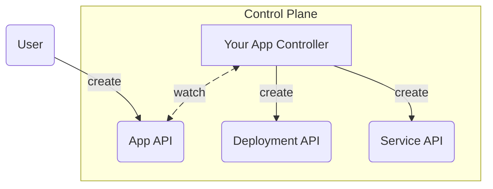
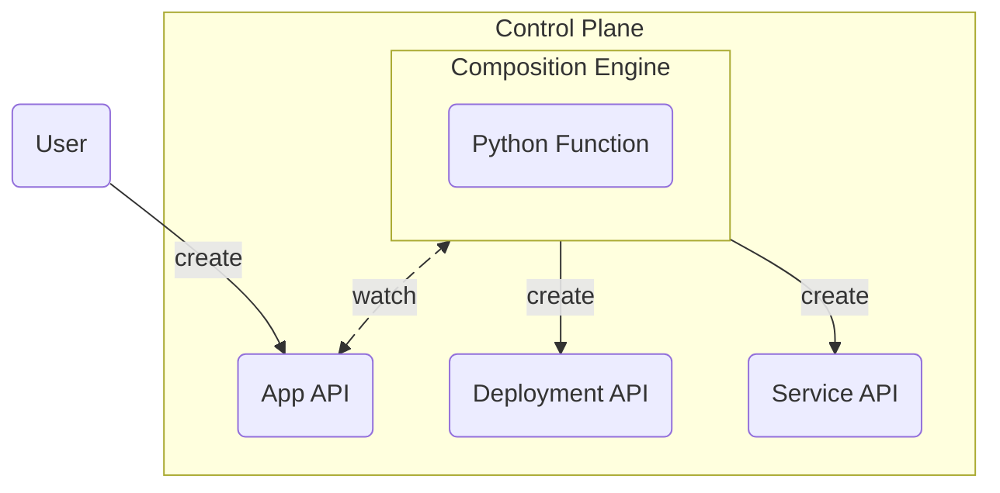
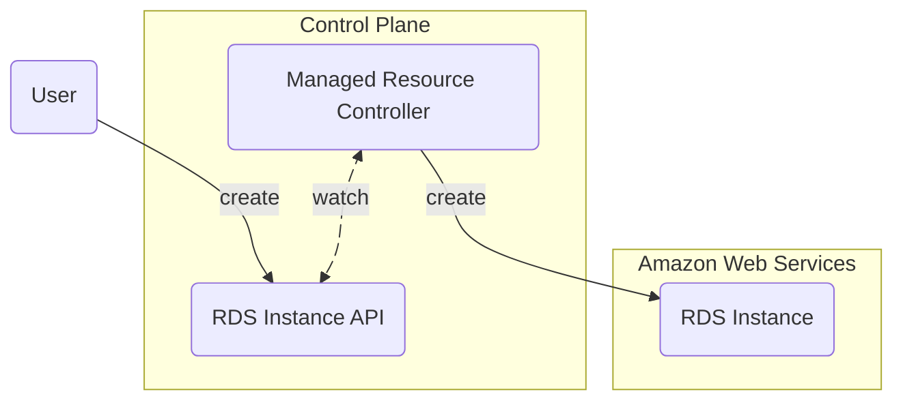
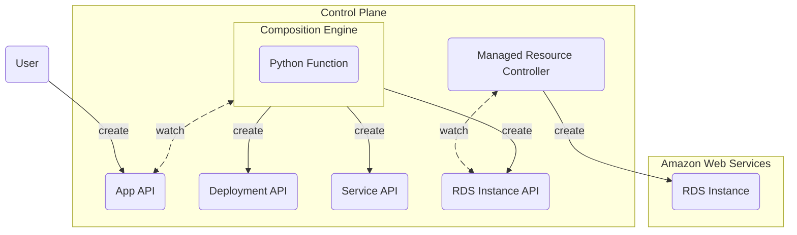
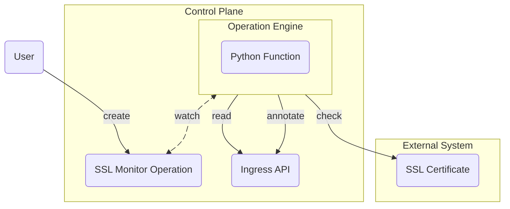
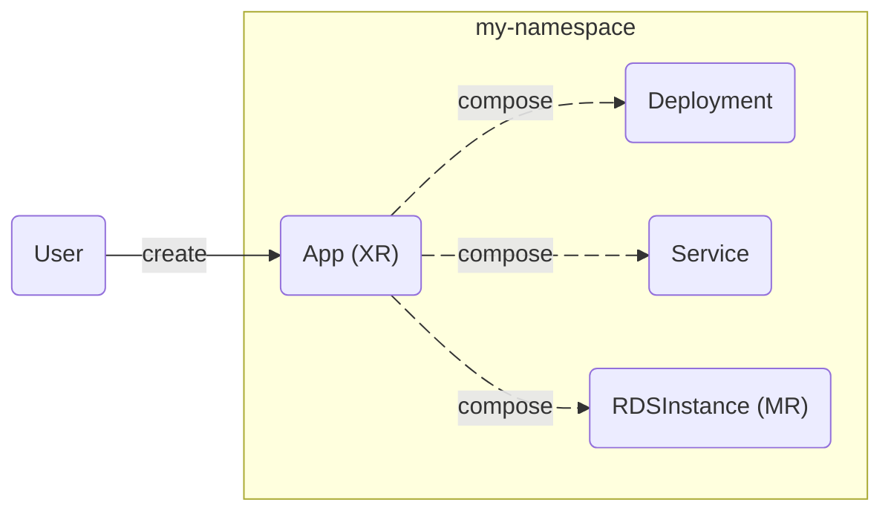
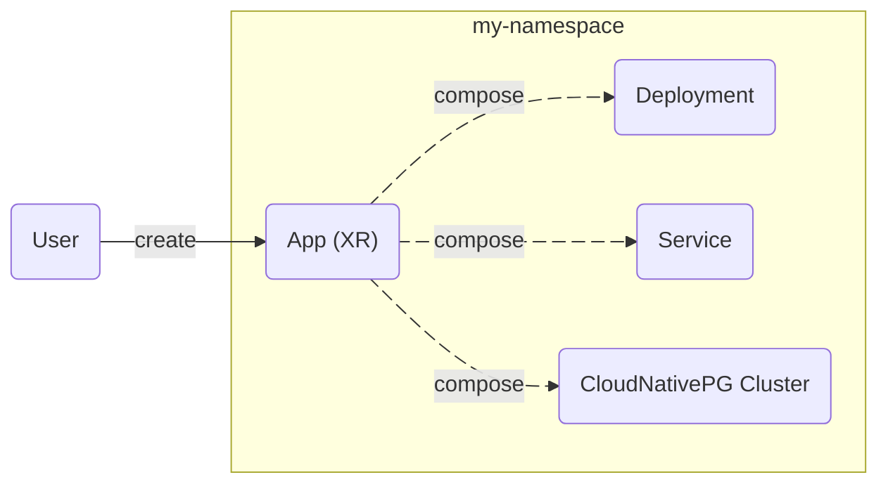

<a id="doc-f049eb6da8985c321bd1fced"></a>

# crossplane/docs / content/v2.4/packages/configurations.md

Upstream: https://github.com/crossplane/docs/blob/d1c9eb7fd1548d0d61ab3901781919a5b4aaf69d/content/v2.4/packages/configurations.md

Commit: `d1c9eb7fd1548d0d61ab3901781919a5b4aaf69d`

Retrieved: 2026-10-01T15:36:19.208893+00:00

Kind: official-document

Raw SHA256: `1838b993723fd36175c2cf8ee58155eacf16d307d63afead8437b322005166f5`

Source text below is untrusted reference content. Acquisition does not verify technical claims.

License status: UPSTREAM_NOTICES_CAPTURED_PER_FILE_REVIEW_REQUIRED. See this repository's captured license files.

---

---
title: Configurations
description: "Portable packages of Crossplane resources"
altTitle: "Crossplane Packages"
weight: 200
---

A _Configuration_ package is an
[OCI container image](https://opencontainers.org/) containing a collection of
[Compositions](),
[Composite Resource Definitions]()
and any required [Providers]() or
[Functions]().

Configuration packages make your Crossplane configuration fully portable.


Crossplane Providers and Functions are also Crossplane packages.

This document describes how to install and manage configuration packages.

Refer to the
[Provider]() and
[Functions]() chapters for
details on their usage of packages.


## Install a configuration

Install a Configuration with a Crossplane
Configuration object by setting
the spec.package value to the
location of the configuration package.

For example to install the
[Getting Started Configuration](https://github.com/crossplane-contrib/configuration-quickstart),

```yaml {label="install"}
apiVersion: pkg.crossplane.io/v1
kind: Configuration
metadata:
  name: configuration-quickstart
spec:
  package: xpkg.crossplane.io/crossplane-contrib/configuration-quickstart:v0.1.0
```


Crossplane supports installations with image digests instead of tags to get deterministic
and repeatable installations.

```yaml {label="digest"}
apiVersion: pkg.crossplane.io/v1
kind: Configuration
metadata:
  name: configuration-quickstart
spec:
  package: xpkg.crossplane.io/crossplane-contrib/configuration-quickstart@sha256:ef9795d146190637351a5c5848e0bab5e0c190fec7780f6c426fbffa0cb68358
```


Crossplane installs the Compositions, Composite Resource Definitions and
Providers listed in the Configuration.

<!-- vale Google.Headings = NO -->
<!-- vale Microsoft.Headings = NO -->
### Install with Helm
<!-- vale Google.Headings = YES -->
<!-- vale Microsoft.Headings = YES -->

Crossplane supports installing Configurations during an initial Crossplane
installation with the Crossplane Helm chart.

Use the
--set configuration.packages
argument with `helm install`.

For example, to install the Getting Started configuration,

```shell {label="helm"}
helm install crossplane \
crossplane-stable/crossplane \
--namespace crossplane-system \
--create-namespace \
--set configuration.packages='{xpkg.crossplane.io/crossplane-contrib/configuration-quickstart:v0.1.0}'
```

### Install offline

Installing Crossplane packages offline requires a local container registry, such as
[Harbor](https://goharbor.io/) to host the packages. Crossplane only
supports installing packages from a container registry.

Crossplane doesn't support installing packages directly from Kubernetes
volumes.

### Installation options

Configurations support multiple options to change configuration package related
settings.


#### Configuration revisions

When installing a newer version of an existing Configuration Crossplane creates
a new configuration revision.

View the configuration revisions with
kubectl get configurationrevisions.

```shell {label="rev",copy-lines="1"}
kubectl get configurationrevisions
NAME                            HEALTHY   REVISION   IMAGE                                             STATE      DEP-FOUND   DEP-INSTALLED   AGE
platform-ref-aws-1735d56cd88d   True      2          xpkg.crossplane.io/crossplane-contrib/platform-ref-aws:v0.5.0   Active     2           2               46s
platform-ref-aws-3ac761211893   True      1          xpkg.crossplane.io/crossplane-contrib/platform-ref-aws:v0.4.1   Inactive                               5m13s
```

Only a single revision is active at a time. The active revision determines the
available resources, including Compositions and Composite Resource Definitions.

By default Crossplane keeps only a single _Inactive_ revision.

Change the number of revisions Crossplane maintains with a Configuration package
revisionHistoryLimit.

The revisionHistoryLimit
field is an integer.
The default value is `1`.
Disable storing revisions by setting
revisionHistoryLimit to `0`.

For example, to change the default setting and store 10 revisions use
revisionHistoryLimit: 10.

```yaml {label="revHistory"}
apiVersion: pkg.crossplane.io/v1
kind: Configuration
metadata:
  name: platform-ref-aws
spec:
  revisionHistoryLimit: 10
# Removed for brevity
```

#### Configuration package pull policy

Use a packagePullPolicy to
define when Crossplane should download the Configuration package to the local
Crossplane package cache.

The `packagePullPolicy` options are:
* `IfNotPresent` - (**default**) Only download the package if it isn't in the cache.
* `Always` - Check for new packages every minute and download any matching
  package that isn't in the cache.
* `Never` - Never download the package. Packages are only installed from the
  local package cache.


The Crossplane
packagePullPolicy works
like the Kubernetes container image
[image pull policy](https://kubernetes.io/docs/concepts/containers/images/#image-pull-policy).

Crossplane supports the use of tags and package digest hashes like
Kubernetes images.


For example, to `Always` download a given Configuration package use the
packagePullPolicy: Always
configuration.

```yaml {label="pullpolicy",copy-lines="6"}
apiVersion: pkg.crossplane.io/v1
kind: Configuration
metadata:
  name: platform-ref-aws
spec:
  packagePullPolicy: Always
# Removed for brevity
```

#### Revision activation policy

The `Active` package revision
is the package controller actively reconciling resources.

By default Crossplane sets the most recently installed package revision as
`Active`.

Control the Configuration upgrade behavior with a
revisionActivationPolicy.

The revisionActivationPolicy
options are:
* `Automatic` - (**default**) Automatically activate the last installed configuration.
* `Manual` - Don't automatically activate a configuration.

For example, to change the upgrade behavior to require manual upgrades, set
revisionActivationPolicy: Manual.

```yaml {label="revision"}
apiVersion: pkg.crossplane.io/v1
kind: Configuration
metadata:
  name: platform-ref-aws
spec:
  revisionActivationPolicy: Manual
# Removed for brevity
```


#### Install a Configuration from a private registry

Like Kubernetes uses `imagePullSecrets` to
[install images from private registries](https://kubernetes.io/docs/tasks/configure-pod-container/pull-image-private-registry/),
Crossplane uses `packagePullSecrets` to install Configuration packages from a
private registry.

Use packagePullSecrets to provide a
Kubernetes secret to use for authentication when downloading a Configuration
package.


The Kubernetes secret must be in the same namespace as Crossplane.


The packagePullSecrets is a list of
secrets.

For example, to use the secret named
example-secret configure a
packagePullSecrets.

```yaml {label="pps"}
apiVersion: pkg.crossplane.io/v1
kind: Configuration
metadata:
  name: platform-ref-aws
spec:
  packagePullSecrets:
    - name: example-secret
# Removed for brevity
```

#### Ignore dependencies

By default Crossplane installs any [dependencies](#manage-dependencies) listed
in a Configuration package.

Crossplane can ignore a Configuration package's dependencies with
skipDependencyResolution.


Most Configurations include dependencies for the required Providers.

If a Configuration ignores dependencies, the required Providers must be
manually installed.


For example, to disable dependency resolution configure
skipDependencyResolution: true.

```yaml {label="pkgDep"}
apiVersion: pkg.crossplane.io/v1
kind: Configuration
metadata:
  name: platform-ref-aws
spec:
  skipDependencyResolution: true
# Removed for brevity
```

#### Automatically update dependency versions

Crossplane can automatically upgrade a package's dependency version to the minimum
valid version that satisfies all the constraints. It's an alpha feature that
requires enabling with the `--enable-dependency-version-upgrades` flag.

Sometimes, Crossplane requires dependency version downgrade for proceeding with
installations. Suppose configuration A, which depends on package X with the
constraint`>=v0.0.0`, installs on the control plane. In this case, the package
manager installs the latest version of package X, such as `v3.0.0`. Later, you decide
to install configuration B, which depends on package X with the constraint `<=v2.0.0`.
Since version `v2.0.0`satisfies both conditions, Crossplane must downgrade package X to
allow the installation of configuration B, which Crossplane disables by default.

For enabling automatic dependency version downgrades, there is a configuration
option as a helm value `packageManager.enableAutomaticDependencyDowngrade=true`.
Downgrading a package can cause unexpected behavior, so this
Crossplane disables this option by default. After enabling this option, the package manager
automatically downgrades a package's dependency version to the maximum valid version
that satisfies the constraints.


This configuration requires the `--enable-dependency-version-upgrades` flag.
Please see the
[configuration options]()
and
[feature flags]()
are available in the
[Crossplane Install]()
section for more details.



Enabling automatic dependency downgrades may have unintended consequences, such as:

1) CRDs missing in the downgraded version, possibly leaving orphaned MRs without
controllers to reconcile them.
2) Loss of data if downgraded CRD versions omit fields that you set before.
3) Changes in the CRD storage version, which may prevent package version update.


<!-- vale Google.Headings = NO -->
<!-- vale Microsoft.Headings = NO -->
#### Ignore Crossplane version requirements
<!-- vale Google.Headings = YES -->
<!-- vale Microsoft.Headings = YES -->

A Configuration package may require a specific or minimum Crossplane version
before installing. By default, Crossplane doesn't install a Configuration if
the Crossplane version doesn't meet the required version.

Crossplane can ignore the required version with
ignoreCrossplaneConstraints.

For example, to install a Configuration package into an unsupported Crossplane
version, configure
ignoreCrossplaneConstraints: true.

```yaml {label="xpVer"}
apiVersion: pkg.crossplane.io/v1
kind: Configuration
metadata:
  name: platform-ref-aws
spec:
  ignoreCrossplaneConstraints: true
# Removed for brevity
```


### Verify a configuration

Verify a Configuration with
kubectl get configuration.

A working configuration reports `Installed` and `Healthy` as `True`.

```shell {label="verify",copy-lines="1"}
kubectl get configuration
NAME               INSTALLED   HEALTHY   PACKAGE                                           AGE
platform-ref-aws   True        True      xpkg.crossplane.io/crossplane-contrib/configuration-quickstart:v0.1.0   54s
```

### Manage dependencies

Configuration packages may include dependencies on other packages including
Functions, Providers or other Configurations.

If Crossplane can't meet the dependencies of a Configuration the Configuration
reports `HEALTHY` as `False`.

For example, this installation of the Getting Started Configuration is
`HEALTHY: False`.

```shell {copy-lines="1"}
kubectl get configuration
NAME               INSTALLED   HEALTHY   PACKAGE                                           AGE
platform-ref-aws   True        False     xpkg.crossplane.io/crossplane-contrib/configuration-quickstart:v0.1.0   71s
```

To see more information on why the Configuration isn't `HEALTHY` use
kubectl describe configurationrevisions.

```yaml {copy-lines="1",label="depend"}
kubectl describe configurationrevision
Name:         platform-ref-aws-a30ad655c769
API Version:  pkg.crossplane.io/v1
Kind:         ConfigurationRevision
# Removed for brevity
Spec:
  Desired State:                  Active
  Image:                          xpkg.crossplane.io/crossplane-contrib/configuration-quickstart:v0.1.0
  Revision:                       1
Status:
  Conditions:
    Last Transition Time:  2023-10-06T20:08:14Z
    Reason:                UnhealthyPackageRevision
    Status:                False
    Type:                  Healthy
  Controller Ref:
    Name:
Events:
  Type     Reason       Age                From                                              Message
  ----     ------       ----               ----                                              -------
  Warning  LintPackage  29s (x2 over 29s)  packages/configurationrevision.pkg.crossplane.io  incompatible Crossplane version: package isn't compatible with Crossplane version (v1.12.0)
```

The Events show a
Warning with a message that the
current version of Crossplane doesn't meet the Configuration package
requirements.

## Create a configuration

Crossplane Configuration packages are
[OCI container images](https://opencontainers.org/) containing one or more YAML
files.


Configuration packages are fully OCI compliant. Any tool that builds OCI images
can build Configuration packages.

It's strongly recommended to use the Crossplane command-line tool to
provide error checking and formatting to Crossplane package builds.

Read the
[Crossplane package specification](https://github.com/crossplane/crossplane/blob/main/contributing/specifications/xpkg.md)
for package requirements when building packages with third-party tools.


A Configuration package requires a `crossplane.yaml` file and may include
Composition and CompositeResourceDefinition files.

<!-- vale Google.Headings = NO -->
### The crossplane.yaml file
<!-- vale Google.Headings = YES -->

To build a Configuration package using the Crossplane CLI, create a file
named
crossplane.yaml.
The
crossplane.yaml
file defines the requirements and name of the
Configuration.


The Crossplane CLI only supports a file named `crossplane.yaml`.


Configuration package uses the
meta.pkg.crossplane.io
Crossplane API group.

Specify any other Configurations, Functions or Providers in the
dependsOn list.
Optionally, you can require a specific or minimum package version with the
version option.

You can also define a specific or minimum version of Crossplane for this
Configuration with the
crossplane.version option.


Defining the crossplane object
or required versions is optional.


```yaml {label="cfgMeta",copy-lines="all"}
$ cat crossplane.yaml
apiVersion: meta.pkg.crossplane.io/v1
kind: Configuration
metadata:
  name: test-configuration
spec:
  dependsOn:
    - apiVersion: pkg.crossplane.io/v1
      kind: Provider
      package: xpkg.crossplane.io/crossplane-contrib/provider-aws
      version: ">=v0.36.0"
  crossplane:
    version: ">=v1.12.1-0"
```

### Build the package

Create the package using the [Crossplane CLI]() command
`crossplane xpkg build --package-root=<directory>`.

Where the `<directory>` is the directory containing the `crossplane.yaml` file
and any Composition or CompositeResourceDefinition YAML files.

The CLI recursively searches for `.yml` or `.yaml` files in the directory to
include in the package.


You must ignore any other YAML files with `--ignore=<file_list>`.
For
example, `crossplane xpkg build --package-root=test-directory --ignore=".tmp/*"`.

Including YAML files that aren't Compositions or CompositeResourceDefinitions
isn't supported.


By default, Crossplane creates a `.xpkg` file of the Configuration name and
a SHA-256 hash of the package contents.

For example, a Configuration
named test-configuration.
The
Crossplane CLI builds a package named `test-configuration-e8c244f6bf21.xpkg`.

```yaml {label="xpkgName"}
apiVersion: meta.pkg.crossplane.io/v1
kind: Configuration
metadata:
  name: test-configuration
# Removed for brevity
```

Specify the output file with `--package-file=<filename>.xpkg` option.

For example, to build a package from a directory named `test-directory` and
generate a package named `test-package.xpkg` in the current working directory,
use the command:

```shell
crossplane xpkg build --package-root=test-directory --package-file=test-package.xpkg
```

```shell
ls -1 ./
test-directory
test-package.xpkg
```


<a id="doc-246e87950c189c14789ddb2b"></a>

# crossplane/docs / content/v2.4/packages/functions.md

Upstream: https://github.com/crossplane/docs/blob/d1c9eb7fd1548d0d61ab3901781919a5b4aaf69d/content/v2.4/packages/functions.md

Commit: `d1c9eb7fd1548d0d61ab3901781919a5b4aaf69d`

Retrieved: 2026-10-01T15:36:19.208893+00:00

Kind: official-document

Raw SHA256: `db3439a153fefa59f6d18d12da8475565752306829a0a9bffdf32b896e8d0dc0`

Source text below is untrusted reference content. Acquisition does not verify technical claims.

License status: UPSTREAM_NOTICES_CAPTURED_PER_FILE_REVIEW_REQUIRED. See this repository's captured license files.

---

---
title: Functions
weight: 100
description: "Functions extend Crossplane with new ways to configure composition"
---

Functions extend Crossplane with new ways to configure
[composition]().

You can use different _composition functions_ to configure what Crossplane does
when someone creates or updates a
[composite resource (XR)]().


This page is a work in progress.

Functions are packages, like [Providers]() and
[Configurations](). Their APIs are similar. You
install and configure them the same way as a provider.

Read the [composition]() documentation to
learn how to use functions in a composition.


## Install a function

Install a Function with a Crossplane
Function object setting the
spec.package value to the
location of the function package.

For example, to install the
[patch and transform function](https://github.com/crossplane-contrib/function-patch-and-transform),

```yaml {label="install"}
apiVersion: pkg.crossplane.io/v1
kind: Function
metadata:
  name: crossplane-contrib-function-patch-and-transform
spec:
  package: xpkg.crossplane.io/crossplane-contrib/function-patch-and-transform:v0.8.2
```

By default, the Function pod installs in the same namespace as Crossplane
(`crossplane-system`).


Functions are part of the
pkg.crossplane.io group.

The meta.pkg.crossplane.io
group is for creating Function packages.

Instructions on building Functions are outside of the scope of this
document.
Read the Crossplane contributing
[Function Development Guide](https://github.com/crossplane/crossplane/blob/main/contributing/guide-provider-development.md)
for more information.

For information on the specification of Function packages read the
[Crossplane Function Package specification](https://github.com/crossplane/crossplane/blob/main/contributing/specifications/xpkg.md#provider-package-requirements).

```yaml {label="meta-pkg"}
apiVersion: meta.pkg.crossplane.io/v1
kind: Function
metadata:
  name: provider-aws
spec:
# Removed for brevity
```



<a id="doc-ac617c2b44127658537e9e6e"></a>

# crossplane/docs / content/v2.4/packages/image-configs.md

Upstream: https://github.com/crossplane/docs/blob/d1c9eb7fd1548d0d61ab3901781919a5b4aaf69d/content/v2.4/packages/image-configs.md

Commit: `d1c9eb7fd1548d0d61ab3901781919a5b4aaf69d`

Retrieved: 2026-10-01T15:36:19.208893+00:00

Kind: official-document

Raw SHA256: `ff4a0a5528526bda17b3cd6f5a5379f44509241ccfdf0de4bc84f574644ee309`

Source text below is untrusted reference content. Acquisition does not verify technical claims.

License status: UPSTREAM_NOTICES_CAPTURED_PER_FILE_REVIEW_REQUIRED. See this repository's captured license files.

---

---
title: Image Configs
weight: 400
description: "Centralized control of package image configuration"
---

<!-- vale write-good.Passive = NO -->

`ImageConfig` is an API for centralized control over the configuration of
Crossplane package images. It allows you to configure package manager behavior
for images globally, without needing to be referenced by other objects.

## Matching image references

`spec.matchImages` is a list of image references that the `ImageConfig` applies
to. Each item in the list specifies the type and configuration of the image
reference to match. The only supported type is `Prefix`, which matches the
prefix of the image reference. No wildcards are supported. The `type` defaults
to `Prefix` and can be omitted.

When there are multiple `ImageConfigs` matching an image reference, the one with
the longest matching prefix is selected. If there are multiple `ImageConfigs`
with the same longest matching prefix, one of them is selected
arbitrarily. Please note that this situation occurs only if there are
overlapping prefixes in the `matchImages` lists of different `ImageConfig`
resources, which should be avoided.

## Configuring a pull secret

You can use `ImageConfig` to inject a pull secret into the Crossplane package
manager registry client whenever it interacts with the registry, such as for
dependency resolution or image pulls.

In the following example, the `ImageConfig` resource named `acme-packages` is
configured to inject the pull secret named `acme-registry-credentials` whenever
it needs to interact with the registry for images with the prefix
`registry1.com/acme-co/`.

```yaml
apiVersion: pkg.crossplane.io/v1beta1
kind: ImageConfig
metadata:
  name: acme-packages
spec:
  matchImages:
    - type: Prefix
      prefix: registry1.com/acme-co/
  registry:
    authentication:
      pullSecretRef:
        name: acme-registry-credentials
```

`spec.registry.authentication.pullSecretRef` is a reference to the pull secret
that should be injected into the registry client. The secret must be of type
`kubernetes.io/dockerconfigjson` and must be in the Crossplane installation
namespace, typically `crossplane-system`. One can create the secret using the
following command:

```shell
kubectl -n crossplane-system create secret docker-registry acme-registry-credentials --docker-server=registry1.com --docker-username=<user> --docker-password=<password>
```

## Configuring signature verification


Signature verification is an alpha feature and needs to be enabled with the
`--enable-signature-verification` feature flag.


You can use `ImageConfig` to configure signature verification for images. When
you enable signature verification, the package manager verifies the signature of
each image before pulling it. If the signature isn't valid, the package manager
rejects the package deployment.

In the following example, the `ImageConfig` resource named `verify-acme-packages`
configures verification of the signature of images with the prefixes
`registry1.com/acme-co/configuration-foo` and
`registry1.com/acme-co/configuration-bar`.

In the example below, the `ImageConfig` resource named `verify-acme-packages` is
set up to verify the signatures of images with the prefixes
`registry1.com/acme-co/configuration-foo` and `registry1.com/acme-co/configuration-bar`.

```yaml
apiVersion: pkg.crossplane.io/v1beta1
kind: ImageConfig
metadata:
  name: verify-acme-packages
spec:
  matchImages:
    - type: Prefix
      prefix: registry1.com/acme-co/configuration-foo
    - type: Prefix
      prefix: registry1.com/acme-co/configuration-bar
  verification:
    provider: Cosign
    cosign:
      authorities:
        - name: verify acme packages
          keyless:
            identities:
              - issuer: https://token.actions.githubusercontent.com
                subject: https://github.com/acme-co/crossplane-packages/.github/workflows/supplychain.yml@refs/heads/main
          attestations:
            - name: verify attestations
              predicateType: spdxjson
```

`spec.verification.provider` specifies the signature verification provider.
The only supported provider is `Cosign`. `spec.verification.cosign` contains the
configuration for the Cosign provider. The `authorities` field contains the
configuration for the authorities that sign the images. The `attestations` field
contains the configuration for verifying the attestations of the images.

The `ImageConfig` API follows the same API shape as [Policy Controller](https://docs.sigstore.dev/policy-controller/overview/)
from [Sigstore](https://docs.sigstore.dev/). Crossplane initially supports a
subset of the Policy Controller configuration options which can be found in the
[API reference]()
for the `ImageConfig` resource together with their descriptions.

When multiple authorities are provided, the package manager verifies the
signature against each authority until it finds a valid one. If any of the
authorities' signatures are valid, the package manager accepts the image.
Similarly, when multiple identities or attestations are provided, the package
manager verifies until it finds a valid match and fails if none of them matches.

Matching the image reference to the `ImageConfig` works similarly to the pull
secret configuration, as described in the previous section.

### Checking the signature verification status

When you enable signature verification, the respective controller reports the
verification status as a condition of type `Verified` on the package revision
resources. This condition indicates whether the signature verification was
successful, failed, skipped, or incomplete due to an error.

#### Example conditions

**Verification skipped:** The package manager skipped signature verification for
the package revision because there were no matching `ImageConfig` with signature
verification configuration.

```yaml
  - lastTransitionTime: "2024-10-23T16:38:51Z"
    reason: SignatureVerificationSkipped
    status: "True"
    type: Verified
```

**Verification successful:** The package manager successfully verified the
signature of the image in the package revision.

```yaml
  - lastTransitionTime: "2024-10-23T16:43:05Z"
    message: Signature verification succeeded with ImageConfig named "verify-acme-packages"
    reason: VerificationSucceeded
    status: "True"
    type: Verified
```

**Verification failed:** The package manager failed to verify the signature of
the image in the package revision.

```yaml
  - lastTransitionTime: "2024-10-23T16:42:44Z"
    message: 'Signature verification failed with ImageConfig named "verify-acme-packages":
      [signature keyless validation failed for authority verify acme packages
      for registry1.com/acme-co/configuration-foo:v0.2.0: no signatures found: ]'
    reason: SignatureVerificationFailed
    status: "False"
    type: Verified
```

**Verification incomplete:** The package manager encountered an error while
verifying the signature of the image in the package revision.

```yaml
  - lastTransitionTime: "2024-10-23T16:44:22Z"
    message: 'Error occurred during signature verification cannot get image verification
      config: cannot get cosign verification config: no data found for key "cosign.pub"
      in secret "cosign-public-key"'
    reason: SignatureVerificationIncomplete
    status: "False"
    type: Verified
```

If you can't see this condition on the package revision resource, namely
`ProviderRevision`, `ConfigurationRevision`, or `FunctionRevision`, ensure that
you enable the feature.

## Configuring runtime for packages

You can use `ImageConfig` to specify a `DeploymentRuntimeConfig` for packages
matching a pattern, regardless of how they're installed. This includes packages
installed directly and packages installed as dependencies.

The `spec.runtime` field allows you to specify a `DeploymentRuntimeConfig` that
applies to all packages matching the image prefix. It allows you to apply
consistent runtime configurations across all packages from a particular registry
or organization, including their dependencies.

### Precedence

When both an `ImageConfig` runtime and a package level `runtimeConfigRef` are
specified, the `ImageConfig` runtime takes precedence.

### Example

In the following example, the `ImageConfig` configures the function
`registry1.com/acme-co/my-function` to use Azure Workload Identity by
specifying a ServiceAccount with the required annotation and pod labels:

```yaml
apiVersion: pkg.crossplane.io/v1beta1
kind: ImageConfig
metadata:
  name: function-workload-identity
spec:
  matchImages:
    - prefix: registry1.com/acme-co/my-function
  runtime:
    configRef:
      name: azure-workload-identity
---
apiVersion: pkg.crossplane.io/v1beta1
kind: DeploymentRuntimeConfig
metadata:
  name: azure-workload-identity
spec:
  serviceAccountTemplate:
    metadata:
      annotations:
        azure.workload.identity/client-id: "12345678-1234-1234-1234-123456789012"
  deploymentTemplate:
    metadata:
      labels:
        azure.workload.identity/use: "true"
    spec:
      selector: {}
      template:
        metadata:
          labels:
            azure.workload.identity/use: "true"
        spec:
          containers:
            - name: package-runtime
              args: []
```

With this configuration, the function `registry1.com/acme-co/my-function` uses
the `azure-workload-identity` runtime configuration, whether it's installed
directly or as a dependency of a Configuration.

### Debugging

When the package manager applies an `ImageConfig` runtime configuration to a
package, it adds an entry to the `appliedImageConfigRefs` field in the package
status with the reason `ConfigureRuntime`:

```shell
kubectl get functionrevisions my-function .. -o yaml

...
status:
  appliedImageConfigRefs:
  - name: function-workload-identity
    reason: ConfigureRuntime
...
```

## Rewriting image paths

You can use an `ImageConfig` to pull package images from an alternative location
such as a private registry. `spec.rewriteImages` specifies how to rewrite the
paths of matched images.

Only prefix replacement is supported. The prefix specified in
`spec.rewriteImage.prefix` replaces the matched prefix from `matchImages`. For
example, the following `ImageConfig` replaces `xpkg.crossplane.io` with
`registry1.com` for any image with the prefix `xpkg.crossplane.io`.

```yaml
apiVersion: pkg.crossplane.io/v1beta1
kind: ImageConfig
metadata:
  name: private-registry-rewrite
spec:
  matchImages:
    - prefix: xpkg.crossplane.io
  rewriteImage:
    prefix: registry1.com
```

In this example, installing the provider package
`xpkg.crossplane.io/crossplane-contrib/provider-nop:v0.4.0` will result in the
package manager pulling the provider from
`registry1.com/crossplane-contrib/provider-nop:v0.4.0`.

Rewriting image paths via `ImageConfig` is useful when mirroring packages to a
private registry, because it allows a package and all its dependencies to be
pulled from the same registry. For example, the provider
`xpkg.crossplane.io/crossplane-contrib/provider-aws-s3` has a dependency on
`xpkg.crossplane.io/crossplane-contrib/provider-family-aws`. If you mirror the
packages to your own registry at `registry1.com` and install them without an
`ImageConfig`, the package manager still attempts to pull the dependency from
`xpkg.crossplane.io`. With the preceding `ImageConfig`, the dependency is pulled
from `registry1.com`.

Rewriting an image path with `ImageConfig` doesn't change the `spec.package`
field of the package resource. The rewritten path is recorded in the
`status.resolvedPackage` field. The preceding example results in the following:

```shell
kubectl describe provider crossplane-contrib-provider-family-aws
...
Spec:
  ...
  Package:                        xpkg.crossplane.io/crossplane-contrib/provider-family-aws:v1.22.0
Status:
  ...
  Resolved Package:        registry1.com/crossplane-contrib/provider-family-aws:v1.22.0
```

### Interaction with other operations


Image rewriting is always done before other `ImageConfig` operations. If you
wish to also configure pull secrets or signature verification as well as
rewriting, those `ImageConfig` resources must match the rewritten image path.


For example, if you are mirroring packages from `xpkg.crossplane.io` to
`registry1.com` and need to configure pull secrets for `registry1.com`, two
`ImageConfig` resources are necessary:

```yaml
# Rewrite xpkg.crossplane.io -> registry1.com
---
apiVersion: pkg.crossplane.io/v1beta1
kind: ImageConfig
metadata:
  name: private-registry-rewrite
spec:
  matchImages:
    - prefix: xpkg.crossplane.io
  rewriteImage:
    prefix: registry1.com

# Configure pull secrets for registry1.com
---
apiVersion: pkg.crossplane.io/v1beta1
kind: ImageConfig
metadata:
  name: private-registry-auth
spec:
  matchImages:
    - type: Prefix
      prefix: registry1.com
  registry:
    authentication:
      pullSecretRef:
        name: private-registry-credentials
```

## Debugging

When the package manager selects an `ImageConfig` for a package, it throws an
event with the reason `ImageConfigSelection` and the name of the selected
`ImageConfig` and injected pull secret. You can find these events both on the
package and package revision resources. The package manager also updates the
`appliedImageConfigRefs` field in the package status to show the purpose for
which each `ImageConfig` was selected.

For example, the following event and status show that the `ImageConfig` named
`acme-packages` was used to provide a pull secret for the configuration named
`acme-configuration-foo`:

```shell
kubectl describe configuration acme-configuration-foo
...
Status:
  Applied Image Config Refs:
    Name:    acme-packages
    Reason:  SetImagePullSecret
...
Events:
  Type     Reason                Age                From                                              Message
  ----     ------                ----               ----                                              -------
  Normal   ImageConfigSelection  45s                packages/configuration.pkg.crossplane.io          Selected pullSecret "acme-registry-credentials" from ImageConfig "acme-packages" for registry authentication
```

If you can't find the expected event and `appliedImageConfigRefs` entry, ensure
the prefix of the image reference matches the `matchImages` list of any
`ImageConfig` resources in the cluster.

<!-- vale write-good.Passive = YES -->


<a id="doc-f2010f73a2ecdbfb6c23a22c"></a>

# crossplane/docs / content/v2.4/packages/providers.md

Upstream: https://github.com/crossplane/docs/blob/d1c9eb7fd1548d0d61ab3901781919a5b4aaf69d/content/v2.4/packages/providers.md

Commit: `d1c9eb7fd1548d0d61ab3901781919a5b4aaf69d`

Retrieved: 2026-10-01T15:36:19.208893+00:00

Kind: official-document

Raw SHA256: `f426605c96dd18f794f12f3dc1e891d059e880072c03bc748bd28dac80e0dbe2`

Source text below is untrusted reference content. Acquisition does not verify technical claims.

License status: UPSTREAM_NOTICES_CAPTURED_PER_FILE_REVIEW_REQUIRED. See this repository's captured license files.

---

---
title: Providers
weight: 5
description: "Providers connect Crossplane to external APIs"
---

Providers enable Crossplane to provision infrastructure on an
external service. Providers create new Kubernetes APIs and map them to external
APIs.

Providers are responsible for all aspects of connecting to non-Kubernetes
resources. This includes authentication, making external API calls and
providing
[Kubernetes Controller](https://kubernetes.io/docs/concepts/architecture/controller/)
logic for any external resources.

Examples of providers include:

* [Provider AWS](https://github.com/crossplane-contrib/provider-upjet-aws)
* [Provider Azure](https://github.com/upbound/provider-azure)
* [Provider GCP](https://github.com/upbound/provider-gcp)
* [Provider Kubernetes](https://github.com/crossplane-contrib/provider-kubernetes)

<!-- vale write-good.Passive = NO -->
<!-- "are Managed" isn't passive in this context -->
Providers define every external resource they can create in Kubernetes as a
Kubernetes API endpoint.
These endpoints are
[_Managed Resources_]().
<!-- vale write-good.Passive = YES -->


## Install a provider

Installing a provider creates new Kubernetes resources representing the
Provider's APIs. Installing a provider also creates a Provider pod that's
responsible for reconciling the Provider's APIs into the Kubernetes cluster.
Providers constantly watch the state of the desired managed resources and create
any external resources that are missing.

Install a Provider with a Crossplane
Provider object setting the
spec.package value to the
location of the provider package.

For example, to install the
[AWS Provider](https://github.com/crossplane-contrib/provider-upjet-aws),

```yaml {label="install"}
apiVersion: pkg.crossplane.io/v1
kind: Provider
metadata:
  name: crossplane-contrib-provider-aws-s3-s3
spec:
  package: xpkg.crossplane.io/crossplane-contrib/provider-aws-s3:v2.0.0
```

By default, the Provider pod installs in the same namespace as Crossplane
(`crossplane-system`).


Providers are part of the
pkg.crossplane.io group.

The meta.pkg.crossplane.io
group is for creating Provider packages.

Instructions on building Providers are outside of the scope of this
document.
Read the Crossplane contributing
[Provider Development Guide](https://github.com/crossplane/crossplane/blob/main/contributing/guide-provider-development.md)
for more information.

For information on the specification of Provider packages read the
[Crossplane Provider Package specification](https://github.com/crossplane/crossplane/blob/main/contributing/specifications/xpkg.md#provider-package-requirements).

```yaml {label="meta-pkg"}
apiVersion: meta.pkg.crossplane.io/v1
kind: Provider
metadata:
  name: crossplane-contrib-provider-aws-s3
spec:
# Removed for brevity
```


<!-- vale Google.Headings = NO -->
<!-- vale Microsoft.Headings = NO -->
### Install with Helm
<!-- vale Google.Headings = YES -->
<!-- vale Microsoft.Headings = YES -->

Crossplane supports installing Providers during an initial Crossplane
installation with the Crossplane Helm chart.

Use the
--set provider.packages
argument with `helm install`.

For example, to install the AWS S3 Provider,

```shell {label="helm"}
helm install crossplane \
crossplane-stable/crossplane \
--namespace crossplane-system \
--create-namespace \
--set provider.packages='{xpkg.crossplane.io/crossplane-contrib/provider-aws-s3:v2.0.0}'
```

### Install offline

Installing Crossplane Providers offline requires a local container registry like
[Harbor](https://goharbor.io/) to host Provider packages. Crossplane only
supports installing Provider packages from a container registry.

Crossplane doesn't support installing Provider packages directly from Kubernetes
volumes.

### Installation options

Providers support multiple configuration options to change installation related
settings.


Crossplane supports installations with image digests instead of tags to get deterministic
and repeatable installations.

```yaml {label="digest"}
apiVersion: pkg.crossplane.io/v1
kind: Provider
metadata:
  name: crossplane-contrib-provider-aws-s3
spec:
  package: xpkg.crossplane.io/crossplane-contrib/provider-aws-s3@sha256:ee6bece46dbb54cc3f0233961f5baac317fa4e4a81b41198bdc72fc472d113d0
```


#### Provider pull policy

Use a packagePullPolicy to
define when Crossplane should download the Provider package to the local
Crossplane package cache.

The `packagePullPolicy` options are:
* `IfNotPresent` - (**default**) Only download the package if it isn't in the cache.
* `Always` - Check for new packages every minute and download any matching
  package that isn't in the cache.
* `Never` - Never download the package. Packages are only installed from the
  local package cache.


The Crossplane
packagePullPolicy works
like the Kubernetes container image
[image pull policy](https://kubernetes.io/docs/concepts/containers/images/#image-pull-policy).

Crossplane supports the use of tags and package digest hashes like
Kubernetes images.


For example, to `Always` download a given Provider package use the
packagePullPolicy: Always
configuration.

```yaml {label="pullpolicy",copy-lines="6"}
apiVersion: pkg.crossplane.io/v1
kind: Provider
metadata:
  name: crossplane-contrib-provider-aws-s3
spec:
  packagePullPolicy: Always
# Removed for brevity
```

#### Revision activation policy

The `Active` package revision
is the package controller actively reconciling resources.

By default Crossplane sets the most recently installed package revision as
`Active`.

Control the Provider upgrade behavior with a
revisionActivationPolicy.

The revisionActivationPolicy
options are:
* `Automatic` - (**default**) Automatically activate the last installed Provider.
* `Manual` - Don't automatically activate a Provider.

For example, to change the upgrade behavior to require manual upgrades, set
revisionActivationPolicy: Manual.

```yaml {label="revision"}
apiVersion: pkg.crossplane.io/v1
kind: Provider
metadata:
  name: crossplane-contrib-provider-aws-s3
spec:
  revisionActivationPolicy: Manual
# Removed for brevity
```

#### Package revision history limit

When Crossplane installs a different version of the same Provider package
Crossplane creates a new _revision_.

By default Crossplane maintains one _Inactive_ revision.


Read the [Provider upgrade](#upgrade-a-provider) section for
more information on the use of package revisions.


Change the number of revisions Crossplane maintains with a Provider Package
revisionHistoryLimit.

The revisionHistoryLimit
field is an integer.
The default value is `1`.
Disable storing revisions by setting
revisionHistoryLimit to `0`.

For example, to change the default setting and store 10 revisions use
revisionHistoryLimit: 10.

```yaml {label="revHistoryLimit"}
apiVersion: pkg.crossplane.io/v1
kind: Provider
metadata:
  name: crossplane-contrib-provider-aws-s3
spec:
  revisionHistoryLimit: 10
# Removed for brevity
```

#### Install a provider from a private registry

Like Kubernetes uses `imagePullSecrets` to
[install images from private registries](https://kubernetes.io/docs/tasks/configure-pod-container/pull-image-private-registry/),
Crossplane uses `packagePullSecrets` to install Provider packages from a private
registry.

Use packagePullSecrets to provide a
Kubernetes secret to use for authentication when downloading a Provider package.


The Kubernetes secret must be in the same namespace as Crossplane.


The packagePullSecrets is a list of
secrets.

For example, to use the secret named
example-secret configure a
packagePullSecrets.

```yaml {label="pps"}
apiVersion: pkg.crossplane.io/v1
kind: Provider
metadata:
  name: crossplane-contrib-provider-aws-s3
spec:
  packagePullSecrets:
    - name: example-secret
# Removed for brevity
```


Configured `packagePullSecrets` aren't passed to any Provider package
dependencies.


#### Ignore dependencies

By default Crossplane installs any [dependencies](#manage-dependencies) listed
in a Provider package.

Crossplane can ignore a Provider package's dependencies with
skipDependencyResolution.

For example, to disable dependency resolution configure
skipDependencyResolution: true.

```yaml {label="pkgDep"}
apiVersion: pkg.crossplane.io/v1
kind: Provider
metadata:
  name: crossplane-contrib-provider-aws-s3
spec:
  skipDependencyResolution: true
# Removed for brevity
```

#### Automatically update dependency versions

Crossplane can automatically upgrade a package's dependency version to the minimum
valid version that satisfies all the constraints. It's an alpha feature that
requires enabling with the `--enable-dependency-version-upgrades` flag.

Sometimes, Crossplane requires dependency version downgrade for proceeding with
installations. Suppose configuration A, which depends on package X with the
constraint`>=v0.0.0`, installs on the control plane. In this case, the package
manager installs the latest version of package X, such as `v3.0.0`. Later, you decide
to install configuration B, which depends on package X with the constraint `<=v2.0.0`.
Since version `v2.0.0`satisfies both conditions, Crossplane must downgrade package X to
allow the installation of configuration B, which Crossplane disables by default.

For enabling automatic dependency version downgrades, there is a configuration
option as a helm value `packageManager.enableAutomaticDependencyDowngrade=true`.
Downgrading a package can cause unexpected behavior, so this
Crossplane disables this option by default. After enabling this option, the package manager
automatically downgrades a package's dependency version to the maximum valid version
that satisfies the constraints.


This configuration requires the `--enable-dependency-version-upgrades` flag.
Please see the
[configuration options]()
and
[feature flags]()
are available in the
[Crossplane Install]()
section for more details.



Enabling automatic dependency downgrades may have unintended consequences, such as:

1) CRDs missing in the downgraded version, possibly leaving orphaned MRs without
controllers to reconcile them.
2) Loss of data if downgraded CRD versions omit fields that you set before.
3) Changes in the CRD storage version, which may prevent package version update.


<!-- vale Google.Headings = NO -->
<!-- vale Microsoft.Headings = NO -->
#### Ignore Crossplane version requirements
<!-- vale Google.Headings = YES -->
<!-- vale Microsoft.Headings = YES -->

A Provider package may require a specific or minimum Crossplane version before
installing. By default, Crossplane doesn't install a Provider if the Crossplane
version doesn't meet the required version.

Crossplane can ignore the required version with
ignoreCrossplaneConstraints.

For example, to install a Provider package into an unsupported Crossplane
version, configure
ignoreCrossplaneConstraints: true.

```yaml {label="xpVer"}
apiVersion: pkg.crossplane.io/v1
kind: Provider
metadata:
  name: crossplane-contrib-provider-aws-s3
spec:
  ignoreCrossplaneConstraints: true
# Removed for brevity
```

### Manage dependencies

Providers packages may include dependencies on other packages including
Configurations or other Providers.

If Crossplane can't meet the dependencies of a Provider package the Provider
reports `HEALTHY` as `False`.

For example, this installation of the Getting Started Configuration is
`HEALTHY: False`.

```shell {copy-lines="1"}
kubectl get providers
NAME                                     INSTALLED   HEALTHY   PACKAGE                                                       AGE
crossplane-contrib-provider-aws-s3       True        False     xpkg.crossplane.io/crossplane-contrib/provider-aws-s3:v2.0.0   12s
```

To see more information on why the Provider isn't `HEALTHY` use
kubectl describe providerrevisions.

```yaml {copy-lines="1",label="depend"}
kubectl describe providerrevisions
Name:         provider-aws-s3-92206523fff4
API Version:  pkg.crossplane.io/v1
Kind:         ProviderRevision
Spec:
  Desired State:                  Active
  Image:                          xpkg.crossplane.io/crossplane-contrib/provider-aws-s3:v2.0.0
  Revision:                       1
Status:
  Conditions:
    Last Transition Time:  2023-10-10T21:06:39Z
    Reason:                UnhealthyPackageRevision
    Status:                False
    Type:                  Healthy
  Controller Ref:
    Name:
Events:
  Type     Reason             Age                From                                         Message
  ----     ------             ----               ----                                         -------
  Warning  LintPackage        41s (x3 over 47s)  packages/providerrevision.pkg.crossplane.io  incompatible Crossplane version: package isn't compatible with Crossplane version (v1.10.0)
```

The Events show a
Warning with a message that the
current version of Crossplane doesn't meet the Configuration package
requirements.

## Upgrade a provider

To upgrade an existing Provider edit the installed Provider Package by either
applying a new Provider manifest or with `kubectl edit providers`.

Update the version number in the Provider's `spec.package` and apply the change.
Crossplane installs the new image and creates a new `ProviderRevision`.

The `ProviderRevision` allows Crossplane to store deprecated Provider CRDs
without removing them until you decide.

View the `ProviderRevisions` with
kubectl get providerrevisions

```shell {label="getPR",copy-lines="1"}
kubectl get providerrevisions
NAME                                       HEALTHY   REVISION   IMAGE                                                    STATE      DEP-FOUND   DEP-INSTALLED   AGE
provider-aws-s3-dbc7f981d81f               True      1          xpkg.crossplane.io/crossplane-contrib/provider-aws-s3:v2.0.0           Active     1           1               10d
provider-nop-552a394a8acc                  True      2          xpkg.crossplane.io/crossplane-contrib/provider-nop:v0.3.0   Active                                 11d
provider-nop-7e62d2a1a709                  True      1          xpkg.crossplane.io/crossplane-contrib/provider-nop:v0.2.0   Inactive                               13d
crossplane-contrib-provider-family-aws-710d8cfe9f53   True      1          xpkg.crossplane.io/crossplane-contrib/provider-family-aws:v2.0.0        Active                                 10d
```

By default Crossplane keeps a single
Inactive Provider.

Read the [revision history limit](#package-revision-history-limit) section to
change the default value.

Only a single revision of a Provider is
Active at a time.

## Remove a provider

Remove a Provider by deleting the Provider object with
`kubectl delete provider`.


Removing a Provider without first removing the Provider's managed resources
may abandon the resources. The external resources aren't deleted.

If you remove the Provider first, you must manually delete external resources
through your cloud provider. Managed resources must be manually deleted by
removing their finalizers.

For more information on deleting abandoned resources read the [Crossplane troubleshooting guide]().


### Provider deletion protection


Provider deletion protection is an alpha feature. Crossplane disables alpha
features by default.

Enable Provider deletion protection with the
`--enable-provider-deletion-protection`
[feature flag]().
This feature also requires
[Usages]() (on by default).

```shell {label="protection-helm"}
helm upgrade --install crossplane crossplane-stable/crossplane \
  --namespace crossplane-system \
  --set args='{"--enable-provider-deletion-protection"}'
```


With Provider deletion protection, Crossplane prevents
the deletion of Providers that still have active managed resources. This
protects against removing a Provider and orphaning its managed
resources.

Crossplane watches for managed resources associated with each Provider. When
managed resources exist, Crossplane creates a
[ClusterUsage]() that
blocks deletion of the owning Provider. The `ClusterUsage` includes a
descriptive reason indicating which managed resource type is still active,
for example `"Provider has active managed resources of type
VPC.ec2.aws.upbound.io"`.

When you delete all managed resources of a given type, Crossplane automatically
removes the corresponding `ClusterUsage`, allowing you to delete the Provider.

List all provider protection `ClusterUsages` using the
`crossplane.io/provider-protection=true` label:

```shell {copy-lines="1"}
kubectl get clusterusages -l crossplane.io/provider-protection=true

NAME                                                                       DETAILS                                                                            READY   AGE
provider-protection-0d9403ef4e758ec5ee89d2773d0b356af7635adc37548b0eaabb   Provider has active managed resources of type VPC.ec2.aws.m.upbound.io             True    22s
provider-protection-3da1709122b36532e8cbdedbcabde45947f99dd33d931eb682ee   Provider has active managed resources of type Subnet.ec2.aws.m.upbound.io          True    7s
provider-protection-774712aa693d57a5e7ce09a7754d53f3ca5cc59f417083756b2a   Provider has active managed resources of type SecurityGroup.ec2.aws.m.upbound.io   True    7s
```


Crossplane generates `ClusterUsage` names using a hash of the
`ManagedResourceDefinition` name. Use the
`crossplane.io/provider-protection=true` label to find them.

Each `ClusterUsage` also has labels for the Provider name
(`pkg.crossplane.io/package`) and the MRD name
(`apiextensions.crossplane.io/mrd`).


Inspect a specific `ClusterUsage` to see which Provider it protects and why:

```yaml
apiVersion: protection.crossplane.io/v1beta1
kind: ClusterUsage
metadata:
  name: provider-protection-a1b2c3d4e5f6a1b2c3d4e5f6a1b2c3d4e5f6
  labels:
    crossplane.io/provider-protection: "true"
    pkg.crossplane.io/package: crossplane-contrib-provider-aws-s3
    apiextensions.crossplane.io/mrd: buckets.s3.aws.upbound.io
spec:
  of:
    apiVersion: pkg.crossplane.io/v1
    kind: Provider
    resourceRef:
      name: crossplane-contrib-provider-aws-s3
  reason: "Provider has active managed resources of type Bucket.s3.aws.upbound.io"
```

Attempting to delete a Provider with active managed resources returns an error
from the Usage admission webhook:

```shell {copy-lines="none"}
kubectl delete provider.pkg.crossplane.io/provider-aws-ec2
Error from server (This resource is in-use by 3 usage(s), including the
 *v1beta1.ClusterUsage "provider-protection-774712aa693d57a5e7ce09a7754d53f3
 ca5cc59f417083756b2a" with reason: "Provider has active managed resources of
 type SecurityGroup.ec2.aws.m.upbound.io".): admission webhook
 "nousages.protection.crossplane.io" denied the request: This resource is
 in-use by 3 usage(s), including the *v1beta1.ClusterUsage
 "provider-protection-774712aa693d57a5e7ce09a7754d53f3ca5cc59f417083756b2a"
 with reason: "Provider has active managed resources of type
 SecurityGroup.ec2.aws.m.upbound.io".
```

To delete a protected Provider, first remove all its managed resources, or
manually delete the `ClusterUsage` resource protecting it.

## Verify a Provider

Providers install their own APIs representing the managed resources they support.
Providers may also create Deployments, Service Accounts or RBAC configuration.

View the status of a Provider with

`kubectl get providers`

During the install a Provider report `INSTALLED` as `True` and `HEALTHY` as
`Unknown`.

```shell {copy-lines="1"}
kubectl get providers
NAME                              INSTALLED   HEALTHY   PACKAGE                                                   AGE
crossplane-contrib-provider-aws-s3   True        Unknown   xpkg.crossplane.io/crossplane-contrib/provider-aws-s3:v2.0.0   63s
```

After the Provider install completes and it's ready for use the `HEALTHY` status
reports `True`.

```shell {copy-lines="1"}
kubectl get providers
NAME                              INSTALLED   HEALTHY   PACKAGE                                                   AGE
crossplane-contrib-provider-aws-s3   True        True      xpkg.crossplane.io/crossplane-contrib/provider-aws-s3:v2.0.0   88s
```


Some Providers install hundreds of Kubernetes Custom Resource Definitions (`CRDs`).
This can create significant strain on undersized API Servers, impacting Provider
install times.

The Crossplane community has more
[details on scaling CRDs](https://github.com/crossplane/crossplane/blob/main/design/one-pager-crd-scaling.md).


### Provider conditions

Crossplane uses a standard set of `Conditions` for Providers.
View the conditions of a provider under their `Status` with
`kubectl describe provider`.

```yaml  {copy-lines="none"}
kubectl describe provider
Name:         my-provider
API Version:  pkg.crossplane.io/v1
Kind:         Provider
# Removed for brevity
Status:
  Conditions:
    Reason:      HealthyPackageRevision
    Status:      True
    Type:        Healthy
    Reason:      ActivePackageRevision
    Status:      True
    Type:        Installed
# Removed for brevity
```

#### Types

Provider `Conditions` support two `Types`:

* `Type: Installed` - the Provider package installed but isn't ready for use.
* `Type: Healthy` - The Provider package is ready to use.

#### Reasons

Each `Reason` relates to a specific `Type` and `Status`. Crossplane uses the
following `Reasons` for Provider `Conditions`.

<!-- vale Google.Headings = NO -->
##### InactivePackageRevision

`Reason: InactivePackageRevision` indicates the Provider Package is using an
inactive Provider Package Revision.

<!-- vale Google.Headings = YES -->
```yaml
Type: Installed
Status: False
Reason: InactivePackageRevision
```

<!-- vale Google.Headings = NO -->
##### ActivePackageRevision
<!-- vale Google.Headings = YES -->
The Provider Package is the current Package Revision, but Crossplane hasn't
finished installing the Package Revision yet.


Providers stuck in this state are because of a problem with Package Revisions.

Use `kubectl describe providerrevisions` for more details.


```yaml
Type: Installed
Status: True
Reason: ActivePackageRevision
```

<!-- vale Google.Headings = NO -->
##### HealthyPackageRevision

The Provider is fully installed and ready to use.


`Reason: HealthyPackageRevision` is the normal state of a working Provider.


<!-- vale Google.Headings = YES -->
```yaml
Type: Healthy
Status: True
Reason: HealthyPackageRevision
```

<!-- vale Google.Headings = NO -->
##### UnhealthyPackageRevision
<!-- vale Google.Headings = YES -->

There was an error installing the Provider Package Revision, preventing
Crossplane from installing the Provider Package.


Use `kubectl describe providerrevisions` for more details on why the Package
Revision failed.


```yaml
Type: Healthy
Status: False
Reason: UnhealthyPackageRevision
```
<!-- vale Google.Headings = NO -->
##### UnknownPackageRevisionHealth
<!-- vale Google.Headings = YES -->

The status of the Provider Package Revision is `Unknown`. The Provider Package
Revision may be installing or has an issue.


Use `kubectl describe providerrevisions` for more details on why the Package
Revision failed.


```yaml
Type: Healthy
Status: Unknown
Reason: UnknownPackageRevisionHealth
```

## Configure a Provider

Providers have two different types of configurations:

* _Runtime configurations_ that change the settings of the Provider pod
  running inside the Kubernetes cluster. For example, setting a `toleration` on
  the Provider pod.

* _Provider configurations_ that change settings used when communicating with
  an external provider. For example, cloud provider authentication.

### Runtime configuration


`DeploymentRuntimeConfigs` is a beta feature.

It's on by default, and you can disable it by passing
`--enable-deployment-runtime-configs=false` to the Crossplane deployment.


Runtime configuration is a generalized mechanism for configuring the runtime for
Crossplane packages with a runtime, namely `Providers` and `Functions`.

With its default configuration, Crossplane uses Kubernetes Deployments to
deploy runtime for packages, more specifically, a controller for a `Provider`
or a gRPC server for a `Function`. It's possible to configure the runtime
manifest by applying a `DeploymentRuntimeConfig` and referencing it in the
`Provider` or `Function` object.

As an example, to enable the external secret stores alpha feature for a `Provider`
by adding the `--enable-external-secret-stores` argument to the controller,
one can apply the following:

```yaml
apiVersion: pkg.crossplane.io/v1
kind: Provider
metadata:
  name: provider-gcp-iam
spec:
  package: xpkg.crossplane.io/crossplane-contrib/provider-gcp-iam:v2.0.0
  runtimeConfigRef:
    name: enable-ess
---
apiVersion: pkg.crossplane.io/v1beta1
kind: DeploymentRuntimeConfig
metadata:
  name: enable-ess
spec:
  deploymentTemplate:
    spec:
      selector: {}
      template:
        spec:
          containers:
            - name: package-runtime
              args:
                - --enable-external-secret-stores
```

Please note that the packages manager uses  `package-runtime` as the name of
the runtime container. When you use a different container name, the package
manager introduces it as a sidecar container instead of modifying the
package runtime container.

<!-- vale write-good.Passive = NO -->
The package manager is opinionated about some fields to ensure
the runtime is working and overlay them on top of the values
in the runtime configuration. For example, it defaults the replica count
to 1 if not set and overrides the label selectors to make sure the Deployment
and Service match. It also injects any necessary environment variables,
ports and volumes and volume mounts.
<!-- vale write-good.Passive = YES -->

<!-- vale gitlab.FutureTense = NO -->
The `Provider` or `Functions`'s `spec.runtimeConfigRef.name` field defaults
to value `default`, which means Crossplane uses the default runtime configuration
if not specified. Crossplane ensures there is always a default runtime
configuration in the cluster, but won't change it if it already exists. This
allows users to customize the default runtime configuration to their needs.
<!-- vale gitlab.FutureTense = YES -->


<!-- vale gitlab.SubstitutionWarning = NO -->
Since `DeploymentRuntimeConfig` uses the same schema as Kubernetes `Deployment`
spec, you may need to pass empty values to bypass the schema validation.
For example, if you just want to change the `replicas` field, you would
need to pass the following:
<!-- vale gitlab.SubstitutionWarning = YES -->

```yaml
apiVersion: pkg.crossplane.io/v1beta1
kind: DeploymentRuntimeConfig
metadata:
  name: multi-replicas
spec:
  deploymentTemplate:
    spec:
      replicas: 2
      selector: {}
      template: {}
```



#### Configuring runtime deployment spec

Using the Deployment spec provided in the `DeploymentRuntimeConfig` as a base,
the package manager builds the Deployment spec for the package runtime with
the following rules:
- Injects the package runtime container as the first container in the
  `containers` array, with name `package-runtime`.
- If not provided, defaults with the following:
  - `spec.replicas` as 1.
  - Image pull policy as `IfNotPresent`.
  - Pod Security Context as:
    ```yaml
    runAsNonRoot: true
    runAsUser: 2000
    runAsGroup: 2000
    ```
  - Security Context for the runtime container as:
    ```yaml
    allowPrivilegeEscalation: false
    privileged: false
    runAsGroup: 2000
    runAsNonRoot: true
    runAsUser: 2000
    ```
- Applies the following:
  - **Sets** `metadata.namespace` as Crossplane namespace.
  - **Sets** `metadata.ownerReferences` such that the deployment owned by the package revision.
  - **Sets** `spec.selectors` using generated labels.
  - **Sets** `spec.serviceAccount` with the created **Service Account**.
  - **Adds** pull secrets provided in the Package spec as image pull secrets, `spec.packagePullSecrets`.
  - **Sets** the **Image Pull Policy** with the value provided in the Package spec, `spec.packagePullPolicy`.
  - **Adds** necessary **Ports** to the runtime container.
  - **Adds** necessary **Environments** to the runtime container.
  - Mounts TLS secrets by **adding** necessary **Volumes**, **Volume Mounts** and **Environments** to the runtime container.

#### Configuring metadata of runtime resources

`DeploymentRuntimeConfig` also enables configuring the following metadata of
Runtime resources, namely `Deployment`, `ServiceAccount` and `Service`:
- name
- labels
- annotations

The following example shows how to configure the name of the ServiceAccount
and the labels of the Deployment:

```yaml
apiVersion: pkg.crossplane.io/v1beta1
kind: DeploymentRuntimeConfig
metadata:
  name: my-runtime-config
spec:
  deploymentTemplate:
    metadata:
      labels:
        my-label: my-value
  serviceAccountTemplate:
    metadata:
      name: my-service-account
```

<!-- vale gitlab.FutureTense = NO -->

Setting the `serviceAccountTemplate.metadata.name` field will override the
name of service account created by the package manager and used in the
provider deployment. The package manager will own that service account and
may conflict with other owners attempting to take ownership. A common mistake
is configuring the same service account for multiple packages in this way
which ends up causing frequent reconciliation loops and loads on the API server.

If you just want to use an existing service account, you should instead only
set the `deploymentTemplate.spec.template.spec.serviceAccountName` field.
Crossplane will then use the existing service account without taking the ownership
and still take care of binding the necessary permissions.

<!-- vale gitlab.FutureTense = YES -->

### Provider configuration

The `ProviderConfig` determines settings the Provider uses communicating to the
external provider. Each Provider determines available settings of their
`ProviderConfig`.

<!-- vale write-good.Weasel = NO -->
<!-- allow "usually" -->
Provider authentication is usually configured with a `ProviderConfig`. For
example, to use basic key-pair authentication with Provider AWS a
ProviderConfig
spec
defines the
credentials and that
the Provider pod should look in the Kubernetes
Secrets objects and use
the key named
aws-creds.
<!-- vale write-good.Weasel = YES -->
```yaml {label="providerconfig"}
apiVersion: aws.m.upbound.io/v1beta1
kind: ProviderConfig
metadata:
  namespace: default
  name: aws-provider
spec:
  credentials:
    source: Secret
    secretRef:
      namespace: crossplane-system
      name: aws-creds
      key: creds
```


Authentication configuration may be different across Providers.

Read the documentation on a specific Provider for instructions on configuring
authentication for that Provider.


#### ProviderConfig types

The AWS provider supports two types of ProviderConfig resources:

**ProviderConfig** (namespace-scoped):
```yaml
apiVersion: aws.m.upbound.io/v1beta1
kind: ProviderConfig
metadata:
  namespace: default
  name: my-config
# Applies only to MRs in the same namespace
```

**ClusterProviderConfig** (cluster-wide):
```yaml
apiVersion: aws.m.upbound.io/v1beta1
kind: ClusterProviderConfig
metadata:
  name: my-cluster-config
# Applies to MRs across all namespaces
```

When referencing any ProviderConfig, managed resources must specify both `name` and `kind`:
```yaml
spec:
  providerConfigRef:
    name: my-cluster-config
    kind: ClusterProviderConfig
```

```yaml
spec:
  providerConfigRef:
    name: my-config
    kind: ProviderConfig  # References namespaced ProviderConfig
```

If you omit `providerConfigRef` entirely, it defaults to:
```yaml
spec:
  providerConfigRef:
    name: default
    kind: ClusterProviderConfig
```

<!-- vale write-good.TooWordy = NO -->
<!-- allow multiple -->
ProviderConfig objects apply to individual Managed Resources. A single
Provider can authenticate with multiple users or accounts through
ProviderConfigs.
<!-- vale write-good.TooWordy = YES -->

Each account's credentials tie to a unique ProviderConfig. When creating a
managed resource, attach the desired ProviderConfig.

For example, two AWS ProviderConfigs, named
user-keys and
admin-keys
use different Kubernetes secrets.

```yaml {label="user"}
apiVersion: aws.m.upbound.io/v1beta1
kind: ProviderConfig
metadata:
  namespace: default
  name: user-keys
spec:
  credentials:
    source: Secret
    secretRef:
      namespace: crossplane-system
      name: my-key
      key: secret-key
```

```yaml {label="admin"}
apiVersion: aws.m.upbound.io/v1beta1
kind: ProviderConfig
metadata:
  namespace: default
  name: admin-keys
spec:
  credentials:
    source: Secret
    secretRef:
      namespace: crossplane-system
      name: admin-key
      key: admin-secret-key
```

Apply the ProviderConfig when creating a managed resource.

This creates an AWS Bucket
resource using the
user-keys ProviderConfig.

```yaml {label="user-bucket"}
apiVersion: s3.aws.m.upbound.io/v1beta1
kind: Bucket
metadata:
  namespace: default
  name: user-bucket
spec:
  forProvider:
    region: us-east-2
  providerConfigRef:
    name: user-keys
    kind: ProviderConfig
```

This creates a second Bucket
resource using the
admin-keys ProviderConfig.

```yaml {label="admin-bucket"}
apiVersion: s3.aws.m.upbound.io/v1beta1
kind: Bucket
metadata:
  namespace: default
  name: admin-bucket
spec:
  forProvider:
    region: us-east-2
  providerConfigRef:
    name: admin-keys
    kind: ProviderConfig
```


<a id="doc-2343893f21aa2662f303757d"></a>

# crossplane/docs / content/v2.4/whats-crossplane/_index.md

Upstream: https://github.com/crossplane/docs/blob/d1c9eb7fd1548d0d61ab3901781919a5b4aaf69d/content/v2.4/whats-crossplane/_index.md

Commit: `d1c9eb7fd1548d0d61ab3901781919a5b4aaf69d`

Retrieved: 2026-10-01T15:36:19.208893+00:00

Kind: official-document

Raw SHA256: `d8b6eaa13cb8ccb77c0d9675d06e56ceecbe783947ea755814b27737a52daf1f`

Source text below is untrusted reference content. Acquisition does not verify technical claims.

License status: UPSTREAM_NOTICES_CAPTURED_PER_FILE_REVIEW_REQUIRED. See this repository's captured license files.

---

---
title: What's Crossplane?
weight: 3
description: Learn what Crossplane is and why you'd use it.
---

Crossplane is a control plane framework for platform engineering. 

**Crossplane lets you build control planes to manage your cloud native software.**
It lets you design the APIs and abstractions that your users use to interact
with your control planes.


**A control plane is software that controls other software.**

Control planes are a core cloud native pattern. The major cloud providers are
all built using control planes.

Control planes expose an API. You use the API to tell the control plane what
software it should configure and how - this is your _desired state_.

A control plane can configure any cloud native software. It could deploy an app,
create a load balancer, or create a GitHub repository.

The control plane configures your software, then monitors it throughout its
lifecycle. If your software ever _drifts_ from your desired state, the control
plane automatically corrects the drift.


Crossplane has a rich ecosystem of extensions that make building a control plane
faster and easier. It's built on Kubernetes, so it works with all the Kubernetes
tools you already use.

**Crossplane's key value is that it unlocks the benefits of building your own
Kubernetes custom resources without having to write controllers for them.**

Not familiar with Kubernetes custom resources and controllers?
[This DevOps Toolkit video](https://www.youtube.com/watch?v=aM2Y9m2Kazk) has a
great explanation.


Kubebuilder is a popular project for building Kubernetes controllers. Look at
the [Kubebuilder documentation](https://book.kubebuilder.io) to see what's
involved in writing a controller.


## Crossplane components

Crossplane has four major components:

* [Composition](#composition)
* [Managed resources](#managed-resources)
* [Operations](#operations)
* [Package manager](#package-manager)

You can use all four components to build your control plane, or pick only the
ones you need.

### Composition

Composition lets you build custom APIs to control your cloud native software.

Crossplane extends Kubernetes. You build your custom APIs by using Crossplane to
extend Kubernetes with new custom resources.

**To extend Kubernetes without using Crossplane you need a Kubernetes
controller.** The controller is the software that reacts when a user calls the
custom resource API.

Say you want your control plane to serve an `App` custom resource API. When
someone creates an `App`, the control plane should create a Kubernetes
`Deployment` and a `Service`.

**If there's not already a controller that does what you want - and exposes the
API you want - you have to write the controller yourself.**



**With Crossplane you don't have to write a controller**. Instead you configure
a pipeline of functions. The functions return declarative configuration that
Crossplane should apply.



With Composition you avoid writing and maintaining complex controller code
that's hard to get right. Instead you focus on expressing your business
logic, and work in your preferred language.



Composition functions are like configuration language plugins.

Functions allow you to write your configuration in multiple languages, including
[YAML](https://yaml.org), [KCL](https://www.kcl-lang.io),
[Python](https://python.org), and [Go](https://go.dev).


You can use composition together with [managed resources](#managed-resources) to
build new custom resource APIs powered by managed resources.

Follow [Get Started with Composition]()
to see how composition works.

### Managed resources

Managed resources (MRs) are ready-made Kubernetes custom resources. 

Each MR extends Kubernetes with the ability to manage a new system. For example
there's an RDS instance MR that extends Kubernetes with the ability to manage
[AWS RDS](https://aws.amazon.com/rds/) instances.

Crossplane has an extensive library of managed resources you can use to manage
almost any cloud provider, or cloud native software.

**With Crossplane you don't have to write a controller if you want to manage
something outside of your Kubernetes cluster using a custom resource.** There's
already a Crossplane managed resource for that.



You can use managed resources together with [composition](#composition) to build
new custom resource APIs powered by MRs.



Follow [Get Started with Managed Resources]()
to see how managed resources work.


### Operations

Operations let you run operational tasks using function pipelines.

While composition and managed resources focus on creating and managing
infrastructure, operations handle tasks that don't fit the typical resource
creation pattern - like certificate monitoring, rolling upgrades, or scheduled
maintenance.

**Operations run function pipelines to completion like a Kubernetes Job.**
Instead of continuously managing resources, they perform specific tasks and
report the results.

<!-- vale Google.WordList = NO -->
Say you want your control plane to watch SSL certificates on Kubernetes
`Ingress` resources. When someone creates an Operation, the control plane
should check the certificate and annotate the `Ingress` with expiry information.
<!-- vale Google.WordList = YES -->



Operations support three modes:

* **Operation** - Run once to completion
* **CronOperation** - Run on a scheduled basis
* **WatchOperation** - Run when resources change

You can use operations alongside composition and managed resources to build
complete operational workflows for your control plane.

Follow [Get Started with Operations]()
to see how operations work.


Operations are an alpha feature available in Crossplane v2.


### Package manager

The Crossplane package manager lets you install new managed resources and
composition functions.

You can also package any part of a control plane's configuration and install it
using the package manager. This allows you to deploy multiple control planes with
identical capabilities - for example one control plane per region or per
service.

Read about Crossplane [packages]()
to learn about the package manager.

<a id="doc-20c913aaaefe8776b89a9b3c"></a>

# crossplane/docs / content/v2.4/whats-new/_index.md

Upstream: https://github.com/crossplane/docs/blob/d1c9eb7fd1548d0d61ab3901781919a5b4aaf69d/content/v2.4/whats-new/_index.md

Commit: `d1c9eb7fd1548d0d61ab3901781919a5b4aaf69d`

Retrieved: 2026-10-01T15:36:19.208893+00:00

Kind: official-document

Raw SHA256: `5da72dcae8cbc9ac5b3be8dc401f5c803e5c0f40ed93af03715ad1db568e6484`

Source text below is untrusted reference content. Acquisition does not verify technical claims.

License status: UPSTREAM_NOTICES_CAPTURED_PER_FILE_REVIEW_REQUIRED. See this repository's captured license files.

---

---
title: What's New in v2?
weight: 4
description: Learn what's new in Crossplane v2
---
**Crossplane v2 makes Crossplane more useful, more intuitive, and less
opinionated.**

Crossplane v2 makes four major changes:

* **Composite resources are now namespaced**
* **Managed resources are now namespaced**
* **Composition supports any Kubernetes resource**
* **Operations enable operational workflows**

**Crossplane v2 is better suited to building control planes for applications,
not just infrastructure.** It removes the need for awkward abstractions like
claims and provider-kubernetes Objects.




Most users can upgrade to Crossplane v2 without breaking changes.

Read about Crossplane v2's [backward compatibility](#backward-compatibility).



This page assumes you're familiar with Crossplane. New to Crossplane? Read
[What's Crossplane]() instead.



## Namespaced composite resources

Crossplane v2 makes composite resources (XRs) namespaced by default.

A namespaced XR can compose any resource ([not just Crossplane resources](#compose-any-resource))
in its namespace.

A namespaced XR looks like this:

```yaml
apiVersion: example.crossplane.io/v1
kind: App
metadata:
  namespace: default
  name: my-app
spec:
  image: nginx
  crossplane:
    compositionRef:
      name: app-kcl
    compositionRevisionRef:
      name: app-kcl-41b6efe
    resourceRefs:
    - apiVersion: apps/v1
      kind: Deployment
      name: my-app-9bj8j
    - apiVersion: v1
      kind: Service
      name: my-app-bflc4
```


Crossplane v2 moves all an XR's "Crossplane machinery" under `spec.crossplane`.
This makes it easier for users to tell which fields are important to them, and
which are just "Crossplane stuff" they can ignore.


Composite resource definitions (XRDs) now have a `scope` field. The `scope`
field defaults to `Namespaced` in the new v2 version of the XRD API.

```yaml
apiVersion: apiextensions.crossplane.io/v2
kind: CompositeResourceDefinition
metadata:
  name: apps.example.crossplane.io
spec:
  scope: Namespaced
  group: example.crossplane.io
  names:
    kind: App
    plural: apps
  versions:
  - name: v1
  # Removed for brevity
```

You can also set the `scope` field to `Cluster` to create a cluster scoped XR. A
cluster scoped XR can compose any cluster scoped resource. A cluster scoped XR
can also compose any namespaced resource in any namespace.

With namespaced XRs there's no longer a need for claims. **The new namespaced
and cluster scoped XRs in Crossplane v2 don't support claims.**


Crossplane v2 is backward compatible with v1-style XRs.

When you use v1 of the XRD API `scope` defaults to a special `LegacyCluster`
mode. `LegacyCluster` XRs support claims and don't use `spec.crossplane`.

Read more about Crossplane v2's [backward compatibility](#backward-compatibility).


## Namespaced managed resources

Crossplane v2 makes all managed resources (MRs) namespaced.

This enables a namespaced XR to consist of entirely namespaced resources -
whether they're a Crossplane MR like an `RDSInstance`, a Kubernetes resource
like a `Deployment`, or a third party custom resource like a
[Cluster API](https://cluster-api.sigs.k8s.io) `Cluster`.

A namespaced MR looks like this:

```yaml
apiVersion: s3.aws.m.upbound.io/v1beta1
kind: Bucket
metadata:
  namespace: default
  generateName: my-bucket
spec:
  forProvider:
    region: us-east-2
```

Namespaced MRs work great with or without composition. Crossplane v2 isn't
opinionated about using composition and MRs together. Namespaces enable fine
grained access control over who can create what MRs.


Namespaced AWS managed resources are fully available in Crossplane v2.

<!-- vale gitlab.FutureTense = NO -->
Maintainers are actively working to update managed resources for other systems including Azure,
GCP, Terraform, Helm, GitHub, etc to support namespaced MRs.
<!-- vale gitlab.FutureTense = YES -->



Crossplane v2 is backward compatible with v1-style cluster scoped MRs.

<!-- vale gitlab.FutureTense = NO -->
New provider releases will support both namespaced and cluster scoped MRs.
Crossplane v2 considers cluster scoped MRs a legacy feature. Crossplane will
deprecate and remove cluster scoped MRs at a future date.
<!-- vale gitlab.FutureTense = YES -->

Read more about Crossplane v2's [backward compatibility](#backward-compatibility).


Crossplane v2 also introduces
[managed resource definitions]()
for selective activation of provider resources, reducing cluster overhead by
installing only the managed resources you actually need.

## Compose any resource

Crossplane v2 isn't opinionated about using composition together with managed
resources.

You can create a composite resource (XR) that composes any resource, whether
it's a Crossplane MR like an `RDSInstance`, a Kubernetes resource like a
`Deployment`, or a third party custom resource like a
[CloudNativePG](https://cloudnative-pg.io) PostgreSQL `Cluster`.



This opens composition to exciting new use cases - for example building custom
app models with Crossplane.


You must grant Crossplane access to compose resources that aren't Crossplane
resources like MRs or XRs. Read
[the composition documentation]()
to learn how to grant Crossplane access.


## Operations enable operational workflows

Crossplane v2 introduces Operations - a new way to run operational tasks using
function pipelines.

Operations handle tasks that don't fit the typical resource creation pattern.
Things like certificate monitoring, rolling upgrades, scheduled maintenance, or
responding to resource changes.

**Operations run function pipelines to completion, like a Kubernetes Job.**
Instead of continuously managing resources, they perform specific tasks and
report the results.

```yaml
apiVersion: ops.crossplane.io/v1alpha1
kind: CronOperation
metadata:
  name: cert-monitor
spec:
  schedule: "0 6 * * *"  # Daily at 6 AM
  mode: Pipeline
  pipeline:
  - step: check-certificates
    functionRef:
      name: crossplane-contrib-function-python
    # function checks SSL certificates and reports status
```

Operations support three modes:

* **Operation** - Run once to completion
* **CronOperation** - Run on a scheduled basis
* **WatchOperation** - Run when resources change

Operations can read existing resources and optionally change them. This enables
workflows like annotating resources with operational data, triggering
maintenance tasks, or implementing custom operational policies.


Operations are an alpha feature in Crossplane v2.


## Backward compatibility

Crossplane v2 makes the following breaking changes:

* It removes native patch and transform composition.
* It removes the `ControllerConfig` type.
* It removes support for external secret stores.
* It removes composite resource connection details support.
* It removes the default registry for Crossplane Packages.


The Crossplane CLI can find which of these features your control plane uses. Run
[`crossplane beta upgrade check`]()
with the [`v1.20` CLI]() against a `v1.x` control plane to scan for these breaking
changes before upgrading to v2.


Crossplane deprecated native patch and transform composition in Crossplane
v1.17. It's replaced by composition functions.

Crossplane deprecated the `ControllerConfig` type in v1.11. It's replaced by the
`DeploymentRuntimeConfig` type.

Crossplane added external secret stores in v1.7. External secret stores have
remained in alpha for over two years and are now unmaintained.

Composite resources no longer have native connection details support. You
can recreate this feature by composing your own connection details `Secret`
as described in the [connection details composition guide]().
Connection details for managed resources (MRs) aren't affected.

Crossplane v2 drops the `--registry` flag that allowed users to specify a default
registry value and now requires users to always specify a fully qualified URL when
installing packages, both directly via `spec.package` and indirectly as dependencies.
Using fully qualified images was already a best practice, but it's now enforced
to avoid confusion and unexpected behavior, to ensure users are aware of the
registry used by their packages.


As long as you're not using these deprecated or alpha features, Crossplane v2 is
backward compatible with Crossplane v1.x.



Before upgrading to Crossplane v2, please ensure all your Packages are using fully
qualified images that explicitly specify a registry (`registry.example.com/repo/package:tag`).

Run `kubectl get pkg` to look for any packages that aren't fully qualified, then
update or rebuild any Packages to use fully qualified images as needed.


Crossplane v2 supports legacy v1-style XRs and MRs. Most users can upgrade from
v1.x to Crossplane v2 without breaking changes.

Existing Compositions require minor updates to work with Crossplane v2
style XRs and MRs. Follow the [Crossplane v2 upgrade guide]()
for step-by-step migration instructions.


<a id="doc-00d59885bbb009fc8e39b4a5"></a>

# crossplane/docs / themes/geekboot/LICENSE-bootstrap

Upstream: https://github.com/crossplane/docs/blob/d1c9eb7fd1548d0d61ab3901781919a5b4aaf69d/themes/geekboot/LICENSE-bootstrap

Commit: `d1c9eb7fd1548d0d61ab3901781919a5b4aaf69d`

Retrieved: 2026-10-01T15:36:19.208893+00:00

Kind: license

Raw SHA256: `53d2513c8df48a817d70537cc906b8e9c7bf2513328ff66847894773e615b37e`

Source text below is untrusted reference content. Acquisition does not verify technical claims.

License status: UPSTREAM_NOTICES_CAPTURED_PER_FILE_REVIEW_REQUIRED. See this repository's captured license files.

---

````text
The MIT License (MIT)

Copyright (c) 2011-2022 Twitter, Inc.
Copyright (c) 2011-2022 The Bootstrap Authors

Permission is hereby granted, free of charge, to any person obtaining a copy
of this software and associated documentation files (the "Software"), to deal
in the Software without restriction, including without limitation the rights
to use, copy, modify, merge, publish, distribute, sublicense, and/or sell
copies of the Software, and to permit persons to whom the Software is
furnished to do so, subject to the following conditions:

The above copyright notice and this permission notice shall be included in
all copies or substantial portions of the Software.

THE SOFTWARE IS PROVIDED "AS IS", WITHOUT WARRANTY OF ANY KIND, EXPRESS OR
IMPLIED, INCLUDING BUT NOT LIMITED TO THE WARRANTIES OF MERCHANTABILITY,
FITNESS FOR A PARTICULAR PURPOSE AND NONINFRINGEMENT. IN NO EVENT SHALL THE
AUTHORS OR COPYRIGHT HOLDERS BE LIABLE FOR ANY CLAIM, DAMAGES OR OTHER
LIABILITY, WHETHER IN AN ACTION OF CONTRACT, TORT OR OTHERWISE, ARISING FROM,
OUT OF OR IN CONNECTION WITH THE SOFTWARE OR THE USE OR OTHER DEALINGS IN
THE SOFTWARE.

````


<a id="doc-bdb150f87f6d4b06cc24ba0d"></a>

# crossplane/docs / themes/geekboot/LICENSE-geekdoc

Upstream: https://github.com/crossplane/docs/blob/d1c9eb7fd1548d0d61ab3901781919a5b4aaf69d/themes/geekboot/LICENSE-geekdoc

Commit: `d1c9eb7fd1548d0d61ab3901781919a5b4aaf69d`

Retrieved: 2026-10-01T15:36:19.208893+00:00

Kind: license

Raw SHA256: `246a1cffbeadf555d2e047eb178135e104045e66380cde25f086aea6db0ed312`

Source text below is untrusted reference content. Acquisition does not verify technical claims.

License status: UPSTREAM_NOTICES_CAPTURED_PER_FILE_REVIEW_REQUIRED. See this repository's captured license files.

---

````text
MIT License

Copyright (c) 2022 Robert Kaussow <mail@thegeeklab.de>

Permission is hereby granted, free of charge, to any person obtaining a copy
of this software and associated documentation files (the "Software"), to deal
in the Software without restriction, including without limitation the rights
to use, copy, modify, merge, publish, distribute, sublicense, and/or sell
copies of the Software, and to permit persons to whom the Software is furnished
to do so, subject to the following conditions:

The above copyright notice and this permission notice (including the next
paragraph) shall be included in all copies or substantial portions of the
Software.

THE SOFTWARE IS PROVIDED "AS IS", WITHOUT WARRANTY OF ANY KIND, EXPRESS OR
IMPLIED, INCLUDING BUT NOT LIMITED TO THE WARRANTIES OF MERCHANTABILITY, FITNESS
FOR A PARTICULAR PURPOSE AND NONINFRINGEMENT. IN NO EVENT SHALL THE AUTHORS
OR COPYRIGHT HOLDERS BE LIABLE FOR ANY CLAIM, DAMAGES OR OTHER LIABILITY,
WHETHER IN AN ACTION OF CONTRACT, TORT OR OTHERWISE, ARISING FROM, OUT OF
OR IN CONNECTION WITH THE SOFTWARE OR THE USE OR OTHER DEALINGS IN THE SOFTWARE.

````


<a id="doc-aef3a78525d5da13503386c5"></a>

# crossplane/docs / themes/geekboot/layouts/partials/release-notes.html

Upstream: https://github.com/crossplane/docs/blob/d1c9eb7fd1548d0d61ab3901781919a5b4aaf69d/themes/geekboot/layouts/partials/release-notes.html

Commit: `d1c9eb7fd1548d0d61ab3901781919a5b4aaf69d`

Retrieved: 2026-10-01T15:36:19.208893+00:00

Kind: official-document

Raw SHA256: `0c25b83dc28c02267661fd5f8005495edb01e860b79200083a4aea43fa60fed0`

Source text below is untrusted reference content. Acquisition does not verify technical claims.

License status: UPSTREAM_NOTICES_CAPTURED_PER_FILE_REVIEW_REQUIRED. See this repository's captured license files.

---

{{ range .Pages.Reverse }}
    {{ if ne .Title "Docs Changelog" }}
    {{ if not .Page.Params.released }}
        {{ errorf (printf "Release Notes Page %q requires 'released' Front Matter." .Page.File.Path ) }}
    {{ end }}
    {{ if not .Title }}
        {{ errorf (printf "Release Notes Page %q requires 'title' Front Matter." .Page.File.Path ) }}
    {{ end }}
    <div class="rn-container pb-3">
        <h2 class="rn-title">{{ .Title}}</h2>

        <div class="rn-summary-meta">
        Released: {{ .Page.Params.released }} -
        <a href="https://github.com/crossplane/crossplane/releases/tag/{{.Title}}">GitHub</a>
        </div>

        <div class="rn-body ps-3">
        {{ .Summary | markdownify }}
        <a href="{{.Permalink}}">Full {{.Title}} release notes</a>
        </div>
    </div>
    {{ end }}
{{ end }}

<a id="doc-572872dba8ab6cca8fc9b6d3"></a>

# crossplane/docs / utils/vale/styles/alex/README.md

Upstream: https://github.com/crossplane/docs/blob/d1c9eb7fd1548d0d61ab3901781919a5b4aaf69d/utils/vale/styles/alex/README.md

Commit: `d1c9eb7fd1548d0d61ab3901781919a5b4aaf69d`

Retrieved: 2026-10-01T15:36:19.208893+00:00

Kind: official-document

Raw SHA256: `b5fd0976f60684f732c33ef7a4c849f143df10509a14b3e999725d49be58f1af`

Source text below is untrusted reference content. Acquisition does not verify technical claims.

License status: UPSTREAM_NOTICES_CAPTURED_PER_FILE_REVIEW_REQUIRED. See this repository's captured license files.

---

Based on [alex](https://github.com/get-alex/alex).

> Catch insensitive, inconsiderate writing

```
(The MIT License)

Copyright (c) 2015 Titus Wormer <tituswormer@gmail.com>

Permission is hereby granted, free of charge, to any person obtaining a copy
of this software and associated documentation files (the "Software"), to deal
in the Software without restriction, including without limitation the rights
to use, copy, modify, merge, publish, distribute, sublicense, and/or sell
copies of the Software, and to permit persons to whom the Software is
furnished to do so, subject to the following conditions:

The above copyright notice and this permission notice shall be included in
all copies or substantial portions of the Software.

THE SOFTWARE IS PROVIDED "AS IS", WITHOUT WARRANTY OF ANY KIND, EXPRESS OR
IMPLIED, INCLUDING BUT NOT LIMITED TO THE WARRANTIES OF MERCHANTABILITY,
FITNESS FOR A PARTICULAR PURPOSE AND NONINFRINGEMENT. IN NO EVENT SHALL THE
AUTHORS OR COPYRIGHT HOLDERS BE LIABLE FOR ANY CLAIM, DAMAGES OR OTHER
LIABILITY, WHETHER IN AN ACTION OF CONTRACT, TORT OR OTHERWISE, ARISING FROM,
OUT OF OR IN CONNECTION WITH THE SOFTWARE OR THE USE OR OTHER DEALINGS IN
THE SOFTWARE.
```


<a id="doc-f5e3a7b150cc70ade3a05774"></a>

# crossplane/docs / utils/vale/styles/proselint/README.md

Upstream: https://github.com/crossplane/docs/blob/d1c9eb7fd1548d0d61ab3901781919a5b4aaf69d/utils/vale/styles/proselint/README.md

Commit: `d1c9eb7fd1548d0d61ab3901781919a5b4aaf69d`

Retrieved: 2026-10-01T15:36:19.208893+00:00

Kind: official-document

Raw SHA256: `b493e9e0841fe1688e850f89bfabec8bbf391e5b3b43d06d7ea055f8ae5df446`

Source text below is untrusted reference content. Acquisition does not verify technical claims.

License status: UPSTREAM_NOTICES_CAPTURED_PER_FILE_REVIEW_REQUIRED. See this repository's captured license files.

---

Copyright © 2014–2015, Jordan Suchow, Michael Pacer, and Lara A. Ross
All rights reserved.

Redistribution and use in source and binary forms, with or without modification, are permitted provided that the following conditions are met:

1. Redistributions of source code must retain the above copyright notice, this list of conditions and the following disclaimer.

2. Redistributions in binary form must reproduce the above copyright notice, this list of conditions and the following disclaimer in the documentation and/or other materials provided with the distribution.

3. Neither the name of the copyright holder nor the names of its contributors may be used to endorse or promote products derived from this software without specific prior written permission.

THIS SOFTWARE IS PROVIDED BY THE COPYRIGHT HOLDERS AND CONTRIBUTORS "AS IS" AND ANY EXPRESS OR IMPLIED WARRANTIES, INCLUDING, BUT NOT LIMITED TO, THE IMPLIED WARRANTIES OF MERCHANTABILITY AND FITNESS FOR A PARTICULAR PURPOSE ARE DISCLAIMED. IN NO EVENT SHALL THE COPYRIGHT HOLDER OR CONTRIBUTORS BE LIABLE FOR ANY DIRECT, INDIRECT, INCIDENTAL, SPECIAL, EXEMPLARY, OR CONSEQUENTIAL DAMAGES (INCLUDING, BUT NOT LIMITED TO, PROCUREMENT OF SUBSTITUTE GOODS OR SERVICES; LOSS OF USE, DATA, OR PROFITS; OR BUSINESS INTERRUPTION) HOWEVER CAUSED AND ON ANY THEORY OF LIABILITY, WHETHER IN CONTRACT, STRICT LIABILITY, OR TORT (INCLUDING NEGLIGENCE OR OTHERWISE) ARISING IN ANY WAY OUT OF THE USE OF THIS SOFTWARE, EVEN IF ADVISED OF THE POSSIBILITY OF SUCH DAMAGE.


<a id="doc-b2dd60081ad7984de7760276"></a>

# crossplane/docs / utils/vale/styles/write-good/README.md

Upstream: https://github.com/crossplane/docs/blob/d1c9eb7fd1548d0d61ab3901781919a5b4aaf69d/utils/vale/styles/write-good/README.md

Commit: `d1c9eb7fd1548d0d61ab3901781919a5b4aaf69d`

Retrieved: 2026-10-01T15:36:19.208893+00:00

Kind: official-document

Raw SHA256: `8826e2193035d98c38a7ef1560f1677ce7e9c305e2de48d469276e877b2d42f7`

Source text below is untrusted reference content. Acquisition does not verify technical claims.

License status: UPSTREAM_NOTICES_CAPTURED_PER_FILE_REVIEW_REQUIRED. See this repository's captured license files.

---

Based on [write-good](https://github.com/btford/write-good).

> Naive linter for English prose for developers who can't write good and wanna learn to do other stuff good too.

```
The MIT License (MIT)

Copyright (c) 2014 Brian Ford

Permission is hereby granted, free of charge, to any person obtaining a copy
of this software and associated documentation files (the "Software"), to deal
in the Software without restriction, including without limitation the rights
to use, copy, modify, merge, publish, distribute, sublicense, and/or sell
copies of the Software, and to permit persons to whom the Software is
furnished to do so, subject to the following conditions:

The above copyright notice and this permission notice shall be included in all
copies or substantial portions of the Software.

THE SOFTWARE IS PROVIDED "AS IS", WITHOUT WARRANTY OF ANY KIND, EXPRESS OR
IMPLIED, INCLUDING BUT NOT LIMITED TO THE WARRANTIES OF MERCHANTABILITY,
FITNESS FOR A PARTICULAR PURPOSE AND NONINFRINGEMENT. IN NO EVENT SHALL THE
AUTHORS OR COPYRIGHT HOLDERS BE LIABLE FOR ANY CLAIM, DAMAGES OR OTHER
LIABILITY, WHETHER IN AN ACTION OF CONTRACT, TORT OR OTHERWISE, ARISING FROM,
OUT OF OR IN CONNECTION WITH THE SOFTWARE OR THE USE OR OTHER DEALINGS IN THE
SOFTWARE.
```


<a id="doc-9065ba664235595f0c461bb2"></a>

# crossplane/docs / utils/webpack/src/LICENSE

Upstream: https://github.com/crossplane/docs/blob/d1c9eb7fd1548d0d61ab3901781919a5b4aaf69d/utils/webpack/src/LICENSE

Commit: `d1c9eb7fd1548d0d61ab3901781919a5b4aaf69d`

Retrieved: 2026-10-01T15:36:19.208893+00:00

Kind: license

Raw SHA256: `53d2513c8df48a817d70537cc906b8e9c7bf2513328ff66847894773e615b37e`

Source text below is untrusted reference content. Acquisition does not verify technical claims.

License status: UPSTREAM_NOTICES_CAPTURED_PER_FILE_REVIEW_REQUIRED. See this repository's captured license files.

---

````text
The MIT License (MIT)

Copyright (c) 2011-2022 Twitter, Inc.
Copyright (c) 2011-2022 The Bootstrap Authors

Permission is hereby granted, free of charge, to any person obtaining a copy
of this software and associated documentation files (the "Software"), to deal
in the Software without restriction, including without limitation the rights
to use, copy, modify, merge, publish, distribute, sublicense, and/or sell
copies of the Software, and to permit persons to whom the Software is
furnished to do so, subject to the following conditions:

The above copyright notice and this permission notice shall be included in
all copies or substantial portions of the Software.

THE SOFTWARE IS PROVIDED "AS IS", WITHOUT WARRANTY OF ANY KIND, EXPRESS OR
IMPLIED, INCLUDING BUT NOT LIMITED TO THE WARRANTIES OF MERCHANTABILITY,
FITNESS FOR A PARTICULAR PURPOSE AND NONINFRINGEMENT. IN NO EVENT SHALL THE
AUTHORS OR COPYRIGHT HOLDERS BE LIABLE FOR ANY CLAIM, DAMAGES OR OTHER
LIABILITY, WHETHER IN AN ACTION OF CONTRACT, TORT OR OTHERWISE, ARISING FROM,
OUT OF OR IN CONNECTION WITH THE SOFTWARE OR THE USE OR OTHER DEALINGS IN
THE SOFTWARE.

````
