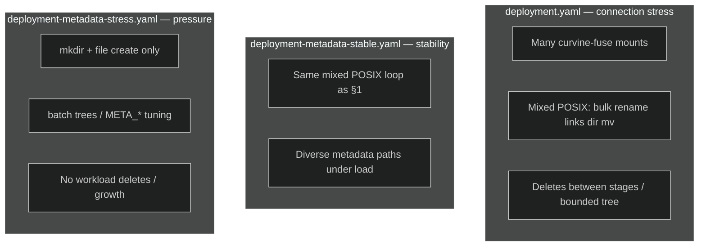

<a id="doc-3481f57a9e708fb46842655a"></a>

# CurvineIO/curvine / .agents/README.md

Upstream: https://github.com/CurvineIO/curvine/blob/032c6dc508814227f26d4d0b0543d960da0f748e/.agents/README.md

Commit: `032c6dc508814227f26d4d0b0543d960da0f748e`

Retrieved: 2026-10-01T15:16:27.252093+00:00

Kind: official-document

Raw SHA256: `d946ee71f52851be0368941da7a8eec18ab07aa200dedb1dc1a184b75d9a4d35`

Source text below is untrusted reference content. Acquisition does not verify technical claims.

License status: UPSTREAM_NOTICES_CAPTURED_PER_FILE_REVIEW_REQUIRED. See this repository's captured license files.

---

# Curvine Agent Configuration

Cross-platform AI agent config hub. **`.agents/` is the single canonical source**; agent tools read it via symlinks.

## Layout

```text
.agents/
  README.md
  skills/             # project skills (shared)
  rules/              # cross-agent workflow rules
```

Only **`cv-*` skills** are tracked in git. Other skills (e.g. local `mermaid`) may exist under `.agents/skills/` but are gitignored.

## Agent skill paths

| Agent | Project path | Invocation |
| ----- | ------------ | ---------- |
| Claude Code | `.claude/skills/` → `.agents/skills/` | `/cv-create-pr` |
| Cursor | `.cursor/skills/` → `.agents/skills/` | auto-discover |
| Codex | `.agents/skills/` (native) | `/skills` |
| GitHub Copilot | `.github/skills/` → `.agents/skills/` | `/cv-create-pr` |

Edit versioned skills only under `.agents/skills/cv-*/`.

## Symlinks

```bash
ln -sfn ../.agents/skills .github/skills
rm -rf .cursor/skills && ln -sfn ../.agents/skills .cursor/skills
rm -rf .claude/skills && ln -sfn ../.agents/skills .claude/skills
```

## Versioned skills (`cv-` prefix)

| Skill | Stage |
| ----- | ----- |
| `cv-add-skills` | Meta — add/update cv skills |
| `cv-codegraph` | Code exploration — install/init CodeGraph, prefer before grep |
| `cv-tasks-breakdown` | Plan → small tasks + sub-issues |
| `cv-create-issue` | File GitHub issue |
| `cv-handle-issue` | Fix issue (plan first, then code) |
| `cv-create-pr` | Create / update PR |
| `cv-submit-pr-review` | Review PR code: intent, tests-first, contracts, lifecycle, performance |
| `cv-address-pr-review` | Handle review comments |
| `cv-run-workflow` | Dispatch GitHub Actions |
| `cv-csi-test` | CSI driver integration testing |
| `cv-test-report` | Publish full-chain daily reports to the Hextra GH Pages site |

## Rules

- Cursor auto-rules: `.cursor/rules/` (`.mdc`)
- Shared rules: `.agents/rules/`

## AGENTS.md

Root `AGENTS.md` lists all versioned `cv-*` skills in `<available_skills>`. Use `cv-add-skills` when adding or updating skills.


<a id="doc-1648d4f18f41cd6d8b7d60bf"></a>

# CurvineIO/curvine / .agents/rules/README.md

Upstream: https://github.com/CurvineIO/curvine/blob/032c6dc508814227f26d4d0b0543d960da0f748e/.agents/rules/README.md

Commit: `032c6dc508814227f26d4d0b0543d960da0f748e`

Retrieved: 2026-10-01T15:16:27.252093+00:00

Kind: official-document

Raw SHA256: `16343ccb13a6fbd815dfb447555bba428a35707d64c78f823b67a68cf986edb9`

Source text below is untrusted reference content. Acquisition does not verify technical claims.

License status: UPSTREAM_NOTICES_CAPTURED_PER_FILE_REVIEW_REQUIRED. See this repository's captured license files.

---

# Curvine Agent Rules

Cross-agent workflow rules. Cursor-specific rules live in `.cursor/rules/` (`.mdc`).

## Workflow skills

| Step | Skill |
| ---- | ----- |
| Add / update cv skill | `cv-add-skills` |
| Decompose plan | `cv-tasks-breakdown` |
| Create issue | `cv-create-issue` |
| Fix issue | `cv-handle-issue` |
| Create / update PR | `cv-create-pr` |
| Review comments | `cv-address-pr-review` |
| Run CI workflow | `cv-run-workflow` |

## Issue → PR flow

See [workflow.md](workflow.md).


<a id="doc-0f9548cbce10dbdef0b86d78"></a>

# CurvineIO/curvine / .devcontainer/README.md

Upstream: https://github.com/CurvineIO/curvine/blob/032c6dc508814227f26d4d0b0543d960da0f748e/.devcontainer/README.md

Commit: `032c6dc508814227f26d4d0b0543d960da0f748e`

Retrieved: 2026-10-01T15:16:27.252093+00:00

Kind: official-document

Raw SHA256: `5cfdf3684a6169bc73d33818f8b3b3f694458a1f6f2e8953f917bcfad2fc8f19`

Source text below is untrusted reference content. Acquisition does not verify technical claims.

License status: UPSTREAM_NOTICES_CAPTURED_PER_FILE_REVIEW_REQUIRED. See this repository's captured license files.

---

# Dev Container

This directory contains Dev Container configuration for local development.

## Files

- `devcontainer.json`: active local Dev Container config
- `devcontainer.json.example`: example config with proxy settings

## Usage

1. Copy the example file:
   - `cp .devcontainer/devcontainer.json.example .devcontainer/devcontainer.json`
2. Adjust proxy settings in `containerEnv` if needed.
3. Reopen the project in the Dev Container.

## Proxy settings

The example includes these environment variables:

- `HTTP_PROXY`: HTTP proxy address
- `HTTPS_PROXY`: HTTPS proxy address
- `ALL_PROXY`: SOCKS proxy address for tools that support it
- `NO_PROXY`: hosts that should bypass the proxy

Default example values:

- `HTTP_PROXY=http://host.docker.internal:7890`
- `HTTPS_PROXY=http://host.docker.internal:7890`
- `ALL_PROXY=socks5://host.docker.internal:7891`
- `NO_PROXY=localhost,127.0.0.1,host.docker.internal`

On Docker Desktop (macOS/Windows), `host.docker.internal` lets the container access a proxy running on the host machine. On many Linux Docker setups you may need to add `host.docker.internal` yourself (for example with `"runArgs": ["--add-host=host.docker.internal:host-gateway"]`) or use the Docker host IP instead. Update ports, hostnames, and values to match your local environment.


<a id="doc-12e0a48d6c5f2a58f4caa284"></a>

# CurvineIO/curvine / ADOPTERS.md

Upstream: https://github.com/CurvineIO/curvine/blob/032c6dc508814227f26d4d0b0543d960da0f748e/ADOPTERS.md

Commit: `032c6dc508814227f26d4d0b0543d960da0f748e`

Retrieved: 2026-10-01T15:16:27.252093+00:00

Kind: official-document

Raw SHA256: `ab3f9855ccca2a4b6332dcc6dd61070c7f87d10f384c62123634a8ded18af322`

Source text below is untrusted reference content. Acquisition does not verify technical claims.

License status: UPSTREAM_NOTICES_CAPTURED_PER_FILE_REVIEW_REQUIRED. See this repository's captured license files.

---

# Who's using Curvine

Curvine is used by a growing range of companies and projects for AI-native and cloud-native file system workloads, from LLM training and AI Agent platforms to big-data analytics and multimodal data lakes.

If you are using Curvine and your name is not on this list, please send us a PR!

## Companies/Projects using Curvine in production

These companies and projects are using Curvine in production. If your company is using Curvine, open a PR to add your company or project name and a description of how you are using Curvine.

| Company / Project | Use Case |
| --- | --- |
| OPPO | OPPO uses Curvine as a multi-cloud big-data cache acceleration layer. Curvine's FUSE interface hosts big-data compute intermediate data, accelerates multimodal data lake access via LanceDB caching, and speeds up StarRocks hot-data queries in compute-storage separated architectures. |


<a id="doc-a54ff182c7e8acf56acfd6e4"></a>

# CurvineIO/curvine / AGENTS.md

Upstream: https://github.com/CurvineIO/curvine/blob/032c6dc508814227f26d4d0b0543d960da0f748e/AGENTS.md

Commit: `032c6dc508814227f26d4d0b0543d960da0f748e`

Retrieved: 2026-10-01T15:16:27.252093+00:00

Kind: official-document

Raw SHA256: `9356c4a54b5cb9f793b1a37bdb66c31c1b7762bbe7df5ef0fad7eb0c1a78e872`

Source text below is untrusted reference content. Acquisition does not verify technical claims.

License status: UPSTREAM_NOTICES_CAPTURED_PER_FILE_REVIEW_REQUIRED. See this repository's captured license files.

---


<skills_system priority="1">

## Available Skills

<!-- SKILLS_TABLE_START -->
<usage>
When users ask you to perform tasks, check if any of the available skills below can help complete the task more effectively. Skills provide specialized capabilities and domain knowledge.

How to use skills:
- Read the skill file at `.agents/skills/<skill-name>/SKILL.md`
- Base directory provided in output for resolving bundled resources (references/, scripts/, assets/)

Usage notes:
- For Curvine project workflow tasks, prefer the cv-* skills listed in <available_skills> below
- When exploring or locating code, read and follow [cv-codegraph](.agents/skills/cv-codegraph/SKILL.md) — prefer CodeGraph (`codegraph_explore` MCP or `codegraph explore` CLI) when `.codegraph/` exists or the MCP tool is available; **Read source files directly** after local edits or when explore reports stale index sync
- User-installed global skills (e.g. ~/.cursor/skills/, ~/.claude/skills/) remain available when the agent tool exposes them
- Do not invent or invoke project skills that are not listed in <available_skills>
- Do not invoke a skill that is already loaded in your context
- Each skill invocation is stateless
- Canonical project skill location: `.agents/skills/` (symlinked from `.cursor/skills`, `.claude/skills`, `.github/skills`)
- Only `cv-*` skills are versioned in this repository
</usage>

<available_skills>

<skill>
<name>cv-add-skills</name>
<description>Add or update Curvine cv-* project skills under .agents/skills/, following naming and layout conventions, and sync the AGENTS.md registry. Use when creating a new cv skill, updating an existing cv skill structure, or registering skills after changes.</description>
<location>project</location>
</skill>

<skill>
<name>cv-codegraph</name>
<description>Use CodeGraph for Curvine code exploration when the MCP tool or local index is already available; prefer it over repo-wide grep when locating or understanding code. Human one-time setup covers CLI install, MCP wiring, and indexing. Use when exploring the codebase, tracing call paths, or finding symbols.</description>
<location>project</location>
</skill>

<skill>
<name>cv-create-issue</name>
<description>Create a GitHub issue for Curvine using repository templates, with extended Goal/Not Goal/Test Plan sections for features. Use when user asks to create an issue, report a serious bug found during testing, or when agent should suggest filing an issue for the current problem.</description>
<location>project</location>
</skill>

<skill>
<name>cv-create-pr</name>
<description>Create or update a Curvine pull request with standardized title and body sections (Summary, Issue/Design, Changes table, Test verified, Dependencies). Use when user asks to create, submit, update, or push a PR.</description>
<location>project</location>
</skill>

<skill>
<name>cv-csi-test</name>
<description>End-to-end Curvine CSI driver testing guide for Kubernetes deployment, StorageClass and MountPod setup, resilience scenarios, volume expansion, and scripted test suites. Use when validating CSI code changes, running integration tests, debugging mount failures, or verifying MountPod recovery after node or CSI restarts.</description>
<location>project</location>
</skill>

<skill>
<name>cv-handle-issue</name>
<description>Fix a Curvine GitHub issue from analysis through plan approval to implementation, routing large features to cv-tasks-breakdown. Use when user asks to fix, resolve, or implement a specific issue URL or issue number.</description>
<location>project</location>
</skill>

<skill>
<name>cv-submit-pr-review</name>
<description>Perform a direct code review of a Curvine PR against live base/head by reconstructing intent, reading tests first, mapping dirty crates, and checking correctness, safety, lifecycle, contracts, and performance on data I/O, RPC, and metadata paths. Use when user asks to review a PR's code, do a code review, or check a PR before merge.</description>
<location>project</location>
</skill>

<skill>
<name>cv-address-pr-review</name>
<description>Review an existing Curvine PR, analyze review comments one by one with an accept/reject table, fix after user approval, update the PR, reply to comments, and resolve threads. Use when user asks to review a PR, handle review comments, or provides a PR URL.</description>
<location>project</location>
</skill>

<skill>
<name>cv-run-workflow</name>
<description>Trigger GitHub Actions workflows for Curvine when workflow YAML or dependent Dockerfiles change, with support for specifying branch, workflow file, and inputs. Use when user asks to run a workflow, dispatch CI, or test workflow/Dockerfile changes.</description>
<location>project</location>
</skill>

<skill>
<name>cv-tasks-breakdown</name>
<description>Break a design or implementation plan into small, dependency-ordered tasks with test coverage per task, commit-sized deliverables, and sub-issue tracking. Use when user asks to decompose a plan, split a large feature, create a task breakdown, or prepare incremental commits for a complex change.</description>
<location>project</location>
</skill>

<skill>
<name>cv-test-report</name>
<description>Publish Curvine full-chain daily test reports to the Hextra Hugo site at CurvineIO/test-reports, using a standard Markdown template with no environment or secret leakage. Use when the user asks to publish a test report, convert harness output to Markdown, or update CurvineIO/test-reports.</description>
<location>project</location>
</skill>

</available_skills>
<!-- SKILLS_TABLE_END -->

</skills_system>


<a id="doc-ffdbe3a1e7ee93cacfc080b6"></a>

# CurvineIO/curvine / CODE_OF_CONDUCT.md

Upstream: https://github.com/CurvineIO/curvine/blob/032c6dc508814227f26d4d0b0543d960da0f748e/CODE_OF_CONDUCT.md

Commit: `032c6dc508814227f26d4d0b0543d960da0f748e`

Retrieved: 2026-10-01T15:16:27.252093+00:00

Kind: official-document

Raw SHA256: `56be1be5e47b8392a8ab1705db6c1b2b4b40c339933faf41ad4c96aa7801e565`

Source text below is untrusted reference content. Acquisition does not verify technical claims.

License status: UPSTREAM_NOTICES_CAPTURED_PER_FILE_REVIEW_REQUIRED. See this repository's captured license files.

---

# Contributor Covenant Code of Conduct

Curvine follows the [CNCF Code of Conduct](https://github.com/cncf/foundation/blob/main/code-of-conduct.md)


<a id="doc-1f7bf72e0fafc9c3624cdc0b"></a>

# CurvineIO/curvine / COMMIT_CONVENTION.md

Upstream: https://github.com/CurvineIO/curvine/blob/032c6dc508814227f26d4d0b0543d960da0f748e/COMMIT_CONVENTION.md

Commit: `032c6dc508814227f26d4d0b0543d960da0f748e`

Retrieved: 2026-10-01T15:16:27.252093+00:00

Kind: official-document

Raw SHA256: `8a2269d433ce44dbdb236d87f6c118b46df65f79f8cdc12da06715e663c2a623`

Source text below is untrusted reference content. Acquisition does not verify technical claims.

License status: UPSTREAM_NOTICES_CAPTURED_PER_FILE_REVIEW_REQUIRED. See this repository's captured license files.

---

# Commit Message Convention

This project uses [Conventional Commits](https://www.conventionalcommits.org/) specification to standardize commit message format.

## ⚠️ Important Requirement

**All commit messages must include an associated Issue ID** in the format `(#number)`.

## Format

```
<type>[optional scope]: <description> (#issue-id)

[optional body]

[optional footer(s)]
```

## Types

- **feat**: New feature
- **fix**: Bug fix
- **docs**: Documentation updates
- **style**: Code style changes (no logic changes)
- **refactor**: Code refactoring
- **perf**: Performance optimization
- **test**: Test related
- **chore**: Build process or auxiliary tool changes
- **ci**: CI/CD related
- **build**: Build system or external dependency changes
- **revert**: Revert commit

## Examples

### ✅ Correct Commit Messages

```
feat: add user authentication system (#123)

Add JWT-based authentication with login and logout functionality.
```

```
fix: resolve memory leak in storage worker (#456)

Fixed issue where storage connections were not properly closed.
```

```
docs: update API documentation for v2.0 (#789)
```

```
refactor: optimize create_file, mkdir interfaces and reduce duplicate code (#53)
```

```
perf: improve database query performance (#234)

Optimized slow queries by adding proper indexes.

Closes #234
```

### ❌ Incorrect Commit Messages

```
✗ fix: resolve memory leak
   (missing issue ID)

✗ feat: Add new feature (#123)
   (subject starts with uppercase)

✗ fix: Fix the bug (#456).
   (ends with period)

✗ Fix bug (#789)
   (missing type)

✗ feat: add feature (123)
   (incorrect issue ID format, should be (#123))
```

## Rules

1. **Type must be one of the predefined types**
2. **Subject cannot be empty**
3. **Subject cannot end with period**
4. **Subject (excluding issue ID part) must start with lowercase letter**
5. **Must include issue ID in format `(#number)`**
6. **Header max length is 120 characters**
7. **Body and footer lines max length is 100 characters**

## Issue ID Requirements

- **Format**: Must be `(#number)`, e.g., `(#123)`
- **Position**: Must be at the end of commit message
- **Required**: All commits must include relevant issue ID
- **Association**: Issue ID should correspond to actual GitHub issue or PR

## Validation

Commit messages will be automatically validated through GitHub Actions during Pull Requests. If format doesn't comply with rules, CI will fail.

### Validation Rules

- ✅ `feat: add new feature (#123)` - Correct
- ❌ `feat: add new feature` - Missing issue ID
- ❌ `feat: add new feature #123` - Incorrect issue ID format
- ❌ `feat: add new feature (123)` - Missing # symbol
- ❌ `Feat: add new feature (#123)` - Type capitalized

### Local Validation

You can run the following commands locally to validate the latest commit:

```bash
npm install
npm run commitlint
```

## Recommended Workflow

1. **Create or find related Issue**: Every code change should correspond to a GitHub Issue
2. **Reference Issue in commit message**: Use `(#issue-number)` format
3. **Keep description concise and clear**: Explain what was done, not how it was done

## Additional Resources

- [Conventional Commits Specification](https://www.conventionalcommits.org/)
- [Angular Commit Format Reference](https://github.com/angular/angular/blob/main/CONTRIBUTING.md#commit)
- [GitHub Issue Linking Syntax](https://docs.github.com/en/issues/tracking-your-work-with-issues/linking-a-pull-request-to-an-issue) 

<a id="doc-eca12c0a30e25b4b46522ebf"></a>

# CurvineIO/curvine / CONTRIBUTING.md

Upstream: https://github.com/CurvineIO/curvine/blob/032c6dc508814227f26d4d0b0543d960da0f748e/CONTRIBUTING.md

Commit: `032c6dc508814227f26d4d0b0543d960da0f748e`

Retrieved: 2026-10-01T15:16:27.252093+00:00

Kind: official-document

Raw SHA256: `c6f95c7aa18553c6e54c98e02f5d79afb29645c5a7c9d98f97493dc04f24a786`

Source text below is untrusted reference content. Acquisition does not verify technical claims.

License status: UPSTREAM_NOTICES_CAPTURED_PER_FILE_REVIEW_REQUIRED. See this repository's captured license files.

---

# Contributing to Curvine

We welcome contributions to Curvine in many areas, and encourage new contributors to get involved. We believe people like you would make Curvine a great product.

Here are some areas where you can help:

* Testing Curvine with existing distributed cache system operations and reporting issues for any bugs or performance issues
* Contributing code to support additional storage backends, file system features, and data types that are not currently supported
* Contribute code to support data read/write acceleration in multiple scenarios such as AI, big data, and multi-cloud, while being compatible with various computing engines and AI infrastructure
* Reviewing pull requests and helping to test new features for correctness and performance
* Improving documentation and examples
* Adding new language bindings and client libraries
* Enhancing monitoring, metrics, and observability features

## Finding issues to work on

We maintain a list of good first issues in GitHub here. Look for issues labeled with:
- `good first issue` - Suitable for new contributors
- `help wanted` - Issues that need community help
- `bug` - Bug reports that need fixing
- `enhancement` - Feature requests and improvements

## Reporting issues

We use GitHub issues for bug reports and feature requests. When reporting an issue, please include:

### For Bug Reports:
- **Description**: Clear description of the bug
- **Steps to reproduce**: Detailed steps to reproduce the issue
- **Expected behavior**: What you expected to happen
- **Actual behavior**: What actually happened
- **Environment**: OS, Curvine version, configuration details
- **Logs**: Relevant error messages and logs
- **Screenshots**: If applicable

### For Feature Requests:
- **Description**: Clear description of the feature
- **Use case**: Why this feature would be useful
- **Proposed solution**: Your ideas for implementation (optional)

## Development Setup

### Prerequisites
- Rust 1.86+ 
- NPM 9+ (for web UI development)
- Maven 3.8+ (for Java client)
- JDK: 1.8+
- Protobuf 3.x
- LLVM 12+ 
- FUSE libfuse2 or libfuse3 development packages
- Python 3.7+

### Building from Source
```bash
# Clone the repository
git clone https://github.com/CurvineIO/curvine.git
cd curvine

# Build the project
./build/make all

# The built artifacts will be in build/dist/
```

### Running Tests
```bash
# Run Rust tests
cargo test

# Run integration tests
cargo test --test integration_tests

# Run benchmarks
cargo bench
```

## Code Style and Guidelines

### Rust Code
- Follow Rust coding conventions
- Use `cargo fmt` to format code
- Use `cargo clippy` for linting
- Write unit tests for new functionality
- Add integration tests for complex features

### Commit Messages
- Use conventional commit format
- Start with type: `feat:`, `fix:`, `docs:`, `style:`, `refactor:`, `test:`, `chore:`
- Provide clear, descriptive commit messages
- Reference issue numbers when applicable
- [Commit convention](https://github.com/CurvineIO/curvine/blob/main/COMMIT_CONVENTION.md)

### Pull Request Guidelines
- Create feature branches from `main`
- Keep PRs focused and reasonably sized
- Include tests for new functionality
- Update documentation as needed
- Ensure all CI checks pass

## Architecture Overview

Curvine follows a distributed architecture with the following components:

- **Master Node**: Manages metadata and coordinates operations
- **Worker Nodes**: Handle data storage and processing
- **Client Libraries**: Provide APIs for different languages
- **Web UI**: Management interface for monitoring and administration

## Testing Guidelines

### Unit Tests
- Write tests for all new functionality
- Aim for high test coverage
- Use meaningful test names and descriptions

### Integration Tests
- Test component interactions
- Verify end-to-end workflows
- Test error conditions and edge cases

### Performance Tests
- Benchmark critical paths
- Monitor for performance regressions
- Test with realistic data sizes

## Documentation

### Code Documentation
- Document public APIs with Rust doc comments
- Include usage examples
- Explain complex algorithms and design decisions

### User Documentation
- Update README.md for new features
- Add configuration examples
- Document troubleshooting steps

## Asking for Help

- **GitHub Discussions**: Use GitHub Discussions for general questions
- **GitHub Issues**: For bug reports and feature requests
- **[Discord](https://discord.gg/xfxMQKv3)**: Join our community channels for real-time discussions
- **Email**: [curvine86@gmail.com] Contact the maintainers for sensitive issues

## Regular Community Meetings

The Curvine contributors hold regular video calls where new and current contributors are welcome to ask questions and coordinate on issues they are working on.

Meeting details and schedule will be announced through:
- GitHub Discussions
- Project mailing list
- Community chat channels

## Code of Conduct

This project follows the [Apache Software Foundation Code of Conduct](https://www.apache.org/foundation/policies/conduct.html). Please be respectful and inclusive in all interactions.

## License

By contributing to Curvine, you agree that your contributions will be licensed under the Apache License 2.0.

## Getting Started for New Contributors

1. **Fork the repository** on GitHub
2. **Clone your fork** locally
3. **Set up the development environment** following the setup instructions
4. **Pick an issue** labeled with `good first issue`
5. **Create a feature branch** for your work
6. **Make your changes** following the coding guidelines
7. **Write tests** for your changes
8. **Submit a pull request** with a clear description

We appreciate all contributions, big and small. Thank you for helping make Curvine better!

---

For more detailed information about specific areas of contribution, see:
- [Development Guide](https://curvineio.github.io/docs/Contribute/development-guide)
- [Architecture Guide](https://curvineio.github.io/docs/Architecture/instrodction)
- [Testing Guide](https://curvineio.github.io/docs/Contribute/benchmark-guide)
- [Deployment Guide](https://curvineio.github.io/docs/Deploy/quick-start)

<a id="doc-c693279643b8cd5d248172d9"></a>

# CurvineIO/curvine / LICENSE

Upstream: https://github.com/CurvineIO/curvine/blob/032c6dc508814227f26d4d0b0543d960da0f748e/LICENSE

Commit: `032c6dc508814227f26d4d0b0543d960da0f748e`

Retrieved: 2026-10-01T15:16:27.252093+00:00

Kind: license

Raw SHA256: `c71d239df91726fc519c6eb72d318ec65820627232b2f796219e87dcf35d0ab4`

Source text below is untrusted reference content. Acquisition does not verify technical claims.

License status: UPSTREAM_NOTICES_CAPTURED_PER_FILE_REVIEW_REQUIRED. See this repository's captured license files.

---

````text
                                 Apache License
                           Version 2.0, January 2004
                        http://www.apache.org/licenses/

   TERMS AND CONDITIONS FOR USE, REPRODUCTION, AND DISTRIBUTION

   1. Definitions.

      "License" shall mean the terms and conditions for use, reproduction,
      and distribution as defined by Sections 1 through 9 of this document.

      "Licensor" shall mean the copyright owner or entity authorized by
      the copyright owner that is granting the License.

      "Legal Entity" shall mean the union of the acting entity and all
      other entities that control, are controlled by, or are under common
      control with that entity. For the purposes of this definition,
      "control" means (i) the power, direct or indirect, to cause the
      direction or management of such entity, whether by contract or
      otherwise, or (ii) ownership of fifty percent (50%) or more of the
      outstanding shares, or (iii) beneficial ownership of such entity.

      "You" (or "Your") shall mean an individual or Legal Entity
      exercising permissions granted by this License.

      "Source" form shall mean the preferred form for making modifications,
      including but not limited to software source code, documentation
      source, and configuration files.

      "Object" form shall mean any form resulting from mechanical
      transformation or translation of a Source form, including but
      not limited to compiled object code, generated documentation,
      and conversions to other media types.

      "Work" shall mean the work of authorship, whether in Source or
      Object form, made available under the License, as indicated by a
      copyright notice that is included in or attached to the work
      (an example is provided in the Appendix below).

      "Derivative Works" shall mean any work, whether in Source or Object
      form, that is based on (or derived from) the Work and for which the
      editorial revisions, annotations, elaborations, or other modifications
      represent, as a whole, an original work of authorship. For the purposes
      of this License, Derivative Works shall not include works that remain
      separable from, or merely link (or bind by name) to the interfaces of,
      the Work and Derivative Works thereof.

      "Contribution" shall mean any work of authorship, including
      the original version of the Work and any modifications or additions
      to that Work or Derivative Works thereof, that is intentionally
      submitted to Licensor for inclusion in the Work by the copyright owner
      or by an individual or Legal Entity authorized to submit on behalf of
      the copyright owner. For the purposes of this definition, "submitted"
      means any form of electronic, verbal, or written communication sent
      to the Licensor or its representatives, including but not limited to
      communication on electronic mailing lists, source code control systems,
      and issue tracking systems that are managed by, or on behalf of, the
      Licensor for the purpose of discussing and improving the Work, but
      excluding communication that is conspicuously marked or otherwise
      designated in writing by the copyright owner as "Not a Contribution."

      "Contributor" shall mean Licensor and any individual or Legal Entity
      on behalf of whom a Contribution has been received by Licensor and
      subsequently incorporated within the Work.

   2. Grant of Copyright License. Subject to the terms and conditions of
      this License, each Contributor hereby grants to You a perpetual,
      worldwide, non-exclusive, no-charge, royalty-free, irrevocable
      copyright license to reproduce, prepare Derivative Works of,
      publicly display, publicly perform, sublicense, and distribute the
      Work and such Derivative Works in Source or Object form.

   3. Grant of Patent License. Subject to the terms and conditions of
      this License, each Contributor hereby grants to You a perpetual,
      worldwide, non-exclusive, no-charge, royalty-free, irrevocable
      (except as stated in this section) patent license to make, have made,
      use, offer to sell, sell, import, and otherwise transfer the Work,
      where such license applies only to those patent claims licensable
      by such Contributor that are necessarily infringed by their
      Contribution(s) alone or by combination of their Contribution(s)
      with the Work to which such Contribution(s) was submitted. If You
      institute patent litigation against any entity (including a
      cross-claim or counterclaim in a lawsuit) alleging that the Work
      or a Contribution incorporated within the Work constitutes direct
      or contributory patent infringement, then any patent licenses
      granted to You under this License for that Work shall terminate
      as of the date such litigation is filed.

   4. Redistribution. You may reproduce and distribute copies of the
      Work or Derivative Works thereof in any medium, with or without
      modifications, and in Source or Object form, provided that You
      meet the following conditions:

      (a) You must give any other recipients of the Work or
          Derivative Works a copy of this License; and

      (b) You must cause any modified files to carry prominent notices
          stating that You changed the files; and

      (c) You must retain, in the Source form of any Derivative Works
          that You distribute, all copyright, patent, trademark, and
          attribution notices from the Source form of the Work,
          excluding those notices that do not pertain to any part of
          the Derivative Works; and

      (d) If the Work includes a "NOTICE" text file as part of its
          distribution, then any Derivative Works that You distribute must
          include a readable copy of the attribution notices contained
          within such NOTICE file, excluding those notices that do not
          pertain to any part of the Derivative Works, in at least one
          of the following places: within a NOTICE text file distributed
          as part of the Derivative Works; within the Source form or
          documentation, if provided along with the Derivative Works; or,
          within a display generated by the Derivative Works, if and
          wherever such third-party notices normally appear. The contents
          of the NOTICE file are for informational purposes only and
          do not modify the License. You may add Your own attribution
          notices within Derivative Works that You distribute, alongside
          or as an addendum to the NOTICE text from the Work, provided
          that such additional attribution notices cannot be construed
          as modifying the License.

      You may add Your own copyright statement to Your modifications and
      may provide additional or different license terms and conditions
      for use, reproduction, or distribution of Your modifications, or
      for any such Derivative Works as a whole, provided Your use,
      reproduction, and distribution of the Work otherwise complies with
      the conditions stated in this License.

   5. Submission of Contributions. Unless You explicitly state otherwise,
      any Contribution intentionally submitted for inclusion in the Work
      by You to the Licensor shall be under the terms and conditions of
      this License, without any additional terms or conditions.
      Notwithstanding the above, nothing herein shall supersede or modify
      the terms of any separate license agreement you may have executed
      with Licensor regarding such Contributions.

   6. Trademarks. This License does not grant permission to use the trade
      names, trademarks, service marks, or product names of the Licensor,
      except as required for reasonable and customary use in describing the
      origin of the Work and reproducing the content of the NOTICE file.

   7. Disclaimer of Warranty. Unless required by applicable law or
      agreed to in writing, Licensor provides the Work (and each
      Contributor provides its Contributions) on an "AS IS" BASIS,
      WITHOUT WARRANTIES OR CONDITIONS OF ANY KIND, either express or
      implied, including, without limitation, any warranties or conditions
      of TITLE, NON-INFRINGEMENT, MERCHANTABILITY, or FITNESS FOR A
      PARTICULAR PURPOSE. You are solely responsible for determining the
      appropriateness of using or redistributing the Work and assume any
      risks associated with Your exercise of permissions under this License.

   8. Limitation of Liability. In no event and under no legal theory,
      whether in tort (including negligence), contract, or otherwise,
      unless required by applicable law (such as deliberate and grossly
      negligent acts) or agreed to in writing, shall any Contributor be
      liable to You for damages, including any direct, indirect, special,
      incidental, or consequential damages of any character arising as a
      result of this License or out of the use or inability to use the
      Work (including but not limited to damages for loss of goodwill,
      work stoppage, computer failure or malfunction, or any and all
      other commercial damages or losses), even if such Contributor
      has been advised of the possibility of such damages.

   9. Accepting Warranty or Additional Liability. While redistributing
      the Work or Derivative Works thereof, You may choose to offer,
      and charge a fee for, acceptance of support, warranty, indemnity,
      or other liability obligations and/or rights consistent with this
      License. However, in accepting such obligations, You may act only
      on Your own behalf and on Your sole responsibility, not on behalf
      of any other Contributor, and only if You agree to indemnify,
      defend, and hold each Contributor harmless for any liability
      incurred by, or claims asserted against, such Contributor by reason
      of your accepting any such warranty or additional liability.

   END OF TERMS AND CONDITIONS

   APPENDIX: How to apply the Apache License to your work.

      To apply the Apache License to your work, attach the following
      boilerplate notice, with the fields enclosed by brackets "[]"
      replaced with your own identifying information. (Don't include
      the brackets!)  The text should be enclosed in the appropriate
      comment syntax for the file format. We also recommend that a
      file or class name and description of purpose be included on the
      same "printed page" as the copyright notice for easier
      identification within third-party archives.

   Copyright [yyyy] [name of copyright owner]

   Licensed under the Apache License, Version 2.0 (the "License");
   you may not use this file except in compliance with the License.
   You may obtain a copy of the License at

       http://www.apache.org/licenses/LICENSE-2.0

   Unless required by applicable law or agreed to in writing, software
   distributed under the License is distributed on an "AS IS" BASIS,
   WITHOUT WARRANTIES OR CONDITIONS OF ANY KIND, either express or implied.
   See the License for the specific language governing permissions and
   limitations under the License.

````


<a id="doc-39da3bd6270d44ea37b6ed50"></a>

# CurvineIO/curvine / MAINTAINERS.md

Upstream: https://github.com/CurvineIO/curvine/blob/032c6dc508814227f26d4d0b0543d960da0f748e/MAINTAINERS.md

Commit: `032c6dc508814227f26d4d0b0543d960da0f748e`

Retrieved: 2026-10-01T15:16:27.252093+00:00

Kind: official-document

Raw SHA256: `03544c021441075fde15852073e8a15b671264c421f0510034e20d271bc6d014`

Source text below is untrusted reference content. Acquisition does not verify technical claims.

License status: UPSTREAM_NOTICES_CAPTURED_PER_FILE_REVIEW_REQUIRED. See this repository's captured license files.

---


The current maintainers of Curvine project consists of:

## Current Maintainers

| Name | Email | GitHub | Role | Affiliation |
|------|-------|--------|------|------|
| David Fu | curvine86@gmail.com | @szbr9486 | Lead Maintainer | OPPO |
| SeanX | xuen198721@163.com | @bigbigxu | Maintainer | OPPO |
| Barry | lzjqsdd@gmail.com | @lzjqsdd | Maintainer | OPPO |
| John | hellojlong@163.com| @jlon | Maintainer | OPPO |
| Le Dac Thuong | ledacthuong2210@gmail.com | @thuongle2210 | Committer | Home Credit Vietnam |
| yangcx000 | chunxin.ycx@gmail.com | @yangcx000 | Committer | LiAuto |


<a id="doc-b335630551682c19a781afeb"></a>

# CurvineIO/curvine / README.md

Upstream: https://github.com/CurvineIO/curvine/blob/032c6dc508814227f26d4d0b0543d960da0f748e/README.md

Commit: `032c6dc508814227f26d4d0b0543d960da0f748e`

Retrieved: 2026-10-01T15:16:27.252093+00:00

Kind: official-document

Raw SHA256: `0fb08d0a5ec048d08f60ebfc2b4e929415c6746c53a5a2161114330696df4f2d`

Source text below is untrusted reference content. Acquisition does not verify technical claims.

License status: UPSTREAM_NOTICES_CAPTURED_PER_FILE_REVIEW_REQUIRED. See this repository's captured license files.

---

<div align=center>

</div>


<p align="center">
  English | 
  <a href="https://github.com/CurvineIO/curvine/blob/main/README_zh.md">简体中文</a> |
  <a href="https://readme-i18n.com/CurvineIO/curvine?lang=de">Deutsch</a> |
  <a href="https://readme-i18n.com/CurvineIO/curvine?lang=es">Español</a> |
  <a href="https://readme-i18n.com/CurvineIO/curvine?lang=fr">français</a> |
  <a href="https://readme-i18n.com/CurvineIO/curvine?lang=ja">日本語</a> |
  <a href="https://readme-i18n.com/CurvineIO/curvine?lang=ko">한국어</a> |
  <a href="https://readme-i18n.com/CurvineIO/curvine?lang=pt">Português</a> |
  <a href="https://readme-i18n.com/CurvineIO/curvine?lang=ru">Русский</a>
</p>

[](https://landscape.cncf.io/?item=runtime--cloud-native-storage--curvine)
[](https://opensource.org/licenses/Apache-2.0)
[](https://www.rust-lang.org)

[](https://join.slack.com/t/curvineio/shared_invite/zt-4673r43cn-prajma_q5ZI3BUxuaY5kiQ)

> **Curvine: AI-Native & Cloud-Native File System** — A high-performance POSIX file semantic layer built on top of cloud object storage, with an integrated multi-tier distributed cache, designed from the ground up for large-scale AI workloads and AI Agent platforms.

> **Name Origin** — "Curvine" is derived from *"Curvature Engine"*, the faster-than-light propulsion device in Liu Cixin's sci-fi novel *The Three-Body Problem*. It symbolizes the project's pursuit of extreme acceleration for data access.

---

## 📚 Documentation Resources

For more detailed information, please refer to:

- [Official Documentation](https://curvineio.github.io/docs/Overview/instroduction)
- [Quick Start](https://curvineio.github.io/docs/Deploy/quick-start)
- [Benchmark](https://curvineio.github.io/docs/category/benchmark)
- [DeepWiki](https://deepwiki.com/CurvineIO/curvine)
- [Best Practices](https://curvineio.github.io/docs/User-Manuals/best-practices)
- [Curvine defeated the commercial version of Alluxio in the MLPerf benchmark tests](https://curvineio.github.io/blog/2026/09/07/mlperf-storage-curvine-vs-alluxio)
- [Curvine passes LTP Test 1129 cases](https://curvineio.github.io/blog/2026/08/11/curvine-ltp-compatibility)
- [Tiered KV cache for large LLMs on Amazon SageMaker HyperPod with Curvine](https://aws.amazon.com/cn/blogs/machine-learning/tiered-kv-cache-for-large-llms-on-amazon-sagemaker-hyperpod-with-curvine/)
- [AI Agent Storage Selection: How Curvine Supports 10,000-Scale Agent Workloads on EKS](https://curvineio.github.io/blog/2026/07/07/ai-agent-storage-curvine-eks)

## 🏗️ Architecture Design

Curvine is a high-performance distributed cache file system built in Rust. It layers a distributed POSIX file system over cloud object storage, exposing full POSIX semantics upward while using object storage as the durable persistence layer downward. The architecture is organized into four cooperating layers, each color-coded in the diagram below:


- **Access Layer** — The workloads that use Curvine: AI Agent Pods (10,000+ stateful workloads), AI/big-data engines (training, inference, OLAP), and the native `cv` CLI.
- **Protocol & Interface Layer** — Multiple access paths so existing tools work unmodified: POSIX FUSE (`curvine-fuse`), an S3-compatible gateway, an HDFS/UFS adapter, Java/Python/Rust SDKs, and a native Kubernetes CSI driver for PVC provisioning.
- **Curvine Cluster Core** — The heart of the system, split into a **Control Plane** and a **Data Plane**:
  - *Control Plane*: the **Master node** (Raft-replicated) manages metadata, namespace, scheduling, load balancing, and cluster coordination, alongside a **Web UI / API** for dashboarding, metrics, and management.
  - *Data Plane*: a fleet of **Worker nodes** serving data from a multi-tier cache (Memory → SSD → HDD) with automatic hot-data promotion, eviction, and replication.
- **Storage Layer** — The durable underbelly: multi-cloud object storage (AWS S3, Azure Blob, Google GCS, OSS, and any S3-compatible store such as MinIO or HDFS). Workers fetch from object storage on cache miss, and persist writes back to object storage for durability.

**Data flow at a glance:** applications reach Curvine through any interface in the Protocol layer; metadata operations are routed to the Master via RPC, while data I/O is served directly by the Workers. On a cache miss, Workers fetch from — and persist back to — the underlying object storage. For Kubernetes workloads, the CSI driver mounts the FUSE file system directly as a PVC, so provisioning is just a `mkdir` on the shared namespace — millisecond-level, with no cloud control-plane API calls.

## 🚀 Core Features

- **AI-Native Positioning**: First-class support for AI training acceleration and AI Agent cloud-native storage as primary use cases, not an afterthought.
- **Multi-Cloud Object Storage Backend**: Compatible with object storage services from multiple cloud providers as the durable underlying layer, enabling transparent data migration across vendors.
- **Cloud-Native Kubernetes Integration**: Native CSI driver enables dynamic PVC provisioning, `Immediate` binding, volume expansion, and Helm-based cluster deployment.
- **Multi-Tier Cache**: Memory → SSD → HDD automatic tiering; hot data is transparently promoted to faster tiers.
- **Full POSIX Semantics via FUSE**: A high-performance FUSE layer presents distributed cached data as a local file system — `open`, `read`, `write`, `seek`, `rename`, `list` — enabling tools like Vite, `inotify`/`fswatch`, and `git` to work unmodified.
- **S3 & HDFS Protocol Compatibility**: Read/write through both S3 and HDFS interfaces for seamless integration with AI and big-data ecosystems.
- **Extreme Performance**: Rust core with Tokio async runtime, zero-copy data paths, and a GC-free memory model — ~100μs-class latency and 100K+ stable QPS.
- **Massive Metadata Capacity**: A single cluster supports **5 billion** small files, absorbing the aggregate metadata pressure of tens of thousands of Agents.
- **Metadata Independence**: Curvine's file metadata path maps **1:1** to the underlying S3 object path. Even if the Curvine service is unavailable, objects on S3 keep their original structure and remain independently accessible — fast and simple recovery.
- **Raft Consensus**: Master metadata is replicated via Raft for consistency and high availability.
- **Observability**: Built-in metrics system and Web UI for per-component performance monitoring.

## 📈 Use Cases


- **Case 1 — AI Agent Platform Storage**: Backing tens of thousands of stateful Agent Pods on Kubernetes with isolated POSIX workspaces, millisecond provisioning, and no per-node volume limits.
- **Case 2 — LLM Training Acceleration**: Caching training datasets and checkpoints close to GPU nodes to shorten training cycles.
- **Case 3 — LLM Model Distribution Acceleration**: Fast multi-region model artifact distribution through the distributed cache.
- **Case 4 — Multimodal Data Lake Access Acceleration**: POSIX access over multimodal lakes without copying data locally.
- **Case 5 — OLAP Query Acceleration**: Accelerating compute-storage separated OLAP engines with a hot data cache.
- **Case 6 — Multi-Cloud Data Caching**: A unified cache layer across multi-cloud object storage backends.


## 📊 Performance

Curvine is engineered for high-concurrency, low-latency workloads. Built on a Rust + Tokio async core with zero-copy data paths, it sustains ~100μs-class latency, 100K+ stable QPS, and 5 billion small files per cluster. The benchmarks below illustrate its edge in both metadata operations and raw data throughput.

### 1. Metadata Operation Performance

All benchmark comparisons were conducted with a concurrency level of 40.

| Operation Type | Curvine (QPS) | JuiceFS (QPS) | OSS (QPS) |
| --- | --- | --- | --- |
| create | 19,985 | 16,000 | 2,000 |
| open | 60,376 | 50,000 | 3,900 |
| rename | 43,009 | 21,000 | 200 |
| delete | 39,013 | 41,000 | 1,900 |

> Industry benchmark test data of comparable products: https://juicefs.com/zh-cn/blog/engineering/meta-perf-hdfs-oss-jfs

### 2. Data Read/Write Performance

Benchmarking against Alluxio under identical hardware conditions.

**256K sequential read**

| Thread count | Curvine Open Source Edition (GiB/s) | Open Source Alluxio (GiB/s) |
| --- | --- | --- |
| 1 | 2.2 | 0.6 |
| 2 | 3.7 | 1.1 |
| 4 | 6.8 | 2.3 |
| 8 | 8.9 | 4.5 |
| 16 | 9.2 | 7.9 |
| 32 | 9.5 | 8.8 |
| 64 | 9.2 | N/A |
| 128 | 9.2 | N/A |

**256K random read**

| Thread count | Curvine Open Source Edition (GiB/s) | Open Source Alluxio (GiB/s) |
| --- | --- | --- |
| 1 | 0.3 | 0.0 |
| 2 | 0.7 | 0.1 |
| 4 | 1.4 | 0.1 |
| 8 | 2.8 | 0.2 |
| 16 | 5.2 | 0.4 |
| 32 | 7.8 | 0.3 |
| 64 | 8.7 | N/A |
| 128 | 9.0 | N/A |

> Data disclosure from Alluxio official website: https://www.alluxio.com.cn/alluxio-enterprise-vs-open-source/.

### 3. Resource Consumption

Benefiting from Rust language features, in big data shuffle acceleration scenarios, comparing resource consumption between Curvine and Alluxio in production environments shows that memory usage is reduced by over 90%, and CPU usage is reduced by over 50%.

## Contributing
Please read Curvine [Contribute guidelines](CONTRIBUTING.md)

## 📜 License
Curvine is licensed under the ​**​[Apache License 2.0](LICENSE)​**.

<a href="https://github.com/CurvineIO/curvine/graphs/contributors">
  
</a>

Made with [contrib.rocks](https://contrib.rocks/).


<a id="doc-bc53aca037f8d406f619f15c"></a>

# CurvineIO/curvine / README_zh.md

Upstream: https://github.com/CurvineIO/curvine/blob/032c6dc508814227f26d4d0b0543d960da0f748e/README_zh.md

Commit: `032c6dc508814227f26d4d0b0543d960da0f748e`

Retrieved: 2026-10-01T15:16:27.252093+00:00

Kind: official-document

Raw SHA256: `23a8a5285fad8d77d764cd2184d5c449fecb1e8d28c04fb99f1e58c6a4484246`

Source text below is untrusted reference content. Acquisition does not verify technical claims.

License status: UPSTREAM_NOTICES_CAPTURED_PER_FILE_REVIEW_REQUIRED. See this repository's captured license files.

---

<div align=center>

</div>


<p align="center">
  <a href="https://github.com/CurvineIO/curvine/blob/main/README.md">English</a> ||
  简体中文 |
  <a href="https://readme-i18n.com/CurvineIO/curvine?lang=de">Deutsch</a> |
  <a href="https://readme-i18n.com/CurvineIO/curvine?lang=es">Español</a> |
  <a href="https://readme-i18n.com/CurvineIO/curvine?lang=fr">français</a> |
  <a href="https://readme-i18n.com/CurvineIO/curvine?lang=ja">日本語</a> |
  <a href="https://readme-i18n.com/CurvineIO/curvine?lang=ko">한국어</a> |
  <a href="https://readme-i18n.com/CurvineIO/curvine?lang=pt">Português</a> |
  <a href="https://readme-i18n.com/CurvineIO/curvine?lang=ru">Русский</a>
</p>

[](https://opensource.org/licenses/Apache-2.0)
[](https://www.rust-lang.org)

**Curvine** 是一个用 Rust 编写的高性能、并发分布式缓存系统，专为低延迟和高吞吐量工作负载设计。

## 📚 文档资源

更多详细信息，请参阅：

- [官方文档](https://curvineio.github.io/docs/Overview/instroduction)
- [快速入门](https://curvineio.github.io/docs/Deploy/quick-start)
- [用户手册](https://curvineio.github.io/docs/category/user-manuals)
- [性能基准](https://curvineio.github.io/docs/category/benchmark)
- [DeepWiki](https://deepwiki.com/CurvineIO/curvine)
- [提交规范](COMMIT_CONVENTION.md)

## 应用场景


- **场景1**: 训练加速
- **场景2**: 模型分发
- **场景3**: 热表数据加速
- **场景4**: 大数据Shuffle加速
- **场景5**: 多云数据缓存

## 🚀 核心特性

- **高性能 RPC 框架**：基于 Tokio 的异步通信框架，支持高并发请求处理。
- **分布式架构**：采用 Master-Worker 架构设计，支持水平扩展。
- **多级缓存**：支持内存、SSD 和 HDD 的多级缓存策略。
- **FUSE 接口**：提供 FUSE 文件系统接口，可无缝集成到现有系统中。
- **底层存储集成**：支持与多种底层存储系统集成。
- **Raft 共识**：采用 Raft 算法确保数据一致性与高可用性。
- **监控与指标**：内置监控与性能指标收集功能。
- **Web 界面**：提供 Web 管理界面，便于系统监控与管理。

## 📦 系统要求

- Rust 1.80+
- Linux 或 macOS (Windows 支持有限)
- FUSE 库 (用于文件系统功能)

## 🗂️ 缓存文件系统访问

### 🦀 Rust API (原生集成推荐)

```rust
use curvine_config::ClusterConf;
use curvine_fs_api::{FileSystem, Path};
use curvine_unified_fs::UnifiedFileSystem;
use std::sync::Arc;

let conf = ClusterConf::from(conf_path)?;
let rt = Arc::new(conf.client_rpc_conf().create_runtime());
let fs = UnifiedFileSystem::with_rt(conf, rt)?;

let path = Path::from_str("/dir")?;
fs.mkdir(&path, true).await?;
```

### 📌 FUSE (用户空间文件系统)

```
ls /curvine-fuse
```

**官方支持的 Linux 发行版**​

| 操作系统发行版     | 内核要求          | 测试版本       | 依赖项        |
|---------------------|-------------------|---------------|--------------|
| ​**CentOS 7**​      | ≥3.10.0           | 7.6           | fuse2-2.9.2  |
| ​**CentOS 8**​      | ≥4.18.0           | 8.5           | fuse3-3.9.1  |
| ​**Rocky Linux 9**​ | ≥5.14.0           | 9.5           | fuse3-3.10.2 |
| ​**RHEL 9**​        | ≥5.14.0           | 9.5           | fuse3-3.10.2 |
| ​**Ubuntu 22**​      | ≥5.15.0           | 22.4          | fuse3-3.10.5 |

### 🐘 Hadoop 兼容 API

```
import org.apache.hadoop.conf.Configuration;
import org.apache.hadoop.fs.*;

Configuration conf = new Configuration();
conf.set("fs.cv.impl", "io.curvine.CurvineFileSystem");

FileSystem fs = FileSystem.get(URI.create("cv://master:8995"), conf);
FSDataInputStream in = fs.open(new Path("/user/test/file.txt"));
```

## 🛠 构建指南

本项目需要以下依赖项，请确保在继续之前已安装：

### 📋 先决条件

- ​**GCC**: 10 或更高版本 ([安装指南](https://gcc.gnu.org/install/))
- ​**Rust**: 1.86 或更高版本 ([安装指南](https://www.rust-lang.org/tools/install))
- ​**Protobuf**: 3.x 版本
- ​**Maven**: 3.8 或更高版本 ([安装指南](https://maven.apache.org/install.html))
- ​**LLVM**: 12 或更高版本 ([安装指南](https://llvm.org/docs/GettingStarted.html))
- ​**FUSE**: libfuse2 或 libfuse3 开发包
- ​**JDK**: 1.8 或更高版本 (OpenJDK 或 Oracle JDK)
- ​**npm**: 9 或更高版本 ([Node.js 安装](https://nodejs.org/))
- ​**Python**: 3.7 或更高版本 ([安装指南](https://www.python.org/downloads/))

您可以选择：

1. 使用预配置的 `curvine-docker/compile/Dockerfile_rocky9` 来构建编译镜像
2. 参考此 Dockerfile 为其他操作系统版本创建编译镜像
3. curvine在dockerhub上提供了`curvine/curvine-compile:latest` 镜像(基于rocky9)，可以使用此镜像进行编译

### 🚀 构建步骤 (Linux - Ubuntu/Debian 示例)

使用 make 编译:

```bash
# 编译所有模块
make all

# 只编译核心模块: server client cli
make build ARGS="-p core"

# 编译fuse和核心模块
make build ARGS="-p core -p fuse"

# 编译 server-native SPDK/RDMA 支持。curvine-cli 和 curvine-fuse
# 会按客户端安全 profile 单独构建，避免被 server-native feature 污染。
make build ARGS="-p core -p fuse --spdk-rdma --spdk-dir /opt/spdk"
```


使用build.sh编译：

```bash
# 编译所有模块
sh build/build.sh 

# 输出命令帮助 
sh build/build.sh -h

# 只编译核心模块: server client cli
sh build/build.sh -p core

# 编译fuse和核心模块
sh build/build.sh -p core -p fuse

# 只编译 server-native SPDK/RDMA artifact
sh build/build.sh -p server --spdk-rdma --spdk-dir /opt/spdk
```

构建镜像：

```bash
# or use curvine-compile:latest docker images to build
make docker-build

# or use curvine-compile:build-cached docker images to build, this image already cached most dependency crates
make docker-build-cached
```

编译成功后，目标文件将生成在 build/dist 目录中。该文件是可用于部署或构建镜像的 Curvine 安装包。

### 🖥️  启动单节点集群

```bash
cd build/dist

# Start the master node
bin/curvine-master.sh start

# Start the worker node
bin/curvine-worker.sh start
```

挂载文件系统

```bash
# The default mount point is /curvine-fuse
bin/curvine-fuse.sh start
```

查看集群概览：

```bash
bin/cv report
```

执行文件系统命令：
```bash
bin/dfs fs -mkdir /a
bin/dfs fs -ls /
```

访问 Web 界面：

```
http://your-hostname:9000
```

Curvine 使用 TOML 格式的配置文件。示例配置位于 conf/curvine-cluster.toml，主要配置项包括：

- 网络设置（端口、地址等）
- 存储策略（缓存大小、存储类型）
- 集群配置（节点数量、副本因子）
- 性能调优参数

停止:

```bash
# Stop the FUSE mount
bin/curvine-fuse.sh stop

# Stop the worker and master nodes
bin/curvine-worker.sh stop
bin/curvine-master.sh stop
```

## 🏗️ 架构设计

Curvine 采用主从架构：

- **主节点**：负责元数据管理、工作节点协调和负载均衡
- **工作节点**：负责数据存储和处理
- **客户端**：通过 RPC 与主节点和工作节点通信

该系统使用 Raft 共识算法确保元数据一致性，并支持多种存储策略（内存、SSD、HDD）以优化性能和成本。

## 📈 性能表现

Curvine 在高并发场景下表现优异，支持：

- 高吞吐量数据读写
- 低延迟操作
- 大规模并发连接

## 📜 许可证

Curvine 采用 **[Apache License 2.0](LICENSE)** 开源协议授权。


<a id="doc-f6ed156e4bf5c79168066246"></a>

# CurvineIO/curvine / SECURITY.md

Upstream: https://github.com/CurvineIO/curvine/blob/032c6dc508814227f26d4d0b0543d960da0f748e/SECURITY.md

Commit: `032c6dc508814227f26d4d0b0543d960da0f748e`

Retrieved: 2026-10-01T15:16:27.252093+00:00

Kind: official-document

Raw SHA256: `69a27abf9d1e8a32d444ebcdb74944d60d7d1a1724270e793e64b475fca01108`

Source text below is untrusted reference content. Acquisition does not verify technical claims.

License status: UPSTREAM_NOTICES_CAPTURED_PER_FILE_REVIEW_REQUIRED. See this repository's captured license files.

---

# Security Policy

## Reporting Security Vulnerabilities

### Please do not report security vulnerabilities through public GitHub issues.


If you discover a security vulnerability, please report it by emailing curvine86@gmail.com.

Please include the following information in your report:

Description of the vulnerability
Steps to reproduce the issue
Affected versions
Potential impact
Any suggested fixes (if available)

# Response Timeline
We will acknowledge your report within 5 business days and provide a detailed response within 15 business days indicating the next steps in handling your report.

We will keep you informed of the progress towards a fix and may ask for additional information or guidance.

# Security Updates
Security updates will be released as soon as possible after a fix is available. 
We recommend keeping your installation up to date with the latest releases.

# Security Best Practices
When using Curvine, we recommend:

Keep the software updated to the latest version
Follow the principle of least privilege
Review and audit your configurations regularly
Thank you for helping to keep Curvine and our users safe!


<a id="doc-7902ae3f1ceb8119b1ef27df"></a>

# CurvineIO/curvine / crates/adapters/curvine-ufs-opendal/tests/README.md

Upstream: https://github.com/CurvineIO/curvine/blob/032c6dc508814227f26d4d0b0543d960da0f748e/crates/adapters/curvine-ufs-opendal/tests/README.md

Commit: `032c6dc508814227f26d4d0b0543d960da0f748e`

Retrieved: 2026-10-01T15:16:27.252093+00:00

Kind: official-document

Raw SHA256: `d1e306df89e4ba308499cf0373536453fa697f712c2f3951fafb4ab9f7d4ed52`

Source text below is untrusted reference content. Acquisition does not verify technical claims.

License status: UPSTREAM_NOTICES_CAPTURED_PER_FILE_REVIEW_REQUIRED. See this repository's captured license files.

---

# Curvine UFS Testing

This directory contains test code for Curvine Unified File System (UFS).

## S3 Test

The `s3/` directory contains tests for the S3 file system. These tests verify the integration of Curvine UFS with S3-compatible storage.

### Test environment settings

S3 testing requires an S3-compatible storage service. It is recommended to use MinIO as a local test environment:

```bash
# Start the MinIO server
docker run -p 9000:9000 -p 9001:9001 \
  -e "MINIO_ROOT_USER=minioadmin" \
  -e "MINIO_ROOT_PASSWORD=minioadmin" \
  minio/minio server /data --console-address ":9001"
```

The test uses the following configuration parameters (defined in `s3/test_utils.rs`):
-Endpoint: http://127.0.0.1:9000
-Area: us-east-1
-Access key: miniauadmin
-Key: miniauadmin
-Use path style: true

### Test content

The S3 test includes the following aspects:

1. **Basic S3 Operation**(`s3_tests.rs`):
   -List directories (recursive and non-recursive)
   -Create and delete directories
   -Rename the file
   -Check if the file exists
   -Get file size

2. **Zero Copy File Transfer**(`zero_copy_transfer_tests.rs`):
   -S3 to local file transfer
   -Performance tests for different buffer sizes
   -Concurrent transmission test
   -Transmission Cancel Test

3. **Concurrent S3 operation**(`concurrent_s3_tests.rs`):
   -Concurrent upload test
   -Concurrent read test

### Run the test

Run all S3 tests with the following command:

```bash
cargo test -p curvine-ufs-opendal --test s3
```

Or run a specific test:

```bash
# Run only basic operation tests
cargo test -p curvine-ufs-opendal --test s3_tests

# Run only zero copy tests
cargo test -p curvine-ufs-opendal --test zero_copy_transfer_tests

# Run concurrent tests only
cargo test -p curvine-ufs-opendal --test concurrent_s3_tests
```

<a id="doc-642aa25789057cbf37fad0ca"></a>

# CurvineIO/curvine / crates/core/curvine-fault/README.md

Upstream: https://github.com/CurvineIO/curvine/blob/032c6dc508814227f26d4d0b0543d960da0f748e/crates/core/curvine-fault/README.md

Commit: `032c6dc508814227f26d4d0b0543d960da0f748e`

Retrieved: 2026-10-01T15:16:27.252093+00:00

Kind: official-document

Raw SHA256: `b3644836ab8eb53e64279d5e8a9682b906f86da714559b108be25eecb0d624c7`

Source text below is untrusted reference content. Acquisition does not verify technical claims.

License status: UPSTREAM_NOTICES_CAPTURED_PER_FILE_REVIEW_REQUIRED. See this repository's captured license files.

---

# curvine-fault

`curvine-fault` is a feature-gated fault-injection runtime for Rust services.
It combines call-site fault points, structured rules, queryable execution
evidence, in-process control, and an optional authenticated HTTP router.

The crate does not depend on Curvine Client, Master, Worker, or their error
types. Curvine uses it as the common engine for local tests and distributed
cluster fault injection.

## Architecture

```text
fault_point! call sites
        │
        ├── linkme registrations ──> complete linked-point catalog
        │
        └── evaluate context ──────> process or isolated FaultRuntime
                                           │
                         ┌─────────────────┴─────────────────┐
                         │                                   │
               FaultLocalController             FaultHttpControl::mount
                                                             │
                                                   FaultHttpController
```

Each OS process has one lazily initialized process Runtime. It contains every
fault point linked into that binary and one shared rule/evidence table. An
isolated Runtime uses the same complete catalog but owns an independent rule
table for unit tests.

Every linked point is available for configuration. A rule that the workload
does not reach remains at `executions = 0`, so tests must observe evidence
after running the workload.

## Feature flags

| Feature | Effect |
| --- | --- |
| default | `fault_point!` expands to an empty block |
| `fault-injection` | Compiles point registration and Runtime evaluation |
| `http-client` | Enables `FaultHttpController` and `FaultTestSession` |
| `http-server` | Enables the embeddable authenticated Axum router |

The Cargo feature decides whether fault points exist. A host's runtime
`fault_injection.enabled` setting controls only whether its HTTP route is
exposed; it does not initialize or disable the in-process Runtime.

Hosts normally forward their own feature:

```toml
[dependencies]
curvine-fault = { path = "../crates/core/curvine-fault" }

[features]
fault-injection = ["curvine-fault/fault-injection"]
```

Because Cargo unifies dependency features, a library that controls its own
instrumentation feature should export a local macro alias:

```rust
#[cfg(feature = "fault-injection")]
pub(crate) use curvine_fault::fault_point;

#[cfg(not(feature = "fault-injection"))]
pub(crate) use curvine_fault::__noop_fault_point as fault_point;
```

## Declaring a point

One macro call declares, registers, and evaluates a point:

```rust
fn dispatch(msg: &Message) -> Result<Response, MyError> {
    crate::fault_point! {
        sync,
        name: "worker.rpc.before_dispatch",
        description: "Before a Worker RPC is dispatched",
        context: {
            "req_id" => msg.req_id(),
            "rpc_code" => msg.code() as i32,
        },
        return_error: |fault| Err(MyError::injected(fault.message)),
    }

    // Normal business path.
}
```

The macro derives the catalog contract from the call site:

- `sync` or `async` defines Delay execution;
- context keys become available matcher keys;
- `Record`, `Delay`, and `Crash` are available on every point;
- a `return_error` closure additionally enables `ReturnError`;
- identical declarations of one name merge into one catalog entry;
- conflicting same-name declarations fail Runtime construction and report
  both source locations.

Point names are opaque non-empty strings to the Runtime. Curvine uses readable
hierarchical names such as `worker.rpc.before_dispatch`, but the prefix is not
a Runtime selector.

### ReturnError

The HTTP rule carries only an error message. The call-site closure converts it
to the surrounding function's natural return value, and Rust checks the type:

```rust
return_error: |fault| Err(FsError::common(fault.message)),
```

An async point uses an async closure when required by its return contract.
Resource rollback remains business logic: a point placed after acquiring a
lease, reserving space, or opening a writing block must call the same cleanup
helper as the normal error path.

### Non-returning point

Omit the closure when the point supports only `Record`, `Delay`, and `Crash`:

```rust
crate::fault_point! {
    async,
    name: "worker.heartbeat.before_send",
    description: "Before a Worker heartbeat is sent",
    context: {"worker_id" => worker_id},
}
```

## Runtime

The crate owns one lazily initialized process Runtime. Business handlers do
not initialize it or carry Runtime fields: the default `fault_point!` form
uses it automatically. Local setup code that needs to configure rules can get
the same Runtime directly:

```rust
let runtime = FaultRuntime::process();
```

The first access constructs the complete linked catalog. Conflicting
declarations of one point name are programming errors and fail immediately
with both source locations. Hosts that mount `FaultHttpControl` initialize the
Runtime while building their Web router; processes without a Web control plane
initialize it at the first point evaluation or local configuration.

Tests that need independent rule tables use:

```rust
let runtime = FaultRuntime::isolated()?;
```

An in-process MiniCluster naturally shares the process Runtime and rule table.
Use isolated Runtimes with the explicit `runtime:` macro argument only when a
test requires per-instance isolation.

## Rules

A rule has a required `point` and `action`. `description`, `matcher`, and
`trigger` are optional:

```json
{
  "point": "worker.rpc.before_dispatch",
  "action": {
    "type": "return_error",
    "error": {"message": "injected Worker RPC failure"}
  }
}
```

Defaults are:

| Field | Default |
| --- | --- |
| `description` | `null` |
| `matcher` | `{}` (match every evaluation) |
| `trigger.after` | `0` |
| `trigger.max_hits` | `null` (unlimited) |
| `trigger.probability` | `1.0` |
| `trigger.seed` | `0` |

Matcher fields use exact equality with AND semantics. Context and matcher are
open scalar maps supporting integer, string, and Boolean values.

Rust tests can use `FaultRuleBuilder`:

```rust
let rule = FaultRuleBuilder::named("worker.rpc.before_dispatch")
    .matches("rpc_code", 80_i32)?
    .after(1)
    .times(2)?
    .return_error("injected failure")?;

runtime.configure("case.fail-write", rule)?;
```

`FaultRuleBuilder::named` performs best-effort validation against points linked
into the caller. The target Runtime remains authoritative for remote rules.

## Actions

| Action | Behavior |
| --- | --- |
| `record` | Records evidence and continues evaluating later rules |
| `return_error` | Invokes the call-site closure and returns from the business function |
| `delay` | Sleeps before the business path continues |
| `crash` | Calls `std::process::abort()` |

A sync point implements Delay with `std::thread::sleep` and blocks its caller
thread. An async point uses `tokio::time::sleep` and suspends only its future.
The Runtime does not limit Delay duration or Crash; expose the control plane
only in an isolated test environment.

## Evidence

Every rule reports:

- `evaluations`: calls reaching the point;
- `matches`: contexts satisfying the matcher;
- `executions`: actions selected after trigger evaluation;
- `last_evaluated_context`: latest evaluated context;
- `last_context`: latest context that executed the action.

Interpretation:

```text
evaluations = 0  → workload did not reach this linked point
matches = 0      → point ran, but matcher did not match
executions = 0   → matcher ran, but after/probability/max_hits did not select it
executions > 0   → action was selected
```

Configuration success alone never proves that a fault occurred.

## HTTP control plane

Hosts with an Axum server use `FaultHttpControl::mount`. Curvine Master and
Worker mount it on their existing Web port. Standalone Client tests normally
use `FaultLocalController` and do not require a Web server. The lower-level
`fault_router` API remains available when a host intentionally wants to expose
an isolated Runtime instead of the process Runtime.

`FaultHttpConfig` and `FaultHttpControl` are reusable by any Axum host. The
host embeds the configuration in its own model, constructs the control once,
and passes its router through `mount`:

```rust
let fault_http = FaultHttpControl::from_env(&config.fault_injection)?;

let router = Router::new().route("/health", get(health));
let router = fault_http.mount(router);
```

```toml
[fault_injection]
enabled = true
auth_token_env = "FAULT_HTTP_TOKEN"
```

When disabled, `mount` returns the original router and does not read the
environment. Enabling the configuration without the `http-server` feature,
without an environment-variable name, or without a non-empty token fails
construction instead of silently exposing an unusable control plane.

Every HTTP request requires `Authorization: Bearer <token>`:

| Method | Path | Behavior |
| --- | --- | --- |
| GET | `/api/v1/debug/faults` | Status, complete catalog, rules, evidence |
| PUT | `/api/v1/debug/faults/rules/:rule_id` | Install or replace a rule |
| GET | `/api/v1/debug/faults/rules/:rule_id` | Read one rule |
| DELETE | `/api/v1/debug/faults/rules/:rule_id` | Remove one rule |
| DELETE | `/api/v1/debug/faults/rules` | Clear all rules |

```bash
curl -X PUT http://worker-2:9001/api/v1/debug/faults/rules/case.fail-write \
  -H "Authorization: Bearer ${CURVINE_FAULT_TOKEN}" \
  -H 'Content-Type: application/json' \
  -d '{
    "point":"worker.rpc.before_dispatch",
    "matcher":{"rpc_code":80,"request_status":2},
    "trigger":{"max_hits":1},
    "action":{"type":"return_error","error":{"message":"injected failure"}}
  }'
```

An empty configured token rejects every request. The router provides no TLS or
network policy and must be exposed only on loopback or a trusted test network.
The crate provides an embeddable router rather than a standalone listener.

## Test lifecycle

Distributed tests use:

```text
Preflight → Configure → Workload → Observe → Cleanup
```

1. **Preflight** verifies that the controller can reach the target and that its
   rule set is empty.
2. **Configure** installs rules and confirms their initial counters.
3. **Workload** runs the real Client API, RPC, or IO operation.
4. **Observe** asserts the workload outcome and execution evidence.
5. **Cleanup** quiesces the workload, clears all rules, verifies the target is
   clean, and runs a fault-free recovery check.

Rules are in memory and have no TTL or generation. Tests must execute Cleanup
on normal and error-return paths. Cleanup does not cancel actions that already
started.

## Curvine configuration

Build Server instrumentation explicitly:

```bash
cargo build -p curvine-server --features fault-injection
```

Enable the authenticated HTTP route:

```toml
[fault_injection]
enabled = true
auth_token_env = "CURVINE_FAULT_TOKEN"
```

Enabling this configuration in a binary built without the corresponding
feature fails server startup instead of silently omitting the requested HTTP
route.

## Examples and tests

```bash
cargo run -p curvine-fault --example in_process \
  --features fault-injection

cargo run -p curvine-fault --example http_remote \
  --features http-server,http-client

cargo test -p curvine-fault --all-features
```


<a id="doc-11a4b416f17bd56eeb80f9b5"></a>

# CurvineIO/curvine / crates/core/curvine-fault/examples/http_remote.rs

Upstream: https://github.com/CurvineIO/curvine/blob/032c6dc508814227f26d4d0b0543d960da0f748e/crates/core/curvine-fault/examples/http_remote.rs

Commit: `032c6dc508814227f26d4d0b0543d960da0f748e`

Retrieved: 2026-10-01T15:16:27.252093+00:00

Kind: upstream-example-code

Raw SHA256: `6c1795ee6e28f1db03409d7741d862c6450e01a1819f80b9895e2c150a4255a6`

Source text below is untrusted reference content. Acquisition does not verify technical claims.

License status: UPSTREAM_NOTICES_CAPTURED_PER_FILE_REVIEW_REQUIRED. See this repository's captured license files.

---

````text
// Copyright 2025 OPPO.
//
// Licensed under the Apache License, Version 2.0 (the "License");
// you may not use this file except in compliance with the License.
// You may obtain a copy of the License at
//
//     http://www.apache.org/licenses/LICENSE-2.0
//
// Unless required by applicable law or agreed to in writing, software
// distributed under the License is distributed on an "AS IS" BASIS,
// WITHOUT WARRANTIES OR CONDITIONS OF ANY KIND, either express or implied.
// See the License for the specific language governing permissions and
// limitations under the License.

//! Remote fault injection over an embedded `fault_router` plus a client
//! driving the full configure / trigger / observe / cleanup lifecycle.
//!
//! Hosts that already expose an Axum web server (Curvine Master/Worker) mount
//! the same router. This example owns a temporary listener to demonstrate how
//! a host embeds the router.
//!
//! ```bash
//! cargo run -p curvine-fault --example http_remote \
//!   --features http-server,http-client
//! ```

use curvine_fault::{
    fault_point, ConfigureFaultRule, FaultAction, FaultController, FaultErrorSpec, FaultHttpConfig,
    FaultHttpControl, FaultHttpController,
};

fn handle_request(req_id: i64) -> Result<(), String> {
    fault_point! {
        sync,
        name: "agent.request.before_handle",
        description: "Before an agent request is handled",
        context: { "req_id" => req_id },
        return_error: |fault| Err(fault.message),
    }
    Ok(())
}

#[tokio::main(flavor = "current_thread")]
async fn main() -> Result<(), Box<dyn std::error::Error>> {
    const TOKEN: &str = "example-secret";
    const TOKEN_ENV: &str = "CURVINE_FAULT_HTTP_REMOTE_EXAMPLE_TOKEN";

    std::env::set_var(TOKEN_ENV, TOKEN);
    let fault_http = FaultHttpControl::from_env(&FaultHttpConfig {
        enabled: true,
        auth_token_env: TOKEN_ENV.to_string(),
    })?;

    let listener = tokio::net::TcpListener::bind("127.0.0.1:0").await?;
    let address = listener.local_addr()?;
    let server = tokio::spawn(async move {
        axum::serve(listener, fault_http.mount(axum::Router::new()))
            .await
            .unwrap();
    });
    println!("fault API listening on http://{address} (bearer token: {TOKEN})");
    println!("try: curl -H 'Authorization: Bearer {TOKEN}' http://{address}/api/v1/debug/faults");

    // A remote controller (any machine that can reach the port) installs a rule.
    let controller = FaultHttpController::new(format!("http://{address}"), TOKEN)?;
    controller
        .configure(
            "fail-req-42",
            ConfigureFaultRule {
                point: "agent.request.before_handle".to_string(),
                matcher: {
                    let mut matcher = curvine_fault::FaultMatcher::default();
                    matcher.insert("req_id", 42_i64);
                    matcher
                },
                action: FaultAction::ReturnError {
                    error: FaultErrorSpec {
                        message: "injected by remote controller".to_string(),
                    },
                },
                ..Default::default()
            },
        )
        .await?;

    assert!(handle_request(1).is_ok());
    assert_eq!(
        handle_request(42).unwrap_err(),
        "injected by remote controller"
    );

    let status = controller.status().await?;
    println!("remote status: rules={}", status.rules.len());
    controller.clear().await?;
    server.abort();
    Ok(())
}

````


<a id="doc-5f2bc21083c07c4c8744f53d"></a>

# CurvineIO/curvine / crates/core/curvine-fault/examples/in_process.rs

Upstream: https://github.com/CurvineIO/curvine/blob/032c6dc508814227f26d4d0b0543d960da0f748e/crates/core/curvine-fault/examples/in_process.rs

Commit: `032c6dc508814227f26d4d0b0543d960da0f748e`

Retrieved: 2026-10-01T15:16:27.252093+00:00

Kind: upstream-example-code

Raw SHA256: `1df1e0c0e431a2dfbd0155e6e8796477c345750c255c7d5e82d903ed1edbb961`

Source text below is untrusted reference content. Acquisition does not verify technical claims.

License status: UPSTREAM_NOTICES_CAPTURED_PER_FILE_REVIEW_REQUIRED. See this repository's captured license files.

---

````text
// Copyright 2025 OPPO.
//
// Licensed under the Apache License, Version 2.0 (the "License");
// you may not use this file except in compliance with the License.
// You may obtain a copy of the License at
//
//     http://www.apache.org/licenses/LICENSE-2.0
//
// Unless required by applicable law or agreed to in writing, software
// distributed under the License is distributed on an "AS IS" BASIS,
// WITHOUT WARRANTIES OR CONDITIONS OF ANY KIND, either express or implied.
// See the License for the specific language governing permissions and
// limitations under the License.

//! In-process fault injection: declare a point, install a rule, observe it.
//!
//! ```bash
//! cargo run -p curvine-fault --example in_process --features fault-injection
//! ```

use curvine_fault::{fault_point, FaultRuleBuilder, FaultRuntime};

fn read_block(block_id: i64) -> Result<Vec<u8>, String> {
    fault_point! {
        sync,
        name: "storage.block.before_read",
        description: "Before a block read is served",
        context: { "block_id" => block_id },
        return_error: |fault| Err(fault.message),
    }
    Ok(vec![0_u8; 16])
}

fn main() -> Result<(), Box<dyn std::error::Error>> {
    let runtime = FaultRuntime::process();

    // Fail only block 7, only once.
    let rule = FaultRuleBuilder::named("storage.block.before_read")
        .matches("block_id", 7_i64)?
        .times(1)?
        .return_error("injected read failure")?;
    runtime.configure("fail-block-7-once", rule)?;

    assert!(read_block(1).is_ok());
    assert_eq!(read_block(7).unwrap_err(), "injected read failure");
    assert!(read_block(7).is_ok(), "max_hits=1 exhausts the rule");

    let status = runtime.status();
    let rule = &status.rules[0];
    println!(
        "rule {}: evaluations={} matches={} executions={}",
        rule.id, rule.evaluations, rule.matches, rule.executions
    );
    Ok(())
}

````


<a id="doc-af855eda54876b3994499652"></a>

# CurvineIO/curvine / crates/metadata/curvine-raft/docs/member-recovery.md

Upstream: https://github.com/CurvineIO/curvine/blob/032c6dc508814227f26d4d0b0543d960da0f748e/crates/metadata/curvine-raft/docs/member-recovery.md

Commit: `032c6dc508814227f26d4d0b0543d960da0f748e`

Retrieved: 2026-10-01T15:16:27.252093+00:00

Kind: official-document

Raw SHA256: `235872a1ca73b1e6f3b46664c885bd41bfd7d7d76c936798a19849121cb4bbfd`

Source text below is untrusted reference content. Acquisition does not verify technical claims.

License status: UPSTREAM_NOTICES_CAPTURED_PER_FILE_REVIEW_REQUIRED. See this repository's captured license files.

---

# 单个 Master 丢失本地状态后的恢复（#1718）

> 本文描述本分支新增的显式恢复协议，不适用于未升级的旧版 Curvine。
> 操作对象只限一个已经离线的故障成员；不要同时清理、格式化或重启健康成员。

## 问题与修复范围

一个 Master 的 meta 和 journal 全部丢失后，同一 `raft_id` 对当前 Leader 来说
仍然可能是“日志已经同步到很后面”的成员。Leader 的旧 `Progress.matched`
使心跳携带的 commit 超过空节点的 `last_index=0`，触发 raft-rs 的范围断言。
单独截断心跳不能清除 Leader 的旧进度，也不一定触发重新复制。

本补丁不修改 raft-rs 的 `commit_to` 断言，也不把任意越界提交当作合法状态：

- 每次进程启动生成独立会话；Leader 通过相关联的心跳 RPC 确认对端会话。
- 每个成员同一时刻只使用一个心跳做会话发现，其他心跳正常发送。
  不能仅靠发送序号排序，因为不同请求可能以相反顺序抵达旧/新进程。
- 会话变化只清除该成员的复制进度并主动探测，不回退集群 commit。
- 旧进程的复制确认、发往旧接收会话的 Append/Snapshot 不得重新污染进度。
- 显式恢复期间不 tick、不投票、不竞选、不发布 Follower 就绪状态。
  握手尚未确认当前接收会话，或心跳越界时，只允许保留本机已有 commit；
  不能凭 Leader 的旧 matched 提交尚未验证的日志，哪怕它落在本机日志范围内。
- 在收到 Leader 的任期内持久化弃权（空 vote 设置为本机 ID，不发送投票确认），
  避免恢复后在同一任期给另一候选人投第二票；已存在的非零 vote 不覆盖。
- 完成条件包括：Leader/term 与恢复目标一致，握手已确认新会话，日志、HardState
  和应用状态已落盘，应用追到本地已提交位置，快照安装已完成。
- `journal_applied`、`journal_ufs_applied` 从实际 FSM 刷新；`journal_committed`、
  `journal_term` 从实际 HardState 刷新。快照恢复后不再依赖下一笔写入更新指标。

这不是任意多数派数据丢失、网络分区、多份同身份进程并存或备份回滚的修复协议。
这些场景应停止自动恢复并单独设计成员替换/灾备流程。

## 操作前提

1. 至少三名既有 voter；一次只恢复一个成员，另外两个成员必须维持健康多数派和稳定 Leader。
2. 确认旧进程已经完全退出，绝不能让两个进程同时使用相同 `raft_id`、hostname 或数据卷。
3. Leader 必须运行支持本恢复握手的版本。目标成员不能用旧版本执行恢复。
4. 普通 follower 在新旧版本间切换时，Leader 会通过相关联的心跳把对端标记为
   `Session(id)` 或 `Legacy` 并重置该成员复制进度；迟到的旧会话 ACK 不会被接受。
   但两个都不带 session 的旧进程之间无法可靠识别“换了进程”，这是兼容边界。
5. 核对 `raft_id -> Pod -> Kubernetes node -> meta/journal volume` 映射，并备份残留目录、
   ConfigMap 和工作负载定义。meta 与 journal 必须成对处理，不能混用不同时间点的数据。
6. 不要用于首次建群、多个成员同时丢失或多数派已经丢失的场景。

### 三节点旧版本集群的限制

如果一个 voter 已经故障，两个幸存 voter 仍是旧版本，此时重启任意幸存节点都会把
quorum 从 2/3 降为 1/3。因此“先滚动升级健康成员”**不可能零停机**。必须选择：

- 安排明确的维护窗口，停止自动 rollout，按计划升级并恢复 quorum；或者
- 从经过验证的同一时点一致备份预置目标成员的 meta+journal，再按灾备方案启动。

不要让 Deployment/StatefulSet 自动滚动健康成员，也不要承诺此场景服务不中断。

## Kubernetes 单成员恢复步骤

下面的 `raft_id=3` 只是示例。共享 ConfigMap 中的选项是“目标 ID”，不是全局布尔开关：

```toml
format_master = false

[journal]
enable = true
recover_from_peers = 3
```

1. **确认 Leader 和多数派**：从两个健康 Master 的日志/指标交叉确认当前 Leader、term、
   membership；不要只看 Pod `Running`。
2. **确认身份和卷**：记录三个 `raft_id` 对应的 Pod、hostname、Kubernetes node、
   meta 路径和 journal 路径，确认故障目标确实是 ID 3。
3. **备份并停目标成员**：暂停工作负载自动 rollout，停止目标 Pod/进程，确认端口、PID
   和容器均已退出；保存残留的 meta+journal 和配置。
4. **只清理目标成员的成对存储**：仅处理 ID 3 的 meta 与 journal。不要修改两个健康
   voter 的卷；不要把旧 meta 与另一个时间点的 journal 拼在一起。
5. **设置目标 ID**：在共享 ConfigMap 中设置 `recover_from_peers = 3`。健康节点即使读取
   这份配置也不会进入恢复；但不要重启它们，也不要触发自动滚动更新。恢复目标只在进程
   启动时读取：旧目标仍在运行或其 marker 尚未清除时，严禁把共享 target 改成另一个 ID。
   marker 会记录原目标 ID；同一节点重启时若发现配置指向另一个 ID，会直接拒绝启动。
   系统不会跨节点读取其他成员的本地 marker，因此“只恢复一个成员”依赖运维串行执行。
6. **只启动目标成员**：保持原 `raft_id`、hostname、RPC 地址和卷映射不变。严禁旧实例
   同时复活。恢复期间 startup/liveness 应探测 Raft 端口 8996，readiness 探测 Master
   RPC 端口 8995；8996 可用而 8995 未就绪表示进程仍在恢复，不应被 liveness 杀死。
7. **验证恢复**：确认出现会话握手、Append 或 Snapshot 下载/安装；不得再出现
   `to_commit ... out of range`。确认 marker 存在于恢复过程中，并在日志出现
   `member recovery completed` 后由程序删除。
8. **验证数据而非只看端口**：业务静默时核对目标成员
   `journal_applied == journal_committed`、term 与 Leader 一致，并通过 Master API 实际读取
   一个已知目录/文件的元数据。
9. **移除 opt-in**：从共享 ConfigMap 删除 `recover_from_peers`，仍不要滚动健康节点。
10. **正常重启验收**：在维护窗口只重启已恢复成员，确认它不再创建 marker、能正常加入
    quorum，并验证旧元数据和新增写入。

恢复开始时，目标成员的 journal 根目录会生成并同步：

```text
member-recovery-in-progress
```

这个标记必须保留，文件内容是开始恢复时的本地 `raft_id`。即使进程中途重启，甚至
target 已提前从配置删除，标记仍让该节点保持恢复模式；若共享配置被误改为另一个 target，
该节点会拒绝启动。只有落盘和应用追平后程序才删除并同步该标记。不要手工删除它来绕过检查。
清空目标成员重新恢复时，可以保留这个已知 marker；启动目录检查会忽略 journal 根目录中
精确匹配的 marker，但 meta 中的 marker 或任何其他未知文件仍会被拒绝。

## 观察与验收

- 不再出现 `to_commit ... out of range` panic。
- 原 Leader 持续工作，其他成员继续提供服务。
- 目标成员先保持未就绪；日志不足时应有 Append 探测及日志补齐或快照下载。
- 快照必须完成下载和安装，Raft 才能确认其复制成功。
- 日志出现 `member recovery completed` 后，目标成员才发布 Follower 状态。
- 业务静默时，核对目标成员 `journal_applied == journal_committed` 且 term 与 Leader
  一致；与健康成员对比，并实际读取已知元数据。单次指标相等不是唯一验收条件。
- `journal_ufs_applied` 有独立含义，不应为了“看起来追平”强行设为 committed。
- 核对恢复标记已由程序删除。恢复后的 snapshot 描述必须指向本机 checkpoint，
  不能仍引用原 Leader 的本地路径。
- 验收后移除 `recover_from_peers` 目标；在维护窗口验证该成员正常重启、既有元数据
  和后续写入，不能只验证进程存活。

## 失败与回滚

- 旧 Leader、缺少多数派、成员身份不明：停止尝试，先修复前置条件。
- 快照下载/安装失败：本次 Ready 不继续确认；保留日志、目标卷及恢复标记，调查后
  在支持该协议的版本和恢复模式下重试，不通过提前开放投票绕过故障。
- 不要只回滚二进制而保留未完成的恢复状态；旧版本没有本协议的保护。
- 若必须回滚，先停止目标成员，再按独立评审的方案使用一致的备份或重新配置成员；
  保持健康多数派不变。
- 原 issue 报告过“强制 Leader 切换后恢复成功”的临时办法。但它有选举与服务中断
  风险，本次没有在真实部署执行或重新验证，不作为本补丁的必需操作步骤。

## 回归测试

```bash
# 所有 Raft 单元/集成测试；三进程用例仅 Linux 编译运行。
cargo test --locked -p curvine-raft

# 快照后的实际 Journal 指标以及现有 Journal 回归。
cargo test --locked -p curvine-master --lib journal

# 单独运行真实 TCP + RocksDB 三进程用例。
cargo test --locked -p curvine-raft --test raft_recovery_rpc_test -- --nocapture
```

三进程测试使用临时目录、自动分配的 loopback 端口和独立子进程；退出时回收子进程，
失败时保留临时证据。其应用为测试 KV 状态机，不等价于完整 Master/Worker/Kubernetes
部署验收。完整命名空间、多版本滚动兼容及生产拓扑测试仍应在预发布集群执行。


<a id="doc-27c77dc5c45ed23f939d5490"></a>

# CurvineIO/curvine / crates/metadata/curvine-raft/examples/raft_node1.rs

Upstream: https://github.com/CurvineIO/curvine/blob/032c6dc508814227f26d4d0b0543d960da0f748e/crates/metadata/curvine-raft/examples/raft_node1.rs

Commit: `032c6dc508814227f26d4d0b0543d960da0f748e`

Retrieved: 2026-10-01T15:16:27.252093+00:00

Kind: upstream-example-code

Raw SHA256: `ecc908806e668a5029fa06264821c707d907aaf1fa5467cb6842c25afef3ef4d`

Source text below is untrusted reference content. Acquisition does not verify technical claims.

License status: UPSTREAM_NOTICES_CAPTURED_PER_FILE_REVIEW_REQUIRED. See this repository's captured license files.

---

````text
// Copyright 2025 OPPO.
//
// Licensed under the Apache License, Version 2.0 (the "License");
// you may not use this file except in compliance with the License.
// You may obtain a copy of the License at
//
//     http://www.apache.org/licenses/LICENSE-2.0
//
// Unless required by applicable law or agreed to in writing, software
// distributed under the License is distributed on an "AS IS" BASIS,
// WITHOUT WARRANTIES OR CONDITIONS OF ANY KIND, either express or implied.
// See the License for the specific language governing permissions and
// limitations under the License.

use curvine_core_error::CommonResult;
use curvine_raft::conf::JournalConf;
use curvine_raft::raft::storage::{LogStorage, RocksAppStorage, RocksLogStorage};
use curvine_raft::raft::{RaftClient, RaftJournal, RaftPeer, RoleMonitor};
use curvine_raft::utils::SerdeUtils;
use curvine_runtime::common::{Logger, Utils};
use curvine_runtime::runtime::{RpcRuntime, Runtime};
use log::info;
use std::sync::Arc;

fn main() -> CommonResult<()> {
    Logger::default();

    let mut conf = JournalConf::default();
    conf.journal_dir = Utils::test_sub_dir("raft-1");
    conf.rpc_port = 9001;
    conf.journal_addrs = vec![
        RaftPeer::new(9001, &conf.hostname, 9001),
        RaftPeer::new(9002, &conf.hostname, 9002),
    ];

    conf.snapshot_interval = "2s".to_string();

    let rt = conf.create_runtime();

    let log_store = RocksLogStorage::from_conf(&conf, true);
    // let log_store = MemLogStorage::new();
    let store = create_node(log_store, rt.clone(), &conf)?;

    let client = Arc::new(RaftClient::from_conf(rt.clone(), &conf));
    for i in 0..10 {
        let key = format!("k{}", i);
        let value = format!("v{}", i);
        rt.block_on(send_pair(client.clone(), &key, &value))
            .unwrap();
    }

    /*rt.spawn(async move {
        loop {
            tokio::time::sleep(Duration::from_secs(10)).await;
            let res = client.ping(9001).await.unwrap();
            info!("res {:?}", res);
        }
    });
    */

    loop {
        Utils::sleep(10000);
        info!("k9 = {:?}", store.get(&"k9".to_string()));
    }
}

pub async fn send_pair(client: Arc<RaftClient>, key: &str, value: &str) -> CommonResult<()> {
    let msg = SerdeUtils::serialize(&(key.to_string(), value.to_string()))?;
    client.send_propose(msg).await?;
    Ok(())
}

// Create a node.
fn create_node<T>(
    log_store: T,
    rt: Arc<Runtime>,
    conf: &JournalConf,
) -> CommonResult<RocksAppStorage<String, String>>
where
    T: LogStorage + Send + Sync + 'static,
{
    let app_store: RocksAppStorage<String, String> = RocksAppStorage::new("../target/data/raft-1");
    let raft = RaftJournal::new(
        rt.clone(),
        log_store,
        app_store.clone(),
        conf.clone(),
        RoleMonitor::new(),
    );

    rt.spawn(async move {
        raft.run().await.unwrap();
    });

    Ok(app_store)
}

````


<a id="doc-8d8994b9c32736b3edcda2cf"></a>

# CurvineIO/curvine / crates/metadata/curvine-raft/examples/raft_node2.rs

Upstream: https://github.com/CurvineIO/curvine/blob/032c6dc508814227f26d4d0b0543d960da0f748e/crates/metadata/curvine-raft/examples/raft_node2.rs

Commit: `032c6dc508814227f26d4d0b0543d960da0f748e`

Retrieved: 2026-10-01T15:16:27.252093+00:00

Kind: upstream-example-code

Raw SHA256: `e8e0844b5cd8c1b016c3497053267aaa36ac31d6b6a7024c375a0417a681c23f`

Source text below is untrusted reference content. Acquisition does not verify technical claims.

License status: UPSTREAM_NOTICES_CAPTURED_PER_FILE_REVIEW_REQUIRED. See this repository's captured license files.

---

````text
// Copyright 2025 OPPO.
//
// Licensed under the Apache License, Version 2.0 (the "License");
// you may not use this file except in compliance with the License.
// You may obtain a copy of the License at
//
//     http://www.apache.org/licenses/LICENSE-2.0
//
// Unless required by applicable law or agreed to in writing, software
// distributed under the License is distributed on an "AS IS" BASIS,
// WITHOUT WARRANTIES OR CONDITIONS OF ANY KIND, either express or implied.
// See the License for the specific language governing permissions and
// limitations under the License.

use curvine_core_error::CommonResult;
use curvine_raft::conf::JournalConf;
use curvine_raft::raft::storage::{RocksAppStorage, RocksLogStorage};
use curvine_raft::raft::{RaftJournal, RaftPeer, RoleMonitor};
use curvine_runtime::common::{Logger, Utils};
use curvine_runtime::runtime::RpcRuntime;
use log::info;

// rocksdb storage, snapshot testing.
fn main() -> CommonResult<()> {
    Logger::default();

    let mut conf = JournalConf::default();
    conf.journal_dir = Utils::test_sub_dir("raft-2");
    conf.rpc_port = 9002;

    conf.journal_addrs = vec![
        RaftPeer::new(9001, &conf.hostname, 9001),
        RaftPeer::new(9002, &conf.hostname, 9002),
    ];

    conf.snapshot_interval = "2s".to_string();

    let rt = conf.create_runtime();

    let log_store = RocksLogStorage::from_conf(&conf, true);
    let app_store: RocksAppStorage<String, String> = RocksAppStorage::new("../target/data/raft-2");
    let raft = RaftJournal::new(
        rt.clone(),
        log_store,
        app_store.clone(),
        conf.clone(),
        RoleMonitor::new(),
    );

    rt.spawn(async move {
        raft.run_candidate().await.unwrap();
    });

    loop {
        Utils::sleep(10000);
        info!("k9 = {:?}", app_store.get(&"k9".to_string()));
    }
}

````


<a id="doc-689a8f6faaddf7889993b8d4"></a>

# CurvineIO/curvine / curvine-docker/deploy/example/conf/curvine-env.sh

Upstream: https://github.com/CurvineIO/curvine/blob/032c6dc508814227f26d4d0b0543d960da0f748e/curvine-docker/deploy/example/conf/curvine-env.sh

Commit: `032c6dc508814227f26d4d0b0543d960da0f748e`

Retrieved: 2026-10-01T15:16:27.252093+00:00

Kind: upstream-example-code

Raw SHA256: `79f4f651f58f0a3eef4328f2edfc6690c550b467de4202ae90915ba394aec1b3`

Source text below is untrusted reference content. Acquisition does not verify technical claims.

License status: UPSTREAM_NOTICES_CAPTURED_PER_FILE_REVIEW_REQUIRED. See this repository's captured license files.

---

````text
#!/bin/bash

export CURVINE_HOME="$(cd "$(dirname "$0")"/..; pwd)"


export CURVINE_MASTER_HOSTNAME=$(hostname)

export CURVINE_WORKER_HOSTNAME=$(hostname -i)

export CURVINE_CLIENT_HOSTNAME=$(hostname -i)

export CURVINE_CONF_FILE=${CURVINE_HOME}/conf/curvine-cluster.toml
````


<a id="doc-837dee922bbbf1752e05ce7e"></a>

# CurvineIO/curvine / curvine-fuse-metrics-design.md

Upstream: https://github.com/CurvineIO/curvine/blob/032c6dc508814227f26d4d0b0543d960da0f748e/curvine-fuse-metrics-design.md

Commit: `032c6dc508814227f26d4d0b0543d960da0f748e`

Retrieved: 2026-10-01T15:16:27.252093+00:00

Kind: official-document

Raw SHA256: `74bd4f38ccd215a5722c27d85bd1a09f991010919846a09354429314e5050ec7`

Source text below is untrusted reference content. Acquisition does not verify technical claims.

License status: UPSTREAM_NOTICES_CAPTURED_PER_FILE_REVIEW_REQUIRED. See this repository's captured license files.

---

# Curvine FUSE End-to-End Metrics Enhancement Proposal

Related issue: [#897](https://github.com/CurvineIO/curvine/issues/897)

## Summary

This document proposes an incremental enhancement to `curvine-fuse` metrics so that operators can observe the full FUSE request lifecycle: request rate, error rate, end-to-end latency, key internal stages, read/write throughput, cache effectiveness, and the overhead introduced by metrics collection itself.

The proposal keeps the current Prometheus `/metrics` model, reuses `orpc::common::Metrics`, and focuses on low-cardinality, statically-labeled metrics that are safe for high-frequency FUSE workloads. The phasing is designed so each step is a small, independently reviewable change that does not touch the existing `dispatch_meta()` opcode matrix in a single large diff.

## Motivation

`curvine-fuse` is on the critical path of application read/write and metadata operations. When users see high latency or low throughput from a mounted filesystem, the current metrics (three runtime gauges: `inode_num`, `file_handle_num`, `dir_handle_num`) are not enough to answer questions such as:

- Which FUSE opcode is slow or failing?
- Is the latency introduced before request dispatch, inside filesystem operations, or while sending replies back to the kernel?
- Are read/write operations slow because of enqueueing, actual IO, flush/release/fsync, or backend fallback paths?
- Are metadata operations dominated by cache misses, client calls, or FUSE framework overhead?
- Is Prometheus scraping or metrics collection itself adding measurable overhead?

These questions matter for production diagnosis, regression testing, and future FUSE IO path optimization.

## Current State

### Existing Metrics Infrastructure

Curvine has a process-global Prometheus registry behind `orpc::common::Metrics`:

- Wraps Prometheus `Counter`, `Gauge`, `Histogram`, `CounterVec`, `GaugeVec`, `HistogramVec`.
- Registers into `prometheus::default_registry()` with a `METRICS_MAP` that swallows duplicate registrations (concurrent test safety).
- `Metrics::text_output()` exports Prometheus text format.
- A `TimeSpent` RAII helper (`orpc/src/common/time_spent.rs`) provides drop-guard timers for counters and histogram-vecs.

### Existing FUSE Metrics

`curvine-fuse` exposes `/metrics` via its own axum server (`curvine-fuse/src/web_server.rs`) on `fuse.web_port` (default 9002). Today it registers only three runtime gauges (`curvine-fuse/src/fuse_metrics.rs`):

```text
inode_num
file_handle_num
dir_handle_num
```

These are recomputed at scrape time by `NodeState::set_metrics()`, which traverses inode and handle maps under read locks. This is a known overhead source under frequent scraping.

### Existing Client Metrics Visible from FUSE

Because `curvine-fuse` initializes `curvine-client` in the same process, the FUSE `/metrics` output also includes client-side metrics:

```text
client_metadata_operation_duration{operation}    # HistogramVec
client_read_bytes / client_read_time_us          # Counter
client_write_bytes / client_write_time_us        # Counter
client_block_idle_conn                           # Gauge
client_mount_cache_hits / client_mount_cache_misses{id}
```

These metrics are useful, but they do not capture kernel↔FUSE delivery cost, FUSE opcode latency, reply queue depth, errno distribution, or per-opcode framework overhead.

### Code Reality Worth Noting

Several details of the actual code base shape the design and were misrepresented in earlier drafts:

1. **Metadata vs stream dispatch are different.**
   - Metadata requests are spawned per-request (`fuse_receiver.rs` `dispatch_meta_interrupt` → `rt.spawn`), and within `dispatch_meta()` each opcode arm awaits the operation and the reply enqueue **in the same expression**: `reply.send_xxx(fs.<op>(op).await).await`. Splitting "operation" from "reply enqueue" cleanly requires touching every arm.
   - Stream requests (`Read`, `Write`, `Flush`, `Release`, `Fsync`) are *not* executed inside `dispatch_meta`. `fs.read/write/...` only enqueues a task into a per-handle internal channel (`FuseReader` / `FuseWriter`). Real IO and the FUSE reply happen on a separate tokio task. Measuring "operation duration" in the receiver task only captures enqueue cost.

2. **Opcode names are not statically available.** `FuseOpCode` (`session/fuse_op_code.rs`) only derives `Debug`. Today the only way to get a string label is `format!("{:?}", op)`, which allocates per request.

3. **Errno values are not centrally enumerated.** Errors come from `FuseError { errno: i32, ... }` (`fuse_error.rs`). Conversion helpers map known cases to ENOENT/EEXIST/ENOTDIR/etc., but there is no helper that maps an errno integer to a stable, low-cardinality string label. Without one, an `errno` label would either be a number or a libc-locale string.

4. **Only `SETLKW` is interruptible.** `FuseRequest::is_interrupt()` returns `true` only for `FUSE_SETLKW`. The `pending_requests` map (used by the `FUSE_INTERRUPT` opcode handler) therefore only tracks blocking-lock waits.

5. **Tokio mpsc has no `len()`.** Reply queue depth and stream-write queue depth must be maintained as event-driven atomics; they cannot be cheaply read from the channel itself.

6. **Persist is event-triggered, not periodic.** Snapshotting state to disk is only triggered by `SIGUSR1` (`fuse_session.rs`). Restore only happens on startup when `CURVINE_FUSE_STATE_PATH` is set (live-upgrade child inheritance).

7. **`Forget` / `BatchForget` send no reply** (they go through `send_none`). They must be excluded from reply-side metrics.

8. **Notifications share the reply channel.** `send_notify` (`unique == FUSE_NOTIFY_UNIQUE`) goes through the same `AsyncSender<FuseTask>` as request replies and is *not* a request response. Counting it as a request would skew QPS.

9. **`Rename2` is silently ENOSYS.** It is parsed by `FuseRequest` but has no `dispatch_meta` arm, so it falls through to the wildcard. Same for several other parsed-but-unhandled opcodes.

10. **Path classification is mostly available.** `FuseWriter` already has `is_ufs: bool`. `FuseReader` is constructed from a `UnifiedReader` enum whose variant is observable at construction time but currently discarded. A small change can capture it as a `&'static str` field.

These facts drive several specific choices in the proposal below.

## Goals

1. End-to-end FUSE request metrics by opcode (QPS, error rate, latency).
2. Latency histograms for daemon-internal end-to-end FUSE requests (finished in the sender) and the major code-locatable stages (`parse_operator`, `meta_spawn`, `stream_enqueue`, `stream_io`, `reply_enqueue`, `reply_write`, plus a per-op `operation_duration`), with splice/receive cost tracked as a standalone saturation metric rather than a per-request stage.
3. Read/write/flush/release/fsync metrics at the FUSE layer.
4. Preserve the existing `/metrics` endpoint and Prometheus text format.
5. Keep all labels low-cardinality and statically allocated; no per-request heap formatting.
6. Provide enough metrics to build Grafana dashboards for FUSE overview, IO, metadata, cache, and runtime health.
7. Quantify and bound the overhead of metrics collection and Prometheus scraping.
8. Sequence the work so each phase is a small, reviewable PR that does not modify existing dispatch logic in bulk.

## Non-Goals

- Do not redesign the global Curvine metrics framework.
- Do not change Master or Worker metrics in this proposal.
- Do not export path, inode, file handle, request unique ID, mount path, user name, process ID, or worker address as metric labels.
- Do not report FUSE metrics to Master through `ClientMetrics::encode()` in this proposal.
- Do not introduce distributed tracing. A lightweight cross-layer correlation strategy (sampling-based audit log) is described in the "Cross-layer Correlation" section.
- Do not change the exposure model of the `/metrics` endpoint. It is currently served unauthenticated on `0.0.0.0:<fuse.web_port>` (`web_server.rs:19`). This proposal enriches the payload but does not add authentication, TLS, or bind-address restriction. Operators who run on shared hosts should firewall the port or bind it to localhost out of band; tightening the exposure surface is deliberately left to a separate change so it can be reviewed on its own merits. This is called out explicitly because adding richer metrics increases the value of what an unauthenticated scraper can observe.

## Request Lifecycle Model (Task-Based, Not Linear)

The earlier draft modelled a FUSE request as a linear stage chain. The actual code has two execution profiles depending on opcode kind:

### Metadata path

```text
[ receiver task A ]
  splice from kernel_fd (blocks until kernel sends a request)  -- receive_loop_wait_duration_us (standalone, NOT a stage)
  parse header (cheap)
  from_bytes() ok? -> create FuseReqCtx{labels, active guard}  -- request_duration_us START
  is_stream() ? no
  rt.spawn(async {                                       -- "meta_spawn" stage
    [ spawned task M ]   (meta_task_inflight +1; active_requests +1 via guard on ctx)
      parse_operator()                                  -- "parse_operator" stage
      dispatch_meta() match
        reply.send_rep(fs.<op>(op).await).await ------+  -- "operation" stage (incl. reply_enqueue)
      })                                               |  -- "reply_enqueue" stage (the send().await)
                                                       v
[ sender task S ] <- FuseTask::RequestReply{data, labels, active, status, errno}
  recv -> splice writev to kernel_fd                   -- "reply_write" stage
                                                       -- request_duration_us FINISH + drop active guard (here, not at send_rep)
```

### Stream path (Read/Write/Flush/Release/Fsync)

```text
[ receiver task A ]
  splice from kernel_fd                                -- receive_loop_wait_duration_us (standalone)
  parse header
  from_bytes() ok? -> create FuseReqCtx (rides on FuseResponse)  -- request_duration_us START
  is_stream() ? yes
  send_stream():
    parse_operator()                                   -- "parse_operator" stage
    fs.read(op, reply)  -- dispatch to reader/writer worker; read may first do a
                          -- consistency flush + reader reopen, then enqueue ReadTask
                          -- -- "io_dispatch_duration_us" (dispatch latency, NOT operation cost;
                          --    not the pure-enqueue `stream_enqueue` stage, which Phase 2 omits)
[ FuseReader / FuseWriter task R ]                     -- spawned per handle (stream_io_inflight +1; active guard rides on reply)
  recv -> reader.fuse_read(off, len).await             -- "stream_io" stage: real IO (curvine/ufs/fallback)
  reply.send_data(...)                                 -- "reply_enqueue" stage (still only an enqueue!)
[ sender task S ] <- FuseTask::RequestReply{data, labels, active, status, errno}
  splice writev to kernel_fd                           -- "reply_write" stage
                                                       -- request_duration_us FINISH + drop active guard (same sender path as metadata)
```

### What this implies for instrumentation

The single most important consequence, and the one earlier drafts got wrong: **the daemon-internal end-to-end finish point is in the sender task, not at `reply.send_*()`.** `FuseResponse::send_rep/send_buf/send_data` only build a `ResponseData` and `sender.send(FuseTask::RequestReply{…}).await` it onto the shared reply channel (`fuse_response.rs:132,159,178`). The bytes are not written to the kernel fd until `FuseSender::splice()` runs in the sender task (`fuse_sender.rs:101`). Therefore:

- **`request_duration_us` starts** when the receiver has a parsed request (after `receive()` returns `Ok(buf)` and `from_bytes` succeeds) and **finishes** after `FuseSender::splice()` for that reply succeeds or fails. Observing it at `reply.send_*()` would silently exclude both the reply-channel queue wait and the kernel-fd write — i.e. it would not be end-to-end at all. (This is true for both metadata and stream; the stream reply is sent from the reader/writer task but still only *enqueues*, so finishing there has the same defect.)
- Making the finish point work requires the sender to know the request's `opcode`, `kind`, and start instant. The sender today sees only `unique`. The "Metrics Context Propagation" section below defines the minimal context that travels with the reply to close this gap. This is the central structural change of this revision; everything else is inc/observe.

The stages measurable without restructuring the dispatch matrix are:

- `parse_operator` — `req.parse_operator()` cost (cheap; metadata and stream).
- `meta_spawn` — `rt.spawn` submission to first poll inside the spawned future (metadata only).
- `stream_enqueue` — `send_stream()` putting work on the reader/writer channel (stream only). **Not emitted in Phase 2**: the `send_stream` read/write dispatch (which may also include a read-after-write consistency flush + reader reopen, so it is not a pure channel push) is instead covered by the dedicated `io_dispatch_duration_us` metric with request/op buckets. `stream_enqueue` remains a reserved stage value (like `parse_operator`, currently emitted by no build) for a possible future pure-enqueue split.
- `operation` — for metadata, `fs.<op>` **plus** the awaited `reply_enqueue` (see double-count note below); not defined for stream.
- `stream_io` — the real backend IO inside the reader/writer task (stream only).
- `reply_enqueue` — `AsyncSender::send().await` onto the reply channel.
- `reply_write` — `splice` to the kernel fd in the sender task.

Notes:

- **`operation` double-counts `reply_enqueue` for metadata, by construction.** Each `dispatch_meta` arm is `reply.send_rep(fs.<op>(op).await).await` (`fuse_receiver.rs:260-342`) — `fs.<op>` and the awaited enqueue are one expression. A single timer around the `match` therefore measures operation + enqueue together. This is acceptable for an early low-churn phase, but the metric's help string must say `operation_duration_us` includes reply enqueue, and dashboards must not subtract `reply_enqueue` and present the result as "pure operation latency" — the subtraction is only an approximation and breaks on error/no-reply/notify paths. Clean splitting of `fs.<op>.await` from `reply.send_*().await` is a later refactor.
- **`receive` is deliberately NOT in this stage list.** Earlier drafts modelled splice + header parse as a `receive` stage and noted it was "dominated by idle wait at low load". Idle wait before a request exists cannot be attributed to any specific request's latency, so folding it into `request_duration_us` or comparing it against the other stages is misleading. The splice itself is still observed, but as a **standalone** `curvine_fuse_receive_loop_wait_duration_us` health/saturation histogram (see Self-observation metrics), explicitly documented as not part of the per-request stage breakdown. Receive *errors* remain a first-class metric (`receive_errors_total`).

## Metrics Context Propagation

Because the finish point is in the sender and the sender only sees `unique`, the design needs an explicit, cheap context that travels with each request from decode to finish. This is the one structural addition of the proposal; without it, `request_duration_us{opcode,kind,status}`, `response_write_duration_us{opcode}`, and `response_write_errors_total{opcode,errno}` cannot be completed in the sender.

### Context shape: copyable labels vs move-only context

A RAII in-flight guard must **not** be `Copy` — a copied guard would double-decrement its gauge. So the design separates the cheap copyable label set from the move-only context that owns the guard:

```rust
#[derive(Clone, Copy)]
struct FuseReqLabels {
    opcode: &'static str,     // FuseOpCode::as_str()
    kind: FuseReqKind,        // Metadata | Stream   (NOT a NoReply variant — see below)
    start: Instant,           // monotonic; see "Time source"
    request_bytes: u32,       // from the parsed header
}

// Move-only. Owns the active-request guard; dropping it decrements active_requests exactly once.
struct FuseReqCtx {
    labels: FuseReqLabels,
    active: Option<ActiveGuard>,   // named `active` everywhere; *_inflight is reserved for task-local gauges
}
```

- **`FuseReqLabels`** is what gets copied onto the reply task so the sender can finish the per-request series. The reply channel carries **distinct task variants** rather than one `Reply` with `Option` fields — this is what lets the move-only `ActiveGuard` live on the request path while notifications stay separate, and gives disabled mode a zero-cost path:

```rust
enum FuseTask {
    // A reply to a real FUSE request, metrics enabled. Owns the active guard;
    // the sender finishes request metrics and drops the guard after the kernel-fd write.
    RequestReply {
        data: ResponseData,
        labels: FuseReqLabels,
        active: ActiveGuard,        // move-only; dropped exactly once at sender finish
        status: FuseReqStatus,
        errno: i32,
    },
    // A kernel notification (cache invalidation). No originating request,
    // so no labels/guard; carries its own code for sender-side attribution.
    NotifyReply {
        data: ResponseData,
        code: &'static str,         // FuseNotifyCode::as_str()
    },
    // Legacy fast path, used when metrics are disabled: no context, no guard,
    // sender does no request-finish work. Keeps metrics_enabled=false byte-close
    // to current behaviour (see "Disabled-mode task variant").
    Reply(ResponseData),
    // ... existing Request variant
}
```

  Splitting `RequestReply` from `NotifyReply` (rather than a single `Reply { labels: Option<…> }`) means: (a) the `ActiveGuard` has an unambiguous owner and is moved — not cloned — onto the task, so it decrements exactly once; (b) notifications carry their `code` to the sender, so notify write failures are attributable (see Notify metrics) instead of vanishing behind `labels=None`; (c) the sender's finish branch is selected by variant, not by an `Option` check, so a context-less request reply is structurally impossible.
- **`FuseReqCtx`** (with the guard) is stored on the `FuseResponse`. The guard is what keeps `active_requests{kind}` accurate for the *full* request lifetime — see In-flight guards. When the reply is built, the guard is **moved** out of `FuseReqCtx` into `FuseTask::RequestReply`, so the count is released at sender finish, not at reply production.

### Time source

Durations use a **monotonic** clock. `LocalTime::nanos()` is wall-clock (`SystemTime::now().duration_since(UNIX_EPOCH)`, `local_time.rs:31-33`) and must not be used for `request_duration_us` / stage latency: NTP steps or suspend/resume can produce skewed or negative deltas. `FuseReqLabels::start` is a `std::time::Instant` (or a monotonic `LocalTime::mono_nanos()` if one is added in Phase 0). Wall-clock timestamps, if ever needed for audit-log correlation, are captured separately and never subtracted to form a duration.

### Creation point

`FuseReqCtx` is created exactly once, in the receiver, **after**:

1. `receive()` returns `Ok(buf)`,
2. `FuseRequest::from_bytes()` succeeds, and
3. the opcode is known well enough to produce a static label.

It is stored on the `FuseResponse` returned by `new_reply()` (the renamed `new_replay`, `fuse_receiver.rs:123-125`). Because `FuseResponse` already travels everywhere a reply can be produced — directly for metadata, and *inside* `ReadTask`/`WriteTask` for stream (`fuse_reader.rs:31`, `fuse_writer.rs:33`) — no new plumbing through the `ReadTask`/`WriteTask` enums is required: the context rides along with the `FuseResponse` they already carry.

**Context reuse on stream dispatch (error-path) failure.** (Historically called "enqueue failure"; it is really the `send_stream` error-reply path `if res.is_err() { err_rep.send_rep(res) }`, which Phase 2's `io_dispatch`/`stream_lifecycle` whole-arm scope also covers — not a pure channel-enqueue failure.) `send_stream` creates a *second* reply on failure: `self.new_replay(req.unique()).send_rep(res)` (`fuse_receiver.rs:158-160`). With a context-less `new_replay`, this would lose the original start time and labels and look like a brand-new, near-zero-latency request. The design therefore requires: error/retry replies created after stream dispatch failure **must reuse the original `FuseReqLabels`**. To make accidental loss hard, `new_replay(unique)` is renamed to `new_reply(unique, Option<FuseReqLabels>)`; the failure path threads the original labels through.

### FuseResponse API strategy (move-only guard) — decided

A move-only `ActiveGuard` cannot be moved out through the current `send_rep(&self)` / `send_buf(&self)` / `send_data(&self)` / `send_none(&self)` signatures (`fuse_response.rs:107,144,162,181`) — a `&self` method cannot give away an owned, non-`Copy` field. **Decision (fixed for Phase 1a, not a menu):**

- **Keep the public reply methods `&self`.** Hold the guard and the finish bookkeeping in an interior-mutable slot on `FuseResponse`:

  ```rust
  struct FuseRespMetrics {
      labels: FuseReqLabels,
      active: Option<ActiveGuard>,          // the E2E guard; take()n exactly once into RequestReply
      op_status: Option<FuseReqStatus>,     // FS-operation result; set by finish_status, read by operation_duration
      request_status: Option<FuseReqStatus>,// final delivery/result status; read by request_duration in the sender
      errno: i32,                           // errno label source for errors_total
      unsupported_reason: Option<&'static str>, // set ONLY at wildcard/Notimplemented/trait-default sites
      finished: bool,                       // state-machine guard (see below)
  }
  // FuseResponse gains: metrics: Option<Arc<Mutex<FuseRespMetrics>>>   // None when metrics_enabled=false
  ```

  **Field invariant:** `op_status`/`errno`/`unsupported_reason` are stored **independently of `active`**, so taking the guard into `RequestReply` does not clear the status that the `operation_duration` timer reads afterwards. `op_status` and `request_status` are separate fields precisely because they can differ — see "operation vs request status" below.

  Use a low-overhead `parking_lot::Mutex` (or equivalent). The lock is **uncontended**: the slot is written once by the reply path and read once by the sender. `&mut self` was rejected because `dispatch_meta(reply: &FuseResponse)` and the `send_rep_then_inval_*` helpers pass `&FuseResponse`; switching them to `&mut self` would reshape the dispatch matrix — the exact churn this proposal avoids.
- **`FuseResponse: Clone` (`fuse_response.rs:81`) semantics.** The `metrics` field is an `Arc<Mutex<…>>`, so a clone shares the *same* single slot — it does **not** duplicate the guard. The first reply `take()`s `active` and sets `finished=true`; any later reply (on the original or a clone) sees `active=None`/`finished=true` and is a **bug**: `debug_assert!(!finished)` in debug, ignored in release, **never** double-counts or double-decrements. (If `Clone` turns out to be unnecessary after Phase 1a it can be removed, but the shared-slot rule is correct either way.)
- The `send_rep_then_inval_inode` / `send_rep_then_inval_entry` helpers (`fuse_response.rs:193,204`) send a **request reply followed by a notification**. The request reply `take()`s the guard exactly once (producing a `RequestReply` task); the subsequent `send_inode_out` / `send_entry_out` produces a `NotifyReply` task and **must not** carry or re-finish the request context — with the shared slot already `finished`, a re-finish is structurally caught. This is the single most error-prone path and is a required test (see Testing).
- When `metrics_enabled=false`, `metrics` is `None`: no guard, no `FuseReqCtx`, no `Mutex` — the methods take the existing `&self` fast path unchanged (see "Disabled-mode object lifecycle").

### Status is computed once, in `finish_status()`

The request `FuseReqStatus` (and errno label) must be computed from the **FS operation result**, not from the value the reply methods return. This is subtle: a `dispatch_meta` arm is `reply.send_rep(fs.<op>().await).await`, and `send_rep` turns an `Err(FuseError)` into a *successful* reply frame and returns `IOResult<()> = Ok(())` (`fuse_response.rs:107-133`). Deriving status from that `Ok(())` would label nearly every request `success`.

Therefore:
- `send_rep` / `send_buf` / `send_data` call the private `finish_status(res, unsupported_reason) -> FuseReqStatus` **before** building the reply frame, and stash `op_status` + `errno` (+ any `unsupported_reason`) into the shared `FuseRespMetrics` slot — stored separately from `active`, so they survive the guard being taken. The sender reads them back when finishing `requests_total` / `request_duration_us` / `operation_duration_us`.
- The `operation_duration_us` timer (Phase 2) observes the **stashed `op_status`**, never the `IOResult<()>` of the awaited `send_*`. If wiring the stashed status into the operation timer proves invasive, the fallback is to ship `operation_duration_us` status-less initially (help string: "all metadata ops, status not yet attributed") rather than mislabel everything `success`.

**`unsupported_reason` carrier.** `finish_status` must distinguish a *genuinely* unsupported op from a backend op that merely returned `ENOSYS`. The errno alone cannot tell them apart (`ENOSYS` comes from both the dispatch wildcard and `FsError::Unsupported`, `fuse_error.rs:80,96`). The carrier is **`FuseRespMetrics.unsupported_reason: Option<&'static str>`**, *not* a new field on `FuseError` (which stays `{errno, error}`, `fuse_error.rs:22-26`). It is set explicitly at the three known sites — the `dispatch_meta` wildcard (`unknown_opcode`/`unimplemented_opcode`), the `Notimplemented` arm, and any `FileSystem`-trait default that returns `ENOSYS` (`trait_default`) — and `finish_status` yields `unsupported` **iff** `unsupported_reason.is_some()`. A backend `ENOSYS` reaches `finish_status` with `unsupported_reason=None` and is therefore classified `error` (errno `ENOSYS`), never laundered into `unsupported`. Both the trait-default and backend-`ENOSYS` cases are required tests.

**operation vs request status.** `op_status` and `request_status` are deliberately separate:
- `operation_duration_us{status}` uses `op_status` — the result of the filesystem operation itself.
- `request_duration_us{status}` uses `request_status` — the final delivery/result status observed at the sender.
- They are equal on the common paths, but **differ when the FS op succeeds yet delivery fails**: a successful op whose reply enqueue fails (`reply_enqueue_errors_total`) or whose kernel-fd write fails finishes `request_duration_us{status=error}` while `operation_duration_us` keeps `status=success`. Keeping them separate prevents delivery failures from polluting operation-latency classification. (On enqueue failure the request never reaches the sender, so `request_status` is set to `error` at the early-finish site; `op_status` retains whatever the op produced.)

### FuseResponse finish state machine

To prevent double-finish and gauge drift, each request context moves through an explicit state held in the shared `FuseRespMetrics` slot (`finished` flag); only the marked transitions touch metrics:

```text
Pending ──enqueue ok──▶ Enqueued ──sender splice──▶ SenderFinished   [requests_total, request_duration_us, response_*, drop ActiveGuard]
   │
   ├──enqueue err────▶ FinishedEarly      [reply_enqueue_errors_total, request_duration_us{status=error}, drop ActiveGuard]
   │
   ├──no-reply op done▶ NoReplyFinished    [requests_total{reply_type=no_reply, status=finish_status(result)}, request_duration_us, drop ActiveGuard]
   │
   └──parse fail after ctx▶ FinishedEarly  [decode_errors_total, drop ActiveGuard; NO requests_total]
```

Rules:
- `requests_total` and `request_duration_us` are recorded on exactly one terminal transition.
- `ActiveGuard` is dropped on every terminal transition, exactly once (its `Drop` does the gauge decrement; the state machine just guarantees the move happens once).
- A second reply attempt on an already-finished context (incl. via a `Clone`) is a bug; `debug_assert!(!finished)` in debug, ignored in release (never double-counts).
- `NoReplyFinished` classifies status from the operation result (see "No-reply status" in Status Semantics), not as an unconditional `success`.

### Finish points

There are **five** terminal paths, mutually exclusive per request:

| Path | Finish point | Metrics completed |
|---|---|---|
| Normal replied request (metadata or stream) | after `FuseSender::splice()` succeeds/fails | `requests_total`, `request_duration_us`, `response_write_duration_us`, `response_bytes_total`, `response_write_errors_total`, `errors_total` |
| No-reply request (`Forget`/`BatchForget`) | after `fs.forget()` / `fs.batch_forget()` completes (`finish_no_reply()`) | `requests_total{kind=metadata,reply_type=no_reply,status=finish_status(result)}`, `request_duration_us` — **no** `response_*` |
| Structural decode failure (`from_bytes`, **before** ctx) | at the failure site, then the receiver returns `Err` (loop ends) | `decode_errors_total{phase="decode",reason}` only — no ctx exists, nothing to drop. **Terminal:** increments at most once per receiver lifetime (see note below) |
| Structural parse failure (`parse_operator`, **after** ctx) | inside the spawned task / `send_stream`, where the failure is observed | `decode_errors_total{phase="parse",reason}`, **drop `ActiveGuard`**; **no** `requests_total` |
| Reply-enqueue failure | immediately when `sender.send()` errors (request never reaches the sender) | `reply_enqueue_errors_total{opcode,reason}`, `request_duration_us{status=error}`, drop `ActiveGuard` |

The fourth row matters because `parse_operator()` runs *inside* the spawned metadata task (`dispatch_meta`, `fuse_receiver.rs:258`) and inside `send_stream` (`:142`), so a structural parse failure can occur **after** `FuseReqCtx` was created. That path must drop the active guard (so `active_requests` does not leak) and record a `decode_errors_total{phase="parse"}`, but must **not** emit `requests_total` (the request never dispatched). It is distinct from `Notimplemented`, which is a *successful* parse that produces a real `ENOSYS` reply and is counted under `unsupported_total` (see Status Semantics).

> **`phase="decode"` is a terminal one-shot signal, `phase="parse"` is a recurring rate.** A `from_bytes` failure happens in the receiver loop *before* a request context exists; the receiver increments `decode_errors_total{phase="decode"}` and then returns the error, which **ends the receive loop for that mount**. So `phase="decode"` can increment at most **once per receiver lifetime** — it marks "the receiver died and needs a restart", not a transient error that was recovered from. `phase="parse"`, by contrast, is per-request and recurring (the spawned task / `send_stream` keep running after one parse failure). Dashboards and alerts must treat the two phases differently: a `phase="decode"` 0→1 transition is a fatal-event/restart signal, never a rate to threshold; reading it as "one transient decode error we recovered from" is a misread.

`reply_enqueue` (the `AsyncSender::send().await` itself) is still observed as a `stage_duration_us{stage="reply_enqueue"}` on the success path. On enqueue failure, the `FuseReqLabels` must be copied out **before** the `send()` attempt (the `RequestReply` task — and its guard — may be consumed/returned by the failed send depending on the channel API), so the early finish can record `reply_enqueue_errors_total{opcode,reason}` + `request_duration_us{status=error}` and drop the guard exactly once.

### In-flight guards

In-flight gauges use a RAII guard so early returns and errors cannot leak a count. Because the guard's natural drop point differs from the request's E2E finish, the gauges are named for what they actually measure rather than implying a single "in-flight request" number:

- **`active_requests{kind}`** — the true E2E in-flight count, from `FuseReqCtx` creation to **sender/no-reply finish**. The guard is carried on `FuseTask::RequestReply` (alongside the labels) and dropped after `FuseSender::splice()`, so reply-channel queue wait and response write are included. This is the gauge to alert on for saturation. (The guard *plumbing* lands in Phase 1a-1; the gauge it drives is emitted in Phase 1a-2.)
- **`stream_io_inflight{io_type}`** (io_type=read|write) — reader/writer task, **backend `fuse_read`/`fuse_write` call only** (the guard wraps just the backend call; the result is stored in a local and the guard is dropped *before* `reply.send_*`, so reply enqueue is excluded; `io_type` comes from the task variant). Strictly shorter than `active_requests`: it excludes reply-channel wait and the kernel-fd write. **`stream_lifecycle_inflight{io_type}`** (io_type=flush|fsync|release) is its lifecycle-op counterpart, observed at `send_stream` over the **whole arm** (`fs.flush/fsync/release` **plus** the `if res.is_err()` error reply enqueue), giving a real-time saturation signal these low-frequency control ops would otherwise only expose via the completion-only `stream_lifecycle_duration_us`. Both ship in **Phase 2** (reader/writer task bodies + send_stream).
- **`meta_task_inflight`** — spawned metadata task only (`rt.spawn` submission → dispatch returns). This is the unbounded-backlog saturation signal for metadata storms (formerly `meta_inflight`). (Ships in Phase 1b.)
- **`setlkw_inflight`** — SETLKW interruptible-request scopes in flight (the whole `dispatch_meta_interrupt` scope, NOT a `pending_requests` map-size gauge: under reply-channel backpressure it can stay non-zero after the map entry is removed). (Phase 2.)

The distinction matters: `stream_io_inflight` and `meta_task_inflight` are task-local scopes that can each be ≈0 even while `active_requests` is high (e.g. replies piling up in the channel behind a slow kernel-fd write). Conflating them into one gauge would hide exactly that failure mode.

## Naming and Label Policy

### Naming

All new FUSE-specific metrics use the `curvine_fuse_` prefix. This avoids collision with generic metrics (`capacity`, `available`, etc.) and the unprefixed `client_*` metrics already on the same `/metrics` endpoint.

The three legacy gauges (`inode_num`, `file_handle_num`, `dir_handle_num`) are kept for backward compatibility for at least one release, and namespaced equivalents are added.

### Label rules

Allowed labels are bounded enums:

- `opcode` — FUSE opcode short name (e.g. `Lookup`, `GetAttr`, `Read`, `Write`, `Release`). Source of truth: a new `FuseOpCode::as_str() -> &'static str` method (Phase 0).
- `kind` — `metadata` | `stream` | `framework`. There is **no** `no_reply` kind; `Forget`/`BatchForget` are `kind=metadata` and, where it matters, carry `reply_type=no_reply` (see below).
- `reply_type` — `replied` | `no_reply`. Used only where the distinction is needed (e.g. on `requests_total`) so no-reply requests do not appear to have a reply pipeline. Defaults to `replied`.
- `status` — `success` | `error` | `interrupted` | `unsupported` (see "Status semantics" below).
- `errno` — short symbolic name from a fixed table (`ENOENT`, `EIO`, `EINTR`, `ENOSYS`, `EAGAIN`, `EACCES`, `EBADF`, `EINVAL`, `EPERM`, `EOPNOTSUPP`, `EEXIST`, `ENOTDIR`, `EISDIR`, `ENOTEMPTY`, `ETIMEDOUT`, `ENOSPC`, `ETXTBSY`, `EPROTO`, `ERANGE`, `ENODATA`, `ENOMEM`, `EBUSY`, `ENAMETOOLONG`, `OTHER`). Only attached to error metrics where a real OS errno exists (see `reason` for channel-level failures). The table is the closed set of errnos actually produced in the FUSE layer (verified by grepping `libc::E*` across `curvine-fuse/src/` plus the `FsError → errno` mapping in `fuse_error.rs`). `EBUSY` originates from `FsError::InProgress` (write-in-progress contention) and `ENAMETOOLONG` from name-length validation; both are explicitly enumerated because collapsing them into `OTHER` would hide two of the most diagnostically useful classes. When the table is extended, `errno_label()` (Phase 0) and this list must be updated together.
- `stage` — `parse_operator` (reserved, not emitted) | `meta_spawn` | `stream_enqueue` (reserved, not emitted in Phase 2 — see the `stream_enqueue` note above; the read/write dispatch is covered by `io_dispatch_duration_us` instead) | `operation` | `stream_io` | `reply_enqueue` | `reply_write`. (Note: `receive` is **not** a stage — see the lifecycle "What this implies" note; splice cost is the standalone `receive_loop_wait_duration_us`. State persist/restore stages are a *separate* metric, `state_stage_duration_us`, not this enum.)
- `io_type` — `read` | `write` | `flush` | `fsync` | `release`.
- `path_type` — `curvine` | `ufs` | `fallback` | `local` | `unknown`.
- `cache` — `status` | `list` | `blocks` (the `MetaCache` userspace metadata caches). The `NodeMap` dcache is a *different* layer and uses its own `node_cache_total{operation,status}` metric, not this label (see Cache metrics).
- `code` — for notifications: a `FuseNotifyCode` short name (`inval_inode` | `inval_entry` | `delete` | `store` | `retrieve` | `poll` | `other`). Source: the `FuseNotifyCode` enum (`fuse_notify_code.rs`).
- `action` — for receive errors: `continue` | `exit` (whether the splice-error `match` continued the loop or broke out).
- `phase` — for decode errors: `decode` (structural `from_bytes` failure) | `parse` (a structural failure *inside* `parse_operator`, e.g. `decoder.get_struct()?` on a truncated buffer). Note: `parse_operator` returning `Ok(FuseOperator::Notimplemented)` for a known-but-unmapped opcode is **not** a decode error — it parsed fine — and is routed to `unsupported_total`, not here.
- `reason` — bounded enums per metric. For `unsupported`: `unknown_opcode` | `unimplemented_opcode` (and `trait_default` once that source site exists; deferred). Plus one **internal defensive bucket**, `missing_reason`, emitted only when an `Unsupported` status reaches the finish helper with no source tag — a wiring bug that also trips a `debug_assert!`. It is not part of the normal value set and should never appear in a healthy build; dashboards/alerts may treat its presence as an internal-error signal. For `reply_enqueue_errors`: `channel_closed` | `runtime_shutdown` | `other` (Phase 1a-2 emits only `channel_closed`). For `decode_errors`: `short_read` | `invalid_header` | `length_mismatch` | `other`. For cache invalidations/evictions: see the respective metric sections.

### Forbidden labels

- File path
- Inode number
- File handle / unique
- User name / UID
- Process ID
- Mount path
- Worker address
- Free-form error message
- Anything formatted from runtime data

### Static-string discipline

Every label site must construct labels from `&'static str` values. Allocations are *not* allowed on the hot path. This is enforced by:

- `FuseOpCode::as_str()` (Phase 0).
- `errno_label(i32) -> &'static str` (Phase 0).
- `path_type` captured as `&'static str` in `FuseReader` / `FuseWriter` at construction.
- `reason` literals at the call site of `invalidate_cache`.

> **Important: the existing `MetricTimerVec` is *not* zero-allocation.** `orpc::common::time_spent::MetricTimerVec` stores its labels as `Vec<String>` and, on every `drop`, executes `self.label_values.iter().map(|s| s.as_str()).collect::<Vec<&str>>()` before calling `with_label_values`. That is one heap allocation **per observation**, which directly violates the rule above. The "use drop guards" recommendation below therefore does **not** mean "reuse `MetricTimerVec` as-is". Phase 0 adds a new guard that stores an already-resolved `Histogram` child (see Phase 0 scope) so the drop path is a single `observe()` with no allocation and no per-call label-map probe.

## Status Semantics

`status` has four values. It is classified by `finish_status()` from the **FS operation result plus an explicit source tag**, *not* by errno alone (errno is ambiguous — see the EINTR/ENOSYS notes below):

| Result / source | status |
|---|---|
| `Ok(_)` returned to kernel | `success` |
| `Err` originating from the SETLKW interrupt-notify path (`fuse_receiver.rs:244`) | `interrupted` |
| `Err` whose source is a known unsupported path (wildcard / `Notimplemented` / trait default) | `unsupported` (+ `unsupported_reason`) |
| Any other `Err` (including a backend `FsError::Unsupported → ENOSYS`) | `error` |

`status` is determined at the finish point (sender, for replied requests) — not at receive time — so the timer and the status label always agree. `requests_total` is incremented at finish, not on receipt (except no-reply requests, which finish at their own point below). If a separate "received but not yet finished" count is ever needed, it is `active_requests` / `meta_task_inflight`, not `requests_total`.

**Why not errno alone:**
- **`interrupted` = the SETLKW path only.** In the FUSE layer `EINTR` is produced at exactly one place that becomes a reply: the interrupt-notify branch of `dispatch_meta_interrupt` (`fuse_receiver.rs:244`). The other `EINTR` (`:203`) is a splice-error `continue` that never forms a reply. So `interrupted` is defined as "result from the interrupt-notify path", carried as a source tag — not "any reply with `errno==EINTR`". This keeps the classification unambiguous if some future op surfaces `EINTR` for an unrelated reason.
- **`unsupported` is not "any `ENOSYS`".** `ENOSYS` arises both from the dispatch wildcard / `Notimplemented` (genuinely unsupported) **and** from `FsError::Unsupported` mapping at the backend (`fuse_error.rs:80,96`). Classifying every `ENOSYS` as `unsupported` would hide a real backend failure as a protocol gap. `finish_status` marks `unsupported` only when the source is a known unsupported path (carrying `unsupported_reason`); a backend `ENOSYS` with no such tag is a plain `error` (with `errno=ENOSYS`). The source tag is set at the wildcard/`Notimplemented` site, not inferred from the integer.

Additionally:

- `Forget` and `BatchForget` send no reply (`send_none`, `fuse_response.rs:181`, which currently **discards** its `FuseResult<()>` argument). Their finish point is `finish_no_reply(result)` — invoked after `fs.forget()` / `fs.batch_forget()` completes — which **inspects the result** and classifies status via the same `finish_status()` logic. A failing forget is therefore `status=error`, not a phantom `success`. They contribute to `requests_total{kind=metadata,reply_type=no_reply,status=…}` and `request_duration_us`, but **not** to any reply-pipeline metric (`reply_enqueue`, `reply_write`, `response_*`). (They are `kind=metadata`, never a separate `no_reply` kind — the `reply_type` label carries the distinction.) No-reply error classification is a required test.
- Kernel notifications (`send_notify`, `unique == FUSE_NOTIFY_UNIQUE`) share the reply channel but are **not** request replies. They travel as the `FuseTask::NotifyReply { data, code }` variant (carrying their `FuseNotifyCode`, not as a `labels=None` request reply), are counted in a separate `curvine_fuse_notify_total{code,status}` series, and are excluded from `requests_total` and from request-side finish in the sender. The three `status` values are recorded at **three different points**: `send_notify` records `enqueue_failed` when the enqueue attempt fails — on a bounded channel that is a failed `reserve()` (Closed), on an unbounded channel a failed `send()` (the reserve-first queue-depth design means the failure point depends on channel kind; a *cancelled* `reserve()` is not a failure and is not counted); the sender records `write_failed` when the splice fails; and `success` is recorded **only after the sender write succeeds** — never at enqueue time. This mirrors the request path's "finish in the sender" rule and means an enqueued-but-never-written notification is not prematurely counted as delivered.
- **`unsupported` is split by `reason`** (the `unsupported_reason`, set at the source path — never inferred from errno):
  - `unknown_opcode` — the raw opcode maps to `FuseOpCode::NOT_SUPPORTED = 0` (the `#[num_enum(default)]`), i.e. the kernel sent an opcode this build does not even have an enum value for. This is a kernel/daemon **compatibility** signal.
  - `unimplemented_opcode` — a known, parseable opcode that `parse_operator` resolves to `FuseOperator::Notimplemented` (`operator.rs:23`, the `_ =>` arm at `fuse_request.rs:308`) or that hits the `dispatch_meta` wildcard and returns `ENOSYS` (e.g. `Rename2`, and the parsed-but-unhandled `FUSE_DESTROY`, `FUSE_LSEEK`, `FUSE_BMAP`, `FUSE_IOCTL`, `FUSE_POLL`). This is an **implementation-gap** signal.
  - `trait_default` — a `FileSystem`-trait method whose default implementation returns `ENOSYS` (an op declared but not overridden by `CurvineFileSystem`). Distinct from the wildcard because the opcode *was* dispatched.
  - All keep the `opcode` label and increment `curvine_fuse_unsupported_total{opcode,reason}`. Critically, `Notimplemented` is a successful parse that produces a real `ENOSYS` *reply* — it is **not** counted as a `decode_errors_total` entry. And a backend-originated `ENOSYS` (`FsError::Unsupported`) carries **no** `unsupported_reason`, so it stays `status=error` — it is not laundered into `unsupported`. Distinguishing these lets operators tell "the kernel speaks a protocol version we don't" from "we haven't implemented this call yet" from "the backend rejected this op".

## Latency Metrics and Prometheus Semantics

Latency metrics use Prometheus histograms, not gauges. Prometheus scrapes the cumulative bucket counters plus `sum` and `count`; clients compute averages and percentiles with PromQL.

Average latency:

```promql
rate(curvine_fuse_request_duration_us_sum[5m])
/
rate(curvine_fuse_request_duration_us_count[5m])
```

Percentiles:

```promql
histogram_quantile(
  0.99,
  sum by (le, opcode) (
    rate(curvine_fuse_request_duration_us_bucket[5m])
  )
)
```

Implications:

- Use `HistogramVec` for request, operation, stage, and IO latency.
- Do not export a precomputed `average_latency` metric.
- Do not use a gauge for `last_latency_us` except for ad-hoc debugging.
- Use counters for requests, errors, bytes.
- Use gauges for current state only (in-flight, queue depth, handle count).

All duration metrics use **microseconds**, matching the existing `client_read_time_us` / `client_write_time_us` convention.

## Proposed Metrics

### Request and error metrics

```text
curvine_fuse_requests_total{opcode,kind,reply_type,status}
curvine_fuse_errors_total{opcode,kind,errno}
curvine_fuse_interrupted_total{opcode}
curvine_fuse_unsupported_total{opcode,reason}
curvine_fuse_notify_total{code,status}
curvine_fuse_decode_errors_total{phase,reason}
```

Notes:
- `requests_total` increments **at the finish point** (sender splice for replied requests; `finish_no_reply()` for `Forget`/`BatchForget`), once status is known — not on receipt. `reply_type=no_reply` only for `Forget`/`BatchForget`, else `replied`. See Status Semantics.
- `errors_total` is only incremented on `status in {error, unsupported}`; `interrupted` has its own counter.
- `unsupported_total{opcode,reason}` carries `reason in {unknown_opcode, unimplemented_opcode}` per Status Semantics. `Notimplemented` opcodes land here, not in `decode_errors_total`.
- `notify_total{code,status}` covers kernel notifications sent via `send_notify` (carried as the `FuseTask::NotifyReply` variant); `code` is the `FuseNotifyCode` short name (`inval_inode`, `inval_entry`, …) and `status` is `success | enqueue_failed | write_failed`. Because notifications traverse the sender splice like replies, the `write_failed` state attributes a kernel-fd write error to the notify `code` (it would otherwise be lost behind the generic sender warning). Optionally split as `notify_write_errors_total{code,errno}` if a per-errno breakdown is wanted.
- `decode_errors_total{phase,reason}` counts **structural** failures that happen before any reply context exists: `phase="decode"` for `FuseRequest::from_bytes` failures (`fuse_receiver.rs:171`), `phase="parse"` for a structural error *inside* `parse_operator` such as `decoder.get_struct()?` on a truncated buffer (`fuse_request.rs`). `reason` is a bounded enum: `short_read` | `invalid_header` | `length_mismatch` | `other`. These are not part of `requests_total` (the request never reached dispatch) nor `errors_total` (no opcode/errno is known). **`Notimplemented` is not here** — it is a successful parse routed to `unsupported_total` (see Status Semantics).
  - **Control-flow caveat (do not regress behaviour):** today a `from_bytes` failure propagates via `?` out of the receiver `start()` loop (`fuse_receiver.rs:171`) and **terminates the receiver task** — it is not merely logged. Instrumentation must increment `decode_errors_total` *without* changing whether the receiver continues or exits. Whether decode failures should become non-fatal (continue the loop) is a separate behavioural decision and is explicitly out of scope for the metrics work; the counter is added on the existing path only.

### Request and stage latency metrics

```text
curvine_fuse_request_duration_us{opcode,kind,status}          # E2E, finished in sender; status = request result
curvine_fuse_operation_duration_us{opcode,kind,status}        # metadata: includes reply_enqueue (see help string)
curvine_fuse_stage_duration_us{stage,kind,status}             # opcode-free by default (see cardinality note)
curvine_fuse_response_write_duration_us{opcode,request_status} # FuseSender::splice() only; request_status, NOT delivery status
curvine_fuse_response_bytes_total{opcode,request_status}      # response size at sender finish
curvine_fuse_reply_enqueue_errors_total{opcode,reason}        # AsyncSender::send() failed (channel-level)
curvine_fuse_response_write_errors_total{opcode,errno}        # kernel-fd write failed in sender (delivery failure)
```

`stage` values: `parse_operator` (reserved, not emitted) | `meta_spawn` | `stream_enqueue` (reserved, not emitted in Phase 2 — read/write dispatch uses `io_dispatch_duration_us`) | `operation` | `stream_io` | `reply_enqueue` | `reply_write`. (`receive` is intentionally excluded — see lifecycle "What this implies".)

Notes:
- `request_duration_us` is the daemon-internal end-to-end latency, finished in the sender after `FuseSender::splice()`. It includes reply-channel queue wait and the kernel-fd write. Because the sender is a shared pool, this also captures cross-request head-of-line queueing on the reply channel — that is real latency the kernel observes and is intentionally included.
- `operation_duration_us` (metadata only) **includes the awaited reply enqueue** by construction (the `dispatch_meta` arm is one expression). Its help string states this. Do not compute `operation - reply_enqueue` and present it as pure operation latency; the subtraction is approximate and invalid on error/no-reply/notify paths.
- `response_write_duration_us` isolates the kernel-fd write in the sender (`fuse_sender.rs:101`). Its label is **`request_status`** (the FS operation result: `success|error|interrupted|unsupported`), **not** delivery success/failure — a request can have `request_status=error` while the write itself succeeds. Delivery failures live in `response_write_errors_total{opcode,errno}`. (Overloading a single `status` to mean both was ambiguous; the two are independent dimensions.) `request_duration_us - response_write_duration_us` is a population-level estimate of "everything before the write".
- `response_bytes_total{opcode,request_status}` is the total reply size, computed at sender finish (the `ResponseData` length is already known there, `as_iovec()` sums it). Low cardinality; correlates large responses with slow `response_write_duration_us`, especially for `ReadDir`/`ReadDirPlus`/`Readlink`/`GetXAttr`. (Read *data* bytes are still `io_bytes_total{io_type=read}`; this is the on-wire FUSE reply size.)
- `reply_enqueue_errors_total{opcode,reason}` uses `reason` (`channel_closed|runtime_shutdown|other`), **not** `errno`: `AsyncSender::send()` failure is a channel-closed/shutdown condition with no OS errno. It means the request never reaches the sender; the request is finished early with `status=error`. `response_write_errors_total{opcode,errno}` keeps `errno` because the kernel-fd `writev`/`splice` does produce a real OS error (replaces the existing `warn!("error send unique …")` in the sender loop, `fuse_sender.rs:72`).
- **Stage cardinality:** `stage_duration_us` is intentionally opcode-free (stage × kind × status only) to bound series count. Per-opcode attribution of metadata operations is available via `operation_duration_us{opcode}`. If finer stage attribution is needed, `metrics_detail_level >= detailed` (Phase 4) may add an `opcode` dimension to `stage_duration_us` for the `operation` and `stream_io` stages only; it is off by default.

Recommended buckets for request and operation latency (µs):
```
10, 50, 100, 250, 500, 1000, 2500, 5000, 10000,
25000, 50000, 100000, 250000, 500000, 1000000,
2500000, 5000000, 10000000
```

Recommended buckets for short framework stages (`reply_enqueue`, `reply_write`, `meta_spawn`, µs):
```
5, 10, 25, 50, 100, 250, 500, 1000, 2500,
5000, 10000, 25000, 50000, 100000
```

### In-flight and queue metrics

```text
curvine_fuse_active_requests{kind}              # E2E in-flight: ctx creation -> sender/no-reply finish
curvine_fuse_stream_io_inflight{io_type}        # read/write backend call only (io_type=read|write); shorter than E2E
curvine_fuse_stream_lifecycle_inflight{io_type} # flush/fsync/release in-progress at send_stream (io_type=flush|fsync|release)
curvine_fuse_meta_task_inflight                 # spawned metadata task only
curvine_fuse_setlkw_inflight                    # was: pending_interruptible_requests (v1)
curvine_fuse_reply_queue_depth
curvine_fuse_stream_write_queue_depth           # gauge (event-driven); global across all writers
curvine_fuse_receiver_tasks
curvine_fuse_sender_tasks
```

Rationale (gauges are named for the scope they actually measure — see "In-flight guards"):
- `active_requests{kind}` is the **true E2E in-flight** count: incremented at `FuseReqCtx` creation, decremented at the sender finish (or `finish_no_reply`). The guard is carried on `FuseTask::RequestReply`, so the count covers reply-channel queue wait and the kernel-fd write. This is the gauge that reflects "how many requests are the kernel currently waiting on us for".
- `stream_io_inflight{io_type}` (io_type = `read` | `write`) is the reader/writer-task scope, **the backend `fuse_read`/`fuse_write` call only** (the guard wraps just that call; reply enqueue is dropped before `reply.send_*`). `io_type` comes directly from the `ReadTask`/`WriteTask` variant (no opcode lookup needed). It is **deliberately shorter** than `active_requests`: it excludes reply-channel wait and response write. It can sit near 0 while `active_requests` is high if replies are backing up behind a slow kernel-fd write.
- `stream_lifecycle_inflight{io_type}` (io_type = `flush` | `fsync` | `release`) is the **flush/fsync/release lifecycle-in-progress count**, observed at `send_stream` (a guard over the whole arm: dispatch + handle lookup/lock + backend round-trip + reply enqueue, incl. the `if res.is_err()` error reply). It is a separate gauge from `stream_io_inflight` because (a) its scope is the whole lifecycle call, not backend-only, and (b) `flush`-vs-`fsync` can only be distinguished at `send_stream` (in the writer task both arrive as `WriteTask::Flush`). It is a **real-time saturation signal** the completion-only `stream_lifecycle_duration_us` histogram cannot give (which only emits when a call finishes). **It is NOT a pure-backend-stuck signal** — a spike can be backend slowness, but also reply-channel backpressure, handle-lock contention, or sender exit; correlate with `stream_write_queue_depth`/`reply_queue_depth`/`request_duration_us` and logs to localize. flush/fsync are low-frequency, so it normally hovers near 0.
- `meta_task_inflight` is the count of metadata tasks `rt.spawn`-ed (`fuse_receiver.rs:193`) but not yet returned. This is the **only genuinely unbounded queue on the metadata path**: there is no bounded channel between receive and metadata execution, so when the master slows down the backlog accumulates here, not in `reply_queue_depth`. Event-driven `AtomicI64` (`+1` at spawn submission, `-1` at the end of the spawned future, including interrupt/error paths). The name says "task, not full request" — its scope is the spawned task only, parallel to `stream_io_inflight`.
- `setlkw_inflight` reflects the only operation today that is interruptible (`FUSE_SETLKW`). The previous name `pending_interruptible_requests` was misleading because it implies a much broader set. Its guard spans the whole `dispatch_meta_interrupt` scope, so it is a **SETLKW interruptible-request scope in flight** gauge, **NOT a `pending_requests` map-size gauge** — under reply-channel backpressure it can stay non-zero after the map entry has been removed (the interrupt branch removes the entry before awaiting the reply enqueue). Same wrapper framing as `setlkw_wait_duration_us` (review R2/R4).
- `reply_queue_depth` is an event-driven gauge (no `_total` suffix; `tokio::mpsc::Sender` exposes no `len()`). **Implemented as reserve-first enqueue + a task-embedded RAII guard, not manual inc/dec.** A `queue_guard: Option<ActiveGuard>` (backed by this gauge) is created **at the point the task is known to be entering the channel**, then moved into the `RequestReply`/`NotifyReply` task:
  - **bounded channel**: the guard is created only *after* `reserve()` succeeds, then `permit.send(task)`. A sender blocked on a full channel is parked in `reserve().await` with **no guard yet created**, so blocked producers are NOT counted as queue depth, and the Phase 1 finish-state cancellation safety of the existing `reserve`→commit→`permit.send` path is preserved (a cancel during `reserve()` leaves no task and no guard).
  - **unbounded channel**: the task (with guard) is built then sent synchronously; a send error drops the task and its guard.
  The sender **takes/drops the guard immediately on `recv()`** (dec at the dequeue point — the gauge is channel backlog only, NOT the subsequent `splice()`). A task still queued when the sender exits / the channel is dropped drops its guard automatically. The legacy `Reply` variant carries no guard (disabled mode is not counted); disabled uses `None`, never a no-op guard. reserve-first removes the blocked-producer overcount and preserves cancellation safety; the guard removes the dec-before-inc race, the teardown drift, and the worker-exit leak that a manual inc-after-send / recv-dec scheme would have.
- `stream_write_queue_depth` is a single global atomic gauge, not per-handle (per-handle would need per-`FuseWriter` registration and high cardinality). No `_total` suffix (it is a gauge). Same **task-embedded guard** discipline as `reply_queue_depth`: the guard is created before enqueue into the writer channel and moved into a `QueuedWriteTask` wrapper; `writer_future` takes/drops it on `recv()` (dequeue point), and any unconsumed task dropped when the writer task exits decrements automatically — closing the leak a manual recv-dec would have on writer-task early exit. (Read/flush/release stream queues are not separately surfaced today — write backpressure is the dominant concern; a future `stream_task_queue_depth{io_type}` could generalize it.)
- `receiver_tasks` and `sender_tasks` are fixed-size pools (`mnt_per_task * num_mounts`), each set once at startup. No `state` label is necessary; an exit-counter is added separately as `curvine_fuse_task_exits_total{role}`.

### IO metrics

Phase 2b splits the data-path (read/write) metrics from the lifecycle (flush/fsync/release) metrics into **two families**, because (a) read/write observe their backend call directly in the reader/writer task and have a clean `status`, while flush/fsync/release are observed at `send_stream` over the whole arm (`fs.flush/fsync/release(...).await` plus the common error-reply branch) whose result conflates backend errors with reply-enqueue failures — so they carry **no** `status`; and (b) Prometheus fixes a family's label set at registration, so a single family cannot have a `status` label for some `io_type`s and not others.

**Data-path (read/write only):**
```text
curvine_fuse_io_bytes_total{io_type,path_type,status}    # success only; no status=error series
curvine_fuse_io_requests_total{io_type,path_type,status} # every attempt incl. status=error
curvine_fuse_io_duration_us{io_type,path_type,status}    # observed in the reader/writer task, real backend IO
curvine_fuse_io_size_bytes{io_type,path_type}            # read: requested size; write: input len
curvine_fuse_io_dispatch_duration_us{io_type}            # read/write dispatch-to-worker at send_stream (NOT pure enqueue; see note)
```
`io_type` (data-path): `read` | `write`.

**Lifecycle (flush/fsync/release only, observed at `send_stream`):**
```text
curvine_fuse_stream_lifecycle_duration_us{io_type,path_type}     # includes reply enqueue; NOT pure backend latency
curvine_fuse_stream_lifecycle_requests_total{io_type,path_type}  # operation count; no status (see above)
```
`io_type` (lifecycle): `flush` | `fsync` | `release` (only these three; read/write never appear here).
`path_type`: `curvine` | `ufs` | `fallback` | `local` | `unknown`. Lifecycle metrics use `path_type="unknown"` in the initial version (resolving the backend per call at `send_stream` would need a handle lookup with several edge cases; deferred).

Recommended buckets for IO size (bytes; first bucket is not a floor — sub-4KiB read/write fall into it; zero-length write is semantically excluded, not bucket-limited):
```
4096, 16384, 65536, 262144, 1048576, 4194304, 16777216, 67108864
```

Notes:
- `io_duration_us` / `io_bytes_total` / `io_size_bytes` are observed **at completion of the real read/write inside the reader/writer task**, not at FUSE enqueue time. `io_bytes_total` only emits the `status="success"` child (actual bytes); error paths do not create a `status="error"` bytes series. **Zero-length write** is excluded (it short-circuits in `FileHandle::write` and never enters the writer task).
- `stream_lifecycle_duration_us` is observed at `send_stream` by a RAII timer spanning the **whole stream arm** — `fs.flush/fsync/release` **plus** the common `if res.is_err() { err_rep.send_rep(res) }` error-reply branch (so a pre-dispatch error's reply enqueue is included). It includes handle lookup, lock waits, the writer `strong_count` branch, reader complete, and near-zero read-only flush — it is **not** pure backend latency, and `release` is recorded exactly once per opcode at `send_stream` (not double-counted across writer+reader sides).
- `io_dispatch_duration_us` is a RAII timer over the **whole read/write stream arm** at `send_stream` — `fs.read`/`fs.write` **plus** the common `if res.is_err()` error-reply branch (a pre-dispatch error's reply enqueue is included, consistent with the lifecycle metrics). It is **dispatch-to-worker latency, not pure channel enqueue**: `FileHandle::read` may, before enqueuing, perform a read-after-write consistency `writer.flush()` plus a reader reopen (`new_reader`), and a zero-length write takes a no-op direct-reply path without enqueuing at all. So this timer can exceed a bare channel push; the name is `dispatch`, not `enqueue`, to reflect that. (It still separates kernel-side dispatch from the backend IO time recorded inside the worker task by `io_duration_us`.)
- `path_type` is captured at handle construction. A long-lived reader that internally falls back from `curvine` to `ufs` mid-stream (`FallbackFsReader`) is reported as `fallback`. **Operational caveat:** `fallback` therefore means the handle is *fallback-capable*, **not** that a given read actually went to UFS — a `FallbackFsReader` tries Curvine first and only switches to UFS after a worker error, but the label is fixed at open, so **Curvine cache hits on such a handle are also labelled `fallback`**. Do not read `fallback` latency/bytes/requests as real UFS-fallback IO, and do not compare `curvine` vs `fallback` latency as "Curvine vs UFS" — the split is contaminated by design in this initial version. A precise per-read backend label would require the reader to surface its actual outcome per `fuse_read` (deferred to a behaviour PR).

### Cache metrics

These cover **two distinct daemon userspace cache layers**, kept as separate metrics rather than merged under one `cache` label — they are different abstractions:

1. **`MetaCache`** (`curvine-common/src/fs/meta_cache.rs`) — the status/list/blocks metadata cache wrapping `FastSyncCache`.
2. **`NodeMap` dcache** (`node_map.rs`) — the daemon's inode/name lookup state. This is *not* a `MetaCache` instance; conflating them would imply a uniformity that does not exist in the code.

```text
curvine_fuse_user_meta_cache_total{cache,status}          # MetaCache: cache in {status,list,blocks}, status in {hit,miss,put}
curvine_fuse_user_meta_cache_invalidations_total{cache,reason}   # one inc per affected cache namespace (see below)
curvine_fuse_node_cache_total{operation,status}           # NodeMap dcache: operation in {lookup}, status in {hit,miss}
curvine_fuse_negative_entry_returned_total
```

`cache` values (on `user_meta_cache_*`): `status` (`get_cached_status`) | `list` (`get_cached_list`) | `blocks` (`node_state.rs get_cached_blocks`). The name `user_meta_cache` distinguishes these from the kernel's own dentry/attr caches and from `curvine-client`'s `client_mount_cache_*` series on the same endpoint.

`operation` values (on `node_cache_total`): `lookup`; more `NodeMap` operations can be added without touching the `MetaCache` metric. **The hit/miss is recorded only on the real FUSE `Lookup` path** — `CurvineFileSystem::lookup` passes `record_node_cache=true` down through `NodeState::do_lookup`/`NodeMap::do_lookup`, where the `(parent,name)` presence is decided **inside the same write-lock critical section** that `find_node` would mutate (so the hit/miss is atomic with the lookup, not a racy pre-probe). Internal `do_lookup` callers — `read_dir_common`'s dentry materialization, and `mkdir`/`create`/`link`/`symlink`'s post-op entry build — pass `false` and are **not** counted; `.`/`..` (`name=None`) are not counted either. This deliberately excludes the low-level `NodeMap::lookup_node`, which is also called from internal consistency probes (`find_node`, `rename_node`, `should_delete_now`) that are not user-visible dcache lookups.

`status` enum: `user_meta_cache_total` is `hit` | `miss` | `put`; `node_cache_total` is `hit` | `miss` only (a pure in-memory dcache lookup has no `put` — node materialization happens on a different `find_node` path, not in the lookup). A single counter with a `status` label is used instead of separate `_hits_total`/`_misses_total` series so hit-rate is `hit / (hit+miss)` over one metric family. A `user_meta_cache_total` `miss` is recorded the moment the `get_*()` cache read returns `None` (before the backend fetch), so backend errors / `ENOENT` after a miss are still counted in the denominator; the `put` child is recorded only when the value is actually written back (`put_status`/`put_list`, and for blocks only the `put_open` on `Cv`/`Fallback` readers).

`negative_entry_returned_total` counts **negative dentry results** returned to the FUSE layer: when a `Lookup`'s backend `get_status` returns `ENOENT` and `negative_ttl` is non-zero, the daemon returns a FUSE negative dentry (with a TTL) instead of an error (added in commits `aa0b5f6` / `7278305`). Note this is the *kernel* dentry negative cache (a TTL on the returned entry), **not** a `MetaCache`-stored `ENOENT` — `get_cached_status` does not cache errors. It is deliberately a *separate* counter rather than a `hit`: from the daemon's point of view, returning "this name does not exist" is a distinct outcome from a positive lookup, and conflating them would make the positive hit-rate misleading. Pairing this with `requests_total{opcode="Lookup",status="error",errno="ENOENT"}` shows how effectively the negative dentry TTL absorbs repeated failed lookups.

`reason` enum for `invalidations` (bounded, 15 values — one per real `invalidate_cache` call site): `setattr`, `resize`, `setxattr`, `removexattr`, `mkdir`, `create`, `open_write`, `flush`, `release`, `unlink`, `link`, `rmdir`, `rename`, `symlink`, `fsync`. (`open_write` is the `open` handler's invalidation, which fires only on a write-intent open — `if action.write()`; naming it `open_write` rather than `open` avoids implying every open invalidates. `resize` is the shared `fs_resize` call site, reached from **both** a size-changing `setattr` (truncate) and `fallocate` — so `reason=resize` covers both, and a truncate-via-setattr emits two series, `resize` *and* `setattr`, for one logical op; this is expected under "requested invalidations, not confirmed removals".) The earlier draft's `release_writer`/`flush_writer` are the plain `release`/`flush` here, and `kernel_notify`/`other` are dropped — there is no local `MetaCache` invalidation on a kernel notify path, and every real caller maps to a precise reason, so no catch-all is needed.

Invalidation counters count **requested** invalidations at the call site (the `invalidate_cache(path, reason)` call), not confirmed entry removals — the cache API does not report how many entries were actually evicted. A single `invalidate_cache(path, reason)` emits **one inc per affected cache namespace**, not one per call: `meta_cache.invalidate(path)` drops the whole `CacheValue` (so `{cache=status}`, `{cache=list}`, `{cache=blocks}` of `path`), and `invalidate_list(parent)` drops the parent listing (`{cache=list}` of the parent, only when `path.parent()` resolves — root has none). So `cache=list` typically increments twice per call, and a call emits 3 (root) or 4 series. Read these as "requested invalidations per cache namespace", **not** as a count of `invalidate_cache` calls.

> **Eviction counters are deferred.** `MetaCache` wraps `FastSyncCache` and exposes **no eviction callback or listener** in its current API (`meta_cache.rs` has only get/put/entry; `FastSyncCache` has no `on_evict` hook). A `user_meta_cache_evictions_total{cache,reason=ttl|capacity}` metric would require adding an eviction hook to `orpc::sync::FastSyncCache`, which is outside the "do not significantly disturb existing implementation" constraint of this proposal. Eviction counters are therefore **deferred** to a follow-up that either adds that hook or samples cache size deltas; they are explicitly not promised in Phase 3.

> Note on misses: `expired` cannot be distinguished from a cold miss in the current `FastSyncCache` API, so a miss is recorded simply as `status="miss"`; an `expired`-vs-cold breakdown is a known limitation deferred until the cache API exposes it.

### Readdir metrics

```text
curvine_fuse_readdir_entries{status}             # histogram of entry counts (status=success only)
curvine_fuse_readdir_duration_us{status}
```

Both are observed in `read_dir_common` (the shared body of `ReadDir`/`ReadDirPlus`). Scope and semantics:

- `readdir_entries` is the number of entries one `read_dir_common` call returns to the kernel in a **single readdir syscall batch** (`index - arg.offset`, counting only successful `add_dirent`s), **not** the total directory size — a large directory is read over several batched calls, each observed separately. It is observed **only on the success path**; an error or async cancellation records `readdir_duration_us{status=error}` but does **not** observe `readdir_entries` (no `entries` child for `status=error`, and no partial/zero count). The `{status}` label is kept for a future partial-error breakdown.
- `readdir_duration_us` covers `read_dir_common` only (pull-a-batch + encode). It deliberately does **not** include the `opendir`/`list_stream` backend initialization, which happens earlier in `new_dir_handle` when the `DirHandle` stream is created — so the first directory's backend `list_stream` cost is *not* in this metric. Observing the true full-traversal cost would need a separate `opendir_duration_us` (or a stage label on this family); that is a **known limitation, deferred** to a follow-up.

### State persist / restore metrics

```text
curvine_fuse_state_persist_total{status}
curvine_fuse_state_persist_stage_duration_us{stage,status}
curvine_fuse_state_persist_handle_count{kind}    # gauge sampled at persist time
curvine_fuse_state_restore_total{status}
curvine_fuse_state_restore_stage_duration_us{stage,status}
```

`stage` values here: `node_map` | `file_handles` | `dir_handles` | `mount_fds`. **These are dedicated state-recovery metrics, entirely separate from the request-lifecycle `stage_duration_us`.** The `stage` *label name* is shared, but the metric families and the label's value set are different domains (state recovery vs request handling); a query against `stage_duration_us` never sees `node_map`, and a query against `state_*_stage_duration_us` never sees `reply_write`. They are kept as two `state_persist_*`/`state_restore_*` families (rather than one `state_stage_duration_us{phase}`) to match the existing persist/restore code paths, which are separate functions; either shape is acceptable as long as recovery stages never enter the request `stage` enum.

**The four stages span two files** (matching the existing code): `mount_fds` is timed in `session/fuse_session.rs` (`persist`/`restore` handle the mount-fd map directly), while `node_map`/`file_handles`/`dir_handles` are timed in `fs/state/node_state.rs` (`NodeState::persist`/`restore`, which the session delegates to via `self.fs.persist/restore`). The top-level `state_persist_total{status}` / `state_restore_total{status}` are recorded once at the `fuse_session.rs` entry/exit. `state_persist_handle_count{kind}` is a gauge **sampled once at the start of persist** (live `nodes_len()` / `file_handles_len()` / `dir_handles_len()` under their own locks — a best-effort snapshot, not a cross-kind atomic one); it is not re-read per stage and is unaffected by a later stage failing. The stage timer records `status=error` on any early return / cancellation that does not complete the stage (the "attempt did not finish" semantics), `status=success` otherwise.

**Restore stage ordering vs the NodeState header (corrected).** The state file is laid out `[mount-fd map] [NodeState magic+version] [node_map] [file_handles] [dir_handles]`. So on restore the `mount_fds` stage is read and timed **first**, and only **then** does `NodeState::restore` validate its magic/version header. Consequently:
- A `NodeState` magic/version header failure produces **no** `node_map`/`file_handles`/`dir_handles` stage (it returns before them) — but the `mount_fds` stage will already have recorded `status=success`, because the fd map sits *before* the header in the file and was read successfully. So "header failure → no stage" is accurate **only for the three NodeState stages**, not for `mount_fds`. There is deliberately no separate `header`/`validate` stage. (Reordering the file format to put the header first is out of scope for a metrics phase.)
- **Top-level tail I/O errors are stage-less by design.** Failures in the persist/restore *plumbing* outside the four stages — `StateWriter::new` (open), the pre-spawn `writer.flush()`, `CommonUtils::reload_param` (spawn the restore child) on persist; `StateReader::new` on restore — record only `state_{persist,restore}_total{status=error}` with no stage duration. So not every `*_total{error}` has a matching stage error; an error with all stages `success` (or no stages at all) indicates a tail/plumbing failure, which is the intended signal.

These are event-triggered (SIGUSR1 / restart with env var). PromQL `rate()` is intentionally near-zero in steady state; the metrics are useful for last-event diagnosis and as alarm sources when stage durations deviate.

**Best-effort live snapshot, not a drained barrier.** The SIGUSR1 persist path broadcasts shutdown and awaits the receiver/sender tasks, but it does **not** drain the already-spawned per-request metadata/stream tasks (those are not in `run_all`'s join set). So a slow in-flight request can still mutate `NodeState` / handle maps concurrently with persist. `state_persist_handle_count` is therefore an explicit best-effort snapshot (sampled once at start, each kind under its own lock — not a cross-kind atomic), and a `state_persist_total{status="success"}` means "the serialization completed", **not** "a quiesced, request-consistent snapshot was captured". Memory safety holds (per-map locks); cross-stage point-in-time consistency is not guaranteed. A strong-consistency drain barrier (stop accepting new requests + await/timeout all dispatched tasks before persisting) is possible future work, out of scope for this metrics phase. `persist` also explicitly `flush()`es the state file's `BufWriter` before spawning the restore child, so the child cannot read a truncated file (a flush failure is counted as `state_persist_total{status="error"}`).

### Session lifecycle metrics

```text
curvine_fuse_session_init_total{result}          # result: success | error
curvine_fuse_session_shutdown_total{reason}      # reason: completed | run_all_error | run_all_panic | term_signal | sigusr1_persist | fd_watcher
curvine_fuse_kernel_fd_health                    # gauge (no label): 1 = healthy, 0 = HUP/ERR or session exited
```

`session_init_total{result}` is recorded once in `FuseSession::new` (the whole body wrapped so every early `?` counts as `error`, success as `success`).

`session_shutdown_total{reason}` is recorded exactly once per session via a `ShutdownOnce` CAS, so the **first** cause wins and there is no double-count. The `run_all` select arm splits its three match outcomes into distinct reasons rather than collapsing them all to `completed`: `Ok(Ok(()))` → `completed` (normal umount/ENODEV), `Ok(Err(_))` → `run_all_error`, `Err(_)` → `run_all_panic` (the `run_all` JoinHandle resolved to a `JoinError` — task panic / cancel). **Scope caveat:** `run_all_error` is `run_all` itself returning `Err` — currently the per-channel receiver/sender tasks only *log* their internal errors and do not propagate them up to `run_all`, so a non-ENODEV fatal I/O error inside a receiver/sender does **not** today surface as `run_all_error` (the session still ends via `completed`). `run_all_error` therefore reflects "the `run_all` aggregator returned `Err`", not "any receiver/sender hit a fatal error". Widening it to the latter would require the spawned tasks to return and `run_all` to aggregate their `Err`, which changes existing control flow and is out of scope for this metrics phase. The signal arms record `term_signal` (SIGTERM-class) and `sigusr1_persist` (SIGUSR1, which also persists). `fd_watcher` is recorded by the fd-watcher task when it observes POLLHUP/POLLERR (it is not a `select!` arm — it broadcasts shutdown, which then drives the `run_all` arm to return; the CAS ensures the earlier `fd_watcher` reason wins over the subsequent `completed`). `sigusr1_persist` is recorded regardless of whether the subsequent persist succeeds (persist outcome is a separate `state_persist_total{status}`), so it denotes shutdown *intent*, not a completed unmount.

`kernel_fd_health` is a **single unlabeled gauge** (not a `{state}` label — a `state=hup` child stuck at 0 is meaningless): `1` set when `FuseSession::new` is about to return `Ok` (all channels/mounts built), `0` set when the fd-watcher sees POLLHUP/POLLERR **and** on any `run()` exit (a `RunCleanupGuard` whose `Drop` aborts the watcher and sets health 0, so the gauge is closed out on every exit path including the SIGUSR1-persist `?` early return). `health=1` therefore means "the most recently started session's fd has not been seen as HUP and the session has not exited" — not "a session is currently serving".

### Existing gauge compatibility

```text
inode_num                       # legacy, kept
file_handle_num                 # legacy, kept
dir_handle_num                  # legacy, kept
curvine_fuse_inode_count        # new, namespaced
curvine_fuse_file_handle_count  # new, namespaced
curvine_fuse_dir_handle_count   # new, namespaced
```

Both pairs are maintained event-driven (incremented on insert, decremented on remove), removing the scrape-time map traversal in `NodeState::set_metrics()`. The legacy gauges are deprecated and will be removed two minor releases after the namespaced gauges ship and dashboards migrate.

### Self-observation metrics

```text
curvine_fuse_metrics_scrape_duration_us
curvine_fuse_metrics_scrape_bytes
curvine_fuse_receive_loop_wait_duration_us       # standalone; NOT a request stage (includes idle wait)
curvine_fuse_receive_errors_total{errno,action}  # splice errno + loop action
curvine_fuse_setlkw_wait_duration_us
```

`receive_loop_wait_duration_us` is the splice + header-parse cost in the receiver loop. The name says "loop wait" deliberately: it is a **standalone saturation/health histogram**, explicitly not a member of `stage_duration_us` and not part of `request_duration_us`. At low load it is dominated by idle wait for the next kernel request and converges to ~1/QPS, so it must **not** be read as request-receive latency or compared against the per-request stages. It answers "is the receiver saturated / is the kernel feeding us", not "how long did receiving a request take" — the explicit `_loop_wait_` name is chosen to prevent that misreading.

`receive_errors_total{errno,action}`: receive errors occur **before** a request is decoded, so request `kind` is unknown — the label is the splice `errno` (`enoent`|`eintr`|`eagain`|`enodev`|`other`, lowercase via `splice_errno_label`) paired with the loop `action`. `action` is a 2-value enum: `continue` (ENOENT/EINTR/EAGAIN — loop retries) or `exit` (the loop stops). **`exit` covers both the graceful ENODEV break and an unexpected-error return**; the two are distinguished by `errno` (`enodev` vs `other`), and the original error is still propagated/logged on the return path — the metric does not change control flow. This is added on the existing splice-error `match`, which today has **no `warn!`** (it is a silent match), so the counter is a pure addition. (The reply-side write-error counter lives with the reply-pipeline metrics as `response_write_errors_total{opcode,errno}`.)

## Performance and Overhead Control

### Hot path costs

Metrics can add overhead through:

- `inc()` and `observe()` on every request.
- Label lookup for `*Vec` metrics (one map probe per call).
- Histogram bucket updates.
- Time measurement calls (`Instant::now()` / monotonic clock — see "Time source"; cheap on Linux via `clock_gettime(CLOCK_MONOTONIC)` vDSO, but not free).
- Allocations from formatted labels (forbidden — see "Static-string discipline").
- Lock contention if metrics are updated under business locks.

Design rules:

1. All labels are `&'static str`. No `format!`, no `to_string`, no `Cow::Owned`.
2. For high-frequency `*Vec` metrics, pre-resolve the `WithLabelValues` child where the label set is known at construction time (e.g., per `FuseReader`/`FuseWriter`). This converts label lookup into a stored `Histogram` reference.
3. Drop guards are used for stage timers so the hot path looks like a single `let _t = ...;`. The existing `orpc` `MetricTimer` (counter-backed) is allocation-free and may be reused directly. The existing `MetricTimerVec` is **not** reused, because it re-allocates a `Vec<&str>` on every drop (see "Static-string discipline"). Phase 0 introduces `HistogramTimer { start: u128, hist: Histogram }` — a guard holding an already-resolved `Histogram` child (obtained once via `with_label_values`), so its drop path is a single `observe()` with no allocation and no label-map probe.
4. Counters and gauges are `AtomicI64`; updates do not block.
5. No **expensive** metric work is performed while holding a `RwLock` write guard on the inode/handle maps — specifically no map/registry traversal, no allocation, and no `*Vec` label lookup (this is exactly what the removed scrape-time `set_metrics()` did: an O(n) walk under the read lock). A single `AtomicI64` `inc()`/`dec()`/`set()` is explicitly **allowed** inside the guard, and is in fact *required* there for the event-driven legacy gauges: the inode/handle chokepoints (`NodeMap::insert_node`/`remove_node`, `NodeState::insert_*_handle_locked`/`remove_*_handle_locked`) update the gauge in the same critical section that mutates the map, so the gauge can never diverge from the live map count under concurrent FUSE workers (per rule 4 the update is non-blocking, so it adds no contention). Moving the inc/dec outside the lock would reintroduce a map-vs-gauge skew window and is not done.
6. `set_metrics()` scrape-time recomputation is **removed**. All gauges that previously came from map traversal are made event-driven (see rule 5 for why the inc/dec lives inside the map lock).

### Scrape costs

Prometheus scraping reads `default_registry().gather()` and encodes text. Costs grow with:

- Time series count (each histogram bucket is one series; 18-bucket histograms with 35 opcodes × 4 statuses ≈ 2520 series per histogram).
- The size of each metric's `MetricFamily` value.
- Any work done in `metrics_handler` itself.

Design rules:

1. The `metrics_handler` does **only** `Metrics::text_output()` (plus the scrape-hygiene self-observation around it): no state-gauge refresh, no client RPC, no `NodeState` map traversal. **Reached in Phase 1b-2**, which made the legacy gauges event-driven and removed the scrape-time `state.set_metrics()` refresh; the `NodeState` is still injected into the router (so `WebServer::start`'s public signature is unchanged) and Axum still extracts the `Arc<NodeState>` per scrape (a cheap refcount bump — the handler binds it as `State(_)` and never reads it), so the claim is "no map traversal / no gauge refresh", not "no state extraction at all". Consequently `metrics_scrape_duration_us` now covers the full handler cost (it under-counted by the `set_metrics()` scan during the interim 1b-1 build, which kept `set_metrics()` until the gauges were event-driven).
2. Default scrape interval is documented at ≥ 10s; production should default to 15s or 30s.
3. `curvine_fuse_metrics_scrape_duration_us` is observed inside the handler around `text_output()` to detect regression.
4. `curvine_fuse_metrics_scrape_bytes` is set to `output.len()` after each scrape so dashboards can track payload growth (last-scrape semantics: the value in a response reflects the previous scrape).

### Optional detail levels

A future `[fuse]` config block can let operators trade visibility for overhead:

```toml
[fuse]
metrics_enabled = true
metrics_detail_level = "basic"          # off | basic | detailed
metrics_io_size_histogram = true
metrics_stage_histogram = true
metrics_cache_breakdown = true
```

The `metrics_enabled` master switch ships in Phase 1 (see "Kill switch in Phase 1"). The remaining detail-level switches are added in Phase 4 once the cardinality cost is measured; Phase 1–3 ship everything enabled by default. The internal API uses a `FuseMetricsLevel` enum read once at startup, not at each call site.

### Cardinality budget

Each new metric has an explicit time-series budget:

```text
curvine_fuse_request_duration_us:
  opcode ~= 35, kind <= 2, status <= 4, buckets = 18 + sum + count
  series ~= 35 * 2 * 4 * 20 = 5600

curvine_fuse_operation_duration_us:
  same shape ~= 5600

curvine_fuse_stage_duration_us:
  stage = 7, kind <= 3, status <= 4, buckets = 14 + sum + count
  series ~= 7 * 3 * 4 * 16 = 1344 (sparse: most stages occur for only one kind)

curvine_fuse_io_duration_us:
  io_type = 5, path_type <= 5, status <= 4, buckets = 18 + sum + count
  series ~= 5 * 5 * 4 * 20 = 2000

curvine_fuse_errors_total:
  opcode ~= 35, kind <= 2, errno <= 22
  series ~= 35 * 2 * 22 = 1540 (sparse in practice)
```

The smaller series in this design are negligible against this budget: `decode_errors_total{phase,reason}` is sparse, `meta_task_inflight`/`active_requests`/`stream_io_inflight` are a handful of gauges, `negative_entry_returned_total` and `node_cache_total` are tiny, `response_write_duration_us{opcode,request_status}` and `response_bytes_total{opcode,request_status}` each add one opcode×status family, and the `reply_type` label at most doubles `requests_total`. The channel-level `reply_enqueue_errors{opcode,reason}` and the `{code,status}` notify series do not grow the order of magnitude. None change the ~15k upper bound materially.

Total estimated upper bound for Phase 1 + 2: ~15k series. Sparse population in practice will be lower because not every (opcode × status × errno) combination occurs. The budget is reviewed before each phase merges.

### Benchmark and acceptance criteria

Before each phase merges, the following measurements must be taken in fio + bonnie++ workloads on a representative cluster:

| Workload | Metric | Acceptance threshold |
|---|---|---|
| Metadata QPS (1k clients, mixed lookup/getattr) | QPS regression | ≤ 1% |
| Sequential read 1MB | Throughput regression | ≤ 0.5% |
| Sequential write 1MB | Throughput regression | ≤ 0.5% |
| Random read 4k | p99 absolute increase | ≤ 5 µs |
| Random write 4k | p99 absolute increase | ≤ 5 µs |
| Metadata ops | p99 absolute increase | ≤ 50 µs |
| `/metrics` handler | p99 latency | ≤ 50 ms at 10k series |
| `/metrics` payload size | absolute size | < 2 MB at full deployment |

Comparison scenarios:

1. Baseline (current main).
2. Phase 1 enabled (basic request metrics).
3. Phase 1 + 2 enabled (basic + IO).
4. Phase 1 + 2 + 3 enabled (full).
5. Scrape every 1s as stress (must not affect workload p99 by more than 1%).

Failures must be diagnosed and the offending metric reduced or made optional before merge.

## Cross-Layer Correlation

The proposal does **not** introduce distributed tracing. Two lightweight strategies provide enough cross-layer attribution for most diagnosis:

### 1. Aligned histogram buckets

`curvine_fuse_io_duration_us` and `curvine-client`'s `client_read_time_us` / `client_write_time_us` (when promoted from counter to histogram in a separate proposal) use the same bucket set. PromQL can then compute the FUSE↔client latency gap:

```promql
histogram_quantile(0.99, sum by (le) (rate(curvine_fuse_io_duration_us_bucket{io_type="read",path_type="curvine"}[5m])))
-
histogram_quantile(0.99, sum by (le) (rate(client_read_duration_us_bucket[5m])))
```

This gives a population-level estimate of "how much of read p99 is FUSE framework + delivery cost vs client/RPC/backend cost".

### 2. Sampling-based audit log

For per-request attribution, every Nth FUSE request (configurable via `fuse.audit_sample_rate`, default 0 = disabled, recommended 1/1000 in production) writes a structured audit log line at `FuseReqCtx` creation (receiver) and at the **sender finish point** (the same point where `request_duration_us` is observed), sharing the FUSE `unique` ID. The `used_us` therefore matches the metric exactly. The existing `target: "audit"` log channel (already used by `curvine-client::unified_filesystem`) is reused. Output looks like:

```
[ts] INFO audit fuse_unique=12345 phase=receive opcode=Read kind=stream
[ts] INFO audit fuse_unique=12345 phase=finish opcode=Read used_us=1234 status=success
```

Operators correlate this with client-side audit lines (already emitted per metadata operation) using the same `unique` (passed via thread-local or task-local storage). When deeper visibility is needed, the sampling rate can be raised temporarily.

This is intentionally not a span-based tracer; it is a coarse, opt-in correlation aid that adds zero overhead when disabled.

## Implementation Plan

The plan is sequenced so each phase is a small, mergeable PR. Phase boundaries are chosen so that no single PR modifies the existing `dispatch_meta` opcode matrix in bulk.

### Phase 0 — Enabling primitives

Zero behaviour change (registrations and helpers only, no call sites); ships with the criterion bench.

Scope:

- Add `FuseOpCode::as_str(&self) -> &'static str` (`session/fuse_op_code.rs`).
- Add `errno_label(errno: i32) -> &'static str` (`fuse_error.rs` or a new `errno_table.rs`) covering the full closed errno set listed under "Label rules" (including `EBUSY` and `ENAMETOOLONG`), with `OTHER` as the catch-all.
- Add a `FuseNotifyCode::as_str(&self) -> &'static str` for the `code` label on `notify_total`.
- **Monotonic clock.** Ensure a monotonic time source is available for durations. `LocalTime::nanos()` is wall-clock (`SystemTime::now()`) and must not be used for latency. Either use `std::time::Instant` directly in the timer guards, or add a `LocalTime::mono_nanos()` backed by `Instant`/`CLOCK_MONOTONIC`. The `HistogramTimer` and `FuseReqLabels::start` use this source.
- Define `FuseReqLabels` (`#[derive(Clone, Copy)]`: `opcode`, `kind`, `start: Instant`, `request_bytes`) and `FuseReqKind` (`Metadata` | `Stream`). These are the copyable labels carried on replies; the move-only `FuseReqCtx` that owns the in-flight guard is defined where it is used (Phase 1a-1).
- Establish the `FuseMetrics` struct *shape* so that **each phase registers the concrete metric families it first uses** (not all of Phases 1–3 up front). `FuseMetrics` uses `OnceCell`/lazy fields (or a small sub-struct per phase) so adding a later phase's metrics is an **additive** change — a new field/registration, never a refactor of existing ones. Phase 0 registers only what its own helper tests need. (Rationale: registering all of Phases 1–3 in Phase 0 would prematurely lock metric names/label sets that later phases may still adjust once code is touched, and would force reviewers to read many unused definitions. The "later phases stay pure inc/observe" goal is preserved by the additive struct design, not by front-loading every registration.)
- Add an `ActiveGuard` RAII helper (`fuse_metrics.rs`) that increments a gauge on `new()` and decrements on `drop()`. It must be `Send`, movable, and **not `Copy`** (a `Copy` guard would double-decrement). It travels from `FuseReqCtx` onto `FuseTask::RequestReply` so the count is released at sender finish. Separate `StreamIoGuard` / `MetaTaskGuard` (or the same type bound to different gauges) cover the shorter task-local scopes.
- Add a `HistogramTimer` RAII guard (`fuse_metrics.rs`) holding `{ start: Instant, hist: Histogram }`, where `hist` is an already-resolved `with_label_values(...)` child. Its `drop` calls `observe()` directly with **no allocation and no label-map probe**. This is the zero-allocation replacement for `orpc`'s `MetricTimerVec` (which allocates a `Vec<&str>` per drop and must not be used on the hot path). Where the label set is fixed at construction (per-`FuseReader`/`FuseWriter`), the resolved `Histogram` child is stored once on the struct and reused.
- Add a criterion micro-benchmark (`curvine-fuse/benches/`) covering the hot-path helpers: `FuseOpCode::as_str()`, `errno_label()`, one `inc()` on a pre-resolved counter child, and one `HistogramTimer` create+drop. This gives a deterministic, CI-runnable regression guard for the per-call cost, independent of the full fio/bonnie++ cluster benchmarks (which cannot run in CI). A regression in any of these helpers fails the bench before it reaches a cluster run.

No business code changes, and no future-phase metric registrations beyond what the helper tests require. Tests verify that `as_str()` and `errno_label()` return the expected strings for the full enum range (every `FuseOpCode` variant and every errno in the table, plus the `OTHER` fallback for an unmapped value).

### Phase 1 — Framework request metrics (1a-1, 1a-2, 1b)

Phase 1 establishes the **context-propagation spine** and the framework request metrics on top of it. Because the finish point moves to the sender (and that requires an API change to `FuseResponse` and the `FuseTask` enum), it is too large for one reviewable PR once tests are included. It is split into **three** independently mergeable PRs. The split between 1a-1 and 1a-2 is the key risk-reducer: the ownership model and finish state machine are proven (with tests) **before** any real metric depends on them. (Line counts are intentionally omitted — with tests the real diffs vary; do not treat phase size as a budget.)

#### Phase 1a-1 — Structural context spine (no metrics)

The highest-risk refactor, landed as a **behaviour-preserving** change with tests but no real metric emission — so the ownership model is validated in isolation. After 1a-1 the daemon behaves identically; only the internal plumbing has changed.

- **Context types:** `FuseReqLabels` (Copy) + move-only `FuseReqCtx { labels, active: Option<ActiveGuard> }`. Create `FuseReqCtx` in the receiver right after `from_bytes()` succeeds; store it on the `FuseResponse` from `new_reply()` (renamed from `new_replay`, `fuse_receiver.rs:123-125,143,190`).
- **`ActiveGuard` is a no-op/test guard in 1a-1.** The guard *type* and its move-and-drop lifetime are exercised (and asserted by tests), but it is **not yet wired to the real `active_requests` gauge** — that wiring is Phase 1a-2. In 1a-1 the guard either decrements a test-only counter or does nothing on drop; this is what keeps 1a-1 genuinely "no metrics" while still proving single-take / single-drop semantics — prove the structure here, emit the real gauge next.
- **`FuseTask` split:** `RequestReply { data, labels, active: ActiveGuard, status, errno }`, `NotifyReply { data, code }`, and a `Reply(ResponseData)` legacy fast-path variant for disabled mode (see "Disabled-mode task variant"). The `ActiveGuard` is **moved** onto `RequestReply` so the count releases at sender finish.
- **`FuseRespMetrics` slot + finish state machine:** the interior-mutable `Arc<Mutex<FuseRespMetrics>>` on `FuseResponse` (per "FuseResponse API strategy — decided"), the `finished` flag, the single-take guard rule, and the `Clone` shared-slot semantics. Implement `finish_status()`, `finish_no_reply(labels, result)`, the sender finish site, and the parse-after-ctx cleanup **as control flow** — wired to the state machine — but emitting at most test-only/no-op counters.
- **Context reuse on stream enqueue failure:** thread the original `FuseReqLabels` through `send_stream`'s error-path reply (`fuse_receiver.rs:158-160`) so enqueue failures reuse the context instead of creating a zero-latency phantom request.
- **`send_rep_then_inval_*`:** the request reply transfers the guard once (a `RequestReply`); the trailing notification is a `NotifyReply` that does not re-finish the request.
- **Tests (the point of this PR):** the ownership/error-path tests from the Required Tests section — single-drop guard, clone/double-reply caught, no-reply success+error, notify split, stream-enqueue-failure reuse, parse-after-ctx no leak. These prove the state machine before any metric reads it.

Code touch points (1a-1): `fuse_receiver.rs`, `fuse_sender.rs`, `fuse_response.rs`, `session/mod.rs` (the `FuseTask` enum), `fuse_metrics.rs` (struct + guards only).

#### Phase 1a-2 — End-to-end request metrics

Pure metric emission on top of the proven 1a-1 state machine. After 1a-2, both metadata and stream `request_duration_us` are correct (the context rides on the `FuseResponse` that `ReadTask`/`WriteTask` already carry).

- `active_requests{kind}` (the context guard now drives a real gauge).
- `request_duration_us{opcode,kind,status}` — finished in the sender; `requests_total{opcode,kind,reply_type,status}`.
- `response_write_duration_us{opcode,request_status}` + `response_bytes_total{opcode,request_status}`, observed around `FuseSender::splice()`.
- `stage_duration_us{stage="reply_enqueue"|"reply_write"}`.
- `reply_enqueue_errors_total{opcode,reason}` (early-finish path) + `response_write_errors_total{opcode,errno}` (sender write failure, replacing the `warn!`, `fuse_sender.rs:72`).
- `notify_total{code,status}` recorded at its three points (enqueue / write / success — see Notify metrics).
- `decode_errors_total{phase="parse"}` — the parse-after-ctx cleanup proven in 1a-1 now emits this counter. **The `curvine_fuse_decode_errors_total{phase,reason}` metric family is registered here in 1a-2** (when the `phase="parse"` series is first emitted); Phase 1b does not register it — it only adds the `phase="decode"` observation site. (Only the `phase="parse"` series ships here, because that cleanup lives with the 1a state machine; the `phase="decode"` series — `from_bytes` failures with no context — ships in 1b with the receive-loop health work.)
- `errors_total{opcode,kind,errno}` / `interrupted_total{opcode}` / `unsupported_total{opcode,reason}` — once the `unsupported_reason` source-tag handling (see Status Semantics) is in place.

Code touch points (1a-2): `fuse_receiver.rs`, `fuse_sender.rs`, `fuse_response.rs`, `fuse_metrics.rs`.

#### Phase 1b — Framework health + gauge migration

Pure inc/observe additions plus the gauge migration. No change to external/mount behaviour or the public `WebServer::start(port, state)` signature. The one API-surface removal is internal: `NodeState::set_metrics()` (the scrape-time legacy-gauge refresh) is deleted now that the gauges are event-driven. `NodeState` is a `pub` re-export but `set_metrics` had a single in-crate caller (`metrics_handler`) and no external consumer (only the in-workspace `curvine-tests` depends on the library), so this is treated as an internal cleanup, not an external break.

- **Receiver:** observe standalone `receive_loop_wait_duration_us` around the splice; increment `receive_errors_total{errno,action}` on the splice-error `match` (`fuse_receiver.rs:201-207`); increment `decode_errors_total{phase="decode",reason}` at `from_bytes` failures **without altering control flow** (`from_bytes` failure currently terminates the receiver via `?`; see Proposed Metrics caveat). The `decode_errors_total` family was **already registered in 1a-2**; 1b only adds this `phase="decode"` observation site (the `phase="parse"` series shipped in 1a-2 with the parse-after-ctx cleanup, which has context to clean up — `from_bytes` failures do not).
- **In-flight scopes:** `meta_task_inflight` via a guard moved into the spawned metadata future; observe `stage_duration_us{stage="meta_spawn"}`. (`active_requests{kind}` already shipped in 1a as part of the context guard; `stream_io_inflight` is **Phase 2**, since it needs the reader/writer task bodies.)
- **Legacy gauges → event-driven** and remove the `set_metrics()` scrape-time traversal (see Transition cost note). Runtime inc/dec is funnelled through chokepoints (`NodeMap::insert_node`/`remove_node`; `NodeState::insert_*_handle_locked`/`remove_*_handle_locked`) and every write goes via `FuseMetrics::with` (no-op before `ensure_init`, which keeps the `NodeState`/`NodeMap` unit tests from panicking; production order is pinned by an init-order test). **Restore semantics:** after `NodeState::restore()` bulk-loads (the bulk inserts bypass the chokepoints), set each gauge once from the **actual live map count** (`nodes_len()` / `file_handles_len()` / `dir_handles_len()`) — not a running "restored" counter, since restore does not clear the handle maps first; on cold start initialize from the root-inode baseline (`set(1)`); on partial restore failure, the gauge reflects whatever was actually loaded (see "Restore/startup" below).
- **Scrape hygiene:** `metrics_scrape_duration_us` / `metrics_scrape_bytes` in `metrics_handler`.

Code touch points (1b): `fuse_receiver.rs`, `fuse_metrics.rs`, `fs/state/node_state.rs`, `fs/state/node_map.rs`, `fs/state/file_handle.rs`, `fs/state/dir_handle.rs`, `web_server.rs`.

> **Restore/startup gauge semantics.** Event-driven gauges only stay correct if bulk state loads update them too. `NodeState::restore()` (`node_state.rs:603`) bulk-loads the node map and handle tables without going through the per-insert call sites, so 1b-2 must set `inode_num` / `file_handle_num` / `dir_handle_num` from the **actual live map count** (`nodes_len()` / `file_handles_len()` / `dir_handles_len()`) exactly once at the end of restore — not from a "restored" running counter (restore does not clear the maps first, so on a re-restore / non-empty state the running counter ≠ live count). The set happens via a finalizer so it runs on both the success and the partial-failure return:
> - **Cold start** (no restore): initialize from the baseline (root inode → `inode_num=1`, handles `0`).
> - **Failure before the bulk reset** (e.g. a corrupt header/length read before `nodes.clear()`): the node **map** is untouched, so the gauge keeps the old live count. ("Before the bulk reset" refers to the `nodes` map only — `id_creator` is reassigned just before `clear()`, so other restore fields may already be partially updated on this path; that does not affect the inode gauge, which tracks `nodes.len()` alone.) For handle gauges, a failure before the handle phase begins likewise leaves them at their old value (this restore did not touch the handle maps).
> - **Failure after the bulk reset / mid handle-load**: the gauge reflects the partial live map count actually loaded so far.
>
> In all cases the gauge equals the current live map count, so operators reading it after a recovery see live state. Note the gauge tracks **only** the live node/handle map size — on a partial-failure return the auxiliary indexes (`names`, `linked_inode_map`) may be mid-rebuild and inconsistent with `nodes`; a correct `inode_num` is not a signal that restore succeeded (the `Err` return is).
>
> **Single-mount process assumption.** These legacy gauges are process-global singletons keyed to one FUSE mount / one `NodeState` (the CLI builds a single `CurvineFileSystem`). The cold-start baseline is `inode_num.set(1)` per `NodeMap::new` — a `set`, not an `inc`, specifically so it is idempotent under the singleton. If the process ever hosts multiple mounts, a second `NodeMap::new` would `set(1)` over the first mount's live count; multi-mount would need a per-state aggregator or namespaced labels rather than these process-global gauges. Consequently any absolute-value test of `inode_num` must serialize or use an injected isolated gauge — the process-global value is written by every parallel test that constructs a `NodeMap`.

Out of scope for Phase 1: metadata `operation_duration` (Phase 2), per-IO metrics and `stream_io`-stage *latency* breakdown (Phase 2), cache metrics (Phase 3).

> **Transition cost — why `set_metrics()` removal is pulled into Phase 1b.** The legacy `inode_num` / `file_handle_num` / `dir_handle_num` gauges are refreshed at scrape time by `NodeState::set_metrics()` (`node_state.rs:546-549`), called from `metrics_handler` (`web_server.rs:30`), which traverses the inode/handle maps under read locks. If the new event-driven gauges are added but `set_metrics()` removal waits until Phase 3, then for several phases **both** mechanisms run: the new atomics *and* the old scrape-time lock traversal — exactly the overhead this proposal exists to eliminate. Therefore Phase 1b makes the three legacy gauges event-driven (inc/dec at the insert/remove sites, plus the restore/cold-start initialization) and deletes the `set_metrics()` call in the same PR. The namespaced `curvine_fuse_*_count` gauges still arrive in Phase 3; only the removal of the scrape-time traversal is brought forward.

> **Kill switch in Phase 1a-1.** A single `metrics_enabled: bool` (read once at startup into `FuseMetrics`) gates the per-request / framework instrumentation, with a deliberate layering (not literally "all instrumentation"):
> 1. **Request/reply metrics and framework-health metrics** (request/error/latency/notify series; `receive_loop_wait`, `receive_errors`, `decode_errors{phase=decode}`, `meta_task_inflight`, `meta_spawn`) — **gated**: when `metrics_enabled=false` they are not emitted (so e.g. a `from_bytes` decode failure that exits the receiver does **not** record `decode_errors_total{phase=decode}` when disabled).
> 2. **Legacy compatibility gauges** (`inode_num` / `file_handle_num` / `dir_handle_num`) — **unconditional** (cheap, needed for backward-compat dashboards).
> 3. **Metrics-endpoint self-observation** (`metrics_scrape_duration_us` / `metrics_scrape_bytes`) — **unconditional** (only runs at scrape time; monitors the endpoint itself).
>
> `metrics_enabled` is an **emission** switch, not a registration/footprint switch: the metric *families* are registered unconditionally at startup (so flipping the switch back on needs no re-registration), but Prometheus `*Vec` label series only materialize on first `with_label_values`/observe — so when disabled, no-label metrics (`Histogram`/`Gauge`) appear in the scrape while `CounterVec`/`HistogramVec` label children are simply **absent until first emission** (we do not pre-create label combinations). "Disabled" therefore means "no emission and no per-request footprint", not "a full set of zero-valued series". The full `[fuse]` detail-level config still lands in Phase 4, but the master on/off switch ships with the first structural PR so a production regression is revertible by config flip rather than only by binary rollback.

> **Disabled-mode task variant (`metrics_enabled=false`).** When disabled, the reply path emits the legacy **`FuseTask::Reply(ResponseData)`** variant — *not* a `RequestReply` with empty metrics. This is an explicit choice: keeping a dedicated context-less variant means disabled mode stays byte-for-byte close to current behaviour and constructs **no** `FuseReqLabels`/`FuseReqCtx`/`ActiveGuard`/`Arc<Mutex<FuseRespMetrics>>`/`HistogramTimer`/label-vector, and runs **no** queue-depth updates. The cost is one extra `match` arm in the sender (which already matches on `FuseTask`), in exchange for zero per-request metric machinery when off. `new_reply()` produces a `FuseResponse` whose `metrics` field is `None`, and a `None` metrics field is what selects the `Reply(ResponseData)` variant at send time. The legacy event-driven gauges (`inode_num` etc.) remain updated unconditionally because they are cheap and needed for compatibility.

Expected outcome: operators can view FUSE QPS, error rate, errno distribution, and stage latency. Dashboards for "FUSE Overview" become possible.

### Phase 2 — Operation and IO metrics (2a + 2b)

Split into two independent PRs by concern: metadata-side (operation duration, the reply-channel queue gauge, SETLKW) vs stream-IO-side (reader/writer task instrumentation, including the writer's own queue gauge). They touch disjoint files and have no ordering dependency between them — `reply_queue_depth` lives in the shared reply pipeline (2a), while `stream_write_queue_depth` is the `FuseWriter` internal channel and is therefore in 2b with the rest of the writer-task work.

#### Phase 2a — Metadata operation, reply-queue depth, SETLKW

- Observe `operation_duration_us{opcode,kind="metadata",status}` at a **single measurement point around the whole `dispatch_meta` `match`**, not per arm. `dispatch_meta` lives in `fuse_receiver.rs:252` (it is **not** in `curvine_file_system.rs`). The opcode is available from `req.opcode()` before the `match` (`fuse_receiver.rs:258`), and the metric is labelled by `opcode` anyway, so wrapping the entire `match` expression in one `HistogramTimer` is *semantically identical* to wrapping each of the ~30 arms individually — but it is a single edit instead of ~30, and it does not touch the dispatch matrix arm-by-arm (the explicit anti-goal this proposal repeats throughout). **Status comes from the stashed `FuseReqStatus`** (computed by `finish_status()` and stored in the shared metrics slot), **not** from the `match`'s `IOResult<()>` — that result only reflects whether the reply *enqueued*, and is `Ok(())` even when the FS op failed (see "Status is computed once"). If wiring the stashed status into this timer proves invasive, ship `operation_duration_us` status-less first (per the same section) rather than mislabel everything `success`. (A per-arm `observe_meta(op_name, fut)` wrapper is deliberately *not* used — it would maximize churn in the matrix the design is trying not to disturb.) Stream opcodes are excluded from `operation_duration_us` per Open Question 4.
- Maintain `reply_queue_depth` (gauge, no `_total`) via the **task-embedded RAII guard** (see "In-flight and queue metrics"), NOT manual inc/dec. The guard is created at the enqueue boundary and rides inside the `RequestReply`/`NotifyReply` task; on a **bounded** reply channel it is created only *after* `reserve()` succeeds (so a sender blocked on a full channel is not counted, and the Phase 1 finish-state cancellation safety of the existing `reserve`→commit→`permit.send` path is preserved); on an **unbounded** channel the task is built then sent. `FuseSender` drops the guard immediately on `recv()` (the dequeue point — queue depth excludes the subsequent `splice()`); any **guard-carrying task** that is dropped without being received (sender exit / channel drop / unbounded send error) decrements automatically. (A *bounded* `reserve()` cancel creates no task and no guard, so there is nothing to decrement.) (`stream_write_queue_depth` is the writer's internal channel and ships in 2b.)
- Add the `setlkw_wait_duration_us` timer **and** the `setlkw_inflight` event-driven gauge in `dispatch_meta_interrupt`'s `is_interrupt` branch, BEFORE the `select!` (review R2 P1#1: NOT inside `set_lkw()`). That branch is reached only for `FUSE_SETLKW`, so both wrap the whole interruptible-request scope (parse + dispatch + lock polling + reply enqueue) — `setlkw_wait_duration_us` is therefore an interruptible-request-duration wrapper, **not** pure lock-acquisition time (reply-channel backpressure inflates it; do not read as lock contention). Both are RAII (Drop observes/decrements), so an immediate interrupt and a malformed-SETLKW parse failure both still record. Gated by `reply.metrics.is_some()`. (SETLKW is logically independent of the operation timer; folded into 2a only because it is small and metadata-side. It can be carved out as its own PR if 2a grows.)

Code touch points (2a): `fuse_receiver.rs` (metadata operation timer in `dispatch_meta`; SETLKW wait timer + inflight guard in `dispatch_meta_interrupt`), `fuse_response.rs` (create the reply queue guard at the enqueue boundary — after `reserve()` on a bounded channel — and attach it to `RequestReply`/`NotifyReply`), `fuse_sender.rs` (`mark_dequeued()` to drop the queue guard immediately after `recv()`). (`curvine_file_system.rs::set_lkw` is **not** a metrics touch point after R2 P1#1 — the SETLKW timer moved out to `dispatch_meta_interrupt`.)

#### Phase 2b — Stream IO metrics

- `FuseReader::new`: capture the `UnifiedReader` variant as `path_type: &'static str` (`curvine` | `ufs` | `fallback` | `local`). Propagate to the read task. `FuseWriter::new`: use existing `is_ufs` plus the variant to set `path_type`.
- Inside `read_future` (`fuse_reader.rs`) and `writer_future` (`fuse_writer.rs`) — **read/write backend calls only** (`io_type` ∈ {read, write}; flush/fsync/release are recorded at `send_stream` as `stream_lifecycle_*`, NOT here):
  - Observe `io_duration_us{io_type,path_type,status}` around the actual backend read/write call; `stage_duration_us{stage="stream_io",kind,status}` around the same call. `stage="stream_io"` therefore covers read/write only — flush/fsync/release do **not** emit `stage_duration_us` (their return value mixes backend/enqueue errors, so a `status` label would be polluted; they use the status-less `stream_lifecycle_*` family instead).
  - Increment `io_bytes_total{...}` (success child only — actual bytes) / `io_requests_total{...}` (every attempt, incl. error); observe `io_size_bytes{io_type,path_type}` for read (requested size) and write (input len). Zero-length write short-circuits in `FileHandle::write` and is excluded.
  - Add `stream_io_inflight{io_type}` (io_type=read|write, from the task variant) via a guard wrapping **only the backend `fuse_read`/`fuse_write` call** in the reader/writer task body (store the result in a local, drop the guard before `reply.send_*` so reply enqueue is excluded); see "In-flight guards". (The flush/fsync/release counterpart `stream_lifecycle_inflight{io_type}` is added at `send_stream`, alongside `stream_lifecycle_duration_us`, since flush/fsync are indistinguishable in the writer task.)
- Maintain `stream_write_queue_depth` (gauge, no `_total`) on the `FuseWriter` internal channel via the same **task-embedded RAII guard** discipline as `reply_queue_depth`: a `send_queued_task()` helper used by `write/flush/complete/resize` reserves first on a bounded channel (guard created only after the permit is acquired, so blocked producers are not counted), or builds-then-sends on an unbounded channel; the guard rides inside a `QueuedWriteTask` wrapper and `writer_future` drops it immediately on `recv()`, with any unconsumed task dropped on writer-task exit decrementing automatically (closing the leak a manual recv-dec would have on early exit). It lives in 2b, not 2a, because its update points are in `fuse_writer.rs`. (A future generalized `stream_task_queue_depth{io_type}` would also belong here.)
- At the stream entry point (`send_stream` in `fuse_receiver.rs`): RAII timers/guards created **after `parse_operator()` succeeds, before the match**, each spanning the **whole arm including the `if res.is_err()` error reply** — `io_dispatch_duration_us{io_type}` for read/write, and `stream_lifecycle_duration_us`/`_requests_total`/`_inflight` for flush/fsync/release. `io_type` comes from a closed `FuseOpCode`→lowercase-const map (`dispatch_io_type`/`lifecycle_io_type`), not `opcode.as_str()`. All gated by `metrics_enabled` (disabled → no scope created). flush/fsync/release are NOT timed by `io_dispatch_duration_us`, and read/write are NOT timed by lifecycle — exactly one scope per known stream op.

Code touch points (2b): `fuse_reader.rs`, `fuse_writer.rs` (incl. `stream_write_queue_depth`), `fuse_receiver.rs` (stream dispatch timer `io_dispatch_duration_us`), `curvine-client/src/unified/mod.rs` (small accessor for the variant name on `UnifiedReader`/`UnifiedWriter`).

Note: stream **`request_duration_us`** and `active_requests` are already correct from Phase 1a-2 (the context and `ActiveGuard` ride on the `FuseResponse` and are finished/dropped in the sender). Phase 2b only adds the *internal* IO breakdown.

**Phase 2b final metric checklist** (canonical implementation checklist — the prose above is kept consistent with it):
- read/write backend (reader/writer task body, `io_type=read|write`): `io_duration_us{io_type,path_type,status}`, `io_bytes_total` (success child only), `io_requests_total`, `io_size_bytes`, `stage_duration_us{stage="stream_io"}`, `stream_io_inflight{io_type}`.
- read/write dispatch (`send_stream` arm, `io_type=read|write`): `io_dispatch_duration_us{io_type}` (RAII over the whole arm incl. error reply; no status; **no** `stage_enqueue`).
- flush/fsync/release lifecycle (`send_stream` arm, `io_type=flush|fsync|release`): `stream_lifecycle_duration_us{io_type,path_type}`, `stream_lifecycle_requests_total{io_type,path_type}` (attempted), `stream_lifecycle_inflight{io_type}` — all no status, path_type=unknown initially, RAII over the whole arm incl. error reply; **no** `io_*`, **no** `stage_*`.
- writer channel: `stream_write_queue_depth` (task-embedded guard, reserve-first).
- mutually exclusive: read/write never emit `stream_lifecycle_*`; flush/fsync/release never emit `io_*`/`stage_*`; `stream_io_inflight` is read/write-only, `stream_lifecycle_inflight` is flush/fsync/release-only.

Expected outcome: operators can compare FUSE-layer IO performance against client-layer counters; slow read/write paths are visible without high-cardinality labels; backpressure is observable.

### Phase 3 — Cache, readdir, state, lifecycle (3a + 3b)

Split into two independent PRs: cache/readdir behaviour vs state-recovery/session observability. They touch mostly different files and have no dependency between them.

#### Phase 3a — Cache and readdir metrics

- Add `user_meta_cache_total{cache,status}` (`cache in {status,list,blocks}`, `status in {hit,miss,put}`) at the `MetaCache` sites (`curvine_file_system.rs` `get_cached_status`/`get_cached_list`; `node_state.rs` `get_cached_blocks`).
- Add `node_cache_total{operation="lookup",status=hit|miss}` on the **real FUSE `Lookup` path only** — a **separate** metric from `user_meta_cache_total` because `NodeMap` is a different cache layer (see Cache metrics). Do **not** instrument the low-level `NodeMap::lookup_node` (it is also called from `find_node`/`rename_node`/`should_delete_now` internal probes). The hit/miss is probed inside the `NodeMap` write lock **before** `do_lookup`→`find_node` materializes, threaded via a `record_node_cache` flag (`NodeState::do_lookup_recorded`/`NodeMap::do_lookup_probed`); only `CurvineFileSystem::lookup` passes `true`, and the internal `do_lookup` callers (readdir dentry fill, mkdir/create/link/symlink entry build) pass `false`. No `put` status (a pure in-memory lookup never writes).
- Add `negative_entry_returned_total` at the negative-dentry return sites, counted separately from positive lookups (see Cache metrics rationale).
- Refactor `invalidate_cache(path)` → `invalidate_cache(path, reason: &'static str)`. Update **all 17 call sites** to pass a static reason from the **15-value bounded enum**; emit `user_meta_cache_invalidations_total{cache,reason}` counting **requested** invalidations at the call site (the cache API cannot report confirmed removals), **one inc per affected cache namespace** (status/list/blocks of the path + the parent listing — so `cache=list` usually twice; 3 series at root, 4 with a parent).
- All Phase 3a metric emission is gated on the `metrics_enabled` observation kill-switch (distinct from the `enable_meta_cache` feature gate); a disabled mount emits nothing and pays no label-lookup cost. (The legacy compatibility gauges remain unconditional by existing design.)
- **Eviction counters are deferred, not in Phase 3.** `MetaCache`/`FastSyncCache` expose no eviction hook (see Cache metrics); a reliable `*_evictions_total` requires adding one to `orpc::sync::FastSyncCache`, which is out of scope. (`NodeMap::clean_cache` removals may optionally be counted as an invalidation `reason="ttl"` if that path is a deterministic call site, but not as a cache-internal eviction.)
- Add `readdir_entries` and `readdir_duration_us` observations at the `ReadDir` and `ReadDirPlus` handlers.

Code touch points (3a): `curvine_file_system.rs`, `fs/state/node_state.rs`, `fs/state/node_map.rs`.

#### Phase 3b — State recovery and session lifecycle

- The namespaced `curvine_fuse_inode_count` / `curvine_fuse_file_handle_count` / `curvine_fuse_dir_handle_count` gauges shipped in **Phase 3b-1** (a carved-out tiny PR), event-driven at the same insert/remove/restore-finalizer sites as the legacy `*_num` gauges in `node_map.rs` / `node_state.rs`. Low-risk aliases; see the Existing gauge compatibility section.
- Wrap `persist`/`restore` with stage-level timers, emitting the **dedicated** `state_persist_stage_duration_us` / `state_restore_stage_duration_us` families (`stage=node_map|file_handles|dir_handles|mount_fds`) — **not** the request-lifecycle `stage_duration_us` (a recovery stage must never appear in the request `stage` enum). The stages span **two files**: `mount_fds` in `session/fuse_session.rs`, and `node_map`/`file_handles`/`dir_handles` in `fs/state/node_state.rs` (`NodeState::persist`/`restore`, delegated to via `self.fs.persist/restore`). The top-level `state_persist_total` / `state_restore_total` are recorded in `fuse_session.rs`; the `state_persist_handle_count{kind}` start-of-persist sample is taken in `NodeState::persist` (before its first fallible I/O). A NodeState magic/version header failure skips only the NodeState stages (`node_map`/`file_handles`/`dir_handles`) — `mount_fds` precedes the header in the file format and may already have recorded success — and top-level tail I/O errors (open/flush/reload/StateReader::new) record only the `*_total{error}` with no stage. See the State persist/restore metrics section for the authoritative semantics.
- Add session lifecycle metrics: `session_init_total{result}` (wrap `FuseSession::new`), `session_shutdown_total{reason}` (a `ShutdownOnce` CAS recording the first cause once — `completed`/`run_all_error`/`run_all_panic` from the `run_all` arm's three match outcomes, `term_signal`/`sigusr1_persist` from the signal arms, `fd_watcher` from the watcher task), and the single-gauge `kernel_fd_health` (set 1 at end of `new`, set 0 by the fd-watcher on HUP/ERR and by a `RunCleanupGuard` on every `run()` exit). The fd-watcher task returns a `JoinHandle` held by the cleanup guard so a stale watcher cannot cross-session-overwrite the process-global health gauge. All Phase 3b lifecycle metrics are gated on the `metrics_enabled` kill-switch via `FuseMetrics::with` (and an explicit `enabled` flag where the singleton may be uninitialized).
  (Scrape-hygiene metrics `metrics_scrape_duration_us` / `metrics_scrape_bytes` already shipped in Phase 1b.)

Code touch points (3b): `fs/state/node_map.rs`, `fs/state/node_state.rs`, `fs/state/file_handle.rs`, `fs/state/dir_handle.rs`, `session/fuse_session.rs`.

Expected outcome: cache effectiveness and readdir cost (3a), plus state-recovery health and session lifecycle (3b), are observable; the namespaced gauges let dashboards migrate off the legacy names.

### Phase 4 — Configuration and cross-layer correlation (optional)

Scope:

- **Extend** the existing `metrics_enabled` switch (shipped in Phase 1a-1) into a full `[fuse]` config block by adding `metrics_detail_level`, `metrics_io_size_histogram`, `metrics_stage_histogram`, `metrics_cache_breakdown`, and `audit_sample_rate`. `metrics_enabled` is **not** introduced here — it already exists; Phase 4 only adds the detail-level knobs around it.
- Implement `FuseMetrics::level()` and gate detailed metrics behind it.
- Implement audit-log sampling at `FuseReqCtx` creation and the sender finish point. Audit logging has different needs from metrics — it wants a **wall-clock** timestamp, the FUSE `unique` ID, a per-request sample decision, and possibly task-local propagation to client audit lines — none of which belong in `FuseReqLabels` (which is deliberately metrics-only: `&'static str` labels + a *monotonic* `start`). Phase 4 therefore introduces a **separate `FuseAuditCtx`** (or audit-only fields carried alongside, not inside, `FuseReqLabels`) for these. **Phase 1 must not overfit `FuseReqLabels` to anticipate audit needs** — keeping them separate prevents Phase 4 from forcing a rewrite of the Phase 1 context shape.
- Document Grafana dashboard JSON in `etc/grafana/`.

Optional / deferred work:

- Promote `client_read_time_us` and `client_write_time_us` to histograms with aligned buckets (separate proposal, owned by client team).
- Per-master FUSE metrics push (explicitly out of scope; see Non-Goals).

### Implementation order (maps onto the 1a-1 / 1a-2 split)

Phase 1a is the riskiest work — the `FuseTask` split, the `FuseRespMetrics` state machine, sender finish, the notification split, no-reply finish, stream-enqueue-failure reuse, clone/double-reply behaviour, and active-guard lifetime. The 1a-1 / 1a-2 PR boundary exists to localize a failure (prove the structure before any counter depends on it). Concretely:

**Phase 1a-1 (structure, prove with tests, no counters):**
1. Phase 0 static label helpers and guard/struct shapes (no call sites).
2. Introduce `RequestReply` / `NotifyReply` / legacy `Reply` as a **behaviour-preserving** refactor (no metrics yet) — the daemon still works identically.
3. Add the `Arc<Mutex<FuseRespMetrics>>` slot and the finish **state-machine tests** (single-take guard, double-reply caught, no-reply, parse-after-ctx no leak) — still no counters.

**Phase 1a-2 (counters on the proven state machine):**
4. Add `active_requests` + `request_duration_us`; verify the gauge returns to baseline.
5. Add `finish_no_reply` (success + error) emission and stream-enqueue-failure label reuse.
6. Add notification success / enqueue-failed / write-failed at their three record points.
7. Add `errors_total` / `unsupported_total` / `interrupted_total` once the `unsupported_reason` source-tag handling is in place; add `decode_errors_total{phase="parse"}` on the cleanup proven in 1a-1.

**Later:** `operation_duration` (Phase 2a) waits until the stashed-`op_status` read path is proven; `decode_errors_total{phase="decode"}` and receive-loop health land in 1b.

The boundary between steps 1–3 (structure + tests) and 4–7 (counters) is the key risk-reducer: the ownership model is validated before any metric depends on it.

## Required Tests

Most metric bugs in this design come from the ownership/error paths, not the happy path. The following tests are required **before** the instrumentation is considered done; they target the `FuseResponse` finish state machine and guard lifetime. The structural/ownership tests (guard single-drop, clone/double-reply, no-reply, notify split, stream-enqueue-failure reuse, parse-after-ctx no-leak) belong with **Phase 1a-1** and validate the state machine before any counter exists; the counter-value assertions belong with **Phase 1a-2**. (`active_requests` correctness is verified by asserting the gauge returns to its baseline after each scenario.)

1. **Normal metadata request** — `active_requests` increments at ctx creation and returns to baseline only **after** the sender splice; `requests_total`/`request_duration_us` recorded exactly once.
2. **Normal stream request** — the start instant survives the hop into the `FuseReader`/`FuseWriter` task; `request_duration_us` is finished in the sender, not at `send_data`; gauge returns to baseline after sender write.
3. **Stream enqueue failure** — `send_stream` error path reuses the original `FuseReqLabels` (not a fresh zero-latency reply); exactly one finish; guard dropped once.
4. **Reply-enqueue failure** — `sender.send()` error path records `reply_enqueue_errors_total` + `request_duration_us{status=error}` once and drops the active guard once (no leak, no double-decrement).
5. **Response-write failure** — `request_duration_us` is still recorded, `response_write_errors_total{opcode,errno}` increments, `request_status` on the duration metric is independent of the write failure.
6. **`Forget`/`BatchForget`, success and error** — `finish_no_reply` records `request_duration_us` and `requests_total{reply_type=no_reply}`, emits **no** `response_*`, drops the guard once. Run it **twice**: once with `fs.forget()` returning `Ok` (→ `status=success`) and once returning `Err` (→ `status=error`, **not** a phantom success — verifies `finish_no_reply` inspects the result rather than discarding it like the current `send_none`).
7. **`send_rep_then_inval_inode` / `send_rep_then_inval_entry`** — the request reply finishes exactly once and drops its guard once; the trailing notification is a `NotifyReply` counted in `notify_total{code}` and attributed to the notify code, **not** the request opcode; no double-finish of the request.
8. **Structural parse failure after ctx creation** — records `decode_errors_total{phase="parse"}`, drops the active guard, emits **no** `requests_total`; `active_requests` returns to baseline (no leak).
9. **`Notimplemented` opcode** — counted under `unsupported_total{reason="unimplemented_opcode"}`, **not** `decode_errors_total`; a real `ENOSYS` reply is sent and finished normally.
10. **Debug-mode double parse** — with `debug=true`, the debug-logging `parse_operator()` call (`fuse_receiver.rs:174`) does **not** produce a second parse-metric observation or a duplicate `decode_errors_total`; only the dispatch-path parse is counted.
11. **`metrics_enabled=false`** — `FuseResponse.metrics` is `None`; no `FuseReqCtx`/`ActiveGuard`/`Mutex`/timer constructed; replies finish with no metric writes. Per the Kill-switch layering, **framework-health metrics are also suppressed** (`receive_loop_wait_duration_us`, `receive_errors_total`, `decode_errors_total{phase=decode}`, `meta_task_inflight`, `stage_duration_us{stage=meta_spawn}` — and the receiver does not even read the clock for loop-wait), while **legacy gauges (`inode_num` etc.) and scrape-hygiene metrics (`metrics_scrape_duration_us`/`_bytes`) still update**.
12. **Notify write failure** — a failed sender splice on a `NotifyReply` records `notify_total{code,status="write_failed"}` (or `notify_write_errors_total{code,errno}`), not a request metric.
13. **`FuseResponse` clone / double-reply** — cloning a `FuseResponse` shares the single `Arc<Mutex<FuseRespMetrics>>` slot; the first reply `take()`s the guard and sets `finished`, a second reply attempt (on the clone or the original) does **not** double-count or double-decrement (`debug_assert!` fires in debug, no-op in release). Verifies the `Clone` semantics decision.
14. **Backend `ENOSYS` is `error`, not `unsupported`** — an FS op returning `FsError::Unsupported` (→ `errno=ENOSYS`) with no `unsupported_reason` is classified `status=error`, never reclassified into `unsupported_total`. Verifies status comes from the source tag, not the errno integer.
15. **Trait-default unsupported** — an op whose `FileSystem`-trait default returns `ENOSYS` (declared, not overridden) is classified `unsupported_total{reason="trait_default"}` because the source path sets `unsupported_reason`. Run alongside test 14 to prove the two `ENOSYS` cases are distinguished by source tag, not errno.
16. **Op fails but reply enqueues** — an FS op returning `Err` whose reply nonetheless enqueues and writes successfully yields `operation_duration_us{status="error"}` **and** `request_duration_us{status="error"}` (both error, consistent). The complementary case — op `Ok` but reply enqueue fails — yields `operation_duration_us{status="success"}` while `request_duration_us{status="error"}` (op and request status diverge). Verifies `op_status`/`request_status` are stored separately and survive the guard being taken.
17. **Queue-depth guard lifecycle (Phase 2)** — with the task-embedded guard: a bounded channel full leaves producers parked in `reserve().await` with no guard created, so `reply_queue_depth`/`stream_write_queue_depth` does **not** inflate beyond real backlog; on `recv()` the guard is dropped immediately (depth excludes the subsequent splice/backend work); a guard-carrying task dropped without being received (sender/writer exit, channel drop, unbounded send error) decrements automatically — no stale non-zero leak, no manual teardown reset needed.
18. **Stream lifecycle metrics (Phase 2)** — `flush`/`fsync`/`release` emit `stream_lifecycle_requests_total{io_type,path_type="unknown"}` (attempted: counted before the call, +1 on success, backend error, reply-enqueue error, and cancel alike), `stream_lifecycle_duration_us{io_type,path_type="unknown"}` (RAII timer), and `stream_lifecycle_inflight{io_type}` (RAII guard: inc before the call, dec on the same drop). The duration/requests families always carry a `path_type` label (Phase 2 initial version fixes it to `"unknown"`; the helper takes only `io_type` and fills `path_type` internally — assert both labels in tests, never `with_label_values(&[io_type])` alone). The timer/guard scope covers the **whole `send_stream` arm including the `if res.is_err()` error reply enqueue**, so they observe/dec on success, backend error, **pre-dispatch error (handle lookup etc.)**, and future drop/cancel. They carry **no** `status` label and do **not** emit `stage_duration_us{stage="stream_io"}` (read/write-only). `release` is counted exactly once per opcode at `send_stream`, not double-counted across the writer+reader handle sides. `stream_lifecycle_inflight` is **not** a pure-backend-stuck signal (it includes dispatch/lock/reply enqueue); correlate with `stream_write_queue_depth`/`reply_queue_depth`/`request_duration_us` to localize.
19. **IO dispatch vs backend (Phase 2)** — `io_dispatch_duration_us{io_type=read}` includes a read-after-write consistency flush + reader reopen when the read version is stale (dispatch latency, not pure enqueue); a zero-length write produces an `io_dispatch_duration_us{io_type=write}` sample (direct no-op reply) but **no** `io_requests_total`/`io_duration_us`/`io_bytes_total{io_type=write}` — the "dispatch sample without an IO request" is expected. `io_bytes_total` only emits the `status="success"` child (actual bytes); error paths create no `status="error"` bytes series.
20. **Notify enqueue-failed paths (Phase 2)** — a bounded `reserve()` returning Closed records `notify_total{status="enqueue_failed"}`; an unbounded `send()` error records it too; a *cancelled* `reserve()` (not a channel failure) records nothing and leaves the queue gauge unchanged.

## Grafana Dashboard Suggestions

### FUSE Overview

- Request QPS by opcode (stacked).
- Error rate by opcode and errno (top-K).
- Interrupted and unsupported rate.
- p50, p95, p99 request and operation duration by opcode.
- Active requests (E2E in-flight) by kind.
- Reply queue depth.
- Reply-enqueue and reply-write stage latency (receive cost is a separate saturation panel, not a request stage).

### FUSE IO

- Read and write throughput.
- Read and write request size distribution.
- Read and write p95/p99 latency by `path_type`.
- Flush, fsync, release latency.
- Stream write queue depth.
- Curvine vs UFS vs fallback latency comparison.

### Metadata and Cache

- Lookup, getattr, setattr, create, unlink, rename, readdir latency.
- Metadata error rate by opcode; unsupported rate split by `reason` (unknown vs unimplemented).
- Userspace cache hit rate by `cache` (`user_meta_cache_total{status="hit"}` / total).
- Negative-entry-returned rate vs `Lookup` ENOENT rate (negative dentry cache effectiveness).
- Invalidation rate by `reason`.
- Readdir entries-per-request distribution.
- Inode, file handle, directory handle counts.

### Runtime Health

- Process CPU, RSS, threads, FDs (default Prometheus collectors).
- Receiver / sender task counts and exit counter.
- Active requests (E2E in-flight); reply queue depth; metadata spawn backlog (`meta_task_inflight`); stream IO in-flight.
- SETLKW in-flight.
- Splice receive-error rate by errno class; `receive_loop_wait_duration_us` (saturation).
- Reply-enqueue vs response-write error rate (channel vs kernel-fd failures).
- Decode/parse error rate by `phase`,`reason`.
- `/metrics` scrape duration and payload size.
- Session shutdown counter.

## Decisions (settled — not open)

- `operation_duration` is **metadata-only**; stream ops do not get it (it would only measure dispatch and confuse). Stream is covered by `io_dispatch_duration_us` + `io_duration_us` (read/write) and `stream_lifecycle_duration_us` (flush/fsync/release). Phase 2 implements this.

## Open Questions

1. Should we accept a small `Cow<&'static str>`-shaped abstraction for unusual labels, or reject any non-`&'static str` label outright? (Current proposal: reject.)
2. Should we expose `errno_label` reversibility (e.g. `EOTHER:42`) so we don't lose detail on rare errnos? (Current proposal: no — `OTHER` only. Operators can grep logs for the rare cases.)
3. Should `interrupted` count toward `errors_total` (aggregating into "non-success" on dashboards) or stay separate? (Current proposal: separate counter; not in `errors_total`.)
4. How long should the legacy unprefixed gauges (`inode_num` etc.) live before removal? (Current proposal: two minor releases.)
6. Should FUSE metrics ever be reported to Master? (Out of scope here. Decision deferred to a later proposal once the FUSE-only dashboards stabilise.)
7. `meta_task_inflight` (spawned-task scope) and `active_requests` (E2E scope) are **not** equivalent — the former excludes reply-channel wait and response write — so both are kept. (Current proposal: keep both; the only open part is whether dashboards need both surfaced by default.)
8. Is the `{phase,reason}` label set on `decode_errors_total` sufficient, or is an `errno`-class also wanted? (Current proposal: `{phase,reason}` only — structural decode/parse failures have no stable errno, and splice errnos are already covered by `receive_errors_total{errno,action}`.)
9. Should decode failures remain fatal to the receiver task (current behaviour: `from_bytes`'s `?` exits `start()`), or become non-fatal once they are counted? (Current proposal: keep current behaviour; the metric is added on the existing path and any change to fatality is a separate behavioural PR — see the Proposed Metrics control-flow caveat.)
10. `request_duration_us` finished in the sender includes reply-channel head-of-line queueing because the sender pool is shared. Is that the right definition, or should queue wait be a separate stage subtracted out? (Current proposal: include it — it is latency the kernel actually observes; `reply_enqueue` and `reply_write` stages already let dashboards see the components separately.)

## Minimal First Pull Request

The metric-by-metric contents of the first PRs are defined in the Implementation Plan and are not duplicated here. This section only marks **where the first shippable milestone ends and why**.

On acceptance, implement the first PRs in order — their full scope, touch points, and rationale are in the Implementation Plan:

1. [Phase 0 — Enabling primitives](#phase-0--enabling-primitives): static label helpers, the monotonic clock, the metric structs/guards, and the criterion bench. Zero behaviour change.
2. [Phase 1a-1 — Structural context spine](#phase-1a-1--structural-context-spine-no-metrics): the `FuseTask` split, `FuseRespMetrics` slot, and finish state machine — a behaviour-preserving refactor with the ownership/error-path tests, **no counters**. This is the highest-risk PR; isolating it is the whole point of the 1a-1 / 1a-2 split.
3. [Phase 1a-2 — End-to-end request metrics](#phase-1a-2--end-to-end-request-metrics): `active_requests`, `request_duration_us`, `requests_total`, the reply/response error counters, `notify_total`, and the error/unsupported/interrupted series — emitted on the proven state machine.
4. [Phase 1b — Framework health + gauge migration](#phase-1b--framework-health--gauge-migration): receive-loop/decode health metrics, `meta_task_inflight`, scrape hygiene, and the legacy-gauge migration.

See also [Implementation order](#implementation-order-maps-onto-the-1a-1--1a-2-split) and the [Required Tests](#required-tests).

**Why stop at Phase 1b.** After 1b the daemon already exposes FUSE QPS, error/errno distribution, end-to-end and stage latency, in-flight saturation, and the framework-health series — enough to build the "FUSE Overview" dashboard. Everything after that (Phase 2 IO breakdown, Phase 3 cache/readdir/state, Phase 4 config + correlation) is an **incremental enhancement** that does not block a usable first release. Phase 0–1b is therefore the minimum that establishes the context-propagation, finish-point, naming, label, overhead-control, and revertibility patterns every later phase reuses; it is the right boundary for the first set of mergeable PRs.


<a id="doc-41a7e3791416d1d2a8cc4dc0"></a>

# CurvineIO/curvine / curvine-lancedb/README.md

Upstream: https://github.com/CurvineIO/curvine/blob/032c6dc508814227f26d4d0b0543d960da0f748e/curvine-lancedb/README.md

Commit: `032c6dc508814227f26d4d0b0543d960da0f748e`

Retrieved: 2026-10-01T15:16:27.252093+00:00

Kind: official-document

Raw SHA256: `7c85603822ed0b71414b1e5b23bafcdc9227fdedd465fad4add41e192cbe7dd0`

Source text below is untrusted reference content. Acquisition does not verify technical claims.

License status: UPSTREAM_NOTICES_CAPTURED_PER_FILE_REVIEW_REQUIRED. See this repository's captured license files.

---

# curvine-lancedb

`curvine-lancedb` lets applications use LanceDB with Curvine storage. It is a
facade over upstream `lancedb` v0.27.2: the Cargo package is
`curvine-lancedb`, while the Rust library name remains `lancedb`.

The crate provides the Curvine `ObjectStoreProvider`, `ObjectStoreRegistry`,
`Session`, and safe commit wiring required by LanceDB. Normal LanceDB APIs stay
upstream-compatible. It also includes the Python SDK bindings under the
`python-sdk` feature.

| Path | Role |
|------|------|
| `src/` | Rust facade, Curvine object store, connection and safe commit wiring |
| `src/python/` | PyO3 bindings, enabled by the `python-sdk` feature |
| `python/curvine_lancedb/` | Python package re-exporting the native module |
| `python/tests/` | pytest suite |
| `pyproject.toml` | maturin wheel configuration |

## Status

The Rust crate is not published to crates.io yet. Rust applications should use a
Git or path dependency.

For production-like usage, pin a commit:

```toml
[dependencies]
lancedb = { package = "curvine-lancedb", git = "https://github.com/CurvineIO/curvine", rev = "<commit-sha>" }
```

For local development:

```toml
[dependencies]
lancedb = { package = "curvine-lancedb", path = "/path/to/curvine/curvine-lancedb" }
```

## URI Semantics

Use `curvine://` URIs directly. FUSE is not required.

```text
curvine:///data/lancedb/demo
```

This URI maps to the Curvine filesystem path:

```text
/data/lancedb/demo
```

Authority is treated as the first path segment:

```text
curvine://tenant/data/lancedb/demo
```

maps to:

```text
/tenant/data/lancedb/demo
```

`.curvine` is reserved for internal metadata. Do not use it as an application
workspace.

## Curvine Configuration

The canonical storage option for direct master addresses is:

```text
curvine.master_addrs
```

The crate exposes it as `CURVINE_MASTER_ADDRS_KEY`.

```rust,no_run
use lancedb::connect;
use lancedb::object_store::CURVINE_MASTER_ADDRS_KEY;

# async fn example() -> lancedb::Result<()> {
let db = connect("curvine:///data/lancedb/demo")
    .storage_option(
        CURVINE_MASTER_ADDRS_KEY,
        "10.209.148.124:8995,10.209.148.125:8995,10.209.148.127:8995",
    )
    .execute()
    .await?;
# Ok(())
# }
```

The unprefixed key `master_addrs` is intentionally not supported. LanceDB
passes storage options through a flat map shared by all backends, so Curvine
only consumes namespaced keys.

If the application needs a full Curvine client configuration file, use:

```text
curvine.conf.path
```

The crate exposes it as `CURVINE_CONF_FILE_KEY`.

```rust,no_run
use lancedb::connect;
use lancedb::object_store::CURVINE_CONF_FILE_KEY;

# async fn example() -> lancedb::Result<()> {
let db = connect("curvine:///data/lancedb/demo")
    .storage_option(CURVINE_CONF_FILE_KEY, "/path/to/curvine-cluster.toml")
    .execute()
    .await?;
# Ok(())
# }
```

The environment fallback is:

```bash
export CURVINE_CONF_FILE=/path/to/curvine-cluster.toml
```

Configuration precedence is fixed:

```text
curvine.conf.path > curvine.master_addrs > CURVINE_CONF_FILE
```

Example configuration file:

```toml
[client]
master_addrs = [
    { hostname = "10.209.148.124", port = 8995 },
    { hostname = "10.209.148.125", port = 8995 },
    { hostname = "10.209.148.127", port = 8995 },
]
```

`curvine.master_addrs` initializes only the Curvine master/client configuration
needed by `CurvineFileSystem`. It does not initialize FUSE or job subsystems.
Use `curvine.conf.path` if the application needs non-default Curvine client
settings.

## Rust Example

```rust,no_run
use std::sync::Arc;

use arrow_array::{Int32Array, RecordBatch};
use arrow_schema::{DataType, Field, Schema};
use futures::TryStreamExt;
use lancedb::connect;
use lancedb::object_store::CURVINE_MASTER_ADDRS_KEY;
use lancedb::query::ExecutableQuery;

# async fn example() -> lancedb::Result<()> {
let master_addrs = "10.209.148.124:8995,10.209.148.125:8995,10.209.148.127:8995";

let db = connect("curvine:///data/lancedb/demo")
    .storage_option(CURVINE_MASTER_ADDRS_KEY, master_addrs)
    .execute()
    .await?;

let schema = Arc::new(Schema::new(vec![Field::new("id", DataType::Int32, false)]));
let batch = RecordBatch::try_new(
    schema,
    vec![Arc::new(Int32Array::from(vec![1, 2, 3]))],
)?;

let table = db
    .create_table("items", batch)
    .storage_option(CURVINE_MASTER_ADDRS_KEY, master_addrs)
    .execute()
    .await?;

let batches = table.query().execute().await?.try_collect::<Vec<_>>().await?;
let row_count = batches.iter().map(|batch| batch.num_rows()).sum::<usize>();
assert_eq!(row_count, 3);
# Ok(())
# }
```

## Session Usage

`connect("curvine://...")` injects a Curvine-aware `Session` by default.

If the application constructs sessions explicitly, use:

```rust,no_run
use lancedb::connect;
use lancedb::object_store::curvine_session;

# async fn example() -> lancedb::Result<()> {
let db = connect("curvine:///data/lancedb/demo")
    .session(curvine_session())
    .storage_option(
        lancedb::object_store::CURVINE_MASTER_ADDRS_KEY,
        "10.209.148.124:8995,10.209.148.125:8995,10.209.148.127:8995",
    )
    .execute()
    .await?;
# Ok(())
# }
```

If a custom `Session` is passed, the facade does not replace it. The custom
session must register the `curvine` scheme, or LanceDB will report the same
missing-provider error as upstream.

## Python SDK

The Python package is `curvine-lancedb` and is imported as `curvine_lancedb`.
Python bindings are built with `maturin` and the `python-sdk` Cargo feature.

```bash
cd curvine-lancedb
python3 -m venv .venv
source .venv/bin/activate
pip3 install maturin pytest pytest-asyncio

python3 -m maturin develop --features python-sdk
python3 -m pytest python/tests/ -v
```

Build a wheel:

```bash
python3 -m maturin build --features python-sdk --release
pip3 install ../target/wheels/curvine_lancedb-*.whl
```

Minimal Python usage:

```python
import asyncio
import curvine_lancedb
import pyarrow as pa


async def main():
    conn = await curvine_lancedb.connect("/tmp/my-db").execute()
    data = pa.record_batch({"id": [1, 2, 3], "name": ["Alice", "Bob", "Charlie"]})
    table = await conn.create_table("users", data)
    result = await table.search().where("id > 1").limit(10).to_arrow()
    print(result.to_pandas())


asyncio.run(main())
```

Arrow data crosses the Python/Rust boundary through the Arrow C Data Interface,
zero-copy where possible.

## Supported Scope

The current implementation covers the LanceDB object-store path needed for:

- `connect("curvine://...")`
- `connect_namespace(...).storage_option(...)`
- create, open, drop, and list table
- add, query, count rows
- scalar filters, projection, and limit
- vector search and index smoke tests
- conditional commit via `PutMode::Update`
- multipart upload completion
- shallow clone object-store path semantics

The Curvine object store implements `put`, `head`, `get`, range reads,
`delete`, `copy`, `list`, `list_with_delimiter`, conditional put, and multipart
upload.

## Known Boundaries

- `curvine.master_addrs` only carries master addresses. Other Curvine client
  settings use defaults unless `curvine.conf.path` is provided.
- eTags are weak values derived from Curvine file metadata. They are not content
  hashes.
- Python SDK storage behavior must reuse the Rust core. Do not implement a
  separate Curvine storage layer in Python.
- The crate is developed inside the Curvine repository. Pin `rev` for stable
  application builds.

## Validation

Default Rust tests do not require a live Curvine cluster:

```bash
cargo test -p curvine-lancedb
```

Run the live crate smoke test with direct master addresses:

```bash
CURVINE_MASTER_ADDRS=10.209.148.124:8995,10.209.148.125:8995,10.209.148.127:8995 \
  cargo test -p curvine-lancedb --test lancedb_smoke -- --ignored --nocapture
```

Run Curvine minicluster e2e:

```bash
cargo test -p curvine-tests --features lancedb --test lancedb_object_store_e2e -- --nocapture
```

Run e2e against an external cluster:

```bash
cat >/tmp/curvine-lancedb-e2e.toml <<'EOF'
[client]
master_addrs = [
    { hostname = "10.209.148.124", port = 8995 },
    { hostname = "10.209.148.125", port = 8995 },
    { hostname = "10.209.148.127", port = 8995 },
]
EOF

CURVINE_E2E_CONF_FILE=/tmp/curvine-lancedb-e2e.toml \
  cargo test -p curvine-tests --features lancedb --test lancedb_object_store_e2e -- --nocapture
```

Before submitting changes, run at least:

```bash
cargo fmt --all
cargo clippy -p curvine-lancedb --all-targets --all-features -- -D warnings
cargo test -p curvine-lancedb
```

## 中文简述

`curvine-lancedb` 是 LanceDB on Curvine 的 facade crate。业务侧 Rust 项目
通过 Git 或 path 依赖引入，Cargo package 名是 `curvine-lancedb`，Rust crate
名仍是 `lancedb`。生产使用建议固定 Git `rev`。连接 Curvine 推荐使用
`curvine.master_addrs`；如果需要完整 Curvine client 配置，则使用
`curvine.conf.path`。


<a id="doc-7fd7d947d50e1a02f73baf30"></a>

# CurvineIO/curvine / curvine-libsdk/README.md

Upstream: https://github.com/CurvineIO/curvine/blob/032c6dc508814227f26d4d0b0543d960da0f748e/curvine-libsdk/README.md

Commit: `032c6dc508814227f26d4d0b0543d960da0f748e`

Retrieved: 2026-10-01T15:16:27.252093+00:00

Kind: official-document

Raw SHA256: `f7fd5c5e1a1de6bd1ff9f35eede003783b791d5e2402519c3b78a1a41f4ffb63`

Source text below is untrusted reference content. Acquisition does not verify technical claims.

License status: UPSTREAM_NOTICES_CAPTURED_PER_FILE_REVIEW_REQUIRED. See this repository's captured license files.

---

# Curvine libsdk

Rust SDK facade for Java (JNI), Python (PyO3), and Rust consumers. The public compatibility package remains **`curvine-libsdk/`**, while implementation is split into FFI-neutral core and language binding crates.

| Path | Role |
|------|------|
| `Cargo.toml` | Compatibility facade and release-profile features |
| `../crates/sdk/curvine-sdk-core/` | FFI-neutral session, filesystem, reader/writer, master, and job helpers |
| `../crates/sdk/curvine-libsdk-java/` | Java JNI ABI and Java-specific conversion helpers |
| `../crates/sdk/curvine-libsdk-python/` | Python PyO3 ABI and wheel metadata |
| `java/` | Hadoop `FileSystem`, JUnit |
| `python/` | `curvinefs`, package `curvine_libsdk` (re-exports PyO3 module `curvine_libsdk._native`), tests |

---

## UFS Cargo features

`curvine-libsdk` forwards optional UFS backends through `curvine-sdk-core` and the selected language binding crate. Default features remain **`java-sdk` only** and build a minimal Java SDK; Python is minimal with `--no-default-features --features python-sdk`. No UFS backend is enabled unless a backend feature is requested explicitly.

| Feature | Forwards to |
|---------|-------------|
| `java-sdk-minimal` | `java-sdk` without UFS backends |
| `python-sdk-minimal` | `python-sdk` without UFS backends |
| `opendal-s3` | `curvine-sdk-core/opendal-s3` and selected binding crate |
| `opendal-oss` | `curvine-sdk-core/opendal-oss` and selected binding crate |
| `opendal-gcs` | `curvine-sdk-core/opendal-gcs` and selected binding crate |
| `opendal-azblob` | `curvine-sdk-core/opendal-azblob` and selected binding crate |
| `opendal-cos` | `curvine-sdk-core/opendal-cos` and selected binding crate |
| `opendal-webhdfs` | `curvine-sdk-core/opendal-webhdfs` and selected binding crate |
| `opendal-hdfs` | `curvine-sdk-core/opendal-hdfs` and selected binding crate |
| `opendal-hdfs-native` | `curvine-sdk-core/opendal-hdfs-native` and selected binding crate |
| `internal-oss-hdfs-jindo`, `oss-hdfs` | Explicit internal OSS-HDFS/Jindo profile; needs `JINDOSDK_HOME` |

**Rust consumers**

```toml
curvine-libsdk = { path = "...", features = ["java-sdk", "oss-hdfs"] }
# or: features = ["rust-sdk", "opendal-oss"]
```

```bash
cargo build -p curvine-libsdk --no-default-features --features "java-sdk,oss-hdfs"
```

**Java / Python packaging (`make` / `build/build.sh`)**

`--ufs` flags are passed through into SDK artifacts only when present. The broader distribution still defaults server/client UFS to `opendal-s3`, but Java/Python SDK artifacts stay minimal unless `--ufs` is provided:

```bash
# Minimal Java JNI .so
make build ARGS='--package java'

# Java JNI .so with OSS-HDFS/Jindo only
make build ARGS='--package java --ufs oss-hdfs'

# Python wheel with an extra OpenDAL backend
make build ARGS='--package python --ufs opendal-oss'
```

`oss-hdfs` requires JindoSDK at build/link time (`JINDOSDK_HOME`, default `/opt/jindosdk`). Do not enable it for default public artifacts unless that native SDK is available on the build host.

---

## Python SDK (recommended)

**1. Build** — from workspace root:

```bash
make build
```

Runs `build/build.sh`: creates **`build/.venv-python-sdk`** (gitignored), installs **`build/requirements-python-sdk.txt`** (e.g. maturin), runs **`protoc`** into **`python/curvine_libsdk/_proto/`** (namespaced protobuf stubs), produces the wheel.  
Needs **`python3`** with **`venv`**, and **`protoc`** (`check-env` expects Python **≥ 3.6**). Override venv dir: **`CURVINE_PYTHON_SDK_VENV`**. **maturin** is installed via **cargo** when missing from PATH.  
Skip Python SDK: **`make build ARGS='--skip-python-sdk'`**.

**2. Artifact** — `build/dist/lib/curvine_libsdk-*-cp38-abi3-*.whl` (same dir may contain legacy `libcurvine_libsdk_python_*`).

**3. Install & use**

Wheel tag defaults to **`linux_<arch>`** (not **`manylinux_2_34`**+) so **`uv pip install`** / **pip** accept it on typical internal Linux hosts.

```bash
# If python has pip:
python3 -m pip install build/dist/lib/curvine_libsdk-*.whl

# Often easier with uv (works when the venv has no bundled pip):
uv pip install build/dist/lib/curvine_libsdk-*.whl
```

No pip in the venv: **`python3 -m ensurepip --upgrade`** once, or keep using **`uv pip`**.

PyPI-style strict manylinux: rebuild with **`CURVINE_MATURIN_COMPATIBILITY=pypi CURVINE_MATURIN_AUDITWHEEL=repair`** (see **`build/build.sh`**).

Then (no `PYTHONPATH` needed):

```python
from curvinefs.curvineFileSystem import CurvineFileSystem
```

Runtime deps (**`protobuf`**, **`fsspec`**) come from **`crates/sdk/curvine-libsdk-python/pyproject.toml`**.

**4. Smoke / integration tests** — cluster + default `etc/curvine-cluster.toml`; optional **`CURVINE_CONF_FILE`**, **`CURVINE_TEST_CV_PATH`**. Example after install:

```bash
python3 curvine-libsdk/python/test/curvineFileSystemTest.py
```

---

## Java SDK

JDK **8**, Maven **≥ 3.8.1**. From workspace root, **`make build`** (with **`java`** in the package set) builds the JNI native copy and **`curvine-hadoop-*.jar`** under **`build/dist/lib/`**. On Linux, `CurvineNative` resolves native libraries using an ordered candidate list: the detected `<distribution><major>` name, then `linux`, `centos7`, `amzn2`, `alinux3`, and `rocky9` for the detected architecture, followed by the generic `x86` library name where applicable. Package the names produced by the native build under `java/native/` and ensure **`java.library.path`** includes the directory containing them (`bin/dfs` wrappers often set this). This fallback order lets one jar run on distributions without a dedicated native filename, provided the fallback `.so` is present.

The canonical HDFS backend selector is `hdfs.provider=native` (or `jvm` for the JVM-backed OpenDAL HDFS provider). The legacy boolean `hdfs.native=true` remains supported when `hdfs.provider` is absent.

**`cannot allocate memory in static TLS block`** (large JNI `.so` + glibc): load from a real **`build/dist/lib`** path first (`CurvineNative` scans `java.library.path` entries); if it still fails, try preloading **`LD_PRELOAD`** with the same **`libcurvine_libsdk_<os>_<arch>_64.so`**, or use a host/OS image validated for Curvine JNI.

### Transfer load routing

When the cluster has Transfer enabled, configure the Java client with the same switch and the
reachable Transfer service addresses. `CurvineTransferClient` provides load/export submission,
status, cancellation, retry, and wait operations while routing requests to Transfer instead of
the legacy Master Job API:

```java
Configuration conf = new Configuration();
conf.set("fs.cv.master_addrs", "master-0:8995,master-1:8995");
conf.set("fs.cv.transfer.enabled", "true");
conf.set("fs.cv.transfer.endpoints", "transfer-0:9010,transfer-1:9010");

try (CurvineTransferClient client = CurvineTransferClient.from(conf)) {
    LoadJobResult job = client.submitLoad(LoadJobRequest.builder()
            .sourcePath("s3://bucket/model/v1")
            .targetPath("/bucket/model/v1")
            .build());
    LoadJobStatus status = client.getJobStatus(job.getJobId());
    LoadJobResult export = client.submitExport(ExportJobRequest.builder()
            .sourcePath("/bucket/model/v1")
            .build());
}
```

`submitLoad(request, true)` implements the CLI `cv load --force` behavior. Export targets are
derived from the existing mount mapping; export source paths must be Curvine paths. The existing
`CurvineLoadClient` remains a compatibility facade for load-only callers.

`fs.cv.transfer.endpoints` is a comma-separated list and is independent from Master addresses.
It must point to the externally reachable Transfer service endpoint; the client does not infer it
from Master nodes. With `fs.cv.transfer.enabled=false` (the default), the same API remains
compatible with the legacy Master LoadJob service.

---

## Local dev (without `make`)

From **`crates/sdk/curvine-libsdk-python/`**: own venv, **`pip install maturin`**, **`maturin develop --release --no-default-features --features extension-module`**, then run **`protoc`** into **`../../../curvine-libsdk/python/curvine_libsdk/_proto/`** and apply the same **`sed`** relative-import fix as **`build/build.sh`**, **`export PYTHONPATH=../../../curvine-libsdk/python`**.


<a id="doc-cc34fb24bf7eebf6128e1371"></a>

# CurvineIO/curvine / curvine-libsdk/python/README.md

Upstream: https://github.com/CurvineIO/curvine/blob/032c6dc508814227f26d4d0b0543d960da0f748e/curvine-libsdk/python/README.md

Commit: `032c6dc508814227f26d4d0b0543d960da0f748e`

Retrieved: 2026-10-01T15:16:27.252093+00:00

Kind: official-document

Raw SHA256: `f8ad47fb8959256c11f2c17cb2d3c42d1963a914854da5a594d26aa4c42e7bbe`

Source text below is untrusted reference content. Acquisition does not verify technical claims.

License status: UPSTREAM_NOTICES_CAPTURED_PER_FILE_REVIEW_REQUIRED. See this repository's captured license files.

---

# Curvine Python SDK

Python SDK for the Curvine distributed file system, providing a simple and efficient interface for file operations.

## Installation

```bash
pip install curvine_libsdk
```

Or build from source:

```bash
cd curvine-libsdk/python
maturin develop
```

## Quick Start

### Using CurvineClient

```python
from curvinefs import CurvineClient

# Initialize the client
client = CurvineClient(
    config_path="/path/to/curvine.toml",
    write_chunk_num=4,
    write_chunk_size=1024 * 1024  # 1MB
)

# Create a file and write data
writer = client.create("/path/to/file.txt", overwrite=True)
writer.write(b"Hello, Curvine!")
writer.close()

# Read a file
reader = client.open("/path/to/file.txt")
data = reader.read(offset=0, length=100)
print(data)
reader.close()

# List directory contents
files = client.ls("/path/to/directory")
for file in files:
    print(file["name"], file["size"])

# Check if path exists
if client.get_file_status("/path/to/file.txt"):
    print("File exists!")

# Close the client when done
client.close()
```

### Using CurvineFileSystem (fsspec compatible)

```python
from curvinefs import CurvineFileSystem

# Initialize the file system
fs = CurvineFileSystem(
    config_path="/path/to/curvine.toml",
    write_chunk_size=1024 * 1024,
    write_chunk_num=4
)

# Write a file
with fs.open("/path/to/file.txt", "wb") as f:
    f.write(b"Hello, Curvine!")

# Read a file
data = fs.cat("/path/to/file.txt")
print(data)

# List files
files = fs.ls("/path/to/directory", detail=True)
for file in files:
    print(f"{file['name']}: {file['size']} bytes")

# Check if path exists
if fs.exists("/path/to/file.txt"):
    print("File exists!")

# Close the file system
fs.close()
```

## API Reference

### CurvineClient

Main client for interacting with the Curvine file system.

#### Methods

| Method | Description |
|--------|-------------|
| `get_file_status(path)` | Get status information for a file or directory |
| `get_master_info()` | Get cluster information |
| `mkdir(path, create_parents)` | Create a directory |
| `rm(path, recursive=False)` | Delete a file or directory |
| `rename(src_path, dest_path)` | Rename a file or directory |
| `mv(src_path, dest_path)` | Move a file or directory (alias for rename) |
| `list_status(path)` | List status of entries in a directory |
| `ls(path, detail=True)` | List files in a directory |
| `open(path)` | Open a file for reading |
| `read_range(path, offset, length)` | Read a range of bytes |
| `head(path, size)` | Read first N bytes |
| `tail(path, size)` | Read last N bytes |
| `create(path, overwrite)` | Create a file for writing |
| `write_string(path, data)` | Write a string to a file |
| `append(path)` | Open a file for appending |
| `touch(path, truncate=True)` | Create an empty file |
| `copy(src_path, dest_path)` | Copy a file or directory |
| `download(remote_path, local_path)` | Download a file |
| `upload(local_path, remote_path)` | Upload a file |
| `close()` | Close the connection |

### CurvineFileSystem

fsspec-compatible file system interface.

#### Methods

Implements all standard fsspec `AbstractFileSystem` methods including:

- `exists(path)`, `isdir(path)`, `isfile(path)`
- `cat(path)`, `cat_file(path, start, end)`
- `ls(path, detail)`
- `mkdir(path, create_parents)`, `rm(path, recursive)`
- `copy(src, dst)`, `move(src, dst)`
- `head(path, size)`, `tail(path, size)`

### CurvineReader

File reader for reading from Curvine.

#### Methods

| Method | Description |
|--------|-------------|
| `read(offset, length)` | Read data from the file |
| `seek(pos)` | Seek to a position in the file |
| `close()` | Close the reader |

### CurvineWriter

File writer for writing to Curvine with buffering.

#### Methods

| Method | Description |
|--------|-------------|
| `write(bytes_data)` | Write bytes to the file |
| `flush()` | Flush buffered data |
| `close()` | Close the writer |

## Requirements

- Python 3.6+
- protobuf>=3.19,<6
- fsspec

## Testing

Run the unit tests:

```bash
python -m unittest test.test_curvine_sdk
```

Or with pytest:

```bash
pytest test/test_curvine_sdk.py -v
```

## Contributing

Please read our contributing guidelines before submitting pull requests.

## License

See LICENSE file for details.

<a id="doc-93bd893a3e79361e3128f02b"></a>

# CurvineIO/curvine / curvine-tests/README.md

Upstream: https://github.com/CurvineIO/curvine/blob/032c6dc508814227f26d4d0b0543d960da0f748e/curvine-tests/README.md

Commit: `032c6dc508814227f26d4d0b0543d960da0f748e`

Retrieved: 2026-10-01T15:16:27.252093+00:00

Kind: official-document

Raw SHA256: `1f3a9fd05f4334da78339ea11deaa4af438d9b94148c4e538909605babcf5834`

Source text below is untrusted reference content. Acquisition does not verify technical claims.

License status: UPSTREAM_NOTICES_CAPTURED_PER_FILE_REVIEW_REQUIRED. See this repository's captured license files.

---

# Curvine Regression Test Server

Regression test server and Portal for Curvine (build-server). Test results are written under `curvine-tests/regression_result/` (gitignored).

## Layering Decision

`curvine-tests` remains a top-level workspace member and is the canonical
repository-wide integration/regression test harness. It owns the regression
server, Docker image, whole-cluster test helpers, and cross-product test entry
points, so moving it under a production crate layer such as `crates/client` or
`crates/server` would make the layer boundary less clear.

The package is intentionally excluded from workspace `default-members`. It may
depend on server, client, FUSE, native storage, and optional external backend
paths only for explicit commands such as `cargo test -p curvine-tests` or the
`curvine-tests` regression image. Production crates must not add normal
dependencies on `curvine-tests`; verify with `cargo tree -i curvine-tests
--workspace` and `scripts/check-deps.sh --mode report`.

## Local Run

From the **project root** (so that `curvine-tests/regression` and project code are visible):

```bash
cd /path/to/curvine
python3 curvine-tests/regression/build-server.py
```

Open the Portal: **http://localhost:5002/result**

| Option | Description |
|--------|-------------|
| `--port 5002` | Server port (default 5002) |
| `--project-path /path` | Override project root (default: current dir) |
| `--results-dir /path` | Override results dir (default: `curvine-tests/regression_result/`) |
| `--nextest-profile NAME` | Nextest profile for unittest (e.g. `ci-no-ufs`). See [Nextest profile](#nextest-profile) below. |
| `--update-code` | Run `git pull` on current branch before starting |
| `--run-once` | Trigger one dailytest, wait for it to finish, then exit |
| `--run-once-ut-cov` | Trigger one UT + coverage run only (no FIO/FUSE/LTP), then exit (for CI) |
| `--summary-to-markdown PATH` | Load `test_summary.json` from PATH, print Markdown table to stdout and exit |

#### Nextest profile

Unit tests are run with `cargo nextest`. You can choose which tests run by setting a **nextest profile**:

| How to set | Example | Use case |
|------------|---------|----------|
| `--nextest-profile NAME` | `--nextest-profile ci-no-ufs` | Use profile when starting build-server |
| Env `NEXTEST_PROFILE` | `NEXTEST_PROFILE=ci-no-ufs python3 build-server.py` | Same as above (also applies when running `daily_regression_test.sh` directly) |
| Env `NEXTEST_CI_NO_UFS=1` | `NEXTEST_CI_NO_UFS=1 python3 build-server.py` | Shortcut for profile `ci-no-ufs` (skip UFS-dependent tests, e.g. CI without MinIO) |

Profiles are defined in `curvine-tests/regression/nextest.toml`. Built-in:

- **default** – run all tests (requires UFS/MinIO for some tests).
- **ci-no-ufs** – skip UFS-dependent tests (`write_cache_test`, `ufs_test`, `fallback_read_test`), for CI without MinIO.

## Portal Dashboard

The dashboard shows all modules with **Run / Cancel** buttons.

| Module | What it does |
|--------|-------------|
| **Build (make all)** | Build the project with all UFS drivers |
| **Daily Test (Full)** | Run unittest → coverage → fio → fuse in sequence |
| **Regression (Unittest)** | Unit tests only (`cargo test`) |
| **Coverage** | Unit tests with llvm coverage report |
| **FUSE** | FUSE filesystem tests (needs a running cluster) |
| **FIO** | FIO performance tests (needs a running cluster) |
| **LTP** | POSIX compliance tests via LTP (needs `/opt/ltp` and cluster) |

> **Dailytest** does not include LTP by default. Trigger LTP separately via the Portal or `/ltp/run` API.
> LTP requires LTP installed at `/opt/ltp` on the host or in the container.
>
> **cvtest (external, preferred for CI)**: the [cvtest repo](https://github.com/CurvineIO/cvtest)
> maintains the pinned LTP installer (version pinned there — single source
> of truth), curated suites (`posix-cv-smoke` / `fs-cv` / `syscalls-cv`, …),
> and the `cvtest run` entrypoint whose JSON matches this Portal's
> `ltp_test` schema. This repo only invokes it; bumping the LTP version
> happens in cvtest, not here. PR CI reads the pinned cvtest `ci-fast.txt`
> manifest, which currently contains only the 53-case `ltp:posix-cv-smoke`
> suite. It runs in the existing build job and reuses the binaries that job
> already compiled. Generic `smoketest`, `fs-cv-smoke`, full `syscalls-cv`,
> and pressure suites are intentionally excluded. The Portal path above stays
> for local/interactive use with **stock** LTP suites only (`smoketest`,
> `fs_perms_simple`, `fcntl-locktests`, `fs_bind`). Curated suites such as
> `posix-cv-smoke` require `cvtest run` — they are not in the stock LTP tree.

Test results are saved under `curvine-tests/regression_result/<timestamp>/`.

## Docker

Image is based on `ghcr.io/curvineio/curvine-compile:rocky9`.

Build (from repo root):

```bash
docker build -f curvine-tests/Dockerfile -t curvine-tests .
```

Run with current project mounted (Portal keeps running):

```bash
docker run -v "$(pwd)":/workspace -p 5002:5002 curvine-tests
```

One-shot: trigger dailytest once and exit (e.g. for CI):

```bash
docker run -v "$(pwd)":/workspace curvine-tests --run-once
```

To use a nextest profile (e.g. skip UFS tests in CI): `--nextest-profile ci-no-ufs` or `-e NEXTEST_PROFILE=ci-no-ufs`.
CI one-shot (UT + coverage only, no FIO/FUSE/LTP):

```bash
docker run -v "$(pwd)":/workspace curvine-tests --run-once-ut-cov
```

Results are written to `curvine-tests/regression_result/<timestamp>/` (e.g. `test_summary.json`). To render the JSON as a Markdown table for GitHub Step Summary: `python3 curvine-tests/regression/build-server.py --summary-to-markdown <path-to-test-dir>`.

**Optional: mount dependency caches** to avoid re-downloading on every build:

```bash
docker run \
  -v "$(pwd)":/workspace \
  -v "$HOME/.cargo/registry":/root/.cargo/registry \
  -v "$HOME/.m2":/root/.m2 \
  -p 5002:5002 \
  curvine-tests
```

| Mount | Purpose |
|-------|---------|
| `~/.cargo/registry` | Reuse downloaded Rust crates across builds |
| `~/.m2` | Reuse downloaded Maven JARs across builds |

**If running FUSE tests**, the container needs privileged mode to perform FUSE mounts:

```bash
docker run \
  -v "$(pwd)":/workspace \
  --privileged \
  --device /dev/fuse \
  -p 5002:5002 \
  curvine-tests
```

| Flag | Why it's needed |
|------|----------------|
| `--privileged` | Grants all capabilities required for `mount` (FUSE needs more than just `SYS_ADMIN` on some kernels) |
| `--device /dev/fuse` | Expose the host FUSE device to the container |

> Without `--privileged`, FUSE mount fails with `Operation not permitted (os error 1)` even if `--cap-add SYS_ADMIN` is set. This is a known limitation of running FUSE inside Docker.

**`CURVINE_MASTER_HOSTNAME`**: the hostname tests use to connect to the Curvine master. Defaults to `localhost`. Must match the `journal_addr` host in `curvine-cluster.toml`.

```bash
docker run \
  -v "$(pwd)":/workspace \
  -e CURVINE_MASTER_HOSTNAME=192.168.1.100 \
  -p 5002:5002 \
  curvine-tests
```


<a id="doc-cddd3f7211304b4f0bb7eebc"></a>

# CurvineIO/curvine / curvine-tests/benchmark/README.md

Upstream: https://github.com/CurvineIO/curvine/blob/032c6dc508814227f26d4d0b0543d960da0f748e/curvine-tests/benchmark/README.md

Commit: `032c6dc508814227f26d4d0b0543d960da0f748e`

Retrieved: 2026-10-01T15:16:27.252093+00:00

Kind: official-document

Raw SHA256: `47e504c579816b7ed4f570b91259a8c0559f69a47994d3703dc71cb5cee6d54b`

Source text below is untrusted reference content. Acquisition does not verify technical claims.

License status: UPSTREAM_NOTICES_CAPTURED_PER_FILE_REVIEW_REQUIRED. See this repository's captured license files.

---

# Curvine benchmark workloads

Kubernetes manifests under `master-stress/` run **client-side workloads** against a Curvine cluster: each Pod starts one or more `curvine-fuse` processes and runs a bash script on the mount points. They are intended for **lab / staging** use; tune replicas, resources, and env vars before production-like clusters.

### Files and intent (read this first)

| Manifest | Purpose |
|----------|---------|
| `deployment-metadata-stable.yaml` | **Master / FUSE connection stress and metadata stability:** merged workload combining many mounts, **mixed POSIX operations** (bulk files, rename, hard/sym links, directory rename, mkdir/rmdir), and repeatable FUSE metadata exercises. Stages feature **deletes** to keep the tree churning (not growing forever), plus validation of **correctness and stability** of metadata paths (rename, links, readdir, etc.) under load. Use to test both connectivity/scale and diverse metadata semantics. |
| `deployment-metadata-stress.yaml` | **Metadata pressure / capacity:** only **`mkdir` + file create** under `.metadata-stress/`, **no** workload-level `rm`/`rmdir`. Goal is to **continuously add** directories and files (`batch-0`, `batch-1`, …) and stress **metadata volume**, master/RocksDB, and inode-related limits. |

**Apply rule:** `deployment.yaml` and `deployment-metadata-stable.yaml` both define the **same Kubernetes resource names** (e.g. StatefulSet `curvine-master-stress`, ConfigMap `curvine-stress-scripts`). Apply **only one** of them in a given namespace. `deployment-metadata-stress.yaml` uses a **different** app name and can coexist if namespaces or names differ.

**Namespace:** examples below use `curvine` where listed; your copy of a manifest may use `default` or another namespace—check `metadata.namespace` before `kubectl apply`.

**Prerequisites:**

- Curvine masters reachable from the cluster; set `Secret` key `master-addrs` (comma-separated `host:port`).
- Nodes can schedule **privileged** Pods with `hostPath` `/dev/fuse` and `SYS_ADMIN` (same pattern as CSI / FUSE tests).
- Image default: `ghcr.io/curvineio/curvine-csi:latest` (contains `curvine-fuse`, `curvine-cli`). Override in the StatefulSet if needed.

---

## 1. Master connection stress (`master-stress/deployment.yaml`)

### Scenario

- **Goal:** Stress **master connectivity and many FUSE mounts** with a **mixed POSIX workload** (create, list, stat, rename, hard/sym links, directory rename, mkdir/rmdir).
- **Behavior:** Each Pod runs `NUM_MOUNTS` independent `curvine-fuse` instances (`/fuse-mnts/curvine-fuse1` … `N`), each backed by a distinct remote fs-path.
- **Remote layout:** `STRESS_REMOTE_ROOT` / `${POD_NAME}` / `{i}` (default root: `/curvine-master-stress`).
- **Lifecycle:** By default, on start the entrypoint runs `curvine-cli fs rm --recursive` for **this Pod’s prefix only**, then `fs mkdir --parents` for each mount root. The workload loop **removes** files/dirs after each stage so the tree stays churning rather than growing without bound.

### When to use

- Validating stability under **many FUSE processes** talking to the same masters.
- Exercising **metadata + rename + link** code paths repeatedly.
- Measuring behavior with **`INTERVAL_SEC`** throttling between operations.

### Deploy / observe

```bash
kubectl apply -f master-stress/deployment.yaml
kubectl -n curvine get pods -l app=curvine-master-stress
kubectl -n curvine logs -f statefulset/curvine-master-stress
```

### Main environment variables

| Variable | Role |
|----------|------|
| `NUM_MOUNTS` | Number of FUSE instances per Pod (default `100` in script if unset; manifest often relies on default). |
| `STRESS_BULK_FILE_COUNT` | Serial bulk file create / ls / stat / rm count per loop iteration. |
| `INTERVAL_SEC` | Sleep between operations (fractional allowed). |
| `FUSE_WEB_PORT_BASE` | Base port for fuse web UI per mount (`+ i`). |
| `STRESS_REMOTE_ROOT` | Remote parent path for this stress run. |
| `SKIP_REMOTE_POD_CLEANUP` | `1` = skip `fs rm` on this Pod’s prefix at start. |
| `SKIP_REMOTE_MKDIR` | `1` = skip CLI mkdir (paths must already exist). |
| `FUSE_USE_DEFAULT_OPTS` | `1` = use curvine-fuse default FUSE options. |

Uncomment and set these under the StatefulSet `env:` section as needed.

### Demo-style load (qualitative)

The script runs **one infinite loop per mount**. Each loop issues a **serial** sequence of operations separated by `INTERVAL_SEC` (default `1` s if unset in the manifest). Rough structure per worker per iteration:

| Phase | Controlled by | What happens (high level) |
|-------|----------------|---------------------------|
| Bulk files | `STRESS_BULK_FILE_COUNT` = B | B writes → ls → du → B × stat → B × rm |
| Rename | — | write → ls → stat → du → mv → ls → stat → rm |
| Links | — | write → hardlink → symlink → ls → stat → readlink → du → rm × 3 |
| Dir rename | — | mkdir → write → du → stat → mv dir → ls → du → rm file → rmdir |
| mkdir/rmdir | — | mkdir → rmdir |

**Order-of-magnitude:** one loop is on the order of **3B + ~30** separate steps, each followed by `INTERVAL_SEC` sleep (so wall time grows linearly with B and `INTERVAL_SEC`). With **`NUM_MOUNTS` = N**, you have **N workers** doing that in parallel on **N** remote subtrees (`…/${POD_NAME}/1..N`), so aggregate master/FUSE load scales about **× N**.

**Example:** `NUM_MOUNTS=100`, `STRESS_BULK_FILE_COUNT=10`, `INTERVAL_SEC=1` → each worker ~60 sleeps per loop → **~60 s** per loop per mount if every step succeeds; 100 mounts hammer the cluster concurrently.

### Resource names

- StatefulSet / Service: `curvine-master-stress`
- ConfigMap: `curvine-stress-scripts`
- Secret: `curvine-stress-master` (`master-addrs`)

---

## 2. Metadata stability (`master-stress/deployment-metadata-stable.yaml`)

### Scenario

- **Goal:** **Metadata stability** testing—repeatedly drive **many different FUSE-facing operations** (bulk create/stat/rm, file rename, hard and symbolic links, directory rename, mkdir/rmdir) so Curvine’s metadata handling is exercised under a realistic **mix** of syscalls, not a single opcode.
- **Relationship to §1:** This file is the **same pattern as the original `deployment.yaml`** workload (same script shape and resource names). Keep it when you want a manifest **explicitly dedicated** to stability runs, or when your repo pins different images/env per profile. Behavior, env vars, and deploy commands match §1 unless you edited the YAML.
- **Not for capacity burn-down:** The loop **deletes** after each stage; inode count on the remote tree does **not** monotonically grow like the stress manifest.

### Deploy / observe

Same labels and object names as §1 (`curvine-master-stress`). Use the same `kubectl` commands as §1 but point at this file:

```bash
kubectl apply -f master-stress/deployment-metadata-stable.yaml
kubectl -n curvine get pods -l app=curvine-master-stress
kubectl -n curvine logs -f statefulset/curvine-master-stress
```

(Adjust `-n` to match `metadata.namespace` in your file.)

See §1 for environment variables, demo load table, and resource names.

---

## 3. Metadata pressure / growth (`master-stress/deployment-metadata-stress.yaml`)

### Scenario

- **Goal:** **Pressure** test—push **file and directory inode / metadata growth** toward cluster limits by **continuously creating** objects (no workload `rm` / `rmdir`).
- **Behavior:** Same FUSE bootstrap pattern, but workers only **`mkdir` + small files** under `.metadata-stress/`, in repeating **`batch-0`, `batch-1`, …** trees.
- **Remote layout:** `STRESS_REMOTE_ROOT` / `${POD_NAME}` / `{i}` (default root: `/curvine-metadata-stress` — different from master-stress to avoid sharing the same remote tree).

### When to use

- Capacity planning: **metadata volume**, master/RocksDB pressure, or inode-related limits.
- Long runs with `SKIP_REMOTE_POD_CLEANUP=1` to **accumulate** objects across restarts (use with care).

### Deploy / observe

```bash
kubectl apply -f master-stress/deployment-metadata-stress.yaml
kubectl -n curvine get pods -l app=curvine-metadata-stress
kubectl -n curvine logs -f statefulset/curvine-metadata-stress
```

### Tree parameters (`META_*`)

Let **D** = `META_DIR_DEPTH`, **F** = `META_FANOUT`, **K** = `META_FILES_PER_DIR`.

- **`META_DIR_DEPTH` (D):** From each `batch-*` root, how many **levels** of “fanout expansion” to apply before reaching leaf directories. `D=0` means no subdirectories under `batch-*`, only `K` files there.
- **`META_FANOUT` (F):** For each directory while `depth > 0`, create **F** child directories, then recurse with `depth - 1`. Child names are `dir-<globalCounter>` for uniqueness.
- **`META_FILES_PER_DIR` (K):** After children are processed, create **K** files in **every** directory that participates in the recursion (including `batch-*` and internal nodes). Use **`META_WRITE_FILE_DATA`**: `0` (default) = empty file via `touch`; `1` = one-byte payload via `echo "m" > file` (exercises data path slightly).

**File count per batch (exact for this script):**  
`N_files = K × N_dirs`.  
`N_dirs` counts the `batch-*` directory plus every `dir-*` mkdir under it for that batch.

#### Formulas for `N_dirs` (one `batch-*` tree)

Let **D** = `META_DIR_DEPTH`, **F** = `META_FANOUT`, **K** = `META_FILES_PER_DIR`.

| Case | Condition | `N_dirs` | `N_files` |
|------|-----------|----------|-----------|
| Flat batch | `D = 0` | `1` | `K` |
| Fanout tree | `D ≥ 1` and `F ≥ 2` | `1 + F + F² + … + F^D = (F^{D+1} − 1) / (F − 1)` | `K × N_dirs` |
| Single chain | `D ≥ 1` and `F = 1` | `1 + D` (root + one child per level) | `K × (1 + D)` |
| No fanout | `D ≥ 1` and `F = 0` | `1` (no subdirs created; files only under `batch-*`) | `K` |

Then **each completed batch** adds **`N_dirs` directories** and **`N_files` files** on that mount (plus the next `batch-(n+1)` repeats).

**`META_BATCH_COUNT` (default `0`):** `0` = unlimited batches. If **B ≥ 1**, each mount’s worker builds **`batch-0` … `batch-(B−1)`** (exactly **B** trees), then exits. Per mount, cumulative dirs ≈ **`B × N_dirs`** and files ≈ **`B × N_files`** (each `batch-*` is one top-level dir per tree). With **`NUM_MOUNTS` = M**, multiply those totals by **M** (each mount has its own counter). After all workers finish, the entrypoint runs **`sleep infinity`** so the Pod stays **Running** for logs and inspection; delete the Pod or send SIGTERM to stop. With **unlimited** batches, aggregate growth per “one batch round” across mounts is still about **× M** vs a single mount (workers are not synchronized).

#### Worked examples (per mount, one batch)

| D | F | K | `N_dirs` (calculation) | `N_files` |
|---|---|---|-------------------------|-----------|
| 2 | 4 | 20 | `1+4+16 = 21` | `21×20 = 420` |
| 0 | * | 50 | `1` | `50` |
| 1 | 10 | 100 | `1+10 = 11` | `1100` |
| 3 | 2 | 5 | `1+2+4+8 = 15` | `75` |
| 4 | 2 | 1 | `1+2+4+8+16 = 31` | `31` |
| 5 | 1 | 20 | `1+5 = 6` | `120` |
| 2 | 0 | 30 | `1` | `30` |
| 3 | 3 | 10 | `1+3+9+27 = 40` | `400` |

**Large-tree warning:** e.g. `D=4`, `F=10` → `N_dirs = 11111`, and with `K=20` → **222220 files per batch** on that mount alone. Increase **D/F/K** gradually.

**Other knobs:**

| Variable | Role |
|----------|------|
| `META_OP_PAUSE_SEC` | Sleep after each mkdir or file create (throttle master; fractional OK). |
| `META_BATCH_PAUSE_SEC` | Sleep after finishing one full `batch-*` tree. |
| `META_BATCH_COUNT` | `0` = unlimited; `B ≥ 1` = run **B** batches (`batch-0` … `batch-B−1`) per mount, then worker exits; entrypoint then idles (`sleep infinity`). |
| `META_WRITE_FILE_DATA` | `0` = `touch` (empty file); `1` = `echo "m"` (minimal write). |
| `META_STOP_ON_ERROR` | `1` = exit worker on first failure (easier to capture limit errors). |
| `NUM_MOUNTS` | Parallel FUSE workers (default `1` in metadata script). |

**Caution:** `F` and `D` together grow **roughly like F^D** directories per batch. Increase gradually to avoid OOM or overwhelming the master.

### Resource names

- StatefulSet / Service: `curvine-metadata-stress`
- ConfigMap: `curvine-metadata-stress-scripts`
- Secret: `curvine-stress-master` (same name as master-stress; `kubectl apply` merges if already present)

---

## Comparison (at a glance)



| Aspect | `deployment.yaml` | `deployment-metadata-stable.yaml` | `deployment-metadata-stress.yaml` |
|--------|---------------------|-----------------------------------|-----------------------------------|
| Primary intent | Many mounts + master/FUSE churn | **Metadata stability** (mixed ops, same family as §1) | **Metadata pressure** (monotonic growth) |
| FUSE operations | Mixed POSIX + deletes each round | Same idea as §1 | mkdir + create files only |
| Namespace growth | Churn (rm between stages) | Churn (rm between stages) | Grows until limits / manual cleanup |
| Default remote root | `/curvine-master-stress` | Same as §1 unless changed | `/curvine-metadata-stress` |
| Key tuning | `NUM_MOUNTS`, `INTERVAL_SEC`, `STRESS_BULK_FILE_COUNT` | Same as §1 | `META_DIR_DEPTH`, `META_FANOUT`, `META_FILES_PER_DIR`, `META_WRITE_FILE_DATA`, `META_BATCH_COUNT`, pauses |
| K8s name clash with §1 | — | **Yes** (do not apply both) | **No** (different StatefulSet name) |

---

## Example use cases

1. **Smoke (connection or stability):** Apply `deployment.yaml` or `deployment-metadata-stable.yaml` with defaults; confirm Pod Running and logs show mount OK + worker loops.
2. **High mount count (§1 or §2):** Set `NUM_MOUNTS` to 50–200 (watch CPU/memory and master QPS).
3. **Metadata stability soak:** Run `deployment-metadata-stable.yaml` (or `deployment.yaml`) for hours/days with tuned `INTERVAL_SEC` to watch for leaks, stuck mounts, or RPC errors across rename/link/readdir paths.
4. **Slower, gentler master load:** Increase `INTERVAL_SEC` (§1/§2) or `META_OP_PAUSE_SEC` (§3).
5. **Metadata pressure, small tree:** `deployment-metadata-stress.yaml` with `META_DIR_DEPTH=0`, `META_FILES_PER_DIR=1000`, many batches over time.
6. **Deep narrow tree (§3):** `META_DIR_DEPTH=5`, `META_FANOUT=1`, moderate `META_FILES_PER_DIR`.
7. **Wide shallow tree (§3):** `META_DIR_DEPTH=2`, `META_FANOUT=10`, small `META_FILES_PER_DIR` first.
8. **Accumulate across Pod restarts:** `SKIP_REMOTE_POD_CLEANUP=1` on metadata **stress** (§3); disk/metadata usage grows; plan cleanup separately.
9. **Fail fast at limit (§3):** `META_STOP_ON_ERROR=1` when probing inode or space ceilings.
10. **Isolate from another run:** Change `STRESS_REMOTE_ROOT` so two StatefulSets do not share the same remote prefix.
11. **Multi-replica:** Increase StatefulSet `replicas` only after checking anti-affinity and node capacity (each replica is another full stress Pod).

---

## Cleanup

```bash
kubectl delete -f master-stress/deployment.yaml
# Only if you applied it (not alongside deployment.yaml):
kubectl delete -f master-stress/deployment-metadata-stable.yaml
kubectl delete -f master-stress/deployment-metadata-stress.yaml
```

Remote paths are **not** deleted by these commands; use `curvine-cli fs rm --recursive <path>` (or your ops procedure) if you need to reclaim cluster metadata/storage.


<a id="doc-643a413c2589d87840523caa"></a>

# CurvineIO/curvine / curvine-tests/examples/test_cluster.rs

Upstream: https://github.com/CurvineIO/curvine/blob/032c6dc508814227f26d4d0b0543d960da0f748e/curvine-tests/examples/test_cluster.rs

Commit: `032c6dc508814227f26d4d0b0543d960da0f748e`

Retrieved: 2026-10-01T15:16:27.252093+00:00

Kind: upstream-example-code

Raw SHA256: `866abfd3b402406615dea77db6526a4647d3e8334207c678f0c0877f30a8e94e`

Source text below is untrusted reference content. Acquisition does not verify technical claims.

License status: UPSTREAM_NOTICES_CAPTURED_PER_FILE_REVIEW_REQUIRED. See this repository's captured license files.

---

````text
// Copyright 2025 OPPO.
//
// Licensed under the Apache License, Version 2.0 (the "License");
// you may not use this file except in compliance with the License.
// You may obtain a copy of the License at
//
//     http://www.apache.org/licenses/LICENSE-2.0
//
// Unless required by applicable law or agreed to in writing, software
// distributed under the License is distributed on an "AS IS" BASIS,
// WITHOUT WARRANTIES OR CONDITIONS OF ANY KIND, either express or implied.
// See the License for the specific language governing permissions and
// limitations under the License.

use curvine_core_error::CommonResult;
use curvine_runtime::common::Logger;
use curvine_runtime::runtime::{AsyncRuntime, RpcRuntime};
use curvine_tests::Testing;

// Start a test cluster and use it for local development and testing.
fn main() -> CommonResult<()> {
    Logger::default();
    let testing = Testing::builder()
        .with_base_conf_path("etc/curvine-cluster.toml")
        .masters(2)
        .workers(3)
        .mutate_conf(|conf| {
            conf.format_master = true;
            conf.format_worker = true;
            conf.journal.snapshot_interval = "10s".to_owned();
            conf.master.min_block_size = 1024 * 1024;
            conf.master.ttl_bucket_interval = "1m".to_string();
            conf.master.ttl_checker_interval = "1m".to_string();
            conf.job.job_life_ttl_str = "1m".to_string();
            conf.job.job_cleanup_ttl_str = "1m".to_string();
        })
        .build()?;
    testing.start_cluster()?;
    let conf = testing.get_active_cluster_conf().unwrap();
    log::info!("allocator: {}", curvine_alloc::allocator_type_name());
    log::info!("git version: {}", curvine_sys::version::GIT_VERSION);
    conf.print();

    let rt = AsyncRuntime::single();

    // Wait for the program to exit
    rt.block_on(async move {
        let ctrl_c = tokio::signal::ctrl_c();

        #[cfg(target_os = "linux")]
        {
            use tokio::signal::unix::{signal, SignalKind};
            let mut unix_sig = signal(SignalKind::terminate()).unwrap();
            tokio::select! {
                _ = ctrl_c => {
                    println!("Receive ctrl_c signal, test cluster");
                }

               _ = unix_sig.recv() => {
                    println!("Received SIGTERM, shutting test cluster");
                }
            }
        }

        #[cfg(not(target_os = "linux"))]
        {
            ctrl_c.await.unwrap();
            println!("Receive ctrl_c signal, test cluster");
        }
    });

    Ok(())
}

````


<a id="doc-45982a370b44e9f30c2c1388"></a>

# CurvineIO/curvine / curvine-web/webui/README.md

Upstream: https://github.com/CurvineIO/curvine/blob/032c6dc508814227f26d4d0b0543d960da0f748e/curvine-web/webui/README.md

Commit: `032c6dc508814227f26d4d0b0543d960da0f748e`

Retrieved: 2026-10-01T15:16:27.252093+00:00

Kind: official-document

Raw SHA256: `152d2d532da3ba40b3ce7688799a5c602e62b4715169f72447e25f9c380ce83f`

Source text below is untrusted reference content. Acquisition does not verify technical claims.

License status: UPSTREAM_NOTICES_CAPTURED_PER_FILE_REVIEW_REQUIRED. See this repository's captured license files.

---

# curvine

## Project setup
```
npm install
```

### Compiles and hot-reloads for development
```
npm run serve
```

### Compiles and minifies for production
```
npm run build
```

### Lints and fixes files
```
npm run lint
```

### Customize configuration
See [Configuration Reference](https://cli.vuejs.org/config/).


<a id="doc-42c00d611b6f6b83d6c52233"></a>

# CurvineIO/curvine / docs/2026-07-08-pr1005-split-tracking.md

Upstream: https://github.com/CurvineIO/curvine/blob/032c6dc508814227f26d4d0b0543d960da0f748e/docs/2026-07-08-pr1005-split-tracking.md

Commit: `032c6dc508814227f26d4d0b0543d960da0f748e`

Retrieved: 2026-10-01T15:16:27.252093+00:00

Kind: official-document

Raw SHA256: `80f847694b077ec3932009e5fc8f9b900692f2379875cb0d738f4a1e0bc17f03`

Source text below is untrusted reference content. Acquisition does not verify technical claims.

License status: UPSTREAM_NOTICES_CAPTURED_PER_FILE_REVIEW_REQUIRED. See this repository's captured license files.

---

# PR #1005 Final Split Record

本文档记录 PR #1005 以及本地 `hotfix/load-job-queue-cv-path` 分支有效 diff 的最终拆分结果。结论是：#1005 不再作为合并入口；所有有效修复已拆到独立 PR，过小或重复的 PR 已关闭并合并到对应完整 PR。

拆分原则：

- 一个 PR 只解决一个明确问题，必须能独立 review 和验证。
- 公共底座能力只能由一个 PR 承载；后续 PR 如果复用该能力，必须显式声明 base/dependency。
- 宁可保留同文件不同 hunk 的小冲突，也不能把无关语义塞回一个大 PR。
- 生产故障相关结论必须来自源码、日志或可复现验证，不能用猜测替代证据。

## 背景

PR #1005 同时包含 Docker 构建优化、TTL 路径解析死锁修复、`fs_dir` 锁观测、load job 风暴治理、客户端重试、ORPC 错误返回、block report 修复等多个方向。这个范围过大，review、回滚和上线风险都不可控，因此拆成下面的独立 PR。

拆分前生产集群已确认可用：

- `cv-curvine-master`：3/3 Ready，active master 上 `cv fs stat /` 和 `cv fs ls /` 成功。
- `cv-curvine-worker`：20/20 Ready。
- 最近观测窗口内 master/worker 日志未发现新的 panic、ERROR 或心跳批量丢失。

## 最终结论

- #1005 已作为源 PR/对照 PR 关闭，不再合并。
- 当前有效功能已覆盖到 #1012、#1013、#1014、#1015、#1017、#1019、#1020、#1021、#1024、#1026、#1027、#1029。
- #1016、#1018、#1022、#1030、#1031 已关闭，因为它们的能力已并入更完整的 PR。
- #1026 显式基于 #1017，复用 `FsError::ResourceExhausted` 和 master admission 能力。
- #1029 显式基于 #1024，复用 DeleteBlock response 处理，只保留 worker 调度修复。
- 当前主工作区相对 `github-https/main` 仍显示 diff，但其中 tracked dirty 文件已映射到下表 PR；`curvine-cli/src/cmds/load*.rs` 和 `orpc/src/io/spdk_poller.rs` 是落后 main 的反向差异，不属于 #1005 拆分内容，不能提交。

## 最终 PR 清单

| PR | 状态 | Base | 改动规模 | 解决的问题 | 关键验证 |
| --- | --- | --- | --- | --- | --- |
| [#1012](https://github.com/CurvineIO/curvine/pull/1012) | OPEN, mergeable | `main` | +14/-53, 3 files | Docker runtime image 不再重新构建完整 workspace，降低镜像构建时间和资源消耗。 | `bash -n build/build.sh`; `git diff --cached --check` |
| [#1013](https://github.com/CurvineIO/curvine/pull/1013) | OPEN, mergeable | `main` | +135/-23, 2 files | TTL executor 不再持有 `fs_dir.read()` 后递归解析父路径，避免同线程读锁重入导致 writer 饥饿或死锁。 | `cargo fmt --check`; `cargo clippy -p curvine-server --all-targets --jobs 2 -- --deny=warnings --allow clippy::uninlined-format-args`; `cargo test -p curvine-server --test master_fs_test -- --test-threads=1` |
| [#1014](https://github.com/CurvineIO/curvine/pull/1014) | OPEN, mergeable | `main` | +160/-0, 4 files | 增加 `fs_dir` 全局锁 watchdog 和指标，暴露元数据锁不可获取导致的控制面卡死信号，不改变恢复语义。 | `cargo fmt --check`; `cargo clippy -p curvine-server --all-targets --jobs 2 -- --deny=warnings --allow clippy::uninlined-format-args`; `git diff --check` |
| [#1015](https://github.com/CurvineIO/curvine/pull/1015) | OPEN, mergeable | `main` | +94/-3, 2 files | ORPC async handler 业务错误也返回标准 RPC response，和 sync handler 语义一致。 | `cargo fmt --check`; `cargo test -p orpc --test stream_handler_test`; `cargo clippy -p orpc --all-targets --jobs 2 -- --deny=warnings --allow clippy::uninlined-format-args`; `git diff --check` |
| [#1017](https://github.com/CurvineIO/curvine/pull/1017) | OPEN, mergeable | `main` | +899/-58, 9 files | Master load job admission 完整闭环：结构化 `ResourceExhausted`、有界 FIFO、后台 runtime、missing-source 快速失败/短负缓存、指标、shutdown hook 和测试。 | `cargo fmt --check`; `cargo test -p curvine-common --test fs_error_test --test job_conf_test`; `cargo test -p curvine-server --test load_job_submit_test -- --test-threads=1`; `cargo clippy -p curvine-common -p curvine-server --all-targets --jobs 2 -- --deny=warnings --allow clippy::uninlined-format-args`; `git diff --check` |
| [#1019](https://github.com/CurvineIO/curvine/pull/1019) | OPEN, mergeable | `main` | +338/-27, 6 files | Master control-plane RPC lane 隔离：新增 ORPC `try_spawn`，并把 heartbeat、block report、master info、list、get block locations 路由到独立有界 executor。 | `cargo fmt --check`; `cargo test -p orpc --test executor_test single_executor_try_spawn_returns_error_when_queue_is_full`; `cargo test -p curvine-server --test master_fs_test -- --test-threads=1`; `cargo clippy -p orpc -p curvine-server --all-targets --jobs 2 -- --deny=warnings --allow clippy::uninlined-format-args`; `git diff --check` |
| [#1020](https://github.com/CurvineIO/curvine/pull/1020) | OPEN, mergeable | `main` | +177/-23, 3 files | 修正 CV 路径 load/export 方向：UFS-only 元数据 load 走 UFS -> Curvine；fs_mode journal replay 仍走 Curvine -> UFS export。 | `cargo fmt --check`; `cargo test -p curvine-server --test load_job_submit_test fs_mode_cv_path_load_uses_ufs_source_when_metadata_is_ufs_only`; `cargo test -p curvine-server --test load_job_submit_test direct_export_task_keeps_cv_source_for_fs_mode_journal_sync`; `cargo clippy -p curvine-server --all-targets --jobs 2 -- --deny=warnings --allow clippy::uninlined-format-args`; `git diff --check` |
| [#1021](https://github.com/CurvineIO/curvine/pull/1021) | OPEN, mergeable | `main` | +182/-9, 2 files | `ArcRwLock` 在 debug/test build 下检测同线程重入，提前暴露“持有读锁又拿同一把锁”的问题；release 无线程本地检测开销。 | `cargo fmt --check`; `cargo test -p orpc --test arc_rw_lock_test`; `cargo clippy -p orpc --all-targets --jobs 2 -- --deny=warnings --allow clippy::uninlined-format-args`; `cargo clippy -p curvine-server --all-targets --jobs 2 -- --deny=warnings --allow clippy::uninlined-format-args`; `git diff --check` |
| [#1024](https://github.com/CurvineIO/curvine/pull/1024) | OPEN, mergeable | `main` | +442/-65, 8 files | Master block report 修复：missing/non-file inode 对应 block 返回 DeleteBlock；worker 对增量和全量 response 都执行删除；completed full report stale-location reconcile 后台执行并保留 under-replicated 上报。 | `cargo fmt --check`; `cargo test -p curvine-server --test master_fs_test block_report_for_non_file_inode_schedules_worker_delete -- --test-threads=1`; `cargo test -p curvine-server --test master_fs_test full_block_report_reconcile_removes_stale_location_async -- --test-threads=1`; `cargo test -p curvine-server --test lock_order_deadlock_stress_test -- --test-threads=1`; `cargo test -p curvine-server --test master_fs_test -- --test-threads=1`; `cargo clippy -p curvine-server --all-targets --jobs 2 -- --deny=warnings --allow clippy::uninlined-format-args`; `git diff --check` |
| [#1025](https://github.com/CurvineIO/curvine/pull/1025) | OPEN, mergeable | `main` | +93/-0, 1 file | 记录 #1005 最终拆分结果、依赖关系和关闭 PR 原因。 | `git diff --check` |
| [#1026](https://github.com/CurvineIO/curvine/pull/1026) | OPEN, draft, mergeable | `codex/split-master-load-job-conf` (#1017) | +466/-68, 4 files | 客户端 cache miss 不再无界 spawn SubmitJob；本地 FIFO、pending 去重、`ResourceExhausted` 重试、UFS source 校验、fs-mode UFS-only job id 修正组成完整客户端闭环。 | `cargo fmt --check`; `git diff --check`; `cargo test -p curvine-common --test client_conf_cli_test validates_auto_cache_submit_backpressure_conf` |
| [#1027](https://github.com/CurvineIO/curvine/pull/1027) | OPEN, draft, mergeable | `main` | +82/-32, 3 files | Master heartbeat checker 缩短 `worker_manager.write()` 临界区，日志和 `delete_locations` 后续任务移出锁外，blacklist 状态迁移改成幂等。 | `cargo fmt --check`; `git diff --check`; `cargo test -p curvine-server --test worker_manager_test add_blacklist_worker_is_idempotent -- --test-threads=1`; `cargo clippy -p curvine-server --all-targets --jobs 2 -- --deny=warnings --allow clippy::uninlined-format-args` |
| [#1029](https://github.com/CurvineIO/curvine/pull/1029) | OPEN, mergeable | `codex/split-block-report-delete-cmd` (#1024) | +105/-29, 2 files | Worker block report 调度修复：注册成功后先启动 heartbeat，后台周期重试 full block report；增量 report 异步提交且单 worker 只保留一个 in-flight，失败回填 pending。 | `cargo fmt --check`; `cargo clippy -p curvine-server --all-targets --jobs 2 -- --deny=warnings --allow clippy::uninlined-format-args`; `cargo test -p curvine-server --test master_fs_test block_report_for_non_file_inode_schedules_worker_delete -- --test-threads=1`; `cargo test -p curvine-server --test master_fs_test full_block_report_reconcile_removes_stale_location_async -- --test-threads=1`; `git diff --check` |

## 已关闭 PR

| PR | 关闭原因 |
| --- | --- |
| [#1016](https://github.com/CurvineIO/curvine/pull/1016) | 只新增 `FsError::ResourceExhausted`，已并入完整 master admission PR #1017，避免公共错误类型重复提交。 |
| [#1018](https://github.com/CurvineIO/curvine/pull/1018) | 只新增客户端 backpressure 配置，已并入完整客户端 auto-cache PR #1026，避免配置和行为分离。 |
| [#1022](https://github.com/CurvineIO/curvine/pull/1022) | missing-source fast fail 已并入 #1017，单独保留会重复修改 `job_runner.rs` 和测试。 |
| [#1030](https://github.com/CurvineIO/curvine/pull/1030) | worker incremental block report async 提交已并入 #1029，避免过小 PR 分开 review。 |
| [#1031](https://github.com/CurvineIO/curvine/pull/1031) | master full block report 后台 reconcile 已并入 #1024，避免两个 PR 同时修改 `block_report()` 返回语义。 |

## 依赖关系

```text
main
├── #1012 Docker runtime build
├── #1013 TTL fs_dir read-lock reentry
├── #1014 fs_dir watchdog
├── #1015 ORPC async error response
├── #1017 master load job admission
│   └── #1026 client auto-cache flow
├── #1019 master RPC lane isolation
├── #1020 load/export direction
├── #1021 ArcRwLock debug reentry guard
├── #1024 stale block report reconcile
│   └── #1029 worker block report scheduling
├── #1025 split record
└── #1027 heartbeat checker lock scope
```

## Review 结论

最终 review 后，剩余 open PR 之间仍有少量同文件重叠，但没有发现同一能力在多个 PR 中重复实现：

- `curvine-server/src/master/fs/mod.rs`：#1014 增加 watchdog module export，#1024 导出 block report 类型，语义不同。
- `curvine-server/src/master/job/job_runner.rs` 和 `load_job_submit_test.rs`：#1017 是 admission/backpressure，#1020 是 CV 路径 load/export 方向，语义不同。
- `curvine-server/src/master/master_handler.rs`：#1019 是 RPC lane 隔离，#1024 是 block report DeleteBlock response，语义不同。
- `curvine-server/src/master/master_server.rs`：#1017 注入 JobManager shutdown/background runtime，#1019 注入 RPC lane executor，语义不同。
- `curvine-server/src/worker/block/block_actor.rs` 和 `heartbeat_task.rs`：#1029 显式基于 #1024，复用 #1024 的 DeleteBlock response 处理，不重复实现。
- `curvine-server/tests/master_fs_test.rs`：多个 PR 添加不同回归用例，测试模块相同但覆盖点不同。

因此，当前拆分结果符合“小而完整、依赖显式、功能独立”的要求。后续 review/merge 应以表格中的 open PR 为准，不再回到 #1005 合并。

## 长期问题

`fs_dir` 全局锁仍是 master 元数据路径的扩展性天花板。短期 PR 只做可验证的小修和观测增强；更细粒度锁、索引路径或元数据分片属于长期设计，已由 issue [#1011](https://github.com/CurvineIO/curvine/issues/1011) 跟踪。


<a id="doc-2a9b64b4c0ec1b813b2c3b07"></a>

# CurvineIO/curvine / etc/grafana/README.md

Upstream: https://github.com/CurvineIO/curvine/blob/032c6dc508814227f26d4d0b0543d960da0f748e/etc/grafana/README.md

Commit: `032c6dc508814227f26d4d0b0543d960da0f748e`

Retrieved: 2026-10-01T15:16:27.252093+00:00

Kind: official-document

Raw SHA256: `3ec6529523257123b22e92f2040601d02891fdc47cc30e2c460bb2fbf118e523`

Source text below is untrusted reference content. Acquisition does not verify technical claims.

License status: UPSTREAM_NOTICES_CAPTURED_PER_FILE_REVIEW_REQUIRED. See this repository's captured license files.

---

# Curvine FUSE Metrics — Grafana Dashboard

A DevOps troubleshooting dashboard for the `curvine-fuse` client, covering all
`curvine_fuse_*` Prometheus metrics. The dashboard is organized as a **triage
path** (not by metric family): first locate impact and the bottleneck stage,
then drill into the domain rows.

- Dashboard model: [`curvine-fuse-dashboard.json`](./curvine-fuse-dashboard.json)
- Pure JSON — importing it changes nothing on the Rust side.

## Import

1. In Grafana: **Dashboards → New → Import** → upload `curvine-fuse-dashboard.json`.
2. Select your Prometheus datasource for the `Datasource` variable.
3. **First step after import: confirm the `Job` variable.** It defaults to a
   regex `/.*curvine.*fuse.*/` over `label_values(up, job)`. If your Prometheus
   job name for the fuse target differs, edit the `job` variable's regex (or
   value) so it matches only curvine-fuse targets — otherwise the availability
   panels will show unrelated targets while the business panels show no data.

### Prometheus scrape setup

Point Prometheus at each fuse process's `/metrics` endpoint. There is **no
per-mount label** — multiple fuse instances/mounts are distinguished only by the
Prometheus `instance` label. The dashboard uses `$__rate_interval`, so it adapts
to your scrape interval automatically; a scrape interval of 10–30s pairs well
with the default `30s` refresh and `now-1h` time range.

## Template variables

| Variable | Type | Notes |
|---|---|---|
| `$datasource` | datasource | Prometheus |
| `$job` | query `label_values(up, job)` | regex-constrained to curvine-fuse; sourced from `up` (not a business metric) so **down targets stay visible** |
| `$instance` | query `label_values(up{job=~"$job"}, instance)` | multi + All (All value `.*`) |
| `$opcode` | custom, **single-select** | 34 handled request ops; query uses `opcode="$opcode"` |
| `$kind` | custom `metadata,stream` | multi + All; query uses `kind=~"$kind"` |
| `$io_type` | custom `read,write` | Stream IO only; multi + All; `io_type=~"$io_type"` |
| `$lifecycle_io_type` | custom `flush,fsync,release` | Lifecycle only — **separate from `$io_type`**; `io_type=~"$lifecycle_io_type"` |
| `$path_type` | custom `curvine,ufs,fallback,local,unknown` | multi + All; `path_type=~"$path_type"` |

`$opcode` is a **static** list: it must be updated by hand when
`curvine-fuse/src/session/channel/fuse_receiver.rs` gains or loses a dispatch
arm. It covers only the 34 handled data/metadata/stream request ops. **`Init`
and `Interrupt` are handled control ops** (they appear in `requests_total` but
are excluded from the drilldown — see the *Control requests* panel in the
Framework row). Unsupported ops (`Ioctl`/`Lseek`/`Rename2`/`BMap`/`Poll`/…) are
observed via the *Unsupported top-N* panel in the Framework row.

## Reading the dashboard

### Availability: three states, don't conflate

- `up==0` and business panels show No data → **process/scrape target
  unreachable** (`kernel_fd_health` is absent). This is **not** QPS=0.
- `up==1 && QPS==0` → reachable but currently **idle** (normal).
- `up==1 && kernel_fd_health==0` → reachable but the **FUSE fd/session is
  unhealthy**.

The two Overview stats show these as **fleet counts, not per-instance tiles**, so
their size stays fixed no matter how many instances `$instance` selects:

- **Availability (up)** → `UP` (targets with `up==1`) + `DOWN` (`up==0`) counts;
  `DOWN>0` turns red. `count(...) or vector(0)` keeps the all-healthy case at `0`,
  not No data.
- **Kernel fd health** → `HEALTHY` + `UNHEALTHY` counts over **reachable**
  instances; `UNHEALTHY>0` turns red. A down process (`up==0`) exports no
  `kernel_fd_health`, so it is in **neither** count — read this together with the
  Availability `DOWN` count.

Which specific instance is down/unhealthy is in the **Per-instance overview**
table (it lists `up` and `kernel_fd_health` per instance).

### No data ≠ broken

Top-N error/event tables show **No data** when there were no such events in the
range — that is expected, not a broken panel. The Overview error-total stats are
zero-filled so "no errors" reads as `0`, not No data. Ratio panels (non-success,
cache hit rate) are zero-filled too.

### Histograms lag — use gauges as leading signals

**All `*_duration_us` histograms are completion-based**: a request/stage is only
observed *after* it finishes. Work currently stuck in a queue, a backend call,
the reply channel, or a kernel write is **not yet counted**, so p99 can stay flat
(or samples drop) during a stall. Under async/backpressure scenarios the leading
signals are the inflight/queue gauges: `active_requests`, `reply_queue_depth`,
`meta_task_inflight`, `stream_io_inflight`, `stream_lifecycle_inflight`,
`stream_write_queue_depth`, `setlkw_inflight`.

### Two errno conventions (do not mix)

- `errors_total{errno}` and `response_write_errors_total{errno}` use **uppercase**
  POSIX names (`ENOENT`, `EIO`, …, `OTHER`).
- `receive_errors_total{errno}` uses **lowercase** splice names
  (`enoent`, `eintr`, `eagain`, `enodev`, `other`).

### Other easy-to-misread semantics

- `path_type=fallback` means a **fallback-capable handle**, not a read that
  actually fell back to UFS. Don't treat fallback latency/bytes as real
  UFS-fallback IO.
- `receive_loop_wait_duration_us` **includes idle wait** — a high p99 under low
  traffic is normal, not slow requests.
- `operation_duration_us` is the **metadata dispatch scope** (includes reply
  enqueue, excludes interrupted SETLKW); it is not the end-to-end
  `request_duration_us`. **Do not subtract the two** to localize latency.
- `stream_lifecycle_requests_total` has **no status** label → no lifecycle error
  rate (its result mixes backend and reply-enqueue errors).
- `readdir_entries` observes only the **success** child; it is a per-syscall
  batch size, not total directory size.
- `decode_errors_total{phase="decode"}` is **terminal** (receiver died → restart
  signal), not a rate to threshold; `phase="parse"` is recurring/recoverable.
- `stage_duration_us` has **no `opcode` label** (framework horizontal overview,
  by kind); per-op latency is in the Operation drilldown row.

### Aggregation rules

- `kernel_fd_health` → `min by(instance)` (never sum).
- Queues / inflight → `sum by(instance)` (plus `kind`/`io_type` where the metric
  carries it, in the Bottleneck Locator).
- `{inode,file_handle,dir_handle}_count` → kept **per-instance**, not summed
  across instances.

### Data I/O: fleet total vs per-instance

The Stream IO row has two complementary views of read/write throughput and IOPS:

- **Fleet total** (`IO throughput`, `read/write comparison`) → `sum by(io_type,
  path_type)` — collapses all selected instances into one read + one write line.
  Use it for the aggregate rate across the fleet.
- **Per-instance** (`Per-instance data throughput`, `Per-instance IOPS`) → `sum
  by(instance,io_type)` — one line per instance per io_type, so with
  `$instance=All` you can compare each instance's data-IO throughput (B/s, success
  bytes) and IOPS (io_requests/s, all statuses). `$path_type` still filters but is
  not split into separate lines, to keep the legend readable.

## DevOps Triage Matrix

Enter from a **symptom**; the row tells you where to look and what to do next.
(Remember: p99 histograms lag — check inflight/queue gauges first under
backpressure.)

| Symptom | Look at | Likely cause | Next step |
|---|---|---|---|
| `up==0` | Overview Availability | scrape/process down | check process/port/deployment (business No data ≠ QPS=0) |
| `up==1 && kernel_fd_health==0` | Overview Availability | FUSE fd/session unhealthy | check mount/kernel fd/session log + recent shutdown reason |
| request p99 high & `meta_spawn` stage high | Locator + Framework | metadata task scheduling / runtime pressure | check `meta_task_inflight` |
| request p99 high & `operation` stage high | Metadata + Cache | metadata backend/cache/readdir | op drilldown + cache/readdir + backend side |
| request p99 high & `stream_io` stage high | Stream IO | backend read/write slow | io_type/path_type/status/throughput |
| `active_requests` high but stage p99 flat | Locator + queues | concurrency accumulation / downstream wait (p99 lag) | inspect queues/inflight + op mix |
| write latency high & `stream_write_queue_depth` high | Stream IO | writer queue backlog | write QPS/bytes/lifecycle flush/release |
| `reply_write` p99 high & `response_write_errors_total` present | Reply | kernel fd write slow/failing | write errors by errno + kernel fd health |
| `reply_queue_depth` high & `reply_write` rate flat | Reply | sender not draining / downstream write stuck | reply_queue_depth trend + downstream write |
| `reply_enqueue_errors_total` present | Reply | request never reached the sender | enqueue failures by reason |
| `reply_write` p99 high but `reply_queue_depth` low | Reply | single slow kernel write, no backlog | write latency distribution |
| non-success ratio high & errno top-N present | Overview / Operation | FS operation error | errno/op/status (`errors_total`) |
| `unsupported_total` high | Framework → Unsupported top-N | kernel sent an unimplemented op | opcode/reason, confirm compatibility |
| `setlkw_wait`/`setlkw_inflight` high | Metadata | lock wait or SETLKW reply backpressure | setlkw duration/inflight + interrupted |
| cache hit rate low | Cache & readdir | metadata cache miss/invalidation | invalidation reason/top op |

## Scope boundary

This dashboard localizes bottlenecks to the **fuse-local链路 only**. When it
shows a domain is slow, the next hop is a different system:

- `operation_duration_us` high → fuse metadata dispatch/backend call is slow
  overall → look at Curvine metadata/backend side.
- `io_duration_us` high → fuse read/write backend call is slow → look at Curvine
  client/server/storage/network metrics.
- `path_type=fallback` is not a real UFS-fallback outcome (see above).

The dashboard does not decompose Curvine master/worker/server internals.

## Process resources row

The **Process resources (per-instance)** row shows CPU (cores), resident/virtual
memory, open-fds-vs-max, and OS thread count per fuse instance. Two things to
know:

- These `process_*` series are exported by the **Prometheus client library**
  (read from `/proc/self`), **not** by curvine code — so they exist even for
  builds with `metrics_enabled=false`, and they are named `process_*`, not
  `curvine_fuse_*`.
- The panels filter on `job=~"$job"` (fuse only), so **master/worker CPU/memory
  are not shown here** even though those processes export the same `process_*`
  metrics — that stays consistent with the scope boundary above. Point a separate
  panel/dashboard at `job=curvine-master|curvine-worker` if you need those.

CPU is in **cores** (`rate(process_cpu_seconds_total)`; 1.0 = one full core, >1 =
multi-core). Watch **RSS** (not virtual) for memory pressure, and **open fds**
approaching **max** for fd leaks / an undersized ulimit.

## Tables and implementation limits

Multi-query tables (`Per-instance overview`, `Top opcode p99`, `Metadata op
hotspots`, `read/write comparison`) use Grafana transforms (`joinByField` on a
single key, or `merge` for the `(io_type,path_type)` comparison) to render one
row per key. `io_dispatch_duration_us` and `stream_io_inflight` carry only
`io_type` (no `path_type`), so they are shown in a companion panel next to the
`read/write comparison` table rather than force-joined into it. If a table ever
renders as multiple frames in your Grafana version, fall back to the individual
per-metric panels in the same row to continue troubleshooting.

## Enhancements (optional, not required for v1)

Data links / variable interlinking (click an instance → set `$instance`, click
an opcode → set `$opcode`) are enhancements; panel descriptions already state the
next variable to switch. They can be added after the core dashboard is in use.


<a id="doc-7b53d548f2de66e12b4e5101"></a>

# CurvineIO/curvine / etcd-service-discovery-design.md

Upstream: https://github.com/CurvineIO/curvine/blob/032c6dc508814227f26d4d0b0543d960da0f748e/etcd-service-discovery-design.md

Commit: `032c6dc508814227f26d4d0b0543d960da0f748e`

Retrieved: 2026-10-01T15:16:27.252093+00:00

Kind: official-document

Raw SHA256: `0bb1a4eb57a77344274c253438c281e47fc49e8e9f818469fc2484f748c863f3`

Source text below is untrusted reference content. Acquisition does not verify technical claims.

License status: UPSTREAM_NOTICES_CAPTURED_PER_FILE_REVIEW_REQUIRED. See this repository's captured license files.

---

# Etcd 服务发现管理方案

## 背景

Curvine 后续会引入更多无状态、可动态扩缩容的内部服务组件。不同组件可能由不同进程承载，并由 client、worker、master 或其他服务模块按需访问。

为支持这些组件动态 scale up/down，需要引入统一的服务发现机制：

- 服务实例启动后自动注册自身地址和服务元信息。
- 服务实例异常退出、Pod 被驱逐或节点故障后，其服务记录自动过期。
- 调用方能够在启动和运行期间发现可用服务实例。
- 服务发现能力可复用，MDS 只是第一类接入该能力的组件。

本方案选择基于 etcd 实现服务发现，并在 Curvine 项目中新增公共组件封装 `etcd-client`。

## 目标

- 新增公共服务发现组件，提供服务注册、发现、watch 和 lease keepalive 能力。
- 支持不同服务类型的实例以 lease 方式注册到 etcd。
- 支持调用方从 etcd 发现指定服务类型的实例；服务发现组件维护 endpoint cache，并向调用方暴露 snapshot 和 watch event。
- 保留现有 master、worker、client 静态配置和现有 master heartbeat 机制。
- 避免业务模块直接依赖 `etcd-client`，隔离第三方依赖和 etcd 细节。
- 在 etcd 不可用、watch 断开、服务实例上下线等场景下定义清晰的容错语义。

## 非目标

- 不使用 etcd 替代现有 master/journal 的 Raft 成员管理。
- 不修改现有 worker 向 master heartbeat 注册的语义。
- 不在第一阶段实现任何具体业务组件的数据分片、一致性协议或主从选举。
- 不要求所有 Curvine RPC 都迁移到服务发现路径；第一阶段只提供服务发现底座。
- 不把 `etcd-client` 直接暴露给 client、worker、master 或具体业务模块。

## 现状分析

当前 Curvine 的 master 地址主要来自静态配置：

- `ClusterConf::resolve_master_addrs()` 会从 `[client].master_addrs` 或 `[journal].journal_addrs` 推导 master RPC 地址。
- `ClusterConf::master_nodes()` 将 master 地址转换成 `NodeAddr`。
- `FsContext` 创建 `ClusterConnector` 时把 `conf.master_nodes()` 添加为可连接节点。
- Worker 仍通过 `MasterClient` 向 master 发送 heartbeat，完成 worker 注册、心跳和 block report。

因此，服务发现应作为独立路径引入，不替代现有 master 发现与 worker 注册：

```text
Existing path:
client / worker -> static master_addrs -> master

New path:
service instance -> register to etcd with lease
consumer -> discover service endpoints from etcd -> service RPC
```

MDS 在本方案中只是第一个预计接入的业务服务类型：它是新的无状态、可动态扩缩容服务，不是现有 master/Raft 成员管理的替代，也不复用 worker 向 master heartbeat 的注册路径。MDS 的 `ServiceKind` 常量、RPC client pool、一致性 hash key 选择和失败 blacklist 都应放在 MDS 相关业务模块内；通用 discovery crate 只认识字符串形式的 `ServiceKind`。如果未来 MDS 演进为有主从、分片 ownership 或与 master/Raft 强绑定的组件，需要重新评估当前“任意 serving endpoint 可被一致性 hash 选中”的前提。

## 总体架构

```text
                         ┌─────────────────────┐
                         │        etcd         │
                         │ service registry    │
                         └──────────▲──────────┘
                                    │ lease keepalive / watch
                    ┌───────────────┼────────────────┐
                    │               │                │
          ┌─────────┴──────┐ ┌──────┴─────────┐ ┌────┴──────────┐
          │ service inst 1 │ │ service inst 2 │ │ service inst N │
          └────────────────┘ └────────────────┘ └───────────────┘
                    ▲               ▲                ▲
                    │               │                │
                    └───────────────┼────────────────┘
                                    │ endpoint cache
                         ┌──────────┴──────────┐
                         │ service consumer    │
                         │ ServiceResolver     │
                         └─────────────────────┘
```

服务实例启动后向 etcd 注册服务记录，并绑定 lease。调用方通过 `ServiceResolverHandle` 获取指定服务类型的 endpoint snapshot 和 watch event；endpoint cache 由服务发现组件维护。

## 模块设计

### 公共服务发现 crate

新增 crate：

```text
crates/adapters/curvine-service-discovery
```

该 crate 放在 `crates/adapters/`，因为第一阶段实现会封装 `etcd-client` 以及其 `tonic` / `prost` 运行时依赖；`crates/common/` 继续保持纯共享类型、配置、proto 和宏等轻量模块。

该 crate 可以加入根 workspace `members`，但必须保持 `default = []`，默认只编译 trait、公共类型、key/value 编解码和测试 fake；`etcd-client` 只能通过 `etcd` feature 拉入。任何业务二进制如果要启用真实 etcd provider，必须显式透传自己的 feature，例如 `service-discovery-etcd = ["curvine-service-discovery/etcd"]`，不能让当前默认构建链路隐式开启 etcd 依赖。如果未来某个默认构建的业务二进制必须默认启用 etcd provider，需要先评估是否将该二进制从根 `default-members` 中移出，避免 `cargo build` 默认拉入 tonic/prost/codegen 链路。

职责：

- 定义服务发现通用 trait 和数据结构。
- 封装 etcd key/value 编码规则。
- 在 `etcd` feature 下实现 etcd provider。
- 向业务模块暴露 Curvine 自己的抽象，而非 `etcd-client` 类型。

feature / 构建策略：

| 构建场景 | `curvine-service-discovery` | 消费方 feature | 是否拉入 `etcd-client` | 说明 |
| --- | --- | --- | --- | --- |
| 默认 workspace build | `default = []` | 未开启 | 否 | 只编译抽象和 JSON/key 逻辑 |
| discovery 单元测试 | `default = []` | 未开启 | 否 | 使用测试模块内 `FakeResolver` / `FakeRegistry` |
| etcd provider 集成测试 | `--features etcd` | 未开启 | 是 | 需要本地或 CI sidecar etcd |
| 业务二进制接入 etcd | `etcd` | 显式开启业务 feature | 是 | 由业务 crate 控制 feature 传播 |

运行时约束：

- `EtcdServiceRegistry` 和 `EtcdServiceResolver` 构造时必须接收 Curvine 注入的 `Arc<curvine_runtime::runtime::Runtime>`，后台 keepalive、watch、重连任务都通过该 runtime spawn。
- `RegistrationGuard` / `ServiceResolverHandle` 必须持有必要的 runtime 生命周期 owner，避免 registry/resolver 被 drop 后后台 keepalive/watch 任务静默停止。
- discovery crate 内禁止新建独立 Tokio runtime，避免与 Curvine 统一 runtime、shutdown 和测试模型冲突。
- trait 可以保持 async API；provider 内部持有 runtime 仅用于管理后台任务生命周期。

当前实现模块结构：

```text
crates/adapters/curvine-service-discovery/src/
├── lib.rs
├── error.rs
├── endpoint.rs
├── fake.rs        # cfg(test) only
├── key.rs
├── registry.rs
├── resolver.rs
└── etcd_provider.rs
```

第一阶段不实现 `static_provider`。本地测试和业务单测如果需要固定 endpoint，直接在测试模块中提供 `FakeResolver` / `FakeRegistry`，避免把测试辅助实现暴露为正式 provider。

核心类型：

```rust
use curvine_proto::ComponentInfoProto;

pub type DiscoveryResult<T> = Result<T, DiscoveryError>;

#[derive(Debug, thiserror::Error)]
pub enum DiscoveryError {
    #[error("invalid service kind: {0}")]
    InvalidServiceKind(String),
    #[error("invalid service id: {0}")]
    InvalidServiceId(String),
    #[error("invalid endpoint value: {0}")]
    InvalidEndpointValue(String),
    #[error("endpoint key/value mismatch: key={key}, value_kind={value_kind}, value_id={value_id}")]
    KeyValueMismatch { key: String, value_kind: String, value_id: String },
    #[error("invalid registration options: {0}")]
    InvalidRegistrationOptions(String),
    #[error("etcd unavailable: {0}")]
    EtcdUnavailable(String),
    #[error("watch revision has been compacted: {revision}")]
    WatchCompacted { revision: i64 },
    #[error("resolver cache is stale")]
    StaleCache,
    #[error("service registration lost: {0}")]
    RegistrationLost(String),
}

pub struct ServiceKind(String);

impl ServiceKind {
    pub fn try_new(kind: impl Into<String>) -> DiscoveryResult<Self> {
        let kind = kind.into();
        // Validate non-empty lowercase [a-z0-9_-], then wrap it.
    }

    pub fn as_str(&self) -> &str {
        &self.0
    }
}

pub struct ServiceSnapshot {
    pub kind: ServiceKind,
    pub revision: i64,
    pub stale: bool,
    pub last_update_ms: u64,
    pub endpoints: Vec<ServiceEndpoint>,
}

pub struct ServiceEndpoint {
    pub kind: ServiceKind,
    pub id: String,
    pub host: String,
    pub rpc_port: u16,
    // Optional in JSON. Omitted when the service does not expose web/metrics/debug port.
    pub web_port: Option<u16>,
    // Structured component/version/capability metadata shared with existing compatibility framework.
    pub component_info: ComponentInfoProto,
    pub start_time_ms: u64,
    // Optional in JSON. Defaults to Serving when omitted. Discovery only passes it through.
    pub status: ServiceStatus,
    // Optional in JSON. Omitted when deployment metadata or caller-specific hints are not needed.
    pub metadata: Option<std::collections::BTreeMap<String, String>>,
}

pub enum ServiceStatus {
    Starting,
    Serving,
    Draining,
}
```

`ServiceKind` 是 key path 的类型边界，不能只依赖调用方手动调用 `try_new()`：如果为它实现 serde JSON/TOML 反序列化，必须在 `Deserialize` 中复用 `try_new()` 校验，或通过 `TryFrom<String>` 收口，避免 endpoint value 反序列化时绕过 `[a-z0-9_-]` 规则。

`ServiceStatus` 只作为 endpoint value 的状态字段透传。服务发现组件不解释 `Draining` 的截止时间、不等待连接排空，也不主动从 cache 删除 `Draining` endpoint；调用方可以按自身策略跳过或继续使用该 endpoint。

字段必填性：

| 字段 | 必填 | 默认值 | 说明 |
| --- | --- | --- | --- |
| `kind` | 是 | 无 | 服务类型，例如 `mds`；具体业务 kind 常量由消费侧定义，不在通用 discovery crate 中硬编码 |
| `id` | 是 | 无 | 服务实例唯一 ID，同时作为 etcd key 末尾的 `service_id` |
| `host` | 是 | 无 | 调用方访问服务 RPC 的可连接地址，可为 DNS name、IPv4、IPv6 或 `localhost` |
| `rpc_port` | 是 | 无 | 服务 RPC 端口 |
| `web_port` | 否 | `null` / omit | 服务 Web、metrics 或 debug 端口；没有暴露时可省略 |
| `component_info` | 是 | 无 | 结构化组件版本信息，复用 `ComponentInfoProto` / `ComponentVersion`，包含 release、git、protocol 和 `capabilities[]` |
| `start_time_ms` | 是 | 无 | 服务实例启动时间，Unix epoch 毫秒 |
| `status` | 否 | `serving` | 服务状态；缺省按 `serving` 兼容旧实例。discovery 只透传，不处理 drain 语义 |
| `metadata` | 否 | `null` / omit | 运维辅助元信息或调用方自定义 hints，例如 pod、node、zone、weight |

`component_info` 的字段沿用 `ComponentInfoProto` 现有定义：`component`、`release_version`、`git_commit`、`git_tag`、`git_branch`、`protocol_version`、`min_protocol_version` 在 proto 层是 optional/default 字段，`capabilities` 是可为空数组。对服务发现 value 来说，外层 `component_info` 必填；生产服务应至少填充 `component`、`release_version`、`protocol_version`、`min_protocol_version` 和 `capabilities`，便于调用方复用兼容性判断和能力过滤。

注意 proto2 default 与 JSON/serde 语义不同：JSON 反序列化缺失 `protocol_version` 时会得到 `None`，不会自动变成 proto 默认值 `1`；缺失 `capabilities` 这类 `Vec` 字段还可能直接反序列化失败。因此调用方做协议或能力预过滤时，必须复用既有 `CompatibilityPolicy` / accessor 语义，例如用 `unwrap_or(1)` 处理 proto2 默认值，不能直接把裸 `None` 当成不兼容或不支持。实现阶段优先在 `curvine-proto` 的 prost serde 派生上统一增加 `#[serde(default)]`，让缺字段 JSON 更接近 protobuf 的宽松演进语义；如果该改动影响面过大，则 discovery value schema 必须明确规定生产者整体序列化真实 `ComponentInfoProto`，并且未来新增字段优先使用 optional 标量，新增 repeated 或非 optional 字段前需要额外兼容设计。

注册接口：

```rust
#[async_trait::async_trait]
pub trait ServiceRegistry: Send + Sync {
    async fn register(
        &self,
        endpoint: ServiceEndpoint,
        options: RegistrationOptions,
    ) -> DiscoveryResult<RegistrationGuard>;
}

pub struct RegistrationOptions {
    pub lease_ttl_secs: u64,
    pub keep_alive_interval_secs: u64,
    pub register_timeout_ms: u64,
}

impl Default for RegistrationOptions {
    fn default() -> Self {
        Self {
            lease_ttl_secs: 10,
            keep_alive_interval_secs: 3,
            register_timeout_ms: 5000,
        }
    }
}

impl RegistrationOptions {
    pub fn validate(&self) -> DiscoveryResult<()> {
        // lease_ttl_secs >= keep_alive_interval_secs * 3 > 0,
        // lease_ttl_secs must fit etcd API i64,
        // register_timeout_ms > 0.
        Ok(())
    }
}
```

注销通过 `RegistrationGuard` 完成，不在 registry 上暴露裸 `unregister(service_id)`。这样可以避免调用方只传 `service_id` 时缺失 `cluster_id` / `service_kind` 导致删错 key。

注册同一个 `{kind, service_id}` 必须是原子 create-if-absent 语义。已有 live registration 时，新的 `register()` 返回 `RegistrationAlreadyExists`，不能覆盖旧 key 的 lease；旧 guard 也不能在新实例注册后继续用旧 lease 覆盖新值。

`RegistrationOptions::validate()` 规则：

- `lease_ttl_secs > 0`。
- `keep_alive_interval_secs > 0`。
- `lease_ttl_secs >= keep_alive_interval_secs * 3`，确保 keepalive 至少有两次重试窗口；调用 etcd grant lease 时再安全转换为 etcd API 需要的 `i64`。
- `register_timeout_ms > 0`。

发现接口：

```rust
#[async_trait::async_trait]
pub trait ServiceResolver: Send + Sync {
    async fn list(&self, kind: ServiceKind) -> DiscoveryResult<ServiceSnapshot>;
    async fn watch(&self, kind: ServiceKind) -> DiscoveryResult<ServiceResolverHandle>;
}

pub struct ServiceResolverHandle {
    kind: ServiceKind,
    reader: SnapshotReader,
    events: ServiceWatch,
    _lifecycle_owner: Option<std::sync::Arc<dyn Send + Sync>>,
}

#[derive(Clone)]
pub struct SnapshotReader {
    cache: std::sync::Arc<tokio::sync::RwLock<ServiceSnapshot>>,
    allow_stale_cache: bool,
}

impl ServiceResolverHandle {
    pub fn reader(&self) -> SnapshotReader {
        self.reader.clone()
    }

    pub fn into_parts(self) -> (SnapshotReader, ServiceWatch) {
        // Both returned parts keep the provider runtime alive independently.
        (self.reader, self.events)
    }

    pub async fn next_event(&mut self) -> Option<DiscoveryResult<ServiceWatchEvent>> {
        self.events.recv().await
    }
}

impl SnapshotReader {
    pub async fn snapshot(&self) -> DiscoveryResult<ServiceSnapshot> {
        // Return a cloned immutable snapshot and never expose internal locks.
        // If stale && !allow_stale_cache, return DiscoveryError::StaleCache.
        // Otherwise return Ok(snapshot).
    }
}

pub struct ServiceWatch {
    events: tokio::sync::mpsc::Receiver<DiscoveryResult<ServiceWatchEvent>>,
    _lifecycle_owner: Option<std::sync::Arc<dyn Send + Sync>>,
}

impl ServiceWatch {
    pub async fn recv(&mut self) -> Option<DiscoveryResult<ServiceWatchEvent>> {
        self.events.recv().await
    }
}

pub enum ServiceWatchEvent {
    Added(ServiceEndpoint),
    Updated(ServiceEndpoint),
    Removed { kind: ServiceKind, id: String },
    Reset(ServiceSnapshot),
}
```

`list(kind)` 是一次性查询；`watch(kind)` 是完整持续订阅，调用方不需要在调用 `watch()` 前额外调用 `list()`。

`watch(kind)` 必须在内部先执行一次 `list(kind)`，然后从 snapshot revision + 1 开始 watch，并把初始列表作为第一条 `Reset(ServiceSnapshot)` 事件发给调用方。当前实现中，`watch()` 在初始 list 成功、内部 cache 初始化且初始 `Reset` 已入队后返回 `ServiceResolverHandle`；真实 etcd watch stream 由后台任务从 `revision + 1` 建立，因此即使 watch stream 创建稍晚，也能通过 etcd revision 语义避免 list/watch 间隙丢事件。`Reset` 用于初始快照和 compact revision 后的全量刷新；普通 transient 断线恢复时优先从最后成功处理的 revision + 1 续接，不强制发送 `Reset`。服务发现组件负责维护 handle 内部 cache，调用方可以通过 `snapshot()` 获取当前 endpoint 集合。

`ServiceWatch` 第一阶段是 `mpsc::Receiver` 的轻量 wrapper，语义是单消费者事件流，并持有 provider runtime 生命周期 owner。`ServiceResolverHandle::reader()` 可返回 clone 的 `SnapshotReader`，用于多个任务并发读取 snapshot；事件流仍只有一个消费者。多个模块需要各自消费事件时，应各自创建独立的 `ServiceResolverHandle`；这意味着第一阶段不做进程内 watch 复用，每个 handle 可以对应独立的 etcd watch。后续如果需要进程内 fan-out，再引入 broadcast/watch channel 封装。

`SnapshotReader::snapshot()` 返回 clone 后的不可变快照，不能向调用方暴露内部锁或可变引用。由于内部 cache 使用 `tokio::sync::RwLock`，`snapshot()` 是 async 方法，并且在 `allow_stale_cache = false` 且 cache stale 时返回 `DiscoveryError::StaleCache`。`ServiceSnapshot::stale` 表示当前 cache 是否来自断开的 watch 或无法确认最新 revision 的状态；`last_update_ms` 表示最近一次成功 list/watch 更新本地 cache 状态的时间。provider 内部可使用 `cached_snapshot()` 读取缓存而不受 `allow_stale_cache` 门控影响，用于断线重连时保留旧 endpoint。

错误模型约定：

- 参数校验失败返回 `InvalidServiceKind`、`InvalidServiceId`、`InvalidRegistrationOptions` 或 `InvalidDiscoveryConfig`。
- `DiscoveryError` 使用 `thiserror::Error` 派生；`etcd_client::Error` 通过 `From` 转换为 `EtcdUnavailable` 或更具体的 provider 错误，避免业务侧直接依赖 etcd error 类型。
- 对外接入已有模块时，在模块边界再把 `DiscoveryError` 映射为 `curvine_core_error::CommonError` 或 `curvine_error::FsError`，不要在 discovery crate 内混入业务 RPC 错误语义。
- endpoint JSON 解码失败返回或记录 `InvalidEndpointValue`；list/watch 路径必须忽略 malformed key/value 并继续处理后续 endpoint，避免单条脏数据毒化整个服务发现。
- key/value 的 kind 或 id 不一致时使用 `KeyValueMismatch`，resolver 丢弃该 endpoint。
- etcd 连接、请求或 watch stream 创建失败返回 `EtcdUnavailable`。
- watch revision 被 compact 时使用 `WatchCompacted`，provider 随后重新 list 并发送 `Reset(ServiceSnapshot)`。
- `allow_stale_cache = false` 且 cache stale 时，`snapshot()` 返回 `StaleCache`。
- lease keepalive 丢失后使用 `RegistrationLost` 或 `RegistrationStatus::KeepAliveLost { message }` 通知注册方。

### 配置模块

在 `curvine-config` 中仅新增 discovery 配置。具体业务服务的监听端口、实例名、启动参数等配置不放入服务发现组件范围，由对应业务组件自行定义。

```text
crates/common/curvine-config/src/discovery_conf.rs
```

示例配置：

```toml
[discovery]
enabled = true
provider = "etcd"
endpoints = [
    "http://etcd-0:2379",
    "http://etcd-1:2379",
    "http://etcd-2:2379"
]
prefix = "/curvine"
connect_timeout_ms = 3000
request_timeout_ms = 3000
watch_reconnect_min_ms = 1000
watch_reconnect_max_ms = 30000
watch_reconnect_jitter_ratio = 0.2
allow_stale_cache = true
```

默认行为：

- `discovery.enabled = false`。
- `provider = "etcd"` 是第一阶段唯一支持的真实 provider；配置结构按 string 保留扩展性，解析时使用 `serde(default)`。
- `cluster_id` 来自已有 `ClusterConf`，不在 discovery 配置中重复定义；用于 key path 前必须校验为非空且只包含 `[a-z0-9_-]`。
- 未开启 discovery 时，不加载 `etcd-client` provider，不影响现有部署。
- 如果 `enabled = true` 但 provider 未知或为空，应在启动时返回清晰配置错误；如果 `enabled = false`，未知 provider 不应影响进程启动。
- auth/TLS 字段第一阶段不加入配置；后续如果需要启用认证或加密，可通过 `serde(default)` 新增字段，属于向后兼容的配置扩展。

### 服务注册

服务进程启动流程：

1. 加载 `ClusterConf`。
2. 启动业务 RPC server，并获取实际 bind address。
3. 构造 `ServiceEndpoint { kind, ... }`。
4. 通过 `ServiceRegistry::register()` 写入 etcd。
5. 后台 keepalive lease。
6. 收到 shutdown signal 时设置 `Draining` 或主动 unregister。
7. 退出进程。

服务发现组件不会自动把状态从 `Starting` 切到 `Serving`。如果服务需要表达 ready 状态，应在业务 RPC server ready 后显式调用 `update_status(ServiceStatus::Serving)`。

注册方负责构造 `component_info`。建议业务服务使用 `curvine_sys::version::component_version("<component>")` 生成组件版本信息，再通过 `curvine_model::ProtoUtils::component_version_to_pb` 转成 `ComponentInfoProto`；通用 discovery crate 本身只依赖 `curvine-proto`，不依赖 `curvine-sys` 或 `curvine-model` 来生成业务组件信息。

注册应返回一个 guard：

```rust
pub struct RegistrationGuard {
    kind: ServiceKind,
    service_id: String,
    lease_id: i64,
    status_rx: tokio::sync::watch::Receiver<RegistrationStatus>,
    control: std::sync::Arc<dyn RegistrationControl>,
}

pub enum RegistrationStatus {
    Registered,
    KeepAliveLost { message: String },
    Revoking,
    Revoked,
}

impl RegistrationGuard {
    pub fn subscribe_status(&self) -> tokio::sync::watch::Receiver<RegistrationStatus> {
        self.status_rx.clone()
    }

    pub async fn update_endpoint(&self, endpoint: ServiceEndpoint) -> DiscoveryResult<()> {
        // Update mutable fields on the existing key with the same lease.
        // The endpoint kind and id must match this guard.
    }

    pub async fn update_status(&self, status: ServiceStatus) -> DiscoveryResult<()> {
        // Update only the endpoint status on the existing key with the same lease.
    }

    pub async fn shutdown(&self) -> DiscoveryResult<()> {
        // Stop keepalive and revoke lease.
        // Retryable when revoke fails; idempotent after Revoked.
    }
}
```

guard 负责：

- 持有 lease 信息。
- 运行 keepalive 后台任务。
- 显式 `shutdown().await` 时尽力 revoke lease / delete key；只有 revoke 成功后才能发布 `Revoked`，失败时保持 `Revoking` 并返回错误，调用方可使用同一个 guard 重试。
- `Drop` 中只能触发后台停止信号，不能依赖异步 revoke 一定完成；异常退出依赖 lease TTL 清理 key。
- keepalive 失败达到终态时先停止 keepalive，并在发布 `RegistrationStatus::KeepAliveLost` 前 best-effort revoke lease；如果 etcd 不可用导致 revoke 失败，调用方立即重新 `register()` 仍可能在 TTL 过期前遇到 `RegistrationAlreadyExists`。
- 服务进程可通过 `status_rx` 感知 lease 丢失，并按自身策略停止 serving、重试注册或主动退出。
- 服务进程需要切换 `Starting` / `Serving` / `Draining` 或更新 metadata 时，通过 `update_status()` / `update_endpoint()` 更新同一个 etcd key，并继续复用原 lease。
- `update_endpoint()` 禁止修改 `kind` 和 `id`；如果传入 endpoint 的 `kind` / `id` 与 guard 不一致，必须返回错误，避免更新到错误的 key。
- `update_endpoint()` 还必须校验 `endpoint.component_info.component` 存在且与 `endpoint.kind` / guard kind 一致；不一致或缺失时拒绝更新，避免注册方写入后被 resolver 按兼容规则丢弃。
- 当 guard 状态已经进入 `KeepAliveLost` 后，`update_status()` 和 `update_endpoint()` 必须返回错误；服务进程需要重新 `register()` 获取新的 lease 和 key 状态。
- `update_status()` 和 `update_endpoint()` 都通过 PUT 更新同一个 etcd key 的 value，并且必须继续绑定原 lease，例如使用 `PutOptions::with_lease(lease_id)`；如果 etcd-client 后续提供更合适的保留 lease 选项，也必须确保更新后 key 不会变成永久 key。
- 调用方会通过 watch 收到 `Updated(ServiceEndpoint)` 事件。

`RegistrationStatus::KeepAliveLost { message }` 和 `DiscoveryError::RegistrationLost(message)` 的分工如下：前者通过 `status_rx` 异步通知注册方后台 keepalive 状态变化；后者用于 `update_status()`、`update_endpoint()` 等同步 API 在 lease 已丢失后返回明确错误。

## Etcd key/value 规范

### Key 格式

```text
{prefix}/{cluster_id}/services/{service_kind}/{service_id}
```

以 MDS 为例，key 可以是：

```text
/curvine/prod-cluster/services/mds/mds-curvine-mds-0-9100-8c5d2a1f
```

字段说明：

| 字段 | 说明 |
| --- | --- |
| `prefix` | 全局命名空间，默认 `/curvine` |
| `cluster_id` | Curvine 集群 ID |
| `service_kind` | 服务类型，例如 MDS 使用 `mds` |
| `service_id` | 服务实例唯一 ID，建议包含 host、port 和启动 UUID |

`service_kind` 必须是非空 lowercase 标识，只允许 `[a-z0-9_-]`，避免 `MDS` 和 `mds` 被注册成两个不同服务类型。`service_id` 必须只包含适合出现在 etcd key 中的安全字符，建议使用 `[a-zA-Z0-9_-]`。`ServiceKind::try_new()` 应在构造时校验该规则并返回错误，避免业务模块写入不可预测的 key path。具体业务模块如果需要常量，例如 MDS 的 `mds`，应在业务模块内定义。

### Service ID 构造

`service_id` 用于标识一次服务进程生命周期内的服务实例。它需要具备唯一性、可读性，并避免进程重启后复用旧 etcd key。

推荐格式：

```text
{kind}-{instance_name}-{rpc_port}-{short_uuid}
```

字段说明：

| 字段 | 说明 |
| --- | --- |
| `kind` | 服务类型，例如 `mds` |
| `instance_name` | 实例可读名称；Kubernetes 场景优先使用 Pod name，非 Kubernetes 场景使用 sanitized host |
| `rpc_port` | 服务 RPC 端口，用于区分同一实例名下的多个进程 |
| `short_uuid` | 进程启动时生成的 8 到 12 位 UUID 片段，用于避免重启或快速拉起时复用旧 key |

示例：

```text
mds-curvine-mds-0-9100-8c5d2a1f
```

裸机或非 Kubernetes 场景可以使用 sanitized host：

```text
mds-10-0-0-12-9100-8c5d2a1f
```

构造规则：

- `service_id` 必须只包含适合出现在 etcd key 中的安全字符，建议使用 `[a-zA-Z0-9_-]`。
- `instance_name` 中的 `.`, `:`, `/`, 空格等字符应替换为 `-`。
- 不建议只使用 `host:port`，因为进程重启后可能复用同一地址，容易覆盖旧实例记录。
- `short_uuid` 只用于唯一性，不作为安全凭证。
- 因为 `service_id` 包含 UUID，服务快速重启时可能短时间出现旧 key 和新 key 同时存在；该窗口依赖旧 lease TTL 自动收敛，调用方 RPC 层需要能处理旧 endpoint 短暂不可达。
- 优雅重启时，旧实例应先调用 `RegistrationGuard::shutdown().await` 主动 revoke lease，再启动替换实例，从而缩短旧 key 与新 key 同时存在的窗口。

### Value 格式

value 使用 JSON，便于调试和兼容升级。下面以 MDS 为例，展示所有核心字段和可选字段：

```json
{
  "kind": "mds",
  "id": "mds-curvine-mds-0-9100-8c5d2a1f",
  "host": "curvine-mds-0.curvine-mds-headless.default.svc.cluster.local",
  "rpc_port": 9100,
  "web_port": 9101,
  "component_info": {
    "component": "mds",
    "release_version": "0.2.0",
    "git_commit": "8c5d2a1f...",
    "git_tag": "",
    "git_branch": "main",
    "protocol_version": 1,
    "min_protocol_version": 1,
    "capabilities": ["metadata-read", "metadata-write"]
  },
  "start_time_ms": 1780000000000,
  "status": "serving",
  "metadata": {
    "pod": "curvine-mds-0",
    "node": "worker-node-1",
    "zone": "az-a",
    "weight": "100"
  }
}
```

兼容规则：

- 新增字段必须使用默认值兼容旧 client。
- 删除字段前必须至少经历一个 minor 版本兼容期。
- 调用方遇到未知字段应忽略。
- discovery 负责发布 `ComponentInfoProto`，但不重复实现协议兼容判断；调用方 RPC/handshake 层继续复用现有 `CompatibilityPolicy` 或等价兼容框架判断是否可访问该 endpoint。
- `ServiceKind` 应与 `component_info.component` 保持一致；resolver 需要校验 `component_info.component` 存在且二者一致，不一致或缺失时丢弃 endpoint 并记录 warn。MDS 的组件名 `mds` 由 MDS 业务模块定义，必要时后续再补充到公共 proto 注释或组件枚举约定中。
- 调用方在一致性 hash 前可以基于 `component_info.capabilities` 做能力预过滤，例如只选择支持目标接口能力的 endpoint；具体能力名和兼容策略不放入通用 discovery crate。
- resolver 解析 endpoint 时必须校验 key 中的 `service_kind` / `service_id` 与 value 中的 `kind` / `id` 一致；不一致时丢弃该 endpoint 并记录 warn。
- discovery 组件不解析 `metadata` 的业务含义，所有 value 都按 string 透传。
- `metadata` 中 `curvine.` 前缀保留给框架使用，业务模块自定义 key 应避免使用该前缀。
- 第一阶段 `metadata` 仅支持 string map；如果后续需要复杂结构，应新增明确字段或版本化 value schema，而不是在 discovery 组件内解析业务 JSON。

## Lease 和心跳策略

建议参数如下。这些参数描述服务发现运行时策略，不新增具体业务服务配置文件。注册侧参数以 `RegistrationOptions::default()` 为权威默认值；discovery 配置只承载 etcd 连接、watch 和 cache 策略，避免同一默认值在多个配置结构中重复定义。

| 参数 | 默认值 | 说明 |
| --- | --- | --- |
| `lease_ttl_secs` | `10` | etcd lease TTL，由注册方传入或使用默认值 |
| `keep_alive_interval_secs` | `3` | lease keepalive 周期，由注册方传入或使用默认值 |
| `register_timeout_ms` | `5000` | 服务注册超时，由注册方传入或使用默认值 |
| `watch_reconnect_min_ms` | `1000` | watch 断开后指数退避的初始间隔，来自 discovery 配置 |
| `watch_reconnect_max_ms` | `30000` | watch 断开后指数退避的最大间隔，来自 discovery 配置 |
| `watch_reconnect_jitter_ratio` | `0.2` | watch 重连 jitter 比例，避免多进程同频重连 |

策略：

- 服务注册必须绑定 lease。
- 服务正常退出时主动 revoke lease。
- 服务异常退出时依赖 TTL 自动清理 key。
- keepalive 连续失败超过阈值时，服务应进入不可服务状态或主动退出，由上层编排系统重启。
- 调用方不依赖服务自身 heartbeat，只信任 etcd lease 和 RPC 健康结果。
- watch 重连使用指数退避并附加 jitter，不使用固定 1 秒间隔，避免同进程多 handle 或多进程在 etcd 短暂故障后形成重连风暴。

## 调用方发现流程

### 启动流程

```text
service consumer start
  ├─ load ClusterConf
  ├─ if discovery disabled:
  │    └─ skip service discovery
  └─ if discovery enabled:
       ├─ connect etcd
       ├─ call watch(service_kind)
       ├─ resolver internally lists /services/{service_kind} prefix
       ├─ resolver validates endpoints and initializes endpoint cache
       └─ consumer receives initial Reset event and later watch events
```

启动语义：

- 调用方如果必须访问某个服务且发现列表为空，应快速返回明确错误。
- 调用方也可以由接入层决定是否等待目标服务出现；该策略不放入服务发现配置。
- 如果 etcd 暂时不可用，启动策略由配置控制：快速失败或等待重试。

### 运行时 watch

watch 事件处理：

| Etcd 事件 | 本地处理 |
| --- | --- |
| `PUT` | decode value，校验基础字段，upsert endpoint |
| `DELETE` | 从本地 cache 删除 endpoint |
| watch cancel | 保留旧 cache，后台重连 |
| compact revision | 重新 list 全量 endpoint，再恢复 watch |
| decode 失败 | 忽略该 endpoint 并记录 warn |

watch 启动必须遵循 revision 规则，避免 list 和 watch 之间漏事件：

1. 对 `{prefix}/{cluster_id}/services/{service_kind}/` 做一次 prefix list。
2. 记录 list response header revision，生成初始 endpoint snapshot。
3. 从 `revision + 1` 开始 watch 同一 prefix。
4. 如果 watch 返回 compacted revision，重新执行 prefix list，并向调用方发送 `Reset(ServiceSnapshot)`。
5. 如果 watch 连接断开但 revision 仍可继续，优先从最后处理成功的 revision + 1 恢复 watch。

第一阶段可以先不实现 prefix list 分页，但接口设计不能假设服务实例数量永远很小。落地时如果 etcd-client 支持 limit/range 分页，应把“完整 list 直到无更多 key”作为 provider 内部实现细节，并保证最终 snapshot 使用同一个 etcd header revision 语义；如果当前 etcd API/客户端无法安全分页，则需要在文档和配置中明确单 kind endpoint 数量上限。

watch 断开期间，`next_event()` 不持续向调用方刷错误；provider 记录日志和指标，并按 `watch_reconnect_min_ms` 到 `watch_reconnect_max_ms` 的指数退避加 per-watch jitter 在后台重连。初始化阶段如果初始 list 失败，`watch()` 直接返回 `DiscoveryError::EtcdUnavailable` 或对应错误；进入后台 watch loop 后，transient watch 错误和 compact 都由 provider 内部恢复，不持续向调用方发送错误事件。

本地 cache 要求：

- 使用并发安全结构维护 endpoint 列表。
- 读路径不能阻塞 watch 更新路径。
- watch 断开时，如果 `allow_stale_cache = true`，`ServiceResolverHandle::snapshot()` 可继续返回旧 endpoint，但必须通过指标和日志暴露 cache stale 状态。
- watch 断开时，如果 `allow_stale_cache = false`，`ServiceResolverHandle::snapshot()` 必须返回 `DiscoveryError::StaleCache`，不能返回空集合，避免调用方误判为当前没有服务实例。
- watch 恢复或收到 progress/create 确认时必须将 `stale` 置回 `false`，并在成功确认 cache 对应 revision 后更新 `last_update_ms`；仅标记 stale 时不能覆盖 `last_update_ms`。如果是 compact 或本地状态不可信导致的恢复，必须先完成全量 refresh，并向 `ServiceResolverHandle` 发送 `Reset(ServiceSnapshot)`；如果是普通 transient 断线且能从最后处理 revision + 1 续接，可不发送 `Reset`。
- stale 状态第一阶段通过 `ServiceSnapshot::stale`、指标和日志暴露，不新增专门的 watch event。

## Endpoint 使用边界

服务发现组件只负责提供 endpoint 集合，不负责业务 RPC 的 endpoint 选择、负载均衡、重试或失败摘除。原因是这些策略通常依赖具体业务语义，例如请求幂等性、连接池类型、协议兼容性、分片规则和调用方超时策略。

服务发现组件职责：

- 维护指定 `ServiceKind` 的 endpoint cache。
- 处理 etcd list/watch、watch 重连和 compact revision 后的全量刷新。
- 根据 etcd `PUT` / `DELETE` 更新本地 endpoint 集合。
- 过滤无法解码或明显非法的 endpoint value。
- 暴露 endpoint snapshot 或 watch stream 给调用方。

调用方职责：

- 使用一致性 hash 在 endpoint 集合中选择目标服务实例。
- 维护 RPC 失败后的短期 blacklist、重试和熔断策略。
- 管理具体服务的 client pool、连接复用和请求超时。

首个接入服务在自己的 RPC client 层使用一致性 hash 策略：

- 对业务请求的稳定 key 计算 hash，例如 path、inode、volume、namespace 或调用方自定义 key。
- 在当前可用 endpoint 集合上做一致性 hash 映射。
- 跳过 `status != Serving` 的 endpoint。
- RPC 失败后将 endpoint 放入短期 blacklist。
- blacklist 到期后允许重新尝试。
- 不在 etcd 中维护 shard ownership、load 信息或 draining deadline。

## 故障语义

### Etcd 不可用

| 场景 | 行为 |
| --- | --- |
| 服务启动时 etcd 不可用 | 注册失败，服务不进入 serving 状态 |
| 服务运行中 keepalive 失败 | 标记 unhealthy，重试；超过阈值后退出或停止服务 |
| 调用方启动时 etcd 不可用 | 根据配置快速失败或等待重试 |
| 调用方 watch 断开 | 保留旧 cache，后台重连 |

### 服务实例故障

| 场景 | 行为 |
| --- | --- |
| 服务正常下线 | 主动 unregister，调用方收到 DELETE |
| 服务进程崩溃 | lease TTL 到期后 etcd 删除 key |
| 服务 RPC 不可达但 lease 未过期 | 服务发现组件不主动删除 endpoint；调用方在自己的 RPC 层做重试、熔断或 blacklist |
| 服务升级中 | 可先注册 `Starting`，ready 后更新为 `Serving`，退出前更新为 `Draining`；discovery 只透传状态，不保证下线窗口，也不参与流量排空 |

## 集群内访问约束

etcd 仅在 Curvine 集群内部使用，第一阶段不引入 username、password、TLS 证书等认证和加密配置。部署侧应通过集群网络边界保证 etcd 只暴露给可信组件：

- etcd endpoint 使用集群内地址，不对公网暴露。
- 服务提供方和调用方通过同一 Curvine 集群的内网访问 etcd。
- 不同 Curvine 集群使用不同 `cluster_id` 或 prefix 隔离 key 空间。
- 运维侧通过 Kubernetes Service、NetworkPolicy、安全组或等价机制限制 etcd 访问范围。
- 方案中的 service discovery crate 不处理账号、密码、证书或 token。

安全边界假设：etcd 是服务发现数据的信任根。任何能写入该 key prefix 的进程都可以注册伪造 endpoint 或污染服务列表，因此生产部署必须在网络、RBAC、sidecar 或等价基础设施层限制 etcd 写权限；本组件只校验 value schema 和 key/value 一致性，不能替代部署层访问控制。

## 部署和配置说明

- 示例配置文件 `etc/curvine-cluster.toml`、`curvine-docker/deploy/example/conf/curvine-cluster.toml` 和 `curvine-docker/deploy/spdk/curvine-cluster-spdk.toml` 已包含默认关闭的 `[discovery]` 配置块。
- 启用时需要将 `enabled` 改为 `true`，并把 `endpoints` 配置为集群内部 etcd 地址列表，例如 `http://etcd-0:2379`。
- `prefix` 与已有 `cluster.cluster_id` 共同组成 key 空间；同一个 etcd 集群承载多个 Curvine 集群时，应使用不同 `cluster_id` 或不同 `prefix`。
- `watch_reconnect_min_ms`、`watch_reconnect_max_ms` 和 `watch_reconnect_jitter_ratio` 控制调用方 watch 断线后的后台重连退避；注册侧 lease TTL 不放入 `[discovery]`，由注册调用方通过 `RegistrationOptions` 指定或使用默认值。
- 第一阶段未提供 username、password、TLS 相关配置；如果部署环境需要这些能力，应先扩展 `DiscoveryConf` 和 `EtcdDiscoveryConfig`，并重新评估 `etcd-client` feature 组合。
- 真实 etcd 集成测试通过环境变量 `CURVINE_ETCD_ADDR` 控制；未设置时测试会主动 skip，设置后运行 `cargo test -p curvine-service-discovery --features etcd`。

## 指标和日志

建议新增指标：

| 指标 | 类型 | 说明 |
| --- | --- | --- |
| `curvine_discovery_etcd_connected` | gauge | etcd provider 是否连接正常 |
| `curvine_discovery_registered_services` | gauge | 当前进程注册的服务数量 |
| `curvine_discovery_resolved_endpoints` | gauge | 本地 cache 中 endpoint 数量 |
| `curvine_discovery_watch_restarts_total` | counter | watch 重启次数 |
| `curvine_discovery_decode_errors_total` | counter | endpoint value 解码失败次数 |
| `curvine_discovery_cache_stale` | gauge | resolver cache 是否处于 stale 状态 |
| `curvine_discovery_keepalive_lost_total` | counter | lease keepalive 丢失次数 |

指标实现复用项目已有 `curvine-metrics` 封装，按 provider/role/kind 维度打标签，避免每个业务模块重复注册同名指标：

- `provider`: 第一阶段固定为 `etcd`。
- `role`: `registry` 或 `resolver`。
- `kind`: 服务类型，例如 `mds`。

指标注册必须是进程级幂等的；如果构建未启用 `etcd` feature，etcd provider 相关指标不应引入额外依赖或启动后台采集。

日志要求：

- 服务注册成功、续租失败、注销失败需要记录结构化日志。
- 调用方 watch 断开和全量 refresh 需要记录日志。
- 不输出 etcd endpoint 以外的部署敏感信息。

## 依赖管理

在根 `Cargo.toml` 增加 workspace 依赖：

```toml
etcd-client = { version = "0.19", default-features = false }
```

`0.19` 是当前方案建议的验证版本，最终落地时以实际 `cargo check`、`cargo tree`、CI 和依赖兼容性验证结果为准；如果需要 pin 到更低版本，必须在 PR 中说明原因。

在 `curvine-service-discovery` 中通过 feature 控制：

```toml
[features]
default = []
etcd = ["dep:etcd-client", "dep:curvine-config", "dep:curvine-runtime", "dep:log"]

[dependencies]
curvine-config = { workspace = true, optional = true }
curvine-runtime = { workspace = true, optional = true }
etcd-client = { workspace = true, optional = true }
log = { workspace = true, optional = true }
```

注意事项：

- `etcd-client` 基于 `tonic` 和较新的 `prost`，可能与项目现有 `prost` 版本并存。
- `etcd-client` 可能引入 tonic/prost codegen 相关构建要求，落地前需要在 CI 和 Docker 构建环境中验证是否需要额外安装 `protoc`。
- 第一阶段使用 `default-features = false`，不启用 `etcd-client` 的 TLS/auth 相关能力，etcd 只作为集群内部服务发现组件使用；落地时需要用 `cargo tree -e features` 验证 TLS 相关 feature 没有被间接打开。
- 第一阶段不要全 workspace 默认启用 `etcd` feature，避免影响不使用服务发现的构建；根 workspace 可包含 `curvine-service-discovery`，但默认构建不能包含开启 etcd feature 的消费方链路。
- 如后续构建体积或依赖冲突明显，再评估统一升级 `prost` / `tonic` 依赖。

## 测试方案

### 单元测试

- key 生成和解析。
- endpoint JSON 编解码。
- `component_info` JSON 编解码，并校验 `kind == component_info.component`。
- `component_info` 缺失 optional 标量字段时，兼容性预过滤必须按既有默认值语义处理；缺失 `capabilities` 时的行为按最终 serde/default 策略覆盖测试。
- 测试模块内提供 `FakeResolver` / `FakeRegistry`，用于验证注册和发现接口。
- 非法 endpoint value 过滤。
- key 中 `service_kind` / `service_id` 与 value 中 `kind` / `id` 不一致时丢弃 endpoint。
- `ServiceKind::try_new()` 拒绝空字符串、大写字符和非法 key 字符；`ServiceKind` 反序列化不能绕过该校验。
- `RegistrationOptions::default()` 使用文档默认值。
- `RegistrationOptions::validate()` 拒绝 0 值以及 `lease_ttl_secs < keep_alive_interval_secs * 3`。
- `ServiceResolverHandle::snapshot()` 在 stale cache 且 `allow_stale_cache = false` 时返回 `DiscoveryError::StaleCache`。
- `RegistrationGuard::update_endpoint()` 拒绝修改 `kind` / `id`，并拒绝 `component_info.component` 与 kind 不一致的 endpoint。
- 重复注册相同 `{kind, service_id}` 必须失败，并且失败路径要回收新建 lease。
- `KeepAliveLost` 后 `update_status()` / `update_endpoint()` 返回错误。
- `update_status()` / `update_endpoint()` 必须保留原 lease；更新后 key 的 lease id 不变且 TTL 仍会自动过期。
- `update_status()` / `update_endpoint()` 成功后 watch 侧收到 `Updated(ServiceEndpoint)`。
- watch 事件到 cache 的 upsert/delete 逻辑。
- `ServiceSnapshot::stale` 和 `last_update_ms` 状态更新逻辑。
- malformed etcd key/value 只影响对应事件或记录，不能导致 list/watch 整体不可用。
- `ServiceStatus::Draining` 只透传给调用方，discovery 不主动删除 endpoint。

### 集成测试

真实 etcd 集成测试默认不进入普通 `cargo test` 路径：测试应标记 `#[ignore]`，或在未设置 `CURVINE_ETCD_ADDR` 时主动 skip。CI 可新增可选 job，通过 etcd sidecar 启用 `--features etcd` 并运行这些测试。

- 启动本地 etcd，注册一个测试服务实例，调用方能 list 到 endpoint。
- 重复注册相同 `{kind, service_id}` 返回错误，并且不会覆盖已有 registration 的 lease/value。
- malformed key/value 不会导致 list/watch 整体失败，后续合法 endpoint 仍能被处理。
- 服务实例 revoke lease 后，调用方 watch 收到 DELETE。
- 服务进程模拟崩溃后，lease TTL 到期，endpoint 自动消失。
- list 完成后、watch 建立前插入或删除 endpoint，不丢事件。
- watch 断开后重新 list 并恢复 watch。
- `allow_stale_cache = true` 时 watch 断开后 snapshot 返回旧 endpoint 且 `stale = true`。
- `allow_stale_cache = false` 时 watch 断开后 snapshot 返回 `DiscoveryError::StaleCache`。
- 多服务实例动态扩容，调用方 cache 更新为新列表。
- lease keepalive 丢失后，`RegistrationStatus::KeepAliveLost` 能被服务进程观察到。

### 故障注入测试

- etcd 临时不可达。
- etcd compact revision 导致 watch 失效。
- endpoint value 非法 JSON。

业务 RPC 失败但 etcd lease 尚未过期的场景属于调用方 RPC 层测试，不纳入服务发现组件测试范围。

## 落地任务拆分

| 任务 | 说明 | 主要文件 | 验证 |
| --- | --- | --- | --- |
| T1 | 新增 discovery 配置 | `crates/common/curvine-config` | `cargo test -p curvine-config` |
| T2 | 新增 `curvine-service-discovery` crate 和公共类型 | `crates/adapters/curvine-service-discovery` | `cargo test -p curvine-service-discovery` |
| T3 | 实现 key/value schema 和测试 fake resolver | `key.rs`, `endpoint.rs`, test modules | 单元测试 |
| T4 | 实现 etcd list/watch provider | `etcd_provider.rs` | revision/watch/compact 集成测试 |
| T5 | 实现 registration lease guard | `registry.rs`, `etcd_provider.rs` | lease/revoke/keepalive lost 测试 |
| T6 | 完善故障重连和 stale cache | `resolver.rs`, `etcd_provider.rs` | watch reconnect/stale cache 测试 |
| T7 | 更新设计、部署和示例配置文档 | design doc, example config | `git diff --check` |

建议第一阶段只交付 T1 到 T7，形成可复用发现底座。首个业务服务的 RPC client pool、endpoint picker、RPC 失败 blacklist 和业务路由策略应在对应业务模块中单独设计。

## 当前实现状态

- T1 已新增 `[discovery]` 配置并接入 `ClusterConf` 初始化；示例配置默认 `enabled = false`，不会影响现有部署。
- T2/T3 已新增 `crates/adapters/curvine-service-discovery`，包含公共 trait、key/value schema、`ServiceEndpoint`、`RegistrationGuard`、`SnapshotReader` 和测试模块内 fake resolver/registry。
- T4 已在 `etcd` feature 下实现 `EtcdServiceResolver` 的 `list` / `watch`，默认 feature 不拉入 `etcd-client` / `tonic`。
- T5 已实现 `ServiceRegistry` 的 etcd lease 注册、keepalive、状态更新和 `shutdown()` revoke；`update_status()` / `update_endpoint()` 均使用 `PutOptions::with_lease(lease_id)` 保留原 lease。
- T6 已实现 watch 断线后的 stale 标记、指数退避 + per-watch jitter 重连、compact 后全量 list + `Reset`、普通 transient 重连后的 stale 清除。
- 当前真实 etcd 集成测试由 `CURVINE_ETCD_ADDR` 控制；未设置时跳过，设置后可通过 `cargo test -p curvine-service-discovery --features etcd` 执行。

## 兼容性和迁移

- 默认关闭 discovery，不影响现有 Curvine 集群启动。
- 现有 master、worker、client 配置继续可用。
- 具体业务服务上线后，调用方可通过配置逐步开启对应服务发现。
- 如果需要灰度，可先部署服务实例并注册到 etcd，但不让调用方使用。
- 回滚时关闭 `[discovery].enabled` 即可绕过服务发现路径。

## 已确认决策

- 服务发现组件不负责业务分片，首个接入组件也不需要额外分片设计。
- 调用方访问目标服务时使用一致性 hash 选择 endpoint。
- 服务不需要独立健康检查 RPC，仅依赖 etcd lease 和业务 RPC 失败反馈。
- discovery 第一阶段不裁决服务升级期间的协议兼容性；endpoint value 发布 `ComponentInfoProto`，兼容性由既有 `CompatibilityPolicy` 在调用方 RPC/handshake 层处理。
- 不在 etcd 中维护 shard ownership、load 信息或 draining deadline。


<a id="doc-25b96aa16f8b9f68c692d0db"></a>

# CurvineIO/curvine / scripts/README.md

Upstream: https://github.com/CurvineIO/curvine/blob/032c6dc508814227f26d4d0b0543d960da0f748e/scripts/README.md

Commit: `032c6dc508814227f26d4d0b0543d960da0f748e`

Retrieved: 2026-10-01T15:16:27.252093+00:00

Kind: official-document

Raw SHA256: `06ba4b79740381633f949038ca163ce0d06b9d12dac542d812513e247c28b2b3`

Source text below is untrusted reference content. Acquisition does not verify technical claims.

License status: UPSTREAM_NOTICES_CAPTURED_PER_FILE_REVIEW_REQUIRED. See this repository's captured license files.

---

# Scripts

Test-related scripts (build-server, regression, dailytest, Portal) have been moved to **curvine-tests/regression**. See [curvine-tests/README.md](../curvine-tests/README.md) for how to run the regression test server locally or via Docker.

This directory may still contain other non-test scripts (e.g. perf).

## Dependency boundaries

`check-deps.sh` reports or enforces dependency boundary checks for the issue
#1243 crate/module reorganization plan.

```bash
scripts/check-deps.sh --mode report
scripts/check-deps.sh --mode ci
scripts/check-deps.sh --mode final
```

`report` mode prints known violations as warnings. `ci` mode enforces client-side
gates: `curvine-client-core`, minimal `curvine-cli`, minimal Java/Python SDKs,
the SPDK/RDMA feature-isolation check, and production reverse dependencies on
`curvine-tests`. `final` mode additionally requires that the `orpc` and
`curvine-common` facade packages are gone from the workspace and that the
`curvine-fuse` default tree stays free of those facades and heavy UFS paths.

`check-minimal-artifact-deps.sh` inspects built client artifacts with `readelf`,
`llvm-readelf`, or `otool` and fails if minimal client artifacts dynamically
link RDMA/SPDK, Jindo/HDFS/JVM, or native storage libraries.

```bash
scripts/check-minimal-artifact-deps.sh
scripts/check-minimal-artifact-deps.sh --artifact curvine-cli=target/debug/curvine-cli
scripts/check-minimal-artifact-deps.sh --allow-rdma-spdk --artifact curvine-fuse-rdma=target/release/curvine-fuse
```

Use `--allow-rdma-spdk` only for explicitly RDMA/SPDK-enabled client or FUSE
artifacts. It requires explicit `--artifact` arguments; the implicit default
artifact set always stays strict. The default mode remains the guard for
minimal/non-RDMA client artifacts.
