<a id="doc-074316968a1f03488fd9815a"></a>

# dapr/quickstarts / AI/workflows/external_system_interaction/README.md

Upstream: https://github.com/dapr/quickstarts/blob/1285eeab5cac77059e1821fb5342795a5df7af2e/AI/workflows/external_system_interaction/README.md

Commit: `1285eeab5cac77059e1821fb5342795a5df7af2e`

Retrieved: 2026-10-01T15:36:27.298444+00:00

Kind: official-document

Raw SHA256: `811a63e45a07cf22abec51edc937be76508156e127ea5ddd8c1c2eac7cd8f150`

Source text below is untrusted reference content. Acquisition does not verify technical claims.

License status: UPSTREAM_NOTICES_CAPTURED_PER_FILE_REVIEW_REQUIRED. See this repository's captured license files.

---

## 🧠 Agentic Human-In-The-Loop — Durable Workflows with Dapr (+ OpenAI, Gemini, Anthropic)

This repo demonstrates a durable, agentic AI workflow for contract review built on Dapr Workflows and a simple FastAPI service. It ships three interchangeable implementations using different LLM providers:

* `./anthropic/` — Anthropic Claude–based contract analyst
* `./gemini/` — Google Gemini–based contract analyst
* `./openai/` — OpenAI-based contract analyst
    
Each example uses the same workflow shape: **analyze → decide → (optionally) wait for human approval → finalize → report**. The only difference is the LLM client and prompts used under the hood.

Start in the provider folder you want (e.g., cd gemini) and follow that README.

### ✨ What the Agentic Workflow Does

*   **LLM analysis**: Extract risks and summarize the contract.
*   **Decision**: If risk > threshold, propose amendments and pause for human approval.
*   **Durability**: The workflow persists state and can survive restarts and timeouts.
*   **Output**: Emit a structured JSON report for downstream systems.
    

All three implementations share these semantics; you can swap providers without changing orchestration logic.

### 🧩 Tech Highlights

*   **Dapr Workflows**: Durable execution, timers, retries, external event waiting.
*   **FastAPI**: Minimal HTTP surface for starting workflows and posting approvals.
    
### 🛠 Prerequisites (All Providers)

*   Python 3.10+
*   [Dapr and Dapr CLI](https://docs.dapr.io/getting-started/install-dapr-cli/)
*   Docker (for local Dapr dependencies)  
*   Provider API key (one of):
    *   **OpenAI**: OPENAI\_API\_KEY
    *   **Gemini**: GEMINI\_API\_KEY
    *   **Anthropic**: ANTHROPIC\_API\_KEY
        
Each subfolder has its own requirements.txt and provider-specific notes.

### 🚀 Quickstart

Pick a provider folder and follow its README. The flow is generally:

```bash
# 1) Choose a provider implementation
cd openai   # or gemini / anthropic

# 2) Install deps
pip install -r requirements.txt

# 3) Export your provider API key
export OPENAI_API_KEY=... // or GEMINI_API_KEY or ANTHROPIC_API_KEY

# 4) Run the FastAPI app with Dapr
dapr run --app-id contract-review --app-port 8000 -- uvicorn app:app --reload

# 5) Kick off a contract review (example payloads in each README)
curl -X POST http://localhost:8000/review -H "Content-Type: application/json" -d '{ "...": "..." }'

# 6) If required, approve later by posting to /approve/{instanceId}

curl -X POST http://localhost:8000/approve/workflow-<CONTRACT-ID> -H "Content-Type: application/json"   -d '{
    "approved": true,
    "reviewer": "Alice",
    "notes": "Reviewed and approved."
}'
```

### 🔄 Choosing a Provider

Start with the provider you already use in production or prefer for pricing/latency.

The workflow contract (endpoints, payloads, and output JSON) is held constant across implementations to make A/B comparisons trivial.

#### 🧪 Example Endpoints (common shape)

*   POST /review — Start a new workflow instance with a contract payload
*   POST /approve/{instanceId} — Resume a paused workflow with human approval    

See each provider's README for exact payloads and sample cURL commands.

#### 🧱 Architecture (High-Level)

```yaml
[Client] ──HTTP──> [FastAPI + Dapr Workflow]
                       │
                       ├─ Activity: LLM Analysis (OpenAI/Gemini/Anthropic)
                       ├─ Timer/Wait: Human Approval (external event)
                       └─ Activity: Finalize Report → JSON
```

*   **Durability**: Dapr Workflow state persists in the configured state store.
*   **Resilience**: Retries and timers are handled by the workflow runtime.
*   **Extensibility**: Add tools (RAG, DB lookups, signature checks) as new activities.
    
### 🧯 Troubleshooting

*   Run dapr status to confirm the sidecar and default components are healthy. 
*   If workflow doesn't resume, verify you're posting approval to the correct instance ID.
* If the workflow doesn't kick off, make sure you're using a new instance ID in the /review request.
*   Check provider-specific rate limits or key scopes.   
*   Inspect app logs (and Dapr sidecar logs) for activity failures and retries.
    
### 📚 Related Docs
--------------------------------

*   **Dapr Workflows**: [https://docs.dapr.io/developing-applications/building-blocks/workflow/](https://docs.dapr.io/developing-applications/building-blocks/workflow/)
*   **OpenAI Python SDK**: [https://platform.openai.com/docs/](https://platform.openai.com/docs/)
*   **Google Gemini**: [https://aistudio.google.com/](https://aistudio.google.com/)
*   **Anthropic Claude**: [https://docs.anthropic.com/](https://docs.anthropic.com/)

<br>
Built with ❤️ using Dapr Workflows. Swap the model, keep the durability.

<a id="doc-a84e64d876bec7852b5e1234"></a>

# dapr/quickstarts / AI/workflows/external_system_interaction/anthropic/README.md

Upstream: https://github.com/dapr/quickstarts/blob/1285eeab5cac77059e1821fb5342795a5df7af2e/AI/workflows/external_system_interaction/anthropic/README.md

Commit: `1285eeab5cac77059e1821fb5342795a5df7af2e`

Retrieved: 2026-10-01T15:36:27.298444+00:00

Kind: official-document

Raw SHA256: `1726fa887cfa3a959cffef90c18a9ba7b162398e5fbd1d548bc8480719172036`

Source text below is untrusted reference content. Acquisition does not verify technical claims.

License status: UPSTREAM_NOTICES_CAPTURED_PER_FILE_REVIEW_REQUIRED. See this repository's captured license files.

---

# 🧠 Agentic Contract Review Workflow (Dapr + Claude + FastAPI)

This project demonstrates how to build a **durable, agentic AI workflow** using [Dapr Workflows](https://docs.dapr.io/developing-applications/building-blocks/workflow/) and [Anthropic Claude](https://www.anthropic.com/claude). It showcases how to mix the intelligence of a large language model with the resilience and statefulness of a distributed workflow engine.

---

## ✨ What It Does

Claude plays the role of a contract analyst, and Dapr Workflows orchestrates the process across time:

1. Claude reviews each contract and identifies risky clauses.
2. If the contract is risky, Claude drafts amendments.
3. The workflow **waits for human approval** — with timeout and persistence.
4. The results are compiled into a final structured report.

Everything runs in a clean FastAPI service using Dapr's durable execution engine underneath.

Even though this example is using Claude, you can replace the Anthropic SDK with any other LLM provider.

---

## 🛠 Prerequisites

- Python 3.10+
- [Dapr and Dapr CLI](https://docs.dapr.io/getting-started/install-dapr-cli/)
- Docker (for Redis state backend via `dapr init`)
- Anthropic Claude API Key (sign up at [Anthropic](https://www.anthropic.com/))

Install dependencies:

```bash
pip install -r requirements.txt
```

---

## 🚀 Running the App

### 1. Start the Dapr-enabled FastAPI server

```bash
dapr run --app-id contract-review --app-port 8000 -- uvicorn app:app --reload
```

This launches the FastAPI app with Dapr Workflow runtime. You’ll see:

```
== Dapr Workflow Runtime started ==
```

---

### 2. Submit a contract for review

For subsequent runs, make sure to use a new `id`.

```bash
curl -X POST http://localhost:8000/review \
  -H "Content-Type: application/json" \
  -d '{
    "id": "C100",
    "text": "SERVICE AGREEMENT\n\nThis Service Agreement (\"Agreement\") is entered into between ACME Data Solutions, Inc. (\"Provider\") and ClientCo LLC (\"Client\") effective as of August 1, 2025.\n\n1. SERVICES\nProvider agrees to deliver cloud data analytics services to Client as described in Exhibit A.\n\n2. PAYMENT TERMS\nClient shall pay Provider $50,000 per month, due within 15 days of invoice date. Failure to pay within 30 days may result in suspension of services.\n\n3. DATA OWNERSHIP\nAll data processed shall become the property of Provider, including any derivative works, without limitation.\n\n4. LIABILITY LIMITATION\nProvider shall not be liable for any damages, including loss of revenue, indirect, incidental, or consequential damages, even if advised of the possibility thereof.\n\n5. TERMINATION\nEither party may terminate this Agreement at any time with 5 days’ written notice. Client shall remain responsible for payment for all services rendered up to the termination date.\n\n6. CONFIDENTIALITY\nBoth parties agree to maintain confidentiality of proprietary information for a period of 12 months following termination.\n\nIN WITNESS WHEREOF, the parties have executed this Agreement as of the date first written above."
}'
```

This creates a new durable workflow instance: `workflow-C100`.

When starting future contract approval workflows, use a new workflow instance id for every call.

---

### 3. (Optional) Approve the contract if required

If Claude flags the contract as high risk, the workflow pauses and waits for this:

```bash
curl -X POST http://localhost:8000/approve/workflow-C100   -H "Content-Type: application/json"   -d '{
    "approved": true,
    "reviewer": "Alice",
    "notes": "Reviewed and approved as-is."
}'
```

If approval is not received in 24 hours, the workflow times out and continues gracefully.

---

## 🧠 Why Use Dapr Workflows?

Traditional LLM apps forget things, fail silently, and can’t wait.

Dapr Workflows gives your agent:

- **Durability** — survives restarts and crashes
- **Event waiting** — pauses for human input or external triggers
- **Retries & orchestration** — handles timeouts, branches, parallel execution
- **Composability** — plug in tools, APIs, databases, and humans

---

## 🧪 Example Output

```json
{
  "id": "C100",
  "analysis": {
    "summary": "The contract includes broad data ownership and limited liability.",
    "risk_score": 82,
    "risky_clauses": ["3. Data Ownership", "4. Liability Limitation"]
  },
  "approved": true,
  "approver": "Alice",
  "notes": "Reviewed and approved as-is."
}
```

---

## 📚 Resources

- [🧭 Dapr Workflow Documentation](https://docs.dapr.io/developing-applications/building-blocks/workflow/workflow-overview/)

<a id="doc-65b908d892ee3eaf2479656d"></a>

# dapr/quickstarts / AI/workflows/external_system_interaction/anthropic/app.py

Upstream: https://github.com/dapr/quickstarts/blob/1285eeab5cac77059e1821fb5342795a5df7af2e/AI/workflows/external_system_interaction/anthropic/app.py

Commit: `1285eeab5cac77059e1821fb5342795a5df7af2e`

Retrieved: 2026-10-01T15:36:27.298444+00:00

Kind: upstream-example-code

Raw SHA256: `689a20fa248eb06b2220db5c6bcb2a96e8f43bd11300010540d2f2a1abd3d771`

Source text below is untrusted reference content. Acquisition does not verify technical claims.

License status: UPSTREAM_NOTICES_CAPTURED_PER_FILE_REVIEW_REQUIRED. See this repository's captured license files.

---

````text
from fastapi import FastAPI
from pydantic import BaseModel
from contextlib import asynccontextmanager
from dapr.ext.workflow.workflow_runtime import WorkflowRuntime
from dapr.ext.workflow import DaprWorkflowClient
from datetime import timedelta
import dapr.ext.workflow as wf

import os, json, time
from dataclasses import dataclass
import anthropic

wfr = WorkflowRuntime()

# === Anthropic Setup ===
ANTHROPIC_API_KEY = os.getenv("ANTHROPIC_API_KEY")
client = anthropic.Anthropic(api_key=ANTHROPIC_API_KEY)

@dataclass
class Approval:
    approved: bool
    reviewer: str
    notes: str

    @staticmethod
    def from_dict(dict):
        return Approval(**dict)

# === Activities ===
def analyze_contract(ctx, contract):
    prompt = f"""
You are a contract analysis assistant.
Summarize key clauses and identify potential risks.
Return JSON: summary, risk_score (0-100), risky_clauses.
Contract:
{contract['text']}
"""
    resp = client.messages.create(
        model="claude-3-5-sonnet-20240620",
        max_tokens=800,
        messages=[{"role": "user", "content": prompt}]
    )
    try:
        return json.loads(resp.content[0].text)
    except:
        return {
            "summary": resp.content[0].text,
            "risk_score": 50,
            "risky_clauses": []
        }

def draft_amendment(ctx, clauses):
    prompt = f"Draft legally sound amendments for:\n{clauses}"
    resp = client.messages.create(
        model="claude-3-5-sonnet-20240620",
        max_tokens=800,
        messages=[{"role": "user", "content": prompt}]
    )
    return resp.content[0].text

def send_for_approval(ctx, amendment):
    print(f"[Send] Amendment sent: {amendment}...", flush=True)
    time.sleep(1)
    return {"sent": True}

def final_report(ctx, all_results):
    return json.dumps(all_results, indent=2)

# === Workflow ===
def contract_review_wf(ctx: wf.DaprWorkflowContext, contracts: list):
    results = []
    tasks = [ctx.call_activity(analyze_contract, input=contract) for contract in contracts]
    analyses = yield wf.when_all(tasks)

    for contract, analysis in zip(contracts, analyses):
        result = {"id": contract["id"], "analysis": analysis}

        if analysis["risk_score"] > 70:
            amendment = yield ctx.call_activity(draft_amendment, input=analysis["risky_clauses"])
            yield ctx.call_activity(send_for_approval, input=amendment)

            print("Waiting on approval for contract " + contract['id'], flush=True)
            approval_event = ctx.wait_for_external_event("contract_approval")
            timer = ctx.create_timer(timedelta(hours=24))
            completed_task = yield wf.when_any([approval_event, timer])

            if completed_task == approval_event:
                event_result = Approval.from_dict(approval_event.get_result())
                result["approved"] = event_result.approved
                result['approver'] = event_result.reviewer
                result['notes'] = event_result.notes
            else:
                result["approved"] = False

        results.append(result)

    report = yield ctx.call_activity(final_report, input=results)
    print(report, flush=True)
    return report

# === FastAPI Lifespan ===
@asynccontextmanager
async def lifespan(app: FastAPI):
    wfr.register_workflow(contract_review_wf)
    wfr.register_activity(analyze_contract)
    wfr.register_activity(draft_amendment)
    wfr.register_activity(send_for_approval)
    wfr.register_activity(final_report)
    
    wfr.start()
    print("== Dapr Workflow Runtime started ==")
    yield
    wfr.shutdown()
    print("== Dapr Workflow Runtime stopped ==")

app = FastAPI(lifespan=lifespan)

# === API ===
class ContractInput(BaseModel):
    id: str
    text: str

class ApprovalInput(BaseModel):
    approved: bool
    reviewer: str
    notes: str

@app.post("/review")
def start_contract_review(contract: ContractInput):
    client = DaprWorkflowClient()
    instance_id = f"workflow-{contract.id}"
    workflow_input = [{"id": contract.id, "text": contract.text}]

    scheduled_id = client.schedule_new_workflow(
        workflow=contract_review_wf,
        input=workflow_input,
        instance_id=instance_id
    )
    return {"instance_id": scheduled_id, "status": "started"}

@app.post("/approve/{instance_id}")
def approve_contract(instance_id: str, approval: ApprovalInput):
    client = DaprWorkflowClient()
    client.raise_workflow_event(
        instance_id=instance_id,
        event_name="contract_approval",
        data=approval.model_dump()
    )
    return {"status": "approval sent", "instance_id": instance_id}

````


<a id="doc-a8676eb8789200cb67ecfe6d"></a>

# dapr/quickstarts / AI/workflows/external_system_interaction/gemini/README.md

Upstream: https://github.com/dapr/quickstarts/blob/1285eeab5cac77059e1821fb5342795a5df7af2e/AI/workflows/external_system_interaction/gemini/README.md

Commit: `1285eeab5cac77059e1821fb5342795a5df7af2e`

Retrieved: 2026-10-01T15:36:27.298444+00:00

Kind: official-document

Raw SHA256: `4aa079cee8c28ab3f7901a7de78a0c968beaacd46d57360b6b10a4036a27ecf6`

Source text below is untrusted reference content. Acquisition does not verify technical claims.

License status: UPSTREAM_NOTICES_CAPTURED_PER_FILE_REVIEW_REQUIRED. See this repository's captured license files.

---

# 🧠 Agentic Contract Review Workflow (Dapr + Google Gemini + FastAPI)

This project demonstrates how to build a **durable, agentic AI workflow** using [Dapr Workflows](https://docs.dapr.io/developing-applications/building-blocks/workflow/) and [Google Gemini](https://aistudio.google.com/). It showcases how to mix the intelligence of a large language model with the resilience and statefulness of a distributed workflow engine.

---

## ✨ What It Does

Gemini plays the role of a contract analyst, and Dapr Workflows orchestrates the process across time:

1. Gemini reviews each contract and identifies risky clauses.
2. If the contract is risky, Gemini drafts amendments.
3. The workflow **waits for human approval** — with timeout and persistence.
4. The results are compiled into a final structured report.

Everything runs in a clean FastAPI service using Dapr's durable execution engine underneath.

Even though this example is using Gemini, you can replace the Gemini SDK with any other LLM provider.

---

## 🛠 Prerequisites

- Python 3.10+
- [Dapr and Dapr CLI](https://docs.dapr.io/getting-started/install-dapr-cli/)
- Docker (for Redis state backend via `dapr init`)
- Gemini API Key (sign up at [Gemini](https://aistudio.google.com/app/apikey/))

Install dependencies:

```bash
pip install -r requirements.txt
```

---

## 🚀 Running the App

### 1. Start the Dapr-enabled FastAPI server

```bash
dapr run --app-id contract-review --app-port 8000 -- uvicorn app:app --reload
```

This launches the FastAPI app with Dapr Workflow runtime. You’ll see:

```
== Dapr Workflow Runtime started ==
```

---

### 2. Submit a contract for review

For subsequent runs, make sure to use a new `id`.

```bash
curl -X POST http://localhost:8000/review \
  -H "Content-Type: application/json" \
  -d '{
    "id": "C100",
    "text": "SERVICE AGREEMENT\n\nThis Service Agreement (\"Agreement\") is entered into between ACME Data Solutions, Inc. (\"Provider\") and ClientCo LLC (\"Client\") effective as of August 1, 2025.\n\n1. SERVICES\nProvider agrees to deliver cloud data analytics services to Client as described in Exhibit A.\n\n2. PAYMENT TERMS\nClient shall pay Provider $50,000 per month, due within 15 days of invoice date. Failure to pay within 30 days may result in suspension of services.\n\n3. DATA OWNERSHIP\nAll data processed shall become the property of Provider, including any derivative works, without limitation.\n\n4. LIABILITY LIMITATION\nProvider shall not be liable for any damages, including loss of revenue, indirect, incidental, or consequential damages, even if advised of the possibility thereof.\n\n5. TERMINATION\nEither party may terminate this Agreement at any time with 5 days’ written notice. Client shall remain responsible for payment for all services rendered up to the termination date.\n\n6. CONFIDENTIALITY\nBoth parties agree to maintain confidentiality of proprietary information for a period of 12 months following termination.\n\nIN WITNESS WHEREOF, the parties have executed this Agreement as of the date first written above."
}'
```

This creates a new durable workflow instance: `workflow-C100`.

When starting future contract approval workflows, use a new workflow instance id for every call.

---

### 3. (Optional) Approve the contract if required

If Gemini flags the contract as high risk, the workflow pauses and waits for this:

```bash
curl -X POST http://localhost:8000/approve/workflow-C100   -H "Content-Type: application/json"   -d '{
    "approved": true,
    "reviewer": "Alice",
    "notes": "Reviewed and approved as-is."
}'
```

If approval is not received in 24 hours, the workflow times out and continues gracefully.

---

## 🧠 Why Use Dapr Workflows?

Traditional LLM apps forget things, fail silently, and can’t wait.

Dapr Workflows gives your agent:

- **Durability** — survives restarts and crashes
- **Event waiting** — pauses for human input or external triggers
- **Retries & orchestration** — handles timeouts, branches, parallel execution
- **Composability** — plug in tools, APIs, databases, and humans

---

## 🧪 Example Output

```json
{
  "id": "C100",
  "analysis": {
    "summary": "The contract includes broad data ownership and limited liability.",
    "risk_score": 82,
    "risky_clauses": ["3. Data Ownership", "4. Liability Limitation"]
  },
  "approved": true,
  "approver": "Alice",
  "notes": "Reviewed and approved as-is."
}
```

---

## 📚 Resources

- [🧭 Dapr Workflow Documentation](https://docs.dapr.io/developing-applications/building-blocks/workflow/workflow-overview/)

<a id="doc-0b7b1a998f9f6f9256b4b251"></a>

# dapr/quickstarts / AI/workflows/external_system_interaction/gemini/app.py

Upstream: https://github.com/dapr/quickstarts/blob/1285eeab5cac77059e1821fb5342795a5df7af2e/AI/workflows/external_system_interaction/gemini/app.py

Commit: `1285eeab5cac77059e1821fb5342795a5df7af2e`

Retrieved: 2026-10-01T15:36:27.298444+00:00

Kind: upstream-example-code

Raw SHA256: `8781894f9f2f3c3374302e91a903cfa6479c321029b10fa160a14a3b027ff546`

Source text below is untrusted reference content. Acquisition does not verify technical claims.

License status: UPSTREAM_NOTICES_CAPTURED_PER_FILE_REVIEW_REQUIRED. See this repository's captured license files.

---

````text
from fastapi import FastAPI
from pydantic import BaseModel
from contextlib import asynccontextmanager
from dapr.ext.workflow.workflow_runtime import WorkflowRuntime
from dapr.ext.workflow import DaprWorkflowClient
from datetime import timedelta
import dapr.ext.workflow as wf

import json, time
from dataclasses import dataclass
from google import genai

wfr = WorkflowRuntime()

# === Gemini Setup ===
client = genai.Client()

@dataclass
class Approval:
    approved: bool
    reviewer: str
    notes: str

    @staticmethod
    def from_dict(dict):
        return Approval(**dict)

def complete(prompt: str, json_required: bool = False):
    if json_required:    
        response = client.models.generate_content(
        model="gemini-2.5-flash",
            contents=prompt,
            config={
                "response_mime_type": "application/json",
            },
        )
            
        try:
            return json.loads(response.text)
        except:
            return {
                "summary": response.text,
                "risk_score": 50,
                "risky_clauses": []
            }
    else:
        response = client.models.generate_content(
            model="gemini-2.5-flash",
            contents=prompt,
        )
        
    return response.text
    
def analyze_contract(ctx, contract):
    prompt = f"""
You are a contract analysis assistant.
Summarize key clauses and identify potential risks.
You **must** return valid JSON: summary, risk_score (0-100), risky_clauses.
Contract:
{contract['text']}
"""

    return complete(prompt, json_required=True)

def draft_amendment(ctx, clauses):
    prompt = f"Draft legally sound amendments for:\n{clauses}"
    return complete(prompt)

def send_for_approval(ctx, amendment):
    print(f"[Send] Amendment sent: {amendment}...", flush=True)
    time.sleep(1)
    return {"sent": True}

def final_report(ctx, all_results):
    return json.dumps(all_results, indent=2)

# === Workflow ===
def contract_review_wf(ctx: wf.DaprWorkflowContext, contracts: list):
    results = []
    tasks = [ctx.call_activity(analyze_contract, input=contract) for contract in contracts]
    analyses = yield wf.when_all(tasks)

    for contract, analysis in zip(contracts, analyses):
        result = {"id": contract["id"], "analysis": analysis}

        if analysis["risk_score"] > 70:
            amendment = yield ctx.call_activity(draft_amendment, input=analysis["risky_clauses"])
            yield ctx.call_activity(send_for_approval, input=amendment)

            print("Waiting on approval for contract " + contract['id'], flush=True)
            approval_event = ctx.wait_for_external_event("contract_approval")
            timer = ctx.create_timer(timedelta(hours=24))
            completed_task = yield wf.when_any([approval_event, timer])

            if completed_task == approval_event:
                event_result = Approval.from_dict(approval_event.get_result())
                result["approved"] = event_result.approved
                result['approver'] = event_result.reviewer
                result['notes'] = event_result.notes
            else:
                result["approved"] = False

        results.append(result)

    report = yield ctx.call_activity(final_report, input=results)
    print(report, flush=True)
    return report

# === FastAPI Lifespan ===
@asynccontextmanager
async def lifespan(app: FastAPI):
    wfr.register_workflow(contract_review_wf)
    wfr.register_activity(analyze_contract)
    wfr.register_activity(draft_amendment)
    wfr.register_activity(send_for_approval)
    wfr.register_activity(final_report)

    wfr.start()
    print("== Dapr Workflow Runtime started ==")
    yield
    wfr.shutdown()
    print("== Dapr Workflow Runtime stopped ==")

app = FastAPI(lifespan=lifespan)

# === API ===
class ContractInput(BaseModel):
    id: str
    text: str

class ApprovalInput(BaseModel):
    approved: bool
    reviewer: str
    notes: str

@app.post("/review")
def start_contract_review(contract: ContractInput):
    client = DaprWorkflowClient()
    instance_id = f"workflow-{contract.id}"
    workflow_input = [{"id": contract.id, "text": contract.text}]

    scheduled_id = client.schedule_new_workflow(
        workflow=contract_review_wf,
        input=workflow_input,
        instance_id=instance_id
    )
    return {"instance_id": scheduled_id, "status": "started"}

@app.post("/approve/{instance_id}")
def approve_contract(instance_id: str, approval: ApprovalInput):
    client = DaprWorkflowClient()
    client.raise_workflow_event(
        instance_id=instance_id,
        event_name="contract_approval",
        data=approval.model_dump()
    )
    return {"status": "approval sent", "instance_id": instance_id}

````


<a id="doc-ab2e358b3f4b056b35e07420"></a>

# dapr/quickstarts / AI/workflows/external_system_interaction/openai/README.md

Upstream: https://github.com/dapr/quickstarts/blob/1285eeab5cac77059e1821fb5342795a5df7af2e/AI/workflows/external_system_interaction/openai/README.md

Commit: `1285eeab5cac77059e1821fb5342795a5df7af2e`

Retrieved: 2026-10-01T15:36:27.298444+00:00

Kind: official-document

Raw SHA256: `58d6c167551f4b7470f7f14bb2a7f7817b1807d0ec9f3e240af0bbcd84b1d647`

Source text below is untrusted reference content. Acquisition does not verify technical claims.

License status: UPSTREAM_NOTICES_CAPTURED_PER_FILE_REVIEW_REQUIRED. See this repository's captured license files.

---

# 🧠 Agentic Contract Review Workflow (Dapr + OpenAI + FastAPI)

This project demonstrates how to build a **durable, agentic AI workflow** using [Dapr Workflows](https://docs.dapr.io/developing-applications/building-blocks/workflow/) and [OpenAI](https://openai.com/api/). It showcases how to mix the intelligence of a large language model with the resilience and statefulness of a distributed workflow engine.

---

## ✨ What It Does

OpenAI plays the role of a contract analyst, and Dapr Workflows orchestrates the process across time:

1. OpenAI reviews each contract and identifies risky clauses.
2. If the contract is risky, OpenAI drafts amendments.
3. The workflow **waits for human approval** — with timeout and persistence.
4. The results are compiled into a final structured report.

Everything runs in a clean FastAPI service using Dapr's durable execution engine underneath.

Even though this example is using OpenAI, you can replace the OpenAI SDK with any other LLM provider.

---

## 🛠 Prerequisites

- Python 3.10+
- [Dapr and Dapr CLI](https://docs.dapr.io/getting-started/install-dapr-cli/)
- Docker (for Redis state backend via `dapr init`)
- OpenAI API Key (sign up at [OpenAI](https://openai.com/api/))

Install dependencies:

```bash
pip install -r requirements.txt
```

---

## 🚀 Running the App

### 1. Start the Dapr-enabled FastAPI server

```bash
dapr run --app-id contract-review --app-port 8000 -- uvicorn app:app --reload
```

This launches the FastAPI app with Dapr Workflow runtime. You’ll see:

```
== Dapr Workflow Runtime started ==
```

---

### 2. Submit a contract for review

For subsequent runs, make sure to use a new `id`.

```bash
curl -X POST http://localhost:8000/review \
  -H "Content-Type: application/json" \
  -d '{
    "id": "C100",
    "text": "SERVICE AGREEMENT\n\nThis Service Agreement (\"Agreement\") is entered into between ACME Data Solutions, Inc. (\"Provider\") and ClientCo LLC (\"Client\") effective as of August 1, 2025.\n\n1. SERVICES\nProvider agrees to deliver cloud data analytics services to Client as described in Exhibit A.\n\n2. PAYMENT TERMS\nClient shall pay Provider $50,000 per month, due within 15 days of invoice date. Failure to pay within 30 days may result in suspension of services.\n\n3. DATA OWNERSHIP\nAll data processed shall become the property of Provider, including any derivative works, without limitation.\n\n4. LIABILITY LIMITATION\nProvider shall not be liable for any damages, including loss of revenue, indirect, incidental, or consequential damages, even if advised of the possibility thereof.\n\n5. TERMINATION\nEither party may terminate this Agreement at any time with 5 days’ written notice. Client shall remain responsible for payment for all services rendered up to the termination date.\n\n6. CONFIDENTIALITY\nBoth parties agree to maintain confidentiality of proprietary information for a period of 12 months following termination.\n\nIN WITNESS WHEREOF, the parties have executed this Agreement as of the date first written above."
}'
```

This creates a new durable workflow instance: `workflow-C100`.

When starting future contract approval workflows, use a new workflow instance id for every call.

---

### 3. (Optional) Approve the contract if required

If OpenAI flags the contract as high risk, the workflow pauses and waits for this:

```bash
curl -X POST http://localhost:8000/approve/workflow-C100   -H "Content-Type: application/json"   -d '{
    "approved": true,
    "reviewer": "Alice",
    "notes": "Reviewed and approved as-is."
}'
```

If approval is not received in 24 hours, the workflow times out and continues gracefully.

---

## 🧠 Why Use Dapr Workflows?

Traditional LLM apps forget things, fail silently, and can’t wait.

Dapr Workflows gives your agent:

- **Durability** — survives restarts and crashes
- **Event waiting** — pauses for human input or external triggers
- **Retries & orchestration** — handles timeouts, branches, parallel execution
- **Composability** — plug in tools, APIs, databases, and humans

---

## 🧪 Example Output

```json
{
  "id": "C100",
  "analysis": {
    "summary": "The contract includes broad data ownership and limited liability.",
    "risk_score": 82,
    "risky_clauses": ["3. Data Ownership", "4. Liability Limitation"]
  },
  "approved": true,
  "approver": "Alice",
  "notes": "Reviewed and approved as-is."
}
```

---

## 📚 Resources

- [🧭 Dapr Workflow Documentation](https://docs.dapr.io/developing-applications/building-blocks/workflow/workflow-overview/)

<a id="doc-c431584595d0077cb85c39a3"></a>

# dapr/quickstarts / AI/workflows/external_system_interaction/openai/app.py

Upstream: https://github.com/dapr/quickstarts/blob/1285eeab5cac77059e1821fb5342795a5df7af2e/AI/workflows/external_system_interaction/openai/app.py

Commit: `1285eeab5cac77059e1821fb5342795a5df7af2e`

Retrieved: 2026-10-01T15:36:27.298444+00:00

Kind: upstream-example-code

Raw SHA256: `172808d4586f249708c8bde3d1afeb9429e662af1f5ab993afbeed679e9a0d90`

Source text below is untrusted reference content. Acquisition does not verify technical claims.

License status: UPSTREAM_NOTICES_CAPTURED_PER_FILE_REVIEW_REQUIRED. See this repository's captured license files.

---

````text
from fastapi import FastAPI
from pydantic import BaseModel
from contextlib import asynccontextmanager
from dapr.ext.workflow.workflow_runtime import WorkflowRuntime
from dapr.ext.workflow import DaprWorkflowClient
from datetime import timedelta
import dapr.ext.workflow as wf

import os, json, time
from dataclasses import dataclass
import openai

wfr = WorkflowRuntime()

# === OpenAI Setup ===
OPENAI_API_KEY = os.getenv("OPENAI_API_KEY")
openai_client = openai.OpenAI(api_key=OPENAI_API_KEY)

@dataclass
class Approval:
    approved: bool
    reviewer: str
    notes: str

    @staticmethod
    def from_dict(dict):
        return Approval(**dict)

# === Activities ===
def analyze_contract(ctx, contract):
    prompt = f"""
You are a contract analysis assistant.
Summarize key clauses and identify potential risks.
You **must** return valid JSON: summary, risk_score (0-100), risky_clauses.
Contract:
{contract['text']}
"""
    response = openai_client.chat.completions.create(
        model="gpt-4o",
        messages=[{"role": "user", "content": prompt}],
        max_tokens=800,
        temperature=0.3,
        response_format={ "type": "json_object" }
    )

    response_text = response.choices[0].message.content
   
    try:
        return json.loads(response_text)
    except:
        return {
            "summary": response_text,
            "risk_score": 50,
            "risky_clauses": []
        }

def draft_amendment(ctx, clauses):
    prompt = f"Draft legally sound amendments for:\n{clauses}"
    
    response = openai_client.chat.completions.create(
        model="gpt-4o",
        messages=[{"role": "user", "content": prompt}],
        max_tokens=800,
        temperature=0.3,
    )

    return response.choices[0].message.content

def send_for_approval(ctx, amendment):
    print(f"[Send] Amendment sent: {amendment}...", flush=True)
    time.sleep(1)
    return {"sent": True}

def final_report(ctx, all_results):
    return json.dumps(all_results, indent=2)

# === Workflow ===
def contract_review_wf(ctx: wf.DaprWorkflowContext, contracts: list):
    results = []
    tasks = [ctx.call_activity(analyze_contract, input=contract) for contract in contracts]
    analyses = yield wf.when_all(tasks)

    for contract, analysis in zip(contracts, analyses):
        result = {"id": contract["id"], "analysis": analysis}

        if analysis["risk_score"] > 70:
            amendment = yield ctx.call_activity(draft_amendment, input=analysis["risky_clauses"])
            yield ctx.call_activity(send_for_approval, input=amendment)

            print("Waiting on approval for contract " + contract['id'], flush=True)
            approval_event = ctx.wait_for_external_event("contract_approval")
            timer = ctx.create_timer(timedelta(hours=24))
            completed_task = yield wf.when_any([approval_event, timer])

            if completed_task == approval_event:
                event_result = Approval.from_dict(approval_event.get_result())
                result["approved"] = event_result.approved
                result['approver'] = event_result.reviewer
                result['notes'] = event_result.notes
            else:
                result["approved"] = False

        results.append(result)

    report = yield ctx.call_activity(final_report, input=results)
    print(report, flush=True)
    return report

# === FastAPI Lifespan ===
@asynccontextmanager
async def lifespan(app: FastAPI):
    wfr.register_workflow(contract_review_wf)
    wfr.register_activity(analyze_contract)
    wfr.register_activity(draft_amendment)
    wfr.register_activity(send_for_approval)
    wfr.register_activity(final_report)
    
    wfr.start()
    print("== Dapr Workflow Runtime started ==")
    yield
    wfr.shutdown()
    print("== Dapr Workflow Runtime stopped ==")

app = FastAPI(lifespan=lifespan)

# === API ===
class ContractInput(BaseModel):
    id: str
    text: str

class ApprovalInput(BaseModel):
    approved: bool
    reviewer: str
    notes: str

@app.post("/review")
def start_contract_review(contract: ContractInput):
    client = DaprWorkflowClient()
    instance_id = f"workflow-{contract.id}"
    workflow_input = [{"id": contract.id, "text": contract.text}]

    scheduled_id = client.schedule_new_workflow(
        workflow=contract_review_wf,
        input=workflow_input,
        instance_id=instance_id
    )
    return {"instance_id": scheduled_id, "status": "started"}

@app.post("/approve/{instance_id}")
def approve_contract(instance_id: str, approval: ApprovalInput):
    client = DaprWorkflowClient()
    client.raise_workflow_event(
        instance_id=instance_id,
        event_name="contract_approval",
        data=approval.model_dump()
    )
    return {"status": "approval sent", "instance_id": instance_id}

````


<a id="doc-6ebdb617a8104a7756d0cf36"></a>

# dapr/quickstarts / CLAUDE.md

Upstream: https://github.com/dapr/quickstarts/blob/1285eeab5cac77059e1821fb5342795a5df7af2e/CLAUDE.md

Commit: `1285eeab5cac77059e1821fb5342795a5df7af2e`

Retrieved: 2026-10-01T15:36:27.298444+00:00

Kind: official-document

Raw SHA256: `fc0af5e1015780e6e7868565b88060f1797ac525cf5ed3831bd5cbf330344aea`

Source text below is untrusted reference content. Acquisition does not verify technical claims.

License status: UPSTREAM_NOTICES_CAPTURED_PER_FILE_REVIEW_REQUIRED. See this repository's captured license files.

---

# CLAUDE.md

This file provides guidance to AI coding assistants (Claude Code, Cursor, GitHub Copilot, and other tools that read repo-root context files) when working with code in this repository.

## What this repo is

The **Dapr Quickstarts and Tutorials** — runnable, doc-driven samples that teach Dapr building block APIs (pub/sub, state, service invocation, bindings, secrets, actors, configuration, cryptography, resiliency, jobs, workflows, conversation/AI) across five language SDKs. Each sample is self-contained and is validated end-to-end in CI. These samples back the [Dapr docs Quickstarts](https://docs.dapr.io/getting-started/quickstarts/) and are often a reader's *first* hands-on experience with Dapr, so clarity for newcomers, correctness, and consistency matter far more than cleverness.

## The single most important convention: the README *is* the test

Every quickstart's `README.md` is an executable document. `make validate` runs [`mechanical-markdown`](https://github.com/dapr/mechanical-markdown) (`mm.py`) over the README: it executes the shell commands inside `<!-- STEP ... -->` / `<!-- END_STEP -->` blocks and asserts that the program's output matches the annotated expectations. CI runs exactly this. Consequences:

- **A quickstart with no validated STEP blocks is not done.** New or changed behavior must be reflected in STEP annotations, or CI won't actually exercise it.
- **Outputs must be deterministic.** Samples are wired to deterministic components (e.g. the `conversation.echo` component, fixed message loops) so `expected_stdout_lines` is stable. Don't assert on values that vary run-to-run.
- **Editing prose is fine; editing commands or expected output means re-validating.** If you touch a fenced command block or the program it runs, re-run `make validate` for that quickstart.

A STEP block looks like this — the keys are the contract CI checks:

```markdown
<!-- STEP
name: Run multi app run template
expected_stdout_lines:
  - 'Published data: {"orderId":1}'
  - 'Subscriber received: {"orderId":1}'
expected_stderr_lines:
output_match_mode: substring   # match substrings, not whole lines
match_order: none              # lines may appear in any order
background: true               # run async (long-lived `dapr run`)
sleep: 15                      # wait before checking output
timeout_seconds: 30            # then tear the process down
-->

​```bash
dapr run -f .
​```

<!-- END_STEP -->
```

Long-running `dapr run` commands use `background: true` and are paired with a later `dapr stop` STEP. The "Run individually" sections of READMEs are usually plain (non-STEP) examples for humans; the validated path is the `dapr run -f .` multi-app section.

## Anatomy of a quickstart

An individual quickstart contains:

- `README.md` — the validated walkthrough (the test; see above).
- `makefile` — boilerplate that includes `docker.mk` + `validate.mk` (no custom logic lives here).
- `dapr.yaml` — the multi-app run template.
- One or more app folders — the actual sample code.
- A shared `components/` directory with the Dapr component YAML the sample uses, referenced by relative path rather than duplicated per language.

Two cross-cutting conventions:

- **`http` vs `sdk` variants**: `http` calls Dapr's APIs over plain HTTP; `sdk` uses the language's Dapr SDK. Many samples ship both.
- **Coverage is intentionally uneven.** Not every building block is implemented in every language or variant (an SDK may not support a feature yet). Mirror what comparable samples already do rather than assuming a full matrix.

## Commands

Run from a **single quickstart directory** (e.g. `cd pub_sub/python/sdk`):
```sh
make validate          # run mechanical-markdown over README.md (the real test)
```

Run from the **repo root** to validate everything for a language:
```sh
make test_python_quickstarts       # also: go | csharp | java | javascript
make test_all_quickstarts          # every language
```
These iterate the top-level building-block directories and run `make validate` in each `<lang>/http` and `<lang>/sdk` they find (Python wraps each in a throwaway `.venv`).

Bump SDK versions across all quickstarts (then verify + re-validate before committing):
```sh
make update_python_sdk_version DAPR_VERSION=1.16.0 FASTAPI_VERSION=1.16.0 WORKFLOW_VERSION=1.16.0
make update_gosdk_version VERSION=v1.16.0          # Go version MUST start with 'v'
make update_dotnet_sdk_version VERSION=1.15.0
make update_java_sdk_version VERSION=1.12.0
make update_javascript_sdk_version VERSION=3.4.0
```

## Prerequisites for validating locally

- **Dapr CLI + initialized runtime**: `dapr init` (pinned versions live in `.github/env/global.env`).
- **mechanical-markdown**: `uv tool install mechanical-markdown` (or `pip install mechanical-markdown`) so `mm.py` is on PATH. `make validate` will attempt to `pip install` it if missing.
- **A container runtime** (Docker or Podman) for samples that use real components — e.g. pub/sub defaults to a local Redis (`pubsub.redis` at `localhost:6379`) provisioned by `dapr init`.
- **Language toolchain** for the variant you touch (see below).
- Samples backed by a real LLM (conversation/AI) expect **Ollama** with a pulled model in CI; the default `conversation.echo` component needs nothing.

## Per-language toolchain notes

- **Python**: nearly all building-block quickstarts are uv-managed — `pyproject.toml` + `uv.lock` + `.python-version`, deps installed with `uv sync`, commands run via `uv run` (e.g. `uv run dapr run -f .`); `mise.local.toml` pins Python + uv. The migration isn't 100%: a few samples still use `requirements.txt` with `dapr>=` / `dapr-ext-fastapi>=` / `dapr-ext-workflow>=` pins — currently `jobs/python/sdk` and the `tutorials/workflow/python/*` tutorials. The Python version-bump target edits that legacy style. Match whichever style the sibling samples use.
- **Go**: `go.mod` per app, depends on `github.com/dapr/go-sdk`. SDK versions are `v`-prefixed.
- **JavaScript**: npm per app (`npm install`, `npm run start`), `@dapr/dapr` SDK.
- **Java**: Maven `pom.xml`, `io.dapr:dapr-sdk`.
- **C#**: `.csproj`, `Dapr.*` NuGet packages, run via `dotnet run`.

## Conventions when authoring or changing a quickstart

**The audience is newcomers, and teaching them is the whole point.** A reader is here to learn one thing — how a building block works, or how to use it from a particular SDK — and not much else. Optimize relentlessly for that: a quickstart must be **easy to read, easy to follow, and low cognitive load**, so the concept actually lands. Favor the smallest, clearest, fully-runnable demonstration of a single idea over completeness or cleverness. Every extra app, dependency, config knob, abstraction, or unexplained step is friction between the reader and the lesson — cut it. Keep code obvious over idiomatic-but-dense, name things plainly, and make the README walk the reader through *why*, not just *what*.

Before scaffolding, **confirm which languages and variants are in scope** — don't assume a full matrix; build what's asked and what the SDK actually supports.

When adding code, hold to the patterns already present across the repo (browse a few comparable quickstarts for the exact shape):

- **`makefile`** is boilerplate — it only includes the repo's shared `docker.mk` and `validate.mk` (via relative path). Don't add custom logic here; build/run steps belong in README STEP blocks.
- **`dapr.yaml`** is the multi-app run template: `version: 1`, `common.resourcesPath` pointing at the shared `components/` dir, and an `apps:` list with `appID`, `appDirPath`, `command`, and `appPort` where needed.
- **`resourcesPath` / `--resources-path` is relative to where it's resolved, not to the repo root.** The value in `dapr.yaml` is relative to the `dapr.yaml` file; a `--resources-path` passed to an individual `dapr run` is relative to the directory you launch it from (often an app subfolder, i.e. one level deeper). Count the `../` carefully or the components won't load.
- **App IDs are suffixed by variant**: `<role>-sdk` / `<role>-http` (e.g. `conversation-sdk`, `checkout-sdk`, `order-processor-http`).
- **README structure** follows a consistent shape: title + one-line intro, a link to the relevant Dapr docs page, a note cross-linking the http/sdk sibling, the validated "Run with multi-app template (`dapr run -f .`)" section using STEP blocks, then an optional non-validated "Run individually" section.
- Keep expected outputs **short and deterministic**, and always pair a backgrounded `dapr run` STEP with a `dapr stop` STEP.

## CI

Workflows in `.github/workflows/validate_<lang>_quickstarts.yaml` run on PRs to `master`/`release-*`. Each installs the pinned Dapr CLI/runtime from `.github/env/global.env`, the language toolchain, and `mechanical-markdown`, then loops the building-block quickstarts running `make validate`. To reproduce a CI failure locally, `cd` into the failing quickstart directory and run `make validate`. The repo-root `make validate` link-checks the top-level `README.md`.

`validate_tutorials.yaml` covers tutorials, but only `hello-world` and `hello-kubernetes` are actually enabled — the rest (including **all** of `tutorials/workflow/*`) are commented out because mechanical-markdown can't drive their long-running services. **Treat the workflow tutorials as untested by CI: validate them manually before relying on them.**

## Contributing constraints

- Commits must be **DCO signed off** (`git commit -s`); the DCO bot blocks unsigned PRs.
- Code changes require the corresponding README STEP validation to pass.


<a id="doc-eca12c0a30e25b4b46522ebf"></a>

# dapr/quickstarts / CONTRIBUTING.md

Upstream: https://github.com/dapr/quickstarts/blob/1285eeab5cac77059e1821fb5342795a5df7af2e/CONTRIBUTING.md

Commit: `1285eeab5cac77059e1821fb5342795a5df7af2e`

Retrieved: 2026-10-01T15:36:27.298444+00:00

Kind: official-document

Raw SHA256: `85692f06bb29be7368a6719245a363f6216ab917e79aec8ae0370f77aca1cf3d`

Source text below is untrusted reference content. Acquisition does not verify technical claims.

License status: UPSTREAM_NOTICES_CAPTURED_PER_FILE_REVIEW_REQUIRED. See this repository's captured license files.

---

# Contribution Guidelines

Thank you for your interest in Dapr!

This project welcomes contributions and suggestions. Most contributions require you to signoff on your commits via 
the Developer Certificate of Origin (DCO). When you submit a pull request, a DCO-bot will automatically determine 
whether you need to provide signoff for your commit. Please follow the instructions provided by DCO-bot, as pull 
requests cannot be merged until the author(s) have provided signoff to fulfill the DCO requirement.
You may find more information on the DCO requirements [below](#developer-certificate-of-origin-signing-your-work).

This project has adopted the [Contributor Covenant Code of Conduct](https://github.com/dapr/community/blob/master/CODE-OF-CONDUCT.md).

Contributions come in many forms: submitting issues, writing code, participating in discussions and community calls.

This document provides the guidelines for how to contribute to the Dapr project.

## Issues

This section describes the guidelines for submitting issues

### Issue Types

There are 4 types of issues:

- Issue/Bug: You've found a bug with the code, and want to report it, or create an issue to track the bug.
- Issue/Discussion: You have something on your mind, which requires input form others in a discussion, before it eventually manifests as a proposal.
- Issue/Proposal: Used for items that propose a new idea or functionality. This allows feedback from others before code is written.
- Issue/Question: Use this issue type, if you need help or have a question.

### Before You File

Before you file an issue, make sure you've checked the following:

1. Is it the right repository?
    - The Dapr project is distributed across multiple repositories. Check the list of [repositories](https://github.com/dapr) if you aren't sure which repo is the correct one.
1. Check for existing issues
    - Before you create a new issue, please do a search in [open issues](https://github.com/dapr/quickstarts/issues) to see if the issue or feature request has already been filed.
    - If you find your issue already exists, make relevant comments and add your [reaction](https://github.com/blog/2119-add-reaction-to-pull-requests-issues-and-comments). Use a reaction:
        - 👍 up-vote
        - 👎 down-vote
1. For bugs
    - Check it's not an environment issue. For example, if running on Kubernetes, make sure prerequisites are in place. (state stores, bindings, etc.)
    - You have as much data as possible. This usually comes in the form of logs and/or stacktrace. If running on Kubernetes or other environment, look at the logs of the Dapr services (runtime, operator, placement service). More details on how to get logs can be found [here](https://docs.dapr.io/operations/troubleshooting/logs-troubleshooting/).
1. For proposals
    - Many changes to the Dapr runtime may require changes to the API. In that case, the best place to discuss the potential feature is the main [Dapr repo](https://github.com/dapr/dapr).
    - Other examples could include bindings, state stores or entirely new components.

## Contributing to Dapr

This section describes the guidelines for contributing code / docs to Dapr.

### Pull Requests

All contributions come through pull requests. To submit a proposed change, we recommend following this workflow:

1. Make sure there's an issue (bug or proposal) raised, which sets the expectations for the contribution you are about to make.
1. Fork the relevant repo and create a new branch
1. Create your change
    - Code changes require tests
1. Update relevant documentation for the change
1. Commit and open a PR
1. Wait for the CI process to finish and make sure all checks are green
1. A maintainer of the project will be assigned, and you can expect a review within a few days

#### Use work-in-progress PRs for early feedback

A good way to communicate before investing too much time is to create a "Work-in-progress" PR and share it with your reviewers. The standard way of doing this is to add a "[WIP]" prefix in your PR's title and assign the **do-not-merge** label. This will let people looking at your PR know that it is not well baked yet.

### Developer Certificate of Origin: Signing your work

#### Every commit needs to be signed

The Developer Certificate of Origin (DCO) is a lightweight way for contributors to certify that they wrote or otherwise have the right to submit the code they are contributing to the project. Here is the full text of the [DCO](https://developercertificate.org/), reformatted for readability:
```
By making a contribution to this project, I certify that:

    (a) The contribution was created in whole or in part by me and I have the right to submit it under the open source license indicated in the file; or

    (b) The contribution is based upon previous work that, to the best of my knowledge, is covered under an appropriate open source license and I have the right under that license to submit that work with modifications, whether created in whole or in part by me, under the same open source license (unless I am permitted to submit under a different license), as indicated in the file; or

    (c) The contribution was provided directly to me by some other person who certified (a), (b) or (c) and I have not modified it.

    (d) I understand and agree that this project and the contribution are public and that a record of the contribution (including all personal information I submit with it, including my sign-off) is maintained indefinitely and may be redistributed consistent with this project or the open source license(s) involved.
```

Contributors sign-off that they adhere to these requirements by adding a `Signed-off-by` line to commit messages.

```
This is my commit message

Signed-off-by: Random J Developer <random@developer.example.org>
```
Git even has a `-s` command line option to append this automatically to your commit message:
```
$ git commit -s -m 'This is my commit message'
```

Each Pull Request is checked  whether or not commits in a Pull Request do contain a valid Signed-off-by line.

#### I didn't sign my commit, now what?!

No worries - You can easily replay your changes, sign them and force push them!

```
git checkout <branch-name>
git commit --amend --no-edit --signoff
git push --force-with-lease <remote-name> <branch-name>
```

#### How to Contribute to GitHub Workflows

To contribute to the GitHub workflows in this repository, please follow these steps:

1. Identify a specific area where you would like to contribute, such as adding a new workflow or improving an existing one.
2. Fork the repository.
3. Clone the repository to your local machine.
4. Create a new branch for your changes: `git checkout -b <branch-name>`
5. Make your changes to the GitHub workflows.
6. Test your changes to ensure that they work as expected.
7. Document any new workflows that you add or changes that you make to existing ones.
8. Commit your changes: `git commit -ams 'Add some feature'`
9. Push your changes to your fork: `git push origin <branch-name>`
10. Submit a pull request to the main repository.

## Running GitHub Workflows in Your Personal Fork

To run the GitHub workflows in your personal fork of this repository, you will need to set up some environment variables and secrets. These settings are necessary for the workflows to run successfully.

### Required Environment Variables

The following environment variables are required for the GitHub workflows in this repository:

- `GITHUB_TOKEN`: This is a personal access token that allows the workflow to authenticate with GitHub. You can create a personal access token by following [these instructions](https://docs.github.com/en/authentication/keeping-your-account-and-data-secure/creating-a-personal-access-token).

### Required Secrets

The following secrets are required for the GitHub workflows in this repository:

- `DOCKER_USERNAME`: This is the username for your Docker Hub account. You can create a Docker Hub account by following [these instructions](https://hub.docker.com/signup).
- `DOCKER_PASSWORD`: This is the password for your Docker Hub account.

### Setting Up Environment Variables and Secrets

To set up the required environment variables and secrets in your personal fork of this repository, follow these steps:

1. Navigate to your personal fork of this repository on GitHub.
2. Click on the "Settings" tab.
3. Click on the "Secrets" menu item.
4. Click on the "New repository secret" button.
5. Enter the name of the secret (e.g., `DOCKER_USERNAME`).
6. Enter the value of the secret (e.g., your Docker Hub username).
7. Repeat steps 5-6 for the `DOCKER_PASSWORD` secret.
8. Navigate to the "Actions" tab in your personal fork of the repository.
9. Enable GitHub Actions for your fork by clicking on the "I understand my workflows, go ahead and enable them" button.
10. Update the env section of the GitHub workflows to include your own values for the required environment variables and secrets.

### Workflow permissions
1. Navigate to your personal fork of this repository on GitHub.
2. Click on the "Settings" tab.
3. Click on the "Actions" menu item and select General.
4. Scroll down to Workflow permissions section and select `Read and write permissions`


That's it! With the required environment variables and secrets set up in your personal fork, you should be able to run the GitHub workflows successfully.

### Use of Third-party code

- All third-party code must be placed in the `vendor/` folder.
- `vendor/` folder is managed by Go modules and stores the source code of third-party Go dependencies. - The `vendor/` folder should not be modified manually.
- Third-party code must include licenses.

A non-exclusive list of code that must be places in `vendor/`:

- Open source, free software, or commercially-licensed code.
- Tools or libraries or protocols that are open source, free software, or commercially licensed.

**Thank You!** - Your contributions to open source, large or small, make projects like this possible. Thank you for taking the time to contribute.

## Code of Conduct

This project has adopted the [Contributor Covenant Code of Conduct](https://github.com/dapr/community/blob/master/CODE-OF-CONDUCT.md)


<a id="doc-c693279643b8cd5d248172d9"></a>

# dapr/quickstarts / LICENSE

Upstream: https://github.com/dapr/quickstarts/blob/1285eeab5cac77059e1821fb5342795a5df7af2e/LICENSE

Commit: `1285eeab5cac77059e1821fb5342795a5df7af2e`

Retrieved: 2026-10-01T15:36:27.298444+00:00

Kind: license

Raw SHA256: `9523eacf5421b65637420755c00b5175f7804b6a6eb736b86cd10ea6b3937dcf`

Source text below is untrusted reference content. Acquisition does not verify technical claims.

License status: UPSTREAM_NOTICES_CAPTURED_PER_FILE_REVIEW_REQUIRED. See this repository's captured license files.

---

````text

                                 Apache License
                           Version 2.0, January 2004
                        http://www.apache.org/licenses/

   TERMS AND CONDITIONS FOR USE, REPRODUCTION, AND DISTRIBUTION

   1. Definitions.

      "License" shall mean the terms and conditions for use, reproduction,
      and distribution as defined by Sections 1 through 9 of this document.

      "Licensor" shall mean the copyright owner or entity authorized by
      the copyright owner that is granting the License.

      "Legal Entity" shall mean the union of the acting entity and all
      other entities that control, are controlled by, or are under common
      control with that entity. For the purposes of this definition,
      "control" means (i) the power, direct or indirect, to cause the
      direction or management of such entity, whether by contract or
      otherwise, or (ii) ownership of fifty percent (50%) or more of the
      outstanding shares, or (iii) beneficial ownership of such entity.

      "You" (or "Your") shall mean an individual or Legal Entity
      exercising permissions granted by this License.

      "Source" form shall mean the preferred form for making modifications,
      including but not limited to software source code, documentation
      source, and configuration files.

      "Object" form shall mean any form resulting from mechanical
      transformation or translation of a Source form, including but
      not limited to compiled object code, generated documentation,
      and conversions to other media types.

      "Work" shall mean the work of authorship, whether in Source or
      Object form, made available under the License, as indicated by a
      copyright notice that is included in or attached to the work
      (an example is provided in the Appendix below).

      "Derivative Works" shall mean any work, whether in Source or Object
      form, that is based on (or derived from) the Work and for which the
      editorial revisions, annotations, elaborations, or other modifications
      represent, as a whole, an original work of authorship. For the purposes
      of this License, Derivative Works shall not include works that remain
      separable from, or merely link (or bind by name) to the interfaces of,
      the Work and Derivative Works thereof.

      "Contribution" shall mean any work of authorship, including
      the original version of the Work and any modifications or additions
      to that Work or Derivative Works thereof, that is intentionally
      submitted to Licensor for inclusion in the Work by the copyright owner
      or by an individual or Legal Entity authorized to submit on behalf of
      the copyright owner. For the purposes of this definition, "submitted"
      means any form of electronic, verbal, or written communication sent
      to the Licensor or its representatives, including but not limited to
      communication on electronic mailing lists, source code control systems,
      and issue tracking systems that are managed by, or on behalf of, the
      Licensor for the purpose of discussing and improving the Work, but
      excluding communication that is conspicuously marked or otherwise
      designated in writing by the copyright owner as "Not a Contribution."

      "Contributor" shall mean Licensor and any individual or Legal Entity
      on behalf of whom a Contribution has been received by Licensor and
      subsequently incorporated within the Work.

   2. Grant of Copyright License. Subject to the terms and conditions of
      this License, each Contributor hereby grants to You a perpetual,
      worldwide, non-exclusive, no-charge, royalty-free, irrevocable
      copyright license to reproduce, prepare Derivative Works of,
      publicly display, publicly perform, sublicense, and distribute the
      Work and such Derivative Works in Source or Object form.

   3. Grant of Patent License. Subject to the terms and conditions of
      this License, each Contributor hereby grants to You a perpetual,
      worldwide, non-exclusive, no-charge, royalty-free, irrevocable
      (except as stated in this section) patent license to make, have made,
      use, offer to sell, sell, import, and otherwise transfer the Work,
      where such license applies only to those patent claims licensable
      by such Contributor that are necessarily infringed by their
      Contribution(s) alone or by combination of their Contribution(s)
      with the Work to which such Contribution(s) was submitted. If You
      institute patent litigation against any entity (including a
      cross-claim or counterclaim in a lawsuit) alleging that the Work
      or a Contribution incorporated within the Work constitutes direct
      or contributory patent infringement, then any patent licenses
      granted to You under this License for that Work shall terminate
      as of the date such litigation is filed.

   4. Redistribution. You may reproduce and distribute copies of the
      Work or Derivative Works thereof in any medium, with or without
      modifications, and in Source or Object form, provided that You
      meet the following conditions:

      (a) You must give any other recipients of the Work or
          Derivative Works a copy of this License; and

      (b) You must cause any modified files to carry prominent notices
          stating that You changed the files; and

      (c) You must retain, in the Source form of any Derivative Works
          that You distribute, all copyright, patent, trademark, and
          attribution notices from the Source form of the Work,
          excluding those notices that do not pertain to any part of
          the Derivative Works; and

      (d) If the Work includes a "NOTICE" text file as part of its
          distribution, then any Derivative Works that You distribute must
          include a readable copy of the attribution notices contained
          within such NOTICE file, excluding those notices that do not
          pertain to any part of the Derivative Works, in at least one
          of the following places: within a NOTICE text file distributed
          as part of the Derivative Works; within the Source form or
          documentation, if provided along with the Derivative Works; or,
          within a display generated by the Derivative Works, if and
          wherever such third-party notices normally appear. The contents
          of the NOTICE file are for informational purposes only and
          do not modify the License. You may add Your own attribution
          notices within Derivative Works that You distribute, alongside
          or as an addendum to the NOTICE text from the Work, provided
          that such additional attribution notices cannot be construed
          as modifying the License.

      You may add Your own copyright statement to Your modifications and
      may provide additional or different license terms and conditions
      for use, reproduction, or distribution of Your modifications, or
      for any such Derivative Works as a whole, provided Your use,
      reproduction, and distribution of the Work otherwise complies with
      the conditions stated in this License.

   5. Submission of Contributions. Unless You explicitly state otherwise,
      any Contribution intentionally submitted for inclusion in the Work
      by You to the Licensor shall be under the terms and conditions of
      this License, without any additional terms or conditions.
      Notwithstanding the above, nothing herein shall supersede or modify
      the terms of any separate license agreement you may have executed
      with Licensor regarding such Contributions.

   6. Trademarks. This License does not grant permission to use the trade
      names, trademarks, service marks, or product names of the Licensor,
      except as required for reasonable and customary use in describing the
      origin of the Work and reproducing the content of the NOTICE file.

   7. Disclaimer of Warranty. Unless required by applicable law or
      agreed to in writing, Licensor provides the Work (and each
      Contributor provides its Contributions) on an "AS IS" BASIS,
      WITHOUT WARRANTIES OR CONDITIONS OF ANY KIND, either express or
      implied, including, without limitation, any warranties or conditions
      of TITLE, NON-INFRINGEMENT, MERCHANTABILITY, or FITNESS FOR A
      PARTICULAR PURPOSE. You are solely responsible for determining the
      appropriateness of using or redistributing the Work and assume any
      risks associated with Your exercise of permissions under this License.

   8. Limitation of Liability. In no event and under no legal theory,
      whether in tort (including negligence), contract, or otherwise,
      unless required by applicable law (such as deliberate and grossly
      negligent acts) or agreed to in writing, shall any Contributor be
      liable to You for damages, including any direct, indirect, special,
      incidental, or consequential damages of any character arising as a
      result of this License or out of the use or inability to use the
      Work (including but not limited to damages for loss of goodwill,
      work stoppage, computer failure or malfunction, or any and all
      other commercial damages or losses), even if such Contributor
      has been advised of the possibility of such damages.

   9. Accepting Warranty or Additional Liability. While redistributing
      the Work or Derivative Works thereof, You may choose to offer,
      and charge a fee for, acceptance of support, warranty, indemnity,
      or other liability obligations and/or rights consistent with this
      License. However, in accepting such obligations, You may act only
      on Your own behalf and on Your sole responsibility, not on behalf
      of any other Contributor, and only if You agree to indemnify,
      defend, and hold each Contributor harmless for any liability
      incurred by, or claims asserted against, such Contributor by reason
      of your accepting any such warranty or additional liability.

   END OF TERMS AND CONDITIONS

   APPENDIX: How to apply the Apache License to your work.

      To apply the Apache License to your work, attach the following
      boilerplate notice, with the fields enclosed by brackets "[]"
      replaced with your own identifying information. (Don't include
      the brackets!)  The text should be enclosed in the appropriate
      comment syntax for the file format. We also recommend that a
      file or class name and description of purpose be included on the
      same "printed page" as the copyright notice for easier
      identification within third-party archives.

   Copyright 2021 The Dapr Authors.

   and others that have contributed code to the public domain.

   Licensed under the Apache License, Version 2.0 (the "License");
   you may not use this file except in compliance with the License.
   You may obtain a copy of the License at

       http://www.apache.org/licenses/LICENSE-2.0

   Unless required by applicable law or agreed to in writing, software
   distributed under the License is distributed on an "AS IS" BASIS,
   WITHOUT WARRANTIES OR CONDITIONS OF ANY KIND, either express or implied.
   See the License for the specific language governing permissions and
   limitations under the License.

````


<a id="doc-b335630551682c19a781afeb"></a>

# dapr/quickstarts / README.md

Upstream: https://github.com/dapr/quickstarts/blob/1285eeab5cac77059e1821fb5342795a5df7af2e/README.md

Commit: `1285eeab5cac77059e1821fb5342795a5df7af2e`

Retrieved: 2026-10-01T15:36:27.298444+00:00

Kind: official-document

Raw SHA256: `1d2e5982e2a209842d9e246aabd1e2eff121d8fa60a2a7955d4690448b22a4aa`

Source text below is untrusted reference content. Acquisition does not verify technical claims.

License status: UPSTREAM_NOTICES_CAPTURED_PER_FILE_REVIEW_REQUIRED. See this repository's captured license files.

---

# Dapr Quickstarts and Tutorials
<!-- IGNORE_LINKS -->
[](https://github.com/dapr/quickstarts/actions/workflows/build.yml)
[](https://discord.com/channels/778680217417809931/778680217417809934)
[](https://github.com/dapr/quickstarts/blob/master/LICENSE)
[](https://github.com/dapr/quickstarts/issues?q=is%3Aissue+is%3Aopen+label%3A%22good+first+issue%22) 
[](https://youtube.com/@daprdev) 
[](https://x.com/daprdev)
<!-- END_IGNORE -->

If you are new to Dapr and haven't done so already, it is recommended you go through the Dapr [Getting Started](https://docs.dapr.io/getting-started/install-dapr-cli/) instructions.

### Quickstarts

Pick a building block API (for example, PubSub, state management, etc) and rapidly try it out in your favorite language SDK (recommended), or via HTTP. Visit the [Dapr Docs Quickstarts Guide](https://docs.dapr.io/getting-started/quickstarts/) for a comprehensive walkthrough of each example.

| Dapr Quickstart | Description |
|:--------:|:--------:|
| [Workflow](./workflows) | Dapr Workflow enables you to create long running, fault-tolerant, stateful applications |
| [AI](./AI) | Create AI agents and apps that are durable, fault-tolerant with built-in synchronous and asynchronous messaging |
| [Publish and Subscribe](./pub_sub) | Asynchronous communication between two services using messaging |
| [AI](./AI) | Agentic building blocks including durable workflows, eventing, authentication and state persistence |
| [Service Invocation](./service_invocation) | Synchronous communication between two services using HTTP |
| [State Management](./state_management/) | Store a service's data as key/value pairs in supported state stores |
| [Bindings](./bindings/) | Work with external systems using input bindings to respond to events and output bindings to call operations |
| [Secrets Management](./secrets_management/) | Securely fetch secrets |
| [Actors](./actors) | Create stateful, long running objects with identity |
| [Configuration](./configuration) | Get configuration items as key/value pairs or subscribe to changes whenever a configuration item changes |
| [Cryptography](./cryptography) | Perform cryptographic operations without exposing keys to your application |
| [Resiliency](./resiliency) | Define and apply fault-tolerant policies (retries/back-offs, timeouts and circuit breakers) to your Dapr API requests |
| [Jobs](./jobs) | Dapr Jobs enable you to manage and schedule tasks |

### Tutorials

Go deeper into a topic or scenario, oftentimes using building block APIs together to solve problems (for example, build a distributed calculator, build and deploy an app to Kubernetes).

| Tutorials | Description |
|------|------|
| [Hello-world](./tutorials/hello-world) | Demonstrates how to run Dapr locally. Highlights service invocation and state management. |
| [Hello-kubernetes](./tutorials/hello-kubernetes) | Demonstrates how to run Dapr in Kubernetes. Highlights service invocation and state management. |
| [Distributed-calculator](./tutorials/distributed-calculator) | Demonstrates a distributed calculator application that uses Dapr services to power a React web app. Highlights polyglot (multi-language) programming, service invocation and state management. |
| [Pub-sub](./tutorials/pub-sub) | Demonstrates how to use Dapr to enable pub-sub applications. Uses Redis as a pub-sub component. |
| [Bindings](./tutorials/bindings) | Demonstrates how to use Dapr to create input and output bindings to other components. Uses bindings to Kafka.|
| [Observability](./tutorials/observability) | Demonstrates Dapr tracing capabilities. Uses Zipkin as a tracing component. |
| [Secret Store](./tutorials/secretstore) | Demonstrates the use of Dapr Secrets API to access secret stores. |
| [Workflow](./tutorials/workflow) | Demonstrates how to author and manage Dapr workflows. Includes workflow patterns, resiliency, and common challenges & tips. |

## Development

### Updating sdk versions
- Python: `make update_python_sdk_version [DAPR_VERSION=1.16.0] [FASTAPI_VERSION=1.16.0] [WORKFLOW_VERSION=1.16.0]`
- Go: `make update_gosdk_version VERSION=v1.16.0`
- C#: `make update_dotnet_sdk_version VERSION=1.15.0`
- Java: `make update_java_sdk_version VERSION=1.12.0`
- Javascript: `make update_javascript_sdk_version VERSION=3.4.0`

### Validating all the quickstarts
To run the samples, you need to have Dapr installed. Follow the [Getting Started](https://docs.dapr.io/getting-started/install-dapr-cli/) guide to install Dapr.

- Python: `make test_python_quickstarts`
- Go: `make test_go_quickstarts`
- Java: `make test_java_quickstarts`
- JS: `make test_javascript_quickstarts`
- C#: `make test_csharp_quickstarts`
- All quickstarts: `make test_all_quickstarts`

### Validating a single quickstart
Navigate to the quickstart directory and run `make validate`.

```sh
cd conversation/python/sdk
make validate
```

## Code of Conduct

Please refer to our [Dapr Community Code of Conduct](https://github.com/dapr/community/blob/master/CODE-OF-CONDUCT.md)


<a id="doc-ec29a2de731878d2f612e1af"></a>

# dapr/quickstarts / actors/csharp/sdk/README.md

Upstream: https://github.com/dapr/quickstarts/blob/1285eeab5cac77059e1821fb5342795a5df7af2e/actors/csharp/sdk/README.md

Commit: `1285eeab5cac77059e1821fb5342795a5df7af2e`

Retrieved: 2026-10-01T15:36:27.298444+00:00

Kind: official-document

Raw SHA256: `6d557baf35097d5a8abf94ed14bd6c4ba3301d79b49ff31143c957b054ce2db8`

Source text below is untrusted reference content. Acquisition does not verify technical claims.

License status: UPSTREAM_NOTICES_CAPTURED_PER_FILE_REVIEW_REQUIRED. See this repository's captured license files.

---

# Dapr Actors (Dapr SDK)

Let's take a look at the Dapr [Actors building block](https://docs.dapr.io/developing-applications/building-blocks/actors/actors-overview/). In this Quickstart, you will run a SmartDevice.Service microservice and a simple console client to demonstrate the stateful object patterns in Dapr Actors.  
1. Using a SmartDevice.Service microservice, developers can host two SmartDetectorActor smoke alarm objects, and a third ControllerActor object that command and controls the smart devices.  
2. Using a SmartDevice.Client console app, developers have a client app to interact with each actor, or the controller to perform actions in aggregate. 
3. The SmartDevice.Interfaces contains the shared interfaces and data types used by both service and client apps

**Note:** This example leverages the Dapr client SDK.  


### Step 1: Pre-requisites

For this example, you will need:

- [Dapr CLI and initialized environment](https://docs.dapr.io/getting-started).
- [.NET 8 SDK](https://dotnet.microsoft.com/download).
- Docker Desktop

### Step 2: Set up the environment

Clone the [sample provided in the Quickstarts repo](https://github.com/dapr/quickstarts/tree/master/actors).

```bash
git clone https://github.com/dapr/quickstarts.git
```

### Step 3: Run the service app

In a new terminal window, navigate to the `actors/csharp/sdk/service` directory and restore dependencies:


Run the `SmartDevice.Service`, which will start service itself and the Dapr sidecar:

<!-- STEP
name: Run actor service
expected_stdout_lines:
  - "Request finished HTTP/1.1 GET http://127.0.0.1:5001/dapr/config - 200"
expected_stderr_lines:
working_dir: .
output_match_mode: substring
background: true
sleep: 30
-->
```bash
cd service
dapr run --app-id actorservice --app-port 5001 --app-protocol http --dapr-http-port 56001 --resources-path ../../../resources -- dotnet run --urls=http://localhost:5001/
```
<!-- END_STEP -->

Expected output:

```bash
info: Microsoft.Hosting.Lifetime[14]
      Now listening on: http://localhost:5001
info: Microsoft.Hosting.Lifetime[0]
      Application started. Press Ctrl+C to shut down.
info: Microsoft.Hosting.Lifetime[0]
      Hosting environment: Production
info: Microsoft.Hosting.Lifetime[0]
info: Microsoft.AspNetCore.Hosting.Diagnostics[1]
      Request starting HTTP/1.1 GET http://127.0.0.1:5001/dapr/config - application/json -
warn: Microsoft.AspNetCore.HttpsPolicy.HttpsRedirectionMiddleware[3]
      Failed to determine the https port for redirect.
info: Microsoft.AspNetCore.Routing.EndpointMiddleware[0]
      Executing endpoint 'Dapr Actors Config'
info: Microsoft.AspNetCore.Routing.EndpointMiddleware[1]
      Executed endpoint 'Dapr Actors Config'
info: Microsoft.AspNetCore.Hosting.Diagnostics[2]
      Request finished HTTP/1.1 GET http://127.0.0.1:5001/dapr/config - 200 - application/json 30.6175ms
```

### Step 4: Run the client app

In a new terminal instance, navigate to the `actors/csharp/sdk/client` directory and install the dependencies:

Then run the client app:
<!-- STEP
name: Run actor client
expected_stdout_lines:
  - "Device 2 state: Location: Second Floor, Status: Ready"
expected_stderr_lines:
working_dir: .
output_match_mode: substring
background: true
sleep: 60
-->
```bash
cd client
dapr run --app-id actorclient -- dotnet run
```
<!-- END_STEP -->

Expected output:

```bash
Startup up...
Calling SetDataAsync on SmokeDetectorActor:1...
Got response: Success
Calling GetDataAsync on SmokeDetectorActor:1...
Device 1 state: Location: First Floor, Status: Ready
Calling SetDataAsync on SmokeDetectorActor:2...
Got response: Success
Calling GetDataAsync on SmokeDetectorActor:2...
Device 2 state: Location: Second Floor, Status: Ready
Registering the IDs of both Devices...
Registered devices: 1, 2
Detecting smoke on Device 1...
Device 1 state: Location: First Floor, Status: Alarm
Device 2 state: Location: Second Floor, Status: Alarm
Sleeping for 16 seconds before checking status again to see reminders fire and clear alarms
Device 1 state: Location: First Floor, Status: Ready
Device 2 state: Location: Second Floor, Status: Ready
```

### Cleanup

<!-- STEP
expected_stdout_lines: 
  - '✅  app stopped successfully: actorservice'
expected_stderr_lines:
name: Shutdown dapr
-->

```bash
dapr stop --app-id actorservice
(lsof -iTCP -sTCP:LISTEN -P | grep :5001) | awk '{print $2}' | xargs -r kill
```

<!-- END_STEP -->

### What happened

When you ran the client app:

1. Two `SmartDetectorActor` actors are created and initialized with Id, Location, and Status="Ready"
2. The `DetectSmokeAsync` method of `SmartDetectorActor` 1 is called.
3. The `TriggerAlarmForAllDetectors` method of `ControllerActor` is called.
4. The `SoundAlarm` methods of `SmartDetectorActor` 1 and 2 are called.
5. The `ControllerActor` also creates a reminder to `ClearAlarm` after 15 seconds using `RegisterReminderAsync`


Looking at the code, `SmartDetectorActor` objects are created in the client application and initialized with object state with `ActorProxy.Create<ISmartDevice>(actorId, actorType)` and then `proxySmartDevice.SetDataAsync(data)`.  These objects are re-entrant and will hold on to the state as shown by `proxySmartDevice.GetDataAsync()`.

```cs
        // Actor Ids and types
        var deviceId1 = "1";
        var deviceId2 = "2";
        var smokeDetectorActorType = "SmokeDetectorActor";
        var controllerActorType = "ControllerActor";

        Console.WriteLine("Startup up...");

        // An ActorId uniquely identifies an actor instance
        var deviceActorId1 = new ActorId(deviceId1);

        // Create the local proxy by using the same interface that the service implements.
        // You need to provide the type and id so the actor can be located. 
        // If the actor matching this id does not exist, it will be created
        var proxySmartDevice1 = ActorProxy.Create<ISmartDevice>(deviceActorId1, smokeDetectorActorType);

        // Create a new instance of the data class that will be stored in the actor
        var deviceData1 = new SmartDeviceData(){
            Location = "First Floor",
            Status = "Ready",
        };

        // Now you can use the actor interface to call the actor's methods.
        Console.WriteLine($"Calling SetDataAsync on {smokeDetectorActorType}:{deviceActorId1}...");
        var setDataResponse1 = await proxySmartDevice1.SetDataAsync(deviceData1);
        Console.WriteLine($"Got response: {setDataResponse1}");
```

The `ControllerActor` object is used to keep track of the devices and trigger the alarm for all of them.

```csharp
        var controllerActorId = new ActorId("controller");
        var proxyController = ActorProxy.Create<IController>(controllerActorId, controllerActorType);

        Console.WriteLine($"Registering the IDs of both Devices...");
        await proxyController.RegisterDeviceIdsAsync(new string[]{deviceId1, deviceId2});
        var deviceIds = await proxyController.ListRegisteredDeviceIdsAsync();
        Console.WriteLine($"Registered devices: {string.Join(", " , deviceIds)}");
```

The `ControllerActor` internally triggers all alarms when smoke is detected, and then sets a reminder to clear all alarm states after 15 seconds.

```cs
    public async Task TriggerAlarmForAllDetectors()
    {
        var deviceIds =  await ListRegisteredDeviceIdsAsync();
        foreach (var deviceId in deviceIds)
        {
            // Sound the alarm on all devices
            var actorId = new ActorId(deviceId);
            var proxySmartDevice = ProxyFactory.CreateActorProxy<ISmartDevice>(actorId, "SmokeDetectorActor");
            await proxySmartDevice.SoundAlarm();
        }

        // Register a reminder to refresh and clear alarm state every 15 seconds
        await this.RegisterReminderAsync("AlarmRefreshReminder", null, TimeSpan.FromSeconds(15), TimeSpan.FromSeconds(15));
    }
```

Additionally look at:

- `SmartDevice.Service/SmartDetectorActor.cs` which contains the implementation of the the smart device actor actions
- `SmartDevice.Service/ControllerActor.cs` which contains the implementation of the controller actor that manages all devices
- `SmartDevice.Interfaces/ISmartDevice` which contains the required actions and shared data types for each SmartDetectorActor
- `SmartDevice.Interfaces/IController` which contains the actions a controller can perform across all devices


<a id="doc-b7479fbe2ff4a21ce58a7ba7"></a>

# dapr/quickstarts / actors/csharp/sdk/client/Program.cs

Upstream: https://github.com/dapr/quickstarts/blob/1285eeab5cac77059e1821fb5342795a5df7af2e/actors/csharp/sdk/client/Program.cs

Commit: `1285eeab5cac77059e1821fb5342795a5df7af2e`

Retrieved: 2026-10-01T15:36:27.298444+00:00

Kind: upstream-example-code

Raw SHA256: `a98b9ab63a3ba2bbcc4e39dd209d62c13735619800a6775924b8c8fa8cca5e8c`

Source text below is untrusted reference content. Acquisition does not verify technical claims.

License status: UPSTREAM_NOTICES_CAPTURED_PER_FILE_REVIEW_REQUIRED. See this repository's captured license files.

---

````text
using Dapr.Actors;
using Dapr.Actors.Client;
using SmartDevice.Interfaces;

namespace SmartDevice;

class Program
{
    static async Task Main(string[] args)
    {
        // Actor Ids and types
        var deviceId1 = "1";
        var deviceId2 = "2";
        var smokeDetectorActorType = "SmokeDetectorActor";
        var controllerActorType = "ControllerActor";

        Console.WriteLine("Startup up...");

        // An ActorId uniquely identifies an actor instance
        var deviceActorId1 = new ActorId(deviceId1);

        // Create a new instance of the data class that will be stored in the actor
        var deviceData1 = new SmartDeviceData(){
            Location = "First Floor",
            Status = "Ready",
        };

        // Create the local proxy by using the same interface that the service implements.
        // You need to provide the type and id so the actor can be located. 
        // If the actor matching this id does not exist, it will be created
        var proxySmartDevice1 = ActorProxy.Create<ISmartDevice>(deviceActorId1, smokeDetectorActorType);

        // Now you can use the actor interface to call the actor's methods.
        Console.WriteLine($"Calling SetDataAsync on {smokeDetectorActorType}:{deviceActorId1}...");
        var setDataResponse1 = await proxySmartDevice1.SetDataAsync(deviceData1);
        Console.WriteLine($"Got response: {setDataResponse1}");

        Console.WriteLine($"Calling GetDataAsync on {smokeDetectorActorType}:{deviceActorId1}...");
        var storedDeviceData1 = await proxySmartDevice1.GetDataAsync();
        Console.WriteLine($"Device 1 state: {storedDeviceData1}");

        // Create a second actor for second device
        var deviceActorId2 = new ActorId(deviceId2);
        var deviceData2 = new SmartDeviceData(){
            Location = "Second Floor",
            Status = "Ready",
        };
        var proxySmartDevice2 = ActorProxy.Create<ISmartDevice>(deviceActorId2, smokeDetectorActorType);
        Console.WriteLine($"Calling SetDataAsync on {smokeDetectorActorType}:{deviceActorId2}...");
        var setDataResponse2 = await proxySmartDevice2.SetDataAsync(deviceData2);
        Console.WriteLine($"Got response: {setDataResponse2}");
        Console.WriteLine($"Calling GetDataAsync on {smokeDetectorActorType}:{deviceActorId2}...");
        var storedDeviceData2 = await proxySmartDevice2.GetDataAsync();
        Console.WriteLine($"Device 2 state: {storedDeviceData2}");

        // Use the controller actor to register the device ids.
        var controllerActorId = new ActorId("controller");
        var proxyController = ActorProxy.Create<IController>(controllerActorId, controllerActorType);

        Console.WriteLine($"Registering the IDs of both Devices...");
        await proxyController.RegisterDeviceIdsAsync(new string[]{deviceId1, deviceId2});
        var deviceIds = await proxyController.ListRegisteredDeviceIdsAsync();
        Console.WriteLine($"Registered devices: {string.Join(", " , deviceIds)}");

        // Smoke is detected on device 1 that triggers an alarm on all devices.
        Console.WriteLine($"Detecting smoke on Device 1...");
        proxySmartDevice1 = ActorProxy.Create<ISmartDevice>(deviceActorId1, smokeDetectorActorType);
        await proxySmartDevice1.DetectSmokeAsync();

        // Get the state of both devices.
        storedDeviceData1 = await proxySmartDevice1.GetDataAsync();
        Console.WriteLine($"Device 1 state: {storedDeviceData1}");
        storedDeviceData2 = await proxySmartDevice2.GetDataAsync();
        Console.WriteLine($"Device 2 state: {storedDeviceData2}");

        // Sleep for 35 seconds and observe reminders have cleared alarm state
        Console.WriteLine("Sleeping for 16 seconds before checking status again to see reminders fire and clear alarms");
        await Task.Delay(16000);

        storedDeviceData1 = await proxySmartDevice1.GetDataAsync();
        Console.WriteLine($"Device 1 state: {storedDeviceData1}");
        storedDeviceData2 = await proxySmartDevice2.GetDataAsync();
        Console.WriteLine($"Device 2 state: {storedDeviceData2}");
    }
}

````


<a id="doc-d628d6998d52302916635628"></a>

# dapr/quickstarts / actors/csharp/sdk/interfaces/IController.cs

Upstream: https://github.com/dapr/quickstarts/blob/1285eeab5cac77059e1821fb5342795a5df7af2e/actors/csharp/sdk/interfaces/IController.cs

Commit: `1285eeab5cac77059e1821fb5342795a5df7af2e`

Retrieved: 2026-10-01T15:36:27.298444+00:00

Kind: upstream-example-code

Raw SHA256: `2160ee97c7be2aca08ac34650cd2bd42711a5542f77f04258dd928aa513dddeb`

Source text below is untrusted reference content. Acquisition does not verify technical claims.

License status: UPSTREAM_NOTICES_CAPTURED_PER_FILE_REVIEW_REQUIRED. See this repository's captured license files.

---

````text
using Dapr.Actors;

namespace SmartDevice.Interfaces;
public interface IController : IActor
{
    Task RegisterDeviceIdsAsync(string[] deviceIds);
    Task<string[]> ListRegisteredDeviceIdsAsync();
    Task TriggerAlarmForAllDetectors();
}

public sealed class ControllerData
{
    public string[] DeviceIds { get; set; } = default!;
}
````


<a id="doc-4f10b643eae4a172175d5997"></a>

# dapr/quickstarts / actors/csharp/sdk/interfaces/ISmartDevice.cs

Upstream: https://github.com/dapr/quickstarts/blob/1285eeab5cac77059e1821fb5342795a5df7af2e/actors/csharp/sdk/interfaces/ISmartDevice.cs

Commit: `1285eeab5cac77059e1821fb5342795a5df7af2e`

Retrieved: 2026-10-01T15:36:27.298444+00:00

Kind: upstream-example-code

Raw SHA256: `1c328ba21ab378eeac22b97522e6e2be45424798a03e3ae55cd28d1fc2f5ee6c`

Source text below is untrusted reference content. Acquisition does not verify technical claims.

License status: UPSTREAM_NOTICES_CAPTURED_PER_FILE_REVIEW_REQUIRED. See this repository's captured license files.

---

````text
using Dapr.Actors;

namespace SmartDevice.Interfaces;
public interface ISmartDevice : IActor
{
    Task<string> SetDataAsync(SmartDeviceData device);
    Task<SmartDeviceData> GetDataAsync();
    Task DetectSmokeAsync();
    Task SoundAlarm();
    Task ClearAlarm();
}

public sealed class SmartDeviceData
{   
    public string Status { get; set; } = default!;
    public string Location { get; set; } = default!;

    public override string ToString()
    {
        return $"Location: {this.Location}, Status: {this.Status}";
    }
}

````


<a id="doc-70d28f22fa0b7d701a01a357"></a>

# dapr/quickstarts / actors/csharp/sdk/service/ControllerActor.cs

Upstream: https://github.com/dapr/quickstarts/blob/1285eeab5cac77059e1821fb5342795a5df7af2e/actors/csharp/sdk/service/ControllerActor.cs

Commit: `1285eeab5cac77059e1821fb5342795a5df7af2e`

Retrieved: 2026-10-01T15:36:27.298444+00:00

Kind: upstream-example-code

Raw SHA256: `76cb4eee4cd3d727bba06cf5137d0b8a010552746942fcb721095cfe6ceb795b`

Source text below is untrusted reference content. Acquisition does not verify technical claims.

License status: UPSTREAM_NOTICES_CAPTURED_PER_FILE_REVIEW_REQUIRED. See this repository's captured license files.

---

````text
using Dapr.Actors;
using Dapr.Actors.Runtime;
using SmartDevice.Interfaces;

namespace SmartDevice;

internal class ControllerActor : Actor, IController, IRemindable
{
    private readonly string deviceIdsKey = "device-ids";

    // The constructor must accept ActorHost as a parameter, and can also accept additional
    // parameters that will be retrieved from the dependency injection container
    //
    /// <summary>
    /// Initializes a new instance of SmokeDetectorActor
    /// </summary>
    /// <param name="host">The Dapr.Actors.Runtime.ActorHost that will host this actor instance.</param>
    public ControllerActor(ActorHost host)
        : base(host)
    {
    }

    /// <summary>
    /// This method is called whenever an actor is activated.
    /// An actor is activated the first time any of its methods are invoked.
    /// </summary>
    protected override Task OnActivateAsync()
    {
        // Provides opportunity to perform some optional setup.
        Console.WriteLine($"Activating actor id: {Id}");
        return Task.CompletedTask;
    }

    /// <summary>
    /// This method is called whenever an actor is deactivated after a period of inactivity.
    /// </summary>
    protected override Task OnDeactivateAsync()
    {
        // Provides opportunity to perform optional cleanup.
        Console.WriteLine($"Deactivating actor id: {Id}");
        return Task.CompletedTask;
    }

    public async Task RegisterDeviceIdsAsync(string[] deviceIds)
    {
        await this.StateManager.SetStateAsync<string[]>(deviceIdsKey, deviceIds);
    }

    public async Task<string[]> ListRegisteredDeviceIdsAsync()
    {
        return await this.StateManager.GetStateAsync<string[]>(deviceIdsKey);
    }

    public async Task TriggerAlarmForAllDetectors()
    {
        var deviceIds =  await ListRegisteredDeviceIdsAsync();
        foreach (var deviceId in deviceIds)
        {
            var actorId = new ActorId(deviceId);
            var proxySmartDevice = ProxyFactory.CreateActorProxy<ISmartDevice>(actorId, "SmokeDetectorActor");
            await proxySmartDevice.SoundAlarm();
        }

        // Register a reminder to refresh and clear alarm state every 15 seconds
        await this.RegisterReminderAsync("AlarmRefreshReminder", null, TimeSpan.FromSeconds(15), TimeSpan.FromSeconds(15));
    }

    // Callback method for all Reminders. Check the Reminder name for which timer fired.
    public async Task ReceiveReminderAsync(string reminderName, byte[] state, TimeSpan dueTime, TimeSpan period)
    {
        if (reminderName == "AlarmRefreshReminder") {
        var deviceIds =  await ListRegisteredDeviceIdsAsync();
            foreach (var deviceId in deviceIds)
            {
                var actorId = new ActorId(deviceId);
                var proxySmartDevice = ProxyFactory.CreateActorProxy<ISmartDevice>(actorId, "SmokeDetectorActor");
                await proxySmartDevice.ClearAlarm();            
            }
        }
    }
}

````


<a id="doc-af99bc5a326be668c385a531"></a>

# dapr/quickstarts / actors/csharp/sdk/service/Program.cs

Upstream: https://github.com/dapr/quickstarts/blob/1285eeab5cac77059e1821fb5342795a5df7af2e/actors/csharp/sdk/service/Program.cs

Commit: `1285eeab5cac77059e1821fb5342795a5df7af2e`

Retrieved: 2026-10-01T15:36:27.298444+00:00

Kind: upstream-example-code

Raw SHA256: `3ff08d4f87fdbcffd614c99836ff6c42d6c1323651c53cabe392be6eedd3f6e6`

Source text below is untrusted reference content. Acquisition does not verify technical claims.

License status: UPSTREAM_NOTICES_CAPTURED_PER_FILE_REVIEW_REQUIRED. See this repository's captured license files.

---

````text
var builder = WebApplication.CreateBuilder(args);

builder.Services.AddActors(options =>
{
    // Register actor types and configure actor settings
    options.Actors.RegisterActor<SmartDevice.ControllerActor>();
    options.Actors.RegisterActor<SmartDevice.SmokeDetectorActor>();
    options.ReentrancyConfig = new Dapr.Actors.ActorReentrancyConfig()
        {
            Enabled = true,
            MaxStackDepth = 32,
        };
});

var app = builder.Build();

app.MapActorsHandlers();

app.Run();

````


<a id="doc-2ec17128045f8cddadb2902f"></a>

# dapr/quickstarts / actors/csharp/sdk/service/SmokeDetectorActor.cs

Upstream: https://github.com/dapr/quickstarts/blob/1285eeab5cac77059e1821fb5342795a5df7af2e/actors/csharp/sdk/service/SmokeDetectorActor.cs

Commit: `1285eeab5cac77059e1821fb5342795a5df7af2e`

Retrieved: 2026-10-01T15:36:27.298444+00:00

Kind: upstream-example-code

Raw SHA256: `2207fc0a7ab9fc7ba45e33da163e8127da046a8e7c833600238a7ff49a1c0ef1`

Source text below is untrusted reference content. Acquisition does not verify technical claims.

License status: UPSTREAM_NOTICES_CAPTURED_PER_FILE_REVIEW_REQUIRED. See this repository's captured license files.

---

````text
using Dapr.Actors;
using Dapr.Actors.Runtime;
using SmartDevice.Interfaces;

namespace SmartDevice;

internal class SmokeDetectorActor : Actor, ISmartDevice
{
    private readonly string deviceDataKey = "device-data";

    // The constructor must accept ActorHost as a parameter, and can also accept additional
    // parameters that will be retrieved from the dependency injection container
    //
    /// <summary>
    /// Initializes a new instance of SmokeDetectorActor
    /// </summary>
    /// <param name="host">The Dapr.Actors.Runtime.ActorHost that will host this actor instance.</param>
    public SmokeDetectorActor(ActorHost host)
        : base(host)
    {
    }

    /// <summary>
    /// This method is called whenever an actor is activated.
    /// An actor is activated the first time any of its methods are invoked.
    /// </summary>
    protected override Task OnActivateAsync()
    {
        // Provides opportunity to perform some optional setup.
        Console.WriteLine($"Activating actor id: {this.Id}");
        return Task.CompletedTask;
    }

    /// <summary>
    /// This method is called whenever an actor is deactivated after a period of inactivity.
    /// </summary>
    protected override Task OnDeactivateAsync()
    {
        // Provides opportunity to perform optional cleanup.
        Console.WriteLine($"Deactivating actor id: {Id}");
        return Task.CompletedTask;
    }

    /// <summary>
    /// Set MyData into actor's private state store
    /// </summary>
    /// <param name="data">the user-defined MyData which will be stored into state store as "device_data" state</param>
    public async Task<string> SetDataAsync(SmartDeviceData data)
    {
        // This set state action can happen along other state changing operations in each actor method and those changes will be maintained
        // in a local cache to be committed as a single transaction to the backing store when the method has completed. As such, there is 
        // no need to (and in fact makes your code less transactional) call `this.StateManager.SaveStateAsync()` as it will be automatically
        // invoked by the actor runtime following the conclusion of this method as part of the internal `OnPostActorMethodAsyncInternal` method.

        // Note also that all saved state must be DataContract serializable.
        await StateManager.SetStateAsync<SmartDeviceData>(
            deviceDataKey,
            data);

        return "Success";
    }

    /// <summary>
    /// Get MyData from actor's private state store
    /// </summary>
    /// <return>the user-defined MyData which is stored into state store as "my_data" state</return>
    public async Task<SmartDeviceData> GetDataAsync()
    {
        // Gets current state from the state store.
        return await StateManager.GetStateAsync<SmartDeviceData>(deviceDataKey);
    }

    public async Task DetectSmokeAsync()
    {
        var controllerActorId = new ActorId("controller");
        var controllerActorType = "ControllerActor";
        var controllerProxy = ProxyFactory.CreateActorProxy<IController>(controllerActorId, controllerActorType);
        await controllerProxy.TriggerAlarmForAllDetectors();
    }

    public async Task SoundAlarm()
    {
        var smartDeviceData = await GetDataAsync();
        smartDeviceData.Status = "Alarm";
        await SetDataAsync(smartDeviceData);
    }

    public async Task ClearAlarm()
    {
        var smartDeviceData = await GetDataAsync();
        smartDeviceData.Status = "Ready";
        await SetDataAsync(smartDeviceData);
    }
}

````


<a id="doc-c00702058c4706ed459784be"></a>

# dapr/quickstarts / bindings/csharp/http/README.md

Upstream: https://github.com/dapr/quickstarts/blob/1285eeab5cac77059e1821fb5342795a5df7af2e/bindings/csharp/http/README.md

Commit: `1285eeab5cac77059e1821fb5342795a5df7af2e`

Retrieved: 2026-10-01T15:36:27.298444+00:00

Kind: official-document

Raw SHA256: `0ff71c96e89b3a092800f7a940ddc5c84ef79599df4b37cca18471a23f3d1cd4`

Source text below is untrusted reference content. Acquisition does not verify technical claims.

License status: UPSTREAM_NOTICES_CAPTURED_PER_FILE_REVIEW_REQUIRED. See this repository's captured license files.

---

# Dapr Bindings (HTTP)

In this quickstart, you'll create a microservice to demonstrate Dapr's bindings API to work with external systems as inputs and outputs. The service listens to input binding events from a system CRON and then outputs the contents of local data to a PostreSql output binding. 

Visit [this](https://docs.dapr.io/developing-applications/building-blocks/bindings/) link for more information about Dapr and Bindings.

> **Note:** This example leverages only HTTP REST.  If you are looking for the example using the Dapr SDK [click here](../sdk).

This quickstart includes one service:
 
- .NET/C# service `batch`

### Run and initialize PostgreSQL container

1. Open a new terminal, change directories to `../../db`, and run the container with [Docker Compose](https://docs.docker.com/compose/): 

<!-- STEP
name: Run and initialize PostgreSQL container
expected_return_code:
sleep: 60
timeout_seconds: 120
-->

```bash
cd ../../db
docker compose up -d
```

<!-- END_STEP -->

### Run C# service with Dapr

2. Open a new terminal window, change directories to `./batch` in the quickstart directory and install dependencies: 

<!-- STEP
name: Install C# dependencies
-->

```bash
cd ./batch
dotnet restore
dotnet build
cd ..
```

<!-- END_STEP -->

3. Run the C# service app with Dapr:

<!-- STEP
name: Run batch-http service
expected_stdout_lines:
  - 'insert into orders (orderid, customer, price) values (1, ''John Smith'', 100.32)'
  - 'insert into orders (orderid, customer, price) values (2, ''Jane Bond'', 15.4)'
  - 'insert into orders (orderid, customer, price) values (3, ''Tony James'', 35.56)'
  - 'Finished processing batch'
expected_stderr_lines:
output_match_mode: substring
sleep: 11
timeout_seconds: 60
-->

```bash
dapr run -f .
```

<!-- END_STEP -->

The `-f` flag runs the application using the Multi-App Run configuration defined in `dapr.yaml`, automatically starting both the application and its Dapr sidecar.

The cron input binding triggers the service every 10 seconds, and the service writes records to PostgreSQL using the output binding.


<a id="doc-a1297df86b9f7ee3d79b43cd"></a>

# dapr/quickstarts / bindings/csharp/http/batch/program.cs

Upstream: https://github.com/dapr/quickstarts/blob/1285eeab5cac77059e1821fb5342795a5df7af2e/bindings/csharp/http/batch/program.cs

Commit: `1285eeab5cac77059e1821fb5342795a5df7af2e`

Retrieved: 2026-10-01T15:36:27.298444+00:00

Kind: upstream-example-code

Raw SHA256: `863774c46a4f1b421f0c4f20469d5edca0c2969259f413542a4e7c3a5765b51e`

Source text below is untrusted reference content. Acquisition does not verify technical claims.

License status: UPSTREAM_NOTICES_CAPTURED_PER_FILE_REVIEW_REQUIRED. See this repository's captured license files.

---

````text
/*
Copyright 2021 The Dapr Authors
Licensed under the Apache License, Version 2.0 (the "License");
you may not use this file except in compliance with the License.
You may obtain a copy of the License at
     http://www.apache.org/licenses/LICENSE-2.0
Unless required by applicable law or agreed to in writing, software
distributed under the License is distributed on an "AS IS" BASIS,
WITHOUT WARRANTIES OR CONDITIONS OF ANY KIND, either express or implied.
See the License for the specific language governing permissions and
limitations under the License.
*/

using Microsoft.AspNetCore.Localization;
using System.Globalization;
using System.Text;
using System.Text.Json;
using System.Text.Json.Serialization;

//dapr run --app-id batch-http --app-port 7001 --resources-path ../../../components -- dotnet run

const string cronBindingName = "cron";
const string sqlBindingName = "sqldb";

var baseURL = Environment.GetEnvironmentVariable("BASE_URL") ?? "http://localhost";
var daprPort = Environment.GetEnvironmentVariable("DAPR_HTTP_PORT") ?? "3500";
var daprUrl = $"{baseURL}:{daprPort}/v1.0/bindings/{sqlBindingName}";

var builder = WebApplication.CreateBuilder(args);

builder.Services.Configure<RequestLocalizationOptions>(options =>
{
     var invariantCulture = CultureInfo.InvariantCulture;
     options.DefaultRequestCulture = new RequestCulture(invariantCulture);
     options.SupportedCultures = [invariantCulture];
});

var app = builder.Build();

if (app.Environment.IsDevelopment()) { app.UseDeveloperExceptionPage(); }

app.UseRequestLocalization();

var httpClient = new HttpClient();
httpClient.DefaultRequestHeaders.Accept.Add(new System.Net.Http.Headers.MediaTypeWithQualityHeaderValue("application/json"));

// Triggered by Dapr input binding
app.MapPost("/" + cronBindingName, async () =>
{
     Console.WriteLine("Processing batch..");

     string jsonFile = File.ReadAllText("../../../orders.json");
     var ordersArray = JsonSerializer.Deserialize<Orders>(jsonFile);
     foreach (Order ord in ordersArray?.orders ?? new Order[] { })
     {
          var sqlText = $"insert into orders (orderid, customer, price) values ({ord.OrderId}, '{ord.Customer}', {ord.Price});";
          var payload = new DaprPayload(sql: new DaprPostgresBindingMetadata(cmd: sqlText), operation: "exec");
          var orderJson = JsonSerializer.Serialize<DaprPayload>(payload);
          var content = new StringContent(orderJson, Encoding.UTF8, "application/json");

          Console.WriteLine(sqlText);

          // Insert order using Dapr output binding via HTTP Post
          try
          {
               var resp = await httpClient.PostAsync(daprUrl, content);
               resp.EnsureSuccessStatusCode();
          }
          catch (HttpRequestException e)
          {
               Console.WriteLine(e.ToString());
               throw e;
          }

     }

     Console.WriteLine("Finished processing batch");

     return Results.Ok();
});

await app.RunAsync();

public sealed record DaprPostgresBindingMetadata([property: JsonPropertyName("sql")] string cmd);
public sealed record DaprPayload([property: JsonPropertyName("metadata")] DaprPostgresBindingMetadata sql, [property: JsonPropertyName("operation")] string operation);
public sealed record Order([property: JsonPropertyName("orderid")] int OrderId, [property: JsonPropertyName("customer")] string Customer, [property: JsonPropertyName("price")] float Price);
public sealed record Orders([property: JsonPropertyName("orders")] Order[] orders);
````


<a id="doc-39c1fb98ec061a6c9f96e5e0"></a>

# dapr/quickstarts / bindings/csharp/sdk/README.md

Upstream: https://github.com/dapr/quickstarts/blob/1285eeab5cac77059e1821fb5342795a5df7af2e/bindings/csharp/sdk/README.md

Commit: `1285eeab5cac77059e1821fb5342795a5df7af2e`

Retrieved: 2026-10-01T15:36:27.298444+00:00

Kind: official-document

Raw SHA256: `defc8f573cf2e84aafae9415f11dd2cdd1839d2600772781dc872ea1a1bdd910`

Source text below is untrusted reference content. Acquisition does not verify technical claims.

License status: UPSTREAM_NOTICES_CAPTURED_PER_FILE_REVIEW_REQUIRED. See this repository's captured license files.

---

# Dapr Bindings (Dapr SDK)

In this quickstart, you'll create a microservice to demonstrate Dapr's bindings API to work with external systems as inputs and outputs. The service listens to input binding events from a system CRON and then outputs the contents of local data to a PostgreSQL output binding. 

Visit [this](https://docs.dapr.io/developing-applications/building-blocks/bindings/) link for more information about Dapr and Bindings.

> **Note:** This example leverages the Dapr SDK.  If you are looking for the example using HTTP REST only [click here](../http).

This quickstart includes one service:
 
- .NET/C# service `batch`

### Run and initialize PostgreSQL container

1. Open a new terminal, change directories to `../../db`, and run the container with [Docker Compose](https://docs.docker.com/compose/): 

<!-- STEP
name: Run and initialize PostgreSQL container
expected_return_code:
sleep: 60
timeout_seconds: 120
-->

```bash
cd ../../db
docker compose up -d
```

<!-- END_STEP -->

### Run C# service with Dapr

2. Open a new terminal window, change directories to `./batch` in the quickstart directory and install dependencies: 

<!-- STEP
name: Install C# dependencies
-->

```bash
cd ./batch
dotnet restore
dotnet build
cd ..
```

<!-- END_STEP -->

3. Run the C# service app with Dapr:

<!-- STEP
name: Run batch-sdk service
expected_stdout_lines:
  - 'insert into orders (orderid, customer, price) values (1, ''John Smith'', 100.32)'
  - 'insert into orders (orderid, customer, price) values (2, ''Jane Bond'', 15.4)'
  - 'insert into orders (orderid, customer, price) values (3, ''Tony James'', 35.56)'
  - 'Finished processing batch'
expected_stderr_lines:
output_match_mode: substring
sleep: 11
timeout_seconds: 60
-->

```bash
dapr run -f .
```

<!-- END_STEP -->


<a id="doc-2ddee3de1554be78c82c5649"></a>

# dapr/quickstarts / bindings/csharp/sdk/batch/program.cs

Upstream: https://github.com/dapr/quickstarts/blob/1285eeab5cac77059e1821fb5342795a5df7af2e/bindings/csharp/sdk/batch/program.cs

Commit: `1285eeab5cac77059e1821fb5342795a5df7af2e`

Retrieved: 2026-10-01T15:36:27.298444+00:00

Kind: upstream-example-code

Raw SHA256: `288bd8f7ae81cf3f345c2b8295241844f7eb01eeab3a9d929ef28620b0825034`

Source text below is untrusted reference content. Acquisition does not verify technical claims.

License status: UPSTREAM_NOTICES_CAPTURED_PER_FILE_REVIEW_REQUIRED. See this repository's captured license files.

---

````text
/*
Copyright 2021 The Dapr Authors
Licensed under the Apache License, Version 2.0 (the "License");
you may not use this file except in compliance with the License.
You may obtain a copy of the License at
     http://www.apache.org/licenses/LICENSE-2.0
Unless required by applicable law or agreed to in writing, software
distributed under the License is distributed on an "AS IS" BASIS,
WITHOUT WARRANTIES OR CONDITIONS OF ANY KIND, either express or implied.
See the License for the specific language governing permissions and
limitations under the License.
*/

using Microsoft.AspNetCore.Localization;
using System.Globalization;
using System.Text.Json;
using System.Text.Json.Serialization;
using Dapr.Client;

// dapr run --app-id batch-sdk --app-port 7002 --resources-path ../../../components -- dotnet run

const string cronBindingName = "cron";
const string sqlBindingName = "sqldb";

var builder = WebApplication.CreateBuilder(args);

builder.Services.Configure<RequestLocalizationOptions>(options =>
{
    var invariantCulture = CultureInfo.InvariantCulture;
    options.DefaultRequestCulture = new RequestCulture(invariantCulture);
    options.SupportedCultures = [invariantCulture];
});

builder.Services.AddDaprClient();

var app = builder.Build();

if (app.Environment.IsDevelopment()) { app.UseDeveloperExceptionPage(); }

app.UseRequestLocalization();

// Triggered by Dapr input binding
app.MapPost("/" + cronBindingName, async (DaprClient client) =>
{
    Console.WriteLine("Processing batch..");

    string jsonFile = File.ReadAllText("../../../orders.json");
    var ordersArray = JsonSerializer.Deserialize<Orders>(jsonFile);
    foreach (Order ord in ordersArray?.orders ?? new Order[] { })
    {
        var sqlText = $"insert into orders (orderid, customer, price) values ({ord.OrderId}, '{ord.Customer}', {ord.Price});";
        var command = new Dictionary<string, string>(){
            {"sql",
            sqlText}
        };
        Console.WriteLine(sqlText);

        // Insert order using Dapr output binding via Dapr Client SDK
        await client.InvokeBindingAsync(bindingName: sqlBindingName, operation: "exec", data: "", metadata: command);
    }

    Console.WriteLine("Finished processing batch");

    return Results.Ok();
});

await app.RunAsync();

public sealed record Order([property: JsonPropertyName("orderid")] int OrderId, [property: JsonPropertyName("customer")] string Customer, [property: JsonPropertyName("price")] float Price);
public sealed record Orders([property: JsonPropertyName("orders")] Order[] orders);
````


<a id="doc-3f6521e1ee430583c42ff8ae"></a>

# dapr/quickstarts / bindings/db/README.md

Upstream: https://github.com/dapr/quickstarts/blob/1285eeab5cac77059e1821fb5342795a5df7af2e/bindings/db/README.md

Commit: `1285eeab5cac77059e1821fb5342795a5df7af2e`

Retrieved: 2026-10-01T15:36:27.298444+00:00

Kind: official-document

Raw SHA256: `a7609c4a28a9c96423c88c316809fdc004e5f1c109e5888f104fb48e19662495`

Source text below is untrusted reference content. Acquisition does not verify technical claims.

License status: UPSTREAM_NOTICES_CAPTURED_PER_FILE_REVIEW_REQUIRED. See this repository's captured license files.

---

# Dapr Bindings - Sample Orders Database

This quickstart uses a specific sample database called `postgres` to back up orders data.  

The database is implemented using the official base [`postgres`](https://hub.docker.com/_/postgres) container image as a base and customizing it to initialize using the SQL script in `orders.sql`.  For convenience, building, running, and setting of customizable environment variables (e.g. DB name and password) is handled in the `docker-compose.yml` file.

To start the database simply run the following in this folder:
```bash
docker compose up
```

To explore the database using the interactive CLI run:
```bash
docker exec -i -t postgres psql --username postgres  -p 5432 -h localhost --no-password
```

At the prompt change to the `orders` database with:
```bash
\c orders;
```

Explore data using:
```bash
select * from orders;
```

To clean up, CTRL-C the terminal or run:
```bash
docker compose down
```


<a id="doc-b094ba0441116e5828f10668"></a>

# dapr/quickstarts / bindings/db/orders.sql

Upstream: https://github.com/dapr/quickstarts/blob/1285eeab5cac77059e1821fb5342795a5df7af2e/bindings/db/orders.sql

Commit: `1285eeab5cac77059e1821fb5342795a5df7af2e`

Retrieved: 2026-10-01T15:36:27.298444+00:00

Kind: upstream-example-code

Raw SHA256: `16b3c676432b7a27043d326ef4f6a50f6e1e2ab0761fdf06960a0e82ae93b1f3`

Source text below is untrusted reference content. Acquisition does not verify technical claims.

License status: UPSTREAM_NOTICES_CAPTURED_PER_FILE_REVIEW_REQUIRED. See this repository's captured license files.

---

````text
\c orders;
create table orders ( orderid int, customer text, price float ); select * from orders;

````


<a id="doc-2a61d65a29087678a659238e"></a>

# dapr/quickstarts / bindings/go/http/README.md

Upstream: https://github.com/dapr/quickstarts/blob/1285eeab5cac77059e1821fb5342795a5df7af2e/bindings/go/http/README.md

Commit: `1285eeab5cac77059e1821fb5342795a5df7af2e`

Retrieved: 2026-10-01T15:36:27.298444+00:00

Kind: official-document

Raw SHA256: `e6d1f09244da349b1f48eeec176b81bab5e7bbdfcf0f97a2cdc707f8533c5b83`

Source text below is untrusted reference content. Acquisition does not verify technical claims.

License status: UPSTREAM_NOTICES_CAPTURED_PER_FILE_REVIEW_REQUIRED. See this repository's captured license files.

---

# Dapr Bindings (HTTP)

In this quickstart, you'll create a microservice to demonstrate Dapr's bindings API to work with external systems as inputs and outputs. The service listens to input binding events from a system CRON and then outputs the contents of local data to a PostreSql output binding. 

Visit [this](https://docs.dapr.io/developing-applications/building-blocks/bindings/) link for more information about Dapr and Bindings.

> **Note:** This example leverages only HTTP REST.  If you are looking for the example using the Dapr SDK [click here](../sdk).

This quickstart includes one service:
 
- Go service `app`

### Run and initialize PostgreSQL container

1. Open a new terminal, change directories to `../../db`, and run the container with [Docker Compose](https://docs.docker.com/compose/): 

<!-- STEP
name: Run and initialize PostgreSQL container
expected_return_code:
sleep: 60
timeout_seconds: 150
-->

```bash
cd ../../db
docker compose up -d
```

<!-- END_STEP -->

### Run Go service with Dapr

2. Open a new terminal, change directories to `./batch` in the quickstart directory and run: 

<!-- STEP
name: Install Go dependencies
-->

```bash
cd ./batch
go build .
cd ..
```

<!-- END_STEP -->

3. Run the Go service app with Dapr:

<!-- STEP
name: Run batch-http service
expected_stdout_lines:
  - 'insert into orders (orderid, customer, price) values (1, ''John Smith'', 100.32)'
  - 'insert into orders (orderid, customer, price) values (2, ''Jane Bond'', 15.40)'
  - 'insert into orders (orderid, customer, price) values (3, ''Tony James'', 35.56)'
  - 'Finished processing batch'
expected_stderr_lines:
output_match_mode: substring
sleep: 11
timeout_seconds: 60
-->

```bash
dapr run -f .
```

<!-- END_STEP -->


<a id="doc-6d9d6d6ce0010ba3af0357f2"></a>

# dapr/quickstarts / bindings/go/http/batch/app.go

Upstream: https://github.com/dapr/quickstarts/blob/1285eeab5cac77059e1821fb5342795a5df7af2e/bindings/go/http/batch/app.go

Commit: `1285eeab5cac77059e1821fb5342795a5df7af2e`

Retrieved: 2026-10-01T15:36:27.298444+00:00

Kind: upstream-example-code

Raw SHA256: `23372eb273589dbda15a11a0d11dd6940215aa5f09e0f5021e14b59881b88579`

Source text below is untrusted reference content. Acquisition does not verify technical claims.

License status: UPSTREAM_NOTICES_CAPTURED_PER_FILE_REVIEW_REQUIRED. See this repository's captured license files.

---

````text
/*
Copyright 2021 The Dapr Authors
Licensed under the Apache License, Version 2.0 (the "License");
you may not use this file except in compliance with the License.
You may obtain a copy of the License at
     http://www.apache.org/licenses/LICENSE-2.0
Unless required by applicable law or agreed to in writing, software
distributed under the License is distributed on an "AS IS" BASIS,
WITHOUT WARRANTIES OR CONDITIONS OF ANY KIND, either express or implied.
See the License for the specific language governing permissions and
limitations under the License.
*/

package main

/*
dapr run --app-id batch-http --app-port 6003 --dapr-http-port 3503 --dapr-grpc-port 60003 --resources-path ../../../components -- go run .
*/

import (
	"encoding/json"
	"fmt"
	"io"
	"log"
	"net/http"
	"os"
	"strconv"
	"strings"

	"github.com/gorilla/mux"
)

var (
	cronBindingName, sqlBindingName string = "cron", "sqldb"
)

type Orders struct {
	Orders []Order `json:"orders"`
}

type Order struct {
	OrderId  int     `json:"orderid"`
	Customer string  `json:"customer"`
	Price    float64 `json:"price"`
}

func processBatch(w http.ResponseWriter, r *http.Request) {

	fmt.Println("Processing batch..")

	fileContent, err := os.Open("../../../orders.json")
	if err != nil {
		log.Fatal(err)
		return
	}

	defer fileContent.Close()

	byteResult, _ := io.ReadAll(fileContent)

	var orders Orders

	json.Unmarshal(byteResult, &orders)

	for i := 0; i < len(orders.Orders); i++ {
		err := sqlOutput(orders.Orders[i])
		if err != nil {
			log.Fatal(err)
			os.Exit(1)
		}
	}
	fmt.Println("Finished processing batch")

}

func sqlOutput(order Order) (err error) {
	var daprHost, daprHttpPort string
	var okHost, okPort bool

	if daprHost, okHost = os.LookupEnv("DAPR_HOST"); !okHost {
		daprHost = "http://localhost"
	}

	if daprHttpPort, okPort = os.LookupEnv("DAPR_HTTP_PORT"); !okPort {
		daprHttpPort = "3503"
	}

	var daprUrl string = daprHost + ":" + daprHttpPort + "/v1.0/bindings/" + sqlBindingName

	sqlCmd := fmt.Sprintf("insert into orders (orderid, customer, price) values (%d, '%s', %s);", order.OrderId, order.Customer, strconv.FormatFloat(order.Price, 'f', 2, 64))

	payload := `{"operation": "exec", "metadata": {"sql": "` + sqlCmd + `" }}`
	fmt.Println(sqlCmd)

	client := http.Client{}
	// Insert order using Dapr output binding via HTTP Post
	req, err := http.NewRequest("POST", daprUrl, strings.NewReader(payload))
	if err != nil {
		return err
	}
	if _, err = client.Do(req); err != nil {
		return err
	}
	return nil
}

func main() {
	var appPort string
	var okHost bool
	if appPort, okHost = os.LookupEnv("APP_PORT"); !okHost {
		appPort = "6003"
	}

	r := mux.NewRouter()

	// Triggered by Dapr input binding
	r.HandleFunc("/"+cronBindingName, processBatch).Methods("POST")

	if err := http.ListenAndServe(":"+appPort, r); err != nil {
		log.Panic(err)
	}
}

````


<a id="doc-4a0135c50f1cabf63b8bccc8"></a>

# dapr/quickstarts / bindings/go/sdk/README.md

Upstream: https://github.com/dapr/quickstarts/blob/1285eeab5cac77059e1821fb5342795a5df7af2e/bindings/go/sdk/README.md

Commit: `1285eeab5cac77059e1821fb5342795a5df7af2e`

Retrieved: 2026-10-01T15:36:27.298444+00:00

Kind: official-document

Raw SHA256: `93352b0eefdd7383b170096a616450370addebf7366c577fd1caed55a8ecb90e`

Source text below is untrusted reference content. Acquisition does not verify technical claims.

License status: UPSTREAM_NOTICES_CAPTURED_PER_FILE_REVIEW_REQUIRED. See this repository's captured license files.

---

# Dapr Bindings (Dapr SDK)

In this quickstart, you'll create a microservice to demonstrate Dapr's bindings API to work with external systems as inputs and outputs. The service listens to input binding events from a system CRON and then outputs the contents of local data to a PostreSql output binding. 

Visit [this](https://docs.dapr.io/developing-applications/building-blocks/bindings/) link for more information about Dapr and Bindings.

> **Note:** This example leverages the Dapr SDK.  If you are looking for the example using HTTP REST only [click here](../http).

This quickstart includes one service:
 
- Go service `app`

### Run and initialize PostgreSQL container

1. Open a new terminal, change directories to `../../db`, and run the container with [Docker Compose](https://docs.docker.com/compose/): 

<!-- STEP
name: Run and initialize PostgreSQL container
expected_return_code:
sleep: 60
timeout_seconds: 120
-->

```bash
cd ../../db
docker compose up -d
```

<!-- END_STEP -->

### Run Go service with Dapr

2. Open a new terminal window, change directories to `./batch` in the quickstart directory and run: 

<!-- STEP
name: Install Go dependencies
-->

```bash
cd ./batch
go build .
cd ..
```

<!-- END_STEP -->

3. Run the Go service app with Dapr:

<!-- STEP
name: Run batch-sdk service
expected_stdout_lines:
  - 'insert into orders (orderid, customer, price) values (1, ''John Smith'', 100.32)'
  - 'insert into orders (orderid, customer, price) values (2, ''Jane Bond'', 15.40)'
  - 'insert into orders (orderid, customer, price) values (3, ''Tony James'', 35.56)'
  - 'Finished processing batch'
expected_stderr_lines:
output_match_mode: substring
sleep: 11
timeout_seconds: 60
-->

```bash
dapr run -f .
```

<!-- END_STEP -->


<a id="doc-107cb578a31be55ba24f3592"></a>

# dapr/quickstarts / bindings/go/sdk/batch/app.go

Upstream: https://github.com/dapr/quickstarts/blob/1285eeab5cac77059e1821fb5342795a5df7af2e/bindings/go/sdk/batch/app.go

Commit: `1285eeab5cac77059e1821fb5342795a5df7af2e`

Retrieved: 2026-10-01T15:36:27.298444+00:00

Kind: upstream-example-code

Raw SHA256: `005e78519ce3cf6e5adf880985ed926a8926561c33f440a2d8c81b9970a115a8`

Source text below is untrusted reference content. Acquisition does not verify technical claims.

License status: UPSTREAM_NOTICES_CAPTURED_PER_FILE_REVIEW_REQUIRED. See this repository's captured license files.

---

````text
/*
Copyright 2021 The Dapr Authors
Licensed under the Apache License, Version 2.0 (the "License");
you may not use this file except in compliance with the License.
You may obtain a copy of the License at
     http://www.apache.org/licenses/LICENSE-2.0
Unless required by applicable law or agreed to in writing, software
distributed under the License is distributed on an "AS IS" BASIS,
WITHOUT WARRANTIES OR CONDITIONS OF ANY KIND, either express or implied.
See the License for the specific language governing permissions and
limitations under the License.
*/

package main

/*
dapr run --app-id batch-sdk --app-port 6002 --dapr-http-port 3502 --dapr-grpc-port 60002 --resources-path ../../../components -- go run .
*/

import (
	"context"
	"encoding/json"
	"fmt"
	"io"
	"log"
	"net/http"
	"os"
	"strconv"

	dapr "github.com/dapr/go-sdk/client"
	"github.com/gorilla/mux"
)

var (
	cronBindingName, sqlBindingName string = "cron", "sqldb"
)

type Orders struct {
	Orders []Order `json:"orders"`
}

type Order struct {
	OrderId  int     `json:"orderid"`
	Customer string  `json:"customer"`
	Price    float64 `json:"price"`
}

func processBatch(w http.ResponseWriter, r *http.Request) {

	fmt.Println("Processing batch...")

	fileContent, err := os.Open("../../../orders.json")
	if err != nil {
		log.Fatal(err)
		return
	}

	defer fileContent.Close()

	byteResult, _ := io.ReadAll(fileContent)

	var orders Orders

	json.Unmarshal(byteResult, &orders)

	for i := 0; i < len(orders.Orders); i++ {
		err := sqlOutput(orders.Orders[i])
		if err != nil {
			log.Fatal(err)
			os.Exit(1)
		}
	}
	fmt.Println("Finished processing batch")

}

func sqlOutput(order Order) (err error) {

	client, err := dapr.NewClient()
	if err != nil {
		return err
	}

	ctx := context.Background()

	sqlCmd := fmt.Sprintf("insert into orders (orderid, customer, price) values (%d, '%s', %s);", order.OrderId, order.Customer, strconv.FormatFloat(order.Price, 'f', 2, 64))
	fmt.Println(sqlCmd)

	// Insert order using Dapr output binding via Dapr SDK
	in := &dapr.InvokeBindingRequest{
		Name:      sqlBindingName,
		Operation: "exec",
		Data:      []byte(""),
		Metadata:  map[string]string{"sql": sqlCmd},
	}
	err = client.InvokeOutputBinding(ctx, in)
	if err != nil {
		return err
	}

	return nil
}

func main() {
	var appPort string
	var okHost bool
	if appPort, okHost = os.LookupEnv("APP_PORT"); !okHost {
		appPort = "6004"
	}

	r := mux.NewRouter()

	// Triggered by Dapr input binding
	r.HandleFunc("/"+cronBindingName, processBatch).Methods("POST")

	if err := http.ListenAndServe(":"+appPort, r); err != nil {
		log.Panic(err)
	}
}

````


<a id="doc-b6d1b7aea893bf563c5e67b8"></a>

# dapr/quickstarts / bindings/java/http/README.md

Upstream: https://github.com/dapr/quickstarts/blob/1285eeab5cac77059e1821fb5342795a5df7af2e/bindings/java/http/README.md

Commit: `1285eeab5cac77059e1821fb5342795a5df7af2e`

Retrieved: 2026-10-01T15:36:27.298444+00:00

Kind: official-document

Raw SHA256: `daa3aa10ad13fef4f0d7e9de05a89b52fc41d543ef3cd8ac4026b8125e8e2639`

Source text below is untrusted reference content. Acquisition does not verify technical claims.

License status: UPSTREAM_NOTICES_CAPTURED_PER_FILE_REVIEW_REQUIRED. See this repository's captured license files.

---

# Dapr Bindings (HTTP)

In this quickstart, you'll create a microservice to demonstrate Dapr's bindings API to work with external systems as inputs and outputs. The service listens to input binding events from a system CRON and then outputs the contents of local data to a PostgreSQL output binding.

Visit [this](https://docs.dapr.io/developing-applications/building-blocks/bindings/) link for more information about Dapr and Bindings.

> **Note:** This example leverages only HTTP REST. If you are looking for the example using the Dapr SDK [click here](../sdk).

This quickstart includes one service:

- Java service `batch`

### Prerequisites

- [Docker](https://docs.docker.com/get-docker/)
- [Dapr CLI](https://docs.dapr.io/getting-started/install-dapr-cli/)
- Java 17+
- Maven 3.x+
- Initialize Dapr: `dapr init`

### Run and initialize PostgreSQL container

1. Open a new terminal, change directories to `../../db`, and run the container with [Docker Compose](https://docs.docker.com/compose/):

<!-- STEP
name: Run and initialize PostgreSQL container
expected_return_code:
background: true
sleep: 60
timeout_seconds: 120
-->

```bash
cd ../../db
docker compose up -d
```

<!-- END_STEP -->

### Run Java service with Dapr

2. Open a new terminal window, change directories to `./batch` in the quickstart directory and run:

<!-- STEP
name: Install Java dependencies
-->

```bash
cd ./batch
mvn clean package -DskipTests
cd ..
```

<!-- END_STEP -->

3. From the quickstart directory `bindings/java/http`, run the java service app with Dapr:

<!-- STEP
name: Run batch-http service
expected_stdout_lines:
  - 'insert into orders (orderid, customer, price) values (1, ''John Smith'', 100.32)'
  - 'insert into orders (orderid, customer, price) values (2, ''Jane Bond'', 15.4)'
  - 'insert into orders (orderid, customer, price) values (3, ''Tony James'', 35.56)'
  - 'Finished processing batch'
expected_stderr_lines:
output_match_mode: substring
sleep: 11
timeout_seconds: 60
-->

```bash
dapr run -f .
```

<!-- END_STEP -->

The `-f` flag runs the application using the Multi-App Run configuration defined in `dapr.yaml`, automatically starting both the application and its Dapr sidecar.

The cron input binding triggers the service every 10 seconds, and the service writes records to PostgreSQL using the output binding.

### Verify Data Persistence

4. Open a new terminal window and run the following command to check the rows in the database:

<!-- STEP
name: Verify Data Persistence
expected_stdout_lines:
  - 'orderid |  customer  | price'
  - '---------+------------+--------'
expected_stderr_lines:
output_match_mode: substring
-->

```bash
docker exec postgres psql -U postgres -d orders -c "SELECT * FROM orders;"
```

<!-- END_STEP -->


<a id="doc-6e46cdf37cb4a9938727ce34"></a>

# dapr/quickstarts / bindings/java/http/batch/src/main/java/com/service/BatchProcessingServiceApplication.java

Upstream: https://github.com/dapr/quickstarts/blob/1285eeab5cac77059e1821fb5342795a5df7af2e/bindings/java/http/batch/src/main/java/com/service/BatchProcessingServiceApplication.java

Commit: `1285eeab5cac77059e1821fb5342795a5df7af2e`

Retrieved: 2026-10-01T15:36:27.298444+00:00

Kind: upstream-example-code

Raw SHA256: `719c04f06f6559b2192f5970354c9d8c644a51342dbddf69612dd87836bb5ed9`

Source text below is untrusted reference content. Acquisition does not verify technical claims.

License status: UPSTREAM_NOTICES_CAPTURED_PER_FILE_REVIEW_REQUIRED. See this repository's captured license files.

---

````text
/*
Copyright 2021 The Dapr Authors
Licensed under the Apache License, Version 2.0 (the "License");
you may not use this file except in compliance with the License.
You may obtain a copy of the License at
     http://www.apache.org/licenses/LICENSE-2.0
Unless required by applicable law or agreed to in writing, software
distributed under the License is distributed on an "AS IS" BASIS,
WITHOUT WARRANTIES OR CONDITIONS OF ANY KIND, either express or implied.
See the License for the specific language governing permissions and
limitations under the License.
*/
package com.service;

import org.springframework.boot.SpringApplication;
import org.springframework.boot.autoconfigure.SpringBootApplication;

@SpringBootApplication
public class BatchProcessingServiceApplication {
	public static void main(String[] args) throws Exception {
		SpringApplication.run(BatchProcessingServiceApplication.class, args);
	}

}

````


<a id="doc-2b75fe9fb25ba79cdbb43b9d"></a>

# dapr/quickstarts / bindings/java/http/batch/src/main/java/com/service/controller/BatchProcessingServiceController.java

Upstream: https://github.com/dapr/quickstarts/blob/1285eeab5cac77059e1821fb5342795a5df7af2e/bindings/java/http/batch/src/main/java/com/service/controller/BatchProcessingServiceController.java

Commit: `1285eeab5cac77059e1821fb5342795a5df7af2e`

Retrieved: 2026-10-01T15:36:27.298444+00:00

Kind: upstream-example-code

Raw SHA256: `42060adee058261003b5487e9c41462d7e9a363184f7c9f988ba5429cc1e682c`

Source text below is untrusted reference content. Acquisition does not verify technical claims.

License status: UPSTREAM_NOTICES_CAPTURED_PER_FILE_REVIEW_REQUIRED. See this repository's captured license files.

---

````text
/*
Copyright 2021 The Dapr Authors
Licensed under the Apache License, Version 2.0 (the "License");
you may not use this file except in compliance with the License.
You may obtain a copy of the License at
     http://www.apache.org/licenses/LICENSE-2.0
Unless required by applicable law or agreed to in writing, software
distributed under the License is distributed on an "AS IS" BASIS,
WITHOUT WARRANTIES OR CONDITIONS OF ANY KIND, either express or implied.
See the License for the specific language governing permissions and
limitations under the License.
*/
package com.service.controller;

import lombok.Getter;
import lombok.Setter;
import org.springframework.http.MediaType;
import org.springframework.http.ResponseEntity;
import org.springframework.web.bind.annotation.*;

import org.slf4j.Logger;
import org.slf4j.LoggerFactory;

import org.json.JSONObject;

import com.fasterxml.jackson.databind.DeserializationFeature;
import com.fasterxml.jackson.databind.ObjectMapper;

import java.util.List;

import java.time.Duration;

import java.net.URI;
import java.net.http.HttpClient;
import java.net.http.HttpRequest;
import java.net.http.HttpResponse;

import java.io.InputStream;

@RestController
public class BatchProcessingServiceController {
    
    private static final Logger logger = LoggerFactory.getLogger(BatchProcessingServiceController.class);
    private static final String cronBindingPath = "/cron";
    private static final String sqlBindingName = "sqldb";

    private static String DAPR_HOST = System.getenv().getOrDefault("DAPR_HOST", "http://localhost");
	private static String DAPR_HTTP_PORT = System.getenv().getOrDefault("DAPR_HTTP_PORT", "3500");
    String daprUri = DAPR_HOST + ":" + DAPR_HTTP_PORT + "/v1.0/bindings/" + sqlBindingName;

 	private static final HttpClient httpClient = HttpClient.newBuilder()
			.version(HttpClient.Version.HTTP_2)
			.connectTimeout(Duration.ofSeconds(10))
			.build();
   
            
    @PostMapping(path = cronBindingPath, consumes = MediaType.ALL_VALUE)
    public ResponseEntity<String> processBatch() throws Exception {
        
        logger.info("Processing batch..");

        Orders ordList = this.loadOrdersFromFile("orders.json");

        try {

            for (Order order : ordList.orders) {
                String sqlText = String.format(
                    "insert into orders (orderid, customer, price) " +
                    "values (%s, '%s', %s);", 
                    order.orderid, order.customer, order.price);
                logger.info(sqlText);

                JSONObject command = new JSONObject();
                command.put("sql", sqlText);

                JSONObject payload = new JSONObject();
                payload.put("metadata", command);
                payload.put("operation", "exec");

                // Invoke sql output binding using Dapr Bindings via HTTP Post
                HttpRequest request = HttpRequest.newBuilder()
                        .POST(HttpRequest.BodyPublishers.ofString(payload.toString()))
                        .uri(URI.create(daprUri))
                        .header("Content-Type", "application/json")
                        .build();

                HttpResponse<String> response = httpClient.send(request, HttpResponse.BodyHandlers.ofString());
            } 

            logger.info("Finished processing batch");

            return ResponseEntity.ok("Finished processing batch");

        } catch (Exception e) {
            logger.error("HTTP client failed:", e);
            throw e;
        }

    }

    private Orders loadOrdersFromFile(String path) throws Exception {

        ObjectMapper mapper = new ObjectMapper();
        mapper.configure(DeserializationFeature.ACCEPT_SINGLE_VALUE_AS_ARRAY, true);

        try (InputStream is = getClass().getClassLoader().getResourceAsStream(path)) {
            Orders obj = mapper.readValue(is, Orders.class);
            return obj;
        } catch (Exception e) {
            logger.error(e.toString());
            throw e;
        }


    }
}
            
@Getter
@Setter
class Order {
    public int orderid;
    public String customer;
    public float price;
}

@Getter
@Setter
class Orders {
    public List<Order> orders;
}

````


<a id="doc-c38ef4cea7e05db9dfce27f1"></a>

# dapr/quickstarts / bindings/java/sdk/README.md

Upstream: https://github.com/dapr/quickstarts/blob/1285eeab5cac77059e1821fb5342795a5df7af2e/bindings/java/sdk/README.md

Commit: `1285eeab5cac77059e1821fb5342795a5df7af2e`

Retrieved: 2026-10-01T15:36:27.298444+00:00

Kind: official-document

Raw SHA256: `3cf5f0687f3b15cfb89584115c177c89eb96229bba97d7db3987d4f1266351f3`

Source text below is untrusted reference content. Acquisition does not verify technical claims.

License status: UPSTREAM_NOTICES_CAPTURED_PER_FILE_REVIEW_REQUIRED. See this repository's captured license files.

---

# Dapr Bindings (Dapr SDK)

In this quickstart, you'll create a microservice to demonstrate Dapr's bindings API to work with external systems as inputs and outputs. The service listens to input binding events from a system CRON and then outputs the contents of local data to a PostreSql output binding. 

Visit [this](https://docs.dapr.io/developing-applications/building-blocks/bindings/) link for more information about Dapr and Bindings.

> **Note:** This example leverages the Dapr SDK.  If you are looking for the example using HTTP REST only [click here](../http).

This quickstart includes one service:
 
- Java service `batch`

### Run and initialize PostgreSQL container

1. Open a new terminal, change directories to `../../db`, and run the container with [Docker Compose](https://docs.docker.com/compose/): 

<!-- STEP
name: Run and initialize PostgreSQL container
expected_return_code:
sleep: 60
timeout_seconds: 120
-->

```bash
cd ../../db
docker compose up -d
```

<!-- END_STEP -->

### Run Java service with Dapr

2. Open a new terminal window, change directories to `./batch` in the quickstart directory and run: 

<!-- STEP
name: Install Java dependencies
-->

```bash
cd ./batch
mvn clean install
cd ..
```

<!-- END_STEP -->

3. Run the Java service app with Dapr:

<!-- STEP
name: Run batch-sdk service
expected_stdout_lines:
  - 'insert into orders (orderid, customer, price) values (1, ''John Smith'', 100.32)'
  - 'insert into orders (orderid, customer, price) values (2, ''Jane Bond'', 15.4)'
  - 'insert into orders (orderid, customer, price) values (3, ''Tony James'', 35.56)'
  - 'Finished processing batch'
expected_stderr_lines:
output_match_mode: substring
sleep: 11
timeout_seconds: 60
-->

```bash
dapr run -f .
```

<!-- END_STEP -->


<a id="doc-d43f7e460dadf3fe955d701f"></a>

# dapr/quickstarts / bindings/java/sdk/batch/src/main/java/com/service/BatchProcessingServiceApplication.java

Upstream: https://github.com/dapr/quickstarts/blob/1285eeab5cac77059e1821fb5342795a5df7af2e/bindings/java/sdk/batch/src/main/java/com/service/BatchProcessingServiceApplication.java

Commit: `1285eeab5cac77059e1821fb5342795a5df7af2e`

Retrieved: 2026-10-01T15:36:27.298444+00:00

Kind: upstream-example-code

Raw SHA256: `719c04f06f6559b2192f5970354c9d8c644a51342dbddf69612dd87836bb5ed9`

Source text below is untrusted reference content. Acquisition does not verify technical claims.

License status: UPSTREAM_NOTICES_CAPTURED_PER_FILE_REVIEW_REQUIRED. See this repository's captured license files.

---

````text
/*
Copyright 2021 The Dapr Authors
Licensed under the Apache License, Version 2.0 (the "License");
you may not use this file except in compliance with the License.
You may obtain a copy of the License at
     http://www.apache.org/licenses/LICENSE-2.0
Unless required by applicable law or agreed to in writing, software
distributed under the License is distributed on an "AS IS" BASIS,
WITHOUT WARRANTIES OR CONDITIONS OF ANY KIND, either express or implied.
See the License for the specific language governing permissions and
limitations under the License.
*/
package com.service;

import org.springframework.boot.SpringApplication;
import org.springframework.boot.autoconfigure.SpringBootApplication;

@SpringBootApplication
public class BatchProcessingServiceApplication {
	public static void main(String[] args) throws Exception {
		SpringApplication.run(BatchProcessingServiceApplication.class, args);
	}

}

````


<a id="doc-9950478dd993578687c6769e"></a>

# dapr/quickstarts / bindings/java/sdk/batch/src/main/java/com/service/controller/BatchProcessingServiceController.java

Upstream: https://github.com/dapr/quickstarts/blob/1285eeab5cac77059e1821fb5342795a5df7af2e/bindings/java/sdk/batch/src/main/java/com/service/controller/BatchProcessingServiceController.java

Commit: `1285eeab5cac77059e1821fb5342795a5df7af2e`

Retrieved: 2026-10-01T15:36:27.298444+00:00

Kind: upstream-example-code

Raw SHA256: `648489325528396680cc8b76af8815d66aa26f8acd41521a01d53c207818e467`

Source text below is untrusted reference content. Acquisition does not verify technical claims.

License status: UPSTREAM_NOTICES_CAPTURED_PER_FILE_REVIEW_REQUIRED. See this repository's captured license files.

---

````text
/*
Copyright 2021 The Dapr Authors
Licensed under the Apache License, Version 2.0 (the "License");
you may not use this file except in compliance with the License.
You may obtain a copy of the License at
     http://www.apache.org/licenses/LICENSE-2.0
Unless required by applicable law or agreed to in writing, software
distributed under the License is distributed on an "AS IS" BASIS,
WITHOUT WARRANTIES OR CONDITIONS OF ANY KIND, either express or implied.
See the License for the specific language governing permissions and
limitations under the License.
*/
package com.service.controller;

import lombok.Getter;
import lombok.Setter;
import org.springframework.http.MediaType;
import org.springframework.http.ResponseEntity;
import org.springframework.web.bind.annotation.*;

import com.fasterxml.jackson.databind.DeserializationFeature;
import com.fasterxml.jackson.databind.ObjectMapper;

import io.dapr.client.DaprClient;
import io.dapr.client.DaprClientBuilder;

import org.slf4j.Logger;
import org.slf4j.LoggerFactory;

import java.util.HashMap;
import java.util.List;
import java.util.Map;
import java.io.InputStream;


@RestController
public class BatchProcessingServiceController {
    
    private static final Logger logger = LoggerFactory.getLogger(BatchProcessingServiceController.class);
    private static final String cronBindingPath = "/cron";
    private static final String sqlBindingName = "sqldb";
    
    @PostMapping(path = cronBindingPath, consumes = MediaType.ALL_VALUE)
    public ResponseEntity<String> processBatch() throws Exception {
        
        logger.info("Processing batch..");

        Orders ordList = this.loadOrdersFromFile("orders.json");

        try (DaprClient client = new DaprClientBuilder().build()) {

            for (Order order : ordList.orders) {
                String sqlText = String.format(
                    "insert into orders (orderid, customer, price) " +
                    "values (%s, '%s', %s);", 
                    order.orderid, order.customer, order.price);
                logger.info(sqlText);
    
                Map<String, String> metadata = new HashMap<String, String>();
                metadata.put("sql", sqlText);
 
                // Invoke sql output binding using Dapr SDK
                client.invokeBinding(sqlBindingName, "exec", null, metadata).block();
            } 

            logger.info("Finished processing batch");

            return ResponseEntity.ok("Finished processing batch");

        } catch (Exception e) {
            logger.error("Dapr client failed:", e);
            throw e;
        }

    }

    private Orders loadOrdersFromFile(String path) throws Exception {

        ObjectMapper mapper = new ObjectMapper();
        mapper.configure(DeserializationFeature.ACCEPT_SINGLE_VALUE_AS_ARRAY, true);

        try (InputStream is = getClass().getClassLoader().getResourceAsStream(path)) {
            Orders obj = mapper.readValue(is, Orders.class);
            return obj;
        } catch (Exception e) {
            logger.error(e.toString());
            throw e;
        }
    }
}
            
@Getter
@Setter
class Order {
    public int orderid;
    public String customer;
    public float price;
}

@Getter
@Setter
class Orders {
    public List<Order> orders;
}

````


<a id="doc-634e5f1de0d890845aa86ac0"></a>

# dapr/quickstarts / bindings/javascript/http/README.md

Upstream: https://github.com/dapr/quickstarts/blob/1285eeab5cac77059e1821fb5342795a5df7af2e/bindings/javascript/http/README.md

Commit: `1285eeab5cac77059e1821fb5342795a5df7af2e`

Retrieved: 2026-10-01T15:36:27.298444+00:00

Kind: official-document

Raw SHA256: `96674b6baea68c63b12b4bbdf1b8aeded069b0b7144d2c8f9b6700ac8e5e8238`

Source text below is untrusted reference content. Acquisition does not verify technical claims.

License status: UPSTREAM_NOTICES_CAPTURED_PER_FILE_REVIEW_REQUIRED. See this repository's captured license files.

---

# Dapr Bindings (HTTP)

In this quickstart, you'll create a microservice to demonstrate Dapr's bindings API to work with external systems as inputs and outputs. The service listens to input binding events from a system CRON and then outputs the contents of local data to a PostgreSQL output binding.

Visit [this](https://docs.dapr.io/developing-applications/building-blocks/bindings/) link for more information about Dapr and Bindings.

> **Note:** This example leverages only HTTP REST. If you are looking for the example using the Dapr SDK [click here](../sdk).

This quickstart includes one service:

* Javascript/Node.js service `bindings`

---

## Prerequisites

* [Docker](https://docs.docker.com/get-docker/)
* [Dapr CLI](https://docs.dapr.io/getting-started/install-dapr-cli/)
* Node.js 14+
* npm
* Initialize Dapr: `dapr init`

---

## Run and initialize PostgreSQL container

1. Open a new terminal, change directories to `../../db`, and run the container with Docker Compose:

<!-- STEP
name: Run and initialize PostgreSQL container
expected_return_code:
sleep: 60
timeout_seconds: 120
-->

```bash
cd ../../db
docker compose up -d
```

<!-- END_STEP -->

---

## Run Javascript service with Dapr

2. Open a new terminal window, change directories to `./batch` in the quickstart directory and install dependencies:

<!-- STEP
name: Install Javascript dependencies
-->

```bash
cd ./batch
npm install
cd ..
```

<!-- END_STEP -->

---

3. Run the Javascript service app with Dapr:

<!-- STEP
name: Run batch-http service
expected_stdout_lines:
  - 'insert into orders (orderid, customer, price) values (1, ''John Smith'', 100.32);'
  - 'insert into orders (orderid, customer, price) values (2, ''Jane Bond'', 15.4);'
  - 'insert into orders (orderid, customer, price) values (3, ''Tony James'', 35.56);'
  - 'Finished processing batch'
expected_stderr_lines:
output_match_mode: substring
sleep: 11
timeout_seconds: 60
-->

```bash
dapr run -f .
```

<!-- END_STEP -->

The `-f` flag runs the application using the **Multi-App Run configuration** defined in `dapr.yaml`, automatically starting both the application and its Dapr sidecar.

The cron input binding triggers the service every 10 seconds, and the service writes records to PostgreSQL using the output binding.

---

## Verify Data Persistence

4. Open a new terminal window and run the following command to check the rows in the database:

<!-- STEP
name: Verify Data Persistence
expected_stdout_lines:
  - 'orderid |  customer  | price'
  - '---------+------------+--------'
expected_stderr_lines:
output_match_mode: substring
-->

```bash
docker exec postgres psql -U postgres -d orders -c "SELECT * FROM orders;"
```

<!-- END_STEP -->


<a id="doc-7d88685c855d9604547cbfbf"></a>

# dapr/quickstarts / bindings/javascript/http/batch/index.js

Upstream: https://github.com/dapr/quickstarts/blob/1285eeab5cac77059e1821fb5342795a5df7af2e/bindings/javascript/http/batch/index.js

Commit: `1285eeab5cac77059e1821fb5342795a5df7af2e`

Retrieved: 2026-10-01T15:36:27.298444+00:00

Kind: upstream-example-code

Raw SHA256: `410e07cfa7dc33371910e78c860ecddaba7ebd2b4886d89bffd90b486ab6ce8a`

Source text below is untrusted reference content. Acquisition does not verify technical claims.

License status: UPSTREAM_NOTICES_CAPTURED_PER_FILE_REVIEW_REQUIRED. See this repository's captured license files.

---

````text
/*
Copyright 2021 The Dapr Authors
Licensed under the Apache License, Version 2.0 (the "License");
you may not use this file except in compliance with the License.
You may obtain a copy of the License at
     http://www.apache.org/licenses/LICENSE-2.0
Unless required by applicable law or agreed to in writing, software
distributed under the License is distributed on an "AS IS" BASIS,
WITHOUT WARRANTIES OR CONDITIONS OF ANY KIND, either express or implied.
See the License for the specific language governing permissions and
limitations under the License.
*/

/*
dapr run --app-id batch-http --app-port 5001 --dapr-http-port 3500 --resources-path ../../../components -- node index.js
*/

import express from "express";
import fs from 'fs';
import axios from "axios";

const cronBinding = 'cron';
const sqlBinding = 'sqldb';

const DAPR_HOST = process.env.DAPR_HOST || 'http://localhost';
const DAPR_HTTP_PORT = process.env.DAPR_HTTP_PORT || '3500';
const SERVER_PORT = process.env.APP_PORT || '5004';
const daprUrl = `${DAPR_HOST}:${DAPR_HTTP_PORT}/v1.0/bindings/${sqlBinding}`;


const app = express();                                                                                                                                                                                                                                                                                                                                                                                                                                                                                                                                                                                                                                                                                                                                                                                                                                                                                                                                                                                                                                                                                                                                                                                                                                                                                                                                                                                                                                                                                                                                                                                                                                                                                                                                                                                                                                                                                                                                                                                                                                                                                                                                                                                                                                                                                     
app.post('/' + cronBinding, (req, res) => {
    const loc = '../../../orders.json';
    fs.readFile(loc, 'utf8', async (err, data) => {
        console.log(`Dapr URL is: ${daprUrl}`);
        const orders = JSON.parse(data).orders;
        orders.forEach(order => {
            let sqlCmd = `insert into orders (orderid, customer, price) values (${order.orderid}, '${order.customer}', ${order.price});`;
            let payload = `{"operation": "exec", "metadata": {"sql": "${sqlCmd}"}}`;
            console.log(sqlCmd);
            try {
                let resp = axios.post(daprUrl, payload);                
            } catch (error) {
                console.error("SQL binding failed with: " + error.response.data);
                throw error
            }

        });
        console.log('Finished processing batch');
      });    
    res.status(200).send();
});

app.listen(SERVER_PORT, () => console.log(`listening on port ${SERVER_PORT}!`));

````


<a id="doc-d932b330dc898b5afa20dcc6"></a>

# dapr/quickstarts / bindings/javascript/sdk/README.md

Upstream: https://github.com/dapr/quickstarts/blob/1285eeab5cac77059e1821fb5342795a5df7af2e/bindings/javascript/sdk/README.md

Commit: `1285eeab5cac77059e1821fb5342795a5df7af2e`

Retrieved: 2026-10-01T15:36:27.298444+00:00

Kind: official-document

Raw SHA256: `42e510fb8f98e0a8191aeb96e68a786032fb706402a4a5c096caf9b7362a11d0`

Source text below is untrusted reference content. Acquisition does not verify technical claims.

License status: UPSTREAM_NOTICES_CAPTURED_PER_FILE_REVIEW_REQUIRED. See this repository's captured license files.

---

# Dapr Bindings (Dapr SDK)

In this quickstart, you'll create a microservice to demonstrate Dapr's bindings API to work with external systems as inputs and outputs. The service listens to input binding events from a system CRON and then outputs the contents of local data to a PostgreSql output binding. 

Visit [this](https://docs.dapr.io/developing-applications/building-blocks/bindings/) link for more information about Dapr and Bindings.

> **Note:** This example leverages the Dapr SDK.  If you are looking for the example using HTTP REST only [click here](../http).

This quickstart includes one service:
 
- Javascript/Node.js service `bindings`

### Run and initialize PostgreSQL container

1. Open a new terminal, change directories to `../../db`, and run the container with [Docker Compose](https://docs.docker.com/compose/): 

<!-- STEP
name: Run and initialize PostgreSQL container
expected_return_code:
sleep: 60
timeout_seconds: 120
-->

```bash
cd ../../db
docker compose up -d
```

<!-- END_STEP -->

### Run Javascript service with Dapr

2. Open a new terminal window, change directories to `./batch` in the quickstart directory and run: 

<!-- STEP
name: Install Javascript dependencies
-->

```bash
cd ./batch
npm install
cd ..
```

<!-- END_STEP -->

3. Run the Javascript service app with Dapr:

<!-- STEP
name: Run batch-sdk service
expected_stdout_lines:
  - 'insert into orders (orderid, customer, price) values (1, ''John Smith'', 100.32)'
  - 'insert into orders (orderid, customer, price) values (2, ''Jane Bond'', 15.4)'
  - 'insert into orders (orderid, customer, price) values (3, ''Tony James'', 35.56)'
  - 'Finished processing batch'
expected_stderr_lines:
output_match_mode: substring
sleep: 11
timeout_seconds: 60
-->

```bash
dapr run -f .
```

<!-- END_STEP -->


<a id="doc-2ba7b8d3f5458b6515f6cf33"></a>

# dapr/quickstarts / bindings/javascript/sdk/batch/index.js

Upstream: https://github.com/dapr/quickstarts/blob/1285eeab5cac77059e1821fb5342795a5df7af2e/bindings/javascript/sdk/batch/index.js

Commit: `1285eeab5cac77059e1821fb5342795a5df7af2e`

Retrieved: 2026-10-01T15:36:27.298444+00:00

Kind: upstream-example-code

Raw SHA256: `420450c1d4cb77211278704ffc7dc316fbb8b5b3b9f73e1f8bb9185e5226a854`

Source text below is untrusted reference content. Acquisition does not verify technical claims.

License status: UPSTREAM_NOTICES_CAPTURED_PER_FILE_REVIEW_REQUIRED. See this repository's captured license files.

---

````text
/*
Copyright 2021 The Dapr Authors
Licensed under the Apache License, Version 2.0 (the "License");
you may not use this file except in compliance with the License.
You may obtain a copy of the License at
     http://www.apache.org/licenses/LICENSE-2.0
Unless required by applicable law or agreed to in writing, software
distributed under the License is distributed on an "AS IS" BASIS,
WITHOUT WARRANTIES OR CONDITIONS OF ANY KIND, either express or implied.
See the License for the specific language governing permissions and
limitations under the License.
*/

/*
dapr run --app-id batch-sdk --app-port 5002 --dapr-http-port 3500 --resources-path ../../../components -- node index.js
*/

import { DaprClient, DaprServer } from "@dapr/dapr";
import fs from 'fs';

const cronBindingName = "cron";
const postgresBindingName = "sqldb";

const daprHost = process.env.DAPR_HOST || 'http://localhost';
const daprPort = process.env.DAPR_HTTP_PORT || '3500';
const serverHost = "127.0.0.1";
const serverPort = process.env.APP_PORT || '5005';

const client = new DaprClient({ daprHost, daprPort });
const server = new DaprServer({
    serverHost,
    serverPort,
    clientOptions: {
        daprHost,
        daprPort
    }
});

async function start() {
    await server.binding.receive(cronBindingName, processBatch);
    await server.start();
}

start().catch((e) => {
    console.error(e);
    process.exit(1);
});


async function processBatch() {
    const loc = '../../../orders.json';
    fs.readFile(loc, 'utf8', (err, data) => {
        const orders = JSON.parse(data).orders;
        orders.forEach(order => {
            let sqlCmd = `insert into orders (orderid, customer, price) values (${order.orderid}, '${order.customer}', ${order.price});`;
            let payload = `{"sql": "${sqlCmd}"} `;
            console.log(sqlCmd);
            client.binding.send(postgresBindingName, "exec", "", JSON.parse(payload));
        });
        console.log('Finished processing batch');
    });
    return 0;
}


````


<a id="doc-d0598624d84f1edc42aa53d7"></a>

# dapr/quickstarts / bindings/python/http/README.md

Upstream: https://github.com/dapr/quickstarts/blob/1285eeab5cac77059e1821fb5342795a5df7af2e/bindings/python/http/README.md

Commit: `1285eeab5cac77059e1821fb5342795a5df7af2e`

Retrieved: 2026-10-01T15:36:27.298444+00:00

Kind: official-document

Raw SHA256: `4480fdc9f634b4c149bc0dd0130fc50859dc008d9358d6afdf467563603be0f7`

Source text below is untrusted reference content. Acquisition does not verify technical claims.

License status: UPSTREAM_NOTICES_CAPTURED_PER_FILE_REVIEW_REQUIRED. See this repository's captured license files.

---

# Dapr Bindings (HTTP)

In this quickstart, you'll create a microservice to demonstrate Dapr's bindings API to work with external systems as inputs and outputs. The service listens to input binding events from a system CRON and then outputs the contents of local data to a PostgreSQL output binding.

Visit [this](https://docs.dapr.io/developing-applications/building-blocks/bindings/) link for more information about Dapr and Bindings.

> **Note:** This example leverages only HTTP REST. If you are looking for the example using the Dapr SDK [click here](../sdk).

This quickstart includes one service:

- Python service `batch-http`

## Prerequisites

- [Docker](https://docs.docker.com/get-docker/)
- [Dapr CLI](https://docs.dapr.io/getting-started/install-dapr-cli/)
- Python 3.x
- Initialize Dapr: `dapr init`

---

## Run and initialize PostgreSQL container

1. Open a new terminal, change directories to `../../db`, and run the container with [Docker Compose](https://docs.docker.com/compose/):

<!-- STEP
name: Run and initialize PostgreSQL container
expected_return_code:
sleep: 60
timeout_seconds: 120
-->

```bash
cd ../../db
docker compose up -d
```

<!-- END_STEP -->

---

## Run Python service with Dapr

2. Open a new terminal window, change directories to `./batch` in the quickstart directory and run:

<!-- STEP
name: Install python dependencies
-->

```bash
uv sync
```

<!-- END_STEP -->

---

3. From the quickstart directory `bindings/python/http`, run the Python service app with Dapr:

<!-- STEP
name: Run batch-http service
expected_stdout_lines:
  - 'insert into orders (orderid, customer, price) values (1, ''John Smith'', 100.32)'
  - 'insert into orders (orderid, customer, price) values (2, ''Jane Bond'', 15.4)'
  - 'insert into orders (orderid, customer, price) values (3, ''Tony James'', 35.56)'
  - 'Finished processing batch'
expected_stderr_lines:
output_match_mode: substring
sleep: 11
timeout_seconds: 60
-->

```bash
uv run dapr run -f .
```

<!-- END_STEP -->

The `-f` flag runs the application using the **Multi-App Run configuration** defined in `dapr.yaml`, automatically starting both the application and its Dapr sidecar.

The cron input binding triggers the service every 10 seconds, and the service writes records to PostgreSQL using the output binding.

---

## Verify Data Persistence

4. Open a new terminal window and run the following command to check the rows in the database:

<!-- STEP
name: Verify Data Persistence
expected_stdout_lines:
  - 'orderid |  customer  | price'
  - '---------+------------+--------'
expected_stderr_lines:
output_match_mode: substring
-->

```bash
docker exec postgres psql -U postgres -d orders -c "SELECT * FROM orders;"
```

<!-- END_STEP -->


<a id="doc-c16f8bdb1cb726930bea8953"></a>

# dapr/quickstarts / bindings/python/http/batch/app.py

Upstream: https://github.com/dapr/quickstarts/blob/1285eeab5cac77059e1821fb5342795a5df7af2e/bindings/python/http/batch/app.py

Commit: `1285eeab5cac77059e1821fb5342795a5df7af2e`

Retrieved: 2026-10-01T15:36:27.298444+00:00

Kind: upstream-example-code

Raw SHA256: `1e95f1a2b7453dff7eb3881ae26d7f4cfd69999d1b3da0ea23356bf7b9d22fcb`

Source text below is untrusted reference content. Acquisition does not verify technical claims.

License status: UPSTREAM_NOTICES_CAPTURED_PER_FILE_REVIEW_REQUIRED. See this repository's captured license files.

---

````text
#
# Copyright 2021 The Dapr Authors
# Licensed under the Apache License, Version 2.0 (the "License");
# you may not use this file except in compliance with the License.
# You may obtain a copy of the License at
#     http://www.apache.org/licenses/LICENSE-2.0
# Unless required by applicable law or agreed to in writing, software
# distributed under the License is distributed on an "AS IS" BASIS,
# WITHOUT WARRANTIES OR CONDITIONS OF ANY KIND, either express or implied.
# See the License for the specific language governing permissions and
# limitations under the License.
#
#
# From the quickstart directory `bindings/python/http`, run the Python service app with Dapr:
#   dapr run -f .

import json
from flask import Flask
import requests
import os

app = Flask(__name__)

app_port = os.getenv('APP_PORT', '5001')
dapr_port = os.getenv('DAPR_HTTP_PORT', '3500')
base_url = os.getenv('BASE_URL', 'http://localhost')
cron_binding_name = 'cron'
sql_binding_name = 'sqldb'
dapr_url = '%s:%s/v1.0/bindings/%s' % (base_url,
                                       dapr_port,
                                       sql_binding_name)


# Triggered by Dapr input binding
@app.route('/' + cron_binding_name, methods=['POST'])
def process_batch():

    print('Processing batch..', flush=True)

    json_file = open("../../../orders.json", "r")
    json_array = json.load(json_file)

    for order_line in json_array['orders']:
        sql_output(order_line)

    json_file.close()

    print('Finished processing batch', flush=True)

    return json.dumps({'success': True}), 200, {
        'ContentType': 'application/json'}


def sql_output(order_line):

    sqlCmd = ('insert into orders (orderid, customer, price) values ' +
              '(%s, \'%s\', %s)' % (order_line['orderid'],
                                    order_line['customer'],
                                    order_line['price']))
    payload = ('{"operation": "exec", "metadata": {"sql" : "%s"} }' % sqlCmd)

    print(sqlCmd, flush=True)

    try:
        # Insert order using Dapr output binding via HTTP Post
        resp = requests.post(dapr_url, payload)
        return resp

    except requests.exceptions.RequestException as e:
        print(e, flush=True)
        raise SystemExit(e)


app.run(port=app_port)

````


<a id="doc-b3200fdb11be82250a134c86"></a>

# dapr/quickstarts / bindings/python/sdk/README.md

Upstream: https://github.com/dapr/quickstarts/blob/1285eeab5cac77059e1821fb5342795a5df7af2e/bindings/python/sdk/README.md

Commit: `1285eeab5cac77059e1821fb5342795a5df7af2e`

Retrieved: 2026-10-01T15:36:27.298444+00:00

Kind: official-document

Raw SHA256: `7fa336fd86bf6913128b136bbb47b517d6451a697bf681eca3ebd99cdba716cd`

Source text below is untrusted reference content. Acquisition does not verify technical claims.

License status: UPSTREAM_NOTICES_CAPTURED_PER_FILE_REVIEW_REQUIRED. See this repository's captured license files.

---

# Dapr Bindings (Dapr SDK)

In this quickstart, you'll create a microservice to demonstrate Dapr's bindings API to work with external systems as inputs and outputs. The service listens to input binding events from a system CRON and then outputs the contents of local data to a PostgreSQL output binding.

Visit [this](https://docs.dapr.io/developing-applications/building-blocks/bindings/) link for more information about Dapr and Bindings.

> **Note:** This example leverages the Dapr SDK. If you are looking for the example using HTTP REST only [click here](../http).

This quickstart includes one service:

- Python service `batch-sdk`

## Prerequisites

- [Docker](https://docs.docker.com/get-docker/)
- [Dapr CLI](https://docs.dapr.io/getting-started/install-dapr-cli/)
- Python 3.x
- Initialize Dapr: `dapr init`

---

## Run and initialize PostgreSQL container

1. Open a new terminal, change directories to `../../db`, and run the container with [Docker Compose](https://docs.docker.com/compose/):

<!-- STEP
name: Run and initialize PostgreSQL container
expected_return_code:
sleep: 60
timeout_seconds: 120
-->

```bash
cd ../../db
docker compose up -d
```

<!-- END_STEP -->

---

## Run Python service with Dapr

2. Open a new terminal window, change directories to `./batch` in the quickstart directory and run:

<!-- STEP
name: Install python dependencies
-->

```bash
uv sync
```

<!-- END_STEP -->

---

3. From the quickstart directory `bindings/python/sdk`, run the Python service app with Dapr:

<!-- STEP
name: Run batch-sdk service
expected_stdout_lines:
  - 'insert into orders (orderid, customer, price) values (1, ''John Smith'', 100.32)'
  - 'insert into orders (orderid, customer, price) values (2, ''Jane Bond'', 15.4)'
  - 'insert into orders (orderid, customer, price) values (3, ''Tony James'', 35.56)'
  - 'Finished processing batch'
expected_stderr_lines:
output_match_mode: substring
sleep: 11
timeout_seconds: 60
-->

```bash
uv run dapr run -f .
```

<!-- END_STEP -->

The `-f` flag runs the application using the **Multi-App Run configuration** defined in `dapr.yaml`, automatically starting both the application and its Dapr sidecar.

The cron input binding triggers the service every 10 seconds, and the service writes records to PostgreSQL using the output binding.

---

## Verify Data Persistence

4. Open a new terminal window and run the following command to check the rows in the database:

<!-- STEP
name: Verify Data Persistence
expected_stdout_lines:
  - 'orderid |  customer  | price'
  - '---------+------------+--------'
expected_stderr_lines:
output_match_mode: substring
-->

```bash
docker exec postgres psql -U postgres -d orders -c "SELECT * FROM orders;"
```

<!-- END_STEP -->


<a id="doc-e5032f5705a7511931f1c4c5"></a>

# dapr/quickstarts / bindings/python/sdk/batch/app.py

Upstream: https://github.com/dapr/quickstarts/blob/1285eeab5cac77059e1821fb5342795a5df7af2e/bindings/python/sdk/batch/app.py

Commit: `1285eeab5cac77059e1821fb5342795a5df7af2e`

Retrieved: 2026-10-01T15:36:27.298444+00:00

Kind: upstream-example-code

Raw SHA256: `444ca9c5ffc884ddc62f767f2343bbf6c9071d971e6313b68d46a02676d610c6`

Source text below is untrusted reference content. Acquisition does not verify technical claims.

License status: UPSTREAM_NOTICES_CAPTURED_PER_FILE_REVIEW_REQUIRED. See this repository's captured license files.

---

````text
#
# Copyright 2021 The Dapr Authors
# Licensed under the Apache License, Version 2.0 (the "License");
# you may not use this file except in compliance with the License.
# You may obtain a copy of the License at
#     http://www.apache.org/licenses/LICENSE-2.0
# Unless required by applicable law or agreed to in writing, software
# distributed under the License is distributed on an "AS IS" BASIS,
# WITHOUT WARRANTIES OR CONDITIONS OF ANY KIND, either express or implied.
# See the License for the specific language governing permissions and
# limitations under the License.
#
#
# From the quickstart directory `bindings/python/sdk`, run the Python service app with Dapr:
#   dapr run -f .

import json
from flask import Flask
from dapr.clients import DaprClient
import os

app = Flask(__name__)
cron_binding_name = 'cron'
sql_binding = 'sqldb'
app_port = os.getenv('APP_PORT', '5002')


# Triggered by Dapr input binding
@app.route('/' + cron_binding_name, methods=['POST'])
def process_batch():

    print('Processing batch..', flush=True)

    json_file = open('../../../orders.json', 'r')
    json_array = json.load(json_file)

    for order_line in json_array['orders']:
        sql_output(order_line)

    json_file.close()

    print('Finished processing batch')

    return 'Finished processing batch'


def sql_output(order_line):

    with DaprClient() as d:
        sqlCmd = ('insert into orders (orderid, customer, price) values ' +
                  '(%s, \'%s\', %s)' % (order_line['orderid'],
                                        order_line['customer'],
                                        order_line['price']))
        payload = {'sql': sqlCmd}

        print(sqlCmd, flush=True)

        try:
            # Insert order using Dapr output binding via HTTP Post
            resp = d.invoke_binding(binding_name=sql_binding, operation='exec',
                                    binding_metadata=payload, data='')
            return resp
        except Exception as e:
            print(e, flush=True)
            raise SystemExit(e)


app.run(port=app_port)

````


<a id="doc-160d330e23d5a5feaaf09197"></a>

# dapr/quickstarts / configuration/csharp/http/README.md

Upstream: https://github.com/dapr/quickstarts/blob/1285eeab5cac77059e1821fb5342795a5df7af2e/configuration/csharp/http/README.md

Commit: `1285eeab5cac77059e1821fb5342795a5df7af2e`

Retrieved: 2026-10-01T15:36:27.298444+00:00

Kind: official-document

Raw SHA256: `c2bebc9db9dd680e8ade22ee4fd17c5ea442b12f5bc30c35fda2eb64062753a8`

Source text below is untrusted reference content. Acquisition does not verify technical claims.

License status: UPSTREAM_NOTICES_CAPTURED_PER_FILE_REVIEW_REQUIRED. See this repository's captured license files.

---

# Dapr Configuration API

In this quickstart, you'll create a microservice which makes use of Dapr's Configuration API. Configuration items are key/value pairs containing configuration data such as app ids, partition keys, database names etc. The service gets configuration items from the configuration store and subscribes for configuration updates.

Visit [this](https://docs.dapr.io/developing-applications/building-blocks/configuration/) link for more information about Dapr and Configuration API.

> **Note:** This example leverages HTTP `requests` only.  If you are looking for the example using the Dapr Client SDK (recommended) [click here](../sdk/).

This quickstart includes one service:

- Dotnet service `order-processor`

## Add configuration items to the config store

### Prerequisite

- Locally running redis container - a redis container named `dapr_redis` is automatically created when you run `dapr init`
- Open a new terminal and set values for config items `orderId1` and `orderId2` by using the command below

<!-- STEP
name: Add configuration items
expected_stdout_lines:
  - 'OK'
-->

```bash
docker exec dapr_redis redis-cli MSET orderId1 "101" orderId2 "102"
```

<!-- END_STEP -->

## Run order-processor

1. Open a new terminal and navigate to `order-processor` directory.
2. Run the service app with Dapr.

<!-- STEP
name: Run order-processor service
expected_stdout_lines:
  - 'Configuration for orderId2: {"orderId2":{"value":"102"}}'
  - 'App subscribed to config changes with subscription id:'
expected_stderr_lines:
output_match_mode: substring
match_order: none
sleep: 15
-->

```bash
cd ./order-processor
dapr run --app-id order-processor-http --resources-path ../../../components/ --app-port 7008 -- dotnet run --project .
```

<!-- END_STEP -->

## (Optional) Update value of config items

1. Keep the `order-processor` app running and open a separate terminal
2. Change the values of `orderId1` and `orderId2` using the command below
3. `order-processor` app gets the updated values of config items

<!-- STEP
name: Update config items
-->

```bash
docker exec dapr_redis redis-cli MSET orderId1 "103" orderId2 "104"
```

<!--END_STEP -->

<a id="doc-b74d105aae4541607ddf0876"></a>

# dapr/quickstarts / configuration/csharp/http/order-processor/Program.cs

Upstream: https://github.com/dapr/quickstarts/blob/1285eeab5cac77059e1821fb5342795a5df7af2e/configuration/csharp/http/order-processor/Program.cs

Commit: `1285eeab5cac77059e1821fb5342795a5df7af2e`

Retrieved: 2026-10-01T15:36:27.298444+00:00

Kind: upstream-example-code

Raw SHA256: `3d6976921d278b352b54541f95566b0f67865ebfca70d8533b0d50702c2a243b`

Source text below is untrusted reference content. Acquisition does not verify technical claims.

License status: UPSTREAM_NOTICES_CAPTURED_PER_FILE_REVIEW_REQUIRED. See this repository's captured license files.

---

````text
using Newtonsoft.Json;
using Newtonsoft.Json.Linq;

var builder = WebApplication.CreateBuilder(args);

var app = builder.Build();

var baseURL = (Environment.GetEnvironmentVariable("BASE_URL") ?? "http://localhost") + ":"
+ (Environment.GetEnvironmentVariable("DAPR_HTTP_PORT") ?? "3500");

const string DAPR_CONFIGURATION_STORE = "configstore";

var CONFIGURATION_ITEMS = new List<string> { "orderId1", "orderId2" };

var httpClient = new HttpClient();
httpClient.DefaultRequestHeaders.Accept.Add(new System.Net.Http.Headers.MediaTypeWithQualityHeaderValue("application/json"));

foreach (var item in CONFIGURATION_ITEMS)
{
  // Get config items from the config store
  try
  {
    var response = await httpClient.GetStringAsync($"{baseURL}/v1.0/configuration/{DAPR_CONFIGURATION_STORE}?key={item.ToString()}");
    Console.WriteLine("Configuration for " + item + ": " + response);
  }
  catch (Exception ex)
  {
    Console.WriteLine("Could not get config item, err:" + ex.Message);
    Environment.Exit(1);
  }
}

async Task<string> subscribeToConfigUpdates()
{
  // Add delay to allow app channel to be ready
  Thread.Sleep(3000);
  try
  {
    var subscription = await httpClient.GetStringAsync($"{baseURL}/v1.0/configuration/{DAPR_CONFIGURATION_STORE}/subscribe");
    if (subscription.Contains("errorCode"))
    {
      Console.WriteLine("Error subscribing to config updates, err:" + subscription);
      Environment.Exit(1);
      return string.Empty;
    }
    dynamic data = JObject.Parse(subscription);
    Console.WriteLine("App subscribed to config changes with subscription id: " + data.id);
    return data.id;
  }
  catch (Exception ex)
  {
    Console.WriteLine("Error subscribing to config updates, err:" + ex.Message);
    Environment.Exit(1);
    return string.Empty;
  }
}

async Task readConfigurationChanges()
{
  // Create POST endpoint to receive config updates
  app.MapPost("/configuration/configstore/{item}", async (HttpRequest request) =>
  {
    using var sr = new StreamReader(request.Body);
    var config = await sr.ReadToEndAsync();
    dynamic update = JObject.Parse(config);
    Console.WriteLine("Configuration update " + update.items.ToString(Formatting.None));
  });
  await app.StartAsync();
}

await readConfigurationChanges();
string subscriptionId = await subscribeToConfigUpdates();

// Unsubscribe to config updates and exit app after 20 seconds
await Task.Delay(20000);
try
{
  string unsubscribe = await httpClient.GetStringAsync($"{baseURL}/v1.0/configuration/{DAPR_CONFIGURATION_STORE}/{subscriptionId}/unsubscribe");
  if (unsubscribe.Contains("true"))
  {
    Console.WriteLine("App unsubscribed from config updates");
    Environment.Exit(0);
  }
  else
  {
    Console.WriteLine("Error unsubscribing from config updates, err:" + unsubscribe);
    Environment.Exit(1);
  }
}
catch (Exception ex)
{
  Console.WriteLine("Error unsubscribing from config updates, err:" + ex.Message);
  Environment.Exit(1);
}

````


<a id="doc-c7c741d0a1340d494608279a"></a>

# dapr/quickstarts / configuration/csharp/sdk/README.md

Upstream: https://github.com/dapr/quickstarts/blob/1285eeab5cac77059e1821fb5342795a5df7af2e/configuration/csharp/sdk/README.md

Commit: `1285eeab5cac77059e1821fb5342795a5df7af2e`

Retrieved: 2026-10-01T15:36:27.298444+00:00

Kind: official-document

Raw SHA256: `a277a8190dc8238b99874cb28c76a1cbb6d6474b546216f42104e14467d03a70`

Source text below is untrusted reference content. Acquisition does not verify technical claims.

License status: UPSTREAM_NOTICES_CAPTURED_PER_FILE_REVIEW_REQUIRED. See this repository's captured license files.

---

# Dapr Configuration API

In this quickstart, you'll create a microservice which makes use of Dapr's Configuration API. Configuration items are key/value pairs containing configuration data such as app ids, partition keys, database names etc. The service gets configuration items from the configuration store and subscribes for configuration updates.

Visit [this](https://docs.dapr.io/developing-applications/building-blocks/configuration/) link for more information about Dapr and Configuration API.

This quickstart includes one service:

- Dotnet service `order-processor`

## Add configuration items to the config store

### Prerequisite

- Locally running redis container - a redis container named `dapr_redis` is automatically created when you run `dapr init`
- Open a new terminal and set values for config items `orderId1` and `orderId2` by using the command below

<!-- STEP
name: Add configuration items
expected_stdout_lines:
  - 'OK'
-->

```bash
docker exec dapr_redis redis-cli MSET orderId1 "101" orderId2 "102"
```

<!-- END_STEP -->

## Run order-processor

1. Open a new terminal and navigate to `order-processor` directory.
2. Run the service app with Dapr.

<!-- STEP
name: Run order-processor service
expected_stdout_lines:
  - 'Configuration for orderId2: {"Value":"102","Version":"","Metadata":{}}'
  - 'App subscribed to config changes with subscription id:'
expected_stderr_lines:
output_match_mode: substring
match_order: none
sleep: 15
-->

```bash
cd ./order-processor
dapr run --app-id order-processor-http --resources-path ../../../components/ --app-port 7007 -- dotnet run --project .
```

<!-- END_STEP -->

## (Optional) Update value of config items

1. Keep the `order-processor` app running and open a separate terminal
2. Change the values of `orderId1` and `orderId2` using the command below
3. `order-processor` app gets the updated values of config items

<!-- STEP
name: Update config items
-->

```bash
docker exec dapr_redis redis-cli MSET orderId1 "103" orderId2 "104"
```

<!--END_STEP -->

<a id="doc-356039ddd9eb4ec62a52a4ae"></a>

# dapr/quickstarts / configuration/csharp/sdk/order-processor/Program.cs

Upstream: https://github.com/dapr/quickstarts/blob/1285eeab5cac77059e1821fb5342795a5df7af2e/configuration/csharp/sdk/order-processor/Program.cs

Commit: `1285eeab5cac77059e1821fb5342795a5df7af2e`

Retrieved: 2026-10-01T15:36:27.298444+00:00

Kind: upstream-example-code

Raw SHA256: `f31c10bc5296efbde4fef6538d53c44e0b4afbf2a49e126c057f408a39574a17`

Source text below is untrusted reference content. Acquisition does not verify technical claims.

License status: UPSTREAM_NOTICES_CAPTURED_PER_FILE_REVIEW_REQUIRED. See this repository's captured license files.

---

````text
using System;
using System.Collections.Generic;
using System.Threading.Tasks;
using Dapr.Client;

const string DAPR_CONFIGURATION_STORE = "configstore";
var CONFIGURATION_ITEMS = new List<string> { "orderId1", "orderId2" };
string subscriptionId = string.Empty;

var client = new DaprClientBuilder().Build();

// Get config from configuration store
GetConfigurationResponse config = await client.GetConfiguration(DAPR_CONFIGURATION_STORE, CONFIGURATION_ITEMS);
foreach (var item in config.Items)
{
  var cfg = System.Text.Json.JsonSerializer.Serialize(item.Value);
  Console.WriteLine("Configuration for " + item.Key + ": " + cfg);
}

// Exit the app after 30 seconds
var shutdownTimer = new System.Timers.Timer();
shutdownTimer.Interval = 30000;
shutdownTimer.Elapsed += (o, e) => Task.Run(async () => await unsubscribe(subscriptionId)).GetAwaiter().GetResult();
shutdownTimer.Start();

// Subscribe for configuration changes
SubscribeConfigurationResponse subscribe = await client.SubscribeConfiguration(DAPR_CONFIGURATION_STORE, CONFIGURATION_ITEMS);

// Print configuration changes
await foreach (var configItem in subscribe.Source)
{
  // First invocation when app subscribes to config changes only returns subscription id
  if (configItem.Keys.Count == 0)
  {
    Console.WriteLine("App subscribed to config changes with subscription id: " + subscribe.Id);
    subscriptionId = subscribe.Id;
    continue;
  }
  var cfg = System.Text.Json.JsonSerializer.Serialize(configItem);
  Console.WriteLine("Configuration update " + cfg);
}


// Unsubscribe to config updates and exit the app
async Task unsubscribe(string subscriptionId)
{
  try
  {
    await client.UnsubscribeConfiguration(DAPR_CONFIGURATION_STORE, subscriptionId);
    Console.WriteLine("App unsubscribed from config changes");
    Environment.Exit(0);
  }
  catch (Exception ex)
  {
    Console.WriteLine("Error unsubscribing from config updates: " + ex.Message);
  }
}

````


<a id="doc-72509d5f77e4a2f45f93bfd0"></a>

# dapr/quickstarts / configuration/go/http/README.md

Upstream: https://github.com/dapr/quickstarts/blob/1285eeab5cac77059e1821fb5342795a5df7af2e/configuration/go/http/README.md

Commit: `1285eeab5cac77059e1821fb5342795a5df7af2e`

Retrieved: 2026-10-01T15:36:27.298444+00:00

Kind: official-document

Raw SHA256: `851d76e12aa4730306959c8c12f929a431f33a121a41760084afe49788dedada`

Source text below is untrusted reference content. Acquisition does not verify technical claims.

License status: UPSTREAM_NOTICES_CAPTURED_PER_FILE_REVIEW_REQUIRED. See this repository's captured license files.

---

# Dapr Configuration API

In this quickstart, you'll create a microservice which makes use of Dapr's Configuration API. Configuration items are key/value pairs containing configuration data such as app ids, partition keys, database names etc. The service gets configuration items from the configuration store and subscribes for configuration updates.

Visit [this](https://docs.dapr.io/developing-applications/building-blocks/configuration/) link for more information about Dapr and Configuration API.

> **Note:** This example leverages HTTP `requests` only.  If you are looking for the example using the Dapr Client SDK (recommended) [click here](../sdk/).

This quickstart includes one service:

- Go service `order-processor`

## Add configuration items to the config store

### Prerequisite

- Locally running redis container - a redis container named `dapr_redis` is automatically created when you run `dapr init`
- Open a new terminal and set values for config items `orderId1` and `orderId2` by using the command below

<!-- STEP
name: Add configuration items
expected_stdout_lines:
  - 'OK'
-->

```bash
docker exec dapr_redis redis-cli MSET orderId1 "101" orderId2 "102"
```

<!-- END_STEP -->

## Run order-processor

1. Navigate to `order-processor` directory.
2. Run the service app with Dapr.

<!-- STEP
name: Run order-processor service
expected_stdout_lines:
  - 'Configuration for orderId2: {"orderId2":{"value":"102"}}'
  - 'App subscribed to config changes with subscription id:'
  - 'Shutting down HTTP server'
  - 'App unsubscribed from config changes'
  - "Exited App successfully"
expected_stderr_lines:
output_match_mode: substring
match_order: none
sleep: 120
-->

```bash
cd ./order-processor
dapr run --app-id order-processor --app-port 6001 --resources-path ../../../components -- go run .
```

<!-- END_STEP -->

## (Optional) Update value of config items

1. Keep the `order-processor` app running and open a separate terminal
2. Change the values of `orderId1` and `orderId2` using the command below
3. `order-processor` app gets the updated values of config items

<!-- STEP
name: Update config items
-->

```bash
docker exec dapr_redis redis-cli MSET orderId1 "103" orderId2 "104"
```

<!--END_STEP -->

<a id="doc-1b046ba54763e31d8eda8dce"></a>

# dapr/quickstarts / configuration/go/http/order-processor/app.go

Upstream: https://github.com/dapr/quickstarts/blob/1285eeab5cac77059e1821fb5342795a5df7af2e/configuration/go/http/order-processor/app.go

Commit: `1285eeab5cac77059e1821fb5342795a5df7af2e`

Retrieved: 2026-10-01T15:36:27.298444+00:00

Kind: upstream-example-code

Raw SHA256: `8c4d6b58bb75b9c2b61c15566d35472d424adb72348bb877f81ed0257c29a730`

Source text below is untrusted reference content. Acquisition does not verify technical claims.

License status: UPSTREAM_NOTICES_CAPTURED_PER_FILE_REVIEW_REQUIRED. See this repository's captured license files.

---

````text
package main

import (
	"context"
	"encoding/json"
	"fmt"
	"io"
	"log"
	"net/http"
	"os"
	"strings"
	"sync"
	"time"

	"github.com/gorilla/mux"
)

var DAPR_HOST, DAPR_HTTP_PORT string
var okHost, okPort bool
var appPort = "6001"
var DAPR_CONFIGURATION_STORE = "configstore"
var CONFIGURATION_ITEMS = []string{"orderId1", "orderId2"}

func main() {
	if DAPR_HOST, okHost = os.LookupEnv("DAPR_HOST"); !okHost {
		DAPR_HOST = "http://localhost"
	}
	if DAPR_HTTP_PORT, okPort = os.LookupEnv("DAPR_HTTP_PORT"); !okPort {
		DAPR_HTTP_PORT = "3500"
	}
	if value, ok := os.LookupEnv("APP_PORT"); ok {
		appPort = value
	}

	// Get config items from the config store
	for _, item := range CONFIGURATION_ITEMS {
		getResponse, err := http.Get(DAPR_HOST + ":" + DAPR_HTTP_PORT + "/v1.0/configuration/" + DAPR_CONFIGURATION_STORE + "?key=" + item)
		if err != nil {
			fmt.Print("Could not get config item, err:" + err.Error())
			os.Exit(1)
		}
		result, _ := io.ReadAll(getResponse.Body)
		fmt.Println("Configuration for "+item+":", string(result))
	}

	var subscriptionId string

	wg := new(sync.WaitGroup)
	wg.Add(2)
	// Start HTTP Server to receive config updates for 20 seconds and then shutdown and unsubscribe from config updates
	go func() {
		startServerToListen(&subscriptionId)
		wg.Done()
	}()
	// Subscribe for config updates
	go func() {
		subscribeToConfigUpdates(&subscriptionId)
		wg.Done()
	}()
	wg.Wait()
}

func subscribeToConfigUpdates(subscriptionId *string) {
	// Add delay to allow app channel to be ready
	time.Sleep(3 * time.Second)

	subscription, err := http.Get(DAPR_HOST + ":" + DAPR_HTTP_PORT + "/v1.0/configuration/" + DAPR_CONFIGURATION_STORE + "/subscribe")
	if err != nil {
		fmt.Println("Error subscribing to config updates, err:" + err.Error())
		os.Exit(1)
	}
	sub, err := io.ReadAll(subscription.Body)
	if err != nil {
		fmt.Print("Unable to read subscription id, err: " + err.Error())
		os.Exit(1)
	}
	if !strings.Contains(string(sub), "errorCode") {
		var subid map[string]interface{}
		json.Unmarshal(sub, &subid)
		fmt.Println("App subscribed to config changes with subscription id:", subid["id"])
		*subscriptionId = subid["id"].(string)
	} else {
		fmt.Println("Error subscribing to config updates: ", string(sub))
		os.Exit(1)
	}
}

func startServerToListen(subscriptionId *string) {
	r := mux.NewRouter()
	httpServer := http.Server{
		Addr:    ":" + appPort,
		Handler: r,
	}
	r.HandleFunc("/configuration/configstore/{configItem}", configUpdateHandler).Methods("POST")
	fmt.Println("Current time before shutdown: " + time.Now().String())
	// Unsubscribe to config updates and shutdown http server after 20 seconds
	time.AfterFunc(20*time.Second, func() {
		fmt.Println("Current time while shutdown: " + time.Now().String())
		unsubscribeFromConfigUpdates(*subscriptionId)
		fmt.Println("Shutting down HTTP server")
		err := httpServer.Shutdown(context.Background())
		if err != nil {
			fmt.Println("Error shutting down HTTP server, err:" + err.Error())
		}
	})

	// Start HTTP server
	if err := httpServer.ListenAndServe(); err != nil {
		log.Println("HTTP server error:", err)
	}
}

func unsubscribeFromConfigUpdates(subscriptionId string) {
	unsubscribe, err := http.Get(DAPR_HOST + ":" + DAPR_HTTP_PORT + "/v1.0/configuration/" + DAPR_CONFIGURATION_STORE + "/" + subscriptionId + "/unsubscribe")
	if err != nil {
		fmt.Println("Error unsubscribing from config updates, err:" + err.Error())
	}
	unsub, err := io.ReadAll(unsubscribe.Body)
	if err != nil {
		fmt.Print("Unable to read unsubscribe response, err: " + err.Error())
	}
	if strings.Contains(string(unsub), "true") {
		fmt.Println("App unsubscribed from config changes")
		return
	} else {
		fmt.Println("Error unsubscribing from config updates: ", string(unsub))
	}
}

func configUpdateHandler(w http.ResponseWriter, r *http.Request) {
	body, err := io.ReadAll(r.Body)
	if err != nil {
		log.Panic(err)
	}
	var notification map[string]interface{}
	json.Unmarshal(body, &notification)
	update, _ := json.Marshal(notification["items"])
	fmt.Println("Configuration update", string(update))
}

````


<a id="doc-4ce1bc5e987f937b5230f205"></a>

# dapr/quickstarts / configuration/go/sdk/README.md

Upstream: https://github.com/dapr/quickstarts/blob/1285eeab5cac77059e1821fb5342795a5df7af2e/configuration/go/sdk/README.md

Commit: `1285eeab5cac77059e1821fb5342795a5df7af2e`

Retrieved: 2026-10-01T15:36:27.298444+00:00

Kind: official-document

Raw SHA256: `4dee198f9b0999a98684393d85659d09d6a8b8b5cf61bf8987a04c8b0735d647`

Source text below is untrusted reference content. Acquisition does not verify technical claims.

License status: UPSTREAM_NOTICES_CAPTURED_PER_FILE_REVIEW_REQUIRED. See this repository's captured license files.

---

# Dapr Configuration API

In this quickstart, you'll create a microservice which makes use of Dapr's Configuration API. Configuration items are key/value pairs containing configuration data such as app ids, partition keys, database names etc. The service gets configuration items from the configuration store and subscribes for configuration updates.

Visit [this](https://docs.dapr.io/developing-applications/building-blocks/configuration/) link for more information about Dapr and Configuration API.

This quickstart includes one service:

- Go service `order-processor`

## Add configuration items to the config store

### Prerequisite

- Locally running redis container - a redis container named `dapr_redis` is automatically created when you run `dapr init`
- Open a new terminal and set values for config items `orderId1` and `orderId2` by using the command below

<!-- STEP
name: Add configuration items
expected_stdout_lines:
  - 'OK'
-->

```bash
docker exec dapr_redis redis-cli MSET orderId1 "101" orderId2 "102"
```

<!-- END_STEP -->

## Run order-processor

1. Open a new terminal and navigate to `order-processor` directory.
2. Run the service app with Dapr.

<!-- STEP
name: Run order-processor service
expected_stdout_lines:
  - 'Configuration for orderId2: {"Value":"102","Version":"","Metadata":null}'
  - 'App subscribed to config changes with subscription id:'
  - "Exited App successfully"
expected_stderr_lines:
output_match_mode: substring
match_order: none
sleep: 120
-->

```bash
cd ./order-processor
dapr run --app-id order-processor --app-port 6001 --resources-path ../../../components -- go run .
```

<!-- END_STEP -->

## (Optional) Update value of config items

1. Keep the `order-processor` app running and open a separate terminal
2. Change the values of `orderId1` and `orderId2` using the command below
3. `order-processor` app gets the updated values of config items

<!-- STEP
name: Update config items
-->

```bash
docker exec dapr_redis redis-cli MSET orderId1 "103" orderId2 "104"
```

<!--END_STEP -->

<a id="doc-a2cbf223056202954d2a61e7"></a>

# dapr/quickstarts / configuration/go/sdk/order-processor/app.go

Upstream: https://github.com/dapr/quickstarts/blob/1285eeab5cac77059e1821fb5342795a5df7af2e/configuration/go/sdk/order-processor/app.go

Commit: `1285eeab5cac77059e1821fb5342795a5df7af2e`

Retrieved: 2026-10-01T15:36:27.298444+00:00

Kind: upstream-example-code

Raw SHA256: `6092d8bb8647516ca123bd119cc9c23bc95783b33b6fe2df1b7049a32bcf61c8`

Source text below is untrusted reference content. Acquisition does not verify technical claims.

License status: UPSTREAM_NOTICES_CAPTURED_PER_FILE_REVIEW_REQUIRED. See this repository's captured license files.

---

````text
package main

import (
	"context"
	"encoding/json"
	"fmt"
	"log"
	"os"
	"time"

	dapr "github.com/dapr/go-sdk/client"
)

var DAPR_CONFIGURATION_STORE = "configstore"
var CONFIGURATION_KEYS = []string{"orderId1", "orderId2"}

func main() {
	client, err := dapr.NewClient()
	if err != nil {
		log.Panic(err)
	}
	ctx, cancel := context.WithTimeout(context.Background(), 10*time.Second)
	defer cancel()

	// Get config items from config store
	for _, key := range CONFIGURATION_KEYS {
		config, err := client.GetConfigurationItem(ctx, DAPR_CONFIGURATION_STORE, key)
		if err != nil {
			fmt.Printf("Could not get config item, err:" + err.Error())
			os.Exit(1)
		}
		c, _ := json.Marshal(config)
		fmt.Println("Configuration for " + key + ": " + string(c))
	}

	// Subscribe for config changes
	subscriptionID, err := client.SubscribeConfigurationItems(ctx, DAPR_CONFIGURATION_STORE, CONFIGURATION_KEYS, func(id string, items map[string]*dapr.ConfigurationItem) {
		// Print config changes
		for k, v := range items {
			fmt.Printf("get updated config key = %s, value = %s \n", k, v.Value)
		}
	})
	if err != nil {
		fmt.Println("Error subscribing to config updates, err:" + err.Error())
		os.Exit(1)
	}
	fmt.Println("App subscribed to config changes with subscription id: " + subscriptionID)

<-ctx.Done()

	os.Exit(0)
}

````


<a id="doc-de91d59d932d8fb9d7e6601c"></a>

# dapr/quickstarts / configuration/java/http/README.md

Upstream: https://github.com/dapr/quickstarts/blob/1285eeab5cac77059e1821fb5342795a5df7af2e/configuration/java/http/README.md

Commit: `1285eeab5cac77059e1821fb5342795a5df7af2e`

Retrieved: 2026-10-01T15:36:27.298444+00:00

Kind: official-document

Raw SHA256: `871a104151c3d403e67368ae03a2d9364b25acc2a834b67cecd60b48b8fcee90`

Source text below is untrusted reference content. Acquisition does not verify technical claims.

License status: UPSTREAM_NOTICES_CAPTURED_PER_FILE_REVIEW_REQUIRED. See this repository's captured license files.

---

# Dapr Configuration API

In this quickstart, you'll create a microservice which makes use of Dapr's Configuration API. Configuration items are key/value pairs containing configuration data such as app ids, partition keys, database names etc. The service gets configuration items from the configuration store and subscribes for configuration updates.

Visit [this](https://docs.dapr.io/developing-applications/building-blocks/configuration/) link for more information about Dapr and Configuration API.

> **Note:** This example leverages HTTP `requests` only.  If you are looking for the example using the Dapr Client SDK (recommended) [click here](../sdk/).

This quickstart includes one service:

- Java service `order-processor`

## Prerequisites

- [Maven 3.x](https://maven.apache.org/install.html)
- Java JDK 17 (or greater):
  - [Microsoft JDK 17](https://learn.microsoft.com/en-us/java/openjdk/download#openjdk-17)
  - [Oracle JDK 17](https://www.oracle.com/java/technologies/downloads/?er=221886#java17)
  - [OpenJDK 17](https://jdk.java.net/17/)
- Locally running redis container - a redis container named `dapr_redis` is automatically created when you run `dapr init`

## Add configuration items to the config store

- Open a new terminal and set values for config items `orderId1` and `orderId2` by using the command below

<!-- STEP
name: Add configuration items
expected_stdout_lines:
  - 'OK'
-->

```bash
docker exec dapr_redis redis-cli MSET orderId1 "101" orderId2 "102"
```

<!-- END_STEP -->

## Build the Java file

<!-- STEP
name: Build Java file
-->

```bash
cd ./order-processor
mvn clean install
```

<!-- END_STEP -->

## Run order-processor

1. Navigate to `order-processor` directory.
2. Run the service app with Dapr.

<!-- STEP
name: Run order-processor service
expected_stdout_lines:
  - 'Configuration for orderId2:{"orderId2":{"value":"102"}}'
  - 'App subscribed to config changes with subscription id:'
  - 'App unsubscribed from config changes'
  - 'Shutting down spring app'
  - "Exited App successfully"
expected_stderr_lines:
output_match_mode: substring
match_order: none
sleep: 120
-->

```bash
cd ./order-processor
dapr run --app-id order-processor --app-port 6001 --resources-path ../../../components -- java -jar target/OrderProcessingService-0.0.1-SNAPSHOT.jar
```

<!-- END_STEP -->

## (Optional) Update value of config items

1. Keep the `order-processor` app running and open a separate terminal
2. Change the values of `orderId1` and `orderId2` using the command below
3. `order-processor` app gets the updated values of config items

<!-- STEP
name: Update config items
-->

```bash
docker exec dapr_redis redis-cli MSET orderId1 "103" orderId2 "104"
```

<!--END_STEP -->

<a id="doc-928fe2a8bfec7afec804ef5e"></a>

# dapr/quickstarts / configuration/java/http/order-processor/src/main/java/com/service/OrderProcessingServiceApplication.java

Upstream: https://github.com/dapr/quickstarts/blob/1285eeab5cac77059e1821fb5342795a5df7af2e/configuration/java/http/order-processor/src/main/java/com/service/OrderProcessingServiceApplication.java

Commit: `1285eeab5cac77059e1821fb5342795a5df7af2e`

Retrieved: 2026-10-01T15:36:27.298444+00:00

Kind: upstream-example-code

Raw SHA256: `8d78099a0df9d318b6f00c7ad3a7ec9b052cf2054602c34305a023ad4bfecbe7`

Source text below is untrusted reference content. Acquisition does not verify technical claims.

License status: UPSTREAM_NOTICES_CAPTURED_PER_FILE_REVIEW_REQUIRED. See this repository's captured license files.

---

````text
package com.service;

import org.springframework.boot.SpringApplication;
import org.springframework.boot.autoconfigure.SpringBootApplication;
import org.springframework.context.ConfigurableApplicationContext;
import org.json.*;
import java.io.IOException;
import java.net.URI;
import java.net.URISyntaxException;
import java.net.http.HttpClient;
import java.net.http.HttpRequest;
import java.net.http.HttpResponse;
import java.time.Duration;
import java.util.Collections;
import java.util.List;

@SpringBootApplication
public class OrderProcessingServiceApplication {
    private static final String DAPR_CONFIGURATION_STORE = "configstore";
    private static List<String> CONFIGURATION_ITEMS = List.of("orderId1",
            "orderId2");
    private static String DAPR_HOST = System.getenv().getOrDefault("DAPR_HOST",
            "http://localhost");
    private static String DAPR_HTTP_PORT = System.getenv().getOrDefault("DAPR_HTTP_PORT", "3500");
    private static String APP_PORT = System.getenv().getOrDefault("APP_PORT", "6001");
    private static final HttpClient httpClient = HttpClient.newBuilder()
            .version(HttpClient.Version.HTTP_2)
            .connectTimeout(Duration.ofSeconds(10))
            .build();

    public static void main(String[] args) throws IOException, URISyntaxException, InterruptedException {
        URI baseUrl = new URI(DAPR_HOST + ":" + DAPR_HTTP_PORT);
        // Get config items from the config store
        try {
            for (String configurationItem : CONFIGURATION_ITEMS) {
                URI uri = baseUrl
                        .resolve(
                                "/v1.0/configuration/" + DAPR_CONFIGURATION_STORE + "?key=" +
                                        configurationItem);
                HttpRequest request = HttpRequest.newBuilder()
                        .GET()
                        .uri(uri)
                        .build();
                HttpResponse<String> response = httpClient.send(request,
                        HttpResponse.BodyHandlers.ofString());
                System.out.println("Configuration for " + configurationItem + ":" +
                        response.body());
            }
        } catch (Exception e) {
            System.out.println("Could not get config item, err:" + e.getMessage());
            System.exit(1);
        }

        // Create Spring Application to listen to configuration updates
        SpringApplication app = new SpringApplication(OrderProcessingServiceApplication.class);
        app.setDefaultProperties(Collections.singletonMap("server.port", APP_PORT));

        // Start the application
        ConfigurableApplicationContext context = app.run(args);

        // Add delay to allow app channel to be ready
        Thread.sleep(3000);

        // Subscribe to Configuration Updates
        String subscriptionId = null;
        try {
            URI uri = baseUrl
                    .resolve("/v1.0/configuration/" + DAPR_CONFIGURATION_STORE + "/subscribe");
            HttpRequest request = HttpRequest.newBuilder()
                    .GET()
                    .uri(uri)
                    .build();
            HttpResponse<String> response = httpClient.send(request,
                    HttpResponse.BodyHandlers.ofString());
            JSONObject subscription = new JSONObject(response.body());
            subscriptionId = subscription.getString("id");
            System.out.println("App subscribed to config changes with subscription id:" + subscriptionId);
        } catch (Exception e) {
            System.out.println("Error subscribing to config updates, err:" + e.getMessage());
            System.exit(1);
        }

        // Receive config updates for 20 seconds, then unsubscribe from config updates and shutdown spring app
        Thread.sleep(20000);
        try {
            // unsubscribe from config updates
            URI uri = baseUrl
                    .resolve("/v1.0/configuration/" + DAPR_CONFIGURATION_STORE + "/" + subscriptionId
                            + "/unsubscribe");
            HttpRequest request = HttpRequest.newBuilder()
                    .GET()
                    .uri(uri)
                    .build();
            HttpResponse<String> response = httpClient.send(request,
                    HttpResponse.BodyHandlers.ofString());
            if (response.body().contains("true")) {

                System.out.println("App unsubscribed from config changes");
            } else {

                System.out.println("Error unsubscribing from config updates: " + response.body());
            }
        } catch (Exception e) {
            System.out.println("Error unsubscribing from config updates, err:" + e.getMessage());
            System.exit(1);
        }

        // Shutdown spring app
        System.out.println("Shutting down spring app");
        SpringApplication.exit(context, () -> 0);
        System.exit(0);
    }
}

````


<a id="doc-4927c1414ee1e8a9344e9c6c"></a>

# dapr/quickstarts / configuration/java/http/order-processor/src/main/java/com/service/controller/OrderProcessingServiceController.java

Upstream: https://github.com/dapr/quickstarts/blob/1285eeab5cac77059e1821fb5342795a5df7af2e/configuration/java/http/order-processor/src/main/java/com/service/controller/OrderProcessingServiceController.java

Commit: `1285eeab5cac77059e1821fb5342795a5df7af2e`

Retrieved: 2026-10-01T15:36:27.298444+00:00

Kind: upstream-example-code

Raw SHA256: `abd3913e9cfac6861e39783f122096b4b82d81f02bf79a4beed8f97fbf189695`

Source text below is untrusted reference content. Acquisition does not verify technical claims.

License status: UPSTREAM_NOTICES_CAPTURED_PER_FILE_REVIEW_REQUIRED. See this repository's captured license files.

---

````text
package com.service.controller;

import java.util.Map;

import org.springframework.http.MediaType;
import org.springframework.http.ResponseEntity;
import org.springframework.web.bind.annotation.PostMapping;
import org.springframework.web.bind.annotation.RequestBody;
import org.springframework.web.bind.annotation.RestController;

@RestController
public class OrderProcessingServiceController {
    /**
     * Read configuration updates from config store
     *
     * @param body Request body
     * @return ResponseEntity Returns ResponseEntity.ok()
     */
    @PostMapping(path = "/configuration/configstore/{configItem}", consumes = MediaType.APPLICATION_JSON_VALUE)
    public ResponseEntity<?> readUpdates(@RequestBody Map<String, Object> body) {
        System.out.println("Configuration update "+ body.get("items"));
        return ResponseEntity.ok().build();
    }
}

````


<a id="doc-40bee9a5ac6a56f39dbc95d0"></a>

# dapr/quickstarts / configuration/java/sdk/README.md

Upstream: https://github.com/dapr/quickstarts/blob/1285eeab5cac77059e1821fb5342795a5df7af2e/configuration/java/sdk/README.md

Commit: `1285eeab5cac77059e1821fb5342795a5df7af2e`

Retrieved: 2026-10-01T15:36:27.298444+00:00

Kind: official-document

Raw SHA256: `9420ab816fde1949fdddcc2fb6ea7fe121eb4a42eb0042827557a520191880d6`

Source text below is untrusted reference content. Acquisition does not verify technical claims.

License status: UPSTREAM_NOTICES_CAPTURED_PER_FILE_REVIEW_REQUIRED. See this repository's captured license files.

---

# Dapr Configuration API

In this quickstart, you'll create a microservice which makes use of Dapr's Configuration API. Configuration items are key/value pairs containing configuration data such as app ids, partition keys, database names etc. The service gets configuration items from the configuration store and subscribes for configuration updates.

Visit [this](https://docs.dapr.io/developing-applications/building-blocks/configuration/) link for more information about Dapr and Configuration API.

This quickstart includes one service:

- Java service `order-processor`

## Prerequisites

- [Maven 3.x](https://maven.apache.org/install.html)
- Java JDK 17 (or greater):
  - [Microsoft JDK 17](https://learn.microsoft.com/en-us/java/openjdk/download#openjdk-17)
  - [Oracle JDK 17](https://www.oracle.com/java/technologies/downloads/?er=221886#java17)
  - [OpenJDK 17](https://jdk.java.net/17/)
- Locally running redis container - a redis container named `dapr_redis` is automatically created when you run `dapr init`

## Add configuration items to the config store

- Open a new terminal and set values for config items `orderId1` and `orderId2` by using the command below

<!-- STEP
name: Add configuration items
expected_stdout_lines:
  - 'OK'
-->

```bash
docker exec dapr_redis redis-cli MSET orderId1 "101" orderId2 "102"
```

<!-- END_STEP -->

## Build the Java file

<!-- STEP
name: Build Java file
-->

```bash
cd ./order-processor
mvn clean install
```

<!-- END_STEP -->

## Run order-processor

1. Navigate to `order-processor` directory.
2. Run the service app with Dapr.

<!-- STEP
name: Run order-processor service
expected_stdout_lines:
  - "Configuration for orderId2: {'value':'102'}"
  - 'App subscribed to config changes with subscription id:'
  - 'App unsubscribed to config changes'
  - "Exited App successfully"
expected_stderr_lines:
output_match_mode: substring
match_order: none
sleep: 120
-->

```bash
cd ./order-processor
dapr run --app-id order-processor --resources-path ../../../components -- java -jar target/OrderProcessingService-0.0.1-SNAPSHOT.jar
```

<!-- END_STEP -->

## (Optional) Update value of config items

1. Keep the `order-processor` app running and open a separate terminal
2. Change the values of `orderId1` and `orderId2` using the command below
3. `order-processor` app gets the updated values of config items

<!-- STEP
name: Update config items
-->

```bash
docker exec dapr_redis redis-cli MSET orderId1 "103" orderId2 "104"
```

<!--END_STEP -->

<a id="doc-1b44a4ccbdc15a15ff8be31c"></a>

# dapr/quickstarts / configuration/java/sdk/order-processor/src/main/java/com/service/OrderProcessingServiceApplication.java

Upstream: https://github.com/dapr/quickstarts/blob/1285eeab5cac77059e1821fb5342795a5df7af2e/configuration/java/sdk/order-processor/src/main/java/com/service/OrderProcessingServiceApplication.java

Commit: `1285eeab5cac77059e1821fb5342795a5df7af2e`

Retrieved: 2026-10-01T15:36:27.298444+00:00

Kind: upstream-example-code

Raw SHA256: `736edee68e1dafed876929697f81042b577e7d2cdcbe0197bc95becd3727ce6f`

Source text below is untrusted reference content. Acquisition does not verify technical claims.

License status: UPSTREAM_NOTICES_CAPTURED_PER_FILE_REVIEW_REQUIRED. See this repository's captured license files.

---

````text
package com.service;

import io.dapr.client.DaprClientBuilder;
import io.dapr.client.DaprClient;
import io.dapr.client.domain.ConfigurationItem;
import io.dapr.client.domain.SubscribeConfigurationResponse;
import io.dapr.client.domain.UnsubscribeConfigurationResponse;
import reactor.core.publisher.Flux;

import java.util.List;

public class OrderProcessingServiceApplication {
    private static final String DAPR_CONFIGURATON_STORE = "configstore";
    private static List<String> CONFIGURATION_ITEMS = List.of("orderId1", "orderId2");
    private static String subscriptionId = null;

    public static void main(String[] args) throws Exception {
        // Get config items from the config store
        try (DaprClient client = (new DaprClientBuilder()).build()) {
            for (String configurationItem : CONFIGURATION_ITEMS) {
                ConfigurationItem item = client.getConfiguration(DAPR_CONFIGURATON_STORE, configurationItem).block();
                System.out.println("Configuration for " + configurationItem + ": {'value':'" + item.getValue() + "'}");
            }
        } catch (Exception e) {
            System.out.println("Could not get config item, err:" + e.getMessage());
            System.exit(1);
        }

        try (DaprClient client = (new DaprClientBuilder()).build()) {
            // Subscribe for config changes
            Flux<SubscribeConfigurationResponse> subscription = client.subscribeConfiguration(DAPR_CONFIGURATON_STORE,
                    CONFIGURATION_ITEMS.toArray(String[]::new));

            // Read config changes for 20 seconds
            subscription.subscribe((response) -> {
                // First ever response contains the subscription id
                if (response.getItems() == null || response.getItems().isEmpty()) {
                    subscriptionId = response.getSubscriptionId();
                    System.out.println("App subscribed to config changes with subscription id: " + subscriptionId);
                } else {
                    response.getItems().forEach((k, v) -> {
                        System.out.println("Configuration update for " + k + ": {'value':'" + v.getValue() + "'}");
                    });
                }
            });
            Thread.sleep(20000);
            // Unsubscribe from config changes
            UnsubscribeConfigurationResponse unsubscribe = client
                    .unsubscribeConfiguration(subscriptionId, DAPR_CONFIGURATON_STORE).block();
            if (unsubscribe.getIsUnsubscribed()) {
                System.out.println("App unsubscribed to config changes");
            } else {
                System.out.println("Error unsubscribing to config updates, err:" + unsubscribe.getMessage());
            }
        } catch (Exception e) {
            System.out.println("Error reading config updates, err:" + e.getMessage());
            System.exit(1);
        }
    }
}

````


<a id="doc-6c46d6d1bfaaa50fff36252e"></a>

# dapr/quickstarts / configuration/javascript/http/README.md

Upstream: https://github.com/dapr/quickstarts/blob/1285eeab5cac77059e1821fb5342795a5df7af2e/configuration/javascript/http/README.md

Commit: `1285eeab5cac77059e1821fb5342795a5df7af2e`

Retrieved: 2026-10-01T15:36:27.298444+00:00

Kind: official-document

Raw SHA256: `54677ca0e02e78f2ac7177b7dd798194e892cc3e52ce3db4ff895ac8c4eaceba`

Source text below is untrusted reference content. Acquisition does not verify technical claims.

License status: UPSTREAM_NOTICES_CAPTURED_PER_FILE_REVIEW_REQUIRED. See this repository's captured license files.

---

# Dapr Configuration API

In this quickstart, you'll create a microservice which makes use of Dapr's Configuration API. Configuration items are key/value pairs containing configuration data such as app ids, partition keys, database names etc. The service gets configuration items from the configuration store and subscribes for configuration updates.

Visit [this](https://docs.dapr.io/developing-applications/building-blocks/configuration/) link for more information about Dapr and Configuration API.

> **Note:** This example leverages HTTP `requests` only.  If you are looking for the example using the Dapr Client SDK (recommended) [click here](../sdk/).

This quickstart includes one service:

- Node service `order-processor`

## Add configuration items to the config store

### Prerequisite

- Locally running redis container - a redis container named `dapr_redis` is automatically created when you run `dapr init`
- Open a new terminal and set values for config items `orderId1` and `orderId2` by using the command below

<!-- STEP
name: Add configuration items
expected_stdout_lines:
  - 'OK'
-->

```bash
docker exec dapr_redis redis-cli MSET orderId1 "101" orderId2 "102"
```

<!-- END_STEP -->

## Run order-processor

1. Navigate to folder and install dependencies:

<!-- STEP
name: Install Node dependencies
-->

```bash
cd ./order-processor
npm install
```

<!-- END_STEP -->

1. Run the Node app with Dapr:

<!-- STEP
name: Run order-processor service
expected_stdout_lines:
  - "Configuration for orderId2: { orderId2: { value: '102' } }"
  - 'App subscribed to config changes with subscription id:'
  - 'App unsubscribed from config changes'
  - "Exited App successfully"
expected_stderr_lines:
output_match_mode: substring
match_order: none
sleep: 120
-->

```bash
cd ./order-processor
dapr run --app-id order-processor --resources-path ../../../components/ --app-port 6001 -- node index.js
```

<!-- END_STEP -->

## (Optional) Update value of config items

1. Keep the `order-processor` app running and open a separate terminal
2. Change the values of `orderId1` and `orderId2` using the command below
3. `order-processor` app gets the updated values of config items

<!-- STEP
name: Update config items
-->

```bash
docker exec dapr_redis redis-cli MSET orderId1 "103" orderId2 "104"
```

<!--END_STEP -->


<a id="doc-18c273eae82e422e71d54068"></a>

# dapr/quickstarts / configuration/javascript/http/order-processor/index.js

Upstream: https://github.com/dapr/quickstarts/blob/1285eeab5cac77059e1821fb5342795a5df7af2e/configuration/javascript/http/order-processor/index.js

Commit: `1285eeab5cac77059e1821fb5342795a5df7af2e`

Retrieved: 2026-10-01T15:36:27.298444+00:00

Kind: upstream-example-code

Raw SHA256: `b9c86b476d5d515ba67f97001c7ba2be414ab88b24290cc40068073f871e700a`

Source text below is untrusted reference content. Acquisition does not verify technical claims.

License status: UPSTREAM_NOTICES_CAPTURED_PER_FILE_REVIEW_REQUIRED. See this repository's captured license files.

---

````text
import axios from "axios";
import express, { json } from "express";

const DAPR_HOST = process.env.DAPR_HOST ?? "localhost";

let DAPR_PORT = process.env.DAPR_HTTP_PORT ?? 3500;
let APP_PORT = process.env.APP_PORT ?? 6001;

const DAPR_CONFIGURATION_STORE = "configstore";
const BASE_URL = `http://${DAPR_HOST}:${DAPR_PORT}/v1.0/configuration/${DAPR_CONFIGURATION_STORE}`;
const CONFIGURATION_ITEMS = ["orderId1", "orderId2"];

const app = express();
app.use(express.json());

async function main() {
  // Get config items from the config store
  CONFIGURATION_ITEMS.forEach((item) => {
    axios
      .get(`${BASE_URL}?key=${item}`)
      .then((response) => {
        console.log("Configuration for " + item + ":", response.data);
      })
      .catch((error) => {
        console.log("Could not get config item, err:" + error);
        process.exit(1);
      });
  });

  // Start server to receive config updates
  readConfigurationChanges();
  // Subscribe to config updates
  var subscriptionId = await subscribeToConfigUpdates();

  // Unsubscribe to config updates and exit app after 20 seconds
  setTimeout(async () => {
    await unsubscribeToConfigUpdates(subscriptionId);
    process.exit(0);
  }, 20000);
}

async function subscribeToConfigUpdates() {
  // Add delay to allow app channel to be ready
  await sleep(3000);
  // Subscribe to config updates
  try {
    const { data: response } = await axios.get(`${BASE_URL}/subscribe`);
    console.log("App subscribed to config changes with subscription id: ", response.id);
    return response.id;
  } catch (error) {
    console.log("Could not subscribe to config updates, err:" + error);
    process.exit(1);
  }
}

async function unsubscribeToConfigUpdates(subscriptionId) {
  try {
    const { data: response } = await axios.get(`${BASE_URL}/${subscriptionId}/unsubscribe`);
    if (JSON.stringify(response).includes("true")) {
      console.log("App unsubscribed from config changes");
    } else {
      console.log("Error unsubscribing to config updates, err:" + response);
    }
  } catch (error) {
    console.log("Error unsubscribing to config updates, err:" + error);
  }
}

async function readConfigurationChanges() {
  // Create POST endpoint to receive config updates
  app.post("/configuration/configstore/*", (req, res) => {
    console.log("Configuration update", JSON.stringify(req.body.items));
    res.sendStatus(200);
  });
  app.listen(APP_PORT, () => console.log("App listening for config updates"));
}

async function sleep(ms) {
  return new Promise((resolve) => setTimeout(resolve, ms));
}

main().catch((e) => console.error(e));

````


<a id="doc-b7610ec5194c1425e010719c"></a>

# dapr/quickstarts / configuration/javascript/sdk/README.md

Upstream: https://github.com/dapr/quickstarts/blob/1285eeab5cac77059e1821fb5342795a5df7af2e/configuration/javascript/sdk/README.md

Commit: `1285eeab5cac77059e1821fb5342795a5df7af2e`

Retrieved: 2026-10-01T15:36:27.298444+00:00

Kind: official-document

Raw SHA256: `a14b18b239e8d4e7f535fab126cdf1c5422752b01bd3db6027d3838d8eb4e00b`

Source text below is untrusted reference content. Acquisition does not verify technical claims.

License status: UPSTREAM_NOTICES_CAPTURED_PER_FILE_REVIEW_REQUIRED. See this repository's captured license files.

---

# Dapr Configuration API

In this quickstart, you'll create a microservice which makes use of Dapr's Configuration API. Configuration items are key/value pairs containing configuration data such as app ids, partition keys, database names etc. The service gets configuration items from the configuration store and subscribes for configuration updates.

Visit [this](https://docs.dapr.io/developing-applications/building-blocks/configuration/) link for more information about Dapr and Configuration API.

This quickstart includes one service:

- Node service `order-processor`

## Add configuration items to the config store

### Prerequisite

- Locally running redis container - a redis container named `dapr_redis` is automatically created when you run `dapr init`
- Open a new terminal and set values for config items `orderId1` and `orderId2` by using the command below

<!-- STEP
name: Add configuration items
expected_stdout_lines:
  - 'OK'
-->

```bash
docker exec dapr_redis redis-cli MSET orderId1 "101" orderId2 "102"
```

<!-- END_STEP -->

## Run order-processor

1. Navigate to folder and install dependencies:

<!-- STEP
name: Install Node dependencies
-->

```bash
cd ./order-processor
npm install
```

<!-- END_STEP -->

1. Run the Node app with Dapr:

<!-- STEP
name: Run order-processor service
expected_stdout_lines:
  - 'Configuration for orderId2: {"key":"orderId2","value":'
  - 'App unsubscribed to config changes'
  - "Exited App successfully"
expected_stderr_lines:
output_match_mode: substring
match_order: none
sleep: 120
-->

```bash
cd ./order-processor
dapr run --app-id order-processor --resources-path ../../../components/ --app-protocol grpc --dapr-grpc-port 3500 -- node index.js
```

<!-- END_STEP -->

## (Optional) Update value of config items

1. Keep the `order-processor` app running and open a separate terminal
2. Change the values of `orderId1` and `orderId2` using the command below
3. `order-processor` app gets the updated values of config items

<!-- STEP
name: Update config items
-->

```bash
docker exec dapr_redis redis-cli MSET orderId1 "103" orderId2 "104"
```

<!--END_STEP -->


<a id="doc-ece3eacb2b765269e4bd3329"></a>

# dapr/quickstarts / configuration/javascript/sdk/order-processor/index.js

Upstream: https://github.com/dapr/quickstarts/blob/1285eeab5cac77059e1821fb5342795a5df7af2e/configuration/javascript/sdk/order-processor/index.js

Commit: `1285eeab5cac77059e1821fb5342795a5df7af2e`

Retrieved: 2026-10-01T15:36:27.298444+00:00

Kind: upstream-example-code

Raw SHA256: `14c63f4ec4c77584675dc3d5d51459ef127ba205189afa2a5db3033a1484b962`

Source text below is untrusted reference content. Acquisition does not verify technical claims.

License status: UPSTREAM_NOTICES_CAPTURED_PER_FILE_REVIEW_REQUIRED. See this repository's captured license files.

---

````text
import { CommunicationProtocolEnum, DaprClient } from "@dapr/dapr";

// JS SDK does not support Configuration API over HTTP protocol yet
const communicationProtocol = CommunicationProtocolEnum.GRPC;
const daprHost = process.env.DAPR_HOST ?? "localhost";
const daprPort = process.env.DAPR_GRPC_PORT ?? 3500;

const DAPR_CONFIGURATION_STORE = "configstore";
const CONFIGURATION_ITEMS = ["orderId1", "orderId2"];

async function main() {
  const client = new DaprClient({daprHost, daprPort, communicationProtocol});
  // Get config items from the config store
  try {
    const config = await client.configuration.get(DAPR_CONFIGURATION_STORE, CONFIGURATION_ITEMS);
    Object.keys(config.items).forEach((key) => {
      console.log("Configuration for " + key + ":", JSON.stringify(config.items[key]));
    });
  } catch (error) {
    console.log("Could not get config item, err:" + error);
    process.exit(1);
  }
  // Subscribe to config updates
  try {
    const stream = await client.configuration.subscribeWithKeys(
      DAPR_CONFIGURATION_STORE,
      CONFIGURATION_ITEMS,
      (config) => {
        console.log("Configuration update", JSON.stringify(config.items));
      }
    );
    // Unsubscribe to config updates and exit app after 20 seconds
    setTimeout(() => {
      stream.stop();
      console.log("App unsubscribed to config changes");
      process.exit(0);
    }, 20000);
  } catch (error) {
    console.log("Error subscribing to config updates, err:" + error);
    process.exit(1);
  }
}

main().catch((e) => console.error(e));

````


<a id="doc-3b51ab3a220e293d89a61e03"></a>

# dapr/quickstarts / configuration/python/http/README.md

Upstream: https://github.com/dapr/quickstarts/blob/1285eeab5cac77059e1821fb5342795a5df7af2e/configuration/python/http/README.md

Commit: `1285eeab5cac77059e1821fb5342795a5df7af2e`

Retrieved: 2026-10-01T15:36:27.298444+00:00

Kind: official-document

Raw SHA256: `e576f74daa1741fa2107c88d51e9ad516928c150abce71406134c07393accd14`

Source text below is untrusted reference content. Acquisition does not verify technical claims.

License status: UPSTREAM_NOTICES_CAPTURED_PER_FILE_REVIEW_REQUIRED. See this repository's captured license files.

---

# Dapr Configuration API

In this quickstart, you'll create a microservice which makes use of Dapr's Configuration API. Configuration items are key/value pairs containing configuration data such as app ids, partition keys, database names etc. The service gets configuration items from the configuration store and subscribes for configuration updates.

Visit [this](https://docs.dapr.io/developing-applications/building-blocks/configuration/) link for more information about Dapr and Configuration API.

> **Note:** This example leverages HTTP `requests` only.  If you are looking for the example using the Dapr Client SDK (recommended) [click here](../sdk/).

This quickstart includes one service:

- Python service `order-processor`

## Add configuration items to the config store

### Prerequisite

- Locally running redis container - a redis container named `dapr_redis` is automatically created when you run `dapr init`
- Open a new terminal and set values for config items `orderId1` and `orderId2` by using the command below

<!-- STEP
name: Add configuration items
expected_stdout_lines:
  - 'OK'
-->

```bash
docker exec dapr_redis redis-cli MSET orderId1 "101" orderId2 "102"
```

<!-- END_STEP -->
## Run Python service with Dapr

1. Open a new terminal window and navigate to `order-processor` directory:

<!-- STEP
name: Install python dependencies
-->

```bash
uv sync
```

<!-- END_STEP -->

2. Run the Python service app with Dapr:

<!-- STEP
name: Run order-processor service
expected_stdout_lines:
  - "Configuration for orderId2: {'orderId2': {'value': '102'}}"
  - "App subscribed to config changes with subscription id:"
expected_stderr_lines:
output_match_mode: substring
match_order: none
sleep: 15
-->

```bash
cd ./order-processor
dapr run --app-id order-processor --resources-path ../../../components/ --app-port 6001 -- uv run python app.py
```

<!-- END_STEP -->

## (Optional) Update value of config items

1. Keep the `order-processor` app running and open a separate terminal
2. Change the values of `orderId1` and `orderId2` using the command below
3. `order-processor` app gets the updated values of config items

<!-- STEP
name: Update config items
-->

```bash
docker exec dapr_redis redis-cli MSET orderId1 "103" orderId2 "104"
```

<!--END_STEP -->

<a id="doc-d2cab8fadcdbd97a41ec62af"></a>

# dapr/quickstarts / configuration/python/http/order-processor/app.py

Upstream: https://github.com/dapr/quickstarts/blob/1285eeab5cac77059e1821fb5342795a5df7af2e/configuration/python/http/order-processor/app.py

Commit: `1285eeab5cac77059e1821fb5342795a5df7af2e`

Retrieved: 2026-10-01T15:36:27.298444+00:00

Kind: upstream-example-code

Raw SHA256: `f31febb7741a5ef4aabce52de03e1d6a7a258c750c14514ec56ac15767637275`

Source text below is untrusted reference content. Acquisition does not verify technical claims.

License status: UPSTREAM_NOTICES_CAPTURED_PER_FILE_REVIEW_REQUIRED. See this repository's captured license files.

---

````text
import threading
import time
import requests
import os
from flask import Flask, request

app = Flask(__name__)
APP_PORT = os.getenv('APP_PORT', '6001')
BASE_URL = os.getenv('BASE_URL', 'http://localhost') + ':' + os.getenv(
                    'DAPR_HTTP_PORT', '3500')
DAPR_CONFIGURATION_STORE = 'configstore'
CONFIGURATION_ITEMS = ['orderId1', 'orderId2']

# Get config items from the config store
for item in CONFIGURATION_ITEMS:
    config = requests.get(
        url='%s/v1.0/configuration/%s?key=%s' % (BASE_URL, DAPR_CONFIGURATION_STORE, item)
        )
    if config.status_code == 200:
        print(f'Configuration for {item}: {config.json()}')
    else:
        print(f'Could not get config item, err: {config.json()}')

def subscribe_config_updates():
    # Add delay to allow app channel to be ready
    time.sleep(3)
    subscription = requests.get(
        url = '%s/v1.0/configuration/%s/subscribe' % (BASE_URL, DAPR_CONFIGURATION_STORE)
            )
    if subscription.status_code == 200 and 'errCode' not in str(subscription.json()) :
        print(f"App subscribed to config changes with subscription id: {subscription.json()['id']}")
        return subscription.json()['id']
    else:
        print(f'Error subscribing to config updates: {subscription.json()}')
        exit(1)

# Create POST endpoint to receive config updates
@app.route('/configuration/configstore/<configItem>', methods=['POST'])
def config_subscriber(configItem):
    print('Configuration update ' + str(request.json['items']), flush=True)
    return '' , 200

# Start the flask app
threading.Thread(target=lambda: app.run(port=APP_PORT, debug=False, use_reloader=False), daemon=True).start()
# Subscribe to config updates
subscription_id = subscribe_config_updates()

# Unsubscribe to config updates and exit app after 20 seconds
time.sleep(20)
unsubscribe = requests.get(
    url = '%s/v1.0/configuration/%s/%s/unsubscribe' % (BASE_URL, DAPR_CONFIGURATION_STORE, subscription_id)
)
if unsubscribe.status_code == 200 and 'True' in str(unsubscribe.json()):
    print('App unsubscribed from config changes')
else:
    print(f'Error unsubscribing from config updates: {unsubscribe.json()}')

````


<a id="doc-9a21b871d765f000ecfb4c32"></a>

# dapr/quickstarts / configuration/python/sdk/README.md

Upstream: https://github.com/dapr/quickstarts/blob/1285eeab5cac77059e1821fb5342795a5df7af2e/configuration/python/sdk/README.md

Commit: `1285eeab5cac77059e1821fb5342795a5df7af2e`

Retrieved: 2026-10-01T15:36:27.298444+00:00

Kind: official-document

Raw SHA256: `26c854730999ef5284e01924b90fb9a292a4719bbf460314bb42437c0ee09097`

Source text below is untrusted reference content. Acquisition does not verify technical claims.

License status: UPSTREAM_NOTICES_CAPTURED_PER_FILE_REVIEW_REQUIRED. See this repository's captured license files.

---

# Dapr Configuration API

In this quickstart, you'll create a microservice which makes use of Dapr's Configuration API. Configuration items are key/value pairs containing configuration data such as app ids, partition keys, database names etc. The service gets configuration items from the configuration store and subscribes for configuration updates.

Visit [this](https://docs.dapr.io/developing-applications/building-blocks/configuration/) link for more information about Dapr and Configuration API.

This quickstart includes one service:

- Python service `order-processor`

## Add configuration items to the config store

### Prerequisite

- Locally running redis container - a redis container named `dapr_redis` is automatically created when you run `dapr init`
- Open a new terminal and set values for config items `orderId1` and `orderId2` by using the command below

<!-- STEP
name: Add configuration items
expected_stdout_lines:
  - 'OK'
-->

```bash
docker exec dapr_redis redis-cli MSET orderId1 "101" orderId2 "102"
```

<!-- END_STEP -->

## Run Python service with Dapr

1. Open a new terminal window and navigate to `order-processor` directory:

<!-- STEP
name: Install python dependencies
-->

```bash
uv sync
```

<!-- END_STEP -->

2. Run the Python service app with Dapr:

<!-- STEP
name: Run order-processor service
expected_stdout_lines:
  - 'Configuration for orderId2 : 102'
  - 'Subscription ID is'
expected_stderr_lines:
output_match_mode: substring
match_order: none
sleep: 15
-->

```bash
cd ./order-processor
dapr run --app-id order-processor --resources-path ../../../components/ --app-port 6001 -- uv run python app.py
```

<!-- END_STEP -->

## (Optional) Update value of config items

1. Keep the `order-processor` app running and open a separate terminal
2. Change the values of `orderId1` and `orderId2` using the command below
3. `order-processor` app gets the updated values of config items

<!-- STEP
name: Update config items
-->

```bash
docker exec dapr_redis redis-cli MSET orderId1 "103" orderId2 "104"
```

<!--END_STEP -->


<a id="doc-4bed8bf16367921c2b4215d1"></a>

# dapr/quickstarts / configuration/python/sdk/order-processor/app.py

Upstream: https://github.com/dapr/quickstarts/blob/1285eeab5cac77059e1821fb5342795a5df7af2e/configuration/python/sdk/order-processor/app.py

Commit: `1285eeab5cac77059e1821fb5342795a5df7af2e`

Retrieved: 2026-10-01T15:36:27.298444+00:00

Kind: upstream-example-code

Raw SHA256: `d58ac31adf1472c275c96c8221be31d058d7966464788b516c758e9bccde7c67`

Source text below is untrusted reference content. Acquisition does not verify technical claims.

License status: UPSTREAM_NOTICES_CAPTURED_PER_FILE_REVIEW_REQUIRED. See this repository's captured license files.

---

````text
import asyncio
import time
from dapr.clients import DaprClient
from dapr.clients.grpc._response import ConfigurationResponse


DAPR_CONFIGURATION_STORE = 'configstore'
CONFIGURATION_KEYS = ['orderId1', 'orderId2']

with DaprClient() as client:
    # Get config items from the config store
    for key in CONFIGURATION_KEYS:
        resp = client.get_configuration(store_name=DAPR_CONFIGURATION_STORE, keys=[key], config_metadata={})
        print(f"Configuration for {key} : {resp.items[key].value}", flush=True)

def handler(id: str, resp: ConfigurationResponse):
    for key in resp.items:
        print(f"Configuration update {key} : {resp.items[key].value}", flush=True)


async def subscribe_config():
    with DaprClient() as d:
        # Subscribe to configuration for keys {orderId1,orderId2}.
        id = d.subscribe_configuration(store_name=DAPR_CONFIGURATION_STORE, keys=CONFIGURATION_KEYS,
                                       handler=handler, config_metadata={})
        print("Subscription ID is", id, flush=True)
        time.sleep(20)

        # Unsubscribe from configuration
        isSuccess = d.unsubscribe_configuration(store_name=DAPR_CONFIGURATION_STORE, id=id)
        if isSuccess == True:
            print("App unsubscribed from config changes", flush=True)
        else:
            print("Error unsubscribing from config updates", flush=True)

asyncio.run(subscribe_config())

````


<a id="doc-d87c6e0d5620150efd7814d9"></a>

# dapr/quickstarts / conversation/csharp/http/README.md

Upstream: https://github.com/dapr/quickstarts/blob/1285eeab5cac77059e1821fb5342795a5df7af2e/conversation/csharp/http/README.md

Commit: `1285eeab5cac77059e1821fb5342795a5df7af2e`

Retrieved: 2026-10-01T15:36:27.298444+00:00

Kind: official-document

Raw SHA256: `2de3f9fd1d6c34dceaab92880e58c837957a8e4f6d29ec75102f86cffe0620aa`

Source text below is untrusted reference content. Acquisition does not verify technical claims.

License status: UPSTREAM_NOTICES_CAPTURED_PER_FILE_REVIEW_REQUIRED. See this repository's captured license files.

---

# Dapr Conversation API (C# HTTP)

In this quickstart, you'll send an input to a mock Large Language Model (LLM) using Dapr's Conversation API. This API is responsible for providing one consistent API entry point to talk to underlying LLM providers.

Visit [this](https://docs.dapr.io/developing-applications/building-blocks/conversation/conversation-overview/) link for more information about Dapr and the Conversation API.

> **Note:** This example leverages HTTP `requests` only.  If you are looking for the example using the Dapr Client SDK (recommended) [click here](../sdk/).

This quickstart includes one app:

- Conversation, responsible for sending an input to the underlying LLM and retrieving an output.

## Run the app with the template file

This section shows how to run the application using the [multi-app run template file](https://docs.dapr.io/developing-applications/local-development/multi-app-dapr-run/multi-app-overview/) and Dapr CLI with `dapr run -f .`.  

This example uses the Ollama LLM component for local inference. You can switch to the OpenAI component by adding your API token in the provided OpenAI component file and changing the component name from `ollama` to `openai`. For other available integrations, see the other [supported conversation components](https://docs.dapr.io/reference/components-reference/supported-conversation/).

Open a new terminal window and run the multi app run template:

<!-- STEP
name: Run multi app run template
expected_stdout_lines:
  - 'Conversation input sent: What is dapr?'
  - 'Usage:'
  - 'Output response:'
  - 'Tool calling input sent: What is the weather like in San Francisco in celsius?'
  - 'Tool calls'
expected_stderr_lines:
output_match_mode: substring
match_order: none
background: false
sleep: 30
timeout_seconds: 120
-->

```bash
dapr run -f .
```

The terminal console output should look similar to this, where:

- The app first sends an input `What is dapr?` to the Ollama LLM component with a structured JSON response format.
- The LLM returns a JSON object with an `answer` field describing Dapr.
- The app then sends a weather request with a `get_weather` tool available; the LLM calls the tool.

```text
Conversation input sent: What is dapr?
Usage: prompt_tokens=30 completion_tokens=64 total_tokens=94
Output response: { "answer": "Dapr is an open-source, cross-platform microservices framework..." }
Tool calling input sent: What is the weather like in San Francisco in celsius?
Tool calls detected:
Tool call: {"id":0,"function":{"name":"get_weather","arguments":"{\"location\":\"San Francisco, CA\",\"unit\":\"celsius\"}"}}
Function name: get_weather
Function arguments: {"location":"San Francisco, CA","unit":"celsius"}
```

<!-- END_STEP -->

Stop and clean up application processes.

<!-- STEP
name: Stop multi-app run
-->

```bash
dapr stop -f .
```

<!-- END_STEP -->

## Run the app individually

1. Open a terminal and run the `conversation` app. Build the dependencies if you haven't already.

```bash
cd ./conversation
dotnet build
```

2. Run the Dapr process alongside the application.

```bash
dapr run --app-id conversation --resources-path ../../../components/ -- dotnet run
```

The terminal console output should look similar to this, where:

- The app sends an input `What is dapr?` to the Ollama LLM component with a structured JSON response format.
- The LLM returns a JSON object with an `answer` field describing Dapr.
- The app then sends a weather request with a `get_weather` tool available; the LLM calls the tool.

```text
Conversation input sent: What is dapr?
Usage: prompt_tokens=30 completion_tokens=64 total_tokens=94
Output response: { "answer": "Dapr is an open-source, cross-platform microservices framework..." }
Tool calling input sent: What is the weather like in San Francisco in celsius?
Tool calls detected:
Tool call: {"id":0,"function":{"name":"get_weather","arguments":"{\"location\":\"San Francisco, CA\",\"unit\":\"celsius\"}"}}
Function name: get_weather
Function arguments: {"location":"San Francisco, CA","unit":"celsius"}
```


<a id="doc-8b4e9073c3cb11c8b2f671c0"></a>

# dapr/quickstarts / conversation/csharp/http/conversation/Program.cs

Upstream: https://github.com/dapr/quickstarts/blob/1285eeab5cac77059e1821fb5342795a5df7af2e/conversation/csharp/http/conversation/Program.cs

Commit: `1285eeab5cac77059e1821fb5342795a5df7af2e`

Retrieved: 2026-10-01T15:36:27.298444+00:00

Kind: upstream-example-code

Raw SHA256: `8b6a49e7790ce6e6061269bc4489aae3171ed2d66b5d6fc61320b244b06d5bed`

Source text below is untrusted reference content. Acquisition does not verify technical claims.

License status: UPSTREAM_NOTICES_CAPTURED_PER_FILE_REVIEW_REQUIRED. See this repository's captured license files.

---

````text
/*
Copyright 2024 The Dapr Authors
Licensed under the Apache License, Version 2.0 (the "License");
you may not use this file except in compliance with the License.
You may obtain a copy of the License at

    http://www.apache.org/licenses/LICENSE-2.0

Unless required by applicable law or agreed to in writing, software
distributed under the License is distributed on an "AS IS" BASIS,
WITHOUT WARRANTIES OR CONDITIONS OF ANY KIND, either express or implied.
See the License for the specific language governing permissions and
limitations under the License.
*/

using System.Net.Http.Json;
using System.Text.Encodings.Web;
using System.Text.Json;

const string conversationText = "What is dapr?";
const string toolCallInput = "What is the weather like in San Francisco in celsius?";

//
// Setup

var httpClient = new HttpClient();

//
// Simple Conversation

var conversationRequestBody = JsonSerializer.Deserialize<Dictionary<string, object?>>("""
  {
    "inputs": [{
      "messages": [{
        "ofUser": {
          "content": [{
            "text": "What is dapr?"
          }]
        }
      }]
    }],
    "parameters": {},
    "metadata": {},
    "response_format": {
      "type": "object",
      "properties": {"answer": {"type": "string"}},
      "required": ["answer"]
    },
    "prompt_cache_retention": "86400s"
  }
""");

var conversationResponse = await httpClient.PostAsJsonAsync("http://localhost:3500/v1.0-alpha2/conversation/ollama/converse", conversationRequestBody);
conversationResponse.EnsureSuccessStatusCode();
var responseText = await conversationResponse.Content.ReadAsStringAsync();
var conversationResult = JsonSerializer.Deserialize<JsonElement>(responseText);

if (conversationResult.ValueKind == JsonValueKind.Null || conversationResult.ValueKind == JsonValueKind.Undefined)
{
    throw new InvalidOperationException($"Failed to parse response as JSON. Response: {responseText}");
}

if (!conversationResult.TryGetProperty("outputs", out var outputsElement))
{
    throw new InvalidOperationException($"Response does not contain 'outputs' property. Response: {responseText}");
}

var firstOutput = outputsElement.EnumerateArray().First();

Console.WriteLine($"Conversation input sent: {conversationText}");
if (firstOutput.TryGetProperty("model", out var modelElement) && modelElement.GetString() is { Length: > 0 } model)
    Console.WriteLine($"Model: {model}");
if (firstOutput.TryGetProperty("usage", out var usageElement))
    Console.WriteLine($"Usage: prompt_tokens={usageElement.GetProperty("promptTokens").GetString()} completion_tokens={usageElement.GetProperty("completionTokens").GetString()} total_tokens={usageElement.GetProperty("totalTokens").GetString()}");

var conversationContent = firstOutput
  .GetProperty("choices")
  .EnumerateArray()
  .First()
  .GetProperty("message")
  .GetProperty("content")
  .GetString();

Console.WriteLine($"Output response: {conversationContent}");

//
// Tool Calling

var toolCallRequestBody = JsonSerializer.Deserialize<Dictionary<string, object?>>("""
  {
    "inputs": [
      {
        "messages": [
          {
            "ofUser": {
              "content": [
                {
                  "text": "What is the weather like in San Francisco in celsius?"
                }
              ]
            }
          }
        ],
        "scrubPii": false
      }
    ],
    "parameters": {},
    "metadata": {},
    "scrubPii": false,
    "temperature": 0.7,
    "tools": [
      {
        "function": {
          "name": "get_weather",
          "description": "Get the current weather for a location",
          "parameters": {
            "type": "object",
            "properties": {
              "location": {
                "type": "string",
                "description": "The city and state, e.g. San Francisco, CA"
              },
              "unit": {
                "type": "string",
                "enum": [
                  "celsius",
                  "fahrenheit"
                ],
                "description": "The temperature unit to use"
              }
            },
            "required": [
              "location"
            ]
          }
        }
      }
    ],
    "toolChoice": "required"
  }
""");

var toolCallingResponse = await httpClient.PostAsJsonAsync("http://localhost:3500/v1.0-alpha2/conversation/ollama/converse", toolCallRequestBody);
toolCallingResponse.EnsureSuccessStatusCode();
var toolCallingResponseText = await toolCallingResponse.Content.ReadAsStringAsync();
var toolCallingResult = JsonSerializer.Deserialize<JsonElement>(toolCallingResponseText);

if (toolCallingResult.ValueKind == JsonValueKind.Null || toolCallingResult.ValueKind == JsonValueKind.Undefined)
{
    throw new InvalidOperationException($"Failed to parse response as JSON. Response: {toolCallingResponseText}");
}

if (!toolCallingResult.TryGetProperty("outputs", out var toolCallingOutputsElement))
{
    throw new InvalidOperationException($"Response does not contain 'outputs' property. Response: {toolCallingResponseText}");
}

var messageElement = toolCallingOutputsElement
  .EnumerateArray()
  .First()
  .GetProperty("choices")
  .EnumerateArray()
  .First()
  .GetProperty("message");

var toolCallingContent = messageElement.TryGetProperty("content", out var contentElement)
    ? contentElement.GetString()
    : null;

Console.WriteLine($"Tool calling input sent: {toolCallInput}");
Console.WriteLine($"Output message: {toolCallingContent}");

if (messageElement.TryGetProperty("toolCalls", out var toolCallsElement) && toolCallsElement.GetArrayLength() > 0)
{
    var functionCalled = toolCallsElement
        .EnumerateArray()
        .First()
        .GetProperty("function");

    var functionName = functionCalled.GetProperty("name").GetString();
    var functionArguments = functionCalled.GetProperty("arguments").GetString();

    var toolCallJson = JsonSerializer.Serialize(new
    {
        id = 0,
        function = new
        {
            name = functionName,
            arguments = functionArguments,
        },
    }, s_jsonOptions);

    Console.WriteLine("Tool calls detected:");
    Console.WriteLine($"Tool call: {toolCallJson}");
    Console.WriteLine($"Function name: {functionName}");
    Console.WriteLine($"Function arguments: {functionArguments}");
}
else
{
    Console.WriteLine("Tool calls not found");
}

static partial class Program
{
    static readonly JsonSerializerOptions s_jsonOptions = new() { Encoder = JavaScriptEncoder.UnsafeRelaxedJsonEscaping };
}

````


<a id="doc-6764523bbf176cf6d8d2b365"></a>

# dapr/quickstarts / conversation/csharp/sdk/README.md

Upstream: https://github.com/dapr/quickstarts/blob/1285eeab5cac77059e1821fb5342795a5df7af2e/conversation/csharp/sdk/README.md

Commit: `1285eeab5cac77059e1821fb5342795a5df7af2e`

Retrieved: 2026-10-01T15:36:27.298444+00:00

Kind: official-document

Raw SHA256: `ca85b6411a306057beadb0bc32a9ee16c63f7bcf92a3cd56aef4b5a27600bed5`

Source text below is untrusted reference content. Acquisition does not verify technical claims.

License status: UPSTREAM_NOTICES_CAPTURED_PER_FILE_REVIEW_REQUIRED. See this repository's captured license files.

---

# Dapr Conversation API (C# SDK)

In this quickstart, you'll send an input to a mock Large Language Model (LLM) using Dapr's Conversation API. This API is responsible for providing one consistent API entry point to talk to underlying LLM providers.

Visit [this](https://docs.dapr.io/developing-applications/building-blocks/conversation/conversation-overview/) link for more information about Dapr and the Conversation API.

> **Note:** This example leverages the Dapr SDK. If you are looking for the example using the HTTP API [click here](../http/).

This quickstart includes one app:

- Conversation, responsible for sending an input to the underlying LLM and retrieving an output.

## Run the app with the template file

This section shows how to run the application using the [multi-app run template file](https://docs.dapr.io/developing-applications/local-development/multi-app-dapr-run/multi-app-overview/) and Dapr CLI with `dapr run -f .`.  

This example uses the Ollama LLM component for local inference. You can switch to the OpenAI component by adding your API token in the provided OpenAI component file and changing the component name from `ollama` to `openai`. For other available integrations, see the other [supported conversation components](https://docs.dapr.io/reference/components-reference/supported-conversation/).

Open a new terminal window and run the multi app run template:

<!-- STEP
name: Run multi app run template
expected_stdout_lines:
  - 'Conversation input sent: What is dapr?'
  - 'Output response:'
  - 'Tool calling input sent: What is the weather like in San Francisco in celsius?'
  - 'Tool calls'
expected_stderr_lines:
output_match_mode: substring
match_order: none
background: false
sleep: 30
timeout_seconds: 120
-->

```bash
dapr run -f .
```

The terminal console output should look similar to this, where:

- The app sends an input `What is dapr?` to the Ollama LLM component.
- The LLM returns a response describing Dapr.
- The app then sends a weather request with a `get_weather` tool available; the LLM calls the tool.

```text
Conversation input sent: What is dapr?
Output response: Dapr is an open-source, cross-platform microservices framework...
Tool calling input sent: What is the weather like in San Francisco in celsius?
Tool calls detected:
Tool call: {"id":0,"function":{"name":"get_weather","arguments":"{\"location\":\"San Francisco, CA\",\"unit\":\"celsius\"}"}}
Function name: get_weather
Function arguments: {"location":"San Francisco, CA","unit":"celsius"}
```

<!-- END_STEP -->

Stop and clean up application processes.

<!-- STEP
name: Stop multi-app run
-->

```bash
dapr stop -f .
```

<!-- END_STEP -->

## Run the app individually

1. Open a terminal and run the `conversation` app. Build the dependencies if you haven't already.

```bash
cd ./conversation
dotnet build
```

2. Run the Dapr process alongside the application.

```bash
dapr run --app-id conversation --resources-path ../../../components/ -- dotnet run
```

The terminal console output should look similar to this, where:

- The app sends an input `What is dapr?` to the Ollama LLM component.
- The LLM returns a response describing Dapr.
- The app then sends a weather request with a `get_weather` tool available; the LLM calls the tool.

```text
Conversation input sent: What is dapr?
Output response: Dapr is an open-source, cross-platform microservices framework...
Tool calling input sent: What is the weather like in San Francisco in celsius?
Tool calls detected:
Tool call: {"id":0,"function":{"name":"get_weather","arguments":"{\"location\":\"San Francisco, CA\",\"unit\":\"celsius\"}"}}
Function name: get_weather
Function arguments: {"location":"San Francisco, CA","unit":"celsius"}
```


<a id="doc-017a8f119cef5041e8580e96"></a>

# dapr/quickstarts / conversation/csharp/sdk/conversation/Program.cs

Upstream: https://github.com/dapr/quickstarts/blob/1285eeab5cac77059e1821fb5342795a5df7af2e/conversation/csharp/sdk/conversation/Program.cs

Commit: `1285eeab5cac77059e1821fb5342795a5df7af2e`

Retrieved: 2026-10-01T15:36:27.298444+00:00

Kind: upstream-example-code

Raw SHA256: `fe033233c587c5e5435786c5eb754696933c4c3e055043de3ede1f21c137da5f`

Source text below is untrusted reference content. Acquisition does not verify technical claims.

License status: UPSTREAM_NOTICES_CAPTURED_PER_FILE_REVIEW_REQUIRED. See this repository's captured license files.

---

````text
/*
Copyright 2024 The Dapr Authors
Licensed under the Apache License, Version 2.0 (the "License");
you may not use this file except in compliance with the License.
You may obtain a copy of the License at

    http://www.apache.org/licenses/LICENSE-2.0

Unless required by applicable law or agreed to in writing, software
distributed under the License is distributed on an "AS IS" BASIS,
WITHOUT WARRANTIES OR CONDITIONS OF ANY KIND, either express or implied.
See the License for the specific language governing permissions and
limitations under the License.
*/
#pragma warning disable DAPR_CONVERSATION

using System.Text.Json;
using Dapr.AI.Conversation;
using Dapr.AI.Conversation.ConversationRoles;
using Dapr.AI.Conversation.Extensions;
using Dapr.AI.Conversation.Tools;

const string conversationComponentName = "ollama";
const string conversationText = "What is dapr?";
const string toolCallInput = "What is the weather like in San Francisco in celsius?";

var builder = WebApplication.CreateBuilder(args);
builder.Services.AddDaprConversationClient();
var app = builder.Build();

//
// Setup

var conversationClient = app.Services.GetRequiredService<DaprConversationClient>();

var conversationOptions = new ConversationOptions(conversationComponentName)
{
    ScrubPII = false,
    ToolChoice = ToolChoice.Auto,
    Temperature = 0.7,
    Tools = [
        new ToolFunction("function")
        {
            Name = "get_weather",
            Description = "Get the current weather for a location",
            Parameters = JsonSerializer.Deserialize<Dictionary<string, object?>>("""
            {
              "type": "object",
              "properties": {
                "location": {
                  "type": "string",
                  "description": "The city and state, e.g. San Francisco, CA"
                },
                "unit": {
                  "type": "string",
                  "enum": ["celsius", "fahrenheit"],
                  "description": "The temperature unit to use"
                }
              },
              "required": ["location"]
            }
            """) ?? throw new("Unable to parse tool function parameters."),
        },
    ],
};

//
// Simple Conversation

var conversationResponse = await conversationClient.ConverseAsync(
    [new ConversationInput(new List<IConversationMessage>
    {
        new UserMessage {
            Name = "TestUser",
            Content = [
                new MessageContent(conversationText),
            ],
        },
    })], 
    conversationOptions
);

Console.WriteLine($"Conversation input sent: {conversationText}");
Console.WriteLine($"Output response: {conversationResponse.Outputs.First().Choices.First().Message.Content}");

//
// Tool Calling

var toolCallResponse = await conversationClient.ConverseAsync(
    [new ConversationInput(new List<IConversationMessage>
    {
        new UserMessage {
            Name = "TestUser",
            Content = [
                new MessageContent(toolCallInput),
            ],
        },
    })], 
    conversationOptions
);

Console.WriteLine($"Tool calling input sent: {toolCallInput}");
Console.WriteLine($"Output message: {toolCallResponse.Outputs.First().Choices.First().Message.Content}");

var toolCalls = toolCallResponse.Outputs.First().Choices.First().Message.ToolCalls;
if (toolCalls != null && toolCalls.Count > 0)
{
    Console.WriteLine("Tool calls detected:");
    var functionToolCall = toolCalls.First() as CalledToolFunction
        ?? throw new("Unexpected tool call type for demo.");

    var toolCallJson = JsonSerializer.Serialize(new
    {
        id = 0,
        function = new
        {
            name = functionToolCall.Name,
            arguments = functionToolCall.JsonArguments,
        },
    });
    Console.WriteLine($"Tool call: {toolCallJson}");
    Console.WriteLine($"Function name: {functionToolCall.Name}");
    Console.WriteLine($"Function arguments: {functionToolCall.JsonArguments}");
}
else
{
    Console.WriteLine("Tool calls not found");
}

````


<a id="doc-970734edcf2869b57ba17132"></a>

# dapr/quickstarts / conversation/go/http/README.md

Upstream: https://github.com/dapr/quickstarts/blob/1285eeab5cac77059e1821fb5342795a5df7af2e/conversation/go/http/README.md

Commit: `1285eeab5cac77059e1821fb5342795a5df7af2e`

Retrieved: 2026-10-01T15:36:27.298444+00:00

Kind: official-document

Raw SHA256: `f74814d069c63bf26d1bef4bc5db14636dd1e25137d812661af66d36d051b48b`

Source text below is untrusted reference content. Acquisition does not verify technical claims.

License status: UPSTREAM_NOTICES_CAPTURED_PER_FILE_REVIEW_REQUIRED. See this repository's captured license files.

---

# Dapr Conversation API (Go HTTP)

In this quickstart, you'll send an input to a mock Large Language Model (LLM) using Dapr's Conversation API. This API is responsible for providing one consistent API entry point to talk to underlying LLM providers.

Visit [this](https://docs.dapr.io/developing-applications/building-blocks/conversation/conversation-overview/) link for more information about Dapr and the Conversation API.

> **Note:** This example leverages HTTP `requests` only. If you are looking for the example using the Dapr Client SDK (recommended) [click here](../sdk/).

This quickstart includes one app:

- `conversation.go`, responsible for sending an input to the underlying LLM and retrieving an output. It includes a secondary conversation request to showcase tool calling to the underlying LLM.

## Run the app with the template file

This section shows how to run the application using the [multi-app run template files](https://docs.dapr.io/developing-applications/local-development/multi-app-dapr-run/multi-app-overview/) with `dapr run -f .`.  

This example uses the Ollama LLM component for local inference. You can switch to the OpenAI component by adding your API token in the provided OpenAI component file and changing the component name from `ollama` to `openai`. For other available integrations, see the other [supported conversation components](https://docs.dapr.io/reference/components-reference/supported-conversation/).

Open a new terminal window and run the multi app run template:

<!-- STEP
name: Run multi app run template
expected_stdout_lines:
  - 'Input sent: What is dapr?'
  - 'Usage:'
  - 'Output response:'
  - 'Tool calling input sent: What is the weather like in San Francisco in celsius?'
  - 'Tool calls'
expected_stderr_lines:
output_match_mode: substring
match_order: none
background: false
sleep: 15
timeout_seconds: 60
-->

```bash
dapr run -f .
```

The terminal console output should look similar to this, where:

- The app first sends an input `What is dapr?` to the Ollama LLM component with a structured JSON response format.
- The LLM returns a JSON object with an `answer` field describing Dapr.
- The app then sends a weather request to the component with tools available to the LLM.
- The LLM responds with a tool call to `get_weather`.

```text
Input sent: What is dapr?
Output response: { "answer": "Dapr is an open-source, cross-platform microservices framework..." }
Tool calling input sent: What is the weather like in San Francisco in celsius?
Tool calls detected:
Tool call: map[function:map[arguments:... name:get_weather] id:call_xxxx]
```

<!-- END_STEP -->

2. Stop and clean up application processes.

```bash
dapr stop -f .
```

## Run the app with the Dapr CLI

1. Run the application:

```bash
dapr run --app-id conversation --resources-path ../../../components -- go run conversation.go
```

The terminal console output should look similar to this, where:

- The app first sends an input `What is dapr?` to the Ollama LLM component with a structured JSON response format.
- The LLM returns a JSON object with an `answer` field describing Dapr.
- The app then sends a weather request with tools available to the LLM.
- The LLM responds with a tool call to `get_weather`.

```text
Input sent: What is dapr?
Output response: { "answer": "Dapr is an open-source, cross-platform microservices framework..." }
Tool calling input sent: What is the weather like in San Francisco in celsius?
Tool calls detected:
Tool call: map[function:map[arguments:... name:get_weather] id:call_xxxx]
```

<a id="doc-96ef1df10ce198fd9ddcea45"></a>

# dapr/quickstarts / conversation/go/http/conversation/conversation.go

Upstream: https://github.com/dapr/quickstarts/blob/1285eeab5cac77059e1821fb5342795a5df7af2e/conversation/go/http/conversation/conversation.go

Commit: `1285eeab5cac77059e1821fb5342795a5df7af2e`

Retrieved: 2026-10-01T15:36:27.298444+00:00

Kind: upstream-example-code

Raw SHA256: `8f32432566c1cb930bd79f9c261f3b8f645d5ff52b29c0a6ac28a3b8c340053b`

Source text below is untrusted reference content. Acquisition does not verify technical claims.

License status: UPSTREAM_NOTICES_CAPTURED_PER_FILE_REVIEW_REQUIRED. See this repository's captured license files.

---

````text
/*
Copyright 2024 The Dapr Authors
Licensed under the Apache License, Version 2.0 (the "License");
you may not use this file except in compliance with the License.
You may obtain a copy of the License at

	http://www.apache.org/licenses/LICENSE-2.0

Unless required by applicable law or agreed to in writing, software
distributed under the License is distributed on an "AS IS" BASIS,
WITHOUT WARRANTIES OR CONDITIONS OF ANY KIND, either express or implied.
See the License for the specific language governing permissions and
limitations under the License.
*/
package main

import (
	"encoding/json"
	"fmt"
	"io"
	"log"
	"net/http"
	"os"
	"strings"
	"time"
)

const conversationComponentName = "ollama"

func main() {
	daprHost := os.Getenv("DAPR_HOST")
	if daprHost == "" {
		daprHost = "http://localhost"
	}
	daprHttpPort := os.Getenv("DAPR_HTTP_PORT")
	if daprHttpPort == "" {
		daprHttpPort = "3500"
	}

	client := http.Client{
		Timeout: 60 * time.Second,
	}

	var inputBody = `{
		"name": "ollama",
		"inputs": [{
			"messages": [{
				"ofUser": {
					"content": [{
						"text": "What is dapr?"
					}]
				}
			}]
		}],
		"parameters": {},
		"metadata": {},
		"response_format": {
			"type": "object",
			"properties": {
				"answer": {"type": "string"}
			},
			"required": ["answer"]
		},
		"prompt_cache_retention": "86400s"
    }`

	reqURL := daprHost + ":" + daprHttpPort + "/v1.0-alpha2/conversation/" + conversationComponentName + "/converse"

	req, err := http.NewRequest("POST", reqURL, strings.NewReader(inputBody))
	if err != nil {
		log.Fatal(err.Error())
	}

	req.Header.Set("Content-Type", "application/json")

	// Send a request to the Ollama LLM component
	res, err := client.Do(req)
	if err != nil {
		log.Fatal(err)
	}

	defer res.Body.Close()

	fmt.Println("Input sent: What is dapr?")

	bodyBytes, err := io.ReadAll(res.Body)
	if err != nil {
		log.Fatal(err)
	}

	var data struct {
		Outputs []struct {
			Choices []struct {
				Message struct {
					Content string `json:"content"`
				} `json:"message"`
			} `json:"choices"`
			Model  string `json:"model"`
			Usage  any    `json:"usage"`
			Result string `json:"result"`
		} `json:"outputs"`
	}
	if err := json.Unmarshal(bodyBytes, &data); err != nil {
		log.Fatal(err)
	}

	if len(data.Outputs) == 0 {
		log.Fatal("no outputs in response")
	}
	out := data.Outputs[0]
	result := out.Result
	if len(out.Choices) > 0 {
		result = out.Choices[0].Message.Content
	}
	if out.Model != "" {
		fmt.Println("Model:", out.Model)
	}
	fmt.Println("Output response:", result)

	// Tool calling example
	var toolCallBody = `{
		"inputs": [{
			"messages": [{
				"ofUser": {
					"content": [{
						"text": "What is the weather like in San Francisco in celsius?"
					}]
				}
			}]
		}],
		"parameters": {},
		"metadata": {},
		"tools": [{
			"function": {
				"name": "get_weather",
				"description": "Get the current weather for a location",
				"parameters": {
					"type": "object",
					"properties": {
						"location": {
							"type": "string",
							"description": "The city and state, e.g. San Francisco, CA"
						},
						"unit": {
							"type": "string",
							"enum": ["celsius", "fahrenheit"],
							"description": "The temperature unit to use"
						}
					},
					"required": ["location"]
				}
			}
		}],
		"toolChoice": "required"
	}`

	req2, err := http.NewRequest("POST", reqURL, strings.NewReader(toolCallBody))
	if err != nil {
		log.Fatal(err.Error())
	}

	req2.Header.Set("Content-Type", "application/json")

	res2, err := client.Do(req2)
	if err != nil {
		log.Fatal(err)
	}

	defer res2.Body.Close()

	fmt.Println("\nTool calling input sent: What is the weather like in San Francisco in celsius?")

	bodyBytes2, err := io.ReadAll(res2.Body)
	if err != nil {
		log.Fatal(err)
	}

	var data2 map[string]any
	if err := json.Unmarshal(bodyBytes2, &data2); err != nil {
		log.Fatal(err)
	}

	// Parse tool calling response
	outputs2, ok := data2["outputs"].([]any)
	if !ok || len(outputs2) == 0 {
		fmt.Println("No outputs in tool calling response")
		return
	}
	output2 := outputs2[0].(map[string]any)

	if model, ok := output2["model"].(string); ok && model != "" {
		fmt.Println("Model:", model)
	}
	if usage, ok := output2["usage"].(map[string]any); ok {
		fmt.Printf("Usage: prompt_tokens=%v completion_tokens=%v total_tokens=%v\n",
			usage["promptTokens"], usage["completionTokens"], usage["totalTokens"])
	}

	choices2 := output2["choices"].([]any)
	choice2 := choices2[0].(map[string]any)
	message2 := choice2["message"].(map[string]any)

	if content, ok := message2["content"].(string); ok && content != "" {
		fmt.Println("Output message:", content)
	}

	if toolCalls, ok := message2["toolCalls"].([]any); ok && len(toolCalls) > 0 {
		fmt.Println("Tool calls detected:")
		for _, tc := range toolCalls {
			fmt.Printf("Tool call: %v\n", tc)
		}
	} else {
		fmt.Println("Tool calls not found")
	}
}

````


<a id="doc-b7f908033ad0c6d79e992747"></a>

# dapr/quickstarts / conversation/go/sdk/README.md

Upstream: https://github.com/dapr/quickstarts/blob/1285eeab5cac77059e1821fb5342795a5df7af2e/conversation/go/sdk/README.md

Commit: `1285eeab5cac77059e1821fb5342795a5df7af2e`

Retrieved: 2026-10-01T15:36:27.298444+00:00

Kind: official-document

Raw SHA256: `e9005fdb80f7a3fa8af3cdee33c2a0cf07c51858d5977473e5d48a0657719f48`

Source text below is untrusted reference content. Acquisition does not verify technical claims.

License status: UPSTREAM_NOTICES_CAPTURED_PER_FILE_REVIEW_REQUIRED. See this repository's captured license files.

---

# Dapr Conversation API (Go SDK)

In this quickstart, you'll send an input to a mock Large Language Model (LLM) using Dapr's Conversation API. This API is responsible for providing one consistent API entry point to talk to underlying LLM providers.

Visit [this](https://docs.dapr.io/developing-applications/building-blocks/conversation/conversation-overview/) link for more information about Dapr and the Conversation API.

> **Note:** This example leverages the Dapr SDK. If you are looking for the example using the HTTP API [click here](../http/).

This quickstart includes one app:

- `conversation.go`, responsible for sending an input to the underlying LLM and retrieving an output.

## Run the app with the template file

This section shows how to run the application using the [multi-app run template files](https://docs.dapr.io/developing-applications/local-development/multi-app-dapr-run/multi-app-overview/) with `dapr run -f .`.  

This example uses the Ollama LLM component for local inference. You can switch to the OpenAI component by adding your API token in the provided OpenAI component file and changing the component name from `ollama` to `openai`. For other available integrations, see the other [supported conversation components](https://docs.dapr.io/reference/components-reference/supported-conversation/).

Open a new terminal window and run the multi app run template:

<!-- STEP
name: Run multi app run template
expected_stdout_lines:
  - 'Input sent: What is dapr?'
  - 'Usage:'
  - 'Output response:'
  - 'Tool calling input sent: What is the weather like in San Francisco in celsius?'
  - 'Tool Call: Name: getWeather'
  - 'Tool Call Output:'
expected_stderr_lines:
output_match_mode: substring
match_order: none
background: false
sleep: 15
timeout_seconds: 60
-->

```bash
dapr run -f .
```

The terminal console output should look similar to this, where:

- The app sends an input `What is dapr?` to the Ollama LLM component with a structured JSON response format.
- The LLM returns a JSON object with an `answer` field describing Dapr.
- The app sends a weather question with a `getWeather` tool available; the LLM calls the tool and the app executes it.

```text
Input sent: What is dapr?
Output response: { "answer": "Dapr is an open-source, cross-platform microservices framework..." }
Tool calling input sent: What is the weather like in San Francisco in celsius?
Tool Call: Name: getWeather - Arguments: {"location":"San Francisco, CA","unit":"celsius"}
Tool Call Output: The weather in San Francisco, CA is 25 degrees celsius
```

<!-- END_STEP -->

2. Stop and clean up application processes.

```bash
dapr stop -f .
```

<a id="doc-bcec9f1979986fb64e091a2b"></a>

# dapr/quickstarts / conversation/go/sdk/conversation/conversation.go

Upstream: https://github.com/dapr/quickstarts/blob/1285eeab5cac77059e1821fb5342795a5df7af2e/conversation/go/sdk/conversation/conversation.go

Commit: `1285eeab5cac77059e1821fb5342795a5df7af2e`

Retrieved: 2026-10-01T15:36:27.298444+00:00

Kind: upstream-example-code

Raw SHA256: `5fe49d26ffcbf7860825ef47e6ebf1fb2ce34accaa6cae96a6a87654b6334798`

Source text below is untrusted reference content. Acquisition does not verify technical claims.

License status: UPSTREAM_NOTICES_CAPTURED_PER_FILE_REVIEW_REQUIRED. See this repository's captured license files.

---

````text
/*
Copyright 2024 The Dapr Authors
Licensed under the Apache License, Version 2.0 (the "License");
you may not use this file except in compliance with the License.
You may obtain a copy of the License at

	http://www.apache.org/licenses/LICENSE-2.0

Unless required by applicable law or agreed to in writing, software
distributed under the License is distributed on an "AS IS" BASIS,
WITHOUT WARRANTIES OR CONDITIONS OF ANY KIND, either express or implied.
See the License for the specific language governing permissions and
limitations under the License.
*/
package main

import (
	"context"
	"encoding/json"
	"fmt"
	"log"
	"time"

	"github.com/invopop/jsonschema"
	"google.golang.org/protobuf/encoding/protojson"
	"google.golang.org/protobuf/types/known/durationpb"
	"google.golang.org/protobuf/types/known/structpb"

	dapr "github.com/dapr/go-sdk/client"
)

// getWeatherInLocation is an example function to use as a tool call
func getWeatherInLocation(request GetDegreesWeatherRequest, defaultValues GetDegreesWeatherRequest) string {
	location := request.Location
	unit := request.Unit
	if location == "location" {
		location = defaultValues.Location
	}
	if unit == "unit" {
		unit = defaultValues.Unit
	}
	return fmt.Sprintf("The weather in %s is 25 degrees %s", location, unit)
}

type GetDegreesWeatherRequest struct {
	Location string `json:"location" jsonschema:"title=Location,description=The location to look up the weather for"`
	Unit     string `json:"unit" jsonschema:"enum=celsius,enum=fahrenheit,description=Unit"`
}

// GenerateFunctionTool helper method to create jsonschema input
func GenerateFunctionTool[T any](name, description string) (*dapr.ConversationToolsAlpha2, error) {
	reflector := jsonschema.Reflector{
		AllowAdditionalProperties: false,
		DoNotReference:            true,
	}
	var v T

	schema := reflector.Reflect(v)

	schemaBytes, err := schema.MarshalJSON()
	if err != nil {
		return nil, err
	}

	var protoStruct structpb.Struct
	if err := protojson.Unmarshal(schemaBytes, &protoStruct); err != nil {
		return nil, fmt.Errorf("converting jsonschema to proto Struct: %w", err)
	}

	return (*dapr.ConversationToolsAlpha2)(&dapr.ConversationToolsFunctionAlpha2{
		Name:        name,
		Description: &description,
		Parameters:  &protoStruct,
	}), nil
}

// createUserMessageInput is a helper method to create user messages in expected proto format
func createUserMessageInput(msg string) *dapr.ConversationInputAlpha2 {
	return &dapr.ConversationInputAlpha2{
		Messages: []*dapr.ConversationMessageAlpha2{
			{
				ConversationMessageOfUser: &dapr.ConversationMessageOfUserAlpha2{
					Content: []*dapr.ConversationMessageContentAlpha2{
						{
							Text: &msg,
						},
					},
				},
			},
		},
	}
}

func main() {
	client, err := dapr.NewClient()
	if err != nil {
		panic(err)
	}

	inputMsg := "What is dapr?"
	conversationComponent := "ollama"

	// Optional: structured outputs and prompt cache retention
	responseFormat, err := structpb.NewStruct(map[string]any{
		"type": "object",
		"properties": map[string]any{
			"answer": map[string]any{"type": "string"},
		},
		"required": []any{"answer"},
	})
	if err != nil {
		log.Fatalf("failed to build response_format: %v", err)
	}

	request := dapr.ConversationRequestAlpha2{
		Name:                 conversationComponent,
		Inputs:               []*dapr.ConversationInputAlpha2{createUserMessageInput(inputMsg)},
		ResponseFormat:       responseFormat,
		PromptCacheRetention: durationpb.New(24 * time.Hour),
	}

	fmt.Println("Input sent:", inputMsg)

	resp, err := client.ConverseAlpha2(context.Background(), request)
	if err != nil {
		log.Fatalf("err: %v", err)
	}

	firstOut := resp.Outputs[0]
	if firstOut.Model != nil && *firstOut.Model != "" {
		fmt.Println("Model:", *firstOut.Model)
	}
	if firstOut.Usage != nil {
		fmt.Printf("Usage: prompt_tokens=%d completion_tokens=%d total_tokens=%d\n",
			firstOut.Usage.PromptTokens, firstOut.Usage.CompletionTokens, firstOut.Usage.TotalTokens)
	}
	fmt.Println("Output response:", firstOut.Choices[0].Message.Content)

	tool, err := GenerateFunctionTool[GetDegreesWeatherRequest]("getWeather", "get weather from a location in the given unit")
	if err != nil {
		log.Fatalf("err: %v", err)
	}

	weatherMessage := "What is the weather like in San Francisco in celsius?"
	fmt.Println("Tool calling input sent:", weatherMessage)
	requestWithTool := dapr.ConversationRequestAlpha2{
		Name:   conversationComponent,
		Inputs: []*dapr.ConversationInputAlpha2{createUserMessageInput(weatherMessage)},
		Tools:  []*dapr.ConversationToolsAlpha2{tool},
	}

	resp, err = client.ConverseAlpha2(context.Background(), requestWithTool)
	if err != nil {
		log.Fatalf("err: %v", err)
	}

	toolOut := resp.Outputs[0]
	if toolOut.Model != nil && *toolOut.Model != "" {
		fmt.Println("Model:", *toolOut.Model)
	}
	if toolOut.Usage != nil {
		fmt.Printf("Usage: prompt_tokens=%d completion_tokens=%d total_tokens=%d\n",
			toolOut.Usage.PromptTokens, toolOut.Usage.CompletionTokens, toolOut.Usage.TotalTokens)
	}

	fmt.Println(toolOut.Choices[0].Message.Content)
	for _, toolCalls := range toolOut.Choices[0].Message.ToolCalls {
		fmt.Printf("Tool Call: Name: %s - Arguments: %v\n", toolCalls.ToolTypes.Name, toolCalls.ToolTypes.Arguments)

		// parse the arguments and execute tool
		args := []byte(toolCalls.ToolTypes.Arguments)

		// find the tool (only one in this case) and execute
		for _, toolInfo := range requestWithTool.Tools {
			if toolInfo.Name == toolCalls.ToolTypes.Name && toolInfo.Name == "getWeather" {
				var reqArgs GetDegreesWeatherRequest
				if err = json.Unmarshal(args, &reqArgs); err != nil {
					log.Fatalf("err: %v", err)
				}
				// execute tool
				toolExecutionOutput := getWeatherInLocation(reqArgs, GetDegreesWeatherRequest{Location: "San Francisco", Unit: "Celsius"})
				fmt.Printf("Tool Call Output: %s\n", toolExecutionOutput)
			}
		}
	}
}

````


<a id="doc-2ae25a5b5cc8d067edd02e31"></a>

# dapr/quickstarts / conversation/java/http/README.md

Upstream: https://github.com/dapr/quickstarts/blob/1285eeab5cac77059e1821fb5342795a5df7af2e/conversation/java/http/README.md

Commit: `1285eeab5cac77059e1821fb5342795a5df7af2e`

Retrieved: 2026-10-01T15:36:27.298444+00:00

Kind: official-document

Raw SHA256: `a2a3ae574d2449aec79c3b9e7a3aaa65ae185c46c4e2c36850a8ee1f112862db`

Source text below is untrusted reference content. Acquisition does not verify technical claims.

License status: UPSTREAM_NOTICES_CAPTURED_PER_FILE_REVIEW_REQUIRED. See this repository's captured license files.

---

# Dapr Conversation API (Java HTTP)

In this quickstart, you'll send an input to a mock Large Language Model (LLM) using Dapr's Conversation API. This API is responsible for providing one consistent API entry point to talk to underlying LLM providers.

Visit [this](https://docs.dapr.io/developing-applications/building-blocks/conversation/conversation-overview/) link for more information about Dapr and the Conversation API.

> **Note:** This example leverages native HTTP client requests only. If you are looking for the example using the Dapr Client SDK (recommended) [click here](../sdk/).

This quickstart includes one app:

- `ConversationApplication.java`, responsible for sending an input to the underlying LLM and retrieving an output.

## Features Demonstrated

This quickstart demonstrates:

1. **Basic Conversation** - Send a simple message to an LLM and receive a response using the alpha2 API
2. **Tool Calling** - Define tools/functions that the LLM can invoke, following OpenAI's function calling format

### Tool Calling

The conversation API supports advanced tool calling capabilities that allow LLMs to interact with external functions and APIs. This enables you to build sophisticated AI applications that can:

- Execute custom functions based on user requests
- Integrate with external services and databases
- Provide dynamic, context-aware responses

Tool calling follows [OpenAI's function calling format](https://developers.openai.com/api/docs/guides/function-calling), making it easy to integrate with existing AI development workflows.

## Pre-requisites

* [Dapr and Dapr Cli](https://docs.dapr.io/getting-started/install-dapr-cli/).
* Java JDK 17 (or greater):
  * [Microsoft JDK 17](https://learn.microsoft.com/en-us/java/openjdk/download#openjdk-17)
  * [Oracle JDK 17](https://www.oracle.com/java/technologies/downloads/?er=221886#java17)
  * [OpenJDK 17](https://jdk.java.net/17/)
* [Apache Maven](https://maven.apache.org/install.html) version 3.x.

## Run the app with the template file

Run the application using the [multi-app run template files](https://docs.dapr.io/developing-applications/local-development/multi-app-dapr-run/multi-app-overview/) and the Dapr CLI with `dapr run -f .`.

This example uses the Ollama LLM component for local inference. You can switch to the OpenAI component by adding your API token in the provided OpenAI component file and changing the component name from `ollama` to `openai`. For other available integrations, see the other [supported Conversation components](https://docs.dapr.io/reference/components-reference/supported-conversation/).

### Build and run the Java application

1. Navigate to the `conversation` directory and build the Java application:

<!-- STEP
name: Build Java file
-->

```bash
cd ./conversation
mvn clean install
cd ..
```

<!-- END_STEP -->

2. Run the Java service app with Dapr using the multi app run template:

<!-- STEP
name: Run multi app run template
expected_stdout_lines:
  - '=== Basic Conversation Example ==='
  - 'Input sent: What is dapr?'
  - 'Usage:'
  - 'Output response:'
  - '=== Tool Calling Example ==='
  - 'Input sent: What is the weather like in San Francisco?'
  - 'Tools defined: get_weather (location, unit)'
  - 'LLM requested tool calls:'
  - '  Function: get_weather'
  - '  Tool Result: {"temperature": 65, "unit": "fahrenheit", "description": "Sunny"}'
expected_stderr_lines:
output_match_mode: substring
match_order: none
background: true
sleep: 30
timeout_seconds: 120
-->

```bash
dapr run -f .
```

The terminal console output should look similar to this:

```text
=== Basic Conversation Example ===
Input sent: What is dapr?
Usage: prompt_tokens=30 completion_tokens=64 total_tokens=94
Output response: { "answer": "Dapr is an open-source, cross-platform microservices framework..." }

=== Tool Calling Example ===
Input sent: What is the weather like in San Francisco?
Tools defined: get_weather (location, unit)
LLM requested tool calls:
  Tool ID: call_xxxx
  Function: get_weather
  Arguments: {"location":"San Francisco, CA","unit":"celsius"}
  Tool Result: {"temperature": 65, "unit": "fahrenheit", "description": "Sunny"}
```

<!-- END_STEP -->

3. Stop and clean up application processes.

<!-- STEP
name: Stop multi-app run 
sleep: 5
-->

```bash
dapr stop -f .
```

<!-- END_STEP -->

## Run the app with the Dapr CLI

1. Navigate to the `conversation` directory and build the Java application:

```bash
cd ./conversation
mvn clean install
```

2. Run the application with Dapr:

```bash
dapr run --app-id conversation --resources-path ../../../components -- java -jar target/ConversationService-0.0.1-SNAPSHOT.jar
```

You should see the output:

```bash
=== Basic Conversation Example ===
Input sent: What is dapr?
Usage: prompt_tokens=30 completion_tokens=64 total_tokens=94
Output response: { "answer": "Dapr is an open-source, cross-platform microservices framework..." }

=== Tool Calling Example ===
Input sent: What is the weather like in San Francisco?
Tools defined: get_weather (location, unit)
LLM requested tool calls:
  Tool ID: call_xxxx
  Function: get_weather
  Arguments: {"location":"San Francisco, CA","unit":"celsius"}
  Tool Result: {"temperature": 65, "unit": "fahrenheit", "description": "Sunny"}
```

3. Stop the application:

```bash
dapr stop --app-id conversation
```

## Tool Calling with a Real LLM

To use actual tool calling functionality, configure a real LLM component (e.g., OpenAI, Anthropic). Here's an example OpenAI component configuration:

```yaml
apiVersion: dapr.io/v1alpha1
kind: Component
metadata:
  name: openai
spec:
  type: conversation.openai
  version: v1
  metadata:
    - name: key
      value: "<your-openai-api-key>"
    - name: model
      value: "gpt-4"
```

Then update `CONVERSATION_COMPONENT_NAME` in the application to use your configured component.

When using a real LLM with tool calling:

1. The LLM analyzes the user request and available tools
2. If a tool is needed, the response includes `finishReason: "tool_calls"` with tool call details
3. Your application executes the tool and gets results
4. Send results back to the LLM using an `ofTool` message to continue the conversation

For more details, see the [Conversation API reference](https://docs.dapr.io/reference/api/conversation_api/).


<a id="doc-ffb18f953d6e2b1c7db7c070"></a>

# dapr/quickstarts / conversation/java/http/conversation/src/main/java/com/service/ConversationApplication.java

Upstream: https://github.com/dapr/quickstarts/blob/1285eeab5cac77059e1821fb5342795a5df7af2e/conversation/java/http/conversation/src/main/java/com/service/ConversationApplication.java

Commit: `1285eeab5cac77059e1821fb5342795a5df7af2e`

Retrieved: 2026-10-01T15:36:27.298444+00:00

Kind: upstream-example-code

Raw SHA256: `cd75537caa5df0ca1d11d437eb09de9ab3b6a292f70e1a2a1de42eca4e4e3a5e`

Source text below is untrusted reference content. Acquisition does not verify technical claims.

License status: UPSTREAM_NOTICES_CAPTURED_PER_FILE_REVIEW_REQUIRED. See this repository's captured license files.

---

````text
/*
 * Copyright 2024 The Dapr Authors
 * Licensed under the Apache License, Version 2.0 (the "License");
 * you may not use this file except in compliance with the License.
 * You may obtain a copy of the License at
 *     http://www.apache.org/licenses/LICENSE-2.0
 * Unless required by applicable law or agreed to in writing, software
 * distributed under the License is distributed on an "AS IS" BASIS,
 * WITHOUT WARRANTIES OR CONDITIONS OF ANY KIND, either express or implied.
 * See the License for the specific language governing permissions and
 * limitations under the License.
 */

package com.service;

import com.fasterxml.jackson.databind.JsonNode;
import com.fasterxml.jackson.databind.ObjectMapper;

import java.net.URI;
import java.net.http.HttpClient;
import java.net.http.HttpRequest;
import java.net.http.HttpResponse;
import java.time.Duration;

public class ConversationApplication {
    private static final String CONVERSATION_COMPONENT_NAME = "ollama";
    private static final String DAPR_HOST = System.getenv().getOrDefault("DAPR_HOST", "http://localhost");
    private static final String DAPR_HTTP_PORT = System.getenv().getOrDefault("DAPR_HTTP_PORT", "3500");

    private static final HttpClient httpClient = HttpClient.newBuilder()
            .version(HttpClient.Version.HTTP_2)
            .build();

    private static final ObjectMapper objectMapper = new ObjectMapper();

    public static void main(String[] args) throws Exception {
        String baseUrl = DAPR_HOST + ":" + DAPR_HTTP_PORT;

        // Example 1: Basic conversation
        System.out.println("=== Basic Conversation Example ===");
        basicConversation(baseUrl);

        System.out.println();

        // Example 2: Conversation with tool calling
        System.out.println("=== Tool Calling Example ===");
        conversationWithToolCalling(baseUrl);
    }

    /**
     * Basic conversation example using the alpha2 API.
     */
    private static void basicConversation(String baseUrl) throws Exception {
        String conversationUrl = baseUrl + "/v1.0-alpha2/conversation/" + CONVERSATION_COMPONENT_NAME + "/converse";

        String inputBody = """
            {
                "inputs": [
                    {
                        "messages": [
                            {
                                "ofUser": {
                                    "content": [
                                        {
                                            "text": "What is dapr?"
                                        }
                                    ]
                                }
                            }
                        ]
                    }
                ],
                "parameters": {},
                "metadata": {},
                "response_format": {
                    "type": "object",
                    "properties": {"answer": {"type": "string"}},
                    "required": ["answer"]
                },
                "prompt_cache_retention": "86400s"
            }
            """;

        HttpRequest request = HttpRequest.newBuilder()
                .uri(new URI(conversationUrl))
                .header("Content-Type", "application/json")
                .POST(HttpRequest.BodyPublishers.ofString(inputBody))
                .build();

        HttpResponse<String> response = httpClient.send(request, HttpResponse.BodyHandlers.ofString());

        System.out.println("Input sent: What is dapr?");

        if (response.statusCode() < 200 || response.statusCode() >= 300) {
            throw new RuntimeException("API request failed with status " + response.statusCode() + ": " + response.body());
        }

        JsonNode responseJson = objectMapper.readTree(response.body());
        JsonNode outputs = responseJson.get("outputs");
        if (outputs == null || !outputs.isArray() || outputs.size() == 0) {
            throw new RuntimeException("Response does not contain 'outputs' array. Response: " + response.body());
        }
        
        JsonNode output = outputs.get(0);
        if (output.has("model") && !output.get("model").asText().isEmpty()) {
            System.out.println("Model: " + output.get("model").asText());
        }
        if (output.has("usage")) {
            JsonNode usage = output.get("usage");
            System.out.printf("Usage: prompt_tokens=%s completion_tokens=%s total_tokens=%s%n",
                    usage.path("promptTokens").asText(),
                    usage.path("completionTokens").asText(),
                    usage.path("totalTokens").asText());
        }
        JsonNode choices = output.get("choices");
        if (choices != null && choices.isArray() && choices.size() > 0) {
            JsonNode message = choices.get(0).get("message");
            if (message != null) {
                System.out.println("Output response: " + message.get("content").asText());
            }
        }
    }

    /**
     * Conversation example with tool calling.
     * This demonstrates how to define tools and handle tool call responses.
     */
    private static void conversationWithToolCalling(String baseUrl) throws Exception {
        String conversationUrl = baseUrl + "/v1.0-alpha2/conversation/" + CONVERSATION_COMPONENT_NAME + "/converse";

        String inputBody = """
            {
                "inputs": [
                    {
                        "messages": [
                            {
                                "ofUser": {
                                    "content": [
                                        {
                                            "text": "What is the weather like in San Francisco?"
                                        }
                                    ]
                                }
                            }
                        ]
                    }
                ],
                "parameters": {},
                "metadata": {},
                "prompt_cache_retention": "86400s",
                "temperature": 0.7,
                "tools": [
                    {
                        "function": {
                            "name": "get_weather",
                            "description": "Get the current weather for a location",
                            "parameters": {
                                "type": "object",
                                "properties": {
                                    "location": {
                                        "type": "string",
                                        "description": "The city and state, e.g. San Francisco, CA"
                                    },
                                    "unit": {
                                        "type": "string",
                                        "enum": ["celsius", "fahrenheit"],
                                        "description": "The temperature unit to use"
                                    }
                                },
                                "required": ["location"]
                            }
                        }
                    }
                ],
                "toolChoice": "required"
            }
            """;

        HttpRequest request = HttpRequest.newBuilder()
                .uri(new URI(conversationUrl))
                .header("Content-Type", "application/json")
                .POST(HttpRequest.BodyPublishers.ofString(inputBody))
                .build();

        HttpResponse<String> response = httpClient.send(request, HttpResponse.BodyHandlers.ofString());

        System.out.println("Input sent: What is the weather like in San Francisco?");
        System.out.println("Tools defined: get_weather (location, unit)");

        if (response.statusCode() < 200 || response.statusCode() >= 300) {
            throw new RuntimeException("API request failed with status " + response.statusCode() + ": " + response.body());
        }

        JsonNode responseJson = objectMapper.readTree(response.body());
        JsonNode outputs = responseJson.get("outputs");
        if (outputs == null || !outputs.isArray() || outputs.size() == 0) {
            throw new RuntimeException("Response does not contain 'outputs' array. Response: " + response.body());
        }
        
        JsonNode choices = outputs.get(0).get("choices");
        if (choices != null && choices.isArray() && choices.size() > 0) {
            JsonNode choice = choices.get(0);
            String finishReason = choice.has("finishReason") ? choice.get("finishReason").asText() : "";
            JsonNode message = choice.get("message");

            if ("tool_calls".equals(finishReason) && message != null && message.has("toolCalls")) {
                System.out.println("LLM requested tool calls:");
                JsonNode toolCalls = message.get("toolCalls");
                for (JsonNode toolCall : toolCalls) {
                    String toolId = toolCall.get("id").asText();
                    JsonNode function = toolCall.get("function");
                    String functionName = function.get("name").asText();
                    String arguments = function.get("arguments").asText();

                    System.out.println("  Tool ID: " + toolId);
                    System.out.println("  Function: " + functionName);
                    System.out.println("  Arguments: " + arguments);

                    String toolResult = executeWeatherTool(functionName, arguments);
                    System.out.println("  Tool Result: " + toolResult);
                }
            } else if (message != null && message.has("content")) {
                System.out.println("Output response: " + message.get("content").asText());
            }
        }
    }

    /**
     * Simulates executing a weather tool.
     * In a real application, this would call an actual weather API.
     */
    private static String executeWeatherTool(String functionName, String arguments) {
        if ("get_weather".equals(functionName)) {
            return "{\"temperature\": 65, \"unit\": \"fahrenheit\", \"description\": \"Sunny\"}";
        }
        return "{\"error\": \"Unknown function\"}";
    }
}

````


<a id="doc-2d0b81b3a6a46f42eba85dbc"></a>

# dapr/quickstarts / conversation/java/sdk/README.md

Upstream: https://github.com/dapr/quickstarts/blob/1285eeab5cac77059e1821fb5342795a5df7af2e/conversation/java/sdk/README.md

Commit: `1285eeab5cac77059e1821fb5342795a5df7af2e`

Retrieved: 2026-10-01T15:36:27.298444+00:00

Kind: official-document

Raw SHA256: `16c1672469b7ed11a1d9669dc44f047ed1c008112cb3fef67195eb2dd18a55e9`

Source text below is untrusted reference content. Acquisition does not verify technical claims.

License status: UPSTREAM_NOTICES_CAPTURED_PER_FILE_REVIEW_REQUIRED. See this repository's captured license files.

---

# Dapr Conversation API (Java SDK)

In this quickstart, you'll send an input to a mock Large Language Model (LLM) using Dapr's Conversation API. This API is responsible for providing one consistent API entry point to talk to underlying LLM providers. This example demonstrates both simple conversation and tool calling capabilities.

Visit [this](https://docs.dapr.io/developing-applications/building-blocks/conversation/conversation-overview/) link for more information about Dapr and the Conversation API.

This quickstart includes one app:

- Conversation, responsible for sending an input to the underlying LLM and retrieving an output, including tool call support.

## Run the app with the template file

This section shows how to run the application using the [multi-app run template file](https://docs.dapr.io/developing-applications/local-development/multi-app-dapr-run/multi-app-overview/) and Dapr CLI with `dapr run -f .`.  

This example uses the Ollama LLM component for local inference. You can switch to the OpenAI component by adding your API token in the provided OpenAI component file and changing the component name from `ollama` to `openai`. For other available integrations, see the other [supported conversation components](https://docs.dapr.io/reference/components-reference/supported-conversation/).

Open a new terminal window and run the multi app run template:

1. Open a new terminal window and navigate to `conversation` directory:

<!-- STEP
name: Install Java dependencies
-->

```bash
cd ./conversation
mvn clean install
cd ..
```

<!-- END_STEP -->

2. Run the console app with Dapr:

<!-- STEP
name: Run multi app run template
expected_stdout_lines:
  - '=== Simple Conversation ==='
  - 'Conversation input sent: What is dapr?'
  - 'Output response:'
  - '=== Tool Calling ==='
  - 'Tool calling input sent: What is the weather like in San Francisco in celsius?'
  - 'Tool calls'
expected_stderr_lines:
output_match_mode: substring
match_order: none
background: true
sleep: 30
timeout_seconds: 120
-->

```bash
dapr run -f .
```

The terminal console output should look similar to this, where:

- The app sends a simple conversation input `What is dapr?` to the Ollama LLM component with a structured JSON response format.
- The LLM returns a JSON object with an `answer` field describing Dapr.
- The app then demonstrates tool calling by sending `What is the weather like in San Francisco in celsius?`.
- The response includes detected tool calls with function name and arguments.

```text
=== Simple Conversation ===
Conversation input sent: What is dapr?
Output response: {"answer":"Dapr is an open-source, cross-platform microservices framework..."}
Conversation model : llama3.2:latest

=== Tool Calling ===
Tool calling input sent: What is the weather like in San Francisco in celsius?
Tool calls detected:
Tool call: {"id": "call_xxxx", "function": {"name": "get_weather", "arguments": {"location":"San Francisco, CA","unit":"celsius"}}}
Function name: get_weather
Function arguments: {"location":"San Francisco, CA","unit":"celsius"}
```

<!-- END_STEP -->

Stop and clean up application processes.

<!-- STEP
name: Stop multi-app run
-->

```bash
dapr stop -f .
```

<!-- END_STEP -->

## Run the app individually

1. Open a terminal and run the `conversation` app. Build the dependencies if you haven't already.

```bash
cd ./conversation
mvn clean install
java -jar target/ConversationAIService-0.0.1-SNAPSHOT.jar com.service.Conversation
```

2. Run the Dapr process alongside the application

```bash
dapr run --app-id conversation --resources-path ../../../components/
```

The terminal console output should look similar to this:

```text
=== Simple Conversation ===
Conversation input sent: What is dapr?
Output response: {"answer":"Dapr is an open-source, cross-platform microservices framework..."}
Conversation model : llama3.2:latest

=== Tool Calling ===
Tool calling input sent: What is the weather like in San Francisco in celsius?
Tool calls detected:
Tool call: {"id": "call_xxxx", "function": {"name": "get_weather", "arguments": {"location":"San Francisco, CA","unit":"celsius"}}}
Function name: get_weather
Function arguments: {"location":"San Francisco, CA","unit":"celsius"}
```


<a id="doc-716dbce8cca4d494892ce58a"></a>

# dapr/quickstarts / conversation/java/sdk/conversation/src/main/java/com/service/Conversation.java

Upstream: https://github.com/dapr/quickstarts/blob/1285eeab5cac77059e1821fb5342795a5df7af2e/conversation/java/sdk/conversation/src/main/java/com/service/Conversation.java

Commit: `1285eeab5cac77059e1821fb5342795a5df7af2e`

Retrieved: 2026-10-01T15:36:27.298444+00:00

Kind: upstream-example-code

Raw SHA256: `f3a69bc2c5b9a494d35f784ee9510d38080b3fbbcb46aef054435f9345ba7663`

Source text below is untrusted reference content. Acquisition does not verify technical claims.

License status: UPSTREAM_NOTICES_CAPTURED_PER_FILE_REVIEW_REQUIRED. See this repository's captured license files.

---

````text
package com.service;

import io.dapr.client.DaprClientBuilder;
import io.dapr.client.DaprPreviewClient;
import io.dapr.client.domain.ConversationInputAlpha2;
import io.dapr.client.domain.ConversationMessageContent;
import io.dapr.client.domain.ConversationRequestAlpha2;
import io.dapr.client.domain.ConversationResponseAlpha2;
import io.dapr.client.domain.ConversationResultAlpha2;
import io.dapr.client.domain.ConversationResultChoices;
import io.dapr.client.domain.ConversationResultMessage;
import io.dapr.client.domain.ConversationToolCalls;
import io.dapr.client.domain.ConversationTools;
import io.dapr.client.domain.ConversationToolsFunction;
import io.dapr.client.domain.UserMessage;

import java.time.Duration;
import java.util.HashMap;
import java.util.List;
import java.util.Map;

public class Conversation {

    private static final String CONVERSATION_COMPONENT_NAME = "ollama";
    private static final String CONVERSATION_TEXT = "What is dapr?";
    private static final String TOOL_CALL_INPUT = "What is the weather like in San Francisco in celsius?";

    // Define the JSON schema for the response format
    private static final String RESPONSE_SCHEMA = """
            {
              "type": "object",
              "properties": {
                "answer": {
                  "type": "string",
                  "description": "The answer to the user's question"
                }
              },
              "required": ["answer"],
              "additionalProperties": false
            }
        """;

    public static void main(String[] args) {
        try (DaprPreviewClient client = new DaprClientBuilder().buildPreviewClient()) {

            // Define tool function parameters schema
            Map<String, Object> locationProperty = new HashMap<>();
            locationProperty.put("type", "string");
            locationProperty.put("description", "The city and state, e.g. San Francisco, CA");

            Map<String, Object> unitProperty = new HashMap<>();
            unitProperty.put("type", "string");
            unitProperty.put("enum", List.of("celsius", "fahrenheit"));
            unitProperty.put("description", "The temperature unit to use");

            Map<String, Object> properties = new HashMap<>();
            properties.put("location", locationProperty);
            properties.put("unit", unitProperty);

            Map<String, Object> parameters = new HashMap<>();
            parameters.put("type", "object");
            parameters.put("properties", properties);
            parameters.put("required", List.of("location"));

            // Create the tool function
            ConversationToolsFunction getWeatherFunction = new ConversationToolsFunction("get_weather", parameters)
                    .setDescription("Get the current weather for a location");
            ConversationTools weatherTool = new ConversationTools(getWeatherFunction);

            // ==========================================
            // Simple Conversation
            // ==========================================
            System.out.println("=== Simple Conversation ===");

            UserMessage conversationMessage = new UserMessage(
                    List.of(new ConversationMessageContent(CONVERSATION_TEXT)))
                    .setName("TestUser");
            ConversationInputAlpha2 conversationInput = new ConversationInputAlpha2(List.of(conversationMessage));

            ConversationResponseAlpha2 conversationResponse = client.converseAlpha2(
                new ConversationRequestAlpha2(CONVERSATION_COMPONENT_NAME, List.of(conversationInput))
                    .setScrubPii(false)
                    .setToolChoice("auto")
                    .setTemperature(0.7)
                    .setResponseFormat(RESPONSE_SCHEMA)
                    .setPromptCacheRetention(Duration.ofMinutes(5))
                    .setTools(List.of(weatherTool))).block();

            System.out.println("Conversation input sent: " + CONVERSATION_TEXT);
            String outputContent = conversationResponse.getOutputs().get(0)
                    .getChoices().get(0).getMessage().getContent();
            System.out.println("Output response: " + outputContent);
            UsageUtils.printDetails(CONVERSATION_COMPONENT_NAME, conversationResponse.getOutputs().get(0));

            // ==========================================
            // Tool Calling
            // ==========================================
            System.out.println("\n=== Tool Calling ===");

            UserMessage toolCallMessage = new UserMessage(
                    List.of(new ConversationMessageContent(TOOL_CALL_INPUT)))
                    .setName("TestUser");
            ConversationInputAlpha2 toolCallInput = new ConversationInputAlpha2(List.of(toolCallMessage));

            ConversationResponseAlpha2 toolCallResponse = client.converseAlpha2(
                new ConversationRequestAlpha2(CONVERSATION_COMPONENT_NAME, List.of(toolCallInput))
                    .setScrubPii(false)
                    .setToolChoice("auto")
                    .setTemperature(0.7)
                    .setTools(List.of(weatherTool))).block();

            System.out.println("Tool calling input sent: " + TOOL_CALL_INPUT);

            ConversationResultAlpha2 result = toolCallResponse.getOutputs().get(0);
            ConversationResultChoices choice = result.getChoices().get(0);
            ConversationResultMessage message = choice.getMessage();

            System.out.println("Output message: " + message.getContent());

            if (message.hasToolCalls()) {
                System.out.println("Tool calls detected:");
                for (ConversationToolCalls toolCall : message.getToolCalls()) {
                    String functionName = toolCall.getFunction().getName();
                    String functionArguments = toolCall.getFunction().getArguments();

                    System.out.println("Tool call: {\"id\": \"" + toolCall.getId()
                            + "\", \"function\": {\"name\": \"" + functionName
                            + "\", \"arguments\": " + functionArguments + "}}");
                    System.out.println("Function name: " + functionName);
                    System.out.println("Function arguments: " + functionArguments);
                }
            } else {
                System.out.println("Tool calls not found");
            }

            UsageUtils.printDetails(CONVERSATION_COMPONENT_NAME, conversationResponse.getOutputs().get(0));
        } catch (Exception e) {
            throw new RuntimeException(e);
        }
    }
}

````


<a id="doc-779a701aced209bf95b7667c"></a>

# dapr/quickstarts / conversation/java/sdk/conversation/src/main/java/com/service/UsageUtils.java

Upstream: https://github.com/dapr/quickstarts/blob/1285eeab5cac77059e1821fb5342795a5df7af2e/conversation/java/sdk/conversation/src/main/java/com/service/UsageUtils.java

Commit: `1285eeab5cac77059e1821fb5342795a5df7af2e`

Retrieved: 2026-10-01T15:36:27.298444+00:00

Kind: upstream-example-code

Raw SHA256: `ebc2a263ea6edf185746ce08dabb4e180bffb9cf1e226000fd50c0f55e9f6b53`

Source text below is untrusted reference content. Acquisition does not verify technical claims.

License status: UPSTREAM_NOTICES_CAPTURED_PER_FILE_REVIEW_REQUIRED. See this repository's captured license files.

---

````text
package com.service;

import io.dapr.client.domain.ConversationResultAlpha2;
import io.dapr.client.domain.ConversationResultCompletionUsage;
import io.dapr.client.domain.ConversationResultCompletionUsageDetails;
import io.dapr.client.domain.ConversationResultPromptUsageDetails;

public class UsageUtils {
    static void printDetails(String componentName, ConversationResultAlpha2 result) {
        if ("echo".equals(componentName)) {
            return;
        }
        if (result.getModel() != null && !result.getModel().isEmpty()) {
            System.out.printf("Conversation model : %s\n", result.getModel());
            return;
        }

        var usage = result.getUsage();
        if (usage == null) {
            return;
        }

        printUsage(usage);
        printCompletionDetails(usage.getCompletionTokenDetails());
        printPromptDetails(usage.getPromptTokenDetails());

    }

    private static void printUsage(ConversationResultCompletionUsage usage) {
        System.out.println("Token Usage Details:");
        System.out.printf("  Completion tokens: %d\n", usage.getCompletionTokens());
        System.out.printf("  Prompt tokens: %d\n", usage.getPromptTokens());
        System.out.printf("  Total tokens: %d\n", usage.getTotalTokens());
        System.out.println();
    }

    private static void printPromptDetails(ConversationResultPromptUsageDetails completionDetails) {
        // Display completion token breakdown if available
        System.out.println("Prompt Token Details:");
        if (completionDetails.getCachedTokens() > 0) {
            System.out.printf("  Cached tokens: %d\n", completionDetails.getCachedTokens());
        }
        if (completionDetails.getAudioTokens() > 0) {
            System.out.printf("  Audio tokens: %d\n", completionDetails.getAudioTokens());
        }
        System.out.println();
    }

    private static void printCompletionDetails(ConversationResultCompletionUsageDetails completionDetails) {
        System.out.println("Completion Token Details:");
        // If audio tokens are available, display them
        if (completionDetails.getAudioTokens() > 0) {
            System.out.printf("  Audio tokens: %d\n", completionDetails.getAudioTokens());
        }

        // Display completion token breakdown if available
        if (completionDetails.getReasoningTokens() > 0) {
            System.out.printf("  Reasoning tokens: %d\n", completionDetails.getReasoningTokens());
        }

        // Display completion token breakdown if available
        if (completionDetails.getAcceptedPredictionTokens() > 0) {
            System.out.printf("  Accepted prediction tokens: %d\n", completionDetails.getAcceptedPredictionTokens());
        }

        // Display completion token breakdown if available
        if (completionDetails.getRejectedPredictionTokens() > 0) {
            System.out.printf("  Rejected prediction tokens: %d\n", completionDetails.getRejectedPredictionTokens());
        }
        System.out.println();
    }
}


````


<a id="doc-4e03987b4170da3580e4396b"></a>

# dapr/quickstarts / conversation/javascript/http/README.md

Upstream: https://github.com/dapr/quickstarts/blob/1285eeab5cac77059e1821fb5342795a5df7af2e/conversation/javascript/http/README.md

Commit: `1285eeab5cac77059e1821fb5342795a5df7af2e`

Retrieved: 2026-10-01T15:36:27.298444+00:00

Kind: official-document

Raw SHA256: `75754ebf30e958d9560a930851dec6220750dc475d2c2561454387b1e2c6f590`

Source text below is untrusted reference content. Acquisition does not verify technical claims.

License status: UPSTREAM_NOTICES_CAPTURED_PER_FILE_REVIEW_REQUIRED. See this repository's captured license files.

---

# Dapr Conversation API (JS HTTP)

In this quickstart, you'll send an input to a mock Large Language Model (LLM) using Dapr's Conversation API. This API is responsible for providing one consistent API entry point to talk to underlying LLM providers.

Visit [this](https://docs.dapr.io/developing-applications/building-blocks/conversation/conversation-overview/) link for more information about Dapr and the Conversation API.

> **Note:** This example leverages HTTP `requests` only.

This quickstart includes one app:

- `index.js`, responsible for sending an input to the underlying LLM and retrieving an output.

## Run the app with the template file

This section shows how to run the application using the [multi-app run template files](https://docs.dapr.io/developing-applications/local-development/multi-app-dapr-run/multi-app-overview/) with `dapr run -f .`.

This example uses the Ollama LLM component for local inference. You can switch to the OpenAI component by adding your API token in the provided OpenAI component file and changing the component name from `ollama` to `openai`. For other available integrations, see the other [supported conversation components](https://docs.dapr.io/reference/components-reference/supported-conversation/).

1. Install dependencies:

<!-- STEP
name: Install Node dependencies for conversation
-->

```bash
cd ./conversation
npm install
```

<!-- END_STEP -->

2. Open a new terminal window and run the multi app run template:

<!-- STEP
name: Run multi app run template
expected_stdout_lines:
  - 'Conversation input sent: What is dapr?'
  - 'Usage:'
  - 'Output response:'
  - 'Tool calling input sent: What is the weather like in San Francisco in celsius?'
  - 'Tool calls'
expected_stderr_lines:
output_match_mode: substring
match_order: none
background: false
sleep: 30
timeout_seconds: 120
-->

```bash
dapr run -f .
```

The terminal console output should look similar to this, where:

- The app first sends an input `What is dapr?` to the Ollama LLM component with a structured JSON response format.
- The LLM returns a JSON object with an `answer` field describing Dapr.
- The app then sends a weather request with a `get_weather` tool available; the LLM calls the tool.

```text
Conversation input sent: What is dapr?
Usage: prompt_tokens=30 completion_tokens=64 total_tokens=94
Output response: { "answer": "Dapr is an open-source, cross-platform microservices framework..." }
Tool calling input sent: What is the weather like in San Francisco in celsius?
Tool calls detected: [{"id":"call_xxxx","function":{"name":"get_weather","arguments":"{\"location\":\"San Francisco, CA\",\"unit\":\"celsius\"}"}}]
```

<!-- END_STEP -->

3. Stop and clean up application processes.

<!-- STEP
name: Stop multi-app run
sleep: 5
-->

```bash
dapr stop -f .
```

<!-- END_STEP -->

## Run the app individually

1. Open a terminal and navigate to the `conversation` app. Install the dependencies if you haven't already.

```bash
cd ./conversation
npm install
```

2. Run the Dapr process alongside the application.

```bash
dapr run --app-id conversation --resources-path ../../../components/ -- npm run start
```

The terminal console output should look similar to this, where:

- The app first sends an input `What is dapr?` to the Ollama LLM component with a structured JSON response format.
- The LLM returns a JSON object with an `answer` field describing Dapr.
- The app then sends a weather request with a `get_weather` tool available; the LLM calls the tool.

```text
Conversation input sent: What is dapr?
Usage: prompt_tokens=30 completion_tokens=64 total_tokens=94
Output response: { "answer": "Dapr is an open-source, cross-platform microservices framework..." }
Tool calling input sent: What is the weather like in San Francisco in celsius?
Tool calls detected: [{"id":"call_xxxx","function":{"name":"get_weather","arguments":"{\"location\":\"San Francisco, CA\",\"unit\":\"celsius\"}"}}]
```


<a id="doc-cc0261bdabfe25473c3eaaa7"></a>

# dapr/quickstarts / conversation/javascript/http/conversation/index.js

Upstream: https://github.com/dapr/quickstarts/blob/1285eeab5cac77059e1821fb5342795a5df7af2e/conversation/javascript/http/conversation/index.js

Commit: `1285eeab5cac77059e1821fb5342795a5df7af2e`

Retrieved: 2026-10-01T15:36:27.298444+00:00

Kind: upstream-example-code

Raw SHA256: `4efa66921a5b23309b1764552810af1e58c039f0a0a73185c4a899fb257047f6`

Source text below is untrusted reference content. Acquisition does not verify technical claims.

License status: UPSTREAM_NOTICES_CAPTURED_PER_FILE_REVIEW_REQUIRED. See this repository's captured license files.

---

````text
const conversationComponentName = "ollama";

async function main() {
  const daprHost = process.env.DAPR_HOST || "http://localhost";
  const daprHttpPort = process.env.DAPR_HTTP_PORT || "3500";

  const reqURL = `${daprHost}:${daprHttpPort}/v1.0-alpha2/conversation/${conversationComponentName}/converse`;

  // Plain conversation
  try {
    const converseInputBody = {
      inputs: [
        {
          messages: [
            {
              ofUser: {
                content: [
                  {
                    text: "What is dapr?",
                  },
                ],
              },
            },
          ],
        },
      ],
      parameters: {},
      metadata: {},
      response_format: {
        type: "object",
        properties: { answer: { type: "string" } },
        required: ["answer"],
      },
      prompt_cache_retention: "86400s",
    };
    const response = await fetch(reqURL, {
      method: "POST",
      headers: {
        "Content-Type": "application/json",
      },
      body: JSON.stringify(converseInputBody),
    });

    console.log("Conversation input sent: What is dapr?");

    if (!response.ok) {
      const errorText = await response.text();
      throw new Error(`API request failed with status ${response.status}: ${errorText}`);
    }

    const data = await response.json();
    
    if (!data || !data.outputs || !Array.isArray(data.outputs) || data.outputs.length === 0) {
      throw new Error(`Response does not contain 'outputs' array. Response: ${JSON.stringify(data)}`);
    }
    
    const output = data.outputs[0];
    if (output.model) {
      console.log("Model:", output.model);
    }
    if (output.usage) {
      const u = output.usage;
      console.log(
        `Usage: prompt_tokens=${u.promptTokens} completion_tokens=${u.completionTokens} total_tokens=${u.totalTokens}`
      );
    }
    if (!output.choices || !Array.isArray(output.choices) || output.choices.length === 0) {
      throw new Error(`Output does not contain 'choices' array. Output: ${JSON.stringify(output)}`);
    }
    
    const choice = output.choices[0];
    if (!choice || !choice.message || !choice.message.content) {
      throw new Error(`Choice does not contain 'message.content'. Choice: ${JSON.stringify(choice)}`);
    }
    
    const result = choice.message.content;
    console.log("Output response:", result);
  } catch (error) {
    console.error("Error:", error.message);
    process.exit(1);
  }

  // Tool calling
  try {
    const toolCallingInputBody = {
      inputs: [
        {
          messages: [
            {
              ofUser: {
                content: [
                  {
                    text: "What is the weather like in San Francisco in celsius?",
                  },
                ],
              },
            },
          ],
          scrubPii: false,
        },
      ],
      metadata: {},
      scrubPii: false,
      temperature: 0.7,
      tools: [
        {
          function: {
            name: "get_weather",
            description: "Get the current weather for a location",
            parameters: {
              type: "object",
              properties: {
                location: {
                  type: "string",
                  description: "The city and state, e.g. San Francisco, CA",
                },
                unit: {
                  type: "string",
                  enum: ["celsius", "fahrenheit"],
                  description: "The temperature unit to use",
                },
              },
              required: ["location"],
            },
          },
        },
      ],
      toolChoice: "required",
    };
    const response = await fetch(reqURL, {
      method: "POST",
      headers: {
        "Content-Type": "application/json",
      },
      body: JSON.stringify(toolCallingInputBody),
    });

    console.log(
      "Tool calling input sent: What is the weather like in San Francisco in celsius?"
    );

    if (!response.ok) {
      const errorText = await response.text();
      throw new Error(`API request failed with status ${response.status}: ${errorText}`);
    }

    const data = await response.json();
    
    if (!data || !data.outputs || !Array.isArray(data.outputs) || data.outputs.length === 0) {
      throw new Error(`Response does not contain 'outputs' array. Response: ${JSON.stringify(data)}`);
    }
    
    const output = data.outputs[0];
    if (output?.usage) {
      const u = output.usage;
      console.log(
        `Usage: prompt_tokens=${u.promptTokens} completion_tokens=${u.completionTokens} total_tokens=${u.totalTokens}`
      );
    }

    if (!output.choices || !Array.isArray(output.choices) || output.choices.length === 0) {
      throw new Error(`Output does not contain 'choices' array. Output: ${JSON.stringify(output)}`);
    }
    
    const choice = output.choices[0];
    if (!choice || !choice.message) {
      throw new Error(`Choice does not contain 'message'. Choice: ${JSON.stringify(choice)}`);
    }
    
    const message = choice.message;
    const result = message.content;
    if (result) {
      console.log("Output message:", result);
    }

    if (message.toolCalls) {
      console.log("Tool calls detected:");
      for (const toolCall of message.toolCalls) {
        const functionName = toolCall.function?.name;
        const functionArgs = toolCall.function?.arguments;
        console.log(`  Function: ${functionName}`);
        console.log(`  Arguments: ${functionArgs}`);
      }
    } else {
      console.log("Tool calls not found");
    }
  } catch (error) {
    console.error("Error:", error.message);
    process.exit(1);
  }
}

main().catch((error) => {
  console.error("Unhandled error:", error);
  process.exit(1);
});

````


<a id="doc-df8c7e815d041fce8e0c5e4d"></a>

# dapr/quickstarts / conversation/python/http/README.md

Upstream: https://github.com/dapr/quickstarts/blob/1285eeab5cac77059e1821fb5342795a5df7af2e/conversation/python/http/README.md

Commit: `1285eeab5cac77059e1821fb5342795a5df7af2e`

Retrieved: 2026-10-01T15:36:27.298444+00:00

Kind: official-document

Raw SHA256: `e7a5a89f404db811e5f43deea646a4c4b731704e0127c1c51a678ed45757c929`

Source text below is untrusted reference content. Acquisition does not verify technical claims.

License status: UPSTREAM_NOTICES_CAPTURED_PER_FILE_REVIEW_REQUIRED. See this repository's captured license files.

---

# Dapr Conversation API (Python HTTP)

In this quickstart, you'll send an input to a mock Large Language Model (LLM) using Dapr's Conversation API. This API is responsible for providing one consistent API entry point to talk to underlying LLM providers.

Visit [this](https://docs.dapr.io/developing-applications/building-blocks/conversation/conversation-overview/) link for more information about Dapr and the Conversation API.

> **Note:** This example leverages HTTP `requests` only.

This quickstart includes one app:

- `app.py`, responsible for sending an input to the underlying LLM and retrieving an output. It includes a secondary conversation request to showcase tool calling to the underlying LLM.

## Run the app with the template file

This section shows how to run the application using the [multi-app run template files](https://docs.dapr.io/developing-applications/local-development/multi-app-dapr-run/multi-app-overview/) with `dapr run -f .`.

This example uses the Ollama LLM component for local inference. You can switch to the OpenAI component by adding your API token in the provided OpenAI component file and changing the component name from `ollama` to `openai`. For other available integrations, see the other [supported conversation components](https://docs.dapr.io/reference/components-reference/supported-conversation/).

1. Install dependencies:

<!-- STEP
name: Install Python dependencies
-->

```bash
uv sync
```

<!-- END_STEP -->

2. Open a new terminal window and run the multi app run template:

<!-- STEP
name: Run multi app run template
expected_stdout_lines:
  - 'Conversation input sent: What is dapr?'
  - 'Usage:'
  - 'Output response:'
  - 'Tool calling input sent: What is the weather like in San Francisco in celsius?'
  - 'Tool calls'
expected_stderr_lines:
output_match_mode: substring
match_order: none
background: true
sleep: 30
timeout_seconds: 60
-->

```bash
uv run dapr run -f .
```

The terminal console output should look similar to this, where:

- The app first sends an input `What is dapr?` to the Ollama LLM component with a structured JSON response format.
- The LLM returns a JSON object with an `answer` field describing Dapr.
- The app then sends a weather request to the component with tools available to the LLM.
- The LLM responds with a tool call to `get_weather`.

```text
Conversation input sent: What is dapr?
Output response: { "answer": "Dapr is an open-source, cross-platform microservices framework..." }
Tool calling input sent: What is the weather like in San Francisco in celsius?
Tool calls detected:
Tool call: {'id': 'call_xxxx', 'function': {'name': 'get_weather', 'arguments': '...'}}
Function name: get_weather
Function arguments: ...
```

<!-- END_STEP -->

3. Stop and clean up application processes.

<!-- STEP
name: Stop multi-app run
sleep: 5
-->

```bash
dapr stop -f .
```

<!-- END_STEP -->

## Run the app with the Dapr CLI

1. Install dependencies:

```bash
uv sync
```

2. Run the application:

```bash
cd ./conversation
dapr run --app-id conversation --resources-path ../../../components -- uv run python app.py
```

- The app first sends an input `What is dapr?` to the Ollama LLM component with a structured JSON response format.
- The LLM returns a JSON object with an `answer` field describing Dapr.
- The app then sends a weather request with tools available to the LLM.
- The LLM responds with a tool call to `get_weather`.

```text
Conversation input sent: What is dapr?
Output response: { "answer": "Dapr is an open-source, cross-platform microservices framework..." }
Tool calling input sent: What is the weather like in San Francisco in celsius?
Tool calls detected:
Tool call: {'id': 'call_xxxx', 'function': {'name': 'get_weather', 'arguments': '...'}}
Function name: get_weather
Function arguments: ...
```


<a id="doc-faa951c7ad93a1ca12e1d870"></a>

# dapr/quickstarts / conversation/python/http/conversation/app.py

Upstream: https://github.com/dapr/quickstarts/blob/1285eeab5cac77059e1821fb5342795a5df7af2e/conversation/python/http/conversation/app.py

Commit: `1285eeab5cac77059e1821fb5342795a5df7af2e`

Retrieved: 2026-10-01T15:36:27.298444+00:00

Kind: upstream-example-code

Raw SHA256: `bd12f9e82794368244309da97ac3f04a5e23f34fb8b2ec0dd0c48da4fad0a9e8`

Source text below is untrusted reference content. Acquisition does not verify technical claims.

License status: UPSTREAM_NOTICES_CAPTURED_PER_FILE_REVIEW_REQUIRED. See this repository's captured license files.

---

````text
# ------------------------------------------------------------
# Copyright 2025 The Dapr Authors
# Licensed under the Apache License, Version 2.0 (the "License");
# you may not use this file except in compliance with the License.
# You may obtain a copy of the License at
#     http://www.apache.org/licenses/LICENSE-2.0
# Unless required by applicable law or agreed to in writing, software
# distributed under the License is distributed on an "AS IS" BASIS,
# WITHOUT WARRANTIES OR CONDITIONS OF ANY KIND, either express or implied.
# See the License for the specific language governing permissions and
# limitations under the License.
# ------------------------------------------------------------
import requests
import os

base_url = os.getenv('BASE_URL', 'http://localhost') + ':' + os.getenv(
                    'DAPR_HTTP_PORT', '3500')

CONVERSATION_COMPONENT_NAME = 'ollama'

input = {
    'inputs': [{
        'messages': [{
            'ofUser': {
                'content': [{
                    'text': 'What is dapr?'
                }]
            }
        }]
    }],
    'parameters': {},
    'metadata': {},
    'response_format': {
        'type': 'object',
        'properties': {
            'answer': {'type': 'string'}
        },
        'required': ['answer']
    },
    'prompt_cache_retention': '86400s'
}

# Send input to conversation endpoint
result = requests.post(
    url='%s/v1.0-alpha2/conversation/%s/converse' % (base_url, CONVERSATION_COMPONENT_NAME),
    json=input
)

print('Conversation input sent: What is dapr?')

# Parse conversation output
data = result.json()
try:
    if 'outputs' in data and len(data['outputs']) > 0:
        out = data['outputs'][0]
        if out.get('model'):
            print('Model: ' + out['model'])
        if out.get('usage'):
            u = out['usage']
            print(f'Usage: prompt_tokens={u.get("promptTokens")} completion_tokens={u.get("completionTokens")} total_tokens={u.get("totalTokens")}')
        if 'choices' in out and len(out['choices']) > 0:
            output = out["choices"][0]["message"]["content"]
            print('Output response: ' + output)
        else:
            print('No choices in output')
    else:
        print('No outputs found in response')
        print('Response data: ' + str(data))
        
except (KeyError, IndexError) as e:
    print(f'Error parsing response: {e}')
    if 'outputs' in data:
        print(f'Available outputs: {data["outputs"]}')
    else:
        print('No outputs found in response')

tool_call_input = {
    'inputs': [{
        'messages': [{
            'ofUser': {
                'content': [{
                    'text': 'What is the weather like in San Francisco in celsius?'
                }]
            }
        }],
        'scrubPii': False
    }],
    'parameters': {
        'max_tokens': {
            '@type': 'type.googleapis.com/google.protobuf.Int64Value',
            'value': '100'
        },
        'model': {
            '@type': 'type.googleapis.com/google.protobuf.StringValue',
            'value': 'claude-3-5-sonnet-20240620'
        }
    },
    'metadata': {
        'api_key': 'test-key',
        'version': '1.0'
    },
    'prompt_cache_retention': '86400s',
    'scrubPii': False,
    'temperature': 0.7,
    'tools': [{
        'function': {
            'name': 'get_weather',
            'description': 'Get the current weather for a location',
            'parameters': {
                'type': 'object',
                'properties': {
                    'location': {
                        'type': 'string',
                        'description': 'The city and state, e.g. San Francisco, CA'
                    },
                    'unit': {
                        'type': 'string',
                        'enum': ['celsius', 'fahrenheit'],
                        'description': 'The temperature unit to use'
                    }
                },
                'required': ['location']
            }
        }
    }],
    'toolChoice': 'required'
}

# Send input to conversation endpoint
tool_call_result = requests.post(
    url='%s/v1.0-alpha2/conversation/%s/converse' % (base_url, CONVERSATION_COMPONENT_NAME),
    json=tool_call_input
)

print('Tool calling input sent: What is the weather like in San Francisco in celsius?')

# Parse conversation output
data = tool_call_result.json()
if 'outputs' in data and len(data['outputs']) > 0:
    output = data['outputs'][0]
    if output.get('model'):
        print('Model: ' + output['model'])
    if output.get('usage'):
        u = output['usage']
        print(f'Usage: prompt_tokens={u.get("promptTokens")} completion_tokens={u.get("completionTokens")} total_tokens={u.get("totalTokens")}')
    if 'choices' in output and len(output['choices']) > 0:
        choice = output['choices'][0]
        if 'message' in choice:
            message = choice['message']
            
            if 'content' in message and message['content']:
                print('Output message: ' + message['content'])
            
            if 'toolCalls' in message and message['toolCalls']:
                print('Tool calls detected:')
                for tool_call in message['toolCalls']:
                    print('Tool call: ' + str(tool_call))
                    
                    if 'function' in tool_call:
                        func_call = tool_call['function']
                        print(f"Function name: {func_call.get('name', 'unknown')}")
                        print(f"Function arguments: {func_call.get('arguments', 'none')}")
            else:
                print('Tool calls not found')
        else:
            print('No message in choice')
    else:
        print('No choices in output')
else:
    print('No outputs in response')
    print('Response data: ' + str(data))
````


<a id="doc-22fc501039db6f3e0011d5f3"></a>

# dapr/quickstarts / conversation/python/sdk/README.md

Upstream: https://github.com/dapr/quickstarts/blob/1285eeab5cac77059e1821fb5342795a5df7af2e/conversation/python/sdk/README.md

Commit: `1285eeab5cac77059e1821fb5342795a5df7af2e`

Retrieved: 2026-10-01T15:36:27.298444+00:00

Kind: official-document

Raw SHA256: `1e551852b07255e2c8f46e5a9632d5c49e18b1f4cc38de21c4ce340be595e9bb`

Source text below is untrusted reference content. Acquisition does not verify technical claims.

License status: UPSTREAM_NOTICES_CAPTURED_PER_FILE_REVIEW_REQUIRED. See this repository's captured license files.

---

# Dapr Conversation API (Python SDK)

This quickstart demonstrates how to interact with Large Language Models (LLMs) using Dapr's Conversation API. The Conversation API provides a unified interface for communicating with various LLM providers through a consistent entry point.

For comprehensive documentation on Dapr's Conversation API, see the [official documentation](https://docs.dapr.io/developing-applications/building-blocks/conversation/conversation-overview/).

## Sample Applications

This quickstart includes two example applications:

- `app.py`: Basic example that sends a prompt to an LLM and retrieves the response
- `tool_calling.py`: An example that demonstrates how to use the Conversation API to perform external tool calling with two approaches:
    - Creating the tool definition json schema manually
    - Using the `@tool` decorator to automatically generate the schema

## Running the Application

You can run the sample applications using either the Dapr multi-app template or the Dapr CLI directly.

### Use the multi-app-run template file

This approach uses [Dapr's multi-app run template files](https://docs.dapr.io/developing-applications/local-development/multi-app-dapr-run/multi-app-overview/) to simplify deployment with `dapr run -f .`.

For more LLM options, see the [supported Conversation components](https://docs.dapr.io/reference/components-reference/supported-conversation/) documentation.

1. **Install dependencies:**

    <!-- STEP
    name: Install Python dependencies
    -->

    ```bash
    uv sync
    ```

    <!-- END_STEP -->

2. **Run the simple Conversation application:**

    <!-- STEP
    name: Run multi app run template
    expected_stdout_lines:
      - 'Input sent: What is dapr?'
      - 'Output response: What is dapr?'
    expected_stderr_lines:
    output_match_mode: substring
    match_order: none
    background: true
    sleep: 15
    timeout_seconds: 30
    -->

    ```bash
    uv run dapr run -f .
    ```

    Expected output:

    ```text
    Input sent: What is dapr?
    Output response: What is dapr?
    ```

    <!-- END_STEP -->

3. **Stop the application:**

    <!-- STEP
    name: Stop multi-app run
    sleep: 5
    -->

    ```bash
    dapr stop -f .
    ```

    <!-- END_STEP -->

4. **Run the tool Calling Conversation application:**

    <!-- STEP
    name: Run multi app run template
    expected_stdout_lines:
      - "Input sent: calculate square root of 15"
      - "Output response: ConversationResultAlpha2Choices(finish_reason='tool_calls', index=0, message=ConversationResultAlpha2Message(content='calculate square root of 15', tool_calls=[ConversationToolCalls(id='0', function=ConversationToolCallsOfFunction(name='calculate', arguments='expression'))]))"
      - "Input sent: get weather in San Francisco in celsius"
      - "Output response: ConversationResultAlpha2Choices(finish_reason='tool_calls', index=0, message=ConversationResultAlpha2Message(content='get weather in San Francisco in celsius', tool_calls=[ConversationToolCalls(id='0', function=ConversationToolCallsOfFunction(name='get_weather', arguments='location,unit'))]))"
    expected_stderr_lines:
    output_match_mode: substring
    match_order: none
    background: true
    sleep: 15
    timeout_seconds: 30
    -->

    ```bash
    uv run dapr run -f dapr-tool-calling.yaml
    ```

    Expected output:

    ```text
    Input sent: calculate square root of 15
    Output response: ConversationResultAlpha2Choices(finish_reason='tool_calls', index=0, message=ConversationResultAlpha2Message(content='calculate square root of 15', tool_calls=[ConversationToolCalls(id='0', function=ConversationToolCallsOfFunction(name='calculate', arguments='expression'))]))
    Input sent: get weather in San Francisco in celsius
    Output response: ConversationResultAlpha2Choices(finish_reason='tool_calls', index=0, message=ConversationResultAlpha2Message(content='get weather in San Francisco in celsius', tool_calls=[ConversationToolCalls(id='0', function=ConversationToolCallsOfFunction(name='get_weather', arguments='location,unit'))]))
    ```

    <!-- END_STEP -->

5. **Stop the tool calling application:**

    <!-- STEP
    name: Stop multi-app run
    sleep: 5
    -->

    ```bash
    dapr stop -f dapr-tool-calling.yaml
    ```

    <!-- END_STEP -->

### Run the apps individually

As an alternative to the multi-app template, you can run the application directly with the Dapr CLI.

1. **Install dependencies:**

    ```bash
    uv sync
    ```

2. **Run the application:**

    ```bash
    cd ./conversation
    dapr run --app-id conversation --resources-path ../../../components -- uv run python app.py
    ```

    Expected output:

    ```text
    Input sent: What is dapr?
    Output response: What is dapr?
    ```

3. **Try the tool calling examples:**

    You can run the other example applications similarly:

    ```bash
    # For tool calling example
    dapr run --app-id conversation --resources-path ../../../components -- uv run python tool_calling.py
    ```


<a id="doc-b569d721cc09750dd2d197e1"></a>

# dapr/quickstarts / conversation/python/sdk/conversation/app.py

Upstream: https://github.com/dapr/quickstarts/blob/1285eeab5cac77059e1821fb5342795a5df7af2e/conversation/python/sdk/conversation/app.py

Commit: `1285eeab5cac77059e1821fb5342795a5df7af2e`

Retrieved: 2026-10-01T15:36:27.298444+00:00

Kind: upstream-example-code

Raw SHA256: `c01d2122967fa07e38a514d028436d3260773387c23372a8164373c6738f8268`

Source text below is untrusted reference content. Acquisition does not verify technical claims.

License status: UPSTREAM_NOTICES_CAPTURED_PER_FILE_REVIEW_REQUIRED. See this repository's captured license files.

---

````text
# ------------------------------------------------------------
# Copyright 2025 The Dapr Authors
# Licensed under the Apache License, Version 2.0 (the "License");
# you may not use this file except in compliance with the License.
# You may obtain a copy of the License at
#     http://www.apache.org/licenses/LICENSE-2.0
# Unless required by applicable law or agreed to in writing, software
# distributed under the License is distributed on an "AS IS" BASIS,
# WITHOUT WARRANTIES OR CONDITIONS OF ANY KIND, either express or implied.
# See the License for the specific language governing permissions and
# limitations under the License.
# ------------------------------------------------------------
from dapr.clients import DaprClient
from dapr.clients.grpc.conversation import ConversationInputAlpha2, ConversationMessage, ConversationMessageContent, ConversationMessageOfUser

with DaprClient() as d:
    text_input = "What is dapr?"
    provider_component = "echo"

    inputs = [
        ConversationInputAlpha2(messages=[ConversationMessage(of_user=ConversationMessageOfUser(content=[ConversationMessageContent(text=text_input)]))],
                                scrub_pii=True),
    ]

    print(f'Input sent: {text_input}')

    response = d.converse_alpha2(name=provider_component, inputs=inputs, temperature=0.7, context_id='chat-123')

    for output in response.outputs:
        print(f'Output response: {output.choices[0].message.content}')

````


<a id="doc-bb069f3295645b3a4d118e57"></a>

# dapr/quickstarts / conversation/python/sdk/conversation/tool_calling.py

Upstream: https://github.com/dapr/quickstarts/blob/1285eeab5cac77059e1821fb5342795a5df7af2e/conversation/python/sdk/conversation/tool_calling.py

Commit: `1285eeab5cac77059e1821fb5342795a5df7af2e`

Retrieved: 2026-10-01T15:36:27.298444+00:00

Kind: upstream-example-code

Raw SHA256: `31822ca70828e93146afbdbd00628a55ac3561d5c281df92383a2aaa0e443198`

Source text below is untrusted reference content. Acquisition does not verify technical claims.

License status: UPSTREAM_NOTICES_CAPTURED_PER_FILE_REVIEW_REQUIRED. See this repository's captured license files.

---

````text
# ------------------------------------------------------------
# Copyright 2025 The Dapr Authors
# Licensed under the Apache License, Version 2.0 (the "License");
# you may not use this file except in compliance with the License.
# You may obtain a copy of the License at
#     http://www.apache.org/licenses/LICENSE-2.0
# Unless required by applicable law or agreed to in writing, software
# distributed under the License is distributed on an "AS IS" BASIS,
# WITHOUT WARRANTIES OR CONDITIONS OF ANY KIND, either express or implied.
# See the License for the specific language governing permissions and
# limitations under the License.
# ------------------------------------------------------------
from dapr.clients import DaprClient
from dapr.clients.grpc import conversation

with DaprClient() as d:
    provider_component = "echo"

    # ------------------------------------------------------------
    # Creating Tool Function definition using lower level API and hand-crafted JSON schema
    # ------------------------------------------------------------

    # This is how to register a tool using hand-crafted JSON schema
    function = conversation.ConversationToolsFunction(
        name="calculate",
        description="Perform calculations",
        parameters={
            "type": "object",
            "properties": {
                "expression": {
                    "type": "string",
                    "description": "Math expression"
                }
            },
            "required": ["expression"]
        }
    )
    calc_tool = conversation.ConversationTools(function=function)

    textInput = "calculate square root of 15"
    inputs = [
        conversation.ConversationInputAlpha2(messages=[
            conversation.ConversationMessage(of_user=conversation.ConversationMessageOfUser(
                content=[conversation.ConversationMessageContent(text=textInput)]))],
                                scrub_pii=True),
    ]

    print(f'Input sent: {textInput}')

    response = d.converse_alpha2(
        name=provider_component,
        inputs=inputs,
        temperature=0.7,
        tools=[calc_tool],
    )

    for output in response.outputs:
        print(f'Output response: {output.choices[0]}')

    # ------------------------------------------------------------
    # Using higher level API helpers
    # ------------------------------------------------------------

    # using @tool decorator helper for tool registration.  The tools will be automatically registered in the SDK and
    # will also be parsed to extract a json-schema representing the function signature so the LLM can understand how to use the tool.
    @conversation.tool
    def get_weather(location: str, unit: str) -> str:
        """get weather from a location in the given unit"""
        return f"The weather in {location} is 25 degrees {unit}."

    textInput = "get weather in San Francisco in celsius"
    # use create helper function (i.e.: create_user_message, create_system_message, etc...) to create inputs easily
    inputs = [
        conversation.ConversationInputAlpha2(messages=[conversation.create_user_message(textInput)], scrub_pii=True),
    ]

    print(f'Input sent: {textInput}')

    response = d.converse_alpha2(
        name=provider_component,
        inputs=inputs,
        temperature=0.7,
        # use get_registered_tools helper function to get all registered tools
        tools=conversation.get_registered_tools(),
    )

    for output in response.outputs:
        print(f'Output response: {output.choices[0]}')

        # registered tools are also automatically set to be invoked easily when called by the LLM
        # using the method conversation.execute_registered_tool:
        # >>> print(conversation.execute_registered_tool(name="get_weather", params={"location":"San Francisco", "unit":"celsius"}))


````


<a id="doc-dc5f5fba7e4d886ed7085581"></a>

# dapr/quickstarts / cryptography/go/sdk/README.md

Upstream: https://github.com/dapr/quickstarts/blob/1285eeab5cac77059e1821fb5342795a5df7af2e/cryptography/go/sdk/README.md

Commit: `1285eeab5cac77059e1821fb5342795a5df7af2e`

Retrieved: 2026-10-01T15:36:27.298444+00:00

Kind: official-document

Raw SHA256: `e3163427da3959685fb6efb9f1a00b0e9630c7ead3f29928db6c49e9a6b0f494`

Source text below is untrusted reference content. Acquisition does not verify technical claims.

License status: UPSTREAM_NOTICES_CAPTURED_PER_FILE_REVIEW_REQUIRED. See this repository's captured license files.

---

# Dapr cryptography (Dapr SDK)

In this quickstart, you'll create an application that encrypts, and then decrypts, data using the Dapr cryptography APIs (high-level). We will:

- Encrypt and then decrypt a short string, reading the result in-memory, in a Go byte slice
- Encrypt and then decrypt a large file, storing the encrypted and decrypted data to files using streams

Visit the documentation to learn more about the [Cryptography building block](https://docs.dapr.io/developing-applications/building-blocks/cryptography/) in Dapr.

> **Note:** This example uses the Dapr SDK. Using the Dapr SDK, which leverages gRPC internally, is **strongly** recommended when using the high-level cryptography APIs (to encrypt and decrypt messages).

This quickstart includes one application:

- Go application `crypto-quickstart`

### Run Go service with Dapr

> In order to run this sample, make sure that OpenSSL is available on your system.

1. Navigate into the folder with the source code:

<!-- STEP
name: Navigate into folder
expected_stdout_lines:
expected_stderr_lines:
-->

```bash
cd ./crypto-quickstart
```

<!-- END_STEP -->

2. This sample requires a private RSA key and a 256-bit symmetric (AES) key. We will generate them using OpenSSL:

<!-- STEP
name: Generate keys
working_dir: crypto-quickstart
expected_stdout_lines:
expected_stderr_lines:
-->

```bash
mkdir -p keys
# Generate a private RSA key, 4096-bit keys
openssl genpkey -algorithm RSA -pkeyopt rsa_keygen_bits:4096 -out keys/rsa-private-key.pem
# Generate a 256-bit key for AES
openssl rand -out keys/symmetric-key-256 32
```

<!-- END_STEP -->

3. Run the Go service app with Dapr:

<!-- STEP
name: Run order-processor service
working_dir: crypto-quickstart
expected_stdout_lines:
  - 'Encrypted the message, got 856 bytes'
  - 'Decrypted the message, got 24 bytes'
  - 'The secret is "passw0rd"'
  - 'Wrote decrypted data to encrypted.out'
  - 'Wrote decrypted data to decrypted.out.jpg'
  - "Exited App successfully"
expected_stderr_lines:
output_match_mode: substring
-->

```bash
dapr run --app-id crypto-quickstart --resources-path ../../../components/ -- go run .
```

<!-- END_STEP -->


<a id="doc-f953e78c8d7518520ed1dc7e"></a>

# dapr/quickstarts / cryptography/go/sdk/crypto-quickstart/app.go

Upstream: https://github.com/dapr/quickstarts/blob/1285eeab5cac77059e1821fb5342795a5df7af2e/cryptography/go/sdk/crypto-quickstart/app.go

Commit: `1285eeab5cac77059e1821fb5342795a5df7af2e`

Retrieved: 2026-10-01T15:36:27.298444+00:00

Kind: upstream-example-code

Raw SHA256: `c5a822e08cbbf65977d34e758a29897ea4ad851dcc7bee814f28f7b54c804dbb`

Source text below is untrusted reference content. Acquisition does not verify technical claims.

License status: UPSTREAM_NOTICES_CAPTURED_PER_FILE_REVIEW_REQUIRED. See this repository's captured license files.

---

````text
package main

import (
	"bytes"
	"context"
	"fmt"
	"io"
	"log"
	"os"
	"strings"

	dapr "github.com/dapr/go-sdk/client"
)

const (
	// Name of the crypto component to use
	CryptoComponentName = "localstorage"
	// Name of the RSA private key to use
	RSAKeyName = "rsa-private-key.pem"
	// Name of the symmetric (AES) key to use
	SymmetricKeyName = "symmetric-key-256"
)

func main() {
	// Create a new Dapr SDK client
	client, err := dapr.NewClient()
	if err != nil {
		log.Fatalf("Failed to initialize the Dapr client: %v", err)
	}
	defer client.Close()

	// Step 1: encrypt a string using the RSA key, then decrypt it and show the output in the terminal
	encryptDecryptString(client)

	// Step 2: encrypt a large file and then decrypt it, using the AES key
	encryptDecryptFile(client)
}

func encryptDecryptString(client dapr.Client) {
	const message = `The secret is "passw0rd"`

	// Encrypt the message
	encStream, err := client.Encrypt(context.Background(),
		strings.NewReader(message),
		dapr.EncryptOptions{
			ComponentName: CryptoComponentName,
			// Name of the key to use
			// Since this is a RSA key, we specify that as key wrapping algorithm
			KeyName:          RSAKeyName,
			KeyWrapAlgorithm: "RSA",
		},
	)
	if err != nil {
		log.Fatalf("Failed to encrypt the message: %v", err)
	}

	// The method returns a readable stream, which we read in full in memory
	encBytes, err := io.ReadAll(encStream)
	if err != nil {
		log.Fatalf("Failed to read the stream for the encrypted message: %v", err)
	}

	fmt.Printf("Encrypted the message, got %d bytes\n", len(encBytes))

	// Now, decrypt the encrypted data
	decStream, err := client.Decrypt(context.Background(),
		bytes.NewReader(encBytes),
		dapr.DecryptOptions{
			// We just need to pass the name of the component
			ComponentName: CryptoComponentName,
			// Passing the name of the key is optional
			KeyName: RSAKeyName,
		},
	)
	if err != nil {
		log.Fatalf("Failed to decrypt the message: %v", err)
	}

	// The method returns a readable stream, which we read in full in memory
	decBytes, err := io.ReadAll(decStream)
	if err != nil {
		log.Fatalf("Failed to read the stream for the decrypted message: %v", err)
	}

	// Print the message on the console
	fmt.Printf("Decrypted the message, got %d bytes\n", len(decBytes))
	fmt.Println(string(decBytes))
}

func encryptDecryptFile(client dapr.Client) {
	const fileName = "liuguangxi-66ouBTTs_x0-unsplash.jpg"

	// Get a readable stream to the input file
	plaintextF, err := os.Open(fileName)
	if err != nil {
		log.Fatalf("Failed to open plaintext file: %v", err)
	}
	defer plaintextF.Close()

	// Encrypt the file
	encStream, err := client.Encrypt(context.Background(),
		plaintextF,
		dapr.EncryptOptions{
			ComponentName: CryptoComponentName,
			// Name of the key to use
			// Since this is a symmetric key, we specify AES as key wrapping algorithm
			KeyName:          SymmetricKeyName,
			KeyWrapAlgorithm: "AES",
		},
	)
	if err != nil {
		log.Fatalf("Failed to encrypt the file: %v", err)
	}

	// Write the encrypted data to a file "encrypted.out"
	encryptedF, err := os.Create("encrypted.out")
	if err != nil {
		log.Fatalf("Failed to open destination file: %v", err)
	}
	_, err = io.Copy(encryptedF, encStream)
	if err != nil {
		log.Fatalf("Failed to write encrypted stream to file: %v", err)
	}
	encryptedF.Close()

	fmt.Println("Wrote decrypted data to encrypted.out")

	// Now, decrypt the encrypted data
	// First, open the file "encrypted.out" again, this time for reading
	encryptedF, err = os.Open("encrypted.out")
	if err != nil {
		log.Fatalf("Failed to open encrypted file: %v", err)
	}
	defer encryptedF.Close()

	// Now, decrypt the encrypted data
	decStream, err := client.Decrypt(context.Background(),
		encryptedF,
		dapr.DecryptOptions{
			// We just need to pass the name of the component
			ComponentName: CryptoComponentName,
			// Passing the name of the key is optional
			KeyName: SymmetricKeyName,
		},
	)
	if err != nil {
		log.Fatalf("Failed to decrypt the file: %v", err)
	}

	// Write the decrypted data to a file "decrypted.out.jpg"
	decryptedF, err := os.Create("decrypted.out.jpg")
	if err != nil {
		log.Fatalf("Failed to open destination file: %v", err)
	}
	_, err = io.Copy(decryptedF, decStream)
	if err != nil {
		log.Fatalf("Failed to write decrypted stream to file: %v", err)
	}
	decryptedF.Close()

	fmt.Println("Wrote decrypted data to decrypted.out.jpg")
}

````


<a id="doc-9c08e6114e61c56c9c83b17c"></a>

# dapr/quickstarts / cryptography/javascript/sdk/README.md

Upstream: https://github.com/dapr/quickstarts/blob/1285eeab5cac77059e1821fb5342795a5df7af2e/cryptography/javascript/sdk/README.md

Commit: `1285eeab5cac77059e1821fb5342795a5df7af2e`

Retrieved: 2026-10-01T15:36:27.298444+00:00

Kind: official-document

Raw SHA256: `de8fc985c22188d874f487fb96125a31cbb5ec7f329d1069b5d0a062a0a03121`

Source text below is untrusted reference content. Acquisition does not verify technical claims.

License status: UPSTREAM_NOTICES_CAPTURED_PER_FILE_REVIEW_REQUIRED. See this repository's captured license files.

---

# Dapr cryptography (Dapr SDK)

In this quickstart, you'll create an application that encrypts, and then decrypts, data using the Dapr cryptography APIs (high-level). We will:

- Encrypt and then decrypt a short string, reading the result in-memory, in a Buffer
- Encrypt and then decrypt a large file, storing the encrypted and decrypted data to files using Node.js streams

Visit the documentation to learn more about the [Cryptography building block](https://docs.dapr.io/developing-applications/building-blocks/cryptography/) in Dapr.

> **Note:** This example uses the Dapr SDK. Using the Dapr SDK, which leverages gRPC internally, is **strongly** recommended when using the high-level cryptography APIs (to encrypt and decrypt messages).

This quickstart includes one application:

- Node.js application `crypto-quickstart`

### Run Node.js app with Dapr

1. Navigate into the folder with the source and install dependencies:

<!-- STEP
name: Install Node dependencies
-->

```bash
cd ./crypto-quickstart
npm install
```
<!-- END_STEP -->

2. This sample requires a private RSA key and a 256-bit symmetric (AES) key. We will generate them using OpenSSL:

<!-- STEP
name: Generate keys
working_dir: crypto-quickstart
expected_stdout_lines:
expected_stderr_lines:
-->

```bash
mkdir -p keys
# Generate a private RSA key, 4096-bit keys
openssl genpkey -algorithm RSA -pkeyopt rsa_keygen_bits:4096 -out keys/rsa-private-key.pem
# Generate a 256-bit key for AES
openssl rand -out keys/symmetric-key-256 32
```

<!-- END_STEP -->

3. Run the Node.js app with Dapr:

<!-- STEP
name: Run Node.js app
expected_stdout_lines:
  - "== Encrypting message using buffers"
  - "Encrypted the message, got 856 bytes"
  - "== Decrypting message using buffers"
  - "Decrypted the message, got 24 bytes"
  - 'The secret is "passw0rd"'
  - "== Encrypting message using streams"
  - "Encrypting federico-di-dio-photography-Q4g0Q-eVVEg-unsplash.jpg to encrypted.out"
  - "Encrypted the message to encrypted.out"
  - "== Decrypting message using streams"
  - "Decrypting encrypted.out to decrypted.out.jpg"
  - "Decrypted the message to decrypted.out.jpg"
  - "Exited App successfully"
expected_stderr_lines:
working_dir: ./crypto-quickstart
output_match_mode: substring
background: true
sleep: 10
-->

```bash
dapr run --app-id crypto-quickstart --resources-path ../../../components/ -- npm start
```

<!-- END_STEP -->


<a id="doc-12e2f32de80980bc3a125689"></a>

# dapr/quickstarts / cryptography/python/sdk/README.md

Upstream: https://github.com/dapr/quickstarts/blob/1285eeab5cac77059e1821fb5342795a5df7af2e/cryptography/python/sdk/README.md

Commit: `1285eeab5cac77059e1821fb5342795a5df7af2e`

Retrieved: 2026-10-01T15:36:27.298444+00:00

Kind: official-document

Raw SHA256: `7e012589dce84b05fbae1da3df5ac28f4c6a9f7ec4537917f31ccb755ef88f39`

Source text below is untrusted reference content. Acquisition does not verify technical claims.

License status: UPSTREAM_NOTICES_CAPTURED_PER_FILE_REVIEW_REQUIRED. See this repository's captured license files.

---

# Dapr cryptography (Dapr SDK)

In this quickstart, you'll create an application that encrypts, and then decrypts, data using the Dapr cryptography APIs (high-level). We will:

- Encrypt and then decrypt a short string, reading the result in-memory
- Encrypt and then decrypt a large file, storing the encrypted and decrypted data to files

Visit the documentation to learn more about the [Cryptography building block](https://docs.dapr.io/developing-applications/building-blocks/cryptography/) in Dapr.

> **Note:** This example uses the Dapr SDK. Using the Dapr SDK, which leverages gRPC internally, is **strongly** recommended when using the high-level cryptography APIs (to encrypt and decrypt messages).

This quickstart includes one application:

- Python application `crypto-quickstart`

### Run Python service with Dapr

> In order to run this sample, make sure that OpenSSL is available on your system.

1. Navigate into the folder with the source code:

<!-- STEP
name: Navigate into folder
expected_stdout_lines:
expected_stderr_lines:
-->

```bash
uv sync
```

<!-- END_STEP -->

2. This sample requires a private RSA key and a 256-bit symmetric (AES) key. We will generate them using OpenSSL:

<!-- STEP
name: Generate keys
working_dir: crypto-quickstart
expected_stdout_lines:
expected_stderr_lines:
-->

```bash
mkdir -p keys
# Generate a private RSA key, 4096-bit keys
openssl genpkey -algorithm RSA -pkeyopt rsa_keygen_bits:4096 -out keys/rsa-private-key.pem
# Generate a 256-bit key for AES
openssl rand -out keys/symmetric-key-256 32
```

<!-- END_STEP -->

3. Run the Python service app with Dapr:

<!-- STEP
name: Run order-processor service
working_dir: crypto-quickstart
expected_stdout_lines:
  - 'Encrypted the message, got 856 bytes'
  - 'Decrypted the message, got 24 bytes'
  - 'The secret is "passw0rd"'
  - 'Wrote encrypted data to encrypted.out'
  - 'Wrote decrypted data to decrypted.out.jpg'
  - "Exited App successfully"
expected_stderr_lines:
output_match_mode: substring
-->

```bash
dapr run --app-id crypto-quickstart --resources-path ../../../components/ -- uv run python app.py
```

<!-- END_STEP -->


<a id="doc-d523087fa0388f7d99b78f3a"></a>

# dapr/quickstarts / cryptography/python/sdk/crypto-quickstart/app.py

Upstream: https://github.com/dapr/quickstarts/blob/1285eeab5cac77059e1821fb5342795a5df7af2e/cryptography/python/sdk/crypto-quickstart/app.py

Commit: `1285eeab5cac77059e1821fb5342795a5df7af2e`

Retrieved: 2026-10-01T15:36:27.298444+00:00

Kind: upstream-example-code

Raw SHA256: `2ae9618862d5137d57eea5ce22cd7f88f44350ce3210c0e11694af8e4ec17c35`

Source text below is untrusted reference content. Acquisition does not verify technical claims.

License status: UPSTREAM_NOTICES_CAPTURED_PER_FILE_REVIEW_REQUIRED. See this repository's captured license files.

---

````text
from dapr.clients import DaprClient
from dapr.clients.grpc._crypto import EncryptOptions, DecryptOptions

# Name of the crypto component to use
CRYPTO_COMPONENT_NAME = 'localstorage'
# Name of the RSA private key to use
RSA_KEY_NAME = 'rsa-private-key.pem'
# Name of the symmetric (AES) key to use
SYMMETRIC_KEY_NAME = 'symmetric-key-256'


def main():
    print('Running gRPC client synchronous API')

    with DaprClient() as dapr:
        # Step 1: encrypt a string using the RSA key, then decrypt it and show the output in the terminal
        print('Running encrypt/decrypt operation on string')
        encrypt_decrypt_string(dapr)

        # Step 2: encrypt a large file and then decrypt it, using the AES key
        print('Running encrypt/decrypt operation on file')
        encrypt_decrypt_file(dapr)


def encrypt_decrypt_string(dapr: DaprClient):
    message = 'The secret is "passw0rd"'

    # Encrypt the message
    resp = dapr.encrypt(
        data=message.encode(),
        options=EncryptOptions(
            component_name=CRYPTO_COMPONENT_NAME,
            key_name=RSA_KEY_NAME,
            key_wrap_algorithm='RSA',
        ),
    )

    # The method returns a readable stream, which we read in full in memory
    encrypt_bytes = resp.read()
    print(f'Encrypted the message, got {len(encrypt_bytes)} bytes')

    # Decrypt the encrypted data
    resp = dapr.decrypt(
        data=encrypt_bytes,
        options=DecryptOptions(
            component_name=CRYPTO_COMPONENT_NAME,
            key_name=RSA_KEY_NAME,
        ),
    )

    # The method returns a readable stream, which we read in full in memory
    decrypt_bytes = resp.read()
    print(f'Decrypted the message, got {len(decrypt_bytes)} bytes')

    print(decrypt_bytes.decode())
    assert message == decrypt_bytes.decode()


def encrypt_decrypt_file(dapr: DaprClient):
    file_name = 'desert.jpg'

    # Encrypt the file
    with open(file_name, 'r+b') as target_file:
        encrypt_stream = dapr.encrypt(
            data=target_file.read(),
            options=EncryptOptions(
                component_name=CRYPTO_COMPONENT_NAME,
                key_name=SYMMETRIC_KEY_NAME,
                key_wrap_algorithm='AES',
            ),
        )

    # Write the encrypted data to a file "encrypted.out"
    with open('encrypted.out', 'w+b') as encrypted_file:
        encrypted_file.write(encrypt_stream.read())
        print('Wrote encrypted data to encrypted.out')

    # Decrypt the encrypted data
    with open('encrypted.out', 'r+b') as encrypted_file:
        decrypt_stream = dapr.decrypt(
            data=encrypted_file.read(),
            options=DecryptOptions(
                component_name=CRYPTO_COMPONENT_NAME,
                key_name=SYMMETRIC_KEY_NAME,
            ),
        )

    # Write the decrypted data to a file "decrypted.out.jpg"
    with open('decrypted.out.jpg', 'w+b') as decrypted_file:
        decrypted_file.write(decrypt_stream.read())
        print('Wrote decrypted data to decrypted.out.jpg')


if __name__ == '__main__':
    main()
````


<a id="doc-5eeee6b47c431778fe561259"></a>

# dapr/quickstarts / jobs/csharp/http/README.md

Upstream: https://github.com/dapr/quickstarts/blob/1285eeab5cac77059e1821fb5342795a5df7af2e/jobs/csharp/http/README.md

Commit: `1285eeab5cac77059e1821fb5342795a5df7af2e`

Retrieved: 2026-10-01T15:36:27.298444+00:00

Kind: official-document

Raw SHA256: `65517b187145d12bae70eacdda1c1368710132d1ca15d63ac864726c218f000f`

Source text below is untrusted reference content. Acquisition does not verify technical claims.

License status: UPSTREAM_NOTICES_CAPTURED_PER_FILE_REVIEW_REQUIRED. See this repository's captured license files.

---

# Dapr Jobs API (HTTP Client)

In this quickstart, you'll schedule, get, and delete a job using Dapr's Job API. This API is responsible for scheduling and running jobs at a specific time or interval.

Visit [this](https://docs.dapr.io/developing-applications/building-blocks/jobs/) link for more information about Dapr and the Jobs API.

> **Note:** This example leverages HTTP requests only.  If you are looking for the example using the Dapr Client SDK (recommended) [click here](../sdk/).

This quickstart includes two apps:

- Jobs Scheduler, responsible for scheduling, retrieving and deleting jobs.
- Jobs Service, responsible for handling the triggered jobs.

## Run all apps with multi-app run template file

This section shows how to run both applications at once using [multi-app run template files](https://docs.dapr.io/developing-applications/local-development/multi-app-dapr-run/multi-app-overview/) with `dapr run -f .`.  This enables to you test the interactions between multiple applications and will `schedule`, `run`, `get`, and `delete` jobs within a single process.

1. Build the apps:

<!-- STEP
name: Build dependencies for job-service
sleep: 1
-->

```bash
cd ./job-service
dotnet build
```

<!-- END_STEP -->

<!-- STEP
name: Build dependencies for job-scheduler
sleep: 1
-->

```bash
cd ./job-scheduler
dotnet build
```

<!-- END_STEP -->

2. Run the multi app run template:

<!-- STEP
name: Run multi app run template
expected_stdout_lines:
  - 'Job Scheduled: R2-D2'
  - 'Job Scheduled: C-3PO'
  - 'Received job request...'
  - 'Starting droid: R2-D2'
  - 'Executing maintenance job: Oil Change'
  - 'Received job request...'
  - 'Starting droid: C-3PO'
  - 'Executing maintenance job: Limb Calibration'
expected_stderr_lines:
output_match_mode: substring
match_order: none
background: true
sleep: 60
timeout_seconds: 120
-->

```bash
dapr run -f .
```

The terminal console output should look similar to this, where:

- The `R2-D2` job is being scheduled.
- The `R2-D2` job is being retrieved.
- The `C-3PO` job is being scheduled.
- The `C-3PO` job is being retrieved.
- The `R2-D2` job is being executed after 15 seconds.
- The `C-3PO` job is being executed after 20 seconds.

```text
Job Scheduled: R2-D2
Job details: {"name":"R2-D2", "dueTime":"15s", "data":{"@type":"type.googleapis.com/google.protobuf.Value", "value":{"Value":"R2-D2:Oil Change"}}}
Job Scheduled: C-3PO
Job details: {"name":"C-3PO", "dueTime":"20s", "data":{"@type":"type.googleapis.com/google.protobuf.Value", "value":{"Value":"C-3PO:Limb Calibration"}}}
Received job request...
Starting droid: R2-D2
Executing maintenance job: Oil Change
```

After 20 seconds, the terminal output should present the `C-3PO` job being processed:

```text
Received job request...
Starting droid: C-3PO
Executing maintenance job: Limb Calibration
```

<!-- END_STEP -->

3. Stop and clean up application processes.

<!-- STEP
name: Stop multi-app run
-->

```bash
dapr stop -f .
```

<!-- END_STEP -->

## Run apps individually

### Schedule Jobs

1. Open a terminal and run the `job-service` app. Build the dependencies if you haven't already.

```bash
cd ./job-service
dotnet build
```

```bash
dapr run --app-id job-service --app-port 6200 --dapr-http-port 6280 -- dotnet run
```

2. In a new terminal window, schedule the `R2-D2` Job using the Jobs API.

```bash
curl -X POST \
  http://localhost:6280/v1.0-alpha1/jobs/r2-d2 \
  -H "Content-Type: application/json" \
  -d '{
        "data": {
          "Value": "R2-D2:Oil Change"
        },
        "dueTime": "2s"
    }'
```

In the `job-service` terminal window, the output should be:

```text
Received job request...
Starting droid: R2-D2
Executing maintenance job: Oil Change
```

3. On the same terminal window, schedule the `C-3PO` Job using the Jobs API.

```bash
curl -X POST \
  http://localhost:6280/v1.0-alpha1/jobs/c-3po \
  -H "Content-Type: application/json" \
  -d '{
    "data": {
      "Value": "C-3PO:Limb Calibration"
    },
    "dueTime": "30s"
  }'
```

### Get a scheduled job

1. On the same terminal window, run the command below to get the recently scheduled `C-3PO` job.

```bash
curl -X GET http://localhost:6280/v1.0-alpha1/jobs/c-3po -H "Content-Type: application/json"
```

You should see the following:

```text
{"name":"c-3po", "dueTime":"30s", "data":{"@type":"type.googleapis.com/google.protobuf.Value", "value":{"Value":"C-3PO:Limb Calibration"}}
```

### Delete a scheduled job

1. On the same terminal window, run the command below to deleted the recently scheduled `C-3PO` job.

```bash
curl -X DELETE http://localhost:6280/v1.0-alpha1/jobs/c-3po -H "Content-Type: application/json" 
```

2. Run the command below to attempt to retrieve the deleted job:

```bash
curl -X GET http://localhost:6280/v1.0-alpha1/jobs/c-3po -H "Content-Type: application/json" 
```

In the `job-service` terminal window, the output should be similar to the following:

```text
ERRO[0568] Error getting job c-3po due to: rpc error: code = Unknown desc = job not found: c-3po instance=local scope=dapr.api type=log ver=1.15.0
```


<a id="doc-7d11d58ce4a46096d78f4e2e"></a>

# dapr/quickstarts / jobs/csharp/http/job-scheduler/Program.cs

Upstream: https://github.com/dapr/quickstarts/blob/1285eeab5cac77059e1821fb5342795a5df7af2e/jobs/csharp/http/job-scheduler/Program.cs

Commit: `1285eeab5cac77059e1821fb5342795a5df7af2e`

Retrieved: 2026-10-01T15:36:27.298444+00:00

Kind: upstream-example-code

Raw SHA256: `75ffb819ed4732a45e2241ebbc1d184ca56681929c22c36f7b851fb4b45b6b5e`

Source text below is untrusted reference content. Acquisition does not verify technical claims.

License status: UPSTREAM_NOTICES_CAPTURED_PER_FILE_REVIEW_REQUIRED. See this repository's captured license files.

---

````text
using System.Text;
using System.Text.Json;

// Job request bodies
var c3poJobBody = new
{
    data = new { Value = "C-3PO:Limb Calibration" },
    dueTime = "20s"
};

var r2d2JobBody = new
{
    data = new { Value = "R2-D2:Oil Change" },
    dueTime = "15s"
};

var daprHost = Environment.GetEnvironmentVariable("DAPR_HOST") ?? "http://localhost";
var jobServiceDaprHttpPort = "6280";
var httpClient = new HttpClient();

await Task.Delay(5000); // Wait for job-service to start

try
{
  // Schedule R2-D2 job
  await ScheduleJob("R2-D2", r2d2JobBody);
  await Task.Delay(5000);
  // Get R2-D2 job details
  await GetJobDetails("R2-D2");

  // Schedule C-3PO job
  await ScheduleJob("C-3PO", c3poJobBody);
  await Task.Delay(5000);
  // Get C-3PO job details
  await GetJobDetails("C-3PO");

  await Task.Delay(30000); // Allow time for jobs to complete
}
catch (Exception ex)
{
  Console.Error.WriteLine($"Error: {ex.Message}");
  Environment.Exit(1);
}

async Task ScheduleJob(string jobName, object jobBody)
{
  var reqURL = $"{daprHost}:{jobServiceDaprHttpPort}/v1.0-alpha1/jobs/{jobName}";
  var jsonBody = JsonSerializer.Serialize(jobBody);
  var content = new StringContent(jsonBody, Encoding.UTF8, "application/json");

  var response = await httpClient.PostAsync(reqURL, content);

  if (response.StatusCode != System.Net.HttpStatusCode.NoContent)
  {
      throw new Exception($"Failed to register job event handler. Status code: {response.StatusCode}");
  }

  Console.WriteLine($"Job Scheduled: {jobName}");
}

async Task GetJobDetails(string jobName)
{
  var reqURL = $"{daprHost}:{jobServiceDaprHttpPort}/v1.0-alpha1/jobs/{jobName}";
  var response = await httpClient.GetAsync(reqURL);

  if (!response.IsSuccessStatusCode)
  {
      throw new Exception($"HTTP error! Status: {response.StatusCode}");
  }

  var jobDetails = await response.Content.ReadAsStringAsync();
  Console.WriteLine($"Job details: {jobDetails}");
}

````


<a id="doc-f20aa7ff8bffebf3a058eb95"></a>

# dapr/quickstarts / jobs/csharp/http/job-service/Program.cs

Upstream: https://github.com/dapr/quickstarts/blob/1285eeab5cac77059e1821fb5342795a5df7af2e/jobs/csharp/http/job-service/Program.cs

Commit: `1285eeab5cac77059e1821fb5342795a5df7af2e`

Retrieved: 2026-10-01T15:36:27.298444+00:00

Kind: upstream-example-code

Raw SHA256: `b9729cb5b144466c898d044ee677e34d6dcde9ca76c85da990c04bb210476b57`

Source text below is untrusted reference content. Acquisition does not verify technical claims.

License status: UPSTREAM_NOTICES_CAPTURED_PER_FILE_REVIEW_REQUIRED. See this repository's captured license files.

---

````text
using Microsoft.AspNetCore.Builder;
using Microsoft.AspNetCore.Hosting;
using Microsoft.AspNetCore.Http.Json;
using Microsoft.Extensions.DependencyInjection;
using Microsoft.Extensions.Hosting;
using System.Text.Json;

var builder = WebApplication.CreateBuilder(args);

builder.Services.Configure<JsonOptions>(options =>
{
  options.SerializerOptions.PropertyNamingPolicy = JsonNamingPolicy.CamelCase;
});

var app = builder.Build();
var appPort = Environment.GetEnvironmentVariable("APP_PORT") ?? "6200";

//Job handler route
app.MapPost("/job/{*path}", async (HttpRequest request, HttpResponse response) =>
{
  Console.WriteLine("Received job request...");

  try
  {
    // Parse the incoming JSON body
    var jobData = await JsonSerializer.DeserializeAsync<JobData>(request.Body);
    if (jobData == null || string.IsNullOrEmpty(jobData.Value))
    {
      throw new Exception("Invalid job data. 'value' field is required.");
    }

    // Creating Droid Job from decoded value
    var droidJob = SetDroidJob(jobData.Value);
    Console.WriteLine($"Starting droid: {droidJob.Droid}");
    Console.WriteLine($"Executing maintenance job: {droidJob.Task}");
    response.StatusCode = 200; 
  }
  catch (Exception ex)
  {
    Console.Error.WriteLine($"Error processing job: {ex.Message}");
    response.StatusCode = 400; // Bad Request
    var errorResponse = new { error = $"Error processing request: {ex.Message}" };
    await response.WriteAsJsonAsync(errorResponse);
  }
});

// Start the server
app.Run($"http://localhost:{appPort}");

static DroidJob SetDroidJob(string droidStr)
{
  var parts = droidStr.Split(":");
  if (parts.Length != 2)
  {
    throw new Exception("Invalid droid job format. Expected format: 'Droid:Task'");
  }

  return new DroidJob
  {
    Droid = parts[0],
    Task = parts[1]
  };
}

// Classes for request and response models
public sealed class JobData
{
  public string? Value { get; set; }
}

public sealed class DroidJob
{
  public string? Droid { get; set; }
  public string? Task { get; set; }
}

````


<a id="doc-afb533442e8896533468e769"></a>

# dapr/quickstarts / jobs/csharp/sdk/README.md

Upstream: https://github.com/dapr/quickstarts/blob/1285eeab5cac77059e1821fb5342795a5df7af2e/jobs/csharp/sdk/README.md

Commit: `1285eeab5cac77059e1821fb5342795a5df7af2e`

Retrieved: 2026-10-01T15:36:27.298444+00:00

Kind: official-document

Raw SHA256: `978629afcd09d01826d1959a22ca8e8ec149a74353c6b63cfe21b1225a47807e`

Source text below is untrusted reference content. Acquisition does not verify technical claims.

License status: UPSTREAM_NOTICES_CAPTURED_PER_FILE_REVIEW_REQUIRED. See this repository's captured license files.

---

# Dapr Jobs API (SDK)

In this quickstart, you'll schedule, get, and delete a job using Dapr's Job API. This API is responsible for scheduling and running jobs at a specific time or interval.

Visit [this](https://docs.dapr.io/developing-applications/building-blocks/jobs/) link for more information about Dapr and the Jobs API.

> **Note:** This example leverages the Dotnet SDK.  If you are looking for the example using only HTTP requests, [click here](../http/).

This quickstart includes two apps:

- Jobs Scheduler, responsible for scheduling, retrieving and deleting jobs.
- Jobs Service, responsible for handling the triggered jobs.

## Run all apps with multi-app run template file

This section shows how to run both applications at once using [multi-app run template files](https://docs.dapr.io/developing-applications/local-development/multi-app-dapr-run/multi-app-overview/) with `dapr run -f .`.  This enables to you test the interactions between multiple applications and will `schedule`, `run`, `get`, and `delete` jobs within a single process.

1. Build the apps:

<!-- STEP
name: Build dependencies for job-service
sleep: 1
-->

```bash
cd ./job-service
dotnet build
```

<!-- END_STEP -->

<!-- STEP
name: Build dependencies for job-scheduler
sleep: 1
-->

```bash
cd ./job-scheduler
dotnet build
```

<!-- END_STEP -->

2. Run the multi app run template:

<!-- STEP
name: Run multi app run template
expected_stdout_lines:
  - 'Job Scheduled: R2-D2'
  - 'Job Scheduled: C-3PO'
  - 'Starting droid: R2-D2'
  - 'Executing maintenance job: Oil Change'
  - 'Starting droid: C-3PO'
  - 'Executing maintenance job: Limb Calibration'
expected_stderr_lines:
output_match_mode: substring
match_order: none
background: true
sleep: 60
timeout_seconds: 120
-->

```bash
dapr run -f .
```

The terminal console output should look similar to this, where:

- The `R2-D2` job is being scheduled.
- The `R2-D2` job is being retrieved.
- The `C-3PO` job is being scheduled.
- The `C-3PO` job is being retrieved.
- The `R2-D2` job is being executed after 15 seconds.
- The `C-3PO` job is being executed after 20 seconds.

```text
Scheduling job...
Job Scheduled: R2-D2
Job scheduled: {"name":"R2-D2","job":"Oil Change","dueTime":15}
Getting job: R2-D2
Getting job...
Job details: {"schedule":"@every 15s","repeatCount":1,"dueTime":null,"ttl":null,"payload":"ChtkYXByLmlvL3NjaGVkdWxlL2pvYnBheWxvYWQSJXsiZHJvaWQiOiJSMi1EMiIsInRhc2siOiJPaWwgQ2hhbmdlIn0="}
Scheduling job...
Job Scheduled: C-3PO
Job scheduled: {"name":"C-3PO","job":"Limb Calibration","dueTime":20}
Getting job: C-3PO
Getting job...
Job details: {"schedule":"@every 20s","repeatCount":1,"dueTime":null,"ttl":null,"payload":"ChtkYXByLmlvL3NjaGVkdWxlL2pvYnBheWxvYWQSK3siZHJvaWQiOiJDLTNQTyIsInRhc2siOiJMaW1iIENhbGlicmF0aW9uIn0="}
Handling job...
Starting droid: R2-D2
Executing maintenance job: Oil Change
```

After 20 seconds, the terminal output should present the `C-3PO` job being processed:

```text
Handling job...
Starting droid: C-3PO
Executing maintenance job: Limb Calibration
```

<!-- END_STEP -->

3. Stop and clean up application processes.

<!-- STEP
name: Stop multi-app run
-->

```bash
dapr stop -f .
```

<!-- END_STEP -->

## Run apps individually

### Schedule Jobs

1. Open a terminal and run the `job-service` app. Build the dependencies if you haven't already.

```bash
cd ./job-service
dotnet build
```

```bash
dapr run --app-id job-service-sdk --app-port 6200 --dapr-http-port 6280 -- dotnet run
```

2. In a new terminal window, schedule the `R2-D2` Job using the Jobs API.

```bash
curl -X POST \
  http://localhost:6200/scheduleJob \
  -H "Content-Type: application/json" \
  -d '{
    "name": "R2-D2",
    "job": "Oil Change",
    "dueTime": 2
  }'
```

In the `job-service` terminal window, the output should be:

```text
Received job request...
Starting droid: R2-D2
Executing maintenance job: Oil Change
```

3. On the same terminal window, schedule the `C-3PO` Job using the Jobs API.

```bash
curl -X POST \
  http://localhost:6200/scheduleJob \
  -H "Content-Type: application/json" \
  -d '{
    "name": "C-3PO",
    "job": "Limb Calibration",
    "dueTime": 30
  }'
```

### Get a scheduled job

1. On the same terminal window, run the command below to get the recently scheduled `C-3PO` job.

```bash
curl -X GET http://localhost:6200/getJob/C-3PO -H "Content-Type: application/json" 
```

You should see the following:

```text
{"name":"c-3po", "dueTime":"30s", "data":{"@type":"type.googleapis.com/google.protobuf.Value", "value":{"Value":"C-3PO:Limb Calibration"}}}
```

### Delete a scheduled job

1. On the same terminal window, run the command below to deleted the recently scheduled `C-3PO` job.

```bash
curl -X DELETE http://localhost:6200/deleteJob/C-3PO -H "Content-Type: application/json" 
```

2. Run the command below to attempt to retrieve the deleted job:

```bash
curl -X GET http://localhost:6200/getJob/C-3PO -H "Content-Type: application/json"
```

In the `job-service` terminal window, the output should be similar to the following:

```text
ERRO[0157] Error getting job C-3PO due to: rpc error: code = NotFound desc = job not found: C-3PO  instance=local scope=dapr.api type=log ver=1.15.0
```


<a id="doc-92d90680a9c103f9f1c02d33"></a>

# dapr/quickstarts / jobs/csharp/sdk/job-scheduler/Program.cs

Upstream: https://github.com/dapr/quickstarts/blob/1285eeab5cac77059e1821fb5342795a5df7af2e/jobs/csharp/sdk/job-scheduler/Program.cs

Commit: `1285eeab5cac77059e1821fb5342795a5df7af2e`

Retrieved: 2026-10-01T15:36:27.298444+00:00

Kind: upstream-example-code

Raw SHA256: `046e319fe5eaa8f2191283ddadfa82ff92ed9781179064de7c2d62381eebee74`

Source text below is untrusted reference content. Acquisition does not verify technical claims.

License status: UPSTREAM_NOTICES_CAPTURED_PER_FILE_REVIEW_REQUIRED. See this repository's captured license files.

---

````text
#pragma warning disable CS0618 // Type or member is obsolete

using System.Text.Json.Serialization;
using Dapr.Client;

var builder = WebApplication.CreateBuilder(args);
var app = builder.Build();

await Task.Delay(5000); // Allow time for the job-service-sdk to start

// Instantiate an HTTP client for invoking the job-service-sdk application
var httpClient = DaprClient.CreateInvokeHttpClient(appId: "job-service-sdk");
var appPort = Environment.GetEnvironmentVariable("APP_PORT") ?? "6301";

// Job details
var r2d2Job = new DroidJob
{
  Name = "R2-D2",
  Job = "Oil Change",
  DueTime = 15
};

var c3poJob = new DroidJob
{
  Name = "C-3PO",
  Job = "Limb Calibration",
  DueTime = 20
};

try
{
  // Schedule R2-D2 job
  await ScheduleJob(r2d2Job);
  await Task.Delay(5000);
  // Get R2-D2 job details
  await GetJobDetails(r2d2Job);

  // Schedule C-3PO job
  await ScheduleJob(c3poJob);
  await Task.Delay(5000);
  // Get C-3PO job details
  await GetJobDetails(c3poJob);

  await Task.Delay(30000); // Allow time for jobs to complete
}
catch (Exception ex)
{
  Console.Error.WriteLine($"Error: {ex.Message}");
  Environment.Exit(1);
}

async Task ScheduleJob(DroidJob job)
{
  Console.WriteLine($"Scheduling job...");

  try
  {
    var response = await httpClient.PostAsJsonAsync("/scheduleJob", job);
    var result = await response.Content.ReadAsStringAsync();

    response.EnsureSuccessStatusCode();
    Console.WriteLine($"Job scheduled: {result}");
  }
  catch (Exception e)
  {
    Console.WriteLine($"Error scheduling job: " + e);
  }
}

async Task GetJobDetails(DroidJob job)
{
  Console.WriteLine($"Getting job: " + job.Name);

  try
  {
    var response = await httpClient.GetAsync($"/getJob/{job.Name}");
    var jobDetails = await response.Content.ReadAsStringAsync();

    response.EnsureSuccessStatusCode();
    Console.WriteLine($"Job details: {jobDetails}");
  }
  catch (Exception e)
  {
    Console.WriteLine($"Error getting job: " + e);
  }
}

await app.RunAsync($"http://*:{appPort}");

public sealed class DroidJob
{
  [JsonPropertyName("name")]
  public string? Name { get; set; }

  [JsonPropertyName("job")]
  public string? Job { get; set; }

  [JsonPropertyName("dueTime")]
  public int DueTime { get; set; }
}

#pragma warning restore CS0618 // Type or member is obsolete
````


<a id="doc-7e147ca368120f580fb366f2"></a>

# dapr/quickstarts / jobs/csharp/sdk/job-service/Program.cs

Upstream: https://github.com/dapr/quickstarts/blob/1285eeab5cac77059e1821fb5342795a5df7af2e/jobs/csharp/sdk/job-service/Program.cs

Commit: `1285eeab5cac77059e1821fb5342795a5df7af2e`

Retrieved: 2026-10-01T15:36:27.298444+00:00

Kind: upstream-example-code

Raw SHA256: `9643586b7eecf12597fd2ea25ffa9d44ac647e017fd9e3945eb18fd3d93bfe7d`

Source text below is untrusted reference content. Acquisition does not verify technical claims.

License status: UPSTREAM_NOTICES_CAPTURED_PER_FILE_REVIEW_REQUIRED. See this repository's captured license files.

---

````text
#pragma warning disable CS0618 // Type or member is obsolete
#pragma warning disable DAPR_JOBS
using Dapr.Jobs;
using Dapr.Jobs.Extensions;
using Dapr.Jobs.Models;
using System.Text;
using System.Text.Json;
using System.Text.Json.Serialization;

// The jobs host is a background service that connects to the sidecar over gRPC
var builder = WebApplication.CreateBuilder(args);
builder.Services.AddDaprJobsClient();
var app = builder.Build();

var appPort = Environment.GetEnvironmentVariable("APP_PORT") ?? "6201";
var jobsClient = app.Services.GetRequiredService<DaprJobsClient>();

app.MapPost("/scheduleJob", async (HttpContext context) =>
{
  var droidJob = await JsonSerializer.DeserializeAsync<DroidJob>(context.Request.Body);
  if (droidJob?.Name is null || droidJob?.Job is null)
  {
    context.Response.StatusCode = 400;
    await context.Response.WriteAsync("Job must contain a name and a task " + context.Request.Body);
    return;
  }

  try
  {
    var jobData = new JobData
    {
      Droid = droidJob.Name,
      Task = droidJob.Job
    };

    await jobsClient.ScheduleJobWithPayloadAsync(droidJob.Name, DaprJobSchedule.FromDuration(TimeSpan.FromSeconds(droidJob.DueTime)), payload: jobData, repeats: 1); //Schedule cron job that repeats once

    Console.WriteLine($"Job Scheduled: {droidJob.Name}");
    context.Response.StatusCode = 200;
    await context.Response.WriteAsJsonAsync(droidJob);
  }
  catch (Exception e)
  {
    Console.WriteLine($"Error scheduling job: " + e);
  }
  return;
});

app.MapGet("/getJob/{name}", async (HttpContext context) =>
{
  var jobName = context.Request.RouteValues["name"]?.ToString();
  Console.WriteLine($"Getting job...");

  if (string.IsNullOrEmpty(jobName))
  {
    context.Response.StatusCode = 400;
    await context.Response.WriteAsync("Job name required");
    return;
  }

  try
  {
    var jobDetails = await jobsClient.GetJobAsync(jobName);

    context.Response.StatusCode = 200;
    await context.Response.WriteAsJsonAsync(jobDetails);

  }
  catch (Exception e)
  {
    Console.WriteLine($"Error getting job: " + e);
    context.Response.StatusCode = 400;
    await context.Response.WriteAsync($"Error getting job");
  }
  return;
});

app.MapDelete("/deleteJob/{name}", async (HttpContext context) =>
{
  var jobName = context.Request.RouteValues["name"]?.ToString();
  Console.WriteLine($"Deleting job: " + jobName);

  if (string.IsNullOrEmpty(jobName))
  {
    context.Response.StatusCode = 400;
    await context.Response.WriteAsync("Job name required");
    return;
  }

  try
  {
    await jobsClient.DeleteJobAsync(jobName);
    Console.WriteLine($"Job deleted: {jobName}");

    context.Response.StatusCode = 200;
    await context.Response.WriteAsync("Job deleted");

  }
  catch (Exception e)
  {
    Console.WriteLine($"Error deleting job: " + e);
    context.Response.StatusCode = 400;
    await context.Response.WriteAsync($"Error deleting job");
  }
  return;
});

// Job handler route to capture incoming jobs
app.MapDaprScheduledJobHandler((string jobName, ReadOnlyMemory<byte> jobPayload) =>
{
  Console.WriteLine("Handling job...");
  var deserializedPayload = Encoding.UTF8.GetString(jobPayload.Span);

  try
  {
    if (deserializedPayload is null)
    {
      throw new Exception("Payload is null");
    }

    var jobData = JsonSerializer.Deserialize<JobData>(deserializedPayload);
    if (jobData?.Droid is null || jobData?.Task is null)
    {
      throw new Exception("Invalid format of job data.");
    }

    // Handling Droid Job from decoded value
    Console.WriteLine($"Starting droid: {jobData.Droid}");
    Console.WriteLine($"Executing maintenance job: {jobData.Task}");
  }
  catch (Exception ex)
  {
    Console.WriteLine($"Failed to handle job {jobName}");
    Console.Error.WriteLine($"Error handling job: {ex.Message}");
  }
  return Task.CompletedTask;
});

app.UseRouting();
app.Run($"http://*:{appPort}");

// Classes for request and response models
public sealed class JobData
{
  [JsonPropertyName("droid")]
  public string? Droid { get; set; }

  [JsonPropertyName("task")]
  public string? Task { get; set; }
}

public sealed class DroidJob
{
  [JsonPropertyName("name")]
  public string? Name { get; set; }

  [JsonPropertyName("job")]
  public string? Job { get; set; }

  [JsonPropertyName("dueTime")]
  public int DueTime { get; set; }
}

#pragma warning restore CS0618 // Type or member is obsolete
#pragma warning restore DAPR_JOBS
````


<a id="doc-71b1cfc80efab593d9325165"></a>

# dapr/quickstarts / jobs/go/http/README.md

Upstream: https://github.com/dapr/quickstarts/blob/1285eeab5cac77059e1821fb5342795a5df7af2e/jobs/go/http/README.md

Commit: `1285eeab5cac77059e1821fb5342795a5df7af2e`

Retrieved: 2026-10-01T15:36:27.298444+00:00

Kind: official-document

Raw SHA256: `e2dc37bf84c6497829a41f0e2e2100ec7ed128f6d4f440b8ad117c6deb77a6ee`

Source text below is untrusted reference content. Acquisition does not verify technical claims.

License status: UPSTREAM_NOTICES_CAPTURED_PER_FILE_REVIEW_REQUIRED. See this repository's captured license files.

---

# Dapr Jobs

In this quickstart, you'll schedule, get, and delete a job using Dapr's Job API. This API is responsible for scheduling and running jobs at a specific time or interval.

Visit [this](https://docs.dapr.io/developing-applications/building-blocks/jobs/) link for more information about Dapr and the Jobs API.

> **Note:** This example leverages HTTP `requests` only.  If you are looking for the example using the Dapr Client SDK (recommended) [click here](../sdk/).

This quickstart includes two apps:

- `job-scheduler.go`, responsible for scheduling, retrieving and deleting jobs.
- `job-service.go`, responsible for handling the triggered jobs.

## Run all apps with multi-app run template file

This section shows how to run both applications at once using [multi-app run template files](https://docs.dapr.io/developing-applications/local-development/multi-app-dapr-run/multi-app-overview/) with `dapr run -f .`.  This enables to you test the interactions between multiple applications and will `schedule`, `run`, `get`, and `delete` jobs within a single process.

Open a new terminal window and run the multi app run template:

<!-- STEP
name: Run multi app run template
expected_stdout_lines:
  - 'Received job request...'
  - 'Executing maintenance job: Oil Change'
  - 'Job Scheduled: C-3PO'
  - 'Received job request...'
  - 'Executing maintenance job: Limb Calibration'
expected_stderr_lines:
output_match_mode: substring
match_order: none
background: false
sleep: 60
timeout_seconds: 120
-->

```bash
dapr run -f .
```

The terminal console output should look similar to this, where:

- The `R2-D2` job is being scheduled.
- The `R2-D2` job is being executed after 2 seconds.
- The `C-3PO` job is being scheduled.
- The `C-3PO` job is being retrieved.

```text
Job Scheduled: R2-D2
Received job request...
Starting droid: R2-D2
Executing maintenance job: Oil Change
Job Scheduled: C-3PO
Job details: {"name":"C-3PO", "dueTime":"30s", "data":{"@type":"ttype.googleapis.com/google.protobuf.StringValue", "expression":"C-3PO:Limb Calibration"}}
```

After 30 seconds, the terminal output should present the `C-3PO` job being processed:

```text
Received job request...
Starting droid: C-3PO
Executing maintenance job: Limb Calibration
```

<!-- END_STEP -->

2. Stop and clean up application processes

<!-- STEP
name: Stop multi-app run 
sleep: 5
-->

```bash
dapr stop -f .
```

<!-- END_STEP -->

## Run apps individually

### Schedule Jobs

1. Open a terminal and run the `job-service` app:

```bash
dapr run --app-id job-service-http --app-port 6200 --dapr-http-port 6280 -- go run .
```

2. On a new terminal window, schedule the `R2-D2` Job using the Jobs API.

```bash
curl -X POST \
  http://localhost:6280/v1.0-alpha1/jobs/R2D2 \
  -H "Content-Type: application/json" \
  -d '{
        "data": {
          "@type": "type.googleapis.com/google.protobuf.StringValue",
          "value": "R2-D2:Oil Change"
        },
        "dueTime": "2s"
    }'
 ```

Back at the `job-service` app terminal window, the output should be:

```text
Received job request...
Starting droid: R2-D2
Executing maintenance job: Oil Change
```

3. On the same terminal window, schedule the `C-3PO` Job using the Jobs API.

```bash
curl -X POST \
  http://localhost:6280/v1.0-alpha1/jobs/c-3po \
  -H "Content-Type: application/json" \
  -d '{
    "data": {
      "@type": "type.googleapis.com/google.protobuf.StringValue",
      "value": "C-3PO:Limb Calibration"
    },
    "dueTime": "30s"
  }' 
```

### Get a scheduled job

1. On the same terminal window, run the command below to get the recently scheduled `C-3PO` job.

```bash
curl -X GET http://localhost:6280/v1.0-alpha1/jobs/c-3po -H "Content-Type: application/json" 
```

You should see the following:

```text
{"name":"C-3PO", "dueTime":"30s", "data":{"@type":"type.googleapis.com/google.protobuf.StringValue", "expression":"C-3PO:Limb Calibration"}}
```

### Delete a scheduled job

1. On the same terminal window, run the command below to deleted the recently scheduled `C-3PO` job.

```bash
curl -X DELETE http://localhost:6280/v1.0-alpha1/jobs/c-3po -H "Content-Type: application/json" 
```

2. Run the command below to attempt to retrieve the deleted job:

```bash
curl -X GET http://localhost:6280/v1.0-alpha1/jobs/c-3po -H "Content-Type: application/json" 
```

Back at the `job-service` app terminal window, the output should be:

```text
ERRO[0249] Error getting job c-3po due to: rpc error: code = Unknown desc = job not found: app||default||job-service-http||c-3po  instance=diagrid.local scope=dapr.api type=log ver=1.14.0-rc.2
```


<a id="doc-19ac33c7c75f82353f83affb"></a>

# dapr/quickstarts / jobs/go/http/job-scheduler/job-scheduler.go

Upstream: https://github.com/dapr/quickstarts/blob/1285eeab5cac77059e1821fb5342795a5df7af2e/jobs/go/http/job-scheduler/job-scheduler.go

Commit: `1285eeab5cac77059e1821fb5342795a5df7af2e`

Retrieved: 2026-10-01T15:36:27.298444+00:00

Kind: upstream-example-code

Raw SHA256: `c3b4e41ee686f153049f68a3fd27a35355702a7ea46b9773fdce5ba65181be87`

Source text below is untrusted reference content. Acquisition does not verify technical claims.

License status: UPSTREAM_NOTICES_CAPTURED_PER_FILE_REVIEW_REQUIRED. See this repository's captured license files.

---

````text
package main

import (
	"fmt"
	"io"
	"log"
	"net/http"
	"os"
	"strings"
	"time"
)

var c3poJobBody = `{
    "data": {
      "@type": "type.googleapis.com/google.protobuf.StringValue",
      "value": "C-3PO:Limb Calibration"
    },
    "dueTime": "30s"
  }`

var r2d2JobBody = `{
        "data": {
          "@type": "type.googleapis.com/google.protobuf.StringValue",
          "value": "R2-D2:Oil Change"
        },
        "dueTime": "2s"
    }`

func main() {
	//Sleep for 5 seconds to wait for job-service to start
	time.Sleep(5 * time.Second)

	daprHost := os.Getenv("DAPR_HOST")
	if daprHost == "" {
		daprHost = "http://localhost"
	}

	jobServiceDaprHttpPort := "6280"

	client := http.Client{
		Timeout: 15 * time.Second,
	}

	// Schedule a job using the Dapr Jobs API with short dueTime
	jobName := "R2-D2"
	reqURL := daprHost + ":" + jobServiceDaprHttpPort + "/v1.0-alpha1/jobs/" + jobName

	req, err := http.NewRequest("POST", reqURL, strings.NewReader(r2d2JobBody))
	if err != nil {
		log.Fatal(err.Error())
	}

	req.Header.Set("Content-Type", "application/json")

	// Schedule a job using the Dapr Jobs API
	res, err := client.Do(req)
	if err != nil {
		log.Fatal(err)
	}

	if res.StatusCode != http.StatusNoContent {
		log.Fatalf("failed to register job event handler. status code: %v", res.StatusCode)
	}

	defer res.Body.Close()

	fmt.Println("Job Scheduled:", jobName)

	time.Sleep(5 * time.Second)

	// Schedule a job using the Dapr Jobs API with long dueTime
	jobName = "C-3PO"

	reqURL = daprHost + ":" + jobServiceDaprHttpPort + "/v1.0-alpha1/jobs/" + jobName

	req, err = http.NewRequest("POST", reqURL, strings.NewReader(c3poJobBody))
	if err != nil {
		log.Fatal(err.Error())
	}

	req.Header.Set("Content-Type", "application/json")

	// Schedule a job using the Dapr Jobs API
	res, err = client.Do(req)
	if err != nil {
		log.Fatal(err)
	}
	defer res.Body.Close()

	fmt.Println("Job Scheduled:", jobName)

	time.Sleep(5 * time.Second)

	// Gets a job using the Dapr Jobs API
	jobName = "C-3PO"
	reqURL = daprHost + ":" + jobServiceDaprHttpPort + "/v1.0-alpha1/jobs/" + jobName

	res, err = http.Get(reqURL)
	if err != nil {
		log.Fatal(err.Error())
	}
	defer res.Body.Close()

	resBody, err := io.ReadAll(res.Body)
	if err != nil {
		log.Fatal(err.Error())

	}

	fmt.Println("Job details:", string(resBody))

	time.Sleep(5 * time.Second)
}

````


<a id="doc-5d62b9b5c91d7f07600a3b42"></a>

# dapr/quickstarts / jobs/go/http/job-service/job-service.go

Upstream: https://github.com/dapr/quickstarts/blob/1285eeab5cac77059e1821fb5342795a5df7af2e/jobs/go/http/job-service/job-service.go

Commit: `1285eeab5cac77059e1821fb5342795a5df7af2e`

Retrieved: 2026-10-01T15:36:27.298444+00:00

Kind: upstream-example-code

Raw SHA256: `2f60d08b4cdd332bd102e94cf9a550b22e39ae69d5898bd0d19ee33bace38697`

Source text below is untrusted reference content. Acquisition does not verify technical claims.

License status: UPSTREAM_NOTICES_CAPTURED_PER_FILE_REVIEW_REQUIRED. See this repository's captured license files.

---

````text
/*
Copyright 2021 The Dapr Authors
Licensed under the Apache License, Version 2.0 (the "License");
you may not use this file except in compliance with the License.
You may obtain a copy of the License at
     http://www.apache.org/licenses/LICENSE-2.0
Unless required by applicable law or agreed to in writing, software
distributed under the License is distributed on an "AS IS" BASIS,
WITHOUT WARRANTIES OR CONDITIONS OF ANY KIND, either express or implied.
See the License for the specific language governing permissions and
limitations under the License.
*/

package main

import (
	"encoding/json"
	"fmt"
	"io"
	"log"
	"net/http"
	"os"
	"strings"
)

type Job struct {
	TypeURL string `json:"type_url"`
	Value   string `json:"value"`
}

type DroidJob struct {
	Droid string `json:"droid"`
	Task  string `json:"task"`
}

func main() {
	appPort := os.Getenv("APP_PORT")
	if appPort == "" {
		appPort = "6200"
	}

	// Setup job handler
	http.HandleFunc("/job/", handleJob)

	fmt.Printf("Server started on port %v\n", appPort)
	err := http.ListenAndServe(":"+appPort, nil)
	if err != nil {
		log.Fatal(err)
	}

}

func handleJob(w http.ResponseWriter, r *http.Request) {
	fmt.Println("Received job request...")
	rawBody, err := io.ReadAll(r.Body)
	if err != nil {
		http.Error(w, fmt.Sprintf("error reading request body: %v", err), http.StatusBadRequest)
		return
	}

	var jobData Job
	if err := json.Unmarshal(rawBody, &jobData); err != nil {
		http.Error(w, fmt.Sprintf("error decoding JSON: %v", err), http.StatusBadRequest)
		return
	}

	// Creating Droid Job from decoded value
	droidJob := setDroidJob(jobData.Value)

	fmt.Println("Starting droid:", droidJob.Droid)
	fmt.Println("Executing maintenance job:", droidJob.Task)

	w.WriteHeader(http.StatusOK)
}

func setDroidJob(decodedValue string) DroidJob {
	// Removing new lines from decoded value - Workaround for base64 encoding issue
	droidStr := strings.ReplaceAll(decodedValue, "\n", "")
	droidArray := strings.Split(droidStr, ":")

	droidJob := DroidJob{Droid: droidArray[0], Task: droidArray[1]}
	return droidJob
}

````


<a id="doc-caa098c0dd875e56ef8a3442"></a>

# dapr/quickstarts / jobs/go/sdk/README.md

Upstream: https://github.com/dapr/quickstarts/blob/1285eeab5cac77059e1821fb5342795a5df7af2e/jobs/go/sdk/README.md

Commit: `1285eeab5cac77059e1821fb5342795a5df7af2e`

Retrieved: 2026-10-01T15:36:27.298444+00:00

Kind: official-document

Raw SHA256: `0f4cf0b9663d352698347fb011e3a85237ad7f53df1d6a41d1d5666e09cf9fd3`

Source text below is untrusted reference content. Acquisition does not verify technical claims.

License status: UPSTREAM_NOTICES_CAPTURED_PER_FILE_REVIEW_REQUIRED. See this repository's captured license files.

---

# Dapr Jobs

In this quickstart, you'll schedule, get, and delete a job using Dapr's Job API. This API is responsible for scheduling and running jobs at a specific time or interval.

Visit [this](https://docs.dapr.io/developing-applications/building-blocks/jobs/) link for more information about Dapr and the Job API.

> **Note:** This example leverages the SDK only.  If you are looking for the example using the HTTP requests [click here](../http/).

This quickstart includes two apps:

- `job-scheduler.go`, responsible for scheduling, retrieving and deleting jobs.
- `job-service.go`, responsible for handling the scheduled jobs.

## Run the app with the template file

This section shows how to run both applications at once using [multi-app run template files](https://docs.dapr.io/developing-applications/local-development/multi-app-dapr-run/multi-app-overview/) with `dapr run -f .`.  This enables to you test the interactions between multiple applications and will `schedule`, `run`, `get`, and `delete` jobs within a single process.

Open a new terminal window and run the multi app run template:

<!-- STEP
 name: Run multi app run template
 expected_stdout_lines:
   - 'Starting droid: R2-D2'
   - 'Executing maintenance job: Oil Change'
   - 'Starting droid: C-3PO'
   - 'Executing maintenance job: Memory Wipe'
 expected_stderr_lines:
 output_match_mode: substring
 match_order: none
 background: false
 sleep: 100
 timeout_seconds: 180
 -->

```bash
dapr run -f .
```

The terminal console output should look similar to this, where:

- The `R2-D2` job is being scheduled.
- The `C-3PO` job is being scheduled.
- The `C-3PO` job is being retrieved.
- The `BB-8` job is being scheduled.
- The `BB-8` job is being retrieved.
- The `BB-8` job is being deleted.
- The `R2-D2` job is being executed after 5 seconds.
- The `R2-D2` job is being executed after 10 seconds.


```text
dapr client initializing for: 127.0.0.1:6481
Registered job handler for:  R2-D2
Registered job handler for:  C-3PO
Registered job handler for:  BB-8
Starting server on port: 6400
Job scheduled:  R2-D2
Job scheduled:  C-3PO
2024/07/17 18:09:59 job:{name:"C-3PO"  due_time:"10s"  data:{value:"{\"droid\":\"C-3PO\",\"Task\":\"Memory Wipe\"}"}}
Get job response:  {"droid":"C-3PO","Task":"Memory Wipe"}
Job scheduled:  BB-8
2024/07/17 18:09:59 job:{name:"BB-8"  due_time:"15s"  data:{value:"{\"droid\":\"BB-8\",\"Task\":\"Internal Gyroscope Check\"}"}}
Get job response:  {"droid":"BB-8","Task":"Internal Gyroscope Check"}
Deleted job:  BB-8
```

After 5 seconds, the terminal output should present the `R2-D2` job being processed:

```text
Starting droid: R2-D2
Executing maintenance job: Oil Change
```

After 10 seconds, the terminal output should present the `C3-PO` job being processed:

```text
Starting droid: C-3PO
Executing maintenance job: Memory Wipe
```

<!-- END_STEP -->

2. Stop and clean up application processes
<!-- STEP
name: Stop multi-app run 
sleep: 5
-->

```bash
dapr stop -f .
```

<!-- END_STEP -->

## Run the Jobs APIs individually

### Schedule Jobs

1. Open a terminal and run the `job-service` app:

```bash
dapr run --app-id job-service-sdk --app-port 6400 --dapr-grpc-port 6481 --app-protocol grpc -- go run .
```

The output should be:

```text
dapr client initializing for: 127.0.0.1:6481
Registered job handler for:  R2-D2
Registered job handler for:  C-3PO
Registered job handler for:  BB-8
Starting server on port: 6400
```

2. On a new terminal window, run the `job-scheduler` app:

```bash
dapr run --app-id job-scheduler-sdk --app-port 6500 -- go run .
```

The output should be:

```text
dapr client initializing for: 
Get job response:  {"droid":"C-3PO","Task":"Memory Wipe"}
Get job response:  {"droid":"BB-8","Task":"Internal Gyroscope Check"}
Job deleted:  BB-8
```

Back at the `job-service` app terminal window, the output should be:

```text
Job scheduled:  R2-D2
Job scheduled:  C-3PO
2024/07/17 18:25:36 job:{name:"C-3PO"  due_time:"10s"  data:{value:"{\"droid\":\"C-3PO\",\"Task\":\"Memory Wipe\"}"}}
Job scheduled:  BB-8
2024/07/17 18:25:36 job:{name:"BB-8"  due_time:"15s"  data:{value:"{\"droid\":\"BB-8\",\"Task\":\"Internal Gyroscope Check\"}"}}
Starting droid: R2-D2
Executing maintenance job: Oil Change
Starting droid: C-3PO
Executing maintenance job: Memory Wipe
```


<a id="doc-fb5332fdf30d99c53e115912"></a>

# dapr/quickstarts / jobs/go/sdk/job-scheduler/job-scheduler.go

Upstream: https://github.com/dapr/quickstarts/blob/1285eeab5cac77059e1821fb5342795a5df7af2e/jobs/go/sdk/job-scheduler/job-scheduler.go

Commit: `1285eeab5cac77059e1821fb5342795a5df7af2e`

Retrieved: 2026-10-01T15:36:27.298444+00:00

Kind: upstream-example-code

Raw SHA256: `54b9b104ec2cc17b2766cf8deff4259a4493062dd069fd27e5571feaa8cc01c4`

Source text below is untrusted reference content. Acquisition does not verify technical claims.

License status: UPSTREAM_NOTICES_CAPTURED_PER_FILE_REVIEW_REQUIRED. See this repository's captured license files.

---

````text
/*
Copyright 2021 The Dapr Authors
Licensed under the Apache License, Version 2.0 (the "License");
you may not use this file except in compliance with the License.
You may obtain a copy of the License at
     http://www.apache.org/licenses/LICENSE-2.0
Unless required by applicable law or agreed to in writing, software
distributed under the License is distributed on an "AS IS" BASIS,
WITHOUT WARRANTIES OR CONDITIONS OF ANY KIND, either express or implied.
See the License for the specific language governing permissions and
limitations under the License.
*/

package main

import (
	"context"
	"encoding/json"
	"fmt"
	"log"
	"time"

	daprc "github.com/dapr/go-sdk/client"
)

type DroidJob struct {
	Name    string `json:"name"`
	Job     string `json:"job"`
	DueTime string `json:"dueTime"`
}

type App struct {
	daprClient daprc.Client
}

var app App

func main() {
	// Waiting 30 seconds for the job-service to start
	time.Sleep(30 * time.Second)

	droidJobs := []DroidJob{
		{Name: "R2-D2", Job: "Oil Change", DueTime: "5s"},
		{Name: "C-3PO", Job: "Memory Wipe", DueTime: "15s"},
		{Name: "BB-8", Job: "Internal Gyroscope Check", DueTime: "30s"},
	}

	//Create new Dapr client
	daprClient, err := daprc.NewClient()
	if err != nil {
		panic(err)
	}
	defer daprClient.Close()

	app = App{
		daprClient: daprClient,
	}

	// Schedule R2-D2 job
	err = schedule(droidJobs[0])
	if err != nil {
		log.Fatalln("Error scheduling job: ", err)
	}

	// Schedule C-3PO job
	err = schedule(droidJobs[1])
	if err != nil {
		log.Fatalln("Error scheduling job: ", err)
	}

	// Get C-3PO job
	resp, err := get(droidJobs[1])
	if err != nil {
		log.Fatalln("Error retrieving job: ", err)
	}
	fmt.Println("Get job response: ", resp)

	// Schedule BB-8 job
	err = schedule(droidJobs[2])
	if err != nil {
		log.Fatalln("Error scheduling job: ", err)
	}

	// Get BB-8 job
	resp, err = get(droidJobs[2])
	if err != nil {
		log.Fatalln("Error retrieving job: ", err)
	}
	fmt.Println("Get job response: ", resp)

	// Delete BB-8 job
	err = delete(droidJobs[2])
	if err != nil {
		log.Fatalln("Error deleting job: ", err)
	}
	fmt.Println("Job deleted: ", droidJobs[2].Name)

	//time.Sleep(15 * time.Second)
}

// Schedules a job by invoking grpc service from job-service passing a DroidJob as an argument
func schedule(droidJob DroidJob) error {
	jobData, err := json.Marshal(droidJob)
	if err != nil {
		fmt.Println("Error marshalling job content")
		return err
	}

	content := &daprc.DataContent{
		ContentType: "application/json",
		Data:        []byte(jobData),
	}

	// Schedule Job
	_, err = app.daprClient.InvokeMethodWithContent(context.Background(), "job-service-sdk", "scheduleJob", "POST", content)
	if err != nil {
		fmt.Println("Error invoking method: ", err)
		return err
	}

	return nil
}

// Gets a job by invoking grpc service from job-service passing a job name as an argument
func get(droidJob DroidJob) (string, error) {
	content := &daprc.DataContent{
		ContentType: "text/plain",
		Data:        []byte(droidJob.Name),
	}

	//get job
	resp, err := app.daprClient.InvokeMethodWithContent(context.Background(), "job-service-sdk", "getJob", "GET", content)
	if err != nil {
		fmt.Println("Error invoking method: ", err)
		return "", err
	}

	return string(resp), nil
}

// Deletes a job by invoking grpc service from job-service passing a job name as an argument
func delete(droidJob DroidJob) error {
	content := &daprc.DataContent{
		ContentType: "text/plain",
		Data:        []byte(droidJob.Name),
	}

	_, err := app.daprClient.InvokeMethodWithContent(context.Background(), "job-service-sdk", "deleteJob", "DELETE", content)
	if err != nil {
		fmt.Println("Error invoking method: ", err)
		return err
	}

	return nil
}

````


<a id="doc-d5f38596aecb1dd8488c192c"></a>

# dapr/quickstarts / jobs/go/sdk/job-service/job-service.go

Upstream: https://github.com/dapr/quickstarts/blob/1285eeab5cac77059e1821fb5342795a5df7af2e/jobs/go/sdk/job-service/job-service.go

Commit: `1285eeab5cac77059e1821fb5342795a5df7af2e`

Retrieved: 2026-10-01T15:36:27.298444+00:00

Kind: upstream-example-code

Raw SHA256: `6bd4dc7ca974446d6ee62eda224a992bcd07233c3dbe1b228dac494631e61555`

Source text below is untrusted reference content. Acquisition does not verify technical claims.

License status: UPSTREAM_NOTICES_CAPTURED_PER_FILE_REVIEW_REQUIRED. See this repository's captured license files.

---

````text
/*
Copyright 2021 The Dapr Authors
Licensed under the Apache License, Version 2.0 (the "License");
you may not use this file except in compliance with the License.
You may obtain a copy of the License at
     http://www.apache.org/licenses/LICENSE-2.0
Unless required by applicable law or agreed to in writing, software
distributed under the License is distributed on an "AS IS" BASIS,
WITHOUT WARRANTIES OR CONDITIONS OF ANY KIND, either express or implied.
See the License for the specific language governing permissions and
limitations under the License.
*/

package main

/*
dapr run --app-id job-service --app-port 6400 --dapr-grpc-port 6481 --app-protocol grpc -- go run .
*/

import (
	"context"
	"encoding/json"
	"errors"
	"fmt"
	"log"
	"os"

	"google.golang.org/protobuf/types/known/anypb"

	daprc "github.com/dapr/go-sdk/client"
	"github.com/dapr/go-sdk/service/common"
	daprs "github.com/dapr/go-sdk/service/grpc"
)

type App struct {
	daprClient daprc.Client
}

type DroidJob struct {
	Name    string `json:"name"`
	Job     string `json:"job"`
	DueTime string `json:"dueTime"`
}

type JobData struct {
	Droid string `json:"droid"`
	Task  string `json:"Task"`
}

var jobNames = []string{"R2-D2", "C-3PO", "BB-8"}

var app App

func main() {

	appPort := os.Getenv("APP_PORT")
	if appPort == "" {
		appPort = "6600"
	}

	//Create new Dapr client
	daprClient, err := daprc.NewClient()
	if err != nil {
		panic(err)
	}
	defer daprClient.Close()

	app = App{
		daprClient: daprClient,
	}

	// Create a new Dapr service
	server, err := daprs.NewService(":" + appPort)
	if err != nil {
		log.Fatalf("failed to start server: %v", err)
	}

	// Creates handlers for the service
	if err := server.AddServiceInvocationHandler("scheduleJob", scheduleJob); err != nil {
		log.Fatalf("error adding invocation handler: %v", err)
	}

	if err := server.AddServiceInvocationHandler("getJob", getJob); err != nil {
		log.Fatalf("error adding invocation handler: %v", err)
	}

	if err := server.AddServiceInvocationHandler("deleteJob", deleteJob); err != nil {
		log.Fatalf("error adding invocation handler: %v", err)
	}

	// Register job event handler for all jobs
	for _, jobName := range jobNames {
		if err := server.AddJobEventHandler(jobName, handleJob); err != nil {
			log.Fatalf("failed to register job event handler: %v", err)
		}
		fmt.Println("Registered job handler for: ", jobName)
	}

	fmt.Println("Starting server on port: " + appPort)
	if err = server.Start(); err != nil {
		log.Fatalf("failed to start server: %v", err)
	}
}

// Handler that schedules a DroidJob
func scheduleJob(ctx context.Context, in *common.InvocationEvent) (out *common.Content, err error) {

	if in == nil {
		err = errors.New("no invocation parameter")
		return
	}

	droidJob := DroidJob{}
	err = json.Unmarshal(in.Data, &droidJob)
	if err != nil {
		fmt.Println("failed to unmarshal job: ", err)
		return nil, err
	}

	jobData := JobData{
		Droid: droidJob.Name,
		Task:  droidJob.Job,
	}

	content, err := json.Marshal(jobData)
	if err != nil {
		fmt.Printf("Error marshalling job content")
		return nil, err
	}

	// schedule job
	job := daprc.Job{
		Name:    droidJob.Name,
		DueTime: &droidJob.DueTime,
		Data: &anypb.Any{
			Value: content,
		},
	}

	err = app.daprClient.ScheduleJob(ctx, &job)
	if err != nil {
		fmt.Println("failed to schedule job. err: ", err)
		return nil, err
	}

	fmt.Println("Job scheduled: ", droidJob.Name)

	out = &common.Content{
		Data:        in.Data,
		ContentType: in.ContentType,
		DataTypeURL: in.DataTypeURL,
	}

	return out, err

}

// Handler that gets a job by name
func getJob(ctx context.Context, in *common.InvocationEvent) (out *common.Content, err error) {

	if in == nil {
		err = errors.New("no invocation parameter")
		return nil, err
	}

	job, err := app.daprClient.GetJob(ctx, string(in.Data))
	if err != nil {
		fmt.Println("failed to get job. err: ", err)
	}

	out = &common.Content{
		Data:        job.Data.Value,
		ContentType: in.ContentType,
		DataTypeURL: in.DataTypeURL,
	}

	return out, err
}

// Handler that deletes a job by name
func deleteJob(ctx context.Context, in *common.InvocationEvent) (out *common.Content, err error) {
	if in == nil {
		err = errors.New("no invocation parameter")
		return nil, err
	}

	err = app.daprClient.DeleteJob(ctx, string(in.Data))
	if err != nil {
		fmt.Println("failed to delete job. err: ", err)
	}

	out = &common.Content{
		Data:        in.Data,
		ContentType: in.ContentType,
		DataTypeURL: in.DataTypeURL,
	}

	return out, err
}

// Handler that handles job events
func handleJob(ctx context.Context, job *common.JobEvent) error {
	var jobData common.Job
	if err := json.Unmarshal(job.Data, &jobData); err != nil {
		return fmt.Errorf("failed to unmarshal job: %v", err)
	}

	var jobPayload JobData
	if err := json.Unmarshal(job.Data, &jobPayload); err != nil {
		return fmt.Errorf("failed to unmarshal payload: %v", err)
	}

	fmt.Println("Starting droid:", jobPayload.Droid)
	fmt.Println("Executing maintenance job:", jobPayload.Task)

	return nil
}

````


<a id="doc-75c5a5f2888333af63bb7aec"></a>

# dapr/quickstarts / jobs/java/sdk/README.md

Upstream: https://github.com/dapr/quickstarts/blob/1285eeab5cac77059e1821fb5342795a5df7af2e/jobs/java/sdk/README.md

Commit: `1285eeab5cac77059e1821fb5342795a5df7af2e`

Retrieved: 2026-10-01T15:36:27.298444+00:00

Kind: official-document

Raw SHA256: `be21c64983784ff81448f4927ab15d62cf699bd89e0ae334b0ce485cf5120e7f`

Source text below is untrusted reference content. Acquisition does not verify technical claims.

License status: UPSTREAM_NOTICES_CAPTURED_PER_FILE_REVIEW_REQUIRED. See this repository's captured license files.

---

# Dapr Jobs API (SDK)

In this quickstart, you'll schedule, get, and delete a job using Dapr's Job API. This API is responsible for scheduling and running jobs at a specific time or interval.

Visit [this](https://docs.dapr.io/developing-applications/building-blocks/jobs/) link for more information about Dapr and the Jobs API.

> **Note:** This example leverages the Java SDK.

This quickstart includes two apps:

- Job Scheduler, responsible for scheduling, retrieving and deleting jobs.
- Job Service, receives the triggers for the scheduled jobs.

## Run all apps with multi-app run template file

This section shows how to run both applications at once using a [multi-app run template file](https://docs.dapr.io/developing-applications/local-development/multi-app-dapr-run/multi-app-overview/) with `dapr run -f .`.  This enables to you test the interactions between multiple applications and will `schedule`, `run`, `get`, and `delete` jobs within a single process.

1. Build the apps:

<!-- STEP
name: Build dependencies for job-service
sleep: 1
-->

```bash
cd ./job-service
mvn clean install
cd ..
```

<!-- END_STEP -->

<!-- STEP
name: Build dependencies for job-scheduler
sleep: 1
-->

```bash
cd ./job-scheduler
mvn clean install
cd ..
```

<!-- END_STEP -->

2. Run the multi app run template:

<!-- STEP
name: Run multi app run template
expected_stdout_lines:
  - 'Job Scheduled: {"name":"R2-D2","data":"T2lsIENoYW5nZQ==","schedule":{"expression":"0/5 * * * * *"},"dueTime":null,"repeats":null,"ttl":null,"failurePolicy":null,"overwrite":false}'
  - 'Starting Droid: R2-D2'
  - 'Executing Maintenance: Oil Change'
  - 'Getting Job: R2-D2'
  - 'Job Details: {"name":"R2-D2","data":"T2lsIENoYW5nZQ==","schedule":{"expression":"0/5 * * * * *"},"dueTime":null,"repeats":null,"ttl":null,"failurePolicy":{"maxRetries":3,"durationBetweenRetries":0.0,"failurePolicyType":"CONSTANT"}}'
  - 'Scheduling a Job with name C-3PO'
  - 'Job Scheduled: {"name":"C-3PO","data":"TGltYiBDYWxpYnJhdGlvbg==","schedule":{"expression":"0/5 * * * * *"},"dueTime":null,"repeats":null,"ttl":null,"failurePolicy":null,"overwrite":false}'
  - 'Starting Droid: C-3PO'
  - 'Executing Maintenance: Limb Calibration'
  - 'Getting Job: C-3PO'
  - 'Job Details: {"name":"C-3PO","data":"TGltYiBDYWxpYnJhdGlvbg==","schedule":{"expression":"0/5 * * * * *"},"dueTime":null,"repeats":null,"ttl":null,"failurePolicy":{"maxRetries":3,"durationBetweenRetries":0.0,"failurePolicyType":"CONSTANT"}}'
  - 'Deleting Job: C-3PO'
  - 'Deleted Job: C-3PO'
  - 'Deleting Job: R2-D2'
  - 'Deleted Job: R2-D2'
expected_stderr_lines:
output_match_mode: substring
match_order: none
background: true
sleep: 60
timeout_seconds: 120
-->

```bash
dapr run -f .
```

The terminal console output should look similar to this, where:

- The `R2-D2` job is being scheduled.
- The `R2-D2` job is completed.
- The `R2-D2` job is being retrieved.
- The `C-3PO` job is being scheduled.
- The `C-3PO` job is completed.
- The `C-3PO` job is being retrieved.
- The `C-3PO` job is being deleted.
- The `C-3PO` job is deleted.
- The `R2-D2` job is being deleted.
- The `R2-D2` job is deleted.

```text
Job Scheduled: {"name":"R2-D2","data":"T2lsIENoYW5nZQ==","schedule":{"expression":"0/5 * * * * *"},"dueTime":null,"repeats":null,"ttl":null,"failurePolicy":null,"overwrite":false}
Starting Droid: R2-D2
Executing Maintenance: Oil Change
Getting Job: R2-D2
Job Details: {"name":"R2-D2","data":"T2lsIENoYW5nZQ==","schedule":{"expression":"0/5 * * * * *"},"dueTime":null,"repeats":null,"ttl":null,"failurePolicy":{"maxRetries":3,"durationBetweenRetries":0.0,"failurePolicyType":"CONSTANT"}}
Scheduling a Job with name C-3PO
Job Scheduled: {"name":"C-3PO","data":"TGltYiBDYWxpYnJhdGlvbg==","schedule":{"expression":"0/5 * * * * *"},"dueTime":null,"repeats":null,"ttl":null,"failurePolicy":null,"overwrite":false}
Starting Droid: C-3PO
Executing Maintenance: Limb Calibration
Getting Job: C-3PO
Job Details: {"name":"C-3PO","data":"TGltYiBDYWxpYnJhdGlvbg==","schedule":{"expression":"0/5 * * * * *"},"dueTime":null,"repeats":null,"ttl":null,"failurePolicy":{"maxRetries":3,"durationBetweenRetries":0.0,"failurePolicyType":"CONSTANT"}}
Deleting Job: C-3PO
Deleted Job: C-3PO
Deleting Job: R2-D2
Deleted Job: R2-D2
```
<!-- END_STEP -->

3. Stop and clean up application processes.

<!-- STEP
name: Stop multi-app run
-->

```bash
dapr stop -f .
```

<!-- END_STEP -->

## Run apps individually

1. Open a terminal and run the `job-service` app. Build the dependencies if you haven't already.

```bash
cd ./job-service
mvn clean install
```

```bash
dapr run --app-id job-service-sdk --app-port 8080 --dapr-grpc-port 6200 --dapr-http-port 6390 --log-level debug -- java -jar  target/JobService-0.0.1-SNAPSHOT.jar com.service.JobServiceStartup
```

This makes sure we receive triggers as part of the scheduled jobs.

2. Open another terminal and run the `job-scheduler` app. Build the dependencies if you haven't already.

```bash
cd ./job-scheduler
mvn clean install
```

```bash
#java -jar "target/JobsScheduler-0.0.1-SNAPSHOT.jar"
dapr run --app-id job-scheduler-sdk --app-port 8080 --dapr-grpc-port 6200 --dapr-http-port 6390 --log-level debug -- java -jar  target/JobScheduler-0.0.1-SNAPSHOT.jar
```

This step is responsible for scheduling, getting and deleting jobs.

3. Here is how the outputs will look like

In the `job-scheduler` terminal window, the output should be:

```text
Job Scheduled: {"name":"R2-D2","data":"T2lsIENoYW5nZQ==","schedule":{"expression":"0/5 * * * * *"},"dueTime":null,"repeats":null,"ttl":null,"failurePolicy":null,"overwrite":false}
Scheduling a Job with name C-3PO
Job Scheduled: {"name":"C-3PO","data":"TGltYiBDYWxpYnJhdGlvbg==","schedule":{"expression":"0/5 * * * * *"},"dueTime":null,"repeats":null,"ttl":null,"failurePolicy":null,"overwrite":false}
Getting Job: C-3PO
Job Details: {"name":"C-3PO","data":"TGltYiBDYWxpYnJhdGlvbg==","schedule":{"expression":"0/5 * * * * *"},"dueTime":null,"repeats":null,"ttl":null,"failurePolicy":null,"overwrite":false}
Deleting Job: C-3PO
Deleted Job: C-3PO
```

In the `job-service` terminal window, the output should be:

```text
Starting Droid: R2-D2
Starting Droid: R2-D2
Executing Maintenance: Oil Change
Starting Droid: C-3PO
Executing Maintenance: Limb Calibration
Starting Droid: R2-D2
```

<a id="doc-01b02135ed7e72c67cfd4cc2"></a>

# dapr/quickstarts / jobs/java/sdk/job-scheduler/src/main/java/com/service/JobScheduler.java

Upstream: https://github.com/dapr/quickstarts/blob/1285eeab5cac77059e1821fb5342795a5df7af2e/jobs/java/sdk/job-scheduler/src/main/java/com/service/JobScheduler.java

Commit: `1285eeab5cac77059e1821fb5342795a5df7af2e`

Retrieved: 2026-10-01T15:36:27.298444+00:00

Kind: upstream-example-code

Raw SHA256: `e59ed7031e84f82525608554e6588c7c50ccb0d239ce1503244b459bfdcd9678`

Source text below is untrusted reference content. Acquisition does not verify technical claims.

License status: UPSTREAM_NOTICES_CAPTURED_PER_FILE_REVIEW_REQUIRED. See this repository's captured license files.

---

````text
package com.service;

import com.fasterxml.jackson.core.JsonProcessingException;
import com.fasterxml.jackson.databind.ObjectMapper;
import com.fasterxml.jackson.datatype.jsr310.JavaTimeModule;
import io.dapr.client.DaprClientBuilder;
import io.dapr.client.DaprClient;
import io.dapr.client.domain.DeleteJobRequest;
import io.dapr.client.domain.GetJobRequest;
import io.dapr.client.domain.GetJobResponse;
import io.dapr.client.domain.JobSchedule;
import io.dapr.client.domain.ScheduleJobRequest;
import io.dapr.config.Properties;
import io.dapr.config.Property;

import java.util.Map;

public class JobScheduler {

    /**
     * The main method of this app to register and fetch jobs.
     */
    public static void main(String[] args) throws Exception {
        Map<Property<?>, String> overrides = Map.of(
                Properties.HTTP_PORT, "6390",
                Properties.GRPC_PORT, "6200"
        );
        try (DaprClient client = new DaprClientBuilder().withPropertyOverrides(overrides).build()) {

            // Schedule R2-D2 Job.
            String r2D2JobName = "R2-D2";
            scheduleJob(client, r2D2JobName, "0/5 * * * * *", "Oil Change");
            Thread.sleep(5000);

            // Retrieve the R2-D2 Job details.
            retrieveJob(client, r2D2JobName);

            // Schedule C3PO Job.
            String c3POJobName = "C-3PO";
            scheduleJob(client, c3POJobName, "0/5 * * * * *", "Limb Calibration");
            Thread.sleep(5000);

            // Retrieve C3PO Job details.
            retrieveJob(client, c3POJobName);

            // Wait for all the jobs to execute
            Thread.sleep(5000);

            // Delete the C-3PO Job
            deleteJob(client, c3POJobName);
            // Delete the R2-D2 Job
            deleteJob(client, r2D2JobName);
        }
    }

    private static void scheduleJob(DaprClient client, String jobName, String cron, String data)
            throws JsonProcessingException {
        System.out.println("Scheduling a Job with name " + jobName );
        ScheduleJobRequest request = new ScheduleJobRequest(jobName,
                JobSchedule.fromString(cron)).setData(data.getBytes());
        client.scheduleJob(request).block();

        ObjectMapper mapper = new ObjectMapper();
        mapper.registerModule(new JavaTimeModule());
        System.out.println("Job Scheduled: " + mapper.writeValueAsString(request));
    }

    private static void retrieveJob(DaprClient client, String jobName) throws JsonProcessingException {
        System.out.println("Getting Job: " + jobName);
        GetJobResponse response = client.getJob(new GetJobRequest(jobName)).block();

        ObjectMapper mapper = new ObjectMapper();
        mapper.registerModule(new JavaTimeModule());
        System.out.println("Job Details: " + mapper.writeValueAsString(response));
    }

    private static void deleteJob(DaprClient client, String jobName) {
        System.out.println("Deleting Job: " + jobName);
        client.deleteJob(new DeleteJobRequest(jobName)).block();
        System.out.println("Deleted Job: " + jobName);
    }
}

````


<a id="doc-4a7710e968ea1195d444d5a0"></a>

# dapr/quickstarts / jobs/java/sdk/job-service/src/main/java/com/service/JobController.java

Upstream: https://github.com/dapr/quickstarts/blob/1285eeab5cac77059e1821fb5342795a5df7af2e/jobs/java/sdk/job-service/src/main/java/com/service/JobController.java

Commit: `1285eeab5cac77059e1821fb5342795a5df7af2e`

Retrieved: 2026-10-01T15:36:27.298444+00:00

Kind: upstream-example-code

Raw SHA256: `45f6eb012ff8bd362793466f343386766f9903319da8402b71c19916f093e90d`

Source text below is untrusted reference content. Acquisition does not verify technical claims.

License status: UPSTREAM_NOTICES_CAPTURED_PER_FILE_REVIEW_REQUIRED. See this repository's captured license files.

---

````text
package com.service;

import org.springframework.web.bind.annotation.PathVariable;
import org.springframework.web.bind.annotation.PostMapping;
import org.springframework.web.bind.annotation.RequestBody;
import org.springframework.web.bind.annotation.RestController;
import reactor.core.publisher.Mono;

/**
 * SpringBoot Controller to handle jobs callback.
 */
@RestController
public class JobController {

    /**
     * Handles jobs callback from Dapr.
     *
     * @param jobName name of the job.
     * @param payload data from the job if payload exists.
     * @return Empty Mono.
     */
    @PostMapping("/job/{jobName}")
    public Mono<Void> handleJob(@PathVariable("jobName") String jobName,
                                @RequestBody(required = false) byte[] payload) {
        System.out.println("Starting Droid: " + jobName);
        System.out.println("Executing Maintenance: " + new String(payload));

        return Mono.empty();
    }
}

````


<a id="doc-996e4effee6ee73572a1a838"></a>

# dapr/quickstarts / jobs/java/sdk/job-service/src/main/java/com/service/JobServiceStartup.java

Upstream: https://github.com/dapr/quickstarts/blob/1285eeab5cac77059e1821fb5342795a5df7af2e/jobs/java/sdk/job-service/src/main/java/com/service/JobServiceStartup.java

Commit: `1285eeab5cac77059e1821fb5342795a5df7af2e`

Retrieved: 2026-10-01T15:36:27.298444+00:00

Kind: upstream-example-code

Raw SHA256: `c23562d0f8e05cab0e9825b65e011f67cfabb49dbfdaf652f6b2eff567c2d395`

Source text below is untrusted reference content. Acquisition does not verify technical claims.

License status: UPSTREAM_NOTICES_CAPTURED_PER_FILE_REVIEW_REQUIRED. See this repository's captured license files.

---

````text
package com.service;

import org.springframework.boot.SpringApplication;
import org.springframework.boot.autoconfigure.SpringBootApplication;

/**
 * Spring Boot application to demonstrate Dapr Jobs callback API.
 * <p>
 * This application demonstrates how to use Dapr Jobs API with Spring Boot.
 * </p>
 */
@SpringBootApplication
public class JobServiceStartup {

    public static void main(String[] args) throws Exception {
        SpringApplication.run(JobServiceStartup.class, args);
    }
}

````


<a id="doc-40c076a85362a822e9ea40b2"></a>

# dapr/quickstarts / jobs/javascript/http/README.md

Upstream: https://github.com/dapr/quickstarts/blob/1285eeab5cac77059e1821fb5342795a5df7af2e/jobs/javascript/http/README.md

Commit: `1285eeab5cac77059e1821fb5342795a5df7af2e`

Retrieved: 2026-10-01T15:36:27.298444+00:00

Kind: official-document

Raw SHA256: `ab0422fb7fcf547cff426b338343b0ab5b3255de18fe1ab535cf9ba4e0858acb`

Source text below is untrusted reference content. Acquisition does not verify technical claims.

License status: UPSTREAM_NOTICES_CAPTURED_PER_FILE_REVIEW_REQUIRED. See this repository's captured license files.

---

# Dapr Jobs

In this quickstart, you'll schedule, get, and delete a job using Dapr's Job API. This API is responsible for scheduling and running jobs at a specific time or interval.

Visit [this](https://docs.dapr.io/developing-applications/building-blocks/jobs/) link for more information about Dapr and the Jobs API.

This quickstart includes two apps:

- `job-scheduler`, responsible for scheduling, retrieving and deleting jobs.
- `job-service`, responsible for handling the triggered jobs.

## Run the app with the template file

This section shows how to run both applications at once using [multi-app run template files](https://docs.dapr.io/developing-applications/local-development/multi-app-dapr-run/multi-app-overview/) with `dapr run -f .`. This enables to you test the interactions between multiple applications and will `schedule`, `run`, `get`, and `delete` jobs within a single process.

1. Install dependencies:

<!-- STEP
name: Install Node dependencies for job-service
-->

```bash
cd ./job-service
npm install
```

<!-- END_STEP -->

<!-- STEP
name: Install Node dependencies for job-scheduler
-->

```bash
cd ./job-scheduler
npm install
```

<!-- END_STEP -->

2. Open a new terminal window and run the multi app run template:

<!-- STEP
name: Run multi app run template
expected_stdout_lines:
  - 'Job Scheduled: R2-D2'
  - 'Job Scheduled: C-3PO'
  - 'Received job request...'
  - 'Starting droid: R2-D2'
  - 'Executing maintenance job: Oil Change'
  - 'Received job request...'
  - 'Starting droid: C-3PO'
  - 'Executing maintenance job: Limb Calibration'
expected_stderr_lines:
output_match_mode: substring
match_order: none
background: true
sleep: 60
timeout_seconds: 120
-->

```bash
dapr run -f .
```

The terminal console output should look similar to this, where:

- The `R2-D2` job is being scheduled.
- The `R2-D2` job is being retrieved.
- The `C-3PO` job is being scheduled.
- The `C-3PO` job is being retrieved.
- The `R2-D2` job is being executed after 15 seconds.
- The `C-3PO` job is being executed after 20 seconds.

```text
Job Scheduled: R2-D2
Job details: {"name":"R2-D2", "dueTime":"15s", "data":{"value":{"value":"R2-D2:Oil Change"}}}
Job Scheduled: C-3PO
Job details: {"name":"C-3PO", "dueTime":"20s", "data":{"value":{"value":"C-3PO:Limb Calibration"}}}
Received job request...
Starting droid: R2-D2
Executing maintenance job: Oil Change
```

After 20 seconds, the terminal output should present the `C-3PO` job being processed:

```text
Received job request...
Starting droid: C-3PO
Executing maintenance job: Limb Calibration
```

<!-- END_STEP -->

3. Stop and clean up application processes.

<!-- STEP
name: Stop multi-app run
-->

```bash
dapr stop -f .
```

<!-- END_STEP -->

## Run the apps individually

### Schedule Jobs

1. Open a terminal and run the `job-service` app:

```bash
dapr run --app-id job-service --app-port 6200 --dapr-http-port 6280 -- npm run start
```

2. On a new terminal window, schedule the `R2-D2` Job using the Jobs API.

```bash
curl -X POST \
  http://localhost:6280/v1.0-alpha1/jobs/r2-d2 \
  -H "Content-Type: application/json" \
  -d '{
        "data": {
          "value": "R2-D2:Oil Change"
        },
        "dueTime": "2s"
    }'
```

Back at the `job-service` app terminal window, the output should be:

```text
Received job request...
Starting droid: R2-D2
Executing maintenance job: Oil Change
```

3. On the same terminal window, schedule the `C-3PO` Job using the Jobs API.

```bash
curl -X POST \
  http://localhost:6280/v1.0-alpha1/jobs/c-3po \
  -H "Content-Type: application/json" \
  -d '{
    "data": {
      "value": "C-3PO:Limb Calibration"
    },
    "dueTime": "30s"
  }'
```

### Get a scheduled job

1. On the same terminal window, run the command below to get the recently scheduled `C-3PO` job.

```bash
curl -X GET http://localhost:6280/v1.0-alpha1/jobs/c-3po -H "Content-Type: application/json"
```

You should see the following:

```text
{"name":"C-3PO", "dueTime":"30s", "data":{"@type":"type.googleapis.com/google.protobuf.StringValue", "expression":"C-3PO:Limb Calibration"}}
```

### Delete a scheduled job

1. On the same terminal window, run the command below to deleted the recently scheduled `C-3PO` job.

```bash
curl -X DELETE http://localhost:6280/v1.0-alpha1/jobs/c-3po -H "Content-Type: application/json"
```

2. Run the command below to attempt to retrieve the deleted job:

```bash
curl -X GET http://localhost:6280/v1.0-alpha1/jobs/c-3po -H "Content-Type: application/json"
```

Back at the `job-service` app terminal window, the output should be:

```text
ERRO[0249] Error getting job c-3po due to: rpc error: code = Unknown desc = job not found: app||default||job-service||c-3po  instance=diagrid.local scope=dapr.api type=log ver=1.14.0-rc.2
```


<a id="doc-7ec6530f3ca57cb128a793fa"></a>

# dapr/quickstarts / jobs/javascript/http/job-scheduler/index.js

Upstream: https://github.com/dapr/quickstarts/blob/1285eeab5cac77059e1821fb5342795a5df7af2e/jobs/javascript/http/job-scheduler/index.js

Commit: `1285eeab5cac77059e1821fb5342795a5df7af2e`

Retrieved: 2026-10-01T15:36:27.298444+00:00

Kind: upstream-example-code

Raw SHA256: `2209aa4c157d8fc2944709765be408677d7efee43b5cc7d087f7f3ecade4f072`

Source text below is untrusted reference content. Acquisition does not verify technical claims.

License status: UPSTREAM_NOTICES_CAPTURED_PER_FILE_REVIEW_REQUIRED. See this repository's captured license files.

---

````text
// Job request bodies
const c3poJobBody = {
  data: {
    value: "C-3PO:Limb Calibration",
  },
  dueTime: "20s",
};

const r2d2JobBody = {
  data: {
    value: "R2-D2:Oil Change",
  },
  dueTime: "15s",
};
const daprHost = process.env.DAPR_HOST || "http://localhost";
const jobServiceDaprHttpPort = "6280";

async function main() {
  const sleep = (ms) => new Promise((resolve) => setTimeout(resolve, ms));
  // Wait for job-service to start
  await sleep(5000);

  try {
    // Schedule R2-D2 job
    await scheduleJob("R2-D2", r2d2JobBody);
    await sleep(5000);
    // Get R2-D2 job details
    await getJobDetails("R2-D2");

    // Schedule C-3PO job
    await scheduleJob("C-3PO", c3poJobBody);
    await sleep(5000);
    // Get C-3PO job details
    await getJobDetails("C-3PO");

    await sleep(30000);
  } catch (error) {
    if (error.name === "AbortError") {
      console.error("Request timed out");
    } else {
      console.error("Error:", error.message);
    }
    process.exit(1);
  }
}

async function scheduleJob(jobName, jobBody) {
  const reqURL = `${daprHost}:${jobServiceDaprHttpPort}/v1.0-alpha1/jobs/${jobName}`;
  const response = await fetch(reqURL, {
    method: "POST",
    headers: {
      "Content-Type": "application/json",
    },
    body: JSON.stringify(jobBody),
  });

  if (response.status !== 204) {
    throw new Error(
      `Failed to register job event handler. Status code: ${response.status}`
    );
  }

  console.log("Job Scheduled:", jobName);
}

async function getJobDetails(jobName) {
  const reqURL = `${daprHost}:${jobServiceDaprHttpPort}/v1.0-alpha1/jobs/${jobName}`;
  const response = await fetch(reqURL, {
    method: "GET",
  });
  if (!response.ok) {
    throw new Error(`HTTP error! status: ${response.status}`);
  }
  const jobDetails = await response.text();
  console.log("Job details:", jobDetails);
}

main().catch(console.error);

````


<a id="doc-4a01c85fc939ba9d6ced3f94"></a>

# dapr/quickstarts / jobs/javascript/http/job-service/index.js

Upstream: https://github.com/dapr/quickstarts/blob/1285eeab5cac77059e1821fb5342795a5df7af2e/jobs/javascript/http/job-service/index.js

Commit: `1285eeab5cac77059e1821fb5342795a5df7af2e`

Retrieved: 2026-10-01T15:36:27.298444+00:00

Kind: upstream-example-code

Raw SHA256: `32cafc0b454289f0cc3f6bb44ee8581c5705f1f5d44e483c24cf4c1b644b81b8`

Source text below is untrusted reference content. Acquisition does not verify technical claims.

License status: UPSTREAM_NOTICES_CAPTURED_PER_FILE_REVIEW_REQUIRED. See this repository's captured license files.

---

````text
import express from "express";

const app = express();

// Middleware to parse JSON bodies
app.use(express.json());

// Start server
const appPort = process.env.APP_PORT || "6200";
app
  .listen(appPort, () => {
    console.log(`Server started on port ${appPort}`);
  })
  .on("error", (err) => {
    console.error("Failed to start server:", err);
    process.exit(1);
  });

function setDroidJob(droidStr) {
  const [droid, task] = droidStr.split(":");

  return {
    droid,
    task,
  };
}

// Job handler route
app.post("/job/*", (req, res) => {
  console.log("Received job request...");

  try {
    const jobData = req.body;

    // Creating Droid Job from decoded value
    const droidJob = setDroidJob(jobData.value);

    console.log("Starting droid:", droidJob.droid);
    console.log("Executing maintenance job:", droidJob.task);
    res.status(200).end();
  } catch (error) {
    console.error("Error processing job:", error);
    res.status(400).json({
      error: `Error processing request: ${error.message}`,
    });
  }
});

````


<a id="doc-0e18a895157ff9915ce5045e"></a>

# dapr/quickstarts / jobs/python/http/README.md

Upstream: https://github.com/dapr/quickstarts/blob/1285eeab5cac77059e1821fb5342795a5df7af2e/jobs/python/http/README.md

Commit: `1285eeab5cac77059e1821fb5342795a5df7af2e`

Retrieved: 2026-10-01T15:36:27.298444+00:00

Kind: official-document

Raw SHA256: `0b553ea5f4173af8a8305bfdd970e5393ffd08b7a7d1924fbbc6e20955ded780`

Source text below is untrusted reference content. Acquisition does not verify technical claims.

License status: UPSTREAM_NOTICES_CAPTURED_PER_FILE_REVIEW_REQUIRED. See this repository's captured license files.

---

# Dapr Jobs API (HTTP Client)

In this quickstart, you'll schedule, get, and delete a job using Dapr's Job API. This API is responsible for scheduling and running jobs at a specific time or interval.

Visit [this](https://docs.dapr.io/developing-applications/building-blocks/jobs/) link for more information about Dapr and the Jobs API.

This quickstart includes two apps:

- `job-scheduler/app.py`, responsible for scheduling, retrieving and deleting jobs.
- `job-service/app.py`, responsible for handling the triggered jobs.

## Prerequisites

- [Python 3.8+](https://www.python.org/downloads/)
- [Dapr CLI](https://docs.dapr.io/getting-started/install-dapr-cli/)
- [Initialized Dapr environment](https://docs.dapr.io/getting-started/install-dapr-selfhost/)

## Environment Variables

- `JOB_SERVICE_DAPR_HTTP_PORT`: The Dapr HTTP port of the job-service (default: 6280)
- `DAPR_HOST`: The Dapr host address (default: "http://localhost")

## Run all apps with multi-app run template file

This section shows how to run both applications at once using [multi-app run template files](https://docs.dapr.io/developing-applications/local-development/multi-app-dapr-run/multi-app-overview/) with `dapr run -f .`. This enables you to test the interactions between multiple applications and will `schedule`, `run`, `get`, and `delete` jobs within a single process.

1. Install dependencies:

<!-- STEP
name: Install python dependencies
-->

```bash
uv sync
```

<!-- END_STEP -->

2. Run the multi app run template:

<!-- STEP
name: Run multi app run template
expected_stdout_lines:
  - 'Sending request to schedule job: R2-D2'
  - 'Job scheduled: R2-D2'
  - 'Sending request to retrieve job: R2-D2'
  - 'Job details for R2-D2:'
  - 'Sending request to schedule job: C-3PO'
  - 'Job scheduled: C-3PO'
  - 'Received job request...'
  - 'Starting droid: R2-D2'
  - 'Executing maintenance job: Oil Change'
  - 'Sending request to retrieve job: C-3PO'
  - 'Job details for C-3PO:'
  - 'Received job request...'
  - 'Starting droid: C-3PO'
  - 'Executing maintenance job: Limb Calibration'
expected_stderr_lines: []
output_match_mode: substring
match_order: none
background: true
sleep: 70
timeout_seconds: 120
-->

```bash
uv run dapr run -f .
```

The terminal console output should look similar to this, where:

- The `R2-D2` job is being scheduled.
- The `R2-D2` job is being retrieved.
- The `C-3PO` job is being scheduled.
- The `C-3PO` job is being retrieved.
- The `R2-D2` job is being executed after 15 seconds.
- The `C-3PO` job is being executed after 20 seconds.

```text
Sending request to schedule job: R2-D2
Job scheduled: R2-D2
Sending request to retrieve job: R2-D2
Job details for R2-D2: {"name":"R2-D2", "dueTime":"15s", "data":{"@type":"type.googleapis.com/google.protobuf.Value", "value":{"@type":"type.googleapis.com/google.protobuf.StringValue", "value":"R2-D2:Oil Change"}}, "failurePolicy":{"constant":{"interval":"1s", "maxRetries":3}}}
Sending request to schedule job: C-3PO
Job scheduled: C-3PO
Received job request...
Starting droid: R2-D2
Executing maintenance job: Oil Change
127.0.0.1 - - "POST /job/R2-D2 HTTP/1.1" 200 -
Sending request to retrieve job: C-3PO
Job details for C-3PO: {"name":"C-3PO", "dueTime":"20s", "data":{"@type":"type.googleapis.com/google.protobuf.Value", "value":{"@type":"type.googleapis.com/google.protobuf.StringValue", "value":"C-3PO:Limb Calibration"}}, "failurePolicy":{"constant":{"interval":"1s", "maxRetries":3}}}
Received job request...
Starting droid: C-3PO
Executing maintenance job: Limb Calibration
127.0.0.1 - - "POST /job/C-3PO HTTP/1.1" 200 -
```

<!-- END_STEP -->

2. Stop and clean up application processes using a new terminal window.

<!-- STEP
name: Stop multi-app run
sleep: 5
-->

```bash
dapr stop -f .
```

<!-- END_STEP -->

## Run apps individually

### Schedule jobs

1. Open a terminal and run the `job-service` app. Install the dependencies if you haven't already.

```bash
uv sync
```

```bash
cd job-service
dapr run --app-id job-service --app-port 6200 --dapr-http-port 6280 --dapr-grpc-port 6281 -- uv run python app.py
```

2. In a new terminal window, schedule the `R2-D2` Job using the Jobs API:

```bash
curl -X POST \
  http://localhost:6280/v1.0-alpha1/jobs/R2D2 \
  -H "Content-Type: application/json" \
  -d '{
        "data": {
          "@type": "type.googleapis.com/google.protobuf.StringValue",
          "value": "R2-D2:Oil Change"
        },
        "dueTime": "2s"
    }'
```

In the `job-service` app terminal window, the output should be:

```text
Received job request...
Starting droid: R2-D2
Executing maintenance job: Oil Change
```

3. On the same terminal window, schedule the `C-3PO` Job using the Jobs API:

```bash
curl -X POST \
  http://localhost:6280/v1.0-alpha1/jobs/c-3po \
  -H "Content-Type: application/json" \
  -d '{
    "data": {
      "@type": "type.googleapis.com/google.protobuf.StringValue",
      "value": "C-3PO:Limb Calibration"
    },
    "dueTime": "30s"
  }'
```

### Get a scheduled job

1. On the same terminal window, run the command below to get the recently scheduled `C-3PO` job:

```bash
curl -X GET http://localhost:6280/v1.0-alpha1/jobs/c-3po -H "Content-Type: application/json"
```

You should see the following:

```text
{"name":"c-3po", "dueTime":"30s", "data":{"@type":"type.googleapis.com/google.protobuf.Value", "value":{"@type":"type.googleapis.com/google.protobuf.StringValue", "value":"C-3PO:Limb Calibration"}}, "failurePolicy":{"constant":{"interval":"1s", "maxRetries":3}}}
```

### Delete a scheduled job

1. On the same terminal window, run the command below to delete the recently scheduled `C-3PO` job:

```bash
curl -X DELETE http://localhost:6280/v1.0-alpha1/jobs/c-3po -H "Content-Type: application/json"
```

2. Run the command below to attempt to retrieve the deleted job:

```bash
curl -X GET http://localhost:6280/v1.0-alpha1/jobs/c-3po -H "Content-Type: application/json"
```

You should see an error message indicating that the job was not found:

```text
{"errorCode":"DAPR_SCHEDULER_GET_JOB","message":"failed to get job due to: rpc error: code = NotFound desc = job not found: c-3po","details":[{"@type":"type.googleapis.com/google.rpc.ErrorInfo","domain":"dapr.io","metadata":{"appID":"job-service","namespace":"default"},"reason":"DAPR_SCHEDULER_GET_JOB"}]}
```


<a id="doc-06c3668162ebe18b49ae3c62"></a>

# dapr/quickstarts / jobs/python/http/job-scheduler/app.py

Upstream: https://github.com/dapr/quickstarts/blob/1285eeab5cac77059e1821fb5342795a5df7af2e/jobs/python/http/job-scheduler/app.py

Commit: `1285eeab5cac77059e1821fb5342795a5df7af2e`

Retrieved: 2026-10-01T15:36:27.298444+00:00

Kind: upstream-example-code

Raw SHA256: `ff0949b782c04fa647c6c1e4257caf4c9d2613f6b87b3fe890474fef2103a6e1`

Source text below is untrusted reference content. Acquisition does not verify technical claims.

License status: UPSTREAM_NOTICES_CAPTURED_PER_FILE_REVIEW_REQUIRED. See this repository's captured license files.

---

````text
import os
import time
import requests
import json

C3PO_JOB_BODY = {
    "data": {"@type": "type.googleapis.com/google.protobuf.StringValue", "value": "C-3PO:Limb Calibration"},
    "dueTime": "20s",
}

R2D2_JOB_BODY = {
    "data": {"@type": "type.googleapis.com/google.protobuf.StringValue", "value": "R2-D2:Oil Change"},
    "dueTime": "15s"
}

dapr_host = os.getenv('DAPR_HOST', 'http://localhost')
job_service_dapr_http_port = os.getenv('JOB_SERVICE_DAPR_HTTP_PORT', '6280')


def schedule_job(host: str, port: str, job_name: str, job_body: dict) -> None:
    req_url = f"{host}:{port}/v1.0-alpha1/jobs/{job_name}"

    print(f"Sending request to schedule job: {job_name}", flush=True)

    try:
        response = requests.post(
            req_url,
            json=job_body,
            headers={"Content-Type": "application/json"},
            timeout=15
        )
        # Accept both 200 and 204 as success codes
        if response.status_code not in [200, 204]:
            raise Exception(
                f"Failed to schedule job. Status code: {response.status_code}, Response: {response.text}")

        print(f"Job scheduled: {job_name}", flush=True)

        if response.text:
            print(f"Response: {response.text}")

    except requests.exceptions.RequestException as e:
        print(f"Error scheduling job {job_name}: {str(e)}", flush=True)
        raise


def get_job_details(host: str, port: str, job_name: str) -> None:
    req_url = f"{host}:{port}/v1.0-alpha1/jobs/{job_name}"

    print(f"Sending request to retrieve job: {job_name}", flush=True)

    try:
        response = requests.get(req_url, timeout=15)
        if response.status_code in [200, 204]:
            print(f"Job details for {job_name}: {response.text}", flush=True)
        else:
            print(
                f"Failed to get job details. Status code: {response.status_code}, Response: {response.text}")

    except requests.exceptions.RequestException as e:
        print(
            f"Error getting job details for {job_name}: {str(e)}", flush=True)
        raise


def main():
    # Wait for services to be ready
    time.sleep(5)
    # Schedule R2-D2 job
    schedule_job(dapr_host, job_service_dapr_http_port, "R2-D2", R2D2_JOB_BODY)
    time.sleep(5)

    # Get R2-D2 job details
    get_job_details(dapr_host, job_service_dapr_http_port, "R2-D2")
    time.sleep(5)
    # Schedule C-3PO job
    schedule_job(dapr_host, job_service_dapr_http_port, "C-3PO", C3PO_JOB_BODY)
    time.sleep(5)
    # Get C-3PO job details
    get_job_details(dapr_host, job_service_dapr_http_port, "C-3PO")
    time.sleep(30)


if __name__ == "__main__":
    main()

````


<a id="doc-47f0d714ae3b8f97679fb6aa"></a>

# dapr/quickstarts / jobs/python/http/job-service/app.py

Upstream: https://github.com/dapr/quickstarts/blob/1285eeab5cac77059e1821fb5342795a5df7af2e/jobs/python/http/job-service/app.py

Commit: `1285eeab5cac77059e1821fb5342795a5df7af2e`

Retrieved: 2026-10-01T15:36:27.298444+00:00

Kind: upstream-example-code

Raw SHA256: `2c25a99ac689c7af876c79463b5df79f106ec4f7488f2ffb2b1158aec6e3faf2`

Source text below is untrusted reference content. Acquisition does not verify technical claims.

License status: UPSTREAM_NOTICES_CAPTURED_PER_FILE_REVIEW_REQUIRED. See this repository's captured license files.

---

````text
import os
import json
import traceback
from http.server import HTTPServer, BaseHTTPRequestHandler
from urllib.parse import urlparse, parse_qs

class DroidJob:
    def __init__(self, droid: str, task: str):
        self.droid = droid
        self.task = task

def set_droid_job(decoded_value: str) -> DroidJob:
    # Remove newlines from decoded value and split into droid and task
    droid_str = decoded_value.replace('\n', '')
    droid_array = droid_str.split(':')
    return DroidJob(droid_array[0], droid_array[1])

class JobHandler(BaseHTTPRequestHandler):
    def _send_response(self, status_code: int, message: str = ""):
        self.send_response(status_code)
        self.send_header('Content-type', 'application/json')
        self.end_headers()
        if message:
            self.wfile.write(json.dumps({"message": message}).encode('utf-8'))

    def do_POST(self):
        print('Received job request...', flush=True)
        try:
            # Check if path starts with /job/
            if not self.path.startswith('/job/'):
                self._send_response(404, "Not Found")
                return

            # Read request body
            content_length = int(self.headers.get('Content-Length', 0))
            raw_data = self.rfile.read(content_length).decode('utf-8')

            # Parse outer JSON data
            job_data = json.loads(raw_data)

            # Extract value directly from the job data
            value = job_data.get('value', '')

            # Create DroidJob from value
            droid_job = set_droid_job(value)

            print("Starting droid: " + droid_job.droid, flush=True)
            print("Executing maintenance job: " + droid_job.task, flush=True)

            self._send_response(200)

        except Exception as e:
            print("Error processing job request:", flush=True)
            print(traceback.format_exc())
            self._send_response(400, f"Error processing job: {str(e)}")

def run_server(port: int):
    server_address = ('', port)
    httpd = HTTPServer(server_address, JobHandler)
    print("Server started on port " + str(port), flush=True)
    httpd.serve_forever()

if __name__ == '__main__':
    app_port = int(os.getenv('APP_PORT', '6200'))
    run_server(app_port)
````


<a id="doc-85dec49de0d62de54c3b1abe"></a>

# dapr/quickstarts / jobs/python/sdk/README.md

Upstream: https://github.com/dapr/quickstarts/blob/1285eeab5cac77059e1821fb5342795a5df7af2e/jobs/python/sdk/README.md

Commit: `1285eeab5cac77059e1821fb5342795a5df7af2e`

Retrieved: 2026-10-01T15:36:27.298444+00:00

Kind: official-document

Raw SHA256: `7b88f63b7a90d78cc4f0607c5bc9946d281c342e9ff2f14a07d4781779a694c9`

Source text below is untrusted reference content. Acquisition does not verify technical claims.

License status: UPSTREAM_NOTICES_CAPTURED_PER_FILE_REVIEW_REQUIRED. See this repository's captured license files.

---

# Dapr Jobs API (SDK)

In this quickstart, you'll schedule, get, and delete a job using Dapr's Job API. This API is responsible for scheduling and running jobs at a specific time or interval.

Visit [this](https://docs.dapr.io/developing-applications/building-blocks/jobs/) link for more information about Dapr and the Jobs API.

> **Note:** This example leverages the Python SDK. If you are looking for the example using only HTTP requests, [click here](../http/).

This quickstart includes two apps:

- `job-scheduler/app.py`, responsible for scheduling, retrieving and deleting jobs.
- `job-service/app.py`, responsible for handling the triggered jobs.

## Prerequisites

- [Python 3.8+](https://www.python.org/downloads/)
- [Dapr CLI](https://docs.dapr.io/getting-started/install-dapr-cli/)
- [Initialized Dapr environment](https://docs.dapr.io/getting-started/install-dapr-selfhost/)

## Run all apps with multi-app run template file

This section shows how to run both applications at once using [multi-app run template files](https://docs.dapr.io/developing-applications/local-development/multi-app-dapr-run/multi-app-overview/) with `dapr run -f .`. This enables you to test the interactions between multiple applications and will `schedule`, `run`, `get`, and `delete` jobs within a single process.

1. Build the apps:

<!-- STEP
name: Install python dependencies
-->

```bash
pip3 install -r requirements.txt
```

<!-- END_STEP -->

2. Run the multi app run template:

<!-- STEP
name: Run multi app run template
expected_stdout_lines:
  - 'Sending request to schedule job: R2-D2'
  - 'Scheduling job: R2-D2'
  - 'Job scheduled: R2-D2'
  - 'Response: {"name":"R2-D2","job":"Oil Change","dueTime":15}'
  - 'Sending request to retrieve job: R2-D2'
  - 'Retrieving job: R2-D2'
  - 'Job details for R2-D2: {"name":"R2-D2","due_time":"15s","data":{"droid":"R2-D2","task":"Oil Change"}}'
  - 'Sending request to schedule job: C-3PO'
  - 'Scheduling job: C-3PO'
  - 'Job scheduled: C-3PO'
  - 'Starting droid: R2-D2'
  - 'Executing maintenance job: Oil Change'
  - 'Response: {"name":"C-3PO","job":"Limb Calibration","dueTime":20}'
  - 'Sending request to retrieve job: C-3PO'
  - 'Retrieving job: C-3PO'
  - 'Job details for C-3PO: {"name":"C-3PO","due_time":"20s","data":{"droid":"C-3PO","task":"Limb Calibration"}}'
expected_stderr_lines:
output_match_mode: substring
match_order: none
background: true
sleep: 60
timeout_seconds: 120
-->

```bash
dapr run -f .
```

The terminal console output should look similar to this, where:

- The `R2-D2` job is being scheduled.
- The `R2-D2` job is being retrieved.
- The `C-3PO` job is being scheduled.
- The `C-3PO` job is being retrieved.
- The `R2-D2` job is being executed after 15 seconds.
- The `C-3PO` job is being executed after 20 seconds.

```text
Sending request to schedule job: R2-D2
Scheduling job: R2-D2
  client.schedule_job_alpha1(job=job, overwrite=True)
Job scheduled: R2-D2
INFO:     192.168.1.106:0 - "POST /scheduleJob HTTP/1.1" 200 OK
Response: {"name":"R2-D2","job":"Oil Change","dueTime":15}
Sending request to retrieve job: R2-D2
  job = client.get_job_alpha1(name)
Retrieving job: R2-D2
INFO:     192.168.1.106:0 - "GET /getJob/R2-D2 HTTP/1.1" 200 OK
Job details for R2-D2: {"name":"R2-D2","due_time":"15s","data":{"droid":"R2-D2","task":"Oil Change"}}
Sending request to schedule job: C-3PO
Scheduling job: C-3PO
Job scheduled: C-3PO
INFO:     192.168.1.106:0 - "POST /scheduleJob HTTP/1.1" 200 OK
Starting droid: R2-D2
Executing maintenance job: Oil Change
INFO:     127.0.0.1:57206 - "POST /job/R2-D2 HTTP/1.1" 200 OK
Response: {"name":"C-3PO","job":"Limb Calibration","dueTime":20}
Sending request to retrieve job: C-3PO
Retrieving job: C-3PO
INFO:     192.168.1.106:0 - "GET /getJob/C-3PO HTTP/1.1" 200 OK
Job details for C-3PO: {"name":"C-3PO","due_time":"20s","data":{"droid":"C-3PO","task":"Limb Calibration"}}
```

<!-- END_STEP -->

2. Stop and clean up application processes using a new terminal window

<!-- STEP
name: Stop multi-app run
sleep: 5
-->

```bash
dapr stop -f .
```

<!-- END_STEP -->

## Run apps individually

### Schedule jobs

1. Open a terminal and run the `job-service-sdk` app. Build the dependencies if you haven't already.

```bash
pip3 install -r requirements.txt
```

```bash
cd job-service-sdk
dapr run --app-id job-service-sdk --app-port 6200 --dapr-http-port 6280 --dapr-grpc-port 6281 -- python app.py
```

2. In a new terminal window, schedule the `R2-D2` Job using the Jobs API:

```bash
curl -X POST \
  http://localhost:6200/scheduleJob \
  -H "Content-Type: application/json" \
  -d '{
    "name": "R2-D2",
    "job": "Oil Change",
    "dueTime": 2
  }'
```

In the `job-service-sdk` terminal window, the output should be:

```text

Scheduling job: R2-D2
Job scheduled: R2-D2
INFO:     127.0.0.1:59756 - "POST /scheduleJob HTTP/1.1" 200 OK
Starting droid: R2-D2
Executing maintenance job: Oil Change
INFO:     127.0.0.1:59759 - "POST /job/R2-D2 HTTP/1.1" 200 OK
```

3. On the same terminal window, schedule the `C-3PO` Job using the Jobs API:

```bash
curl -X POST \
  http://localhost:6200/scheduleJob \
  -H "Content-Type: application/json" \
  -d '{
    "name": "C-3PO",
    "job": "Limb Calibration",
    "dueTime": 30
  }'
```

### Get a scheduled job

1. On the same terminal window, run the command below to get the recently scheduled `C-3PO` job:

```bash
curl -X GET http://localhost:6200/getJob/C-3PO -H "Content-Type: application/json"
```

You should see the following:

```text
{"name":"C-3PO","due_time":"30s","data":{"droid":"C-3PO","task":"Limb Calibration"}}
```

### Delete a scheduled job

1. On the same terminal window, run the command below to delete the recently scheduled `C-3PO` job:

```bash
curl -X DELETE http://localhost:6200/deleteJob/C-3PO -H "Content-Type: application/json"
```

You should see the following:

```text
{"message":"Job deleted"}
```

2. Run the command below to attempt to retrieve the deleted job:

```bash
curl -X GET http://localhost:6200/getJob/C-3PO -H "Content-Type: application/json"
```

In the `job-service-sdk` terminal window, the output should be similar to the following:

```text
{"detail":"<_InactiveRpcError of RPC that terminated with:\n\tstatus = StatusCode.INTERNAL\n\tdetails = \"failed to get job due to: rpc error: code = NotFound desc = job not found: C-3PO\"\n\tdebug_error_string = \"UNKNOWN:Error received from peer ipv4:127.0.0.1:6281 {grpc_status:13, grpc_message:\"failed to get job due to: rpc error: code = NotFound desc = job not found: C-3PO\"}\"\n>"}
```


<a id="doc-892fb00e6b5079141b6bebb9"></a>

# dapr/quickstarts / jobs/python/sdk/job-scheduler/app.py

Upstream: https://github.com/dapr/quickstarts/blob/1285eeab5cac77059e1821fb5342795a5df7af2e/jobs/python/sdk/job-scheduler/app.py

Commit: `1285eeab5cac77059e1821fb5342795a5df7af2e`

Retrieved: 2026-10-01T15:36:27.298444+00:00

Kind: upstream-example-code

Raw SHA256: `c6fee0d5bc0fadb4485c216446f5ee1e12c42738aa08a8c187f98542f7725be7`

Source text below is untrusted reference content. Acquisition does not verify technical claims.

License status: UPSTREAM_NOTICES_CAPTURED_PER_FILE_REVIEW_REQUIRED. See this repository's captured license files.

---

````text
import os
import json
import time
from typing import Optional
from dataclasses import dataclass
import requests


@dataclass
class DroidJob:
    name: Optional[str] = None
    job: Optional[str] = None
    due_time: int = 1


# Job details
r2d2_job = DroidJob(name="R2-D2", job="Oil Change", due_time=15)
c3po_job = DroidJob(name="C-3PO", job="Limb Calibration", due_time=20)

dapr_host = os.getenv('DAPR_HOST', 'http://localhost')
dapr_port = os.getenv('DAPR_HTTP_PORT', '3500')


def schedule_job(job: DroidJob) -> None:

    print(f"Sending request to schedule job: {job.name}", flush=True)

    try:
        # Convert the job to a dictionary for JSON serialization
        job_data = {
            "name": job.name,
            "job": job.job,
            "dueTime": job.due_time
        }

        # Use HTTP client to call the job-service-sdk via Dapr
        req_url = f"{dapr_host}:{dapr_port}/v1.0/invoke/job-service-sdk/method/scheduleJob"

        response = requests.post(
            req_url,
            json=job_data,
            headers={"Content-Type": "application/json"},
            timeout=15
        )

        # Accept both 200 and 204 as success codes
        if response.status_code not in [200, 204]:
            raise Exception(
                f"Failed to schedule job. Status code: {response.status_code}, Response: {response.text}", flush=True)

        if response.text:
            print(f"Response: {response.text}")

    except requests.exceptions.RequestException as e:
        print(f"Error scheduling job {job.name}: {str(e)}", flush=True)
        raise


def get_job_details(job: DroidJob) -> None:

    print(f"Sending request to retrieve job: {job.name}", flush=True)

    try:
        # Use HTTP client to call the job-service-sdk via Dapr
        req_url = f"{dapr_host}:{dapr_port}/v1.0/invoke/job-service-sdk/method/getJob/{job.name}"

        response = requests.get(req_url)

        if response.status_code in [200, 204]:
            print(f"Job details for {job.name}: {response.text}", flush=True)
        else:
            print(
                f"Failed to get job details. Status code: {response.status_code}, Response: {response.text}")

    except requests.exceptions.RequestException as e:
        print(
            f"Error getting job details for {job.name}: {str(e)}", flush=True)
        raise


def main():
    # Allow time for the job-service-sdk to start
    time.sleep(5)

    try:
        # Schedule R2-D2 job
        schedule_job(r2d2_job)
        time.sleep(5)

        # Get R2-D2 job details
        get_job_details(r2d2_job)
        time.sleep(5)

        # Schedule C-3PO job
        schedule_job(c3po_job)
        time.sleep(5)

        # Get C-3PO job details
        get_job_details(c3po_job)
        time.sleep(30)  # Allow time for jobs to complete

    except Exception as e:
        print(f"Error: {e}")
        exit(1)


if __name__ == "__main__":
    main()

````


<a id="doc-16e92f78cb469f77edf660a5"></a>

# dapr/quickstarts / jobs/python/sdk/job-service/app.py

Upstream: https://github.com/dapr/quickstarts/blob/1285eeab5cac77059e1821fb5342795a5df7af2e/jobs/python/sdk/job-service/app.py

Commit: `1285eeab5cac77059e1821fb5342795a5df7af2e`

Retrieved: 2026-10-01T15:36:27.298444+00:00

Kind: upstream-example-code

Raw SHA256: `0da34228d05733e819e464a51378dd6ed36da2084082964c0e73a1b071cf6d9b`

Source text below is untrusted reference content. Acquisition does not verify technical claims.

License status: UPSTREAM_NOTICES_CAPTURED_PER_FILE_REVIEW_REQUIRED. See this repository's captured license files.

---

````text
import os
import json
from datetime import timedelta
from typing import Optional
from fastapi import FastAPI, HTTPException, Response
from pydantic import BaseModel
from dapr.clients import DaprClient, Job, DropFailurePolicy, ConstantFailurePolicy

# Add protobuf availability check
try:
    from google.protobuf.any_pb2 import Any as GrpcAny
    PROTOBUF_AVAILABLE = True
except ImportError:
    PROTOBUF_AVAILABLE = False
    print('Warning: protobuf not available, jobs with data will be scheduled without data', flush=True)


# Initialize FastAPI app
app = FastAPI(title="Dapr Jobs Service", version="1.0.0")

# Get app port from environment
app_port = int(os.getenv('APP_PORT', '6200'))

# Pydantic models for request/response


class JobData(BaseModel):
    droid: Optional[str] = None
    task: Optional[str] = None


class DroidJob(BaseModel):
    name: Optional[str] = None
    job: Optional[str] = None
    dueTime: int


def create_job_data(data_dict):
    # Create job data from a dictionary
    if not PROTOBUF_AVAILABLE:
        return None

    data = GrpcAny()
    data.value = json.dumps(data_dict).encode('utf-8')
    return data


@app.post("/scheduleJob")
def schedule_job(droid_job: DroidJob, response: Response):

    print(f"Scheduling job: {droid_job.name}", flush=True)

    if not droid_job.name or not droid_job.job:
        raise HTTPException(
            status_code=400, detail="Job must contain a name and a task")

    try:
        # Create job data payload
        job_data = JobData(
            droid=droid_job.name,
            task=droid_job.job
        )

        # Create the job
        job = Job(
            name=droid_job.name,
            due_time=f"{droid_job.dueTime}s",
            data=create_job_data(job_data.model_dump())
        )
        with DaprClient() as d:
            # Schedule the job
            d.schedule_job_alpha1(job=job, overwrite=True)

        print(f"Job scheduled: {droid_job.name}", flush=True)

        # Set 200 status and return the payload
        response.status_code = 200
        return droid_job

    except Exception as e:
        print(f"Error scheduling job: {e}")
        raise HTTPException(
            status_code=500, detail=f"Error scheduling job: {str(e)}")


@app.get("/getJob/{name}")
async def get_job(name: str):

    print(f"Retrieving job: {name}")

    if not name:
        raise HTTPException(status_code=400, detail="Job name required")

    try:
        with DaprClient() as d:
            job = d.get_job_alpha1(name)

        if job is None:
            raise HTTPException(status_code=404, detail="Job not found")

        # Convert protobuf job object to dict for JSON serialization
        job_dict = {
            "name": job.name,
            "due_time": job.due_time,
        }

        # Handle job data if present
        if job.data:
            try:
                payload = json.loads(job.data.value.decode('utf-8'))
                job_dict["data"] = payload
            except Exception:
                job_dict["data"] = f"<binary data, {len(job.data.value)} bytes>"
        else:
            job_dict["data"] = None

        return job_dict

    except Exception as e:
        print(f"Error getting job: {e}")
        raise HTTPException(status_code=400, detail=str(e))


@app.delete("/deleteJob/{name}")
async def delete_job(name: str):
    print(f"Deleting job: {name}")

    if not name:
        raise HTTPException(status_code=400, detail="Job name required")

    try:
        with DaprClient() as d:
            job_details = d.delete_job_alpha1(name)
        print(f"Job deleted: {name}")
        return {"message": "Job deleted"}

    except Exception as e:
        print(f"Error deleting job: {e}")
        raise HTTPException(status_code=400, detail="Error deleting job")


@app.post("/job/{job_name}")
async def handle_job(job_name: str, job_payload: dict):

    try:
        # Extract job data from payload
        # The payload structure depends on how the job was scheduled
        if "droid" in job_payload and "task" in job_payload:
            droid = job_payload["droid"]
            task = job_payload["task"]
        else:
            # Fallback: try to extract from the raw payload
            payload_str = str(job_payload)
            print(f"Raw payload: {payload_str}")

            # Try to parse as JSON if it's a string
            if isinstance(payload_str, str):
                try:
                    parsed = json.loads(payload_str)
                    droid = parsed.get("droid", "Unknown")
                    task = parsed.get("task", "Unknown")
                except json.JSONDecodeError:
                    droid = "Unknown"
                    task = payload_str
            else:
                droid = "Unknown"
                task = str(job_payload)

        # Execute the job
        print(f"Starting droid: {droid}", flush=True)
        print(f"Executing maintenance job: {task}", flush=True)

        return {"status": "success", "droid": droid, "task": task}

    except Exception as ex:
        print(f"Failed to handle job {job_name}")
        print(f"Error handling job: {ex}")
        raise HTTPException(
            status_code=500, detail=f"Error handling job: {str(ex)}")

if __name__ == "__main__":
    import uvicorn
    uvicorn.run(app, host="0.0.0.0", port=app_port)

````


<a id="doc-a109fc4c3fdfccd869208ec6"></a>

# dapr/quickstarts / pub_sub/csharp/http/README.md

Upstream: https://github.com/dapr/quickstarts/blob/1285eeab5cac77059e1821fb5342795a5df7af2e/pub_sub/csharp/http/README.md

Commit: `1285eeab5cac77059e1821fb5342795a5df7af2e`

Retrieved: 2026-10-01T15:36:27.298444+00:00

Kind: official-document

Raw SHA256: `383105a9d1ade66ad75147c38045f7edf37fa02dee889160e8ed6cf386951446`

Source text below is untrusted reference content. Acquisition does not verify technical claims.

License status: UPSTREAM_NOTICES_CAPTURED_PER_FILE_REVIEW_REQUIRED. See this repository's captured license files.

---

# Dapr pub/sub (HTTP Client)

In this quickstart, you'll create a publisher microservice and a subscriber microservice to demonstrate how Dapr enables a publish-subcribe pattern. The publisher will generate messages of a specific topic, while subscribers will listen for messages of specific topics. See [Why Pub-Sub](#why-pub-sub) to understand when this pattern might be a good choice for your software architecture.

Visit [this](https://docs.dapr.io/developing-applications/building-blocks/pubsub/) link for more information about Dapr and Pub-Sub.

> **Note:** This example leverages HTTPClient only.  If you are looking for the example using the Dapr Client SDK (recommended) [click here](../sdk).

This quickstart includes one publisher:

- Dotnet client message generator `checkout` 

And one subscriber: 
 
- Dotnet subscriber `order-processor`

## Run all apps with multi-app run template file:

This section shows how to run both applications at once using [multi-app run template files](https://docs.dapr.io/developing-applications/local-development/multi-app-dapr-run/multi-app-overview/) with `dapr run -f .`.  This enables to you test the interactions between multiple applications.  

1. Open a new terminal window and run `order-processor` and `checkout` using the multi app run template defined in [dapr.yaml](./dapr.yaml):

<!-- STEP
name: Run multi app run template
expected_stdout_lines:
  - 'Started Dapr with app id "order-processor-http"'
  - 'Started Dapr with app id "checkout-http"'
  - 'Published data: Order { OrderId = 2 }'
  - 'Subscriber received : Order { OrderId = 2 }'
expected_stderr_lines:
output_match_mode: substring
match_order: none
background: true
sleep: 15
timeout_seconds: 45
-->

```bash
dapr run -f .
```

The terminal console output should look similar to this:

```text
Published data: Order { OrderId = 1 }
Subscriber received : Order { OrderId = 1 }
Published data: Order { OrderId = 2 }
Subscriber received : Order { OrderId = 2 }
Published data: Order { OrderId = 3 }
Subscriber received : 3
Published data: Order { OrderId = 4 }
Subscriber received : 4
Published data: Order { OrderId = 5 }
Subscriber received : 5
Published data: Order { OrderId = 6 }
Subscriber received : 6
Published data: Order { OrderId = 7 }
Subscriber received : 7
Published data: Order { OrderId = 8 }
Subscriber received : 8
Published data: Order { OrderId = 9 }
Subscriber received : 9
Published data: Order { OrderId = 10 }
Subscriber received : 10
```

2. Stop and clean up application processes

```bash
dapr stop -f .
```
<!-- END_STEP -->

## Run a single app at a time with Dapr (Optional)

An alternative to running all or multiple applications at once is to run single apps one-at-a-time using multiple `dapr run .. -- dotnet run` commands.  This next section covers how to do this. 

### Run Dotnet message subscriber with Dapr

1. Run the Dotnet subscriber app with Dapr: 

```bash
cd ./order-processor
dapr run --app-id order-processor-http --resources-path ../../../components/ --app-port 7005 -- dotnet run
```

### Run Dotnet message publisher with Dapr

1. Run the Dotnet publisher app with Dapr: 

  
```bash
cd ./checkout
dapr run --app-id checkout-http --resources-path ../../../components/ -- dotnet run
```

2. Stop and clean up application processes

```bash
dapr stop --app-id order-processor-http
dapr stop --app-id checkout-http
```


<a id="doc-2dc23a65314500269bc007b3"></a>

# dapr/quickstarts / pub_sub/csharp/http/checkout/Program.cs

Upstream: https://github.com/dapr/quickstarts/blob/1285eeab5cac77059e1821fb5342795a5df7af2e/pub_sub/csharp/http/checkout/Program.cs

Commit: `1285eeab5cac77059e1821fb5342795a5df7af2e`

Retrieved: 2026-10-01T15:36:27.298444+00:00

Kind: upstream-example-code

Raw SHA256: `4eb886f117701efe8efc929dd1aec4c8dae2b4720e1944814403c7db2fdd8aa6`

Source text below is untrusted reference content. Acquisition does not verify technical claims.

License status: UPSTREAM_NOTICES_CAPTURED_PER_FILE_REVIEW_REQUIRED. See this repository's captured license files.

---

````text
using System.Text;
using System.Text.Json;
using System.Text.Json.Serialization;

var baseURL = (Environment.GetEnvironmentVariable("BASE_URL") ?? "http://localhost") + ":" + (Environment.GetEnvironmentVariable("DAPR_HTTP_PORT") ?? "3500"); //reconfigure cpde to make requests to Dapr sidecar
const string PUBSUBNAME = "orderpubsub";
const string TOPIC = "orders";
Console.WriteLine($"Publishing to baseURL: {baseURL}, Pubsub Name: {PUBSUBNAME}, Topic: {TOPIC} ");

var httpClient = new HttpClient();
httpClient.DefaultRequestHeaders.Accept.Add(new System.Net.Http.Headers.MediaTypeWithQualityHeaderValue("application/json"));

for (int i = 1; i <= 10; i++) {
    var order = new Order(i);
    var orderJson = JsonSerializer.Serialize<Order>(order);
    var content = new StringContent(orderJson, Encoding.UTF8, "application/json");

    // Publish an event/message using Dapr PubSub via HTTP Post
    var response = httpClient.PostAsync($"{baseURL}/v1.0/publish/{PUBSUBNAME}/{TOPIC}", content);
    Console.WriteLine("Published data: " + order);

    await Task.Delay(TimeSpan.FromSeconds(1));
}

public record Order([property: JsonPropertyName("orderId")] int OrderId);

````


<a id="doc-3b56e5f35c207acb1b866cd5"></a>

# dapr/quickstarts / pub_sub/csharp/http/order-processor/Program.cs

Upstream: https://github.com/dapr/quickstarts/blob/1285eeab5cac77059e1821fb5342795a5df7af2e/pub_sub/csharp/http/order-processor/Program.cs

Commit: `1285eeab5cac77059e1821fb5342795a5df7af2e`

Retrieved: 2026-10-01T15:36:27.298444+00:00

Kind: upstream-example-code

Raw SHA256: `1dd176a8486878321983fca45d7a71afee7cc9c3d5b1f93e23facc3b08dce1d8`

Source text below is untrusted reference content. Acquisition does not verify technical claims.

License status: UPSTREAM_NOTICES_CAPTURED_PER_FILE_REVIEW_REQUIRED. See this repository's captured license files.

---

````text
using System.Text.Json.Serialization;

var builder = WebApplication.CreateBuilder(args);

var app = builder.Build();

if (app.Environment.IsDevelopment()) {app.UseDeveloperExceptionPage();}

// Register Dapr pub/sub subscriptions
app.MapGet("/dapr/subscribe", () => {
    var sub = new DaprSubscription(PubsubName: "orderpubsub", Topic: "orders", Route: "orders");
    Console.WriteLine("Dapr pub/sub is subscribed to: " + sub);
    return Results.Json(new DaprSubscription[]{sub});
});

// Dapr subscription in /dapr/subscribe sets up this route
app.MapPost("/orders", (DaprData<Order> requestData) => {
    Console.WriteLine("Subscriber received : " + requestData.Data);
    return Results.Ok(requestData.Data);
});

await app.RunAsync();

public record DaprData<T> ([property: JsonPropertyName("data")] T Data); 
public record Order([property: JsonPropertyName("orderId")] int OrderId);
public record DaprSubscription(
  [property: JsonPropertyName("pubsubname")] string PubsubName, 
  [property: JsonPropertyName("topic")] string Topic, 
  [property: JsonPropertyName("route")] string Route);

````


<a id="doc-f31814a7bf7ea0b79d0d6a07"></a>

# dapr/quickstarts / pub_sub/csharp/sdk/README.md

Upstream: https://github.com/dapr/quickstarts/blob/1285eeab5cac77059e1821fb5342795a5df7af2e/pub_sub/csharp/sdk/README.md

Commit: `1285eeab5cac77059e1821fb5342795a5df7af2e`

Retrieved: 2026-10-01T15:36:27.298444+00:00

Kind: official-document

Raw SHA256: `cee355732184e4b06b8e3cf93049735436d4f77a993bb6981e6707c2c4a113b5`

Source text below is untrusted reference content. Acquisition does not verify technical claims.

License status: UPSTREAM_NOTICES_CAPTURED_PER_FILE_REVIEW_REQUIRED. See this repository's captured license files.

---

# Dapr pub/sub

In this quickstart, you'll create a publisher microservice and a subscriber microservice to demonstrate how Dapr enables a publish-subcribe pattern. The publisher will generate messages of a specific topic, while subscribers will listen for messages of specific topics. See [Why Pub-Sub](https://docs.dapr.io/developing-applications/building-blocks/pubsub/pubsub-overview/) to understand when this pattern might be a good choice for your software architecture.

Visit [this](https://docs.dapr.io/developing-applications/building-blocks/pubsub/) link for more information about Dapr and Pub-Sub.

> **Note:** This example leverages the Dapr client SDK.  If you are looking for the example using only HTTP [click here](../http).

This quickstart includes one publisher:

- Dotnet client message generator `checkout` 

And one subscriber: 
 
- Dotnet subscriber `order-processor`

## Run all apps with multi-app run template file:

This section shows how to run both applications at once using [multi-app run template files](https://docs.dapr.io/developing-applications/local-development/multi-app-dapr-run/multi-app-overview/) with `dapr run -f .`.  This enables to you test the interactions between multiple applications.  

1. Open a new terminal window and run the multi app run template:

<!-- STEP
name: Run multi app run template
expected_stdout_lines:
  - 'Started Dapr with app id "order-processor-sdk"'
  - 'Started Dapr with app id "checkout-sdk"'
  - 'Published data: Order { OrderId = 2 }'
  - 'Subscriber received : Order { OrderId = 2 }'
expected_stderr_lines:
output_match_mode: substring
match_order: none
background: true
sleep: 15
timeout_seconds: 60
-->

```bash
dapr run -f .
```

The terminal console output should look similar to this:

```text
Published data: Order { OrderId = 1 }
Subscriber received : Order { OrderId = 1 }
Published data: Order { OrderId = 2 }
Subscriber received : Order { OrderId = 2 }
Published data: Order { OrderId = 3 }
Subscriber received : Order { OrderId = 3 }
Published data: Order { OrderId = 4 }
Subscriber received : Order { OrderId = 4 }
Published data: Order { OrderId = 5 }
Subscriber received : Order { OrderId = 5 }
Published data: Order { OrderId = 6 }
Subscriber received : Order { OrderId = 6 }
Published data: Order { OrderId = 7 }
Subscriber received : Order { OrderId = 7 }
Published data: Order { OrderId = 8 }
Subscriber received : Order { OrderId = 8 }
Published data: Order { OrderId = 9 }
Subscriber received : Order { OrderId = 9 }
Published data: Order { OrderId = 10 }
Subscriber received : Order { OrderId = 10 }
```

2. Stop and clean up application processes

```bash
dapr stop -f .
```
<!-- END_STEP -->

## Run a single app at a time with Dapr (Optional)

An alternative to running all or multiple applications at once is to run single apps one-at-a-time using multiple `dapr run .. -- dotnet run` commands.  This next section covers how to do this. 

### Run Dotnet message subscriber with Dapr

1. Run the Dotnet subscriber app with Dapr: 

```bash
cd ./order-processor
dapr run --app-id order-processor-sdk --resources-path ../../../components/ --app-port 7006 -- dotnet run
```

### Run Dotnet message publisher with Dapr

1. Run the Dotnet publisher app with Dapr: 

   
```bash
cd ./checkout
dapr run --app-id checkout-sdk --resources-path ../../../components/ -- dotnet run
```

2. Stop and clean up application processes

```bash
dapr stop --app-id order-processor-sdk
dapr stop --app-id checkout-sdk
```


<a id="doc-550a2c7f64627abb453d53c1"></a>

# dapr/quickstarts / pub_sub/csharp/sdk/checkout/Program.cs

Upstream: https://github.com/dapr/quickstarts/blob/1285eeab5cac77059e1821fb5342795a5df7af2e/pub_sub/csharp/sdk/checkout/Program.cs

Commit: `1285eeab5cac77059e1821fb5342795a5df7af2e`

Retrieved: 2026-10-01T15:36:27.298444+00:00

Kind: upstream-example-code

Raw SHA256: `32c67cb268a039e55976d2f32c7548794298ac7192cdfd3d15ea91c4aca1b1da`

Source text below is untrusted reference content. Acquisition does not verify technical claims.

License status: UPSTREAM_NOTICES_CAPTURED_PER_FILE_REVIEW_REQUIRED. See this repository's captured license files.

---

````text
using System;
using Dapr.Client;
using System.Text.Json.Serialization;
using System.Threading.Tasks;

for (int i = 1; i <= 10; i++) {
    var order = new Order(i);
    using var client = new DaprClientBuilder().Build();

    // Publish an event/message using Dapr PubSub
    await client.PublishEventAsync("orderpubsub", "orders", order);
    Console.WriteLine("Published data: " + order);

    await Task.Delay(TimeSpan.FromSeconds(1));
}

public record Order([property: JsonPropertyName("orderId")] int OrderId);

````


<a id="doc-0f7d9821dea3c5b548cf2c02"></a>

# dapr/quickstarts / pub_sub/csharp/sdk/order-processor/Program.cs

Upstream: https://github.com/dapr/quickstarts/blob/1285eeab5cac77059e1821fb5342795a5df7af2e/pub_sub/csharp/sdk/order-processor/Program.cs

Commit: `1285eeab5cac77059e1821fb5342795a5df7af2e`

Retrieved: 2026-10-01T15:36:27.298444+00:00

Kind: upstream-example-code

Raw SHA256: `4cb5226ecaef2e15c5094e9484188649b83bf37e165f87adf654f4b26f4b8fa3`

Source text below is untrusted reference content. Acquisition does not verify technical claims.

License status: UPSTREAM_NOTICES_CAPTURED_PER_FILE_REVIEW_REQUIRED. See this repository's captured license files.

---

````text
using System.Text.Json.Serialization;
using Dapr;

var builder = WebApplication.CreateBuilder(args);

var app = builder.Build();

// Dapr will send serialized event object vs. being raw CloudEvent
app.UseCloudEvents();

// needed for Dapr pub/sub routing
app.MapSubscribeHandler();

if (app.Environment.IsDevelopment()) {app.UseDeveloperExceptionPage();}

// Dapr subscription in [Topic] routes orders topic to this route
app.MapPost("/orders", [Topic("orderpubsub", "orders")] (Order order) => {
    Console.WriteLine("Subscriber received : " + order);
    return Results.Ok(order);
});

await app.RunAsync();

public record Order([property: JsonPropertyName("orderId")] int OrderId);

````


<a id="doc-e37eff9d2cc561af619d2a6a"></a>

# dapr/quickstarts / pub_sub/go/http/README.md

Upstream: https://github.com/dapr/quickstarts/blob/1285eeab5cac77059e1821fb5342795a5df7af2e/pub_sub/go/http/README.md

Commit: `1285eeab5cac77059e1821fb5342795a5df7af2e`

Retrieved: 2026-10-01T15:36:27.298444+00:00

Kind: official-document

Raw SHA256: `cbf1f693ce77883bd3955dd2d17d02f0e7d57830b7f1de4214ecea43d067d7a6`

Source text below is untrusted reference content. Acquisition does not verify technical claims.

License status: UPSTREAM_NOTICES_CAPTURED_PER_FILE_REVIEW_REQUIRED. See this repository's captured license files.

---

# Dapr pub/sub

In this quickstart, you'll create a publisher microservice and a subscriber microservice to demonstrate how Dapr enables a publish-subcribe pattern. The publisher generates messages for a specific topic, while the subscriber listen for messages in specific topics.

Check out the documentation about [Dapr pubsub](https://docs.dapr.io/developing-applications/building-blocks/pubsub/) for more details.

> **Note:** This example leverages HTTP `requests` only. You can find an example of using the Dapr Client SDK (recommended) in the [`sdk` folder](../sdk/).

This quickstart includes one publisher: Go client message generator `checkout`.

And one subscriber: Go subscriber `order-processor`.

## Run all apps with multi-app run template file:

This section shows how to run both applications at once using [multi-app run template files](https://docs.dapr.io/developing-applications/local-development/multi-app-dapr-run/multi-app-overview/) with `dapr run -f .`.  This enables to you test the interactions between multiple applications.  

1. Open a new terminal window and run the multi app run template:

<!-- STEP
name: Run multi app run template
expected_stdout_lines:
  - 'Started Dapr with app id "order-processor-http"'
  - 'Started Dapr with app id "checkout-http"'
  - 'Published data: {"orderId":10}'
  - 'Subscriber received: {"orderId":10}'
expected_stderr_lines:
output_match_mode: substring
match_order: none
background: false
sleep: 30
timeout_seconds: 60
-->

```bash
dapr run -f .
```

The terminal console output should look similar to this:

```text
Published data: {"orderId":1}
Subscriber received: {"orderId":1}
Published data: {"orderId":2}
Subscriber received: {"orderId":2}
Published data: {"orderId":3}
Subscriber received: {"orderId":3}
Published data: {"orderId":4}
Subscriber received: {"orderId":4}
Published data: {"orderId":5}
Subscriber received: {"orderId":5}
Published data: {"orderId":6}
Subscriber received: {"orderId":6}
Published data: {"orderId":7}
Subscriber received: {"orderId":7}
Published data: {"orderId":8}
Subscriber received: {"orderId":8}
Published data: {"orderId":9}
Subscriber received: {"orderId":9}
Published data: {"orderId":10}
Subscriber received: {"orderId":10}
```
<!-- END_STEP -->

2. Stop and clean up application processes

<!-- STEP
name: Stop multi-app run 
sleep: 5
-->

```bash
dapr stop -f .
```
<!-- END_STEP -->

## Run a single app at a time with Dapr (Optional)

An alternative to running all or multiple applications at once is to run single apps one-at-a-time using multiple `dapr run .. -- dotnet run` commands.  This next section covers how to do this. 

### Run Go message subscriber with Dapr

1. Run the Go subscriber app with Dapr in the `order-processor` folder:

```bash
cd ./order-processor
dapr run --app-port 6007 --app-id order-processor-http --app-protocol http --dapr-http-port 3501 --resources-path ../../../components -- go run .
```

### Run Go message publisher with Dapr

1. Run the Go publisher app with Dapr in the `checkout` folder:

```bash
cd ./checkout
dapr run --app-id checkout-http --app-protocol http --dapr-http-port 3500 --resources-path ../../../components -- go run .
```

To stop:

```bash
dapr stop --app-id checkout-http
dapr stop --app-id order-processor
```


<a id="doc-551ee4fe89d4fce08f71ada3"></a>

# dapr/quickstarts / pub_sub/go/http/checkout/app.go

Upstream: https://github.com/dapr/quickstarts/blob/1285eeab5cac77059e1821fb5342795a5df7af2e/pub_sub/go/http/checkout/app.go

Commit: `1285eeab5cac77059e1821fb5342795a5df7af2e`

Retrieved: 2026-10-01T15:36:27.298444+00:00

Kind: upstream-example-code

Raw SHA256: `574d50380bce5823b654fd58c05d7ace8ab1542ea5bae35fed3b274bf3c96af5`

Source text below is untrusted reference content. Acquisition does not verify technical claims.

License status: UPSTREAM_NOTICES_CAPTURED_PER_FILE_REVIEW_REQUIRED. See this repository's captured license files.

---

````text
package main

import (
	"fmt"
	"log"
	"net/http"
	"os"
	"strconv"
	"strings"
	"time"
)

const pubsubComponentName = "orderpubsub"
const pubsubTopic = "orders"

func main() {
	daprHost := os.Getenv("DAPR_HOST")
	if daprHost == "" {
		daprHost = "http://localhost"
	}
	daprHttpPort := os.Getenv("DAPR_HTTP_PORT")
	if daprHttpPort == "" {
		daprHttpPort = "3500"
	}

	client := http.Client{
		Timeout: 15 * time.Second,
	}

	for i := 1; i <= 10; i++ {
		order := `{"orderId":` + strconv.Itoa(i) + `}`
		req, err := http.NewRequest("POST", daprHost+":"+daprHttpPort+"/v1.0/publish/"+pubsubComponentName+"/"+pubsubTopic, strings.NewReader(order))
		if err != nil {
			log.Fatal(err.Error())
		}

		req.Header.Set("Content-Type", "application/json")

		// Publish an event using Dapr pub/sub
		res, err := client.Do(req)
		if err != nil {
			log.Fatal(err)
		}
		defer res.Body.Close()

		fmt.Println("Published data:", order)

		time.Sleep(time.Second)
	}
}

````


<a id="doc-1cb72a7d30825e7029dc64a2"></a>

# dapr/quickstarts / pub_sub/go/http/order-processor/app.go

Upstream: https://github.com/dapr/quickstarts/blob/1285eeab5cac77059e1821fb5342795a5df7af2e/pub_sub/go/http/order-processor/app.go

Commit: `1285eeab5cac77059e1821fb5342795a5df7af2e`

Retrieved: 2026-10-01T15:36:27.298444+00:00

Kind: upstream-example-code

Raw SHA256: `41d39dd66569207c796129670a369eae9e5342edf982673cdd1c9ccbdbfc4404`

Source text below is untrusted reference content. Acquisition does not verify technical claims.

License status: UPSTREAM_NOTICES_CAPTURED_PER_FILE_REVIEW_REQUIRED. See this repository's captured license files.

---

````text
package main

import (
	"encoding/json"
	"errors"
	"fmt"
	"io"
	"log"
	"net/http"
	"os"

	"github.com/gorilla/mux"
)

type JSONObj struct {
	PubsubName string `json:"pubsubName"`
	Topic      string `json:"topic"`
	Route      string `json:"route"`
}

type Result struct {
	Data map[string]int `json:"data"`
}

func getOrder(w http.ResponseWriter, r *http.Request) {
	jsonData := []JSONObj{
		{
			PubsubName: "orderpubsub",
			Topic:      "orders",
			Route:      "orders",
		},
	}
	jsonBytes, err := json.Marshal(jsonData)
	if err != nil {
		log.Fatal(err.Error())
	}
	_, err = w.Write(jsonBytes)
	if err != nil {
		log.Fatal(err.Error())
	}
}

func postOrder(w http.ResponseWriter, r *http.Request) {
	data, err := io.ReadAll(r.Body)
	if err != nil {
		log.Fatal(err)
	}
	var result Result
	err = json.Unmarshal(data, &result)
	if err != nil {
		log.Fatal(err.Error())
	}
	for k, v := range result.Data {
		d := fmt.Sprintf(`Subscriber received: {"%s":%d}`, k, v)
		fmt.Println(d)
	}
	obj, err := json.Marshal(data)
	if err != nil {
		log.Fatal(err.Error())
	}
	_, err = w.Write(obj)
	if err != nil {
		log.Fatal(err.Error())
	}
}

func main() {
	appPort := os.Getenv("APP_PORT")
	if appPort == "" {
		appPort = "6002"
	}

	r := mux.NewRouter()

	// Handle the /dapr/subscribe route which Dapr invokes to get the list of subscribed endpoints
	r.HandleFunc("/dapr/subscribe", getOrder).Methods("GET")

	// Dapr subscription routes orders topic to this route
	r.HandleFunc("/orders", postOrder).Methods("POST")

	// Start the server; this is a blocking call
	err := http.ListenAndServe(":"+appPort, r)
	if !errors.Is(err, http.ErrServerClosed) {
		log.Panic(err)
	}
}

````


<a id="doc-723ee29a23423c68a5027fca"></a>

# dapr/quickstarts / pub_sub/go/sdk/README.md

Upstream: https://github.com/dapr/quickstarts/blob/1285eeab5cac77059e1821fb5342795a5df7af2e/pub_sub/go/sdk/README.md

Commit: `1285eeab5cac77059e1821fb5342795a5df7af2e`

Retrieved: 2026-10-01T15:36:27.298444+00:00

Kind: official-document

Raw SHA256: `9525902c2c4ffb1205317e106adcede42068bea482381011a68b7f2c70c053ad`

Source text below is untrusted reference content. Acquisition does not verify technical claims.

License status: UPSTREAM_NOTICES_CAPTURED_PER_FILE_REVIEW_REQUIRED. See this repository's captured license files.

---

# Dapr pub/sub

In this quickstart, you'll create a publisher microservice and a subscriber microservice to demonstrate how Dapr enables a publish-subcribe pattern. The publisher generates messages for a specific topic, while the subscriber listen for messages in specific topics.

Check out the documentation about [Dapr pubsub](https://docs.dapr.io/developing-applications/building-blocks/pubsub/) for more details.

> **Note:** This example leverages the Dapr Client SDK. You can find an example using plain HTTP in the [`http` folder](../http/).

This quickstart includes one publisher: Go client message generator `checkout`

And one subscriber: Go subscriber `order-processor`

## Run all apps with multi-app run template file:

This section shows how to run both applications at once using [multi-app run template files](https://docs.dapr.io/developing-applications/local-development/multi-app-dapr-run/multi-app-overview/) with `dapr run -f .`.  This enables to you test the interactions between multiple applications.  

1. Open a new terminal window and run the multi app run template:

<!-- STEP
name: Run multi app run template
expected_stdout_lines:
  - 'Started Dapr with app id "order-processor-sdk"'
  - 'Started Dapr with app id "checkout-sdk"'
  - 'Published data: {"orderId":1}'
  - 'Subscriber received: map[orderId:1]'
expected_stderr_lines:
output_match_mode: substring
match_order: none
background: true
sleep: 120
timeout_seconds: 180
-->

```bash
dapr run -f .
```

The terminal console output should look similar to this:

```text
Published data: {"orderId":1}
Subscriber received: map[orderId:1]
Published data: {"orderId":2}
Subscriber received: map[orderId:2]
Published data: {"orderId":3}
Subscriber received: map[orderId:3]
Published data: {"orderId":4}
Subscriber received: map[orderId:4]
Published data: {"orderId":5}
Subscriber received: map[orderId:5]
Published data: {"orderId":6}
Subscriber received: map[orderId:6]
Published data: {"orderId":7}
Subscriber received: map[orderId:7]
Published data: {"orderId":8}
Subscriber received: map[orderId:8]
Published data: {"orderId":9}
Subscriber received: map[orderId:9]
Published data: {"orderId":10}
Subscriber received: map[orderId:10]
```
<!-- END_STEP -->

2. Stop and clean up application processes
<!-- STEP
name: Stop multi-app run 
sleep: 5
-->


```bash
dapr stop -f .
```
<!-- END_STEP -->

## Run a single app at a time with Dapr (Optional)

An alternative to running all or multiple applications at once is to run single apps one-at-a-time using multiple `dapr run .. -- dotnet run` commands.  This next section covers how to do this. 

### Run Go message subscriber with Dapr

1. Run the Go subscriber app with Dapr in the `order-processor` folder:


```bash
cd ./order-processor
dapr run --app-port 6005 --app-id order-processor-sdk --app-protocol http --dapr-http-port 3501 --resources-path ../../../components -- go run .
```

### Run Go message publisher with Dapr

1 Run the Go publisher app with Dapr in the `checkout` folder:

```bash
cd ./checkout
dapr run --app-id checkout-sdk --app-protocol http --dapr-http-port 3500 --resources-path ../../../components -- go run .
```

To stop:

```bash
dapr stop --app-id checkout-sdk
dapr stop --app-id order-processor-sdk
```


<a id="doc-cd61d36c948352c32c32f380"></a>

# dapr/quickstarts / pub_sub/go/sdk/checkout/app.go

Upstream: https://github.com/dapr/quickstarts/blob/1285eeab5cac77059e1821fb5342795a5df7af2e/pub_sub/go/sdk/checkout/app.go

Commit: `1285eeab5cac77059e1821fb5342795a5df7af2e`

Retrieved: 2026-10-01T15:36:27.298444+00:00

Kind: upstream-example-code

Raw SHA256: `0679485b1316156e0f7a0e405e156f676ed70766f2f54582567e1d4a65b54db7`

Source text below is untrusted reference content. Acquisition does not verify technical claims.

License status: UPSTREAM_NOTICES_CAPTURED_PER_FILE_REVIEW_REQUIRED. See this repository's captured license files.

---

````text
package main

import (
	"context"
	"fmt"
	"strconv"
	"time"

	dapr "github.com/dapr/go-sdk/client"
)

const (
	pubsubComponentName = "orderpubsub"
	pubsubTopic         = "orders"
)

func main() {
	// Create a new client for Dapr using the SDK
	client, err := dapr.NewClient()
	if err != nil {
		panic(err)
	}
	defer client.Close()

	// Publish events using Dapr pubsub
	for i := 1; i <= 10; i++ {
		order := `{"orderId":` + strconv.Itoa(i) + `}`

		err := client.PublishEvent(context.Background(), pubsubComponentName, pubsubTopic, []byte(order))
		if err != nil {
			panic(err)
		}

		fmt.Println("Published data:", order)

		time.Sleep(time.Second)
	}
}

````


<a id="doc-b770405fb31cc6583a4f41db"></a>

# dapr/quickstarts / pub_sub/go/sdk/order-processor/app.go

Upstream: https://github.com/dapr/quickstarts/blob/1285eeab5cac77059e1821fb5342795a5df7af2e/pub_sub/go/sdk/order-processor/app.go

Commit: `1285eeab5cac77059e1821fb5342795a5df7af2e`

Retrieved: 2026-10-01T15:36:27.298444+00:00

Kind: upstream-example-code

Raw SHA256: `9377f1adfd3714fc6a97e655f7d8e579c7c5d47cd2f5ac430b050c6fd6e9328d`

Source text below is untrusted reference content. Acquisition does not verify technical claims.

License status: UPSTREAM_NOTICES_CAPTURED_PER_FILE_REVIEW_REQUIRED. See this repository's captured license files.

---

````text
package main

import (
	"context"
	"fmt"
	"log"
	"net/http"
	"os"

	"github.com/dapr/go-sdk/service/common"
	daprd "github.com/dapr/go-sdk/service/http"
)

var sub = &common.Subscription{
	PubsubName: "orderpubsub",
	Topic:      "orders",
	Route:      "/orders",
}

func main() {
	appPort := os.Getenv("APP_PORT")
	if appPort == "" {
		appPort = "6005"
	}

	// Create the new server on appPort and add a topic listener
	s := daprd.NewService(":" + appPort)
	err := s.AddTopicEventHandler(sub, eventHandler)
	if err != nil {
		log.Fatalf("error adding topic subscription: %v", err)
	}

	// Start the server
	err = s.Start()
	if err != nil && err != http.ErrServerClosed {
		log.Fatalf("error listening: %v", err)
	}
}

func eventHandler(ctx context.Context, e *common.TopicEvent) (retry bool, err error) {
	fmt.Println("Subscriber received:", e.Data)
	return false, nil
}

````


<a id="doc-7b909ec5697204bf5acdaaa9"></a>

# dapr/quickstarts / pub_sub/java/http/README.md

Upstream: https://github.com/dapr/quickstarts/blob/1285eeab5cac77059e1821fb5342795a5df7af2e/pub_sub/java/http/README.md

Commit: `1285eeab5cac77059e1821fb5342795a5df7af2e`

Retrieved: 2026-10-01T15:36:27.298444+00:00

Kind: official-document

Raw SHA256: `77afaea85082584b8e86269b6b992a5b68bed1cf9f86deb9eee3b9b3b4b6f5cc`

Source text below is untrusted reference content. Acquisition does not verify technical claims.

License status: UPSTREAM_NOTICES_CAPTURED_PER_FILE_REVIEW_REQUIRED. See this repository's captured license files.

---

# Dapr pub/sub

In this quickstart, there is a publisher microservice `checkout` and a subscriber microservice `order-processor` to demonstrate how Dapr enables a publish-subscribe pattern. `checkout` generates messages and publishes to a specific orders topic, and `order-processor` subscribers listen for messages of topic orders.

Visit [this](https://docs.dapr.io/developing-applications/building-blocks/pubsub/) link for more information about Dapr and Pub-Sub.

> **Note:** This example leverages HTTPClient only.  If you are looking for the example using the Dapr Client SDK (recommended) [click here](../sdk).

This quickstart includes one publisher:

- Java client message generator `checkout`

And one subscriber:

- Java subscriber `order-processor`

## Pre-requisites

* [Dapr and Dapr Cli](https://docs.dapr.io/getting-started/install-dapr-cli/).
* Java JDK 17 (or greater):
  * [Microsoft JDK 17](https://learn.microsoft.com/en-us/java/openjdk/download#openjdk-17)
  * [Oracle JDK 17](https://www.oracle.com/java/technologies/downloads/?er=221886#java17)
  * [OpenJDK 17](https://jdk.java.net/17/)
* [Apache Maven](https://maven.apache.org/install.html) version 3.x.

## Run all apps with multi-app run template file:

This section shows how to run both applications at once using [multi-app run template files](https://docs.dapr.io/developing-applications/local-development/multi-app-dapr-run/multi-app-overview/) with `dapr run -f .`.  This enables to you test the interactions between multiple applications.  

1. Install dependencies: 

<!-- STEP
name: Install Node dependencies
-->
```bash
cd ./order-processor
mvn clean install
cd ..
cd ./checkout
mvn clean install
cd ..
```
<!-- END_STEP -->

2. Open a new terminal window and run the multi app run template:

<!-- STEP
name: Run multi app run template
expected_stdout_lines:
  - 'Started Dapr with app id "order-processor-http"'
  - 'Started Dapr with app id "checkout-http"'
  - 'Published data: 10'
  - 'Subscriber received: 10'
expected_stderr_lines:
output_match_mode: substring
match_order: none
background: true
sleep: 15
timeout_seconds: 30
-->

```bash
dapr run -f .
```

The terminal console output should look similar to this:

```text
2023-09-04 14:25:37.624  INFO 88784 --- [nio-8080-exec-1] c.s.c.OrderProcessingServiceController   : Subscriber received: 1
1175 [main] INFO com.service.CheckoutServiceApplication - Published data: 2
2023-09-04 14:25:38.558  INFO 88784 --- [nio-8080-exec-2] c.s.c.OrderProcessingServiceController   : Subscriber received: 2
2184 [main] INFO com.service.CheckoutServiceApplication - Published data: 3
2023-09-04 14:25:39.567  INFO 88784 --- [nio-8080-exec-3] c.s.c.OrderProcessingServiceController   : Subscriber received: 3
3195 [main] INFO com.service.CheckoutServiceApplication - Published data: 4
2023-09-04 14:25:40.578  INFO 88784 --- [nio-8080-exec-4] c.s.c.OrderProcessingServiceController   : Subscriber received: 4
4203 [main] INFO com.service.CheckoutServiceApplication - Published data: 5
2023-09-04 14:25:41.586  INFO 88784 --- [nio-8080-exec-5] c.s.c.OrderProcessingServiceController   : Subscriber received: 5
5215 [main] INFO com.service.CheckoutServiceApplication - Published data: 6
2023-09-04 14:25:42.600  INFO 88784 --- [nio-8080-exec-6] c.s.c.OrderProcessingServiceController   : Subscriber received: 6
6219 [main] INFO com.service.CheckoutServiceApplication - Published data: 7
2023-09-04 14:25:43.601  INFO 88784 --- [nio-8080-exec-7] c.s.c.OrderProcessingServiceController   : Subscriber received: 7
7224 [main] INFO com.service.CheckoutServiceApplication - Published data: 8
2023-09-04 14:25:44.607  INFO 88784 --- [nio-8080-exec-8] c.s.c.OrderProcessingServiceController   : Subscriber received: 8
8229 [main] INFO com.service.CheckoutServiceApplication - Published data: 9
2023-09-04 14:25:45.612  INFO 88784 --- [nio-8080-exec-9] c.s.c.OrderProcessingServiceController   : Subscriber received: 9
9237 [main] INFO com.service.CheckoutServiceApplication - Published data: 10
2023-09-04 14:25:46.620  INFO 88784 --- [io-8080-exec-10] c.s.c.OrderProcessingServiceController   : Subscriber received: 10
```

3. Stop and clean up application processes

```bash
dapr stop -f .
```
<!-- END_STEP -->

## Run a single app at a time with Dapr (Optional)

An alternative to running all or multiple applications at once is to run single apps one-at-a-time using multiple `dapr run .. -- dotnet run` commands.  This next section covers how to do this. 


### Run Java message subscriber app with Dapr

1. Navigate to directory and install dependencies:

```bash
cd ./order-processor
mvn clean install
```

2. Run the Java subscriber app with Dapr:

```bash
cd ./order-processor
 dapr run --app-port 8080 --app-id order-processor-http --resources-path ../../../components -- java -jar target/OrderProcessingService-0.0.1-SNAPSHOT.jar
```

### Run Java message publisher app with Dapr

1. Navigate to the directory and install dependencies:

```bash
cd ./checkout
mvn clean install
```

2. Run the Java publisher app with Dapr:

```bash
cd ./checkout
 dapr run --app-id checkout-http --resources-path ../../../components -- java -jar target/CheckoutService-0.0.1-SNAPSHOT.jar
```

```bash
dapr stop --app-id checkout-http
dapr stop --app-id order-processor-http
```


<a id="doc-9bf7a1b02396e592bbde97af"></a>

# dapr/quickstarts / pub_sub/java/http/checkout/src/main/java/com/service/CheckoutServiceApplication.java

Upstream: https://github.com/dapr/quickstarts/blob/1285eeab5cac77059e1821fb5342795a5df7af2e/pub_sub/java/http/checkout/src/main/java/com/service/CheckoutServiceApplication.java

Commit: `1285eeab5cac77059e1821fb5342795a5df7af2e`

Retrieved: 2026-10-01T15:36:27.298444+00:00

Kind: upstream-example-code

Raw SHA256: `a9a27d29957e7d12f186fe2216903218207cf6c31283306abd170c813b176471`

Source text below is untrusted reference content. Acquisition does not verify technical claims.

License status: UPSTREAM_NOTICES_CAPTURED_PER_FILE_REVIEW_REQUIRED. See this repository's captured license files.

---

````text
package com.service;

import org.json.JSONObject;
import org.slf4j.Logger;
import org.slf4j.LoggerFactory;

import java.io.IOException;
import java.net.URI;
import java.net.http.HttpClient;
import java.net.http.HttpRequest;
import java.net.http.HttpResponse;
import java.time.Duration;
import java.util.concurrent.TimeUnit;

public class CheckoutServiceApplication {
	private static final Logger logger = LoggerFactory.getLogger(CheckoutServiceApplication.class);
	private static final HttpClient httpClient = HttpClient.newBuilder()
			.version(HttpClient.Version.HTTP_2)
			.connectTimeout(Duration.ofSeconds(10))
			.build();

	private static final String PUBSUB_NAME = "orderpubsub";
	private static final String TOPIC = "orders";
	private static String DAPR_HOST = System.getenv().getOrDefault("DAPR_HOST", "http://localhost");
	private static String DAPR_HTTP_PORT = System.getenv().getOrDefault("DAPR_HTTP_PORT", "3500");

	public static void main(String[] args) throws InterruptedException, IOException {
		String uri = DAPR_HOST + ":" + DAPR_HTTP_PORT + "/v1.0/publish/" + PUBSUB_NAME + "/" + TOPIC;
		for (int i = 1; i <= 10; i++) {
			int orderId = i;
			JSONObject obj = new JSONObject();
			obj.put("orderId", orderId);

			// Publish an event/message using Dapr PubSub via HTTP Post
			HttpRequest request = HttpRequest.newBuilder()
					.POST(HttpRequest.BodyPublishers.ofString(obj.toString()))
					.uri(URI.create(uri))
					.header("Content-Type", "application/json")
					.build();

			HttpResponse<String> response = httpClient.send(request, HttpResponse.BodyHandlers.ofString());
			logger.info("Published data: {}", orderId);
			TimeUnit.MILLISECONDS.sleep(1000);
		}
	}
}

````


<a id="doc-aca9d3b09874663aca61abf9"></a>

# dapr/quickstarts / pub_sub/java/http/order-processor/src/main/java/com/service/OrderProcessingServiceApplication.java

Upstream: https://github.com/dapr/quickstarts/blob/1285eeab5cac77059e1821fb5342795a5df7af2e/pub_sub/java/http/order-processor/src/main/java/com/service/OrderProcessingServiceApplication.java

Commit: `1285eeab5cac77059e1821fb5342795a5df7af2e`

Retrieved: 2026-10-01T15:36:27.298444+00:00

Kind: upstream-example-code

Raw SHA256: `79cf0ae3e4263b4902f53fbe5b18b84d6a93f52119e350e0df133f44cb6b72f4`

Source text below is untrusted reference content. Acquisition does not verify technical claims.

License status: UPSTREAM_NOTICES_CAPTURED_PER_FILE_REVIEW_REQUIRED. See this repository's captured license files.

---

````text
package com.service;

import org.springframework.boot.SpringApplication;
import org.springframework.boot.autoconfigure.SpringBootApplication;

@SpringBootApplication
public class OrderProcessingServiceApplication {
	public static void main(String[] args) {
		SpringApplication.run(OrderProcessingServiceApplication.class, args);
	}
}

````


<a id="doc-0ac3ff4481baedbe5d8df3fd"></a>

# dapr/quickstarts / pub_sub/java/http/order-processor/src/main/java/com/service/controller/OrderProcessingServiceController.java

Upstream: https://github.com/dapr/quickstarts/blob/1285eeab5cac77059e1821fb5342795a5df7af2e/pub_sub/java/http/order-processor/src/main/java/com/service/controller/OrderProcessingServiceController.java

Commit: `1285eeab5cac77059e1821fb5342795a5df7af2e`

Retrieved: 2026-10-01T15:36:27.298444+00:00

Kind: upstream-example-code

Raw SHA256: `ceb32c9f49c69722d0e8a019c86fa8ab9fce6c2cc1482ebd56c0bdf783e79b3a`

Source text below is untrusted reference content. Acquisition does not verify technical claims.

License status: UPSTREAM_NOTICES_CAPTURED_PER_FILE_REVIEW_REQUIRED. See this repository's captured license files.

---

````text
package com.service.controller;

import com.service.model.DaprSubscription;
import com.service.model.Order;
import com.service.model.SubscriptionData;
import org.slf4j.Logger;
import org.slf4j.LoggerFactory;
import org.springframework.http.MediaType;
import org.springframework.http.ResponseEntity;
import org.springframework.web.bind.annotation.GetMapping;
import org.springframework.web.bind.annotation.PostMapping;
import org.springframework.web.bind.annotation.RequestBody;
import org.springframework.web.bind.annotation.RestController;

@RestController
public class OrderProcessingServiceController {
    private static final Logger logger = LoggerFactory.getLogger(OrderProcessingServiceController.class);

    /**
     * Register Dapr pub/sub subscriptions.
     *
     * @return DaprSubscription Object containing pubsub name, topic and route for subscription.
     */
    @GetMapping(path = "/dapr/subscribe", produces = MediaType.APPLICATION_JSON_VALUE)
    public DaprSubscription[] getSubscription() {
        DaprSubscription daprSubscription = DaprSubscription.builder()
                .pubSubName("orderpubsub")
                .topic("orders")
                .route("orders")
                .build();
        logger.info("Subscribed to Pubsubname {} and topic {}", "orderpubsub", "orders");
        DaprSubscription[] arr = new DaprSubscription[]{daprSubscription};
        return arr;
    }

    /**
     * Dapr subscription in /dapr/subscribe sets up this route.
     *
     * @param body Request body
     * @return ResponseEntity Returns ResponseEntity.ok()
     */
    @PostMapping(path = "/orders", consumes = MediaType.ALL_VALUE)
    public ResponseEntity<?> processOrders(@RequestBody SubscriptionData<Order> body) {
        logger.info("Subscriber received: "+ body.getData().getOrderId());
        return ResponseEntity.ok().build();
    }
}

````


<a id="doc-b123af2e40dcdd02c9960a3c"></a>

# dapr/quickstarts / pub_sub/java/http/order-processor/src/main/java/com/service/model/DaprSubscription.java

Upstream: https://github.com/dapr/quickstarts/blob/1285eeab5cac77059e1821fb5342795a5df7af2e/pub_sub/java/http/order-processor/src/main/java/com/service/model/DaprSubscription.java

Commit: `1285eeab5cac77059e1821fb5342795a5df7af2e`

Retrieved: 2026-10-01T15:36:27.298444+00:00

Kind: upstream-example-code

Raw SHA256: `145c5f93e8d4de8e91c4551d6d51fcbc4c4e22911e4d29783ee9993d2b612509`

Source text below is untrusted reference content. Acquisition does not verify technical claims.

License status: UPSTREAM_NOTICES_CAPTURED_PER_FILE_REVIEW_REQUIRED. See this repository's captured license files.

---

````text
package com.service.model;

import lombok.Builder;
import lombok.Getter;

@Builder
@Getter
public class DaprSubscription {
    private String pubSubName;
    private String topic;
    private String route;
}

````


<a id="doc-a9580ef1c2cf45f912fdb2bd"></a>

# dapr/quickstarts / pub_sub/java/http/order-processor/src/main/java/com/service/model/Order.java

Upstream: https://github.com/dapr/quickstarts/blob/1285eeab5cac77059e1821fb5342795a5df7af2e/pub_sub/java/http/order-processor/src/main/java/com/service/model/Order.java

Commit: `1285eeab5cac77059e1821fb5342795a5df7af2e`

Retrieved: 2026-10-01T15:36:27.298444+00:00

Kind: upstream-example-code

Raw SHA256: `74f54b29849e56ff637e0ad33d18938ef944e01192d7a66fdc469837dce77e8c`

Source text below is untrusted reference content. Acquisition does not verify technical claims.

License status: UPSTREAM_NOTICES_CAPTURED_PER_FILE_REVIEW_REQUIRED. See this repository's captured license files.

---

````text
package com.service.model;

import lombok.Getter;
import lombok.Setter;

/**
 * A class to represent the data object that is being passed to subscribe endpoint.
 */
@Getter
@Setter
public class Order {
    private int orderId;
}

````


<a id="doc-b0f0818e0194385ca61d9711"></a>

# dapr/quickstarts / pub_sub/java/http/order-processor/src/main/java/com/service/model/SubscriptionData.java

Upstream: https://github.com/dapr/quickstarts/blob/1285eeab5cac77059e1821fb5342795a5df7af2e/pub_sub/java/http/order-processor/src/main/java/com/service/model/SubscriptionData.java

Commit: `1285eeab5cac77059e1821fb5342795a5df7af2e`

Retrieved: 2026-10-01T15:36:27.298444+00:00

Kind: upstream-example-code

Raw SHA256: `8474718052ccab5735285af0baf0b00358cc1f1e4bd02188ff16eaf997eade0e`

Source text below is untrusted reference content. Acquisition does not verify technical claims.

License status: UPSTREAM_NOTICES_CAPTURED_PER_FILE_REVIEW_REQUIRED. See this repository's captured license files.

---

````text
package com.service.model;

import lombok.Getter;
import lombok.Setter;

/**
 * Helps in unpacking a cloud event which Checkout application generates.
 *
 * @param <T> Type of data being passed to subscriber end point(orderProcessor app)
 */
@Getter
@Setter
public class SubscriptionData<T> {
    private T data;
}

````


<a id="doc-d41b91d18db9fc4ae263b22a"></a>

# dapr/quickstarts / pub_sub/java/sdk/README.md

Upstream: https://github.com/dapr/quickstarts/blob/1285eeab5cac77059e1821fb5342795a5df7af2e/pub_sub/java/sdk/README.md

Commit: `1285eeab5cac77059e1821fb5342795a5df7af2e`

Retrieved: 2026-10-01T15:36:27.298444+00:00

Kind: official-document

Raw SHA256: `4b0a666d5d812e4fde1f31fb2051fb8633459a44634f525ec81dacde63bbca73`

Source text below is untrusted reference content. Acquisition does not verify technical claims.

License status: UPSTREAM_NOTICES_CAPTURED_PER_FILE_REVIEW_REQUIRED. See this repository's captured license files.

---

# Dapr pub/sub

 In this quickstart, there is a publisher microservice `checkout` and a subscriber microservice `order-processor` to demonstrate how Dapr enables a publish-subscribe pattern. `checkout` generates messages and publishes to a specific orders topic, and `order-processor` subscribers listen for messages of topic orders.

Visit [this](https://docs.dapr.io/developing-applications/building-blocks/pubsub/) link for more information about Dapr and Pub-Sub.

> **Note:** This example leverages the Dapr client SDK.  If you are looking for the example using only HTTP [click here](../http).

This quickstart includes one publisher:

- Java client message generator `checkout`

And one subscriber:

- Java subscriber `order-processor`

## Pre-requisites

* [Dapr and Dapr Cli](https://docs.dapr.io/getting-started/install-dapr-cli/).
* Java JDK 17 (or greater):
  * [Microsoft JDK 17](https://learn.microsoft.com/en-us/java/openjdk/download#openjdk-17)
  * [Oracle JDK 17](https://www.oracle.com/java/technologies/downloads/?er=221886#java17)
  * [OpenJDK 17](https://jdk.java.net/17/)
* [Apache Maven](https://maven.apache.org/install.html) version 3.x.

## Run all apps with multi-app run template file:

This section shows how to run both applications at once using [multi-app run template files](https://docs.dapr.io/developing-applications/local-development/multi-app-dapr-run/multi-app-overview/) with `dapr run -f .`.  This enables to you test the interactions between multiple applications.  

1. Install dependencies: 

<!-- STEP
name: Install Node dependencies
-->
```bash
cd ./order-processor
mvn clean install
cd ..
cd ./checkout
mvn clean install
cd ..
```
<!-- END_STEP -->

2. Open a new terminal window and run the multi app run template:

<!-- STEP
name: Run multi app run template
expected_stdout_lines:
  - 'Started Dapr with app id "order-processor-sdk"'
  - 'Started Dapr with app id "checkout-sdk"'
  - 'Published data: 2'
  - 'Subscriber received: 2'
expected_stderr_lines:
output_match_mode: substring
match_order: none
background: true
sleep: 15
timeout_seconds: 30
-->

```bash
dapr run -f .
```

The terminal console output should look similar to this:

```text
563 [main] INFO com.service.CheckoutServiceApplication - Published data: 1
2023-09-04 13:57:18.434  INFO 82828 --- [nio-8080-exec-3] c.s.c.OrderProcessingServiceController   : Subscriber received: 1
1576 [main] INFO com.service.CheckoutServiceApplication - Published data: 2
2023-09-04 13:57:19.419  INFO 82828 --- [nio-8080-exec-4] c.s.c.OrderProcessingServiceController   : Subscriber received: 2
2587 [main] INFO com.service.CheckoutServiceApplication - Published data: 3
2023-09-04 13:57:20.431  INFO 82828 --- [nio-8080-exec-5] c.s.c.OrderProcessingServiceController   : Subscriber received: 3
3602 [main] INFO com.service.CheckoutServiceApplication - Published data: 4
2023-09-04 13:57:21.447  INFO 82828 --- [nio-8080-exec-6] c.s.c.OrderProcessingServiceController   : Subscriber received: 4
4612 [main] INFO com.service.CheckoutServiceApplication - Published data: 5
2023-09-04 13:57:22.455  INFO 82828 --- [nio-8080-exec-7] c.s.c.OrderProcessingServiceController   : Subscriber received: 5
5624 [main] INFO com.service.CheckoutServiceApplication - Published data: 6
2023-09-04 13:57:23.468  INFO 82828 --- [nio-8080-exec-8] c.s.c.OrderProcessingServiceController   : Subscriber received: 6
6631 [main] INFO com.service.CheckoutServiceApplication - Published data: 7
2023-09-04 13:57:24.474  INFO 82828 --- [nio-8080-exec-9] c.s.c.OrderProcessingServiceController   : Subscriber received: 7
7643 [main] INFO com.service.CheckoutServiceApplication - Published data: 8
2023-09-04 13:57:25.487  INFO 82828 --- [io-8080-exec-10] c.s.c.OrderProcessingServiceController   : Subscriber received: 8
8649 [main] INFO com.service.CheckoutServiceApplication - Published data: 9
2023-09-04 13:57:26.492  INFO 82828 --- [nio-8080-exec-2] c.s.c.OrderProcessingServiceController   : Subscriber received: 9
9662 [main] INFO com.service.CheckoutServiceApplication - Published data: 10
2023-09-04 13:57:27.504  INFO 82828 --- [nio-8080-exec-1] c.s.c.OrderProcessingServiceController   : Subscriber received: 10
```

3. Stop and clean up application processes

```bash
dapr stop -f .
```
<!-- END_STEP -->

## Run a single app at a time with Dapr (Optional)

An alternative to running all or multiple applications at once is to run single apps one-at-a-time using multiple `dapr run .. -- dotnet run` commands.  This next section covers how to do this. 

### Run Java message subscriber app with Dapr

1. Navigate to directory and install dependencies:

```bash
cd ./order-processor
mvn clean install
```

2. Run the Java subscriber app with Dapr:

```bash
cd ./order-processor
 dapr run --app-port 8080 --app-id order-processor-sdk --resources-path ../../../components -- java -jar target/OrderProcessingService-0.0.1-SNAPSHOT.jar
```

### Run Java message publisher app with Dapr

1. Navigate to the directory and install dependencies:

```bash
cd ./checkout
mvn clean install
```

2. Run the Java publisher app with Dapr:

```bash
cd ./checkout
dapr run --app-id checkout-sdk --resources-path ../../../components -- java -jar target/CheckoutService-0.0.1-SNAPSHOT.jar
```

```bash
dapr stop --app-id checkout-sdk
dapr stop --app-id order-processor-sdk
```


<a id="doc-ca9a42294c7db24732555587"></a>

# dapr/quickstarts / pub_sub/java/sdk/checkout/src/main/java/com/service/CheckoutServiceApplication.java

Upstream: https://github.com/dapr/quickstarts/blob/1285eeab5cac77059e1821fb5342795a5df7af2e/pub_sub/java/sdk/checkout/src/main/java/com/service/CheckoutServiceApplication.java

Commit: `1285eeab5cac77059e1821fb5342795a5df7af2e`

Retrieved: 2026-10-01T15:36:27.298444+00:00

Kind: upstream-example-code

Raw SHA256: `c8eb3ced32a516bafc33dc2388ce1dcc8ef5dc74d3722d085c6da6e8f148ab95`

Source text below is untrusted reference content. Acquisition does not verify technical claims.

License status: UPSTREAM_NOTICES_CAPTURED_PER_FILE_REVIEW_REQUIRED. See this repository's captured license files.

---

````text
package com.service;

import io.dapr.client.DaprClient;
import io.dapr.client.DaprClientBuilder;
import lombok.AllArgsConstructor;
import lombok.Getter;
import org.slf4j.Logger;
import org.slf4j.LoggerFactory;
import java.util.concurrent.TimeUnit;

public class CheckoutServiceApplication {
	private static final Logger logger = LoggerFactory.getLogger(CheckoutServiceApplication.class);

	public static void main(String[] args) throws InterruptedException{
		String TOPIC_NAME = "orders";
		String PUBSUB_NAME = "orderpubsub";
		DaprClient client = new DaprClientBuilder().build();

		for (int i = 1; i <= 10; i++) {
			int orderId = i;
			Order order = new Order(orderId);

			// Publish an event/message using Dapr PubSub
			client.publishEvent(
					PUBSUB_NAME,
					TOPIC_NAME,
					order).block();
			logger.info("Published data: " + order.getOrderId());
			TimeUnit.MILLISECONDS.sleep(1000);
		}
	}
}

@AllArgsConstructor
@Getter
class Order {
	private int orderId;
}

````


<a id="doc-36b1739d7e69920c6a67c1ab"></a>

# dapr/quickstarts / pub_sub/java/sdk/order-processor/src/main/java/com/service/OrderProcessingServiceApplication.java

Upstream: https://github.com/dapr/quickstarts/blob/1285eeab5cac77059e1821fb5342795a5df7af2e/pub_sub/java/sdk/order-processor/src/main/java/com/service/OrderProcessingServiceApplication.java

Commit: `1285eeab5cac77059e1821fb5342795a5df7af2e`

Retrieved: 2026-10-01T15:36:27.298444+00:00

Kind: upstream-example-code

Raw SHA256: `83718c97ecc36c5ca9406345d2dae5a3634041cc921118970ddf0fe1af91396a`

Source text below is untrusted reference content. Acquisition does not verify technical claims.

License status: UPSTREAM_NOTICES_CAPTURED_PER_FILE_REVIEW_REQUIRED. See this repository's captured license files.

---

````text
package com.service;

import org.springframework.boot.SpringApplication;
import org.springframework.boot.autoconfigure.SpringBootApplication;

@SpringBootApplication
public class OrderProcessingServiceApplication {
	public static void main(String[] args) throws Exception {
		SpringApplication.run(OrderProcessingServiceApplication.class, args);
	}

}

````


<a id="doc-49f61e9b7022b27ddc3fe622"></a>

# dapr/quickstarts / pub_sub/java/sdk/order-processor/src/main/java/com/service/controller/OrderProcessingServiceController.java

Upstream: https://github.com/dapr/quickstarts/blob/1285eeab5cac77059e1821fb5342795a5df7af2e/pub_sub/java/sdk/order-processor/src/main/java/com/service/controller/OrderProcessingServiceController.java

Commit: `1285eeab5cac77059e1821fb5342795a5df7af2e`

Retrieved: 2026-10-01T15:36:27.298444+00:00

Kind: upstream-example-code

Raw SHA256: `16dc3723ef62a8dfabc4573d10bc07dd8b2e5bbb183f2b439fa2061fab3c57f4`

Source text below is untrusted reference content. Acquisition does not verify technical claims.

License status: UPSTREAM_NOTICES_CAPTURED_PER_FILE_REVIEW_REQUIRED. See this repository's captured license files.

---

````text
package com.service.controller;

import io.dapr.Topic;
import io.dapr.client.domain.CloudEvent;

import lombok.Getter;
import lombok.Setter;
import org.springframework.http.MediaType;
import org.springframework.http.ResponseEntity;
import org.springframework.web.bind.annotation.*;

import org.slf4j.Logger;
import org.slf4j.LoggerFactory;

import reactor.core.publisher.Mono;

@RestController
public class OrderProcessingServiceController {

    private static final Logger logger = LoggerFactory.getLogger(OrderProcessingServiceController.class);

    @Topic(name = "orders", pubsubName = "orderpubsub")
    @PostMapping(path = "/orders", consumes = MediaType.ALL_VALUE)
    public Mono<ResponseEntity> getCheckout(@RequestBody(required = false) CloudEvent<Order> cloudEvent) {
        return Mono.fromSupplier(() -> {
            try {
                logger.info("Subscriber received: " + cloudEvent.getData().getOrderId());
                return ResponseEntity.ok("SUCCESS");
            } catch (Exception e) {
                throw new RuntimeException(e);
            }
        });
    }
}

@Getter
@Setter
class Order {
    private int orderId;
}
````


<a id="doc-9d58e8a9c14ac6a6a2e46534"></a>

# dapr/quickstarts / pub_sub/javascript/http/README.md

Upstream: https://github.com/dapr/quickstarts/blob/1285eeab5cac77059e1821fb5342795a5df7af2e/pub_sub/javascript/http/README.md

Commit: `1285eeab5cac77059e1821fb5342795a5df7af2e`

Retrieved: 2026-10-01T15:36:27.298444+00:00

Kind: official-document

Raw SHA256: `55e9d8a3fe37038900ce48eb25aa2553b65719ddd8b8429e7da73398474b4f0f`

Source text below is untrusted reference content. Acquisition does not verify technical claims.

License status: UPSTREAM_NOTICES_CAPTURED_PER_FILE_REVIEW_REQUIRED. See this repository's captured license files.

---

# Dapr pub/sub

In this quickstart, you'll create a publisher microservice and a subscriber microservice to demonstrate how Dapr enables a publish-subcribe pattern. The publisher will generate messages of a specific topic, while subscribers will listen for messages of specific topics. See [Why Pub-Sub](#why-pub-sub) to understand when this pattern might be a good choice for your software architecture.

Visit [this](https://docs.dapr.io/developing-applications/building-blocks/pubsub/) link for more information about Dapr and Pub-Sub.

> **Note:** This example leverages HTTP `requests` only.  If you are looking for the example using the Dapr Client SDK (recommended) [click here](../sdk/).

This quickstart includes one publisher:

- Node client message generator `checkout` 

And one subscriber: 
 
- Node subscriber `order-processor`

## Run all apps with multi-app run template file:

This section shows how to run both applications at once using [multi-app run template files](https://docs.dapr.io/developing-applications/local-development/multi-app-dapr-run/multi-app-overview/) with `dapr run -f .`.  This enables to you test the interactions between multiple applications.  

1. Install dependencies: 

<!-- STEP
name: Install Node dependencies
-->

```bash
cd ./order-processor
npm install
cd ..
cd ./checkout
npm install
```
<!-- END_STEP -->

2. Open a new terminal window and run the multi app run template:

<!-- STEP
name: Run multi app run template
expected_stdout_lines:
  - 'Started Dapr with app id "order-processor-http"'
  - 'Started Dapr with app id "checkout-http"'
  - 'Published data: {"orderId":10}'
  - 'Subscriber received: { orderId: 10 }'
expected_stderr_lines:
output_match_mode: substring
match_order: none
background: true
sleep: 15
timeout_seconds: 30
-->

```bash
dapr run -f .
```

The terminal console output should look similar to this:

```text
Published data: {"orderId":1}
Subscriber received: { orderId: 1 }
Published data: {"orderId":2}
Subscriber received: { orderId: 2 }
Published data: {"orderId":3}
Subscriber received: { orderId: 3 }
Published data: {"orderId":4}
Subscriber received: { orderId: 4 }
Published data: {"orderId":5}
Subscriber received: { orderId: 5 }
Published data: {"orderId":6}
Subscriber received: { orderId: 6 }
Published data: {"orderId":7}
Subscriber received: { orderId: 7 }
Published data: {"orderId":8}
Subscriber received: { orderId: 8 }
Published data: {"orderId":9}
Subscriber received: { orderId: 9 }
Published data: {"orderId":10}
Subscriber received: { orderId: 10 }
```

3. Stop and clean up application processes

```bash
dapr stop -f .
```
<!-- END_STEP -->

## Run a single app at a time with Dapr (Optional)

An alternative to running all or multiple applications at once is to run single apps one-at-a-time using multiple `dapr run .. -- npm run start` commands.  This next section covers how to do this. 

### Run Node message subscriber with Dapr

1. Install dependencies: 

```bash
cd ./order-processor
npm install
```

2. Run the Node publisher app with Dapr: 
    
```bash
dapr run --app-port 5003 --app-id order-processing-http --app-protocol http --dapr-http-port 3501 --resources-path ../../../components -- npm run start
```

### Run Node message publisher with Dapr

1. Install dependencies: 

```bash
cd ./checkout
npm install
```

2. Run the Node publisher app with Dapr: 
    
```bash
dapr run --app-id checkout-http --app-protocol http --dapr-http-port 3500 --resources-path ../../../components -- npm run start
```

### Stop the apps and clean up

```bash
dapr stop --app-id checkout-http
dapr stop --app-id order-processor-http
```


<a id="doc-7d5af662f1f3551b9737b102"></a>

# dapr/quickstarts / pub_sub/javascript/http/checkout/index.js

Upstream: https://github.com/dapr/quickstarts/blob/1285eeab5cac77059e1821fb5342795a5df7af2e/pub_sub/javascript/http/checkout/index.js

Commit: `1285eeab5cac77059e1821fb5342795a5df7af2e`

Retrieved: 2026-10-01T15:36:27.298444+00:00

Kind: upstream-example-code

Raw SHA256: `68e59953046755d6fb9d5da792da2adac6de2cd28531da143c95c4c53328b2d2`

Source text below is untrusted reference content. Acquisition does not verify technical claims.

License status: UPSTREAM_NOTICES_CAPTURED_PER_FILE_REVIEW_REQUIRED. See this repository's captured license files.

---

````text
import axios from "axios";

const DAPR_HOST = process.env.DAPR_HOST || "http://localhost";
const DAPR_HTTP_PORT = process.env.DAPR_HTTP_PORT || "3500";
const PUBSUB_NAME = "orderpubsub";
const PUBSUB_TOPIC = "orders";

async function main() {
  for(var i = 1; i <= 10; i++) {
    const order = {orderId: i};

    // Publish an event using Dapr pub/sub
    await axios.post(`${DAPR_HOST}:${DAPR_HTTP_PORT}/v1.0/publish/${PUBSUB_NAME}/${PUBSUB_TOPIC}`, order)
      .then(function (response) {
        console.log("Published data: " + response.config.data);
      })
      .catch(function (error) {
        console.log(error);
      });

    await sleep(1000);
  }
}

async function sleep(ms) {
  return new Promise(resolve => setTimeout(resolve, ms));
}

main().catch(e => console.error(e))
````


<a id="doc-7f8cfc39f1eed18ad0b2c859"></a>

# dapr/quickstarts / pub_sub/javascript/http/order-processor/index.js

Upstream: https://github.com/dapr/quickstarts/blob/1285eeab5cac77059e1821fb5342795a5df7af2e/pub_sub/javascript/http/order-processor/index.js

Commit: `1285eeab5cac77059e1821fb5342795a5df7af2e`

Retrieved: 2026-10-01T15:36:27.298444+00:00

Kind: upstream-example-code

Raw SHA256: `e51aa34d5999082cd5eedb0873f0c5e3c45dcd093eb3c1ed5fc23078a8d5c3dd`

Source text below is untrusted reference content. Acquisition does not verify technical claims.

License status: UPSTREAM_NOTICES_CAPTURED_PER_FILE_REVIEW_REQUIRED. See this repository's captured license files.

---

````text
import express from 'express';
import bodyParser from 'body-parser';

const APP_PORT = process.env.APP_PORT ?? '5003';

const app = express();
app.use(bodyParser.json({ type: 'application/*+json' }));

app.get('/dapr/subscribe', (_req, res) => {
    res.json([
        {
            pubsubname: "orderpubsub",
            topic: "orders",
            route: "orders"
        }
    ]);
});

// Dapr subscription routes orders topic to this route
app.post('/orders', (req, res) => {
    console.log("Subscriber received:", req.body.data);
    res.sendStatus(200);
});

app.listen(APP_PORT);
````


<a id="doc-ae403dfc4eb1994d370847e4"></a>

# dapr/quickstarts / pub_sub/javascript/sdk/README.md

Upstream: https://github.com/dapr/quickstarts/blob/1285eeab5cac77059e1821fb5342795a5df7af2e/pub_sub/javascript/sdk/README.md

Commit: `1285eeab5cac77059e1821fb5342795a5df7af2e`

Retrieved: 2026-10-01T15:36:27.298444+00:00

Kind: official-document

Raw SHA256: `71dfdd5fa56d69c8c474c222057ea942845e8d44376c2d57cc57f95998a6b58d`

Source text below is untrusted reference content. Acquisition does not verify technical claims.

License status: UPSTREAM_NOTICES_CAPTURED_PER_FILE_REVIEW_REQUIRED. See this repository's captured license files.

---

# Dapr pub/sub

In this quickstart, you'll create a publisher microservice and a subscriber microservice to demonstrate how Dapr enables a publish-subscribe pattern. The publisher will generate messages of a specific topic, while subscribers will listen for messages of specific topics. See [Why Pub-Sub](#why-pub-sub) to understand when this pattern might be a good choice for your software architecture.

Visit [this](https://docs.dapr.io/developing-applications/building-blocks/pubsub/) link for more information about Dapr and Pub-Sub.

> **Note:** This example leverages the Dapr client SDK.  If you are looking for the example using only HTTP `requests` [click here](../http).

This quickstart includes one publisher:

- Node client message generator `checkout` 

And one subscriber: 
 
- Node subscriber `order-processor`

## Run all apps with multi-app run template file:

This section shows how to run both applications at once using [multi-app run template files](https://docs.dapr.io/developing-applications/local-development/multi-app-dapr-run/multi-app-overview/) with `dapr run -f .`.  This enables to you test the interactions between multiple applications.  

1. Install dependencies: 

<!-- STEP
name: Install Node dependencies
-->

```bash
cd ./order-processor
npm install
cd ..
cd ./checkout
npm install
cd ..
```
<!-- END_STEP -->

2. Open a new terminal window and run the multi app run template:

<!-- STEP
name: Run multi app run template
expected_stdout_lines:
  - 'Started Dapr with app id "order-processor-sdk"'
  - 'Started Dapr with app id "checkout-sdk"'
  - 'Published data: {"orderId":1}'
  - 'Subscriber received: {"orderId":1}'
expected_stderr_lines:
output_match_mode: substring
match_order: none
background: true
sleep: 15
timeout_seconds: 30
-->

```bash
dapr run -f .
```

The terminal console output should look similar to this:

```text
Published data: {"orderId":1}
Subscriber received: {"orderId":1}
Published data: {"orderId":2}
Subscriber received: {"orderId":2}
Published data: {"orderId":3}
Subscriber received: {"orderId":3}
Published data: {"orderId":4}
Subscriber received: {"orderId":4}
Published data: {"orderId":5}
Subscriber received: {"orderId":5}
Published data: {"orderId":6}
Subscriber received: {"orderId":6}
Published data: {"orderId":7}
Subscriber received: {"orderId":7}
Published data: {"orderId":8}
Subscriber received: {"orderId":8}
Published data: {"orderId":9}
Subscriber received: {"orderId":9}
Published data: {"orderId":10}
Subscriber received: {"orderId":10}
```

3. Stop and clean up application processes

```bash
dapr stop -f .
```
<!-- END_STEP -->

## Run a single app at a time with Dapr (Optional)

An alternative to running all or multiple applications at once is to run single apps one-at-a-time using multiple `dapr run .. -- dotnet run` commands.  This next section covers how to do this. 

### Run Node message subscriber with Dapr

1. Install dependencies: 

```bash
cd ./order-processor
npm install
```

2. Run the Node publisher app with Dapr: 

```bash
dapr run --app-port 5002 --app-id order-processing-sdk --app-protocol http --dapr-http-port 3501 --resources-path ../../../components -- npm run start
```

### Run Node message publisher with Dapr

1. Install dependencies: 

```bash
cd ./checkout
npm install
```

2. Run the Node publisher app with Dapr: 
  
```bash
dapr run --app-id checkout-sdk --app-protocol http --dapr-http-port 3500 --resources-path ../../../components -- npm run start
```

### Stop the apps and clean up

```bash
dapr stop --app-id checkout-sdk
dapr stop --app-id order-processor-sdk
```


<a id="doc-4f41d536698541a84aaad9fd"></a>

# dapr/quickstarts / pub_sub/javascript/sdk/checkout/index.js

Upstream: https://github.com/dapr/quickstarts/blob/1285eeab5cac77059e1821fb5342795a5df7af2e/pub_sub/javascript/sdk/checkout/index.js

Commit: `1285eeab5cac77059e1821fb5342795a5df7af2e`

Retrieved: 2026-10-01T15:36:27.298444+00:00

Kind: upstream-example-code

Raw SHA256: `aa2eb51313ef605d70811b23304e54f9838a19475cb75ee82f7c65a6cb6b9de7`

Source text below is untrusted reference content. Acquisition does not verify technical claims.

License status: UPSTREAM_NOTICES_CAPTURED_PER_FILE_REVIEW_REQUIRED. See this repository's captured license files.

---

````text
import { DaprClient } from "@dapr/dapr";

const daprHost = process.env.DAPR_HOST || "http://localhost";
const daprPort = process.env.DAPR_HTTP_PORT || "3500";
const pubSubName = "orderpubsub";
const pubSubTopic = "orders";

async function main() {
  const client = new DaprClient({ daprHost, daprPort });

  for (var i = 1; i <= 10; i++) {
    const order = { orderId: i };

    // Publish an event using Dapr pub/sub
    await client.pubsub.publish(pubSubName, pubSubTopic, order);
    console.log("Published data: " + JSON.stringify(order));

    await sleep(1000);
  }
}
async function sleep(ms) {
  return new Promise(resolve => setTimeout(resolve, ms));
}

main().catch(e => console.error(e));

````


<a id="doc-3a06ddfad23b34dd08f09875"></a>

# dapr/quickstarts / pub_sub/javascript/sdk/order-processor/index.js

Upstream: https://github.com/dapr/quickstarts/blob/1285eeab5cac77059e1821fb5342795a5df7af2e/pub_sub/javascript/sdk/order-processor/index.js

Commit: `1285eeab5cac77059e1821fb5342795a5df7af2e`

Retrieved: 2026-10-01T15:36:27.298444+00:00

Kind: upstream-example-code

Raw SHA256: `b428630819d3fb32e64c3481d3a92a1fe36a08b59471474083ddc57e3ef4028b`

Source text below is untrusted reference content. Acquisition does not verify technical claims.

License status: UPSTREAM_NOTICES_CAPTURED_PER_FILE_REVIEW_REQUIRED. See this repository's captured license files.

---

````text
import { DaprServer } from "@dapr/dapr";

const daprHost = process.env.DAPR_HOST || "http://localhost";
const daprPort = process.env.DAPR_HTTP_PORT || "3501";
const serverHost = process.env.SERVER_HOST || "127.0.0.1";
const serverPort = process.env.APP_PORT || 5002;
const pubSubName = "orderpubsub";
const pubSubTopic = "orders";

async function main() {
  const server = new DaprServer({
    serverHost,
    serverPort,
    clientOptions: {
      daprHost,
      daprPort,
    },
  });

  // Dapr subscription routes orders topic to this route
  server.pubsub.subscribe(pubSubName, pubSubTopic, data =>
    console.log("Subscriber received: " + JSON.stringify(data))
  );

  await server.start();
}

main().catch(e => console.error(e));

````


<a id="doc-f5eac28889bc34244c5ee9a4"></a>

# dapr/quickstarts / pub_sub/python/http/README.md

Upstream: https://github.com/dapr/quickstarts/blob/1285eeab5cac77059e1821fb5342795a5df7af2e/pub_sub/python/http/README.md

Commit: `1285eeab5cac77059e1821fb5342795a5df7af2e`

Retrieved: 2026-10-01T15:36:27.298444+00:00

Kind: official-document

Raw SHA256: `86144ba357554f4209baf4fbdea36e88888a79fbe16f3b6a0f56c116d62fc723`

Source text below is untrusted reference content. Acquisition does not verify technical claims.

License status: UPSTREAM_NOTICES_CAPTURED_PER_FILE_REVIEW_REQUIRED. See this repository's captured license files.

---

# Dapr pub/sub (HTTP requests client)

In this quickstart, you'll create a publisher microservice and a subscriber microservice to demonstrate how Dapr enables a publish-subcribe pattern. The publisher will generate messages of a specific topic, while subscribers will listen for messages of specific topics. See [Why Pub-Sub](#why-pub-sub) to understand when this pattern might be a good choice for your software architecture.

Visit [this](https://docs.dapr.io/developing-applications/building-blocks/pubsub/) link for more information about Dapr and Pub-Sub.

> **Note:** This example leverages HTTP `requests` only.  If you are looking for the example using the Dapr Client SDK (recommended) [click here](../sdk/).

This quickstart includes one publisher:

- Python client message generator `checkout` 

And one subscriber: 
 
- Python subscriber `order-processor`

## Run all apps with multi-app run template file:

This section shows how to run both applications at once using [multi-app run template files](https://docs.dapr.io/developing-applications/local-development/multi-app-dapr-run/multi-app-overview/) with `dapr run -f .`.  This enables to you test the interactions between multiple applications.  

1. Install dependencies: 

<!-- STEP
name: Install Python dependencies
-->

```bash
uv sync --all-packages
```
<!-- END_STEP -->
2. Open a new terminal window and run the multi app run template:

<!-- STEP
name: Run multi app run template
expected_stdout_lines:
  - 'Started Dapr with app id "order-processor-http"'
  - 'Started Dapr with app id "checkout-http"'
  - 'Published data: {"orderId": 1}'
  - 'Subscriber received : 1'
expected_stderr_lines:
output_match_mode: substring
match_order: none
background: true
sleep: 15
timeout_seconds: 30
-->

```bash
uv run dapr run -f .
```

The terminal console output should look similar to this:

```text
Subscriber received : 1
127.0.0.1 - - [04/Sep/2023 11:33:21] "POST /orders HTTP/1.1" 200 -
Published data: {"orderId": 2}
Subscriber received : 2
127.0.0.1 - - [04/Sep/2023 11:33:22] "POST /orders HTTP/1.1" 200 -
Published data: {"orderId": 3}
Subscriber received : 3
127.0.0.1 - - [04/Sep/2023 11:33:23] "POST /orders HTTP/1.1" 200 -
Published data: {"orderId": 4}
Subscriber received : 4
127.0.0.1 - - [04/Sep/2023 11:33:24] "POST /orders HTTP/1.1" 200 -
Published data: {"orderId": 5}
Subscriber received : 5
127.0.0.1 - - [04/Sep/2023 11:33:25] "POST /orders HTTP/1.1" 200 -
127.0.0.1 - - [04/Sep/2023 11:33:26] "POST /orders HTTP/1.1" 200 -
Subscriber received : 6
Published data: {"orderId": 6}
Published data: {"orderId": 7}
Subscriber received : 7
127.0.0.1 - - [04/Sep/2023 11:33:27] "POST /orders HTTP/1.1" 200 -
Published data: {"orderId": 8}
Subscriber received : 8
127.0.0.1 - - [04/Sep/2023 11:33:28] "POST /orders HTTP/1.1" 200 -
Published data: {"orderId": 9}
Subscriber received : 9
127.0.0.1 - - [04/Sep/2023 11:33:29] "POST /orders HTTP/1.1" 200 -
```

3. Stop and clean up application processes

```bash
dapr stop -f .
```
<!-- END_STEP -->

## Run a single app at a time with Dapr (Optional)

An alternative to running all or multiple applications at once is to run single apps one-at-a-time using multiple `dapr run .. -- uv run python app.py` commands.  This next section covers how to do this. 

### Run Python message subscriber with Dapr

1. Install dependencies:

```bash
uv sync --all-packages
```

2. Run the Python subscriber app with Dapr:

```bash
cd ./order-processor
dapr run --app-id order-processor-http --resources-path ../../../components/ --app-port 6021 -- uv run uvicorn app:app --port 6002
```

### Run Python message publisher with Dapr

1. Install dependencies:

```bash
uv sync --all-packages
```

2. Run the Python publisher app with Dapr:

```bash
cd ./checkout
dapr run --app-id checkout-http --resources-path ../../../components/ -- uv run python app.py
```

### Stop the apps and clean up

```bash
dapr stop --app-id checkout-http
dapr stop --app-id order-processor-http
```


<a id="doc-df6c1e61a725032860a3419d"></a>

# dapr/quickstarts / pub_sub/python/http/checkout/app.py

Upstream: https://github.com/dapr/quickstarts/blob/1285eeab5cac77059e1821fb5342795a5df7af2e/pub_sub/python/http/checkout/app.py

Commit: `1285eeab5cac77059e1821fb5342795a5df7af2e`

Retrieved: 2026-10-01T15:36:27.298444+00:00

Kind: upstream-example-code

Raw SHA256: `716680ae2281513ec2412e5ae48c154fa96affd217e3e20a9d58ed47319afe7e`

Source text below is untrusted reference content. Acquisition does not verify technical claims.

License status: UPSTREAM_NOTICES_CAPTURED_PER_FILE_REVIEW_REQUIRED. See this repository's captured license files.

---

````text
import json
import time
import random
import requests
import os

base_url = os.getenv('BASE_URL', 'http://localhost') + ':' + os.getenv(
                    'DAPR_HTTP_PORT', '3500')
PUBSUB_NAME = 'orderpubsub'
TOPIC = 'orders'
print(f'Publishing to baseURL: {base_url}, Pubsub Name: {PUBSUB_NAME}, Topic: {TOPIC}')

for i in range(1, 10):
    order = {'orderId': i}

    # Publish an event/message using Dapr PubSub via HTTP Post
    result = requests.post(
        url='%s/v1.0/publish/%s/%s' % (base_url, PUBSUB_NAME, TOPIC),
        json=order
    )
    print('Published data: ' + json.dumps(order))

    time.sleep(1)

````


<a id="doc-cdccc6dc1e316d9f8750ad36"></a>

# dapr/quickstarts / pub_sub/python/http/order-processor/app.py

Upstream: https://github.com/dapr/quickstarts/blob/1285eeab5cac77059e1821fb5342795a5df7af2e/pub_sub/python/http/order-processor/app.py

Commit: `1285eeab5cac77059e1821fb5342795a5df7af2e`

Retrieved: 2026-10-01T15:36:27.298444+00:00

Kind: upstream-example-code

Raw SHA256: `af2877f996e9b0d6683335885424a06e38b38026f516927b4e34fd5ca9341a4b`

Source text below is untrusted reference content. Acquisition does not verify technical claims.

License status: UPSTREAM_NOTICES_CAPTURED_PER_FILE_REVIEW_REQUIRED. See this repository's captured license files.

---

````text
from flask import Flask, request, jsonify
import json
import os

app = Flask(__name__)

app_port = os.getenv('APP_PORT', '6001')

# Register Dapr pub/sub subscriptions
@app.route('/dapr/subscribe', methods=['GET'])
def subscribe():
    subscriptions = [{
        'pubsubname': 'orderpubsub',
        'topic': 'orders',
        'route': 'orders'
    }]
    print('Dapr pub/sub is subscribed to: ' + json.dumps(subscriptions))
    return jsonify(subscriptions)


# Dapr subscription in /dapr/subscribe sets up this route
@app.route('/orders', methods=['POST'])
def orders_subscriber():
    event_orderid = request.json['data']['orderId']
    print('Subscriber received : ' + json.dumps(event_orderid), flush=True)
    return json.dumps({'success': True}), 200, {
        'ContentType': 'application/json'}


app.run(port=app_port)

````


<a id="doc-036e6e704e2b7f54abbb10cb"></a>

# dapr/quickstarts / pub_sub/python/sdk/README.md

Upstream: https://github.com/dapr/quickstarts/blob/1285eeab5cac77059e1821fb5342795a5df7af2e/pub_sub/python/sdk/README.md

Commit: `1285eeab5cac77059e1821fb5342795a5df7af2e`

Retrieved: 2026-10-01T15:36:27.298444+00:00

Kind: official-document

Raw SHA256: `639d5d81a291a856bb70d1f8a3184fcfb60e560a3ec3fc234d9b50bf8d76c273`

Source text below is untrusted reference content. Acquisition does not verify technical claims.

License status: UPSTREAM_NOTICES_CAPTURED_PER_FILE_REVIEW_REQUIRED. See this repository's captured license files.

---

# Dapr pub/sub

In this quickstart, you'll create a publisher microservice and a subscriber microservice to demonstrate how Dapr enables a publish-subcribe pattern. The publisher will generate messages of a specific topic, while subscribers will listen for messages of specific topics. See [Why Pub-Sub](#why-pub-sub) to understand when this pattern might be a good choice for your software architecture.

Visit [this](https://docs.dapr.io/developing-applications/building-blocks/pubsub/) link for more information about Dapr and Pub-Sub.

> **Note:** This example leverages the Dapr client SDK.  If you are looking for the example using only HTTP `requests` [click here](../http).

This quickstart includes one publisher:

- Python client message generator `checkout` 

And one subscriber: 
 
- Python subscriber `order-processor`

## Run all apps with multi-app run template file:

This section shows how to run both applications at once using [multi-app run template files](https://docs.dapr.io/developing-applications/local-development/multi-app-dapr-run/multi-app-overview/) with `dapr run -f .`.  This enables to you test the interactions between multiple applications.  

1. Install dependencies: 

1. Run the Python subscriber app (flask version) with Dapr: 

<!-- STEP
name: Install Python dependencies
-->

```bash
uv sync --all-packages
```
<!-- END_STEP -->

2. Open a new terminal window and run the multi app run template:


<!-- STEP
name: Run multi app run template
expected_stdout_lines:
  - 'Validating config and starting app "order-processor-sdk"'
  - 'Validating config and starting app "checkout-sdk"'
  - 'Published data: {"orderId": 1}'
  - 'Subscriber received : 1'
expected_stderr_lines:
output_match_mode: substring
match_order: none
background: true
sleep: 15
timeout_seconds: 30
-->

```bash
uv run dapr run -f .
```

The terminal console output should look similar to this:

```text
Published data: {"orderId": 1}
Subscriber received : 1
127.0.0.1 - - [04/Sep/2023 11:15:19] "POST /orders HTTP/1.1" 200 -
Published data: {"orderId": 2}
127.0.0.1 - - [04/Sep/2023 11:15:20] "POST /orders HTTP/1.1" 200 -
Subscriber received : 2
Published data: {"orderId": 3}
Subscriber received : 3
127.0.0.1 - - [04/Sep/2023 11:15:21] "POST /orders HTTP/1.1" 200 -
Published data: {"orderId": 4}
Subscriber received : 4
127.0.0.1 - - [04/Sep/2023 11:15:22] "POST /orders HTTP/1.1" 200 -
Published data: {"orderId": 5}
Subscriber received : 5
127.0.0.1 - - [04/Sep/2023 11:15:23] "POST /orders HTTP/1.1" 200 -
Published data: {"orderId": 6}
Subscriber received : 6
127.0.0.1 - - [04/Sep/2023 11:15:24] "POST /orders HTTP/1.1" 200 -
Published data: {"orderId": 7}
127.0.0.1 - - [04/Sep/2023 11:15:25] "POST /orders HTTP/1.1" 200 -
Subscriber received : 7
Published data: {"orderId": 8}
127.0.0.1 - - [04/Sep/2023 11:15:26] "POST /orders HTTP/1.1" 200 -
Subscriber received : 8
Published data: {"orderId": 9}
127.0.0.1 - - [04/Sep/2023 11:15:27] "POST /orders HTTP/1.1" 200 -
Subscriber received : 9

```

3. Stop and clean up application processes

```bash
dapr stop -f .
```
<!-- END_STEP -->

## Run a single app at a time with Dapr (Optional)

An alternative to running all or multiple applications at once is to run single apps one-at-a-time using multiple `dapr run .. -- uv run python app.py` commands.  This next section covers how to do this. 

### Run Python message subscriber with Dapr

1. Install dependencies:

```bash
uv sync --all-packages
```

2. Run the Python subscriber app with Dapr:

```bash
cd ./order-processor
dapr run --app-id order-processor-sdk --resources-path ../../../components/ --app-port 6002 -- uv run python app.py
```

### Run Python message publisher with Dapr

1. Install dependencies:

```bash
uv sync --all-packages
```

2. Run the Python publisher app with Dapr:

```bash
cd ./checkout
dapr run --app-id checkout-sdk --resources-path ../../../components/ -- uv run python app.py
```

### Stop the apps and clean up

```bash
dapr stop --app-id checkout-sdk
dapr stop --app-id order-processor-sdk
dapr stop --app-id order-processor-sdk-fastapi
```


<a id="doc-5cd1f0a52f1ee99d3757963c"></a>

# dapr/quickstarts / pub_sub/python/sdk/checkout/app.py

Upstream: https://github.com/dapr/quickstarts/blob/1285eeab5cac77059e1821fb5342795a5df7af2e/pub_sub/python/sdk/checkout/app.py

Commit: `1285eeab5cac77059e1821fb5342795a5df7af2e`

Retrieved: 2026-10-01T15:36:27.298444+00:00

Kind: upstream-example-code

Raw SHA256: `0fd2d1c807bba5b4a5ad1295ef18dbead2886a9d38ae24a2b5c52ab61852fb64`

Source text below is untrusted reference content. Acquisition does not verify technical claims.

License status: UPSTREAM_NOTICES_CAPTURED_PER_FILE_REVIEW_REQUIRED. See this repository's captured license files.

---

````text
from dapr.clients import DaprClient
import json
import time

with DaprClient() as client:
    for i in range(1, 10):
        order = {'orderId': i}
        # Publish an event/message using Dapr PubSub
        result = client.publish_event(
            pubsub_name='orderpubsub',
            topic_name='orders',
            data=json.dumps(order),
            data_content_type='application/json',
        )
        print('Published data: ' + json.dumps(order))
        time.sleep(1)

````


<a id="doc-9f517a224fcb970de6e5ada6"></a>

# dapr/quickstarts / pub_sub/python/sdk/order-processor-fastapi/app.py

Upstream: https://github.com/dapr/quickstarts/blob/1285eeab5cac77059e1821fb5342795a5df7af2e/pub_sub/python/sdk/order-processor-fastapi/app.py

Commit: `1285eeab5cac77059e1821fb5342795a5df7af2e`

Retrieved: 2026-10-01T15:36:27.298444+00:00

Kind: upstream-example-code

Raw SHA256: `376789269e364a903060eda9fde73c6ef79b27ea2fe7b7d814f7fb10414cdc0c`

Source text below is untrusted reference content. Acquisition does not verify technical claims.

License status: UPSTREAM_NOTICES_CAPTURED_PER_FILE_REVIEW_REQUIRED. See this repository's captured license files.

---

````text
from dapr.ext.fastapi import DaprApp
from fastapi import FastAPI
from pydantic import BaseModel

app = FastAPI()
dapr_app = DaprApp(app)


class CloudEvent(BaseModel):
    datacontenttype: str
    source: str
    topic: str
    pubsubname: str
    data: dict
    id: str
    specversion: str
    tracestate: str
    type: str
    traceid: str


# Dapr subscription routes orders topic to this route
@dapr_app.subscribe(pubsub='orderpubsub', topic='orders')
def orders_subscriber(event: CloudEvent):
    print('Subscriber received : %s' % event.data['orderId'], flush=True)
    return {'success': True}

````


<a id="doc-d7fe55831862dfdbad2d1982"></a>

# dapr/quickstarts / pub_sub/python/sdk/order-processor/app.py

Upstream: https://github.com/dapr/quickstarts/blob/1285eeab5cac77059e1821fb5342795a5df7af2e/pub_sub/python/sdk/order-processor/app.py

Commit: `1285eeab5cac77059e1821fb5342795a5df7af2e`

Retrieved: 2026-10-01T15:36:27.298444+00:00

Kind: upstream-example-code

Raw SHA256: `cfa24d3d1582b4442f54c691809372db8739fce189db341c54f86a763d9a35ff`

Source text below is untrusted reference content. Acquisition does not verify technical claims.

License status: UPSTREAM_NOTICES_CAPTURED_PER_FILE_REVIEW_REQUIRED. See this repository's captured license files.

---

````text
from flask import Flask, request, jsonify
from cloudevents.core.bindings.http import from_http_event, HTTPMessage
import json
import os

app = Flask(__name__)

app_port = os.getenv('APP_PORT', '6002')

# Register Dapr pub/sub subscriptions
@app.route('/dapr/subscribe', methods=['GET'])
def subscribe():
    subscriptions = [{
        'pubsubname': 'orderpubsub',
        'topic': 'orders',
        'route': 'orders'
    }]
    print('Dapr pub/sub is subscribed to: ' + json.dumps(subscriptions))
    return jsonify(subscriptions)


# Dapr subscription in /dapr/subscribe sets up this route
@app.route('/orders', methods=['POST'])
def orders_subscriber():
    event = from_http_event(HTTPMessage(dict(request.headers), request.get_data()))
    print('Subscriber received : %s' % event.get_data()['orderId'], flush=True)
    return json.dumps({'success': True}), 200, {
        'ContentType': 'application/json'}


app.run(port=app_port)

````


<a id="doc-8a49ac366ee984ddbac53ccc"></a>

# dapr/quickstarts / resiliency/README.md

Upstream: https://github.com/dapr/quickstarts/blob/1285eeab5cac77059e1821fb5342795a5df7af2e/resiliency/README.md

Commit: `1285eeab5cac77059e1821fb5342795a5df7af2e`

Retrieved: 2026-10-01T15:36:27.298444+00:00

Kind: official-document

Raw SHA256: `1c64f0cf716831b21fbb56994b14f6b2952da88baf20ba02ba806e2c64fc71fd`

Source text below is untrusted reference content. Acquisition does not verify technical claims.

License status: UPSTREAM_NOTICES_CAPTURED_PER_FILE_REVIEW_REQUIRED. See this repository's captured license files.

---

# Dapr resiliency

Dapr provides a capability for defining and applying fault tolerance resiliency policies (retries/back-offs, timeouts and circuit breakers) via a resiliency spec. Resiliency specs are saved in the same location as components specs and are applied when the Dapr sidecar starts. The sidecar determines how to apply resiliency policies to your Dapr API calls.

In this Quickstart, you will observe Dapr resiliency capabilities by simulating a system failure. You have the option of using the service invocation quickstarts to demonstrate Dapr resiliency between service-to-service communication, or the state management quickstart to demonstrate resiliency between apps and components. 

### Select resiliency quickstart

- For service-to-service resiliency, see [here](./service-to-service-resiliency.md)
- For service-to-component resiliency, see [here](./service-to-component-resiliency.md)


<a id="doc-1caa13d2cf0600405e06a2b9"></a>

# dapr/quickstarts / secrets_management/csharp/http/README.md

Upstream: https://github.com/dapr/quickstarts/blob/1285eeab5cac77059e1821fb5342795a5df7af2e/secrets_management/csharp/http/README.md

Commit: `1285eeab5cac77059e1821fb5342795a5df7af2e`

Retrieved: 2026-10-01T15:36:27.298444+00:00

Kind: official-document

Raw SHA256: `f7f09b79a56c538ab08440361ac765c9643c9640f6770747b8fbe15e6e367f36`

Source text below is untrusted reference content. Acquisition does not verify technical claims.

License status: UPSTREAM_NOTICES_CAPTURED_PER_FILE_REVIEW_REQUIRED. See this repository's captured license files.

---

# Dapr secrets management (HTTP Client)

In this quickstart, you'll create a microservice to demonstrate Dapr's secrets management API. The service fetches secret from a secret store. See [Why secrets management](#why-secrets-management) to understand when to use this API.

Visit [this](https://docs.dapr.io/developing-applications/building-blocks/secrets/) link for more information about Dapr and Secrets Management.

> **Note:** This example leverages HTTP `requests` only.  If you are looking for the example using the Dapr Client SDK (recommended) [click here](../sdk/).

This quickstart includes one service:

- Dotnet client service `order-processor` 

### Run Dotnet service with Dapr

1. Open a new terminal window and navigate to `order-processor` directory: 

<!-- STEP
name: Install Dotnet dependencies
-->

```bash
cd ./order-processor
dotnet restore
dotnet build
```

<!-- END_STEP -->
2. Run the Dotnet service app with Dapr: 

<!-- STEP
name: Run order-processor service
expected_stdout_lines:
  - 'Fetched Secret: {"secret":"YourPasskeyHere"}'
  - "Exited App successfully"
expected_stderr_lines:
output_match_mode: substring
-->
    
```bash
cd ./order-processor
dapr run --app-id order-processor --resources-path ../../../components/ -- dotnet run
```

<!-- END_STEP -->

```bash
dapr stop --app-id order-processor
```


<a id="doc-16f7cb252c3726e9542f1895"></a>

# dapr/quickstarts / secrets_management/csharp/http/order-processor/Program.cs

Upstream: https://github.com/dapr/quickstarts/blob/1285eeab5cac77059e1821fb5342795a5df7af2e/secrets_management/csharp/http/order-processor/Program.cs

Commit: `1285eeab5cac77059e1821fb5342795a5df7af2e`

Retrieved: 2026-10-01T15:36:27.298444+00:00

Kind: upstream-example-code

Raw SHA256: `84bf2b959650d837dd658debd06ff10ec94b3fcee796e8c0f8f46166b788f74f`

Source text below is untrusted reference content. Acquisition does not verify technical claims.

License status: UPSTREAM_NOTICES_CAPTURED_PER_FILE_REVIEW_REQUIRED. See this repository's captured license files.

---

````text
using System.Text;
using System.Text.Json;
using System.Text.Json.Serialization;

var baseURL = (Environment.GetEnvironmentVariable("BASE_URL") ?? "http://localhost") + ":" 
+ (Environment.GetEnvironmentVariable("DAPR_HTTP_PORT") ?? "3500");
const string DAPR_SECRET_STORE = "localsecretstore";
const string SECRET_NAME = "secret";

var httpClient = new HttpClient();
httpClient.DefaultRequestHeaders.Accept.Add(new System.Net.Http.Headers.MediaTypeWithQualityHeaderValue("application/json"));

// Get secret from a local secret store
var secret = await httpClient.GetStringAsync($"{baseURL}/v1.0/secrets/{DAPR_SECRET_STORE}/{SECRET_NAME}");
Console.WriteLine("Fetched Secret: " + secret);
````


<a id="doc-9b8739a07d3944f4969e96e8"></a>

# dapr/quickstarts / secrets_management/csharp/sdk/README.md

Upstream: https://github.com/dapr/quickstarts/blob/1285eeab5cac77059e1821fb5342795a5df7af2e/secrets_management/csharp/sdk/README.md

Commit: `1285eeab5cac77059e1821fb5342795a5df7af2e`

Retrieved: 2026-10-01T15:36:27.298444+00:00

Kind: official-document

Raw SHA256: `9c19dae4a1d1d6ce5c68872006e2d9ed9e42a865b1d3ace2f2eb1c19221c91ee`

Source text below is untrusted reference content. Acquisition does not verify technical claims.

License status: UPSTREAM_NOTICES_CAPTURED_PER_FILE_REVIEW_REQUIRED. See this repository's captured license files.

---

# Dapr secrets management

In this quickstart, you'll create a microservice to demonstrate Dapr's secrets management API. The service fetches secret from a secret store. See [Why secrets management](#why-secrets-management) to understand when to use this API.

Visit [this](https://docs.dapr.io/developing-applications/building-blocks/secrets/) link for more information about Dapr and Secrets Management.

> **Note:** This example leverages the Dapr client SDK.  If you are looking for the example using only HTTP [click here](../http).

This quickstart includes one service:

- Dotnet client service `order-processor` 

### Run Dotnet service with Dapr

1. Open a new terminal window and navigate to `order-processor` directory: 

<!-- STEP
name: Install Dotnet dependencies
-->

```bash
cd ./order-processor
dotnet restore
dotnet build
```

<!-- END_STEP -->
2. Run the Dotnet service app with Dapr: 

<!-- STEP
name: Run order-processor service
expected_stdout_lines:
  - 'Fetched secret via client: [secret, YourPasskeyHere]'
  - "Exited App successfully"
expected_stderr_lines:
output_match_mode: substring
-->
    
```bash
cd ./order-processor
dapr run --app-id order-processor --resources-path ../../../components/ -- dotnet run
```

<!-- END_STEP -->

```bash
dapr stop --app-id order-processor
```


<a id="doc-715b410cc234013e45686f72"></a>

# dapr/quickstarts / secrets_management/csharp/sdk/order-processor/Constants.cs

Upstream: https://github.com/dapr/quickstarts/blob/1285eeab5cac77059e1821fb5342795a5df7af2e/secrets_management/csharp/sdk/order-processor/Constants.cs

Commit: `1285eeab5cac77059e1821fb5342795a5df7af2e`

Retrieved: 2026-10-01T15:36:27.298444+00:00

Kind: upstream-example-code

Raw SHA256: `60c5d2b24316cbf8df5b0c692345ba415cce0a109b8cde5548aa127dde589349`

Source text below is untrusted reference content. Acquisition does not verify technical claims.

License status: UPSTREAM_NOTICES_CAPTURED_PER_FILE_REVIEW_REQUIRED. See this repository's captured license files.

---

````text
namespace Secrets;

public static class Constants
{
	public const string DAPR_SECRET_STORE = "localsecretstore";
	public const string SECRET_NAME = "secret";
}
````


<a id="doc-a49b95d6010e6a59235342cd"></a>

# dapr/quickstarts / secrets_management/csharp/sdk/order-processor/ISecretStore.cs

Upstream: https://github.com/dapr/quickstarts/blob/1285eeab5cac77059e1821fb5342795a5df7af2e/secrets_management/csharp/sdk/order-processor/ISecretStore.cs

Commit: `1285eeab5cac77059e1821fb5342795a5df7af2e`

Retrieved: 2026-10-01T15:36:27.298444+00:00

Kind: upstream-example-code

Raw SHA256: `f9ef48a04137f9e8370a2539df0c0ef6842bb83ed3eb74ec76731f9a3793616d`

Source text below is untrusted reference content. Acquisition does not verify technical claims.

License status: UPSTREAM_NOTICES_CAPTURED_PER_FILE_REVIEW_REQUIRED. See this repository's captured license files.

---

````text
using Dapr.SecretsManagement.Abstractions;

namespace Secrets;

[SecretStore(Constants.DAPR_SECRET_STORE)]
public partial interface ISecretStore
{
	[Secret(Constants.SECRET_NAME)]
	public string Secret { get; } 
}
````


<a id="doc-28d8c1d2baad8ae5bbb0ec64"></a>

# dapr/quickstarts / secrets_management/csharp/sdk/order-processor/Program.cs

Upstream: https://github.com/dapr/quickstarts/blob/1285eeab5cac77059e1821fb5342795a5df7af2e/secrets_management/csharp/sdk/order-processor/Program.cs

Commit: `1285eeab5cac77059e1821fb5342795a5df7af2e`

Retrieved: 2026-10-01T15:36:27.298444+00:00

Kind: upstream-example-code

Raw SHA256: `8e3eafa41ce998831af4f7919380bd1f285f973ba8c3b390a5eeb8696a9e2ba4`

Source text below is untrusted reference content. Acquisition does not verify technical claims.

License status: UPSTREAM_NOTICES_CAPTURED_PER_FILE_REVIEW_REQUIRED. See this repository's captured license files.

---

````text
using System;
using Dapr.SecretsManagement;
using Dapr.SecretsManagement.Extensions;
using Microsoft.Extensions.DependencyInjection;
using Microsoft.Extensions.Hosting;
using Secrets;

var host = Host.CreateApplicationBuilder(args);

// Register the secrets 
host.Services.AddDaprSecretsManagementClient();

using var app = host.Build();

// Option 1 - Use the secrets client
var secretsClient = app.Services.GetRequiredService<DaprSecretsManagementClient>();
var retrievedSecret = await secretsClient.GetSecretAsync(Constants.DAPR_SECRET_STORE, Constants.SECRET_NAME);
Console.WriteLine($"Fetched secret via client: {string.Join(", ", retrievedSecret)}");

// Option 2 - Use the secret store interface
// var secretStore = app.Services.GetRequiredService<ISecretStore>();
// Console.WriteLine($"Fetched secret via interface: {string.Join(", ", secretStore.Secret)}");

````


<a id="doc-5e9d2c384ccb36cfa309b52c"></a>

# dapr/quickstarts / secrets_management/go/http/README.md

Upstream: https://github.com/dapr/quickstarts/blob/1285eeab5cac77059e1821fb5342795a5df7af2e/secrets_management/go/http/README.md

Commit: `1285eeab5cac77059e1821fb5342795a5df7af2e`

Retrieved: 2026-10-01T15:36:27.298444+00:00

Kind: official-document

Raw SHA256: `d8f3aba433eae29c15202feb40a9545047cede4a95263ae091db57aed9205a8b`

Source text below is untrusted reference content. Acquisition does not verify technical claims.

License status: UPSTREAM_NOTICES_CAPTURED_PER_FILE_REVIEW_REQUIRED. See this repository's captured license files.

---

# Dapr secrets management (HTTP Client)

In this quickstart, you'll create a microservice to demonstrate Dapr's secrets management API. The service fetches a secret from a secret store. See [Why secrets management](#why-secrets-management) to understand when to use this API.

Visit [this](https://docs.dapr.io/developing-applications/building-blocks/secrets/) link for more information about Dapr and Secrets Management.

> **Note:** This example leverages HTTP `requests` only.  If you are looking for the example using the Dapr Client SDK (recommended) [click here](../sdk/).

This quickstart includes one service:

- Go client service `order-processor` 

### Run Go service with Dapr

1. Run the Go service app with Dapr: 

<!-- STEP
name: Run order-processor service
expected_stdout_lines:
  - 'Fetched Secret:  {"secret":"YourPasskeyHere"}'
  - "Exited App successfully"
expected_stderr_lines:
output_match_mode: substring
-->
    
```bash
cd ./order-processor
dapr run --app-id order-processor --resources-path ../../../components/ -- go run .
```

<!-- END_STEP -->

```bash
dapr stop --app-id order-processor
```


<a id="doc-d09595bd70f6beb05b5bddd5"></a>

# dapr/quickstarts / secrets_management/go/http/order-processor/app.go

Upstream: https://github.com/dapr/quickstarts/blob/1285eeab5cac77059e1821fb5342795a5df7af2e/secrets_management/go/http/order-processor/app.go

Commit: `1285eeab5cac77059e1821fb5342795a5df7af2e`

Retrieved: 2026-10-01T15:36:27.298444+00:00

Kind: upstream-example-code

Raw SHA256: `50284e4f4c19246e5557d40062604cca525fd5066509890ad5c972225a57a8db`

Source text below is untrusted reference content. Acquisition does not verify technical claims.

License status: UPSTREAM_NOTICES_CAPTURED_PER_FILE_REVIEW_REQUIRED. See this repository's captured license files.

---

````text
package main

import (
	"fmt"
	"io"
	"net/http"
	"os"
)

func main() {
	var DAPR_HOST, DAPR_HTTP_PORT string
	var okHost, okPort bool
	if DAPR_HOST, okHost = os.LookupEnv("DAPR_HOST"); !okHost {
		DAPR_HOST = "http://localhost"
	}
	if DAPR_HTTP_PORT, okPort = os.LookupEnv("DAPR_HTTP_PORT"); !okPort {
		DAPR_HTTP_PORT = "3500"
	}

	const DAPR_SECRET_STORE = "localsecretstore"
	const SECRET_NAME = "secret"
	// Get secret from a local secret store
	getResponse, err := http.Get(DAPR_HOST + ":" + DAPR_HTTP_PORT + "/v1.0/secrets/" + DAPR_SECRET_STORE + "/" + SECRET_NAME)
	if err != nil {
		fmt.Print(err.Error())
		os.Exit(1)
	}
	result, _ := io.ReadAll(getResponse.Body)
	fmt.Println("Fetched Secret: ", string(result))
}

````


<a id="doc-71ca560ecc2ba356d654f1b5"></a>

# dapr/quickstarts / secrets_management/go/sdk/README.md

Upstream: https://github.com/dapr/quickstarts/blob/1285eeab5cac77059e1821fb5342795a5df7af2e/secrets_management/go/sdk/README.md

Commit: `1285eeab5cac77059e1821fb5342795a5df7af2e`

Retrieved: 2026-10-01T15:36:27.298444+00:00

Kind: official-document

Raw SHA256: `5cfdfe091cc550047bc82eee09f5583398720d6bc4f1bb0c367b62946d223bb8`

Source text below is untrusted reference content. Acquisition does not verify technical claims.

License status: UPSTREAM_NOTICES_CAPTURED_PER_FILE_REVIEW_REQUIRED. See this repository's captured license files.

---

# Dapr secrets management (Dapr SDK)

In this quickstart, you'll create a microservice to demonstrate Dapr's secrets management API. The service fetches a secret from a secret store. See [Why secrets management](#why-secrets-management) to understand when to use this API.

Visit [this](https://docs.dapr.io/developing-applications/building-blocks/secrets/) link for more information about Dapr and Secrets Management.

> **Note:** This example leverages HTTP `requests` only.  If you are looking for the example using the Dapr Client SDK (recommended) [click here](../sdk/).

This quickstart includes one service:

- Go client service `order-processor` 

### Run Go service with Dapr

1. Run the Go service app with Dapr: 

<!-- STEP
name: Run order-processor service
expected_stdout_lines:
  - 'Fetched Secret:  YourPasskeyHere'
  - "Exited App successfully"
expected_stderr_lines:
output_match_mode: substring
-->
    
```bash
cd ./order-processor
dapr run --app-id order-processor --resources-path ../../../components/ -- go run .
```

<!-- END_STEP -->

```bash
dapr stop --app-id order-processor
```


<a id="doc-35007ab588513ae0b0f9b1c3"></a>

# dapr/quickstarts / secrets_management/go/sdk/order-processor/app.go

Upstream: https://github.com/dapr/quickstarts/blob/1285eeab5cac77059e1821fb5342795a5df7af2e/secrets_management/go/sdk/order-processor/app.go

Commit: `1285eeab5cac77059e1821fb5342795a5df7af2e`

Retrieved: 2026-10-01T15:36:27.298444+00:00

Kind: upstream-example-code

Raw SHA256: `16094cab10756b0f1fecd1f0b0a26fe224c52a5f92fe97dc2d8db78265d6412e`

Source text below is untrusted reference content. Acquisition does not verify technical claims.

License status: UPSTREAM_NOTICES_CAPTURED_PER_FILE_REVIEW_REQUIRED. See this repository's captured license files.

---

````text
package main

import (
	"context"
	"fmt"

	dapr "github.com/dapr/go-sdk/client"
)

func main() {
	client, err := dapr.NewClient()
	const DAPR_SECRET_STORE = "localsecretstore"
	const SECRET_NAME = "secret"
	if err != nil {
		panic(err)
	}
	defer client.Close()
	ctx := context.Background()
	secret, err := client.GetSecret(ctx, DAPR_SECRET_STORE, SECRET_NAME, nil)
	if secret != nil {
		fmt.Println("Fetched Secret: ", secret[SECRET_NAME])
	}
}

````


<a id="doc-7ac6a8445b8214b65b4de611"></a>

# dapr/quickstarts / secrets_management/java/http/README.md

Upstream: https://github.com/dapr/quickstarts/blob/1285eeab5cac77059e1821fb5342795a5df7af2e/secrets_management/java/http/README.md

Commit: `1285eeab5cac77059e1821fb5342795a5df7af2e`

Retrieved: 2026-10-01T15:36:27.298444+00:00

Kind: official-document

Raw SHA256: `a8ed114a1c816c715a762b034ef9b2eb1fad694f5530ba06c6aeb628809abce8`

Source text below is untrusted reference content. Acquisition does not verify technical claims.

License status: UPSTREAM_NOTICES_CAPTURED_PER_FILE_REVIEW_REQUIRED. See this repository's captured license files.

---

# Dapr secrets management (HTTP Client)

In this quickstart, you'll create a microservice to demonstrate Dapr's secrets management API. The service fetches secret from a secret store. See [Why secrets management](#why-secrets-management) to understand when to use this API.

Visit [this](https://docs.dapr.io/developing-applications/building-blocks/secrets/) link for more information about Dapr and Secrets Management.

> **Note:** This example leverages HTTP `requests` only.  If you are looking for the example using the Dapr Client SDK (recommended) [click here](../sdk/).

This quickstart includes one service:

- Java client service `order-processor`

### Run Java service with Dapr

1. Navigate to folder and install dependencies:

<!-- STEP
name: Install dependencies
-->

```bash
cd ./order-processor
mvn clean install
```
<!-- END_STEP -->

2. Run the Java service app with Dapr:

<!-- STEP
name: Run order-processor service
expected_stdout_lines:
  - 'Fetched Secret: {"secret":"YourPasskeyHere"}'
  - "Exited App successfully"
expected_stderr_lines:
output_match_mode: substring
-->

```bash
cd ./order-processor
dapr run --app-id order-processor --resources-path ../../../components/ -- java -jar target/OrderProcessingService-0.0.1-SNAPSHOT.jar
```

<!-- END_STEP -->

```bash
dapr stop --app-id order-processor
```


<a id="doc-b38120e470753c318641c22d"></a>

# dapr/quickstarts / secrets_management/java/http/order-processor/src/main/java/com/service/OrderProcessingServiceApplication.java

Upstream: https://github.com/dapr/quickstarts/blob/1285eeab5cac77059e1821fb5342795a5df7af2e/secrets_management/java/http/order-processor/src/main/java/com/service/OrderProcessingServiceApplication.java

Commit: `1285eeab5cac77059e1821fb5342795a5df7af2e`

Retrieved: 2026-10-01T15:36:27.298444+00:00

Kind: upstream-example-code

Raw SHA256: `7f40c1356181eb6d2c4bbd5bbb6faabac0a69ce7c2033e1b0767e6dd024b9789`

Source text below is untrusted reference content. Acquisition does not verify technical claims.

License status: UPSTREAM_NOTICES_CAPTURED_PER_FILE_REVIEW_REQUIRED. See this repository's captured license files.

---

````text
package com.service;

import java.io.IOException;
import java.net.URI;
import java.net.URISyntaxException;
import java.net.http.HttpClient;
import java.net.http.HttpRequest;
import java.net.http.HttpResponse;
import java.time.Duration;

public class OrderProcessingServiceApplication {
    private static final String DAPR_HOST = System.getenv().getOrDefault("DAPR_HOST", "http://localhost");
    private static final String DAPR_HTTP_PORT = System.getenv().getOrDefault("DAPR_HTTP_PORT", "3500");
    private static final String SECRET_STORE_NAME = System.getenv().getOrDefault("SECRET_STORE", "localsecretstore");
    private static final String SECRET_NAME = "secret";
    private static final HttpClient httpClient = HttpClient.newBuilder()
            .version(HttpClient.Version.HTTP_2)
            .connectTimeout(Duration.ofSeconds(10))
            .build();

    public static void main(String[] args) throws URISyntaxException, IOException, InterruptedException {
        URI secretStoreURI = new URI(DAPR_HOST + ":" + DAPR_HTTP_PORT + "/v1.0/secrets/" + SECRET_STORE_NAME + "/" + SECRET_NAME);
        HttpRequest request = HttpRequest.newBuilder()
                .uri(secretStoreURI)
                .build();
        HttpResponse response = httpClient.send(request, HttpResponse.BodyHandlers.ofString());
        System.out.println("Fetched Secret: " + response.body().toString());
    }
}

````


<a id="doc-54a63bb99b4bf0f75a96753c"></a>

# dapr/quickstarts / secrets_management/java/sdk/README.md

Upstream: https://github.com/dapr/quickstarts/blob/1285eeab5cac77059e1821fb5342795a5df7af2e/secrets_management/java/sdk/README.md

Commit: `1285eeab5cac77059e1821fb5342795a5df7af2e`

Retrieved: 2026-10-01T15:36:27.298444+00:00

Kind: official-document

Raw SHA256: `d5a8e15210baa8875ea39e2c9baf98687ea8deebac299fd3561ff1d02431bcf3`

Source text below is untrusted reference content. Acquisition does not verify technical claims.

License status: UPSTREAM_NOTICES_CAPTURED_PER_FILE_REVIEW_REQUIRED. See this repository's captured license files.

---

# Dapr secrets management (HTTP Client)

In this quickstart, you'll create a microservice to demonstrate Dapr's secrets management API. The service fetches secret from a secret store. See [Why secrets management](#why-secrets-management) to understand when to use this API.

Visit [this](https://docs.dapr.io/developing-applications/building-blocks/secrets/) link for more information about Dapr and Secrets Management.

> **Note:** This example leverages the Dapr client SDK.  If you are looking for the example using only HTTP [click here](../http).

This quickstart includes one service:

- Java client service `order-processor`

### Run Java service with Dapr

1. Navigate to folder and install dependencies:

<!-- STEP
name: Install dependencies
-->

```bash
cd ./order-processor
mvn clean install
```
<!-- END_STEP -->

2. Run the Java service app with Dapr:

<!-- STEP
name: Run order-processor service
expected_stdout_lines:
  - "Fetched Secret: {secret=YourPasskeyHere}"
  - "Exited App successfully"
expected_stderr_lines:
output_match_mode: substring
-->

```bash
cd ./order-processor
dapr run --app-id order-processor --resources-path ../../../components/ -- java -jar target/OrderProcessingService-0.0.1-SNAPSHOT.jar
```

<!-- END_STEP -->

```bash
dapr stop --app-id order-processor
```


<a id="doc-4d7d2b04f5cd71cd3ab67c63"></a>

# dapr/quickstarts / secrets_management/java/sdk/order-processor/src/main/java/com.service/OrderProcessingServiceApplication.java

Upstream: https://github.com/dapr/quickstarts/blob/1285eeab5cac77059e1821fb5342795a5df7af2e/secrets_management/java/sdk/order-processor/src/main/java/com.service/OrderProcessingServiceApplication.java

Commit: `1285eeab5cac77059e1821fb5342795a5df7af2e`

Retrieved: 2026-10-01T15:36:27.298444+00:00

Kind: upstream-example-code

Raw SHA256: `c2ff218dd9697115a39b9dc8808f6a3f64036e35fb528829a395ee176ce412a3`

Source text below is untrusted reference content. Acquisition does not verify technical claims.

License status: UPSTREAM_NOTICES_CAPTURED_PER_FILE_REVIEW_REQUIRED. See this repository's captured license files.

---

````text
package com.service;

import io.dapr.client.DaprClient;
import io.dapr.client.DaprClientBuilder;

import java.util.Map;

public class OrderProcessingServiceApplication {
    private static final String SECRET_STORE_NAME = "localsecretstore";

    public static void main(String[] args) throws InterruptedException {
        DaprClient client = new DaprClientBuilder().build();
        Map<String, String> secret = client.getSecret(SECRET_STORE_NAME, "secret").block();
        System.out.println("Fetched Secret: " + secret);
    }
}

````


<a id="doc-7665cd113663ee193a07a7a4"></a>

# dapr/quickstarts / secrets_management/javascript/http/README.md

Upstream: https://github.com/dapr/quickstarts/blob/1285eeab5cac77059e1821fb5342795a5df7af2e/secrets_management/javascript/http/README.md

Commit: `1285eeab5cac77059e1821fb5342795a5df7af2e`

Retrieved: 2026-10-01T15:36:27.298444+00:00

Kind: official-document

Raw SHA256: `42b7f373e81fe8855f206a8bb0da8c92214c0b1389f2828abfd9d8d272ec04ae`

Source text below is untrusted reference content. Acquisition does not verify technical claims.

License status: UPSTREAM_NOTICES_CAPTURED_PER_FILE_REVIEW_REQUIRED. See this repository's captured license files.

---

# Dapr secrets management (HTTP Client)

In this quickstart, you'll create a microservice to demonstrate Dapr's secrets management API. The service fetches secret from a secret store. See [Why secrets management](#why-secrets-management) to understand when to use this API.

Visit [this](https://docs.dapr.io/developing-applications/building-blocks/secrets/) link for more information about Dapr and Secrets Management.

> **Note:** This example leverages HTTP `requests` only.  If you are looking for the example using the Dapr Client SDK (recommended) [click here](../sdk/).

This quickstart includes one service:

- Node client service `order-processor` 

### Run Node service with Dapr

1. Navigate to folder and install dependencies: 

<!-- STEP
name: Install Node dependencies
-->

```bash
cd ./order-processor
npm install
```
<!-- END_STEP -->

2. Run the Node service app with Dapr: 
    
<!-- STEP
name: Run Node publisher
expected_stdout_lines:
  - "Fetched Secret:  { secret: 'YourPasskeyHere' }"
  - "Exited App successfully"
expected_stderr_lines:
working_dir: ./order-processor
output_match_mode: substring
-->

```bash
dapr run --app-id order-processor --resources-path ../../../components/ -- npm start
```

<!-- END_STEP -->

```bash
dapr stop --app-id order-processor
```


<a id="doc-54c073d66872510ac36dab9c"></a>

# dapr/quickstarts / secrets_management/javascript/http/order-processor/index.js

Upstream: https://github.com/dapr/quickstarts/blob/1285eeab5cac77059e1821fb5342795a5df7af2e/secrets_management/javascript/http/order-processor/index.js

Commit: `1285eeab5cac77059e1821fb5342795a5df7af2e`

Retrieved: 2026-10-01T15:36:27.298444+00:00

Kind: upstream-example-code

Raw SHA256: `97872367451ee942e7a3f382c15cb044fe560701cad00ef62a44f09bc0207df3`

Source text below is untrusted reference content. Acquisition does not verify technical claims.

License status: UPSTREAM_NOTICES_CAPTURED_PER_FILE_REVIEW_REQUIRED. See this repository's captured license files.

---

````text
import axios from "axios";

const base_url = process.env.DAPR_HOST || "http://localhost" + ':' + process.env.DAPR_HTTP_PORT || "3500" 
const DAPR_SECRET_STORE = "localsecretstore";
const SECRET_NAME = "secret";

async function main() {
  // Get secret from a local secret store
  const secret = await axios.get(`${base_url}/v1.0/secrets/${DAPR_SECRET_STORE}/${SECRET_NAME}`);
  console.log("Fetched Secret: ", secret.data);
}

main().catch(e => console.error(e))
````


<a id="doc-da09022bee52ee1e4468fdaf"></a>

# dapr/quickstarts / secrets_management/javascript/sdk/README.md

Upstream: https://github.com/dapr/quickstarts/blob/1285eeab5cac77059e1821fb5342795a5df7af2e/secrets_management/javascript/sdk/README.md

Commit: `1285eeab5cac77059e1821fb5342795a5df7af2e`

Retrieved: 2026-10-01T15:36:27.298444+00:00

Kind: official-document

Raw SHA256: `4f1ed286dce6ec1c3952b69bc47b0d72ecfafeae18a8371b26f0ab378ac7c510`

Source text below is untrusted reference content. Acquisition does not verify technical claims.

License status: UPSTREAM_NOTICES_CAPTURED_PER_FILE_REVIEW_REQUIRED. See this repository's captured license files.

---

# Dapr secrets management

In this quickstart, you'll create a microservice to demonstrate Dapr's secrets management API. The service fetches secret from a secret store. See [Why secrets management](#why-secrets-management) to understand when to use this API.

Visit [this](https://docs.dapr.io/developing-applications/building-blocks/secrets/) link for more information about Dapr and Secrets Management.

> **Note:** This example leverages the Dapr client SDK. If you are looking for the example using only HTTP [click here](../http).

This quickstart includes one service:

- Node client service `order-processor` 

This quickstart includes one service:

- Node client service `order-processor` 

### Run Node service with Dapr

1. Navigate to folder and install dependencies: 

<!-- STEP
name: Install Node dependencies
-->

```bash
cd ./order-processor
npm install
```
<!-- END_STEP -->

2. Run the Node service app with Dapr: 

<!-- STEP
name: Run Node publisher
expected_stdout_lines:
  - 'Fetched Secret: {"secret":"YourPasskeyHere"}'
  - "Exited App successfully"
expected_stderr_lines:
working_dir: ./order-processor
output_match_mode: substring
-->

```bash
dapr run --app-id order-processor --resources-path ../../../components/ -- npm start
```

<!-- END_STEP -->

```bash
dapr stop --app-id order-processor
```


<a id="doc-cb66e48cf7dd2a5f12723354"></a>

# dapr/quickstarts / secrets_management/javascript/sdk/order-processor/index.js

Upstream: https://github.com/dapr/quickstarts/blob/1285eeab5cac77059e1821fb5342795a5df7af2e/secrets_management/javascript/sdk/order-processor/index.js

Commit: `1285eeab5cac77059e1821fb5342795a5df7af2e`

Retrieved: 2026-10-01T15:36:27.298444+00:00

Kind: upstream-example-code

Raw SHA256: `83127c51cb6aa947ebedee5173bc6d66c1f40fac6d12f4bcb08aae32a652c796`

Source text below is untrusted reference content. Acquisition does not verify technical claims.

License status: UPSTREAM_NOTICES_CAPTURED_PER_FILE_REVIEW_REQUIRED. See this repository's captured license files.

---

````text
import { DaprClient, CommunicationProtocolEnum } from '@dapr/dapr';

const daprHost = process.env.DAPR_HOST || "http://localhost";
const daprPort = process.env.DAPR_HTTP_PORT || "3500";
const DAPR_SECRET_STORE = "localsecretstore";
const SECRET_NAME = "secret";

async function main() {
    const client = new DaprClient({
        daprHost,
        daprPort,
        communicationProtocol: CommunicationProtocolEnum.HTTP,
    });
    const secret = await client.secret.get(DAPR_SECRET_STORE, SECRET_NAME);
    console.log("Fetched Secret: " + JSON.stringify(secret));
}

main().catch(e => console.error(e))

````


<a id="doc-6147239aa0a95db7c6a84a0b"></a>

# dapr/quickstarts / secrets_management/python/http/README.md

Upstream: https://github.com/dapr/quickstarts/blob/1285eeab5cac77059e1821fb5342795a5df7af2e/secrets_management/python/http/README.md

Commit: `1285eeab5cac77059e1821fb5342795a5df7af2e`

Retrieved: 2026-10-01T15:36:27.298444+00:00

Kind: official-document

Raw SHA256: `7bf45d653177322dfece76c4bb9eff895d601b113468ad173c0d73a04d0a54b6`

Source text below is untrusted reference content. Acquisition does not verify technical claims.

License status: UPSTREAM_NOTICES_CAPTURED_PER_FILE_REVIEW_REQUIRED. See this repository's captured license files.

---

# Dapr secrets management (HTTP client)

In this quickstart, you'll create a microservice to demonstrate Dapr's secrets management API. The service fetches secret from a secret store. See [Why secrets management](#why-secrets-management) to understand when to use this API.

Visit [this](https://docs.dapr.io/developing-applications/building-blocks/secrets/) link for more information about Dapr and Secrets Management.

> **Note:** This example leverages HTTP `requests` only.  If you are looking for the example using the Dapr Client SDK (recommended) [click here](../sdk/).

This quickstart includes one service:
 
- Python service `order-processor`

### Run Python service with Dapr

1. Open a new terminal window and navigate to `order-processor` directory: 

<!-- STEP
name: Install python dependencies
-->

```bash
uv sync
```

<!-- END_STEP -->
2. Run the Python service app with Dapr: 

<!-- STEP
name: Run order-processor service
expected_stdout_lines:
  - "Fetched Secret: {'secret': 'YourPasskeyHere'}"
  - "Exited App successfully"
expected_stderr_lines:
output_match_mode: substring
-->
    
```bash
cd ./order-processor
dapr run --app-id order-processor --resources-path ../../../components/ -- uv run python app.py
```

<!-- END_STEP -->

```bash
dapr stop --app-id order-processor
```


<a id="doc-256a5752aded3abc47316fcf"></a>

# dapr/quickstarts / secrets_management/python/http/order-processor/app.py

Upstream: https://github.com/dapr/quickstarts/blob/1285eeab5cac77059e1821fb5342795a5df7af2e/secrets_management/python/http/order-processor/app.py

Commit: `1285eeab5cac77059e1821fb5342795a5df7af2e`

Retrieved: 2026-10-01T15:36:27.298444+00:00

Kind: upstream-example-code

Raw SHA256: `afe5f88d51618a9e9a39ba5a5ed7bd59bf78e5ee3bc27d14afc2b7ccd8b432f1`

Source text below is untrusted reference content. Acquisition does not verify technical claims.

License status: UPSTREAM_NOTICES_CAPTURED_PER_FILE_REVIEW_REQUIRED. See this repository's captured license files.

---

````text
import time
import requests
import os

base_url = os.getenv('BASE_URL', 'http://localhost') + ':' + os.getenv(
                    'DAPR_HTTP_PORT', '3500')
DAPR_SECRET_STORE = 'localsecretstore'
SECRET_NAME = 'secret'

# Get secret from a local secret store
secret = requests.get(
    url='%s/v1.0/secrets/%s/%s' % (base_url, DAPR_SECRET_STORE, SECRET_NAME)
)
print(f'Fetched Secret: {secret.json()}')

````


<a id="doc-e5c3009e8d700ef625ca717b"></a>

# dapr/quickstarts / secrets_management/python/sdk/README.md

Upstream: https://github.com/dapr/quickstarts/blob/1285eeab5cac77059e1821fb5342795a5df7af2e/secrets_management/python/sdk/README.md

Commit: `1285eeab5cac77059e1821fb5342795a5df7af2e`

Retrieved: 2026-10-01T15:36:27.298444+00:00

Kind: official-document

Raw SHA256: `96e28841f254dc77ff931e4921602e16d862ba6ddd74f36ca525ef28dbdd0293`

Source text below is untrusted reference content. Acquisition does not verify technical claims.

License status: UPSTREAM_NOTICES_CAPTURED_PER_FILE_REVIEW_REQUIRED. See this repository's captured license files.

---

# Dapr secrets management

In this quickstart, you'll create a microservice to demonstrate Dapr's secrets management API. The service fetches secret from a secret store. See [Why secrets management](#why-secrets-management) to understand when to use this API.

Visit [this](https://docs.dapr.io/developing-applications/building-blocks/secrets/) link for more information about Dapr and Secrets Management.

> **Note:** This example leverages the Dapr client SDK.  If you are looking for the example using only HTTP `requests` [click here](../http).

This quickstart includes one service:
 
- Python service `order-processor`

### Run Python service with Dapr

1. Open a new terminal window and navigate to `order-processor` directory: 

<!-- STEP
name: Install python dependencies
-->

```bash
uv sync
```

<!-- END_STEP -->
2. Run the Python service app with Dapr: 

<!-- STEP
name: Run order-processor service
expected_stdout_lines:
  - "Fetched Secret: {'secret': 'YourPasskeyHere'}"
  - "Exited App successfully"
expected_stderr_lines:
output_match_mode: substring
background: true
sleep: 15
-->
    
```bash
cd ./order-processor
dapr run --app-id order-processor --resources-path ../../../components/ -- uv run python app.py
```

<!-- END_STEP -->

```bash
dapr stop --app-id order-processor
```


<a id="doc-f1e7c36b7d3a6144624df563"></a>

# dapr/quickstarts / secrets_management/python/sdk/order-processor/app.py

Upstream: https://github.com/dapr/quickstarts/blob/1285eeab5cac77059e1821fb5342795a5df7af2e/secrets_management/python/sdk/order-processor/app.py

Commit: `1285eeab5cac77059e1821fb5342795a5df7af2e`

Retrieved: 2026-10-01T15:36:27.298444+00:00

Kind: upstream-example-code

Raw SHA256: `47aa4cc4b82157ee5ee9c363554dc57dc621c4b40e662182542837bac076bd16`

Source text below is untrusted reference content. Acquisition does not verify technical claims.

License status: UPSTREAM_NOTICES_CAPTURED_PER_FILE_REVIEW_REQUIRED. See this repository's captured license files.

---

````text
from dapr.clients import DaprClient

DAPR_SECRET_STORE = 'localsecretstore'
SECRET_NAME = 'secret'
with DaprClient() as client:
        secret = client.get_secret(store_name=DAPR_SECRET_STORE, key=SECRET_NAME)
        print(f'Fetched Secret: {secret.secret}')

````


<a id="doc-1cab0456912e932f2b945fea"></a>

# dapr/quickstarts / service_invocation/csharp/http/README.md

Upstream: https://github.com/dapr/quickstarts/blob/1285eeab5cac77059e1821fb5342795a5df7af2e/service_invocation/csharp/http/README.md

Commit: `1285eeab5cac77059e1821fb5342795a5df7af2e`

Retrieved: 2026-10-01T15:36:27.298444+00:00

Kind: official-document

Raw SHA256: `eb54098696d32ffd82d696aadccaf2d08fed9e716e57f9c63d4b7b07c3647ecb`

Source text below is untrusted reference content. Acquisition does not verify technical claims.

License status: UPSTREAM_NOTICES_CAPTURED_PER_FILE_REVIEW_REQUIRED. See this repository's captured license files.

---

# Service Invocation

In this quickstart, you'll create a checkout service and an order processor service to demonstrate how to use the service invocation API. The checkout service uses Dapr's http proxying capability to invoke a method on the order processing service.

Visit [this](https://docs.dapr.io/developing-applications/building-blocks/service-invocation/) link for more information about Dapr and service invocation.

This quickstart includes one checkout service:

- .NET client service `checkout` 

And one order processor service: 
 
- .NET order-processor service `order-processor`

## Run all apps with multi-app run template file:

This section shows how to run both applications at once using [multi-app run template files](https://docs.dapr.io/developing-applications/local-development/multi-app-dapr-run/multi-app-overview/) with `dapr run -f .`.  This enables to you test the interactions between multiple applications.  

1. Open a new terminal window and run `order-processor` and `checkout` using the multi app run template defined in [dapr.yaml](./dapr.yaml):

<!-- STEP
name: Run multi app run template
expected_stdout_lines:
  - 'Validating config and starting app "order-processor"'
  - 'Started Dapr with app id "order-processor"'
  - 'Writing log files to directory'
  - 'Validating config and starting app "checkout"'
  - 'Started Dapr with app id "checkout"'
  - 'Writing log files to directory'
  - 'Order received : Order { orderId = 2 }'
  - 'Order passed: Order { OrderId = 2 }'
expected_stderr_lines:
output_match_mode: substring
match_order: none
background: true
sleep: 60
timeout_seconds: 30
-->

```bash
dapr run -f .
```

The terminal console output should look similar to this:

```text
Order received : Order { orderId = 1 }
Order passed: Order { OrderId = 1 }
Order received : Order { orderId = 2 }
Order passed: Order { OrderId = 2 }
Order received : Order { orderId = 3 }
Order passed: Order { OrderId = 3 }
Order received : Order { orderId = 4 }
Order passed: Order { OrderId = 4 }
Order received : Order { orderId = 5 }
Order passed: Order { OrderId = 5 }
Order received : Order { orderId = 6 }
Order passed: Order { OrderId = 6 }
Order received : Order { orderId = 7 }
Order passed: Order { OrderId = 7 }
Order received : Order { orderId = 8 }
Order passed: Order { OrderId = 8 }
Order received : Order { orderId = 9 }
Order passed: Order { OrderId = 9 }
Order received : Order { orderId = 10 }
Order passed: Order { OrderId = 10 }
```

2. Stop and clean up application processes

```bash
dapr stop -f .
```
<!-- END_STEP -->

## Run a single app at a time with Dapr (Optional)

An alternative to running all or multiple applications at once is to run single apps one-at-a-time using multiple `dapr run .. -- dotnet run` commands.  This next section covers how to do this. 

### Run .NET `order-processor` with Dapr

1. Open a new terminal window and run the Dotnet order-processor app with Dapr: 

```bash
cd ./order-processor
dapr run --app-port 7001 --app-id order-processor --app-protocol http --dapr-http-port 3501 -- dotnet run
```

### Run .NET `checkout` with Dapr

1. Open a new terminal and run the Dotnet checkout app with Dapr: 

```bash
cd ./checkout
dapr run  --app-id checkout --app-protocol http --dapr-http-port 3500 -- dotnet run
```

### Stop and clean up application processes
```bash
dapr stop --app-id order-processor
dapr stop --app-id checkout
```


<a id="doc-4fa911f517faf0e43bd2b0cb"></a>

# dapr/quickstarts / service_invocation/csharp/http/checkout/Program.cs

Upstream: https://github.com/dapr/quickstarts/blob/1285eeab5cac77059e1821fb5342795a5df7af2e/service_invocation/csharp/http/checkout/Program.cs

Commit: `1285eeab5cac77059e1821fb5342795a5df7af2e`

Retrieved: 2026-10-01T15:36:27.298444+00:00

Kind: upstream-example-code

Raw SHA256: `4dc4ee21766ef213a0d541c33b788b01d74627fd2689e46f5fccec6351f62bc0`

Source text below is untrusted reference content. Acquisition does not verify technical claims.

License status: UPSTREAM_NOTICES_CAPTURED_PER_FILE_REVIEW_REQUIRED. See this repository's captured license files.

---

````text
using System.Text;
using System.Text.Json;
using System.Text.Json.Serialization;
using Dapr.Client;

var client = DaprClient.CreateInvokeHttpClient(appId: "order-processor");

for (int i = 1; i <= 20; i++) {
    var order = new Order(i);

    var cts = new CancellationTokenSource();
    Console.CancelKeyPress += (object? sender, ConsoleCancelEventArgs e) => cts.Cancel();

    // Invoking a service
    var response = await client.PostAsJsonAsync("/orders", order, cts.Token);

    Console.WriteLine("Order passed: " + order);

    await Task.Delay(TimeSpan.FromSeconds(1));
}

public record Order([property: JsonPropertyName("orderId")] int OrderId);

````


<a id="doc-a41611c39c6db881bc820c16"></a>

# dapr/quickstarts / service_invocation/csharp/http/order-processor/Program.cs

Upstream: https://github.com/dapr/quickstarts/blob/1285eeab5cac77059e1821fb5342795a5df7af2e/service_invocation/csharp/http/order-processor/Program.cs

Commit: `1285eeab5cac77059e1821fb5342795a5df7af2e`

Retrieved: 2026-10-01T15:36:27.298444+00:00

Kind: upstream-example-code

Raw SHA256: `81860ada6e618858023481988df40e5afcb70c621237f75e7aa6810977236ed0`

Source text below is untrusted reference content. Acquisition does not verify technical claims.

License status: UPSTREAM_NOTICES_CAPTURED_PER_FILE_REVIEW_REQUIRED. See this repository's captured license files.

---

````text
var builder = WebApplication.CreateBuilder(args);

var app = builder.Build();

if (app.Environment.IsDevelopment())
{
    app.UseDeveloperExceptionPage();
}

app.MapPost("/orders", (Order order) =>
{
    Console.WriteLine("Order received : " + order);
    return order.ToString();
});

await app.RunAsync();

public record Order(int orderId);

````


<a id="doc-b575be8cf6d004b6255d7907"></a>

# dapr/quickstarts / service_invocation/go/http/README.md

Upstream: https://github.com/dapr/quickstarts/blob/1285eeab5cac77059e1821fb5342795a5df7af2e/service_invocation/go/http/README.md

Commit: `1285eeab5cac77059e1821fb5342795a5df7af2e`

Retrieved: 2026-10-01T15:36:27.298444+00:00

Kind: official-document

Raw SHA256: `b2fdc22c313f0477832fe500666683bdb01e936a8648e0f3462948e7b51bd259`

Source text below is untrusted reference content. Acquisition does not verify technical claims.

License status: UPSTREAM_NOTICES_CAPTURED_PER_FILE_REVIEW_REQUIRED. See this repository's captured license files.

---

# Service Invocation

In this quickstart, you'll create a checkout service and an order-processor service to demonstrate how to use the service invocation API. The checkout service uses Dapr's HTTP proxying capability to invoke a method on the order processing service.

Check out the documentation about [service invocation](https://docs.dapr.io/developing-applications/building-blocks/service-invocation/) for more details.

This quickstart includes one checkout service: Go client service `checkout`

And one order processor service: Go order-processor service `order-processor`

## Run all apps with multi-app run template file:

This section shows how to run both applications at once using [multi-app run template files](https://docs.dapr.io/developing-applications/local-development/multi-app-dapr-run/multi-app-overview/) with `dapr run -f .`.  This enables to you test the interactions between multiple applications.  

1. Open a new terminal window and run the multi app run template:

<!-- STEP
name: Run multi app run template
expected_stdout_lines:
  - 'Started Dapr with app id "order-processor"'
  - 'Started Dapr with app id "checkout"'
  - 'Order received: {"orderId":10}'
expected_stderr_lines:
output_match_mode: substring
match_order: none
background: false
sleep: 30
timeout_seconds: 60
-->

```bash
dapr run -f .
```

The terminal console output should look similar to this:

```text
Published data: {"orderId":1}
Subscriber received: {"orderId":1}
Published data: {"orderId":2}
Subscriber received: {"orderId":2}
Published data: {"orderId":3}
Subscriber received: {"orderId":3}
Published data: {"orderId":4}
Subscriber received: {"orderId":4}
Published data: {"orderId":5}
Subscriber received: {"orderId":5}
Published data: {"orderId":6}
Subscriber received: {"orderId":6}
Published data: {"orderId":7}
Subscriber received: {"orderId":7}
Published data: {"orderId":8}
Subscriber received: {"orderId":8}
Published data: {"orderId":9}
Subscriber received: {"orderId":9}
Published data: {"orderId":10}
Subscriber received: {"orderId":10}
```
<!-- END_STEP -->

3. Stop and clean up application processes

<!-- STEP
name: Stop multi-app run 
sleep: 5
-->

```bash
dapr stop -f .
```
<!-- END_STEP -->

## Run a single app at a time with Dapr (Optional)

An alternative to running all or multiple applications at once is to run single apps one-at-a-time using multiple `dapr run .. -- go run .` commands.  This next section covers how to do this. 

### Run Go order-processor with Dapr

1. Run the order-processor app with Dapr in the `order-processor` folder:

```bash
cd ./order-processor
dapr run \
  --app-port 6006 \
  --app-id order-processor \
  --app-protocol http \
  --dapr-http-port 3501 \
  -- go run .
```

### Run Go checkout with Dapr

1. Open a new terminal window and navigate to `checkout` directory, then run the Go checkout app with Dapr:

```bash
cd ./checkout
dapr run \
  --app-id checkout \
  --dapr-http-port 3500 \
  -- go run .
```

### Stop the apps and clean up

```bash
dapr stop --app-id checkout
dapr stop --app-id order-processor
```


<a id="doc-618160155ed333bf59f001e6"></a>

# dapr/quickstarts / service_invocation/go/http/checkout/app.go

Upstream: https://github.com/dapr/quickstarts/blob/1285eeab5cac77059e1821fb5342795a5df7af2e/service_invocation/go/http/checkout/app.go

Commit: `1285eeab5cac77059e1821fb5342795a5df7af2e`

Retrieved: 2026-10-01T15:36:27.298444+00:00

Kind: upstream-example-code

Raw SHA256: `abf6afc81f8090c2f95e7e7d8db2e7289d98c80de0898ead6fd2d99974fa7ef9`

Source text below is untrusted reference content. Acquisition does not verify technical claims.

License status: UPSTREAM_NOTICES_CAPTURED_PER_FILE_REVIEW_REQUIRED. See this repository's captured license files.

---

````text
package main

import (
	"fmt"
	"io"
	"log"
	"net/http"
	"os"
	"strconv"
	"strings"
	"time"
)

func main() {
	daprHost := os.Getenv("DAPR_HOST")
	if daprHost == "" {
		daprHost = "http://localhost"
	}
	daprHttpPort := os.Getenv("DAPR_HTTP_PORT")
	if daprHttpPort == "" {
		daprHttpPort = "3500"
	}
	client := &http.Client{
		Timeout: 15 * time.Second,
	}
	for i := 1; i <= 20; i++ {
		order := `{"orderId":` + strconv.Itoa(i) + "}"
		req, err := http.NewRequest("POST", daprHost+":"+daprHttpPort+"/orders", strings.NewReader(order))
		if err != nil {
			log.Fatal(err.Error())
		}

		// Adding app id as part of the header
		req.Header.Add("dapr-app-id", "order-processor")

		// Invoking a service
		response, err := client.Do(req)
		if err != nil {
			log.Fatal(err.Error())
		}

		// Read the response
		result, err := io.ReadAll(response.Body)
		if err != nil {
			log.Fatal(err)
		}
		response.Body.Close()

		fmt.Println("Order passed:", string(result))
	}
}

````


<a id="doc-130102fc59ec85bd7ba735b0"></a>

# dapr/quickstarts / service_invocation/go/http/order-processor/app.go

Upstream: https://github.com/dapr/quickstarts/blob/1285eeab5cac77059e1821fb5342795a5df7af2e/service_invocation/go/http/order-processor/app.go

Commit: `1285eeab5cac77059e1821fb5342795a5df7af2e`

Retrieved: 2026-10-01T15:36:27.298444+00:00

Kind: upstream-example-code

Raw SHA256: `0b0284a8d917aa0c059a06ad05939b421e27ec90913d7d1c5d21912564d9838b`

Source text below is untrusted reference content. Acquisition does not verify technical claims.

License status: UPSTREAM_NOTICES_CAPTURED_PER_FILE_REVIEW_REQUIRED. See this repository's captured license files.

---

````text
package main

import (
	"errors"
	"fmt"
	"io"
	"log"
	"net/http"

	"github.com/gorilla/mux"
)

func getOrder(w http.ResponseWriter, r *http.Request) {
	data, err := io.ReadAll(r.Body)
	if err != nil {
		log.Println("Error reading body:", err.Error())
	}
	fmt.Println("Order received:", string(data))
	_, err = w.Write(data)
	if err != nil {
		log.Println("Error writing the response:", err.Error())
	}
}

func main() {
	// Create a new router and respond to POST /orders requests
	r := mux.NewRouter()
	r.HandleFunc("/orders", getOrder).Methods("POST")

	// Start the server listening on port 6006
	// This is a blocking call
	err := http.ListenAndServe(":6006", r)
	if !errors.Is(err, http.ErrServerClosed) {
		log.Println("Error starting HTTP server")
	}
}

````


<a id="doc-c5e21bbb6b448cc133dc1e09"></a>

# dapr/quickstarts / service_invocation/java/http/README.md

Upstream: https://github.com/dapr/quickstarts/blob/1285eeab5cac77059e1821fb5342795a5df7af2e/service_invocation/java/http/README.md

Commit: `1285eeab5cac77059e1821fb5342795a5df7af2e`

Retrieved: 2026-10-01T15:36:27.298444+00:00

Kind: official-document

Raw SHA256: `da72a04a4f6b4094687c38bbefcc8bc85ffe3f06990955c8b2e4086cf3b7d7a0`

Source text below is untrusted reference content. Acquisition does not verify technical claims.

License status: UPSTREAM_NOTICES_CAPTURED_PER_FILE_REVIEW_REQUIRED. See this repository's captured license files.

---

# Service Invocation

In this quickstart, you'll create a checkout service and an order processor service to demonstrate how to use the service invocation API. The checkout service uses Dapr's http proxying capability to invoke a method on the order processing service.

Visit [this](https://docs.dapr.io/developing-applications/building-blocks/service-invocation/) link for more information about Dapr and service invocation.

This quickstart includes one checkout service:

- Java client service `checkout`

And one order processor service:

- Java order-processor service `order-processor`

## Pre-requisites

* [Dapr and Dapr Cli](https://docs.dapr.io/getting-started/install-dapr-cli/).
* Java JDK 17 (or greater):
  * [Microsoft JDK 17](https://learn.microsoft.com/en-us/java/openjdk/download#openjdk-17)
  * [Oracle JDK 17](https://www.oracle.com/java/technologies/downloads/?er=221886#java17)
  * [OpenJDK 17](https://jdk.java.net/17/)
* [Apache Maven](https://maven.apache.org/install.html) version 3.x.

## Run all apps with multi-app run template file:

This section shows how to run both applications at once using [multi-app run template files](https://docs.dapr.io/developing-applications/local-development/multi-app-dapr-run/multi-app-overview/) with `dapr run -f .`.  This enables to you test the interactions between multiple applications.  

1. Open a new terminal window and install dependencies for `order-processor` and `checkout` apps:

<!-- STEP
name: Install maven dependencies for order-processor and checkout
-->

```bash
cd ./order-processor
mvn clean install
cd ../checkout
mvn clean install
cd ..
```

<!-- END_STEP -->

2. Run the multi app run template:

<!-- STEP
name: Run multi app run template
expected_stdout_lines:
  - 'Validating config and starting app "order-processor"'
  - 'Started Dapr with app id "order-processor"'
  - 'Writing log files to directory'
  - 'Validating config and starting app "checkout"'
  - 'Started Dapr with app id "checkout"'
  - 'Writing log files to directory'
expected_stderr_lines:
output_match_mode: substring
match_order: none
background: true
sleep: 15
timeout_seconds: 30
-->

```bash
dapr run -f .
```

The terminal console output should look similar to this:

```text
Order received: 1
Order passed: 1
Order received: 2
Order passed: 2
Order received: 3
Order passed: 3
Order received: 4
Order passed: 4
Order received: 5
Order passed: 5
Order received: 6
Order passed: 6
Order received: 7
Order passed: 7
Order received: 8
Order passed: 8
Order received: 9
Order passed: 9
Order received: 10
Order passed: 10
Order received: 11
Order passed: 11
Order received: 12
Order passed: 12
```

3. Stop and clean up application processes

```bash
dapr stop -f .
```
<!-- END_STEP -->

## Run a single app at a time with Dapr (Optional)

An alternative to running all or multiple applications at once is to run single apps one-at-a-time using multiple `dapr run .. -- java -jar` commands.  This next section covers how to do this. 

### Run Java order-processor with Dapr

1. Open a new terminal window and navigate to `order-processor` directory and install dependencies:

```bash
cd ./order-processor
mvn clean install
```

2. Run the Java order-processor app with Dapr:

```bash
dapr run --app-id order-processor --app-port 9001 --app-protocol http --dapr-http-port 3501 -- java -jar target/OrderProcessingService-0.0.1-SNAPSHOT.jar
```

### Run Java checkout service with Dapr

1. Open a new terminal window and navigate to `checkout` directory and install dependencies:

```bash
cd ./checkout
mvn clean install
```

2. Run the Java checkout app with Dapr:

```bash
dapr run --app-id checkout --app-protocol http --dapr-http-port 3500 -- java -jar target/CheckoutService-0.0.1-SNAPSHOT.jar
```

### Stop and clean up application processes

```bash
dapr stop --app-id checkout
dapr stop --app-id order-processor
```


<a id="doc-8d8a1aca416f7708324674ca"></a>

# dapr/quickstarts / service_invocation/java/http/checkout/src/main/java/com/service/CheckoutServiceApplication.java

Upstream: https://github.com/dapr/quickstarts/blob/1285eeab5cac77059e1821fb5342795a5df7af2e/service_invocation/java/http/checkout/src/main/java/com/service/CheckoutServiceApplication.java

Commit: `1285eeab5cac77059e1821fb5342795a5df7af2e`

Retrieved: 2026-10-01T15:36:27.298444+00:00

Kind: upstream-example-code

Raw SHA256: `5c8543f3a89f194c75224748eee2bbd5af014b18ed707f557ac938b56f8b892e`

Source text below is untrusted reference content. Acquisition does not verify technical claims.

License status: UPSTREAM_NOTICES_CAPTURED_PER_FILE_REVIEW_REQUIRED. See this repository's captured license files.

---

````text
package com.service;

import org.json.JSONObject;

import java.io.IOException;
import java.net.URI;
import java.net.http.HttpClient;
import java.net.http.HttpRequest;
import java.net.http.HttpResponse;
import java.time.Duration;
import java.util.concurrent.TimeUnit;

public class CheckoutServiceApplication {
	private static final HttpClient httpClient = HttpClient.newBuilder()
			.version(HttpClient.Version.HTTP_2)
			.connectTimeout(Duration.ofSeconds(10))
			.build();

	private static final String DAPR_HTTP_PORT = System.getenv().getOrDefault("DAPR_HTTP_PORT", "3500");

	public static void main(String[] args) throws InterruptedException, IOException {
		String dapr_url = "http://localhost:" + DAPR_HTTP_PORT + "/orders";
		for (int i=1; i<=20; i++) {
			int orderId = i;
			JSONObject obj = new JSONObject();
			obj.put("orderId", orderId);

			HttpRequest request = HttpRequest.newBuilder()
					.POST(HttpRequest.BodyPublishers.ofString(obj.toString()))
					.uri(URI.create(dapr_url))
					.header("Content-Type", "application/json")
					.header("dapr-app-id", "order-processor")
					.build();

			HttpResponse<String> response = httpClient.send(request, HttpResponse.BodyHandlers.ofString());
			System.out.println("Order passed: "+ orderId);
			TimeUnit.MILLISECONDS.sleep(1000);
		}
	}
}

````


<a id="doc-296d3fbdbee8f791f2b64e3f"></a>

# dapr/quickstarts / service_invocation/java/http/order-processor/src/main/java/com/service/OrderProcessingServiceApplication.java

Upstream: https://github.com/dapr/quickstarts/blob/1285eeab5cac77059e1821fb5342795a5df7af2e/service_invocation/java/http/order-processor/src/main/java/com/service/OrderProcessingServiceApplication.java

Commit: `1285eeab5cac77059e1821fb5342795a5df7af2e`

Retrieved: 2026-10-01T15:36:27.298444+00:00

Kind: upstream-example-code

Raw SHA256: `79cf0ae3e4263b4902f53fbe5b18b84d6a93f52119e350e0df133f44cb6b72f4`

Source text below is untrusted reference content. Acquisition does not verify technical claims.

License status: UPSTREAM_NOTICES_CAPTURED_PER_FILE_REVIEW_REQUIRED. See this repository's captured license files.

---

````text
package com.service;

import org.springframework.boot.SpringApplication;
import org.springframework.boot.autoconfigure.SpringBootApplication;

@SpringBootApplication
public class OrderProcessingServiceApplication {
	public static void main(String[] args) {
		SpringApplication.run(OrderProcessingServiceApplication.class, args);
	}
}

````


<a id="doc-9551c04d7578ce60383e26e8"></a>

# dapr/quickstarts / service_invocation/java/http/order-processor/src/main/java/com/service/controller/OrderProcessingServiceController.java

Upstream: https://github.com/dapr/quickstarts/blob/1285eeab5cac77059e1821fb5342795a5df7af2e/service_invocation/java/http/order-processor/src/main/java/com/service/controller/OrderProcessingServiceController.java

Commit: `1285eeab5cac77059e1821fb5342795a5df7af2e`

Retrieved: 2026-10-01T15:36:27.298444+00:00

Kind: upstream-example-code

Raw SHA256: `2d333031344f28dbb8da74badc7975c6f787985d9137170808acee4e2dc6e29d`

Source text below is untrusted reference content. Acquisition does not verify technical claims.

License status: UPSTREAM_NOTICES_CAPTURED_PER_FILE_REVIEW_REQUIRED. See this repository's captured license files.

---

````text
package com.service.controller;

import com.service.model.Order;
import org.springframework.http.MediaType;
import org.springframework.web.bind.annotation.PostMapping;
import org.springframework.web.bind.annotation.RequestBody;
import org.springframework.web.bind.annotation.RestController;

@RestController
public class OrderProcessingServiceController {
    @PostMapping(path = "/orders", consumes = MediaType.ALL_VALUE)
    public String processOrders(@RequestBody Order body) {
        System.out.println("Order received: "+ body.getOrderId());
        return "CID" + body.getOrderId();
    }
}

````


<a id="doc-8bd7285d9fb25cfcae7ed059"></a>

# dapr/quickstarts / service_invocation/java/http/order-processor/src/main/java/com/service/model/Order.java

Upstream: https://github.com/dapr/quickstarts/blob/1285eeab5cac77059e1821fb5342795a5df7af2e/service_invocation/java/http/order-processor/src/main/java/com/service/model/Order.java

Commit: `1285eeab5cac77059e1821fb5342795a5df7af2e`

Retrieved: 2026-10-01T15:36:27.298444+00:00

Kind: upstream-example-code

Raw SHA256: `5717393aba301fc93b69cce41d3997107b6d9d2e2c147c29cb89fb703b0e7e66`

Source text below is untrusted reference content. Acquisition does not verify technical claims.

License status: UPSTREAM_NOTICES_CAPTURED_PER_FILE_REVIEW_REQUIRED. See this repository's captured license files.

---

````text
package com.service.model;

import lombok.Getter;
import lombok.Setter;

@Getter
@Setter
public class Order {
    private int orderId;
}

````


<a id="doc-53c863ccaddf6fe0a85a4411"></a>

# dapr/quickstarts / service_invocation/javascript/http/README.md

Upstream: https://github.com/dapr/quickstarts/blob/1285eeab5cac77059e1821fb5342795a5df7af2e/service_invocation/javascript/http/README.md

Commit: `1285eeab5cac77059e1821fb5342795a5df7af2e`

Retrieved: 2026-10-01T15:36:27.298444+00:00

Kind: official-document

Raw SHA256: `5f43e545893440b6b0d019d6621fe5c0e409328b7a986b46d67444a6ee1a4bad`

Source text below is untrusted reference content. Acquisition does not verify technical claims.

License status: UPSTREAM_NOTICES_CAPTURED_PER_FILE_REVIEW_REQUIRED. See this repository's captured license files.

---

# Service Invocation

In this quickstart, you'll create a checkout service and an order processor service to demonstrate how to use the service invocation API. The checkout service uses Dapr's http proxying capability to invoke a method on the order processing service.

Visit [this](https://docs.dapr.io/developing-applications/building-blocks/service-invocation/) link for more information about Dapr and service invocation.

This quickstart includes one checkout service:

- Node client service `checkout` 

And one order-processor service: 
 
- Node order-processor service `order-processor`

## Run all apps with multi-app run template file:

This section shows how to run both applications at once using [multi-app run template files](https://docs.dapr.io/developing-applications/local-development/multi-app-dapr-run/multi-app-overview/) with `dapr run -f .`.  This enables to you test the interactions between multiple applications.  

1. Open a new terminal window and install dependencies for `order-processor` and `checkout` apps:

<!-- STEP
name: Install Node dependencies for order-processor and checkout
-->

```bash
cd ./order-processor
npm install
cd ../checkout
npm install
cd ..
```

<!-- END_STEP -->

2. Run the multi app run template:

<!-- STEP
name: Run multi app run template
expected_stdout_lines:
  - 'Validating config and starting app "order-processor"'
  - 'Started Dapr with app id "order-processor"'
  - 'Writing log files to directory'
  - 'Validating config and starting app "checkout"'
  - 'Started Dapr with app id "checkout"'
  - 'Writing log files to directory'
expected_stderr_lines:
output_match_mode: substring
match_order: none
background: true
sleep: 15
timeout_seconds: 30
-->

```bash
dapr run -f .
```

The terminal console output should look similar to this:

```text
Order received: { orderId: 1 }
Order passed: {"orderId":1}
Order received: { orderId: 2 }
Order passed: {"orderId":2}
Order received: { orderId: 3 }
Order passed: {"orderId":3}
Order received: { orderId: 4 }
Order passed: {"orderId":4}
Order received: { orderId: 5 }
Order passed: {"orderId":5}
Order received: { orderId: 6 }
Order passed: {"orderId":6}
Order received: { orderId: 7 }
Order passed: {"orderId":7}
Order received: { orderId: 8 }
Order passed: {"orderId":8}
Order received: { orderId: 9 }
Order passed: {"orderId":9}
Order received: { orderId: 10 }
Order passed: {"orderId":10}
Order received: { orderId: 11 }
Order passed: {"orderId":11}
Order received: { orderId: 12 }
Order passed: {"orderId":12}
```

3. Stop and clean up application processes

```bash
dapr stop -f .
```

<!-- END_STEP -->

## Run a single app at a time with Dapr (Optional)

An alternative to running all or multiple applications at once is to run single apps one-at-a-time using multiple `dapr run .. -- npm start` commands.  This next section covers how to do this. 

### Run Node order-processor with Dapr

1. Open a new terminal window and navigate to `order-processor` directory and install dependencies: 

```bash
cd ./order-processor
npm install
```

3. Run the Node order-processor app with Dapr: 

```bash
dapr run --app-port 5001 --app-id order-processor --app-protocol http --dapr-http-port 3501 -- npm start
```

### Run Node checkout with Dapr

1. Open a new terminal window and navigate to `checkout` directory and install dependencies: 

```bash
cd ./checkout
npm install
```

2. Run the Node checkout app with Dapr: 

```bash
dapr run  --app-id checkout --app-protocol http --dapr-http-port 3500 -- npm start
```

### Stop and clean up application processes

```bash
dapr stop --app-id checkout
dapr stop --app-id order-processor
```


<a id="doc-5890463d4a52b9881c2357d4"></a>

# dapr/quickstarts / service_invocation/javascript/http/checkout/index.js

Upstream: https://github.com/dapr/quickstarts/blob/1285eeab5cac77059e1821fb5342795a5df7af2e/service_invocation/javascript/http/checkout/index.js

Commit: `1285eeab5cac77059e1821fb5342795a5df7af2e`

Retrieved: 2026-10-01T15:36:27.298444+00:00

Kind: upstream-example-code

Raw SHA256: `f1762bf53eb7dd25ecb79371fdd9a054c7f45fd2de4f18d122f221131424b704`

Source text below is untrusted reference content. Acquisition does not verify technical claims.

License status: UPSTREAM_NOTICES_CAPTURED_PER_FILE_REVIEW_REQUIRED. See this repository's captured license files.

---

````text
import axios from "axios";

const DAPR_HOST = process.env.DAPR_HOST || "http://localhost";
const DAPR_HTTP_PORT = process.env.DAPR_HTTP_PORT || "3500";

async function main() {
  // Adding app id as part of the header
  let axiosConfig = {
    headers: {
        "dapr-app-id": "order-processor"
    }
  };
  
  for(var i = 1; i <= 20; i++) {
    await sleep(1000);

    const order = {orderId: i};

    // Invoking a service
    const res = await axios.post(`${DAPR_HOST}:${DAPR_HTTP_PORT}/orders`, order , axiosConfig);
    console.log("Order passed: " + res.config.data);
  }
}

async function sleep(ms) {
  return new Promise(resolve => setTimeout(resolve, ms));
}

main().catch(e => console.error(e))
````


<a id="doc-b59709d6389757fcfe773f08"></a>

# dapr/quickstarts / service_invocation/javascript/http/order-processor/index.js

Upstream: https://github.com/dapr/quickstarts/blob/1285eeab5cac77059e1821fb5342795a5df7af2e/service_invocation/javascript/http/order-processor/index.js

Commit: `1285eeab5cac77059e1821fb5342795a5df7af2e`

Retrieved: 2026-10-01T15:36:27.298444+00:00

Kind: upstream-example-code

Raw SHA256: `502e08f4542d9b31d592d4b2e80474fbb23abd3cf764eda8da4076b05d51aea9`

Source text below is untrusted reference content. Acquisition does not verify technical claims.

License status: UPSTREAM_NOTICES_CAPTURED_PER_FILE_REVIEW_REQUIRED. See this repository's captured license files.

---

````text
import express from 'express';

const app = express();
app.use(express.json());

app.post('/orders', (req, res) => {
    console.log("Order received:", req.body);
    res.sendStatus(200);
});

app.listen(5001);
````


<a id="doc-a9c6bb26540d33f235d036df"></a>

# dapr/quickstarts / service_invocation/python/http/README.md

Upstream: https://github.com/dapr/quickstarts/blob/1285eeab5cac77059e1821fb5342795a5df7af2e/service_invocation/python/http/README.md

Commit: `1285eeab5cac77059e1821fb5342795a5df7af2e`

Retrieved: 2026-10-01T15:36:27.298444+00:00

Kind: official-document

Raw SHA256: `60fec66de62bf3407e5d6620062d9e7f35ce9b68d6cddcaf688f33879b46187d`

Source text below is untrusted reference content. Acquisition does not verify technical claims.

License status: UPSTREAM_NOTICES_CAPTURED_PER_FILE_REVIEW_REQUIRED. See this repository's captured license files.

---

# Service Invocation

In this quickstart, you'll create a checkout service and an order processor service to demonstrate how to use the service invocation API. The checkout service uses Dapr's http proxying capability to invoke a method on the order processing service.

Visit [this](https://docs.dapr.io/developing-applications/building-blocks/service-invocation/) link for more information about Dapr and service invocation.

This quickstart includes one checkout service:

- Python client service `checkout` 

And one order processor service: 
 
- Python order-processor service `order-processor`

## Run all apps with multi-app run template file:

This section shows how to run both applications at once using [multi-app run template files](https://docs.dapr.io/developing-applications/local-development/multi-app-dapr-run/multi-app-overview/) with `dapr run -f .`.  This enables to you test the interactions between multiple applications.  

1. Open a new terminal window and install dependencies for `order-processor` and `checkout` apps:

<!-- STEP
name: Install Python dependencies for order-processor and checkout
-->

```bash
uv sync --all-packages
```

<!-- END_STEP -->

2. Run the multi app run template:
<!-- STEP
name: Run multi app run template
expected_stdout_lines:
  - 'Validating config and starting app "order-processor"'
  - 'Started Dapr with app id "order-processor"'
  - 'Writing log files to directory'
  - 'Validating config and starting app "checkout"'
  - 'Started Dapr with app id "checkout"'
  - 'Writing log files to directory'
expected_stderr_lines:
output_match_mode: substring
match_order: none
background: true
sleep: 15
timeout_seconds: 30
-->

```bash
uv run dapr run -f .
```

The terminal console output should look similar to this:

```text
Order received : {"orderId": 1}
127.0.0.1 - - [DATE] "POST /orders HTTP/1.1" 200 -
Order passed: {"orderId": 1}
Order received : {"orderId": 2}
127.0.0.1 - - [DATE] "POST /orders HTTP/1.1" 200 -
Order passed: {"orderId": 2}
Order received : {"orderId": 3}
127.0.0.1 - - [DATE] "POST /orders HTTP/1.1" 200 -
Order passed: {"orderId": 3}
Order received : {"orderId": 4}
127.0.0.1 - - [DATE] "POST /orders HTTP/1.1" 200 -
Order passed: {"orderId": 4}
Order received : {"orderId": 5}
127.0.0.1 - - [DATE] "POST /orders HTTP/1.1" 200 -
Order passed: {"orderId": 5}
Order received : {"orderId": 6}
127.0.0.1 - - [DATE] "POST /orders HTTP/1.1" 200 -
Order passed: {"orderId": 6}
Order received : {"orderId": 7}
127.0.0.1 - - [DATE] "POST /orders HTTP/1.1" 200 -
Order passed: {"orderId": 7}
Order received : {"orderId": 8}
127.0.0.1 - - [DATE] "POST /orders HTTP/1.1" 200 -
Order passed: {"orderId": 8}
Order received : {"orderId": 9}
127.0.0.1 - - [DATE] "POST /orders HTTP/1.1" 200 -
Order passed: {"orderId": 9}
Order received : {"orderId": 10}
127.0.0.1 - - [DATE] "POST /orders HTTP/1.1" 200 -
Order passed: {"orderId": 10}
```

3. Stop and clean up application processes

```bash
dapr stop -f .
```
<!-- END_STEP -->

## Run a single app at a time with Dapr (Optional)

An alternative to running all or multiple applications at once is to run single apps one-at-a-time using multiple `dapr run .. -- uv run python app.py` commands.  This next section covers how to do this. 

### Run Python order-processor with Dapr

1. Install dependencies:

```bash
uv sync --all-packages
```

2. Run the Python order-processor app with Dapr:

```bash
cd ./order-processor
dapr run --app-port 8001 --app-id order-processor --app-protocol http --dapr-http-port 3501 -- uv run python app.py
```

### Run Python checkout with Dapr

1. Open a new terminal window. Dependencies are shared with order-processor (already installed via `uv sync --all-packages` above).

2. Run the Python checkout app with Dapr:

```bash
cd ./checkout
dapr run  --app-id checkout --app-protocol http --dapr-http-port 3500 -- uv run python app.py
```

### Stop and clean up application processes

```bash
dapr stop --app-id checkout
dapr stop --app-id order-processor
```


<a id="doc-c4c9cdfcef3edb6e3357ceaa"></a>

# dapr/quickstarts / service_invocation/python/http/checkout/app.py

Upstream: https://github.com/dapr/quickstarts/blob/1285eeab5cac77059e1821fb5342795a5df7af2e/service_invocation/python/http/checkout/app.py

Commit: `1285eeab5cac77059e1821fb5342795a5df7af2e`

Retrieved: 2026-10-01T15:36:27.298444+00:00

Kind: upstream-example-code

Raw SHA256: `81e3abacb200c419653d31312111c46e89ac12213afff5d4446dbbba82d9c25f`

Source text below is untrusted reference content. Acquisition does not verify technical claims.

License status: UPSTREAM_NOTICES_CAPTURED_PER_FILE_REVIEW_REQUIRED. See this repository's captured license files.

---

````text
import json
import time
import requests
import os

base_url = os.getenv('BASE_URL', 'http://localhost') + ':' + os.getenv(
                    'DAPR_HTTP_PORT', '3500')
# Adding app id as part of the header
headers = {'dapr-app-id': 'order-processor', 'content-type': 'application/json'}

for i in range(1, 20):
    order = {'orderId': i}

    # Invoking a service
    result = requests.post(
        url='%s/orders' % (base_url),
        data=json.dumps(order),
        headers=headers
    )
    print('Order passed: ' + json.dumps(order), flush=True)

    time.sleep(1)

````


<a id="doc-0376a8913862d599c4dec130"></a>

# dapr/quickstarts / service_invocation/python/http/order-processor/app.py

Upstream: https://github.com/dapr/quickstarts/blob/1285eeab5cac77059e1821fb5342795a5df7af2e/service_invocation/python/http/order-processor/app.py

Commit: `1285eeab5cac77059e1821fb5342795a5df7af2e`

Retrieved: 2026-10-01T15:36:27.298444+00:00

Kind: upstream-example-code

Raw SHA256: `a0e2a47c0837837570ae7efdf5ba12e1b700e009565c38f9e851d9be63cb24b1`

Source text below is untrusted reference content. Acquisition does not verify technical claims.

License status: UPSTREAM_NOTICES_CAPTURED_PER_FILE_REVIEW_REQUIRED. See this repository's captured license files.

---

````text
from flask import Flask, request
import json

app = Flask(__name__)


@app.route('/orders', methods=['POST'])
def getOrder():
    data = request.json
    print('Order received : ' + json.dumps(data), flush=True)
    return json.dumps({'success': True}), 200, {
        'ContentType': 'application/json'}


app.run(port=8001)

````


<a id="doc-f7a9590b8bc13beeac42fa80"></a>

# dapr/quickstarts / state_management/csharp/http/README.md

Upstream: https://github.com/dapr/quickstarts/blob/1285eeab5cac77059e1821fb5342795a5df7af2e/state_management/csharp/http/README.md

Commit: `1285eeab5cac77059e1821fb5342795a5df7af2e`

Retrieved: 2026-10-01T15:36:27.298444+00:00

Kind: official-document

Raw SHA256: `ccb0209f37348db0a4826f14337b1f7a8f690e70e473563a43ed2a926bd586de`

Source text below is untrusted reference content. Acquisition does not verify technical claims.

License status: UPSTREAM_NOTICES_CAPTURED_PER_FILE_REVIEW_REQUIRED. See this repository's captured license files.

---

# Dapr state management (HTTP Client)

In this quickstart, you'll create a microservice to demonstrate Dapr's state management API. The service generates messages to store in a state store. See [Why state management](https://docs.dapr.io/developing-applications/building-blocks/state-management/) to understand when to use this API.

Visit [this](https://docs.dapr.io/developing-applications/building-blocks/state-management/) link for more information about Dapr and State Management.

> **Note:** This example leverages HTTP `requests` only.  If you are looking for the example using the Dapr Client SDK (recommended) [click here](../sdk/).

This quickstart includes one service:

- Dotnet client service `order-processor`

## Run all apps with multi-app run template file

This section shows how to run applications at once using [multi-app run template files](https://docs.dapr.io/developing-applications/local-development/multi-app-dapr-run/multi-app-overview/) with `dapr run -f .`.  This enables to you test the interactions between multiple applications.

1. Open a new terminal window and run  `order-processor` using the multi app run template defined in [dapr.yaml](./dapr.yaml):

<!-- STEP
name: Install Dotnet dependencies
-->

```bash
cd ./order-processor
dotnet restore
dotnet build
cd ..
```

<!-- END_STEP -->

2. Run the Dotnet service app with Dapr:

<!-- STEP
name: Run order-processor service
expected_stdout_lines:
  - 'Getting Order: {"orderId":1}'
  - 'Getting Order: {"orderId":2}'
  - "Exited App successfully"
expected_stderr_lines:
output_match_mode: substring
background: true
sleep: 15
-->

```bash
    dapr run -f .
```
<!-- END_STEP -->

```bash
  dapr stop -f .
```

## Run a single app at a time with Dapr (Optional)

An alternative to running all or multiple applications at once is to run single apps one-at-a-time using multiple `dapr run .. -- dotnet run` commands.  This next section covers how to do this.

1. Run the Dotnet service app with Dapr:

<!-- STEP
name: Run order-processor service
expected_stdout_lines:
  - 'Getting Order: {"orderId":1}'
  - 'Getting Order: {"orderId":2}'
  - "Exited App successfully"
expected_stderr_lines:
output_match_mode: substring
background: true
sleep: 15
-->

```bash
cd ./order-processor
dapr run --app-id order-processor --resources-path ../../../resources/ -- dotnet run
```

2. Stop and clean up application processes

dapr stop --app-id order-processor
<!-- END_STEP -->

<a id="doc-c7817e457dd3c3fb0cb9cbda"></a>

# dapr/quickstarts / state_management/csharp/http/order-processor/Program.cs

Upstream: https://github.com/dapr/quickstarts/blob/1285eeab5cac77059e1821fb5342795a5df7af2e/state_management/csharp/http/order-processor/Program.cs

Commit: `1285eeab5cac77059e1821fb5342795a5df7af2e`

Retrieved: 2026-10-01T15:36:27.298444+00:00

Kind: upstream-example-code

Raw SHA256: `bf9a1d19523fa197787669d324c398e8e4e8c5ab3b7363913bb9627a58779bb0`

Source text below is untrusted reference content. Acquisition does not verify technical claims.

License status: UPSTREAM_NOTICES_CAPTURED_PER_FILE_REVIEW_REQUIRED. See this repository's captured license files.

---

````text
using System.Text;
using System.Text.Json;
using System.Text.Json.Serialization;

var baseUrl = (Environment.GetEnvironmentVariable("BASE_URL") ?? "http://localhost") + ":" 
+ (Environment.GetEnvironmentVariable("DAPR_HTTP_PORT") ?? "3500");
const string DAPR_STATE_STORE = "statestore";

var httpClient = new HttpClient();
httpClient.DefaultRequestHeaders.Accept.Add(new System.Net.Http.Headers.MediaTypeWithQualityHeaderValue("application/json"));

for (var i = 1; i <= 100; i++) {
    var orderId = i;
    var order = new Order(orderId);
    var orderJson = JsonSerializer.Serialize(
        new[] {
            new {
                key = orderId.ToString(),
                value = order
            }
        }
    );
    var state = new StringContent(orderJson, Encoding.UTF8, "application/json");

    // Save state into a state store
    await httpClient.PostAsync($"{baseUrl}/v1.0/state/{DAPR_STATE_STORE}", state);
    Console.WriteLine("Saving Order: " + order);
    
    // Get state from a state store
    var response = await httpClient.GetStringAsync($"{baseUrl}/v1.0/state/{DAPR_STATE_STORE}/{orderId.ToString()}");
    Console.WriteLine("Getting Order: " + response);

    // Delete state from the state store
    await httpClient.DeleteAsync($"{baseUrl}/v1.0/state/{DAPR_STATE_STORE}/{orderId.ToString()}");
    Console.WriteLine("Deleting Order: " + order);
    
    await Task.Delay(TimeSpan.FromSeconds(1));
}

public sealed record Order([property: JsonPropertyName("orderId")] int orderId);

````


<a id="doc-371891406876c0f592637a39"></a>

# dapr/quickstarts / state_management/csharp/sdk/README.md

Upstream: https://github.com/dapr/quickstarts/blob/1285eeab5cac77059e1821fb5342795a5df7af2e/state_management/csharp/sdk/README.md

Commit: `1285eeab5cac77059e1821fb5342795a5df7af2e`

Retrieved: 2026-10-01T15:36:27.298444+00:00

Kind: official-document

Raw SHA256: `c7a5b351912258df38e82cd2681285327442ec0fad04e39ff7f4d7ef391355cf`

Source text below is untrusted reference content. Acquisition does not verify technical claims.

License status: UPSTREAM_NOTICES_CAPTURED_PER_FILE_REVIEW_REQUIRED. See this repository's captured license files.

---

# Dapr state management

In this quickstart, you'll create a microservice to demonstrate Dapr's state management API. The service generates messages to store data in a state store. See [Why state management](https://docs.dapr.io/developing-applications/building-blocks/state-management/) to understand when this pattern might be a good choice for your software architecture.

Visit [this](https://docs.dapr.io/developing-applications/building-blocks/state-management/) link for more information about Dapr and State Management.

> **Note:** This example leverages the Dapr client SDK.  If you are looking for the example using only HTTP [click here](../http).

This quickstart includes one service: Dotnet client service `order-processor`

## Run all apps with multi-app run template file

This section shows how to run applications at once using [multi-app run template files](https://docs.dapr.io/developing-applications/local-development/multi-app-dapr-run/multi-app-overview/) with `dapr run -f .`.  This enables to you test the interactions between multiple applications.

1. Open a new terminal window and run  `order-processor` using the multi app run template defined in [dapr.yaml](./dapr.yaml):

<!-- STEP
name: Run order-processor service
expected_stdout_lines:
  - 'Getting Order: {"orderId":1}'
  - 'Getting Order: {"orderId":2}'  
expected_stderr_lines:
output_match_mode: substring
background: true
sleep: 100
-->

```bash
dapr run -f .
```

2. Stop and clean up application processes

```bash
dapr stop -f .
```
<!-- END_STEP -->

## Run a single app at a time with Dapr (Optional)

An alternative to running all or multiple applications at once is to run single apps one-at-a-time using multiple `dapr run .. -- dotnet run` commands.  This next section covers how to do this.

1. Run the Dotnet service app with Dapr:

<!-- STEP
name: Run order-processor service
expected_stdout_lines:
  - 'Getting Order: {"orderId":1}'
  - 'Getting Order: {"orderId":2}'
  - "Exited App successfully"
expected_stderr_lines:
output_match_mode: substring
background: true
sleep: 15
-->

```bash
cd ./order-processor
dapr run --app-id order-processor --resources-path ../../../resources/ -- dotnet run
```
<!-- END_STEP -->

The Terminal console output should look similar to this:

```text
You're up and running! Both Dapr and your app logs will appear here.

Saving Order: Order { OrderId = 1 }
Getting Order: {"orderId":1}
Deleting Order: Order { OrderId = 1 }
Saving Order: Order { OrderId = 2 }
Getting Order: {"orderId":2}
Deleting Order: Order { OrderId = 2 }
Saving Order: Order { OrderId = 3 }
Getting Order: {"orderId":3}
Deleting Order: Order { OrderId = 3 }
```

2. Stop and clean up application processes

```bash
dapr stop --app-id order-processor
```


<a id="doc-529b0028583fb970ce52ffbf"></a>

# dapr/quickstarts / state_management/csharp/sdk/order-processor/Constants.cs

Upstream: https://github.com/dapr/quickstarts/blob/1285eeab5cac77059e1821fb5342795a5df7af2e/state_management/csharp/sdk/order-processor/Constants.cs

Commit: `1285eeab5cac77059e1821fb5342795a5df7af2e`

Retrieved: 2026-10-01T15:36:27.298444+00:00

Kind: upstream-example-code

Raw SHA256: `3276ea0afd3fbe28d52595a510704e2b044bb7dc25a907da36dff8e9b115eddd`

Source text below is untrusted reference content. Acquisition does not verify technical claims.

License status: UPSTREAM_NOTICES_CAPTURED_PER_FILE_REVIEW_REQUIRED. See this repository's captured license files.

---

````text
namespace State;

public static class Constants
{
	public const string DAPR_STORE_NAME = "statestore";
}
````


<a id="doc-89d2b6ebcbadac14b45280f3"></a>

# dapr/quickstarts / state_management/csharp/sdk/order-processor/IStateStore.cs

Upstream: https://github.com/dapr/quickstarts/blob/1285eeab5cac77059e1821fb5342795a5df7af2e/state_management/csharp/sdk/order-processor/IStateStore.cs

Commit: `1285eeab5cac77059e1821fb5342795a5df7af2e`

Retrieved: 2026-10-01T15:36:27.298444+00:00

Kind: upstream-example-code

Raw SHA256: `aedae9a7e6e98961d71592f481272962e910918852526e53be5c4b36cc0dd0f1`

Source text below is untrusted reference content. Acquisition does not verify technical claims.

License status: UPSTREAM_NOTICES_CAPTURED_PER_FILE_REVIEW_REQUIRED. See this repository's captured license files.

---

````text
using Dapr.StateManagement;

[StateStore(State.Constants.DAPR_STORE_NAME)]
public partial interface IStateStore : IDaprStateStoreClient;
````


<a id="doc-7e59002c2a26e4581a52641d"></a>

# dapr/quickstarts / state_management/csharp/sdk/order-processor/Program.cs

Upstream: https://github.com/dapr/quickstarts/blob/1285eeab5cac77059e1821fb5342795a5df7af2e/state_management/csharp/sdk/order-processor/Program.cs

Commit: `1285eeab5cac77059e1821fb5342795a5df7af2e`

Retrieved: 2026-10-01T15:36:27.298444+00:00

Kind: upstream-example-code

Raw SHA256: `4846d572f48c58292b7d8d8b5137a3447ace2e9be7260c0b3d642760050aa370`

Source text below is untrusted reference content. Acquisition does not verify technical claims.

License status: UPSTREAM_NOTICES_CAPTURED_PER_FILE_REVIEW_REQUIRED. See this repository's captured license files.

---

````text
using System;
using System.Threading.Tasks;
using System.Text.Json;
using System.Text.Json.Serialization;
using Dapr.StateManagement;
using Dapr.StateManagement.Extensions;
using Microsoft.Extensions.DependencyInjection;
using Microsoft.Extensions.Hosting;

var builder = Host.CreateApplicationBuilder();
builder.Services.AddDaprStateManagementClient()
    .WithStateStore(); // Only necessary for option 2
var app = builder.Build();

// Option 1 - Via client
var stateClient = app.Services.GetRequiredService<DaprStateManagementClient>();
for (var i = 0; i <= 100; i++)
{
    var order = new Order(i);
    
    // Save state into the state store
    await stateClient.SaveStateAsync(State.Constants.DAPR_STORE_NAME, order.OrderId.ToString(), JsonSerializer.Serialize(order));
    Console.WriteLine("Saving Order: " + order);

    // Get state from the state store
    var result = await stateClient.GetStateAsync<string>(State.Constants.DAPR_STORE_NAME,order.OrderId.ToString());
    Console.WriteLine("Getting Order: " + result);
    
    // Delete state from the state store
    await stateClient.DeleteStateAsync(State.Constants.DAPR_STORE_NAME, order.OrderId.ToString());
    Console.WriteLine("Deleting Order: " + order);
    
    await Task.Delay(TimeSpan.FromSeconds(5));
}

// Option 2 - Via generated interface
// var stateStore = app.Services.GetRequiredService<IStateStore>();
// for (var i = 0; i <= 100; i++)
// {
//     var order = new Order(i);
//     
//     // Save state into the state store
//     await stateStore.SaveStateAsync(order.OrderId.ToString(), JsonSerializer.Serialize(order));
//     Console.WriteLine("Saving Order: " + order);
//
//     // Get state from the state store
//     var result = await stateStore.GetStateAsync<string>(order.OrderId.ToString());
//     Console.WriteLine("Getting Order: " + result);
//     
//     // Delete state from the state store
//     await stateStore.DeleteStateAsync(order.OrderId.ToString());
//     Console.WriteLine("Deleting Order: " + order);
//     
//     await Task.Delay(TimeSpan.FromSeconds(5));
// }

public sealed record Order([property: JsonPropertyName("orderId")] int OrderId);

````


<a id="doc-a59dcb92568c0b56dddffceb"></a>

# dapr/quickstarts / state_management/go/http/README.md

Upstream: https://github.com/dapr/quickstarts/blob/1285eeab5cac77059e1821fb5342795a5df7af2e/state_management/go/http/README.md

Commit: `1285eeab5cac77059e1821fb5342795a5df7af2e`

Retrieved: 2026-10-01T15:36:27.298444+00:00

Kind: official-document

Raw SHA256: `4ef9220edf13fc47ecd1484c25f774462d7fc5bff51783f0ac229adb0e2ecdf3`

Source text below is untrusted reference content. Acquisition does not verify technical claims.

License status: UPSTREAM_NOTICES_CAPTURED_PER_FILE_REVIEW_REQUIRED. See this repository's captured license files.

---

# Dapr state management (HTTP Client)

In this quickstart, you'll create a microservice to demonstrate Dapr's state management API. The service generates messages to store in a state store. See [Why state management](https://docs.dapr.io/developing-applications/building-blocks/state-management/) to understand when to use this API.

Visit [this](https://docs.dapr.io/developing-applications/building-blocks/state-management/) link for more information about Dapr and State Management.

> **Note:** This example leverages HTTP `requests` only.  If you are looking for the example using the Dapr Client SDK (recommended) [click here](../sdk/).

This quickstart includes one service: Go client service `order-processor`

## Run all apps with multi-app run template file

This section shows how to run applications at once using [multi-app run template files](https://docs.dapr.io/developing-applications/local-development/multi-app-dapr-run/multi-app-overview/) with `dapr run -f .`.  This enables to you test the interactions between multiple applications.

Open a new terminal window and run  `order-processor` using the multi app run template defined in [dapr.yaml](./dapr.yaml):

1. Run the Go service app with Dapr:

<!-- STEP
name: Run order-processor service
expected_stdout_lines:
  - 'Retrieved Order: "{\"orderId\":1}"'
  - 'Retrieved Order: "{\"orderId\":2}"'
  - "Exited App successfully"
expected_stderr_lines:
output_match_mode: substring
match_order: none
background: false
sleep: 15
-->

```bash
  dapr run -f .
```

<!-- END_STEP -->

2. Stop and cleanup application process
<!-- STEP
name: Stop multi-app run 
sleep: 5
-->

```bash
dapr stop -f .
```
<!-- END_STEP -->

## Run a single app at a time with Dapr (Optional)

An alternative to running all or multiple applications at once is to run single apps one-at-a-time using multiple `dapr run .. -- go run` commands.  This next section covers how to do this.

1. Run the Go service app with Dapr:

<!-- STEP
name: Run order-processor service
expected_stdout_lines:
  - 'Retrieved Order: "{\"orderId\":1}"'
  - 'Retrieved Order: "{\"orderId\":2}"'
  - "Exited App successfully"
expected_stderr_lines:
output_match_mode: substring
match_order: none
background: true
sleep: 15
-->

```bash
cd ./order-processor
dapr run --app-id order-processor --resources-path ../../../resources/ -- go run .
```

The Terminal console output should look similar to this:

```text
You're up and running! Both Dapr and your app logs will appear here.

Saved Order: {"orderId":1}
Retrieved Order: "{\"orderId\":1}"
2023/09/24 23:31:27 Deleted Order: {"orderId":1}
Saved Order: {"orderId":2}
Retrieved Order: "{\"orderId\":2}"
2023/09/24 23:31:27 Deleted Order: {"orderId":2}
Saved Order: {"orderId":3}
Retrieved Order: "{\"orderId\":3}"
2023/09/24 23:31:27 Deleted Order: {"orderId":3}
```

2. Stop and clean up application processes
dapr stop --app-id order-processor

<!-- END_STEP -->


<a id="doc-16a5a4e7419cb970368e48d3"></a>

# dapr/quickstarts / state_management/go/http/order-processor/app.go

Upstream: https://github.com/dapr/quickstarts/blob/1285eeab5cac77059e1821fb5342795a5df7af2e/state_management/go/http/order-processor/app.go

Commit: `1285eeab5cac77059e1821fb5342795a5df7af2e`

Retrieved: 2026-10-01T15:36:27.298444+00:00

Kind: upstream-example-code

Raw SHA256: `72e354900175c6d83ddb04cd43f1d132b8e96b11defc8fe62676dce2b3b1b33a`

Source text below is untrusted reference content. Acquisition does not verify technical claims.

License status: UPSTREAM_NOTICES_CAPTURED_PER_FILE_REVIEW_REQUIRED. See this repository's captured license files.

---

````text
package main

import (
	"bytes"
	"encoding/json"
	"fmt"
	"io"
	"log"
	"net/http"
	"os"
	"strconv"
	"time"
)

const stateStoreComponentName = "statestore"

func main() {
	daprHost := os.Getenv("DAPR_HOST")
	if daprHost == "" {
		daprHost = "http://localhost"
	}
	daprHttpPort := os.Getenv("DAPR_HTTP_PORT")
	if daprHttpPort == "" {
		daprHttpPort = "3500"
	}

	client := http.Client{
		Timeout: 15 * time.Second,
	}

	for i := 1; i <= 100; i++ {
		orderId := i
		order := `{"orderId":` + strconv.Itoa(orderId) + "}"
		state, _ := json.Marshal([]map[string]string{
			{
				"key":   strconv.Itoa(orderId),
				"value": order,
			},
		})

		// Save state into a state store
		res, err := client.Post(daprHost+":"+daprHttpPort+"/v1.0/state/"+stateStoreComponentName, "application/json", bytes.NewReader(state))
		if err != nil {
			panic(err)
		}
		res.Body.Close()
		fmt.Println("Saved Order:", order)

		// Get state from a state store
		getResponse, err := client.Get(daprHost + ":" + daprHttpPort + "/v1.0/state/" + stateStoreComponentName + "/" + strconv.Itoa(orderId))
		if err != nil {
			panic(err)
		}
		result, err := io.ReadAll(getResponse.Body)
		if err != nil {
			panic(err)
		}
		fmt.Println("Retrieved Order:", string(result))
		getResponse.Body.Close()

		// Delete state from the state store
		req, err := http.NewRequest(http.MethodDelete, daprHost+":"+daprHttpPort+"/v1.0/state/"+stateStoreComponentName+"/"+strconv.Itoa(orderId), nil)
		if err != nil {
			panic(err)
		}
		res, err = client.Do(req)
		if err != nil {
			panic(err)
		}
		res.Body.Close()
		log.Println("Deleted Order:", order)

		time.Sleep(5000)
	}
}

````


<a id="doc-b886c9a0b8e6c1112604c04b"></a>

# dapr/quickstarts / state_management/go/sdk/README.md

Upstream: https://github.com/dapr/quickstarts/blob/1285eeab5cac77059e1821fb5342795a5df7af2e/state_management/go/sdk/README.md

Commit: `1285eeab5cac77059e1821fb5342795a5df7af2e`

Retrieved: 2026-10-01T15:36:27.298444+00:00

Kind: official-document

Raw SHA256: `8bc6135b514c3c5d7e200759b4151d1ad02cdba53c2bc7c2b1b2b6fd01e1dd0c`

Source text below is untrusted reference content. Acquisition does not verify technical claims.

License status: UPSTREAM_NOTICES_CAPTURED_PER_FILE_REVIEW_REQUIRED. See this repository's captured license files.

---

# Dapr state management

In this quickstarts, you'll create a microservice to demonstrate Dapr's state management API. The service generates messages to store data in a state store.

Visit the Dapr documentation on [State Management](https://docs.dapr.io/developing-applications/building-blocks/state-management/) for more information.

> **Note:** This example leverages the Dapr Client SDK. You can find an example using plain HTTP in the [`http` folder](../http/).

This quickstart includes one service: Go client service `order-processor`

## Run multiple apps with multi-app run template file

This section shows how to run applications at once using [multi-app run template files](https://docs.dapr.io/developing-applications/local-development/multi-app-dapr-run/multi-app-overview/) with `dapr run -f .`.  This enables to you test the interactions between multiple applications.

Open a new terminal window and run  `order-processor` using the multi app run template defined in [dapr.yaml](./dapr.yaml):

1. Run the Go service app with Dapr:

<!-- STEP
name: Run order-processor service
expected_stdout_lines:
  - 'Retrieved Order: {"orderId":1}'
  - 'Retrieved Order: {"orderId":2}'
  - "Exited App successfully"
expected_stderr_lines:
output_match_mode: substring
match_order: none
background: true
sleep: 120
timeout_seconds: 180
-->

```bash
  dapr run -f  .
```

<!-- END_STEP -->

2. Stop and cleanup application process

<!-- STEP
name: Stop multi-app run 
sleep: 5
-->

```bash
dapr stop -f .
```
<!-- END_STEP -->

## Run a single app at a time with Dapr (Optional)

An alternative to running all or multiple applications at once is to run single apps one-at-a-time using multiple `dapr run .. -- go run` commands.  This next section covers how to do this.

1. Run the Go service app with Dapr:

<!-- STEP
name: Run order-processor service
expected_stdout_lines:
  - 'Retrieved Order: {"orderId":1}'
  - 'Retrieved Order: {"orderId":2}'
  - "Exited App successfully"
expected_stderr_lines:
output_match_mode: substring
match_order: none
background: true
sleep: 15
-->

```bash
cd ./order-processor
dapr run --app-id order-processor --resources-path ../../../resources/ -- go run .
```

The Terminal console output should look similar to this:

```text
You're up and running! Both Dapr and your app logs will appear here.

    Saved Order: {"orderId":1}
		Retrieved Order: {"orderId":1}
		Deleted Order: {"orderId":1}
		Saved Order: {"orderId":2}
		Retrieved Order: {"orderId":2}
		Deleted Order: {"orderId":2}
```

2. Stop and clean up application processes
dapr stop --app-id order-processor

<!-- END_STEP -->


<a id="doc-5d7575a6ce123b02b4e4fa68"></a>

# dapr/quickstarts / state_management/go/sdk/order-processor/app.go

Upstream: https://github.com/dapr/quickstarts/blob/1285eeab5cac77059e1821fb5342795a5df7af2e/state_management/go/sdk/order-processor/app.go

Commit: `1285eeab5cac77059e1821fb5342795a5df7af2e`

Retrieved: 2026-10-01T15:36:27.298444+00:00

Kind: upstream-example-code

Raw SHA256: `586dafedb953fb935146be1ccece943410b06eef770488eb7f02a9a54bbaba29`

Source text below is untrusted reference content. Acquisition does not verify technical claims.

License status: UPSTREAM_NOTICES_CAPTURED_PER_FILE_REVIEW_REQUIRED. See this repository's captured license files.

---

````text
package main

import (
	"context"
	"fmt"
	"log"
	"strconv"
	"time"

	dapr "github.com/dapr/go-sdk/client"
)

const stateStoreComponentName = "statestore"

func main() {
	client, err := dapr.NewClient()
	if err != nil {
		log.Fatal(err)
	}

	for i := 1; i <= 100; i++ {
		orderId := i
		order := `{"orderId":` + strconv.Itoa(orderId) + "}"

		// Save state into the state store
		err = client.SaveState(context.Background(), stateStoreComponentName, strconv.Itoa(orderId), []byte(order), nil)
		if err != nil {
			log.Fatal(err)
		}
		fmt.Println("Saved Order:", string(order))

		// Get state from the state store
		result, err := client.GetState(context.Background(), stateStoreComponentName, strconv.Itoa(orderId), nil)
		if err != nil {
			log.Fatal(err)
		}
		fmt.Println("Retrieved Order:", string(result.Value))

		// Delete state from the state store
		err = client.DeleteState(context.Background(), stateStoreComponentName, strconv.Itoa(orderId), nil)
		if err != nil {
			log.Fatal(err)
		}
		fmt.Println("Deleted Order:", string(order))

		time.Sleep(5000)
	}
}

````


<a id="doc-c2d116ef21057197298074b2"></a>

# dapr/quickstarts / state_management/java/http/README.md

Upstream: https://github.com/dapr/quickstarts/blob/1285eeab5cac77059e1821fb5342795a5df7af2e/state_management/java/http/README.md

Commit: `1285eeab5cac77059e1821fb5342795a5df7af2e`

Retrieved: 2026-10-01T15:36:27.298444+00:00

Kind: official-document

Raw SHA256: `c033900b89fe9d6c05d216099ea40b88bb64a06636adcdbc6814c9ac53df6476`

Source text below is untrusted reference content. Acquisition does not verify technical claims.

License status: UPSTREAM_NOTICES_CAPTURED_PER_FILE_REVIEW_REQUIRED. See this repository's captured license files.

---

# Dapr state management (HTTP Client)

In this quickstart, there is a `order-processor` microservice to demonstrate Dapr's state management API. The service generates messages to store in a state store.

Visit [this](https://docs.dapr.io/developing-applications/building-blocks/state-management/) link for more information about Dapr and State Management.

> **Note:** This example leverages HTTP `requests` only.  If you are looking for the example using the Dapr Client SDK (recommended) [click here](../sdk/).

## Pre-requisites

* [Dapr and Dapr Cli](https://docs.dapr.io/getting-started/install-dapr-cli/).
* Java JDK 17 (or greater):
  * [Microsoft JDK 17](https://learn.microsoft.com/en-us/java/openjdk/download#openjdk-17)
  * [Oracle JDK 17](https://www.oracle.com/java/technologies/downloads/?er=221886#java17)
  * [OpenJDK 17](https://jdk.java.net/17/)
* [Apache Maven](https://maven.apache.org/install.html) version 3.x.

This quickstart includes one service: Java client service `order-processor`

## Run multiple apps with multi-app run template file

This section shows how to run applications at once using [multi-app run template files](https://docs.dapr.io/developing-applications/local-development/multi-app-dapr-run/multi-app-overview/) with `dapr run -f .`.  This enables to you test the interactions between multiple applications.

Open a new terminal window and run  `order-processor` using the multi app run template defined in [dapr.yaml](./dapr.yaml):

### Run Java service with Dapr

1. Open a new terminal window and navigate to `order-processor` directory:

<!-- STEP
name: Build Java file
-->

```bash
  cd ./order-processor
  mvn clean install
  cd ..
```

<!-- END_STEP -->

2. Run the Java service app with Dapr:

<!-- STEP
name: Run order-processor service
expected_stdout_lines:
  - 'Saving order: 1'
  - 'Order saved: {"orderId":1}'
  - 'Deleting order: 1'
  - 'Deletion Status code :204'
expected_stderr_lines:
output_match_mode: substring
background: true
sleep: 60
-->

```bash
  dapr run -f .
```

3. Stop and cleanup application process

```bash
dapr stop -f .
```
<!-- END_STEP -->

## Run a single app at a time with Dapr (Optional)

1. Open a new terminal window and navigate to `order-processor` directory:

<!-- STEP
name: Build Java file
-->

```bash
cd ./order-processor
mvn clean install
cd ..
```

<!-- END_STEP -->
2. Run the Java service app with Dapr: 

<!-- STEP
name: Run order-processor service
expected_stdout_lines:
  - 'Saving order: 1'
  - 'Order saved: {"orderId":1}'
  - 'Deleting order: 1'
  - 'Deletion Status code :204'
  - "Exited App successfully"
expected_stderr_lines:
output_match_mode: substring
background: true
sleep: 60
-->

```bash
cd ./order-processor
dapr run --app-id order-processor --resources-path ../../../resources/ -- java -jar target/OrderProcessingService-0.0.1-SNAPSHOT.jar
```
<!-- END_STEP -->

3. Stop and cleanup application process

```bash
dapr stop --app-id order-processor
```


<a id="doc-fac0d6405c90697fcb509dd4"></a>

# dapr/quickstarts / state_management/java/http/order-processor/src/main/java/com/service/OrderProcessingServiceApplication.java

Upstream: https://github.com/dapr/quickstarts/blob/1285eeab5cac77059e1821fb5342795a5df7af2e/state_management/java/http/order-processor/src/main/java/com/service/OrderProcessingServiceApplication.java

Commit: `1285eeab5cac77059e1821fb5342795a5df7af2e`

Retrieved: 2026-10-01T15:36:27.298444+00:00

Kind: upstream-example-code

Raw SHA256: `27a0e3886b579c2ecbf1b2eb996a9554ed8c3892912097eafda2f80edf025ca6`

Source text below is untrusted reference content. Acquisition does not verify technical claims.

License status: UPSTREAM_NOTICES_CAPTURED_PER_FILE_REVIEW_REQUIRED. See this repository's captured license files.

---

````text
package com.service;

import com.fasterxml.jackson.databind.ObjectMapper;
import lombok.AllArgsConstructor;
import lombok.Getter;

import java.io.IOException;
import java.net.URI;
import java.net.URISyntaxException;
import java.net.http.HttpClient;
import java.net.http.HttpRequest;
import java.net.http.HttpResponse;
import java.time.Duration;
import java.util.concurrent.TimeUnit;

public class OrderProcessingServiceApplication {
    private static final String DAPR_STATE_STORE = "statestore";
    private static String DAPR_HOST = System.getenv().getOrDefault("DAPR_HOST", "http://localhost");
    private static String DAPR_HTTP_PORT = System.getenv().getOrDefault("DAPR_HTTP_PORT", "3500");
    private static final HttpClient httpClient = HttpClient.newBuilder()
            .version(HttpClient.Version.HTTP_2)
            .connectTimeout(Duration.ofSeconds(10))
            .build();

    public static void main(String[] args) throws IOException, URISyntaxException, InterruptedException {
        URI baseUrl = new URI(DAPR_HOST+":"+DAPR_HTTP_PORT);
        URI stateStoreUrl = new URI(baseUrl + "/v1.0/state/"+DAPR_STATE_STORE);
        for (int i = 1; i <= 100; i++) {
            int orderId = i;
            Order order = new Order(orderId);
            State state = new State(String.valueOf(orderId), order);
            State[] payload = new State[] {state};
            ObjectMapper objectMapper = new ObjectMapper();

            // Save state into a state store
            HttpRequest request = HttpRequest.newBuilder()
                    .POST(HttpRequest.BodyPublishers.ofString(objectMapper.writeValueAsString(payload)))
                    .uri(stateStoreUrl)
                    .build();
            HttpResponse<String> response = httpClient.send(request, HttpResponse.BodyHandlers.ofString());
            System.out.println("Saving order: "+ order.getOrderId());

            // Get state from a state store
            URI getStateURL = new URI(baseUrl + "/v1.0/state/"+DAPR_STATE_STORE+"/"+String.valueOf(orderId));
            request = HttpRequest.newBuilder()
                    .GET()
                    .uri(getStateURL)
                    .build();

            response = httpClient.send(request, HttpResponse.BodyHandlers.ofString());
            System.out.println("Order saved: "+ response.body());

            // Delete state from the state store
            URI deleteStateURI = new URI(baseUrl + "/v1.0/state/" + DAPR_STATE_STORE + "/" + String.valueOf(orderId));
            request = HttpRequest.newBuilder()
                    .DELETE()
                    .uri(deleteStateURI)
                    .build();
            response = httpClient.send(request, HttpResponse.BodyHandlers.ofString());
            System.out.println("Deleting order: "+ order.getOrderId());
            System.out.println("Deletion Status code :"+ response.statusCode());
            TimeUnit.MILLISECONDS.sleep(1000);
        }
    }
}

@AllArgsConstructor
@Getter
class Order {
    private int orderId;
}

@AllArgsConstructor
@Getter
class State {
    private String key;
    private Order value;
}

````


<a id="doc-398f4f5f053b3e35b6065e03"></a>

# dapr/quickstarts / state_management/java/sdk/README.md

Upstream: https://github.com/dapr/quickstarts/blob/1285eeab5cac77059e1821fb5342795a5df7af2e/state_management/java/sdk/README.md

Commit: `1285eeab5cac77059e1821fb5342795a5df7af2e`

Retrieved: 2026-10-01T15:36:27.298444+00:00

Kind: official-document

Raw SHA256: `9d60c141f104c007e369dc8efc412c74b140458666e698dc9b11f867db442429`

Source text below is untrusted reference content. Acquisition does not verify technical claims.

License status: UPSTREAM_NOTICES_CAPTURED_PER_FILE_REVIEW_REQUIRED. See this repository's captured license files.

---

# Dapr state management (HTTP Client)

In this quickstart, there is a `order-processor` microservice to demonstrate Dapr's state management API. The service generates messages to store in a state store.

Visit [this](https://docs.dapr.io/developing-applications/building-blocks/state-management/) link for more information about Dapr and State Management.

> **Note:** This example leverages Dapr SDK client.  If you are looking for the example using the HTTP Client [click here](../http/).

## Pre-requisites

* [Dapr and Dapr Cli](https://docs.dapr.io/getting-started/install-dapr-cli/).
* Java JDK 17 (or greater):
  * [Microsoft JDK 17](https://learn.microsoft.com/en-us/java/openjdk/download#openjdk-17)
  * [Oracle JDK 17](https://www.oracle.com/java/technologies/downloads/?er=221886#java17)
  * [OpenJDK 17](https://jdk.java.net/17/)
* [Apache Maven](https://maven.apache.org/install.html) version 3.x.

This quickstart includes one service: Java client service `order-processor`

## Run multiple apps with multi-app run template file

This section shows how to run applications at once using [multi-app run template files](https://docs.dapr.io/developing-applications/local-development/multi-app-dapr-run/multi-app-overview/) with `dapr run -f .`.  This enables to you test the interactions between multiple applications.

Open a new terminal window and run  `order-processor` using the multi app run template defined in [dapr.yaml](./dapr.yaml):

### Run Java service with Dapr

1. Open a new terminal window and navigate to `order-processor` directory:

<!-- STEP
name: Build Java file
-->

```bash
  cd ./order-processor
  mvn clean install
  cd ..
```

<!-- END_STEP -->

2. Run the Java service app with Dapr:

<!-- STEP
name: Run order-processor service
expected_stdout_lines:
  - 'Saving Order: 1'
  - 'Getting Order: 1'
  - 'Deleting Order: 1'
expected_stderr_lines:
output_match_mode: substring
match_order: none
background: true
sleep: 60
-->

```bash
  dapr run -f .
```

3. Stop and cleanup application process

```bash
  dapr stop -f .
```
<!-- END_STEP -->

## Run a single app at a time with Dapr (Optional)

1. Open a new terminal window and navigate to `order-processor` directory:

<!-- STEP
name: Build Java file
-->

```bash
cd ./order-processor
mvn clean install
cd ..
```

<!-- END_STEP -->
2. Run the Java service app with Dapr: 

<!-- STEP
name: Run order-processor service
expected_stdout_lines:
  - 'Saving Order: 1'
  - 'Getting Order: 1'
  - 'Deleting Order: 1'
  - "Exited App successfully"
expected_stderr_lines:
output_match_mode: substring
match_order: none
background: true
sleep: 60
-->

```bash
cd ./order-processor
dapr run --app-id order-processor --resources-path ../../../resources/ -- java -jar target/OrderProcessingService-0.0.1-SNAPSHOT.jar
```
<!-- END_STEP -->

3. Stop and cleanup application process

```bash
dapr stop --app-id order-processor
```


<a id="doc-db4098fbf28acff814253ffd"></a>

# dapr/quickstarts / state_management/java/sdk/order-processor/src/main/java/com/service/OrderProcessingServiceApplication.java

Upstream: https://github.com/dapr/quickstarts/blob/1285eeab5cac77059e1821fb5342795a5df7af2e/state_management/java/sdk/order-processor/src/main/java/com/service/OrderProcessingServiceApplication.java

Commit: `1285eeab5cac77059e1821fb5342795a5df7af2e`

Retrieved: 2026-10-01T15:36:27.298444+00:00

Kind: upstream-example-code

Raw SHA256: `2626aca8fa777637919ff4d52207217ea411db628c958c63d41f573d31413a01`

Source text below is untrusted reference content. Acquisition does not verify technical claims.

License status: UPSTREAM_NOTICES_CAPTURED_PER_FILE_REVIEW_REQUIRED. See this repository's captured license files.

---

````text
package com.service;

import io.dapr.client.DaprClient;
import io.dapr.client.DaprClientBuilder;
import io.dapr.client.domain.State;
import lombok.Getter;
import lombok.Setter;
import java.util.concurrent.TimeUnit;

public class OrderProcessingServiceApplication {
    private static final String DAPR_STATE_STORE = "statestore";

    public static void main(String[] args) throws Exception {
        try (DaprClient client = new DaprClientBuilder().build()) {
            for (int i = 1; i <= 100; i++) {
                int orderId = i;
                Order order = new Order();
                order.setOrderId(orderId);

                // Save state into the state store
                client.saveState(DAPR_STATE_STORE, String.valueOf(orderId), order).block();
                System.out.println("Saving Order: " + order.getOrderId());

                // Get state from the state store
                State<Order> response = client.getState(DAPR_STATE_STORE, String.valueOf(orderId), Order.class).block();
                System.out.println("Getting Order: " + response.getValue().getOrderId());

                // Delete state from the state store
                client.deleteState(DAPR_STATE_STORE, String.valueOf(orderId)).block();
                System.out.println("Deleting Order: " + orderId);
                TimeUnit.MILLISECONDS.sleep(1000);
            }
        }
    }
}

@Getter
@Setter
class Order {
    private int orderId;
}

````


<a id="doc-c6fea0f47666916340be7acc"></a>

# dapr/quickstarts / state_management/javascript/http/README.md

Upstream: https://github.com/dapr/quickstarts/blob/1285eeab5cac77059e1821fb5342795a5df7af2e/state_management/javascript/http/README.md

Commit: `1285eeab5cac77059e1821fb5342795a5df7af2e`

Retrieved: 2026-10-01T15:36:27.298444+00:00

Kind: official-document

Raw SHA256: `97618c8af6adb81dd4bbff3a6dd12d790334bd922ff42e45c66502d0b6102c5d`

Source text below is untrusted reference content. Acquisition does not verify technical claims.

License status: UPSTREAM_NOTICES_CAPTURED_PER_FILE_REVIEW_REQUIRED. See this repository's captured license files.

---

# Dapr state management (HTTP Client)

In this quickstart, you'll create a microservice to demonstrate Dapr's state management API. The service generates messages to store data in a state store. See [Why state management](#why-state-management) to understand when this pattern might be a good choice for your software architecture.

Visit [this](https://docs.dapr.io/developing-applications/building-blocks/state-management/) link for more information about Dapr and State Management.

> **Note:** This example leverages HTTP `requests` only.  If you are looking for the example using the Dapr Client SDK (recommended) [click here](../sdk/).

This quickstart includes one service: Node client service `order-processor`

This section shows how to run applications at once using [multi-app run template files](https://docs.dapr.io/developing-applications/local-development/multi-app-dapr-run/multi-app-overview/) with `dapr run -f .`.  This enables to you test the interactions between multiple applications.

Open a new terminal window and run  `order-processor` using the multi app run template defined in [dapr.yaml](./dapr.yaml):

1. Open a new terminal window and navigate to `order-processor` directory:

<!-- STEP
name: Install Node dependencies
-->

```bash
  cd ./order-processor
  npm install
  cd ..
```

<!-- END_STEP -->

2. Run the Node service app with Dapr:

<!-- STEP
name: Run order-processor service
expected_stdout_lines:
  - "Saving Order:  { orderId: '1' }"
  - "Getting Order:  { orderId: '1' }"
  - "Exited App successfully"
expected_stderr_lines:
output_match_mode: substring
match_order: none
background: true
sleep: 15
-->

```bash
  dapr run -f .
```
<!-- END_STEP -->

3. Stop and cleanup application process

```bash
  dapr stop -f .
```


## Run a single app at a time with Dapr (Optional)

An alternative to running all or multiple applications at once is to run single apps one-at-a-time using multiple `dapr run .. -- npm start` commands.  This next section covers how to do this.

## Run Node service with Dapr

1. Navigate to folder and install dependencies: 

<!-- STEP
name: Install Node dependencies
-->

```bash
  cd ./order-processor
  npm install
```
<!-- END_STEP -->

2. Run the Node service app with Dapr: 
    
<!-- STEP
name: Run Node publisher
expected_stdout_lines:
  - "Saving Order:  { orderId: '1' }"
  - "Getting Order:  { orderId: '1' }"
  - "Exited App successfully"
expected_stderr_lines:
working_dir: ./order-processor
output_match_mode: substring
match_order: none
background: true
sleep: 10
-->

```bash
dapr run --app-id order-processor --resources-path ../../../resources/ -- npm start
```
<!-- END_STEP -->

2. Stop and cleanup the process

```bash
dapr stop --app-id order-processor
```


<a id="doc-f8cf5e885422b7830d48153d"></a>

# dapr/quickstarts / state_management/javascript/http/order-processor/index.js

Upstream: https://github.com/dapr/quickstarts/blob/1285eeab5cac77059e1821fb5342795a5df7af2e/state_management/javascript/http/order-processor/index.js

Commit: `1285eeab5cac77059e1821fb5342795a5df7af2e`

Retrieved: 2026-10-01T15:36:27.298444+00:00

Kind: upstream-example-code

Raw SHA256: `3ec2133fb8718d31b1d33b49f98e243916df6d5bd88eb884a4f2f5b9c38c7537`

Source text below is untrusted reference content. Acquisition does not verify technical claims.

License status: UPSTREAM_NOTICES_CAPTURED_PER_FILE_REVIEW_REQUIRED. See this repository's captured license files.

---

````text
import axios from "axios"

const protocol = process.env.DAPR_PROTOCOL ?? "http"
const DAPR_HOST = process.env.DAPR_HOST ?? "localhost"

let port  
switch (protocol) {
  case "http": {
    port = process.env.DAPR_HTTP_PORT ?? 3500
    break
  }
  case "grpc": {
    port = process.env.DAPR_GRPC_PORT
    break
  }
  default: {
    port = 3500
  }
}

const DAPR_STATE_STORE_NAME = 'statestore'
const stateStoreBaseUrl = `${protocol}://${DAPR_HOST}:${port}/v1.0/state/${DAPR_STATE_STORE_NAME}`

async function main() {
  // For each loop, Save order, Get order, and Delete order
  for (let i = 1; i <= 100; i++) {
    const order = { orderId: i.toString() }
    const state = [
      {
        key: order.orderId,
        value: order
      }
    ]

    // Save state into a state store
    await axios.post(`${stateStoreBaseUrl}`, state)
    console.log("Saving Order: ", order)

    // Get state from a state store
    const orderResponse = await axios.get(`${stateStoreBaseUrl}/${order.orderId}`)
    console.log("Getting Order: ", orderResponse.data)

    // Delete state from the state store
    await axios.delete(`${stateStoreBaseUrl}/${order.orderId}`, state)
    console.log("Deleting Order: ", order)

    await sleep(500)
  }
}

async function sleep(ms) {
  return new Promise(resolve => setTimeout(resolve, ms))
}

main().catch(e => console.error(e))
````


<a id="doc-8c741a3b8d52e27b81000b6b"></a>

# dapr/quickstarts / state_management/javascript/sdk/README.md

Upstream: https://github.com/dapr/quickstarts/blob/1285eeab5cac77059e1821fb5342795a5df7af2e/state_management/javascript/sdk/README.md

Commit: `1285eeab5cac77059e1821fb5342795a5df7af2e`

Retrieved: 2026-10-01T15:36:27.298444+00:00

Kind: official-document

Raw SHA256: `5d7c257fb7dc9687dfe76c9b915a55d556b1f470697426547c29edb36c29b40b`

Source text below is untrusted reference content. Acquisition does not verify technical claims.

License status: UPSTREAM_NOTICES_CAPTURED_PER_FILE_REVIEW_REQUIRED. See this repository's captured license files.

---

# Dapr state management (SDK Client)

In this quickstart, you'll create a microservice to demonstrate Dapr's state management API. The service generates messages to store data in a state store. See [Why state management](#why-state-management) to understand when this pattern might be a good choice for your software architecture.

Visit [this](https://docs.dapr.io/developing-applications/building-blocks/state-management/) link for more information about Dapr and State Management.

> **Note:** This example leverages HTTP `requests` only.  If you are looking for the example using the Dapr Client SDK (recommended) [click here](../sdk/).

This quickstart includes one service: Node client service `order-processor`

This section shows how to run applications at once using [multi-app run template files](https://docs.dapr.io/developing-applications/local-development/multi-app-dapr-run/multi-app-overview/) with `dapr run -f .`.  This enables to you test the interactions between multiple applications.

Open a new terminal window and run  `order-processor` using the multi app run template defined in [dapr.yaml](./dapr.yaml):

1. Open a new terminal window and navigate to `order-processor` directory:

<!-- STEP
name: Install Node Dependencies
-->

```bash
  cd ./order-processor
  npm install
  cd ..
```

<!-- END_STEP -->

2. Run the Node service app with Dapr:

<!-- STEP
name: Run order-processor service
expected_stdout_lines:
  - "Saving Order:  { orderId: '1' }"
  - "Getting Order:  { orderId: '1' }"
expected_stderr_lines:
output_match_mode: substring
match_order: none
background: true
sleep: 60
-->

```bash
  dapr run -f .
```

3. Stop and cleanup application process

```bash
  dapr stop -f .
```
<!-- END_STEP -->

## Run a single app at a time with Dapr (Optional)

An alternative to running all or multiple applications at once is to run single apps one-at-a-time using multiple `dapr run .. -- npm start` commands.  This next section covers how to do this.

## Run Node service with Dapr

1. Navigate to folder and install dependencies: 

<!-- STEP
name: Install Node dependencies
-->

```bash
  cd ./order-processor
  npm install
```
<!-- END_STEP -->

2. Run the Node service app with Dapr: 
    
<!-- STEP
name: Run Node publisher
expected_stdout_lines:
  - "Saving Order:  { orderId: '1' }"
  - "Getting Order:  { orderId: '1' }"
  - "Exited App successfully"
expected_stderr_lines:
working_dir: ./order-processor
output_match_mode: substring
match_order: none
background: true
sleep: 60
-->

```bash
dapr run --app-id order-processor --resources-path ../../../resources/ -- npm start
```

2. Stop and cleanup the process

```bash
dapr stop --app-id order-processor
```
<!-- END_STEP -->


<a id="doc-f1d4b5e46df57c1a0f3e75cf"></a>

# dapr/quickstarts / state_management/javascript/sdk/order-processor/index.js

Upstream: https://github.com/dapr/quickstarts/blob/1285eeab5cac77059e1821fb5342795a5df7af2e/state_management/javascript/sdk/order-processor/index.js

Commit: `1285eeab5cac77059e1821fb5342795a5df7af2e`

Retrieved: 2026-10-01T15:36:27.298444+00:00

Kind: upstream-example-code

Raw SHA256: `d3960ca5346a873d61fe24a8d4bb6ac7b39e292aca5a41eee45ad77a2c5cef91`

Source text below is untrusted reference content. Acquisition does not verify technical claims.

License status: UPSTREAM_NOTICES_CAPTURED_PER_FILE_REVIEW_REQUIRED. See this repository's captured license files.

---

````text
import { CommunicationProtocolEnum, DaprClient } from "@dapr/dapr"

const communicationProtocol = (process.env.DAPR_PROTOCOL === "grpc")
    ? CommunicationProtocolEnum.GRPC
    : CommunicationProtocolEnum.HTTP

const daprHost = process.env.DAPR_HOST ?? "localhost"

let daprPort
switch (communicationProtocol) {
    case CommunicationProtocolEnum.HTTP: {
        daprPort = process.env.DAPR_HTTP_PORT
        break
    }
    case CommunicationProtocolEnum.GRPC: {
        daprPort = process.env.DAPR_GRPC_PORT
        break
    }
    default: {
        port = 3500
    }
}

const DAPR_STATE_STORE_NAME = "statestore"

async function main() {
    const client = new DaprClient({ daprHost, daprPort, communicationProtocol })

    // For each loop, Save order, Get order, and Delete order
    for (let i = 1; i <= 100; i++) {
        const order = { orderId: i.toString() }
        const state = [
            {
                key: order.orderId,
                value: order
            }
        ]

        // Save state into a state store
        await client.state.save(DAPR_STATE_STORE_NAME, state)
        console.log("Saving Order: ", order)

        // Get state from a state store
        const savedOrder = await client.state.get(DAPR_STATE_STORE_NAME, order.orderId)
        console.log("Getting Order: ", savedOrder)

        // Delete state from the state store
        await client.state.delete(DAPR_STATE_STORE_NAME, order.orderId)
        console.log("Deleting Order: ", order)

        await sleep(500)
    }
}

async function sleep(ms) {
    return new Promise(resolve => setTimeout(resolve, ms))
}

main().catch(e => console.error(e))

````


<a id="doc-10098873d83c31cbda9190c4"></a>

# dapr/quickstarts / state_management/python/http/README.md

Upstream: https://github.com/dapr/quickstarts/blob/1285eeab5cac77059e1821fb5342795a5df7af2e/state_management/python/http/README.md

Commit: `1285eeab5cac77059e1821fb5342795a5df7af2e`

Retrieved: 2026-10-01T15:36:27.298444+00:00

Kind: official-document

Raw SHA256: `f796914b06b3b2e90513e3f9a4ab7bac832277244e8dae9ff6e26710577f6e49`

Source text below is untrusted reference content. Acquisition does not verify technical claims.

License status: UPSTREAM_NOTICES_CAPTURED_PER_FILE_REVIEW_REQUIRED. See this repository's captured license files.

---

# Dapr state management (HTTP client)

In this quickstart, you'll create a microservice to demonstrate Dapr's state management API. The service generates messages to store data in a state store. See [Why state management](#why-state-management) to understand when this pattern might be a good choice for your software architecture.

Visit [this](https://docs.dapr.io/developing-applications/building-blocks/state-management/) link for more information about Dapr and State Management.

> **Note:** This example leverages HTTP `requests` only.  If you are looking for the example using the Dapr Client SDK (recommended) [click here](../sdk/).

This quickstart includes one service: Python service `order-processor`

This section shows how to run applications at once using [multi-app run template files](https://docs.dapr.io/developing-applications/local-development/multi-app-dapr-run/multi-app-overview/) with `dapr run -f .`.  This enables to you test the interactions between multiple applications.

Open a new terminal window and run  `order-processor` using the multi app run template defined in [dapr.yaml](./dapr.yaml):

## Run Python service with Dapr

1. Open a new terminal window and navigate to `order-processor` directory: 

<!-- STEP
name: Install python dependencies
-->

```bash
uv sync
```

<!-- END_STEP -->

2. Run the Python service app with Dapr: 

<!-- STEP
name: Run order-processor service
expected_stdout_lines:
  - "Saving Order: {'orderId': '1'}"
  - "Saving Order: {'orderId': '2'}"
  - "Exited App successfully"
expected_stderr_lines:
output_match_mode: substring
background: true
sleep: 15
-->
    
```bash
uv run dapr run -f .
```

<!-- END_STEP -->

```bash
dapr stop -f .
```

## Run a single app at a time with Dapr (Optional)

An alternative to running all or multiple applications at once is to run single apps one-at-a-time using multiple `dapr run .. -- uv run python app.py` commands.  This next section covers how to do this.

1. Run the Python service app with Dapr: 

<!-- STEP
name: Run order-processor service
expected_stdout_lines:
  - "Saving Order: {'orderId': '1'}"
  - "Saving Order: {'orderId': '2'}"
  - "Exited App successfully"
expected_stderr_lines:
output_match_mode: substring
background: true
sleep: 15
-->
    
```bash
cd ./order-processor
dapr run --app-id order-processor --resources-path ../../../resources/ -- uv run python app.py
```

<!-- END_STEP -->

```bash
dapr stop --app-id order-processor
```


<a id="doc-1e073fd87e6aab5affadfc1d"></a>

# dapr/quickstarts / state_management/python/http/order-processor/app.py

Upstream: https://github.com/dapr/quickstarts/blob/1285eeab5cac77059e1821fb5342795a5df7af2e/state_management/python/http/order-processor/app.py

Commit: `1285eeab5cac77059e1821fb5342795a5df7af2e`

Retrieved: 2026-10-01T15:36:27.298444+00:00

Kind: upstream-example-code

Raw SHA256: `747f8155010f753c021085910d4644a3900dbc602d3e73443c458a2ce7b546b8`

Source text below is untrusted reference content. Acquisition does not verify technical claims.

License status: UPSTREAM_NOTICES_CAPTURED_PER_FILE_REVIEW_REQUIRED. See this repository's captured license files.

---

````text
import time
import requests
import os

base_url = os.getenv('BASE_URL', 'http://localhost') + ':' + os.getenv(
                    'DAPR_HTTP_PORT', '3500')
DAPR_STATE_STORE = 'statestore'

for i in range(1, 100):
    orderId = str(i)
    order = {'orderId': orderId}
    state = [{
      'key': orderId,
      'value': order
    }]

    # Save state into a state store
    result = requests.post(
        url='%s/v1.0/state/%s' % (base_url, DAPR_STATE_STORE),
        json=state
    )
    print(f'Saving Order: {order}')

    # Get state from a state store
    result = requests.get(
        url='%s/v1.0/state/%s/%s' % (base_url, DAPR_STATE_STORE, orderId)
    )
    print(f'Getting Order: {result.json()}')

    # Delete state from the state store
    result = requests.delete(
        url='%s/v1.0/state/%s' % (base_url, DAPR_STATE_STORE),
        json=state
    )
    print(f'Deleted Order: {order}')
    
    time.sleep(1)

````


<a id="doc-4f56dbd2f17b6ee0da313d17"></a>

# dapr/quickstarts / state_management/python/sdk/README.md

Upstream: https://github.com/dapr/quickstarts/blob/1285eeab5cac77059e1821fb5342795a5df7af2e/state_management/python/sdk/README.md

Commit: `1285eeab5cac77059e1821fb5342795a5df7af2e`

Retrieved: 2026-10-01T15:36:27.298444+00:00

Kind: official-document

Raw SHA256: `bac354e27ca8a600a4371f917891369e8ab8286199275c4f016e4542a7cc0122`

Source text below is untrusted reference content. Acquisition does not verify technical claims.

License status: UPSTREAM_NOTICES_CAPTURED_PER_FILE_REVIEW_REQUIRED. See this repository's captured license files.

---

# Dapr state management

In this quickstart, you'll create a microservice to demonstrate Dapr's state management API. The service generates messages to store data in a state store. See [Why state management](#why-state-management) to understand when this pattern might be a good choice for your software architecture.

Visit [this](https://docs.dapr.io/developing-applications/building-blocks/state-management/) link for more information about Dapr and State Management.

> **Note:** This example leverages Dapr client SDK.  If you are looking for the example using only Http requests [click here](../http/).

This quickstart includes one service: Python service `order-processor`

This section shows how to run applications at once using [multi-app run template files](https://docs.dapr.io/developing-applications/local-development/multi-app-dapr-run/multi-app-overview/) with `dapr run -f .`.  This enables to you test the interactions between multiple applications.

Open a new terminal window and run  `order-processor` using the multi app run template defined in [dapr.yaml](./dapr.yaml):

## Run Python service with Dapr

1. Open a new terminal window and navigate to `order-processor` directory: 

<!-- STEP
name: Install python dependencies
-->

```bash
uv sync
```

<!-- END_STEP -->

2. Run the Python service app with Dapr: 

<!-- STEP
name: Run order-processor service
expected_stdout_lines:
  - "Saving Order: {'orderId': '1'}"
  - "Saving Order: {'orderId': '2'}"
  - "Exited App successfully"
expected_stderr_lines:
output_match_mode: substring
background: true
sleep: 15
-->
    
```bash
uv run dapr run -f .
```

<!-- END_STEP -->

```bash
dapr stop -f .
```

## Run a single app at a time with Dapr (Optional)

An alternative to running all or multiple applications at once is to run single apps one-at-a-time using multiple `dapr run .. -- uv run python app.py` commands.  This next section covers how to do this.

1. Run the Python service app with Dapr: 

<!-- STEP
name: Run order-processor service
expected_stdout_lines:
  - "Saving Order: {'orderId': '1'}"
  - "Saving Order: {'orderId': '2'}"
  - "Exited App successfully"
expected_stderr_lines:
output_match_mode: substring
background: true
sleep: 15
-->
    
```bash
cd ./order-processor
dapr run --app-id order-processor --resources-path ../../../resources/ -- uv run python app.py
```

<!-- END_STEP -->

```bash
dapr stop --app-id order-processor
```


<a id="doc-75901718a0e44af8c54acb13"></a>

# dapr/quickstarts / state_management/python/sdk/order-processor/app.py

Upstream: https://github.com/dapr/quickstarts/blob/1285eeab5cac77059e1821fb5342795a5df7af2e/state_management/python/sdk/order-processor/app.py

Commit: `1285eeab5cac77059e1821fb5342795a5df7af2e`

Retrieved: 2026-10-01T15:36:27.298444+00:00

Kind: upstream-example-code

Raw SHA256: `57d6575c98cb3ddba34d20b2ec65338cc8cb0cbb23e763c0849b60fa97696606`

Source text below is untrusted reference content. Acquisition does not verify technical claims.

License status: UPSTREAM_NOTICES_CAPTURED_PER_FILE_REVIEW_REQUIRED. See this repository's captured license files.

---

````text
from time import sleep
from dapr.clients import DaprClient

DAPR_STORE_NAME = "statestore"
with DaprClient() as client:
    for i in range(1, 100):
        orderId = str(i)
        order = {'orderId': orderId}

        # Save state into the state store
        client.save_state(DAPR_STORE_NAME, orderId, str(order))
        print(f'Saving Order: {order}')

        # Get state from the state store
        result = client.get_state(DAPR_STORE_NAME, orderId)
        print(f'Result after get: {result.data}')

        # Delete state from the state store
        client.delete_state(store_name=DAPR_STORE_NAME, key=orderId)
        print(f'Deleting Order: {order}')
        sleep(1)

````


<a id="doc-cf4f42d38146c085a9e517ed"></a>

# dapr/quickstarts / tutorials/bindings/README.md

Upstream: https://github.com/dapr/quickstarts/blob/1285eeab5cac77059e1821fb5342795a5df7af2e/tutorials/bindings/README.md

Commit: `1285eeab5cac77059e1821fb5342795a5df7af2e`

Retrieved: 2026-10-01T15:36:27.298444+00:00

Kind: official-document

Raw SHA256: `03bf622d51c74d7555d1296e744b7a36ce62e4e380fca82e5950c96ebc06cb51`

Source text below is untrusted reference content. Acquisition does not verify technical claims.

License status: UPSTREAM_NOTICES_CAPTURED_PER_FILE_REVIEW_REQUIRED. See this repository's captured license files.

---

# Dapr Bindings

In this quickstart, you'll create two microservices, one with an input binding and another with an output binding. You'll bind to Kafka, but note that there are a myriad of components that Dapr can bind to ([see Dapr components](https://docs.dapr.io/concepts/components-concept/)). 

This quickstart includes two microservices:

- Node.js microservice that utilizes an input binding
- Python microservice that utilizes an output binding

The bindings connect to Kafka, allowing us to push messages into a Kafka instance (from the Python microservice) and receive message from that instance (from the Node microservice) without having to know where the instance is hosted. Instead, connect through the sidecars using the Dapr API. See architecture diagram to see how the components interconnect locally:


Dapr allows us to deploy the same microservices from the local machines to Kubernetes. Correspondingly, this quickstart has instructions for deploying this project [locally](#Run-Locally) or in [Kubernetes](#Run-in-Kubernetes).

## Prerequisites

### Prerequisites to Run Locally

- [Dapr CLI with Dapr initialized](https://docs.dapr.io/getting-started/install-dapr-cli/)
- [Node.js version 14 or greater](https://nodejs.org/en/)
- [Python 3.4 or greater](https://www.python.org/)

### Prerequisites to Run in Kubernetes

- [Dapr enabled Kubernetes cluster](https://docs.dapr.io/operations/hosting/kubernetes/kubernetes-deploy/)

## Run Locally

### Clone the quickstarts repository
Clone this quickstarts repository to your local machine:

```bash
git clone [-b <dapr_version_tag>] https://github.com/dapr/quickstarts.git
```

>**Note**: See https://github.com/dapr/quickstarts#supported-dapr-runtime-version for supported tags. Use `git clone https://github.com/dapr/quickstarts.git` when using the edge version of dapr runtime.

### Run Kafka Docker Container Locally

In order to run the Kafka bindings quickstart locally, you will run the [Kafka broker server](https://github.com/wurstmeister/kafka-docker) in a docker container on your machine.

1. To run the container locally, run:

<!-- STEP
name: Install Kafka
sleep: 20
-->

```bash
docker compose -f ./docker-compose-single-kafka.yml up -d
```

2. To see the container running locally, run:

```bash
docker ps
```

<!-- END_STEP -->

The output should be similar to this:

```bash
342d3522ca14        kafka-docker_kafka                      "start-kafka.sh"         14 hours ago        Up About
a minute   0.0.0.0:9092->9092/tcp                               kafka-docker_kafka_1
0cd69dbe5e65        wurstmeister/zookeeper                  "/bin/sh -c '/usr/sb…"   8 days ago          Up About
a minute   22/tcp, 2888/tcp, 3888/tcp, 0.0.0.0:2181->2181/tcp   kafka-docker_zookeeper_1
```

### Run Node Microservice with Input Binding

Now that you have Kafka running locally on your machine, you'll need to run the microservices. You'll start by running the Node microservice that uses input bindings:

1. Navigate to Node subscriber directory in your CLI: 


```bash
cd nodeapp
```

2. Install dependencies:

<!-- STEP
name: Install npm dependencies
working_dir: ./nodeapp
-->

```bash
npm install
```

<!-- END_STEP -->

3. Run Node quickstart app with Dapr: 

<!-- STEP
name: Run node app
working_dir: ./nodeapp
background: true
sleep: 5
output_match_mode: substring
expected_stdout_lines: 
  - "You're up and running! Both Dapr and your app logs will appear here."
  - "Hello from Kafka!"
  - "{ orderId:"
  - "Hello from Kafka!"
  - "{ orderId:"
  - "Hello from Kafka!"
  - "{ orderId:"
  - "Hello from Kafka!"
  - "Exited Dapr successfully"
  - "Exited App successfully"
-->

```bash
dapr run --app-id bindings-nodeapp --app-port 3000 node app.js --resources-path ../components
```

<!-- END_STEP -->

### Run Python Microservice with Output Binding

Next, run the Python microservice that uses output bindings

1. Open a new CLI window and navigate to Python subscriber directory in your CLI: 

```bash
cd pythonapp
```

2. Install dependencies:

<!-- STEP
name: Install python dependencies
working_dir: ./pythonapp
-->

```bash
uv sync
```

<!-- END_STEP -->

3. Run Python quickstart app with Dapr: 

<!-- STEP
name: Run node app
working_dir: ./pythonapp
background: true
sleep: 25
output_match_mode: substring
expected_stdout_lines: 
  - "You're up and running! Both Dapr and your app logs will appear here."
  - "{'data': {'orderId': 1}, 'operation': 'create'}"
  - "Response for order 1: 204"
  - "{'data': {'orderId': 2}, 'operation': 'create'}"
  - "Response for order 2: 204"
  - "{'data': {'orderId': 3}, 'operation': 'create'}"
  - "Response for order 3: 204"
  - "Exited Dapr successfully"
  - "Exited App successfully"
-->

```bash
dapr run --app-id bindings-pythonapp uv run python app.py --resources-path ../components
```

<!-- END_STEP -->

### Observe Logs

1. Observe the Python logs, which show a successful output binding with Kafka:

```bash
[0m?[94;1m{'data': {'orderId': 1}}
[0m?[94;1mResponse for order 1: 204
[0m?[94;1m{'data': {'orderId': 2}}
[0m?[94;1mResponse for order 2: 204
[0m?[94;1m{'data': {'orderId': 3}}
[0m?[94;1mResponse for order 3: 204
```

2. Observe the Node logs, which show a successful input binding with Kafka: 

```bash
[0m?[94;1m{ orderId: 1 }
[0m?[94;1mHello from Kafka!
[0m?[94;1m{ orderId: 2 }
[0m?[94;1mHello from Kafka!
[0m?[94;1m{ orderId: 3 }
[0m?[94;1mHello from Kafka!
```

### Cleanup

To cleanly stop the dapr microservices, run:

<!-- STEP
output_match_mode: substring
expected_stdout_lines: 
  - 'app stopped successfully: bindings-nodeapp'
  - 'app stopped successfully: bindings-pythonapp'
expected_stderr_lines:
name: Shutdown Dapr and Kafka
-->

```bash
dapr stop --app-id bindings-nodeapp
```

```bash
dapr stop --app-id bindings-pythonapp
```

Once you're done, you can spin down your local Kafka Docker Container by running:

```bash
docker compose -f ./docker-compose-single-kafka.yml down
```

<!-- END_STEP -->

## Run in Kubernetes

### Setting up a Kafka in Kubernetes

1. Install Kafka via [bitnami/kafka](https://bitnami.com/stack/kafka/helm)


<!-- STEP
name: Install Kafka
sleep: 15
timeout_seconds: 300
-->

```bash
helm repo add bitnami https://charts.bitnami.com/bitnami
```

```bash
helm repo update
```

```bash
kubectl create ns kafka
```

```bash
helm install dapr-kafka bitnami/kafka --version 23.0.7 --wait --namespace kafka --timeout 10m0s -f ./kafka-non-persistence.yaml
```

<!-- END_STEP -->

2. Wait until kafka pods are running

```bash
kubectl -n kafka get pods -w

NAME                     READY   STATUS    RESTARTS   AGE
dapr-kafka-0             1/1     Running   0          2m7s
dapr-kafka-zookeeper-0   1/1     Running   0          2m57s
```

### Deploy Assets

Now that the Kafka binding is set up, deploy the assets.

1. In your CLI window, in the bindings directory run: 

<!-- STEP
name: Run kubernetes apps
sleep: 30
expected_stdout_lines: 
  - component.dapr.io/sample-topic created
  - service/bindings-nodeapp created
  - deployment.apps/bindings-nodeapp created
  - deployment.apps/bindings-pythonapp created
  - 'deployment "bindings-nodeapp" successfully rolled out'
  - 'deployment "bindings-pythonapp" successfully rolled out'
-->

```bash
kubectl apply -f ./deploy
```

This will deploy bindings-nodeapp and bindings-pythonapp microservices. It will also apply the Kafka bindings component configuration you set up in the last step.

Kubernetes deployments are asyncronous. This means you'll need to wait for the deployment to complete before moving on to the next steps. You can do so with the following command:

```bash
kubectl rollout status deploy/bindings-nodeapp
```

```bash
kubectl rollout status deploy/bindings-pythonapp
```

<!-- END_STEP -->

2. Run `kubectl get pods` to see that pods were correctly provisioned.

### Observe Logs

1. Observe the Python app logs, which show a successful output binding with Kafka:

```bash
kubectl get pods
```

The output should look like this:

```bash
NAME                                    READY   STATUS        RESTARTS   AGE
bindings-nodeapp-699489b8b6-mqhrj       2/2     Running       0          4s
bindings-pythonapp-644489969b-c8lg5     2/2     Running       0          4m9s
```

Look at the Python app logs by running:

<!-- STEP
name: Read Python Logs
output_match_mode: substring
expected_stdout_lines:
  - "{'data': {'orderId': " 
  - "{'data': {'orderId': "
  - "Response for order 3: 204"
-->

```bash
kubectl logs --selector app=bindingspythonapp -c python --tail=-1
```

<!-- END_STEP -->

```bash
...
{'data': {'orderId': 10}, 'operation': 'create'}
Response for order 10: 204
{'data': {'orderId': 11}, 'operation': 'create'}
Response for order 11: 204
...
```

2. Observe the Node app logs, which show a successful input bining with Kafka: 

```bash
kubectl get pods
```

The output should look like this:

```bash
NAME                                    READY   STATUS        RESTARTS   AGE
bindings-nodeapp-699489b8b6-mqhrj       2/2     Running       0          4s
bindings-pythonapp-644489969b-c8lg5     2/2     Running       0          4m9s
```

Look at the Node app logs by running:

<!-- STEP
name: Read Node Logs
output_match_mode: substring
expected_stdout_lines:
  - Hello from Kafka!
  - "{ orderId: "
  - Hello from Kafka!
  - "{ orderId: "
-->

```bash
kubectl logs --selector app=bindingsnodeapp -c node --tail=-1
```

<!-- END_STEP -->

The output should look like this:

```bash
Node App listening on port 3000!
...
Hello from Kafka!
{ orderId: 240 }
Hello from Kafka!
{ orderId: 241 }
...
```

### Cleanup

Once you're done, you can spin down your Kubernetes resources by running:

<!-- STEP
name: Cleanup
expected_stdout_lines:
-->

```bash
kubectl delete -f ./deploy
```

This will spin down each resource defined by the .yaml files in the `deploy` directory, including the kafka component.

Once you delete all quickstart apps, delete Kafka in the cluster.

```bash
helm uninstall dapr-kafka --namespace kafka
```

And finally, you can delete the kafka namespace

```bash
kubectl delete ns kafka
```

<!-- END_STEP -->

## How it Works

Now that you've run the quickstart locally and/or in Kubernetes, let's unpack how this all works. The app is broken up into input binding app and output binding app:

### Kafka Bindings yaml

Before looking at the application code, let's see the Kafka bindings component yamls([local](./components/kafka_bindings.yaml), and [Kubernetes](./deploy/kafka_bindings.yaml)), which specify `brokers` for Kafka connection, `topics` and `consumerGroup` for consumer, and `publishTopic` for publisher topic.

> See the howtos in [references](#references) for the details on input and output bindings


This configuration yaml creates `sample-topic` component to set up Kafka input and output bindings through the Kafka `sample` topic. 

```yaml
apiVersion: dapr.io/v1alpha1
kind: Component
metadata:
  name: sample-topic
spec:
  type: bindings.kafka
  version: v1
  metadata:
  # Kafka broker connection setting
  - name: brokers
    value: [kafka broker address]
  # consumer configuration: topic and consumer group
  - name: topics
    value: sample
  - name: consumerGroup
    value: group1
  # publisher configuration: topic
  - name: publishTopic
    value: sample
  - name: authRequired
    value: "false"
```

### Node Input binding app

Navigate to the `nodeapp` directory and open `app.js`, the code for the Node.js input bindings sample app. Here you're exposing one API endpoint using `express`. The API name must be identical to the component name which is specified in Kafka bindings component yaml. Then Dapr runtime will consume the event from `sample` topic and then send the POST request to Node app with the event payload.

```js
app.post('/sample-topic', (req, res) => {
    console.log("Hello from Kafka!");
    console.log(req.body);
    res.status(200).send();
});
```

### Python Output binding app

Navigate to the `pythonapp` directory and open `app.py`, the code for the output bindings sample app. This sends POST request to Dapr http endpoint `http://localhost:3500/v1.0/bindings/<output_bindings_name>` with the event payload every second. This app uses `sample-topic` bindings component name as `<output_bindings_name>`. Then Dapr runtime will send the event to `sample` topic which is specified in the above Kafka bindings component yaml.

```python
dapr_url = "http://localhost:{}/v1.0/bindings/sample-topic".format(dapr_port)
n = 0
while True:
    n += 1
    payload = { "data": {"orderId": n}, "operation": "create" }
    print(payload, flush=True)
    try:
        response = requests.post(dapr_url, json=payload)
        print(response.text, flush=True)

    except Exception as e:
        print(e)

    time.sleep(1)
```

## Related links

- Learn more about bindings in the [Dapr docs](https://docs.dapr.io/developing-applications/building-blocks/bindings/)
- How to [create an event-driven app using input bindings](https://docs.dapr.io/developing-applications/building-blocks/bindings/howto-triggers/)
- How to [send events to external systems using Output Bindings](https://docs.dapr.io/developing-applications/building-blocks/bindings/howto-bindings/)

## Next Steps

- Explore additional [quickstarts](../../README.md#quickstarts).


<a id="doc-ea1f423af41e2f28759082ce"></a>

# dapr/quickstarts / tutorials/bindings/nodeapp/app.js

Upstream: https://github.com/dapr/quickstarts/blob/1285eeab5cac77059e1821fb5342795a5df7af2e/tutorials/bindings/nodeapp/app.js

Commit: `1285eeab5cac77059e1821fb5342795a5df7af2e`

Retrieved: 2026-10-01T15:36:27.298444+00:00

Kind: upstream-example-code

Raw SHA256: `560226adfd93253c9a0ee46d345121d2015fda0332152f3a2a9a59e0d3206da2`

Source text below is untrusted reference content. Acquisition does not verify technical claims.

License status: UPSTREAM_NOTICES_CAPTURED_PER_FILE_REVIEW_REQUIRED. See this repository's captured license files.

---

````text
//
// Copyright 2021 The Dapr Authors
// Licensed under the Apache License, Version 2.0 (the "License");
// you may not use this file except in compliance with the License.
// You may obtain a copy of the License at
//     http://www.apache.org/licenses/LICENSE-2.0
// Unless required by applicable law or agreed to in writing, software
// distributed under the License is distributed on an "AS IS" BASIS,
// WITHOUT WARRANTIES OR CONDITIONS OF ANY KIND, either express or implied.
// See the License for the specific language governing permissions and
// limitations under the License.
//

const express = require('express');
const bodyParser = require('body-parser');
const port = process.env.APP_PORT ?? '3000' ;


require('isomorphic-fetch');

const app = express();
app.use(bodyParser.json());

app.post('/sample-topic', (req, res) => {
    console.log("Hello from Kafka!");
    console.log(req.body);
    res.status(200).send();
});

app.listen(port, () => console.log(`Node App listening on port ${port}!`));
````


<a id="doc-9e8c6570692858b6ce4dae45"></a>

# dapr/quickstarts / tutorials/bindings/pythonapp/app.py

Upstream: https://github.com/dapr/quickstarts/blob/1285eeab5cac77059e1821fb5342795a5df7af2e/tutorials/bindings/pythonapp/app.py

Commit: `1285eeab5cac77059e1821fb5342795a5df7af2e`

Retrieved: 2026-10-01T15:36:27.298444+00:00

Kind: upstream-example-code

Raw SHA256: `32b423a6ca3d7ad9f3d4cb2a8204d5c5c4370494f0f3475b930fb90f24755157`

Source text below is untrusted reference content. Acquisition does not verify technical claims.

License status: UPSTREAM_NOTICES_CAPTURED_PER_FILE_REVIEW_REQUIRED. See this repository's captured license files.

---

````text
#
# Copyright 2021 The Dapr Authors
# Licensed under the Apache License, Version 2.0 (the "License");
# you may not use this file except in compliance with the License.
# You may obtain a copy of the License at
#     http://www.apache.org/licenses/LICENSE-2.0
# Unless required by applicable law or agreed to in writing, software
# distributed under the License is distributed on an "AS IS" BASIS,
# WITHOUT WARRANTIES OR CONDITIONS OF ANY KIND, either express or implied.
# See the License for the specific language governing permissions and
# limitations under the License.
#

import time
import requests
import os

dapr_port = os.getenv("DAPR_HTTP_PORT", 3500)

dapr_url = "http://localhost:{}/v1.0/bindings/sample-topic".format(dapr_port)
n = 0
while True:
    n += 1
    payload = { "data": {"orderId": n}, "operation": "create" }
    print(payload, flush=True)
    try:
        response = requests.post(dapr_url, json=payload)
        print("Response for order {}: {}".format(n, response.status_code), flush=True)

    except Exception as e:
        print(e, flush=True)

    time.sleep(1)

````


<a id="doc-fd9b27a062f62433e684d9bc"></a>

# dapr/quickstarts / tutorials/distributed-calculator/README.md

Upstream: https://github.com/dapr/quickstarts/blob/1285eeab5cac77059e1821fb5342795a5df7af2e/tutorials/distributed-calculator/README.md

Commit: `1285eeab5cac77059e1821fb5342795a5df7af2e`

Retrieved: 2026-10-01T15:36:27.298444+00:00

Kind: official-document

Raw SHA256: `ebe5d6b3da012f894723e25c4e5fbe5b07da98bcf0ac3a7c24b8ab61f7e58b9a`

Source text below is untrusted reference content. Acquisition does not verify technical claims.

License status: UPSTREAM_NOTICES_CAPTURED_PER_FILE_REVIEW_REQUIRED. See this repository's captured license files.

---

# Distributed calculator

This quickstart shows method invocation and state persistent capabilities of Dapr through a distributed calculator where each operation is powered by a different service written in a different language/framework:

- **Addition**: Go [mux](https://github.com/gorilla/mux) application
- **Multiplication**: Python [flask](https://flask.palletsprojects.com/en/2.2.x/) application
- **Division**: Node [Express](https://expressjs.com/) application
- **Subtraction**: [.NET Core](https://docs.microsoft.com/en-us/dotnet/core/) application

The front-end application consists of a server and a client written in [React](https://reactjs.org/).
Kudos to `ahfarmer` whose [React calculator](https://github.com/ahfarmer/calculator) was used as a starting point for the frontend implementation.

The following architecture diagram illustrates the components that make up this quickstart:


## Prerequisites for running the quickstart
Clone the quickstarts repository
   ```bash
   git clone [-b <dapr_version_tag>] https://github.com/dapr/quickstarts.git
   ```
> **Note**: See https://github.com/dapr/quickstarts#supported-dapr-runtime-version for supported tags. Use `git clone https://github.com/dapr/quickstarts.git` when using the edge version of dapr runtime.

### - Run locally
1. Install [.Net Core SDK 7.0](https://dotnet.microsoft.com/download)
2. Install [Dapr CLI](https://github.com/dapr/cli)
3. Install [Go](https://golang.org/doc/install)
4. Install [Python3](https://www.python.org/downloads/)
5. Install [Npm](https://www.npmjs.com/get-npm)
6. Install [Node](https://nodejs.org/en/download/)

### - Run in Kubernetes environment
1. Dapr-enabled Kubernetes cluster. Follow [these instructions](https://docs.dapr.io/operations/hosting/kubernetes/kubernetes-deploy/) to set this up.


## Running the quickstart locally

These instructions start the four calculator operator apps (add, subtract, multiply and divide) along with the dapr sidecar locally and then run the front end app which persists the state in a local redis state store.


1. Add App - Open a terminal window and navigate to the go directory and follow the steps below:

<!-- STEP
name: "Install the gorilla/mux"
working_dir: "./go"
-->

- Install the gorilla/mux package: Run:
   ```bash
   go get -u github.com/gorilla/mux
   ```

<!-- END_STEP -->

<!-- STEP
expected_stdout_lines:
- "You're up and running! Both Dapr and your app logs will appear here."
- "Adding 52.000000 to 34.000000"
- "Exited Dapr successfully"
- "Exited App successfully"
expected_stderr_lines:
output_match_mode: substring
name: "Run go app"
working_dir: "./go"
background: true
sleep: 2
-->

- Run dapr using the command:
   ```bash
   dapr run --app-id addapp --app-port 6000 --dapr-http-port 3503 go run app.go
   ```

<!-- END_STEP -->

2. Subtract App - Open a terminal window and navigate to the csharp directory and follow the steps below:

- Set environment variable to use non-default app port 7001
   ```bash
   #Linux/Mac OS:
   export ASPNETCORE_URLS="http://localhost:7001"
   ```

   ```bash
   #Windows:
   set ASPNETCORE_URLS=http://localhost:7001
   ```

<!-- STEP
name: "Build dotnet app"
working_dir: "./csharp"
-->

- Build the app. Run:
   ```bash
   dotnet build
   ```

<!-- END_STEP -->

<!-- STEP
expected_stdout_lines:
  - "You're up and running! Both Dapr and your app logs will appear here."
  - "Subtracting 34 from 52"
  - "Exited Dapr successfully"
  - "Exited App successfully"
expected_stderr_lines:
name: "Run dotnet app"
output_match_mode: substring
working_dir: "./csharp/bin/Debug/netcoreapp7.0"
background: true
env:
  ASPNETCORE_URLS: 'http://localhost:7001'
sleep: 5
-->

- Navigate to ./bin/Debug/netcoreapp7.0 and start Dapr using command:
   ```bash
   dapr run --app-id subtractapp --app-port 7001 --dapr-http-port 3504 dotnet Subtract.dll
   ```


<!-- END_STEP -->

3. Divide App - Open a terminal window and navigate to the node directory and follow the steps below:

<!-- STEP
name: "Build node app"
working_dir: "./node"
-->

- Install dependencies by running the command:
   ```bash
   npm install
   ```

<!-- END_STEP -->

<!-- STEP
expected_stdout_lines:
  - "You're up and running! Both Dapr and your app logs will appear here."
  - "Dividing 52 by 34"
  - "Exited Dapr successfully"
  - "Exited App successfully"
expected_stderr_lines:
output_match_mode: substring
name: "Run node app"
working_dir: "./node"
background: true
sleep: 2
-->

- Start Dapr using the command below
   ```bash
   dapr run --app-id divideapp --app-port 4000 --dapr-http-port 3502 node app.js
   ```

<!-- END_STEP -->

4. Multiply App - Open a terminal window and navigate to the python directory and follow the steps below:

<!-- STEP
name: "Build python app"
working_dir: "./python"
-->

- Install required packages
   ```bash
   uv sync
   ```

<!-- END_STEP -->

- Set environment variable to use non-default app port 5000
   ```bash
   #Linux/Mac OS:
   export FLASK_RUN_PORT=5001

   #Windows:
   set FLASK_RUN_PORT=5001
   ```

<!-- STEP
expected_stdout_lines:
  - "You're up and running! Both Dapr and your app logs will appear here."
  - "Calculating 52.0 * 34.0"
  - "Exited Dapr successfully"
  - "Exited App successfully"
expected_stderr_lines:
name: "Run python app"
working_dir: "./python"
output_match_mode: substring
background: true
sleep: 2
env:
  FLASK_RUN_PORT: "5001"
-->

- Start dapr using the command:
   ```bash
   dapr run --app-id multiplyapp --app-port 5001 --dapr-http-port 3501 uv run flask run
   ```

<!-- END_STEP -->

5. Frontend Calculator app - Open a terminal window and navigate to the react-calculator directory and follow the steps below:


<!-- STEP
name: "Build frontend app"
working_dir: "./react-calculator"
-->

- Install the required modules
   ```bash
   npm install
   npm run buildclient
   ```

<!-- END_STEP -->


<!-- STEP
expected_stdout_lines:
  - "You're up and running! Both Dapr and your app logs will appear here."
  - "Exited Dapr successfully"
  - "Exited App successfully"
expected_stderr_lines:
output_match_mode: substring
name: "Run frontend app"
working_dir: "./react-calculator"
background: true
sleep: 15
-->

- Start Dapr using command below:
   ```bash
   dapr run --app-id frontendapp --app-port 8080 --dapr-http-port 3507 node server.js
   ```

<!-- END_STEP -->


6. Open a browser window and go to http://localhost:8080/. From here, you can enter the different operations.

    

7. Open your browser's console window (using F12 key) to see the logs produced as you use the calculator. Note that each time you click a button, you see logs that indicate state persistence and the different apps that are contacted to perform the operation.

<!-- STEP
name: Pause for manual validation
manual_pause_message: "Calculator APP running on http://localhost:8080. Please open in your browser and test manually."
-->

<!-- We will pause here and print the above message when mm.py is run with '-m'. Otherwise, this step does nothing -->

<!-- END_STEP -->

8. **Optional:** Curl Validate

<!-- STEP
expected_stdout_lines:
  - "86"
  - "18"
  - "1.5294117647058822"
  - "1768"
  - '"total":"54"'
output_match_mode: substring
name: "Curl test"
-->

- To make sure all the apps are working, you can run the following curl commands which will test all the operations:
   ```bash
   curl -s http://localhost:8080/calculate/add -H Content-Type:application/json --data @operands.json
   ```

   ```bash
   curl -s http://localhost:8080/calculate/subtract -H Content-Type:application/json --data @operands.json
   ```

   ```bash
   curl -s http://localhost:8080/calculate/divide -H Content-Type:application/json --data @operands.json
   ```

   ```bash
   curl -s http://localhost:8080/calculate/multiply -H Content-Type:application/json --data @operands.json
   ```

   ```bash
   curl -s http://localhost:8080/persist -H Content-Type:application/json --data @persist.json
   ```

   ```bash
   curl -s http://localhost:8080/state
   ```

<!-- END_STEP -->

- You should get the following output:
   ```bash
   86
   18
   1.5294117647058822
   1768

   {"operation":null,"total":"54","next":null}
   ```

<!-- STEP
expected_stdout_lines:
  - 'app stopped successfully: addapp'
  - 'app stopped successfully: subtractapp'
  - 'app stopped successfully: divideapp'
  - 'app stopped successfully: multiplyapp'
  - 'app stopped successfully: frontendapp'
output_match_mode: substring
name: Cleanup local
-->

9. Cleanup

- Cleanup microservices

   ```bash
   dapr stop --app-id addapp
   ```

   ```bash
   dapr stop --app-id subtractapp
   ```

   ```bash
   dapr stop --app-id divideapp
   ```

   ```bash
   dapr stop --app-id multiplyapp
   ```

   ```bash
   dapr stop --app-id frontendapp
   ```

<!-- END_STEP -->

<!-- STEP
name: "cleanup node app"
working_dir: "./node"
-->

- Uninstall node modules by navigating to the node directory and run:
  ```
  npm uninstall
  ```

<!-- END_STEP -->

## Running the quickstart in a Kubernetes environment
1. Navigate to the deploy directory in this quickstart directory: `cd deploy`
   > **Note**: `appconfig.yaml` is not used directly for this quickstart but is present for the [observability quickstart](../observability).
2. Follow [these instructions](https://docs.dapr.io/getting-started/tutorials/configure-state-pubsub/#step-1-create-a-redis-store) to create and configure a Redis store
3. Deploy all of your resources:

<!-- Changing appconfig to configured as validate.yaml GH WF, inits Dapr using dev mode.-->
<!-- STEP
name: "Deploy Kubernetes"
working_dir: "./deploy"
expected_stdout_lines:
  - "configuration.dapr.io/appconfig configured"
  - "deployment.apps/subtractapp created"
  - "deployment.apps/addapp created"
  - "deployment.apps/divideapp created"
  - "deployment.apps/multiplyapp created"
  - "service/calculator-front-end created"
  - "deployment.apps/calculator-front-end created"
  - "component.dapr.io/statestore created"
-->

```bash
kubectl apply -f .
```

<!-- END_STEP -->

   > **Note**: If you had previously installed, dapr using the `dapr init -k --dev` command, the `appconfig` previously installed, would have changed with the above command to point to a different zipkin collector. To point it back to the zipkin collector installed during `dapr init -k --dev`, replace the `endpointAddress` in `appconfig.yaml` with the following:
   `endpointAddress: "http://dapr-dev-zipkin.default.svc.cluster.local:9411/api/v2/spans"`
 and run the following command:
   ```bash
   kubectl apply -f appconfig.yaml
   ```

   > **Note**: Services could also be deployed one-by-one by specifying the .yaml file: `kubectl apply -f go-adder.yaml`.

Each of the services will spin up a pod with two containers: one for your service and one for the Dapr sidecar. It will also configure a service for each sidecar and an external IP for the front-end, which allows us to connect to it externally.

4. Kubernetes deployments are asynchronous. This means you'll need to wait for the deployment to complete before moving on to the next steps. You can do so with the following commands:

<!-- STEP
name: "Deploy Kubernetes"
sleep: 60
timeout_seconds: 50
expected_stdout_lines:
  - 'deployment "addapp" successfully rolled out'
  - 'deployment "subtractapp" successfully rolled out'
  - 'deployment "divideapp" successfully rolled out'
  - 'deployment "multiplyapp" successfully rolled out'
  - 'deployment "calculator-front-end" successfully rolled out'
-->

```bash
kubectl rollout status deploy/addapp
```

```bash
kubectl rollout status deploy/subtractapp
```

```bash
kubectl rollout status deploy/divideapp
```

```bash
kubectl rollout status deploy/multiplyapp
```

```bash
kubectl rollout status deploy/calculator-front-end
```


You can view the status of the running pods with:

```bash
kubectl get pods
```

<!-- END_STEP -->

When everything is running properly, you'll see output like this:

```
NAME                                    READY   STATUS    RESTARTS   AGE
addapp-5ff9586df6-5bpll                 2/2     Running   0          16s
calculator-front-end-56dc959b58-bb8vw   2/2     Running   0          16s
divideapp-c64f744d6-wljcc               2/2     Running   0          16s
multiplyapp-6989454d77-tkd6c            2/2     Running   0          16s
subtractapp-869b74f676-9mw94            2/2     Running   0          16s
```

5. Next, setup access to your service

There are several different ways to access a Kubernetes service depending on which platform you are using. Port forwarding is one consistent way to access a service, whether it is hosted locally or on a cloud Kubernetes provider like AKS.

<!-- STEP
name: Port forward
background: true
sleep: 2
timeout_seconds: 10
expected_return_code:
-->

```bash
kubectl port-forward service/calculator-front-end 8000:80
```

<!-- END_STEP -->

This will make your service available on http://localhost:8000. Navigate to this address with your browser and voilà! You have a working distributed calculator!

> **Optional**: If you are using a public cloud provider, you can substitue your EXTERNAL-IP address instead of port forwarding. You can find it with:

```bash
kubectl get svc
```

```bash
NAME                          TYPE           CLUSTER-IP     EXTERNAL-IP     PORT(S)            AGE
dapr-api                      ClusterIP      10.103.71.22   <none>          80/TCP             135m
dapr-placement                ClusterIP      10.103.53.127  <none>          80/TCP             135m
dapr-sidecar-injector         ClusterIP      10.104.220.35  <none>          443/TCP            135m
addapp-dapr                   ClusterIP      10.0.1.170     <none>          80/TCP,50001/TCP   2m
calculator-front-end          LoadBalancer   10.0.155.131   40.80.152.125   80:32633/TCP       3m
calculator-front-end-dapr     ClusterIP      10.0.230.219   <none>          80/TCP,50001/TCP   3m
divideapp-dapr                ClusterIP      10.0.240.3     <none>          80/TCP,50001/TCP   1m
kubernetes                    ClusterIP      10.0.0.1       <none>          443/TCP            33d
multiplyapp-dapr              ClusterIP      10.0.217.211   <none>          80/TCP,50001/TCP   1m
subtractapp-dapr              ClusterIP      10.0.146.253   <none>          80/TCP,50001/TCP   2m
```

Each service ending in "-dapr" represents your services respective sidecars, while the `calculator-front-end` service represents the external load balancer for the React calculator front-end.


<!-- STEP
name: Pause for manual validation
manual_pause_message: "Calculator APP running on http://localhost:8000. Please open in your browser and test manually."
-->

<!-- We will pause here and print the above message when mm.py is run with '-m'. Otherwise, this step does nothing -->

<!-- END_STEP -->


6. Open your browser's console window (using F12 key) to see the logs produced as you use the calculator. Note that each time you click a button, you see logs that indicate state persistence:

```js
Persisting State:
{total: "21", next: "2", operation: "x"}
```

`total`, `next`, and `operation` reflect the three pieces of state a calculator needs to operate. The app persists these to a Redis store (see [Simplified State Management](#simplified-state-management) section below). By persisting these, you can refresh the page or take down the front-end pod and still jump right back where you were. Try it! Enter something into the calculator and refresh the page. The calculator should have retained the state, and the console should read:

```js
Rehydrating State:
{total: "21", next: "2", operation: "x"}
```

Also note that each time you enter a full equation (e.g. "126 ÷ 3 =") the logs indicate that a call is made to the service:

```js
Calling divide service
```

The client code calls to an Express server, which routes the calls through Dapr to the back-end services. In this case the divide endpoint is called on the nodejs application.

7. **Optional:** If your environment doesn't have easy access to a browser, or you just like using curl

Then you can use the following curl commands to make sure each one of the microservies is working:

<!-- STEP
expected_stdout_lines:
  - "86"
  - "18"
  - "1.5294"
  - "1768"
output_match_mode: substring
name: "Curl test"
-->

```bash
curl -s http://localhost:8000/calculate/add -H Content-Type:application/json --data @operands.json
```

```bash
curl -s http://localhost:8000/calculate/subtract -H Content-Type:application/json --data @operands.json
```

```bash
curl -s http://localhost:8000/calculate/divide -H Content-Type:application/json --data @operands.json
```

```bash
curl -s http://localhost:8000/calculate/multiply -H Content-Type:application/json --data @operands.json
```

<!-- END_STEP -->

<!-- STEP
expected_stdout_lines:
  - '"total":"54"'
output_match_mode: substring
name: "Curl test"
sleep: 2
timeout_seconds: 10
-->

```bash
curl -s http://localhost:8000/persist -H Content-Type:application/json --data @persist.json
```

```bash
curl -s http://localhost:8000/state
```

<!-- END_STEP -->

You should get the following output:

   ```bash
   86
   18
   1.5294117647058822
   1768

   {"operation":null,"total":"54","next":null}
   ```

## Cleanup

### Kubernetes environment cleanup
- Once you're done, you can spin down your Kubernetes resources by navigating to the `./deploy` directory and running:

<!-- STEP
name: Cleanup kubernetes
working_dir: "./deploy"
expected_stdout_lines:
   - configuration.dapr.io "appconfig" deleted
   - deployment.apps "subtractapp" deleted
   - deployment.apps "addapp" deleted
   - deployment.apps "divideapp" deleted
   - deployment.apps "multiplyapp" deleted
   - service "calculator-front-end" deleted
   - deployment.apps "calculator-front-end" deleted
   - component.dapr.io "statestore" deleted
-->

  ```bash
  kubectl delete -f .
  ```

<!-- END_STEP -->

This will spin down each resource defined by the .yaml files in the `deploy` directory, including the state component.

## The Role of Dapr

This quickstart demonstrates how to use Dapr as a programming model for simplifying the development of distributed systems. In this quickstart, Dapr is enabling polyglot programming, service discovery and simplified state management.

### Polyglot programming

Each service in this quickstart is written in a different programming language, but they're used together in the same larger application. Dapr itself is language agnostic - none of the services have to include any dependency in order to work with Dapr. This empowers developers to build each service however they want, using the best language for the job or for a particular dev team.

### Service invocation

When the front-end server calls the respective operation services (see `server.js` code below), it doesn't need to know what IP address they live at or how they were built. Instead it calls their local dapr side-car by name, which knows how to invoke the method on the service, taking advantage of the platform’s service discovery mechanism, in this case Kubernetes DNS resolution.

The code below shows calls to the "add" and "subtract" services via the Dapr URLs:
```js
const daprUrl = `http://localhost:${daprPort}/v1.0/invoke`;

app.post('/calculate/add', async (req, res) => {
  const appResponse = await axios.post(`${daprUrl}/addapp/method/add`, req.body);
  return res.send(`${appResponse.data}`);
});


app.post('/calculate/subtract', async (req, res) => {
  const appResponse = await axios.post(`${daprUrl}/subtractapp/method/subtract`, req.body);
  return res.send(`${appResponse.data}`);
});
...
```

Microservice applications are dynamic with scaling, updates and failures causing services to change their network endpoints. Dapr enables you to call service endpoints with a consistent URL syntax, utilizing the hosting platform’s service discovery capabilities to resolve the endpoint location.

Learn more about Dapr [service invocation](https://docs.dapr.io/developing-applications/building-blocks/service-invocation/).

### Simplified state management

Dapr sidecars provide [state management](https://docs.dapr.io/developing-applications/building-blocks/state-management/). In this quickstart, the calculator's state is persisted each time a new button is clicked. This means a user can refresh the page, close the page or even take down the `calculator-front-end` pod, and still retain the same state when they next open it. Dapr adds a layer of indirection so that the app doesn't need to know where it's persisting state. It doesn't have to keep track of keys, handle retry logic or worry about state provider specific configuration. All it has to do is GET or POST against its Dapr sidecar's state endpoint: `http://localhost:3500/v1.0/state/${stateStoreName}`.

Take a look at `server.js` in the `react-calculator` directory. Note that it exposes two state endpoints for the React client to get and set state: the GET `/state` endpoint and the POST `/persist` endpoint. Both forward client calls to the Dapr state endpoint:

```js
const stateUrl = `http://localhost:${daprPort}/v1.0/state/${stateStoreName}`;
```

Our client persists state by simply POSTing JSON key-value pairs (see `react-calculator/client/src/component/App.js`):

```js
    const state = [{
      key: "calculatorState",
      value
    }];

    fetch("/persist", {
      method: "POST",
      body: JSON.stringify(state),
      headers: {
        "Content-Type": "application/json"
      }
    });
```

## [Optional Steps] VS Code Debugging

If you are using Visual Studio Code, you can debug this application using the preconfigured launch.json and task.json files in the .vscode folder.
The .vscode folder has already been modified in the project to allow users to launch a compound configuration called "Full Dapr App" which will run all applications and allow you to debug in VS Code.

For more information on how to configure the files visit [How-To: Debug multiple Dapr applications](https://docs.dapr.io/developing-applications/local-development/ides/vscode/vscode-how-to-debug-multiple-dapr-apps/)

> **Note**: You still need to edit your environment variables for Flask and ASPNETCORE_URLS
**Note**: Dapr offers a preview [Dapr Visual Studio Code extension](https://marketplace.visualstudio.com/items?itemName=ms-azuretools.vscode-dapr) for local development which enables users a variety of features related to better managing their Dapr applications and debugging of your Dapr applications for all supported Dapr languages which are .NET, Go, PHP, Python and Java.


## Next Steps

- Explore additional [quickstarts](../../README.md#quickstarts).


<a id="doc-8d65fdf47e9d47a2726dccdb"></a>

# dapr/quickstarts / tutorials/distributed-calculator/csharp/Controllers/SubtractController.cs

Upstream: https://github.com/dapr/quickstarts/blob/1285eeab5cac77059e1821fb5342795a5df7af2e/tutorials/distributed-calculator/csharp/Controllers/SubtractController.cs

Commit: `1285eeab5cac77059e1821fb5342795a5df7af2e`

Retrieved: 2026-10-01T15:36:27.298444+00:00

Kind: upstream-example-code

Raw SHA256: `0b743e6eb27d50ea3ab5c1405a50d9e9c2b771b5230e48be8108a408838ce322`

Source text below is untrusted reference content. Acquisition does not verify technical claims.

License status: UPSTREAM_NOTICES_CAPTURED_PER_FILE_REVIEW_REQUIRED. See this repository's captured license files.

---

````text
//
// Copyright 2021 The Dapr Authors
// Licensed under the Apache License, Version 2.0 (the "License");
// you may not use this file except in compliance with the License.
// You may obtain a copy of the License at
//     http://www.apache.org/licenses/LICENSE-2.0
// Unless required by applicable law or agreed to in writing, software
// distributed under the License is distributed on an "AS IS" BASIS,
// WITHOUT WARRANTIES OR CONDITIONS OF ANY KIND, either express or implied.
// See the License for the specific language governing permissions and
// limitations under the License.
//

using System;
using Microsoft.AspNetCore.Mvc;
using Subtract.Models;

namespace Subtract.Controllers;

[Route("[controller]")]
[ApiController]
public sealed class SubtractController : ControllerBase
{
    //POST: /subtract
    [HttpPost]
    public decimal Subtract(Operands operands)
    {
        Console.WriteLine($"Subtracting {operands.OperandTwo} from {operands.OperandOne}"); 
        return decimal.Parse(operands.OperandOne) - decimal.Parse(operands.OperandTwo);
    }
}
````


<a id="doc-baa1f09075839e210c8f0cda"></a>

# dapr/quickstarts / tutorials/distributed-calculator/csharp/Models/Operands.cs

Upstream: https://github.com/dapr/quickstarts/blob/1285eeab5cac77059e1821fb5342795a5df7af2e/tutorials/distributed-calculator/csharp/Models/Operands.cs

Commit: `1285eeab5cac77059e1821fb5342795a5df7af2e`

Retrieved: 2026-10-01T15:36:27.298444+00:00

Kind: upstream-example-code

Raw SHA256: `bc9137938dd6d6b5a70b3a5edf1050f32d20c029dd50a3c274f1cf27dc3c75b3`

Source text below is untrusted reference content. Acquisition does not verify technical claims.

License status: UPSTREAM_NOTICES_CAPTURED_PER_FILE_REVIEW_REQUIRED. See this repository's captured license files.

---

````text
//
// Copyright 2021 The Dapr Authors
// Licensed under the Apache License, Version 2.0 (the "License");
// you may not use this file except in compliance with the License.
// You may obtain a copy of the License at
//     http://www.apache.org/licenses/LICENSE-2.0
// Unless required by applicable law or agreed to in writing, software
// distributed under the License is distributed on an "AS IS" BASIS,
// WITHOUT WARRANTIES OR CONDITIONS OF ANY KIND, either express or implied.
// See the License for the specific language governing permissions and
// limitations under the License.
//

namespace Subtract.Models;

public sealed class Operands {
    public string OperandOne { get; set;}
    public string OperandTwo { get; set;}
}
````


<a id="doc-36e7bb3741b3078688f50f90"></a>

# dapr/quickstarts / tutorials/distributed-calculator/csharp/Program.cs

Upstream: https://github.com/dapr/quickstarts/blob/1285eeab5cac77059e1821fb5342795a5df7af2e/tutorials/distributed-calculator/csharp/Program.cs

Commit: `1285eeab5cac77059e1821fb5342795a5df7af2e`

Retrieved: 2026-10-01T15:36:27.298444+00:00

Kind: upstream-example-code

Raw SHA256: `edec038dfbb7427e230523c63921733ad33fa725779b37f25eaa3859f152f534`

Source text below is untrusted reference content. Acquisition does not verify technical claims.

License status: UPSTREAM_NOTICES_CAPTURED_PER_FILE_REVIEW_REQUIRED. See this repository's captured license files.

---

````text
//
// Copyright 2021 The Dapr Authors
// Licensed under the Apache License, Version 2.0 (the "License");
// you may not use this file except in compliance with the License.
// You may obtain a copy of the License at
//     http://www.apache.org/licenses/LICENSE-2.0
// Unless required by applicable law or agreed to in writing, software
// distributed under the License is distributed on an "AS IS" BASIS,
// WITHOUT WARRANTIES OR CONDITIONS OF ANY KIND, either express or implied.
// See the License for the specific language governing permissions and
// limitations under the License.
//

using Microsoft.AspNetCore.Builder;
using Microsoft.Extensions.DependencyInjection;
using Microsoft.Extensions.Hosting;

var builder = WebApplication.CreateBuilder(args);
builder.Services.AddControllers();

var app = builder.Build();

if (app.Environment.IsDevelopment())
{
    app.UseDeveloperExceptionPage();
}

app.UseRouting();
app.MapControllers();

await app.RunAsync();
````


<a id="doc-0af7fc0dace5d4d5f7d4125e"></a>

# dapr/quickstarts / tutorials/distributed-calculator/go/app.go

Upstream: https://github.com/dapr/quickstarts/blob/1285eeab5cac77059e1821fb5342795a5df7af2e/tutorials/distributed-calculator/go/app.go

Commit: `1285eeab5cac77059e1821fb5342795a5df7af2e`

Retrieved: 2026-10-01T15:36:27.298444+00:00

Kind: upstream-example-code

Raw SHA256: `ebe6b5f176eba51dbfe19dd3129392b56ac2b6b2dd36a0ddb71963bf6f0b8762`

Source text below is untrusted reference content. Acquisition does not verify technical claims.

License status: UPSTREAM_NOTICES_CAPTURED_PER_FILE_REVIEW_REQUIRED. See this repository's captured license files.

---

````text
//
// Copyright 2021 The Dapr Authors
// Licensed under the Apache License, Version 2.0 (the "License");
// you may not use this file except in compliance with the License.
// You may obtain a copy of the License at
//     http://www.apache.org/licenses/LICENSE-2.0
// Unless required by applicable law or agreed to in writing, software
// distributed under the License is distributed on an "AS IS" BASIS,
// WITHOUT WARRANTIES OR CONDITIONS OF ANY KIND, either express or implied.
// See the License for the specific language governing permissions and
// limitations under the License.
//

package main

import (
	"encoding/json"
	"fmt"
	"log"
	"net/http"
	"os"

	"github.com/gorilla/mux"
)

type Operands struct {
	OperandOne float32 `json:"operandOne,string"`
	OperandTwo float32 `json:"operandTwo,string"`
}

func add(w http.ResponseWriter, r *http.Request) {
	w.Header().Set("Content-Type", "application/json")
	w.Header().Set("Access-Control-Allow-Origin", "*")
	var operands Operands
	json.NewDecoder(r.Body).Decode(&operands)
	fmt.Printf("Adding %f to %f\n", operands.OperandOne, operands.OperandTwo)
	json.NewEncoder(w).Encode(operands.OperandOne + operands.OperandTwo)
}

func main() {
	appPort := "6000"
	if value, ok := os.LookupEnv("APP_PORT"); ok {
		appPort = value
	}
	router := mux.NewRouter()

	router.HandleFunc("/add", add).Methods("POST", "OPTIONS")
	log.Fatal(http.ListenAndServe(":"+appPort, router))
}

````


<a id="doc-bf93b257de262682232cad35"></a>

# dapr/quickstarts / tutorials/distributed-calculator/node/app.js

Upstream: https://github.com/dapr/quickstarts/blob/1285eeab5cac77059e1821fb5342795a5df7af2e/tutorials/distributed-calculator/node/app.js

Commit: `1285eeab5cac77059e1821fb5342795a5df7af2e`

Retrieved: 2026-10-01T15:36:27.298444+00:00

Kind: upstream-example-code

Raw SHA256: `e5d8410e164542e55abd283170f19217a6a74c66e72c51328a20d7f1f140fe4c`

Source text below is untrusted reference content. Acquisition does not verify technical claims.

License status: UPSTREAM_NOTICES_CAPTURED_PER_FILE_REVIEW_REQUIRED. See this repository's captured license files.

---

````text
//
// Copyright 2021 The Dapr Authors
// Licensed under the Apache License, Version 2.0 (the "License");
// you may not use this file except in compliance with the License.
// You may obtain a copy of the License at
//     http://www.apache.org/licenses/LICENSE-2.0
// Unless required by applicable law or agreed to in writing, software
// distributed under the License is distributed on an "AS IS" BASIS,
// WITHOUT WARRANTIES OR CONDITIONS OF ANY KIND, either express or implied.
// See the License for the specific language governing permissions and
// limitations under the License.
//

const express = require('express');
const bodyParser = require('body-parser');
const app = express();
app.use(bodyParser.json());
const cors = require('cors');
const port = process.env.APP_PORT ?? '4000';

app.use(cors());

app.post('/divide', (req, res) => {
  let args = req.body;
  const [operandOne, operandTwo] = [Number(args['operandOne']), Number(args['operandTwo'])];
  
  console.log(`Dividing ${operandOne} by ${operandTwo}`);
  
  let result = operandOne / operandTwo;
  res.send(result.toString());
});

app.listen(port, () => console.log(`Listening on port ${port}!`));
````


<a id="doc-cd0b70eef044ca519454b842"></a>

# dapr/quickstarts / tutorials/distributed-calculator/python/app.py

Upstream: https://github.com/dapr/quickstarts/blob/1285eeab5cac77059e1821fb5342795a5df7af2e/tutorials/distributed-calculator/python/app.py

Commit: `1285eeab5cac77059e1821fb5342795a5df7af2e`

Retrieved: 2026-10-01T15:36:27.298444+00:00

Kind: upstream-example-code

Raw SHA256: `af663baf15eb56ef3de24b43c25b07162efb5ec1a8ec7ddac08d7d9108833947`

Source text below is untrusted reference content. Acquisition does not verify technical claims.

License status: UPSTREAM_NOTICES_CAPTURED_PER_FILE_REVIEW_REQUIRED. See this repository's captured license files.

---

````text
#
# Copyright 2021 The Dapr Authors
# Licensed under the Apache License, Version 2.0 (the "License");
# you may not use this file except in compliance with the License.
# You may obtain a copy of the License at
#     http://www.apache.org/licenses/LICENSE-2.0
# Unless required by applicable law or agreed to in writing, software
# distributed under the License is distributed on an "AS IS" BASIS,
# WITHOUT WARRANTIES OR CONDITIONS OF ANY KIND, either express or implied.
# See the License for the specific language governing permissions and
# limitations under the License.
#

import flask
from flask import request, jsonify
from flask_cors import CORS
import math
import sys
import os

appPort = os.getenv("APP_PORT","5001")

app = flask.Flask(__name__)
CORS(app)

@app.route('/multiply', methods=['POST'])
def multiply():
    content = request.json
    [operand_one, operand_two] = [float(content['operandOne']), float(content['operandTwo'])]
    print(f"Calculating {operand_one} * {operand_two}", flush=True)
    return jsonify(math.ceil(operand_one * operand_two * 100000)/100000)

app.run(host="0.0.0.0",port=appPort)

````


<a id="doc-6ab6ca92c1fbda5fd72830ad"></a>

# dapr/quickstarts / tutorials/distributed-calculator/react-calculator/client/LICENSE

Upstream: https://github.com/dapr/quickstarts/blob/1285eeab5cac77059e1821fb5342795a5df7af2e/tutorials/distributed-calculator/react-calculator/client/LICENSE

Commit: `1285eeab5cac77059e1821fb5342795a5df7af2e`

Retrieved: 2026-10-01T15:36:27.298444+00:00

Kind: license

Raw SHA256: `70f691b739748c39a894bb4f4c40e3ae7ad39144201cfe9e51cf562fa6e48f89`

Source text below is untrusted reference content. Acquisition does not verify technical claims.

License status: UPSTREAM_NOTICES_CAPTURED_PER_FILE_REVIEW_REQUIRED. See this repository's captured license files.

---

````text
MIT License

Copyright (c) 2018 Andrew H Farmer

Permission is hereby granted, free of charge, to any person obtaining a copy
of this software and associated documentation files (the "Software"), to deal
in the Software without restriction, including without limitation the rights
to use, copy, modify, merge, publish, distribute, sublicense, and/or sell
copies of the Software, and to permit persons to whom the Software is
furnished to do so, subject to the following conditions:

The above copyright notice and this permission notice shall be included in all
copies or substantial portions of the Software.

THE SOFTWARE IS PROVIDED "AS IS", WITHOUT WARRANTY OF ANY KIND, EXPRESS OR
IMPLIED, INCLUDING BUT NOT LIMITED TO THE WARRANTIES OF MERCHANTABILITY,
FITNESS FOR A PARTICULAR PURPOSE AND NONINFRINGEMENT. IN NO EVENT SHALL THE
AUTHORS OR COPYRIGHT HOLDERS BE LIABLE FOR ANY CLAIM, DAMAGES OR OTHER
LIABILITY, WHETHER IN AN ACTION OF CONTRACT, TORT OR OTHERWISE, ARISING FROM,
OUT OF OR IN CONNECTION WITH THE SOFTWARE OR THE USE OR OTHER DEALINGS IN THE
SOFTWARE.
````


<a id="doc-41e3f332565ba93feada341e"></a>

# dapr/quickstarts / tutorials/distributed-calculator/react-calculator/client/README.md

Upstream: https://github.com/dapr/quickstarts/blob/1285eeab5cac77059e1821fb5342795a5df7af2e/tutorials/distributed-calculator/react-calculator/client/README.md

Commit: `1285eeab5cac77059e1821fb5342795a5df7af2e`

Retrieved: 2026-10-01T15:36:27.298444+00:00

Kind: official-document

Raw SHA256: `aa1bd54732b015158d24c55e03bc79b2f211109bc2b0478d6f2ad6b52d15847f`

Source text below is untrusted reference content. Acquisition does not verify technical claims.

License status: UPSTREAM_NOTICES_CAPTURED_PER_FILE_REVIEW_REQUIRED. See this repository's captured license files.

---

This project was bootstrapped with [Create React App](https://github.com/facebook/create-react-app).

## Available Scripts

In the project directory, you can run:

### `npm start`

Runs the app in the development mode.<br>
Open [http://localhost:3000](http://localhost:3000) to view it in the browser.

The page will reload if you make edits.<br>
You will also see any lint errors in the console.

### `npm test`

Launches the test runner in the interactive watch mode.<br>
See the section about [running tests](https://facebook.github.io/create-react-app/docs/running-tests) for more information.

### `npm run build`

Builds the app for production to the `build` folder.<br>
It correctly bundles React in production mode and optimizes the build for the best performance.

The build is minified and the filenames include the hashes.<br>
Your app is ready to be deployed!

See the section about [deployment](https://facebook.github.io/create-react-app/docs/deployment) for more information.

### `npm run eject`

**Note: this is a one-way operation. Once you `eject`, you can’t go back!**

If you aren’t satisfied with the build tool and configuration choices, you can `eject` at any time. This command will remove the single build dependency from your project.

Instead, it will copy all the configuration files and the transitive dependencies (Webpack, Babel, ESLint, etc) right into your project so you have full control over them. All of the commands except `eject` will still work, but they will point to the copied scripts so you can tweak them. At this point you’re on your own.

You don’t have to ever use `eject`. The curated feature set is suitable for small and middle deployments, and you shouldn’t feel obligated to use this feature. However we understand that this tool wouldn’t be useful if you couldn’t customize it when you are ready for it.

## Learn More

You can learn more in the [Create React App documentation](https://facebook.github.io/create-react-app/docs/getting-started).

To learn React, check out the [React documentation](https://reactjs.org/).

### Code Splitting

This section has moved here: https://facebook.github.io/create-react-app/docs/code-splitting

### Analyzing the Bundle Size

This section has moved here: https://facebook.github.io/create-react-app/docs/analyzing-the-bundle-size

### Making a Progressive Web App

This section has moved here: https://facebook.github.io/create-react-app/docs/making-a-progressive-web-app

### Advanced Configuration

This section has moved here: https://facebook.github.io/create-react-app/docs/advanced-configuration

### Deployment

This section has moved here: https://facebook.github.io/create-react-app/docs/deployment

### `npm run build` fails to minify

This section has moved here: https://facebook.github.io/create-react-app/docs/troubleshooting#npm-run-build-fails-to-minify


<a id="doc-00c315fb6d0720c76ba1a2b7"></a>

# dapr/quickstarts / tutorials/distributed-calculator/react-calculator/client/public/index.html

Upstream: https://github.com/dapr/quickstarts/blob/1285eeab5cac77059e1821fb5342795a5df7af2e/tutorials/distributed-calculator/react-calculator/client/public/index.html

Commit: `1285eeab5cac77059e1821fb5342795a5df7af2e`

Retrieved: 2026-10-01T15:36:27.298444+00:00

Kind: official-document

Raw SHA256: `48d6577e2fc2d21915cbcf33ee4b9e2257ab765bd646f024460c8cab1e93ebed`

Source text below is untrusted reference content. Acquisition does not verify technical claims.

License status: UPSTREAM_NOTICES_CAPTURED_PER_FILE_REVIEW_REQUIRED. See this repository's captured license files.

---

<!DOCTYPE html>
<html lang="en">
  <head>
    <meta charset="utf-8" />
    <link rel="shortcut icon" href="%PUBLIC_URL%/favicon.ico" />
    <meta name="viewport" content="width=device-width, initial-scale=1" />
    <meta name="theme-color" content="#000000" />
    <!--
      manifest.json provides metadata used when your web app is installed on a
      user's mobile device or desktop. See https://developers.google.com/web/fundamentals/web-app-manifest/
    -->
    <link rel="manifest" href="%PUBLIC_URL%/manifest.json" />
    <!--
      Notice the use of %PUBLIC_URL% in the tags above.
      It will be replaced with the URL of the `public` folder during the build.
      Only files inside the `public` folder can be referenced from the HTML.

      Unlike "/favicon.ico" or "favicon.ico", "%PUBLIC_URL%/favicon.ico" will
      work correctly both with client-side routing and a non-root public URL.
      Learn how to configure a non-root public URL by running `npm run build`.
    -->
    <title>React App</title>
  </head>
  <body>
    <noscript>You need to enable JavaScript to run this app.</noscript>
    <div id="root"></div>
    <!--
      This HTML file is a template.
      If you open it directly in the browser, you will see an empty page.

      You can add webfonts, meta tags, or analytics to this file.
      The build step will place the bundled scripts into the <body> tag.

      To begin the development, run `npm start` or `yarn start`.
      To create a production bundle, use `npm run build` or `yarn build`.
    -->
  </body>
</html>


<a id="doc-b3ece82a98f77bafdbc04848"></a>

# dapr/quickstarts / tutorials/distributed-calculator/react-calculator/client/src/component/App.js

Upstream: https://github.com/dapr/quickstarts/blob/1285eeab5cac77059e1821fb5342795a5df7af2e/tutorials/distributed-calculator/react-calculator/client/src/component/App.js

Commit: `1285eeab5cac77059e1821fb5342795a5df7af2e`

Retrieved: 2026-10-01T15:36:27.298444+00:00

Kind: upstream-example-code

Raw SHA256: `67f9bd179282a3dd38eb12dbb3d200904dc8975f76a2b54d753904b4ac2b9270`

Source text below is untrusted reference content. Acquisition does not verify technical claims.

License status: UPSTREAM_NOTICES_CAPTURED_PER_FILE_REVIEW_REQUIRED. See this repository's captured license files.

---

````text
import React from "react";
import Display from "./Display";
import ButtonPanel from "./ButtonPanel";
import calculate from "../logic/calculate";
import "./App.css";

export default class App extends React.Component {
  state = {
    total: null,
    next: null,
    operation: null,
  };

  async componentDidMount() {
    const savedState = await this.getState();
    if (savedState) {
      console.log("Rehydrating State:");
      console.log(JSON.stringify(savedState));
      this.setState(savedState);
    }
  }

  handleClick = async (buttonName) => {
    let value = await calculate(this.state, buttonName);
    this.setState(value);
    this.persistState(this.state);
  };

  persistState = (value) => {
    console.log(`Persisting State:`);
    console.log(JSON.stringify(value));

    const state = [{ 
      key: "calculatorState", 
      value 
    }];
    
    fetch("/persist", {
      method: "POST",
      body: JSON.stringify(state),
      headers: {
        "Content-Type": "application/json"
      }
    });
  }
  
  getState = async () => {
    const rawResponse = await fetch("/state");
    const calculatorState = await rawResponse.json();
    return calculatorState;
  }

  render() {
    return (
      <div className="component-app">
        <Display value={this.state.next || this.state.total || "0"} />
        <ButtonPanel clickHandler={this.handleClick} />
      </div>
    );
  }
}

````


<a id="doc-3705dcf24ea07ad524b3acff"></a>

# dapr/quickstarts / tutorials/distributed-calculator/react-calculator/client/src/component/App.test.js

Upstream: https://github.com/dapr/quickstarts/blob/1285eeab5cac77059e1821fb5342795a5df7af2e/tutorials/distributed-calculator/react-calculator/client/src/component/App.test.js

Commit: `1285eeab5cac77059e1821fb5342795a5df7af2e`

Retrieved: 2026-10-01T15:36:27.298444+00:00

Kind: upstream-example-code

Raw SHA256: `34496fef97f31883697c775dba36eb4a2a99580856947e672396da667fe5d995`

Source text below is untrusted reference content. Acquisition does not verify technical claims.

License status: UPSTREAM_NOTICES_CAPTURED_PER_FILE_REVIEW_REQUIRED. See this repository's captured license files.

---

````text
import React from "react";
import ReactDOM from "react-dom";
import App from "./App";

it("renders without crashing", () => {
  const div = document.createElement("div");
  ReactDOM.render(<App />, div);
});

````


<a id="doc-c5ad9ab7675a6e0c657f916d"></a>

# dapr/quickstarts / tutorials/distributed-calculator/react-calculator/client/src/component/Button.js

Upstream: https://github.com/dapr/quickstarts/blob/1285eeab5cac77059e1821fb5342795a5df7af2e/tutorials/distributed-calculator/react-calculator/client/src/component/Button.js

Commit: `1285eeab5cac77059e1821fb5342795a5df7af2e`

Retrieved: 2026-10-01T15:36:27.298444+00:00

Kind: upstream-example-code

Raw SHA256: `da22a6bc6190b0b0019d9336dea4ec9d6ee0812bfa1ba955c529e4c59ce2009f`

Source text below is untrusted reference content. Acquisition does not verify technical claims.

License status: UPSTREAM_NOTICES_CAPTURED_PER_FILE_REVIEW_REQUIRED. See this repository's captured license files.

---

````text
import React from "react";
import PropTypes from "prop-types";
import "./Button.css";

export default class Button extends React.Component {
  static propTypes = {
    name: PropTypes.string,
    orange: PropTypes.bool,
    wide: PropTypes.bool,
    clickHandler: PropTypes.func,
  };

  handleClick = () => {
    this.props.clickHandler(this.props.name);
  };

  render() {
    const className = [
      "component-button",
      this.props.orange ? "orange" : "",
      this.props.wide ? "wide" : "",
    ];

    return (
      <div className={className.join(" ").trim()}>
        <button onClick={this.handleClick}>{this.props.name}</button>
      </div>
    );
  }
}

````


<a id="doc-1586a803a7d43c144f5261b5"></a>

# dapr/quickstarts / tutorials/distributed-calculator/react-calculator/client/src/component/ButtonPanel.js

Upstream: https://github.com/dapr/quickstarts/blob/1285eeab5cac77059e1821fb5342795a5df7af2e/tutorials/distributed-calculator/react-calculator/client/src/component/ButtonPanel.js

Commit: `1285eeab5cac77059e1821fb5342795a5df7af2e`

Retrieved: 2026-10-01T15:36:27.298444+00:00

Kind: upstream-example-code

Raw SHA256: `bbe2f363b7e59e128d39c2ba697f6b255a5e976332534129c808813ab31a577d`

Source text below is untrusted reference content. Acquisition does not verify technical claims.

License status: UPSTREAM_NOTICES_CAPTURED_PER_FILE_REVIEW_REQUIRED. See this repository's captured license files.

---

````text
import Button from "./Button";
import React from "react";
import PropTypes from "prop-types";

import "./ButtonPanel.css";

export default class ButtonPanel extends React.Component {
  static propTypes = {
    clickHandler: PropTypes.func,
  };

  handleClick = buttonName => {
    this.props.clickHandler(buttonName);
  };

  render() {
    return (
      <div className="component-button-panel">
        <div>
          <Button name="AC" clickHandler={this.handleClick} />
          <Button name="+/-" clickHandler={this.handleClick} />
          <Button name="%" clickHandler={this.handleClick} />
          <Button name="÷" clickHandler={this.handleClick} orange />
        </div>
        <div>
          <Button name="7" clickHandler={this.handleClick} />
          <Button name="8" clickHandler={this.handleClick} />
          <Button name="9" clickHandler={this.handleClick} />
          <Button name="x" clickHandler={this.handleClick} orange />
        </div>
        <div>
          <Button name="4" clickHandler={this.handleClick} />
          <Button name="5" clickHandler={this.handleClick} />
          <Button name="6" clickHandler={this.handleClick} />
          <Button name="-" clickHandler={this.handleClick} orange />
        </div>
        <div>
          <Button name="1" clickHandler={this.handleClick} />
          <Button name="2" clickHandler={this.handleClick} />
          <Button name="3" clickHandler={this.handleClick} />
          <Button name="+" clickHandler={this.handleClick} orange />
        </div>
        <div>
          <Button name="0" clickHandler={this.handleClick} wide />
          <Button name="." clickHandler={this.handleClick} />
          <Button name="=" clickHandler={this.handleClick} orange />
        </div>
      </div>
    );
  }
}

````


<a id="doc-b7c1b37efa3bd1712015c234"></a>

# dapr/quickstarts / tutorials/distributed-calculator/react-calculator/client/src/component/Display.js

Upstream: https://github.com/dapr/quickstarts/blob/1285eeab5cac77059e1821fb5342795a5df7af2e/tutorials/distributed-calculator/react-calculator/client/src/component/Display.js

Commit: `1285eeab5cac77059e1821fb5342795a5df7af2e`

Retrieved: 2026-10-01T15:36:27.298444+00:00

Kind: upstream-example-code

Raw SHA256: `2e8034f3fee7bc1cd02021cc5ded27fee50c8c2d313af80a8509626e174d9a0f`

Source text below is untrusted reference content. Acquisition does not verify technical claims.

License status: UPSTREAM_NOTICES_CAPTURED_PER_FILE_REVIEW_REQUIRED. See this repository's captured license files.

---

````text
import React from "react";
import PropTypes from "prop-types";

import "./Display.css";

export default class Display extends React.Component {
  static propTypes = {
    value: PropTypes.string,
  };

  render() {
    return (
      <div className="component-display">
        <div>{this.props.value}</div>
      </div>
    );
  }
}

````


<a id="doc-73c721196a9895422cd6a248"></a>

# dapr/quickstarts / tutorials/distributed-calculator/react-calculator/client/src/index.js

Upstream: https://github.com/dapr/quickstarts/blob/1285eeab5cac77059e1821fb5342795a5df7af2e/tutorials/distributed-calculator/react-calculator/client/src/index.js

Commit: `1285eeab5cac77059e1821fb5342795a5df7af2e`

Retrieved: 2026-10-01T15:36:27.298444+00:00

Kind: upstream-example-code

Raw SHA256: `e00847972fd8744d83f835a37c1506603f6a9bc7cebda915b03dded2ba925c5b`

Source text below is untrusted reference content. Acquisition does not verify technical claims.

License status: UPSTREAM_NOTICES_CAPTURED_PER_FILE_REVIEW_REQUIRED. See this repository's captured license files.

---

````text
import React from "react";
import ReactDOM from "react-dom";
import App from "./component/App";
import "./index.css";

ReactDOM.render(<App />, document.getElementById("root"));

````


<a id="doc-e8dbf1a11207d30f1b1a2ec4"></a>

# dapr/quickstarts / tutorials/distributed-calculator/react-calculator/client/src/logic/calculate.js

Upstream: https://github.com/dapr/quickstarts/blob/1285eeab5cac77059e1821fb5342795a5df7af2e/tutorials/distributed-calculator/react-calculator/client/src/logic/calculate.js

Commit: `1285eeab5cac77059e1821fb5342795a5df7af2e`

Retrieved: 2026-10-01T15:36:27.298444+00:00

Kind: upstream-example-code

Raw SHA256: `f1e058b45bfd394a355636aa19d945d82c1fc3155975c784d52c25e0b567b68d`

Source text below is untrusted reference content. Acquisition does not verify technical claims.

License status: UPSTREAM_NOTICES_CAPTURED_PER_FILE_REVIEW_REQUIRED. See this repository's captured license files.

---

````text
import Big from "big.js";

import operate from "./operate";
import isNumber from "./isNumber";

/**
 * Given a button name and a calculator data object, return an updated
 * calculator data object.
 *
 * Calculator data object contains:
 *   total:String      the running total
 *   next:String       the next number to be operated on with the total
 *   operation:String  +, -, etc.
 */
export default async function calculate(obj, buttonName) {
  if (buttonName === "AC") {
    return {
      total: null,
      next: null,
      operation: null,
    };
  }

  if (isNumber(buttonName)) {
    if (buttonName === "0" && obj.next === "0") {
      return {};
    }
    // If there is an operation, update next
    if (obj.operation) {
      if (obj.next) {
        return {
          next: obj.next + buttonName
        };
      }
      return {
        next: buttonName
      };
    }
    // If there is no operation, update next and clear the value
    if (obj.next) {
      const next = obj.next === "0" ? buttonName : obj.next + buttonName;
      return {
        next,
        total: null,
      };
    }
    return {
      next: buttonName,
      total: null,
    };
  }

  if (buttonName === "%") {
    if (obj.operation && obj.next) {
      let result = await operate(obj.total, obj.next, obj.operation);
      return {
        total: Big(result)
          .div(Big("100"))
          .toString(),
        next: null,
        operation: null,
      };
    }
    if (obj.next) {
      return {
        next: Big(obj.next)
          .div(Big("100"))
          .toString(),
      };
    }
    return {};
  }

  if (buttonName === ".") {
    if (obj.next) {
      // ignore a . if the next number already has one
      if (obj.next.includes(".")) {
        return {};
      }
      return {
        next: obj.next + "."
      };
    }
    return {
      next: "0."
    };
  }

  if (buttonName === "=") {
    if (obj.next && obj.operation) {
      const total = await operate(obj.total, obj.next, obj.operation);
      return {
        total,
        next: null,
        operation: null,
      };
    } else {
      // '=' with no operation, nothing to do
      return {};
    }
  }

  if (buttonName === "+/-") {
    if (obj.next) {
      return {
        next: (-1 * parseFloat(obj.next)).toString()
      };
    }
    if (obj.total) {
      return {
        total: (-1 * parseFloat(obj.total)).toString()
      };
    }
    return {};
  }

  // Button must be an operation

  // When the user presses an operation button without having entered
  // a number first, do nothing.
  // if (!obj.next && !obj.total) {
  //   return {};
  // }

  // User pressed an operation button and there is an existing operation
  if (obj.operation) {
    const total = await operate(obj.total, obj.next, obj.operation);
      return {
        total,
        next: null,
        operation: buttonName,
      };
  }

  // no operation yet, but the user typed one

  // The user hasn't typed a number yet, just save the operation
  if (!obj.next) {
    return {
      operation: buttonName
    };
  }

  // save the operation and shift 'next' into 'total'
  return {
    total: obj.next,
    next: null,
    operation: buttonName,
  };
}
````


<a id="doc-abe4c69ceb9b0e5ae8f4b48e"></a>

# dapr/quickstarts / tutorials/distributed-calculator/react-calculator/client/src/logic/calculate.test.js

Upstream: https://github.com/dapr/quickstarts/blob/1285eeab5cac77059e1821fb5342795a5df7af2e/tutorials/distributed-calculator/react-calculator/client/src/logic/calculate.test.js

Commit: `1285eeab5cac77059e1821fb5342795a5df7af2e`

Retrieved: 2026-10-01T15:36:27.298444+00:00

Kind: upstream-example-code

Raw SHA256: `20610cb0b4f8eef371e021a91317a63a08c5daed3c4de8b342f9021eddecd28e`

Source text below is untrusted reference content. Acquisition does not verify technical claims.

License status: UPSTREAM_NOTICES_CAPTURED_PER_FILE_REVIEW_REQUIRED. See this repository's captured license files.

---

````text
import calculate from "./calculate";
import chai from "chai";

// https://github.com/chaijs/chai/issues/469
chai.config.truncateThreshold = 0;

const expect = chai.expect;

function pressButtons(buttons) {
  const value = {};
  buttons.forEach(button => {
    Object.assign(value, calculate(value, button));
  });
  // no need to distinguish between null and undefined values
  Object.keys(value).forEach(key => {
    if (value[key] === null) {
      delete value[key];
    }
  });
  return value;
}

function expectButtons(buttons, expectation) {
  expect(pressButtons(buttons)).to.deep.equal(expectation);
}

function test(buttons, expectation, only = false) {
  const func = only ? it.only : it;
  func(`buttons ${buttons.join(",")} -> ${JSON.stringify(expectation)}`, () => {
    expectButtons(buttons, expectation);
  });
}

describe("calculate", function() {
  test(["6"], { next: "6" });

  test(["6", "6"], { next: "66" });

  test(["6", "+", "6"], {
    next: "6",
    total: "6",
    operation: "+",
  });

  test(["6", "+", "6", "="], {
    total: "12",
  });

  test(["0", "0", "+", "0", "="], {
    total: "0",
  });

  test(["6", "+", "6", "=", "9"], {
    next: "9",
  });

  test(["3", "+", "6", "=", "+"], {
    total: "9",
    operation: "+",
  });

  test(["3", "+", "6", "=", "+", "9"], {
    total: "9",
    operation: "+",
    next: "9",
  });

  test(["3", "+", "6", "=", "+", "9", "="], {
    total: "18",
  });

  // When '=' is pressed and there is not enough information to complete
  // an operation, the '=' should be disregarded.
  test(["3", "+", "=", "3", "="], {
    total: "6",
  });

  test(["+"], {
    operation: "+",
  });

  test(["+", "2"], {
    next: "2",
    operation: "+",
  });

  test(["+", "2", "+"], {
    total: "2",
    operation: "+",
  });

  test(["+", "2", "+", "+"], {
    total: "2",
    operation: "+",
  });

  test(["+", "2", "+", "5"], {
    next: "5",
    total: "2",
    operation: "+",
  });

  test(["+", "2", "5"], {
    next: "25",
    operation: "+",
  });

  test(["+", "2", "5"], {
    next: "25",
    operation: "+",
  });

  test(["+", "6", "+", "5", "="], {
    total: "11",
  });

  test(["0", ".", "4"], {
    next: "0.4",
  });

  test([".", "4"], {
    next: "0.4",
  });

  test([".", "4", "-", ".", "2"], {
    total: "0.4",
    next: "0.2",
    operation: "-",
  });

  test([".", "4", "-", ".", "2", "="], {
    total: "0.2",
  });

  // should clear the operator when AC is pressed
  test(["1", "+", "2", "AC"], {});
  test(["+", "2", "AC"], {});

  test(["4", "%"], {
    next: "0.04",
  });

  test(["4", "%", "x", "2", "="], {
    total: "0.08",
  });

  test(["4", "%", "x", "2"], {
    total: "0.04",
    operation: "x",
    next: "2",
  });

  // the percentage sign should also act as '='
  test(["2", "x", "2", "%"], {
    total: "0.04",
  });

  //Test that pressing the multiplication or division sign multiple times should not affect the current computation
  test(["2", "x", "x"], {
    total: "2",
    operation: "x"
  });

  test(["2", "÷", "÷"], {
    total: "2",
    operation: "÷"
  });

  test(["2", "÷", "x", "+", "-", "x"], {
    total: "2",
    operation: 'x'
  });
});

````


<a id="doc-3d4ad13bded7592a453b1506"></a>

# dapr/quickstarts / tutorials/distributed-calculator/react-calculator/client/src/logic/isNumber.js

Upstream: https://github.com/dapr/quickstarts/blob/1285eeab5cac77059e1821fb5342795a5df7af2e/tutorials/distributed-calculator/react-calculator/client/src/logic/isNumber.js

Commit: `1285eeab5cac77059e1821fb5342795a5df7af2e`

Retrieved: 2026-10-01T15:36:27.298444+00:00

Kind: upstream-example-code

Raw SHA256: `38c79cd7d8682e520551c7c325f30552b1a6ca6c5553fbb18ce2df9cf47348c1`

Source text below is untrusted reference content. Acquisition does not verify technical claims.

License status: UPSTREAM_NOTICES_CAPTURED_PER_FILE_REVIEW_REQUIRED. See this repository's captured license files.

---

````text
export default function isNumber(item) {
  return /[0-9]+/.test(item);
}

````


<a id="doc-8967677468e5e2595ac03eda"></a>

# dapr/quickstarts / tutorials/distributed-calculator/react-calculator/client/src/logic/operate.js

Upstream: https://github.com/dapr/quickstarts/blob/1285eeab5cac77059e1821fb5342795a5df7af2e/tutorials/distributed-calculator/react-calculator/client/src/logic/operate.js

Commit: `1285eeab5cac77059e1821fb5342795a5df7af2e`

Retrieved: 2026-10-01T15:36:27.298444+00:00

Kind: upstream-example-code

Raw SHA256: `de8c5791c13f5042fcaf909389219e0f90e9019d70e920f287f416b552a09421`

Source text below is untrusted reference content. Acquisition does not verify technical claims.

License status: UPSTREAM_NOTICES_CAPTURED_PER_FILE_REVIEW_REQUIRED. See this repository's captured license files.

---

````text
const operationMap = {
  "+": "add",
  "-": "subtract",
  "x": "multiply",
  "÷": "divide"
};

export default async function operate(operandOne, operandTwo, operationSymbol) {

  operandOne = operandOne || "0";
  operandTwo = operandTwo || (operationSymbol === "÷" || operationSymbol === 'x' ? "1" : "0"); //If dividing or multiplying, then 1 maintains current value in cases of null

  const operation = operationMap[operationSymbol];
  console.log(`Calling ${operation} service`);

  const rawResponse = await fetch(`/calculate/${operation}`, {
    method: 'POST',
    headers: {
      'Accept': 'application/json',
      'Content-Type': 'application/json',
    },
    body: JSON.stringify({
      operandOne,
      operandTwo
    }),
  });
  const response = await rawResponse.json();

  return response.toString();
}
````


<a id="doc-0bb5ef97c4f625fddd36240f"></a>

# dapr/quickstarts / tutorials/distributed-calculator/react-calculator/client/src/serviceWorker.js

Upstream: https://github.com/dapr/quickstarts/blob/1285eeab5cac77059e1821fb5342795a5df7af2e/tutorials/distributed-calculator/react-calculator/client/src/serviceWorker.js

Commit: `1285eeab5cac77059e1821fb5342795a5df7af2e`

Retrieved: 2026-10-01T15:36:27.298444+00:00

Kind: upstream-example-code

Raw SHA256: `0b097cb6e2c83821630a33de933893bf75de49731b18ce3c25fc5384866fbac0`

Source text below is untrusted reference content. Acquisition does not verify technical claims.

License status: UPSTREAM_NOTICES_CAPTURED_PER_FILE_REVIEW_REQUIRED. See this repository's captured license files.

---

````text
// This optional code is used to register a service worker.
// register() is not called by default.

// This lets the app load faster on subsequent visits in production, and gives
// it offline capabilities. However, it also means that developers (and users)
// will only see deployed updates on subsequent visits to a page, after all the
// existing tabs open on the page have been closed, since previously cached
// resources are updated in the background.

// To learn more about the benefits of this model and instructions on how to
// opt-in, read https://bit.ly/CRA-PWA

const isLocalhost = Boolean(
  window.location.hostname === 'localhost' ||
    // [::1] is the IPv6 localhost address.
    window.location.hostname === '[::1]' ||
    // 127.0.0.1/8 is considered localhost for IPv4.
    window.location.hostname.match(
      /^127(?:\.(?:25[0-5]|2[0-4][0-9]|[01]?[0-9][0-9]?)){3}$/
    )
);

export function register(config) {
  if (process.env.NODE_ENV === 'production' && 'serviceWorker' in navigator) {
    // The URL constructor is available in all browsers that support SW.
    const publicUrl = new URL(process.env.PUBLIC_URL, window.location.href);
    if (publicUrl.origin !== window.location.origin) {
      // Our service worker won't work if PUBLIC_URL is on a different origin
      // from what our page is served on. This might happen if a CDN is used to
      // serve assets; see https://github.com/facebook/create-react-app/issues/2374
      return;
    }

    window.addEventListener('load', () => {
      const swUrl = `${process.env.PUBLIC_URL}/service-worker.js`;

      if (isLocalhost) {
        // This is running on localhost. Let's check if a service worker still exists or not.
        checkValidServiceWorker(swUrl, config);

        // Add some additional logging to localhost, pointing developers to the
        // service worker/PWA documentation.
        navigator.serviceWorker.ready.then(() => {
          console.log(
            'This web app is being served cache-first by a service ' +
              'worker. To learn more, visit https://bit.ly/CRA-PWA'
          );
        });
      } else {
        // Is not localhost. Just register service worker
        registerValidSW(swUrl, config);
      }
    });
  }
}

function registerValidSW(swUrl, config) {
  navigator.serviceWorker
    .register(swUrl)
    .then(registration => {
      registration.onupdatefound = () => {
        const installingWorker = registration.installing;
        if (installingWorker == null) {
          return;
        }
        installingWorker.onstatechange = () => {
          if (installingWorker.state === 'installed') {
            if (navigator.serviceWorker.controller) {
              // At this point, the updated precached content has been fetched,
              // but the previous service worker will still serve the older
              // content until all client tabs are closed.
              console.log(
                'New content is available and will be used when all ' +
                  'tabs for this page are closed. See https://bit.ly/CRA-PWA.'
              );

              // Execute callback
              if (config && config.onUpdate) {
                config.onUpdate(registration);
              }
            } else {
              // At this point, everything has been precached.
              // It's the perfect time to display a
              // "Content is cached for offline use." message.
              console.log('Content is cached for offline use.');

              // Execute callback
              if (config && config.onSuccess) {
                config.onSuccess(registration);
              }
            }
          }
        };
      };
    })
    .catch(error => {
      console.error('Error during service worker registration:', error);
    });
}

function checkValidServiceWorker(swUrl, config) {
  // Check if the service worker can be found. If it can't reload the page.
  fetch(swUrl)
    .then(response => {
      // Ensure service worker exists, and that we really are getting a JS file.
      const contentType = response.headers.get('content-type');
      if (
        response.status === 404 ||
        (contentType != null && contentType.indexOf('javascript') === -1)
      ) {
        // No service worker found. Probably a different app. Reload the page.
        navigator.serviceWorker.ready.then(registration => {
          registration.unregister().then(() => {
            window.location.reload();
          });
        });
      } else {
        // Service worker found. Proceed as normal.
        registerValidSW(swUrl, config);
      }
    })
    .catch(() => {
      console.log(
        'No internet connection found. App is running in offline mode.'
      );
    });
}

export function unregister() {
  if ('serviceWorker' in navigator) {
    navigator.serviceWorker.ready.then(registration => {
      registration.unregister();
    });
  }
}

````


<a id="doc-af92fb305d1f71911091e8e3"></a>

# dapr/quickstarts / tutorials/distributed-calculator/react-calculator/server.js

Upstream: https://github.com/dapr/quickstarts/blob/1285eeab5cac77059e1821fb5342795a5df7af2e/tutorials/distributed-calculator/react-calculator/server.js

Commit: `1285eeab5cac77059e1821fb5342795a5df7af2e`

Retrieved: 2026-10-01T15:36:27.298444+00:00

Kind: upstream-example-code

Raw SHA256: `a92f146ea4d635822ee02826b619d98836ced20b13e0b9d146c92b9efd0d5a95`

Source text below is untrusted reference content. Acquisition does not verify technical claims.

License status: UPSTREAM_NOTICES_CAPTURED_PER_FILE_REVIEW_REQUIRED. See this repository's captured license files.

---

````text
const express = require('express');
const path = require('path');
const bodyParser = require('body-parser');
const axios = require('axios');

const app = express();

app.use(express.json());

const port = 8080;
const daprPort = process.env.DAPR_HTTP_PORT ?? 3500;

const daprUrl = `http://localhost:${daprPort}/v1.0/invoke`;

// The name of the state store is specified in the components yaml file. 
// For this sample, state store name is specified in the file at: https://github.com/dapr/quickstarts/blob/master/hello-kubernetes/deploy/redis.yaml#L4
const stateStoreName = `statestore`;
const stateUrl = `http://localhost:${daprPort}/v1.0/state/${stateStoreName}`;

/**
The following routes forward requests (using pipe) from our React client to our dapr-enabled services. Our Dapr sidecar lives on localhost:<daprPort>. We invoke other Dapr enabled services by calling /v1.0/invoke/<DAPR_ID>/method/<SERVICE'S_ROUTE>.
*/

app.post('/calculate/add', async (req, res) => {
  try {
      // Invoke Dapr add app
      const appResponse = await axios.post(`${daprUrl}/addapp/method/add`, req.body);

      // Return expected string result to client
      return res.send(`${appResponse.data}`); 
  } catch (err) {
      console.log(err);
  }
});

app.post('/calculate/subtract', async (req, res) => {
  try {
      // Invoke Dapr subtract app
      console.log("subtract app** 1")
      const appResponse = await axios.post(`${daprUrl}/subtractapp/method/subtract`, req.body);
      console.log("subtract app** 2")
      // Return expected string result to client
      return res.send(`${appResponse.data}`); 
  } catch (err) {
      console.log(err);
  }
});

app.post('/calculate/multiply', async (req, res) => {
  try {
      // Dapr invoke multiply app
      const appResponse = await axios.post(`${daprUrl}/multiplyapp/method/multiply`, req.body);

      // Return expected string result to client
      return res.send(`${appResponse.data}`); 
  } catch (err) {
      console.log(err);
  }
});

app.post('/calculate/divide', async (req, res) => {
  try {
      // Dapr invoke divide app
      const appResponse = await axios.post(`${daprUrl}/divideapp/method/divide`, req.body);

      // Return expected string result to client
      return res.send(`${appResponse.data}`); 
  } catch (err) {
      console.log(err);
  }
});

// Forward state retrieval to Dapr state endpoint
app.get('/state', async (req, res) => {
  try {
    // Getting Dapr state
    const apiResponse = await axios.get(`${stateUrl}/calculatorState`);

    return res.send(apiResponse.data);
  } catch (err) {
    console.log(err);
  }
});

// Forward state persistence to Dapr state endpoint
app.post('/persist', async (req, res) => {
  try {
     // Saving Dapr state
    const apiResponse = await axios.post(stateUrl, req.body);
    return res.send(apiResponse.data);  
  } catch (err) {
    console.log(err);
  }
});

// Serve static files
app.use(express.static(path.join(__dirname, 'client/build')));

// For default home request route to React client
app.get('/', async function (_req, res) {
  try {
    return await res.sendFile(path.join(__dirname, 'client/build', 'index.html'));
  } catch (err) {
    console.log(err);
  }
});

app.listen(process.env.PORT || port, () => console.log(`Listening on port ${port}!`));

````


<a id="doc-216146b5d3cd64a05e52453f"></a>

# dapr/quickstarts / tutorials/hello-kubernetes/README.md

Upstream: https://github.com/dapr/quickstarts/blob/1285eeab5cac77059e1821fb5342795a5df7af2e/tutorials/hello-kubernetes/README.md

Commit: `1285eeab5cac77059e1821fb5342795a5df7af2e`

Retrieved: 2026-10-01T15:36:27.298444+00:00

Kind: official-document

Raw SHA256: `2c4f775393005a4c32478b67a244a5ee18d5c0677d4ceffc728a888745e9804f`

Source text below is untrusted reference content. Acquisition does not verify technical claims.

License status: UPSTREAM_NOTICES_CAPTURED_PER_FILE_REVIEW_REQUIRED. See this repository's captured license files.

---

# Hello Kubernetes

This tutorial will get you up and running with Dapr in a Kubernetes cluster. You will be deploying the same applications from [Hello World](../hello-world). To recap, the Python App generates messages and the Node app consumes and persists them. The following architecture diagram illustrates the components that make up this quickstart:


## Prerequisites

This quickstart requires you to have the following installed on your machine:

- [kubectl](https://kubernetes.io/docs/tasks/tools/install-kubectl/)
- A Kubernetes cluster, such as [Minikube](https://docs.dapr.io/operations/hosting/kubernetes/cluster/setup-minikube/), [AKS](https://docs.dapr.io/operations/hosting/kubernetes/cluster/setup-aks/) or [GKE](https://cloud.google.com/kubernetes-engine/)

Also, unless you have already done so, clone the repository with the quickstarts and `cd` into the right directory:

```
git clone [-b <dapr_version_tag>] https://github.com/dapr/quickstarts.git
cd quickstarts/tutorials/hello-kubernetes
```

> **Note**: See https://github.com/dapr/quickstarts#supported-dapr-runtime-version for supported tags. Use `git clone https://github.com/dapr/quickstarts.git` when using the edge version of dapr runtime.

The first thing you need is an RBAC enabled Kubernetes cluster. This could be running on your machine using Minikube, or it could be a fully-fledged cluster in Azure using [AKS](https://azure.microsoft.com/en-us/services/kubernetes-service/).

## Using Dapr Multi-app run with Dapr `dev` mode deployment

### Step 1 - Setup Dapr dev mode on your Kubernetes cluster

Follow the steps below to deploy Dapr to Kubernetes using the `--dev` flag. For more details, see [Deploy Dapr on a Kubernetes cluster](https://docs.dapr.io/operations/hosting/kubernetes/kubernetes-deploy/).

  > **Note**: Any previous Dapr installations in the Kubernetes cluster need to be uninstalled first. You can use `dapr uninstall -k ` to remove Dapr

With the `dapr init -k --dev` command, the CLI will also install he Redis and Zipkin containers `dapr-dev-redis` and `dapr-dev-zipkin` in the `default` namespace apart from the `Dapr` control plane in `dapr-system` namespace. The `statestore`, `pubsub` and `appconfig`  default components and configuration are applied in the `default` Kubernetes namespace if they do not exist. You can use `dapr components -k` and `dapr configurations -k`to see these.


```bash
dapr init -k --dev
```

Expected output in a fresh Kubernetes cluster without Dapr installed:
```
⌛  Making the jump to hyperspace...
ℹ️  Note: To install Dapr using Helm, see here: https://docs.dapr.io/getting-started/install-dapr-kubernetes/#install-with-helm-advanced

ℹ️  Container images will be pulled from Docker Hub
✅  Deploying the Dapr control plane with latest version to your cluster...
✅  Deploying the Dapr dashboard with latest version to your cluster...
✅  Deploying the Dapr Redis with 17.14.5 version to your cluster...
✅  Deploying the Dapr Zipkin with latest version to your cluster...
ℹ️  Applying "statestore" component to Kubernetes "default" namespace.
ℹ️  Applying "pubsub" component to Kubernetes "default" namespace.
ℹ️  Applying "appconfig" zipkin configuration to Kubernetes "default" namespace.
✅  Success! Dapr has been installed to namespace dapr-system. To verify, run `dapr status -k' in your terminal. To get started, go here: https://aka.ms/dapr-getting-started
```

<!-- STEP
name: Check dapr status
-->

```bash
dapr status -k
```
<!-- END_STEP -->

You will see output like the following. All services should show `True` in the HEALTHY column and `Running` in the STATUS column before you continue.

```
  NAME                   NAMESPACE    HEALTHY  STATUS   REPLICAS  VERSION  AGE  CREATED
  dapr-dashboard         dapr-system  True     Running  1         0.14.0   41s  2024-07-22 13:53.05  
  dapr-operator          dapr-system  True     Running  1         1.13.5   42s  2024-07-22 13:53.04  
  dapr-placement-server  dapr-system  True     Running  1         1.13.5   42s  2024-07-22 13:53.04  
  dapr-sentry            dapr-system  True     Running  1         1.13.5   42s  2024-07-22 13:53.04  
  dapr-sidecar-injector  dapr-system  True     Running  1         1.13.5   42s  2024-07-22 13:53.04
```

### Step 2 - Configure the Redis Statestore component

Apply the `redis.yaml` file and observe that your state store was successfully configured!

<!-- STEP
name: Deploy redis config
sleep: 1
expected_stdout_lines:

-->

```bash
kubectl apply -f ./deploy/redis.yaml
```
<!-- END_STEP -->


## Using the `kubectl` CLI

### Step 2 - Deploy the Node.js app with the Dapr sidecar

<!-- STEP
name: Deploy Node App
sleep: 90
expected_stdout_lines:
  - "service/nodeapp created"
  - "deployment.apps/nodeapp created"
  - 'deployment "nodeapp" successfully rolled out'
tags:
  - normal-run
-->

```bash
kubectl apply -f ./deploy/node.yaml
```

Kubernetes deployments are asyncronous. This means you'll need to wait for the deployment to complete before moving on to the next steps. You can do so with the following command:

```bash
kubectl rollout status deploy/nodeapp
```

<!-- END_STEP -->

This will deploy the Node.js app to Kubernetes. The Dapr control plane will automatically inject the Dapr sidecar to the Pod. If you take a look at the `node.yaml` file, you will see how Dapr is enabled for that deployment:

`dapr.io/enabled: true` - this tells the Dapr control plane to inject a sidecar to this deployment.

`dapr.io/app-id: nodeapp` - this assigns a unique id or name to the Dapr application, so it can be sent messages to and communicated with by other Dapr apps.

`dapr.io/enable-api-logging: "true"` - this is added to node.yaml file by default to see the API logs.

You'll also see the container image that you're deploying. If you want to update the code and deploy a new image, see **Next Steps** section.

There are several different ways to access a Kubernetes service depending on which platform you are using. Port forwarding is one consistent way to access a service, whether it is hosted locally or on a cloud Kubernetes provider like AKS.

<!-- STEP
name: Port forward
background: true
sleep: 2
timeout_seconds: 10
expected_return_code:
tags:
  - normal-run
-->

```bash
kubectl port-forward service/nodeapp 8080:80
```

<!-- END_STEP -->

This will make your service available on http://localhost:8080.

> **Optional**: If you are using a public cloud provider, you can substitue your EXTERNAL-IP address instead of port forwarding. You can find it with:

```bash
kubectl get svc nodeapp
```

### Step 4 - Verify Service

To call the service that you set up port forwarding to, from a command prompt run:

<!-- STEP
name: Curl Test
expected_stdout_lines:
  - '{"DAPR_HTTP_ENDPOINT":"http://localhost:3500","DAPR_GRPC_ENDPOINT":"http://localhost:50001"}'
tags:
  - normal-run
-->

```bash
curl http://localhost:8080/ports
```

<!-- END_STEP -->

Expected output:

```
{"DAPR_HTTP_PORT":"3500","DAPR_GRPC_PORT":"50001"}
```

Next submit an order to the app

<!-- STEP
name: neworder Test
expected_stdout_lines:
  - ''
tags:
  - normal-run
-->

```bash
curl --request POST --data "@sample.json" --header Content-Type:application/json http://localhost:8080/neworder
```

<!-- END_STEP -->

Expected output:
Empty reply from server

Confirm the order was persisted by requesting it from the app

<!-- STEP
name: order Test
expected_stdout_lines:
  - '{"orderId":"42"}'
tags:
  - normal-run
-->

```bash
curl http://localhost:8080/order
```

Expected output:

```json
{ "orderId": "42" }
```

<!-- END_STEP -->

> **Optional**: Now it would be a good time to get acquainted with the [Dapr dashboard](https://docs.dapr.io/reference/cli/dapr-dashboard/). Which is a convenient interface to check status, information and logs of applications running on Dapr. The following command will make it available on http://localhost:9999/.

```bash
dapr dashboard -k -p 9999
```

### Step 5 - Deploy the Python app with the Dapr sidecar

Next, take a quick look at the Python app. Navigate to the Python app in the kubernetes quickstart: `cd quickstarts/tutorials/hello-kubernetes/python` and open `app.py`.

At a quick glance, this is a basic Python app that posts JSON messages to `localhost:3500`, which is the default listening port for Dapr. You can invoke the Node.js application's `neworder` endpoint by posting to `v1.0/invoke/nodeapp/method/neworder`. The message contains some `data` with an orderId that increments once per second:

```python
n = 0
while True:
    n += 1
    message = {"data": {"orderId": n}}

    try:
        response = requests.post(dapr_url, json=message)
    except Exception as e:
        print(e)

    time.sleep(1)
```

<!-- STEP
name: Deploy Python App
sleep: 50
expected_stdout_lines:
  - deployment.apps/pythonapp created
  - 'deployment "pythonapp" successfully rolled out'
tags:
  - normal-run
-->

Deploy the Python app to your Kubernetes cluster:

```bash
kubectl apply -f ./deploy/python.yaml
```

As with above, the following command will wait for the deployment to complete:

```bash
kubectl rollout status deploy/pythonapp
```

<!-- END_STEP -->

### Step 6 - Observe messages

Now that the Node.js and Python applications are deployed, watch messages come through:

Get the logs of the Node.js app:

<!-- STEP
expected_stdout_lines:
  - "Got a new order! Order ID: 11"
  - "Successfully persisted state for Order ID: 11"
expected_stderr_lines:
output_match_mode: substring
match_order: none
name: Read nodeapp logs
tags:
  - normal-run
-->

```bash
kubectl logs --selector=app=node -c node --tail=-1
```

<!-- END_STEP -->

If all went well, you should see logs like this:

```
Got a new order! Order ID: 1
Successfully persisted state for Order ID: 1
Got a new order! Order ID: 2
Successfully persisted state for Order ID: 2
Got a new order! Order ID: 3
Successfully persisted state for Order ID: 3
```

### Step 7 - Observe API call logs

Now that the Node.js and Python applications are deployed, watch API call logs come through:

Get the API call logs of the node app:

<!-- STEP
expected_stdout_lines:
  - 'method="POST /v1.0/state/statestore"'
expected_stderr_lines:
output_match_mode: substring
name: Read nodeapp logs
tags:
  - normal-run
-->

```bash
kubectl logs --selector=app=node -c daprd --tail=-1
```

<!-- END_STEP -->

When save state API calls are made, you should see logs similar to this:

```
time="2022-04-25T22:46:09.82121774Z" level=info method="POST /v1.0/state/statestore" app_id=nodeapp instance=nodeapp-7dd6648dd4-7hpmh scope=dapr.runtime.http-info type=log ver=1.7.2
time="2022-04-25T22:46:10.828764787Z" level=info method="POST /v1.0/state/statestore" app_id=nodeapp instance=nodeapp-7dd6648dd4-7hpmh scope=dapr.runtime.http-info type=log ver=1.7.2
```

Get the API call logs of the Python app:

<!-- STEP
expected_stdout_lines:
  - 'method="POST /neworder"'
expected_stderr_lines:
output_match_mode: substring
name: Read pythonapp logs
tags:
  - normal-run
-->

```bash
kubectl logs --selector=app=python -c daprd --tail=-1
```
<!-- END_STEP -->

```
time="2022-04-27T02:47:49.972688145Z" level=info method="POST /neworder" app_id=pythonapp instance=pythonapp-545df48d55-jvj52 scope=dapr.runtime.http-info type=log ver=1.7.2
time="2022-04-27T02:47:50.984994545Z" level=info method="POST /neworder" app_id=pythonapp instance=pythonapp-545df48d55-jvj52 scope=dapr.runtime.http-info type=log ver=1.7.2
```

### Step 8 - Confirm successful persistence

Call the Node.js app's order endpoint to get the latest order. Grab the external IP address that you saved before and, append "/order" and perform a GET request against it (enter it into your browser, use Postman, or curl it!):

```
curl $NODE_APP/order
{"orderID":"42"}
```

You should see the latest JSON in response!

### Step 9 - Cleanup

Once you're done, you can spin down your Kubernetes resources by navigating to the `./deploy` directory and running:

<!-- STEP
name: "Delete resources from Kubernetes"
working_dir: "./deploy"
sleep: 30
timeout_seconds: 30
expected_stdout_lines:
  - service "nodeapp" deleted
  - deployment.apps "nodeapp" deleted
  - deployment.apps "pythonapp" deleted
  - component.dapr.io "statestore" deleted
output_match_mode: substring
match_order: none
tags:
  - normal-run
-->

```bash
kubectl delete -f .
```
<!-- END_STEP -->

This will spin down each resource defined by the `.yaml` files in the `deploy` directory, including the state component.

  > **Note**: This will also delete the state store component. If the `--dev` flag was used for Dapr init, and you want to use the `dapr-dev-redis` deployment as state store, replace the `redisHost` value inside `./deploy/redis.yaml` with `dapr-dev-redis-master:6379` and also the `secretKeyRef`, `name` with `dapr-dev-redis`. Then run the command `kubectl apply -f ./deploy/redis.yaml`, to apply the file again. This will create a `statestore` Dapr component pointing to `dapr-dev-redis` deployment.

## Deploying your code

Now that you're successfully working with Dapr, you probably want to update the code to fit your scenario. The Node.js and Python apps that make up this quickstart are deployed from container images hosted on a private [Azure Container Registry](https://azure.microsoft.com/en-us/services/container-registry/). To create new images with updated code, you'll first need to install docker on your machine. Next, follow these steps:

1. Update Node or Python code as you see fit!
2. Navigate to the directory of the app you want to build a new image for.
3. Run `docker build -t <YOUR_IMAGE_NAME> . `. You can name your image whatever you like. If you're planning on hosting it on docker hub, then it should start with `<YOUR_DOCKERHUB_USERNAME>/`.
4. Once your image has built you can see it on your machines by running `docker images`.
5. To publish your docker image to docker hub (or another registry), first login: `docker login`. Then run`docker push <YOUR IMAGE NAME>`.
6. Update your .yaml file to reflect the new image name.
7. Deploy your updated Dapr enabled app: `kubectl apply -f <YOUR APP NAME>.yaml`.

## Related links

- [Guidelines for production ready deployments on Kubernetes](https://docs.dapr.io/operations/hosting/kubernetes/kubernetes-production/)

## Next steps

- Explore additional [quickstarts](../../README.md#quickstarts) and deploy them locally or on Kubernetes.


<a id="doc-8410c5f00f748381d53a30df"></a>

# dapr/quickstarts / tutorials/hello-kubernetes/node/app.js

Upstream: https://github.com/dapr/quickstarts/blob/1285eeab5cac77059e1821fb5342795a5df7af2e/tutorials/hello-kubernetes/node/app.js

Commit: `1285eeab5cac77059e1821fb5342795a5df7af2e`

Retrieved: 2026-10-01T15:36:27.298444+00:00

Kind: upstream-example-code

Raw SHA256: `cf992e3a1d7b37a1623863f05525ef7b6d2e4c0c6a14591dc4c9ec766a7a1775`

Source text below is untrusted reference content. Acquisition does not verify technical claims.

License status: UPSTREAM_NOTICES_CAPTURED_PER_FILE_REVIEW_REQUIRED. See this repository's captured license files.

---

````text
//
// Copyright 2021 The Dapr Authors
// Licensed under the Apache License, Version 2.0 (the "License");
// you may not use this file except in compliance with the License.
// You may obtain a copy of the License at
//     http://www.apache.org/licenses/LICENSE-2.0
// Unless required by applicable law or agreed to in writing, software
// distributed under the License is distributed on an "AS IS" BASIS,
// WITHOUT WARRANTIES OR CONDITIONS OF ANY KIND, either express or implied.
// See the License for the specific language governing permissions and
// limitations under the License.
//

const express = require('express');
const bodyParser = require('body-parser');
require('isomorphic-fetch');

const app = express();
app.use(bodyParser.json());

// These ports are injected automatically into the container.
const daprHttpEndpoint = process.env.DAPR_HTTP_ENDPOINT ?? "http://localhost:3500"; 
const daprGRPCEndpoint = process.env.DAPR_GRPC_ENDPOINT ?? "http://localhost:50001";

const stateStoreName = process.env.STATE_STORE_NAME ?? "statestore";
const stateUrl = `${daprHttpEndpoint}/v1.0/state/${stateStoreName}`;
const port = process.env.APP_PORT ?? "3000";

app.get('/order', async (_req, res) => {
    try {
        const response = await fetch(`${stateUrl}/order`);
        if (!response.ok) {
            throw "Could not get state.";
        }
        const orders = await response.text();
        res.send(orders);
    }
    catch (error) {
        console.log(error);
        res.status(500).send({message: error});
    }
});

app.post('/neworder', async (req, res) => {
    const data = req.body.data;
    const orderId = data.orderId;
    console.log("Got a new order! Order ID: " + orderId);

    const state = [{
        key: "order",
        value: data
    }];

    try {
        const response = await fetch(stateUrl, {
            method: "POST",
            body: JSON.stringify(state),
            headers: {
                "Content-Type": "application/json"
            }
        });
        if (!response.ok) {
            throw "Failed to persist state.";
        }
        console.log("Successfully persisted state for Order ID: " + orderId);
        res.status(200).send();
    } catch (error) {
        console.log(error);
        res.status(500).send({message: error});
    }
});

app.get('/ports', (_req, res) => {
    console.log("DAPR_HTTP_ENDPOINT: " + daprHttpEndpoint);
    console.log("DAPR_GRPC_ENDPOINT: " + daprGRPCEndpoint);
    res.status(200).send({DAPR_HTTP_ENDPOINT: daprHttpEndpoint, DAPR_GRPC_ENDPOINT: daprGRPCEndpoint })
});

app.listen(port, () => console.log(`Node App listening on port ${port}!`));

````


<a id="doc-7fb79654c116cb076682142c"></a>

# dapr/quickstarts / tutorials/hello-kubernetes/python/app.py

Upstream: https://github.com/dapr/quickstarts/blob/1285eeab5cac77059e1821fb5342795a5df7af2e/tutorials/hello-kubernetes/python/app.py

Commit: `1285eeab5cac77059e1821fb5342795a5df7af2e`

Retrieved: 2026-10-01T15:36:27.298444+00:00

Kind: upstream-example-code

Raw SHA256: `ac1e13df66dcb19229a82a790c33e410ca2322699fd034eafec32b557db80aeb`

Source text below is untrusted reference content. Acquisition does not verify technical claims.

License status: UPSTREAM_NOTICES_CAPTURED_PER_FILE_REVIEW_REQUIRED. See this repository's captured license files.

---

````text
#
# Copyright 2021 The Dapr Authors
# Licensed under the Apache License, Version 2.0 (the "License");
# you may not use this file except in compliance with the License.
# You may obtain a copy of the License at
#     http://www.apache.org/licenses/LICENSE-2.0
# Unless required by applicable law or agreed to in writing, software
# distributed under the License is distributed on an "AS IS" BASIS,
# WITHOUT WARRANTIES OR CONDITIONS OF ANY KIND, either express or implied.
# See the License for the specific language governing permissions and
# limitations under the License.
#

import os
import requests
import time

dapr_http_endpoint = os.getenv("DAPR_HTTP_ENDPOINT", "http://localhost:3500")
dapr_url = "{}/neworder".format(dapr_http_endpoint)

n = 0
while True:
    n += 1
    message = {"data": {"orderId": n}}

    try:
        response = requests.post(dapr_url, json=message, timeout=5, headers = {"dapr-app-id": "nodeapp"} )
        if not response.ok:
            print("HTTP %d => %s" % (response.status_code,
                                     response.content.decode("utf-8")), flush=True)
    except Exception as e:
        print(e, flush=True)

    time.sleep(1)

````


<a id="doc-8594dab4724530a6174268c9"></a>

# dapr/quickstarts / tutorials/hello-world/README.md

Upstream: https://github.com/dapr/quickstarts/blob/1285eeab5cac77059e1821fb5342795a5df7af2e/tutorials/hello-world/README.md

Commit: `1285eeab5cac77059e1821fb5342795a5df7af2e`

Retrieved: 2026-10-01T15:36:27.298444+00:00

Kind: official-document

Raw SHA256: `5ca96b27264c24ab70b227f6b1e1a6b4d4593d585624f18f108cfd3a29b1572c`

Source text below is untrusted reference content. Acquisition does not verify technical claims.

License status: UPSTREAM_NOTICES_CAPTURED_PER_FILE_REVIEW_REQUIRED. See this repository's captured license files.

---

# Hello World

This tutorial will demonstrate how to get Dapr running locally on your machine. You'll be deploying a Node.js app that subscribes to order messages and persists them. The following architecture diagram illustrates the components that make up the first part sample:


Later on, you'll deploy a Python app to act as the publisher. The architecture diagram below shows the addition of the new component:


## Prerequisites
This quickstart requires you to have the following installed on your machine:
- [Docker](https://docs.docker.com/)
- [Node.js version 14 or greater](https://nodejs.org/en/)
- [Python 3.x](https://www.python.org/downloads/): Note: When running this quickstart on Windows, it best to install Python from python.org rather than from the Windows store.
- [Postman](https://www.getpostman.com/) [Optional]

## Step 1 - Setup Dapr

Follow [instructions](https://docs.dapr.io/getting-started/install-dapr-cli/) to download and install the Dapr CLI and initialize Dapr.

## Step 2 - Understand the code

Now that Dapr is set up locally, clone the repo, then navigate to the Node.js version of the Hello World quickstart:

```sh
git clone [-b <dapr_version_tag>] https://github.com/dapr/quickstarts.git
cd quickstarts/tutorials/hello-world/node
```

> **Note**: See https://github.com/dapr/quickstarts#supported-dapr-runtime-version for supported tags. Use `git clone https://github.com/dapr/quickstarts.git` when using the edge version of dapr runtime.


In the `app.js` you'll find a simple `express` application, which exposes a few routes and handlers. First, take a look at the top of the file:

```js
const daprPort = process.env.DAPR_HTTP_PORT || 3500;
const stateStoreName = `statestore`;
const stateUrl = `http://localhost:${daprPort}/v1.0/state/${stateStoreName}`;
```

Dapr CLI creates an environment variable for the Dapr port, which defaults to 3500. You'll be using this in step 3 when sending POST messages to the system. The `stateStoreName` is the name given to the state store. You'll come back to that later on to see how that name is configured.

Next, take a look at the ```neworder``` handler:

```js
app.post('/neworder', async (req, res) => {
    const data = req.body.data;
    const orderId = data.orderId;
    console.log("Got a new order! Order ID: " + orderId);

    const state = [{
        key: "order",
        value: data
    }];

    try {
        const response = await fetch(stateUrl, {
            method: "POST",
            body: JSON.stringify(state),
            headers: {
                "Content-Type": "application/json"
            }
        })
        if (!response.ok) {
            throw "Failed to persist state.";
        }
        console.log("Successfully persisted state.");
        res.status(200).send();
    } catch (error) {
        console.log(error);
        res.status(500).send({message: error});
    }
});
```

Here the app is exposing an endpoint that will receive and handle `neworder` messages. It first logs the incoming message, and then persist the order ID to the Redis store by posting a state array to the `/state/<state-store-name>` endpoint.

Alternatively, you could have persisted the state by simply returning it with the response object:

```js
res.json({
        state: [{
            key: "order",
            value: order
        }]
    })
```

This approach, however, doesn't allow you to verify if the message successfully persisted.

The app also exposes a GET endpoint, `/order`:

```js
app.get('/order', async (_req, res) => {
    try {
        const response = await fetch(`${stateUrl}/order`)
        if (!response.ok) {
            throw "Could not get state.";
        }
        const orders = await response.text();
        res.send(orders);
    }
    catch (error) {
        console.log(error);
        res.status(500).send({message: error});
    }
});
```

This calls out to the Redis cache to retrieve the latest value of the "order" key, which effectively allows the Node.js app to be _stateless_.

## Step 3 - Run the Node.js app with Dapr

Open a new terminal and navigate to the `./hello-world/node` directory and follow the steps below:

<!-- STEP
expected_stdout_lines:
expected_stderr_lines:
name: "npm install"
working_dir: node
-->

1. Install dependencies:

   ```bash
   npm install
   ```

<!-- END_STEP -->

This will install `express` and `body-parser`, dependencies that are shown in the `package.json`.

<!-- STEP
expected_stdout_lines:
  - "You're up and running! Both Dapr and your app logs will appear here."
  - "Got a new order! Order ID: 42"
  - "Successfully persisted state."
  - "Got a new order! Order ID: 42"
  - "Successfully persisted state."
  - "Got a new order! Order ID: 1"
  - "Successfully persisted state."
  - "Got a new order! Order ID: 2"
  - "Successfully persisted state."
  - "Got a new order! Order ID: 3"
  - "Successfully persisted state."
  - "Got a new order! Order ID: 4"
  - "Successfully persisted state."
  - "Got a new order! Order ID: 5"
  - "Successfully persisted state."
  - "Exited Dapr successfully"
  - "Exited App successfully"
expected_stderr_lines:
output_match_mode: substring
name: "run npm app"
background: true
working_dir: node
sleep: 5
-->

2. Run Node.js app with Dapr:
   ```bash
   dapr run --app-id nodeapp --app-port 3000 --dapr-http-port 3500 node app.js
   ```

<!-- END_STEP -->

The command should output text that looks like the following, along with logs:

```
Starting Dapr with id nodeapp. HTTP Port: 3500. gRPC Port: 9165
You're up and running! Both Dapr and your app logs will appear here.
...
```
> **Note**: the `--app-port` (the port the app runs on) is configurable. The Node app happens to run on port 3000, but you could configure it to run on any other port. Also note that the Dapr `--app-port` parameter is optional, and if not supplied, a random available port is used.

The `dapr run` command looks for the default components directory which for Linux/MacOS is `$HOME/.dapr/components` and for Windows is `%USERPROFILE%\.dapr\components` which holds yaml definition files for components Dapr will be using at runtime. When running locally, the yaml files which provide default definitions for a local development environment are placed in this default components directory. Review the `statestore.yaml` file in the `components` directory:

```yml
apiVersion: dapr.io/v1alpha1
kind: Component
metadata:
  name: statestore
spec:
  type: state.redis
  version: v1
...
```

You can see the yaml file defined the state store to be Redis and is naming it `statestore`. This is the name which was used in `app.js` to make the call to the state store in the application:

```js
const stateStoreName = `statestore`;
const stateUrl = `http://localhost:${daprPort}/v1.0/state/${stateStoreName}`;
```

While in this tutorial the default yaml files were used, usually a developer would modify them or create custom yaml definitions depending on the application and scenario.

> **Optional**: Now it would be a good time to get acquainted with the [Dapr dashboard](https://docs.dapr.io/reference/cli/dapr-dashboard/). Which is a convenient interface to check status and information of applications running on Dapr. The following command will make it available on http://localhost:9999/.

```bash
dapr dashboard -p 9999
```

## Step 4 - Post messages to the service

Now that Dapr and the Node.js app are running, you can send POST messages against it, using different tools. **Note**: here the POST message is sent to port 3500 - if you used a different port, be sure to update your URL accordingly.

First, POST the message by using Dapr cli in a new terminal:

<!-- STEP
expected_stdout_lines:
  - "App invoked successfully"
expected_stderr_lines:
output_match_mode: substring
name: dapr invoke
working_dir: node
-->

```bash
dapr invoke --app-id nodeapp --method neworder --data-file sample.json
```

<!-- END_STEP -->

Alternatively, using `curl`:

<!-- STEP
expected_stdout_lines:
expected_stderr_lines:
name: curl test
working_dir: node
-->

```bash
curl -XPOST -d @sample.json -H Content-Type:application/json http://localhost:3500/v1.0/invoke/nodeapp/method/neworder
```

<!-- END_STEP -->

Or, using the Visual Studio Code [Rest Client Plugin](https://marketplace.visualstudio.com/items?itemName=humao.rest-client)

[sample.http](node/sample.http)
```http
POST http://localhost:3500/v1.0/invoke/nodeapp/method/neworder HTTP/1.1
Content-Type: application/json

{
  "data": {
    "orderId": "42"
  }
}
```

Last but not least, you can use the Postman GUI.

Open Postman and create a POST request against `http://localhost:3500/v1.0/invoke/nodeapp/method/neworder`

In your terminal, you should see logs indicating that the message was received and state was updated:
```bash
Got a new order! Order ID: 42
Successfully persisted state.
```

## Step 5 - Confirm successful persistence

Now, to verify the order was successfully persisted to the state store, create a GET request against: `http://localhost:3500/v1.0/invoke/nodeapp/method/order`. **Note**: Again, be sure to reflect the right port if you chose a port other than 3500.

<!-- STEP
expected_stdout_lines:
  - '{"orderId":"42"}'
expected_stderr_lines:
name: Persistence test curl
-->

```bash
curl http://localhost:3500/v1.0/invoke/nodeapp/method/order
```

<!-- END_STEP -->

or use Dapr CLI

<!-- STEP
expected_stdout_lines:
  - '{"orderId":"42"}'
  - "App invoked successfully"
expected_stderr_lines:
output_match_mode: substring
name: Persistence test dapr invoke
-->

```bash
dapr invoke --app-id nodeapp --method order --verb GET
```

<!-- END_STEP -->

or use the Visual Studio Code [Rest Client Plugin](https://marketplace.visualstudio.com/items?itemName=humao.rest-client)

[sample.http](node/sample.http)
```http
GET http://localhost:3500/v1.0/invoke/nodeapp/method/order
```

or use the Postman GUI


This invokes the `/order` route, which calls out to the Redis store for the latest data. Observe the expected result!

## Step 6 - Run the Python app with Dapr

Take a look at the Python App in the `./hello-world/python` directory to see how another application can invoke the Node App via Dapr without being aware of the destination's hostname or port. In the `app.py` file you can find the endpoint definition to call the Node App via Dapr.

```python
dapr_port = os.getenv("DAPR_HTTP_PORT", 3500)
dapr_url = "http://localhost:{}/v1.0/invoke/nodeapp/method/neworder".format(dapr_port)
```
It is important to notice the Node App's name (`nodeapp`) in the URL, it will allow Dapr to redirect the request to the right API endpoint. This name needs to match the name used to run the Node App earlier in this exercise.

The code block below shows how the Python App will incrementally post a new orderId every second, or print an exception if the post call fails.

```python
n = 0
while True:
    n += 1
    message = {"data": {"orderId": n}}

    try:
        response = requests.post(dapr_url, json=message)
    except Exception as e:
        print(e)

    time.sleep(1)
```

Now open a **new** terminal and go to the `./hello-world/python` directory.

<!-- STEP
name: "Install python requirements"
working_dir: python
-->

1. Install dependencies:

   ```bash
   uv sync
   ```

<!-- END_STEP -->

<!-- STEP
expected_stdout_lines:
  - "You're up and running! Both Dapr and your app logs will appear here."
  - "Exited Dapr successfully"
  - "Exited App successfully"
expected_stderr_lines:
output_match_mode: substring
name: "run python app"
background: true
working_dir: python
sleep: 30
-->

2. Start the Python App with Dapr:

   ```bash
   dapr run --app-id pythonapp .venv/bin/python app.py
   ```

<!-- END_STEP -->

3. If all went well, the **other** terminal, running the Node App, should log entries like these:

    ```
    Got a new order! Order ID: 1
    Successfully persisted state
    Got a new order! Order ID: 2
    Successfully persisted state
    Got a new order! Order ID: 3
    Successfully persisted state
    ```

> **Known Issue**: If you are running python3 on Windows from the Microsoft Store, and you get the following error message:

    exec: "python3": executable file not found in %!P(MISSING)ATH%!(NOVERB)

> This is due to golang being unable to properly execute Microsoft Store aliases. You can use the following command instead of the above:

    dapr run --app-id pythonapp cmd /c "python3 app.py"

> For more info please see [this](https://github.com/dapr/quickstarts/issues/240) issue.

4. Now, perform a GET request a few times and see how the orderId changes every second (enter it into the web browser, use Postman, or curl):

    ```http
    GET http://localhost:3500/v1.0/invoke/nodeapp/method/order
    ```
    ```json
    {
        "orderId": 3
    }
    ```

> **Note**: It is not required to run `dapr init` in the **second** terminal because dapr was already setup on your local machine initially, running this command again would fail.

## Step 7 - Cleanup

To stop your services from running, simply stop the "dapr run" process. Alternatively, you can spin down each of your services with the Dapr CLI "stop" command. For example, to spin down both services, run these commands in a new terminal:

<!-- STEP
expected_stdout_lines:
  - 'app stopped successfully: nodeapp'
  - 'app stopped successfully: pythonapp'
expected_stderr_lines:
output_match_mode: substring
name: Shutdown dapr
-->

```bash
dapr stop --app-id nodeapp
```

```bash
dapr stop --app-id pythonapp
```

<!-- END_STEP -->

To see that services have stopped running, run `dapr list`, noting that your services no longer appears!

## [Optional Steps] VS Code Debugging

If you are using Visual Studio Code, you can debug this application using the preconfigured launch.json and task.json files in the .vscode folder.
The .vscode folder has already been modified in the project to allow users to launch a compound configuration called "Node/Python Dapr" which will run both applications and allow you to debug in VS Code.

For more information on how to configure the files visit [How-To: Debug multiple Dapr applications](https://docs.dapr.io/developing-applications/local-development/ides/vscode/vscode-how-to-debug-multiple-dapr-apps/)

**Note**: Dapr offers a preview [Dapr Visual Studio Code extension](https://marketplace.visualstudio.com/items?itemName=ms-azuretools.vscode-dapr) for local development which enables users a variety of features related to better managing their Dapr applications and debugging of your Dapr applications for all supported Dapr languages which are .NET, Go, PHP, Python and Java.

## Next steps

Now that you've gotten Dapr running locally on your machine, consider these next steps:
- Explore additional quickstarts such as [pub-sub](../pub-sub), [bindings](../bindings) or the [distributed calculator app](../distributed-calculator).
- Run this hello world application in Kubernetes via the [Hello Kubernetes](../hello-kubernetes) quickstart.
- Learn more about Dapr in the [Dapr Concepts](https://docs.dapr.io/concepts/) documentation.
- Explore [Dapr concepts](https://docs.dapr.io/concepts/) such as building blocks and components in the Dapr documentation.


<a id="doc-59477191b9cc58db3cb7500a"></a>

# dapr/quickstarts / tutorials/hello-world/node/app.js

Upstream: https://github.com/dapr/quickstarts/blob/1285eeab5cac77059e1821fb5342795a5df7af2e/tutorials/hello-world/node/app.js

Commit: `1285eeab5cac77059e1821fb5342795a5df7af2e`

Retrieved: 2026-10-01T15:36:27.298444+00:00

Kind: upstream-example-code

Raw SHA256: `cd290f52f541e19f076028272c32e860a648bafe187397e6ac4421bcc6c8d172`

Source text below is untrusted reference content. Acquisition does not verify technical claims.

License status: UPSTREAM_NOTICES_CAPTURED_PER_FILE_REVIEW_REQUIRED. See this repository's captured license files.

---

````text
//
// Copyright 2021 The Dapr Authors
// Licensed under the Apache License, Version 2.0 (the "License");
// you may not use this file except in compliance with the License.
// You may obtain a copy of the License at
//     http://www.apache.org/licenses/LICENSE-2.0
// Unless required by applicable law or agreed to in writing, software
// distributed under the License is distributed on an "AS IS" BASIS,
// WITHOUT WARRANTIES OR CONDITIONS OF ANY KIND, either express or implied.
// See the License for the specific language governing permissions and
// limitations under the License.
//

const express = require('express');
require('isomorphic-fetch');

const app = express();
app.use(express.json());

const daprPort = process.env.DAPR_HTTP_PORT || 3500;
const stateStoreName = `statestore`;
const stateUrl = `http://localhost:${daprPort}/v1.0/state/${stateStoreName}`;
const port = process.env.APP_PORT ?? '3000';

app.get('/order', async (_req, res) => {
    try {
        const response = await fetch(`${stateUrl}/order`);
        if (!response.ok) {
            throw "Could not get state.";
        }
        const orders = await response.text();
        res.send(orders);
    }
    catch (error) {
        console.log(error);
        res.status(500).send({message: error});
    }
});

app.post('/neworder', async (req, res) => {
    const data = req.body.data;
    const orderId = data.orderId;
    console.log("Got a new order! Order ID: " + orderId);

    const state = [{
        key: "order",
        value: data
    }];

    try {
        const response = await fetch(stateUrl, {
            method: "POST",
            body: JSON.stringify(state),
            headers: {
                "Content-Type": "application/json"
            }
        });
        if (!response.ok) {
            throw "Failed to persist state.";
        }
        console.log("Successfully persisted state.");
        res.status(200).send();
    } catch (error) {
        console.log(error);
        res.status(500).send({message: error});
    }
});

app.listen(port, () => console.log(`Node App listening on port ${port}!`));

````


<a id="doc-38ad92d294885d32d7dd19c3"></a>

# dapr/quickstarts / tutorials/hello-world/python/app.py

Upstream: https://github.com/dapr/quickstarts/blob/1285eeab5cac77059e1821fb5342795a5df7af2e/tutorials/hello-world/python/app.py

Commit: `1285eeab5cac77059e1821fb5342795a5df7af2e`

Retrieved: 2026-10-01T15:36:27.298444+00:00

Kind: upstream-example-code

Raw SHA256: `4300d581ca9965dac5b89d5e0492d35181f52436edfe4a88625615651a78d497`

Source text below is untrusted reference content. Acquisition does not verify technical claims.

License status: UPSTREAM_NOTICES_CAPTURED_PER_FILE_REVIEW_REQUIRED. See this repository's captured license files.

---

````text
#
# Copyright 2021 The Dapr Authors
# Licensed under the Apache License, Version 2.0 (the "License");
# you may not use this file except in compliance with the License.
# You may obtain a copy of the License at
#     http://www.apache.org/licenses/LICENSE-2.0
# Unless required by applicable law or agreed to in writing, software
# distributed under the License is distributed on an "AS IS" BASIS,
# WITHOUT WARRANTIES OR CONDITIONS OF ANY KIND, either express or implied.
# See the License for the specific language governing permissions and
# limitations under the License.
#

import os
import requests
import time

dapr_port = os.getenv("DAPR_HTTP_PORT", 3500)
dapr_url = "http://localhost:{}/neworder".format(dapr_port)

n = 0
while True:
    n += 1
    message = {"data": {"orderId": n}}

    try:
        response = requests.post(dapr_url, json=message, timeout=5, headers={"dapr-app-id": "nodeapp"})
        if not response.ok:
            print("HTTP %d => %s" % (response.status_code,
                                     response.content.decode("utf-8")), flush=True)
    except Exception as e:
        print(e, flush=True)

    time.sleep(1)

````


<a id="doc-edc2c86d2fd987e1be108d98"></a>

# dapr/quickstarts / tutorials/observability/README.md

Upstream: https://github.com/dapr/quickstarts/blob/1285eeab5cac77059e1821fb5342795a5df7af2e/tutorials/observability/README.md

Commit: `1285eeab5cac77059e1821fb5342795a5df7af2e`

Retrieved: 2026-10-01T15:36:27.298444+00:00

Kind: official-document

Raw SHA256: `d8037dc50b6e6d416771fb63ed84ffb3110b27c3ce7d5f9476f38f0333a3aaa0`

Source text below is untrusted reference content. Acquisition does not verify technical claims.

License status: UPSTREAM_NOTICES_CAPTURED_PER_FILE_REVIEW_REQUIRED. See this repository's captured license files.

---

# Observability with Dapr

This quickstart explores the [observability](https://docs.dapr.io/concepts/observability-concept/) capabilities of Dapr. Observability includes metric collection, tracing, logging and health checks. In this quickstart you'll be enabling [distributed tracing](https://docs.dapr.io/operations/observability/tracing/tracing-overview/) on an application without changing any application code or creating a dependency on any specific tracing system. Dapr works with the Zipkin (great for development) and the Open Telemetry (recommended for production) protocols for distributed traces.

In this quickstart you will:

- Deploy [Zipkin](https://zipkin.io/) and configure it as a tracing provider for Dapr in self hosted mode and in Kubernetes.
- Configure an application for tracing and then deploy it.
- Troubleshoot a performance issue.

## Configure self hosted mode
For self hosted mode, first run `dapr init`. When you run `dapr init`:

1. The following YAML file is created by default in `$HOME/.dapr/config.yaml` (on Linux/Mac) or `%USERPROFILE%\.dapr\config.yaml` (on Windows) and it is referenced by default on `dapr run` calls unless otherwise overridden:

* config.yaml

```yaml
apiVersion: dapr.io/v1alpha1
kind: Configuration
metadata:
  name: daprConfig
  namespace: default
spec:
  tracing:
    samplingRate: "1"
    zipkin:
      endpointAddress: "http://localhost:9411/api/v2/spans"
```

2. The [openzipkin/zipkin](https://hub.docker.com/r/openzipkin/zipkin/) docker container is launched.

3. The applications launched with `dapr run` will by default reference the config file in `$HOME/.dapr/config.yaml` or `%USERPROFILE%\.dapr\config.yaml` and can be overridden with the Dapr CLI using the `--config` param. For example, the following command will launch the hello-world quickstart app using the default config.yaml:

4. Clone this repo using `git clone [-b <dapr_version_tag>] https://github.com/dapr/quickstarts.git` and go to the repo's directory via `cd quickstarts/tutorials/observability`.

<!-- STEP
name: Run app with tracing
expected_stdout_lines:
  - "You're up and running! Both Dapr and your app logs will appear here."
  - "Exited Dapr successfully"
  - "Exited App successfully"
expected_stderr_lines:
output_match_mode: substring
background: true
sleep: 5
-->

```bash
cd ../hello-world/node && npm install && dapr run --app-id hello-tracing --app-port 3000 node app.js && cd ../../observability
```

<!-- END_STEP -->

5. Once the app is running, you can make a request, which will populate at least one trace:


<!-- STEP
expected_stdout_lines:
  - "App invoked successfully"
expected_stderr_lines:
output_match_mode: substring
name: dapr invoke
sleep: 2
-->

```bash
dapr invoke --app-id hello-tracing --method neworder --data-file sample.json
```

<!-- END_STEP -->

<!-- STEP
name: Pause for manual validation
manual_pause_message: "Zipkin tracing running on http://localhost:9411. Please open in your browser and test manually."
-->

<!-- We will pause here and print the above message when mm.py is run with '-m'. Otherwise, this step does nothing -->

<!-- END_STEP -->

### Viewing Traces
Tracing is set up out of the box when running `dapr init`. To
view traces, in your browser go to http://localhost:9411 and you will
see the Zipkin UI.

### Zipkin API

Zipkin also has an API available. See [Zipkin API](https://zipkin.io/zipkin-api/) for more details.

To see traces collected through the API:

<!-- STEP
expected_stdout_lines:
  - '"dapr.api": "POST /v1.0/invoke/hello-tracing/method/neworder",'
expected_stderr_lines:
output_match_mode: substring
name: Curl validate
-->


```bash
curl -s "http://localhost:9411/api/v2/traces?spanName=calllocal%2Fhello-tracing%2Fneworder" -H "accept:application/json" -o output.json && python3 -m json.tool output.json
```
<!-- END_STEP -->

You should see output like the following:

```
[
    [
        {
            "traceId": "4c480d57b0e6d96b7150b46d027c5904",
            "id": "90d58917274e180a",
            "kind": "CLIENT",
            "name": "calllocal/hello-tracing/neworder",
            "timestamp": 1613170216016911,
            "duration": 93671,
            "localEndpoint": {
                "serviceName": "hello-tracing",
                "ipv4": "127.0.0.1"
            },
            "tags": {
                "dapr.api": "POST /v1.0/invoke/hello-tracing/method/neworder",
                "dapr.protocol": "http",
                "dapr.status_code": "200",
                "net.peer.name": "hello-tracing",
                "opencensus.status_description": "OK",
                "rpc.service": "ServiceInvocation"
            }
        }
    ]
]
```

### Cleanup

<!-- STEP
expected_stdout_lines: 
  - 'app stopped successfully: hello-tracing'
expected_stderr_lines:
output_match_mode: substring
name: Shutdown dapr
-->

```bash
dapr stop --app-id hello-tracing
```

<!-- END_STEP -->

## Configure Kubernetes
### Prerequisites

This quickstart builds on the [distributed calculator](../distributed-calculator/README.md) quickstart and requires Dapr to be installed on a Kubernetes cluster along with a state store. It is suggested to go through the distributed calculator quickstart before this one. If you have not done this then:

1. Clone this repo using `git clone [-b <dapr_version_tag>] https://github.com/dapr/quickstarts.git` and go to the directory via `cd quickstarts/tutorials/obervability`.
2. [Install Dapr on Kubernetes](https://docs.dapr.io/operations/hosting/kubernetes/kubernetes-deploy/).
3. [Configure Redis](https://docs.dapr.io/getting-started/tutorials/configure-state-pubsub/#step-1-create-a-redis-store) as a state store for Dapr.
4. Review the host and password for Redis state store Component in `../distributed-calculator/deploy/redis.yaml`.

> **Note**: See https://github.com/dapr/quickstarts#supported-dapr-runtime-version for supported tags. Use `git clone https://github.com/dapr/quickstarts.git` when using the edge version of dapr runtime.
## Configure Dapr tracing in the cluster

Review the Dapr configuration file `./deploy/appconfig.yaml` below:

```yaml
apiVersion: dapr.io/v1alpha1
kind: Configuration
metadata:
  name: appconfig
spec:
  tracing:
    samplingRate: "1"
    zipkin:
      endpointAddress: "http://zipkin.default.svc.cluster.local:9411/api/v2/spans"
```

* `samplingRate` is used to enable or disable the tracing. To disable the sampling rate ,
set `samplingRate : "0"` in the configuration. The valid range of samplingRate is between 0 and 1 inclusive. The sampling rate determines whether a trace span should be sampled or not based on value. `samplingRate : "1"` will always sample the traces. By default, the sampling rate is 1 in 10,000.
* `zipkin.endpointAddress` is used to specify the trace backend to receive trace using the Zipkin format. Any backend that understands the Zipkin trace format, like Zipkin, Jaeger, New Relic, etc can be used. In this sample, we use the address of the Zipkin server that we will deploy in the next step.

This configuration file enables Dapr tracing. Deploy the configuration by running:

<!-- STEP
name: Apply tracting config
expected_stdout_lines: 
  - 'configuration.dapr.io/appconfig created'
expected_stderr_lines:
-->

```bash
kubectl apply -f ./deploy/appconfig.yaml
```

You can see that now a new Dapr configuration which enables tracing has been added. Run the command:

```bash
dapr configurations --kubernetes
```

<!-- END_STEP -->

You should see output that looks like this:

```bash
  NAME       TRACING-ENABLED  METRICS-ENABLED  AGE  CREATED
  appconfig  true             true             1h   2020-12-10 22:01.59
```

You can see that `appconfig` has `TRACING-ENABLED` set to `true`.

### Deploy Zipkin to the cluster and set it as the tracing provider

In this quickstart Zipkin is used for tracing. Examine [*./deploy/zipkin.yaml*](./deploy/zipkin.yaml) and see how it includes three sections:

1. A **Deployment** for Zipkin using the *openzipkin/zipkin* docker image.
2. A **Service** which will expose Zipkin internally as a ClusterIP in Kubernetes.

Deploy Zipkin to your cluster by running:

<!-- STEP
name: Apply tracting config
expected_stdout_lines: 
  - deployment.apps/zipkin created
  - service/zipkin created
-->

```bash
kubectl apply -f ./deploy/zipkin.yaml
```

<!-- END_STEP -->

Now that Zipkin is deployed, you can access the Zipkin UI by creating a tunnel to the internal Zipkin service you just created by running (with port 19411 chosen to avoid conflicts with Dapr CLI running Zipkin in self-hosted mode):

```bash
kubectl port-forward svc/zipkin 19411:9411
```
<!-- IGNORE_LINKS -->
On your browser go to [http://localhost:19411](http://localhost:19411). You should be able to see the Zipkin dashboard.
<!-- END_IGNORE -->

### Instrument the application for tracing and deploy it

To instrument a service for tracing with Dapr, no code changes are required, Dapr handles all of the tracing using the Dapr side-car. All that is needed is to add the Dapr annotation for the configuration you deployed earlier (which enables tracing) in the application deployment yaml along with the other Dapr annotations. The configuration annotation looks like this:

```yaml
...
annotations:
...
    dapr.io/config: "appconfig"
...
 ```

For this quickstart, a configuration has already been enabled for every service in the distributed calculator app. You can find the annotation in each one of the calculator yaml files. For example review the yaml file for the calculator front end service [here](https://github.com/dapr/quickstarts/blob/master/tutorials/distributed-calculator/deploy/react-calculator.yaml#L36).

Note you did not introduce any dependency on Zipkin into the calculator app code or deployment yaml files. The Zipkin Dapr component is configured to read tracing events and write these to a tracing backend.

Now deploy the distributed calculator application to your cluster:

<!-- STEP
name: Deploy Calculator Kubernetes
expected_stdout_lines:
  - "deployment.apps/subtractapp created"
  - "deployment.apps/addapp created"
  - "deployment.apps/divideapp created"
  - "deployment.apps/multiplyapp created"
  - "service/calculator-front-end created"
  - "deployment.apps/calculator-front-end created"
  - "component.dapr.io/statestore created"
-->

```bash 
kubectl apply -f ../distributed-calculator/deploy
``` 

<!-- END_STEP -->

Kubernetes deployments are asyncronous. This means you'll need to wait for the deployment to complete before moving on to the next steps. You can do so with the following commands:

<!-- STEP
name: "Deploy Kubernetes"
expected_stdout_lines:
  - 'deployment "addapp" successfully rolled out'
  - 'deployment "subtractapp" successfully rolled out'
  - 'deployment "divideapp" successfully rolled out'
  - 'deployment "multiplyapp" successfully rolled out'
  - 'deployment "calculator-front-end" successfully rolled out'
-->

```bash
kubectl rollout status deploy/addapp
```

```bash
kubectl rollout status deploy/subtractapp
```

```bash
kubectl rollout status deploy/divideapp
```

```bash
kubectl rollout status deploy/multiplyapp
```

```bash
kubectl rollout status deploy/calculator-front-end
```


You can view the status of the running pods with:

```bash
kubectl get pods
```

<!-- END_STEP -->

Then, open the distributed calculator UI.

If this is the first time trying the distributed calculator, find more detailed instructions in the [distributed-calculator](https://github.com/dapr/quickstarts/tree/master/tutorials/distributed-calculator) tutorial.

> **Note:** If the distributed calculator is already running on your cluster you will need to restart it for the tracing to take effect. You can do so by running:

> `kubectl rollout restart deployment addapp calculator-front-end divideapp multiplyapp subtractapp`

<!-- STEP
name: Port forward
background: true
sleep: 2
timeout_seconds: 50
expected_return_code:
-->

**Optional:** if you don't have easy public browser access, you can always use port forwarding

```bash
kubectl port-forward service/calculator-front-end 8000:80
```

<!-- END_STEP -->

### Discover and troubleshoot a performance issue using Zipkin

To show how observability can help discover and troubleshoot issues on a distributed application, you'll update one of the services in the calculator app. This updated version simulates a performance degradation in the multiply operation of the calculator that you can then investigate using the traces emitted by the Dapr sidecar. Run the following to apply a new version of the python-multiplier service:

<!-- STEP
name: Deploy mmdified multiply app
expected_stdout_lines:
  - 'deployment.apps/multiplyapp unchanged'
-->

```bash
kubectl apply -f ./deploy/python-multiplier.yaml
```

<!-- END_STEP -->

As above, you can wait for the asyncronous Kubernetes deployment with the following:

<!-- STEP
name: "Deploy Kubernetes"
expected_stdout_lines:
  - 'deployment "multiplyapp" successfully rolled out'
-->

```bash
kubectl rollout status deploy/multiplyapp
```


<!-- END_STEP -->

Now go to the calculator UI and perform several calculations. Make sure to use all operands. For example, do the following:

`9 + 3 * 2 / 4 - 1 =`

**Optional:** You can also use the following curl commands to execute all operations:


<!-- STEP
expected_stdout_lines:
  - "86"
  - "18"
  - "1.5294"
  - "1768"
  - '"total":"54"'
output_match_mode: substring
name: "Curl test"
background: false
sleep: 5
-->

```bash
curl -s http://localhost:8000/calculate/add -H Content-Type:application/json --data @operands.json
```

```bash
curl -s http://localhost:8000/calculate/subtract -H Content-Type:application/json --data @operands.json
```

```bash
curl -s http://localhost:8000/calculate/divide -H Content-Type:application/json --data @operands.json
```

```bash
curl -s http://localhost:8000/calculate/multiply -H Content-Type:application/json --data @operands.json
```

```bash
curl -s http://localhost:8000/persist -H Content-Type:application/json --data @persist.json
```

```bash
curl -s http://localhost:8000/state 
```

<!-- END_STEP -->


Now go to the Zipkin dashboard by running. (Note: if you are running Dapr locally, be sure to use a different local port for Zipkin):

<!-- STEP
name: Port forward
background: true
sleep: 2
timeout_seconds: 10
expected_return_code:
-->

```bash
kubectl port-forward svc/zipkin 19411:9411
```

<!-- END_STEP -->

<!-- STEP
name: Pause for manual validation
manual_pause_message: "Zipkin tracing running on http://localhost:19411. Please open in your browser and test manually."
-->

<!-- We will pause here and print the above message when mm.py is run with '-m'. Otherwise, this step does nothing -->

<!-- END_STEP -->

<!-- IGNORE_LINKS -->

And browsing to [http://localhost:19411](http://localhost:19411). Click the search button to view tracing coming from the application:

<!-- END_IGNORE -->


Dapr adds a HTTP/gRPC middleware to the Dapr sidecar. The middleware intercepts all Dapr and application traffic and automatically injects correlation IDs to trace events. You can see a lot of transactions are being captured including the regular health checks done by Kubernetes:


Now look for any performance issues by filtering on any requests that have take too long. You can use `minDuration` criteria to query for long requests only:


You can quickly see that the multiply method invocation is unusually slow (takes over 1 second). Since the problem may be either at the calculator-frontend service or the python-multiplier service you can dig further by clicking on the entry:


Now you can see which specific call was delayed via the `data` field (here it's the 12 * 2 operation) and confirm that it is the multiplier service which you updated that is causing the slowdown (You can find the code for the slow multiplier under the python directory).

### Zipkin API

As before, you can also access traces through the Zipkin API. The following will give you the same traces as the UI search above:

<!-- STEP
expected_stdout_lines:
  - '"name": "calllocal/multiplyapp/multiply",'
output_match_mode: substring
expected_stderr_lines:

name: Curl validate
background: false
-->

```bash
curl -s http://localhost:19411/api/v2/traces?minDuration=250000 -H accept:application/json -o output.json && python3 -m json.tool output.json
```

<!-- END_STEP -->

You should get output like this:
```
[
    [
        {
            "duration": 1009084,
            "id": "ff0bf110ca88f770",
            "kind": "SERVER",
            "localEndpoint": {
                "ipv4": "10.244.4.225",
                "serviceName": "multiplyapp"
            },
            "name": "calllocal/multiplyapp/multiply",
            "parentId": "733a1812e839dcfb",
            "tags": {
                "dapr.api": "/dapr.proto.internals.v1.ServiceInvocation/CallLocal",
                "dapr.invoke_method": "multiply",
                "dapr.protocol": "grpc",
                "rpc.service": "ServiceInvocation"
            },
            "timestamp": 1613177766316506,
            "traceId": "926f1a5a6c63ae6f5167c29b3ddf4271"
        },
...
```


### Clean up

<!-- STEP
name: Cleanup kubernetes
expected_stdout_lines:
  - 'configuration.dapr.io "appconfig" deleted'
  - 'deployment.apps "subtractapp" deleted'
  - 'deployment.apps "addapp" deleted'
  - 'deployment.apps "divideapp" deleted'
  - 'deployment.apps "multiplyapp" deleted'
  - 'service "calculator-front-end" deleted'
  - 'deployment.apps "calculator-front-end" deleted'
  - 'component.dapr.io "statestore" deleted'
-->

1. To remove the distributed calculator application from your cluster run:

```bash
kubectl delete -f ../distributed-calculator/deploy
```

2. To remove the Zipkin installation and tracing configuration run:

```bash
kubectl delete -f deploy/zipkin.yaml
```

<!-- END_STEP -->

## Additional Resources

- Learn more about [observability](https://docs.dapr.io/concepts/observability-concept/).
- Learn more on how Dapr does [distributed tracing](https://docs.dapr.io/operations/observability/tracing/tracing-overview/).

## Next steps

- Explore additional [quickstarts](../../README.md#quickstarts)

## Troubleshooting

If you see an error with the following message:
```txt
time="2021-02-13T00:39:00.48769561Z" level=fatal msg="process component zipkin error: incorrect type exporters.zipkin" app_id=addapp instance=addapp-59f447d8b6-w48jt scope=dapr.runtime type=log ver=1.0.0-rc.4
```

It means there is an old exporter Component in your Kubernetes cluster. First, list Components:

```bash
kubectl get components
```

```txt
NAME         AGE
zipkin       71d
statestore   43m
```

Then, identify which Component is the exporter (usually named `zipkin`) and delete it:
```bash
kubectl delete component zipkin
```


<a id="doc-e85ac5bcac98f9b6d8c7605c"></a>

# dapr/quickstarts / tutorials/observability/python/app.py

Upstream: https://github.com/dapr/quickstarts/blob/1285eeab5cac77059e1821fb5342795a5df7af2e/tutorials/observability/python/app.py

Commit: `1285eeab5cac77059e1821fb5342795a5df7af2e`

Retrieved: 2026-10-01T15:36:27.298444+00:00

Kind: upstream-example-code

Raw SHA256: `b2f5fb022645d668cdda6acdc8ddca5b251d425312e37dc27ac92cd5b434bf62`

Source text below is untrusted reference content. Acquisition does not verify technical claims.

License status: UPSTREAM_NOTICES_CAPTURED_PER_FILE_REVIEW_REQUIRED. See this repository's captured license files.

---

````text
#
# Copyright 2021 The Dapr Authors
# Licensed under the Apache License, Version 2.0 (the "License");
# you may not use this file except in compliance with the License.
# You may obtain a copy of the License at
#     http://www.apache.org/licenses/LICENSE-2.0
# Unless required by applicable law or agreed to in writing, software
# distributed under the License is distributed on an "AS IS" BASIS,
# WITHOUT WARRANTIES OR CONDITIONS OF ANY KIND, either express or implied.
# See the License for the specific language governing permissions and
# limitations under the License.
#

import flask
from flask import request, jsonify
from flask_cors import CORS
import math
import sys
import time
import os

port = os.getenv("APP_PORT","5001")

app = flask.Flask(__name__)
CORS(app)

@app.route('/multiply', methods=['POST'])
def multiply():
    ######################################################
    # Adding this call to sleep() to slow down the multipier
    time.sleep(1)
    ######################################################
    content = request.json
    [operand_one, operand_two] = [float(content['operandOne']), float(content['operandTwo'])]
    print(f"Calculating {operand_one} * {operand_two}", flush=True)
    return jsonify(math.ceil(operand_one * operand_two * 100000)/100000)

app.run(host="0.0.0.0",port=port)

````


<a id="doc-416fd6e6090b508970eb2aa1"></a>

# dapr/quickstarts / tutorials/pub-sub/README.md

Upstream: https://github.com/dapr/quickstarts/blob/1285eeab5cac77059e1821fb5342795a5df7af2e/tutorials/pub-sub/README.md

Commit: `1285eeab5cac77059e1821fb5342795a5df7af2e`

Retrieved: 2026-10-01T15:36:27.298444+00:00

Kind: official-document

Raw SHA256: `8cb0cd3142dd4a3ca0a4879fe45177375960e2b7b2df84dc787385bea473259d`

Source text below is untrusted reference content. Acquisition does not verify technical claims.

License status: UPSTREAM_NOTICES_CAPTURED_PER_FILE_REVIEW_REQUIRED. See this repository's captured license files.

---

# Dapr Pub-Sub

In this quickstart, you'll create a publisher microservice and two subscriber microservices to demonstrate how Dapr enables a publish-subcribe pattern. The publisher will generate messages of a specific topic, while subscribers will listen for messages of specific topics. See [Why Pub-Sub](#why-pub-sub) to understand when this pattern might be a good choice for your software architecture.

Visit [this](https://docs.dapr.io/developing-applications/building-blocks/pubsub/) link for more information about Dapr and Pub-Sub.

This quickstart includes one publisher:

- React front-end message generator

And three subscribers: 
 
- Node.js subscriber
- Python subscriber
- C# subscriber

Dapr uses pluggable message buses to enable pub-sub, and delivers messages to subscribers in a [Cloud Events](https://github.com/cloudevents/spec) compliant message envelope. in this case you'll use Redis Streams (enabled in Redis versions => 5). The following architecture diagram illustrates how components interconnect locally:


Dapr allows you to deploy the same microservices from your local machines to the cloud. Correspondingly, this quickstart has instructions for deploying this project [locally](#Run-Locally) or in [Kubernetes](#Run-in-Kubernetes). 

## Prerequisites

### Prerequisites to run locally

- [Dapr CLI with Dapr initialized](https://docs.dapr.io/getting-started/install-dapr-cli/)
- [Node.js version 14 or greater](https://nodejs.org/en/) and/or [Python 3.4 or greater](https://www.python.org/) and/or [Asp.Net Core 6](https://dotnet.microsoft.com/download/dotnet/6.0): You can run this quickstart with one or both or all microservices

### Prerequisites to Run in Kubernetes

- [Dapr enabled Kubernetes cluster](https://docs.dapr.io/operations/hosting/kubernetes/kubernetes-deploy/)

## Run locally

In order to run the pub/sub quickstart locally, each of the microservices need to run with Dapr. Start by running message subscribers. 

> **Note**: These instructions deploy a Node subscriber and a Python subscriber, but if you don't have either Node or Python, feel free to run just one.

### Clone the quickstarts repository
Clone this quickstarts repository to your local machine:
```bash
git clone [-b <dapr_version_tag>] https://github.com/dapr/quickstarts.git
```
> **Note**: See https://github.com/dapr/quickstarts#supported-dapr-runtime-version for supported tags. Use `git clone https://github.com/dapr/quickstarts.git` when using the edge version of dapr runtime.

### Run Node message subscriber with Dapr

1. Navigate to Node subscriber directory in your CLI:

```bash
cd node-subscriber
```

<!-- STEP
name: Install node dependencies
working_dir: ./node-subscriber
-->

2. Install dependencies: 

```bash
npm install
```

<!-- END_STEP -->

3. Run the Node subscriber app with Dapr: 

<!-- STEP
name: Run node subscriber
expected_stdout_lines:
  - "You're up and running! Both Dapr and your app logs will appear here."
  - "A:  Message on A"
  - "B:  Message on B"
  - "Exited Dapr successfully"
  - "Exited App successfully"
expected_stderr_lines:
output_match_mode: substring
working_dir: ./node-subscriber
background: true
sleep: 5
-->

```bash
dapr run --app-id node-subscriber --app-port 3000 node app.js
```

<!-- END_STEP -->
    
`app-id` which can be any unique identifier for the microservice. `app-port`, is the port that the Node application is running on. Finally, the command to run the app `node app.js` is passed last.

### Run Python message subscriber with Dapr

1. Open a new CLI window and navigate to Python subscriber directory in your CLI: 

```bash
cd python-subscriber
```

2. Install dependencies: 

<!-- STEP
name: Install python dependencies
working_dir: ./python-subscriber
-->

```bash
uv sync
```

<!-- END_STEP -->


3. Run the Python subscriber app with Dapr: 

<!-- STEP
name: Run python subscriber
expected_stdout_lines:
  - "You're up and running! Both Dapr and your app logs will appear here."
  - 'Received message "Message on A" on topic "A"'
  - 'Received message "Message on C" on topic "C"'
  - "Exited Dapr successfully"
  - "Exited App successfully"
expected_stderr_lines:
output_match_mode: substring
working_dir: ./python-subscriber
background: true
sleep: 10
-->
    
```bash
dapr run --app-id python-subscriber --app-port 5001 uv run python app.py
```

<!-- END_STEP -->

### Run C# message subscriber with Dapr

1. Open a new CLI window and navigate to C# subscriber directory in your CLI: 

```bash
cd csharp-subscriber
```

2. Build Asp.Net Core app: 

<!-- STEP
name: Build Asp.Net Core app
working_dir: ./csharp-subscriber
-->

```bash
dotnet build
```

<!-- END_STEP -->

3. Run the C# subscriber app with Dapr: 

<!-- STEP
name: Run csharp subscriber
expected_stdout_lines:
  - "You're up and running! Both Dapr and your app logs will appear here."
  - 'A: Message on A'
  - "Exited Dapr successfully"
  - "Exited App successfully"
expected_stderr_lines:
output_match_mode: substring
working_dir: ./csharp-subscriber
background: true
sleep: 10
-->
    
```bash
dapr run --app-id csharp-subscriber --app-port 5009 dotnet run csharp-subscriber.csproj
```

<!-- END_STEP -->

### Run the React front end with Dapr

Now, run the React front end with Dapr. The front end will publish different kinds of messages that subscribers will pick up.

1. Open a new CLI window and navigate to the react-form directory:

```bash
cd react-form
```

2. Run the React front end app with Dapr: 

<!-- STEP
name: Run react build
working_dir: ./react-form
expected_stdout_lines:
expected_stderr_lines:
env:
  CI: "false"
-->

```bash
npm run buildclient
```

```bash
npm install
```

<!-- END_STEP -->

<!-- STEP
name: Run react front end
working_dir: ./react-form
expected_stdout_lines:
  - "You're up and running! Both Dapr and your app logs will appear here."
  - "Publishing:  { messageType: 'B', message: 'Message on B' }"
  - "Publishing:  { messageType: 'C', message: 'Message on C' }"
  - "Exited Dapr successfully"
  - "Exited App successfully"
expected_stderr_lines:
output_match_mode: substring
background: true
sleep: 10
env:
  CI: "false"
-->

```bash
dapr run --app-id react-form --app-port 8080 npm run start
```

<!-- END_STEP -->

This may take a minute, as it downloads dependencies and creates an optimized production build. You'll know that it's done when you see `Listening on port 8080!` and several Dapr logs.

3. Open the browser and navigate to "http://localhost:8080/". You should see a form with a dropdown for message type and message text: 


<!-- STEP
name: Pause for manual validation
manual_pause_message: "Pubsub APP running on http://localhost:8080. Please open in your browser and test manually."
-->

<!-- We will pause here and print the above message when mm.py is run with '-m'. Otherwise, this step does nothing -->

<!-- END_STEP -->

4. Pick a topic, enter some text and fire off a message! Observe the logs coming through your respective Dapr. Note that the Node.js subscriber receives messages of type "A" and "B", while the Python subscriber receives messages of type "A" and "C". Note that logs are showing up in the console window where you ran each one: 

```bash
Listening on port 8080!
```

### Use the CLI to publish messages to subscribers

The Dapr CLI provides a mechanism to publish messages for testing purposes.

1. Use Dapr CLI to publish a message:
   
<!-- STEP
expected_stdout_lines:
  - "Event published successfully"
expected_stderr_lines:
output_match_mode: substring
name: Publish with dapr CLI
-->

```bash
dapr publish --publish-app-id react-form --pubsub pubsub --topic A --data-file message_a.json
```

<!-- END_STEP -->
    
2. **Optional**: Try publishing a message of topic B. You'll notice that only the Node app will receive this message. The same is true for topic 'C' and the python app.

<!-- STEP
name: Curl validation
expected_stdout_lines:
  - "OK"
  - "OK"
expected_stderr_lines:
-->

> **Note:** If you are running in an environment without easy access to a web browser, the following curl commands will simulate a browser request to the node server.

```bash
curl -s http://localhost:8080/publish -H Content-Type:application/json --data @message_b.json
```

```bash
curl -s http://localhost:8080/publish -H Content-Type:application/json --data @message_c.json
```

<!-- END_STEP -->

3. Cleanup

<!-- STEP
expected_stdout_lines: 
  - 'app stopped successfully: node-subscriber'
  - 'app stopped successfully: python-subscriber'
  - 'app stopped successfully: csharp-subscriber'
  - 'app stopped successfully: react-form'
expected_stderr_lines:
output_match_mode: substring
name: Shutdown dapr
-->

```bash
dapr stop --app-id node-subscriber
```

```bash
dapr stop --app-id python-subscriber
```

```bash
dapr stop --app-id csharp-subscriber
```

```bash
dapr stop --app-id react-form
```

<!-- END_STEP -->

4. If you want more insights into the Cloud Events being published on Redis streams, keep going.  If you want to deploy this same application to Kubernetes,  jump to the [Run in Kubernetes](#Run-in-Kubernetes). Otherwise, skip ahead to the [How it Works](#How-it-Works) section to understand the code!

## Insights into the Cloud Events being published on Redis streams
If you want to see the [Cloud Events](https://github.com/cloudevents/spec) that are being published on [Redis stream](https://redis.io/docs/data-types/streams/), follow the below steps: 

1. Redis is running inside of a docker container, so to access it via CLI, pass the following command to a new terminal:


```bash
docker exec -it dapr_redis redis-cli
```


2. There can be multiple items/orders/messages inside a Redis stream. It is possible to get the number of orders inside a stream by using the `XLEN` command:


```bash
XLEN orders
```


3. To show the details of each order in the Redis stream events, use the `XRANGE` command. Specify two IDs, start and end. The range returned includes the elements having `start` or `end` as ID. The two special IDs - and + respectively mean the smallest and the greatest ID possible. Add an optional `COUNT` option at the end to get the first N items only. For example, the command shows the first 2 events.


```bash
XRANGE orders - + Count 2
```


## Run in Kubernetes

To run the same code in Kubernetes, first set up a Redis store and then deploy the microservices. You'll be using the same microservices, but ultimately the architecture is a bit different: 


### Set up a Redis store

Dapr uses pluggable message buses to enable pub-sub, in this case Redis Streams (enabled in Redis version 5 and above) is used. You'll install Redis into the cluster using helm, but keep in mind that you could use whichever Redis host you like, as long as the version is greater than 5.

1. Follow [these steps](https://docs.dapr.io/getting-started/tutorials/configure-state-pubsub/) to create a Redis store using Helm. 
   > **Note**: Currently the version of Redis supported by Azure Redis Cache is less than 5, so using Azure Redis Cache will not work.
2. Once your store is created, add the keys to the `redis.yaml` file in the `deploy` directory. Don't worry about applying the `redis.yaml`, as it will be covered in the next step. 
   > **Note:** the `redis.yaml` file provided in this quickstart takes plain text secrets. In a production-grade application, follow [secret management](https://docs.dapr.io/developing-applications/building-blocks/secrets/) instructions to securely manage your secrets.

### Deploy assets

Now that the Redis store is set up, you can deploy the assets.

1. In your CLI window, navigate to the deploy directory
2. To deploy the publisher and three subscriber microservices, as well as the redis configuration you set up in the last step, run:

<!-- STEP
name: Deploy to k8s
working_dir: deploy
expected_stdout_lines:
  - "deployment.apps/csharp-subscriber created"
  - "deployment.apps/node-subscriber created"
  - "deployment.apps/python-subscriber created"
  - "service/react-form created"
  - "deployment.apps/react-form created"
  - 'deployment "node-subscriber" successfully rolled out'
  - 'deployment "python-subscriber" successfully rolled out'
  - 'deployment "csharp-subscriber" successfully rolled out'
  - 'deployment "react-form" successfully rolled out'
-->

```bash
kubectl apply -f .
```

Kubernetes deployments are asyncronous. This means you'll need to wait for the deployment to complete before moving on to the next steps. You can do so with the following command:

```bash
kubectl rollout status deploy/node-subscriber
```

```bash
kubectl rollout status deploy/python-subscriber
```

```bash
kubectl rollout status deploy/csharp-subscriber
```

```bash
kubectl rollout status deploy/react-form
```

<!-- END_STEP -->


3. To see each pod being provisioned run:

```bash
kubectl get pods
```

4. To get the external IP exposed by the `react-form` microservice, run 

```bash
kubectl get svc -w
```

This may take a few minutes.

> **Note:** Minikube users cannot see the external IP. Instead, you can use `minikube service [service_name]` to access loadbalancer without external IP.

### Use the app

1. Access the web form.

There are several different ways to access a Kubernetes service depending on which platform you are using. Port forwarding is one consistent way to access a service, whether it is hosted locally or on a cloud Kubernetes provider like AKS.

<!-- STEP
name: Port forward
background: true
sleep: 2
timeout_seconds: 10
expected_return_code:
-->

```bash
kubectl port-forward service/react-form 8000:80
```

<!-- END_STEP -->

This will make your service available on http://localhost:8000

> **Optional**: If you are using a public cloud provider, you can substitue your EXTERNAL-IP address instead of port forwarding. You can find it with:

```bash 
kubectl get svc react-form
```

2. Create and submit messages of different types.

Open a web broswer and navigate to http://localhost:8000 and you see the same form as with the locally hosted example above.

<!-- STEP
name: Curl validation k8s
expected_stdout_lines:
  - "OK"
  - "OK"
  - "OK"
expected_stderr_lines:
-->

> **Note:** If you are running in an environment without easy access to a web browser, the following curl commands will simulate a browser request to the node server.


```bash
curl -s http://localhost:8000/publish -H Content-Type:application/json --data @message_a.json
```

```bash
curl -s http://localhost:8000/publish -H Content-Type:application/json --data @message_b.json
```

```bash
curl -s http://localhost:8000/publish -H Content-Type:application/json --data @message_c.json
```

<!-- END_STEP -->

3. To see the logs generated from your subscribers: 

<!-- STEP
name: Deploy Node App
expected_stdout_lines:
  - "A:  Message on A"
  - "B:  Message on B"
-->

```bash
kubectl logs --selector app=node-subscriber -c node-subscriber
```

<!-- END_STEP -->

<!-- STEP
name: Deploy Python App
expected_stdout_lines:
  - 'Received message "Message on A" on topic "A"'
  - 'Received message "Message on C" on topic "C"'
-->

```bash
kubectl logs --selector app=python-subscriber -c python-subscriber
```

<!-- END_STEP -->

<!-- STEP
name: Deploy Csharp App
expected_stdout_lines:
  - "A: Message on A"
expected_stderr_lines:
output_match_mode: substring
sleep: 10
-->

```bash
kubectl logs --selector app=csharp-subscriber -c csharp-subscriber
```

<!-- END_STEP -->

4. Note that the Node.js subscriber receives messages of type "A" and "B", while the Python subscriber receives messages of type "A" and "C" and the C# subscriber receives messages of type "A" and "B" and "C".

### Cleanup

Once you're done, you can spin down your Kubernetes resources by navigating to the `./deploy` directory and running:

<!-- STEP
name: Cleanup
working_dir: deploy
expected_stdout_lines:
  - 'deployment.apps "csharp-subscriber" deleted'
  - 'deployment.apps "node-subscriber" deleted'
  - 'deployment.apps "python-subscriber" deleted'
  - 'service "react-form" deleted'
  - 'deployment.apps "react-form" deleted'
  - 'component.dapr.io "pubsub" deleted'
-->

```bash
kubectl delete -f .
```

<!-- END_STEP -->

This will spin down each resource defined by the .yaml files in the `deploy` directory, including the state component.

## How it works

Now that you've run the quickstart locally and/or in Kubernetes, let's unpack how this all works. the app is broken up into two subscribers and one publisher:

### Node message subscriber

Navigate to the `node-subscriber` directory and open `app.js`, the code for the Node.js subscriber. Here three API endpoints are exposed using `express`. The first is a GET endpoint: 

```js
app.get('/dapr/subscribe', (_req, res) => {
    res.json([
        {
            pubsubname: "pubsub",
            topic: "A",
            route: "A"
        },
        {
            pubsubname: "pubsub",
            topic: "B",
            route: "B"
        }
    ]);
});
```

This tells Dapr what topics in which pubsub component to subscribe to. When deployed (locally or in Kubernetes), Dapr will call out to the service to determine if it's subscribing to anything. The other two endpoints are POST endpoints:

```js
app.post('/A', (req, res) => {
    console.log("A: ", req.body.data.message);
    res.sendStatus(200);
});

app.post('/B', (req, res) => {
    console.log("B: ", req.body.data.message);
    res.sendStatus(200);
});
```

These handle messages of each topic type coming through. Note that this simply logs the message. In a more complex application this is where you would include topic-specific handlers. 

### Python message subscriber

Navigate to the `python-subscriber` directory and open `app.py`, the code for the Python subscriber. As with the Node.js subscriber, we're exposing three API endpoints, this time using `flask`. The first is a GET endpoint: 

```python
@app.route('/dapr/subscribe', methods=['GET'])
def subscribe():
    subscriptions = [{'pubsubname': 'pubsub', 'topic': 'A', 'route': 'A'}, {'pubsubname': 'pubsub', 'topic': 'C', 'route': 'C'}]
    return jsonify(subscriptions)
```
Again, this is how you tell Dapr what topics in which pubsub component to subscribe to. In this case, subscribing to topics "A" and "C" of pubsub component named 'pubsub'. Messages of those topics are handled with the other two routes:

```python
@app.route('/A', methods=['POST'])
def a_subscriber():
    print(f'A: {request.json}', flush=True)
    print('Received message "{}" on topic "{}"'.format(request.json['data']['message'], request.json['topic']), flush=True)
    return json.dumps({'success':True}), 200, {'ContentType':'application/json'}

@app.route('/C', methods=['POST'])
def c_subscriber():
    print(f'C: {request.json}', flush=True)
    print('Received message "{}" on topic "{}"'.format(request.json['data']['message'], request.json['topic']), flush=True)
    return json.dumps({'success':True}), 200, {'ContentType':'application/json'}
```

Note: if `flush=True` is not set, logs will not appear when running `kubectl get logs...`. This is a product of Python's output buffering.

### C# message subscriber

Navigate to the `csharp-subscriber` directory and open `Program.cs`, the code for the C# subscriber. We're exposing three API endpoints, this time using `Asp.Net Core 6 Minimal API`.

Again, this is how you tell Dapr what topics in which pubsub component to subscribe to. In this case, subscribing to topics "A" and "B" and "C" of pubsub component named 'pubsub'. Messages of those topics are handled with these three routes:

```csharp
using Dapr;

var builder = WebApplication.CreateBuilder(args);

var app = builder.Build();

// Dapr configurations
app.UseCloudEvents();

app.MapSubscribeHandler();

app.MapPost("/A", [Topic("pubsub", "A")] (ILogger<Program> logger, MessageEvent item) => {
    logger.LogInformation($"{item.MessageType}: {item.Message}");
    return Results.Ok();
});

app.MapPost("/B", [Topic("pubsub", "B")] (ILogger<Program> logger, MessageEvent item) => {
    logger.LogInformation($"{item.MessageType}: {item.Message}");
    return Results.Ok();
});

app.MapPost("/C", [Topic("pubsub", "C")] (ILogger<Program> logger, Dictionary<string, string> item) => {
    logger.LogInformation($"{item["messageType"]}: {item["message"]}");
    return Results.Ok();
});

app.Run();

internal record MessageEvent(string MessageType, string Message);
```

### React front end

Our publisher is broken up into a client and a server:

#### Client

The client is a simple single page React application that was bootstrapped with [Create React App](https://github.com/facebook/create-react-app). The relevant client code sits in `react-form/client/src/MessageForm.js` where a form is presented to the users. As users update the form, React state is updated with the latest aggregated JSON data. By default the data is set to:

```js
{
    messageType: "A",
    message: ""
};
```
Upon submission of the form, the aggregated JSON data is sent to the server:

```js
fetch('/publish', {
    headers: {
        'Accept': 'application/json',
        'Content-Type': 'application/json'
    },
    method:"POST",
    body: JSON.stringify(this.state),
});
```

#### Server

The server is a basic express application that exposes a POST endpoint: `/publish`. This takes the requests from the client and publishes them against Dapr. Express's built in JSON middleware function is used to parse the JSON out of the incoming requests:

```js
app.use(express.json());
```

This allows us to determine which topic to publish the message with. To publish messages against Dapr, the URL needs to look like: `http://localhost:<DAPR_URL>/publish/<PUBSUB_NAME>/<TOPIC>`, so the `publish` endpoint builds a URL and posts the JSON against it. The POST request also needs to return a success code in the response upon successful completion.   

```js
  const publishUrl = `${daprUrl}/publish/${pubsubName}/${req.body?.messageType}`;
  await axios.post(publishUrl, req.body);
  return res.sendStatus(200);
```

Note how the `daprUrl` determines what port Dapr live on: 

```js
const daprUrl = `http://localhost:${process.env.DAPR_HTTP_PORT || 3500}/v1.0`;
```

By default, Dapr live on 3500, but if we're running Dapr locally and set it to a different port (using the `--app-port` flag in the CLI `run` command), then that port will be injected into the application as an environment variable.

The server also hosts the React application itself by forwarding default home page `/` route requests to the built client code:

```js
app.get('/', function (_req, res) {
  res.sendFile(path.join(__dirname, 'client/build', 'index.html'));
});
```

## Why Pub-Sub?

Developers use a pub-sub messaging pattern to achieve high scalability and loose coupling.

### Scalability

Pub-sub is generally used for large applications that need to be highly scalable. Pub-sub applications often scale better than traditional client-server applications.

### Loose coupling

Pub-sub allows us to completely decouple the components. Publishers need not be aware of any of their subscribers, nor must subscribers be aware of publishers. This allows developers to write leaner microservices that don't take an immediate dependency on each other.

## Related links:

- How to [setup a Dapr pub/sub](https://docs.dapr.io/developing-applications/building-blocks/pubsub/)
- How to [use Pub/Sub to publish a message to a topic](https://docs.dapr.io/developing-applications/building-blocks/pubsub/howto-publish-subscribe/)

## Next steps:

- Explore additional [quickstarts](../../README.md#quickstarts)


<a id="doc-8f060d55a0562686e2440bb5"></a>

# dapr/quickstarts / tutorials/pub-sub/csharp-subscriber/Program.cs

Upstream: https://github.com/dapr/quickstarts/blob/1285eeab5cac77059e1821fb5342795a5df7af2e/tutorials/pub-sub/csharp-subscriber/Program.cs

Commit: `1285eeab5cac77059e1821fb5342795a5df7af2e`

Retrieved: 2026-10-01T15:36:27.298444+00:00

Kind: upstream-example-code

Raw SHA256: `7c7a61a0065562fff643c157d26a7ba42619350a7a8991cb287a0cc0ebe131d7`

Source text below is untrusted reference content. Acquisition does not verify technical claims.

License status: UPSTREAM_NOTICES_CAPTURED_PER_FILE_REVIEW_REQUIRED. See this repository's captured license files.

---

````text
using Dapr;

var builder = WebApplication.CreateBuilder(args);

var app = builder.Build();

// Dapr configurations
app.UseCloudEvents();

app.MapSubscribeHandler();

app.MapPost("/A", [Topic("pubsub", "A")] (ILogger<Program> logger, MessageEvent item) => {
    Console.WriteLine($"{item.MessageType}: {item.Message}");
    return Results.Ok();
});

app.MapPost("/B", [Topic("pubsub", "B")] (ILogger<Program> logger, MessageEvent item) => {
    Console.WriteLine($"{item.MessageType}: {item.Message}");
    return Results.Ok();
});

app.MapPost("/C", [Topic("pubsub", "C")] (ILogger<Program> logger, Dictionary<string, string> item) => {
    Console.WriteLine($"{item["messageType"]}: {item["message"]}");
    return Results.Ok();
});

app.Run();

internal sealed record MessageEvent(string MessageType, string Message);
````


<a id="doc-2f11999d51ae6378e745cb68"></a>

# dapr/quickstarts / tutorials/pub-sub/node-subscriber/app.js

Upstream: https://github.com/dapr/quickstarts/blob/1285eeab5cac77059e1821fb5342795a5df7af2e/tutorials/pub-sub/node-subscriber/app.js

Commit: `1285eeab5cac77059e1821fb5342795a5df7af2e`

Retrieved: 2026-10-01T15:36:27.298444+00:00

Kind: upstream-example-code

Raw SHA256: `15048530ed129194d9280379fd62fc92a3890cc71f991f42b8f2093e3347a5f6`

Source text below is untrusted reference content. Acquisition does not verify technical claims.

License status: UPSTREAM_NOTICES_CAPTURED_PER_FILE_REVIEW_REQUIRED. See this repository's captured license files.

---

````text
//
// Copyright 2021 The Dapr Authors
// Licensed under the Apache License, Version 2.0 (the "License");
// you may not use this file except in compliance with the License.
// You may obtain a copy of the License at
//     http://www.apache.org/licenses/LICENSE-2.0
// Unless required by applicable law or agreed to in writing, software
// distributed under the License is distributed on an "AS IS" BASIS,
// WITHOUT WARRANTIES OR CONDITIONS OF ANY KIND, either express or implied.
// See the License for the specific language governing permissions and
// limitations under the License.
//

const express = require('express');
const bodyParser = require('body-parser');

const app = express();
// Dapr publishes messages with the application/cloudevents+json content-type
app.use(bodyParser.json({ type: 'application/*+json' }));

const port = 3000;

app.get('/dapr/subscribe', (_req, res) => {
    res.json([
        {
            pubsubname: "pubsub",
            topic: "A",
            route: "A"
        },
        {
            pubsubname: "pubsub",
            topic: "B",
            route: "B"
        }
    ]);
});

app.post('/A', (req, res) => {
    console.log("A: ", req.body.data.message);
    res.sendStatus(200);
});

app.post('/B', (req, res) => {
    console.log("B: ", req.body.data.message);
    res.sendStatus(200);
});

app.listen(port, () => console.log(`Node App listening on port ${port}!`));

````


<a id="doc-e3a14c22465830a010b0f66e"></a>

# dapr/quickstarts / tutorials/pub-sub/python-subscriber/app.py

Upstream: https://github.com/dapr/quickstarts/blob/1285eeab5cac77059e1821fb5342795a5df7af2e/tutorials/pub-sub/python-subscriber/app.py

Commit: `1285eeab5cac77059e1821fb5342795a5df7af2e`

Retrieved: 2026-10-01T15:36:27.298444+00:00

Kind: upstream-example-code

Raw SHA256: `3fbcd5fff1e665735e7aec6b0b7665812c0988bd9ebc98a0c9f33173b5245c16`

Source text below is untrusted reference content. Acquisition does not verify technical claims.

License status: UPSTREAM_NOTICES_CAPTURED_PER_FILE_REVIEW_REQUIRED. See this repository's captured license files.

---

````text
#
# Copyright 2021 The Dapr Authors
# Licensed under the Apache License, Version 2.0 (the "License");
# you may not use this file except in compliance with the License.
# You may obtain a copy of the License at
#     http://www.apache.org/licenses/LICENSE-2.0
# Unless required by applicable law or agreed to in writing, software
# distributed under the License is distributed on an "AS IS" BASIS,
# WITHOUT WARRANTIES OR CONDITIONS OF ANY KIND, either express or implied.
# See the License for the specific language governing permissions and
# limitations under the License.
#

import flask
from flask import request, jsonify
from flask_cors import CORS
import json
import sys

app = flask.Flask(__name__)
CORS(app)

@app.route('/dapr/subscribe', methods=['GET'])
def subscribe():
    subscriptions = [{'pubsubname': 'pubsub', 'topic': 'A', 'route': 'A'}, {'pubsubname': 'pubsub', 'topic': 'C', 'route': 'C'}]
    return jsonify(subscriptions)

@app.route('/A', methods=['POST'])
def a_subscriber():
    print(f'A: {request.json}', flush=True)
    print('Received message "{}" on topic "{}"'.format(request.json['data']['message'], request.json['topic']), flush=True)
    return json.dumps({'success':True}), 200, {'ContentType':'application/json'} 

@app.route('/C', methods=['POST'])
def c_subscriber():
    print(f'C: {request.json}', flush=True)
    print('Received message "{}" on topic "{}"'.format(request.json['data']['message'], request.json['topic']), flush=True)
    return json.dumps({'success':True}), 200, {'ContentType':'application/json'} 

app.run(port=5001)

````


<a id="doc-59366f4bb08f305b499854bd"></a>

# dapr/quickstarts / tutorials/pub-sub/react-form/client/README.md

Upstream: https://github.com/dapr/quickstarts/blob/1285eeab5cac77059e1821fb5342795a5df7af2e/tutorials/pub-sub/react-form/client/README.md

Commit: `1285eeab5cac77059e1821fb5342795a5df7af2e`

Retrieved: 2026-10-01T15:36:27.298444+00:00

Kind: official-document

Raw SHA256: `aa1bd54732b015158d24c55e03bc79b2f211109bc2b0478d6f2ad6b52d15847f`

Source text below is untrusted reference content. Acquisition does not verify technical claims.

License status: UPSTREAM_NOTICES_CAPTURED_PER_FILE_REVIEW_REQUIRED. See this repository's captured license files.

---

This project was bootstrapped with [Create React App](https://github.com/facebook/create-react-app).

## Available Scripts

In the project directory, you can run:

### `npm start`

Runs the app in the development mode.<br>
Open [http://localhost:3000](http://localhost:3000) to view it in the browser.

The page will reload if you make edits.<br>
You will also see any lint errors in the console.

### `npm test`

Launches the test runner in the interactive watch mode.<br>
See the section about [running tests](https://facebook.github.io/create-react-app/docs/running-tests) for more information.

### `npm run build`

Builds the app for production to the `build` folder.<br>
It correctly bundles React in production mode and optimizes the build for the best performance.

The build is minified and the filenames include the hashes.<br>
Your app is ready to be deployed!

See the section about [deployment](https://facebook.github.io/create-react-app/docs/deployment) for more information.

### `npm run eject`

**Note: this is a one-way operation. Once you `eject`, you can’t go back!**

If you aren’t satisfied with the build tool and configuration choices, you can `eject` at any time. This command will remove the single build dependency from your project.

Instead, it will copy all the configuration files and the transitive dependencies (Webpack, Babel, ESLint, etc) right into your project so you have full control over them. All of the commands except `eject` will still work, but they will point to the copied scripts so you can tweak them. At this point you’re on your own.

You don’t have to ever use `eject`. The curated feature set is suitable for small and middle deployments, and you shouldn’t feel obligated to use this feature. However we understand that this tool wouldn’t be useful if you couldn’t customize it when you are ready for it.

## Learn More

You can learn more in the [Create React App documentation](https://facebook.github.io/create-react-app/docs/getting-started).

To learn React, check out the [React documentation](https://reactjs.org/).

### Code Splitting

This section has moved here: https://facebook.github.io/create-react-app/docs/code-splitting

### Analyzing the Bundle Size

This section has moved here: https://facebook.github.io/create-react-app/docs/analyzing-the-bundle-size

### Making a Progressive Web App

This section has moved here: https://facebook.github.io/create-react-app/docs/making-a-progressive-web-app

### Advanced Configuration

This section has moved here: https://facebook.github.io/create-react-app/docs/advanced-configuration

### Deployment

This section has moved here: https://facebook.github.io/create-react-app/docs/deployment

### `npm run build` fails to minify

This section has moved here: https://facebook.github.io/create-react-app/docs/troubleshooting#npm-run-build-fails-to-minify


<a id="doc-3d3d563b129a8b9e852ae139"></a>

# dapr/quickstarts / tutorials/pub-sub/react-form/client/public/index.html

Upstream: https://github.com/dapr/quickstarts/blob/1285eeab5cac77059e1821fb5342795a5df7af2e/tutorials/pub-sub/react-form/client/public/index.html

Commit: `1285eeab5cac77059e1821fb5342795a5df7af2e`

Retrieved: 2026-10-01T15:36:27.298444+00:00

Kind: official-document

Raw SHA256: `99c858ee90eeb8ee5d75a7700ec7d3db3f047cf59b63b0ce9998e85dd4613825`

Source text below is untrusted reference content. Acquisition does not verify technical claims.

License status: UPSTREAM_NOTICES_CAPTURED_PER_FILE_REVIEW_REQUIRED. See this repository's captured license files.

---

<!DOCTYPE html>
<html lang="en">
  <head>
    <meta charset="utf-8" />

    <link rel="shortcut icon" href="%PUBLIC_URL%/favicon.ico" />
    <meta name="viewport" content="width=device-width, initial-scale=1" />
    <meta name="theme-color" content="#000000" />
    <meta
      name="description"
      content="Web site created using create-react-app"
    />
    <link rel="apple-touch-icon" href="logo192.png" />
    <link rel="manifest" href="%PUBLIC_URL%/manifest.json" />
    <link rel="stylesheet" href="https://maxcdn.bootstrapcdn.com/bootstrap/4.0.0/css/bootstrap.min.css" integrity="sha384-Gn5384xqQ1aoWXA+058RXPxPg6fy4IWvTNh0E263XmFcJlSAwiGgFAW/dAiS6JXm" crossorigin="anonymous">

    <title>React App</title>
  </head>
  <body>
    <noscript>You need to enable JavaScript to run this app.</noscript>
    <div id="root"></div>
  </body>
</html>


<a id="doc-3253d912322b71d639e25f07"></a>

# dapr/quickstarts / tutorials/pub-sub/react-form/client/src/App.js

Upstream: https://github.com/dapr/quickstarts/blob/1285eeab5cac77059e1821fb5342795a5df7af2e/tutorials/pub-sub/react-form/client/src/App.js

Commit: `1285eeab5cac77059e1821fb5342795a5df7af2e`

Retrieved: 2026-10-01T15:36:27.298444+00:00

Kind: upstream-example-code

Raw SHA256: `4d71d360bae7b2c3db0d08270239b7a46b60cafceba9c2e106926751908fe501`

Source text below is untrusted reference content. Acquisition does not verify technical claims.

License status: UPSTREAM_NOTICES_CAPTURED_PER_FILE_REVIEW_REQUIRED. See this repository's captured license files.

---

````text
// ------------------------------------------------------------
// Copyright (c) Microsoft Corporation.
// Licensed under the MIT License.
// ------------------------------------------------------------

import React from 'react';
import { MessageForm } from './MessageForm';
import { Nav } from './Nav';

import './App.css';

function App() {
  return (
    <div className="App">
      <Nav />
      <MessageForm />
    </div>
  );
}

export default App;

````


<a id="doc-1be4a4a0ee17921709755e83"></a>

# dapr/quickstarts / tutorials/pub-sub/react-form/client/src/App.test.js

Upstream: https://github.com/dapr/quickstarts/blob/1285eeab5cac77059e1821fb5342795a5df7af2e/tutorials/pub-sub/react-form/client/src/App.test.js

Commit: `1285eeab5cac77059e1821fb5342795a5df7af2e`

Retrieved: 2026-10-01T15:36:27.298444+00:00

Kind: upstream-example-code

Raw SHA256: `84cd8ab3f4dacb5403e2d30f01cce47936faa0b029425dd8c63c5e91ee53fbae`

Source text below is untrusted reference content. Acquisition does not verify technical claims.

License status: UPSTREAM_NOTICES_CAPTURED_PER_FILE_REVIEW_REQUIRED. See this repository's captured license files.

---

````text
//
// Copyright 2021 The Dapr Authors
// Licensed under the Apache License, Version 2.0 (the "License");
// you may not use this file except in compliance with the License.
// You may obtain a copy of the License at
//     http://www.apache.org/licenses/LICENSE-2.0
// Unless required by applicable law or agreed to in writing, software
// distributed under the License is distributed on an "AS IS" BASIS,
// WITHOUT WARRANTIES OR CONDITIONS OF ANY KIND, either express or implied.
// See the License for the specific language governing permissions and
// limitations under the License.
//

import React from 'react';
import ReactDOM from 'react-dom';
import App from './App';

it('renders without crashing', () => {
  const div = document.createElement('div');
  ReactDOM.render(<App />, div);
  ReactDOM.unmountComponentAtNode(div);
});

````


<a id="doc-8ebeeaf65f59ebd32a4c17f6"></a>

# dapr/quickstarts / tutorials/pub-sub/react-form/client/src/MessageForm.js

Upstream: https://github.com/dapr/quickstarts/blob/1285eeab5cac77059e1821fb5342795a5df7af2e/tutorials/pub-sub/react-form/client/src/MessageForm.js

Commit: `1285eeab5cac77059e1821fb5342795a5df7af2e`

Retrieved: 2026-10-01T15:36:27.298444+00:00

Kind: upstream-example-code

Raw SHA256: `297dc57432d626077af1c0629b05b35bdbcd0a89910a765e659340c4eaf90216`

Source text below is untrusted reference content. Acquisition does not verify technical claims.

License status: UPSTREAM_NOTICES_CAPTURED_PER_FILE_REVIEW_REQUIRED. See this repository's captured license files.

---

````text
//
// Copyright 2021 The Dapr Authors
// Licensed under the Apache License, Version 2.0 (the "License");
// you may not use this file except in compliance with the License.
// You may obtain a copy of the License at
//     http://www.apache.org/licenses/LICENSE-2.0
// Unless required by applicable law or agreed to in writing, software
// distributed under the License is distributed on an "AS IS" BASIS,
// WITHOUT WARRANTIES OR CONDITIONS OF ANY KIND, either express or implied.
// See the License for the specific language governing permissions and
// limitations under the License.
//

import React from 'react';

export class MessageForm extends React.Component {
    constructor(props) {
      super(props);

      this.state = this.getInitialState();
    }
  
    handleInputChange = (event) => {
      const target = event.target;
      const value = target.value;
      const name = target.name;
  
      console.log(`Setting ${name} to ${value}`)
      this.setState({
        [name]: value
      });
    }

    handleSubmit = (event) => {
        fetch('/publish', {
            headers: {
                'Accept': 'application/json',
                'Content-Type': 'application/json'
            },
            method:"POST",
            body: JSON.stringify(this.state),
        });
        event.preventDefault();
        this.setState(this.getInitialState());
    }

    getInitialState = () => {
      return {
        messageType: "A",
        message: ""
      };
    }

    render() {
      return (
        <div class="col-12 col-md-9 col-xl-8 py-md-3 pl-md-5 bd-content">
        <form onSubmit={this.handleSubmit}>
        <div className="form-group">
          <label>Select Message Type</label>
          <select className="custom-select custom-select-lg mb-3" name="messageType" onChange={this.handleInputChange} value={this.state.messageType}>
            <option value="A">A</option>
            <option value="B">B</option>
            <option value="C">C</option>
          </select>
        </div>
        <div className="form-group">
          <label>Enter message</label>
          <textarea className="form-control" id="exampleFormControlTextarea1" rows="3" name="message" onChange={this.handleInputChange} value={this.state.message} placeholder="Enter message here"></textarea>
        </div>
        <button type="submit" className="btn btn-primary">Submit</button>
      </form>
      </div>
      );
    }
  }
````


<a id="doc-69e8defb39dfbd50aa931c87"></a>

# dapr/quickstarts / tutorials/pub-sub/react-form/client/src/Nav.js

Upstream: https://github.com/dapr/quickstarts/blob/1285eeab5cac77059e1821fb5342795a5df7af2e/tutorials/pub-sub/react-form/client/src/Nav.js

Commit: `1285eeab5cac77059e1821fb5342795a5df7af2e`

Retrieved: 2026-10-01T15:36:27.298444+00:00

Kind: upstream-example-code

Raw SHA256: `6cf8743540662137150015f7408792447a976f8d9281be82b775eefd96cf3a25`

Source text below is untrusted reference content. Acquisition does not verify technical claims.

License status: UPSTREAM_NOTICES_CAPTURED_PER_FILE_REVIEW_REQUIRED. See this repository's captured license files.

---

````text
// ------------------------------------------------------------
// Copyright (c) Microsoft Corporation.
// Licensed under the MIT License.
// ------------------------------------------------------------

import React from 'react';

export function Nav(){
    return(
    <nav class="navbar navbar-dark bg-dark">
      <a class="navbar-brand" href="#">Pub-Sub Sample</a>
    </nav>
    )
}
````


<a id="doc-646c4dc7175bc6dfff6533e9"></a>

# dapr/quickstarts / tutorials/pub-sub/react-form/client/src/index.js

Upstream: https://github.com/dapr/quickstarts/blob/1285eeab5cac77059e1821fb5342795a5df7af2e/tutorials/pub-sub/react-form/client/src/index.js

Commit: `1285eeab5cac77059e1821fb5342795a5df7af2e`

Retrieved: 2026-10-01T15:36:27.298444+00:00

Kind: upstream-example-code

Raw SHA256: `0906268c2e02f01aad914c2a9663da033d88f134d80d2b267274524dd24d8523`

Source text below is untrusted reference content. Acquisition does not verify technical claims.

License status: UPSTREAM_NOTICES_CAPTURED_PER_FILE_REVIEW_REQUIRED. See this repository's captured license files.

---

````text
//
// Copyright 2021 The Dapr Authors
// Licensed under the Apache License, Version 2.0 (the "License");
// you may not use this file except in compliance with the License.
// You may obtain a copy of the License at
//     http://www.apache.org/licenses/LICENSE-2.0
// Unless required by applicable law or agreed to in writing, software
// distributed under the License is distributed on an "AS IS" BASIS,
// WITHOUT WARRANTIES OR CONDITIONS OF ANY KIND, either express or implied.
// See the License for the specific language governing permissions and
// limitations under the License.
//

import React from 'react';
import ReactDOM from 'react-dom';
import './index.css';
import App from './App';
import * as serviceWorker from './serviceWorker';

ReactDOM.render(<App />, document.getElementById('root'));

// If you want your app to work offline and load faster, you can change
// unregister() to register() below. Note this comes with some pitfalls.
// Learn more about service workers: https://bit.ly/CRA-PWA
serviceWorker.unregister();

````


<a id="doc-630059d0426b80b38e577c12"></a>

# dapr/quickstarts / tutorials/pub-sub/react-form/client/src/serviceWorker.js

Upstream: https://github.com/dapr/quickstarts/blob/1285eeab5cac77059e1821fb5342795a5df7af2e/tutorials/pub-sub/react-form/client/src/serviceWorker.js

Commit: `1285eeab5cac77059e1821fb5342795a5df7af2e`

Retrieved: 2026-10-01T15:36:27.298444+00:00

Kind: upstream-example-code

Raw SHA256: `13e9b495c07b3c9e6b68612d44fe03eeaf67bd4287e737cadf7ee01dd6e5eab2`

Source text below is untrusted reference content. Acquisition does not verify technical claims.

License status: UPSTREAM_NOTICES_CAPTURED_PER_FILE_REVIEW_REQUIRED. See this repository's captured license files.

---

````text
//
// Copyright 2021 The Dapr Authors
// Licensed under the Apache License, Version 2.0 (the "License");
// you may not use this file except in compliance with the License.
// You may obtain a copy of the License at
//     http://www.apache.org/licenses/LICENSE-2.0
// Unless required by applicable law or agreed to in writing, software
// distributed under the License is distributed on an "AS IS" BASIS,
// WITHOUT WARRANTIES OR CONDITIONS OF ANY KIND, either express or implied.
// See the License for the specific language governing permissions and
// limitations under the License.
//

// This optional code is used to register a service worker.
// register() is not called by default.

// This lets the app load faster on subsequent visits in production, and gives
// it offline capabilities. However, it also means that developers (and users)
// will only see deployed updates on subsequent visits to a page, after all the
// existing tabs open on the page have been closed, since previously cached
// resources are updated in the background.

// To learn more about the benefits of this model and instructions on how to
// opt-in, read https://bit.ly/CRA-PWA

const isLocalhost = Boolean(
  window.location.hostname === 'localhost' ||
    // [::1] is the IPv6 localhost address.
    window.location.hostname === '[::1]' ||
    // 127.0.0.1/8 is considered localhost for IPv4.
    window.location.hostname.match(
      /^127(?:\.(?:25[0-5]|2[0-4][0-9]|[01]?[0-9][0-9]?)){3}$/
    )
);

export function register(config) {
  if (process.env.NODE_ENV === 'production' && 'serviceWorker' in navigator) {
    // The URL constructor is available in all browsers that support SW.
    const publicUrl = new URL(process.env.PUBLIC_URL, window.location.href);
    if (publicUrl.origin !== window.location.origin) {
      // Our service worker won't work if PUBLIC_URL is on a different origin
      // from what our page is served on. This might happen if a CDN is used to
      // serve assets; see https://github.com/facebook/create-react-app/issues/2374
      return;
    }

    window.addEventListener('load', () => {
      const swUrl = `${process.env.PUBLIC_URL}/service-worker.js`;

      if (isLocalhost) {
        // This is running on localhost. Let's check if a service worker still exists or not.
        checkValidServiceWorker(swUrl, config);

        // Add some additional logging to localhost, pointing developers to the
        // service worker/PWA documentation.
        navigator.serviceWorker.ready.then(() => {
          console.log(
            'This web app is being served cache-first by a service ' +
              'worker. To learn more, visit https://bit.ly/CRA-PWA'
          );
        });
      } else {
        // Is not localhost. Just register service worker
        registerValidSW(swUrl, config);
      }
    });
  }
}

function registerValidSW(swUrl, config) {
  navigator.serviceWorker
    .register(swUrl)
    .then(registration => {
      registration.onupdatefound = () => {
        const installingWorker = registration.installing;
        if (installingWorker == null) {
          return;
        }
        installingWorker.onstatechange = () => {
          if (installingWorker.state === 'installed') {
            if (navigator.serviceWorker.controller) {
              // At this point, the updated precached content has been fetched,
              // but the previous service worker will still serve the older
              // content until all client tabs are closed.
              console.log(
                'New content is available and will be used when all ' +
                  'tabs for this page are closed. See https://bit.ly/CRA-PWA.'
              );

              // Execute callback
              if (config && config.onUpdate) {
                config.onUpdate(registration);
              }
            } else {
              // At this point, everything has been precached.
              // It's the perfect time to display a
              // "Content is cached for offline use." message.
              console.log('Content is cached for offline use.');

              // Execute callback
              if (config && config.onSuccess) {
                config.onSuccess(registration);
              }
            }
          }
        };
      };
    })
    .catch(error => {
      console.error('Error during service worker registration:', error);
    });
}

function checkValidServiceWorker(swUrl, config) {
  // Check if the service worker can be found. If it can't reload the page.
  fetch(swUrl)
    .then(response => {
      // Ensure service worker exists, and that we really are getting a JS file.
      const contentType = response.headers.get('content-type');
      if (
        response.status === 404 ||
        (contentType != null && contentType.indexOf('javascript') === -1)
      ) {
        // No service worker found. Probably a different app. Reload the page.
        navigator.serviceWorker.ready.then(registration => {
          registration.unregister().then(() => {
            window.location.reload();
          });
        });
      } else {
        // Service worker found. Proceed as normal.
        registerValidSW(swUrl, config);
      }
    })
    .catch(() => {
      console.log(
        'No internet connection found. App is running in offline mode.'
      );
    });
}

export function unregister() {
  if ('serviceWorker' in navigator) {
    navigator.serviceWorker.ready.then(registration => {
      registration.unregister();
    });
  }
}

````


<a id="doc-0d1c909d3b017e08faac988b"></a>

# dapr/quickstarts / tutorials/pub-sub/react-form/server.js

Upstream: https://github.com/dapr/quickstarts/blob/1285eeab5cac77059e1821fb5342795a5df7af2e/tutorials/pub-sub/react-form/server.js

Commit: `1285eeab5cac77059e1821fb5342795a5df7af2e`

Retrieved: 2026-10-01T15:36:27.298444+00:00

Kind: upstream-example-code

Raw SHA256: `724893c57b6d216bf99a262e2baa43a44dd11f3b9d899183ee8f545007865d26`

Source text below is untrusted reference content. Acquisition does not verify technical claims.

License status: UPSTREAM_NOTICES_CAPTURED_PER_FILE_REVIEW_REQUIRED. See this repository's captured license files.

---

````text
// ------------------------------------------------------------
// Copyright (c) Microsoft Corporation.
// Licensed under the MIT License.
// ------------------------------------------------------------

const express = require('express');
const axios = require('axios');
const path = require('path');
const bodyParser = require('body-parser');

const app = express();

app.use(express.json());

const daprPort = process.env.DAPR_HTTP_PORT ?? 3500;
const daprUrl = `http://localhost:${daprPort}/v1.0`;
const port = 8080;
const pubsubName = 'pubsub';

// Publish to topic (messageType) using Dapr pub-sub
app.post('/publish', async (req, res) => {
  console.log("Publishing: ", req.body);
  await axios.post(`${daprUrl}/publish/${pubsubName}/${req.body?.messageType}`, req.body);
  return res.sendStatus(200);
});

// Serve static files
app.use(express.static(path.join(__dirname, 'client/build')));

// Map default route to React client
app.get('/', async function (_req, res) {
  await res.sendFile(path.join(__dirname, 'client/build', 'index.html'));
});

app.listen(process.env.PORT || port, () => console.log(`Listening on port ${port}!`));
````


<a id="doc-2caf6f1aa3cef817f52d1a00"></a>

# dapr/quickstarts / tutorials/secretstore/README.md

Upstream: https://github.com/dapr/quickstarts/blob/1285eeab5cac77059e1821fb5342795a5df7af2e/tutorials/secretstore/README.md

Commit: `1285eeab5cac77059e1821fb5342795a5df7af2e`

Retrieved: 2026-10-01T15:36:27.298444+00:00

Kind: official-document

Raw SHA256: `e1fabd4f4011b92801340b09e2893491ae1ad2097fbfd2293a84c4e9186c9cf4`

Source text below is untrusted reference content. Acquisition does not verify technical claims.

License status: UPSTREAM_NOTICES_CAPTURED_PER_FILE_REVIEW_REQUIRED. See this repository's captured license files.

---

# Secrets store

This tutorial shows you how to use the Dapr secrets API to access secrets from secret stores. Dapr allows us to deploy the same microservice from the local machines to Kubernetes. Correspondingly, this quickstart has instructions for deploying this project [locally](#Run-Locally) or in [Kubernetes](#Run-in-Kubernetes).


## Prerequisites


### Prerequisites to run Locally 
- [Dapr CLI with Dapr initialized](https://docs.dapr.io/getting-started/install-dapr-cli/)
- [Node.js version 14 or greater](https://nodejs.org/en/)
- [Postman](https://www.getpostman.com/) [Optional]

### Prerequisites to run in Kubernetes

This quickstart requires you to have the following installed on your machine:
- [Docker](https://docs.docker.com/)
- [kubectl](https://kubernetes.io/docs/tasks/tools/install-kubectl/)
- A Kubernetes cluster, such as [Minikube](https://docs.dapr.io/operations/hosting/kubernetes/cluster/setup-minikube/), [AKS](https://docs.dapr.io/operations/hosting/kubernetes/cluster/setup-aks/)

Also, unless you have already done so, clone the repository with the quickstarts and ````cd```` into the right directory:
```
git clone [-b <dapr_version_tag>] https://github.com/dapr/quickstarts.git
cd quickstarts
```
> **Note**: See https://github.com/dapr/quickstarts#supported-dapr-runtime-version for supported tags. Use `git clone https://github.com/dapr/quickstarts.git` when using the edge version of dapr runtime.
  
## Run Locally

### Step 1 - Setup Dapr on your local machine

Follow [instructions](https://docs.dapr.io/getting-started/install-dapr-cli/) to download and install the Dapr CLI and initialize Dapr.

### Step 2 - Understand the code and configuration

Navigate to the secretstore quickstart and the node folder within that location. 

```bash
cd secretstore/node
```

In the `app.js` you'll find a simple `express` application, which exposes a few routes and handlers. First, take a look at the top of the file: 

```js
const daprPort = process.env.DAPR_HTTP_PORT || 3500;
const secretStoreName = process.env.SECRET_STORE; 
const secretName = 'mysecret'
```

The `secretStoreName` is read from an environment variable where the value `kubernetes` is injected for a Kubernetes deployment and for local development the environment variable must be set to `localsecretstore` value.

Next take a look at the `getsecret` handler: 

```js
app.get('/getsecret', (_req, res) => {
    const url = `${secretsUrl}/${secretStoreName}/${secretName}?metadata.namespace=default`
    console.log("Fetching URL: %s", url)
    fetch(url)
    .then(res => res.json())
    .then(json => {
        let secretBuffer = new Buffer(json["mysecret"])
        let encodedSecret = secretBuffer.toString('base64')
        console.log("Base64 encoded secret is: %s", encodedSecret)
        return res.send(encodedSecret)
    })
});
```

The code gets the the secret called `mysecret` from the secret store and displays a Base64 encoded version of the secret.

In `secrets.json` file, you'll find a secret `mysecret`.

```json
{
    "mysecret": "abcd"
}
```

In the components folder, there is a `local-secret-store.yaml`  which defines a local file secret store component to be used by Dapr. 


```yaml
apiVersion: dapr.io/v1alpha1
kind: Component
metadata:
  name: localsecretstore
  namespace: default
spec:
  type: secretstores.local.file
  version: v1
  metadata:
  - name: secretsFile
    value: secrets.json
  - name: nestedSeparator
    value: ":"
```

The component defines a local secret store with the secrets file path as the `secrets.json` file.

> Note: You can also use a local secret store that uses [environment variables](https://docs.dapr.io/operations/components/setup-secret-store/supported-secret-stores/envvar-secret-store/) for secrets instead of a [local file](https://docs.dapr.io/operations/components/setup-secret-store/supported-secret-stores/file-secret-store/).

### Step 3 - Export Secret Store name and run Node.js app with Dapr

Export Secret Store name as environment variable:

```
Linux/Mac OS:
export SECRET_STORE="localsecretstore"

Windows:
set SECRET_STORE=localsecretstore
```

Install dependencies 

<!-- STEP
name: "npm install"
working_dir: node
-->

```bash
npm install
```

<!-- END_STEP -->

Run Node.js app with Dapr with the local secret store component: 

<!-- STEP
expected_stdout_lines:
  - "You're up and running! Both Dapr and your app logs will appear here."
  - "Fetching URL: http://localhost:3500/v1.0/secrets/localsecretstore/mysecret?metadata.namespace=default"
  - "Base64 encoded secret is: YWJjZA=="
  - "Exited Dapr successfully"
  - "Exited App successfully"
expected_stderr_lines:
output_match_mode: substring
working_dir: node
name: Run node app
background: true
sleep: 5
env:
  SECRET_STORE: "localsecretstore"
-->

```bash
dapr run --app-id nodeapp --resources-path ./components --app-port 3000 --dapr-http-port 3500 node app.js
```

<!-- END_STEP -->

The command starts the Dapr application and finally after it is completely initialized, you should see the logs 

```
Updating metadata for app command: node app.js
✅  You're up and running! Both Dapr and your app logs will appear here.
```

### Step 4 - Access the secret

Make a request to the node app to fetch the secret. You can use the command below:

<!-- STEP
name: "Curl validate"
expected_stdout_lines:
  - YWJjZA==
-->

```bash
curl -k http://localhost:3000/getsecret 
```

<!-- END_STEP -->

The output should be your base64 encoded secret `YWJjZA==`

### Step 5 - Observe the logs of the app

The application logs should be similar to the following: 
```
Fetching URL: http://localhost:3500/v1.0/secrets/localsecretstore/mysecret?metadata.namespace=default

Base64 encoded secret is: YWJjZA==
```

### Step 6 - Cleanup

To stop your services from running, simply stop the "dapr run" process. Alternatively, you can spin down each of your services with the Dapr CLI "stop" command. For example, to spin down both services, run these commands in a new command line terminal: 

<!-- STEP
output_match_mode: substring
expected_stdout_lines: 
  - 'app stopped successfully: nodeapp'
name: Shutdown dapr
-->

```bash
dapr stop --app-id nodeapp
```

<!-- END_STEP -->

To see that services have stopped running, run `dapr list`, noting that your service no longer appears!

## Run in Kubernetes

### Step 1 - Setup Dapr on your Kubernetes cluster

The first thing you need is an RBAC enabled Kubernetes cluster. This could be running on your machine using Minikube, or it could be a fully-fledged cluser in Azure using [AKS](https://azure.microsoft.com/en-us/services/kubernetes-service/). 

Once you have a cluster, follow the steps below to deploy Dapr to it. For more details, see [Deploy Dapr on a Kubernetes cluster](https://docs.dapr.io/operations/hosting/kubernetes/kubernetes-deploy/).

> Please note, the CLI will install to the dapr-system namespace by default. If this namespace does not exist, the CLI will create it.
> If you need to deploy to a different namespace, you can use ```-n mynamespace```.

```
dapr init --kubernetes --wait
```

Sample output:
```
⌛  Making the jump to hyperspace...
   Note: To install Dapr using Helm, see here: https://docs.dapr.io/getting-started/install-dapr-kubernetes/#install-with-helm-advanced

✅  Deploying the Dapr control plane to your cluster...
✅  Success! Dapr has been installed to namespace dapr-system. To verify, run `dapr status -k' in your terminal. To get started, go here: https://aka.ms/dapr-getting-started
```

> Without the ```--wait``` flag the Dapr CLI will exit as soon as the kubernetes deployments are created. Kubernetes deployments are asyncronous by default, so we use ```--wait``` here to make sure the dapr control plane is completely deployed and running before continuing.

### Step 2 - Configure a secret in the secret store

Dapr can use a number of different secret stores (AWS Secret Manager, Azure Key Vault, GCP Secret Manager, Kubernetes, etc) to retrieve secrets. For this demo, you'll use the [Kubernetes secret store](https://kubernetes.io/docs/concepts/configuration/secret/) (For instructions on other secret stores, please refer to [this documentation](https://docs.dapr.io/developing-applications/building-blocks/secrets/howto-secrets/)).

1. Add your secret to a file `./mysecret`. For example, if your password is "abcd", then the contents of `./mysecret` should be "abcd"

> Note: For Windows make sure the file does not contain an extension as the name of the file becomes the metadata key to retrieve the secret.
2. Create the secret in the Kubernetes secret store. Note, the name of the secret here is "mysecret" and will be used in a later step.

<!-- STEP
name: Create secret
working_dir: node
expected_stdout_lines:
-->

```bash
kubectl create secret generic mysecret --from-file ./mysecret
```

<!-- END_STEP -->

3. You can check that the secret is indeed stored in the Kubernetes secret store by running the command:
```
kubectl get secret mysecret -o yaml
```
   You can see the output as below where the secret is stored in the secret store in Base64 encoded format
```
% kubectl get secret mysecret -o yaml
apiVersion: v1
data:
  mysecret: U0dmQXAzcUc5Qg==
kind: Secret
metadata:
  creationTimestamp: "2020-09-30T17:33:12Z"
  managedFields:
  - apiVersion: v1
    fieldsType: FieldsV1
    fieldsV1:
      f:data:
        .: {}
        f:mysecret: {}
      f:type: {}
    manager: kubectl-create
    operation: Update
    time: "2020-09-30T17:33:12Z"
  name: mysecret
  namespace: default
  resourceVersion: "6617"
  selfLink: /api/v1/namespaces/default/secrets/mysecret
  uid: 4734ad91-0863-4dec-a200-5e191b8cab20
type: Opaque
```


### Step 3 - Deploy the Node.js app with the Dapr sidecar

<!-- STEP
name: Deploy to k8s
expected_stdout_lines:
  - "deployment.apps/nodeapp created"
  - 'deployment "nodeapp" successfully rolled out'
-->

```bash
kubectl apply -f deploy/node.yaml
```

Kubernetes deployments are asyncronous. This means you'll need to wait for the deployment to complete before moving on to the next steps. You can do so with the following command:

```bash
kubectl rollout status deploy/nodeapp
```

<!-- END_STEP -->


There are several different ways to access a Kubernetes service depending on which platform you are using. Port forwarding is one consistent way to access a service, whether it is hosted locally or on a cloud Kubernetes provider like AKS.

<!-- STEP
name: Port forward
background: true
sleep: 2
timeout_seconds: 10
expected_return_code:
-->

```bash
kubectl port-forward service/nodeapp 8000:80
```

<!-- END_STEP -->

This will make your service available on http://localhost:8000.

> **Optional**: If you are using a public cloud provider, you can substitue your EXTERNAL-IP address instead of port forwarding. You can find it with:

```bash 
kubectl get svc nodeapp
```


### Step 4 - Access the secret
Make a request to the node app to fetch the secret. You can use the command below:

<!-- STEP
name: Curl test
expected_stdout_lines:
  - "eHl6OTg3Ng=="
-->

```bash
curl -k http://localhost:8000/getsecret 
```

<!-- END_STEP -->

The output should be your base64 encoded secret

### Step 5 - Observe Logs

Now that the node app is running, watch messages come through.

Get the logs of the Node.js app:

<!-- STEP
name: Read logs
expected_stdout_lines:
  - 'Node App listening on port 3000!'
  - 'Fetching URL: http://localhost:3500/v1.0/secrets/kubernetes/mysecret?metadata.namespace=default'
  - 'Base64 encoded secret is: eHl6OTg3Ng=='
-->

```bash
kubectl logs --selector=app=node -c node
```

<!-- END_STEP -->

If all went well, you should see logs like this:

```
Node App listening on port 3000!
Fetching URL: http://localhost:3500/v1.0/secrets/kubernetes/mysecret?metadata.namespace=default
Base64 encoded secret is: eHl6OTg3Ng==
```

In these logs, you can see that the node app is making a request to dapr to fetch the secret from the secret store. Note: mysecret is the secret that you created in Step 2

### Step 6 - Cleanup

Once you're done, you can spin down your Kubernetes resources by navigating to the `./deploy` directory and running:

<!-- STEP
name: Cleanup
expected_stdout_lines:
  - 'service "nodeapp" deleted'
  - 'deployment.apps "nodeapp" deleted'
  - 'secret "mysecret" deleted'
-->

```bash
kubectl delete -f ./deploy/node.yaml
```

```bash
kubectl delete secret mysecret
```

<!-- END_STEP -->

This will spin down the node app.

### Updating the Node application and deploying in Kubernetes

If you want to update the node app, you can do the following:

1. Update Node code as you see fit!
2. Navigate to the node app directory you want to build a new image for.
3. Run `docker build -t <YOUR_IMAGE_NAME> . `. You can name your image whatever you like. If you're planning on hosting it on docker hub, then it should start with `<YOUR_DOCKERHUB_USERNAME>/`.
4. Once your image has built you can see it on your machines by running `docker images`.
5. To publish your docker image to docker hub (or another registry), first login: `docker login`. Then run`docker push <YOUR IMAGE NAME>`.
6. Update your .yaml file to reflect the new image name.
7. Deploy your updated Dapr enabled app: `kubectl apply -f node.yaml`.


## Related Links
- [Secret store overview](https://kubernetes.io/docs/concepts/configuration/secret/)
- [Secret store API reference](https://docs.dapr.io/reference/api/secrets_api/)
- [Setup a secret store](https://docs.dapr.io/developing-applications/building-blocks/secrets/howto-secrets/)

## Next steps:

- Explore additional [quickstarts](../../README.md#quickstarts)


<a id="doc-25f972598803a37826614376"></a>

# dapr/quickstarts / tutorials/secretstore/node/app.js

Upstream: https://github.com/dapr/quickstarts/blob/1285eeab5cac77059e1821fb5342795a5df7af2e/tutorials/secretstore/node/app.js

Commit: `1285eeab5cac77059e1821fb5342795a5df7af2e`

Retrieved: 2026-10-01T15:36:27.298444+00:00

Kind: upstream-example-code

Raw SHA256: `8200e852b4622a2709418fc440dbf8ad67a211c86a1c8982cca41c142a822991`

Source text below is untrusted reference content. Acquisition does not verify technical claims.

License status: UPSTREAM_NOTICES_CAPTURED_PER_FILE_REVIEW_REQUIRED. See this repository's captured license files.

---

````text
//
// Copyright 2021 The Dapr Authors
// Licensed under the Apache License, Version 2.0 (the "License");
// you may not use this file except in compliance with the License.
// You may obtain a copy of the License at
//     http://www.apache.org/licenses/LICENSE-2.0
// Unless required by applicable law or agreed to in writing, software
// distributed under the License is distributed on an "AS IS" BASIS,
// WITHOUT WARRANTIES OR CONDITIONS OF ANY KIND, either express or implied.
// See the License for the specific language governing permissions and
// limitations under the License.
//

const express = require('express');
const bodyParser = require('body-parser');
require('isomorphic-fetch');
require('base-64')
require('node-fetch')

const app = express();
app.use(bodyParser.json());

const daprPort = process.env.DAPR_HTTP_PORT || 3500;
const secretStoreName = process.env.SECRET_STORE; 
const secretName = 'mysecret'

const secretsUrl = `http://localhost:${daprPort}/v1.0/secrets`;

const port = 3000;

app.get('/getsecret', (_req, res) => {
    const url = `${secretsUrl}/${secretStoreName}/${secretName}?metadata.namespace=default`
    console.log("Fetching URL: %s", url)
    fetch(url)
    .then(res => res.json())
    .then(json => {
        let secretBuffer = Buffer.from(json["mysecret"])
        let encodedSecret = secretBuffer.toString('base64')
        console.log("Base64 encoded secret is: %s", encodedSecret)
        return res.send(encodedSecret)
    })
});

app.listen(port, () => console.log(`Node App listening on port ${port}!`));

````


<a id="doc-eac08c16afb5a15aa033eb6b"></a>

# dapr/quickstarts / tutorials/workflow/csharp/README.md

Upstream: https://github.com/dapr/quickstarts/blob/1285eeab5cac77059e1821fb5342795a5df7af2e/tutorials/workflow/csharp/README.md

Commit: `1285eeab5cac77059e1821fb5342795a5df7af2e`

Retrieved: 2026-10-01T15:36:27.298444+00:00

Kind: official-document

Raw SHA256: `be36422254e4319a41f867b330e808f0b612c63fe9cc659e0c910af403bfb547`

Source text below is untrusted reference content. Acquisition does not verify technical claims.

License status: UPSTREAM_NOTICES_CAPTURED_PER_FILE_REVIEW_REQUIRED. See this repository's captured license files.

---

# Using the Dapr Workflow API with C#

This folder contains tutorials of using the Dapr Workflow API with C#. All examples can be run locally on your machine.

Before you start, it's recommended to read though the Dapr docs to get familiar with the many [Workflow features, concepts, and patterns](https://docs.dapr.io/developing-applications/building-blocks/workflow/).

## Prerequisites

- [Docker Desktop](https://www.docker.com/products/docker-desktop/)
- [Dapr CLI](https://docs.dapr.io/getting-started/install-dapr-cli/) & [Initialization](https://docs.dapr.io/getting-started/install-dapr-selfhost/)
- [.NET 9](https://dotnet.microsoft.com/download/dotnet/9.0)
- Optional: An IDE such as [VSCode](https://code.visualstudio.com/download) with a [REST client](https://marketplace.visualstudio.com/items?itemName=humao.rest-client).

## Tutorials

- [Workflow Basics](./fundamentals/README.md)
- [Task Chaining](./task-chaining/README.md)
- [Fan-out/Fan-in](./fan-out-fan-in/README.md)
- [Monitor](./monitor-pattern/README.md)
- [External Events](./external-system-interaction/README.md)
- [Child Workflows](./child-workflows/README.md)
- [Resiliency & Compensation](./resiliency-and-compensation/README.md)
- [Combined Patterns](./combined-patterns/README.md)
- [WorkflowManagement](./workflow-management/README.md)
- [Challenges & Tips](./challenges-tips/README.md)


<a id="doc-1aafd400de9719a7e659c41b"></a>

# dapr/quickstarts / tutorials/workflow/csharp/challenges-tips/DeterministicWorkflow.cs

Upstream: https://github.com/dapr/quickstarts/blob/1285eeab5cac77059e1821fb5342795a5df7af2e/tutorials/workflow/csharp/challenges-tips/DeterministicWorkflow.cs

Commit: `1285eeab5cac77059e1821fb5342795a5df7af2e`

Retrieved: 2026-10-01T15:36:27.298444+00:00

Kind: upstream-example-code

Raw SHA256: `484c190b7282fd2c39cfa1b486a5ac0971bd13587de6ae7c31781ce366b07bd4`

Source text below is untrusted reference content. Acquisition does not verify technical claims.

License status: UPSTREAM_NOTICES_CAPTURED_PER_FILE_REVIEW_REQUIRED. See this repository's captured license files.

---

````text
using System;
using Dapr.Workflow;

namespace WorkflowApp;

internal sealed class NonDeterministicWorkflow : Workflow<string, string>
{
    public override async Task<string> RunAsync(WorkflowContext context, string orderItem)
    {
        // Do not use non-deterministic operations in a workflow!
        // These operations will create a new value every time the
        // workflow is replayed.
        var orderId = Guid.NewGuid().ToString();
        var orderDate = DateTime.UtcNow;

        var idResult = await context.CallActivityAsync<string>(
            "SubmitId",
            orderId);

        await context.CallActivityAsync<string>(
            "SubmitDate",
            orderDate);

        return idResult;
    }
}

internal sealed class DeterministicWorkflow : Workflow<string, string>
{
    public override async Task<string> RunAsync(WorkflowContext context, string orderItem)
    {
        // Do use these deterministic methods and properties on the WorkflowContext instead.
        // These operations create the same value when the workflow is replayed.
        var orderId = context.NewGuid().ToString();
        var orderDate = context.CurrentUtcDateTime;

        var idResult = await context.CallActivityAsync<string>(
            "SubmitId",
            orderId);

        await context.CallActivityAsync<string>(
            "SubmitDate",
            orderDate);

        return idResult;
    }
}

````


<a id="doc-5ae47df5ab3fd7b2c3213c11"></a>

# dapr/quickstarts / tutorials/workflow/csharp/challenges-tips/IdempotentActivity.cs

Upstream: https://github.com/dapr/quickstarts/blob/1285eeab5cac77059e1821fb5342795a5df7af2e/tutorials/workflow/csharp/challenges-tips/IdempotentActivity.cs

Commit: `1285eeab5cac77059e1821fb5342795a5df7af2e`

Retrieved: 2026-10-01T15:36:27.298444+00:00

Kind: upstream-example-code

Raw SHA256: `88e3f7e58d7749efdaffa58eccbdc3b3f768be843323347c06d385c5d5ac71b5`

Source text below is untrusted reference content. Acquisition does not verify technical claims.

License status: UPSTREAM_NOTICES_CAPTURED_PER_FILE_REVIEW_REQUIRED. See this repository's captured license files.

---

````text
using Dapr.Client;
using Dapr.Workflow;

namespace WorkflowApp;

internal sealed class IdempotentActivity : WorkflowActivity<string, string>
{
    public override async Task<InventoryResult> RunAsync(WorkflowActivityContext context, OrderItem orderItem)
    {
        // Beware of non-idempotent operations in an activity.
        // Dapr Workflow guarantees at-least-once execution of activities, so activities might be executed more than once
        // in case an activity is not ran to completion successfully.
        // For instance, can you insert a record to a database twice without side effects?
        //      var insertSql = $"INSERT INTO Orders (Id, Description, UnitPrice, Quantity) VALUES ('{orderItem.Id}', '{orderItem.Description}', {orderItem.UnitPrice}, {orderItem.Quantity})";
        // It's best to perform a check if an record already exists before inserting it.
    }
}

internal sealed record OrderItem(string Id, string Description, double UnitPrice, int Quantity);

````


<a id="doc-a740a2edc289ccb5d583109e"></a>

# dapr/quickstarts / tutorials/workflow/csharp/challenges-tips/PayloadSizeWorkflow.cs

Upstream: https://github.com/dapr/quickstarts/blob/1285eeab5cac77059e1821fb5342795a5df7af2e/tutorials/workflow/csharp/challenges-tips/PayloadSizeWorkflow.cs

Commit: `1285eeab5cac77059e1821fb5342795a5df7af2e`

Retrieved: 2026-10-01T15:36:27.298444+00:00

Kind: upstream-example-code

Raw SHA256: `8c5e239d07ab9fd9f32e36818a1ae29a6b038037019de29ca647fa08bf19b4ac`

Source text below is untrusted reference content. Acquisition does not verify technical claims.

License status: UPSTREAM_NOTICES_CAPTURED_PER_FILE_REVIEW_REQUIRED. See this repository's captured license files.

---

````text
using Dapr.Workflow;

namespace WorkflowApp;

internal sealed class LargePayloadSizeWorkflow : Workflow<string, LargeDocument>
{
    public override async Task<LargeDocument> RunAsync(WorkflowContext context, string id)
    {
        // Do not pass large payloads between activities.
        // They are stored in the Dapr state store twice, one as output argument 
        // for GetDocument, and once as input argument for UpdateDocument.
        var document = await context.CallActivityAsync<LargeDocument>(
            "GetDocument",
            id);

        var updatedDocument = await context.CallActivityAsync<LargeDocument>(
            "UpdateDocument",
            document);

        // More activities to process the updated document...

        return updatedDocument;
    }
}


public class SmallPayloadSizeWorkflow : Workflow<string, string>
{
    public override async Task<string> RunAsync(WorkflowContext context, string id)
    {
        // Do pass small payloads between activities, preferably IDs only, or objects that are quick to (de)serialize in large volumes.
        // Combine multiple actions, such as document retrieval and update, into a single activity.
        var documentId = await context.CallActivityAsync<string>(
            "GetAndUpdateDocument",
            id);

        // More activities to process the updated document...

        return documentId;
    }
}

internal sealed record LargeDocument(string Id, object Data);
````


<a id="doc-07b48da99a0319fd32a6ae5f"></a>

# dapr/quickstarts / tutorials/workflow/csharp/challenges-tips/README.md

Upstream: https://github.com/dapr/quickstarts/blob/1285eeab5cac77059e1821fb5342795a5df7af2e/tutorials/workflow/csharp/challenges-tips/README.md

Commit: `1285eeab5cac77059e1821fb5342795a5df7af2e`

Retrieved: 2026-10-01T15:36:27.298444+00:00

Kind: official-document

Raw SHA256: `0339c2af82519d9ba8c1bddb5eaaa42fa86b014600f7ff9f25dcda2b0c3e56fc`

Source text below is untrusted reference content. Acquisition does not verify technical claims.

License status: UPSTREAM_NOTICES_CAPTURED_PER_FILE_REVIEW_REQUIRED. See this repository's captured license files.

---

# Workflow Challenges & Tips

Workflow systems are very powerful tools but also have their challenges & limitations as described in the [Dapr docs](https://docs.dapr.io/developing-applications/building-blocks/workflow/workflow-features-concepts/#limitations).

This section provides some tips with code snippets to understand the limitations and get the most out of the Dapr Workflow API. Read through the following examples to learn best practices to develop Dapr workflows.

- [Deterministic workflows](DeterministicWorkflow.cs)
- [Idempotent activities](IdempotentActivity.cs)
- [Workflow & activity payload size](PayloadSizeWorkflow.cs)


<a id="doc-94635ee5cebd53092dd32878"></a>

# dapr/quickstarts / tutorials/workflow/csharp/child-workflows/ChildWorkflows/Activities/Activity1.cs

Upstream: https://github.com/dapr/quickstarts/blob/1285eeab5cac77059e1821fb5342795a5df7af2e/tutorials/workflow/csharp/child-workflows/ChildWorkflows/Activities/Activity1.cs

Commit: `1285eeab5cac77059e1821fb5342795a5df7af2e`

Retrieved: 2026-10-01T15:36:27.298444+00:00

Kind: upstream-example-code

Raw SHA256: `d0b4bf3ccf3486a164c8c45f76f2d80ebabd4714cf9c9dfe8e0414253c8edf66`

Source text below is untrusted reference content. Acquisition does not verify technical claims.

License status: UPSTREAM_NOTICES_CAPTURED_PER_FILE_REVIEW_REQUIRED. See this repository's captured license files.

---

````text
using Dapr.Workflow;

namespace ChildWorkflows.Activities;

internal sealed class Activity1 : WorkflowActivity<string, string>
{
    public override Task<string> RunAsync(WorkflowActivityContext context, string input)
    {
        Console.WriteLine($"{nameof(Activity1)}: Received input: {input}.");
        return Task.FromResult($"{input} is processed" );
    }
}
````


<a id="doc-10bb161101b85ea6f9970877"></a>

# dapr/quickstarts / tutorials/workflow/csharp/child-workflows/ChildWorkflows/Activities/Activity2.cs

Upstream: https://github.com/dapr/quickstarts/blob/1285eeab5cac77059e1821fb5342795a5df7af2e/tutorials/workflow/csharp/child-workflows/ChildWorkflows/Activities/Activity2.cs

Commit: `1285eeab5cac77059e1821fb5342795a5df7af2e`

Retrieved: 2026-10-01T15:36:27.298444+00:00

Kind: upstream-example-code

Raw SHA256: `ef6b313b76f8550f54733aac2b1a82cd96313fbb3a964f38a2a06e5ead8b7efc`

Source text below is untrusted reference content. Acquisition does not verify technical claims.

License status: UPSTREAM_NOTICES_CAPTURED_PER_FILE_REVIEW_REQUIRED. See this repository's captured license files.

---

````text
using Dapr.Workflow;

namespace ChildWorkflows.Activities;

internal sealed class Activity2 : WorkflowActivity<string, string>
{
    public override Task<string> RunAsync(WorkflowActivityContext context, string input)
    {
        Console.WriteLine($"{nameof(Activity2)}: Received input: {input}.");
        return Task.FromResult($"{input} as a child workflow." );
    }
}

````


<a id="doc-5e63fbd6a23fdf09b01eb0a5"></a>

# dapr/quickstarts / tutorials/workflow/csharp/child-workflows/ChildWorkflows/ChildWorkflow.cs

Upstream: https://github.com/dapr/quickstarts/blob/1285eeab5cac77059e1821fb5342795a5df7af2e/tutorials/workflow/csharp/child-workflows/ChildWorkflows/ChildWorkflow.cs

Commit: `1285eeab5cac77059e1821fb5342795a5df7af2e`

Retrieved: 2026-10-01T15:36:27.298444+00:00

Kind: upstream-example-code

Raw SHA256: `d62c368c26e44dd6c0e828119a9bcb719e8223d970f73226f46d51710f806acc`

Source text below is untrusted reference content. Acquisition does not verify technical claims.

License status: UPSTREAM_NOTICES_CAPTURED_PER_FILE_REVIEW_REQUIRED. See this repository's captured license files.

---

````text
using ChildWorkflows.Activities;
using Dapr.Workflow;

namespace ChildWorkflows;

internal sealed class ChildWorkflow : Workflow<string, string>
{
    public override async Task<string> RunAsync(WorkflowContext context, string input)
    {
        var result1 = await context.CallActivityAsync<string>(
            nameof(Activity1),
            input);
        var childWorkflowResult = await context.CallActivityAsync<string>(
            nameof(Activity2),
            result1);

        return childWorkflowResult;
    }
}
````


<a id="doc-b126b81cdf8f1600d3d83beb"></a>

# dapr/quickstarts / tutorials/workflow/csharp/child-workflows/ChildWorkflows/ParentWorkflow.cs

Upstream: https://github.com/dapr/quickstarts/blob/1285eeab5cac77059e1821fb5342795a5df7af2e/tutorials/workflow/csharp/child-workflows/ChildWorkflows/ParentWorkflow.cs

Commit: `1285eeab5cac77059e1821fb5342795a5df7af2e`

Retrieved: 2026-10-01T15:36:27.298444+00:00

Kind: upstream-example-code

Raw SHA256: `674aa2da68b25775da589596ef1e3cd7f7c220a140ff24b2c42422088124fd5f`

Source text below is untrusted reference content. Acquisition does not verify technical claims.

License status: UPSTREAM_NOTICES_CAPTURED_PER_FILE_REVIEW_REQUIRED. See this repository's captured license files.

---

````text
using Dapr.Workflow;

namespace ChildWorkflows;

internal sealed class ParentWorkflow : Workflow<string[], string[]>
{
    public override async Task<string[]> RunAsync(WorkflowContext context, string[] input)
    {
         List<Task<string>> childWorkflowTasks = [];
         childWorkflowTasks.AddRange(input.Select(item =>
	         context.CallChildWorkflowAsync<string>(nameof(ChildWorkflow), item)));

         var allChildWorkflowResults = await Task.WhenAll(childWorkflowTasks);
        return allChildWorkflowResults;
    }
}

````


<a id="doc-aa1d47404e6e8457d7161a1d"></a>

# dapr/quickstarts / tutorials/workflow/csharp/child-workflows/ChildWorkflows/Program.cs

Upstream: https://github.com/dapr/quickstarts/blob/1285eeab5cac77059e1821fb5342795a5df7af2e/tutorials/workflow/csharp/child-workflows/ChildWorkflows/Program.cs

Commit: `1285eeab5cac77059e1821fb5342795a5df7af2e`

Retrieved: 2026-10-01T15:36:27.298444+00:00

Kind: upstream-example-code

Raw SHA256: `476a89288d7a2bb852834281830f92ed7aa2b803171178dc5ee415c8f03b0415`

Source text below is untrusted reference content. Acquisition does not verify technical claims.

License status: UPSTREAM_NOTICES_CAPTURED_PER_FILE_REVIEW_REQUIRED. See this repository's captured license files.

---

````text
using ChildWorkflows;
using Dapr.Workflow;
using Microsoft.AspNetCore.Mvc;

var builder = WebApplication.CreateBuilder(args);
builder.Services.AddDaprWorkflow();
var app = builder.Build();

app.MapPost("/start", async (
    string[] input,
    [FromServices] DaprWorkflowClient workflowClient) =>
{
    var instanceId = await workflowClient.ScheduleNewWorkflowAsync(
        name: nameof(ParentWorkflow),
        input: input);

    return Results.Accepted(instanceId);
});

app.Run();

````


<a id="doc-007d7d8af958d8df2963eda2"></a>

# dapr/quickstarts / tutorials/workflow/csharp/child-workflows/README.md

Upstream: https://github.com/dapr/quickstarts/blob/1285eeab5cac77059e1821fb5342795a5df7af2e/tutorials/workflow/csharp/child-workflows/README.md

Commit: `1285eeab5cac77059e1821fb5342795a5df7af2e`

Retrieved: 2026-10-01T15:36:27.298444+00:00

Kind: official-document

Raw SHA256: `1c5048f744beabd32f99c24fc234a6cec347b93bc037d90fd8839c7c7657e88b`

Source text below is untrusted reference content. Acquisition does not verify technical claims.

License status: UPSTREAM_NOTICES_CAPTURED_PER_FILE_REVIEW_REQUIRED. See this repository's captured license files.

---

# Child Workflows

This tutorial demonstrates how a workflow can call child workflows that are part of the same application. Child workflows can be used to break up large workflows into smaller, reusable parts. For more information about child workflows see the [Dapr docs](https://docs.dapr.io/developing-applications/building-blocks/workflow/workflow-features-concepts/#child-workflows).

## Inspect the code

Open the `ParentWorkflow.cs` file in the `tutorials/workflow/csharp/child-workflows/ChildWorkflows` folder. This file contains the definition for the workflow.

The parent workflow iterates over the input array and schedules an instance of the `ChildWorkflow` for each of the input elements. The `ChildWorkflow` is a basic task-chaining workflow that contains a sequence of two activities. When all of the instances of the `ChildWorkflow` complete, then the parent workflow finishes.

### Parent workflow

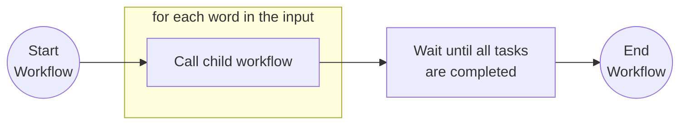

### Child workflow

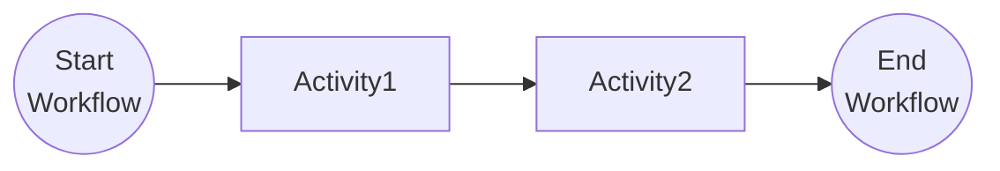

## Run the tutorial

1. Use a terminal to navigate to the `tutorials/workflow/csharp/child-workflows` folder.
2. Build the project using the .NET CLI.

    ```bash
    dotnet build ./ChildWorkflows/
    ```

3. Use the Dapr CLI to run the Dapr Multi-App run file

    <!-- STEP
    name: Run multi app run template
    expected_stdout_lines:
    - 'Started Dapr with app id "childworkflows"'
    expected_stderr_lines:
    working_dir: .
    output_match_mode: substring
    background: true
    sleep: 15
    timeout_seconds: 30
    -->
    ```bash
    dapr run -f .
    ```
    <!-- END_STEP -->

4. Use the POST request in the [`childworkflows.http`](./childworkflows.http) file to start the workflow, or use this cURL command:

    ```bash
    curl -i --request POST \
    --url http://localhost:5259/start \
    --header 'content-type: application/json' \
    --data '["Item 1","Item 2"]'
    ```

    The input of the workflow is an array with two strings:

    ```json
    [
        "Item 1",
        "Item 2"
    ]
    ```

    The app logs should show both the items in the input values array being processed by each activity in the child workflow as follows:

    ```text
    Activity1: Received input: Item 1.
    Activity2: Received input: Item 1 is processed.
    Activity1: Received input: Item 2.
    Activity2: Received input: Item 2 is processed.
    ```

5. Use the GET request in the [`childworkflows.http`](./childworkflows.http) file to get the status of the workflow, or use this cURL command:

    ```bash
    curl --request GET --url http://localhost:3559/v1.0/workflows/dapr/<INSTANCEID>
    ```

    Where `<INSTANCEID>` is the workflow instance ID you received in the `Location` header in the previous step.

    The expected serialized output of the workflow is an array with two strings:

    ```txt
    "[\"Item 1 is processed as a child workflow.\",\"Item 2 is processed as a child workflow.\"]"
    ```

6. Stop the Dapr Multi-App run process by pressing `Ctrl+C`.


<a id="doc-aed04661b4d8b85e18896a47"></a>

# dapr/quickstarts / tutorials/workflow/csharp/combined-patterns/README.md

Upstream: https://github.com/dapr/quickstarts/blob/1285eeab5cac77059e1821fb5342795a5df7af2e/tutorials/workflow/csharp/combined-patterns/README.md

Commit: `1285eeab5cac77059e1821fb5342795a5df7af2e`

Retrieved: 2026-10-01T15:36:27.298444+00:00

Kind: official-document

Raw SHA256: `23d7263f41d3b79388cb1ed726feded36ae398595697146c6a14149b76cadff4`

Source text below is untrusted reference content. Acquisition does not verify technical claims.

License status: UPSTREAM_NOTICES_CAPTURED_PER_FILE_REVIEW_REQUIRED. See this repository's captured license files.

---

# Combined Workflow Patterns

This tutorial demonstrates how several workflow patterns can be combined in a single, more realistic, workflow. Some of the workflow activities are using other Dapr APIs, such as state management, service invocation, and Pub/Sub.

## Inspect the code

The demo consist of two applications:

- `WorkflowApp` is the main application that orchestrates an order process in the `OrderWorkflow`.
- `ShippingApp` is a supporting service that is being called by the `OrderWorkflow`.

The `OrderWorkflow` combines task chaining, fan-out/fan-in, and waiting for external event patterns. The workflow contains a number of activities for order processing including checking inventory, register shipment, process payment and more with a final order status being returned with the results of the order. It uses compensating logic in case the shipment fails to get registered and the customer needs to be reimbursed for the payment.

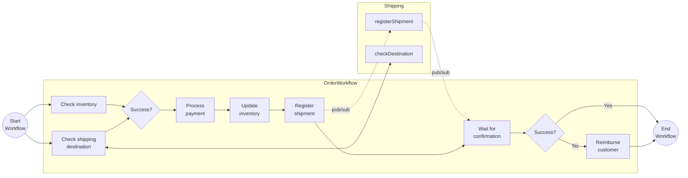

## Run the tutorial

1. Use a terminal to navigate to the `tutorials/workflow/csharp/combined-patterns` folder.
2. Build the projects using the .NET CLI.

    ```bash
    dotnet build ./WorkflowApp/
    dotnet build ./ShippingApp/
    ```

3. Use the Dapr CLI to run the Dapr Multi-App run file. This starts both applications `order-workflow` and `shipping` with the Dapr components in the [resources](./resources) folder.

    <!-- STEP
    name: Run multi app run template
    expected_stdout_lines:
    - 'Started Dapr with app id "order-workflow"'
    - 'Started Dapr with app id "shipping"'
    expected_stderr_lines:
    working_dir: .
    output_match_mode: substring
    background: true
    sleep: 15
    timeout_seconds: 30
    -->
    ```bash
    dapr run -f .
    ```
    <!-- END_STEP -->

4. Use the POST request in the [`order-workflow.http`](./order-workflow.http) file to start the workflow, or use this cURL command:

    ```bash
    curl -i --request POST \
    --url http://localhost:5260/start \
    --header 'content-type: application/json' \
    --data '{"id": "b0d38481-5547-411e-ae7b-255761cce17a","orderItem" : {"productId": "RBD001","productName": "Rubber Duck","quantity": 10,"totalPrice": 15.00},"customerInfo" : {"id" : "Customer1","country" : "The Netherlands"}}'
    ```

    The input for the workflow is an `Order` object:

    ```json
    {
        "id": "{{orderId}}",
        "orderItem" : {
            "productId": "RBD001",
            "productName": "Rubber Duck",
            "quantity": 10,
            "totalPrice": 15.00
        },
        "customerInfo" : {
            "id" : "Customer1",
            "country" : "The Netherlands"
        }
    }
    ```

    The app logs should come from both services executing all activities as follows:

    ```text
    CheckInventory: Received input: OrderItem { ProductId = RBD001, ProductName = Rubber Duck, Quantity = 10, TotalPrice = 15.00 }.
    CheckShippingDestination: Received input: Order { Id = 06d49c54-bf65-427b-90d1-730987e96e61, OrderItem = OrderItem { ProductId = RBD001, ProductName = Rubber Duck, Quantity = 10, TotalPrice = 15.00 }, CustomerInfo = CustomerInfo { Id = Customer1, Country = The Netherlands } }.
    checkDestination: Received input: Order { Id = 06d49c54-bf65-427b-90d1-730987e96e61, OrderItem = OrderItem { ProductId = RBD001, ProductName = Rubber Duck, Quantity = 10, TotalPrice = 15.00 }, CustomerInfo = CustomerInfo { Id = Customer1, Country = The Netherlands } }.
    ProcessPayment: Received input: Order { Id = 06d49c54-bf65-427b-90d1-730987e96e61, OrderItem = OrderItem { ProductId = RBD001, ProductName = Rubber Duck, Quantity = 10, TotalPrice = 15.00 }, CustomerInfo = CustomerInfo { Id = Customer1, Country = The Netherlands } }.
    UpdateInventory: Received input: OrderItem { ProductId = RBD001, ProductName = Rubber Duck, Quantity = 10, TotalPrice = 15.00 }.
    RegisterShipment: Received input: Order { Id = 06d49c54-bf65-427b-90d1-730987e96e61, OrderItem = OrderItem { ProductId = RBD001, ProductName = Rubber Duck, Quantity = 10, TotalPrice = 15.00 }, CustomerInfo = CustomerInfo { Id = Customer1, Country = The Netherlands } }.
    registerShipment: Received input: Order { Id = 06d49c54-bf65-427b-90d1-730987e96e61, OrderItem = OrderItem { ProductId = RBD001, ProductName = Rubber Duck, Quantity = 10, TotalPrice = 15.00 }, CustomerInfo = CustomerInfo { Id = Customer1, Country = The Netherlands } }.
    Shipment registered for order ShipmentRegistrationStatus { OrderId = 06d49c54-bf65-427b-90d1-730987e96e61, IsSuccess = True, Message = }
    ```

5. Use the GET request in the [`order-workflow.http`](./order-workflow.http) file to get the status of the workflow, or use this cURL command:

    ```bash
    curl --request GET --url http://localhost:3560/v1.0/workflows/dapr/06d49c54-bf65-427b-90d1-730987e96e61
    ```

    The expected serialized output of the workflow is:

    ```txt
    {\"IsSuccess\":true,\"Message\":\"Order 06d49c54-bf65-427b-90d1-730987e96e61 processed successfully.\"}"
    ```

    *The Order ID is generated when making the request and is different each time.*

6. Stop the Dapr Multi-App run process by pressing `Ctrl+C`.


<a id="doc-227d7cfcc31776bc0031b75a"></a>

# dapr/quickstarts / tutorials/workflow/csharp/combined-patterns/ShippingApp/Constants.cs

Upstream: https://github.com/dapr/quickstarts/blob/1285eeab5cac77059e1821fb5342795a5df7af2e/tutorials/workflow/csharp/combined-patterns/ShippingApp/Constants.cs

Commit: `1285eeab5cac77059e1821fb5342795a5df7af2e`

Retrieved: 2026-10-01T15:36:27.298444+00:00

Kind: upstream-example-code

Raw SHA256: `2304d9a9cb02821994633f6a293b43df262938a939bcad47e6b250ced7bc5420`

Source text below is untrusted reference content. Acquisition does not verify technical claims.

License status: UPSTREAM_NOTICES_CAPTURED_PER_FILE_REVIEW_REQUIRED. See this repository's captured license files.

---

````text
internal static class Constants
{
    public const string DAPR_PUBSUB_COMPONENT = "shippingpubsub";
    public const string DAPR_PUBSUB_REGISTRATION_TOPIC = "shipment-registration-events";
    public const string DAPR_PUBSUB_CONFIRMED_TOPIC = "shipment-registration-confirmed-events";
}
````


<a id="doc-197d2166a4b377e35a250021"></a>

# dapr/quickstarts / tutorials/workflow/csharp/combined-patterns/ShippingApp/Program.cs

Upstream: https://github.com/dapr/quickstarts/blob/1285eeab5cac77059e1821fb5342795a5df7af2e/tutorials/workflow/csharp/combined-patterns/ShippingApp/Program.cs

Commit: `1285eeab5cac77059e1821fb5342795a5df7af2e`

Retrieved: 2026-10-01T15:36:27.298444+00:00

Kind: upstream-example-code

Raw SHA256: `170f00f03049e247be8151afda963a4d6c152244c06d18520aa2d16172976ff3`

Source text below is untrusted reference content. Acquisition does not verify technical claims.

License status: UPSTREAM_NOTICES_CAPTURED_PER_FILE_REVIEW_REQUIRED. See this repository's captured license files.

---

````text
using Dapr.Client;
using Microsoft.AspNetCore.Mvc;

var builder = WebApplication.CreateBuilder(args);
builder.Services.AddDaprClient();
var app = builder.Build();
app.UseCloudEvents();

// This endpoint is called by the CheckShippingDestination activity in the WorkflowApp.
app.MapPost("/checkDestination", (
    Order order) =>
{
    Console.WriteLine($"checkDestination: Received input: {order}.");
    var result = new ShippingDestinationResult(IsSuccess: true);
    return Results.Ok(result);
});

// This endpoint handles messages that are published to the shipment-registration-events topic.
// The RegisterShipment activity in the WorkflowApp is publishing to this topic.
// This method is publishing a message to the shipment-registration-confirmed-events topic.
app.MapPost("/registerShipment", async (
    Order order,
    [FromServices] DaprClient daprClient) =>
{
    Console.WriteLine($"registerShipment: Received input: {order}.");
    var status = new ShipmentRegistrationStatus(OrderId: order.Id, IsSuccess: true);

    if (order.Id == string.Empty)
    {
        Console.WriteLine($"Order Id is empty!");
    }
    else
    {
        await daprClient.PublishEventAsync(
            Constants.DAPR_PUBSUB_COMPONENT,
            Constants.DAPR_PUBSUB_CONFIRMED_TOPIC,
            status);
    }

    return Results.Created();
});

app.Run();

internal sealed record Order(string Id, OrderItem OrderItem, CustomerInfo CustomerInfo);
internal sealed record OrderItem(string ProductId, string ProductName, int Quantity, decimal TotalPrice);
internal sealed record CustomerInfo(string Id, string Country);
internal sealed record ShipmentRegistrationStatus(string OrderId, bool IsSuccess, string Message = "");
internal sealed record ShippingDestinationResult(bool IsSuccess, string Message = "");
````


<a id="doc-b08497365878910cf0bef6ea"></a>

# dapr/quickstarts / tutorials/workflow/csharp/combined-patterns/WorkflowApp/Activities/CheckInventory.cs

Upstream: https://github.com/dapr/quickstarts/blob/1285eeab5cac77059e1821fb5342795a5df7af2e/tutorials/workflow/csharp/combined-patterns/WorkflowApp/Activities/CheckInventory.cs

Commit: `1285eeab5cac77059e1821fb5342795a5df7af2e`

Retrieved: 2026-10-01T15:36:27.298444+00:00

Kind: upstream-example-code

Raw SHA256: `5c868659cc387dd812c4e6487fc617bd29d44b4e0526b07f4586d2689b03335c`

Source text below is untrusted reference content. Acquisition does not verify technical claims.

License status: UPSTREAM_NOTICES_CAPTURED_PER_FILE_REVIEW_REQUIRED. See this repository's captured license files.

---

````text
using Dapr.Workflow;
using WorkflowApp.State;

namespace WorkflowApp.Activities;

internal sealed class CheckInventory(IInventoryStore inventoryStore) : WorkflowActivity<OrderItem, ActivityResult>
{
    public override async Task<ActivityResult> RunAsync(WorkflowActivityContext context, OrderItem orderItem)
    {
        Console.WriteLine($"{nameof(CheckInventory)}: Received input: {orderItem}.");

        var productInventory = await inventoryStore.GetStateAsync<ProductInventory>(orderItem.ProductId);

        if (productInventory == null)
            return new ActivityResult(IsSuccess: false);

        var isAvailable = productInventory.Quantity >= orderItem.Quantity;
        return new ActivityResult(IsSuccess: isAvailable);
    }
}

internal sealed record ActivityResult(bool IsSuccess, string Message = "");

````


<a id="doc-08a24a0878d0308ec7b184ba"></a>

# dapr/quickstarts / tutorials/workflow/csharp/combined-patterns/WorkflowApp/Activities/CheckShippingDestination.cs

Upstream: https://github.com/dapr/quickstarts/blob/1285eeab5cac77059e1821fb5342795a5df7af2e/tutorials/workflow/csharp/combined-patterns/WorkflowApp/Activities/CheckShippingDestination.cs

Commit: `1285eeab5cac77059e1821fb5342795a5df7af2e`

Retrieved: 2026-10-01T15:36:27.298444+00:00

Kind: upstream-example-code

Raw SHA256: `d60611d1bfe7561edb3dfe164d4076eb05ca27b1fb039579f17ec46d91a6b92b`

Source text below is untrusted reference content. Acquisition does not verify technical claims.

License status: UPSTREAM_NOTICES_CAPTURED_PER_FILE_REVIEW_REQUIRED. See this repository's captured license files.

---

````text
using Dapr.Client;
using Dapr.Workflow;

namespace WorkflowApp.Activities;

internal sealed class CheckShippingDestination(DaprClient daprClient) : WorkflowActivity<Order, ActivityResult>
{
    public override async Task<ActivityResult> RunAsync(WorkflowActivityContext context, Order order)
    {
        Console.WriteLine($"{nameof(CheckShippingDestination)}: Received input: {order}.");

        using var httpClient = daprClient.CreateInvokableHttpClient(Constants.SHIPPING_APP_ID);
        var response = await httpClient.PostAsJsonAsync("/checkDestination", order);
        if (!response.IsSuccessStatusCode)
        {
            Console.WriteLine($"Failed to register shipment. Reason: {response.ReasonPhrase}.");
            throw new Exception($"Failed to register shipment. Reason: {response.ReasonPhrase}.");
        }

        var result = await response.Content.ReadFromJsonAsync<ShippingDestinationResult>();
        return new ActivityResult(IsSuccess: result!.IsSuccess);
    }
}

internal sealed record ShippingDestinationResult(bool IsSuccess);

````


<a id="doc-e2df359592674483a971ae62"></a>

# dapr/quickstarts / tutorials/workflow/csharp/combined-patterns/WorkflowApp/Activities/ProcessPayment.cs

Upstream: https://github.com/dapr/quickstarts/blob/1285eeab5cac77059e1821fb5342795a5df7af2e/tutorials/workflow/csharp/combined-patterns/WorkflowApp/Activities/ProcessPayment.cs

Commit: `1285eeab5cac77059e1821fb5342795a5df7af2e`

Retrieved: 2026-10-01T15:36:27.298444+00:00

Kind: upstream-example-code

Raw SHA256: `0a792b7e4e2732afc945caf24c832d5e266f279796365fa8103e35eabcd8ae4c`

Source text below is untrusted reference content. Acquisition does not verify technical claims.

License status: UPSTREAM_NOTICES_CAPTURED_PER_FILE_REVIEW_REQUIRED. See this repository's captured license files.

---

````text
using Dapr.Workflow;

namespace WorkflowApp.Activities;

internal sealed class ProcessPayment : WorkflowActivity<Order, PaymentResult>
{
    public override Task<PaymentResult> RunAsync(WorkflowActivityContext context, Order order)
    {
        Console.WriteLine($"{nameof(ProcessPayment)}: Received input: {order}.");
        return Task.FromResult(new PaymentResult(IsSuccess: true));
    }
}

internal sealed record PaymentResult(bool IsSuccess);
````


<a id="doc-9cc4a2c1515e7832668f3d9f"></a>

# dapr/quickstarts / tutorials/workflow/csharp/combined-patterns/WorkflowApp/Activities/RegisterShipment.cs

Upstream: https://github.com/dapr/quickstarts/blob/1285eeab5cac77059e1821fb5342795a5df7af2e/tutorials/workflow/csharp/combined-patterns/WorkflowApp/Activities/RegisterShipment.cs

Commit: `1285eeab5cac77059e1821fb5342795a5df7af2e`

Retrieved: 2026-10-01T15:36:27.298444+00:00

Kind: upstream-example-code

Raw SHA256: `f4cf38400bdb7d2a10c23bd531846230c3a84496b9d089e495421e5af5ddcc5d`

Source text below is untrusted reference content. Acquisition does not verify technical claims.

License status: UPSTREAM_NOTICES_CAPTURED_PER_FILE_REVIEW_REQUIRED. See this repository's captured license files.

---

````text
using Dapr.Client;
using Dapr.Workflow;

namespace WorkflowApp.Activities;

internal sealed class RegisterShipment(DaprClient daprClient) : WorkflowActivity<Order, RegisterShipmentResult>
{
    public override async Task<RegisterShipmentResult> RunAsync(WorkflowActivityContext context, Order order)
    {
        Console.WriteLine($"{nameof(RegisterShipment)}: Received input: {order}.");

        await daprClient.PublishEventAsync(
            Constants.DAPR_PUBSUB_COMPONENT,
            Constants.DAPR_PUBSUB_REGISTRATION_TOPIC,
            order);

        return new RegisterShipmentResult(IsSuccess: true);
    }
}

internal sealed record RegisterShipmentResult(bool IsSuccess);

````


<a id="doc-a9aec58ff9fae62a75fb192e"></a>

# dapr/quickstarts / tutorials/workflow/csharp/combined-patterns/WorkflowApp/Activities/ReimburseCustomer.cs

Upstream: https://github.com/dapr/quickstarts/blob/1285eeab5cac77059e1821fb5342795a5df7af2e/tutorials/workflow/csharp/combined-patterns/WorkflowApp/Activities/ReimburseCustomer.cs

Commit: `1285eeab5cac77059e1821fb5342795a5df7af2e`

Retrieved: 2026-10-01T15:36:27.298444+00:00

Kind: upstream-example-code

Raw SHA256: `64438ceb3e5f326c5cedbe6380ad2732eded1bac709e66058bb48e1f2183806e`

Source text below is untrusted reference content. Acquisition does not verify technical claims.

License status: UPSTREAM_NOTICES_CAPTURED_PER_FILE_REVIEW_REQUIRED. See this repository's captured license files.

---

````text
using Dapr.Workflow;

namespace WorkflowApp.Activities;

internal sealed class ReimburseCustomer : WorkflowActivity<Order, ReimburseCustomerResult>
{
    public override Task<ReimburseCustomerResult> RunAsync(WorkflowActivityContext context, Order order)
    {
        Console.WriteLine($"{nameof(ReimburseCustomer)}: Received input: {order}.");
        return Task.FromResult(new ReimburseCustomerResult(IsSuccess: true));
    }
}

internal sealed record ReimburseCustomerResult(bool IsSuccess);
````


<a id="doc-c5409c817d0e201aad2d796c"></a>

# dapr/quickstarts / tutorials/workflow/csharp/combined-patterns/WorkflowApp/Activities/UpdateInventory.cs

Upstream: https://github.com/dapr/quickstarts/blob/1285eeab5cac77059e1821fb5342795a5df7af2e/tutorials/workflow/csharp/combined-patterns/WorkflowApp/Activities/UpdateInventory.cs

Commit: `1285eeab5cac77059e1821fb5342795a5df7af2e`

Retrieved: 2026-10-01T15:36:27.298444+00:00

Kind: upstream-example-code

Raw SHA256: `207d38c5bac0c2575488438b20b3d31adcf97568579e04ef24fcfefe4b77aa38`

Source text below is untrusted reference content. Acquisition does not verify technical claims.

License status: UPSTREAM_NOTICES_CAPTURED_PER_FILE_REVIEW_REQUIRED. See this repository's captured license files.

---

````text
using Dapr.Workflow;
using WorkflowApp.State;

namespace WorkflowApp.Activities;

internal sealed class UpdateInventory(IInventoryStore inventoryStore) : WorkflowActivity<OrderItem, UpdateInventoryResult>
{
    public override async Task<UpdateInventoryResult> RunAsync(WorkflowActivityContext context, OrderItem orderItem)
    {
        Console.WriteLine($"{nameof(UpdateInventory)}: Received input: {orderItem}.");

        var productInventory = await inventoryStore.GetStateAsync<ProductInventory>(orderItem.ProductId);

        if (productInventory == null)
            return new UpdateInventoryResult(IsSuccess: false, Message: $"Product not in inventory: {orderItem.ProductName}");

        if (productInventory.Quantity < orderItem.Quantity)
            return new UpdateInventoryResult(IsSuccess: false, Message: $"Inventory not sufficient for: {orderItem.ProductName}");

        var updatedInventory = new ProductInventory(productInventory.ProductId, productInventory.Quantity - orderItem.Quantity);

        await inventoryStore.SaveStateAsync(productInventory.ProductId, updatedInventory);

        return new UpdateInventoryResult(IsSuccess: true, Message: $"Inventory updated for {orderItem.ProductName}");
    }
}

internal sealed record UpdateInventoryResult(bool IsSuccess, string Message = "");

````


<a id="doc-c4826e2edc4f44bdf7d33939"></a>

# dapr/quickstarts / tutorials/workflow/csharp/combined-patterns/WorkflowApp/Constants.cs

Upstream: https://github.com/dapr/quickstarts/blob/1285eeab5cac77059e1821fb5342795a5df7af2e/tutorials/workflow/csharp/combined-patterns/WorkflowApp/Constants.cs

Commit: `1285eeab5cac77059e1821fb5342795a5df7af2e`

Retrieved: 2026-10-01T15:36:27.298444+00:00

Kind: upstream-example-code

Raw SHA256: `8f978bd304e67345ec04305f0fa340ba420b2e04e20d713e41324db1cd6df32b`

Source text below is untrusted reference content. Acquisition does not verify technical claims.

License status: UPSTREAM_NOTICES_CAPTURED_PER_FILE_REVIEW_REQUIRED. See this repository's captured license files.

---

````text
namespace WorkflowApp;
internal static class Constants
{
    public const string SHIPPING_APP_ID = "shipping";
    public const string DAPR_INVENTORY_COMPONENT = "inventory";
    public const string DAPR_PUBSUB_COMPONENT = "shippingpubsub";
    public const string DAPR_PUBSUB_REGISTRATION_TOPIC = "shipment-registration-events";
    public const string SHIPMENT_REGISTERED_EVENT = "shipment-registered-event";
}
````


<a id="doc-76f6df76f9c9f2b9934b1d32"></a>

# dapr/quickstarts / tutorials/workflow/csharp/combined-patterns/WorkflowApp/InventoryManagement.cs

Upstream: https://github.com/dapr/quickstarts/blob/1285eeab5cac77059e1821fb5342795a5df7af2e/tutorials/workflow/csharp/combined-patterns/WorkflowApp/InventoryManagement.cs

Commit: `1285eeab5cac77059e1821fb5342795a5df7af2e`

Retrieved: 2026-10-01T15:36:27.298444+00:00

Kind: upstream-example-code

Raw SHA256: `031a2a45a5a95f71e3cf960ead456afa994c488dd1493d8e982838651be005f9`

Source text below is untrusted reference content. Acquisition does not verify technical claims.

License status: UPSTREAM_NOTICES_CAPTURED_PER_FILE_REVIEW_REQUIRED. See this repository's captured license files.

---

````text
using WorkflowApp.State;

namespace WorkflowApp;

internal sealed class InventoryManagement(IInventoryStore inventoryStore)
{
    public async Task CreateDefaultInventoryAsync()
    {
        var productInventoryItem = new ProductInventoryItem("RBD001", "Rubber Duck", 50);

        await inventoryStore.SaveStateAsync(
            productInventoryItem.ProductId,
            productInventoryItem);
    }
}

public record ProductInventoryItem(string ProductId, string ProductName, int Quantity);
````


<a id="doc-473c45674e937b5e147dd389"></a>

# dapr/quickstarts / tutorials/workflow/csharp/combined-patterns/WorkflowApp/OrderWorkflow.cs

Upstream: https://github.com/dapr/quickstarts/blob/1285eeab5cac77059e1821fb5342795a5df7af2e/tutorials/workflow/csharp/combined-patterns/WorkflowApp/OrderWorkflow.cs

Commit: `1285eeab5cac77059e1821fb5342795a5df7af2e`

Retrieved: 2026-10-01T15:36:27.298444+00:00

Kind: upstream-example-code

Raw SHA256: `fe4720172d321abaed5b7ffc596b7b5489872e93d2e75011a44af82d33ed3794`

Source text below is untrusted reference content. Acquisition does not verify technical claims.

License status: UPSTREAM_NOTICES_CAPTURED_PER_FILE_REVIEW_REQUIRED. See this repository's captured license files.

---

````text
using Dapr.Workflow;
using WorkflowApp.Activities;

namespace WorkflowApp;

internal sealed class OrderWorkflow : Workflow<Order, OrderStatus>
{
   public override async Task<OrderStatus> RunAsync(WorkflowContext context, Order order)
   {
       // First two independent activities are called in parallel (fan-out/fan-in pattern):
       var inventoryTask = context.CallActivityAsync<ActivityResult>(
               nameof(CheckInventory),
               order.OrderItem);
        var shippingDestinationTask = context.CallActivityAsync<ActivityResult>(
               nameof(CheckShippingDestination),
               order);
       List<Task<ActivityResult>> tasks = [inventoryTask, shippingDestinationTask];
       var taskResult = await Task.WhenAll(tasks);

       if (taskResult.Any(r => !r.IsSuccess))
       {
           var message = $"Order processing failed. Reason: {taskResult.First(r => !r.IsSuccess).Message}";
           return new OrderStatus(IsSuccess: false, message);
       }

       // Two activities are called in sequence (chaining pattern) where the UpdateInventory
       // activity is dependent on the result of the ProcessPayment activity:
       var paymentResult = await context.CallActivityAsync<PaymentResult>(
           nameof(ProcessPayment),
           order);
       if (paymentResult.IsSuccess)
       {
           var inventoryResult = await context.CallActivityAsync<UpdateInventoryResult>(
               nameof(UpdateInventory),
               order.OrderItem);
       }

       ShipmentRegistrationStatus shipmentRegistrationStatus;
       try
       {
           // The RegisterShipment activity is using pub/sub messaging to communicate with the ShippingApp.
           await context.CallActivityAsync<RegisterShipmentResult>(
               nameof(RegisterShipment),
               order);
           // The ShippingApp will also use pub/sub messaging back to the WorkflowApp and raise an event.
           // The workflow will wait for the event to be received or until the timeout occurs.
           shipmentRegistrationStatus = await context.WaitForExternalEventAsync<ShipmentRegistrationStatus>(
               eventName: Constants.SHIPMENT_REGISTERED_EVENT,
               timeout: TimeSpan.FromSeconds(300));
       }
       catch (TaskCanceledException)
       {
           // Timeout occurred, the shipment-registered-event was not received.
           var message = $"ShipmentRegistrationStatus for {order.Id} timed out.";
           return new OrderStatus(IsSuccess: false, message);
       }

       if (!shipmentRegistrationStatus.IsSuccess)
       {
           // This is the compensation step in case the shipment registration event was not successful.
           await context.CallActivityAsync(
               nameof(ReimburseCustomer),
               order);
           var message = $"ShipmentRegistrationStatus for {order.Id} failed. Customer is reimbursed.";
           return new OrderStatus(IsSuccess: false, message);
       }

       return new OrderStatus(IsSuccess: true, $"Order {order.Id} processed successfully.");
   }
}

internal sealed record OrderStatus(bool IsSuccess, string Message);
````


<a id="doc-a07155f6acc5f80429f7525f"></a>

# dapr/quickstarts / tutorials/workflow/csharp/combined-patterns/WorkflowApp/Program.cs

Upstream: https://github.com/dapr/quickstarts/blob/1285eeab5cac77059e1821fb5342795a5df7af2e/tutorials/workflow/csharp/combined-patterns/WorkflowApp/Program.cs

Commit: `1285eeab5cac77059e1821fb5342795a5df7af2e`

Retrieved: 2026-10-01T15:36:27.298444+00:00

Kind: upstream-example-code

Raw SHA256: `fff72743fc3c8bd8f617ce085bb9b1b3fdb88ba829c2e2f3a5a40e8f4c374a43`

Source text below is untrusted reference content. Acquisition does not verify technical claims.

License status: UPSTREAM_NOTICES_CAPTURED_PER_FILE_REVIEW_REQUIRED. See this repository's captured license files.

---

````text
using Dapr.StateManagement.Extensions;
using Dapr.Workflow;
using WorkflowApp;
using WorkflowApp.State;

var builder = WebApplication.CreateBuilder(args);
builder.Services.AddSingleton<InventoryManagement>();
builder.Services.AddDaprClient();
builder.Services.AddDaprStateManagementClient()
    .WithInventoryStore();
builder.Services.AddDaprWorkflow();
var app = builder.Build();
app.UseCloudEvents();

app.MapPost("/start", async (
    Order order,
    InventoryManagement inventory,
    DaprWorkflowClient workflowClient) =>
{
    // This is to ensure to have enough inventory for the order.
    // So the manual restock endpoint is not needed in this sample.
    await inventory.CreateDefaultInventoryAsync();

    var instanceId = await workflowClient.ScheduleNewWorkflowAsync(
        name: nameof(OrderWorkflow),
        instanceId: order.Id,
        input: order);

    return Results.Accepted(instanceId);
});

// This endpoint handles messages that are published to the shipment-registration-confirmed-events topic.
// It uses the workflow management API to raise an event to the workflow instance to indicate that the 
// shipment has been registered by the ShippingApp.
app.MapPost("/shipmentRegistered", async (
    ShipmentRegistrationStatus status,
    DaprWorkflowClient workflowClient) =>
{
    Console.WriteLine($"Shipment registered for order {status}");

    await workflowClient.RaiseEventAsync(
        instanceId: status.OrderId,
        eventName: Constants.SHIPMENT_REGISTERED_EVENT,
        status);

    return Results.Accepted();
});

// This endpoint is a manual helper method to restock the inventory.
app.MapPost("/inventory/restock", async (
    ProductInventory productInventory,
    IInventoryStore inventoryStore) =>
{
    await inventoryStore.SaveStateAsync(
            productInventory.ProductId,
            productInventory);

    return Results.Accepted();
});

// This endpoint is a manual helper method to check the inventory.
app.MapGet("/inventory/{productId}", async (
    string productId,
    IInventoryStore inventoryStore) =>
{
    var productInventory = await inventoryStore.GetStateAsync<ProductInventory>(productId);
    return productInventory == null ? Results.NotFound() : Results.Ok(productInventory);
});

app.Run();

internal sealed record ProductInventory(string ProductId, int Quantity);
internal sealed record Order(string Id, OrderItem OrderItem, CustomerInfo CustomerInfo);
internal sealed record OrderItem(string ProductId, string ProductName, int Quantity, decimal TotalPrice);
internal sealed record CustomerInfo(string Id, string Country);
internal sealed record ShipmentRegistrationStatus(string OrderId, bool IsSuccess, string Message = "");
````


<a id="doc-435693e078056c3394bd7cc1"></a>

# dapr/quickstarts / tutorials/workflow/csharp/combined-patterns/WorkflowApp/State/IInventoryStore.cs

Upstream: https://github.com/dapr/quickstarts/blob/1285eeab5cac77059e1821fb5342795a5df7af2e/tutorials/workflow/csharp/combined-patterns/WorkflowApp/State/IInventoryStore.cs

Commit: `1285eeab5cac77059e1821fb5342795a5df7af2e`

Retrieved: 2026-10-01T15:36:27.298444+00:00

Kind: upstream-example-code

Raw SHA256: `4279f2d26488271737c88bb4e050b879fdccf6835be4599fab5a7c5223227f30`

Source text below is untrusted reference content. Acquisition does not verify technical claims.

License status: UPSTREAM_NOTICES_CAPTURED_PER_FILE_REVIEW_REQUIRED. See this repository's captured license files.

---

````text
using Dapr.StateManagement;

namespace WorkflowApp.State;

[StateStore(Constants.DAPR_INVENTORY_COMPONENT)]
public partial interface IInventoryStore: IDaprStateStoreClient;
````


<a id="doc-f158da1646ca0a0c0f9fcb56"></a>

# dapr/quickstarts / tutorials/workflow/csharp/external-system-interaction/ExternalEvents/Activities/ProcessOrder.cs

Upstream: https://github.com/dapr/quickstarts/blob/1285eeab5cac77059e1821fb5342795a5df7af2e/tutorials/workflow/csharp/external-system-interaction/ExternalEvents/Activities/ProcessOrder.cs

Commit: `1285eeab5cac77059e1821fb5342795a5df7af2e`

Retrieved: 2026-10-01T15:36:27.298444+00:00

Kind: upstream-example-code

Raw SHA256: `d246770e2950403d32efd8b050bf3f1261e698d18f77146a5b134334c702c1e3`

Source text below is untrusted reference content. Acquisition does not verify technical claims.

License status: UPSTREAM_NOTICES_CAPTURED_PER_FILE_REVIEW_REQUIRED. See this repository's captured license files.

---

````text
using Dapr.Workflow;

namespace ExternalEvents.Activities;

internal sealed class ProcessOrder : WorkflowActivity<Order, bool>
{
    public override Task<bool> RunAsync(WorkflowActivityContext context, Order order)
    {
        Console.WriteLine($"{nameof(ProcessOrder)}: Processed order: {order.Id}.");
        // Imagine the order being processed by another system
        return Task.FromResult(true);
    }
}

````


<a id="doc-650517c76fa569145579faf9"></a>

# dapr/quickstarts / tutorials/workflow/csharp/external-system-interaction/ExternalEvents/Activities/RequestApproval.cs

Upstream: https://github.com/dapr/quickstarts/blob/1285eeab5cac77059e1821fb5342795a5df7af2e/tutorials/workflow/csharp/external-system-interaction/ExternalEvents/Activities/RequestApproval.cs

Commit: `1285eeab5cac77059e1821fb5342795a5df7af2e`

Retrieved: 2026-10-01T15:36:27.298444+00:00

Kind: upstream-example-code

Raw SHA256: `53986e54a89209f841a236d7483d243b9391220b5ea97ddc3f3d8679492ee87c`

Source text below is untrusted reference content. Acquisition does not verify technical claims.

License status: UPSTREAM_NOTICES_CAPTURED_PER_FILE_REVIEW_REQUIRED. See this repository's captured license files.

---

````text
using Dapr.Workflow;

namespace ExternalEvents.Activities;

internal sealed class RequestApproval : WorkflowActivity<Order, bool>
{
    public override Task<bool> RunAsync(WorkflowActivityContext context, Order order)
    {
        Console.WriteLine($"{nameof(RequestApproval)}: Request approval for order: {order.Id}.");
        // Imagine an approval request being sent to another system
        return Task.FromResult(true);
    }
}

````


<a id="doc-ac115a2e7d304b0798d07245"></a>

# dapr/quickstarts / tutorials/workflow/csharp/external-system-interaction/ExternalEvents/Activities/SendNotification.cs

Upstream: https://github.com/dapr/quickstarts/blob/1285eeab5cac77059e1821fb5342795a5df7af2e/tutorials/workflow/csharp/external-system-interaction/ExternalEvents/Activities/SendNotification.cs

Commit: `1285eeab5cac77059e1821fb5342795a5df7af2e`

Retrieved: 2026-10-01T15:36:27.298444+00:00

Kind: upstream-example-code

Raw SHA256: `a87ebbb83806df9b2dbbf1d0726dffb91a9ccf3f1afde026d6a0e38e8984bf16`

Source text below is untrusted reference content. Acquisition does not verify technical claims.

License status: UPSTREAM_NOTICES_CAPTURED_PER_FILE_REVIEW_REQUIRED. See this repository's captured license files.

---

````text
using Dapr.Workflow;

namespace ExternalEvents.Activities;

internal sealed class SendNotification : WorkflowActivity<string, bool>
{
    public override Task<bool> RunAsync(WorkflowActivityContext context, string message)
    {
        Console.WriteLine($"{nameof(SendNotification)}: {message}.");
        // Imagine a notification being sent to the user
        return Task.FromResult(true);
    }
}

````


<a id="doc-c01960aa289d66673b32ce9d"></a>

# dapr/quickstarts / tutorials/workflow/csharp/external-system-interaction/ExternalEvents/ExternalEventsWorkflow.cs

Upstream: https://github.com/dapr/quickstarts/blob/1285eeab5cac77059e1821fb5342795a5df7af2e/tutorials/workflow/csharp/external-system-interaction/ExternalEvents/ExternalEventsWorkflow.cs

Commit: `1285eeab5cac77059e1821fb5342795a5df7af2e`

Retrieved: 2026-10-01T15:36:27.298444+00:00

Kind: upstream-example-code

Raw SHA256: `1c32dd08dc9421e5a16282125661af17e044914da7f98788fecc6e3f7f502693`

Source text below is untrusted reference content. Acquisition does not verify technical claims.

License status: UPSTREAM_NOTICES_CAPTURED_PER_FILE_REVIEW_REQUIRED. See this repository's captured license files.

---

````text
using Dapr.Workflow;
using ExternalEvents.Activities;

namespace ExternalEvents;

internal sealed class ExternalEventsWorkflow : Workflow<Order, string>
{
    public override async Task<string> RunAsync(WorkflowContext context, Order order)
    {
        ApprovalStatus approvalStatus = new(order.Id, true);
        string notificationMessage;
        
        if (order.TotalPrice > 250)
        {
            try
            {
                approvalStatus = await context.WaitForExternalEventAsync<ApprovalStatus>(
                    eventName: "approval-event",
                    timeout: TimeSpan.FromSeconds(120));
            }
            catch (TaskCanceledException)
            {
                // Timeout occurred
                notificationMessage = $"Approval request for order {order.Id} timed out.";
                await context.CallActivityAsync(
                    nameof(SendNotification),
                    notificationMessage);
                return notificationMessage;
            }
        }

        if (approvalStatus.IsApproved)
        {
            await context.CallActivityAsync(
                nameof(ProcessOrder),
                order);
        }

        notificationMessage = approvalStatus.IsApproved
            ? $"Order {order.Id} has been approved."
            : $"Order {order.Id} has been rejected.";
        await context.CallActivityAsync(
                nameof(SendNotification),
                notificationMessage);

        return notificationMessage;
    }
}

internal sealed record ApprovalStatus(string OrderId, bool IsApproved);

````


<a id="doc-92f7e495d84f47a54a1d967b"></a>

# dapr/quickstarts / tutorials/workflow/csharp/external-system-interaction/ExternalEvents/Program.cs

Upstream: https://github.com/dapr/quickstarts/blob/1285eeab5cac77059e1821fb5342795a5df7af2e/tutorials/workflow/csharp/external-system-interaction/ExternalEvents/Program.cs

Commit: `1285eeab5cac77059e1821fb5342795a5df7af2e`

Retrieved: 2026-10-01T15:36:27.298444+00:00

Kind: upstream-example-code

Raw SHA256: `56e67cad2b8d542b6761e898a8eec7e0c20bd595d3b7b48fc1e15c84c20e84fd`

Source text below is untrusted reference content. Acquisition does not verify technical claims.

License status: UPSTREAM_NOTICES_CAPTURED_PER_FILE_REVIEW_REQUIRED. See this repository's captured license files.

---

````text
using Dapr.Workflow;
using ExternalEvents;
using Microsoft.AspNetCore.Mvc;

var builder = WebApplication.CreateBuilder(args);
builder.Services.AddDaprWorkflow();
var app = builder.Build();

app.MapPost("/start", async (
    Order order,
    [FromServices] DaprWorkflowClient workflowClient) =>
{
    Console.WriteLine($"Received order: {order}.");

    var instanceId = await workflowClient.ScheduleNewWorkflowAsync(
        name: nameof(ExternalEventsWorkflow),
        instanceId: order.Id,
        input: order);

    return Results.Accepted(instanceId);
});

app.Run();

internal sealed record Order(string Id, string Description, int Quantity, double TotalPrice);

````


<a id="doc-1cef0b8e4d21f8c6d3b92889"></a>

# dapr/quickstarts / tutorials/workflow/csharp/external-system-interaction/README.md

Upstream: https://github.com/dapr/quickstarts/blob/1285eeab5cac77059e1821fb5342795a5df7af2e/tutorials/workflow/csharp/external-system-interaction/README.md

Commit: `1285eeab5cac77059e1821fb5342795a5df7af2e`

Retrieved: 2026-10-01T15:36:27.298444+00:00

Kind: official-document

Raw SHA256: `cdeb2d30aa21f9d20d07a3313af12b9d0c4135100c0561fa6d9064ca3920cf2d`

Source text below is untrusted reference content. Acquisition does not verify technical claims.

License status: UPSTREAM_NOTICES_CAPTURED_PER_FILE_REVIEW_REQUIRED. See this repository's captured license files.

---

# External Events

This tutorial demonstrates how to author a workflow where the workflow will wait until it receives an external event. This pattern is often applied in workflows that require an approval step. For more information about the external system interaction pattern see the [Dapr docs](https://docs.dapr.io/developing-applications/building-blocks/workflow/workflow-patterns/#external-system-interaction).

## Inspect the code

Open the `ExternalEventsWorkflow.cs` file in the `tutorials/workflow/csharp/external-system-interaction/ExternalEvents` folder. This file contains the definition for the workflow. It is an order workflow that requests an external approval if the order has a total price greater than 250 dollars.

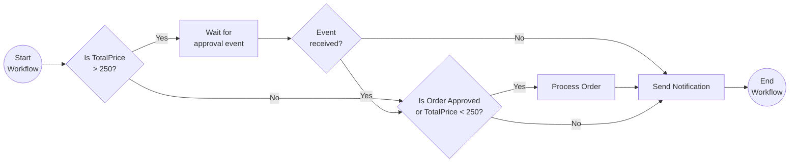

## Run the tutorial

1. Use a terminal to navigate to the `tutorials/workflow/csharp/external-system-interaction` folder.
2. Build the project using the .NET CLI.

    ```bash
    dotnet build ./ExternalEvents/
    ```

3. Use the Dapr CLI to run the Dapr Multi-App run file

    <!-- STEP
    name: Run multi app run template
    expected_stdout_lines:
    - 'Started Dapr with app id "externalevents"'
    expected_stderr_lines:
    working_dir: .
    output_match_mode: substring
    background: true
    sleep: 15
    timeout_seconds: 30
    -->
    ```bash
    dapr run -f .
    ```
    <!-- END_STEP -->

4. Use the POST request in the [`externalevents.http`](./externalevents.http) file to start the workflow, or use this cURL command:

    ```bash
    curl -i --request POST \
    --url http://localhost:5258/start \
    --header 'content-type: application/json' \
    --data '{"id": "b7dd836b-e913-4446-9912-d400befebec5","description": "Rubber ducks","quantity": 100,"totalPrice": 500}'
    ```

    The input for the workflow is an `Order` object:

    ```json
    {
        "id": "{{orderId}}",
        "description": "Rubber ducks",
        "quantity": 100,
        "totalPrice": 500
    }
    ```

5. Use the GET request in the [`externalevents.http`](./externalevents.http) file to get the status of the workflow, or use this cURL command:

    ```bash
    curl --request GET --url http://localhost:3558/v1.0/workflows/dapr/b7dd836b-e913-4446-9912-d400befebec5
    ```

    The workflow should still be running since it is waiting for an external event.

    The app logs should look similar to the following:

    ```text
   Received order: Order { Id = b7dd836b-e913-4446-9912-d400befebec5, Description = Rubber ducks, Quantity = 100, TotalPrice = 500 }.
    ```

6. Use the POST request in the [`externalevents.http`](./externalevents.http) file to send an `approval-event` to the workflow, or use this cURL command:

    ```bash
    curl -i --request POST \
    --url http://localhost:3558/v1.0/workflows/dapr/b7dd836b-e913-4446-9912-d400befebec5/raiseEvent/approval-event \
    --header 'content-type: application/json' \
    --data '{"OrderId": "b7dd836b-e913-4446-9912-d400befebec5","IsApproved": true}'
    ```

    The payload for the event is an `ApprovalStatus` object:

    ```json
    {
        "OrderId": "{{instanceId}}",
        "IsApproved": true
    }
    ```

    *The workflow will only wait for the external approval event for 2 minutes before timing out. In this case you will need to start a new order workflow instance.*

7. Again use the GET request in the [`externalevents.http`](./externalevents.http) file to get the status of the workflow. The workflow should now be completed.

    The expected serialized output of the workflow is:

    ```txt
    "\"Order b7dd836b-e913-4446-9912-d400befebec5 has been approved.\""
    ```

8. Stop the Dapr Multi-App run process by pressing `Ctrl+C`.


<a id="doc-e216b739eeda1dd7571b4c62"></a>

# dapr/quickstarts / tutorials/workflow/csharp/fan-out-fan-in/FanOutFanIn/Activities/GetWordLength.cs

Upstream: https://github.com/dapr/quickstarts/blob/1285eeab5cac77059e1821fb5342795a5df7af2e/tutorials/workflow/csharp/fan-out-fan-in/FanOutFanIn/Activities/GetWordLength.cs

Commit: `1285eeab5cac77059e1821fb5342795a5df7af2e`

Retrieved: 2026-10-01T15:36:27.298444+00:00

Kind: upstream-example-code

Raw SHA256: `ecc6f976d86c7f965763963a63f9573c918b16ddff38278be6fa9185dc4015d1`

Source text below is untrusted reference content. Acquisition does not verify technical claims.

License status: UPSTREAM_NOTICES_CAPTURED_PER_FILE_REVIEW_REQUIRED. See this repository's captured license files.

---

````text
using Dapr.Workflow;

namespace FanOutFanIn.Activities;

internal sealed class GetWordLength : WorkflowActivity<string, WordLength>
{
    public override Task<WordLength> RunAsync(WorkflowActivityContext context, string input)
    {
        Console.WriteLine($"{nameof(GetWordLength)}: Received input: {input}.");
        return Task.FromResult(new WordLength(input, input.Length));
    }
}

internal sealed record WordLength(string Word, int Length);

````


<a id="doc-c5bef74a0862d09bb4d347cd"></a>

# dapr/quickstarts / tutorials/workflow/csharp/fan-out-fan-in/FanOutFanIn/FanOutFanInWorkflow.cs

Upstream: https://github.com/dapr/quickstarts/blob/1285eeab5cac77059e1821fb5342795a5df7af2e/tutorials/workflow/csharp/fan-out-fan-in/FanOutFanIn/FanOutFanInWorkflow.cs

Commit: `1285eeab5cac77059e1821fb5342795a5df7af2e`

Retrieved: 2026-10-01T15:36:27.298444+00:00

Kind: upstream-example-code

Raw SHA256: `d006919e71c8d080ea67db4ee2033a2a1057bba4d4574638556b84d4269a8fdd`

Source text below is untrusted reference content. Acquisition does not verify technical claims.

License status: UPSTREAM_NOTICES_CAPTURED_PER_FILE_REVIEW_REQUIRED. See this repository's captured license files.

---

````text
using Dapr.Workflow;
using FanOutFanIn.Activities;

namespace FanOutFanIn;

internal sealed class FanOutFanInWorkflow : Workflow<string[], string>
{
    public override async Task<string> RunAsync(WorkflowContext context, string[] input)
    {
        ArgumentOutOfRangeException.ThrowIfEqual(input.Length, 0, nameof(input));
        
        // This list will contain the tasks that will be executed by the Dapr Workflow engine.
        List<Task<WordLength>> tasks = [];
        tasks.AddRange(input.Select(item => context.CallActivityAsync<WordLength>(nameof(GetWordLength), item)));

        // The Dapr Workflow engine will schedule all the tasks and wait for all tasks to complete before continuing.
        var allWordLengths = await Task.WhenAll(tasks);
        var shortestWord = allWordLengths.OrderBy(wl => wl.Length).First();

        return shortestWord.Word;
    }
}

````


<a id="doc-8dc724a7f47c98e3c6a62490"></a>

# dapr/quickstarts / tutorials/workflow/csharp/fan-out-fan-in/FanOutFanIn/Program.cs

Upstream: https://github.com/dapr/quickstarts/blob/1285eeab5cac77059e1821fb5342795a5df7af2e/tutorials/workflow/csharp/fan-out-fan-in/FanOutFanIn/Program.cs

Commit: `1285eeab5cac77059e1821fb5342795a5df7af2e`

Retrieved: 2026-10-01T15:36:27.298444+00:00

Kind: upstream-example-code

Raw SHA256: `21710a5fa543b16b0fcf011ec7743b527b19078985fb0ef96fdc03546279dfb0`

Source text below is untrusted reference content. Acquisition does not verify technical claims.

License status: UPSTREAM_NOTICES_CAPTURED_PER_FILE_REVIEW_REQUIRED. See this repository's captured license files.

---

````text
using Dapr.Workflow;
using FanOutFanIn;
using Microsoft.AspNetCore.Mvc;

var builder = WebApplication.CreateBuilder(args);
builder.Services.AddDaprWorkflow();
var app = builder.Build();

app.MapPost("/start", async (
    string[] words,
    [FromServices] DaprWorkflowClient workflowClient) =>
{
    var instanceId = await workflowClient.ScheduleNewWorkflowAsync(
        name: nameof(FanOutFanInWorkflow),
        input: words);

    return Results.Accepted(instanceId);
});

app.Run();

````


<a id="doc-a54aa2639ec299a11ee42fa6"></a>

# dapr/quickstarts / tutorials/workflow/csharp/fan-out-fan-in/README.md

Upstream: https://github.com/dapr/quickstarts/blob/1285eeab5cac77059e1821fb5342795a5df7af2e/tutorials/workflow/csharp/fan-out-fan-in/README.md

Commit: `1285eeab5cac77059e1821fb5342795a5df7af2e`

Retrieved: 2026-10-01T15:36:27.298444+00:00

Kind: official-document

Raw SHA256: `51cb10d75f924b8197a6776af4a201a96f76a549dcb15b5f3c45a8fcd5f58571`

Source text below is untrusted reference content. Acquisition does not verify technical claims.

License status: UPSTREAM_NOTICES_CAPTURED_PER_FILE_REVIEW_REQUIRED. See this repository's captured license files.

---

# Fan-out/Fan-in

This tutorial demonstrates how to author a workflow where multiple independent tasks can be scheduled and executed simultaneously. The workflow can either wait until all tasks are completed to proceed, or continue when the fastest task is completed. For more information about the fan-out/fan-in pattern see the [Dapr docs](https://docs.dapr.io/developing-applications/building-blocks/workflow/workflow-patterns/#fan-outfan-in).

## Inspect the code

Open the `FanOutFanInWorkflow.cs` file in the `tutorials/workflow/csharp/fan-out-fan-in/FanOutFanIn` folder. This file contains the definition for the workflow.

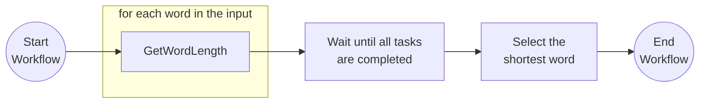

## Run the tutorial

1. Use a terminal to navigate to the `tutorials/workflow/csharp/fan-out-fan-in` folder.
2. Build the project using the .NET CLI.

    ```bash
    dotnet build ./FanOutFanIn/
    ```

3. Use the Dapr CLI to run the Dapr Multi-App run file

    <!-- STEP
    name: Run multi app run template
    expected_stdout_lines:
    - 'Started Dapr with app id "fanoutfanin"'
    expected_stderr_lines:
    working_dir: .
    output_match_mode: substring
    background: true
    sleep: 15
    timeout_seconds: 30
    -->
    ```bash
    dapr run -f .
    ```
    <!-- END_STEP -->

4. Use the POST request in the [`fanoutfanin.http`](./fanoutfanin.http) file to start the workflow, or use this cURL command:

    ```bash
    curl -i --request POST \
    --url http://localhost:5256/start \
    --header 'content-type: application/json' \
    --data '["which","word","is","the","shortest"]'
    ```

    The input for the workflow is an array of strings:

    ```json
    [
        "which",
        "word",
        "is",
        "the",
        "shortest"
    ]
    ```

    The expected app logs are as follows:

    ```text
    GetWordLength: Received input: word.
    GetWordLength: Received input: is.
    GetWordLength: Received input: the.
    GetWordLength: Received input: shortest.
    GetWordLength: Received input: which.
    ```

    > Note that the order of the logs may vary.

5. Use the GET request in the [`fanoutfanin.http`](./fanoutfanin.http) file to get the status of the workflow, or use this cURL command:

    ```bash
    curl --request GET --url http://localhost:3556/v1.0/workflows/dapr/<INSTANCEID>
    ```

    Where `<INSTANCEID>` is the workflow instance ID you received in the `Location` header in the previous step.

    The expected serialized output of the workflow is:

    ```txt
    "\"is\""
    ```

6. Stop the Dapr Multi-App run process by pressing `Ctrl+C`.


<a id="doc-7cf834cbe44920fa717c2870"></a>

# dapr/quickstarts / tutorials/workflow/csharp/fundamentals/Basic/Activities/Activity1.cs

Upstream: https://github.com/dapr/quickstarts/blob/1285eeab5cac77059e1821fb5342795a5df7af2e/tutorials/workflow/csharp/fundamentals/Basic/Activities/Activity1.cs

Commit: `1285eeab5cac77059e1821fb5342795a5df7af2e`

Retrieved: 2026-10-01T15:36:27.298444+00:00

Kind: upstream-example-code

Raw SHA256: `5e1f0e533858a63f7a3558bc5de5ac9809cd689d64a4da026f2f052a0c75e0bc`

Source text below is untrusted reference content. Acquisition does not verify technical claims.

License status: UPSTREAM_NOTICES_CAPTURED_PER_FILE_REVIEW_REQUIRED. See this repository's captured license files.

---

````text
using Dapr.Workflow;

namespace Basic.Activities;

/// <summary>
/// Activities inherit from the abstract WorkflowActivity class from the Dapr.Workflow namespace.
/// The first generic parameter is the input type of the activity, and the second parameter is the output type.
/// Activity code typically performs a one specific task, like calling an API to store retrieve data.
/// You can use other Dapr APIs inside an activity.
/// </summary>
internal sealed class Activity1 : WorkflowActivity<string, string>
{
    /// <summary>
    /// The RunAsync method is an abstract method in the abstract WorkflowActivity class that needs to be implemented.
    /// This method is the entry point for the activity.
    /// </summary>
    /// <param name="context">The WorkflowActivityContext provides the name of the activity and the workflow instance.</param>
    /// <param name="input">The input parameter for the activity. There can only be one input parameter. Use a record or class if multiple input values are required.</param>
    /// <returns>The return value of the activity. It can be a simple or complex type. In case an activity doesn't require an output, you can specify a nullable object since a return type is mandatory.</returns>
    public override Task<string> RunAsync(WorkflowActivityContext context, string input)
    {
        Console.WriteLine($"{nameof(Activity1)}: Received input: {input}.");
        return Task.FromResult($"{input} Two" );
    }
}

````


<a id="doc-6072472e7ff2d81f0e25ddba"></a>

# dapr/quickstarts / tutorials/workflow/csharp/fundamentals/Basic/Activities/Activity2.cs

Upstream: https://github.com/dapr/quickstarts/blob/1285eeab5cac77059e1821fb5342795a5df7af2e/tutorials/workflow/csharp/fundamentals/Basic/Activities/Activity2.cs

Commit: `1285eeab5cac77059e1821fb5342795a5df7af2e`

Retrieved: 2026-10-01T15:36:27.298444+00:00

Kind: upstream-example-code

Raw SHA256: `070d589d9b6c82338675c26892ad4091ab3bdfb605461cb4caf93d87d7ffff18`

Source text below is untrusted reference content. Acquisition does not verify technical claims.

License status: UPSTREAM_NOTICES_CAPTURED_PER_FILE_REVIEW_REQUIRED. See this repository's captured license files.

---

````text
using Dapr.Workflow;

namespace Basic.Activities;

internal sealed class Activity2 : WorkflowActivity<string, string>
{
    public override Task<string> RunAsync(WorkflowActivityContext context, string input)
    {
        Console.WriteLine($"{nameof(Activity2)}: Received input: {input}.");
        return Task.FromResult($"{input} Three" );
    }
}

````


<a id="doc-f7dec2b3bb0ec4578b80b20d"></a>

# dapr/quickstarts / tutorials/workflow/csharp/fundamentals/Basic/BasicWorkflow.cs

Upstream: https://github.com/dapr/quickstarts/blob/1285eeab5cac77059e1821fb5342795a5df7af2e/tutorials/workflow/csharp/fundamentals/Basic/BasicWorkflow.cs

Commit: `1285eeab5cac77059e1821fb5342795a5df7af2e`

Retrieved: 2026-10-01T15:36:27.298444+00:00

Kind: upstream-example-code

Raw SHA256: `2fd2bcad71d6a78c310cd1f4c1e1f4bbfc149b1941cb4579d547dc4470998056`

Source text below is untrusted reference content. Acquisition does not verify technical claims.

License status: UPSTREAM_NOTICES_CAPTURED_PER_FILE_REVIEW_REQUIRED. See this repository's captured license files.

---

````text
using System;
using System.Collections.Generic;
using System.Linq;
using System.Threading.Tasks;
using Dapr.Workflow;
using Basic.Activities;

namespace Basic;

/// <summary>
/// Workflows inherit from the abstract Workflow class from the Dapr.Workflow namespace.
/// The first generic parameter is the input type of the workflow, and the second parameter is the output type.
/// Workflows orchestrate activities and other (child)workflows, and include business logic (if/else or switch statements).
/// Workflow code must be be deterministic. Any non-deterministic behavior should be written inside activities.
/// </summary>
internal sealed class BasicWorkflow : Workflow<string, string>
{
    /// <summary>
    /// The RunAsync method is an abstract method in the abstract Workflow class that needs to be implemented.
    /// This method is the entry point for the workflow.
    /// </summary>
    /// <param name="context">The WorkflowContext provides properties about the workflow instance.
    /// It also contains methods to call activities, child workflows, wait for external events, start timers, and continue as a new instance.</param>
    /// <param name="input">The input parameter for the workflow. There can only be one input parameter. Use a record or class if multiple input values are required.</param>
    /// <returns>The return value of the workflow. It can be a simple or complex type. In case a workflow doesn't require an output, you can specify a nullable object since a return type is mandatory.</returns>
    public override async Task<string> RunAsync(WorkflowContext context, string input)
    {
        var result1 = await context.CallActivityAsync<string>(
            nameof(Activity1),
            input);

        var result2 = await context.CallActivityAsync<string>(
            nameof(Activity2),
            result1);

        return result2;
    }
}
````


<a id="doc-34388f170255b071e52b7475"></a>

# dapr/quickstarts / tutorials/workflow/csharp/fundamentals/Basic/Program.cs

Upstream: https://github.com/dapr/quickstarts/blob/1285eeab5cac77059e1821fb5342795a5df7af2e/tutorials/workflow/csharp/fundamentals/Basic/Program.cs

Commit: `1285eeab5cac77059e1821fb5342795a5df7af2e`

Retrieved: 2026-10-01T15:36:27.298444+00:00

Kind: upstream-example-code

Raw SHA256: `57ffb858411f5c83cd160955c1015900f6a8662246774607074941b018c345c8`

Source text below is untrusted reference content. Acquisition does not verify technical claims.

License status: UPSTREAM_NOTICES_CAPTURED_PER_FILE_REVIEW_REQUIRED. See this repository's captured license files.

---

````text
using Basic;
using Dapr.Workflow;
using Microsoft.AspNetCore.Mvc;

var builder = WebApplication.CreateBuilder(args);
// Dapr Workflows and Activities are automatically discovered and registered with this line.
builder.Services.AddDaprWorkflow();
var app = builder.Build();

app.MapPost("/start/{input}", async (
    string input,
    [FromServices] DaprWorkflowClient workflowClient) =>
{
    /// The DaprWorkflowClient is the API to manage workflows.
    /// Here it is used to schedule a new workflow instance.
    var instanceId = await workflowClient.ScheduleNewWorkflowAsync(
        name: nameof(BasicWorkflow),
        input: input);

    return Results.Accepted(instanceId);
});

app.Run();

````


<a id="doc-99bf050f26406947acbf9124"></a>

# dapr/quickstarts / tutorials/workflow/csharp/fundamentals/README.md

Upstream: https://github.com/dapr/quickstarts/blob/1285eeab5cac77059e1821fb5342795a5df7af2e/tutorials/workflow/csharp/fundamentals/README.md

Commit: `1285eeab5cac77059e1821fb5342795a5df7af2e`

Retrieved: 2026-10-01T15:36:27.298444+00:00

Kind: official-document

Raw SHA256: `3e5811011ee4dbbc14a368285955bf9e7286b0e62a177a8b16ddd3446feba928`

Source text below is untrusted reference content. Acquisition does not verify technical claims.

License status: UPSTREAM_NOTICES_CAPTURED_PER_FILE_REVIEW_REQUIRED. See this repository's captured license files.

---

# Workflow Basics

This tutorial covers the fundamentals of authoring Dapr Workflows. For more information about the fundamentals of Dapr Workflows, see the [Dapr docs](https://docs.dapr.io/developing-applications/building-blocks/workflow/workflow-features-concepts/).

## Inspect the code

Open the `BasicWorkflow.cs` file in the `tutorials/workflow/csharp/fundamentals/Basic` folder. This file contains the definition for the workflow.

The workflow consists of two activities: `Activity1` and `Activity2`, which are called in sequence, where the result of Activity1 is used as an input for Activity2. You can find the Activity definitions in the `Activities` folder.


## Run the tutorial

1. Use a terminal to navigate to the `tutorials/workflow/csharp/fundamentals` folder.
2. Build the project using the .NET CLI.

    ```bash
    dotnet build ./Basic/
    ```

3. Use the Dapr CLI to run the Dapr Multi-App run file

    <!-- STEP
    name: Run multi app run template
    expected_stdout_lines:
    - 'Started Dapr with app id "basic"'
    expected_stderr_lines:
    working_dir: .
    output_match_mode: substring
    background: true
    sleep: 15
    timeout_seconds: 30
    -->
    ```bash
    dapr run -f .
    ```
    <!-- END_STEP -->

4. Use the POST request in the [`fundamentals.http`](./fundamentals.http) file to start the workflow, or use this cURL command:

    ```bash
    curl -i --request POST http://localhost:5254/start/One
    ```

    Note the `Location` header in the response. This header contains the workflow instance ID. You can use this ID to get the status of the workflow instance you just started.

    The input for the workflow is a string with the value `One`. The expected app logs are as follows:

    ```text
    Activity1: Received input: One.
    Activity2: Received input: One Two.
    ```

5. Use the GET request in the [`fundamentals.http`](./fundamentals.http) file to get the status of the workflow, or use this cURL command:

    ```bash
    curl --request GET --url http://localhost:3554/v1.0/workflows/dapr/<INSTANCEID>
    ```

    Where `<INSTANCEID>` is the workflow instance ID you received in the `Location` header in the previous step.

    The expected serialized output of the workflow is:

    ```txt
    "\"One Two Three\""
    ```

6. Stop the Dapr Multi-App run process by pressing `Ctrl+C`.


<a id="doc-cd50732f20892fa79a5573a5"></a>

# dapr/quickstarts / tutorials/workflow/csharp/history-propagation/README.md

Upstream: https://github.com/dapr/quickstarts/blob/1285eeab5cac77059e1821fb5342795a5df7af2e/tutorials/workflow/csharp/history-propagation/README.md

Commit: `1285eeab5cac77059e1821fb5342795a5df7af2e`

Retrieved: 2026-10-01T15:36:27.298444+00:00

Kind: official-document

Raw SHA256: `82869ab2944d58a2d4e294fb1fe9d5cd9d2ce877754392a2ddcfad1b27d9dcfe`

Source text below is untrusted reference content. Acquisition does not verify technical claims.

License status: UPSTREAM_NOTICES_CAPTURED_PER_FILE_REVIEW_REQUIRED. See this repository's captured license files.

---

# Dapr Workflow History Propagation — Patient Intake (.NET SDK)

This example demonstrates how Dapr workflows can propagate their execution
history to child workflows and activities, so downstream consumers can
inspect the full (or partial) execution context of their caller. See the
[Workflow history propagation](https://docs.dapr.io/developing-applications/building-blocks/workflow/workflow-history-propagation/)
docs for the concept overview.

## Workflow architecture

```
PatientIntake (workflow)
├── VerifyInsurance (activity, no propagation)
└── PrescribeMedication (child workflow, Lineage)
    ├── CheckAllergies (activity, no propagation)
    ├── ScreenDrugInteractions (activity, no propagation)
    ├── ComplianceAudit (child workflow, Lineage)
    │     → sees PatientIntake + PrescribeMedication events
    └── DispenseMedicationWorkflow (child workflow, OwnHistory)
          → sees PrescribeMedication events only
          → refuses to dispense if the screening lineage is missing
```

### Propagation scope

| Mode | Enum value | What it sends | Use case |
|------|-----------|---------------|----------|
| **Lineage** | `HistoryPropagationScope.Lineage` | Caller's own events + any ancestor events it received | Full chain-of-custody verification (compliance audits) |
| **Own history** | `HistoryPropagationScope.OwnHistory` | Caller's own events only (no ancestor chain) | Trust boundary — downstream only sees the immediate caller (pharmacy dispense) |

### Key demonstration

- **ComplianceAudit** receives the full lineage via `HistoryPropagationScope.Lineage` —
  it verifies that `VerifyInsurance` ran in the grandparent workflow
  (PatientIntake), plus `CheckAllergies` and `ScreenDrugInteractions` ran in
  PrescribeMedication.

- **DispenseMedicationWorkflow** receives only PrescribeMedication's history via
  `HistoryPropagationScope.OwnHistory`. The PatientIntake ancestral history is
  excluded — the pharmacy system doesn't need (or get to see) the upstream
  chain. Before dispensing, the pharmacy verifies that `CheckAllergies` and
  `ScreenDrugInteractions` completed in the propagated history.

### Scenarios

The demo runs two scenarios back-to-back to show both the happy path and the
pharmacy's safety check:

1. **Lineage forwarded → pharmacy dispenses.** `PrescribeMedication` calls the
   dispense step with `HistoryPropagationScope.OwnHistory`. The pharmacy sees
   the completed allergy and interaction screens in the propagated history and
   fills the prescription.

2. **Lineage withheld → pharmacy refuses.** `PrescribeMedication` calls the
   dispense step **without** history propagation (simulating an upstream system
   that fails to forward its lineage). With no propagated history to prove the
   prescription was screened, the pharmacy refuses to dispense and returns a
   `refused` result explaining what was missing.

## .NET API surface

```csharp
// Parent workflow — propagate Lineage when calling a child workflow
var result = await ctx.CallChildWorkflowAsync<T>(
    nameof(ComplianceAuditWorkflow),
    input,
    new ChildWorkflowTaskOptions(PropagationScope: HistoryPropagationScope.Lineage));

// Parent workflow — propagate OwnHistory when calling a child workflow
var dispense = await ctx.CallChildWorkflowAsync<T>(
    nameof(DispenseMedicationWorkflow),
    input,
    new ChildWorkflowTaskOptions(PropagationScope: HistoryPropagationScope.OwnHistory));

// Child workflow — read the propagated history
var history = ctx.GetPropagatedHistory();   // returns PropagatedHistory?

if (history is not null)
{
    // Filter to a specific ancestor workflow by name
    var prescribeEntries = history.FilterByWorkflowName(nameof(PrescribeMedicationWorkflow));

    // Inspect events within that ancestor's segment
    var completedCount = prescribeEntries.Entries[0].Events
        .Count(e => e.Kind == HistoryEventKind.TaskCompleted);
}
```

Key types in `Dapr.Workflow`:
- `HistoryPropagationScope` — enum: `None`, `OwnHistory`, `Lineage`
- `ChildWorkflowTaskOptions` — pass `PropagationScope` here
- `PropagatedHistory` — call `.FilterByWorkflowName(name)`, `.FilterByAppId(id)`, `.FilterByInstanceId(id)`
- `PropagatedHistoryEntry` — has `WorkflowName`, `AppId`, `InstanceId`, `Events`
- `PropagatedHistoryEvent` — has `EventId`, `Kind` (`HistoryEventKind`), `Timestamp`
- `HistoryEventKind` — enum including `TaskScheduled`, `TaskCompleted`, `TaskFailed`, etc.

> **Replay safety**: workflow code runs many times during durable execution.
> Guard side-effecting calls — including `Console.WriteLine` — with
> `if (!ctx.IsReplaying)` so they only fire on the live execution, not on each
> replay.

## Running this example

 1. Requires Dapr `1.18.0+` (workflow history propagation),
 2. `Dapr.Workflow 1.18.0+`, and the [.NET 8 SDK](https://dotnet.microsoft.com/download/dotnet/8.0)
    (or newer). Redis is started automatically by `dapr init`.
 3. Build the example:

    ```bash
    dotnet build ./order-processor
    ```

 4. Run the demo:

<!-- STEP
name: Run history-propagation demo
expected_stdout_lines:
  - "SCENARIO 1: lineage forwarded"
  - "[ComplianceAudit] APPROVED"
  - "[DispenseMedication] DISPENSED"
  - "SCENARIO 2: lineage withheld"
  - "[DispenseMedication] REFUSED"
  - "pharmacy refused to dispense"
  - "missing lineage: no propagated history received from prescriber"
output_match_mode: substring
background: false
timeout_seconds: 180
sleep: 15
-->

```bash
dapr run -f .
```

<!-- END_STEP -->

---

The app runs both scenarios once and exits on its own — no Ctrl+C needed.

In scenario 1 (lineage forwarded) you'll see the pharmacy dispense:

```
[ComplianceAudit] Received propagated history with 2 segment(s):
[ComplianceAudit] APPROVED (risk=0.10, total events inspected=...)
[DispenseMedication] Dispense request: amoxicillin 500mg for P-1042 (propagated history: ... events)
[DispenseMedication] DISPENSED: rx-P-1042-...
```

In scenario 2 (lineage withheld) the pharmacy refuses:

```
[PrescribeMedication] Step 4: DispenseMedicationWorkflow child wf
                      -> NO history propagation (negative scenario)
[DispenseMedication] Dispense request: penicillin 500mg for P-2087 (propagated history: none)
[DispenseMedication] REFUSED — no propagated history; cannot verify screening for P-2087
[PrescribeMedication] Step 4 BLOCKED: pharmacy refused to dispense (missing lineage: no propagated history received from prescriber)
```

## Standalone-mode note

In standalone mode the sidecar will log `propagating unsigned workflow history
to ...` warnings — these are expected. Without `WorkflowHistorySigning` enabled,
propagated history chunks aren't cryptographically signed, which is fine for a
local `dapr run` demo. Signing the chunks within an mTLS trust boundary is a
production concern handled at the cluster/control-plane level and is out of
scope for this quickstart.


<a id="doc-7da1b095c5a4c17325a29769"></a>

# dapr/quickstarts / tutorials/workflow/csharp/history-propagation/patient-intake/Activities.cs

Upstream: https://github.com/dapr/quickstarts/blob/1285eeab5cac77059e1821fb5342795a5df7af2e/tutorials/workflow/csharp/history-propagation/patient-intake/Activities.cs

Commit: `1285eeab5cac77059e1821fb5342795a5df7af2e`

Retrieved: 2026-10-01T15:36:27.298444+00:00

Kind: upstream-example-code

Raw SHA256: `484b110287b200980034af775d8cc164c77d208d794dcbca0771f53367a96a5e`

Source text below is untrusted reference content. Acquisition does not verify technical claims.

License status: UPSTREAM_NOTICES_CAPTURED_PER_FILE_REVIEW_REQUIRED. See this repository's captured license files.

---

````text
// ------------------------------------------------------------------------
// Copyright 2026 The Dapr Authors
// Licensed under the Apache License, Version 2.0 (the "License");
// you may not use this file except in compliance with the License.
// You may obtain a copy of the License at
//     http://www.apache.org/licenses/LICENSE-2.0
// Unless required by applicable law or agreed to in writing, software
// distributed under the License is distributed on an "AS IS" BASIS,
// WITHOUT WARRANTIES OR CONDITIONS OF ANY KIND, either express or implied.
// See the License for the specific language governing permissions and
// limitations under the License.
// ------------------------------------------------------------------------

namespace PatientIntake;

using Dapr.Workflow;

public sealed class VerifyInsuranceActivity : WorkflowActivity<PatientRecord, bool>
{
    public override Task<bool> RunAsync(WorkflowActivityContext ctx, PatientRecord rec)
    {
        Console.WriteLine($"  [VerifyInsurance] Checking coverage for patient {rec.PatientId}");
        return Task.FromResult(true);
    }
}

public sealed class CheckAllergiesActivity : WorkflowActivity<PatientRecord, bool>
{
    public override Task<bool> RunAsync(WorkflowActivityContext ctx, PatientRecord rec)
    {
        Console.WriteLine($"  [CheckAllergies] Screening {rec.PatientId} for {rec.Medication}");
        return Task.FromResult(true);
    }
}

public sealed class ScreenDrugInteractionsActivity : WorkflowActivity<PatientRecord, bool>
{
    public override Task<bool> RunAsync(WorkflowActivityContext ctx, PatientRecord rec)
    {
        Console.WriteLine($"  [ScreenDrugInteractions] Screening {rec.Medication} {rec.Dosage:F0}mg for {rec.PatientId}");
        return Task.FromResult(true);
    }
}

public sealed class DispenseMedicationActivity : WorkflowActivity<PatientRecord, DispenseResult>
{
    public override Task<DispenseResult> RunAsync(WorkflowActivityContext ctx, PatientRecord rec)
    {
        var dispenseId = $"rx-{rec.PatientId}-{DateTimeOffset.UtcNow.ToUnixTimeMilliseconds()}";
        Console.WriteLine($"  [DispenseMedication] DISPENSED: {dispenseId}");
        return Task.FromResult(new DispenseResult(
            DispenseId: dispenseId,
            Status: "dispensed",
            EventCount: 0)); // EventCount populated by DispenseMedicationWorkflow
    }
}

````


<a id="doc-add6264564eb4daa5a470ad7"></a>

# dapr/quickstarts / tutorials/workflow/csharp/history-propagation/patient-intake/Models.cs

Upstream: https://github.com/dapr/quickstarts/blob/1285eeab5cac77059e1821fb5342795a5df7af2e/tutorials/workflow/csharp/history-propagation/patient-intake/Models.cs

Commit: `1285eeab5cac77059e1821fb5342795a5df7af2e`

Retrieved: 2026-10-01T15:36:27.298444+00:00

Kind: upstream-example-code

Raw SHA256: `31a313efbd69cc2198392c969d9a2c80d0a383fed20ecd7b03423ef75327aaf2`

Source text below is untrusted reference content. Acquisition does not verify technical claims.

License status: UPSTREAM_NOTICES_CAPTURED_PER_FILE_REVIEW_REQUIRED. See this repository's captured license files.

---

````text
// ------------------------------------------------------------------------
// Copyright 2026 The Dapr Authors
// Licensed under the Apache License, Version 2.0 (the "License");
// you may not use this file except in compliance with the License.
// You may obtain a copy of the License at
//     http://www.apache.org/licenses/LICENSE-2.0
// Unless required by applicable law or agreed to in writing, software
// distributed under the License is distributed on an "AS IS" BASIS,
// WITHOUT WARRANTIES OR CONDITIONS OF ANY KIND, either express or implied.
// See the License for the specific language governing permissions and
// limitations under the License.
// ------------------------------------------------------------------------

namespace PatientIntake;

public sealed record PatientRecord(
    string PatientId,
    string Name,
    string Dob,
    string Mrn,
    string Condition,
    string Medication,
    double Dosage,
    bool ForwardLineage = true);

public sealed record ComplianceResult(
    bool Compliant,
    double RiskScore,
    string Reason,
    int EventCount);

public sealed record DispenseResult(
    string DispenseId,
    string Status,
    int EventCount,
    string Reason = "");

````


<a id="doc-0a9784aeb7060a08111fbfa8"></a>

# dapr/quickstarts / tutorials/workflow/csharp/history-propagation/patient-intake/Program.cs

Upstream: https://github.com/dapr/quickstarts/blob/1285eeab5cac77059e1821fb5342795a5df7af2e/tutorials/workflow/csharp/history-propagation/patient-intake/Program.cs

Commit: `1285eeab5cac77059e1821fb5342795a5df7af2e`

Retrieved: 2026-10-01T15:36:27.298444+00:00

Kind: upstream-example-code

Raw SHA256: `369c271a8981e75b825fee5240bb57263a5fa5dae4dc3bbcc745ef7a6984607b`

Source text below is untrusted reference content. Acquisition does not verify technical claims.

License status: UPSTREAM_NOTICES_CAPTURED_PER_FILE_REVIEW_REQUIRED. See this repository's captured license files.

---

````text
using Dapr.Workflow;
using Microsoft.Extensions.DependencyInjection;
using Microsoft.Extensions.Hosting;
using PatientIntake;

using var host = Host.CreateDefaultBuilder(args)
    .ConfigureServices(services =>
    {
        services.AddDaprWorkflow();
    }).Build();

await host.StartAsync();

var workflowClient = host.Services.GetRequiredService<DaprWorkflowClient>();

// ---------------------------------------------------------------------------
// Run two scenarios back-to-back
// ---------------------------------------------------------------------------

Console.WriteLine(Banner("WORKFLOW HISTORY PROPAGATION DEMO — PATIENT INTAKE (.NET)"));
Console.WriteLine();
Console.WriteLine("  Flow: PatientIntake -> VerifyInsurance");
Console.WriteLine("           -> PrescribeMedication (child wf, Lineage)");
Console.WriteLine("               -> CheckAllergies -> ScreenDrugInteractions");
Console.WriteLine("               -> ComplianceAudit              (child wf, Lineage)    <-- sees PatientIntake + PrescribeMedication events");
Console.WriteLine("               -> DispenseMedicationWorkflow   (child wf, OwnHistory) <-- sees only PrescribeMedication events");

// Scenario 1 (happy path): PrescribeMedication forwards its own history to the
// pharmacy, which verifies the upstream screening and dispenses.
await RunScenario(
    "SCENARIO 1: lineage forwarded — pharmacy dispenses",
    "intake-ok",
    new PatientRecord(
        PatientId: "P-1042",
        Name: "Jane Doe",
        Dob: "1985-06-12",
        Mrn: "MRN-77231",
        Condition: "bacterial sinusitis",
        Medication: "amoxicillin",
        Dosage: 500,
        ForwardLineage: true));

// Scenario 2 (negative): PrescribeMedication dispenses WITHOUT propagating its
// history, so the pharmacy receives no lineage and refuses to dispense.
await RunScenario(
    "SCENARIO 2: lineage withheld — pharmacy refuses",
    "intake-missing-lineage",
    new PatientRecord(
        PatientId: "P-2087",
        Name: "John Roe",
        Dob: "1979-03-04",
        Mrn: "MRN-55810",
        Condition: "strep throat",
        Medication: "penicillin",
        Dosage: 500,
        ForwardLineage: false));

Console.WriteLine();
Console.WriteLine(Banner("COMPLETE"));

await host.StopAsync();

// ---------------------------------------------------------------------------
// Helpers
// ---------------------------------------------------------------------------

// Schedules one PatientIntake run, waits for it to finish, prints the final
// result, and purges its state so the demo can exit cleanly.
async Task RunScenario(string title, string instanceId, PatientRecord rec)
{
    Console.WriteLine();
    Console.WriteLine(Banner(title));
    Console.WriteLine($"  [main] Scheduling workflow instance: {instanceId}");

    await workflowClient.ScheduleNewWorkflowAsync(
        name: nameof(PatientIntakeWorkflow),
        instanceId: instanceId,
        input: rec);

    var state = await workflowClient.WaitForWorkflowCompletionAsync(instanceId: instanceId);

    if (!state.Exists)
        Console.WriteLine("  [main] Workflow not found!");
    else if (state.RuntimeStatus == WorkflowRuntimeStatus.Completed)
        Console.WriteLine($"  [main] Result: {state.ReadOutputAs<string>()}");
    else
        Console.WriteLine($"  [main] Workflow ended with status: {state.RuntimeStatus}");

    await workflowClient.PurgeInstanceAsync(instanceId);
}

static string Banner(string msg)
{
    var line = new string('=', msg.Length + 4);
    return $"{line}\n= {msg} =\n{line}";
}

````


<a id="doc-a3d1f5aa03f356056a6be498"></a>

# dapr/quickstarts / tutorials/workflow/csharp/history-propagation/patient-intake/Workflows.cs

Upstream: https://github.com/dapr/quickstarts/blob/1285eeab5cac77059e1821fb5342795a5df7af2e/tutorials/workflow/csharp/history-propagation/patient-intake/Workflows.cs

Commit: `1285eeab5cac77059e1821fb5342795a5df7af2e`

Retrieved: 2026-10-01T15:36:27.298444+00:00

Kind: upstream-example-code

Raw SHA256: `bc285dd69edd532b2fc8a3253c98b2043d702cdf9fb346aa4b465897e9e66963`

Source text below is untrusted reference content. Acquisition does not verify technical claims.

License status: UPSTREAM_NOTICES_CAPTURED_PER_FILE_REVIEW_REQUIRED. See this repository's captured license files.

---

````text
// ------------------------------------------------------------------------
// Copyright 2026 The Dapr Authors
// Licensed under the Apache License, Version 2.0 (the "License");
// you may not use this file except in compliance with the License.
// You may obtain a copy of the License at
//     http://www.apache.org/licenses/LICENSE-2.0
// Unless required by applicable law or agreed to in writing, software
// distributed under the License is distributed on an "AS IS" BASIS,
// WITHOUT WARRANTIES OR CONDITIONS OF ANY KIND, either express or implied.
// See the License for the specific language governing permissions and
// limitations under the License.
// ------------------------------------------------------------------------

namespace PatientIntake;

using Dapr.Workflow;

// ---------------------------------------------------------------------------
// PatientIntake (root workflow)
// ---------------------------------------------------------------------------

public sealed class PatientIntakeWorkflow : Workflow<PatientRecord, string>
{
    public override async Task<string> RunAsync(WorkflowContext ctx, PatientRecord rec)
    {
        if (!ctx.IsReplaying)
            Console.WriteLine($"  [PatientIntake] Starting intake for patient {rec.PatientId}");

        // Step 1: Verify insurance — no propagation (plain activity).
        if (!ctx.IsReplaying)
            Console.WriteLine("  [PatientIntake] Step 1: VerifyInsurance (no propagation)");
        var insured = await ctx.CallActivityAsync<bool>(
            nameof(VerifyInsuranceActivity),
            rec);
        if (!insured)
            return "intake declined: insurance not on file";
        if (!ctx.IsReplaying)
            Console.WriteLine("  [PatientIntake] Step 1 complete: insurance verified");

        // Step 2: Delegate to PrescribeMedication with Lineage propagation.
        // PrescribeMedication inherits this workflow's full history so its own
        // grandchild ComplianceAudit can verify the complete ancestor chain.
        if (!ctx.IsReplaying)
            Console.WriteLine("  [PatientIntake] Step 2: PrescribeMedication child wf (HistoryPropagationScope.Lineage)");
        var result = await ctx.CallChildWorkflowAsync<string>(
            nameof(PrescribeMedicationWorkflow),
            rec,
            new ChildWorkflowTaskOptions(PropagationScope: HistoryPropagationScope.Lineage));

        if (!ctx.IsReplaying)
            Console.WriteLine($"  [PatientIntake] COMPLETE: {result}");
        return result;
    }
}

// ---------------------------------------------------------------------------
// PrescribeMedication (child workflow, level 2)
// ---------------------------------------------------------------------------

public sealed class PrescribeMedicationWorkflow : Workflow<PatientRecord, string>
{
    public override async Task<string> RunAsync(WorkflowContext ctx, PatientRecord rec)
    {
        if (!ctx.IsReplaying)
            Console.WriteLine($"  [PrescribeMedication] Starting prescription: {rec.Medication} {rec.Dosage:F0}mg for {rec.Condition}");

        // Step 1: Allergy check (no propagation).
        if (!ctx.IsReplaying)
            Console.WriteLine("  [PrescribeMedication] Step 1: CheckAllergies (no propagation)");
        var allergyClear = await ctx.CallActivityAsync<bool>(
            nameof(CheckAllergiesActivity),
            rec);
        if (!allergyClear)
            return "prescription declined: known allergy";
        if (!ctx.IsReplaying)
            Console.WriteLine("  [PrescribeMedication] Step 1 complete: allergy clear");

        // Step 2: Drug interaction screen (no propagation).
        if (!ctx.IsReplaying)
            Console.WriteLine("  [PrescribeMedication] Step 2: ScreenDrugInteractions (no propagation)");
        var interactionsClear = await ctx.CallActivityAsync<bool>(
            nameof(ScreenDrugInteractionsActivity),
            rec);
        if (!interactionsClear)
            return "prescription declined: drug interaction risk";
        if (!ctx.IsReplaying)
            Console.WriteLine("  [PrescribeMedication] Step 2 complete: no interactions");

        // Step 3: Compliance audit grandchild workflow with Lineage propagation.
        // ComplianceAudit will see both PatientIntake AND PrescribeMedication events.
        if (!ctx.IsReplaying)
            Console.WriteLine("  [PrescribeMedication] Step 3: ComplianceAudit child wf (HistoryPropagationScope.Lineage)");
        var audit = await ctx.CallChildWorkflowAsync<ComplianceResult>(
            nameof(ComplianceAuditWorkflow),
            rec,
            new ChildWorkflowTaskOptions(PropagationScope: HistoryPropagationScope.Lineage));
        if (!audit.Compliant)
            return $"prescription blocked: compliance audit failed (risk={audit.RiskScore:F2}, reason={audit.Reason})";
        if (!ctx.IsReplaying)
            Console.WriteLine($"  [PrescribeMedication] Step 3 complete: compliance audit passed (risk={audit.RiskScore:F2})");

        // Step 4: Dispense the medication via a child workflow.
        // In the happy path we attach OwnHistory propagation — the pharmacy
        // receives PrescribeMedication's own events only (no ancestral chain)
        // and can verify that the allergy and interaction screens ran. In the
        // negative scenario (rec.ForwardLineage == false) we deliberately omit
        // propagation, so the pharmacy receives no lineage and refuses.
        if (!ctx.IsReplaying)
        {
            Console.WriteLine("  [PrescribeMedication] Step 4: DispenseMedicationWorkflow child wf");
            Console.WriteLine(rec.ForwardLineage
                ? "                        -> HistoryPropagationScope.OwnHistory"
                : "                        -> NO history propagation (negative scenario)");
        }
        var dispense = await (rec.ForwardLineage
            ? ctx.CallChildWorkflowAsync<DispenseResult>(
                nameof(DispenseMedicationWorkflow),
                rec,
                new ChildWorkflowTaskOptions(PropagationScope: HistoryPropagationScope.OwnHistory))
            : ctx.CallChildWorkflowAsync<DispenseResult>(
                nameof(DispenseMedicationWorkflow),
                rec));

        if (dispense.Status != "dispensed")
        {
            if (!ctx.IsReplaying)
                Console.WriteLine($"  [PrescribeMedication] Step 4 BLOCKED: pharmacy refused to dispense ({dispense.Reason})");
            return $"prescription not dispensed: pharmacy refused ({dispense.Reason})";
        }
        if (!ctx.IsReplaying)
            Console.WriteLine($"  [PrescribeMedication] Step 4 complete: dispensed (id={dispense.DispenseId}, {dispense.EventCount} events verified)");

        var summary = $"dispensed: id={dispense.DispenseId}, patient={rec.PatientId}, drug={rec.Medication} {rec.Dosage:F0}mg";
        if (!ctx.IsReplaying)
            Console.WriteLine($"  [PrescribeMedication] COMPLETE: {summary}");
        return summary;
    }
}

// ---------------------------------------------------------------------------
// ComplianceAudit (grandchild workflow, level 3)
// ---------------------------------------------------------------------------

public sealed class ComplianceAuditWorkflow : Workflow<PatientRecord, ComplianceResult>
{
    public override Task<ComplianceResult> RunAsync(WorkflowContext ctx, PatientRecord rec)
    {
        if (!ctx.IsReplaying)
            Console.WriteLine($"  [ComplianceAudit] Auditing prescription for patient {rec.PatientId}");

        var history = ctx.GetPropagatedHistory();
        if (history is null)
        {
            if (!ctx.IsReplaying)
            {
                Console.WriteLine("  [ComplianceAudit] WARNING: no propagated history — sidecar may not support 1.18+");
                Console.WriteLine("  [ComplianceAudit] BLOCKED — cannot verify upstream pipeline without history");
            }
            return Task.FromResult(new ComplianceResult(
                Compliant: false,
                RiskScore: 1.0,
                Reason: "no execution history provided — cannot verify caller pipeline",
                EventCount: 0));
        }

        if (!ctx.IsReplaying)
        {
            Console.WriteLine($"  [ComplianceAudit] Received propagated history with {history.Events.Count} segment(s):");
            foreach (var entry in history.Events)
                Console.WriteLine($"  [ComplianceAudit]   workflow: name={entry.Name} app={entry.AppId} activities={entry.Activities.Count}");
        }

        // Verify PatientIntake is present in the ancestor chain.
        var intakeEntries = history.GetEventsByWorkflowName(nameof(PatientIntakeWorkflow));
        if (intakeEntries.Count == 0)
        {
            return Task.FromResult(new ComplianceResult(
                Compliant: false,
                RiskScore: 0.9,
                Reason: $"{nameof(PatientIntakeWorkflow)} missing from propagated history",
                EventCount: history.Events.Count));
        }

        // Verify PrescribeMedication is present in the ancestor chain.
        var prescribeEntries = history.GetEventsByWorkflowName(nameof(PrescribeMedicationWorkflow));
        if (prescribeEntries.Reverse().Count == 0)
        {
            return Task.FromResult(new ComplianceResult(
                Compliant: false,
                RiskScore: 0.9,
                Reason: $"{nameof(PrescribeMedicationWorkflow)} missing from propagated history",
                EventCount: history.Events.Count));
        }

        // Verify the required activity completions are recorded in history events.
        var intakeEntry = intakeEntries.Entries[0];
        var prescribeEntry = prescribeEntries.Entries[0];

        int intakeCompletedCount = intakeEntry.Events.Count(e => e.Kind == HistoryEventKind.TaskCompleted);
        int prescribeCompletedCount = prescribeEntry.Events.Count(e => e.Kind == HistoryEventKind.TaskCompleted);

        if (!ctx.IsReplaying)
        {
            Console.WriteLine("  [ComplianceAudit] Verification:");
            Console.WriteLine($"    PatientIntake       TaskCompleted events: {intakeCompletedCount} (expect >= 1: VerifyInsurance)");
            Console.WriteLine($"    PrescribeMedication TaskCompleted events: {prescribeCompletedCount} (expect >= 2: CheckAllergies, ScreenDrugInteractions)");
        }

        if (intakeCompletedCount == 0 || prescribeCompletedCount < 2)
        {
            if (!ctx.IsReplaying)
                Console.WriteLine("  [ComplianceAudit] BLOCKED — required upstream checks not completed");
            return Task.FromResult(new ComplianceResult(
                Compliant: false,
                RiskScore: 0.9,
                Reason: "required upstream checks not completed in propagated history",
                EventCount: history.Entries.Count));
        }

        int totalEventCount = history.Entries.Sum(e => e.Events.Count);
        double riskScore = rec.Dosage > 1000 ? 0.3 : 0.1;
        if (!ctx.IsReplaying)
            Console.WriteLine($"  [ComplianceAudit] APPROVED (risk={riskScore:F2}, total events inspected={totalEventCount})");

        return Task.FromResult(new ComplianceResult(
            Compliant: true,
            RiskScore: riskScore,
            Reason: "all upstream checks verified in propagated history",
            EventCount: totalEventCount));
    }
}

// ---------------------------------------------------------------------------
// DispenseMedicationWorkflow (grandchild workflow, level 3)
// ---------------------------------------------------------------------------

public sealed class DispenseMedicationWorkflow : Workflow<PatientRecord, DispenseResult>
{
    public override async Task<DispenseResult> RunAsync(WorkflowContext ctx, PatientRecord rec)
    {
        var history = ctx.GetPropagatedHistory();

        if (!ctx.IsReplaying)
            Console.WriteLine($"  [DispenseMedication] Dispense request: {rec.Medication} {rec.Dosage:F0}mg for {rec.PatientId} (propagated history: {DescribeHistory(history)})");

        // Pharmacy policy: no lineage, no dispense. Without propagated history the
        // pharmacy cannot prove the prescription was screened, so it refuses.
        if (history is null)
        {
            if (!ctx.IsReplaying)
                Console.WriteLine($"  [DispenseMedication] REFUSED — no propagated history; cannot verify screening for {rec.PatientId}");
            return new DispenseResult(
                DispenseId: "",
                Status: "refused",
                EventCount: 0,
                Reason: "missing lineage: no propagated history received from prescriber");
        }

        int eventCount = history.Entries.Sum(e => e.Events.Count);

        if (!ctx.IsReplaying)
        {
            // With OwnHistory only PrescribeMedication appears here — not PatientIntake.
            foreach (var entry in history.Entries)
                Console.WriteLine($"  [DispenseMedication]   workflow: name={entry.WorkflowName} app={entry.AppId} events={entry.Events.Count}");
        }

        // Verify the prescriber's own history is present and shows both screens
        // completed (CheckAllergies + ScreenDrugInteractions == 2 TaskCompleted).
        var prescribeEntries = history.FilterByWorkflowName(nameof(PrescribeMedicationWorkflow));
        if (prescribeEntries.Entries.Count == 0)
        {
            if (!ctx.IsReplaying)
                Console.WriteLine($"  [DispenseMedication] REFUSED — propagated history is missing the PrescribeMedication lineage for {rec.PatientId}");
            return new DispenseResult(
                DispenseId: "",
                Status: "refused",
                EventCount: eventCount,
                Reason: "missing lineage: PrescribeMedication not present in propagated history");
        }

        int screensCompleted = prescribeEntries.Entries[0].Events.Count(e => e.Kind == HistoryEventKind.TaskCompleted);
        if (screensCompleted < 2)
        {
            if (!ctx.IsReplaying)
                Console.WriteLine($"  [DispenseMedication] REFUSED — required screening not verified in propagated history for {rec.PatientId}");
            return new DispenseResult(
                DispenseId: "",
                Status: "refused",
                EventCount: eventCount,
                Reason: "missing lineage: allergy/interaction screening not verified in propagated history");
        }

        var result = await ctx.CallActivityAsync<DispenseResult>(
            nameof(DispenseMedicationActivity),
            rec);

        return result with { EventCount = eventCount };
    }

    private static string DescribeHistory(PropagatedHistory? history) =>
        history is null ? "none" : $"{history.Entries.Sum(e => e.Events.Count)} events";
}

````


<a id="doc-a0b368583186bcf6c924c29d"></a>

# dapr/quickstarts / tutorials/workflow/csharp/monitor-pattern/Monitor/Activities/CheckStatus.cs

Upstream: https://github.com/dapr/quickstarts/blob/1285eeab5cac77059e1821fb5342795a5df7af2e/tutorials/workflow/csharp/monitor-pattern/Monitor/Activities/CheckStatus.cs

Commit: `1285eeab5cac77059e1821fb5342795a5df7af2e`

Retrieved: 2026-10-01T15:36:27.298444+00:00

Kind: upstream-example-code

Raw SHA256: `32bd63d3aea653a844bf2142e7326c2b32b20cb3e1d0a6cfa42bbe63a4d6716d`

Source text below is untrusted reference content. Acquisition does not verify technical claims.

License status: UPSTREAM_NOTICES_CAPTURED_PER_FILE_REVIEW_REQUIRED. See this repository's captured license files.

---

````text
using Dapr.Workflow;

namespace Monitor.Activities;

internal sealed class CheckStatus : WorkflowActivity<int, Status>
{
    public override Task<Status> RunAsync(WorkflowActivityContext context, int input)
    {
        Console.WriteLine($"{nameof(CheckStatus)}: Received input: {input}.");
        var random = new Random();
        var isReady = random.Next(0, input) > 1 ? true : false;
        return Task.FromResult(new Status(isReady));
    }
}

internal sealed record Status(bool IsReady);

````


<a id="doc-6beb5d812e814257f4f0e907"></a>

# dapr/quickstarts / tutorials/workflow/csharp/monitor-pattern/Monitor/MonitorWorkflow.cs

Upstream: https://github.com/dapr/quickstarts/blob/1285eeab5cac77059e1821fb5342795a5df7af2e/tutorials/workflow/csharp/monitor-pattern/Monitor/MonitorWorkflow.cs

Commit: `1285eeab5cac77059e1821fb5342795a5df7af2e`

Retrieved: 2026-10-01T15:36:27.298444+00:00

Kind: upstream-example-code

Raw SHA256: `0f79f9fbaa3d24a3df8282cdbe6c42ab852c76ec0a4e2746b125fcbaf652e382`

Source text below is untrusted reference content. Acquisition does not verify technical claims.

License status: UPSTREAM_NOTICES_CAPTURED_PER_FILE_REVIEW_REQUIRED. See this repository's captured license files.

---

````text
using Dapr.Workflow;
using Monitor.Activities;

namespace Monitor;

internal sealed class MonitorWorkflow : Workflow<int, string>
{
    public override async Task<string> RunAsync(WorkflowContext context, int counter)
    {
        var status = await context.CallActivityAsync<Status>(
            nameof(CheckStatus),
            counter);

        if (!status.IsReady)
        {
            await context.CreateTimer(TimeSpan.FromSeconds(1));
            counter++;
            context.ContinueAsNew(counter);
        }

        return $"Status is healthy after checking {counter} times.";
    }
}

````


<a id="doc-963f117005516c4ae0b0af5e"></a>

# dapr/quickstarts / tutorials/workflow/csharp/monitor-pattern/Monitor/Program.cs

Upstream: https://github.com/dapr/quickstarts/blob/1285eeab5cac77059e1821fb5342795a5df7af2e/tutorials/workflow/csharp/monitor-pattern/Monitor/Program.cs

Commit: `1285eeab5cac77059e1821fb5342795a5df7af2e`

Retrieved: 2026-10-01T15:36:27.298444+00:00

Kind: upstream-example-code

Raw SHA256: `8b08efad147b06fdc3851e5151e355c3a42ee079aa00eccbfa7f34a23adc9b93`

Source text below is untrusted reference content. Acquisition does not verify technical claims.

License status: UPSTREAM_NOTICES_CAPTURED_PER_FILE_REVIEW_REQUIRED. See this repository's captured license files.

---

````text
using Dapr.Workflow;
using Microsoft.AspNetCore.Mvc;
using Monitor;

var builder = WebApplication.CreateBuilder(args);
builder.Services.AddDaprWorkflow();
var app = builder.Build();

app.MapPost("/start/{counter}", async (
    int counter,
    [FromServices] DaprWorkflowClient workflowClient) =>
{
    var instanceId = await workflowClient.ScheduleNewWorkflowAsync(
        name: nameof(MonitorWorkflow),
        input: counter);

    return Results.Accepted(instanceId);
});

app.Run();

````


<a id="doc-728ddc0c3f3cbd2ffd9de613"></a>

# dapr/quickstarts / tutorials/workflow/csharp/monitor-pattern/README.md

Upstream: https://github.com/dapr/quickstarts/blob/1285eeab5cac77059e1821fb5342795a5df7af2e/tutorials/workflow/csharp/monitor-pattern/README.md

Commit: `1285eeab5cac77059e1821fb5342795a5df7af2e`

Retrieved: 2026-10-01T15:36:27.298444+00:00

Kind: official-document

Raw SHA256: `17b59a781499358d727a852f224100aa04346aeb7ec1ba1684913eec7b02f740`

Source text below is untrusted reference content. Acquisition does not verify technical claims.

License status: UPSTREAM_NOTICES_CAPTURED_PER_FILE_REVIEW_REQUIRED. See this repository's captured license files.

---

# Monitor Pattern

This tutorial demonstrates how to run a workflow in a loop. This can be used for recurring tasks that need to be executed on a certain frequency (e.g. a clean-up job that runs every hour). For more information on the monitor pattern see the [Dapr docs](https://docs.dapr.io/developing-applications/building-blocks/workflow/workflow-patterns/#monitor).

## Inspect the code

Open the `MonitorWorkflow.cs` file in the `tutorials/workflow/csharp/monitor-pattern/Monitor` folder. This file contains the definition for the workflow that calls the `CheckStatus` activity to checks to see if a fictional resource is ready.  The `CheckStatus` activity uses a random number generator to simulate the status of the resource. If the status is not ready, the workflow will wait for one second and is continued as a new instance.

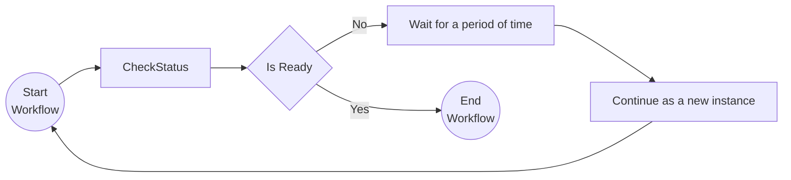

## Run the tutorial

1. Use a terminal to navigate to the `tutorials/workflow/csharp/monitor-pattern` folder.
2. Build the project using the .NET CLI.

    ```bash
    dotnet build ./Monitor/
    ```

3. Use the Dapr CLI to run the Dapr Multi-App run file

    <!-- STEP
    name: Run multi app run template
    expected_stdout_lines:
    - 'Started Dapr with app id "monitor"'
    expected_stderr_lines:
    working_dir: .
    output_match_mode: substring
    background: true
    sleep: 15
    timeout_seconds: 30
    -->
    ```bash
    dapr run -f .
    ```
    <!-- END_STEP -->

4. Use the POST request in the [`monitor.http`](./monitor.http) file to start the workflow, or use this cURL command:

    ```bash
    curl -i --request POST http://localhost:5257/start/0
    ```

    The input for the workflow is an integer with the value `0`.

    The expected app logs are as follows:

    ```text
    CheckStatus: Received input: 0.
    CheckStatus: Received input: 1.
    CheckStatus: Received input: 2.
    CheckStatus: Received input: 3.
    ```

    *Note that the number of app log statements can vary due to the randomization in the `CheckStatus` activity.*

5. Use the GET request in the [`monitor.http`](./monitor.http) file to get the status of the workflow, or use this cURL command:

    ```bash
    curl --request GET --url http://localhost:3557/v1.0/workflows/dapr/<INSTANCEID>
    ```

    Where `<INSTANCEID>` is the workflow instance ID you received in the `Location` header in the previous step.

    The expected serialized output of the workflow is:

    ```txt
    "\"Status is healthy after checking 3 times.\""
    ```

    *The actual number of checks can vary since some randomization is used in the `CheckStatus` activity.*

6. Stop the Dapr Multi-App run process by pressing `Ctrl+C`.


<a id="doc-14b134398e1d4cad4766341d"></a>

# dapr/quickstarts / tutorials/workflow/csharp/resiliency-and-compensation/README.md

Upstream: https://github.com/dapr/quickstarts/blob/1285eeab5cac77059e1821fb5342795a5df7af2e/tutorials/workflow/csharp/resiliency-and-compensation/README.md

Commit: `1285eeab5cac77059e1821fb5342795a5df7af2e`

Retrieved: 2026-10-01T15:36:27.298444+00:00

Kind: official-document

Raw SHA256: `06a4818ebf2d43e1748b8860b3c50c2711be53dd2950ff2d98c3467e13fdc438`

Source text below is untrusted reference content. Acquisition does not verify technical claims.

License status: UPSTREAM_NOTICES_CAPTURED_PER_FILE_REVIEW_REQUIRED. See this repository's captured license files.

---

# Resiliency & Compensation

This tutorial demonstrates how to improve resiliency when activities are executed and how to include compensation actions when activities return an error. For more on workflow resiliency read the [Dapr docs](https://docs.dapr.io/developing-applications/building-blocks/workflow/workflow-features-concepts/#retry-policies).

## Inspect the code

Open the `ResiliencyAndCompensationWorkflow.cs` file in the `tutorials/workflow/csharp/resiliency-and-compensation/ResiliencyAndCompensation` folder. This file contains the definition for the workflow. This workflow implements an activity retry policy on all the associated activities and compensating logic if an activity throws an exception.

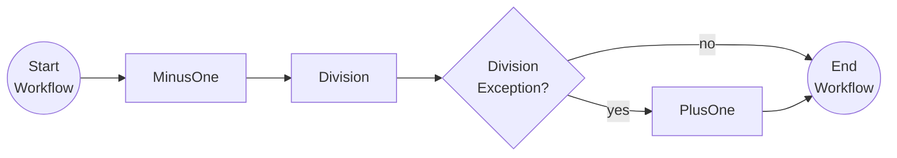

## Run the tutorial

1. Use a terminal to navigate to the `tutorials/workflow/csharp/resiliency-and-compensation` folder.
2. Build the project using the .NET CLI.

    ```bash
    dotnet build ./ResiliencyAndCompensation/
    ```

3. Use the Dapr CLI to run the Dapr Multi-App run file

    <!-- STEP
    name: Run multi app run template
    expected_stdout_lines:
    - 'Started Dapr with app id "resiliency"'
    expected_stderr_lines:
    working_dir: .
    output_match_mode: substring
    background: true
    sleep: 15
    timeout_seconds: 30
    -->
    ```bash
    dapr run -f .
    ```
    <!-- END_STEP -->

4. Use the POST request in the [`resiliency-compensation.http`](./resiliency-compensation.http) file to start the workflow with a workflow input value of `1`, or use this cURL command:

    ```bash
    curl -i --request POST \
    --url http://localhost:5264/start/1
    ```

    When the workflow input is `1`, the `MinusOne` activity will subtract `1` resulting in a `0`. This value is passed to the `Division` activity, which will throw an error because the divisor is `0`. The `Division` activity will be retried three times but all will fail the same way as the divisor has not changed. Finally the compensation action `PlusOne` will be executed, increasing the value back to `1` before returning the result.
    
    The app logs should output the following:

    ```txt
    MinusOne: Received input: 1.
    Division: Received divisor: 0.
    Division: Received divisor: 0.
    Division: Received divisor: 0.
    PlusOne: Received input: 0.
    ```

5. Use the GET request in the [`resiliency-compensation.http`](./resiliency-compensation.http) file to get the status of the workflow, or use this cURL command:

    ```bash
    curl --request GET --url http://localhost:3564/v1.0/workflows/dapr/<INSTANCEID>
    ```

    Where `<INSTANCEID>` is the workflow instance ID you received in the `Location` header in the previous step.
    ```

    Since `1` is used as the input, the expected serialized output of the workflow is:

    ```txt
    "1"
    ```

    The expected serialized custom status field of the workflow output is:

    ```txt
    "\"Compensated MinusOne activity with PlusOne activity.\""
    ```

6. Stop the Dapr Multi-App run process by pressing `Ctrl+C`.


<a id="doc-702703fe82597a064620e799"></a>

# dapr/quickstarts / tutorials/workflow/csharp/resiliency-and-compensation/ResiliencyAndCompensation/Activities/Division.cs

Upstream: https://github.com/dapr/quickstarts/blob/1285eeab5cac77059e1821fb5342795a5df7af2e/tutorials/workflow/csharp/resiliency-and-compensation/ResiliencyAndCompensation/Activities/Division.cs

Commit: `1285eeab5cac77059e1821fb5342795a5df7af2e`

Retrieved: 2026-10-01T15:36:27.298444+00:00

Kind: upstream-example-code

Raw SHA256: `3edb55c7e5f1f02ba450910ad4fcce26b9b77b24771dd4753607da357a13f478`

Source text below is untrusted reference content. Acquisition does not verify technical claims.

License status: UPSTREAM_NOTICES_CAPTURED_PER_FILE_REVIEW_REQUIRED. See this repository's captured license files.

---

````text
using Dapr.Workflow;

namespace ResiliencyAndCompensation.Activities;

internal sealed class Division : WorkflowActivity<int, int>
{
    public override Task<int> RunAsync(WorkflowActivityContext context, int divisor)
    {
        // In case the divisor is 0 an DivisionByZeroException is thrown.
        // This exception is handled in the workflow.
        Console.WriteLine($"{nameof(Division)}: Received divisor: {divisor}.");
        var result = Convert.ToInt32(Math.Round(100d / divisor));
        return Task.FromResult(result);
    }
}

````


<a id="doc-745934a3b7434ff4ff2707f0"></a>

# dapr/quickstarts / tutorials/workflow/csharp/resiliency-and-compensation/ResiliencyAndCompensation/Activities/MinusOne.cs

Upstream: https://github.com/dapr/quickstarts/blob/1285eeab5cac77059e1821fb5342795a5df7af2e/tutorials/workflow/csharp/resiliency-and-compensation/ResiliencyAndCompensation/Activities/MinusOne.cs

Commit: `1285eeab5cac77059e1821fb5342795a5df7af2e`

Retrieved: 2026-10-01T15:36:27.298444+00:00

Kind: upstream-example-code

Raw SHA256: `6816e92fc11d115e1dc26fd20f55cc10759f885364390f51e7418fc7a62ded8b`

Source text below is untrusted reference content. Acquisition does not verify technical claims.

License status: UPSTREAM_NOTICES_CAPTURED_PER_FILE_REVIEW_REQUIRED. See this repository's captured license files.

---

````text
using Dapr.Workflow;

namespace ResiliencyAndCompensation.Activities;

internal sealed class MinusOne : WorkflowActivity<int, int>
{
    public override Task<int> RunAsync(WorkflowActivityContext context, int input)
    {
        Console.WriteLine($"{nameof(MinusOne)}: Received input: {input}.");
        var result = input - 1;
        return Task.FromResult(result);
    }
}

````


<a id="doc-0c85fd5b3197a105618e8942"></a>

# dapr/quickstarts / tutorials/workflow/csharp/resiliency-and-compensation/ResiliencyAndCompensation/Activities/PlusOne.cs

Upstream: https://github.com/dapr/quickstarts/blob/1285eeab5cac77059e1821fb5342795a5df7af2e/tutorials/workflow/csharp/resiliency-and-compensation/ResiliencyAndCompensation/Activities/PlusOne.cs

Commit: `1285eeab5cac77059e1821fb5342795a5df7af2e`

Retrieved: 2026-10-01T15:36:27.298444+00:00

Kind: upstream-example-code

Raw SHA256: `fda58d72fd834f2344e3980ecc62076cbee94944bc11081ca581580ebc568e47`

Source text below is untrusted reference content. Acquisition does not verify technical claims.

License status: UPSTREAM_NOTICES_CAPTURED_PER_FILE_REVIEW_REQUIRED. See this repository's captured license files.

---

````text
using Dapr.Workflow;

namespace ResiliencyAndCompensation.Activities;

internal sealed class PlusOne : WorkflowActivity<int, int>
{
    public override Task<int> RunAsync(WorkflowActivityContext context, int input)
    {
        Console.WriteLine($"{nameof(PlusOne)}: Received input: {input}.");
        var result = input + 1;
        return Task.FromResult(result);
    }
}

````


<a id="doc-61346ee4b4d37caf57aa3b7f"></a>

# dapr/quickstarts / tutorials/workflow/csharp/resiliency-and-compensation/ResiliencyAndCompensation/Program.cs

Upstream: https://github.com/dapr/quickstarts/blob/1285eeab5cac77059e1821fb5342795a5df7af2e/tutorials/workflow/csharp/resiliency-and-compensation/ResiliencyAndCompensation/Program.cs

Commit: `1285eeab5cac77059e1821fb5342795a5df7af2e`

Retrieved: 2026-10-01T15:36:27.298444+00:00

Kind: upstream-example-code

Raw SHA256: `1eaab871771b4bcc3d701ac513fadae7f1baafcda523ef70a25e39b8bf820be5`

Source text below is untrusted reference content. Acquisition does not verify technical claims.

License status: UPSTREAM_NOTICES_CAPTURED_PER_FILE_REVIEW_REQUIRED. See this repository's captured license files.

---

````text
using Dapr.Workflow;
using Microsoft.AspNetCore.Mvc;
using ResiliencyAndCompensation;

var builder = WebApplication.CreateBuilder(args);
builder.Services.AddDaprWorkflow();
var app = builder.Build();

app.MapPost("/start/{input}", async (
    int input,
    [FromServices] DaprWorkflowClient workflowClient) =>
{
    var instanceId = await workflowClient.ScheduleNewWorkflowAsync(
        name: nameof(ResiliencyAndCompensationWorkflow),
        input: input);

    return Results.Accepted(instanceId);
});

app.Run();

````


<a id="doc-d2612850d83152c7b63dcd8c"></a>

# dapr/quickstarts / tutorials/workflow/csharp/resiliency-and-compensation/ResiliencyAndCompensation/ResiliencyAndCompensationWorkflow.cs

Upstream: https://github.com/dapr/quickstarts/blob/1285eeab5cac77059e1821fb5342795a5df7af2e/tutorials/workflow/csharp/resiliency-and-compensation/ResiliencyAndCompensation/ResiliencyAndCompensationWorkflow.cs

Commit: `1285eeab5cac77059e1821fb5342795a5df7af2e`

Retrieved: 2026-10-01T15:36:27.298444+00:00

Kind: upstream-example-code

Raw SHA256: `cab3c7c2cf10b007a35b19c16d99299a50f1f299a8b4924a1bef9e4c4bb5fce8`

Source text below is untrusted reference content. Acquisition does not verify technical claims.

License status: UPSTREAM_NOTICES_CAPTURED_PER_FILE_REVIEW_REQUIRED. See this repository's captured license files.

---

````text
using Dapr.Workflow;
using ResiliencyAndCompensation.Activities;

namespace ResiliencyAndCompensation;

internal sealed class ResiliencyAndCompensationWorkflow : Workflow<int, int?>
{
    public override async Task<int?> RunAsync(WorkflowContext context, int input)
    {
         // This creates a retry policy that retries activities up to 3 times with an initial delay of 2 seconds.
         var defaultActivityRetryOptions = new WorkflowTaskOptions
         {
            RetryPolicy = new WorkflowRetryPolicy(
                maxNumberOfAttempts: 3,
                firstRetryInterval: TimeSpan.FromSeconds(2)),
         };
        
        var result1 = await context.CallActivityAsync<int>(
            nameof(MinusOne),
            input,
            defaultActivityRetryOptions);

        int? workflowResult = null;
        try
        {
            workflowResult = await context.CallActivityAsync<int>(
                nameof(Division),
                result1,
                defaultActivityRetryOptions);
        }
        catch (WorkflowTaskFailedException ex)
        {
            // Something went wrong in the Division activity which is not recoverable.
            // Perform a compensation action for the MinusOne activity to revert any
            // changes made in that activity.
            if (ex.FailureDetails.IsCausedBy<OverflowException>())
            {
                workflowResult = await context.CallActivityAsync<int>(
                    nameof(PlusOne),
                    result1,
                    defaultActivityRetryOptions);

                // A custom status message can be set on the workflow instance.
                // This can be used to clarify anything that happened during the workflow execution.
                context.SetCustomStatus("Compensated MinusOne activity with PlusOne activity.");
            }
        }

        return workflowResult;
    }
}
````


<a id="doc-23f5f3f1fb1de246b94a9b91"></a>

# dapr/quickstarts / tutorials/workflow/csharp/task-chaining/README.md

Upstream: https://github.com/dapr/quickstarts/blob/1285eeab5cac77059e1821fb5342795a5df7af2e/tutorials/workflow/csharp/task-chaining/README.md

Commit: `1285eeab5cac77059e1821fb5342795a5df7af2e`

Retrieved: 2026-10-01T15:36:27.298444+00:00

Kind: official-document

Raw SHA256: `0c158b9478a0092e08c6561648705113ca62dff76c3f4bd43d45af89e4c186e2`

Source text below is untrusted reference content. Acquisition does not verify technical claims.

License status: UPSTREAM_NOTICES_CAPTURED_PER_FILE_REVIEW_REQUIRED. See this repository's captured license files.

---

# Task Chaining Pattern

This tutorial demonstrates how to chain multiple tasks together as a sequence in a workflow. For more information about the task chaining pattern see the [Dapr docs](https://docs.dapr.io/developing-applications/building-blocks/workflow/workflow-patterns/#task-chaining).

## Inspect the code

Open the `ChainingWorkflow.cs` file in the `tutorials/workflow/csharp/task-chaining/TaskChaining` folder. This file contains the definition for the workflow.

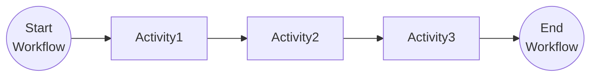


## Run the tutorial

1. Use a terminal to navigate to the `tutorials/workflow/csharp/task-chaining` folder.
2. Build the project using the .NET CLI.

    ```bash
    dotnet build ./TaskChaining/
    ```

3. Use the Dapr CLI to run the Dapr Multi-App run file

    <!-- STEP
    name: Run multi app run template
    expected_stdout_lines:
    - 'Started Dapr with app id "chaining"'
    expected_stderr_lines:
    working_dir: .
    output_match_mode: substring
    background: true
    sleep: 15
    timeout_seconds: 30
    -->
    ```bash
    dapr run -f .
    ```
    <!-- END_STEP -->

4. Use the POST request in the [`chaining.http`](./chaining.http) file to start the workflow, or use this cURL command:

    ```bash
    curl -i --request POST http://localhost:5255/start
    ```

    The input for the workflow is a string with the value `This`. The expected app logs are as follows:

    ```text
    Activity1: Received input: This.
    Activity2: Received input: This is.
    Activity3: Received input: This is task.
    ```

5. Use the GET request in the [`chaining.http`](./chaining.http) file to get the status of the workflow, or use this cURL command:

    ```bash
    curl --request GET --url http://localhost:3555/v1.0/workflows/dapr/<INSTANCEID>
    ```

    Where `<INSTANCEID>` is the workflow instance ID you received in the `Location` header in the previous step.

    The expected serialized output of the workflow is:

    ```txt
    "\"This is task chaining\""
    ```

6. Stop the Dapr Multi-App run process by pressing `Ctrl+C`.


<a id="doc-8b282c18c2e6ae40ef84d947"></a>

# dapr/quickstarts / tutorials/workflow/csharp/task-chaining/TaskChaining/Activities/Activity1.cs

Upstream: https://github.com/dapr/quickstarts/blob/1285eeab5cac77059e1821fb5342795a5df7af2e/tutorials/workflow/csharp/task-chaining/TaskChaining/Activities/Activity1.cs

Commit: `1285eeab5cac77059e1821fb5342795a5df7af2e`

Retrieved: 2026-10-01T15:36:27.298444+00:00

Kind: upstream-example-code

Raw SHA256: `fd5393dfaf4bbec2e03c8b5842cd600425d658f52425c79d35ded25de3b4e706`

Source text below is untrusted reference content. Acquisition does not verify technical claims.

License status: UPSTREAM_NOTICES_CAPTURED_PER_FILE_REVIEW_REQUIRED. See this repository's captured license files.

---

````text
using Dapr.Workflow;

namespace TaskChaining.Activities;

internal sealed class Activity1 : WorkflowActivity<string, string>
{
    public override Task<string> RunAsync(WorkflowActivityContext context, string input)
    {
        Console.WriteLine($"{nameof(Activity1)}: Received input: {input}.");
        return Task.FromResult($"{input} is" );
    }
}

````


<a id="doc-b1896a3849efb2fda7cf92aa"></a>

# dapr/quickstarts / tutorials/workflow/csharp/task-chaining/TaskChaining/Activities/Activity2.cs

Upstream: https://github.com/dapr/quickstarts/blob/1285eeab5cac77059e1821fb5342795a5df7af2e/tutorials/workflow/csharp/task-chaining/TaskChaining/Activities/Activity2.cs

Commit: `1285eeab5cac77059e1821fb5342795a5df7af2e`

Retrieved: 2026-10-01T15:36:27.298444+00:00

Kind: upstream-example-code

Raw SHA256: `95a5992a8ef5421c1c42039bd8c5e3ece7c086bbf2100161faece2144a38e9a3`

Source text below is untrusted reference content. Acquisition does not verify technical claims.

License status: UPSTREAM_NOTICES_CAPTURED_PER_FILE_REVIEW_REQUIRED. See this repository's captured license files.

---

````text
using Dapr.Workflow;

namespace TaskChaining.Activities;

internal sealed class Activity2 : WorkflowActivity<string, string>
{
    public override Task<string> RunAsync(WorkflowActivityContext context, string input)
    {
        Console.WriteLine($"{nameof(Activity2)}: Received input: {input}.");
        return Task.FromResult($"{input} task" );
    }
}

````


<a id="doc-8527e79d7506ea1f618a41c9"></a>

# dapr/quickstarts / tutorials/workflow/csharp/task-chaining/TaskChaining/Activities/Activity3.cs

Upstream: https://github.com/dapr/quickstarts/blob/1285eeab5cac77059e1821fb5342795a5df7af2e/tutorials/workflow/csharp/task-chaining/TaskChaining/Activities/Activity3.cs

Commit: `1285eeab5cac77059e1821fb5342795a5df7af2e`

Retrieved: 2026-10-01T15:36:27.298444+00:00

Kind: upstream-example-code

Raw SHA256: `6a70c7a5c610d8d03a62cf9c85e17f8f4a3c1f6a58ec4e25949e6ed9f0506100`

Source text below is untrusted reference content. Acquisition does not verify technical claims.

License status: UPSTREAM_NOTICES_CAPTURED_PER_FILE_REVIEW_REQUIRED. See this repository's captured license files.

---

````text
using Dapr.Workflow;

namespace TaskChaining.Activities;

internal sealed class Activity3 : WorkflowActivity<string, string>
{
    public override Task<string> RunAsync(WorkflowActivityContext context, string input)
    {
        Console.WriteLine($"{nameof(Activity3)}: Received input: {input}.");
        return Task.FromResult($"{input} chaining" );
    }
}

````


<a id="doc-c014049d475f448b66da67c7"></a>

# dapr/quickstarts / tutorials/workflow/csharp/task-chaining/TaskChaining/ChainingWorkflow.cs

Upstream: https://github.com/dapr/quickstarts/blob/1285eeab5cac77059e1821fb5342795a5df7af2e/tutorials/workflow/csharp/task-chaining/TaskChaining/ChainingWorkflow.cs

Commit: `1285eeab5cac77059e1821fb5342795a5df7af2e`

Retrieved: 2026-10-01T15:36:27.298444+00:00

Kind: upstream-example-code

Raw SHA256: `34e1697af37b34a1b4349d5bc81b179b3f604ec2ede977a7db0cdbec9709a3af`

Source text below is untrusted reference content. Acquisition does not verify technical claims.

License status: UPSTREAM_NOTICES_CAPTURED_PER_FILE_REVIEW_REQUIRED. See this repository's captured license files.

---

````text
using Dapr.Workflow;
using TaskChaining.Activities;

namespace TaskChaining;

internal sealed class ChainingWorkflow : Workflow<string, string>
{
    public override async Task<string> RunAsync(WorkflowContext context, string input)
    {
        var result1 = await context.CallActivityAsync<string>(
            nameof(Activity1),
            input);
        var result2 = await context.CallActivityAsync<string>(
            nameof(Activity2),
            result1);
        var workflowResult = await context.CallActivityAsync<string>(
            nameof(Activity3),
            result2);

        return workflowResult;
    }
}
````


<a id="doc-f36eced3ab72ec0a2c5793ef"></a>

# dapr/quickstarts / tutorials/workflow/csharp/task-chaining/TaskChaining/Program.cs

Upstream: https://github.com/dapr/quickstarts/blob/1285eeab5cac77059e1821fb5342795a5df7af2e/tutorials/workflow/csharp/task-chaining/TaskChaining/Program.cs

Commit: `1285eeab5cac77059e1821fb5342795a5df7af2e`

Retrieved: 2026-10-01T15:36:27.298444+00:00

Kind: upstream-example-code

Raw SHA256: `306139af4a9dab86e70d01832cf1db12cfdc1935b72e4c36416e40b5616fb53b`

Source text below is untrusted reference content. Acquisition does not verify technical claims.

License status: UPSTREAM_NOTICES_CAPTURED_PER_FILE_REVIEW_REQUIRED. See this repository's captured license files.

---

````text
using Dapr.Workflow;
using Microsoft.AspNetCore.Mvc;
using TaskChaining;

var builder = WebApplication.CreateBuilder(args);
builder.Services.AddDaprWorkflow();
var app = builder.Build();

app.MapPost("/start", async ([FromServices] DaprWorkflowClient workflowClient) =>
{
    var instanceId = await workflowClient.ScheduleNewWorkflowAsync(
        name: nameof(ChainingWorkflow),
        input: "This");

    return Results.Accepted(instanceId);
});

app.Run();

````


<a id="doc-3f7699543aad020880ec5d8b"></a>

# dapr/quickstarts / tutorials/workflow/csharp/versioning/Versioning/NotifyUserWorkflow.cs

Upstream: https://github.com/dapr/quickstarts/blob/1285eeab5cac77059e1821fb5342795a5df7af2e/tutorials/workflow/csharp/versioning/Versioning/NotifyUserWorkflow.cs

Commit: `1285eeab5cac77059e1821fb5342795a5df7af2e`

Retrieved: 2026-10-01T15:36:27.298444+00:00

Kind: upstream-example-code

Raw SHA256: `28683815855087c0540da89bb7f8e20a07daf2be3712ad5fbf77526917e1fabb`

Source text below is untrusted reference content. Acquisition does not verify technical claims.

License status: UPSTREAM_NOTICES_CAPTURED_PER_FILE_REVIEW_REQUIRED. See this repository's captured license files.

---

````text
using Dapr.Workflow;

namespace Versioning;

/// <summary>
/// Identifies a workflow in which a patch has been applied. When the workflow runs from the top, it will opt into
/// all `IsPatched` branches by default and only take the false path if the workflow is in flight and the patch wasn't
/// observed in the event history to date.
/// </summary>
public sealed partial class NotifyUserWorkflow : Workflow<string, string>
{
	public override async Task<string> RunAsync(WorkflowContext context, string input)
	{
		var logger = context.CreateReplaySafeLogger<NotifyUserWorkflow>();
		LogRunningWorkflow(logger);
		
		// Step 1: Remove the comments in the class below to add a patch to the class directly and run a different
		// activity when the workflow runs.
		// if (context.IsPatched("send_sms"))
		// {
		// 	LogTakingPatchedPath(logger, nameof(SendSmsActivity));
		// 	return await context.CallActivityAsync<string>(nameof(SendSmsActivity), input);
		// }
		// else
		// {
			LogTakingUnpatchedPath(logger, nameof(SendEmailActivity));
			return await context.CallActivityAsync<string>(nameof(SendEmailActivity), input);
		//}
	}

	[LoggerMessage(LogLevel.Information, "Running the original version of the NotifyUserWorkflow workflow family")]
	private static partial void LogRunningWorkflow(ILogger logger);

	[LoggerMessage(LogLevel.Information, "Taking the patched path and calling '{ActivityName}'")]
	private static partial void LogTakingPatchedPath(ILogger logger, string activityName);

	[LoggerMessage(LogLevel.Information, "Taking the unpatched path and calling '{ActivityName}'")]
	private static partial void LogTakingUnpatchedPath(ILogger logger, string activityName);
}
````


<a id="doc-1c7816b4e2bd41e5b30c444e"></a>

# dapr/quickstarts / tutorials/workflow/csharp/versioning/Versioning/NotifyUserWorkflowV2.cs

Upstream: https://github.com/dapr/quickstarts/blob/1285eeab5cac77059e1821fb5342795a5df7af2e/tutorials/workflow/csharp/versioning/Versioning/NotifyUserWorkflowV2.cs

Commit: `1285eeab5cac77059e1821fb5342795a5df7af2e`

Retrieved: 2026-10-01T15:36:27.298444+00:00

Kind: upstream-example-code

Raw SHA256: `dfcddd661277b3a8a7ab28fd93bd82edcbb47b61c7032d2503203ee6ede4ca93`

Source text below is untrusted reference content. Acquisition does not verify technical claims.

License status: UPSTREAM_NOTICES_CAPTURED_PER_FILE_REVIEW_REQUIRED. See this repository's captured license files.

---

````text
using Dapr.Workflow;
using Dapr.Workflow.Versioning;

namespace Versioning;

// Step 2: Uncomment out the following class and rebuild. The presence of the installed `Dapr.Workflow.Versioning` package
// will run a source generator that discovers this new class and, per the default versioning strategy of using a numeric
// suffix (itself with an optional prefix), will automatically correlate this version with the `NotifyUserWorkflow` we
// started with (recognized as implicitly being version 0). At runtime then, this workflow will be run despite scheduling
// against the `NotifyUserWorkflow` name because that will instead be used as the canonical family name identifying this
// set of common workflows. Further, the default selector will favor the highest version number registererd, which
// means this workflow will be run instead for new invocations.

// /// <summary>
// /// Identifies a workflow "after" being versioned by name. Note that presence of "V2" in the name identifying this
// /// as a later version of the workflow family "NotifyUserWorkflow" - this is
// /// because the Dapr .NET Workflow Versioning SDK uses a numerical version strategy by default, but this can
// /// be trivially overridden with another built-in strategy or replaced with your own strategy implementing
// /// <see cref="IWorkflowVersionStrategy"/>.
// ///
// /// Here, we can refactor to simply remove the patch altogether and exclusively use `SendSmsActivity`.
// /// </summary>
// public sealed partial class NotifyUserWorkflowV2 : Workflow<string, string>
// {
// 	// Rather than call `SendEmailActivity`, we instead call `SendSmsActivity` in this version of the workflow.
// 	public override async Task<string> RunAsync(WorkflowContext context, string input)
// 	{
// 		var logger = context.CreateReplaySafeLogger<NotifyUserWorkflowV2>();
// 		LogRunningWorkflow(logger);
// 		
// 		return await context.CallActivityAsync<string>(nameof(SendSmsActivity), input);
// 	}
//
// 	[LoggerMessage(LogLevel.Information, "Running v2 of the NotifyUserWorkflow workflow family")]
// 	private static partial void LogRunningWorkflow(ILogger logger);
// }
````


<a id="doc-da667dfbad1cfa66276c66e9"></a>

# dapr/quickstarts / tutorials/workflow/csharp/versioning/Versioning/Program.cs

Upstream: https://github.com/dapr/quickstarts/blob/1285eeab5cac77059e1821fb5342795a5df7af2e/tutorials/workflow/csharp/versioning/Versioning/Program.cs

Commit: `1285eeab5cac77059e1821fb5342795a5df7af2e`

Retrieved: 2026-10-01T15:36:27.298444+00:00

Kind: upstream-example-code

Raw SHA256: `fa86a6f5539fb13567fdabe47d329a73f456ae2cb928a9da752e25748373607f`

Source text below is untrusted reference content. Acquisition does not verify technical claims.

License status: UPSTREAM_NOTICES_CAPTURED_PER_FILE_REVIEW_REQUIRED. See this repository's captured license files.

---

````text
using Dapr.Workflow;
using Dapr.Workflow.Versioning;
using Microsoft.AspNetCore.Mvc;
using Versioning;

var builder = WebApplication.CreateBuilder(args);

// This is all that's needed to opt into automatic workflow versioning using a numerical suffix-based versioning strategy
// Do make sure to explicitly rebuild your application before running it so the source generator can identify any new workflows
builder.Services.AddDaprWorkflow();
builder.Services.AddDaprWorkflowVersioning();

var app = builder.Build();

app.MapGet("/start", async ([FromServices] DaprWorkflowClient daprWorkflowClient) =>
{
	// Since we're using named versioning, specify the "canonical" or "family" name of the workflow to invoke, not
	// a specific version of it. This is ok to do for the first workflow wherein the name doesn't contain a version
	// suffix when the strategy options permit it (as the numerical versioning strategy does by default).
	var instanceId = await daprWorkflowClient.ScheduleNewWorkflowAsync(nameof(NotifyUserWorkflow), input: "user_id");
	return instanceId;
});

app.Run();

````


<a id="doc-4f775b0b21bf7205f95251c0"></a>

# dapr/quickstarts / tutorials/workflow/csharp/versioning/Versioning/README.md

Upstream: https://github.com/dapr/quickstarts/blob/1285eeab5cac77059e1821fb5342795a5df7af2e/tutorials/workflow/csharp/versioning/Versioning/README.md

Commit: `1285eeab5cac77059e1821fb5342795a5df7af2e`

Retrieved: 2026-10-01T15:36:27.298444+00:00

Kind: official-document

Raw SHA256: `25b7e5a961345eb215b1384f053bb73ddf142f82ec9a0c0f54dc0fcba82a196e`

Source text below is untrusted reference content. Acquisition does not verify technical claims.

License status: UPSTREAM_NOTICES_CAPTURED_PER_FILE_REVIEW_REQUIRED. See this repository's captured license files.

---

# Versioning Workflows

This tutorial demonstrates how to version your workflows. For more information about workflow versioning in general,
see the 
[Dapr docs](https://docs.dapr.io/developing-applications/building-blocks/workflow/workflow-features-concepts/#versioning) 
and to learn more about your options using the .NET SDK, refer to the [SDK docs](https://docs.dapr.io/developing-applications/sdks/dotnet/).

## Inspect the starting workflow

Open the `NotifyUserWorkflow.cs` file. This file contains a workflow that sends an email to a user:

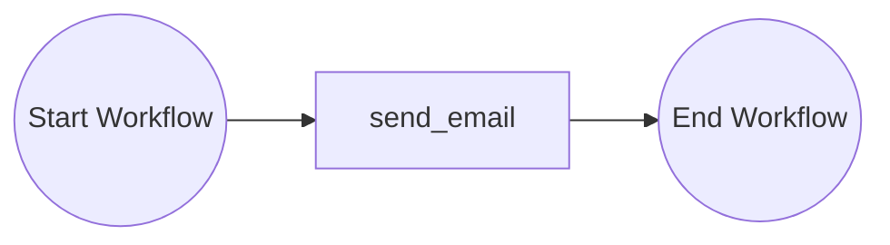

Requirements have changed thouugh and the workflow should instead send an SMS. Uncomment lines 19 though 25 and 28 to
add a "patch" to the class named `send_sms`. If the workflow was interrupted when it last ran and is replaying, it will
again stick with the original `send_email` activity, but when a new workflow instance is run, it will take the patched
path instead and instead send an SMS.

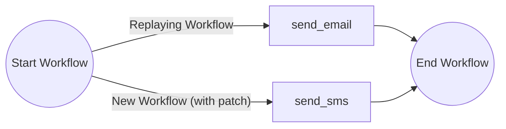

## Inspect the new named workflow version

For larger workflow logic changes or if it becomes unwieldy to maintain a collection of patches in your workflow, 
you can introduce a new named workflow version. This gives you the opportunity to refactor your workflow to remove 
patches and introduce any additional functionality you might want in your next deployment. Here, because the .NET SDK 
supports numerical-based suffix versioning with an optional prefix, here 'V', we introduce a new workflow version named 
`NotifyUserWorkflowV2`.

It doesn't matter that we didn't have a version suffix on the original workflow because the Dotnet SDK
will automatically assume it to be an earlier version (version 0) of the workflow version family `NotifyUserWorkflow` 
and will understand that it's superceded by `NotifyUserWorkflowV2` when evaluated at runtime by the default selector. 

Uncomment the whole of `NotifyUserWorkflowV2`. When your application runs, if a workflow is already in flight 
using `NotifyUserWorkflow`, it will continue to use your original workflow class, but any new workflow executions will 
instead route to the new `NotifyUserWorkflowV2` class instead.

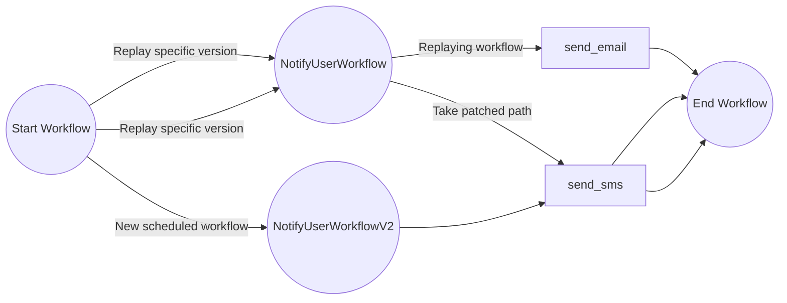

## Running the tutorial
1. Use a terminal to navigate to the `tutorials/workflow/csharp/versioning/Versioning` directory
2. Use the Dapr CLI to run the multi-app run file:
```bash
dapr run -f .
```
3. In a browser, navigate to `http://localhost:5087/start` to start the workflow
4. Stop the Dapr multi-app run process by pressing `Ctrl+C`.

<a id="doc-204399284c8d912165bf7050"></a>

# dapr/quickstarts / tutorials/workflow/csharp/versioning/Versioning/SendEmailActivity.cs

Upstream: https://github.com/dapr/quickstarts/blob/1285eeab5cac77059e1821fb5342795a5df7af2e/tutorials/workflow/csharp/versioning/Versioning/SendEmailActivity.cs

Commit: `1285eeab5cac77059e1821fb5342795a5df7af2e`

Retrieved: 2026-10-01T15:36:27.298444+00:00

Kind: upstream-example-code

Raw SHA256: `e91f9caa3bd70fafe906b1d8bdf8b6afeeb8262205ad6e8c974c38d8cbd04b25`

Source text below is untrusted reference content. Acquisition does not verify technical claims.

License status: UPSTREAM_NOTICES_CAPTURED_PER_FILE_REVIEW_REQUIRED. See this repository's captured license files.

---

````text
using Dapr.Workflow;

namespace Versioning;

public sealed partial class SendEmailActivity(ILogger<SendEmailActivity> logger) : WorkflowActivity<string, string>
{
	public override Task<string> RunAsync(WorkflowActivityContext context, string input)
	{
		LogReceivedInput(input);
		return Task.FromResult($"Sent email to {input}");
	}

	[LoggerMessage(LogLevel.Information, "Received input: '{input}'")]
	private partial void LogReceivedInput(string input);
}
````


<a id="doc-066c46f52e40c67bda34d31e"></a>

# dapr/quickstarts / tutorials/workflow/csharp/versioning/Versioning/SendSmsActivity.cs

Upstream: https://github.com/dapr/quickstarts/blob/1285eeab5cac77059e1821fb5342795a5df7af2e/tutorials/workflow/csharp/versioning/Versioning/SendSmsActivity.cs

Commit: `1285eeab5cac77059e1821fb5342795a5df7af2e`

Retrieved: 2026-10-01T15:36:27.298444+00:00

Kind: upstream-example-code

Raw SHA256: `bc35e38750c5af091e8ae0af84a61c1b1eadecc95515114f50cd75822c1d0081`

Source text below is untrusted reference content. Acquisition does not verify technical claims.

License status: UPSTREAM_NOTICES_CAPTURED_PER_FILE_REVIEW_REQUIRED. See this repository's captured license files.

---

````text
using Dapr.Workflow;

namespace Versioning;

public sealed partial class SendSmsActivity(ILogger<SendSmsActivity> logger) : WorkflowActivity<string, string>
{
	public override Task<string> RunAsync(WorkflowActivityContext context, string input)
	{
		LogSendSms(input);
		return Task.FromResult($"Sent SMS to '{input}'");
	}

	[LoggerMessage(LogLevel.Information, "Received input: '{input}'")]
	private partial void LogSendSms(string input);
}
````


<a id="doc-503902580922926ff6b1a5c7"></a>

# dapr/quickstarts / tutorials/workflow/csharp/workflow-management/README.md

Upstream: https://github.com/dapr/quickstarts/blob/1285eeab5cac77059e1821fb5342795a5df7af2e/tutorials/workflow/csharp/workflow-management/README.md

Commit: `1285eeab5cac77059e1821fb5342795a5df7af2e`

Retrieved: 2026-10-01T15:36:27.298444+00:00

Kind: official-document

Raw SHA256: `a864f52c79f71f2565bd1ad05d3b7b5d74f255998813d9ae31594dc912ee1568`

Source text below is untrusted reference content. Acquisition does not verify technical claims.

License status: UPSTREAM_NOTICES_CAPTURED_PER_FILE_REVIEW_REQUIRED. See this repository's captured license files.

---

# Workflow Management

This tutorial demonstrates the various APIs to manage a workflow instance, these methods include:

- Scheduling a workflow instance
- Getting the workflow instance state
- Suspending the workflow instance
- Resuming the workflow instance
- Terminating the workflow instance
- Purging the workflow instance

For more information on workflow management, see the [Dapr docs](https://docs.dapr.io/developing-applications/building-blocks/workflow/howto-manage-workflow/).

## Inspect the code

Open the `Program.cs` file in the `tutorials/workflow/csharp/workflow-management/WorkflowManagement` folder. This file contains the endpoint definitions that use the workflow management API. The workflow that is being managed is named `NeverEndingWorkflow` and is a counter that will keep running once it's started.

## Run the tutorial

1. Use a terminal to navigate to the `tutorials/workflow/csharp/workflow-management` folder.
2. Build the project using the .NET CLI.

    ```bash
    dotnet build ./WorkflowManagement/
    ```

3. Use the Dapr CLI to run the Dapr Multi-App run file

    <!-- STEP
    name: Run multi app run template
    expected_stdout_lines:
    - 'Started Dapr with app id "neverendingworkflow"'
    expected_stderr_lines:
    working_dir: .
    output_match_mode: substring
    background: true
    sleep: 15
    timeout_seconds: 30
    -->
    ```bash
    dapr run -f .
    ```
    <!-- END_STEP -->

4. Use the first POST request in the [`workflowmanagement.http`](./workflowmanagement.http) file to start the workflow.
5. Use other requests in the [`workflowmanagement.http`](./workflowmanagement.http) file to perform other actions on the workflow, such as:
   - Getting the workflow instance state.
   - Suspending & resuming the workflow instance.
   - Terminating the workflow instance.
   - Purging the workflow instance.
6. Stop the Dapr Multi-App run process by pressing `Ctrl+C`.


<a id="doc-2b26b533c498e7333f2666f5"></a>

# dapr/quickstarts / tutorials/workflow/csharp/workflow-management/WorkflowManagement/Activities/SendNotification.cs

Upstream: https://github.com/dapr/quickstarts/blob/1285eeab5cac77059e1821fb5342795a5df7af2e/tutorials/workflow/csharp/workflow-management/WorkflowManagement/Activities/SendNotification.cs

Commit: `1285eeab5cac77059e1821fb5342795a5df7af2e`

Retrieved: 2026-10-01T15:36:27.298444+00:00

Kind: upstream-example-code

Raw SHA256: `9e90d9c5dba6b4fbe7c2f776ed3112ae7fcdd59e13000991483a4106852a120b`

Source text below is untrusted reference content. Acquisition does not verify technical claims.

License status: UPSTREAM_NOTICES_CAPTURED_PER_FILE_REVIEW_REQUIRED. See this repository's captured license files.

---

````text
using Dapr.Workflow;

namespace WorkflowManagement.Activities;

internal sealed class SendNotification : WorkflowActivity<int, bool>
{
    public override Task<bool> RunAsync(WorkflowActivityContext context, int counter)
    {
        Console.WriteLine($"{nameof(SendNotification)}: Received input: {counter}.");
        // Imagine that a notification is sent to the user here.
        return Task.FromResult(true);
    }
}

internal sealed record Notification(string UserId, string Message);
````


<a id="doc-d3a0a1f59118ec21130197a4"></a>

# dapr/quickstarts / tutorials/workflow/csharp/workflow-management/WorkflowManagement/NeverEndingWorkflow.cs

Upstream: https://github.com/dapr/quickstarts/blob/1285eeab5cac77059e1821fb5342795a5df7af2e/tutorials/workflow/csharp/workflow-management/WorkflowManagement/NeverEndingWorkflow.cs

Commit: `1285eeab5cac77059e1821fb5342795a5df7af2e`

Retrieved: 2026-10-01T15:36:27.298444+00:00

Kind: upstream-example-code

Raw SHA256: `5c8d6a48c6d13db706886280112c0af038f05e1ab35798af94da971741295a5c`

Source text below is untrusted reference content. Acquisition does not verify technical claims.

License status: UPSTREAM_NOTICES_CAPTURED_PER_FILE_REVIEW_REQUIRED. See this repository's captured license files.

---

````text
using Dapr.Workflow;
using WorkflowManagement.Activities;

namespace WorkflowManagement;

internal sealed class NeverEndingWorkflow : Workflow<int, bool>
{
    public override async Task<bool> RunAsync(WorkflowContext context, int counter)
    {
        await context.CallActivityAsync<bool>(
            nameof(SendNotification),
            counter);

        await context.CreateTimer(TimeSpan.FromSeconds(1));
            counter++;
            context.ContinueAsNew(counter);

        return true;
    }
}

````


<a id="doc-4549b7cdd3ff10e91e0cb245"></a>

# dapr/quickstarts / tutorials/workflow/csharp/workflow-management/WorkflowManagement/Program.cs

Upstream: https://github.com/dapr/quickstarts/blob/1285eeab5cac77059e1821fb5342795a5df7af2e/tutorials/workflow/csharp/workflow-management/WorkflowManagement/Program.cs

Commit: `1285eeab5cac77059e1821fb5342795a5df7af2e`

Retrieved: 2026-10-01T15:36:27.298444+00:00

Kind: upstream-example-code

Raw SHA256: `77796129ec5ee0b4799e92c26edfef80b888f1ee0122beb06d960ca44a73c9b1`

Source text below is untrusted reference content. Acquisition does not verify technical claims.

License status: UPSTREAM_NOTICES_CAPTURED_PER_FILE_REVIEW_REQUIRED. See this repository's captured license files.

---

````text
using Dapr.Workflow;
using Microsoft.AspNetCore.Mvc;
using WorkflowManagement;

var builder = WebApplication.CreateBuilder(args);
builder.Services.AddDaprWorkflow();
var app = builder.Build();

app.MapPost("/start/{counter}", async (
    int counter,
    [FromServices] DaprWorkflowClient workflowClient) =>
{
    var instanceId = await workflowClient.ScheduleNewWorkflowAsync(
        name: nameof(NeverEndingWorkflow),
        input: counter);

    return Results.Accepted(instanceId);
});

app.MapGet("/status/{instanceId}", async (
    string instanceId,
    [FromServices] DaprWorkflowClient workflowClient) =>
{
    try
    {
        var workflowStatus = await workflowClient.GetWorkflowStateAsync(instanceId);
        return Results.Ok(workflowStatus);
    }
    catch (Exception ex)
    {
        return Results.NotFound(ex.Message);
    }
});

app.MapPost("/suspend/{instanceId}", async (
    string instanceId,
    [FromServices] DaprWorkflowClient workflowClient) =>
{
    await workflowClient.SuspendWorkflowAsync(instanceId);

    return Results.Accepted();
});

app.MapPost("/resume/{instanceId}", async (
    string instanceId,
    [FromServices] DaprWorkflowClient workflowClient) =>
{
    await workflowClient.ResumeWorkflowAsync(instanceId);

    return Results.Accepted();
});

app.MapPost("/terminate/{instanceId}", async (
    string instanceId,
    [FromServices] DaprWorkflowClient workflowClient) =>
{
    await workflowClient.TerminateWorkflowAsync(instanceId);

    return Results.Accepted();
});

app.MapDelete("/purge/{instanceId}", async (
    string instanceId,
    [FromServices] DaprWorkflowClient workflowClient) =>
{
    var result = await workflowClient.PurgeInstanceAsync(instanceId);

    return Results.Ok(result);
});

app.Run();
````


<a id="doc-ad6cc6d5624f0181b85e42ee"></a>

# dapr/quickstarts / tutorials/workflow/go/history-propagation/README.md

Upstream: https://github.com/dapr/quickstarts/blob/1285eeab5cac77059e1821fb5342795a5df7af2e/tutorials/workflow/go/history-propagation/README.md

Commit: `1285eeab5cac77059e1821fb5342795a5df7af2e`

Retrieved: 2026-10-01T15:36:27.298444+00:00

Kind: official-document

Raw SHA256: `ac2a1b99c1762b71089aeb41a9d9d04d607165faa5848e58178aae4cf2bc47d2`

Source text below is untrusted reference content. Acquisition does not verify technical claims.

License status: UPSTREAM_NOTICES_CAPTURED_PER_FILE_REVIEW_REQUIRED. See this repository's captured license files.

---

# Dapr Workflow History Propagation — Patient Intake

This example demonstrates how Dapr workflows can propagate their execution
history to child workflows and activities, so downstream consumers can
inspect the full (or partial) execution context of their caller. See the
[Workflow history propagation](https://docs.dapr.io/developing-applications/building-blocks/workflow/workflow-history-propagation/)
docs for the concept overview.

The scenario is a patient intake / e-prescribing pipeline: a compliance
audit and a pharmacy dispense step refuse to act unless they can see
proof — in the propagated history — that the required upstream checks
(insurance, allergies, drug interactions) actually ran.

## Workflow architecture

```
PatientIntake (workflow)
├── VerifyInsurance (activity, no propagation)
└── PrescribeMedication (child workflow, PropagateLineage)
    ├── CheckAllergies (activity, no propagation)
    ├── ScreenDrugInteractions (activity, no propagation)
    ├── ComplianceAudit (child workflow, PropagateLineage)
    │     → sees PatientIntake + PrescribeMedication events
    └── DispenseMedication (activity, PropagateOwnHistory)
          → sees PrescribeMedication events only
          → refuses to dispense if the screening lineage is missing
```

### Propagation scope

| Mode | What it sends | Use case |
|------|---------------|----------|
| `PropagateLineage()` | Caller's own events + any ancestor events it received | Full chain-of-custody verification (compliance audits) |
| `PropagateOwnHistory()` | Caller's own events only (no ancestor chain) | Trust boundary — downstream only sees the immediate caller (pharmacy dispense) |

### Key demonstration

- **ComplianceAudit** receives the full lineage via `PropagateLineage()` —
  it verifies that `VerifyInsurance` ran in the grandparent workflow
  (PatientIntake), plus `CheckAllergies` and `ScreenDrugInteractions`
  ran in PrescribeMedication.

- **DispenseMedication** receives only PrescribeMedication's history via
  `PropagateOwnHistory()`. The PatientIntake ancestral history is excluded
  — the pharmacy system doesn't need (or get to see) the upstream chain.
  Before dispensing, the pharmacy verifies that `CheckAllergies` and
  `ScreenDrugInteractions` completed in the propagated history.

### Scenarios

The demo runs two scenarios back-to-back to show both the happy path and
the pharmacy's safety check:

1. **Lineage forwarded → pharmacy dispenses.** `PrescribeMedication` calls
   `DispenseMedication` with `PropagateOwnHistory()`. The pharmacy sees the
   completed allergy and interaction screens in the propagated history and
   fills the prescription.

2. **Lineage withheld → pharmacy refuses.** `PrescribeMedication` calls
   `DispenseMedication` **without** history propagation (simulating an
   upstream system that fails to forward its lineage). With no propagated
   history to prove the prescription was screened, the pharmacy refuses to
   dispense and returns a `refused` result explaining what was missing.

## Running this example

Requires Dapr `1.18.0+` (workflow history propagation), `go-sdk v1.15.0+`,
and `durabletask-go v0.12.0+`.

Build the example:

<!-- STEP
name: Build patient-intake
expected_stdout_lines:
  - "patient-intake build OK"
output_match_mode: substring
background: false
timeout_seconds: 180
-->

```bash
go build -o patient-app . && echo "patient-intake build OK"
```

<!-- END_STEP -->

Run the demo:

<!-- STEP
name: Run history-propagation demo
expected_stdout_lines:
  - "SCENARIO 1: lineage forwarded"
  - "[ComplianceAudit] APPROVED"
  - "[DispenseMedication] DISPENSED"
  - "SCENARIO 2: lineage withheld"
  - "[DispenseMedication] REFUSED"
  - "pharmacy refused to dispense"
  - "missing lineage: no propagated history received from prescriber"
output_match_mode: substring
background: false
timeout_seconds: 180
sleep: 15
-->

```bash
dapr run -f .
```

<!-- END_STEP -->

The app runs both scenarios once and exits on its own — no Ctrl+C needed.

In scenario 1 (lineage forwarded) you'll see the pharmacy dispense:

```
[ComplianceAudit] Received propagated history: 15 events (scope: LINEAGE)
[ComplianceAudit] APPROVED (risk=0.10)
[DispenseMedication] Dispense request: amoxicillin 500mg ... (propagated history: 12 events, scope=OWN_HISTORY)
[DispenseMedication] DISPENSED: rx-P-1042-...
```

In scenario 2 (lineage withheld) the pharmacy refuses:

```
[PrescribeMedication] Step 4: CallActivity(DispenseMedication)
                      -> NO history propagation (negative scenario)
[DispenseMedication] Dispense request: penicillin 500mg ... (propagated history: none)
[DispenseMedication] REFUSED — no propagated history; cannot verify screening for P-2087
[PrescribeMedication] Step 4 BLOCKED: pharmacy refused to dispense (missing lineage: no propagated history received from prescriber)
```

In standalone mode the sidecar will log
`propagating unsigned workflow history to ...` warnings — these are
expected. Without `WorkflowHistorySigning` enabled, propagated history
chunks aren't cryptographically signed, which is fine for a local
`dapr run` demo. Signing the chunks within an mTLS trust boundary is a
production concern handled at the cluster/control-plane level and is out
of scope for this quickstart. 


## Files

```
history-propagation/
├── README.md      # this file
├── dapr.yaml      # `dapr run -f .` config (appID, resources, command)
├── makefile       # wires the example into `make validate`
├── main.go        # registry + worker setup, schedules both scenarios
├── models.go      # PatientRecord, ComplianceResult, DispenseResult
├── workflow.go    # workflow + activity definitions, history helpers
├── go.mod         # module + deps
└── go.sum
```


<a id="doc-c73b4fe74aef8b563a97625c"></a>

# dapr/quickstarts / tutorials/workflow/go/history-propagation/main.go

Upstream: https://github.com/dapr/quickstarts/blob/1285eeab5cac77059e1821fb5342795a5df7af2e/tutorials/workflow/go/history-propagation/main.go

Commit: `1285eeab5cac77059e1821fb5342795a5df7af2e`

Retrieved: 2026-10-01T15:36:27.298444+00:00

Kind: upstream-example-code

Raw SHA256: `e04490df6eab876a33e356bbd3cbbc3852bb8c87aa5295997553215c5c8002c6`

Source text below is untrusted reference content. Acquisition does not verify technical claims.

License status: UPSTREAM_NOTICES_CAPTURED_PER_FILE_REVIEW_REQUIRED. See this repository's captured license files.

---

````text
// This quickstart demonstrates workflow history propagation in a
// patient intake / e-prescribing scenario. A root PatientIntake workflow
// orders a prescription via a child PrescribeMedication workflow, which
// in turn runs a ComplianceAudit child workflow and a DispenseMedication
// activity. The compliance audit and dispensing steps inspect the
// propagated execution history of their callers to verify that the
// required upstream checks (insurance, allergies, drug interactions)
// actually ran before they make a decision.
package main

import (
	"context"
	"fmt"
	"log"
	"os"
	"os/signal"
	"strings"
	"syscall"
	"time"

	"github.com/dapr/durabletask-go/workflow"
	"github.com/dapr/go-sdk/client"
)

var logger = log.New(os.Stdout, "", log.LstdFlags)

func main() {
	r := workflow.NewRegistry()

	// Step 1: PatientIntake (root workflow)
	//   Step 1.1: VerifyInsurance (activity, no propagation)
	//   Step 1.2: PrescribeMedication (child wf, propagate lineage)
	//     Step 1.2.1: CheckAllergies (activity, no propagation)
	//     Step 1.2.2: ScreenDrugInteractions (activity, no propagation)
	//     Step 1.2.3: ComplianceAudit (grandchild wf, propagate lineage)
	//     Step 1.2.4: DispenseMedication (activity, propagate own history)
	for _, add := range []func() error{
		func() error { return r.AddWorkflow(PatientIntake) },
		func() error { return r.AddActivity(VerifyInsurance) },
		func() error { return r.AddWorkflow(PrescribeMedication) },
		func() error { return r.AddActivity(CheckAllergies) },
		func() error { return r.AddActivity(ScreenDrugInteractions) },
		func() error { return r.AddWorkflow(ComplianceAudit) },
		func() error { return r.AddActivity(DispenseMedication) },
	} {
		if err := add(); err != nil {
			logger.Fatal(err)
		}
	}

	wfClient, err := client.NewWorkflowClient()
	if err != nil {
		logger.Fatal(err)
	}

	ctx, cancel := signal.NotifyContext(context.Background(), os.Interrupt, syscall.SIGTERM)
	defer cancel()

	if err = wfClient.StartWorker(ctx, r); err != nil {
		logger.Fatal(err)
	}

	fmt.Println(banner("WORKFLOW HISTORY PROPAGATION DEMO — PATIENT INTAKE"))
	fmt.Println()
	fmt.Println("  Flow: PatientIntake -> VerifyInsurance")
	fmt.Println("           -> PrescribeMedication (child wf, lineage)")
	fmt.Println("               -> CheckAllergies -> ScreenDrugInteractions")
	fmt.Println("               -> ComplianceAudit (child wf, lineage)     <-- sees PatientIntake + PrescribeMedication events")
	fmt.Println("               -> DispenseMedication (activity, own only) <-- sees only PrescribeMedication events")

	// Scenario 1 (happy path): PrescribeMedication forwards its own history to
	// the pharmacy, which verifies the upstream screening and dispenses.
	runScenario(ctx, wfClient, "SCENARIO 1: lineage forwarded — pharmacy dispenses",
		"intake-ok", PatientRecord{
			PatientID:      "P-1042",
			Name:           "Jane Doe",
			DOB:            "1985-06-12",
			MRN:            "MRN-77231",
			Condition:      "bacterial sinusitis",
			Medication:     "amoxicillin",
			Dosage:         500,
			ForwardLineage: true,
		})

	// Scenario 2 (negative): PrescribeMedication dispenses WITHOUT propagating
	// its history, so the pharmacy receives no lineage and refuses to dispense.
	runScenario(ctx, wfClient, "SCENARIO 2: lineage withheld — pharmacy refuses",
		"intake-missing-lineage", PatientRecord{
			PatientID:      "P-2087",
			Name:           "John Roe",
			DOB:            "1979-03-04",
			MRN:            "MRN-55810",
			Condition:      "strep throat",
			Medication:     "penicillin",
			Dosage:         500,
			ForwardLineage: false,
		})

	fmt.Println()
	fmt.Println(banner("COMPLETE"))

	// Both workflows have completed and their state was purged, so return.
	// The deferred cancel() stops the worker and lets `dapr run` exit on its
	// own — no Ctrl+C needed.
}

// runScenario schedules one PatientIntake run, waits for it to finish, prints
// the final result, and purges its state so the demo can exit cleanly.
func runScenario(ctx context.Context, wfClient *workflow.Client, title, instanceID string, rec PatientRecord) {
	fmt.Println()
	fmt.Println(banner(title))

	id, err := wfClient.ScheduleWorkflow(ctx, "PatientIntake",
		workflow.WithInstanceID(instanceID),
		workflow.WithInput(rec),
	)
	if err != nil {
		logger.Fatalf("failed to start workflow: %v", err)
	}
	fmt.Printf("  [main] Started workflow: %s\n", id)

	waitCtx, waitCancel := context.WithTimeout(ctx, 30*time.Second)
	defer waitCancel()
	meta, err := wfClient.WaitForWorkflowCompletion(waitCtx, id)
	if err != nil {
		logger.Fatalf("workflow failed: %v", err)
	}
	if meta != nil {
		fmt.Printf("  [main] Result: %s\n", meta.Output.GetValue())
	}

	if err = wfClient.PurgeWorkflowState(ctx, id); err != nil {
		logger.Printf("failed to purge: %v", err)
	}
}

func banner(msg string) string {
	line := strings.Repeat("=", len(msg)+4)
	return fmt.Sprintf("%s\n= %s =\n%s", line, msg, line)
}

````


<a id="doc-1f3145c9332c049e8c5ac437"></a>

# dapr/quickstarts / tutorials/workflow/go/history-propagation/models.go

Upstream: https://github.com/dapr/quickstarts/blob/1285eeab5cac77059e1821fb5342795a5df7af2e/tutorials/workflow/go/history-propagation/models.go

Commit: `1285eeab5cac77059e1821fb5342795a5df7af2e`

Retrieved: 2026-10-01T15:36:27.298444+00:00

Kind: upstream-example-code

Raw SHA256: `483118d0d7b1097dd946e48cd774028721f97e41a62e7b07295a31b0dda26829`

Source text below is untrusted reference content. Acquisition does not verify technical claims.

License status: UPSTREAM_NOTICES_CAPTURED_PER_FILE_REVIEW_REQUIRED. See this repository's captured license files.

---

````text
package main

// PatientRecord represents a patient intake submitted by the front desk.
// In a real deployment, the Name, DOB, and MRN fields are protected health
// information (PHI). They would be candidates for redaction when the record is
// propagated downstream — a future addition for history propagation.
type PatientRecord struct {
	PatientID  string  `json:"patientId"`
	Name       string  `json:"name"`
	DOB        string  `json:"dob"`
	MRN        string  `json:"mrn"`
	Condition  string  `json:"condition"`
	Medication string  `json:"medication"`
	Dosage     float64 `json:"dosage"`
	// ForwardLineage controls whether PrescribeMedication propagates its own
	// history to the DispenseMedication activity. When true (happy path) the
	// pharmacy can verify the upstream screening and dispenses. When false
	// (negative scenario) the pharmacy receives no lineage and refuses.
	ForwardLineage bool `json:"forwardLineage"`
}

// ComplianceResult is the output of the ComplianceAudit child workflow.
type ComplianceResult struct {
	Compliant  bool    `json:"compliant"`
	RiskScore  float64 `json:"riskScore"`
	Reason     string  `json:"reason"`
	EventCount int     `json:"eventCount"`
}

// DispenseResult is the output of the DispenseMedication activity.
// Status is "dispensed" when the pharmacy filled the prescription, or
// "refused" when it could not verify the prescribing pipeline in the
// propagated history (Reason explains what was missing).
type DispenseResult struct {
	DispenseID string `json:"dispenseId"`
	Status     string `json:"status"`
	Reason     string `json:"reason,omitempty"`
	EventCount int    `json:"eventCount"`
}

````


<a id="doc-7c52c39e979a0eb916bc17ff"></a>

# dapr/quickstarts / tutorials/workflow/go/history-propagation/workflow.go

Upstream: https://github.com/dapr/quickstarts/blob/1285eeab5cac77059e1821fb5342795a5df7af2e/tutorials/workflow/go/history-propagation/workflow.go

Commit: `1285eeab5cac77059e1821fb5342795a5df7af2e`

Retrieved: 2026-10-01T15:36:27.298444+00:00

Kind: upstream-example-code

Raw SHA256: `a3c41c6cb11bbf1af9cae332a2f00d53170411db8edd226022ae0215d8df79a4`

Source text below is untrusted reference content. Acquisition does not verify technical claims.

License status: UPSTREAM_NOTICES_CAPTURED_PER_FILE_REVIEW_REQUIRED. See this repository's captured license files.

---

````text
package main

import (
	"fmt"
	"strings"
	"time"

	"github.com/dapr/durabletask-go/api/protos"
	"github.com/dapr/durabletask-go/workflow"
)

// PatientIntake is the top-level workflow. It verifies the patient's
// insurance, then calls PrescribeMedication as a child workflow with
// PropagateLineage(), giving PrescribeMedication ancestral history to
// forward (or not) downstream.
func PatientIntake(ctx *workflow.WorkflowContext) (any, error) {
	var rec PatientRecord
	if err := ctx.GetInput(&rec); err != nil {
		return nil, err
	}

	if !ctx.IsReplaying() {
		fmt.Printf("  [PatientIntake] Starting intake for patient %s\n", rec.PatientID)
		fmt.Println("  [PatientIntake] Step 1: CallActivity(VerifyInsurance) — no propagation")
	}
	var insured bool
	if err := ctx.CallActivity(VerifyInsurance,
		workflow.WithActivityInput(rec),
	).Await(&insured); err != nil {
		return nil, fmt.Errorf("insurance verification failed: %w", err)
	}
	if !insured {
		return "intake declined: insurance not on file", nil
	}
	if !ctx.IsReplaying() {
		fmt.Println("  [PatientIntake] Step 1 complete: insurance verified")
		fmt.Println("  [PatientIntake] Step 2: CallChildWorkflow(PrescribeMedication)")
		fmt.Println("                  -> WithHistoryPropagation(PropagateLineage)")
	}
	var result string
	if err := ctx.CallChildWorkflow(PrescribeMedication,
		workflow.WithChildWorkflowInput(rec),
		workflow.WithHistoryPropagation(
			workflow.PropagateLineage()),
	).Await(&result); err != nil {
		return nil, fmt.Errorf("prescribing failed: %w", err)
	}
	if !ctx.IsReplaying() {
		fmt.Printf("  [PatientIntake] COMPLETE: %s\n", result)
	}
	return result, nil
}

// VerifyInsurance checks that the patient has active coverage on file.
func VerifyInsurance(ctx workflow.ActivityContext) (any, error) {
	var rec PatientRecord
	if err := ctx.GetInput(&rec); err != nil {
		return false, err
	}
	fmt.Printf("  [VerifyInsurance] Checking coverage for patient %s\n", rec.PatientID)
	return true, nil
}

// PrescribeMedication orchestrates an e-prescription. It checks the patient's
// allergies, screens for drug interactions, runs a compliance audit (as a
// child wf with full lineage), and dispenses the medication (as an activity
// with workflow-level propagation only).
func PrescribeMedication(ctx *workflow.WorkflowContext) (any, error) {
	var rec PatientRecord
	if err := ctx.GetInput(&rec); err != nil {
		return nil, err
	}

	if !ctx.IsReplaying() {
		fmt.Printf("  [PrescribeMedication] Starting prescription: %s %.0fmg for %s\n",
			rec.Medication, rec.Dosage, rec.Condition)
	}

	// Step 1: Allergy check (no propagation — plain activity)
	if !ctx.IsReplaying() {
		fmt.Println("  [PrescribeMedication] Step 1: CallActivity(CheckAllergies) — no propagation")
	}
	var allergyClear bool
	if err := ctx.CallActivity(CheckAllergies,
		workflow.WithActivityInput(rec),
	).Await(&allergyClear); err != nil {
		return nil, fmt.Errorf("allergy check failed: %w", err)
	}
	if !allergyClear {
		return "prescription declined: known allergy", nil
	}
	if !ctx.IsReplaying() {
		fmt.Println("  [PrescribeMedication] Step 1 complete: allergy clear")
	}

	// Step 2: Drug interaction screen (no propagation — plain activity)
	if !ctx.IsReplaying() {
		fmt.Println("  [PrescribeMedication] Step 2: CallActivity(ScreenDrugInteractions) — no propagation")
	}
	var interactionsClear bool
	if err := ctx.CallActivity(ScreenDrugInteractions,
		workflow.WithActivityInput(rec),
	).Await(&interactionsClear); err != nil {
		return nil, fmt.Errorf("drug interaction screen failed: %w", err)
	}
	if !interactionsClear {
		return "prescription declined: drug interaction risk", nil
	}
	if !ctx.IsReplaying() {
		fmt.Println("  [PrescribeMedication] Step 2 complete: no interactions")
	}

	// Step 3: Compliance audit as a child wf.
	// PropagateLineage() — include our events AND any ancestral history we received
	if !ctx.IsReplaying() {
		fmt.Println("  [PrescribeMedication] Step 3: CallChildWorkflow(ComplianceAudit)")
		fmt.Println("                        -> WithHistoryPropagation(PropagateLineage)")
	}
	var compliance ComplianceResult
	if err := ctx.CallChildWorkflow(ComplianceAudit,
		workflow.WithChildWorkflowInput(rec),
		workflow.WithHistoryPropagation(workflow.PropagateLineage()),
	).Await(&compliance); err != nil {
		return nil, fmt.Errorf("compliance audit failed: %w", err)
	}
	if !compliance.Compliant {
		return fmt.Sprintf("prescription blocked: compliance audit failed (risk=%.2f, reason=%s)",
			compliance.RiskScore, compliance.Reason), nil
	}
	if !ctx.IsReplaying() {
		fmt.Printf("  [PrescribeMedication] Step 3 complete: compliance audit passed (risk=%.2f, %d events verified)\n",
			compliance.RiskScore, compliance.EventCount)
	}

	// Step 4: Dispense the medication.
	// In the happy path we attach PropagateOwnHistory() — the pharmacy
	// receives our events only (no ancestral chain) and can verify that the
	// allergy and interaction screens ran. In the negative scenario
	// (rec.ForwardLineage == false) we deliberately omit propagation, so the
	// pharmacy receives no lineage and refuses to dispense.
	dispenseOpts := []workflow.CallActivityOption{workflow.WithActivityInput(rec)}
	if rec.ForwardLineage {
		dispenseOpts = append(dispenseOpts,
			workflow.WithHistoryPropagation(workflow.PropagateOwnHistory()))
	}
	if !ctx.IsReplaying() {
		if rec.ForwardLineage {
			fmt.Println("  [PrescribeMedication] Step 4: CallActivity(DispenseMedication)")
			fmt.Println("                        -> WithHistoryPropagation(PropagateOwnHistory)")
		} else {
			fmt.Println("  [PrescribeMedication] Step 4: CallActivity(DispenseMedication)")
			fmt.Println("                        -> NO history propagation (negative scenario)")
		}
	}
	var dispense DispenseResult
	if err := ctx.CallActivity(DispenseMedication, dispenseOpts...).Await(&dispense); err != nil {
		return nil, fmt.Errorf("dispense failed: %w", err)
	}
	if dispense.Status != "dispensed" {
		if !ctx.IsReplaying() {
			fmt.Printf("  [PrescribeMedication] Step 4 BLOCKED: pharmacy refused to dispense (%s)\n",
				dispense.Reason)
		}
		return fmt.Sprintf("prescription not dispensed: pharmacy refused (%s)", dispense.Reason), nil
	}
	if !ctx.IsReplaying() {
		fmt.Printf("  [PrescribeMedication] Step 4 complete: dispensed (id=%s, %d events verified)\n",
			dispense.DispenseID, dispense.EventCount)
	}

	result := fmt.Sprintf("dispensed: id=%s, patient=%s, drug=%s %.0fmg",
		dispense.DispenseID, rec.PatientID, rec.Medication, rec.Dosage)
	if !ctx.IsReplaying() {
		fmt.Printf("  [PrescribeMedication] COMPLETE: %s\n", result)
	}
	return result, nil
}

// CheckAllergies looks up the patient's allergy list and clears or blocks
// the prescription.
func CheckAllergies(ctx workflow.ActivityContext) (any, error) {
	var rec PatientRecord
	if err := ctx.GetInput(&rec); err != nil {
		return false, err
	}

	ph := ctx.GetPropagatedHistory()
	fmt.Printf("  [CheckAllergies] Screening %s for %s (propagated history: %s)\n",
		rec.PatientID, rec.Medication, describeHistory(ph))
	return true, nil
}

// ScreenDrugInteractions checks the candidate prescription against the
// patient's active medication list.
func ScreenDrugInteractions(ctx workflow.ActivityContext) (any, error) {
	var rec PatientRecord
	if err := ctx.GetInput(&rec); err != nil {
		return false, err
	}

	ph := ctx.GetPropagatedHistory()
	fmt.Printf("  [ScreenDrugInteractions] Screening %s %.0fmg for %s (propagated history: %s)\n",
		rec.Medication, rec.Dosage, rec.PatientID, describeHistory(ph))
	return true, nil
}

// ComplianceAudit is a child wf that inspects the parent's propagated
// history to verify the prescribing pipeline ran correctly. It refuses
// to approve dispensing unless the required upstream steps
// (insurance, allergies, interactions) are all present and completed.
func ComplianceAudit(ctx *workflow.WorkflowContext) (any, error) {
	var rec PatientRecord
	if err := ctx.GetInput(&rec); err != nil {
		return nil, err
	}

	if !ctx.IsReplaying() {
		fmt.Printf("  [ComplianceAudit] Auditing prescription for patient %s\n", rec.PatientID)
	}

	history := ctx.GetPropagatedHistory()
	if history == nil {
		if !ctx.IsReplaying() {
			fmt.Println("  [ComplianceAudit] WARNING: No propagated history received!")
			fmt.Println("  [ComplianceAudit] BLOCKED — cannot verify upstream pipeline without history")
		}
		return ComplianceResult{
			Compliant: false,
			RiskScore: 1.0,
			Reason:    "no execution history provided — cannot verify caller pipeline",
		}, nil
	}

	if !ctx.IsReplaying() {
		fmt.Printf("  [ComplianceAudit] Received propagated history: %d events (scope: %s)\n",
			len(history.Events()), describeScope(history.Scope()))
		fmt.Printf("  [ComplianceAudit] Apps in chain: %v\n", history.GetAppIDs())
		for _, wf := range history.GetWorkflows() {
			fmt.Printf("  [ComplianceAudit]   workflow: app=%s, name=%s, instance=%s\n",
				wf.AppID, wf.Name, wf.InstanceID)
		}
	}

	intakeWf, err := history.GetLastWorkflowByName("PatientIntake")
	if err != nil {
		return ComplianceResult{}, fmt.Errorf("expected PatientIntake in propagated history: %w", err)
	}
	prescribeWf, err := history.GetLastWorkflowByName("PrescribeMedication")
	if err != nil {
		return ComplianceResult{}, fmt.Errorf("expected PrescribeMedication in propagated history: %w", err)
	}
	insurance, err := intakeWf.GetLastActivityByName("VerifyInsurance")
	if err != nil {
		return ComplianceResult{}, fmt.Errorf("expected VerifyInsurance in propagated history: %w", err)
	}
	allergies, err := prescribeWf.GetLastActivityByName("CheckAllergies")
	if err != nil {
		return ComplianceResult{}, fmt.Errorf("expected CheckAllergies in propagated history: %w", err)
	}
	interactions, err := prescribeWf.GetLastActivityByName("ScreenDrugInteractions")
	if err != nil {
		return ComplianceResult{}, fmt.Errorf("expected ScreenDrugInteractions in propagated history: %w", err)
	}

	if !ctx.IsReplaying() {
		fmt.Printf("  [ComplianceAudit] Verification:\n")
		fmt.Printf("  [ComplianceAudit]   PatientIntake/VerifyInsurance: started=%v, completed=%v\n",
			insurance.Started, insurance.Completed)
		fmt.Printf("  [ComplianceAudit]   PrescribeMedication/CheckAllergies: started=%v, completed=%v\n",
			allergies.Started, allergies.Completed)
		fmt.Printf("  [ComplianceAudit]   PrescribeMedication/ScreenDrugInteractions: started=%v, completed=%v\n",
			interactions.Started, interactions.Completed)
	}

	if !insurance.Completed || !allergies.Completed || !interactions.Completed {
		if !ctx.IsReplaying() {
			fmt.Println("  [ComplianceAudit] BLOCKED — required upstream checks not completed")
		}
		return ComplianceResult{
			Compliant:  false,
			RiskScore:  0.9,
			Reason:     "required upstream checks not completed in propagated history",
			EventCount: len(history.Events()),
		}, nil
	}

	riskScore := 0.1
	if rec.Dosage > 1000 {
		riskScore = 0.3
	}

	if !ctx.IsReplaying() {
		fmt.Printf("  [ComplianceAudit] APPROVED (risk=%.2f)\n", riskScore)
	}
	return ComplianceResult{
		Compliant:  true,
		RiskScore:  riskScore,
		Reason:     "all upstream checks verified in propagated history",
		EventCount: len(history.Events()),
	}, nil
}

// DispenseMedication issues the final prescription. The pharmacy refuses to
// dispense unless the propagated workflow history proves the prescribing
// pipeline ran the required allergy and drug-interaction screens. If no
// history is propagated (or it is missing those checks), it returns a
// "refused" result instead of dispensing.
func DispenseMedication(ctx workflow.ActivityContext) (any, error) {
	var rec PatientRecord
	if err := ctx.GetInput(&rec); err != nil {
		return nil, err
	}

	ph := ctx.GetPropagatedHistory()
	fmt.Printf("  [DispenseMedication] Dispense request: %s %.0fmg for %s (propagated history: %s)\n",
		rec.Medication, rec.Dosage, rec.PatientID, describeHistory(ph))

	// Pharmacy policy: no lineage, no dispense. Without propagated history the
	// pharmacy cannot prove the prescription was screened, so it refuses.
	if ph == nil {
		fmt.Printf("  [DispenseMedication] REFUSED — no propagated history; cannot verify screening for %s\n",
			rec.PatientID)
		return DispenseResult{
			Status: "refused",
			Reason: "missing lineage: no propagated history received from prescriber",
		}, nil
	}

	eventCount := len(ph.Events())
	fmt.Printf("  [DispenseMedication] Apps in chain: %v\n", ph.GetAppIDs())
	for _, wf := range ph.GetWorkflows() {
		fmt.Printf("  [DispenseMedication]   workflow: app=%s, name=%s, instance=%s\n",
			wf.AppID, wf.Name, wf.InstanceID)
	}
	scheduledNames := make(map[string]string) // key=taskExecutionId, val=activity name
	for i, event := range ph.Events() {
		if ts := event.GetTaskScheduled(); ts != nil {
			scheduledNames[ts.GetTaskExecutionId()] = ts.GetName()
		}
		fmt.Printf("  [DispenseMedication]   event[%d]: %s\n", i, describeEventResolved(event, scheduledNames))
	}

	// Verify the prescriber's own history shows both screens completed.
	prescribeWf, err := ph.GetLastWorkflowByName("PrescribeMedication")
	if err != nil {
		fmt.Printf("  [DispenseMedication] REFUSED — propagated history is missing the PrescribeMedication lineage for %s\n",
			rec.PatientID)
		return DispenseResult{
			Status:     "refused",
			Reason:     "missing lineage: PrescribeMedication not present in propagated history",
			EventCount: eventCount,
		}, nil
	}
	allergies, errAllergy := prescribeWf.GetLastActivityByName("CheckAllergies")
	interactions, errInteraction := prescribeWf.GetLastActivityByName("ScreenDrugInteractions")
	if errAllergy != nil || errInteraction != nil || !allergies.Completed || !interactions.Completed {
		fmt.Printf("  [DispenseMedication] REFUSED — required screening not verified in propagated history for %s\n",
			rec.PatientID)
		return DispenseResult{
			Status:     "refused",
			Reason:     "missing lineage: allergy/interaction screening not verified in propagated history",
			EventCount: eventCount,
		}, nil
	}

	dispenseID := fmt.Sprintf("rx-%s-%d", rec.PatientID, time.Now().UnixMilli())
	fmt.Printf("  [DispenseMedication] DISPENSED: %s\n", dispenseID)

	return DispenseResult{
		DispenseID: dispenseID,
		Status:     "dispensed",
		EventCount: eventCount,
	}, nil
}

// describeEventResolved returns a human-readable description of a history event.
func describeEventResolved(event *protos.HistoryEvent, scheduledNames map[string]string) string {
	eventType := fmt.Sprintf("%T", event.EventType)
	if idx := strings.LastIndex(eventType, "."); idx >= 0 {
		eventType = eventType[idx+1:]
	}
	switch {
	case event.GetTaskScheduled() != nil:
		return fmt.Sprintf("%s -> %s", eventType, event.GetTaskScheduled().GetName())
	case event.GetTaskCompleted() != nil:
		if name, ok := scheduledNames[event.GetTaskCompleted().GetTaskExecutionId()]; ok {
			return fmt.Sprintf("%s -> %s", eventType, name)
		}
		return eventType
	case event.GetExecutionStarted() != nil:
		return fmt.Sprintf("%s -> %s", eventType, event.GetExecutionStarted().GetName())
	case event.GetChildWorkflowInstanceCreated() != nil:
		return fmt.Sprintf("%s -> %s", eventType, event.GetChildWorkflowInstanceCreated().GetName())
	default:
		return eventType
	}
}

func describeHistory(ph *workflow.PropagatedHistory) string {
	if ph == nil {
		return "none"
	}
	return fmt.Sprintf("%d events, scope=%s", len(ph.Events()), describeScope(ph.Scope()))
}

func describeScope(scope fmt.Stringer) string {
	s := scope.String()
	s = strings.TrimPrefix(s, "HISTORY_PROPAGATION_SCOPE_")
	return s
}

````


<a id="doc-67e3efa0e7b058d8b9ad6244"></a>

# dapr/quickstarts / tutorials/workflow/java/challenges-tips/DeterministicWorkflow.java

Upstream: https://github.com/dapr/quickstarts/blob/1285eeab5cac77059e1821fb5342795a5df7af2e/tutorials/workflow/java/challenges-tips/DeterministicWorkflow.java

Commit: `1285eeab5cac77059e1821fb5342795a5df7af2e`

Retrieved: 2026-10-01T15:36:27.298444+00:00

Kind: upstream-example-code

Raw SHA256: `c575390575bc560491914f47b0026fbfb7a4c09cfac1c435788d40c6f75cbc23`

Source text below is untrusted reference content. Acquisition does not verify technical claims.

License status: UPSTREAM_NOTICES_CAPTURED_PER_FILE_REVIEW_REQUIRED. See this repository's captured license files.

---

````text
@Component
public class NonDeterministicWorkflow implements Workflow {
  @Override
  public WorkflowStub create() {
    return ctx -> {
      ctx.getLogger().info("Starting Workflow: " + ctx.getName());

      var orderItem = ctx.getInput(String.class);

      // Do not use non-deterministic operations in a workflow!
      // These operations will create a new value every time the
      // workflow is replayed.
      var orderId = UUID.randomUUID();;
      var orderDate = Instant.now();

      String idResult = ctx.callActivity(SubmitIdActivity.class.getName(), orderId, String.class).await();
      String dateResult = ctx.callActivity(SubmitDateActivity.class.getName(), orderDate, String.class).await();

      ctx.complete(idResult);
    };
  }
}

@Component
public class DeterministicWorkflow implements Workflow {
  @Override
  public WorkflowStub create() {
    return ctx -> {
      ctx.getLogger().info("Starting Workflow: " + ctx.getName());

      var orderItem = ctx.getInput(String.class);

      // Do use these deterministic methods and properties on the WorkflowContext instead.
      // These operations create the same value when the workflow is replayed.
      var orderId = ctx.newUuid();;
      var orderDate = ctx.getCurrentInstant();

      String idResult = ctx.callActivity(SubmitIdActivity.class.getName(), orderId, String.class).await();
      String dateResult = ctx.callActivity(SubmitDateActivity.class.getName(), orderDate, String.class).await();

      ctx.complete(idResult);
    };
  }
}
````


<a id="doc-726bc813aab2e8bcda983dc1"></a>

# dapr/quickstarts / tutorials/workflow/java/challenges-tips/IdempotentActivity.java

Upstream: https://github.com/dapr/quickstarts/blob/1285eeab5cac77059e1821fb5342795a5df7af2e/tutorials/workflow/java/challenges-tips/IdempotentActivity.java

Commit: `1285eeab5cac77059e1821fb5342795a5df7af2e`

Retrieved: 2026-10-01T15:36:27.298444+00:00

Kind: upstream-example-code

Raw SHA256: `c60470ab4f99ee23224fee76b3894728080761b6087ff16c7133052b841ecbdb`

Source text below is untrusted reference content. Acquisition does not verify technical claims.

License status: UPSTREAM_NOTICES_CAPTURED_PER_FILE_REVIEW_REQUIRED. See this repository's captured license files.

---

````text
@Component
public class IdempotentActivity implements WorkflowActivity {

  @Override
  public Object run(WorkflowActivityContext ctx) {
        // Beware of non-idempotent operations in an activity.
        // Dapr Workflow guarantees at-least-once execution of activities, so activities might be executed more than once
        // in case an activity is not ran to completion successfully.
        // For instance, can you insert a record to a database twice without side effects?
        //      var insertSql = $"INSERT INTO Orders (Id, Description, UnitPrice, Quantity) VALUES ('{orderItem.Id}', '{orderItem.Description}', {orderItem.UnitPrice}, {orderItem.Quantity})";
        // It's best to perform a check if an record already exists before inserting it.
  }
}

````


<a id="doc-c63bdfd5391a66d1ff6da448"></a>

# dapr/quickstarts / tutorials/workflow/java/challenges-tips/PayloadSizeWorkflow.java

Upstream: https://github.com/dapr/quickstarts/blob/1285eeab5cac77059e1821fb5342795a5df7af2e/tutorials/workflow/java/challenges-tips/PayloadSizeWorkflow.java

Commit: `1285eeab5cac77059e1821fb5342795a5df7af2e`

Retrieved: 2026-10-01T15:36:27.298444+00:00

Kind: upstream-example-code

Raw SHA256: `d0ab7db8c1180e678cd5a0c7bfd3fb7d4b37ee35131d8b0416402c1ceb8bfd1a`

Source text below is untrusted reference content. Acquisition does not verify technical claims.

License status: UPSTREAM_NOTICES_CAPTURED_PER_FILE_REVIEW_REQUIRED. See this repository's captured license files.

---

````text
@Component
public class LargePayloadSizeWorkflow implements Workflow {
  @Override
  public WorkflowStub create() {
    return ctx -> {
      ctx.getLogger().info("Starting Workflow: " + ctx.getName());

      var docId = ctx.getInput(String.class);

      // Do not pass large payloads between activities.
      // They are stored in the Dapr state store twice, one as output argument 
      // for GetDocument, and once as input argument for UpdateDocument.
      var document = ctx.callActivity(GetDocument.class.getName(), docId, LargeDocument.class).await();
      var updatedDocument = ctx.callActivity(UpdateDocument.class.getName(), document, LargeDocument.class).await();

      // More activities to process the updated document...

      ctx.complete(updatedDocument);
    };
  }
}

@Component
public class SmallPayloadSizeWorkflow implements Workflow {
  @Override
  public WorkflowStub create() {
    return ctx -> {
      ctx.getLogger().info("Starting Workflow: " + ctx.getName());

      var docId = ctx.getInput(String.class);

      // Do pass small payloads between activities, preferably IDs only, or objects that are quick to (de)serialize in large volumes.
      // Combine multiple actions, such as document retrieval and update, into a single activity.
      docId = ctx.callActivity(GetAndUpdateDocument.class.getName(), docId, String.class).await();

      // More activities to process the updated document...

      ctx.complete(docId);
    };
  }
}
````


<a id="doc-9913f75a5963d44c87985472"></a>

# dapr/quickstarts / tutorials/workflow/java/challenges-tips/README.md

Upstream: https://github.com/dapr/quickstarts/blob/1285eeab5cac77059e1821fb5342795a5df7af2e/tutorials/workflow/java/challenges-tips/README.md

Commit: `1285eeab5cac77059e1821fb5342795a5df7af2e`

Retrieved: 2026-10-01T15:36:27.298444+00:00

Kind: official-document

Raw SHA256: `fe02c8b2dfdd686da067b86023dc0a6a95b8d3180ef8399f5a9b73ccc15a2ed7`

Source text below is untrusted reference content. Acquisition does not verify technical claims.

License status: UPSTREAM_NOTICES_CAPTURED_PER_FILE_REVIEW_REQUIRED. See this repository's captured license files.

---

# Workflow Challenges & Tips

Workflow systems are very powerful tools but also have their challenges & limitations as described in the [Dapr docs](https://docs.dapr.io/developing-applications/building-blocks/workflow/workflow-features-concepts/#limitations).

This section provides some tips with code snippets to understand the limitations and get the most out of the Dapr Workflow API. Read through the following examples to learn best practices to develop Dapr workflows.

- [Deterministic workflows](DeterministicWorkflow.java)
- [Idempotent activities](IdempotentActivity.java)
- [Workflow & activity payload size](PayloadSizeWorkflow.java)


<a id="doc-23b9b9ca749a56284f4abe5b"></a>

# dapr/quickstarts / tutorials/workflow/java/child-workflows/README.md

Upstream: https://github.com/dapr/quickstarts/blob/1285eeab5cac77059e1821fb5342795a5df7af2e/tutorials/workflow/java/child-workflows/README.md

Commit: `1285eeab5cac77059e1821fb5342795a5df7af2e`

Retrieved: 2026-10-01T15:36:27.298444+00:00

Kind: official-document

Raw SHA256: `cc6ce79ef49fe33c0758a3ae9c9427352f405c6323fcd82419cc546f8a4226ae`

Source text below is untrusted reference content. Acquisition does not verify technical claims.

License status: UPSTREAM_NOTICES_CAPTURED_PER_FILE_REVIEW_REQUIRED. See this repository's captured license files.

---

# Child Workflows

This tutorial demonstrates how a workflow can call child workflows that are part of the same application. Child workflows can be used to break up large workflows into smaller, reusable parts. For more information about child workflows see the [Dapr docs](https://docs.dapr.io/developing-applications/building-blocks/workflow/workflow-features-concepts/#child-workflows).

## Inspect the code

Open the [`ParentWorkflow.java`](src/main/java/io/dapr/springboot/examples/child/ParentWorkflow.java) file. This file contains the definition for the workflow.

The parent workflow iterates over the input array and schedules an instance of the `ChildWorkflow` for each of the input elements. The `ChildWorkflow` is a basic task-chaining workflow that contains a sequence of two activities. 
When all of the instances of the `ChildWorkflow` complete, then the parent workflow finishes.

### Parent workflow


### Child workflow


## Run the tutorial

1. Use a terminal to navigate to the `tutorials/workflow/java/child-workflows` folder.
2. Build and run the project using Maven.

    ```bash
    mvn spring-boot:test-run
    ```

3. Use the POST request in the [`childworkflows.http`](./childworkflows.http) file to start the workflow, or use this cURL command:

    ```bash
    curl -i --request POST \
      --url http://localhost:8080/start \
      --header 'content-type: application/json' \
      --data '["Item 1","Item 2"]'
    ```

   The input of the workflow is an array with two strings:

    ```json
    [
        "Item 1",
        "Item 2"
    ]
    ```

   The app logs should show both the items in the input values array being processed by each activity in the child workflow as follows:

    ```text
    io.dapr.springboot.examples.child.Activity1 : Received input: Item 1.
    io.dapr.springboot.examples.child.Activity2 : Received input: Item 1  is processed.
    io.dapr.springboot.examples.child.Activity1 : Received input: Item 2.
    io.dapr.springboot.examples.child.Activity2 : Received input: Item 2  is processed.
    ```

4. Use the GET request in the [`childworkflows.http`](./childworkflows.http) file to get the status of the workflow, or use this cURL command:

    ```bash
    curl --request GET --url http://localhost:8080/output
    ```

5. The expected serialized output of the workflow is an array with two strings:

    ```txt
    "["Item 1  is processed as a child workflow.","Item 2  is processed as a child workflow."]"
    ```

6. Stop the application by pressing `Ctrl+C`.

<a id="doc-48e86894b57b3634964584b9"></a>

# dapr/quickstarts / tutorials/workflow/java/child-workflows/pom.xml

Upstream: https://github.com/dapr/quickstarts/blob/1285eeab5cac77059e1821fb5342795a5df7af2e/tutorials/workflow/java/child-workflows/pom.xml

Commit: `1285eeab5cac77059e1821fb5342795a5df7af2e`

Retrieved: 2026-10-01T15:36:27.298444+00:00

Kind: official-document

Raw SHA256: `efc8d8eee526e18d51bfd778bdb597a48afa9e9be4de065224c071f87646a9bb`

Source text below is untrusted reference content. Acquisition does not verify technical claims.

License status: UPSTREAM_NOTICES_CAPTURED_PER_FILE_REVIEW_REQUIRED. See this repository's captured license files.

---

<?xml version="1.0" encoding="UTF-8"?>
<project xmlns="http://maven.apache.org/POM/4.0.0" xmlns:xsi="http://www.w3.org/2001/XMLSchema-instance"
         xsi:schemaLocation="http://maven.apache.org/POM/4.0.0 https://maven.apache.org/xsd/maven-4.0.0.xsd">
  <modelVersion>4.0.0</modelVersion>

  <parent>
    <groupId>org.springframework.boot</groupId>
    <artifactId>spring-boot-starter-parent</artifactId>
    <version>3.4.5</version>
    <relativePath/> <!-- lookup parent from repository -->
  </parent>

  <artifactId>child-workflows</artifactId>
  <name>child-workflows</name>
  <description>Child Workflows Example</description>

  <dependencyManagement>
    <dependencies>
      <dependency>
        <groupId>io.dapr.spring</groupId>
        <artifactId>dapr-spring-bom</artifactId>
        <version>1.18.0</version>
        <type>pom</type>
        <scope>import</scope>
      </dependency>
    </dependencies>
  </dependencyManagement>

  <dependencies>
    <dependency>
      <groupId>org.springframework.boot</groupId>
      <artifactId>spring-boot-starter-actuator</artifactId>
    </dependency>
    <dependency>
      <groupId>org.springframework.boot</groupId>
      <artifactId>spring-boot-starter-web</artifactId>
    </dependency>
    <dependency>
      <groupId>org.springframework.boot</groupId>
      <artifactId>spring-boot-starter-test</artifactId>
    </dependency>
    <dependency>
      <groupId>io.dapr.spring</groupId>
      <artifactId>dapr-spring-boot-starter</artifactId>
    </dependency>
    <dependency>
      <groupId>io.dapr.spring</groupId>
      <artifactId>dapr-spring-boot-starter-test</artifactId>
      <scope>test</scope>
    </dependency>
    <dependency>
      <groupId>io.rest-assured</groupId>
      <artifactId>rest-assured</artifactId>
      <scope>test</scope>
    </dependency>
  </dependencies>

  <build>
    <plugins>
      <plugin>
        <groupId>org.springframework.boot</groupId>
        <artifactId>spring-boot-maven-plugin</artifactId>
      </plugin>
    </plugins>
  </build>
</project>


<a id="doc-df2a8ab8d9fc34390a49684a"></a>

# dapr/quickstarts / tutorials/workflow/java/child-workflows/src/main/java/io/dapr/springboot/examples/ChildWorkflowsApplication.java

Upstream: https://github.com/dapr/quickstarts/blob/1285eeab5cac77059e1821fb5342795a5df7af2e/tutorials/workflow/java/child-workflows/src/main/java/io/dapr/springboot/examples/ChildWorkflowsApplication.java

Commit: `1285eeab5cac77059e1821fb5342795a5df7af2e`

Retrieved: 2026-10-01T15:36:27.298444+00:00

Kind: upstream-example-code

Raw SHA256: `048262360863fcdfdb79850bc61fb9cf208ca80a9430a209373123b19bedfe1d`

Source text below is untrusted reference content. Acquisition does not verify technical claims.

License status: UPSTREAM_NOTICES_CAPTURED_PER_FILE_REVIEW_REQUIRED. See this repository's captured license files.

---

````text
/*
 * Copyright 2025 The Dapr Authors
 * Licensed under the Apache License, Version 2.0 (the "License");
 * you may not use this file except in compliance with the License.
 * You may obtain a copy of the License at
 *     http://www.apache.org/licenses/LICENSE-2.0
 * Unless required by applicable law or agreed to in writing, software
 * distributed under the License is distributed on an "AS IS" BASIS,
 * WITHOUT WARRANTIES OR CONDITIONS OF ANY KIND, either express or implied.
 * See the License for the specific language governing permissions and
limitations under the License.
*/

package io.dapr.springboot.examples;

import org.springframework.boot.SpringApplication;
import org.springframework.boot.autoconfigure.SpringBootApplication;


@SpringBootApplication
public class ChildWorkflowsApplication {

  public static void main(String[] args) {
    SpringApplication.run(ChildWorkflowsApplication.class, args);
  }

}

````


<a id="doc-d51a589aa630465befba8872"></a>

# dapr/quickstarts / tutorials/workflow/java/child-workflows/src/main/java/io/dapr/springboot/examples/ChildWorkflowsConfiguration.java

Upstream: https://github.com/dapr/quickstarts/blob/1285eeab5cac77059e1821fb5342795a5df7af2e/tutorials/workflow/java/child-workflows/src/main/java/io/dapr/springboot/examples/ChildWorkflowsConfiguration.java

Commit: `1285eeab5cac77059e1821fb5342795a5df7af2e`

Retrieved: 2026-10-01T15:36:27.298444+00:00

Kind: upstream-example-code

Raw SHA256: `e13123257a021a43efd6fc4a4b0a9613a51b8837588ad43a478d8e00584eacd6`

Source text below is untrusted reference content. Acquisition does not verify technical claims.

License status: UPSTREAM_NOTICES_CAPTURED_PER_FILE_REVIEW_REQUIRED. See this repository's captured license files.

---

````text
/*
 * Copyright 2025 The Dapr Authors
 * Licensed under the Apache License, Version 2.0 (the "License");
 * you may not use this file except in compliance with the License.
 * You may obtain a copy of the License at
 *     http://www.apache.org/licenses/LICENSE-2.0
 * Unless required by applicable law or agreed to in writing, software
 * distributed under the License is distributed on an "AS IS" BASIS,
 * WITHOUT WARRANTIES OR CONDITIONS OF ANY KIND, either express or implied.
 * See the License for the specific language governing permissions and
limitations under the License.
*/

package io.dapr.springboot.examples;

import com.fasterxml.jackson.databind.ObjectMapper;
import org.springframework.boot.web.client.RestTemplateBuilder;
import org.springframework.context.annotation.Bean;
import org.springframework.context.annotation.Configuration;
import org.springframework.web.client.RestTemplate;

@Configuration
public class ChildWorkflowsConfiguration {

  @Bean
  public RestTemplate restTemplate() {
    return new RestTemplateBuilder().build();
  }

  @Bean
  public ObjectMapper mapper() {
    return new ObjectMapper();
  }
}

````


<a id="doc-3ea7919834df76a33e63a577"></a>

# dapr/quickstarts / tutorials/workflow/java/child-workflows/src/main/java/io/dapr/springboot/examples/ChildWorkflowsRestController.java

Upstream: https://github.com/dapr/quickstarts/blob/1285eeab5cac77059e1821fb5342795a5df7af2e/tutorials/workflow/java/child-workflows/src/main/java/io/dapr/springboot/examples/ChildWorkflowsRestController.java

Commit: `1285eeab5cac77059e1821fb5342795a5df7af2e`

Retrieved: 2026-10-01T15:36:27.298444+00:00

Kind: upstream-example-code

Raw SHA256: `196e1b11a01c9c70c2f485612ec5d1cc159ef8ca566690d1541ff0dbb36e8ab1`

Source text below is untrusted reference content. Acquisition does not verify technical claims.

License status: UPSTREAM_NOTICES_CAPTURED_PER_FILE_REVIEW_REQUIRED. See this repository's captured license files.

---

````text
/*
 * Copyright 2025 The Dapr Authors
 * Licensed under the Apache License, Version 2.0 (the "License");
 * you may not use this file except in compliance with the License.
 * You may obtain a copy of the License at
 *     http://www.apache.org/licenses/LICENSE-2.0
 * Unless required by applicable law or agreed to in writing, software
 * distributed under the License is distributed on an "AS IS" BASIS,
 * WITHOUT WARRANTIES OR CONDITIONS OF ANY KIND, either express or implied.
 * See the License for the specific language governing permissions and
limitations under the License.
*/

package io.dapr.springboot.examples;


import io.dapr.spring.workflows.config.EnableDaprWorkflows;
import io.dapr.springboot.examples.child.ChildWorkflow;
import io.dapr.springboot.examples.child.ParentWorkflow;
import io.dapr.workflows.client.DaprWorkflowClient;
import io.dapr.workflows.client.WorkflowInstanceStatus;
import org.slf4j.Logger;
import org.slf4j.LoggerFactory;
import org.springframework.beans.factory.annotation.Autowired;
import org.springframework.web.bind.annotation.GetMapping;
import org.springframework.web.bind.annotation.PostMapping;
import org.springframework.web.bind.annotation.RequestBody;
import org.springframework.web.bind.annotation.RestController;

import java.util.Collections;
import java.util.List;
import java.util.concurrent.TimeoutException;

@RestController
@EnableDaprWorkflows
public class ChildWorkflowsRestController {

  private final Logger logger = LoggerFactory.getLogger(ChildWorkflowsRestController.class);

  @Autowired
  private DaprWorkflowClient daprWorkflowClient;

  /*
   * **Note:** This local variable is used for examples purposes only.
   * For production scenarios, you will need to map workflowInstanceIds to your business scenarios.
   */
  private String instanceId;

  /**
   * Run Parent/Child Demo Workflow
   *
   * @return the instanceId of the ParentWorkflow execution
   */
  @PostMapping("start")
  public String child(@RequestBody List<String> input) throws TimeoutException {
    instanceId = daprWorkflowClient.scheduleNewWorkflow(ParentWorkflow.class, input);
    return instanceId;
  }

  /**
   * Obtain the output of the workflow
   *
   * @return the output of the ChainWorkflow execution
   */
  @GetMapping("output")
  public List<String> output() throws TimeoutException {
    WorkflowInstanceStatus instanceState = daprWorkflowClient.getInstanceState(instanceId, true);
    if (instanceState != null) {
      return instanceState.readOutputAs(List.class);
    }
    return Collections.singletonList("N/A");
  }


}

````


<a id="doc-08761855362243602ef4315c"></a>

# dapr/quickstarts / tutorials/workflow/java/child-workflows/src/main/java/io/dapr/springboot/examples/child/Activity1.java

Upstream: https://github.com/dapr/quickstarts/blob/1285eeab5cac77059e1821fb5342795a5df7af2e/tutorials/workflow/java/child-workflows/src/main/java/io/dapr/springboot/examples/child/Activity1.java

Commit: `1285eeab5cac77059e1821fb5342795a5df7af2e`

Retrieved: 2026-10-01T15:36:27.298444+00:00

Kind: upstream-example-code

Raw SHA256: `8faf4c5fd4f5dd4a36fe8eb02824a39428e6180d10f69faf52a9bb82bc45a964`

Source text below is untrusted reference content. Acquisition does not verify technical claims.

License status: UPSTREAM_NOTICES_CAPTURED_PER_FILE_REVIEW_REQUIRED. See this repository's captured license files.

---

````text
/*
 * Copyright 2023 The Dapr Authors
 * Licensed under the Apache License, Version 2.0 (the "License");
 * you may not use this file except in compliance with the License.
 * You may obtain a copy of the License at
 *     http://www.apache.org/licenses/LICENSE-2.0
 * Unless required by applicable law or agreed to in writing, software
 * distributed under the License is distributed on an "AS IS" BASIS,
 * WITHOUT WARRANTIES OR CONDITIONS OF ANY KIND, either express or implied.
 * See the License for the specific language governing permissions and
limitations under the License.
*/

package io.dapr.springboot.examples.child;

import io.dapr.workflows.WorkflowActivity;
import io.dapr.workflows.WorkflowActivityContext;
import org.slf4j.Logger;
import org.slf4j.LoggerFactory;
import org.springframework.stereotype.Component;

@Component
public class Activity1 implements WorkflowActivity {

  @Override
  public Object run(WorkflowActivityContext ctx) {
    Logger logger = LoggerFactory.getLogger(Activity1.class);
    var input = ctx.getInput(String.class);
    logger.info("{} : Received input: {}.", ctx.getName(), input);
    return input + " is processed";
  }
}

````


<a id="doc-5667c3aad56e91956efa7de0"></a>

# dapr/quickstarts / tutorials/workflow/java/child-workflows/src/main/java/io/dapr/springboot/examples/child/Activity2.java

Upstream: https://github.com/dapr/quickstarts/blob/1285eeab5cac77059e1821fb5342795a5df7af2e/tutorials/workflow/java/child-workflows/src/main/java/io/dapr/springboot/examples/child/Activity2.java

Commit: `1285eeab5cac77059e1821fb5342795a5df7af2e`

Retrieved: 2026-10-01T15:36:27.298444+00:00

Kind: upstream-example-code

Raw SHA256: `f487f4469b93506a41d6138bd8bac2bc6e13c89c4a2fffa22df8aacd0b1ed03d`

Source text below is untrusted reference content. Acquisition does not verify technical claims.

License status: UPSTREAM_NOTICES_CAPTURED_PER_FILE_REVIEW_REQUIRED. See this repository's captured license files.

---

````text
/*
 * Copyright 2023 The Dapr Authors
 * Licensed under the Apache License, Version 2.0 (the "License");
 * you may not use this file except in compliance with the License.
 * You may obtain a copy of the License at
 *     http://www.apache.org/licenses/LICENSE-2.0
 * Unless required by applicable law or agreed to in writing, software
 * distributed under the License is distributed on an "AS IS" BASIS,
 * WITHOUT WARRANTIES OR CONDITIONS OF ANY KIND, either express or implied.
 * See the License for the specific language governing permissions and
limitations under the License.
*/

package io.dapr.springboot.examples.child;

import io.dapr.workflows.WorkflowActivity;
import io.dapr.workflows.WorkflowActivityContext;
import org.slf4j.Logger;
import org.slf4j.LoggerFactory;
import org.springframework.stereotype.Component;

@Component
public class Activity2 implements WorkflowActivity {

  @Override
  public Object run(WorkflowActivityContext ctx) {
    Logger logger = LoggerFactory.getLogger(Activity2.class);
    var input = ctx.getInput(String.class);
    logger.info("{} : Received input: {}.", ctx.getName(), input);
    return input + " as a child workflow.";
  }
}

````


<a id="doc-9c2a3e3afee51efb309ea355"></a>

# dapr/quickstarts / tutorials/workflow/java/child-workflows/src/main/java/io/dapr/springboot/examples/child/ChildWorkflow.java

Upstream: https://github.com/dapr/quickstarts/blob/1285eeab5cac77059e1821fb5342795a5df7af2e/tutorials/workflow/java/child-workflows/src/main/java/io/dapr/springboot/examples/child/ChildWorkflow.java

Commit: `1285eeab5cac77059e1821fb5342795a5df7af2e`

Retrieved: 2026-10-01T15:36:27.298444+00:00

Kind: upstream-example-code

Raw SHA256: `50eb09bab38e6f4a9ad8375c10626dde461acfe8aac44ec2ac4a64f74ba5ba5b`

Source text below is untrusted reference content. Acquisition does not verify technical claims.

License status: UPSTREAM_NOTICES_CAPTURED_PER_FILE_REVIEW_REQUIRED. See this repository's captured license files.

---

````text
/*
 * Copyright 2023 The Dapr Authors
 * Licensed under the Apache License, Version 2.0 (the "License");
 * you may not use this file except in compliance with the License.
 * You may obtain a copy of the License at
 *     http://www.apache.org/licenses/LICENSE-2.0
 * Unless required by applicable law or agreed to in writing, software
 * distributed under the License is distributed on an "AS IS" BASIS,
 * WITHOUT WARRANTIES OR CONDITIONS OF ANY KIND, either express or implied.
 * See the License for the specific language governing permissions and
limitations under the License.
*/

package io.dapr.springboot.examples.child;

import io.dapr.durabletask.Task;
import io.dapr.workflows.Workflow;
import io.dapr.workflows.WorkflowStub;
import org.springframework.stereotype.Component;

import java.util.ArrayList;
import java.util.List;
import java.util.stream.Collectors;

@Component
public class ChildWorkflow implements Workflow {
  @Override
  public WorkflowStub create() {
    return ctx -> {
      ctx.getLogger().info("Starting Workflow: {}", ctx.getName());

      var input = ctx.getInput(String.class);

      String result1 = ctx.callActivity(Activity1.class.getName(), input, String.class).await();
      String childWorkflowResults = ctx.callActivity(Activity2.class.getName(), result1, String.class).await();

      ctx.complete(childWorkflowResults);
    };
  }
}

````


<a id="doc-e89bfc8cd4f47ba4eb0b2428"></a>

# dapr/quickstarts / tutorials/workflow/java/child-workflows/src/main/java/io/dapr/springboot/examples/child/ParentWorkflow.java

Upstream: https://github.com/dapr/quickstarts/blob/1285eeab5cac77059e1821fb5342795a5df7af2e/tutorials/workflow/java/child-workflows/src/main/java/io/dapr/springboot/examples/child/ParentWorkflow.java

Commit: `1285eeab5cac77059e1821fb5342795a5df7af2e`

Retrieved: 2026-10-01T15:36:27.298444+00:00

Kind: upstream-example-code

Raw SHA256: `433fc9768daf25ef63b0b9aaffefc8773b7f62ad735eea89a6355f4f88209808`

Source text below is untrusted reference content. Acquisition does not verify technical claims.

License status: UPSTREAM_NOTICES_CAPTURED_PER_FILE_REVIEW_REQUIRED. See this repository's captured license files.

---

````text
/*
 * Copyright 2023 The Dapr Authors
 * Licensed under the Apache License, Version 2.0 (the "License");
 * you may not use this file except in compliance with the License.
 * You may obtain a copy of the License at
 *     http://www.apache.org/licenses/LICENSE-2.0
 * Unless required by applicable law or agreed to in writing, software
 * distributed under the License is distributed on an "AS IS" BASIS,
 * WITHOUT WARRANTIES OR CONDITIONS OF ANY KIND, either express or implied.
 * See the License for the specific language governing permissions and
limitations under the License.
*/

package io.dapr.springboot.examples.child;

import io.dapr.durabletask.Task;
import io.dapr.workflows.Workflow;
import io.dapr.workflows.WorkflowStub;
import org.springframework.stereotype.Component;

import java.util.List;
import java.util.stream.Collectors;

@Component
public class ParentWorkflow implements Workflow {
  @Override
  public WorkflowStub create() {
    return ctx -> {
      ctx.getLogger().info("Starting Workflow: {}", ctx.getName());

      List<String> inputs = ctx.getInput(List.class);

      List<Task<String>> tasks = inputs.stream()
              .map(input -> ctx.callChildWorkflow(ChildWorkflow.class.getName(), input, String.class))
              .collect(Collectors.toList());

      // Fan-out & fan-in to get the all the child workflow results.
      List<String> allChildWorkflowsResults = ctx.allOf(tasks).await();

      ctx.complete(allChildWorkflowsResults);
    };
  }
}

````


<a id="doc-e582a9962bfa941a6ca972e0"></a>

# dapr/quickstarts / tutorials/workflow/java/child-workflows/src/test/java/io/dapr/springboot/examples/ChildWorkflowsAppTests.java

Upstream: https://github.com/dapr/quickstarts/blob/1285eeab5cac77059e1821fb5342795a5df7af2e/tutorials/workflow/java/child-workflows/src/test/java/io/dapr/springboot/examples/ChildWorkflowsAppTests.java

Commit: `1285eeab5cac77059e1821fb5342795a5df7af2e`

Retrieved: 2026-10-01T15:36:27.298444+00:00

Kind: upstream-example-code

Raw SHA256: `0f487bf1c64a100d873d3fc24edf82ed7c1e4da8cb2fa920da86ce1fbe3ba278`

Source text below is untrusted reference content. Acquisition does not verify technical claims.

License status: UPSTREAM_NOTICES_CAPTURED_PER_FILE_REVIEW_REQUIRED. See this repository's captured license files.

---

````text
/*
 * Copyright 2025 The Dapr Authors
 * Licensed under the Apache License, Version 2.0 (the "License");
 * you may not use this file except in compliance with the License.
 * You may obtain a copy of the License at
 *     http://www.apache.org/licenses/LICENSE-2.0
 * Unless required by applicable law or agreed to in writing, software
 * distributed under the License is distributed on an "AS IS" BASIS,
 * WITHOUT WARRANTIES OR CONDITIONS OF ANY KIND, either express or implied.
 * See the License for the specific language governing permissions and
limitations under the License.
*/

package io.dapr.springboot.examples;

import io.dapr.client.DaprClient;
import io.dapr.springboot.DaprAutoConfiguration;
import io.restassured.RestAssured;
import io.restassured.http.ContentType;
import org.junit.jupiter.api.BeforeEach;
import org.junit.jupiter.api.Test;
import org.springframework.beans.factory.annotation.Autowired;
import org.springframework.boot.test.context.SpringBootTest;
import org.hamcrest.Description;
import org.hamcrest.Matcher;
import org.hamcrest.TypeSafeMatcher;

import static io.dapr.springboot.examples.StringMatchesUUIDPattern.matchesThePatternOfAUUID;
import static io.restassured.RestAssured.given;
import static org.junit.jupiter.api.Assertions.assertEquals;

@SpringBootTest(classes = {TestChildWorkflowsApplication.class, DaprTestContainersConfig.class,
        DaprAutoConfiguration.class, },
        webEnvironment = SpringBootTest.WebEnvironment.DEFINED_PORT)
class ChildWorkflowsAppTests {

  @Autowired
  private DaprClient daprClient;

  @BeforeEach
  void setUp() {
    RestAssured.baseURI = "http://localhost:" + 8080;
    org.testcontainers.Testcontainers.exposeHostPorts(8080);
  }


  @Test
  void testChildWorkflows() {
    given().contentType(ContentType.JSON)
            .body("[\"Item 1\",\"Item 2\"]")
            .when()
            .post("/start")
            .then()
            .statusCode(200).body(matchesThePatternOfAUUID());

    String output = given().contentType(ContentType.JSON)
            .when()
            .get("/output")
            .then()
            .statusCode(200).extract().asString();

    assertEquals("[\"Item 1  is processed as a child workflow.\",\"Item 2  is processed as a child workflow.\"]", output);
  }

}


class StringMatchesUUIDPattern extends TypeSafeMatcher<String> {
  private static final String UUID_REGEX = "[0-9a-fA-F]{8}(?:-[0-9a-fA-F]{4}){3}-[0-9a-fA-F]{12}";

  @Override
  protected boolean matchesSafely(String s) {
    return s.matches(UUID_REGEX);
  }

  @Override
  public void describeTo(Description description) {
    description.appendText("a string matching the pattern of a UUID");
  }

  public static Matcher<String> matchesThePatternOfAUUID() {
    return new StringMatchesUUIDPattern();
  }

}
````


<a id="doc-5056bdd109f1831100792ed1"></a>

# dapr/quickstarts / tutorials/workflow/java/child-workflows/src/test/java/io/dapr/springboot/examples/DaprTestContainersConfig.java

Upstream: https://github.com/dapr/quickstarts/blob/1285eeab5cac77059e1821fb5342795a5df7af2e/tutorials/workflow/java/child-workflows/src/test/java/io/dapr/springboot/examples/DaprTestContainersConfig.java

Commit: `1285eeab5cac77059e1821fb5342795a5df7af2e`

Retrieved: 2026-10-01T15:36:27.298444+00:00

Kind: upstream-example-code

Raw SHA256: `2e3e3865a624915b4bad96bf463ca1102c38e5fbd2441919cf3197e24c11a386`

Source text below is untrusted reference content. Acquisition does not verify technical claims.

License status: UPSTREAM_NOTICES_CAPTURED_PER_FILE_REVIEW_REQUIRED. See this repository's captured license files.

---

````text
/*
 * Copyright 2025 The Dapr Authors
 * Licensed under the Apache License, Version 2.0 (the "License");
 * you may not use this file except in compliance with the License.
 * You may obtain a copy of the License at
 *     http://www.apache.org/licenses/LICENSE-2.0
 * Unless required by applicable law or agreed to in writing, software
 * distributed under the License is distributed on an "AS IS" BASIS,
 * WITHOUT WARRANTIES OR CONDITIONS OF ANY KIND, either express or implied.
 * See the License for the specific language governing permissions and
limitations under the License.
*/

package io.dapr.springboot.examples;

import io.dapr.testcontainers.Component;
import io.dapr.testcontainers.DaprContainer;
import io.dapr.testcontainers.DaprLogLevel;
import org.springframework.boot.test.context.TestConfiguration;
import org.springframework.boot.testcontainers.service.connection.ServiceConnection;
import org.springframework.context.annotation.Bean;

import java.util.Collections;

import static io.dapr.testcontainers.DaprContainerConstants.DAPR_RUNTIME_IMAGE_TAG;

@TestConfiguration(proxyBeanMethods = false)
public class DaprTestContainersConfig {

  @Bean
  @ServiceConnection
  public DaprContainer daprContainer() {
    return new DaprContainer(DAPR_RUNTIME_IMAGE_TAG)
            .withAppName("workflow-patterns-app")
            .withComponent(new Component("kvstore", "state.in-memory", "v1", Collections.singletonMap("actorStateStore", String.valueOf(true))))
            .withAppPort(8080)
            .withAppHealthCheckPath("/actuator/health")
            .withAppChannelAddress("host.testcontainers.internal")
            .withDaprLogLevel(DaprLogLevel.INFO)
            .withLogConsumer(outputFrame -> System.out.println(outputFrame.getUtf8String()));
  }


 

}

````


<a id="doc-984c409969d469a9987ab048"></a>

# dapr/quickstarts / tutorials/workflow/java/child-workflows/src/test/java/io/dapr/springboot/examples/TestChildWorkflowsApplication.java

Upstream: https://github.com/dapr/quickstarts/blob/1285eeab5cac77059e1821fb5342795a5df7af2e/tutorials/workflow/java/child-workflows/src/test/java/io/dapr/springboot/examples/TestChildWorkflowsApplication.java

Commit: `1285eeab5cac77059e1821fb5342795a5df7af2e`

Retrieved: 2026-10-01T15:36:27.298444+00:00

Kind: upstream-example-code

Raw SHA256: `e05ba09610a581b4e0a0b44cf2648ad4adff5c0bac5ef852a40aa863c19b450c`

Source text below is untrusted reference content. Acquisition does not verify technical claims.

License status: UPSTREAM_NOTICES_CAPTURED_PER_FILE_REVIEW_REQUIRED. See this repository's captured license files.

---

````text
/*
 * Copyright 2025 The Dapr Authors
 * Licensed under the Apache License, Version 2.0 (the "License");
 * you may not use this file except in compliance with the License.
 * You may obtain a copy of the License at
 *     http://www.apache.org/licenses/LICENSE-2.0
 * Unless required by applicable law or agreed to in writing, software
 * distributed under the License is distributed on an "AS IS" BASIS,
 * WITHOUT WARRANTIES OR CONDITIONS OF ANY KIND, either express or implied.
 * See the License for the specific language governing permissions and
limitations under the License.
*/

package io.dapr.springboot.examples;

import org.springframework.boot.SpringApplication;
import org.springframework.boot.autoconfigure.SpringBootApplication;


@SpringBootApplication
public class TestChildWorkflowsApplication {

  public static void main(String[] args) {

    SpringApplication.from(ChildWorkflowsApplication::main)
            .with(DaprTestContainersConfig.class)
            .run(args);
    org.testcontainers.Testcontainers.exposeHostPorts(8080);
  }

}

````


<a id="doc-93325715530b952de8bb1ea5"></a>

# dapr/quickstarts / tutorials/workflow/java/combined-patterns/README.md

Upstream: https://github.com/dapr/quickstarts/blob/1285eeab5cac77059e1821fb5342795a5df7af2e/tutorials/workflow/java/combined-patterns/README.md

Commit: `1285eeab5cac77059e1821fb5342795a5df7af2e`

Retrieved: 2026-10-01T15:36:27.298444+00:00

Kind: official-document

Raw SHA256: `8dadfa426c68a72cd46b8ed0df21af07cce0c16e6911b8aabfc2e3952a772d45`

Source text below is untrusted reference content. Acquisition does not verify technical claims.

License status: UPSTREAM_NOTICES_CAPTURED_PER_FILE_REVIEW_REQUIRED. See this repository's captured license files.

---

# Combined Workflow Patterns

This tutorial demonstrates how several workflow patterns can be combined in a single, more realistic, workflow. Some of the workflow activities are using other Dapr APIs, such as state management, service invocation, and Pub/Sub.

## Inspect the code

The demo consist of two applications:

- `workflow-app` is the main application that orchestrates an order process in the `OrderWorkflow`.
- `shipping-app` is a supporting service that is being called by the `OrderWorkflow`.

The `OrderWorkflow` combines task chaining, fan-out/fan-in, and waiting for external event patterns. The workflow contains a number of activities for order processing including checking inventory, register shipment, process payment and more with a final order status being returned with the results of the order. It uses compensating logic in case the shipment fails to get registered and the customer needs to be reimbursed for the payment.


## Run the tutorial

1. Use a terminal to navigate to the `tutorials/workflow/java/combined-patterns` folder.
2. Build and run the `workflow-app` project using Maven.

    ```bash
    cd workflow-app
    mvn clean -Dspring-boot.run.arguments="--reuse=true" spring-boot:test-run
    ```

3. In a separate terminal, build and run the `shipping-app` project using Maven. 

    ```bash
    cd shipping-app
    mvn clean -Dspring-boot.run.arguments="--reuse=true" spring-boot:test-run
    ```

**Note**: notice that you are using the `reuse=true` property to make sure that both applications connect to the same infrastructure instead of creating its own. This relies on [Testcontainers reuse](https://java.testcontainers.org/features/reuse/), which must also be enabled at the machine level. Add the following line to `~/.testcontainers.properties` (create the file if it does not exist):

```properties
testcontainers.reuse.enable=true
```

Without this, each application will start its own Redis, placement, and scheduler containers and the pub/sub messages between the two apps will not be delivered.

4. Use the POST request in the [`order-workflow.http`](./order-workflow.http) file to start the workflow, or use this cURL command:

    ```bash
    curl -i --request POST \
    --url http://localhost:8080/start \
    --header 'content-type: application/json' \
    --data '{"id": "b0d38481-5547-411e-ae7b-255761cce17a","orderItem" : {"productId": "RBD001","productName": "Rubber Duck","quantity": 10,"totalPrice": 15.00},"customerInfo" : {"id" : "Customer1","country" : "The Netherlands"}}'
    ```

    The input for the workflow is an `Order` object:

    ```json
    {
        "id": "b0d38481-5547-411e-ae7b-255761cce17a",
        "orderItem" : {
            "productId": "RBD001",
            "productName": "Rubber Duck",
            "quantity": 10,
            "totalPrice": 15.00
        },
        "customerInfo" : {
            "id" : "Customer1",
            "country" : "The Netherlands"
        }
    }
    ```

    The app logs should come from both services executing all activities as follows:

    ```text
    i.d.s.w.WorkflowAppRestController        : Received order: Order[id=b0d38481-5547-411e-ae7b-255761cce17a, orderItem=OrderItem[productId=RBD001, productName=Rubber Duck, quantity=10, totalPrice=15.00], customerInfo=CustomerInfo[id=Customer1, country=The Netherlands]]
    s.w.w.a.CheckShippingDestinationActivity : io.dapr.springboot.workflowapp.workflow.activities.CheckShippingDestinationActivity : Checking Shipping Destination for Order: b0d38481-5547-411e-ae7b-255761cce17a
    i.d.s.w.w.a.CheckInventoryActivity       : io.dapr.springboot.workflowapp.workflow.activities.CheckInventoryActivity : Received input: OrderItem[productId=RBD001, productName=Rubber Duck, quantity=10, totalPrice=15.00]
    i.d.s.w.w.a.ProcessPaymentActivity       : io.dapr.springboot.workflowapp.workflow.activities.ProcessPaymentActivity : Process Order Item Payment: OrderItem[productId=RBD001, productName=Rubber Duck, quantity=10, totalPrice=15.00]
    i.d.s.w.w.a.UpdateInventoryActivity      : io.dapr.springboot.workflowapp.workflow.activities.UpdateInventoryActivity : Received input: OrderItem[productId=RBD001, productName=Rubber Duck, quantity=10, totalPrice=15.00]
    i.d.s.w.w.a.RegisterShipmentActivity     : io.dapr.springboot.workflowapp.workflow.activities.RegisterShipmentActivity : RegisterShipmentActivity for OrderItem: Order[id=b0d38481-5547-411e-ae7b-255761cce17a, orderItem=OrderItem[productId=RBD001, productName=Rubber Duck, quantity=10, totalPrice=15.00], customerInfo=CustomerInfo[id=Customer1, country=The Netherlands]]
    i.d.s.w.WorkflowAppRestController        : Shipment registered for order ShipmentRegistrationStatus[orderId=b0d38481-5547-411e-ae7b-255761cce17a, isSuccess=true, message=]

    
    ```

5. Use the GET request in the [`order-workflow.http`](./order-workflow.http) file to get the status of the workflow, or use this cURL command:

    ```bash
    curl --request GET --url "http://localhost:8080/output?instanceId=b0d38481-5547-411e-ae7b-255761cce17a"
    ```

    The expected serialized output of the workflow is:

    ```txt
    {"isSuccess":true,"message":"Order b0d38481-5547-411e-ae7b-255761cce17a processed successfully."}
    ```

    *The Order ID is generated when making the request and is different each time.*

6. Stop both applications by pressing `Ctrl+C` in each terminal. 


<a id="doc-ec07ccb1a995f734e3d1974d"></a>

# dapr/quickstarts / tutorials/workflow/java/combined-patterns/shipping-app/pom.xml

Upstream: https://github.com/dapr/quickstarts/blob/1285eeab5cac77059e1821fb5342795a5df7af2e/tutorials/workflow/java/combined-patterns/shipping-app/pom.xml

Commit: `1285eeab5cac77059e1821fb5342795a5df7af2e`

Retrieved: 2026-10-01T15:36:27.298444+00:00

Kind: official-document

Raw SHA256: `fa696002dc287c8b910c35644f5cf7a62ceb4db92e09d1d8ece3e9b4134daa4d`

Source text below is untrusted reference content. Acquisition does not verify technical claims.

License status: UPSTREAM_NOTICES_CAPTURED_PER_FILE_REVIEW_REQUIRED. See this repository's captured license files.

---

<?xml version="1.0" encoding="UTF-8"?>
<project xmlns="http://maven.apache.org/POM/4.0.0" xmlns:xsi="http://www.w3.org/2001/XMLSchema-instance"
         xsi:schemaLocation="http://maven.apache.org/POM/4.0.0 https://maven.apache.org/xsd/maven-4.0.0.xsd">
  <modelVersion>4.0.0</modelVersion>

  <parent>
    <groupId>org.springframework.boot</groupId>
    <artifactId>spring-boot-starter-parent</artifactId>
    <version>3.4.5</version>
    <relativePath/> <!-- lookup parent from repository -->
  </parent>

  <artifactId>shipping-app</artifactId>
  <name>shipping-app</name>
  <description>Shipping App Example</description>

  <dependencyManagement>
    <dependencies>
      <dependency>
        <groupId>io.dapr.spring</groupId>
        <artifactId>dapr-spring-bom</artifactId>
        <version>1.18.0</version>
        <type>pom</type>
        <scope>import</scope>
      </dependency>
    </dependencies>
  </dependencyManagement>

  <dependencies>
    <dependency>
      <groupId>org.springframework.boot</groupId>
      <artifactId>spring-boot-starter-web</artifactId>
    </dependency>
    <dependency>
      <groupId>org.springframework.boot</groupId>
      <artifactId>spring-boot-starter-actuator</artifactId>
    </dependency>
    <dependency>
      <groupId>org.springframework.boot</groupId>
      <artifactId>spring-boot-starter-test</artifactId>
    </dependency>
    <dependency>
      <groupId>io.dapr.spring</groupId>
      <artifactId>dapr-spring-boot-starter</artifactId>
    </dependency>
    <dependency>
      <groupId>io.dapr.spring</groupId>
      <artifactId>dapr-spring-boot-starter-test</artifactId>
      <scope>test</scope>
    </dependency>
    <dependency>
      <groupId>io.rest-assured</groupId>
      <artifactId>rest-assured</artifactId>
      <scope>test</scope>
    </dependency>
    <dependency>
      <groupId>com.redis</groupId>
      <artifactId>testcontainers-redis</artifactId>
      <version>2.2.2</version>
      <scope>test</scope>
    </dependency>
  </dependencies>

  <build>
    <plugins>
      <plugin>
        <groupId>org.springframework.boot</groupId>
        <artifactId>spring-boot-maven-plugin</artifactId>
      </plugin>
    </plugins>
  </build>
</project>


<a id="doc-e5d1e3b347f5d8947f7afd7a"></a>

# dapr/quickstarts / tutorials/workflow/java/combined-patterns/shipping-app/src/main/java/io/dapr/springboot/examples/ShippingAppRestController.java

Upstream: https://github.com/dapr/quickstarts/blob/1285eeab5cac77059e1821fb5342795a5df7af2e/tutorials/workflow/java/combined-patterns/shipping-app/src/main/java/io/dapr/springboot/examples/ShippingAppRestController.java

Commit: `1285eeab5cac77059e1821fb5342795a5df7af2e`

Retrieved: 2026-10-01T15:36:27.298444+00:00

Kind: upstream-example-code

Raw SHA256: `db58c439fede98c937ed7146a46f2c1d66175979d5a3e69f026633ed6a509e87`

Source text below is untrusted reference content. Acquisition does not verify technical claims.

License status: UPSTREAM_NOTICES_CAPTURED_PER_FILE_REVIEW_REQUIRED. See this repository's captured license files.

---

````text
/*
 * Copyright 2025 The Dapr Authors
 * Licensed under the Apache License, Version 2.0 (the "License");
 * you may not use this file except in compliance with the License.
 * You may obtain a copy of the License at
 *     http://www.apache.org/licenses/LICENSE-2.0
 * Unless required by applicable law or agreed to in writing, software
 * distributed under the License is distributed on an "AS IS" BASIS,
 * WITHOUT WARRANTIES OR CONDITIONS OF ANY KIND, either express or implied.
 * See the License for the specific language governing permissions and
limitations under the License.
*/

package io.dapr.springboot.examples;


import io.dapr.Topic;
import io.dapr.client.DaprClient;
import io.dapr.client.domain.CloudEvent;
import org.slf4j.Logger;
import org.slf4j.LoggerFactory;
import org.springframework.beans.factory.annotation.Autowired;
import org.springframework.web.bind.annotation.*;

import java.math.BigDecimal;

@RestController
public class ShippingAppRestController {

  public final static String DAPR_PUBSUB_COMPONENT = "shippingpubsub";
  public final static String DAPR_PUBSUB_REGISTRATION_TOPIC = "shipment-registration-events";
  public final static String DAPR_PUBSUB_CONFIRMED_TOPIC = "shipment-registration-confirmed-events";

  private final Logger logger = LoggerFactory.getLogger(ShippingAppRestController.class);

  @Autowired
  private DaprClient daprClient;

  /// This endpoint is called by the CheckShippingDestination activity in the WorkflowApp.
  @PostMapping("checkDestination")
  public ShippingDestinationResult checkDestination(@RequestBody Order order) {
    logger.info("checkDestination: Received input: {}", order);
    return new ShippingDestinationResult( true, "");
  }
  // This endpoint handles messages that are published to the shipment-registration-events topic.
  // The RegisterShipment activity in the WorkflowApp is publishing to this topic.
  // This method is publishing a message to the shipment-registration-confirmed-events topic.
  @PostMapping("registerShipment")
  @Topic(pubsubName = DAPR_PUBSUB_COMPONENT, name = DAPR_PUBSUB_REGISTRATION_TOPIC)
  public ShipmentRegistrationStatus registerShipment(@RequestBody CloudEvent<Order> order){
    logger.info("registerShipment: Received input: {}", order.getData());
    var status = new ShipmentRegistrationStatus(order.getData().id(), true, "");
    if( order.getData().id().isEmpty()){
      logger.info("Order Id is empty!");
    }else{
      daprClient.publishEvent(DAPR_PUBSUB_COMPONENT,
              DAPR_PUBSUB_CONFIRMED_TOPIC, status).block();
    }
    return status;
  }

  public record Order(String id, OrderItem orderItem, CustomerInfo customerInfo){}
  public record OrderItem(String productId, String productName, int quantity, BigDecimal totalPrice){}
  public record CustomerInfo(String id, String country){}
  public record ShipmentRegistrationStatus(String orderId, boolean isSuccess, String message){}
  public record ShippingDestinationResult(boolean isSuccess, String message ){}


}


````


<a id="doc-e21038f0f91a81e3806180e2"></a>

# dapr/quickstarts / tutorials/workflow/java/combined-patterns/shipping-app/src/main/java/io/dapr/springboot/examples/ShippingApplication.java

Upstream: https://github.com/dapr/quickstarts/blob/1285eeab5cac77059e1821fb5342795a5df7af2e/tutorials/workflow/java/combined-patterns/shipping-app/src/main/java/io/dapr/springboot/examples/ShippingApplication.java

Commit: `1285eeab5cac77059e1821fb5342795a5df7af2e`

Retrieved: 2026-10-01T15:36:27.298444+00:00

Kind: upstream-example-code

Raw SHA256: `429ae8679e6290301cd2028fd585ceeeb9fc7861a772503bf38acb4c94a0baff`

Source text below is untrusted reference content. Acquisition does not verify technical claims.

License status: UPSTREAM_NOTICES_CAPTURED_PER_FILE_REVIEW_REQUIRED. See this repository's captured license files.

---

````text
/*
 * Copyright 2025 The Dapr Authors
 * Licensed under the Apache License, Version 2.0 (the "License");
 * you may not use this file except in compliance with the License.
 * You may obtain a copy of the License at
 *     http://www.apache.org/licenses/LICENSE-2.0
 * Unless required by applicable law or agreed to in writing, software
 * distributed under the License is distributed on an "AS IS" BASIS,
 * WITHOUT WARRANTIES OR CONDITIONS OF ANY KIND, either express or implied.
 * See the License for the specific language governing permissions and
limitations under the License.
*/

package io.dapr.springboot.examples;

import org.springframework.boot.SpringApplication;
import org.springframework.boot.autoconfigure.SpringBootApplication;


@SpringBootApplication
public class ShippingApplication {

  public static void main(String[] args) {
    SpringApplication.run(ShippingApplication.class, args);
  }

}

````


<a id="doc-2620c1c414bb0ddf2210046d"></a>

# dapr/quickstarts / tutorials/workflow/java/combined-patterns/shipping-app/src/test/java/io/dapr/springboot/examples/DaprTestContainersConfig.java

Upstream: https://github.com/dapr/quickstarts/blob/1285eeab5cac77059e1821fb5342795a5df7af2e/tutorials/workflow/java/combined-patterns/shipping-app/src/test/java/io/dapr/springboot/examples/DaprTestContainersConfig.java

Commit: `1285eeab5cac77059e1821fb5342795a5df7af2e`

Retrieved: 2026-10-01T15:36:27.298444+00:00

Kind: upstream-example-code

Raw SHA256: `2b3fe7ed065d70d6f9892d0b432a0505f247a377df2cb864cb452a65a71250cf`

Source text below is untrusted reference content. Acquisition does not verify technical claims.

License status: UPSTREAM_NOTICES_CAPTURED_PER_FILE_REVIEW_REQUIRED. See this repository's captured license files.

---

````text
/*
 * Copyright 2025 The Dapr Authors
 * Licensed under the Apache License, Version 2.0 (the "License");
 * you may not use this file except in compliance with the License.
 * You may obtain a copy of the License at
 *     http://www.apache.org/licenses/LICENSE-2.0
 * Unless required by applicable law or agreed to in writing, software
 * distributed under the License is distributed on an "AS IS" BASIS,
 * WITHOUT WARRANTIES OR CONDITIONS OF ANY KIND, either express or implied.
 * See the License for the specific language governing permissions and
limitations under the License.
*/

package io.dapr.springboot.examples;

import com.redis.testcontainers.RedisContainer;
import io.dapr.testcontainers.Component;
import io.dapr.testcontainers.DaprContainer;
import io.dapr.testcontainers.DaprLogLevel;
import io.dapr.testcontainers.Subscription;
import org.junit.runner.Description;
import org.junit.runners.model.Statement;
import org.springframework.boot.test.context.TestConfiguration;
import org.springframework.boot.testcontainers.service.connection.ServiceConnection;
import org.springframework.context.annotation.Bean;
import org.springframework.core.env.Environment;
import org.testcontainers.DockerClientFactory;
import org.testcontainers.containers.Network;

import java.util.Collections;
import java.util.HashMap;
import java.util.List;
import java.util.Map;

import static io.dapr.springboot.examples.ShippingAppRestController.DAPR_PUBSUB_COMPONENT;
import static io.dapr.springboot.examples.ShippingAppRestController.DAPR_PUBSUB_REGISTRATION_TOPIC;
import static io.dapr.testcontainers.DaprContainerConstants.DAPR_RUNTIME_IMAGE_TAG;

@TestConfiguration(proxyBeanMethods = false)
public class DaprTestContainersConfig {


  @Bean
  public RedisContainer redisContainer(Network daprNetwork, Environment env){
    boolean reuse = env.getProperty("reuse", Boolean.class, false);
    return new RedisContainer(RedisContainer.DEFAULT_IMAGE_NAME)
            .withNetwork(daprNetwork)
            .withReuse(reuse)
            .withNetworkAliases("redis");
  }

  @Bean
  @ServiceConnection
  public DaprContainer daprContainer(Network daprNetwork, RedisContainer redisContainer, Environment env) {
    boolean reuse = env.getProperty("reuse", Boolean.class, false);
    Map<String, String> redisProps = new HashMap<>();
    redisProps.put("redisHost", "redis:6379");
    redisProps.put("redisPassword", "");

    return new DaprContainer(DAPR_RUNTIME_IMAGE_TAG)
            .withAppName("shipping-app")
            .withComponent(new Component(DAPR_PUBSUB_COMPONENT, "pubsub.redis", "v1", redisProps))
            .withAppPort(8081)
            .withNetwork(daprNetwork)
            .withReusableScheduler(reuse)
            .withReusablePlacement(reuse)
            .withAppHealthCheckPath("/actuator/health")
            .withAppChannelAddress("host.testcontainers.internal")
//            .withDaprLogLevel(DaprLogLevel.DEBUG)
//            .withLogConsumer(outputFrame -> System.out.println(outputFrame.getUtf8String()))
            .dependsOn(redisContainer);
  }

  @Bean
  public Network getDaprNetwork(Environment env) {
    boolean reuse = env.getProperty("reuse", Boolean.class, false);
    if (reuse) {
      Network defaultDaprNetwork = new Network() {
        @Override
        public String getId() {
          return "dapr-network";
        }

        @Override
        public void close() {

        }

        @Override
        public Statement apply(Statement base, Description description) {
          return null;
        }
      };

      List<com.github.dockerjava.api.model.Network> networks = DockerClientFactory.instance().client().listNetworksCmd()
              .withNameFilter("dapr-network").exec();
      if (networks.isEmpty()) {
        Network.builder().createNetworkCmdModifier(cmd -> cmd.withName("dapr-network")).build().getId();
        return defaultDaprNetwork;
      } else {
        return defaultDaprNetwork;
      }
    } else {
      return Network.newNetwork();
    }
  }

}

````


<a id="doc-26a02d6951e9f894ff0f63e4"></a>

# dapr/quickstarts / tutorials/workflow/java/combined-patterns/shipping-app/src/test/java/io/dapr/springboot/examples/ShippingAppTests.java

Upstream: https://github.com/dapr/quickstarts/blob/1285eeab5cac77059e1821fb5342795a5df7af2e/tutorials/workflow/java/combined-patterns/shipping-app/src/test/java/io/dapr/springboot/examples/ShippingAppTests.java

Commit: `1285eeab5cac77059e1821fb5342795a5df7af2e`

Retrieved: 2026-10-01T15:36:27.298444+00:00

Kind: upstream-example-code

Raw SHA256: `ad63c0051c0ca55b565a62098e58583edf7071d3bc3b36f879219791e82810db`

Source text below is untrusted reference content. Acquisition does not verify technical claims.

License status: UPSTREAM_NOTICES_CAPTURED_PER_FILE_REVIEW_REQUIRED. See this repository's captured license files.

---

````text
/*
 * Copyright 2025 The Dapr Authors
 * Licensed under the Apache License, Version 2.0 (the "License");
 * you may not use this file except in compliance with the License.
 * You may obtain a copy of the License at
 *     http://www.apache.org/licenses/LICENSE-2.0
 * Unless required by applicable law or agreed to in writing, software
 * distributed under the License is distributed on an "AS IS" BASIS,
 * WITHOUT WARRANTIES OR CONDITIONS OF ANY KIND, either express or implied.
 * See the License for the specific language governing permissions and
limitations under the License.
*/

package io.dapr.springboot.examples;

import io.dapr.client.DaprClient;
import io.dapr.springboot.DaprAutoConfiguration;

import io.restassured.RestAssured;
import io.restassured.http.ContentType;
import org.junit.jupiter.api.BeforeEach;
import org.junit.jupiter.api.Test;
import org.springframework.beans.factory.annotation.Autowired;
import org.springframework.boot.test.context.SpringBootTest;

import java.math.BigDecimal;

import static io.restassured.RestAssured.given;

import static org.junit.jupiter.api.Assertions.assertEquals;
import static org.junit.jupiter.api.Assertions.assertTrue;

@SpringBootTest(classes = {TestShippingApplication.class, DaprTestContainersConfig.class,
        DaprAutoConfiguration.class, },
        webEnvironment = SpringBootTest.WebEnvironment.DEFINED_PORT)
class ShippingAppTests {

  @Autowired
  private DaprClient daprClient;

  @BeforeEach
  void setUp() {
    RestAssured.baseURI = "http://localhost:" + 8081;
    org.testcontainers.Testcontainers.exposeHostPorts(8081);
  }


  @Test
  void testCheckDestinationEndpoint() throws InterruptedException {
    ShippingAppRestController.OrderItem orderItem = new ShippingAppRestController.OrderItem("ABC-123", "The Mars Volta EP", 1, BigDecimal.valueOf(100));
    ShippingAppRestController.CustomerInfo customerInfo = new ShippingAppRestController.CustomerInfo("CUST-456", "UK");
    var order = new ShippingAppRestController.Order("123", orderItem, customerInfo);
    ShippingAppRestController.ShippingDestinationResult result = given().contentType(ContentType.JSON)
            .body(order)
            .when()
            .post("/checkDestination")
            .then()
            .statusCode(200).extract()
            .as(ShippingAppRestController.ShippingDestinationResult.class);

    assertTrue(result.isSuccess());


  }

  @Test
  void testCheckRegisterShipmentEndpoint() throws InterruptedException {
    ShippingAppRestController.OrderItem orderItem = new ShippingAppRestController.OrderItem("ABC-123", "The Mars Volta EP", 1, BigDecimal.valueOf(100));
    ShippingAppRestController.CustomerInfo customerInfo = new ShippingAppRestController.CustomerInfo("CUST-456", "UK");
    var order = new ShippingAppRestController.Order("123", orderItem, customerInfo);
    ShippingAppRestController.ShipmentRegistrationStatus status = given().contentType(ContentType.JSON)
            .body(order)
            .when()
            .post("/registerShipment")
            .then()
            .statusCode(200).extract()
            .as(ShippingAppRestController.ShipmentRegistrationStatus.class);

    assertTrue(status.isSuccess());


  }

}


````


<a id="doc-3427fd9cdcd0d89629146082"></a>

# dapr/quickstarts / tutorials/workflow/java/combined-patterns/shipping-app/src/test/java/io/dapr/springboot/examples/TestShippingApplication.java

Upstream: https://github.com/dapr/quickstarts/blob/1285eeab5cac77059e1821fb5342795a5df7af2e/tutorials/workflow/java/combined-patterns/shipping-app/src/test/java/io/dapr/springboot/examples/TestShippingApplication.java

Commit: `1285eeab5cac77059e1821fb5342795a5df7af2e`

Retrieved: 2026-10-01T15:36:27.298444+00:00

Kind: upstream-example-code

Raw SHA256: `db946f22efb5849f86748f5df562a702beed2b713879074f042aad045799b9a5`

Source text below is untrusted reference content. Acquisition does not verify technical claims.

License status: UPSTREAM_NOTICES_CAPTURED_PER_FILE_REVIEW_REQUIRED. See this repository's captured license files.

---

````text
/*
 * Copyright 2025 The Dapr Authors
 * Licensed under the Apache License, Version 2.0 (the "License");
 * you may not use this file except in compliance with the License.
 * You may obtain a copy of the License at
 *     http://www.apache.org/licenses/LICENSE-2.0
 * Unless required by applicable law or agreed to in writing, software
 * distributed under the License is distributed on an "AS IS" BASIS,
 * WITHOUT WARRANTIES OR CONDITIONS OF ANY KIND, either express or implied.
 * See the License for the specific language governing permissions and
limitations under the License.
*/

package io.dapr.springboot.examples;

import org.springframework.boot.SpringApplication;
import org.springframework.boot.autoconfigure.SpringBootApplication;


@SpringBootApplication
public class TestShippingApplication {

  public static void main(String[] args) {

    SpringApplication.from(ShippingApplication::main)
            .with(DaprTestContainersConfig.class)
            .run(args);
    org.testcontainers.Testcontainers.exposeHostPorts(8081);
  }

}

````


<a id="doc-09d8f9e4b30070c240ff9f9c"></a>

# dapr/quickstarts / tutorials/workflow/java/combined-patterns/workflow-app/pom.xml

Upstream: https://github.com/dapr/quickstarts/blob/1285eeab5cac77059e1821fb5342795a5df7af2e/tutorials/workflow/java/combined-patterns/workflow-app/pom.xml

Commit: `1285eeab5cac77059e1821fb5342795a5df7af2e`

Retrieved: 2026-10-01T15:36:27.298444+00:00

Kind: official-document

Raw SHA256: `cb3c0f6ab086b7904e71347c58f865231519c17b004c0868f6a47cd62bb09ed8`

Source text below is untrusted reference content. Acquisition does not verify technical claims.

License status: UPSTREAM_NOTICES_CAPTURED_PER_FILE_REVIEW_REQUIRED. See this repository's captured license files.

---

<?xml version="1.0" encoding="UTF-8"?>
<project xmlns="http://maven.apache.org/POM/4.0.0" xmlns:xsi="http://www.w3.org/2001/XMLSchema-instance"
         xsi:schemaLocation="http://maven.apache.org/POM/4.0.0 https://maven.apache.org/xsd/maven-4.0.0.xsd">
  <modelVersion>4.0.0</modelVersion>

  <parent>
    <groupId>org.springframework.boot</groupId>
    <artifactId>spring-boot-starter-parent</artifactId>
    <version>3.4.5</version>
    <relativePath/> <!-- lookup parent from repository -->
  </parent>

  <artifactId>workflow-app</artifactId>
  <name>workflow-app</name>
  <description>Workflow App Example</description>

  <dependencyManagement>
    <dependencies>
      <dependency>
        <groupId>io.dapr.spring</groupId>
        <artifactId>dapr-spring-bom</artifactId>
        <version>1.18.0</version>
        <type>pom</type>
        <scope>import</scope>
      </dependency>
    </dependencies>
  </dependencyManagement>

  <dependencies>
    <dependency>
      <groupId>org.springframework.boot</groupId>
      <artifactId>spring-boot-starter-web</artifactId>
    </dependency>
    <dependency>
      <groupId>org.springframework.boot</groupId>
      <artifactId>spring-boot-starter-actuator</artifactId>
    </dependency>
    <dependency>
      <groupId>org.springframework.boot</groupId>
      <artifactId>spring-boot-starter-test</artifactId>
    </dependency>
    <dependency>
      <groupId>io.dapr.spring</groupId>
      <artifactId>dapr-spring-boot-starter</artifactId>
    </dependency>
    <dependency>
      <groupId>io.dapr.spring</groupId>
      <artifactId>dapr-spring-boot-starter-test</artifactId>
      <scope>test</scope>
    </dependency>
    <dependency>
      <groupId>com.redis</groupId>
      <artifactId>testcontainers-redis</artifactId>
      <version>2.2.2</version>
      <scope>test</scope>
    </dependency>
    <dependency>
      <groupId>io.rest-assured</groupId>
      <artifactId>rest-assured</artifactId>
      <scope>test</scope>
    </dependency>
  </dependencies>

  <build>
    <plugins>
      <plugin>
        <groupId>org.springframework.boot</groupId>
        <artifactId>spring-boot-maven-plugin</artifactId>
      </plugin>
    </plugins>
  </build>
</project>


<a id="doc-14c91985cffc717633eabc5c"></a>

# dapr/quickstarts / tutorials/workflow/java/combined-patterns/workflow-app/src/main/java/io/dapr/springboot/workflowapp/InventoryManagementService.java

Upstream: https://github.com/dapr/quickstarts/blob/1285eeab5cac77059e1821fb5342795a5df7af2e/tutorials/workflow/java/combined-patterns/workflow-app/src/main/java/io/dapr/springboot/workflowapp/InventoryManagementService.java

Commit: `1285eeab5cac77059e1821fb5342795a5df7af2e`

Retrieved: 2026-10-01T15:36:27.298444+00:00

Kind: upstream-example-code

Raw SHA256: `1b9136d5621816e628003970223d02e8f5359bbfd39106c6dd1e076e08d6cb6f`

Source text below is untrusted reference content. Acquisition does not verify technical claims.

License status: UPSTREAM_NOTICES_CAPTURED_PER_FILE_REVIEW_REQUIRED. See this repository's captured license files.

---

````text
package io.dapr.springboot.workflowapp;

import io.dapr.client.DaprClient;
import org.springframework.beans.factory.annotation.Autowired;
import org.springframework.stereotype.Component;

import static io.dapr.springboot.workflowapp.WorkflowAppRestController.DAPR_INVENTORY_COMPONENT;

@Component
public class InventoryManagementService {

  @Autowired
  private DaprClient daprClient;

  public void createDefaultInventory(){
    ProductInventoryItem productInventory = new ProductInventoryItem("RBD001", "Rubber Duck",50);
    daprClient.saveState(DAPR_INVENTORY_COMPONENT, productInventory.productId(), productInventory).block();
  }

  record ProductInventoryItem(String productId, String productName, int quantity){}

}

````


<a id="doc-8788680b3cf5258ca109a8db"></a>

# dapr/quickstarts / tutorials/workflow/java/combined-patterns/workflow-app/src/main/java/io/dapr/springboot/workflowapp/WorkflowAppApplication.java

Upstream: https://github.com/dapr/quickstarts/blob/1285eeab5cac77059e1821fb5342795a5df7af2e/tutorials/workflow/java/combined-patterns/workflow-app/src/main/java/io/dapr/springboot/workflowapp/WorkflowAppApplication.java

Commit: `1285eeab5cac77059e1821fb5342795a5df7af2e`

Retrieved: 2026-10-01T15:36:27.298444+00:00

Kind: upstream-example-code

Raw SHA256: `0a6c4b9e0b6b69094d42d604cb2edeb4fa44079a17b01e733a38941fd37c6d46`

Source text below is untrusted reference content. Acquisition does not verify technical claims.

License status: UPSTREAM_NOTICES_CAPTURED_PER_FILE_REVIEW_REQUIRED. See this repository's captured license files.

---

````text
/*
 * Copyright 2025 The Dapr Authors
 * Licensed under the Apache License, Version 2.0 (the "License");
 * you may not use this file except in compliance with the License.
 * You may obtain a copy of the License at
 *     http://www.apache.org/licenses/LICENSE-2.0
 * Unless required by applicable law or agreed to in writing, software
 * distributed under the License is distributed on an "AS IS" BASIS,
 * WITHOUT WARRANTIES OR CONDITIONS OF ANY KIND, either express or implied.
 * See the License for the specific language governing permissions and
limitations under the License.
*/

package io.dapr.springboot.workflowapp;

import org.springframework.boot.SpringApplication;
import org.springframework.boot.autoconfigure.SpringBootApplication;


@SpringBootApplication
public class WorkflowAppApplication {

  public static void main(String[] args) {
    SpringApplication.run(WorkflowAppApplication.class, args);
  }

}

````


<a id="doc-9d4d50bf91370f9990d01565"></a>

# dapr/quickstarts / tutorials/workflow/java/combined-patterns/workflow-app/src/main/java/io/dapr/springboot/workflowapp/WorkflowAppConfiguration.java

Upstream: https://github.com/dapr/quickstarts/blob/1285eeab5cac77059e1821fb5342795a5df7af2e/tutorials/workflow/java/combined-patterns/workflow-app/src/main/java/io/dapr/springboot/workflowapp/WorkflowAppConfiguration.java

Commit: `1285eeab5cac77059e1821fb5342795a5df7af2e`

Retrieved: 2026-10-01T15:36:27.298444+00:00

Kind: upstream-example-code

Raw SHA256: `c1d103ef63146f8b9dbbfc5fd34cf8fa4f8524f32a875892a7776293c41e8ff3`

Source text below is untrusted reference content. Acquisition does not verify technical claims.

License status: UPSTREAM_NOTICES_CAPTURED_PER_FILE_REVIEW_REQUIRED. See this repository's captured license files.

---

````text
/*
 * Copyright 2025 The Dapr Authors
 * Licensed under the Apache License, Version 2.0 (the "License");
 * you may not use this file except in compliance with the License.
 * You may obtain a copy of the License at
 *     http://www.apache.org/licenses/LICENSE-2.0
 * Unless required by applicable law or agreed to in writing, software
 * distributed under the License is distributed on an "AS IS" BASIS,
 * WITHOUT WARRANTIES OR CONDITIONS OF ANY KIND, either express or implied.
 * See the License for the specific language governing permissions and
limitations under the License.
*/

package io.dapr.springboot.workflowapp;

import com.fasterxml.jackson.databind.ObjectMapper;
import org.springframework.boot.web.client.RestTemplateBuilder;
import org.springframework.context.annotation.Bean;
import org.springframework.context.annotation.Configuration;
import org.springframework.web.client.RestTemplate;

@Configuration
public class WorkflowAppConfiguration {

  @Bean
  public RestTemplate restTemplate() {
    return new RestTemplateBuilder().build();
  }

  @Bean
  public ObjectMapper mapper() {
    return new ObjectMapper();
  }


}

````


<a id="doc-f34d943f35888df25d3da141"></a>

# dapr/quickstarts / tutorials/workflow/java/combined-patterns/workflow-app/src/main/java/io/dapr/springboot/workflowapp/WorkflowAppRestController.java

Upstream: https://github.com/dapr/quickstarts/blob/1285eeab5cac77059e1821fb5342795a5df7af2e/tutorials/workflow/java/combined-patterns/workflow-app/src/main/java/io/dapr/springboot/workflowapp/WorkflowAppRestController.java

Commit: `1285eeab5cac77059e1821fb5342795a5df7af2e`

Retrieved: 2026-10-01T15:36:27.298444+00:00

Kind: upstream-example-code

Raw SHA256: `2bd9680008a43dc68ba70f619b6c7c13d3c25de1b2d65f291b26dffa8408ae1d`

Source text below is untrusted reference content. Acquisition does not verify technical claims.

License status: UPSTREAM_NOTICES_CAPTURED_PER_FILE_REVIEW_REQUIRED. See this repository's captured license files.

---

````text
/*
 * Copyright 2025 The Dapr Authors
 * Licensed under the Apache License, Version 2.0 (the "License");
 * you may not use this file except in compliance with the License.
 * You may obtain a copy of the License at
 *     http://www.apache.org/licenses/LICENSE-2.0
 * Unless required by applicable law or agreed to in writing, software
 * distributed under the License is distributed on an "AS IS" BASIS,
 * WITHOUT WARRANTIES OR CONDITIONS OF ANY KIND, either express or implied.
 * See the License for the specific language governing permissions and
limitations under the License.
*/

package io.dapr.springboot.workflowapp;


import io.dapr.Topic;
import io.dapr.client.DaprClient;
import io.dapr.client.domain.CloudEvent;
import io.dapr.client.domain.State;
import io.dapr.spring.workflows.config.EnableDaprWorkflows;
import io.dapr.springboot.workflowapp.model.Order;
import io.dapr.springboot.workflowapp.model.OrderStatus;
import io.dapr.springboot.workflowapp.model.ProductInventory;
import io.dapr.springboot.workflowapp.model.ShipmentRegistrationStatus;
import io.dapr.springboot.workflowapp.workflow.OrderWorkflow;
import io.dapr.workflows.client.DaprWorkflowClient;
import io.dapr.workflows.client.WorkflowInstanceStatus;
import org.slf4j.Logger;
import org.slf4j.LoggerFactory;
import org.springframework.beans.factory.annotation.Autowired;
import org.springframework.http.ResponseEntity;
import org.springframework.web.bind.annotation.*;

import java.util.concurrent.TimeoutException;

@RestController
/*
 * Dapr Workflows and Activities need to be registered in the DI container otherwise
 *  the Dapr runtime does not know this application contains workflows and activities.
 *  In Spring Boot Applications, the `@EnableDaprWorkflow` annotation takes care of registering
 *  all workflows and activities components found in the classpath.
 */
@EnableDaprWorkflows
public class WorkflowAppRestController {

  private final Logger logger = LoggerFactory.getLogger(WorkflowAppRestController.class);

  public static final String DAPR_INVENTORY_COMPONENT = "inventory";
  public static final String DAPR_PUBSUB_COMPONENT = "shippingpubsub";
  public static final String DAPR_PUBSUB_REGISTRATION_TOPIC = "shipment-registration-events";
  public static final String SHIPMENT_REGISTERED_EVENT = "shipment-registered-event";
  public static final String DAPR_PUBSUB_REGISTRATION_CONFIRMED_TOPIC = "shipment-registration-confirmed-events";

  @Autowired
  private DaprWorkflowClient daprWorkflowClient;

  @Autowired
  private DaprClient daprClient;

  private InventoryManagementService inventoryManagementService;

  public WorkflowAppRestController(InventoryManagementService inventoryManagementService) {
    this.inventoryManagementService = inventoryManagementService;
    inventoryManagementService.createDefaultInventory();
  }

  /**
   * The DaprWorkflowClient is the API to manage workflows.
   * Here it is used to schedule a new workflow instance.
   *
   * @return the instanceId of the OrderWorkflow execution
   */
  @PostMapping("start")
  public String basic(@RequestBody Order order) throws TimeoutException {
    logger.info("Received order: {}", order);
    return daprWorkflowClient.scheduleNewWorkflow(OrderWorkflow.class, order, order.id());
  }


  /**
   *  This endpoint handles messages that are published to the shipment-registration-confirmed-events topic.
   *  It uses the workflow management API to raise an event to the workflow instance to indicate that the
   *  shipment has been registered by the ShippingApp.
   * @param status ShipmentRegistrationStatus
   */
  @PostMapping("shipmentRegistered")
  @Topic(pubsubName = DAPR_PUBSUB_COMPONENT, name = DAPR_PUBSUB_REGISTRATION_CONFIRMED_TOPIC)
  public void shipmentRegistered(@RequestBody CloudEvent<ShipmentRegistrationStatus> status){
    logger.info("Shipment registered for order {}", status.getData());
    daprWorkflowClient.raiseEvent(status.getData().orderId(), SHIPMENT_REGISTERED_EVENT, status.getData());
  }


  /**
   *  This endpoint is a manual helper method to restock the inventory.
   * @param productInventory ProductInventory to restock
   */
  @PostMapping("/inventory/restock")
  public void shipmentRegistered(@RequestBody ProductInventory productInventory){
    daprClient.saveState(DAPR_INVENTORY_COMPONENT, productInventory.productId(), productInventory).block();
  }


  /**
   *  This endpoint is a manual helper method to check the inventory.
   * @param productId product Id that
   */
  @PostMapping("/inventory/{productId}")
  public ResponseEntity<ProductInventory> checkInventory(@PathVariable("productId") String productId){
    State<ProductInventory> productInventoryState = daprClient.getState(DAPR_INVENTORY_COMPONENT, productId, ProductInventory.class).block();
      if(productInventoryState != null) {
        ProductInventory productInventory = productInventoryState.getValue();
        if (productInventory == null) {
          return ResponseEntity.notFound().build();
        }
        return ResponseEntity.ok(productInventory);
      }else{
        return ResponseEntity.notFound().build();
      }
  }

  @GetMapping("/output")
  public OrderStatus getOutput(@RequestParam("instanceId") String instanceId){
    WorkflowInstanceStatus instanceState = daprWorkflowClient.getInstanceState(instanceId, true);
    assert instanceState != null;
    return instanceState.readOutputAs(OrderStatus.class);
  }

}


````


<a id="doc-73e33ade6b9b806a2773d815"></a>

# dapr/quickstarts / tutorials/workflow/java/combined-patterns/workflow-app/src/main/java/io/dapr/springboot/workflowapp/model/ActivityResult.java

Upstream: https://github.com/dapr/quickstarts/blob/1285eeab5cac77059e1821fb5342795a5df7af2e/tutorials/workflow/java/combined-patterns/workflow-app/src/main/java/io/dapr/springboot/workflowapp/model/ActivityResult.java

Commit: `1285eeab5cac77059e1821fb5342795a5df7af2e`

Retrieved: 2026-10-01T15:36:27.298444+00:00

Kind: upstream-example-code

Raw SHA256: `fb96d13f4d2440df1f905c7ec745aa71542fb0e9a4a189394097c59a3f8c0af0`

Source text below is untrusted reference content. Acquisition does not verify technical claims.

License status: UPSTREAM_NOTICES_CAPTURED_PER_FILE_REVIEW_REQUIRED. See this repository's captured license files.

---

````text
package io.dapr.springboot.workflowapp.model;

public record ActivityResult(boolean isSuccess, String message) { }

````


<a id="doc-10e926a6daa298d0e8c97a5d"></a>

# dapr/quickstarts / tutorials/workflow/java/combined-patterns/workflow-app/src/main/java/io/dapr/springboot/workflowapp/model/CustomerInfo.java

Upstream: https://github.com/dapr/quickstarts/blob/1285eeab5cac77059e1821fb5342795a5df7af2e/tutorials/workflow/java/combined-patterns/workflow-app/src/main/java/io/dapr/springboot/workflowapp/model/CustomerInfo.java

Commit: `1285eeab5cac77059e1821fb5342795a5df7af2e`

Retrieved: 2026-10-01T15:36:27.298444+00:00

Kind: upstream-example-code

Raw SHA256: `cfb6aa3ecbcd6a759c3de4a4f6a510d6ab9c03665710e48440a71bc8b2efdb7e`

Source text below is untrusted reference content. Acquisition does not verify technical claims.

License status: UPSTREAM_NOTICES_CAPTURED_PER_FILE_REVIEW_REQUIRED. See this repository's captured license files.

---

````text
package io.dapr.springboot.workflowapp.model;

public record CustomerInfo(String id, String country) {}

````


<a id="doc-1c576ce529aad0aff555f248"></a>

# dapr/quickstarts / tutorials/workflow/java/combined-patterns/workflow-app/src/main/java/io/dapr/springboot/workflowapp/model/Order.java

Upstream: https://github.com/dapr/quickstarts/blob/1285eeab5cac77059e1821fb5342795a5df7af2e/tutorials/workflow/java/combined-patterns/workflow-app/src/main/java/io/dapr/springboot/workflowapp/model/Order.java

Commit: `1285eeab5cac77059e1821fb5342795a5df7af2e`

Retrieved: 2026-10-01T15:36:27.298444+00:00

Kind: upstream-example-code

Raw SHA256: `5da334bf9f88fb10ea8fe0199f1ddbb4255a695a7fee7b5c98d4b90514c7edcc`

Source text below is untrusted reference content. Acquisition does not verify technical claims.

License status: UPSTREAM_NOTICES_CAPTURED_PER_FILE_REVIEW_REQUIRED. See this repository's captured license files.

---

````text
package io.dapr.springboot.workflowapp.model;

public record Order(String id, OrderItem orderItem, CustomerInfo customerInfo){}

````


<a id="doc-24c86240f8b1f81997000935"></a>

# dapr/quickstarts / tutorials/workflow/java/combined-patterns/workflow-app/src/main/java/io/dapr/springboot/workflowapp/model/OrderItem.java

Upstream: https://github.com/dapr/quickstarts/blob/1285eeab5cac77059e1821fb5342795a5df7af2e/tutorials/workflow/java/combined-patterns/workflow-app/src/main/java/io/dapr/springboot/workflowapp/model/OrderItem.java

Commit: `1285eeab5cac77059e1821fb5342795a5df7af2e`

Retrieved: 2026-10-01T15:36:27.298444+00:00

Kind: upstream-example-code

Raw SHA256: `72a699a31e0f239fd93e1f5760d97db178658eec0104a30c16923d8bbd556b66`

Source text below is untrusted reference content. Acquisition does not verify technical claims.

License status: UPSTREAM_NOTICES_CAPTURED_PER_FILE_REVIEW_REQUIRED. See this repository's captured license files.

---

````text
package io.dapr.springboot.workflowapp.model;

import java.math.BigDecimal;

public record OrderItem(String productId, String productName, int quantity, BigDecimal totalPrice) {}

````


<a id="doc-6a6b7a914d6be1771c21b32d"></a>

# dapr/quickstarts / tutorials/workflow/java/combined-patterns/workflow-app/src/main/java/io/dapr/springboot/workflowapp/model/OrderStatus.java

Upstream: https://github.com/dapr/quickstarts/blob/1285eeab5cac77059e1821fb5342795a5df7af2e/tutorials/workflow/java/combined-patterns/workflow-app/src/main/java/io/dapr/springboot/workflowapp/model/OrderStatus.java

Commit: `1285eeab5cac77059e1821fb5342795a5df7af2e`

Retrieved: 2026-10-01T15:36:27.298444+00:00

Kind: upstream-example-code

Raw SHA256: `c54f0a800218e941f51c44d31af74fad7ab3711ad906610aeb01b10b8f536ca2`

Source text below is untrusted reference content. Acquisition does not verify technical claims.

License status: UPSTREAM_NOTICES_CAPTURED_PER_FILE_REVIEW_REQUIRED. See this repository's captured license files.

---

````text
package io.dapr.springboot.workflowapp.model;

public record OrderStatus(boolean isSuccess, String message){}

````


<a id="doc-c63e99671dc80471f3cc9e7b"></a>

# dapr/quickstarts / tutorials/workflow/java/combined-patterns/workflow-app/src/main/java/io/dapr/springboot/workflowapp/model/PaymentResult.java

Upstream: https://github.com/dapr/quickstarts/blob/1285eeab5cac77059e1821fb5342795a5df7af2e/tutorials/workflow/java/combined-patterns/workflow-app/src/main/java/io/dapr/springboot/workflowapp/model/PaymentResult.java

Commit: `1285eeab5cac77059e1821fb5342795a5df7af2e`

Retrieved: 2026-10-01T15:36:27.298444+00:00

Kind: upstream-example-code

Raw SHA256: `2e40b15a1e7963fe4e1621456220c75a7766cfe45bfcd8c81979e5cfd2ddb30e`

Source text below is untrusted reference content. Acquisition does not verify technical claims.

License status: UPSTREAM_NOTICES_CAPTURED_PER_FILE_REVIEW_REQUIRED. See this repository's captured license files.

---

````text
package io.dapr.springboot.workflowapp.model;

public record PaymentResult(boolean isSuccess) {
}

````


<a id="doc-ff3d8ad0f29de0f4077d358a"></a>

# dapr/quickstarts / tutorials/workflow/java/combined-patterns/workflow-app/src/main/java/io/dapr/springboot/workflowapp/model/ProductInventory.java

Upstream: https://github.com/dapr/quickstarts/blob/1285eeab5cac77059e1821fb5342795a5df7af2e/tutorials/workflow/java/combined-patterns/workflow-app/src/main/java/io/dapr/springboot/workflowapp/model/ProductInventory.java

Commit: `1285eeab5cac77059e1821fb5342795a5df7af2e`

Retrieved: 2026-10-01T15:36:27.298444+00:00

Kind: upstream-example-code

Raw SHA256: `adedefa092a60bdf0c5daf3782c08800487d7fba1b410b3e3b02984698cc5d10`

Source text below is untrusted reference content. Acquisition does not verify technical claims.

License status: UPSTREAM_NOTICES_CAPTURED_PER_FILE_REVIEW_REQUIRED. See this repository's captured license files.

---

````text
package io.dapr.springboot.workflowapp.model;

public record ProductInventory(String productId, int quantity) { }

````


<a id="doc-d8919508b1d3df2486a0b1db"></a>

# dapr/quickstarts / tutorials/workflow/java/combined-patterns/workflow-app/src/main/java/io/dapr/springboot/workflowapp/model/RegisterShipmentResult.java

Upstream: https://github.com/dapr/quickstarts/blob/1285eeab5cac77059e1821fb5342795a5df7af2e/tutorials/workflow/java/combined-patterns/workflow-app/src/main/java/io/dapr/springboot/workflowapp/model/RegisterShipmentResult.java

Commit: `1285eeab5cac77059e1821fb5342795a5df7af2e`

Retrieved: 2026-10-01T15:36:27.298444+00:00

Kind: upstream-example-code

Raw SHA256: `c2bf9fc54d4faacb34ec85cc258546197313cfdebee46df5d7ef44b5a11f1b0d`

Source text below is untrusted reference content. Acquisition does not verify technical claims.

License status: UPSTREAM_NOTICES_CAPTURED_PER_FILE_REVIEW_REQUIRED. See this repository's captured license files.

---

````text
package io.dapr.springboot.workflowapp.model;

public record RegisterShipmentResult(boolean isSuccess) {
}

````


<a id="doc-445b955743f919b83950b058"></a>

# dapr/quickstarts / tutorials/workflow/java/combined-patterns/workflow-app/src/main/java/io/dapr/springboot/workflowapp/model/ReimburseCustomerResult.java

Upstream: https://github.com/dapr/quickstarts/blob/1285eeab5cac77059e1821fb5342795a5df7af2e/tutorials/workflow/java/combined-patterns/workflow-app/src/main/java/io/dapr/springboot/workflowapp/model/ReimburseCustomerResult.java

Commit: `1285eeab5cac77059e1821fb5342795a5df7af2e`

Retrieved: 2026-10-01T15:36:27.298444+00:00

Kind: upstream-example-code

Raw SHA256: `811daafdd75c661abf3227c64400d44a60ff5fcbb8816abdcb23bcbdb77dbba9`

Source text below is untrusted reference content. Acquisition does not verify technical claims.

License status: UPSTREAM_NOTICES_CAPTURED_PER_FILE_REVIEW_REQUIRED. See this repository's captured license files.

---

````text
package io.dapr.springboot.workflowapp.model;

public record ReimburseCustomerResult(boolean isSuccess) {
}

````


<a id="doc-aec3b64f80f88bc1b0a07293"></a>

# dapr/quickstarts / tutorials/workflow/java/combined-patterns/workflow-app/src/main/java/io/dapr/springboot/workflowapp/model/ShipmentRegistrationStatus.java

Upstream: https://github.com/dapr/quickstarts/blob/1285eeab5cac77059e1821fb5342795a5df7af2e/tutorials/workflow/java/combined-patterns/workflow-app/src/main/java/io/dapr/springboot/workflowapp/model/ShipmentRegistrationStatus.java

Commit: `1285eeab5cac77059e1821fb5342795a5df7af2e`

Retrieved: 2026-10-01T15:36:27.298444+00:00

Kind: upstream-example-code

Raw SHA256: `d102616f73b68fe96060bbdea6bca2666b17c895fdd690c2d830bcbc50328edc`

Source text below is untrusted reference content. Acquisition does not verify technical claims.

License status: UPSTREAM_NOTICES_CAPTURED_PER_FILE_REVIEW_REQUIRED. See this repository's captured license files.

---

````text
package io.dapr.springboot.workflowapp.model;

public record ShipmentRegistrationStatus(String orderId, boolean isSuccess, String message) { }


````


<a id="doc-7c5099bcb7d2a2701db0888b"></a>

# dapr/quickstarts / tutorials/workflow/java/combined-patterns/workflow-app/src/main/java/io/dapr/springboot/workflowapp/model/UpdateInventoryResult.java

Upstream: https://github.com/dapr/quickstarts/blob/1285eeab5cac77059e1821fb5342795a5df7af2e/tutorials/workflow/java/combined-patterns/workflow-app/src/main/java/io/dapr/springboot/workflowapp/model/UpdateInventoryResult.java

Commit: `1285eeab5cac77059e1821fb5342795a5df7af2e`

Retrieved: 2026-10-01T15:36:27.298444+00:00

Kind: upstream-example-code

Raw SHA256: `b1ac0723e7d30b89129b4a42c0c1f293b3ab2d08da4d34b5cfb37b8cc7ac4b4b`

Source text below is untrusted reference content. Acquisition does not verify technical claims.

License status: UPSTREAM_NOTICES_CAPTURED_PER_FILE_REVIEW_REQUIRED. See this repository's captured license files.

---

````text
package io.dapr.springboot.workflowapp.model;

public record UpdateInventoryResult(boolean isSuccess, String message) { }

````


<a id="doc-e1525a3bf70706953ebe7f1a"></a>

# dapr/quickstarts / tutorials/workflow/java/combined-patterns/workflow-app/src/main/java/io/dapr/springboot/workflowapp/workflow/OrderWorkflow.java

Upstream: https://github.com/dapr/quickstarts/blob/1285eeab5cac77059e1821fb5342795a5df7af2e/tutorials/workflow/java/combined-patterns/workflow-app/src/main/java/io/dapr/springboot/workflowapp/workflow/OrderWorkflow.java

Commit: `1285eeab5cac77059e1821fb5342795a5df7af2e`

Retrieved: 2026-10-01T15:36:27.298444+00:00

Kind: upstream-example-code

Raw SHA256: `6604c6b137c8a99275a4c6811f313fa065fcd0b1662e24603376d809b69fd1b9`

Source text below is untrusted reference content. Acquisition does not verify technical claims.

License status: UPSTREAM_NOTICES_CAPTURED_PER_FILE_REVIEW_REQUIRED. See this repository's captured license files.

---

````text
/*
 * Copyright 2023 The Dapr Authors
 * Licensed under the Apache License, Version 2.0 (the "License");
 * you may not use this file except in compliance with the License.
 * You may obtain a copy of the License at
 *     http://www.apache.org/licenses/LICENSE-2.0
 * Unless required by applicable law or agreed to in writing, software
 * distributed under the License is distributed on an "AS IS" BASIS,
 * WITHOUT WARRANTIES OR CONDITIONS OF ANY KIND, either express or implied.
 * See the License for the specific language governing permissions and
limitations under the License.
*/

package io.dapr.springboot.workflowapp.workflow;

import io.dapr.durabletask.Task;
import io.dapr.durabletask.TaskCanceledException;
import io.dapr.springboot.workflowapp.model.*;
import io.dapr.springboot.workflowapp.workflow.activities.*;
import io.dapr.workflows.Workflow;
import io.dapr.workflows.WorkflowStub;
import org.springframework.stereotype.Component;

import java.time.Duration;
import java.util.List;

import static io.dapr.springboot.workflowapp.WorkflowAppRestController.SHIPMENT_REGISTERED_EVENT;

@Component
public class OrderWorkflow implements Workflow {
  @Override
  public WorkflowStub create() {
    return ctx -> {

      var order = ctx.getInput(Order.class);

      // First two independent activities are called in parallel (fan-out/fan-in pattern):
      var inventoryTask = ctx.callActivity(CheckInventoryActivity.class.getName(), order.orderItem(), ActivityResult.class);

      var shippingDestinationTask = ctx.callActivity(
              CheckShippingDestinationActivity.class.getName(), order, ActivityResult.class);

      List<Task<ActivityResult>> tasks = List.of(inventoryTask, shippingDestinationTask);

      var tasksResult = ctx.allOf(tasks).await();

      if( tasksResult.stream().anyMatch(r -> !r.isSuccess())){
        var message = "Order processing failed. Reason: " + tasksResult.get(0).message();
        ctx.complete(new OrderStatus(false, message));
        return;
      }


      // Two activities are called in sequence (chaining pattern) where the UpdateInventory
      // activity is dependent on the result of the ProcessPayment activity:
      var paymentResult = ctx.callActivity(ProcessPaymentActivity.class.getName(), order.orderItem(), PaymentResult.class).await();

      if(paymentResult.isSuccess()){
        ctx.callActivity(UpdateInventoryActivity.class.getName(), order.orderItem(), UpdateInventoryResult.class).await();
      }

      ShipmentRegistrationStatus shipmentRegistrationStatus = null;
      try
      {
        // The RegisterShipment activity is using pub/sub messaging to communicate with the ShippingApp.
        ctx.callActivity(RegisterShipmentActivity.class.getName(), order, RegisterShipmentResult.class).await();

        // The ShippingApp will also use pub/sub messaging back to the WorkflowApp and raise an event.
        // The workflow will wait for the event to be received or until the timeout occurs.
        shipmentRegistrationStatus = ctx.waitForExternalEvent(SHIPMENT_REGISTERED_EVENT, Duration.ofSeconds(30), ShipmentRegistrationStatus.class).await();
      } catch (TaskCanceledException tce){
        // Timeout occurred, the shipment-registered-event was not received.
        var message = "ShipmentRegistrationStatus for " + order.id() + " timed out.";
        ctx.complete(new OrderStatus(false, message));
      }

      if (!shipmentRegistrationStatus.isSuccess())
      {
        // This is the compensation step in case the shipment registration event was not successful.
        ctx.callActivity(ReimburseCustomerActivity.class.getName(), order, ReimburseCustomerResult.class).await();
        var message = "ShipmentRegistrationStatus for {order.Id} failed. Customer is reimbursed.";
        ctx.complete(new OrderStatus(false, message));
      }

      ctx.complete(new OrderStatus(true, "Order " + order.id() + " processed successfully."));

    };
  }
}


````


<a id="doc-4da02a947370ec67ea9acfc2"></a>

# dapr/quickstarts / tutorials/workflow/java/combined-patterns/workflow-app/src/main/java/io/dapr/springboot/workflowapp/workflow/activities/CheckInventoryActivity.java

Upstream: https://github.com/dapr/quickstarts/blob/1285eeab5cac77059e1821fb5342795a5df7af2e/tutorials/workflow/java/combined-patterns/workflow-app/src/main/java/io/dapr/springboot/workflowapp/workflow/activities/CheckInventoryActivity.java

Commit: `1285eeab5cac77059e1821fb5342795a5df7af2e`

Retrieved: 2026-10-01T15:36:27.298444+00:00

Kind: upstream-example-code

Raw SHA256: `d7f4fc15368ad0c09fafc17312127cdd4b55fcc9c136754a90f344cd625ba7fe`

Source text below is untrusted reference content. Acquisition does not verify technical claims.

License status: UPSTREAM_NOTICES_CAPTURED_PER_FILE_REVIEW_REQUIRED. See this repository's captured license files.

---

````text
/*
 * Copyright 2023 The Dapr Authors
 * Licensed under the Apache License, Version 2.0 (the "License");
 * you may not use this file except in compliance with the License.
 * You may obtain a copy of the License at
 *     http://www.apache.org/licenses/LICENSE-2.0
 * Unless required by applicable law or agreed to in writing, software
 * distributed under the License is distributed on an "AS IS" BASIS,
 * WITHOUT WARRANTIES OR CONDITIONS OF ANY KIND, either express or implied.
 * See the License for the specific language governing permissions and
limitations under the License.
*/

package io.dapr.springboot.workflowapp.workflow.activities;

import io.dapr.client.DaprClient;
import io.dapr.springboot.workflowapp.model.ActivityResult;
import io.dapr.springboot.workflowapp.model.OrderItem;
import io.dapr.springboot.workflowapp.model.ProductInventory;
import io.dapr.workflows.WorkflowActivity;
import io.dapr.workflows.WorkflowActivityContext;
import org.slf4j.Logger;
import org.slf4j.LoggerFactory;
import org.springframework.beans.factory.annotation.Autowired;
import org.springframework.stereotype.Component;

import static io.dapr.springboot.workflowapp.WorkflowAppRestController.DAPR_INVENTORY_COMPONENT;

@Component
public class CheckInventoryActivity implements WorkflowActivity {

  @Autowired
  private DaprClient daprClient;

  @Override
  public Object run(WorkflowActivityContext ctx) {
    Logger logger = LoggerFactory.getLogger(CheckInventoryActivity.class);
    var orderItem = ctx.getInput(OrderItem.class);
    logger.info("{} : Received input: {}", ctx.getName(), orderItem);

    var productInventoryState = daprClient.getState(DAPR_INVENTORY_COMPONENT, orderItem.productId(), ProductInventory.class).block();
    assert productInventoryState != null;
    ProductInventory productInventory = productInventoryState.getValue();
    if (productInventory == null)
    {
      return new ActivityResult(false, "");
    }

    var isAvailable = productInventory.quantity() >= orderItem.quantity();
    return new ActivityResult(isAvailable, "");
  }
}

````


<a id="doc-dcec72f3ad7901560ed43882"></a>

# dapr/quickstarts / tutorials/workflow/java/combined-patterns/workflow-app/src/main/java/io/dapr/springboot/workflowapp/workflow/activities/CheckShippingDestinationActivity.java

Upstream: https://github.com/dapr/quickstarts/blob/1285eeab5cac77059e1821fb5342795a5df7af2e/tutorials/workflow/java/combined-patterns/workflow-app/src/main/java/io/dapr/springboot/workflowapp/workflow/activities/CheckShippingDestinationActivity.java

Commit: `1285eeab5cac77059e1821fb5342795a5df7af2e`

Retrieved: 2026-10-01T15:36:27.298444+00:00

Kind: upstream-example-code

Raw SHA256: `4ccd3d394ad3e0400cc33cf029845e7b3a9a71dc4d3cb29f992245fe7305c8e9`

Source text below is untrusted reference content. Acquisition does not verify technical claims.

License status: UPSTREAM_NOTICES_CAPTURED_PER_FILE_REVIEW_REQUIRED. See this repository's captured license files.

---

````text
/*
 * Copyright 2023 The Dapr Authors
 * Licensed under the Apache License, Version 2.0 (the "License");
 * you may not use this file except in compliance with the License.
 * You may obtain a copy of the License at
 *     http://www.apache.org/licenses/LICENSE-2.0
 * Unless required by applicable law or agreed to in writing, software
 * distributed under the License is distributed on an "AS IS" BASIS,
 * WITHOUT WARRANTIES OR CONDITIONS OF ANY KIND, either express or implied.
 * See the License for the specific language governing permissions and
limitations under the License.
*/

package io.dapr.springboot.workflowapp.workflow.activities;

import io.dapr.springboot.workflowapp.model.ActivityResult;
import io.dapr.springboot.workflowapp.model.Order;
import io.dapr.workflows.WorkflowActivity;
import io.dapr.workflows.WorkflowActivityContext;
import org.slf4j.Logger;
import org.slf4j.LoggerFactory;
import org.springframework.beans.factory.annotation.Autowired;
import org.springframework.http.HttpEntity;
import org.springframework.http.HttpMethod;
import org.springframework.http.ResponseEntity;
import org.springframework.stereotype.Component;
import org.springframework.web.client.RestTemplate;

@Component
public class CheckShippingDestinationActivity implements WorkflowActivity {

  @Autowired
  private RestTemplate restTemplate;

  @Override
  public Object run(WorkflowActivityContext ctx) {
    Logger logger = LoggerFactory.getLogger(CheckShippingDestinationActivity.class);
    var order = ctx.getInput(Order.class);
    logger.info("{} : Checking Shipping Destination for Order: {}", ctx.getName(), order.id());
    HttpEntity<Order> orderHttpEntity = new HttpEntity<>(order);
    String url = "http://localhost:8081/checkDestination"; // <- Shipping app URL
    ResponseEntity<ShippingDestinationResult> httpPost = restTemplate.exchange(url, HttpMethod.POST,
            orderHttpEntity, ShippingDestinationResult.class);

    if(!httpPost.getStatusCode().is2xxSuccessful()){
      logger.info("{} : Failed to register shipment. Reason:: {}", ctx.getName(), httpPost.getStatusCode().value());
      throw new RuntimeException("Failed to register shipment. Reason: " + httpPost.getStatusCode().value());
    }
    ShippingDestinationResult result = httpPost.getBody();
    assert result != null;
    return new ActivityResult(result.isSuccess(), "");
  }

  record ShippingDestinationResult(boolean isSuccess){}
}

````


<a id="doc-992917b53ed9d595bc62cb51"></a>

# dapr/quickstarts / tutorials/workflow/java/combined-patterns/workflow-app/src/main/java/io/dapr/springboot/workflowapp/workflow/activities/ProcessPaymentActivity.java

Upstream: https://github.com/dapr/quickstarts/blob/1285eeab5cac77059e1821fb5342795a5df7af2e/tutorials/workflow/java/combined-patterns/workflow-app/src/main/java/io/dapr/springboot/workflowapp/workflow/activities/ProcessPaymentActivity.java

Commit: `1285eeab5cac77059e1821fb5342795a5df7af2e`

Retrieved: 2026-10-01T15:36:27.298444+00:00

Kind: upstream-example-code

Raw SHA256: `87d039f0bd095b9190cf688bfa6ebcf0c3763190a484490a6dfd6adcb5f1154a`

Source text below is untrusted reference content. Acquisition does not verify technical claims.

License status: UPSTREAM_NOTICES_CAPTURED_PER_FILE_REVIEW_REQUIRED. See this repository's captured license files.

---

````text
/*
 * Copyright 2023 The Dapr Authors
 * Licensed under the Apache License, Version 2.0 (the "License");
 * you may not use this file except in compliance with the License.
 * You may obtain a copy of the License at
 *     http://www.apache.org/licenses/LICENSE-2.0
 * Unless required by applicable law or agreed to in writing, software
 * distributed under the License is distributed on an "AS IS" BASIS,
 * WITHOUT WARRANTIES OR CONDITIONS OF ANY KIND, either express or implied.
 * See the License for the specific language governing permissions and
limitations under the License.
*/

package io.dapr.springboot.workflowapp.workflow.activities;

import io.dapr.springboot.workflowapp.model.OrderItem;
import io.dapr.springboot.workflowapp.model.PaymentResult;
import io.dapr.workflows.WorkflowActivity;
import io.dapr.workflows.WorkflowActivityContext;
import org.slf4j.Logger;
import org.slf4j.LoggerFactory;
import org.springframework.stereotype.Component;


@Component
public class ProcessPaymentActivity implements WorkflowActivity {


  @Override
  public Object run(WorkflowActivityContext ctx) {
    Logger logger = LoggerFactory.getLogger(ProcessPaymentActivity.class);
    var orderItem = ctx.getInput(OrderItem.class);

    logger.info("{} : Process Order Item Payment: {}", ctx.getName(), orderItem);
    return new PaymentResult(true);
  }
}

````


<a id="doc-413827e1d73575c2b13e3993"></a>

# dapr/quickstarts / tutorials/workflow/java/combined-patterns/workflow-app/src/main/java/io/dapr/springboot/workflowapp/workflow/activities/RegisterShipmentActivity.java

Upstream: https://github.com/dapr/quickstarts/blob/1285eeab5cac77059e1821fb5342795a5df7af2e/tutorials/workflow/java/combined-patterns/workflow-app/src/main/java/io/dapr/springboot/workflowapp/workflow/activities/RegisterShipmentActivity.java

Commit: `1285eeab5cac77059e1821fb5342795a5df7af2e`

Retrieved: 2026-10-01T15:36:27.298444+00:00

Kind: upstream-example-code

Raw SHA256: `05327e425605d5f34e6423000f09da1b29279e2fa245759d3520e9380c131b80`

Source text below is untrusted reference content. Acquisition does not verify technical claims.

License status: UPSTREAM_NOTICES_CAPTURED_PER_FILE_REVIEW_REQUIRED. See this repository's captured license files.

---

````text
/*
 * Copyright 2023 The Dapr Authors
 * Licensed under the Apache License, Version 2.0 (the "License");
 * you may not use this file except in compliance with the License.
 * You may obtain a copy of the License at
 *     http://www.apache.org/licenses/LICENSE-2.0
 * Unless required by applicable law or agreed to in writing, software
 * distributed under the License is distributed on an "AS IS" BASIS,
 * WITHOUT WARRANTIES OR CONDITIONS OF ANY KIND, either express or implied.
 * See the License for the specific language governing permissions and
limitations under the License.
*/

package io.dapr.springboot.workflowapp.workflow.activities;

import io.dapr.client.DaprClient;
import io.dapr.springboot.workflowapp.model.Order;
import io.dapr.springboot.workflowapp.model.OrderItem;
import io.dapr.springboot.workflowapp.model.RegisterShipmentResult;
import io.dapr.workflows.WorkflowActivity;
import io.dapr.workflows.WorkflowActivityContext;
import org.slf4j.Logger;
import org.slf4j.LoggerFactory;
import org.springframework.beans.factory.annotation.Autowired;
import org.springframework.stereotype.Component;

import static io.dapr.springboot.workflowapp.WorkflowAppRestController.DAPR_PUBSUB_COMPONENT;
import static io.dapr.springboot.workflowapp.WorkflowAppRestController.DAPR_PUBSUB_REGISTRATION_TOPIC;

@Component
public class RegisterShipmentActivity implements WorkflowActivity {

  @Autowired
  private DaprClient daprClient;

  @Override
  public Object run(WorkflowActivityContext ctx) {
    Logger logger = LoggerFactory.getLogger(RegisterShipmentActivity.class);
    var order = ctx.getInput(Order.class);
    logger.info("{} : RegisterShipmentActivity for OrderItem: {}", ctx.getName(), order);

    daprClient.publishEvent(DAPR_PUBSUB_COMPONENT, DAPR_PUBSUB_REGISTRATION_TOPIC, order)
            .block();


    return new RegisterShipmentResult(true);
  }
}

````


<a id="doc-f891d61b629eae45b2da2776"></a>

# dapr/quickstarts / tutorials/workflow/java/combined-patterns/workflow-app/src/main/java/io/dapr/springboot/workflowapp/workflow/activities/ReimburseCustomerActivity.java

Upstream: https://github.com/dapr/quickstarts/blob/1285eeab5cac77059e1821fb5342795a5df7af2e/tutorials/workflow/java/combined-patterns/workflow-app/src/main/java/io/dapr/springboot/workflowapp/workflow/activities/ReimburseCustomerActivity.java

Commit: `1285eeab5cac77059e1821fb5342795a5df7af2e`

Retrieved: 2026-10-01T15:36:27.298444+00:00

Kind: upstream-example-code

Raw SHA256: `95e705452cba27183ab4414194395bff4da07276668a30ac83d038378be69913`

Source text below is untrusted reference content. Acquisition does not verify technical claims.

License status: UPSTREAM_NOTICES_CAPTURED_PER_FILE_REVIEW_REQUIRED. See this repository's captured license files.

---

````text
/*
 * Copyright 2023 The Dapr Authors
 * Licensed under the Apache License, Version 2.0 (the "License");
 * you may not use this file except in compliance with the License.
 * You may obtain a copy of the License at
 *     http://www.apache.org/licenses/LICENSE-2.0
 * Unless required by applicable law or agreed to in writing, software
 * distributed under the License is distributed on an "AS IS" BASIS,
 * WITHOUT WARRANTIES OR CONDITIONS OF ANY KIND, either express or implied.
 * See the License for the specific language governing permissions and
limitations under the License.
*/

package io.dapr.springboot.workflowapp.workflow.activities;

import io.dapr.springboot.workflowapp.model.Order;
import io.dapr.springboot.workflowapp.model.ReimburseCustomerResult;
import io.dapr.workflows.WorkflowActivity;
import io.dapr.workflows.WorkflowActivityContext;
import org.slf4j.Logger;
import org.slf4j.LoggerFactory;
import org.springframework.stereotype.Component;

@Component
public class ReimburseCustomerActivity implements WorkflowActivity {

  @Override
  public Object run(WorkflowActivityContext ctx) {
    Logger logger = LoggerFactory.getLogger(ReimburseCustomerActivity.class);
    var order = ctx.getInput(Order.class);
    logger.info("{} : Request reimbursement for Order: {}", ctx.getName(), order.id());
    return new ReimburseCustomerResult(true);
  }
}

````


<a id="doc-2f98ccbdf4fbb968774acba4"></a>

# dapr/quickstarts / tutorials/workflow/java/combined-patterns/workflow-app/src/main/java/io/dapr/springboot/workflowapp/workflow/activities/UpdateInventoryActivity.java

Upstream: https://github.com/dapr/quickstarts/blob/1285eeab5cac77059e1821fb5342795a5df7af2e/tutorials/workflow/java/combined-patterns/workflow-app/src/main/java/io/dapr/springboot/workflowapp/workflow/activities/UpdateInventoryActivity.java

Commit: `1285eeab5cac77059e1821fb5342795a5df7af2e`

Retrieved: 2026-10-01T15:36:27.298444+00:00

Kind: upstream-example-code

Raw SHA256: `6f7e35d86f0e55b6ada0e7d2a36a079ab6679f27cd2c9b11f2c3a6c872c495d9`

Source text below is untrusted reference content. Acquisition does not verify technical claims.

License status: UPSTREAM_NOTICES_CAPTURED_PER_FILE_REVIEW_REQUIRED. See this repository's captured license files.

---

````text
/*
 * Copyright 2023 The Dapr Authors
 * Licensed under the Apache License, Version 2.0 (the "License");
 * you may not use this file except in compliance with the License.
 * You may obtain a copy of the License at
 *     http://www.apache.org/licenses/LICENSE-2.0
 * Unless required by applicable law or agreed to in writing, software
 * distributed under the License is distributed on an "AS IS" BASIS,
 * WITHOUT WARRANTIES OR CONDITIONS OF ANY KIND, either express or implied.
 * See the License for the specific language governing permissions and
limitations under the License.
*/

package io.dapr.springboot.workflowapp.workflow.activities;

import io.dapr.client.DaprClient;
import io.dapr.client.domain.State;
import io.dapr.springboot.workflowapp.model.OrderItem;
import io.dapr.springboot.workflowapp.model.ProductInventory;
import io.dapr.springboot.workflowapp.model.UpdateInventoryResult;
import io.dapr.workflows.WorkflowActivity;
import io.dapr.workflows.WorkflowActivityContext;
import org.slf4j.Logger;
import org.slf4j.LoggerFactory;
import org.springframework.beans.factory.annotation.Autowired;
import org.springframework.stereotype.Component;

import static io.dapr.springboot.workflowapp.WorkflowAppRestController.DAPR_INVENTORY_COMPONENT;

@Component
public class UpdateInventoryActivity implements WorkflowActivity {

  @Autowired
  private DaprClient daprClient;

  @Override
  public Object run(WorkflowActivityContext ctx) {
    Logger logger = LoggerFactory.getLogger(UpdateInventoryActivity.class);
    var orderItem = ctx.getInput(OrderItem.class);
    logger.info("{} : Received input: {}", ctx.getName(), orderItem);

    State<ProductInventory> inventory = daprClient.getState("inventory", orderItem.productId(), ProductInventory.class).block();
    assert inventory != null;
    ProductInventory productInventory = inventory.getValue();
    if(productInventory == null){
      return new UpdateInventoryResult(false, "Product not in inventory: " + orderItem.productName());
    }

    if (productInventory.quantity() < orderItem.quantity()){
      return new UpdateInventoryResult(false, "Inventory not sufficient for: " + orderItem.productName());
    }

    var updateProductInventory = new ProductInventory(productInventory.productId(), productInventory.quantity() - orderItem.quantity());
    daprClient.saveState(DAPR_INVENTORY_COMPONENT, orderItem.productId(), updateProductInventory).block();
    return new UpdateInventoryResult(true, "Inventory updated for: " + orderItem.productName());
  }

}

````


<a id="doc-dca960f36166e492edc9bf55"></a>

# dapr/quickstarts / tutorials/workflow/java/combined-patterns/workflow-app/src/test/java/io/dapr/springboot/workflowapp/DaprTestContainersConfig.java

Upstream: https://github.com/dapr/quickstarts/blob/1285eeab5cac77059e1821fb5342795a5df7af2e/tutorials/workflow/java/combined-patterns/workflow-app/src/test/java/io/dapr/springboot/workflowapp/DaprTestContainersConfig.java

Commit: `1285eeab5cac77059e1821fb5342795a5df7af2e`

Retrieved: 2026-10-01T15:36:27.298444+00:00

Kind: upstream-example-code

Raw SHA256: `be7a17575b629a1a5b4b9ba0135523c7a41c635a70b5ac0f98175c598a567842`

Source text below is untrusted reference content. Acquisition does not verify technical claims.

License status: UPSTREAM_NOTICES_CAPTURED_PER_FILE_REVIEW_REQUIRED. See this repository's captured license files.

---

````text
/*
 * Copyright 2025 The Dapr Authors
 * Licensed under the Apache License, Version 2.0 (the "License");
 * you may not use this file except in compliance with the License.
 * You may obtain a copy of the License at
 *     http://www.apache.org/licenses/LICENSE-2.0
 * Unless required by applicable law or agreed to in writing, software
 * distributed under the License is distributed on an "AS IS" BASIS,
 * WITHOUT WARRANTIES OR CONDITIONS OF ANY KIND, either express or implied.
 * See the License for the specific language governing permissions and
limitations under the License.
*/

package io.dapr.springboot.workflowapp;

import com.redis.testcontainers.RedisContainer;
import io.dapr.testcontainers.Component;
import io.dapr.testcontainers.DaprContainer;
import io.dapr.testcontainers.DaprLogLevel;
import io.dapr.testcontainers.Subscription;
import org.junit.runner.Description;
import org.junit.runners.model.Statement;
import org.springframework.boot.test.context.TestConfiguration;
import org.springframework.boot.testcontainers.service.connection.ServiceConnection;
import org.springframework.context.annotation.Bean;
import org.springframework.core.env.Environment;
import org.testcontainers.DockerClientFactory;
import org.testcontainers.containers.Network;

import java.util.Collections;
import java.util.HashMap;
import java.util.List;
import java.util.Map;

import static io.dapr.springboot.workflowapp.WorkflowAppRestController.DAPR_PUBSUB_COMPONENT;
import static io.dapr.testcontainers.DaprContainerConstants.DAPR_RUNTIME_IMAGE_TAG;

@TestConfiguration(proxyBeanMethods = false)
public class DaprTestContainersConfig {


  @Bean
  public RedisContainer redisContainer(Network daprNetwork, Environment env){
    boolean reuse = env.getProperty("reuse", Boolean.class, false);
    return new RedisContainer(RedisContainer.DEFAULT_IMAGE_NAME)
            .withNetwork(daprNetwork)
            .withReuse(reuse)
            .withNetworkAliases("redis");
  }

  @Bean
  @ServiceConnection
  public DaprContainer daprContainer(Network daprNetwork, RedisContainer redisContainer, Environment env) {
    boolean reuse = env.getProperty("reuse", Boolean.class, false);
    Map<String, String> redisProps = new HashMap<>();
    redisProps.put("redisHost", "redis:6379");
    redisProps.put("redisPassword", "");

    return new DaprContainer(DAPR_RUNTIME_IMAGE_TAG)
            .withAppName("workflow-app")
            .withComponent(new Component("inventory", "state.in-memory", "v1",
                    Collections.singletonMap("actorStateStore", String.valueOf(true))))
            .withComponent(new Component( DAPR_PUBSUB_COMPONENT, "pubsub.redis", "v1", redisProps))
            .withAppPort(8080)
            .withNetwork(daprNetwork)
            .withReusablePlacement(reuse)
            .withReusableScheduler(reuse)
            .withAppHealthCheckPath("/actuator/health")
            .withAppChannelAddress("host.testcontainers.internal")
            .withDaprLogLevel(DaprLogLevel.INFO)
            .withLogConsumer(outputFrame -> System.out.println(outputFrame.getUtf8String()))
            .dependsOn(redisContainer);
  }


  @Bean
  public Network getDaprNetwork(Environment env) {
    boolean reuse = env.getProperty("reuse", Boolean.class, false);
    if (reuse) {
      Network defaultDaprNetwork = new Network() {
        @Override
        public String getId() {
          return "dapr-network";
        }

        @Override
        public void close() {

        }

        @Override
        public Statement apply(Statement base, Description description) {
          return null;
        }
      };

      List<com.github.dockerjava.api.model.Network> networks = DockerClientFactory.instance().client().listNetworksCmd()
              .withNameFilter("dapr-network").exec();
      if (networks.isEmpty()) {
        Network.builder().createNetworkCmdModifier(cmd -> cmd.withName("dapr-network")).build().getId();
        return defaultDaprNetwork;
      } else {
        return defaultDaprNetwork;
      }
    } else {
      return Network.newNetwork();
    }
  }
}
````


<a id="doc-2fa6553945068ac93b76be1a"></a>

# dapr/quickstarts / tutorials/workflow/java/combined-patterns/workflow-app/src/test/java/io/dapr/springboot/workflowapp/TestWorkflowAppApplication.java

Upstream: https://github.com/dapr/quickstarts/blob/1285eeab5cac77059e1821fb5342795a5df7af2e/tutorials/workflow/java/combined-patterns/workflow-app/src/test/java/io/dapr/springboot/workflowapp/TestWorkflowAppApplication.java

Commit: `1285eeab5cac77059e1821fb5342795a5df7af2e`

Retrieved: 2026-10-01T15:36:27.298444+00:00

Kind: upstream-example-code

Raw SHA256: `d5f8d0cf100456d9e0e6b5a70e2b9d69e9496ec31ad9cb661c474ad79c2d747c`

Source text below is untrusted reference content. Acquisition does not verify technical claims.

License status: UPSTREAM_NOTICES_CAPTURED_PER_FILE_REVIEW_REQUIRED. See this repository's captured license files.

---

````text
/*
 * Copyright 2025 The Dapr Authors
 * Licensed under the Apache License, Version 2.0 (the "License");
 * you may not use this file except in compliance with the License.
 * You may obtain a copy of the License at
 *     http://www.apache.org/licenses/LICENSE-2.0
 * Unless required by applicable law or agreed to in writing, software
 * distributed under the License is distributed on an "AS IS" BASIS,
 * WITHOUT WARRANTIES OR CONDITIONS OF ANY KIND, either express or implied.
 * See the License for the specific language governing permissions and
limitations under the License.
*/

package io.dapr.springboot.workflowapp;

import org.springframework.boot.SpringApplication;
import org.springframework.boot.autoconfigure.SpringBootApplication;


@SpringBootApplication
public class TestWorkflowAppApplication {

  public static void main(String[] args) {

    SpringApplication.from(WorkflowAppApplication::main)
            .with(DaprTestContainersConfig.class)
            .run(args);
    org.testcontainers.Testcontainers.exposeHostPorts(8080);
  }

}

````


<a id="doc-152f93372ae2ca9521cfa9ca"></a>

# dapr/quickstarts / tutorials/workflow/java/combined-patterns/workflow-app/src/test/java/io/dapr/springboot/workflowapp/WorkflowAppTests.java

Upstream: https://github.com/dapr/quickstarts/blob/1285eeab5cac77059e1821fb5342795a5df7af2e/tutorials/workflow/java/combined-patterns/workflow-app/src/test/java/io/dapr/springboot/workflowapp/WorkflowAppTests.java

Commit: `1285eeab5cac77059e1821fb5342795a5df7af2e`

Retrieved: 2026-10-01T15:36:27.298444+00:00

Kind: upstream-example-code

Raw SHA256: `fffd146377291323b4abc6a99af0265720715a43e941640431e71dc1e50553fb`

Source text below is untrusted reference content. Acquisition does not verify technical claims.

License status: UPSTREAM_NOTICES_CAPTURED_PER_FILE_REVIEW_REQUIRED. See this repository's captured license files.

---

````text
/*
 * Copyright 2025 The Dapr Authors
 * Licensed under the Apache License, Version 2.0 (the "License");
 * you may not use this file except in compliance with the License.
 * You may obtain a copy of the License at
 *     http://www.apache.org/licenses/LICENSE-2.0
 * Unless required by applicable law or agreed to in writing, software
 * distributed under the License is distributed on an "AS IS" BASIS,
 * WITHOUT WARRANTIES OR CONDITIONS OF ANY KIND, either express or implied.
 * See the License for the specific language governing permissions and
limitations under the License.
*/

package io.dapr.springboot.workflowapp;

import io.dapr.client.DaprClient;
import io.dapr.springboot.DaprAutoConfiguration;
import io.dapr.springboot.workflowapp.model.OrderStatus;
import io.dapr.springboot.workflowapp.model.Order;
import io.restassured.RestAssured;
import io.restassured.http.ContentType;
import org.junit.jupiter.api.BeforeEach;
import org.junit.jupiter.api.Test;
import org.springframework.beans.factory.annotation.Autowired;
import org.springframework.boot.test.context.SpringBootTest;
import org.hamcrest.Description;
import org.hamcrest.Matcher;
import org.hamcrest.TypeSafeMatcher;

import java.time.Duration;
import java.util.concurrent.TimeUnit;

import static io.dapr.springboot.workflowapp.StringMatchesUUIDPattern.matchesThePatternOfAUUID;
import static io.restassured.RestAssured.given;
import static org.awaitility.Awaitility.await;
import static org.junit.jupiter.api.Assertions.assertEquals;
import static org.junit.jupiter.api.Assertions.assertTrue;

@SpringBootTest(classes = {TestWorkflowAppApplication.class, DaprTestContainersConfig.class,
        DaprAutoConfiguration.class, },
        webEnvironment = SpringBootTest.WebEnvironment.DEFINED_PORT)
class WorkflowAppTests {

  @Autowired
  private DaprClient daprClient;

  @BeforeEach
  void setUp() {
    RestAssured.baseURI = "http://localhost:" + 8080;
    org.testcontainers.Testcontainers.exposeHostPorts(8080);
  }


  @Test
  void testWorkflow() throws InterruptedException {


  }

}


class StringMatchesUUIDPattern extends TypeSafeMatcher<String> {
  private static final String UUID_REGEX = "[0-9a-fA-F]{8}(?:-[0-9a-fA-F]{4}){3}-[0-9a-fA-F]{12}";

  @Override
  protected boolean matchesSafely(String s) {
    return s.matches(UUID_REGEX);
  }

  @Override
  public void describeTo(Description description) {
    description.appendText("a string matching the pattern of a UUID");
  }

  public static Matcher<String> matchesThePatternOfAUUID() {
    return new StringMatchesUUIDPattern();
  }

}
````


<a id="doc-dabcb26a863e99b8caf9c52d"></a>

# dapr/quickstarts / tutorials/workflow/java/external-system-interactions/README.md

Upstream: https://github.com/dapr/quickstarts/blob/1285eeab5cac77059e1821fb5342795a5df7af2e/tutorials/workflow/java/external-system-interactions/README.md

Commit: `1285eeab5cac77059e1821fb5342795a5df7af2e`

Retrieved: 2026-10-01T15:36:27.298444+00:00

Kind: official-document

Raw SHA256: `38fb7c4ee7f1affa5232767f454291e78cf13d8cac2b55b8facbc5b72686b138`

Source text below is untrusted reference content. Acquisition does not verify technical claims.

License status: UPSTREAM_NOTICES_CAPTURED_PER_FILE_REVIEW_REQUIRED. See this repository's captured license files.

---

# External Events

This tutorial demonstrates how to author a workflow where the workflow will wait until it receives an external event. This pattern is often applied in workflows that require an approval step. For more information about the external system interaction pattern see the [Dapr docs](https://docs.dapr.io/developing-applications/building-blocks/workflow/workflow-patterns/#external-system-interaction).

## Inspect the code

Open the [`ExternalEventsWorkflow.java`](src/main/java/io/dapr/springboot/examples/external/ExternalEventsWorkflow.java) file in the `tutorials/workflow/java/external-system-interactions/src/main/java/io/dapr/springboot/examples/external/` folder. 
 This file contains the definition for the workflow. It is an order workflow that requests an external approval if the order has a total price greater than 250 dollars.


## Run the tutorial

1. Use a terminal to navigate to the `tutorials/workflow/java/external-system-interactions` folder.
2. Build and run the project using Maven.

   ```bash
   mvn spring-boot:test-run
   ```

3. Use the POST request in the [`externalevents.http`](./externalevents.http) file to start the workflow, or use this cURL command:

    ```bash
    curl -i --request POST \
    --url http://localhost:8080/start \
    --header 'content-type: application/json' \
    --data '{"id": "b7dd836b-e913-4446-9912-d400befebec5","description": "Rubber ducks","quantity": 100,"totalPrice": 500}'
    ```

    The input for the workflow is an `Order` object:

    ```json
    {
        "id": "b7dd836b-e913-4446-9912-d400befebec5",
        "description": "Rubber ducks",
        "quantity": 100,
        "totalPrice": 500
    }
    ```

4. Use the GET request in the [`externalevents.http`](./externalevents.http) file to get the status of the workflow, or use this cURL command:

    ```bash
    curl --request GET --url http://localhost:8080/status
    ```

    The workflow should still be running since it is waiting for an external event.

    The app logs should look similar to the following:

    ```text
   Received order: Order[id=b7dd836b-e913-4446-9912-d400befebec5, description=Rubber ducks, quantity=100, totalPrice=500.0]

    ```

5. Use the POST request in the [`externalevents.http`](./externalevents.http) file to send an `approval-event` to the workflow, or use this cURL command:

    ```bash
    curl -i --request POST \
    --url http://localhost:8080/event \
    --header 'content-type: application/json' \
    --data '{"orderId": "b7dd836b-e913-4446-9912-d400befebec5","isApproved": true}'
    ```

    The payload for the event is an `ApprovalStatus` object:

    ```json
    {
        "orderId": "b7dd836b-e913-4446-9912-d400befebec5",
        "isApproved": true
    }
    ```

    *The workflow will only wait for the external approval event for 2 minutes before timing out. In this case you will need to start a new order workflow instance.*

6. Again use the GET request in the [`externalevents.http`](./externalevents.http) file to get the status of the workflow. The workflow should now be completed.

    The expected serialized output of the workflow is:

    ```txt
    "\"Workflow Instance (b7dd836b-e913-4446-9912-d400befebec5) Status: COMPLETED
       Output: Order b7dd836b-e913-4446-9912-d400befebec5 has been approved.\""
    ```

7. Stop the application by pressing `Ctrl+C`.


<a id="doc-f27eb64959b81b153a82dca7"></a>

# dapr/quickstarts / tutorials/workflow/java/external-system-interactions/pom.xml

Upstream: https://github.com/dapr/quickstarts/blob/1285eeab5cac77059e1821fb5342795a5df7af2e/tutorials/workflow/java/external-system-interactions/pom.xml

Commit: `1285eeab5cac77059e1821fb5342795a5df7af2e`

Retrieved: 2026-10-01T15:36:27.298444+00:00

Kind: official-document

Raw SHA256: `58cb9925e090b2e286e2d0a5d727fcd25c1c0652d05f348bb55b4d6780a76e19`

Source text below is untrusted reference content. Acquisition does not verify technical claims.

License status: UPSTREAM_NOTICES_CAPTURED_PER_FILE_REVIEW_REQUIRED. See this repository's captured license files.

---

<?xml version="1.0" encoding="UTF-8"?>
<project xmlns="http://maven.apache.org/POM/4.0.0" xmlns:xsi="http://www.w3.org/2001/XMLSchema-instance"
         xsi:schemaLocation="http://maven.apache.org/POM/4.0.0 https://maven.apache.org/xsd/maven-4.0.0.xsd">
  <modelVersion>4.0.0</modelVersion>

  <parent>
    <groupId>org.springframework.boot</groupId>
    <artifactId>spring-boot-starter-parent</artifactId>
    <version>3.4.5</version>
    <relativePath/> <!-- lookup parent from repository -->
  </parent>

  <artifactId>external-system-interactions</artifactId>
  <name>external-system-interactions</name>
  <description>External System Events Workflow Example</description>

  <dependencyManagement>
    <dependencies>
      <dependency>
        <groupId>io.dapr.spring</groupId>
        <artifactId>dapr-spring-bom</artifactId>
        <version>1.18.0</version>
        <type>pom</type>
        <scope>import</scope>
      </dependency>
    </dependencies>
  </dependencyManagement>

  <dependencies>
    <dependency>
      <groupId>org.springframework.boot</groupId>
      <artifactId>spring-boot-starter-web</artifactId>
    </dependency>
    <dependency>
      <groupId>org.springframework.boot</groupId>
      <artifactId>spring-boot-starter-actuator</artifactId>
    </dependency>
    <dependency>
      <groupId>org.springframework.boot</groupId>
      <artifactId>spring-boot-starter-test</artifactId>
    </dependency>
    <dependency>
      <groupId>io.dapr.spring</groupId>
      <artifactId>dapr-spring-boot-starter</artifactId>
    </dependency>
    <dependency>
      <groupId>io.dapr.spring</groupId>
      <artifactId>dapr-spring-boot-starter-test</artifactId>
      <scope>test</scope>
    </dependency>
    <dependency>
      <groupId>io.rest-assured</groupId>
      <artifactId>rest-assured</artifactId>
      <scope>test</scope>
    </dependency>
  </dependencies>

  <build>
    <plugins>
      <plugin>
        <groupId>org.springframework.boot</groupId>
        <artifactId>spring-boot-maven-plugin</artifactId>
      </plugin>
    </plugins>
  </build>
</project>


<a id="doc-688772f69a7b8024d6e8dbbc"></a>

# dapr/quickstarts / tutorials/workflow/java/external-system-interactions/src/main/java/io/dapr/springboot/examples/ExternalEventsApplication.java

Upstream: https://github.com/dapr/quickstarts/blob/1285eeab5cac77059e1821fb5342795a5df7af2e/tutorials/workflow/java/external-system-interactions/src/main/java/io/dapr/springboot/examples/ExternalEventsApplication.java

Commit: `1285eeab5cac77059e1821fb5342795a5df7af2e`

Retrieved: 2026-10-01T15:36:27.298444+00:00

Kind: upstream-example-code

Raw SHA256: `6237cde3647fd2a31fa1ecfd53d5049689808398afb081cd00a8b1416b1f9be7`

Source text below is untrusted reference content. Acquisition does not verify technical claims.

License status: UPSTREAM_NOTICES_CAPTURED_PER_FILE_REVIEW_REQUIRED. See this repository's captured license files.

---

````text
/*
 * Copyright 2025 The Dapr Authors
 * Licensed under the Apache License, Version 2.0 (the "License");
 * you may not use this file except in compliance with the License.
 * You may obtain a copy of the License at
 *     http://www.apache.org/licenses/LICENSE-2.0
 * Unless required by applicable law or agreed to in writing, software
 * distributed under the License is distributed on an "AS IS" BASIS,
 * WITHOUT WARRANTIES OR CONDITIONS OF ANY KIND, either express or implied.
 * See the License for the specific language governing permissions and
limitations under the License.
*/

package io.dapr.springboot.examples;

import org.springframework.boot.SpringApplication;
import org.springframework.boot.autoconfigure.SpringBootApplication;


@SpringBootApplication
public class ExternalEventsApplication {

  public static void main(String[] args) {
    SpringApplication.run(ExternalEventsApplication.class, args);
  }

}

````


<a id="doc-b331d83c214a45965549729c"></a>

# dapr/quickstarts / tutorials/workflow/java/external-system-interactions/src/main/java/io/dapr/springboot/examples/ExternalEventsConfiguration.java

Upstream: https://github.com/dapr/quickstarts/blob/1285eeab5cac77059e1821fb5342795a5df7af2e/tutorials/workflow/java/external-system-interactions/src/main/java/io/dapr/springboot/examples/ExternalEventsConfiguration.java

Commit: `1285eeab5cac77059e1821fb5342795a5df7af2e`

Retrieved: 2026-10-01T15:36:27.298444+00:00

Kind: upstream-example-code

Raw SHA256: `06f317c4ade92f6429b73c464118e5f1de67091bccbb140581ddf1d4121a3220`

Source text below is untrusted reference content. Acquisition does not verify technical claims.

License status: UPSTREAM_NOTICES_CAPTURED_PER_FILE_REVIEW_REQUIRED. See this repository's captured license files.

---

````text
/*
 * Copyright 2025 The Dapr Authors
 * Licensed under the Apache License, Version 2.0 (the "License");
 * you may not use this file except in compliance with the License.
 * You may obtain a copy of the License at
 *     http://www.apache.org/licenses/LICENSE-2.0
 * Unless required by applicable law or agreed to in writing, software
 * distributed under the License is distributed on an "AS IS" BASIS,
 * WITHOUT WARRANTIES OR CONDITIONS OF ANY KIND, either express or implied.
 * See the License for the specific language governing permissions and
limitations under the License.
*/

package io.dapr.springboot.examples;

import com.fasterxml.jackson.databind.ObjectMapper;
import org.springframework.boot.web.client.RestTemplateBuilder;
import org.springframework.context.annotation.Bean;
import org.springframework.context.annotation.Configuration;
import org.springframework.web.client.RestTemplate;

@Configuration
public class ExternalEventsConfiguration {

  @Bean
  public RestTemplate restTemplate() {
    return new RestTemplateBuilder().build();
  }

  @Bean
  public ObjectMapper mapper() {
    return new ObjectMapper();
  }
}

````


<a id="doc-985496fb4b74575ccf11104d"></a>

# dapr/quickstarts / tutorials/workflow/java/external-system-interactions/src/main/java/io/dapr/springboot/examples/ExternalEventsRestController.java

Upstream: https://github.com/dapr/quickstarts/blob/1285eeab5cac77059e1821fb5342795a5df7af2e/tutorials/workflow/java/external-system-interactions/src/main/java/io/dapr/springboot/examples/ExternalEventsRestController.java

Commit: `1285eeab5cac77059e1821fb5342795a5df7af2e`

Retrieved: 2026-10-01T15:36:27.298444+00:00

Kind: upstream-example-code

Raw SHA256: `ed8d479d7eb611c97c6372476e26219291e0fbd68dec6e106507dd9e2723e3a5`

Source text below is untrusted reference content. Acquisition does not verify technical claims.

License status: UPSTREAM_NOTICES_CAPTURED_PER_FILE_REVIEW_REQUIRED. See this repository's captured license files.

---

````text
/*
 * Copyright 2025 The Dapr Authors
 * Licensed under the Apache License, Version 2.0 (the "License");
 * you may not use this file except in compliance with the License.
 * You may obtain a copy of the License at
 *     http://www.apache.org/licenses/LICENSE-2.0
 * Unless required by applicable law or agreed to in writing, software
 * distributed under the License is distributed on an "AS IS" BASIS,
 * WITHOUT WARRANTIES OR CONDITIONS OF ANY KIND, either express or implied.
 * See the License for the specific language governing permissions and
limitations under the License.
*/

package io.dapr.springboot.examples;


import io.dapr.spring.workflows.config.EnableDaprWorkflows;
import io.dapr.springboot.examples.external.ApprovalStatus;
import io.dapr.springboot.examples.external.ExternalEventsWorkflow;
import io.dapr.springboot.examples.external.Order;
import io.dapr.workflows.client.DaprWorkflowClient;
import io.dapr.workflows.client.WorkflowInstanceStatus;
import io.dapr.workflows.client.WorkflowRuntimeStatus;
import org.slf4j.Logger;
import org.slf4j.LoggerFactory;
import org.springframework.beans.factory.annotation.Autowired;
import org.springframework.web.bind.annotation.*;

import java.util.concurrent.TimeoutException;

@RestController
/*
 * Dapr Workflows and Activities need to be registered in the DI container otherwise
 *  the Dapr runtime does not know this application contains workflows and activities.
 *  In Spring Boot Applications, the `@EnableDaprWorkflow` annotation takes care of registering
 *  all workflows and activities components found in the classpath.
 */
@EnableDaprWorkflows
public class ExternalEventsRestController {

  private final Logger logger = LoggerFactory.getLogger(ExternalEventsRestController.class);

  @Autowired
  private DaprWorkflowClient daprWorkflowClient;

  /*
   * **Note:** This local variable is used for examples purposes only.
   * For production scenarios, you will need to map workflowInstanceIds to your business scenarios.
   */
  private String instanceId;

  /**
   * The DaprWorkflowClient is the API to manage workflows.
   * Here it is used to schedule a new workflow instance.
   *
   * @return the instanceId of the ExternalEventsWorkflow execution
   */
  @PostMapping("start")
  public String basic(@RequestBody Order order) throws TimeoutException {
    logger.info("Received order: {}", order);
    instanceId = daprWorkflowClient.scheduleNewWorkflow(ExternalEventsWorkflow.class, order, order.id());
    return instanceId;
  }

  /**
   * Obtain the status of the workflow
   *
   * @return the status of the ExternalEventsWorkflow instance
   */
  @GetMapping("status")
  public String status() throws TimeoutException {
    if(instanceId != null && !instanceId.isEmpty()) {
      WorkflowInstanceStatus instanceState = daprWorkflowClient.getInstanceState(instanceId, true);
      if (instanceState != null) {
        if (instanceState.getRuntimeStatus().equals(WorkflowRuntimeStatus.COMPLETED)) {
          var output = instanceState.readOutputAs(String.class);
          if (output != null && !output.isEmpty()) {
            return "Workflow Instance (" + instanceId + ") Status: " + instanceState.getRuntimeStatus().name() + "\n"
                    + "Output: " + output;
          }
        }
        return "Workflow Instance (" + instanceId + ") Status: " + instanceState.getRuntimeStatus().name();
      }
    }
    return "N/A";
  }

  /**
   * Raise a workflow event
   */
  @PostMapping("event")
  public void raiseEvent(@RequestBody ApprovalStatus approvalStatus)  {
    daprWorkflowClient.raiseEvent(instanceId, "approval-event", approvalStatus);
  }


}


````


<a id="doc-3e2e1a9d887b098837855be3"></a>

# dapr/quickstarts / tutorials/workflow/java/external-system-interactions/src/test/java/io/dapr/springboot/examples/DaprTestContainersConfig.java

Upstream: https://github.com/dapr/quickstarts/blob/1285eeab5cac77059e1821fb5342795a5df7af2e/tutorials/workflow/java/external-system-interactions/src/test/java/io/dapr/springboot/examples/DaprTestContainersConfig.java

Commit: `1285eeab5cac77059e1821fb5342795a5df7af2e`

Retrieved: 2026-10-01T15:36:27.298444+00:00

Kind: upstream-example-code

Raw SHA256: `c8d1e6b2d39f353fe15ca30be0e7bac458375703efeb8ecb0eab47a62b5e9162`

Source text below is untrusted reference content. Acquisition does not verify technical claims.

License status: UPSTREAM_NOTICES_CAPTURED_PER_FILE_REVIEW_REQUIRED. See this repository's captured license files.

---

````text
/*
 * Copyright 2025 The Dapr Authors
 * Licensed under the Apache License, Version 2.0 (the "License");
 * you may not use this file except in compliance with the License.
 * You may obtain a copy of the License at
 *     http://www.apache.org/licenses/LICENSE-2.0
 * Unless required by applicable law or agreed to in writing, software
 * distributed under the License is distributed on an "AS IS" BASIS,
 * WITHOUT WARRANTIES OR CONDITIONS OF ANY KIND, either express or implied.
 * See the License for the specific language governing permissions and
limitations under the License.
*/

package io.dapr.springboot.examples;

import io.dapr.testcontainers.Component;
import io.dapr.testcontainers.DaprContainer;
import io.dapr.testcontainers.DaprLogLevel;
import org.springframework.boot.test.context.TestConfiguration;
import org.springframework.boot.testcontainers.service.connection.ServiceConnection;
import org.springframework.context.annotation.Bean;

import java.util.Collections;

import static io.dapr.testcontainers.DaprContainerConstants.DAPR_RUNTIME_IMAGE_TAG;

@TestConfiguration(proxyBeanMethods = false)
public class DaprTestContainersConfig {

  @Bean
  @ServiceConnection
  public DaprContainer daprContainer() {
    return new DaprContainer(DAPR_RUNTIME_IMAGE_TAG)
            .withAppName("external-system-interactions")
            .withComponent(new Component("kvstore", "state.in-memory", "v1", Collections.singletonMap("actorStateStore", String.valueOf(true))))
            .withAppPort(8080)
            .withAppHealthCheckPath("/actuator/health")
            .withAppChannelAddress("host.testcontainers.internal")
            .withDaprLogLevel(DaprLogLevel.INFO)
            .withLogConsumer(outputFrame -> System.out.println(outputFrame.getUtf8String()));
  }
}
````


<a id="doc-d956963b8ef07f1c2e6b0936"></a>

# dapr/quickstarts / tutorials/workflow/java/external-system-interactions/src/test/java/io/dapr/springboot/examples/ExternalEventsAppTests.java

Upstream: https://github.com/dapr/quickstarts/blob/1285eeab5cac77059e1821fb5342795a5df7af2e/tutorials/workflow/java/external-system-interactions/src/test/java/io/dapr/springboot/examples/ExternalEventsAppTests.java

Commit: `1285eeab5cac77059e1821fb5342795a5df7af2e`

Retrieved: 2026-10-01T15:36:27.298444+00:00

Kind: upstream-example-code

Raw SHA256: `653a76c704c0baaa0f5c2d2c9e5059420c152ae6ff9bd182ededf03fdddebe1e`

Source text below is untrusted reference content. Acquisition does not verify technical claims.

License status: UPSTREAM_NOTICES_CAPTURED_PER_FILE_REVIEW_REQUIRED. See this repository's captured license files.

---

````text
/*
 * Copyright 2025 The Dapr Authors
 * Licensed under the Apache License, Version 2.0 (the "License");
 * you may not use this file except in compliance with the License.
 * You may obtain a copy of the License at
 *     http://www.apache.org/licenses/LICENSE-2.0
 * Unless required by applicable law or agreed to in writing, software
 * distributed under the License is distributed on an "AS IS" BASIS,
 * WITHOUT WARRANTIES OR CONDITIONS OF ANY KIND, either express or implied.
 * See the License for the specific language governing permissions and
limitations under the License.
*/

package io.dapr.springboot.examples;

import io.dapr.client.DaprClient;
import io.dapr.springboot.DaprAutoConfiguration;
import io.dapr.springboot.examples.external.ApprovalStatus;
import io.dapr.springboot.examples.external.Order;
import io.restassured.RestAssured;
import io.restassured.http.ContentType;
import org.junit.jupiter.api.BeforeEach;
import org.junit.jupiter.api.Test;
import org.springframework.beans.factory.annotation.Autowired;
import org.springframework.boot.test.context.SpringBootTest;
import org.hamcrest.Description;
import org.hamcrest.Matcher;
import org.hamcrest.TypeSafeMatcher;

import java.time.Duration;
import java.util.concurrent.TimeUnit;

import static io.dapr.springboot.examples.StringMatchesUUIDPattern.matchesThePatternOfAUUID;
import static io.restassured.RestAssured.given;
import static org.awaitility.Awaitility.await;
import static org.junit.jupiter.api.Assertions.assertTrue;

@SpringBootTest(classes = {TestExternalEventsApplication.class, DaprTestContainersConfig.class,
        DaprAutoConfiguration.class, },
        webEnvironment = SpringBootTest.WebEnvironment.DEFINED_PORT)
class ExternalEventsAppTests {

  @Autowired
  private DaprClient daprClient;

  @BeforeEach
  void setUp() {
    RestAssured.baseURI = "http://localhost:" + 8080;
    org.testcontainers.Testcontainers.exposeHostPorts(8080);
  }


  @Test
  void testExternalEventsWorkflow() throws InterruptedException {

    var order = new Order("123", "Rubber ducks", 100, 500);
    given().contentType(ContentType.JSON)
            .body(order)
            .when()
            .post("/start")
            .then()
            .statusCode(200).body(matchesThePatternOfAUUID());


    String status = given().contentType(ContentType.JSON)
            .when()
            .get("/status")
            .then()
            .statusCode(200).extract().asString();

    assertTrue(status.contains("RUNNING"));

    ApprovalStatus approvalStatus = new ApprovalStatus("123", true);
    given().contentType(ContentType.JSON)
            .body(approvalStatus)
            .when()
            .post("/event")
            .then()
            .statusCode(200);

    // Wait for the workflow instance to complete

    await().atMost(Duration.ofSeconds(2))
            .pollDelay(500, TimeUnit.MILLISECONDS)
            .pollInterval(500, TimeUnit.MILLISECONDS)
            .until(() -> {
               var completedStatus = given().contentType(ContentType.JSON)
                      .when()
                      .get("/status")
                      .then()
                      .statusCode(200).extract().asString();
              assertTrue(completedStatus.contains("COMPLETED"));
              assertTrue(completedStatus.contains("has been approved"));
              return true;
            });

  }

}


class StringMatchesUUIDPattern extends TypeSafeMatcher<String> {
  private static final String UUID_REGEX = "[0-9a-fA-F]{8}(?:-[0-9a-fA-F]{4}){3}-[0-9a-fA-F]{12}";

  @Override
  protected boolean matchesSafely(String s) {
    return s.matches(UUID_REGEX);
  }

  @Override
  public void describeTo(Description description) {
    description.appendText("a string matching the pattern of a UUID");
  }

  public static Matcher<String> matchesThePatternOfAUUID() {
    return new StringMatchesUUIDPattern();
  }

}
````


<a id="doc-02bc468630a34b9e106b8b9a"></a>

# dapr/quickstarts / tutorials/workflow/java/external-system-interactions/src/test/java/io/dapr/springboot/examples/TestExternalEventsApplication.java

Upstream: https://github.com/dapr/quickstarts/blob/1285eeab5cac77059e1821fb5342795a5df7af2e/tutorials/workflow/java/external-system-interactions/src/test/java/io/dapr/springboot/examples/TestExternalEventsApplication.java

Commit: `1285eeab5cac77059e1821fb5342795a5df7af2e`

Retrieved: 2026-10-01T15:36:27.298444+00:00

Kind: upstream-example-code

Raw SHA256: `3b4c9c29054ce170359041217b98138e0227b7a74eede52908d564d0c1755603`

Source text below is untrusted reference content. Acquisition does not verify technical claims.

License status: UPSTREAM_NOTICES_CAPTURED_PER_FILE_REVIEW_REQUIRED. See this repository's captured license files.

---

````text
/*
 * Copyright 2025 The Dapr Authors
 * Licensed under the Apache License, Version 2.0 (the "License");
 * you may not use this file except in compliance with the License.
 * You may obtain a copy of the License at
 *     http://www.apache.org/licenses/LICENSE-2.0
 * Unless required by applicable law or agreed to in writing, software
 * distributed under the License is distributed on an "AS IS" BASIS,
 * WITHOUT WARRANTIES OR CONDITIONS OF ANY KIND, either express or implied.
 * See the License for the specific language governing permissions and
limitations under the License.
*/

package io.dapr.springboot.examples;

import org.springframework.boot.SpringApplication;
import org.springframework.boot.autoconfigure.SpringBootApplication;


@SpringBootApplication
public class TestExternalEventsApplication {

  public static void main(String[] args) {

    SpringApplication.from(ExternalEventsApplication::main)
            .with(DaprTestContainersConfig.class)
            .run(args);
    org.testcontainers.Testcontainers.exposeHostPorts(8080);
  }

}

````


<a id="doc-5e5c07ac089399b227904c65"></a>

# dapr/quickstarts / tutorials/workflow/java/fan-out-fan-in/README.md

Upstream: https://github.com/dapr/quickstarts/blob/1285eeab5cac77059e1821fb5342795a5df7af2e/tutorials/workflow/java/fan-out-fan-in/README.md

Commit: `1285eeab5cac77059e1821fb5342795a5df7af2e`

Retrieved: 2026-10-01T15:36:27.298444+00:00

Kind: official-document

Raw SHA256: `8198a8aec23d566f39f56b2391f25a0951a10891711754931421c6418a7a06e2`

Source text below is untrusted reference content. Acquisition does not verify technical claims.

License status: UPSTREAM_NOTICES_CAPTURED_PER_FILE_REVIEW_REQUIRED. See this repository's captured license files.

---

# Fan-out/Fan-in

This tutorial demonstrates how to author a workflow where multiple independent tasks can be scheduled and executed simultaneously. The workflow can either wait until all tasks are completed to proceed, or continue when the fastest task is completed. For more information about the fan-out/fan-in pattern see the [Dapr docs](https://docs.dapr.io/developing-applications/building-blocks/workflow/workflow-patterns/#fan-outfan-in).

## Inspect the code

Open the [`FanOutFanInWorkflow.java`](src/main/java/io/dapr/springboot/examples/fanoutfanin/FanOutFanInWorkflow.java) file in the `tutorials/workflow/java/fan-out-fan-in/src/main/java/io/dapr/springboot/examples/fanoutfanin` folder. This file contains the definition for the workflow.


## Run the tutorial

1. Use a terminal to navigate to the `tutorials/workflow/java/fan-out-fan-in` folder.
2. Build and run the project using Maven.

    ```bash
    mvn spring-boot:test-run
    ```

3. Use the POST request in the [`fanoutfanin.http`](./fanoutfanin.http) file to start the workflow, or use this cURL command:

    ```bash
    curl -i --request POST \
    --url http://localhost:8080/start \
    --header 'content-type: application/json' \
    --data '["which","word","is","the","shortest"]'
    ```

    The input for the workflow is an array of strings:

    ```json
    [
        "which",
        "word",
        "is",
        "the",
        "shortest"
    ]
    ```

    The expected app logs are as follows:

    ```text
    io.dapr.workflows.WorkflowContext        : Starting Workflow: io.dapr.springboot.examples.fanoutfanin.FanOutFanInWorkflow
    i.d.s.e.f.GetWordLengthActivity          : io.dapr.springboot.examples.fanoutfanin.GetWordLengthActivity : Received input: which
    i.d.s.e.f.GetWordLengthActivity          : io.dapr.springboot.examples.fanoutfanin.GetWordLengthActivity : Received input: the
    i.d.s.e.f.GetWordLengthActivity          : io.dapr.springboot.examples.fanoutfanin.GetWordLengthActivity : Received input: shortest
    i.d.s.e.f.GetWordLengthActivity          : io.dapr.springboot.examples.fanoutfanin.GetWordLengthActivity : Received input: word
    i.d.s.e.f.GetWordLengthActivity          : io.dapr.springboot.examples.fanoutfanin.GetWordLengthActivity : Received input: is
    ```

    > Note that the order of the logs may vary.

4. Use the GET request in the [`fanoutfanin.http`](./fanoutfanin.http) file to get the status of the workflow, or use this cURL command:

    ```bash
    curl --request GET --url http://localhost:8080/output
    ```

5. The expected serialized output of the workflow is one string (the shortest) from the array.

    ```txt
    "["is"]"
    ```

6. Stop the application by pressing `Ctrl+C`.


<a id="doc-ee2cd42c37374e31d7e7713f"></a>

# dapr/quickstarts / tutorials/workflow/java/fan-out-fan-in/pom.xml

Upstream: https://github.com/dapr/quickstarts/blob/1285eeab5cac77059e1821fb5342795a5df7af2e/tutorials/workflow/java/fan-out-fan-in/pom.xml

Commit: `1285eeab5cac77059e1821fb5342795a5df7af2e`

Retrieved: 2026-10-01T15:36:27.298444+00:00

Kind: official-document

Raw SHA256: `3238ff980b181280211fc9e9dacc52dda40871a5cf7f0a86881d3b1807dd0b53`

Source text below is untrusted reference content. Acquisition does not verify technical claims.

License status: UPSTREAM_NOTICES_CAPTURED_PER_FILE_REVIEW_REQUIRED. See this repository's captured license files.

---

<?xml version="1.0" encoding="UTF-8"?>
<project xmlns="http://maven.apache.org/POM/4.0.0" xmlns:xsi="http://www.w3.org/2001/XMLSchema-instance"
         xsi:schemaLocation="http://maven.apache.org/POM/4.0.0 https://maven.apache.org/xsd/maven-4.0.0.xsd">
  <modelVersion>4.0.0</modelVersion>

  <parent>
    <groupId>org.springframework.boot</groupId>
    <artifactId>spring-boot-starter-parent</artifactId>
    <version>3.4.5</version>
    <relativePath/> <!-- lookup parent from repository -->
  </parent>

  <artifactId>fan-out-fan-in</artifactId>
  <name>fan-out-fan-in</name>
  <description>Fan Out/In Workflow Example</description>

  <dependencyManagement>
    <dependencies>
      <dependency>
        <groupId>io.dapr.spring</groupId>
        <artifactId>dapr-spring-bom</artifactId>
        <version>1.18.0</version>
        <type>pom</type>
        <scope>import</scope>
      </dependency>
    </dependencies>
  </dependencyManagement>

  <dependencies>
    <dependency>
      <groupId>org.springframework.boot</groupId>
      <artifactId>spring-boot-starter-web</artifactId>
    </dependency>
    <dependency>
      <groupId>org.springframework.boot</groupId>
      <artifactId>spring-boot-starter-actuator</artifactId>
    </dependency>
    <dependency>
      <groupId>org.springframework.boot</groupId>
      <artifactId>spring-boot-starter-test</artifactId>
    </dependency>
    <dependency>
      <groupId>io.dapr.spring</groupId>
      <artifactId>dapr-spring-boot-starter</artifactId>
    </dependency>
    <dependency>
      <groupId>io.dapr.spring</groupId>
      <artifactId>dapr-spring-boot-starter-test</artifactId>
      <scope>test</scope>
    </dependency>
    <dependency>
      <groupId>io.rest-assured</groupId>
      <artifactId>rest-assured</artifactId>
      <scope>test</scope>
    </dependency>
  </dependencies>

  <build>
    <plugins>
      <plugin>
        <groupId>org.springframework.boot</groupId>
        <artifactId>spring-boot-maven-plugin</artifactId>
      </plugin>
    </plugins>
  </build>
</project>


<a id="doc-0cc2d0e47b3d160831558130"></a>

# dapr/quickstarts / tutorials/workflow/java/fan-out-fan-in/src/main/java/io/dapr/springboot/examples/FanOutFanInApplication.java

Upstream: https://github.com/dapr/quickstarts/blob/1285eeab5cac77059e1821fb5342795a5df7af2e/tutorials/workflow/java/fan-out-fan-in/src/main/java/io/dapr/springboot/examples/FanOutFanInApplication.java

Commit: `1285eeab5cac77059e1821fb5342795a5df7af2e`

Retrieved: 2026-10-01T15:36:27.298444+00:00

Kind: upstream-example-code

Raw SHA256: `253189bd70f173df30c467d9ac3b65b6853cc6ee1b7c1e00502d3b2165dbc23a`

Source text below is untrusted reference content. Acquisition does not verify technical claims.

License status: UPSTREAM_NOTICES_CAPTURED_PER_FILE_REVIEW_REQUIRED. See this repository's captured license files.

---

````text
/*
 * Copyright 2025 The Dapr Authors
 * Licensed under the Apache License, Version 2.0 (the "License");
 * you may not use this file except in compliance with the License.
 * You may obtain a copy of the License at
 *     http://www.apache.org/licenses/LICENSE-2.0
 * Unless required by applicable law or agreed to in writing, software
 * distributed under the License is distributed on an "AS IS" BASIS,
 * WITHOUT WARRANTIES OR CONDITIONS OF ANY KIND, either express or implied.
 * See the License for the specific language governing permissions and
limitations under the License.
*/

package io.dapr.springboot.examples;

import org.springframework.boot.SpringApplication;
import org.springframework.boot.autoconfigure.SpringBootApplication;


@SpringBootApplication
public class FanOutFanInApplication {

  public static void main(String[] args) {
    SpringApplication.run(FanOutFanInApplication.class, args);
  }

}

````


<a id="doc-2bb525ddcc32fad1f01fb607"></a>

# dapr/quickstarts / tutorials/workflow/java/fan-out-fan-in/src/main/java/io/dapr/springboot/examples/FanOutFanInConfiguration.java

Upstream: https://github.com/dapr/quickstarts/blob/1285eeab5cac77059e1821fb5342795a5df7af2e/tutorials/workflow/java/fan-out-fan-in/src/main/java/io/dapr/springboot/examples/FanOutFanInConfiguration.java

Commit: `1285eeab5cac77059e1821fb5342795a5df7af2e`

Retrieved: 2026-10-01T15:36:27.298444+00:00

Kind: upstream-example-code

Raw SHA256: `d8febf029da24ec1c7f2b77f9f0cfb686c41dd8913bd174bbb097de3191bc925`

Source text below is untrusted reference content. Acquisition does not verify technical claims.

License status: UPSTREAM_NOTICES_CAPTURED_PER_FILE_REVIEW_REQUIRED. See this repository's captured license files.

---

````text
/*
 * Copyright 2025 The Dapr Authors
 * Licensed under the Apache License, Version 2.0 (the "License");
 * you may not use this file except in compliance with the License.
 * You may obtain a copy of the License at
 *     http://www.apache.org/licenses/LICENSE-2.0
 * Unless required by applicable law or agreed to in writing, software
 * distributed under the License is distributed on an "AS IS" BASIS,
 * WITHOUT WARRANTIES OR CONDITIONS OF ANY KIND, either express or implied.
 * See the License for the specific language governing permissions and
limitations under the License.
*/

package io.dapr.springboot.examples;

import com.fasterxml.jackson.databind.ObjectMapper;
import org.springframework.boot.web.client.RestTemplateBuilder;
import org.springframework.context.annotation.Bean;
import org.springframework.context.annotation.Configuration;
import org.springframework.web.client.RestTemplate;

@Configuration
public class FanOutFanInConfiguration {

  @Bean
  public RestTemplate restTemplate() {
    return new RestTemplateBuilder().build();
  }

  @Bean
  public ObjectMapper mapper() {
    return new ObjectMapper();
  }
}

````


<a id="doc-e8d9cc52a97995af944baf2c"></a>

# dapr/quickstarts / tutorials/workflow/java/fan-out-fan-in/src/main/java/io/dapr/springboot/examples/FanOutFanInRestController.java

Upstream: https://github.com/dapr/quickstarts/blob/1285eeab5cac77059e1821fb5342795a5df7af2e/tutorials/workflow/java/fan-out-fan-in/src/main/java/io/dapr/springboot/examples/FanOutFanInRestController.java

Commit: `1285eeab5cac77059e1821fb5342795a5df7af2e`

Retrieved: 2026-10-01T15:36:27.298444+00:00

Kind: upstream-example-code

Raw SHA256: `9c76fa69ea5114057189f234c09a746cea9b9dbc9584a55471de2066408907d9`

Source text below is untrusted reference content. Acquisition does not verify technical claims.

License status: UPSTREAM_NOTICES_CAPTURED_PER_FILE_REVIEW_REQUIRED. See this repository's captured license files.

---

````text
/*
 * Copyright 2025 The Dapr Authors
 * Licensed under the Apache License, Version 2.0 (the "License");
 * you may not use this file except in compliance with the License.
 * You may obtain a copy of the License at
 *     http://www.apache.org/licenses/LICENSE-2.0
 * Unless required by applicable law or agreed to in writing, software
 * distributed under the License is distributed on an "AS IS" BASIS,
 * WITHOUT WARRANTIES OR CONDITIONS OF ANY KIND, either express or implied.
 * See the License for the specific language governing permissions and
limitations under the License.
*/

package io.dapr.springboot.examples;


import io.dapr.spring.workflows.config.EnableDaprWorkflows;
import io.dapr.springboot.examples.fanoutfanin.FanOutFanInWorkflow;
import io.dapr.workflows.client.DaprWorkflowClient;
import io.dapr.workflows.client.WorkflowInstanceStatus;
import org.slf4j.Logger;
import org.slf4j.LoggerFactory;
import org.springframework.beans.factory.annotation.Autowired;
import org.springframework.web.bind.annotation.GetMapping;
import org.springframework.web.bind.annotation.PostMapping;
import org.springframework.web.bind.annotation.RequestBody;
import org.springframework.web.bind.annotation.RestController;

import java.util.List;
import java.util.concurrent.TimeoutException;

@RestController
@EnableDaprWorkflows
public class FanOutFanInRestController {

  private final Logger logger = LoggerFactory.getLogger(FanOutFanInRestController.class);

  @Autowired
  private DaprWorkflowClient daprWorkflowClient;

  /*
   * **Note:** This local variable is used for examples purposes only.
   * For production scenarios, you will need to map workflowInstanceIds to your business scenarios.
   */
  private String instanceId;

  /**
   * Run Fan Out / Fan In Demo Workflow
   *
   * @return the instanceId of the FanOutFanInWorkflow execution
   */
  @PostMapping("start")
  public String fanoutfanin(@RequestBody List<String> input) {
    instanceId = daprWorkflowClient.scheduleNewWorkflow(FanOutFanInWorkflow.class, input);
    return instanceId;
  }

  /**
   * Obtain the output of the workflow
   *
   * @return the output of the FanOutFanInWorkflow execution
   */
  @GetMapping("output")
  public String output() throws TimeoutException {
    WorkflowInstanceStatus instanceState = daprWorkflowClient.getInstanceState(instanceId, true);
    if (instanceState != null) {
      return instanceState.readOutputAs(String.class);
    }
    return "N/A";
  }


}

````


<a id="doc-8d4b315fa5ff717c6ad2eb84"></a>

# dapr/quickstarts / tutorials/workflow/java/fan-out-fan-in/src/main/java/io/dapr/springboot/examples/fanoutfanin/FanOutFanInWorkflow.java

Upstream: https://github.com/dapr/quickstarts/blob/1285eeab5cac77059e1821fb5342795a5df7af2e/tutorials/workflow/java/fan-out-fan-in/src/main/java/io/dapr/springboot/examples/fanoutfanin/FanOutFanInWorkflow.java

Commit: `1285eeab5cac77059e1821fb5342795a5df7af2e`

Retrieved: 2026-10-01T15:36:27.298444+00:00

Kind: upstream-example-code

Raw SHA256: `f4c168e3e6fcdf0cbb66c9163ec9f076e8e3c7ff0a8f885aedfddb39367ec9fe`

Source text below is untrusted reference content. Acquisition does not verify technical claims.

License status: UPSTREAM_NOTICES_CAPTURED_PER_FILE_REVIEW_REQUIRED. See this repository's captured license files.

---

````text
/*
 * Copyright 2023 The Dapr Authors
 * Licensed under the Apache License, Version 2.0 (the "License");
 * you may not use this file except in compliance with the License.
 * You may obtain a copy of the License at
 *     http://www.apache.org/licenses/LICENSE-2.0
 * Unless required by applicable law or agreed to in writing, software
 * distributed under the License is distributed on an "AS IS" BASIS,
 * WITHOUT WARRANTIES OR CONDITIONS OF ANY KIND, either express or implied.
 * See the License for the specific language governing permissions and
limitations under the License.
*/

package io.dapr.springboot.examples.fanoutfanin;

import io.dapr.durabletask.Task;
import io.dapr.workflows.Workflow;
import io.dapr.workflows.WorkflowStub;
import org.springframework.stereotype.Component;

import java.io.Serializable;
import java.util.Comparator;
import java.util.List;
import java.util.stream.Collectors;

@Component
public class FanOutFanInWorkflow implements Workflow {
  @Override
  public WorkflowStub create() {
    return ctx -> {
        ctx.getLogger().info("Starting Workflow: {}", ctx.getName());

        List<String> inputs = ctx.getInput(List.class);
        if (inputs.isEmpty()) {
          throw new IllegalStateException("Input cannot be empty.");
        }
        // This list will contain the tasks that will be executed by the Dapr Workflow engine.
        List<Task<WordLength>> tasks = inputs.stream()
                .map(input -> ctx.callActivity(GetWordLengthActivity.class.getName(), input,
                        WordLength.class))
                .collect(Collectors.toList());

        // The Dapr Workflow engine will schedule all the tasks and wait for all tasks to complete before continuing.
        List<WordLength> allWordLengths = ctx.allOf(tasks).await();
        //Let's sort the list of WordLengths
        allWordLengths.sort(Comparator.comparingInt(WordLength::length));
        //Pick the first one
        String shortestWord = allWordLengths.get(0).word();

        ctx.complete(shortestWord);
    };
  }
  record WordLength(String word, int length) implements Serializable {}
}

````


<a id="doc-cb76de1b262db1928e1ab57e"></a>

# dapr/quickstarts / tutorials/workflow/java/fan-out-fan-in/src/main/java/io/dapr/springboot/examples/fanoutfanin/GetWordLengthActivity.java

Upstream: https://github.com/dapr/quickstarts/blob/1285eeab5cac77059e1821fb5342795a5df7af2e/tutorials/workflow/java/fan-out-fan-in/src/main/java/io/dapr/springboot/examples/fanoutfanin/GetWordLengthActivity.java

Commit: `1285eeab5cac77059e1821fb5342795a5df7af2e`

Retrieved: 2026-10-01T15:36:27.298444+00:00

Kind: upstream-example-code

Raw SHA256: `9a49f4e01ddfeca4745317a67e006ae9476865de6025e32448288a224fd19267`

Source text below is untrusted reference content. Acquisition does not verify technical claims.

License status: UPSTREAM_NOTICES_CAPTURED_PER_FILE_REVIEW_REQUIRED. See this repository's captured license files.

---

````text
/*
 * Copyright 2023 The Dapr Authors
 * Licensed under the Apache License, Version 2.0 (the "License");
 * you may not use this file except in compliance with the License.
 * You may obtain a copy of the License at
 *     http://www.apache.org/licenses/LICENSE-2.0
 * Unless required by applicable law or agreed to in writing, software
 * distributed under the License is distributed on an "AS IS" BASIS,
 * WITHOUT WARRANTIES OR CONDITIONS OF ANY KIND, either express or implied.
 * See the License for the specific language governing permissions and
limitations under the License.
*/

package io.dapr.springboot.examples.fanoutfanin;

import io.dapr.workflows.WorkflowActivity;
import io.dapr.workflows.WorkflowActivityContext;
import org.slf4j.Logger;
import org.slf4j.LoggerFactory;
import org.springframework.stereotype.Component;

@Component
public class GetWordLengthActivity implements WorkflowActivity {

  @Override
  public Object run(WorkflowActivityContext ctx) {
    Logger logger = LoggerFactory.getLogger(GetWordLengthActivity.class);
    var input = ctx.getInput(String.class);
    logger.info("{} : Received input: {}", ctx.getName(), input);
    return new FanOutFanInWorkflow.WordLength(input, input.length());
  }


}

````


<a id="doc-77b344f07293282ee9b14f2c"></a>

# dapr/quickstarts / tutorials/workflow/java/fan-out-fan-in/src/test/java/io/dapr/springboot/examples/DaprTestContainersConfig.java

Upstream: https://github.com/dapr/quickstarts/blob/1285eeab5cac77059e1821fb5342795a5df7af2e/tutorials/workflow/java/fan-out-fan-in/src/test/java/io/dapr/springboot/examples/DaprTestContainersConfig.java

Commit: `1285eeab5cac77059e1821fb5342795a5df7af2e`

Retrieved: 2026-10-01T15:36:27.298444+00:00

Kind: upstream-example-code

Raw SHA256: `16532afcafeffd6b127a60260cafb7915e25f6e1bf9c08b997cc9c49b2c94023`

Source text below is untrusted reference content. Acquisition does not verify technical claims.

License status: UPSTREAM_NOTICES_CAPTURED_PER_FILE_REVIEW_REQUIRED. See this repository's captured license files.

---

````text
/*
 * Copyright 2025 The Dapr Authors
 * Licensed under the Apache License, Version 2.0 (the "License");
 * you may not use this file except in compliance with the License.
 * You may obtain a copy of the License at
 *     http://www.apache.org/licenses/LICENSE-2.0
 * Unless required by applicable law or agreed to in writing, software
 * distributed under the License is distributed on an "AS IS" BASIS,
 * WITHOUT WARRANTIES OR CONDITIONS OF ANY KIND, either express or implied.
 * See the License for the specific language governing permissions and
limitations under the License.
*/

package io.dapr.springboot.examples;

import io.dapr.testcontainers.Component;
import io.dapr.testcontainers.DaprContainer;
import io.dapr.testcontainers.DaprLogLevel;
import org.springframework.boot.test.context.TestConfiguration;
import org.springframework.boot.testcontainers.service.connection.ServiceConnection;
import org.springframework.context.annotation.Bean;

import java.util.Collections;

import static io.dapr.testcontainers.DaprContainerConstants.DAPR_RUNTIME_IMAGE_TAG;

@TestConfiguration(proxyBeanMethods = false)
public class DaprTestContainersConfig {

  @Bean
  @ServiceConnection
  public DaprContainer daprContainer() {
    return new DaprContainer(DAPR_RUNTIME_IMAGE_TAG)
            .withAppName("fanoutfanin")
            .withComponent(new Component("kvstore", "state.in-memory", "v1", Collections.singletonMap("actorStateStore", String.valueOf(true))))
            .withAppPort(8080)
            .withAppHealthCheckPath("/actuator/health")
            .withAppChannelAddress("host.testcontainers.internal")
            .withDaprLogLevel(DaprLogLevel.INFO)
            .withLogConsumer(outputFrame -> System.out.println(outputFrame.getUtf8String()));
  }
}
````


<a id="doc-08a072bb343a363f4c98fbd6"></a>

# dapr/quickstarts / tutorials/workflow/java/fan-out-fan-in/src/test/java/io/dapr/springboot/examples/FanOutFanInAppTests.java

Upstream: https://github.com/dapr/quickstarts/blob/1285eeab5cac77059e1821fb5342795a5df7af2e/tutorials/workflow/java/fan-out-fan-in/src/test/java/io/dapr/springboot/examples/FanOutFanInAppTests.java

Commit: `1285eeab5cac77059e1821fb5342795a5df7af2e`

Retrieved: 2026-10-01T15:36:27.298444+00:00

Kind: upstream-example-code

Raw SHA256: `ecfa0fb126f40bfed9c7f1bf0fde3ec4f6eb39bcdfcf8e61bdd0ce583e4e3cd0`

Source text below is untrusted reference content. Acquisition does not verify technical claims.

License status: UPSTREAM_NOTICES_CAPTURED_PER_FILE_REVIEW_REQUIRED. See this repository's captured license files.

---

````text
/*
 * Copyright 2025 The Dapr Authors
 * Licensed under the Apache License, Version 2.0 (the "License");
 * you may not use this file except in compliance with the License.
 * You may obtain a copy of the License at
 *     http://www.apache.org/licenses/LICENSE-2.0
 * Unless required by applicable law or agreed to in writing, software
 * distributed under the License is distributed on an "AS IS" BASIS,
 * WITHOUT WARRANTIES OR CONDITIONS OF ANY KIND, either express or implied.
 * See the License for the specific language governing permissions and
limitations under the License.
*/

package io.dapr.springboot.examples;

import io.dapr.springboot.DaprAutoConfiguration;
import io.restassured.RestAssured;
import io.restassured.http.ContentType;
import org.junit.jupiter.api.BeforeEach;
import org.junit.jupiter.api.Test;
import org.springframework.boot.test.context.SpringBootTest;
import org.hamcrest.Description;
import org.hamcrest.Matcher;
import org.hamcrest.TypeSafeMatcher;

import static io.dapr.springboot.examples.StringMatchesUUIDPattern.matchesThePatternOfAUUID;
import static io.restassured.RestAssured.given;
import static org.junit.jupiter.api.Assertions.assertEquals;

@SpringBootTest(classes = {TestFanOutFanInApplication.class, DaprTestContainersConfig.class,
        DaprAutoConfiguration.class, },
        webEnvironment = SpringBootTest.WebEnvironment.DEFINED_PORT)
class FanOutFanInAppTests {


  @BeforeEach
  void setUp() {
    RestAssured.baseURI = "http://localhost:" + 8080;
    org.testcontainers.Testcontainers.exposeHostPorts(8080);
  }


  @Test
  void testFanOutFanInWorkflow() {
    given().contentType(ContentType.JSON)
            .body("[\"which\",\"word\",\"is\",\"the\",\"shortest\"]")
            .when()
            .post("/start")
            .then()
            .statusCode(200).body(matchesThePatternOfAUUID());

    String output = given().contentType(ContentType.JSON)
            .when()
            .get("/output")
            .then()
            .statusCode(200).extract().asString();

    assertEquals("is", output);
  }

}


class StringMatchesUUIDPattern extends TypeSafeMatcher<String> {
  private static final String UUID_REGEX = "[0-9a-fA-F]{8}(?:-[0-9a-fA-F]{4}){3}-[0-9a-fA-F]{12}";

  @Override
  protected boolean matchesSafely(String s) {
    return s.matches(UUID_REGEX);
  }

  @Override
  public void describeTo(Description description) {
    description.appendText("a string matching the pattern of a UUID");
  }

  public static Matcher<String> matchesThePatternOfAUUID() {
    return new StringMatchesUUIDPattern();
  }

}
````


<a id="doc-c3ee620699c27ddc428912ac"></a>

# dapr/quickstarts / tutorials/workflow/java/fan-out-fan-in/src/test/java/io/dapr/springboot/examples/TestFanOutFanInApplication.java

Upstream: https://github.com/dapr/quickstarts/blob/1285eeab5cac77059e1821fb5342795a5df7af2e/tutorials/workflow/java/fan-out-fan-in/src/test/java/io/dapr/springboot/examples/TestFanOutFanInApplication.java

Commit: `1285eeab5cac77059e1821fb5342795a5df7af2e`

Retrieved: 2026-10-01T15:36:27.298444+00:00

Kind: upstream-example-code

Raw SHA256: `f0d77c466b83d6b713a9c0ef4eb9f4ba23687006d89d3372f6ed9820cb49ff0a`

Source text below is untrusted reference content. Acquisition does not verify technical claims.

License status: UPSTREAM_NOTICES_CAPTURED_PER_FILE_REVIEW_REQUIRED. See this repository's captured license files.

---

````text
/*
 * Copyright 2025 The Dapr Authors
 * Licensed under the Apache License, Version 2.0 (the "License");
 * you may not use this file except in compliance with the License.
 * You may obtain a copy of the License at
 *     http://www.apache.org/licenses/LICENSE-2.0
 * Unless required by applicable law or agreed to in writing, software
 * distributed under the License is distributed on an "AS IS" BASIS,
 * WITHOUT WARRANTIES OR CONDITIONS OF ANY KIND, either express or implied.
 * See the License for the specific language governing permissions and
limitations under the License.
*/

package io.dapr.springboot.examples;

import org.springframework.boot.SpringApplication;
import org.springframework.boot.autoconfigure.SpringBootApplication;


@SpringBootApplication
public class TestFanOutFanInApplication {

  public static void main(String[] args) {

    SpringApplication.from(FanOutFanInApplication::main)
            .with(DaprTestContainersConfig.class)
            .run(args);
    org.testcontainers.Testcontainers.exposeHostPorts(8080);
  }

}

````


<a id="doc-121fa9aae6cfeadfd5907325"></a>

# dapr/quickstarts / tutorials/workflow/java/fundamentals/README.md

Upstream: https://github.com/dapr/quickstarts/blob/1285eeab5cac77059e1821fb5342795a5df7af2e/tutorials/workflow/java/fundamentals/README.md

Commit: `1285eeab5cac77059e1821fb5342795a5df7af2e`

Retrieved: 2026-10-01T15:36:27.298444+00:00

Kind: official-document

Raw SHA256: `ebe08682157de56e1e6b6ce427af02fe48a24807a84602715e1c50450ddaefe1`

Source text below is untrusted reference content. Acquisition does not verify technical claims.

License status: UPSTREAM_NOTICES_CAPTURED_PER_FILE_REVIEW_REQUIRED. See this repository's captured license files.

---

# Workflow Basics

This tutorial covers the fundamentals of authoring Dapr Workflows. For more information about the fundamentals of Dapr Workflows, see the [Dapr docs](https://docs.dapr.io/developing-applications/building-blocks/workflow/workflow-features-concepts/).

## Inspect the code

Open the [`BasicWorkflow.java`](src/main/java/io/dapr/springboot/examples/basic/BasicWorkflow.java) file in the `tutorials/workflow/java/task-chaining/src/main/java/io/dapr/springboot/examples/wfp/chain` folder. This file contains the definition for the workflow.

The workflow consists of two activities: `Activity1` and `Activity2`, which are called in sequence, where the result of Activity1 is used as an input for Activity2. You can find the Activity definitions in the `activities` folder.


## Run the tutorial

1. Use a terminal to navigate to the `tutorials/workflow/java/fundamentals` folder.
2. Build and run the project using Maven.

    ```bash
    mvn spring-boot:test-run
    ```

3. Use the POST request in the [`fundamentals.http`](./fundamentals.http) file to start the workflow, or use this cURL command:

    ```bash
    curl -i --request POST "http://localhost:8080/start?input=One"
    ```

   The input for the workflow is a string with the value `This`. The expected app logs are as follows:

    ```text
    i.d.springboot.examples.basic.Activity1  : io.dapr.springboot.examples.basic.Activity1 : Received input: One
    i.d.springboot.examples.basic.Activity2  : io.dapr.springboot.examples.basic.Activity2 : Received input: One Two
    ```

5. Use the GET request in the [`fundamentals.http`](./fundamentals.http) file to get the status of the workflow, or use this cURL command:

    ```bash
    curl --request GET --url http://localhost:8080/output
    ```
   
6. The expected serialized output of the workflow is:

    ```txt
    One Two Three
    ```

6. Stop the application by pressing `Ctrl+C`.


<a id="doc-5351846c65230c45c5571b19"></a>

# dapr/quickstarts / tutorials/workflow/java/fundamentals/pom.xml

Upstream: https://github.com/dapr/quickstarts/blob/1285eeab5cac77059e1821fb5342795a5df7af2e/tutorials/workflow/java/fundamentals/pom.xml

Commit: `1285eeab5cac77059e1821fb5342795a5df7af2e`

Retrieved: 2026-10-01T15:36:27.298444+00:00

Kind: official-document

Raw SHA256: `176c241dd9b7d3be39daf102dc823f854d63cfdc02aec9a4c1a851042d3e0c70`

Source text below is untrusted reference content. Acquisition does not verify technical claims.

License status: UPSTREAM_NOTICES_CAPTURED_PER_FILE_REVIEW_REQUIRED. See this repository's captured license files.

---

<?xml version="1.0" encoding="UTF-8"?>
<project xmlns="http://maven.apache.org/POM/4.0.0" xmlns:xsi="http://www.w3.org/2001/XMLSchema-instance"
         xsi:schemaLocation="http://maven.apache.org/POM/4.0.0 https://maven.apache.org/xsd/maven-4.0.0.xsd">
  <modelVersion>4.0.0</modelVersion>

  <parent>
    <groupId>org.springframework.boot</groupId>
    <artifactId>spring-boot-starter-parent</artifactId>
    <version>3.4.5</version>
    <relativePath/> <!-- lookup parent from repository -->
  </parent>

  <artifactId>fundamentals</artifactId>
  <name>fundamentals</name>
  <description>Basic Workflow Example</description>

  <dependencyManagement>
    <dependencies>
      <dependency>
        <groupId>io.dapr.spring</groupId>
        <artifactId>dapr-spring-bom</artifactId>
        <version>1.18.0</version>
        <type>pom</type>
        <scope>import</scope>
      </dependency>
    </dependencies>
  </dependencyManagement>

  <dependencies>
    <dependency>
      <groupId>org.springframework.boot</groupId>
      <artifactId>spring-boot-starter-web</artifactId>
    </dependency>
    <dependency>
      <groupId>org.springframework.boot</groupId>
      <artifactId>spring-boot-starter-actuator</artifactId>
    </dependency>
    <dependency>
      <groupId>org.springframework.boot</groupId>
      <artifactId>spring-boot-starter-test</artifactId>
    </dependency>
    <dependency>
      <groupId>io.dapr.spring</groupId>
      <artifactId>dapr-spring-boot-starter</artifactId>
    </dependency>
    <dependency>
      <groupId>io.dapr.spring</groupId>
      <artifactId>dapr-spring-boot-starter-test</artifactId>
      <scope>test</scope>
    </dependency>
    <dependency>
      <groupId>io.rest-assured</groupId>
      <artifactId>rest-assured</artifactId>
      <scope>test</scope>
    </dependency>
  </dependencies>

  <build>
    <plugins>
      <plugin>
        <groupId>org.springframework.boot</groupId>
        <artifactId>spring-boot-maven-plugin</artifactId>
      </plugin>
    </plugins>
  </build>
</project>


<a id="doc-bf44137720d196cfedc63554"></a>

# dapr/quickstarts / tutorials/workflow/java/fundamentals/src/main/java/io/dapr/springboot/examples/BasicApplication.java

Upstream: https://github.com/dapr/quickstarts/blob/1285eeab5cac77059e1821fb5342795a5df7af2e/tutorials/workflow/java/fundamentals/src/main/java/io/dapr/springboot/examples/BasicApplication.java

Commit: `1285eeab5cac77059e1821fb5342795a5df7af2e`

Retrieved: 2026-10-01T15:36:27.298444+00:00

Kind: upstream-example-code

Raw SHA256: `37e338a2c65316e194ded784ed5d48f5d07b573aab3dc35ceace361ae24cb9ae`

Source text below is untrusted reference content. Acquisition does not verify technical claims.

License status: UPSTREAM_NOTICES_CAPTURED_PER_FILE_REVIEW_REQUIRED. See this repository's captured license files.

---

````text
/*
 * Copyright 2025 The Dapr Authors
 * Licensed under the Apache License, Version 2.0 (the "License");
 * you may not use this file except in compliance with the License.
 * You may obtain a copy of the License at
 *     http://www.apache.org/licenses/LICENSE-2.0
 * Unless required by applicable law or agreed to in writing, software
 * distributed under the License is distributed on an "AS IS" BASIS,
 * WITHOUT WARRANTIES OR CONDITIONS OF ANY KIND, either express or implied.
 * See the License for the specific language governing permissions and
limitations under the License.
*/

package io.dapr.springboot.examples;

import org.springframework.boot.SpringApplication;
import org.springframework.boot.autoconfigure.SpringBootApplication;


@SpringBootApplication
public class BasicApplication {

  public static void main(String[] args) {
    SpringApplication.run(BasicApplication.class, args);
  }

}

````


<a id="doc-18f2171dae7ab4dd99fc1bdc"></a>

# dapr/quickstarts / tutorials/workflow/java/fundamentals/src/main/java/io/dapr/springboot/examples/BasicConfiguration.java

Upstream: https://github.com/dapr/quickstarts/blob/1285eeab5cac77059e1821fb5342795a5df7af2e/tutorials/workflow/java/fundamentals/src/main/java/io/dapr/springboot/examples/BasicConfiguration.java

Commit: `1285eeab5cac77059e1821fb5342795a5df7af2e`

Retrieved: 2026-10-01T15:36:27.298444+00:00

Kind: upstream-example-code

Raw SHA256: `998f023cfdc5955e548296a638c4f56d0ef3464dc36957b88ca25db08274ef70`

Source text below is untrusted reference content. Acquisition does not verify technical claims.

License status: UPSTREAM_NOTICES_CAPTURED_PER_FILE_REVIEW_REQUIRED. See this repository's captured license files.

---

````text
/*
 * Copyright 2025 The Dapr Authors
 * Licensed under the Apache License, Version 2.0 (the "License");
 * you may not use this file except in compliance with the License.
 * You may obtain a copy of the License at
 *     http://www.apache.org/licenses/LICENSE-2.0
 * Unless required by applicable law or agreed to in writing, software
 * distributed under the License is distributed on an "AS IS" BASIS,
 * WITHOUT WARRANTIES OR CONDITIONS OF ANY KIND, either express or implied.
 * See the License for the specific language governing permissions and
limitations under the License.
*/

package io.dapr.springboot.examples;

import com.fasterxml.jackson.databind.ObjectMapper;
import org.springframework.boot.web.client.RestTemplateBuilder;
import org.springframework.context.annotation.Bean;
import org.springframework.context.annotation.Configuration;
import org.springframework.web.client.RestTemplate;

@Configuration
public class BasicConfiguration {

  @Bean
  public RestTemplate restTemplate() {
    return new RestTemplateBuilder().build();
  }

  @Bean
  public ObjectMapper mapper() {
    return new ObjectMapper();
  }
}

````


<a id="doc-2c26adeecbc67392cdf7823d"></a>

# dapr/quickstarts / tutorials/workflow/java/fundamentals/src/main/java/io/dapr/springboot/examples/BasicRestController.java

Upstream: https://github.com/dapr/quickstarts/blob/1285eeab5cac77059e1821fb5342795a5df7af2e/tutorials/workflow/java/fundamentals/src/main/java/io/dapr/springboot/examples/BasicRestController.java

Commit: `1285eeab5cac77059e1821fb5342795a5df7af2e`

Retrieved: 2026-10-01T15:36:27.298444+00:00

Kind: upstream-example-code

Raw SHA256: `1df134608333afb0e3445d1553751a18c405e5330f6ded1be7e103f460078588`

Source text below is untrusted reference content. Acquisition does not verify technical claims.

License status: UPSTREAM_NOTICES_CAPTURED_PER_FILE_REVIEW_REQUIRED. See this repository's captured license files.

---

````text
/*
 * Copyright 2025 The Dapr Authors
 * Licensed under the Apache License, Version 2.0 (the "License");
 * you may not use this file except in compliance with the License.
 * You may obtain a copy of the License at
 *     http://www.apache.org/licenses/LICENSE-2.0
 * Unless required by applicable law or agreed to in writing, software
 * distributed under the License is distributed on an "AS IS" BASIS,
 * WITHOUT WARRANTIES OR CONDITIONS OF ANY KIND, either express or implied.
 * See the License for the specific language governing permissions and
limitations under the License.
*/

package io.dapr.springboot.examples;


import io.dapr.spring.workflows.config.EnableDaprWorkflows;
import io.dapr.springboot.examples.basic.BasicWorkflow;
import io.dapr.workflows.client.DaprWorkflowClient;
import io.dapr.workflows.client.WorkflowInstanceStatus;
import org.slf4j.Logger;
import org.slf4j.LoggerFactory;
import org.springframework.beans.factory.annotation.Autowired;
import org.springframework.web.bind.annotation.GetMapping;
import org.springframework.web.bind.annotation.PostMapping;
import org.springframework.web.bind.annotation.RequestParam;
import org.springframework.web.bind.annotation.RestController;

import java.util.concurrent.TimeoutException;

@RestController
/*
 * Dapr Workflows and Activities need to be registered in the DI container otherwise
 *  the Dapr runtime does not know this application contains workflows and activities.
 *  In Spring Boot Applications, the `@EnableDaprWorkflow` annotation takes care of registering
 *  all workflows and activities components found in the classpath.
 */
@EnableDaprWorkflows
public class BasicRestController {

  private final Logger logger = LoggerFactory.getLogger(BasicRestController.class);

  @Autowired
  private DaprWorkflowClient daprWorkflowClient;

   /* 
   * Note: The workflow instanceId is kept in memory in this demo for convenience, but this approach should never be used in production.
   * In production you would persist the instanceId in a state store together with any relevant business data to retrieve it later.
   */
  private String instanceId;

  /**
   * The DaprWorkflowClient is the API to manage workflows.
   * Here it is used to schedule a new workflow instance.
   *
   * @return the instanceId of the BasicWorkflow execution
   */
  @PostMapping("start")
  public String basic(@RequestParam("input") String input) throws TimeoutException {
    instanceId = daprWorkflowClient.scheduleNewWorkflow(BasicWorkflow.class, input);
    return instanceId;
  }

  /**
   * Obtain the output of the workflow
   *
   * @return the output of the BasicWorkflow execution
   */
  @GetMapping("output")
  public String output() throws TimeoutException {
    WorkflowInstanceStatus instanceState = daprWorkflowClient.getInstanceState(instanceId, true);
    if (instanceState != null) {
      return instanceState.readOutputAs(String.class);
    }
    return "N/A";
  }


}

````


<a id="doc-be306b56fb6e2419880fcbc6"></a>

# dapr/quickstarts / tutorials/workflow/java/fundamentals/src/main/java/io/dapr/springboot/examples/basic/BasicWorkflow.java

Upstream: https://github.com/dapr/quickstarts/blob/1285eeab5cac77059e1821fb5342795a5df7af2e/tutorials/workflow/java/fundamentals/src/main/java/io/dapr/springboot/examples/basic/BasicWorkflow.java

Commit: `1285eeab5cac77059e1821fb5342795a5df7af2e`

Retrieved: 2026-10-01T15:36:27.298444+00:00

Kind: upstream-example-code

Raw SHA256: `9aac0b8a23a3755215f7039db949c02fb9f20680c6b8bafe63bd68587a924339`

Source text below is untrusted reference content. Acquisition does not verify technical claims.

License status: UPSTREAM_NOTICES_CAPTURED_PER_FILE_REVIEW_REQUIRED. See this repository's captured license files.

---

````text
/*
 * Copyright 2023 The Dapr Authors
 * Licensed under the Apache License, Version 2.0 (the "License");
 * you may not use this file except in compliance with the License.
 * You may obtain a copy of the License at
 *     http://www.apache.org/licenses/LICENSE-2.0
 * Unless required by applicable law or agreed to in writing, software
 * distributed under the License is distributed on an "AS IS" BASIS,
 * WITHOUT WARRANTIES OR CONDITIONS OF ANY KIND, either express or implied.
 * See the License for the specific language governing permissions and
limitations under the License.
*/

package io.dapr.springboot.examples.basic;

import io.dapr.springboot.examples.basic.activities.Activity1;
import io.dapr.springboot.examples.basic.activities.Activity2;
import io.dapr.workflows.Workflow;
import io.dapr.workflows.WorkflowStub;
import org.springframework.stereotype.Component;

@Component
public class BasicWorkflow implements Workflow {
  @Override
  public WorkflowStub create() {
    return ctx -> {
      ctx.getLogger().info("Starting Workflow: {}", ctx.getName());

      var input = ctx.getInput(String.class);

      var result1 = ctx.callActivity(Activity1.class.getName(), input, String.class).await();
      var result2 = ctx.callActivity(Activity2.class.getName(), result1, String.class).await();

      ctx.complete(result2);
    };
  }
}

````


<a id="doc-f0fc99a64f4913144de98fb9"></a>

# dapr/quickstarts / tutorials/workflow/java/fundamentals/src/main/java/io/dapr/springboot/examples/basic/activities/Activity1.java

Upstream: https://github.com/dapr/quickstarts/blob/1285eeab5cac77059e1821fb5342795a5df7af2e/tutorials/workflow/java/fundamentals/src/main/java/io/dapr/springboot/examples/basic/activities/Activity1.java

Commit: `1285eeab5cac77059e1821fb5342795a5df7af2e`

Retrieved: 2026-10-01T15:36:27.298444+00:00

Kind: upstream-example-code

Raw SHA256: `7084b1fa12c565ec0311c3898205c5178b283c47ae1f53090b5be73e3f1c3cc7`

Source text below is untrusted reference content. Acquisition does not verify technical claims.

License status: UPSTREAM_NOTICES_CAPTURED_PER_FILE_REVIEW_REQUIRED. See this repository's captured license files.

---

````text
/*
 * Copyright 2023 The Dapr Authors
 * Licensed under the Apache License, Version 2.0 (the "License");
 * you may not use this file except in compliance with the License.
 * You may obtain a copy of the License at
 *     http://www.apache.org/licenses/LICENSE-2.0
 * Unless required by applicable law or agreed to in writing, software
 * distributed under the License is distributed on an "AS IS" BASIS,
 * WITHOUT WARRANTIES OR CONDITIONS OF ANY KIND, either express or implied.
 * See the License for the specific language governing permissions and
limitations under the License.
*/

package io.dapr.springboot.examples.basic.activities;

import io.dapr.workflows.WorkflowActivity;
import io.dapr.workflows.WorkflowActivityContext;
import org.slf4j.Logger;
import org.slf4j.LoggerFactory;
import org.springframework.stereotype.Component;

/*
 * Activity code typically performs a one specific task, like calling an API to store / retrieve data.
 * You can use other Dapr APIs inside an activity.
 */
@Component
public class Activity1 implements WorkflowActivity {

  /*
   * The RunAsync method is an abstract method in the abstract WorkflowActivity class that needs to be implemented.
   * This method is the entry point for the activity.
   * @param context The WorkflowActivityContext provides the name of the activity and the workflow instance.
   * @returns The return value of the activity. It can be a simple or complex type. In case an activity doesn't require an output, you can specify a nullable object since a return type is mandatory.
   *
   * Notice that you can always use the ctx.getInput() method to get the input payload.
   */

  @Override
  public Object run(WorkflowActivityContext ctx) {
    Logger logger = LoggerFactory.getLogger(Activity1.class);
    var input = ctx.getInput(String.class);
    logger.info("{} : Received input: {}", ctx.getName(), input);
    return input + " Two";
  }
}

````


<a id="doc-a01c153d057701624474969c"></a>

# dapr/quickstarts / tutorials/workflow/java/fundamentals/src/main/java/io/dapr/springboot/examples/basic/activities/Activity2.java

Upstream: https://github.com/dapr/quickstarts/blob/1285eeab5cac77059e1821fb5342795a5df7af2e/tutorials/workflow/java/fundamentals/src/main/java/io/dapr/springboot/examples/basic/activities/Activity2.java

Commit: `1285eeab5cac77059e1821fb5342795a5df7af2e`

Retrieved: 2026-10-01T15:36:27.298444+00:00

Kind: upstream-example-code

Raw SHA256: `770e0ba287d5841a9a803b6f9f6dba93d26c86a50b2fa7333c10ec08243c82ec`

Source text below is untrusted reference content. Acquisition does not verify technical claims.

License status: UPSTREAM_NOTICES_CAPTURED_PER_FILE_REVIEW_REQUIRED. See this repository's captured license files.

---

````text
/*
 * Copyright 2023 The Dapr Authors
 * Licensed under the Apache License, Version 2.0 (the "License");
 * you may not use this file except in compliance with the License.
 * You may obtain a copy of the License at
 *     http://www.apache.org/licenses/LICENSE-2.0
 * Unless required by applicable law or agreed to in writing, software
 * distributed under the License is distributed on an "AS IS" BASIS,
 * WITHOUT WARRANTIES OR CONDITIONS OF ANY KIND, either express or implied.
 * See the License for the specific language governing permissions and
limitations under the License.
*/

package io.dapr.springboot.examples.basic.activities;

import io.dapr.workflows.WorkflowActivity;
import io.dapr.workflows.WorkflowActivityContext;
import org.slf4j.Logger;
import org.slf4j.LoggerFactory;
import org.springframework.stereotype.Component;

@Component
public class Activity2 implements WorkflowActivity {

  @Override
  public Object run(WorkflowActivityContext ctx) {
    Logger logger = LoggerFactory.getLogger(Activity2.class);
    var input = ctx.getInput(String.class);
    logger.info("{} : Received input: {}", ctx.getName(), input);
    return input + " Three";
  }
}

````


<a id="doc-0463198bdbcfc348a8ef0268"></a>

# dapr/quickstarts / tutorials/workflow/java/fundamentals/src/test/java/io/dapr/springboot/examples/BasicAppTests.java

Upstream: https://github.com/dapr/quickstarts/blob/1285eeab5cac77059e1821fb5342795a5df7af2e/tutorials/workflow/java/fundamentals/src/test/java/io/dapr/springboot/examples/BasicAppTests.java

Commit: `1285eeab5cac77059e1821fb5342795a5df7af2e`

Retrieved: 2026-10-01T15:36:27.298444+00:00

Kind: upstream-example-code

Raw SHA256: `0446c0eb0f731747dde9c4bcee9a590e735aa29cea4e37536361dba99e1aedfb`

Source text below is untrusted reference content. Acquisition does not verify technical claims.

License status: UPSTREAM_NOTICES_CAPTURED_PER_FILE_REVIEW_REQUIRED. See this repository's captured license files.

---

````text
/*
 * Copyright 2025 The Dapr Authors
 * Licensed under the Apache License, Version 2.0 (the "License");
 * you may not use this file except in compliance with the License.
 * You may obtain a copy of the License at
 *     http://www.apache.org/licenses/LICENSE-2.0
 * Unless required by applicable law or agreed to in writing, software
 * distributed under the License is distributed on an "AS IS" BASIS,
 * WITHOUT WARRANTIES OR CONDITIONS OF ANY KIND, either express or implied.
 * See the License for the specific language governing permissions and
limitations under the License.
*/

package io.dapr.springboot.examples;

import io.dapr.client.DaprClient;
import io.dapr.springboot.DaprAutoConfiguration;
import io.restassured.RestAssured;
import io.restassured.http.ContentType;
import org.junit.jupiter.api.BeforeEach;
import org.junit.jupiter.api.Test;
import org.springframework.beans.factory.annotation.Autowired;
import org.springframework.boot.test.context.SpringBootTest;
import org.hamcrest.Description;
import org.hamcrest.Matcher;
import org.hamcrest.TypeSafeMatcher;

import static io.dapr.springboot.examples.StringMatchesUUIDPattern.matchesThePatternOfAUUID;
import static io.restassured.RestAssured.given;
import static org.junit.jupiter.api.Assertions.assertEquals;

@SpringBootTest(classes = {TestBasicApplication.class, DaprTestContainersConfig.class,
        DaprAutoConfiguration.class, },
        webEnvironment = SpringBootTest.WebEnvironment.DEFINED_PORT)
class BasicAppTests {

  @Autowired
  private DaprClient daprClient;

  @BeforeEach
  void setUp() {
    RestAssured.baseURI = "http://localhost:" + 8080;
    org.testcontainers.Testcontainers.exposeHostPorts(8080);
  }


  @Test
  void testBasicWorkflow() {
    given().contentType(ContentType.JSON)
            .queryParam("input", "One")
            .when()
            .post("/start")
            .then()
            .statusCode(200).body(matchesThePatternOfAUUID());

    String output = given().contentType(ContentType.JSON)
            .when()
            .get("/output")
            .then()
            .statusCode(200).extract().asString();

    assertEquals("One Two Three", output);
  }

}


class StringMatchesUUIDPattern extends TypeSafeMatcher<String> {
  private static final String UUID_REGEX = "[0-9a-fA-F]{8}(?:-[0-9a-fA-F]{4}){3}-[0-9a-fA-F]{12}";

  @Override
  protected boolean matchesSafely(String s) {
    return s.matches(UUID_REGEX);
  }

  @Override
  public void describeTo(Description description) {
    description.appendText("a string matching the pattern of a UUID");
  }

  public static Matcher<String> matchesThePatternOfAUUID() {
    return new StringMatchesUUIDPattern();
  }

}
````


<a id="doc-a3f218d519a227079a6afb22"></a>

# dapr/quickstarts / tutorials/workflow/java/fundamentals/src/test/java/io/dapr/springboot/examples/DaprTestContainersConfig.java

Upstream: https://github.com/dapr/quickstarts/blob/1285eeab5cac77059e1821fb5342795a5df7af2e/tutorials/workflow/java/fundamentals/src/test/java/io/dapr/springboot/examples/DaprTestContainersConfig.java

Commit: `1285eeab5cac77059e1821fb5342795a5df7af2e`

Retrieved: 2026-10-01T15:36:27.298444+00:00

Kind: upstream-example-code

Raw SHA256: `39dbf22cdeeda994a816e96b97f56c137fc1ed2af57b2c5f3680f661743b9e57`

Source text below is untrusted reference content. Acquisition does not verify technical claims.

License status: UPSTREAM_NOTICES_CAPTURED_PER_FILE_REVIEW_REQUIRED. See this repository's captured license files.

---

````text
/*
 * Copyright 2025 The Dapr Authors
 * Licensed under the Apache License, Version 2.0 (the "License");
 * you may not use this file except in compliance with the License.
 * You may obtain a copy of the License at
 *     http://www.apache.org/licenses/LICENSE-2.0
 * Unless required by applicable law or agreed to in writing, software
 * distributed under the License is distributed on an "AS IS" BASIS,
 * WITHOUT WARRANTIES OR CONDITIONS OF ANY KIND, either express or implied.
 * See the License for the specific language governing permissions and
limitations under the License.
*/

package io.dapr.springboot.examples;

import io.dapr.testcontainers.Component;
import io.dapr.testcontainers.DaprContainer;
import io.dapr.testcontainers.DaprLogLevel;
import org.springframework.boot.test.context.TestConfiguration;
import org.springframework.boot.testcontainers.service.connection.ServiceConnection;
import org.springframework.context.annotation.Bean;

import java.util.Collections;

import static io.dapr.testcontainers.DaprContainerConstants.DAPR_RUNTIME_IMAGE_TAG;

@TestConfiguration(proxyBeanMethods = false)
public class DaprTestContainersConfig {

  @Bean
  @ServiceConnection
  public DaprContainer daprContainer() {
    return new DaprContainer(DAPR_RUNTIME_IMAGE_TAG)
            .withAppName("fundamentals")
            .withComponent(new Component("kvstore", "state.in-memory", "v1", Collections.singletonMap("actorStateStore", String.valueOf(true))))
            .withAppPort(8080)
            .withAppHealthCheckPath("/actuator/health")
            .withAppChannelAddress("host.testcontainers.internal")
            .withDaprLogLevel(DaprLogLevel.INFO)
            .withLogConsumer(outputFrame -> System.out.println(outputFrame.getUtf8String()));
  }
}
````


<a id="doc-d80ddb62c723a9ffbe12dc95"></a>

# dapr/quickstarts / tutorials/workflow/java/fundamentals/src/test/java/io/dapr/springboot/examples/TestBasicApplication.java

Upstream: https://github.com/dapr/quickstarts/blob/1285eeab5cac77059e1821fb5342795a5df7af2e/tutorials/workflow/java/fundamentals/src/test/java/io/dapr/springboot/examples/TestBasicApplication.java

Commit: `1285eeab5cac77059e1821fb5342795a5df7af2e`

Retrieved: 2026-10-01T15:36:27.298444+00:00

Kind: upstream-example-code

Raw SHA256: `6016910cd9fea560317f5bfe06421cc343078476278d41b98c5ebde534963022`

Source text below is untrusted reference content. Acquisition does not verify technical claims.

License status: UPSTREAM_NOTICES_CAPTURED_PER_FILE_REVIEW_REQUIRED. See this repository's captured license files.

---

````text
/*
 * Copyright 2025 The Dapr Authors
 * Licensed under the Apache License, Version 2.0 (the "License");
 * you may not use this file except in compliance with the License.
 * You may obtain a copy of the License at
 *     http://www.apache.org/licenses/LICENSE-2.0
 * Unless required by applicable law or agreed to in writing, software
 * distributed under the License is distributed on an "AS IS" BASIS,
 * WITHOUT WARRANTIES OR CONDITIONS OF ANY KIND, either express or implied.
 * See the License for the specific language governing permissions and
limitations under the License.
*/

package io.dapr.springboot.examples;

import org.springframework.boot.SpringApplication;
import org.springframework.boot.autoconfigure.SpringBootApplication;


@SpringBootApplication
public class TestBasicApplication {

  public static void main(String[] args) {

    SpringApplication.from(BasicApplication::main)
            .with(DaprTestContainersConfig.class)
            .run(args);
    org.testcontainers.Testcontainers.exposeHostPorts(8080);
  }

}

````


<a id="doc-c5e40b09e71397ea4b401687"></a>

# dapr/quickstarts / tutorials/workflow/java/history-propagation/README.md

Upstream: https://github.com/dapr/quickstarts/blob/1285eeab5cac77059e1821fb5342795a5df7af2e/tutorials/workflow/java/history-propagation/README.md

Commit: `1285eeab5cac77059e1821fb5342795a5df7af2e`

Retrieved: 2026-10-01T15:36:27.298444+00:00

Kind: official-document

Raw SHA256: `1b445700a9326ea2cf6425dd53cb6ce7c4fdaca0aa400fe22187adf613cfa6a1`

Source text below is untrusted reference content. Acquisition does not verify technical claims.

License status: UPSTREAM_NOTICES_CAPTURED_PER_FILE_REVIEW_REQUIRED. See this repository's captured license files.

---

# Workflow History Propagation

This tutorial demonstrates **workflow history propagation**, a Dapr 1.18+ feature that lets a parent workflow share its execution history with child workflows and activities. Downstream services can inspect the propagated history to make trust-aware decisions — without any external state store or custom messaging. See the [Workflow history propagation](https://docs.dapr.io/developing-applications/building-blocks/workflow/workflow-history-propagation/) for the feature reference.

## Scenario: Patient intake / e-prescribing

A `ComplianceAuditWorkflow` and a `DispenseMedicationActivity` refuse to act unless the propagated history proves the required upstream checks (insurance, allergies, drug interactions) actually ran.

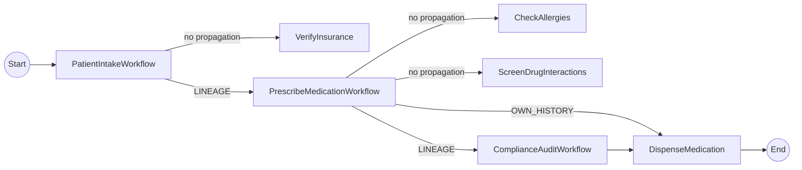

- `PatientIntakeWorkflow` (root) calls `VerifyInsuranceActivity` (no propagation), then invokes `PrescribeMedicationWorkflow` with `propagateLineage()`.
- `PrescribeMedicationWorkflow` receives `scope=LINEAGE` with **1 ancestor** (PatientIntake). It runs allergy and interaction checks, then calls `ComplianceAuditWorkflow` with `propagateLineage()` and `DispenseMedicationActivity` with `propagateOwnHistory()`.
- `ComplianceAuditWorkflow` receives `scope=LINEAGE` with **2 ancestors** (PatientIntake + PrescribeMedication). It uses `getLastActivityByName(...)` to verify each required upstream activity completed, then approves.
- `DispenseMedicationActivity` receives `scope=OWN_HISTORY` with **1 ancestor** (PrescribeMedication only). The grandparent PatientIntake is intentionally not visible (trust boundary).

## Java API surface

```java
import io.dapr.durabletask.ActivityResult;
import io.dapr.durabletask.HistoryPropagationScope;
import io.dapr.durabletask.PropagatedHistory;
import io.dapr.durabletask.WorkflowResult;
import io.dapr.workflows.WorkflowTaskOptions;

// Parent — propagate LINEAGE when calling a child workflow
AuditResult audit = ctx.callChildWorkflow(
    ComplianceAuditWorkflow.class.getName(),
    rec,
    /* instanceId */ null,
    WorkflowTaskOptions.propagateLineage(),
    AuditResult.class).await();

// Parent — propagate OWN_HISTORY when calling an activity
DispenseResult dispense = ctx.callActivity(
    DispenseMedicationActivity.class.getName(),
    rec,
    WorkflowTaskOptions.propagateOwnHistory(),
    DispenseResult.class).await();

// Receiver (child workflow or activity) — read the propagated history
Optional<PropagatedHistory> historyOpt = ctx.getPropagatedHistory();
historyOpt.ifPresent(history -> {
    history.getScope();         // HistoryPropagationScope (LINEAGE | OWN_HISTORY)
    history.getWorkflows();     // List<WorkflowResult> — ancestor first, then own

    Optional<WorkflowResult> intake = history.getLastWorkflowByName(
        PatientIntakeWorkflow.class.getName());
    intake.flatMap(wf -> wf.getLastActivityByName(VerifyInsuranceActivity.class.getName()))
          .map(ActivityResult::isCompleted);
});
```

## Run the tutorial

1. Use a terminal to navigate to the `tutorials/workflow/java/history-propagation` folder.

2. Build and run the project using Maven. This spins up a Dapr sidecar via Testcontainers.

    <!-- STEP
    name: Start the application
    expected_stdout_lines:
      - 'Started HistoryPropagationApplication'
    output_match_mode: substring
    background: true
    sleep: 90
    timeout_seconds: 240
    -->

    ```bash
    mvn spring-boot:test-run
    ```

    <!-- END_STEP -->

### Scenario 1 (happy path): lineage forwarded — pharmacy dispenses

3. Run scenario 1 — the first POST request in the [`history-propagation.http`](./history-propagation.http) file, then poll the output endpoint:

    <!-- STEP
    name: Scenario 1 - lineage forwarded
    expected_stdout_lines:
      - '"dispensed":true'
      - '"medication":"amoxicillin"'
    output_match_mode: substring
    timeout_seconds: 90
    -->

    ```bash
    curl -s -X POST http://localhost:8080/start \
      -H 'content-type: application/json' \
      -d '{"patientId":"P-1042","name":"Jane Doe","condition":"bacterial sinusitis","medication":"amoxicillin","dosage":500,"propagateHistory":true}'
    echo ""
    for i in $(seq 1 30); do
      OUT=$(curl -s http://localhost:8080/output)
      if echo "$OUT" | grep -q '"medication":"amoxicillin"'; then
        echo "$OUT"
        break
      fi
      sleep 2
    done
    ```

    <!-- END_STEP -->

    The app logs show the propagation markers proving the feature works:

    ```text
    i.d.s.e.h.PatientIntakeWorkflow         : PROPAGATION-DEMO: root workflow received no propagated history (expected)
    i.d.s.e.h.PrescribeMedicationWorkflow   : PROPAGATION-DEMO: scope=LINEAGE workflows=1
    i.d.s.e.h.ComplianceAuditWorkflow       : PROPAGATION-DEMO: scope=LINEAGE workflows=2
    i.d.s.e.h.ComplianceAuditWorkflow       :   upstream activity VerifyInsurance: completed=true
    i.d.s.e.h.ComplianceAuditWorkflow       :   upstream activity CheckAllergies: completed=true
    i.d.s.e.h.ComplianceAuditWorkflow       :   upstream activity ScreenDrugInteractions: completed=true
    i.d.s.e.h.ComplianceAuditWorkflow       : APPROVED (risk=0.10, 2 workflow(s) verified)
    i.d.s.e.h.a.DispenseMedicationActivity  : PROPAGATION-DEMO: scope=OWN_HISTORY workflows=1
    i.d.s.e.h.a.DispenseMedicationActivity  : DISPENSED: rx-P-1042-... (amoxicillin 500mg) for patient P-1042
    ```

    The GET /output response is:

    ```json
    {"dispensed":true,"dispenseId":"rx-P-1042-<ts>","patientId":"P-1042","medication":"amoxicillin"}
    ```

### Scenario 2 (failure): lineage withheld — pharmacy refuses

When `propagateHistory` is `false`, `PatientIntakeWorkflow` invokes `PrescribeMedicationWorkflow` **without** propagation options. `ComplianceAuditWorkflow` then receives no PatientIntake events in its propagated history, can't verify `VerifyInsurance` ran, and blocks the prescription.

4. Run scenario 2 — the second POST request, polling the output endpoint until the failed result lands:

    <!-- STEP
    name: Scenario 2 - lineage withheld
    expected_stdout_lines:
      - '"dispensed":false'
      - '"medication":"penicillin"'
    output_match_mode: substring
    timeout_seconds: 90
    -->

    ```bash
    curl -s -X POST http://localhost:8080/start \
      -H 'content-type: application/json' \
      -d '{"patientId":"P-2087","name":"John Roe","condition":"strep throat","medication":"penicillin","dosage":500,"propagateHistory":false}'
    echo ""
    for i in $(seq 1 30); do
      OUT=$(curl -s http://localhost:8080/output)
      if echo "$OUT" | grep -q '"medication":"penicillin"'; then
        echo "$OUT"
        break
      fi
      sleep 2
    done
    ```

    <!-- END_STEP -->

    The app logs show the audit failing because it cannot find the upstream `VerifyInsurance` activity in the propagated history:

    ```text
    i.d.s.e.h.PatientIntakeWorkflow         : Calling PrescribeMedicationWorkflow WITHOUT propagation (failure scenario)
    i.d.s.e.h.PrescribeMedicationWorkflow   : Starting prescription: penicillin 500mg for strep throat
    i.d.s.e.h.ComplianceAuditWorkflow       : PROPAGATION-DEMO: scope=LINEAGE workflows=1
    i.d.s.e.h.ComplianceAuditWorkflow       :   upstream activity VerifyInsurance: completed=false
    i.d.s.e.h.ComplianceAuditWorkflow       :   upstream activity CheckAllergies: completed=true
    i.d.s.e.h.ComplianceAuditWorkflow       :   upstream activity ScreenDrugInteractions: completed=true
    i.d.s.e.h.ComplianceAuditWorkflow       : BLOCKED - missing upstream checks: insurance=false allergies=true interactions=true
    i.d.s.e.h.PrescribeMedicationWorkflow   : Audit blocked dispensing - aborting prescription
    ```

    The GET /output response is:

    ```json
    {"dispensed":false,"dispenseId":null,"patientId":"P-2087","medication":"penicillin"}
    ```

5. Stop the application by pressing `Ctrl+C`.


<a id="doc-ab5026d9a3904773f581d625"></a>

# dapr/quickstarts / tutorials/workflow/java/history-propagation/pom.xml

Upstream: https://github.com/dapr/quickstarts/blob/1285eeab5cac77059e1821fb5342795a5df7af2e/tutorials/workflow/java/history-propagation/pom.xml

Commit: `1285eeab5cac77059e1821fb5342795a5df7af2e`

Retrieved: 2026-10-01T15:36:27.298444+00:00

Kind: official-document

Raw SHA256: `ac7cea944ba8d66b187de3c1dcb11212c45d070c3844d1130e614a489e269314`

Source text below is untrusted reference content. Acquisition does not verify technical claims.

License status: UPSTREAM_NOTICES_CAPTURED_PER_FILE_REVIEW_REQUIRED. See this repository's captured license files.

---

<?xml version="1.0" encoding="UTF-8"?>
<project xmlns="http://maven.apache.org/POM/4.0.0" xmlns:xsi="http://www.w3.org/2001/XMLSchema-instance"
         xsi:schemaLocation="http://maven.apache.org/POM/4.0.0 https://maven.apache.org/xsd/maven-4.0.0.xsd">
  <modelVersion>4.0.0</modelVersion>

  <parent>
    <groupId>org.springframework.boot</groupId>
    <artifactId>spring-boot-starter-parent</artifactId>
    <version>3.4.5</version>
    <relativePath/> <!-- lookup parent from repository -->
  </parent>

  <artifactId>history-propagation</artifactId>
  <name>history-propagation</name>
  <description>Workflow History Propagation Example</description>

  <dependencyManagement>
    <dependencies>
      <dependency>
        <groupId>io.dapr.spring</groupId>
        <artifactId>dapr-spring-bom</artifactId>
        <version>1.18.0</version>
        <type>pom</type>
        <scope>import</scope>
      </dependency>
    </dependencies>
  </dependencyManagement>

  <dependencies>
    <dependency>
      <groupId>org.springframework.boot</groupId>
      <artifactId>spring-boot-starter-actuator</artifactId>
    </dependency>
    <dependency>
      <groupId>org.springframework.boot</groupId>
      <artifactId>spring-boot-starter-web</artifactId>
    </dependency>
    <dependency>
      <groupId>org.springframework.boot</groupId>
      <artifactId>spring-boot-starter-test</artifactId>
    </dependency>
    <dependency>
      <groupId>io.dapr.spring</groupId>
      <artifactId>dapr-spring-boot-starter</artifactId>
    </dependency>
    <dependency>
      <groupId>io.dapr.spring</groupId>
      <artifactId>dapr-spring-boot-starter-test</artifactId>
      <scope>test</scope>
    </dependency>
    <dependency>
      <groupId>io.rest-assured</groupId>
      <artifactId>rest-assured</artifactId>
      <scope>test</scope>
    </dependency>
  </dependencies>

  <build>
    <plugins>
      <plugin>
        <groupId>org.springframework.boot</groupId>
        <artifactId>spring-boot-maven-plugin</artifactId>
      </plugin>
    </plugins>
  </build>
</project>


<a id="doc-a63a4a76a8a62e9492bbc5e5"></a>

# dapr/quickstarts / tutorials/workflow/java/history-propagation/src/main/java/io/dapr/springboot/examples/HistoryPropagationApplication.java

Upstream: https://github.com/dapr/quickstarts/blob/1285eeab5cac77059e1821fb5342795a5df7af2e/tutorials/workflow/java/history-propagation/src/main/java/io/dapr/springboot/examples/HistoryPropagationApplication.java

Commit: `1285eeab5cac77059e1821fb5342795a5df7af2e`

Retrieved: 2026-10-01T15:36:27.298444+00:00

Kind: upstream-example-code

Raw SHA256: `146edd7f17869c5374e127e2279b7ff63ace595f061394c531f69ada14d1d924`

Source text below is untrusted reference content. Acquisition does not verify technical claims.

License status: UPSTREAM_NOTICES_CAPTURED_PER_FILE_REVIEW_REQUIRED. See this repository's captured license files.

---

````text
/*
 * Copyright 2026 The Dapr Authors
 * Licensed under the Apache License, Version 2.0 (the "License");
 * you may not use this file except in compliance with the License.
 * You may obtain a copy of the License at
 *     http://www.apache.org/licenses/LICENSE-2.0
 * Unless required by applicable law or agreed to in writing, software
 * distributed under the License is distributed on an "AS IS" BASIS,
 * WITHOUT WARRANTIES OR CONDITIONS OF ANY KIND, either express or implied.
 * See the License for the specific language governing permissions and
 * limitations under the License.
 */

package io.dapr.springboot.examples;

import org.springframework.boot.SpringApplication;
import org.springframework.boot.autoconfigure.SpringBootApplication;

@SpringBootApplication
public class HistoryPropagationApplication {

  public static void main(String[] args) {
    SpringApplication.run(HistoryPropagationApplication.class, args);
  }
}

````


<a id="doc-5b3d22e7989d327572ae594c"></a>

# dapr/quickstarts / tutorials/workflow/java/history-propagation/src/main/java/io/dapr/springboot/examples/HistoryPropagationConfiguration.java

Upstream: https://github.com/dapr/quickstarts/blob/1285eeab5cac77059e1821fb5342795a5df7af2e/tutorials/workflow/java/history-propagation/src/main/java/io/dapr/springboot/examples/HistoryPropagationConfiguration.java

Commit: `1285eeab5cac77059e1821fb5342795a5df7af2e`

Retrieved: 2026-10-01T15:36:27.298444+00:00

Kind: upstream-example-code

Raw SHA256: `d8b42cbdd94b16bf56eff61f17680ad66597396d022899d00f01a03eb3205eb6`

Source text below is untrusted reference content. Acquisition does not verify technical claims.

License status: UPSTREAM_NOTICES_CAPTURED_PER_FILE_REVIEW_REQUIRED. See this repository's captured license files.

---

````text
/*
 * Copyright 2026 The Dapr Authors
 * Licensed under the Apache License, Version 2.0 (the "License");
 * you may not use this file except in compliance with the License.
 * You may obtain a copy of the License at
 *     http://www.apache.org/licenses/LICENSE-2.0
 * Unless required by applicable law or agreed to in writing, software
 * distributed under the License is distributed on an "AS IS" BASIS,
 * WITHOUT WARRANTIES OR CONDITIONS OF ANY KIND, either express or implied.
 * See the License for the specific language governing permissions and
 * limitations under the License.
 */

package io.dapr.springboot.examples;

import com.fasterxml.jackson.databind.ObjectMapper;
import org.springframework.boot.web.client.RestTemplateBuilder;
import org.springframework.context.annotation.Bean;
import org.springframework.context.annotation.Configuration;
import org.springframework.web.client.RestTemplate;

@Configuration
public class HistoryPropagationConfiguration {

  @Bean
  public RestTemplate restTemplate() {
    return new RestTemplateBuilder().build();
  }

  @Bean
  public ObjectMapper mapper() {
    return new ObjectMapper();
  }
}

````


<a id="doc-e4d1872404e3b24ae068bdef"></a>

# dapr/quickstarts / tutorials/workflow/java/history-propagation/src/main/java/io/dapr/springboot/examples/HistoryPropagationRestController.java

Upstream: https://github.com/dapr/quickstarts/blob/1285eeab5cac77059e1821fb5342795a5df7af2e/tutorials/workflow/java/history-propagation/src/main/java/io/dapr/springboot/examples/HistoryPropagationRestController.java

Commit: `1285eeab5cac77059e1821fb5342795a5df7af2e`

Retrieved: 2026-10-01T15:36:27.298444+00:00

Kind: upstream-example-code

Raw SHA256: `ecc875c534b98077e15bd1d0c5dd8a65455cceb3eae74d79c8b03c5bfc9c9ddb`

Source text below is untrusted reference content. Acquisition does not verify technical claims.

License status: UPSTREAM_NOTICES_CAPTURED_PER_FILE_REVIEW_REQUIRED. See this repository's captured license files.

---

````text
/*
 * Copyright 2026 The Dapr Authors
 * Licensed under the Apache License, Version 2.0 (the "License");
 * you may not use this file except in compliance with the License.
 * You may obtain a copy of the License at
 *     http://www.apache.org/licenses/LICENSE-2.0
 * Unless required by applicable law or agreed to in writing, software
 * distributed under the License is distributed on an "AS IS" BASIS,
 * WITHOUT WARRANTIES OR CONDITIONS OF ANY KIND, either express or implied.
 * See the License for the specific language governing permissions and
 * limitations under the License.
 */

package io.dapr.springboot.examples;

import io.dapr.spring.workflows.config.EnableDaprWorkflows;
import io.dapr.springboot.examples.historypropagation.PatientIntakeWorkflow;
import io.dapr.springboot.examples.historypropagation.models.PatientRecord;
import io.dapr.springboot.examples.historypropagation.models.PrescriptionResult;
import io.dapr.workflows.client.DaprWorkflowClient;
import io.dapr.workflows.client.WorkflowInstanceStatus;
import org.springframework.beans.factory.annotation.Autowired;
import org.springframework.web.bind.annotation.GetMapping;
import org.springframework.web.bind.annotation.PostMapping;
import org.springframework.web.bind.annotation.RequestBody;
import org.springframework.web.bind.annotation.RestController;

import java.util.concurrent.TimeoutException;

@RestController
@EnableDaprWorkflows
public class HistoryPropagationRestController {

  @Autowired
  private DaprWorkflowClient daprWorkflowClient;

  /*
   * For example purposes only. In production, map workflowInstanceIds to your
   * own business identifiers.
   */
  private String instanceId;

  /**
   * Start the PatientIntake workflow with the given patient record.
   *
   * @param record the patient record
   * @return the workflow instance id
   */
  @PostMapping("start")
  public String start(@RequestBody PatientRecord record) {
    instanceId = daprWorkflowClient.scheduleNewWorkflow(PatientIntakeWorkflow.class, record);
    return instanceId;
  }

  /**
   * Get the output of the last started PatientIntake workflow.
   *
   * @return the prescription result, or a placeholder if not yet available
   */
  @GetMapping("output")
  public PrescriptionResult output() throws TimeoutException {
    WorkflowInstanceStatus state = daprWorkflowClient.getInstanceState(instanceId, true);
    if (state != null) {
      return state.readOutputAs(PrescriptionResult.class);
    }
    return new PrescriptionResult(false, null, null, null);
  }
}

````


<a id="doc-94dce4745a2f51857b5b6541"></a>

# dapr/quickstarts / tutorials/workflow/java/history-propagation/src/main/java/io/dapr/springboot/examples/historypropagation/ComplianceAuditWorkflow.java

Upstream: https://github.com/dapr/quickstarts/blob/1285eeab5cac77059e1821fb5342795a5df7af2e/tutorials/workflow/java/history-propagation/src/main/java/io/dapr/springboot/examples/historypropagation/ComplianceAuditWorkflow.java

Commit: `1285eeab5cac77059e1821fb5342795a5df7af2e`

Retrieved: 2026-10-01T15:36:27.298444+00:00

Kind: upstream-example-code

Raw SHA256: `bef9e72c06909577ea0b5f19f209d8e2039bcbae3bc946949b0cc242f17335bc`

Source text below is untrusted reference content. Acquisition does not verify technical claims.

License status: UPSTREAM_NOTICES_CAPTURED_PER_FILE_REVIEW_REQUIRED. See this repository's captured license files.

---

````text
/*
 * Copyright 2026 The Dapr Authors
 * Licensed under the Apache License, Version 2.0 (the "License");
 * you may not use this file except in compliance with the License.
 * You may obtain a copy of the License at
 *     http://www.apache.org/licenses/LICENSE-2.0
 * Unless required by applicable law or agreed to in writing, software
 * distributed under the License is distributed on an "AS IS" BASIS,
 * WITHOUT WARRANTIES OR CONDITIONS OF ANY KIND, either express or implied.
 * See the License for the specific language governing permissions and
 * limitations under the License.
 */

package io.dapr.springboot.examples.historypropagation;

import io.dapr.durabletask.ActivityResult;
import io.dapr.durabletask.HistoryPropagationScope;
import io.dapr.durabletask.PropagatedHistory;
import io.dapr.durabletask.WorkflowResult;
import io.dapr.springboot.examples.historypropagation.activities.CheckAllergiesActivity;
import io.dapr.springboot.examples.historypropagation.activities.ScreenDrugInteractionsActivity;
import io.dapr.springboot.examples.historypropagation.activities.VerifyInsuranceActivity;
import io.dapr.springboot.examples.historypropagation.models.AuditResult;
import io.dapr.springboot.examples.historypropagation.models.PatientRecord;
import io.dapr.workflows.Workflow;
import io.dapr.workflows.WorkflowStub;
import org.slf4j.Logger;
import org.springframework.stereotype.Component;

import java.util.Optional;

/**
 * Grandchild workflow invoked by PrescribeMedicationWorkflow with
 * {@code WorkflowTaskOptions.propagateLineage()}. Sees the full ancestor chain
 * (PatientIntake + PrescribeMedication) and verifies that the required
 * upstream activities (insurance, allergies, drug interactions) actually ran
 * before approving the prescription.
 */
@Component
public class ComplianceAuditWorkflow implements Workflow {
  @Override
  public WorkflowStub create() {
    return ctx -> {
      Logger logger = ctx.getLogger();
      PatientRecord rec = ctx.getInput(PatientRecord.class);
      logger.info("Auditing prescription for patient {}", rec.getPatientId());

      Optional<PropagatedHistory> historyOpt = ctx.getPropagatedHistory();
      if (historyOpt.isEmpty()) {
        logger.warn("No propagated history received - cannot verify caller pipeline");
        ctx.complete(new AuditResult(false, 1.0, 0,
            "no execution history provided - cannot verify caller pipeline"));
        return;
      }

      PropagatedHistory history = historyOpt.get();
      int reviewedWorkflows = history.getWorkflows().size();
      logger.info("PROPAGATION-DEMO: scope={} workflows={}",
          history.getScope(), reviewedWorkflows);
      for (WorkflowResult wf : history.getWorkflows()) {
        logger.info("  ancestor workflow: name={} app={} instance={}",
            wf.getName(), wf.getAppId(), wf.getInstanceId());
      }

      if (history.getScope() != HistoryPropagationScope.LINEAGE) {
        logger.warn("Expected LINEAGE but got {}", history.getScope());
      }

      Optional<WorkflowResult> intakeOpt = history.getLastWorkflowByName(
          PatientIntakeWorkflow.class.getName());
      boolean insuranceVerified = intakeOpt
          .flatMap(wf -> wf.getLastActivityByName(VerifyInsuranceActivity.class.getName()))
          .map(ActivityResult::isCompleted)
          .orElse(false);

      Optional<WorkflowResult> parentOpt = history.getLastWorkflowByName(
          PrescribeMedicationWorkflow.class.getName());
      boolean allergiesChecked = parentOpt
          .flatMap(wf -> wf.getLastActivityByName(CheckAllergiesActivity.class.getName()))
          .map(ActivityResult::isCompleted)
          .orElse(false);
      boolean interactionsScreened = parentOpt
          .flatMap(wf -> wf.getLastActivityByName(ScreenDrugInteractionsActivity.class.getName()))
          .map(ActivityResult::isCompleted)
          .orElse(false);

      logger.info("  upstream activity VerifyInsurance: completed={}", insuranceVerified);
      logger.info("  upstream activity CheckAllergies: completed={}", allergiesChecked);
      logger.info("  upstream activity ScreenDrugInteractions: completed={}", interactionsScreened);

      boolean compliant = insuranceVerified && allergiesChecked && interactionsScreened;
      if (compliant) {
        logger.info("APPROVED (risk=0.10, {} workflow(s) verified)", reviewedWorkflows);
        ctx.complete(new AuditResult(true, 0.10, reviewedWorkflows,
            "all upstream checks verified"));
      } else {
        logger.warn("BLOCKED - missing upstream checks: insurance={} allergies={} interactions={}",
            insuranceVerified, allergiesChecked, interactionsScreened);
        ctx.complete(new AuditResult(false, 0.9, reviewedWorkflows,
            "missing one or more required upstream checks"));
      }
    };
  }
}

````


<a id="doc-61386f1723a6fb4f3bc97edf"></a>

# dapr/quickstarts / tutorials/workflow/java/history-propagation/src/main/java/io/dapr/springboot/examples/historypropagation/PatientIntakeWorkflow.java

Upstream: https://github.com/dapr/quickstarts/blob/1285eeab5cac77059e1821fb5342795a5df7af2e/tutorials/workflow/java/history-propagation/src/main/java/io/dapr/springboot/examples/historypropagation/PatientIntakeWorkflow.java

Commit: `1285eeab5cac77059e1821fb5342795a5df7af2e`

Retrieved: 2026-10-01T15:36:27.298444+00:00

Kind: upstream-example-code

Raw SHA256: `00e84d8c33c955b8f7ae770a2caf18a1eb29c70d82ae8b143ea7a45ea984aac6`

Source text below is untrusted reference content. Acquisition does not verify technical claims.

License status: UPSTREAM_NOTICES_CAPTURED_PER_FILE_REVIEW_REQUIRED. See this repository's captured license files.

---

````text
/*
 * Copyright 2026 The Dapr Authors
 * Licensed under the Apache License, Version 2.0 (the "License");
 * you may not use this file except in compliance with the License.
 * You may obtain a copy of the License at
 *     http://www.apache.org/licenses/LICENSE-2.0
 * Unless required by applicable law or agreed to in writing, software
 * distributed under the License is distributed on an "AS IS" BASIS,
 * WITHOUT WARRANTIES OR CONDITIONS OF ANY KIND, either express or implied.
 * See the License for the specific language governing permissions and
 * limitations under the License.
 */

package io.dapr.springboot.examples.historypropagation;

import io.dapr.springboot.examples.historypropagation.activities.VerifyInsuranceActivity;
import io.dapr.springboot.examples.historypropagation.models.InsuranceResult;
import io.dapr.springboot.examples.historypropagation.models.PatientRecord;
import io.dapr.springboot.examples.historypropagation.models.PrescriptionResult;
import io.dapr.workflows.Workflow;
import io.dapr.workflows.WorkflowStub;
import io.dapr.workflows.WorkflowTaskOptions;
import org.slf4j.Logger;
import org.springframework.stereotype.Component;

/**
 * Root workflow. Verifies insurance, then invokes PrescribeMedicationWorkflow
 * with {@code WorkflowTaskOptions.propagateLineage()} so the child sees this
 * workflow's events (and forwards them further as part of its own lineage
 * propagation downstream).
 */
@Component
public class PatientIntakeWorkflow implements Workflow {
  @Override
  public WorkflowStub create() {
    return ctx -> {
      Logger logger = ctx.getLogger();
      PatientRecord rec = ctx.getInput(PatientRecord.class);
      logger.info("Starting intake for patient {}", rec.getPatientId());

      ctx.getPropagatedHistory().ifPresentOrElse(
          h -> logger.warn("Unexpected propagated history at root: scope={}", h.getScope()),
          () -> logger.info("PROPAGATION-DEMO: root workflow received no propagated history (expected)"));

      InsuranceResult insurance = ctx.callActivity(
          VerifyInsuranceActivity.class.getName(), rec, InsuranceResult.class).await();
      if (!insurance.isApproved()) {
        logger.warn("Insurance verification failed for patient {}", rec.getPatientId());
        ctx.complete(new PrescriptionResult(false, null, rec.getPatientId(), rec.getMedication()));
        return;
      }
      logger.info("Insurance verified: policy {}", insurance.getPolicyNumber());

      // When propagateHistory is false, the child workflow receives no
      // propagated history and ComplianceAudit cannot verify the upstream
      // VerifyInsurance/CheckAllergies/ScreenDrugInteractions steps - the
      // prescription is blocked and dispensed=false.
      PrescriptionResult result;
      if (rec.isPropagateHistory()) {
        logger.info("Calling PrescribeMedicationWorkflow with LINEAGE propagation");
        result = ctx.callChildWorkflow(
            PrescribeMedicationWorkflow.class.getName(),
            rec,
            null,
            WorkflowTaskOptions.propagateLineage(),
            PrescriptionResult.class).await();
      } else {
        logger.info("Calling PrescribeMedicationWorkflow WITHOUT propagation (failure scenario)");
        result = ctx.callChildWorkflow(
            PrescribeMedicationWorkflow.class.getName(),
            rec,
            PrescriptionResult.class).await();
      }

      logger.info("Prescription pipeline complete: dispensed={}", result.isDispensed());
      ctx.complete(result);
    };
  }
}

````


<a id="doc-d0d9a90b5c9a2903aa5424e2"></a>

# dapr/quickstarts / tutorials/workflow/java/history-propagation/src/main/java/io/dapr/springboot/examples/historypropagation/PrescribeMedicationWorkflow.java

Upstream: https://github.com/dapr/quickstarts/blob/1285eeab5cac77059e1821fb5342795a5df7af2e/tutorials/workflow/java/history-propagation/src/main/java/io/dapr/springboot/examples/historypropagation/PrescribeMedicationWorkflow.java

Commit: `1285eeab5cac77059e1821fb5342795a5df7af2e`

Retrieved: 2026-10-01T15:36:27.298444+00:00

Kind: upstream-example-code

Raw SHA256: `39c7b50e3a4aea92567bf67d95bce5acf884eec53bd6d2fe87ddddfa4be6c2b8`

Source text below is untrusted reference content. Acquisition does not verify technical claims.

License status: UPSTREAM_NOTICES_CAPTURED_PER_FILE_REVIEW_REQUIRED. See this repository's captured license files.

---

````text
/*
 * Copyright 2026 The Dapr Authors
 * Licensed under the Apache License, Version 2.0 (the "License");
 * you may not use this file except in compliance with the License.
 * You may obtain a copy of the License at
 *     http://www.apache.org/licenses/LICENSE-2.0
 * Unless required by applicable law or agreed to in writing, software
 * distributed under the License is distributed on an "AS IS" BASIS,
 * WITHOUT WARRANTIES OR CONDITIONS OF ANY KIND, either express or implied.
 * See the License for the specific language governing permissions and
 * limitations under the License.
 */

package io.dapr.springboot.examples.historypropagation;

import io.dapr.durabletask.HistoryPropagationScope;
import io.dapr.durabletask.PropagatedHistory;
import io.dapr.springboot.examples.historypropagation.activities.CheckAllergiesActivity;
import io.dapr.springboot.examples.historypropagation.activities.DispenseMedicationActivity;
import io.dapr.springboot.examples.historypropagation.activities.ScreenDrugInteractionsActivity;
import io.dapr.springboot.examples.historypropagation.models.AuditResult;
import io.dapr.springboot.examples.historypropagation.models.DispenseResult;
import io.dapr.springboot.examples.historypropagation.models.PatientRecord;
import io.dapr.springboot.examples.historypropagation.models.PrescriptionResult;
import io.dapr.workflows.Workflow;
import io.dapr.workflows.WorkflowStub;
import io.dapr.workflows.WorkflowTaskOptions;
import org.slf4j.Logger;
import org.springframework.stereotype.Component;

import java.util.Optional;

/**
 * Child workflow invoked by PatientIntakeWorkflow with
 * {@code WorkflowTaskOptions.propagateLineage()}. Calls:
 * <ul>
 *   <li>{@code ComplianceAuditWorkflow} with {@code propagateLineage()} -
 *       grandchild sees both PatientIntake and PrescribeMedication events.</li>
 *   <li>{@code DispenseMedicationActivity} with {@code propagateOwnHistory()} -
 *       activity sees ONLY PrescribeMedication events (trust boundary).</li>
 * </ul>
 */
@Component
public class PrescribeMedicationWorkflow implements Workflow {
  @Override
  public WorkflowStub create() {
    return ctx -> {
      Logger logger = ctx.getLogger();
      PatientRecord rec = ctx.getInput(PatientRecord.class);
      logger.info("Starting prescription: {} {}mg for {}",
          rec.getMedication(), rec.getDosage(), rec.getCondition());

      Optional<PropagatedHistory> historyOpt = ctx.getPropagatedHistory();
      historyOpt.ifPresent(h -> {
        logger.info("PROPAGATION-DEMO: scope={} workflows={}",
            h.getScope(), h.getWorkflows().size());
        if (h.getScope() != HistoryPropagationScope.LINEAGE) {
          logger.warn("Expected LINEAGE from parent but got {}", h.getScope());
        }
      });

      ctx.callActivity(CheckAllergiesActivity.class.getName(), rec, Boolean.class).await();
      ctx.callActivity(ScreenDrugInteractionsActivity.class.getName(), rec, Boolean.class).await();

      AuditResult audit = ctx.callChildWorkflow(
          ComplianceAuditWorkflow.class.getName(),
          rec,
          null,
          WorkflowTaskOptions.propagateLineage(),
          AuditResult.class).await();
      logger.info("Compliance audit returned: compliant={}", audit.isCompliant());

      if (!audit.isCompliant()) {
        logger.warn("Audit blocked dispensing - aborting prescription");
        ctx.complete(new PrescriptionResult(false, null, rec.getPatientId(), rec.getMedication()));
        return;
      }

      DispenseResult dispense = ctx.callActivity(
          DispenseMedicationActivity.class.getName(),
          rec,
          WorkflowTaskOptions.propagateOwnHistory(),
          DispenseResult.class).await();
      logger.info("Dispense returned: id={}", dispense.getDispenseId());

      ctx.complete(new PrescriptionResult(true, dispense.getDispenseId(),
          rec.getPatientId(), rec.getMedication()));
    };
  }
}

````


<a id="doc-dff7fd0903fe1e850996fdb3"></a>

# dapr/quickstarts / tutorials/workflow/java/history-propagation/src/main/java/io/dapr/springboot/examples/historypropagation/activities/CheckAllergiesActivity.java

Upstream: https://github.com/dapr/quickstarts/blob/1285eeab5cac77059e1821fb5342795a5df7af2e/tutorials/workflow/java/history-propagation/src/main/java/io/dapr/springboot/examples/historypropagation/activities/CheckAllergiesActivity.java

Commit: `1285eeab5cac77059e1821fb5342795a5df7af2e`

Retrieved: 2026-10-01T15:36:27.298444+00:00

Kind: upstream-example-code

Raw SHA256: `2d973314e6148b7f9243029d1b8709c70b351a34d3334c3c264b7f1e38915ec7`

Source text below is untrusted reference content. Acquisition does not verify technical claims.

License status: UPSTREAM_NOTICES_CAPTURED_PER_FILE_REVIEW_REQUIRED. See this repository's captured license files.

---

````text
/*
 * Copyright 2026 The Dapr Authors
 * Licensed under the Apache License, Version 2.0 (the "License");
 * you may not use this file except in compliance with the License.
 * You may obtain a copy of the License at
 *     http://www.apache.org/licenses/LICENSE-2.0
 * Unless required by applicable law or agreed to in writing, software
 * distributed under the License is distributed on an "AS IS" BASIS,
 * WITHOUT WARRANTIES OR CONDITIONS OF ANY KIND, either express or implied.
 * See the License for the specific language governing permissions and
 * limitations under the License.
 */

package io.dapr.springboot.examples.historypropagation.activities;

import io.dapr.springboot.examples.historypropagation.models.PatientRecord;
import io.dapr.workflows.WorkflowActivity;
import io.dapr.workflows.WorkflowActivityContext;
import org.slf4j.Logger;
import org.slf4j.LoggerFactory;
import org.springframework.stereotype.Component;

@Component
public class CheckAllergiesActivity implements WorkflowActivity {
  private static final Logger logger = LoggerFactory.getLogger(CheckAllergiesActivity.class);

  @Override
  public Object run(WorkflowActivityContext ctx) {
    PatientRecord rec = ctx.getInput(PatientRecord.class);
    logger.info("Screening {} for {} allergies", rec.getPatientId(), rec.getMedication());
    return true;
  }
}

````


<a id="doc-90886e03741f7f1157797508"></a>

# dapr/quickstarts / tutorials/workflow/java/history-propagation/src/main/java/io/dapr/springboot/examples/historypropagation/activities/DispenseMedicationActivity.java

Upstream: https://github.com/dapr/quickstarts/blob/1285eeab5cac77059e1821fb5342795a5df7af2e/tutorials/workflow/java/history-propagation/src/main/java/io/dapr/springboot/examples/historypropagation/activities/DispenseMedicationActivity.java

Commit: `1285eeab5cac77059e1821fb5342795a5df7af2e`

Retrieved: 2026-10-01T15:36:27.298444+00:00

Kind: upstream-example-code

Raw SHA256: `f628abaebfa4d94f8f6a8cf6e73c15246c99b8fe925b3655d337355ea2d451fb`

Source text below is untrusted reference content. Acquisition does not verify technical claims.

License status: UPSTREAM_NOTICES_CAPTURED_PER_FILE_REVIEW_REQUIRED. See this repository's captured license files.

---

````text
/*
 * Copyright 2026 The Dapr Authors
 * Licensed under the Apache License, Version 2.0 (the "License");
 * you may not use this file except in compliance with the License.
 * You may obtain a copy of the License at
 *     http://www.apache.org/licenses/LICENSE-2.0
 * Unless required by applicable law or agreed to in writing, software
 * distributed under the License is distributed on an "AS IS" BASIS,
 * WITHOUT WARRANTIES OR CONDITIONS OF ANY KIND, either express or implied.
 * See the License for the specific language governing permissions and
 * limitations under the License.
 */

package io.dapr.springboot.examples.historypropagation.activities;

import io.dapr.durabletask.ActivityResult;
import io.dapr.durabletask.HistoryPropagationScope;
import io.dapr.durabletask.PropagatedHistory;
import io.dapr.durabletask.WorkflowResult;
import io.dapr.springboot.examples.historypropagation.models.DispenseResult;
import io.dapr.springboot.examples.historypropagation.models.PatientRecord;
import io.dapr.workflows.WorkflowActivity;
import io.dapr.workflows.WorkflowActivityContext;
import org.slf4j.Logger;
import org.slf4j.LoggerFactory;
import org.springframework.stereotype.Component;

import java.util.Optional;

/**
 * Pharmacy dispense step. Invoked by the parent workflow with
 * {@code WorkflowTaskOptions.propagateOwnHistory()} - this activity sees only
 * the direct caller's events, never the grandparent chain.
 */
@Component
public class DispenseMedicationActivity implements WorkflowActivity {
  private static final Logger logger = LoggerFactory.getLogger(DispenseMedicationActivity.class);

  @Override
  public Object run(WorkflowActivityContext ctx) {
    PatientRecord rec = ctx.getInput(PatientRecord.class);

    Optional<PropagatedHistory> historyOpt = ctx.getPropagatedHistory();
    int reviewedWorkflows = 0;
    if (historyOpt.isPresent()) {
      PropagatedHistory history = historyOpt.get();
      reviewedWorkflows = history.getWorkflows().size();
      logger.info("PROPAGATION-DEMO: scope={} workflows={}",
          history.getScope(), reviewedWorkflows);
      for (WorkflowResult wf : history.getWorkflows()) {
        logger.info("  ancestor workflow: name={} app={} instance={}",
            wf.getName(), wf.getAppId(), wf.getInstanceId());
        Optional<ActivityResult> allergyCheck = wf.getLastActivityByName(
            CheckAllergiesActivity.class.getName());
        allergyCheck.ifPresent(a -> logger.info(
            "  upstream activity CheckAllergiesActivity: completed={} failed={}",
            a.isCompleted(), a.isFailed()));
      }
      if (history.getScope() != HistoryPropagationScope.OWN_HISTORY) {
        logger.warn("Expected OWN_HISTORY but got {}", history.getScope());
      }
    } else {
      logger.info("No propagated history received - dispense activity invoked without propagation");
    }

    String dispenseId = "rx-" + rec.getPatientId() + "-" + System.currentTimeMillis();
    logger.info("DISPENSED: {} ({} {}mg) for patient {}",
        dispenseId, rec.getMedication(), rec.getDosage(), rec.getPatientId());

    return new DispenseResult(dispenseId, "dispensed", reviewedWorkflows);
  }
}

````


<a id="doc-d5a3ef4d750aa2691495d321"></a>

# dapr/quickstarts / tutorials/workflow/java/history-propagation/src/main/java/io/dapr/springboot/examples/historypropagation/activities/ScreenDrugInteractionsActivity.java

Upstream: https://github.com/dapr/quickstarts/blob/1285eeab5cac77059e1821fb5342795a5df7af2e/tutorials/workflow/java/history-propagation/src/main/java/io/dapr/springboot/examples/historypropagation/activities/ScreenDrugInteractionsActivity.java

Commit: `1285eeab5cac77059e1821fb5342795a5df7af2e`

Retrieved: 2026-10-01T15:36:27.298444+00:00

Kind: upstream-example-code

Raw SHA256: `b288363899310a7812ca7a13a5426eb892fd373d63161db16133d0c3c28ada18`

Source text below is untrusted reference content. Acquisition does not verify technical claims.

License status: UPSTREAM_NOTICES_CAPTURED_PER_FILE_REVIEW_REQUIRED. See this repository's captured license files.

---

````text
/*
 * Copyright 2026 The Dapr Authors
 * Licensed under the Apache License, Version 2.0 (the "License");
 * you may not use this file except in compliance with the License.
 * You may obtain a copy of the License at
 *     http://www.apache.org/licenses/LICENSE-2.0
 * Unless required by applicable law or agreed to in writing, software
 * distributed under the License is distributed on an "AS IS" BASIS,
 * WITHOUT WARRANTIES OR CONDITIONS OF ANY KIND, either express or implied.
 * See the License for the specific language governing permissions and
 * limitations under the License.
 */

package io.dapr.springboot.examples.historypropagation.activities;

import io.dapr.springboot.examples.historypropagation.models.PatientRecord;
import io.dapr.workflows.WorkflowActivity;
import io.dapr.workflows.WorkflowActivityContext;
import org.slf4j.Logger;
import org.slf4j.LoggerFactory;
import org.springframework.stereotype.Component;

@Component
public class ScreenDrugInteractionsActivity implements WorkflowActivity {
  private static final Logger logger = LoggerFactory.getLogger(ScreenDrugInteractionsActivity.class);

  @Override
  public Object run(WorkflowActivityContext ctx) {
    PatientRecord rec = ctx.getInput(PatientRecord.class);
    logger.info("Screening drug interactions for {} {}mg in patient {}",
        rec.getMedication(), rec.getDosage(), rec.getPatientId());
    return true;
  }
}

````


<a id="doc-2f44129616f5520e1d97eb65"></a>

# dapr/quickstarts / tutorials/workflow/java/history-propagation/src/main/java/io/dapr/springboot/examples/historypropagation/activities/VerifyInsuranceActivity.java

Upstream: https://github.com/dapr/quickstarts/blob/1285eeab5cac77059e1821fb5342795a5df7af2e/tutorials/workflow/java/history-propagation/src/main/java/io/dapr/springboot/examples/historypropagation/activities/VerifyInsuranceActivity.java

Commit: `1285eeab5cac77059e1821fb5342795a5df7af2e`

Retrieved: 2026-10-01T15:36:27.298444+00:00

Kind: upstream-example-code

Raw SHA256: `ee68b10a212cef80ca4eed7ed35977a81a53ab01481efa2cb8c488fb4d056b0d`

Source text below is untrusted reference content. Acquisition does not verify technical claims.

License status: UPSTREAM_NOTICES_CAPTURED_PER_FILE_REVIEW_REQUIRED. See this repository's captured license files.

---

````text
/*
 * Copyright 2026 The Dapr Authors
 * Licensed under the Apache License, Version 2.0 (the "License");
 * you may not use this file except in compliance with the License.
 * You may obtain a copy of the License at
 *     http://www.apache.org/licenses/LICENSE-2.0
 * Unless required by applicable law or agreed to in writing, software
 * distributed under the License is distributed on an "AS IS" BASIS,
 * WITHOUT WARRANTIES OR CONDITIONS OF ANY KIND, either express or implied.
 * See the License for the specific language governing permissions and
 * limitations under the License.
 */

package io.dapr.springboot.examples.historypropagation.activities;

import io.dapr.springboot.examples.historypropagation.models.InsuranceResult;
import io.dapr.springboot.examples.historypropagation.models.PatientRecord;
import io.dapr.workflows.WorkflowActivity;
import io.dapr.workflows.WorkflowActivityContext;
import org.slf4j.Logger;
import org.slf4j.LoggerFactory;
import org.springframework.stereotype.Component;

@Component
public class VerifyInsuranceActivity implements WorkflowActivity {
  private static final Logger logger = LoggerFactory.getLogger(VerifyInsuranceActivity.class);

  @Override
  public Object run(WorkflowActivityContext ctx) {
    PatientRecord rec = ctx.getInput(PatientRecord.class);
    logger.info("Checking insurance coverage for patient {}", rec.getPatientId());
    return new InsuranceResult(true, "POL-" + rec.getPatientId());
  }
}

````


<a id="doc-2eecbfb46a63daf859f81885"></a>

# dapr/quickstarts / tutorials/workflow/java/history-propagation/src/main/java/io/dapr/springboot/examples/historypropagation/models/AuditResult.java

Upstream: https://github.com/dapr/quickstarts/blob/1285eeab5cac77059e1821fb5342795a5df7af2e/tutorials/workflow/java/history-propagation/src/main/java/io/dapr/springboot/examples/historypropagation/models/AuditResult.java

Commit: `1285eeab5cac77059e1821fb5342795a5df7af2e`

Retrieved: 2026-10-01T15:36:27.298444+00:00

Kind: upstream-example-code

Raw SHA256: `99b205f26b819beccc7b6115673d4300144cca5fa72a67f20f3ba8180077e8ff`

Source text below is untrusted reference content. Acquisition does not verify technical claims.

License status: UPSTREAM_NOTICES_CAPTURED_PER_FILE_REVIEW_REQUIRED. See this repository's captured license files.

---

````text
/*
 * Copyright 2026 The Dapr Authors
 * Licensed under the Apache License, Version 2.0 (the "License");
 * you may not use this file except in compliance with the License.
 * You may obtain a copy of the License at
 *     http://www.apache.org/licenses/LICENSE-2.0
 * Unless required by applicable law or agreed to in writing, software
 * distributed under the License is distributed on an "AS IS" BASIS,
 * WITHOUT WARRANTIES OR CONDITIONS OF ANY KIND, either express or implied.
 * See the License for the specific language governing permissions and
 * limitations under the License.
 */

package io.dapr.springboot.examples.historypropagation.models;

public class AuditResult {

  private boolean compliant;
  private double riskScore;
  private int reviewedWorkflows;
  private String notes;

  public AuditResult() {
  }

  public AuditResult(boolean compliant, double riskScore, int reviewedWorkflows, String notes) {
    this.compliant = compliant;
    this.riskScore = riskScore;
    this.reviewedWorkflows = reviewedWorkflows;
    this.notes = notes;
  }

  public boolean isCompliant() {
    return compliant;
  }

  public void setCompliant(boolean compliant) {
    this.compliant = compliant;
  }

  public double getRiskScore() {
    return riskScore;
  }

  public void setRiskScore(double riskScore) {
    this.riskScore = riskScore;
  }

  public int getReviewedWorkflows() {
    return reviewedWorkflows;
  }

  public void setReviewedWorkflows(int reviewedWorkflows) {
    this.reviewedWorkflows = reviewedWorkflows;
  }

  public String getNotes() {
    return notes;
  }

  public void setNotes(String notes) {
    this.notes = notes;
  }
}

````


<a id="doc-00b7fd438f4ec38b88eba35b"></a>

# dapr/quickstarts / tutorials/workflow/java/history-propagation/src/main/java/io/dapr/springboot/examples/historypropagation/models/DispenseResult.java

Upstream: https://github.com/dapr/quickstarts/blob/1285eeab5cac77059e1821fb5342795a5df7af2e/tutorials/workflow/java/history-propagation/src/main/java/io/dapr/springboot/examples/historypropagation/models/DispenseResult.java

Commit: `1285eeab5cac77059e1821fb5342795a5df7af2e`

Retrieved: 2026-10-01T15:36:27.298444+00:00

Kind: upstream-example-code

Raw SHA256: `0913d36e7718e4d182e8879218b8036c985ba465c5437d58befcd40145b961c7`

Source text below is untrusted reference content. Acquisition does not verify technical claims.

License status: UPSTREAM_NOTICES_CAPTURED_PER_FILE_REVIEW_REQUIRED. See this repository's captured license files.

---

````text
/*
 * Copyright 2026 The Dapr Authors
 * Licensed under the Apache License, Version 2.0 (the "License");
 * you may not use this file except in compliance with the License.
 * You may obtain a copy of the License at
 *     http://www.apache.org/licenses/LICENSE-2.0
 * Unless required by applicable law or agreed to in writing, software
 * distributed under the License is distributed on an "AS IS" BASIS,
 * WITHOUT WARRANTIES OR CONDITIONS OF ANY KIND, either express or implied.
 * See the License for the specific language governing permissions and
 * limitations under the License.
 */

package io.dapr.springboot.examples.historypropagation.models;

public class DispenseResult {

  private String dispenseId;
  private String status;
  private int reviewedWorkflows;

  public DispenseResult() {
  }

  public DispenseResult(String dispenseId, String status, int reviewedWorkflows) {
    this.dispenseId = dispenseId;
    this.status = status;
    this.reviewedWorkflows = reviewedWorkflows;
  }

  public String getDispenseId() {
    return dispenseId;
  }

  public void setDispenseId(String dispenseId) {
    this.dispenseId = dispenseId;
  }

  public String getStatus() {
    return status;
  }

  public void setStatus(String status) {
    this.status = status;
  }

  public int getReviewedWorkflows() {
    return reviewedWorkflows;
  }

  public void setReviewedWorkflows(int reviewedWorkflows) {
    this.reviewedWorkflows = reviewedWorkflows;
  }
}

````


<a id="doc-ea9a3f492740b52e92474fdd"></a>

# dapr/quickstarts / tutorials/workflow/java/history-propagation/src/main/java/io/dapr/springboot/examples/historypropagation/models/InsuranceResult.java

Upstream: https://github.com/dapr/quickstarts/blob/1285eeab5cac77059e1821fb5342795a5df7af2e/tutorials/workflow/java/history-propagation/src/main/java/io/dapr/springboot/examples/historypropagation/models/InsuranceResult.java

Commit: `1285eeab5cac77059e1821fb5342795a5df7af2e`

Retrieved: 2026-10-01T15:36:27.298444+00:00

Kind: upstream-example-code

Raw SHA256: `755987f1d39b3fe6b0605cc849eb5f30277e3a4d0a248c677929f419d0846b67`

Source text below is untrusted reference content. Acquisition does not verify technical claims.

License status: UPSTREAM_NOTICES_CAPTURED_PER_FILE_REVIEW_REQUIRED. See this repository's captured license files.

---

````text
/*
 * Copyright 2026 The Dapr Authors
 * Licensed under the Apache License, Version 2.0 (the "License");
 * you may not use this file except in compliance with the License.
 * You may obtain a copy of the License at
 *     http://www.apache.org/licenses/LICENSE-2.0
 * Unless required by applicable law or agreed to in writing, software
 * distributed under the License is distributed on an "AS IS" BASIS,
 * WITHOUT WARRANTIES OR CONDITIONS OF ANY KIND, either express or implied.
 * See the License for the specific language governing permissions and
 * limitations under the License.
 */

package io.dapr.springboot.examples.historypropagation.models;

public class InsuranceResult {

  private boolean approved;
  private String policyNumber;

  public InsuranceResult() {
  }

  public InsuranceResult(boolean approved, String policyNumber) {
    this.approved = approved;
    this.policyNumber = policyNumber;
  }

  public boolean isApproved() {
    return approved;
  }

  public void setApproved(boolean approved) {
    this.approved = approved;
  }

  public String getPolicyNumber() {
    return policyNumber;
  }

  public void setPolicyNumber(String policyNumber) {
    this.policyNumber = policyNumber;
  }
}

````


<a id="doc-8c3a1190c729ec3dccc74a8e"></a>

# dapr/quickstarts / tutorials/workflow/java/history-propagation/src/main/java/io/dapr/springboot/examples/historypropagation/models/PatientRecord.java

Upstream: https://github.com/dapr/quickstarts/blob/1285eeab5cac77059e1821fb5342795a5df7af2e/tutorials/workflow/java/history-propagation/src/main/java/io/dapr/springboot/examples/historypropagation/models/PatientRecord.java

Commit: `1285eeab5cac77059e1821fb5342795a5df7af2e`

Retrieved: 2026-10-01T15:36:27.298444+00:00

Kind: upstream-example-code

Raw SHA256: `0607e4a382f2a266ef24e6b3b27cf34347d6cf5f76da25dc30c937a795d54651`

Source text below is untrusted reference content. Acquisition does not verify technical claims.

License status: UPSTREAM_NOTICES_CAPTURED_PER_FILE_REVIEW_REQUIRED. See this repository's captured license files.

---

````text
/*
 * Copyright 2026 The Dapr Authors
 * Licensed under the Apache License, Version 2.0 (the "License");
 * you may not use this file except in compliance with the License.
 * You may obtain a copy of the License at
 *     http://www.apache.org/licenses/LICENSE-2.0
 * Unless required by applicable law or agreed to in writing, software
 * distributed under the License is distributed on an "AS IS" BASIS,
 * WITHOUT WARRANTIES OR CONDITIONS OF ANY KIND, either express or implied.
 * See the License for the specific language governing permissions and
 * limitations under the License.
 */

package io.dapr.springboot.examples.historypropagation.models;

public class PatientRecord {

  private String patientId;
  private String name;
  private String condition;
  private String medication;
  private int dosage;
  /**
   * When true (default), PatientIntake forwards its execution history to the
   * child PrescribeMedication workflow via {@code propagateLineage()}. When
   * false, no propagation options are passed - downstream consumers cannot
   * verify the upstream pipeline and the prescription is blocked.
   */
  private boolean propagateHistory = true;

  public PatientRecord() {
  }

  public PatientRecord(String patientId, String name, String condition, String medication, int dosage) {
    this(patientId, name, condition, medication, dosage, true);
  }

  public PatientRecord(String patientId, String name, String condition, String medication,
                       int dosage, boolean propagateHistory) {
    this.patientId = patientId;
    this.name = name;
    this.condition = condition;
    this.medication = medication;
    this.dosage = dosage;
    this.propagateHistory = propagateHistory;
  }

  public String getPatientId() {
    return patientId;
  }

  public void setPatientId(String patientId) {
    this.patientId = patientId;
  }

  public String getName() {
    return name;
  }

  public void setName(String name) {
    this.name = name;
  }

  public String getCondition() {
    return condition;
  }

  public void setCondition(String condition) {
    this.condition = condition;
  }

  public String getMedication() {
    return medication;
  }

  public void setMedication(String medication) {
    this.medication = medication;
  }

  public int getDosage() {
    return dosage;
  }

  public void setDosage(int dosage) {
    this.dosage = dosage;
  }

  public boolean isPropagateHistory() {
    return propagateHistory;
  }

  public void setPropagateHistory(boolean propagateHistory) {
    this.propagateHistory = propagateHistory;
  }

  @Override
  public String toString() {
    return "PatientRecord [patientId=" + patientId + ", name=" + name
        + ", condition=" + condition + ", medication=" + medication
        + ", dosage=" + dosage + "mg, propagateHistory=" + propagateHistory + "]";
  }
}

````


<a id="doc-14b8ee4b640d74d6a1ac9b4a"></a>

# dapr/quickstarts / tutorials/workflow/java/history-propagation/src/main/java/io/dapr/springboot/examples/historypropagation/models/PrescriptionResult.java

Upstream: https://github.com/dapr/quickstarts/blob/1285eeab5cac77059e1821fb5342795a5df7af2e/tutorials/workflow/java/history-propagation/src/main/java/io/dapr/springboot/examples/historypropagation/models/PrescriptionResult.java

Commit: `1285eeab5cac77059e1821fb5342795a5df7af2e`

Retrieved: 2026-10-01T15:36:27.298444+00:00

Kind: upstream-example-code

Raw SHA256: `d9f0ee69b7060ecc9c19d88571ca2406612de6eaa4e62d82dab8efa1cb17eff5`

Source text below is untrusted reference content. Acquisition does not verify technical claims.

License status: UPSTREAM_NOTICES_CAPTURED_PER_FILE_REVIEW_REQUIRED. See this repository's captured license files.

---

````text
/*
 * Copyright 2026 The Dapr Authors
 * Licensed under the Apache License, Version 2.0 (the "License");
 * you may not use this file except in compliance with the License.
 * You may obtain a copy of the License at
 *     http://www.apache.org/licenses/LICENSE-2.0
 * Unless required by applicable law or agreed to in writing, software
 * distributed under the License is distributed on an "AS IS" BASIS,
 * WITHOUT WARRANTIES OR CONDITIONS OF ANY KIND, either express or implied.
 * See the License for the specific language governing permissions and
 * limitations under the License.
 */

package io.dapr.springboot.examples.historypropagation.models;

public class PrescriptionResult {

  private boolean dispensed;
  private String dispenseId;
  private String patientId;
  private String medication;

  public PrescriptionResult() {
  }

  public PrescriptionResult(boolean dispensed, String dispenseId, String patientId, String medication) {
    this.dispensed = dispensed;
    this.dispenseId = dispenseId;
    this.patientId = patientId;
    this.medication = medication;
  }

  public boolean isDispensed() {
    return dispensed;
  }

  public void setDispensed(boolean dispensed) {
    this.dispensed = dispensed;
  }

  public String getDispenseId() {
    return dispenseId;
  }

  public void setDispenseId(String dispenseId) {
    this.dispenseId = dispenseId;
  }

  public String getPatientId() {
    return patientId;
  }

  public void setPatientId(String patientId) {
    this.patientId = patientId;
  }

  public String getMedication() {
    return medication;
  }

  public void setMedication(String medication) {
    this.medication = medication;
  }
}

````


<a id="doc-577e7e03b0925f6304524c98"></a>

# dapr/quickstarts / tutorials/workflow/java/history-propagation/src/test/java/io/dapr/springboot/examples/DaprTestContainersConfig.java

Upstream: https://github.com/dapr/quickstarts/blob/1285eeab5cac77059e1821fb5342795a5df7af2e/tutorials/workflow/java/history-propagation/src/test/java/io/dapr/springboot/examples/DaprTestContainersConfig.java

Commit: `1285eeab5cac77059e1821fb5342795a5df7af2e`

Retrieved: 2026-10-01T15:36:27.298444+00:00

Kind: upstream-example-code

Raw SHA256: `7109170e04e3d0dc8cc509a8160876fc38413937cec39c5289077793a2b5c067`

Source text below is untrusted reference content. Acquisition does not verify technical claims.

License status: UPSTREAM_NOTICES_CAPTURED_PER_FILE_REVIEW_REQUIRED. See this repository's captured license files.

---

````text
/*
 * Copyright 2026 The Dapr Authors
 * Licensed under the Apache License, Version 2.0 (the "License");
 * you may not use this file except in compliance with the License.
 * You may obtain a copy of the License at
 *     http://www.apache.org/licenses/LICENSE-2.0
 * Unless required by applicable law or agreed to in writing, software
 * distributed under the License is distributed on an "AS IS" BASIS,
 * WITHOUT WARRANTIES OR CONDITIONS OF ANY KIND, either express or implied.
 * See the License for the specific language governing permissions and
 * limitations under the License.
 */

package io.dapr.springboot.examples;

import io.dapr.testcontainers.Component;
import io.dapr.testcontainers.DaprContainer;
import io.dapr.testcontainers.DaprLogLevel;
import org.springframework.boot.test.context.TestConfiguration;
import org.springframework.boot.testcontainers.service.connection.ServiceConnection;
import org.springframework.context.annotation.Bean;

import java.util.Collections;

import static io.dapr.testcontainers.DaprContainerConstants.DAPR_RUNTIME_IMAGE_TAG;

@TestConfiguration(proxyBeanMethods = false)
public class DaprTestContainersConfig {

  @Bean
  @ServiceConnection
  public DaprContainer daprContainer() {
    return new DaprContainer(DAPR_RUNTIME_IMAGE_TAG)
            .withAppName("history-propagation-app")
            .withComponent(new Component("kvstore", "state.in-memory", "v1",
                Collections.singletonMap("actorStateStore", String.valueOf(true))))
            .withAppPort(8080)
            .withAppHealthCheckPath("/actuator/health")
            .withAppChannelAddress("host.testcontainers.internal")
            .withDaprLogLevel(DaprLogLevel.INFO)
            .withLogConsumer(outputFrame -> System.out.println(outputFrame.getUtf8String()));
  }
}

````


<a id="doc-42ac798545857b6b5f1662c4"></a>

# dapr/quickstarts / tutorials/workflow/java/history-propagation/src/test/java/io/dapr/springboot/examples/HistoryPropagationAppTests.java

Upstream: https://github.com/dapr/quickstarts/blob/1285eeab5cac77059e1821fb5342795a5df7af2e/tutorials/workflow/java/history-propagation/src/test/java/io/dapr/springboot/examples/HistoryPropagationAppTests.java

Commit: `1285eeab5cac77059e1821fb5342795a5df7af2e`

Retrieved: 2026-10-01T15:36:27.298444+00:00

Kind: upstream-example-code

Raw SHA256: `9fca5185bfe3ccbaf82c0075edbd9338cb23590dcdaf2526bc3451aa12ce95ba`

Source text below is untrusted reference content. Acquisition does not verify technical claims.

License status: UPSTREAM_NOTICES_CAPTURED_PER_FILE_REVIEW_REQUIRED. See this repository's captured license files.

---

````text
/*
 * Copyright 2026 The Dapr Authors
 * Licensed under the Apache License, Version 2.0 (the "License");
 * you may not use this file except in compliance with the License.
 * You may obtain a copy of the License at
 *     http://www.apache.org/licenses/LICENSE-2.0
 * Unless required by applicable law or agreed to in writing, software
 * distributed under the License is distributed on an "AS IS" BASIS,
 * WITHOUT WARRANTIES OR CONDITIONS OF ANY KIND, either express or implied.
 * See the License for the specific language governing permissions and
 * limitations under the License.
 */

package io.dapr.springboot.examples;

import io.dapr.springboot.DaprAutoConfiguration;
import io.restassured.RestAssured;
import io.restassured.http.ContentType;
import org.awaitility.Awaitility;
import org.hamcrest.Description;
import org.hamcrest.Matcher;
import org.hamcrest.TypeSafeMatcher;
import org.junit.jupiter.api.BeforeEach;
import org.junit.jupiter.api.Test;
import org.springframework.boot.test.context.SpringBootTest;

import java.time.Duration;

import static io.dapr.springboot.examples.HistoryPropagationAppTests.StringMatchesUUIDPattern.matchesThePatternOfAUUID;
import static io.restassured.RestAssured.given;
import static org.hamcrest.Matchers.containsString;

@SpringBootTest(classes = {TestHistoryPropagationApplication.class, DaprTestContainersConfig.class,
        DaprAutoConfiguration.class, },
        webEnvironment = SpringBootTest.WebEnvironment.DEFINED_PORT)
class HistoryPropagationAppTests {

  @BeforeEach
  void setUp() {
    RestAssured.baseURI = "http://localhost:" + 8080;
    org.testcontainers.Testcontainers.exposeHostPorts(8080);
  }

  @Test
  void testHistoryPropagation() {
    given().contentType(ContentType.JSON)
            .body("{\"patientId\":\"P-1042\",\"name\":\"Jane Doe\","
                    + "\"condition\":\"bacterial sinusitis\","
                    + "\"medication\":\"amoxicillin\",\"dosage\":500}")
            .when()
            .post("/start")
            .then()
            .statusCode(200)
            .body(matchesThePatternOfAUUID());

    // Workflow completes asynchronously; poll /output until dispensed=true.
    Awaitility.await()
            .atMost(Duration.ofSeconds(60))
            .pollInterval(Duration.ofSeconds(2))
            .untilAsserted(() -> given().contentType(ContentType.JSON)
                    .when()
                    .get("/output")
                    .then()
                    .statusCode(200)
                    .body(containsString("\"dispensed\":true")));
  }

  static class StringMatchesUUIDPattern extends TypeSafeMatcher<String> {
    private static final String UUID_REGEX =
            "[0-9a-fA-F]{8}(?:-[0-9a-fA-F]{4}){3}-[0-9a-fA-F]{12}";

    @Override
    protected boolean matchesSafely(String s) {
      return s.matches(UUID_REGEX);
    }

    @Override
    public void describeTo(Description description) {
      description.appendText("a string matching the pattern of a UUID");
    }

    public static Matcher<String> matchesThePatternOfAUUID() {
      return new StringMatchesUUIDPattern();
    }
  }
}

````


<a id="doc-8ec74d9552a64cf1dd0c9784"></a>

# dapr/quickstarts / tutorials/workflow/java/history-propagation/src/test/java/io/dapr/springboot/examples/TestHistoryPropagationApplication.java

Upstream: https://github.com/dapr/quickstarts/blob/1285eeab5cac77059e1821fb5342795a5df7af2e/tutorials/workflow/java/history-propagation/src/test/java/io/dapr/springboot/examples/TestHistoryPropagationApplication.java

Commit: `1285eeab5cac77059e1821fb5342795a5df7af2e`

Retrieved: 2026-10-01T15:36:27.298444+00:00

Kind: upstream-example-code

Raw SHA256: `c41af208a67dab8ae7d78f930c7c4c5a6eb32dab026276e729d7265a5c7c5d78`

Source text below is untrusted reference content. Acquisition does not verify technical claims.

License status: UPSTREAM_NOTICES_CAPTURED_PER_FILE_REVIEW_REQUIRED. See this repository's captured license files.

---

````text
/*
 * Copyright 2026 The Dapr Authors
 * Licensed under the Apache License, Version 2.0 (the "License");
 * you may not use this file except in compliance with the License.
 * You may obtain a copy of the License at
 *     http://www.apache.org/licenses/LICENSE-2.0
 * Unless required by applicable law or agreed to in writing, software
 * distributed under the License is distributed on an "AS IS" BASIS,
 * WITHOUT WARRANTIES OR CONDITIONS OF ANY KIND, either express or implied.
 * See the License for the specific language governing permissions and
 * limitations under the License.
 */

package io.dapr.springboot.examples;

import org.springframework.boot.SpringApplication;
import org.springframework.boot.autoconfigure.SpringBootApplication;

@SpringBootApplication
public class TestHistoryPropagationApplication {

  public static void main(String[] args) {
    SpringApplication.from(HistoryPropagationApplication::main)
            .with(DaprTestContainersConfig.class)
            .run(args);
    org.testcontainers.Testcontainers.exposeHostPorts(8080);
  }
}

````


<a id="doc-e3e85ea4c111ed94230516a1"></a>

# dapr/quickstarts / tutorials/workflow/java/monitor-pattern/README.md

Upstream: https://github.com/dapr/quickstarts/blob/1285eeab5cac77059e1821fb5342795a5df7af2e/tutorials/workflow/java/monitor-pattern/README.md

Commit: `1285eeab5cac77059e1821fb5342795a5df7af2e`

Retrieved: 2026-10-01T15:36:27.298444+00:00

Kind: official-document

Raw SHA256: `7f84d8daff69c821c2ea68eb5829e5fc6e13d4fdec32d52b907c9c0718324d94`

Source text below is untrusted reference content. Acquisition does not verify technical claims.

License status: UPSTREAM_NOTICES_CAPTURED_PER_FILE_REVIEW_REQUIRED. See this repository's captured license files.

---

# Monitor Pattern

This tutorial demonstrates how to run a workflow in a loop. This can be used for recurring tasks that need to be executed on a certain frequency (e.g. a clean-up job that runs every hour). For more information on the monitor pattern see the [Dapr docs](https://docs.dapr.io/developing-applications/building-blocks/workflow/workflow-patterns/#monitor).

## Inspect the code

Open the `MonitorWorkflow.java` file in the `tutorials/workflow/java/monitor-pattern/src/main/java/io/dapr/springboot/examples/monitor/` folder. 
This file contains the definition for the workflow that calls the `CheckStatus` activity to checks to see if a fictional resource is ready.  The `CheckStatus` activity uses a random number generator to simulate the status of the resource. If the status is not ready, the workflow will wait for one second and is continued as a new instance.


## Run the tutorial

1. Use a terminal to navigate to the `tutorials/workflow/java/monitor-pattern` folder.
2. Build and run the project using Maven.

    ```bash
    mvn spring-boot:test-run
    ```

3. Use the POST request in the [`monitor.http`](./monitor.http) file to start the workflow, or use this cURL command:

    ```bash
    curl -i --request POST http://localhost:8080/start/0
    ```

    The input for the workflow is an integer with the value `0`.

    The expected app logs are as follows:

    ```text
    [monitor-pattern]  io.dapr.springboot.examples.monitor.CheckStatusActivity : Received input: 0
    [monitor-pattern]  io.dapr.springboot.examples.monitor.CheckStatusActivity : Received input: 1
    [monitor-pattern]  io.dapr.springboot.examples.monitor.CheckStatusActivity : Received input: 2
    [monitor-pattern]  io.dapr.springboot.examples.monitor.CheckStatusActivity : Received input: 3
    [monitor-pattern]  io.dapr.springboot.examples.monitor.CheckStatusActivity : Received input: 4
    [monitor-pattern]  io.dapr.springboot.examples.monitor.CheckStatusActivity : Received input: 5

    ```

    *Note that the number of app log statements can vary due to the randomization in the `CheckStatus` activity.*

4. Use the GET request in the [`monitor.http`](./monitor.http) file to get the status of the workflow, or use this cURL command:

    ```bash
    curl --request GET --url http://localhost:8080/output
    ```

    The expected serialized output of the workflow is:

    ```txt
    "\"Status is healthy after checking 5 times.\""
    ```

    *The actual number of checks can vary since some randomization is used in the `CheckStatus` activity.*

5. Stop the application by pressing `Ctrl+C`.

<a id="doc-69e70e9f9c00b3818d74fd2a"></a>

# dapr/quickstarts / tutorials/workflow/java/monitor-pattern/pom.xml

Upstream: https://github.com/dapr/quickstarts/blob/1285eeab5cac77059e1821fb5342795a5df7af2e/tutorials/workflow/java/monitor-pattern/pom.xml

Commit: `1285eeab5cac77059e1821fb5342795a5df7af2e`

Retrieved: 2026-10-01T15:36:27.298444+00:00

Kind: official-document

Raw SHA256: `0d9555599dcabfe5a0958b4b65b91bfc187232a967b6d57eaecc322c02a32246`

Source text below is untrusted reference content. Acquisition does not verify technical claims.

License status: UPSTREAM_NOTICES_CAPTURED_PER_FILE_REVIEW_REQUIRED. See this repository's captured license files.

---

<?xml version="1.0" encoding="UTF-8"?>
<project xmlns="http://maven.apache.org/POM/4.0.0" xmlns:xsi="http://www.w3.org/2001/XMLSchema-instance"
         xsi:schemaLocation="http://maven.apache.org/POM/4.0.0 https://maven.apache.org/xsd/maven-4.0.0.xsd">
  <modelVersion>4.0.0</modelVersion>

  <parent>
    <groupId>org.springframework.boot</groupId>
    <artifactId>spring-boot-starter-parent</artifactId>
    <version>3.4.5</version>
    <relativePath/> <!-- lookup parent from repository -->
  </parent>

  <artifactId>monitor-pattern</artifactId>
  <name>monitor-pattern</name>
  <description>Monitor Pattern Workflow Example</description>

  <dependencyManagement>
    <dependencies>
      <dependency>
        <groupId>io.dapr.spring</groupId>
        <artifactId>dapr-spring-bom</artifactId>
        <version>1.18.0</version>
        <type>pom</type>
        <scope>import</scope>
      </dependency>
    </dependencies>
  </dependencyManagement>

  <dependencies>
    <dependency>
      <groupId>org.springframework.boot</groupId>
      <artifactId>spring-boot-starter-web</artifactId>
    </dependency>
    <dependency>
      <groupId>org.springframework.boot</groupId>
      <artifactId>spring-boot-starter-actuator</artifactId>
    </dependency>
    <dependency>
      <groupId>org.springframework.boot</groupId>
      <artifactId>spring-boot-starter-test</artifactId>
    </dependency>
    <dependency>
      <groupId>io.dapr.spring</groupId>
      <artifactId>dapr-spring-boot-starter</artifactId>
    </dependency>
    <dependency>
      <groupId>io.dapr.spring</groupId>
      <artifactId>dapr-spring-boot-starter-test</artifactId>
      <scope>test</scope>
    </dependency>
    <dependency>
      <groupId>io.rest-assured</groupId>
      <artifactId>rest-assured</artifactId>
      <scope>test</scope>
    </dependency>
  </dependencies>

  <build>
    <plugins>
      <plugin>
        <groupId>org.springframework.boot</groupId>
        <artifactId>spring-boot-maven-plugin</artifactId>
      </plugin>
    </plugins>
  </build>
</project>


<a id="doc-50809e010d8f384d83c3069a"></a>

# dapr/quickstarts / tutorials/workflow/java/monitor-pattern/src/main/java/io/dapr/springboot/examples/MonitorApplication.java

Upstream: https://github.com/dapr/quickstarts/blob/1285eeab5cac77059e1821fb5342795a5df7af2e/tutorials/workflow/java/monitor-pattern/src/main/java/io/dapr/springboot/examples/MonitorApplication.java

Commit: `1285eeab5cac77059e1821fb5342795a5df7af2e`

Retrieved: 2026-10-01T15:36:27.298444+00:00

Kind: upstream-example-code

Raw SHA256: `0f6d573a81afa1d441d8e687c5f40c31221ed592acec556891f4dfe40d1a9058`

Source text below is untrusted reference content. Acquisition does not verify technical claims.

License status: UPSTREAM_NOTICES_CAPTURED_PER_FILE_REVIEW_REQUIRED. See this repository's captured license files.

---

````text
/*
 * Copyright 2025 The Dapr Authors
 * Licensed under the Apache License, Version 2.0 (the "License");
 * you may not use this file except in compliance with the License.
 * You may obtain a copy of the License at
 *     http://www.apache.org/licenses/LICENSE-2.0
 * Unless required by applicable law or agreed to in writing, software
 * distributed under the License is distributed on an "AS IS" BASIS,
 * WITHOUT WARRANTIES OR CONDITIONS OF ANY KIND, either express or implied.
 * See the License for the specific language governing permissions and
limitations under the License.
*/

package io.dapr.springboot.examples;

import org.springframework.boot.SpringApplication;
import org.springframework.boot.autoconfigure.SpringBootApplication;


@SpringBootApplication
public class MonitorApplication {

  public static void main(String[] args) {
    SpringApplication.run(MonitorApplication.class, args);
  }

}

````


<a id="doc-500b7831534a1e4dad3b6638"></a>

# dapr/quickstarts / tutorials/workflow/java/monitor-pattern/src/main/java/io/dapr/springboot/examples/MonitorConfiguration.java

Upstream: https://github.com/dapr/quickstarts/blob/1285eeab5cac77059e1821fb5342795a5df7af2e/tutorials/workflow/java/monitor-pattern/src/main/java/io/dapr/springboot/examples/MonitorConfiguration.java

Commit: `1285eeab5cac77059e1821fb5342795a5df7af2e`

Retrieved: 2026-10-01T15:36:27.298444+00:00

Kind: upstream-example-code

Raw SHA256: `5fd457c3b539fec1218505ca3230cbff3e1c80f90dfca4f4d555bcd4b8b7dd81`

Source text below is untrusted reference content. Acquisition does not verify technical claims.

License status: UPSTREAM_NOTICES_CAPTURED_PER_FILE_REVIEW_REQUIRED. See this repository's captured license files.

---

````text
/*
 * Copyright 2025 The Dapr Authors
 * Licensed under the Apache License, Version 2.0 (the "License");
 * you may not use this file except in compliance with the License.
 * You may obtain a copy of the License at
 *     http://www.apache.org/licenses/LICENSE-2.0
 * Unless required by applicable law or agreed to in writing, software
 * distributed under the License is distributed on an "AS IS" BASIS,
 * WITHOUT WARRANTIES OR CONDITIONS OF ANY KIND, either express or implied.
 * See the License for the specific language governing permissions and
limitations under the License.
*/

package io.dapr.springboot.examples;

import com.fasterxml.jackson.databind.ObjectMapper;
import org.springframework.boot.web.client.RestTemplateBuilder;
import org.springframework.context.annotation.Bean;
import org.springframework.context.annotation.Configuration;
import org.springframework.web.client.RestTemplate;

@Configuration
public class MonitorConfiguration {

  @Bean
  public RestTemplate restTemplate() {
    return new RestTemplateBuilder().build();
  }

  @Bean
  public ObjectMapper mapper() {
    return new ObjectMapper();
  }
}

````


<a id="doc-3e75983da282d5c8450a86f0"></a>

# dapr/quickstarts / tutorials/workflow/java/monitor-pattern/src/main/java/io/dapr/springboot/examples/MonitorRestController.java

Upstream: https://github.com/dapr/quickstarts/blob/1285eeab5cac77059e1821fb5342795a5df7af2e/tutorials/workflow/java/monitor-pattern/src/main/java/io/dapr/springboot/examples/MonitorRestController.java

Commit: `1285eeab5cac77059e1821fb5342795a5df7af2e`

Retrieved: 2026-10-01T15:36:27.298444+00:00

Kind: upstream-example-code

Raw SHA256: `dd155ced85ab581186f40af8721427fc14f8db9b6df4b00aff419b99c47dac55`

Source text below is untrusted reference content. Acquisition does not verify technical claims.

License status: UPSTREAM_NOTICES_CAPTURED_PER_FILE_REVIEW_REQUIRED. See this repository's captured license files.

---

````text
/*
 * Copyright 2025 The Dapr Authors
 * Licensed under the Apache License, Version 2.0 (the "License");
 * you may not use this file except in compliance with the License.
 * You may obtain a copy of the License at
 *     http://www.apache.org/licenses/LICENSE-2.0
 * Unless required by applicable law or agreed to in writing, software
 * distributed under the License is distributed on an "AS IS" BASIS,
 * WITHOUT WARRANTIES OR CONDITIONS OF ANY KIND, either express or implied.
 * See the License for the specific language governing permissions and
limitations under the License.
*/

package io.dapr.springboot.examples;


import io.dapr.spring.workflows.config.EnableDaprWorkflows;
import io.dapr.springboot.examples.monitor.MonitorWorkflow;
import io.dapr.workflows.client.DaprWorkflowClient;
import io.dapr.workflows.client.WorkflowInstanceStatus;
import org.slf4j.Logger;
import org.slf4j.LoggerFactory;
import org.springframework.beans.factory.annotation.Autowired;
import org.springframework.web.bind.annotation.*;

import java.util.concurrent.TimeoutException;

@RestController
@EnableDaprWorkflows
public class MonitorRestController {

  private final Logger logger = LoggerFactory.getLogger(MonitorRestController.class);

  @Autowired
  private DaprWorkflowClient daprWorkflowClient;

  /*
   * **Note:** This local variable is used for examples purposes only.
   * For production scenarios, you will need to map workflowInstanceIds to your business scenarios.
   */
  private String instanceId;

  /**
   * Run Monitor Pattern Demo Workflow
   *
   * @return the instanceId of the MonitorWorkflow execution
   */
  @PostMapping("start/{counter}")
  public String monitor(@PathVariable("counter") Integer counter) throws TimeoutException {
    instanceId = daprWorkflowClient.scheduleNewWorkflow(MonitorWorkflow.class, counter);
    return instanceId;
  }

  /**
   * Obtain the output of the workflow
   *
   * @return the output of the MonitorWorkflow execution
   */
  @GetMapping("output")
  public String output() throws TimeoutException {
    WorkflowInstanceStatus instanceState = daprWorkflowClient.getInstanceState(instanceId, true);
    if (instanceState != null) {
      return instanceState.readOutputAs(String.class);
    }
    return "N/A";
  }


}

````


<a id="doc-5c75e6e01e7d7cabb11ec69c"></a>

# dapr/quickstarts / tutorials/workflow/java/monitor-pattern/src/main/java/io/dapr/springboot/examples/monitor/CheckStatusActivity.java

Upstream: https://github.com/dapr/quickstarts/blob/1285eeab5cac77059e1821fb5342795a5df7af2e/tutorials/workflow/java/monitor-pattern/src/main/java/io/dapr/springboot/examples/monitor/CheckStatusActivity.java

Commit: `1285eeab5cac77059e1821fb5342795a5df7af2e`

Retrieved: 2026-10-01T15:36:27.298444+00:00

Kind: upstream-example-code

Raw SHA256: `c6a70b9f75b9391eef355ac3e005afb862505f64d100d692a92fb78d080f7509`

Source text below is untrusted reference content. Acquisition does not verify technical claims.

License status: UPSTREAM_NOTICES_CAPTURED_PER_FILE_REVIEW_REQUIRED. See this repository's captured license files.

---

````text
/*
 * Copyright 2023 The Dapr Authors
 * Licensed under the Apache License, Version 2.0 (the "License");
 * you may not use this file except in compliance with the License.
 * You may obtain a copy of the License at
 *     http://www.apache.org/licenses/LICENSE-2.0
 * Unless required by applicable law or agreed to in writing, software
 * distributed under the License is distributed on an "AS IS" BASIS,
 * WITHOUT WARRANTIES OR CONDITIONS OF ANY KIND, either express or implied.
 * See the License for the specific language governing permissions and
limitations under the License.
*/

package io.dapr.springboot.examples.monitor;

import io.dapr.workflows.WorkflowActivity;
import io.dapr.workflows.WorkflowActivityContext;
import org.slf4j.Logger;
import org.slf4j.LoggerFactory;
import org.springframework.stereotype.Component;

import java.util.Random;

@Component
public class CheckStatusActivity implements WorkflowActivity {

  @Override
  public Object run(WorkflowActivityContext ctx) {
    Logger logger = LoggerFactory.getLogger(CheckStatusActivity.class);
    var input = ctx.getInput(Integer.class);
    logger.info("{} : Received input: {}", ctx.getName(), input);
    if(input == 0){
      return new Status(false);
    }
    Random random = new Random();
    boolean isReady = random.nextInt(0, input) > 1;
    return new Status(isReady);

  }
}

````


<a id="doc-6b85cf4aa8028396300b97cd"></a>

# dapr/quickstarts / tutorials/workflow/java/monitor-pattern/src/main/java/io/dapr/springboot/examples/monitor/MonitorWorkflow.java

Upstream: https://github.com/dapr/quickstarts/blob/1285eeab5cac77059e1821fb5342795a5df7af2e/tutorials/workflow/java/monitor-pattern/src/main/java/io/dapr/springboot/examples/monitor/MonitorWorkflow.java

Commit: `1285eeab5cac77059e1821fb5342795a5df7af2e`

Retrieved: 2026-10-01T15:36:27.298444+00:00

Kind: upstream-example-code

Raw SHA256: `707a3146cf0b4abf91928606608b662aaea59f4aeda02d898ef09a5503b7c4b3`

Source text below is untrusted reference content. Acquisition does not verify technical claims.

License status: UPSTREAM_NOTICES_CAPTURED_PER_FILE_REVIEW_REQUIRED. See this repository's captured license files.

---

````text
/*
 * Copyright 2023 The Dapr Authors
 * Licensed under the Apache License, Version 2.0 (the "License");
 * you may not use this file except in compliance with the License.
 * You may obtain a copy of the License at
 *     http://www.apache.org/licenses/LICENSE-2.0
 * Unless required by applicable law or agreed to in writing, software
 * distributed under the License is distributed on an "AS IS" BASIS,
 * WITHOUT WARRANTIES OR CONDITIONS OF ANY KIND, either express or implied.
 * See the License for the specific language governing permissions and
limitations under the License.
*/

package io.dapr.springboot.examples.monitor;

import io.dapr.workflows.Workflow;
import io.dapr.workflows.WorkflowStub;
import org.springframework.stereotype.Component;

import java.time.Duration;

@Component
public class MonitorWorkflow implements Workflow {
  @Override
  public WorkflowStub create() {
    return ctx -> {

      var counter = ctx.getInput(Integer.class);

      Status status = ctx.callActivity(CheckStatusActivity.class.getName(), counter, Status.class).await();

      if(!status.isReady()){
        ctx.createTimer(Duration.ofSeconds(1)).await();
        counter++;
        ctx.continueAsNew(counter);
      }

      ctx.complete("Status is healthy after checking " + counter + " times.");
    };
  }
}

````


<a id="doc-10f1c063ea47142716b063da"></a>

# dapr/quickstarts / tutorials/workflow/java/monitor-pattern/src/main/java/io/dapr/springboot/examples/monitor/Status.java

Upstream: https://github.com/dapr/quickstarts/blob/1285eeab5cac77059e1821fb5342795a5df7af2e/tutorials/workflow/java/monitor-pattern/src/main/java/io/dapr/springboot/examples/monitor/Status.java

Commit: `1285eeab5cac77059e1821fb5342795a5df7af2e`

Retrieved: 2026-10-01T15:36:27.298444+00:00

Kind: upstream-example-code

Raw SHA256: `5da833a0799d038b26c57ebc13c1abddc9d026b9296c4a3ccb497ec9da6c0ef7`

Source text below is untrusted reference content. Acquisition does not verify technical claims.

License status: UPSTREAM_NOTICES_CAPTURED_PER_FILE_REVIEW_REQUIRED. See this repository's captured license files.

---

````text
package io.dapr.springboot.examples.monitor;

public record Status(boolean isReady) {
}

````


<a id="doc-b46c8fc2e8e0385f8e281850"></a>

# dapr/quickstarts / tutorials/workflow/java/monitor-pattern/src/test/java/io/dapr/springboot/examples/DaprTestContainersConfig.java

Upstream: https://github.com/dapr/quickstarts/blob/1285eeab5cac77059e1821fb5342795a5df7af2e/tutorials/workflow/java/monitor-pattern/src/test/java/io/dapr/springboot/examples/DaprTestContainersConfig.java

Commit: `1285eeab5cac77059e1821fb5342795a5df7af2e`

Retrieved: 2026-10-01T15:36:27.298444+00:00

Kind: upstream-example-code

Raw SHA256: `b37cb2f20011b08da4a4c43f78e53c460f2270a018c2992344c3e3d74c15fa94`

Source text below is untrusted reference content. Acquisition does not verify technical claims.

License status: UPSTREAM_NOTICES_CAPTURED_PER_FILE_REVIEW_REQUIRED. See this repository's captured license files.

---

````text
/*
 * Copyright 2025 The Dapr Authors
 * Licensed under the Apache License, Version 2.0 (the "License");
 * you may not use this file except in compliance with the License.
 * You may obtain a copy of the License at
 *     http://www.apache.org/licenses/LICENSE-2.0
 * Unless required by applicable law or agreed to in writing, software
 * distributed under the License is distributed on an "AS IS" BASIS,
 * WITHOUT WARRANTIES OR CONDITIONS OF ANY KIND, either express or implied.
 * See the License for the specific language governing permissions and
limitations under the License.
*/

package io.dapr.springboot.examples;

import io.dapr.testcontainers.Component;
import io.dapr.testcontainers.DaprContainer;
import io.dapr.testcontainers.DaprLogLevel;
import org.springframework.boot.test.context.TestConfiguration;
import org.springframework.boot.testcontainers.service.connection.ServiceConnection;
import org.springframework.context.annotation.Bean;

import java.util.Collections;

import static io.dapr.testcontainers.DaprContainerConstants.DAPR_RUNTIME_IMAGE_TAG;

@TestConfiguration(proxyBeanMethods = false)
public class DaprTestContainersConfig {

  @Bean
  @ServiceConnection
  public DaprContainer daprContainer() {
    return new DaprContainer(DAPR_RUNTIME_IMAGE_TAG)
            .withAppName("monitor-pattern")
            .withComponent(new Component("kvstore", "state.in-memory", "v1", Collections.singletonMap("actorStateStore", String.valueOf(true))))
            .withAppPort(8080)
            .withAppHealthCheckPath("/actuator/health")
            .withAppChannelAddress("host.testcontainers.internal")
            .withDaprLogLevel(DaprLogLevel.INFO)
            .withLogConsumer(outputFrame -> System.out.println(outputFrame.getUtf8String()));
  }
}
````


<a id="doc-a6067503fd7f1081d15a2573"></a>

# dapr/quickstarts / tutorials/workflow/java/monitor-pattern/src/test/java/io/dapr/springboot/examples/MonitorPatternAppTests.java

Upstream: https://github.com/dapr/quickstarts/blob/1285eeab5cac77059e1821fb5342795a5df7af2e/tutorials/workflow/java/monitor-pattern/src/test/java/io/dapr/springboot/examples/MonitorPatternAppTests.java

Commit: `1285eeab5cac77059e1821fb5342795a5df7af2e`

Retrieved: 2026-10-01T15:36:27.298444+00:00

Kind: upstream-example-code

Raw SHA256: `ec0ee53aade802e67ab3d2ab65fa06110ef5cb0b06c2ba858e0d8f451697ed10`

Source text below is untrusted reference content. Acquisition does not verify technical claims.

License status: UPSTREAM_NOTICES_CAPTURED_PER_FILE_REVIEW_REQUIRED. See this repository's captured license files.

---

````text
/*
 * Copyright 2025 The Dapr Authors
 * Licensed under the Apache License, Version 2.0 (the "License");
 * you may not use this file except in compliance with the License.
 * You may obtain a copy of the License at
 *     http://www.apache.org/licenses/LICENSE-2.0
 * Unless required by applicable law or agreed to in writing, software
 * distributed under the License is distributed on an "AS IS" BASIS,
 * WITHOUT WARRANTIES OR CONDITIONS OF ANY KIND, either express or implied.
 * See the License for the specific language governing permissions and
limitations under the License.
*/

package io.dapr.springboot.examples;

import io.dapr.client.DaprClient;
import io.dapr.springboot.DaprAutoConfiguration;
import io.restassured.RestAssured;
import io.restassured.http.ContentType;
import org.junit.jupiter.api.BeforeEach;
import org.junit.jupiter.api.Test;
import org.springframework.beans.factory.annotation.Autowired;
import org.springframework.boot.test.context.SpringBootTest;
import org.hamcrest.Description;
import org.hamcrest.Matcher;
import org.hamcrest.TypeSafeMatcher;

import java.time.Duration;
import java.util.concurrent.TimeUnit;

import static io.dapr.springboot.examples.StringMatchesUUIDPattern.matchesThePatternOfAUUID;
import static io.restassured.RestAssured.given;
import static org.awaitility.Awaitility.await;
import static org.junit.jupiter.api.Assertions.assertEquals;
import static org.junit.jupiter.api.Assertions.assertTrue;

@SpringBootTest(classes = {TestMonitorPatternApplication.class, DaprTestContainersConfig.class,
        DaprAutoConfiguration.class, },
        webEnvironment = SpringBootTest.WebEnvironment.DEFINED_PORT)
class MonitorPatternAppTests {


  @BeforeEach
  void setUp() {
    RestAssured.baseURI = "http://localhost:" + 8080;
    org.testcontainers.Testcontainers.exposeHostPorts(8080);
  }


  @Test
  void testMonitorPatternWorkflow() {
    given().contentType(ContentType.JSON)
            .pathParam("counter", 0)
            .when()
            .post("/start/{counter}")
            .then()
            .statusCode(200).body(matchesThePatternOfAUUID());


    await().atMost(Duration.ofSeconds(10))
            .pollDelay(500, TimeUnit.MILLISECONDS)
            .pollInterval(500, TimeUnit.MILLISECONDS)
            .until(() -> {

              String output = given().contentType(ContentType.JSON)
                      .when()
                      .get("/output")
                      .then()
                      .statusCode(200).extract().asString();

              return output.contains("Status is healthy after checking");
            });
  }

}


class StringMatchesUUIDPattern extends TypeSafeMatcher<String> {
  private static final String UUID_REGEX = "[0-9a-fA-F]{8}(?:-[0-9a-fA-F]{4}){3}-[0-9a-fA-F]{12}";

  @Override
  protected boolean matchesSafely(String s) {
    return s.matches(UUID_REGEX);
  }

  @Override
  public void describeTo(Description description) {
    description.appendText("a string matching the pattern of a UUID");
  }

  public static Matcher<String> matchesThePatternOfAUUID() {
    return new StringMatchesUUIDPattern();
  }

}
````


<a id="doc-8d6ee37518ba032c763f6058"></a>

# dapr/quickstarts / tutorials/workflow/java/monitor-pattern/src/test/java/io/dapr/springboot/examples/TestMonitorPatternApplication.java

Upstream: https://github.com/dapr/quickstarts/blob/1285eeab5cac77059e1821fb5342795a5df7af2e/tutorials/workflow/java/monitor-pattern/src/test/java/io/dapr/springboot/examples/TestMonitorPatternApplication.java

Commit: `1285eeab5cac77059e1821fb5342795a5df7af2e`

Retrieved: 2026-10-01T15:36:27.298444+00:00

Kind: upstream-example-code

Raw SHA256: `7177121607d60a8538eded018006320d0ec7ec6ee9fe29f89439237052c6a807`

Source text below is untrusted reference content. Acquisition does not verify technical claims.

License status: UPSTREAM_NOTICES_CAPTURED_PER_FILE_REVIEW_REQUIRED. See this repository's captured license files.

---

````text
/*
 * Copyright 2025 The Dapr Authors
 * Licensed under the Apache License, Version 2.0 (the "License");
 * you may not use this file except in compliance with the License.
 * You may obtain a copy of the License at
 *     http://www.apache.org/licenses/LICENSE-2.0
 * Unless required by applicable law or agreed to in writing, software
 * distributed under the License is distributed on an "AS IS" BASIS,
 * WITHOUT WARRANTIES OR CONDITIONS OF ANY KIND, either express or implied.
 * See the License for the specific language governing permissions and
limitations under the License.
*/

package io.dapr.springboot.examples;

import org.springframework.boot.SpringApplication;
import org.springframework.boot.autoconfigure.SpringBootApplication;


@SpringBootApplication
public class TestMonitorPatternApplication {

  public static void main(String[] args) {

    SpringApplication.from(MonitorApplication::main)
            .with(DaprTestContainersConfig.class)
            .run(args);
    org.testcontainers.Testcontainers.exposeHostPorts(8080);
  }

}

````


<a id="doc-56a896e4e8cd47786538f4b4"></a>

# dapr/quickstarts / tutorials/workflow/java/resiliency-and-compensation/README.md

Upstream: https://github.com/dapr/quickstarts/blob/1285eeab5cac77059e1821fb5342795a5df7af2e/tutorials/workflow/java/resiliency-and-compensation/README.md

Commit: `1285eeab5cac77059e1821fb5342795a5df7af2e`

Retrieved: 2026-10-01T15:36:27.298444+00:00

Kind: official-document

Raw SHA256: `a04c8eaf1826d00167979642016a738555f15bdfd41217b74aff1c969c274ac6`

Source text below is untrusted reference content. Acquisition does not verify technical claims.

License status: UPSTREAM_NOTICES_CAPTURED_PER_FILE_REVIEW_REQUIRED. See this repository's captured license files.

---

# Resiliency & Compensation

This tutorial demonstrates how to improve resiliency when activities are executed and how to include compensation actions when activities return an error. For more on workflow resiliency read the [Dapr docs](https://docs.dapr.io/developing-applications/building-blocks/workflow/workflow-features-concepts/#retry-policies).

## Inspect the code

Open the [`ResiliencyAndCompensationWorkflow.java`](src/main/java/io/dapr/springboot/examples/resiliency/ResiliencyAndCompensationWorkflow.java) file in the `tutorials/workflow/java/resiliency-and-compensation/src/main/java/io/dapr/springboot/examples/resiliency/` folder. This file contains the definition for the workflow. This workflow implements an activity retry policy on all the associated activities and compensating logic if an activity throws an exception.

```mermaid
graph LR
   SW((Start
   Workflow))
   A1[MinusOne]
   A2[Division]
   EX{Division
   Exception?}
   A3[PlusOne]
   EW((End
   Workflow))
   SW --> A1
   A1 --> A2
   A2 --> EX
   EX -- yes --> A3
   EX -- no --> EW
   A3 --> EW
```

## Run the tutorial

1. Use a terminal to navigate to the `tutorials/workflow/java/resiliency-and-compensation` folder.
2. Build and run the project using Maven.

    ```bash
    mvn spring-boot:test-run
    ```


3. Use the POST request in the [`resiliency-compensation.http`](./resiliency-compensation.http) file to start the workflow with a workflow input value of `1`, or use this cURL command:

    ```bash
    curl -i --request POST \
    --url http://localhost:8080/start/1
    ```

    When the workflow input is `1`, the `MinusOne` activity will subtract `1` resulting in a `0`. This value is passed to the `Division` activity, which will throw an error because the divisor is `0`. The `Division` activity will be retried three times but all will fail the same way as the divisor has not changed. Finally the compensation action `PlusOne` will be executed, increasing the value back to `1` before returning the result.
    
    The app logs should output the following:

    ```txt
   i.d.s.e.resiliency.MinusOneActivity      : io.dapr.springboot.examples.resiliency.MinusOneActivity: Received input:  1
   i.d.s.e.resiliency.DivisionActivity      : io.dapr.springboot.examples.resiliency.DivisionActivity : Received divisor: 0
   i.d.s.e.resiliency.DivisionActivity      : io.dapr.springboot.examples.resiliency.DivisionActivity : Received divisor: 0
   i.d.s.e.resiliency.DivisionActivity      : io.dapr.springboot.examples.resiliency.DivisionActivity : Received divisor: 0
   i.d.s.e.resiliency.PlusOneActivity       : io.dapr.springboot.examples.resiliency.PlusOneActivity: Received input:  0
    ```

4. Use the GET request in the [`resiliency-compensation.http`](./resiliency-compensation.http) file to get the status of the workflow, or use this cURL command:

    ```bash
    curl --request GET --url http://localhost:8080/output
    ```

    Since `1` is used as the input, the expected output of the workflow is:

    ```txt
    "1"
    ```


5. Stop the application by pressing `Ctrl+C`.


<a id="doc-d2ff912085cf902e7f7e60eb"></a>

# dapr/quickstarts / tutorials/workflow/java/resiliency-and-compensation/pom.xml

Upstream: https://github.com/dapr/quickstarts/blob/1285eeab5cac77059e1821fb5342795a5df7af2e/tutorials/workflow/java/resiliency-and-compensation/pom.xml

Commit: `1285eeab5cac77059e1821fb5342795a5df7af2e`

Retrieved: 2026-10-01T15:36:27.298444+00:00

Kind: official-document

Raw SHA256: `01626972c2d1ce0bded047f0f121a57ae920f69cbb461755e892cc7e62159727`

Source text below is untrusted reference content. Acquisition does not verify technical claims.

License status: UPSTREAM_NOTICES_CAPTURED_PER_FILE_REVIEW_REQUIRED. See this repository's captured license files.

---

<?xml version="1.0" encoding="UTF-8"?>
<project xmlns="http://maven.apache.org/POM/4.0.0" xmlns:xsi="http://www.w3.org/2001/XMLSchema-instance"
         xsi:schemaLocation="http://maven.apache.org/POM/4.0.0 https://maven.apache.org/xsd/maven-4.0.0.xsd">
  <modelVersion>4.0.0</modelVersion>

  <parent>
    <groupId>org.springframework.boot</groupId>
    <artifactId>spring-boot-starter-parent</artifactId>
    <version>3.4.5</version>
    <relativePath/> <!-- lookup parent from repository -->
  </parent>

  <artifactId>resiliency-and-compensation</artifactId>
  <name>resiliency-and-compensation</name>
  <description>Resiliency and Compensation Workflow Example</description>

  <dependencyManagement>
    <dependencies>
      <dependency>
        <groupId>io.dapr.spring</groupId>
        <artifactId>dapr-spring-bom</artifactId>
        <version>1.18.0</version>
        <type>pom</type>
        <scope>import</scope>
      </dependency>
    </dependencies>
  </dependencyManagement>

  <dependencies>
    <dependency>
      <groupId>org.springframework.boot</groupId>
      <artifactId>spring-boot-starter-web</artifactId>
    </dependency>
    <dependency>
      <groupId>org.springframework.boot</groupId>
      <artifactId>spring-boot-starter-actuator</artifactId>
    </dependency>
    <dependency>
      <groupId>org.springframework.boot</groupId>
      <artifactId>spring-boot-starter-test</artifactId>
    </dependency>
    <dependency>
      <groupId>io.dapr.spring</groupId>
      <artifactId>dapr-spring-boot-starter</artifactId>
    </dependency>
    <dependency>
      <groupId>io.dapr.spring</groupId>
      <artifactId>dapr-spring-boot-starter-test</artifactId>
      <scope>test</scope>
    </dependency>
    <dependency>
      <groupId>io.rest-assured</groupId>
      <artifactId>rest-assured</artifactId>
      <scope>test</scope>
    </dependency>
  </dependencies>

  <build>
    <plugins>
      <plugin>
        <groupId>org.springframework.boot</groupId>
        <artifactId>spring-boot-maven-plugin</artifactId>
      </plugin>
    </plugins>
  </build>
</project>


<a id="doc-fe00c707873db520af25f052"></a>

# dapr/quickstarts / tutorials/workflow/java/resiliency-and-compensation/src/main/java/io/dapr/springboot/examples/ResiliencyAndCompensationApplication.java

Upstream: https://github.com/dapr/quickstarts/blob/1285eeab5cac77059e1821fb5342795a5df7af2e/tutorials/workflow/java/resiliency-and-compensation/src/main/java/io/dapr/springboot/examples/ResiliencyAndCompensationApplication.java

Commit: `1285eeab5cac77059e1821fb5342795a5df7af2e`

Retrieved: 2026-10-01T15:36:27.298444+00:00

Kind: upstream-example-code

Raw SHA256: `d93c5309583cf4d9d9ca467ba7f2de5fc1c4e64d47754a393b383117747478b7`

Source text below is untrusted reference content. Acquisition does not verify technical claims.

License status: UPSTREAM_NOTICES_CAPTURED_PER_FILE_REVIEW_REQUIRED. See this repository's captured license files.

---

````text
/*
 * Copyright 2025 The Dapr Authors
 * Licensed under the Apache License, Version 2.0 (the "License");
 * you may not use this file except in compliance with the License.
 * You may obtain a copy of the License at
 *     http://www.apache.org/licenses/LICENSE-2.0
 * Unless required by applicable law or agreed to in writing, software
 * distributed under the License is distributed on an "AS IS" BASIS,
 * WITHOUT WARRANTIES OR CONDITIONS OF ANY KIND, either express or implied.
 * See the License for the specific language governing permissions and
limitations under the License.
*/

package io.dapr.springboot.examples;

import org.springframework.boot.SpringApplication;
import org.springframework.boot.autoconfigure.SpringBootApplication;


@SpringBootApplication
public class ResiliencyAndCompensationApplication {

  public static void main(String[] args) {
    SpringApplication.run(ResiliencyAndCompensationApplication.class, args);
  }

}

````


<a id="doc-9c28739fa822beefdc5e69e6"></a>

# dapr/quickstarts / tutorials/workflow/java/resiliency-and-compensation/src/main/java/io/dapr/springboot/examples/ResiliencyAndCompensationConfiguration.java

Upstream: https://github.com/dapr/quickstarts/blob/1285eeab5cac77059e1821fb5342795a5df7af2e/tutorials/workflow/java/resiliency-and-compensation/src/main/java/io/dapr/springboot/examples/ResiliencyAndCompensationConfiguration.java

Commit: `1285eeab5cac77059e1821fb5342795a5df7af2e`

Retrieved: 2026-10-01T15:36:27.298444+00:00

Kind: upstream-example-code

Raw SHA256: `21f87e87877820c04bc37324a423b31d809f6d4f9a76e15946416c5dc664e336`

Source text below is untrusted reference content. Acquisition does not verify technical claims.

License status: UPSTREAM_NOTICES_CAPTURED_PER_FILE_REVIEW_REQUIRED. See this repository's captured license files.

---

````text
/*
 * Copyright 2025 The Dapr Authors
 * Licensed under the Apache License, Version 2.0 (the "License");
 * you may not use this file except in compliance with the License.
 * You may obtain a copy of the License at
 *     http://www.apache.org/licenses/LICENSE-2.0
 * Unless required by applicable law or agreed to in writing, software
 * distributed under the License is distributed on an "AS IS" BASIS,
 * WITHOUT WARRANTIES OR CONDITIONS OF ANY KIND, either express or implied.
 * See the License for the specific language governing permissions and
limitations under the License.
*/

package io.dapr.springboot.examples;

import com.fasterxml.jackson.databind.ObjectMapper;
import org.springframework.boot.web.client.RestTemplateBuilder;
import org.springframework.context.annotation.Bean;
import org.springframework.context.annotation.Configuration;
import org.springframework.web.client.RestTemplate;

@Configuration
public class ResiliencyAndCompensationConfiguration {

  @Bean
  public RestTemplate restTemplate() {
    return new RestTemplateBuilder().build();
  }

  @Bean
  public ObjectMapper mapper() {
    return new ObjectMapper();
  }
}

````


<a id="doc-46ee2b86543315cf02b9be6a"></a>

# dapr/quickstarts / tutorials/workflow/java/resiliency-and-compensation/src/main/java/io/dapr/springboot/examples/ResiliencyAndCompensationRestController.java

Upstream: https://github.com/dapr/quickstarts/blob/1285eeab5cac77059e1821fb5342795a5df7af2e/tutorials/workflow/java/resiliency-and-compensation/src/main/java/io/dapr/springboot/examples/ResiliencyAndCompensationRestController.java

Commit: `1285eeab5cac77059e1821fb5342795a5df7af2e`

Retrieved: 2026-10-01T15:36:27.298444+00:00

Kind: upstream-example-code

Raw SHA256: `0f33ffc8f65f4c840d495a1e04d0d58f22a4db8dcbcf04c4eda538e6f0ba984b`

Source text below is untrusted reference content. Acquisition does not verify technical claims.

License status: UPSTREAM_NOTICES_CAPTURED_PER_FILE_REVIEW_REQUIRED. See this repository's captured license files.

---

````text
/*
 * Copyright 2025 The Dapr Authors
 * Licensed under the Apache License, Version 2.0 (the "License");
 * you may not use this file except in compliance with the License.
 * You may obtain a copy of the License at
 *     http://www.apache.org/licenses/LICENSE-2.0
 * Unless required by applicable law or agreed to in writing, software
 * distributed under the License is distributed on an "AS IS" BASIS,
 * WITHOUT WARRANTIES OR CONDITIONS OF ANY KIND, either express or implied.
 * See the License for the specific language governing permissions and
limitations under the License.
*/

package io.dapr.springboot.examples;


import io.dapr.spring.workflows.config.EnableDaprWorkflows;
import io.dapr.springboot.examples.resiliency.ResiliencyAndCompensationWorkflow;
import io.dapr.workflows.client.DaprWorkflowClient;
import io.dapr.workflows.client.WorkflowInstanceStatus;
import org.slf4j.Logger;
import org.slf4j.LoggerFactory;
import org.springframework.beans.factory.annotation.Autowired;
import org.springframework.web.bind.annotation.*;

import java.util.Collections;
import java.util.List;
import java.util.concurrent.TimeoutException;

@RestController
@EnableDaprWorkflows
public class ResiliencyAndCompensationRestController {

  private final Logger logger = LoggerFactory.getLogger(ResiliencyAndCompensationRestController.class);

  @Autowired
  private DaprWorkflowClient daprWorkflowClient;

  /*
   * **Note:** This local variable is used for examples purposes only.
   * For production scenarios, you will need to map workflowInstanceIds to your business scenarios.
   */
  private String instanceId;

  /**
   * Run Resiliency And Compensation Workflow
   *
   * @return the instanceId of the ResiliencyAndCompensationWorkflow execution
   */
  @PostMapping("start/{input}")
  public String start(@PathVariable("input") Integer input) throws TimeoutException {
    instanceId = daprWorkflowClient.scheduleNewWorkflow(ResiliencyAndCompensationWorkflow.class, input);
    return instanceId;
  }


  /**
   * Obtain the output of the workflow
   *
   * @return the output of the Resiliency And Compensation Workflow
   *   (-1 means, it didn't find any output)
   */
  @GetMapping("output")
  public Integer output() throws TimeoutException {
    WorkflowInstanceStatus instanceState = daprWorkflowClient.getInstanceState(instanceId, true);
    if (instanceState != null) {
      return instanceState.readOutputAs(Integer.class);
    }
    return -1;
  }
}

````


<a id="doc-d7aa90426035098f77d5cf8f"></a>

# dapr/quickstarts / tutorials/workflow/java/resiliency-and-compensation/src/main/java/io/dapr/springboot/examples/resiliency/DivisionActivity.java

Upstream: https://github.com/dapr/quickstarts/blob/1285eeab5cac77059e1821fb5342795a5df7af2e/tutorials/workflow/java/resiliency-and-compensation/src/main/java/io/dapr/springboot/examples/resiliency/DivisionActivity.java

Commit: `1285eeab5cac77059e1821fb5342795a5df7af2e`

Retrieved: 2026-10-01T15:36:27.298444+00:00

Kind: upstream-example-code

Raw SHA256: `b3e9af228e385513d340d9aa3a27d27c939581e2a0cb0460fd1bffc4a5c32974`

Source text below is untrusted reference content. Acquisition does not verify technical claims.

License status: UPSTREAM_NOTICES_CAPTURED_PER_FILE_REVIEW_REQUIRED. See this repository's captured license files.

---

````text
/*
 * Copyright 2023 The Dapr Authors
 * Licensed under the Apache License, Version 2.0 (the "License");
 * you may not use this file except in compliance with the License.
 * You may obtain a copy of the License at
 *     http://www.apache.org/licenses/LICENSE-2.0
 * Unless required by applicable law or agreed to in writing, software
 * distributed under the License is distributed on an "AS IS" BASIS,
 * WITHOUT WARRANTIES OR CONDITIONS OF ANY KIND, either express or implied.
 * See the License for the specific language governing permissions and
limitations under the License.
*/

package io.dapr.springboot.examples.resiliency;

import io.dapr.workflows.WorkflowActivity;
import io.dapr.workflows.WorkflowActivityContext;
import org.slf4j.Logger;
import org.slf4j.LoggerFactory;
import org.springframework.stereotype.Component;

@Component
public class DivisionActivity implements WorkflowActivity {

  @Override
  public Object run(WorkflowActivityContext ctx) {
    Logger logger = LoggerFactory.getLogger(DivisionActivity.class);
    var divisor = ctx.getInput(Integer.class);

    logger.info("{} : Received divisor: {}", ctx.getName(), divisor);

    int result = 100 / divisor;
    System.out.println("RESULT = " + result);
    return result;
  }
}

````


<a id="doc-81aa3eb4f218f403782bccce"></a>

# dapr/quickstarts / tutorials/workflow/java/resiliency-and-compensation/src/main/java/io/dapr/springboot/examples/resiliency/MinusOneActivity.java

Upstream: https://github.com/dapr/quickstarts/blob/1285eeab5cac77059e1821fb5342795a5df7af2e/tutorials/workflow/java/resiliency-and-compensation/src/main/java/io/dapr/springboot/examples/resiliency/MinusOneActivity.java

Commit: `1285eeab5cac77059e1821fb5342795a5df7af2e`

Retrieved: 2026-10-01T15:36:27.298444+00:00

Kind: upstream-example-code

Raw SHA256: `0d4fc3810ae639a8d0ff145b399ce10225ca45393fcdd8f31c49532a4f02ba27`

Source text below is untrusted reference content. Acquisition does not verify technical claims.

License status: UPSTREAM_NOTICES_CAPTURED_PER_FILE_REVIEW_REQUIRED. See this repository's captured license files.

---

````text
/*
 * Copyright 2023 The Dapr Authors
 * Licensed under the Apache License, Version 2.0 (the "License");
 * you may not use this file except in compliance with the License.
 * You may obtain a copy of the License at
 *     http://www.apache.org/licenses/LICENSE-2.0
 * Unless required by applicable law or agreed to in writing, software
 * distributed under the License is distributed on an "AS IS" BASIS,
 * WITHOUT WARRANTIES OR CONDITIONS OF ANY KIND, either express or implied.
 * See the License for the specific language governing permissions and
limitations under the License.
*/

package io.dapr.springboot.examples.resiliency;

import io.dapr.workflows.WorkflowActivity;
import io.dapr.workflows.WorkflowActivityContext;
import org.slf4j.Logger;
import org.slf4j.LoggerFactory;
import org.springframework.stereotype.Component;

@Component
public class MinusOneActivity implements WorkflowActivity {

  @Override
  public Object run(WorkflowActivityContext ctx) {
    Logger logger = LoggerFactory.getLogger(MinusOneActivity.class);
    var input = ctx.getInput(Integer.class);

    logger.info("{}: Received input:  {}", ctx.getName(), input);
    var result = input - 1;
    return result;
  }
}

````


<a id="doc-c45aaa9cee03746f6bf05600"></a>

# dapr/quickstarts / tutorials/workflow/java/resiliency-and-compensation/src/main/java/io/dapr/springboot/examples/resiliency/PlusOneActivity.java

Upstream: https://github.com/dapr/quickstarts/blob/1285eeab5cac77059e1821fb5342795a5df7af2e/tutorials/workflow/java/resiliency-and-compensation/src/main/java/io/dapr/springboot/examples/resiliency/PlusOneActivity.java

Commit: `1285eeab5cac77059e1821fb5342795a5df7af2e`

Retrieved: 2026-10-01T15:36:27.298444+00:00

Kind: upstream-example-code

Raw SHA256: `f8ddd903e0a271e65f4a6ec7f0837dcc08fbf716c3b4ca796f40d7a9063ac1b0`

Source text below is untrusted reference content. Acquisition does not verify technical claims.

License status: UPSTREAM_NOTICES_CAPTURED_PER_FILE_REVIEW_REQUIRED. See this repository's captured license files.

---

````text
/*
 * Copyright 2023 The Dapr Authors
 * Licensed under the Apache License, Version 2.0 (the "License");
 * you may not use this file except in compliance with the License.
 * You may obtain a copy of the License at
 *     http://www.apache.org/licenses/LICENSE-2.0
 * Unless required by applicable law or agreed to in writing, software
 * distributed under the License is distributed on an "AS IS" BASIS,
 * WITHOUT WARRANTIES OR CONDITIONS OF ANY KIND, either express or implied.
 * See the License for the specific language governing permissions and
limitations under the License.
*/

package io.dapr.springboot.examples.resiliency;

import io.dapr.workflows.WorkflowActivity;
import io.dapr.workflows.WorkflowActivityContext;
import org.slf4j.Logger;
import org.slf4j.LoggerFactory;
import org.springframework.stereotype.Component;

@Component
public class PlusOneActivity implements WorkflowActivity {

  @Override
  public Object run(WorkflowActivityContext ctx) {
    Logger logger = LoggerFactory.getLogger(PlusOneActivity.class);
    var input = ctx.getInput(Integer.class);

    logger.info("{}: Received input:  {}", ctx.getName(), input);
    var result = input + 1;
    return result;
  }
}

````


<a id="doc-f689d3a3bc4ecd5cef3b8063"></a>

# dapr/quickstarts / tutorials/workflow/java/resiliency-and-compensation/src/main/java/io/dapr/springboot/examples/resiliency/ResiliencyAndCompensationWorkflow.java

Upstream: https://github.com/dapr/quickstarts/blob/1285eeab5cac77059e1821fb5342795a5df7af2e/tutorials/workflow/java/resiliency-and-compensation/src/main/java/io/dapr/springboot/examples/resiliency/ResiliencyAndCompensationWorkflow.java

Commit: `1285eeab5cac77059e1821fb5342795a5df7af2e`

Retrieved: 2026-10-01T15:36:27.298444+00:00

Kind: upstream-example-code

Raw SHA256: `241aa5866ab2ea933f79a829861adf9145ca0fa6797770baab92371a1ca951b3`

Source text below is untrusted reference content. Acquisition does not verify technical claims.

License status: UPSTREAM_NOTICES_CAPTURED_PER_FILE_REVIEW_REQUIRED. See this repository's captured license files.

---

````text
/*
 * Copyright 2023 The Dapr Authors
 * Licensed under the Apache License, Version 2.0 (the "License");
 * you may not use this file except in compliance with the License.
 * You may obtain a copy of the License at
 *     http://www.apache.org/licenses/LICENSE-2.0
 * Unless required by applicable law or agreed to in writing, software
 * distributed under the License is distributed on an "AS IS" BASIS,
 * WITHOUT WARRANTIES OR CONDITIONS OF ANY KIND, either express or implied.
 * See the License for the specific language governing permissions and
limitations under the License.
*/

package io.dapr.springboot.examples.resiliency;

import io.dapr.durabletask.CompositeTaskFailedException;
import io.dapr.durabletask.TaskFailedException;
import io.dapr.workflows.Workflow;
import io.dapr.workflows.WorkflowStub;
import io.dapr.workflows.WorkflowTaskOptions;
import io.dapr.workflows.WorkflowTaskRetryPolicy;
import org.springframework.stereotype.Component;

import java.time.Duration;

@Component
public class ResiliencyAndCompensationWorkflow implements Workflow {
  @Override
  public WorkflowStub create() {
    return ctx -> {

      var counter = ctx.getInput(Integer.class);

      WorkflowTaskRetryPolicy workflowTaskRetryPolicy = new WorkflowTaskRetryPolicy(3,
              Duration.ofSeconds(2),
              1.0,
              Duration.ofSeconds(10),
              Duration.ofSeconds(15));

      WorkflowTaskOptions defaultActivityRetryOptions = new WorkflowTaskOptions(workflowTaskRetryPolicy);

      Integer result1 = ctx.callActivity(MinusOneActivity.class.getName(), counter, defaultActivityRetryOptions, Integer.class).await();

      Integer workflowResult = 0;
      try {
        workflowResult = ctx.callActivity(DivisionActivity.class.getName(), result1, defaultActivityRetryOptions, Integer.class).await();
      } catch (TaskFailedException wtfe) {

        // Something went wrong in the Division activity which is not recoverable.
        // Perform a compensation action for the MinusOne activity to revert any
        // changes made in that activity.
        if( wtfe.getErrorDetails().isCausedBy(ArithmeticException.class)) {
          workflowResult = ctx.callActivity(PlusOneActivity.class.getName(), result1, defaultActivityRetryOptions, Integer.class).await();
          //@TODO: not supported yet
          //ctx.setCustomStatus()
        }
      }

      ctx.complete(workflowResult);
    };
  }
}

````


<a id="doc-b7349661afb3b3f3ccf48615"></a>

# dapr/quickstarts / tutorials/workflow/java/resiliency-and-compensation/src/test/java/io/dapr/springboot/examples/DaprTestContainersConfig.java

Upstream: https://github.com/dapr/quickstarts/blob/1285eeab5cac77059e1821fb5342795a5df7af2e/tutorials/workflow/java/resiliency-and-compensation/src/test/java/io/dapr/springboot/examples/DaprTestContainersConfig.java

Commit: `1285eeab5cac77059e1821fb5342795a5df7af2e`

Retrieved: 2026-10-01T15:36:27.298444+00:00

Kind: upstream-example-code

Raw SHA256: `658fd8b98cdd67c3bb46f44cb53f6a160bddf0a6f5f5cba2f7fd6f5580a90b6c`

Source text below is untrusted reference content. Acquisition does not verify technical claims.

License status: UPSTREAM_NOTICES_CAPTURED_PER_FILE_REVIEW_REQUIRED. See this repository's captured license files.

---

````text
/*
 * Copyright 2025 The Dapr Authors
 * Licensed under the Apache License, Version 2.0 (the "License");
 * you may not use this file except in compliance with the License.
 * You may obtain a copy of the License at
 *     http://www.apache.org/licenses/LICENSE-2.0
 * Unless required by applicable law or agreed to in writing, software
 * distributed under the License is distributed on an "AS IS" BASIS,
 * WITHOUT WARRANTIES OR CONDITIONS OF ANY KIND, either express or implied.
 * See the License for the specific language governing permissions and
limitations under the License.
*/

package io.dapr.springboot.examples;

import io.dapr.testcontainers.Component;
import io.dapr.testcontainers.DaprContainer;
import io.dapr.testcontainers.DaprLogLevel;
import org.springframework.boot.test.context.TestConfiguration;
import org.springframework.boot.testcontainers.service.connection.ServiceConnection;
import org.springframework.context.annotation.Bean;

import java.util.Collections;

import static io.dapr.testcontainers.DaprContainerConstants.DAPR_RUNTIME_IMAGE_TAG;

@TestConfiguration(proxyBeanMethods = false)
public class DaprTestContainersConfig {

  @Bean
  @ServiceConnection
  public DaprContainer daprContainer() {
    return new DaprContainer(DAPR_RUNTIME_IMAGE_TAG)
            .withAppName("workflow-patterns-app")
            .withComponent(new Component("kvstore", "state.in-memory", "v1", Collections.singletonMap("actorStateStore", String.valueOf(true))))
            .withAppPort(8080)
            .withAppHealthCheckPath("/actuator/health")
            .withAppChannelAddress("host.testcontainers.internal")
            .withDaprLogLevel(DaprLogLevel.INFO)
            .withLogConsumer(outputFrame -> System.out.println(outputFrame.getUtf8String()));
  }
}
````


<a id="doc-4b2f948d5fe27a17d9e2d703"></a>

# dapr/quickstarts / tutorials/workflow/java/resiliency-and-compensation/src/test/java/io/dapr/springboot/examples/ResiliencyAndCompensationAppTests.java

Upstream: https://github.com/dapr/quickstarts/blob/1285eeab5cac77059e1821fb5342795a5df7af2e/tutorials/workflow/java/resiliency-and-compensation/src/test/java/io/dapr/springboot/examples/ResiliencyAndCompensationAppTests.java

Commit: `1285eeab5cac77059e1821fb5342795a5df7af2e`

Retrieved: 2026-10-01T15:36:27.298444+00:00

Kind: upstream-example-code

Raw SHA256: `6d51ea40e4379300cbf1e6f2324705d360dd27c386aa42661f4dc22b3b8b827d`

Source text below is untrusted reference content. Acquisition does not verify technical claims.

License status: UPSTREAM_NOTICES_CAPTURED_PER_FILE_REVIEW_REQUIRED. See this repository's captured license files.

---

````text
/*
 * Copyright 2025 The Dapr Authors
 * Licensed under the Apache License, Version 2.0 (the "License");
 * you may not use this file except in compliance with the License.
 * You may obtain a copy of the License at
 *     http://www.apache.org/licenses/LICENSE-2.0
 * Unless required by applicable law or agreed to in writing, software
 * distributed under the License is distributed on an "AS IS" BASIS,
 * WITHOUT WARRANTIES OR CONDITIONS OF ANY KIND, either express or implied.
 * See the License for the specific language governing permissions and
limitations under the License.
*/

package io.dapr.springboot.examples;

import io.dapr.client.DaprClient;
import io.dapr.springboot.DaprAutoConfiguration;
import io.restassured.RestAssured;
import io.restassured.http.ContentType;
import org.junit.jupiter.api.BeforeEach;
import org.junit.jupiter.api.Test;
import org.springframework.beans.factory.annotation.Autowired;
import org.springframework.boot.test.context.SpringBootTest;

import java.time.Duration;
import java.util.concurrent.TimeUnit;

import static io.restassured.RestAssured.given;
import static org.awaitility.Awaitility.await;
import static org.junit.jupiter.api.Assertions.*;

@SpringBootTest(classes = {TestResiliencyAndCompensationApplication.class, DaprTestContainersConfig.class,
        DaprAutoConfiguration.class,},
        webEnvironment = SpringBootTest.WebEnvironment.DEFINED_PORT)
class ResiliencyAndCompensationAppTests {


  @BeforeEach
  void setUp() {
    RestAssured.baseURI = "http://localhost:" + 8080;
    org.testcontainers.Testcontainers.exposeHostPorts(8080);
  }


  @Test
  void testResiliencyAndCompensation() {
    String workflowId = given().contentType(ContentType.JSON)
            .pathParam("input", 1)
            .when()
            .post("/start/{input}")
            .then()
            .statusCode(200)
            .extract().asString();

    assertNotNull(workflowId);

    await().atMost(Duration.ofSeconds(10))
            .pollDelay(500, TimeUnit.MILLISECONDS)
            .pollInterval(500, TimeUnit.MILLISECONDS)
            .until(() -> {
              String output = given().contentType(ContentType.JSON)
                      .when()
                      .get("/output")
                      .then()
                      .statusCode(200).extract().asString();

              return output.equals("1");
            });


  }

}


````


<a id="doc-bdbbc3c5a8aecef6b632b191"></a>

# dapr/quickstarts / tutorials/workflow/java/resiliency-and-compensation/src/test/java/io/dapr/springboot/examples/TestResiliencyAndCompensationApplication.java

Upstream: https://github.com/dapr/quickstarts/blob/1285eeab5cac77059e1821fb5342795a5df7af2e/tutorials/workflow/java/resiliency-and-compensation/src/test/java/io/dapr/springboot/examples/TestResiliencyAndCompensationApplication.java

Commit: `1285eeab5cac77059e1821fb5342795a5df7af2e`

Retrieved: 2026-10-01T15:36:27.298444+00:00

Kind: upstream-example-code

Raw SHA256: `6eaddd792f1b38cfc487c775593f101676065b5c5a96722109e3c4bc65fd6547`

Source text below is untrusted reference content. Acquisition does not verify technical claims.

License status: UPSTREAM_NOTICES_CAPTURED_PER_FILE_REVIEW_REQUIRED. See this repository's captured license files.

---

````text
/*
 * Copyright 2025 The Dapr Authors
 * Licensed under the Apache License, Version 2.0 (the "License");
 * you may not use this file except in compliance with the License.
 * You may obtain a copy of the License at
 *     http://www.apache.org/licenses/LICENSE-2.0
 * Unless required by applicable law or agreed to in writing, software
 * distributed under the License is distributed on an "AS IS" BASIS,
 * WITHOUT WARRANTIES OR CONDITIONS OF ANY KIND, either express or implied.
 * See the License for the specific language governing permissions and
limitations under the License.
*/

package io.dapr.springboot.examples;

import org.springframework.boot.SpringApplication;
import org.springframework.boot.autoconfigure.SpringBootApplication;


@SpringBootApplication
public class TestResiliencyAndCompensationApplication {

  public static void main(String[] args) {

    SpringApplication.from(ResiliencyAndCompensationApplication::main)
            .with(DaprTestContainersConfig.class)
            .run(args);
    org.testcontainers.Testcontainers.exposeHostPorts(8080);
  }

}

````


<a id="doc-b9a0cfb41e3590146bb6256a"></a>

# dapr/quickstarts / tutorials/workflow/java/task-chaining/README.md

Upstream: https://github.com/dapr/quickstarts/blob/1285eeab5cac77059e1821fb5342795a5df7af2e/tutorials/workflow/java/task-chaining/README.md

Commit: `1285eeab5cac77059e1821fb5342795a5df7af2e`

Retrieved: 2026-10-01T15:36:27.298444+00:00

Kind: official-document

Raw SHA256: `c7e8558a01b023a091269349c893039c48baa47ae00f8cfde4437a5aa9a5df90`

Source text below is untrusted reference content. Acquisition does not verify technical claims.

License status: UPSTREAM_NOTICES_CAPTURED_PER_FILE_REVIEW_REQUIRED. See this repository's captured license files.

---

# Task Chaining Pattern

This tutorial demonstrates how to chain multiple tasks together as a sequence in a workflow. For more information about the task chaining pattern see the [Dapr docs](https://docs.dapr.io/developing-applications/building-blocks/workflow/workflow-patterns/#task-chaining).

## Inspect the code

Open the [`ChainingWorkflow.java`](src/main/java/io/dapr/springboot/examples/chain/ChainingWorkflow.java) file in the `tutorials/workflow/java/task-chaining/src/main/java/io/dapr/springboot/examples/chain` folder. This file contains the definition for the workflow.

```mermaid
graph LR
   SW((Start
   Workflow))
   A1[Activity1]
   A2[Activity2]
   A3[Activity3]
   EW((End
   Workflow))
   SW --> A1
   A1 --> A2
   A2 --> A3
   A3 --> EW
```


## Run the tutorial

1. Use a terminal to navigate to the `tutorials/workflow/java/task-chaining` folder.
2. Build and run the project using Maven.

    ```bash
    mvn spring-boot:test-run
    ```

3. Use the POST request in the [`chaining.http`](./chaining.http) file to start the workflow, or use this cURL command:

    ```bash
    curl -i --request POST http://localhost:8080/start
    ```

   The input for the workflow is a string with the value `This`. The expected app logs are as follows:

    ```text
   io.dapr.workflows.WorkflowContext        : Starting Workflow: io.dapr.springboot.examples.chain.ChainingWorkflow
   i.d.springboot.examples.chain.Activity1  : io.dapr.springboot.examples.chain.Activity1 : Received input: This
   i.d.springboot.examples.chain.Activity2  : io.dapr.springboot.examples.chain.Activity2 : Received input: This is
   i.d.springboot.examples.chain.Activity3  : io.dapr.springboot.examples.chain.Activity3 : Received input: This is task
    ```

4. Use the GET request in the [`chaining.http`](./chaining.http) file to get the status of the workflow, or use this cURL command:

    ```bash
    curl --request GET --url http://localhost:8080/output
    ```
   
5. The expected serialized output of the workflow is:

    ```txt
    This is task chaining
    ```

6. Stop the application by pressing `Ctrl+C`.


<a id="doc-273b114e77aa33429bb0ef5c"></a>

# dapr/quickstarts / tutorials/workflow/java/task-chaining/pom.xml

Upstream: https://github.com/dapr/quickstarts/blob/1285eeab5cac77059e1821fb5342795a5df7af2e/tutorials/workflow/java/task-chaining/pom.xml

Commit: `1285eeab5cac77059e1821fb5342795a5df7af2e`

Retrieved: 2026-10-01T15:36:27.298444+00:00

Kind: official-document

Raw SHA256: `f72ac5f50d83d660dc5bf7c3f94fe2cab9d88c8d1a86e904b5b4b296086943d9`

Source text below is untrusted reference content. Acquisition does not verify technical claims.

License status: UPSTREAM_NOTICES_CAPTURED_PER_FILE_REVIEW_REQUIRED. See this repository's captured license files.

---

<?xml version="1.0" encoding="UTF-8"?>
<project xmlns="http://maven.apache.org/POM/4.0.0" xmlns:xsi="http://www.w3.org/2001/XMLSchema-instance"
         xsi:schemaLocation="http://maven.apache.org/POM/4.0.0 https://maven.apache.org/xsd/maven-4.0.0.xsd">
  <modelVersion>4.0.0</modelVersion>

  <parent>
    <groupId>org.springframework.boot</groupId>
    <artifactId>spring-boot-starter-parent</artifactId>
    <version>3.4.5</version>
    <relativePath/> <!-- lookup parent from repository -->
  </parent>

  <artifactId>task-chaining</artifactId>
  <name>task-chaining</name>
  <description>Task Chaining Workflow Example</description>

  <dependencyManagement>
    <dependencies>
      <dependency>
        <groupId>io.dapr.spring</groupId>
        <artifactId>dapr-spring-bom</artifactId>
        <version>1.18.0</version>
        <type>pom</type>
        <scope>import</scope>
      </dependency>
    </dependencies>
  </dependencyManagement>

  <dependencies>
    <dependency>
      <groupId>org.springframework.boot</groupId>
      <artifactId>spring-boot-starter-web</artifactId>
    </dependency>
    <dependency>
      <groupId>org.springframework.boot</groupId>
      <artifactId>spring-boot-starter-actuator</artifactId>
    </dependency>
    <dependency>
      <groupId>org.springframework.boot</groupId>
      <artifactId>spring-boot-starter-test</artifactId>
    </dependency>
    <dependency>
      <groupId>io.dapr.spring</groupId>
      <artifactId>dapr-spring-boot-starter</artifactId>
    </dependency>
    <dependency>
      <groupId>io.dapr.spring</groupId>
      <artifactId>dapr-spring-boot-starter-test</artifactId>
      <scope>test</scope>
    </dependency>
    <dependency>
      <groupId>io.rest-assured</groupId>
      <artifactId>rest-assured</artifactId>
      <scope>test</scope>
    </dependency>
  </dependencies>

  <build>
    <plugins>
      <plugin>
        <groupId>org.springframework.boot</groupId>
        <artifactId>spring-boot-maven-plugin</artifactId>
      </plugin>
    </plugins>
  </build>
</project>


<a id="doc-158a2caec5a1e47acab7ffc0"></a>

# dapr/quickstarts / tutorials/workflow/java/task-chaining/src/main/java/io/dapr/springboot/examples/TaskChainingApplication.java

Upstream: https://github.com/dapr/quickstarts/blob/1285eeab5cac77059e1821fb5342795a5df7af2e/tutorials/workflow/java/task-chaining/src/main/java/io/dapr/springboot/examples/TaskChainingApplication.java

Commit: `1285eeab5cac77059e1821fb5342795a5df7af2e`

Retrieved: 2026-10-01T15:36:27.298444+00:00

Kind: upstream-example-code

Raw SHA256: `ca1c69350cc3128123cc6a1eb5207e74aadbe96dc62156a8e0f22c5aec7d893a`

Source text below is untrusted reference content. Acquisition does not verify technical claims.

License status: UPSTREAM_NOTICES_CAPTURED_PER_FILE_REVIEW_REQUIRED. See this repository's captured license files.

---

````text
/*
 * Copyright 2025 The Dapr Authors
 * Licensed under the Apache License, Version 2.0 (the "License");
 * you may not use this file except in compliance with the License.
 * You may obtain a copy of the License at
 *     http://www.apache.org/licenses/LICENSE-2.0
 * Unless required by applicable law or agreed to in writing, software
 * distributed under the License is distributed on an "AS IS" BASIS,
 * WITHOUT WARRANTIES OR CONDITIONS OF ANY KIND, either express or implied.
 * See the License for the specific language governing permissions and
limitations under the License.
*/

package io.dapr.springboot.examples;

import org.springframework.boot.SpringApplication;
import org.springframework.boot.autoconfigure.SpringBootApplication;


@SpringBootApplication
public class TaskChainingApplication {

  public static void main(String[] args) {
    SpringApplication.run(TaskChainingApplication.class, args);
  }

}

````


<a id="doc-5ab2db50f3808f3be375c779"></a>

# dapr/quickstarts / tutorials/workflow/java/task-chaining/src/main/java/io/dapr/springboot/examples/TaskChainingConfiguration.java

Upstream: https://github.com/dapr/quickstarts/blob/1285eeab5cac77059e1821fb5342795a5df7af2e/tutorials/workflow/java/task-chaining/src/main/java/io/dapr/springboot/examples/TaskChainingConfiguration.java

Commit: `1285eeab5cac77059e1821fb5342795a5df7af2e`

Retrieved: 2026-10-01T15:36:27.298444+00:00

Kind: upstream-example-code

Raw SHA256: `3b8a08ada93347364a818771f4f9a22ac482cef838f8210b501b4d2aac545ce9`

Source text below is untrusted reference content. Acquisition does not verify technical claims.

License status: UPSTREAM_NOTICES_CAPTURED_PER_FILE_REVIEW_REQUIRED. See this repository's captured license files.

---

````text
/*
 * Copyright 2025 The Dapr Authors
 * Licensed under the Apache License, Version 2.0 (the "License");
 * you may not use this file except in compliance with the License.
 * You may obtain a copy of the License at
 *     http://www.apache.org/licenses/LICENSE-2.0
 * Unless required by applicable law or agreed to in writing, software
 * distributed under the License is distributed on an "AS IS" BASIS,
 * WITHOUT WARRANTIES OR CONDITIONS OF ANY KIND, either express or implied.
 * See the License for the specific language governing permissions and
limitations under the License.
*/

package io.dapr.springboot.examples;

import com.fasterxml.jackson.databind.ObjectMapper;
import org.springframework.boot.web.client.RestTemplateBuilder;
import org.springframework.context.annotation.Bean;
import org.springframework.context.annotation.Configuration;
import org.springframework.web.client.RestTemplate;

@Configuration
public class TaskChainingConfiguration {

  @Bean
  public RestTemplate restTemplate() {
    return new RestTemplateBuilder().build();
  }

  @Bean
  public ObjectMapper mapper() {
    return new ObjectMapper();
  }
}

````


<a id="doc-e4d145356467f27704ddff6e"></a>

# dapr/quickstarts / tutorials/workflow/java/task-chaining/src/main/java/io/dapr/springboot/examples/TaskChainingRestController.java

Upstream: https://github.com/dapr/quickstarts/blob/1285eeab5cac77059e1821fb5342795a5df7af2e/tutorials/workflow/java/task-chaining/src/main/java/io/dapr/springboot/examples/TaskChainingRestController.java

Commit: `1285eeab5cac77059e1821fb5342795a5df7af2e`

Retrieved: 2026-10-01T15:36:27.298444+00:00

Kind: upstream-example-code

Raw SHA256: `8cc98d05b6da35bb609b4824dbdef199109e041751e3ccfc8a46e3c24b660e77`

Source text below is untrusted reference content. Acquisition does not verify technical claims.

License status: UPSTREAM_NOTICES_CAPTURED_PER_FILE_REVIEW_REQUIRED. See this repository's captured license files.

---

````text
/*
 * Copyright 2025 The Dapr Authors
 * Licensed under the Apache License, Version 2.0 (the "License");
 * you may not use this file except in compliance with the License.
 * You may obtain a copy of the License at
 *     http://www.apache.org/licenses/LICENSE-2.0
 * Unless required by applicable law or agreed to in writing, software
 * distributed under the License is distributed on an "AS IS" BASIS,
 * WITHOUT WARRANTIES OR CONDITIONS OF ANY KIND, either express or implied.
 * See the License for the specific language governing permissions and
limitations under the License.
*/

package io.dapr.springboot.examples;


import io.dapr.spring.workflows.config.EnableDaprWorkflows;
import io.dapr.springboot.examples.chain.ChainingWorkflow;
import io.dapr.workflows.client.DaprWorkflowClient;
import io.dapr.workflows.client.WorkflowInstanceStatus;
import org.slf4j.Logger;
import org.slf4j.LoggerFactory;
import org.springframework.beans.factory.annotation.Autowired;
import org.springframework.web.bind.annotation.GetMapping;
import org.springframework.web.bind.annotation.PostMapping;
import org.springframework.web.bind.annotation.RestController;

import java.util.concurrent.TimeoutException;

@RestController
@EnableDaprWorkflows
public class TaskChainingRestController {

  private final Logger logger = LoggerFactory.getLogger(TaskChainingRestController.class);

  @Autowired
  private DaprWorkflowClient daprWorkflowClient;

  /*
   * **Note:** This local variable is used for examples purposes only.
   * For production scenarios, you will need to map workflowInstanceIds to your business scenarios.
   */
  private String instanceId;

  /**
   * Run Chain Demo Workflow
   *
   * @return the instanceId of the ChainWorkflow execution
   */
  @PostMapping("start")
  public String chain() throws TimeoutException {
    instanceId = daprWorkflowClient.scheduleNewWorkflow(ChainingWorkflow.class, "This");
    return instanceId;
  }

  /**
   * Obtain the output of the workflow
   *
   * @return the output of the ChainWorkflow execution
   */
  @GetMapping("output")
  public String output() throws TimeoutException {
    WorkflowInstanceStatus instanceState = daprWorkflowClient.getInstanceState(instanceId, true);
    if (instanceState != null) {
      return instanceState.readOutputAs(String.class);
    }
    return "N/A";
  }


}

````


<a id="doc-5072775bacfbbaa1b663132c"></a>

# dapr/quickstarts / tutorials/workflow/java/task-chaining/src/main/java/io/dapr/springboot/examples/chain/Activity1.java

Upstream: https://github.com/dapr/quickstarts/blob/1285eeab5cac77059e1821fb5342795a5df7af2e/tutorials/workflow/java/task-chaining/src/main/java/io/dapr/springboot/examples/chain/Activity1.java

Commit: `1285eeab5cac77059e1821fb5342795a5df7af2e`

Retrieved: 2026-10-01T15:36:27.298444+00:00

Kind: upstream-example-code

Raw SHA256: `132bdaf90a2c4ffec6072ae9d71dd1e23b5d2e7325c105a15220c221935ab7f9`

Source text below is untrusted reference content. Acquisition does not verify technical claims.

License status: UPSTREAM_NOTICES_CAPTURED_PER_FILE_REVIEW_REQUIRED. See this repository's captured license files.

---

````text
/*
 * Copyright 2023 The Dapr Authors
 * Licensed under the Apache License, Version 2.0 (the "License");
 * you may not use this file except in compliance with the License.
 * You may obtain a copy of the License at
 *     http://www.apache.org/licenses/LICENSE-2.0
 * Unless required by applicable law or agreed to in writing, software
 * distributed under the License is distributed on an "AS IS" BASIS,
 * WITHOUT WARRANTIES OR CONDITIONS OF ANY KIND, either express or implied.
 * See the License for the specific language governing permissions and
limitations under the License.
*/

package io.dapr.springboot.examples.chain;

import io.dapr.workflows.WorkflowActivity;
import io.dapr.workflows.WorkflowActivityContext;
import org.slf4j.Logger;
import org.slf4j.LoggerFactory;
import org.springframework.stereotype.Component;

@Component
public class Activity1 implements WorkflowActivity {

  @Override
  public Object run(WorkflowActivityContext ctx) {
    Logger logger = LoggerFactory.getLogger(Activity1.class);
    var input = ctx.getInput(String.class);
    logger.info(ctx.getName() + " : Received input: " + input);
    return input + " is";
  }
}

````


<a id="doc-3b6a35007622c535091047e0"></a>

# dapr/quickstarts / tutorials/workflow/java/task-chaining/src/main/java/io/dapr/springboot/examples/chain/Activity2.java

Upstream: https://github.com/dapr/quickstarts/blob/1285eeab5cac77059e1821fb5342795a5df7af2e/tutorials/workflow/java/task-chaining/src/main/java/io/dapr/springboot/examples/chain/Activity2.java

Commit: `1285eeab5cac77059e1821fb5342795a5df7af2e`

Retrieved: 2026-10-01T15:36:27.298444+00:00

Kind: upstream-example-code

Raw SHA256: `afe09be8834aa23304ae00358c923d1433ba7c42c0118b6967e1884c1766566e`

Source text below is untrusted reference content. Acquisition does not verify technical claims.

License status: UPSTREAM_NOTICES_CAPTURED_PER_FILE_REVIEW_REQUIRED. See this repository's captured license files.

---

````text
/*
 * Copyright 2023 The Dapr Authors
 * Licensed under the Apache License, Version 2.0 (the "License");
 * you may not use this file except in compliance with the License.
 * You may obtain a copy of the License at
 *     http://www.apache.org/licenses/LICENSE-2.0
 * Unless required by applicable law or agreed to in writing, software
 * distributed under the License is distributed on an "AS IS" BASIS,
 * WITHOUT WARRANTIES OR CONDITIONS OF ANY KIND, either express or implied.
 * See the License for the specific language governing permissions and
limitations under the License.
*/

package io.dapr.springboot.examples.chain;

import io.dapr.workflows.WorkflowActivity;
import io.dapr.workflows.WorkflowActivityContext;
import org.slf4j.Logger;
import org.slf4j.LoggerFactory;
import org.springframework.stereotype.Component;

@Component
public class Activity2 implements WorkflowActivity {

  @Override
  public Object run(WorkflowActivityContext ctx) {
    Logger logger = LoggerFactory.getLogger(Activity2.class);
    var input = ctx.getInput(String.class);
    logger.info(ctx.getName() + " : Received input: " + input);
    return input + " task";
  }
}

````


<a id="doc-df91b4af4f217a68f6bafcc2"></a>

# dapr/quickstarts / tutorials/workflow/java/task-chaining/src/main/java/io/dapr/springboot/examples/chain/Activity3.java

Upstream: https://github.com/dapr/quickstarts/blob/1285eeab5cac77059e1821fb5342795a5df7af2e/tutorials/workflow/java/task-chaining/src/main/java/io/dapr/springboot/examples/chain/Activity3.java

Commit: `1285eeab5cac77059e1821fb5342795a5df7af2e`

Retrieved: 2026-10-01T15:36:27.298444+00:00

Kind: upstream-example-code

Raw SHA256: `03489358d4413056dbaba88d7a053f7072d83f7c4edfd6918cadd8d3a61ce40c`

Source text below is untrusted reference content. Acquisition does not verify technical claims.

License status: UPSTREAM_NOTICES_CAPTURED_PER_FILE_REVIEW_REQUIRED. See this repository's captured license files.

---

````text
/*
 * Copyright 2023 The Dapr Authors
 * Licensed under the Apache License, Version 2.0 (the "License");
 * you may not use this file except in compliance with the License.
 * You may obtain a copy of the License at
 *     http://www.apache.org/licenses/LICENSE-2.0
 * Unless required by applicable law or agreed to in writing, software
 * distributed under the License is distributed on an "AS IS" BASIS,
 * WITHOUT WARRANTIES OR CONDITIONS OF ANY KIND, either express or implied.
 * See the License for the specific language governing permissions and
limitations under the License.
*/

package io.dapr.springboot.examples.chain;

import io.dapr.workflows.WorkflowActivity;
import io.dapr.workflows.WorkflowActivityContext;
import org.slf4j.Logger;
import org.slf4j.LoggerFactory;
import org.springframework.stereotype.Component;

@Component
public class Activity3 implements WorkflowActivity {

  @Override
  public Object run(WorkflowActivityContext ctx) {
    Logger logger = LoggerFactory.getLogger(Activity3.class);
    var input = ctx.getInput(String.class);
    logger.info(ctx.getName() + " : Received input: " + input);
    return input + " chaining";
  }
}

````


<a id="doc-c023ab19a107bb6476db96bc"></a>

# dapr/quickstarts / tutorials/workflow/java/task-chaining/src/main/java/io/dapr/springboot/examples/chain/ChainingWorkflow.java

Upstream: https://github.com/dapr/quickstarts/blob/1285eeab5cac77059e1821fb5342795a5df7af2e/tutorials/workflow/java/task-chaining/src/main/java/io/dapr/springboot/examples/chain/ChainingWorkflow.java

Commit: `1285eeab5cac77059e1821fb5342795a5df7af2e`

Retrieved: 2026-10-01T15:36:27.298444+00:00

Kind: upstream-example-code

Raw SHA256: `beb6c2f468279db8573610878885174bb102a8c6c2dbd9d4400bd0ed3477271d`

Source text below is untrusted reference content. Acquisition does not verify technical claims.

License status: UPSTREAM_NOTICES_CAPTURED_PER_FILE_REVIEW_REQUIRED. See this repository's captured license files.

---

````text
/*
 * Copyright 2023 The Dapr Authors
 * Licensed under the Apache License, Version 2.0 (the "License");
 * you may not use this file except in compliance with the License.
 * You may obtain a copy of the License at
 *     http://www.apache.org/licenses/LICENSE-2.0
 * Unless required by applicable law or agreed to in writing, software
 * distributed under the License is distributed on an "AS IS" BASIS,
 * WITHOUT WARRANTIES OR CONDITIONS OF ANY KIND, either express or implied.
 * See the License for the specific language governing permissions and
limitations under the License.
*/

package io.dapr.springboot.examples.chain;

import io.dapr.workflows.Workflow;
import io.dapr.workflows.WorkflowStub;
import org.springframework.stereotype.Component;

@Component
public class ChainingWorkflow implements Workflow {
  @Override
  public WorkflowStub create() {
    return ctx -> {
      ctx.getLogger().info("Starting Workflow: " + ctx.getName());

      var input = ctx.getInput(String.class);
      String result = ctx.callActivity(Activity1.class.getName(), input, String.class).await();
      result = ctx.callActivity(Activity2.class.getName(), result, String.class).await();
      result = ctx.callActivity(Activity3.class.getName(), result, String.class).await();

      ctx.complete(result);
    };
  }
}

````


<a id="doc-02b961d3859502daba3e0fb4"></a>

# dapr/quickstarts / tutorials/workflow/java/task-chaining/src/test/java/io/dapr/springboot/examples/DaprTestContainersConfig.java

Upstream: https://github.com/dapr/quickstarts/blob/1285eeab5cac77059e1821fb5342795a5df7af2e/tutorials/workflow/java/task-chaining/src/test/java/io/dapr/springboot/examples/DaprTestContainersConfig.java

Commit: `1285eeab5cac77059e1821fb5342795a5df7af2e`

Retrieved: 2026-10-01T15:36:27.298444+00:00

Kind: upstream-example-code

Raw SHA256: `658fd8b98cdd67c3bb46f44cb53f6a160bddf0a6f5f5cba2f7fd6f5580a90b6c`

Source text below is untrusted reference content. Acquisition does not verify technical claims.

License status: UPSTREAM_NOTICES_CAPTURED_PER_FILE_REVIEW_REQUIRED. See this repository's captured license files.

---

````text
/*
 * Copyright 2025 The Dapr Authors
 * Licensed under the Apache License, Version 2.0 (the "License");
 * you may not use this file except in compliance with the License.
 * You may obtain a copy of the License at
 *     http://www.apache.org/licenses/LICENSE-2.0
 * Unless required by applicable law or agreed to in writing, software
 * distributed under the License is distributed on an "AS IS" BASIS,
 * WITHOUT WARRANTIES OR CONDITIONS OF ANY KIND, either express or implied.
 * See the License for the specific language governing permissions and
limitations under the License.
*/

package io.dapr.springboot.examples;

import io.dapr.testcontainers.Component;
import io.dapr.testcontainers.DaprContainer;
import io.dapr.testcontainers.DaprLogLevel;
import org.springframework.boot.test.context.TestConfiguration;
import org.springframework.boot.testcontainers.service.connection.ServiceConnection;
import org.springframework.context.annotation.Bean;

import java.util.Collections;

import static io.dapr.testcontainers.DaprContainerConstants.DAPR_RUNTIME_IMAGE_TAG;

@TestConfiguration(proxyBeanMethods = false)
public class DaprTestContainersConfig {

  @Bean
  @ServiceConnection
  public DaprContainer daprContainer() {
    return new DaprContainer(DAPR_RUNTIME_IMAGE_TAG)
            .withAppName("workflow-patterns-app")
            .withComponent(new Component("kvstore", "state.in-memory", "v1", Collections.singletonMap("actorStateStore", String.valueOf(true))))
            .withAppPort(8080)
            .withAppHealthCheckPath("/actuator/health")
            .withAppChannelAddress("host.testcontainers.internal")
            .withDaprLogLevel(DaprLogLevel.INFO)
            .withLogConsumer(outputFrame -> System.out.println(outputFrame.getUtf8String()));
  }
}
````


<a id="doc-c51c40c4f2ad6f54fa3b6f9c"></a>

# dapr/quickstarts / tutorials/workflow/java/task-chaining/src/test/java/io/dapr/springboot/examples/TaskChainingAppTests.java

Upstream: https://github.com/dapr/quickstarts/blob/1285eeab5cac77059e1821fb5342795a5df7af2e/tutorials/workflow/java/task-chaining/src/test/java/io/dapr/springboot/examples/TaskChainingAppTests.java

Commit: `1285eeab5cac77059e1821fb5342795a5df7af2e`

Retrieved: 2026-10-01T15:36:27.298444+00:00

Kind: upstream-example-code

Raw SHA256: `aea23136a090a9ff6af9a9cddcf91ada0849c07a3d0f851a11714abd338d920a`

Source text below is untrusted reference content. Acquisition does not verify technical claims.

License status: UPSTREAM_NOTICES_CAPTURED_PER_FILE_REVIEW_REQUIRED. See this repository's captured license files.

---

````text
/*
 * Copyright 2025 The Dapr Authors
 * Licensed under the Apache License, Version 2.0 (the "License");
 * you may not use this file except in compliance with the License.
 * You may obtain a copy of the License at
 *     http://www.apache.org/licenses/LICENSE-2.0
 * Unless required by applicable law or agreed to in writing, software
 * distributed under the License is distributed on an "AS IS" BASIS,
 * WITHOUT WARRANTIES OR CONDITIONS OF ANY KIND, either express or implied.
 * See the License for the specific language governing permissions and
limitations under the License.
*/

package io.dapr.springboot.examples;

import io.dapr.client.DaprClient;
import io.dapr.springboot.DaprAutoConfiguration;
import io.restassured.RestAssured;
import io.restassured.http.ContentType;
import org.junit.jupiter.api.BeforeEach;
import org.junit.jupiter.api.Test;
import org.springframework.beans.factory.annotation.Autowired;
import org.springframework.boot.test.context.SpringBootTest;
import org.hamcrest.Description;
import org.hamcrest.Matcher;
import org.hamcrest.TypeSafeMatcher;

import static io.dapr.springboot.examples.StringMatchesUUIDPattern.matchesThePatternOfAUUID;
import static io.restassured.RestAssured.given;
import static org.junit.jupiter.api.Assertions.assertEquals;

@SpringBootTest(classes = {TestTaskChainingApplication.class, DaprTestContainersConfig.class,
        DaprAutoConfiguration.class, },
        webEnvironment = SpringBootTest.WebEnvironment.DEFINED_PORT)
class TaskChainingAppTests {

  @Autowired
  private DaprClient daprClient;

  @BeforeEach
  void setUp() {
    RestAssured.baseURI = "http://localhost:" + 8080;
    org.testcontainers.Testcontainers.exposeHostPorts(8080);
  }


  @Test
  void testChainWorkflow() {
    given().contentType(ContentType.JSON)
            .body("")
            .when()
            .post("/start")
            .then()
            .statusCode(200).body(matchesThePatternOfAUUID());

    String output = given().contentType(ContentType.JSON)
            .when()
            .get("/output")
            .then()
            .statusCode(200).extract().asString();

    assertEquals("This is task chaining", output);
  }

}


class StringMatchesUUIDPattern extends TypeSafeMatcher<String> {
  private static final String UUID_REGEX = "[0-9a-fA-F]{8}(?:-[0-9a-fA-F]{4}){3}-[0-9a-fA-F]{12}";

  @Override
  protected boolean matchesSafely(String s) {
    return s.matches(UUID_REGEX);
  }

  @Override
  public void describeTo(Description description) {
    description.appendText("a string matching the pattern of a UUID");
  }

  public static Matcher<String> matchesThePatternOfAUUID() {
    return new StringMatchesUUIDPattern();
  }

}
````


<a id="doc-2766932674949cd9b0e8c1bd"></a>

# dapr/quickstarts / tutorials/workflow/java/task-chaining/src/test/java/io/dapr/springboot/examples/TestTaskChainingApplication.java

Upstream: https://github.com/dapr/quickstarts/blob/1285eeab5cac77059e1821fb5342795a5df7af2e/tutorials/workflow/java/task-chaining/src/test/java/io/dapr/springboot/examples/TestTaskChainingApplication.java

Commit: `1285eeab5cac77059e1821fb5342795a5df7af2e`

Retrieved: 2026-10-01T15:36:27.298444+00:00

Kind: upstream-example-code

Raw SHA256: `1f971f392a31f5d7a00c363a951ce76caf56afaecbd57a1e15b0246e69f83ed6`

Source text below is untrusted reference content. Acquisition does not verify technical claims.

License status: UPSTREAM_NOTICES_CAPTURED_PER_FILE_REVIEW_REQUIRED. See this repository's captured license files.

---

````text
/*
 * Copyright 2025 The Dapr Authors
 * Licensed under the Apache License, Version 2.0 (the "License");
 * you may not use this file except in compliance with the License.
 * You may obtain a copy of the License at
 *     http://www.apache.org/licenses/LICENSE-2.0
 * Unless required by applicable law or agreed to in writing, software
 * distributed under the License is distributed on an "AS IS" BASIS,
 * WITHOUT WARRANTIES OR CONDITIONS OF ANY KIND, either express or implied.
 * See the License for the specific language governing permissions and
limitations under the License.
*/

package io.dapr.springboot.examples;

import org.springframework.boot.SpringApplication;
import org.springframework.boot.autoconfigure.SpringBootApplication;


@SpringBootApplication
public class TestTaskChainingApplication {

  public static void main(String[] args) {

    SpringApplication.from(TaskChainingApplication::main)
            .with(DaprTestContainersConfig.class)
            .run(args);
    org.testcontainers.Testcontainers.exposeHostPorts(8080);
  }

}

````


<a id="doc-d30c7d45a22237d510f7df79"></a>

# dapr/quickstarts / tutorials/workflow/java/versioning/README.md

Upstream: https://github.com/dapr/quickstarts/blob/1285eeab5cac77059e1821fb5342795a5df7af2e/tutorials/workflow/java/versioning/README.md

Commit: `1285eeab5cac77059e1821fb5342795a5df7af2e`

Retrieved: 2026-10-01T15:36:27.298444+00:00

Kind: official-document

Raw SHA256: `fcd4d9b204d101a1e65d2cb535e9abf6835e7f6577f7852801b2f68dd6769bbb`

Source text below is untrusted reference content. Acquisition does not verify technical claims.

License status: UPSTREAM_NOTICES_CAPTURED_PER_FILE_REVIEW_REQUIRED. See this repository's captured license files.

---

# Versioning Workflows

This tutorial demonstrates two strategies for versioning your workflows. For more information about workflow versioning, see the [Dapr docs](https://docs.dapr.io/developing-applications/building-blocks/workflow/workflow-features-concepts/#versioning).

When you need to change a workflow that already has in-flight instances, you can't simply edit the logic since those running instances replay their history deterministically. Dapr provides two approaches depending on how significant the change is:

1. **Patching** — for small, incremental changes. You modify the existing workflow definition in place and use the `isPatched` flag to branch between old and new behavior.
2. **Named versioning** — for larger changes. You register explicit named versions of the workflow side-by-side, letting Dapr run old instances on the old version while new instances pick up the latest.

A common scenario is to start with patching for quick fixes, then eventually migrate to using a full named version once the scope of changes warrants it.

---

## Strategy 1: Patching (for small changes)

Open the `PatchedWorkflow.java` file in `src/main/java/io/dapr/springboot/examples/versioning`.

The original workflow always sends an email. After patching, it checks `ctx.isPatched("notify_patch_user_v2")` to decide whether to send an SMS instead — without breaking any in-flight instances that were started before the patch:

```mermaid
graph LR
   SW((Start Workflow))
   A1[SendEmail]
   A2[SendSms]
   P1[notify_patch_user_v2 patched?]@{shape: diamond}
   EW((End
   Workflow))
   SW --> P1
   P1 --> A1
   P1 --> A2
   A1 --> EW
   A2 --> EW
```

- **Original** (`WORKFLOW_PATCHED_ENABLED=false`): always calls `SendEmail`.
- **Patched** (`WORKFLOW_PATCHED_ENABLED=true`): calls `SendSms` for new instances; existing instances that haven't reached the patch point yet fall through to `SendEmail`.

## Environment Variables Reference

| Variable | Value | Effect |
|----------|-------|--------|
| `WORKFLOW_PATCHED_ENABLED` | `false` | Registers the **original** patched workflow (`SendEmail` always) |
| `WORKFLOW_PATCHED_ENABLED` | `true` | Registers the **patched** workflow (`ctx.isPatched()` decides `SendSms` vs `SendEmail`) |
| `WORKFLOW_V2_ENABLED` | `false` | Registers only **v1** as latest (`SendEmail`) |
| `WORKFLOW_V2_ENABLED` | `true` | Registers **v1** as non-latest and **v2** as latest (`SendSms`) |

### Run the patched workflow

1. Navigate to the `tutorials/workflow/java/versioning` folder.

2. Start the **original** workflow (before the patch):

    ```bash
    WORKFLOW_PATCHED_ENABLED=false WORKFLOW_V2_ENABLED=false mvn spring-boot:test-run
    ```

3. Start a workflow instance and check the output:

    ```bash
    curl -i --request POST http://localhost:8080/start-patch
    curl -i --request GET http://localhost:8080/output-patch
    ```

    The output should show that `SendEmail` was called.

4. Stop the application (`Ctrl+C`), then restart with the patch applied:

    ```bash
    WORKFLOW_PATCHED_ENABLED=true WORKFLOW_V2_ENABLED=false mvn spring-boot:test-run
    ```

5. Start a new workflow instance and check the output:

    ```bash
    curl -i --request POST http://localhost:8080/start-patch
    curl -i --request GET http://localhost:8080/output-patch
    ```

    The output should now show that `SendSms` was called.

6. Stop the application (`Ctrl+C`).

---

## Strategy 2: Named versioning (for larger changes)

Once your changes grow beyond a small patch — or you want a clean separation between versions — you can register explicit named versions. Open `NamedWorkflow.java` in `src/main/java/io/dapr/springboot/examples/versioning`.

Two versions of the workflow are defined. The engine always routes new instances to the latest version, while older in-flight instances continue running on the version they were started with:

```mermaid
graph LR
   SW1((Start Version 1))
   SW2((Start Version 2))
   A1[SendEmail]
   A2[SendSms]
   EW1((End Workflow))
   EW2((End Workflow))
   SW1 --> A1
   SW2 --> A2
   A1 --> EW1
   A2 --> EW2
```

- **v1** (`WORKFLOW_V2_ENABLED=false`): only v1 is registered as the latest; uses `SendEmail`.
- **v2** (`WORKFLOW_V2_ENABLED=true`): v1 is kept for in-flight instances (non-latest), and v2 is registered as the latest; uses `SendSms`.

### Run the named versioned workflow

1. Navigate to the `tutorials/workflow/java/versioning` folder.

2. Start the application with only **v1**:

    ```bash
    WORKFLOW_PATCHED_ENABLED=false WORKFLOW_V2_ENABLED=false mvn spring-boot:test-run
    ```

3. Start a workflow instance and check the output:

    ```bash
    curl -i --request POST http://localhost:8080/start
    curl -i --request GET http://localhost:8080/output
    ```

    The output should show that `SendEmail` was called (v1 behavior).

4. Stop the application (`Ctrl+C`), then restart with **v2** enabled:

    ```bash
    WORKFLOW_PATCHED_ENABLED=false WORKFLOW_V2_ENABLED=true mvn spring-boot:test-run
    ```

5. Start a new workflow instance and check the output:

    ```bash
    curl -i --request POST http://localhost:8080/start
    curl -i --request GET http://localhost:8080/output
    ```

    The output should now show that `SendSms` was called (v2 behavior).

6. Stop the application (`Ctrl+C`).

---


<a id="doc-e99d42751af20008fb9b8116"></a>

# dapr/quickstarts / tutorials/workflow/java/versioning/pom.xml

Upstream: https://github.com/dapr/quickstarts/blob/1285eeab5cac77059e1821fb5342795a5df7af2e/tutorials/workflow/java/versioning/pom.xml

Commit: `1285eeab5cac77059e1821fb5342795a5df7af2e`

Retrieved: 2026-10-01T15:36:27.298444+00:00

Kind: official-document

Raw SHA256: `9418a88b321fe3e25ecc86823164971a27f075ffe26b6b2d222e5cd74318262a`

Source text below is untrusted reference content. Acquisition does not verify technical claims.

License status: UPSTREAM_NOTICES_CAPTURED_PER_FILE_REVIEW_REQUIRED. See this repository's captured license files.

---

<?xml version="1.0" encoding="UTF-8"?>
<project xmlns="http://maven.apache.org/POM/4.0.0" xmlns:xsi="http://www.w3.org/2001/XMLSchema-instance"
         xsi:schemaLocation="http://maven.apache.org/POM/4.0.0 https://maven.apache.org/xsd/maven-4.0.0.xsd">
  <modelVersion>4.0.0</modelVersion>

  <parent>
    <groupId>org.springframework.boot</groupId>
    <artifactId>spring-boot-starter-parent</artifactId>
    <version>3.4.5</version>
    <relativePath/> <!-- lookup parent from repository -->
  </parent>

  <artifactId>workflow-versioning</artifactId>
  <name>workflow-versioning</name>
  <description>Workflow versioning Example</description>

  <properties>
    <testcontainers.version>1.21.4</testcontainers.version>
  </properties>

  <dependencyManagement>
    <dependencies>
      <dependency>
        <groupId>io.dapr.spring</groupId>
        <artifactId>dapr-spring-bom</artifactId>
        <version>1.18.0</version>
        <type>pom</type>
        <scope>import</scope>
      </dependency>
    </dependencies>
  </dependencyManagement>

  <dependencies>
    <dependency>
      <groupId>org.springframework.boot</groupId>
      <artifactId>spring-boot-starter-web</artifactId>
    </dependency>
    <dependency>
      <groupId>org.springframework.boot</groupId>
      <artifactId>spring-boot-starter-actuator</artifactId>
    </dependency>
    <dependency>
      <groupId>org.springframework.boot</groupId>
      <artifactId>spring-boot-starter-test</artifactId>
    </dependency>
    <dependency>
      <groupId>io.dapr.spring</groupId>
      <artifactId>dapr-spring-boot-starter</artifactId>
    </dependency>
    <dependency>
      <groupId>io.dapr.spring</groupId>
      <artifactId>dapr-spring-boot-starter-test</artifactId>
      <scope>test</scope>
    </dependency>
    <dependency>
      <groupId>io.rest-assured</groupId>
      <artifactId>rest-assured</artifactId>
      <scope>test</scope>
    </dependency>

  </dependencies>

  <build>
    <plugins>
      <plugin>
        <groupId>org.springframework.boot</groupId>
        <artifactId>spring-boot-maven-plugin</artifactId>
      </plugin>
    </plugins>
  </build>
</project>


<a id="doc-6fe916662ccfacdb5bc6cb57"></a>

# dapr/quickstarts / tutorials/workflow/java/versioning/src/main/java/io/dapr/springboot/examples/VersioningApplication.java

Upstream: https://github.com/dapr/quickstarts/blob/1285eeab5cac77059e1821fb5342795a5df7af2e/tutorials/workflow/java/versioning/src/main/java/io/dapr/springboot/examples/VersioningApplication.java

Commit: `1285eeab5cac77059e1821fb5342795a5df7af2e`

Retrieved: 2026-10-01T15:36:27.298444+00:00

Kind: upstream-example-code

Raw SHA256: `64a42ab2047850636823cec9b90c30f9c3b6d2c3f5861031ebb3b77585cea959`

Source text below is untrusted reference content. Acquisition does not verify technical claims.

License status: UPSTREAM_NOTICES_CAPTURED_PER_FILE_REVIEW_REQUIRED. See this repository's captured license files.

---

````text
/*
 * Copyright 2025 The Dapr Authors
 * Licensed under the Apache License, Version 2.0 (the "License");
 * you may not use this file except in compliance with the License.
 * You may obtain a copy of the License at
 *     http://www.apache.org/licenses/LICENSE-2.0
 * Unless required by applicable law or agreed to in writing, software
 * distributed under the License is distributed on an "AS IS" BASIS,
 * WITHOUT WARRANTIES OR CONDITIONS OF ANY KIND, either express or implied.
 * See the License for the specific language governing permissions and
limitations under the License.
*/

package io.dapr.springboot.examples;

import org.springframework.boot.SpringApplication;
import org.springframework.boot.autoconfigure.SpringBootApplication;


@SpringBootApplication
public class VersioningApplication {

  public static void main(String[] args) {
    SpringApplication.run(VersioningApplication.class, args);
  }

}

````


<a id="doc-841c0fad22d982d70897efe9"></a>

# dapr/quickstarts / tutorials/workflow/java/versioning/src/main/java/io/dapr/springboot/examples/VersioningConfiguration.java

Upstream: https://github.com/dapr/quickstarts/blob/1285eeab5cac77059e1821fb5342795a5df7af2e/tutorials/workflow/java/versioning/src/main/java/io/dapr/springboot/examples/VersioningConfiguration.java

Commit: `1285eeab5cac77059e1821fb5342795a5df7af2e`

Retrieved: 2026-10-01T15:36:27.298444+00:00

Kind: upstream-example-code

Raw SHA256: `95ccdb6b4779f4052f8e7ffc5d734e4bdd4b22798ef3cea56e9ed526d18a2fbe`

Source text below is untrusted reference content. Acquisition does not verify technical claims.

License status: UPSTREAM_NOTICES_CAPTURED_PER_FILE_REVIEW_REQUIRED. See this repository's captured license files.

---

````text
/*
 * Copyright 2025 The Dapr Authors
 * Licensed under the Apache License, Version 2.0 (the "License");
 * you may not use this file except in compliance with the License.
 * You may obtain a copy of the License at
 *     http://www.apache.org/licenses/LICENSE-2.0
 * Unless required by applicable law or agreed to in writing, software
 * distributed under the License is distributed on an "AS IS" BASIS,
 * WITHOUT WARRANTIES OR CONDITIONS OF ANY KIND, either express or implied.
 * See the License for the specific language governing permissions and
limitations under the License.
*/

package io.dapr.springboot.examples;

import com.fasterxml.jackson.databind.ObjectMapper;
import org.springframework.boot.web.client.RestTemplateBuilder;
import org.springframework.context.annotation.Bean;
import org.springframework.context.annotation.Configuration;
import org.springframework.web.client.RestTemplate;

@Configuration
public class VersioningConfiguration {

  @Bean
  public RestTemplate restTemplate() {
    return new RestTemplateBuilder().build();
  }

  @Bean
  public ObjectMapper mapper() {
    return new ObjectMapper();
  }
}

````


<a id="doc-65444874c5663a0cd62d8225"></a>

# dapr/quickstarts / tutorials/workflow/java/versioning/src/main/java/io/dapr/springboot/examples/VersioningRestController.java

Upstream: https://github.com/dapr/quickstarts/blob/1285eeab5cac77059e1821fb5342795a5df7af2e/tutorials/workflow/java/versioning/src/main/java/io/dapr/springboot/examples/VersioningRestController.java

Commit: `1285eeab5cac77059e1821fb5342795a5df7af2e`

Retrieved: 2026-10-01T15:36:27.298444+00:00

Kind: upstream-example-code

Raw SHA256: `45b47c673b21e28d88dadf7137b436e47314c241b1d54faa0ab66f0b2a71bbfb`

Source text below is untrusted reference content. Acquisition does not verify technical claims.

License status: UPSTREAM_NOTICES_CAPTURED_PER_FILE_REVIEW_REQUIRED. See this repository's captured license files.

---

````text
/*
 * Copyright 2025 The Dapr Authors
 * Licensed under the Apache License, Version 2.0 (the "License");
 * you may not use this file except in compliance with the License.
 * You may obtain a copy of the License at
 *     http://www.apache.org/licenses/LICENSE-2.0
 * Unless required by applicable law or agreed to in writing, software
 * distributed under the License is distributed on an "AS IS" BASIS,
 * WITHOUT WARRANTIES OR CONDITIONS OF ANY KIND, either express or implied.
 * See the License for the specific language governing permissions and
limitations under the License.
*/

package io.dapr.springboot.examples;


import io.dapr.spring.workflows.config.EnableDaprWorkflows;
import io.dapr.springboot.examples.versioning.NamedWorkflow;
import io.dapr.springboot.examples.versioning.PatchedWorkflow;
import io.dapr.workflows.client.DaprWorkflowClient;
import io.dapr.workflows.client.WorkflowInstanceStatus;
import org.slf4j.Logger;
import org.slf4j.LoggerFactory;
import org.springframework.beans.factory.annotation.Autowired;
import org.springframework.web.bind.annotation.GetMapping;
import org.springframework.web.bind.annotation.PostMapping;
import org.springframework.web.bind.annotation.RestController;

import java.util.concurrent.TimeoutException;

@RestController
@EnableDaprWorkflows
public class VersioningRestController {

  private final Logger logger = LoggerFactory.getLogger(VersioningRestController.class);

  @Autowired
  private DaprWorkflowClient daprWorkflowClient;

  /*
   * **Note:** This local variable is used for examples purposes only.
   * For production scenarios, you will need to map workflowInstanceIds to your business scenarios.
   */
  private String instanceId;

  /**
   * Run named Workflow
   *
   * @return the instanceId of the PatchedWorkflow execution
   */
  @PostMapping("start")
  public String named() throws TimeoutException {
    instanceId = daprWorkflowClient.scheduleNewWorkflow(NamedWorkflow.NAME, "Bob");
    return instanceId;
  }

  /**
   * Run named Workflow
   *
   * @return the instanceId of the PatchedWorkflow execution
   */
  @PostMapping("start-patch")
  public String patch() throws TimeoutException {
    instanceId = daprWorkflowClient.scheduleNewWorkflow(PatchedWorkflow.NAME, "Bill");
    return instanceId;
  }

  /**
   * Obtain the output of the workflow
   *
   * @return the output of the PatchedWorkflow execution
   */
  @GetMapping("output")
  public String output() throws TimeoutException {
    var instanceState = daprWorkflowClient.getWorkflowState(instanceId, true);
    if (instanceState != null) {
      return instanceState.readOutputAs(String.class);
    }
    return "N/A";
  }

  /**
   * Obtain the output of the workflow
   *
   * @return the output of the PatchedWorkflow execution
   */
  @GetMapping("output-patch")
  public String outputPatch() throws TimeoutException {
    var instanceState = daprWorkflowClient.getWorkflowState(instanceId, true);
    if (instanceState != null) {
      return instanceState.readOutputAs(String.class);
    }
    return "N/A";
  }

}

````


<a id="doc-7308eca1a4993c3814e68e85"></a>

# dapr/quickstarts / tutorials/workflow/java/versioning/src/main/java/io/dapr/springboot/examples/versioning/NamedWorkflow.java

Upstream: https://github.com/dapr/quickstarts/blob/1285eeab5cac77059e1821fb5342795a5df7af2e/tutorials/workflow/java/versioning/src/main/java/io/dapr/springboot/examples/versioning/NamedWorkflow.java

Commit: `1285eeab5cac77059e1821fb5342795a5df7af2e`

Retrieved: 2026-10-01T15:36:27.298444+00:00

Kind: upstream-example-code

Raw SHA256: `dd25515cc1bcd1ff1a53cdc9a45d421547b8284710d3383bbdcd1a43707360bd`

Source text below is untrusted reference content. Acquisition does not verify technical claims.

License status: UPSTREAM_NOTICES_CAPTURED_PER_FILE_REVIEW_REQUIRED. See this repository's captured license files.

---

````text
/*
 * Copyright 2023 The Dapr Authors
 * Licensed under the Apache License, Version 2.0 (the "License");
 * you may not use this file except in compliance with the License.
 * You may obtain a copy of the License at
 *     http://www.apache.org/licenses/LICENSE-2.0
 * Unless required by applicable law or agreed to in writing, software
 * distributed under the License is distributed on an "AS IS" BASIS,
 * WITHOUT WARRANTIES OR CONDITIONS OF ANY KIND, either express or implied.
 * See the License for the specific language governing permissions and
limitations under the License.
*/

package io.dapr.springboot.examples.versioning;

import io.dapr.spring.workflows.config.annotations.WorkflowMetadata;
import io.dapr.workflows.Workflow;
import io.dapr.workflows.WorkflowStub;
import org.springframework.boot.autoconfigure.condition.ConditionalOnExpression;
import org.springframework.boot.autoconfigure.condition.ConditionalOnProperty;


public class NamedWorkflow {
  public static final String NAME = "notify_user";

  @WorkflowMetadata(name = NAME, version = "v1", isLatest = true)
  @ConditionalOnProperty(name = "workflow.v2.enabled", havingValue = "false")
  public static class NamedWorkflowV1LatestTrue implements Workflow {
    @Override
    public WorkflowStub create() {
      return ctx -> {
        ctx.getLogger().info("Starting Workflow: " + ctx.getName());
        var input = ctx.getInput(String.class);
        String result = ctx.callActivity(SendEmail.NAME, input, String.class).await();
        ctx.complete(result);
      };
    }
  }

  @WorkflowMetadata(name = NAME, version = "v1", isLatest = false)
  @ConditionalOnProperty(name = "workflow.v2.enabled", havingValue = "true")
  public static class NamedWorkflowV1LatestFalse implements Workflow {
    @Override
    public WorkflowStub create() {
      return ctx -> {
        ctx.getLogger().info("Starting Workflow: " + ctx.getName());
        var input = ctx.getInput(String.class);
        String result = ctx.callActivity(SendEmail.NAME, input, String.class).await();
        ctx.complete(result);
      };
    }
  }

  @WorkflowMetadata(name = NAME, version = "v2", isLatest = true)
  @ConditionalOnProperty(name = "workflow.v2.enabled", havingValue = "true")
  public static class NamedWorkflowV2 implements Workflow {
    @Override
    public WorkflowStub create() {
      return ctx -> {
        ctx.getLogger().info("Starting Workflow: " + ctx.getName());
        var input = ctx.getInput(String.class);
        String result = ctx.callActivity(SendSms.NAME, input, String.class).await();
        ctx.complete(result);
      };
    }

  }


}

````


<a id="doc-55bc50cb551668ccdbc75313"></a>

# dapr/quickstarts / tutorials/workflow/java/versioning/src/main/java/io/dapr/springboot/examples/versioning/PatchedWorkflow.java

Upstream: https://github.com/dapr/quickstarts/blob/1285eeab5cac77059e1821fb5342795a5df7af2e/tutorials/workflow/java/versioning/src/main/java/io/dapr/springboot/examples/versioning/PatchedWorkflow.java

Commit: `1285eeab5cac77059e1821fb5342795a5df7af2e`

Retrieved: 2026-10-01T15:36:27.298444+00:00

Kind: upstream-example-code

Raw SHA256: `cd625dfede0ecbfc2b1ac8fabbe51a8215b844aba8f5c6c66de0d93c6f644ba3`

Source text below is untrusted reference content. Acquisition does not verify technical claims.

License status: UPSTREAM_NOTICES_CAPTURED_PER_FILE_REVIEW_REQUIRED. See this repository's captured license files.

---

````text
/*
 * Copyright 2023 The Dapr Authors
 * Licensed under the Apache License, Version 2.0 (the "License");
 * you may not use this file except in compliance with the License.
 * You may obtain a copy of the License at
 *     http://www.apache.org/licenses/LICENSE-2.0
 * Unless required by applicable law or agreed to in writing, software
 * distributed under the License is distributed on an "AS IS" BASIS,
 * WITHOUT WARRANTIES OR CONDITIONS OF ANY KIND, either express or implied.
 * See the License for the specific language governing permissions and
limitations under the License.
*/

package io.dapr.springboot.examples.versioning;

import io.dapr.spring.workflows.config.annotations.WorkflowMetadata;
import io.dapr.workflows.Workflow;
import io.dapr.workflows.WorkflowStub;
import org.springframework.boot.autoconfigure.condition.ConditionalOnProperty;


public class PatchedWorkflow {
  public static final String NAME = "notify_patch_user";

  @WorkflowMetadata(name = NAME)
  @ConditionalOnProperty(name = "workflow.patched.enabled", havingValue = "false")
  public static class PatchedWorkflowOriginal implements Workflow {
    @Override
    public WorkflowStub create() {
      return ctx -> {
        ctx.getLogger().info("Starting Workflow: " + ctx.getName());
        var input = ctx.getInput(String.class);
        String result = ctx.callActivity(SendEmail.NAME, input, String.class).await();
        ctx.complete(result);
      };
    }
  }

  @WorkflowMetadata(name = NAME)
  @ConditionalOnProperty(name = "workflow.patched.enabled", havingValue = "true")
  public static class PatchedWorkflowAfterPatch implements Workflow {
    @Override
    public WorkflowStub create() {
      return ctx -> {
        ctx.getLogger().info("Starting Workflow: " + ctx.getName());
        var input = ctx.getInput(String.class);
        String result;

        if (ctx.isPatched("notify_patch_user_v2")){
          result = ctx.callActivity(SendSms.NAME, input, String.class).await();
        } else {
          result = ctx.callActivity(SendEmail.NAME, input, String.class).await();
        }

        ctx.complete(result);
      };
    }
  }
}

````


<a id="doc-7217a140f75eaf73e7ab5eb5"></a>

# dapr/quickstarts / tutorials/workflow/java/versioning/src/main/java/io/dapr/springboot/examples/versioning/SendEmail.java

Upstream: https://github.com/dapr/quickstarts/blob/1285eeab5cac77059e1821fb5342795a5df7af2e/tutorials/workflow/java/versioning/src/main/java/io/dapr/springboot/examples/versioning/SendEmail.java

Commit: `1285eeab5cac77059e1821fb5342795a5df7af2e`

Retrieved: 2026-10-01T15:36:27.298444+00:00

Kind: upstream-example-code

Raw SHA256: `3ab452617272bddbe5951b6d731c6825220b4ba0ac80951a90e4a616a68179d3`

Source text below is untrusted reference content. Acquisition does not verify technical claims.

License status: UPSTREAM_NOTICES_CAPTURED_PER_FILE_REVIEW_REQUIRED. See this repository's captured license files.

---

````text
/*
 * Copyright 2023 The Dapr Authors
 * Licensed under the Apache License, Version 2.0 (the "License");
 * you may not use this file except in compliance with the License.
 * You may obtain a copy of the License at
 *     http://www.apache.org/licenses/LICENSE-2.0
 * Unless required by applicable law or agreed to in writing, software
 * distributed under the License is distributed on an "AS IS" BASIS,
 * WITHOUT WARRANTIES OR CONDITIONS OF ANY KIND, either express or implied.
 * See the License for the specific language governing permissions and
limitations under the License.
*/

package io.dapr.springboot.examples.versioning;

import io.dapr.spring.workflows.config.annotations.ActivityMetadata;
import io.dapr.workflows.WorkflowActivity;
import io.dapr.workflows.WorkflowActivityContext;
import org.slf4j.Logger;
import org.slf4j.LoggerFactory;
import org.springframework.stereotype.Component;

@ActivityMetadata(name = SendEmail.NAME)
public class SendEmail implements WorkflowActivity {

  public static final String NAME = "SendEmail";

  @Override
  public Object run(WorkflowActivityContext ctx) {
    Logger logger = LoggerFactory.getLogger(SendEmail.class);
    var input = ctx.getInput(String.class);
    logger.info(ctx.getName() + " : Received input: " + input);
    return NAME + " " + input;
  }
}

````


<a id="doc-43edbb7aacf86d49e64388bc"></a>

# dapr/quickstarts / tutorials/workflow/java/versioning/src/main/java/io/dapr/springboot/examples/versioning/SendSms.java

Upstream: https://github.com/dapr/quickstarts/blob/1285eeab5cac77059e1821fb5342795a5df7af2e/tutorials/workflow/java/versioning/src/main/java/io/dapr/springboot/examples/versioning/SendSms.java

Commit: `1285eeab5cac77059e1821fb5342795a5df7af2e`

Retrieved: 2026-10-01T15:36:27.298444+00:00

Kind: upstream-example-code

Raw SHA256: `9f91619d9c21b2d79991d44a6ec117c8f12002288c62eb01e5e220dd80baaedc`

Source text below is untrusted reference content. Acquisition does not verify technical claims.

License status: UPSTREAM_NOTICES_CAPTURED_PER_FILE_REVIEW_REQUIRED. See this repository's captured license files.

---

````text
/*
 * Copyright 2023 The Dapr Authors
 * Licensed under the Apache License, Version 2.0 (the "License");
 * you may not use this file except in compliance with the License.
 * You may obtain a copy of the License at
 *     http://www.apache.org/licenses/LICENSE-2.0
 * Unless required by applicable law or agreed to in writing, software
 * distributed under the License is distributed on an "AS IS" BASIS,
 * WITHOUT WARRANTIES OR CONDITIONS OF ANY KIND, either express or implied.
 * See the License for the specific language governing permissions and
limitations under the License.
*/

package io.dapr.springboot.examples.versioning;

import io.dapr.spring.workflows.config.annotations.ActivityMetadata;
import io.dapr.workflows.WorkflowActivity;
import io.dapr.workflows.WorkflowActivityContext;
import org.slf4j.Logger;
import org.slf4j.LoggerFactory;
import org.springframework.stereotype.Component;

@ActivityMetadata(name = SendSms.NAME)
public class SendSms implements WorkflowActivity {

  public static final String NAME = "SendSms";

  @Override
  public Object run(WorkflowActivityContext ctx) {
    Logger logger = LoggerFactory.getLogger(SendSms.class);
    var input = ctx.getInput(String.class);
    logger.info(ctx.getName() + " : Received input: " + input);
    return NAME + " " + input ;
  }
}

````


<a id="doc-a97b6d4ffb029ec6f291b0f9"></a>

# dapr/quickstarts / tutorials/workflow/java/versioning/src/test/java/io/dapr/springboot/examples/DaprTestContainersConfig.java

Upstream: https://github.com/dapr/quickstarts/blob/1285eeab5cac77059e1821fb5342795a5df7af2e/tutorials/workflow/java/versioning/src/test/java/io/dapr/springboot/examples/DaprTestContainersConfig.java

Commit: `1285eeab5cac77059e1821fb5342795a5df7af2e`

Retrieved: 2026-10-01T15:36:27.298444+00:00

Kind: upstream-example-code

Raw SHA256: `0e177618db56f5a95bdb9aa1d702c2b979ab76369dbc2629286c118fbb7f0b5a`

Source text below is untrusted reference content. Acquisition does not verify technical claims.

License status: UPSTREAM_NOTICES_CAPTURED_PER_FILE_REVIEW_REQUIRED. See this repository's captured license files.

---

````text
/*
 * Copyright 2025 The Dapr Authors
 * Licensed under the Apache License, Version 2.0 (the "License");
 * you may not use this file except in compliance with the License.
 * You may obtain a copy of the License at
 *     http://www.apache.org/licenses/LICENSE-2.0
 * Unless required by applicable law or agreed to in writing, software
 * distributed under the License is distributed on an "AS IS" BASIS,
 * WITHOUT WARRANTIES OR CONDITIONS OF ANY KIND, either express or implied.
 * See the License for the specific language governing permissions and
limitations under the License.
*/

package io.dapr.springboot.examples;

import io.dapr.testcontainers.Component;
import io.dapr.testcontainers.DaprContainer;
import io.dapr.testcontainers.DaprLogLevel;
import org.springframework.boot.test.context.TestConfiguration;
import org.springframework.boot.testcontainers.service.connection.ServiceConnection;
import org.springframework.context.annotation.Bean;

import java.util.Collections;

import static io.dapr.testcontainers.DaprContainerConstants.DAPR_RUNTIME_IMAGE_TAG;

@TestConfiguration(proxyBeanMethods = false)
public class DaprTestContainersConfig {

  @Bean
  @ServiceConnection
  public DaprContainer daprContainer() {
    return new DaprContainer(DAPR_RUNTIME_IMAGE_TAG)
            .withAppName("workflow-versioning-app")
            .withComponent(new Component("kvstore", "state.in-memory", "v1", Collections.singletonMap("actorStateStore", String.valueOf(true))))
            .withAppPort(8080)
            .withAppHealthCheckPath("/actuator/health")
            .withAppChannelAddress("host.testcontainers.internal")
            .withDaprLogLevel(DaprLogLevel.INFO)
            .withLogConsumer(outputFrame -> System.out.println(outputFrame.getUtf8String()));
  }
}
````


<a id="doc-6ac585bd8a30863b163f2eba"></a>

# dapr/quickstarts / tutorials/workflow/java/versioning/src/test/java/io/dapr/springboot/examples/TestVersioningApplication.java

Upstream: https://github.com/dapr/quickstarts/blob/1285eeab5cac77059e1821fb5342795a5df7af2e/tutorials/workflow/java/versioning/src/test/java/io/dapr/springboot/examples/TestVersioningApplication.java

Commit: `1285eeab5cac77059e1821fb5342795a5df7af2e`

Retrieved: 2026-10-01T15:36:27.298444+00:00

Kind: upstream-example-code

Raw SHA256: `071dc7565b58e97f11bb65ecb166c493c85077d1dce42d78bac90bbfefb132d9`

Source text below is untrusted reference content. Acquisition does not verify technical claims.

License status: UPSTREAM_NOTICES_CAPTURED_PER_FILE_REVIEW_REQUIRED. See this repository's captured license files.

---

````text
/*
 * Copyright 2025 The Dapr Authors
 * Licensed under the Apache License, Version 2.0 (the "License");
 * you may not use this file except in compliance with the License.
 * You may obtain a copy of the License at
 *     http://www.apache.org/licenses/LICENSE-2.0
 * Unless required by applicable law or agreed to in writing, software
 * distributed under the License is distributed on an "AS IS" BASIS,
 * WITHOUT WARRANTIES OR CONDITIONS OF ANY KIND, either express or implied.
 * See the License for the specific language governing permissions and
limitations under the License.
*/

package io.dapr.springboot.examples;

import org.springframework.boot.SpringApplication;
import org.springframework.boot.autoconfigure.SpringBootApplication;


@SpringBootApplication
public class TestVersioningApplication {

  public static void main(String[] args) {

    SpringApplication.from(VersioningApplication::main)
            .with(DaprTestContainersConfig.class)
            .run(args);
    org.testcontainers.Testcontainers.exposeHostPorts(8080);
  }

}

````


<a id="doc-d16d9760eb4e43ccfc47f7d5"></a>

# dapr/quickstarts / tutorials/workflow/java/workflow-management/README.md

Upstream: https://github.com/dapr/quickstarts/blob/1285eeab5cac77059e1821fb5342795a5df7af2e/tutorials/workflow/java/workflow-management/README.md

Commit: `1285eeab5cac77059e1821fb5342795a5df7af2e`

Retrieved: 2026-10-01T15:36:27.298444+00:00

Kind: official-document

Raw SHA256: `ba0c7b66d73509c3810e3b08f43db761e7ce9f8c8292621f028f04505c25a678`

Source text below is untrusted reference content. Acquisition does not verify technical claims.

License status: UPSTREAM_NOTICES_CAPTURED_PER_FILE_REVIEW_REQUIRED. See this repository's captured license files.

---

# Workflow Management

This tutorial demonstrates the various APIs to manage a workflow instance, these methods include:

- Scheduling a workflow instance
- Getting the workflow instance state
- Suspending the workflow instance
- Resuming the workflow instance
- Terminating the workflow instance
- Purging the workflow instance

For more information on workflow management, see the [Dapr docs](https://docs.dapr.io/developing-applications/building-blocks/workflow/howto-manage-workflow/).

## Inspect the code

Open the [`WorkflowManagementRestController.java`](src/main/java/io/dapr/springboot/examples/WorkflowManagementRestController.java) file in the `tutorials/workflow/java/workflow-management/` folder. This file contains the endpoint definitions that use the workflow management API. The workflow that is being managed is named `NeverEndingWorkflow` and is a counter that will keep running once it's started.

## Run the tutorial

1. Use a terminal to navigate to the `tutorials/workflow/java/workflow-management` folder.
2. Build and run the project using Maven.

   ```bash
   mvn spring-boot:test-run
   ```

3. Use the first POST request in the [`workflowmanagement.http`](./workflowmanagement.http) file to start the workflow.
4. Use other requests in the [`workflowmanagement.http`](./workflowmanagement.http) file to perform other actions on the workflow, such as:
   - Getting the workflow instance state.
   - Suspending & resuming the workflow instance.
   - Terminating the workflow instance.
   - Purging the workflow instance.
5. Stop the application by pressing `Ctrl+C`.


<a id="doc-27025e74d927a763c9987f4d"></a>

# dapr/quickstarts / tutorials/workflow/java/workflow-management/pom.xml

Upstream: https://github.com/dapr/quickstarts/blob/1285eeab5cac77059e1821fb5342795a5df7af2e/tutorials/workflow/java/workflow-management/pom.xml

Commit: `1285eeab5cac77059e1821fb5342795a5df7af2e`

Retrieved: 2026-10-01T15:36:27.298444+00:00

Kind: official-document

Raw SHA256: `07ff0ff657257fc3a252584c5788c228cc971228e83f1c1ee38424eb49ef1fa8`

Source text below is untrusted reference content. Acquisition does not verify technical claims.

License status: UPSTREAM_NOTICES_CAPTURED_PER_FILE_REVIEW_REQUIRED. See this repository's captured license files.

---

<?xml version="1.0" encoding="UTF-8"?>
<project xmlns="http://maven.apache.org/POM/4.0.0" xmlns:xsi="http://www.w3.org/2001/XMLSchema-instance"
         xsi:schemaLocation="http://maven.apache.org/POM/4.0.0 https://maven.apache.org/xsd/maven-4.0.0.xsd">
  <modelVersion>4.0.0</modelVersion>

  <parent>
    <groupId>org.springframework.boot</groupId>
    <artifactId>spring-boot-starter-parent</artifactId>
    <version>3.4.5</version>
    <relativePath/> <!-- lookup parent from repository -->
  </parent>

  <artifactId>workflow-management</artifactId>
  <name>workflow-management</name>
  <description>Workflow Management Example</description>

  <dependencyManagement>
    <dependencies>
      <dependency>
        <groupId>io.dapr.spring</groupId>
        <artifactId>dapr-spring-bom</artifactId>
        <version>1.18.0</version>
        <type>pom</type>
        <scope>import</scope>
      </dependency>
    </dependencies>
  </dependencyManagement>

  <dependencies>
    <dependency>
      <groupId>org.springframework.boot</groupId>
      <artifactId>spring-boot-starter-web</artifactId>
    </dependency>
    <dependency>
      <groupId>org.springframework.boot</groupId>
      <artifactId>spring-boot-starter-actuator</artifactId>
    </dependency>
    <dependency>
      <groupId>org.springframework.boot</groupId>
      <artifactId>spring-boot-starter-test</artifactId>
    </dependency>
    <dependency>
      <groupId>io.dapr.spring</groupId>
      <artifactId>dapr-spring-boot-starter</artifactId>
    </dependency>
    <dependency>
      <groupId>io.dapr.spring</groupId>
      <artifactId>dapr-spring-boot-starter-test</artifactId>
      <scope>test</scope>
    </dependency>
    <dependency>
      <groupId>io.rest-assured</groupId>
      <artifactId>rest-assured</artifactId>
      <scope>test</scope>
    </dependency>
  </dependencies>

  <build>
    <plugins>
      <plugin>
        <groupId>org.springframework.boot</groupId>
        <artifactId>spring-boot-maven-plugin</artifactId>
      </plugin>
    </plugins>
  </build>
</project>


<a id="doc-9035af028548b854a81cb1b3"></a>

# dapr/quickstarts / tutorials/workflow/java/workflow-management/src/main/java/io/dapr/springboot/examples/WorkflowManagementApplication.java

Upstream: https://github.com/dapr/quickstarts/blob/1285eeab5cac77059e1821fb5342795a5df7af2e/tutorials/workflow/java/workflow-management/src/main/java/io/dapr/springboot/examples/WorkflowManagementApplication.java

Commit: `1285eeab5cac77059e1821fb5342795a5df7af2e`

Retrieved: 2026-10-01T15:36:27.298444+00:00

Kind: upstream-example-code

Raw SHA256: `a019dd59197a2aede0933acf8263221c361965b231251eb1cc3b775758feaaa0`

Source text below is untrusted reference content. Acquisition does not verify technical claims.

License status: UPSTREAM_NOTICES_CAPTURED_PER_FILE_REVIEW_REQUIRED. See this repository's captured license files.

---

````text
/*
 * Copyright 2025 The Dapr Authors
 * Licensed under the Apache License, Version 2.0 (the "License");
 * you may not use this file except in compliance with the License.
 * You may obtain a copy of the License at
 *     http://www.apache.org/licenses/LICENSE-2.0
 * Unless required by applicable law or agreed to in writing, software
 * distributed under the License is distributed on an "AS IS" BASIS,
 * WITHOUT WARRANTIES OR CONDITIONS OF ANY KIND, either express or implied.
 * See the License for the specific language governing permissions and
limitations under the License.
*/

package io.dapr.springboot.examples;

import org.springframework.boot.SpringApplication;
import org.springframework.boot.autoconfigure.SpringBootApplication;


@SpringBootApplication
public class WorkflowManagementApplication {

  public static void main(String[] args) {
    SpringApplication.run(WorkflowManagementApplication.class, args);
  }

}

````


<a id="doc-8078cb168c98602332e53679"></a>

# dapr/quickstarts / tutorials/workflow/java/workflow-management/src/main/java/io/dapr/springboot/examples/WorkflowManagementConfiguration.java

Upstream: https://github.com/dapr/quickstarts/blob/1285eeab5cac77059e1821fb5342795a5df7af2e/tutorials/workflow/java/workflow-management/src/main/java/io/dapr/springboot/examples/WorkflowManagementConfiguration.java

Commit: `1285eeab5cac77059e1821fb5342795a5df7af2e`

Retrieved: 2026-10-01T15:36:27.298444+00:00

Kind: upstream-example-code

Raw SHA256: `0e8ecf69dbb63f3742f3487e6e2631ea678841ca1d192d440792d31c88ede116`

Source text below is untrusted reference content. Acquisition does not verify technical claims.

License status: UPSTREAM_NOTICES_CAPTURED_PER_FILE_REVIEW_REQUIRED. See this repository's captured license files.

---

````text
/*
 * Copyright 2025 The Dapr Authors
 * Licensed under the Apache License, Version 2.0 (the "License");
 * you may not use this file except in compliance with the License.
 * You may obtain a copy of the License at
 *     http://www.apache.org/licenses/LICENSE-2.0
 * Unless required by applicable law or agreed to in writing, software
 * distributed under the License is distributed on an "AS IS" BASIS,
 * WITHOUT WARRANTIES OR CONDITIONS OF ANY KIND, either express or implied.
 * See the License for the specific language governing permissions and
limitations under the License.
*/

package io.dapr.springboot.examples;

import com.fasterxml.jackson.databind.ObjectMapper;
import org.springframework.boot.web.client.RestTemplateBuilder;
import org.springframework.context.annotation.Bean;
import org.springframework.context.annotation.Configuration;
import org.springframework.web.client.RestTemplate;

@Configuration
public class WorkflowManagementConfiguration {

  @Bean
  public RestTemplate restTemplate() {
    return new RestTemplateBuilder().build();
  }

  @Bean
  public ObjectMapper mapper() {
    return new ObjectMapper();
  }
}

````


<a id="doc-90dbfd38249ff5f62d76c8fb"></a>

# dapr/quickstarts / tutorials/workflow/java/workflow-management/src/main/java/io/dapr/springboot/examples/WorkflowManagementRestController.java

Upstream: https://github.com/dapr/quickstarts/blob/1285eeab5cac77059e1821fb5342795a5df7af2e/tutorials/workflow/java/workflow-management/src/main/java/io/dapr/springboot/examples/WorkflowManagementRestController.java

Commit: `1285eeab5cac77059e1821fb5342795a5df7af2e`

Retrieved: 2026-10-01T15:36:27.298444+00:00

Kind: upstream-example-code

Raw SHA256: `79c2da1cbc7c74acf466700d4085163ac9ee1bd912361d4c2ef25e6dcbd7388d`

Source text below is untrusted reference content. Acquisition does not verify technical claims.

License status: UPSTREAM_NOTICES_CAPTURED_PER_FILE_REVIEW_REQUIRED. See this repository's captured license files.

---

````text
/*
 * Copyright 2025 The Dapr Authors
 * Licensed under the Apache License, Version 2.0 (the "License");
 * you may not use this file except in compliance with the License.
 * You may obtain a copy of the License at
 *     http://www.apache.org/licenses/LICENSE-2.0
 * Unless required by applicable law or agreed to in writing, software
 * distributed under the License is distributed on an "AS IS" BASIS,
 * WITHOUT WARRANTIES OR CONDITIONS OF ANY KIND, either express or implied.
 * See the License for the specific language governing permissions and
limitations under the License.
*/

package io.dapr.springboot.examples;


import io.dapr.spring.workflows.config.EnableDaprWorkflows;
import io.dapr.springboot.examples.mgmt.NeverEndingWorkflow;
import io.dapr.workflows.client.DaprWorkflowClient;
import io.dapr.workflows.client.WorkflowInstanceStatus;
import org.slf4j.Logger;
import org.slf4j.LoggerFactory;
import org.springframework.beans.factory.annotation.Autowired;
import org.springframework.web.bind.annotation.*;

import java.util.concurrent.TimeoutException;

@RestController
@EnableDaprWorkflows
public class WorkflowManagementRestController {

  private final Logger logger = LoggerFactory.getLogger(WorkflowManagementRestController.class);

  @Autowired
  private DaprWorkflowClient daprWorkflowClient;


  /**
   * Run NeverEnding Workflow
   *
   * @return the instanceId of the NeverEndingWorkflow execution
   */
  @PostMapping("start/{counter}")
  public String start(@PathVariable("counter") Integer counter) throws TimeoutException {
    return daprWorkflowClient.scheduleNewWorkflow(NeverEndingWorkflow.class, counter);
  }

  /**
   * Obtain the status of the workflow
   *
   * @return the output of the NeverEndingWorkflow execution
   */
  @GetMapping("status/{instanceId}")
  public String status(@PathVariable("instanceId") String instanceId) {
    WorkflowInstanceStatus instanceState = daprWorkflowClient.getInstanceState(instanceId, true);
    if (instanceState != null) {
      return instanceState.toString();
    }
    return "N/A";
  }

  /**
   * Suspend Workflow Instance
   *
   */
  @PostMapping("suspend/{instanceId}")
  public void suspend(@PathVariable("instanceId") String instanceId) {
    daprWorkflowClient.suspendWorkflow(instanceId, "");
  }

  /**
   * Resume Workflow Instance
   */
  @PostMapping("resume/{instanceId}")
  public void resume(@PathVariable("instanceId") String instanceId) {
    daprWorkflowClient.resumeWorkflow(instanceId, "");
  }

  /**
   * Terminate Workflow Instance
   */
  @PostMapping("terminate/{instanceId}")
  public void terminate(@PathVariable("instanceId") String instanceId) {
    daprWorkflowClient.terminateWorkflow(instanceId, null);
  }

  /**
   * Purge Workflow Instance
   */
  @DeleteMapping("purge/{instanceId}")
  public boolean purge(@PathVariable("instanceId") String instanceId) {
    return daprWorkflowClient.purgeInstance(instanceId);
  }


}

````


<a id="doc-4f5a867c61cf568777e77f45"></a>

# dapr/quickstarts / tutorials/workflow/java/workflow-management/src/main/java/io/dapr/springboot/examples/mgmt/NeverEndingWorkflow.java

Upstream: https://github.com/dapr/quickstarts/blob/1285eeab5cac77059e1821fb5342795a5df7af2e/tutorials/workflow/java/workflow-management/src/main/java/io/dapr/springboot/examples/mgmt/NeverEndingWorkflow.java

Commit: `1285eeab5cac77059e1821fb5342795a5df7af2e`

Retrieved: 2026-10-01T15:36:27.298444+00:00

Kind: upstream-example-code

Raw SHA256: `244c08ab62cb3193b8e32b6ad7a4586e5dc8eca31acc4f15a23064c762642e72`

Source text below is untrusted reference content. Acquisition does not verify technical claims.

License status: UPSTREAM_NOTICES_CAPTURED_PER_FILE_REVIEW_REQUIRED. See this repository's captured license files.

---

````text
/*
 * Copyright 2023 The Dapr Authors
 * Licensed under the Apache License, Version 2.0 (the "License");
 * you may not use this file except in compliance with the License.
 * You may obtain a copy of the License at
 *     http://www.apache.org/licenses/LICENSE-2.0
 * Unless required by applicable law or agreed to in writing, software
 * distributed under the License is distributed on an "AS IS" BASIS,
 * WITHOUT WARRANTIES OR CONDITIONS OF ANY KIND, either express or implied.
 * See the License for the specific language governing permissions and
limitations under the License.
*/

package io.dapr.springboot.examples.mgmt;

import io.dapr.workflows.Workflow;
import io.dapr.workflows.WorkflowStub;
import org.springframework.stereotype.Component;

import java.time.Duration;

@Component
public class NeverEndingWorkflow implements Workflow {
  @Override
  public WorkflowStub create() {
    return ctx -> {

      var counter = ctx.getInput(Integer.class);
      String result = ctx.callActivity(SendNotificationActivity.class.getName(), counter, String.class).await();

      ctx.createTimer(Duration.ofSeconds(1)).await();
      counter++;
      ctx.continueAsNew(counter);


      ctx.complete(true);
    };
  }
}

````


<a id="doc-a24f6e607fef09d48b7623e9"></a>

# dapr/quickstarts / tutorials/workflow/java/workflow-management/src/main/java/io/dapr/springboot/examples/mgmt/SendNotificationActivity.java

Upstream: https://github.com/dapr/quickstarts/blob/1285eeab5cac77059e1821fb5342795a5df7af2e/tutorials/workflow/java/workflow-management/src/main/java/io/dapr/springboot/examples/mgmt/SendNotificationActivity.java

Commit: `1285eeab5cac77059e1821fb5342795a5df7af2e`

Retrieved: 2026-10-01T15:36:27.298444+00:00

Kind: upstream-example-code

Raw SHA256: `67690a12b8edb208269ba0f3179fb691f6991745ef7bb2988137d3d6ee9600dc`

Source text below is untrusted reference content. Acquisition does not verify technical claims.

License status: UPSTREAM_NOTICES_CAPTURED_PER_FILE_REVIEW_REQUIRED. See this repository's captured license files.

---

````text
/*
 * Copyright 2023 The Dapr Authors
 * Licensed under the Apache License, Version 2.0 (the "License");
 * you may not use this file except in compliance with the License.
 * You may obtain a copy of the License at
 *     http://www.apache.org/licenses/LICENSE-2.0
 * Unless required by applicable law or agreed to in writing, software
 * distributed under the License is distributed on an "AS IS" BASIS,
 * WITHOUT WARRANTIES OR CONDITIONS OF ANY KIND, either express or implied.
 * See the License for the specific language governing permissions and
limitations under the License.
*/

package io.dapr.springboot.examples.mgmt;

import io.dapr.workflows.WorkflowActivity;
import io.dapr.workflows.WorkflowActivityContext;
import org.slf4j.Logger;
import org.slf4j.LoggerFactory;
import org.springframework.stereotype.Component;

/*
 */
@Component
public class SendNotificationActivity implements WorkflowActivity {

  /*

   */

  @Override
  public Object run(WorkflowActivityContext ctx) {
    Logger logger = LoggerFactory.getLogger(SendNotificationActivity.class);
    var counter = ctx.getInput(Integer.class);

    // Imagine a notification being sent to the user
    logger.info("{} : Sending Notification: {}", ctx.getName(), counter);
    return true;
  }
}

````


<a id="doc-54c236a0f3fef2601f8f67dc"></a>

# dapr/quickstarts / tutorials/workflow/java/workflow-management/src/test/java/io/dapr/springboot/examples/DaprTestContainersConfig.java

Upstream: https://github.com/dapr/quickstarts/blob/1285eeab5cac77059e1821fb5342795a5df7af2e/tutorials/workflow/java/workflow-management/src/test/java/io/dapr/springboot/examples/DaprTestContainersConfig.java

Commit: `1285eeab5cac77059e1821fb5342795a5df7af2e`

Retrieved: 2026-10-01T15:36:27.298444+00:00

Kind: upstream-example-code

Raw SHA256: `658fd8b98cdd67c3bb46f44cb53f6a160bddf0a6f5f5cba2f7fd6f5580a90b6c`

Source text below is untrusted reference content. Acquisition does not verify technical claims.

License status: UPSTREAM_NOTICES_CAPTURED_PER_FILE_REVIEW_REQUIRED. See this repository's captured license files.

---

````text
/*
 * Copyright 2025 The Dapr Authors
 * Licensed under the Apache License, Version 2.0 (the "License");
 * you may not use this file except in compliance with the License.
 * You may obtain a copy of the License at
 *     http://www.apache.org/licenses/LICENSE-2.0
 * Unless required by applicable law or agreed to in writing, software
 * distributed under the License is distributed on an "AS IS" BASIS,
 * WITHOUT WARRANTIES OR CONDITIONS OF ANY KIND, either express or implied.
 * See the License for the specific language governing permissions and
limitations under the License.
*/

package io.dapr.springboot.examples;

import io.dapr.testcontainers.Component;
import io.dapr.testcontainers.DaprContainer;
import io.dapr.testcontainers.DaprLogLevel;
import org.springframework.boot.test.context.TestConfiguration;
import org.springframework.boot.testcontainers.service.connection.ServiceConnection;
import org.springframework.context.annotation.Bean;

import java.util.Collections;

import static io.dapr.testcontainers.DaprContainerConstants.DAPR_RUNTIME_IMAGE_TAG;

@TestConfiguration(proxyBeanMethods = false)
public class DaprTestContainersConfig {

  @Bean
  @ServiceConnection
  public DaprContainer daprContainer() {
    return new DaprContainer(DAPR_RUNTIME_IMAGE_TAG)
            .withAppName("workflow-patterns-app")
            .withComponent(new Component("kvstore", "state.in-memory", "v1", Collections.singletonMap("actorStateStore", String.valueOf(true))))
            .withAppPort(8080)
            .withAppHealthCheckPath("/actuator/health")
            .withAppChannelAddress("host.testcontainers.internal")
            .withDaprLogLevel(DaprLogLevel.INFO)
            .withLogConsumer(outputFrame -> System.out.println(outputFrame.getUtf8String()));
  }
}
````


<a id="doc-2e28d81c5e2cbaa05d902d6e"></a>

# dapr/quickstarts / tutorials/workflow/java/workflow-management/src/test/java/io/dapr/springboot/examples/TestWorkflowManagementApplication.java

Upstream: https://github.com/dapr/quickstarts/blob/1285eeab5cac77059e1821fb5342795a5df7af2e/tutorials/workflow/java/workflow-management/src/test/java/io/dapr/springboot/examples/TestWorkflowManagementApplication.java

Commit: `1285eeab5cac77059e1821fb5342795a5df7af2e`

Retrieved: 2026-10-01T15:36:27.298444+00:00

Kind: upstream-example-code

Raw SHA256: `105b869747cc6ccaedef8f9fe5858a9a9eb2f0a9914da9c9b1ed7dad97bb1c1d`

Source text below is untrusted reference content. Acquisition does not verify technical claims.

License status: UPSTREAM_NOTICES_CAPTURED_PER_FILE_REVIEW_REQUIRED. See this repository's captured license files.

---

````text
/*
 * Copyright 2025 The Dapr Authors
 * Licensed under the Apache License, Version 2.0 (the "License");
 * you may not use this file except in compliance with the License.
 * You may obtain a copy of the License at
 *     http://www.apache.org/licenses/LICENSE-2.0
 * Unless required by applicable law or agreed to in writing, software
 * distributed under the License is distributed on an "AS IS" BASIS,
 * WITHOUT WARRANTIES OR CONDITIONS OF ANY KIND, either express or implied.
 * See the License for the specific language governing permissions and
limitations under the License.
*/

package io.dapr.springboot.examples;

import org.springframework.boot.SpringApplication;
import org.springframework.boot.autoconfigure.SpringBootApplication;


@SpringBootApplication
public class TestWorkflowManagementApplication {

  public static void main(String[] args) {

    SpringApplication.from(WorkflowManagementApplication::main)
            .with(DaprTestContainersConfig.class)
            .run(args);
    org.testcontainers.Testcontainers.exposeHostPorts(8080);
  }

}

````


<a id="doc-d0148f8f63fde66f4e7568ef"></a>

# dapr/quickstarts / tutorials/workflow/java/workflow-management/src/test/java/io/dapr/springboot/examples/WorkflowManagementAppTests.java

Upstream: https://github.com/dapr/quickstarts/blob/1285eeab5cac77059e1821fb5342795a5df7af2e/tutorials/workflow/java/workflow-management/src/test/java/io/dapr/springboot/examples/WorkflowManagementAppTests.java

Commit: `1285eeab5cac77059e1821fb5342795a5df7af2e`

Retrieved: 2026-10-01T15:36:27.298444+00:00

Kind: upstream-example-code

Raw SHA256: `386b888b6adbcd370e4a90d932627141ec9aed25cd42e5f570c4aeef845360b0`

Source text below is untrusted reference content. Acquisition does not verify technical claims.

License status: UPSTREAM_NOTICES_CAPTURED_PER_FILE_REVIEW_REQUIRED. See this repository's captured license files.

---

````text
/*
 * Copyright 2025 The Dapr Authors
 * Licensed under the Apache License, Version 2.0 (the "License");
 * you may not use this file except in compliance with the License.
 * You may obtain a copy of the License at
 *     http://www.apache.org/licenses/LICENSE-2.0
 * Unless required by applicable law or agreed to in writing, software
 * distributed under the License is distributed on an "AS IS" BASIS,
 * WITHOUT WARRANTIES OR CONDITIONS OF ANY KIND, either express or implied.
 * See the License for the specific language governing permissions and
limitations under the License.
*/

package io.dapr.springboot.examples;

import io.dapr.client.DaprClient;
import io.dapr.springboot.DaprAutoConfiguration;
import io.restassured.RestAssured;
import io.restassured.http.ContentType;
import org.junit.jupiter.api.BeforeEach;
import org.junit.jupiter.api.Test;
import org.springframework.beans.factory.annotation.Autowired;
import org.springframework.boot.test.context.SpringBootTest;

import static io.restassured.RestAssured.given;
import static org.junit.jupiter.api.Assertions.*;

@SpringBootTest(classes = {TestWorkflowManagementApplication.class, DaprTestContainersConfig.class,
        DaprAutoConfiguration.class, },
        webEnvironment = SpringBootTest.WebEnvironment.DEFINED_PORT)
class WorkflowManagementAppTests {

  @Autowired
  private DaprClient daprClient;

  @BeforeEach
  void setUp() {
    RestAssured.baseURI = "http://localhost:" + 8080;
    org.testcontainers.Testcontainers.exposeHostPorts(8080);
  }


  @Test
  void testWorkflowManagement() {
    String workflowId = given().contentType(ContentType.JSON)
            .pathParam("counter", 0)
            .when()
            .post("/start/{counter}")
            .then()
            .statusCode(200)
            .extract().asString();

    assertNotNull(workflowId);


    String status = given().contentType(ContentType.JSON)
            .pathParam("instanceId", workflowId)
            .when()
            .get("/status/{instanceId}")
            .then()
            .statusCode(200).extract().asString();

    assertTrue(status.contains("RUNNING"));


    given().contentType(ContentType.JSON)
            .pathParam("instanceId", workflowId)
            .when()
            .post("/suspend/{instanceId}")
            .then()
            .statusCode(200);


    status = given().contentType(ContentType.JSON)
            .pathParam("instanceId", workflowId)
            .when()
            .get("/status/{instanceId}")
            .then()
            .statusCode(200).extract().asString();

    assertTrue(status.contains("SUSPENDED"));

    given().contentType(ContentType.JSON)
            .pathParam("instanceId", workflowId)
            .when()
            .post("/resume/{instanceId}")
            .then()
            .statusCode(200);


    status = given().contentType(ContentType.JSON)
            .pathParam("instanceId", workflowId)
            .when()
            .get("/status/{instanceId}")
            .then()
            .statusCode(200).extract().asString();

    assertTrue(status.contains("RUNNING"));


    given().contentType(ContentType.JSON)
            .pathParam("instanceId", workflowId)
            .when()
            .post("/terminate/{instanceId}")
            .then()
            .statusCode(200);

    status = given().contentType(ContentType.JSON)
            .pathParam("instanceId", workflowId)
            .when()
            .get("/status/{instanceId}")
            .then()
            .statusCode(200).extract().asString();

    assertTrue(status.contains("TERMINATED"));


  }

}


````


<a id="doc-487525fa276c435db8fdabf3"></a>

# dapr/quickstarts / tutorials/workflow/python/README.md

Upstream: https://github.com/dapr/quickstarts/blob/1285eeab5cac77059e1821fb5342795a5df7af2e/tutorials/workflow/python/README.md

Commit: `1285eeab5cac77059e1821fb5342795a5df7af2e`

Retrieved: 2026-10-01T15:36:27.298444+00:00

Kind: official-document

Raw SHA256: `de598703636b8b44a2a159f550d0e554f785e601889d502e5ed2448918bdd4ec`

Source text below is untrusted reference content. Acquisition does not verify technical claims.

License status: UPSTREAM_NOTICES_CAPTURED_PER_FILE_REVIEW_REQUIRED. See this repository's captured license files.

---

# Using the Dapr Workflow API with Python

This folder contains tutorials of using the Dapr Workflow API with Python. All examples can be run locally on your machine.

Before you start, it's recommended to read though the Dapr docs to get familiar with the many [Workflow features, concepts, and patterns](https://docs.dapr.io/developing-applications/building-blocks/workflow/).

## Prerequisites

- [Docker Desktop](https://www.docker.com/products/docker-desktop/)
- [Dapr CLI](https://docs.dapr.io/getting-started/install-dapr-cli/) & [Initialization](https://docs.dapr.io/getting-started/install-dapr-selfhost/)
- [Python 3](https://www.python.org/downloads/)
- Optional: An IDE such as [VSCode](https://code.visualstudio.com/download) with a [REST client](https://marketplace.visualstudio.com/items?itemName=humao.rest-client).

## Tutorials

- [Workflow Basics](./fundamentals/README.md)
- [Task Chaining](./task-chaining/README.md)
- [Fan-out/Fan-in](./fan-out-fan-in/README.md)
- [Monitor](./monitor-pattern/README.md)
- [External Events](./external-system-interaction/README.md)
- [Child Workflows](./child-workflows/README.md)
- [Resiliency & Compensation](./resiliency-and-compensation/README.md)
- [Combined Patterns](./combined-patterns/README.md)
- [WorkflowManagement](./workflow-management/README.md)
- [Challenges & Tips](./challenges-tips/README.md)


<a id="doc-b80eab851192e10691e66210"></a>

# dapr/quickstarts / tutorials/workflow/python/challenges-tips/README.md

Upstream: https://github.com/dapr/quickstarts/blob/1285eeab5cac77059e1821fb5342795a5df7af2e/tutorials/workflow/python/challenges-tips/README.md

Commit: `1285eeab5cac77059e1821fb5342795a5df7af2e`

Retrieved: 2026-10-01T15:36:27.298444+00:00

Kind: official-document

Raw SHA256: `b124d97cc4c77ac71ca0ccfa55dadac6a821e21c3f1349d59e09a96d45a3c622`

Source text below is untrusted reference content. Acquisition does not verify technical claims.

License status: UPSTREAM_NOTICES_CAPTURED_PER_FILE_REVIEW_REQUIRED. See this repository's captured license files.

---

# Workflow Challenges & Tips

Workflow systems are very powerful tools but also have their challenges & limitations as described in the [Dapr docs](https://docs.dapr.io/developing-applications/building-blocks/workflow/workflow-features-concepts/#limitations).

This section provides some tips with code snippets to understand the limitations and get the most out of the Dapr Workflow API. Read through the following examples to learn best practices to develop Dapr workflows.

- [Deterministic workflows](deterministic_workflow.py)
- [Idempotent activities](idempotent_activity.py)
- [Workflow & activity payload size](payload_size_workflow.py)


<a id="doc-a9f3854d96d1a945d2b2acd0"></a>

# dapr/quickstarts / tutorials/workflow/python/challenges-tips/deterministic_workflow.py

Upstream: https://github.com/dapr/quickstarts/blob/1285eeab5cac77059e1821fb5342795a5df7af2e/tutorials/workflow/python/challenges-tips/deterministic_workflow.py

Commit: `1285eeab5cac77059e1821fb5342795a5df7af2e`

Retrieved: 2026-10-01T15:36:27.298444+00:00

Kind: upstream-example-code

Raw SHA256: `0f66b6034a1b9d04c4bc77ff5d70ba35ca5e21c127eea92a62ae9a03b9b8a893`

Source text below is untrusted reference content. Acquisition does not verify technical claims.

License status: UPSTREAM_NOTICES_CAPTURED_PER_FILE_REVIEW_REQUIRED. See this repository's captured license files.

---

````text
import dapr.ext.workflow as wf
import datetime
import uuid

wf_runtime = wf.WorkflowRuntime()

@wf_runtime.workflow(name='non_deterministic_workflow')
def non_deterministic_workflow(ctx: wf.DaprWorkflowContext, wf_input: str):
    
    """
    Do not use non-deterministic operations in a workflow!
    These operations will create a new value every time the
    workflow is replayed.
    """
    order_id = str(uuid.uuid4())
    order_date = datetime.now()
    yield ctx.call_activity(submit_id, input=order_id)
    yield ctx.call_activity(submit_date, input=order_date)
    
    return order_id


@wf_runtime.workflow(name='deterministic_workflow')
def deterministic_workflow(ctx: wf.DaprWorkflowContext, wf_input: str):
    
    """
    Either wrap non-deterministic operations in an activity. Or use deterministic
    alternatives on the DaprWorkflowContext instead. These operations create the 
    same value when the workflow is replayed.
    """
    order_id = yield ctx.call_activity(create_order_id, input=wf_input)
    order_date = ctx.current_utc_datetime
    yield ctx.call_activity(submit_id, input=order_id)
    yield ctx.call_activity(submit_date, input=order_date)

    return order_id

````


<a id="doc-66000f7b7e465f183932e792"></a>

# dapr/quickstarts / tutorials/workflow/python/challenges-tips/idempotent_activity.py

Upstream: https://github.com/dapr/quickstarts/blob/1285eeab5cac77059e1821fb5342795a5df7af2e/tutorials/workflow/python/challenges-tips/idempotent_activity.py

Commit: `1285eeab5cac77059e1821fb5342795a5df7af2e`

Retrieved: 2026-10-01T15:36:27.298444+00:00

Kind: upstream-example-code

Raw SHA256: `9cf8ce99483beeba972803a42198d4a795e8e71597af06a5c0adb936f849d62a`

Source text below is untrusted reference content. Acquisition does not verify technical claims.

License status: UPSTREAM_NOTICES_CAPTURED_PER_FILE_REVIEW_REQUIRED. See this repository's captured license files.

---

````text
import dapr.ext.workflow as wf

wf_runtime = wf.WorkflowRuntime()

@wf_runtime.activity(name='idempotent_activity')
def idempotent_activity(ctx: wf.WorkflowActivityContext, order_item: Order) -> bool:
    """
    Beware of non-idempotent operations in an activity.
    Dapr Workflow guarantees at-least-once execution of activities, so activities might be executed more than once
    in case an activity is not ran to completion successfully.
    For instance, can you insert a record to a database twice without side effects?
         var insertSql = $"INSERT INTO Orders (Id, Description, UnitPrice, Quantity) VALUES ('{order_item.id}', '{order_item.description}', {order_item.unit_price}, {order_item.quantity})";
    It's best to perform a check if an record already exists before inserting it.
    """
````


<a id="doc-e4ed697ce6976ebfa0430660"></a>

# dapr/quickstarts / tutorials/workflow/python/challenges-tips/payload_size_workflow.py

Upstream: https://github.com/dapr/quickstarts/blob/1285eeab5cac77059e1821fb5342795a5df7af2e/tutorials/workflow/python/challenges-tips/payload_size_workflow.py

Commit: `1285eeab5cac77059e1821fb5342795a5df7af2e`

Retrieved: 2026-10-01T15:36:27.298444+00:00

Kind: upstream-example-code

Raw SHA256: `66ec7f97584b183e8c34d49e2c9ec5bf1f2f7c0491a7842b077dfaa8dc63ad40`

Source text below is untrusted reference content. Acquisition does not verify technical claims.

License status: UPSTREAM_NOTICES_CAPTURED_PER_FILE_REVIEW_REQUIRED. See this repository's captured license files.

---

````text
import dapr.ext.workflow as wf

wf_runtime = wf.WorkflowRuntime()

@wf_runtime.workflow(name='large_payload_size_workflow')
def large_payload_size_workflow(ctx: wf.DaprWorkflowContext, doc_id: str):
    """
    Do not pass large payloads between activities.
    They are stored in the Dapr state store twice, one as output argument 
    for GetDocument, and once as input argument for UpdateDocument.
    """
    document = yield ctx.call_activity(get_document, input=doc_id)
    updated_document = yield ctx.call_activity(update_document, input=document)
    
    # More activities to process the updated document

    return updated_document

@wf_runtime.workflow(name='small_payload_size_workflow')
def small_payload_size_workflow(ctx: wf.DaprWorkflowContext, doc_id: str):
    """
    Do pass small payloads between activities, preferably IDs only, or objects that are quick to (de)serialize in large volumes.
    Combine multiple actions, such as document retrieval and update, into a single activity, or use the Dapr State Store API to store more data.
    """
    updated_doc_id = yield ctx.call_activity(get_and_update_document, input=doc_id)
    
    # More activities to process the updated document

    return updated_doc_id

````


<a id="doc-2a7e601dd7c6a8cb12024901"></a>

# dapr/quickstarts / tutorials/workflow/python/child-workflows/README.md

Upstream: https://github.com/dapr/quickstarts/blob/1285eeab5cac77059e1821fb5342795a5df7af2e/tutorials/workflow/python/child-workflows/README.md

Commit: `1285eeab5cac77059e1821fb5342795a5df7af2e`

Retrieved: 2026-10-01T15:36:27.298444+00:00

Kind: official-document

Raw SHA256: `0376537d42bcc3fc75654bd689096d176e1f73fb2e91f1793fbac36b841ded63`

Source text below is untrusted reference content. Acquisition does not verify technical claims.

License status: UPSTREAM_NOTICES_CAPTURED_PER_FILE_REVIEW_REQUIRED. See this repository's captured license files.

---

# Child Workflows

This tutorial demonstrates how a workflow can call child workflows that are part of the same application. Child workflows can be used to break up large workflows into smaller, reusable parts. For more information about child workflows see the [Dapr docs](https://docs.dapr.io/developing-applications/building-blocks/workflow/workflow-features-concepts/#child-workflows).

## Inspect the code

Open the `parent_child_workflow.py` file in the `tutorials/workflow/python/child-workflows/child_workflows` folder. This file contains the definition for the workflows and activities.

The parent workflow iterates over the input array and schedules an instance of the `child_workflow` for each of the input elements. The `child_workflow` is a basic task-chaining workflow that contains a sequence of two activities. When all of the instances of the `child_workflow` complete, then the `parent_workflow` finishes.

### Parent workflow

```mermaid
graph LR
   SW((Start
   Workflow))
   subgraph for each word in the input
    GWL[Call child workflow]
   end
   ALL[Wait until all tasks
   are completed]
   EW((End
   Workflow))
   SW --> GWL
   GWL --> ALL
   ALL --> EW
```

### Child workflow

```mermaid
graph LR
   SW((Start
   Workflow))
   A1[activity1]
   A2[activity2]
   EW((End
   Workflow))
   SW --> A1
   A1 --> A2
   A2 --> EW
```

## Run the tutorial

1. Use a terminal to navigate to the `tutorials/workflow/python/child-workflows/child_workflows` folder.
2. Install the dependencies using pip:

    ```bash
    pip3 install -r requirements.txt
    ```

3. Navigate one level back to the `child-workflows` folder and use the Dapr CLI to run the Dapr Multi-App run file

    <!-- STEP
    name: Run multi app run template
    expected_stdout_lines:
    - 'Started Dapr with app id "childworkflows"'
    expected_stderr_lines:
    working_dir: .
    output_match_mode: substring
    background: true
    sleep: 15
    timeout_seconds: 30
    -->
    ```bash
    dapr run -f .
    ```
    <!-- END_STEP -->

4. Use the POST request in the [`childworkflows.http`](./childworkflows.http) file to start the workflow, or use this cURL command:

    ```bash
    curl -i --request POST \
    --url http://localhost:5259/start \
    --header 'content-type: application/json' \
    --data '["Item 1","Item 2"]'
    ```

    The input of the workflow is an array with two strings:

    ```json
    [
        "Item 1",
        "Item 2"
    ]
    ```

    The app logs should show both the items in the input values array being processed by each activity in the child workflow as follows:

    ```text
    activity1: Received input: Item 1.
    activity2: Received input: Item 1 is processed.
    activity1: Received input: Item 2.
    activity2: Received input: Item 2 is processed.
    ```

5. Use the GET request in the [`childworkflows.http`](./childworkflows.http) file to get the status of the workflow, or use this cURL command:

    ```bash
    curl --request GET --url http://localhost:3559/v1.0/workflows/dapr/<INSTANCEID>
    ```

    Where `<INSTANCEID>` is the workflow instance ID you received in the `instance_id` property in the previous step.

    The expected serialized output of the workflow is an array with two strings:

    ```txt
    "[\"Item 1 is processed as a child workflow.\",\"Item 2 is processed as a child workflow.\"]"
    ```

6. Stop the Dapr Multi-App run process by pressing `Ctrl+C`.


<a id="doc-751dc48f37864911b5ad4f02"></a>

# dapr/quickstarts / tutorials/workflow/python/child-workflows/child_workflows/app.py

Upstream: https://github.com/dapr/quickstarts/blob/1285eeab5cac77059e1821fb5342795a5df7af2e/tutorials/workflow/python/child-workflows/child_workflows/app.py

Commit: `1285eeab5cac77059e1821fb5342795a5df7af2e`

Retrieved: 2026-10-01T15:36:27.298444+00:00

Kind: upstream-example-code

Raw SHA256: `35c324dbc84097731a3a1d25ab55b995de63360222c45ecb9c401a392735f9d2`

Source text below is untrusted reference content. Acquisition does not verify technical claims.

License status: UPSTREAM_NOTICES_CAPTURED_PER_FILE_REVIEW_REQUIRED. See this repository's captured license files.

---

````text
from fastapi import FastAPI, status
from contextlib import asynccontextmanager
from typing import List
from parent_child_workflow import wf_runtime, parent_workflow
import dapr.ext.workflow as wf
import uvicorn

@asynccontextmanager
async def lifespan(app: FastAPI):
    wf_runtime.start()
    yield
    wf_runtime.shutdown()

app = FastAPI(lifespan=lifespan)

@app.post("/start", status_code=status.HTTP_202_ACCEPTED)
async def start_workflow(items: List[str]):
    wf_client = wf.DaprWorkflowClient()
    instance_id = wf_client.schedule_new_workflow(
            workflow=parent_workflow,
            input=items
        )
    return {"instance_id": instance_id}

if __name__ == "__main__":
    uvicorn.run(app, host="0.0.0.0", port=5259)
````


<a id="doc-5fec0749b7d76dbde2c14cb4"></a>

# dapr/quickstarts / tutorials/workflow/python/child-workflows/child_workflows/parent_child_workflow.py

Upstream: https://github.com/dapr/quickstarts/blob/1285eeab5cac77059e1821fb5342795a5df7af2e/tutorials/workflow/python/child-workflows/child_workflows/parent_child_workflow.py

Commit: `1285eeab5cac77059e1821fb5342795a5df7af2e`

Retrieved: 2026-10-01T15:36:27.298444+00:00

Kind: upstream-example-code

Raw SHA256: `a35dd80cd5650331e18b9648bdadb3bbf855221a7b235843fce6fcb27c7cb44b`

Source text below is untrusted reference content. Acquisition does not verify technical claims.

License status: UPSTREAM_NOTICES_CAPTURED_PER_FILE_REVIEW_REQUIRED. See this repository's captured license files.

---

````text
from typing import List
import dapr.ext.workflow as wf

wf_runtime = wf.WorkflowRuntime()

@wf_runtime.workflow(name='parent_workflow')
def parent_workflow(ctx: wf.DaprWorkflowContext, items: List[str]):
    
    child_wf_tasks = [
        ctx.call_child_workflow(child_workflow, input=item) for item in items
    ]
    wf_result = yield wf.when_all(child_wf_tasks)

    return wf_result

@wf_runtime.workflow(name='child_workflow')
def child_workflow(ctx: wf.DaprWorkflowContext, wf_input: str):
    result1 = yield ctx.call_activity(activity1, input=wf_input)
    wf_result = yield ctx.call_activity(activity2, input=result1)
    return wf_result

@wf_runtime.activity(name='activity1')
def activity1(ctx: wf.WorkflowActivityContext, act_input: str) -> str:
    print(f'activity1: Received input: {act_input}.', flush=True)
    return f"{act_input} is processed"

@wf_runtime.activity(name='activity2')
def activity2(ctx: wf.WorkflowActivityContext, act_input: str) -> str:
    print(f'activity2: Received input: {act_input}.', flush=True)
    return f"{act_input} as a child workflow."
````


<a id="doc-dfac83f8943deeeb03e845ee"></a>

# dapr/quickstarts / tutorials/workflow/python/child-workflows/child_workflows/requirements.txt

Upstream: https://github.com/dapr/quickstarts/blob/1285eeab5cac77059e1821fb5342795a5df7af2e/tutorials/workflow/python/child-workflows/child_workflows/requirements.txt

Commit: `1285eeab5cac77059e1821fb5342795a5df7af2e`

Retrieved: 2026-10-01T15:36:27.298444+00:00

Kind: official-document

Raw SHA256: `05de36ebdb6d61423d056bfdc555e402c938689a7ca20ed905701937a9323e64`

Source text below is untrusted reference content. Acquisition does not verify technical claims.

License status: UPSTREAM_NOTICES_CAPTURED_PER_FILE_REVIEW_REQUIRED. See this repository's captured license files.

---

dapr==1.18.0
dapr-ext-workflow==1.18.0
fastapi>=0.115.0
uvicorn>=0.34.2

<a id="doc-9bfa31bab04ee6064323f5ab"></a>

# dapr/quickstarts / tutorials/workflow/python/combined-patterns/README.md

Upstream: https://github.com/dapr/quickstarts/blob/1285eeab5cac77059e1821fb5342795a5df7af2e/tutorials/workflow/python/combined-patterns/README.md

Commit: `1285eeab5cac77059e1821fb5342795a5df7af2e`

Retrieved: 2026-10-01T15:36:27.298444+00:00

Kind: official-document

Raw SHA256: `c02a11359300295d6cb714fec482e6156b5cf827a129170ab81afffe3ec6e5cb`

Source text below is untrusted reference content. Acquisition does not verify technical claims.

License status: UPSTREAM_NOTICES_CAPTURED_PER_FILE_REVIEW_REQUIRED. See this repository's captured license files.

---

# Combined Workflow Patterns

This tutorial demonstrates how several workflow patterns can be combined in a single, more realistic, workflow. Some of the workflow activities are using other Dapr APIs, such as state management, service invocation, and Pub/Sub.

## Inspect the code

The demo consist of two applications:

- `workflow_app` is the main application that orchestrates an order process in the `order_workflow`.
- `shipping_app` is a supporting service that is being called by the `order_workflow`.

The `order_workflow` combines task chaining, fan-out/fan-in, and waiting for external event patterns. The workflow contains a number of activities for order processing including checking inventory, register shipment, process payment and more with a final order status being returned with the results of the order. It uses compensating logic in case the shipment fails to get registered and the customer needs to be reimbursed for the payment.

```mermaid
graph LR
   SW((Start
   Workflow))
   EW((End
    Workflow))
   subgraph order_workflow
   direction LR
    CHKI[Check inventory]
    CHKD[Check shipping
    destination]
    IF1{Success?}
    PAY[Process
    payment]
    UPD[Update
    inventory]
    REG[Register
    shipment]
    WAIT[Wait for
    confirmation]
    IF2{Success?}
    RI[Reimburse
    customer]
   end
   subgraph Shipping
    direction LR
    REG2[register_shipment]
    CHKD2[check_destination]
   end
    SW --> CHKI
    SW --> CHKD <--> CHKD2
    CHKI --> IF1
    CHKD --> IF1
    IF1 --> PAY
    PAY --> UPD
    UPD --> REG -.->|pub/sub| REG2
    REG2 -.->|pub/sub| WAIT
    REG --> WAIT
    WAIT --> IF2
    IF2 -->|Yes| EW
    IF2 -->|No| RI
    RI --> EW
```

## Run the tutorial

1. Use a terminal to navigate to the `tutorials/workflow/python/combined-patterns` folder.
2. Install the dependencies using pip:

    ```bash
    cd workflow_app
    pip3 install -r requirements.txt
    cd ..
    cd shipping_app
    pip3 install -r requirements.txt
    cd ..
    ```

3. Use the Dapr CLI to run the Dapr Multi-App run file. This starts both applications `order-workflow` and `shipping` with the Dapr components in the [resources](./resources) folder.

    <!-- STEP
    name: Run multi app run template
    expected_stdout_lines:
    - 'Started Dapr with app id "order-workflow"'
    - 'Started Dapr with app id "shipping"'
    expected_stderr_lines:
    working_dir: .
    output_match_mode: substring
    background: true
    sleep: 15
    timeout_seconds: 30
    -->
    ```bash
    dapr run -f .
    ```
    <!-- END_STEP -->

4. Use the POST request in the [`order-workflow.http`](./order-workflow.http) file to start the workflow, or use this cURL command:

    ```bash
    curl -i --request POST \
    --url http://localhost:5260/start \
    --header 'content-type: application/json' \
    --data '{"id": "b0d38481-5547-411e-ae7b-255761cce17a","order_item" : {"product_id": "RBD001","product_name": "Rubber Duck","quantity": 10,"total_price": 15.00},"customer_info" : {"id" : "Customer1","country" : "The Netherlands"}}'
    ```

    The input for the workflow is an `Order` object:

    ```json
    {
        "id": "b0d38481-5547-411e-ae7b-255761cce17a",
        "order_item" : {
            "product_id": "RBD001",
            "product_name": "Rubber Duck",
            "quantity": 10,
            "total_price": 15.00
        },
        "customer_info" : {
            "id" : "Customer1",
            "country" : "The Netherlands"
        }
    }
    ```

    The app logs should come from both services executing all activities as follows:

    ```text
    start: Received input: id='b0d38481-5547-411e-ae7b-255761cce17a' order_item=OrderItem(product_id='RBD001', product_name='Rubber Duck', quantity=10, total_price=15.0) customer_info=CustomerInfo(id='Customer1', country='The Netherlands')
    order_workflow: Received order id: b0d38481-5547-411e-ae7b-255761cce17a.
    check_shipping_destination: Received input: id='Customer1' country='The Netherlands'.
    check_inventory: Received input: product_id='RBD001' product_name='Rubber Duck' quantity=10 total_price=15.0.
    get_inventory_item: product_id='RBD001' product_name='Rubber Duck' quantity=50
    checkDestination: Received input: id='Customer1' country='The Netherlands'.
    process_payment: Received input: id='b0d38481-5547-411e-ae7b-255761cce17a' order_item=OrderItem(product_id='RBD001', product_name='Rubber Duck', quantity=10, total_price=15.0) customer_info=CustomerInfo(id='Customer1', country='The Netherlands').
    order_workflow: Payment result: is_success=True.
    update_inventory: Received input: product_id='RBD001' product_name='Rubber Duck' quantity=10 total_price=15.0.
    get_inventory_item: product_id='RBD001' product_name='Rubber Duck' quantity=50
    register_shipment: Received input: id='b0d38481-5547-411e-ae7b-255761cce17a' order_item=OrderItem(product_id='RBD001', product_name='Rubber Duck', quantity=10, total_price=15.0) customer_info=CustomerInfo(id='Customer1', country='The Netherlands').
    registerShipment: Received input: id='b0d38481-5547-411e-ae7b-255761cce17a' order_item=OrderItem(product_id='RBD001', product_name='Rubber Duck', quantity=10, total_price=15.0) customer_info=CustomerInfo(id='Customer1', country='The Netherlands').
    shipmentRegistered: Received input: order_id='b0d38481-5547-411e-ae7b-255761cce17a' is_success=True message=None.
    ```

5. Use the GET request in the [`order-workflow.http`](./order-workflow.http) file to get the status of the workflow, or use this cURL command:

    ```bash
    curl --request GET --url http://localhost:3560/v1.0/workflows/dapr/b0d38481-5547-411e-ae7b-255761cce17a
    ```

    The expected serialized output of the workflow is:

    ```txt
    {\"is_success\":true,\"message\":\"Order b0d38481-5547-411e-ae7b-255761cce17a processed successfully.\"}"
    ```

    *If the order-workflow.http is used, the order_id is generated when making the request and is different each time.*

6. Stop the Dapr Multi-App run process by pressing `Ctrl+C`.


<a id="doc-edcf31a8f1c80b962e958008"></a>

# dapr/quickstarts / tutorials/workflow/python/combined-patterns/shipping_app/app.py

Upstream: https://github.com/dapr/quickstarts/blob/1285eeab5cac77059e1821fb5342795a5df7af2e/tutorials/workflow/python/combined-patterns/shipping_app/app.py

Commit: `1285eeab5cac77059e1821fb5342795a5df7af2e`

Retrieved: 2026-10-01T15:36:27.298444+00:00

Kind: upstream-example-code

Raw SHA256: `438db959572511b6144d2abbd5aa00fbf9b6448c819f7e1f11e2a187754f0c3f`

Source text below is untrusted reference content. Acquisition does not verify technical claims.

License status: UPSTREAM_NOTICES_CAPTURED_PER_FILE_REVIEW_REQUIRED. See this repository's captured license files.

---

````text
from typing import Any
from fastapi import FastAPI, status
from pydantic import BaseModel
from dapr.clients import DaprClient
from models import Order, CustomerInfo, ShipmentRegistrationStatus, ShippingDestinationResult
import uvicorn

app = FastAPI()

class CloudEvent(BaseModel):
    data: Any

DAPR_PUBSUB_COMPONENT = "shippingpubsub"
DAPR_PUBSUB_CONFIRMED_TOPIC = "shipment-registration-confirmed-events"

@app.post("/checkDestination", status_code=status.HTTP_200_OK)
async def check_destination(customer_info: CustomerInfo):
    customer_info = CustomerInfo.model_validate(customer_info)
    print(f"checkDestination: Received input: {customer_info}.", flush=True)
    return ShippingDestinationResult(is_success=True)

@app.post("/registerShipment", status_code=status.HTTP_201_CREATED)
async def register_shipment(cloud_event: CloudEvent) -> None:
    order = Order.model_validate(cloud_event.data)
    print(f"registerShipment: Received input: {order}.", flush=True)

    status = ShipmentRegistrationStatus(order_id=order.id, is_success=True)

    with DaprClient() as dapr_client:
        dapr_client.publish_event(
            pubsub_name=DAPR_PUBSUB_COMPONENT,
            topic_name=DAPR_PUBSUB_CONFIRMED_TOPIC,
            data=status.model_dump_json(),
            data_content_type='application/json'
        )
    return

if __name__ == "__main__":
    uvicorn.run(app, host="0.0.0.0", port=5261)
````


<a id="doc-b5cf3004cf7d6310fe9b014f"></a>

# dapr/quickstarts / tutorials/workflow/python/combined-patterns/shipping_app/models.py

Upstream: https://github.com/dapr/quickstarts/blob/1285eeab5cac77059e1821fb5342795a5df7af2e/tutorials/workflow/python/combined-patterns/shipping_app/models.py

Commit: `1285eeab5cac77059e1821fb5342795a5df7af2e`

Retrieved: 2026-10-01T15:36:27.298444+00:00

Kind: upstream-example-code

Raw SHA256: `43232781029a42a5bdc415af1529822f7db7486054032235338062ee7a636309`

Source text below is untrusted reference content. Acquisition does not verify technical claims.

License status: UPSTREAM_NOTICES_CAPTURED_PER_FILE_REVIEW_REQUIRED. See this repository's captured license files.

---

````text
from pydantic import BaseModel
from typing import Optional

class ShipmentRegistrationStatus(BaseModel):
    order_id: str
    is_success: bool
    message: Optional[str] = None

class ShippingDestinationResult(BaseModel):
    is_success: bool
    message: Optional[str] = None

class CustomerInfo(BaseModel):
    id: str
    country: str

class OrderItem(BaseModel):
    product_id: str
    product_name: str
    quantity: int
    total_price: float

class Order(BaseModel):
    id: str
    order_item: OrderItem
    customer_info: CustomerInfo
````


<a id="doc-1959daa9852cb442b938a5b6"></a>

# dapr/quickstarts / tutorials/workflow/python/combined-patterns/shipping_app/requirements.txt

Upstream: https://github.com/dapr/quickstarts/blob/1285eeab5cac77059e1821fb5342795a5df7af2e/tutorials/workflow/python/combined-patterns/shipping_app/requirements.txt

Commit: `1285eeab5cac77059e1821fb5342795a5df7af2e`

Retrieved: 2026-10-01T15:36:27.298444+00:00

Kind: official-document

Raw SHA256: `9bb78f5d43a5410cc85621d86da80c30def47340ec0c99b703b34f193c8aef5b`

Source text below is untrusted reference content. Acquisition does not verify technical claims.

License status: UPSTREAM_NOTICES_CAPTURED_PER_FILE_REVIEW_REQUIRED. See this repository's captured license files.

---

dapr==1.18.0
dapr-ext-workflow==1.18.0
fastapi>=0.115.0
pydantic>=2.11.4
uvicorn>=0.34.2

<a id="doc-8188ea8a0d01610a3eed2d06"></a>

# dapr/quickstarts / tutorials/workflow/python/combined-patterns/workflow_app/app.py

Upstream: https://github.com/dapr/quickstarts/blob/1285eeab5cac77059e1821fb5342795a5df7af2e/tutorials/workflow/python/combined-patterns/workflow_app/app.py

Commit: `1285eeab5cac77059e1821fb5342795a5df7af2e`

Retrieved: 2026-10-01T15:36:27.298444+00:00

Kind: upstream-example-code

Raw SHA256: `4890fe3dde6535b29fac7d31e446a0fd7ebe3118e66c4f0fbfe948ef4aa6210f`

Source text below is untrusted reference content. Acquisition does not verify technical claims.

License status: UPSTREAM_NOTICES_CAPTURED_PER_FILE_REVIEW_REQUIRED. See this repository's captured license files.

---

````text
from typing import Any
from fastapi import FastAPI, status
from pydantic import BaseModel
from contextlib import asynccontextmanager
from order_workflow import wf_runtime, order_workflow, SHIPMENT_REGISTERED_EVENT
from models import Order, ShipmentRegistrationStatus
import inventory_management as im
import dapr.ext.workflow as wf
import uvicorn

@asynccontextmanager
async def lifespan(app: FastAPI):
    wf_runtime.start()
    yield
    wf_runtime.shutdown()

app = FastAPI(lifespan=lifespan)

class CloudEvent(BaseModel):
    data: Any

@app.post("/start", status_code=status.HTTP_202_ACCEPTED)
async def start_workflow(order: Order) -> None:
    """ 
    create_default_inventory is used to ensure to have enough inventory for the order.
    """
    im.create_default_inventory();

    print(f"start: Received input: {order}.", flush=True)

    wf_client = wf.DaprWorkflowClient()
    instance_id = wf_client.schedule_new_workflow(
            workflow=order_workflow,
            input=order.model_dump(),
            instance_id=order.id
        )
    return {"instance_id": instance_id}

"""
This endpoint handles messages that are published to the shipment-registration-confirmed-events topic.
It uses the workflow management API to raise an event to the workflow instance to indicate that the 
shipment has been registered by the ShippingApp.
"""
@app.post("/shipmentRegistered", status_code=status.HTTP_202_ACCEPTED)
async def shipment_registered(cloud_event: CloudEvent) -> None:
    status = ShipmentRegistrationStatus.model_validate(cloud_event.data)
    print(f"shipmentRegistered: Received input: {status}.", flush=True)

    wf_client = wf.DaprWorkflowClient()
    wf_client.raise_workflow_event(
            instance_id=status.order_id,
            event_name=SHIPMENT_REGISTERED_EVENT,
            data=status.model_dump()
        )
    return

if __name__ == "__main__":
    uvicorn.run(app, host="0.0.0.0", port=5260, log_level="debug")
````


<a id="doc-d37b292de5ba20e6959e95a1"></a>

# dapr/quickstarts / tutorials/workflow/python/combined-patterns/workflow_app/inventory_management.py

Upstream: https://github.com/dapr/quickstarts/blob/1285eeab5cac77059e1821fb5342795a5df7af2e/tutorials/workflow/python/combined-patterns/workflow_app/inventory_management.py

Commit: `1285eeab5cac77059e1821fb5342795a5df7af2e`

Retrieved: 2026-10-01T15:36:27.298444+00:00

Kind: upstream-example-code

Raw SHA256: `c987c678e6df33c0b7364c14e394f133b6e314cbde0c054f017dd7a002ab359b`

Source text below is untrusted reference content. Acquisition does not verify technical claims.

License status: UPSTREAM_NOTICES_CAPTURED_PER_FILE_REVIEW_REQUIRED. See this repository's captured license files.

---

````text
from dapr.clients import DaprClient
from models import ProductInventory, ProductInventoryItem, OrderItem, UpdateInventoryResult 
import pickle

DAPR_INVENTORY_COMPONENT = "inventory"

def create_default_inventory() -> None:
    product_inventory_item = ProductInventoryItem(
        product_id="RBD001",
        product_name="Rubber Duck",
        quantity=50
    )

    with DaprClient() as dapr_client:
        dapr_client.save_state(
            store_name=DAPR_INVENTORY_COMPONENT,
            key=product_inventory_item.product_id,
            value=pickle.dumps(product_inventory_item)
        )

def get_inventory_item(product_id: str) -> ProductInventoryItem | None:
    with DaprClient() as dapr_client:
        state_response = dapr_client.get_state(
            store_name=DAPR_INVENTORY_COMPONENT,
            key=product_id
        )
        
        if not state_response.data:
            print(f'get_inventory_item: no state response', flush=True)
            return None
        product_inventory_item = pickle.loads(state_response.data)
        print(f'get_inventory_item: {product_inventory_item}', flush=True)
        return product_inventory_item

def check_inventory(order_item: OrderItem) -> bool:
    product_inventory_item = get_inventory_item(order_item.product_id)
    if product_inventory_item is None:
        return False
    else:
        is_available = product_inventory_item.quantity >= order_item.quantity
        return is_available

def update_inventory(order_item: OrderItem) -> UpdateInventoryResult:
    product_inventory_item = get_inventory_item(order_item.product_id)

    if product_inventory_item is None:
        return UpdateInventoryResult(is_success=False, message=f"Product not in inventory: {order_item.ProductName}")

    if product_inventory_item.quantity < order_item.quantity:
        return UpdateInventoryResult(is_success=False, message=f"Inventory not sufficient for: {order_item.ProductName}")

    updated_inventory = ProductInventory(
        product_id=product_inventory_item.product_id,
        quantity=product_inventory_item.quantity - order_item.quantity
    )
    with DaprClient() as dapr_client:
        dapr_client.save_state(
            store_name=DAPR_INVENTORY_COMPONENT,
            key=updated_inventory.product_id,
            value=pickle.dumps(updated_inventory)
        )
    return UpdateInventoryResult(is_success=True, message=f"Inventory updated for {order_item.product_name}")
````


<a id="doc-56829d7f3501dcebd181328f"></a>

# dapr/quickstarts / tutorials/workflow/python/combined-patterns/workflow_app/models.py

Upstream: https://github.com/dapr/quickstarts/blob/1285eeab5cac77059e1821fb5342795a5df7af2e/tutorials/workflow/python/combined-patterns/workflow_app/models.py

Commit: `1285eeab5cac77059e1821fb5342795a5df7af2e`

Retrieved: 2026-10-01T15:36:27.298444+00:00

Kind: upstream-example-code

Raw SHA256: `35d0b5497762ea3bca6d359a8ea8e0903fcc9d5cd771d4f01815d0b42a0ace11`

Source text below is untrusted reference content. Acquisition does not verify technical claims.

License status: UPSTREAM_NOTICES_CAPTURED_PER_FILE_REVIEW_REQUIRED. See this repository's captured license files.

---

````text
from pydantic import BaseModel
from typing import Optional

class ProductInventory(BaseModel):
    product_id: str
    quantity: int

class ProductInventoryItem(BaseModel):
    product_id: str
    product_name: str
    quantity: int

class ShippingDestinationResult(BaseModel):
    is_success: bool
    message: Optional[str] = None

    @staticmethod
    def from_dict(dict):
        return ShippingDestinationResult(**dict)

class ShipmentRegistrationStatus(BaseModel):
    order_id: str
    is_success: bool
    message: Optional[str] = None

    @staticmethod
    def from_dict(dict):
        return ShipmentRegistrationStatus(**dict)

class CustomerInfo(BaseModel):
    id: str
    country: str

    @staticmethod
    def from_dict(dict):
        return CustomerInfo(**dict)

class OrderItem(BaseModel):
    product_id: str
    product_name: str
    quantity: int
    total_price: float

    @staticmethod
    def from_dict(dict):
        return OrderItem(**dict)

class Order(BaseModel):
    id: str
    order_item: OrderItem
    customer_info: CustomerInfo

class OrderStatus(BaseModel):
    is_success: bool
    message: Optional[str] = None

class ActivityResult(BaseModel):
    is_success: bool
    message: Optional[str] = None

class PaymentResult(BaseModel):
    is_success: bool

class RegisterShipmentResult(BaseModel):
    is_success: bool

class ReimburseCustomerResult(BaseModel):
    is_success: bool

class UpdateInventoryResult(BaseModel):
    is_success: bool
    message: Optional[str] = None
````


<a id="doc-3e0d39094a32fc87bc8ee9ad"></a>

# dapr/quickstarts / tutorials/workflow/python/combined-patterns/workflow_app/order_workflow.py

Upstream: https://github.com/dapr/quickstarts/blob/1285eeab5cac77059e1821fb5342795a5df7af2e/tutorials/workflow/python/combined-patterns/workflow_app/order_workflow.py

Commit: `1285eeab5cac77059e1821fb5342795a5df7af2e`

Retrieved: 2026-10-01T15:36:27.298444+00:00

Kind: upstream-example-code

Raw SHA256: `bc35cdeaf01b88922250ac1feb14a6320fe47a9c5d6ee5321ac83253d13cbff6`

Source text below is untrusted reference content. Acquisition does not verify technical claims.

License status: UPSTREAM_NOTICES_CAPTURED_PER_FILE_REVIEW_REQUIRED. See this repository's captured license files.

---

````text
from dapr.clients import DaprClient
from datetime import timedelta
from models import Order, OrderItem, CustomerInfo, OrderStatus, ActivityResult, ShippingDestinationResult, ShipmentRegistrationStatus, PaymentResult, RegisterShipmentResult, ReimburseCustomerResult
import dapr.ext.workflow as wf
import inventory_management as im

SHIPMENT_REGISTERED_EVENT = "shipment-registered-events"
DAPR_PUBSUB_COMPONENT = "shippingpubsub"
DAPR_PUBSUB_REGISTRATION_TOPIC = "shipment-registration-events";

wf_runtime = wf.WorkflowRuntime()

@wf_runtime.workflow(name='order_workflow')
def order_workflow(ctx: wf.DaprWorkflowContext, order: Order):
    order = Order.model_validate(order);
    if not ctx.is_replaying:
        print(f'order_workflow: Received order id: {order.id}.', flush=True)
    
    # First, two independent activities are called in parallel (fan-out/fan-in pattern):
    tasks = [
        ctx.call_activity(check_inventory, input=order.order_item.model_dump()),
        ctx.call_activity(check_shipping_destination, input=order.customer_info.model_dump())
        ]
    task_results = yield wf.when_all(tasks);
    task_results = [ActivityResult.model_validate(task_result) for task_result in task_results]

    if any(not task_result.is_success for task_result in task_results):
        message = f"Order processing failed. Reason: {next(task_result for task_result in task_results if not task_result.is_success).message}"
        return OrderStatus(is_success=False, message=message).model_dump()

    # Two activities are called in sequence (chaining pattern) where the update_inventory
    # activity is dependent on the result of the process_payment activity:
    payment_result = yield ctx.call_activity(process_payment, input=order.model_dump())
    payment_result = PaymentResult.model_validate(payment_result)
    if not ctx.is_replaying:
        print(f'order_workflow: Payment result: {payment_result}.', flush=True)
    if payment_result.is_success:
        yield ctx.call_activity(update_inventory, input=order.order_item.model_dump())

    # The register_shipment activity is using pub/sub messaging to communicate with the shipping_app.
    yield ctx.call_activity(register_shipment, input=order.model_dump())

    # The shipping_app will also use pub/sub messaging back to the workflow_app and raise an event.
    # The workflow will wait for the event to be received or until the timeout occurs.
    shipment_registered_task = ctx.wait_for_external_event(name=SHIPMENT_REGISTERED_EVENT)
    timeout_task = ctx.create_timer(fire_at=timedelta(seconds=300))
    winner = yield wf.when_any([shipment_registered_task, timeout_task])
    if winner == timeout_task:
        # Timeout occurred, the shipment-registered-event was not received.
        message = f"Shipment registration status for {order.id} timed out."
        return OrderStatus(is_success=False, message=message).model_dump()

    shipment_registration_status = ShipmentRegistrationStatus.model_validate(shipment_registered_task.get_result())
    if not shipment_registration_status.is_success:
        # This is the compensation step in case the shipment registration event was not successful.
        yield ctx.call_activity(reimburse_customer, input=order.model_dump())
        message = f"Shipment registration status for {order.id} failed. Customer is reimbursed."
        return OrderStatus(is_success = False, message = message).model_dump()
    return OrderStatus(is_success=True, message=f"Order {order.id} processed successfully.").model_dump()

@wf_runtime.activity(name='check_inventory')
def check_inventory(ctx: wf.WorkflowActivityContext, order_item: OrderItem) -> ActivityResult:
    order_item = OrderItem.model_validate(order_item);
    print(f'check_inventory: Received input: {order_item}.', flush=True)
    is_available = im.check_inventory(order_item)
    return ActivityResult(is_success=is_available).model_dump()

@wf_runtime.activity(name='check_shipping_destination')
def check_shipping_destination(ctx: wf.WorkflowActivityContext, customer_info: CustomerInfo) -> ActivityResult:
    customer_info = CustomerInfo.model_validate(customer_info);
    print(f'check_shipping_destination: Received input: {customer_info}.', flush=True)
    with DaprClient() as dapr_client:
        response = dapr_client.invoke_method(
            app_id="shipping",
            method_name="checkDestination",
            http_verb="POST",
            data=customer_info.model_dump_json())
        if not response.status_code == 200:
            print(f'Failed to register shipment. Reason: {response.text}.', flush=True)
            raise Exception(f"Failed to register shipment. Reason: {response.text}.")
        result = ShippingDestinationResult.model_validate(response.json())
    return ActivityResult(is_success=result.is_success).model_dump()

@wf_runtime.activity(name='process_payment')
def process_payment(ctx: wf.WorkflowActivityContext, order: Order) -> PaymentResult:
    order = Order.model_validate(order);
    print(f'process_payment: Received input: {order}.', flush=True)
    return PaymentResult(is_success=True).model_dump()

@wf_runtime.activity(name='update_inventory')
def update_inventory(ctx: wf.WorkflowActivityContext, order_item: OrderItem) -> ActivityResult:
    order_item = OrderItem.model_validate(order_item);
    print(f'update_inventory: Received input: {order_item}.', flush=True)
    update_inventory_result = im.update_inventory(order_item)
    return update_inventory_result.model_dump()

@wf_runtime.activity(name='reimburse_customer')
def reimburse_customer(ctx: wf.WorkflowActivityContext, order: Order) -> ReimburseCustomerResult:
    order = Order.model_validate(order);
    print(f'reimburse_customer: Received input: {order}.', flush=True)
    return ReimburseCustomerResult(is_success=True).model_dump()

@wf_runtime.activity(name='register_shipment')
def register_shipment(ctx: wf.WorkflowActivityContext, order: Order) -> RegisterShipmentResult:
    order = Order.model_validate(order);
    print(f'register_shipment: Received input: {order}.', flush=True)
    with DaprClient() as dapr_client:
        response = dapr_client.publish_event(
            pubsub_name=DAPR_PUBSUB_COMPONENT,
            topic_name=DAPR_PUBSUB_REGISTRATION_TOPIC,
            data=order.model_dump_json(),
            data_content_type='application/json'
        )
    return RegisterShipmentResult(is_success=True).model_dump()
````


<a id="doc-cf6267d791c5874d8544c3b9"></a>

# dapr/quickstarts / tutorials/workflow/python/combined-patterns/workflow_app/requirements.txt

Upstream: https://github.com/dapr/quickstarts/blob/1285eeab5cac77059e1821fb5342795a5df7af2e/tutorials/workflow/python/combined-patterns/workflow_app/requirements.txt

Commit: `1285eeab5cac77059e1821fb5342795a5df7af2e`

Retrieved: 2026-10-01T15:36:27.298444+00:00

Kind: official-document

Raw SHA256: `9bb78f5d43a5410cc85621d86da80c30def47340ec0c99b703b34f193c8aef5b`

Source text below is untrusted reference content. Acquisition does not verify technical claims.

License status: UPSTREAM_NOTICES_CAPTURED_PER_FILE_REVIEW_REQUIRED. See this repository's captured license files.

---

dapr==1.18.0
dapr-ext-workflow==1.18.0
fastapi>=0.115.0
pydantic>=2.11.4
uvicorn>=0.34.2

<a id="doc-b8e6dd20a20868ed38d87cef"></a>

# dapr/quickstarts / tutorials/workflow/python/external-system-interaction/README.md

Upstream: https://github.com/dapr/quickstarts/blob/1285eeab5cac77059e1821fb5342795a5df7af2e/tutorials/workflow/python/external-system-interaction/README.md

Commit: `1285eeab5cac77059e1821fb5342795a5df7af2e`

Retrieved: 2026-10-01T15:36:27.298444+00:00

Kind: official-document

Raw SHA256: `ef06d691510f3daf21ddc3bbabfb32f9d7876209721d5670347c75c278283983`

Source text below is untrusted reference content. Acquisition does not verify technical claims.

License status: UPSTREAM_NOTICES_CAPTURED_PER_FILE_REVIEW_REQUIRED. See this repository's captured license files.

---

# External Events

This tutorial demonstrates how to author a workflow where the workflow will wait until it receives an external event. This pattern is often applied in workflows that require an approval step. For more information about the external system interaction pattern see the [Dapr docs](https://docs.dapr.io/developing-applications/building-blocks/workflow/workflow-patterns/#external-system-interaction).

## Inspect the code

Open the `external_events_workflow.py` file in the `tutorials/workflow/python/external-system-interaction/external_events` folder. This file contains the definition for the workflow. It is an order workflow that requests an external approval if the order has a total price greater than 250 dollars.

```mermaid
graph LR
   SW((Start
   Workflow))
   IF1{Is TotalPrice
    > 250?}
   IF2{Is Order Approved
   or TotalPrice < 250?}
   WAIT[Wait for
   approval event]
   EX{Event
   received?}
   PO[Process Order]
   SN[Send Notification]
   EW((End
   Workflow))
   SW --> IF1
   IF1 -->|Yes| WAIT
   IF1 -->|No| IF2
   EX -->|Yes| IF2
   EX -->|No| SN
   WAIT --> EX
   IF2 -->|Yes| PO
   PO --> SN
   IF2 -->|No| SN
   SN --> EW
```

## Run the tutorial

1. Use a terminal to navigate to the `tutorials/workflow/python/external-system-interaction/external_events` folder.
2. Install the dependencies using pip:

    ```bash
    pip3 install -r requirements.txt
    ```

3. Navigate one level back to the `external-system-interaction` folder and use the Dapr CLI to run the Dapr Multi-App run file

    <!-- STEP
    name: Run multi app run template
    expected_stdout_lines:
    - 'Started Dapr with app id "externalevents"'
    expected_stderr_lines:
    working_dir: .
    output_match_mode: substring
    background: true
    sleep: 15
    timeout_seconds: 30
    -->
    ```bash
    dapr run -f .
    ```
    <!-- END_STEP -->

4. Use the POST request in the [`externalevents.http`](./externalevents.http) file to start the workflow, or use this cURL command:

    ```bash
    curl -i --request POST \
    --url http://localhost:5258/start \
    --header 'content-type: application/json' \
    --data '{"id": "b7dd836b-e913-4446-9912-d400befebec5","description": "Rubber ducks","quantity": 100,"total_price": 500}'
    ```

    The input for the workflow is an `Order` object:

    ```json
    {
        "id": "b7dd836b-e913-4446-9912-d400befebec5",
        "description": "Rubber ducks",
        "quantity": 100,
        "total_price": 500
    }
    ```

5. Use the GET request in the [`externalevents.http`](./externalevents.http) file to get the status of the workflow, or use this cURL command:

    ```bash
    curl --request GET --url http://localhost:3558/v1.0/workflows/dapr/b7dd836b-e913-4446-9912-d400befebec5
    ```

    The workflow should still be running since it is waiting for an external event.

    The app logs should look similar to the following:

    ```text
   Received order: Order { id = b7dd836b-e913-4446-9912-d400befebec5, description = Rubber ducks, quantity = 100, total_price = 500.0 }.
    ```

6. Use the POST request in the [`externalevents.http`](./externalevents.http) file to send an `approval-event` to the workflow, or use this cURL command:

    ```bash
    curl -i --request POST \
    --url http://localhost:3558/v1.0/workflows/dapr/b7dd836b-e913-4446-9912-d400befebec5/raiseEvent/approval-event \
    --header 'content-type: application/json' \
    --data '{"order_id": "b7dd836b-e913-4446-9912-d400befebec5","is_approved": true}'
    ```

    The payload for the event is an `ApprovalStatus` object:

    ```json
    {
        "order_id": "b7dd836b-e913-4446-9912-d400befebec5",
        "is_approved": true
    }
    ```

    *The workflow will only wait for the external approval event for 2 minutes before timing out. In this case you will need to start a new order workflow instance.*

7. Again use the GET request in the [`externalevents.http`](./externalevents.http) file to get the status of the workflow. The workflow should now be completed.

    The expected serialized output of the workflow is:

    ```txt
    "\"Order b7dd836b-e913-4446-9912-d400befebec5 has been approved.\""
    ```

8. Stop the Dapr Multi-App run process by pressing `Ctrl+C`.


<a id="doc-8d5d513d96932190f9d94343"></a>

# dapr/quickstarts / tutorials/workflow/python/external-system-interaction/external_events/app.py

Upstream: https://github.com/dapr/quickstarts/blob/1285eeab5cac77059e1821fb5342795a5df7af2e/tutorials/workflow/python/external-system-interaction/external_events/app.py

Commit: `1285eeab5cac77059e1821fb5342795a5df7af2e`

Retrieved: 2026-10-01T15:36:27.298444+00:00

Kind: upstream-example-code

Raw SHA256: `1cc53caae2bd23bc29187dd15320db32f87d15133ef1496cf89429cac1072da5`

Source text below is untrusted reference content. Acquisition does not verify technical claims.

License status: UPSTREAM_NOTICES_CAPTURED_PER_FILE_REVIEW_REQUIRED. See this repository's captured license files.

---

````text
from fastapi import FastAPI, status
from contextlib import asynccontextmanager
from external_events_workflow import wf_runtime, external_events_workflow, Order
import dapr.ext.workflow as wf
import uvicorn

@asynccontextmanager
async def lifespan(app: FastAPI):
    wf_runtime.start()
    yield
    wf_runtime.shutdown()

app = FastAPI(lifespan=lifespan)

@app.post("/start", status_code=status.HTTP_202_ACCEPTED)
async def start_workflow(order: Order):
    print(f"Received order: {order}")

    """
    The DaprWorkflowClient is the API to manage workflows.
    Here it is used to schedule a new workflow instance.
    """
    wf_client = wf.DaprWorkflowClient()
    instance_id = wf_client.schedule_new_workflow(
            workflow=external_events_workflow,
            input=order,
            instance_id=order.id
        )
    return {"instance_id": instance_id}

if __name__ == "__main__":
    uvicorn.run(app, host="0.0.0.0", port=5258)
````


<a id="doc-025a63d87f3b2afc0f06a075"></a>

# dapr/quickstarts / tutorials/workflow/python/external-system-interaction/external_events/external_events_workflow.py

Upstream: https://github.com/dapr/quickstarts/blob/1285eeab5cac77059e1821fb5342795a5df7af2e/tutorials/workflow/python/external-system-interaction/external_events/external_events_workflow.py

Commit: `1285eeab5cac77059e1821fb5342795a5df7af2e`

Retrieved: 2026-10-01T15:36:27.298444+00:00

Kind: upstream-example-code

Raw SHA256: `23ef75fdefe42634eaf9f4441a248dc4610bbfa51ae24b5704b59824020ce97a`

Source text below is untrusted reference content. Acquisition does not verify technical claims.

License status: UPSTREAM_NOTICES_CAPTURED_PER_FILE_REVIEW_REQUIRED. See this repository's captured license files.

---

````text
from dataclasses import dataclass
from datetime import timedelta
import dapr.ext.workflow as wf

wf_runtime = wf.WorkflowRuntime()

@dataclass
class ApprovalStatus:
    order_id: str
    is_approved: bool
    
    @staticmethod
    def from_dict(dict):
        return ApprovalStatus(**dict)

@dataclass
class Order:
    id: str
    description: str
    quantity: int
    total_price: float

@wf_runtime.workflow(name='external_events_workflow')
def external_events_workflow(ctx: wf.DaprWorkflowContext, order: Order):
    approval_status = ApprovalStatus(order.id, True)

    if order.total_price > 250:
        yield ctx.call_activity(request_approval, input=order)
        approval_status_task = ctx.wait_for_external_event(name='approval-event')
        timeout_task = ctx.create_timer(fire_at=timedelta(minutes=2))
        winner = yield wf.when_any([approval_status_task, timeout_task])

        if winner == timeout_task:
            notification_message = f"Approval request for order {order.id} timed out."
            yield ctx.call_activity(send_notification, input=order)
            return notification_message

        approval_status = ApprovalStatus.from_dict(approval_status_task.get_result())

    if approval_status.is_approved:
        yield ctx.call_activity(process_order, input=order)
        
    notification_message = f"Order {order.id} has been approved." if approval_status.is_approved else f"Order {order.id} has been rejected."
    yield ctx.call_activity(send_notification, input=notification_message)

    return notification_message

@wf_runtime.activity(name='request_approval')
def request_approval(ctx: wf.WorkflowActivityContext, order: Order) -> None:
    print(f'request_approval: Request approval for order: {order.id}.', flush=True)
    # Imagine an approval request being sent to another system

@wf_runtime.activity(name='send_notification')
def send_notification(ctx: wf.WorkflowActivityContext, message: str) -> None:
    print(f'send_notification: {message}.', flush=True)
    # Imagine a notification being sent to the user

@wf_runtime.activity(name='process_order')
def process_order(ctx: wf.WorkflowActivityContext, order: Order) -> None:
    print(f'process_order: Processed order: {order.id}.', flush=True)
    # Imagine the order being processed by another system
````


<a id="doc-83b7d54e13fd0bee71585b2b"></a>

# dapr/quickstarts / tutorials/workflow/python/external-system-interaction/external_events/requirements.txt

Upstream: https://github.com/dapr/quickstarts/blob/1285eeab5cac77059e1821fb5342795a5df7af2e/tutorials/workflow/python/external-system-interaction/external_events/requirements.txt

Commit: `1285eeab5cac77059e1821fb5342795a5df7af2e`

Retrieved: 2026-10-01T15:36:27.298444+00:00

Kind: official-document

Raw SHA256: `05de36ebdb6d61423d056bfdc555e402c938689a7ca20ed905701937a9323e64`

Source text below is untrusted reference content. Acquisition does not verify technical claims.

License status: UPSTREAM_NOTICES_CAPTURED_PER_FILE_REVIEW_REQUIRED. See this repository's captured license files.

---

dapr==1.18.0
dapr-ext-workflow==1.18.0
fastapi>=0.115.0
uvicorn>=0.34.2

<a id="doc-05512340b7556c3adbf33deb"></a>

# dapr/quickstarts / tutorials/workflow/python/fan-out-fan-in/README.md

Upstream: https://github.com/dapr/quickstarts/blob/1285eeab5cac77059e1821fb5342795a5df7af2e/tutorials/workflow/python/fan-out-fan-in/README.md

Commit: `1285eeab5cac77059e1821fb5342795a5df7af2e`

Retrieved: 2026-10-01T15:36:27.298444+00:00

Kind: official-document

Raw SHA256: `2a4071a749bf41b8439cb022c5f55a1281ae5f695959b5b59f7a91ce1dd45e1c`

Source text below is untrusted reference content. Acquisition does not verify technical claims.

License status: UPSTREAM_NOTICES_CAPTURED_PER_FILE_REVIEW_REQUIRED. See this repository's captured license files.

---

# Fan-out/Fan-in

This tutorial demonstrates how to author a workflow where multiple independent tasks can be scheduled and executed simultaneously. The workflow can either wait until all tasks are completed to proceed, or continue when the fastest task is completed. For more information about the fan-out/fan-in pattern see the [Dapr docs](https://docs.dapr.io/developing-applications/building-blocks/workflow/workflow-patterns/#fan-outfan-in).

## Inspect the code

Open the `fanoutfanin_workflow.py` file in the `tutorials/workflow/python/fan-out-fan-in/fan_out_fan_in` folder. This file contains the definition for the workflow.

```mermaid
graph LR
   SW((Start
   Workflow))
   subgraph for each word in the input
    GWL[get_word_length]
   end
   SHORT[Select the
   shortest word]
   ALL[Wait until all tasks
   are completed]
   EW((End
   Workflow))
   SW --> GWL
   GWL --> ALL
   ALL --> SHORT
   SHORT --> EW
```

## Run the tutorial

1. Use a terminal to navigate to the `tutorials/workflow/python/fan-out-fan-in/fan_out_fan_in` folder.
2. Install the dependencies using pip:

    ```bash
    pip3 install -r requirements.txt
    ```

3. Navigate back one level to the `fan-out-fan-in` folder and use the Dapr CLI to run the Dapr Multi-App run file

    <!-- STEP
    name: Run multi app run template
    expected_stdout_lines:
    - 'Started Dapr with app id "fanoutfanin"'
    expected_stderr_lines:
    working_dir: .
    output_match_mode: substring
    background: true
    sleep: 15
    timeout_seconds: 30
    -->
    ```bash
    dapr run -f .
    ```
    <!-- END_STEP -->

4. Use the POST request in the [`fanoutfanin.http`](./fanoutfanin.http) file to start the workflow, or use this cURL command:

    ```bash
    curl -i --request POST \
    --url http://localhost:5256/start \
    --header 'content-type: application/json' \
    --data '["which","word","is","the","shortest"]'
    ```

    The input for the workflow is an array of strings:

    ```json
    [
        "which",
        "word",
        "is",
        "the",
        "shortest"
    ]
    ```

    The expected app logs are as follows:

    ```text
    get_word_length: Received input: word.
    get_word_length: Received input: is.
    get_word_length: Received input: the.
    get_word_length: Received input: shortest.
    get_word_length: Received input: which.
    ```

    > Note that the order of the logs may vary.

5. Use the GET request in the [`fanoutfanin.http`](./fanoutfanin.http) file to get the status of the workflow, or use this cURL command:

    ```bash
    curl --request GET --url http://localhost:3556/v1.0/workflows/dapr/<INSTANCEID>
    ```

    Where `<INSTANCEID>` is the workflow instance ID you received in the `instance_id` property in the previous step.

    The expected serialized output of the workflow is:

    ```txt
    "\"is\""
    ```

6. Stop the Dapr Multi-App run process by pressing `Ctrl+C`.


<a id="doc-8d2ddf62bef2cc49f5beae99"></a>

# dapr/quickstarts / tutorials/workflow/python/fan-out-fan-in/fan_out_fan_in/app.py

Upstream: https://github.com/dapr/quickstarts/blob/1285eeab5cac77059e1821fb5342795a5df7af2e/tutorials/workflow/python/fan-out-fan-in/fan_out_fan_in/app.py

Commit: `1285eeab5cac77059e1821fb5342795a5df7af2e`

Retrieved: 2026-10-01T15:36:27.298444+00:00

Kind: upstream-example-code

Raw SHA256: `ce2164c81210441cb2595a0221cdbb7ae98bd79947651e7ceb6c443c05a540ad`

Source text below is untrusted reference content. Acquisition does not verify technical claims.

License status: UPSTREAM_NOTICES_CAPTURED_PER_FILE_REVIEW_REQUIRED. See this repository's captured license files.

---

````text
from fastapi import FastAPI, status
from contextlib import asynccontextmanager
from fanoutfanin_workflow import wf_runtime, fanoutfanin_workflow
from typing import List
import dapr.ext.workflow as wf
import uvicorn

@asynccontextmanager
async def lifespan(app: FastAPI):
    wf_runtime.start()
    yield
    wf_runtime.shutdown()

app = FastAPI(lifespan=lifespan)

@app.post("/start", status_code=status.HTTP_202_ACCEPTED)
async def start_workflow(words: List[str]):
    wf_client = wf.DaprWorkflowClient()
    instance_id = wf_client.schedule_new_workflow(
            workflow=fanoutfanin_workflow,
            input=words
        )
    return {"instance_id": instance_id}

if __name__ == "__main__":
    uvicorn.run(app, host="0.0.0.0", port=5256)


````


<a id="doc-e55b557fa2115803aba31d18"></a>

# dapr/quickstarts / tutorials/workflow/python/fan-out-fan-in/fan_out_fan_in/fanoutfanin_workflow.py

Upstream: https://github.com/dapr/quickstarts/blob/1285eeab5cac77059e1821fb5342795a5df7af2e/tutorials/workflow/python/fan-out-fan-in/fan_out_fan_in/fanoutfanin_workflow.py

Commit: `1285eeab5cac77059e1821fb5342795a5df7af2e`

Retrieved: 2026-10-01T15:36:27.298444+00:00

Kind: upstream-example-code

Raw SHA256: `af6754c976fa1a805d00a5bddd68262ac1110aae7ec1aa898d926f20bb5b3d8c`

Source text below is untrusted reference content. Acquisition does not verify technical claims.

License status: UPSTREAM_NOTICES_CAPTURED_PER_FILE_REVIEW_REQUIRED. See this repository's captured license files.

---

````text

from dataclasses import dataclass
from typing import List
import dapr.ext.workflow as wf

wf_runtime = wf.WorkflowRuntime()

@dataclass
class WordLength:
    word: str
    length: int

@wf_runtime.workflow(name='fanoutfanin_workflow')
def fanoutfanin_workflow(ctx: wf.DaprWorkflowContext, words: List[str]):
    tasks = [
        ctx.call_activity(get_word_length, input=word) for word in words
    ]
    all_word_lengths = yield wf.when_all(tasks)
    shortest_word = min(all_word_lengths, key=lambda x: x.length)
    return shortest_word.word

@wf_runtime.activity(name='get_word_length')
def get_word_length(ctx: wf.WorkflowActivityContext, word: str) -> WordLength:
    print(f'get_word_length: Received input: {word}.', flush=True)
    return WordLength(word=word, length=len(word))
````


<a id="doc-e3a5ba683ae3d53238787f23"></a>

# dapr/quickstarts / tutorials/workflow/python/fan-out-fan-in/fan_out_fan_in/requirements.txt

Upstream: https://github.com/dapr/quickstarts/blob/1285eeab5cac77059e1821fb5342795a5df7af2e/tutorials/workflow/python/fan-out-fan-in/fan_out_fan_in/requirements.txt

Commit: `1285eeab5cac77059e1821fb5342795a5df7af2e`

Retrieved: 2026-10-01T15:36:27.298444+00:00

Kind: official-document

Raw SHA256: `05de36ebdb6d61423d056bfdc555e402c938689a7ca20ed905701937a9323e64`

Source text below is untrusted reference content. Acquisition does not verify technical claims.

License status: UPSTREAM_NOTICES_CAPTURED_PER_FILE_REVIEW_REQUIRED. See this repository's captured license files.

---

dapr==1.18.0
dapr-ext-workflow==1.18.0
fastapi>=0.115.0
uvicorn>=0.34.2

<a id="doc-23572d1b8bb50d30bbe7579e"></a>

# dapr/quickstarts / tutorials/workflow/python/fundamentals/README.md

Upstream: https://github.com/dapr/quickstarts/blob/1285eeab5cac77059e1821fb5342795a5df7af2e/tutorials/workflow/python/fundamentals/README.md

Commit: `1285eeab5cac77059e1821fb5342795a5df7af2e`

Retrieved: 2026-10-01T15:36:27.298444+00:00

Kind: official-document

Raw SHA256: `e36a99d5e8887ae71ed599d461411f366b7ee3f9fea093b0214874c6431c3749`

Source text below is untrusted reference content. Acquisition does not verify technical claims.

License status: UPSTREAM_NOTICES_CAPTURED_PER_FILE_REVIEW_REQUIRED. See this repository's captured license files.

---

# Workflow Basics

This tutorial covers the fundamentals of authoring Dapr Workflows. For more information about the fundamentals of Dapr Workflows, see the [Dapr docs](https://docs.dapr.io/developing-applications/building-blocks/workflow/workflow-features-concepts/).

## Inspect the code

Open the `basic_workflow.py` file in the `tutorials/workflow/python/fundamentals/basic` folder. This file contains the definition for the workflow.

The workflow consists of two activities: `activity1` and `activity2`, which are called in sequence, where the result of `activity1` is used as an input for `activity2`. You can find the activity definitions below the workflow definition.

```mermaid
graph LR
   SW((Start
   Workflow))
   A1[activity1]
   A2[activity2]
   EW((End
   Workflow))
   SW --> A1
   A1 --> A2
   A2 --> EW
```

## Run the tutorial

1. Use a terminal to navigate to the `tutorials/workflow/python/fundamentals/basics` folder.
2. Install the dependencies using pip:

    ```bash
    pip3 install -r requirements.txt
    ```

3. Navigate one level back to the `fundamentals` folder and use the Dapr CLI to run the Dapr Multi-App run file

    <!-- STEP
    name: Run multi app run template
    expected_stdout_lines:
    - 'Started Dapr with app id "basic"'
    expected_stderr_lines:
    working_dir: .
    output_match_mode: substring
    background: true
    sleep: 15
    timeout_seconds: 30
    -->
    ```bash
    dapr run -f .
    ```
    <!-- END_STEP -->

4. Use the POST request in the [`fundamentals.http`](./fundamentals.http) file to start the workflow, or use this cURL command:

    ```bash
    curl -i --request POST http://localhost:5254/start/One
    ```

    Note the `instance_id` property in the response. This property contains the workflow instance ID. You can use this ID to get the status of the workflow instance you just started.

    The input for the workflow is a string with the value `One`. The expected app logs are as follows:

    ```text
    activity1: Received input: One.
    activity2: Received input: One Two.
    ```

5. Use the GET request in the [`fundamentals.http`](./fundamentals.http) file to get the status of the workflow, or use this cURL command:

    ```bash
    curl --request GET --url http://localhost:3554/v1.0/workflows/dapr/<INSTANCEID>
    ```

    Where `<INSTANCEID>` is the workflow instance ID you received in the `instance_id` property in the previous step.

    The expected serialized output of the workflow is:

    ```txt
    "\"One Two Three\""
    ```

6. Stop the Dapr Multi-App run process by pressing `Ctrl+C`.


<a id="doc-96c44dd95f78f20de261e71f"></a>

# dapr/quickstarts / tutorials/workflow/python/fundamentals/basic/app.py

Upstream: https://github.com/dapr/quickstarts/blob/1285eeab5cac77059e1821fb5342795a5df7af2e/tutorials/workflow/python/fundamentals/basic/app.py

Commit: `1285eeab5cac77059e1821fb5342795a5df7af2e`

Retrieved: 2026-10-01T15:36:27.298444+00:00

Kind: upstream-example-code

Raw SHA256: `cd95d3c6aafdb12212b509a1dc0eaf6c7824ccb23ce6cf878cccbc49172c860f`

Source text below is untrusted reference content. Acquisition does not verify technical claims.

License status: UPSTREAM_NOTICES_CAPTURED_PER_FILE_REVIEW_REQUIRED. See this repository's captured license files.

---

````text
from fastapi import FastAPI, status
from contextlib import asynccontextmanager
from basic_workflow import wf_runtime, basic_workflow
import dapr.ext.workflow as wf
import uvicorn

@asynccontextmanager
async def lifespan(app: FastAPI):
    wf_runtime.start()
    yield
    wf_runtime.shutdown()

app = FastAPI(lifespan=lifespan)

@app.post("/start/{input}", status_code=status.HTTP_202_ACCEPTED)
async def start_workflow(input: str):
    """
    The DaprWorkflowClient is the API to manage workflows.
    Here it is used to schedule a new workflow instance.
    """
    wf_client = wf.DaprWorkflowClient()
    instance_id = wf_client.schedule_new_workflow(
            workflow=basic_workflow,
            input=input
        )
    return {"instance_id": instance_id}

if __name__ == "__main__":
    uvicorn.run(app, host="0.0.0.0", port=5254)
````


<a id="doc-b08630114dbd88393ed08197"></a>

# dapr/quickstarts / tutorials/workflow/python/fundamentals/basic/basic_workflow.py

Upstream: https://github.com/dapr/quickstarts/blob/1285eeab5cac77059e1821fb5342795a5df7af2e/tutorials/workflow/python/fundamentals/basic/basic_workflow.py

Commit: `1285eeab5cac77059e1821fb5342795a5df7af2e`

Retrieved: 2026-10-01T15:36:27.298444+00:00

Kind: upstream-example-code

Raw SHA256: `432dfd7a0e08dda7213fafcf62ab69cd035157f67f5b4ad8ae54b155d59ecaf1`

Source text below is untrusted reference content. Acquisition does not verify technical claims.

License status: UPSTREAM_NOTICES_CAPTURED_PER_FILE_REVIEW_REQUIRED. See this repository's captured license files.

---

````text

import dapr.ext.workflow as wf

wf_runtime = wf.WorkflowRuntime()

"""
Workflows orchestrate activities and other (child) workflows, and include business logic (if/else or switch statements).
Workflow code must be be deterministic. Any non-deterministic behavior should be written inside activities.

Workflow definitions use the `workflow` decorator to define a workflow.
The first argument (`ctx`) is the `DaprWorkflowContext`, this contains properties
about the workflow instance, and methods to call activities.
The second argument (`wf_input`) is the input to the workflow. It can be a simple or complex type.
"""
@wf_runtime.workflow(name='basic_workflow')
def basic_workflow(ctx: wf.DaprWorkflowContext, wf_input: str):
    result1 = yield ctx.call_activity(activity1, input=wf_input)
    result2 = yield ctx.call_activity(activity2, input=result1)
    return result2

"""
Activity code typically performs a one specific task, like calling an API to store or retrieve data.
You can use other Dapr APIs inside an activity.

Activity definitions use the `activity` decorator to define an activity.
The first argument (`ctx`) is the `WorkflowActivityContext` and provides 
the name of the activity and the workflow instance.
The second argument (`act_input`) is the input parameter for the activity. 
There can only be one input parameter. Use a class if multiple input values are required.
"""
@wf_runtime.activity(name='activity1')
def activity1(ctx: wf.WorkflowActivityContext, act_input: str) -> str:
    print(f'activity1: Received input: {act_input}.', flush=True)
    return f"{act_input} Two"

@wf_runtime.activity(name='activity2')
def activity2(ctx: wf.WorkflowActivityContext, act_input: str) -> str:
    print(f'activity2: Received input: {act_input}.', flush=True)
    return f"{act_input} Three"
````


<a id="doc-8d3e1f8d8fcd34af2283db05"></a>

# dapr/quickstarts / tutorials/workflow/python/fundamentals/basic/requirements.txt

Upstream: https://github.com/dapr/quickstarts/blob/1285eeab5cac77059e1821fb5342795a5df7af2e/tutorials/workflow/python/fundamentals/basic/requirements.txt

Commit: `1285eeab5cac77059e1821fb5342795a5df7af2e`

Retrieved: 2026-10-01T15:36:27.298444+00:00

Kind: official-document

Raw SHA256: `05de36ebdb6d61423d056bfdc555e402c938689a7ca20ed905701937a9323e64`

Source text below is untrusted reference content. Acquisition does not verify technical claims.

License status: UPSTREAM_NOTICES_CAPTURED_PER_FILE_REVIEW_REQUIRED. See this repository's captured license files.

---

dapr==1.18.0
dapr-ext-workflow==1.18.0
fastapi>=0.115.0
uvicorn>=0.34.2

<a id="doc-b8a31a5679346d4597e9e8af"></a>

# dapr/quickstarts / tutorials/workflow/python/history-propagation/README.md

Upstream: https://github.com/dapr/quickstarts/blob/1285eeab5cac77059e1821fb5342795a5df7af2e/tutorials/workflow/python/history-propagation/README.md

Commit: `1285eeab5cac77059e1821fb5342795a5df7af2e`

Retrieved: 2026-10-01T15:36:27.298444+00:00

Kind: official-document

Raw SHA256: `cad62b77334314950b3ad6d6b60908f39f0ab51387d146c2d354338fe0016813`

Source text below is untrusted reference content. Acquisition does not verify technical claims.

License status: UPSTREAM_NOTICES_CAPTURED_PER_FILE_REVIEW_REQUIRED. See this repository's captured license files.

---

# Dapr Workflow History Propagation — Patient Intake

This example demonstrates how Dapr workflows can propagate their execution
history to child workflows and activities, so downstream consumers can
inspect the full (or partial) execution context of their caller. See the
[Workflow history propagation](https://docs.dapr.io/developing-applications/building-blocks/workflow/workflow-history-propagation/)
docs for the concept overview.

The scenario is a patient intake / e-prescribing pipeline: a compliance
audit and a pharmacy dispense step refuse to act unless they can see
proof — in the propagated history — that the required upstream checks
(insurance, allergies, drug interactions) actually ran.

## Workflow architecture

```
PatientIntake (workflow)
├── VerifyInsurance (activity, no propagation)
└── PrescribeMedication (child workflow, PropagationScope.LINEAGE)
    ├── CheckAllergies (activity, no propagation)
    ├── ScreenDrugInteractions (activity, no propagation)
    ├── ComplianceAudit (child workflow, PropagationScope.LINEAGE)
    │     → sees PatientIntake + PrescribeMedication events
    └── DispenseMedication (activity, PropagationScope.OWN_HISTORY)
          → sees PrescribeMedication events only
          → refuses to dispense if the screening lineage is missing
```

### Propagation scope

| Mode | What it sends | Use case |
|------|---------------|----------|
| `PropagationScope.LINEAGE` | Caller's own events + any ancestor events it received | Full chain-of-custody verification (compliance audits) |
| `PropagationScope.OWN_HISTORY` | Caller's own events only (no ancestor chain) | Trust boundary — downstream only sees the immediate caller (pharmacy dispense) |

### Scenarios

`ComplianceAudit` always runs with `PropagationScope.LINEAGE`, so it sees the
full ancestor chain — `VerifyInsurance` from PatientIntake plus `CheckAllergies`
and `ScreenDrugInteractions` from PrescribeMedication — and approves only when
every upstream check completed. The demo then runs `DispenseMedication` twice
to show the `OWN_HISTORY` trust boundary in action:

1. **Lineage forwarded → pharmacy dispenses.** `PrescribeMedication` calls
   `DispenseMedication` with `PropagationScope.OWN_HISTORY`. The pharmacy sees
   PrescribeMedication's screening events — but not the PatientIntake chain —
   and fills the prescription.

2. **Lineage withheld → pharmacy refuses.** `PrescribeMedication` calls
   `DispenseMedication` **without** history propagation. With no propagated
   history to prove the prescription was screened, the pharmacy refuses to
   dispense and returns a `refused` result explaining what was missing.

## Python API surface

```python
# Parent workflow — propagate LINEAGE when calling a child workflow
result = yield ctx.call_child_workflow(
    compliance_audit,
    input=rec_json,
    propagation=wf.PropagationScope.LINEAGE,
)

# Parent workflow — propagate OWN_HISTORY when calling an activity
dispense = yield ctx.call_activity(
    dispense_medication,
    input=rec_json,
    propagation=wf.PropagationScope.OWN_HISTORY,
)

# Child workflow (or activity) — read the propagated history
history = ctx.get_propagated_history()  # PropagatedHistory | None

if history is not None:
    intake_wf  = history.get_last_workflow_by_name('PatientIntake')
    insurance  = intake_wf.get_last_activity_by_name('VerifyInsurance')
    print(insurance.completed)  # bool
    print(insurance.output)     # JSON string
```

Key symbols exported from `dapr.ext.workflow`:

- `PropagationScope` — enum with `LINEAGE` and `OWN_HISTORY`
- `PropagatedHistory` — top-level history object; `.get_workflows()`,
  `.get_last_workflow_by_name(name)`, `.events`, `.scope`, `.get_app_ids()`
- `WorkflowResult` — per-workflow slice; `.get_last_activity_by_name(name)`
- `ActivityResult` — `.completed`, `.output`
- `PropagationNotFoundError` — raised when a named workflow/activity is
  not present in the history

> **Replay safety:** workflow code runs many times during durable
> execution. Guard side-effecting calls — including `print()` — with
> `if not ctx.is_replaying:` so they only fire on the live execution.

## Running this example

Requires Dapr `1.18+`.

Install the Python dependencies:

<!-- STEP
name: Install dependencies
expected_stdout_lines:
  - "patient-intake deps OK"
output_match_mode: substring
background: false
timeout_seconds: 180
-->

```bash
pip3 install -r requirements.txt && echo "patient-intake deps OK"
```

<!-- END_STEP -->

Run the demo:

<!-- STEP
name: Run history-propagation demo
expected_stdout_lines:
  - "SCENARIO 1: lineage forwarded"
  - "[ComplianceAudit] APPROVED"
  - "[DispenseMedication] DISPENSED"
  - "SCENARIO 2: lineage withheld"
  - "[DispenseMedication] REFUSED"
  - "pharmacy refused to dispense"
  - "missing lineage: no propagated history received from prescriber"
output_match_mode: substring
background: false
timeout_seconds: 180
sleep: 15
-->

```bash
dapr run -f .
```

<!-- END_STEP -->

In scenario 1 (lineage forwarded) you'll see the pharmacy dispense:

```
[ComplianceAudit] Received propagated history: 15 events (scope: LINEAGE)
[ComplianceAudit] APPROVED (risk=0.10)
[DispenseMedication] Dispense request: amoxicillin 500mg ... (propagated history: 12 events, scope=OWN_HISTORY)
[DispenseMedication] DISPENSED: rx-P-1042-...
```

In scenario 2 (lineage withheld) the pharmacy refuses:

```
[PrescribeMedication] Step 4: CallActivity(DispenseMedication)
                      -> NO history propagation (negative scenario)
[DispenseMedication] Dispense request: penicillin 500mg ... (propagated history: none)
[DispenseMedication] REFUSED — no propagated history; cannot verify screening for P-2087
[PrescribeMedication] Step 4 BLOCKED: pharmacy refused to dispense (missing lineage: no propagated history received from prescriber)
```

In standalone mode the sidecar logs `propagating unsigned workflow history to ...`
warnings — these are expected and harmless for a local `dapr run` demo.


<a id="doc-e990b8823a4a24cfdfa231e3"></a>

# dapr/quickstarts / tutorials/workflow/python/history-propagation/app.py

Upstream: https://github.com/dapr/quickstarts/blob/1285eeab5cac77059e1821fb5342795a5df7af2e/tutorials/workflow/python/history-propagation/app.py

Commit: `1285eeab5cac77059e1821fb5342795a5df7af2e`

Retrieved: 2026-10-01T15:36:27.298444+00:00

Kind: upstream-example-code

Raw SHA256: `249bcc94ad872720654f72032e9e69e7d4abf310d8635c0987003dececa47ac1`

Source text below is untrusted reference content. Acquisition does not verify technical claims.

License status: UPSTREAM_NOTICES_CAPTURED_PER_FILE_REVIEW_REQUIRED. See this repository's captured license files.

---

````text
# -*- coding: utf-8 -*-
# Copyright 2026 The Dapr Authors
# Licensed under the Apache License, Version 2.0 (the "License");
# you may not use this file except in compliance with the License.
# You may obtain a copy of the License at
#     http://www.apache.org/licenses/LICENSE-2.0
# Unless required by applicable law or agreed to in writing, software
# distributed under the License is distributed on an "AS IS" BASIS,
# WITHOUT WARRANTIES OR CONDITIONS OF ANY KIND, either express or implied.
# See the License for the specific language governing permissions and
# limitations under the License.

"""Workflow history propagation quickstart — patient intake / e-prescribing.

A root PatientIntake workflow orders a prescription via a child
PrescribeMedication workflow, which in turn runs a ComplianceAudit child
workflow and a DispenseMedication activity. The compliance audit and the
dispensing step inspect the propagated execution history of their callers
to verify that the required upstream checks (insurance, allergies, drug
interactions) actually ran before they make a decision.

Two scenarios are scheduled back-to-back:
  1. Lineage forwarded   — PrescribeMedication propagates its history to
                            DispenseMedication; the pharmacy dispenses.
  2. Lineage withheld    — PrescribeMedication does NOT propagate history;
                            the pharmacy refuses to dispense.

Both workflows run to completion and have their state purged so the app
exits on its own — no Ctrl+C needed.
"""

from __future__ import annotations

import dapr.ext.workflow as wf

from models import PatientRecord
from workflow import patient_intake, wfr


def _banner(msg: str) -> str:
    line = '=' * (len(msg) + 4)
    return f'{line}\n= {msg} =\n{line}'


def _run_scenario(client: wf.DaprWorkflowClient, title: str, instance_id: str, rec: PatientRecord) -> None:
    """Schedule one PatientIntake run, wait for it, print the result, purge state."""
    print(flush=True)
    print(_banner(title), flush=True)

    started_id = client.schedule_new_workflow(
        workflow=patient_intake,
        input=rec.to_json(),
        instance_id=instance_id,
    )
    print(f'  [main] Started workflow: {started_id}', flush=True)

    state = client.wait_for_workflow_completion(
        instance_id=started_id,
        timeout_in_seconds=30,
    )
    if state is None:
        print('  [main] Workflow not found!', flush=True)
        return
    if state.runtime_status.name != 'COMPLETED':
        print(
            f'  [main] Workflow ended with status: {state.runtime_status.name}',
            flush=True,
        )
    else:
        print(f'  [main] Result: {state.serialized_output}', flush=True)

    try:
        client.purge_workflow(started_id)
    except Exception as exc:
        print(f'  [main] failed to purge: {exc}', flush=True)


def main() -> None:
    wfr.start()

    print(_banner('WORKFLOW HISTORY PROPAGATION DEMO — PATIENT INTAKE'), flush=True)
    print(flush=True)
    print('  Flow: PatientIntake -> VerifyInsurance', flush=True)
    print('           -> PrescribeMedication (child wf, lineage)', flush=True)
    print('               -> CheckAllergies -> ScreenDrugInteractions', flush=True)
    print(
        '               -> ComplianceAudit (child wf, lineage)     '
        '<-- sees PatientIntake + PrescribeMedication events',
        flush=True,
    )
    print(
        '               -> DispenseMedication (activity, own only) '
        '<-- sees only PrescribeMedication events',
        flush=True,
    )

    client = wf.DaprWorkflowClient()

    # Scenario 1 (happy path): PrescribeMedication forwards its own history to
    # the pharmacy, which verifies the upstream screening and dispenses.
    _run_scenario(
        client,
        'SCENARIO 1: lineage forwarded — pharmacy dispenses',
        'intake-ok',
        PatientRecord(
            patient_id='P-1042',
            name='Jane Doe',
            dob='1985-06-12',
            mrn='MRN-77231',
            condition='bacterial sinusitis',
            medication='amoxicillin',
            dosage=500,
            forward_lineage=True,
        ),
    )

    # Scenario 2 (negative): PrescribeMedication dispenses WITHOUT propagating
    # its history, so the pharmacy receives no lineage and refuses to dispense.
    _run_scenario(
        client,
        'SCENARIO 2: lineage withheld — pharmacy refuses',
        'intake-missing-lineage',
        PatientRecord(
            patient_id='P-2087',
            name='John Roe',
            dob='1979-03-04',
            mrn='MRN-55810',
            condition='strep throat',
            medication='penicillin',
            dosage=500,
            forward_lineage=False,
        ),
    )

    print(flush=True)
    print(_banner('COMPLETE'), flush=True)

    client.close()
    wfr.shutdown()


if __name__ == '__main__':
    main()

````


<a id="doc-2be0c50e5396fa07d6d485e5"></a>

# dapr/quickstarts / tutorials/workflow/python/history-propagation/models.py

Upstream: https://github.com/dapr/quickstarts/blob/1285eeab5cac77059e1821fb5342795a5df7af2e/tutorials/workflow/python/history-propagation/models.py

Commit: `1285eeab5cac77059e1821fb5342795a5df7af2e`

Retrieved: 2026-10-01T15:36:27.298444+00:00

Kind: upstream-example-code

Raw SHA256: `797d88cd277a0e60c62178ee04e183d9a2c84f26299a58d1187fa84a299be067`

Source text below is untrusted reference content. Acquisition does not verify technical claims.

License status: UPSTREAM_NOTICES_CAPTURED_PER_FILE_REVIEW_REQUIRED. See this repository's captured license files.

---

````text
# -*- coding: utf-8 -*-
# Copyright 2026 The Dapr Authors
# Licensed under the Apache License, Version 2.0 (the "License");
# you may not use this file except in compliance with the License.
# You may obtain a copy of the License at
#     http://www.apache.org/licenses/LICENSE-2.0
# Unless required by applicable law or agreed to in writing, software
# distributed under the License is distributed on an "AS IS" BASIS,
# WITHOUT WARRANTIES OR CONDITIONS OF ANY KIND, either express or implied.
# See the License for the specific language governing permissions and
# limitations under the License.

"""Data models for the workflow history propagation quickstart."""

from __future__ import annotations

import json
from dataclasses import asdict, dataclass


@dataclass
class PatientRecord:
    """A patient intake submitted by the front desk.

    Name/DOB/MRN are protected health information (PHI) in a real deployment
    and would be candidates for redaction when propagated downstream — a
    future addition for history propagation. `forward_lineage` controls
    whether PrescribeMedication propagates its own history to the
    DispenseMedication activity.
    """

    patient_id: str
    name: str
    dob: str
    mrn: str
    condition: str
    medication: str
    dosage: float
    forward_lineage: bool

    def to_json(self) -> str:
        return json.dumps(asdict(self))

    @classmethod
    def from_json(cls, data: str) -> 'PatientRecord':
        return cls(**json.loads(data))


@dataclass
class ComplianceResult:
    """Output of the ComplianceAudit child workflow."""

    compliant: bool
    risk_score: float
    reason: str
    event_count: int

    def to_json(self) -> str:
        return json.dumps(asdict(self))

    @classmethod
    def from_json(cls, data: str) -> 'ComplianceResult':
        return cls(**json.loads(data))


@dataclass
class DispenseResult:
    """Output of the DispenseMedication activity.

    `status` is ``"dispensed"`` when the pharmacy filled the prescription, or
    ``"refused"`` when it could not verify the prescribing pipeline in the
    propagated history (``reason`` explains what was missing).
    """

    dispense_id: str
    status: str
    reason: str
    event_count: int

    def to_json(self) -> str:
        return json.dumps(asdict(self))

    @classmethod
    def from_json(cls, data: str) -> 'DispenseResult':
        return cls(**json.loads(data))

````


<a id="doc-b2389aab81c15698f97e8fb0"></a>

# dapr/quickstarts / tutorials/workflow/python/history-propagation/requirements.txt

Upstream: https://github.com/dapr/quickstarts/blob/1285eeab5cac77059e1821fb5342795a5df7af2e/tutorials/workflow/python/history-propagation/requirements.txt

Commit: `1285eeab5cac77059e1821fb5342795a5df7af2e`

Retrieved: 2026-10-01T15:36:27.298444+00:00

Kind: official-document

Raw SHA256: `01e66bd877f9df3cc57e122b8964331891d2e4c81fc2633e93b8b286a9d05c2a`

Source text below is untrusted reference content. Acquisition does not verify technical claims.

License status: UPSTREAM_NOTICES_CAPTURED_PER_FILE_REVIEW_REQUIRED. See this repository's captured license files.

---

dapr==1.18.0
dapr-ext-workflow==1.18.0


<a id="doc-f555dd5ed3a2a5abe44c0465"></a>

# dapr/quickstarts / tutorials/workflow/python/history-propagation/workflow.py

Upstream: https://github.com/dapr/quickstarts/blob/1285eeab5cac77059e1821fb5342795a5df7af2e/tutorials/workflow/python/history-propagation/workflow.py

Commit: `1285eeab5cac77059e1821fb5342795a5df7af2e`

Retrieved: 2026-10-01T15:36:27.298444+00:00

Kind: upstream-example-code

Raw SHA256: `192cfc870a28cb1de96079f5443f991e6f774138e773adc30b0d8110c3256722`

Source text below is untrusted reference content. Acquisition does not verify technical claims.

License status: UPSTREAM_NOTICES_CAPTURED_PER_FILE_REVIEW_REQUIRED. See this repository's captured license files.

---

````text
# -*- coding: utf-8 -*-
# Copyright 2026 The Dapr Authors
# Licensed under the Apache License, Version 2.0 (the "License");
# you may not use this file except in compliance with the License.
# You may obtain a copy of the License at
#     http://www.apache.org/licenses/LICENSE-2.0
# Unless required by applicable law or agreed to in writing, software
# distributed under the License is distributed on an "AS IS" BASIS,
# WITHOUT WARRANTIES OR CONDITIONS OF ANY KIND, either express or implied.
# See the License for the specific language governing permissions and
# limitations under the License.

"""Workflow + activity definitions for the history propagation quickstart.

PatientIntake (root workflow)
  |- VerifyInsurance      (activity, no propagation)
  `- PrescribeMedication  (child workflow, PropagationScope.LINEAGE)
        |- CheckAllergies         (activity, no propagation)
        |- ScreenDrugInteractions (activity, no propagation)
        |- ComplianceAudit        (grandchild wf, PropagationScope.LINEAGE)
        |     reads: PatientIntake/VerifyInsurance
        |            PrescribeMedication/CheckAllergies
        |            PrescribeMedication/ScreenDrugInteractions
        `- DispenseMedication     (activity, PropagationScope.OWN_HISTORY
                                   when forward_lineage=True, else no propagation)
              reads: PrescribeMedication events only (no PatientIntake chain)
"""

from __future__ import annotations

import time

import dapr.ext.workflow as wf

from models import ComplianceResult, DispenseResult, PatientRecord

wfr = wf.WorkflowRuntime()


# ---------------------------------------------------------------------------
# Helpers
# ---------------------------------------------------------------------------


def _describe_scope(scope: wf.PropagationScope | None) -> str:
    if scope is None:
        return 'NONE'
    return scope.name


def _describe_history(history: wf.PropagatedHistory | None) -> str:
    if history is None:
        return 'none'
    return f'{len(history.events)} events, scope={_describe_scope(history.scope)}'


# ---------------------------------------------------------------------------
# Activities
# ---------------------------------------------------------------------------


@wfr.activity(name='VerifyInsurance')
def verify_insurance(ctx: wf.WorkflowActivityContext, rec_json: str) -> bool:
    rec = PatientRecord.from_json(rec_json)
    print(f'  [VerifyInsurance] Checking coverage for patient {rec.patient_id}', flush=True)
    return True


@wfr.activity(name='CheckAllergies')
def check_allergies(ctx: wf.WorkflowActivityContext, rec_json: str) -> bool:
    rec = PatientRecord.from_json(rec_json)
    history = ctx.get_propagated_history()
    print(
        f'  [CheckAllergies] Screening {rec.patient_id} for {rec.medication} '
        f'(propagated history: {_describe_history(history)})',
        flush=True,
    )
    return True


@wfr.activity(name='ScreenDrugInteractions')
def screen_drug_interactions(ctx: wf.WorkflowActivityContext, rec_json: str) -> bool:
    rec = PatientRecord.from_json(rec_json)
    history = ctx.get_propagated_history()
    print(
        f'  [ScreenDrugInteractions] Screening {rec.medication} {rec.dosage:.0f}mg '
        f'for {rec.patient_id} (propagated history: {_describe_history(history)})',
        flush=True,
    )
    return True


@wfr.activity(name='DispenseMedication')
def dispense_medication(ctx: wf.WorkflowActivityContext, rec_json: str) -> str:
    """Refuses to dispense unless the propagated history proves screening ran."""
    rec = PatientRecord.from_json(rec_json)
    history = ctx.get_propagated_history()
    print(
        f'  [DispenseMedication] Dispense request: {rec.medication} {rec.dosage:.0f}mg '
        f'for {rec.patient_id} (propagated history: {_describe_history(history)})',
        flush=True,
    )

    if history is None:
        print(
            f'  [DispenseMedication] REFUSED — no propagated history; '
            f'cannot verify screening for {rec.patient_id}',
            flush=True,
        )
        refused = DispenseResult(
            dispense_id='',
            status='refused',
            reason='missing lineage: no propagated history received from prescriber',
            event_count=0,
        )
        return refused.to_json()

    event_count = len(history.events)
    print(f'  [DispenseMedication] Apps in chain: {history.get_app_ids()}', flush=True)
    for wf_result in history.get_workflows():
        print(
            f'  [DispenseMedication]   workflow: app={wf_result.app_id}, '
            f'name={wf_result.name}, instance={wf_result.instance_id}',
            flush=True,
        )

    try:
        prescribe_wf = history.get_last_workflow_by_name('PrescribeMedication')
    except wf.PropagationNotFoundError:
        print(
            f'  [DispenseMedication] REFUSED — propagated history is missing the '
            f'PrescribeMedication lineage for {rec.patient_id}',
            flush=True,
        )
        refused = DispenseResult(
            dispense_id='',
            status='refused',
            reason='missing lineage: PrescribeMedication not present in propagated history',
            event_count=event_count,
        )
        return refused.to_json()

    try:
        allergies_act = prescribe_wf.get_last_activity_by_name('CheckAllergies')
        interactions_act = prescribe_wf.get_last_activity_by_name('ScreenDrugInteractions')
    except wf.PropagationNotFoundError:
        print(
            f'  [DispenseMedication] REFUSED — required screening not verified in '
            f'propagated history for {rec.patient_id}',
            flush=True,
        )
        refused = DispenseResult(
            dispense_id='',
            status='refused',
            reason='missing lineage: allergy/interaction screening not verified in propagated history',
            event_count=event_count,
        )
        return refused.to_json()

    if not (allergies_act.completed and interactions_act.completed):
        print(
            f'  [DispenseMedication] REFUSED — required screening not verified in '
            f'propagated history for {rec.patient_id}',
            flush=True,
        )
        refused = DispenseResult(
            dispense_id='',
            status='refused',
            reason='missing lineage: allergy/interaction screening not verified in propagated history',
            event_count=event_count,
        )
        return refused.to_json()

    dispense_id = f'rx-{rec.patient_id}-{int(time.time() * 1000)}'
    print(f'  [DispenseMedication] DISPENSED: {dispense_id}', flush=True)
    dispensed = DispenseResult(
        dispense_id=dispense_id,
        status='dispensed',
        reason='',
        event_count=event_count,
    )
    return dispensed.to_json()


# ---------------------------------------------------------------------------
# Child workflows
# ---------------------------------------------------------------------------


@wfr.workflow(name='ComplianceAudit')
def compliance_audit(ctx: wf.DaprWorkflowContext, rec_json: str):
    """Approves only if the propagated history shows insurance + screening completed."""
    rec = PatientRecord.from_json(rec_json)
    if not ctx.is_replaying:
        print(
            f'  [ComplianceAudit] Auditing prescription for patient {rec.patient_id}',
            flush=True,
        )

    history = ctx.get_propagated_history()
    if history is None:
        if not ctx.is_replaying:
            print('  [ComplianceAudit] WARNING: No propagated history received!', flush=True)
            print(
                '  [ComplianceAudit] BLOCKED — cannot verify upstream pipeline without history',
                flush=True,
            )
        no_history = ComplianceResult(
            compliant=False,
            risk_score=1.0,
            reason='no execution history provided — cannot verify caller pipeline',
            event_count=0,
        )
        return no_history.to_json()

    if not ctx.is_replaying:
        print(
            f'  [ComplianceAudit] Received propagated history: '
            f'{len(history.events)} events (scope: {_describe_scope(history.scope)})',
            flush=True,
        )
        print(f'  [ComplianceAudit] Apps in chain: {history.get_app_ids()}', flush=True)
        for wf_result in history.get_workflows():
            print(
                f'  [ComplianceAudit]   workflow: app={wf_result.app_id}, '
                f'name={wf_result.name}, instance={wf_result.instance_id}',
                flush=True,
            )

    try:
        intake_wf = history.get_last_workflow_by_name('PatientIntake')
        prescribe_wf = history.get_last_workflow_by_name('PrescribeMedication')
        insurance = intake_wf.get_last_activity_by_name('VerifyInsurance')
        allergies = prescribe_wf.get_last_activity_by_name('CheckAllergies')
        interactions = prescribe_wf.get_last_activity_by_name('ScreenDrugInteractions')
    except wf.PropagationNotFoundError as exc:
        if not ctx.is_replaying:
            print(f'  [ComplianceAudit] BLOCKED — {exc}', flush=True)
        missing = ComplianceResult(
            compliant=False,
            risk_score=0.9,
            reason=f'required item missing from propagated history: {exc}',
            event_count=len(history.events),
        )
        return missing.to_json()

    if not ctx.is_replaying:
        print('  [ComplianceAudit] Verification:', flush=True)
        print(
            f'  [ComplianceAudit]   PatientIntake/VerifyInsurance: '
            f'completed={insurance.completed}',
            flush=True,
        )
        print(
            f'  [ComplianceAudit]   PrescribeMedication/CheckAllergies: '
            f'completed={allergies.completed}',
            flush=True,
        )
        print(
            f'  [ComplianceAudit]   PrescribeMedication/ScreenDrugInteractions: '
            f'completed={interactions.completed}',
            flush=True,
        )

    all_completed = insurance.completed and allergies.completed and interactions.completed
    if not all_completed:
        if not ctx.is_replaying:
            print(
                '  [ComplianceAudit] BLOCKED — required upstream checks not completed',
                flush=True,
            )
        blocked = ComplianceResult(
            compliant=False,
            risk_score=0.9,
            reason='required upstream checks not completed in propagated history',
            event_count=len(history.events),
        )
        return blocked.to_json()

    risk_score = 0.3 if rec.dosage > 1000 else 0.1
    if not ctx.is_replaying:
        print(f'  [ComplianceAudit] APPROVED (risk={risk_score:.2f})', flush=True)
    approved = ComplianceResult(
        compliant=True,
        risk_score=risk_score,
        reason='all upstream checks verified in propagated history',
        event_count=len(history.events),
    )
    return approved.to_json()


@wfr.workflow(name='PrescribeMedication')
def prescribe_medication(ctx: wf.DaprWorkflowContext, rec_json: str):
    rec = PatientRecord.from_json(rec_json)
    if not ctx.is_replaying:
        print(
            f'  [PrescribeMedication] Starting prescription: {rec.medication} '
            f'{rec.dosage:.0f}mg for {rec.condition}',
            flush=True,
        )

    if not ctx.is_replaying:
        print(
            '  [PrescribeMedication] Step 1: CallActivity(CheckAllergies) — no propagation',
            flush=True,
        )
    allergy_clear = yield ctx.call_activity(check_allergies, input=rec_json)
    if not allergy_clear:
        return 'prescription declined: known allergy'
    if not ctx.is_replaying:
        print('  [PrescribeMedication] Step 1 complete: allergy clear', flush=True)

    if not ctx.is_replaying:
        print(
            '  [PrescribeMedication] Step 2: CallActivity(ScreenDrugInteractions) '
            '— no propagation',
            flush=True,
        )
    interactions_clear = yield ctx.call_activity(screen_drug_interactions, input=rec_json)
    if not interactions_clear:
        return 'prescription declined: drug interaction risk'
    if not ctx.is_replaying:
        print('  [PrescribeMedication] Step 2 complete: no interactions', flush=True)

    if not ctx.is_replaying:
        print(
            '  [PrescribeMedication] Step 3: CallChildWorkflow(ComplianceAudit)',
            flush=True,
        )
        print(
            '                        -> propagation=PropagationScope.LINEAGE',
            flush=True,
        )
    audit_json = yield ctx.call_child_workflow(
        compliance_audit,
        input=rec_json,
        propagation=wf.PropagationScope.LINEAGE,
    )
    audit = ComplianceResult.from_json(audit_json)
    if not audit.compliant:
        return (
            f'prescription blocked: compliance audit failed '
            f'(risk={audit.risk_score:.2f}, reason={audit.reason})'
        )
    if not ctx.is_replaying:
        print(
            f'  [PrescribeMedication] Step 3 complete: compliance audit passed '
            f'(risk={audit.risk_score:.2f}, {audit.event_count} events verified)',
            flush=True,
        )

    # Step 4 demonstrates the two propagation modes side-by-side: forward_lineage=True
    # attaches OWN_HISTORY so the pharmacy can verify upstream screening;
    # forward_lineage=False omits propagation, so the pharmacy refuses to dispense.
    if not ctx.is_replaying:
        print(
            '  [PrescribeMedication] Step 4: CallActivity(DispenseMedication)',
            flush=True,
        )
        if rec.forward_lineage:
            print(
                '                        -> propagation=PropagationScope.OWN_HISTORY',
                flush=True,
            )
        else:
            print(
                '                        -> NO history propagation (negative scenario)',
                flush=True,
            )
    if rec.forward_lineage:
        dispense_json = yield ctx.call_activity(
            dispense_medication,
            input=rec_json,
            propagation=wf.PropagationScope.OWN_HISTORY,
        )
    else:
        dispense_json = yield ctx.call_activity(dispense_medication, input=rec_json)
    dispense = DispenseResult.from_json(dispense_json)
    if dispense.status != 'dispensed':
        if not ctx.is_replaying:
            print(
                f'  [PrescribeMedication] Step 4 BLOCKED: pharmacy refused to dispense '
                f'({dispense.reason})',
                flush=True,
            )
        return f'prescription not dispensed: pharmacy refused ({dispense.reason})'
    if not ctx.is_replaying:
        print(
            f'  [PrescribeMedication] Step 4 complete: dispensed '
            f'(id={dispense.dispense_id}, {dispense.event_count} events verified)',
            flush=True,
        )

    result = (
        f'dispensed: id={dispense.dispense_id}, patient={rec.patient_id}, '
        f'drug={rec.medication} {rec.dosage:.0f}mg'
    )
    if not ctx.is_replaying:
        print(f'  [PrescribeMedication] COMPLETE: {result}', flush=True)
    return result


@wfr.workflow(name='PatientIntake')
def patient_intake(ctx: wf.DaprWorkflowContext, rec_json: str):
    rec = PatientRecord.from_json(rec_json)
    if not ctx.is_replaying:
        print(f'  [PatientIntake] Starting intake for patient {rec.patient_id}', flush=True)
        print(
            '  [PatientIntake] Step 1: CallActivity(VerifyInsurance) — no propagation',
            flush=True,
        )
    insured = yield ctx.call_activity(verify_insurance, input=rec_json)
    if not insured:
        return 'intake declined: insurance not on file'
    if not ctx.is_replaying:
        print('  [PatientIntake] Step 1 complete: insurance verified', flush=True)
        print('  [PatientIntake] Step 2: CallChildWorkflow(PrescribeMedication)', flush=True)
        print(
            '                  -> propagation=PropagationScope.LINEAGE',
            flush=True,
        )
    result = yield ctx.call_child_workflow(
        prescribe_medication,
        input=rec_json,
        propagation=wf.PropagationScope.LINEAGE,
    )
    if not ctx.is_replaying:
        print(f'  [PatientIntake] COMPLETE: {result}', flush=True)
    return result

````


<a id="doc-f4a6cdebad8a49bc6880b36c"></a>

# dapr/quickstarts / tutorials/workflow/python/monitor-pattern/README.md

Upstream: https://github.com/dapr/quickstarts/blob/1285eeab5cac77059e1821fb5342795a5df7af2e/tutorials/workflow/python/monitor-pattern/README.md

Commit: `1285eeab5cac77059e1821fb5342795a5df7af2e`

Retrieved: 2026-10-01T15:36:27.298444+00:00

Kind: official-document

Raw SHA256: `9a1655e62c496e4b201b66592e78e5ed51b40251b71c3baa228d2356746f6916`

Source text below is untrusted reference content. Acquisition does not verify technical claims.

License status: UPSTREAM_NOTICES_CAPTURED_PER_FILE_REVIEW_REQUIRED. See this repository's captured license files.

---

# Monitor Pattern

This tutorial demonstrates how to run a workflow in a loop. This can be used for recurring tasks that need to be executed on a certain frequency (e.g. a clean-up job that runs every hour). For more information on the monitor pattern see the [Dapr docs](https://docs.dapr.io/developing-applications/building-blocks/workflow/workflow-patterns/#monitor).

## Inspect the code

Open the `monitor_workflow.py` file in the `tutorials/workflow/python/monitor-pattern/monitor` folder. This file contains the definition for the workflow that calls the `check_status` activity to checks to see if a fictional resource is ready.  The `check_status` activity uses a random number generator to simulate the status of the resource. If the status is not ready, the workflow will wait for one second and is continued as a new instance.

```mermaid
graph LR
   SW((Start
   Workflow))
   CHECK[check_status]
   IF{Is Ready}
   TIMER[Wait for a period of time]
   NEW[Continue as a new instance]
   EW((End
   Workflow))
   SW --> CHECK
   CHECK --> IF
   IF -->|Yes| EW
   IF -->|No| TIMER
   TIMER --> NEW
   NEW --> SW
```

## Run the tutorial

1. Use a terminal to navigate to the `tutorials/workflow/python/monitor-pattern/monitor` folder.
2. Install the dependencies using pip:

    ```bash
    pip3 install -r requirements.txt
    ```

3. Navigate one level up to the `monitor-pattern` folder and use the Dapr CLI to run the Dapr Multi-App run file

    <!-- STEP
    name: Run multi app run template
    expected_stdout_lines:
    - 'Started Dapr with app id "monitor"'
    expected_stderr_lines:
    working_dir: .
    output_match_mode: substring
    background: true
    sleep: 15
    timeout_seconds: 30
    -->
    ```bash
    dapr run -f .
    ```
    <!-- END_STEP -->

4. Use the POST request in the [`monitor.http`](./monitor.http) file to start the workflow, or use this cURL command:

    ```bash
    curl -i --request POST http://localhost:5257/start/0
    ```

    The input for the workflow is an integer with the value `0`.

    The expected app logs are as follows:

    ```text
    check_status: Received input: 0.
    check_status: Received input: 1.
    check_status: Received input: 2.
    check_status: Received input: 3.
    ```

    *Note that the number of app log statements can vary due to the randomization in the `check_status` activity.*

5. Use the GET request in the [`monitor.http`](./monitor.http) file to get the status of the workflow, or use this cURL command:

    ```bash
    curl --request GET --url http://localhost:3557/v1.0/workflows/dapr/<INSTANCEID>
    ```

    Where `<INSTANCEID>` is the workflow instance ID you received in the `Location` header in the previous step.

    The expected serialized output of the workflow is:

    ```txt
    "\"Status is healthy after checking 3 times.\""
    ```

    *The actual number of checks can vary since some randomization is used in the `check_status` activity.*

6. Stop the Dapr Multi-App run process by pressing `Ctrl+C`.


<a id="doc-bc5dbc342fae056b66efb363"></a>

# dapr/quickstarts / tutorials/workflow/python/monitor-pattern/monitor/app.py

Upstream: https://github.com/dapr/quickstarts/blob/1285eeab5cac77059e1821fb5342795a5df7af2e/tutorials/workflow/python/monitor-pattern/monitor/app.py

Commit: `1285eeab5cac77059e1821fb5342795a5df7af2e`

Retrieved: 2026-10-01T15:36:27.298444+00:00

Kind: upstream-example-code

Raw SHA256: `45988f57d63e30affec8e59650c6a384ea3db10b12610bef47b2e22b21a0acc7`

Source text below is untrusted reference content. Acquisition does not verify technical claims.

License status: UPSTREAM_NOTICES_CAPTURED_PER_FILE_REVIEW_REQUIRED. See this repository's captured license files.

---

````text
from fastapi import FastAPI, status
from contextlib import asynccontextmanager
from monitor_workflow import wf_runtime, monitor_workflow
import dapr.ext.workflow as wf
import uvicorn

@asynccontextmanager
async def lifespan(app: FastAPI):
    wf_runtime.start()
    yield
    wf_runtime.shutdown()

app = FastAPI(lifespan=lifespan)

@app.post("/start/{counter}", status_code=status.HTTP_202_ACCEPTED)
async def start_workflow(counter: int):
    wf_client = wf.DaprWorkflowClient()
    instance_id = wf_client.schedule_new_workflow(
            workflow=monitor_workflow,
            input=counter
        )
    return {"instance_id": instance_id}

if __name__ == "__main__":
    uvicorn.run(app, host="0.0.0.0", port=5257)

````


<a id="doc-1a3b2116ba554d799811f813"></a>

# dapr/quickstarts / tutorials/workflow/python/monitor-pattern/monitor/monitor_workflow.py

Upstream: https://github.com/dapr/quickstarts/blob/1285eeab5cac77059e1821fb5342795a5df7af2e/tutorials/workflow/python/monitor-pattern/monitor/monitor_workflow.py

Commit: `1285eeab5cac77059e1821fb5342795a5df7af2e`

Retrieved: 2026-10-01T15:36:27.298444+00:00

Kind: upstream-example-code

Raw SHA256: `4441030a6d22584cd0c69a5e39d5510887aab1b9700b95e599fcc8ad80d7a20c`

Source text below is untrusted reference content. Acquisition does not verify technical claims.

License status: UPSTREAM_NOTICES_CAPTURED_PER_FILE_REVIEW_REQUIRED. See this repository's captured license files.

---

````text
from dataclasses import dataclass
from datetime import timedelta
import random
import dapr.ext.workflow as wf

wf_runtime = wf.WorkflowRuntime()

@dataclass
class Status:
    is_ready: bool

@wf_runtime.workflow(name='monitor_workflow')
def monitor_workflow(ctx: wf.DaprWorkflowContext, counter: int):
    status = yield ctx.call_activity(check_status, input=counter)

    if not status.is_ready:
        yield ctx.create_timer(fire_at=timedelta(seconds=2))
        yield ctx.continue_as_new(counter + 1)

    return f"Status is healthy after {counter} times."

@wf_runtime.activity(name='check_status')
def check_status(ctx: wf.WorkflowActivityContext, act_input: int) -> Status:
    print(f'check_status: Received input: {act_input}.', flush=True)
    is_ready = True if random.randint(0, act_input) > 1 else False
    return Status(is_ready = is_ready)
````


<a id="doc-cb0142c0f8990a6e1a6aecdd"></a>

# dapr/quickstarts / tutorials/workflow/python/monitor-pattern/monitor/requirements.txt

Upstream: https://github.com/dapr/quickstarts/blob/1285eeab5cac77059e1821fb5342795a5df7af2e/tutorials/workflow/python/monitor-pattern/monitor/requirements.txt

Commit: `1285eeab5cac77059e1821fb5342795a5df7af2e`

Retrieved: 2026-10-01T15:36:27.298444+00:00

Kind: official-document

Raw SHA256: `05de36ebdb6d61423d056bfdc555e402c938689a7ca20ed905701937a9323e64`

Source text below is untrusted reference content. Acquisition does not verify technical claims.

License status: UPSTREAM_NOTICES_CAPTURED_PER_FILE_REVIEW_REQUIRED. See this repository's captured license files.

---

dapr==1.18.0
dapr-ext-workflow==1.18.0
fastapi>=0.115.0
uvicorn>=0.34.2

<a id="doc-d18e5b74a7f6dcb6082b9593"></a>

# dapr/quickstarts / tutorials/workflow/python/resiliency-and-compensation/README.md

Upstream: https://github.com/dapr/quickstarts/blob/1285eeab5cac77059e1821fb5342795a5df7af2e/tutorials/workflow/python/resiliency-and-compensation/README.md

Commit: `1285eeab5cac77059e1821fb5342795a5df7af2e`

Retrieved: 2026-10-01T15:36:27.298444+00:00

Kind: official-document

Raw SHA256: `052c9e16de5da7d2a0370732e8efec13bc87bdf5c5ba4ad228ab670526facf33`

Source text below is untrusted reference content. Acquisition does not verify technical claims.

License status: UPSTREAM_NOTICES_CAPTURED_PER_FILE_REVIEW_REQUIRED. See this repository's captured license files.

---

# Resiliency & Compensation

This tutorial demonstrates how to improve resiliency when activities are executed and how to include compensation actions when activities return an error. For more on workflow resiliency read the [Dapr docs](https://docs.dapr.io/developing-applications/building-blocks/workflow/workflow-features-concepts/#retry-policies).

## Inspect the code

Open the `resiliency_and_compensation_workflow.py` file in the `tutorials/workflow/python/resiliency-and-compensation/resiliency_and_compensation` folder. This file contains the definition for the workflow. This workflow implements an activity retry policy on all the associated activities and compensating logic if an activity throws an exception.

```mermaid
graph LR
   SW((Start
   Workflow))
   A1[minus_one]
   A2[division]
   EX{Division
   Exception?}
   A3[plus_one]
   EW((End
   Workflow))
   SW --> A1
   A1 --> A2
   A2 --> EX
   EX -- yes --> A3
   EX -- no --> EW
   A3 --> EW
```

## Run the tutorial

1. Use a terminal to navigate to the `tutorials/workflow/python/resiliency-and-compensation/resiliency_and_compensation` folder.
2. Install the dependencies using pip:

    ```bash
    pip3 install -r requirements.txt
    ```

3. Navigate one folder back to `resiliency-and-compensation` and use the Dapr CLI to run the Dapr Multi-App run file

    <!-- STEP
    name: Run multi app run template
    expected_stdout_lines:
    - 'Started Dapr with app id "resiliency"'
    expected_stderr_lines:
    working_dir: .
    output_match_mode: substring
    background: true
    sleep: 15
    timeout_seconds: 30
    -->
    ```bash
    dapr run -f .
    ```
    <!-- END_STEP -->

4. Use the POST request in the [`resiliency-compensation.http`](./resiliency-compensation.http) file to start the workflow with a workflow input value of `1`, or use this cURL command:

    ```bash
    curl -i --request POST \
    --url http://localhost:5264/start/1
    ```

    When the workflow input is `1`, the `minus_one` activity will subtract `1` resulting in a `0`. This value is passed to the `division` activity, which will throw an error because the divisor is `0`. The `division` activity will be retried three times but all will fail the same way as the divisor has not changed. Finally the compensation action `plus_one` will be executed, increasing the value back to `1` before returning the result.

    The app logs should output the following:

    ```txt
    minus_one: Received input: 1.
    division: Received divisor: 0.
    division: Received divisor: 0.
    division: Received divisor: 0.
    plus_one: Received input: 0.
    ```

5. Use the GET request in the [`resiliency-compensation.http`](./resiliency-compensation.http) file to get the status of the workflow, or use this cURL command:

    ```bash
    curl --request GET --url http://localhost:3564/v1.0/workflows/dapr/<INSTANCEID>
    ```

    Where `<INSTANCEID>` is the workflow instance ID you received in the `instance_id` property in the previous step.

    Since `1` is used as the input, the expected serialized output of the workflow is:

    ```txt
    "1"
    ```

    The expected serialized custom status field of the workflow output is:

    ```txt
    "\"Compensated minus_one activity with plus_one activity.\""
    ```

6. Stop the Dapr Multi-App run process by pressing `Ctrl+C`.


<a id="doc-7bdf296b02a081d356a06531"></a>

# dapr/quickstarts / tutorials/workflow/python/resiliency-and-compensation/resiliency_and_compensation/app.py

Upstream: https://github.com/dapr/quickstarts/blob/1285eeab5cac77059e1821fb5342795a5df7af2e/tutorials/workflow/python/resiliency-and-compensation/resiliency_and_compensation/app.py

Commit: `1285eeab5cac77059e1821fb5342795a5df7af2e`

Retrieved: 2026-10-01T15:36:27.298444+00:00

Kind: upstream-example-code

Raw SHA256: `2c8186e936ae33cbef0e51ff1c5c7bd227602f7ac931cdcc0724bcfe91d83e53`

Source text below is untrusted reference content. Acquisition does not verify technical claims.

License status: UPSTREAM_NOTICES_CAPTURED_PER_FILE_REVIEW_REQUIRED. See this repository's captured license files.

---

````text
from fastapi import FastAPI, status
from contextlib import asynccontextmanager
from resiliency_and_compensation_workflow import wf_runtime, resiliency_and_compensation_workflow
import dapr.ext.workflow as wf
import uvicorn

@asynccontextmanager
async def lifespan(app: FastAPI):
    wf_runtime.start()
    yield
    wf_runtime.shutdown()

app = FastAPI(lifespan=lifespan)

@app.post("/start/{wf_input}", status_code=status.HTTP_202_ACCEPTED)
async def start_workflow(wf_input: int):
    wf_client = wf.DaprWorkflowClient()
    instance_id = wf_client.schedule_new_workflow(
            workflow=resiliency_and_compensation_workflow,
            input=wf_input
        )
    return {"instance_id": instance_id}

if __name__ == "__main__":
    uvicorn.run(app, host="0.0.0.0", port=5264)
````


<a id="doc-2eaa6e7367889d81c2f4ae8a"></a>

# dapr/quickstarts / tutorials/workflow/python/resiliency-and-compensation/resiliency_and_compensation/requirements.txt

Upstream: https://github.com/dapr/quickstarts/blob/1285eeab5cac77059e1821fb5342795a5df7af2e/tutorials/workflow/python/resiliency-and-compensation/resiliency_and_compensation/requirements.txt

Commit: `1285eeab5cac77059e1821fb5342795a5df7af2e`

Retrieved: 2026-10-01T15:36:27.298444+00:00

Kind: official-document

Raw SHA256: `05de36ebdb6d61423d056bfdc555e402c938689a7ca20ed905701937a9323e64`

Source text below is untrusted reference content. Acquisition does not verify technical claims.

License status: UPSTREAM_NOTICES_CAPTURED_PER_FILE_REVIEW_REQUIRED. See this repository's captured license files.

---

dapr==1.18.0
dapr-ext-workflow==1.18.0
fastapi>=0.115.0
uvicorn>=0.34.2

<a id="doc-dabc297ad34fff7c752daf50"></a>

# dapr/quickstarts / tutorials/workflow/python/resiliency-and-compensation/resiliency_and_compensation/resiliency_and_compensation_workflow.py

Upstream: https://github.com/dapr/quickstarts/blob/1285eeab5cac77059e1821fb5342795a5df7af2e/tutorials/workflow/python/resiliency-and-compensation/resiliency_and_compensation/resiliency_and_compensation_workflow.py

Commit: `1285eeab5cac77059e1821fb5342795a5df7af2e`

Retrieved: 2026-10-01T15:36:27.298444+00:00

Kind: upstream-example-code

Raw SHA256: `92c0d1df85bfb729065482363916e5ded072f28dfa3e059d0e6caf9e25c6ede7`

Source text below is untrusted reference content. Acquisition does not verify technical claims.

License status: UPSTREAM_NOTICES_CAPTURED_PER_FILE_REVIEW_REQUIRED. See this repository's captured license files.

---

````text
from datetime import timedelta
import dapr.ext.workflow as wf

wf_runtime = wf.WorkflowRuntime()

@wf_runtime.workflow(name='resiliency_and_compensation_workflow')
def resiliency_and_compensation_workflow(ctx: wf.DaprWorkflowContext, wf_input: int):
    default_retry_policy = wf.RetryPolicy(max_number_of_attempts=3, first_retry_interval=timedelta(seconds=2))

    result1 = yield ctx.call_activity(minus_one, input=wf_input, retry_policy=default_retry_policy)
    wf_result = None

    try:
        wf_result = yield ctx.call_activity(division, input=result1, retry_policy=default_retry_policy)
    except Exception as e:
        """
        Something went wrong in the division activity which is not recoverable.
        Perform a compensation action for the minus_one activity to revert any
        changes made in that activity.
        """
        if type(e).__name__ == 'TaskFailedError':
            wf_result = yield ctx.call_activity(plus_one, input=result1)

            """
            A custom status message can be set on the workflow instance.
            This can be used to clarify anything that happened during the workflow execution.
            """
            ctx.set_custom_status("Compensated minus_one activity with plus_one activity.")

    return wf_result

@wf_runtime.activity(name='minus_one')
def minus_one(ctx: wf.WorkflowActivityContext, act_input: int) -> int:
    print(f'minus_one: Received input: {act_input}.', flush=True)
    result = act_input - 1
    return result

@wf_runtime.activity(name='division')
def division(ctx: wf.WorkflowActivityContext, act_input: int) -> int:
    """
    In case the divisor is 0 an exception is thrown.
    This exception is handled in the workflow.
    """
    print(f'division: Received input: {act_input}.', flush=True)
    result = int(100/act_input)
    return result

@wf_runtime.activity(name='plus_one')
def plus_one(ctx: wf.WorkflowActivityContext, act_input: int) -> int:
    print(f'plus_one: Received input: {act_input}.', flush=True)
    result = act_input + 1
    return result
````


<a id="doc-00476626b067769fd73b1e60"></a>

# dapr/quickstarts / tutorials/workflow/python/task-chaining/README.md

Upstream: https://github.com/dapr/quickstarts/blob/1285eeab5cac77059e1821fb5342795a5df7af2e/tutorials/workflow/python/task-chaining/README.md

Commit: `1285eeab5cac77059e1821fb5342795a5df7af2e`

Retrieved: 2026-10-01T15:36:27.298444+00:00

Kind: official-document

Raw SHA256: `d171d7921929099eae0df066d1c10f27ce3e5b11df72084ebcc723caf250f033`

Source text below is untrusted reference content. Acquisition does not verify technical claims.

License status: UPSTREAM_NOTICES_CAPTURED_PER_FILE_REVIEW_REQUIRED. See this repository's captured license files.

---

# Task Chaining Pattern

This tutorial demonstrates how to chain multiple tasks together as a sequence in a workflow, where the output of one task is used as the input for the next one. For more information about the task chaining pattern see the [Dapr docs](https://docs.dapr.io/developing-applications/building-blocks/workflow/workflow-patterns/#task-chaining).

## Inspect the code

Open the `chaining_workflow.py` file in the `tutorials/workflow/python/task-chaining/task_chaining` folder. This file contains the definition for the workflow.

```mermaid
graph LR
   SW((Start
   Workflow))
   A1[activity1]
   A2[activity2]
   A3[activity3]
   EW((End
   Workflow))
   SW --> A1
   A1 --> A2
   A2 --> A3
   A3 --> EW
```


## Run the tutorial

1. Use a terminal to navigate to the `tutorials/workflow/python/task-chaining/task_chaining` folder.
2. Install the dependencies using pip:

    ```bash
    pip3 install -r requirements.txt
    ```

3. Navigate back one level to the `task-chaining` folder and use the Dapr CLI to run the Dapr Multi-App run file

    <!-- STEP
    name: Run multi app run template
    expected_stdout_lines:
    - 'Started Dapr with app id "chaining"'
    expected_stderr_lines:
    working_dir: .
    output_match_mode: substring
    background: true
    sleep: 15
    timeout_seconds: 30
    -->
    ```bash
    dapr run -f .
    ```
    <!-- END_STEP -->

4. Use the POST request in the [`chaining.http`](./chaining.http) file to start the workflow, or use this cURL command:

    ```bash
    curl -i --request POST http://localhost:5255/start
    ```

    The input for the workflow is a string with the value `This`. The expected app logs are as follows:

    ```text
    activity1: Received input: This.
    activity2: Received input: This is.
    activity3: Received input: This is task.
    ```

5. Use the GET request in the [`chaining.http`](./chaining.http) file to get the status of the workflow, or use this cURL command:

    ```bash
    curl --request GET --url http://localhost:3555/v1.0/workflows/dapr/<INSTANCEID>
    ```

    Where `<INSTANCEID>` is the workflow instance ID you received in the `instance_id` property in the previous step.

    The expected serialized output of the workflow is:

    ```txt
    "\"This is task chaining\""
    ```

6. Stop the Dapr Multi-App run process by pressing `Ctrl+C`.


<a id="doc-34feca25dc0ce7b3cfbfb1a0"></a>

# dapr/quickstarts / tutorials/workflow/python/task-chaining/task_chaining/app.py

Upstream: https://github.com/dapr/quickstarts/blob/1285eeab5cac77059e1821fb5342795a5df7af2e/tutorials/workflow/python/task-chaining/task_chaining/app.py

Commit: `1285eeab5cac77059e1821fb5342795a5df7af2e`

Retrieved: 2026-10-01T15:36:27.298444+00:00

Kind: upstream-example-code

Raw SHA256: `4c133062397901b4f62c2d36a7b27120b93c8f18023497a5397ab792dc1f8e9d`

Source text below is untrusted reference content. Acquisition does not verify technical claims.

License status: UPSTREAM_NOTICES_CAPTURED_PER_FILE_REVIEW_REQUIRED. See this repository's captured license files.

---

````text
from fastapi import FastAPI, status
from contextlib import asynccontextmanager
from chaining_workflow import wf_runtime, chaining_workflow
import dapr.ext.workflow as wf
import uvicorn

@asynccontextmanager
async def lifespan(app: FastAPI):
    wf_runtime.start()
    yield
    wf_runtime.shutdown()

app = FastAPI(lifespan=lifespan)

@app.post("/start", status_code=status.HTTP_202_ACCEPTED)
async def start_workflow():
    wf_client = wf.DaprWorkflowClient()
    instance_id = wf_client.schedule_new_workflow(
            workflow=chaining_workflow,
            input="This"
        )
    return {"instance_id": instance_id}

if __name__ == "__main__":
    uvicorn.run(app, host="0.0.0.0", port=5255)
````


<a id="doc-c9c7579f227ae1a9cb59aa76"></a>

# dapr/quickstarts / tutorials/workflow/python/task-chaining/task_chaining/chaining_workflow.py

Upstream: https://github.com/dapr/quickstarts/blob/1285eeab5cac77059e1821fb5342795a5df7af2e/tutorials/workflow/python/task-chaining/task_chaining/chaining_workflow.py

Commit: `1285eeab5cac77059e1821fb5342795a5df7af2e`

Retrieved: 2026-10-01T15:36:27.298444+00:00

Kind: upstream-example-code

Raw SHA256: `307707ff6ba9e28061ef4257c88f20802b638d4d6f7e1aa7f5cae61281343eca`

Source text below is untrusted reference content. Acquisition does not verify technical claims.

License status: UPSTREAM_NOTICES_CAPTURED_PER_FILE_REVIEW_REQUIRED. See this repository's captured license files.

---

````text
import dapr.ext.workflow as wf

wf_runtime = wf.WorkflowRuntime()

@wf_runtime.workflow(name='chaining_workflow')
def chaining_workflow(ctx: wf.DaprWorkflowContext, wf_input: str):
    result1 = yield ctx.call_activity(activity1, input=wf_input)
    result2 = yield ctx.call_activity(activity2, input=result1)
    wf_result = yield ctx.call_activity(activity3, input=result2)
    return wf_result

@wf_runtime.activity(name='activity1')
def activity1(ctx: wf.WorkflowActivityContext, act_input: str) -> str:
    print(f'activity1: Received input: {act_input}.', flush=True)
    return f"{act_input} is"

@wf_runtime.activity(name='activity2')
def activity2(ctx: wf.WorkflowActivityContext, act_input: str) -> str:
    print(f'activity2: Received input: {act_input}.', flush=True)
    return f"{act_input} task"

@wf_runtime.activity(name='activity3')
def activity3(ctx: wf.WorkflowActivityContext, act_input: str) -> str:
    print(f'activity3: Received input: {act_input}.', flush=True)
    return f"{act_input} chaining"
````


<a id="doc-fd053bb41ed8815770eb4fea"></a>

# dapr/quickstarts / tutorials/workflow/python/task-chaining/task_chaining/requirements.txt

Upstream: https://github.com/dapr/quickstarts/blob/1285eeab5cac77059e1821fb5342795a5df7af2e/tutorials/workflow/python/task-chaining/task_chaining/requirements.txt

Commit: `1285eeab5cac77059e1821fb5342795a5df7af2e`

Retrieved: 2026-10-01T15:36:27.298444+00:00

Kind: official-document

Raw SHA256: `05de36ebdb6d61423d056bfdc555e402c938689a7ca20ed905701937a9323e64`

Source text below is untrusted reference content. Acquisition does not verify technical claims.

License status: UPSTREAM_NOTICES_CAPTURED_PER_FILE_REVIEW_REQUIRED. See this repository's captured license files.

---

dapr==1.18.0
dapr-ext-workflow==1.18.0
fastapi>=0.115.0
uvicorn>=0.34.2

<a id="doc-aca0647bc03bff0cd4ddfd55"></a>

# dapr/quickstarts / tutorials/workflow/python/versioning/README.md

Upstream: https://github.com/dapr/quickstarts/blob/1285eeab5cac77059e1821fb5342795a5df7af2e/tutorials/workflow/python/versioning/README.md

Commit: `1285eeab5cac77059e1821fb5342795a5df7af2e`

Retrieved: 2026-10-01T15:36:27.298444+00:00

Kind: official-document

Raw SHA256: `b22938503080ea8851e867eefd3fe0d913ec3cae2819224e0f21ee688116e31d`

Source text below is untrusted reference content. Acquisition does not verify technical claims.

License status: UPSTREAM_NOTICES_CAPTURED_PER_FILE_REVIEW_REQUIRED. See this repository's captured license files.

---

# Versioning Workflows

This tutorial demonstrates how to version your workflows. For more information about workflow versioning see the [Dapr docs](https://docs.dapr.io/developing-applications/building-blocks/workflow/workflow-features-concepts/#versioning).

This tutorial uses a scenario where a `notify_user` workflow initially sends an email to users. The workflow is then updated to send an SMS instead. Two versioning strategies are demonstrated: **named versions** and **patching**.

## Inspect the original workflow

Open the `before.py` file in the `tutorials/workflow/python/versioning/versioning` folder. This file contains the original workflow definition that sends an email to notify a user.

```mermaid
graph LR
   SW((Start Workflow))
   SE[send_email]
   EW((End Workflow))
   SW --> SE --> EW
```

## Inspect the named versioned workflow

Review the `after_named_version.py` file. This file shows how to create a new workflow version using named versions. A new version of the workflow (`notify_user_new`) is created that calls the `send_sms` activity, while the original version is kept as `notify_user` for any workflow instances that might already be running.

```mermaid
graph LR
   SW1((notify_user
   old))
   SW2((notify_user
   new))
   SE[send_email]
   SS[send_sms]
   EW1((End Workflow))
   EW2((End Workflow))
   SW1 --> SE --> EW1
   SW2 --> SS --> EW2
```

The workflow engine will always execute the latest version of the workflow when new instances are started. Older versions will only be executed for workflows that were already in-flight when the update was deployed.

## Inspect the patching workflow

Review the `after_patching.py` file. This file shows how to create a new workflow version using patching. The `ctx.is_patched("send_sms")` check determines whether the workflow should execute the new `send_sms` activity or the original `send_email` activity based on if the patch `send_sms` is applied.

```mermaid
graph LR
   SW((Start Workflow))
   P{is_patched
   send_sms?}
   SE[send_email]
   SS[send_sms]
   EW((End Workflow))
   SW --> P
   P -- Yes --> SS --> EW
   P -- No --> SE --> EW
```

New workflow instances will execute the patched code path (`send_sms`) since the workflow has already had a patch applied, while already started, in-flight workflows will continue using the original code path (`send_email`).

## Run the tutorial

1. Use a terminal to navigate to the `tutorials/workflow/python/versioning/versioning` folder.
2. Install the dependencies using pip:

    ```bash
    pip3 install -r requirements.txt
    ```

3. Navigate back one level to the `versioning` folder. By default, the `dapr.yaml` file is set to run `before.py`:

    ```yaml
    command: ["python3", "before.py"]
    ```

   To try a versioned workflow, change the `command` field in this file to one of the following, depending on which version you'd like to run:

    - For the named version example (`after_named_version.py`):
      ```yaml
      command: ["python3", "after_named_version.py"]
      ```
    - For the patching version example (`after_patching.py`):
      ```yaml
      command: ["python3", "after_patching.py"]
      ```

   Make sure to save the file after making your changes.

4. Use the Dapr CLI to run the application:

    ```bash
    dapr run -f .
    ```

5. Use the POST request in the [`versioning.http`](./versioning.http) file to start the workflow, or use this cURL command:

    ```bash
    curl -i --request POST http://localhost:5263/start
    ```

    When running `before.py`, the expected app logs are:

    ```text
    send_email: Received input: user_id.
    ```

    When running `after_named_version.py` or `after_patching.py`, the expected app logs change from `send_email` to `send_sms` and are:

    ```text
    send_sms: Received input: user_id.
    ```

6. Use the GET request in the [`versioning.http`](./versioning.http) file to get the status of the workflow, or use this cURL command:

    ```bash
    curl --request GET --url http://localhost:3561/v1.0/workflows/dapr/<INSTANCEID>
    ```

    Where `<INSTANCEID>` is the workflow instance ID you received in the `instance_id` property in the previous step.

7. Stop the Dapr Multi-App run process by pressing `Ctrl+C`.


<a id="doc-e5aa081b374bda51e6c4161c"></a>

# dapr/quickstarts / tutorials/workflow/python/versioning/versioning/after_named_version.py

Upstream: https://github.com/dapr/quickstarts/blob/1285eeab5cac77059e1821fb5342795a5df7af2e/tutorials/workflow/python/versioning/versioning/after_named_version.py

Commit: `1285eeab5cac77059e1821fb5342795a5df7af2e`

Retrieved: 2026-10-01T15:36:27.298444+00:00

Kind: upstream-example-code

Raw SHA256: `21c9f5356538650ee026efdd01ec78f70d55bb72dcac791a638935a06beed39c`

Source text below is untrusted reference content. Acquisition does not verify technical claims.

License status: UPSTREAM_NOTICES_CAPTURED_PER_FILE_REVIEW_REQUIRED. See this repository's captured license files.

---

````text
from fastapi import FastAPI, status
from contextlib import asynccontextmanager
import uvicorn

import dapr.ext.workflow as wf

wf_runtime = wf.WorkflowRuntime()

@asynccontextmanager
async def lifespan(app: FastAPI):
    wf_runtime.start()
    yield
    wf_runtime.shutdown()

app = FastAPI(lifespan=lifespan)

@app.post("/start", status_code=status.HTTP_202_ACCEPTED)
async def start_workflow():
    wf_client = wf.DaprWorkflowClient()
    instance_id = wf_client.schedule_new_workflow(
            workflow=notify_user,
            input="user_id"

        )
    return {"instance_id": instance_id}

@wf_runtime.versioned_workflow(name='notify_user', is_latest=False)
def notify_user(ctx: wf.DaprWorkflowContext, wf_input: str):
    result = yield ctx.call_activity(send_email, input=wf_input)
    return result

@wf_runtime.versioned_workflow(name='notify_user', is_latest=True)
def notify_user_new(ctx: wf.DaprWorkflowContext, wf_input: str):
    result = yield ctx.call_activity(send_sms, input=wf_input)
    return result

@wf_runtime.activity
def send_email(ctx: wf.WorkflowActivityContext, act_input: str) -> str:
    print(f'send_email: Received input: {act_input}.', flush=True)
    return f"Sent email to {act_input}"

@wf_runtime.activity
def send_sms(ctx: wf.WorkflowActivityContext, act_input: str) -> str:
    print(f'send_sms: Received input: {act_input}.', flush=True)
    return f"Sent SMS to {act_input}"


if __name__ == "__main__":
    uvicorn.run(app, host="0.0.0.0", port=5263)

````


<a id="doc-9fec660ee69f6114db400e7a"></a>

# dapr/quickstarts / tutorials/workflow/python/versioning/versioning/after_patching.py

Upstream: https://github.com/dapr/quickstarts/blob/1285eeab5cac77059e1821fb5342795a5df7af2e/tutorials/workflow/python/versioning/versioning/after_patching.py

Commit: `1285eeab5cac77059e1821fb5342795a5df7af2e`

Retrieved: 2026-10-01T15:36:27.298444+00:00

Kind: upstream-example-code

Raw SHA256: `f2849e4feb27a932a9fe3084facd805b43cb213b1f52b7a1cda3b0be3f94a22a`

Source text below is untrusted reference content. Acquisition does not verify technical claims.

License status: UPSTREAM_NOTICES_CAPTURED_PER_FILE_REVIEW_REQUIRED. See this repository's captured license files.

---

````text
from fastapi import FastAPI, status
from contextlib import asynccontextmanager
import uvicorn

import dapr.ext.workflow as wf

wf_runtime = wf.WorkflowRuntime()

@asynccontextmanager
async def lifespan(app: FastAPI):
    wf_runtime.start()
    yield
    wf_runtime.shutdown()

app = FastAPI(lifespan=lifespan)

@app.post("/start", status_code=status.HTTP_202_ACCEPTED)
async def start_workflow():
    wf_client = wf.DaprWorkflowClient()
    instance_id = wf_client.schedule_new_workflow(
            workflow=notify_user,
            input="user_id"

        )
    return {"instance_id": instance_id}

@wf_runtime.versioned_workflow(name='notify_user', is_latest=True)
def notify_user(ctx: wf.DaprWorkflowContext, wf_input: str):
    if ctx.is_patched("send_sms"):
        result = yield ctx.call_activity(send_sms, input=wf_input)
    else:
        result = yield ctx.call_activity(send_email, input=wf_input)
    return result


@wf_runtime.activity
def send_email(ctx: wf.WorkflowActivityContext, act_input: str) -> str:
    print(f'send_email: Received input: {act_input}.', flush=True)
    return f"Sent email to {act_input}"

@wf_runtime.activity
def send_sms(ctx: wf.WorkflowActivityContext, act_input: str) -> str:
    print(f'send_sms: Received input: {act_input}.', flush=True)
    return f"Sent SMS to {act_input}"


if __name__ == "__main__":
    uvicorn.run(app, host="0.0.0.0", port=5263)

````


<a id="doc-624916dbae0abae789f9ee5b"></a>

# dapr/quickstarts / tutorials/workflow/python/versioning/versioning/before.py

Upstream: https://github.com/dapr/quickstarts/blob/1285eeab5cac77059e1821fb5342795a5df7af2e/tutorials/workflow/python/versioning/versioning/before.py

Commit: `1285eeab5cac77059e1821fb5342795a5df7af2e`

Retrieved: 2026-10-01T15:36:27.298444+00:00

Kind: upstream-example-code

Raw SHA256: `dbe4fba7794f089b68ec91259834e89bcc3681116f193aa35f158625cac3d00a`

Source text below is untrusted reference content. Acquisition does not verify technical claims.

License status: UPSTREAM_NOTICES_CAPTURED_PER_FILE_REVIEW_REQUIRED. See this repository's captured license files.

---

````text
from fastapi import FastAPI, status
from contextlib import asynccontextmanager
import uvicorn

import dapr.ext.workflow as wf

wf_runtime = wf.WorkflowRuntime()

@asynccontextmanager
async def lifespan(app: FastAPI):
    wf_runtime.start()
    yield
    wf_runtime.shutdown()

app = FastAPI(lifespan=lifespan)

@app.post("/start", status_code=status.HTTP_202_ACCEPTED)
async def start_workflow():
    wf_client = wf.DaprWorkflowClient()
    instance_id = wf_client.schedule_new_workflow(
            workflow=notify_user,
            input="user_id"

        )
    return {"instance_id": instance_id}


@wf_runtime.versioned_workflow(name='notify_user', is_latest=True)
def notify_user(ctx: wf.DaprWorkflowContext, wf_input: str):
    result = yield ctx.call_activity(send_email, input=wf_input)
    return result

@wf_runtime.activity
def send_email(ctx: wf.WorkflowActivityContext, act_input: str) -> str:
    print(f'send_email: Received input: {act_input}.', flush=True)
    return f"Sent email to {act_input}"


if __name__ == "__main__":
    uvicorn.run(app, host="0.0.0.0", port=5263)

````


<a id="doc-c92e4e43a553511a8efaf367"></a>

# dapr/quickstarts / tutorials/workflow/python/versioning/versioning/requirements.txt

Upstream: https://github.com/dapr/quickstarts/blob/1285eeab5cac77059e1821fb5342795a5df7af2e/tutorials/workflow/python/versioning/versioning/requirements.txt

Commit: `1285eeab5cac77059e1821fb5342795a5df7af2e`

Retrieved: 2026-10-01T15:36:27.298444+00:00

Kind: official-document

Raw SHA256: `81d4d67101e946067726f31e730091a0b6b9fb04166abf6b0cbffc13cbd09208`

Source text below is untrusted reference content. Acquisition does not verify technical claims.

License status: UPSTREAM_NOTICES_CAPTURED_PER_FILE_REVIEW_REQUIRED. See this repository's captured license files.

---

dapr==1.18.0
dapr-ext-workflow==1.18.0
fastapi>=0.115.0
uvicorn>=0.34.2


<a id="doc-e41b36bf021af627ea770603"></a>

# dapr/quickstarts / tutorials/workflow/python/workflow-management/README.md

Upstream: https://github.com/dapr/quickstarts/blob/1285eeab5cac77059e1821fb5342795a5df7af2e/tutorials/workflow/python/workflow-management/README.md

Commit: `1285eeab5cac77059e1821fb5342795a5df7af2e`

Retrieved: 2026-10-01T15:36:27.298444+00:00

Kind: official-document

Raw SHA256: `109f71c3bff1dab4b168230019e43f38abfec9338611e7a3af934063a318bb8d`

Source text below is untrusted reference content. Acquisition does not verify technical claims.

License status: UPSTREAM_NOTICES_CAPTURED_PER_FILE_REVIEW_REQUIRED. See this repository's captured license files.

---

# Workflow Management

This tutorial demonstrates the various APIs to manage a workflow instance, these methods include:

- Scheduling a workflow instance
- Getting a workflow instance state
- Suspending a workflow instance
- Resuming a workflow instance
- Terminating a workflow instance
- Purging a workflow instance

For more information on workflow management, see the [Dapr docs](https://docs.dapr.io/developing-applications/building-blocks/workflow/howto-manage-workflow/).

## Inspect the code

Open the `app.py` file in the `tutorials/workflow/python/workflow-management/workflow_-_management/workflow_management` folder. This file contains the endpoint definitions that use the workflow management API. The workflow that is being managed is named `never_ending_workflow` and is a counter that will keep running once it's started.

## Run the tutorial

1. Use a terminal to navigate to the `tutorials/workflow/python/workflow-management/workflow-management` folder.
2. Install the dependencies using pip:

    ```bash
    pip3 install -r requirements.txt
    ```

3. Navigate one level back to the `workflow-management` folder and use the Dapr CLI to run the Dapr Multi-App run file

    <!-- STEP
    name: Run multi app run template
    expected_stdout_lines:
    - 'Started Dapr with app id "neverendingworkflow"'
    expected_stderr_lines:
    working_dir: .
    output_match_mode: substring
    background: true
    sleep: 15
    timeout_seconds: 30
    -->
    ```bash
    dapr run -f .
    ```
    <!-- END_STEP -->

4. Use the first POST request in the [`workflowmanagement.http`](./workflowmanagement.http) file to start the workflow.
5. Use other requests in the [`workflowmanagement.http`](./workflowmanagement.http) file to perform other actions on the workflow, such as:
   - Getting the workflow instance state.
   - Suspending & resuming the workflow instance.
   - Terminating the workflow instance.
   - Purging the workflow instance.
6. Stop the Dapr Multi-App run process by pressing `Ctrl+C`.


<a id="doc-81f5c04a5541c51b35b28be7"></a>

# dapr/quickstarts / tutorials/workflow/python/workflow-management/workflow_management/app.py

Upstream: https://github.com/dapr/quickstarts/blob/1285eeab5cac77059e1821fb5342795a5df7af2e/tutorials/workflow/python/workflow-management/workflow_management/app.py

Commit: `1285eeab5cac77059e1821fb5342795a5df7af2e`

Retrieved: 2026-10-01T15:36:27.298444+00:00

Kind: upstream-example-code

Raw SHA256: `602caf341141adeca561e4c0eb8d77e5b16f89292a715c1de28facb5759c3625`

Source text below is untrusted reference content. Acquisition does not verify technical claims.

License status: UPSTREAM_NOTICES_CAPTURED_PER_FILE_REVIEW_REQUIRED. See this repository's captured license files.

---

````text
from fastapi import FastAPI, status
from contextlib import asynccontextmanager
from never_ending_workflow import wf_runtime, never_ending_workflow
import dapr.ext.workflow as wf
import uvicorn

@asynccontextmanager
async def lifespan(app: FastAPI):
    wf_runtime.start()
    yield
    wf_runtime.shutdown()

app = FastAPI(lifespan=lifespan)
wf_client = wf.DaprWorkflowClient()

@app.post("/start/{counter}", status_code=status.HTTP_202_ACCEPTED)
async def start_workflow(counter: int):
    instance_id = wf_client.schedule_new_workflow(
            workflow=never_ending_workflow,
            input=counter
        )
    return {"instance_id": instance_id}

@app.get("/status/{instance_id}")
async def get_status(instance_id: str):
    wf_status = wf_client.get_workflow_state(instance_id)
    return wf_status

@app.post("/suspend/{instance_id}", status_code=status.HTTP_202_ACCEPTED)
async def suspend_workflow(instance_id: str):
    wf_client.pause_workflow(instance_id);

@app.post("/resume/{instance_id}", status_code=status.HTTP_202_ACCEPTED)
async def resume_workflow(instance_id: str):
    wf_client.resume_workflow(instance_id);

@app.post("/terminate/{instance_id}", status_code=status.HTTP_202_ACCEPTED)
async def terminate_workflow(instance_id: str):
    wf_client.terminate_workflow(instance_id);

@app.delete("/purge/{instance_id}", status_code=status.HTTP_202_ACCEPTED)
async def purge_workflow(instance_id: str):
    wf_client.purge_workflow(instance_id);

if __name__ == "__main__":
    uvicorn.run(app, host="0.0.0.0", port=5262)

````


<a id="doc-464ca8f625cae11c5f97b79f"></a>

# dapr/quickstarts / tutorials/workflow/python/workflow-management/workflow_management/never_ending_workflow.py

Upstream: https://github.com/dapr/quickstarts/blob/1285eeab5cac77059e1821fb5342795a5df7af2e/tutorials/workflow/python/workflow-management/workflow_management/never_ending_workflow.py

Commit: `1285eeab5cac77059e1821fb5342795a5df7af2e`

Retrieved: 2026-10-01T15:36:27.298444+00:00

Kind: upstream-example-code

Raw SHA256: `556c03152795559dbed530ab728d221bfc691498f63a5ca671205dd51132bcca`

Source text below is untrusted reference content. Acquisition does not verify technical claims.

License status: UPSTREAM_NOTICES_CAPTURED_PER_FILE_REVIEW_REQUIRED. See this repository's captured license files.

---

````text
from datetime import timedelta
import dapr.ext.workflow as wf

wf_runtime = wf.WorkflowRuntime()

@wf_runtime.workflow(name='never_ending_workflow')
def never_ending_workflow(ctx: wf.DaprWorkflowContext, counter: int):
    yield ctx.call_activity(send_notification, input=counter)
    yield ctx.create_timer(fire_at=timedelta(seconds=2))
    counter += 1
    yield ctx.continue_as_new(counter)

    return True

@wf_runtime.activity(name='send_notification')
def send_notification(ctx: wf.WorkflowActivityContext, counter: int) -> None:
    print(f'send_notification: Received input: {counter}.', flush=True)
    # Imagine that a notification is sent to the user here.
````


<a id="doc-8eedd799b7b7f05434ea0412"></a>

# dapr/quickstarts / tutorials/workflow/python/workflow-management/workflow_management/requirements.txt

Upstream: https://github.com/dapr/quickstarts/blob/1285eeab5cac77059e1821fb5342795a5df7af2e/tutorials/workflow/python/workflow-management/workflow_management/requirements.txt

Commit: `1285eeab5cac77059e1821fb5342795a5df7af2e`

Retrieved: 2026-10-01T15:36:27.298444+00:00

Kind: official-document

Raw SHA256: `05de36ebdb6d61423d056bfdc555e402c938689a7ca20ed905701937a9323e64`

Source text below is untrusted reference content. Acquisition does not verify technical claims.

License status: UPSTREAM_NOTICES_CAPTURED_PER_FILE_REVIEW_REQUIRED. See this repository's captured license files.

---

dapr==1.18.0
dapr-ext-workflow==1.18.0
fastapi>=0.115.0
uvicorn>=0.34.2

<a id="doc-0bd10a7f47b6089129d16992"></a>

# dapr/quickstarts / workflows/csharp/sdk/README.md

Upstream: https://github.com/dapr/quickstarts/blob/1285eeab5cac77059e1821fb5342795a5df7af2e/workflows/csharp/sdk/README.md

Commit: `1285eeab5cac77059e1821fb5342795a5df7af2e`

Retrieved: 2026-10-01T15:36:27.298444+00:00

Kind: official-document

Raw SHA256: `97622a07739f590badd6b7320c4ae9e57c726aad0fa499e94373a0d064f4b82e`

Source text below is untrusted reference content. Acquisition does not verify technical claims.

License status: UPSTREAM_NOTICES_CAPTURED_PER_FILE_REVIEW_REQUIRED. See this repository's captured license files.

---

# Dapr workflows

In this quickstart, you'll run a console application to demonstrate Dapr's workflow programming model and the workflow management API. The console app starts and manages the lifecycle of a workflow that stores and retrieves data in a state store.

This quickstart includes one project:

- .NET console app `order-processor` 

The quickstart contains 1 workflow to simulate purchasing items from a store, and 5 unique activities within the workflow. These 5 activities are as follows:

- NotifyActivity: This activity utilizes a logger to print out messages throughout the workflow. These messages notify the user when there is insufficient inventory, their payment couldn't be processed, and more.
- VerifyInventoryActivity: This activity checks the state store to ensure that there is enough inventory present for purchase.
- RequestApprovalActivity: This activity is responsible requesting approval to purchase the order items in case the total cost is above a certain threshold.
- ProcessPaymentActivity: This activity is responsible for processing and authorizing the payment.
- UpdateInventoryActivity: This activity removes the requested items from the state store and updates the store with the new remaining inventory value.

### Run the order processor workflow

1. Open a new terminal window and navigate to `order-processor` directory: 

<!-- STEP
name: Install Dotnet dependencies
-->

```bash
cd ./order-processor
dotnet restore
dotnet build
```

<!-- END_STEP -->
2. Run the console app with Dapr. Note that you may need to run `cd ..` to move the working directory up one to 
'/workflows/csharp/sdk': 

<!-- STEP
name: Run order-processor service
expected_stdout_lines:
  - "      There are: 10 Cars available for purchase"
  - "Workflow Status: Completed"
expected_stderr_lines:
output_match_mode: substring
background: true
sleep: 15
timeout_seconds: 120
-->
    
```bash
dapr run -f .
```

<!-- END_STEP -->

3. Expected output

```
Starting workflow 571a6e25 purchasing 1 Cars
info: Microsoft.DurableTask.Client.Grpc.GrpcDurableTaskClient[40]
      Scheduling new OrderProcessingWorkflow orchestration with instance ID '571a6e25' and 45 bytes of input data.
info: System.Net.Http.HttpClient.Default.LogicalHandler[100]
      Start processing HTTP request POST http://localhost:37355/TaskHubSidecarService/StartInstance
info: System.Net.Http.HttpClient.Default.ClientHandler[100]
      Sending HTTP request POST http://localhost:37355/TaskHubSidecarService/StartInstance
info: System.Net.Http.HttpClient.Default.ClientHandler[101]
      Received HTTP response headers after 3045.9209ms - 200
info: System.Net.Http.HttpClient.Default.LogicalHandler[101]
      End processing HTTP request after 3046.0945ms - 200
info: System.Net.Http.HttpClient.Default.ClientHandler[101]
      Received HTTP response headers after 3016.1346ms - 200
info: System.Net.Http.HttpClient.Default.LogicalHandler[101]
      End processing HTTP request after 3016.3572ms - 200
info: Microsoft.DurableTask.Client.Grpc.GrpcDurableTaskClient[42]
      Waiting for instance '571a6e25' to start.
info: System.Net.Http.HttpClient.Default.LogicalHandler[100]
      Start processing HTTP request POST http://localhost:37355/TaskHubSidecarService/WaitForInstanceStart
info: System.Net.Http.HttpClient.Default.ClientHandler[100]
      Sending HTTP request POST http://localhost:37355/TaskHubSidecarService/WaitForInstanceStart
info: System.Net.Http.HttpClient.Default.LogicalHandler[100]
      Start processing HTTP request POST http://localhost:37355/TaskHubSidecarService/CompleteOrchestratorTask
info: System.Net.Http.HttpClient.Default.ClientHandler[100]
      Sending HTTP request POST http://localhost:37355/TaskHubSidecarService/CompleteOrchestratorTask
info: System.Net.Http.HttpClient.Default.ClientHandler[101]
      Received HTTP response headers after 2.9095ms - 200
info: System.Net.Http.HttpClient.Default.LogicalHandler[101]
      End processing HTTP request after 3.0445ms - 200
info: System.Net.Http.HttpClient.Default.ClientHandler[101]
      Received HTTP response headers after 99.446ms - 200
info: System.Net.Http.HttpClient.Default.LogicalHandler[101]
      End processing HTTP request after 99.5407ms - 200
Your workflow has started. Here is the status of the workflow: Running
info: Microsoft.DurableTask.Client.Grpc.GrpcDurableTaskClient[43]
      Waiting for instance '571a6e25' to complete, fail, or terminate.
info: System.Net.Http.HttpClient.Default.LogicalHandler[100]
      Start processing HTTP request POST http://localhost:37355/TaskHubSidecarService/WaitForInstanceCompletion
info: System.Net.Http.HttpClient.Default.ClientHandler[100]
      Sending HTTP request POST http://localhost:37355/TaskHubSidecarService/WaitForInstanceCompletion
info: WorkflowConsoleApp.Activities.NotifyActivity[1985924262]
      Presenting notification Notification { Message = Received order 571a6e25 for 1 Cars at $5000 }
info: System.Net.Http.HttpClient.Default.LogicalHandler[100]
      Start processing HTTP request POST http://localhost:37355/TaskHubSidecarService/CompleteActivityTask
info: System.Net.Http.HttpClient.Default.ClientHandler[100]
      Sending HTTP request POST http://localhost:37355/TaskHubSidecarService/CompleteActivityTask
info: System.Net.Http.HttpClient.Default.ClientHandler[101]
      Received HTTP response headers after 1.6785ms - 200
info: System.Net.Http.HttpClient.Default.LogicalHandler[101]
      End processing HTTP request after 1.7869ms - 200
info: WorkflowConsoleApp.Workflows.OrderProcessingWorkflow[2013970020]
      Received request ID '571a6e25' for 1 Cars at $5000
info: System.Net.Http.HttpClient.Default.LogicalHandler[100]
      Start processing HTTP request POST http://localhost:37355/TaskHubSidecarService/CompleteOrchestratorTask
info: System.Net.Http.HttpClient.Default.ClientHandler[100]
      Sending HTTP request POST http://localhost:37355/TaskHubSidecarService/CompleteOrchestratorTask
info: System.Net.Http.HttpClient.Default.ClientHandler[101]
      Received HTTP response headers after 1.1947ms - 200
info: System.Net.Http.HttpClient.Default.LogicalHandler[101]
      End processing HTTP request after 1.3293ms - 200
info: WorkflowConsoleApp.Activities.VerifyInventoryActivity[1478802116]
      Reserving inventory for order request ID '571a6e25' of 1 Cars
info: WorkflowConsoleApp.Activities.VerifyInventoryActivity[1130866279]
      There are: 10 Cars available for purchase
info: System.Net.Http.HttpClient.Default.LogicalHandler[100]
      Start processing HTTP request POST http://localhost:37355/TaskHubSidecarService/CompleteActivityTask
info: System.Net.Http.HttpClient.Default.ClientHandler[100]
      Sending HTTP request POST http://localhost:37355/TaskHubSidecarService/CompleteActivityTask
info: System.Net.Http.HttpClient.Default.ClientHandler[101]
      Received HTTP response headers after 1.8534ms - 200
info: System.Net.Http.HttpClient.Default.LogicalHandler[101]
      End processing HTTP request after 2.0077ms - 200
info: WorkflowConsoleApp.Workflows.OrderProcessingWorkflow[1162731597]
      Checked inventory for request ID 'InventoryRequest { RequestId = 571a6e25, ItemName = Cars, Quantity = 1 }'
info: System.Net.Http.HttpClient.Default.LogicalHandler[100]
      Start processing HTTP request POST http://localhost:37355/TaskHubSidecarService/CompleteOrchestratorTask
info: System.Net.Http.HttpClient.Default.ClientHandler[100]
      Sending HTTP request POST http://localhost:37355/TaskHubSidecarService/CompleteOrchestratorTask
info: System.Net.Http.HttpClient.Default.ClientHandler[101]
      Received HTTP response headers after 1.1851ms - 200
info: System.Net.Http.HttpClient.Default.LogicalHandler[101]
      End processing HTTP request after 1.3742ms - 200
info: WorkflowConsoleApp.Activities.ProcessPaymentActivity[340284070]
      Processing payment: request ID '571a6e25' for 1 Cars at $5000
info: WorkflowConsoleApp.Activities.ProcessPaymentActivity[1851315765]
      Payment for request ID '571a6e25' processed successfully
info: System.Net.Http.HttpClient.Default.LogicalHandler[100]
      Start processing HTTP request POST http://localhost:37355/TaskHubSidecarService/CompleteActivityTask
info: System.Net.Http.HttpClient.Default.ClientHandler[100]
      Sending HTTP request POST http://localhost:37355/TaskHubSidecarService/CompleteActivityTask
info: System.Net.Http.HttpClient.Default.ClientHandler[101]
      Received HTTP response headers after 0.8249ms - 200
info: System.Net.Http.HttpClient.Default.LogicalHandler[101]
      End processing HTTP request after 0.9595ms - 200
info: WorkflowConsoleApp.Workflows.OrderProcessingWorkflow[340284070]
      Processed payment request as there's sufficient inventory to proceed: PaymentRequest { RequestId = 571a6e25, ItemBeingPurchased = Cars, Amount = 1, Currency = 5000 }
info: System.Net.Http.HttpClient.Default.LogicalHandler[100]
      Start processing HTTP request POST http://localhost:37355/TaskHubSidecarService/CompleteOrchestratorTask
info: System.Net.Http.HttpClient.Default.ClientHandler[100]
      Sending HTTP request POST http://localhost:37355/TaskHubSidecarService/CompleteOrchestratorTask
info: System.Net.Http.HttpClient.Default.ClientHandler[101]
      Received HTTP response headers after 0.4457ms - 200
info: System.Net.Http.HttpClient.Default.LogicalHandler[101]
      End processing HTTP request after 0.5267ms - 200
info: WorkflowConsoleApp.Activities.UpdateInventoryActivity[2144991393]
      Checking inventory for request ID '571a6e25' for 1 Cars
info: WorkflowConsoleApp.Activities.UpdateInventoryActivity[1901852920]
      There are now 9 Cars left in stock
info: System.Net.Http.HttpClient.Default.LogicalHandler[100]
      Start processing HTTP request POST http://localhost:37355/TaskHubSidecarService/CompleteActivityTask
info: System.Net.Http.HttpClient.Default.ClientHandler[100]
      Sending HTTP request POST http://localhost:37355/TaskHubSidecarService/CompleteActivityTask
info: System.Net.Http.HttpClient.Default.ClientHandler[101]
      Received HTTP response headers after 0.6012ms - 200
info: System.Net.Http.HttpClient.Default.LogicalHandler[101]
      End processing HTTP request after 0.7097ms - 200
info: WorkflowConsoleApp.Workflows.OrderProcessingWorkflow[96138418]
      Updating available inventory for PaymentRequest { RequestId = 571a6e25, ItemBeingPurchased = Cars, Amount = 1, Currency = 5000 }
info: System.Net.Http.HttpClient.Default.LogicalHandler[100]
      Start processing HTTP request POST http://localhost:37355/TaskHubSidecarService/CompleteOrchestratorTask
info: System.Net.Http.HttpClient.Default.ClientHandler[100]
      Sending HTTP request POST http://localhost:37355/TaskHubSidecarService/CompleteOrchestratorTask
info: System.Net.Http.HttpClient.Default.ClientHandler[101]
      Received HTTP response headers after 0.469ms - 200
info: System.Net.Http.HttpClient.Default.LogicalHandler[101]
      End processing HTTP request after 0.5431ms - 200
info: WorkflowConsoleApp.Activities.NotifyActivity[1985924262]
      Presenting notification Notification { Message = Order 571a6e25 has completed! }
info: System.Net.Http.HttpClient.Default.LogicalHandler[100]
      Start processing HTTP request POST http://localhost:37355/TaskHubSidecarService/CompleteActivityTask
info: System.Net.Http.HttpClient.Default.ClientHandler[100]
      Sending HTTP request POST http://localhost:37355/TaskHubSidecarService/CompleteActivityTask
info: System.Net.Http.HttpClient.Default.ClientHandler[101]
      Received HTTP response headers after 0.494ms - 200
info: System.Net.Http.HttpClient.Default.LogicalHandler[101]
      End processing HTTP request after 0.5685ms - 200
info: WorkflowConsoleApp.Workflows.OrderProcessingWorkflow[510392223]
      Order 571a6e25 has completed
info: System.Net.Http.HttpClient.Default.LogicalHandler[100]
      Start processing HTTP request POST http://localhost:37355/TaskHubSidecarService/CompleteOrchestratorTask
info: System.Net.Http.HttpClient.Default.ClientHandler[100]
      Sending HTTP request POST http://localhost:37355/TaskHubSidecarService/CompleteOrchestratorTask
info: System.Net.Http.HttpClient.Default.ClientHandler[101]
      Received HTTP response headers after 1.6353ms - 200
info: System.Net.Http.HttpClient.Default.LogicalHandler[101]
      End processing HTTP request after 1.7546ms - 200
info: System.Net.Http.HttpClient.Default.ClientHandler[101]
      Received HTTP response headers after 15807.213ms - 200
info: System.Net.Http.HttpClient.Default.LogicalHandler[101]
      End processing HTTP request after 15807.3675ms - 200
Workflow Status: Completed
```

4. Stop Dapr workflow with CTRL-C or:

```sh
dapr stop -f .
```

### View workflow output with Zipkin

For a more detailed view of the workflow activities (duration, progress etc.), try using Zipkin.

1. Launch Zipkin container - The [openzipkin/zipkin](https://hub.docker.com/r/openzipkin/zipkin/) docker container is launched on running `dapr init`. Check to make sure the container is running. If it's not, launch the Zipkin docker container with the following command.

```bash
docker run -d -p 9411:9411 openzipkin/zipkin
```

2. View Traces in Zipkin UI - In your browser go to http://localhost:9411 to view the workflow trace spans in the Zipkin web UI. The order-processor workflow should be viewable with the following output in the Zipkin web UI. 


### What happened? 

When you ran `dapr run -f .`:

1. An OrderPayload is made containing one car.
2. A unique order ID for the workflow is generated (in the above example, `571a6e25`) and the workflow is scheduled.
3. The `NotifyActivity` workflow activity sends a notification saying an order for one car has been received.
4. The `VerifyInventoryActivity` workflow activity checks the inventory data, determines if you can supply the ordered item, and responds with the number of cars in stock. The inventory is sufficient so the workflow continues.
5. The total cost of the order is 5000, so the workflow will not call the `RequestApprovalActivity` activity.
6. The `ProcessPaymentActivity` workflow activity begins processing payment for order `571a6e25` and confirms if successful.
7. The `UpdateInventoryActivity` workflow activity updates the inventory with the current available cars after the order has been processed.
8. The `NotifyActivity` workflow activity sends a notification saying that order `571a6e25` has completed.
9. The workflow terminates as completed and the OrderResult is set to processed.

> **Note:** This quickstart uses an OrderPayload of one car with a total cost of $5000. Since the total order cost is not over 5000, the workflow will not call the `RequestApprovalActivity` activity nor wait for an approval event. Since the quickstart is a console application, it can't accept incoming events easily. If you want to test this scenario, convert the console app to a service and use the [raise event API](https://docs.dapr.io/reference/api/workflow_api/#raise-event-request) via HTTP/gRPC or via the Dapr Workflow client to send an event to the workflow instance.


<a id="doc-b0eff840861ad9c946e9e885"></a>

# dapr/quickstarts / workflows/csharp/sdk/order-processor/Activities/NotifyActivity.cs

Upstream: https://github.com/dapr/quickstarts/blob/1285eeab5cac77059e1821fb5342795a5df7af2e/workflows/csharp/sdk/order-processor/Activities/NotifyActivity.cs

Commit: `1285eeab5cac77059e1821fb5342795a5df7af2e`

Retrieved: 2026-10-01T15:36:27.298444+00:00

Kind: upstream-example-code

Raw SHA256: `82ff40d835087a01e32922b8d7e86e459116ef0d3df559c3511e6746dd0acf08`

Source text below is untrusted reference content. Acquisition does not verify technical claims.

License status: UPSTREAM_NOTICES_CAPTURED_PER_FILE_REVIEW_REQUIRED. See this repository's captured license files.

---

````text
namespace WorkflowConsoleApp.Activities;

using System.Threading.Tasks;
using Dapr.Workflow;
using Microsoft.Extensions.Logging;

internal sealed partial class NotifyActivity(ILogger<NotifyActivity> logger) : WorkflowActivity<Notification, object?>
{
    public override Task<object?> RunAsync(WorkflowActivityContext context, Notification notification)
    {
        LogNotification(logger, notification);
        return Task.FromResult<object?>(null);
    }
    
    [LoggerMessage(LogLevel.Information, "Presenting notification {notification}")]
    static partial void LogNotification(ILogger logger, Notification notification);
}

internal sealed record Notification(string Message);
````


<a id="doc-d5538c8520d97b2f5ff05c94"></a>

# dapr/quickstarts / workflows/csharp/sdk/order-processor/Activities/ProcessPaymentActivity.cs

Upstream: https://github.com/dapr/quickstarts/blob/1285eeab5cac77059e1821fb5342795a5df7af2e/workflows/csharp/sdk/order-processor/Activities/ProcessPaymentActivity.cs

Commit: `1285eeab5cac77059e1821fb5342795a5df7af2e`

Retrieved: 2026-10-01T15:36:27.298444+00:00

Kind: upstream-example-code

Raw SHA256: `c119da579b5e7ee0c29a40d3351b7d5596c5b3c68d496ee7de3843dfcc944415`

Source text below is untrusted reference content. Acquisition does not verify technical claims.

License status: UPSTREAM_NOTICES_CAPTURED_PER_FILE_REVIEW_REQUIRED. See this repository's captured license files.

---

````text
namespace WorkflowConsoleApp.Activities;

using System.Threading.Tasks;
using Dapr.Workflow;
using Microsoft.Extensions.Logging;
using Models;
using System;

internal sealed partial class ProcessPaymentActivity(ILogger<ProcessPaymentActivity> logger) : WorkflowActivity<PaymentRequest, object?>
{
    public override async Task<object?> RunAsync(WorkflowActivityContext context, PaymentRequest req)
    {
        LogPaymentProcessing(logger, req.RequestId, req.Amount, req.ItemBeingPurchased, req.Currency);

        // Simulate slow processing
        await Task.Delay(TimeSpan.FromSeconds(7));

        LogSuccessfulPayment(logger, req.RequestId);
        return null;
    }

    [LoggerMessage(LogLevel.Information, "Processing payment: request ID '{requestId}' for {amount} {itemBeingPurchased} at ${currency}")]
    static partial void LogPaymentProcessing(ILogger logger, string requestId, int amount, string itemBeingPurchased, double currency);

    [LoggerMessage(LogLevel.Information, "Payment for request ID '{requestId}' processed successfully")]
    static partial void LogSuccessfulPayment(ILogger logger, string requestId);
}
````


<a id="doc-1c9da46d5f3cb50edef72cd8"></a>

# dapr/quickstarts / workflows/csharp/sdk/order-processor/Activities/RequestApprovalActivity.cs

Upstream: https://github.com/dapr/quickstarts/blob/1285eeab5cac77059e1821fb5342795a5df7af2e/workflows/csharp/sdk/order-processor/Activities/RequestApprovalActivity.cs

Commit: `1285eeab5cac77059e1821fb5342795a5df7af2e`

Retrieved: 2026-10-01T15:36:27.298444+00:00

Kind: upstream-example-code

Raw SHA256: `4f4833a862f84e72642352c95eb119215b2d93af09148fd2052b6ce054a1d670`

Source text below is untrusted reference content. Acquisition does not verify technical claims.

License status: UPSTREAM_NOTICES_CAPTURED_PER_FILE_REVIEW_REQUIRED. See this repository's captured license files.

---

````text
namespace WorkflowConsoleApp.Activities;

using System.Threading.Tasks;
using Microsoft.Extensions.Logging;
using Dapr.Workflow;
using WorkflowConsoleApp.Models;

internal sealed partial class RequestApprovalActivity(ILogger<RequestApprovalActivity> logger) : WorkflowActivity<ApprovalRequest, object?>
{
    public override async Task<object?> RunAsync(WorkflowActivityContext context, ApprovalRequest approvalRequest)
    {
        LogRequestApproval(logger, approvalRequest);

        // Simulate slow processing & sending the approval to the recipient
        await Task.Delay(TimeSpan.FromSeconds(2));

        return Task.FromResult<object?>(null);
    }
    
    [LoggerMessage(LogLevel.Information, "Approval Request {approvalRequest}")]
    static partial void LogRequestApproval(ILogger logger, ApprovalRequest approvalRequest);
}
````


<a id="doc-fac9b2f4ff94421799a14721"></a>

# dapr/quickstarts / workflows/csharp/sdk/order-processor/Activities/UpdateInventoryActivity.cs

Upstream: https://github.com/dapr/quickstarts/blob/1285eeab5cac77059e1821fb5342795a5df7af2e/workflows/csharp/sdk/order-processor/Activities/UpdateInventoryActivity.cs

Commit: `1285eeab5cac77059e1821fb5342795a5df7af2e`

Retrieved: 2026-10-01T15:36:27.298444+00:00

Kind: upstream-example-code

Raw SHA256: `a034815e19c38daba7813b29d6db45938190a09f5865b1d4cc29348d5bab8e40`

Source text below is untrusted reference content. Acquisition does not verify technical claims.

License status: UPSTREAM_NOTICES_CAPTURED_PER_FILE_REVIEW_REQUIRED. See this repository's captured license files.

---

````text
using WorkflowConsoleApp.Models.State;

namespace WorkflowConsoleApp.Activities;

using System.Threading.Tasks;
using Dapr.Workflow;
using Models;
using Microsoft.Extensions.Logging;
using System;

internal sealed partial class UpdateInventoryActivity(ILogger<UpdateInventoryActivity> logger, IInventoryStore inventoryStore) : WorkflowActivity<PaymentRequest, object?>
{
    private const string StoreName = "statestore";

    public override async Task<object?> RunAsync(WorkflowActivityContext context, PaymentRequest req)
    {
        LogCheckingInventory(logger, req.RequestId, req.ItemBeingPurchased, req.Amount);

        // Simulate slow processing
        await Task.Delay(TimeSpan.FromSeconds(5));

        // Determine if there are enough Items for purchase
        var (original, _) = await inventoryStore.GetStateAndETagAsync<OrderPayload>(req.ItemBeingPurchased);
        var newQuantity = original.Quantity - req.Amount;
            
        if (newQuantity < 0)
        {
            LogInsufficientInventory(logger, req.RequestId);
            throw new InvalidOperationException();
        }

        // Update the state store with the new amount of paper clips
        await inventoryStore.SaveStateAsync(req.ItemBeingPurchased,  new OrderPayload(Name: req.ItemBeingPurchased, TotalCost: req.Currency, Quantity: newQuantity));
        LogUpdatedInventory(logger, newQuantity, original.Name);

        return null;
    }

    [LoggerMessage(LogLevel.Information, "Checking inventory for request ID '{requestId}' for {quantity} {item}")]
    static partial void LogCheckingInventory(ILogger logger, string requestId, string item, int quantity);

    [LoggerMessage(LogLevel.Warning, "Payment for request ID '{requestId}' could not be processed as there's insufficient inventory available")]
    static partial void LogInsufficientInventory(ILogger logger, string requestId);

    [LoggerMessage(LogLevel.Information, "There are now {newQuantity} {itemName} left in stock")]
    static partial void LogUpdatedInventory(ILogger logger, int newQuantity, string itemName);
}
````


<a id="doc-bb4de41353ffa09fd80a123b"></a>

# dapr/quickstarts / workflows/csharp/sdk/order-processor/Activities/VerifyInventoryActivity.cs

Upstream: https://github.com/dapr/quickstarts/blob/1285eeab5cac77059e1821fb5342795a5df7af2e/workflows/csharp/sdk/order-processor/Activities/VerifyInventoryActivity.cs

Commit: `1285eeab5cac77059e1821fb5342795a5df7af2e`

Retrieved: 2026-10-01T15:36:27.298444+00:00

Kind: upstream-example-code

Raw SHA256: `0464dc08dd2cbc8048a512e882e8ff6f3aeca8315abc776e537285d30c277a55`

Source text below is untrusted reference content. Acquisition does not verify technical claims.

License status: UPSTREAM_NOTICES_CAPTURED_PER_FILE_REVIEW_REQUIRED. See this repository's captured license files.

---

````text
using WorkflowConsoleApp.Models.State;

namespace WorkflowConsoleApp.Activities;

using System.Threading.Tasks;
using Dapr.Workflow;
using Microsoft.Extensions.Logging;
using Models;
using System;

internal sealed partial class VerifyInventoryActivity(ILogger<VerifyInventoryActivity> logger, IInventoryStore inventoryStore) : WorkflowActivity<InventoryRequest, InventoryResult>
{
    public override async Task<InventoryResult> RunAsync(WorkflowActivityContext context, InventoryRequest req)
    {
        LogVerifyInventory(logger, req.RequestId, req.Quantity, req.ItemName);

        // Ensure that the store has items
        var (orderResult, _) = await inventoryStore.GetStateAndETagAsync<OrderPayload>(req.ItemName);

        // Catch for the case where the state store isn't setup
        if (orderResult is null)
        {
            // Not enough items.
            LogStateNotFound(logger, req.RequestId, req.ItemName);
            return new InventoryResult(false, null);
        }

        // See if there are enough items to purchase
        if (orderResult.Quantity >= req.Quantity)
        {
            // Simulate slow processing
            await Task.Delay(TimeSpan.FromSeconds(2));

            LogSufficientInventory(logger, orderResult.Quantity, req.ItemName);
            return new InventoryResult(true, orderResult);
        }

        // Not enough items.
        LogInsufficientInventory(logger, req.RequestId, req.ItemName);
        return new InventoryResult(false, orderResult);
    }

    [LoggerMessage(LogLevel.Information, "Reserving inventory for order request ID '{requestId}' of {quantity} {name}")]
    static partial void LogVerifyInventory(ILogger logger, string requestId, int quantity, string name);

    [LoggerMessage(LogLevel.Warning, "Unable to locate an order result for request ID '{requestId}' for the indicated item {itemName} in the state store")]
    static partial void LogStateNotFound(ILogger logger, string requestId, string itemName);

    [LoggerMessage(LogLevel.Information, "There are: {quantity} {name} available for purchase")]
    static partial void LogSufficientInventory(ILogger logger, int quantity, string name);

    [LoggerMessage(LogLevel.Warning, "There is insufficient inventory available for order request ID '{requestId}' for the item {itemName}")]
    static partial void LogInsufficientInventory(ILogger logger, string requestId, string itemName);
}
````


<a id="doc-203cfcb9803897cf9e041b28"></a>

# dapr/quickstarts / workflows/csharp/sdk/order-processor/Models.cs

Upstream: https://github.com/dapr/quickstarts/blob/1285eeab5cac77059e1821fb5342795a5df7af2e/workflows/csharp/sdk/order-processor/Models.cs

Commit: `1285eeab5cac77059e1821fb5342795a5df7af2e`

Retrieved: 2026-10-01T15:36:27.298444+00:00

Kind: upstream-example-code

Raw SHA256: `bc57a39743b1fed868eb5cd93614783ae471df5aca95f1844ceb3bfccb268a98`

Source text below is untrusted reference content. Acquisition does not verify technical claims.

License status: UPSTREAM_NOTICES_CAPTURED_PER_FILE_REVIEW_REQUIRED. See this repository's captured license files.

---

````text
namespace WorkflowConsoleApp.Models;

internal sealed record OrderPayload(string Name, double TotalCost, int Quantity = 1);
internal sealed record InventoryRequest(string RequestId, string ItemName, int Quantity);
internal sealed record InventoryResult(bool Success, OrderPayload? OrderPayload);
internal sealed record ApprovalRequest(string RequestId, string ItemBeingPurchased, int Quantity, double Amount);
internal sealed record ApprovalResponse(string RequestId, bool IsApproved);
internal sealed record PaymentRequest(string RequestId, string ItemBeingPurchased, int Amount, double Currency);
internal sealed record OrderResult(bool Processed);
````


<a id="doc-4a097f5dc98fd8ae1ad8ae55"></a>

# dapr/quickstarts / workflows/csharp/sdk/order-processor/Program.cs

Upstream: https://github.com/dapr/quickstarts/blob/1285eeab5cac77059e1821fb5342795a5df7af2e/workflows/csharp/sdk/order-processor/Program.cs

Commit: `1285eeab5cac77059e1821fb5342795a5df7af2e`

Retrieved: 2026-10-01T15:36:27.298444+00:00

Kind: upstream-example-code

Raw SHA256: `73af1a86e701961cab93e4bae76e6667d87826bcb054bc77292fd0480faafa79`

Source text below is untrusted reference content. Acquisition does not verify technical claims.

License status: UPSTREAM_NOTICES_CAPTURED_PER_FILE_REVIEW_REQUIRED. See this repository's captured license files.

---

````text
using Dapr.StateManagement.Extensions;
using Dapr.Workflow;
using Microsoft.Extensions.Hosting;
using Microsoft.Extensions.DependencyInjection;
using WorkflowConsoleApp.Models;
using WorkflowConsoleApp.Models.State;
using WorkflowConsoleApp.Workflows;

// The workflow host is a background service that connects to the sidecar over gRPC
using var host = Host.CreateDefaultBuilder(args).ConfigureServices(services =>
{
    services.AddDaprStateManagementClient()
        .WithInventoryStore();
    services.AddDaprWorkflow();
}).Build();

// Start the app - this is the point where we connect to the Dapr sidecar
host.Start();

var workflowClient = host.Services.GetRequiredService<DaprWorkflowClient>();

// Generate a unique ID for the workflow
var orderId = Guid.NewGuid().ToString()[..8];
const string itemToPurchase = "Cars";
const int amountToPurchase = 1;

// Populate the store with items
var stateStore = host.Services.GetRequiredService<IInventoryStore>();
await stateStore.SaveStateAsync(itemToPurchase, new OrderPayload(Name: itemToPurchase, TotalCost: 50000, Quantity: 10));

// Construct the order
var orderInfo = new OrderPayload(itemToPurchase, 5000, amountToPurchase);

// Start the workflow
Console.WriteLine($"Starting workflow {orderId} purchasing {amountToPurchase} {itemToPurchase}");

await workflowClient.ScheduleNewWorkflowAsync(
    name: nameof(OrderProcessingWorkflow),
    instanceId: orderId,
    input: orderInfo);

// Wait for the workflow to start and confirm the input
var state = await workflowClient.WaitForWorkflowStartAsync(
    instanceId: orderId);

Console.WriteLine($"Your workflow has started. Here is the status of the workflow: {Enum.GetName(typeof(WorkflowRuntimeStatus), state.RuntimeStatus)}");

// Wait for the workflow to complete
state = await workflowClient.WaitForWorkflowCompletionAsync(
    instanceId: orderId);

Console.WriteLine("Workflow Status: {0}", Enum.GetName(typeof(WorkflowRuntimeStatus), state.RuntimeStatus));

````


<a id="doc-d16025098279f6c716c4e7d9"></a>

# dapr/quickstarts / workflows/csharp/sdk/order-processor/State/IInventoryStore.cs

Upstream: https://github.com/dapr/quickstarts/blob/1285eeab5cac77059e1821fb5342795a5df7af2e/workflows/csharp/sdk/order-processor/State/IInventoryStore.cs

Commit: `1285eeab5cac77059e1821fb5342795a5df7af2e`

Retrieved: 2026-10-01T15:36:27.298444+00:00

Kind: upstream-example-code

Raw SHA256: `b14480910b31091dd508606e75c6f906fcc39848efcb389621cbc9b90ffe6d18`

Source text below is untrusted reference content. Acquisition does not verify technical claims.

License status: UPSTREAM_NOTICES_CAPTURED_PER_FILE_REVIEW_REQUIRED. See this repository's captured license files.

---

````text
using Dapr.StateManagement;

namespace WorkflowConsoleApp.Models.State;

[StateStore("statestore")]
public partial interface IInventoryStore : IDaprStateStoreClient;
````


<a id="doc-c723d9a6a0311dfc047db319"></a>

# dapr/quickstarts / workflows/csharp/sdk/order-processor/Workflows/OrderProcessingWorkflow.cs

Upstream: https://github.com/dapr/quickstarts/blob/1285eeab5cac77059e1821fb5342795a5df7af2e/workflows/csharp/sdk/order-processor/Workflows/OrderProcessingWorkflow.cs

Commit: `1285eeab5cac77059e1821fb5342795a5df7af2e`

Retrieved: 2026-10-01T15:36:27.298444+00:00

Kind: upstream-example-code

Raw SHA256: `bdec2caa3d05af9366fa68ecbf5406f540b4694aa96f42693e54cde281f293f0`

Source text below is untrusted reference content. Acquisition does not verify technical claims.

License status: UPSTREAM_NOTICES_CAPTURED_PER_FILE_REVIEW_REQUIRED. See this repository's captured license files.

---

````text
namespace WorkflowConsoleApp.Workflows;

using Microsoft.Extensions.Logging;
using System.Threading.Tasks;
using Dapr.Workflow;
using Activities;
using Models;

internal sealed partial class OrderProcessingWorkflow : Workflow<OrderPayload, OrderResult>
{
    public override async Task<OrderResult> RunAsync(WorkflowContext context, OrderPayload order)
    {
        var logger = context.CreateReplaySafeLogger<OrderProcessingWorkflow>();
        var orderId = context.InstanceId;

        // Notify the user that an order has come through
        await context.CallActivityAsync(nameof(NotifyActivity),
            new Notification($"Received order {orderId} for {order.Quantity} {order.Name} at ${order.TotalCost}"));
        LogOrderReceived(logger, orderId, order.Quantity, order.Name, order.TotalCost);

        // Determine if there is enough of the item available for purchase by checking the inventory
        var inventoryRequest = new InventoryRequest(RequestId: orderId, order.Name, order.Quantity);
        var result = await context.CallActivityAsync<InventoryResult>(
            nameof(VerifyInventoryActivity), inventoryRequest);
        LogCheckInventory(logger, inventoryRequest);
            
        // If there is insufficient inventory, fail and let the user know 
        if (!result.Success)
        {
            // End the workflow here since we don't have sufficient inventory
            await context.CallActivityAsync(nameof(NotifyActivity),
                new Notification($"Insufficient inventory for {order.Name}"));
            LogInsufficientInventory(logger, order.Name);
            return new OrderResult(Processed: false);
        }

        if (order.TotalCost > 5000)
        {
            await context.CallActivityAsync(nameof(RequestApprovalActivity),
                new ApprovalRequest(orderId, order.Name, order.Quantity, order.TotalCost));

            var approvalResponse = await context.WaitForExternalEventAsync<ApprovalResponse>(
                eventName: "ApprovalEvent",
                timeout: TimeSpan.FromSeconds(30));
            if (!approvalResponse.IsApproved)
            {
                await context.CallActivityAsync(nameof(NotifyActivity),
                    new Notification($"Order {orderId} was not approved"));
                LogOrderNotApproved(logger, orderId);
                return new OrderResult(Processed: false);
            }
        }

        // There is enough inventory available so the user can purchase the item(s). Process their payment
        var processPaymentRequest = new PaymentRequest(RequestId: orderId, order.Name, order.Quantity, order.TotalCost);
        await context.CallActivityAsync(nameof(ProcessPaymentActivity),processPaymentRequest);
        LogPaymentProcessing(logger, processPaymentRequest);

        try
        {
            // Update the available inventory
            var paymentRequest = new PaymentRequest(RequestId: orderId, order.Name, order.Quantity, order.TotalCost); 
            await context.CallActivityAsync(nameof(UpdateInventoryActivity), paymentRequest);
            LogInventoryUpdate(logger, paymentRequest);
        }
        catch (WorkflowTaskFailedException)
        {
            // Let them know their payment was processed, but there's insufficient inventory, so they're getting a refund
            await context.CallActivityAsync(nameof(NotifyActivity),
                new Notification($"Order {orderId} Failed! You are now getting a refund"));
            LogRefund(logger, orderId);
            return new OrderResult(Processed: false);
        }

        // Let them know their payment was processed
        await context.CallActivityAsync(nameof(NotifyActivity), new Notification($"Order {orderId} has completed!"));
        LogSuccessfulOrder(logger, orderId);

        // End the workflow with a success result
        return new OrderResult(Processed: true);
    }

    [LoggerMessage(LogLevel.Information, "Received request ID '{request}' for {quantity} {name} at ${totalCost}")]
    static partial void LogOrderReceived(ILogger logger, string request, int quantity, string name, double totalCost);
    
    [LoggerMessage(LogLevel.Information, "Checked inventory for request ID '{request}'")]
    static partial void LogCheckInventory(ILogger logger, InventoryRequest request);
    
    [LoggerMessage(LogLevel.Information, "Insufficient inventory for order {orderName}")]
    static partial void LogInsufficientInventory(ILogger logger, string orderName);
    
    [LoggerMessage(LogLevel.Information, "Order {orderName} was not approved")]
    static partial void LogOrderNotApproved(ILogger logger, string orderName);

    [LoggerMessage(LogLevel.Information, "Processed payment request as there's sufficient inventory to proceed: {request}")]
    static partial void LogPaymentProcessing(ILogger logger, PaymentRequest request);

    [LoggerMessage(LogLevel.Information, "Updating available inventory for {request}")]
    static partial void LogInventoryUpdate(ILogger logger, PaymentRequest request);

    [LoggerMessage(LogLevel.Information, "Order {orderId} failed due to insufficient inventory - processing refund")]
    static partial void LogRefund(ILogger logger, string orderId);

    [LoggerMessage(LogLevel.Information, "Order {orderId} has completed")]
    static partial void LogSuccessfulOrder(ILogger logger, string orderId);
}
````


<a id="doc-d3ec983d59a3f83737107eba"></a>

# dapr/quickstarts / workflows/go/sdk/README.md

Upstream: https://github.com/dapr/quickstarts/blob/1285eeab5cac77059e1821fb5342795a5df7af2e/workflows/go/sdk/README.md

Commit: `1285eeab5cac77059e1821fb5342795a5df7af2e`

Retrieved: 2026-10-01T15:36:27.298444+00:00

Kind: official-document

Raw SHA256: `cb938df63255299b91946fc72d12346dfbce52bb22d789679118be14ef17a019`

Source text below is untrusted reference content. Acquisition does not verify technical claims.

License status: UPSTREAM_NOTICES_CAPTURED_PER_FILE_REVIEW_REQUIRED. See this repository's captured license files.

---

# Dapr workflows

In this quickstart, you'll create a simple console application to demonstrate Dapr's workflow programming model and the workflow authoring client. The console app 
starts and manages an order processing workflow.
The workflow management API provided by the Dapr client can also be used interchangeably with minor adjustments

This quickstart includes one project:

- Go app `order-processor` 

The quickstart contains 1 workflow (OrderProcessingWorkflow) which simulates purchasing items from a store, and 5 unique activities within the workflow. These 5 
activities are as follows:

- NotifyActivity: This activity utilizes a logger to print out messages throughout the workflow. These messages notify the user when there is insufficient 
inventory, their payment couldn't be processed, and more.
- VerifyInventoryActivity: This activity checks the state store to ensure that there is enough inventory present for purchase.
- RequestApprovalActivity: This activity seeks approval from a manager, if payment is greater than 5000 USD.
- ProcessPaymentActivity: This activity is responsible for processing and authorizing the payment.
- UpdateInventoryActivity: This activity removes the requested items from the state store and updates the store with the new remaining inventory value.

### Run the order processor workflow

1. Open a new terminal window and navigate to `order-processor` directory.
2. Run the console app with Dapr: 
<!-- STEP
name: Running this example
expected_stdout_lines:
  - "for 1 cars - $5000"
  - "There are 10 cars available for purchase"
  - "There are now 9 cars left in stock"
  - "workflow status: COMPLETED"
output_match_mode: substring
background: false
timeout_seconds: 120
sleep: 30
-->

```sh
dapr run -f .
```

<!-- END_STEP -->

3. Expected output

```
*** Welcome to the Dapr Workflow console app sample!
*** Using this app, you can place orders that start workflows.
dapr client initializing for: 127.0.0.1:46533
INFO: 2025/02/13 13:18:33 connecting work item listener stream
2025/02/13 13:18:33 work item listener started
INFO: 2025/02/13 13:18:33 starting background processor
adding base stock item: paperclip
adding base stock item: cars
adding base stock item: computers
==========Begin the purchase of item:==========
NotifyActivity: Received order b4cb2687-1af0-4f8d-9659-eb6389c07ade for 1 cars - $5000
VerifyInventoryActivity: Verifying inventory for order b4cb2687-1af0-4f8d-9659-eb6389c07ade of 1 cars
VerifyInventoryActivity: There are 10 cars available for purchase
ProcessPaymentActivity: b4cb2687-1af0-4f8d-9659-eb6389c07ade for 1 - cars (5000USD)
UpdateInventoryActivity: Checking Inventory for order b4cb2687-1af0-4f8d-9659-eb6389c07ade for 1 * cars
UpdateInventoryActivity: There are now 9 cars left in stock
NotifyActivity: Order b4cb2687-1af0-4f8d-9659-eb6389c07ade has completed!
workflow status: COMPLETED
Purchase of item is complete
```

4. Stop Dapr workflow with CTRL-C or:

```sh
    dapr stop -f .
```

### View workflow output with Zipkin

For a more detailed view of the workflow activities (duration, progress etc.), try using Zipkin.

1. View Traces in Zipkin UI - In your browser go to http://localhost:9411 to view the workflow trace spans in the Zipkin web UI. The order-processor workflow 
should be viewable with the following output in the Zipkin web UI. Note: the [openzipkin/zipkin](https://hub.docker.com/r/openzipkin/zipkin/) docker container is 
launched on running `dapr init`.


### What happened? 

When you ran the above commands:

1. An OrderPayload is made containing one car.
2. A unique order ID for the workflow is generated (in the above example, `b4cb2687-1af0-4f8d-9659-eb6389c07ade`) and the workflow is scheduled.
3. The `NotifyActivity` workflow activity sends a notification saying an order for 1 car has been received.
4. The `VerifyInventoryActivity` workflow activity checks the inventory data, determines if you can supply the ordered item, and responds with the number of cars in stock.
5. The total cost of the order is 5000, so the workflow will not call the `RequestApprovalActivity` activity.
6. The `ProcessPaymentActivity` workflow activity begins processing payment for order `b4cb2687-1af0-4f8d-9659-eb6389c07ade` and confirms if successful.
7. The `UpdateInventoryActivity` workflow activity updates the inventory with the current available cars after the order has been processed.
8. The `NotifyActivity` workflow activity sends a notification saying that order `b4cb2687-1af0-4f8d-9659-eb6389c07ade` has completed.
9. The workflow terminates as completed and the OrderResult is set to processed.

> **Note:** This quickstart uses an OrderPayload of one car with a total cost of $5000. Since the total order cost is not over 5000, the workflow will not call the `RequestApprovalActivity` activity nor wait for an approval event. Since the quickstart is a console application, it can't accept incoming events easily. If you want to test this scenario, convert the console app to a service and use the [raise event API](https://docs.dapr.io/reference/api/workflow_api/#raise-event-request) via HTTP/gRPC or via the Dapr Workflow client to send an event to the workflow instance.


<a id="doc-32431fcf376b83abd6ed96af"></a>

# dapr/quickstarts / workflows/go/sdk/order-processor/main.go

Upstream: https://github.com/dapr/quickstarts/blob/1285eeab5cac77059e1821fb5342795a5df7af2e/workflows/go/sdk/order-processor/main.go

Commit: `1285eeab5cac77059e1821fb5342795a5df7af2e`

Retrieved: 2026-10-01T15:36:27.298444+00:00

Kind: upstream-example-code

Raw SHA256: `a7aeda88e32e9d7f7077b85bf39e7f48f639cb3c98b354b5675dddd6b64bf9b1`

Source text below is untrusted reference content. Acquisition does not verify technical claims.

License status: UPSTREAM_NOTICES_CAPTURED_PER_FILE_REVIEW_REQUIRED. See this repository's captured license files.

---

````text
package main

import (
	"context"
	"encoding/json"
	"fmt"
	"log"
	"time"


	"github.com/dapr/durabletask-go/workflow"
	"github.com/dapr/go-sdk/client"
)

var (
	stateStoreName    = "statestore"
	workflowComponent = "dapr"
	workflowName      = "OrderProcessingWorkflow"
	defaultItemName   = "cars"
)

func main() {
	fmt.Println("*** Welcome to the Dapr Workflow console app sample!")
	fmt.Println("*** Using this app, you can place orders that start workflows.")

	r := workflow.NewRegistry()

	if err := r.AddWorkflow(OrderProcessingWorkflow); err != nil {
		log.Fatal(err)
	}
	if err := r.AddActivity(NotifyActivity); err != nil {
		log.Fatal(err)
	}
	if err := r.AddActivity(RequestApprovalActivity); err != nil {
		log.Fatal(err)
	}
	if err := r.AddActivity(VerifyInventoryActivity); err != nil {
		log.Fatal(err)
	}
	if err := r.AddActivity(ProcessPaymentActivity); err != nil {
		log.Fatal(err)
	}
	if err := r.AddActivity(UpdateInventoryActivity); err != nil {
		log.Fatal(err)
	}

	wfClient, err := client.NewWorkflowClient()
	if err != nil {
		log.Fatalf("failed to initialise workflow client: %v", err)
	}

	if err := wfClient.StartWorker(context.Background(), r); err != nil {
		log.Fatal(err)
	}

	dclient, err := client.NewClient()
	if err != nil {
		log.Fatal(err)
	}
	inventory := []InventoryItem{
		{ItemName: "paperclip", PerItemCost: 5, Quantity: 100},
		{ItemName: "cars", PerItemCost: 5000, Quantity: 10},
		{ItemName: "computers", PerItemCost: 500, Quantity: 100},
	}
	if err := restockInventory(dclient, inventory); err != nil {
		log.Fatalf("failed to restock: %v", err)
	}

	fmt.Println("==========Begin the purchase of item:==========")

	itemName := defaultItemName
	orderQuantity := 1

	totalCost := inventory[1].PerItemCost * orderQuantity

	orderPayload := OrderPayload{
		ItemName:  itemName,
		Quantity:  orderQuantity,
		TotalCost: totalCost,
	}

	id, err := wfClient.ScheduleWorkflow(context.Background(), workflowName, workflow.WithInput(orderPayload))
	if err != nil {
		log.Fatalf("failed to start workflow: %v", err)
	}

	waitCtx, cancel := context.WithTimeout(context.Background(), 30*time.Second)
	defer cancel()
	_, err = wfClient.WaitForWorkflowCompletion(waitCtx, id)
	if err != nil {
		log.Fatalf("failed to wait for workflow: %v", err)
	}

	respFetch, err := wfClient.FetchWorkflowMetadata(context.Background(), id, workflow.WithFetchPayloads(true))
	if err != nil {
		log.Fatalf("failed to get workflow: %v", err)
	}

	fmt.Printf("workflow status: %v\n", respFetch.String())

	fmt.Println("Purchase of item is complete")
}

func restockInventory(daprClient client.Client, inventory []InventoryItem) error {
	for _, item := range inventory {
		itemSerialized, err := json.Marshal(item)
		if err != nil {
			return err
		}
		fmt.Printf("adding base stock item: %s\n", item.ItemName)
		if err := daprClient.SaveState(context.Background(), stateStoreName, item.ItemName, itemSerialized, nil); err != nil {
			return err
		}
	}
	return nil
}

````


<a id="doc-696c740bd33546546a318fb6"></a>

# dapr/quickstarts / workflows/go/sdk/order-processor/models.go

Upstream: https://github.com/dapr/quickstarts/blob/1285eeab5cac77059e1821fb5342795a5df7af2e/workflows/go/sdk/order-processor/models.go

Commit: `1285eeab5cac77059e1821fb5342795a5df7af2e`

Retrieved: 2026-10-01T15:36:27.298444+00:00

Kind: upstream-example-code

Raw SHA256: `ede82231327819336a93648ec5cb9b99c54e5d8319343ac340d2a98bc499b179`

Source text below is untrusted reference content. Acquisition does not verify technical claims.

License status: UPSTREAM_NOTICES_CAPTURED_PER_FILE_REVIEW_REQUIRED. See this repository's captured license files.

---

````text
package main

type OrderPayload struct {
	ItemName  string `json:"item_name"`
	TotalCost int    `json:"total_cost"`
	Quantity  int    `json:"quantity"`
}

type OrderResult struct {
	Processed bool `json:"processed"`
}

type InventoryItem struct {
	ItemName    string `json:"item_name"`
	PerItemCost int    `json:"per_item_cost"`
	Quantity    int    `json:"quantity"`
}

type InventoryRequest struct {
	RequestID string `json:"request_id"`
	ItemName  string `json:"item_name"`
	Quantity  int    `json:"quantity"`
}

type InventoryResult struct {
	Success       bool          `json:"success"`
	InventoryItem InventoryItem `json:"inventory_item"`
}

type PaymentRequest struct {
	RequestID          string `json:"request_id"`
	ItemBeingPurchased string `json:"item_being_purchased"`
	Amount             int    `json:"amount"`
	Quantity           int    `json:"quantity"`
}

type ApprovalRequired struct {
	Approval bool `json:"approval"`
}

type Notification struct {
	Message string `json:"message"`
}

````


<a id="doc-2354f8d71eb226d7c10665e0"></a>

# dapr/quickstarts / workflows/go/sdk/order-processor/workflow.go

Upstream: https://github.com/dapr/quickstarts/blob/1285eeab5cac77059e1821fb5342795a5df7af2e/workflows/go/sdk/order-processor/workflow.go

Commit: `1285eeab5cac77059e1821fb5342795a5df7af2e`

Retrieved: 2026-10-01T15:36:27.298444+00:00

Kind: upstream-example-code

Raw SHA256: `9b254283ae67043ef56752df06fc3058b61869ba49a70cc5a569242c7ab2bc74`

Source text below is untrusted reference content. Acquisition does not verify technical claims.

License status: UPSTREAM_NOTICES_CAPTURED_PER_FILE_REVIEW_REQUIRED. See this repository's captured license files.

---

````text
package main

import (
	"context"
	"encoding/json"
	"fmt"
	"log"
	"time"

	"github.com/dapr/durabletask-go/workflow"
	"github.com/dapr/go-sdk/client"
)

// OrderProcessingWorkflow is the main workflow for orchestrating activities in the order process.
func OrderProcessingWorkflow(ctx *workflow.WorkflowContext) (any, error) {
	orderID := ctx.ID()
	var orderPayload OrderPayload
	if err := ctx.GetInput(&orderPayload); err != nil {
		return nil, err
	}

	err := ctx.CallActivity(NotifyActivity, workflow.WithActivityInput(Notification{
		Message: fmt.Sprintf("Received order %s for %d %s - $%d", orderID, orderPayload.Quantity, orderPayload.ItemName, orderPayload.TotalCost),
	})).Await(nil)
	if err != nil {
		return OrderResult{Processed: false}, err
	}

	var verifyInventoryResult InventoryResult
	if err := ctx.CallActivity(VerifyInventoryActivity, workflow.WithActivityInput(InventoryRequest{
		RequestID: orderID,
		ItemName:  orderPayload.ItemName,
		Quantity:  orderPayload.Quantity,
	})).Await(&verifyInventoryResult); err != nil {
		return OrderResult{Processed: false}, err
	}

	if !verifyInventoryResult.Success {
		notification := Notification{Message: fmt.Sprintf("Insufficient inventory for %s", orderPayload.ItemName)}
		err := ctx.CallActivity(NotifyActivity, workflow.WithActivityInput(notification)).Await(nil)
		return OrderResult{Processed: false}, err
	}

	if orderPayload.TotalCost > 5000 {
		var approvalRequired ApprovalRequired
		if err := ctx.CallActivity(RequestApprovalActivity, workflow.WithActivityInput(orderPayload)).Await(&approvalRequired); err != nil {
			return OrderResult{Processed: false}, err
		}
		if err := ctx.WaitForExternalEvent("manager_approval", time.Second*200).Await(nil); err != nil {
			return OrderResult{Processed: false}, err
		}
		// TODO: Confirm timeout flow - this will be in the form of an error.
		if approvalRequired.Approval {
			if err := ctx.CallActivity(NotifyActivity, workflow.WithActivityInput(Notification{Message: fmt.Sprintf("Payment for order %s has been approved!", orderID)})).Await(nil); err != nil {
				log.Printf("failed to notify of a successful order: %v\n", err)
			}
		} else {
			if err := ctx.CallActivity(NotifyActivity, workflow.WithActivityInput(Notification{Message: fmt.Sprintf("Payment for order %s has been rejected!", orderID)})).Await(nil); err != nil {
				log.Printf("failed to notify of an unsuccessful order :%v\n", err)
			}
			return OrderResult{Processed: false}, err
		}
	}
	err = ctx.CallActivity(ProcessPaymentActivity, workflow.WithActivityInput(PaymentRequest{
		RequestID:          orderID,
		ItemBeingPurchased: orderPayload.ItemName,
		Amount:             orderPayload.TotalCost,
		Quantity:           orderPayload.Quantity,
	})).Await(nil)
	if err != nil {
		if err := ctx.CallActivity(NotifyActivity, workflow.WithActivityInput(Notification{Message: fmt.Sprintf("Order %s failed!", orderID)})).Await(nil); err != nil {
			log.Printf("failed to notify of a failed order: %v", err)
		}
		return OrderResult{Processed: false}, err
	}

	err = ctx.CallActivity(UpdateInventoryActivity, workflow.WithActivityInput(PaymentRequest{
		RequestID:          orderID,
		ItemBeingPurchased: orderPayload.ItemName,
		Amount:             orderPayload.TotalCost,
		Quantity:           orderPayload.Quantity,
	})).Await(nil)
	if err != nil {
		if err := ctx.CallActivity(NotifyActivity, workflow.WithActivityInput(Notification{Message: fmt.Sprintf("Order %s failed!", orderID)})).Await(nil); err != nil {
			log.Printf("failed to notify of a failed order: %v", err)
		}
		return OrderResult{Processed: false}, err
	}

	if err := ctx.CallActivity(NotifyActivity, workflow.WithActivityInput(Notification{Message: fmt.Sprintf("Order %s has completed!", orderID)})).Await(nil); err != nil {
		log.Printf("failed to notify of a successful order: %v", err)
	}
	return OrderResult{Processed: true}, err
}

// NotifyActivity outputs a notification message
func NotifyActivity(ctx workflow.ActivityContext) (any, error) {
	var input Notification
	if err := ctx.GetInput(&input); err != nil {
		return "", err
	}
	fmt.Printf("NotifyActivity: %s\n", input.Message)
	return nil, nil
}

// ProcessPaymentActivity is used to process a payment
func ProcessPaymentActivity(ctx workflow.ActivityContext) (any, error) {
	var input PaymentRequest
	if err := ctx.GetInput(&input); err != nil {
		return "", err
	}
	fmt.Printf("ProcessPaymentActivity: %s for %d - %s (%dUSD)\n", input.RequestID, input.Quantity, input.ItemBeingPurchased, input.Amount)
	return nil, nil
}

// VerifyInventoryActivity is used to verify if an item is available in the inventory
func VerifyInventoryActivity(ctx workflow.ActivityContext) (any, error) {
	var input InventoryRequest
	if err := ctx.GetInput(&input); err != nil {
		return nil, err
	}
	fmt.Printf("VerifyInventoryActivity: Verifying inventory for order %s of %d %s\n", input.RequestID, input.Quantity, input.ItemName)
	dClient, err := client.NewClient()
	if err != nil {
		return nil, err
	}
	item, err := dClient.GetState(context.Background(), stateStoreName, input.ItemName, nil)
	if err != nil {
		return nil, err
	}
	if item == nil {
		return InventoryResult{
			Success:       false,
			InventoryItem: InventoryItem{},
		}, nil
	}
	var result InventoryItem
	if err := json.Unmarshal(item.Value, &result); err != nil {
		log.Fatalf("failed to parse inventory result %v", err)
	}
	fmt.Printf("VerifyInventoryActivity: There are %d %s available for purchase\n", result.Quantity, result.ItemName)
	if result.Quantity >= input.Quantity {
		return InventoryResult{Success: true, InventoryItem: result}, nil
	}
	return InventoryResult{Success: false, InventoryItem: InventoryItem{}}, nil
}

// UpdateInventoryActivity modifies the inventory.
func UpdateInventoryActivity(ctx workflow.ActivityContext) (any, error) {
	var input PaymentRequest
	if err := ctx.GetInput(&input); err != nil {
		return nil, err
	}
	fmt.Printf("UpdateInventoryActivity: Checking Inventory for order %s for %d * %s\n", input.RequestID, input.Quantity, input.ItemBeingPurchased)
	dClient, err := client.NewClient()
	if err != nil {
		return nil, err
	}
	item, err := dClient.GetState(context.Background(), stateStoreName, input.ItemBeingPurchased, nil)
	if err != nil {
		return nil, err
	}
	var result InventoryItem
	err = json.Unmarshal(item.Value, &result)
	if err != nil {
		return nil, err
	}
	newQuantity := result.Quantity - input.Quantity
	if newQuantity < 0 {
		return nil, fmt.Errorf("insufficient inventory for: %s", input.ItemBeingPurchased)
	}
	result.Quantity = newQuantity
	newState, err := json.Marshal(result)
	if err != nil {
		log.Fatalf("failed to marshal new state: %v", err)
	}
	dClient.SaveState(context.Background(), stateStoreName, input.ItemBeingPurchased, newState, nil)
	fmt.Printf("UpdateInventoryActivity: There are now %d %s left in stock\n", result.Quantity, result.ItemName)
	return InventoryResult{Success: true, InventoryItem: result}, nil
}

// RequestApprovalActivity requests approval for the order
func RequestApprovalActivity(ctx workflow.ActivityContext) (any, error) {
	var input OrderPayload
	if err := ctx.GetInput(&input); err != nil {
		return nil, err
	}
	fmt.Printf("RequestApprovalActivity: Requesting approval for payment of %dUSD for %d %s\n", input.TotalCost, input.Quantity, input.ItemName)
	return ApprovalRequired{Approval: true}, nil
}

````


<a id="doc-2219ac5e5be4f13665cea2e8"></a>

# dapr/quickstarts / workflows/java/sdk/README.md

Upstream: https://github.com/dapr/quickstarts/blob/1285eeab5cac77059e1821fb5342795a5df7af2e/workflows/java/sdk/README.md

Commit: `1285eeab5cac77059e1821fb5342795a5df7af2e`

Retrieved: 2026-10-01T15:36:27.298444+00:00

Kind: official-document

Raw SHA256: `d5b9ca0ca7421c54ca9f4cfbf3bdde1381172c2a1b5004b3c0093936a15862cf`

Source text below is untrusted reference content. Acquisition does not verify technical claims.

License status: UPSTREAM_NOTICES_CAPTURED_PER_FILE_REVIEW_REQUIRED. See this repository's captured license files.

---

# Dapr workflows

In this quickstart, you'll run console application to demonstrate Dapr's workflow programming model and the workflow management API. The console app starts and manages the lifecycle of a workflow that stores and retrieves data in a state store.

This quickstart includes one project:

- Java console app `order-processor` 

The quickstart contains 1 workflow to simulate purchasing items from a store, and 5 unique activities within the workflow. These 5 activities are as follows:

- NotifyActivity: This activity utilizes a logger to print out messages throughout the workflow. These messages notify the user when there is insufficient inventory, their payment couldn't be processed, and more.
- VerifyInventoryActivity: This activity checks the state store to ensure that there is enough inventory present for purchase.
- RequestApprovalActivity: This activity requests approval for orders over a certain threshold.
- ProcessPaymentActivity: This activity is responsible for processing and authorizing the payment.
- UpdateInventoryActivity: This activity updates the state store with the new remaining inventory value.

### Run the order processor workflow with multi-app-run

1. Open a new terminal window and navigate to `order-processor` directory: 

<!-- STEP
name: Install Java dependencies
-->

```bash
cd ./order-processor
mvn clean install
cd ..
```

<!-- END_STEP -->
2. Run the console app with Dapr: 

<!-- STEP
name: Run order-processor service
expected_stdout_lines:
  - 'there are now 9 cars left in stock'
  - 'Workflow instance completed, out is: {"processed":true}'
expected_stderr_lines:
output_match_mode: substring
background: true
sleep: 15
timeout_seconds: 120
-->
    
```bash
dapr run -f .
```

<!-- END_STEP -->

3. Expected output

```
*** Welcome to the Dapr Workflow console app sample!
*** Using this app, you can place orders that start workflows.
[main] INFO io.dapr.workflows.runtime.WorkflowRuntimeBuilder - Registered Workflow: OrderProcessingWorkflow
[main] INFO io.dapr.workflows.runtime.WorkflowRuntimeBuilder - Registered Activity: NotifyActivity
[main] INFO io.dapr.workflows.runtime.WorkflowRuntimeBuilder - Registered Activity: ProcessPaymentActivity
[main] INFO io.dapr.workflows.runtime.WorkflowRuntimeBuilder - Registered Activity: RequestApprovalActivity
[main] INFO io.dapr.workflows.runtime.WorkflowRuntimeBuilder - Registered Activity: VerifyInventoryActivity
[main] INFO io.dapr.workflows.runtime.WorkflowRuntimeBuilder - Registered Activity: UpdateInventoryActivity
[main] INFO io.dapr.workflows.runtime.WorkflowRuntimeBuilder - List of registered workflows: [io.dapr.quickstarts.workflows.OrderProcessingWorkflow]
[main] INFO io.dapr.workflows.runtime.WorkflowRuntimeBuilder - List of registered activites: [io.dapr.quickstarts.workflows.activities.NotifyActivity, io.dapr.quickstarts.workflows.activities.UpdateInventoryActivity, io.dapr.quickstarts.workflows.activities.ProcessPaymentActivity, io.dapr.quickstarts.workflows.activities.RequestApprovalActivity, io.dapr.quickstarts.workflows.activities.VerifyInventoryActivity]
[main] INFO io.dapr.workflows.runtime.WorkflowRuntimeBuilder - Successfully built dapr workflow runtime
Start workflow runtime
Feb 12, 2025 2:44:13 PM com.microsoft.durabletask.DurableTaskGrpcWorker startAndBlock
INFO: Durable Task worker is connecting to sidecar at 127.0.0.1:39261.
==========Begin the purchase of item:==========
Starting order workflow, purchasing 1 of cars
scheduled new workflow instance of OrderProcessingWorkflow with instance ID: d1bf548b-c854-44af-978e-90c61ed88e3c
[Thread-0] INFO io.dapr.workflows.WorkflowContext - Starting Workflow: io.dapr.quickstarts.workflows.OrderProcessingWorkflow
[Thread-0] INFO io.dapr.workflows.WorkflowContext - Instance ID(order ID): d1bf548b-c854-44af-978e-90c61ed88e3c
[Thread-0] INFO io.dapr.workflows.WorkflowContext - Current Orchestration Time: 2025-02-12T14:44:18.154Z
[Thread-0] INFO io.dapr.workflows.WorkflowContext - Received Order: OrderPayload [itemName=cars, totalCost=5000, quantity=1]
[Thread-0] INFO io.dapr.quickstarts.workflows.activities.NotifyActivity - Received Order: OrderPayload [itemName=cars, totalCost=5000, quantity=1]
workflow instance d1bf548b-c854-44af-978e-90c61ed88e3c started
[Thread-0] INFO io.dapr.quickstarts.workflows.activities.VerifyInventoryActivity - Verifying inventory for order 'd1bf548b-c854-44af-978e-90c61ed88e3c' of 1 cars
[Thread-0] INFO io.dapr.quickstarts.workflows.activities.VerifyInventoryActivity - There are 10 cars available for purchase
[Thread-0] INFO io.dapr.quickstarts.workflows.activities.VerifyInventoryActivity - Verified inventory for order 'd1bf548b-c854-44af-978e-90c61ed88e3c' of 1 cars
[Thread-0] INFO io.dapr.quickstarts.workflows.activities.ProcessPaymentActivity - Processing payment: d1bf548b-c854-44af-978e-90c61ed88e3c for 1 cars at $5000
[Thread-0] INFO io.dapr.quickstarts.workflows.activities.ProcessPaymentActivity - Payment for request ID 'd1bf548b-c854-44af-978e-90c61ed88e3c' processed successfully
[Thread-0] INFO io.dapr.quickstarts.workflows.activities.UpdateInventoryActivity - Updating inventory for order 'd1bf548b-c854-44af-978e-90c61ed88e3c' of 1 cars
[Thread-0] INFO io.dapr.quickstarts.workflows.activities.UpdateInventoryActivity - Updated inventory for order 'd1bf548b-c854-44af-978e-90c61ed88e3c': there are now 9 cars left in stock
there are now 9 cars left in stock
[Thread-0] INFO io.dapr.quickstarts.workflows.activities.NotifyActivity - Order completed! : d1bf548b-c854-44af-978e-90c61ed88e3c
Workflow instance completed, out is: {"processed":true}
```

4. Stop Dapr workflow with CTRL-C or:

```sh
dapr stop -f .
```

### View workflow output with Zipkin

For a more detailed view of the workflow activities (duration, progress etc.), try using Zipkin.

1. Launch Zipkin container - The [openzipkin/zipkin](https://hub.docker.com/r/openzipkin/zipkin/) docker container is launched on running `dapr init`. Check to make sure the container is running. If it's not, launch the Zipkin docker container with the following command.

```bash
docker run -d -p 9411:9411 openzipkin/zipkin
```

2. View Traces in Zipkin UI - In your browser go to http://localhost:9411 to view the workflow trace spans in the Zipkin web UI. The order-processor workflow should be viewable with the following output in the Zipkin web UI. 


### What happened? 

When you ran `dapr run -f .`:

1. An OrderPayload is made containing one car.
2. A unique order ID for the workflow is generated (in the above example, `d1bf548b-c854-44af-978e-90c61ed88e3c`) and the workflow is scheduled.
3. The `NotifyActivity` workflow activity sends a notification saying an order for one car has been received.
4. The `VertifyInventoryActivity` workflow activity checks the inventory data, determines if you can supply the ordered item, and responds with the number of cars in stock. The inventory is sufficient so the workflow continues.
5. The total cost of the order is 5000, so the workflow will not call the `RequestApprovalActivity` activity.
6. The `ProcessPaymentActivity` workflow activity begins processing payment for order `d1bf548b-c854-44af-978e-90c61ed88e3c` and confirms if successful.
7. The `UpdateInventoryActivity` workflow activity updates the inventory with the current available cars after the order has been processed.
8. The `NotifyActivity` workflow activity sends a notification saying that order `d1bf548b-c854-44af-978e-90c61ed88e3c` has completed.
9. The workflow terminates as completed and the orderResult is set to processed.

> **Note:** This quickstart uses an OrderPayload of one car with a total cost of $5000. Since the total order cost is not over 5000, the workflow will not call the `RequestApprovalActivity` activity nor wait for an approval event. Since the quickstart is a console application, it can't accept incoming events easily. If you want to test this scenario, convert the console app to a service and use the [raise event API](https://docs.dapr.io/reference/api/workflow_api/#raise-event-request) via HTTP/gRPC or via the Dapr Workflow client to send an event to the workflow instance.


<a id="doc-ba9ce1dd286ff78c61ba06d5"></a>

# dapr/quickstarts / workflows/java/sdk/order-processor/src/main/java/io/dapr/quickstarts/workflows/OrderProcessingWorkflow.java

Upstream: https://github.com/dapr/quickstarts/blob/1285eeab5cac77059e1821fb5342795a5df7af2e/workflows/java/sdk/order-processor/src/main/java/io/dapr/quickstarts/workflows/OrderProcessingWorkflow.java

Commit: `1285eeab5cac77059e1821fb5342795a5df7af2e`

Retrieved: 2026-10-01T15:36:27.298444+00:00

Kind: upstream-example-code

Raw SHA256: `a64855e7e51913267a7e82121dc70869004486963103eee5efb8789e41fb72d2`

Source text below is untrusted reference content. Acquisition does not verify technical claims.

License status: UPSTREAM_NOTICES_CAPTURED_PER_FILE_REVIEW_REQUIRED. See this repository's captured license files.

---

````text
package io.dapr.quickstarts.workflows;

import java.time.Duration;
import org.slf4j.Logger;

import io.dapr.quickstarts.workflows.activities.NotifyActivity;
import io.dapr.quickstarts.workflows.activities.ProcessPaymentActivity;
import io.dapr.quickstarts.workflows.activities.RequestApprovalActivity;
import io.dapr.quickstarts.workflows.activities.VerifyInventoryActivity;
import io.dapr.quickstarts.workflows.activities.UpdateInventoryActivity;
import io.dapr.quickstarts.workflows.models.ApprovalResponse;
import io.dapr.quickstarts.workflows.models.InventoryRequest;
import io.dapr.quickstarts.workflows.models.InventoryResult;
import io.dapr.quickstarts.workflows.models.Notification;
import io.dapr.quickstarts.workflows.models.OrderPayload;
import io.dapr.quickstarts.workflows.models.OrderResult;
import io.dapr.quickstarts.workflows.models.PaymentRequest;
import io.dapr.workflows.Workflow;
import io.dapr.workflows.WorkflowStub;

public class OrderProcessingWorkflow implements Workflow {

  @Override
  public WorkflowStub create() {
    return ctx -> {
      Logger logger = ctx.getLogger();
      String orderId = ctx.getInstanceId();
      logger.info("Starting Workflow: " + ctx.getName());
      logger.info("Instance ID(order ID): " + orderId);
      logger.info("Current Orchestration Time: " + ctx.getCurrentInstant());

      OrderPayload order = ctx.getInput(OrderPayload.class);
      logger.info("Received Order: " + order.toString());
      OrderResult orderResult = new OrderResult();
      orderResult.setProcessed(false);

      // Notify the user that an order has come through
      Notification notification = new Notification();
      notification.setMessage("Received Order: " + order.toString());
      ctx.callActivity(NotifyActivity.class.getName(), notification).await();

      // Determine if there is enough of the item available for purchase by checking
      // the inventory
      InventoryRequest inventoryRequest = new InventoryRequest();
      inventoryRequest.setRequestId(orderId);
      inventoryRequest.setItemName(order.getItemName());
      inventoryRequest.setQuantity(order.getQuantity());
      InventoryResult inventoryResult = ctx.callActivity(VerifyInventoryActivity.class.getName(),
          inventoryRequest, InventoryResult.class).await();

      // If there is insufficient inventory, fail and let the user know
      if (!inventoryResult.isSuccess()) {
        notification.setMessage("Insufficient inventory for order : " + order.getItemName());
        ctx.callActivity(NotifyActivity.class.getName(), notification).await();
        ctx.complete(orderResult);
        return;
      }

      // Require orders over a certain threshold to be approved
      if (order.getTotalCost() > 5000) {
        ctx.callActivity(RequestApprovalActivity.class.getName(), order).await();

        ApprovalResponse approvalResponse = ctx.waitForExternalEvent("approvalEvent",
          Duration.ofSeconds(30), ApprovalResponse.class).await();
        if (!approvalResponse.isApproved()) {
          notification.setMessage("Order " + order.getItemName() + " was not approved.");
          ctx.callActivity(NotifyActivity.class.getName(), notification).await();
          ctx.complete(orderResult);
          return;
        }
      }

      // There is enough inventory available so the user can purchase the item(s).
      // Process their payment
      PaymentRequest paymentRequest = new PaymentRequest();
      paymentRequest.setRequestId(orderId);
      paymentRequest.setItemBeingPurchased(order.getItemName());
      paymentRequest.setQuantity(order.getQuantity());
      paymentRequest.setAmount(order.getTotalCost());
      boolean isOK = ctx.callActivity(ProcessPaymentActivity.class.getName(),
          paymentRequest, boolean.class).await();
      if (!isOK) {
        notification.setMessage("Payment failed for order : " + orderId);
        ctx.callActivity(NotifyActivity.class.getName(), notification).await();
        ctx.complete(orderResult);
        return;
      }

      inventoryResult = ctx.callActivity(UpdateInventoryActivity.class.getName(),
          inventoryRequest, InventoryResult.class).await();
      if (!inventoryResult.isSuccess()) {
        // If there is an error updating the inventory, refund the user
        // paymentRequest.setAmount(-1 * paymentRequest.getAmount());
        // ctx.callActivity(ProcessPaymentActivity.class.getName(),
        // paymentRequest).await();

        // Let users know their payment processing failed
        notification.setMessage("Order failed to update inventory! : " + orderId);
        ctx.callActivity(NotifyActivity.class.getName(), notification).await();
        ctx.complete(orderResult);
        return;
      }

      // Let user know their order was processed
      notification.setMessage("Order completed! : " + orderId);
      ctx.callActivity(NotifyActivity.class.getName(), notification).await();

      // Complete the workflow with order result is processed
      orderResult.setProcessed(true);
      ctx.complete(orderResult);
    };
  }

}

````


<a id="doc-c7bb59917d71ca25f4348f7d"></a>

# dapr/quickstarts / workflows/java/sdk/order-processor/src/main/java/io/dapr/quickstarts/workflows/WorkflowConsoleApp.java

Upstream: https://github.com/dapr/quickstarts/blob/1285eeab5cac77059e1821fb5342795a5df7af2e/workflows/java/sdk/order-processor/src/main/java/io/dapr/quickstarts/workflows/WorkflowConsoleApp.java

Commit: `1285eeab5cac77059e1821fb5342795a5df7af2e`

Retrieved: 2026-10-01T15:36:27.298444+00:00

Kind: upstream-example-code

Raw SHA256: `1cedbda54874162196eab7ccf0f7259f394a5b6636742a45fb27f639bdb813e0`

Source text below is untrusted reference content. Acquisition does not verify technical claims.

License status: UPSTREAM_NOTICES_CAPTURED_PER_FILE_REVIEW_REQUIRED. See this repository's captured license files.

---

````text
/*
 * Copyright 2023 The Dapr Authors
 * Licensed under the Apache License, Version 2.0 (the "License");
 * you may not use this file except in compliance with the License.
 * You may obtain a copy of the License at
 *     http://www.apache.org/licenses/LICENSE-2.0
 * Unless required by applicable law or agreed to in writing, software
 * distributed under the License is distributed on an "AS IS" BASIS,
 * WITHOUT WARRANTIES OR CONDITIONS OF ANY KIND, either express or implied.
 * See the License for the specific language governing permissions and
 * limitations under the License.
*/

package io.dapr.quickstarts.workflows;

import java.time.Duration;
import java.util.concurrent.TimeoutException;

import io.dapr.client.DaprClient;
import io.dapr.client.DaprClientBuilder;
import io.dapr.quickstarts.workflows.activities.NotifyActivity;
import io.dapr.quickstarts.workflows.activities.ProcessPaymentActivity;
import io.dapr.quickstarts.workflows.activities.RequestApprovalActivity;
import io.dapr.quickstarts.workflows.activities.VerifyInventoryActivity;
import io.dapr.quickstarts.workflows.activities.UpdateInventoryActivity;
import io.dapr.quickstarts.workflows.models.InventoryItem;
import io.dapr.quickstarts.workflows.models.OrderPayload;
import io.dapr.workflows.client.DaprWorkflowClient;
import io.dapr.workflows.client.WorkflowInstanceStatus;
import io.dapr.workflows.runtime.WorkflowRuntime;
import io.dapr.workflows.runtime.WorkflowRuntimeBuilder;

public class WorkflowConsoleApp {

  private static final String STATE_STORE_NAME = "statestore";

  /**
   * The main method of this console app.
   *
   * @param args The port the app will listen on.
   * @throws Exception An Exception.
   */
  public static void main(String[] args) throws Exception {
    System.out.println("*** Welcome to the Dapr Workflow console app sample!");
    System.out.println("*** Using this app, you can place orders that start workflows.");
    // Wait for the sidecar to become available
    Thread.sleep(5 * 1000);

    // Register the OrderProcessingWorkflow and its activities with the builder.
    WorkflowRuntimeBuilder builder = new WorkflowRuntimeBuilder().registerWorkflow(OrderProcessingWorkflow.class);
    builder.registerActivity(NotifyActivity.class);
    builder.registerActivity(ProcessPaymentActivity.class);
    builder.registerActivity(RequestApprovalActivity.class);
    builder.registerActivity(VerifyInventoryActivity.class);
    builder.registerActivity(UpdateInventoryActivity.class);

    // Build and then start the workflow runtime pulling and executing tasks
    WorkflowRuntime runtime = builder.build();
    System.out.println("Start workflow runtime");
    runtime.start(false);

    InventoryItem inventory = prepareInventoryAndOrder();

    DaprWorkflowClient workflowClient = new DaprWorkflowClient();
    try (workflowClient) {
      executeWorkflow(workflowClient, inventory);
    }
  }

  private static void executeWorkflow(DaprWorkflowClient workflowClient, InventoryItem inventory) {
    System.out.println("==========Begin the purchase of item:==========");
    String itemName = inventory.getName();
    int orderQuantity = inventory.getQuantity();
    int totalCost = orderQuantity * inventory.getPerItemCost();
    OrderPayload order = new OrderPayload();
    order.setItemName(itemName);
    order.setQuantity(orderQuantity);
    order.setTotalCost(totalCost);
    System.out.println("Starting order workflow, purchasing " + orderQuantity + " of " + itemName);

    String instanceId = workflowClient.scheduleNewWorkflow(OrderProcessingWorkflow.class, order);
    System.out.printf("Scheduled new workflow instance of OrderProcessingWorkflow with instance ID: %s%n",
        instanceId);

    try {
      workflowClient.waitForInstanceStart(instanceId, Duration.ofSeconds(10), false);
      System.out.printf("Workflow instance %s started%n", instanceId);
    } catch (TimeoutException e) {
      System.out.printf("Workflow instance %s did not start within 10 seconds%n", instanceId);
      return;
    }

    try {
      WorkflowInstanceStatus workflowStatus = workflowClient.waitForInstanceCompletion(instanceId,
          Duration.ofSeconds(30),
          true);
      if (workflowStatus != null) {
        System.out.printf("Workflow instance completed, out is: %s%n",
            workflowStatus.getSerializedOutput());
      } else {
        System.out.printf("Workflow instance %s not found%n", instanceId);
      }
    } catch (TimeoutException e) {
      System.out.printf("Workflow instance %s did not complete within 30 seconds%n", instanceId);
    }

  }

  private static InventoryItem prepareInventoryAndOrder() {
    // prepare 10 cars in inventory
    InventoryItem inventory = new InventoryItem();
    inventory.setName("cars");
    inventory.setPerItemCost(5000);
    inventory.setQuantity(10);
    DaprClient daprClient = new DaprClientBuilder().build();
    restockInventory(daprClient, inventory);

    // prepare order for 1 car
    InventoryItem order = new InventoryItem();
    order.setName("cars");
    order.setPerItemCost(5000);
    order.setQuantity(1);
    return order;
  }

  private static void restockInventory(DaprClient daprClient, InventoryItem inventory) {
    String key = inventory.getName();
    daprClient.saveState(STATE_STORE_NAME, key, inventory).block();
  }
}

````


<a id="doc-2f65e02c3a1b2ca2127c4237"></a>

# dapr/quickstarts / workflows/java/sdk/order-processor/src/main/java/io/dapr/quickstarts/workflows/activities/NotifyActivity.java

Upstream: https://github.com/dapr/quickstarts/blob/1285eeab5cac77059e1821fb5342795a5df7af2e/workflows/java/sdk/order-processor/src/main/java/io/dapr/quickstarts/workflows/activities/NotifyActivity.java

Commit: `1285eeab5cac77059e1821fb5342795a5df7af2e`

Retrieved: 2026-10-01T15:36:27.298444+00:00

Kind: upstream-example-code

Raw SHA256: `ef0ad580df833a4240aeefd721c770f5069cbb562a6f2c6d3c9f54811a576895`

Source text below is untrusted reference content. Acquisition does not verify technical claims.

License status: UPSTREAM_NOTICES_CAPTURED_PER_FILE_REVIEW_REQUIRED. See this repository's captured license files.

---

````text
package io.dapr.quickstarts.workflows.activities;

import io.dapr.workflows.WorkflowActivity;
import io.dapr.workflows.WorkflowActivityContext;
import org.slf4j.Logger;
import org.slf4j.LoggerFactory;

import io.dapr.quickstarts.workflows.models.Notification;

public class NotifyActivity implements WorkflowActivity {
  private static Logger logger = LoggerFactory.getLogger(NotifyActivity.class);

  @Override
  public Object run(WorkflowActivityContext ctx) {
    Notification notification = ctx.getInput(Notification.class);
    logger.info(notification.getMessage());

    return "";
  }

}

````


<a id="doc-7786ed71556b7384b5a430aa"></a>

# dapr/quickstarts / workflows/java/sdk/order-processor/src/main/java/io/dapr/quickstarts/workflows/activities/ProcessPaymentActivity.java

Upstream: https://github.com/dapr/quickstarts/blob/1285eeab5cac77059e1821fb5342795a5df7af2e/workflows/java/sdk/order-processor/src/main/java/io/dapr/quickstarts/workflows/activities/ProcessPaymentActivity.java

Commit: `1285eeab5cac77059e1821fb5342795a5df7af2e`

Retrieved: 2026-10-01T15:36:27.298444+00:00

Kind: upstream-example-code

Raw SHA256: `f9e0248d46372dd7a0afeca44478d8339849ef2d9a35ee40b2eaf8485c27d733`

Source text below is untrusted reference content. Acquisition does not verify technical claims.

License status: UPSTREAM_NOTICES_CAPTURED_PER_FILE_REVIEW_REQUIRED. See this repository's captured license files.

---

````text
package io.dapr.quickstarts.workflows.activities;

import io.dapr.workflows.WorkflowActivity;
import io.dapr.workflows.WorkflowActivityContext;
import org.slf4j.Logger;
import org.slf4j.LoggerFactory;

import io.dapr.quickstarts.workflows.models.PaymentRequest;

public class ProcessPaymentActivity implements WorkflowActivity {
  private static Logger logger = LoggerFactory.getLogger(ProcessPaymentActivity.class);

  @Override
  public Object run(WorkflowActivityContext ctx) {
    PaymentRequest req = ctx.getInput(PaymentRequest.class);
    logger.info("Processing payment: {} for {} {} at ${}",
        req.getRequestId(), req.getQuantity(), req.getItemBeingPurchased(), req.getAmount());

    // Simulate slow processing
    try {
      Thread.sleep(7 * 1000);
    } catch (InterruptedException e) {
    }
    logger.info("Payment for request ID '{}' processed successfully", req.getRequestId());

    return true;
  }

}

````


<a id="doc-0b9e07f8523f1f90e8a853ae"></a>

# dapr/quickstarts / workflows/java/sdk/order-processor/src/main/java/io/dapr/quickstarts/workflows/activities/RequestApprovalActivity.java

Upstream: https://github.com/dapr/quickstarts/blob/1285eeab5cac77059e1821fb5342795a5df7af2e/workflows/java/sdk/order-processor/src/main/java/io/dapr/quickstarts/workflows/activities/RequestApprovalActivity.java

Commit: `1285eeab5cac77059e1821fb5342795a5df7af2e`

Retrieved: 2026-10-01T15:36:27.298444+00:00

Kind: upstream-example-code

Raw SHA256: `2ad9146b4c02cc5c02fa9260cc7925c12af0414d08e85d98345004eb1ba21a69`

Source text below is untrusted reference content. Acquisition does not verify technical claims.

License status: UPSTREAM_NOTICES_CAPTURED_PER_FILE_REVIEW_REQUIRED. See this repository's captured license files.

---

````text
package io.dapr.quickstarts.workflows.activities;

import org.slf4j.Logger;
import org.slf4j.LoggerFactory;

import io.dapr.quickstarts.workflows.models.OrderPayload;
import io.dapr.workflows.WorkflowActivity;
import io.dapr.workflows.WorkflowActivityContext;

public class RequestApprovalActivity implements WorkflowActivity {
  private static Logger logger = LoggerFactory.getLogger(RequestApprovalActivity.class);

  @Override
  public Object run(WorkflowActivityContext ctx) {
    OrderPayload order = ctx.getInput(OrderPayload.class);
    logger.info("Requesting approval for order: {}", order);

    // Simulate slow processing & sending the approval to the recipient
    try {
      Thread.sleep(2 * 1000);
    } catch (InterruptedException e) {
    }

    return "";
  }

}

````


<a id="doc-ac64f8a750ad798ea9eb5e28"></a>

# dapr/quickstarts / workflows/java/sdk/order-processor/src/main/java/io/dapr/quickstarts/workflows/activities/UpdateInventoryActivity.java

Upstream: https://github.com/dapr/quickstarts/blob/1285eeab5cac77059e1821fb5342795a5df7af2e/workflows/java/sdk/order-processor/src/main/java/io/dapr/quickstarts/workflows/activities/UpdateInventoryActivity.java

Commit: `1285eeab5cac77059e1821fb5342795a5df7af2e`

Retrieved: 2026-10-01T15:36:27.298444+00:00

Kind: upstream-example-code

Raw SHA256: `fe905e649a9bc68bfd607f814e48369aee473689645660c1a5a055a60ce36a7d`

Source text below is untrusted reference content. Acquisition does not verify technical claims.

License status: UPSTREAM_NOTICES_CAPTURED_PER_FILE_REVIEW_REQUIRED. See this repository's captured license files.

---

````text
package io.dapr.quickstarts.workflows.activities;

import org.slf4j.Logger;
import org.slf4j.LoggerFactory;

import io.dapr.client.DaprClient;
import io.dapr.client.DaprClientBuilder;
import io.dapr.client.domain.State;
import io.dapr.quickstarts.workflows.models.InventoryItem;
import io.dapr.quickstarts.workflows.models.InventoryRequest;
import io.dapr.quickstarts.workflows.models.InventoryResult;
import io.dapr.quickstarts.workflows.models.OrderPayload;
import io.dapr.workflows.WorkflowActivity;
import io.dapr.workflows.WorkflowActivityContext;

public class UpdateInventoryActivity implements WorkflowActivity {
  private static Logger logger = LoggerFactory.getLogger(UpdateInventoryActivity.class);

  private static final String STATE_STORE_NAME = "statestore";

  private DaprClient daprClient;

  public UpdateInventoryActivity() {
    this.daprClient = new DaprClientBuilder().build();
  }

  @Override
  public Object run(WorkflowActivityContext ctx) {
    InventoryRequest inventoryRequest = ctx.getInput(InventoryRequest.class);
    logger.info("Updating inventory for order '{}' of {} {}",
        inventoryRequest.getRequestId(), inventoryRequest.getQuantity(), inventoryRequest.getItemName());

    // Simulate slow processing
    try {
      Thread.sleep(2 * 1000);
    } catch (InterruptedException e) {
    }

    // Determine if there are enough Items for purchase
    State<InventoryItem> inventoryState = daprClient
        .getState(STATE_STORE_NAME, inventoryRequest.getItemName(), InventoryItem.class).block();
    InventoryItem inventory = inventoryState.getValue();
    int newQuantity = inventory.getQuantity() - inventoryRequest.getQuantity();
    if (newQuantity < 0) {
      logger.info("Not enough inventory for order '{}' of {} {}, there are only {} {}",
          inventoryRequest.getRequestId(), inventoryRequest.getQuantity(), inventoryRequest.getItemName(),
          inventory.getQuantity(), inventory.getName());

      InventoryResult inventoryResult = new InventoryResult();
      inventoryResult.setSuccess(false);
      return inventoryResult;
    }

    // Update the statestore with the new amount of paper clips
    OrderPayload updatedOrderPayload = new OrderPayload();
    updatedOrderPayload.setItemName(inventoryRequest.getItemName());
    updatedOrderPayload.setQuantity(newQuantity);
    daprClient.saveState(STATE_STORE_NAME, inventoryRequest.getItemName(), inventoryState.getEtag(),
        updatedOrderPayload, null).block();

    logger.info("Updated inventory for order '{}': there are now {} {} left in stock",
        inventoryRequest.getRequestId(), newQuantity, inventoryRequest.getItemName());
    // in addition to print to std out for validation
    System.out.println("there are now " + newQuantity + " " + inventoryRequest.getItemName() + " left in stock");
    InventoryResult inventoryResult = new InventoryResult();
    inventoryResult.setSuccess(true);
    return inventoryResult;
  }

}

````


<a id="doc-769622bd86d2cb0825547342"></a>

# dapr/quickstarts / workflows/java/sdk/order-processor/src/main/java/io/dapr/quickstarts/workflows/activities/VerifyInventoryActivity.java

Upstream: https://github.com/dapr/quickstarts/blob/1285eeab5cac77059e1821fb5342795a5df7af2e/workflows/java/sdk/order-processor/src/main/java/io/dapr/quickstarts/workflows/activities/VerifyInventoryActivity.java

Commit: `1285eeab5cac77059e1821fb5342795a5df7af2e`

Retrieved: 2026-10-01T15:36:27.298444+00:00

Kind: upstream-example-code

Raw SHA256: `9f96b462d7d4e384dac134142f488feff727ae824ce89403260d64e78810e3fe`

Source text below is untrusted reference content. Acquisition does not verify technical claims.

License status: UPSTREAM_NOTICES_CAPTURED_PER_FILE_REVIEW_REQUIRED. See this repository's captured license files.

---

````text
package io.dapr.quickstarts.workflows.activities;

import org.slf4j.Logger;
import org.slf4j.LoggerFactory;

import io.dapr.client.DaprClient;
import io.dapr.client.DaprClientBuilder;
import io.dapr.client.domain.State;
import io.dapr.quickstarts.workflows.models.InventoryItem;
import io.dapr.quickstarts.workflows.models.InventoryRequest;
import io.dapr.quickstarts.workflows.models.InventoryResult;
import io.dapr.workflows.WorkflowActivity;
import io.dapr.workflows.WorkflowActivityContext;

public class VerifyInventoryActivity implements WorkflowActivity {
  private static Logger logger = LoggerFactory.getLogger(VerifyInventoryActivity.class);

  private static final String STATE_STORE_NAME = "statestore";

  private DaprClient daprClient;

  public VerifyInventoryActivity() {
    this.daprClient = new DaprClientBuilder().build();
  }

  @Override
  public Object run(WorkflowActivityContext ctx) {
    InventoryRequest inventoryRequest = ctx.getInput(InventoryRequest.class);
    logger.info("Verifying inventory for order '{}' of {} {}",
        inventoryRequest.getRequestId(), inventoryRequest.getQuantity(), inventoryRequest.getItemName());

    State<InventoryItem> inventoryState = daprClient.getState(STATE_STORE_NAME, inventoryRequest.getItemName(), InventoryItem.class).block();
    InventoryItem inventory = inventoryState.getValue();

    logger.info("There are {} {} available for purchase",
        inventory.getQuantity(), inventory.getName());

    // See if there're enough items to purchase
    if (inventory.getQuantity() >= inventoryRequest.getQuantity()) {
      // Simulate slow processing
      try {
        Thread.sleep(2 * 1000);
      } catch (InterruptedException e) {
      }
      logger.info("Verified inventory for order '{}' of {} {}",
          inventoryRequest.getRequestId(), inventoryRequest.getQuantity(), inventoryRequest.getItemName());
      InventoryResult inventoryResult = new InventoryResult();
      inventoryResult.setSuccess(true);
      inventoryResult.setInventoryItem(inventory);
      return inventoryResult;
    }

    // Not enough items.
    logger.info("Not enough items in inventory for order '{}' of {} {}",
        inventoryRequest.getRequestId(), inventoryRequest.getQuantity(), inventoryRequest.getItemName());
    InventoryResult inventoryResult = new InventoryResult();
    inventoryResult.setSuccess(false);
    inventoryResult.setInventoryItem(inventory);
    return inventoryResult;
  }

}

````


<a id="doc-7973f2efa0d7ee107017185a"></a>

# dapr/quickstarts / workflows/java/sdk/order-processor/src/main/java/io/dapr/quickstarts/workflows/models/ApprovalRequired.java

Upstream: https://github.com/dapr/quickstarts/blob/1285eeab5cac77059e1821fb5342795a5df7af2e/workflows/java/sdk/order-processor/src/main/java/io/dapr/quickstarts/workflows/models/ApprovalRequired.java

Commit: `1285eeab5cac77059e1821fb5342795a5df7af2e`

Retrieved: 2026-10-01T15:36:27.298444+00:00

Kind: upstream-example-code

Raw SHA256: `bd0c7e15ea787912e253d073b551774989eb7c9251ff4ffc5e3813ee54318780`

Source text below is untrusted reference content. Acquisition does not verify technical claims.

License status: UPSTREAM_NOTICES_CAPTURED_PER_FILE_REVIEW_REQUIRED. See this repository's captured license files.

---

````text
package io.dapr.quickstarts.workflows.models;

public class ApprovalRequired {
  private boolean approval;

  public boolean isApproval() {
    return approval;
  }

  public void setApproval(boolean approval) {
    this.approval = approval;
  }

  @Override
  public String toString() {
    return "ApprovalRequired [approval=" + approval + "]";
  }

}
````


<a id="doc-5e610d85d2522dad72257583"></a>

# dapr/quickstarts / workflows/java/sdk/order-processor/src/main/java/io/dapr/quickstarts/workflows/models/ApprovalResponse.java

Upstream: https://github.com/dapr/quickstarts/blob/1285eeab5cac77059e1821fb5342795a5df7af2e/workflows/java/sdk/order-processor/src/main/java/io/dapr/quickstarts/workflows/models/ApprovalResponse.java

Commit: `1285eeab5cac77059e1821fb5342795a5df7af2e`

Retrieved: 2026-10-01T15:36:27.298444+00:00

Kind: upstream-example-code

Raw SHA256: `57da49bdc176265744d222a706ae4df17179e8de661d6c24f3d27ee697e30298`

Source text below is untrusted reference content. Acquisition does not verify technical claims.

License status: UPSTREAM_NOTICES_CAPTURED_PER_FILE_REVIEW_REQUIRED. See this repository's captured license files.

---

````text
package io.dapr.quickstarts.workflows.models;

public class ApprovalResponse {
  private boolean approved;

  public boolean isApproved() {
    return approved;
  }

  public void setIsApproved(boolean isApproved) {
    this.approved = isApproved;
  }

  @Override
  public String toString() {
    return "ApprovalResponse [isApproved=" + approved + "]";
  }

}

````


<a id="doc-ed2b483b02bd975bf433f089"></a>

# dapr/quickstarts / workflows/java/sdk/order-processor/src/main/java/io/dapr/quickstarts/workflows/models/InventoryItem.java

Upstream: https://github.com/dapr/quickstarts/blob/1285eeab5cac77059e1821fb5342795a5df7af2e/workflows/java/sdk/order-processor/src/main/java/io/dapr/quickstarts/workflows/models/InventoryItem.java

Commit: `1285eeab5cac77059e1821fb5342795a5df7af2e`

Retrieved: 2026-10-01T15:36:27.298444+00:00

Kind: upstream-example-code

Raw SHA256: `1879e58021942854a60d17f59c84d65220a7cf7a8cc9116662a6b1fd09a1023b`

Source text below is untrusted reference content. Acquisition does not verify technical claims.

License status: UPSTREAM_NOTICES_CAPTURED_PER_FILE_REVIEW_REQUIRED. See this repository's captured license files.

---

````text
package io.dapr.quickstarts.workflows.models;

public class InventoryItem {
  private String name;
  private int perItemCost;
  private int quantity;

  public String getName() {
    return name;
  }

  public void setName(String name) {
    this.name = name;
  }

  public int getPerItemCost() {
    return perItemCost;
  }

  public void setPerItemCost(int perItemCost) {
    this.perItemCost = perItemCost;
  }

  public int getQuantity() {
    return quantity;
  }

  public void setQuantity(int quantity) {
    this.quantity = quantity;
  }

  @Override
  public String toString() {
    return "InventoryItem [name=" + name + ", perItemCost=" + perItemCost + ", quantity=" + quantity + "]";
  }
}

````


<a id="doc-ca41b5aaa0725bd379246f99"></a>

# dapr/quickstarts / workflows/java/sdk/order-processor/src/main/java/io/dapr/quickstarts/workflows/models/InventoryRequest.java

Upstream: https://github.com/dapr/quickstarts/blob/1285eeab5cac77059e1821fb5342795a5df7af2e/workflows/java/sdk/order-processor/src/main/java/io/dapr/quickstarts/workflows/models/InventoryRequest.java

Commit: `1285eeab5cac77059e1821fb5342795a5df7af2e`

Retrieved: 2026-10-01T15:36:27.298444+00:00

Kind: upstream-example-code

Raw SHA256: `f24b5e65bcc729dd512800ef08446e7795c4a9e25fab9f743a281f13cb26ed54`

Source text below is untrusted reference content. Acquisition does not verify technical claims.

License status: UPSTREAM_NOTICES_CAPTURED_PER_FILE_REVIEW_REQUIRED. See this repository's captured license files.

---

````text
package io.dapr.quickstarts.workflows.models;

public class InventoryRequest {

  private String requestId;
  private String itemName;
  private int quantity;

  public String getRequestId() {
    return requestId;
  }

  public void setRequestId(String requestId) {
    this.requestId = requestId;
  }

  public String getItemName() {
    return itemName;
  }

  public void setItemName(String itemName) {
    this.itemName = itemName;
  }

  public int getQuantity() {
    return quantity;
  }

  public void setQuantity(int quantity) {
    this.quantity = quantity;
  }

  @Override
  public String toString() {
    return "InventoryRequest [requestId=" + requestId + ", itemName=" + itemName + ", quantity=" + quantity + "]";
  }
}
````


<a id="doc-175479d558a0bf70c2ee39bd"></a>

# dapr/quickstarts / workflows/java/sdk/order-processor/src/main/java/io/dapr/quickstarts/workflows/models/InventoryResult.java

Upstream: https://github.com/dapr/quickstarts/blob/1285eeab5cac77059e1821fb5342795a5df7af2e/workflows/java/sdk/order-processor/src/main/java/io/dapr/quickstarts/workflows/models/InventoryResult.java

Commit: `1285eeab5cac77059e1821fb5342795a5df7af2e`

Retrieved: 2026-10-01T15:36:27.298444+00:00

Kind: upstream-example-code

Raw SHA256: `fe2173fdf086bd89921ad1949ca194eaf6e35154c89f028f63f2a417224de7c9`

Source text below is untrusted reference content. Acquisition does not verify technical claims.

License status: UPSTREAM_NOTICES_CAPTURED_PER_FILE_REVIEW_REQUIRED. See this repository's captured license files.

---

````text
package io.dapr.quickstarts.workflows.models;

public class InventoryResult {
  private boolean success;
  private InventoryItem inventoryItem;

  public boolean isSuccess() {
    return success;
  }

  public void setSuccess(boolean success) {
    this.success = success;
  }

  public InventoryItem getInventoryItem() {
    return inventoryItem;
  }

  public void setInventoryItem(InventoryItem inventoryItem) {
    this.inventoryItem = inventoryItem;
  }

  @Override
  public String toString() {
    return "InventoryResult [success=" + success + ", inventoryItem=" + inventoryItem + "]";
  }
}

````


<a id="doc-4642b20e94fcaaf39899a072"></a>

# dapr/quickstarts / workflows/java/sdk/order-processor/src/main/java/io/dapr/quickstarts/workflows/models/Notification.java

Upstream: https://github.com/dapr/quickstarts/blob/1285eeab5cac77059e1821fb5342795a5df7af2e/workflows/java/sdk/order-processor/src/main/java/io/dapr/quickstarts/workflows/models/Notification.java

Commit: `1285eeab5cac77059e1821fb5342795a5df7af2e`

Retrieved: 2026-10-01T15:36:27.298444+00:00

Kind: upstream-example-code

Raw SHA256: `40f35b441dc399badbda332dcdd981bae3a4559a0c5e86c6726c92c476e580dd`

Source text below is untrusted reference content. Acquisition does not verify technical claims.

License status: UPSTREAM_NOTICES_CAPTURED_PER_FILE_REVIEW_REQUIRED. See this repository's captured license files.

---

````text
package io.dapr.quickstarts.workflows.models;

public class Notification {
  private String message;

  public String getMessage() {
    return message;
  }

  public void setMessage(String message) {
    this.message = message;
  }

  @Override
  public String toString() {
    return "Notification [message=" + message + "]";
  }

}

````


<a id="doc-ca8288007f36caccca75822f"></a>

# dapr/quickstarts / workflows/java/sdk/order-processor/src/main/java/io/dapr/quickstarts/workflows/models/OrderPayload.java

Upstream: https://github.com/dapr/quickstarts/blob/1285eeab5cac77059e1821fb5342795a5df7af2e/workflows/java/sdk/order-processor/src/main/java/io/dapr/quickstarts/workflows/models/OrderPayload.java

Commit: `1285eeab5cac77059e1821fb5342795a5df7af2e`

Retrieved: 2026-10-01T15:36:27.298444+00:00

Kind: upstream-example-code

Raw SHA256: `6a8bf1060145498fdc846311089fe9dca1ac4258a8c7e674f46edd04524d5ce5`

Source text below is untrusted reference content. Acquisition does not verify technical claims.

License status: UPSTREAM_NOTICES_CAPTURED_PER_FILE_REVIEW_REQUIRED. See this repository's captured license files.

---

````text
package io.dapr.quickstarts.workflows.models;

public class OrderPayload {

  private String itemName;
  private int totalCost;
  private int quantity;

  public String getItemName() {
    return itemName;
  }

  public void setItemName(String itemName) {
    this.itemName = itemName;
  }

  public int getTotalCost() {
    return totalCost;
  }

  public void setTotalCost(int totalCost) {
    this.totalCost = totalCost;
  }

  public int getQuantity() {
    return quantity;
  }

  public void setQuantity(int quantity) {
    this.quantity = quantity;
  }

  @Override
  public String toString() {
    return "OrderPayload [itemName=" + itemName + ", totalCost=" + totalCost + ", quantity=" + quantity + "]";
  }

}

````


<a id="doc-817597cb5c22efa42d61b1e6"></a>

# dapr/quickstarts / workflows/java/sdk/order-processor/src/main/java/io/dapr/quickstarts/workflows/models/OrderResult.java

Upstream: https://github.com/dapr/quickstarts/blob/1285eeab5cac77059e1821fb5342795a5df7af2e/workflows/java/sdk/order-processor/src/main/java/io/dapr/quickstarts/workflows/models/OrderResult.java

Commit: `1285eeab5cac77059e1821fb5342795a5df7af2e`

Retrieved: 2026-10-01T15:36:27.298444+00:00

Kind: upstream-example-code

Raw SHA256: `51b560bbdcf96a2ed5fc30674f257074a38a73acd1929f49f08808092615ae0c`

Source text below is untrusted reference content. Acquisition does not verify technical claims.

License status: UPSTREAM_NOTICES_CAPTURED_PER_FILE_REVIEW_REQUIRED. See this repository's captured license files.

---

````text
package io.dapr.quickstarts.workflows.models;

public class OrderResult {
  private boolean processed;

  public boolean isProcessed() {
    return processed;
  }

  public void setProcessed(boolean processed) {
    this.processed = processed;
  }

  @Override
  public String toString() {
    return "OrderResult [processed=" + processed + "]";
  }

}

````


<a id="doc-1031b0bf035aa69330ef3853"></a>

# dapr/quickstarts / workflows/java/sdk/order-processor/src/main/java/io/dapr/quickstarts/workflows/models/PaymentRequest.java

Upstream: https://github.com/dapr/quickstarts/blob/1285eeab5cac77059e1821fb5342795a5df7af2e/workflows/java/sdk/order-processor/src/main/java/io/dapr/quickstarts/workflows/models/PaymentRequest.java

Commit: `1285eeab5cac77059e1821fb5342795a5df7af2e`

Retrieved: 2026-10-01T15:36:27.298444+00:00

Kind: upstream-example-code

Raw SHA256: `0257f14fac5021bbf4100998093a19bee98e9b037ae2b4384e4f8896e3f64df7`

Source text below is untrusted reference content. Acquisition does not verify technical claims.

License status: UPSTREAM_NOTICES_CAPTURED_PER_FILE_REVIEW_REQUIRED. See this repository's captured license files.

---

````text
package io.dapr.quickstarts.workflows.models;

public class PaymentRequest {
  private String requestId;
  private String itemBeingPurchased;
  private int amount;
  private int quantity;

  public String getRequestId() {
    return requestId;
  }

  public void setRequestId(String requestId) {
    this.requestId = requestId;
  }

  public String getItemBeingPurchased() {
    return itemBeingPurchased;
  }

  public void setItemBeingPurchased(String itemBeingPurchased) {
    this.itemBeingPurchased = itemBeingPurchased;
  }

  public int getAmount() {
    return amount;
  }

  public void setAmount(int amount) {
    this.amount = amount;
  }

  public int getQuantity() {
    return quantity;
  }

  public void setQuantity(int quantity) {
    this.quantity = quantity;
  }

  @Override
  public String toString() {
    return "PaymentRequest [requestId=" + requestId + ", itemBeingPurchased=" + itemBeingPurchased + ", amount=" + amount
        + ", quantity=" + quantity + "]";
  }

}

````


<a id="doc-9efd7f05731542a7c6611081"></a>

# dapr/quickstarts / workflows/javascript/sdk/README.md

Upstream: https://github.com/dapr/quickstarts/blob/1285eeab5cac77059e1821fb5342795a5df7af2e/workflows/javascript/sdk/README.md

Commit: `1285eeab5cac77059e1821fb5342795a5df7af2e`

Retrieved: 2026-10-01T15:36:27.298444+00:00

Kind: official-document

Raw SHA256: `7ed462fd738789423812f8cce8f0b7db58090b21810668b3e1e31e96a72ad11f`

Source text below is untrusted reference content. Acquisition does not verify technical claims.

License status: UPSTREAM_NOTICES_CAPTURED_PER_FILE_REVIEW_REQUIRED. See this repository's captured license files.

---

# Dapr workflows

In this quickstart, you'll run a console application to demonstrate Dapr's workflow programming model and the workflow management API. The console app starts and manages the lifecycle of a workflow that stores and retrieves data in a state store.

This quickstart includes 3 entry points demonstrating different ways to host a workflow:

1. JavaScript console app `order-processor` 
2. Express app `order-process-with-express-server`
3. Express app via Dapr Server `order-process-with-dapr-server`

The quickstart contains 1 workflow to simulate purchasing items from a store, and 5 unique activities within the workflow. These 5 activities are as follows:

- notifyActivity: This activity utilizes a logger to print out messages throughout the workflow. These messages notify the user when there is insufficient inventory, their payment couldn't be processed, and more.
- verifyInventoryActivity: This activity checks the state store to ensure that there is enough inventory present for purchase.
- requestApprovalActivity: This activity requests approval for orders over a certain threshold.
- processPaymentActivity: This activity is responsible for processing and authorizing the payment.
- updateInventoryActivity: This activity updates the state store with the new remaining inventory value.

### Run the order processor workflow with multi-app-run

1. Open a new terminal window and install the dependencies: 

<!-- STEP
name: build order-process app
-->

```bash
cd ./javascript/sdk
npm install
npm run build
```

<!-- END_STEP -->
2. Run the app 

- Entry point 1 : JavaScript console app
<!-- STEP
name: Run order-processor service
expected_stdout_lines:
  - 'Payment of 5000 for 1 car processed successfully'
  - 'there are now 9 car in stock'
  - 'processed successfully!'
expected_stderr_lines:
output_match_mode: substring
background: true
sleep: 15
timeout_seconds: 120
-->

```bash
dapr run -f .
```
<!-- END_STEP -->

- Entry point 2 : Express app

```bash
dapr run -f dapr-AppWithExpressServer.yaml
```

```bash
curl --request POST \
  --url http://localhost:3500/v1.0/invoke/order-processor/method/start-workflow
```

- Entry point 3 : Express app via Dapr Server

```bash
dapr run -f dapr-AppWithDaprServer.yaml
```
```bash
curl --request POST \
  --url http://localhost:3500/v1.0/invoke/order-processor/method/start-workflow
```

3. Expected output


```
Starting new orderProcessingWorkflow instance with ID = f5087775-779c-4e73-ac77-08edfcb375f4
Orchestration scheduled with ID: f5087775-779c-4e73-ac77-08edfcb375f4
Waiting 30 seconds for instance f5087775-779c-4e73-ac77-08edfcb375f4 to complete...
Received "Orchestrator Request" work item with instance id 'f5087775-779c-4e73-ac77-08edfcb375f4'
f5087775-779c-4e73-ac77-08edfcb375f4: Rebuilding local state with 0 history event...
f5087775-779c-4e73-ac77-08edfcb375f4: Processing 2 new history event(s): [ORCHESTRATORSTARTED=1, EXECUTIONSTARTED=1]
Processing order f5087775-779c-4e73-ac77-08edfcb375f4...
f5087775-779c-4e73-ac77-08edfcb375f4: Waiting for 1 task(s) and 0 event(s) to complete...
f5087775-779c-4e73-ac77-08edfcb375f4: Returning 1 action(s)
Received "Activity Request" work item
Received order f5087775-779c-4e73-ac77-08edfcb375f4 for 1 car at a total cost of 5000
Activity notifyActivity completed with output undefined (0 chars)
Received "Orchestrator Request" work item with instance id 'f5087775-779c-4e73-ac77-08edfcb375f4'
f5087775-779c-4e73-ac77-08edfcb375f4: Rebuilding local state with 3 history event...
Processing order f5087775-779c-4e73-ac77-08edfcb375f4...
f5087775-779c-4e73-ac77-08edfcb375f4: Processing 2 new history event(s): [ORCHESTRATORSTARTED=1, TASKCOMPLETED=1]
f5087775-779c-4e73-ac77-08edfcb375f4: Waiting for 1 task(s) and 0 event(s) to complete...
f5087775-779c-4e73-ac77-08edfcb375f4: Returning 1 action(s)
Received "Activity Request" work item
Verifying inventory for f5087775-779c-4e73-ac77-08edfcb375f4 of 1 car
2025-02-13T10:33:21.622Z INFO [HTTPClient, HTTPClient] Sidecar Started
There are 10 car in stock
Activity verifyInventoryActivity completed with output {"success":true,"inventoryItem":{"itemName":"car","perItemCost":5000,"quantity":10}} (84 chars)
Received "Orchestrator Request" work item with instance id 'f5087775-779c-4e73-ac77-08edfcb375f4'
f5087775-779c-4e73-ac77-08edfcb375f4: Rebuilding local state with 6 history event...
Processing order f5087775-779c-4e73-ac77-08edfcb375f4...
f5087775-779c-4e73-ac77-08edfcb375f4: Processing 2 new history event(s): [ORCHESTRATORSTARTED=1, TASKCOMPLETED=1]
f5087775-779c-4e73-ac77-08edfcb375f4: Waiting for 1 task(s) and 0 event(s) to complete...
f5087775-779c-4e73-ac77-08edfcb375f4: Returning 1 action(s)
Received "Activity Request" work item
Processing payment for order car
Payment of 5000 for 1 car processed successfully
Activity processPaymentActivity completed with output true (4 chars)
Received "Orchestrator Request" work item with instance id 'f5087775-779c-4e73-ac77-08edfcb375f4'
f5087775-779c-4e73-ac77-08edfcb375f4: Rebuilding local state with 9 history event...
Processing order f5087775-779c-4e73-ac77-08edfcb375f4...
f5087775-779c-4e73-ac77-08edfcb375f4: Processing 2 new history event(s): [ORCHESTRATORSTARTED=1, TASKCOMPLETED=1]
f5087775-779c-4e73-ac77-08edfcb375f4: Waiting for 1 task(s) and 0 event(s) to complete...
f5087775-779c-4e73-ac77-08edfcb375f4: Returning 1 action(s)
Received "Activity Request" work item
Updating inventory for f5087775-779c-4e73-ac77-08edfcb375f4 of 1 car
Inventory updated for f5087775-779c-4e73-ac77-08edfcb375f4, there are now 9 car in stock
Activity updateInventoryActivity completed with output {"success":true,"inventoryItem":{"itemName":"car","perItemCost":5000,"quantity":9}} (83 chars)
Received "Orchestrator Request" work item with instance id 'f5087775-779c-4e73-ac77-08edfcb375f4'
f5087775-779c-4e73-ac77-08edfcb375f4: Rebuilding local state with 12 history event...
Processing order f5087775-779c-4e73-ac77-08edfcb375f4...
f5087775-779c-4e73-ac77-08edfcb375f4: Processing 2 new history event(s): [ORCHESTRATORSTARTED=1, TASKCOMPLETED=1]
f5087775-779c-4e73-ac77-08edfcb375f4: Waiting for 1 task(s) and 0 event(s) to complete...
f5087775-779c-4e73-ac77-08edfcb375f4: Returning 1 action(s)
Received "Activity Request" work item
order f5087775-779c-4e73-ac77-08edfcb375f4 processed successfully!
Activity notifyActivity completed with output undefined (0 chars)
Received "Orchestrator Request" work item with instance id 'f5087775-779c-4e73-ac77-08edfcb375f4'
f5087775-779c-4e73-ac77-08edfcb375f4: Rebuilding local state with 15 history event...
Processing order f5087775-779c-4e73-ac77-08edfcb375f4...
f5087775-779c-4e73-ac77-08edfcb375f4: Processing 2 new history event(s): [ORCHESTRATORSTARTED=1, TASKCOMPLETED=1]
Order f5087775-779c-4e73-ac77-08edfcb375f4 processed successfully!
f5087775-779c-4e73-ac77-08edfcb375f4: Orchestration completed with status COMPLETED
f5087775-779c-4e73-ac77-08edfcb375f4: Returning 1 action(s)
Instance f5087775-779c-4e73-ac77-08edfcb375f4 completed
Orchestration completed! Result: {"processed":true}
```

4. Stop Dapr workflow with CTRL-C or:

```sh
dapr stop -f .
```

### View workflow output with Zipkin

For a more detailed view of the workflow activities (duration, progress etc.), try using Zipkin.

1. Launch Zipkin container - The [openzipkin/zipkin](https://hub.docker.com/r/openzipkin/zipkin/) docker container is launched on running `dapr init`. Check to make sure the container is running. If it's not, launch the Zipkin docker container with the following command.

```bash
docker run -d -p 9411:9411 openzipkin/zipkin
```

2. View Traces in Zipkin UI - In your browser go to http://localhost:9411 to view the workflow trace spans in the Zipkin web UI. The order-processor workflow should be viewable with the following output in the Zipkin web UI. 


### What happened? 

When you ran `dapr run -f .`

1. A unique order ID for the workflow is generated (in the above example, `f5087775-779c-4e73-ac77-08edfcb375f4`) and the workflow is scheduled.
2. The `notifyActivity` workflow activity sends a notification saying an order for 1 car has been received.
3. The `verifyInventoryActivity` workflow activity checks the inventory data, determines if you can supply the ordered item, and responds with the number of cars in stock.
4. Your workflow starts and notifies you of its status.
5. The `requestApprovalActivity` workflow activity requests approval for order `f5087775-779c-4e73-ac77-08edfcb375f4`
6. The `processPaymentActivity` workflow activity begins processing payment for order `f5087775-779c-4e73-ac77-08edfcb375f4` and confirms if successful.
7. The `updateInventoryActivity` workflow activity updates the inventory with the current available cars after the order has been processed.
8. The `notifyActivity` workflow activity sends a notification saying that order `f5087775-779c-4e73-ac77-08edfcb375f4` has completed and processed.
9. The workflow terminates as completed and processed.

> **Note:** This quickstart uses an OrderPayload of one car with a total cost of $5000. Since the total order cost is not over 5000, the workflow will not call the `requestApprovalActivity` activity nor wait for an approval event. The dapr.yaml multi-app run file starts a console application and can't accept incoming events easily. The dapr-AppWithDaprServer.yaml and dapr-AppWithExpressServer.yaml files start a service that can accept incoming events. Use the [raise event API](https://docs.dapr.io/reference/api/workflow_api/#raise-event-request) via HTTP/gRPC or via the Dapr Workflow client in the server apps to send an event to the workflow.

<a id="doc-6704950e45455c29653f2710"></a>

# dapr/quickstarts / workflows/javascript/sdk/order-processor/app.ts

Upstream: https://github.com/dapr/quickstarts/blob/1285eeab5cac77059e1821fb5342795a5df7af2e/workflows/javascript/sdk/order-processor/app.ts

Commit: `1285eeab5cac77059e1821fb5342795a5df7af2e`

Retrieved: 2026-10-01T15:36:27.298444+00:00

Kind: upstream-example-code

Raw SHA256: `7c742419908494d7ff09116eca3ab754f79a5fea9cdb1ea6c7efaeb5dd8b2d49`

Source text below is untrusted reference content. Acquisition does not verify technical claims.

License status: UPSTREAM_NOTICES_CAPTURED_PER_FILE_REVIEW_REQUIRED. See this repository's captured license files.

---

````text
import { DaprWorkflowClient, WorkflowRuntime, DaprClient, CommunicationProtocolEnum } from "@dapr/dapr";
import { InventoryItem, OrderPayload } from "./model";
import { notifyActivity, orderProcessingWorkflow, processPaymentActivity, requestApprovalActivity, verifyInventoryActivity as verifyInventoryActivity, updateInventoryActivity } from "./orderProcessingWorkflow";

const workflowWorker = new WorkflowRuntime();

async function start() {
  // Update the gRPC client and worker to use a local address and port
  const workflowClient = new DaprWorkflowClient();


  const daprHost = process.env.DAPR_HOST ?? "127.0.0.1";
  const daprPort = process.env.DAPR_GRPC_PORT ?? "50001";

  const daprClient = new DaprClient({
    daprHost,
    daprPort,
    communicationProtocol: CommunicationProtocolEnum.GRPC,
  });

  const storeName = "statestore";

  const inventory = new InventoryItem("car", 5000, 10);
  const key = inventory.itemName;

  await daprClient.state.save(storeName, [
    {
      key: key,
      value: inventory,
    }
  ]);

  const order = new OrderPayload("car", 5000, 1);

  workflowWorker
  .registerWorkflow(orderProcessingWorkflow)
  .registerActivity(notifyActivity)
  .registerActivity(verifyInventoryActivity)
  .registerActivity(requestApprovalActivity)
  .registerActivity(processPaymentActivity)
  .registerActivity(updateInventoryActivity);

  // Wrap the worker startup in a try-catch block to handle any errors during startup
  try {
    await workflowWorker.start();
    console.log("Workflow runtime started successfully");
  } catch (error) {
    console.error("Error starting workflow runtime:", error);
  }

  // Schedule a new orchestration
  try {
    const id = await workflowClient.scheduleNewWorkflow(orderProcessingWorkflow, order);
    console.log(`Orchestration scheduled with ID: ${id}`);

    // Wait for orchestration completion
    const state = await workflowClient.waitForWorkflowCompletion(id, undefined, 30);

    console.log(`Orchestration completed! Result: ${state?.serializedOutput}`);
  } catch (error) {
    console.error("Error scheduling or waiting for orchestration:", error);
    throw error;
  }

  await workflowClient.stop();
}

process.on('SIGTERM', () => {
  workflowWorker.stop();
})

start().catch((e) => {
  console.error(e);
  process.exit(1);
});

````


<a id="doc-46e9f6ca1b010ed23a3a4e79"></a>

# dapr/quickstarts / workflows/javascript/sdk/order-processor/appWithDaprServer.ts

Upstream: https://github.com/dapr/quickstarts/blob/1285eeab5cac77059e1821fb5342795a5df7af2e/workflows/javascript/sdk/order-processor/appWithDaprServer.ts

Commit: `1285eeab5cac77059e1821fb5342795a5df7af2e`

Retrieved: 2026-10-01T15:36:27.298444+00:00

Kind: upstream-example-code

Raw SHA256: `e2b56bbfa2981bf9b555faaabe53d6ae18b95225f89ab7ec4b8efd3da9d4d6fa`

Source text below is untrusted reference content. Acquisition does not verify technical claims.

License status: UPSTREAM_NOTICES_CAPTURED_PER_FILE_REVIEW_REQUIRED. See this repository's captured license files.

---

````text
import { DaprWorkflowClient, WorkflowRuntime, DaprClient } from "@dapr/dapr";
import { InventoryItem, OrderPayload } from "./model";
import { notifyActivity, orderProcessingWorkflow, processPaymentActivity, requestApprovalActivity, verifyInventoryActivity as verifyInventoryActivity, updateInventoryActivity } from "./orderProcessingWorkflow";
import { DaprServer, CommunicationProtocolEnum } from "@dapr/dapr";
import express from "express";

const daprHost = process.env.DAPR_HOST ?? "localhost"; // Dapr Sidecar Host
const daprPort = process.env.DAPR_HTTP_PORT || "3500"; // Dapr Sidecar Port of this Example Server

const app = express();

const daprServer = new DaprServer({
  serverHost:  "127.0.0.1", // App Host
  serverPort: process.env.APP_PORT || "3000", // App Port
  serverHttp: app,
  communicationProtocol: CommunicationProtocolEnum.HTTP, // Add this line
  clientOptions: {
    daprHost,
    daprPort
  }
});

const daprClient = new DaprClient();
const workflowClient = new DaprWorkflowClient();
const workflowWorker = new WorkflowRuntime();

app.post("/start-workflow", async (req, res) => {

  const storeName = "statestore";
  const inventory = new InventoryItem("car", 5000, 10);
  const key = inventory.itemName;

  await daprClient.state.delete(storeName, key);
  await daprClient.state.save(storeName, [
    {
      key: key,
      value: inventory,
    }
  ]);

  const order = new OrderPayload("car", 5000, 1);

  // Schedule a new orchestration
  try {
    const id = await workflowClient.scheduleNewWorkflow(orderProcessingWorkflow, order);
    console.log(`Orchestration scheduled with ID: ${id}`);

    // Wait for orchestration completion
    const state = await workflowClient.waitForWorkflowCompletion(id, undefined, 30);

    var orchestrationResult = `Orchestration completed! Result: ${state?.serializedOutput}`;
    console.log(orchestrationResult);
  } catch (error) {
    console.error("Error scheduling or waiting for orchestration:", error);
    throw error;
  }

  res.send(orchestrationResult);
});

async function start() {
  workflowWorker
    .registerWorkflow(orderProcessingWorkflow)
    .registerActivity(notifyActivity)
    .registerActivity(verifyInventoryActivity)
    .registerActivity(requestApprovalActivity)
    .registerActivity(processPaymentActivity)
    .registerActivity(updateInventoryActivity);

  // Wrap the worker startup in a try-catch block to handle any errors during startup
  try {
    await workflowWorker.start();
    console.log("Workflow runtime started successfully");
  } catch (error) {
    console.error("Error starting workflow runtime:", error);
  }

  // Initialize subscriptions before the server starts, the Dapr sidecar uses it.
  // This will also initialize the app server itself (removing the need for `app.listen` to be called).
  await daprServer.start();
};

start().catch((e) => {
  workflowWorker.stop();
  console.error(e);
  process.exit(1);
});
````


<a id="doc-b28a3de10adec60fa22eb134"></a>

# dapr/quickstarts / workflows/javascript/sdk/order-processor/appWithExpressServer.ts

Upstream: https://github.com/dapr/quickstarts/blob/1285eeab5cac77059e1821fb5342795a5df7af2e/workflows/javascript/sdk/order-processor/appWithExpressServer.ts

Commit: `1285eeab5cac77059e1821fb5342795a5df7af2e`

Retrieved: 2026-10-01T15:36:27.298444+00:00

Kind: upstream-example-code

Raw SHA256: `15a24e4ab3f3038f6644def2aab95aee8f35f5e683f012be2aa854fb1681369b`

Source text below is untrusted reference content. Acquisition does not verify technical claims.

License status: UPSTREAM_NOTICES_CAPTURED_PER_FILE_REVIEW_REQUIRED. See this repository's captured license files.

---

````text
import { DaprWorkflowClient, WorkflowRuntime, DaprClient } from "@dapr/dapr";
import { InventoryItem, OrderPayload } from "./model";
import { notifyActivity, orderProcessingWorkflow, processPaymentActivity, requestApprovalActivity, verifyInventoryActivity, updateInventoryActivity } from "./orderProcessingWorkflow";
import express from "express";

const app = express();

const daprClient = new DaprClient();
const workflowClient = new DaprWorkflowClient();
const workflowWorker = new WorkflowRuntime();

app.post("/start-workflow", async (req, res) => {

  const storeName = "statestore";
  const inventory = new InventoryItem("car", 5000, 10);
  const key = inventory.itemName;

  await daprClient.state.save(storeName, [
    {
      key: key,
      value: inventory,
    }
  ]);

  const order = new OrderPayload("car", 5000, 1);

  // Schedule a new orchestration
  try {
    const id = await workflowClient.scheduleNewWorkflow(orderProcessingWorkflow, order);
    console.log(`Orchestration scheduled with ID: ${id}`);

    // Wait for orchestration completion
    const state = await workflowClient.waitForWorkflowCompletion(id, undefined, 30);

    var orchestrationResult = `Orchestration completed! Result: ${state?.serializedOutput}`;
    console.log(orchestrationResult);
  } catch (error) {
    console.error("Error scheduling or waiting for orchestration:", error);
    throw error;
  }

  res.send(orchestrationResult);
});

async function start() {
  workflowWorker
    .registerWorkflow(orderProcessingWorkflow)
    .registerActivity(notifyActivity)
    .registerActivity(verifyInventoryActivity)
    .registerActivity(requestApprovalActivity)
    .registerActivity(processPaymentActivity)
    .registerActivity(updateInventoryActivity);

  // Wrap the worker startup in a try-catch block to handle any errors during startup
  try {
    await workflowWorker.start();
    console.log("Workflow runtime started successfully");
  } catch (error) {
    console.error("Error starting workflow runtime:", error);
  }
};

const server = app.listen(process.env.APP_PORT || 3000, () => {
  console.log(`Example app listening on port APP_PORT or 3000`);
})

process.on('SIGTERM', () => {
  workflowWorker.stop();
  server.close();
})

start().catch((e) => {
  workflowWorker.stop();
  console.error(e);
  process.exit(1);
});
````


<a id="doc-80b155e754f07e32b87c5eff"></a>

# dapr/quickstarts / workflows/javascript/sdk/order-processor/model.ts

Upstream: https://github.com/dapr/quickstarts/blob/1285eeab5cac77059e1821fb5342795a5df7af2e/workflows/javascript/sdk/order-processor/model.ts

Commit: `1285eeab5cac77059e1821fb5342795a5df7af2e`

Retrieved: 2026-10-01T15:36:27.298444+00:00

Kind: upstream-example-code

Raw SHA256: `1f04572855eece4ba99a609cf863ad4ec5e223a168cc8880730382fc824bdff7`

Source text below is untrusted reference content. Acquisition does not verify technical claims.

License status: UPSTREAM_NOTICES_CAPTURED_PER_FILE_REVIEW_REQUIRED. See this repository's captured license files.

---

````text
export class OrderPayload {
    itemName: string;
    totalCost: number;
    quantity: number;

    constructor(itemName: string, totalCost: number, quantity: number) {
        this.itemName = itemName;
        this.totalCost = totalCost;
        this.quantity = quantity;
    }

    toJson(): string {
        return `{"itemName": "${this.itemName}", "quantity": ${this.quantity}, "totalCost": ${this.totalCost}}`;
    }

    toString(): string {
        return `OrderPayload(name=${this.itemName}, totalCost=${this.totalCost}, quantity=${this.quantity})`;
    }
}

export class InventoryItem {
    itemName: string;
    perItemCost: number;
    quantity: number;

    constructor(itemName: string, perItemCost: number, quantity: number) {
        this.itemName = itemName;
        this.perItemCost = perItemCost;
        this.quantity = quantity;
    }

    toString(): string {
        return `InventoryItem(itemName=${this.itemName}, perItemCost=${this.perItemCost}, quantity=${this.quantity})`;
    }
}

export class InventoryRequest {
    requestId: string;
    itemName: string;
    quantity: number;

    constructor(requestId: string, itemName: string, quantity: number) {
        this.requestId = requestId;
        this.itemName = itemName;
        this.quantity = quantity;
    }

    toString(): string {
        return `InventoryRequest(requestId=${this.requestId}, itemName=${this.itemName}, quantity=${this.quantity})`;
    }
}

export class InventoryResult {
    success: boolean;
    inventoryItem?: InventoryItem;

    constructor(success: boolean, inventoryItem: InventoryItem | undefined) {
        this.success = success;
        this.inventoryItem = inventoryItem;
    }

    toString(): string {
        return `InventoryResult(success=${this.success}, inventoryItem=${this.inventoryItem})`;
    }
}

export class OrderPaymentRequest {
    requestId: string;
    itemBeingPurchased: string;
    amount: number;
    quantity: number;

    constructor(requestId: string, itemBeingPurchased: string, amount: number, quantity: number) {
        this.requestId = requestId;
        this.itemBeingPurchased = itemBeingPurchased;
        this.amount = amount;
        this.quantity = quantity;
    }

    toString(): string {
        return `PaymentRequest(requestId=${this.requestId}, itemBeingPurchased=${this.itemBeingPurchased}, amount=${this.amount}, quantity=${this.quantity})`;
    }
}

export class ApprovalRequired {
    approval: boolean;

    constructor(approval: boolean) {
        this.approval = approval;
    }

    toString(): string {
        return `ApprovalRequired(approval=${this.approval})`;
    }
}

export class OrderNotification {
    message: string;

    constructor(message: string) {
        this.message = message;
    }

    toString(): string {
        return `Notification(message=${this.message})`;
    }
}

export class OrderResult {
    processed: boolean;

    constructor(processed: boolean) {
        this.processed = processed;
    }

    toString(): string {
        return `OrderResult(processed=${this.processed})`;
    }
}
````


<a id="doc-918bad96207571edaf24838f"></a>

# dapr/quickstarts / workflows/javascript/sdk/order-processor/orderProcessingWorkflow.ts

Upstream: https://github.com/dapr/quickstarts/blob/1285eeab5cac77059e1821fb5342795a5df7af2e/workflows/javascript/sdk/order-processor/orderProcessingWorkflow.ts

Commit: `1285eeab5cac77059e1821fb5342795a5df7af2e`

Retrieved: 2026-10-01T15:36:27.298444+00:00

Kind: upstream-example-code

Raw SHA256: `d40fc5103cb4a7f5ebfcc2705c009422052ea9b300833ad287005004aad89ba5`

Source text below is untrusted reference content. Acquisition does not verify technical claims.

License status: UPSTREAM_NOTICES_CAPTURED_PER_FILE_REVIEW_REQUIRED. See this repository's captured license files.

---

````text
import { Task, WorkflowActivityContext, WorkflowContext, TWorkflow, DaprClient } from "@dapr/dapr";
import { InventoryItem, InventoryRequest, InventoryResult, OrderNotification, OrderPayload, OrderPaymentRequest, OrderResult } from "./model";

const daprClient = new DaprClient();
const storeName = "statestore";

// Defines Notify Activity. This is used by the workflow to send out a notification
export const notifyActivity = async (_: WorkflowActivityContext, orderNotification: OrderNotification) => {
  console.log(orderNotification.message);
  return;
};

//Defines Verify Inventory Activity. This is used by the workflow to verify if inventory is available for the order
export const verifyInventoryActivity = async (_: WorkflowActivityContext, inventoryRequest: InventoryRequest) => {
  console.log(`Verifying inventory for ${inventoryRequest.requestId} of ${inventoryRequest.quantity} ${inventoryRequest.itemName}`);
  const result = await daprClient.state.get(storeName, inventoryRequest.itemName);
  if (result == undefined || result == null) {
    return new InventoryResult(false, undefined);
  }
  const inventoryItem = result as InventoryItem;
  console.log(`There are ${inventoryItem.quantity} ${inventoryItem.itemName} in stock`);

  if (inventoryItem.quantity >= inventoryRequest.quantity) {
    return new InventoryResult(true, inventoryItem)
  }
  return new InventoryResult(false, undefined);
}

export const requestApprovalActivity = async (_: WorkflowActivityContext, orderPayLoad: OrderPayload) => {
  console.log(`Requesting approval for order ${orderPayLoad.itemName}`);
  return true;
}

export const processPaymentActivity = async (_: WorkflowActivityContext, orderPaymentRequest: OrderPaymentRequest) => {
  console.log(`Processing payment for order ${orderPaymentRequest.itemBeingPurchased}`);
  console.log(`Payment of ${orderPaymentRequest.amount} for ${orderPaymentRequest.quantity} ${orderPaymentRequest.itemBeingPurchased} processed successfully`);
  return true;
}

export const updateInventoryActivity = async (_: WorkflowActivityContext, inventoryRequest: InventoryRequest) => {
  console.log(`Updating inventory for ${inventoryRequest.requestId} of ${inventoryRequest.quantity} ${inventoryRequest.itemName}`);
  const result = await daprClient.state.get(storeName, inventoryRequest.itemName);
  if (result == undefined || result == null) {
    return new InventoryResult(false, undefined);
  }
  const inventoryItem = result as InventoryItem;
  inventoryItem.quantity = inventoryItem.quantity - inventoryRequest.quantity;
  if (inventoryItem.quantity < 0) {
    console.log(`Insufficient inventory for ${inventoryRequest.requestId} of ${inventoryRequest.quantity} ${inventoryRequest.itemName}`);
    return new InventoryResult(false, undefined);
  }
  await daprClient.state.save(storeName, [
    {
      key: inventoryRequest.itemName,
      value: inventoryItem,
    }
  ]);
  console.log(`Inventory updated for ${inventoryRequest.requestId}, there are now ${inventoryItem.quantity} ${inventoryItem.itemName} in stock`);
  return new InventoryResult(true, inventoryItem);
}

export const orderProcessingWorkflow: TWorkflow = async function* (ctx: WorkflowContext, orderPayLoad: OrderPayload): any {
  const orderId = ctx.getWorkflowInstanceId();
  console.log(`Processing order ${orderId}...`);

  const orderNotification: OrderNotification = {
    message: `Received order ${orderId} for ${orderPayLoad.quantity} ${orderPayLoad.itemName} at a total cost of ${orderPayLoad.totalCost}`,
  };
  yield ctx.callActivity(notifyActivity, orderNotification);

  const inventoryRequest = new InventoryRequest(orderId, orderPayLoad.itemName, orderPayLoad.quantity);
  const inventoryResult = yield ctx.callActivity(verifyInventoryActivity, inventoryRequest);

  if (!inventoryResult.success) {
    const orderNotification: OrderNotification = {
      message: `Insufficient inventory for order ${orderId}`,
    };
    yield ctx.callActivity(notifyActivity, orderNotification);
    return new OrderResult(false);
  }

  if (orderPayLoad.totalCost > 5000) {
    yield ctx.callActivity(requestApprovalActivity, orderPayLoad);
    
    const tasks: Task<any>[] = [];
    const approvalEvent = ctx.waitForExternalEvent("approval_event");
    tasks.push(approvalEvent);
    const timeOutEvent = ctx.createTimer(30);
    tasks.push(timeOutEvent);
    const winner = yield ctx.whenAny(tasks);

    if (winner == timeOutEvent) {
      const orderNotification: OrderNotification = {
        message: `Order ${orderId} has been cancelled due to approval timeout.`,
      };
      yield ctx.callActivity(notifyActivity, orderNotification);
      return new OrderResult(false);
    }
    const approvalResult = approvalEvent.getResult();
    if (!approvalResult) {
      const orderNotification: OrderNotification = {
        message: `Order ${orderId} was not approved.`,
      };
      yield ctx.callActivity(notifyActivity, orderNotification);
      return new OrderResult(false);
    }
  }

  const orderPaymentRequest = new OrderPaymentRequest(orderId, orderPayLoad.itemName, orderPayLoad.totalCost, orderPayLoad.quantity);
  const paymentResult = yield ctx.callActivity(processPaymentActivity, orderPaymentRequest);

  if (!paymentResult) {
    const orderNotification: OrderNotification = {
      message: `Payment for order ${orderId} failed`,
    };
    yield ctx.callActivity(notifyActivity, orderNotification);
    return new OrderResult(false);
  }

  const updatedResult = yield ctx.callActivity(updateInventoryActivity, inventoryRequest);
  if (!updatedResult.success) {
    const orderNotification: OrderNotification = {
      message: `Failed to update inventory for order ${orderId}`,
    };
    yield ctx.callActivity(notifyActivity, orderNotification);
    return new OrderResult(false);
  }

  const orderCompletedNotification: OrderNotification = {
    message: `Order ${orderId} processed successfully!`,
  };
  yield ctx.callActivity(notifyActivity, orderCompletedNotification);

  console.log(`Order ${orderId} processed successfully!`);
  return new OrderResult(true);
}

````


<a id="doc-e7612f4ee3a8fbf70e1823e5"></a>

# dapr/quickstarts / workflows/python/sdk/README.md

Upstream: https://github.com/dapr/quickstarts/blob/1285eeab5cac77059e1821fb5342795a5df7af2e/workflows/python/sdk/README.md

Commit: `1285eeab5cac77059e1821fb5342795a5df7af2e`

Retrieved: 2026-10-01T15:36:27.298444+00:00

Kind: official-document

Raw SHA256: `7ce0ea075a2806ca4ac6a706cdb8e047dd6bad338162e58daf12b60a623b8b87`

Source text below is untrusted reference content. Acquisition does not verify technical claims.

License status: UPSTREAM_NOTICES_CAPTURED_PER_FILE_REVIEW_REQUIRED. See this repository's captured license files.

---

# Dapr workflows

In this quickstart, you'll create a simple console application to demonstrate Dapr's workflow programming model and the workflow management API. The console app starts and manages an order processing workflow.

This quickstart includes one project:

- Python console app `order-processor` 

The quickstart contains 1 workflow (order_processing_workflow) which simulates purchasing items from a store, and 5 unique activities within the workflow. These 5 activities are as follows:

- notify_activity: This activity utilizes a logger to print out messages throughout the workflow. These messages notify the user when there is insufficient inventory, their payment couldn't be processed, and more.
- process_payment_activity: This activity is responsible for processing and authorizing the payment.
- verify_inventory_activity: This activity checks the state store to ensure that there is enough inventory present for purchase.
- update_inventory_activity: This activity removes the requested items from the state store and updates the store with the new remaining inventory value.
- requst_approval_activity: This activity seeks approval from Manager, if payment is greater than 50000 USD.

### Run the order processor workflow

1. Open a new terminal window in this quickstart directory and install dependencies:

<!-- STEP
name: Install requirements
-->

```sh
uv sync
```

<!-- END_STEP -->
2. Run the console app with Dapr: 
<!-- STEP
name: Running this example
expected_stdout_lines:
  - "There are now 9 cars left in stock"
  - "Workflow completed! Result: {\"processed\": true"
output_match_mode: substring
background: true
timeout_seconds: 120
sleep: 15
-->

```sh
uv run dapr run -f .
```

<!-- END_STEP -->

3. Expected output

```
*** Welcome to the Dapr Workflow console app sample!
*** Using this app, you can place orders that start workflows.
2025-02-13 11:44:11.357 durabletask-worker INFO: Starting gRPC worker that connects to dns:127.0.0.1:38891
2025-02-13 11:44:11.361 durabletask-worker INFO: Successfully connected to dns:127.0.0.1:38891. Waiting for work items...
INFO:NotifyActivity:Received order 6830cb00174544a0b062ba818e14fddc for 1 cars at $5000 !
2025-02-13 11:44:14.157 durabletask-worker INFO: 6830cb00174544a0b062ba818e14fddc: Orchestrator yielded with 1 task(s) and 0 event(s) outstanding.
INFO:VerifyInventoryActivity:Verifying inventory for order 6830cb00174544a0b062ba818e14fddc of 1 cars
INFO:VerifyInventoryActivity:There are 10 Cars available for purchase
2025-02-13 11:44:14.171 durabletask-worker INFO: 6830cb00174544a0b062ba818e14fddc: Orchestrator yielded with 1 task(s) and 0 event(s) outstanding.
INFO:ProcessPaymentActivity:Processing payment: 6830cb00174544a0b062ba818e14fddc for 1 cars at 5000 USD
INFO:ProcessPaymentActivity:Payment for request ID 6830cb00174544a0b062ba818e14fddc processed successfully
2025-02-13 11:44:14.177 durabletask-worker INFO: 6830cb00174544a0b062ba818e14fddc: Orchestrator yielded with 1 task(s) and 0 event(s) outstanding.
INFO:UpdateInventoryActivity:Checking inventory for order 6830cb00174544a0b062ba818e14fddc for 1 cars
INFO:UpdateInventoryActivity:There are now 9 cars left in stock
2025-02-13 11:44:14.189 durabletask-worker INFO: 6830cb00174544a0b062ba818e14fddc: Orchestrator yielded with 1 task(s) and 0 event(s) outstanding.
INFO:NotifyActivity:Order 6830cb00174544a0b062ba818e14fddc has completed!
2025-02-13 11:44:14.195 durabletask-worker INFO: 6830cb00174544a0b062ba818e14fddc: Orchestration completed with status: COMPLETED
item: InventoryItem(item_name=Paperclip, per_item_cost=5, quantity=100)
item: InventoryItem(item_name=Cars, per_item_cost=5000, quantity=10)
item: InventoryItem(item_name=Computers, per_item_cost=500, quantity=100)
==========Begin the purchase of item:==========
Starting order workflow, purchasing 1 of cars
2025-02-13 11:44:16.363 durabletask-client INFO: Starting new 'order_processing_workflow' instance with ID = 'fc8a507e4a2246d2917d3ad4e3111240'.
2025-02-13 11:44:16.366 durabletask-client INFO: Waiting 30s for instance 'fc8a507e4a2246d2917d3ad4e3111240' to complete.
2025-02-13 11:44:16.366 durabletask-worker INFO: fc8a507e4a2246d2917d3ad4e3111240: Orchestrator yielded with 1 task(s) and 0 event(s) outstanding.
INFO:NotifyActivity:Received order fc8a507e4a2246d2917d3ad4e3111240 for 1 cars at $5000 !
2025-02-13 11:44:16.373 durabletask-worker INFO: fc8a507e4a2246d2917d3ad4e3111240: Orchestrator yielded with 1 task(s) and 0 event(s) outstanding.
INFO:VerifyInventoryActivity:Verifying inventory for order fc8a507e4a2246d2917d3ad4e3111240 of 1 cars
INFO:VerifyInventoryActivity:There are 10 Cars available for purchase
2025-02-13 11:44:16.383 durabletask-worker INFO: fc8a507e4a2246d2917d3ad4e3111240: Orchestrator yielded with 1 task(s) and 0 event(s) outstanding.
INFO:ProcessPaymentActivity:Processing payment: fc8a507e4a2246d2917d3ad4e3111240 for 1 cars at 5000 USD
INFO:ProcessPaymentActivity:Payment for request ID fc8a507e4a2246d2917d3ad4e3111240 processed successfully
2025-02-13 11:44:16.390 durabletask-worker INFO: fc8a507e4a2246d2917d3ad4e3111240: Orchestrator yielded with 1 task(s) and 0 event(s) outstanding.
INFO:UpdateInventoryActivity:Checking inventory for order fc8a507e4a2246d2917d3ad4e3111240 for 1 cars
INFO:UpdateInventoryActivity:There are now 9 cars left in stock
2025-02-13 11:44:16.403 durabletask-worker INFO: fc8a507e4a2246d2917d3ad4e3111240: Orchestrator yielded with 1 task(s) and 0 event(s) outstanding.
INFO:NotifyActivity:Order fc8a507e4a2246d2917d3ad4e3111240 has completed!
2025-02-13 11:44:16.411 durabletask-worker INFO: fc8a507e4a2246d2917d3ad4e3111240: Orchestration completed with status: COMPLETED
2025-02-13 11:44:16.425 durabletask-client INFO: Instance 'fc8a507e4a2246d2917d3ad4e3111240' completed.
2025-02-13 11:44:16.425 durabletask-worker INFO: Stopping gRPC worker...
2025-02-13 11:44:16.426 durabletask-worker INFO: Disconnected from dns:127.0.0.1:38891
2025-02-13 11:44:16.426 durabletask-worker INFO: No longer listening for work items
2025-02-13 11:44:16.426 durabletask-worker INFO: Worker shutdown completed
Workflow completed! Result: {"processed": true, "__durabletask_autoobject__": true}
```

4. Stop Dapr workflow with CTRL-C or:

```sh
dapr stop -f .
```

### View workflow output with Zipkin

For a more detailed view of the workflow activities (duration, progress etc.), try using Zipkin.

1. View Traces in Zipkin UI - In your browser go to http://localhost:9411 to view the workflow trace spans in the Zipkin web UI. The order-processor workflow should be viewable with the following output in the Zipkin web UI. Note: the [openzipkin/zipkin](https://hub.docker.com/r/openzipkin/zipkin/) docker container is launched on running `dapr init`. 

**<ZIPKIN TRACE FOR PYTHON CONSOLE APP>**

### What happened? 

When you ran `dapr run -f .`

1. An OrderPayload is made containing one car.
2. A unique order ID for the workflow is generated (in the above example, `fc8a507e4a2246d2917d3ad4e3111240`) and the workflow is scheduled.
3. The `notify_activity` workflow activity sends a notification saying an order for one car has been received.
4. The `verify_inventory_activity` workflow activity checks the inventory data, determines if you can supply the ordered item, and responds with the number of cars in stock. The inventory is sufficient so the workflow continues.
5. The total cost of the order is 5000, so the workflow will not call the `request_approval_activity` activity.
6. The `process_payment_activity` workflow activity begins processing payment for order `fc8a507e4a2246d2917d3ad4e3111240` and confirms if successful.
7. The `update_inventory_activity` workflow activity updates the inventory with the current available cars after the order has been processed.
8. The `notify_activity` workflow activity sends a notification saying that order `fc8a507e4a2246d2917d3ad4e3111240` has completed.
9. The workflow terminates as completed and the OrderResult is set to processed.

> **Note:** This quickstart uses an OrderPayload of one car with a total cost of $5000. Since the total order cost is not over 5000, the workflow will not call the `request_approval_activity` activity nor wait for an approval event. Since the quickstart is a console application, it can't accept incoming events easily. If you want to test this scenario, convert the console app to a service and use the [raise event API](https://docs.dapr.io/reference/api/workflow_api/#raise-event-request) via HTTP/gRPC or via the Dapr Workflow client to send an event to the workflow instance.


<a id="doc-c4fc22e59f9d5971da5ab313"></a>

# dapr/quickstarts / workflows/python/sdk/order-processor/app.py

Upstream: https://github.com/dapr/quickstarts/blob/1285eeab5cac77059e1821fb5342795a5df7af2e/workflows/python/sdk/order-processor/app.py

Commit: `1285eeab5cac77059e1821fb5342795a5df7af2e`

Retrieved: 2026-10-01T15:36:27.298444+00:00

Kind: upstream-example-code

Raw SHA256: `e34535cd0e8bd934c78ae736020ab9abdcd74f07438a6c0ece04d9e198b33163`

Source text below is untrusted reference content. Acquisition does not verify technical claims.

License status: UPSTREAM_NOTICES_CAPTURED_PER_FILE_REVIEW_REQUIRED. See this repository's captured license files.

---

````text
from datetime import datetime
from time import sleep

from dapr.clients import DaprClient
from dapr.conf import settings
from dapr.ext.workflow import DaprWorkflowClient, WorkflowStatus

from workflow import wfr, order_processing_workflow
from model import InventoryItem, OrderPayload

store_name = "statestore"
workflow_name = "order_processing_workflow"
default_item_name = "cars"

class WorkflowConsoleApp:    
    def main(self):
        print("*** Welcome to the Dapr Workflow console app sample!", flush=True)
        print("*** Using this app, you can place orders that start workflows.", flush=True)
        
        wfr.start()
        # Wait for the sidecar to become available
        sleep(5)

        wfClient = DaprWorkflowClient()

        baseInventory = {
            "paperclip": InventoryItem("Paperclip", 5, 100),
            "cars": InventoryItem("Cars", 5000, 10),
            "computers": InventoryItem("Computers", 500, 100),
        }


        daprClient = DaprClient(address=f'{settings.DAPR_RUNTIME_HOST}:{settings.DAPR_GRPC_PORT}')
        self.restock_inventory(daprClient, baseInventory)

        print("==========Begin the purchase of item:==========", flush=True)
        item_name = default_item_name
        order_quantity = 1
        total_cost = int(order_quantity) * baseInventory[item_name].per_item_cost
        order = OrderPayload(item_name=item_name, quantity=int(order_quantity), total_cost=total_cost)

        print(f'Starting order workflow, purchasing {order_quantity} of {item_name}', flush=True)
        instance_id = wfClient.schedule_new_workflow(
            workflow=order_processing_workflow, input=order.to_json())

        try:
            state = wfClient.wait_for_workflow_completion(instance_id=instance_id, timeout_in_seconds=30)
            if not state:
                print("Workflow not found!")
            elif state.runtime_status.name == 'COMPLETED':
                print(f'Workflow completed! Result: {state.serialized_output}')
            else:
                print(f'Workflow failed! Status: {state.runtime_status.name}')  # not expected
        except TimeoutError:
            print('*** Workflow timed out!')

        wfr.shutdown()

    def restock_inventory(self, daprClient: DaprClient, baseInventory):
        for key, item in baseInventory.items():
            print(f'item: {item}')
            item_str = f'{{"name": "{item.item_name}", "quantity": {item.quantity},\
                          "per_item_cost": {item.per_item_cost}}}'
            daprClient.save_state(store_name, key, item_str)

if __name__ == '__main__':
    app = WorkflowConsoleApp()
    app.main()

````


<a id="doc-e277f738f735f558dae6201a"></a>

# dapr/quickstarts / workflows/python/sdk/order-processor/make_json_serializable.py

Upstream: https://github.com/dapr/quickstarts/blob/1285eeab5cac77059e1821fb5342795a5df7af2e/workflows/python/sdk/order-processor/make_json_serializable.py

Commit: `1285eeab5cac77059e1821fb5342795a5df7af2e`

Retrieved: 2026-10-01T15:36:27.298444+00:00

Kind: upstream-example-code

Raw SHA256: `08c2cbb02ce8955e3f656a0058c9dbd042c120937e43c42f0140634ca48fe172`

Source text below is untrusted reference content. Acquisition does not verify technical claims.

License status: UPSTREAM_NOTICES_CAPTURED_PER_FILE_REVIEW_REQUIRED. See this repository's captured license files.

---

````text
""" Module that monkey-patches json module when it's imported so
JSONEncoder.default() automatically checks for a special "to_json()"
method and uses it to encode the object if found.
"""
from json import JSONEncoder

def _default(self, obj):
    return getattr(obj.__class__, "to_json", _default.default)(obj)

_default.default = JSONEncoder.default  # Save unmodified default.
JSONEncoder.default = _default # Replace it.
````


<a id="doc-875fc70964822b88f3f9d8ce"></a>

# dapr/quickstarts / workflows/python/sdk/order-processor/model.py

Upstream: https://github.com/dapr/quickstarts/blob/1285eeab5cac77059e1821fb5342795a5df7af2e/workflows/python/sdk/order-processor/model.py

Commit: `1285eeab5cac77059e1821fb5342795a5df7af2e`

Retrieved: 2026-10-01T15:36:27.298444+00:00

Kind: upstream-example-code

Raw SHA256: `17129a75848f8bddde0271b1e5e0ed6406ee905c2559f917d86834e75fdbe707`

Source text below is untrusted reference content. Acquisition does not verify technical claims.

License status: UPSTREAM_NOTICES_CAPTURED_PER_FILE_REVIEW_REQUIRED. See this repository's captured license files.

---

````text

from dataclasses import dataclass
import make_json_serializable  # apply monkey-patch

@dataclass
class OrderPayload():
    item_name: str
    total_cost: int
    quantity: int

    def to_json(self):  # New special method.
        """ Convert to JSON format string representation. """
        return f'{{"item_name": "{self.item_name}", "quantity": {self.quantity},\
                          "total_cost": {self.total_cost}}}'

    def __str__(self):
        return f"OrderPayload(name={self.item_name}, total_cost={self.total_cost}, quantity={self.quantity})"


@dataclass
class InventoryItem:
    item_name: str
    per_item_cost: int
    quantity: int

    def __str__(self):
        return f"InventoryItem(item_name={self.item_name}, per_item_cost={self.per_item_cost}, quantity={self.quantity})"


@dataclass
class InventoryRequest:
    request_id: str
    item_name: str
    quantity: int

    def __str__(self):
        return f"InventoryRequest(request_id={self.request_id}, item_name={self.item_name}, quantity={self.quantity})"

@dataclass
class InventoryResult:
    success: bool
    inventory_item: InventoryItem

    def __str__(self):
        return f"InventoryResult(success={self.success}, inventory_item={self.inventory_item})"

@dataclass
class PaymentRequest:
    request_id: str
    item_being_purchased: str
    amount: int
    quantity: int

    def __str__(self):
        return f"PaymentRequest(request_id={self.request_id}, item_being_purchased={self.item_being_purchased}, amount={self.amount}, quantity={self.quantity})"

@dataclass
class ApprovalRequired:
    approval: bool

    def __str__(self):
        return f"ApprovalRequired(approval={self.approval})"


@dataclass
class OrderResult:
    processed: bool

    def __str__(self):
        return f"OrderResult(processed={self.processed})"

@dataclass
class Notification:
    message: str

    def __str__(self):
        return f"Notification(message={self.message})"

````


<a id="doc-de617862865843b9e5c81a64"></a>

# dapr/quickstarts / workflows/python/sdk/order-processor/workflow.py

Upstream: https://github.com/dapr/quickstarts/blob/1285eeab5cac77059e1821fb5342795a5df7af2e/workflows/python/sdk/order-processor/workflow.py

Commit: `1285eeab5cac77059e1821fb5342795a5df7af2e`

Retrieved: 2026-10-01T15:36:27.298444+00:00

Kind: upstream-example-code

Raw SHA256: `03118f0b140e23b5a15b367fcdeef3b9699da8a14a815a0c15944dd88b3f70f7`

Source text below is untrusted reference content. Acquisition does not verify technical claims.

License status: UPSTREAM_NOTICES_CAPTURED_PER_FILE_REVIEW_REQUIRED. See this repository's captured license files.

---

````text
from datetime import timedelta
import json

from dapr.ext.workflow import DaprWorkflowContext, WorkflowActivityContext, WorkflowRuntime, when_any
from dapr.clients import DaprClient
from dapr.conf import settings

from model import InventoryItem, Notification, InventoryRequest, OrderPayload, OrderResult,\
    PaymentRequest, InventoryResult

store_name = "statestore"

wfr = WorkflowRuntime()


@wfr.workflow(name="order_processing_workflow")
def order_processing_workflow(ctx: DaprWorkflowContext, order_payload_str: str):
    """Defines the order processing workflow.
    When the order is received, the inventory is checked to see if there is enough inventory to
    fulfill the order. If there is enough inventory, the payment is processed and the inventory is
    updated. If there is not enough inventory, the order is rejected.
    If the total order is greater than $5,000, the order is sent to a manager for approval.
    """
    order_id = ctx.instance_id
    order_payload=json.loads(order_payload_str)
    yield ctx.call_activity(notify_activity, 
                            input=Notification(message=('Received order ' +order_id+ ' for '
                                               +f'{order_payload["quantity"]}' +' ' +f'{order_payload["item_name"]}'
                                               +' at $'+f'{order_payload["total_cost"]}' +' !')))
    result = yield ctx.call_activity(verify_inventory_activity,
                                     input=InventoryRequest(request_id=order_id,
                                                            item_name=order_payload["item_name"],
                                                            quantity=order_payload["quantity"]))
    if not result.success:
        yield ctx.call_activity(notify_activity,
                                input=Notification(message='Insufficient inventory for '
                                                   +f'{order_payload["item_name"]}'+'!'))
        return OrderResult(processed=False)
    
    if order_payload["total_cost"] > 5000:
        yield ctx.call_activity(request_approval_activity, input=order_payload)
        approval_task = ctx.wait_for_external_event("approval_event")
        timeout_event = ctx.create_timer(timedelta(seconds=30))
        winner = yield when_any([approval_task, timeout_event])
        if winner == timeout_event:
            yield ctx.call_activity(notify_activity, 
                                    input=Notification(message='Order '+order_id
                                                       +' has been cancelled due to approval timeout.'))
            return OrderResult(processed=False)
        approval_result = yield approval_task
        if approval_result == False:
            yield ctx.call_activity(notify_activity, input=Notification(
                message=f'Order {order_id} was not approved'))
            return OrderResult(processed=False)    
    
    yield ctx.call_activity(process_payment_activity, input=PaymentRequest(
        request_id=order_id, item_being_purchased=order_payload["item_name"],
        amount=order_payload["total_cost"], quantity=order_payload["quantity"]))

    try:
        yield ctx.call_activity(update_inventory_activity, 
                                input=PaymentRequest(request_id=order_id,
                                                     item_being_purchased=order_payload["item_name"],
                                                     amount=order_payload["total_cost"],
                                                     quantity=order_payload["quantity"]))
    except Exception:
        yield ctx.call_activity(notify_activity, 
                                input=Notification(message=f'Order {order_id} Failed!'))
        return OrderResult(processed=False)

    yield ctx.call_activity(notify_activity, input=Notification(
        message=f'Order {order_id} has completed!'))
    return OrderResult(processed=True)

@wfr.activity(name="notify_activity")
def notify_activity(ctx: WorkflowActivityContext, input: Notification):
    """Defines Notify Activity. This is used by the workflow to send out a notification"""
    print(input.message, flush=True)


@wfr.activity(name="process_payment_activity")
def process_payment_activity(ctx: WorkflowActivityContext, input: PaymentRequest):
    """Defines Process Payment Activity.This is used by the workflow to process a payment"""
    print(f'Processing payment: {input.request_id} for {input.quantity} {input.item_being_purchased} at {input.amount} USD', flush=True)
    print(f'Payment for request ID {input.request_id} processed successfully', flush=True)


@wfr.activity(name="verify_inventory_activity")
def verify_inventory_activity(ctx: WorkflowActivityContext,
                              input: InventoryRequest) -> InventoryResult:
    """Defines Verify Inventory Activity. This is used by the workflow to verify if inventory
    is available for the order"""
    print(f'Verifying inventory for order {input.request_id} of {input.quantity} {input.item_name}', flush=True)
    with DaprClient(f'{settings.DAPR_RUNTIME_HOST}:{settings.DAPR_GRPC_PORT}') as client:
        result = client.get_state(store_name, input.item_name)
    if result.data is None:
        return InventoryResult(False, None)
    res_json=json.loads(str(result.data.decode('utf-8')))
    print(f'There are {res_json["quantity"]} {res_json["name"]} available for purchase', flush=True)
    inventory_item = InventoryItem(item_name=input.item_name,
                                  per_item_cost=res_json['per_item_cost'],
                                  quantity=res_json['quantity'])

    if res_json['quantity'] >= input.quantity:
        return InventoryResult(True, inventory_item)
    return InventoryResult(False, None)


@wfr.activity(name="update_inventory_activity")
def update_inventory_activity(ctx: WorkflowActivityContext,
                              input: PaymentRequest) -> InventoryResult:
    """Defines Update Inventory Activity. This is used by the workflow to check if inventory
    is sufficient to fulfill the order and updates inventory by reducing order quantity from
    inventory."""
    print(f'Checking inventory for order {input.request_id} for {input.quantity} {input.item_being_purchased}', flush=True)
    with DaprClient(f'{settings.DAPR_RUNTIME_HOST}:{settings.DAPR_GRPC_PORT}') as client:
        result = client.get_state(store_name, input.item_being_purchased)
        res_json=json.loads(str(result.data.decode('utf-8')))
        new_quantity = res_json['quantity'] - input.quantity
        per_item_cost = res_json['per_item_cost']
        if new_quantity < 0:
            raise ValueError('Inventory update for request ID '+f'{input.item_being_purchased}'
                             +' could not be processed. Insufficient inventory.')
        new_val = f'{{"name": "{input.item_being_purchased}", "quantity": {str(new_quantity)}, "per_item_cost": {str(per_item_cost)}}}'
        client.save_state(store_name, input.item_being_purchased, new_val)
        print(f'There are now {new_quantity} {input.item_being_purchased} left in stock', flush=True)


@wfr.activity(name="request_approval_activity")
def request_approval_activity(ctx: WorkflowActivityContext,
                             input: OrderPayload):
    """Defines Request Approval Activity. This is used by the workflow to request approval
    for payment of an order. This activity is used only if the order total cost is greater than
    a particular threshold"""
    print(f'Requesting approval for payment of {input["total_cost"]} USD for {input["quantity"]} {input["item_name"]}', flush=True)

````
